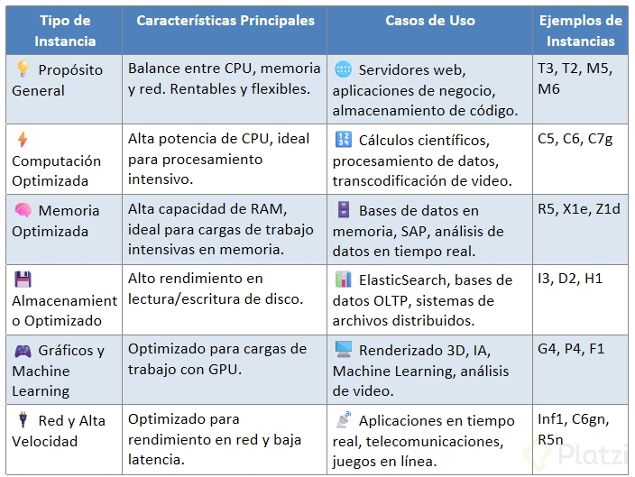

# Curso AWS Cloud Practitioner Certification

## Beneficios de la Certificación Cloud Practitioner

### ¿Qué es la nube y por qué es importante?

En el mundo tecnológico actual, donde más de 22,000 películas y series, más de 100 millones de canciones y más de 600 millones de productos se almacenan digitalmente, la nube se ha convertido en una parte esencial de nuestra vida diaria. Pero, ¿qué es exactamente la nube? La nube es una vasta red de servidores interconectados globalmente que actúan como un ecosistema, permitiendo el almacenamiento y acceso a datos de manera eficiente. Aunque parece intocable, su presencia es omnipresente en tareas cotidianas como las redes sociales, la banca en línea, los juegos móviles y los sistemas de navegación GPS.

### ¿Cuál es la plataforma de nube más adoptada?

Amazon Web Services (AWS) surge como el protagonista indiscutible en el ámbito de servicios de la nube. Con una oferta que supera los 200 servicios, incluyendo almacenamiento, bases de datos y machine learning, AWS se distingue por su adopción a nivel global. La infraestructura de AWS no solo es la más extensa, sino que está distribuida de tal manera que garantiza alta disponibilidad y excelentes mecanismos de recuperación ante desastres. Además, destaca por su modelo de pago por uso, donde los usuarios solo desembolsan dinero por los recursos que realmente consumen.

### ¿Por qué aprender AWS?

Convertirse en un experto en AWS abre múltiples puertas en el ámbito laboral, especialmente en un mundo donde La Nube es cada vez más integral para los negocios y tecnologías emergentes. Aquí hay algunos motivos clave para aprender AWS:

- **Seguridad Avanzada**: AWS garantiza un entorno seguro respaldado por múltiples certificaciones de cumplimiento.
- **Escalabilidad y Flexibilidad**: Permite desplegar aplicaciones que requieren alta disponibilidad, adaptándose a las necesidades cambiantes de las empresas.
- **Comunidad y Recursos**: AWS cuenta con una amplia documentación y una comunidad activa que facilita el aprendizaje continuo.
- **Oportunidades de Práctica**: La capa gratuita de AWS permite que los nuevos usuarios experimenten con los servicios sin costo alguno durante un tiempo limitado.

### ¿Cómo empezar a aprender AWS?

Empezar con AWS es simple gracias a la variedad de recursos de aprendizaje disponibles. Desde documentaciones completas hasta foros comunitarios, las oportunidades para aprender son vastas. Adicionalmente, los nuevos usuarios pueden beneficiarse de la capa gratuita de AWS para explorar y practicar sus habilidades sin incurrir en gastos, lo cual es una excelente manera de iniciarse en el entorno AWS.

Este curso te proporcionará un camino claro para familiarizarte con los conceptos fundamentales de la nube y los servicios de AWS más populares. A través de laboratorios prácticos y preparación para exámenes de certificación como el AWS Cloud Practitioner, estarás bien equipado no solo para aprobar los exámenes, sino para expandir tus horizontes profesionales en el mundo de la tecnología en la nube. Así que, no dudes en comenzar este viaje y transformar tu carrera con las oportunidades que AWS ofrece. ¡Nos vemos en la siguiente clase!

## ¿Qué encontrarás en este curso?

### ¿Qué es AWS y por qué es crucial en el aprendizaje de la nube?

Amazon Web Services (AWS) es un pilar fundamental para aquellos que desean adentrarse en el mundo de la computación en la nube. Es una plataforma de servicios de nube extremadamente completa y robusta, utilizada globalmente por empresas de todos los tamaños para manejar aplicaciones y almacenar datos de manera eficiente. Comprender AWS no solo te permitirá administrar mejor los servicios en la nube, sino que también te posicionará como un experto valioso en un mercado laboral que cada vez demanda más esta competencia.

AWS ofrece una gran variedad de servicios, que van desde el almacenamiento de datos hasta herramientas de análisis y machine learning. Lo que hace especial a esta plataforma es su capacidad para escalar según las necesidades del usuario, ofreciendo flexibilidad y eficiencia económica.

### ¿Cómo acceder a la consola de AWS?

#### Proceso de registro en AWS

Para comenzar a utilizar AWS, primero debes acceder a la "consola", que es la interfaz gráfica desde donde podrás administrar todos los servicios de la nube. Registrarse es un paso esencial y hemos proporcionado los enlaces necesarios en los recursos del curso para facilitar este proceso.

### Requisitos para el registro

Durante el registro, se te solicitarán algunos datos:

- **Tarjeta de crédito**: Esta información es estándar para cualquier proveedor de nube, incluida Amazon, ya que se usan para cobrar por los servicios utilizados. No debes preocuparte ya que este es un proceso común y seguro.

- **Número telefónico**: También será necesario proporcionar un número para recibir un código de verificación. Este paso es crucial para completar tu registro de manera exitosa.

### ¿Cómo preparar para el examen de certificación de Cloud Practitioner?

El curso está diseñado para preparar a los estudiantes para el examen de certificación de Cloud Practitioner con AWS. Durante el curso, tendrás la oportunidad de realizar cuestionarios en cada módulo y un examen final que simula las condiciones reales de la prueba de certificación.

### Importancia de los cuestionarios y exámenes

- Los cuestionarios te ayudarán a evaluar tu comprensión del material de manera continua.
- El examen final es una excelente manera de practicar para el examen real, ya que las preguntas serán similares a las que verás en la certificación.

### ¿Qué papel juegan los laboratorios en la formación?

#### Implementación práctica

Un componente vital del aprendizaje es la ejecución de laboratorios donde podrás acceder a la consola de AWS, implementar servicios y observar su funcionamiento de primera mano. Esta práctica te brindará una experiencia directa y mejorará significativamente tu comprensión y habilidades.

### Consideraciones sobre los costos

Es crucial tener presente que algunos laboratorios podrían incurrir en costos. Sin embargo, se proporcionarán enlaces en los recursos del curso para que aprendas cómo crear una alerta de costos. Estas alertas te notificarán si algún servicio sigue activo, lo que te permitirá gestionarlos para evitar gastos innecesarios.

- **Creación de alertas**: Esta es tu responsabilidad, y estar atento a estas notificaciones te ayudará a controlar los costos de manera efectiva.

Este curso es una oportunidad excepcional para familiarizarte con AWS, manejar servicios en la nube y prepararte para obtener una certificación que mejorará tu perfil profesional. Prepárate para sumergirte y aprovecha todos los recursos y oportunidades que te ofrecemos. ¡El aprendizaje en la nube es un activo valioso que está a tu alcance!

**Lecturas recomendadas**

[Documentación sobre cómo registrarse en la consola de AWS.](https://www.youtube.com/watch?v=lIdh92JmWtg&ab_channel=AmazonWebServices)

[Cómo crear una alerta de facturación](https://platzi.com/clases/2731-aws-fundamentos/46003-laboratorio-crea-una-alerta-de-facturacion-en-aws/)

## Introducción a la Seguridad en AWS

Imagina que eres responsable de proteger la infraestructura de una empresa tecnológica. AWS ofrece herramientas y prácticas que te permiten gestionar la seguridad de manera eficiente.
Sin embargo, para evitar errores y accesos no autorizados, es fundamental entender conceptos clave como el principio de mínimo privilegio, la gestión de usuarios root e IAM, y la habilitación de MFA.

### Principio de Mínimo Privilegio (PoLP)


El **principio de mínimo privilegio (PoLP)** establece que cada usuario o sistema debe tener solo los permisos necesarios para realizar su tarea. Esto reduce riesgos, como errores humanos o accesos indebidos.

**Ejemplo práctico:**

Un desarrollador frontend no necesita acceso a la base de datos de producción. Limitar sus permisos protege los datos y minimiza riesgos.

Cómo aplicarlo en AWS:

- Usa **IAM** (**Identity and Access Management**) para crear usuarios y roles con permisos específicos.
- Define políticas personalizadas que limiten el acceso a recursos específicos.
- Revisa y ajusta regularmente los permisos asignados.

Ahora reflexiona:

¿Realmente este usuario o sistema necesita acceso completo para realizar su tarea?

### Usuario Root vs Usuario IAM

En AWS, existen dos tipos principales de usuarios: el usuario root y los usuarios IAM. Ambos tienen roles distintos y deben usarse de manera adecuada.

### Usuario Root

El usuario root tiene acceso total a todos los servicios y recursos de la cuenta. Es extremadamente poderoso, pero su uso debe limitarse a tareas críticas.

Usos recomendados del usuario root:

- Configuración inicial de la cuenta.
- Configuración de métodos de pago.
- Recuperación de la cuenta.

### Usuarios IAM

IAM permite crear usuarios y roles con permisos específicos, asegurando que cada persona o sistema tenga acceso solo a lo que necesita.

**Usos recomendados de usuarios IAM:**

- Administradores con permisos limitados.
- Desarrolladores con acceso a servicios específicos.
- Roles temporales para tareas específicas.

Buenas prácticas:

- No uses el usuario root para tareas diarias.
- Crea un usuario IAM con permisos administrativos para la gestión diaria.
- Monitorea y ajusta los permisos de los usuarios IAM con herramientas como **IAM Access Analyzer**.

**Ahora reflexiona:**

¿Por qué es importante operar con usuarios IAM en lugar del usuario root?

### Importancia de Habilitar MFA en Cuentas Root e IAM


La **autenticación multifactor (MFA)** añade una capa adicional de seguridad al requerir un segundo factor, como un código generado por una app o un dispositivo físico, además de la contraseña.

**Por qué es importante:**

- Sin MFA, un atacante con tu contraseña tiene acceso completo.
- Con MFA, necesitará también el segundo factor, lo que dificulta el acceso no autorizado.

**Ejemplo práctico:**

Julia, administradora de una cuenta AWS, habilita MFA en su cuenta root usando una app como Google Authenticator.

Cada vez que inicia sesión, necesita su contraseña y un código temporal, reduciendo significativamente el riesgo de acceso no autorizado.

**Buenas prácticas:**

- Habilita MFA en la cuenta root inmediatamente después de crearla.
- Configura MFA para todos los usuarios IAM, especialmente aquellos con permisos administrativos.
- Usa dispositivos confiables, como apps de autenticación o tokens físicos.

**Dato importante:**

Desde mayo de 2024, AWS requiere MFA para el usuario root en cuentas de AWS Organizations.

**Ahora reflexiona:**

¿Qué método de MFA usarías y por qué?

### Buenas Prácticas Iniciales de Seguridad en AWS

Desde el primer día, es fundamental establecer una base sólida de seguridad en tu cuenta de AWS. Aquí tienes algunas prácticas esenciales:

### Establecimiento de la Seguridad de la Cuenta

- Habilita MFA para la cuenta root y todos los usuarios IAM.
- Crea usuarios IAM con permisos específicos en lugar de usar el usuario root.
- Usa contraseñas fuertes y únicas para todas las cuentas.

### Cifrado de Datos

- Activa el cifrado por defecto en tus buckets de S3.
- Usa **AWS Key Management Service (KMS)** para gestionar claves de cifrado.
- Asegúrate de que los datos en tránsito estén cifrados mediante HTTPS o TLS.

### Gestión de Vulnerabilidades

- Usa Amazon Inspector para evaluar la seguridad de tus aplicaciones y buscar vulnerabilidades.
- Integra AWS Security Hub para una visión centralizada de la seguridad de tu cuenta.

### Auditoría y Registro

- Habilita AWS CloudTrail para registrar todas las acciones realizadas en tu cuenta.
- Revisa regularmente los logs para identificar actividades sospechosas o no autorizadas.

**Ejemplo práctico:**

Una startup lanza su primera aplicación en AWS. Configuran MFA para todos los usuarios, definen políticas IAM específicas, habilitan el cifrado en S3 y monitorean actividades con CloudTrail.

Esto les permite enfocarse en el crecimiento del negocio sin comprometer la seguridad.

**Ahora reflexiona:**

¿Qué prácticas de seguridad puedes implementar hoy para proteger tu cuenta de AWS?

La seguridad en AWS es una responsabilidad compartida. AWS protege la infraestructura subyacente, pero tú eres responsable de proteger tus datos y aplicaciones.
Al aplicar el principio de mínimo privilegio, usar usuarios IAM en lugar del root, habilitar MFA y seguir buenas prácticas iniciales, puedes construir una infraestructura segura y resiliente.

Estas prácticas no solo protegen tus recursos, sino que también te preparan para gestionar entornos en la nube de manera profesional y eficiente.

## Modelo de Responsabilidad Compartida en AWS

El modelo de responsabilidad compartida es un principio fundamental en AWS que define cómo se dividen las responsabilidades de seguridad entre AWS y sus clientes.
AWS gestiona la seguridad de la infraestructura subyacente, mientras que los clientes son responsables de proteger sus datos, aplicaciones y configuraciones.
Comprender este modelo es esencial para mantener un entorno seguro en la nube.

### ¿Qué significa responsabilidad compartida en un entorno de trabajo?


AWS y sus clientes trabajan juntos para garantizar la seguridad en la nube, pero cada uno tiene roles específicos. Míralo de la siguiente manera:

- AWS: es responsable de la seguridad DE la nube.
- Cliente: es responsable de la seguridad EN la nube.

Veámoslo al detalle:

### Responsabilidad de AWS

AWS se encarga de proteger la infraestructura física y los servicios subyacentes que soportan la nube. Esto incluye:

- **Centros de datos**: Seguridad física, como vigilancia 24/7, controles de acceso biométricos y redundancia.
- **Hipervisor y virtualización**: Protección contra vulnerabilidades en la infraestructura de virtualización.
- **Hardware y red**: Mantenimiento y protección contra ataques como DDoS.

Ejemplo práctico:

AWS asegura que sus servidores estén protegidos contra accesos no autorizados y que las redes subyacentes sean seguras.

### Responsabilidad del cliente

Los clientes son responsables de cómo configuran y gestionan los servicios que utilizan en AWS. Esto incluye:

- **Gestión de accesos**: Configurar usuarios, roles y políticas en IAM.
- **Protección de datos**: Cifrar datos en reposo y en tránsito, y garantizar su integridad.
- **Configuración de redes**: Definir firewalls, políticas de acceso y reglas de seguridad en VPC.
- **Cumplimiento normativo**: Asegurarse de que el uso de AWS cumpla con regulaciones como GDPR o HIPAA (aunque recuerda que AWS también es responsable de obtener las certificaciones y acreditaciones necesarias para sus servicios).

**Ejemplo práctico:**

Un cliente configura un bucket de S3 para almacenar datos sensibles. Si no limita el acceso adecuadamente, esos datos podrían quedar expuestos, y la responsabilidad recaería en el cliente.

### Ejemplo de AWS y un Comercio Electrónico

Imagina una tienda online que utiliza AWS para alojar su plataforma.

- **Responsabilidad de AWS**: Proteger los centros de datos donde se alojan los servidores y garantizar la disponibilidad de los servicios.
- **Responsabilidad del cliente**: Configurar correctamente los permisos de acceso a los datos de los clientes, implementar cifrado y proteger las aplicaciones contra vulnerabilidades.

**Ejemplo de fallo en seguridad:**

Si el negocio configura mal las políticas IAM, permitiendo acceso amplio a datos sensibles, una brecha de seguridad sería responsabilidad del cliente, no de AWS.

Si AWS sufre una vulnerabilidad en la infraestructura subyacente del servicio IAM que permite a un atacante bypasear el sistema de autenticación independientemente de cómo el cliente haya configurado sus políticas, esa brecha sería responsabilidad de AWS, no del cliente.

**Pregunta para reflexionar:**

¿Por qué es crucial que las empresas comprendan el límite de sus responsabilidades al usar servicios en la nube?

### Herramientas de Cumplimiento en AWS


AWS ofrece herramientas que ayudan a los clientes a cumplir con normativas y estándares de seguridad, facilitando el monitoreo, auditoría y gestión de la conformidad.

### 1. AWS CloudTrail

CloudTrail registra todas las acciones realizadas en tu cuenta de AWS, proporcionando visibilidad sobre quién hizo qué y cuándo.

**Ejemplo práctico:**

Si un servidor deja de responder, puedes usar los logs de CloudTrail para identificar si alguien cambió su configuración o eliminó recursos críticos.

**Pregunta para reflexionar:**

¿Cómo podrías usar CloudTrail para verificar que no hubo cambios no autorizados en tu infraestructura?

### 2. AWS Audit Manager

Audit Manager automatiza la recopilación de datos para auditorías, ayudando a cumplir con normativas como GDPR o HIPAA.

**Ejemplo práctico:**

Si necesitas preparar una auditoría GDPR, Audit Manager recolecta automáticamente evidencia sobre la protección de datos y políticas de acceso.

Pregunta para reflexionar:

¿Cómo AWS Audit Manager puede reducir el tiempo y esfuerzo necesario para una auditoría de cumplimiento?

### 3. AWS Config

AWS Config monitorea y evalúa la configuración de tus recursos para asegurarse de que cumplen con las reglas definidas.

**Ejemplo práctico:**

Si necesitas garantizar que ningún bucket de S3 sea público, AWS Config puede alertarte si detecta un incumplimiento.

**Pregunta para reflexionar:**

¿Cómo usarías AWS Config para garantizar que todas tus bases de datos cumplen con las políticas de cifrado de datos en reposo?

El modelo de responsabilidad compartida es clave para mantener un entorno seguro en AWS. AWS protege la infraestructura subyacente, pero los clientes son responsables de cómo configuran y gestionan los servicios.
Al usar herramientas como CloudTrail, Audit Manager y AWS Config, puedes monitorear y reforzar la seguridad de tus recursos.

Comprender y aplicar este modelo no solo mejora la seguridad, sino que también asegura el cumplimiento de normativas y estándares.

## Laboratorio: Crear nuestro primer usuario en la consola de AWS

Para crear un usuario en **AWS** mediante la consola, sigue estos pasos:

### **1️⃣ Iniciar sesión en la Consola de AWS**  
🔹 Ve a [AWS Management Console](https://aws.amazon.com/console/)  
🔹 Inicia sesión con tu cuenta **raíz** (root) o con un usuario con permisos de administrador.

### **2️⃣ Ir al servicio IAM**  
🔹 En la barra de búsqueda de AWS, escribe **IAM** (Identity and Access Management).  
🔹 Haz clic en el servicio **IAM**.

### **3️⃣ Crear un nuevo usuario**  
🔹 En el menú lateral, selecciona **Usuarios**.  
🔹 Haz clic en **Agregar usuario**.  

### **Configurar el usuario**  
✔ **Nombre del usuario** → Escribe un nombre (ej. `usuario-prueba`).  
✔ **Tipo de acceso**:  
   - ☑ **Acceso mediante la consola de AWS** (si el usuario necesita acceso web).  
   - ☑ **Acceso mediante clave de acceso - CLI, SDK, API** (para programadores y automatización).  

✔ Si habilitaste acceso a la consola, selecciona:  
   - 📌 **Contraseña generada automáticamente** o **definir una contraseña**.  
   - ☑ Obligar cambio de contraseña en el primer inicio de sesión (opcional).

### **4️⃣ Asignar permisos**  
🔹 **Elegir cómo asignar permisos**:  

✔ **Adjuntar políticas directamente** → Ejemplo:  
   - **Administrador**: `AdministratorAccess`  
   - **Solo lectura**: `ReadOnlyAccess`  
   - **Acceso a S3**: `AmazonS3FullAccess`  

✔ **Agregar a un grupo de usuarios** → Si ya tienes un grupo con permisos predefinidos.  

✔ **Copiar permisos de otro usuario** → Si deseas replicar permisos existentes.

### **5️⃣ Revisar y crear el usuario**  
🔹 **Revisar la configuración** y hacer clic en **Crear usuario**.  
🔹 AWS mostrará un enlace de inicio de sesión y, si aplica, las credenciales del usuario. **Descárgalas de inmediato**, ya que no podrás verlas nuevamente.

### **6️⃣ Compartir credenciales con el usuario**  
🔹 Comparte con el usuario el **link de acceso a la consola de AWS** y su **nombre de usuario/contraseña**.  
🔹 Si tiene acceso a la consola, deberá cambiar su contraseña en el primer inicio de sesión.

### **¡Listo! 🎉**  
Has creado con éxito tu primer usuario en AWS. 🚀 Ahora puedes gestionarlo desde **IAM**, modificar permisos o desactivarlo si es necesario.  

### Resumen

### ¿Cómo navegar por la consola de AWS?

La consola de AWS es la puerta de entrada a una amplia gama de servicios que Amazon Web Services ofrece, permitiéndonos gestionar configuraciones y desarrollar soluciones basadas en la nube. A pesar de ser una herramienta intuitiva, es esencial conocer sus elementos principales para un manejo efectivo. Aquí te guiaré en cómo acceder y reconocer los componentes más importantes de la consola, creando usuarios y asignando políticas adecuadas.

### ¿Cuáles son los componentes clave en la consola de AWS?

Al ingresar, la consola de AWS nos muestra rápidamente un resumen de los servicios que estamos utilizando, destacando elementos clave como:

- **Región de trabajo**: Ubicada en la parte superior derecha, muestra la región geográfica donde tus servicios están corriendo. Varía según la ubicación para optimizar la latencia y el costo.

- **Identificación de la cuenta**: Aquí se detalla el Account ID y otros detalles importantes como la facturación y administración de costos. Es crucial tener tu identificación a mano para ciertas configuraciones.

Además, la consola incluye un sistema de navegación mediante menús desplegables que facilita el acceso a diferentes configuraciones y servicios.

### ¿Cómo crear un usuario en AWS IAM?

Para trabajar de forma segura y efectiva en AWS, es vital crear usuarios individuales para las diferentes tareas, evitando usar el usuario root y minimizando riesgos de seguridad. Aquí te enseño cómo crear un usuario:

**1. Acceder al servicio IAM**: En la barra de búsqueda, escribe "IAM" (Identity and Access Management) y selecciona el servicio.

**2. Crear un nuevo usuario:**

 - Dirígete a la sección de 'Users' en el menú izquierdo.
 - Haz clic en 'Create User'.
 - Ingresa un nombre de usuario, por ejemplo, Carlos.Sambrano.
 - Marca el checkbox para permitir acceso a la consola de administración.

**3. Establecer una contraseña**: Define una contraseña segura que cumpla con los criterios: mínimo ocho caracteres, incluyendo mayúsculas, minúsculas y caracteres especiales.

**4. Asignar permisos**: Otorga permisos al usuario mediante políticas:

 - Grupo: Asigna el usuario a un grupo con políticas predefinidas.
 - Copiar permisos: Replica permisos de otro usuario.
 - Políticas directas: Selecciona políticas específicas como 'Administrator Access' para otorgar acceso total.

5. **Finalizar la creación**: Revisa los detalles y confirma la creación del usuario.

Nombre de usuario: Carlos.Sambrano
Contraseña: [Custom]
Permisos: Administrator Access

#### ¿Cómo iniciar sesión con el nuevo usuario?

Una vez creado el usuario, es esencial conocer cómo ingresar a la consola usando estas credenciales:

- **Obtener la URL de inicio de sesión**: Tras crear el usuario, copia la URL proporcionada para iniciar sesión.
- **Modo incógnito**: Abre una ventana en modo incógnito, pega la URL y accede.
- **Introducir credenciales**: Ingresa el nombre de usuario Carlos.Sambrano y la contraseña definida.

Asegúrate siempre de identificarte correctamente verificando el username en la parte superior derecha al iniciar sesión.

### ¿Por qué es importante configurar un alias de cuenta?

Configurar un alias es esencial para simplificar el acceso y gestión de tu cuenta:

 - **Facilidad de recordación**: Un alias evita tener que memorizar el Account ID de 12 dígitos.
 - **Personalización**: Te permite personalizar el acceso, reflejando el propósito o la estructura organizacional de tu cuenta.

Para establecer un alias, navega a la sección de Account en la consola principal y define un alias apropiado.

Con este conocimiento, ya puedes gestionar usuarios en tu cuenta de AWS de manera efectiva, simplificando procesos y asegurando un ambiente de trabajo seguro y productivo. ¡Sigue explorando y perfeccionando tus habilidades con AWS!

## Regiones y Zonas de Disponibilidad

AWS organiza su infraestructura global en **Regiones** y **Zonas de Disponibilidad** para garantizar alta disponibilidad, escalabilidad y tolerancia a fallos.

### **1. ¿Qué es una Región en AWS?**  
Una **Región** en AWS es un área geográfica independiente que contiene **varias Zonas de Disponibilidad (AZs)**.  

#### **Características de una Región:**
- **Ubicación geográfica específica** (Ejemplo: `us-east-1` en Virginia, EE.UU.).
- **Cada Región es independiente** de las demás, lo que garantiza **redundancia y tolerancia a fallos**.
- **Los datos no se replican automáticamente** entre Regiones (excepto si el usuario lo configura con servicios como AWS S3 Cross-Region Replication).
- **Se debe elegir una Región** antes de desplegar recursos en AWS.

### **2. ¿Qué es una Zona de Disponibilidad (Availability Zone - AZ)?**  
Una **Zona de Disponibilidad (AZ)** es un **conjunto de uno o más centros de datos** dentro de una **Región**.  

#### **Características de una AZ:**
- **Cada Región tiene al menos 2 AZs** (puede tener más, por ejemplo, `us-east-1` tiene 6 AZs).
- **Cada AZ está físicamente separada** de las demás en la misma Región para evitar fallos simultáneos.
- **Las AZs dentro de una Región están conectadas** por redes de alta velocidad y baja latencia.
- **Permiten alta disponibilidad**, ya que si una AZ falla, los servicios pueden continuar en otra.

### **3. Diferencia entre Regiones y Zonas de Disponibilidad**
| Característica         | Región                  | Zona de Disponibilidad |
|----------------------|------------------------|----------------------|
| **Definición**       | Área geográfica global  | Centro de datos dentro de una Región |
| **Cantidad**        | Decenas en todo el mundo | Múltiples por Región (mínimo 2) |
| **Aislamiento**      | Separadas unas de otras | Conectadas entre sí dentro de la Región |
| **Ejemplo**          | `us-west-1` (California) | `us-west-1a`, `us-west-1b` |

### **4. Servicios que utilizan AZs y Regiones**
- **EC2**: Puedes desplegar instancias en distintas AZs para alta disponibilidad.
- **RDS**: Soporta replicación en múltiples AZs para recuperación ante fallos.
- **S3**: Puede replicar datos en varias Regiones para mayor resiliencia.
- **ELB (Elastic Load Balancer)**: Distribuye tráfico entre múltiples AZs.
- **Route 53**: Ofrece balanceo de carga a nivel global entre Regiones.

### **5. Regiones más usadas en AWS**
Algunas de las principales Regiones de AWS incluyen:
- **us-east-1** (Norte de Virginia, EE.UU.) → La más popular.
- **us-west-1** (California, EE.UU.).
- **eu-west-1** (Irlanda).
- **ap-southeast-1** (Singapur).
- **sa-east-1** (São Paulo, Brasil).

Puedes ver todas las Regiones disponibles en el sitio oficial de AWS:  
🔗 [Lista de Regiones de AWS](https://aws.amazon.com/about-aws/global-infrastructure/regions_az/)

### **6. ¿Cómo elegir la mejor Región para tu aplicación?**
- **Latencia baja:** Escoge una Región cercana a tus usuarios.
- **Costo:** Algunas Regiones tienen precios más bajos que otras.
- **Cumplimiento legal:** Algunas industrias requieren almacenar datos en una Región específica.
- **Disponibilidad de servicios:** No todos los servicios de AWS están en todas las Regiones.


### **Resumen**
- **Regiones:** Son áreas geográficas donde AWS opera sus servicios (Ej: `us-east-1`).
- **Zonas de Disponibilidad (AZs):** Son centros de datos dentro de una Región, interconectados con baja latencia.
- **Usar múltiples AZs mejora la disponibilidad y resiliencia** de los sistemas en AWS.

### Resumen

### ¿Qué son las regiones en AWS?

En el vasto ecosistema de Amazon Web Services (AWS), las regiones juegan un papel fundamental. Las regiones son ubicaciones geográficas que agrupan una serie de centros de datos distribuidos. AWS tiene múltiples regiones en todo el mundo, tales como Virginia, Ohio, Oregon, Sao Paulo, Milán y Singapur. La selección de una región puede depender de varios factores:

- **Costo**: Las tarifas varían según la carga impositiva del país donde se encuentra la región.
- **Variedad de servicios**: Las nuevas funcionalidades de AWS suelen estrenarse en regiones como Virginia y Oregon.
- **Ubicación geográfica y latencia**: Si se busca menor latencia, la región más cercana al usuario será generalmente la opción preferida.

Todos los laboratorios en este contexto educativo utilizarán la región de Virginia (US East 1).

### ¿Cómo identificas las zonas de disponibilidad?

Dentro de cada región, existen múltiples zonas de disponibilidad. Una zona de disponibilidad es una ubicación geográfica completamente aislada de otras zonas de disponibilidad, pero conectada a ellas mediante enlaces de fibra de alta velocidad. Las zonas se identifican por una letra siguiendo el orden del abecedario.

Por ejemplo, en la región de Virginia, podríamos tener las zonas identificadas como US East 1A y US East 1B. Es crucial comprender esto para diseñar una arquitectura resiliente a fallos.

### ¿Cómo aseguras alta disponibilidad en AWS?

La alta disponibilidad es clave para que las aplicaciones estén siempre accesibles. Para lograrla, se pueden utilizar diversas zonas de disponibilidad y un componente llamado Application Load Balancer (ALB).

- **Implementation**: El ALB recibe tráfico HTTP/HTTPS y lo distribuye entre diferentes servidores ubicados en distintas zonas de disponibilidad.
- **Proceso**: En un escenario donde se despliegan aplicaciones, si una zona falla (por ejemplo, debido a un desastre natural), el balanceador ubicará otra vía para redirigir el tráfico hacia las zonas operativas.
- **Ejemplo**: Suponga que tiene dos zonas: A y B, con servidores corriendo su aplicación. Si la zona A falla, el balanceador redirige todo el tráfico al servidor en B, asegurando que el usuario no experimente interrupciones en el servicio.

Este enfoque, además de proporcionar redundancia, asegura que las caídas de una zona no afecten a las otras, gracias a su aislamiento y las interconexiones de alta calidad entre zonas.

La comprensión de estos conceptos es fundamental para cualquier arquitecto de soluciones en la nube que busca diseñar aplicaciones fiables y siempre accesibles. Invitamos a los estudiantes a profundizar en estos temas y a continuar aprendiendo sobre la infraestructura global de AWS en sesiones futuras. ¡El aprendizaje no se detiene aquí!

**Lecturas recomendadas**

[Regiones y zonas de disponibilidad de la infraestructura global en AWS.](https://aws.amazon.com/es/about-aws/global-infrastructure/regions_az/)

## Edge Locations, Local Zones y Outposts

AWS ofrece diferentes opciones de infraestructura para optimizar **latencia, disponibilidad y cumplimiento** según la ubicación del usuario y los requisitos del servicio.

### **1. Edge Locations (Puntos de Presencia - PoPs)**  
Las **Edge Locations** son **centros de datos distribuidos globalmente** que permiten la entrega rápida de contenido y reducción de latencia.  

### **📌 Características de las Edge Locations:**
- **Usadas por AWS CloudFront (CDN)** para almacenar y distribuir contenido estático (como imágenes, videos y archivos).
- **Ubicadas en cientos de ciudades** alrededor del mundo.
- Permiten **almacenamiento en caché cercano al usuario final** para mejorar la velocidad de carga.
- **Optimiza las solicitudes de DNS** con Amazon Route 53.
- Soporta **AWS Shield y AWS WAF** para mejorar seguridad en la entrega de contenido.

### **📍 Casos de uso de Edge Locations:**
- Servir **páginas web y videos** con baja latencia.
- Acelerar cargas y descargas de archivos.
- Optimizar conexiones seguras con **AWS Global Accelerator**.

### **2. AWS Local Zones**  
Las **Local Zones** son **extensiones de Regiones de AWS** que acercan recursos de computación, almacenamiento y bases de datos a grandes ciudades, reduciendo la latencia.  

### **📌 Características de AWS Local Zones:**
- **Ubicadas en áreas metropolitanas específicas** (Ej: Los Ángeles, Nueva York, Miami).
- Ejecutan servicios como **EC2, EBS, RDS y ECS** más cerca del usuario final.
- Permiten **procesamiento en tiempo real** para aplicaciones sensibles a la latencia.
- Soportan **conectividad híbrida** con AWS Direct Connect y VPN.

### **📍 Casos de uso de AWS Local Zones:**
- **Juegos en la nube** que requieren baja latencia.
- **Edición de video y streaming** en tiempo real.
- **Aplicaciones de realidad aumentada (AR) y virtual (VR).**
- **Procesamiento de datos financieros** con restricciones de latencia.

🔗 **Lista de Local Zones disponibles:** [AWS Local Zones](https://aws.amazon.com/about-aws/global-infrastructure/localzones/)

### **3. AWS Outposts**  
AWS Outposts es una **solución híbrida** que permite ejecutar **infraestructura de AWS en centros de datos locales** de clientes.  

### **📌 Características de AWS Outposts:**
- Permite **usar los mismos servicios y APIs de AWS en hardware físico dentro del centro de datos del cliente**.
- Ideal para organizaciones con requisitos de **cumplimiento y privacidad** de datos.
- Soporta servicios como **EC2, EBS, RDS, ECS, EKS y S3**.
- Se gestiona completamente a través de la **consola de AWS**.
- Disponible en dos opciones:
  - **AWS Outposts rack:** Hardware físico provisto y gestionado por AWS.
  - **AWS Outposts servers:** Servidores individuales más pequeños para cargas de trabajo específicas.

### **📍 Casos de uso de AWS Outposts:**
- **Bancos y entidades financieras** con restricciones de almacenamiento de datos locales.
- **Fábricas y entornos industriales** donde la latencia es crítica.
- **Gobiernos y sector salud** con normativas de privacidad estrictas.
- **Centros de datos con requisitos híbridos** que necesitan extender AWS a infraestructura on-premise.

🔗 **Más información sobre AWS Outposts:** [AWS Outposts](https://aws.amazon.com/outposts/)

### **📊 Diferencias entre Edge Locations, Local Zones y AWS Outposts**
| Característica       | Edge Locations | AWS Local Zones | AWS Outposts |
|----------------------|---------------|----------------|--------------|
| **Uso principal** | Distribución rápida de contenido (CDN) | Baja latencia para cómputo y almacenamiento | AWS en infraestructura on-premise |
| **Servicios clave** | CloudFront, Route 53, Global Accelerator | EC2, EBS, RDS, ECS, EKS | EC2, RDS, EKS, ECS, S3 |
| **Ubicación** | +450 en todo el mundo | En grandes ciudades específicas | En centros de datos de clientes |
| **Latencia reducida** | Sí, pero solo para entrega de contenido | Sí, para procesamiento en tiempo real | Sí, con procesamiento en sitio |
| **Casos de uso** | Streaming, sitios web, DNS, protección DDoS | Juegos en la nube, edición de video, AR/VR | Cumplimiento normativo, bancos, salud |

### **🔍 Conclusión**
- **Edge Locations** → Para **distribuir contenido estático rápidamente** mediante AWS CloudFront.  
- **Local Zones** → Para **ejecutar cargas de trabajo con baja latencia** en ciudades específicas.  
- **AWS Outposts** → Para **extender AWS a infraestructuras locales** y cumplir con regulaciones.

### Resumen

### ¿Qué es una Local Zone en AWS?

La infraestructura global de AWS es vastamente conocida por su eficiencia y alcance mundial. Uno de los conceptos interesantes a explorar son las Local Zones, las cuales pueden visualizarse como extensiones más pequeñas y focalizadas de una región de AWS, desplegadas en distintos países.

**Características clave de una Local Zone:**

- **Extensión de la región**: Opera como una extensión, brindando servicios cercanos a los usuarios.
- **Servicios específicos**: Aunque no ofrece todo el ecosistema de servicios de una región completa, proporciona los servicios indispensables localmente.

**Razones para utilizar una Local Zone:**

1. **Reducción de latencia**: Por ejemplo, si una base de datos está en una Local Zone en Bogotá, y el usuario también se encuentra en Bogotá, la comunicación será más rápida que si tuviera que llegar hasta Virginia.

2. **Cumplimiento de regulaciones**: A veces, las leyes del país exigen que ciertas bases de datos o servidores permanezcan dentro de sus fronteras geográficas.

AWS sigue expandiendo estas Local Zones alrededor del mundo, como se puede observar en países de América Latina como Colombia, Chile y Argentina.

#### ¿Cómo funciona AWS Outpost?

AWS Outpost es un servicio interesante que permite extender la infraestructura de AWS directamente a la oficina o centro de datos del usuario. La idea principal es poder disfrutar de los beneficios de AWS alojados localmente.

**Ventajas de AWS Outpost:**

- **Infraestructura gestionada localmente**: Se puede desplegar servidores, bases de datos y almacenamiento en el propio centro de datos y administrarlos desde la consola de AWS.

- **Compra por unidades de Rack**: Los usuarios pueden adquirir diferentes configuraciones según sus necesidades.

Este servicio es ideal para aquellas organizaciones que prefieren tener control total sobre su infraestructura sin sacrificar la integración y los beneficios de AWS.

### ¿Cómo mejoran las edge locations la experiencia del usuario?

Dentro del ecosistema de AWS, las edge locations juegan un papel crucial al optimizar la velocidad de carga de contenidos para los usuarios finales. Estos "puntos de presencia" permiten almacenar contenido más cerca del usuario mediante un caché técnico, mejorando así su experiencia.

#### Ejemplo práctico con CloudFront

Consideremos el caso de Valentina, quien visita un sitio web que utiliza AWS. Originalmente, todas sus solicitudes de carga de contenido debían viajar hasta un servidor en la región us-east-1. Este proceso llevaba aproximadamente diez segundos, lo que no es ideal para la experiencia del usuario.

- **Solución con CloudFront y edge locations**: CloudFront se integra con estas edge locations para almacenar en caché las imágenes y el contenido del sitio web, de modo que estén geográficamente más cerca de Valentina. Al hacerlo, se reduce significativamente el tiempo de carga.

- **Resultado**: Con este sistema, la página web carga en menos de un segundo, mejorando la satisfacción y experiencia de uso para Valentina.

AWS ofrece múltiples servicios que, en combinación, optimizan y mejoran la infraestructura global y la experiencia del usuario, lo cual es esencial para los negocios modernos.

Para seguir explorando estas herramientas y servicios, es recomendable consultar la documentación oficial de AWS, donde encontrarás actualizaciones y las próximas expansiones de estas tecnologías. No olvides que la práctica y el estudio continuo serán tus mejores aliados al presentar exámenes como Cloud Practitioner. ¡Sigue aprendiendo!

**Lecturas recomendadas**

[Documentación oficial de AWS.](https://aws.amazon.com/about-aws/global-infrastructure/)

## Route 53 en AWS

### **📌 ¿Qué es AWS Route 53?**  
AWS **Route 53** es un servicio **DNS (Domain Name System) altamente disponible y escalable** que permite gestionar nombres de dominio en la nube. También ofrece capacidades de **enrutamiento de tráfico y monitoreo de salud** para aplicaciones en AWS y fuera de AWS.

### **🚀 Funcionalidades Principales de Route 53**
### 1️⃣ **Resolución de Nombres de Dominio (DNS)**
- **Convierte nombres de dominio en direcciones IP** para que los usuarios accedan a servicios en la web.
- Compatible con IPv4 e IPv6.
- Ofrece **zonas alojadas públicas y privadas**:
  - **Pública:** Para exponer dominios en internet.
  - **Privada:** Para resolver nombres de dominio dentro de una VPC.

### 2️⃣ **Registro de Dominios**
- Permite **comprar y administrar nombres de dominio** directamente desde la consola de AWS.
- Compatible con **extensiones populares** como `.com`, `.net`, `.org`, etc.
- Se integra automáticamente con los servicios de AWS.

### 3️⃣ **Enrutamiento Inteligente de Tráfico**
Route 53 permite **dirigir el tráfico de usuarios a diferentes ubicaciones** según reglas específicas. Los **tipos de enrutamiento** incluyen:

| Tipo de Enrutamiento  | Descripción 📖 | Ejemplo de Uso 📌 |
|----------------------|---------------|----------------|
| **Simple** | Redirige tráfico a una sola dirección IP o recurso. | Dominio → Servidor web único |
| **Basado en Latencia** | Envía a los usuarios al recurso más rápido según latencia medida. | AWS en EE.UU. o Europa según el usuario |
| **Failover (Conmutación por error)** | Usa un **servidor primario** y cambia a un secundario si el primero falla. | Disaster Recovery (DR) |
| **Ponderado** | Distribuye tráfico según pesos definidos en cada destino. | 70% al backend en EE.UU., 30% en Europa |
| **Geolocalización** | Redirige a usuarios según su ubicación geográfica. | Usuarios de Asia → Servidor en Tokio |
| **Geoproximidad** | Similar a geolocalización, pero con control sobre la preferencia del tráfico. | Ajusta reglas para que más tráfico vaya a EE.UU. |
| **Multivalor (Multi-Value Answer)** | Proporciona varias respuestas DNS y balancea entre ellas. | Balanceo entre múltiples servidores web |

### 4️⃣ **Monitoreo de Salud y Failover**
- Permite **verificar el estado de servidores y aplicaciones**.
- Si un recurso falla, Route 53 lo detecta y redirige tráfico a una alternativa.
- Se integra con **CloudWatch** para alertas y métricas.

### **📌 Beneficios Clave de Route 53**
✅ **Alta disponibilidad y escalabilidad**: Diseñado para manejar millones de solicitudes.  
✅ **Integración con AWS**: Compatible con **EC2, S3, CloudFront, ELB, Lambda**, etc.  
✅ **Baja latencia**: Red de servidores DNS distribuidos globalmente.  
✅ **Automatización**: Se puede administrar con **AWS CLI, SDKs y Terraform**.  
✅ **Seguridad**: Soporta **DNSSEC** (Domain Name System Security Extensions) para evitar ataques.

### **🛠️ Ejemplo: Crear un Registro A en Route 53**
Supongamos que tenemos un dominio **ejemplo.com** y queremos que apunte a un servidor en **AWS EC2** con IP `192.168.1.10`.

1️⃣ Ir a la consola de **Route 53**.  
2️⃣ Crear una **Zona Alojada Pública** para `ejemplo.com`.  
3️⃣ Agregar un **registro A** con:
   - **Nombre:** `ejemplo.com`
   - **Tipo:** A (Address Record)
   - **Valor:** `192.168.1.10`
   - **TTL:** 300 segundos  
4️⃣ Guardar y esperar la propagación DNS.

### **📌 Diferencias entre Route 53 y otros DNS**
| Característica     | AWS Route 53 | Google Cloud DNS | Cloudflare DNS |
|-------------------|-------------|-----------------|----------------|
| **Integración con nube** | 100% AWS | Google Cloud | Independiente |
| **Opciones de enrutamiento** | Variadas (latencia, geolocalización, failover, etc.) | Básico | Avanzado con WAF |
| **Monitoreo de salud** | ✅ Sí | ❌ No | ✅ Sí |
| **Soporte DNSSEC** | ✅ Sí | ✅ Sí | ✅ Sí |
| **Costo** | Pago por consultas | Pago por zona | Gratis en plan básico |


### **📍 Conclusión**
AWS Route 53 es una solución robusta para **gestionar dominios, distribuir tráfico globalmente y mejorar disponibilidad**. Se recomienda especialmente si tu infraestructura está en **AWS**, pero también funciona con servidores externos.

### Resumen

### ¿Qué es AWS Route 53 y por qué es importante?

AWS Route 53 es un servicio de gestión de DNS ofrecido por Amazon Web Services. Este servicio potencia la administración de dominios de manera eficiente y flexible. ¿Por qué deberías considerar su uso? Además de permitir la compra y transferencia de dominios, integra avanzadas configuraciones de enrutamiento para optimizar el tráfico web, esencial para garantizar la disponibilidad y la velocidad de tus aplicaciones en línea.

### ¿Cómo se gestiona la compra de dominios en Route 53?

Una de las funcionalidades más prácticas de Route 53 es la posibilidad de comprar dominios directamente desde su consola. Al acceder a la opción "Register Domains", puedes buscar y adquirir dominios. Por ejemplo, al buscar un dominio específico como "carlosambranobarrera.com", el sistema te indica si está disponible y a qué precio (en este caso, $14 al año). No solo se limita a dominios ".com", sino que también ofrece otras extensiones populares como .net, .org, .io, entre otros.

### ¿Puedo transferir dominios de otros proveedores a Route 53?

Por supuesto. Si ya tienes un dominio adquirido en plataformas como GoDaddy o Namecheap, puedes transferirlo a AWS Route 53. Este proceso centraliza la gestión DNS de tus dominios en un solo lugar, facilitando la administración.

### Configuración avanzada de enrutamiento en Route 53

AWS Route 53 no es solo una herramienta de compra y transferencia de dominios, sino que también permite complejas configuraciones de enrutamiento. Con estas opciones, puedes definir cómo el tráfico es dirigido hacia tus aplicaciones, dependiendo de tus necesidades específicas.

### ¿Qué tipos de enrutamiento ofrece Route 53?

1. **Enrutamiento simple**: Ideal para dominios con un único servidor de destino.

2. **Enrutamiento por peso (Weight)**: Permite distribuir el tráfico entre múltiples servidores. Por ejemplo, puedes dirigir el 30% del tráfico a un servidor y el 70% restante a otro.

3. **Enrutamiento basado en latencia**: Asigna el tráfico al servidor más cercano y eficiente en términos de tiempo de respuesta.

4. **Enrutamiento de failover**: Se garantiza la continuidad del servicio. Si un servidor falla, el tráfico se redirige automáticamente a otro servidor disponible.

5. **Distribución multivalor**: Funciona como un "round-robin", distribuyendo el tráfico de manera aleatoria.

6. **Enrutamiento geográfico**: Direcciona el tráfico basado en la ubicación geográfica del usuario para optimizar el rendimiento y cumplir con requisitos regionales específicos.

### Funcionalidades adicionales de Route 53

Además del enrutamiento y gestión de dominios, Route 53 ofrece otros servicios útiles para mantener la salud y la estabilidad de tus aplicaciones web.

#### ¿Qué es un health check y cómo beneficia a mi dominio?

Los health checks en Route 53 permiten verificar automáticamente el estado de tus servidores y aplicaciones. Si un servicio no responde según lo esperado, Route 53 puede cambiar las rutas del tráfico para evitar interrupciones en tu aplicación.

### ¿Cómo configuro políticas de tráfico personalizadas?

Puedes establecer reglas detalladas y personalizadas para gestionar el tráfico según diversas condiciones o requisitos empresariales específicos. Esto proporciona una forma más precisa de controlar el flujo de datos, adaptándose a circunstancias cambiantes como la carga de la red o la ubicación del usuario.

En definitiva, AWS Route 53 es una herramienta robusta y versátil que no solo facilita la gestión DNS, sino que también optimiza el rendimiento y la resiliencia de tus aplicaciones online. Con su amplia gama de funcionalidades, puedes adaptar exactamente cómo se maneja tu tráfico web para satisfacer las necesidades únicas de tu negocio. Te animamos a explorar estas funcionalidades y a seguir aprendiendo sobre las diversas tecnologías en AWS.

## Componentes de una VPC

Una **VPC (Virtual Private Cloud)** en AWS es una red virtual privada dentro de la nube de AWS que permite definir y controlar recursos de red, como subredes, direcciones IP, gateways, y seguridad. 

### **📌 Principales Componentes de una VPC**  

1️⃣ **CIDR Block (Bloque de Direcciones IP)**  
   - Define el rango de direcciones IP privadas dentro de la VPC (ejemplo: `10.0.0.0/16`).  

2️⃣ **Subnets (Subredes)**  
   - Dividen la VPC en segmentos lógicos dentro de diferentes Zonas de Disponibilidad.  
   - Pueden ser **Públicas** (con acceso a Internet) o **Privadas** (sin acceso directo a Internet).  

3️⃣ **Route Tables (Tablas de Rutas)**  
   - Controlan cómo se enruta el tráfico dentro de la VPC y hacia Internet u otras redes.  
   - Cada subred debe estar asociada a una tabla de rutas.  

4️⃣ **Internet Gateway (IGW)**  
   - Permite a las instancias en subredes públicas comunicarse con Internet.  
   - Debe estar adjunto a la VPC y configurado en la tabla de rutas.  

5️⃣ **NAT Gateway / NAT Instance**  
   - Permite que las instancias en subredes privadas inicien conexiones a Internet sin exponerlas directamente.  

6️⃣ **Security Groups (Grupos de Seguridad)**  
   - Firewalls virtuales que controlan el tráfico entrante y saliente de instancias EC2.  
   - Se basan en reglas de puerto, protocolo y origen/destino.  

7️⃣ **Network ACLs (Listas de Control de Acceso de Red)**  
   - Reglas de seguridad a nivel de subred para permitir o denegar tráfico.  
   - Actúan como firewalls adicionales, más flexibles que los Security Groups.  

8️⃣ **Elastic IP (EIP)**  
   - Dirección IP pública fija que se puede asignar a instancias EC2 o NAT Gateways.  

9️⃣ **VPC Peering**  
   - Conexión privada entre dos VPCs para compartir recursos sin pasar por Internet.  

🔟 **AWS Transit Gateway**  
   - Facilita la interconexión de múltiples VPCs y redes on-premises a gran escala.  

1️⃣1️⃣ **Endpoints de VPC**  
   - Permiten que servicios de AWS (como S3 o DynamoDB) sean accesibles dentro de la VPC sin necesidad de una conexión a Internet.  
   - Tipos: **Gateway Endpoint** y **Interface Endpoint**.  

1️⃣2️⃣ **VPN Gateway (VGW) / Direct Connect**  
   - **VPN Gateway**: Conecta la VPC con redes on-premises a través de VPN.  
   - **AWS Direct Connect**: Conexión dedicada entre AWS y un centro de datos on-premises para menor latencia.

### **🔍 Ejemplo de Configuración Típica de una VPC**

✔ **VPC CIDR:** `10.0.0.0/16`  
✔ **Subred Pública:** `10.0.1.0/24` (con Internet Gateway y NAT Gateway)  
✔ **Subred Privada:** `10.0.2.0/24` (sin acceso directo a Internet)  
✔ **Security Group:** Permite SSH (`22`), HTTP (`80`), HTTPS (`443`).  
✔ **Route Table:**  
   - Subred pública → `0.0.0.0/0` → **Internet Gateway**  
   - Subred privada → `0.0.0.0/0` → **NAT Gateway**  

### **🎯 Conclusión**

Una VPC en AWS es la base de cualquier arquitectura en la nube, proporcionando control sobre redes, seguridad y conectividad. ¡Configurarla correctamente es clave para optimizar rendimiento y seguridad! 🚀

### Resumen

### ¿Qué es una VPC y por qué es importante?

Una VPC, o Virtual Private Cloud, es un elemento esencial al usar AWS, funcionando como tu centro de datos personal en la nube. Aquí puedes configurar la arquitectura de red a tu gusto, pero con gran libertad viene gran responsabilidad, sobre todo porque cualquier error recae en ti, no en AWS. Es importante entender la diferencia en la responsabilidad compartida: AWS se encarga de la infraestructura, pero la configuración de la red es responsabilidad del usuario.

### ¿Cómo se estructura internamente una VPC?

Dentro de una VPC, la estructura se divide en subredes, que pueden ser públicas o privadas.

- **Subredes públicas**: Permiten el acceso directo a Internet y desde Internet, adecuadas para servicios que necesitan ser accesibles externamente.
- **Subredes privadas**: No tienen acceso directo a Internet. Se usan para alojar servicios críticos que necesitan protección, y su acceso se maneja mediante servidores intermedios como NAT Gateway.

### ¿Cómo elige la mejor estrategia para distribuir sus componentes?

El diseño de la VPC debe considerar las aplicaciones que se van a desplegar. Segmentar la red en subredes públicas y privadas optimiza la seguridad y rendimiento de las aplicaciones.

#### ¿Qué componentes clave forman una VPC?

Estos son los principales componentes que necesitas dominar al trabajar con VPCs:

### ¿Qué es un Internet Gateway?

Un Internet Gateway es vital en una VPC. Facilita la conectividad con Internet de todos los elementos dentro de la VPC. Se asocia de manera exclusiva a una VPC y es completamente administrado por Amazon, lo que asegura su escalabilidad y rendimiento.

```shell
// Ejemplo de asociación de un Internet Gateway a una VPC
aws ec2 create-internet-gateway 
aws ec2 attach-internet-gateway --vpc-id vpc-XXXXX --internet-gateway-id igw-XXXXX
```

### ¿Cómo funciona una tabla de enrutamiento?

Las tablas de enrutamiento en AWS actúan como un GPS para el tráfico de red. Siguiendo reglas preestablecidas, guían el tráfico desde un origen hasta su destino deseado dentro o fuera de la VPC, asegurando la conectividad prevista.

### ¿Para qué sirve un NAT Gateway?

El NAT Gateway es crucial para permitir que las subredes privadas accedan a Internet para descargar actualizaciones sin necesitar una conexión directa. Aunque es útil, es necesario manejar su uso con precaución para evitar sorpresas en los costos.

```shell
// Creación de un NAT Gateway y su asociación
aws ec2 create-nat-gateway --subnet-id subnet-XXXXX --allocation-id eipalloc-XXXXX
aws ec2 create-route-table --vpc-id vpc-XXXXX
aws ec2 create-route --route-table-id rtb-XXXXX --destination-cidr-block 0.0.0.0/0 --gateway-id nat-XXXXX
```

#### Estrategias y consejos de implementación segura

Para garantizar seguridad y eficiencia, considera los siguientes consejos:

- **Servidores críticos en subredes privadas**: Nunca exponer directamente aplicaciones críticas en subredes públicas. Protegerlas en subredes privadas es esencial para reducir riesgos de ataques.
- **Uso controlado de NAT Gateway**: Evita dejar NAT Gateways innecesariamente encendidos para evitar costos indebidos.
- **Gestión de tablas de enrutamiento**: Asegúrate de configurar rutas adecuadas para permitir el tráfico necesario sin exponer innecesariamente los activos.

La configuración y gestión correcta de estos componentes te permitirá construir una estructura de red segura y efectiva dentro de AWS. Con la práctica y el estudio continuo, podrás enfrentar y superar los desafíos que presenta el entorno de la nube. Sigue aprendiendo y perfeccionando tus habilidades en AWS para maximizar el potencial de tus soluciones.

## Seguridad en una VPC

La seguridad en una **VPC (Virtual Private Cloud)** es fundamental para proteger los recursos y datos dentro de una infraestructura en la nube. Aquí tienes los principales aspectos de seguridad a considerar:

### 🔒 **1. Control de Acceso a la Red**
#### 🔹 **Grupos de Seguridad (Security Groups)**
- Actúan como **firewalls virtuales** para instancias EC2.
- Se configuran **reglas de entrada y salida** para controlar el tráfico.
- Solo permiten el tráfico explícitamente autorizado.

#### 🔹 **Listas de Control de Acceso a la Red (Network ACLs)**
- Son reglas a nivel de subred para controlar el tráfico entrante y saliente.
- Proporcionan un **nivel adicional de seguridad** además de los grupos de seguridad.
- Permiten reglas de "Deny" (los grupos de seguridad solo permiten tráfico explícito).

#### 🔹 **Peering de VPC**
- Conexión entre dos VPCs para comunicación privada.
- Evita exponer servicios a Internet innecesariamente.

#### 🔹 **VPN y Direct Connect**
- VPN: conexión cifrada entre la VPC y un entorno on-premise.
- Direct Connect: enlace físico privado para mejorar seguridad y latencia.

### 🔐 **2. Seguridad de las Instancias y Aplicaciones**
#### 🔹 **Autenticación y Control de Acceso**
- **MFA (Multi-Factor Authentication)** para accesos críticos.
- **IAM Roles** en lugar de claves de acceso en instancias.
- **Principio de mínimo privilegio** en permisos.

#### 🔹 **Protección de Datos**
- Cifrado en **EBS (Elastic Block Store)** y **S3** con claves de AWS KMS.
- **TLS/SSL** para cifrar datos en tránsito.
- **Backups y snapshots** para recuperación ante incidentes.

#### 🔹 **Monitoreo y Registro**
- **AWS CloudTrail**: registra todas las acciones en la VPC.
- **AWS Config**: monitorea cambios en la configuración de la infraestructura.
- **Amazon GuardDuty**: detección de amenazas en la red.
- **VPC Flow Logs**: analiza el tráfico y detecta accesos sospechosos.

### 🛡️ **3. Protección contra Amenazas**
#### 🔹 **DDoS Protection**
- AWS Shield: protección básica o avanzada contra ataques DDoS.
- AWS WAF: firewall para bloquear tráfico malicioso en aplicaciones web.

#### 🔹 **Instancias Bastion**
- Servidor intermedio para acceder a instancias en subredes privadas.
- Evita exposición innecesaria de SSH o RDP.

#### 🔹 **Subredes Públicas y Privadas**
- **Subred pública**: solo para recursos que necesitan acceso externo.
- **Subred privada**: para bases de datos y servidores internos, sin acceso directo desde Internet.

### 🚀 **Buenas Prácticas Generales**
✔️ **Usar IAM Roles en lugar de credenciales embebidas**  
✔️ **Restringir puertos abiertos (ej. SSH, RDP solo desde direcciones confiables)**  
✔️ **Configurar alertas en AWS CloudWatch para detectar comportamientos anómalos**  
✔️ **Auditar accesos y permisos regularmente**  
✔️ **Habilitar cifrado en volúmenes EBS y snapshots**

### Resumen

### ¿Qué es un Security Group en una VPC?

Las VPC o Virtual Private Clouds son componentes esenciales en AWS que requieren seguridad robusta. Los Security Groups representan la primera capa de protección en este escenario. Funcionan como un firewall, protegiendo los recursos dentro de una VPC al controlar el tráfico que es permitido.

La función principal de un Security Group es definir reglas específicas que permitan el tráfico de entrada y salida hacia los recursos en la nube. En términos simples, si tienes una base de datos alojada en un servidor, y necesitas que se conecte por el puerto 3306, deberás configurar una regla en tu Security Group para permitir esta conexión. Esto ilustra cómo los Security Groups actúan como puerta de acceso a los servidores.

### ¿Cómo configuramos el tráfico en un Security Group?

- **Reglas permitidas**: Los Security Groups solo operan bajo reglas que permiten el tráfico.
- **Puertos específicos**: Por ejemplo, para permitir conexiones SSH, HTTP o HTTPS, se abrirían los puertos 22, 80 y 443, respectivamente.

Considera los Security Groups como la primera instancia de resolución cuando un servidor no responde a conexiones específicas; revisa las configuraciones de tráfico allí primero.

### ¿Qué es una Network ACL en una VPC?

Las listas de control de acceso de redes, conocidas como Network ACLs, ofrecen una capa de seguridad adicional en una VPC. Protegen toda la subred en lugar de un único recurso. Estas operan de manera más extensa y permiten definir tanto qué tráfico bloquear como permitir.

### Características principales de una Network ACL

- **Bloquear y permitir**: A diferencia de los Security Groups, puedes establecer reglas para bloquear o permitir tráficos entrantes y salientes.
- **Cobertura amplia**: Protegen a todos los componentes dentro de una subred, no solo a un servidor individual.

Por ejemplo, si tienes dos servidores en una subred privada, la Network ACL podría proteger ambas máquinas a nivel de subred. Incluso si un atacante supera la Network ACL, cada servidor tendría su propio Security Group para defenderse.

### Analogía práctica de Security Groups y Network ACLs

Para entender mejor cómo funcionan estos componentes de seguridad, pensemos en un conjunto residencial:

- **Security Group**: Sería la puerta de tu casa, y la llave sería la regla permitida. ¿A quién le entregas la llave para que pueda ingresar? Esta es la entrada específica que permites, como abrir el puerto 22 para SSH.

- **Network ACL**: Imagina el perímetro del conjunto residencial y el personal de seguridad. Protegen todas las casas del conjunto, ofreciendo una barrera adicional que un intruso debe superar antes de llegar a las puertas individuales.

En un caso donde un intruso intenta entrar, primero tendría que evitar la seguridad del perímetro (Network ACL) y luego vulnerar la entrada de cada casa (Security Group) para tener acceso completo.

Con este conocimiento sobre Security Groups y Network ACLs, estás listo para avanzar y practicar la configuración de estas medidas de seguridad esenciales paso a paso. La seguridad en la nube es clave, y entender cómo configurarla es crucial para proteger tus recursos en AWS. ¡Continúa aprendiendo y experimentando!

## Laboratorio: Crear una VPC en AWS (Subredes y Zonas de Disponibilidad)

En este tutorial, configuraremos una **VPC en AWS** con sus respectivas **subredes y zonas de disponibilidad** utilizando la **Consola de AWS** y la **CLI de AWS**. 

### **🔹 1. Crear una VPC desde la Consola de AWS**
### 📌 **Pasos:**
1️⃣ **Inicia sesión en la consola de AWS** y ve a **VPC**.  
2️⃣ En el panel izquierdo, selecciona **VPCs** → Clic en **Crear VPC**.  
3️⃣ **Configura la VPC:**
   - Nombre: `MiVPC`
   - Rango de IPv4 CIDR: `10.0.0.0/16`
   - Habilitar IPv6 (opcional)
   - **Tenancy:** predeterminado
4️⃣ **Clic en "Crear VPC"**.

✅ **¡VPC creada!**

### **🔹 2. Crear Subredes en Diferentes Zonas de Disponibilidad**
### 📌 **Pasos:**
1️⃣ En el panel izquierdo, selecciona **Subredes** → Clic en **Crear subred**.  
2️⃣ **Selecciona la VPC** (`MiVPC`).  
3️⃣ **Configura las subredes:**
   - 🔹 **Subred Pública:**  
     - Nombre: `Subred-Publica`
     - Zona de Disponibilidad: `us-east-1a`
     - Rango CIDR: `10.0.1.0/24`
   - 🔹 **Subred Privada:**  
     - Nombre: `Subred-Privada`
     - Zona de Disponibilidad: `us-east-1b`
     - Rango CIDR: `10.0.2.0/24`
4️⃣ Clic en **Crear subred**.

✅ **¡Subredes creadas en distintas zonas!** 🎉

## **🔹 3. Crear una Internet Gateway y Asociarla a la VPC**
### 📌 **Pasos:**
1️⃣ **Ir a "Internet Gateways"** → Clic en **Crear Internet Gateway**.  
2️⃣ Asigna un nombre, por ejemplo: `MiIGW`, y **créala**.  
3️⃣ **Asociar la IGW a la VPC:**  
   - Ve a **VPCs** → Selecciona `MiVPC` → Clic en **Acciones** → **Adjuntar IGW**.  
   - Selecciona `MiIGW` y confirma.

✅ **¡La VPC ahora tiene conexión a Internet!** 

### **🔹 4. Crear una Tabla de Rutas y Asociarla a la Subred Pública**
### 📌 **Pasos:**
1️⃣ **Ir a "Tablas de Rutas"** → Clic en **Crear tabla de rutas**.  
2️⃣ Asigna un nombre, por ejemplo: `Rutas-Publicas`, y **selecciona la VPC**.  
3️⃣ **Editar las rutas**:
   - Destino: `0.0.0.0/0`
   - Target (objetivo): `MiIGW`
4️⃣ **Asociar la tabla de rutas a la subred pública**:
   - En **Asociaciones de subred**, elige `Subred-Publica`.
   - Guarda los cambios.

✅ **¡La subred pública ahora tiene acceso a Internet!** 🚀

### **🔹 5. Crear un Grupo de Seguridad**
### 📌 **Pasos:**
1️⃣ **Ir a "Grupos de Seguridad"** → Clic en **Crear grupo de seguridad**.  
2️⃣ **Nombre**: `SG-Web`  
3️⃣ **Reglas de entrada**:
   - **HTTP (80)** → `0.0.0.0/0`
   - **HTTPS (443)** → `0.0.0.0/0`
   - **SSH (22)** → Solo tu IP (`xx.xx.xx.xx/32`)
4️⃣ **Asigna el grupo de seguridad a las instancias**.

✅ **¡Seguridad configurada!** 🔐

### **🔹 6. Crear una VPC con AWS CLI**
Si prefieres usar la **AWS CLI**, aquí tienes los comandos:

```sh
aws ec2 create-vpc --cidr-block 10.0.0.0/16
aws ec2 create-subnet --vpc-id vpc-xxxxxxxx --cidr-block 10.0.1.0/24 --availability-zone us-east-1a
aws ec2 create-internet-gateway
aws ec2 attach-internet-gateway --internet-gateway-id igw-xxxxxxxx --vpc-id vpc-xxxxxxxx
aws ec2 create-route-table --vpc-id vpc-xxxxxxxx
aws ec2 create-route --route-table-id rtb-xxxxxxxx --destination-cidr-block 0.0.0.0/0 --gateway-id igw-xxxxxxxx
```

✅ **¡VPC creada desde la CLI!** 🎯  


### **🎯 Conclusión**
Con estos pasos, tienes una **VPC en AWS** con **subred pública y privada**, conectividad a Internet y seguridad configurada. ¡Listo para lanzar instancias EC2! 🚀🔥

### Resumen

### ¿Cómo crear una VPC desde cero en AWS? 

El fascinante mundo de las Redes y Computación en la Nube puede parecer imponente al principio, pero con la guía adecuada, se convierte en una habilidad realmente enriquecedora. Hoy vamos a profundizar en el proceso para crear una VPC (Virtual Private Cloud) en AWS desde cero. Este recorrido detallado le dará las bases sólidas para entender cada componente esencial y su propósito dentro de la infraestructura. ¡Así que prepara tu consola y comencemos!

### ¿Cómo se inicia el proceso en la consola de AWS?

Para iniciar, es necesario acceder a la consola de AWS. Aprovecha la barra de búsqueda en la parte superior izquierda y escribe "VPC". Esto te llevará a una lista desplegable donde deberás seleccionar VPC. Una vez dentro, observarás varias opciones relacionadas con VPCs y los recursos por región.

En la parte superior derecha, busca el botón amarillo "Create VPC". Al hacer clic allí, se abrirá un menú que te permitirá crear tu VPC de dos maneras: una automática, y otra personalizada. Para un aprendizaje más profundo, optaremos por el método manual, configurando la VPC desde cero para comprender plenamente cada paso.

### ¿Cuál es el siguiente paso al crear una VPC?

Una vez en la sección "VPC Settings", seleccionarás la opción "VPC Only". Aquí, lo primero que debes proporcionar es el nombre de tu VPC, por ejemplo, "mi primer VPC".

- **Versión IP**: Optaremos por IP versión 4, asignando una dirección clase A, como 10.0.0.0 con una máscara /16.
- **Tenancy**: Mantenemos el Tenancy por defecto, ya que no es necesario un hardware dedicado para nuestra VPC.
- E**tiquetas (Tags)**: Se recomiendan como buena práctica las etiquetas para identificar el proyecto y el dueño, como por ejemplo "proyecto: Aplicación X" y "owner: Carlos.Zambrano".

Una vez configurados estos elementos, haz clic en "Create VPC" para finalizar.

### ¿Cómo se añaden subredes a la VPC creada?

Después de crear una VPC, el siguiente paso es añadir subredes. En el menú de la izquierda, selecciona "Subnets" y procede a crear tus subredes. Aquí, asegúrate de:

1. Seleccionar la VPC previamente creada.
2. Asignar un nombre a la subred, como "privada1".
3. Elegir la zona de disponibilidad, como "1A".
4. Configurar la dirección IP; para "privada1", usaríamos 10.0.1.0/24.

Cada subred deberá ser creada una por una. El proceso es repetido para cada subred, como "privada2", "publica1", y "publica2", variando su nombre, zonas de disponibilidad y direcciones IP dentro del esquema.

### ¿Qué representa la distribución de subredes en la arquitectura?

La distribución de subredes entre distintas zonas de disponibilidad asegura una arquitectura altamente disponible. Tener subredes divididas así permite que, si una zona (como la A) falla, las otras (como B) sigan funcionando perfectamente, proporcionando una redundancia crítica.

```bash
Zona 1A: Privada1, Pública1
Zona 1B: Privada2, Pública2
```

Este diseño garantiza resiliencia y continuidad del servicio, vital en aplicaciones críticas y entornos corporativos.

### ¿Cómo visualizar y diagramar la VPC y sus componentes?

Para entender mejor la relación visual de la VPC con sus subredes y zonas de disponibilidad, es útil diagramar la arquitectura. Herramientas como Lucidchart pueden ser empleadas para este fin, ayudando a visualizar cómo las subredes (representadas en azul y verde) se distribuyen y organizan.

El ejercicio de diagrama no solo refuerza la comprensión visual, sino que también prepara para gestionar entornos más complejos.

### ¿Cuáles son las claves para dominar la creación de VPCs?

La práctica continua es el mejor consejo para dominar el arte de la creación de VPCs en AWS. Comprender de manera práctica cómo se interrelacionan los componentes y cómo mejorar la disponibilidad y seguridad te colocará un paso adelante. Recuerda que cada error y corrección es un aprendizaje valioso en este viaje.

Sigue explorando, cuestionando y aprendiendo con cada clase. La nube ofrece un vasto universo de posibilidades, y cada capa que descubres te acerca más a ser un experto confiado en esta asombrosa tecnología.

**Lecturas recomendadas**

[Direcciones IP y sus clases](https://es.wikipedia.org/wiki/Direcci%C3%B3n_IP#:~:text=Una%20IP%20puede%20ser%20privada,manera%20fija%20y%20no%20din%C3%A1mica)

[Calculadora IP](https://aprendaredes.com/cgi-bin/ipcalc/ipcalc_cgi1)

## Laboratorio: Crear una VPC en AWS (Creación de Subredes, Internet Gateway y NAT Gateway)

En este tutorial, aprenderás a configurar una **VPC en AWS** con:  
✅ **Subred Pública y Privada**  
✅ **Internet Gateway (IGW) para acceso público**  
✅ **NAT Gateway para que la subred privada acceda a Internet sin ser accesible externamente**

### **🔹 1. Crear una VPC en AWS**
📌 **Desde la Consola de AWS:**
1️⃣ Ve a **VPC** → Clic en **Crear VPC**.  
2️⃣ Configura la VPC:
   - **Nombre:** `MiVPC`
   - **Rango de IPv4 CIDR:** `10.0.0.0/16`
   - **Tenancy:** Predeterminado  
3️⃣ Clic en **Crear VPC**.

✅ **¡VPC creada!**

📌 **Desde AWS CLI:**
```sh
aws ec2 create-vpc --cidr-block 10.0.0.0/16
```

### **🔹 2. Crear Subredes Pública y Privada**
📌 **Desde la Consola de AWS:**
1️⃣ Ve a **Subredes** → Clic en **Crear subred**.  
2️⃣ **Configura dos subredes dentro de la VPC (`MiVPC`)**:
   - **Subred Pública**  
     - Nombre: `Subred-Publica`
     - Zona de Disponibilidad: `us-east-1a`
     - CIDR: `10.0.1.0/24`
   - **Subred Privada**  
     - Nombre: `Subred-Privada`
     - Zona de Disponibilidad: `us-east-1b`
     - CIDR: `10.0.2.0/24`
3️⃣ Clic en **Crear subred**.

📌 **Desde AWS CLI:**
```sh
aws ec2 create-subnet --vpc-id vpc-xxxxxxxx --cidr-block 10.0.1.0/24 --availability-zone us-east-1a
aws ec2 create-subnet --vpc-id vpc-xxxxxxxx --cidr-block 10.0.2.0/24 --availability-zone us-east-1b
```

✅ **¡Subredes creadas!** 🎉

### **🔹 3. Configurar Internet Gateway (IGW)**
📌 **Desde la Consola de AWS:**
1️⃣ Ve a **Internet Gateways** → Clic en **Crear Internet Gateway**.  
2️⃣ **Nombre:** `MiIGW` → Clic en **Crear**.  
3️⃣ **Asociar el IGW a la VPC**:
   - Ve a **VPCs** → Selecciona `MiVPC` → Clic en **Adjuntar IGW**.
   - Selecciona `MiIGW` y confirma.

📌 **Desde AWS CLI:**
```sh
aws ec2 create-internet-gateway
aws ec2 attach-internet-gateway --internet-gateway-id igw-xxxxxxxx --vpc-id vpc-xxxxxxxx
```

✅ **¡Internet Gateway conectado!** 🌐

### **🔹 4. Configurar NAT Gateway para la Subred Privada**
📌 **Desde la Consola de AWS:**
1️⃣ Ve a **NAT Gateways** → Clic en **Crear NAT Gateway**.  
2️⃣ Configura:
   - **Subred:** `Subred-Publica`
   - **Asignar Elastic IP** (Clic en **Crear nueva Elastic IP**).
3️⃣ Clic en **Crear NAT Gateway**.

📌 **Desde AWS CLI:**
```sh
aws ec2 allocate-address
aws ec2 create-nat-gateway --subnet-id subnet-xxxxxxxx --allocation-id eipalloc-xxxxxxxx
```

✅ **¡NAT Gateway creado!** 🚀

### **🔹 5. Configurar Tablas de Rutas**
📌 **Para la Subred Pública:**
1️⃣ Ve a **Tablas de Rutas** → Clic en **Crear tabla de rutas**.  
2️⃣ **Nombre:** `RT-Publica`  
3️⃣ **Asociar a `MiVPC`** y guardar.  
4️⃣ Agregar una regla de ruta:
   - **Destino:** `0.0.0.0/0`
   - **Target:** `Internet Gateway (MiIGW)`
5️⃣ **Asociar la tabla a `Subred-Publica`**.

📌 **Para la Subred Privada:**
1️⃣ Crear otra tabla de rutas: **`RT-Privada`**.  
2️⃣ Agregar una ruta:
   - **Destino:** `0.0.0.0/0`
   - **Target:** `NAT Gateway`
3️⃣ **Asociar la tabla a `Subred-Privada`**.

📌 **Desde AWS CLI:**
```sh
aws ec2 create-route-table --vpc-id vpc-xxxxxxxx
aws ec2 create-route --route-table-id rtb-xxxxxxxx --destination-cidr-block 0.0.0.0/0 --gateway-id igw-xxxxxxxx
aws ec2 associate-route-table --route-table-id rtb-xxxxxxxx --subnet-id subnet-xxxxxxxx
```

✅ **¡Tablas de Rutas configuradas!** 🛣️

### **🎯 Conclusión**
🔹 **Hemos configurado una VPC con:**  
✅ **Subred pública** (acceso a Internet)  
✅ **Subred privada** (acceso restringido)  
✅ **Internet Gateway** (para la subred pública)  
✅ **NAT Gateway** (permite a la subred privada acceder a Internet sin ser accesible externamente)  

🎯 **¡Ahora puedes lanzar instancias en tu VPC!** 🚀🔥

.jpg)

### Resumen

### ¿Cómo se crea un Internet Gateway en una VPC en AWS?

Un Internet Gateway es esencial para que tu VPC pueda comunicarse con internet. Para crear y asociar un Internet Gateway sigue estos pasos:

1. **Acceder al menú de Internet Gateway**: En el menú izquierdo de tu consola de AWS, selecciona Internet Gateway.

2. **Crear un Internet Gateway**: Haz clic en Create Internet Gateway en la esquina superior derecha, asígnale un nombre, por ejemplo, "Mi primer IGW", y presiona Create.

3. ** Asociar el Internet Gateway con la VPC**: Una vez creado, aparecerá como Detached. Ve a Actions, selecciona Attach to VPC y elige la VPC a la que deseas asociarlo; finalmente, haz clic en Attach Internet Gateway.

Ahora, tu VPC podrá tener salida a internet a través del Internet Gateway.

### ¿Cómo se configuran las tablas de enrutamiento en la VPC?

Las tablas de enrutamiento determinan el camino que seguirán los paquetes de datos dentro de una VPC. Para configurarlas:

1. **Crear tablas de enrutamiento**:

 - Ve a `Route Tables`.
- Crea una tabla para subredes privadas con nombre "RT privadas" y otra para subredes públicas, llamada "RT públicas".

2. **Asociar subredes a las tablas de enrutamiento**:

- Selecciona la tabla correspondiente (pública o privada).
- Ve a `Subnet Associations`, edita y asocia las subredes públicas y privadas según corresponda.

3. **Configurar rutas**:

- Para las subredes públicas, edita las rutas y agrega un destino `0.0.0.0/0` con target en el Internet Gateway.
- Para las subredes privadas, después de crear el NAT Gateway, configura la ruta para salir a internet través de él.

### ¿Cómo configurar un NAT Gateway para las subredes privadas?

El NAT Gateway permite que las instancias en subredes privadas tengan acceso a internet:

1. **Creación del NAT Gateway**:

- Ve a `NAT Gateways` en el menú izquierdo y presiona `Create NAT Gateway`.
- Asígnale un nombre, por ejemplo, "Mi primer NAT".
- Selecciona una subred pública y asigna una IP elástica para salida a internet.

2. **Asociación con tablas de enrutamiento privadas**:

- Ve a las `Route Tables` y selecciona "RT privadas".
- En Routes, edita las rutas y agrega un destino `0.0.0.0/0`. Selecciona `NAT Gateway` como target y elige el NAT Gateway que creaste.

Ahora, tus subredes privadas dispondrán de acceso a internet sin exponerlas directamente al tráfico extern. Este diseño permite mantener la seguridad de tus recursos internos.

Sigue practicando estos conceptos en AWS para fortalecer tu comprensión y habilidad al implementar infraestructuras virtuales. ¡Mantén la curiosidad y sigue aprendiendo!

**Lecturas recomendadas**

[Calculadora IP](https://aprendaredes.com/cgi-bin/ipcalc/ipcalc_cgi1)

[Direcciones IP y sus clases](https://es.wikipedia.org/wiki/Direcci%C3%B3n_IP#:~:text=Una%20IP%20puede%20ser%20privada,manera%20fija%20y%20no%20din%C3%A1mica)

## Opciones de conectividad de red

AWS ofrece diversas formas de conectar tu infraestructura con la nube, dependiendo de los requerimientos de seguridad, latencia y costos. A continuación, te presento las principales opciones de conectividad en AWS.

### 🔹 **1. Conectividad Pública (Internet Gateway - IGW)**  
💡 **¿Qué es?**  
Permite que los recursos en una **subred pública** dentro de una **VPC** accedan a Internet y sean accesibles desde Internet.  

✅ **Casos de uso:**  
- Servidores web públicos (por ejemplo, un sitio web en EC2).  
- Aplicaciones que requieren acceso a Internet.  

🔗 **Configuración:**  
- Se necesita un **Internet Gateway (IGW)** adjunto a la **VPC**.  
- Las instancias deben tener una **Elastic IP** o una **IP pública** asignada.  
- La **Tabla de Rutas** debe incluir `0.0.0.0/0` apuntando al IGW.  

📌 **Ejemplo de Configuración en AWS CLI:**  
```sh
aws ec2 create-internet-gateway
aws ec2 attach-internet-gateway --internet-gateway-id igw-xxxxxxxx --vpc-id vpc-xxxxxxxx
aws ec2 create-route --route-table-id rtb-xxxxxxxx --destination-cidr-block 0.0.0.0/0 --gateway-id igw-xxxxxxxx
```

### 🔹 **2. Conectividad Privada con NAT Gateway**  
💡 **¿Qué es?**  
Permite que las instancias en una **subred privada** dentro de una **VPC** accedan a Internet sin ser accesibles desde Internet.  

✅ **Casos de uso:**  
- Instancias EC2 que requieren actualizaciones de software.  
- Servidores de bases de datos que necesitan acceso a repositorios sin exposición pública.  

🔗 **Configuración:**  
- Se necesita un **NAT Gateway** en una **subred pública**.  
- La **Tabla de Rutas** de la subred privada debe dirigir `0.0.0.0/0` al NAT Gateway.  

📌 **Ejemplo de Configuración en AWS CLI:**  
```sh
aws ec2 create-nat-gateway --subnet-id subnet-xxxxxxxx --allocation-id eipalloc-xxxxxxxx
aws ec2 create-route --route-table-id rtb-xxxxxxxx --destination-cidr-block 0.0.0.0/0 --nat-gateway-id nat-xxxxxxxx
```

### 🔹 **3. VPN Site-to-Site**  
💡 **¿Qué es?**  
Conexión cifrada entre una red local (on-premises) y AWS a través de una **VPN IPsec**.  

✅ **Casos de uso:**  
- Empresas que desean extender su red local a AWS.  
- Conexión segura para sistemas internos sin exponer servicios a Internet.  

🔗 **Configuración:**  
- Se necesita un **Customer Gateway (CGW)** para definir la dirección IP del extremo local.  
- Se configura un **Virtual Private Gateway (VGW)** o **AWS Transit Gateway**.  
- Se establece una conexión VPN.  

📌 **Ejemplo de Configuración en AWS CLI:**  
```sh
aws ec2 create-customer-gateway --type ipsec.1 --public-ip <IP_PUBLICA_ON_PREMISES>
aws ec2 create-vpn-connection --type ipsec.1 --customer-gateway-id cgw-xxxxxxxx --vpn-gateway-id vgw-xxxxxxxx
```

### 🔹 **4. AWS Direct Connect (DX)**  
💡 **¿Qué es?**  
Conexión privada y dedicada entre un **datacenter on-premises** y AWS, evitando el uso de Internet.  

✅ **Casos de uso:**  
- Empresas con requerimientos de **baja latencia y alta velocidad**.  
- Cumplimiento de normativas que exigen conexiones privadas.  

🔗 **Configuración:**  
- Se debe contratar un proveedor de **Direct Connect**.  
- Se configura un **Virtual Private Gateway (VGW)**.  
- Se crea un **Direct Connect Gateway**.  

📌 **Ejemplo de Configuración en AWS CLI:**  
```sh
aws directconnect create-connection --location <UBICACIÓN> --bandwidth 1Gbps --connection-name MiConexionDX
```

### 🔹 **5. AWS PrivateLink**  
💡 **¿Qué es?**  
Permite el acceso a servicios de AWS o de terceros sin exponer tráfico a Internet.  

✅ **Casos de uso:**  
- Conexión segura a servicios como **Amazon S3 o RDS**.  
- Comunicación entre **VPCs o cuentas de AWS** sin necesidad de VPC Peering.  

🔗 **Configuración:**  
- Se configura un **Endpoint de VPC** en la subred.  
- Se asocia el endpoint con un servicio de AWS o un servicio privado.  

📌 **Ejemplo de Configuración en AWS CLI:**  
```sh
aws ec2 create-vpc-endpoint --vpc-id vpc-xxxxxxxx --service-name com.amazonaws.us-east-1.s3 --vpc-endpoint-type Interface
```

### 🔹 **6. VPC Peering**  
💡 **¿Qué es?**  
Conexión privada entre dos VPCs en **la misma región o diferentes regiones** sin necesidad de Internet.  

✅ **Casos de uso:**  
- Empresas con múltiples VPCs en AWS que necesitan comunicación interna.  
- Compartir recursos entre cuentas de AWS.  

🔗 **Configuración:**  
- Se crea una solicitud de **VPC Peering** entre dos VPCs.  
- Ambas VPCs deben actualizar sus **Tablas de Rutas**.  

📌 **Ejemplo de Configuración en AWS CLI:**  
```sh
aws ec2 create-vpc-peering-connection --vpc-id vpc-xxxxxxx --peer-vpc-id vpc-yyyyyyy
aws ec2 accept-vpc-peering-connection --vpc-peering-connection-id pcx-xxxxxxxx
```

### 🔹 **7. AWS Transit Gateway**  
💡 **¿Qué es?**  
Permite conectar múltiples VPCs y conexiones VPN a través de un solo punto centralizado.  

✅ **Casos de uso:**  
- Empresas con múltiples VPCs que necesitan comunicación eficiente.  
- Conexiones híbridas con múltiples sitios on-premises.  

🔗 **Configuración:**  
- Se crea un **Transit Gateway**.  
- Se asocian las VPCs al Transit Gateway.  
- Se configuran **Tablas de Rutas**.  

📌 **Ejemplo de Configuración en AWS CLI:**  
```sh
aws ec2 create-transit-gateway --description "Mi Transit Gateway"
aws ec2 associate-transit-gateway-route-table --transit-gateway-id tgw-xxxxxxxx --vpc-id vpc-xxxxxxxx
```

### 🎯 **Conclusión: ¿Cuál Opción Elegir?**
| Opción | Caso de Uso |
|--------|------------|
| **Internet Gateway (IGW)** | Acceso público a Internet desde una VPC. |
| **NAT Gateway** | Permitir que las subredes privadas accedan a Internet sin exposición. |
| **VPN Site-to-Site** | Conexión segura entre una oficina on-premises y AWS. |
| **Direct Connect (DX)** | Conexión privada de alta velocidad entre AWS y una empresa. |
| **AWS PrivateLink** | Acceso privado a servicios de AWS sin exponer tráfico a Internet. |
| **VPC Peering** | Comunicación entre dos VPCs sin pasar por Internet. |
| **AWS Transit Gateway** | Conectar múltiples VPCs y redes on-premises de forma centralizada. |

🔹 **¿Tienes un caso específico?** 🚀 ¡Pregúntame y te ayudo a elegir la mejor opción!

### Resumen

### ¿Cuáles son las opciones de conectividad en AWS?

Cuando decidimos llevar nuestras operaciones a la nube de Amazon Web Services (AWS), una de las decisiones importantes que debemos tomar es cómo establecer la conectividad entre nuestro data center on-premises y la nube. En esta lección, exploraremos las dos principales opciones de conectividad que AWS nos ofrece: el uso de una VPN y el servicio Direct Connect. Entender estas alternativas es crucial, ya que cada una tiene ventajas y desventajas que pueden influir en la seguridad, la velocidad y el costo de nuestras operaciones en la nube.

### ¿Cómo funciona una VPN en AWS?

Una VPN, o Red Privada Virtual, es una de las soluciones más seguras para establecer conexión entre nuestra infraestructura local y AWS. La VPN facilita una conexión cifrada a través de internet, asegurando que los datos transmitidos entre el data center y la nube estén protegidos.

- **Conexión segura y cifrada**: Todos los paquetes que viajan a través de esta conexión están cifrados, lo que garantiza que los datos sean seguros en todo momento.
- **Requiere dos componentes clave**:
 - **Customer Gateway (CGW)**: Puede ser hardware o software de firewall en el lado del cliente. Permite la conectividad con AWS. Algunos fabricantes reconocidos incluyen Fortinet, SonicWall, Palo Alto, y Cisco.
- **Virtual Private Gateway (VPG)**: Localizado del lado de AWS, administra el tráfico que fluye entre la nube y el data center on-premises.

Este enfoque se asemeja a viajar por una carretera pública: todos los paquetes comparten el mismo camino que otros datos que transitan por internet, lo que puede impactar en latencia y riesgos inherentes al tráfico compartido.

### ¿Qué es AWS Direct Connect y cómo se compara?

AWS Direct Connect representa una alternativa superior para las organizaciones que necesitan atributos específicos, como menores latencias y ancho de banda dedicado. Este servicio permite una conexión directa, sin pasar por internet público, entre los recursos on-premises y AWS.

- **Conexión dedicada**: Esta opción otorga un canal exclusivo entre tu empresa y la nube de AWS, mejorando drásticamente la velocidad y reduciendo la latencia.
- **Menor latencia y mayor rendimiento**: Al no compartir esta carretera privada con otros usuarios, se incrementa la eficiencia en el tráfico de datos.
- **Costos más elevados**: A pesar de sus ventajas tecnológicas, es importante mencionar que Direct Connect puede resultar más costoso debido al mantenimiento y configuración de una red dedicada.

Imaginemos esto como si construyéramos una autopista exclusiva entre el data center y AWS, donde solo nuestros datos tienen acceso. Mientras que esta opción reduce riesgos y mejora la eficiencia, el costo es un factor a considerar.

### ¿Cuál opción elegir al migrar cargas críticas a la nube?

La decisión entre usar una VPN o Direct Connect depende del balance entre seguridad, velocidad y costo que tu organización esté dispuesta a asumir. Consideremos un escenario donde trabajas para una empresa del sector financiero, que migra sus operaciones a la nube y necesita:

- Seguridad elevada para proteger información financiera.
- Alta velocidad para minimizar latencias en transacciones.
- Presupuesto amplio que permite invertir en costos operacionales.

En este caso, Direct Connect sería la opción preferible debido a su capacidad de entregar conexiones más rápidas y seguras sin preocuparse del costo. Este es solo un ejemplo de cómo puedes aplicar estos conocimientos en contextos del mundo real.

La elección de la conectividad adecuada puede optimizar no solo la seguridad y la velocidad, sino también los costos de operación en la nube de AWS. ¡Aprender y aplicar estos conceptos te preparará para tomar decisiones informadas y estratégicas en tu migración y gestión de servicios en la nube!

## Servicios perimetrales

Los **Servicios Perimetrales** en AWS son soluciones diseñadas para mejorar la **seguridad, disponibilidad y rendimiento** de las aplicaciones que se ejecutan en la nube. Estos servicios protegen y optimizan el tráfico que entra y sale de AWS, funcionando en la "periferia" de la red de AWS.

### 📌 **1. Amazon CloudFront (CDN - Content Delivery Network)**
💡 **¿Qué es?**  
Es un servicio de **distribución de contenido** que entrega datos, videos, aplicaciones y APIs con **baja latencia** y **alta velocidad** a usuarios en todo el mundo.  

✅ **Casos de uso:**  
- Acelerar la carga de sitios web y aplicaciones.  
- Distribuir contenido multimedia globalmente.  
- Mejorar la experiencia del usuario reduciendo la latencia.  

🔗 **Características:**  
- Utiliza una **red global de más de 450 puntos de presencia (PoPs)**.  
- Se integra con **AWS Shield** y **AWS WAF** para seguridad adicional.  
- Compatible con **orígenes como S3, EC2, Load Balancers y servidores on-premises**.  

📌 **Ejemplo de Configuración en AWS CLI:**  
```sh
aws cloudfront create-distribution --origin-domain-name mi-sitio-s3.amazonaws.com
```

### 🔥 **2. AWS WAF (Web Application Firewall)**
💡 **¿Qué es?**  
Es un firewall de aplicaciones web que protege contra **ataques como SQL Injection, Cross-Site Scripting (XSS) y DDoS**.  

✅ **Casos de uso:**  
- Proteger APIs y aplicaciones web.  
- Mitigar ataques maliciosos sin afectar el tráfico legítimo.  
- Cumplimiento de normativas de seguridad (PCI DSS, HIPAA, etc.).  

🔗 **Características:**  
- Se integra con **CloudFront, Application Load Balancer (ALB) y API Gateway**.  
- Usa **reglas administradas** para detectar amenazas.  
- Bloqueo automático de tráfico sospechoso.  

📌 **Ejemplo de Configuración en AWS CLI:**  
```sh
aws wafv2 create-web-acl --name "MiWebACL" --scope "REGIONAL"
```

### 🛡 **3. AWS Shield (Protección contra DDoS)**
💡 **¿Qué es?**  
Es un servicio de **protección contra ataques DDoS** que protege aplicaciones en AWS.  

✅ **Casos de uso:**  
- Empresas con sitios críticos y APIs públicas.  
- Aplicaciones expuestas a tráfico malicioso.  
- Protección de **CloudFront, ELB, Route 53 y Global Accelerator**.  

🔗 **Características:**  
- **AWS Shield Standard:** Protección automática y gratuita.  
- **AWS Shield Advanced:** Mitigación de DDoS en tiempo real con soporte 24/7.  

📌 **Ejemplo de Configuración en AWS CLI:**  
```sh
aws shield create-protection --name "ProteccionDDoS" --resource-arn <ARN_DEL_RECURSO>
```

### 🌍 **4. Amazon Route 53 (DNS y Balanceo de Carga Global)**
💡 **¿Qué es?**  
Es un servicio de **DNS administrado** que ofrece **resolución de nombres rápida y segura** con balanceo de carga global.  

✅ **Casos de uso:**  
- Configuración de dominios personalizados.  
- Redirección de tráfico a servidores en distintas regiones.  
- Failover y alta disponibilidad para aplicaciones globales.  

🔗 **Características:**  
- Soporta **Routing Policies** como Geolocalización y Latency-based Routing.  
- Integración con **CloudFront y AWS Shield**.  
- Failover automático en caso de caída de servidores.  

📌 **Ejemplo de Configuración en AWS CLI:**  
```sh
aws route53 create-hosted-zone --name "midominio.com" --caller-reference "mi-referencia"
```

### 🚀 **5. AWS Global Accelerator (Optimización de Red)**
💡 **¿Qué es?**  
Mejora la **disponibilidad y rendimiento** de aplicaciones globales al redirigir tráfico a la ruta más óptima dentro de AWS.  

✅ **Casos de uso:**  
- Aplicaciones que requieren **baja latencia** a nivel global.  
- Failover automático en caso de fallos en una región.  
- Reducción del tiempo de carga en juegos en línea y streaming.  

🔗 **Características:**  
- Usa la **red troncal de AWS**, más rápida que la Internet pública.  
- Balanceo de carga automático entre regiones.  
- Protección contra ataques DDoS con AWS Shield.  

📌 **Ejemplo de Configuración en AWS CLI:**  
```sh
aws globalaccelerator create-accelerator --name "MiAceleradorGlobal"
```

### 🎯 **Comparación de Servicios Perimetrales**
| Servicio | Función Principal | Casos de Uso |
|----------|------------------|--------------|
| **CloudFront** | CDN (Distribución de contenido) | Acelerar sitios web, videos y APIs. |
| **AWS WAF** | Firewall de Aplicaciones Web | Protección contra ataques como SQLi y XSS. |
| **AWS Shield** | Protección contra DDoS | Mitigar ataques volumétricos. |
| **Route 53** | DNS Global y Balanceo | Gestión de dominios y alta disponibilidad. |
| **Global Accelerator** | Optimización de Red | Latencia baja y failover global. |

### 🚀 **Conclusión**
Los **Servicios Perimetrales** en AWS ayudan a **mejorar la seguridad, disponibilidad y rendimiento** de las aplicaciones.

### Resumen

### ¿Qué son los servicios perimetrales en AWS y cómo mejoran la experiencia del usuario?

Los servicios perimetrales son una pieza clave en la infraestructura de Amazon Web Services que permiten optimizar la experiencia del usuario al mejorar la rapidez y eficacia del acceso a los recursos. En esta clase, nos enfocamos especialmente en dos servicios perimetrales: Amazon CloudFront y Global Accelerator. Ambos juegan un papel crucial en ofrecer contenido o mejorar la conectividad para aplicaciones, aunque lo hacen de maneras diferentes.

### ¿Cómo funciona Amazon CloudFront?

Amazon CloudFront es un servicio que utiliza las CDNs (redes de distribución de contenido) para acercar el contenido a los usuarios finales. Esto se logra mediante la distribución de contenido estático y dinámico a través de una red global de ubicaciones de borde, conocidas como "edge locations".

- **Casos de uso principales**:
 - Mejorar la carga de sitios web y aplicaciones al acercar el contenido al usuario final.
 - Entregar una amplia gama de contenido, desde imágenes y archivos HTML hasta contenido dinámico.
 
La arquitectura de CloudFront facilita que el contenido, como las imágenes y HTMLs de un sitio web, se almacene en una edge location cercana al usuario. Esto reduce el tiempo de carga, como en el ejemplo donde un usuario de Bogotá accede a un contenido desde un punto de presencia local.

CloudFront no solo mejora el rendimiento, también ofrece funciones avanzadas como:

- Uso de certificados de seguridad.
- Implementación de políticas de enrutamiento.
- Gestión inteligente del tráfico.

### ¿Qué es Global Accelerator y cómo mejora el acceso a aplicaciones?

Global Accelerator es un servicio diseñado para optimizar el tráfico de red hacia las aplicaciones, no el contenido. Permite que los usuarios de todo el mundo accedan más rápidamente a las aplicaciones mediante el uso de edge locations.

- Escenario típico de uso:
 - Una aplicación alojada en Virginia con usuarios en Singapur. Global Accelerator dirige el tráfico a la ubicación de borde más cercana del usuario, facilitando su transporte más rápido a través de la red de AWS.

A diferencia de CloudFront, Global Accelerator se centra en el tráfico de red, asegurando que los paquetes de datos viajen de manera más eficiente hacia las aplicaciones, independientemente de su ubicación global.

### ¿Cuál es el componente común y qué los diferencia?

Tanto CloudFront como Global Accelerator comparten el uso de las edge locations, pero son servicios con propósitos distintos:

- **CloudFront** se especializa en la distribución de contenido, acercándolo al usuario final para mejorar la rapidez de acceso.
- **Global Accelerator** mejora la conectividad de red para que las aplicaciones sean más accesibles desde cualquier parte del mundo, enfocándose en la transferencia rápida de tráfico.

Ambos servicios son fundamentales para sacar el mayor provecho a la infraestructura perimetral de AWS y mejorar la experiencia del usuario a nivel global.

Te invito a seguir aprendiendo y aplicar estos conocimientos en el quiz del dominio, simulando preguntas reales que te prepararán para el examen de Cloud Practitioner. Además, en nuestra próxima clase, exploraremos el mundo del cómputo en AWS, comenzando con las máquinas virtuales y el servicio EC2. ¡Nos vemos!

## Fundamentos de EC2

Amazon **Elastic Compute Cloud (EC2)** es un servicio de AWS que permite lanzar, administrar y escalar instancias de servidores virtuales en la nube de manera flexible y bajo demanda.

### **1️⃣ Características Clave de EC2**  
✅ **Escalabilidad:** Puedes aumentar o reducir la cantidad de instancias según la demanda.  
✅ **Pago por Uso:** Solo pagas por el tiempo que usas las instancias.  
✅ **Diferentes Tipos de Instancias:** Optimizadas para cómputo, memoria, almacenamiento, etc.  
✅ **Opciones de Almacenamiento:** Soporte para **EBS (Elastic Block Store)** y **instancias con almacenamiento efímero**.  
✅ **Seguridad:** Control de acceso con **grupos de seguridad** y **roles de IAM**.  
✅ **Regiones y Zonas de Disponibilidad:** Puedes desplegar instancias en diferentes partes del mundo.

### **2️⃣ Componentes Principales de EC2**  

🔹 **Instancia:** Servidor virtual en la nube.  
🔹 **AMI (Amazon Machine Image):** Imagen preconfigurada del sistema operativo y software.  
🔹 **Tipo de instancia:** Define recursos como CPU, memoria y almacenamiento.  
🔹 **EBS (Elastic Block Store):** Almacenamiento persistente para la instancia.  
🔹 **Grupos de Seguridad:** Firewall para controlar tráfico de entrada y salida.  
🔹 **Par de Claves (Key Pair):** Claves SSH para acceder a la instancia.  
🔹 **Elastic IP:** Dirección IP pública fija opcional.

### **3️⃣ Tipos de Instancias EC2**  

AWS ofrece distintos tipos de instancias según la carga de trabajo:  

1️⃣ **Generales:** Ejemplo: `t3.micro`, `m5.large` (Equilibrio entre CPU y RAM).  
2️⃣ **Optimizadas para Cómputo:** Ejemplo: `c5.large` (Procesamiento intensivo).  
3️⃣ **Optimizadas para Memoria:** Ejemplo: `r5.large` (Bases de datos y Big Data).  
4️⃣ **Optimizadas para Almacenamiento:** Ejemplo: `i3.large` (Alto rendimiento de discos).  
5️⃣ **Optimizadas para GPU:** Ejemplo: `p3.large` (Machine Learning y gráficos).

### **4️⃣ Opciones de Compra en EC2**  

💰 **On-Demand:** Pago por uso, ideal para cargas de trabajo intermitentes.  
📉 **Reserved Instances:** Ahorro al reservar instancias por 1 o 3 años.  
🔄 **Spot Instances:** Hasta 90% de descuento en capacidad no utilizada.  
🌐 **Dedicated Hosts:** Servidores físicos exclusivos para mayor control y cumplimiento normativo.

### **5️⃣ Seguridad en EC2**  

🔒 **Grupos de Seguridad:** Controlan el tráfico permitido por puerto y protocolo.  
📜 **IAM Roles:** Permiten a las instancias acceder a otros servicios sin credenciales en texto plano.  
🌍 **Network ACLs:** Controlan el tráfico a nivel de subred en una VPC.  
📡 **VPN y VPC Peering:** Conectividad privada y segura entre redes.

### **6️⃣ Ejemplo de Creación de una Instancia EC2 (CLI)**
Si deseas crear una instancia EC2 usando la AWS CLI, puedes ejecutar:  

```bash
aws ec2 run-instances --image-id ami-12345678 \
                      --count 1 \
                      --instance-type t2.micro \
                      --key-name MiClaveSSH \
                      --security-groups MiGrupoSeguridad \
                      --subnet-id subnet-abcdefgh
```

### **🚀 Conclusión**  
Amazon EC2 es un servicio potente y flexible para ejecutar servidores en la nube. Dependiendo de la carga de trabajo y presupuesto, puedes elegir el tipo de instancia y modelo de compra más adecuado.  

### Resumen

### ¿Qué es EC2 en AWS y cómo se relaciona con otros servicios?

Descubrir el mundo de la computación en la nube de AWS empieza por su servicio emblemático: EC2, o Elastic Compute Cloud. Este servicio permite alquilar máquinas virtuales en la nube, seleccionando el tamaño del servidor y del disco duro, así como el sistema operativo. AWS EC2 ofrece una variedad de características para configurar tu servidor según tus necesidades, y se integra estrechamente con otros servicios de la nube de Amazon.

### ¿Cómo funcionan los servidores virtuales de EC2?

AWS EC2 ofrece servidores virtuales en la nube que actúan como máquinas físicas en un centro de datos. Al configurar un servidor EC2, puedes decidir el sistema operativo, el tamaño de la CPU, la memoria RAM, y el almacenamiento. AWS también permite especificar detalles sobre la tarjeta de red, como velocidad y direcciones IP.

- **Sistemas operativos soportados**: Linux, Windows y Mac OS.
- **Tamaño del servidor**: Depende del número de procesadores y cantidad de memoria RAM.
- **Espacio de almacenamiento**: Varía desde 100 GB a múltiples terabytes.
- **Configuración de red**: Posibilidad de asignar dirección IP pública o privada.

### ¿Qué es el UserData y cómo se utiliza?

UserData es un script de arranque que se ejecuta al iniciar un servidor EC2 por primera vez. Este script permite automatizar el proceso de instalación de software y otras configuraciones mientras se lanza el servidor. Es importante recordar que este script solo se ejecuta durante el lanzamiento inicial del servidor, así que cualquier tarea de automatización debe ser configurada en esta fase.

### ¿Cómo se interpretan los nombres de las instancias de EC2?

Los nombres de las instancias en EC2 pueden parecer confusos al principio, pero su estructura se desglosa en tres componentes:

1. **Familia**: Identificada por la primera letra, como "C" para servidores optimizados en cómputo.
2. **Generación**: Indicada por un número que representa cuán reciente es la versión del servidor. Un número más alto indica tecnología más moderna con mejor rendimiento.
3. **Tamaño**: Segmentos como micro, small, medium, large, xlarge, etc., describen el tamaño de las instancias. Existiendo desde micro hasta 48xlarge para servidores más grandes.

### ¿Cuáles son las relaciones clave de EC2 con otros servicios de AWS?

EC2 no opera en un vacío; está diseñado para trabajar en harmonía con otros servicios de AWS, lo cual potencia su funcionalidad.

### ¿Qué relación tiene EC2 con EBS?

- **EBS (Elastic Block Store)**: Actúa como el disco duro virtual del servidor EC2, proporcionando almacenamiento persistente de datos en la nube. EC2 y EBS son inseparables, ya que uno representa el servidor y el otro el almacenamiento.

### ¿Cómo interactúan EC2 y el Elastic Load Balancing?

- **Elastic Load Balancing:** Distribuye automáticamente el tráfico entrante entre múltiples instancias de EC2 para garantizar alta disponibilidad y fiabilidad de las aplicaciones.

### ¿Qué papel juega el Auto Scaling en EC2?

- **Auto Scaling Group**: Permite ajustar automáticamente el número de instancias de EC2 en respuesta a la carga de tráfico. Ideal para empresas con demandas fluctuantes, ya que permite escalar hacia arriba en períodos de alta demanda como Navidad, y reducir durante tiempos de menor actividad.

### ¿Cómo se usa Amazon CloudWatch con EC2?

- **Amazon CloudWatch**: Actúa como el "ojo" de la nube al monitorear la performance y operativa de las instancias de EC2. Ofrece estadísticas clave como uso de CPU, memoria, y estado del servidor para asegurar el funcionamiento óptimo de las aplicaciones.

Conociendo la teoría detrás de AWS EC2, el siguiente paso es poner en práctica estos conocimientos a través de ejercicios prácticos. Sigue explorando los servicios de AWS y experimenta con la infraestructura en la nube para maximizar el rendimiento y la eficiencia de tus aplicaciones. ¡El futuro de la computación está en tus manos!

##  Laboratorio: Crear un servidor web paso a paso

Aquí tienes una guía **paso a paso** para crear un **servidor web** en **AWS EC2** con **Apache**. 🔥🚀

### **1️⃣ Crear una instancia EC2**  
1️⃣ Ve a la **Consola de AWS** → **EC2** → **Instancias** → **Lanzar Instancia**.  
2️⃣ Selecciona un **Sistema Operativo (AMI)**:  
   - 🔹 **Amazon Linux 2** (recomendado para AWS).  
   - 🔹 **Ubuntu 22.04** (opción popular).  
3️⃣ Selecciona un **tipo de instancia** (Ejemplo: `t2.micro`, gratis en Free Tier).  
4️⃣ Configura la **clave SSH** para acceder a la instancia.  
5️⃣ En **Grupo de Seguridad**, abre los puertos:  
   - **22** (SSH) para acceso remoto.  
   - **80** (HTTP) para tráfico web.  
6️⃣ Revisa y **lanza la instancia**. 

### **2️⃣ Conectar a la instancia EC2**
💻 Desde tu terminal (Linux/Mac) o PowerShell (Windows):  
```bash
ssh -i "TuClave.pem" ec2-user@IP_PUBLICA
```
Para Ubuntu:  
```bash
ssh -i "TuClave.pem" ubuntu@IP_PUBLICA
```

### **3️⃣ Instalar Apache**
🔹 Para Amazon Linux 2:  
```bash
sudo yum update -y
sudo yum install httpd -y
sudo systemctl start httpd
sudo systemctl enable httpd
```

🔹 Para Ubuntu:  
```bash
sudo apt update -y
sudo apt install apache2 -y
sudo systemctl start apache2
sudo systemctl enable apache2
```

### **4️⃣ Configurar el Firewall (Si Aplica)**
Si usas **Amazon Linux 2**:  
```bash
sudo firewall-cmd --add-service=http --permanent
sudo firewall-cmd --reload
```

Si usas **Ubuntu** (con `ufw` activado):  
```bash
sudo ufw allow 'Apache Full'
sudo ufw enable
```

### **5️⃣ Verificar que el servidor funciona**
🔹 Copia la **IP Pública** de la instancia EC2 y pégala en tu navegador:  
```
http://IP_PUBLICA
```
🔹 Deberías ver la página de prueba de Apache. 🎉  

### **6️⃣ Subir tu Página Web**
🔹 Cambia al directorio web:  
```bash
cd /var/www/html
```
🔹 Crea un archivo `index.html`:  
```bash
sudo nano index.html
```
🔹 Escribe un simple **HTML**:  
```html
<!DOCTYPE html>
<html>
<head><title>Mi Servidor Web</title></head>
<body>
  <h1>¡Hola Mundo desde AWS EC2!</h1>
</body>
</html>
```
🔹 Guarda (`Ctrl + X`, `Y`, `Enter`).  

🔹 Reinicia Apache:  
```bash
sudo systemctl restart httpd  # Para Amazon Linux
sudo systemctl restart apache2  # Para Ubuntu
```

🔹 ¡Vuelve a abrir la IP en el navegador y verás tu página web! 🎉🔥  

### **7️⃣ Hacer el sitio accesible con un Dominio (Opcional)**
Si tienes un dominio, puedes configurar **Route 53** o apuntarlo con un **A Record** a la IP pública de tu instancia. 

### **🚀 Conclusión**
¡Ya tienes un **servidor web** funcionando en AWS EC2 con Apache! 🎯 

### Resumen

### ¿Cómo crear un servidor web en AWS paso a paso?

¡Bienvenido a un emocionante viaje para crear tu propio servidor web en AWS! Este laboratorio detallado te guiará a través del proceso de configuración de un servidor EC2 en la nube de Amazon, utilizando los recursos disponibles en la plataforma. Prepárate para sumergirte en el mundo de la computación en la nube y aprende a manejar las herramientas necesarias para desplegar una instancia.

### ¿Cómo iniciar el proceso en la consola de AWS?

Para comenzar, accede a la consola de AWS y en la parte superior izquierda utiliza la barra de búsqueda para encontrar el servicio "EC2". Cuando lo encuentres, haz clic para acceder al servicio de máquinas virtuales. Una vez dentro, dirígete al botón amarillo que dice "Launch instance" para iniciar el lanzamiento de tu servidor. Aquí inicia el proceso clave de configuración y personalización de tu servidor.

### ¿Qué aspectos del servidor se configuran primero?

- **Nombre del servidor**: Comienza nombrando tu servidor como prefieras. Este será el identificador principal de tu instancia.
- **Imagen del servidor**: Selecciona la imagen AMI que define el sistema operativo de tu servidor. Puedes elegir entre varias opciones como Amazon Linux, MacOS, Ubuntu, entre otras.
- A**rquitectura**: Define la arquitectura del procesador, optando por x86 en este caso.

Para nuestro laboratorio, usaremos "Amazon Linux 2023 AMI" y el tamaño será una instancia T2 Micro, ideal para pruebas y alojamiento gratuito por el primer año bajo el "Free Tier" de AWS.

### ¿Cómo gestionar las claves de acceso y configuraciones de red?

La seguridad y el acceso son cruciales al crear un servidor:

- **Key Pair**: Crea una nueva clave, descargándola en formato .PEM para acceder al servidor de forma segura.
- **Configuraciones de Red (Network Settings)**: Asegúrate de utilizar una VPC que hayas creado previamente y selecciona una subred pública para implementar tu servidor. Esto permite una mayor flexibilidad en la administración.

Para optimizar, se recomienda no asignar una IP pública automáticamente, sino crear una Elastic IP para un control total.

### ¿Cómo manejar las configuraciones de firewall?

Es fundamental asegurar adecuadamente el servidor:

- Security Group (Grupo de Seguridad): Crea un nuevo Security Group, aquí llamado "mi primer SG", estableciendo reglas iniciales restrictivas para posteriormente configurarlas de forma granular conforme a las necesidades del proyecto.

### ¿Cuáles son las opciones de almacenamiento y detalles avanzados?

El almacenamiento del servidor es gestionado a través de Amazon Elastic Block Storage (EBS), donde puedes seleccionar:

- **Volumen**: La configuración estándar de 8GB de almacenamiento tipo GP3 es ideal para servidores Linux básicos.

En la sección de Advanced Details, podrás ver opciones más complejas como:

- **UserData**: Ejecuta scripts de inicio útiles para configurar el servidor automáticamente en su lanzamiento. Importante para automatización avanzada en la configuración inicial.

### ¿Qué pasos seguir después de lanzar la instancia?

Ya lanzada la instancia, verifica que el estado cambie a "complete" y que las verificaciones de estado (Status Check) estén en 2 de 2, indicando que todo está en orden. Para conectar tu servidor a Internet:

- **Asignar una Elastic IP**: Dentro del menú de "Elastic IPs", crea una nueva IP pública, que luego será asociada a la IP privada de tu servidor a través de las opciones de Actions > Associate.

### ¿Cuál es el próximo paso después de configurar el servidor?

¡Tu servidor está listo! Ahora debes conectarte a él y completar la configuración para que funcione como un servidor web. Te animo a seguir explorando estos conceptos en profundidad y continuar con el resto del laboratorio. ¡Buena suerte en tu viaje educativo en el vasto mundo de la computación en la nube con AWS!

## Laboratorio: Conectarse a un servidor desde Linux/MAC

Para **conectarte a un servidor desde Linux/Mac** mediante SSH, sigue estos pasos:

### **1️⃣ Obtener la información del servidor**
Antes de conectarte, necesitas:  
✅ **Dirección IP** del servidor (Ejemplo: `192.168.1.100` o `ec2-54-123-45-67.compute-1.amazonaws.com`).  
✅ **Usuario** (Ejemplo: `ec2-user`, `ubuntu`, `root`).  
✅ **Clave SSH (.pem o .ppk)** o **contraseña** del servidor. 

### **2️⃣ Conectarse con SSH**
En la terminal, usa el siguiente comando:  

### **🔹 Si usas una clave `.pem` (AWS u otros servidores)**
```bash
ssh -i "TuClave.pem" usuario@IP_DEL_SERVIDOR
```
Ejemplo para un servidor EC2 de AWS:  
```bash
ssh -i "mi-clave.pem" ec2-user@54.123.45.67
```
Ejemplo para Ubuntu en AWS:  
```bash
ssh -i "mi-clave.pem" ubuntu@54.123.45.67
```
Si la clave `.pem` no tiene permisos correctos, usa:  
```bash
chmod 400 mi-clave.pem
```
### **🔹 Si usas contraseña (servidores normales)**
```bash
ssh usuario@IP_DEL_SERVIDOR
```
Luego, introduce la contraseña cuando lo pida.  

Ejemplo:  
```bash
ssh mario@192.168.1.100
```
(Si el servidor pide contraseña, escríbela y presiona **Enter**).

### **3️⃣ Verificar la conexión**
Si la conexión es exitosa, verás algo como:  
```
Welcome to Ubuntu 22.04 LTS (GNU/Linux 5.15.0-1038-aws x86_64)
```
Ahora ya puedes ejecutar comandos en el servidor. 🚀

### **4️⃣ Salir de la conexión SSH**
Para cerrar sesión en el servidor, usa:  
```bash
exit
```

💡 **Consejo:** Si te conectas con frecuencia, puedes crear un **alias** en el archivo `~/.ssh/config` para no escribir todo el comando cada vez. 🎯

### Resumen

### ¿Cómo conectarse a un servidor AWS EC2 desde la consola?

Conectar tu computadora a un servidor AWS EC2 es un paso fundamental en la administración de servicios en la nube. Este proceso, aunque parece complicado para principiantes, es sencillo si se siguen los pasos adecuadamente. A continuación, te guiamos a través de la conexión a un servidor utilizando una terminal ya sea en Mac, Linux, o Windows con una terminal SSH instalada.

### ¿Cuáles son los pasos iniciales para conectarse al servidor?

Primero, asegúrate de que tu servidor EC2 está en estado "running" en la consola de AWS. Esto indica que está operativo y cuenta con una IP pública asignada, misma que necesitas para la conexión.

1. Abre tu terminal.
2. Verifica tu ubicación actual en el sistema de archivos usando el comando: 

 `pwd`
 
3. Navega al directorio donde descargaste la llave de conexión (key pair). Por defecto, suele almacenarse en la carpeta de descargas. Usa el comando:

 `cd Downloads`

4. Confirma que la llave está en el directorio con: 

 `ls`

5. Da los permisos necesarios a la llave para la conexión con:

 `chmod 400 mi_primera_llave.pem`

### ¿Cómo construir la cadena de conexión?

Para conectarte al servidor, necesitas combinar el protocolo SSH, el usuario predeterminado de la imagen del servidor y la dirección IP pública:

1. Copia la IP pública desde la consola de Amazon EC2.
2. En la terminal, introduce el siguiente comando con los datos específicos de tu servidor:
`ssh ec2-user@<dirección-IP> -i mi_primera_llave.pem` o `ssh -i ec2_pruebas.pem ec2-user@3.218.165.20`
Reemplaza `<dirección-IP>` con la IP pública que copiaste.

### ¿Qué hacer si la conexión falla?

Si al intentar conectar, la terminal no muestra respuesta, es posible que se deba a que el servidor no tiene permisos configurados para aceptar conexiones. Para solucionarlo:

1. Ve al menú de administración de seguridad del servidor en la consola de AWS.
2. Verifica y edita las "Inbound Rules" (reglas de entrada) del Security Group del servidor.
3. Configura una nueva regla para permitir conexiones SSH desde tu IP, seleccionando "SSH" (protocolo TCP, puerto 22) y eligiendo tu dirección IP actual como fuente.
4. Guarda los cambios y vuelve a intentar la conexión desde la terminal.

### ¿Qué sucede cuando te conectas exitosamente?

Una vez conectado, estarás dentro del servidor como usuario autorizado. Puedes verificarlo ejecutando algunos comandos básicos como:

- `clear` para limpiar la pantalla.
- `pwd` para verificar el directorio actual.
- `ls` para listar archivos y directorios actuales.

Ahora, tienes control administrativo como usuario root dentro de tu servidor. Esto te habilita a realizar configuraciones adicionales o instalar software necesario.

Esta metodología te permite gestionar servidores en la nube con eficiencia, práctica y seguridad. Si ya has logrado conectarte, considera avanzar a la instalación de un servidor web o revisa las instrucciones para sistemas Windows si es aplicable.

## Laboratorio: Conectarse a un servidor desde Windows

Para conectarte a un servidor desde **Windows**, puedes usar **PowerShell, el Símbolo del sistema (CMD) o PuTTY**.  

### **🔹 Opción 1: Conexión con PowerShell o CMD** (Método Recomendado)
Desde **Windows 10/11** puedes usar PowerShell o CMD con el comando `ssh`, igual que en Linux/Mac.

### **1️⃣ Abrir PowerShell o CMD**
Presiona `Win + R`, escribe **`powershell`** o **`cmd`** y presiona `Enter`.

### **2️⃣ Conectarse con SSH**
#### **🔹 Si usas una clave `.pem` (Ejemplo: Servidor AWS)**
```powershell
ssh -i "C:\ruta\de\TuClave.pem" usuario@IP_DEL_SERVIDOR
```
Ejemplo:
```powershell
ssh -i "C:\Users\Mario\Documents\mi-clave.pem" ec2-user@54.123.45.67
```
✅ **Nota:**  
Si aparece **"Permissions are too open"**, cambia los permisos de la clave:
```powershell
icacls C:\ruta\de\TuClave.pem /inheritance:r /grant:r "%username%:R"
```

#### **🔹 Si usas contraseña (Ejemplo: Servidor normal)**
```powershell
ssh usuario@IP_DEL_SERVIDOR
```
Ejemplo:
```powershell
ssh mario@192.168.1.100
```
Luego ingresa la **contraseña** cuando lo pida.

### **🔹 Opción 2: Conexión con PuTTY** (Para claves `.ppk`)
Si tienes una clave `.ppk` (Ejemplo: AWS), usa **PuTTY**.

### **1️⃣ Descargar PuTTY y PuTTYgen**
Descarga **PuTTY** desde:  
🔗 [https://www.chiark.greenend.org.uk/~sgtatham/putty/latest.html](https://www.chiark.greenend.org.uk/~sgtatham/putty/latest.html)  

### **2️⃣ Convertir `.pem` a `.ppk`** (Si usas clave de AWS)  
1. Abre **PuTTYgen**.  
2. Haz clic en **Load** y selecciona tu archivo `.pem`.  
3. Haz clic en **Save private key** y guarda el archivo `.ppk`.  

### **3️⃣ Conectarse con PuTTY**  
1. Abre **PuTTY**.  
2. En **Host Name**, escribe: `usuario@IP_DEL_SERVIDOR` (Ejemplo: `ec2-user@54.123.45.67`).  
3. En **Connection → SSH → Auth**, carga la clave `.ppk` en **Private key file**.  
4. Haz clic en **Open**.  
5. Acepta la alerta de seguridad y ya estarás conectado. 🎯

### **🔹 Salir del servidor**
Para cerrar la conexión, usa:
```powershell
exit
```

✅ ¡Listo! Ahora puedes conectarte a servidores desde Windows. 🚀

### Resumen

### ¿Cómo conectarte a un servidor con Windows utilizando PuTTY?

Conectar tu computadora con Windows a un servidor remoto es una habilidad esencial en el mundo de la tecnología actual. Para ello, PuTTY es una de las herramientas más populares y efectivas que puedes utilizar. Este instructivo te guiará paso a paso en el proceso de instalación y uso de PuTTY para acceder a tu servidor de forma segura.

### ¿Cómo descargar e instalar PuTTY?

1. **Accede a la página de descarga de PuTTY**.

 - Abre tu navegador web y busca "Putty" en el motor de búsqueda. Haz clic en el enlace que te redirige al sitio de descarga.
 
2. **Selecciona el paquete adecuado**.

 - Usa el instalador de 64 bits x86 si tu sistema operativo es compatible. Haz clic en el enlace para iniciar la descarga.
 
3.  **Instala PuTTY**.

 - Una vez descargado, abre el instalador desde la barra de descargas ubicada en la parte superior derecha de tu navegador.
 - Sigue las indicaciones del instalador: haz clic en "Next" en las primeras pantallas. Finalmente, selecciona "Install" y espera a que el proceso finalice.
 - Al completar la instalación, selecciona "Finish" para cerrar la ventana del instalador.

### ¿Cómo convertir una llave .pem a .ppk?

Antes de conectarte al servidor, necesitas convertir tu llave de autenticación de formato .pem a .ppk. Este paso es crucial para garantizar que PuTTY pueda interpretar tu credencial.

1. **Abre PuTTYgen**.

 - Busca "PUTTY" en la barra de búsqueda de tu sistema y selecciona "Putty Generator."

2. **Carga y convierte la llave**.

 - En PuTTYgen, haz clic en “Load”. Navega hasta donde se encuentra tu llave .pem, selecciónala y ábrela.
 - Una vez que se importa correctamente, elige "Save private key". Acepta el aviso que se presenta y asigna un nombre identificativo a tu nueva llave .ppk.

### ¿Cómo utilizar PuTTY para conectarte al servidor?

Ahora que has preparado tus credenciales, puedes proceder a conectarte a tu servidor.

1. **Abre PuTTY**.

 - Busca y abre PuTTY desde el menú inicio.
 
2. **Configura la conexión**.

 - En el campo de la dirección IP, ingresa la IP pública de tu servidor, 52.0.82.57 en este caso.
 - Ve a “Connection” en el menú lateral, expande “SSH” y luego “Auth”.
 - Para especificar tu llave .ppk, selecciona "Browse" bajo "Private Key File for Authentication", y abre el archivo de tu llave desde el directorio de descargas.

3. **Conéctate al servido**r.

 - Haz clic en “Open” para iniciar la conexión.
 - La consola te pedirá tu nombre de usuario. Para Amazon Linux, usa ec2-user.
 - Ingresa presionando Enter. Ya deberías estar conectado a tu servidor.

### ¿Qué más debes tener en cuenta?

 - **Revisa recursos adicionales**. AWS ofrece diversas metodologías para conectarse a servidores. No dudes en explorar otras alternativas en los recursos del curso mencionados.
 - **Prepárate para el siguiente paso**. En el siguiente laboratorio, aprenderás a instalar tu primer servidor web. Continúa cultivando tus habilidades y sigue adelante en este viaje educativo.
 
PuTTY es una herramienta poderosa, y con esta guía, seguro te convertirás en un experto en la conexión a servidores desde Windows. No te detengas aquí, ¡la tecnología siempre tiene algo nuevo que ofrecer!

**Lecturas recomendadas**

[Para conectarte a través de las opciones de Amazon: Instance Connect](https://docs.aws.amazon.com/AWSEC2/latest/UserGuide/ec2-instance-connect-methods.html)

[Para conectarte a través de las opciones de Amazon: Instance Connect: SSH](https://docs.aws.amazon.com/AWSEC2/latest/UserGuide/connect-to-linux-instance.html)

### Laboratorio: Creación del servidor web

¿Quieres crear un servidor web en tu instancia EC2? ¿O te refieres a algo más específico, como configurar Nginx, Apache, o un servidor en Flask/Django?  

Si estás en EC2 y quieres un servidor web básico, puedes seguir estos pasos:  

### **1. Conéctate a la instancia EC2**
Después de haber corregido los permisos de la clave, usa:
```sh
ssh -i ec2_pruebas.pem ec2-user@3.218.165.20
```

### **2. Instala un servidor web (Ejemplo: Nginx o Apache)**
- **Para Nginx:**
  ```sh
  sudo yum update -y
  sudo amazon-linux-extras enable nginx1
  sudo yum install nginx -y
  sudo systemctl start nginx
  sudo systemctl enable nginx
  ```
- **Para Apache (httpd):**
  ```sh
  sudo yum update -y
  sudo yum install httpd -y
  sudo systemctl start httpd
  sudo systemctl enable httpd
  ```

### **3. Abre el puerto 80 en AWS**
En la consola de AWS, ve a **EC2 > Seguridad > Grupos de Seguridad**, encuentra el grupo de tu instancia y permite tráfico **HTTP (Puerto 80)** desde cualquier IP (o la que necesites).

### **4. Prueba el servidor**
Abre un navegador y entra a:  
```
http://3.218.165.20
```
Deberías ver la página de bienvenida de Nginx o Apache.

### Resumen

### ¿Cómo instalar un servidor web en la nube con Amazon EC2?

Instalar un servidor web en la nube es una habilidad esencial en el mundo actual. Este proceso, que parece complejo, se vuelve sencillo y eficaz cuando se descompone en pasos claros. A continuación, profundizaremos en cómo instalar un servidor web usando Amazon EC2, desde la conexión hasta el despliegue en un navegador web.

### ¿Cómo conectar al servidor EC2?

Conectarse a un servidor EC2 es el paso inicial para cualquier configuración. Aunque los pasos pueden variar ligeramente dependiendo del sistema operativo que estés utilizando, el proceso básico es similar.

- **Acceder a la consola de AWS**: En la consola de administración de AWS, busca y selecciona EC2.
- **Seleccionar la instancia**: Una vez en EC2, dirígete a las "instancias" donde encontrarán tu servidor. Clica sobre él para obtener más detalles.
- **Copiar la IP del servidor**: Localiza y copia la dirección IP de la instancia, ya que la necesitarás para establecer una conexión.
- **Conectarse a través de SSH**: Abre una terminal y usa el siguiente comando para conectarte al servidor. Asegúrate de utilizar la información correcta para tu instancia.

`ssh -i mi-llave.pem ec2-user@<IP_del_servidor>`

### ¿Cómo instalar un servidor web Apache?

Una vez conectado al servidor, necesitarás instalar un servidor web como Apache para poder servir contenido.

- **Instalación de Apache**: Usa el siguiente comando para instalar Apache en tu instancia de EC2.

`sudo yum install httpd -y`

- **Verificar la instalación**: Una vez completada la instalación, estructura el archivo HTML que verán los visitantes.

```bash
cd /var/www/html
sudo vim index.html
```

Usa `i` para insertar texto en Vim, añade un mensaje como: "Hola a todos, soy el servidor web :)". Guarda y cierra usando `Esc :wq`.

### ¿Cómo reiniciar el servidor para aplicar cambios?

Con el contenido listo, es crucial reiniciar el servidor para que los visitantes puedan ver los cambios.

- **Reiniciar el servidor Apache**: El siguiente comando reiniciará el servidor y aplicará todos los cambios realizados.

`sudo systemctl restart httpd`

### ¿Por qué no se muestra el contenido en el navegador?

Es importante entender el flujo de datos y cómo los componentes de red, como los grupos de seguridad (Security Groups), afectan tu servidor web.

- **Revisar los grupos de seguridad**: Un error común es no tener el puerto 80 abierto. Dirígete a la sección de "Security" en la consola de AWS, selecciona el grupo de seguridad de tu servidor y verifica las reglas.

- Abrir el puerto 80: Si está cerrado, añade una regla que permita acceso HTTP:

- Protocolo: HTTP
- Puerto: 80
- Fuente: Anywhere

### ¿Qué deberías recordar?

Al gestionar servidores y hosting en la nube, varios puntos son cruciales:

1. **Instancias de troubleshooting**: Siempre verifica el Security Group cuando haya problemas de tráfico.
2. **Aplicación instantánea de reglas**: Cambios en las reglas de seguridad son efectivos inmediatamente.

El proceso descrito es el comienzo de una exploración más detallada sobre EC2 y las capacidades del servidor. Estas habilidades no solo son claves para administrar servidores web, sino que abren un mundo de posibilidades para crear infraestructuras más complejas en la nube. ¡Te invitamos a seguir explorando y experimentando en el fascinante mundo de la computación en nube!

## Tipos de EC2 y casos de uso

Amazon EC2 (Elastic Compute Cloud) ofrece distintos tipos de instancias optimizadas para diferentes cargas de trabajo. Se dividen en varias familias, cada una con un caso de uso específico. Aquí tienes un resumen:

### 🔹 **1. Instancias de Propósito General**  
**✅ Uso:** Balance entre cómputo, memoria y red.  
**🔹 Tipos:**
- **t4g, t3, t2** → Uso general y aplicaciones web ligeras.  
- **m7g, m6g, m5, m4** → Aplicaciones empresariales, servidores de bases de datos pequeños, hosting de sitios web.  

**🎯 Casos de uso:**  
✅ Aplicaciones web y móviles, servidores pequeños y medianos, bases de datos pequeñas.

### 🔹 **2. Instancias Optimizadas para Cómputo**  
**✅ Uso:** Alta capacidad de procesamiento.  
**🔹 Tipos:**
- **c7g, c6g, c5, c4** → Modelos de IA, servidores de videojuegos, procesamiento científico.  

**🎯 Casos de uso:**  
✅ Machine Learning, simulaciones, renderizado, servidores de juegos en línea.

### 🔹 **3. Instancias Optimizadas para Memoria**  
**✅ Uso:** Aplicaciones que requieren gran cantidad de RAM.  
**🔹 Tipos:**
- **r7g, r6g, r5, r4** → Bases de datos en memoria como Redis, SAP HANA.  
- **x2idn, x2iedn** → Aplicaciones empresariales con grandes cargas de datos.  

**🎯 Casos de uso:**  
✅ Bases de datos relacionales, caching en memoria, análisis de big data.

### 🔹 **4. Instancias Optimizadas para Almacenamiento**  
**✅ Uso:** Grandes volúmenes de datos, almacenamiento intensivo.  
**🔹 Tipos:**
- **i4i, i3, d3** → Bases de datos NoSQL, almacenamiento distribuido.  
- **h1** → Streaming de videos, big data.  

**🎯 Casos de uso:**  
✅ Procesamiento de grandes volúmenes de datos, almacenamiento de logs, big data.

### 🔹 **5. Instancias Aceleradas por GPU**  
**✅ Uso:** Procesamiento gráfico, IA, ML.  
**🔹 Tipos:**
- **p4, p3, p2** → Machine Learning, entrenamiento de IA.  
- **g5, g4ad, g4dn** → Renderizado 3D, gaming en la nube, IA en tiempo real.  

**🎯 Casos de uso:**  
✅ Entrenamiento y despliegue de modelos de IA, renderizado de gráficos, análisis de video.

### 🔹 **6. Instancias Optimizadas para Redes**  
**✅ Uso:** Alta capacidad de transferencia de datos.  
**🔹 Tipos:**
- **u6i, u5** → Conectividad extrema entre servidores.  

**🎯 Casos de uso:**  
✅ Redes de alto rendimiento, clustering de servidores, HPC (High-Performance Computing).

### **📌 ¿Cuál elegir?**
✅ **Para aplicaciones web o servidores normales:** `t3`, `m5`  
✅ **Para IA, ML o renderizado:** `p4`, `g5`  
✅ **Para bases de datos grandes:** `r5`, `x2idn`  
✅ **Para almacenamiento masivo:** `i3`, `h1`  
✅ **Para simulaciones y juegos:** `c5`, `c7g` 

### Resumen

### ¿Qué son las instancias EC2 y cuáles son sus tipos?

Cuando hablamos de instancias EC2 en Amazon Web Services (AWS), nos referimos a máquinas virtuales que se ejecutan en la nube de AWS. Estas instancias se pueden ajustar para adaptarse a una variedad de aplicaciones, cargas de trabajo y necesidades de negocio. AWS organiza sus instancias EC2 en familias, cada una adaptada para diferentes tipos de uso. A continuación, te detallo las familias de instancias más relevantes y sus casos de uso.

### ¿Cuáles son las instancias de propósito general?

Las instancias de propósito general están diseñadas para equilibrar tanto el rendimiento de la CPU como el de la memoria, y son adecuadas para una variedad de aplicaciones cotidianas. Estas instancias suelen ser una de las opciones más económicas en AWS, como la familia M y T. Por ejemplo, al usar una T2 micro en el laboratorio, se utiliza una instancia de la familia T de propósito general. Son ideales para:

- **Servidores web** sin picos significativos de tráfico.
- **Almacenamiento** de repositorios de código.

### ¿Qué son las instancias de computación optimizada?

Cuando necesitas potencia de procesamiento mayor, las instancias de computación optimizada son tu mejor opción. Estas priorizan el rendimiento de la CPU y son ideales para tareas que requieren un alto rendimiento del procesador, como:

- **Cálculos intensivos**.
- **Procesamiento de datos**.
- **Transcodificación**.

Aquí encontramos las instancias tipo C, entre otras, que pueden estar basadas en GPU o en FPGA para exigencias más específicas.

### ¿Qué ofrecen las instancias de memoria optimizada?

Si para tus cargas de trabajo es vital la memoria RAM, las instancias de memoria optimizada son la mejor elección. Incluyen las instancias tipo R, X y Z. Estas se utilizan en escenarios que requieren grandes cantidades de memoria, como:

- **Bases de datos en memoria**.
- **Procesamiento en tiempo real** (por ejemplo, cuando se implementa SAP se puede utilizar tipo X).

### ¿Cuándo utilizar instancias optimizadas para almacenamiento?

Para aplicaciones que demandan un uso intensivo del disco, existen las instancias optimizadas para almacenamiento. Ofrecen rendimiento elevado en lectura y escritura de disco, ideales para:

- **Clusters de ElasticSearch.**
- **Bases de datos tipo OLTP.**
- **Cachés para bases de datos.**

### ¿Cómo se cobran las instancias EC2?

AWS ofrece varias formas de cobrar las instancias EC2, adaptándose a diferentes necesidades y presupuestos:

### ¿Qué son las instancias por demanda?

Las instancias por demanda te cobran por el tiempo que realmente usas el servidor. Son flexibles y no requieren compromisos a largo plazo, lo que las hace perfectas para:

- **Desarrollo y pruebas** donde se crean y eliminan instancias rápidamente.

### ¿Cómo funcionan las instancias Spot?

Las instancias Spot se basan en un modelo de subastas donde el precio puede ser significativamente menor al de las instancias por demanda, llegando a una reducción de hasta el 90%. Son ideales para:

- **Procesamiento de datos y analíticas**, donde la capacidad de cómputo adicional es clave.
- Casos donde no se requiere estabilidad, ya que el servicio puede ser terminado si otra oferta más alta es realizada en la subasta.

### ¿Qué son las instancias reservadas?

Las instancias reservadas implican un compromiso financiero a largo plazo, por lo general de uno a tres años. Ofrecen descuentos de hasta el 65-70%, bajo diferentes modalidades de pago como:

- **Total Upfront** (pago completo al inicio).
- **Partial Upfront** (pago del 50% al inicio y el resto mensual).
- **Pagos mensuales** a lo largo de 12 meses.

Son perfectas cuando se tiene la seguridad de necesitar una instancia por largo tiempo sin cambios significativos en su configuración.

Entender las opciones y elegir la más adecuada optimiza tus recursos, mejora costos y adapta la infraestructura a las necesidades específicas de cada proyecto, asegurando el uso eficiente de la nube.



## Laboratorio: Tipos de instancias y opciones de precios en EC2

Amazon EC2 ofrece una variedad de **tipos de instancias** y **opciones de precios**, lo que permite optimizar costos según las necesidades del negocio. 

### **🔹 Tipos de instancias EC2**
Las instancias EC2 están organizadas en diferentes **familias**, según su propósito y optimización:

| **Tipo** | **Casos de uso** | **Ejemplos** |
|----------|-----------------|--------------|
| **💻 Propósito General** | Aplicaciones web, servidores de bases de datos pequeños | `t3`, `t2`, `m5`, `m6g` |
| **🚀 Optimizadas para Cómputo** | Machine Learning, procesamiento científico, servidores de juegos | `c5`, `c6g`, `c7g` |
| **🧠 Optimizadas para Memoria** | Bases de datos en memoria, caching, SAP HANA | `r5`, `r6g`, `x2idn` |
| **💾 Optimizadas para Almacenamiento** | Big Data, almacenamiento distribuido, bases de datos NoSQL | `i3`, `d3`, `h1` |
| **🎮 Aceleradas por GPU** | IA, entrenamiento de modelos, renderizado 3D, videojuegos | `p4`, `g5`, `g4dn` |
| **🌐 Optimizadas para Redes** | Alta transferencia de datos, clustering, HPC | `u6i`, `u5` |

### **💰 Opciones de Precios en EC2**
Amazon EC2 ofrece distintos modelos de precios según el uso que se le dará a la instancia:

### **1️⃣ Instancias Bajo Demanda (On-Demand)**
📌 **Pago por segundo/minuto sin compromisos**  
✅ Ideal para cargas de trabajo impredecibles o pruebas.  
💲 Precio más alto comparado con otras opciones.  

```sh
# Ejemplo: Iniciar una instancia bajo demanda
aws ec2 run-instances --image-id ami-12345678 --count 1 --instance-type t3.micro
```

### **2️⃣ Instancias Reservadas (Reserved Instances - RI)**
📌 **Descuento a cambio de un compromiso de uso (1 o 3 años)**  
✅ Ideal para cargas de trabajo estables y a largo plazo.  
💲 Hasta **75% más baratas** que las instancias bajo demanda.  

Tipos de instancias reservadas:  
- **Standard RI:** Mayor descuento, pero menos flexibilidad.  
- **Convertible RI:** Se pueden cambiar por otras instancias dentro de la misma familia.  

```sh
# Comprar una instancia reservada por 1 año
aws ec2 purchase-reserved-instances-offering --reserved-instances-offering-id offering-id
```

### **3️⃣ Instancias Spot**
📌 **Descuentos de hasta el 90%**, pero pueden ser terminadas por AWS en cualquier momento si se necesita la capacidad.  
✅ Ideal para tareas no críticas, procesamiento en lote, renderizado, y simulaciones.  

```sh
# Lanzar una instancia spot
aws ec2 request-spot-instances --spot-price "0.005" --instance-count 1 --type "one-time" --launch-specification file://spec.json
```

### **4️⃣ Instancias Dedicadas (Dedicated Instances)**
📌 **Ejecutadas en hardware dedicado para un solo cliente**  
✅ Ideal para requisitos de seguridad, cumplimiento normativo y licencias específicas.  
💲 Más costoso que otras opciones.  

```sh
# Lanzar una instancia dedicada
aws ec2 run-instances --instance-type m5.large --placement Tenancy=dedicated
```

### **5️⃣ Hosts Dedicados (Dedicated Hosts)**
📌 **Un servidor físico completo dedicado a un solo cliente**  
✅ Útil para aplicaciones que requieren **licenciamiento BYOL (Bring Your Own License)**.  
💲 Costoso, pero reduce costos si se usa correctamente con licencias propias.  

```sh
# Asignar un host dedicado a una instancia
aws ec2 allocate-hosts --instance-type c5.large --quantity 1 --availability-zone us-east-1a
```

### **📌 ¿Cuál opción elegir?**
✅ **Si necesitas flexibilidad:** **Bajo Demanda**  
✅ **Si tienes cargas predecibles:** **Instancias Reservadas**  
✅ **Si quieres el menor costo para cargas no críticas:** **Spot**  
✅ **Si necesitas aislamiento y seguridad:** **Instancias o Hosts Dedicados**

### **🎯 Conclusión**
Amazon EC2 permite elegir entre varios **tipos de instancias** y **modelos de precios** para optimizar rendimiento y costos. **La mejor opción depende de tu caso de uso y presupuesto**. 🚀

### Resumen

### ¿Cómo seleccionar la instancia EC2 adecuada en AWS?

Tu camino hacia la elección correcta de instancias EC2 en AWS comienza aquí. En este artículo, exploraremos las formas de comparar los tipos de instancias, sus características y cómo manejar opciones de precios como por demanda, instancias reservadas y Spot Instances. Aprenderás a navegar la consola de Amazon Web Services (AWS) con confianza y tomar decisiones informadas para optimizar costos y recursos.

### ¿Qué es EC2 y cómo identifico los tipos de instancias?

En la consola de AWS, el servicio EC2 es clave para implementar tus aplicaciones en la nube. Para buscar y comparar instancias, dirígete a la barra de búsqueda en la consola y selecciona EC2. Aquí, dentro del menú de Instance Types, encontrarás un comparativo detallado de todos los tipos de instancias disponibles. Podrás examinar aspectos cruciales como:

- **Propósito general, CPU intensivo, almacenamiento y menor latencia**.
- **Cantidad de vCPUs, arquitectura y procesador**.
- **Memoria RAM y rendimiento de red**.

Un ejemplo práctico para analizar: si tienes una aplicación que demanda un uso intensivo de CPU, considera las instancias de la familia C, optimizadas para cómputo.

### ¿Cómo entender las opciones de precios de las instancias EC2?

El precio de EC2 puede variar según el sistema operativo y las características de la instancia. En el menú de Instance Types de la consola, el precio por demanda es visible, diferenciado entre sistemas operativos como Linux y Windows debido a los costos de licencias.

### Opciones de precios disponibles en EC2:

1. **Por demanda**: Este es el precio estándar por hora. Ejemplo: una T2.nano en Linux, que comienza desde 0.0058 USD por hora.
2. **Instancias reservadas**: Esto implica un compromiso de uno o tres años con opciones de pago iniciales, parciales o diferidos. Por ejemplo, C5.large tiene un precio de 0.031 USD/hora con un compromiso de tres años.
3. **Spot Instances**: Ideal para tareas flexibles. Ofrece costos más bajos basados en ofertar un precio por tiempo de uso. El historial de precios te ayuda a determinar la oferta adecuada.

### ¿Cómo optimizar costos con instancias reservadas y Spot?

Al seleccionar instancias reservadas, asegúrate de escoger la plataforma adecuada, en este caso, Linux, y definir si necesitas hardware dedicado. Las instancias estándar tienden a ser las más económicas.

En cuanto a Spot Instances, examina el historial de precios para entender su comportamiento a lo largo del tiempo. Ofertas más económicas son posibles, aunque en ocasiones pueden igualar o superar el costo de las instancias reservadas. Las instancias Spot son las más baratas, pero requieren flexibilidad ya que AWS podría desasignarlas si el precio en el mercado Spot supera la oferta.

### ¿Qué debo considerar antes de implementar una instancia?

Antes de lanzar tu aplicación en EC2, considera:

- **Requisitos de la aplicación**: Tipos de instancias y su capacidad.
- **Presupuesto**: Evaluar costos en el mediano a largo plazo.
- **Flexibilidad de uso**: Opciones de apalancamiento de Spot para trabajos interruptibles.
- **Licenciamiento**: Diferencias de costos entre sistemas operativos como Linux y Windows.

Armar esta estrategia no solo optimiza tus costos, sino que también garantiza que tus aplicaciones funcionen de manera eficiente. Al tomar el volante de tus decisiones en AWS, estarás preparado para el siguiente paso: la implementación de servicios de contenedores, un tema apasionante y relevante en el universo de la computación en la nube. ¡Acompáñanos en el camino hacia el dominio total de AWS!

## Servicios de contenedores

AWS ofrece varios servicios para ejecutar y administrar contenedores de manera eficiente. Aquí tienes los principales:

### **1️⃣ Amazon Elastic Container Service (ECS)**
📌 **Servicio administrado de contenedores compatible con Docker**  
✅ Soporta dos modos de ejecución:  
- **EC2:** Usas instancias EC2 para alojar los contenedores.  
- **Fargate:** No necesitas gestionar servidores; AWS se encarga de la infraestructura.  

**🔹 Casos de uso:**  
🔹 Aplicaciones web escalables.  
🔹 Microservicios.  
🔹 Procesamiento en segundo plano (batch jobs).  

**Ejemplo: Ejecutar un contenedor en Fargate**  
```sh
aws ecs create-cluster --cluster-name mi-cluster
aws ecs create-service --cluster mi-cluster --service-name mi-servicio --task-definition mi-tarea
```

### **2️⃣ Amazon Elastic Kubernetes Service (EKS)**
📌 **Servicio administrado de Kubernetes en AWS**  
✅ Permite desplegar aplicaciones en Kubernetes sin preocuparte por la administración del clúster.  
✅ Integración con servicios como IAM, VPC y ALB.  

**🔹 Casos de uso:**  
🔹 Aplicaciones que ya usan Kubernetes.  
🔹 Workloads híbridos (on-premises + cloud).  
🔹 Implementaciones multi-nube.  

**Ejemplo: Crear un clúster EKS con `eksctl`**  
```sh
eksctl create cluster --name mi-cluster --region us-east-1 --nodegroup-name mi-nodes
```

### **3️⃣ AWS Fargate**
📌 **Ejecución de contenedores sin necesidad de gestionar servidores**  
✅ Compatible con ECS y EKS.  
✅ AWS gestiona la infraestructura automáticamente.  

**🔹 Casos de uso:**  
🔹 Microservicios sin administración de servidores.  
🔹 Aplicaciones serverless con contenedores.  
🔹 Workloads con demanda variable.  

**Ejemplo: Lanzar un contenedor con Fargate en ECS**  
```sh
aws ecs create-service --cluster mi-cluster --service-name mi-servicio --task-definition mi-tarea --launch-type FARGATE
```

### **4️⃣ Amazon Lightsail Containers**
📌 **Alternativa sencilla para ejecutar contenedores sin conocimientos avanzados en AWS**  
✅ Configuración fácil sin necesidad de ECS o EKS.  
✅ Ideal para pequeñas aplicaciones y proyectos personales.  

**🔹 Casos de uso:**  
🔹 Aplicaciones web pequeñas.  
🔹 Desarrollo y pruebas rápidas.  
🔹 APIs ligeras y backend de apps.  

**Ejemplo: Desplegar un contenedor en Lightsail**  
```sh
aws lightsail create-container-service --service-name mi-servicio --power small --scale 1
```

### **5️⃣ AWS App Runner**
📌 **Servicio para desplegar aplicaciones web en contenedores sin preocuparse por la infraestructura**  
✅ Automatiza la escalabilidad y las actualizaciones.  
✅ Se integra con GitHub y AWS CodePipeline.  

**🔹 Casos de uso:**  
🔹 Aplicaciones web y APIs en contenedores.  
🔹 Microservicios con escalado automático.  
🔹 Startups y desarrolladores individuales.  

**Ejemplo: Crear un servicio en App Runner**  
```sh
aws apprunner create-service --service-name mi-app --source-configuration RepositoryType=ECR,RepositoryUri=mi-repo
```

### **📌 Comparación rápida de servicios de contenedores**
| Servicio | Gestión de servidores | Integración con AWS | Escalabilidad | Complejidad |
|----------|----------------------|----------------------|--------------|-------------|
| **ECS**  | Manual (EC2) o automática (Fargate) | Alta | Alta | Media |
| **EKS**  | Manual (EC2) o automática (Fargate) | Alta | Muy alta | Alta |
| **Fargate** | No requiere gestión | Alta | Automática | Baja |
| **Lightsail Containers** | No requiere gestión | Baja | Automática | Muy baja |
| **App Runner** | No requiere gestión | Media | Automática | Muy baja |

### **📌 ¿Cuál elegir?**
✅ **Si ya usas Kubernetes:** `EKS`  
✅ **Si quieres control y flexibilidad:** `ECS con EC2`  
✅ **Si prefieres no gestionar servidores:** `Fargate`  
✅ **Si buscas simplicidad para proyectos pequeños:** `Lightsail Containers`  
✅ **Si solo quieres desplegar una app web fácilmente:** `App Runner`  

### 🚀 **Conclusión**
AWS tiene una solución de contenedores para cada necesidad. Si buscas **escalabilidad y control**, usa **EKS o ECS**. Si quieres **simplicidad y menos gestión**, usa **Fargate o Lightsail Containers**.  

### Resumen

### ¿Qué son los servicios de contenedores en AWS y por qué debes conocerlos?

AWS ofrece una gama de servicios de contenedores que facilitan el despliegue y la gestión de aplicaciones. Los contenedores, empaquetados con todas sus dependencias, garantizan que las aplicaciones corran de manera efectiva en cualquier entorno. Aquí entra en juego Docker, la plataforma central para desarrollar y desplegar aplicaciones en estos contenedores.

### ¿Cómo almacena AWS las imágenes de contenedores?

Para gestionar y almacenar imágenes de contenedores Docker, AWS ofrece el Elastic Container Registry (ECR). Este servicio permite a los desarrolladores:

- Almacenar, gestionar y desplegar imágenes de contenedores.
- Contar con un repositorio centralizado para reutilizar y desplegar contenedores según sea necesario.
- Integrarse fácilmente con otros servicios de AWS como ECS y EKS.

ECR sirve de puente entre el desarrollo y el despliegue, asegurando que las imágenes estén listas para ser utilizadas en cualquier servicio deseado.

### ¿Qué es Elastic Container Service (ECS)?

Elastic Container Service (ECS) es un servicio administrado por AWS que te permite lanzar y gestionar contenedores Docker. Algunas de sus características clave son:

- Puede iniciar y detener contenedores según sea necesario, facilitando la administración de la carga de trabajo.
- Tiene una integración directa con los balanceadores de carga, distribuyendo el tráfico entre múltiples contenedores.
- Proporciona flexibilidad al permitirte decidir en qué servidores EC2 los contenedores deben ejecutarse.

Sin embargo, con estas ventajas también vienen ciertos desafíos, como gestionar el escalado tanto de los servidores EC2 como de los contenedores en situaciones de alta demanda.

### ¿Cuál es el papel de Amazon Elastic Kubernetes Service (EKS)?

EKS es la oferta de Kubernetes administrado por AWS. Es ideal para aquellos que desean utilizar Kubernetes para la orquestación de contenedores, ofreciendo:

- Una plataforma completamente gestionada para orquestar contenedores Docker.
- Automatización de tareas de implementación y administración, llevadas a cabo por el proveedor de la nube.
- Integración fácil con otros servicios de AWS.

EKS brinda flexibilidad y robustez al aprovechar el poder de Kubernetes en la nube.

### ¿Qué es Amazon Fargate y por qué es importante?

Fargate es una solución serverless que simplifica el despliegue de contenedores sin la necesidad de gestionar servidores EC2. Sus ventajas son:

- No necesitas aprovisionar ni gestionar infraestructura. AWS se encarga del crecimiento y escalado de los contenedores basado en criterios de consumo de CPU o RAM.
- Proporciona un enfoque serverless, eliminando la preocupación por la administración de servidores.

Fargate, al combinarse con servicios como ECS o EKS, proporciona una manera ágil y moderna de gestionar aplicaciones sin las complicaciones tradicionales.

### Repaso de servicios de contenedores en AWS

AWS ofrece un poderoso ecosistema para el manejo y administración de contenedores, incluyendo:

1. **Elastic Container Registry (ECR)**: Repositorio para almacenar imágenes de contenedores Docker.
2. **Elastic Container Service (ECS)**: Servicio para la administración y gestión de contenedores.
3. **Amazon Elastic Kubernetes Service (EKS)**: Kubernetes administrado para la orquestación de contenedores.
4. **Amazon Fargate**: Solución serverless para desplegar contenedores sin la gestión de servidores.

Estos servicios son fundamentales para asegurar que las aplicaciones puedan escalar y desplegarse de manera eficiente, atendiendo a las necesidades cambiantes del negocio. Como próxima evolución, conocer los servicios serverless de AWS proporcionará una comprensión aún más profunda de cómo optimizar los recursos en la nube.

## Serverless en AWS

AWS ofrece varios servicios para ejecutar y administrar contenedores de manera eficiente. Aquí tienes los principales: 

### **1️⃣ Amazon Elastic Container Service (ECS)**
📌 **Servicio administrado de contenedores compatible con Docker**  
✅ Soporta dos modos de ejecución:  
- **EC2:** Usas instancias EC2 para alojar los contenedores.  
- **Fargate:** No necesitas gestionar servidores; AWS se encarga de la infraestructura.  

**🔹 Casos de uso:**  
🔹 Aplicaciones web escalables.  
🔹 Microservicios.  
🔹 Procesamiento en segundo plano (batch jobs).  

**Ejemplo: Ejecutar un contenedor en Fargate**  
```sh
aws ecs create-cluster --cluster-name mi-cluster
aws ecs create-service --cluster mi-cluster --service-name mi-servicio --task-definition mi-tarea
```

### **2️⃣ Amazon Elastic Kubernetes Service (EKS)**
📌 **Servicio administrado de Kubernetes en AWS**  
✅ Permite desplegar aplicaciones en Kubernetes sin preocuparte por la administración del clúster.  
✅ Integración con servicios como IAM, VPC y ALB.  

**🔹 Casos de uso:**  
🔹 Aplicaciones que ya usan Kubernetes.  
🔹 Workloads híbridos (on-premises + cloud).  
🔹 Implementaciones multi-nube.  

**Ejemplo: Crear un clúster EKS con `eksctl`**  
```sh
eksctl create cluster --name mi-cluster --region us-east-1 --nodegroup-name mi-nodes
```

### **3️⃣ AWS Fargate**
📌 **Ejecución de contenedores sin necesidad de gestionar servidores**  
✅ Compatible con ECS y EKS.  
✅ AWS gestiona la infraestructura automáticamente.  

**🔹 Casos de uso:**  
🔹 Microservicios sin administración de servidores.  
🔹 Aplicaciones serverless con contenedores.  
🔹 Workloads con demanda variable.  

**Ejemplo: Lanzar un contenedor con Fargate en ECS**  
```sh
aws ecs create-service --cluster mi-cluster --service-name mi-servicio --task-definition mi-tarea --launch-type FARGATE
```

### **4️⃣ Amazon Lightsail Containers**
📌 **Alternativa sencilla para ejecutar contenedores sin conocimientos avanzados en AWS**  
✅ Configuración fácil sin necesidad de ECS o EKS.  
✅ Ideal para pequeñas aplicaciones y proyectos personales.  

**🔹 Casos de uso:**  
🔹 Aplicaciones web pequeñas.  
🔹 Desarrollo y pruebas rápidas.  
🔹 APIs ligeras y backend de apps.  

**Ejemplo: Desplegar un contenedor en Lightsail**  
```sh
aws lightsail create-container-service --service-name mi-servicio --power small --scale 1
```

### **5️⃣ AWS App Runner**
📌 **Servicio para desplegar aplicaciones web en contenedores sin preocuparse por la infraestructura**  
✅ Automatiza la escalabilidad y las actualizaciones.  
✅ Se integra con GitHub y AWS CodePipeline.  

**🔹 Casos de uso:**  
🔹 Aplicaciones web y APIs en contenedores.  
🔹 Microservicios con escalado automático.  
🔹 Startups y desarrolladores individuales.  

**Ejemplo: Crear un servicio en App Runner**  
```sh
aws apprunner create-service --service-name mi-app --source-configuration RepositoryType=ECR,RepositoryUri=mi-repo
```

### **📌 Comparación rápida de servicios de contenedores**
| Servicio | Gestión de servidores | Integración con AWS | Escalabilidad | Complejidad |
|----------|----------------------|----------------------|--------------|-------------|
| **ECS**  | Manual (EC2) o automática (Fargate) | Alta | Alta | Media |
| **EKS**  | Manual (EC2) o automática (Fargate) | Alta | Muy alta | Alta |
| **Fargate** | No requiere gestión | Alta | Automática | Baja |
| **Lightsail Containers** | No requiere gestión | Baja | Automática | Muy baja |
| **App Runner** | No requiere gestión | Media | Automática | Muy baja |

### **📌 ¿Cuál elegir?**
✅ **Si ya usas Kubernetes:** `EKS`  
✅ **Si quieres control y flexibilidad:** `ECS con EC2`  
✅ **Si prefieres no gestionar servidores:** `Fargate`  
✅ **Si buscas simplicidad para proyectos pequeños:** `Lightsail Containers`  
✅ **Si solo quieres desplegar una app web fácilmente:** `App Runner` 

### 🚀 **Conclusión**
AWS tiene una solución de contenedores para cada necesidad. Si buscas **escalabilidad y control**, usa **EKS o ECS**. Si quieres **simplicidad y menos gestión**, usa **Fargate o Lightsail Containers**. 

### Resumen

El serverless computing ha revolucionado la forma en que desarrollamos y desplegamos aplicaciones en la nube. Esta innovadora tecnología permite a los desarrolladores concentrarse exclusivamente en escribir código, liberándolos de las tareas tediosas de administración de servidores. La promesa de serverless no solo simplifica el desarrollo, sino que también optimiza costos al pagar únicamente por los recursos que realmente utilizamos.

### ¿Qué es serverless y por qué es importante?

Serverless representa la capacidad de ejecutar aplicaciones sin la necesidad de administrar servidores. Esto significa olvidarnos de tareas como:

Instalación de sistemas operativos
Aplicación de parches de seguridad
Gestión de antivirus
Configuración de accesos remotos

La verdadera ventaja radica en poder enfocarnos exclusivamente en el código de la aplicación, dejando la infraestructura en manos del proveedor cloud.

### ¿Cuáles son los principales servicios serverless en AWS?

#### ¿Qué ofrece Amazon S3?

Es un servicio de almacenamiento por objetos completamente administrado, ideal para guardar y consumir información sin preocuparse por la infraestructura subyacente.

### ¿Por qué destacan DynamoDB y Aurora Serverless?

DynamoDB sobresale como una base de datos llave-valor que cobra únicamente por escrituras, lecturas y almacenamiento. Por su parte, Aurora Serverless ofrece una solución relacional que escala automáticamente según la demanda.

### ¿Qué papel juegan API Gateway y Lambda?

API Gateway actúa como puerta de entrada para las solicitudes, mientras que Lambda se ha convertido en el servicio insignia de serverless en AWS, permitiendo ejecutar código sin provisionar servidores.

### ¿Cómo funciona AWS Lambda?
#### ¿Cuáles son sus características principales?

- Tiempo de ejecución limitado a 15 minutos
- Ejecución bajo demanda basada en eventos
- Escalamiento automático instantáneo
- Soporte para múltiples lenguajes de programación
- Integración nativa con servicios AWS

### ¿Cómo se estructura el modelo de precios?

El costo se determina por tres factores principales:

- Número de solicitudes procesadas
- Cantidad de memoria asignada
- Tiempo de ejecución del código

### ¿Qué opciones de monitoreo ofrece?

La integración con CloudWatch permite supervisar el rendimiento y acceder a logs detallados, facilitando la identificación y corrección de errores en tiempo real.

La arquitectura serverless representa el futuro del desarrollo de aplicaciones, ofreciendo una combinación perfecta de eficiencia, escalabilidad y optimización de costos. Su modelo basado en eventos y su capacidad para escalar automáticamente la convierten en una opción ideal para aplicaciones modernas en la nube.

## Balanceo de carga

El **balanceo de carga** distribuye el tráfico de red o de aplicación entre varios servidores para mejorar la **disponibilidad, escalabilidad y tolerancia a fallos**. 

### **1️⃣ Elastic Load Balancer (ELB)**
📌 AWS ofrece **Elastic Load Balancer (ELB)** como una solución administrada para distribuir tráfico en EC2, contenedores y funciones Lambda.  

✅ **Ventajas de ELB:**  
- Distribuye el tráfico entre múltiples instancias en **zonas de disponibilidad diferentes**.  
- Soporta **escalado automático**.  
- Ofrece **alta disponibilidad y tolerancia a fallos**.  
- Compatible con **certificados SSL/TLS**.

### **2️⃣ Tipos de Load Balancer en AWS**
AWS ofrece tres tipos de balanceadores, según la capa en la que operan:

| Tipo | Características | Casos de uso |
|------|---------------|-------------|
| **Application Load Balancer (ALB)** | Opera en la **capa 7 (HTTP/HTTPS)**, permite balanceo basado en rutas y host. | Aplicaciones web, microservicios, API Gateway. |
| **Network Load Balancer (NLB)** | Opera en la **capa 4 (TCP/UDP)**, maneja tráfico de alta velocidad con latencia mínima. | Servicios de baja latencia, VoIP, gaming, streaming. |
| **Classic Load Balancer (CLB)** | Soporta **HTTP, HTTPS, TCP** pero está quedando obsoleto. | Aplicaciones antiguas en EC2. |

### **3️⃣ Ejemplo: Crear un Load Balancer en AWS CLI**
### 🔹 **1. Crear un ALB**
```sh
aws elbv2 create-load-balancer --name mi-load-balancer \
  --subnets subnet-12345678 subnet-87654321 \
  --security-groups sg-12345678 \
  --scheme internet-facing \
  --type application
```

### 🔹 **2. Crear un grupo de destino**
```sh
aws elbv2 create-target-group --name mi-grupo \
  --protocol HTTP --port 80 \
  --vpc-id vpc-12345678
```

### 🔹 **3. Registrar instancias en el grupo**
```sh
aws elbv2 register-targets --target-group-arn arn:aws:elasticloadbalancing:... \
  --targets Id=i-1234567890abcdef0
```

### 🔹 **4. Crear una regla de escucha en el Load Balancer**
```sh
aws elbv2 create-listener --load-balancer-arn arn:aws:elasticloadbalancing:... \
  --protocol HTTP --port 80 \
  --default-actions Type=forward,TargetGroupArn=arn:aws:elasticloadbalancing:...
```

### **4️⃣ ¿Cuándo usar cada tipo de Load Balancer?**
✅ **Usa ALB si necesitas:**  
🔹 Balanceo basado en rutas o dominios.  
🔹 Integración con **ECS y microservicios**.  
🔹 WebSockets, Web APIs y apps modernas.  

✅ **Usa NLB si necesitas:**  
🔹 Baja latencia y tráfico masivo.  
🔹 Protocolos TCP/UDP, como bases de datos y VoIP.  
🔹 Soporte para direcciones IP estáticas.  

✅ **Usa CLB solo si:**  
🔹 Ya tienes una aplicación antigua con **EC2 clásico**.

### 🚀 **Conclusión**
Si manejas aplicaciones web modernas, usa **ALB**. Si necesitas baja latencia y gran volumen de tráfico, usa **NLB**. Si tienes una arquitectura antigua en EC2 clásico, usa **CLB** (aunque es recomendable migrar a ALB o NLB).  

### Resumen

### ¿Qué es el balanceo de carga?

El balanceo de carga es un concepto fundamental en la arquitectura de sistemas en la nube. Su función principal es recibir el tráfico de Internet y distribuirlo entre múltiples destinos, que en Amazon Web Services (AWS) se llaman de destino o "Targets". Este mecanismo asegura que ninguna máquina se sobrecargue mientras que otras permanecen inactivas. Este equilibrio permite una utilización más eficiente de los recursos y mejora la experiencia del usuario al reducir tiempos de respuesta y aumentar la disponibilidad del servicio.

### ¿Cuáles son los tipos de balanceadores de carga en AWS?

AWS ofrece varios tipos de balanceadores para satisfacer diferentes necesidades y escenarios. Es fundamental entenderlos para tomar decisiones informadas sobre cuál usar en cada situación.

- **Balanceador de aplicación**: Funciona en la capa 7 del modelo OSI, la capa de aplicación. Es ideal para recibir tráfico HTTP/HTTPS (puertos 80 y 443) e incluso GRPC. Este tipo de balanceador se utiliza cuando se trata de tráfico a nivel de aplicación y permite tener un enrutamiento fino hacia los destinos.

- **Balanceador de red**: Opera en la capa 4 del modelo OSI y utiliza protocolos de transporte como TCP y UDP. Está diseñado para aplicaciones donde se requiere manejar millones de peticiones por segundo, proporcionando dos direcciones IP estáticas y una alta disponibilidad a través de diferentes zonas de disponibilidad.

- **Balanceador tipo Gateway**: Se enfoca en la capa 3 del modelo OSI, centrada en los paquetes IP. Está destinado a la seguridad, ya que dirige el tráfico hacia firewalls y herramientas de detección de intrusos.

- **Balanceador clásico**: Aunque solía ser común, actualmente está en desuso y no se recomienda su elección en los exámenes o en implementaciones en la vida real.

### ¿Cómo se usa un balanceador de carga en la práctica?

Vamos a imaginar el caso de Platzi.com, donde tenemos tres servidores ejecutando la aplicación. Los usuarios que acceden al sitio son gestionados por el balanceador de carga, que se ubica entre ellos y los servidores. Aquí es donde entra en juego la magia del balanceo de carga. El balanceador recibe el tráfico y realiza "health checks" o comprobaciones de salud para asegurarse de que cada servidor está listo para recibir tráfico.

- **Comprobaciones de salud (health checks)**: Antes de enviar tráfico, el balanceador verifica la salud de los servidores preguntándoles si están operativos. Si un servidor responde con un HTTP 200, el balanceador entiende que está saludable. En caso contrario, redirige el tráfico a otro servidor disponible.

- **Distribución equitativa**: El balanceador debe manejar el tráfico de manera equitativa, distribuyéndolo entre los servidores A, B y C, asegurando así que ninguno esté sobrecargado.

### ¿Cuándo usar cada tipo de balanceador en AWS?

La elección del tipo de balanceador depende de las características y requerimientos específicos de tu aplicación. A continuación, algunos escenarios y recomendaciones:

- **Para aplicaciones web estándar**: Utiliza el balanceador de aplicación si estás manejando tráfico web común (HTTP/HTTPS) y necesitas enrutamiento detallado.

- **Para aplicaciones que requieren alto rendimiento**: Opta por un balanceador de red si tu aplicación necesita manejar grandes volúmenes de tráfico con alta velocidad.

- **Para seguridad avanzada**: Elige un balanceador tipo Gateway cuando necesites dirigir el tráfico hacia herramientas de seguridad para inspección y protección.

Cada balanceador tiene casos de uso específicos, y comprender estas diferencias es clave para optimizar la infraestructura en la nube. ¡Recuerda que la práctica y la experiencia son tus mejores aliados para dominar estos conceptos!


## NOTAS:

Para instalar la última versión de **Python 3** en Amazon Linux, sigue estos pasos según tu versión del sistema operativo:  

### **🔹 Para Amazon Linux 2**  
1️⃣ **Actualiza los paquetes**  
```sh
sudo yum update -y
```
2️⃣ **Instala la última versión disponible de Python 3**  
```sh
sudo yum install -y python3
```
3️⃣ **Verifica la versión instalada**  
```sh
python3 --version
```
💡 **Nota:** Amazon Linux 2 generalmente instala **Python 3.7 o 3.8** por defecto.

### **🔹 Para Amazon Linux 2023**  
Amazon Linux 2023 usa `dnf` en lugar de `yum`:  
```sh
sudo dnf install -y python3
python3 --version
```
💡 **Esta versión puede incluir Python 3.9 o superior**.

### **🔹 Para instalar una versión más reciente de Python (ejemplo: 3.11 o 3.12)**
Si la versión instalada no es la más reciente, puedes **compilar desde la fuente**:

1️⃣ **Instala dependencias**  
```sh
sudo yum groupinstall -y "Development Tools"
sudo yum install -y gcc gcc-c++ make zlib-devel bzip2 bzip2-devel readline-devel sqlite sqlite-devel openssl-devel libffi-devel
```

2️⃣ **Descarga e instala Python 3.12 (o la última versión disponible)**  
```sh
cd /usr/src
sudo curl -O https://www.python.org/ftp/python/3.12.2/Python-3.12.2.tgz
sudo tar xzf Python-3.12.2.tgz
cd Python-3.12.2
sudo ./configure --enable-optimizations
sudo make altinstall
```

3️⃣ **Verifica la versión instalada**  
```sh
python3.12 --version
```
Si quieres que `python3` apunte a esta versión:  
```sh
sudo alternatives --install /usr/bin/python3 python3 /usr/local/bin/python3.12 1
sudo alternatives --config python3
```

### **🚀 Resumen**
- Para la versión por defecto: `sudo yum install -y python3`
- Para la última versión oficial: Compilar desde el código fuente.

¿Necesitas una versión específica o más ayuda? 😃