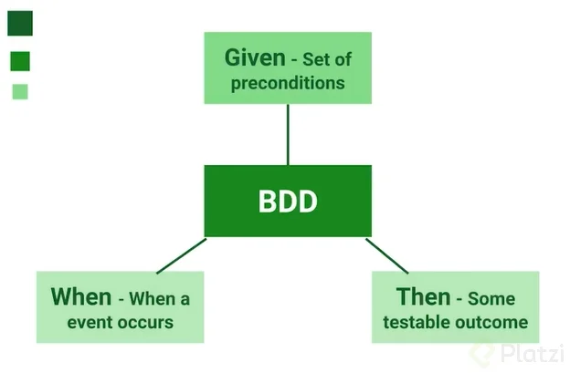
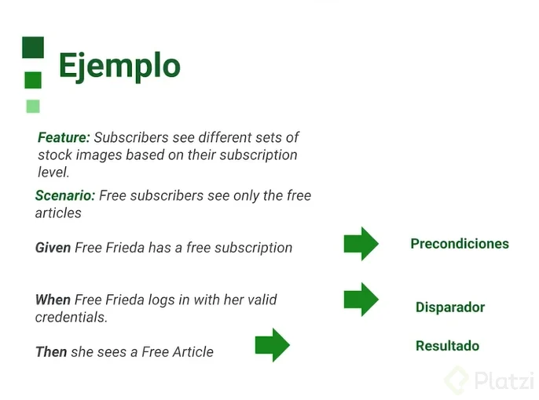

# Curso Avanzado de Automatización de Pruebas con Puppeteer

[Click in Puppeteer: Guide to Master Puppeteer’s Clicking Methods](https://www.webshare.io/academy-article/puppeteer-click#:~:text=To%20use%20the%20XPath%20method%20in%20Puppeteer%2C%20you%20can%20leverage,element%20you%20want%20to%20click. "Click in Puppeteer: Guide to Master Puppeteer’s Clicking Methods")

## Emulación de dispositivos

```javascript
const puppeteer = require("puppeteer")
const { KnownDevices } = require('puppeteer');

describe("Emulando informacion",()=>{
    let browser
    let page

    beforeAll(async()=>{
        browser = await puppeteer.launch({
            headless:false,
            defaultViewport: null, 
            //slowMo: 500
        });

        page = await browser.newPage();
        await page.goto("https://platzi.com", {waitUntil: "networkidle2"});

    },10000);

    afterAll(async ()=>{ 
        await browser.close();
    })

    test("Emulando dispositivos de forma manual", async()=>{
        await page.emulate({
            name: "Mi dispositivo",
            viewport: {
                width:375,
                height: 667,
                deviceScalaFactor:2,
                isMobile: true,
                hasTouch: true,
                isLandscape:false

            },
            userAgent: "Mozilla/5.0 (Linux; Android 10; SAMSUNG SM-J600G) AppleWebKit/537.36 (KHTML, like Gecko) SamsungBrowser/10.1 Chrome/71.0.3578.99 Mobile Safari/537.36",
        });

        await new Promise((resolve) => setTimeout(resolve, 5000));

    },35000);

    test("Emulando sitio de escritorio", async()=>{

        await page.setViewport({
            width:1280,
            height:800
        })
        await new Promise((resolve) => setTimeout(resolve, 5000));

    },35000);

    test("Emulando sitio en una tablet", async()=>{
        //const { KnownDevices } = require('puppeteer');
        const tablet = KnownDevices['iPad Pro'];
        await page.emulate(tablet);

        await new Promise((resolve) => setTimeout(resolve, 5000));

    },35000);

    test("Emulando sitio en una tablet en modo landscape", async()=>{

        //const { KnownDevices } = require('puppeteer');
        const tablet = KnownDevices["iPad landscape"];
        await page.emulate(tablet);

        await new Promise((resolve) => setTimeout(resolve, 5000));

    },35000);

    test("Emulando sitio en un celular", async()=>{

        //const { KnownDevices } = require('puppeteer');
        const iPhone = KnownDevices['iPhone X']
        await page.emulate(iPhone);
        await new Promise((resolve) => setTimeout(resolve, 5000));

    },35000);

});
```

Si quieren el link de los dispositivos es el siguiente

[KnownDevices variable | Puppeteer (pptr.dev)](https://pptr.dev/api/puppeteer.knowndevices/ "KnownDevices variable | Puppeteer (pptr.dev)")

## Modo incógnito del navegador
```javascript
const puppeteer = require("puppeteer")
const { KnownDevices } = require('puppeteer');

describe("Emulando informacion",()=>{
    let browser
    let page

    beforeAll(async()=>{
        browser = await puppeteer.launch({
            headless:false,
            defaultViewport: null, 
            //slowMo: 500
        });

        //page = await browser.newPage();
        //await page.goto("https://platzi.com", {waitUntil: "networkidle2"});

        //para abtrir el navegador en modo incognito
        page = await (await browser.createBrowserContext()).newPage(); //para acortar el codigo
       // const context = await browser.createBrowserContext();
        //page = await context.newPage();
        await page.goto("https://platzi.com", {waitUntil: "networkidle2"});

    },10000);

    afterAll(async ()=>{ 
        await browser.close();
    })

    test("Emulando dispositivos de forma manual", async()=>{
        await page.emulate({
            name: "Mi dispositivo",
            viewport: {
                width:375,
                height: 667,
                deviceScalaFactor:2,
                isMobile: true,
                hasTouch: true,
                isLandscape:false

            },
            userAgent: "Mozilla/5.0 (Linux; Android 10; SAMSUNG SM-J600G) AppleWebKit/537.36 (KHTML, like Gecko) SamsungBrowser/10.1 Chrome/71.0.3578.99 Mobile Safari/537.36",
        });

        await new Promise((resolve) => setTimeout(resolve, 5000));

    },35000);

    test("Emulando sitio de escritorio", async()=>{

        await page.setViewport({
            width:1280,
            height:800
        })
        await new Promise((resolve) => setTimeout(resolve, 5000));

    },35000);

    test("Emulando sitio en una tablet", async()=>{
        //const { KnownDevices } = require('puppeteer');
        const tablet = KnownDevices['iPad Pro'];
        await page.emulate(tablet);

        await new Promise((resolve) => setTimeout(resolve, 5000));

    },35000);

    test("Emulando sitio en una tablet en modo landscape", async()=>{

        //const { KnownDevices } = require('puppeteer');
        const tablet = KnownDevices["iPad landscape"];
        await page.emulate(tablet);

        await new Promise((resolve) => setTimeout(resolve, 5000));

    },35000);

    test("Emulando sitio en un celular", async()=>{

        //const { KnownDevices } = require('puppeteer');
        const iPhone = KnownDevices['iPhone X']
        await page.emulate(iPhone);
        await new Promise((resolve) => setTimeout(resolve, 5000));

    },35000);

});
```

## Visual Testing

instalar la librria para snapshot:

`npm i --save-dev jest-image-snapshot --legacy-peer-deps`

```javascript
const puppeteer = require("puppeteer");
const {toMatchImageSnapshot} = require("jest-image-snapshot");
expect.extend({toMatchImageSnapshot});
const { KnownDevices } = require('puppeteer');

describe("Visual test",()=>{

        let browser
        let page
    
        beforeAll(async()=>{
            browser = await puppeteer.launch({
                headless:false,
                defaultViewport: null, 
                //slowMo: 500
            });

            page = await browser.newPage();
            await page.goto("https://platzi.com", {waitUntil: "networkidle2"});

        },10000);
    
        afterAll(async ()=>{ 
            await browser.close();

        });


    /*it("Snapshop de toda la pagina", async()=>{

        await page.waitForSelector("img");

        const screenshot = await page.screenshot();

        expect(screenshot).toMatchImageSnapshot();
        
    }, 35000);*/  

    /*it("Snapshop de solo un elemento", async()=>{

        const image = await page.waitForSelector("img");

        const screenshot = await image.screenshot();

        expect(screenshot).toMatchImageSnapshot({
            failureThreshold:0.0,
            failureThresholdType: "percent"

        });
        
    }, 35000); */

    /*it("Snapshop de un celular", async()=>{

        const tablet = KnownDevices['iPad Pro'];
        await page.emulate(tablet);
        
        await page.waitForSelector("img");

        const screenshot = await page.screenshot();

        expect(screenshot).toMatchImageSnapshot({
            failureThreshold:0.05,
            failureThresholdType: "percent"

        });
 
    }, 35000); */

    it("Remover imagen antes de crear snapshot", async()=>{

        await page.waitForSelector("img");

        //await page.evaluate(() => (document.querySelectorAll("img") || []).forEach((img) => img.remove()));
        
        const screenshot = await page.screenshot();

        expect(screenshot).toMatchImageSnapshot({
            failureThreshold:0.05,
            failureThresholdType: "percent"

        });
 
    }, 35000); 
})
```

## Generando PDFs

```javascript
const puppeteer = require("puppeteer");

describe("Craecion de PDF",()=>{
    let browser;
    let page;
    beforeAll(async()=>{
        browser = await puppeteer.launch({
            headless:true,
            defaultViewport: null, 
            //slowMo: 500
        });

        page = await (await browser.createBrowserContext()).newPage();
        await page.goto("https://google.com", {waitUntil: "networkidle2"});

    },35000);

    afterAll(async ()=>{ 
        await browser.close();
        return pdf
    })

    test("PDF de pantalla completa", async()=>{

        let pdfCSS = []
        pdfCSS.push('<style>');
        pdfCSS.push('h1{ font-size:10px; margin-left:30px;}');
        pdfCSS.push("</style>");

        const css = pdfCSS.join(" ");

        await page.pdf({
            path: "google.pdf",
            format: "A4",
            printBackground: true, 
            displayHeaderFooter: true,
            headerTemplate: css + "<h1>" + "Mira mi primer PDF con puppeteer" + "</h1>",
            footerTemplate: css + '<h1> page <span class="pageNumber"></span> of <span class="totalPages"></span></h1>',
            margin: {
                top: "100px",
                bottom: "200px",
                right: "30px",
                left: "30px",
            }

        });
        
    },35000);

    test("PDF de pantalla completa en modo landscape", async()=>{

        let pdfCSS = []
        pdfCSS.push('<style>');
        pdfCSS.push('h1{ font-size:10px; margin-left:30px;}');
        pdfCSS.push("</style>");

        const css = pdfCSS.join(" ");

        await page.pdf({
            path: "googleLandscape.pdf",
            format: "A4",
          
            headerTemplate: css + "<h1>" + "Mira mi primer PDF con puppeteer" + "</h1>",
            footerTemplate: css + '<h1> page <span class="pageNumber"></span> of <span class="totalPages"></span></h1>',
            margin: {
                top: "100px",
                bottom: "200px",
                right: "30px",
                left: "30px",
            },
            landscape: true

        });
        
    },35000);

});
```

## Geolocalización

```javascript
const puppeteer = require("puppeteer");

describe("Geolocalizacion",()=>{

        let browser
        let page
    
        beforeAll(async()=>{
            browser = await puppeteer.launch({
                headless:false,
                defaultViewport: null, 
                //slowMo: 500
            });

            page = await browser.newPage();
            //await page.goto("https://platzi.com", {waitUntil: "networkidle2"});

        },10000);
    
        afterAll(async ()=>{ 
            await browser.close();

        });


    it("Cambio de la geolocalizacion", async()=>{
        const context = browser.defaultBrowserContext();

        await context.overridePermissions("https://chercher.tech/practice/geo-location.html", ['geolocation']);

        await page.setGeolocation({latitude:90, longitude: 20});

        await page.goto("https://chercher.tech/practice/geo-location.html");

        await new Promise((resolve) => setTimeout(resolve, 5000));
        await page.setGeolocation({latitude:90, longitude: 0});
        await page.goto("https://chercher.tech/practice/geo-location.html");
        await new Promise((resolve) => setTimeout(resolve, 5000));

    }, 35000);
})
```

## Probando accesibilidad

[WAI-ARIA Overview | Web Accessibility Initiative (WAI) | W3C](https://www.w3.org/WAI/standards-guidelines/aria/ "WAI-ARIA Overview | Web Accessibility Initiative (WAI) | W3C")

[axe-puppeteer - npm](https://www.npmjs.com/package/axe-puppeteer "axe-puppeteer - npm")

instalar paquete @axe-core:

`npm install @axe-core/puppeteer --legacy-peer-deps`

```javascript
const puppeteer = require("puppeteer");
const {AxePuppeteer} = require("@axe-core/puppeteer")

describe("Accesibilidad",()=>{

        let browser
        let page
    
        beforeAll(async()=>{
            browser = await puppeteer.launch({
                headless:true,
                defaultViewport: null, 
                //slowMo: 500
            });

            page = await browser.newPage();
            await page.goto("https://platzi.com", {waitUntil: "networkidle2"});

        },10000);
    
        afterAll(async ()=>{ 
            await browser.close();

        });


    it("Probar accesibilidad", async()=>{

        await page.waitForSelector("img");
        const snapshot = await page.accessibility.snapshot();
        console.log(snapshot);

    }, 35000);

    // con la libreria @axe-core/puppeteer
    it("Probar accesibilidad con axe", async()=>{

        await page.setBypassCSP(true)
        await page.waitForSelector("img");
        
        const result = await new AxePuppeteer(page).analyze()
        console.log(result.violations) //console.log(result.violations[0].nodes[0] para espesificar el nodo que deseo ver

    }, 35000);
})
```

## Puppeteer con Firefox

instalar el producto PUPPETEER_PRODUCT:
`PUPPETEER_PRODUCT=firefox npm install` o `PUPPETEER_PRODUCT=firefox npm install puppeteer` o `npx puppeteer browsers install firefox` para 2024.
**Nota**: para volver a chrome se usa el siguiente codigo: `npx puppeteer browsers install chrome`.

Actualización mayo de 2024:

- Para instalar firefox para puppeteer usar: npx puppeteer browsers install firefox

- Colocar en browser lo siguiente:

```javascript
browser = await puppeteer.launch({
            headless: false,
            defaultViewport: null,
            product: 'firefox',
            protocol: 'webDriverBiDi',
        })
```

### Ejercicio de la clase

```javascript
const puppeteer = require("puppeteer")

const {getText, getCount} = require("./lib/helpers")

describe("Extrayendo informacion",()=>{

        let browser
        let page
    
        beforeAll(async()=>{
            browser = await puppeteer.launch({
                headless:true,
                product: "firefox",
                defaultViewport: null, 
                protocol: 'webDriverBiDi',
                //slowMo: 500
            });

            page = await browser.newPage();
            await page.goto("https://platzi.com");

        },10000);
    
        afterAll(async ()=>{ 
            await browser.close();

        },10000);

    it("Extraer la información de un elemento", async()=>{
        
        await page.waitForSelector("body > main > header > div > nav > ul > li:nth-child(4) > a");

        const nombreBoton = await getText(page, "body > main > header > div > nav > ul > li:nth-child(4) > a");
        console.log("nombreBoton", nombreBoton)


    }, 35000);  

    it("Contar los elementos de una pagina", async()=>{
        
        const images = await getCount(page, "img");
        console.log("images", images)

    }, 35000);

    it("Extraer el titulo de la pagina y url", async()=>{
        
        const titulo = await page.title();
        const url = await page.url();

        console.log("titulo", titulo);
        console.log("url", url);

        

        //await new Promise((resolve) => setTimeout(resolve, 3000));

    }, 35000);

})
```

## Medir performance: page load

### ¿Que es y para que sirve  `page load`?

El evento **page load** se refiere al momento en que una página web y todos sus recursos dependientes (como hojas de estilo, scripts, imágenes y marcos secundarios) se han cargado completamente. Este evento es crucial tanto en el desarrollo web como en la automatización de navegadores porque marca el punto en el que el contenido de la página está totalmente disponible y listo para la interacción del usuario o de un script automatizado.

### ¿Qué es el evento `page load`?
- **Definición**: El evento page load se dispara cuando el navegador ha terminado de cargar el documento HTML inicial y todos los recursos dependientes (como imágenes, estilos y scripts).
- **Momento de Activación**: Se activa cuando la propiedad readyState del documento cambia a complete, lo cual indica que todos los recursos de la página han sido completamente cargados.

### ¿Para qué sirve el evento `page load`?
- **Sincronización de Acciones**: En la automatización de navegadores y pruebas web, esperar a que se dispare el evento page load asegura que cualquier interacción con la página (como hacer clic en un botón o extraer información) se realiza solo después de que la página esté completamente cargada.
- **Medición de Rendimiento**: Este evento es útil para medir el rendimiento de carga de una página web. Los desarrolladores pueden medir el tiempo desde que se inicia la navegación hasta que se completa la carga para optimizar el rendimiento.
- **Evitar Errores**: Al asegurarse de que la página está completamente cargada antes de realizar cualquier acción, se reduce el riesgo de errores causados por elementos que aún no están disponibles o completamente renderizados.
- **Experiencia del Usuario**: Para los desarrolladores, este evento es útil para mejorar la experiencia del usuario, garantizando que las interacciones solo ocurran cuando todo el contenido esté disponible y no mientras se está cargando.

### Ejemplo de Uso en JavaScript

Aquí hay un ejemplo simple de cómo puedes usar el evento load en JavaScript para ejecutar código solo después de que la página haya terminado de cargar:


```javascript
window.addEventListener('load', function() {
    console.log('La página y todos los recursos están completamente cargados.');
    // Aquí puedes ejecutar cualquier código que dependa de que la página esté completamente cargada
});
```


### Ejemplo de Uso en Puppeteer

En Puppeteer, un popular marco de automatización de navegadores, puedes esperar a que una página se cargue completamente antes de realizar acciones. Aquí hay un ejemplo:


```javascript
const puppeteer = require('puppeteer');

(async () => {
    const browser = await puppeteer.launch({ headless: false });
    const page = await browser.newPage();

    // Navegar a la página y esperar a que se cargue completamente
    await page.goto('https://example.com', { waitUntil: 'load' });

    // Realizar acciones después de que la página esté completamente cargada
    const element = await page.$('selector');
    const text = await page.evaluate(element => element.textContent, element);
    console.log(text);

    await browser.close();
})();
```

En el ejemplo de Puppeteer, el método `goto` con la opción `{ waitUntil: 'load' }` asegura que el script espera hasta que el evento `page load` se dispare antes de proceder con las acciones subsecuentes. Esto garantiza que la página está completamente lista para cualquier interacción automatizada.

### Resumen

El evento page load es un indicador crucial en el ciclo de vida de una página web que marca el momento en que todo el contenido y los recursos de la página están completamente cargados y listos para ser utilizados. Este evento es especialmente importante en el desarrollo web y la automatización de pruebas para asegurar que las interacciones y mediciones se realicen solo cuando la página esté en su estado final y completamente preparada.

codigo:

```javascript
const puppeteer = require("puppeteer");
const {AxePuppeteer} = require("@axe-core/puppeteer")

describe("Performance",()=>{

        let browser
        let page
    
        beforeAll(async()=>{
            browser = await puppeteer.launch({
                headless:true,
                defaultViewport: null, 
                //slowMo: 500
            });

            page = await browser.newPage();
            //await page.goto("https://platzi.com", {waitUntil: "networkidle2"});

        },10000);
    
        afterAll(async ()=>{ 
            await browser.close();

        });


    /*test("Medir el performance de la automatizacion", async()=>{

        await page.waitForSelector("img");
        const metrics = await page.metrics();
        console.log(metrics);
    }, 35000);
    
    test("Medir el performance de la pagina", async()=>{

        await page.waitForSelector("img");
        const metrics2 = await page.evaluate(()=>JSON.stringify(window.performance));
        console.log(metrics2);
    }, 35000);*/

    test("Medir el performance del page load", async()=>{
        await page.tracing.start( {path: "profile.json"});
        await page.goto("https://google.com");
        await page.waitForSelector("img");
        await page.tracing.stop()
    }, 35000);

    test("Medir el performance del page load con screenshorts", async()=>{
        await page.tracing.start( {path: "profile.json", screenshots:true});
        await page.goto("https://platzi.com");
        await page.waitForSelector("img");
        await page.tracing.stop()
    }, 35000);

    test("Medir el performance del page load con screenshorts y extrayendolos", async()=>{
        const fs = require('fs')

        await page.tracing.start( {path: "profile.json", screenshots:true});
        await page.goto("https://platzi.com");
        await page.waitForSelector("img");
        await page.tracing.stop()
        const tracing = JSON.parse(fs.readFileSync("./profile.json", "utf8"))
        //Filtrar el JSON
        const traceScreenShots = tracing.traceEvents.filter(
            (x)=>
            x.cat === 'disabled-by-default-devtools.screenshot' &&
            x.name === 'Screenshot' &&
            typeof x.args !== 'undefined' &&
            typeof x.args.snapshot !== 'undefined'
        );

        //Iterar sobre este arreglo para crear la simagenes
        traceScreenShots.forEach(function(snap, index){
            fs.writeFile(`trace-screenshot-${index}.png`, snap.args.snapshot, 'base64', function(err){
                if (err) {
                    console.log('No pude crear el archivo', err)
                };
            });           
        });

    }, 35000);
})
```

## Medir performance: first contentful paint

```javascript
const puppeteer = require("puppeteer");
const {AxePuppeteer} = require("@axe-core/puppeteer")

describe("first paint y first contentful paint",()=>{

        let browser
        let page
    
        beforeAll(async()=>{
            browser = await puppeteer.launch({
                headless:true,
                defaultViewport: null, 
                //slowMo: 500
            });

            page = await browser.newPage();
            //await page.goto("https://platzi.com", {waitUntil: "networkidle2"});

        },10000);
    
        afterAll(async ()=>{ 
            await browser.close();

        });

    test("Medir el performance del first paint y first contentful paint", async()=>{

        const navigationPromise = page.waitForNavigation();
        await page.goto("https://platzi.com");
        await navigationPromise

        const firstPaint = JSON.parse(
            await page.evaluate(()=>JSON.stringify(performance.getEntriesByName("first-paint")))
        );

        const firstContentfulPaint=JSON.parse(
            await page.evaluate(()=>JSON.stringify(performance.getEntriesByName("first-contentful-paint")))
        );
        console.log('firstPaint ', firstPaint[0].startTime)
        console.log('firstContentfulPaint ', firstContentfulPaint[0].startTime)
        

    }, 15000);

    test("Medir el performance frames por segundos", async()=>{

        const devtoolsProtocolClient = await page.target().createCDPSession();
        await devtoolsProtocolClient.send("Overlay.setShowFPSCounter",{show:true});
        await page.goto("https://platzi.com");

        await page.screenshot({path:"framesPorSegundo.jpg", type:"jpeg"})

    }, 15000);

})
```

[lighthouse/puppeteer.md at master · GoogleChrome/lighthouse · GitHub](https://github.com/GoogleChrome/lighthouse/blob/main/docs/puppeteer.md "lighthouse/puppeteer.md at master · GoogleChrome/lighthouse · GitHub")

## Inicializando nuestro framework

//Pasos para arracar el proyecto del framework de jest con puppeteer

1. npm init -y

2. git init

3. npm i puppeteer jest jest-puppeteer @types/jest babel-jest @babel/core @babel/preset-env

4. Crear .gitignore

5. `npx jest --init` o `node node_modules.bin\jest --init` o `node node_modules.bin\jest --init` //--> Esto inicializa la config de jest (Windows 10) o la que me funciono fue `npx jest --init`

6. Respuestas:
- √ Would you like to use Jest when running "test" script in "package.json"? ... yes
- √ Would you like to use Typescript for the configuration file? ... no
- √ Choose the test environment that will be used for testing » node
- √ Do you want Jest to add coverage reports? ... no
- √ Which provider should be used to instrument code for coverage? » babel
- √ Automatically clear mock calls, instances, contexts and results before every test? ... no   
✏️  Modified C:\Users\celio\OneDrive\Escritorio\programación\platzi\CursoAvanzadoDeAutomatizacionDePruebasConPuppeteer\Mi-framework\package.json

📝  Configuration file created at C:\Users\celio\OneDrive\Escritorio\programación\platzi\CursoAvanzadoDeAutomatizacionDePruebasConPuppeteer\Mi-framework\jest.config.js

7. En jest.config.js, descomentar y colocar {bail: 5, preset: "jest-puppeteer"}

```javascript
/** @type {import('jest').Config} */
const config = {
  // All imported modules in your tests should be mocked automatically
  // automock: false,

  // Stop running tests after `n` failures
  bail: 5,
```

```javascript
  // A preset that is used as a base for Jest's configuration
  preset: "jest-puppeteer",
```

8. Crear archivo jest-puppeteer.config.js y pegarle dentro: 
```javascript
module.exports = {
    launch: {
        headless: false,
        slowMo:100,
    },
    browserContext:"default"
}
```
9. Intalar dependencia de desarrollo:
`npm i -D prettier`

10. se crea el archivo `.prettierrc` y se agrega el siguiente codigo:

```javascript
{
    "printWidth": 100,
    "singleQuote": true,
    "useTabs": true,
    "tabWidth": 2,
    "semi": false,
    "trailingComma": "es5",
    "bracketSameLine": true    
}
```

11. Se instala la dependencia de babel:
`npm i @babel/core @babel/preset-env babel-jest`

12. Crear archivo de babel.config.js y pegarle dentro: 

```javascript
module.exports = { 
    presets: [ 
        [ 
            '@babel/preset-env', 
            { 
                targets: { 
                    node:'current', 
                }, 
            }, 
        ], 
    ], 
};
```

10. Crear carpeta de pruebas **__test__** y una prueba:

11. Crear una prueba para probar que todo funcione correctamente:

```javascript
describe("google", ()=>{

    it("abrir  el navegador", async ()=>{
        await page.goto("https://www.google.com/");
        await new Promise((resolve) => setTimeout(resolve, 5000));
    },8000);
});
```

## Creando la Base Page

Se crea la carpeta page y luego el archivo BasePage.js con el siguiente codigo:

```javascript
export default class BasePage {

    async getTitle(){

        return await page.title();
    }

    async getUrl(){

        return await page.url();
    }

    async getText(selector){

        try {
            await page.waitForSelector(selector);
            return await page.$eval(selector, (el)=el.textContent);
        }
        catch (e){
            throw new Error("Error al obtener el texto del selector ${selector}")

        }
       
    }

    async getAttribute(selector, attribute){

        try {
            await page.waitForSelector(selector);
            return await page.$eval(selector, (el)=el.getAttribute(attribute));
        }
        catch (e){
            throw new Error("Error al obtener el atributo del selector ${selector}");

        }
       
    }

    async getValue(selector){

        try {
            await page.waitForSelector(selector);
            return await page.$eval(selector, (el)=el.value);
        }
        catch (e){
            throw new Error("Error al obtener el valor del selector ${selector}");

        }
       
    }

    async getCount(selector){

        try {
            await page.waitForSelector(selector);
            return await page.$$eval(selector, (el)=el.length);
        }
        catch (e){
            throw new Error("Error al obtener el numero de elementos del selector ${selector}");

        }
       
    }

    async click(selector){

        try {
            await page.waitForSelector(selector);
            await page.click(selector);
        }
        catch (e){
            throw new Error("Error al dar click al selector ${selector}");

        }
       
    }

    async type(selector, text, opts={}){

        try {
            await page.waitForSelector(selector);
            await page.type(selector, text, opts);
        }
        catch (e){
            throw new Error("Error escribir en el selector ${selector}");

        }
       
    }

    async doubleClick(selector){

        try {
            await page.waitForSelector(selector);
            await page.click(selector, {clickCount:2});
        }
        catch (e){
            throw new Error("Error escribir en el selector ${selector}");

        }
       
    }

    async wait(time){

        return await new Promise((resolve) => setTimeout(resolve, time));
    }


}
```

[Using with puppeteer · Jest](https://jestjs.io/docs/puppeteer "Using with puppeteer · Jest")

## Page Object Model


**Lecturas recomendadas**

[Xpath cheatsheet](https://devhints.io/xpath "Xpath cheatsheet")

[Curso de Web Scraping con Python y Xpath - Platzi](https://platzi.com/clases/web-scraping/ "Curso de Web Scraping con Python y Xpath - Platzi")

[Space & Beyond | Testim.io demo](https://demo.testim.io/ "Space & Beyond | Testim.io demo")

## Hacer Un E2E

### FlightsPage.js
```javascrip
import BasePage from "./BasePage";

export default class FlightsPage extends BasePage {

    constructor(){
        super();
        this.mainDiv="#tab-group-events"
        this.inputs={
            form:"#onereturn > div.col-lg-3.show.active > div.input-items.from_flights.show.active > div.form-floating > span > span.selection > span",
            to:"#onereturn > div:nth-child(2) > div.input-items.flights_arrival.to_flights > div.form-floating > span > span.selection > span",
            date:"#departure",
            passengers:"#onereturn > div.col-lg-2 > div > div > div > a",
            search:"#flights-search",
            firstOption:"#onereturn > div.col-lg-2 > div > div > div > div",
            moreAdultsPassengers:"#onereturn > div.col-lg-2 > div > div > div > div > div.dropdown-item.adult_qty.show.active > div > div > div.qtyInc > svg",

        }
        
    }

    async validatePage() {

        await page.waitForNavigation({ waitUntil: "networkidle2"})
        await page.waitForSelector(this.mainDiv);
        await page.waitForSelector(this.inputs.form);
        await page.waitForSelector(this.inputs.to);
        await page.waitForSelector(this.inputs.date);
        await page.waitForSelector(this.inputs.passengers);
        await page.waitForSelector(this.inputs.search);

    }

    async selectFlighy(from, to, date, passengers) {
        
        await this.type(this.inputs.from, from);
        await this.click(this.inputs.firstOption)

        await this.type(this.inputs.to, to);
        await this.click(this.inputs.firstOption);

        await this.type(this.inputs.date, date);

        if(passengers !==1){

            await this.click(this.inputs.passengers);
            for(let i = 0; i < passengers - 1; i++){
                await this.click(this.inputs.moreAdultsPassengers)
            }
        }

        await this.click(this.input.search)
    }

    async validateFligths() {
    
            await this.wait(5);
    }
}
```

### NavBar.js

```javascrip
import BasePage from "../pages/BasePage";

export default class NavBar extends BasePage{

    constructor(){
        super()
        this.navBar = "#\#fadein > header",
        this.menu={
            home:" #\#fadein > header > div > div.d-flex > a > img",
            hotels:"#navbarSupportedContent > div.nav-item--left.ms-lg-5 > ul > li:nth-child(2) > a",
            flights:"#navbarSupportedContent > div.nav-item--left.ms-lg-5 > ul > li:nth-child(1) > a",
            
        };
    };

    async validateNavBarIsPresent(){
        await page.waitForSelector(this.navBar);
        await page.waitForSelector(this.menu.home);
        await page.waitForSelector(this.menu.hotels);
        await page.waitForSelector(this.menu.flights);
    }

    async selectMenuItem(menuItem){
        await this.click(this.menu[menuItem]);


    }
}
```

reservaUnVuelo.test.js
```javascrip
import LoginPage from "../pages/LoginPage";
import FlightsPage from "../pages/FlightsPage";
import Navbar from "../componets/NavBar";

let loginPage;
let flightsPage;
let navBar;

describe("Debemos iniciar sesion en la pagina", () => {

    beforeAll(async () => {
        loginPage = new LoginPage();
        flightsPage = new FlightsPage();
        navBar = new Navbar();

    }, 10000); 

    it("Debemos iniciar sesion", async () => {
        await loginPage.visit();
        await loginPage.login("wajav34577@jahsec.com", "123456789");
    }, 30000);

    /*it("Validar que esté en el dashboard", async () => {
        await loginPage.validateLogin();
    }, 30000);*/

    it("Navegar hacia la pagina de vuelos", async () => {
        await navBar.validateNavBarIsPresent();
        await navBar.selectMenuItem("Flights")
    }, 30000);

    it("Validar que estemos en vuelos y seleccionar vuelos", async () => {
        await flightsPage.validatePage();
        await flightsPage.selectFlight("Mexico", "Paris", "20-11-2024", 5)
    }, 30000);

    it("Validar que hayamos buscado el vuelo", async () => {
        await flightsPage.validateFligths();    
    }, 30000);


});
```

## Agregar reporte 
se instala la siguiete extension:
`npm i jest-html-reporter`

en el archovo jest.config.js se agrega en siguiente codigo:

```javascript
// Use this configuration option to add custom reporters to Jest
  reporters: [
    'default',
    [
      './node_modules/jest-html-reporter',
      {
        pageTitle: 'Reporte de Pruebas'
      },
    ],
  ],
```

## BDD y Gherkin

### BDD (Behavior Driven Development) (Desarrollo dirigido por comportamiento)

Es algo parecido al TDD (Test Driven Development) donde en ese tipo de desarrollo se escribe una prueba que falla y se desarrolla hasta que tenemos una prueba que va a pasar.

El BDD sigue un poco eso, sin embargo aqui vamos a describir por medio de oraciones y texto lo que queremos lograr o el comportamiento de nuestra aplicacion. Pero ¿cuales son los beneficios?, bueno, un beneficio puede ser que nos va a dar un lenguaje en comun entres los skateholders, scrum master, desarrolladores, QA, automatizadores etc. Todos vamos a saber que vamos a probar, que es lo que tenemos que desarrollar, que es lo que vamos a validar y que es lo que queremos pedir que se desarrolle en nuestra aplicacion.

**GHERKIN**

Es un lenguaje especifico para el BDD y es un lenguaje de dominio legible para empresas, pero en algunas empresas se le conoce como DCL. Fue creado por Cucumber.

Gherkin consta de un GIVEN (dado que) -WHEN (cuando) -THEN (luego)



Syntaxis Gherkin

```javascript
Feature: Guess the word

	# The first example has two steps
	Scenario: Maker starts a game
		When the Maker starts a game
		Then the Maker waits for a Breaker to join

	# The second example has three steps
	Scenario: Breaker joins a game
		Given the Maker has started a game with the word "silky"
		When the Breaker joins the Maker's game
		Then the Breaker must guess a word with 5 characters
```
**Feature**

La caracteristica es un texto conciso, pero descriptivo de lo que se desea.

- Se utiliza para describir una funcion de software y para agrupar diferentes escenarios.

**Scenario**

Un escenario es un ejemplo o ejemplos que ilustran alguna situacion empresarial determinable.

Consiste en una lista de pasos.

- Los escenarios siguen el mismo patron:
 - Describe un contexto inicial.
 - Describe un evento.
 - Describe un resultado esperado.
 
**Given**

El proposito de los GIVEN es describir un estado del sistema conocido antes o precondiciones.

**Ejemplos:**

- Describir el estado inicial de la base de datos.
- Describir el estado inicial de un usuario (p. Ej: registrado)

**When**

El proposito de los WHEN es describir la accion clave que el usuario realiza que desencadena la transicion del estado.

**Ejemplos:**
- Dar clic a un boton.
- Hacer una peticion a un endpoint.

**Then**

El proposito de lo then es observar los resultados, estas observaciones tienen que estar relacionadas con el valor/beneficio en tu Feature.



## Configurando codeceptjs con Gherkin y BDD 

1. Open a new empty folder with your favorite Code Editor
2. git init
3. npm init -y
4. npx create-codeceptjs .
Nota. si muestra error tse tiene que seguir los siguientes pasos h eingresar los siguientes codigos:
 - `npm install -g npm@latest`
 - `npm cache clean --force`
 - `npm config list`

5. npm install codeceptjs puppeteer --save
Nota: si tinen un erro, usar el siguiente codigo:
 - `npm audit fix --force`
 
6. npx codeceptjs init

- Do you plan to write tests in TypeScript? No
- Where are your tests located?** ./*_test.js**
- What helpers do you want to use? **Puppeteer**
- Where should logs, screenshots, and reports to be stored?** ./output**
- Do you want to enable localization for tests? http English (no localization)
**Configure helpers...**
- [Puppeteer] Base url of site to be tested https://platzi.com/home
- [Puppeteer] Show browser window **Yes**
- [Puppeteer] Browser viewport size **1200x900**

6. npx codeceptjs gherkin:init

7. buscamos en las extenciones de visualcode el siguiente termino **ext:feature** he instalamos la siguiente extencion *Cucumber (Gherkin) Full Support*

[codecept](https://codecept.io/quickstart/ "codecept Home")
[Testing with Puppeteer | CodeceptJS](https://codecept.io/puppeteer "Testing with Puppeteer | CodeceptJS")

[Behavior Driven Development | CodeceptJS](https://codecept.io/bdd/#bdd/ "Behavior Driven Development | CodeceptJS")

## Creando un Scenario Outline

### loginPage

```javascript
module.exports = new LoginPage();
module.exports.LoginPage = LoginPage();

const { I } = inject();

class LoginPage {
    constructor() {
        this.navBar = '#navbarSupportedContent';
        this.inputEmail = '#email';
        this.inputPassword = '#password';
        this.submitButton = '#submitBTN';
        this.loginPageText = "#\#fadein > div.container-fluid > div > div > div.pt-3 > div > div > div > div.w-100.text-center.mt-3 > span";
    }

    visit() {
        I.amOnPage('login');
        I.waitForElement(this.navBar);
        I.seeInCurrentUrl('login');
    }

    login(email, password) {
        I.waitForElement(this.inputEmail);
        I.fillField(this.inputEmail, email);
        I.fillField(this.inputPassword, password);
        I.click(this.submitButton);
    }

    validateLogin() {
        I.waitForElement(this.loginPageText, 4);
        I.see('juan camilo', this.loginPageText);
        I.waitForElement(this.navBar, 4);
    }
}
```

### Login.feature

```javascript
Feature: Logging in

Scenario: log in to the page

    Given Im on the main page
    When I fill in the form with my email: "wajav34577@jahsec.com" and my password: "123456789"
    Then I should see the dashboard page

@probando
Scenario Outline: Scenario Outline for login
    Given Im on the main page
    When I fill in the form with my <Email> and my <password>
    Then I should see the dashboard page

    Examples:
            | Email                  | Password    |
            | jexusmaster@gmail.com  | Jexxus2334  |
            | jesuscuadro@gmail.com  | Jexxus2334  |
            | juanito@gmail.com      | Jexxus2334  |
            | pepito@gmail.com       | Jexxus2334  |
            | camila@gmail.com       | Jexxus2334  |
            | sadsadasr@gmail.com    | Jexxus2334  |


```

loginsteps

```javascript
const { I, loginPage } = inject();

Given('I am on the main page', () => {
    loginPage.visit()
});

When(/^I fill the form with my email: "([^"]*)" and my password: "([^"]*)"$/, (email, password) => {
    loginPage.login(email, password)
});

Then('I should see the dashboard page', () => {
    loginPage.validateLogin()
});

When(/^I fill the form with my (.*) and my password: (.*)$/, (email, password) => {
    loginPage.login(email, password)
});
```
para realizar las pruebas se agrega `@probando` y en el archivo `packege.json` y agregmos un nuevo test `"test-dev": "npx codeceptjs run --grep '@probando' --verbose"`.

## Generando reporte y agregando imágenes al reporte

se instala el paquete allura:
`npm install -g allure-commandline --save-dev`
luego agregamos en codecept.conf.js en el area de plugins el siguiente codigo:
```javascript
allura: {
      
    },
```
para crear el reporte se crea un test con el codigo: `"npx codeceptjs run --features --plugins allurre"`

[Allure Framework](https://docs.qameta.io/allure/ "Allure Framework")

## Jenkins

[jenkins](https://www.jenkins.io/doc/pipeline/tour/getting-started/ "jenkins")