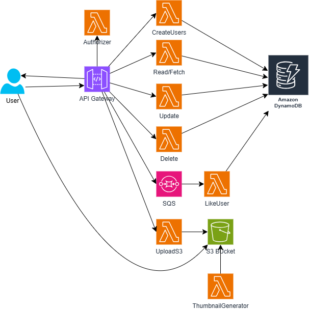

# Curso Avanzado de Serverless Framework en AWS

## Bienvenida al curso avanzado de Serverless Framework

### ¿De qué trata el curso avanzado de Serverless Framework en AWS?
Este curso está diseñado para mejorar tus habilidades en la creación de aplicaciones serverless utilizando diferentes servicios del ecosistema de AWS, como SQS y S3. Aprenderás a realizar validaciones de lógica de negocio directamente en API Gateway, además de manejar la autenticación y autorización usando el mismo servicio.

Este curso va más allá de lo básico y te desafía a aplicar los conocimientos adquiridos en un curso previo sobre Serverless Framework en AWS. Es esencial que te sientas cómodo trabajando con la consola de AWS para poder sacar el máximo provecho de este curso avanzado.

### ¿Quiénes son los instructores?

Tus guías en este apasionante camino serán Juan Restrepo, conocido como Peto, y Yaghi Kastanyo, ambos miembros del equipo de infraestructura de Platzi. Ellos compartirán su experiencia y conocimientos contigo, llevándote a explorar aspectos profundos de las aplicaciones serverless que no están disponibles en la documentación formal.

### ¿Cómo se asegura el compromiso y aprendizaje?

El curso integra un componente interactivo que aumenta el compromiso y permite a los estudiantes comprobar sus habilidades. A lo largo de las clases, se presenta un pequeño secreto cifrado que tendrás que descifrar. Cuando lo logres, accederás a una URL que te llevará a una agradable sorpresa, enriqueciendo tu experiencia de aprendizaje.

Adicionalmente, al finalizar el curso, hay dos bonos especiales. Uno incluye la personalización de tu nombre de dominio para implementar en producción, algo que es invaluable para proyectos profesionales o startups. El segundo bono consiste en un encuentro con los instructores, quienes compartirán detalles prácticos y consejos que no encontrarás en la documentación oficial.

### ¿Cómo se estructura el aprendizaje avanzado?

- **Integración de servicios AWS**: Aprenderás a combinar SQS, S3, y otros servicios en aplicaciones serverless.
- **Validación en API Gateway**: Profundizarás en técnicas para validar tanto lógica de negocio como autenticación y autorización directamente en API Gateway.
- **Codificación del secreto**: A través de las clases, estarás inmerso en un desafío de cifrado interactivo que estimula el pensamiento crítico y práctico.
- **Bonos al finalizar**: Personalización del dominio y consejos prácticos compartidos por los expertos.

Con estas herramientas, estarás equipado no solo para entender, sino para dominar el diseño e implementación de aplicaciones serverless en AWS. Este curso promete llevar tu carrera al siguiente nivel, abriéndote posibilidades distintivas en el mundo de la tecnología moderna. ¡Así que, adelante, empieza esta emocionante aventura en el mundo serverless!

**Archivos de la clase**

[curso-avanzado-de-serverless-framework.pdf](https://static.platzi.com/media/public/uploads/curso-avanzado-de-serverless-framework_7f34d181-296f-40c3-b7f3-63b38ab5bd1e.pdf)

**Lecturas recomendadas**

[Curso de Serverless Framework en AWS - Platzi](https://platzi.com/cursos/serverless/)

[GitHub - platzi/serverless_framework_produccion](https://github.com/platzi/serverless_framework_produccion)

[Curso Avanzado de Serverless framework.pdf - Google Drive](https://drive.google.com/file/d/1SVOTmCQ87oCHQlCDVs26JzoRM389pdEm/view?usp=share_link)

## Desplegamos nuestro proyecto

### ¿Cuál es el propósito del proyecto del curso?

En este curso vamos a profundizar en las mejores prácticas y funcionalidades adicionales para un proyecto base en el ecosistema serverless. ¿Por qué utilizamos este proyecto base? Anteriormente, trabajamos con API Gateway, Lambda Functions y DynamoDB para crear un CRUD completamente serverless. Ahora, queremos maximizar el potencial de serverless integrando diferentes servicios y adoptando optimizaciones clave.

### ¿Cómo está estructurado el proyecto base?

Nuestro proyecto serverless consta de varios componentes esenciales. Estos incluyen cuatro funciones Lambda, un DynamoDB y un API Gateway. Veamos cómo se traducen estos elementos en el código.

### ¿Cuáles son las funciones Lambda involucradas?

En el archivo `serverless.yml`, encontrarás cuatro funciones:

- `getUsers`: Retorna la información de usuarios.
- `createUsers`: Permite agregar nuevos usuarios.
- `updateUsers`: Actualiza la información de usuarios existentes.
- `deleteUsers`: Elimina usuarios.

Cada una de las funciones Lambda está vinculada a un evento HTTP correspondiente, alineado con los métodos HTTP convencionales (GET, POST, PUT/PATCH y DELETE).

### ¿Cómo se configura DynamoDB?

DynamoDB se utiliza como recurso en el proyecto, definiendo una tabla para usuarios con una clave primaria. Esta simple pero efectiva implementación es el pilar para las operaciones CRUD.

### ¿Cómo funciona API Gateway?

API Gateway es manejado automáticamente por el serverless framework, eliminando la necesidad de configuraciones adicionales. Este servicio facilita la creación y administración de las rutas HTTP que invocan nuestras funciones Lambda.

### ¿Cómo despliego el proyecto en mi entorno local?

El primer paso es clonar el proyecto desde GitHub. Una vez clonado, necesitarás instalar las dependencias que faltan utilizando npm. Esto incluye:

`npm install`

Este comando descargará e instalará todas las dependencias especificadas en el archivo package.json. A continuación, puedes proceder con el despliegue del proyecto usando:

`sls deploy`

Este comando iniciará el proceso de despliegue, creando los stacks de CloudFormation necesarios en AWS y poniendo las funciones Lambda operativas.

### ¿Qué consideraciones debo tomar al desplegar con Serverless Framework?

Durante el despliegue, notarás mensajes en consola que indican la creación y actualización del stack de CloudFormation. Algunos aspectos a tener en cuenta:

- **Empaquetamiento**: El tamaño de las funciones Lambda se optimiza especificando archivos puntuales necesarios para su ejecución en la nube.
- **Runtime**: En este proyecto, se utilizan funciones Lambda tanto con Node.js como con Python.

Estos pasos y configuraciones aseguran que tu aplicación serverless aprovecha al máximo el ecosistema de AWS con la mínima carga de código.

Este es un emocionante viaje en el mundo serverless. Si deseas reforzar conocimientos previos o te sientes confiado en este entorno, sigue adelante. Tu aprendizaje y dominio en este campo solo pueden crecer, ¡así que sigue practicando y explorando!

**Lecturas recomendadas**

[Curso de Serverless Framework en AWS - Platzi](https://platzi.com/cursos/serverless/)

[GitHub - platzi/serverless_framework_produccion](https://github.com/platzi/serverless_framework_produccion)

## Presentacion del proyecto

### ¿Cuál es el proyecto y cómo se relaciona con serverless en AWS?

En esta clase, nos embarcamos en un emocionante viaje por el universo serverless en AWS. La base de nuestro aprendizaje es un proyecto de portafolio que incluye una aplicación funcional donde convergen el backend y el desarrollo cloud. Aprenderemos cómo expandir este proyecto inicial, aprovechando las múltiples capacidades de AWS y prácticas avanzadas. La finalidad es integrar servicios como Lambda, SQS, S3, DynamoDB y API Gateway, creando una herramienta totalmente funcional que demuestre nuestros conocimientos y habilidades.

### ¿Qué elementos componen el proyecto base?

El proyecto base, que podrás encontrar en la sección de recursos, incluye una configuración inicial en un archivo YAML de serverless. En él se describen diferentes componentes como:

- **DynamoDB**: Una base de datos NoSQL que permite almacenar y acceder al dato de manera rápida y escalable.
- **Funciones Lambda**: Facilitan la ejecución de código en respuesta a eventos sin necesidad de gestionar servidores.
- **API Gateway**: Configurado para administrar las APIs REST.

Añadiendo a esto, se abordarán buenas prácticas como el uso de Lambda layers, lo que permite reutilizar código entre funciones lambda, y la gestión de asincronismo mediante servicios como SQS y eventos disparados por cambios en un bucket S3 o solicitudes a API Gateway.

### ¿Qué diferencias tiene el proyecto final con el proyecto base?

El proyecto final se distingue por integrar de manera sinérgica múltiples servicios de AWS dentro del ecosistema serverless. Entre las novedades más destacadas se encuentran:

- **Integración entre API Gateway y SQS**: Esto permite manejar colas de mensajes que aseguran la entrega de mensajes entre partes de la aplicación.
- **Eventos en S3**: Donde la carga de una nueva imagen dispara un evento que activa una función Lambda para realizar procesamiento en segundo plano.
- **Custom Authorizer**: Introducimos este componente para manejar la autenticación más allá del usuario y contraseña convencionales, utilizando APIs y un custom authorizer, otorgando mayor flexibilidad y seguridad.

### ¿Qué es un custom authorizer y por qué es importante?
Un custom authorizer es una función Lambda que se ejecuta antes de la llamada a la función real en su API de Gateway para validar la solicitud. Este permite manejar autenticaciones personalizadas utilizando tokens JSON Web Token (JWT), OAuth o cualquier otro método que puedas configurar.

La importancia de un custom authorizer radica en la mejora de la seguridad y el control que ofrece sobre los accesos permitidos a las APIs, facilitando la implementación de políticas precisas de acceso según sea necesario.

Este curso no solo amplía tus habilidades técnicas, sino que te dota de una competencia práctica en el manejo de arquitecturas serverless avanzadas. Te darás cuenta de que al manejar la asincronía y la seguridad, tus aplicaciones serán más robustas, responsivas y seguras, óptimas para aplicaciones de producción. ¡Prepárate para explorar estas funcionalidades en las clases siguientes!

**Lecturas recomendadas**

[GitHub - platzi/serverless_framework_produccion](https://github.com/platzi/serverless_framework_produccion)

## Buenas practicas y errores comunes desarrollando en serverless

¡Buena pregunta! Aquí tienes una lista clara y útil de **buenas prácticas** y **errores comunes** al desarrollar aplicaciones con **Serverless Framework**, especialmente en AWS:

### ✅ Buenas prácticas en Serverless

### 1. **Mantén funciones pequeñas y enfocadas**
- Cada función Lambda debe tener una única responsabilidad.
- Facilita el mantenimiento, pruebas y despliegue independiente.

### 2. **Utiliza `environment variables` para la configuración**
- Así evitas hardcodear valores sensibles o de entorno.
- Usa `Secrets Manager` o `SSM` para información sensible.

### 3. **Despliegue por etapas (`stages`)**
- Define entornos como `dev`, `staging`, `prod` en tu `serverless.yml`.
- Evita sobrescribir datos reales al probar.

### 4. **Logs y monitoreo**
- Usa `serverless logs -f nombreFuncion` para depurar.
- Integra con herramientas como CloudWatch, Sentry, Datadog o New Relic.

### 5. **Configura correctamente los permisos (IAM)**
- Otorga a cada Lambda solo los permisos necesarios (`least privilege`).
- Usa roles por función si es necesario.

### 6. **Empaquetado individual (`individually: true`)**
- Reduce tamaño de despliegue.
- Acelera el proceso de deploy.

### 7. **Simula localmente con `serverless-offline`**
- Ahorra tiempo y evita costos de AWS mientras desarrollas.

### 8. **Pruebas automatizadas**
- Integra pruebas unitarias y de integración con Jest o Pytest según el lenguaje.
- Prueba offline antes de desplegar.

### ❌ Errores comunes en Serverless

### 1. **Logs no disponibles o errores 504**
- Ocurre cuando no existe el log group o la función se cuelga sin generar logs.
- ✅ Revisa que la Lambda se desplegó correctamente y que está generando logs.

### 2. **Funciones muy grandes o con muchas dependencias**
- El tiempo de despliegue se vuelve lento.
- Puedes exceder el límite de tamaño de una Lambda.

### 3. **Hardcodear nombres de tablas, buckets o secretos**
- Provoca conflictos entre entornos o al trabajar en equipo.
- ✅ Usa variables dinámicas como `${self:service}-${sls:stage}`.

### 4. **Timeouts (error 504)**
- Suele deberse a funciones que acceden a recursos lentos (como una DB mal configurada).
- ✅ Aumenta el timeout o mejora el rendimiento de la función.

### 5. **Errores por rutas o carpetas mal nombradas**
- El handler puede no encontrarse si la estructura de carpetas no coincide con lo indicado en `serverless.yml`.

### 6. **Mala gestión de errores**
- No capturar errores en las Lambdas provoca respuestas poco claras o fallos silenciosos.
- ✅ Usa bloques `try/catch` y responde con códigos HTTP adecuados.

### 7. **No usar versiones de runtime actualizadas**
- AWS retira soporte para runtimes antiguos.
- ✅ Usa Node.js 18.x, Python 3.10+, etc.

### Resumen

#### ¿Cuáles son las buenas prácticas al aplicar Serverless Framework en AWS?

Aplicar buenas prácticas usando Serverless Framework en Amazon Web Services (AWS) no es una limitación rígida, pero sí proporciona líneas guías esenciales que suelen adecuarse bien a las necesidades y soluciones predominantes en la industria. En este artículo, te brindaré algunos consejos útiles para optimizar tu implementación serverless en AWS, cubriendo aspectos de costos, rendimiento y seguridad.

#### ¿Por qué evitar llamar a lambdas desde otras lambdas?

Llamar a una función lambda desde otra puede ser necesario en algunos casos. Sin embargo, es preferible evitarlo. Esto se debe a que el ecosistema serverless cobra por el consumo de recursos, lo que implica que si se genera un ciclo repetitivo de llamadas, los costos pueden dispararse.

- **Alternativas recomendadas**:
 - **Simple Queue Service (SQS) y Simple Notification Service (SNS)**: ideales para manejar procesos asincrónicos.
 - **Step Functions**: útil para procesos que requieren orquestación basada en lógica o condiciones específicas.
 
Estas herramientas permiten manejar llamadas entre funciones de manera más eficiente, aprovechando la naturaleza distribuida y asíncrona del entorno serverless.

#### ¿Qué es el cold start y cómo enfrentarlo?

El fenómeno del "cold start" en AWS Lambda es un término común que describe el retraso que ocurre cuando una función lambda tarda milisegundos adicionales para iniciarse y responder a una petición tras un período de inactividad. Esto ocurre porque la función necesita aprovisionarse en un servidor antes de ejecutarse.

- **Provisioned Concurrency**: Para asegurar que ningún usuario experimente el cold start, AWS ofrece la posibilidad de aprovisionar concurrency en Lambda, manteniendo instancias pre-calientes y listas para responder a peticiones.
- **Utilizar mejores prácticas**: Al diseñar aplicaciones de alta concurrencia, es esencial evitar bloqueos innecesarios en el código. Implementar servicios como SNS, SQS y Step Functions ayudará a gestionar cargas de trabajo asincrónicas de manera eficiente.

#### ¿Cómo optimizar el tamaño del package?

Reducir el tamaño de tus paquetes Lambda es crucial para maximizar el rendimiento y reducir tiempos de inicio. Al trabajar en aplicaciones más complejas con múltiples dependencias externas, considera implementar Lambda Layers de AWS, que permiten separar y reutilizar librerías comunes entre varias funciones Lambda.

- **Límites**:
 - Máximo de cinco Lambda Layers por función.
 - El tamaño combinado de Lambda Layers y el package de despliegue no debe exceder 250 MB.

#### ¿Por qué seguir el principio del mínimo privilegio?

El principio del mínimo privilegio es crucial para asegurar tu aplicación. Al proporcionar solo los permisos necesarios a tus funciones Lambda, reduces el riesgo de exposición innecesaria a recursos potencialmente sensibles.

- **Configuración de Roles**: Al definir roles específicos para cada función Lambda en tu archivo serverless.yml, aseguras que cada función tenga solo los permisos estrictamente necesarios para realizar su tarea asignada, minimizando posibles vectores de ataque.

#### Otras prácticas recomendadas

- **Almacenamiento efímero**: AWS Lambda permite un almacenamiento temporal en el directorio `/tmp` con un límite de hasta 512 MB, útil para manejos de archivos temporales, como el procesamiento de imágenes o videos.
- **Responsabilidad única**: Asegúrate de que cada función Lambda tenga una responsabilidad específica. Esto simplifica el mantenimiento y potencializa la reutilización y escalabilidad del código.
- **RDS Proxy**: Considera usar RDS Proxy para gestionar conexiones a bases de datos relacionales, evitando el problema de exceder el límite de conexiones debido al rápido escalamiento de Lambdas.

Implementar estas mejores prácticas no solo optimiza el funcionamiento de tus proyectos en el entorno serverless, sino que también prepara tu infraestructura para futuras escalas y la hace más segura y eficiente en términos de costos. Al combinar estas herramientas y técnicas, estarás más preparado para enfrentar los desafíos del desarrollo moderno en la nube.

## Haciendo lógica de negocio con AWS Api Gateway



¡Buena pregunta! Hacer **lógica de negocio** directamente en **API Gateway** de AWS es **posible**, pero debe hacerse con cuidado y solo para ciertos casos, ya que API Gateway no está diseñado para ser el lugar principal de la lógica de negocio, sino para enrutar, transformar, autenticar y validar.

### 🧠 ¿Qué tipo de lógica se puede hacer en API Gateway?

API Gateway **puede hacer ciertas tareas lógicas** **antes** de llegar a una Lambda o servicio backend:

### ✅ **Lógica recomendada en API Gateway**

| Tipo de lógica                  | ¿Cómo se implementa?                | Ejemplo |
|-------------------------------|------------------------------------|---------|
| **Validación de entrada**      | *Request Models + JSON Schema*     | Asegura que el `body` tenga `"email"` y `"password"` |
| **Transformación de datos**    | *Mapping Templates (VTL)*          | Renombrar campos o aplanar estructuras |
| **Autenticación/Autorización**| *Cognito, Lambda Authorizer, JWT*  | Rechazar usuarios no autorizados antes de Lambda |
| **Filtrado de cabeceras**      | *Method Request / Integration Req* | Quitar headers innecesarios |
| **Redirección o mock**         | *Mock Integration*                 | Responder sin llegar a Lambda (útil para testeo o errores) |
| **Rate limiting & throttling**| *Usage Plans + API Keys*           | Controlar uso por usuario/aplicación |

### ❌ Lógica **que NO es recomendable** hacer en API Gateway

| Tipo de lógica                | Por qué no |
|-----------------------------|------------|
| Procesamiento intensivo     | No puedes usar código complejo ni loops |
| Acceso a bases de datos     | API Gateway no tiene esa capacidad |
| Validación condicional compleja | VTL (Velocity Template Language) es limitado y poco mantenible |
| Manejo de estado o sesiones | API Gateway es stateless |
| Autenticación personalizada compleja | Mejor en Lambda Authorizer o dentro de Lambda |

### 🧩 Ejemplo de lógica básica en API Gateway

### 🎯 *Validar que el campo `email` esté presente en el body*:

```yaml
requestModels:
  application/json: "UserModel"

models:
  UserModel:
    type: object
    required:
      - email
    properties:
      email:
        type: string
```

### 🔁 *Transformar el body para que llegue a Lambda solo con lo necesario (Mapping Template)*

```vtl
## VTL template (Velocity)
{
  "userEmail": "$input.path('$.email')",
  "userName": "$input.path('$.name')"
}
```

### 🛠️ ¿Cuándo usar lógica en API Gateway vs en Lambda?

| Situación                     | Dónde hacer la lógica |
|------------------------------|------------------------|
| Validación simple de JSON    | API Gateway            |
| Autenticación con JWT        | API Gateway (Authorizer) |
| Lógica condicional compleja  | Lambda                 |
| Manejo de errores personalizados | Lambda             |
| Procesamiento de datos       | Lambda                 |

---

### Resumen

#### ¿Cómo se integra API Gateway para validación de lógica de negocio en aplicaciones serverless?

API Gateway es una poderosa herramienta en el desarrollo de aplicaciones serverless. No solo facilita la comunicación entre servicios, sino también permite validar la lógica de negocio directamente en su interfaz, haciendo que las aplicaciones sean más eficientes.

#### ¿Qué es API Gateway y cómo funciona?

API Gateway es un servicio de AWS que permite crear, publicar, mantener, monitorizar, y proteger API a cualquier escala. En el contexto de integrarlo para validaciones, su función principal es verificar ciertas condiciones antes de que una solicitud llegue a las funciones Lambda. Esto es crucial porque evita que las lambdas tengan que analizar cada petición, lo cual ahorra tiempo y reduce la carga sobre esos recursos.

#### ¿Cómo configuro la validación en API Gateway?

La validación de lógica de negocio en API Gateway se realiza a través de JSON Schema, un lenguaje declarativo que define la estructura de los documentos JSON. Configurar estas validaciones implica una serie de pasos:

1. **Definir el JSON Schema**: Este proceso consiste en establecer un documento que describa las propiedades necesarias de los datos. Aquí un ejemplo de JSON Schema para un usuario:

```json
{
  "$schema": "http://json-schema.org/draft-04/schema#",
  "title": "Usuario",
  "type": "object",
  "properties": {
    "name": {
      "type": "string"
    },
    "age": {
      "type": "integer",
      "minimum": 18
    }
  },
  "required": ["name", "age"]
}
```

2. **Incorporar el schema en las lambdas**: Usar una función de Serverless Framework para leer el schema desde el archivo. Aquí, es crucial asegurarse de definir correctamente el tipo de contenido y la estructura JSON válida.

3. **Deploy y prueba**: A través del comando `SLS deploy`, la aplicación se inicia y se prueba usando herramientas como Postman para confirmar la validación.

#### ¿Cuáles son los beneficios de validar lógica de negocio en el API Gateway?

- **Reducción de carga en lambdas**: Al validar las peticiones en la capa anterior, se evita cargar las funciones lambdas y, por lo tanto, se optimizan los recursos del sistema.
- **Consistencia en validaciones**: Al gestionar las validadciones en un lugar central, se asegura que todas las peticiones cumplan con los requisitos de la aplicación.
- **Mejor respuesta y eficiencia**: Al reducir los tiempos de call start y validación individual en cada lambda, las aplicaciones ofrecen respuestas más rápidas al usuario final.

#### ¿Cómo implementar un JSON Schema para validaciones complejas?

El uso de JSON Schema se extiende más allá de validaciones simples. Permite implementar validaciones complejas, como patrones para correos electrónicos o números de teléfono usando expresiones regulares. En aplicaciones que manejan datos sensibles o específicos, este tipo de validaciones previas son fundamentales.

#### Ejemplo de implementación avanzada

Si necesitas validar un correo electrónico, se puede ajustar el esquema para incluir una expresión regular que verifique el formato:

```json
{
  "$schema": "http://json-schema.org/draft-04/schema#",
  "title": "Usuario",
  "type": "object",
  "properties": {
    "name": {
      "type": "string"
    },
    "age": {
      "type": "integer",
      "minimum": 18
    },
    "email": {
      "type": "string",
      "format": "email"
    }
  },
  "required": ["name", "age", "email"]
}
```

Esto asegura que los datos introducidos cumplan con el formato estándar de un email, ayudando a prevenir errores comunes y asegurar la integridad de los datos.

#### Consejos para integrar validaciones

- **Mantén la estructura organizada**: Es recomendable tener un archivo específico para esquemas, lo que facilita su gestión y actualización.
- **Testea exhaustivamente**: Utiliza herramientas como Postman para simular diferentes escenarios y confirmar que todas las validaciones funcionan como se espera.
- **Aprovecha modelos y plantillas existentes**: Revisa la documentación de AWS y JSON Schema para usar modelos que te devuelvan a validar tu lógica con eficiencia.

En resumen, API Gateway no solo es una herramienta para conectar servicios, sino también un actor principal para implementar lógicas de negocio complejas en aplicaciones serverless. Al manejar las validaciones desde este nivel, se optimizan recursos y se mejora el rendimiento de la aplicación, asegurando una experiencia más fluida y eficiente para el usuario final.

**Lecturas recomendadas**

[json schema](hhttps://json-schema.org/learn/getting-started-step-by-step)
[miscellaneous examples](https://json-schema.org/learn/miscellaneous-examples)

## Cuáles servicios vamos a usar

### ¿Cómo aprovechar la arquitectura serverless con AWS?

AWS ofrece un conjunto sólido de servicios *serverless* que permiten a los desarrolladores construir aplicaciones ágiles, escalables y eficientes. A través de la integración de estos servicios, es posible crear soluciones de backend innovadoras y dinámicas. A continuación, exploraremos algunos de los servicios más destacados y cómo pueden potenciar tu arquitectura *serverless*.

### ¿Qué es Amazon SQS y cómo impulsa sistemas desacoplados?

Amazon Simple Queue Service (SQS) es un servicio de colas que facilita el desacoplamiento de aplicaciones *serverless*. Su función principal es insertar, almacenar y recuperar mensajes de forma segura.

- **Desacoplamiento funcional**: SQS ayuda a convertir procesos síncronos en asíncronos, mejorando la eficiencia al no requerir una respuesta inmediata para el usuario.
- **Cola de mensajes fallidos (Dead Letter Queue)**: Garantiza que los mensajes no procesados dentro de un tiempo especificado permanezcan en la cola, esperando ser leídos por un servicio o aplicación en el futuro.
- **Escalabilidad invisible**: SQS escala automáticamente y no requiere una provisión compleja.

### ¿Cuáles son las ventajas de usar DynamoDB?

DynamoDB es una base de datos NoSQL potente de AWS, conocida por su baja latencia y facilidad de uso.

- **Tablas globales**: DynamoDB permite la replicación de datos entre múltiples regiones globales, garantizando tiempos de respuesta rápidos para aplicaciones *serverless*, sin importar la ubicación geográfica del usuario.
- **Despliegue sencillo**: Con funciones como la inserción de datos directamente desde la consola web, DynamoDB es accesible incluso para quienes son nuevos en la gestión de bases de datos.

### ¿Cómo maximizar el uso de los buckets en S3?

Amazon S3 es mucho más que un almacenamiento de objetos; ofrece capacidades potentes para desarrolladores que buscan potenciar sus aplicaciones.

- **Eventos automáticos**: Los buckets en S3 pueden activar automáticamente funciones Lambda, ejecutando procesos en segundo plano como el procesamiento de imágenes al momento de la carga.
- **Alojamiento de sitios web estáticos**: S3 puede alojar sitios web completamente estáticos, una opción popular para empresas que buscan soluciones escalables y de alto rendimiento.

### ¿Qué papel cumple API Gateway en la arquitectura *serverless*?

API Gateway es esencial para exponer y consumir funciones Lambda mediante solicitudes HTTP.

- **Control de acceso y seguridad**: Ofrece múltiples métodos de autorización, como claves API y autorizadores personalizados, garantizando un acceso seguro a las funciones.
- **Lógica de negocio personalizable**: Permite integrar lógica de negocio directamente en el flujo de entrada de las APIs, optimizando rendimiento y funcionalidad.

### ¿Cómo integrar estos servicios para una solución completa?

Integrar S3 para el frontend, Lambda y SQS para el backend, y DynamoDB como capa de persistencia, crea una arquitectura totalmente *serverless*. Este enfoque completamente integrado permite:

- **Frontends rápidos y escalables**: usando CloudFront y S3 para una experiencia de usuario fluida.
- **Backends eficientes**: Lambda y SQS ofrecen soluciones asíncronas y altamente disponibles.
- **Persistencia confiable**: DynamoDB asegura un almacenamiento de datos seguro y accesible.

Estos servicios se combinan para ofrecer una solución robusta, escalable y eficiente, capaz de manejar desde pequeñas aplicaciones hasta infraestructuras empresariales complejas. Considerar un curso en profundidad sobre cada uno de estos servicios de AWS puede ampliar tus habilidades y conocimientos, mejorando aún más tus competencias dentro del mundo *serverless*.

## S3 para guardar objetos

¡Perfecto! Si vas a usar **Amazon S3 para guardar objetos**, te doy una guía rápida de cómo hacerlo y cómo integrarlo con tus otros servicios como API Gateway, Lambda, etc.

### 🗂️ ¿Qué es Amazon S3?
Amazon **S3 (Simple Storage Service)** es un servicio para **guardar y recuperar archivos u objetos** (imágenes, JSON, PDF, backups, etc.) de forma segura, escalable y barata.

### 🎯 Casos típicos de uso
- Guardar imágenes subidas desde un frontend.
- Almacenar archivos generados por funciones Lambda.
- Servir contenido estático (como sitios web).
- Respaldar datos de DynamoDB u otros servicios.

### ⚙️ Cómo configurar un bucket S3 básico

### 1. Crear un bucket
Puedes hacerlo desde la consola AWS o usando CloudFormation/Serverless Framework.

**Desde consola:**
- Ir a [https://s3.console.aws.amazon.com/s3/](https://s3.console.aws.amazon.com/s3/)
- Clic en “Create bucket”.
- Asigna un nombre único global.
- Selecciona región.
- Puedes dejar la configuración predeterminada para empezar.

### 2. Subir objetos a S3
**Manual:**
- Desde la consola, entra a tu bucket → "Upload" → selecciona archivos → subir.

**Automático (ejemplo con Node.js AWS SDK v3):**
```js
import { S3Client, PutObjectCommand } from "@aws-sdk/client-s3";

const s3 = new S3Client({ region: "us-east-1" });

const uploadParams = {
  Bucket: "tu-nombre-de-bucket",
  Key: "ruta/archivo.txt",
  Body: Buffer.from("Contenido del archivo"),
};

await s3.send(new PutObjectCommand(uploadParams));
```

### 3. Dar permisos a Lambda o usuarios para escribir/leer

#### Opción 1: En el `serverless.yml`:
```yaml
provider:
  iam:
    role:
      statements:
        - Effect: Allow
          Action:
            - s3:GetObject
            - s3:PutObject
          Resource: arn:aws:s3:::tu-nombre-de-bucket/*
```

### 4. Enlazar con otros servicios
- **API Gateway + Lambda**: Recibes un archivo por `POST`, lo subes a S3.
- **S3 + Lambda Trigger**: Cuando alguien sube algo a un bucket, se dispara un Lambda para procesarlo.

## Serverless puede crear cualquier recurso de amazon

Sí, **Serverless Framework puede crear prácticamente cualquier recurso de AWS**, siempre y cuando ese recurso sea compatible con **CloudFormation**, que es la tecnología subyacente que Serverless usa para desplegar infraestructura.

### ✅ Ejemplos de recursos que puedes crear con Serverless:

- **Lambda Functions**
- **API Gateway**
- **DynamoDB tables**
- **S3 Buckets**
- **SQS Queues**
- **SNS Topics**
- **Step Functions**
- **EventBridge Rules**
- **Cognito User Pools**
- **IAM Roles and Policies**
- **CloudWatch Alarms**
- **RDS (bases de datos relacionales)**
- Y muchos más...

### 📦 ¿Cómo lo hace?

Usas la propiedad `resources:` en tu archivo `serverless.yml`:

```yaml
resources:
  Resources:
    MyS3Bucket:
      Type: AWS::S3::Bucket
      Properties:
        BucketName: mi-bucket-personalizado
```

Esto crea un bucket de S3 directamente desde Serverless.

### 🧠 Tip:

Si un recurso **no tiene un plugin oficial o no tiene configuración directa en `serverless.yml`**, **aún puedes declararlo como recurso `CloudFormation`** bajo `resources:`.

### Resumen

#### ¿Cómo se crea un bucket en S3 utilizando CloudFormation?

Para subir imágenes u objetos a S3 impementando un enfoque serverless, lo primero es crear un bucket en S3. Este bucket almacenará los objetos y firmará las URLs. Aunque no se requiere conexión directa con funciones Lambda al principio, es un recurso imprescindible de Amazon Web Services.

#### Ejemplo de creación del bucket en YAML

Creamos el bucket usando la sintaxis de CloudFormation, que nos permite crear recursos de AWS con YAML o JSON. Aquí mostramos cómo buscar un ejemplo y adaptarlo:

1. Busque ejemplos de CloudFormation para crear un bucket S3.
2. Seleccione un ejemplo de bucket de acceso público para ver las imágenes.
3. Cópielo y péguelo en su archivo `serverless.yml`.

Aquí se ilustra un ejemplo básico en YAML:

```xml
Resources:
  S3Bucket:
    Type: AWS::S3::Bucket
    Properties:
      AccessControl: PublicRead
```

Es crucial que los buckets tengan un nombre globalmente único, similar a los nombres de dominio. Puede usar nombres aleatorios para asegurarse de su unicidad, como `bucket-serverless-curso-12345`.

#### ¿Qué políticas de acceso necesita el bucket?

Un bucket S3 requiere una Policy que establezca si es públicamente accesible. Esto asegura que los objetos que almacene tengan el nivel de acceso adecuado.

#### Añadir un Bucket Policy

Para definir un Bucket Policy en CloudFormation sigue estos pasos:

1. Busque un ejemplo de "CloudFormation Bucket Policy".
2. Adapte el ejemplo, haciendo referencias al bucket creado.

Aquí tiene un fragmento de YAML para añadir a su archivo `serverless.yml`:

```xml
Resources:
  S3BucketPolicy:
    Type: AWS::S3::BucketPolicy
    Properties:
      Bucket: !Ref S3Bucket
      PolicyDocument:
        Statement:
          - Effect: Allow
            Action:
              - "s3:GetObject"
            Resource: !Sub "arn:aws:s3:::${S3Bucket}/*"
            Principal: "*"
```

Este ejemplo permite la lectura pública de los objetos del bucket.

####  ¿Cómo desplegar los recursos con Serverless Framework?

Con todos los elementos listos en su archivo YAML, el siguiente paso es desplegarlos usando Serverless Framework.

#### Pasos para desplegar con Serverless Framework

1. Execute `sls deploy` en su terminal.
2. CloudFormation detectará y aplicará los cambios necesarios para crear el bucket y la política.
3. Supervise el progreso de la implementación y asegúrese de corregir errores si ocurren.

Este proceso añadirá el bucket y el policy a su stack de CloudFormation, integrando estos recursos con su arquitectura existente.

#### ¿Cómo confirmar que el bucket está bien configurado?

Después de implementar, es vital asegurarse de que el bucket se creó correctamente y es accesible como se esperaba.

#### Verifique que el bucket es accesible públicamente

1. Ingrese a AWS, navegue a S3 y busque su bucket.
2. Suba un archivo, como una imagen.
3. Consiga la URL pública del archivo subido y verifique el acceso público.

Si el bucket está configurado correctamente, la imagen debería ser accesible públicamente a través del URL proporcionado por Amazon.

Con estos pasos, ya tendrá su bucket de S3 listo para integrarse con una función Lambda que firme las URLs y entregue estas al usuario. Este es un procedimiento fundamental al construir aplicaciones serverless con AWS. ¡Siga explorando estas tecnologías para potenciar sus aplicaciones!

[AWS::S3::Bucket](https://docs.aws.amazon.com/AWSCloudFormation/latest/UserGuide/aws-resource-s3-bucket.html)

[AWS::S3::BucketPolicy](https://docs.aws.amazon.com/AWSCloudFormation/latest/UserGuide/aws-resource-s3-bucketpolicy.html)

## Firmar URLS y subir objetos a S3

Claro, vamos a cubrir cómo **firmar URLs** (presigned URLs) y **subir objetos a Amazon S3** usando AWS SDK. ¿Te interesa hacerlo desde Python, Node.js, o algún otro lenguaje?

Aquí te muestro cómo hacerlo en **Python (boto3)**, que es bastante común.

### 🔐 Firmar una URL para subir un archivo a S3 (Presigned URL)

Esto te permite darle a un cliente (como un navegador o una app) una URL temporal para subir un archivo directamente a S3 sin pasar por tu servidor.

```python
import boto3
from botocore.exceptions import NoCredentialsError
import datetime

s3_client = boto3.client('s3')

def generar_presigned_url(bucket, key, expiration=3600):
    try:
        url = s3_client.generate_presigned_url(
            'put_object',
            Params={'Bucket': bucket, 'Key': key},
            ExpiresIn=expiration
        )
        return url
    except NoCredentialsError:
        print("Credenciales no configuradas")
        return None

# Uso
bucket_name = 'tu-bucket'
file_key = 'carpeta/nombre_del_archivo.txt'
url = generar_presigned_url(bucket_name, file_key)
print("URL para subir archivo:", url)
```

### 📤 Subir un archivo directamente desde Python a S3

```python
def subir_a_s3(bucket, key, file_path):
    try:
        s3_client.upload_file(file_path, bucket, key)
        print("Archivo subido correctamente.")
    except Exception as e:
        print("Error al subir:", e)

# Uso
subir_a_s3('tu-bucket', 'carpeta/archivo.txt', '/ruta/local/archivo.txt')
```

### 🧪 Bonus: Subida desde navegador usando la URL firmada (HTML/JS)

```html
<input type="file" id="fileInput">
<script>
document.getElementById('fileInput').addEventListener('change', async function() {
    const file = this.files[0];
    const presignedUrl = "https://s3.amazonaws.com/tu-bucket/carpeta/archivo.txt?..."; // generado por tu backend

    await fetch(presignedUrl, {
        method: "PUT",
        body: file
    }).then(response => {
        if (response.ok) {
            alert("Archivo subido con éxito");
        } else {
            alert("Error al subir");
        }
    });
});
</script>
```

### Resumen

#### ¿Cómo configurar una aplicación para subir imágenes a Amazon S3?

En el entorno de desarrollo actual, la implementación de aplicaciones serverless se ha vuelto una habilidad fundamental. En esta sección, exploraremos cómo crear una aplicación que permite almacenar imágenes en un bucket de Amazon S3 utilizando funciones lambda y API Gateway. Este proceso te permitirá generar URLs firmadas para que los usuarios puedan cargar imágenes de manera segura.

#### ¿Cómo construir una función Lambda para firmar URLs?

La función Lambda es un componente crucial en este flujo, ya que genera la URL firmada que permite cargar imágenes al bucket de S3:

- **Importar SDK de Amazon**: Asegúrate de incluir el SDK de Amazon para crear un cliente de S3.
- **Versión de firma**: Utiliza el 'signature version 4'; permite firmar URLs, lo que es esencial para la seguridad de la aplicación.
- **Manejador (Handler)**: Define una función asíncrona que actúe como manejador, utilizando el objeto event y context.
- **Parámetros URL**: Extrae el nombre del archivo del event dentro de queryStringParameters para que S3 reciba el nombre adecuado.
- **Generación de URL firmada**: Usa el método putObject del cliente S3 para determinar el método que se empleará con esa URL, especificando el key, el bucket y el tiempo de expiración.

```js
const AWS = require('aws-sdk');
const s3 = new AWS.S3({
  signatureVersion: 'v4',
});

exports.handler = async (event) => {
  const filename = event.queryStringParameters.filename;
  const signedURL = s3.getSignedUrl('putObject', {
    Bucket: process.env.BUCKET,
    Key: `upload/${filename}`,
    Expires: 300,
  });
  
  return {
    statusCode: 200,
    body: signedURL,
  };
};
```

#### ¿Cómo configurar el archivo `serverless.yaml`?

El archivo `serverless.yaml` es fundamental para describir la infraestructura serverless de tu aplicación:

- **Variables de entorno**: Define las variables dentro del proveedor con un nuevo key llamado environment donde se configurará, por ejemplo, el bucket.

```javascript
provider:
  environment:
    BUCKET: nombreDelBucket
```

- **Definición de funciones Lambda**: Crea una nueva función lambda en el archivo para firmar URLs, definiendo su handler y otros parámetros.
- **Eventos y parámetros HTTP**: Usa un evento HTTP tipo GET en el que especifiques query strings necesarios, como `filename`.

```javascript
functions:
  signedURL:
    handler: signedURL.handler
    events:
      - http:
          path: signedURL
          method: get
          request:
            parameters:
              querystrings:
                filename: true
```

#### ¿Cómo otorgar permisos adecuados a las funciones?

Para asegurar que tu función pueda interactuar con S3:

- **Permisos IAM**: Añade permisos al rol de la función lambda para interactuar con el bucket S3, asegurándote de especificar el ARN del bucket.

```javascript
iamRoleStatements:
  - Effect: 'Allow'
    Action:
      - 's3:*'
    Resource: 
      - 'arn:aws:s3:::nombreDelBucket/*'
```

Esta configuración de permisos es básica para este tutorial, pero deberías ajustarla a solo los permisos necesarios para mejorar la seguridad.

#### ¿Cómo probar la URL firmada con Postman?

Después de desplegar tu aplicación, es importante verificar su funcionalidad:

1. **Crear un request GET**: Usa Postman para enviar un request GET a tu endpoint de firma, asegurándote que incluya el parámetro filename.
2. **Verificar respuesta**: Debe devolver una URL larga, lo que indica que fue firmada correctamente.
3. **Subir una imagen**: Utiliza la URL firmada para un request PUT en Postman, adjuntando la imagen en el body -> Binary.

### Conclusiones y recomendaciones de buenas prácticas

- **Seguridad de URLs**: Las URLs firmadas proporcionan transacciones seguras y limitan el tiempo de accesibilidad, lo que aumenta la seguridad del bucket.
- **Documentación Serverless**: Familiarízate con la documentación oficial de Serverless Framework para modelos de permisos más detallados.
- **Optimización de permisos**: Ajusta los permisos del bucket S3 y de la función lambda para mantener la seguridad de tu aplicación siguiendo las mejores prácticas de AWS.

Estas instrucciones te permitirán construir una aplicación robusta que capitaliza los servicios serverless de AWS, proporcionando a tus usuarios una experiencia segura y eficiente al manejar almacenamiento de imágenes. ¡Continúa practicando y explorando para perfeccionar tus habilidades!

**Nota**: toca instalar `npm install @aws-sdk/client-s3 @aws-sdk/s3-request-presigner`

usar este codigo para la firma 

```js
const { getSignedUrl } = require('@aws-sdk/s3-request-presigner');
const { S3Client, GetObjectCommand } = require('@aws-sdk/client-s3');

const s3Client = new S3Client();

module.exports.signedS3URL = async (event) => {
  try {
    const bucketName = 'bucket-serverless-course-54963217'; // Reemplaza con el nombre de tu bucket
    const filename = event.queryStringParameters?.filename;

    if (!filename) {
      return {
        statusCode: 400,
        body: JSON.stringify({ message: 'El parámetro filename es requerido.' }),
      };
    }

    const command = new GetObjectCommand({ Bucket: bucketName, Key: filename });
    const signedUrl = await getSignedUrl(s3Client, command, { expiresIn: 360 }); // La URL expira en 1 hora (3600 segundos)

    return {
      statusCode: 200,
      body: JSON.stringify({ signedUrl }),
    };
  } catch (error) {
    console.error('Error al generar la URL firmada:', error);
    return {
      statusCode: 500,
      body: JSON.stringify({ message: 'Error al generar la URL firmada.' }),
    };
  }
};
```

## Caso de uso: Thumbnail Generator

Perfecto. Vamos a estructurar tu **caso de uso: Thumbnail Generator** paso a paso. Esto normalmente involucra:

### 🎯 Caso de uso: **Thumbnail Generator**

### ✅ **Objetivo**
Generar automáticamente versiones en miniatura (thumbnails) de imágenes cargadas por el usuario en una aplicación web o móvil, y almacenarlas en un bucket S3 para su rápida visualización.

### 🧩 **Flujo típico del proceso**

1. **Subida de imagen original**
   - El cliente (web o móvil) sube la imagen a S3 mediante una URL prefirmada (usando `PUT` o `POST`).

2. **Generación de miniaturas**
   - Un servicio backend detecta la nueva imagen (usando una lambda disparada por evento `s3:ObjectCreated`).
   - La función Lambda descarga la imagen original.
   - Redimensiona la imagen (por ejemplo, 150x150, 300x300, etc.).
   - Guarda las miniaturas redimensionadas en ubicaciones específicas de S3 (por ejemplo: `thumbnails/150x150/imagen.jpg`).

3. **Retorno de URLs**
   - Se actualiza una base de datos o se notifican los sistemas del frontend con las nuevas URLs de las miniaturas.

### 🧪 Tecnologías involucradas (ejemplo AWS)

| Componente              | Tecnología recomendada                |
|-------------------------|----------------------------------------|
| Subida de imagen        | S3 con URL prefirmada (`PUT`)         |
| Procesamiento           | Lambda + Node.js o Python             |
| Redimensionamiento      | `sharp` (Node.js) o `Pillow` (Python) |
| Almacenamiento          | Amazon S3                             |
| Orquestación (opcional) | Step Functions / SQS / EventBridge    |
| Acceso desde el cliente | CloudFront (caché de thumbnails)      |

### 📦 Ejemplo estructura en S3

```
s3://mi-app-uploads/
├── originals/
│   └── usuario123/imagen.jpg
├── thumbnails/
│   └── usuario123/
│       ├── 150x150/imagen.jpg
│       └── 300x300/imagen.jpg
```

### 🛠️ Lambda (Node.js + Sharp) ejemplo básico

```js
const AWS = require("aws-sdk");
const S3 = new AWS.S3();
const sharp = require("sharp");

exports.handler = async (event) => {
  const bucket = event.Records[0].s3.bucket.name;
  const key = decodeURIComponent(event.Records[0].s3.object.key.replace(/\+/g, ' '));

  const image = await S3.getObject({ Bucket: bucket, Key: key }).promise();
  const sizes = [150, 300];

  await Promise.all(sizes.map(async (size) => {
    const resized = await sharp(image.Body)
      .resize(size, size)
      .toBuffer();

    const newKey = key.replace("originals/", `thumbnails/${size}x${size}/`);
    await S3.putObject({
      Bucket: bucket,
      Key: newKey,
      Body: resized,
      ContentType: "image/jpeg",
    }).promise();
  }));

  return { status: "thumbnails created" };
};
```

### ✅ Buenas prácticas

- Usa `Content-Type` correcto (`image/jpeg`, `image/png`).
- Asegúrate de que los objetos creados sean públicos o accesibles mediante CloudFront (si se requiere visualización).
- Usa URL prefirmada con `PUT` para uploads desde el frontend.
- Elimina automáticamente imágenes antiguas si el espacio es crítico (lifecycle rules).

[Tutorial: Using an Amazon S3 trigger to create thumbnail images](https://docs.aws.amazon.com/lambda/latest/dg/with-s3-tutorial.html)

## Creando y desplegando una lambda layer

Perfecto, crear y desplegar una **Lambda Layer** en Serverless Framework es útil cuando quieres reutilizar código o dependencias (como librerías de Node.js o Python) en múltiples funciones Lambda.

### 🚧 1. Estructura del proyecto

Aquí tienes una estructura recomendada:

```
my-service/
├── layers/
│   └── sharpLib/
│       └── nodejs/
│           └── node_modules/
│               └── sharp/
├── handler.js
├── serverless.yml
└── package.json
```

> 🔁 `sharp` es solo un ejemplo. Puedes incluir cualquier dependencia aquí.

### 🧩 2. Instala la dependencia en el `layer`

```bash
mkdir -p layers/sharpLib/nodejs
cd layers/sharpLib/nodejs
npm init -y
npm install sharp
```

### ⚙️ 3. Agrega la Layer en `serverless.yml`

```yaml
service: thumbnail-layer-service

provider:
  name: aws
  runtime: nodejs18.x
  region: us-east-1

layers:
  sharpLib:
    path: layers/sharpLib
    name: sharp-layer
    description: "Layer que incluye la librería sharp"
    compatibleRuntimes:
      - nodejs18.x

functions:
  resizeImage:
    handler: handler.resize
    layers:
      - { Ref: SharpLibLambdaLayer }  # usar el nombre de la Layer declarado arriba
```

### ✨ 4. Usa la librería en `handler.js`

```js
const sharp = require('sharp');

module.exports.resize = async () => {
  const resized = await sharp('input.jpg').resize(100, 100).toBuffer();
  console.log("Imagen redimensionada");
};
```

### 🚀 5. Despliega con Serverless

```bash
serverless deploy
```

### 🧪 6. Verifica

Después del despliegue:

- Ve a AWS Lambda.
- Busca la función.
- Asegúrate de que la layer aparece conectada.
- Puedes probarla desde la consola con una imagen de prueba en `/tmp/`.

### Resumen

#### ¿Cómo optimizar peso usando Lambda Layers en AWS S3?

La optimización de recursos en AWS es crucial para mejorar el rendimiento y reducir costos, especialmente al trabajar con funciones Lambda. En esta sesión, abordaremos cómo emplear Lambda Layers para optimizar el peso de los microservicios en Amazon Web Services, específicamente utilizando Node.js. A través de esta técnica, podemos minimizar la carga de dependencias en nuestras funciones Lambda, asegurando eficacia y funcionalidad sin comprometer la calidad del servicio.

#### ¿Cómo definir eventos S3 eficientemente?

- **Identificación de prefijos específicos**: Es vital definir nuestras reglas de eventos S3 para activar cuando los archivos sean cargados en carpetas particulares, como `Upload`. Esto asegura que nuestras funciones solo se activen cuando y donde lo necesitamos.
- **Comprobación de la compilación**: Al crear o modificar eventos, siempre es recomendable validar que la configuración funciona correctamente antes de implementar cambios en producción.

#### ¿Qué es una Lambda Layer y por qué usarla?
Una Lambda Layer es un recurso en AWS que nos permite compartir librerías, configuraciones o cualquier contenido entre varias funciones Lambda. Veamos por qué es beneficioso:

- **Reducción del tamaño de implementación**: Al trasladar las dependencias a una Layer, reducimos el tamaño del paquete de implementación de nuestro servicio Lambda.
- **Reutilización**: Facilita compartir librerías entre diferentes funciones Lambda, evitando redundancias.
- **Actualización centralizada**: Permite actualizar una sola vez las dependencias y reflejar estos cambios en todas las funciones relacionadas.

#### Creación de una Lambda Layer paso a paso

Vamos a detallar el proceso de creación de una Lambda Layer con Node.js y el uso de AWS CLI.

1. **Estructura de directorios:**

 - Colocamos las dependencias de Node.js en `nodejs/node_modules`.
 
2. **Comandos necesarios:**

 - Usamos Bash Scripting para instalar y mover dependencias.
 
```bash
npm install --only=prod o npm install --production --arch=x64 --plataform=linux
mkdir -p nodejs
mv node_modules nodejs/
```

3. **Compresión a ZIP:**

 - Comprimimos todo en un archivo `.zip` para su carga.
 
`zip -r nodejs.zip nodejs`

4. **Publicar la Layer en AWS:**

 - Usamos el CLI de AWS para subir y publicar la Layer.
 
`aws lambda publish-layer-version --layer-name my-first-layer --description "My first layer" --license-info "MIT" --zip-file fileb://nodejs.zip`

#### Integración de Lambda Layers con Serverless Framework

Para quienes gestionan sus proyectos con Serverless Framework, integrar las Layers es un proceso que puede simplificarse:

- **Declaración en `serverless.yaml`**:

 - Añadir la sección layers especificando compatibilidades de runtime.
 
```yaml
layers:
  base:
    path: nodejs.zip
    compatibleRuntimes:
      - nodejs14.x 
```

- **Referencias a Layers en funciones Lambda:**

 - Se puede definir el uso de Layers dentro de cada función.
 
```yaml
functions:
  myFunction:
    handler: handler.myHandler
    layers:
      - { Ref: MyLayer }
```

**Validación y pruebas finales**

Después de implementar Layers, es esencial validar que todo funciona correctamente:

1. **Pruebas en entorno de desarrollo**: Generar URLs firmadas y cargar archivos, asegurando que se crean y visualizan en diferentes tamaños.
2. **Revisión en consola de AWS**: Corroborar desde la consola que las funciones están usando la Layer adecuada.

#### ¿Cómo automatizar la creación de Layers con GitHub Actions?

Aunque el proceso manual nos ofrece control detallado, la automatización nos permite agilizar el flujo de trabajo y minimizar errores humanos. En próximas clases, exploraremos cómo emplear GitHub Actions para automatizar completamente la creación y publicación de Lambda Layers en AWS.

Este enfoque no solo optimiza recursos, sino también tiempos de desarrollo y mantenimiento, permitiendo al personal técnico centrarse en tareas más complejas e innovadoras. ¡Sigue adelante y no pierdas la oportunidad de profundizar en estas buenas prácticas para Cloud Computing!

[Creating and deleting layers in Lambda](https://docs.aws.amazon.com/lambda/latest/dg/creating-deleting-layers.html#layers-create)

[publish-layer-version](https://docs.aws.amazon.com/cli/latest/reference/lambda/publish-layer-version.html)

## Actualizando lambda layer con CICD

¡Perfecto! Para actualizar una **Lambda Layer con CI/CD** (por ejemplo con GitHub Actions), te muestro cómo automatizar todo el proceso desde commit hasta deploy.

### ✅ Estructura general del proyecto

```
/layer
  /nodejs
    /node_modules
    package.json
    ...
/thumbnail
  handler.js
serverless.yml
package.json
.github/
  workflows/
    deploy.yml  <-- CI/CD aquí
```

### 🧱 Paso 1: Asegura que el `layer` esté correctamente definido en `serverless.yml`

```yaml
layers:
  sharpLayer:
    path: layer
    description: "Sharp image processing layer"
    compatibleRuntimes:
      - nodejs18.x
```

Y que tu función lo use:

```yaml
functions:
  thumbnailGenerator:
    handler: thumbnail/handler.thumbnailGenerator
    layers:
      - { Ref: SharpLayerLambdaLayer }
```

### ⚙️ Paso 2: GitHub Actions (`.github/workflows/deploy.yml`)

```yaml
name: Deploy Lambda Layer & Function

on:
  push:
    branches:
      - main  # o la rama que uses para producción

jobs:
  deploy:
    runs-on: ubuntu-latest

    steps:
    - name: Checkout repo
      uses: actions/checkout@v3

    - name: Set up Node.js
      uses: actions/setup-node@v3
      with:
        node-version: 18

    - name: Install dependencies
      run: |
        cd layer/nodejs
        npm install
        cd ../../

    - name: Package layer
      run: |
        cd layer
        zip -r ../layer.zip nodejs
        cd ..

    - name: Configure AWS credentials
      uses: aws-actions/configure-aws-credentials@v2
      with:
        aws-access-key-id: ${{ secrets.AWS_ACCESS_KEY_ID }}
        aws-secret-access-key: ${{ secrets.AWS_SECRET_ACCESS_KEY }}
        aws-region: us-east-1  # cámbialo si usas otra región

    - name: Deploy with Serverless
      run: npx serverless deploy
```

### 🔐 Paso 3: Configura tus secretos en GitHub

En tu repositorio de GitHub, ve a **Settings > Secrets > Actions** y agrega:

- `AWS_ACCESS_KEY_ID`
- `AWS_SECRET_ACCESS_KEY`

### 📦 Recomendación adicional

Evita subir el `node_modules` al repo. GitHub Actions lo reinstalará y zippeará por ti. Asegúrate de agregar `.gitignore`:

```
layer/nodejs/node_modules/
layer.zip
```

### Resumen

#### ¿Cómo automatizar tus procesos con GitHub Actions?

En este curso, exploramos cómo usar GitHub Actions para simplificar diversas tareas de desarrollo, especialmente al trabajar con el Serverless Framework y AWS Lambda Layers. A través de estas lecciones, no solo aprendes a optimizar procesos manuales repetitivos, sino que también mejoras en agilidad y calidad en tus proyectos de desarrollo. Es una oportunidad perfecta para profundizar en el mundo de DevOps y la automatización de flujos de trabajo.

#### ¿Cómo referenciar múltiples Lambda Layers en Serverless Framework?

Uno de los beneficios al usar Serverless Framework es su habilidad de gestionar Lambda Layers de manera eficiente. Al hacer referencia a una misma Lambda Layer, garantizas uniformidad en tus recursos, pero a veces necesitas manejar múltiples Layers para diferentes funciones, como:

- **ProcDependencies**: Dependencias esenciales que son comunes entre los proyectos.
- **ProcDependencies asociadas a clientes**: Para funciones que se conectan específicamente a servicios de clientes.
- **ProcDependencies Processing**: Layers encargadas de procesar tareas en segundo plano.
- ProcDatabaseDependencies: Dependencias de gestión de base de datos.

Asegúrate siempre de mantener el número de Layers bajo control, hasta un máximo de cinco para evitar complicaciones.

#### ¿Cuál es el rol de GitHub Actions en la creación y manejo de Lambda Layers?

GitHub Actions es clave en la automatización del flujo de trabajo, al gestionar no solo los procesos de build y test, sino también la creación de Lambda Layers. Aquí hay un resumen sobre cómo se estructura un workflow típico:

```yaml
name: Node.js CI

on:
  push:
    branches:
      - main
  pull_request:
    branches:
      - main

jobs:
  build:
    runs-on: ubuntu-latest
    steps:
    - uses: actions/checkout@v2
    - name: Set up Node.js
      uses: actions/setup-node@v2
      with:
        node-version: '14'
    - run: npm install
    - run: npm run build
```

#### ¿Cómo implementar el proceso automático de despliegue y artefactos?

El proceso de despliegue en GitHub Actions implica cargar y descargar artefactos. Estos se almacenan temporalmente entre los diferentes jobs para facilitar su reutilización:

1. **Carga de Artefactos**: Después de empaquetar las dependencias en un archivo Node.js.zip, este se carga como un artefacto temporal.
2. **Descarga de Artefactos**: En el siguiente job, el artefacto se descarga en un directorio específico en el que será necesario usarlo.

#### ¿Cómo validar y depurar GitHub Actions?

Al crear un pull request, los Actions verifican automáticamente los tests y construcciones de layers antes de continuar con el despliegue. Si algo falla, GitHub Actions te proporciona un punto de reinicio, permitiendo ejecutar el job fallido sin necesidad de reiniciar todo el proceso:

- **Errores de Configuración**: Asegúrate de configurar las credenciales y variables de entorno necesarias en la sección de secretos de GitHub.
- **Validación de CI/CD**: Monitoriza el estado de los jobs y ajusta las configuraciones en el repositorio según sea necesario para mantener el flujo de trabajo eficiente.

#### ¿Cómo asegurar la adecuación del proyecto tras múltiples despliegues?

Después del despliegue exitoso, puedes asegurar que tu proyecto está utilizando la última versión de las Lambda Layers gracias a CloudFormation. CloudFormation se ocupa de gestionar las actualizaciones y asegurarte de que tu código siempre refiera a la versión más reciente.

Al dominar estas técnicas y herramientas, te preparas para enfrentar proyectos de manera más eficiente y profesional. ¡La automatización con GitHub Actions no solo mejora el flujo de trabajo sino que también eleva las posibilidades de éxito en tus implementaciones de código!

## Formas de asegurar una app serverless

¡Buena pregunta! Asegurar una aplicación serverless en AWS (como una basada en Lambda, API Gateway, S3, DynamoDB, etc.) requiere pensar en varios niveles: acceso, datos, red, ejecución, y monitoreo.

Aquí van **formas clave de asegurar una app serverless**, organizadas por categoría:

### 🔐 1. **Autenticación y Autorización**

- **Usa Amazon Cognito** o **JWT (JSON Web Tokens)** para autenticar usuarios.
- **Protege rutas en API Gateway** con:
  - Autorizadores Lambda personalizados.
  - Autorizadores Cognito.
- **Controla el acceso con políticas IAM bien definidas**, mínimas y específicas.

### 📦 2. **Permisos mínimos (Principio de menor privilegio)**

- Define **roles IAM** por función Lambda con **solo los permisos que necesitan**.
- No des acceso de escritura/lectura a todos los buckets si solo se necesita uno.

Ejemplo:

```yml
iamRoleStatements:
  - Effect: Allow
    Action:
      - s3:GetObject
      - s3:PutObject
    Resource: arn:aws:s3:::tu-bucket-seguro/*
```

### 🧱 3. **Validación de entrada y sanitización**

- Valida toda entrada de usuarios en la capa más cercana (API Gateway, Lambda).
- Usa librerías como `Joi`, `Yup`, o `Zod` para validar esquemas de entrada.
- Evita inyecciones (SQL, NoSQL, etc.).

### 🔒 4. **Cifrado y privacidad**

- **Cifra los datos en tránsito (HTTPS)**: todas las llamadas API deben ir por HTTPS.
- **Cifra datos en reposo**:
  - Usa KMS para cifrar objetos en S3.
  - Habilita cifrado en DynamoDB, RDS, SQS, etc.
- Usa variables de entorno cifradas para secretos y claves.

### 🔍 5. **Monitoreo y auditoría**

- Activa **AWS CloudTrail** para rastrear actividad de usuarios y servicios.
- Usa **Amazon CloudWatch Logs y Metrics** para monitorear tus Lambdas.
- Implementa **alertas** ante comportamientos anómalos.

### 🛡️ 6. **Protección contra DoS y abuso**

- Usa **API Gateway Throttling** para limitar la cantidad de peticiones por IP o usuario.
- Configura **AWS WAF** (Web Application Firewall) para filtrar ataques comunes (SQLi, XSS).
- Usa **Shield o Shield Advanced** para protección DDoS si es necesario.

### 🧪 7. **Pruebas y análisis estático**

- Haz pruebas de seguridad automáticas (SAST/DAST) usando herramientas como:
  - `npm audit`, `bandit` (Python), `checkov` (Infra).
  - SonarQube, Snyk, etc.
- Revisa y escanea tus dependencias y layers.

### 🧰 8. **Seguridad en el pipeline CI/CD**

- No guardes secretos en código o repositorios.
- Usa AWS Secrets Manager o Parameter Store.
- Configura GitHub Actions / GitLab CI / CodePipeline para desplegar con seguridad.

### ⚙️ 9. **Auditoría de recursos expuestos**

- Usa **AWS Config** y **Security Hub** para identificar recursos públicos (como buckets S3 mal configurados).
- Verifica los permisos de buckets, Lambdas, APIs, etc.

### 🚨 10. **Gestión de errores y manejo seguro**

- No devuelvas errores internos al usuario final.
- Maneja excepciones con logging seguro (sin exponer secretos).
- Usa middlewares para sanitizar respuestas de error.

### Resumen

#### ¿Cómo asegurar nuestra aplicación serverless con API Gateway?

Cada vez que construimos una aplicación, la seguridad es un pilar fundamental que debemos asegurarnos de abordar. Cuando trabajamos con aplicaciones serverless en AWS, uno de nuestros más grandes aliados es el API Gateway. Este servicio no solo facilita la creación y gestión de API, sino que también provee mecanismos importantes para proteger nuestros recursos. Vamos a explorar dos formas principales de seguridad que API Gateway ofrece: el uso de API keys y los custom authorizers.

#### ¿Qué son las API keys y cómo las usamos?

Las API keys son cadenas alfanuméricas que API Gateway proporciona para asegurar las peticiones a nuestra aplicación serverless. Este método es simple pero eficaz, pues la clave funciona como una llave que permite el acceso solo si coincide con la almacenada en el sistema, garantizando así que nuestras funciones Lambda solo sean invocadas por usuarios autorizados.

- **Similitud con otros servicios**: Al igual que muchas API de terceros, AWS también emplea este sistema de llaves de acceso.
- **Configuración**: Las API keys en API Gateway pueden tener diferentes atributos y configuraciones para adaptarse a nuestras necesidades particulares.

#### ¿Qué son y cómo funcionan los custom authorizers?

Los custom authorizers son piezas más avanzadas para autenticación y autorización en API Gateway. Estos nos permiten utilizar una Lambda personalizada, dándonos la flexibilidad para implementar lógicas de negocio específicas para validar y autenticar usuarios.

- **Uso de JSON Web Tokens (JWT)**: Estos tokens proporcionan atributos adicionales como fecha de expiración y el sujeto al que se le asignaron, ofreciendo una capa extra de seguridad.
- **Validez versátil**: Más allá de autenticar usuarios y contraseñas, los custom authorizers permiten la creación de reglas de acceso basadas en roles de usuario y características específicas de organizaciones, lo que resulta en soluciones altamente personalizables.

#### ¿Cómo se compara AWS Cognito con estas herramientas?
AWS Cognito se integra dentro del ecosistema serverless de AWS como una potente opción para gestionar usuarios. Este servicio permite la creación de pools de usuarios y ofrece funcionalidades como single sign-on, que son esenciales para aplicaciones complejas que requieren una gestión más robusta de autenticación y autorización.

- **Integración con otras aplicaciones**: Cognito permite una fácil integración con múltiples aplicaciones, facilitando la expansión y gestión centralizada de usuarios.
- **Amplias características**: Además de la autenticación básica, Cognito soporta características avanzadas como la federación de identidades, lo que extiende su alcance y funcionalidad.

Continúa explorando y aplicando estas estrategias de seguridad en tu próxima implementación. La seguridad no es solo indispensable, es fundamental para cumplir con las mejores prácticas del AWS Well-Architected Framework y asegurar el éxito y la resiliencia de tus aplicaciones serverless. ¡No dejes de aprender y avanza hacia prácticas seguras y bien estructuradas!

**Lecturas recomendadas**

[https://docs.aws.amazon.com/wellarchitected/latest/security-pillar/wellarchitected-security-pillar.pdf](https://docs.aws.amazon.com/wellarchitected/latest/security-pillar/wellarchitected-security-pillar.pdf)
[serverless_framework_produccion](https://github.com/platzi/serverless_framework_produccion)

## Autorizando usando APIKEYs

¡Genial! En `httpApi` (que usa **API Gateway v2**), las **API Keys no son compatibles directamente**, a diferencia de `restApi`. Sin embargo, te muestro **alternativas funcionales para proteger tu `httpApi` con algo similar a API Keys**, usando autenticación **custom**:

### ✅ Alternativa: Protección con un *Lambda Authorizer* (tipo `REQUEST`)

Con esta opción puedes verificar tú mismo una API Key (por ejemplo, en el header `x-api-key`).

### 🧰 Paso a paso para implementar un "API Key" en `httpApi`

#### 1. Crea un `Lambda Authorizer`

```js
// authorizer.js
exports.handler = async (event) => {
  const apiKey = event.headers['x-api-key'];
  const validApiKey = 'mi-api-key-secreta';

  if (apiKey === validApiKey) {
    return {
      isAuthorized: true,
    };
  } else {
    return {
      isAuthorized: false,
    };
  }
};
```

#### 2. Configura el `httpApi` con el Lambda Authorizer en `serverless.yml`

```yml
functions:
  authorizer:
    handler: authorizer.handler

  getUsers:
    handler: handler.getUsers
    events:
      - httpApi:
          path: /users
          method: get
          authorizer:
            name: authorizer
```

#### 3. Resultado

Ahora cualquier request a `/users` necesitará el header:

```http
x-api-key: mi-api-key-secreta
```

Si no se envía o es incorrecto, API Gateway **rechaza la solicitud** automáticamente con un `403 Forbidden`.

### 🧠 Nota

Esto **no es una API Key nativa**, pero **cumple el mismo propósito**: permitir acceso sólo a quien tenga una clave secreta. Además, puedes:

- Rotar la clave fácilmente
- Validar múltiples claves
- Registrar uso por IP o por usuario

### Resumen

#### ¿Cómo usar API Keys en un proyecto Serverless con seguridad?

Implementar técnicas de autenticación robustas es fundamental a la hora de manejar aplicaciones que interactúan con servicios API. Una de estas técnicas es el uso de las API keys, que son llaves alfanuméricas utilizadas para validar si un usuario puede o no acceder a un recurso. Esta clase explora cómo configurar y utilizar API keys en proyectos que emplean el Serverless Framework.

#### ¿Cómo definir un endpoint como privado en Serverless?

Para garantizar que solo los usuarios autorizados puedan acceder a un recurso, es necesario configurar el endpoint como privado. En Serverless Framework, esta configuración se realiza de la siguiente manera:

```yaml
functions:
  getUsers:
    handler: handler.getUsers
    events:
      - http:
          path: users
          method: get
          private: true
```

Al establecer la propiedad `private` en `true`, se indica que cada acceso al endpoint debe pasar por una validación con el API key.

#### ¿Cómo configurar API keys en Serverless Framework?

Para activar el uso de API keys, primero, debes definirlos en la sección del `provider` dentro del `serverless.yml`. Aquí es donde se asocia el API Gateway con las API keys necesarias.

```yaml
provider:
  name: aws
  apiGateway:
    apiKeys:
      - nombreDeMiAPIKey
```

Una vez configurado, al desplegar con Serverless Framework, se asegura de que solo las peticiones que incluyan el API key válido podrán acceder a los recursos privados que has establecido.

#### Uso de Git y CI/CD para despliegue automático

La automatización en los procesos de desarrollo es crucial para ahorrar tiempo y minimizar errores. Utilizando herramientas como Git y servicios de CI/CD, como GitHub Actions, puedes implementar cambios automáticamente. Simplemente realiza un `commit` y un `push` hacia tu repositorio, y tu configuración hará el resto.

#### ¿Qué ocurrirá tras el despliegue?

Luego de haber realizado un `push`, GitHub Actions se encargará de verificar los cambios y ejecutar los flujos de construcción y prueba, que incluyen:

- Validación de que los endpoints ahora requieren API keys.
- Automatización de la configuración de las lambda layers.
- Despliegue de los cambios en las funciones de AWS Lambda y sus eventos asociados.

#### Uso de API keys en Postman

Para verificar que la autenticación con API keys funciona correctamente, puedes utilizar Postman para realizar peticiones a tu API. Debes asegurarte de incluir el header correcto en tus peticiones:

`x-api-key: <tu_valor_de_api_key>`

#### ¿Qué ocurre si no se incluye el API key?

Si intentas acceder a un recurso sin el API key correcto, obtendrás una respuesta de error `403 Forbidden`. Esto indica que el acceso está restringido hasta que se valide con una API key autorizada.

#### Procedimientos adicionales y automatización

Serverless Framework, junto al uso de API keys, permite una automatización casi total en la protección y administración de tus endpoints. Sin embargo, también es posible realizar ciertas configuraciones manuales si la situación lo amerita. Para una configuración manual en la consola de AWS:

1. Accede a la sección de API Gateway.
2. Elige el API correspondiente.
3. Administra las API keys: puedes importar o crear nuevas según tus necesidades.

La integración de API keys y las características automáticas de Serverless Framework ofrecen una solución eficaz y eficiente para manejar los requerimientos de seguridad en aplicaciones serverless. Esta herramienta no solo facilita la gestión de acceso, sino que también asegura una implementación centralizada y controlada de tus servicios.

## Usando parámetros de systems manager

¡Perfecto! Usar **AWS Systems Manager Parameter Store** es una excelente forma de **manejar parámetros de configuración sensibles o reutilizables** en una aplicación serverless (como contraseñas, tokens, nombres de tabla, etc.).

Aquí te explico cómo usarlo paso a paso 👇

### 🛠️ Paso 1: Crear un parámetro en SSM

Puedes hacerlo desde la consola de AWS:

1. Ve a **Systems Manager > Parameter Store**
2. Clic en **Create parameter**
3. Llena los datos:
   - **Name**: `/app-name/db-password`
   - **Type**: SecureString (si es secreto) o String (si no)
   - **Value**: `miSuperPassword123`

O desde la terminal con AWS CLI:

```bash
aws ssm put-parameter \
  --name "/app-name/db-password" \
  --value "miSuperPassword123" \
  --type SecureString
```

### 🧬 Paso 2: Referenciar el parámetro en `serverless.yml`

```yml
provider:
  name: aws
  runtime: nodejs18.x
  environment:
    DB_PASSWORD: ${ssm:/app-name/db-password~true}
```

- `~true` se usa para que Serverless **descifre SecureString** automáticamente.
- Esto inyectará el valor como variable de entorno `process.env.DB_PASSWORD`.

### 📦 Paso 3: Usarlo en tu código Lambda

```js
exports.handler = async () => {
  const dbPassword = process.env.DB_PASSWORD;

  console.log('La contraseña de la base de datos es:', dbPassword);
  // Aquí puedes usarla para conectarte a RDS, Mongo, etc.
};
```

### 🧾 Tip: Permisos para acceder al parámetro

Asegúrate de que tu función Lambda tenga permisos para leer el parámetro. Puedes añadir esto en el `serverless.yml`:

```yml
provider:
  iam:
    role:
      statements:
        - Effect: Allow
          Action:
            - ssm:GetParameter
            - ssm:GetParameters
          Resource: arn:aws:ssm:${self:provider.region}:*:parameter/app-name/*
```

### Resumen

#### ¿Qué es un Custom Authorizer y por qué usarlo?

Un **Custom Authorizer** en AWS es una herramienta poderosa utilizada para manejar la autenticación de peticiones a nuestras APIs. A diferencia de un API Key, el Custom Authorizer nos permite implementar lógica personalizada, como verificar tokens JWT u otras estrategias más complejas de autenticación.

#### ¿Cuál es la diferencia entre API Key y Custom Authorizer?

A continuación se destacan las diferencias fundamentales:

- **API Key**:

 - Es una cadena de texto fija.
 - No permite lógica adicional.
 - No cambia en el tiempo.
 - No tiene capacidad para validar reglas de negocio.

- **Custom Authorizer**:

 - Admite lógica personalizada.
 - Puede validar tokens JWT u otras estrategias.
 - Mayor flexibilidad para autorizaciones complejas.

#### ¿Cómo proteger secretos en AWS?

Es crítico mantener los secretos seguros cuando trabajamos en un entorno de producción. Un error común es incluir secretos directamente en el código fuente, lo que permite que la información sensible sea expuesta. Afortunadamente, AWS ofrece métodos para gestionar esta información de forma segura usando AWS Systems Manager Parameter Store.

#### ¿Qué es y cómo usar AWS Systems Manager Parameter Store?

AWS Systems Manager Parameter Store es un servicio que permite almacenar parámetros, incluyendo cadenas de texto, de forma segura. Aquí se muestra cómo proceder:

1. **Crear un nuevo parámetro**:

 - Navegar a la consola de AWS.
 - Buscar y seleccionar el servicio "Systems Manager".
 - Acceder a la opción "Parameter Store".
 - Crear un nuevo parámetro con un nombre específico, por ejemplo, `secretEch`.
 - Asignar un valor secreto a dicho parámetro.

2. **Definir el tipo de dato**:

 - Seleccionar SecureString para cifrar el parámetro con las claves de Amazon.
 - Crear el parámetro, asegurando que sólo usuarios con el rol adecuado puedan acceder a él.

#### ¿Cómo integrar Parameter Store en el código del proyecto?

Una vez que los secretos están almacenados de manera segura en Parameter Store, integrarlos en nuestro proyecto es simple. Aquí te explicamos cómo:

- En el archivo `serverless.yaml`, utiliza la sintaxis de Serverless Framework para llamar a los secretos desde Parameter Store:

```yaml
environment:
    SECRET_ECH: ${ssm:/path/to/parameter}
```

- Esta variable estará disponible para usarse en todas las funciones Lambda de la aplicación.

Con la combinación de Parameter Store y Custom Authorizers, no solo podemos gestionar accesos y autenticar usuarios con lógica personalizada, sino también garantizar que la información sensible esté siempre protegida. En el próximo paso, se procederá a configurar el Custom Authorizer utilizando este método seguro de manejo de secretos.

#### Referencias adicionales:

**AWS Systems Manager Parameter Store**: [Documentación Oficial](https://docs.aws.amazon.com/systems-manager/latest/userguide/systems-manager-parameter-store.html "Documentación Oficial")
**AWS Lambda Authorizer**: [Guía de Usuario](https://docs.aws.amazon.com/apigateway/latest/developerguide/apigateway-use-lambda-authorizer.html "Guía de Usuario")

Mantener la seguridad de las aplicaciones y el control sobre la autenticación de los datos son aspectos esenciales en el desarrollo de software moderno. Aprovecha estas herramientas de AWS para garantizar que tu información esté protegida y tu arquitectura sea efectiva. ¡Sigue explorando y aprende más sobre estas potentes funcionalidades!

## Creamos un Custom Authorizer

¡Sí! Vamos a crear paso a paso un **Custom Authorizer** para `HTTP API` (v2) usando **Lambda Authorizer** en Serverless Framework. Esto te permitirá proteger rutas verificando, por ejemplo, una API Key personalizada.

### ✅ 1. **Estructura del Proyecto**

```
custom-authorizer-httpapi/
│
├── authorizer.js        # Lambda Authorizer
├── handler.js           # Función protegida
└── serverless.yml       # Configuración Serverless
```

### ✅ 2. `authorizer.js` – Lambda Authorizer

```js
module.exports.handler = async (event) => {
  const apiKey = event.headers['x-api-key'];
  const validKey = 'mi-api-key-super-secreta';

  if (apiKey === validKey) {
    return {
      isAuthorized: true,
      context: {
        user: 'admin',
      },
    };
  }

  return {
    isAuthorized: false,
  };
};
```

### ✅ 3. `handler.js` – Función protegida

```js
module.exports.getSecret = async (event) => {
  return {
    statusCode: 200,
    body: JSON.stringify({
      message: 'Acceso concedido 🎉',
      usuario: event.requestContext.authorizer?.user,
    }),
  };
};
```

### ✅ 4. `serverless.yml` – Configuración

```yaml
service: custom-authorizer-httpapi

frameworkVersion: '3'

provider:
  name: aws
  runtime: nodejs18.x
  region: us-east-1

functions:
  authorizer:
    handler: authorizer.handler

  getSecret:
    handler: handler.getSecret
    events:
      - httpApi:
          path: /secreto
          method: get
          authorizer:
            name: authorizer
            type: request  # Esto define que es un Lambda Authorizer

plugins:
  - serverless-offline
```

### ✅ 5. Deploy

```bash
sls deploy
```

### ✅ 6. Probar

**Con cURL:**

```bash
curl https://<tu-endpoint>/secreto -H "x-api-key: mi-api-key-super-secreta"
```

**Respuesta esperada:**

```json
{
  "message": "Acceso concedido 🎉",
  "usuario": "admin"
}
```

### Resumen

#### ¿Cómo configurar un Custom Authorizer en AWS?

Integrar sistemas de autorización personalizados en tus aplicaciones en la nube puede ofrecer ventajas significativas en términos de seguridad y flexibilidad. En esta guía, exploraremos cómo implementar un Custom Authorizer en AWS utilizando Lambda y Serverless Framework, permitiéndote crear tus propias reglas de negocio para controlar el acceso a tus recursos.

#### ¿Qué es un Custom Authorizer?

Un Custom Authorizer es una función Lambda que verifica y decide si una petición a una API Gateway debería ser autorizada. Puedes definir tu lógica personalizada para validar tokens y comprobar identidades, proporcionando un nivel de seguridad adaptado a tus necesidades. Esto es especialmente útil si buscas un sistema que no se limite a las API Keys o JWTs predeterminados.

#### ¿Cómo crear la lógica de autorización?

La lógica de un Custom Authorizer en AWS se basa en extraer y validar un token de autorización desde la petición entrante. Aquí está el fragmento esencial de código utilizado para este proceso:

```javascript
const handler = async (event) => {
    const secret = 'NuestraVariableSecreta'; // sustituir por el método de obtención segura
    const currentTime = new Date();
    const hour = currentTime.getUTCHours();
    const minute = currentTime.getUTCMinutes();
    
    const token = event.authorizationToken;
    const validToken = `Bidder ${secret}${hour}${minute}`;

    if (token === validToken) {
        return {
            principalId: 'user',
            policyDocument: {
                Version: '2012-10-17',
                Statement: [{
                    Action: 'execute-api:Invoke',
                    Effect: 'Allow',
                    Resource: '*'
                }]
            }
        };
    } else {
        throw new Error('Unauthorized');
    }
};

export { handler }
```

#### ¿Cómo integrar un Custom Authorizer en Serverless Framework?

Para configurar el Custom Authorizer en Serverless Framework, debes añadir la función a tu archivo serverless.yaml:

```yaml
functions:
  authorize:
    handler: authorizer.handler
  createUser:
    handler: users.create
    events:
      - http:
          path: users/create
          method: post
          authorizer: authorize
```

#### ¿Cómo proteger una Lambda con un Custom Authorizer?

El próximo paso es asociar tu Custom Authorizer a la función que deseas proteger. Esto se logra especificando el authorizer en el evento de la función en `serverless.yaml`. Aquí usamos un sistema de caché para optimizar las llamadas repetidas evitando que una Lambda sea ejecutada excesivamente.

#### ¿Cómo probar la implementación?

Para verificar que tu sistema de autorización se comporta como esperas, realiza una petición POST al endpoint protegido con un cuerpo JSON adecuado. Asegúrate de incluir el token correcto en los headers de la petición:

1. Crear una request de prueba en Postman.
2. Añadir el header de autorización requerido: `Authorization: Bidder tuSecretoHoraMinuto`.
3. Verifica que el API Gateway responde correctamente, autorizando o denegando la petición según corresponda.

#### Recomendaciones adicionales

- Asegúrate de manejar adecuadamente tu secreto y otros datos sensibles.
- Implementa monitoreo y logging para rastrear problemas y accesos no autorizados.
- Considera el uso de parámetros de tiempo más largos o cortos según la sensibilidad de tus datos.

¿Listo para mejorar la seguridad de tus aplicaciones? ¡Explora la creación de tus propios Custom Authorizers y adapta las reglas de negocio a tus necesidades específicas!

**Lecturas recomendadas**

[handler.js - Google Drive](https://drive.google.com/file/d/1UIfsZRWLyoQBu4il_VmP3_LI2HihHOr6/view?usp=share_link "handler.js - Google Drive")


petición a un lambda `serverless invoke -f hello -s dev`y en local `serverless invoke local -f hello -s dev`

iniciar el package.json `npm init -y`

instalar serverless-offline `npm install serverless-offline --save-dev`

instalar el aws-sdk `npm install aws-sdk --save-dev`

pasa hacer deploy a una sola funcion `serverless deploy function -f helloUser`

INSTALAR QUERYSTRING `npm install --save querystring`

Iniciar dynamodb `java -D"java.library.path=./DynamoDBLocal_lib" -jar DynamoDBLocal.jar -port 8002`