# Curso Básico de Cálculo Diferencial para Data Science e Inteligencia Artificial

## ¿Qué es el cálculo diferencial?

El **cálculo diferencial** es una rama de las matemáticas que se enfoca en el **estudio de cómo cambian las funciones**. Su objetivo principal es **entender y calcular la tasa de cambio** de una cantidad con respecto a otra.

### 🔍 ¿Qué estudia el cálculo diferencial?

1. **Derivadas**:
   La derivada de una función en un punto mide **la pendiente** o la **tasa de cambio instantánea** de la función en ese punto.
   Por ejemplo, si una función representa la posición de un objeto, su derivada representa la **velocidad**.

2. **Límites**:
   El concepto de **límite** es fundamental para definir formalmente qué es una derivada.

### 📐 Aplicaciones del cálculo diferencial:

* En física: para analizar **movimiento, velocidad y aceleración**.
* En economía: para estudiar **costos marginales y tasas de crecimiento**.
* En ingeniería: para **optimizar diseños** o analizar sistemas dinámicos.
* En machine learning: para **ajustar modelos** mediante el cálculo del gradiente.

### 🧠 Ejemplo básico:

Si tienes una función:

$$
f(x) = x^2
$$

Su derivada es:

$$
f'(x) = 2x
$$

Esto significa que en $x = 3$, la tasa de cambio de la función es $2 \times 3 = 6$.

### Resumen

Antes de estudiar el cálculo diferencial es necesario comprender: ¿Qué es el cálculo?, ¿Para qué nos sirve?, ¿Cuál es el propósito? Empecemos por definiciones genéricas.

**Conceptos generales de Cálculo diferencial e integral**

#### Cálculo:

Es realizar operaciones de manera dada para llegar a un resultado.

#### Cálculo diferencial:

Parte del cálculo infinitesimal (que estudia las funciones cuando tienen cambios muy pequeños, cercanos a cero) y del análisis matemático que estudia cómo cambian las funciones continuas cuando sus variables sufren cambios infinitesimales. El principal objeto de estudio en el cálculo diferencial es la **derivada** (o razón de cambio infinitesimal). Un ejemplo de esto es el cálculo de la velocidad instantánea de un objeto en movimiento.

#### Cálculo integral:

Estudio de la anti derivación, es decir, la operación inversa a la derivada. Busca reconstruir funciones a partir de su razón de cambio. El cálculo integral está fuera del alcance de este curso.

## ¿Qué es un límite?

Un **límite** en matemáticas describe el **comportamiento de una función o secuencia** a medida que sus entradas se **acercan a un valor específico**.

### 📌 Definición básica:

El **límite de una función** $f(x)$ cuando $x$ se acerca a un valor $a$, se escribe como:

$$
\lim_{x \to a} f(x)
$$

Esto significa:

> "¿Qué valor se **acerca** la función $f(x)$ cuando $x$ se **aproxima a $a$**?"

### 🧠 Ejemplo sencillo:

Supón que tienes:

$$
f(x) = 2x
$$

Entonces:

$$
\lim_{x \to 3} 2x = 6
$$

Porque cuando te acercas a $x = 3$, $f(x) = 2x$ se acerca a 6.

### ⚠️ Importancia de los límites:

* Permiten **definir la derivada**, que es el núcleo del cálculo diferencial.
* Ayudan a **analizar funciones en puntos problemáticos**, como donde no están definidas exactamente.
* Son fundamentales en el estudio de **continuidad** y **análisis matemático**.

### 🧮 ¿Y si el valor no existe?

Por ejemplo:

$$
\lim_{x \to 0} \frac{1}{x}
$$

Este **no tiene límite finito**, porque a medida que $x$ se acerca a 0, el valor **crece infinitamente** (positivo o negativo, dependiendo del lado).

### Resumen

Un límite es un análisis de tendencia respecto a un punto. Es decir, hacia donde va el valor de nuestra función a medida que “**x**” se acerca al valor “**a**”, pero sin tocar nunca ese valor “**a**”. Por eso se llama límite, porque “tenemos prohibido tocar” ese valor “**a**”.

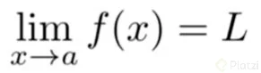

Una analogía para entender el límite es la siguiente: supón que tienes una fogata encendida frente a tí, y quieres comprobar que el fuego que estás viendo existe, que tus ojos no te engañan. Para ello, acercas las manos al fuego, cada vez más despacio, a ver si las sientes más calientes, pero nunca llegas a estar directamente en el fuego porque te puedes quemar.

## Resolución de límites e interpretación

¡Perfecto! Vamos a ver cómo **resolver límites paso a paso** y cómo **interpretarlos** gráficamente y conceptualmente.

### 🧮 **Ejemplo 1: Límite directo**

### Problema:

$$
\lim_{x \to 2} (3x + 1)
$$

### ✏️ Resolución:

Este es un límite simple. Sustituimos directamente el valor de $x$:

$$
\lim_{x \to 2} (3x + 1) = 3(2) + 1 = 7
$$

### ✅ Interpretación:

A medida que $x$ se **acerca a 2**, el valor de $3x + 1$ se **acerca a 7**. No hay discontinuidades ni problemas, porque la función es lineal y continua.

### 🧮 **Ejemplo 2: Límite con indeterminación**

### Problema:

$$
\lim_{x \to 1} \frac{x^2 - 1}{x - 1}
$$

### 🔍 Paso 1: Sustituimos directamente

$$
\frac{1^2 - 1}{1 - 1} = \frac{0}{0}
$$

Esto es una **indeterminación**, así que tenemos que **simplificar**.

### 🔧 Paso 2: Factorizamos el numerador

$$
\frac{x^2 - 1}{x - 1} = \frac{(x - 1)(x + 1)}{x - 1}
$$

Cancelamos el término común:

$$
= x + 1 \quad \text{(cuando } x \ne 1\text{)}
$$

### ✅ Resultado del límite:

$$
\lim_{x \to 1} \frac{x^2 - 1}{x - 1} = \lim_{x \to 1} (x + 1) = 2
$$

### 📊 Interpretación gráfica

En el ejemplo anterior, la función original tiene una **discontinuidad evitable** en $x = 1$, pero **el límite existe** porque los valores de la función se acercan a 2 desde ambos lados.

### 📘 Ejemplo 3: Límite infinito

$$
\lim_{x \to 0^+} \frac{1}{x}
$$

Cuando $x \to 0$ **desde la derecha** (valores positivos muy pequeños), la función:

$$
\frac{1}{x} \to +\infty
$$

### ✅ Interpretación:

El límite **no existe como número finito**, pero decimos que **tiende a infinito**.

### 🔚 Resumen

| Tipo de límite         | Qué hacer                                    |
| ---------------------- | -------------------------------------------- |
| Sustitución directa    | Solo evalúa normalmente                      |
| Indeterminación 0/0    | Factoriza, racionaliza o usa L'Hôpital       |
| Infinito o no definido | Analiza comportamiento a izquierda y derecha |
| Límite lateral         | Usa $x \to a^-$ o $x \to a^+$                |

### Resumen

Para resolver un [límite](https://platzi.com/clases/2726-calculo-diferencial-ds/46053-que-es-un-limite/ "límite") veamos el concepto de límites laterales. Un límite lateral es cuando nos acercamos a un valor por un lado, ya sea por la izquierda o la derecha. Los límites laterales se denotan de la siguiente manera.

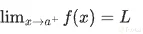

Esto es un límite lateral a la izquierda. Un límite lateral a la derecha se denota del mismo modo, excepto que elevamos la constante “a” al signo positivo.

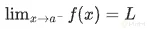

Los límites laterales son importantes, ya que para que el [límite](https://platzi.com/clases/2726-calculo-diferencial-ds/46053-que-es-un-limite/ "límite") en general exista, los dos límites laterales deben ser iguales.

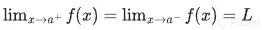

#### Ejercicio de límites e interpretación

Resolvamos el siguiente límite


Si nos damos cuenta, la función no está definida en dos, porque al hacer `x=2` nos queda una división entre cero. **Para resolver límites, debemos recurrir a trucos** como la factorización en este caso. Fíjate que el numerador es una diferencia de cuadrados, por lo que podemos reescribir el límite como.

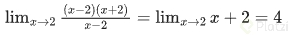

En este caso, podemos simplemente evaluar el límite y nos queda que es igual a cuatro. Esto quiere decir que a medida que nos vamos acercando a dos, la función se aproxima a cuatro. Pero recuerda, **la función no está definida en dos**.


## Definición de la derivada

La **derivada** de una función mide cómo cambia su valor en respuesta a pequeños cambios en su variable independiente. Esencialmente, responde a la pregunta:

> **¿Qué tan rápido cambia una función en un punto?**

### 📌 **Definición formal (con límites)**

La derivada de una función $f(x)$ en un punto $x = a$ se define como:

$$
f'(a) = \lim_{h \to 0} \frac{f(a+h) - f(a)}{h}
$$

🔍 Esto representa la **pendiente de la recta tangente** a la curva de $f(x)$ en el punto $x = a$.

### 📉 Interpretación gráfica

* Si la derivada es **positiva**, la función **sube** en ese punto.
* Si la derivada es **negativa**, la función **baja** en ese punto.
* Si la derivada es **cero**, la función tiene un **punto crítico** (puede ser un máximo, mínimo o un punto de inflexión).

### 📘 Ejemplo

Sea $f(x) = x^2$. Entonces:

$$
f'(x) = \lim_{h \to 0} \frac{(x + h)^2 - x^2}{h}
= \lim_{h \to 0} \frac{x^2 + 2xh + h^2 - x^2}{h}
= \lim_{h \to 0} \frac{2xh + h^2}{h}
= \lim_{h \to 0} (2x + h) = 2x
$$

✅ Por lo tanto, la derivada de $f(x) = x^2$ es $f'(x) = 2x$.

### Resumen

El problema de la derivada nace de tratar de **encontrar la recta tangente a un punto en una curva**. La primera solución (por parte de Isaac Newton) fué tomar una recta secante, es decir una recta que corta a la curva en dos puntos.

**Encontrando la pendiende de la recta tangente**

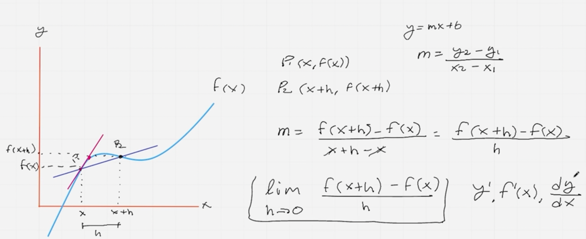

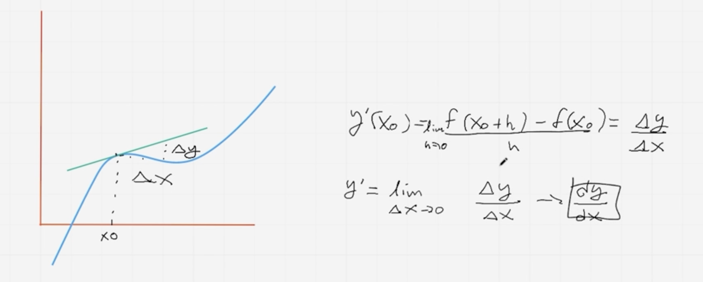

De la imagen anterior nos damos cuenta que estos dos puntos están dados por 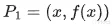 y 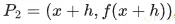 donde “h” es la distancia horizontal entre dichos puntos. Mediante estos dos puntos, podemos calcular la pendiente de la recta secante con la fórmula 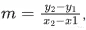, donde m es la pendiente, 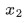 y 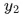 corresponden a las coordenadas de 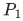, y 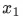 y 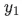 a las coordenadas de .

Sin embargo, esto nos da la pendiente de la recta secante. Queremos encontrar la de la recta tangente. Para ello, debemos recortar la distancia “**h**”, hasta que sea muy cercana a cero. Entonces tomamos el límite 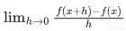, y esto nos da la pendiente de la recta tangente en un punto x de la curva. A este límite es lo que llamamos **derivada**.

La **derivada** también se puede ver en términos de incrementos. El numerador sería el incremento 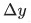 entre las funciones o también el valor de y, mientras que el denominador sería el incremento 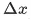 entre los valores de x.

Recuerda que el objetivo del curso no es hacer cálculo de la manera tradicional (a lápiz y papel), si no **entender los fundamentos matemáticos que se aplican en distintos algoritmos de inteligencia artificial**.

## La derivada como razón de cambio

La **derivada como razón de cambio** se refiere a cómo varía una cantidad respecto a otra. Es una de las interpretaciones más útiles y comunes de la derivada, especialmente en física, economía y ciencias aplicadas.

### 📌 Definición intuitiva

Si tienes una función $y = f(x)$, la derivada $f'(x)$ representa la **razón de cambio instantánea** de $y$ con respecto a $x$. Es decir:

$$
f'(x) = \frac{dy}{dx}
$$

Significa cuánto cambia $y$ por cada pequeña unidad de cambio en $x$.

### 📊 Ejemplos prácticos

#### 1. **Velocidad en física**

Si $s(t)$ es la posición de un objeto en función del tiempo $t$, entonces:

$$
s'(t) = \text{velocidad instantánea}
$$

Es decir, cuán rápido cambia la posición en un momento específico.

#### 2. **Crecimiento poblacional**

Si $P(t)$ es el tamaño de una población, entonces $P'(t)$ es la **tasa de crecimiento poblacional** en el tiempo $t$.

#### 3. **Economía**

Si $C(x)$ es el costo de producir $x$ unidades, entonces $C'(x)$ es el **costo marginal**, o cuánto aumentará el costo al producir una unidad adicional.

### 🧠 Conclusión

> La derivada como razón de cambio permite entender cómo una variable responde a los cambios en otra. Es una herramienta clave para analizar dinámicas en sistemas reales.

### Resumen

Supón que llevas un tiempo estudiando la relación entre los años de experiencia como desarrollador de software (developer) y el salario de este trabajo. Llegas a la conclusión de que esta relación es cuadrática, y que el gráfico se ve como una parábola. Llamemos “**s**” al salario y “**a**” a la cantidad de años de experiencia. La relación entre ambas variables sería 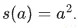.

S**i quisieras saber que tanto sube el salario en función de los años, podemos calcular la derivada**. Esta nos va a decir que tan rápido cambia “**s**” respecto a “**a**”. La derivada de una función cuadrática 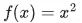 es simplemente 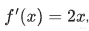, por lo que en este caso nos queda 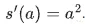. En general, la derivada de una función 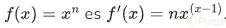. [Aquí](https://static.platzi.com/media/public/uploads/derivadas_9e208991-949b-4c24-bedf-cb94464320a3.gif "Aquí") puedes ver una tabla de drivadas comunes.

Ojo, en este **caso como la derivada es positiva (un número elevado al cuadrado siempre es positivo) sabemos que la “rapidez de cambio” aumenta junto con “a”**. Si la derivada fuera negativa, significa que la tasa de cambio disminuye a medida que aumenta “**a**”.

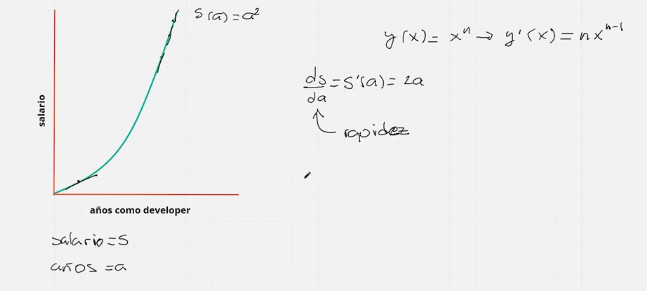

## Notaciones de la Derivada en Cálculo

Existen diferentes formas de expresar la derivada si de notaciones hablamos. Cada una de ellas fue propuesta por un científico diferente al momento de desarrollar los principios del cálculo.

Si sabemos que la variable x es la variable independiente y y la variable dependiente a través de la relación **y=f(x)**. Algunas notaciones para la derivada son las siguientes:

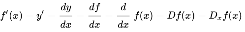

#### Notación de Leibniz

La notación de Leibniz surge del símbolo dy/dx que representa un operador de diferenciación y no debemos confundirlo como una división. Si quisiéramos expresar una segunda derivada usando la notación de Leibniz se puede mostrar como:

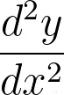

Y para mostrar la n-ésima derivada se expresa de la forma:

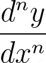

Esta notación nos sirve para entender como la derivada puede ser expresada como los incrementos tanto de x como de y cuando el incremento de x tiende a cero.

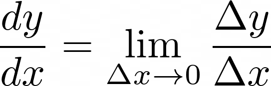

**Notación de Lagrange**

La notación más sencilla de todas es la de Lagrange. Esta notación expresa que la función es una derivada usando una comilla simple antes del argumento, llamada prima.


Esta expresión se lee como “efe prima de equis”. La cual representa la primera derivada de una función. Si deseamos expresar la segunda derivada sería:


Y para mostrar la n-ésima derivada se expresa de la forma:


Notación de Newton
Por último tenemos la notación de Newton. Esta notación es muy usada en campos como la física y la ingeniería debido a su simplicidad para expresar la primera y segunda derivada. Se usa sobre todo en funciones relacionadas al tiempo en campos como la mecánica. Por ejemplo, como una función que representa el movimiento de una partícula.

Su representación de la primera y segunda derivada es la siguiente:

ẋ ẍ

En esta clase has aprendido cuáles son las notaciones más comunes que se usan para representar una derivada. Existen más como es la notación de Euler que se puede ver al inicio de esta lectura con el operador de diferenciación D.

Nos vemos en la siguiente clase para aprender más sobre cálculo. 💚

## Implementación de la derivada discreta

La **derivada discreta** es una aproximación de la derivada continua usada cuando se trabaja con datos en puntos separados (discretos), como en programación, análisis numérico o datos de sensores. En lugar de usar un límite, se usa una **diferencia finita**.

### 🔢 Fórmula de la derivada discreta

Para una función $f(x)$ evaluada en puntos discretos $x_0, x_1, x_2, ..., x_n$, la derivada discreta se aproxima con:

$$
f'(x_i) \approx \frac{f(x_{i+1}) - f(x_i)}{x_{i+1} - x_i}
$$

Esto se llama **diferencia hacia adelante**.

### 📌 Otras aproximaciones

1. **Diferencia hacia atrás:**

$$
f'(x_i) \approx \frac{f(x_i) - f(x_{i-1})}{x_i - x_{i-1}}
$$

2. **Diferencia centrada (más precisa):**

$$
f'(x_i) \approx \frac{f(x_{i+1}) - f(x_{i-1})}{x_{i+1} - x_{i-1}}
$$

### 🧮 Ejemplo en Python

```python
def derivada_discreta(x, y):
    # Asume x y y son listas o arrays del mismo tamaño
    derivada = []
    for i in range(len(x) - 1):
        dx = x[i+1] - x[i]
        dy = y[i+1] - y[i]
        derivada.append(dy / dx)
    return derivada
```

#### Ejemplo de uso:

```python
x = [0, 1, 2, 3]
y = [0, 1, 4, 9]  # f(x) = x²
print(derivada_discreta(x, y))  # Aproximación de f'(x)
# Resultado: [1.0, 3.0, 5.0] → se aproxima a 2x
```

### ✅ Aplicaciones comunes

* Análisis de datos numéricos (gráficas, sensores, series temporales)
* Física computacional
* Simulación de sistemas dinámicos
* Procesamiento de señales

### Resumen

En ciencia de datos nos interesa llevar los conceptos matemáticos como la derivada a una computadora. En [Google Colab](https://colab.research.google.com/?utm_source=scs-index "Google Colab") llevaremos a cabo la implementación y visualización de las derivadas.

#### Implementando y derivando una función en Colab

Una vez en Google Colab, importamos las librerías que necesitamos. Usamos [NumPy](https://platzi.com/cursos/pandas-numpy/ "NumPy") para la manipulación matemática, y [matplotlib](https://platzi.com/cursos/matplotlib-seaborn/ "matplotlib") para la visualización.

```python
import numpy as np
import matplotlib.pyplot as plt
```

Entonces definimos una función f, que en este caso corresponde a una cuadrática. También definimos el conjunto de datos x al que le aplicamos la función (recuerda, **las computadoras trabajan con valores discretos, no contínuos**). En este caso, **x** es un conjunto de 1000 datos que va de -10 a 10 ([más sobre la función linspace](https://numpy.org/doc/stable/reference/generated/numpy.linspace.html "más sobre la función linspace")). Una vez definida la función y las variables, graficamos con plt.plot

```python
def f(x):
    return x**2
    
x = np.linspace(-10,10,1000)
y = f(x)

plt.plot(x, y, 'b')
plt.grid()
```
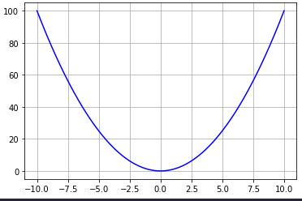

Ahora, para implementar la derivada; como estamos trabajando con valores discretos, debemos implementarla de manera aproximada con la definición que usa límites. Recuerda que esta definición es . Debemos escoger un valor de h lo suficientemente pequeño para tener una buena aproximación. La implementación en código es:

```python
def df(f):
    h = 0.000001
    return ( f(x+h) -f(x) )/h
```

Y para graficar la función con su derivada simplemente usamos plt.plot

```python
plt.plot(x, y, 'b')
plt.plot(x, df(f), 'r')
plt.grid()
```


Podemos probar cambiando 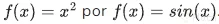. Para ello redefinimos la función como:

```python
def f(x):
    return np.sin(x)
```

Y volvemos a graficar.

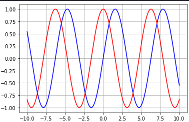

## La importancia de la regla de la cadena

La **regla de la cadena** es fundamental en cálculo diferencial y especialmente crucial en el **entrenamiento de modelos de Machine Learning**, incluyendo **redes neuronales**. Aquí te explico su importancia en distintos contextos:

### 📚 ¿Qué es la regla de la cadena?

La regla de la cadena se usa para **derivar funciones compuestas**, es decir, funciones dentro de funciones.

$$
\text{Si } y = f(g(x)), \text{ entonces } \frac{dy}{dx} = f'(g(x)) \cdot g'(x)
$$

### 🧠 ¿Por qué es importante?

#### 1. **En redes neuronales: backpropagation**

La regla de la cadena permite calcular cómo cambian los pesos de una red neuronal para minimizar el error.

* Cada capa de una red es una función compuesta de las anteriores.
* La regla de la cadena permite “retropropagar” el error desde la salida hasta la entrada.
* Sin la regla de la cadena, **no podríamos ajustar los pesos correctamente** durante el entrenamiento.

#### 2. **En funciones complejas de la vida real**

Muchos fenómenos (físicos, económicos, biológicos) se modelan con funciones compuestas. Para predecir o entender cómo cambia una variable con respecto a otra, se necesita usar esta regla.

#### 3. **En optimización y aprendizaje automático**

La mayoría de los modelos optimizan funciones de error compuestas. Para encontrar los mínimos, se necesita derivar usando la regla de la cadena.

### 🔍 Ejemplo simple

Sea:

$$
f(x) = \sin(x^2)
$$

Aquí:

* $g(x) = x^2$
* $f(g) = \sin(g)$

Entonces:

$$
f'(x) = \cos(x^2) \cdot 2x
$$

Esto es gracias a la regla de la cadena.

### ✅ En resumen

La **regla de la cadena** es esencial porque:

* Hace posible derivar funciones compuestas.
* Es la base del algoritmo **backpropagation**, usado para entrenar redes neuronales.
* Permite entender cómo pequeños cambios en la entrada afectan la salida en sistemas complejos.

### Resumen

**La regla de la cadena se usa para derivar funciones compuestas**. Recuerda que una **función compuesta** es una función que recibe otra función. **Mediante la regla de la cadena podemos obtener la razón de cambio de una variable inicial respecto a una variable final**. Esto se usa en algoritmos de redes neuronales como el [backpropagation](https://platzi.com/clases/2263-redes-neuronales/37442-backpropagation/ "backpropagation")

Para esto, multiplicamos la derivada de la función externa por la derivada de la función interna.

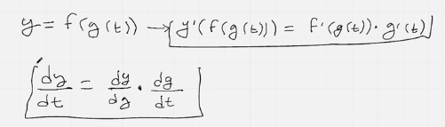

#### Ejemplo de regla de la cadena

Para este ejemplo recordamos que las derivadas se pueden ver como una razón de cambio. Tengamos en cuenta que la derivada de una recta es su pendiente, y la pendiente determina que tanto crece la recta. Por lo tanto, es lógico que sea su razón de cambio.

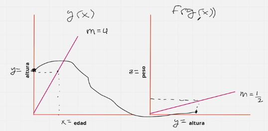

Podemos ver que hay dos gráficas que se relacionan con la altura. Si con la **edad (x)** obtenemos la **altura (y)**, y con la **altura** podemos obtener el **peso (z)**, entonces podemos obtener la razón de cambio del **peso** directamente de la **edad** con la composición de funciones $z(y(x))$ y la regla de la cadena.

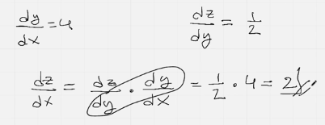

## ¿Qué es un máximo y un mínimo?

En cálculo, los **máximos** y **mínimos** son puntos donde una función alcanza sus **valores extremos**. Se dividen en dos tipos: **máximos/mínimos locales** y **globales**.

### 📌 Definiciones

#### 🔺 Máximo

Un punto donde la función alcanza un valor **mayor** que sus valores cercanos.

* **Máximo local:**
  En un pequeño intervalo alrededor del punto, la función tiene su valor más alto.
  Ejemplo: el pico de una colina.

* **Máximo global (absoluto):**
  Es el valor más alto en **toda la función**.

#### 🔻 Mínimo

Un punto donde la función alcanza un valor **menor** que sus valores cercanos.

* **Mínimo local:**
  En una pequeña vecindad, es el valor más bajo.
  Ejemplo: el fondo de un valle.

* **Mínimo global:**
  El punto más bajo de toda la función.

### 📐 ¿Cómo se encuentran?

Mediante el **cálculo de derivadas**:

1. **Deriva la función:**
   Encuentra $f'(x)$

2. **Encuentra los puntos críticos:**
   Resuelve $f'(x) = 0$ o donde $f'(x)$ no existe.

3. **Usa la segunda derivada para clasificar:**

   * Si $f''(x) > 0$: mínimo local (la curva se abre hacia arriba).
   * Si $f''(x) < 0$: máximo local (la curva se abre hacia abajo).
   * Si $f''(x) = 0$: podría ser un punto de inflexión (requiere más análisis).

### 🧠 ¿Por qué son importantes?

* **Optimización:** Se usan para maximizar ganancias, minimizar costos, encontrar el mejor ajuste, etc.
* **Física:** Para encontrar puntos de equilibrio o condiciones extremas.
* **Machine Learning:** Se busca el mínimo de la función de pérdida durante el entrenamiento.

### ✅ Ejemplo:

$$
f(x) = -x^2 + 4x
$$

1. Derivada:

$$
f'(x) = -2x + 4
$$

2. Puntos críticos:

$$
-2x + 4 = 0 \Rightarrow x = 2
$$

3. Segunda derivada:

$$
f''(x) = -2 < 0 \Rightarrow \text{máximo local en } x = 2
$$

### Resumen

#### Obteniendo máximos y mínimos con la derivada

Imagínate que la siguiente curva es una montaña rusa, y que la recta tangente a esta curva en cualquier punto es el carrito de la montaña rusa. Cuando el carrito va subiendo, este tiene cierta inclinación. Cuando va bajando, tiene una inclinación opuesta. Esta inclinación nos la da la derivada. Como sabrás, **si la derivada es positiva, la curva incrementa, y al contrario si la derivada es negativa**.

[Curva con máximos y mínimos](images/Curvaconmaximosyminimos.jpg)

Ahora, **¿qué pasa si la derivada es cero?** Cuando la derivada vale cero en algún punto, a esto se le conoce como punto crítico. En este caso, la recta tangente a dicho punto es completamente horizontal. Es en este momento que nos encontramos un posible máximo o mínimo. **¿Cómo determinamos si este punto corresponde a un máximo o un mínimo?** Responde en los comentarios antes de seguir leyendo…

Si respondiste que estudiando la derivada en puntos a la izquierda y a la derecha del punto crítico, estás en lo correcto. Se determina que hay un punto máximo LOCAL si la derivada cambia de positivo a negativo y viceversa si es un punto mínimo. A esto se le conoce como el **criterio de la primera derivada**.

También existe el criterio de la segunda derivada, que consiste en estudiar que pasa cuando derivamos por segunda vez la función en un punto crítico. Te invito a investigarlo (ya que está fuera del alcance de este curso).

## Optimizando nuestro primer problema

¡Perfecto! Vamos a **optimizar nuestro primer problema paso a paso** usando cálculo. Este ejemplo clásico es ideal para aprender el proceso de optimización usando derivadas.

### 🧩 **Problema:**

> Una empresa vende helados. Cada helado se vende a \$5. Cada unidad cuesta \$1 en materiales y \$2 en distribución. ¿Cuántos helados deben vender para maximizar la ganancia?

### 🧠 **Paso 1: Entender el objetivo**

Queremos **maximizar la ganancia**.

* **Precio de venta por unidad:** \$5
* **Costo por unidad:** \$1 (materiales) + \$2 (distribución) = \$3
* **Ganancia por unidad:** \$5 − \$3 = \$2

Si vendemos $x$ helados, la **ganancia total** es:

$$
G(x) = 2x
$$

### 😅 Pero... ¡esto no tiene máximo!

La función $G(x) = 2x$ crece sin límite. Necesitamos **más restricciones**. Supongamos una nueva versión:

### 🧩 **Problema corregido:**

> Se quiere construir una cerca rectangular junto a un río, usando 100 metros de valla. No se necesita valla en el lado del río. ¿Cuáles deben ser las dimensiones para **maximizar el área**?

### 📐 **Paso 2: Definir variables**

* Lado **paralelo** al río: $x$
* Lados **perpendiculares** al río: $y$

Solo usamos valla en 3 lados: uno de $x$, dos de $y$.
Restricción:

$$
x + 2y = 100
$$

Queremos **maximizar el área**:

$$
A = x \cdot y
$$

### 🔁 **Paso 3: Sustituir y reducir a una variable**

De la restricción:

$$
x = 100 - 2y
$$

Sustituimos en el área:

$$
A(y) = (100 - 2y)y = 100y - 2y^2
$$

### 🧮 **Paso 4: Derivar y optimizar**

$$
A'(y) = 100 - 4y
$$

Puntos críticos:

$$
100 - 4y = 0 \Rightarrow y = 25
$$

Segunda derivada:

$$
A''(y) = -4 < 0 \Rightarrow \text{Máximo}
$$

### ✅ **Resultado**

* $y = 25$
* $x = 100 - 2(25) = 50$

👉 Las dimensiones que **maximizan el área** son:

$$
\boxed{x = 50\text{ m},\ y = 25\text{ m}}
$$

### Resumen

**Los problemas de optimización en general requieren encontrar mínimos o máximos**. Veamos esto con el siguiente problema: queremos construir una oficina con solo 50 mts de perímetro de paredes abarcando el área más grande posible (punto máximo). La oficina solo tiene 3 paredes y una vista al mar.

#### Resolviendo el problema


**Primero debemos encontrar la función a optimizar**. En este caso, queremos encontrar el área máxima. De acuerdo al dibujo de arriba, el área está dada por `A = x * y`, y el perímetro de las tres paredes está dado por `p=2x+y=50`. Teniendo estos datos, podríamos intentar resolverlo al tanteo. Sin embargo, la mejor forma de resolverlo parecido a un sistema de ecuaciones.

Si tenemos que `2x+y=50`, podemos reordenar y nos queda `y=50-2x`. Entonces sustituímos esta expresión en la fórmula del área para que nos quede solo en función de `x`. Nos queda: `A(x)=x(50-2x)=50x-2x*x`.

**Ahora toca diferenciar la función del área e igualarla a cero**. Quedando así: `A’(x) = -4x + 50 = 0`. Resolvemos para x, y nos da un punto crítico en `x=25/2`. Solo nos queda determinar si este es un máximo. Para ello evaluamos en la derivada un punto a la izquierda y a la derecha de 25/2. Es decir:

```
A'(12)=-4*12+50=2
A'(13)=-4*13+50=-2
```

Como a la izquierda de `x` la derivada es positiva, y a la derecha es negativa, podemos decir que `x=25/2` es un máximo. Solo queda sustituir en `y=50-2x`. Nos da que `y=25`. Por lo tanto, las medidas de las paredes de la oficina con la mayor área son `x=(25/2)m` y `y=25m` . El área nos da 1.PNG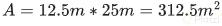.

#### Conclusión

Es importante entender cómo resolver problemas de optimización para saber qué hay detrás de distintos algoritmos de machine learning como el descenso del gradiente. La ventaja que tenemos en la ciencia de datos es que dichos problemas ya están resueltos en código por otros data scientists. Sin embargo, es útil entender de donde vienen dichas soluciones.

## ¿Cómo son las derivadas en las funciones de activación?

Las derivadas de las **funciones de activación** son fundamentales en el entrenamiento de redes neuronales, porque permiten **ajustar los pesos** durante el aprendizaje usando **backpropagation**. Aquí te explico cómo son y por qué importan:

### 🧠 ¿Por qué necesitamos derivadas en activaciones?

Cuando entrenamos una red neuronal, usamos una técnica llamada **descenso del gradiente**, que necesita calcular cómo cambia el error al ajustar cada peso. Eso se hace a través de derivadas (o gradientes).
La **derivada de la función de activación** permite propagar el error hacia atrás desde la salida hasta las capas ocultas.

### ⚙️ Ejemplos comunes de funciones de activación y sus derivadas:

| Función de Activación | Fórmula                                              | Derivada                                                                                      |
| --------------------- | ---------------------------------------------------- | --------------------------------------------------------------------------------------------- |
| **Sigmoide**          | $\sigma(x) = \frac{1}{1 + e^{-x}}$                   | $\sigma'(x) = \sigma(x)(1 - \sigma(x))$                                                       |
| **Tanh**              | $\tanh(x) = \frac{e^x - e^{-x}}{e^x + e^{-x}}$       | $\tanh'(x) = 1 - \tanh^2(x)$                                                                  |
| **ReLU**              | $\text{ReLU}(x) = \max(0, x)$                        | $\text{ReLU}'(x) = \begin{cases} 1 & \text{si } x > 0 \\ 0 & \text{si } x \leq 0 \end{cases}$ |
| **Leaky ReLU**        | $\text{LReLU}(x) = \max(0.01x, x)$                   | $\text{LReLU}'(x) = \begin{cases} 1 & x > 0 \\ 0.01 & x \leq 0 \end{cases}$                   |
| **Softmax**           | $\text{Softmax}(x_i) = \frac{e^{x_i}}{\sum e^{x_j}}$ | Tiene una derivada más compleja (matriz Jacobiana) usada en clasificación multiclase          |

### 🟢 ¿Qué significa esto en la práctica?

* La **sigmoide** y **tanh** son suaves, pero pueden causar el problema de **gradientes pequeños** (vanishing gradients).
* La **ReLU** es muy usada porque es simple y eficiente, y no sufre tanto del problema anterior.
* La **Softmax** se usa en la última capa para clasificación multiclase.

### 📌 Resumen

* Las derivadas permiten que el modelo **aprenda ajustando pesos**.
* Elegir la **función de activación adecuada** impacta directamente en la velocidad y eficacia del aprendizaje.
* ¡Sin derivadas, no hay backpropagation!

### Resumen

En [este notebook](https://colab.research.google.com/drive/1xXXphqsaEczh1vo4T1wumkqM1xybpqOf?usp=sharing "este notebook") de Google Colab exploramos las derivadas de distintas [funciones de activación](https://platzi.com/clases/2701-funciones-matematicas/45566-funciones-de-activacion/ "funciones de activación").

#### Derivadas de funciones de activación

Mediante la función derivada discreta que programamos en clases anteriores, podemos obtener una derivada aproximada de las funciones de activación.

```python
def df(f):
  h=0.000001
  return (f(x+h)-f(x))/h
```

#### Derivada de una función lineal

**Las funciones lineales también pueden servir como funciones de activación de una red neuronal**. Por esto es importante entender que la derivada de una función lineal es simplemente su pendiente. Es decir

```python
"""Sea
f(x) = mx+b
f'(x) = m
"""

def f(x):
  return x

plt.plot(x, f(x), 'b')
plt.plot(x,df(f), 'r')
plt.grid()
```

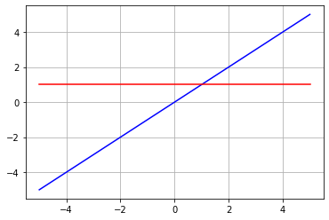

#### Derivada de la función de Heaviside

Recordemos que la función de Heavyside está dada por partes, de la siguiente forma:
1.PNG
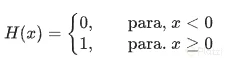

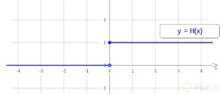

Si vemos la gráfica de la función, nos damos cuenta que para `x=0` la función “crece” completamente vertical hasta `y=1`. Es decir, la recta tangente en x=0 tiene pendiente infinita. **Se puede demostrar que la derivada de la función de Heavyside corresponde a la “Delta de Dirac”**. Te invito a investigar la **Delta de Dirac** por tu cuenta, pero en resúmen, esta función tiende a infinito cuando `x` tiende a cero (en este caso), y vale cero para todos los demás valores.

#### Derivada de la función sigmoide

La función sigmoide es usada tanto en redes neuronales como en [regresión logística](https://platzi.com/clases/2081-ds-probabilidad/33070-regresion-logistica/ "regresión logística"). Esta función se expresa como:


Y su derivada:
3.PNG
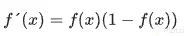

Optimizar esta función en redes neuronales puede llevar a un problema conocido como **“vanishing gradient”**, debido a la complejidad de la función. Te invito a investigarlo. Por ahora, te dejo el código y el gráfico de esta función con su derivada.

```python
def f(x):
  return 1/(1 + np.exp(-x))
   
plt.plot(x, f(x), 'b')
plt.plot(x,df(f), 'r')
plt.grid()
```

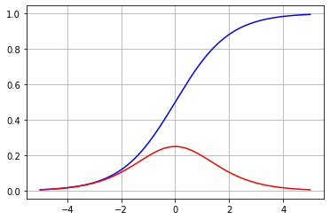

#### Derivada de la función tangente hiperbólica

Con esta función ocurre algo similar que con la sigmoide. La complejidad de su derivada puede causar problemas durante la optimización. La función tangente hiperbólica está dada por: 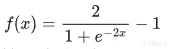

Y su derivada

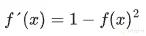

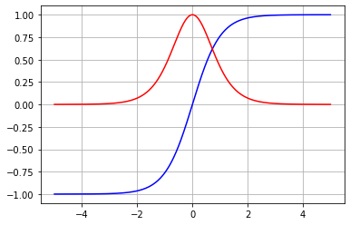

#### Derivada de la función ReLU

La función ReLU es especialmente útil en las capas intermedias de una red neuronal, gracias a su relativa sencillez. La función ReLu está definida como $R(x)=max(0,x)$, o bien:

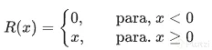

Y su derivada está dada por

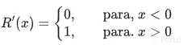

Nota: ReLu no tiene derivada en cero

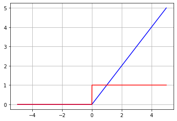

#### Conclusión

Entender estas funciones y sus derivadas nos ayudará a comprender los fundamentos necesarios para desarrollar algoritmos de machine learning y redes neuronales. Esto no se trata de una receta de cocina, y sino de pensar de manera analítica usando dichos fundamentos.

## ¿Quieres un Curso de Cálculo Integral para Data Science e Inteligencia Artificial?

Aprendiste la importancia de la derivada en múltiples áreas. Ya sea en su uso como razón de cambio, en problemas de optimización y en funciones de activación.

### ¿Qué sigue?

El objetivo de estudiar la derivada, así como otros fundamentos matemáticos para data science, es que los métodos aplicados en esta rama dejen de ser una caja negra. Es importante saber qué hay por detrás de los algoritmos y métodos aplicados en data science para poder desarrollar nuevos métodos u optimizar otros.

En próximos cursos veremos cálculo multivariable para ciencia de datos.

Recuerda tomar el exámen, y compartir el certificado con el profesor Enrique en su [Twitter](https://twitter.com/codevars "Twitter").

**Lecturas recomendadas**

[https://twitter.com/codevars](https://twitter.com/codevars)