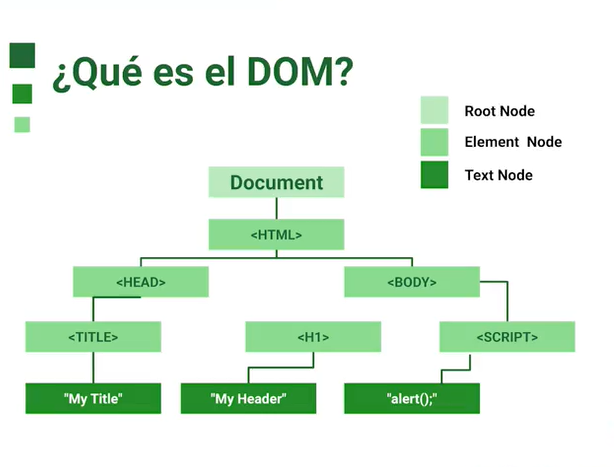
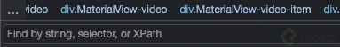

# Curso de Automatización de Pruebas con Puppeteer

## ¿Qué es el DOM?



El DOM (Document Object Model en español Modelo de Objetos del Documento) es una interfaz/modelo de documento.

Se representa el documento como un árbol de nodos, en donde cada nodo representa una parte del documento (puede tratarse de un elemento, una cadena de texto o un comentario).

- Los nodos tienen jerarquía
 
- Estos nodos pueden crearse, moverse o modificarse. -La mejor forma de visualizar los elementos es con las herramientas para desarrolladores de los navegadores. -Inspeccionar te permite incluso seleccionar un elemento en específico.

## Atributos y selectores

La barra de búsqueda que menciona el profesor y que él comenta que se puede obtener con las teclas Cmd + F o Ctrl + F.



Más adelante el video aunque no se ve lo que escribe directamente en la barra el profesor va describiendo lo que escribe y se ve en el resultado de la búsqueda en la pantalla.

Lo primero que escribe es: div span

Las propiedades y los atributos estan Relacionados pero No son lo mismo.

En **HTML**, los **atributos** y las propiedades son elementos esenciales que afectan la estructura, el comportamiento y la apariencia de una página web. Aquí está una breve explicación de cada uno:

1. **Atributos HTML:**
 - Los atributos son valores adicionales que se agregan a las etiquetas HTML para configurar o personalizar los elementos.
 - Se definen directamente en el código HTML y se utilizan para ajustar el comportamiento de los elementos.
 - Ejemplos comunes de atributos:
`src` en la etiqueta  para especificar la fuente de una imagen.
`href` en la etiqueta <a> para definir la URL de un enlace.
`class` en cualquier etiqueta para aplicar estilos CSS a elementos con propiedades en común.
 `alt` en la etiqueta  para proporcionar un texto alternativo en caso de que la imagen no se pueda mostrar.

2. **Propiedades:**
- Las propiedades son características específicas de un elemento que se pueden acceder y modificar mediante **JavaScript** o **CSS**.
- A diferencia de los atributos, las propiedades no se definen directamente en el código HTML, sino que se manipulan a través de **scripts** o **estilos**.

- Ejemplos de propiedades:

`innerHTML`: Contenido HTML dentro de un elemento.
`style`: Estilos CSS aplicados al elemento.
`value`: Valor de un campo de entrada (por ejemplo, `<input>`).
En resumen, los atributos son parte integral de las etiquetas HTML y se utilizan para configurar elementos, mientras que las propiedades son características que se pueden manipular dinámicamente mediante JavaScript o CSS. [Ambos son fundamentales para construir páginas web efectivas y funcionales12](https://developer.mozilla.org/es/docs/Web/HTML/Attributes "Ambos son fundamentales para construir páginas web efectivas y funcionales12").

## ¿Qué es Puppeteer?

Puppeteer es una librería mantenida por el equipo de **[Chrome DevTools](https://github.com/GoogleChrome/puppeteer/blob/master/CONTRIBUTING.md "Chrome DevTools")** que están continuamente liberando versiones y corrigiendo fallos para poder utilizar las últimas novedades de Chrome. A día de hoy es posible realizar con Puppeteer lo siguiente:

- **Simular navegación web**. Es posible automatizar el acceso a un portal pudiendo hacer clics en elementos, rellenar datos, hacer envíos de formularios, etc. Además, se puede elegir la emulación de la navegación utilizando un navegador de escritorio o móvil. Si alguna vez habéis trabajado con Devtools, conoceréis la forma para emular el comportamiento de una web en estos dispositivos.
- **Generar capturas de pantallas o informes PDF**.
- **Crear crawlers de páginas SPA o generar contenido pre-renderizado SSR**.
- **Analizar rendimiento de aplicaciones web** utilizando la herramienta Timeline Trace de Devtools.
- **Automatización de tests**, pudiendo realizar pruebas con las últimas versiones de Chrome y Javascript.
- **Probar extensiones de Chrome**.

Los *scripts* creados con Puppeteer pueden ser integrados con herramientas de terceros, para monitorizar, testear o automatizar tareas.

Por contra solo es posible utilizarlo bajo Chrome y usar como lenguaje Javascript.

**Puppeteer**: es una biblioteca de Node.js que proporciona una interfaz de alto nivel para controlar los navegadores web mediante el protocolo DevTools de Chrome o Chromium. Fue desarrollada por el equipo de Chrome en Google y se utiliza comúnmente para realizar tareas automatizadas en navegadores, como web scraping, capturas de pantalla, generación de PDF, pruebas automatizadas y más.

Algunas características clave de Puppeteer incluyen:

1. **Control de Navegadores**: Puppeteer permite abrir, cerrar y controlar instancias de navegadores Chrome o Chromium.
2. **Manipulación de Páginas Web**: Puedes interactuar con páginas web, hacer clic en elementos, llenar formularios, navegar por páginas, entre otras acciones.
3. **Capturas de Pantalla y Generación de PDF**: Puppeteer facilita la captura de pantallas y la generación de archivos PDF de páginas web.
4. **Evaluación de Páginas**: Puedes ejecutar scripts en el contexto de la página que estás controlando, lo que permite realizar operaciones más avanzadas.
5. **Simulación de Dispositivos y Red**: Puppeteer permite emular diferentes dispositivos y configuraciones de red para probar cómo se comporta una página en distintos escenarios.
6. **Pruebas Automatizadas**: Se utiliza comúnmente en pruebas automatizadas para asegurar que las aplicaciones web se comporten como se espera.

Un caso de uso muy común de Puppeteer es el web scraping, donde puedes automatizar la extracción de datos de páginas web. Algunos de los comandos que se ven en los scripts de Puppeteer, como **page.goto**, **page.click**, y **page.evaluate**, son utilizados para navegar por el sitio, interactuar con elementos y ejecutar scripts en la página.

Para comenzar a usar Puppeteer, primero debes instalarlo en tu proyecto Node.js mediante npm:

`npm install puppeteer`

Después de la instalación, puedes importar Puppeteer en tu script y comenzar a utilizar sus funciones para interactuar con el navegador web de manera programática.

## Configuración de nuestro ambiente

Instalador de Git: [https://git-scm.com/download/win](https://git-scm.com/download/win "https://git-scm.com/download/win")

Instalador de NodeJS: [https://nodejs.org/es](https://nodejs.org/es "https://nodejs.org/es")

Configuraciones del VSCode: [https://www.youtube.com/watch?v=uyEUVgNMvGI](https://www.youtube.com/watch?v=uyEUVgNMvGI "https://www.youtube.com/watch?v=uyEUVgNMvGI")

Configurar Git con VS Code: [https://www.youtube.com/watch?v=Y9g3Yvx9PfA](https://www.youtube.com/watch?v=Y9g3Yvx9PfA "https://www.youtube.com/watch?v=Y9g3Yvx9PfA")

Extensiones que instale en mi VSCode:

- Community Material Theme
- ESLint
- JavaScript (ES6) code snippets
- JavaScript and TypeScript Nightly
- Jest Snippets
- file-icons
- Material Icon Theme
- Material Theme
- Material Theme Icons
- Bracket Pair Color DLW

### Instalar  puppeteer
1. tener node.js y npm
2. Por si quieres inicializar un repo con GIT→ `git init`
3. Inicializar el proyecto con todas las config por defecto→ `npm init -y`
 4. Instalar **puppeteer** y** jest**; permite gestionar las pruebas → `npm i puppeteer jest` (si no funciona, instalar por separado)
 - Opcional: dependencia de desarrollo; da formato al código y se acomoda solo → `npm i -D prettier`
5. agregar archivo **.gitignore** → para que git ignoré los archivos/carpetas que le indiquemos, en este caso ignoramos; **node_modules**
6. opcional: agregar archivo .prettierrc →

```json
{
    "printWidth": 100,
    "singleQuote": true,
    "useTabs": true,
    "tabWidth": 2,
    "semi": false,
    "trailingComma": "es5",
    "bracketSameLine": true    
}
```

[Configuration File · Prettier](https://prettier.io/docs/en/configuration.html "Configuration File · Prettier")

## Abriendo y cerrando el navegador

```javascript
const puppeteer = require("puppeteer")

describe('Mi primer test en puppeteer',()=>{

    it("Debe de abrir y cerrar el navegador", async()=>{
        const browser = await puppeteer.launch({
            headless:false,
        });
        const page = await browser.newPage();
        await page.goto("https://www.google.com");
        await new Promise((resolve) => setTimeout(resolve, 5000));
        await browser.close();
    }, 20000);
})
```
[Running with chrome rather than chromium · Issue #2757 · puppeteer/puppeteer · GitHub](https://github.com/puppeteer/puppeteer/issues/2757 "Running with chrome rather than chromium · Issue #2757 · puppeteer/puppeteer · GitHub")

[Puppeteer quick start - Chrome Developers](https://developers.google.com/web/tools/puppeteer/get-started "Puppeteer quick start - Chrome Developers")

## Opciones de lanzamiento

```javascript
const puppeteer = require("puppeteer")

describe('Mi primer test en puppeteer',()=>{

    it("Debe de abrir y cerrar el navegador", async()=>{
        const browser = await puppeteer.launch({
            headless:false,
            slowMo: 0, // coloca en camara lenta el proceso
            devtools: true, //Abre las herramientas de desarrollador
            //defaultViewport:{
            //    width:2100,
            //    height:1080
            //}

            //args:["--window-size=1920,1080"], //tamaño d ela pantalla
            defaultViewport: null, // colocaa al tamaño d ela ventana
        });
        const page = await browser.newPage();
        await page.goto("https://www.google.com");
        await new Promise((resolve) => setTimeout(resolve, 5000));
        await browser.close();
    }, 30000);
})
```

## Navegación con Puppeteer

```javascript
const puppeteer = require("puppeteer")

describe('Mi primer test en puppeteer',()=>{

    it("Debe de abrir y cerrar el navegador", async()=>{
        const browser = await puppeteer.launch({
            headless:false,
            defaultViewport: null, 
        });
        const page = await browser.newPage();
        await page.goto("https://www.github.com");
        //await new Promise((resolve) => setTimeout(resolve, 5000));
        await page.waitForSelector("img");
        //Recargar la pagina
        await page.reload();
        await page.waitForSelector("img");

        //Navegar a otro sitio
        await page.goto("https://www.platzi.com");
        await page.waitForSelector('body > main > header > div > figure > svg > g > path:nth-child(2)');

        await page.goBack();
        await page.goForward();
        //await page.waitForSelector("img");

        // Abrir otra pagina
        const page2 = await browser.newPage()
        await page2.goto("https://www.google.com") 

        await browser.close();
    }, 30000);
})
```

## Esperar por los elementos

## Interactuando con los elementos

```javascript
const puppeteer = require("puppeteer")

describe('Interactuando con elementos',()=>{

    it("Debe de abrir y cerrar el navegador", async()=>{
        const browser = await puppeteer.launch({
            headless:false,
            defaultViewport: null, 
        });

        const page = await browser.newPage();
        await page.goto("https://demo.guru99.com/test/simple_context_menu.html")

        page.on("dialog", async(dialog) => {  //Se usa para cerrar las alertas

            await dialog.accept()
        })

        //Click derecho

        //await page.click("#authentication > span", {button: "right",delay:500});
        //await new Promise((resolve) => setTimeout(resolve, 3000));

        //Doble click

        await page.click("#authentication > button", {clickCount:2, delay:500})
        //await new Promise((resolve) => setTimeout(resolve, 3000));

        await page.goto("https://devexpress.github.io/testcafe/example/");

        await page.type("#developer-name", "Javier Lopez",{delay: 100});
        await page.click("#remote-testing");
        await page.click("#tried-test-cafe");
        await page.type("#comments", "Esto es un comentario Hermano");
        await page.click("#submit-button");
        await new Promise((resolve) => setTimeout(resolve, 3000));

        

        await browser.close();
    }, 350000);
})
```

[Simple Context Menu](https://demo.guru99.com/test/simple_context_menu.html "Simple Context Menu")

[TestCafe Example Page](https://devexpress.github.io/testcafe/example "TestCafe Example Page")

## Esperar por los elementos

```javascript
const puppeteer = require("puppeteer")

describe("Tipos de espera",()=>{

    it("Mostrar todos los diferentes tipos de espera", async()=>{
        const browser = await puppeteer.launch({
            headless:false,
            defaultViewport: null, 
        });

        const page = await browser.newPage();
        await page.goto("https://platzi.com", {waitUntil: "networkidle2"})

        //Espera explicita

        await new Promise((resolve) => setTimeout(resolve, 3000));

        //Espera por un css selector

        //await page.waitForSelector("body > main > header > div > figure > svg")

        //Espera por un xpath

        //await page.waitForXPath("/html/body/main/header/div/figure/svg/g/path[1]");

        await page.goto("https://demoqa.com/modal-dialogs", {waitUntil:"networkidle2"});

        //await page.waitForSelector("#showSmallModal",{visible: true}); // con hidden es para cuando se oculte
        
        const button = await page.waitForSelector("#showSmallModal",{visible: true});

        // Usar XPath para seleccionar el botón y asegurarse de que es visible
        //const button = await page.waitForXPath('//*[@id="showSmallModal"]',{visible: true});
        await button.click()
        

        await browser.close();
    }, 350000);
})
```

## Esperando por funciones

```javascript
 //Espera por función

        await page.waitForFunction(()=> document.querySelector("#example-modal-sizes-title-sm").innerText === "Small Modal");
        // Ejemplo para observar el viewport

       // const observaResize = page.waitForFunction("window.innerWidth < 100");
        //await page.setViewport({width:50, height:50});

        //await observaResize;
        
        await page.click("#closeSmallModal");
        await page.waitForFunction(()=> !document.querySelector("#example-modal-sizes-title-sm"));

        await browser.close();
```

## Timeouts

```javascript
const puppeteer = require("puppeteer")

describe("tomeout",()=>{
    jest.setTimeout(10000);
    it("uso de timeout", async()=>{
        
        const browser = await puppeteer.launch({
            headless:false,
            defaultViewport: null, 
            //slowMo: 500
        });

        const page = await browser.newPage();
        page.setDefaultTimeout(10000);
        page.setDefaultNavigationTimeout(10000);
        await page.goto("https://platzi.com", {waitUntil: "networkidle2"});
        
        const images = await page.$$eval("img",(imagenes) => imagenes.length,{
            timeout:30000
        });
        console.log("images", images)

        await browser.close();
    });

})
```

## Hooks

```javascript
const puppeteer = require("puppeteer")

describe("Extrayendo informacion",()=>{

    let browser
    let page

    beforeAll(async()=>{ //beforeAll lo inicia antes de las pruebas y beforeEach lo abre en cada prueba
        browser = await puppeteer.launch({
            headless:false,
            defaultViewport: null, 
            //slowMo: 500
        });

        page = await browser.newPage();
        await page.goto("https://platzi.com", {waitUntil: "networkidle2"});
    });

    afterAll(async ()=>{ //afterAll lo cierra despuesde las pruebas yafterEach lo ciarra al terminar cada prueba
        await browser.close();
    })

    it("Extraer el titulo de la pagina y url", async()=>{

        const titulo = await page.title();
        const url = await page.url();

        console.log("titulo", titulo);
        console.log("url", url);

        

        //await new Promise((resolve) => setTimeout(resolve, 3000));

    },35000);

    it("Extraer la información d eun elemento", async()=>{

        await page.waitForSelector("body > main > header > div > nav > ul > li:nth-child(4) > a");

        const nombreBoton = await page.$eval("body > main > header > div > nav > ul > li:nth-child(4) > a", (button) => button.textContent);

        const [button] = await page.$x("/html/body/main/section[1]/a/div/div[2]/div[2]/button");
        const propiedad = await button.getProperty("textContent");
        const texto = await propiedad.jsonValue();

        //console.log("texto", texto);

        //Segunda Forma

        const texto2 = await page.evaluate((name)=>name.testContent, button);

        const button3 = await page.waitForXPath("/html/body/main/section[1]/a/div/div[2]/div[2]/button");
        const texto3 = await page.evaluate((name)=>name.testContent, button3);
        console.log("texto3", texto3);

    },35000);  

    it("Contar los elementos d euna pagina", async()=>{
        
        const images = await page.$$eval("img",(imagenes) => imagenes.length);
        console.log("images", images)

    },35000);

},50000);
```