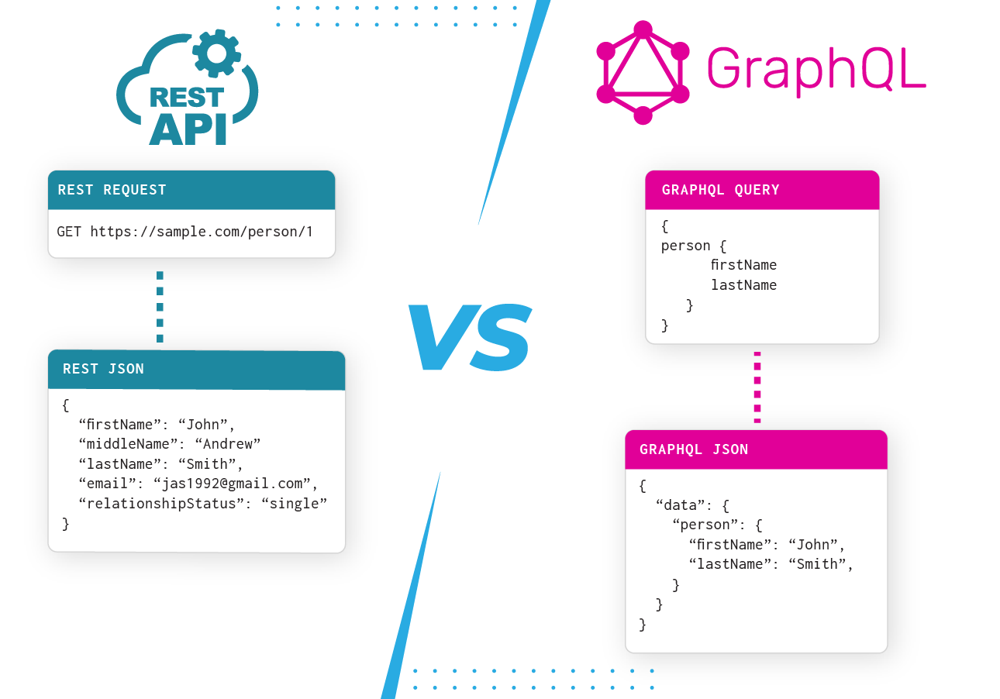

# Curso de Automatización de Pruebas de Backend con Cypress

## Backend testing



## Arquitectura REST


REST / RESTful es un estilo arquitectónico para diseñar y desarrollar una API a través del protocolo HTTP. . En esencia, REST posee muchos beneficios:

- **Cliente-Servidor**: Una API que posee la arquitectura REST, implementa un estilo basado en un cliente que envía solicitudes de recursos, descentralizados o distribuidos en servicios, para obtener una respuesta de información.
- **Uniformidad**: REST presenta un factor clave para su escalabilidad, la interfaz uniforme que presentamos permite identificar recursos y envío de mensajes descriptivos mediante meta datos.
- **Capas**: De manera general, REST implementa una jerarquía en capas, restringiendo y administrando restricciones de comportamiento, delegando su construcciones a patrones de servidores como MVC o MVCS.

### Verbos HTTP:

**GET**: sirve para obtener informacion.
**POST**: crea un registro.
**PUT**: sirve para modificar, sobreescribe todas las propiedades.
**PATCH**: sirve para modificar, pero solo algunas propiedades, no todas.
**DELETE**: sirve para borrar un registro/objeto.
**API**: Application Public Interface, sirve para comunicar un backend/base de datos con alguna aplicacion externa o un front-end.

### Estandares de API:

- SOAP (XML): La response de esta api esta en formato XML
- REST (JSON): Se han vuelto una norma en la industria de software, la response es en formato JSON.

GraphQL, trabaja sobre REST pero nos permite potenciar nuestra API. Usa el verbo POST solamente pero nos permite extraer información que realmente necesitamos. Evita el sobre-fetch, que es traer datos que quizas nunca los estemos utilizando.

Backend Testing: se trata del proceso de probar en conjunto las operaciones y flujos que ocurren en el backend, desde el funcionamiento de las bases de datos como tambien las respuestas de APIs y la consistencia en la información que estan entregando.

### Herramientas del Navegador

¡Rock 'n Roll! 🤟 . Adicionalmente, a los recursos como lecturas recomendadas, les comparto los enlaces a la documentación:

[🔗 DevTools Documentation](https://developer.chrome.com/docs/devtools/ "🔗 DevTools Documentation")
[🔗 Postman Documentation](https://learning.postman.com/ "🔗 Postman Documentation")

## Preparando nuestro entorno de trabajo
1. iniciamos el proyecto
`npm init -y`

2. seguir con la instalaciión de la libreria.
`npm i -D cypress prettier json-server`

3. Abrir cypress:
`npx cypress open`

4. para ignorar los archivos de test de cypress se agrega el siguente codigo en **cypress.config.js** el siguienter codigo:

```javascript
const { defineConfig } = require("cypress");

module.exports = defineConfig({
  e2e: {
    setupNodeEvents(on, config) {
      // implement node event listeners here
      
    },
      // ignore los archivos
    excludeSpecPattern:[
      "**/1-getting-started/*.js",
      "**/2-advanced-examples/*.js"
    ]
  },
});
```
5. se crea el archivo **db.json** con el codigo:
```json
{
    "employees": [
    {
        "id": 1,
        "first_name": "Javier",
        "last_name": "Eschweiler",
        "email": "javier@platzi.com"
    },
    {
        "id": 2,
        "first_name": "Juan",
        "last_name": "Palmer",
        "email": "juan@platzi.com"
    },
    {
        "id": 3,
        "first_name": "Ana",
        "last_name": "Smith",
        "email": "ana@platzi.com"
    }
    ]
}
```

6. se crea el test en **package.json** en *scripts*:

```json
"scripts": {
    "test": "echo \"Error: no test specified\" && exit 1",
    "run:server":"json-server --watch db.json"
  },
```

7. iniciamos nuestro servidor:

`npm run run:server`


[GitHub - javierfuentesm/CypressBackendPlatzi](https://github.com/javierfuentesm/CypressBackendPlatzi "GitHub - javierfuentesm/CypressBackendPlatzi")

[GitHub - javierfuentesm/CypressBackendPlatzi at preparando-ambiente](https://github.com/javierfuentesm/CypressBackendPlatzi/tree/preparando-ambiente "GitHub - javierfuentesm/CypressBackendPlatzi at preparando-ambiente")

## Probando el header

```javascript
describe('Probando Headers de la Api',()=>{
    it("Validar el Header y el content type", ()=>{
        cy.request('employees').its('headers').its('content-type').should('include','application/json')
    });
});
```

## Probando el status code

```javascript
describe('Probando statuses', ()=>{

    it('Debe de validar el status code exitoso',()=>{

        cy.request('employees')
        .its('status')
        .should('eq',  200)
    });

    it('Debe de validar el status code fallido',()=>{
        cy.request({url:'employees/4', failOnStatusCode: false})
        .its('status')
        .should('eq', 404)
    });
});
```

## Validando el body

```javascript
describe('Probando el body', ()=>{

    it('Probar el body 2',()=>{

        cy.request('employees/1')
        .its('body')
        .its("first_name")
        .should("be.equal","Javier")

        cy.request('employees/1').then(response =>{
            
            expect(response.status).to.be.equal(200);
            expect(response.headers['content-type']).to.be.equal('application/json');
            expect(response.body.first_name).to.be.equal('Javier');
            expect(response.body.last_name).to.be.equal('Eschweiler');

        })
    });

});
```
## Validando un error

```javascript
describe("Oribando errores", ()=>{

    it("Debe validar el status code fallido y el mensaje de error", ()=>{

        cy.request({url: 'https://pokeapi.co/api/v2/aaa', failOnStatusCode: false})
        .then(response =>{
        expect(response.status).to.eq(404);
        expect(response.body).to.be.eq("Not Found");
        });
    });

    it("Debe validar el status code fallido y el mensaje de error de rick and morty", ()=>{

        cy.request({url: 'https://rickandmortyapi.com/api/location/5487', failOnStatusCode: false})
        .then(response =>{
        expect(response.status).to.eq(404);
        expect(response.body).to.have.property('error', "Location not found");
        });
    });
})
```
## Peticiones REST

```javascript
describe('Probando requests',()=>{

    it('Debe de crear un empleado', function () {
        cy.request({
            url:'employees',
            method:'POST',
            body:{
                first_name: "Maria",
                last_name: "Perez",
                email: "Maria@platzi.com"
            }
        }).then(response=>{
            expect(response.status).to.eq(201);
            expect(response.body).to.have.property('id')

            const id = response .body.id;
            cy.wrap(id).as('id')
        })
    });

    it('Debe de validar que se haya creado en la base de tatos',()=>{

        cy.request('GET', 'employees').then(response=>{
            expect(response.body[response.body.length - 1].first_name).to.eq("Maria");
        });
    })

    it("Debemos de modificar al empleado con un nuevo correo", function () {

        cy.request({
            url: `employees/${this.id}`,
            method: "PUT",
            body: {
                first_name: "Pepito 3",
                last_name: "Desarrollador",
                email: "nuevo@correo.com",
            },
        }).then((response) => {
            cy.log(response);
            expect(response.status).to.eq(200);
            expect(response.body).to.have.property("id");
        });
    });

    it("Debemos de eliminar el registro creado", function () {
        cy.request({
            url: `employees/${this.id}`,
            method: "DELETE",
        }).then((response) => {
            expect(response.status).to.eq(200);
        });
    });
});
```

## Peticiones GraphQL

[📚 Cypress GraphQL](https://docs.cypress.io/guides/end-to-end-testing/working-with-graphql)

[Home GraphQL](https://graphql-pokeapi.vercel.app/)


```javascript
const query = `{
  findUser(username:"hello") {
    id
  }
}`;

cy.request({
    url: 'URL',  
    body: { query },                   
    failOnStatusCode: false            
}).then((response: any) => {
    cy.log(response);
});
```

Dejo la Api: [https://graphql-pokeapi.graphcdn.app/](https://graphql-pokeapi.graphcdn.app/)

```javascript
describe('Probando graphql',()=>{

    it('debe de hacer una consulta con graphql', ()=>{

        const gqlQuery = `query pokemons($limit: Int, $offset: Int) {
            pokemons(limit: $limit, offset: $offset) {
            count
            next
            previous
            status
            message
            results {
                url
                name
                image
            }
        }
        }`;

        const gqlVariables ={
            limit:20,
            offset: 0
        }
        
        cy.request({
            method: "POST",
            url: 'https://graphql-pokeapi.graphcdn.app/',
            body:{
                query: gqlQuery,
                variables: gqlVariables,
            },
        }).then((response) =>{
            //cy.log(response)
            expect(response.body.data.pokemons.results[0].name).to.equal("bulbasaur");
        })

    });
});
```

[Git de la clase](https://github.com/javierfuentesm/CypressBackendPlatzi/tree/diferentes-tipos-de-peticiones-graphql)

## Preparando nuestro entorno para base de datos

[📚Cypress Worksho](https://github.com/difergo/cypressWorkshop)

instalamos la libreria de MYSQL:
` npm i mysql -D` o `npm install mysql2 --save-dev`

Con este código y mysql en un contenedor docker pude correr las pruebas en la version 12, aunque no me cargan las variables de entorno :(.

**Config:**


```javascript
const { defineConfig } = require("cypress");
const mysql = require('mysql')

module.exports = defineConfig({
  e2e: {
    setupNodeEvents(on, config) {
      on('task',{

        queryTestDb:function(query,config) {
          const connection = mysql.createConnection({
            "user":"root",
            "password":"example",
            "database":"db",
            "host":"{completar}"
        })
          connection.connect()

          return new Promise((resolve, reject) => {
            connection.query(query,(err,results)=>{
              if(err){
                reject(err)
              } else {

                connection.end()
                return resolve(results)
              }
            })
          })
        }
      })
      // implement node event listeners here
    },
    excludeSpecPattern: [
      "cypress/e2e/getting-started/*.js",
      "cypress/e2e/advanced-examples/*.js",
    ],
    baseUrl:""
  }
});
```

Create dummy **DATABASE**


`CREATE DATABASE people (id int,name varchar(255));`

**Test:**

```javascript
describe('testing database', () => {

    it('select',()=>{
        cy.task('queryTestDb',"select * from people").then((response)=>{
            cy.log(response)
        })

    })
})
```

## Probar con bases de Datos SQL

```javascript
describe('Prueba a la base de datos',function(){
    /*after(() => {
        cy.task("queryDb", "DELETE FROM nombres");
      });*/

    it('Insert', function(){
        cy.task("queryDb","INSERT INTO nombres(nombre, apellidoMaterno, apellidoPaterno) VALUES('Javier', 'Fuentes', 'Mora')").then(results =>{
            cy.log(results);
            expect(results.affectedRows).to.eq(1);
            cy.wrap(results.insertId).as("id");
        });
    });

    /*it('Select', function(){
        cy.task("queryDb","SELECT * FROM nombres").then(results =>{
            cy.log(results)
        });
    });*/

    it('Select para comprobar que este lo de la prueba pasada', function(){
        cy.task("queryDb",`SELECT * FROM nombres WHERE id=${this.id}`).then(results =>{
            cy.log(results);
            expect(results[0].nombre).to.eq("Javier");
            expect(results[0].apellidoMaterno).to.eq("Fuentes");
            expect(results[0].apellidoPaterno).to.eq("Mora");
        });
    });
    
    it('Select para borrar que este lo de la prueba pasada', function(){
        cy.task("queryDb",`DELETE FROM nombres WHERE id=${this.id}`).then(results =>{
            cy.log(results);
            expect(results.affectedRows).to.eq(1);
            expect(results.serverStatus).to.eq(2);
        });
    });
});
```

## Pruebas con base de datos NoSQL con MongoDB

Instalamos mongodb:

`npm i mongodb` o `npm install mongodb`

Aquí te muestro cómo puedes hacerlo:

### Paso 1: Modificar` cypress.config.js`
Abre tu archivo `cypress.config.js`.
Registra la tarea `getListing` en el método `setupNodeEvents`.

```javascript
const { MongoClient } = require('mongodb');

async function getListing() {
  const client = new MongoClient('mongodb://localhost:27017', {
    useNewUrlParser: true,
    useUnifiedTopology: true,
  });

  try {
    await client.connect();
    const db = client.db('your-database-name'); // Reemplaza con el nombre de tu base de datos
    const Clases = db.collection('clases'); //v ala coleccion 
    const result = await Clases.find({}).limit(50).toArray();
    return result;
  } catch (e) {
    console.error(e);
    return [];
  } finally {
    await client.close();
  }
}

module.exports = {
  e2e: {
    setupNodeEvents(on, config) {
      on('task', {
        getListing: getListing,
      });
    },
  },
};
```

### Paso 2: Crear Pruebas en Cypress
Ahora, en tu archivo de pruebas en Cypress, puedes utilizar la tarea getListing como sigue:

```javascript
describe('Interacción con MongoDB a través de Cypress', () => {
  it('select de mongo', function() {
    cy.task('getListing').then(results => {
      cy.log(results);
      expect(results).to.have.length(50);
    });
  });
});
```

### Paso 3: Verificar la Conexión y los Nombres

Asegúrate de que:

- La URL de MongoDB (`mongodb://localhost:27017`) y el nombre de la base de datos (`your-database-name`) sean correctos.
- La colección `Clases` exista en tu base de datos y tenga documentos para retornar.

**Resumen**

1. Registrar Tarea en `cypress.config.js`:

  - Define y registra la tarea getListing.

2. Escribir Prueba en Cypress:

 - Utiliza `cy.task('getListing')` en tu archivo de pruebas.
 
Este enfoque te permitirá ejecutar tareas de base de datos desde tus pruebas de Cypress, asegurando que la tarea `getListing` esté correctamente registrada y utilizada.

## Limpiar y crear base de datos NoSQL con MongoDB

Recuerden que en MongoDB tenemos la siguiente estructura:

1. Organización
2. Proyectos
3. Cloisters
4. Base de datos
5. Colecciones
6. Documentos (registros en DB relaciones)
Para efectos de backend para frontend, recomiendo realm de MongoDB para agilizar el desarrollo con no relaciones.