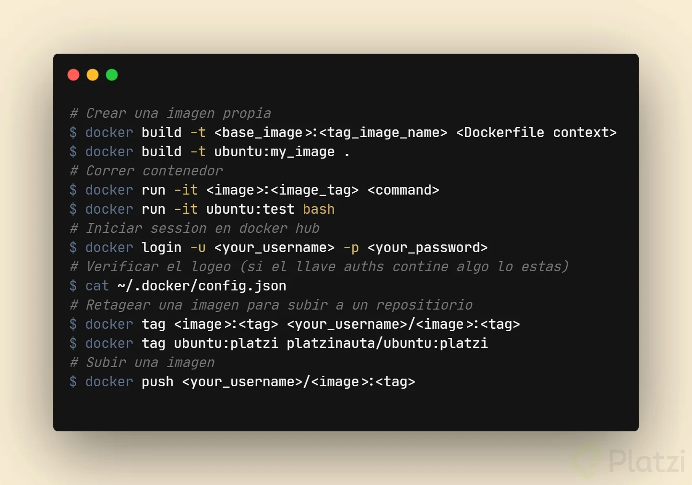
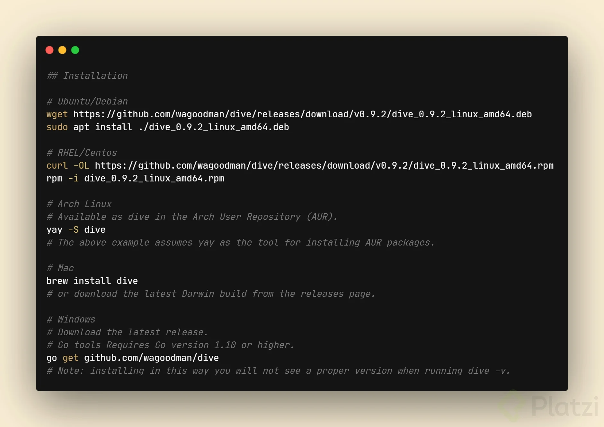

# Curso de Docker

## Las tres áreas en el desarrollo de software profesional

Docker te permite construir, distribuir y ejecutar cualquier aplicación en cualquier lado.

**Problemática:**

**Construir:** Un entorno de desarrollo donde podamos escribir código resolviendo las siguientes problemáticas:

- Entorno de desarrollo.- paquetes y sus versiones

- Dependencias.- frameworks, bibliotecas

- Entorno de ejecución.- Versiones de node, etc.

- Equivalencia con entorno productivo.- Simular lo mas posible el entorno local al productivo.

- Servicios externos.- Comunicación con base de datos (versiones, etc)

**Distribuir**: Llevar nuestro código (artefactos) a donde tenga que llegar.

- Divergencia de repositorios.- Colocar los artefactos en su repositorio correspondiente.

- Divergencia de artefactos.- Existen variedad de artefactos en una aplicación.

- Versionamiento.- Mantener un versionado de código en las publicaciones.

**Ejecutar**: Hacer que el desarrollo o los artefactos que se programaron en local funcionen en productivo. La máquina donde se escribe el software siempre es distinta a la máquina donde se ejecuta de manera productiva.

- Compatibilidad con el entorno productivo

- Dependencias

- Disponibilidad de servicios externos

- Recursos de hardware

## Virtualización

Docker y las máquinas virtuales son dos tecnologías de virtualización que se utilizan para ejecutar aplicaciones en un entorno aislado. Sin embargo, existen algunas diferencias clave entre las dos tecnologías que pueden afectar su elección.

**Docker**

**Ventajas:** Uso de recursos más eficiente Arranque más rápido Mayor portabilidad Desventajas: No proporcionan aislamiento completo Pueden ser más difíciles de configurar Máquinas virtuales

**Ventajas:** Aislamiento completo Fácil de configurar Desventajas: Uso de recursos más intensivo Arranque más lento Menor portabilidad Cuando usar Docker

**Docker es una buena opción para las siguientes situaciones:**

Aplicaciones que requieren un uso eficiente de los recursos: Los contenedores Docker son mucho más ligeros que las máquinas virtuales, por lo que pueden ejecutarse en equipos con menos recursos. Aplicaciones que requieren un rápido arranque: Los contenedores Docker se pueden iniciar en cuestión de segundos, mientras que las máquinas virtuales pueden tardar minutos. Aplicaciones que requieren portabilidad: Las aplicaciones que se ejecutan en contenedores Docker se pueden ejecutar en cualquier entorno que admita Docker. Cuando usar máquinas virtuales

**Las máquinas virtuales son una buena opción para las siguientes situaciones:**

Aplicaciones que requieren un aislamiento completo: Las máquinas virtuales proporcionan un aislamiento completo entre las aplicaciones, lo que puede ser importante para aplicaciones que requieren un alto nivel de seguridad o que pueden interferir entre sí. Aplicaciones que requieren una configuración compleja: Las máquinas virtuales son más fáciles de configurar que los contenedores Docker, especialmente para aplicaciones que requieren un sistema operativo personalizado o configuraciones específicas de hardware.

## Preparando tu entorno de trabajo

Instalación en Linux:

Para distribuciones Linux, la instalación puede variar según la distribución específica que estés utilizando. A continuación, te doy un ejemplo básico para distribuciones basadas en Debian (como Ubuntu):

1. Actualiza el índice de paquetes:

```bash
sudo apt-get update
```

2. Instala paquetes necesarios para permitir que apt utilice un repositorio sobre HTTPS:

```bash
sudo apt-get install \
    apt-transport-https \
    ca-certificates \
    curl \
    gnupg-agent \
    software-properties-common
```

3. Agrega la clave GPG oficial de Docker:

```bash
curl -fsSL https://download.docker.com/linux/ubuntu/gpg | sudo apt-key add -
```
4. Configura el repositorio estable de Docker:

```bash
sudo add-apt-repository \
   "deb [arch=amd64] https://download.docker.com/linux/ubuntu \
   $(lsb_release -cs) \
   stable"
```

5. Actualiza el índice de paquetes nuevamente y luego instala Docker:

```bash
sudo apt-get update
sudo apt-get install docker-ce docker-ce-cli containerd.io
```

6. Verifica que Docker se haya instalado correctamente ejecutando:

```bash
sudo docker --version
```

### Post-instalación en Linux:

Después de instalar Docker en Linux, es posible que desees añadir tu usuario al grupo docker para evitar tener que usar `sudo` cada vez que ejecutas comandos Docker:

1. Añade tu usuario al grupo docker:

```bash
sudo usermod -aG docker $USER
```

2. Cierra sesión e inicia sesión nuevamente para que los cambios surtan efecto.

### Verificación de la instalación:

Puedes verificar que Docker se haya instalado correctamente ejecutando el siguiente comando en tu terminal:

```bash
docker --version
```

Este comando debería mostrar la versión instalada de Docker si el proceso de instalación fue exitoso.

Espero que estos pasos te sean útiles para instalar Docker en tu sistema operativo.

## Primeros pasos: hola mundo

primer comando `docker run hello-world`

## Conceptos fundamentales de Docker: contenedores

Docker es una plataforma de virtualización de código abierto que permite crear y ejecutar aplicaciones en contenedores aislados y ligeros. Estos contenedores encapsulan todo el software necesario para ejecutar una aplicación, incluyendo el código, las dependencias y las configuraciones, lo que los hace altamente portátiles y fáciles de implementar en diferentes entornos.

En simples palabras, Docker te permite "empaquetar" una aplicación con todo lo que necesita para funcionar, como si se tratara de una caja negra, y luego ejecutarla en cualquier lugar sin preocuparte por la compatibilidad del sistema operativo o las dependencias. Esto lo convierte en una herramienta invaluable para desarrolladores, administradores de sistemas y equipos de DevOps que buscan agilizar el desarrollo, la implementación y la administración de aplicaciones.

## Comprendiendo el estado de Docker

para ver que contenedores estan corriendo `docker ps` muestra los que estan corriendo o `docker ps -a` muestra todos

para ver la especificacion del contenedor `docker inspect <CONTAINER ID>` o `docker inspect <names>`

para correr en contenedor y asignarle nombre `docker run --name <nombre-deseado> <contenedor-a-correr>`

para renombrar el contenedor `docker rename <nombre-antiguo> <nombre-nuevo>`

para eliminar un contenedor: `docker rm <Id o nombre>`

Para borrar todos los contenedores detenidos: `docker container prune`

## El modo interactivo

El comando `docker run -it ubuntu` se utiliza para iniciar un contenedor Docker basado en la imagen de Ubuntu de Docker Hub y abrir una sesión interactiva en la terminal del contenedor. Aquí está el desglose del comando:

- **docker run**: este comando se utiliza para crear y ejecutar un contenedor a partir de una imagen Docker.
- **-it**: estas dos opciones se combinan para indicar que deseas ejecutar el contenedor en modo interactivo y asignar una terminal a él. La opción `-i` (o `--interactive`) permite la entrada interactiva y la opción `-t` (o `--tty`) asigna una pseudo-terminal TTY al contenedor.
- **ubuntu**: esto especifica la imagen de Docker que deseas utilizar como base para el contenedor. En este caso, estás utilizando la imagen oficial de Ubuntu disponible en Docker Hub.

Entonces, al ejecutar `docker run -it ubuntu`, Docker descarga la imagen de Ubuntu desde Docker Hub si no está presente localmente, crea un nuevo contenedor basado en esa imagen y luego abre una sesión interactiva en la terminal del contenedor, lo que te permite ejecutar comandos y realizar operaciones dentro del entorno Ubuntu del contenedor.

crear un contenedor con ubuntu: `docker run ubuntu`

para ingresar a ubuntu: `docker run -it ubuntu`
ya en ubuntu utilizamos para ver la configuración: `cat /etc/lsb-release`

nos muestra:

```bash
DISTRIB_ID=Ubuntu
DISTRIB_RELEASE=24.04
DISTRIB_CODENAME=noble
DISTRIB_DESCRIPTION="Ubuntu 24.04 LTS"
```

Para ver archivos: `ls -lac`

para salir del contenedor de linux se usa `exit`

## Ciclo de vida de un contenedor

**docker run --name alwaysup -d ubuntu tail -f /dev/null**

Este comando de Docker crea un contenedor llamado "alwaysup" a partir de la imagen de Ubuntu. Vamos a desglosarlo:

- `docker run`: Este comando se utiliza para crear y ejecutar un contenedor a partir de una imagen de Docker.
- `--name alwaysup`: Esta opción le da al contenedor un nombre específico, en este caso "alwaysup".
-  `-d`: Esta opción indica a Docker que deseas que el contenedor se ejecute en segundo plano (en modo daemon). Esto significa que el contenedor se ejecutará en segundo plano y liberará la terminal actual para que puedas seguir usando la línea de comandos.
- `ubuntu`: Especifica la imagen base que se utilizará para crear el contenedor. En este caso, se utiliza la imagen de Ubuntu.
- `tail -f /dev/null`: Este es el comando que se ejecuta dentro del contenedor. `tail -f /dev/null` es una manera común de mantener un contenedor Docker en ejecución de manera indefinida sin realizar ninguna operación útil. `tail -f` se utiliza normalmente para mostrar las últimas líneas de un archivo, pero en este caso se está utilizando para seguir de manera continua el archivo /dev/null, que es un dispositivo especial que devuelve un flujo vacío de datos. Por lo tanto, `tail -f /dev/null` básicamente no hace nada, pero mantiene el contenedor en ejecución.

En resumen, el comando `docker run --name alwaysup -d ubuntu tail -f /dev/null` crea un contenedor de Docker con el nombre "alwaysup", basado en la imagen de Ubuntu, que se ejecuta en segundo plano y no hace nada, pero permanece en ejecución de manera indefinida. Este tipo de contenedor se utiliza a menudo para tareas de mantenimiento o para mantener un contenedor activo mientras se realizan otras operaciones.

para activar el contenedor con un proceso de inicio `docker run --name alwaysup -d ubuntu tail -f /dev/null` y queda activo.

para que el contenedor corra el bash: `docker exec -it alwaysup bash` pero no es el proceso principal.

para ver el proceso de bash: `ps`

```bash
ID TTY          TIME CMD
    7 pts/0    00:00:00 bash
   16 pts/0    00:00:00 ps
```

para ver todos los procesos del contenedor: `ps -aux`

```bash
USER       PID %CPU %MEM    VSZ   RSS TTY      STAT START   TIME COMMAND     
root         1  0.0  0.0   2728  1000 ?        Ss   00:04   0:00 tail -f /dev
root         7  0.0  0.0   4588  3964 pts/0    Ss   00:05   0:00 bash        
root        17  0.0  0.0   7888  3952 pts/0    R+   00:06   0:00 ps -aux  
```

para matar el proceso y detener el contenedor primero lo filtramos para ver que procesos y optener el Id `docker inspect --format '{{.State.Pid}}' <names>` o `docker inspect alwaysup | grep Pid` y para detenerlo se usa `kill PId` en linux 

Nota para ingresar a docker con username y passworld `docker login -u <tu_nombre_de_usuario> -p <tu_contraseña>` o `docker login -u <tu_nombre_de_usuario> -p`

1. Detener el contenedor por ID o nombre:

Una vez que identifiques el contenedor que deseas detener, usa su ID o nombre para detenerlo con el siguiente comando:
```bash
docker stop <ID o nombre del contenedor>
```

Por ejemplo:

```bash
docker stop my-container
```
para iniciar el contenedor 
```bash
docker start my-container
```

- **<ID o nombre del contenedor>**: Sustituye esto por el ID o nombre real del contenedor que deseas detener.

2. Forzar el cierre del contenedor (opcional):

Si el contenedor no se detiene de manera normal, puedes forzar su cierre utilizando el siguiente comando:

```bash
docker kill <ID o nombre del contenedor>

```
Esto terminará el contenedor inmediatamente, pero ten en cuenta que no permite que el contenedor se detenga correctamente y podría causar pérdida de datos no guardados.

## Exponiendo contenedores

se crea un contenedor con nginx: `docker run -d --name proxy nginx`
se detiene el contenedor: `docker stop <Name_container o Id>`

detiene el contenedor y lo borra `docker rm -f <Name_container>`

paracrear el contenedor y asignar los puertos `docker run --name proxy -p 8080:80 nginx` 8080 es el el puerto afitrion y el 80 es el del contenedor.

para ver las peticiones que se acabe de hacer  contenedor: `docker logs proxy` y para ver los que van ingresando se utiliza `docker logs -f proxy`, para ver los los ultimos logs se utiliza el siguiente codigo con la cantidad `docker logs --tail 10 -f proxy`

[documentación](https://dockertips.com/nginx-con-https)

## Bind mounts

El comando `exec` en Docker, así como las opciones `-d` y `-it`, son herramientas útiles para interactuar con contenedores. Aquí te explico cada uno:

1. Comando `exec` en Docker:
 - Uso: `docker exec [OPTIONS] CONTAINER COMMAND [ARG...]`
 - Propósito: Este comando se utiliza para ejecutar un comando en un contenedor que ya está en ejecución. Por ejemplo, si tienes un contenedor corriendo y quieres ejecutar un shell interactivo dentro de él, puedes usar `docker exec` para hacerlo.
 - Ejemplo: `docker exec -it mycontainer bash` abrirá un shell bash en el contenedor llamado mycontainer.

2. Opción `-d`:

 - Uso: Se utiliza con comandos como `docker run`.
 - Propósito: La opción `-d` significa "detached" o "desacoplado". Cuando ejecutas un contenedor con esta opción, Docker iniciará el contenedor en segundo plano. Esto significa que el contenedor se ejecutará sin interactuar con tu terminal actual.
 - Ejemplo: `docker run -d nginx` iniciará un contenedor con la imagen de Nginx en modo desacoplado.

3. Opción -it:

 - Uso: Se utiliza con comandos como `docker exec` o `docker run`.
 - Propósito: La opción `-it` es una combinación de `-i` y `-t`. `-i` significa "interactivo", lo que mantiene la entrada estándar abierta incluso si no está adjunta. `-t` asigna una pseudo-TTY, lo que hace que la sesión sea interactiva. En conjunto, `-it` te permite interactuar con el contenedor.
 - Ejemplo: `docker exec -it mycontainer bash` te permite interactuar con el shell bash dentro de mycontainer.

se crea un contenedor con Mongo DB: `docker run -d --name db mongo`

Para ingresar `docker exec -it db bash`

para ingresar a mongo se escribe `mongosh`
para ver las base de datos se usa `show dbs`
para crear la vase de datos se usa `use <nombredatabases>`
crear un usuario con `db.users.insert({"nombre":"guido"})` y verificar su creasión `db.users.find()` y para salir se usa **exit**

para crear el Bind Mounts:
` docker run -d --name <Namecontainer> -v <Ruta de acceso>:/data/db mongo` o `docker run -d --name db -v $(pwd)/mongodata:/data/db mongo`despues de los puntos se coloca la ruta donde se aguardalas base de daatos mongo

ejemplo:
`docker run -d --name db -v /mnt/c/Users/celio/OneDrive/Escritorio/programación/platzi/CursoDeDocker/dockerdata/mongodata:/data/db mongo` o `docker run -d --name db -v $(pwd)/mongodata:/data/db mongo`

luego ingresamos a mongo: `docker exec -it db bash`
ingresamos a mongo `mongosh`
se crea la base de datos:

```bash
test> use platzi
switched to db platzi
platzi> db.users.insert({"name":"Camilo"})
DeprecationWarning: Collection.insert() is deprecated. Use insertOne, insertMany, or bulkWrite.
{
  acknowledged: true,
  insertedIds: { '0': ObjectId('6678d91c1c30a516c1a26a13') }
}
platzi> db.users.find()
[ { _id: ObjectId('6678d91c1c30a516c1a26a13'), name: 'Camilo' } ]
platzi> exit
root@df1c93f95498:/# exit
exit
```

luego matamos la db  y los datos quedan en mi pc.

para cargar los datos en el contenedor usamos el siguiente codigo: ` docker run -d --name db -v $(pwd)/mongodata:/dtaba/db mongo`

1. docker exec -it db bash
2. mongosh = Ingresar al la base de datos
3. use platzi usar y si no crea la base de datos
4. db.users.insert({"name":"carlos"}) = crear usuarios
5. db.users.find() ver el contenido de la bas ede datso

solucion al problama que no cargaba la base de datos:

Encontré dos soluciones:

La primera es que se debe de crear un volumen en docker con el siguiente comando.

`docker volume create --name mongodata`

luego continuando con los comandos que se dan en este video, se reemplazaría la ruta local que obtienes del pwd por el nombre del volumen que has creado. Algo así:

`docker run -d --name db --v mongodata:/data/db mongo`

La segunda es cambiar la ruta en la que te encuentras. Hice un cambio de ruta en la línea de comandos de la siguiente manera:

`cd ~`

Este comando nos lleva al home (~) de la distribucion (de esta afirmación no estoy del todo seguro)

Luego en esa ruta creas la carpeta para hacer las pruebas de la clase

`mkdir mongodata`

Finalmente, introducirías el comando para ejecutar poniendo la ruta local de la siguiente manera:

`docker run -d --name db --v ~/mongodata:/data/db mongo`

y LISTO.

## Volúmenes

`docker volume ls` = ver los volume que tiene docker
`docker volume create <namevolume>` = crea un volumen
`docker run -d --name <namecountainer> --mount src=dbdata,dst=/data/db mongo` = cra un contenedor con el volumen que se creo
`docker inspect db`= ver las especificaciones del contenedor.
` docker volume rm <nameVolume>`= eliminar un volumen

Usar volúmenes, conservar datos dentro fuera de los contenedores **¿QUÉ SON LOS VOLUME?** Los volúmenes son el mecanismo preferido para conservar los datos generados y utilizados por los contenedores de Docker. Si bien los montajes de enlace dependen de la estructura del directorio y el sistema operativo de la máquina host, Docker administra completamente los volúmenes. Los volúmenes tienen varias ventajas sobre los montajes vinculantes: 

### Ventajas

- Mayor seguridad al compartir archivos entre contenedores, los archivos los maneja directamente docker esto implica que, cualquier persona no puedes acceder a estos archivos.
- Los volúmenes son más fáciles de respaldar o migrar que enlazar montajes.
- Puede administrar volúmenes mediante los comandos de la CLI de Docker o la API de Docker.
- Los volúmenes funcionan tanto en contenedores de Linux como de Windows.
- Los volúmenes se pueden compartir de forma más segura entre varios contenedores.
- Los controladores de volumen le permiten almacenar volúmenes en hosts remotos o proveedores en la nube, para cifrar el contenido de los volúmenes o para agregar otras funciones.
- Los nuevos volúmenes pueden tener su contenido pre cargado por un contenedor.
- Los volúmenes en Docker Desktop tienen un rendimiento mucho mayor que los montajes de enlace de hosts de Mac y Windows.
- Además, los volúmenes suelen ser una mejor opción que los datos persistentes en la capa de escritura de un contenedor, porque un volumen no aumenta el tamaño de los contenedores que lo usan y el contenido del volumen existe fuera del ciclo de vida de un contenedor determinado. ++Desventajas++
- Una de las desventajas es que si se desea visualizar los archivos desde la máquina hosts es mucho más complicado. Referencia: [https://docs.docker.com/storage/volumes/](https://docs.docker.com/storage/volumes/ "https://docs.docker.com/storage/volumes/")

### Pasos para conservar datos fuera de los contenedores con volúmenes.

1. crear el volumen
2. verificar que el volumen fue creado
3. crear un nuevo contenedor basado en una imagen de mongo e indicarle que guardará o usará los datos de un volumen
4. Es opcional, pero se puede inspeccionar el contenedor para visualizar si el volumen quedo configurado.
5. Acceder al bash de nuestro contenedor,
6. Acceder a mongo
7. Crear una bases de datos y usarla
8. Realizar una inserción de datos en la base de datos
9. Confirmar la inserción en la base de datos
10. Salir del contenedor
11. borrar contenedor.  **Pasos para crear un nuevo contenedor y usar un volumen anteriormente creado**.

12. Crear un nuevo contenedor basado en una imagen de mongo e indicarle que guardará o usará los datos de un volumen anteriormente creado
13. Acceder al bash de nuestro contenedor,
14. Acceder a mongo
15. Usar la bases de datos creadas
16. Confirmar la inserción en la base de datos, que fue realizada anteriormente

### Ejecución de los pasos para conservar datos fuera de los contenedores con usando volúmenes,

1. $ sudo docker volume create dbdata
2. $ sudo docker volume ls
3. $ sudo docker run -d --name db --mount src =dbdata,dst=/data/db mongo
4. $ sudo docker inspect db
5. $ sudo docker exec -it db bash
6. $ mongo
7. use platzi
8. db.users.insert({"nombre":"guido"})
9. db.users.find()
10. $ exit
11. sudo docker rm -f

**Ejecución de los pasos para crear un nuevo contenedor y usar un volumen anteriormente creado.**

12. $ sudo docker run -d --name db --mount src=dbdata,dst=/data/db mongo
13. $ sudo docker exec -it db bash
14. $ mongo
15. show dbs
16. use platzi
17. db.users.find()

**Explicación de los comandos de volumen** Asignar un volume aun contenedor 
`$ docker run -d --name <nombre c> --mount src =<carpeta L>,dst=<carpeta C> <nombre i>`

```bash
parámetros

	<nombre c>: 
		nombre del contenedor, así se llamará localmente
<path L>: 
	directorio local
<path C>: 
	directorio del contenedor
< nombre i>:
	nombre de la imagen

flag
--name: 
	asigna un nombre de forma local a nuestro contenedor
-d or --detach: 
	Inicia un contenedor sin asociar el input/output del contenedor al terminal.
    --mount  src =<volume F>,dst=<Carpeta d>:
	Se indica  el  src es igual al volumen fuente, dst es igual a la carpeta destino, es decir a la carpeta del contenedor donde se genera los datos
```
### Ejemplo:

`$ sudo docker run -d --name db --mount  src =dbdata,dst=/data/db mongo`

Crear un volumen 
`$ sudo docker volume create <nombre de volumen>`

```bash
volume create:
	Crear volumen 
<nombre de volumen>:
	Nombre Volumen
```
**Ejemplo: **
`$ sudo docker volume create dbdata`

Listar los volúmenes creados `$ sudo docker volume ls`

`volumen ls:`

listar o mostrar los volúmenes Ejemplo: `$ sudo docker volume ls`

## Insertar y extraer archivos de un contenedor

se crea un archivo para pasar al contenedor:
`touch prueba.txt`

para cer el contenido del archivo se usa `cat prueba.txt`images

se crea el cintenedor `docker run -d --name <container> <images> tail -f /dev/null` Ejemplo: `docker run -d --name copytest ubuntu tail -f /dev/null`

ingresa al contenedor `docker exec -it <container> bash` Ejemplo:`docker exec -it copytest bash`

creamos una nueva carpeta `mkdir <foldername>` Ejemplo:`mkdir testing`

se sale `exit`

pasamos el archivo al contenedor `docker cp <filename> <container>:<destination-route file>` Ejemplo:`docker cp prueba.txt copytest:/testing/test.txt`

se puede realizar al contrario tambien del contenedor a local con el código `docker cp <container>:<foldername destination_foldername>` Ejemplo: `docker cp copytest:/testing localtesting`

## Construyendo una imagen propia

crear una carpeta: `mkdir <foldername>`
abrir visual code `code .`
costruir una imagen ubuntu llamado platzi en el directorio local: `docker build -t ubuntu:platzi .`
para ver las imagenes: `docker image ls`
ingresamos al contenedor: `docker run -it ubuntu:platzi`
tenemos que logearnos para poder subir la imagen: `docker login`
docker tag ubuntu para renombrearla: `docker tag <repositorio> <user>/ubuntu:platzi`  y el resto es la imagen y luego de los : es la version Ej:`docker tag ubuntu:platzi <user>/ubuntu:platzi` 
para subir la imagen: `docker push <user>/ubuntu:platzi`



## El sistema de capas

para ver las capas: `docker history ubuntu:platzi`

```bash
IMAGE          CREATED          CREATED BY                                      SIZE      COMMENT
c3b0195d12e6   29 minutes ago   RUN /bin/sh -c touch /usr/src/hola-platzi.tx…   0B        buildkit.dockerfile.v0
<missing>      2 weeks ago      /bin/sh -c #(nop)  CMD ["/bin/bash"]            0B
<missing>      2 weeks ago      /bin/sh -c #(nop) ADD file:5601f441718b0d192…   78.1MB        
<missing>      2 weeks ago      /bin/sh -c #(nop)  LABEL org.opencontainers.…   0B
<missing>      2 weeks ago      /bin/sh -c #(nop)  LABEL org.opencontainers.…   0B
<missing>      2 weeks ago      /bin/sh -c #(nop)  ARG LAUNCHPAD_BUILD_ARCH     0B
<missing>      2 weeks ago      /bin/sh -c #(nop)  ARG RELEASE                  0B
```
para visualizar mejor se usa dive para ver mejor estructurado el history
[dive](https://github.com/wagoodman/dive)

instalar en linux

```bash
DIVE_VERSION=$(curl -sL "https://api.github.com/repos/wagoodman/dive/releases/latest" | grep '"tag_name":' | sed -E 's/.*"v([^"]+)".*/\1/')
curl -OL https://github.com/wagoodman/dive/releases/download/v${DIVE_VERSION}/dive_${DIVE_VERSION}_linux_amd64.deb
sudo apt install ./dive_${DIVE_VERSION}_linux_amd64.deb
```



Para ver con dive:
`dive <imagen>` Ej: `dive ubuntu:platzi`

```Dockerfile
FROM ubuntu:latest

RUN touch /usr/src/hola-platzi.txt

RUN rm /usr/src/hola-platzi.txt
```

## Usando Docker para desarrollar aplicaciones

clonar primero el repositorio de prueba: `git clone https://github.com/platzi/docker`

se crea la imagen `docker build -t platziapp .`

para ver las image `docker image ls`

para correr el contenedor `docker run --rm -p 3000:3000 platziapp` y --rm se usa para cuando se detenga el contenedor lo borre -p es para asignar el puerto del contenedor y el otro es el de la maquina.

Ejemplo como utilizar docker para el desarrollo

1. Creamos una carpeta y nos posicionamos dentro de esa carpeta.
2. Luego Clonamos un proyecto de github y nos posicionamos dentro del proyecto clonado
3. Verificamos que los archivos estén allí
4. Realizamos la construcción de la imagen.

**Parámetro -t o tag** : Indica el tag de la imagen a construir. 
**Parámetro** : indica el directorio de trabajo

5. Verificar que la imagen ha sido creada.
6. Crear el contenedor basado en la imagen anteriormente creada y:
Parámetro `--rm` para que, al detenerse. el contenedor se borre Parámetro `-p` indicar que el puerto del host:contenedor están asociados.

7. Comprobar que el contenedor recién creado este activo
8. Comprobar que el contenedor puede recibir petición desde el navegador, mostrará un error porque la nuestro contenedor no está asociado a ninguna bases de mongo.

**Ejecución de los pasos**

1. mkdir docker-pj && cd docker-pj
2. $ git clone https://github.com/platzi/docker && cd docker
3. ll
4. code .
5. $ sudo docker build -t platziapp .
6. $ sudo docker image ls
7. $ sudo docker run --rm -p 3000:3000 platziapp
8. $ sudo docker ps
9. localhost:3000

Explicación de docker file

```Dockerfile
FROM node:12

COPY [".", "/usr/src/"]

WORKDIR /usr/src

RUN npm install

EXPOSE 3000

CMD ["node", "index.js"]
```