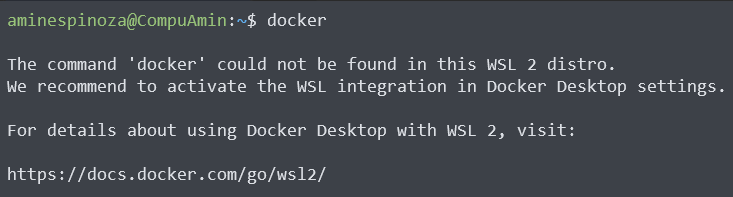
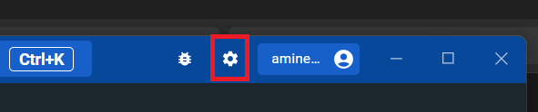
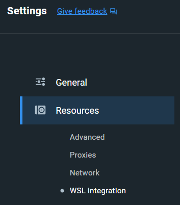
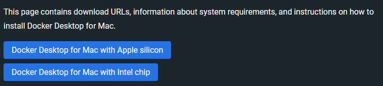
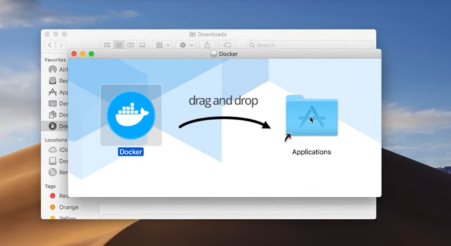
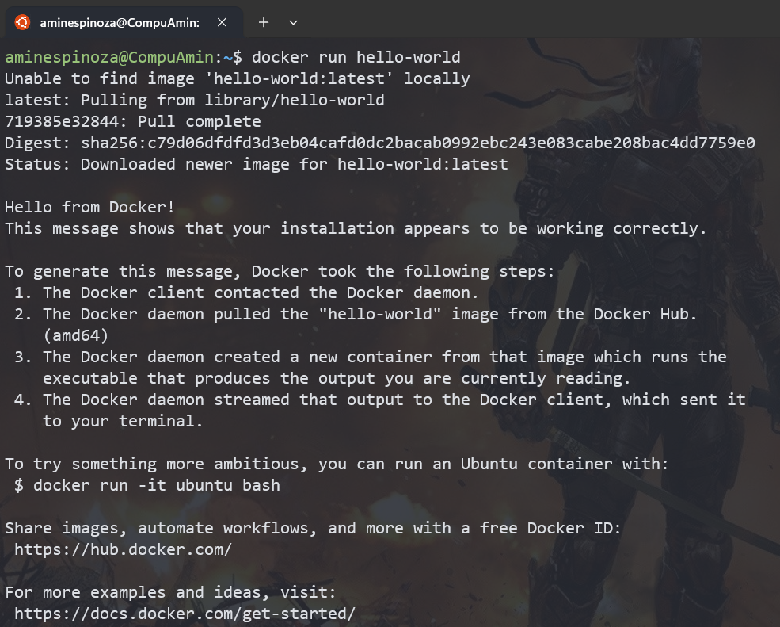

# Curso de Docker Fundamentos

## Diferencia entre Máquinas Virtuales, Contenedores y Servicios

### Máquinas Virtuales (VM):
1. **Aislamiento**: Las VMs proporcionan un aislamiento completo, ya que ejecutan un sistema operativo completo independiente del host.
2. **Recurso Intensivo**: Las VMs pueden consumir más recursos, porque cada una tiene su propio sistema operativo y una cantidad significativa de recursos dedicados.
3. **Arranque Más Lento**: El arranque de una VM es más lento, puesto que implica iniciar un sistema operativo completo.
4. **Hypervisor**: Las VMs se ejecutan en un hipervisor, que gestiona y asigna recursos para cada máquina virtual.

### Contenedores:

1. **Aislamiento Ligero**: Los contenedores comparten el mismo kernel del sistema operativo del host, lo que proporciona un aislamiento más ligero.
2. **Eficiencia de Recursos**: Los contenedores son más eficientes en términos de recursos, ya que comparten el mismo sistema operativo y solo incluyen las bibliotecas y dependencias necesarias.
3. **Arranque Rápido**: Los contenedores tienen un arranque rápido, por el hecho de que no requieren iniciar un sistema operativo completo.
4. **Docker, Containerd, etc.**: Docker es una de las tecnologías de contenedores más populares, y otras implementaciones

## Instalación de Docker

### Consideraciones para instalar Docker Desktop

Docker desktop es la herramienta base para poder utilizar docker en Windows y su instalación es muy sencilla, lo único que debes tener muy en cuenta es que debes contar con el subsistema de Linux en Windows previamente activado. Pero no te preocupes. ¡Esta guía comenzará justo desde ahí!

### Configura tu subsistema de Linux en Windows

El subsistema de Linux en Windows o WSL por sus siglas en inglés es como contar con una distribución nativa de Linux dentro de Windows. A esta distribución le podrás colocar prácticamente cualquier distribución de Linux sin problemas.

Docker Desktop se integra de maravilla con WSL en Windows, es muy recomendable configurar esta característica antes de instalar Docker Desktop en tu equipo, si aún no cuentas con ello entonces puedes aprender a hacerlo en la clase de [Configurar Windows 11 para soportar la instalación de WSL](https://platzi.com/new-home/clases/6900-configuracion-windows/60922-configurar-windows-11-para-soportar-la-instalacion/ "Configurar Windows 11 para soportar la instalación de WSL") del [Curso de Configuración de Entorno de Desarrollo en Windows](https://platzi.com/cursos/configuracion-windows/ "Curso de Configuración de Entorno de Desarrollo en Windows").

Además, si no cuentas con WSL solo podrías correr contenedores de Windows y hasta la fecha, después de 6 años solo he visto un proyecto que los usó y se mudó a los contenedores de Linux en 3 meses. ¡Linux rocks!

Bueno, volviendo a la instalación ya con WSL instalado entonces debes ir al [sitio de descargas de Docker](https://docs.docker.com/desktop/install/windows-install/ "sitio de descargas de Docker") y descargar el instalador de Docker Desktop.

El instalador es un clásico “siguiente, siguiente” de Windows, sin embargo es momento de revisar que todo esté en orden. Abre tu terminal de WSL y escribe `docker --version`.


Si aparece un resultado como el de la imagen expuesta arriba todo está en orden, ya cuentas con Docker listo para trabajar. También, puede suceder que te aparezca un mensaje como el de la siguiente imagen.



Si eso sucede entonces la solución es muy fácil. Abre Docker Desktop y selecciona la opción de configuración.



Selecciona la categoría de **Recursos** y luego **Integración con WSL**.




Solo habilita el CheckBox y selecciona la distribución con la que tú quieres trabajar (puedes seleccionar todas las que quieras).


Con esto solo selecciona el botón de **Aplicar y reiniciar**. Vuelve a WSL y ahora si, podrás de nuevo verificar con tu terminal que la versión de Docker está habilitada para poder trabajar.

### Instala Docker Desktop en Mac

¡Instalar software en Mac es de lo más sencillo! Solo comencemos por el inicio. Gracias a la arquitectura de los procesadores de Mac debes tener en consideración que tipo de arquitectura es la tuya, ya sea Intel o Apple, descarga la aplicación que corresponda a tu equipo.



Descarga el paquete y solo después de un doble clic arrastra el ícono a la carpeta de aplicaciones.



Al ejecutar por primera vez tu aplicación te pedirá tu usuario y password. Después de eso ya estarás listo para trabajar con Docker en tu Mac.

Abre tu terminal, escribe `docker --version` y listo, tendrás la evidencia que muestra que tu equipo está listo para Docker.

### Instala Docker Desktop en Linux

Si eres como yo y eres fan de Linux entonces quizá te gusten las rutas complicadas, mi esposa dice que me gusta sufrir pero yo lo veo como retos.

En fin, comencemos, aquí te mostraré cómo instalar Docker en una distribución basada en Debian, Ubuntu.

Comienza actualizando todos tus paquetes.

`sudo apt update`

Continúa instalando la llave GPG.

```bash
sudo apt-get install ca-certificates curl gnupg
sudo install -m 0755 -d /etc/apt/keyrings
curl -fsSL https://download.docker.com/linux/ubuntu/gpg | sudo gpg --dearmor -o /etc/apt/keyrings/docker.gpg
sudo chmod a+r /etc/apt/keyrings/docker.gpg
```

Agrega ahora el repositorio.

```bash
echo \
  "deb [arch=$(dpkg --print-architecture) signed-by=/etc/apt/keyrings/docker.gpg] https://download.docker.com/linux/ubuntu \
  $(. /etc/os-release && echo "$VERSION_CODENAME") stable" | \
  sudo tee /etc/apt/sources.list.d/docker.list > /dev/null

sudo apt-get update
```

Instala la última versión de Docker.

`sudo apt-get install docker-ce docker-ce-cli containerd.io docker-buildx-plugin docker-compose-plugin`

Ahora descarga una imagen para ver que todo está ya listo (¿a quién le interesa el comando Docker --version?).

`sudo docker run hello-world`



Sin importar la instalación que debas hacer de Docker es momento de ganar una pequeña recompensa ahora después de cualquier proceso. ¿Estás de acuerdo?
Escribe:

`docker run --rm -it wernight/funbox asciiquarium`
Y no, no pondré una imagen para que veas lo que sucede aunque el título te lo indique. ¡Disfruta!

Lecturas recomendadas

[Requisitos mínimos para instalar Docker](https://platzi.com/blog/requisitos-minimos-para-instalar-docker/)

## Conociendo Docker CLI

**Comandos para imagenes**

Construir una imagen a partir de un archivo Dockerfile

`docker build -t <nombre_de_imagen>`

Construir una imagen desde un archivo Dockerfile sin la caché

`docker build -t <nombre_de_imagen> . -no-cache`

Listar imágenes locales

`docker images`

Eliminar una imagen

`docker rmi <nombre_imagen>`

Eliminar todas las imágenes no utilizadas

`docker image prune`

**Comandos para contenedores**

Crea y ejecuta un contenedor a partir de una imagen, con un nombre personalizado:

`docker run --name <nombre_contenedor> <nombre_imagen>`

Ejecutar un contenedor con y publicar un puerto(s) del contenedor al host.

`docker run -p <puerto_host>:<puerto_contenedor> <nombre_imagen>`

Ejecutar un contenedor en segundo plano

`docker run -d <nombre_imagen>`

Iniciar o detener un contenedor existente:

`docker start|stop <nombre_del_contenedor> (o <id_del_contenedor>)`

Eliminar un contenedor detenido:

`docker rm <nombre_del_contenedor>`

Abrir un shell dentro de un contenedor en ejecución:

`docker exec -it <nombre_del_contenedor> sh`

Obtener y seguir los logs de un contenedor:

`docker logs -f <nombre_contenedor>`

Inspeccionar un contenedor en ejecución:

`docker inspect <nombre_del_contenedor> (o <id_del_contenedor>)`

Para listar los contenedores actualmente en ejecución:

`docker ps`

Listar todos los contenedores docker (en ejecución y parados):

`docker ps --all`

Ver las estadísticas de uso de recursos

`docker container stats`

muestra la informacion de docker:

`docker info`

ver la documentacion:

`docker --help`

ver la documentacion de imagenes:

`docker images --help`
`
ver la documentacion de build:

`docker build --help`

ver la documentacion de build:

`docker run --help`