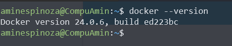
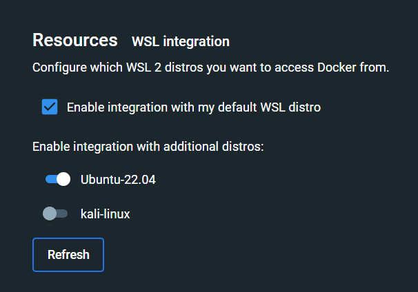

# Curso de Docker Fundamentos

## Diferencia entre Máquinas Virtuales, Contenedores y Servicios

### Máquinas Virtuales (VM):
1. **Aislamiento**: Las VMs proporcionan un aislamiento completo, ya que ejecutan un sistema operativo completo independiente del host.
2. **Recurso Intensivo**: Las VMs pueden consumir más recursos, porque cada una tiene su propio sistema operativo y una cantidad significativa de recursos dedicados.
3. **Arranque Más Lento**: El arranque de una VM es más lento, puesto que implica iniciar un sistema operativo completo.
4. **Hypervisor**: Las VMs se ejecutan en un hipervisor, que gestiona y asigna recursos para cada máquina virtual.

### Contenedores:

1. **Aislamiento Ligero**: Los contenedores comparten el mismo kernel del sistema operativo del host, lo que proporciona un aislamiento más ligero.
2. **Eficiencia de Recursos**: Los contenedores son más eficientes en términos de recursos, ya que comparten el mismo sistema operativo y solo incluyen las bibliotecas y dependencias necesarias.
3. **Arranque Rápido**: Los contenedores tienen un arranque rápido, por el hecho de que no requieren iniciar un sistema operativo completo.
4. **Docker, Containerd, etc.**: Docker es una de las tecnologías de contenedores más populares, y otras implementaciones

## Instalación de Docker

### Consideraciones para instalar Docker Desktop

Docker desktop es la herramienta base para poder utilizar docker en Windows y su instalación es muy sencilla, lo único que debes tener muy en cuenta es que debes contar con el subsistema de Linux en Windows previamente activado. Pero no te preocupes. ¡Esta guía comenzará justo desde ahí!

### Configura tu subsistema de Linux en Windows

El subsistema de Linux en Windows o WSL por sus siglas en inglés es como contar con una distribución nativa de Linux dentro de Windows. A esta distribución le podrás colocar prácticamente cualquier distribución de Linux sin problemas.

Docker Desktop se integra de maravilla con WSL en Windows, es muy recomendable configurar esta característica antes de instalar Docker Desktop en tu equipo, si aún no cuentas con ello entonces puedes aprender a hacerlo en la clase de [Configurar Windows 11 para soportar la instalación de WSL](https://platzi.com/new-home/clases/6900-configuracion-windows/60922-configurar-windows-11-para-soportar-la-instalacion/ "Configurar Windows 11 para soportar la instalación de WSL") del [Curso de Configuración de Entorno de Desarrollo en Windows](https://platzi.com/cursos/configuracion-windows/ "Curso de Configuración de Entorno de Desarrollo en Windows").

Además, si no cuentas con WSL solo podrías correr contenedores de Windows y hasta la fecha, después de 6 años solo he visto un proyecto que los usó y se mudó a los contenedores de Linux en 3 meses. ¡Linux rocks!

Bueno, volviendo a la instalación ya con WSL instalado entonces debes ir al [sitio de descargas de Docker](https://docs.docker.com/desktop/install/windows-install/ "sitio de descargas de Docker") y descargar el instalador de Docker Desktop.

El instalador es un clásico “siguiente, siguiente” de Windows, sin embargo es momento de revisar que todo esté en orden. Abre tu terminal de WSL y escribe `docker --version`.



Si aparece un resultado como el de la imagen expuesta arriba todo está en orden, ya cuentas con Docker listo para trabajar. También, puede suceder que te aparezca un mensaje como el de la siguiente imagen.


Si eso sucede entonces la solución es muy fácil. Abre Docker Desktop y selecciona la opción de configuración.


Selecciona la categoría de **Recursos** y luego **Integración con WSL**.


Solo habilita el CheckBox y selecciona la distribución con la que tú quieres trabajar (puedes seleccionar todas las que quieras).



Con esto solo selecciona el botón de **Aplicar y reiniciar**. Vuelve a WSL y ahora si, podrás de nuevo verificar con tu terminal que la versión de Docker está habilitada para poder trabajar.

### Instala Docker Desktop en Mac

¡Instalar software en Mac es de lo más sencillo! Solo comencemos por el inicio. Gracias a la arquitectura de los procesadores de Mac debes tener en consideración que tipo de arquitectura es la tuya, ya sea Intel o Apple, descarga la aplicación que corresponda a tu equipo.


Descarga el paquete y solo después de un doble clic arrastra el ícono a la carpeta de aplicaciones.


Al ejecutar por primera vez tu aplicación te pedirá tu usuario y password. Después de eso ya estarás listo para trabajar con Docker en tu Mac.

Abre tu terminal, escribe `docker --version` y listo, tendrás la evidencia que muestra que tu equipo está listo para Docker.

### Instala Docker Desktop en Linux

Si eres como yo y eres fan de Linux entonces quizá te gusten las rutas complicadas, mi esposa dice que me gusta sufrir pero yo lo veo como retos.

En fin, comencemos, aquí te mostraré cómo instalar Docker en una distribución basada en Debian, Ubuntu.

Comienza actualizando todos tus paquetes.

`sudo apt update`

Continúa instalando la llave GPG.

```bash
sudo apt-get install ca-certificates curl gnupg
sudo install -m 0755 -d /etc/apt/keyrings
curl -fsSL https://download.docker.com/linux/ubuntu/gpg | sudo gpg --dearmor -o /etc/apt/keyrings/docker.gpg
sudo chmod a+r /etc/apt/keyrings/docker.gpg
```

Agrega ahora el repositorio.

```bash
echo \
  "deb [arch=$(dpkg --print-architecture) signed-by=/etc/apt/keyrings/docker.gpg] https://download.docker.com/linux/ubuntu \
  $(. /etc/os-release && echo "$VERSION_CODENAME") stable" | \
  sudo tee /etc/apt/sources.list.d/docker.list > /dev/null

sudo apt-get update
```

Instala la última versión de Docker.

`sudo apt-get install docker-ce docker-ce-cli containerd.io docker-buildx-plugin docker-compose-plugin`

Ahora descarga una imagen para ver que todo está ya listo (¿a quién le interesa el comando Docker --version?).

`sudo docker run hello-world`


Sin importar la instalación que debas hacer de Docker es momento de ganar una pequeña recompensa ahora después de cualquier proceso. ¿Estás de acuerdo?
Escribe:

`docker run --rm -it wernight/funbox asciiquarium`
Y no, no pondré una imagen para que veas lo que sucede aunque el título te lo indique. ¡Disfruta!

Lecturas recomendadas

[Requisitos mínimos para instalar Docker](https://platzi.com/blog/requisitos-minimos-para-instalar-docker/)

## Conociendo Docker CLI

**Comandos para imagenes**

Construir una imagen a partir de un archivo Dockerfile

`docker build -t <nombre_de_imagen>`

Construir una imagen desde un archivo Dockerfile sin la caché

`docker build -t <nombre_de_imagen> . -no-cache`

Listar imágenes locales

`docker images`

Eliminar una imagen

`docker rmi <nombre_imagen>`

Eliminar todas las imágenes no utilizadas

`docker image prune`

**Comandos para contenedores**

Crea y ejecuta un contenedor a partir de una imagen, con un nombre personalizado:

`docker run --name <nombre_contenedor> <nombre_imagen>`

Ejecutar un contenedor con y publicar un puerto(s) del contenedor al host.

`docker run -p <puerto_host>:<puerto_contenedor> <nombre_imagen>`

Ejecutar un contenedor en segundo plano

`docker run -d <nombre_imagen>`

Iniciar o detener un contenedor existente:

`docker start|stop <nombre_del_contenedor> (o <id_del_contenedor>)`

Eliminar un contenedor detenido:

`docker rm <nombre_del_contenedor>`

Abrir un shell dentro de un contenedor en ejecución:

`docker exec -it <nombre_del_contenedor> sh`

Obtener y seguir los logs de un contenedor:

`docker logs -f <nombre_contenedor>`

Inspeccionar un contenedor en ejecución:

`docker inspect <nombre_del_contenedor> (o <id_del_contenedor>)`

Para listar los contenedores actualmente en ejecución:

`docker ps`

Listar todos los contenedores docker (en ejecución y parados):

`docker ps --all`

Ver las estadísticas de uso de recursos

`docker container stats`

muestra la informacion de docker:

`docker info`

ver la documentacion:

`docker --help`

ver la documentacion de imagenes:

`docker images --help`
`
ver la documentacion de build:

`docker build --help`

ver la documentacion de build:

`docker run --help`

## Mi primera imagen de Docker

se crea el archivo Dockerfile:

```Docherfile
FROM nginx:latest

# Path: /usr/share/nginx/html
COPY /sitio /usr/share/nginx/html  
```

## Creación de imágenes con Dockerfile

se crea con: `docker build .`
para elimina la imagen: `docker rmi -f <Image id>`
crear la imagen con nombre: `docker build -t <nombre:tag>` Ej: `docker build -t sitioweb:latest .`

ver la imagen: `docker images`

ejecutar el contenedor: `docker run -it --rm -d -p 8080:80 --name web sitioweb`
- -it: En forma interactiva para ver los logs

- --rm: elimina las versiones anteriores del contenedor

- -d: el contenedor se ejecuta en un segundo plano

- -p: mapea el puerto del contenedor con el puerto de la aplicación para exponerla

- --name: nombre del contenedor

- Finalmente agregar el nombre de la imagen

## Administrar mis imágenes de Docker

Comandos para Imágenes

Construir una imagen a partir de un archivo Dockerfile `docker build -t <nombre_de_imagen>` 
Construir una imagen desde un archivo Dockerfile sin la caché `docker build -t <nombre_de_imagen> . -no-cache`
Listar imágenes locales docker images Eliminar una imagen `docker rmi <nombre_imagen>` 
Eliminar todas las imágenes no utilizadas docker image prune Inicie sesión en Docker `docker login -u <nombredeusuario>` 
Publica una imagen en Docker Hub `docker push <nombre_usuario>/<nombre_imagen>` 
Buscar una imagen en Hub `docker search <nombre_imagen>` 
Extraer una imagen de un Docker Hub `docker pull <nombre_imagen>`
buscar la imagen por tag: `docker images --filter=reference='*:1.5'`
para ver IMAGE ID real o completo de la imagen: `docker images --no-trunc`
para cambiar el tag de la image: `docker image tag sitioweb:latest amin/sitioweb:latest`
eliminar imagenes: `docker rmi amin/sitioweb:latest`
elimina imegenes por id: `docker rmi -f <IMAGEID>`

[CLI Cheat Sheet](./images/cliCheatSheet.png)

## Administrar mis contenedores de Docker

### Comandos para contenedores

Crea y ejecuta un contenedor a partir de una imagen, con un nombre personalizado:

`docker run --name <nombre_contenedor> <nombre_imagen>`

Ejecutar un contenedor con y publicar un puerto(s) del contenedor al host.

`docker run -p <puerto_host>:<puerto_contenedor> <nombre_imagen>`

Ejecutar un contenedor en segundo plano

`docker run -d <nombre_imagen>`

Iniciar o detener un contenedor existente:

`docker start|stop <nombre_del_contenedor> (o <id_del_contenedor>)`

Eliminar un contenedor detenido:

`docker rm <nombre_del_contenedor>`

Abrir un shell dentro de un contenedor en ejecución:

``docker exec -it <nombre_del_contenedor> sh o bash``

Obtener y seguir los logs de un contenedor:

`docker logs -f <nombre_contenedor>`

Inspeccionar un contenedor en ejecución:

`docker inspect <nombre_del_contenedor> (o <id_del_contenedor>)`

Para listar los contenedores actualmente en ejecución:

`docker ps`

Listar todos los contenedores docker (en ejecución y parados):

`docker ps --all`

Ver las estadísticas de uso de recursos

`docker container stats`

## Mejorando mi Dockefile

Explicación de instrucciones especificadas en el archivo Dockerfile:

- WORKDIR = ubicacion donde se creara la aplicacion
- COPY = copiar archivo local al entorno docker
- RUN = ejecutar un comando dentro del contenedor
- COPY . . = copiamos los fuentes dentro del WORKDIR especificado
- CMD = ejecutar comando sh

Desde la ruta del Dockerfile corremos

`docker build -t app_python .`

luego arrancamos el contenedor como es flask corre en el puerto 5000 `docker run -it --rm -d -p 8080:5000 --name web_app_python app_python`
Ejemplo: `docker run -it --rm -d -p 8080:80 -v ./sitio:/usr/share/nginx/html/sitio --name web nginx`

ya podremos ver la api en la ruta

## Configurar volúmenes básicos en Docker

Docker: Manejo y potencial de los volúmenes

Docker ha revolucionado el mundo del desarrollo de aplicaciones con diversas características poderosas, entre las cuales destaca el uso de volúmenes. Estos no son meros espacios de almacenamiento, sino que actúan como puentes dinámicos de datos entre nuestro entorno local y los contenedores ejecutándose en Docker, permitiendo una interacción directa y en tiempo real con nuestras aplicaciones. Vamos a desvelar esta funcionalidad y explorar cómo aprovechar su potencial en distintos escenarios.

### ¿Qué son los volúmenes en Docker?

Los volúmenes en Docker ofrecen la capacidad de compartir una unidad de disco o carpeta entre tu equipo local y un contenedor activo. Importante distinguir, estamos hablando de contenedores y no imágenes Docker; son entidades ya en ejecución que permiten la manipulación de datos en vivo.

### ¿Cuáles son los escenarios de uso de los volúmenes?

Los volúmenes sirven en múltiples contextos. Por ejemplo, podrías querer actualizar un sitio web en tiempo real sin detener tu contenedor. O tal vez, en análisis de datos, necesitas insertar nuevos datos mientras procesos están corriendo. Los volúmenes son clave para mantener esa fluidez de trabajo.

### ¿Cómo configurar un volumen en Docker?

Configurar un volumen es simple y aquí te muestro cómo:

- **Paso 1**: Dentro de tu entorno local, crear una carpeta (por ejemplo, `assets`) para alojar los archivos a compartir.
- **Paso 2**: Preparar tu `Dockerfile` o el comando de ejecución de Docker con el parámetro `-v`, especificando la ruta local y su destino en el contenedor.
- **Paso 3**: Ejecutar el contenedor con la configuración de volumen y verificar su funcionamiento mediante Docker Desktop o comandos como `docker ps`.

### ¿Cómo afectan los cambios locales al contenedor?

Cuando usas volúmenes, los cambios que realices localmente, como actualizar un archivo HTML o eliminar una imagen, se reflejarán instantáneamente en el contenedor. Esto te permite iterar de manera ágil sobre tu proyecto sin la necesidad de reiniciar o reconstruir el contenedor.

### ¿Cuál es la diferencia entre volumen y copiar en Docker?

La decisión de utilizar volumen o el comando COPY en tu Dockerfile depende del flujo de trabajo que desees emplear:

- **Uso de volúmenes**: Ideal para proyectos dinámicos donde los archivos y datos cambian con frecuencia.
- **Uso del comando COPY**: Mejor para proyectos estáticos, donde los recursos no necesitarán actualizaciones posteriores al despliegue inicial.

Elegir apropiadamente entre crear un volumen o copiar información dentro de tu imagen de Docker puede ser decisivo para la eficiencia y agilidad de tu proyecto. Espero que estas directrices te sirvan para optimizar tu flujo de trabajo con Docker y aprovechar al máximo el potencial de los volúmenes. ¡Continúa aprendiendo y experimentando!

## Configurar redes básicas en Docker

`-p 8080:80` Asigna el puerto 8080 del host Docker al puerto TCP 80 del contenedor.

`-p 192.168.1.100:8080:80` Asigna el puerto 8080 en el host Docker IP 192.168.1.100 al puerto TCP 80 en el contenedor.

`-p 8080:80/udp` Asigna el puerto 8080 del host Docker al puerto UDP 80 del contenedor.

`-p 8080:80/tcp -p 8080:80/udp` Asigna el puerto TCP 8080 en el host Docker al puerto TCP 80 en el contenedor, y asigna el puerto UDP 8080 en el host Docker al puerto UDP 80 en el contenedor.

crear el contenedor: `docker run -it --rm -d -p 8080:80 --name web1 nginx1`
crear contenedor con ip local `docker run -it --rm -d -p 127.0.0.1:8080:80 --name web nginx`

inspeccionar el contenedor: `docker inspect web` 

ver lar redes: `docker network ls`
establese una red local con el contenedor: `docker network create platzinet`

## ¡Mi primera imagen en Docker Hub!

Dicen que saber utilizar Docker es parte del perfil de un ingeniero de DevOps y estoy parcialmente de acuerdo, no creo deba existir esa posición pero pienso que todos los ingenieros de software deben saber DevOps. A continuación podrás ver una imagen que muestra todas las habilidades que DevOps incluye.


Ahora que sabemos esto. ¿Qué tal si mezclamos a dos de ellas? Los contenedores de Docker y la creación de un script de bash que nos permita con un simple comando de bash crear una imagen y publicarla en Docker Hub.
¡Todo en un solo comando!

### Crea un archivo de bash

Comienza por ubicarte en donde esté tu archivo Docker favorito, yo usaré el linktree que utilicé en varias de las clases del curso de Docker:Fundamentos. Ahí agrega un archivo llamado [publicar.sh](http://publicar.sh/)

A ese archivo debemos comenzar por agregarle un encabezado que sirva para definir a este archivo como un script ejecutable de bash, eso es muy fácil de hacerlo, solo escribe:

`#!/bin/bash`

[binbash.png](./images/binbash.png)

Ahora podemos indicarle al usuario que todo comenzará con la palabra echo que sirve para imprimir mensajes al usuario.

`echo "Es momento de publicar tu imagen"`

Después vamos a crear la imagen con el tag adecuado y obvio, volver a notificar a nuestro usuario.

```bash
docker build -t aminespinoza/linktree .
echo "¡A publicar amigos!"
```
Seguimos con el comando de publicación de Docker y un mensaje para ver que ya todo está listo.

```bash
docker push aminespinoza/linktree
echo "Imagen publicada"
```

Ahora es momento de probar tu script. ¿Vamos? Escribe en tu terminal

`./publicar.sh`
[consile1](./images/imagess1.png)
[console2](./images/imagess.png)
[console3](./images/imagess3.png)

Está fenomenal que con una sola línea ahora publiques tus imágenes ¿no crees? Además ¿te cuento un secreto? Esto también es la primera pieza que podrías pensar en trabajar para entornos de integración y despliegues continuos.

### En conclusión

Todo está bien con este script ¿cierto? La cosa es que de aquí puedes comenzar a pensar en modificar este script para hacerlo mucho más útil. ¿Qué tal colocar variables para el tag de la imagen de Docker? ¿Y si agregamos unas líneas para ver que la imagen ya fue publicada? ¿Qué tal si agregamos la ubicación del Dockerfile de manera dinámica?

¿Lo ves? ¡Hay muchísimo por mejorar y aprovechar aquí! Te recomiendo que dediques tiempo a este script y en cómo mejorarlo, te dará muy buena experiencia para poder ejercitar tus habilidades de bash aprovechando lo que ya sabes de Docker.

Lecturas recomendadas

[Cómo crear tu cuenta en Docker Hub](https://platzi.com/blog/como-crear-tu-cuenta-en-docker-hub/)

[Cómo utilizar registros privados de Docker](https://platzi.com/blog/como-utilizar-registros-privados-de-docker/)

Docker Hub es un servicio proporcionado por Docker para encontrar y compartir imágenes de contenedores con su equipo. Más información y búsqueda de imágenes en [https://hub.docker.com](https://hub.docker.com/)

Inicie sesión en Docker

`docker login -u <nombredeusuario>`

Publica una imagen en Docker Hub

`docker push <nombre_usuario>/<nombre_imagen>`

Buscar una imagen en Hub

`docker search <nombre_imagen>`

Extraer una imagen de un Docker Hub

`docker pull <nombre_imagen>`

para logearse

`docker login`