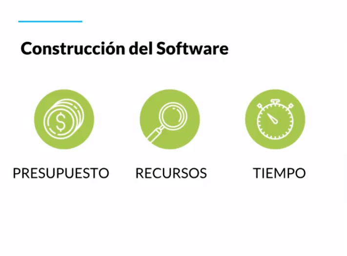

# Curso de Fundamentos de Pruebas de Software

## ¿Qué son las pruebas y por qué deberíamos hacerlas?

¿Cuántas veces hemos sido usuarios de alguna app móvil y falla? ¿Cuántas veces hemos sido parte del desarrollo de un producto y el retrabajo se desborda por todas las fallas o defectos que contiene?.

Las **pruebas** son una manera de explorar, experimentar, entenderlo, entre menos entiendas el productos que estas desarrollando más errores tendrá. Las puedes hacer por cuestión de costo, prestigio o cuestiones legales.

Tres aspectos a considerar:

- Tenemos un problema o el resultado no es el esperado
- Nuestros costos se esta volviendo muy alto.
- Implicaciones legales o de estándares tecnológicos.

## Proceso de pruebas del software y los estándares internacionales

Para el proceso de pruebas es necesario contar con al menos 3 elementos que lograrán cumplir nuestros objetivos:

- **Metodología**: Es donde estableces el criterio o estrategia de cómo se llevaran acabo las pruebas.
- **Recursos**: Si quieres realizar pruebas y no estás preparado, con el tiempo esas carencias se pueden visualizar como defectos.
- **Herramientas**: Nos ayudarán a optimizar nuestro trabajo.
Definir la calidad del producto: Si estas creando el software correctamente.
Calidad del proceso: Si alguien de tu equipo no te especifica lo que quieres no vas a poder crear un producto que cubra sus necesidades.

## Ciclo de vida del software

A lo largo del ciclo de vida del software se realizan distintas pruebas para garantizar que este cumpla con los requerimientos para los que fue diseñado y de la misma forma se encuentren procesos de mejora y optimización a medida que se desarrolla el software.

- Es necesario hacer pruebas en todas las fases del desarrollo de software ya que un error encontrado en una etapa tardía puede generar costos muy elevados.

- Errores detectados lo antes posible reducen los costos y son mucho más fáciles de corregir.

- El ciclo de vida permite que los errores se detecten lo antes posible y por lo tanto, permite a los desarrolladores concentrarse en la calidad del software, en los plazos de implementación y en los costos asociados.

El ciclo de vida básico de un software consta de los siguientes procedimientos:

1. Definición de objetivos
En esta fase se define el alcance general del software y su papel dentro de una estrategia global o dentro del ecosistema que va a funcionar.

2. Análisis de los requisitos y su viabilidad
Se trata de recopilar la mayor cantidad de información posible para evaluar la viabilidad del producto, encontrar posibles restricciones y analizar todos los requisitos del cliente.

3. Diseño
Alto nivel: Se trata de realizar un diseño básico que valide la arquitectura de la aplicación.
Bajo nivel: Es una definición detallada de la estructura de la aplicación basada en el diseño general.

4. Programación
Es la implementación de un lenguaje de programación para crear las funciones definidas durante la etapa de diseño.

5. Pruebas de verificación
Aunque en todas las fases anteriores se hacen pruebas en esta fase se cubren: pruebas de componentes, integrales y de sistema.

6. Prueba beta (o validación)
Se hace para garantizar que el software cumple con las especificaciones originales o también se hacen las pruebas de aceptación.

7. Implementación
Se realiza una prueba del sistema implementado para encontrar posibles fallas en la Implementación.

8. Mantenimiento
Se hace para todos los procedimientos correctivos (mantenimiento correctivo) y a las actualizaciones secundarias del software (mantenimiento continuo), junto con la actualización de las pruebas.

Si hacemos las pruebas durante cada fase del ciclo de vida del software tendremos al final del ciclo un producto validado y robusto de acuerdo a las necesidades del cliente.

## Proceso de pruebas del software: Calidad y Defectos

Todo lo anterior nos hace preguntarnos: ¿Qué es la calidad?

La **calidad** es una percepción entre lo deseado, analizado y lo que vamos a entregar. La calidad la define el cliente, si esa persona esta satisfecha con lo entregado hasta ahí llega la calidad.

- **Verificación**: Es ir en cada etapa revisando que se cumpla lo propuesto por el cliente.
- **Validación**: Antes de entregar al cliente, validamos que efectivamente el conjunto de requerimientos esta siendo cumplido con lo entregado.
- **Anomalia**: la manifestación de un error en el software.
- **Error**: una acción humana que produce un resultado incorrecto.
- **Defecto**: imperfección o deficiencia, el cual no cumple sus requerimientos o especificaciones y necesita ser reparado o remplazado.
- **Fallo**: el cese de la habilidad de un producto de cumplir una función requerida o su inhabilidad de funcionar dentro de márgenes previamente especificados.
- **Problema**: dificultad o incertidumbre experimentada por una o más personas, como resultado de un encuentro insatisfactorio con el sistema usado.
Ya entendimos que es necesario definir un proceso que asegure un buen desarrollo del producto, que los estándares o herramientas implementadas deben ayudar a cubrir las métricas definidas para entonces evaluar si el producto tiene el porcentaje o grado de calidad esperado.

## Principios del testing modern

- **Nuestra prioridad es mejorar el negocio**: El producto que se va a entregar al cliente permitirá hacer funcionar el negocio. Si en algún momento no quieres hacerlo, estás poniendo en riesgo ese negocio porque si el producto no se vende o no es aceptado la empresa puede cerrar o puedes perder el trabajo.
- **Nosotros aceleramos el equipo y usamos modelos como Lean Thinking y Teoría de las Restricciones para ayudar a identificar, priorizar y mitigar cuellos de botella en el sistema**: Cuando queremos hacer algo, lo queremos hacer perfecto y eso puede ser demasiado. Deberías construir en base a procesos cortos para poder encontrar los defectos de una manera más rápida.
- **Nosotros somos la fuerza para la mejora continua, ayudando al equipo a adaptarse y optimizar para tener éxito, en lugar de proporcionar una red de seguridad para detectar fallas**: El cliente puede entender que el producto se va a liberar por fases, es importante que nosotros enfoquemos nuestras pruebas en cada una de esas fases. No tiene que ser todo al inicio y al final, debe haber una distribución que nos permita manejar el riesgo del software
- **Nos preocupamos profundamente acerca de la cultura de calidad en nuestro equipo, y asesoramos, lideramos y nutrimos el equipo para llevarlos a una cultura de calidad más madura**: Al inicio los testers eran personas desarrollando software y un día con tantos defectos y trabajo, separaron los roles para que así hubiese una persona dedicada a realizar las pruebas. El tester puede hacer recomendaciones de herramientas, mejorar el proceso o volverse un coach.
- **Nosotros creemos que el cliente es el único capaz de juzgar y evaluar la calidad de nuestro producto**: Si el cliente esta satisfecho con lo entregado y cumple las expectativas entonces has alcanzado la calidad deseada.
- **Nosotros usamos datos de manera extensa y profunda para entender los casos de uso del cliente y entonces cerrar huecos entre hipótesis del producto e impacto del negocio**.
- **Expandimos las habilidades de testing y el conocimiento en todo el equipo; entendemos que esto reduce o elimina la necesidad de una especialista dedicado al testing**.
El tester debe dominar varias areas necesita entender y tener toda la visión del producto y negocio. Saber sobre herramientas que optimicen el trabajo.

## Especialidades del testing

Hay muchas especialidades a la hora de hablar de testing y cada una de ellas tiene diferentes funciones y perspectivas que se incluyen en diferentes fases del proceso

**Manual tester**: Nos ayuda a definir los casos de pruebas, establecer estrategias. También ejecuta, pero lleva lo necesario para que todos sepan qué hacer.

- Pensamiento lateral, piensa fuera de la caja con una nueva perspectiva, agrega nuevos casos de usos y entiende muy bien al usuario.

**Automation tester**: Se encarga de agilizar, acelerar el trabajo y actividades que nos quitan la oportunidad de encontrar más casos de usos.

- Conoce de programación, no solo de forma básica, debe conocer como crear diseños de frameworks y soluciones. El código crece y las pruebas también, darle ese mantenimiento a las pruebas es un problema común.

**Security tester**: Encargado para el área de seguridad. Debe ser alguien que aporte valor desde la perspectiva de la seguridad.

- Protocolos, estándares, legalizaciones dependiendo de cada país y marca. Esta enfocado en prever ataques, virus, problemas de seguridad, acceso no autorizado. Profundizar en las técnicas y prácticas de seguridad.
**Data science tester**: Con la manera en que crecen los datos en un proyecto, se necesita a alguien que los analice, agrupe y limpie estos datos.

- Análisis y Limpieza de datos, omite tener un set de pruebas amplio donde la variedad va a permitir detectar defectos inesperados. Esto puede ser clave para que los resultados no sean falsos positivos

**SDET**: Es la combinacion de un desarrollador que ya sabe hacer pruebas. Con la diferencia de automatiza y hace uso de herramientas que organizan la operación de la entrega de las pruebas. Esta persona se asegura de que las pruebas se ejecuten antes de liberar el código.

- El programador ahora sabe hacer pruebas y conoce de herramientas que le permite entregarlas de una manera automatizada.

**DevOps**: Conoce todo lo anterior y domina el conocimiento de automatizar el proceso, se asegura de una entrega continua.

- Una automatización de la operación, Entrega Continua. Donde se entregan de forma más rápida las nuevas versiones.

**QA Engineer**: Quality Assurance. Esta enfocado en el producto y en el proceso.

- Procesos de Calidad

**QE**: Quality Engineer. Es como un coach, acompaña en las politicas de calidad en la empresa o equipo.

- Soluciones de estrategias de calidad.

### Habilidades dentro de las especialidades del testing

## Presupuesto, Recursos, Tiempo y Actividades Clave

### Pruebas para las Metodologías Ágiles

En contraste al modelo de cascada,**en un modelo ágil se escribe y actualiza un plan de prueba para cada lanzamiento**.

El plan de prueba ágil incluye los tipos de pruebas realizadas en esa iteración. Los planes de prueba típicos en ágil incluyen:

1. El alcance de la prueba
2. Prueba de las nuevas funcionalidades agregadas en la iteración.
3. Las pruebas deben ser basadas en la complejidad de las características.
4. Pruebas de desempeño (carga y rendimiento)
5. Consideraciones de infraestructura
6. Plan de Mitigación de Riesgos.
7. Recursos
8. Entregables e hitos

Elementos para crear un proyecto de software tienen que ver con el presupuesto, recursos y tiempos

Si un proyecto no tiene suficiente dinero para tener el equipo necesario de personas e infraestructura no se va a poder llevar a cabo

Si no se cuenta con el equipo de recurso humano ideal e idoneo con el conocimiento el proyecto peude que no se lleve a cabo o por lo menos puede pasar que no se cumpla el tiempo estimado del mismo

Los costos tambien pueden llegar a incrementar

### Etapa de Analisis

- Revision con el cliente y equipo

- Documentacion

- Pruebas de requerimientos del cliente

- Alcance y necesidad del cliente y como puedo empezar a abordar los problemas que se puedan llegar a aparecer por mas ambiguos que sean y tambien como voy a confirmar que un requerimiento se cumpla

### Etapa de Diseño

- Criterios visuales que espera el cliente

- Que espera en la funcionalidad combinado con el diseño del producto

- Alertas del producto al hacer check de manera correcta o incorrecta

### Etapa de codigo

- Revision e implementacion de modulos, funciones o bases de datos

- Verificacion de lo que esta en el backend y en lo posible si existe el Frontend

- Revision de las mejores practicas para la implementacion y desarrollo del software

### Etapa de pruebas

- Pruebas de transmision de datos en distintos dispositivos

- Confirmacion de los requerimientos del cliente a traves de la validacion y verificacion

- Pruebas de aceptacion donde el usuario final acepta el producto requerido pero se debe tener que cuenta que antes de entregar al cliente final se tuvieron que haber hecho todas las pruebas posibles en las anteriores etapas

## Estrategia de pruebas

Las estrategias de prueba son aquellas que nos permiten conocer por donde comenzar. Por donde vamos a hacer las pruebas, planearlas, identificarlas. Para saber por donde comenzar podemos hacernos dos preguntas.

¿Qué problemas tenemos actualmente?
¿Qué problemas debemos evitar?

[MindMup](https://www.mindmup.com/ "MindMup")

### Herramienta para organizar ideas

### ¿Que problema tenemos?

### Escenarios y Contextos

- Seguridad

- Arquitectura

- Performance

- Usabilidad

- Escalabilidad

## Testing en desarrollo de software

**Testing**: Es la exploración de una idea, aprender a conocer como sucede el flujo, se generan datos, se llenan formularios. Esto y la exploración de pruebas nunca terminan, siempre hay nuevas formas de conocer como el usuario esta usando el software

**Checking**: Es cuando sabes qué esta pasando y te verificas que siga pasando. Como verificar una maleta antes de viajar para asegurarnos que guardamos todo.

- Solo se ejecutan si sucede algo
- Se ejecutan cada que… libero nuevo código o software.
- Se ejecutan de manera programada.

**Testing**: Exploración de una idea

- Flujos
- Datos
- Continuo
**Checking**: Tu ya sabes que sucede algo, y verificas que sigue pasando

- Checklist
- Solo se ejecuta si…
- Se ejecutan cada que…
- Se jecutan de manera programada ++Ventajas++:
- Pruebas en paralelo, múltiples plataformas
- Reducción de error humano
- Probar gran cantidad de datos

**Errores en el testing:**

- Pruebas duplicadas
- Pruebas similares
- Pruebas sin valor agregado
- Pruebas caducadas

**Errores en el checking**:

- Pobre cobertura de pruebas
- Falta de actualización
- Mal manejo de versiones

## Testing ágil

Involucra a todos, no solo en al tester, todos en el equipo son tester. La persona con este rol se asegura de la mayor cobertura de pruebas tomando en cuenta todas las necesidades que cada uno de los miembros del equipo también esta intentando hacer que funcione. El tester tiene que definir si se esta cumpliendo con los requerimientos funciones y los del equipo.

### Estrategias Ágiles:

- El testing es de ““todo el equipo””
- El testing puede ser independiente
- Integración continua
- Testing guiado por pruebas (Test Driven Development)
- Desarrollo guiado por comportamiento (Behaviour Driven Development)
- Desarrollo guiado por las pruebas de aceptación (Acceptance Test Driven Development)

## Niveles de pruebas

Vamos a ver diferentes estrategias de cómo podemos ir probando elementos por capas. Componentes, estructuras, etc.

**Prueba de Componentes**: Componentes son aquellas cosas pequeñas que sueles ver en un video como el botón de pausa, volumen, adelantar, retroceder. Cada una de esas acciones son un componente.

**Pruebas de integración**: Una aplicación tiene una serie de componentes que trabajando juntos forman un pequeño sistemas, pero cuando tienes varios de estos sistemas necesitas integrarlos entre ellos.

**Prueba de sistema**: Esta parte incluye que estás tomando en cuenta el contexto, no es lo mismo tener las mismas pruebas para iOS, Android y Web.

**Pruebas de aceptación**: Si ya probamos que nuestro elemento o acción funcionan, estás pruebas nos aseguran con o sin el cliente que tiene cubierta todas las necesidades requeridas en el software. Es la última verificación.

## Tipos de pruebas

Necesitamos tener otra clasificación adicional. En los niveles sabemos la profundidad de las pruebas, pero en los tipos independientemente de su profundidad son las técnicas que vamos a usar para encontrar los defectos.

**Pruebas funcionales**: Cómo funciona un sistema, qué debe estar haciendo, cómo está interactuando el usuario con él.

**Pruebas no-funcionales**: El usuario puede estar experimentando otro tipo de cosas que aún funcionando puede tener la sensación de lentitud, falta de legibilidad o claridad. Esas características de usabilidad están asociadas a estas pruebas.

**Pruebas estructurales**: Tienen que ver con la tecnología y el stack usado para construir nuestro producto. Nos tenemos que asegurarnos que nuestra base de datos o servidor funcionen de la manera correcta. Son conocidas como pruebas de caja blanca.

**Prueba de manejo de cambios**: Es probar nuevamente un componente ya probado para verificar que no ha sido impactado por actualizaciones.

**Diferencia entre caja blanca, gris y negra** Aunque no se menciono a profundidad en esta clase, voy a explicar brevemente que significan:

**Caja blanca/transparente**: es cuando probamos el sistema viendo como funciona por dentro. Por ejemplo, al tener muchos datos en una base de datos que nosotros conocemos de ante mano y hacer pruebas con esos datos.
**Caja negra**: tiene que ver con hacer pruebas con datos, en este caso que no sabemos previamente. Aquí puede que descubramos un bug al no saber el tipo de datos que se podría ingresar.
**Caja gris**: Una combinación de ambas cajas.

## Pruebas estáticas y dinámicas

Ya vimos los cuatro diferentes tipos de pruebas, pero estas también se separan en dos formas diferentes de trabajarlas.

**Pruebas estáticas**: Muchas veces no son consideradas en los proyectos porque significa revisar código, documentación, verificar información documentada de la forma correcta.

**Pruebas dinámicas**: Se enfocan en comportamientos externos visibles durante la ejecución del software.

Pruebas estáticas y dinámicas Pruebas dinámicas: se enfocan principalmente en comportamientos externos visibles durante la ejecución del software. Pruebas estáticas: se basan en la examinación manual de los elementos que conforman la construcción del software. Que son los elementos:

- Contratos, planes, calendario, presupuesto
- análisis de requerimientos
- Especificaciones o reglas de negocio: seguridad, técnicas
- Definiciones de: historias de usuario, criterios de aceptación, mockups
- El diseño de la arquitectura
- Las pruebas (Testware), puntos de verificación CI
- Guías de usuario
- Evaluación/revisión del código

**Beneficios:**

- Detectar y corregir defectos de manera mas eficiente
-Identificar y priorizar la ejecución de pruebas en etapas posteriores
- Prevenir defectos
-Cubrir aspectos: Inconsistencias, ambigüedades, contradicciones, inexactitudes, redundancia.
- reducir el retrabajo
- reducir el costo
- Mejorar la comunicación

## Definición y diseño de pruebas

Esto es algo básico para cada tester. Hay varias cosas necesarias que debemos comprender y estar seguros de para qué lo hacemos.

Tu obligación y por lo que vas a brillar es porque sabes **Encontrar Problemas, Documentarlos y Comunicarlos**. Es crucial documentar, diseñar y nuestros casos de prueba contengan la información necesaria para que se entienda el trabajo.

### ¿Qué hace un tester?

1. **Encontrar problemas**: Si no encuentra problemas antes de que el producto sea entregado al cliente, entonces su testing es ineficiente.

2. **Documentar problemas**: Si cuando encuentra problemas no sabe documentar y reproducir los pasos correctos su testing genera retrabajo y sube el costo.

3. **Comunicar problemas**: Si como representante de la calidad del producto no sabe argumentar y proteger los intereses del negocio o los clientes, entonces su testing no agrega valor.

