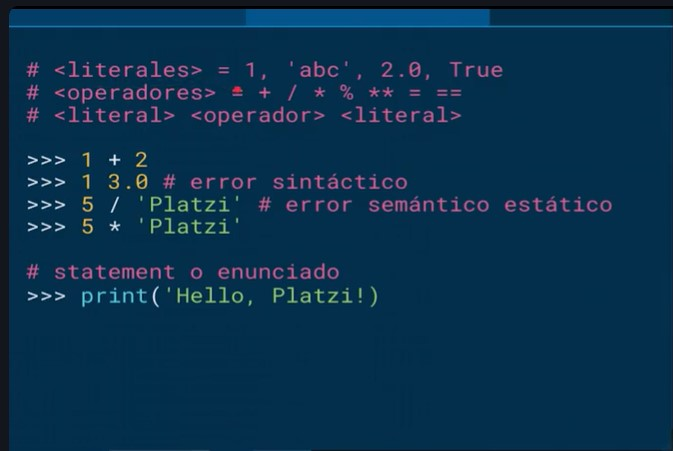
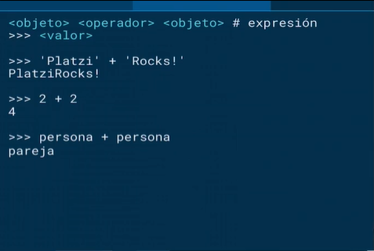
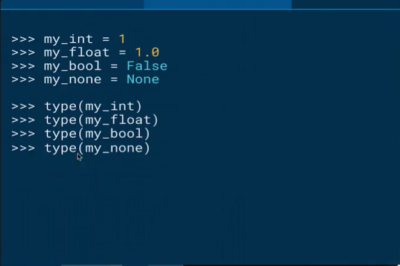
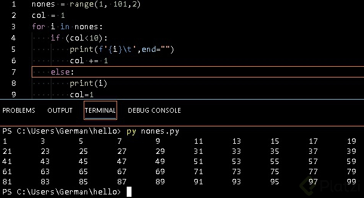
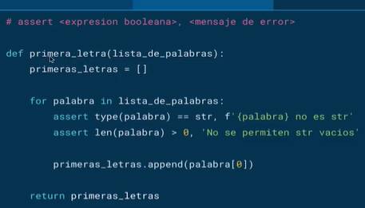

# Curso de Introducción al Pensamiento Computacional con Python

### Introducción al Cómputo

1. **"Primera computadora"** creada por los griegos, calcula la posición del sol, luna y algunas constelaciones.

2. En 1801, Telar de Jacquar, separa el resultado de la informacion que contiene las instrucciones.

3. Siglo XIX, **Motor analítico de Babbage**, haciendo uso del avances en mecánica (engranajes) de su época logra separar instrucciones de calculo y realizar varios cálculos a la vez.

4. Finales siglo XIX, **ENIAC** (Eectronic Numerical Integrator and Computer) **usaba sistema decimal**. creada por Alan Turing y Alonso. Esta época exigía exactitud en los cálculos que hacían que compañías dependieran de esta(Compañías Ferroviarias por ejemplo). Turing y Alonso, Descubrieron que matemáticamente todos los algoritmos podíamos reducirlos a una secuencia de soluciones matemáticas.

5. En 1945, Arquitectura de Von Neumann, **EDVAC** (Electronic Discrete Variable Automatic Computer) usaba sistema binario. Su aporte fue el descubrimiento que dentro de los componentes electrónicos se puede usar una serie de hadward para realizar el computo y almacenar datos dentro de memoria.

6. En 1950, Microchip, ejemplo Apple 1

7. En siglo XX, **Arquitectura de Feymann**, aporta las bases matemáticas de computo cuántico.

### Introducción a los lenguajes de programación

**¿Qué es un lenguaje de programación?** Es un lenguaje formal que, mediante una serie de instrucciones, le permite a un programador escribir un conjunto de órdenes, acciones consecutivas, datos y algoritmos para, de esa forma, crear programas que controlen el comportamiento físico y lógico de una máquina.

**¿Qué tipos de lenguaje de programación existen?** El lenguaje de programación es la base para construir todas las aplicaciones digitales que se utilizan en el día a día y se clasifican en dos tipos principales: lenguaje de bajo nivel y de alto nivel.

*Lenguaje de programación de bajo nivel** Son lenguajes totalmente orientados a la máquina.

Este lenguaje sirve de interfaz y crea un vínculo inseparable entre el hardware y el software.

Además, ejerce un control directo sobre el equipo y su estructura física. Para aplicarlo adecuadamente es necesario que el programador conozca sólidamente el hardware. Éste se subdivide en dos tipos:

**Lenguaje máquina** Es el más primitivo de los lenguajes y es una colección de dígitos binarios o bits (0 y 1) que la computadora lee e interpreta y son los únicos idiomas que las computadoras entienden.

Ejemplo: 10110000 01100001

No entendemos muy bien lo que dice ¿verdad? Por eso, el lenguaje ensamblador nos permite entender mejor a qué se refiere éste código.

**Lenguaje ensamblador** El lenguaje ensamblador es el primer intento de sustitución del lenguaje de máquina por uno más cercano al utilizado por los humanos.

Un programa escrito en éste lenguaje es almacenado como texto (tal como programas de alto nivel) y consiste en una serie de instrucciones que corresponden al flujo de órdenes ejecutables por un microprocesador.

Sin embargo, dichas máquinas no comprenden el lenguaje emsamblador, por lo que se debe convertir a lenguaje máquina mediante un programa llamado Ensamblador.

Este genera códigos compactos, rápidos y eficientes creados por el programador que tiene el control total de la máquina.

Ejemplo: MOV AL, 61h (asigna el valor hexadecimal 61 al registro “AL”)

**Lenguaje de programación de alto nivel** Tienen como objetivo facilitar el trabajo del programador, ya que utilizan unas instrucciones más fáciles de entender.

Además, el lenguaje de alto nivel permite escribir códigos mediante idiomas que conocemos (español, inglés, etc.) y luego, para ser ejecutados, se traduce al lenguaje de máquina mediante traductores o compiladores.

**Traductor** Traducen programas escritos en un lenguaje de programación al lenguaje máquina de la computadora y a medida que va siendo traducida, se ejecuta.

**Compilador** Permite traducir todo un programa de una sola vez, haciendo una ejecución más rápida y puede almacenarse para usarse luego sin volver a hacer la traducción.

### Elementos básicos de Python

- ¿Qué es un lenguaje de programación? Es un lenguaje formal que, mediante una serie de instrucciones, le permite a un programador escribir un conjunto de órdenes, acciones consecutivas, datos y algoritmos para, de esa forma, crear programas que controlen el comportamiento físico y lógico de una máquina.

- ¿Qué tipos de lenguaje de programación existen? El lenguaje de programación es la base para construir todas las aplicaciones digitales que se utilizan en el día a día y se clasifican en dos tipos principales: lenguaje de bajo nivel y de alto nivel.

1. **Lenguaje de programación** de bajo nivel Son lenguajes totalmente orientados a la máquina. Este lenguaje sirve de interfaz y crea un vínculo inseparable entre el hardware y el software.

2. **Lenguaje de programación de alto nivel** Tienen como objetivo facilitar el trabajo del programador, ya que utilizan unas instrucciones más fáciles de entender.

3. L**enguaje específico de dominio** En desarrollo de software e ingeniería de dominio, un lenguaje específico de dominio, o "lenguaje específico del dominio", (en inglés domain-specific language, DSL) es un lenguaje de programación o especificación dedicado a resolver un problema en particular, representar un problema específico y proveer una técnica para solucionar una situación particular. El concepto no es nuevo pero se ha vuelto más popular debido al aumento del uso de modelaje específico del dominio.1​

4. **Lenguaje de propósito general** Se llama lenguaje de propósito general al lenguaje de programación cuyos procedimientos, instrucciones y estructuras de datos están diseñados para resolver todo tipo de problemas.

5. **Lenguaje de interpretados y compilados** La principal diferencia entre un lenguaje compilado y uno interpretado es que el lenguaje compilado requiere un paso adicional antes de ser ejecutado, la compilación, que convierte el código que escribes a lenguaje de máquina. Un lenguaje interpretado, por otro lado, es convertido a lenguaje de máquina a medida que es ejecutado.

Ejemplos de lenguajes compilados incluyen C, C++, Java, Go y Rust, entre muchos otros. Ejemplos de lenguajes interpretados incluyen Ruby, Python y JavaScript, entre muchos otros. A todos estos lenguajes se les conoce como lenguajes de alto nivel.

```python
1 + 1 # 1
'Platzi' / 5 # Error
'Platzi' * 3 #PlatziPlatziPlatzi
#PrintStatement
print('Hola mundo')
'Mr' + '. Internatuta'
2 + 2
```

**¿Que es un objeto?** Concepto, abstracción o cosa con límites bien definidos y con significado para el problema que se está manejando

- Escalares vs No escalares -Tipos int. float. bool. str.

```python
#Definiendo variables
my_int  = 1
my_float = 1.0
my_bool = True
my_none = None
my_str = 'Hola'

#Imprimiendo el tipo
type(my_int)
type(my_float)
type(my_bool)
type(my_none)
type(my_str)
```

**¿Que pasa si ejecutas esto?**

```python
1 + 1 
2 - 5
2.0 * 3
6 // 2
6 // 4
6 / 4
7 % 2
2 ** 2
```

Resultado

```python
>>> 1 + 1
2
>>> 2 - 5
-3
>>> 2.0 * 3
6.0
>>> 6 // 2
3
>>> 6 // 4
1
>>> 6 / 4
1.5
>>> 7 % 2
1
>>> 2 ** 2
```
**Elementos basicos**



**Expresion:**



**Type**



### Cadenas y entradas

**Cadenas** • Los objetos de tipo str pueden representarse con “ ” o ‘ ’. • El operador + tiene diferente significado según el tipo de dato (overloaded). Con cadenas significa concatenación. • El operador * es el operador de repetición con cadenas. • Las cadenas son inmutables.

**Entradas** • Python tiene la función **input** para recibir datos del usuario del programa. • Input siempre regresa cadenas, por lo que si queremos utilizar otro tipo, tenemos que hacer type casting

```python
print (("Hip" * )+ " "+"Hurra")
  File "<stdin>", line 1
    print (("Hip" * )+ " "+"Hurra")
                    ^
SyntaxError: invalid syntax
>>> print (("Hip" * 3)+ " "+"Hurra")
HipHipHip Hurra
>>> my_str = "platzi"
>>> len(my_str)
6
>>> my_str[0]
'p'
>>> my_str[2]
'a'
>>> my_str[2:]
'atzi'
>>> my_str[:3]
'pla'
>>> my_str[:-2]
'plat'
>>> my_str[::2]
'paz'
>>> "Yo amo a " + my_str
'Yo amo a platzi'
>>>
>>>
>>>
>>>
>>>
>>> f"Yo amo a {my_str}
  File "<stdin>", line 1
    f"Yo amo a {my_str}
    ^
SyntaxError: unterminated f-string literal (detected at line 1)
>>> f"Yo amo a {my_str}"
'Yo amo a platzi'
>>> f"Yo amo a {my_str}" * 4
'Yo amo a platziYo amo a platziYo amo a platziYo amo a platzi'
>>> nombre = input("¿Cual es tú nombre?")
¿Cual es tú nombre?Mario
>>> nombre = input("¿Cual es tú nombre? ")
¿Cual es tú nombre? Mario
>>> print(nombre)
Mario
>>> print("Tu nombre es",nombre)
Tu nombre es Mario
>>> numero = input("Escriba un número: ")
Escriba un número: 45
>>> numero
'45'
>>> print
<built-in function print>
>>> print(type(numero))
<class 'str'>
>>> numero = int(input("Escribe un numero: "))
Escribe un numero: 45
>>>
>>> print(type(numero))
<class 'int'>
>>> len(numero)
Traceback (most recent call last):
  File "<stdin>", line 1, in <module>
TypeError: object of type 'int' has no len()
>>> len(str(numero))
2
>>>
```

### if and else


### if, elif and else


### Bucles for

Los bucles, en diversos lenguajes de programación pueden ser definidos o indefinidos. Los bucles definidos preestablecen las condiciones de la iteración por adelantado. Por su parte, los bucles indefinidos establecen la condición en la que una iteración terminará. En este último tipo de bucles existe el riesgo de que el bucle se vuelva infinito (cuando la condición de suspensión nunca se cumple).

Los bucles definidos se implementan en Python a través del keyword for. Por su parte, los bucles indefinidos se implementan con el keyword while.

Sin embargo, esta no es la única forma de implementar bucles definidos. Por ejemplo, Javascript puede implementar un bucle definido mediante el siguiente constructo:

```python
for (i = 0; i <= 10; i++) {
  <expresión>
}
```

El bucle se puede leer de la siguiente manera:

- Inicializa el bucle en 0
- Continua el bucle mientras i sea menor o igual que 10
- Incrementa i en uno al final de cada iteración

Es importante señalar que la expresión i++ es equivalente a lo que en Python escribiríamos como i += 1.

Una segunda forma de crear un bucle definido es iterando en una colección de objetos. Esta es la forma que Python utiliza:

```python
for <variable> in <iterable>:
    <expresión>
```

#### El bucle for en Python
En la definición anterior debemos entender `<iterable>` como una colección de objetos; y la `<variable>` como el elemento específico que se está exponiendo mediante el bucle en cada iteración.

```python
>>> frutas = ['manzana', 'pera', 'mango']
>>> for fruta in frutas:
        print(fruta)

manzana
pera
mango
```

#### Iterables
En Python, un iterable es un objeto que se puede utilizar en un bucle definido. Si un objeto es iterable significa que se puede pasar como argumento a la función **iter**. El iterable que se pasa como parámetro a la función `iter`
regresa un `iterator`.

```python
>>> iter('cadena') # cadena
>>> iter(['a', 'b', 'c']) # lista
>>> iter(('a', 'b', 'c')) # tupla
>>> iter({'a', 'b', 'c'}) # conjunto
>>> iter({'a': 1, 'b': 2, 'c': 3}) # diccionario
```

Todas las llamadas anteriores regresan un objeto de tipo iterator.

¿Qué pasa si le pasamos a la función iter un objeto que no es iterable? Obtendremos un TypeError que señala que el objeto no es un iterable. Esto es un ejemplo de programación defensiva en el que Python verifica el tipo del
objeto antes de proceder al cómputo. ¡Intentalo en tu consola!

Es importante señalar que estos no son los únicos tipos de objetos que pueden ser iterable. Existen gran cantidad de ejemplos en la librería estándar y, de hecho, casi cualquier objeto se puede convertir en un iterable (pero eso
ya lo veremos cuando hablemos de Python avanzado).

#### Iterators
Ahora que ya sabemos cómo obtener un iterator, ¿Qué podemos hacer con él? Un iterator es un objeto que regresa sucesivamente los valores asociados con el iterable.

```python
>>> frutas = ['manzana', 'pera', 'mango']
>>> iterador = iter(frutas)
>>> next(iterador)
manzana
>>> next(iterador)
pera
>>> next(iterador)
mango
```

Como puedes ver, el iterator guarda el estado interno de la iteración, de tal manera que cada llamada sucesiva a next regresa el siguiente elemento. ¿Qué pasa una vez que ya no existan más elementos en el iterable? La llamada
a next arrojará un error de tipo StopIteration.

#### ¿Cómo implementa Python los bucles definidos?

Ahora ya conocemos todos los elementos necesarios para entender que es lo que sucede en Python cuando ejecutamos un bucle for. Considera nuevamente el siguiente código:

```python
>>> frutas = ['manzana', 'pera', 'mango']
>>> for fruta in frutas:
        print(fruta)
```

Este bucle se puede describir con los conceptos que explicamos previamente:

1. Python llama internamente la función iter para obtener un iterator
2. Una vez que tiene un iterator llama repetidamente la función next para tener acceso al siguiente elemento en el bucle.
3. Detiene el bucle una vez que se arroja el error **StopIteration** 

#### Bucles for con diccionarios

Para iterar a lo largo de un diccionario tenemos varias opciones:

- Ejecutar el bucle for directamente en el diccionario, lo cual nos permite
- iterar a lo largo de las llaves del diccionario.
- Ejecutar el bucle for en la llamada keys del diccionario, lo cual nos permite
- iterar a lo largo de las llaves del diccionario.
- Ejecutar el bucle for en la llamada values del diccionario, lo cual nos
- permite iterar a lo largo de los valores del diccionario.
- Ejecutar el bucle for en la llamada items del diccionario, lo cual nos
- permite iterar en una tupla de las llaves y los valores del diccionario.

```python
estudiantes = {
    'mexico': 10,
    'colombia': 15,
    'puerto_rico': 4,
}

for pais in estudiantes:
    ...

for pais in estudiantes.keys():
    ...

for numero_de_estudiantes in estudiantes.values():
    ...

for pais, numero_de_estudiantes in estudiantes.items():
    ...
```

#### Modificación del comportamiento de un bucle for

Podemos modificar el comportamiento de un bucle for mediante los *keywords*
**break** y **continue**.

break termina el bucle y permite continuar con el resto del flujo de nuestro
programa.

continue termina la iteración en curso y continua con el siguiente ciclo de
iteración.

#### Conclusiones

Como pudimos observar, Python implementa los bucles definidos mediante los bucles for. Esta implementación nos permite iterar a lo largo de cualquier objeto que sea iterable. Para iterar necesitamos un iterador que nos regresará
el siguiente valor en cada iteración. Todo esto, Python lo puede hacer por nosotros con el constructo for ... in ....

### Representación de flotantes

La mayoría del tiempo los números flotantes (tipo float) son una muy buena aproximación de los números que queremos calcular con nuestras computadoras. Sin embargo, “la mayoría del tiempo” no significa todo el tiempo, y cuando no se comportan de esta manera puede tener consecuencias inesperadas.

Por ejemplo, trata de correr el siguiente código:

```python
x = 0.0
for i in range(10):
    x += 0.1

if x == 1.0:
    print(f'x = {x}')
else:
    print(f'x != {x}')
```

Es probable que te hayas sorprendido con el resultado. La mayoría de nosotros esperaríamos que imprimiera **1.0** en vez de **0.999999999999**. ¿Qué es lo que pasó?.

Para entender qué es lo que pasó tenemos que entender que es lo que pasa en la computadora cuando realizamos cómputos con números flotantes. Y para eso necesitamos entender números binarios.

Cuando aprendiste a contar, lo que en realidad aprendiste es una técnica combinatoria para manipular los siguientes símbolos que le llamamos números: 0, 1, 2, 3, 4, 5, 6, 7, 8, 9.

La forma en la que funciona esta técnica es asignando el número 10 a la 0 al número de la extrema derecha, 10 a la 1 al siguiente, 10 a la 2 al siguiente y así sucesivamente. De tal manera que el número 525 es simplemente la representación de (5 * 100) + (2 * 10) + (5 * 1).

Esto nos dice que el número de números que podemos representar depende de cuanto espacio tengamos. Si tenemos un espacio de 3, podemos representar 1,000 números (10 elevado a la 3) o la secuencia del 0 al 999. Si tenemos 4, podemos representar 10,000 (10 elevado a la 4) o la secuencia del 0 al 9,999. De manera general podemos decir que con una secuencia de tamaño n, podemos representar 10 elevado a la n números.

Los números binarios funcionan de la misma manera (de hecho cualquier número en cualquier base, por ejemplo, octales o hexadecimales). La única diferencia es cuántos símbolos tenemos para representar. En binario nada más tenemos 0, 1;
en hexadecimal tenemos 0, 1, 2, 3, 4, 5, 6, 7, 8, 9, a, b, c, d, e, f.

De esta manera podemos decir que el número de la extrema derecha es `cantidad_de_simbolos**0`, `cantidad_de_simbolos**1`, `cantidad_de_simbolos**2`, etc. Por lo que en binario, que nada más tenemos 2 símbolos, decimos `2**0`, `2**1`, `2**2`, etc. Por ejemplo el número binario 101 es la representación de (1 * 4) + (0 * 2) + (1 * 1), es decir 5.

Esta representación nos permite trabajar con todos los números positivos enteros dentro del computador, pero ¿Qué hacemos con los negativos y los racionales?.

El caso de los números negativos es sencillo: simplemente agregamos un bit adicional que representa el signo y la añadimos en la extrema izquierda. Por lo que el número 0101 sería +5 y el número 1101 sería -5.

El caso de los racionales es más complejo. En la mayoría de los lenguajes de programación modernos los racionales utilizan una implementación llamada punto flotante. ¿Cómo funciona esta representación?.

Antes de pasar a binario, vamos a pretender que estamos trabajando con una computadora basada en decimales. Un número flotante lo representaríamos con un par de enteros: los dígitos significativos y el exponente. Por ejemplo, el número 2.345 se representaría como **(2345 * 10**-3)** o **(2345, -3)**.

El número de dígitos significativos determinan la precisión con la que podemos representar número. Por ejemplo si nada más tuviéramos dos dígitos significativos el número 2.345 no se podría representar de manera exacta y tendríamos que convertirlo a una aproximación, en este caso 2.3.

Ahora pasemos a la verdadera representación interna de la computadora, que es en binario. ¿Cómo representarías el número 5/8 o 0.625? Lo primero que tenemos que saber es que 5/8 es en realidad el número `5 * 2**-3`. Por lo que podríamos decir (101, -11) (recuerda que el número 5 es 101 en binario y el 3 es 11).

Regresemos a nuestro problema inicial: ¿Cómo representaremos 1/10 (que escribimos en Python cómo 0.1)? Lo mejor que podemos hacer con cuatro dígitos significativos es (0011, -101) que es equivalente a 3/32 (0.09375). ¿Qué tal si tuviéramos cinco dígitos significativos? La mejor representación sería (11001, -1000) que es equivalente a 25/256 (0.09765625). ¿Cuántos dígitos significativos necesitamos entonces? Un número infinito. No existe ningún número que cumpla con la siguiente ecuación: `sim * 2**-exp`.

En la mayoría de las implementaciones de Python tenemos 53 bits de precisión para números flotantes. Así que los dígitos significativos para representar el número 0.1 es igual a:

11001100110011001100110011001100110011001100110011001 que es equivalente al número decimal: 0.1000000000000000055511151231257827021181583404541015625

Muy cercano a 1/10 pero no exactamente 1/10. Ahora ya sabemos la razón de esa respuesta tan extraña. Hay muy pocas situaciones en la que 1.0 es aceptable, pero 0.9999999999999999 no. Pero ¿Cuál es la moraleja de esta historia?

Hasta ahora hemos verificado igualdad con el operador ==. Sin embargo, cuando estamos trabajando con flotantes es mejor asegurarnos que los números sean aproximados en vez de idénticos. Por ejemplo x < 1.0 and x > 0.99999.

### Especificaciones del código
### Documentación

1. La primera linea debe ser un resumen, importante que quepa en una sola linea y este separada del resto de docstrings por un espacion en blanco.

2. El resto de la cadena de documentación debe describir el comportamiento de la función.

3. Se recomienda dejar una línea en blanco antes de las triples comillas que cierran la cadena de documentación.

Fuente: [documentacion](http://edupython.blogspot.com/2013/12/documentando-programas-en-python.html "documentacion")
https://atareao.es/pyldora/mejora-tus-desarrollos-en-python-documentacion/

```python
>>> def a(cualquier_parametro):
...     """Descripcion de lo que hace nuestra funcion
...        cualquier_parametro int cualquier entero
...        returns cualquier_parametro + 5
... """
...     return cualquier_parametro + 5
...
>>> help(a)
Help on function a in module __main__:

a(cualquier_parametro)
    Descripcion de lo que hace nuestra funcion
    cualquier_parametro int cualquier entero
    returns cualquier_parametro + 5

```

### Fibonnacci y la Recursividad

La secuencia de Fibonacci es una función matemática que se define recursivamente. En el año 1202, el matemático italiano Leonardo de Pisa, también conocido como Fibonacci, encontró una fórmula para cuantificar el crecimiento que ciertas poblaciones experimentan.

Imagina que una pareja de conejos nace, un macho y una hembra, y luego son liberados. Imagina, también, que los conejos se pueden reproducir hasta la edad de un mes y que tienen un periodo de gestación también de un mes. Por último imagina que estos conejos nunca mueren y que la hembra siempre es capaz de producir una nueva pareja (un macho y una hembra). ¿Cuántos conejos existirán al final de seis meses?

Una forma de visualizar este crecimiento es mirándolo de forma tabular:


|Mes | Hembras|
|------|---------|
|0 | 1|
|1 | 1|
|2 | 2|
|3 | 3|
|4 | 5|
|5 | 8|
|6 | 13|

Un punto importante a considerar es que para el mes n > 1, hembras(n) = hembras(n - 1) + hembras(n - 2).

Como podemos ver, tenemos una definición distinta a la de factorial que vimos anteriormente. En específico, tenemos dos casos base (0 y 1) y tenemos dos llamadas recursivas (hembras(n - 1) + hembras(n - 2)).

Podemos crear una solución recursiva de manera sencilla:

```python
def fibonacci(n):
    if n == 0 or n == 1:
        return 1

    return fibonacci(n - 1) + fibonacci(n - 2)
```

Aunque la definición es muy sencilla, es también bastante ineficiente. En los siguientes cursos de la serie de pensamiento computacional veremos como calcular exactamente la eficiencia de este algoritmo y cómo optimizarlo. De mientras, platícanos si conoces alguna otra definición recursiva.

### Funciones como objetos

Una de las características más poderosas de Python es que todo es un objeto, incluyendo las funciones. Las funciones en Python son "ciudadanos de primera clase".

Esto, en sentido amplio, significa que en Python las funciones:

- Tienen un tipo
- Se pueden pasar como argumentos de otras funciones
- Se pueden utilizar en expresiones
- Se pueden incluir en varias estructuras de datos (como listas, tuplas,
- diccionarios, etc.) 

#### Argumentos de otras funciones

Hasta ahora hemos visto que las funciones pueden recibir parámetros para realizar los cómputos que definen. Algunos de los tipos que hemos pasado son tipos simples como cadenas, números, listas, etc. Sin embargo, también pueden recibir funciones para crear abstracciones más poderosas. Veamos un ejemplo:

```python
def multiplicar_por_dos(n):
    return n * 2

def sumar_dos(n):
    return n + 2

def aplicar_operacion(f, numeros):
    resultados = []
    for numero in numeros:
        resultado = f(numero)
        resultados.append(resultado)
        return resultados

 nums = [1, 2, 3]
 aplicar_operacion(multiplicar_por_dos, nums)
 [2, 4, 6]

 aplicar_operacion(sumar_dos, nums)
[3, 4, 5]
```

#### Funciones en expresiones 
Una forma de definir una función en una expresión es utilizando el keyword lambda. lambda tiene la siguiente sintaxis: lambda : .

Otro ejemplo interesante es que las funciones se pueden utilizar en una expresión directamente. Esto es posible ya que como lo hemos platicado con anterioridad, en Python las variables son simplemente nombres que apuntan a un objeto (en este caso a una función). Por ejemplo:

```python
sumar = lambda x, y: x + y

sumar(2, 3)
5
```


#### Funciones en estructuras de datos

Las funciones también se pueden incluir en diversas estructuras que las permiten almacenar. Por ejemplo, una lista puede guardar diversas funciones a aplicar o un diccionario las puede almacenar como valores.

```python
def aplicar_operaciones(num):
    operaciones = [abs, float]

    resultado = []
    for operacion in operaciones:
        resultado.append(operacion(num))

    return resultado

 aplicar_operaciones(-2)
[2, -2.0]
```

Como pudimos ver, las funciones son objetos muy versátiles que nos permiten tratarlas de diversas maneras y que nos permiten añadir capas adicionales de abstracción a nuestro programa. Compártenos cómo te imaginas que estas capacidades de Python te pueden ayudar a escribir mejores programas.

#### Tuple

```python
>>> my_tuple =()
>>> type(my_tuple)
<class 'tuple'>
>>> type(my_tuple)
<class 'tuple'>
>>> my_tuple = (1, "dos", True)
>>> my_tuple[0]
1
>>> my_tuple[1]
'dos'
>>> my_tuple[2]
True
>>> my_tople[0] = 2
Traceback (most recent call last):
  File "<stdin>", line 1, in <module>
NameError: name 'my_tople' is not defined. Did you mean: 'my_tuple'?
>>> my_tuple = (1)
>>> type(my_tuple)
<class 'int'>
>>> my_tuple = (1,)
>>> type(my_tuple)
<class 'tuple'>
>>> my_other_tuple = (2, 3, 4)
>>> my_tuple += my_other_tuple
>>> print(my_tuple)
(1, 2, 3, 4)
>>>
>>>
>>> x, y, z = my_other_tuple
>>> x
2
>>> y
3
>>> z
4
>>>
>>>
>>> def coordenadas():
...     return (5, 4)
...
>>> coordenada = coordenadas()
>>> coordenada
(5, 4)
>>> x,y = coordenadas()
>>> print(x, y)
5 4

```

### Rangos

```python
>>> # range(comienzo, fin, pasos)
>>> my_range = range(1, 5)
>>> type(my_range)
<class 'range'>
>>> for i in my_range:
...     print(i)
...
1
2
3
4
>>> my_range = range(1, 7, 2)
>>> my_other_range = range(0, 8, 2)
>>>
>>> my_range == my_other_range
False
>>> my_range = range(0, 7, 2)
>>> my_other_range = range(0, 8, 2)
>>> my_range == my_other_range
True
>>> for i in my_range:
...     print(i)
...
0
2
4
6
>>> for i in my_other_range:
...     print(i)
...
0
2
4
6
>>> id(my_range)
1546265731952
>>> id(my_other_range)
1546265942496
>>> my_range is my_other_range
False
>>>
>>> for i in range(0 , 101, 2):
...     print(i)
...
0
2
4
6
8
10
12
14
16
18
20
22
24
26
28
30
32
34
36
38
40
42
44
46
48
50
52
54
56
58
60
62
64
66
68
70
72
74
76
78
80
82
84
86
88
90
92
94
96
98
100
>>> impar = range(1, 100, 2)
>>>
>>> for i in impar:
...     print(i)
...
1
3
5
7
9
11
13
15
17
19
21
23
25
27
29
31
33
35
37
39
41
43
45
47
49
51
53
55
57
59
61
63
65
67
69
71
73
75
77
79
81
83
85
87
89
91
93
95
97
99
>>>
```



#### Listas y mutabilidad

```python
>>> my_list = [1, 2, 3]
>>> my_list[0]
1
>>> my_list[1:]
[2, 3]
>>> my_list.append(4)
>>> print(my_list)
[1, 2, 3, 4]
>>> my_list[0] = "a"
>>> print(my_list)
['a', 2, 3, 4]
>>> my_list.pop()
4
>>> print(my_list)
['a', 2, 3]
>>>
>>>
>>>
>>>
>>> for element in my_list:
...     print(element)
...
a
2
3
>>> a= [1, 2, 3]
>>> b=a
>>> a
[1, 2, 3]
>>> b
[1, 2, 3]
>>> id(a)
1546263843072
>>> id(b)
1546263843072
>>>
>>> c=[a, b]
>>> c
[[1, 2, 3], [1, 2, 3]]
>>> a.append(5)
>>> a
[1, 2, 3, 5]
>>> c
[[1, 2, 3, 5], [1, 2, 3, 5]]
>>>
>>>
>>>
>>>
>>>
>>>
>>> a = [1, 2 ,3 ]
>>> id(a)
1546268280064
>>> b = a
>>> id(b)
1546268280064
>>> c = list(a)
>>> a
[1, 2, 3]
>>> b
[1, 2, 3]
>>> c
[1, 2, 3]
>>> id(a)
1546268280064
>>> id(c)
1546265924864
>>>
>>> d = a[::]
>>> print()d
  File "<stdin>", line 1
    print()d
           ^
SyntaxError: invalid syntax
>>> print(d)
[1, 2, 3]
>>> id(d)
1546264165568
>>>
>>>
>>>
>>> my_list = list(range(100))
>>> list
<class 'list'>
>>> my_list
[0, 1, 2, 3, 4, 5, 6, 7, 8, 9, 10, 11, 12, 13, 14, 15, 16, 17, 18, 19, 20, 21, 22, 23, 24, 25, 26, 27, 28, 29, 30, 31, 32, 33, 34, 35, 36, 37, 38, 39, 40, 41, 42, 43, 44, 45, 46, 47, 48, 49, 50, 51, 52, 53, 54, 55, 56, 57, 58, 59, 60, 61, 62, 63, 64, 65, 66, 67, 68, 69, 70, 71, 72, 73, 74, 75, 76, 77, 78, 79, 80, 81, 82, 83, 84, 85, 86, 87, 88, 89, 90, 91, 92, 93, 94, 95, 96, 97, 98, 99]
>>> double [i * 2 for i in my_list]
  File "<stdin>", line 1
    double [i * 2 for i in my_list]
                  ^^^
SyntaxError: invalid syntax
>>> double = [i * 2 for i in my_list]
>>> double
[0, 2, 4, 6, 8, 10, 12, 14, 16, 18, 20, 22, 24, 26, 28, 30, 32, 34, 36, 38, 40, 42, 44, 46, 48, 50, 52, 54, 56, 58, 60, 62, 64, 66, 68, 70, 72, 74, 76, 78, 80, 82, 84, 86, 88, 90, 92, 94, 96, 98, 100, 102, 104, 106, 108, 110, 112, 114, 116, 118, 120, 122, 124, 126, 128, 130, 132, 134, 136, 138, 140, 142, 144, 146, 148, 150, 152, 154, 156, 158, 160, 162, 164, 166, 168, 170, 172, 174, 176, 178, 180, 182, 184, 186, 188, 190, 192, 194, 196, 198]
>>> pares = [i for i in my_list if i% 2 == 0]
>>> pares
[0, 2, 4, 6, 8, 10, 12, 14, 16, 18, 20, 22, 24, 26, 28, 30, 32, 34, 36, 38, 40, 42, 44, 46, 48, 50, 52, 54, 56, 58, 60, 62, 64, 66, 68, 70, 72, 74, 76, 78, 80, 82, 84, 86, 88, 90, 92, 94, 96, 98]

```

### Diccionarios

```python
>>> my_dict = {
...     "David": 35,
...     "Erika": 32,
...     "Jaime": 50,
... }
>>> my_dict["David"]
35
>>> my_dict["Erik"]
Traceback (most recent call last):
  File "<stdin>", line 1, in <module>
KeyError: 'Erik'
>>> my_dict.get("Juan", 30)
30
>>> my_dict.get("David", 30)
35
>>> my_dict["Jaime"] = 20
>>> my_dict
{'David': 35, 'Erika': 32, 'Jaime': 20}
>>> my_dict["Pedro"] = 70
>>> my_dict
{'David': 35, 'Erika': 32, 'Jaime': 20, 'Pedro': 70}
>>>
>>> del my_dict["Jaime"]
>>> my_dict
{'David': 35, 'Erika': 32, 'Pedro': 70}

>>> for llave in my_dict.keys():
...     print(llave)
...
David
Erika
Pedro
>>> for llave in my_dict.values():
...  print(llave)
...
35
32
70
>>> for llave, valor in my_dict.items():
...     print(llave, valor)
...
David 35
Erika 32
Pedro 70
>>> "David" in my_dict
True
>>> "Tom" in my_dict
False
>>>
```

### Testing

El testing tambien es un campo interesante, Aqui la lista de los ** 7 principios de Testing ** de acuerdo al libro de ISTQB.

1. Las pruebas muestran la presencia de defectos Significa que las pruebas pueden demostrar que EXISTEN problemas, pero no que los problemas NO EXISTEN. El objetivo principal de llevar a cabo una prueba es para detectar defectos. Trabajando bajo la premisa de que cada producto contiene defectos de algún tipo, una prueba que revela los errores es generalmente mejor que una que no lo hace. Todas las pruebas por lo tanto, deben ser diseñados para revelar tantos errores como sea posible

2. Las pruebas exhaustivas son imposibles Las pruebas exhaustivas tratan de cubrir todas las combinaciones posibles de datos en el software, a fin de garantizar que ninguna situación puede surgir, una vez probado el software se ha liberado. Excepto en aplicaciones muy simples, el número de combinaciones posibles de datos es demasiado alta, es más eficaz y eficiente que los ingenieros de pruebas se centren en las funcionalidades de acuerdo a riesgos y prioridades.

3. Pruebas tempranas. Un producto (incluyendo los documentos, tales como la especificación del producto) se puede probar tan pronto como se ha creado. ISTQB recomienda probar un producto tan pronto como sea posible, corregir los errores más rápidamente posible. Los estudios han demostrado que los errores identificados al final del proceso de desarrollo por lo general cuestan más para resolver. Por ejemplo: un error encontrado en las especificaciones puede ser bastante sencillo de solucionar. Sin embargo, si ese error se transfiere a la codificación de software, una vez descubierto el error puede ser muy costoso y consume tiempo.

4. Agrupamiento de Defectos Los estudios sugieren que los problemas en un elemento de software tienden a agruparse en torno a un conjunto limitado de módulos o áreas. Una vez que estas áreas han sido identificadas, los administradores eficientes de prueba son capaces de enfocar las pruebas en las zonas sensibles, mientras que siguen buscando a los errores en los módulos de software restantes. Me recuerda al 80/20.

5. La paradoja del “Pesticida” Al igual que el sobre uso de un pesticida, un conjunto de pruebas que se utilizan repetidamente en el disminuirá en su eficacia. Usando una variedad de pruebas y técnicas expondrá una serie de defectos a través de las diferentes áreas del producto.

6. La prueba es dependiente del contexto Las mismas pruebas no se deben aplicar en todos los ámbitos. Distintos productos de software tienen diferentes requisitos, funciones y propósitos. Una prueba diseñada para realizarse en un sitio web, por ejemplo, puede ser menos eficaz cuando se aplica a una aplicación de intranet. Una prueba diseñada para una forma de pago con tarjeta de crédito puede ser innecesariamente rigurosa si se realiza en un foro de discusión. En general, cuanto mayor es la probabilidad y el impacto de los daños causados ​​por el software fallado, mayor es la inversión en la realización de pruebas de software.

7. La falacia de ausencia de errores Declarar que una prueba no ha descubierto ningún error no es lo mismo que declarar que el software es “libre de errores”. Con el fin de garantizar que los procedimientos adecuados de software de prueba se lleva a cabo en todas las situaciones, los evaluadores deben asumir que todo el software contiene algunos (aunque disimulada) errores.

#### Pruebas de caja negra

Las **pruebas de caja negra** se basan en la especificación de la función o el programa, aquí debemos probas sus **inputs** y validar los outputs. Se llama **caja negra** por que no necesitamos saber necesariamente los procesos internos del programa, solo contrastar sus resultados.

Estos tipos de pruebas son muy importantes para 2 tipos de test:

- Unit testing: se realizan pruebas a cada uno de los módulos para determinar su correcto funcionamiento.

- Integration testing: es cuando vemos que todos los módulos funcionan entre sí.

Es una **buena práctica** realizar los test antes de crear tus lineas de código, esto es por que cualquier cambio que se realice a futuro los test estaran incorporados para determinar si los cambios cumplen lo esperado.

En Python existe la posibilidad de realizar test gracias a la libreria **unittest**. Puede ser que el siguiente código no lo entiendas en su totalidad, pero en una próxima guía detallare mas el tema de clases en programación. Por ahora te mostrare como se realizan estos test.

```python
"""Importamos la libreria de unittest."""
import unittest

"""Creamos una clase para los test, en este caso se llamara
CajaNegraTest, y como parámetro."""
class CajaNegraTest(unittest.TestCase):

    """Definimos la funcion que generara el test."""
    def test_suma_dos_positivos(self):

        "Para nuestro ejemplo usaremos 2 parametros."""
        num_1 = 10
        num_2 = 5

        """Y dentro de la variable resultado
        guardaremos lo que nos retornara la función suma."""
        resultado = suma(num_1, num_2)

        """Y para terminar definimos la variable resultado
        y cual es el valor esperado."""
        self.assertEqual(resultado, 15)


"""Para definir el módulo de Python escribimos lo siguiente."""
if __name__ == '__main__':
    unittest.main()
```

Luego de escribir nuestro archivo iremos a la consola y ejecutaremos el *test*.

```python
python3 caja_negra.py

E   # Obtenemos un error en nuestro test
======================================================================
ERROR: test_suma_dos_positivos (__main__.CajaNegraTest) # Veremos aqui el test con error
----------------------------------------------------------------------
Traceback (most recent call last):
  File "caja_negra.py", line 9, in test_suma_dos_positivos
    resultado = suma(num_1, num_2)
NameError: name 'suma' is not defined   # La función suma no esta definida

----------------------------------------------------------------------
Ran 1 test in 0.000s

FAILED (errors=1)
```

Como vimos en el recuadro anterior no definimos la función suma, para ello vamos a crearla.

```python
import unittest

def suma(num_1, num_2):
    return num_1 + num_2

class CajaNegraTest(unittest.TestCase):

    def test_suma_dos_positivos(self):
        num_1 = 10
        num_2 = 5

        resultado = suma(num_1, num_2)

        self.assertEqual(resultado, 15)

if __name__ == '__main__':
    unittest.main()
```

Ahora ejecutaremos denuevo nuestro test en la terminal.

```python
python3 caja_negra.py
.
----------------------------------------------------------------------
Ran 1 test in 0.000s

OK
```

### Test de caja de cristal 

```python
import unittest


def es_mayor_de_edad(edad):
    if edad >= 18:
        return True
    else:
        return False
    

class PruebaDeCristalTest(unittest.TestCase):
    
    def test_es_mayor_de_edad(self):
        edad = 20

        resultado = es_mayor_de_edad(edad)

        self.assertEqual(resultado, True)

    def test_es_menor_de_edad(self):
        edad= 15

        resultado = es_mayor_de_edad(edad)

        self.assertEqual(resultado, False)

if __name__ == "__main__":
    unittest.main()
```

### Debugging

En un curso llamado **"Learning How TO Learn"** explican que durante el sueño y el ejercicio el cerebro "barre" la información basura. Dejando únicamente la información útil para los contextos en los que nos desenvolvemos.

Es un proceso fisiológico donde el líquido del cerebro literalmente se "depura" de conexiones neuronales inútiles. Y por eso es importante dormir bien y hacer ejercicio. También una sana alimentación importante el consumo de omegas, facilitan esos procesos en el cerebro. Es como que el cerebro hace su propio **"debugging"**.

#### E R R O R E S C O M U N E S

- Pasar los argumentos en un orden incorrecto

- Nombres escritos de manera errónea

- No inicializar una variable que era necesaria inicializar

- Tratar de comparar 2 flotantes con igualdad exacta, en lugar de usar una aproximación

- Usar un "is" cuando era un "==" o viceversa

- Las funciones pueden tener efectos secundarios

- Generar alias

### Debugging

Los bugs son un problema que les sucede a todos, sin embargo si realizamos test a nuestro programa probablemente tendremos menos **bugs**, pero esto no es suficiente.

Existen unas **reglas generales** que nos ayudaran:

- No te molestes con el debugger. Aprende a utilizar el print statement.
- Estudia los datos disponibles.
- Utiliza los datos para crear hipótesis y experimentos. Método científico.
- Ten una mente abierta. Si entendieras el programa, probablemente no habrían bugs.
- Lleva un registro de lo que has tratado, preferentemente en la forma de tests.

**Debuguear** es un proceso de búsqueda de los **bugs**, por lo que al diseñar nuestros experimentos debemos acotar el espacio de búsqueda en cada prueba. Una forma ágil de **debugear** es utilizando una **búsqueda binaria con print statements**, esto significa que ejecutamos la mitad del código, si no falla entonces sabemos que el problema esta en la otra mitad, y en cada área que vamos acortando lo dividimos por mitades, de esta forma hallaremos rápidamente nuestro **bug**.

Existe un listado de **errores comunes** de los cuales también nos podemos apoyar:

- Encuentra a los sospechosos comunes (llamado a una función mal escrita, parámetros en orden incorrecto, etc.)
- En lugar de preguntarte por qué un programa no funciona, pregúntate por qué está funcionando de esta manera.
- Es posible que el bug no se encuentre donde crees que está.
- Explícale el problema a otra persona. De preferencia que no tenga contexto.
- Lleva un registro de lo que has tratado, preferentemente en la forma de tests.
- Vete a dormir.

### Manejo de excepciones

Excepciones comunes: **ImportError**: una importación falla; **IndexError**: una lista se indexa con un número fuera de rango; **NameError**: se usa una variable desconocida ; **SyntaxError**: el código no se puede analizar correctamente **TypeError**: se llama a una función en un valor de un tipo inapropiado; **ValueError**: se llama a una función en un valor del tipo correcto, pero con un valor inapropiado.

### Excepciones y control de flujo

Hasta ahora hemos visto como las excepciones nos permiten controlar los posibles errores que pueden ocurrir en nuestro código. Sin embargo, dentro de la comunidad de Python tienen otro uso: control de flujo.

En este momento ya debes estar familiarizado con las estructuras de control flujo que ofrece Python (if... elif...else); entonces, ¿por qué es necesaria otra modalidad para controlar el flujo? Una razón muy específica: el principio EAFP (*easier to ask for forgiveness than permission*, es más fácil pedir perdón que permiso, por sus siglas en inglés).

El principio EAFP es un estilo de programación común en Python en el cual se asumen llaves, índices o atributos válidos y se captura la excepción si la suposición resulta ser falsa. Es importante resaltar que otros lenguajes de programación favorecen el principio LBYL (*look before you leap*, revisa antes de saltar) en el cual el código verifica de manera explícita las precondiciones antes de realizar llamadas.

Veamos ambos estilos:

```python
# Python

def busca_pais(paises, pais):
    &quot;&quot;&quot;
    Paises es un diccionario. Pais es la llave.
    Codigo con el principio EAFP.
    &quot;&quot;&quot;
    
    try:
        return paises[pais]
    except KeyError:
        return None
```

```JavaScript
// Javascript

/**
* Paises es un objeto. Pais es la llave.
* Codigo con el principio LBYL.
*/
function buscaPais(paises, pais) {
  if(!Object.keys(paises).includes(pais)) {
    return null;
  }

  return paises[pais];
}
```

Como puedes ver, el código de Python accede directamente a la llave y únicamente si dicho acceso falla, entonces se captura la excepción y se provee el código necesario. En el caso de JavaScript, se verifica primero que la llave exista en el objeto y únicamente con posterioridad se accede.

Es importante resaltar que ambos estilos pueden utilizarse en Python, pero el estilo EAFP es mucho más "pythonico".

### Afirmaciones

**Afirmaciones** Las **afirmaciones** son un mecanismo en la que podemos determinar si una afirmación se cumple o no se cumple y poder seguir adelante con la ejecución de nuestro programa o darle término.

Las **afirmaciones** es un método de programación defensiva, esto significa que nos estamos preparando para verificar que los tipos de inputs de nuestro programa es del tipo que nosotros esperamos. Estos también nos sirven para debuggear.

Para realizar una afirmación en nuestro programa lo hacemos con la expresión `assert <expresion booleana>`,` <mensaje de error>`.

```python
def primera_letra(lista_de_palabras):
    primeras_letras = []

    for palabra in lista_de_palabras:
        assert type(palabra) == str, f'{palabra} no es str'
        assert len(palabra) > 0, 'No se permiten str vacios'

        primeras_letras.append(palabra[0])

    return primeras_letras
```

