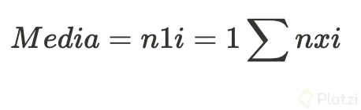
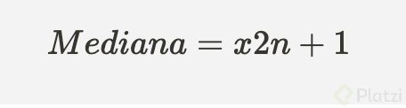
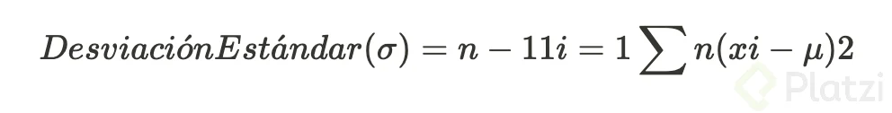
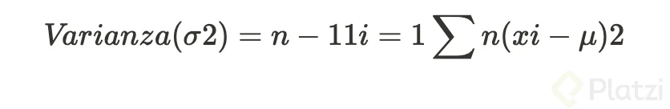
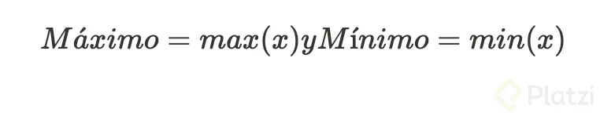
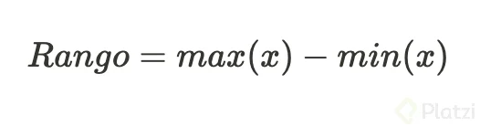

# Curso de Python

## ¿Por qué aprender Python?

La NASA, con su programa Artemisa, planea enviar al próximo hombre a la luna en 2025, apoyándose en proyectos como la clasificación de rocas usando Python e inteligencia artificial.

### Fundación de Python

Python es un lenguaje de programación de alto nivel que fue creado por Guido van Rossum y su primera versión fue lanzada en 1991.

Van Rossum comenzó a trabajar en Python a finales de los años 80 como un proyecto de tiempo libre para suceder al lenguaje ABC, con la intención de crear un lenguaje que fuera fácil de leer y escribir.

Python se ha desarrollado bajo una filosofía de diseño que enfatiza la legibilidad del código y la sintaxis que permite a los programadores expresar conceptos en menos líneas de código en comparación con otros lenguajes como C++ o Java.

A lo largo de los años, Python ha ganado una enorme popularidad y se ha convertido en uno de los lenguajes de programación más utilizados en el mundo. Sus aplicaciones son vastas y variadas, incluyendo desarrollo web (con frameworks como Django y Flask), análisis de datos y machine learning (con bibliotecas como Pandas, NumPy, y TensorFlow), automatización de tareas, desarrollo de software, y más.

La versatilidad y la facilidad de uso de Python lo han convertido en una herramienta esencial tanto para principiantes como para desarrolladores experimentados.

## ¿Cuáles son las ventajas de Python para los nuevos programadores?

- Simplicidad: Python sigue una filosofía de simplicidad, con una sintaxis clara y sencilla.
- Accesibilidad: Es fácil de aprender, permitiendo a los programadores enfocarse en los fundamentos de la programación.
- Versatilidad: Soporta múltiples paradigmas de programación, incluyendo la programación orientada a objetos y funcional.
- Popularidad: Usado por millones de personas, Python permite realizar proyectos complejos con pocas líneas de código.

[GitHub - platzi/python: Repositorio de ejercicios del Curso de Python de Platzi](https://github.com/platzi/python)

[Welcome to Python.org](https://www.python.org/)

[Introducción a Python para la exploración del espacio - Training | Microsoft Learn](https://learn.microsoft.com/es-es/training/modules/introduction-python-nasa/)

[3.12.4 Documentati](https://docs.python.org/3/)

## Introducción a Python

Python es uno de los lenguajes más amigables para iniciar en la programación. En comparación con otros lenguajes, en Python podemos escribir un “Hola Mundo” con una sola línea de código.

## ¿Cómo instalar Python en Windows?

- Ve al navegador y escribe “Python”.
- Asegúrate de entrar a [python.org](http://python.org/) y haz clic en la sección de descargas.
- Descarga el instalador y ábrelo.
- Marca la opción “Add Python to PATH” y selecciona “Install Now”.
- Una vez instalado, abre la terminal o cmd y escribe “python” para comprobar la instalación.

### ¿Cómo instalar Python en Mac?

- Abre tu navegador y escribe “Python”.
- Asegúrate de ingresar a [python.org](http://python.org/).
- En la sección de descargas, la página detectará tu sistema operativo MacOS automáticamente.
- Descarga el instalador, ábrelo y sigue las instrucciones: “Continuar”, “Aceptar términos y condiciones” e “Instalar”.
- Confirma que Python está instalado abriendo la terminal y escribiendo “python.

### ¿Cómo escribir el “Hola Mundo” en Python?

- Abre la terminal en tu sistema.
- Escribe python para acceder al intérprete de Python.
- Ingresa el siguiente código: print("Hola Mundo") y presiona Enter.
- Verás el mensaje “Hola Mundo” impreso en la consola.

### ¿Cómo usar Visual Studio Code para Python?

- Descarga Visual Studio Code desde [code.visualstudio.com](http://code.visualstudio.com/ "code.visualstudio.com").
- Instala el editor y ábrelo.
- Crea una nueva carpeta para tus proyectos, por ejemplo, “Curso Python”.
- Abre la carpeta en Visual Studio Code y crea un archivo nuevo con la extensión .py (por ejemplo, hola.py).
- Escribe print("Hola Mundo") en el archivo.
- Guarda el archivo (Ctrl+S) y ejecuta el código usando el botón de ejecutar en Visual Studio Code.
- Asegúrate de tener instalada la extensión de Python para una mejor experiencia de codificación.

Recuerda que Python es un lenguaje interpretado, lo que significa que las instrucciones se ejecutan directamente sin necesidad de compilación previa, facilitando la visualización inmediata de resultados.

[Our Documentation | Python.org](https://www.python.org/doc/)

[Visual Studio Code - Code Editing. Redefined](https://code.visualstudio.com/)

## Conceptos Básicos de Programación

Comprender los conceptos de semántica y sintaxis es crucial en programación. La semántica da sentido al código, asegurando consistencia y coherencia en las operaciones, mientras que la sintaxis dicta cómo escribir correctamente el código, siguiendo reglas específicas.

### ¿Qué es la semántica en programación?

La semántica en programación se refiere al significado y consistencia del código. Si trabajamos con números, tanto las entradas como las salidas deben ser números para mantener coherencia. Al nombrar variables, debemos hacerlo de manera lógica y significativa para que el código tenga sentido.

### ¿Cómo afecta la sintaxis al código?

La sintaxis en programación es el conjunto de reglas que dicta cómo escribir el código correctamente. Cada lenguaje tiene su propia sintaxis, y seguir estas reglas es esencial para evitar errores. Por ejemplo, si iniciamos con un paréntesis, debemos cerrarlo. No hacerlo resultará en errores de sintaxis que el compilador o intérprete señalará.

### ¿Cómo se manejan errores de sintaxis?

Cuando hay errores de sintaxis, el compilador o el entorno de desarrollo, como Visual Studio Code, nos indicarán dónde está el problema. Por ejemplo, al olvidar cerrar un paréntesis, obtendremos un mensaje de error que señala esta omisión. Corregir estos errores es esencial para que el código se ejecute correctamente.

### ¿Qué papel juegan las variables en la semántica?

Las variables son contenedores de información y su correcto uso es fundamental para la semántica. Al crear una variable, debemos seguir la sintaxis correcta: nombre de la variable, signo de asignación y el valor. Usar nombres descriptivos y relevantes para las variables asegura que el código sea comprensible y lógico.

### ¿Qué errores comunes pueden ocurrir con las variables?

- Usar nombres de variables que no reflejan su contenido.
- Intentar utilizar palabras reservadas del lenguaje como nombres de variables.
- Iniciar nombres de variables con números, lo cual no está permitido.
- No declarar una variable antes de su uso, lo que generará errores de tipo NameError.

### ¿Cómo nombrar correctamente las variables?

- Utilizar nombres descriptivos y significativos.
- Iniciar con letras y seguir con números o caracteres permitidos.
- Evitar palabras reservadas.
- Usar guiones bajos para separar palabras en nombres de variables.

### ¿Qué sucede al redefinir variables?

Redefinir una variable sobrescribirá su valor anterior. Python ejecuta las líneas de código de arriba hacia abajo y de izquierda a derecha, por lo que el último valor asignado a una variable será el que prevalezca.

### ¿Cómo evitar errores de semántica al nombrar variables?

Usar nombres de variables que reflejen claramente su propósito. Por ejemplo, si una variable almacena un nombre, debería llamarse nombre y no edad. Esto evita confusiones y asegura que el código sea fácil de entender y mantener.

[PEP 8: The Style Guide for Python Code](https://pep8.org/)

## Manipulación de Cadenas de Texto en Python

Entender cómo trabajar con las cadenas en Python es fundamental para la manipulación de textos y datos en muchos proyectos. Desde definir variables hasta aplicar métodos específicos, el uso de strings es una habilidad básica pero poderosa que se utiliza en áreas avanzadas como el procesamiento del lenguaje natural (NLP).

### ¿Cómo se definen las cadenas en Python?

Para crear una cadena en Python, puedes utilizar comillas simples, dobles o triples. Por ejemplo:

- Comillas simples: name = 'Carly'
- Comillas dobles: name = "Carly"
- Comillas triples: name = '''Carly'''

Las comillas triples permiten incluir saltos de línea y espacios en blanco.

### ¿Cómo se imprime y verifica el tipo de dato de una variable?

Para imprimir el valor de una variable y verificar su tipo, puedes utilizar la función print junto con la función type:

**name** = 'Carly'
**print(name)**  # Imprime 'Carly'
**print(type(name))**  # Imprime

### ¿Cómo se indexan las cadenas en Python?

Las cadenas son colecciones ordenadas y accesibles por índices. Puedes acceder a un carácter específico utilizando corchetes:

**name** = 'Carly'
**print(name[0])**  # Imprime 'C'
**print(name[-1])**  # Imprime 'y'

### ¿Qué pasa si intentas acceder a un índice que no existe en Python?

Si intentas acceder a un índice fuera del rango de la cadena, Python arrojará un `IndexError`:

**print(name[20])**  # Genera IndexError

### ¿Cómo se concatenan cadenas?

Puedes concatenar cadenas utilizando el operador `+` y repetirlas con el operador `*`:

**first_name** = 'Carly'
**last_name** = 'Marcela'
**full_name** = first_name + ' ' + last_name
**print(full_name)**  # Imprime 'Carly Marcela'

**print(name * 5)**  # Imprime 'CarlyCarlyCarlyCarlyCarly'

### ¿Cómo se consultan la longitud y otras operaciones en cadenas?

Para obtener la longitud de una cadena, se usa la función `len`:

**print(len(name))**  # Imprime 5

Además, las cadenas tienen métodos específicos como `lower()`, `upper()`, y `strip()`:

**print(name.lower())**  # Imprime 'carly'
**print(name.upper())**  # Imprime 'CARLY'
**print(last_name.strip())**  # Elimina espacios en blanco al principio y al final

### ¿Qué importancia tienen las cadenas en áreas avanzadas como el NLP?

El manejo de cadenas es esencial en NLP, donde grandes cantidades de texto deben ser limpiadas y procesadas. Métodos como `strip()`,` lower()`, y `replace()` ayudan a preparar los datos para análisis más complejos.

Aquí tienes una explicación de cada uno de estos métodos en Python, que se utilizan comúnmente con cadenas de texto y en el caso de eval() y exec(), para ejecutar código:

**Métodos de Cadenas:**

1. `.count(substring)`

 - **Descripción**: Cuenta el número de veces que aparece el substring en la cadena.
 - Ejemplo:

```python
texto = "hola hola hola"
print(texto.count("hola"))  # Salida: 3
```

2. .capitalize()

 - **Descripción**: Devuelve una copia de la cadena con el primer carácter en mayúscula y el resto en minúscula.
 - **Ejemplo:**

```python
texto = "hola mundo"
print(texto.capitalize())  # Salida: "Hola mundo"
```

3. `.title()`
 - **Descripción**: Devuelve una copia de la cadena con el primer carácter de cada palabra en mayúscula.
 - **Ejemplo:**

```python
texto = "hola mundo"
print(texto.title())  # Salida: "Hola Mundo"
```

4. `.swapcase()`

- **Descripción**: Devuelve una copia de la cadena con los caracteres en mayúscula convertidos a minúscula y viceversa.
- **Ejemplo:**

```python
texto = "Hola Mundo"
print(texto.swapcase())  # Salida: "hOLA mUNDO"
```

5. .replace(old, new)

 - **Descripción**: Devuelve una copia de la cadena con todas las ocurrencias del old reemplazadas por new.
 - **Ejemplo:**

```python
texto = "hola mundo"
print(texto.replace("mundo", "universo"))  # Salida: "hola universo"
```

6. `.split(separator)`

 - **Descripción:** Divide la cadena en una lista de subcadenas usando el separator. Si no se proporciona separator, se usa cualquier espacio en blanco como separador.
 - **Ejemplo:**

```python
texto = "hola mundo"
print(texto.split())  # Salida: ['hola', 'mundo']
```

7. `.strip()`

 - **Descripción:** Devuelve una copia de la cadena sin los espacios en blanco al principio y al final.
 - **Ejemplo:**

```python
texto = "   hola mundo   "
print(texto.strip())  # Salida: "hola mundo"
```

8. `.lstrip()`

 - **Descripción:** Devuelve una copia de la cadena sin los espacios en blanco al principio.
 - **Ejemplo:**

```python
texto = "   hola mundo"
print(texto.lstrip())  # Salida: "hola mundo"
```

9. `.rstrip()`

 - **Descripción:** Devuelve una copia de la cadena sin los espacios en blanco al final.
 - **Ejemplo:**

```python
texto = "hola mundo   "
print(texto.rstrip())  # Salida: "hola mundo"
```

10. `.find(substring)`

 - **Descripción**: Devuelve el índice de la primera aparición del substring en la cadena. Devuelve -1 si no se encuentra.
 - **Ejemplo:**

texto = "hola mundo"
print(texto.find("mundo"))  # Salida: 5

11. `.index(substring)`

 - **Descripción:** Similar a find(), pero lanza una excepción (ValueError) si el substring no se encuentra en la cadena.
 - **Ejemplo:**

```python
texto = "hola mundo"
print(texto.index("mundo"))  # Salida: 5
```

### Métodos de Evaluación de Código:

12. `eval(expression)`

 - **Descripción:** Evalúa la expresión expression que se pasa como una cadena de texto y devuelve el resultado. Es potencialmente peligroso si se ejecuta código no confiable, ya que puede ejecutar cualquier código Python.
 - **Ejemplo:**

```python
x = 1
print(eval("x + 1"))  # Salida: 2
```
13. `exec(code)`

 - **Descripción:** Ejecuta el código Python que se pasa como una cadena de texto. Similar a eval(), pero puede ejecutar múltiples líneas de código y no devuelve un valor. También es potencialmente peligroso.
 - **Ejemplo:**

```python
code = """
```
```python
def saludo(nombre):
	return f"Hola {nombre}"

print(saludo("Mundo"))
exec(code)
# Salida: Hola Mundo
```

Estos métodos proporcionan varias funcionalidades útiles para el manejo y procesamiento de cadenas en Python y para la ejecución dinámica de código.

[Métodos de las cadenas — documentación de Python - 3.12.4](https://docs.python.org/es/3/library/stdtypes.html#string-methods "Lecturas recomendadas Métodos de las cadenas — documentación de Python - 3.12.4")

## Enteros, Flotantes y Booleanos

Comprender los diferentes tipos de datos en Python es crucial para la programación eficiente. En Python, cada variable pertenece a una clase o “class”, y su tipo puede ser identificado usando la función `type()`.

¿Qué es un tipo de dato en Python?
En Python, un tipo de dato se refiere a la clase de datos que una variable puede contener. Esto se puede verificar con la función `type()`, que devuelve la clase del valor contenido en la variable. Por ejemplo, `type('Hello')` devuelve `class 'str'`, indicando que el dato es una cadena de texto.

### ¿Cómo se manejan los números enteros en Python?

Los números enteros en Python pertenecen a la clase `int`, que se utiliza para representar números sin parte decimal. Al declarar una variable como `x = 5`, se puede comprobar su tipo con `type(x)`, que devolverá `int`. Esta clase es ideal para operaciones aritméticas básicas.

### ¿Qué son los números flotantes y cómo se usan?

Los números flotantes pertenecen a la clase `float` y se utilizan para representar números con decimales. Por ejemplo, `y = 5.0` es un número flotante. Para operaciones con números muy grandes o pequeños, se puede usar la notación científica, como `z = 1e6`, que representa 1 multiplicado por 10 elevado a 6. Python maneja automáticamente las operaciones aritméticas con flotantes devolviendo resultados en `float`.

### ¿Cómo se utiliza la notación científica en Python?

La notación científica se emplea para representar números muy grandes o muy pequeños de manera compacta. Por ejemplo, `1e6` representa 1,000,000 y `1e-6` representa 0.000001. Esta notación es útil en cálculos científicos y financieros, donde los números pueden variar significativamente en magnitud.

### ¿Cómo se manejan los booleanos en Python?

Los booleanos en Python pertenecen a la clase `bool` y pueden tomar uno de dos valores: `True` o `False`. Estos valores son fundamentales para las operaciones lógicas y las estructuras de control de flujo, como las condicionales. Al declarar una variable como `isTrue = True`, se puede comprobar su tipo con `type(isTrue)`, que devolverá `bool`.

### ¿Qué importancia tienen los tipos de datos en las operaciones matemáticas?

Es crucial entender los tipos de datos al realizar operaciones matemáticas en Python. Las operaciones entre enteros (`int`) y flotantes (`float`) devuelven resultados en `float`. Por ejemplo, sumar un entero y un flotante, como `x + y`, devolverá un resultado en `float`. Este comportamiento es importante para evitar errores cuando el usuario ingresa un tipo de dato inesperado.

### ¿Cómo se usan los comentarios en Python?

Los comentarios en Python se crean utilizando el símbolo `#`, y se usan para anotar y explicar el código. Las líneas comentadas no son ejecutadas por Python. Por ejemplo, `# Este es un comentario` es una línea que Python ignora durante la ejecución.

### ¿Qué operaciones matemáticas básicas se pueden hacer en Python?

En Python se pueden realizar operaciones matemáticas básicas como suma, resta, multiplicación y división. Por ejemplo, se puede sumar dos variables `x` e `y` con `x + y`. Si se utilizan dos números flotantes, el resultado será también un número flotante.

## Todo lo que Debes Saber sobre print en Python

La función incorporada print puede parecer básico al principio, pero ten en cuenta que será una herramienta que usarás de múltiples maneras a lo largo de tu código. Desde el icónico “Hola mundo” hasta mensajes de depuración y presentación de resultados, `print` es la puerta de entrada a la comunicación de tus programas con el mundo exterior.

Iniciar con un simple “Hola mundo” no solo es una tradición en la programación, sino también un momento crucial donde tu código cobra vida. Es la primera línea de código que demuestra que tu entorno de desarrollo está configurado correctamente y que estás listo para empezar a crear.

Aprenderás a aprovechar al máximo la función incorporada print en Python. Desde formatos avanzados hasta el manejo de caracteres especiales y secuencias de escape, descubrirás cómo print puede ser una herramienta poderosa y versátil en tu caja de herramientas de programación.

1. Uso básico de `print`

El uso más sencillo de print consiste en pasar el texto que deseas mostrar entre comillas. Este código imprimirá “Nunca pares de aprender” en la consola, siendo una excelente forma de probar si tu entorno de Python está configurado correctamente.

`print("Nunca pares de aprender")`

Resultado:

`Nunca pares de aprender`

2. Uso de la coma en `print`

La coma dentro de la función `print` se usa para separar varios argumentos. Al hacerlo, Python añade automáticamente un espacio entre los argumentos. Esto es diferente a concatenar cadenas con el operador `+`, que no añade espacios adicionales.

`print("Nunca", "pares", "de", "aprender")`

Resultado:

`Nunca pares de aprender`

Por otro lado, al concatenar cadenas con el operador `+`, los elementos se unen sin ningún espacio adicional, a menos que lo añadas explícitamente.

`print("Nunca" + "pares" + "de" + "aprender")`

Resultado:

`Nuncaparesdeaprender`

Para añadir un espacio explícitamente cuando concatenas cadenas, debes incluirlo dentro de las comillas.

`print("Nunca" + " " + "pares" + " " + "de" + " " + "aprender")`

Resultado:

`Nunca pares de aprender`

3. Uso de `sep`

El parámetro `sep` permite especificar cómo separar los elementos al imprimir. En este ejemplo, los elementos “Nunca”, “pares”, “de” y “aprender” se imprimirán con una coma y un espacio entre ellos, resultando en “Nunca, pares, de, aprender”. Puedes cambiar sep por cualquier cadena de caracteres que desees usar como separador.

`print("Nunca", "pares", "de", "aprender", sep=", ")`

Resultado:

`Nunca, pares, de, aprender`

4. Uso de `end`

El parámetro end cambia lo que se imprime al final de la llamada a print. En lugar de imprimir cada mensaje en una nueva línea, end="" asegura que “Nunca” y “pares” se impriman en la misma línea, resultando en “Nunca pares”. Por defecto, end es un salto de línea ("\n"), lo que hace que cada llamada a print comience en una nueva línea.

```python
print("Nunca", end=" ")
print("pares de aprender")
```

Resultado:

`Nunca pares de aprender`

5. Impresión de variables

Puedes usar print para mostrar el valor de las variables. En este ejemplo, imprimirá “Frase: Nunca pares de aprender” y “Autor: Platzi”. Esto es útil para depurar y ver los valores de las variables en diferentes puntos de tu programa.

```python
frase = "Nunca pares de aprender"
author = "Platzi"
print("Frase:", frase, "Autor:", author)
```

Resultado:

`Frase: Nunca pares de aprender Autor: Platzi`

6. Uso de formato con f-strings

Las f-strings permiten insertar expresiones dentro de cadenas de texto. Al anteponer una `f` a la cadena de texto, puedes incluir variables directamente dentro de las llaves `{}`. En este ejemplo, frase y author se insertarán en la cadena, resultando en “Frase: Nunca pares de aprender, Autor: Platzi”. Esto hace que el código sea más legible y fácil de escribir.

```python
frase = "Nunca pares de aprender"
author = "Platzi"
print(f"Frase: {frase}, Autor: {author}")
```

Resultado:

`Frase: Nunca pares de aprender, Autor: Platzi`

7. Uso de formato con `format`

El método format es otra forma de insertar valores en cadenas de texto. Usando `{}` como marcadores de posición, puedes pasar los valores que quieres insertar como argumentos de `format`. En este ejemplo, se imprimirá “Frase: Nunca pares de aprender, Autor: Platzi”. Es una forma flexible y poderosa de formatear cadenas, aunque las f-strings son más concisas.

```python
frase = "Nunca pares de aprender"
author = "Platzi"
print("Frase: {}, Autor: {}".format(frase, author))
```

Resultado:

`Frase: Nunca pares de aprender, Autor: Platzi`

8. Impresión con formato específico

Puedes controlar el formato de los números al imprimir. En este ejemplo, `:.2f` indica que el número debe mostrarse con dos decimales. Así, imprimirá “Valor: 3.14”, redondeando el número a dos decimales. Esto es especialmente útil cuando trabajas con datos numéricos y necesitas un formato específico.

```python
valor = 3.14159
print("Valor: {:.2f}".format(valor))
```

Resultado:

`Valor: 3.14`

9. Saltos de línea y caracteres especiales

Los saltos de línea en Python se indican con la secuencia de escape `\n`. Por ejemplo, para imprimir “Hola\nmundo”, que aparecerá en dos líneas:

`print("Hola\nmundo")`

Resultado:

```python
Hola
mundo
```

Para imprimir una cadena que contenga comillas simples o dobles dentro de ellas, debes usar secuencias de escape para evitar confusiones con la sintaxis de Python. Por ejemplo, para imprimir la frase “Hola soy ‘Carli’”:

`print('Hola soy \'Carli\'')`

Resultado:

`Hola soy 'Carli'`

Si necesitas imprimir una ruta de archivo en Windows, que incluya barras invertidas, también necesitarás usar secuencias de escape para evitar que Python interprete las barras invertidas como parte de secuencias de escape. Por ejemplo:

`print("La ruta de archivo es: C:\\Users\\Usuario\\Desktop\\archivo.txt")`

Resultado:

`La ruta de archivo es: C:\Users\Usuario\Desktop\archivo.txt`

En Python, estas secuencias de escape te permiten manejar caracteres especiales y estructurar la salida de texto según sea necesario, asegurando que la salida se formatee correctamente en la consola o en cualquier otro medio donde se imprima.

Con estos ejemplos y explicaciones adicionales, tendrás una comprensión más completa sobre cómo manejar saltos de línea y caracteres especiales en Python al usar la función `print`.

## Operaciones Matemáticas en Python

En el mundo de la programación con Python, las operaciones matemáticas básicas como la suma, resta, multiplicación y división son fundamentales. Sin embargo, Python ofrece operaciones adicionales que expanden nuestras posibilidades.

### ¿Cómo realizamos las operaciones matemáticas básicas en Python?

Primero, creamos dos variables: `a` con valor 10 y `b` con valor 3. Usamos comentarios para indicar que estamos trabajando con operadores numéricos. Imprimimos los resultados de las cuatro operaciones básicas:

```python
a = 10
b = 3
print("Suma:", a + b)
print("Resta:", a - b)
print("Multiplicación:", a * b)
print("División:", a / b)
```

### ¿Qué es el operador módulo y cómo se usa?

El operador módulo (`%`) obtiene el residuo de una división. Por ejemplo, `13 % 5` devuelve 3. En Python, se usa así:

```python
a = 13
b = 5
print("Módulo:", a % b)
```

### ¿Qué sucede al dividir por cero en Python?

Dividir por cero genera un error. Para ilustrarlo:

```python
a = 10
b = 0
try:
    print(a / b)
except ZeroDivisionError:
    print("Error: División por cero")
```

### ¿Qué es la división de enteros y cómo se implementa?

La división de enteros (`//`) devuelve solo la parte entera de una división. Por ejemplo:

```python
a = 10
b = 3
print("División Entera:", a // b)
```

### ¿Cómo se realiza la potenciación en Python?

La potenciación se representa con `**`. Para elevar 10 al cubo, usamos:

```python
a = 10
b = 3
print("Potenciación:", a ** b)
```

### ¿Qué es PEMDAS y cómo afecta nuestras operaciones?

PEMDAS es la regla de prioridad de operaciones: Paréntesis, Exponentes, Multiplicación y División (de izquierda a derecha), Adición y Sustracción (de izquierda a derecha). Veamos un ejemplo:

```python
operation = (2 + 3) * 4
print(operation)  # Resultado: 20
```

### ¿Cómo se manejan los operadores booleanos en Python?

Los operadores booleanos comparan valores y devuelven `True` o `False`. Ejemplos:

```python
a = 10
b = 3
print(a > b)  # True
print(a < b)  # False
print(a == b)  # False
print(a != b)  # True
```

Estos operadores nos ayudan a tomar decisiones en el código, permitiendo crear condiciones y bucles efectivos.

[Orden de evaluación - Wikipedia, la enciclopedia libre](https://es.wikipedia.org/wiki/Orden_de_evaluaci%C3%B3n "dfdf")

## Operaciones de Entrada/Salida en Consola

En Python, cuando trabajamos con proyectos que requieren interacción del usuario, es común solicitar datos como correo o contraseña para ejecutar acciones específicas. Este mismo enfoque es útil para entender la función input.

¿Cómo se recibe información del usuario en Python?
Para recibir información del usuario desde la consola, creamos una variable y asignamos el resultado de la función input. Por ejemplo, para pedir el nombre del usuario:

```python
nombre = input("Ingrese su nombre: ")
print(nombre)
```

Al ejecutar este código, se habilita una sección para introducir información. Ingresamos un nombre, presionamos Enter y se imprime el valor guardado en la variable nombre.

### ¿Qué ocurre si eliminamos la función `print`?

Si eliminamos print y ejecutamos el código, el nombre ingresado no se mostrará en la consola:

`nombre = input("Ingrese su nombre: ")`

Para ver el resultado, es imprescindible usar print.

Podemos solicitar la edad del usuario creando una variable `edad` y utilizando `input`, luego imprimimos ambos valores:

```python
nombre = input("Ingrese su nombre: ")
edad = input("Ingrese su edad: ")
print(nombre)
print(edad)
```

Al ejecutar, ingresamos el nombre y la edad, y ambos valores se muestran en pantalla.

### ¿Cuál es el tipo de dato devuelto por input?

El resultado de input es siempre un string, incluso si ingresamos un número. Podemos verificar el tipo de dato usando `type`:

```python
name = input("Ingrese su nombre: ")
age = input("Ingrese su edad: ")
print(type(name))
print(type(age))
```
Al ejecutar, se mostrará que ambos valores son de tipo str.

### ¿Cómo se convierte el tipo de dato (casting)?

Si queremos que la edad sea un número entero en lugar de un string, usamos el casting:

`age = int(input("Ingrese su edad: "))`

Ejecutamos y verificamos que `age` ahora es un entero. También podemos convertir a otros tipos de datos, como flotantes:

`age = float(input("Ingrese su edad: "))`

### ¿Qué sucede si ingresamos un dato inesperado?

Si el código espera un entero, pero ingresamos un string, se produce un `ValueError`. Es importante manejar el tipo de datos correctamente para evitar errores:

En Python, las operaciones de entrada y salida (I/O) en consola son fundamentales para interactuar con el usuario. Estas operaciones se realizan principalmente utilizando las funciones `input()` para recibir datos del usuario y `print()` para mostrar información en la consola.

### Operación de Entrada: `input()`

La función `input()` se utiliza para leer una línea de texto ingresada por el usuario desde la consola. El texto ingresado se devuelve como una cadena (string).

**Sintaxis:**

```python
variable = input("Texto para el usuario: ")
```

**Ejemplo:**

```python
nombre = input("¿Cómo te llamas? ")
print("Hola, " + nombre + "!")
```

- **Explicación:** En este ejemplo, se solicita al usuario que ingrese su nombre. Luego, se utiliza `print()` para saludar al usuario con el nombre ingresado.

**Convertir la Entrada:**

Como `input()` devuelve una cadena, si necesitas un tipo de dato diferente (por ejemplo, un número entero o un número de punto flotante), deberás convertir la entrada usando funciones como `int()` o `float()`.

**Ejemplo:**

```python
edad = int(input("¿Cuántos años tienes? "))
print("Tendrás " + str(edad + 1) + " el próximo año.")
```

- **Explicación:** Aquí, `input()` recoge la edad del usuario como una cadena, y `int()` la convierte en un número entero para poder realizar operaciones aritméticas.

### Operación de Salida: `print()`

La función `print()` se utiliza para mostrar datos en la consola. Es una de las funciones más utilizadas en Python para generar salidas.

**Sintaxis:**

```python
print(objeto1, objeto2, ..., sep=' ', end='\n')
```

- **`objeto1, objeto2, ...`**: Los objetos que deseas imprimir. Puedes pasar múltiples objetos, y `print()` los separará automáticamente con un espacio.
- **`sep`**: Especifica el separador entre los objetos. Por defecto es un espacio (`' '`).
- **`end`**: Especifica lo que se añade al final de la salida. Por defecto es un salto de línea (`'\n'`).

**Ejemplo Básico:**

```python
print("Hola, mundo!")
```

**Ejemplo con Múltiples Objetos:**

```python
nombre = "Alice"
edad = 30
print("Nombre:", nombre, "Edad:", edad)
```

**Personalizar Separadores y Finales:**

```python
print("A", "B", "C", sep="-")  # Salida: A-B-C
print("Hola,", end=" ")
print("mundo!")  # Salida: Hola, mundo!
```

### Resumen de Operaciones de Entrada/Salida

1. **Entrada con `input()`**:
   - Se utiliza para capturar datos del usuario.
   - Siempre devuelve una cadena, que puede ser convertida a otros tipos de datos según sea necesario.

2. **Salida con `print()`**:
   - Muestra datos en la consola.
   - Permite personalizar el formato de la salida mediante argumentos opcionales como `sep` y `end`.

Estas funciones forman la base de la interacción con el usuario en aplicaciones de consola en Python.

## Listas

Listas en Python nos facilita la tarea de permitir la manipulación y almacenamiento de datos diversos de manera estructurada y eficiente.

### ¿Cómo crear una lista en Python?

Para iniciar, se crea una variable llamada todo utilizando corchetes para indicar que se trata de una lista. Dentro de los corchetes, se añaden los elementos separados por comas, por ejemplo:

`todo = ["Dirigirnos al hotel", "Almorzar", "Visitar un museo", "Volver al hotel"]`

### ¿Qué tipos de datos se pueden almacenar en una lista?

Las listas en Python pueden almacenar múltiples tipos de datos, incluyendo cadenas, números enteros, números flotantes y valores booleanos. También pueden contener otras listas. Ejemplo:

```python
mix = ["string", 1, 2.5, True, [3, 4]]
print(mix)
```

¿Cómo se determina la longitud de una lista?
Para saber cuántos elementos hay en una lista, se usa la función `len`:

`print(len(mix))`

### ¿Cómo se accede a elementos específicos de una lista?

Se puede acceder a los elementos de una lista utilizando índices, donde el índice comienza en 0:

```python
print(mix[0])  # Primer elemento
print(mix[-1])  # Último elemento
```

### ¿Cómo se realizan operaciones de slicing en listas?

El slicing permite obtener sublistas a partir de una lista existente, especificando un rango de índices:

```python
print(mix[1:3])  # Desde el índice 1 hasta el 2 (el 3 no se incluye)
print(mix[:2])  # Desde el inicio hasta el índice 1
print(mix[2:])  # Desde el índice 2 hasta el final
```

### ¿Qué métodos de manipulación de listas existen?

- Añadir elementos al final: `append()`

```python
mix.append(False)
print(mix)
```

- Insertar elementos en una posición específica: `insert()`

```python
mix.insert(1, ["A", "B"])
print(mix)
```

- Encontrar la primera aparición de un elemento: `index()`

`print(mix.index(["A", "B"]))`

- Encontrar el mayor y menor elemento: `max()` y `min()`

```python
numbers = [1, 2, 3.5, 90, 100]
print(max(numbers))
print(min(numbers))
```

### ¿Cómo se eliminan elementos de una lista?

- Eliminar por índice: `del`

```python
del numbers[-1]
print(numbers)
```

- Eliminar una porción de la lista:

```python
del numbers[0:2]
print(numbers)
```

- Eliminar toda la lista:

`del numbers`

En Python, una **lista** es una colección ordenada y mutable (modificable) de elementos. Las listas son uno de los tipos de datos más utilizados y son extremadamente versátiles, permitiendo almacenar elementos de diferentes tipos, incluyendo otras listas.

### Creación de Listas

Puedes crear una lista usando corchetes `[]` y separando los elementos con comas.

**Ejemplo:**

```python
mi_lista = [1, 2, 3, 4, 5]
```

También es posible crear una lista vacía:

```python
mi_lista_vacia = []
```

### Acceso a Elementos

Puedes acceder a los elementos de una lista usando índices, que comienzan en `0` para el primer elemento.

**Ejemplo:**

```python
mi_lista = [10, 20, 30, 40, 50]
print(mi_lista[0])  # Salida: 10
print(mi_lista[2])  # Salida: 30
```

También puedes usar índices negativos para acceder a los elementos desde el final de la lista.

**Ejemplo:**

```python
print(mi_lista[-1])  # Salida: 50 (último elemento)
```

### Modificación de Elementos

Las listas en Python son mutables, lo que significa que puedes cambiar sus elementos.

**Ejemplo:**

```python
mi_lista[1] = 25
print(mi_lista)  # Salida: [10, 25, 30, 40, 50]
```

### Operaciones Comunes

1. **Agregar elementos:**
   - `append()`: Agrega un elemento al final de la lista.
   - `insert()`: Inserta un elemento en una posición específica.
   - `extend()`: Agrega múltiples elementos de otra lista o iterable.

   **Ejemplo:**

   ```python
   mi_lista.append(60)
   mi_lista.insert(2, 35)
   mi_lista.extend([70, 80])
   print(mi_lista)  # Salida: [10, 25, 35, 30, 40, 50, 60, 70, 80]
   ```

2. **Eliminar elementos:**
   - `remove()`: Elimina la primera aparición de un elemento específico.
   - `pop()`: Elimina y devuelve el elemento en la posición especificada (por defecto, el último elemento).
   - `clear()`: Elimina todos los elementos de la lista.

   **Ejemplo:**

   ```python
   mi_lista.remove(25)
   print(mi_lista)  # Salida: [10, 35, 30, 40, 50, 60, 70, 80]

   elemento = mi_lista.pop(3)
   print(elemento)  # Salida: 40
   print(mi_lista)  # Salida: [10, 35, 30, 50, 60, 70, 80]

   mi_lista.clear()
   print(mi_lista)  # Salida: []
   ```

3. **Rebanado (Slicing):**
   - Puedes obtener sublistas usando el operador de rebanado (`:`).

   **Ejemplo:**

   ```python
   mi_lista = [10, 20, 30, 40, 50]
   sublista = mi_lista[1:4]  # Sublista desde el índice 1 hasta el 3 (4 no incluido)
   print(sublista)  # Salida: [20, 30, 40]
   ```

4. **Longitud de una lista:**
   - Usa `len()` para obtener el número de elementos en la lista.

   **Ejemplo:**

   ```python
   print(len(mi_lista))  # Salida: 5
   ```

5. **Verificar existencia de un elemento:**
   - Usa el operador `in`.

   **Ejemplo:**

   ```python
   if 30 in mi_lista:
       print("El 30 está en la lista")
   ```

6. **Ordenar una lista:**
   - `sort()`: Ordena la lista en su lugar.
   - `sorted()`: Devuelve una nueva lista ordenada.

   **Ejemplo:**

   ```python
   mi_lista.sort()
   print(mi_lista)  # Salida: [10, 20, 30, 40, 50]

   nueva_lista = sorted([3, 1, 4, 2])
   print(nueva_lista)  # Salida: [1, 2, 3, 4]
   ```

### Iteración sobre una Lista

Puedes iterar sobre los elementos de una lista utilizando un bucle `for`.

**Ejemplo:**

```python
for elemento in mi_lista:
    print(elemento)
```

### Listas Anidadas

Las listas pueden contener otras listas, lo que permite la creación de estructuras de datos más complejas.

**Ejemplo:**

```python
lista_anidada = [[1, 2, 3], [4, 5, 6], [7, 8, 9]]
print(lista_anidada[1][2])  # Salida: 6 (elemento en la posición 2 de la sublista 1)
```

### Conclusión

Las listas son extremadamente útiles en Python debido a su flexibilidad y la gran cantidad de operaciones que puedes realizar con ellas. Son una herramienta esencial para manejar colecciones de datos en programas Python.

## Método slice

Cuando asignamos una lista a una nueva variable, por ejemplo, `B = A`, no estamos creando una copia independiente. Ambas variables apuntan al mismo espacio de memoria. Así, cualquier cambio en `A` se reflejará en `B`.

### ¿Cómo evitar que dos listas apunten al mismo espacio de memoria?

Para evitar que dos variables apunten al mismo espacio de memoria, debemos crear una copia superficial de la lista original usando slicing. Por ejemplo:

- Crear una lista `A` con números del 1 al 5.
- Asignar `B = A` y luego imprimir ambas listas muestra que ambas son idénticas.
- Eliminar un elemento de `A` también lo elimina de `B`.

### ¿Cómo usar slicing para crear una copia de una lista?

Podemos utilizar slicing para copiar una lista sin que ambas variables apunten al mismo espacio de memoria. Por ejemplo:

```python
A = [1, 2, 3, 4, 5]
C = A[:]
```

Luego, verificamos los IDs de memoria:

```python
print(id(A))
print(id(C))
```

Ambos IDs serán diferentes, lo que indica que C es una copia independiente de A.

### ¿Por qué es importante entender la asignación de memoria en listas?

En Python, a diferencia de otros lenguajes, podemos almacenar diferentes tipos de datos en una colección. Entender cómo funciona la memoria es crucial para evitar errores en el código, especialmente en aplicaciones del mundo laboral.

## Listas de más dimensiones y Tuplas

Las matrices en Python son una herramienta poderosa que permite organizar datos en listas de listas, facilitando su manejo y manipulación.

### ¿Qué es una matriz en Python?

Una matriz es una colección ordenada de datos dispuestos en filas y columnas. Se representa como una lista de listas, donde cada sublista es una fila de la matriz.

### ¿Cómo iterar a través de una matriz?

Para iterar a través de una matriz en Python, se puede utilizar un bucle for anidado. Cada sublista (fila) se recorre individualmente:

- **Ejemplo de matriz:**
```python
matrix = [
    [1, 2, 3],
    [4, 5, 6],
    [7, 8, 9]
]
```

- **Iterar e imprimir cada elemento:**

```python
for row in matrix:
    for element in row:
        print(element)
```

### ¿Cómo acceder a elementos específicos en una matriz?

Para acceder a un elemento específico en una matriz, se utilizan los índices de la fila y la columna. Por ejemplo, para acceder al número 9 en la matriz anterior, se usa `matrix[2][2]`.

- **Código:**

```python
print(matrix[2][2])  # Salida: 9
```

### ¿Qué significa que las matrices sean mutables?

Las matrices son mutables, lo que significa que se pueden modificar, añadir o eliminar elementos después de su creación. Este es un ejemplo básico:

- **Modificar un elemento:**

```python
matrix[0][0] = 10
print(matrix)  # Salida: [[10, 2, 3], [4, 5, 6], [7, 8, 9]]
```

### ¿Cuál es la diferencia entre matrices y tuplas?

A diferencia de las matrices, las tuplas son inmutables, lo que significa que no se pueden modificar después de su creación. Las tuplas se utilizan para almacenar datos que no deben cambiar.

- **Ejemplo de tupla:**

`numbers = (1, 2, 3)`

Intentar modificar una tupla genera un error:

`numbers[0] = 10  # Genera TypeError: 'tuple' object does not support item assignment`

Parece que ya discutimos sobre las listas de más dimensiones y las tuplas, pero puedo expandir o aclarar cualquier parte si lo deseas. Aquí tienes un resumen y algunos detalles adicionales sobre cada concepto:

### Listas de Más Dimensiones

Las listas de más dimensiones en Python son simplemente listas que contienen otras listas como elementos. Esto te permite crear estructuras como matrices o tablas, donde los datos se organizan en filas y columnas.

#### Ejemplo de Lista Bidimensional:

```python
# Una matriz 3x3
matriz = [
    [1, 2, 3],
    [4, 5, 6],
    [7, 8, 9]
]

# Acceder a un elemento: por ejemplo, el número 6
print(matriz[1][2])  # Salida: 6
```

En este ejemplo, `matriz` es una lista de listas, donde cada lista interna representa una fila de la matriz.

#### Ejemplo de Lista Tridimensional:

```python
# Un cubo 2x2x2
cubo = [
    [
        [1, 2], 
        [3, 4]
    ],
    [
        [5, 6], 
        [7, 8]
    ]
]

# Acceder a un elemento: por ejemplo, el número 7
print(cubo[1][1][0])  # Salida: 7
```

Aquí, `cubo` es una lista tridimensional, lo que significa que es una lista de listas de listas. Puedes pensar en esto como una estructura que contiene múltiples matrices.

### Tuplas

Las tuplas en Python son estructuras de datos muy similares a las listas, pero con dos diferencias clave:

1. **Inmutabilidad:** No se pueden modificar después de su creación. No puedes añadir, eliminar o cambiar elementos en una tupla.
2. **Sintaxis:** Se definen utilizando paréntesis `()`.

#### Ejemplo de Tupla:

```python
tupla = (1, 2, 3, 4, 5)

# Acceder a un elemento: por ejemplo, el número 3
print(tupla[2])  # Salida: 3

# Intentar modificar la tupla generará un error
# tupla[2] = 10  # Esto provocará un TypeError
```

Las tuplas son útiles cuando necesitas asegurarte de que los datos no cambien durante la ejecución de un programa.

#### Tuplas Anidadas (Más Dimensiones):

Al igual que las listas, las tuplas pueden anidarse para crear estructuras de datos más complejas:

```python
tupla_anidada = (
    (1, 2, 3),
    (4, 5, 6),
    (7, 8, 9)
)

# Acceder a un elemento: por ejemplo, el número 8
print(tupla_anidada[2][1])  # Salida: 8
```

En este caso, `tupla_anidada` es una tupla de tuplas, lo que te permite trabajar con estructuras de datos que se asemejan a matrices.

### Comparación entre Listas y Tuplas

- **Mutabilidad:** Las listas son mutables (pueden cambiar), mientras que las tuplas son inmutables.
- **Velocidad:** Las tuplas son generalmente más rápidas que las listas, especialmente para operaciones de acceso.
- **Uso:** Las listas se utilizan cuando necesitas una estructura de datos que pueda cambiar. Las tuplas se utilizan cuando los datos deben permanecer constantes.

Si tienes alguna pregunta específica sobre estos temas o necesitas ejemplos adicionales, estaré encantado de ayudarte.

## Aplicación de Matrices

### Aplicación de Matrices

Las matrices son una herramienta fundamental en muchas áreas de la computación y las matemáticas. En Python, podemos usar listas dentro de listas para representar matrices bidimensionales (2D). Hoy, vamos a explorar varias aplicaciones prácticas de las matrices y cómo estas estructuras pueden ser usadas para representar tableros de juego.

### Representación de Tableros de Juego

Las matrices son ideales para representar tableros de juego en programación, como tableros de ajedrez, damas y otros juegos de mesa. Usar matrices para estos fines permite manejar fácilmente la disposición de las piezas y las reglas del juego.

### Ejemplo: Tablero de Ajedrez

Un tablero de ajedrez es una matriz de 8x8. En vez de representar solo las casillas blancas y negras, podemos representar las piezas de ajedrez. Usaremos letras para representar las piezas: `P` para peón, `R` para torre, `N` para caballo (knight), `B` para alfil, `Q` para reina y `K` para rey. Las piezas negras se representan con letras minúsculas y las blancas con letras mayúsculas.

```python
chess_board = [
    ['r', 'n', 'b', 'q', 'k', 'b', 'n', 'r'],
    ['p', 'p', 'p', 'p', 'p', 'p', 'p', 'p'],
    [0, 0, 0, 0, 0, 0, 0, 0],
    [0, 0, 0, 0, 0, 0, 0, 0],
    [0, 0, 0, 0, 0, 0, 0, 0],
    [0, 0, 0, 0, 0, 0, 0, 0],
    ['P', 'P', 'P', 'P', 'P', 'P', 'P', 'P'],
    ['R', 'N', 'B', 'Q', 'K', 'B', 'N', 'R']
]

print(chess_board
```

En este ejemplo, el `0` representa una casilla vacía.

### Movimiento de un Caballo

En ajedrez, los caballos (`N` para blanco y `n` para negro) se mueven en forma de “L”. Esto significa que pueden moverse dos casillas en una dirección y luego una casilla perpendicularmente, o una casilla en una dirección y luego dos casillas perpendicularmente.

Por ejemplo, si el caballo blanco está en la posición (7, 1) (segunda casilla de la última fila), las posiciones posibles a las que puede moverse son:

- (5, 0)
- (5, 2)
- (6, 3)

Es importante verificar que estas posiciones estén dentro de los límites del tablero y no contengan piezas blancas.

Si movemos el caballo de (7, 1) a (5, 2), el tablero se vería así:

```python
chess_board[7][1] = 0  # Casilla original del caballo ahora está vacía
chess_board[5][2] = 'N'  # Nueva posición del caballo

print(chess_board)
```

### Ejemplo: Tablero de Damas

Un tablero de damas también es una matriz de 8x8, pero además de las casillas alternas, debemos representar las piezas de los dos jugadores.

```python
checkers_board = [
    [0, 'b', 0, 'b', 0, 'b', 0, 'b'],
    ['b', 0, 'b', 0, 'b', 0, 'b', 0],
    [0, 'b', 0, 'b', 0, 'b', 0, 'b'],
    [0, 0, 0, 0, 0, 0, 0, 0],
    [0, 0, 0, 0, 0, 0, 0, 0],
    ['w', 0, 'w', 0, 'w', 0, 'w', 0],
    [0, 'w', 0, 'w', 0, 'w', 0, 'w'],
    ['w', 0, 'w', 0, 'w', 0, 'w', 0]
]

print(checkers_board)
```

En este ejemplo, el 0 representa una casilla vacía, 'w' representa una pieza blanca, y 'b' representa una pieza negra. Las filas superiores e inferiores están llenas de piezas en sus posiciones iniciales, mientras que las filas centrales están vacías.

### Aplicación de Matrices a Imágenes

Las matrices también son esenciales para la representación y manipulación de imágenes. Cada píxel de una imagen en escala de grises se puede representar como un valor en una matriz, donde cada valor varía del 0 (negro) al 255 (blanco).

### Ejemplo: Representación de una Imagen en Escala de Grises

Imaginemos una matriz de 5x5 que representa una imagen en escala de grises con un simple patrón.

```python
image = [
    [255, 0, 0, 0, 255],
    [0, 255, 0, 255, 0],
    [0, 0, 255, 0, 0],
    [0, 255, 0, 255, 0],
    [255, 0, 0, 0, 255]
]

print(image)
```

En esta matriz, el `255` representa píxeles blancos y el 0 representa píxeles negros. Este patrón podría visualizarse como una “X” blanca sobre un fondo negro si se dibujara.

### Aplicaciones en Otros Campos

Las matrices se utilizan en muchos otros campos además de los juegos y las imágenes. Aquí hay algunos ejemplos:

- **Análisis de Datos:** Las matrices se utilizan para almacenar y manipular grandes conjuntos de datos, realizar cálculos estadísticos y análisis de datos.
- **Inteligencia Artificial y Machine Learning:** Las matrices son esenciales para representar datos de entrada y salida, pesos de redes neuronales y otros parámetros en algoritmos de aprendizaje automático.
- **Computación Científica:** Las matrices se utilizan para resolver ecuaciones lineales, realizar simulaciones y modelar fenómenos científicos.
- **Gráficos por Computadora:** Las matrices se utilizan para representar y transformar objetos en gráficos 2D y 3D.

Las matrices son una herramienta poderosa que no solo facilita la representación de datos complejos, sino que también permite realizar operaciones y transformaciones avanzadas de manera eficiente. Al dominar el uso de matrices en Python, puedes abrir la puerta a un mundo de posibilidades en diversos campos de la ciencia, la ingeniería y la tecnología.

### Diccionarios

Los diccionarios en Python son una estructura que almacenan dos datos, la clave y el valor. Un ejemplo cotidiano es un diccionario físico donde buscamos el significado de una palabra y encontramos la palabra (clave) y su definición (valor). Veamos cómo se utilizan en código.

### ¿Cómo se crea un diccionario en Python?

Iniciamos creando una variable llamada numbers y especificamos el uso de diccionarios utilizando llaves. Asignamos valores a las claves:

```python
numbers = {1: "one", "2": "two", 3: "three"}
print(numbers)
```

### ¿Cómo se accede a los elementos de un diccionario?

Para consultar la información de una clave específica, utilizamos la indexación:

`print(numbers["2"])`

### ¿Cómo se eliminan elementos de un diccionario?

Para eliminar un elemento, utilizamos la clave del mismo:

```python
del information["edad"]
print(information)
```

### ¿Qué métodos existen para trabajar con diccionarios?

Podemos utilizar métodos propios de los diccionarios, como `keys()`, `values()`, e `items()`:

```python
# Obtener las claves
claves = information.keys()
print(claves)

# Obtener los valores
valores = information.values()
print(valores)

# Obtener los pares clave-valor
pares = information.items()
print(pares)
```

### ¿Cómo se crea un diccionario de diccionarios?

Podemos crear una agenda de contactos usando diccionarios de diccionarios:

```python
contactos = {
    "Carla": {"apellido": "Florida", "altura": 1.7, "edad": 30},
    "Diego": {"apellido": "Antesana", "altura": 1.75, "edad": 32}
}
print(contactos["Carla"])
```

Los **diccionarios** en Python son estructuras de datos que permiten almacenar pares de clave-valor. Cada clave en un diccionario es única, y se utiliza para acceder al valor asociado a esa clave. A diferencia de las listas y las tuplas, donde los elementos se acceden por su posición (índice), en un diccionario se accede a los valores a través de sus claves.

### Características de los Diccionarios:

1. **Clave-Valor:** Cada elemento en un diccionario tiene una clave y un valor asociado. Por ejemplo, en el par `'nombre': 'Juan'`, `'nombre'` es la clave y `'Juan'` es el valor.

2. **Inmutabilidad de Claves:** Las claves deben ser de un tipo de dato inmutable, como números, cadenas de texto (strings) o tuplas.

3. **Mutabilidad de Valores:** Los valores pueden ser de cualquier tipo de dato, incluidos otros diccionarios, listas, tuplas, etc.

4. **Acceso Rápido:** El acceso a los valores en un diccionario es muy eficiente gracias a su implementación basada en tablas hash.

### Creación de un Diccionario:

Puedes crear un diccionario usando llaves `{}` o la función `dict()`.

```python
# Usando llaves
diccionario = {
    'nombre': 'Juan',
    'edad': 30,
    'ciudad': 'Madrid'
}

# Usando dict()
diccionario2 = dict(nombre='Ana', edad=25, ciudad='Barcelona')
```

### Acceso a Valores:

Para acceder al valor asociado a una clave, se usa la sintaxis `diccionario[clave]`.

```python
print(diccionario['nombre'])  # Salida: Juan
print(diccionario2['edad'])  # Salida: 25
```

### Añadir o Modificar Elementos:

Para añadir un nuevo par clave-valor o modificar un valor existente, se utiliza la misma sintaxis de acceso.

```python
# Añadir un nuevo par clave-valor
diccionario['profesión'] = 'Ingeniero'

# Modificar un valor existente
diccionario['edad'] = 31

print(diccionario)
# Salida: {'nombre': 'Juan', 'edad': 31, 'ciudad': 'Madrid', 'profesión': 'Ingeniero'}
```

### Eliminar Elementos:

Puedes eliminar un par clave-valor usando `del` o el método `pop()`.

```python
# Usando del
del diccionario['ciudad']

# Usando pop (devuelve el valor eliminado)
profesion = diccionario.pop('profesión')

print(diccionario)
# Salida: {'nombre': 'Juan', 'edad': 31}
print(profesion)  # Salida: Ingeniero
```

### Métodos Útiles:

- **`keys()`**: Devuelve una vista con todas las claves del diccionario.
- **`values()`**: Devuelve una vista con todos los valores del diccionario.
- **`items()`**: Devuelve una vista con todos los pares clave-valor como tuplas.
- **`get(clave, valor_por_defecto)`**: Devuelve el valor asociado a la clave, o el valor por defecto si la clave no existe.

```python
# Ejemplos de métodos
claves = diccionario.keys()
valores = diccionario.values()
items = diccionario.items()

print(claves)   # Salida: dict_keys(['nombre', 'edad'])
print(valores)  # Salida: dict_values(['Juan', 31])
print(items)    # Salida: dict_items([('nombre', 'Juan'), ('edad', 31)])

# Usando get para evitar errores si la clave no existe
ciudad = diccionario.get('ciudad', 'No especificado')
print(ciudad)  # Salida: No especificado
```

### Diccionarios Anidados:

Los diccionarios pueden contener otros diccionarios como valores, permitiendo crear estructuras de datos complejas.

```python
estudiantes = {
    'Juan': {'edad': 20, 'ciudad': 'Madrid'},
    'Ana': {'edad': 22, 'ciudad': 'Barcelona'}
}

# Acceder a un valor en un diccionario anidado
print(estudiantes['Juan']['ciudad'])  # Salida: Madrid
```

### Iteración Sobre Diccionarios:

Puedes iterar sobre los diccionarios para trabajar con las claves, los valores o ambos.

```python
for clave, valor in diccionario.items():
    print(f"La clave es {clave} y el valor es {valor}")
# Salida:
# La clave es nombre y el valor es Juan
# La clave es edad y el valor es 31
```

Los diccionarios son muy útiles para almacenar y gestionar datos que tienen una relación directa de mapeo entre un identificador (clave) y sus características o atributos (valor).

## Comprehension Lists en Python

Una *Comprehension List* es una forma concisa de crear listas en Python, pues permite generar listas nuevas transformando cada elemento de una colección existente o creando elementos a partir de un rango. La sintaxis es compacta y directa, lo que facilita la comprensión del propósito de tu código de un vistazo.

La estructura básica de una Comprehension List es:

`[expresión for elemento in iterable if condición]`

Que se traduce a: “Crea una nueva lista evaluando `nueva_expresión` para cada elemento en el iterable.”

### Ejercicios:

1. **Doble de los Números**

Dada una lista de números [1, 2, 3, 4, 5], crea una nueva lista que contenga el doble de cada número usando una List Comprehension.

2. **Filtrar y Transformar en un Solo Paso**

Tienes una lista de palabras ["sol", "mar", "montaña", "rio", "estrella"] y quieres obtener una nueva lista con las palabras que tengan más de 3 letras y estén en mayúsculas.

3. **Crear un Diccionario con List Comprehension**

Tienes dos listas, una de claves ["nombre", "edad", "ocupación"] y otra de valores ["Juan", 30, "Ingeniero"]. Crea un diccionario combinando ambas listas usando una List Comprehension.

4. **Anidación de List Comprehensions**

Dada una lista de listas (una matriz):

```python
pythonCopiar código
matriz = [
    [1, 2, 3],
    [4, 5, 6],
    [7, 8, 9]
]
```

Calcula la matriz traspuesta utilizando una List Comprehension anidada.

5. **Extraer Información de una Lista de Diccionarios**

Dada una lista de diccionarios que representan personas:

```python
pythonCopiar código
personas = [
    {"nombre": "Juan", "edad": 25, "ciudad": "Madrid"},
    {"nombre": "Ana", "edad": 32, "ciudad": "Madrid"},
    {"nombre": "Pedro", "edad": 35, "ciudad": "Barcelona"},
    {"nombre": "Laura", "edad": 40, "ciudad": "Madrid"}
]
```

Extrae una lista de nombres de personas que viven en “Madrid” y tienen más de 30 años.

6. **List Comprehension con un `else`**

Dada una lista de números [1, 2, 3, 4, 5, 6, 7, 8, 9, 10], crea una nueva lista multiplicando por 2 los números pares y dejando los impares como están.

### Soluciones

1. **Doble de los Números**

```python
pythonCopiar código
numeros = [1, 2, 3, 4, 5]
dobles = [x * 2 for x in numeros]
print("Dobles:", dobles)
```

2. **Filtrar y Transformar en un Solo Paso**

```python
pythonCopiar código
palabras = ["sol", "mar", "montaña", "rio", "estrella"]
palabras_filtradas = [palabra.upper() for palabra in palabras if len(palabra) > 3]
print("Palabras filtradas y en mayúsculas:", palabras_filtradas)
```

3. **Crear un Diccionario con List Comprehension**

```python
pythonCopiar código
claves = ["nombre", "edad", "ocupación"]
valores = ["Juan", 30, "Ingeniero"]

diccionario = {claves[i]: valores[i] for i in range(len(claves))}
print("Diccionario creado:", diccionario)
```

4. **Anidación de List Comprehensions**

```python
pythonCopiar código
matriz = [
    [1, 2, 3],
    [4, 5, 6],
    [7, 8, 9]
]
```

transpuesta_comprehension = [[fila[i] for fila in matriz] for i in range(len(matriz[0]))]
print("Transpuesta con List Comprehension:", transpuesta_comprehension)

5. **Extraer Información de una Lista de Diccionarios**

```python
pythonCopiar código
personas = [
    {"nombre": "Juan", "edad": 25, "ciudad": "Madrid"},
    {"nombre": "Ana", "edad": 32, "ciudad": "Madrid"},
    {"nombre": "Pedro", "edad": 35, "ciudad": "Barcelona"},
    {"nombre": "Laura", "edad": 40, "ciudad": "Madrid"}
]

nombres_madrid = [persona["nombre"] for persona in personas if persona["ciudad"] == "Madrid" and persona["edad"] > 30]
print("Nombres de personas en Madrid mayores de 30 años:", nombres_madrid
```

6. **List Comprehension con un `else`**

```python
pythonCopiar código
numeros = [1, 2, 3, 4, 5, 6, 7, 8, 9, 10]
transformados = [x * 2 if x % 2 == 0 else x for x in numeros]
print("Números transformados:", transformados)
```

Las *Comprehension Lists* en Python son una herramienta poderosa y versátil que permite escribir código más limpio y eficiente. Al dominar su uso, puedes realizar transformaciones y filtrados de datos de manera más concisa, lo que no solo mejora la legibilidad del código, sino que también puede optimizar su rendimiento.

Practicar con ejemplos como los presentados te ayudará a integrar esta técnica en tus proyectos de programación diaria, facilitando la manipulación de colecciones de datos de manera elegante y efectiva.

**Lecturas recomendadas**

[5. Data Structures — Python 3.12.5 documentation](https://docs.python.org/3/tutorial/datastructures.html#list-comprehensions "5. Data Structures — Python 3.12.5 documentation")


## Estructuras condicionales

En programación, las estructuras condicionales son esenciales para tomar decisiones basadas en ciertas condiciones. Por ejemplo, al usar la instrucción `IF` en Python, se puede verificar si una variable cumple con una condición específica y ejecutar el código correspondiente.

### ¿Cómo se usa la estructura IF en Python?

Para utilizar el `IF`, primero se define una variable, por ejemplo, `x = 10`. Luego, se escribe la estructura condicional usando la palabra reservada `IF` seguida de la condición, como `if x > 5:`. Si esta condición es verdadera, se ejecuta el código dentro del `IF`, que debe estar indentado.

```python
x = 10
if x > 5:
    print("x es mayor que 5")
```

### ¿Qué pasa si la condición del IF es falsa?

Si la condición del `IF` no se cumple, se puede utilizar la instrucción `else` para manejar el caso contrario. Por ejemplo, si `x` es menor o igual a 5, se ejecutará el bloque de código dentro del else.

```python
x = 3
if x > 5:
    print("x es mayor que 5")
else:
    print("x es menor o igual a 5")
```

### ¿Cómo se manejan múltiples condiciones?

Cuando hay múltiples condiciones, se puede usar `elif` (else if). Esto permite agregar condiciones adicionales entre `if` y `else`.

```python
x = 5
if x > 5:
    print("x es mayor que 5")
elif x == 5:
    print("x es igual a 5")
else:
    print("x es menor que 5")
```

### ¿Cómo se manejan múltiples condiciones en un solo IF?

Para evaluar múltiples condiciones en una sola sentencia `IF`, se pueden utilizar los operadores lógicos` and` y `or`. El operador `and` requiere que ambas condiciones sean verdaderas, mientras que el operador `or` requiere que al menos una condición sea verdadera.

```python
x = 15
y = 30
if x > 10 and y > 25:
    print("x es mayor que 10 y y es mayor que 25")
if x > 10 or y > 35:
    print("x es mayor que 10 o y es mayor que 35")
```

### ¿Qué es la negación en las condiciones?

La palabra reservada `not `se utiliza para negar una condición. Si una condición es verdadera, not la convierte en falsa, y viceversa.

```python
x = 15
if not x > 20:
    print("x no es mayor que 20")
```

### ¿Cómo se anidan las estructuras IF?

Los `IF` anidados permiten evaluar condiciones dentro de otras condiciones. Esto es útil para verificar múltiples niveles de requisitos.

```python
isMember = True
age = 15
if isMember:
    if age >= 15:
        print("Tienes acceso ya que eres miembro y mayor que 15")
    else:
        print("No tienes acceso ya que eres miembro, pero menor a 15 años")
else:
    print("No eres miembro y no tienes acceso")
```

Las **estructuras condicionales** en Python te permiten tomar decisiones en tu código basadas en condiciones específicas. Estas estructuras ejecutan bloques de código diferentes dependiendo de si una condición se evalúa como `True` o `False`.

### Estructuras Condicionales en Python

1. **`if`**: Evalúa una condición. Si la condición es `True`, ejecuta el bloque de código correspondiente.
2. **`elif`** (else if): Se utiliza para evaluar múltiples condiciones. Si la condición anterior es `False`, se evalúa la siguiente condición.
3. **`else`**: Se ejecuta si todas las condiciones anteriores son `False`.

### Sintaxis Básica

```python
if condición:
    # Bloque de código si la condición es True
elif otra_condición:
    # Bloque de código si la primera condición es False y esta es True
else:
    # Bloque de código si todas las condiciones anteriores son False
```

### Ejemplo Simple:

```python
edad = 18

if edad >= 18:
    print("Eres mayor de edad.")
else:
    print("Eres menor de edad.")
```

En este ejemplo, si la variable `edad` es mayor o igual a 18, se imprime "Eres mayor de edad". De lo contrario, se imprime "Eres menor de edad".

### Uso de `elif` para Múltiples Condiciones:

```python
nota = 85

if nota >= 90:
    print("Sobresaliente")
elif nota >= 80:
    print("Notable")
elif nota >= 70:
    print("Aprobado")
else:
    print("Reprobado")
```

En este caso, dependiendo del valor de `nota`, se imprime la calificación correspondiente. Si la `nota` es 85, se imprime "Notable".

### Condicionales Anidadas:

Puedes anidar estructuras `if`, `elif`, y `else` dentro de otras para crear condiciones más complejas.

```python
edad = 20
licencia = True

if edad >= 18:
    if licencia:
        print("Puedes conducir.")
    else:
        print("Necesitas una licencia para conducir.")
else:
    print("No tienes la edad suficiente para conducir.")
```

Aquí, primero se verifica si la persona es mayor de edad. Si lo es, se verifica si tiene licencia de conducir. Dependiendo de estas dos condiciones, se decide si puede conducir o no.

### Operadores Lógicos en Condicionales:

Puedes usar operadores lógicos como `and`, `or`, y `not` para combinar varias condiciones en una sola.

```python
edad = 25
tiene_permiso = True

if edad >= 18 and tiene_permiso:
    print("Puedes entrar al evento.")
else:
    print("No puedes entrar al evento.")
```

En este ejemplo, la persona solo puede entrar al evento si es mayor de edad y tiene permiso. Si cualquiera de estas condiciones es `False`, no se le permitirá la entrada.

### Expresiones Condicionales (Operador Ternario):

Python también permite escribir condicionales simples en una sola línea usando el operador ternario.

```python
mensaje = "Mayor de edad" if edad >= 18 else "Menor de edad"
print(mensaje)
```

Este código es equivalente al ejemplo anterior, pero en una sola línea. Si `edad >= 18`, `mensaje` será "Mayor de edad". De lo contrario, será "Menor de edad".

### Ejemplo Completo:

```python
temperatura = 30

if temperatura > 30:
    print("Hace mucho calor.")
elif 20 <= temperatura <= 30:
    print("El clima es agradable.")
elif 10 <= temperatura < 20:
    print("Hace un poco de frío.")
else:
    print("Hace mucho frío.")
```

En este ejemplo, dependiendo de la `temperatura`, se imprime un mensaje que describe cómo está el clima. La estructura `elif` permite evaluar varios rangos de temperatura.

Las estructuras condicionales son fundamentales para controlar el flujo de ejecución en los programas, permitiendo que el código tome decisiones dinámicamente según las condiciones dadas.

## Bucles y Control de Iteraciones

Aprender a automatizar el proceso de iteración en listas utilizando bucles y controles de iteración es fundamental para optimizar el manejo de datos en Python.

### ¿Cómo iterar una lista usando un bucle for?

Para iterar sobre una colección de datos, podemos usar un bucle for. Aquí se muestra cómo acceder a cada elemento de una lista de números del 1 al 6:

```python
numbers = [1, 2, 3, 4, 5, 6]
for i in numbers:
    print(f"i es igual a: {i}")
```

En este ejemplo, `i` representa cada elemento de la lista `numbers`.

### ¿Cómo iterar usando la función range?

La función `range` permite generar una secuencia de números. Se puede especificar el inicio, el fin y el paso:

```python
for i in range(10):
    print(i)  # Imprime del 0 al 9

for i in range(3, 10):
    print(i)  # Imprime del 3 al 9
```

### ¿Cómo usar condicionales dentro de un bucle for?

Se pueden incluir condicionales dentro del bucle for para realizar operaciones específicas:

```python
frutas = ["manzana", "pera", "uva", "naranja", "tomate"]
for fruta in frutas:
    if fruta == "naranja":
        print("naranja encontrada")
    print(fruta)
```

### ¿Cómo funciona el bucle while?

El bucle while ejecuta un bloque de código mientras se cumpla una condición:

```python
x = 0
while x < 5:
    print(x)
    x += 1
```

### ¿Qué hacer para evitar bucles infinitos?

Es importante modificar la condición dentro del bucle while para evitar que se ejecute indefinidamente:

```python
x = 0
while x < 5:
    print(x)
    x += 1
```

### ¿Cómo usar break y continue en bucles?

La palabra clave `break` se utiliza para salir del bucle prematuramente, mientras que continue omite la iteración actual y pasa a la siguiente:

```python
for i in numbers:
    if i == 3:
        break
    print(i)  # Termina al llegar a 3

for i in numbers:
    if i == 3:
        continue
    print(i)  # Omite el 3
```

Los **bucles** y el **control de iteraciones** son herramientas fundamentales en la programación que te permiten ejecutar un bloque de código repetidamente. Python ofrece varios tipos de bucles y mecanismos para controlar cómo se ejecutan estas iteraciones.

### Tipos de Bucles

1. **`for`**: Se utiliza para iterar sobre una secuencia (como una lista, tupla, diccionario, conjunto o cadena) o sobre un rango de números.
2. **`while`**: Repite un bloque de código mientras una condición dada sea `True`.

### Bucle `for`

El bucle `for` en Python es ideal para iterar sobre los elementos de una secuencia. La sintaxis básica es la siguiente:

```python
for elemento in secuencia:
    # Bloque de código a ejecutar
```

#### Ejemplo: Iterar sobre una lista

```python
numeros = [1, 2, 3, 4, 5]

for numero in numeros:
    print(numero)
```

En este ejemplo, el bucle `for` recorre la lista `numeros` y `numero` toma el valor de cada elemento en la lista durante cada iteración.

#### Ejemplo: Usando `range()`

La función `range()` se utiliza comúnmente con `for` para generar una secuencia de números.

```python
for i in range(5):  # Esto genera los números 0 a 4
    print(i)
```

El código anterior imprime los números del 0 al 4. También puedes especificar un inicio, fin y un paso:

```python
for i in range(1, 10, 2):
    print(i)
# Salida: 1, 3, 5, 7, 9
```

### Bucle `while`

El bucle `while` repite un bloque de código mientras una condición sea `True`. La sintaxis básica es:

```python
while condición:
    # Bloque de código a ejecutar
```

#### Ejemplo: Contador con `while`

```python
contador = 0

while contador < 5:
    print(contador)
    contador += 1
```

Este código comienza con `contador = 0` y sigue incrementándolo hasta que llega a 5. En cada iteración, se imprime el valor actual de `contador`.

### Control de Iteraciones

Python ofrece varias formas de controlar la ejecución de bucles:

1. **`break`**: Termina el bucle inmediatamente.
2. **`continue`**: Salta la iteración actual y pasa a la siguiente.
3. **`else`**: Un bloque que se ejecuta cuando el bucle termina de manera normal, es decir, sin que se haya usado `break`.

#### Ejemplo: Uso de `break`

```python
for i in range(10):
    if i == 5:
        break
    print(i)
# Salida: 0, 1, 2, 3, 4
```

El bucle se detiene cuando `i` llega a 5, debido a la instrucción `break`.

#### Ejemplo: Uso de `continue`

```python
for i in range(10):
    if i % 2 == 0:
        continue
    print(i)
# Salida: 1, 3, 5, 7, 9
```

Aquí, `continue` hace que el bucle salte la iteración actual si `i` es par, por lo que solo se imprimen los números impares.

#### Ejemplo: Uso de `else` con Bucles

El bloque `else` en un bucle se ejecuta solo si el bucle no se interrumpe con `break`.

```python
for i in range(5):
    print(i)
else:
    print("Bucle completado.")
# Salida:
# 0
# 1
# 2
# 3
# 4
# Bucle completado.
```

Si el bucle se completa sin interrupciones, se ejecuta el bloque `else`. Sin embargo, si se usa `break`, el bloque `else` se omite.

#### Ejemplo: `else` con `break`

```python
for i in range(5):
    if i == 3:
        break
    print(i)
else:
    print("Bucle completado.")
# Salida:
# 0
# 1
# 2
```

En este caso, como el bucle se interrumpe con `break` cuando `i` es igual a 3, el bloque `else` no se ejecuta.

### Bucles Anidados

Puedes anidar bucles dentro de otros bucles para trabajar con estructuras de datos más complejas, como matrices.

```python
for i in range(3):
    for j in range(2):
        print(f"i = {i}, j = {j}")
```

Este código tiene un bucle `for` dentro de otro `for`. Para cada valor de `i`, el bucle interno recorre todos los valores de `j`.

### Bucles Infinito con `while`

Si la condición de un `while` siempre es verdadera, el bucle se ejecutará indefinidamente. Esto se conoce como un bucle infinito.

```python
while True:
    respuesta = input("¿Quieres salir? (s/n): ")
    if respuesta == 's':
        break
```

Este ejemplo sigue preguntando al usuario si quiere salir hasta que la respuesta sea `'s'`.

Estos son los fundamentos de los bucles y el control de iteraciones en Python. Son herramientas esenciales para ejecutar tareas repetitivas y para gestionar la lógica de flujo en tus programas.

## Generadores e Iteradores

Trabajar con iteradores y generadores en Python permite manejar grandes cantidades de datos de manera eficiente, sin necesidad de cargar todo en memoria.

### ¿Qué es un iterador y cómo se usa?

Un iterador en Python es un objeto que permite recorrer todos los elementos de una colección, uno a la vez, sin necesidad de usar índices. Para crear un iterador, se utiliza la función `iter()` y para obtener el siguiente elemento, se usa la función `next()`. Veamos un ejemplo:

```python
# Crear una lista
lista = [1, 2, 3, 4]

# Obtener el iterador de la lista
iterador = iter(lista)

# Usar el iterador para obtener elementos
print(next(iterador))  # Imprime: 1
print(next(iterador))  # Imprime: 2
print(next(iterador))  # Imprime: 3
print(next(iterador))  # Imprime: 4

# Intentar obtener otro elemento después de finalizar la iteración
print(next(iterador))  # Esto generará una excepción StopIteration
```

Los iteradores también pueden recorrer cadenas de texto:

```python
# Crear una cadena
texto = "hola mundo"

# Obtener el iterador de la cadena
iterador_texto = iter(texto)

# Iterar a través de la cadena
for caracter in iterador_texto:
    print(caracter)
```

### ¿Cómo crear un iterador con range para números impares?

La función `range` se puede usar para crear un iterador que recorra números impares:

```python
# Crear un iterador para números impares hasta 10
limite = 10
iterador_impares = iter(range(1, limite + 1, 2))

# Iterar a través de los números impares
for numero in iterador_impares:
    print(numero)
```

Para cambiar a números pares, solo se debe modificar el inicio del rango:

```python
# Crear un iterador para números pares hasta 10
iterador_pares = iter(range(0, limite + 1, 2))

# Iterar a través de los números pares
for numero in iterador_pares:
    print(numero)
```

### ¿Qué es un generador y cómo se utiliza?

Un generador es una función que produce una secuencia de valores sobre los cuales se puede iterar, usando la palabra clave `yield` en lugar de `return`. Aquí hay un ejemplo básico:

```python
def mi_generador():
    yield 1
    yield 2
    yield 3

# Usar el generador
for valor in mi_generador():
    print(valor)
```

### ¿Cómo crear un generador para la serie de Fibonacci?

La serie de Fibonacci es una secuencia donde cada número es la suma de los dos anteriores. Podemos crear un generador para producir esta serie:

```python
def fibonacci(limite):
    a, b = 0, 1
    while a < limite:
        yield a
        a, b = b, a + b

# Usar el generador para la serie de Fibonacci hasta 10
for numero in fibonacci(10):
    print(numero)
```

[9. Classes — Python 3.12.4 documentation](https://docs.python.org/3/tutorial/classes.html#iterators "9. Classes — Python 3.12.4 documentation")

[Functional Programming HOWTO — Python 3.12.4 documentation](https://docs.python.org/3/howto/functional.html#generators "Functional Programming HOWTO — Python 3.12.4 documentation")

## Uso de Funciones en Python

En Python, uno de los principios fundamentales es el de divide y vencerás. Esto se refiere a dividir el código en porciones más pequeñas para facilitar su legibilidad, mantenimiento y reutilización. Las funciones nos permiten encapsular lógica específica, evitando la duplicación de código.

### ¿Cómo se definen las funciones en Python?

Las funciones en Python se definen utilizando la palabra reservada `def,` seguida del nombre de la función y los parámetros que representan la información necesaria para su ejecución.

```python
def saludar():
    print("Hola, mundo")

saludar()
```

### ¿Cómo se utilizan los parámetros en una función?

Podemos agregar parámetros a una función para que reciba información dinámica. Por ejemplo, para saludar a una persona específica:

```python
def saludar(name):
    print(f"Hola, {name}")

saludar("Carla")
```

### ¿Cómo manejar múltiples parámetros en una función?

Las funciones pueden tener múltiples parámetros. Por ejemplo, para saludar con nombre y apellido:

```python
def saludar(name, last_name):
    print(f"Hola, {name} {last_name}")

saludar("Diego", "Antezano")
```

### ¿Qué ocurre si falta un argumento?

Si no se pasan todos los argumentos, Python generará un error indicando que falta un argumento posicional:

`saludar("Diego")`

### ¿Cómo definir valores predeterminados para parámetros?

Podemos asignar valores predeterminados a los parámetros, que se utilizarán si no se proporciona uno específico:

```python
def saludar(name, last_name="No tiene apellido"):
    print(f"Hola, {name} {last_name}")

saludar("Diego")
```

### ¿Cómo pasar parámetros por nombre?

Podemos pasar parámetros por nombre, lo que permite cambiar el orden de los argumentos:

`saludar(last_name="Florida", name="Carla")`

### ¿Cómo crear una calculadora con funciones en Python?

Podemos definir funciones para operaciones básicas y una función principal para manejarlas:

```python
def suma(a, b):
    return a + b

def resta(a, b):
    return a - b

def multiplicar(a, b):
    return a * b

def dividir(a, b):
    return a / b

def calculadora():
    while True:
        print("Seleccione una operación:")
        print("1. Suma")
        print("2. Resta")
        print("3. Multiplicación")
        print("4. División")
        print("5. Salir")
        
        opcion = int(input("Ingrese su opción: "))
        
        if opcion == 5:
            print("Saliendo de la calculadora.")
            break
        
        if opcion in [1, 2, 3, 4]:
            num1 = float(input("Ingrese el primer número: "))
            num2 = float(input("Ingrese el segundo número: "))
            
            if opcion == 1:
                print("La suma es:", suma(num1, num2))
            elif opcion == 2:
                print("La resta es:", resta(num1, num2))
            elif opcion == 3:
                print("La multiplicación es:", multiplicar(num1, num2))
            elif opcion == 4:
                print("La división es:", dividir(num1, num2))
        else:
            print("Opción no válida, por favor intente de nuevo.")

calculadora()
```

### ¿Qué se debe considerar al crear funciones en Python?

Es crucial tener en cuenta el tipo de datos que se manejan, validar entradas del usuario y asegurarse de que las funciones se llamen correctamente para evitar errores en la ejecución.

[PEP 8 – Style Guide for Python Code | peps.python.org](https://www.python.org/dev/peps/pep-0008/ "PEP 8 – Style Guide for Python Code | peps.python.org")

## Funciones Lambda y Programación Funcional en Python


### ¿Cómo utilizar lambda para operaciones básicas?

Para realizar operaciones sencillas con lambda, no necesitamos especificar el nombre de la función. Solo requerimos parámetros y la operación deseada. Por ejemplo, para sumar dos números, podemos definir una función lambda así:

```python
sumar = lambda a, b: a + b
print(sumar(10, 4))
```

### ¿Cómo utilizar lambda para multiplicaciones?

Podemos adaptar fácilmente lambda para realizar otras operaciones como la multiplicación:

```python
multiplicar = lambda a, b: a * b
print(multiplicar(80, 4))
```

### ¿Cómo aplicar lambda a elementos de una lista con map?

Cuando trabajamos con listas y queremos aplicar una función a cada elemento, map es útil junto con lambda. Por ejemplo, para obtener el cuadrado de los números del 0 al 10:

```python
numeros = list(range(11))
cuadrados = list(map(lambda x: x ** 2, numeros))
print("Cuadrados:", cuadrados)
```

### ¿Cómo filtrar elementos de una lista con lambda y filter?

Lambda también es útil para filtrar elementos que cumplen ciertas condiciones. Por ejemplo, para obtener los números pares de una lista:

```python
numeros_pares = list(filter(lambda x: x % 2 == 0, numeros))
print("Pares:", numeros_pares)
```

Como hemos visto, lambda ofrece una forma más sencilla de trabajar con funciones en Python sin comprometer su eficiencia. En la próxima clase, exploraremos temas más complejos donde las funciones serán el foco principal.

Las **funciones lambda** y la **programación funcional** en Python son conceptos poderosos que permiten escribir código más conciso, flexible y expresivo. Vamos a explorarlos en detalle.

### Funciones Lambda

Una **función lambda** en Python es una función anónima, es decir, una función que no tiene nombre y se define en una sola línea usando la palabra clave `lambda`. Estas funciones son útiles para operaciones simples y cortas que se pueden definir rápidamente sin la necesidad de una función formal.

#### Sintaxis de una Función Lambda

```python
lambda argumentos: expresión
```

- **`argumentos`**: Son los parámetros que la función tomará.
- **`expresión`**: Es una única expresión que se evalúa y devuelve como resultado de la función.

#### Ejemplo Simple

```python
# Función lambda que suma dos números
suma = lambda x, y: x + y

# Usar la función lambda
resultado = suma(3, 5)
print(resultado)  # Salida: 8
```

En este ejemplo, `suma` es una función lambda que toma dos argumentos, `x` y `y`, y devuelve su suma.

### Uso de Funciones Lambda con Funciones Integradas

Las funciones lambda son comúnmente usadas junto con funciones integradas como `map()`, `filter()`, y `sorted()`.

#### `map()`

`map()` aplica una función a todos los elementos de una secuencia.

```python
numeros = [1, 2, 3, 4]
cuadrados = list(map(lambda x: x ** 2, numeros))
print(cuadrados)  # Salida: [1, 4, 9, 16]
```

Aquí, `map()` aplica la función lambda a cada elemento de la lista `numeros`, devolviendo una nueva lista con los resultados.

#### `filter()`

`filter()` filtra los elementos de una secuencia según una función que devuelve `True` o `False`.

```python
numeros = [1, 2, 3, 4, 5, 6]
pares = list(filter(lambda x: x % 2 == 0, numeros))
print(pares)  # Salida: [2, 4, 6]
```

En este ejemplo, `filter()` utiliza la función lambda para seleccionar solo los números pares de la lista.

#### `sorted()`

`sorted()` ordena los elementos de una secuencia. Puedes usar una función lambda para definir la clave de ordenamiento.

```python
puntos = [(1, 2), (3, 1), (5, 4), (2, 0)]
ordenado_por_y = sorted(puntos, key=lambda punto: punto[1])
print(ordenado_por_y)  # Salida: [(2, 0), (3, 1), (1, 2), (5, 4)]
```

En este caso, `sorted()` ordena la lista de tuplas según el segundo elemento de cada tupla.

### Programación Funcional en Python

La **programación funcional** es un paradigma de programación que trata a las funciones como ciudadanos de primera clase, lo que significa que pueden ser pasadas como argumentos, retornadas desde otras funciones y asignadas a variables.

#### Principios Clave:

1. **Funciones como Primeras Clases**: Las funciones pueden ser asignadas a variables, almacenadas en estructuras de datos, y pasadas como argumentos.
2. **Inmutabilidad**: Prefiere el uso de datos inmutables, lo que significa que las estructuras de datos no se modifican después de su creación.
3. **Funciones Puras**: Una función pura es aquella que, dado el mismo conjunto de argumentos, siempre devuelve el mismo resultado y no tiene efectos secundarios.

#### Funciones de Orden Superior

Una función de orden superior es una función que toma una o más funciones como argumentos, o devuelve una función como resultado.

##### Ejemplo: Función de Orden Superior

```python
def aplicar_operacion(operacion, x, y):
    return operacion(x, y)

suma = lambda x, y: x + y
resultado = aplicar_operacion(suma, 5, 3)
print(resultado)  # Salida: 8
```

En este ejemplo, `aplicar_operacion` es una función de orden superior que recibe otra función `operacion` y dos números, aplicando `operacion` a estos números.

#### Composición de Funciones

La composición de funciones implica combinar funciones pequeñas para crear una función más compleja.

```python
def doble(x):
    return x * 2

def incrementar(x):
    return x + 1

def compuesto(f, g, x):
    return f(g(x))

resultado = compuesto(doble, incrementar, 3)
print(resultado)  # Salida: 8
```

Aquí, `compuesto` toma dos funciones (`f` y `g`) y un valor `x`, y aplica `g` a `x`, luego aplica `f` al resultado de `g(x)`.

### Funciones Integradas para Programación Funcional

- **`map(función, iterable)`**: Aplica `función` a cada elemento de `iterable`.
- **`filter(función, iterable)`**: Filtra `iterable` dejando solo los elementos donde `función` devuelva `True`.
- **`reduce(función, iterable)`**: Acumula los elementos de `iterable` aplicando `función` secuencialmente (requiere importar desde `functools`).

#### Ejemplo: `reduce()`

```python
from functools import reduce

numeros = [1, 2, 3, 4]
producto = reduce(lambda x, y: x * y, numeros)
print(producto)  # Salida: 24
```

Aquí, `reduce()` multiplica todos los números de la lista `numeros`.

### Ventajas y Consideraciones

- **Ventajas**:
  - Código más conciso y expresivo.
  - Facilita la creación de funciones reutilizables y composables.
  - Fomenta la inmutabilidad y la transparencia referencial.

- **Consideraciones**:
  - El abuso de funciones lambda puede hacer que el código sea difícil de leer.
  - La programación funcional puede ser menos intuitiva para principiantes en comparación con paradigmas más imperativos.

### Conclusión

Las funciones lambda y la programación funcional en Python ofrecen herramientas potentes para escribir código más modular, limpio y expresivo. Si bien no siempre es necesario adoptar la programación funcional en su totalidad, comprender estos conceptos y utilizarlos cuando sean apropiados puede mejorar la eficiencia y legibilidad de tu código.

## ¿Cómo realizar una función recursiva en Python?

La recursividad es una técnica fundamental en programación donde una función se llama a sí misma para resolver problemas complejos de manera más sencilla y estructurada.

### ¿Cómo se aplica la recursividad en el cálculo del factorial?

La recursividad se entiende mejor con ejemplos prácticos. El factorial de un número se define como el producto de todos los números desde ese número hasta 1. Por ejemplo, el factorial de 5 (5!) es 5 * 4 * 3 * 2 * 1.

En código Python, la función factorial se puede definir recursivamente de la siguiente manera:

```python
def factorial(n):
    if n == 0:
        return 1
    else:
        return n * factorial(n - 1)
```

Este código sigue dos casos clave en la recursividad:

- **Caso base**: cuando `n` es 0, la función retorna 1.
- **Caso recursivo**: cuando n es mayor que 0, la función retorna n multiplicado por el factorial de n-1.

### ¿Cómo funciona la recursividad en la serie de Fibonacci?

La serie de Fibonacci es otra aplicación clásica de la recursividad. En esta serie, cada número es la suma de los dos anteriores, comenzando con 0 y 1. La fórmula es:

`[ F(n) = F(n-1) + F(n-2) ]`

El código Python para calcular el número n-ésimo en la serie de Fibonacci usando recursividad es el siguiente:

```python
def fibonacci(n):
    if n == 0:
        return 0
    elif n == 1:
        return 1
    else:
        return fibonacci(n-1) + fibonacci(n-2)
```

Aquí también se siguen dos casos:

- **Caso base**: cuando `n` es 0 o 1, la función retorna `n`.
- **Caso recursivo**: para otros valores de `n`, la función retorna la suma de `fibonacci(n-1)` y `fibonacci(n-2)`.

## Manejo de Excepciones en Python y uso de pass

Las excepciones en Python están organizadas en una jerarquía de clases, donde las excepciones más generales se encuentran en la parte superior y las más específicas en la parte inferior.

Esta organización jerárquica permite a los programadores manejar excepciones de manera más precisa y efectiva.

```python
numeros = [1, 2, 3, 4, 5, 6, 7, 8, 9, 10]
transformados = [x * 2 if x % 2 == 0 else x for x in numeros]
print("Números transformados:", transformados)
```

Por ejemplo, la excepción Exception es la clase base para la mayoría de las excepciones, y de ella derivan subclases como `ArithmeticError` y `ValueError`.

Comprender esta jerarquía es crucial para poder manejar las excepciones adecuadamente y elegir las excepciones específicas que se desean capturar.

A continuación se muestra un código que imprime la jerarquía de excepciones en Python:

```python
def print_exception_hierarchy(exception_class, indent=0):
    print(' ' * indent + exception_class.__name__)
    for subclass in exception_class.__subclasses__():
        print_exception_hierarchy(subclass, indent + 4)

# Imprimir la jerarquía comenzando desde la clase base Exception
print_exception_hierarchy(Exception)
```

Este código utiliza recursión para recorrer y mostrar las subclases de excepciones, permitiéndote visualizar cómo están organizadas y relacionadas entre sí.

Entender la jerarquía de excepciones en Python es fundamental para escribir código robusto y manejable. Al conocer las relaciones entre las diferentes excepciones, puedes capturar errores de manera más específica, lo que te permite implementar manejadores de excepciones más precisos y efectivos.

En Python, el manejo de excepciones se realiza utilizando bloques `try`, `except`, `else`, y `finally`. También, el uso de la palabra clave `pass` permite manejar situaciones excepcionales sin hacer nada, simplemente ignorando el error o condición. Aquí te explico ambos conceptos con ejemplos:

### 1. Manejo de Excepciones
El manejo de excepciones permite capturar errores durante la ejecución de un programa, evitando que este se detenga de forma abrupta.

La estructura básica es:

```python
try:
    # Código que puede lanzar una excepción
except TipoDeExcepción:
    # Código para manejar la excepción
else:
    # Código que se ejecuta si no ocurre ninguna excepción
finally:
    # Código que siempre se ejecuta (opcional)
```

### Ejemplo de Manejo de Excepciones

```python
try:
    numero = int(input("Introduce un número: "))
    print(f"El número ingresado es: {numero}")
except ValueError:
    print("Error: Debes introducir un número válido.")
else:
    print("No ocurrió ninguna excepción.")
finally:
    print("Finalizando la operación.")
```

- **try:** Intenta ejecutar el código que puede generar una excepción.
- **except:** Captura la excepción `ValueError` (que ocurre cuando intentas convertir un valor no numérico a entero).
- **else:** Se ejecuta si no hay ninguna excepción.
- **finally:** Este bloque siempre se ejecuta, ocurra o no una excepción.

### 2. Uso de `pass`
La palabra clave `pass` se utiliza para indicar que no se realizará ninguna acción en un bloque de código. Esto es útil cuando no deseas manejar la excepción de inmediato o cuando estás creando código de prueba.

### Ejemplo con `pass`

```python
try:
    numero = int(input("Introduce un número: "))
except ValueError:
    pass  # Ignora el error si ocurre un ValueError
else:
    print(f"El número ingresado es: {numero}")
```

En este caso, si el usuario introduce un valor que no es un número, el programa no hará nada con el error y continuará ejecutándose sin mostrar un mensaje de error.

### Resumen:
- **Manejo de Excepciones**: Se utiliza `try` y `except` para capturar y manejar errores.
- **`pass`**: Permite ignorar errores o implementar código sin realizar ninguna acción específica cuando ocurre una excepción.

**Lecturas recomendadas**

[4. Más herramientas para control de flujo — documentación de Python - 3.12.5](https://docs.python.org/es/3/tutorial/controlflow.html#pass "4. Más herramientas para control de flujo — documentación de Python - 3.12.5")

[8. Errors and Exceptions — Python 3.12.5 documentation](https://docs.python.org/es/3/tutorial/errors.html "8. Errors and Exceptions — Python 3.12.5 documentation")


¿Te estresas cuando te aparece un error en tu código? No te preocupes, todos los programadores nos enfrentamos a errores constantemente. De hecho, encontrar y solucionar errores es parte del trabajo diario de un programador. Sin embargo, lo que distingue a un buen programador de un excelente programador es la habilidad para manejar esos errores de manera efectiva. En este blog, exploraremos qué son las excepciones y los errores, por qué es importante manejarlos adecuadamente, y cómo hacerlo en Python.

### Errores y Excepciones

Los términos “errores” y “excepciones” en el código a menudo se utilizan indistintamente, pero tienen diferencias clave:

- **Errores:** Son problemas en el código que pueden ser sintácticos (como errores de escritura) o semánticos (como errores en la lógica del programa). Los errores detienen la ejecución del programa.
- **Excepciones:** Son eventos que ocurren durante la ejecución de un programa y que alteran el flujo normal del código. A diferencia de los errores, las excepciones pueden ser manejadas para evitar que el programa se detenga.

Comprender los errores y las excepciones es vital porque:

- **Mejora la calidad del código:** Permite escribir programas más robustos y menos propensos a fallos.
- **Facilita la depuración:** Ayuda a identificar y solucionar problemas de manera más eficiente.
- **Mejora la experiencia del usuario:** Evita que el programa se cierre abruptamente, ofreciendo mensajes de error claros y manejables.

### Errores Básicos en Python

Antes de profundizar en el manejo de excepciones, es importante familiarizarnos con algunos errores comunes en Python.

### SyntaxError

El `SyntaxError` ocurre cuando hay un error en la sintaxis del código. Por ejemplo:

```python
# Código con SyntaxError
print("Hola Mundo"
```

Resultado:

`SyntaxError: unexpected EOF while parsing`

### TypeError

El `TypeError` se produce cuando se realiza una operación en un tipo de dato inapropiado. Por ejemplo:

```python
# Código con TypeError
resultado = "10" + 5
```

Resultado:

`TypeError: can only concatenate str (not "int") to str`

Estos son solo algunos ejemplos de los errores más comunes que se pueden encontrar en Python. Ahora, veamos cómo manejar excepciones para evitar que estos errores detengan la ejecución de nuestro programa.

### La Estructura del try-except

En Python, el manejo de excepciones se realiza principalmente a través de la estructura `try-except`. Esta estructura permite intentar ejecutar un bloque de código y capturar las excepciones que puedan ocurrir, proporcionando una forma de manejar los errores de manera controlada. Esto no solo evita que el programa se detenga abruptamente, sino que también ofrece la oportunidad de informar al usuario sobre lo que salió mal y cómo puede solucionarlo.

### ¿Qué hace `try`?

La palabra clave `try` se utiliza para definir un bloque de código donde se anticipa que puede ocurrir un error. Python ejecuta este bloque y, si ocurre una excepción, transfiere el control al bloque `except`.

### ¿Qué hace `except`?

La palabra clave `except` define un bloque de código que se ejecuta si ocurre una excepción en el bloque `try`. Aquí es donde podemos manejar el error, limpiar el desorden, o proporcionar mensajes informativos al usuario.

### Estructura Básica

La estructura básica de `try-except` es la siguiente:

```python
try:
    # Código que puede generar una excepción
    pass
except NombreDeLaExcepcion:
    # Código que maneja la excepción
    pass
```
### ¿Por qué es importante manejar las excepciones?

Permitir que los errores sigan su curso sin control puede tener varias consecuencias negativas:

- **Interrupción del programa:** Un error no manejado puede hacer que tu programa se detenga abruptamente, causando frustración en los usuarios.
- **Pérdida de datos:** Si el programa se cierra inesperadamente, es posible que se pierdan datos importantes no guardados.
- **Mala experiencia del usuario:** Los usuarios prefieren programas que manejen errores de manera elegante y les proporcionen mensajes claros sobre lo que salió mal y cómo pueden solucionarlo.

Manejar las excepciones con `try-except` permite:

- **Continuidad del programa:** Permite que el programa continúe ejecutándose incluso cuando se encuentra un error.
- **Mensajes de error claros:** Proporciona mensajes específicos que pueden ayudar al usuario a corregir el problema.
- **Mejor depuración:** Facilita la identificación y corrección de errores, haciendo el proceso de depuración más eficiente.

### Ejemplo de try-except

```python
try:
    valor = int(input("Ingresa un número: "))
    resultado = 10 / valor
    print(f"El resultado es {resultado}")
except ValueError:
    print("Por favor, ingresa un número válido.")
except ZeroDivisionError:
    print("No se puede dividir por cero.")
```

Resultado:

```python
# Si el usuario ingresa "a":
Por favor, ingresa un número válido.

# Si el usuario ingresa "0":
No se puede dividir por cero.
```

### Jerarquía de Excepciones

En Python, las excepciones están organizadas en una jerarquía, donde las excepciones más generales se encuentran en la parte superior y las más específicas en la parte inferior. Por ejemplo:

- Exception
 - ArithmeticError
  	- ZeroDivisionError
 - ValueError
 
Conocer esta jerarquía es útil para manejar excepciones de manera más precisa y efectiva.

### Ejemplos Prácticos

#### Ejemplo 1: Manejo de ValueError

```python
try:
    edad = int(input("Introduce tu edad: "))
    print(f"Tu edad es {edad}")
except ValueError:
    print("Error: Debes introducir un número.")
```

Resultado:

```python
# Si el usuario ingresa "veinte":
Error: Debes introducir un número.
```

### Ejemplo 2: Manejo de múltiples excepciones

```python
try:
    divisor = int(input("Ingresa un número divisor: "))
    resultado = 100 / divisor
    print(f"El resultado es {resultado}")
except ValueError:
    print("Error: Debes introducir un número válido.")
except ZeroDivisionError:
    print("Error: No se puede dividir por cero.")
```

Resultado:

```python
# Si el usuario ingresa "cero":
Error: No se puede dividir por cero.
```

### Ejemplo 3: Manejo General de Excepciones

```python
try:
    nombre = input("Introduce tu nombre: ")
    print(f"Hola, {nombre}!")
except Exception as e:
    print(f"Ha ocurrido un error: {e}")
```

Resultado:

`Hola, Juan!`

### Explorando la Jerarquía de Excepciones en Python

En Python, las excepciones están organizadas en una jerarquía de clases, donde cada excepción específica es una subclase de la clase base `Exception`.

El código proporcionado utiliza recursión para imprimir esta jerarquía comenzando desde la clase base `Exception`. Cada clase de excepción se muestra indentada según su nivel en la jerarquía, lo que ayuda a visualizar cómo están relacionadas las excepciones entre sí.

```python
def print_exception_hierarchy(exception_class, indent=0):
    print(' ' * indent + exception_class.__name__)
    for subclass in exception_class.__subclasses__():
        print_exception_hierarchy(subclass, indent + 4)

# Imprimir la jerarquía comenzando desde la clase base Exception
print_exception_hierarchy(Exception)
```
Ahora te toca a ti! Ejecuta el código y observa cómo se imprime la jerarquía de excepciones, esto te permitirá comprender mejor cómo están estructuradas las excepciones y cómo puedes aprovechar esta estructura para manejar errores de manera más efectiva en tus programas.

### Uso de `pass`

Antes de concluir, hablemos del uso de `pass`. Imagina que estás creando una función que sabes que vas a necesitar, pero no quieres crear la lógica ahora mismo y sigues con el código. Si solo pones el `def` sin el cuerpo o código dentro del nivel de indentación de la función, te producirá un error `IndentationError`.

Puedes solucionar esto usando `pass`, que es una declaración nula; no hace nada cuando se ejecuta, pero es útil como un marcador de posición para que la estructura del código sea válida.

### Ejemplo de `pass`

```python
def mi_funcion():
    pass  # Marcador de posición para el cuerpo de la función

print("Continuando con el código...")
```

Resultado:

`Continuando con el código...`

En este ejemplo, `pass` permite definir la estructura de la función sin implementar la lógica de inmediato, evitando errores de indentación y permitiendo continuar con el desarrollo del código.

A medida que utilices nuevas herramientas en Python, como librerías y otros tipos de datos, te encontrarás con excepciones específicas de esas herramientas. Familiarizarte con las excepciones comunes de cada librería te permitirá manejarlas de manera más efectiva y escribir código más robusto. Recuerda, el manejo adecuado de excepciones no solo mejora tu código, sino que también te convierte en un programador más competente y confiable.

### ¿Cómo realizar una función recursiva en Python?

La recursividad es una técnica fundamental en programación donde una función se llama a sí misma para resolver problemas complejos de manera más sencilla y estructurada.

### ¿Cómo se aplica la recursividad en el cálculo del factorial?

La recursividad se entiende mejor con ejemplos prácticos. El factorial de un número se define como el producto de todos los números desde ese número hasta 1. Por ejemplo, el factorial de 5 (5!) es 5 * 4 * 3 * 2 * 1.

En código Python, la función factorial se puede definir recursivamente de la siguiente manera:

```python
def factorial(n):
    if n == 0:
        return 1
    else:
        return n * factorial(n - 1)
```

Este código sigue dos casos clave en la recursividad:

- **Caso base:** cuando n es 0, la función retorna 1.
- **Caso recursivo:** cuando n es mayor que 0, la función retorna n multiplicado por el factorial de n-1.

### ¿Cómo funciona la recursividad en la serie de Fibonacci?

La serie de Fibonacci es otra aplicación clásica de la recursividad. En esta serie, cada número es la suma de los dos anteriores, comenzando con 0 y 1. La fórmula es:

`[ F(n) = F(n-1) + F(n-2) ]`

El código Python para calcular el número n-ésimo en la serie de Fibonacci usando recursividad es el siguiente:

```python
def fibonacci(n):
    if n == 0:
        return 0
    elif n == 1:
        return 1
    else:
        return fibonacci(n-1) + fibonacci(n-2)
```

Aquí también se siguen dos casos:

- **Caso base:** cuando n es 0 o 1, la función retorna n.
- **Caso recursivo:** para otros valores de n, la función retorna la suma de fibonacci(n-1) y fibonacci(n-2).

### Fundamentos de Programación Orientada a Objetos en Python

La programación orientada a objetos (POO) es un paradigma de la programación que se basa en organizar el software en objetos, los cuales son instancias de clases. Las clases actúan como plantillas genéricas que definen atributos y comportamientos. Por ejemplo, una clase “Persona” puede tener atributos como nombre, apellido y fecha de nacimiento.

### ¿Cómo se crean clases y objetos en Python?

Para crear una clase en Python, se utiliza la palabra reservada class seguida del nombre de la clase con la primera letra en mayúscula. Dentro de la clase, se define un constructor con la función `__init__`. Esta función inicializa los atributos del objeto.

#### Ejemplo de creación de una clase y objeto

```python
class Persona:
    def __init__(self, nombre, edad):
        self.nombre = nombre
        self.edad = edad
    
    def saludar(self):
        print(f"Hola, mi nombre es {self.nombre} y tengo {self.edad} años")

# Crear objetos de la clase Persona
persona1 = Persona("Ana", 30)
persona2 = Persona("Luis", 25)

persona1.saludar()
persona2.saludar()
```

### ¿Qué son los métodos en una clase?

Los métodos son funciones definidas dentro de una clase que operan sobre los objetos de la misma. En el ejemplo anterior, saludar es un método de la clase Persona.

### ¿Cómo manejar una cuenta bancaria con POO?

Un ejemplo práctico de POO es la gestión de una cuenta bancaria. Creamos una clase BankAccount con métodos para depositar y retirar dinero, así como para activar y desactivar la cuenta.

### Ejemplo de clase BankAccount

```python
class BankAccount:
    def __init__(self, account_holder, balance):
        self.account_holder = account_holder
        self.balance = balance
        self.is_active = True
    
    def deposit(self, amount):
        if self.is_active:
            self.balance += amount
            print(f"Se ha depositado {amount}. Saldo actual: {self.balance}")
        else:
            print("No se puede depositar, cuenta inactiva")
    
    def withdraw(self, amount):
        if self.is_active:
            if amount <= self.balance:
                self.balance -= amount
                print(f"Se ha retirado {amount}. Saldo actual: {self.balance}")
            else:
                print("Fondos insuficientes")
        else:
            print("No se puede retirar, cuenta inactiva")
    
    def deactivate(self):
        self.is_active = False
        print("La cuenta ha sido desactivada")
    
    def activate(self):
        self.is_active = True
        print("La cuenta ha sido activada")

# Crear objetos de la clase BankAccount
cuenta1 = BankAccount("Ana", 500)
cuenta2 = BankAccount("Luis", 1000)

cuenta1.deposit(500)
cuenta2.withdraw(100)
cuenta1.deactivate()
cuenta1.deposit(200)
cuenta1.activate()
cuenta1.deposit(200)
```

### ¿Cómo se crean y manejan objetos en Python?

La creación de objetos sigue una sintaxis similar a la de la creación de variables, pero usando el nombre de la clase seguido de los parámetros necesarios para el constructor.

### Ejemplo de uso de la clase BankAccount

```python
# Creación de cuentas
cuenta1 = BankAccount("Ana", 500)
cuenta2 = BankAccount("Luis", 1000)

# Realización de operaciones
cuenta1.deposit(500)
cuenta2.withdraw(100)
cuenta1.deactivate()
cuenta1.deposit(200)  # No se puede depositar, cuenta inactiva
cuenta1.activate()
cuenta1.deposit(200)  # Depósito exitoso
```

## Fundamentos de la Programación Orientada a Objetos (POO)

La Programación Orientada a Objetos es un paradigma de programación que organiza el diseño del software en torno a objetos. Los objetos son instancias de clases, que pueden tener atributos (datos) y métodos (funciones).

**Conceptos Clave**

- **Clase:** Es un molde o plantilla que define los atributos y métodos que tendrán los objetos.
- **Objeto:** Es una instancia de una clase.
- **Atributo:** Es una variable que pertenece a una clase o a un objeto.
- **Método:** Es una función que pertenece a una clase o a un objeto.
- **Herencia:** Es un mecanismo por el cual una clase puede heredar atributos y métodos de otra clase.
- **Encapsulamiento:** Es el concepto de ocultar los detalles internos de un objeto y exponer sólo lo necesario.
- **Polimorfismo:** Es la capacidad de diferentes clases de ser tratadas como instancias de la misma clase a través de una interfaz común.

La Programación Orientada a Objetos (POO) es un paradigma de programación que se basa en el uso de **objetos** para diseñar y desarrollar aplicaciones. Este enfoque se centra en crear software que sea modular, reutilizable y más fácil de mantener. Aquí están los fundamentos clave de la POO:

### 1. **Clases y Objetos**
   - **Clase:** Una clase es un molde o plantilla que define las propiedades (atributos) y comportamientos (métodos) que tendrán los objetos creados a partir de ella. Por ejemplo, una clase `Coche` podría tener atributos como `color`, `marca`, y `modelo`, y métodos como `arrancar()` o `frenar()`.
   - **Objeto:** Un objeto es una instancia de una clase. Es un elemento concreto que se crea a partir de una clase, con valores específicos para sus atributos. Por ejemplo, un objeto de la clase `Coche` podría ser un coche rojo de la marca `Toyota` y modelo `Corolla`.

### 2. **Encapsulamiento**
   - El encapsulamiento consiste en ocultar los detalles internos de un objeto y exponer sólo lo necesario. Esto se logra mediante el uso de **modificadores de acceso** como `private`, `protected`, y `public`, que controlan qué partes de un objeto pueden ser accedidas o modificadas desde fuera de su clase. Esto protege los datos y asegura que solo se modifiquen de manera controlada.

### 3. **Herencia**
   - La herencia permite crear nuevas clases basadas en clases existentes. Una clase que hereda de otra (llamada **subclase** o **clase derivada**) toma los atributos y métodos de la clase base (llamada **superclase** o **clase padre**), y puede añadir o modificar funcionalidades. Esto fomenta la reutilización del código y la creación de jerarquías de clases. Por ejemplo, si tenemos una clase `Vehículo`, podemos crear una subclase `Coche` que herede de `Vehículo`.

### 4. **Polimorfismo**
   - El polimorfismo permite que un mismo método o función pueda tener diferentes comportamientos según el objeto que lo invoque. Existen dos tipos principales de polimorfismo:
     - **Polimorfismo en tiempo de compilación (sobrecarga):** Permite definir varios métodos con el mismo nombre pero diferentes parámetros.
     - **Polimorfismo en tiempo de ejecución (sobreescritura):** Permite que una subclase redefina un método de su superclase para modificar su comportamiento.

### 5. **Abstracción**
   - La abstracción consiste en representar conceptos esenciales sin incluir detalles de implementación específicos. Las clases abstractas y las interfaces son herramientas que permiten definir métodos sin implementarlos, dejando que las clases derivadas proporcionen la implementación. Esto facilita la creación de sistemas flexibles y extensibles.

### 6. **Modularidad**
   - La POO promueve la división del software en módulos o componentes independientes (objetos), que pueden ser desarrollados, testeados y mantenidos por separado, pero que funcionan juntos como un todo coherente.

### 7. **Relaciones entre Objetos**
   - Las clases y objetos pueden relacionarse de varias maneras, como:
     - **Asociación:** Una relación donde un objeto utiliza a otro.
     - **Agregación:** Una forma más débil de asociación, donde un objeto contiene referencias a otros objetos.
     - **Composición:** Una forma más fuerte de agregación, donde un objeto contiene y controla completamente a otros objetos.

### Ventajas de la POO:
- **Reutilización de código:** Las clases pueden reutilizarse en diferentes partes de un programa o en diferentes proyectos.
- **Facilidad de mantenimiento:** El encapsulamiento y la modularidad facilitan la localización y corrección de errores.
- **Facilidad de expansión:** La herencia y la abstracción permiten agregar nuevas funcionalidades sin alterar el código existente.
- **Flexibilidad:** El polimorfismo permite que el código sea más flexible y fácil de extender.

Estos fundamentos hacen de la POO un enfoque poderoso y ampliamente utilizado en el desarrollo de software moderno.

## Ejercicio Biblioteca con POO

### Reto

Desarrolla una concesionaria de vehículos en la cual se puedan gestionar las compras y ventas de vehículos. Un usuario podrá ver los vehículos disponibles, su precio y realizar la compra de uno. Aplica los conceptos de programación orientada a objetos vistos en este ejercicio.

## Herencia en POO con Python

El concepto de herencia en programación permite que una clase derive atributos y métodos de otra, facilitando la reutilización de código y la creación de estructuras jerárquicas lógicas. En este ejercicio, se aplica herencia para modelar una concesionaria que vende autos, bicicletas y camiones.

### ¿Cómo se crea la clase base para los vehículos?

Primero, se define una clase base llamada `Vehículo`, que contiene atributos comunes como marca, modelo, precio y disponibilidad. Los métodos básicos incluyen verificar disponibilidad, obtener el precio y vender el vehículo.

```python
class Vehículo:
    def __init__(self, marca, modelo, precio):
        self.marca = marca
        self.modelo = modelo
        self.precio = precio
        self.disponible = True

    def vender(self):
        if self.disponible:
            self.disponible = False
            print(f"El vehículo {self.marca} ha sido vendido.")
        else:
            print(f"El vehículo {self.marca} no está disponible.")

    def estado(self):
        return self.disponible

    def get_price(self):
        return self.precio
```

### ¿Cómo se implementa la herencia en las clases derivadas?

Las clases` Auto`, `Bicicleta` y `Camión` heredan de `Vehículo`. Cada una puede personalizar métodos específicos según sus necesidades.

```python
class Auto(Vehículo):
    def start(self):
        if self.disponible:
            return f"El motor del coche {self.marca} está en marcha."
        else:
            return f"El coche {self.marca} no está disponible."

    def stop(self):
        if self.disponible:
            return f"El motor del coche {self.marca} se ha detenido."
        else:
            return f"El coche {self.marca} no está disponible."
```

### ¿Cómo se manejan las instancias de las clases en la concesionaria?

Se crean instancias de `Auto`, `Cliente` y `Concesionaria` para manejar el inventario y las ventas.

```python
class Cliente:
    def __init__(self, nombre):
        self.nombre = nombre
        self.autos = []

    def comprar_auto(self, auto):
        if auto.estado():
            self.autos.append(auto)
            auto.vender()
        else:
            print(f"El auto {auto.marca} no está disponible.")

class Concesionaria:
    def __init__(self):
        self.inventario = []
        self.clientes = []

    def añadir_auto(self, auto):
        self.inventario.append(auto)

    def registrar_cliente(self, cliente):
        self.clientes.append(cliente)

    def mostrar_disponibles(self):
        for auto in self.inventario:
            if auto.estado():
                print(f"{auto.marca} {auto.modelo} está disponible por {auto.get_price()}.")
```

### ¿Cómo se aplican las operaciones en la concesionaria?

Finalmente, se crean instancias y se realizan operaciones para mostrar la funcionalidad del sistema.

```python
# Crear autos
auto1 = Auto("Toyota", "Corolla", 20000)
auto2 = Auto("Honda", "Civic", 22000)
auto3 = Auto("Ford", "Mustang", 30000)

# Crear cliente
cliente = Cliente("Carlos")

# Crear concesionaria
concesionaria = Concesionaria()
concesionaria.añadir_auto(auto1)
concesionaria.añadir_auto(auto2)
concesionaria.añadir_auto(auto3)
concesionaria.registrar_cliente(cliente)

# Mostrar autos disponibles
concesionaria.mostrar_disponibles()

# Comprar auto
cliente.comprar_auto(auto1)

# Mostrar autos disponibles después de la compra
concesionaria.mostrar_disponibles()
```

### ¿Qué beneficios trae la herencia en este contexto?

- **Reutilización de código:** Las clases derivadas heredan atributos y métodos comunes.
- **Mantenimiento:** Facilita el mantenimiento y la actualización del código.
- **Extensibilidad:** Permite agregar nuevas clases derivadas con facilidad.

**Lecturas recomendadas**

[9. Classes — Python 3.12.4 documentation](https://docs.python.org/3/tutorial/classes.html#inheritance "9. Classes — Python 3.12.4 documentation")

## Los 4 pilares de la programacion orientada a objetos

Programar con objetos puede parecer complejo al principio, pero entender sus pilares fundamentales te facilitará mucho la tarea. Vamos a ver cómo aplicar abstracción, encapsulamiento, herencia y polimorfismo en un código sencillo.

### ¿Qué es la abstracción en programación orientada a objetos?

La abstracción te permite definir estructuras básicas sin entrar en detalles específicos. En el código, hemos creado instancias de diferentes vehículos, como un auto, una bicicleta y un camión, asignándoles atributos como marca, modelo y precio. Este enfoque nos permite trabajar con conceptos generales antes de precisar características específicas.

### ¿Cómo se aplica el encapsulamiento?

El encapsulamiento se refiere a mantener los datos privados dentro de una clase y acceder a ellos solo mediante métodos públicos. En nuestro ejemplo, las variables de instancia de los vehículos son privadas. Solo podemos acceder a ellas a través de métodos específicos, como GetPrice o verificarDisponibilidad, asegurando así que los datos se manejen de manera controlada y segura.

### ¿Qué rol juega la herencia?

La herencia permite que una clase hija adopte atributos y métodos de una clase padre. Aquí, la clase auto hereda de la clase vehículo, lo que significa que todas las características y comportamientos definidos en vehículo están disponibles en auto sin necesidad de duplicar el código. Este principio facilita la reutilización y extensión del código.

### ¿Qué es el polimorfismo y cómo se usa?

El polimorfismo permite que diferentes clases respondan a los mismos métodos de maneras distintas. En nuestro caso, tanto el auto como la bicicleta heredan métodos de vehículo, pero cada uno los implementa de forma diferente. Por ejemplo, el método para indicar que el auto está en marcha difiere del método de la bicicleta, que no usa motor. Este comportamiento flexible es clave para escribir código más dinámico y reutilizable.

## Uso de super() en Python

```python
class Person:
    def __init__(self, name, age):
        self.name = name
        self.age = age

    def greet(self):
        print("Hello! I am a person.")

class Student(Person):
    def __init__(self, name, age, student_id):
        super().__init__(name, age)
        self.student_id = student_id

    def greet(self):
        super().greet()
        print(f"Hi, I'm {self.name}, and I'm a student with ID: {self.student_id}")

# Crear instancia de Student y llamar a greet
student = Student("Ana", 20, "S12345")
student.greet()  # Output: Hello! I am a person.
                 #         Hi, I'm Ana, and I'm a student with ID: S12345
```

El uso de `super()` en Python está relacionado con la herencia de clases. Permite llamar métodos o acceder a atributos de la **clase padre** desde una **clase hija**, sin necesidad de referenciar explícitamente el nombre de la clase padre. Es especialmente útil cuando se trabaja con herencia múltiple o se desea extender la funcionalidad de la clase base sin sobrescribir completamente su comportamiento.

### Sintaxis básica de `super()`

```python
super().metodo_de_la_clase_padre()
```

Aquí, `super()` devuelve un objeto que representa a la clase base, permitiendo llamar a sus métodos o acceder a sus atributos.

### Ejemplo básico con herencia y `super()`

```python
class Animal:
    def __init__(self, nombre):
        self.nombre = nombre
    
    def hacer_sonido(self):
        print("El animal hace un sonido")

class Perro(Animal):
    def __init__(self, nombre, raza):
        # Llamamos al constructor de la clase padre con super()
        super().__init__(nombre)
        self.raza = raza
    
    def hacer_sonido(self):
        # Extendemos la funcionalidad del método de la clase padre
        super().hacer_sonido()
        print("El perro ladra")

# Uso de las clases
mi_perro = Perro("Firulais", "Golden Retriever")
print(mi_perro.nombre)  # Firulais
mi_perro.hacer_sonido() 
```

#### Salida:
```
El animal hace un sonido
El perro ladra
```

### Explicación:
1. **`super().__init__(nombre)`**: Llama al constructor de la clase base `Animal`, lo que permite que la clase hija `Perro` también inicialice la variable `nombre` que está definida en la clase `Animal`.
2. **`super().hacer_sonido()`**: Llama al método `hacer_sonido` de la clase base `Animal` antes de agregar el comportamiento específico de `Perro`.

### Beneficios de usar `super()`:
1. **Herencia Múltiple**: En casos donde una clase hereda de múltiples clases, `super()` sigue el **orden de resolución de métodos (MRO)**, lo que garantiza que se llame al método correcto en la cadena de herencia.
2. **Reutilización**: Permite reutilizar el código de la clase base, extendiendo su funcionalidad sin necesidad de duplicar código.
3. **Mantenibilidad**: Si el nombre de la clase base cambia, no es necesario modificar los métodos que usan `super()`, ya que no se hace referencia directa a la clase padre.

### Ejemplo con Herencia Múltiple

```python
class Mamifero:
    def __init__(self, nombre):
        self.nombre = nombre

    def hacer_sonido(self):
        print("Sonido de mamífero")

class Volador:
    def __init__(self, velocidad):
        self.velocidad = velocidad

    def volar(self):
        print(f"El animal vuela a {self.velocidad} km/h")

class Murcielago(Mamifero, Volador):
    def __init__(self, nombre, velocidad):
        super().__init__(nombre)  # Llama al constructor de Mamifero
        Volador.__init__(self, velocidad)  # Llama al constructor de Volador

# Uso de las clases
bat = Murcielago("Batty", 50)
bat.hacer_sonido()  # Sonido de mamífero
bat.volar()  # El animal vuela a 50 km/h
```

En este ejemplo, `Murcielago` hereda de ambas clases, `Mamifero` y `Volador`. `super()` es útil para llamar al constructor de `Mamifero`, pero también es necesario llamar explícitamente al constructor de `Volador` para inicializar `velocidad`.

### Resumen:
- `super()` es una herramienta poderosa para interactuar con clases base.
- Facilita la herencia en programas orientados a objetos, permitiendo la reutilización y extensión del comportamiento de las clases padres.
- Es crucial en escenarios de herencia múltiple para seguir el orden correcto de llamadas a métodos.

**Lecturas recomendadas**
[Funciones incorporadas — documentación de Python - 3.12.5](https://docs.python.org/es/3/library/functions.html#super "Funciones incorporadas — documentación de Python - 3.12.5")

## Superando los Fundamentos de Programación Orientada a Objetos en Python

Para entender mejor la Programación Orientada a Objetos (POO), es esencial recordar los conceptos básicos de atributos y métodos.

- **Atributos:** Son variables que pertenecen a una clase o a sus objetos. Definen las propiedades de un objeto. Por ejemplo, pensemos en una persona: ¿Qué caracteriza a una persona en general? Las personas tienen nombre, edad, dirección, etc. En términos de POO, estos serían los atributos de la clase Person.
- **Métodos:** Son funciones definidas dentro de una clase que operan sobre sus objetos. Definen los comportamientos de un objeto. Siguiendo con el ejemplo de una persona, ¿Qué acciones puede realizar una persona? Puede hablar, caminar, comer, etc. En POO, estas acciones serían métodos de la clase Person.

### Ejemplo Básico de una Clase

```python
class Person:
    def __init__(self, name, age):
        self.name = name  # Atributo
        self.age = age    # Atributo

    def greet(self):
        print(f"Hola, mi nombre es {self.name} y tengo {self.age} años.")  # Método

# Crear una instancia de la clase Person
persona1 = Person("Ana", 30)
persona1.greet()  # Output: Hola, mi nombre es Ana y tengo 30 años.
```

al usar herencia vimos el método init() que es le cosntructor, el mismo es llamado automáticamente cuando se crea una nueva instancia de una clase y se utiliza para inicializar los atributos del objeto.

### Ejemplo de Constructor

```python
class Person:
    def __init__(self, name, age):
        self.name = name
        self.age = age

# Crear una instancia de Person
person1 = Person("Ana", 30)
print(person1.name)  # Output: Ana
print(person1.age)   # Output: 30
```

En este ejemplo, el constructor `__init__` inicializa los atributos `name` y `age` de la clase `Person`.

### Uso de `super()` en Python

La función `super()` en Python te permite acceder y llamar a métodos definidos en la superclase desde una subclase. Esto es útil cuando quieres extender o modificar la funcionalidad de los métodos de la superclase sin tener que repetir su implementación completa.

### Ejemplo de Uso de `super()`

```python
class Person:
    def __init__(self, name, age):
        self.name = name
        self.age = age

    def greet(self):
        print("Hello! I am a person.")

class Student(Person):
    def __init__(self, name, age, student_id):
        super().__init__(name, age)
        self.student_id = student_id

    def greet(self):
        super().greet()
        print(f"Hi, I'm {self.name}, and I'm a student with ID: {self.student_id}")

# Crear instancia de Student y llamar a greet
student = Student("Ana", 20, "S12345")
student.greet()  # Output: Hello! I am a person.
                 #         Hi, I'm Ana, and I'm a student with ID: S12345
```

En este ejemplo:

- La clase Person define un método `greet()` que imprime un saludo genérico.
- La clase `Student`, que es una subclase de `Person`, utiliza `super().__init__(name, age)` para llamar al constructor de la superclase `Person` y luego sobrescribe el método `greet()` para agregar información específica del estudiante.

### Jerarquía de Clases y Constructores

¿Qué sucede si una clase tiene una clase padre y esa clase padre tiene otra clase padre? En este caso, usamos super() para asegurar que todas las clases padre sean inicializadas correctamente.

### Ejemplo de Jerarquía de Clases

```python
class LivingBeing:
    def __init__(self, name):
        self.name = name

class Person(LivingBeing):
    def __init__(self, name, age):
        super().__init__(name)
        self.age = age

class Student(Person):
    def __init__(self, name, age, student_id):
        super().__init__(name, age)
        self.student_id = student_id

    def introduce(self):
        print(f"Hi, I'm {self.name}, {self.age} years old, and my student ID is {self.student_id}")

# Crear instancia de Student
student = Student("Carlos", 21, "S54321")
student.introduce()  # Output: Hi, I'm Carlos, 21 years old, and my student ID is S54321
```

En este ejemplo:

- LivingBeing es la clase base que inicializa el atributo `name`.
- Person es una subclase de LivingBeing que inicializa `name` a través de `super().__init__(name)` y luego inicializa age.
- `Student` es una subclase de `Person` que inicializa `name` y `age` a través de `super().__init__(name, age)` y luego inicializa `student_id`.

### Métodos que Vienen por Defecto en Python

En Python, todas las clases heredan de la clase base `object`. Esto significa que todas las clases tienen ciertos métodos por defecto, algunos de los cuales pueden ser útiles para personalizar el comportamiento de tus clases.

### Métodos por Defecto Más Comunes

- `__init__(self)`: Constructor de la clase. Es llamado cuando se crea una nueva instancia de la clase. Inicializa los atributos del objeto.
- `__str__(self)`: Devuelve una representación en cadena del objeto, utilizada por print() y str(). Este método es útil para proporcionar una representación legible del objeto.
- `__repr__(self)`: Devuelve una representación “oficial” del objeto, utilizada por repr(). Este método está diseñado para devolver una cadena que represente al objeto de manera que se pueda recrear.

### Ejemplo de Métodos `__str__` y `__repr__`

Vamos a crear una clase `Person `que sobrescriba los métodos `__str__` y `__repr__`.

```python
class Person:
    def __init__(self, name, age):
        self.name = name
        self.age = age

    def __str__(self):
        return f"{self.name}, {self.age} años"

    def __repr__(self):
        return f"Person(name={self.name}, age={self.age})"

# Crear instancias de Person
person1 = Person("Alice", 30)
person2 = Person("Bob", 25)

# Uso de __str__
print(person1)  # Output: Alice, 30 años

# Uso de __repr__
print(repr(person1))  # Output: Person(name=Alice, age=30)
```

### Explicación del Código

- El método `__str__` devuelve una representación en cadena del objeto, útil para mensajes de salida amigables.
- El método `__repr__` devuelve una representación más detallada del objeto, útil para la depuración.

Estos métodos proporcionan una manera conveniente de representar y comparar objetos, lo que facilita la depuración y el uso de los objetos en el código.

### Importancia de Aprender estos Conceptos

Comprender y utilizar super(), los métodos por defecto y los constructores es crucial para escribir código limpio, eficiente y reutilizable en Python. Estos conceptos permiten:

- **Extender Funcionalidades:** `super()` permite extender las funcionalidades de una superclase sin duplicar código.
- **Inicialización Correcta:** El uso adecuado de constructores asegura que todos los atributos sean inicializados correctamente.
- **Personalizar Representaciones:** Métodos como `__str__` y` __repr__` permiten personalizar cómo se representan los objetos, facilitando la depuración y el manejo de datos.
- **Comparar y Ordenar Objetos:** Métodos como `__eq__`, `__lt__`, etc., permiten definir cómo se comparan y ordenan los objetos, lo cual es esencial para muchas operaciones de datos.

## Manejo de Archivos .TXT

El manejo de archivos `.txt` en Python se realiza principalmente con las funciones integradas para abrir, leer, escribir y cerrar archivos. Python ofrece el método `open()` para trabajar con archivos, y soporta diversos modos de acceso según las necesidades (lectura, escritura, etc.).

### Operaciones básicas con archivos `.txt` en Python

1. **Abrir un archivo**: `open()` es la función utilizada para abrir archivos en diferentes modos.
   ```python
   archivo = open('archivo.txt', 'r')  # Abre el archivo en modo lectura
   ```
   Donde `'r'` indica que el archivo se abrirá en modo **lectura**.

2. **Leer el contenido de un archivo**: Existen varios métodos para leer archivos:
   - **Leer todo el archivo**: `read()`
   - **Leer una línea a la vez**: `readline()`
   - **Leer todas las líneas y almacenarlas en una lista**: `readlines()`

   Ejemplo de cómo leer un archivo:
   ```python
   with open('archivo.txt', 'r') as archivo:
       contenido = archivo.read()  # Lee todo el contenido
       print(contenido)
   ```
   Al usar `with`, el archivo se cierra automáticamente después de finalizar las operaciones.

3. **Escribir en un archivo**: Para escribir en un archivo, se usa el modo `'w'` (escritura), `'a'` (agregar al final) o `'x'` (crear un archivo nuevo).
   - **Sobrescribir** (modo `'w'`):
     ```python
     with open('archivo.txt', 'w') as archivo:
         archivo.write("Este es un nuevo contenido.\n")
     ```
   - **Agregar al final** (modo `'a'`):
     ```python
     with open('archivo.txt', 'a') as archivo:
         archivo.write("Este contenido se agrega al final.\n")
     ```

4. **Leer y escribir un archivo**: El modo `'r+'` permite leer y escribir en el mismo archivo.
   ```python
   with open('archivo.txt', 'r+') as archivo:
       contenido = archivo.read()
       archivo.write("Texto adicional.")
   ```

### Modos de apertura de archivos
- `'r'`: **Lectura**. Da error si el archivo no existe.
- `'w'`: **Escritura**. Sobrescribe el archivo si ya existe o lo crea si no.
- `'a'`: **Agregar**. Añade al final del archivo si existe o lo crea si no.
- `'x'`: **Crear**. Da error si el archivo ya existe.
- `'b'`: **Modo binario** (se combina con los otros modos, por ejemplo, `'rb'` para leer un archivo binario).

### Ejemplo completo

```python
# Escritura de un archivo
with open('archivo.txt', 'w') as archivo:
    archivo.write("Primera línea del archivo.\n")
    archivo.write("Segunda línea del archivo.\n")

# Lectura de un archivo
with open('archivo.txt', 'r') as archivo:
    for linea in archivo:
        print(linea.strip())

# Agregar más contenido al archivo
with open('archivo.txt', 'a') as archivo:
    archivo.write("Tercera línea del archivo.\n")
```

### Gestión de Excepciones al manejar archivos
Es buena práctica manejar posibles errores al trabajar con archivos, como archivos inexistentes o problemas de permisos.
```python
try:
    with open('archivo_inexistente.txt', 'r') as archivo:
        contenido = archivo.read()
except FileNotFoundError:
    print("El archivo no existe.")
except IOError:
    print("Error al leer o escribir en el archivo.")
```

### Cerrar archivos
Si no usas `with`, debes cerrar el archivo manualmente para liberar recursos:
```python
archivo = open('archivo.txt', 'r')
contenido = archivo.read()
archivo.close()  # Cierra el archivo
```

### Resumen:
- `open()` es la función principal para abrir archivos.
- Los archivos pueden leerse con `read()`, `readline()`, o `readlines()`.
- Se puede escribir o agregar al archivo con `write()`.
- Utiliza `with` para abrir archivos, ya que gestiona automáticamente el cierre del archivo.

**Lecturas recomendadas**

[7. Input and Output — Python 3.12.5 documentation](https://docs.python.org/3/tutorial/inputoutput.html#reading-and-writing-files "7. Input and Output — Python 3.12.5 documentation")

## Manejo de Archivos CSV

### ¿Cuándo Usar CSV vs JSON?

En el mundo del manejo de datos, elegir el formato adecuado para almacenar y transferir información es crucial. Dos de los formatos más comunes son CSV (Comma-Separated Values) y JSON (JavaScript Object Notation). Cada uno tiene sus propias ventajas y desventajas, y es importante entender cuándo es más apropiado usar uno sobre el otro.

Estas son algunas consideraciones clave para decidir entre estos formatos, basadas en la estructura de los datos y los requisitos de la aplicación.

### Usamos CSV cuando:

- Los datos son tabulares y se ajustan bien a un formato de filas y columnas.
- Se requiere compatibilidad con hojas de cálculo y herramientas de análisis de datos que admiten CSV.
- La estructura de los datos es simple y plana.

### Usa JSON cuando:

- Necesitas representar datos jerárquicos o anidados.
- Los datos se transmitirán entre un cliente y un servidor en una aplicación web.
- Deseas almacenar configuraciones o datos de aplicación en un formato fácil de leer y modificar.

CSV es ideal para datos tabulares simples que necesitan ser fácilmente importados a hojas de cálculo o herramientas de análisis, mientras que JSON es más adecuado para datos complejos y jerárquicos, especialmente en aplicaciones web donde la legibilidad y la capacidad de anidar estructuras son importantes.

Al comprender las fortalezas de cada formato, puedes tomar decisiones informadas que optimicen el manejo y la transferencia de datos en tus proyectos.

El manejo de archivos CSV en Python se facilita mediante el módulo integrado `csv`, que proporciona herramientas para leer, escribir y procesar archivos CSV de manera sencilla.

### Operaciones básicas con archivos CSV en Python

#### 1. **Leer archivos CSV**
Puedes leer archivos CSV utilizando `csv.reader`, que devuelve cada fila del archivo como una lista de elementos.

**Ejemplo de lectura de un archivo CSV:**
```python
import csv

# Abrir y leer un archivo CSV
with open('archivo.csv', mode='r') as archivo:
    lector_csv = csv.reader(archivo)
    for fila in lector_csv:
        print(fila)
```

Cada fila del archivo se imprime como una lista, donde cada elemento corresponde a una celda de la fila CSV.

#### 2. **Leer archivos CSV con encabezados**
Si el archivo CSV tiene una fila de encabezados, puedes usar `csv.DictReader`, que devuelve cada fila como un diccionario, donde las claves son los nombres de las columnas.

**Ejemplo de lectura con encabezados:**
```python
import csv

# Leer un CSV con encabezado
with open('archivo_con_encabezado.csv', mode='r') as archivo:
    lector_csv = csv.DictReader(archivo)
    for fila in lector_csv:
        print(fila)  # Cada fila es un diccionario
```
En este caso, los nombres de las columnas del CSV son las claves de los diccionarios.

#### 3. **Escribir en archivos CSV**
Para escribir en un archivo CSV, utilizamos `csv.writer`, que permite agregar filas como listas.

**Ejemplo de escritura en un archivo CSV:**
```python
import csv

# Escribir datos en un archivo CSV
with open('archivo.csv', mode='w', newline='') as archivo:
    escritor_csv = csv.writer(archivo)
    escritor_csv.writerow(['Nombre', 'Edad', 'Ciudad'])  # Escribir encabezado
    escritor_csv.writerow(['Juan', 28, 'Madrid'])
    escritor_csv.writerow(['Ana', 22, 'Barcelona'])
```

El parámetro `newline=''` se usa para evitar líneas en blanco entre cada fila al escribir en el archivo.

#### 4. **Escribir en archivos CSV con encabezados**
Si deseas escribir datos a un archivo CSV con encabezados, puedes usar `csv.DictWriter`. Debes especificar los nombres de las columnas como una lista y pasar cada fila como un diccionario.

**Ejemplo de escritura con encabezados:**
```python
import csv

# Escribir un CSV con encabezado
with open('archivo_con_encabezado.csv', mode='w', newline='') as archivo:
    campos = ['Nombre', 'Edad', 'Ciudad']
    escritor_csv = csv.DictWriter(archivo, fieldnames=campos)
    
    escritor_csv.writeheader()  # Escribir encabezado
    escritor_csv.writerow({'Nombre': 'Juan', 'Edad': 28, 'Ciudad': 'Madrid'})
    escritor_csv.writerow({'Nombre': 'Ana', 'Edad': 22, 'Ciudad': 'Barcelona'})
```

#### 5. **Modificar archivos CSV**
Para modificar un archivo CSV, puedes leer su contenido, almacenarlo en una lista, realizar los cambios necesarios y luego escribir el contenido modificado en el archivo nuevamente.

**Ejemplo de modificación de un archivo CSV:**
```python
import csv

# Leer y modificar un archivo CSV
with open('archivo.csv', mode='r') as archivo:
    lector_csv = csv.reader(archivo)
    filas = list(lector_csv)

# Modificar una fila
filas[1][1] = '30'  # Cambiar la edad de Juan a 30

# Escribir los cambios de nuevo en el archivo
with open('archivo.csv', mode='w', newline='') as archivo:
    escritor_csv = csv.writer(archivo)
    escritor_csv.writerows(filas)
```

#### 6. **Manejo de Excepciones**
Es recomendable manejar posibles excepciones al trabajar con archivos, especialmente si el archivo CSV no existe o si hay problemas de permisos.

**Ejemplo de manejo de excepciones:**
```python
import csv

try:
    with open('archivo_inexistente.csv', mode='r') as archivo:
        lector_csv = csv.reader(archivo)
        for fila in lector_csv:
            print(fila)
except FileNotFoundError:
    print("El archivo no existe.")
except IOError:
    print("Error al leer el archivo.")
```

### Modos comunes de apertura de archivos CSV
- `'r'`: **Lectura**. Usado para leer el archivo.
- `'w'`: **Escritura**. Sobrescribe el archivo o lo crea si no existe.
- `'a'`: **Agregar**. Añade al final del archivo si existe.
- `'r+'`: **Lectura y escritura**. Lee y escribe en el archivo.

### Resumen:
- **Lectura**: Usa `csv.reader` para leer filas como listas y `csv.DictReader` para leer filas como diccionarios.
- **Escritura**: Usa `csv.writer` para escribir filas como listas y `csv.DictWriter` para escribir filas como diccionarios.
- **Excepciones**: Maneja posibles errores como archivos inexistentes o problemas de permisos.

Esta estructura es muy útil para manejar datos tabulares de forma eficiente en Python.

**Lecturas recomendadas**

[csv — CSV File Reading and Writing — documentación de Python - 3.12.5](https://docs.python.org/es/3/library/csv.html "csv — CSV File Reading and Writing — documentación de Python - 3.12.5")

## Manejo de Archivos JSON

En Python, el manejo de archivos JSON se realiza utilizando el módulo `json`, que proporciona funciones para leer y escribir archivos en formato JSON, una estructura ampliamente utilizada para intercambiar datos en aplicaciones web y APIs.

### 1. **Leer archivos JSON**
Para leer un archivo JSON en Python, se utiliza la función `json.load()`, que convierte el contenido JSON en una estructura de datos de Python, como diccionarios o listas.

**Ejemplo de lectura de un archivo JSON:**
```python
import json

# Leer un archivo JSON
with open('archivo.json', 'r') as archivo:
    datos = json.load(archivo)  # Convierte JSON en un diccionario o lista
    print(datos)
```

### 2. **Escribir en archivos JSON**
Para escribir datos en formato JSON, puedes usar `json.dump()`, que convierte los objetos de Python (diccionarios, listas, etc.) en una cadena JSON y los escribe en un archivo.

**Ejemplo de escritura en un archivo JSON:**
```python
import json

# Datos a escribir en formato JSON
datos = {
    'nombre': 'Juan',
    'edad': 30,
    'ciudad': 'Madrid'
}

# Escribir datos en un archivo JSON
with open('archivo.json', 'w') as archivo:
    json.dump(datos, archivo, indent=4)  # `indent=4` añade formato legible
```

### 3. **Leer y escribir cadenas JSON**
El módulo `json` también permite trabajar directamente con cadenas JSON, sin necesidad de archivos, utilizando las funciones `json.loads()` para leer y `json.dumps()` para escribir.

**Ejemplo de conversión de cadena JSON a Python:**
```python
import json

# Cadena en formato JSON
cadena_json = '{"nombre": "Ana", "edad": 25, "ciudad": "Barcelona"}'

# Convertir cadena JSON a un diccionario
datos = json.loads(cadena_json)
print(datos)
```

**Ejemplo de conversión de Python a cadena JSON:**
```python
import json

# Diccionario en Python
datos = {
    'nombre': 'Ana',
    'edad': 25,
    'ciudad': 'Barcelona'
}

# Convertir diccionario a cadena JSON
cadena_json = json.dumps(datos, indent=4)
print(cadena_json)
```

### 4. **Modificar archivos JSON**
Puedes modificar un archivo JSON leyendo su contenido, realizando cambios en los datos y luego escribiendo nuevamente el archivo.

**Ejemplo de modificación de un archivo JSON:**
```python
import json

# Leer archivo JSON
with open('archivo.json', 'r') as archivo:
    datos = json.load(archivo)

# Modificar los datos
datos['edad'] = 31

# Escribir los cambios de vuelta en el archivo
with open('archivo.json', 'w') as archivo:
    json.dump(datos, archivo, indent=4)
```

### 5. **Manejo de Excepciones**
Es importante manejar posibles excepciones, como errores de formato en el archivo JSON o la falta de permisos de lectura/escritura.

**Ejemplo de manejo de excepciones:**
```python
import json

try:
    with open('archivo.json', 'r') as archivo:
        datos = json.load(archivo)
except json.JSONDecodeError:
    print("Error: El archivo no tiene un formato JSON válido.")
except FileNotFoundError:
    print("Error: El archivo no fue encontrado.")
except IOError:
    print("Error: No se pudo acceder al archivo.")
```

### 6. **Formateo de JSON**
Puedes personalizar la forma en que se escribe el JSON en el archivo utilizando el parámetro `indent`, que agrega sangrías y hace el archivo más legible.

**Ejemplo con formato JSON legible:**
```python
import json

# Diccionario de Python
datos = {'nombre': 'Carlos', 'edad': 27, 'ciudad': 'Lima'}

# Convertir a cadena JSON con formato
json_formateado = json.dumps(datos, indent=4)
print(json_formateado)
```

### Resumen de funciones principales:
- **Lectura de archivos JSON**: `json.load()`
- **Escritura en archivos JSON**: `json.dump()`
- **Convertir cadena JSON a Python**: `json.loads()`
- **Convertir objeto de Python a cadena JSON**: `json.dumps()`

Estas herramientas son útiles cuando trabajas con datos en formato JSON, que es común en aplicaciones web, APIs y sistemas que requieren intercambio de información estructurada.

## Librería Statistics y Análisis Estadístico

En el análisis de datos, es fundamental comprender y utilizar diversas medidas estadísticas para interpretar correctamente la información. Estas medidas nos permiten resumir y describir las características principales de un conjunto de datos, facilitando la toma de decisiones informadas. Algunas de las medidas estadísticas más comunes y sus fórmulas asociadas son las siguientes:

### 1. Media (Promedio)

La **media aritmética** se calcula sumando todos los valores de un conjunto de datos y dividiendo entre la cantidad de valores.



Donde:

- nnn es el número total de valores.
- xix_ixi representa cada valor individual en el conjunto de datos.

### 2. Mediana

La **mediana** es el valor que separa la mitad superior de la mitad inferior de un conjunto de datos ordenado.

- Si n (el número de observaciones) es impar, la mediana es el valor en la posición 2n+1 después de ordenar los datos.



Si n es par, la mediana es el promedio de los dos valores centrales, es decir:


### 3. Moda

La **moda** es el valor que aparece con mayor frecuencia en un conjunto de datos. No hay una fórmula específica para la moda; se determina contando la frecuencia de cada valor y eligiendo el que tiene la frecuencia más alta.


### 4. Desviación Estándar

La **desviación estándar** mide la dispersión de los datos en relación con la media. Se calcula como la raíz cuadrada de la varianza.



Donde:

- μ\muμ es la media de los datos.
- xix_ixi representa cada valor individual.
- nnn es el número total de valores.

5. Varianza

La **varianza** es el promedio de los cuadrados de las diferencias entre cada valor y la media del conjunto de datos.



### 6. Máximo y Mínimo

- **Máximo** (max(x)): Es el valor más alto en un conjunto de datos.

max⁡(x)\max(x)

- **Mínimo **(min(x)): Es el valor más bajo en un conjunto de datos.

min⁡(x)\min(x)



7. Rango

El **rango** es la diferencia entre el valor máximo y el valor mínimo en un conjunto de datos.



Estas fórmulas matemáticas te permiten realizar un análisis estadístico básico de cualquier conjunto de datos, como las ventas mensuales en un negocio, y son fundamentales para extraer conclusiones y tomar decisiones basadas en datos.

Al aplicar estas medidas, podrás extraer conclusiones valiosas y tomar decisiones basadas en datos, lo que es crucial para el éxito en diversos campos, desde la investigación científica hasta la gestión empresarial.

**Lecturas recomendadas**

[statistics — Mathematical statistics functions — documentación de Python - 3.12.5](https://docs.python.org/es/3/library/statistics.html "statistics — Mathematical statistics functions — documentación de Python - 3.12.5")

## Biblioteca estándar en Python

Como programador, una de las mayores satisfacciones es encontrar la solución perfecta al problema que estás tratando de resolver, y hacerlo de manera eficiente.
¿Te imaginas tener a tu disposición un conjunto de herramientas que te permita escribir menos código pero lograr más? Eso es lo que ofrece la Biblioteca Estándar de Python.

Imagina poder saltar directamente a construir la lógica de tu aplicación sin preocuparte por las tareas rutinarias, porque ya tienes los módulos que necesitas listos para usar.
Aquí vamos a explorar cómo la Biblioteca Estándar de Python puede transformar tu manera de programar, dándote acceso inmediato a una vasta colección de herramientas que te permiten concentrarte en lo que realmente importa: resolver problemas de manera elegante y eficaz.

### ¿Qué es la Biblioteca Estándar de Python?

La Biblioteca Estándar de Python es como tener un conjunto de herramientas integradas directamente en el lenguaje que te ayudan a realizar una variedad de tareas sin tener que reinventar la rueda. Desde la manipulación de archivos, pasando por cálculos matemáticos complejos, hasta la creación de servidores web, la Biblioteca Estándar tiene módulos que simplifican casi cualquier tarea que te propongas.

### ¿Qué es una Librería y qué es un Módulo?

Antes de sumergirnos en cómo puedes aprovechar la Biblioteca Estándar, aclaremos dos conceptos clave:

- **Librería**: En Python, una librería es un conjunto organizado de módulos que puedes usar para añadir funcionalidades a tu código sin tener que escribirlas tú mismo. Piensa en ello como una colección de herramientas especializadas listas para usar.
- **Módulo**: Un módulo es un archivo de Python que contiene código que puedes reutilizar en tus proyectos. Un módulo puede incluir funciones, clases, y variables que te ayudan a resolver problemas específicos de manera eficiente.

Estos conceptos son fundamentales porque la Biblioteca Estándar está compuesta por una amplia variedad de módulos, cada uno diseñado para hacer tu vida como programador más fácil.

### La Conexión de la Biblioteca Estándar con tus Proyectos

La belleza de la Biblioteca Estándar radica en cómo cada módulo está diseñado para interactuar con otros, permitiéndote construir aplicaciones completas sin tener que buscar soluciones externas. Al trabajar en un proyecto, puedes confiar en que la Biblioteca Estándar tiene las herramientas necesarias para cubrir la mayoría de tus necesidades.

Por ejemplo, si estás trabajando en una aplicación que necesita interactuar con el sistema de archivos, el módulo os te permite manipular directorios y archivos de manera eficiente. Si tu aplicación necesita realizar operaciones matemáticas complejas, el módulo math ofrece un amplio rango de funciones listas para usar. Cada módulo tiene su propósito, pero todos están diseñados para trabajar juntos y hacer tu código más limpio y eficiente.

### Explorando Áreas Clave de la Biblioteca Estándar

Ahora, veamos algunas de las áreas más importantes que cubre la Biblioteca Estándar:

- **Manejo de Archivos y Sistema**: Módulos como os, shutil, y pathlib te permiten interactuar con el sistema de archivos, lo cual es esencial para casi cualquier proyecto.
- **Operaciones Matemáticas**: Módulos como math y random te proporcionan funciones matemáticas avanzadas y generación de números aleatorios.
- **Manejo de Fechas y Tiempos**: datetime y time te permiten trabajar con fechas y horas, lo cual es crucial para la programación de eventos o el registro de actividades.
- **Manipulación de Datos**: Módulos como json y csv son ideales para leer y escribir datos estructurados, algo común en el manejo de APIs y almacenamiento de información.
- **Redes y Comunicaciones**: Si estás construyendo aplicaciones que necesitan comunicarse a través de una red, socket y http.server te proporcionan las herramientas necesarias para gestionar conexiones y servidores web.

Estos módulos no solo te ahorran tiempo, sino que también te ayudan a escribir código más limpio y mantenible.

### ¿Qué es pip y Cuándo Deberíamos Considerar Instalar una Librería?

La Biblioteca Estándar es extremadamente poderosa, pero a veces necesitarás algo más específico o avanzado. Aquí es donde entra **pip**, una herramienta que te permite instalar librerías adicionales que no vienen incluidas en Python por defecto.

**¿Cuándo deberías considerar instalar una librería?**

- Cuando necesitas funcionalidades que no están cubiertas por la Biblioteca Estándar.
- Cuando quieres utilizar herramientas más especializadas para resolver problemas complejos.
- Cuando necesitas una versión más reciente o específica de un módulo.

Por ejemplo, si estás trabajando en análisis de datos, podrías necesitar `pandas`, una librería poderosa para la manipulación y análisis de datos que no está en la Biblioteca Estándar.

### ¿Cómo Instalar una Librería con pip?

Instalar una librería con `pip` es directo y simple. Abre tu terminal y ejecuta:

`pip install nombre-de-la-libreria`

Por ejemplo, para instalar pandas, simplemente escribirías:

`pip install pandas`

Esto descargará e instalará la librería desde [PyPI](https://pypi.org/ "PyPI"), un repositorio en línea donde se alojan miles de librerías para Python, y estará lista para ser utilizada en tu proyecto.

La Biblioteca Estándar de Python te ofrece un vasto conjunto de herramientas que puedes utilizar inmediatamente, permitiéndote escribir código eficiente y de alta calidad. Sin embargo, el mundo de Python no termina ahí. Te invito a explorar la [documentación oficial de la Biblioteca Estándar](https://docs.python.org/3/library/ "documentación oficial de la Biblioteca Estándar") para profundizar en los módulos disponibles, y no dudes en visitar [PyPI](https://pypi.org/ "PyPI") para descubrir librerías adicionales que pueden potenciar aún más tus proyectos. ¡El poder de Python está a tu disposición, y es hora de que lo aproveches al máximo!

La **biblioteca estándar de Python** es una colección de módulos y paquetes que están incluidos con la instalación de Python, lo que significa que no necesitas instalarlos por separado. Estos módulos proporcionan una amplia gama de funcionalidades que te permiten realizar diversas tareas comunes sin necesidad de depender de bibliotecas externas.

A continuación, te muestro algunas de las categorías más importantes de la biblioteca estándar de Python junto con ejemplos de uso:

### 1. **Manejo de Archivos y Directorios**
   - **`os`**: Proporciona funciones para interactuar con el sistema operativo, como la manipulación de archivos y directorios.
   - **`shutil`**: Ofrece operaciones de alto nivel en archivos y colecciones de archivos.
   - **`pathlib`**: Una forma moderna de manejar rutas de archivos y directorios.

   **Ejemplo:**
   ```python
   import os
   print(os.getcwd())  # Obtener el directorio de trabajo actual

   from pathlib import Path
   path = Path('mi_archivo.txt')
   print(path.exists())  # Verificar si el archivo existe
   ```

### 2. **Manejo de Fechas y Tiempos**
   - **`datetime`**: Ofrece funciones para manejar fechas, horas y períodos de tiempo.
   - **`time`**: Proporciona funciones relacionadas con el tiempo del sistema.

   **Ejemplo:**
   ```python
   from datetime import datetime
   ahora = datetime.now()
   print(ahora.strftime("%Y-%m-%d %H:%M:%S"))  # Formatear la fecha actual
   ```

### 3. **Manejo de Archivos JSON y CSV**
   - **`json`**: Manipula archivos JSON.
   - **`csv`**: Proporciona soporte para archivos CSV.

   **Ejemplo con JSON:**
   ```python
   import json
   datos = {"nombre": "Juan", "edad": 30}
   with open('datos.json', 'w') as archivo:
       json.dump(datos, archivo)
   ```

### 4. **Expresiones Regulares**
   - **`re`**: Módulo para trabajar con expresiones regulares.

   **Ejemplo:**
   ```python
   import re
   patron = r'\d+'
   texto = "El número es 12345"
   coincidencia = re.search(patron, texto)
   print(coincidencia.group())  # Devuelve "12345"
   ```

### 5. **Manejo de Excepciones y Errores**
   - **`warnings`**: Emite advertencias al usuario sin interrumpir el programa.
   - **`traceback`**: Proporciona una representación del seguimiento de excepciones.

   **Ejemplo:**
   ```python
   import warnings
   warnings.warn("Esto es solo una advertencia.")
   ```

### 6. **Módulos Matemáticos**
   - **`math`**: Proporciona funciones matemáticas básicas.
   - **`random`**: Permite la generación de números aleatorios.
   - **`statistics`**: Funciones estadísticas como la media, mediana y desviación estándar.

   **Ejemplo con `math`:**
   ```python
   import math
   print(math.sqrt(16))  # Devuelve 4.0
   ```

### 7. **Manejo de Compresión de Archivos**
   - **`zipfile`**: Manejo de archivos ZIP.
   - **`tarfile`**: Manejo de archivos TAR.

   **Ejemplo:**
   ```python
   import zipfile
   with zipfile.ZipFile('archivo.zip', 'r') as zip_ref:
       zip_ref.extractall('directorio_destino')
   ```

### 8. **Concurrencia y Paralelismo**
   - **`threading`**: Soporte para la creación de hilos.
   - **`multiprocessing`**: Permite la ejecución de múltiples procesos.

   **Ejemplo con `threading`:**
   ```python
   import threading
   def contar():
       for i in range(5):
           print(i)
   hilo = threading.Thread(target=contar)
   hilo.start()
   ```

### 9. **Redes y Protocolos de Internet**
   - **`socket`**: Soporte para la creación de aplicaciones de red.
   - **`http.server`**: Un servidor HTTP simple.

   **Ejemplo de servidor HTTP básico:**
   ```python
   from http.server import SimpleHTTPRequestHandler, HTTPServer

   puerto = 8080
   servidor = HTTPServer(('localhost', puerto), SimpleHTTPRequestHandler)
   print(f"Servidor HTTP corriendo en el puerto {puerto}")
   servidor.serve_forever()
   ```

### 10. **Manejo de Argumentos en la Línea de Comandos**
   - **`argparse`**: Módulo para analizar argumentos pasados por la línea de comandos.

   **Ejemplo:**
   ```python
   import argparse
   parser = argparse.ArgumentParser(description='Ejemplo de manejo de argumentos')
   parser.add_argument('nombre', help='El nombre del usuario')
   args = parser.parse_args()
   print(f"Hola, {args.nombre}")
   ```

### 11. **Serialización y Deserialización de Objetos**
   - **`pickle`**: Permite serializar objetos Python para almacenarlos y deserializarlos más tarde.

   **Ejemplo:**
   ```python
   import pickle
   datos = {'nombre': 'Ana', 'edad': 25}
   with open('datos.pickle', 'wb') as archivo:
       pickle.dump(datos, archivo)
   ```

### 12. **Soporte para Protocolos de Internet**
   - **`urllib`**: Para trabajar con URLs y realizar peticiones HTTP.
   - **`http.client`**: Módulo para gestionar conexiones HTTP.

   **Ejemplo:**
   ```python
   import urllib.request
   respuesta = urllib.request.urlopen('http://www.example.com')
   print(respuesta.read().decode('utf-8'))
   ```

### Resumen de la Biblioteca Estándar

La biblioteca estándar de Python es increíblemente versátil y abarca muchas áreas, desde la manipulación de archivos, operaciones matemáticas, hasta la gestión de redes y el uso de concurrencia. Al estar incluida con Python, es recomendable familiarizarse con los módulos más relevantes para tus proyectos.

## Librería Os, Math y Random

Las librerías **`os`**, **`math`** y **`random`** forman parte de la biblioteca estándar de Python y proporcionan funcionalidades esenciales para la interacción con el sistema operativo, operaciones matemáticas avanzadas y la generación de números aleatorios, respectivamente. A continuación te explico cada una con ejemplos.

### 1. **Librería `os`**
El módulo **`os`** te permite interactuar con el sistema operativo. Proporciona funciones para manejar archivos y directorios, manipular rutas, ejecutar comandos del sistema, entre otras.

#### Funciones comunes de `os`:

- **Obtener el directorio actual de trabajo**:
  ```python
  import os
  print(os.getcwd())  # Devuelve el directorio actual
  ```

- **Cambiar el directorio de trabajo**:
  ```python
  os.chdir('/ruta/nueva')
  print(os.getcwd())  # Comprueba el nuevo directorio
  ```

- **Listar archivos en un directorio**:
  ```python
  archivos = os.listdir('.')
  print(archivos)  # Lista todos los archivos en el directorio actual
  ```

- **Crear un nuevo directorio**:
  ```python
  os.mkdir('nuevo_directorio')  # Crea un directorio llamado 'nuevo_directorio'
  ```

- **Eliminar un archivo o directorio**:
  ```python
  os.remove('archivo.txt')  # Elimina un archivo
  os.rmdir('directorio_vacio')  # Elimina un directorio vacío
  ```

- **Obtener información del sistema**:
  ```python
  print(os.name)  # 'posix', 'nt', etc., dependiendo del sistema operativo
  ```

- **Ejecutar un comando del sistema**:
  ```python
  os.system('ls')  # Ejecuta el comando 'ls' en sistemas tipo UNIX
  ```

### 2. **Librería `math`**
El módulo **`math`** proporciona funciones matemáticas básicas y avanzadas que no están disponibles por defecto en Python, como funciones trigonométricas, logaritmos y constantes matemáticas.

#### Funciones comunes de `math`:

- **Raíz cuadrada**:
  ```python
  import math
  print(math.sqrt(16))  # Devuelve 4.0
  ```

- **Logaritmo natural y logaritmo base 10**:
  ```python
  print(math.log(10))       # Logaritmo natural (base e)
  print(math.log10(1000))   # Logaritmo base 10
  ```

- **Potencias**:
  ```python
  print(math.pow(2, 3))  # 2 elevado a la 3, devuelve 8.0
  ```

- **Constantes matemáticas**:
  ```python
  print(math.pi)    # Valor de pi (3.14159...)
  print(math.e)     # Valor de e (2.71828...)
  ```

- **Funciones trigonométricas**:
  ```python
  print(math.sin(math.pi / 2))  # Seno de 90 grados, devuelve 1.0
  print(math.cos(0))            # Coseno de 0, devuelve 1.0
  ```

- **Valor absoluto**:
  ```python
  print(math.fabs(-10))  # Devuelve 10.0
  ```

- **Redondeo hacia abajo (piso) y hacia arriba (techo)**:
  ```python
  print(math.floor(3.7))  # Devuelve 3
  print(math.ceil(3.3))   # Devuelve 4
  ```

### 3. **Librería `random`**
El módulo **`random`** proporciona herramientas para generar números aleatorios y realizar selecciones aleatorias, que son útiles en simulaciones, pruebas, y muchas otras aplicaciones.

#### Funciones comunes de `random`:

- **Generar un número aleatorio entre 0 y 1**:
  ```python
  import random
  print(random.random())  # Devuelve un número decimal aleatorio entre 0 y 1
  ```

- **Generar un número aleatorio entero dentro de un rango**:
  ```python
  print(random.randint(1, 10))  # Devuelve un entero entre 1 y 10 (incluidos)
  ```

- **Elegir un elemento aleatorio de una lista**:
  ```python
  opciones = ['rojo', 'verde', 'azul']
  print(random.choice(opciones))  # Devuelve un elemento aleatorio de la lista
  ```

- **Mezclar aleatoriamente una lista**:
  ```python
  lista = [1, 2, 3, 4, 5]
  random.shuffle(lista)  # Mezcla los elementos de la lista
  print(lista)
  ```

- **Generar un número flotante aleatorio en un rango específico**:
  ```python
  print(random.uniform(1.5, 10.5))  # Devuelve un número decimal aleatorio entre 1.5 y 10.5
  ```

- **Elegir varios elementos aleatorios de una lista (sin repetición)**:
  ```python
  lista = [1, 2, 3, 4, 5]
  print(random.sample(lista, 2))  # Devuelve 2 elementos aleatorios de la lista
  ```

### Ejemplos Combinando `os`, `math`, y `random`

Aquí te muestro un ejemplo que utiliza las tres bibliotecas juntas:

```python
import os
import math
import random

# Cambiar el directorio de trabajo
os.chdir('/tmp')

# Crear un archivo con números aleatorios y escribirlos en el archivo
with open('numeros_aleatorios.txt', 'w') as archivo:
    for _ in range(5):
        numero = random.uniform(0, 100)
        archivo.write(f"{numero:.2f}\n")  # Escribir un número aleatorio con 2 decimales

# Leer el archivo y calcular la raíz cuadrada de cada número
with open('numeros_aleatorios.txt', 'r') as archivo:
    for linea in archivo:
        numero = float(linea.strip())
        print(f"Raíz cuadrada de {numero}: {math.sqrt(numero):.2f}")
```

### Resumen:
- **`os`**: Proporciona herramientas para interactuar con el sistema operativo.
- **`math`**: Ofrece funciones matemáticas avanzadas como logaritmos, trigonometría y potencias.
- **`random`**: Genera números aleatorios y realiza operaciones aleatorias como elegir elementos de una lista.

Estas tres bibliotecas son esenciales para realizar tareas comunes como la manipulación de archivos, operaciones matemáticas y la generación de números aleatorios en Python.

**1. OS (Sistema Operativo):**

- `os.getcwd()` Retorna el directorio de trabajo actual.
- `os.chdir(path)`: Cambia el directorio de trabajo actual al especificado.
- `os.listdir(path)`: Lista los archivos y carpetas en el directorio especificado.
- `os.makedirs(path)`: Crea directorios de manera recursiva.
- `os.remove(path)`: Elimina el archivo especificado.
- `os.path.join(*paths)`: Une componentes de una ruta de manera segura según el sistema operativo.
- `os.path.exists(path)`: Verifica si una ruta existe.
- `os.rename(src, dst)`: Renombra un archivo o directorio.
- `os.environ`: Proporciona acceso a las variables de entorno del sistema.

**2. Módulo (Operaciones Matemáticas):**

- `math.sqrt(x)`: Retorna la raíz cuadrada de x.
- `math.pow(x, y)`: Eleva x a la potencia y (equivalente a `x ** y`).
- `math.ceil(x)`: Redondea un número hacia arriba (al entero más cercano).
- `math.floor(x)`: Redondea un número hacia abajo (al entero más cercano).
- `math.factorial(x)`: Retorna el factorial de x.
- `math.fabs(x)`: Retorna el valor absoluto de x (como número flotante).
- `math.log(x[, base])`: Retorna el logaritmo de x con base base (por defecto, base e).
- `math.sin(x), math.cos(x), math.tan(x):` Retorna el seno, coseno y tangente de x (en radianes).
- `math.pi`: Retorna el valor de π (pi).

**3. Módulo (Generación Aleatoria):**

- `random.random()`: Retorna un número flotante aleatorio entre 0.0 y 1.0.
- `random.randint(a, b)`: Retorna un entero aleatorio entre a y b (ambos inclusive).
- `random.choice(seq)`: Retorna un elemento aleatorio de una secuencia (como una lista).
- `random.shuffle(seq)`: Baraja una secuencia (lista) en su lugar.
- `random.sample(population, k)`: Retorna una lista de tamaño k con elementos aleatorios sin repetición de la population.
- `random.uniform(a, b)`: Retorna un número flotante aleatorio entre a y b.
- `random.gauss(mu, sigma)`: Retorna un número siguiendo una distribución normal (gaussiana) con media mu y desviación estándar `sigma`.

**Lecturas recomendadas**

[math — Funciones matemáticas — documentación de Python - 3.10.13](https://docs.python.org/es/3.10/library/math.html "math — Funciones matemáticas — documentación de Python - 3.10.13")

[os — Interfaces misceláneas del sistema operativo — documentación de Python - 3.10.13](https://docs.python.org/es/3.10/library/os.html "os — Interfaces misceláneas del sistema operativo — documentación de Python - 3.10.13")

[random — Generate pseudo-random numbers — documentación de Python - 3.12.5](https://docs.python.org/es/3/library/random.html "random — Generate pseudo-random numbers — documentación de Python - 3.12.5")

## Recapitulación de lo aprendido hasta ahora

### Recapitulación de lo aprendido hasta ahora


Hasta este punto, has recorrido los fundamentos de Python: su sintaxis, las estructuras de control, las funciones y el manejo básico de la biblioteca estándar. Estos conceptos son esenciales para cualquier programador y te han preparado para el siguiente paso en tu camino.

### Motivación: La importancia de avanzar

Ahora, es momento de dar un paso más y enfrentar desafíos más complejos. Aprender a escribir código Pythonico y profesional no solo te permitirá resolver problemas de una manera más eficiente y limpia, sino que te abrirá la puerta a proyectos más ambiciosos y demandantes.

En esta nueva etapa, es crucial contar con conocimientos sólidos sobre:

- **Programación orientada a objetos (POO)**: cómo estructurar mejor tu código, creando clases y objetos que sean reutilizables y fáciles de entender.
- **Manejo avanzado de excepciones**: cómo gestionar errores de forma elegante y robusta.
- **Decoradores y generadores**: formas avanzadas de controlar el flujo de tu código y maximizar la eficiencia.
- **Módulos y paquetes**: cómo organizar y estructurar grandes proyectos de forma profesional.
- **Escritura de código eficiente y legible**: técnicas para escribir código que no solo funcione, sino que sea mantenible y optimizado.

### El Proyecto: El no negociable

La mejor manera de consolidar estos nuevos conocimientos es aplicarlos en un proyecto práctico. Esta sección final te guiará en el desarrollo de un proyecto completo, donde aplicarás lo aprendido en esta sección avanzada.

El proyecto será la herramienta clave que te permitirá interiorizar estos conceptos. A través de él, aprenderás no solo a resolver problemas complejos, sino a **pensar como un desarrollador profesional**. Recuerda: la teoría es importante, pero solo se convierte en aprendizaje real cuando la pones en práctica. Este proyecto es el “no negociable”: es lo que te hará aprender o aprender.

### ¿Qué podrás hacer con estos nuevos conocimientos?

Al completar este módulo y el proyecto, serás capaz de:

- Escribir código Python eficiente, limpio y estructurado.
- Resolver problemas complejos con un enfoque orientado a objetos.
- Utilizar módulos y paquetes para crear proyectos escalables.
- Manejar excepciones y errores de forma profesional, asegurando que tu código sea robusto.
- Trabajar en proyectos reales aplicando las mejores prácticas de la industria.

### Conclusión: El camino hacia la maestría

Este es un paso crucial en tu carrera como desarrollador. Con este nuevo nivel de comprensión, estarás preparado para abordar cualquier desafío que Python te presente y crear proyectos que impacten en el mundo real. ¡Es momento de avanzar, aprender y construir!

## Escribir código Pythonico y profesional

Escribir código Pythonico y profesional implica seguir ciertas convenciones y mejores prácticas que mejoran la legibilidad, mantenibilidad y eficiencia del código. Aquí hay algunas pautas y ejemplos:

### 1. **Nombres Significativos**
Usa nombres claros y descriptivos para variables, funciones y clases.

```python
def calculate_area(radius):
    """Calcula el área de un círculo dado su radio."""
    import math
    return math.pi * radius ** 2
```

### 2. **Funciones y Métodos Breves**
Las funciones deben realizar una única tarea y ser lo más cortas posible.

```python
def is_even(number):
    """Devuelve True si el número es par, de lo contrario False."""
    return number % 2 == 0
```

### 3. **Uso de Docstrings**
Documenta tus funciones y clases usando docstrings para describir su propósito y uso.

```python
class Circle:
    """Clase que representa un círculo."""

    def __init__(self, radius):
        """Inicializa el círculo con un radio."""
        self.radius = radius

    def area(self):
        """Calcula el área del círculo."""
        import math
        return math.pi * (self.radius ** 2)
```

### 4. **Listas por Comprensión**
Usa listas por comprensión para crear listas de manera más clara y eficiente.

```python
squares = [x**2 for x in range(10)]
```

### 5. **Manejo de Errores**
Usa excepciones para manejar errores de forma limpia.

```python
def divide(a, b):
    """Divide dos números, manejando división por cero."""
    try:
        return a / b
    except ZeroDivisionError:
        return "No se puede dividir entre cero."
```

### 6. **Uso de `with` para Recursos**
Utiliza el manejo de contexto `with` para asegurarte de que los recursos se liberan adecuadamente.

```python
with open('archivo.txt', 'r') as file:
    contenido = file.read()
```

### 7. **Organización del Código**
Organiza tu código en módulos y paquetes. Mantén una estructura lógica y usa un archivo `__init__.py` si es necesario.

### 8. **Formato de Código**
Usa herramientas como `black` o `flake8` para formatear tu código y mantener la consistencia.

### Ejemplo Completo

Aquí tienes un ejemplo completo que sigue las buenas prácticas:

```python
import math

class Circle:
    """Clase que representa un círculo."""

    def __init__(self, radius):
        """Inicializa el círculo con un radio."""
        self.radius = radius

    def area(self):
        """Calcula el área del círculo."""
        return math.pi * (self.radius ** 2)

def main():
    """Función principal del script."""
    radius = float(input("Introduce el radio del círculo: "))
    circle = Circle(radius)
    print(f"El área del círculo es: {circle.area():.2f}")

if __name__ == "__main__":
    main()
```

Este ejemplo muestra cómo estructurar el código de manera clara, usar docstrings, y manejar la entrada del usuario de forma segura y eficiente.

**Lecturas recomendadas**

[GitHub - platzi/python-avanzado at pythonicCode](https://github.com/platzi/python-avanzado/tree/pythonicCode)

## Comentarios y Docstrings en Python

Los comentarios y docstrings son herramientas importantes en Python para mejorar la legibilidad y el mantenimiento del código. Aquí te explico cómo usarlos de manera efectiva.

### Comentarios

Los comentarios se utilizan para explicar el código, hacer aclaraciones sobre ciertas decisiones de diseño o proporcionar contexto sobre la lógica. Deben ser claros y concisos. En Python, los comentarios comienzan con el símbolo `#`.

#### Ejemplo de Comentarios

```python
# Este es un comentario de una sola línea

def calcular_area_circulo(radio):
    """Calcula el área de un círculo dado su radio."""
    # Usamos la constante pi de la librería math
    import math
    return math.pi * (radio ** 2)  # Devuelve el área
```

### Docstrings

Los docstrings son cadenas de documentación que se colocan al principio de funciones, métodos y clases para describir su propósito y cómo se deben usar. Se encierran entre triples comillas `"""` y pueden ocupar varias líneas. Esto permite que sean accesibles a través de la función `help()` en Python.

#### Ejemplo de Docstrings

```python
def calcular_area_circulo(radio):
    """
    Calcula el área de un círculo dado su radio.

    Parámetros:
    radio (float): El radio del círculo.

    Retorna:
    float: El área del círculo.
    """
    import math
    return math.pi * (radio ** 2)
```

### Mejores Prácticas para Comentarios y Docstrings

1. **Sé claro y conciso**: Los comentarios y docstrings deben ser fácilmente comprensibles y directos. Evita la jerga innecesaria.

2. **Usa el estilo de documentación estándar**: Para docstrings, se recomienda seguir convenciones como [PEP 257](https://www.python.org/dev/peps/pep-0257/) o [Google Style Guide](https://google.github.io/styleguide/pyguide.html#383-docstrings).

3. **Actualiza los comentarios y docstrings**: Si realizas cambios en el código, asegúrate de actualizar los comentarios y docstrings para reflejar esos cambios.

4. **Evita comentarios redundantes**: No escribas comentarios que repitan lo que el código ya dice. Por ejemplo, no es necesario comentar que una línea de código suma dos números si la línea ya es explícita.

### Ejemplo Completo con Comentarios y Docstrings

Aquí tienes un ejemplo más completo que incorpora tanto comentarios como docstrings:

```python
import math

class Circulo:
    """
    Clase que representa un círculo.

    Atributos:
    radio (float): El radio del círculo.
    """

    def __init__(self, radio):
        """
        Inicializa un círculo con el radio dado.

        Parámetros:
        radio (float): El radio del círculo.
        """
        self.radio = radio

    def area(self):
        """
        Calcula el área del círculo.

        Retorna:
        float: El área del círculo.
        """
        return math.pi * (self.radio ** 2)  # Área = π * r²

    def __str__(self):
        """Devuelve una representación en cadena del círculo."""
        return f"Círculo de radio {self.radio}"

# Ejemplo de uso
if __name__ == "__main__":
    circulo = Circulo(5)  # Crear un círculo con un radio de 5
    print(circulo)  # Imprime la representación del círculo
    print(f"Área: {circulo.area():.2f}")  # Imprime el área del círculo
```

En este ejemplo, se utilizan comentarios para aclarar partes del código y se proporcionan docstrings que describen la funcionalidad de la clase y sus métodos. Esto ayuda a otros desarrolladores (y a ti mismo en el futuro) a comprender rápidamente el propósito y el funcionamiento del código.

**Lecturas recomendadas**

[Google Colab](https://colab.research.google.com/drive/1CKFfLQPzvzFEYHS8NigzJm4vUHWOJgfu?usp=sharing)

[GitHub - platzi/python-avanzado at Docstrings](https://github.com/platzi/python-avanzado/tree/Docstrings)

## Scope y closures: variables locales y globales

En Python, **scope** (alcance) se refiere a la visibilidad y duración de una variable en diferentes partes del código, mientras que **closures** (cierres) son funciones que recuerdan el entorno en el que fueron creadas, incluso después de que el entorno haya terminado de ejecutarse. Vamos a desglosar ambos conceptos, comenzando por las variables locales y globales.

### 1. Variables Locales y Globales

#### Variables Locales
Las variables locales son aquellas definidas dentro de una función. Solo son accesibles dentro de esa función y se destruyen una vez que la función termina de ejecutarse.

```python
def funcion_local():
    variable_local = 10  # Variable local
    print("Dentro de la función:", variable_local)

funcion_local()
# print(variable_local)  # Esto generará un error porque variable_local no está definida aquí
```

#### Variables Globales
Las variables globales son aquellas definidas fuera de cualquier función. Son accesibles desde cualquier parte del código, incluyendo dentro de funciones. Sin embargo, para modificar una variable global dentro de una función, se debe usar la palabra clave `global`.

```python
variable_global = 20  # Variable global

def funcion_global():
    global variable_global  # Indica que se va a usar la variable global
    variable_global += 5  # Modifica la variable global
    print("Dentro de la función:", variable_global)

funcion_global()
print("Fuera de la función:", variable_global)
```

### 2. Closures

Los closures son funciones anidadas que recuerdan el entorno en el que fueron creadas, incluso si su función contenedora ha terminado de ejecutarse. Esto es útil para crear funciones que mantienen el estado entre llamadas.

#### Ejemplo de Closure

```python
def crear_multiplicador(factor):
    def multiplicar(numero):
        return numero * factor  # factor es una variable no local
    return multiplicar

multiplicador_por_2 = crear_multiplicador(2)
print(multiplicador_por_2(5))  # Salida: 10

multiplicador_por_3 = crear_multiplicador(3)
print(multiplicador_por_3(5))  # Salida: 15
```

En este ejemplo:
- `crear_multiplicador` es una función que devuelve otra función (`multiplicar`).
- `multiplicar` recuerda el valor de `factor` incluso después de que `crear_multiplicador` ha terminado de ejecutarse.
- Cada vez que se llama a `multiplicador_por_2` o `multiplicador_por_3`, se utiliza el valor de `factor` que se pasó cuando se creó el closure.

### Resumen de Alcance y Closures

- **Alcance**: Define donde una variable puede ser accedida (local, global, etc.).
  - Las **variables locales** solo se pueden usar dentro de la función donde fueron declaradas.
  - Las **variables globales** se pueden usar en cualquier parte del código.
  
- **Closures**: Permiten que una función "recuerde" el entorno en el que fue creada, manteniendo el acceso a variables no locales (que no están definidas dentro de ella) a través de su estado interno.

Estos conceptos son fundamentales para entender cómo funcionan las funciones en Python y cómo se puede gestionar el estado y la visibilidad de las variables en el código.

## Anotaciones de tipo

Las **anotaciones de tipo** en Python son una forma de especificar el tipo de variables, parámetros de funciones y valores de retorno. Aunque no afectan el funcionamiento del programa, facilitan la lectura del código y ayudan a herramientas de análisis estático a detectar errores. A continuación, te presento una explicación detallada y ejemplos sobre cómo usarlas.

### Sintaxis de Anotaciones de Tipo

1. **Parámetros de Funciones y Tipo de Retorno**

   Puedes usar las anotaciones de tipo en la definición de funciones para indicar qué tipo de datos se espera como argumento y qué tipo se devolverá:

   ```python
   def sumar(a: int, b: int) -> int:
       return a + b
   ```

   En este ejemplo, se espera que `a` y `b` sean enteros (`int`), y la función devolverá un entero.

2. **Variables**

   Aunque no es común, también puedes anotar el tipo de las variables:

   ```python
   nombre: str = "Juan"
   edad: int = 30
   ```

3. **Listas y Otras Colecciones**

   Puedes especificar el tipo de elementos en listas, tuplas y diccionarios utilizando el módulo `typing`:

   ```python
   from typing import List, Tuple, Dict

   def procesar_datos(nombres: List[str], edades: List[int]) -> Dict[str, int]:
       return dict(zip(nombres, edades))
   ```

   En este caso, `nombres` es una lista de cadenas (`List[str]`) y `edades` es una lista de enteros (`List[int]`). La función devuelve un diccionario que asocia cada nombre con una edad.

4. **Funciones Lambda**

   También puedes usar anotaciones de tipo con funciones lambda:

   ```python
   sumar: Callable[[int, int], int] = lambda x, y: x + y
   ```

   Aquí, `sumar` es una función lambda que toma dos enteros y devuelve un entero.

5. **Anotaciones en Clases**

   Las anotaciones de tipo también se pueden utilizar en las clases para definir atributos:

   ```python
   class Persona:
       def __init__(self, nombre: str, edad: int):
           self.nombre: str = nombre
           self.edad: int = edad
   ```

### Ejemplo Completo

Aquí tienes un ejemplo más completo que utiliza anotaciones de tipo en funciones y clases:

```python
from typing import List, Dict

class Estudiante:
    def __init__(self, nombre: str, calificaciones: List[float]):
        self.nombre: str = nombre
        self.calificaciones: List[float] = calificaciones

    def promedio(self) -> float:
        return sum(self.calificaciones) / len(self.calificaciones)

def registrar_estudiantes(estudiantes: List[Estudiante]) -> Dict[str, float]:
    return {estudiante.nombre: estudiante.promedio() for estudiante in estudiantes}

# Uso
est1 = Estudiante("Ana", [90, 80, 85])
est2 = Estudiante("Luis", [75, 80, 70])
resultado = registrar_estudiantes([est1, est2])
print(resultado)
```

### Ventajas de las Anotaciones de Tipo

- **Mejora la Legibilidad:** Facilita la comprensión del código, ya que queda claro qué tipos de datos se utilizan.
- **Detección Temprana de Errores:** Ayuda a herramientas de análisis estático (como `mypy`) a identificar posibles errores antes de la ejecución.
- **Mejor Integración en Editores:** Los editores pueden proporcionar autocompletado y sugerencias más precisas cuando tienen información sobre los tipos de datos.

### Conclusión

Las anotaciones de tipo en Python son una herramienta poderosa para mejorar la calidad del código y facilitar la colaboración en proyectos. Aunque no son obligatorias, su uso es altamente recomendable en proyectos grandes o en entornos donde se requiere mantener un código limpio y fácil de entender.

`mypy` es una herramienta de análisis estático para Python que se utiliza para verificar tipos de datos en tu código. Aquí tienes un desglose de sus principales funciones y beneficios:

### ¿Para qué sirve `mypy`?

1. **Verificación de Tipos Estáticos:**
   - `mypy` permite especificar anotaciones de tipo en tus funciones y variables, ayudando a identificar errores de tipo antes de que se ejecute el código. Esto es especialmente útil en un lenguaje como Python, que es dinámico y permite la escritura de código sin tipos explícitos.

2. **Detección de Errores:**
   - Ayuda a encontrar errores comunes relacionados con los tipos, como intentar sumar un número y una cadena, lo que puede causar errores en tiempo de ejecución.

3. **Mejoras en la Documentación:**
   - Las anotaciones de tipo actúan como documentación adicional. Facilitan la comprensión del código, ya que otros desarrolladores (o tú mismo en el futuro) pueden ver qué tipos de datos se esperan en cada función.

4. **Compatibilidad con Códigos Grandes:**
   - A medida que los proyectos crecen, puede volverse difícil rastrear los tipos de datos. `mypy` facilita el mantenimiento de códigos grandes al proporcionar un sistema de tipos que ayuda a garantizar la coherencia.

5. **Integración con Herramientas de Desarrollo:**
   - Puede integrarse con varios editores y entornos de desarrollo para proporcionar retroalimentación en tiempo real sobre los tipos mientras escribes código.

6. **Fomento de Buenas Prácticas:**
   - El uso de `mypy` fomenta la escritura de código más robusto y menos propenso a errores, promoviendo buenas prácticas de programación.

### Ejemplo de Uso

Aquí hay un ejemplo básico de cómo usar `mypy`:

1. **Escribir un archivo Python con anotaciones de tipo:**
   ```python
   def add(x: int, y: int) -> int:
       return x + y

   print(add(5, 3))
   ```

2. **Ejecutar `mypy` en el archivo:**
   ```bash
   mypy my_file.py
   ```

Si hay algún error de tipo, `mypy` lo señalará, ayudándote a corregirlo antes de que se ejecute el programa.

### Conclusión

`mypy` es una herramienta poderosa para mejorar la calidad del código en proyectos de Python, proporcionando verificación de tipos estáticos y ayudando a los desarrolladores a escribir un código más seguro y mantenible.