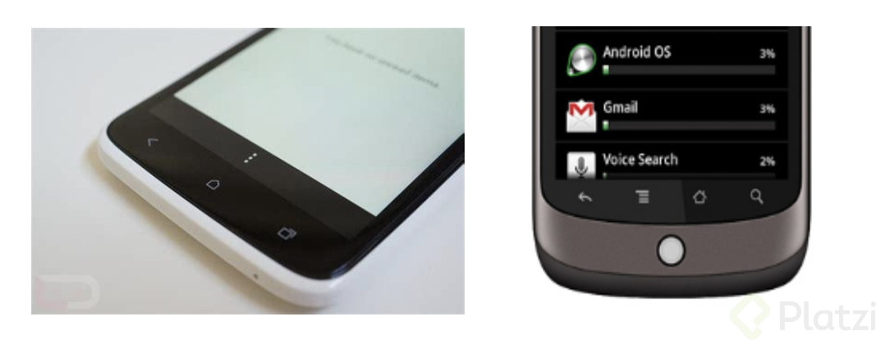
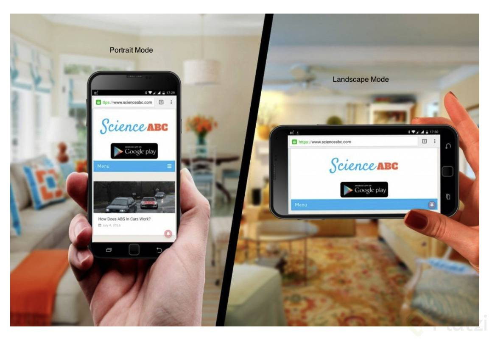

# Curso de Testing de Videojuegos

## Qué aprenderás sobre el testing de videojuegos

¿Qué significa ser tester?
¿Por qué es importante el control de calidad?
¿Qué se espera de ti como tester?

Ricardo Izquiero ha trabajado en la industria de los videojuegos desde el 2006, en empresas como Electronic Arts, PyroStudios y King. Su trabajo se ha centrado en el área de control de calidad. En este curso Ricardo te comparte los conocimientos que ha adquirido en estos 12 años de experiencia para enseñarte a ser un tester de videojuegos. Pero, ¿qué es un tester? Es la persona que se asegura de que el videojuego tenga la mejor calidad al momento del lanzamiento. De todos los departamentos que existen en la industria de videojuegos el más estricto es el de Control de Calidad.
Somos la última línea de defensa antes de que el producto salga a la luz y esa responsabilidad recae sobre testing.

## ¿Cómo funciona el testing de Black Box en un estudio de videojuegos?

Hay dos áreas dentro del testing:
**Whitebox**: se refiere al testeo del código fuente del juego.
**Blackbox**: se refiere al testeo desde el punto de vista del usuario final. Este curso se enfica exclusivamente al testing de blackbox.
En esta clase veremos cómo funciona un estudio de videojuegos. Se parte de una idea que propone el departamento de diseño, luego el departamento de programación hace un prototipo sobre el cual el departamento de grafismo implementa los gráficos. El resultado de este ciclo es la primera versión del juego. A continuación, el equipo de control de calidad (testing) hace una serie de pruebas para detectar los errores de esta primera versión. Programación hará las correcciones necesarias y las enviará nuevamente a pruebas con el departamento de testing. Este ciclo se repite las veces necesarias para garantizar que el videojuego funcione como debería. Cuando se tiene una versión que funciona a la perfección, el departamento de diseño vuelve a entrar para implementar más detalles en el juego, los cuales serán programados y graficados por los departamentos de programación y grafismo, respectivamente. Este ciclo se repite para cada versión del juego (también llamada build).

## Diferencia entre los 2 QA’s

QA es una sigla que puede traducirse como “Quality Assurance” (control de calidad) y “Quality Assistance” (asistencia de calidad). En esta clase veremos la diferencia entre ambos términos.
**Quality Assurance**: somos nosotros los responsables directos de la calidad del producto. Firmamos un documento asegurando que el juego está listo para ser lanzado. Y, en caso de que no lo esté, tenemos la potestad de detener el lanzamiento.
**Quality Assistance**: somos asesores de calidad y damos nuestro veredicto sobre calidad, pero no somos los responsables. No podemos detener un lanzamiento, sólo el estudio tiene la potestad.

Nosotros somos Testers **¿Somos Quality Assurances o Quality Assistances?** Dentro de los videojuegos, del control de calidad, hay **dos grandes diferencias entre QAs**.

**Quality Assurance**: responsables de la calidad del producto, sobre quien recaería la responsabilidad si sale con mala calidad el producto. Cuando estemos a punto de lanzar el juego, se nos preguntará si el juego está libre de errores, si de verdad se puede lanzar Y nos harán firmar un documento explicando que, efectivamente, no quedan errores. Tenemos la potestad - si aún vemos errores - de parar la producción, demorar ese lanzamiento y revisar el juego. Mucho más responsables que en Quality Assistance (+ responsabilidad) .

**Quality Assistance**: más o menos somos asesores de calidad, vamos a indicarles lo que más o menos debería ser la calidad del producto, pero no somos los responsables directos de esta calidad. Normalmente, la potestad al final la tiene el productor, nosotros no podemos parar el lanzamiento; va a ser el productor o el jefe de estudio quien tenga esa última palabra (no podemos parar el lanzamiento, **- responsabilidad** ).

## Testing de Regresión y Testing Exploratorio

Veamos los dos tipos de testing: exploratorio y de regresión.

- De regresión: se ejecutan pruebas sobre una batería de pruebas, se envía el feedback y se reciben los cambios. Una **batería de pruebas** es un conjunto de pruebas o casos diseñado para testear la calidad del juego. Pueden ser generales o estar agrupadas por sectores.

- Exploratorio: no contamos con una batería de pruebas sino que exploramos el videojuego en busca de posibles errores. Se asume que somos expertos en el juego que estamos probando y por lo tanto podemos explorarlo con libertad.

## Tipos de Testing: Funcional, Lingüístico y de Localización

Hablemos ahora de tres tipos de testing: Testing Funcional, Testing de Localización y Testing Lingüístico

1. **Funcional**: se chequean todas las funcionalidades del juego. Es el tipo de testing más mecánico y el que abarca la mayor cantidad de detalles.
2. **De localización y lingüístico**: ambos se relacionan con el texto del juego.
- El de **localización** se refiere a las convenciones del país donde se comercializará el juego. No es necesario ser nativo del país objetivo para hacer este tipo de testing, la empresa nos entrega una lista para verificar estas características que cambian de acuerdo a la región.
- El **lingüístico** se enfoca en el texto en sí, es decir, que la redacción de los textos que aparecen en el juego sea correcta. Es necesario contar con un nivel avanzado o nativo del idioma que estamos chequeando, ya que este testing se encarga de revisar la redacción, ortografía y la distribución en los campos de texto.

## Tipos de Testing: Online, Compliance, Usabilidad y Play Test

Continuando con los tipos de testing, en esta clase veremos los siguientes tipos:

- **Online**: chequear todas la funcionalidades online del videojuego. Es decir, todas las funciones que requieran una conexión a internet.
- **Compliance**: Es un testing muy específico que se hace con los fabricantes de hardware. Consiste en garantizar que el juego cumple con los requisitos del fabricante de la consola.
- **Usabilidad**: chequear que los flujos del videojuego, como los menús y las opciones, tengan sentido en cuanto a la usabilidad. Es decir, que la interacción del usuario con el videojuego fluya de una manera natural.
- **Play test**: se hace al final del desarrollo. Se enfoca en garantizar que el videojuego sea adecuado y entretenido para el público objetivo para el que se diseñó. Para esto se busca un punto de vista ajeno al desarrollo del juego. A partir de estas pruebas se hacen cambios de última hora con base en el feedback del público objetivo que prueba el juego.

## Ejemplos de casos de pruebas de baterías de testing

### Testing Funcional:

- Comprueba que el juego se ha instalado correctamente y que arranca sin problemas.
- Comprueba que se puede terminar el juego sin ningún error notable (critical o blocker).
- Comprueba que se puede acceder a cualquier nivel y salir de él sin perder el progreso guardado por el jugador.
- Comprueba que no existen problemas de colisión (paredes falsas) en todos los niveles del juego.
- Desinstala el juego y vuélvelo a instalar. Comprueba que los datos de la partida guardada del jugador se pueden recuperar desde la nube sin problemas.

### Testing Online:

- Comprueba que el usuario puede conectarse y desconectarse de Facebook sin problema.
- Comprueba que el usuario puede enviar y recibir vidas y que éstas llegan y se pueden usar.
- Comprueba que el jugador puede entrar en el modo deathmatch y que puede emparejarse sin problema.
- Comprueba que el usuario puede enviar y recibir mensajes en tiempo real del resto de usuarios.
- Comprueba el nivel de lag que hay en una partida usando la referencia de ping 80, si el ping es superior, la prueba se dará por fallida.

### Testing Legal:

- Comprueba que los logos de las empresas desarrolladoras del juego se muestran correctamente.
- Comprueba que los logotipos de los equipos de fútbol y su equipamiento se muestran correctamente.
- Dirígete al apartado del EULA (End User License Agreement ) y comprueba que éste se muestra correctamente en el idioma que tiene el usuario activado por defecto.
- Comprueba que las banderas de los países que participan en el juego se muestran correctamente y sin errores.
- Comprueba que los nombres de los jugadores de los equipos aparecen correctamente y sin errores, además que sus fotografías corresponden a dichos jugadores.

### Testing Compliance:

- Realiza un guardado de la partida sobre un disco duro externo, y mientras esta se realiza, extráelo. Comprueba que el texto que se muestra es el correcto (“El dispositivo de almacenamiento fue extraído durante su uso. Error al guardar.) para Xbox360.
- Llena el dispositivo de almacenamiento interno y realiza un intento de salvado de partida, comprueba que el texto que se muestra es el correcto (“No hay suficiente espacio libre en el dispositivo de almacenamiento %1.”) donde “%1” es el nombre del dispositivo de almacenamiento. Para Xbox360.
- Al inicio del juego, comprueba que el texto de auto-guardado se muestra correctamente (“Este juego guarda datos automáticamente en determinados puntos. No extraigas el Memory Stick™ ni reinicies o apagues el sistema mientras el indicador de acceso al Memory Stick™ esté parpadeando.”) Para PSP.
- Realiza un guardado en cualquier punto del juego y comprueba que el texto asociado se muestra correctamente (“Comprobando el Memory Stick™. No extraigas el Memory Stick™ ni reinicies o apagues el sistema.”) Para PSP.
- Sobrecarga el ancho de banda de la conexión a internet e intenta conectarte con el servicio online de Nintendo, comprueba que el texto asociado se muestra correctamente (“La Conexión Wi-Fi de Nintendo tiene un volumen de tráfico demasiado elevado o el servicio se ha interrumpido. Vuelve a intentar conectarte más tarde. Para obtener ayuda, visita el sitio web: [www.nintendowifi.com](http://www.nintendowifi.com/ "www.nintendowifi.com")”) Para Nintendo Wii.

### Testing de Localización

- Comprueba que la fecha se muestra correctamente en el idioma inglés/americano (MM/DD/YYYY).
- Comprueba que los números cardinales se muestran correctamente en castellano/español (1º, 2º, 3º, 4º, 5º…).
- Comprueba que los números cardinales se muestran correctamente en Inglés (1st, 2nd, 3rd, 4th, 5th…).
- Selecciona el idioma americano/Inglés y comprueba que la separación de unidades de millar y coma decimal está escrita correctamente (12,500.50).
- Selecciona el idioma Castellano/Español y comprueba que la separación de unidades de millar y coma decimal está escrita correctamente (12.500,50).

### Testing Lingüístico

- Comprueba que el texto del tutorial está escrito correctamente, sin errores ortográficos y su contenido es coherente.
- Comprueba que el texto de los menús de ayuda está escrito correctamente, sin errores ortográficos y su contenido es coherente.
- Comprueba que el texto que puedes encontrar en la sección de descripción de los personajes está escrito correctamente, sin errores ortográficos y su contenido es coherente.
- Comprueba que el texto del menú online (incluyendo la sección in-game) está escrito correctamente, sin errores ortográficos y su contenido es coherente.
- Comprueba que el texto que aparece al finalizar una temporada completa está escrito correctamente, sin errores ortográficos y su contenido es coherente.

## Qué es un bug y la importancia del reporte de errores

Un bug es un error. El nombre viene de los computadores primitivos que funcionaban con tarjetas perforadas. En una de las pruebas con este equipo, Grace Hopper encontró una polilla, un insecto (*bug*) entre el computador que estaba produciendo un fallo en el sistema.

Reportar adecuadamente los errores es vital porque le permite al programador identificar rápidamente las inconsistencias en su código y facilitar una pronta corrección. Por esta razón, en este curso aprenderemos a redactar reportes de bugs de forma clara y directa mendiante un formato de reporte de errores (*bug writing format*) que está pensado para ahorrarle tiempo al programador.

## Bug Writing Format

Cuando vamos a reportar un error no podemos reportarlo de cualquier manera, esto sería caótico. En esta clase aprenderemos la manera correcta de hacer estos reportes.

Cada empresa tiene su propio formato para reportar bugs. Toma esta clase como una guía pero ten siempre presente que cada estudio o equipo de desarrollo tendrá su propio formato y debemos ser capaces de adaptarnos a ellos. El lenguaje en el que suelen hacerte estos reportes es inglés.

Un bug se compone de dos partes: el encabezado y el cuerpo del bug. El encabezado contiene información como el título del juego y su versión, la plataforma y su versión, el tipo de bug, el área del juego donde se encuentra y una breve descripción del mismo, de alrededor de 5 palabras.

En el cuerpo ampliaremos esta descripción que hemos dado brevemente en el encabezado; también contiene unos steps to reproduce, es decir el paso a paso para encontrarnos con este error; el nivel de prioridad del bug; un *repro rate*, que se refiere a la frecuencia con la que se observa el error; el actual result, es decir, lo que estamos observando que sucede como consecuencia del bug; *expected result* es lo que debería hacer el juego si no existiera el bug: y unos archivos adjuntos para soportar este reporte.

## Prioridades de los bugs y prioridad según su ruta

En esta clase aprenderemos a clasificar los bugs según su importancia y según su ruta.

Las prioridades de los bugs se dividen en:
**Minor**: errores muy pequeños. Por ejemplo pequeños desajustes en la gráfica o en el texto. Se deben reportar todos los errores por minúsculos que sean.
**Major**: errores estándar que no impiden el progreso del jugador en el juego.
**Critical**: errores extremadamente vistosos que impiden el progreso en el juego pero no impiden terminar el juego.
**Blocker**: errores graves que detienen el progreso del jugador en el juego.

La clasificación de los bugs según su ruta se refiere a los pasos que se deben seguir para llegar al punto donde encontramos el bug. En este sentido, la prioridad se divide en:
**Low**: se requieren muchos pasos muy específicos para reproducir el bug. Es poco probable que un jugador llegue a encontrarlo. Un bug de tipo blocker que se encuentre en una ruta low puede considerarse critical.
**High**: son muy pocos los pasos y las condiciones para llegar a este bug y por lo tanto es muy probable que un jugador se encuentre con él. Un bug de tipo major que se encuentre en una ruta high puede considerarse critical.

## Tipos de bugs: texto, gráfico, funcional, gameplay

Hablemos ahora de los tipos de bugs: funcional y de gameplay son similares en que se refieren a problemas en las funciones del juego.

Se diferencian en que los bugs de **gameplay** afectan funcionalidades que encontramos en el interior del juego, mientras que los **funcionales** se refieren a funcionalidades como menús, integración con redes sociales y otros aspectos que no afectan el interior del juego.

**Gráfico** y **de texto** se refieren, respectivamente, a problemas con las gráficas y los textos del juego.

## Tipos de bugs: Crash, Freezee, Framerate, Audio, Legal

En el proceso de testing podemos encontrarnos con los siguientes tipos de bugs:

- **Crash**: el juego se cierra y nos regresa a la pantalla de inicio.
- **Freezee**: el juego se congela y no responde. Generalmente corresponde a un bucle en el código.
- **Framerate**: el juego va a un framerate inferior al que debería funcionar. Visualmente se observa en forma de saltos en la imagen y movimientos poco fluidos.
- **Audio**: el sonido del juego no corresponde con lo que está ocurriendo en pantalla. Puede suceder con la música, las voces o los efectos de sonido.
- **Legal**: se refiere a problemas con el uso de marcas registradas y propiedad intelectual dentro del juego.

## Áreas de un juego y bugs duplicados

Al momento de reportar es importante saber nombrar las áreas del juego donde se detecta un error. Recuerda que se trata no sólo de reportar el bug sino de facilitarle el trabajo al programador que debe solucionarlo. En esta clase identificamos las diferentes **áreas del juego** como menú principal, pop-ups, mapa del mundo, menú de configuraciones, *splash screen, head up display, ingame*, pantalla de carga.

Cuando encuentres un error en un área que no está identificada o que sea exclusiva para el videjuego que estás probando, nómbrala de la manera más sencilla y descriptiva posible.

**Duplicar un error** que ya ha sido reportado demuestra un problema de atención y comunicación con nuestro equipo que le causa pérdidas de tiempo y dinero a la empresa. Debemos verificar con nuestro equipo y en la base de datos que cada bug que detectamos no haya sido reportado antes.

## Sistema de Trabajo

Para ser buenos tester debemos ser disciplinados en nuestro trabajo. En esta clase aprenderemos el día a día del trabajo del tester.

En primer lugar debemos asegurarnos de que los equipos que requerimos para llevar a cabo nuestro trabajo (consolas, teléfonos, cables, nuestro computador) estén preparados. Luego recibimos una asignación del trabajo que nos corresponde. Ser disciplinados nos permitirá llevar a cabo nuestro trabajo de forma ordenada y eficiente.

## Test plan

Manos a la obra. Vamos a hacer el test plan para testear nuestro videojuego. Empezamos por diseñar el test plan o plan de pruebas.

Vamos a redactar los casos de prueba, empezando por la descarga del juego. A medida que vamos avanzando en el juego encontramos diferentes casos de prueba e iremos haciendo una anotación por cada uno. Ese es nuestro trabajo al desarrollar un plan de prueba. Una vez terminamos de redactar todos los casos de prueba los trasladamos a una hoja de cálculo.

## Organizando nuestro test plan

Ahora vamos a construir nuestro primer documento de pruebas.
El documento de pruebas contiene una portada que hace referencia al juego que estamos revisando y tiene una pestaña por cada área del juego. En estas se especifica en diferentes columnas el caso de prueba, el resultado observado, la información del caso de prueba, y un id de bug. Este id es generado por la empresa mediante el programa que empleemos para el reporte de errores. Los resultados observados se reportan mediante un código de color, donde verde quiere decir que está bien y rojo representa la aparición de un bug.

Una vez que tenemos la estructura para nuestra batería de pruebas, la replicamos para cada nivel del juego.

## Continuando el proceso de creación de test Plan y tu primera batería de pruebas

Continuamos con el proceso de construcción de nuestro plan de pruebas agregando los casos de prueba que vamos encontrando y su respectiva ubicación en las áreas del juego.

El documento de pruebas contiene una portada que hace referencia al juego que estamos revisando y tiene una pestaña por cada área del juego. En estas se especifica en diferentes columnas el caso de prueba, el resultado observado, la información del caso de prueba, y un id de bug.

Una vez que tenemos la estructura para nuestra batería de pruebas, la replicamos para cada nivel del juego.

## Baterías de pruebas especiales

Batería de pruebas y test plan son sinónimos. En esta clase veremos dos tipos especiales de baterías de pruebas. Son casos especiales porque no son baterías que se realicen dentro del proceso de control de calidad sino antes de empezar dicho proceso.

- **Smoke test**: es una batería de pruebas que hace el equipo de programación antes de entregar el videojuego para las pruebas. Consiste en evaluar las funciones de instalación y arranque para varios dispositivos.

- **Bootcheck**: es el chequeo de arranque por parte del equipo de QA e incluye casos de prueba de instalación y arranque, además de algunas funciones básicas del primer nivel y la integración con Facebook. Esta será la primera batería de pruebas que llevemos a cabo en cada juego.

## Testing en celulares

Actualmente el mayor potencial de mercado dentro del testing es en dispositivos móviles, especialmente en Android.

En esta clase veremos las particularidades de iOS y Android en cuanto a testing. Al testear en teléfonos móviles debemos tener en cuenta el factor de las interrupciones por parte de las notificaciones y otras funcionalidades inherentes al hardware. Por lo tanto, parte de las baterías de pruebas es chequear cómo estas interrupciones afectan el juego.

Otro factor para tener en cuenta son las diferencias entre los sistemas operativos iOS y Android, particularmente las diferencias entre la variedad de modelos disponibles en **Android** que van desde gama baja hasta gama alta. En estos modelos es necesario verificar la respuesta del juego frente acciones como cerrar una tapa, deslizar un teclado o girar el teléfono.

En cuanto a **iOS**, no existe tanta variedad de dispositivos, pero un factor para tener en cuenta es el botón ringer, que sirve para silenciar el teléfono.

Para el reporte de bugs en dispositivos móviles, debemos tomar un video o un screenshot que muestren el problema. Adicionalmente, debemos resaltar en la imagen la ubicación específica del bug. Para grabar los videos no debemos instalar programas que capturen la pantalla sino grabar con la ayuda de otro dispositivo externo y posteriormente comprimir el video para que no sea tan pesado.

El **crashlog** es una información generada por el teléfono y que resulta muy valiosa para el programador en el caso de detectar errores críticos. El software Xcode nos permite extraer desde un computador el crashlog para dispostivios iOS.

[uTest](https://www.utest.com/articles/compressing-video-files-to-less-than-20-of-original-size)

## Guía Android

### Guia Android + Instalación + Interrupciones

Instalación de una versión de prueba (build):

1º Activar modo de depuración USB:

[https://elandroidelibre.elespanol.com/2015/01/como-activar-el-modo-depuracion-usb-en-android.html](https://elandroidelibre.elespanol.com/2015/01/como-activar-el-modo-depuracion-usb-en-android.html)

[https://www.phonetransfer.org/turn-on-usb-debugging-mode-on-android-5-0-lollipop.html?lang=es](https://www.phonetransfer.org/turn-on-usb-debugging-mode-on-android-5-0-lollipop.html?lang=es)

[https://www.youtube.com/watch?v=GyxVa88BO9Y](https://www.youtube.com/watch?v=GyxVa88BO9Y)

2º Descargar e instalar

Descarga la aplicación (que siempre tendrá una extensión .apk) desde donde te indique tu responsable de pruebas. Una vez la hayas descargado a tu móvil simplemente haz tap en ella y dile que quieres instalarla, y ya está instalada en tu dispositivo!

Botones genéricos en Android:

Al ser Android una plataforma no estandarizada en hardware, las descripciones varían dependiendo del teléfono móvil, pero en general son estas:

Botón Home (dibujo de una casa): Este botón pone la aplicación que se está ejecutando en modo de espera y devuelve al usuario al dashboard. Al hacer una pulsación larga realiza una función distinta que varía dependiendo del modelo.

- Botón Menú (Rectángulo): Activa opciones especiales (si las tuviera) dentro de la aplicación. Al hacer una pulsación larga realiza una función distinta que varía dependiendo del modelo.

- Botón Back (Flecha hacia la izquierda): Si el usuario está desplazándose entre menús le devuelve al anterior, si no hay menú anterior al que regresar pone la aplicación en modo de espera y devuelve al usuario al dashboard.

- Botón Search (Lupa): Está muy en desuso, dependiendo del móvil lleva al navegador o a un motor de búsqueda dentro del teléfono. Al hacer una pulsación larga realiza una función distinta que varía dependiendo del modelo.

- Controles de volumen: Suelen estar en los laterales. Los usaremos para probar si funcionan dentro de la aplicación.

- Power, Lock: Es el botón de encendido, lo usaremos para poner el móvil en reposo y para hacer apagado y simulación de apagado.

- Landscape Mode: Es cuando visualizamos el móvil en modo horizontal.

- Portrait Mode: Es cuando visualizamos el móvil en modo vertical.

Interrupciones:

Llamada de voz: recibir una llamada mientras estás jugando, aceptándola y también rechazándola, ¿el juego se comporta como debería?

SMS: recibir un SMS mientras juegas, ¿el juego se comporta como debería?

Clamshell, slider o móviles rotatorios. Existen teléfonos con forma de concha (clamshell) que se deslizan en dos partes (slider) o que rotan su pantalla, ¿qué ocurre cuando los abro? ¿El juego se comporta como debería?

Lock/Unlock: poner el juego en modo de espera de manera manual, ¿qué ocurre cuando hago esto? ¿El juego se comporta como debería?

USB Cable: ¿Qué ocurre cuando conecto y desconecto el cable usb? ¿El juego se comporta como debería?

Headphones: ¿Qué ocurre cuando conecto y desconecto los cascos de escuchar música? ¿El juego se comporta como debería?

Controles de Volumen: ¿Qué ocurre cuando subo y bajo el volumen mientras juego? ¿Funciona bien?

Calendario/Alarmas: ¿Qué ocurre cuando saltan las alarmas de mi móvil? , ¿El juego se comporta como debería?

Idle: Idle se refiere a cuando tenemos puesto un ajuste en Android para que la pantalla se apague sola después de un tiempo, ¿qué ocurre cuando hago esto y luego vuelvo a activar el teléfono? ¿El juego se comporta como debería?

## Testing en celulares Android

### Cómo extraer el Crash Log (o Console Log) en Android

En esta lectura vamos a ver como extraer el Crash Log (o Console Log) de los dispositivos Android. A diferencia de los dispositivos de Apple, este proceso (debido a la falta de procesos estandarizados dentro del SO de Google) puede ser un poco más peliagudo, pero no os preocupéis. En esta lectura abordaremos 3 maneras de extraer dicho registro sin mayores complicaciones, veremos cómo hacerlo desde el ordenador (Windows), desde una app para dispositivos rooteados y desde una alternativa llamada Minimal ADB, vamos allá:

Vamos a empezar con la más sencilla de todas, una aplicación dentro del propio dispositivo que registra el console log. Para hacer correr esta aplicación deberemos tener rooteado el dispositivo, es posible que algunos os preguntéis si es o no es buena opción tener el dispositivo rooteado y además corriendo una app por debajo de la que estamos testeando: la respuesta es que no hay ningún problema, siempre y cuando solo usemos el root para correr esta app, si nos dedicamos a instalar apps que necesitan acceso root estamos intoxicando el entorno de pruebas y no será valido para un testeo 100% valido, pero si única y exclusivamente usamos el root para extraer el console log, al ser un impacto mínimo en el sistema, no habrá problema ninguno. La aplicación en cuestión se llama CATLOG y la podéis encontrar en el siguiente enlace:

- Catlog: [https://play.google.com/store/apps/details?id=com.nolanlawson.logcat&hl=en](https://play.google.com/store/apps/details?id=com.nolanlawson.logcat&hl=en)

También podéis usar las siguientes alternativas:

- Logcat reader:
[https://play.google.com/store/apps/details?id=com.dp.logcatapp](https://play.google.com/store/apps/details?id=com.dp.logcatapp)

- aLogcat:
[https://play.google.com/store/apps/details?id=rs.pedjaapps.alogcatroot.app](https://play.google.com/store/apps/details?id=rs.pedjaapps.alogcatroot.app)

Como en la clase de crash log para iOS, aquí haremos lo mismo, es decir, una vez detectemos el error o el crash que queremos registrar, miraremos la hora e iremos a la aplicación que hayamos instalado para registrar el console log. Una vez veamos la hora, pararemos el servicio de registro y copiaremos desde la hora del error, hasta el final, y una vez extraído ese fichero en cualquier documento de texto lo añadiremos a nuestro bug y lo enviaremos.

Ahora vamos a ver una opción intermedia, Minimal ADB and Fastboot for Windows:

En esta ocasión haremos uso no solo del dispositivo sino también del ordenador. Deberemos de bajar los drivers de nuestro dispositivo y el programa Minimal ADB and Fastboot for Windows. Este programa simplifica las acciones de registro del console log que ofrece el SDK de Android haciendo la tarea mucho más sencilla y práctica.

Os he puesto un enlace a un tutorial de U-Test Academy para que, además de aprender a usar este programa, os empecéis a familiarizar con esta parte de U-Test; como os he dicho anteriormente, U-Test tiene una sección gigantesca de tutoriales donde podemos encontrar multitud de herramientas y soluciones para nuestros problemas de testeo. Son guías creadas por los usuarios, así que, quien sabe, es posible que tu escribas dentro de poco una guía para esta comunidad 😉

Aquí os dejo el enlace:

[https://www.utest.com/articles/capturing-android-crashlogs-on-windows-with-adb](https://www.utest.com/articles/capturing-android-crashlogs-on-windows-with-adb)

Y por último, la opción menos amigable, aunque para muchos no supondrá un problema, para otros puede volverse un poco tediosa.

Lo primero de todo es instalar el SDK de Android en vuestro ordenador:

[https://android.es/tag/sdk/](https://android.es/tag/sdk/)

Después deberéis, como en la opción anterior, instalar los drivers de vuestro dispositivo, y a continuación ejecutar desde el terminal del Android SDK el siguiente código:

adb shell logcat > log.txt

Una vez hecho esto se habrá guardado en la carpeta raíz de vuestro Android SDK el fichero log.txt, deberéis abrirlo y, como siempre, buscar la hora en la que ha ocurrido el error y copiar todo el texto hasta el final para posteriormente incluirlo como fichero adjunto de dicho bug.

Os dejo un enlace a un tutorial en StackOverflow donde podéis ver el proceso paso por paso:

[https://stackoverflow.com/questions/2882253/how-do-i-get-the-logfile-from-an-android-device#2888222]
(https://stackoverflow.com/questions/2882253/how-do-i-get-the-logfile-from-an-android-device#2888222)
Una nota importante: para usar cualquiera de estos métodos debéis de tener SIEMPRE activada la opción de depuración USB dentro de las Opciones de desarrollador de vuestro dispositivo Android, si no ninguno de estos 3 métodos funcionará.

Activar las opciones de desarrollador en Android:

[https://developer.android.com/studio/run/device#setting-up](https://developer.android.com/studio/run/device#setting-up)

## Guía iOS

### Guía iOS + Instalación + Interrupciones

Instalación de una versión de prueba (build):

1. Descargate iTunes
2. Descarga el fichero (siempre con extensión .ipa)
3. Doble click al fichero y se vinculará directamente con iTunes
4. Dentro de iTunes ve a la sección del teléfono o tablet y dentro de esa sección a Apps
5. Allí verás la build, márcala y dale a “Sincronizar”
6. Una vez haya terminado el proceso ya tendrás la build instalada en tu iPhone o iPad

Botones:

- Power: botón de encendido. Modelos hasta el iPhone SE lo tienen en la parte superior, en iPhone 6 y en adelante, en el lateral derecho.

- Home: botón circular en la parte inferior del teléfono.

- Volumen: teclas de volumen en el lateral izquierdo.

- Ringer: es un botón tipo switch situado próximo a los controles de volumen, sirve para silenciar el teléfono.

- TouchID: función de reconocimiento dactilar disponible desde los modelos 5S, situada en el botón Home.

- Landscape Mode: es cuando visualizamos el móvil en modo horizontal.

- Portrait Mode: es cuando visualizamos el móvil en modo vertical.

Interrupciones:

- Llamada de voz: recibir una llamada mientras estás jugando, aceptándola y también rechazándola ¿El juego se comporta como debería?

- SMS: Recibir un SMS mientras juegas, ¿el juego se comporta como debería?

- Lock/Unlock: poner el juego en modo de espera de manera manual ¿Qué ocurre cuando hago esto? ¿El juego se comporta como debería?

- Cable iOS: ¿Qué ocurre cuando conecto y desconecto el cable iOS? ¿El juego se comporta como debería?

- Headphones: ¿Qué ocurre cuando conecto y desconecto los cascos de escuchar música? ¿El juego se comporta como debería?

- Controles de volumen: ¿Qué ocurre cuando subo y bajo el volumen mientras juego? ¿Funciona bien?

- Calendario/Alarmas: ¿Qué ocurre cuando saltan las alarmas de mi móvil? ¿El juego se comporta como debería?

- Ringer: ¿Qué ocurre con la función Ringer? ¿El juego se comporta como debería cuando la activo y la desactivo?

## Testing en consolas

Los conocimientos que hemos adquirido en este curso, a pesar de que están enfocados en el testing en dispositivos móviles, son también aplicables al testing en consolas. Hacer testing en consolas se diferencia del testing en dispositivos móviles principalmente por el hardware involucrado. Se utilizan consolas especializadas para el testing con herramientas y funcionalidades adicionales que facilitan el trabajo del testing.

## uTest: creando tu perfil

### ¿Que es uTest? ¿Cómo funciona?

uTest es la plataforma de pruebas online más grande del mundo, donde puedes crear tu perfil para prestar tus servicios como tester para algunas de las compañías más importantes.

En esta clase aprenderemos paso a paso cómo crear nuestro perfil en uTest. Hay dos tipos de perfiles:

- **Lite User**: te permite acceder a la universidad de uTest para capacitarte como tester.
- **Full User**: te permite unirte a proyectos como tester. Ambas opciones son gratuitas.
En el dashboard de uTest encontramos los ciclos de prueba en los que estamos invitados, las acciones pendientes, los proyectos activos y terminados.

También veremos los pagos que tenemos pendientes e información de interés de la comunidad de uTest. En esta pantalla también podremos agregar información a nuestro perfil. Las tareas urgentes de los proyectos en los que participamos también aparecerán aquí.

Nuestro primer proyecto en uTest se llama sandbox y no es pago, es la forma en la que la plataforma se asegura de que tengamos las habilidades necesarias para participar en proyectos reales.