# Curso gratis de programación Basica 
## ¿Qué es backend?

Te encuentras muy cerca de finalizar tu primera aplicación. Es momento de desarrollar el backend de la misma, toda **la lógica del lado del servidor de tu proyecto que permitirá interactuar con otros usuarios e intercambiar mensajes**.

### Diferencias backend y front-end

Seguro ya sabes lo que es[ el front-end](https://platzi.com/blog/que-es-frontend-y-backend/ " el front-end"). **La parte visual de una aplicación web que puedes acceder a ella desde una navegador** o también denominado ““cliente””. La misma se desarrolla con tecnologías como HTML, CSS y Javascript.

Por otro lado, [el backend](https://platzi.com/blog/que-es-frontend-y-backend/ "el backend") es todo lo que ““no puedes ver””, ya que e**s la lógica de una aplicación que se ejecuta en un ““servidor”**. El backend se suele desarrollar con tecnologías como Java, PHP, C#, C++ o también con Javascript con NodeJS.

De esta breve explicación se desprenden dos conceptos claves que te acompañarán el resto de tu vida como programador. El cliente y el servidor.

### Arquitectura cliente/servidor

Si estás leyendo esto, es gracias a que tu navegador web (o aplicación mobile), el cliente, se conectó a los servidores de Platzi y los mismos le enviaron este texto.

La Internet moderna funciona a través de la arquitectura cliente/servidor. **Donde el cliente realiza peticiones de datos al servidor y este responde con los mismos**.

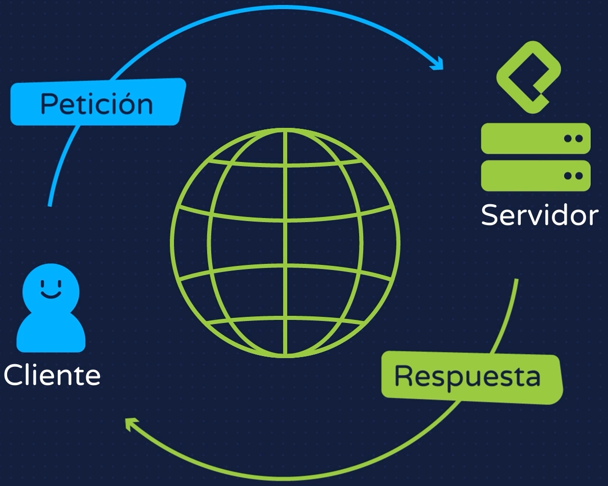


Un servidor puede responder de varias formas o con diferentes tipos de información dependiendo el tipo de petición del cliente.

Envío de páginas web
Cuando ingresas a [https://platzi.com/](https://platzi.com/ "https://platzi.com/") el servidor realiza un tipo de respuesta enviándole al cliente, al navegador web, archivos para la construcción de una página web.

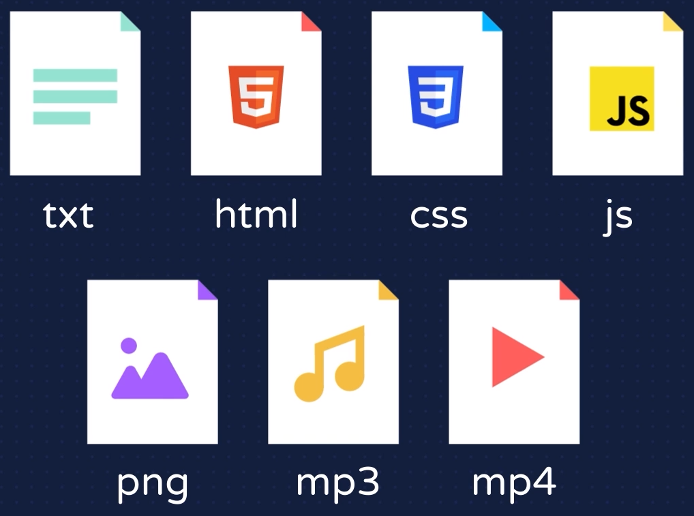

Cada tipo de archivo es interpretado de una forma diferente por el navegador para construir la página. Incluso puedes enviar archivos multimedia como imágenes o videos.

### Streaming de datos

Cuando te encuentras viendo un video aquí en Platzi o en YouTube, los servidores envían cada fotograma del video en el orden que les corresponde para que el navegador web pueda reproducir el video y múltiples usuarios puedan verlo en tiempo real.

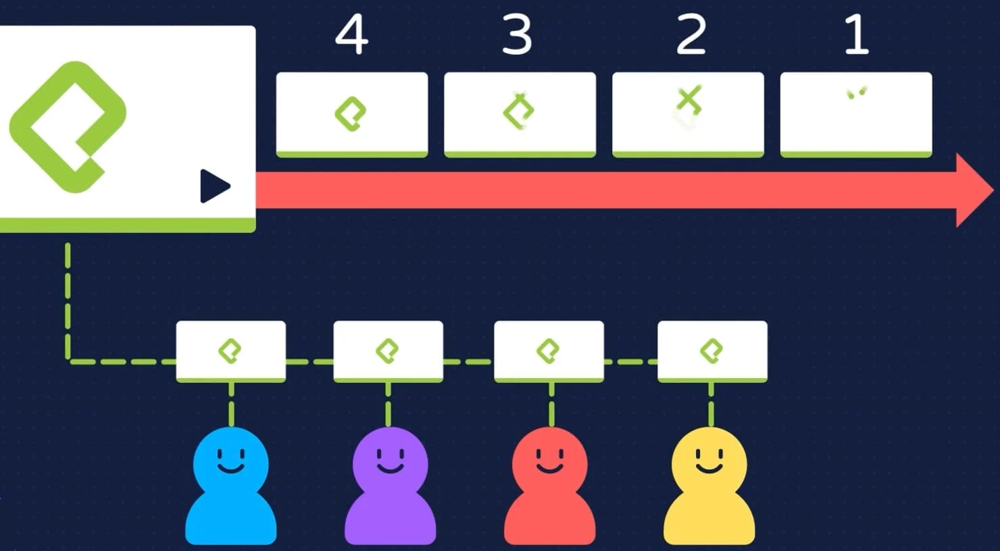

### Envió de datos

Un tercer tipo de intercambio de información entre un servidor y un cliente es el **envío de datos en crudo con una determinada estructura** de los mismos.

Un servidor puede enviar información de estudiantes, clases y cursos al cliente para que este construya la interfaz con los mismos y el usuario pueda interactuar con los datos.


Los datos suelen intercambiarse a través un formato de texto conocido como JSON o *Javascript Object Notation*. JSON es el estándar más utilizado hoy en día para intercambiar información entre aplicaciones y definir estructuras en los daots. El aspecto de este tipo de información es como el siguiente:

```json
{
    ""nombre"": ""Diana"",
    ""edad"": 27
}
```
Todo este intercambio de información entre un cliente y un servidor, o entre un front-end y un backend, se produce gracias a una API.

*Aplication Programming Interface* o ““Interfaz de Programación de Aplicaciones”” es otro concepto que te acompañará por mucho tiempo. Puedes verlo como una puerta de entrada para el cliente, para la obtención de datos desde un servidor.

El servidor debe permitir que un cliente haga consultas y reciba datos, a través de una API es que el intercambio de información es posible.

### Protocolo HTTP

**Internet está basado en protocolos que son formas estandarizadas de hacer las cosas**. El intercambio de datos entre un cliente y un servidor es posible gracias al protocolo HTTP.

Hypertext Transfer Protocol o ““Protocolo de Transferencia de Hipertexto”” por sus siglas en español, es el protocolo N°1 utilizado en internet para el intercambio de cualquier tipo de dato.

Seguro habrás visto que las páginas web comienzan con `http://` o `https://`. Ahora ya sabes qué significa.

### HTTP vs. HTTPS

La S de HTTPS no es más que una extensión al protocolo HTTP que lo hace más **Seguro** para el intercambio de información cifrada o codificada entre el cliente y el servidor para evitar robo de datos.

### Conclusión
Front-end, backend, cliente y servidor. El protocolo HTTP, APIs y JSON. Son solo los primeros conceptos, tecnologías o terminologías que debes conocer del mundo de la programación.

No te preocupes si aún no tienes en claro para qué sirve cada cosa, profundizarás poco a poco en cada uno de ellos y comprenderás su utilización para la construcción de un backend, y de una aplicación web completa.

## Instalación de Node.js y NPM

Así como, en el front-end, utilizas lenguajes como HTML, CSS y Javascript en el backend puedes usar otras tecnologías. Javascript es el que continuaremos utilizando de ahora en adelante.

### Tecnologías backend
Existen muchos lenguajes de programación para desarrollar en el backend. Veamos un listado de algunos de ellos.

- C/C++
- C#
- Java
- PHP
- Ruby
- Python
- Go
- Javascript (NodeJS)

Ya conoces lo que es Javascript y lo que permite construir en el front-end. También es posible utilizarlo en el backend gracias a NodeJS.

**NodeJS es un entorno de ejecución que permite interpretar y utilizar código Javascript en un servidor**, con algunas diferencias con respecto al front-end. Está construido con el motor [intérprete de código Javascript de Google Chrome denominado V8](https://platzi.com/cursos/javascript-navegador/ "intérprete de código Javascript de Google Chrome denominado V8").

En el backend no hay HTML, por lo que no podrás utilizar NodeJS para su manipulación. En su lugar, podrás usarlo para leer archivos, conectarte a una base de datos, levantar un servidor web y construir una API.

### Instalación de NodeJS

La instalación de NodeJS en tu ordenador es muy sencilla. Ingresa a su [página oficial](https://nodejs.org/en/ "página oficial") y has la descarga dependiendo tu sistema operativo.


Te recomiendo que siempre instales la versión LTS (*Long Term Support*), dado que la misma tendrá soporte y mantenimiento por al menos 5 años. También utiliza versiones pares. Las versiones Current o las versiones impares suelen estar en desarrollo y pueden tener algún error o vulnerabilidad.

**NodeJS viene acompañado de otra tecnología denominada NPM** (Node Package Manager). El mismo nos ayudará a inicializar un nuevo proyecto o instalar cualquier tipo de dependencia que necesitemos para desarrollar nuestra aplicación.

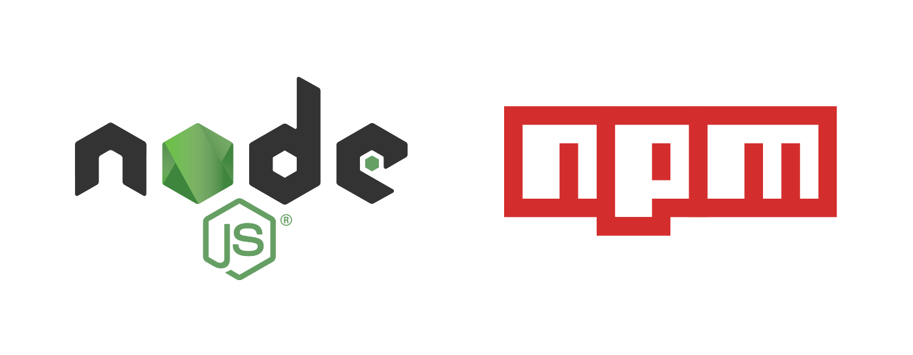

Una vez realizada la instalación, puedes utilizar una serie de comandos desde una terminal para corroborar su correcto funcionamiento. Utiliza el comando node -v para verificar la versión de NodeJS y npm -v para visualizar la versión de NPM.

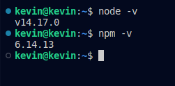

NodeJS será, tal vez, tu primer acercamiento al desarrollo backend en el lado del servidor. Mucho de lo que ya conoces sobre Javascript te servirá para NodeJS y lo complementaremos con otras características propias que exploraremos en las próximas clases.

## Terminal de comandos y Node.js

Como desarrolladores de software, una de nuestras mejores amigas será la terminal de línea de comandos para la ejecución de tareas. No debemos tenerle miedo, ya que nos facilitará mucho el trabajo en el futuro.

### ¿Qué es una terminal?

Una terminal de línea de comandos o CLI (Command-Line Interface), es **una interfaz de texto que nos permite interactuar con un proyecto, ejecutar tareas o navegar por todos los archivos y directorio de nuestro computador**.

En cualquier sistema operativo puedes ejecutar comandos en una terminal. Habrás observado que VS Code trae consigo una terminal. Existen muchas otras, todas muy similares.

A diferencia de una interfaz de usuario donde podemos observar e interactuar con archivos o directorios de forma visual y más amena, una terminal de línea de comando también lo permite a través de texto ejecutando comandos.

Parece algo más difícil, pero no te preocupes. Te acostumbrarás y te garantizo que lo agradecerás cuando seas un desarrollador de software profesional.

Con NodeJS, utilizaremos NPM que trae consigo su propio CLI para crear proyectos o instalar dependencias que nuestro proyecto necesitará.

Pero antes de eso…

### ¿Qué es una dependencia?

Llamamos dependencia o librería a una **pieza de código desarrollada por un tercero**, por otra persona. Las mismas nos permiten **solucionar problemas triviales y reutilizar código para hacer más rápido nuestro trabajo** como programadores.

[NPM](https://www.npmjs.com/ "NPM") se encargará de descargar por nosotros las dependencias que necesitamos. En la actualidad, es el gestor de dependencias más grande del mundo. Cada lenguaje de programación suele tener el suyo, como lo es *Composer* para PHP, *Maven* para Java o *PIP* para Python.

Una dependencia puede servirnos para manejar fechas, para leer archivos, para realizar solicitudes HTTP o hasta para levantar un servidor, entre muchas otras funcionalidades. Realmente te encontrarás con dependencias de todo tipo y casi para cualquier cosa que quieras hacer. Poco a poco, irás descubriendo más y más dependencias que utilizarás para construir tus proyectos.

### Comandos básicos que debes conocer

Existen [muchos comandos](https://platzi.com/cursos/terminal/ "muchos comandos") que incluso varían dependiendo el sistema operativo en el que trabajes.

Los comandos más básicos que puede probar son `ls` o `ll` para listar los archivos o directorios. También utilizarás mucho el comando `cd` para desplazarte entre directorios dentro de tu computador.

Los CLI, como NPM, incorporan a tu sistema operativo una serie de comandos específicos para trabajar con una tecnología. Suelen utilizarse estos con un prefijo como `npm <command-name>`.

### Hola Mundo con NodeJS

Siempre, y para toda tu vida, que instales una nueva tecnologías, lo primero que realizarás es el “Hola Mundo” que **permite corroborar la correcta instalación de la tecnología o herramienta**.

Para crear tu primer proyecto en NodeJS, con ayuda de NPM, basta con utilizar el comando npm init -y. El mismo creará en cuestión de segundos tu primer proyecto.

Observa que este comando ha creado un archivo llamado package.json que contiene la configuración básica de cualquier proyecto desarrollador en NodeJS.

```json
{
  "name": "prueba",
  "version": "1.0.0",
  "description": "",
  "main": "index.js",
  "scripts": {
    "test": "echo \"Error: no test specified\" && exit 1"
  },
  "keywords": [],
  "author": "",
  "license": "ISC"
}
```

No debes preocuparte tanto por su contenido, poco a poco lo irás comprendiendo. Puedes observar, entre otros datos, el nombre del proyecto, la versión, una descripción y el archivo base del proyecto, entre otros datos.

Continúa creando un archivo que llamaremos index.js que será el archivo base de nuestro proyecto. Agrégale al mismo el siguiente contenido:

`console.log("¡Hola Mundo!");`

Ya puede ejecutar tu primer proyecto en NodeJS utilizando el comando `node index.js`. Recuerda utilizar el nombre de tu archivo que acabas de crear para indicarle a Node qué archivo ejecutar.

En cuestión de segundos observarás un `¡Hola Mundo!` en la consola que hayas utilizado para lanzar el comando. Eso significa que NodeJS se encuentra correctamente instalado en tu computador y has ejecutado tu primer programa.

Ha sido bastante sencillo la creación de un proyecto con NodeJS y su ejecución. Ahora es momento de desarrollar tu primera aplicación backend apoyándote de estas tecnologías.

## Servidor web con Express.js

Crear tu primer servidor web, o servidor HTTP, con NodeJS es súper sencillo. Para esto utilizaremos una de las librerías más populares de NPM como lo es [Express.js](http://expressjs.com/ "Express.js").

### ¿Qué es ExpressJS?

Una de las dependencias más antiguas, pero completamente vigente y recomendada, para trabajar con aplicaciones web en NodeJS es Express.js. La misma te permitirá, en pocas líneas de código, **exponer tu primer servidor web y crear tu primera API**.

### Consejos sobre NPM

Siempre que instales una dependencia de terceros que se encuentren en NPM, te aconsejo que ingreses a su respectiva página para obtener más información de la librería.

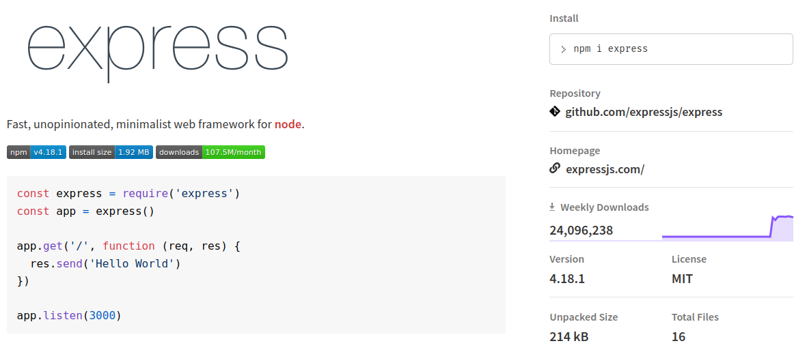

La [página de ExpressJS en NPM](https://www.npmjs.com/package/express "página de ExpressJS en NPM") indica que la mismo posee más de 24 millones de descargas en la última semana. Además de encontrar más información como el repositorio en [GitHub](https://platzi.com/cursos/git-github/ "GitHub") y ejemplos básicos de instalación y uso de la librería, licencia, entre otros datos.

Como todo el código de NPM es público, te encontrarás con miles y miles de librerías deprecadas (viejas) o de dudosa procedencia. Es aconsejable que aprendas a analizar qué librerías utilizar y cuáles no convenga utilizar, ya que no tiene mantenimiento o muy poca gente la utiliza.

### Hola Mundo con ExpressJS

Así como ya has realizado el “Hola Mundo” con NodeJS, es momento de hacerlo con ExpressJS.

### Paso 1: Instalación de ExpressJS
Levantar tu primer servidor y exponer una API con ExpressJS es súper sencillo. Comienza instalando la librería de NodeJS utilizando el comando npm i express. En cuestión de segundos, tendrás disponible la utilización de esta librería en tu proyecto.

Tal vez te llame la atención la creación de un directorio en tu proyecto llamado node_modules. Dentro de esta carpeta, encontrarás muchas otras. Cada una de ellas hace referencia a una dependencia distinta y entre ellas, seguro encontrarás a ExpressJS.

También observa el archivo package.json, en la sección dependencies, se listarán cada una de las dependencias que tu proyecto utiliza con su respectiva versión.

```json
{
  ...
  "dependencies": {
      "express": "^4.18.1"
   }
}
```

### Paso 2: Implementado el servidor con ExpressJS

En la propia [página de ExpressJS](http://expressjs.com/en/starter/hello-world.html "página de ExpressJS"), o de cualquier tecnología, encontrarás muy buena documentación de cómo empezar a usar la misma.

Será importante, a lo largo de tu carrera como programador, que aprendas a buscar esta documentación y apoyarte de ella para aprender a utilizar una librería o una tecnología.

A continuación, observemos el siguiente código de Javascript que puedes utilizar en el archivo index.js de tu aplicación.

```javascript
// Importamos Express desde la carpeta node_modules
const express = require('express');

// Creamos la aplicación de Express
const app = express();

// Escojemos un puerto por el que el servidor web escuchará
const port = 3000;

// Página para visualizar el mensaje "¡Hola Express!"
app.get('/', (req, res) => {
  res.send('¡Hola Express!');
});

// Activamos el servidor en el puerto 3000
app.listen(port, () => {
  console.log(`¡Servidor listo!`);
});
```
### ¿Qué es un puerto?

Puedes entender el concepto de “puertos” en un computador como una puerta identificada por un determinado número por la cual es posible enviar y recibir información de un sistema o subsistema hacia otro.
En este ejemplo estamos utilizando el puerto 3000. Puedes utilizar el que tú quieras desde el número 1024 hasta el 65536. De momento no es relevante el porqué de este rango de números.

### Paso 3: Ejecutando el servidor
Luego de haber instalado la librería de Express y haber preparado el código para levantar un servidor web, es momento de ejecutarlo con el comando node index.js.

En cuestión de segundos, tu servidor estará escuchando en el puerto 3000. Esto quiere decir que si ingresas a `http://localhost:3000/`, en cualquier navegador web, podrás observar el mensaje `¡Hola Express!`.

Eso nos indica que has logrado levantar tu primer servidor web. ¡Felicidades!

### Conclusión

Así de sencillo es instalar dependencias y usarlas. Aún puede parecerte poco intuitivo todo lo que hemos realizado en esta clase, pero te aseguro que en poco tiempo serán tareas triviales de todos los días, la instalación de librerías, la lectura de su documentación para aprender a utilizarlas y su correcta implementación en tu código.

Instalar express: `npm install express`
Activar el servidor: `node index.js`

## Web server with Express.js

A lo largo de tu vida como programador o programadora, te encontrarás con **múltiples conceptos que debes conocer y que verás realmente en todas partes**. Protocolos, servidores, puertos, el funcionamiento de cada tecnología. Veamos a continuación un explicativo de **conceptos básicos que tienes que comenzar a interiorizar**.

### Estructura de un dominio

Las páginas web se identifican por un dominio único e irrepetible. Conocerás el dominio de Google ([https://google.com](https://google.com/ "https://google.com")) o el dominio de Platzi ([https://platzi.com](https://platzi.com/ "https://platzi.com")).

Los dominios son también llamados URI y están compuestos por varias partes.

### ¿Qué es una URI?

URI son las siglas en español de **Identificador de Recursos Uniforme** y es ese **identificador único de una página web**. El mismo está compuesto por dos partes, una URL (Localizador de Recursos Uniforme) y una URN (Nombre de Recurso Uniforme).

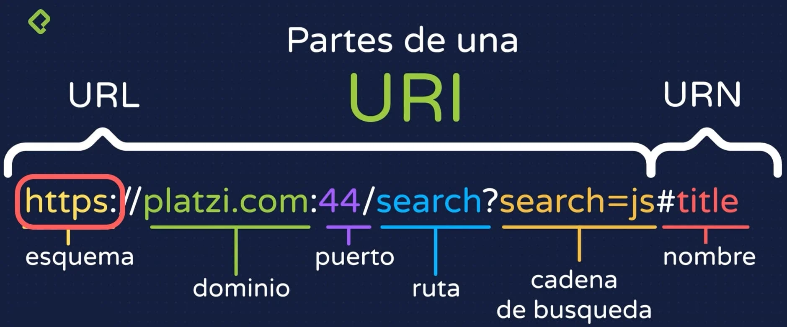

### Composición de una URI

Dentro de una URI, podemos identificas varias partes que componen a la misma:


**- URI:**
 - Esquema: Protocolo que la URI utiliza, pudiendo ser HTTP o HTTPS.
 - Dominio: Nombre del dominio de la página.
 - Puerto: Puerto por el que el servidor se encuentra “escuchando” para responder con la información de la página.
 - Ruta: Nombre de la página concreta que queremos solicitar dentro del dominio.
 - Cadena de búsqueda: Parámetros opcionales o variables para dar más información a la ruta.

- URN:
 - Nombre: Hace referencia a una sección particular dentro de una página. También denominado “fragmento”.
Entendiendo cómo se compone un dominio, profundicemos y comprendamos el qué y el porqué de cada parte.

### Protocolo HTTP

Conoces vagamente lo que es el protocolo HTTP o HTTPS. El Protocolo de Transferencia de Hipertexto es una **forma estandarizada de hacer las cosas o de transmitir información, en este caso**. La `S` de HTTPS significa Secure o seguro y permite la transferencia de datos codificados para evitar robo de información.

Tal vez recuerdes el significado de HTML (Lenguaje de Marcado de Hipertexto), mientras que el protocolo HTTP también hace referencia a esa palabra: “Hipertexto”. HTTP es el método de transferencia de este tipo de información.

Muchas veces el protocolo que utilizamos cuando utilizamos un navegador se encuentra implícito. Observamos la URI y solo vemos [platzi.com/home](http://platzi.com/home "platzi.com/home"), el HTTPS siempre se encuentra ahí, pero para hacer más amena la lectura de un dominio, los navegadores lo ocultan.

También cabe mencionar el famoso “WWW” que muchas veces acompaña a una URI. Puedes encontrarlo con el nombre de W3 o simplemente “La Web”. El mismo significa World Wide Web o Red Informática Mundial.

### Dominio de una página

El nombre propiamente dicho de una página se lo conoce como Dominio. Cuando hablamos de “la página de Platzi”, hacemos referencia a su dominio que es [https://platzi.com](https://platzi.com/ "https://platzi.com").

Observa también el `.com` que tantas veces has visto en otras páginas. **La extensión de los dominios hacen referencia al grupo al que este pertenece**. Pudiendo tener extensiones gubernamentales como `.gob`, extensiones propias de un país como `.ar` o `.mx` o extensiones de otro tipo como **.net** que también es muy utilizado, entre muchos otros tipos de extensiones.

Los dominios son también denominados como DNS (*Domain Name System*). Es un concepto algo más avanzado que no debes preocuparte en este momento, pero en pocas palabras, **es la forma de resolver y localizar una página web en internet en todo el mundo**.

Imagina que en el mundo existen cientos de miles y miles de servidores con páginas webs. ¿Cómo encontrar el servidor de Platzi? Los DNS resuelven esto y permiten que la página de Platzi llegue a tu navegador.

### Puertos

Los puertos son ese **canal por el que se intercambia información entre un cliente y un servidor o entre subsistemas**. Es un número que va del 0 al 65535 (2^16) y se aconseja escoger uno a partir del 1024. Muchas tecnologías o protocolos tienen un puerto por defecto ya establecido como el puerto 80 para HTTP o el puerto 443 para el HTTPS.

Si utilizamos un puerto que ya se encuentra en uso, podemos tener problemas con nuestra aplicación. Por este motivo, se utilizan a partir del puerto 1024, dado que de ahí para atrás muy posiblemente ya se encuentran en uso en tu computador.

A medida que ganes experiencia en múltiples tecnologías te encontrarás con que existen muchos otros puertos ya predefinidos como el puerto 21 para el protocolo FTP, 22 para SSH, 3306 para MySQL, entre otros. Para NodeJS, se suele utilizar el puerto 3000 o el 8080.

Los puertos suelen estar ocultos y no los verás en una URI. Cuando accedes a una página a través de HTTP, implícitamente estás utilizando el puerto 80 o el puerto 443 si se trata de HTTPS. Si decides cambiar el puerto (no es recomendable), si deberás hacer referencia al mismo como [platzi.com:3000/](platzi.com:3000/ "platzi.com:3000/").

### Ruta de una página

La ruta es el nombre de una página en particular dentro de toda una página web. El nombre de cada página es asignado por el propio programador. Si te encuentras desarrollando una página de un buscador, puedes denominar a la misma como `/buscador` o `/search`, la páginas principal de una web suele ser `/home` o simplemente `/`.

Te animo a explorar la ruta de cualquier página que visites. Verás que su nombre siempre está relacionado con el contenido de la misma.

### Parámetros de consulta

Los parámetros de consulta deben ser opcionales. Una página continuará funcionando o será correctamente localizada existan o no estos.

Los mismos comienzan luego de un `?` seguido del nombre de la variable y de su valor. Si una página tiene más de un parámetro, estos se separan con el caracter `&`. Por ejemplo: `?nombre=freddy&pais=colombia`.

Estos parámetros se suelen utilizar para crear buscadores. Son variables para crear filtros de búsquedas o pasarle información dinámica que será capturada por la aplicación y manipulada.

### Sección de una página
Dentro de una misma página encontrarás varias secciones. Las mismas pueden identificarse con un nombre en particular o un ID. En el URI, puedes hacer referencia a esta sección con un # seguido del nombre de dicha sección. Por ejemplo [https://platzi.com/home#routes](https://platzi.com/home#routes "https://platzi.com/home#routes").

Observarás que, al ingresar a este tipo de URI, serás dirigido directamente a esa sección dentro de la página. Es una forma de crear un “atajo” para el usuario cuando la página tiene mucho contenido.

### Localhost o servidor local

La palabra localhost será parte de ti de ahora en adelante. La misma significa “servidor local” y hace referencia a tu propio computador. Cuando levantas un servidor con NodeJS, puedes ingresar desde un navegador con `localhost:3000/` o con el puerto que hayas elegido.

Cualquier otra aplicación o programa que se encuentra ejecutándose en tu computador, también podrás acceder a él desde `locahost:<puerto>/`.

### Peticiones HTTP

Ya sabes lo que es el protocolo HTTP, pero aún hay un concepto más que debes interiorizar.

**Las solicitudes o peticiones que realices por medio de HTTP a un servidor puede ser de varios tipos**, cada uno de ellos destinado a un propósito específico. Los diferentes tipos de solicitudes HTTP se conocen como “Verbos HTTP”. Veamos de qué tipos existen:

**GET**: El verbo GET se utiliza para la **obtención de datos**. Es el más utilizado. Siempre que ingresas a una página web, la solicitud se realiza por GET.
**POST**: Utilizarás POST para la **creación de datos** o **registros**. POST tiene la particularidad de que codifica la información para el envío de datos secretos.
**PUT**: PUT se usa para la **actualización de datos,** para indicarle al servidor de la actualización completa de un registro.
**PATCH**: PATCH es muy similar a PUT, con la diferencia de que suele implementar para **actualizar un solo** dato de un registro.
**DELETE**: Así como puedes obtener, crear y actualizar información, DELETE lo utilizarás para el **borrado de datos**.

No son todos, aún hay más tipos, pero estos son los más utilizados y que tienes que comenzar a conocer de momento.

Muchos de los verbos HTTP son intercambiable. O sea, siempre podrás obtener datos a través de PUT o POST, o borrar los mismos a través de GET. **Las buenas prácticas de desarrollo de software**, y los buenos programadores, respetan las “reglas” del protocolo y te aconsejo que tú también lo hagas.

### Conclusión

Muchos conceptos, mucha información nueva para ti. Te aconsejo que vuelvas a ver esta clase en varias oportunidades para consolidar el conocimiento, ya que todos los conceptos vistos aquí, te acompañarán el resto de tu vida como desarrollador de software.

## Express.js y fetch: API REST con JavaScript

Te encuentras desarrollando tu primer backend y tu primera API. Un backend está compuesto por múltiples endpoints que serán utilizados por el front-end. Es momento de conectar ambos mundos.

### ¿Qué es un endpoint?
Un nuevo término que debes conocer y que siempre te acompañará. Llamamos *endpoint*, o punto final, a **cada URL que el backend exponer para que el front-end utilice**, ya sea para la obtención de datos, creación, actualización, etc.

Cada acción que tu backend pueda realizar, la misma se ejecutará a través de un endpoint.

### Creando tu primer endpoint

Crear un endpoint con ExpressJS para enviar datos a un cliente es muy sencillo. Ya tienes tu servidor levantado, al mismo vamos a agregarle endpoints para la obtención de datos.

```javascript
const express = require('express');
const app = express();
const port = 3000;

// Endpoint para obtener datos
app.get('/datos', (req, res) => {
  const datos = '12345';
  res.send(datos);
});

app.listen(port, () => {
  console.log(`¡Servidor listo!`);
});
```

Observa el endpoint `/datos`, el mismo devuelve un número. Accede a este endpoint desde la URL `localhost:3000/datos` y visualizarás los mismos en el navegador.

Pero la obtención de esta información por parte de un cliente no suele realizarse directamente por el navagador. En su lugar, utilizamos un cliente HTTP para lograr conectar en backend y el front-end.

### Conexión de backend y front-end

Las consultas por parte de un front-end al backend se realizan por medio de un cliente HTTP. El mismo es una librería que te permitirá hacer consultas a los endpoints y obtener información.

Encontrarás muchos clientes HTTP en NPM. Para este ejemplo, usaremos uno llamado fetch que es propio de Javascript y no tendremos que instalar ninguna dependencia.

En los archivos JS de tu front-end, puedes realizar solicitudes HTTP de la siguiente manera:

```javascript
fetch('http://localhost:3000/datos')
  .then(response => response.json())
  .then(data => {
    console.log(data);      // 12345
  });
```

Al ejecutar esta función asíncrona, obtendrás los datos del backend en la variable data pudiendo manipular los mismos y mostrarlos en el HTML de tu página.

### Problemas de CORS

Puedes tener con un problema trivial al querer realizar consultas a un backend. Mejor dicho… vas a tener este problema.

CORS es un pequeño problema con el que te toparás mil veces en tu vida como programador. Pero no te preocupes, es de fácil resolución.

La consola de desarrollo de los navegadores te permitirá obtener más información cuando las cosas no funcionen. Si te encuentras con un error similar a:

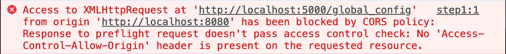


Indica un problema de CORS que significa, por sus siglas en español, Intercambio de Recursos de Origen Cruzado. Es una **medida de seguridad de los backend para que no cualquier cliente, o cualquier front-end, realice consultas al mismo**.

El backend debe permitir explícitamente que un cliente haga consultas, de lo contrario rechazará las mismas.

Habilita CORS instalando su respectiva dependencia con npm install cors y realizando la importación de la misma.

```javascript
// Importamos CORS
const cors = require('cors');

// Activamos CORS
app.use(cors());
```

De esta forma, el backend está listo para recibir consultas y el front-end podrá obtener los datos y trabajar con los mismos.

### Conclusión

Acabas de dar tu primer paso en el desarrollo full-stack, o sea, en el desarrollo backend y front-end. ¡Felicidades!

Es solo el primer paso para integrar estos los dos mundos y poder visualizar en un front-end, los datos que el backend procesa o almacena en una base de datos.

## JSON y POST: mokepon online

**El intercambio de información entre un backend y un frontend** puede realizarse de varias formas. Será importante para ti como programador identificar cuándo utilizar cada uno de ellas.

### Notación de Objetos de Javascript

JSON, o *Javascript Object Notation* es un **estándar para la transferencia de datos entre dos sistemas**. Hoy en día, casi todos los protocolos de Internet funcionan por detrás con JSON cuando se trata de enviar y recibir información.

Su sintaxis es algo particular y puede causar confusión al principio. Comprendamos cómo se estructura un JSON y para qué nos servirá:

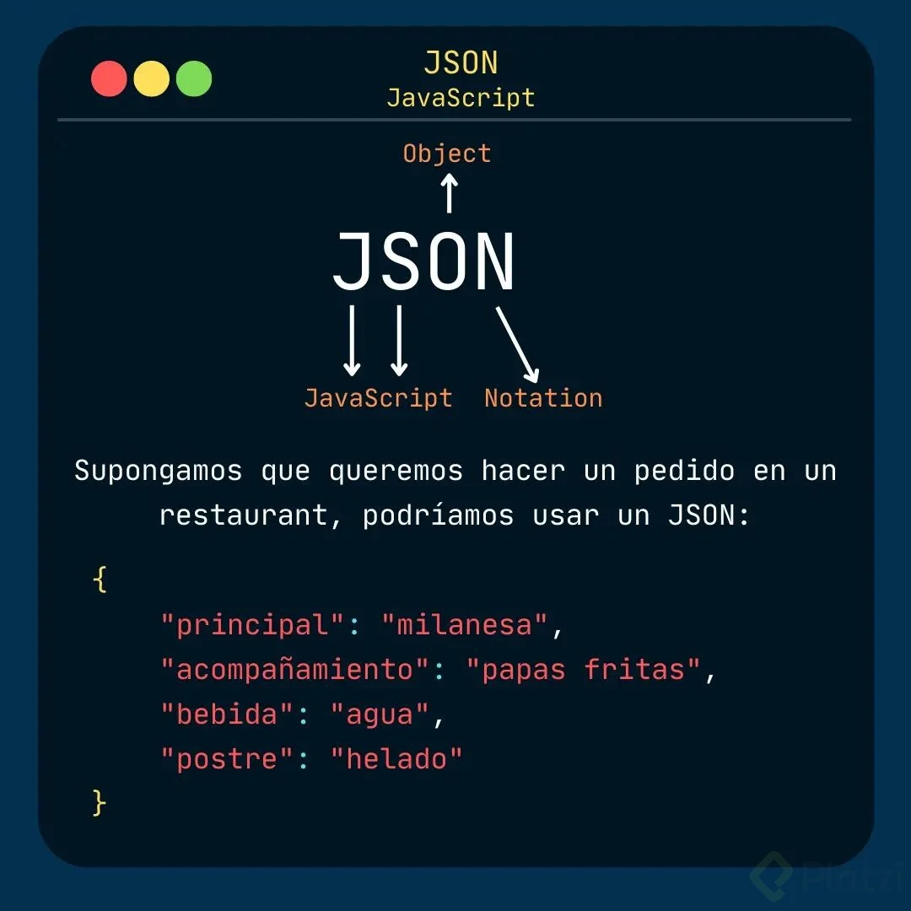

Un JSON está compuesto por claves para acceder a determinados valores.

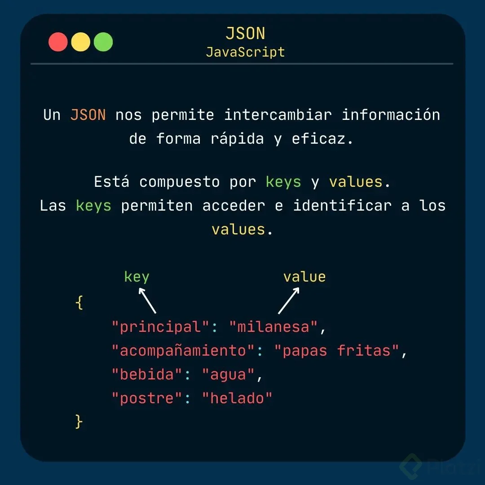

El formato JSON no deja de ser texto simple. Para acceder a su información, debemos “parsearlo” para convertir el mismo en un objeto y así poder obtener el valor de sus datos. Para lograr esto, empleamos la función propia de JavaScript JSON.parse(').

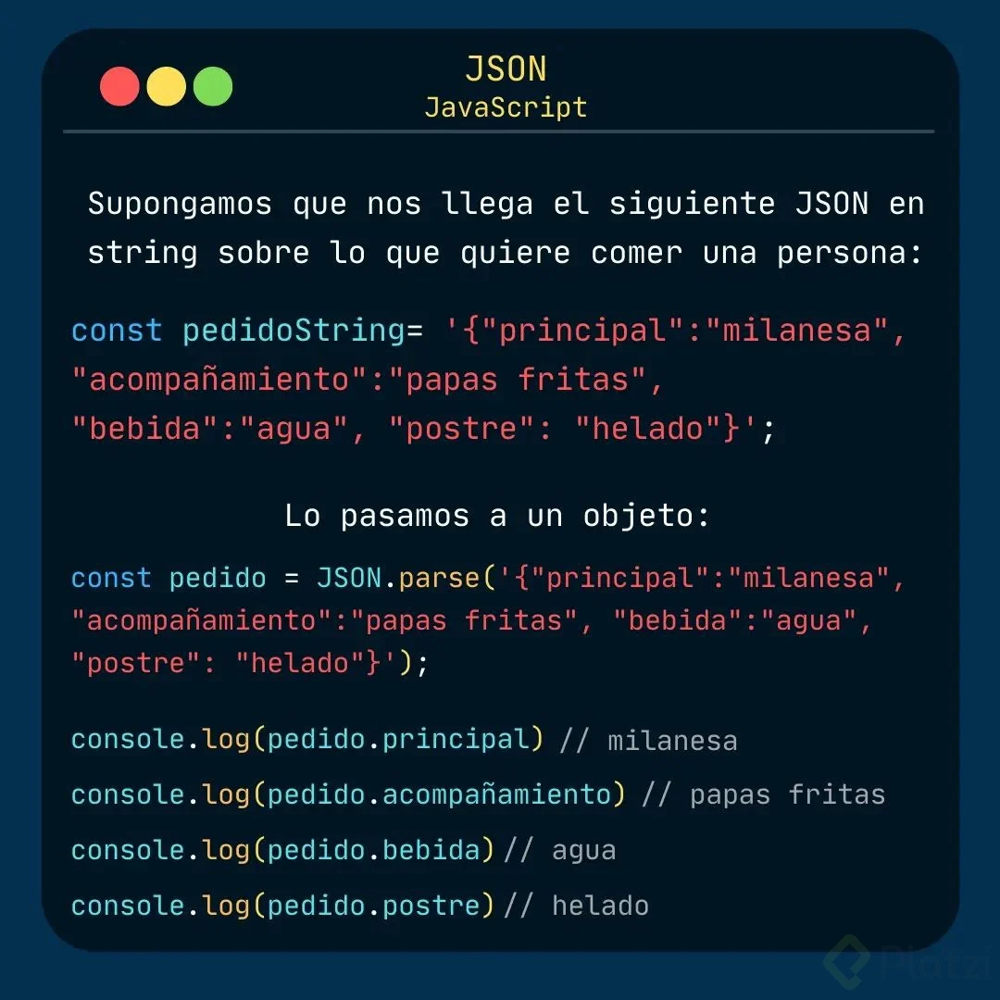

Un JSON es un objeto y dentro del mismo puede tener datos del tipo numéricos, texto, booleanos u otros objetos.

### Habilitando JSON en ExpressJS

Para enviar y recibir información en formato JSON con ExpressJS, debes activarlo de forma muy simple.

```javascript
// Importamos y creamos la aplicación de Express
const express = require('express');
const app = express();

// Activamos el formato JSON
app.use(express.json());
```

Con esta simple línea de código, tus endpoints ya puede procesar información en formato JSON.

### Envío de parámetros al backend

Otra manera de enviar información al backend es a través de los parámetros de URL. Los mismos componen y son parte de la URL, por lo tanto, serán obligatorios.

Presta atención al siguiente endpoint:

```javascript
// Creamos un endpoint del tipo POST
app.post('/datos/:id', (req, res) => {
    const id = req.param.id;      // Capturamos parámetros de URL
    const body = req.body;        // Capturamos el cuerpo de la solicitud
    console.log(id);
    console.log(body);
})
```

Observa el `:id`, el mismo espera recibir un identificador o un número de forma dinámica para utilizar en el código. Puedes capturar este dato por su nombre req.param.id. Si te das cuenta, req es un objeto que tiene un sub-objeto llamado `param` y dentro posee este el parámetro que envía el cliente desde el front-end.

```json
{
    "req": {
        "param": {
            "id": 123
        }
    }
}
```

Puedes enviar este parámetro de URL más información en el cuerpo de la solicitud en formato JSON desde el front-end con el siguiente `fetch`:

```javascript
const id = 123;
fetch(`http://localhost:3000/datos/${id}`, {    // Parámetro de URL
    method: 'post',          // Indicamos que el endpoint es un POST
    headers: {
      'Content-Type': 'application/json'        // Indicamos que estamos enviando un JSON
    },
    body: JSON.stringify({    // Creamos un JSON con la información para el backend
      datos: '12345'
    })
  })
  .then(response => response.json())
  .then(data => {
    console.log(data);        // Recibimos la respuesta del backend
  });
```

Los endpoints puede recibir un JSON en el *body* o el cuerpo de la solicitud. En el mismo puedes enviar tanta información como el backend necesite. Mientras que los parámetros de URL se suelen utilizar para enviar IDs o identificadores de una solo registro.

### Conclusión

Dos formas de enviar información al backend o recibirlas en el front-end, JSON y parámetros de URL. Poco a poco entenderás cuándo usar cada uno. Cuando se trata de mucha información o un solo dato.

Más allá del lenguaje de programación que estamos utilizando, en este caso Javascript junto con NodeJS y ExpressJS, todos funcionan exactamente de la misma manera. Si aprendes a hacerlo con un lenguaje, los conceptos te servirán por siempre para cualquier otro que quieras aprender.

pasos:

instalar cors: `npm install cors`

## Mokepones dinámicos en el mapa

A medida que tu aplicación crezca y tengas más y más código, habrá errores, es inevitable tenerlos. **Los errores en un software se denominan BUG y el proceso de identificarlos y solucionarlo lo conocemos como DEBUGGING**.

### Errores en una aplicación

Te habrás dado cuenta de que la palabra BUG significa Insecto o bicho en inglés. Este término se originó en el siglo XIX cuando se construían complicadas y enormes máquinas. A estas máquinas se les llegaban a meter bichos (BUGS) y estorbaban el movimiento de alguna de sus piezas haciendo que fallaran.

El término Bug comenzó a popularizarse en los años '40 cuando operadores de una gran máquina encontraron una polilla atascada en el interior de la misma.


Pegaron el bicho a un reporte explicando los motivos de los fallos de la máquina y desde entonces **decimos “bug” cuando nuestra aplicación tiene un error**.

### Proceso de solución de bugs

Hay diversos tipos de bugs dependiendo la gravedad del error que esté causando en un sistema. El proceso de identificar los mismos y solucionarlos es conocido como “Debug” o “Debuging”.

Las [herramientas para desarrolladores](https://platzi.com/cursos/devtools/ "herramientas para desarrolladores") de los navegadores serán tu mejor aliado y te darán mucha información para localizar un fallo y solucionarlo.

### Conclusión

Bug y Debug, dos términos del cual oirás mucho al respecto a medida que te sumerjas en el mundo del desarrollo de software.

“Puedes demostrar la presencia de bugs en una aplicación, pero no puedes demostrar la ausencia de los mismos.” (Vuelve a leer esta frase). No es posible demostrar que un sistema funciona bien al 100%. Puede haber bugs en donde sea y por este motivo también existen profesionales expertos en encontrarlos denominados Testers.

Te toparás con bugs toda tu vida como programador. Aprender a debuguear de acuerdo al lenguaje o a la tecnología que estés utilizando te permitirá solucionar los mismos.

## Optimizando el mapa del juego

Una aplicación utiliza datos de diversas fuentes y tipos y a medida que esta crece, utilizará cada vez más. Conocer diversas **herramientas para manipular la información** te servirá para tomar decisiones sobre cuál utilizar dependiendo la necesidad.

### Manipulación de arrays en Javascript

Ya sabes lo que es un array, un conjunto de datos que pueden o no ser del mismo tipo.

[Los arrays permiten muchas operaciones](https://platzi.com/cursos/arrays/ "Los arrays permiten muchas operaciones") como la obtención de su longitud con `arr.length` o recorrer cada elemento con **arr.foreach()**. Veamos una serie de otras funciones que te serán muy útiles de ahora en adelante.

**Map**: La función `arr.map()` permite, además de recorrer cada elemento de un array, devolver otro array modificado a partir del original.

```javascript
const arr = [1, 2, 3, 4, 5];
const new_arr = arr.map(e => {
    // Sumamos 1 a los elementos pares
    if (e % 2 == 0)
        return e + 1;
    else
        return e;
});
console.log(new_arr);    // [1, 3, 3, 5, 5]
```

**Filter**: La función `arr.filter()` permite recorrer y filtrar elementos de un array para obtener un sub-array con menos cantidad de elementos a partir de una condición lógica.

```javascript
const arr = [1, 2, 3, 4, 5];
const new_arr = arr.filter(e => {
    // Devolvemos solo los elementos pares
    if (e % 2 == 0)
        return true;
});
console.log(new_arr);    // [2, 4]
```

*Map y Filter* son solo las dos primeras funciones de Javascript para manipular arrays que tienes que conocer. Poco a poco irás conociendo otras. Hasta el momento, practica creando arrays de datos y comprendiendo cómo funcionan estas.

Estas funciones son propias de Javascript y puedes utilizarlas tanto en el backend como en el front-end. En el futuro, podrás descubir herramientas similares de manipulación de datos para otros lenguajes de programación.

## Batalla entre jugadores

Te encuentras muy cerca de finalizar tu primer backend y tu primera aplicación completa. ¡Solo un esfuerzo más!

### El último esfuerzo

Si tu proyecto aún no funciona como debe, te recomiendo realizar una comparación con [el código de los profesores](https://github.com/platzi/curso-programacion-basica/tree/81-consumiendo-api-ataques-enemigo "el código de los profesores") que lo crearon originalmente. También puedes compartir y buscar ayuda en la sección de comentarios.

Notarás que el código fuente se encuentra alojado en una plataforma llamada [GitHub que utiliza un software llamado Git](https://platzi.com/cursos/git-github/ "GitHub que utiliza un software llamado Git"). **Git será uno de tus próximos pasos en el mundo de la programación** y GitHub es una “red social para programadores”. La misma te permite llevar un control de versiones del código fuente y es la herramienta perfecta para guardar tu código.

Te tocará aprender Git en el futuro. De momento, concentra tu energía en finalizar tu primera aplicación. Solo falta desarrollar unos endpoints más para completar el videojuego.

## Consumiendo la API de ataques del enemigo

Si te encuentras aquí, es porque acabas de finalizar tu primer proyecto de software. ¡Felicidades! Hagamos un repaso juntos sobre lo que consiste el desarrollo backend.

### Repaso del desarrollo backend

A lo largo de estas últimas clases, has desarrollado el backend de tu aplicación y has aprendido todos los siguientes conceptos:

- ¿Qué es un backend?
- Diferencias backend y front-end
- Arquitectura cliente/servidor
- Lenguajes de backend: NodeJS y NPM
- Interfaces de línea de comandos
- Servidor web local con ExpressJS
- HTTP y tipos de solicitudes
- API, URI, URL, URN
- Transferencia de información y JSON

Mucha nueva información para ti. Te aseguro que todo lo visto en este curso no deja de ser la base del mundo de la programación y dentro poco tiempo serán temas triviales de todos los días y muy fáciles de comprender.

Repasa cada tema que no recuerdes. La mejor forma de aprender algo es explicarlo. Intenta explicarle a un amigo o familiar qué es HTTP, o cuáles son las diferencias entre un backend y un frontend.

Fueron más de 80 clases en total a lo largo de este curso para desarrollar tu videojuego. Ya solo queda probar el mismo en la siguiente clase.

[GitHub - platzi/curso-programacion-basica at 81-consumiendo-api-ataques-enemigo](https://github.com/platzi/curso-programacion-basica/tree/81-consumiendo-api-ataques-enemigo)