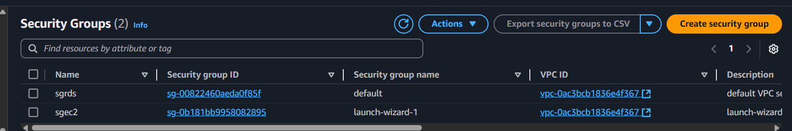
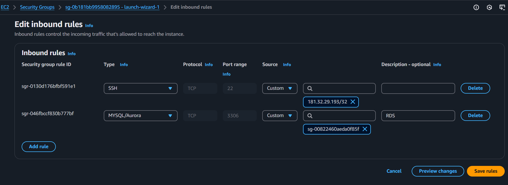
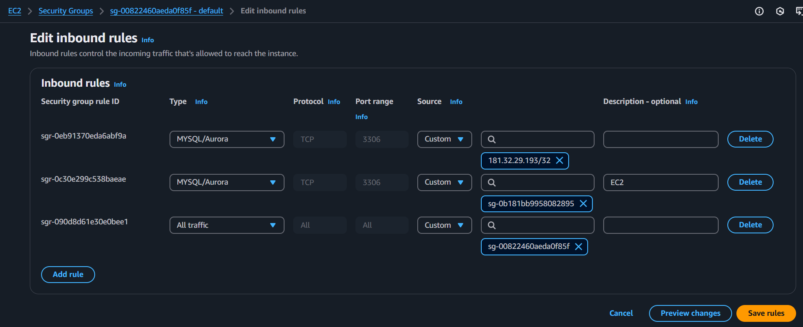
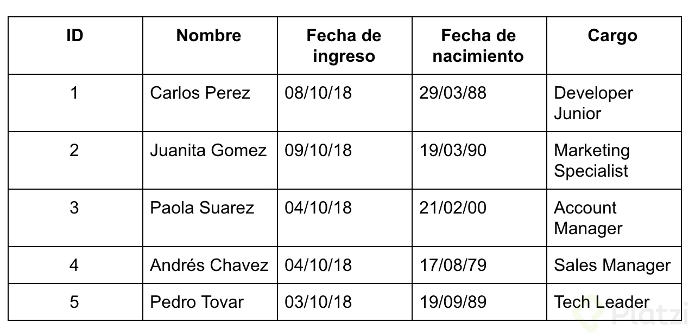
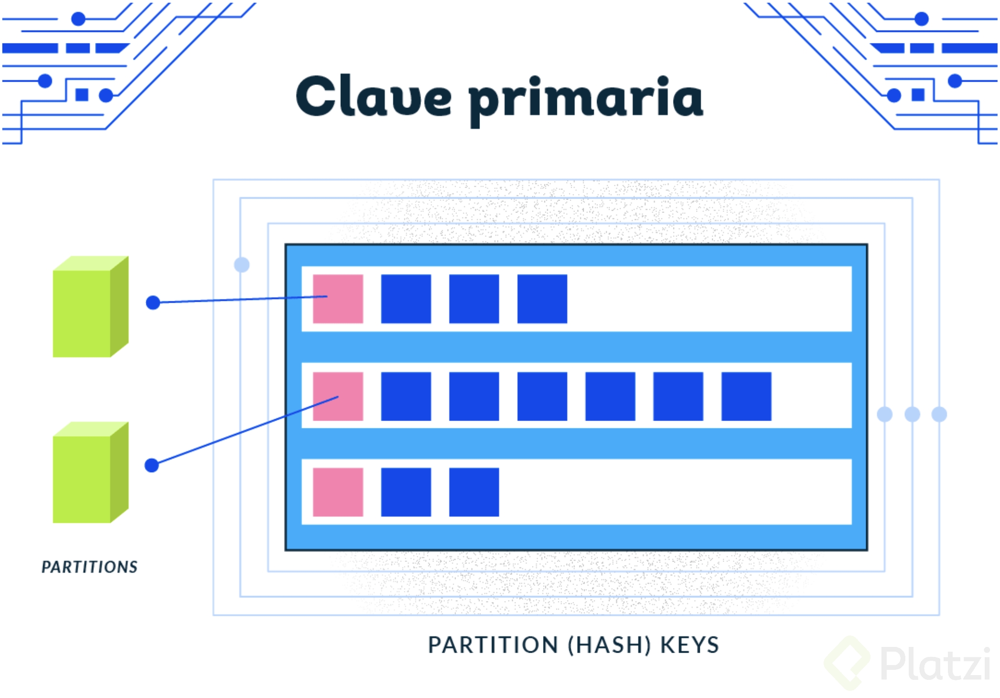
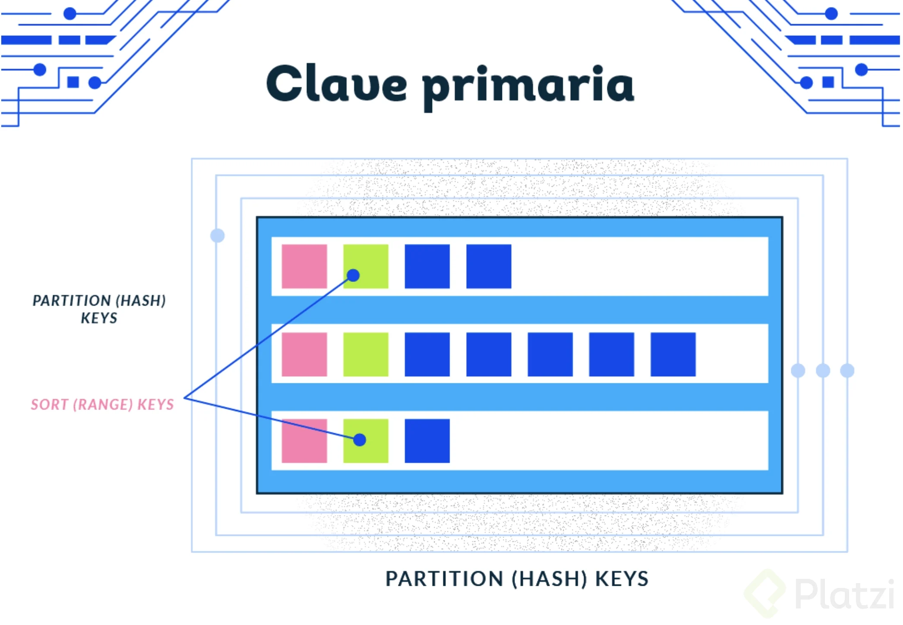
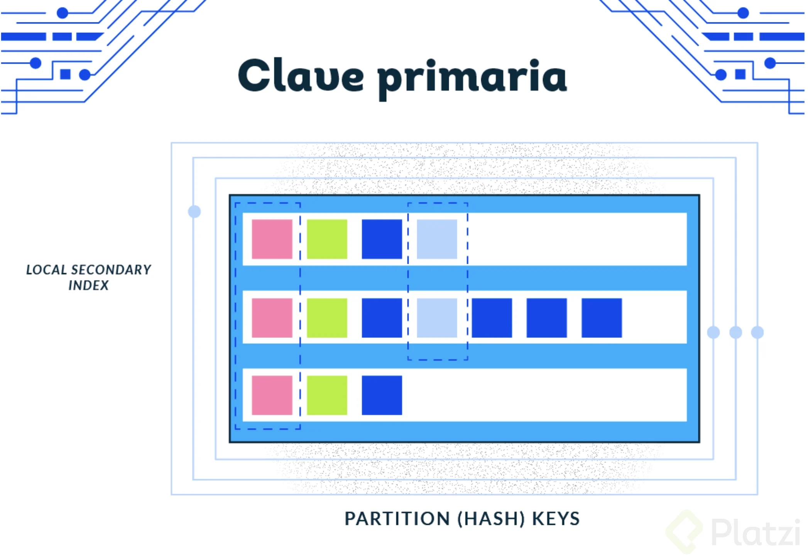
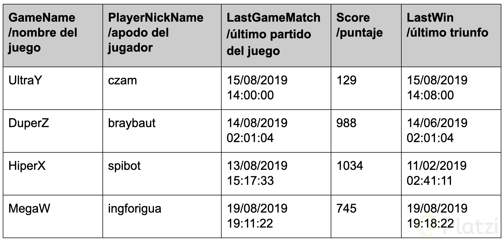

# Curso Práctico de Bases de Datos en AWS

## Qué aprenderás sobre bases de datos en AWS

En **AWS**, aprenderás sobre diferentes tipos de **bases de datos** según el caso de uso y las necesidades de escalabilidad, rendimiento y administración. Aquí te dejo un resumen de los principales conceptos y servicios:

### **1️⃣ Tipos de bases de datos en AWS**  
AWS ofrece bases de datos **relacionales y no relacionales**, optimizadas para distintos casos de uso:

✅ **Bases de datos relacionales (SQL):**  
   - **Amazon RDS (Relational Database Service)** → Servicio administrado para bases como **MySQL, PostgreSQL, MariaDB, SQL Server y Oracle**.  
   - **Amazon Aurora** → Base de datos relacional escalable y de alto rendimiento compatible con **MySQL y PostgreSQL**.  

✅ **Bases de datos NoSQL:**  
   - **Amazon DynamoDB** → Base de datos NoSQL de clave-valor altamente escalable.  
   - **Amazon DocumentDB** → Base de datos para documentos compatible con **MongoDB**.  
   - **Amazon ElastiCache** → Bases de datos en memoria para caching con **Redis y Memcached**.  

✅ **Bases de datos especializadas:**  
   - **Amazon Redshift** → Almacén de datos (Data Warehouse) para análisis de grandes volúmenes de información.  
   - **Amazon Neptune** → Base de datos de grafos para relaciones complejas (como redes sociales).  
   - **Amazon Timestream** → Base de datos de series temporales para IoT y análisis de datos en tiempo real.  
   - **Amazon QLDB (Quantum Ledger Database)** → Base de datos inmutable para registros contables y auditorías.

### **2️⃣ Qué aprenderás sobre bases de datos en AWS**  

📌 **1. Creación y administración de bases de datos**  
   - Configurar y desplegar bases de datos con **Amazon RDS, Aurora y DynamoDB**.  
   - Elegir entre bases relacionales y NoSQL según el caso de uso.  

📌 **2. Seguridad y encriptación**  
   - Control de accesos con **IAM, roles y políticas**.  
   - Encriptación de datos en tránsito y en reposo con **AWS KMS y SSL/TLS**.  

📌 **3. Replicación y alta disponibilidad**  
   - Configurar **Multi-AZ y Read Replicas** en RDS y Aurora.  
   - Uso de **DynamoDB Streams** y **Cross-Region Replication**.  

📌 **4. Backup y recuperación**  
   - Configurar backups automáticos y snapshots en **RDS, Aurora y DynamoDB**.  
   - Restauración de bases de datos en caso de fallos.  

📌 **5. Monitoreo y optimización**  
   - Uso de **CloudWatch** para métricas y alertas.  
   - Análisis de consultas con **Performance Insights en RDS**.  
   - Escalabilidad automática en DynamoDB.  

📌 **6. Integración con otros servicios de AWS**  
   - Uso de **Lambda** para eventos en bases de datos.  
   - Integración con **AWS Glue** para ETL y análisis de datos.  
   - Uso de **Athena** para consultas en **S3** sin necesidad de servidores.

### **3️⃣ Casos de uso comunes**  
📌 Aplicaciones web escalables con RDS o Aurora.  
📌 Bases NoSQL para aplicaciones en tiempo real con DynamoDB.  
📌 Almacenes de datos para análisis de grandes volúmenes con Redshift.  
📌 Bases de datos en memoria con ElastiCache para mejorar el rendimiento.  
📌 Bases de datos de grafos para modelar relaciones complejas con Neptune.

### **📌 Conclusión:**  
AWS ofrece una gran variedad de bases de datos según el caso de uso. Aprenderás a elegir la mejor opción, configurarla, asegurarla, hacer respaldos, monitorearla y optimizar su rendimiento. 🚀

**Resumen**

Bienvenido al **Curso de Bases de Datos en AWS** de Platzi. Vamos a aprender sobre los servicios de bases de datos relacionales en AWS, principalmente el servicio de **RDS**, y sobre el servicio de bases de datos no relacionales en AWS: **DynamoDB**.

Esta vez nuestro profesor será Carlos Andrés Zambrano, que tiene más de 4 años de experiencia trabajando con AWS.

## Características de Relational Database Service (RDS)

Amazon **RDS** es un servicio administrado de base de datos relacional que facilita la configuración, operación y escalado de bases de datos en la nube de AWS. Soporta varios motores de bases de datos populares y ofrece alta disponibilidad, seguridad y escalabilidad.

### **🔹 1. Compatibilidad con motores de bases de datos**  
AWS RDS soporta múltiples motores de bases de datos:  
✅ **Amazon Aurora** (compatible con MySQL y PostgreSQL)  
✅ **MySQL**  
✅ **PostgreSQL**  
✅ **MariaDB**  
✅ **SQL Server**  
✅ **Oracle Database**

### **🔹 2. Administración simplificada**  
💡 **RDS se encarga de tareas administrativas**, como:  
🔹 Instalación y configuración del motor de base de datos.  
🔹 Aplicación de parches de seguridad.  
🔹 Administración de backups y snapshots automáticos.  
🔹 Recuperación ante fallos con Multi-AZ.

### **🔹 3. Escalabilidad y rendimiento**  
📌 **Escalado vertical**: Puedes aumentar el tamaño de la instancia con mayor RAM y CPU.  
📌 **Escalado horizontal**: Usar **Read Replicas** para mejorar el rendimiento de lectura.  
📌 **Almacenamiento escalable**: Permite **Auto Scaling de almacenamiento** sin interrupciones.  
📌 **Optimización con caché**: Compatible con Amazon **ElastiCache** para mejorar la velocidad de consultas.

### **🔹 4. Alta disponibilidad y replicación**  
🔹 **Multi-AZ (Alta disponibilidad)**: Mantiene una réplica sincronizada en otra zona de disponibilidad (AZ).  
🔹 **Read Replicas**: Permite crear copias solo de lectura para distribuir la carga de consultas.  
🔹 **Respaldo automático y snapshots**: Se pueden restaurar bases de datos fácilmente.

### **🔹 5. Seguridad y cumplimiento**  
🔹 **Cifrado de datos** con **AWS KMS** (en reposo y en tránsito con SSL/TLS).  
🔹 **Control de acceso** con **IAM** y políticas de seguridad.  
🔹 **Integración con AWS CloudTrail** para auditoría de accesos y eventos.  

### **🔹 6. Monitoreo y mantenimiento**  
🔹 **Amazon CloudWatch**: Permite rastrear métricas de rendimiento y configurar alertas.  
🔹 **Performance Insights**: Identifica consultas lentas y cuellos de botella en la base de datos.  
🔹 **RDS Proxy**: Mejora la administración de conexiones para bases de datos de alto tráfico.

### **🔹 7. Costos y modelo de pago**  
💰 **Pago por uso**: Se paga solo por lo que se consume, incluyendo:  
✅ Tipo y tamaño de la instancia.  
✅ Almacenamiento y transferencia de datos.  
✅ Uso de **Read Replicas** y Multi-AZ.  

También existe el **modo serverless con Amazon Aurora**, que escala automáticamente según la demanda.

### **📌 Conclusión**  
AWS RDS es una solución potente y administrada para bases de datos relacionales, ideal para empresas que buscan alto rendimiento, seguridad y escalabilidad sin preocuparse por la administración manual. 🚀

**Resumen**

RDS (Relational Database Service) es un servicio de AWS enfocado a bases de datos relacionales con compatibilidad a 6 motores de bases de datos: Amazon Aurora, MySQL, MariaDB, PostgreSQL, Oracle y Microsoft SQL Server, cada uno con sus características, integraciones y limitaciones.

Entre sus características principales podemos destacar los **backups automáticos** con un tiempo de retención de hasta 35 días, es decir, si encontramos algún problema con nuestras bases de datos podemos restablecerlas a la hora, minuto y segundo que necesitemos dentro del periodo de retención. Recuerda que por defecto este periodo es de 7 días. También tenemos la opción de hacer **backups manuales**, podemos tomar **snapshots** manuales en cualquier momento si nuestra aplicación lo necesita. Además, AWS por defecto tomará un snapshot final de nuestras bases de datos antes de eliminarlas, así podremos restablecerla si tenemos algún inconveniente.

Todas las bases de datos relacionales utilizan un **sistema de almacenamiento**, si la carga de lectura y escritura son constantes, el sistema General Purpose funciona muy bien, sin embargo, podemos utilizar el sistema Provisioned Storage cuando requerimos de altas cantidades de consumo y operaciones de disco.

RDS es un sistema completamente administrado, esto quiere decir que AWS reduce nuestra carga operativa automatizando muchas tareas de nuestra base de datos, por ejemplo, las actualizaciones. A nivel de seguridad contamos con muchas opciones, una de ellas es la posibilidad de encriptar nuestra base de datos para que solo nosotros y las personas o roles que especifiquemos tengan acceso.

También tenemos integración con otros servicios de AWS, por ejemplo, IAM para administrar a los usuarios, roles, grupos y políticas de conexión a la base de datos por medio de tokens con máximo 20 conexiones por segundo (recomendado para escenarios de prueba), o la integración de Enhanced monitoring para hacer monitoreo en tiempo real nuestras bases de datos (recuerda que además de subir el precio, no está disponible para instancias small).

**Lecturas recomendadas**

[https://docs.aws.amazon.com/rds/index.html](https://docs.aws.amazon.com/rds/index.html)

## Desplegando nuestra primer base de datos

Crear una base de datos en **Amazon RDS** es un proceso sencillo que se puede hacer a través de la **Consola de AWS**, la **CLI** o **Terraform**. A continuación, veremos el proceso paso a paso utilizando la **Consola de AWS**.

### **🛠 Paso 1: Iniciar Sesión en AWS**
1. Ingresa a la consola de AWS: [AWS Console](https://aws.amazon.com/console/)
2. En el **buscador**, escribe **RDS** y selecciona **Amazon RDS**.

### **🛠 Paso 2: Crear una Nueva Base de Datos**
1. En la página de Amazon RDS, haz clic en **"Crear base de datos"**.
2. Selecciona el **método de creación**:
   - **Estándar** (personalizado)
   - **Facilitado** (configuración automática para pruebas)

### **🛠 Paso 3: Elegir el Motor de Base de Datos**
AWS RDS soporta varios motores, elige el que necesites:
✅ **Amazon Aurora** (MySQL/PostgreSQL compatible)  
✅ **MySQL**  
✅ **PostgreSQL**  
✅ **MariaDB**  
✅ **Oracle**  
✅ **SQL Server**  

*Para este ejemplo, seleccionaremos **MySQL**.*

### **🛠 Paso 4: Configurar la Instancia**
1. **Versión del motor**: Elige la versión más reciente recomendada.  
2. **Identificador de la base de datos**: Escribe un nombre único, por ejemplo: `mi-base-datos`.  
3. **Autenticación**:
   - Usuario administrador: `admin`
   - Contraseña: Elige una fuerte o permite que AWS la genere. 

### **🛠 Paso 5: Configuración de la Instancia**
1. **Clase de instancia** (elige según los recursos que necesitas):  
   - `db.t3.micro` (gratis en el **Free Tier**)  
   - Instancias más grandes para producción (`db.m5.large`, `db.r5.large`, etc.).  
2. **Almacenamiento**:  
   - **General Purpose SSD (gp3/gp2)** – Recomendado para cargas estándar.  
   - **Provisioned IOPS (io1/io2)** – Para alta velocidad de E/S.  
   - **Magnetic (st1/sc1)** – Para almacenamiento barato y accesible.  
3. **Tamaño de almacenamiento**: 20 GB (mínimo, puede aumentar automáticamente).

### **🛠 Paso 6: Configurar Alta Disponibilidad y Conectividad**
1. **Alta Disponibilidad (Multi-AZ)**:  
   - **Activado** para producción.  
   - **Desactivado** para pruebas y entornos de desarrollo.  
2. **VPC y Subredes**:  
   - Selecciona una **VPC** o usa la predeterminada.  
   - Habilita **acceso público** si deseas conectarte desde fuera de AWS.  
3. **Grupo de seguridad**:  
   - Crea un nuevo grupo de seguridad o usa uno existente.  
   - Permite tráfico en el **puerto 3306** (para MySQL) desde IPs seguras.

### **🛠 Paso 7: Configurar Backups y Monitoreo**
1. **Backups automáticos**:  
   - Define el **período de retención** (1-35 días).  
   - Habilita **copias automáticas** en otra región si es necesario.  
2. **Monitoreo**:  
   - Activa **Amazon CloudWatch** para rastrear métricas.  
   - Habilita **Performance Insights** si deseas un análisis detallado.

### **🛠 Paso 8: Crear la Base de Datos**
1. **Revisa todas las configuraciones**.  
2. **Haz clic en "Crear base de datos"**.  
3. AWS desplegará la instancia (toma unos minutos).

### **🛠 Paso 9: Conectar a la Base de Datos**
Cuando la base de datos esté activa:  
1. Ve a la consola de RDS → **Instancias**.  
2. Copia el **endpoint** de conexión (algo como `mi-base.cdgk3m1w.us-east-1.rds.amazonaws.com`).  
3. Usa **MySQL Workbench**, **DBeaver** o la **línea de comandos** para conectarte:  

```bash
mysql -h mi-base.cdgk3m1w.us-east-1.rds.amazonaws.com -u admin -p
```

### **🎯 ¡Listo! Ya tienes tu primera base de datos en AWS RDS.**  
Puedes probar creando una tabla y agregando datos en MySQL:

```sql
CREATE DATABASE mi_app;
USE mi_app;

CREATE TABLE usuarios (
    id INT AUTO_INCREMENT PRIMARY KEY,
    nombre VARCHAR(100),
    email VARCHAR(100) UNIQUE
);

INSERT INTO usuarios (nombre, email) VALUES ('Mario Vargas', 'mario@example.com');
SELECT * FROM usuarios;
```

### **📌 Conclusión**
AWS RDS es una excelente opción para manejar bases de datos en la nube sin preocuparse por la infraestructura. Con este proceso, ya puedes empezar a usar tu base de datos de manera segura, escalable y eficiente. 🚀

### Resumen

### ¿Cómo desplegar una base de datos en Amazon RDS?

Desplegar una base de datos en Amazon RDS te permitirá aprovechar la escalabilidad y flexibilidad que ofrece la nube de AWS. En este tutorial, realizaremos un recorrido por el proceso para desplegar tu primera base de datos de cero, entendiendo las distintas opciones y configuraciones necesarias para adaptar una base de datos a tus necesidades.

### ¿Cuál es el primer paso?

Para desplegar una base de datos en RDS, lo primero que necesitamos es acceder a la consola de AWS. Dentro de ésta, seleccionaremos el servicio de RDS. Una vez dentro, haremos clic en "Create database" para iniciar el proceso. Podrás observar un panel que muestra los distintos motores de bases de datos disponibles:

- MySQL
- MariaDB
- PostgreSQL
- Oracle
- SQL Server
- Amazon Aurora

### ¿Cómo elegir el motor de base de datos adecuado?

Cada motor de base de datos tiene características distintas que se ajustan a diferentes necesidades. Por ejemplo:

- **MySQL**: Soporta bases de datos hasta 32 TB y ofrece servicios como backups automáticos y réplicas de lectura.
- **MariaDB y PostgreSQL**: Tienen características similares, pero el proceso de selección cambia según el licenciamiento que necesites.
- **Oracle y SQL Server**: Ofrecen distintas versiones (Enterprise, Standard) cada una con diferentes funcionalidades y precios.

### ¿Qué sucede al seleccionar MySQL?

Al elegir MySQL, AWS recomienda utilizar Amazon Aurora para bases de datos de producción debido a su alto rendimiento y disponibilidad. Sin embargo, en esta demostración, procederemos con MySQL para la práctica.

- **Versión del motor**: Podrás elegir entre diferentes versiones del motor de base de datos.
- **Instancia**: AWS sugerirá una instancia apta para la capa gratuita (por defecto db.t2.micro), útil para pruebas y desarrollo.

### Configuración de la base de datos

Al configurar la base de datos, surgen varias opciones críticas:

- **Tipo de despliegue**: Puedes elegir despliegues simples o multi-AZ para alta disponibilidad.
- **Almacenamiento**: Selecciona entre almacenamiento general o provisioned IOPS para un rendimiento específico.
- **Identificadores**: Define un nombre para la instancia y las credenciales para acceder a la base de datos (username y password).

### VPC y configuración de red

Aquí decidirás si tu base de datos será accesible públicamente o no, realizando una configuración en una Virtual Private Cloud (VPC):

Acceso público: No se recomienda por seguridad, pero puedes configurarlo para pruebas.
Grupo de seguridad: Se puede crear uno nuevo o usar uno existente para definir reglas de acceso.

### Otras características avanzadas

- **Encriptación**: Está disponible con una instancia adecuada. Puedes habilitarla y seleccionar una clave KMS.
- **Monitoreo y mantenimiento**: Activa el monitoreo en tiempo real y define ventanas de mantenimiento según se requiera.

Después de revisar y ajustar todas las configuraciones, procederemos a crear la base de datos haciendo clic en "Create database". Esto marca el despliegue exitoso de tu base de datos en RDS con características de alta disponibilidad y ajustes personalizados según tus necesidades. ¡Buena suerte!

## Conexión gráfica a nuestra base de datos

Después de desplegar nuestra base de datos en **Amazon RDS**, podemos conectarnos usando una herramienta gráfica. Algunas opciones populares son:  

✅ **MySQL Workbench** (para MySQL y MariaDB)  
✅ **DBeaver** (compatible con MySQL, PostgreSQL, Oracle, SQL Server, etc.)  
✅ **PgAdmin** (para PostgreSQL)  
✅ **SQL Server Management Studio (SSMS)** (para SQL Server)  

A continuación, te mostraré cómo conectar gráficamente una base de datos **MySQL en RDS** usando **MySQL Workbench**.

### **🛠 Paso 1: Obtener las Credenciales de Conexión**
1. **Abre la Consola de AWS** y navega a **Amazon RDS**.  
2. **Selecciona tu base de datos** en la lista de instancias.  
3. **Copia el "Endpoint"**, que es la URL para conectarte.  
   - Ejemplo: `mi-base.cdgk3m1w.us-east-1.rds.amazonaws.com`  
4. Asegúrate de tener:  
   - **Usuario administrador:** `admin` (o el que configuraste)  
   - **Contraseña:** (la que definiste al crear la base)  
   - **Puerto:** `3306` (para MySQL)

### **🛠 Paso 2: Configurar el Acceso en el Grupo de Seguridad**
Si la base de datos está **en una VPC privada**, debes permitir conexiones:  
1. **Ir a "EC2" → "Grupos de Seguridad"**.  
2. **Selecciona el grupo de seguridad asignado a RDS**.  
3. **Edita las reglas de entrada** y **agrega una nueva regla**:
   - **Tipo:** MySQL/Aurora  
   - **Protocolo:** TCP  
   - **Puerto:** `3306`  
   - **Fuente:** `Tu dirección IP` o `0.0.0.0/0` *(para acceso público, no recomendado en producción)*.

### **🛠 Paso 3: Descargar e Instalar MySQL Workbench**
1. **Descargar** desde: [MySQL Workbench](https://dev.mysql.com/downloads/workbench/).  
2. Instalar y abrir la aplicación.

### **🛠 Paso 4: Crear la Conexión en MySQL Workbench**
1. **Abrir MySQL Workbench**.  
2. En la pestaña **"Database"** → **"Manage Connections"** → **"New"**.  
3. Configurar la conexión:  
   - **Connection Name:** `AWS-RDS-MySQL`  
   - **Connection Method:** `Standard (TCP/IP)`  
   - **Hostname:** `mi-base.cdgk3m1w.us-east-1.rds.amazonaws.com`  
   - **Port:** `3306`  
   - **Username:** `admin`  
   - **Password:** Click en **"Store in Vault"** para guardarla.  
4. **Haz clic en "Test Connection"**.  

Si la conexión es exitosa, MySQL Workbench confirmará el acceso. 

### **🛠 Paso 5: Explorar y Administrar la Base de Datos**
1. En la pestaña de conexiones, selecciona **AWS-RDS-MySQL**.  
2. Se abrirá el panel con tu base de datos.  
3. Puedes ejecutar consultas, administrar tablas y visualizar datos gráficamente.  

Ejemplo:  
```sql
SHOW DATABASES;
USE mi_app;
SELECT * FROM usuarios;
```

### **🎯 Conclusión**
Ahora puedes gestionar tu base de datos en **Amazon RDS** de forma gráfica usando **MySQL Workbench**. Esta conexión facilita la administración, creación de tablas y consultas de datos sin necesidad de usar la línea de comandos. 🚀

### Resumen

En esta clase vamos a conectarnos a la base de datos que creamos en la clase anterior usando la herramienta *MySQL Workbench*, que nos permite ejecutar y visualizar nuestros comandos muy fácilmente.

Cuando utilizamos el servicio RDS con el motor de MySQL podemos crear multiples bases de datos con un solo *endpoint* (una sola conexión), ya que entre las características de este motor encontramos la cantidad de bases de datos ilimitada. Obviamente, debemos tener en cuenta que nuestras instancias deberían soportar la cantidad de bases de datos que vamos a utilizar, y las herramientas de monitoreo nos pueden ayudar a medir esta relación de tamaño y rendimiento.

Recuerda que si necesitamos un permiso de usuarios diferente para cada base de datos vamos a necesitar configuraciones diferentes en las keys (*llaves de acceso*) de nuestra instancia.

Nota: si la base de datos no conecta toca ir al grupo de seguridad y ver si esta creada:

| Type | Protocol | Port Range | Source | Description |
|---|---|---|---|---|
| MYSQL/Aurora | TCP | 3306 | MY IP | Conect DB |

**Lecturas recomendadas**

[MySQL :: MySQL Workbench](https://www.mysql.com/products/workbench/)

## Creación de una tabla 

Después de conectarnos a nuestra base de datos en **Amazon RDS**, podemos crear tablas para almacenar información estructurada.  

### **🛠 1. Seleccionar la Base de Datos**  
Antes de crear la tabla, seleccionamos la base de datos donde se almacenará:  
```sql
USE mi_base_de_datos;  -- Solo para MySQL/MariaDB
```
En **PostgreSQL**, el comando sería:  
```sql
\c mi_base_de_datos;
```

### **🛠 2. Crear la Tabla**  
A continuación, creamos una tabla de ejemplo llamada **usuarios** con los siguientes campos:  

- `id` (clave primaria, autoincremental)  
- `nombre` (texto, máximo 100 caracteres)  
- `email` (texto, único)  
- `fecha_registro` (fecha y hora de registro)  

#### **📌 Código para MySQL y PostgreSQL**
```sql
CREATE TABLE usuarios (
    id SERIAL PRIMARY KEY,  -- Autoincremental
    nombre VARCHAR(100) NOT NULL,
    email VARCHAR(150) UNIQUE NOT NULL,
    fecha_registro TIMESTAMP DEFAULT CURRENT_TIMESTAMP
);
```

#### **📌 Código para SQL Server**
```sql
CREATE TABLE usuarios (
    id INT IDENTITY(1,1) PRIMARY KEY,  -- Autoincremental
    nombre NVARCHAR(100) NOT NULL,
    email NVARCHAR(150) UNIQUE NOT NULL,
    fecha_registro DATETIME DEFAULT GETDATE()
);
```

### **🛠 3. Verificar la Creación de la Tabla**
Para asegurarnos de que la tabla fue creada correctamente, podemos ejecutar:  

```sql
SHOW TABLES;  -- MySQL
SELECT table_name FROM information_schema.tables WHERE table_schema = 'mi_base_de_datos';  -- PostgreSQL
EXEC sp_tables;  -- SQL Server
```

Para ver la estructura de la tabla:  
```sql
DESCRIBE usuarios;  -- MySQL
SELECT column_name, data_type FROM information_schema.columns WHERE table_name = 'usuarios';  -- PostgreSQL
EXEC sp_columns 'usuarios';  -- SQL Server
```

### **🛠 4. Insertar Datos de Prueba**
Después de crear la tabla, podemos insertar algunos registros de prueba:  
```sql
INSERT INTO usuarios (nombre, email) VALUES 
('Mario Vargas', 'mario@example.com'),
('Ana López', 'ana@example.com');
```

### **🛠 5. Consultar los Datos**
Para ver los registros insertados, usamos:  
```sql
SELECT * FROM usuarios;
```

### **🎯 Conclusión**
Ahora tenemos una tabla creada y lista para almacenar datos en **AWS RDS**. 🚀

### Resumen

### ¿Cómo crear una tabla en MySQL Workbench?
MySQL Workbench es una herramienta poderosa que simplifica el manejo y la gestión de bases de datos de manera gráfica. Crear tablas e ingresar datos nunca había sido más accesible. En esta guía, te mostraré cómo usar esta herramienta para crear una tabla llamada "trabajadores" y llenarla con información relevante.

### ¿Cómo añadir columnas a una tabla?

Para empezar, crea una nueva tabla haciendo clic derecho en "Tables" y seleccionando "Create Table". Pide un nombre, así que ponle "trabajadores". Luego, crea las columnas necesarias:

1. **ID de trabajadores**: de tipo entero.
2. **Nombre de trabajadores**: para almacenar nombres.
3. **Fecha de ingreso**: de tipo DATETIME.
4. **Fecha de nacimiento**: también de tipo DATE.
5. **Cargo**: un campo adicional para el puesto del trabajador.

Por defecto, la herramienta toma la columna ID de trabajadores como clave primaria, pero esto se puede modificar según tus necesidades.

### ¿Cómo se aplican cambios en la base de datos?

Después de definir las columnas, haz clic en "Apply". MySQL Workbench genera una consulta SQL automática que se puede ejecutar para implementar los cambios en la base de datos. Revisa y aplica estos cambios para crear realmente la tabla en el sistema.

### ¿Cómo se ingresa datos en la tabla?

Con la tabla creada, puedes visualizarla y empezar a introducir datos. Supongamos que deseas añadir un nuevo trabajador:

- **ID**: 1
- **Nombre**: Carlos
- **Fecha de ingreso**: 20/08/2018
- **Fecha de nacimiento**: 05/03/1988
- **Cargo**: Arquitecto

Completa estos datos y selecciona "Apply". MySQL ejecutará una consulta `INSERT INTO`, lo que asegura que los datos se guarden en la base de datos de manera segura.

### ¿Es posible usar comandos SQL directamente?

Además de la interfaz gráfica, MySQL Workbench permite ejecutar comandos SQL directamente en la consola. Esto es útil si prefieres escribir tus propias consultas o automatizar procesos de ingreso de datos.

### ¿Cuáles son las ventajas de usar la interfaz gráfica de MySQL Workbench?

La interfaz gráfica no solo simplifica el proceso de creación y gestión de tablas, sino que también facilita la configuración, visualización y manejo de múltiples bases de datos. Ideal para administradores de bases de datos que buscan eficiencia sin comprometer la funcionalidad.

### ¿Qué es importante recordar al usar MySQL Workbench?

- **Facilidad de acceso**: Ofrece una manera intuitiva de interactuar con bases de datos.
- **Variedad de funcionalidades**: Desde crear tablas hasta gestionar bases de datos completas.
- **Soporte de MySQL Server**: Totalmente integrado y optimizado para trabajar en este entorno.

Explora la herramienta y descubre cómo puede transformar tu experiencia en la gestión de bases de datos. Si eres principiante, considera este tu primer paso hacia un manejo más avanzado y eficiente de datos. ¡Sigue aprendiendo y expandiendo tus habilidades!

## Conexión por consola a nuestra base de datos

Para conectarnos a una base de datos en **Amazon RDS** desde la consola, seguimos los siguientes pasos según el motor de base de datos elegido. 

### **🛠 1. Obtener la Información de la Base de Datos**  
Desde la **Consola de AWS**:  
1. Ir a **RDS** → **Bases de datos**.  
2. Seleccionar la base de datos creada.  
3. Buscar el **Endpoint** (nombre del host) y el **puerto**.  
4. Asegurarse de que la base de datos permita conexiones remotas (ajustando **Grupos de Seguridad** si es necesario).

### **🛠 2. Conexión por Consola según el Motor de Base de Datos**  

### **🔹 MySQL o MariaDB**  
#### 📌 **Comando desde la terminal (Linux/Mac/WSL) o cmd (Windows)**  
```bash
mysql -h tu-endpoint-rds.amazonaws.com -P 3306 -u tu_usuario -p
```
Luego, ingresa tu contraseña cuando se solicite.

#### 📌 **Ejemplo con base de datos específica**
```bash
mysql -h tu-endpoint-rds.amazonaws.com -P 3306 -u tu_usuario -p tu_base_de_datos
```

### **🔹 PostgreSQL**  
#### 📌 **Instalar el Cliente de PostgreSQL si no lo tienes instalado**  
```bash
sudo apt install postgresql-client  # Ubuntu/Debian
brew install libpq  # macOS
```

#### 📌 **Comando de conexión**  
```bash
psql -h tu-endpoint-rds.amazonaws.com -p 5432 -U tu_usuario -d tu_base_de_datos
```
Luego, ingresa la contraseña cuando se solicite.

### **🔹 SQL Server**  
#### 📌 **Usando `sqlcmd` en Windows**  
```cmd
sqlcmd -S tu-endpoint-rds.amazonaws.com -U tu_usuario -P "tu_contraseña" -d tu_base_de_datos
```
Si `sqlcmd` no está disponible, puedes instalar **SQL Server Command Line Tools**.

### **🛠 3. Probar la Conexión**  
Si la conexión es exitosa, deberías poder ejecutar comandos SQL como:  

```sql
SELECT NOW();  -- PostgreSQL / MySQL
SELECT GETDATE();  -- SQL Server
```

### **🎯 Solución de Problemas**
✔ **Error de conexión**: Revisar reglas del **Grupo de Seguridad** en AWS para permitir conexiones desde tu IP.  
✔ **Acceso denegado**: Verificar usuario y contraseña.  
✔ **Puerto bloqueado**: Asegurar que el firewall local permita conexiones al puerto (3306, 5432, 1433 según el motor).  

Con esto, ¡ya estás conectado a tu base de datos en AWS RDS desde la consola! 🚀

**Resumen**

En esta clase vamos a conectarnos a nuestra base de datos por medio del bash de Linux. Para esto, debemos crear la instancia de un servidor de AWS con un grupo de seguridad que posteriormente vamos a configurar para que la base de datos y el servidor sean accesibles entre ellos.

El desafió de esta clase es identificar al menos 2 características de RDS que actualmente no tenemos en otros sistemas bases de datos.

**NOTA:** Parece que **Amazon Linux 2023** no tiene `mysql` en sus repositorios por defecto. Para instalar el cliente de MySQL en **Amazon Linux 2023**, prueba con los siguientes pasos:  

### 🔹 **1. Instalar `mysql` desde el repositorio correcto**  
Ejecuta este comando en tu instancia EC2:  
```bash
sudo yum install mysql-community-client
```
Si esto no funciona, intenta habilitar el repositorio correcto:  
```bash
sudo amazon-linux-extras enable mariadb10.5
sudo yum install mariadb
```
**Nota**: `mariadb` es compatible con MySQL y puede usarse como cliente para conectarse a bases de datos MySQL.

### 🔹 **2. Verificar la instalación**
Una vez instalado, verifica que el cliente de MySQL está disponible con:  
```bash
mysql --version
```

### 🔹 **3. Conectarte a tu Base de Datos en RDS**
Si la instalación es correcta, usa este comando para conectarte:  
```bash
mysql -h tu-endpoint-rds.amazonaws.com -P 3306 -u tu_usuario -p
```
Te pedirá la contraseña y luego estarás conectado.

Si sigues teniendo problemas, dime qué error exacto aparece para darte una solución más precisa. 🚀

**NOTA:**

SSH cambiar dato de grupo de seguridad



se nombran con cada uno el primero sgec2 que coresponde a la instacian de la maquina virtual en linux y se configura asi:




y luego el de la base de datos:



```bash
Windows PowerShell
Copyright (C) Microsoft Corporation. Todos los derechos reservados.

Instale la versión más reciente de PowerShell para obtener nuevas características y mejoras. https://aka.ms/PSWindows

PS C:\Users\celio> cd .\OneDrive\Escritorio\programación\platzi\CursoPracticodeBasesdeDatosenAWS\
PS C:\Users\celio\OneDrive\Escritorio\programación\platzi\CursoPracticodeBasesdeDatosenAWS> ssh -i "prueba.pem" ec2-user@ec2-54-236-237-225.compute-1.amazonaws.com
Warning: Identity file prueba.pem not accessible: No such file or directory.
ssh: connect to host ec2-54-236-237-225.compute-1.amazonaws.com port 22: Connection timed out
PS C:\Users\celio\OneDrive\Escritorio\programación\platzi\CursoPracticodeBasesdeDatosenAWS> ssh -i "keydatabase.pem" ec2-user@ec2-3-82-22-6.compute-1.amazonaws.com
   ,     #_
   ~\_  ####_        Amazon Linux 2023
  ~~  \_#####\
  ~~     \###|
  ~~       \#/ ___   https://aws.amazon.com/linux/amazon-linux-2023
   ~~       V~' '->
    ~~~         /
      ~~._.   _/
         _/ _/
       _/m/'
Last login: Sun Mar 16 21:32:19 2025 from 181.32.29.193
[ec2-user@ip-172-31-23-105 ~]$ mysql --version

[ec2-user@ip-172-31-23-105 ~]$ sudo rpm --import https://repo.mysql.com/RPM-GPG-KEY-mysql-2023
[ec2-user@ip-172-31-23-105 ~]$ sudo yum clean all
38 files removed
[ec2-user@ip-172-31-23-105 ~]$ sudo yum install mysql
Amazon Linux 2023 repository              52 MB/s |  33 MB     00:00
Amazon Linux 2023 Kernel Livepatch repos 125 kB/s |  14 kB     00:00
MySQL 8.0 Community Server                55 MB/s | 2.3 MB     00:00
MySQL Connectors Community               5.9 MB/s |  74 kB     00:00
MySQL Tools Community                     22 MB/s | 946 kB     00:00
Dependencies resolved.
=========================================================================
 Package                     Arch   Version      Repository         Size
=========================================================================
Installing:
 mysql-community-client      x86_64 8.0.41-1.el9 mysql80-community 3.4 M
Installing dependencies:
 mysql-community-client-plugins
                             x86_64 8.0.41-1.el9 mysql80-community 1.4 M
 mysql-community-common      x86_64 8.0.41-1.el9 mysql80-community 556 k
 mysql-community-libs        x86_64 8.0.41-1.el9 mysql80-community 1.5 M

Transaction Summary
=========================================================================
Install  4 Packages

Total download size: 6.8 M
Installed size: 96 M
Is this ok [y/N]: y
Downloading Packages:
(1/4): mysql-comm  0% [                ] ---  B/s |   0  B     --:-- ETA
(1/4): mysql-community-client-8.0.41-1.e  53 MB/s | 3.4 MB     00:00
(2/4): mysql-community-client-plugins-8.  20 MB/s | 1.4 MB     00:00
(3/4): mysql-community-common-8.0.41-1.e 7.4 MB/s | 556 kB     00:00
(4/4): mysql-community-libs-8.0.41-1.el9  58 MB/s | 1.5 MB     00:00
-------------------------------------------------------------------------
Total                                     67 MB/s | 6.8 MB     00:00
Running transaction check
Transaction check succeeded.
Running transaction test
Transaction test succeeded.
Running transaction
  Preparing        :                                                 1/1
  Installing       : mysql-community-client-plugins-8.0.41-1.el9.x   1/4
  Installing       : mysql-community-common-8.0.41-1.el9.x86_64      2/4
  Installing       : mysql-community-libs-8.0.41-1.el9.x86_64        3/4
  Running scriptlet: mysql-community-libs-8.0.41-1.el9.x86_64        3/4
  Installing       : mysql-community-client-8.0.41-1.el9.x86_64      4/4
  Running scriptlet: mysql-community-client-8.0.41-1.el9.x86_64      4/4
  Verifying        : mysql-community-client-8.0.41-1.el9.x86_64      1/4
  Verifying        : mysql-community-client-plugins-8.0.41-1.el9.x   2/4
  Verifying        : mysql-community-common-8.0.41-1.el9.x86_64      3/4
  Verifying        : mysql-community-libs-8.0.41-1.el9.x86_64        4/4

Installed:
  mysql-community-client-8.0.41-1.el9.x86_64
  mysql-community-client-plugins-8.0.41-1.el9.x86_64
  mysql-community-common-8.0.41-1.el9.x86_64
  mysql-community-libs-8.0.41-1.el9.x86_64

Complete!
[ec2-user@ip-172-31-23-105 ~]$ mysql --version
mysql  Ver 8.0.41 for Linux on x86_64 (MySQL Community Server - GPL)
[ec2-user@ip-172-31-23-105 ~]$ mysql -h tu-endpoint-rds.amazonaws.com -P 3306 -u admin -p
Enter password:
ERROR 2005 (HY000): Unknown MySQL server host 'tu-endpoint-rds.amazonaws.com' (-2)
[ec2-user@ip-172-31-23-105 ~]$ mysql -h platzipruebaidentificador.cyt0kcygsc7w.us-east-1.rds.amazonaws.com -P 3306 -u admin -p
Enter password:
Welcome to the MySQL monitor.  Commands end with ; or \g.
Your MySQL connection id is 47
Server version: 8.0.40 Source distribution

Copyright (c) 2000, 2025, Oracle and/or its affiliates.

Oracle is a registered trademark of Oracle Corporation and/or its
affiliates. Other names may be trademarks of their respective
owners.

Type 'help;' or '\h' for help. Type '\c' to clear the current input statement.

mysql> SHOW DATABASES;
+--------------------+
| Database           |
+--------------------+
| PlatziDB           |
| information_schema |
| mysql              |
| performance_schema |
| sys                |
+--------------------+
5 rows in set (0.00 sec)

mysql> USE PlatziDB
Reading table information for completion of table and column names
You can turn off this feature to get a quicker startup with -A

Database changed
mysql> USE PlatziDB;
Database changed
mysql> use PlatziDB;
Database changed
mysql> show tables;
+--------------------+
| Tables_in_PlatziDB |
+--------------------+
| trabajadores       |
+--------------------+
1 row in set (0.00 sec)

mysql> SELECT * FROM trabajadores;
+----------------+--------+---------------------+---------------------+------------+
| idtrabajadores | Nombre | Fecha_Ingreso       | Fecha_de_Nacimiento | Cargo      |
+----------------+--------+---------------------+---------------------+------------+
|              1 | Carlos | 2018-08-08 00:00:00 | 1988-03-05 00:00:00 | arquitecto |
+----------------+--------+---------------------+---------------------+------------+
1 row in set (0.01 sec)

mysql> SELECT * FROM trabajadores;
+----------------+--------+---------------------+---------------------+------------+
| idtrabajadores | Nombre | Fecha_Ingreso       | Fecha_de_Nacimiento | Cargo      |
+----------------+--------+---------------------+---------------------+------------+
|              1 | Carlos | 2018-08-08 00:00:00 | 1988-03-05 00:00:00 | arquitecto |
|              2 | Mario  | 2019-02-25 00:00:00 | 1984-03-25 00:00:00 | Tecnico    |
+----------------+--------+---------------------+---------------------+------------+
2 rows in set (0.00 sec)

mysql> INSERT INTO `PlatziDB`.`trabajadores` (`idtrabajadores`, `Nombre`, `Fecha_Ingreso`, `Fecha_de_Nacimiento`, `Cargo`) VALUES ('3', 'Camila',
'2015-12-25', '1998-08-03', 'Secretaria');
Query OK, 1 row affected (0.00 sec)

mysql> SELECT * FROM trabajadores;
+----------------+--------+---------------------+---------------------+------------+
| idtrabajadores | Nombre | Fecha_Ingreso       | Fecha_de_Nacimiento | Cargo      |
+----------------+--------+---------------------+---------------------+------------+
|              1 | Carlos | 2018-08-08 00:00:00 | 1988-03-05 00:00:00 | arquitecto |
|              2 | Mario  | 2019-02-25 00:00:00 | 1984-03-25 00:00:00 | Tecnico    |
|              3 | Camila | 2015-12-25 00:00:00 | 1998-08-03 00:00:00 | Secretaria |
+----------------+--------+---------------------+---------------------+------------+
3 rows in set (0.01 sec)

mysql>
```

## Base de Datos corporativa en RDS

¡Hola! Como primer proyecto para este curso vas a poner en práctica tus conocimientos para desplegar, conectar, consultar y recuperar una base de datos en RDS.

Eres el arquitecto de soluciones de una empresa y el CEO te ha pedido que despliegues una base de datos que contenga información de los trabajadores que ingresaron durante la primer semana del mes, la información es la siguiente:

Tabla # 1 - Trabajadores.



Captura de pantalla 2018-11-21 a la(s) 13.44.14.png
- Despliega la Base de datos RDS (MySQL) y conéctate a través de MySQL Workbench.
- Crea una tabla de trabajadores con los campos ID, Nombre, Fecha de Ingreso, Fecha de Nacimiento y Cargo.
Ingresa los datos mostrados en la tabla # 1 - Trabajadores.
- Ahora conéctalos a la base de datos a través de una instancia EC2 usando la CLI y observa la tabla que creaste gráficamente.
- Luego de haber creado la tabla, ingresó un empleado:

Juan Camilo Rodriguez.
Fecha de Ingreso → 10/10/2018
Fecha de Nacimiento → 25/08/1991
Cargo → Software Engineer Senior
Ingresar el registro del nuevo empleado.

Ahora quieres probar las funcionalidades de Backup de la base de datos y para eso, vas a restaurar la base de datos al momento anterior al cual agregaste el último ingreso (Juan Camilo Rodriguez).

- Restaura la base de datos al momento anterior al ingreso del último usuario.
- Consulta la tabla trabajadores y verifica su estado.
- Verifica la tabla y evidencia que contenga solo los 5 registros iniciales.
Por último, envía un diagrama de arquitectura al CIO de la Base de Datos en Alta Disponibilidad y con optimización de performance.

No olvides compartir tus resultados, desafíos y aciertos en el panel de discusiones.

## Estrategias de backup

Las estrategias de **backup** en bases de datos y sistemas críticos dependen del nivel de disponibilidad y recuperación que necesites. Aquí te dejo algunas de las más usadas en AWS y en general: 

### 🔹 **1. Backup Completo (Full Backup)**
✅ **Descripción:** Se realiza una copia completa de todos los datos.  
✅ **Ventajas:** Fácil de restaurar, proporciona una imagen exacta del sistema.  
✅ **Desventajas:** Consume mucho tiempo y espacio en almacenamiento.  
✅ **Ejemplo en AWS:**  
- **Amazon RDS Snapshots** para bases de datos.
- **Amazon S3 Glacier** para almacenamiento a largo plazo.

📌 **SQL Backup Manual:**  
```sql
BACKUP DATABASE mi_base TO DISK = '/backups/mi_base_full.bak';
```

### 🔹 **2. Backup Incremental**
✅ **Descripción:** Solo copia los datos que han cambiado desde el último backup.  
✅ **Ventajas:** Menos almacenamiento y más rápido que un backup completo.  
✅ **Desventajas:** Restaurar los datos requiere combinar el backup completo y todos los incrementales.  
✅ **Ejemplo en AWS:**  
- **Amazon S3 Versioning** permite almacenar múltiples versiones de un mismo archivo.

📌 **SQL Backup Incremental:**  
```sql
BACKUP DATABASE mi_base TO DISK = '/backups/mi_base_inc.bak' WITH DIFFERENTIAL;
```

### 🔹 **3. Backup Diferencial**
✅ **Descripción:** Guarda todos los cambios desde el último backup completo.  
✅ **Ventajas:** Más rápido que el backup completo y más sencillo que el incremental.  
✅ **Desventajas:** Requiere un backup completo previo para restaurar.  
✅ **Ejemplo en AWS:**  
- **RDS Automated Backups** con retención personalizada.

📌 **SQL Backup Diferencial:**  
```sql
BACKUP DATABASE mi_base TO DISK = '/backups/mi_base_diff.bak' WITH DIFFERENTIAL;
```

### 🔹 **4. Backup en Tiempo Real (Continuous Backup)**
✅ **Descripción:** Permite la recuperación punto en el tiempo (PITR).  
✅ **Ventajas:** Recuperación precisa de datos sin pérdidas.  
✅ **Desventajas:** Alto consumo de almacenamiento y requiere más configuración.  
✅ **Ejemplo en AWS:**  
- **AWS Backup** con recuperación punto en el tiempo.
- **Aurora Backtrack** permite revertir cambios en Amazon Aurora.

📌 **SQL Backup con Logs de Transacción (PITR):**  
```sql
BACKUP LOG mi_base TO DISK = '/backups/mi_base_log.trn';
```

### 🔹 **5. Backup en la Nube**
✅ **Descripción:** Se almacena en servicios como **AWS S3, Google Drive, Azure Blob Storage, etc.**  
✅ **Ventajas:** Seguridad, escalabilidad y redundancia.  
✅ **Desventajas:** Puede generar costos adicionales por almacenamiento y transferencia de datos.  
✅ **Ejemplo en AWS:**  
- **AWS Backup** permite centralizar backups de RDS, EBS, S3 y DynamoDB.  

📌 **Comando AWS CLI para copiar un backup a S3:**  
```sh
aws s3 cp /backups/mi_base_full.bak s3://mi-bucket-backups/
```

### 🔹 **Recomendaciones Generales**
✅ **Automatiza los backups** con herramientas como **AWS Backup** o **cron jobs**.  
✅ **Usa múltiples estrategias**: combinación de backup completo + incremental o diferencial.  
✅ **Prueba la restauración periódicamente** para asegurar que los backups funcionan.  
✅ **Usa almacenamiento seguro y cifrado** para proteger los datos.

## Demo estrategias de backup

Aquí tienes una demostración de estrategias de backup en **SQL Server** y su integración con **AWS S3** para almacenamiento en la nube.  

### 🔹 **Paso 1: Crear un Backup Completo (Full Backup)**
📌 **Este backup contiene toda la base de datos.**  
```sql
BACKUP DATABASE mi_base 
TO DISK = 'C:\backups\mi_base_full.bak' 
WITH FORMAT, INIT;
```
📝 **Opción AWS:** Puedes almacenar este backup en **Amazon S3**.  

📌 **Copiar el backup a S3 con AWS CLI:**  
```sh
aws s3 cp C:\backups\mi_base_full.bak s3://mi-bucket-backups/
```

### 🔹 **Paso 2: Crear un Backup Diferencial**
📌 **Guarda solo los cambios desde el último backup completo.**  
```sql
BACKUP DATABASE mi_base 
TO DISK = 'C:\backups\mi_base_diff.bak' 
WITH DIFFERENTIAL;
```
✅ **Menos espacio y tiempo que un full backup.**

### 🔹 **Paso 3: Backup Incremental con Logs de Transacciones**
📌 **Registra cada cambio en la base de datos para restauración punto en el tiempo.**  
```sql
BACKUP LOG mi_base 
TO DISK = 'C:\backups\mi_base_log.trn';
```
✅ **Ideal para bases de datos críticas que requieren restauración precisa.** 

### 🔹 **Paso 4: Restauración desde un Backup**
### 📌 **Restaurar desde un Backup Completo**
```sql
RESTORE DATABASE mi_base 
FROM DISK = 'C:\backups\mi_base_full.bak' 
WITH NORECOVERY;
```

### 📌 **Restaurar un Backup Diferencial**
```sql
RESTORE DATABASE mi_base 
FROM DISK = 'C:\backups\mi_base_diff.bak' 
WITH NORECOVERY;
```

### 📌 **Restaurar desde un Backup de Logs**
```sql
RESTORE LOG mi_base 
FROM DISK = 'C:\backups\mi_base_log.trn' 
WITH RECOVERY;
```
✅ **Restaura todos los cambios desde el último backup diferencial o completo.**

### 🔹 **Paso 5: Automatización con un Job de SQL Server**
📌 **Automatiza backups con SQL Server Agent**  
```sql
USE msdb;
EXEC sp_add_job @job_name = 'Backup Diario';
EXEC sp_add_jobstep @job_name = 'Backup Diario',
    @step_name = 'Backup Completo',
    @command = 'BACKUP DATABASE mi_base TO DISK = ''C:\backups\mi_base_full.bak''',
    @database_name = 'mi_base';
```

### 🔹 **Paso 6: Backup en la Nube (AWS S3 o Glacier)**
📌 **Guardar backups en S3 para retención a largo plazo.**  
```sh
aws s3 cp C:\backups\mi_base_full.bak s3://mi-bucket-backups/
```
📌 **Para archivos históricos, mover a Glacier (almacenamiento frío)**  
```sh
aws s3 mv s3://mi-bucket-backups/mi_base_full.bak s3://mi-bucket-glacier/ --storage-class GLACIER
```

### 🔹 **Conclusión**
✅ **Full Backup:** Mejor para restauraciones completas.  
✅ **Diferencial:** Menos almacenamiento, rápida recuperación.  
✅ **Incremental (Logs):** Permite recuperación punto en el tiempo.  
✅ **Automatización:** Uso de **Jobs en SQL Server** o **AWS Backup**.  
✅ **Almacenamiento en AWS:** **S3, Glacier o RDS Snapshots**.  

### Resumen

### ¿Cómo restaurar una base de datos en Amazon RDS?

Restaurar una base de datos en Amazon RDS es una tarea crítica que requiere atención a los detalles y comprensión de las opciones disponibles. En esta sección, vamos a desglosar cómo proceder con la restauración y las diferentes opciones que ofrece RDS para realizar restauraciones automáticas de bases de datos.

### ¿Dónde encontrar las opciones de restauración?

Para comenzar, ingresa a la consola de Amazon RDS. Una vez dentro, ubica tu base de datos ya creada y haz clic en "Modify". Aquí encontrarás varias opciones que te permiten ajustar configuraciones hechas durante la creación inicial:

- Modificar el período de retención, esencial para auditorías o cambios en requerimientos.
- Cambiar características de la infraestructura, como tipos de instancias o configuraciones de almacenamiento.

### ¿Cómo restaurar a un punto en el tiempo?

Un método clave es "Restore to point in time", que te permite regresar tu base de datos a un momento específico. Esto se puede lograr seleccionando desde la fecha y hora exacta en que deseas restaurar:

1. **Último punto posible**: Se muestran el año, mes, día y hora.
2. **Opción personalizada**: Para restauraciones más específicas, elige "Custom" y selecciona días, horas, minutos y segundos de manera precisa.

### ¿Qué configuraciones se pueden ajustar durante una restauración?

Las restauraciones no son meramente una vuelta atrás en el tiempo; también ofrecen la oportunidad de ajustar e incluso mejorar configuraciones:

- **DB Engine**: Asegúrate de que el motor de base de datos sea el correcto (e.g., MySQL).
- **Tipo de instancia**: Cambia el tipo de instancia si es necesario.
- **Infraestructura adicional**: Decide si deseas que la instancia sea multi-AZ y modifica el almacenamiento.

Estas opciones brindan flexibilidad y control durante el proceso de restauración, permitiendo una personalización detallada según las necesidades del negocio.

### ¿Qué prácticas son recomendables al manejar el período de retención?

El periodo de retención es crucial, especialmente para aplicaciones críticas. Aunque por defecto es de siete días, se recomienda extenderlo hasta 35 días o más para garantizar la posibilidad de restauración en entornos productivos con gran cantidad de información. Además, puedes complementar esta configuración con snapshots manuales para asegurar mayor integridad de datos.

### ¿Qué otras funcionalidades pueden activarse durante el proceso?

Durante el proceso de restauración, RDS permite activar funcionalidades extras que pueden ser útiles:

- **Autenticación IAM**: Mejora la seguridad de acceso.
- **Logs y mantenimiento**: Configura ventanas de mantenimiento y registros para un control más detallado.
- **Subredes y accesibilidad**: Decide sobre qué VPC restaurar y si la base será accesible públicamente.

Estas funcionalidades extra no solo te permiten restaurar una base de datos sino optimizar su configuración para mejorar su rendimiento y seguridad.

### ¿Cómo RDS maneja los backups de forma integral?

RDS provee un enfoque integral para la gestión de backups, ofreciendo tanto copias automáticas como la posibilidad de crear y gestionar snapshots manualmente. Esto asegura que, independientemente de la complejidad del entorno, siempre exista una estrategia que mantenga la data segura y accesible.

Para concluir, el dominio de estas herramientas de restauración en RDS no solo asegura la recuperación efectiva de datos, sino que también incrementa el rendimiento y seguridad general de tus bases de datos. Cada ajuste realizado puede hacer una gran diferencia en el manejo cotidiano de la información crítica.

## Estrategias de performance en RDS

Amazon RDS ofrece varias estrategias para mejorar el rendimiento de la base de datos. Aquí están las más importantes: 

### 🔹 **1. Elección del Motor de Base de Datos**
Amazon RDS soporta motores como **MySQL, PostgreSQL, SQL Server, MariaDB, Oracle y Aurora**.  
✅ **Aurora:** Ofrece mejor rendimiento y escalabilidad con hasta 15 réplicas de lectura.  
✅ **MySQL/PostgreSQL:** Usar las versiones más recientes optimizadas para AWS.

### 🔹 **2. Tamaño y Tipo de Instancia**
📌 **Elige la instancia adecuada según la carga de trabajo:**  
- **T3/M5** → Para bases de datos pequeñas a medianas.  
- **R5/X** → Para cargas intensivas de memoria.  
- **I3/D** → Para bases de datos con alto uso de disco.  
- **Burstable (T3)** → Ideal para cargas ligeras.  

📌 **Ejemplo: Cambiar tipo de instancia en AWS CLI**  
```sh
aws rds modify-db-instance --db-instance-identifier mi-base --db-instance-class db.m5.large
```

### 🔹 **3. Uso de Almacenamiento SSD (IOPS)**
📌 **Tipos de almacenamiento:**  
- **General Purpose SSD (gp3/gp2):** Para bases de datos pequeñas o medianas.  
- **Provisioned IOPS (io1/io2):** Para bases de datos de alto rendimiento.  

📌 **Ejemplo: Cambiar almacenamiento en AWS CLI**  
```sh
aws rds modify-db-instance --db-instance-identifier mi-base --allocated-storage 100 --storage-type io1 --iops 5000
```

### 🔹 **4. Réplicas de Lectura**
📌 **Distribuye la carga de lectura en múltiples réplicas.**  
✅ **Aurora:** Soporta hasta **15 réplicas de lectura**.  
✅ **MySQL/PostgreSQL:** Soporta réplicas con latencia mínima.  

📌 **Ejemplo: Crear una réplica de lectura en AWS CLI**  
```sh
aws rds create-db-instance-read-replica --db-instance-identifier mi-replica --source-db-instance-identifier mi-base
```

### 🔹 **5. Caché de Consultas**
📌 **Habilita caché en motores compatibles:**  
✅ **PostgreSQL:** Usa **pg_stat_statements** y **pgtune** para optimización.  
✅ **MySQL:** Activa **query_cache_size** (solo en versiones más antiguas).  
✅ **Aurora:** Usa **Aurora Query Cache** para mejorar performance.  

📌 **Ejemplo: Configurar caché en PostgreSQL**  
```sql
ALTER SYSTEM SET shared_buffers = '512MB';
ALTER SYSTEM SET work_mem = '64MB';
```

### 🔹 **6. Auto Scaling de Capacidad**
📌 **RDS soporta escalado automático para bases de datos Aurora.**  
✅ **Horizontal:** Agregar más réplicas de lectura.  
✅ **Vertical:** Aumentar CPU/memoria automáticamente.  

📌 **Ejemplo: Habilitar Auto Scaling en Aurora**
```sh
aws rds modify-db-cluster --db-cluster-identifier mi-cluster --scaling-configuration MinCapacity=2,MaxCapacity=8
```

### 🔹 **7. Optimización de Índices**
📌 **Usar EXPLAIN ANALYZE en PostgreSQL/MySQL para identificar consultas lentas.**  
📌 **Añadir índices en columnas de búsqueda frecuente.**  

📌 **Ejemplo: Crear un índice en MySQL**  
```sql
CREATE INDEX idx_usuarios_email ON usuarios(email);
```

### 🔹 **8. Monitoreo y Ajustes con CloudWatch**
📌 **Monitorear métricas clave con AWS CloudWatch:**  
✅ **CPUUtilization** → Uso de CPU.  
✅ **DatabaseConnections** → Número de conexiones activas.  
✅ **ReadIOPS/WriteIOPS** → Operaciones de lectura/escritura.  

📌 **Ejemplo: Obtener métricas en AWS CLI**
```sh
aws cloudwatch get-metric-statistics --metric-name CPUUtilization --namespace AWS/RDS --statistics Average --period 300
```

### 🔹 **9. Uso de AWS ElastiCache**
📌 **Reduce carga en RDS usando caché en memoria (Redis/Memcached).**  
✅ **Redis** → Soporta persistencia y clustering.  
✅ **Memcached** → Alta velocidad, ideal para caché simple.  

📌 **Ejemplo: Conectar aplicación a Redis**  
```python
import redis
cache = redis.Redis(host='mi-redis.xxxx.cache.amazonaws.com', port=6379)
cache.set('usuario:1', 'Mario')
print(cache.get('usuario:1'))
```

### 🔹 **10. Uso de Particionamiento y Sharding**
📌 **Para bases de datos grandes, divide datos en múltiples nodos:**  
✅ **Sharding:** Divide los datos en múltiples bases de datos.  
✅ **Partitioning:** Divide los datos en segmentos dentro de una tabla.  

📌 **Ejemplo: Crear partición en PostgreSQL**  
```sql
CREATE TABLE ventas_2025 PARTITION OF ventas
    FOR VALUES FROM ('2025-01-01') TO ('2025-12-31');
```

### 🔹 **Conclusión**
✅ **Elige la instancia correcta según carga de trabajo.**  
✅ **Usa almacenamiento IOPS para bases de datos críticas.**  
✅ **Implementa réplicas de lectura para escalar lectura.**  
✅ **Aprovecha caché con ElastiCache o Query Cache.**  
✅ **Usa CloudWatch para monitoreo y auto scaling.**  

**Resumen**

En esta clase vamos a aprender cómo identificar el rendimiento de nuestra base de datos, estrategias para mejorar su rendimiento actual y todas las opciones de performance de AWS.

A nivel de monitoreo, AWS nos provee un servicio llamado **CloudWatch** que nos permite visualizar los niveles de lectura, escritura, CPU, disco y memoria de la instancia dónde corre nuestra base de datos, también podemos analizar las métricas de conexiones para determinar la carga y la concurrencia de nuestras instancias.

La primer estrategia para mejorar el performance son las **replicas de lectura**, copias asíncronas de nuestra base de datos principal con un nuevo endpoint que vamos a utilizar solo en tareas de lectura, así obtenemos mucha más disponibilidad para tareas de escritura en nuestra base de datos principal. Recuerda que este servicio no esta disponible para los motores de Oracle y SQL Server.

También podemos mejorar el storage de nuestra base de datos utilizando **provisioned iops** para soportar altas operaciones de entrada y salida sobre la base de datos, principalmente para transacciones OLTP (*OnLine Transaction Processing*).

Existen otras alternativas como las bases de datos en memoria (*ElastiCache, por ejemplo*). Estas opciones resultan muy útiles para guardar la información más consultada en cache, así aliviamos un poco la carga de nuestra base de datos principal. Si estamos muy saturados y agotamos todas las opciones para mejorar el performance, la recomendación es dividir nuestra base de datos en otras más pequeñas.

## Despliegues Multi AZ

Amazon RDS permite configuraciones de alta disponibilidad mediante **Multi-AZ**, asegurando redundancia y failover automático.

### 🎯 **¿Qué es Multi-AZ en RDS?**  
Multi-AZ crea una **réplica en espera (standby)** en otra **Zona de Disponibilidad (AZ)** dentro de la misma región.  

📌 **Características principales:**  
✅ **Alta disponibilidad:** Failover automático en caso de fallas.  
✅ **Datos replicados sincrónicamente.**  
✅ **Ideal para cargas críticas de producción.**  
✅ **Compatible con MySQL, PostgreSQL, MariaDB, SQL Server y Oracle.**  
✅ **Aurora usa un modelo distinto con múltiples réplicas en diferentes AZs.**

### ⚡ **Ventajas del Despliegue Multi-AZ**  
✔ **Failover automático** en caso de caída del nodo primario.  
✔ **Cero pérdida de datos** gracias a la replicación sincrónica.  
✔ **Mantenimiento sin interrupciones**, ya que las actualizaciones ocurren en la réplica antes de aplicarse en el nodo principal.  
✔ **Mejor recuperación ante desastres** al estar los datos distribuidos en múltiples AZs.

### 🔹 **Cómo Configurar Multi-AZ en RDS**  

### **1️⃣ Crear una Instancia RDS con Multi-AZ desde la Consola AWS**  
1️⃣ Ir a **Amazon RDS** → **Crear Base de Datos**.  
2️⃣ Elegir **Motor de base de datos** (MySQL, PostgreSQL, etc.).  
3️⃣ En **Alta Disponibilidad y Durabilidad**, activar **Despliegue Multi-AZ**.  
4️⃣ Configurar almacenamiento y opciones de seguridad.  
5️⃣ Crear la base de datos.  

### **2️⃣ Configurar Multi-AZ con AWS CLI**  
📌 **Crear una base de datos Multi-AZ:**  
```sh
aws rds create-db-instance \
    --db-instance-identifier mi-db \
    --allocated-storage 20 \
    --db-instance-class db.m5.large \
    --engine mysql \
    --master-username admin \
    --master-user-password MiClaveSegura \
    --multi-az
```

📌 **Modificar una instancia existente a Multi-AZ:**  
```sh
aws rds modify-db-instance \
    --db-instance-identifier mi-db \
    --multi-az \
    --apply-immediately
```

### 🔥 **Cómo Funciona el Failover en Multi-AZ**  
En caso de falla en la instancia principal:  
1️⃣ AWS detecta automáticamente el problema.  
2️⃣ Se redirige el tráfico a la réplica en espera.  
3️⃣ La nueva instancia primaria toma el control.  
4️⃣ AWS crea una nueva réplica en espera automáticamente.  

🕒 **Tiempo de failover:** Generalmente **60-120 segundos**.

### 📌 **Diferencias Entre Multi-AZ y Réplicas de Lectura**  
| Característica       | Multi-AZ              | Réplicas de Lectura |
|----------------------|----------------------|----------------------|
| **Propósito**       | Alta disponibilidad   | Escalabilidad de lectura |
| **Tipo de Replicación** | Sincrónica          | Asincrónica |
| **Failover Automático** | ✅ Sí | ❌ No |
| **Uso de Endpoint**  | Un solo endpoint | Diferentes endpoints |
| **Costo**           | Mayor (por réplica en espera) | Menor (solo lectura) |

📌 **Multi-AZ ≠ Escalabilidad** → No mejora el rendimiento de lectura, solo la disponibilidad.  
📌 **Para escalabilidad**, usar **Réplicas de Lectura**.

### 🔚 **Conclusión**  
✔ **Multi-AZ es ideal para cargas de producción críticas**.  
✔ **Failover automático sin intervención manual**.  
✔ **Protege contra fallos de hardware o zonas de disponibilidad.**  
✔ **Compatible con varias bases de datos en AWS.**  

**Resumen**

El servicio de Multi AZ nos permite aumentar la disponibilidad de nuestro servicio realizando despliegues de nuestra base de datos en diferentes zonas. Cuando nuestra base de datos principal tenga problemas de disponibilidad, AWS automáticamente conectará nuestra aplicación con la base de datos replica en la segunda zona de disponibilidad. Recuerda que el precio de este servicio es equivalente a tener 2 bases de datos.

El desafío de esta clase es identificar un caso de uso en tu empresa, universidad o algún proyecto personal dónde podemos utilizar RDS, recuerda explicar cuál es la funcionalidad qué más llama tu atención y por qué.

## Estrategias de migración a RDS

Migrar bases de datos a Amazon RDS puede mejorar la escalabilidad, disponibilidad y mantenimiento de tu infraestructura. Sin embargo, es fundamental elegir la mejor estrategia según el caso de uso.

### 🎯 **Principales Estrategias de Migración a RDS**  

### 1️⃣ **Migración con AWS Database Migration Service (AWS DMS)**  
✅ **Ideal para migraciones con mínimo downtime.**  
✅ Soporta migración de bases de datos **homogéneas y heterogéneas**.  
✅ Permite replicación en tiempo real.  

📌 **Ejemplo de migración homogénea (misma tecnología):**  
- MySQL → RDS MySQL  
- PostgreSQL → RDS PostgreSQL  

📌 **Ejemplo de migración heterogénea (diferente tecnología):**  
- Oracle → RDS PostgreSQL  
- SQL Server → RDS MySQL  

👉 **Pasos con AWS DMS:**  
1️⃣ Crear una instancia de AWS DMS.  
2️⃣ Configurar los endpoints de origen y destino.  
3️⃣ Crear y ejecutar la tarea de migración.  
4️⃣ Validar la integridad de los datos migrados.

### 2️⃣ **Migración Manual con Exportación e Importación de Datos**  
✅ **Recomendada para bases de datos pequeñas o sin requisitos de alta disponibilidad.**  

📌 **Ejemplo para MySQL:**  
1️⃣ **Exportar los datos desde la base de datos de origen:**  
```sh
mysqldump -u usuario -p --all-databases > backup.sql
```
2️⃣ **Subir el archivo a RDS:**  
```sh
mysql -h mi-db.rds.amazonaws.com -u admin -p < backup.sql
```

📌 **Ejemplo para PostgreSQL:**  
1️⃣ **Exportar datos:**  
```sh
pg_dump -U usuario -h origen -d mi_db > backup.sql
```
2️⃣ **Importar a RDS:**  
```sh
psql -h mi-db.rds.amazonaws.com -U admin -d mi_db < backup.sql
```

### 3️⃣ **Replicación Binlog para Migraciones en Vivo (MySQL y MariaDB)**  
✅ **Útil para migraciones sin interrupciones prolongadas.**  
✅ **Replica cambios en tiempo real.**  

📌 **Pasos:**  
1️⃣ Habilitar el **binlog** en la base de datos de origen.  
2️⃣ Configurar **replicación en RDS** con un usuario replicador.  
3️⃣ Mantener sincronización hasta hacer el switch final.

### 4️⃣ **Migración con Amazon Aurora (Backtrack & Cloning)**  
✅ **Recomendada si se migra de MySQL o PostgreSQL.**  
✅ Aurora permite **clonar bases de datos** y **restaurar en segundos**.  

📌 **Pasos:**  
1️⃣ Crear un snapshot de la base de datos de origen.  
2️⃣ Restaurar el snapshot en una instancia de Amazon Aurora.  
3️⃣ Conectar la aplicación a la nueva base de datos.

### 📌 **Comparación de Estrategias**  

| Estrategia | Downtime | Complejidad | Escenario Ideal |
|------------|---------|-------------|----------------|
| **AWS DMS** | Bajo | Medio | Migraciones en vivo |
| **Exportar/Importar** | Alto | Bajo | Bases pequeñas |
| **Binlog Replication** | Bajo | Alto | MySQL/MariaDB con replicación |
| **Aurora Cloning** | Bajo | Medio | Migraciones a Aurora |

### 🔥 **Recomendaciones Finales**  
✔ **Evaluar compatibilidad** antes de migrar.  
✔ **Realizar pruebas previas en un entorno de staging.**  
✔ **Monitorear la migración para evitar pérdidas de datos.**  
✔ **Optimizar índices y configuraciones post-migración.**

**Resumen**

DMS (*Database Migration Service*) es un servicio de AWS que nos permite migrar nuestras bases de datos con otros motores al servicio de RDS u otros servicios de bases de datos en AWS.

Este servicio tiene las siguientes características:

- Podemos realizar migraciones de bases de datos on premise o en la nube a los servicios de bases de datos en AWS sin afectar el downtime de la base de datos que vamos a migrar.
- La carga de trabajo durante las migraciones es adaptable.
- Solo pagamos por los recursos que utilizamos en la migración.
- AWS administra la infraestructura necesaria para el trabajo de la migración, Hardware, Software, parches, etc.
- Conmutación por error automática, si AWS detecta un error en el proceso automáticamente creará una nueva instancia para remplazar la anterior, así el proceso de replicación no se ve afectado por estos problemas.
- Los datos en reposo están cifrados con KMS (Key Management Service) y la migración utiliza el protocolo de seguridad SSL.

## Migraciones homogéneas y heterogéneas

Cuando migramos bases de datos a Amazon RDS u otros sistemas, podemos categorizar la migración en **homogénea** o **heterogénea**, dependiendo de si el motor de la base de datos cambia o no.

### ✅ **1. Migración Homogénea**  
📌 **Se mantiene el mismo motor de base de datos.**  
📌 **Ideal cuando solo se cambia de infraestructura**, por ejemplo, de un servidor on-premise a la nube.  
📌 **Ejemplo:**  
- MySQL → RDS MySQL  
- PostgreSQL → RDS PostgreSQL  
- SQL Server → RDS SQL Server  

📌 **Métodos de migración homogénea:**  
- **AWS Database Migration Service (DMS)**  
- **Backup y Restore** (Ejemplo: `mysqldump` o `pg_dump`)  
- **Replicación Binlog** (para MySQL y MariaDB)  

👉 **Ventaja:** Fácil y rápida, ya que no hay necesidad de cambiar estructura ni código SQL.

### 🔄 **2. Migración Heterogénea**  
📌 **Se cambia el motor de base de datos.**  
📌 **Requiere conversión de esquema y datos.**  
📌 **Ejemplo:**  
- Oracle → RDS PostgreSQL  
- SQL Server → RDS MySQL  
- MySQL → RDS Aurora PostgreSQL  

📌 **Métodos de migración heterogénea:**  
1️⃣ **AWS Schema Conversion Tool (AWS SCT):** Convierte automáticamente estructuras incompatibles.  
2️⃣ **AWS DMS con transformación de datos:** Permite ajustar tipos de datos.  
3️⃣ **Exportación manual y transformación:** Se extraen datos, se adaptan y se importan en la nueva base de datos.  

👉 **Desafíos:**  
- **Conversión de tipos de datos**  
- **Adaptación de consultas SQL**  
- **Cambio en funciones y procedimientos almacenados** 

### 📊 **Comparación Rápida**  

| **Migración** | **Cambio de Motor** | **Dificultad** | **Ejemplo** |
|--------------|----------------|--------------|-----------|
| **Homogénea** | ❌ No | 🟢 Fácil | MySQL → RDS MySQL |
| **Heterogénea** | ✅ Sí | 🔴 Compleja | Oracle → RDS PostgreSQL |

### 🚀 **Conclusión**  
✔ Si el motor de BD **se mantiene**, una migración homogénea es más rápida y sencilla.  
✔ Si el motor **cambia**, se debe hacer una conversión de esquema y datos con herramientas como **AWS SCT + DMS**.  
✔ **Siempre se recomienda probar la migración en un entorno de prueba antes de ejecutarla en producción.** 

**Resumen**

Las migraciones homogéneas son migraciones donde la base de datos de origen y la de destino puede tener diferentes versiones del mismo motor, o son bases de datos compatibles entre sí (*MySQL y Aurora, por ejemplo*).

También podemos realizar migraciones heterogéneas, donde la base de datos de origen no es compatible con la de destino. Estas migraciones NO siempre son posibles, y antes de realizar la migración vamos a necesitar convertir el esquema de la base de datos con la herramienta AWS Schema Conversion Tool.

## Casos de uso de RDS

Amazon RDS (Relational Database Service) es un servicio administrado de bases de datos relacionales que ofrece alta disponibilidad, escalabilidad y seguridad sin la necesidad de gestionar la infraestructura subyacente. A continuación, se presentan algunos de los principales casos de uso de RDS:

### 1️⃣ **Aplicaciones Web y Móviles 📱🌐**  
📌 **Uso:**  
- Almacenar y gestionar datos de usuarios, autenticación y preferencias.  
- Soporta aplicaciones con picos de tráfico gracias a su escalabilidad automática.  

📌 **Ejemplo:**  
- Una tienda en línea que usa **RDS MySQL** para gestionar pedidos y usuarios.  
- Aplicaciones móviles que almacenan información en **RDS PostgreSQL**.

### 2️⃣ **Análisis de Datos y Business Intelligence 📊**  
📌 **Uso:**  
- Integración con herramientas de análisis como **Amazon Redshift**, **AWS Glue** y **QuickSight**.  
- Procesamiento de datos estructurados en entornos empresariales.  

📌 **Ejemplo:**  
- Un banco que analiza transacciones en **RDS SQL Server** para detectar fraudes.  
- Empresas que consolidan datos desde distintas fuentes en **Amazon Aurora** para generación de reportes.

### 3️⃣ **Sistemas de Gestión de Contenidos (CMS) 📝**  
📌 **Uso:**  
- Almacenamiento de contenido dinámico para plataformas como **WordPress, Joomla y Drupal**.  
- Manejo de blogs, sitios de noticias y portales de información.  

📌 **Ejemplo:**  
- Un sitio web de noticias que almacena artículos en **RDS MariaDB**.  
- Una empresa de medios que usa **RDS PostgreSQL** para gestionar su CMS.

### 4️⃣ **Aplicaciones Empresariales y ERP 🏢**  
📌 **Uso:**  
- Manejo de datos financieros, RRHH y procesos internos de grandes corporaciones.  
- Migración de bases de datos on-premise a la nube para reducir costos y aumentar disponibilidad.  

📌 **Ejemplo:**  
- Un ERP basado en **SAP HANA** integrado con **RDS SQL Server**.  
- Un sistema de gestión de empleados en **RDS Oracle**.

### 5️⃣ **Juegos y Aplicaciones en Tiempo Real 🎮**  
📌 **Uso:**  
- Gestión de jugadores, partidas y transacciones dentro del juego.  
- Soporte para sesiones multijugador escalables.  

📌 **Ejemplo:**  
- Un videojuego en línea que almacena perfiles de jugadores en **Amazon Aurora**.  
- Un casino en línea que usa **RDS MySQL** para registrar apuestas en tiempo real.

### 6️⃣ **E-Commerce y Marketplaces 🛒**  
📌 **Uso:**  
- Gestión de catálogos de productos, órdenes y pagos.  
- Integración con pasarelas de pago y sistemas de recomendación.  

📌 **Ejemplo:**  
- Un marketplace que usa **RDS MySQL** para gestionar órdenes de compra.  
- Una tienda de suscripción con **RDS PostgreSQL** para manejar clientes y pagos recurrentes.

### 7️⃣ **Aplicaciones Financieras y Bancarias 💳**  
📌 **Uso:**  
- Almacenamiento de transacciones seguras con cumplimiento normativo.  
- Manejo de grandes volúmenes de operaciones con alta disponibilidad.  

📌 **Ejemplo:**  
- Un banco que usa **RDS SQL Server** para procesar transferencias electrónicas.  
- Una fintech que almacena datos de préstamos en **RDS PostgreSQL**.

### 🚀 **Conclusión**  
✔ **Amazon RDS** es ideal para aplicaciones escalables y de alta disponibilidad en diversos sectores.  
✔ **Reduce costos operativos** al eliminar la gestión manual de bases de datos.  
✔ **Asegura datos críticos** con backups automáticos y replicación Multi-AZ.

### Resumen

### ¿Qué es RDS y cómo se integra en diferentes arquitecturas?

Amazon RDS (Relational Database Service) es un servicio administrado que ofrece varias opciones de motores de bases de datos relacionales. Este servicio simplifica muchas tareas tediosas relacionadas con la administración de bases de datos, como la provisión, el parcheo, y la copia de seguridad. Al aparecer en diferentes escenarios, RDS se adapta perfectamente a tus necesidades, ya sea ejecutando aplicaciones web sencillas o complejas arquitecturas empresariales con alta carga de datos.

### ¿Cómo funciona la arquitectura típica de RDS?

En una configuración comúnmente utilizada, puedes tener los siguientes componentes:

- **Route 53**: El servicio de DNS de Amazon se utiliza para conectar tu dominio al balanceador de carga externo.
- **Balanceador de carga**: Este se encarga de distribuir la carga entre instancias en múltiples zonas de disponibilidad.
- **Subred pública versus privada**: Las instancias se alojan en subredes públicas para la capa web y en subredes privadas para la aplicación.
- **RDS en Multi-AZ**: La base de datos puede estar configurada en un entorno multi-AZ, lo que permite alta disponibilidad mediante una instancia maestra y una de standby.

Este diseño es ideal para sitios web que buscan alta disponibilidad, con distribuciones en diferentes capas (web, aplicación y base de datos) y réplicas de lectura para descargar las consultas a la base de datos principal.

### ¿Qué características de RDS son destacables en este contexto?

Algunas de las funcionalidades más relevantes son:

- **Réplicas de lectura**: Mejoran el rendimiento de lectura distribuyendo la carga de trabajo. Las réplicas de lectura son especialmente útiles para aplicaciones de lectura intensiva.
- **Multi-AZ**: Entre sus beneficios está la capacidad de conmutación por error automática en caso de que falle la base de datos principal, promoviendo la continuidad del servicio.

### ¿Cuáles son otros casos de uso de RDS?

RDS no solo cubre necesidades complejas sino también más simples y específicas:

- **Un escenario sencillo**: Puede involucrar un único dominio con balanceo de carga básico en una sola zona de disponibilidad.
- En situaciones con **base de datos on-premise**, puedes utilizar RDS para restaurar una base de datos en la nube. Por ejemplo, usando SQL Server con almacenamiento S3 para backups amplía las capacidades de integración y recuperación de datos.

### ¿Por qué considerar RDS para tus proyectos?

Además de las funcionalidades mencionadas, RDS ofrece seis motores de bases de datos, cada uno adaptado para casos de uso específicos. Sus beneficios incluyen:

- **Optimización de desempeño**: Gracias a la administración automática y capacidad de escalado.
- **Seguridad**: Configuran entornos de bases de datos más seguros mediante cifrado y control de acceso.
- **Flexibilidad**: Cambia el almacenamiento y modifica instancias según las demandas de tu aplicación.

### Reflexión para el momento de migrar a RDS

Si consideras migrar a RDS, identifica tus necesidades específicas y evalúa cómo el servicio puede solucionar problemas actuales o mejorar el desempeño de tus sistemas. Comparte tus ideas y experiencias, explorando cómo RDS podría transformar la gestión de tus datos y llevar a tus proyectos al siguiente nivel. Tu participación enriquecerá el aprendizaje y fomentará debates sobre la aplicabilidad de RDS en diversos contextos empresariales.

## Introducción a Aurora

Amazon Aurora es un servicio de base de datos relacional completamente administrado por AWS que ofrece alto rendimiento y disponibilidad a escala empresarial. Compatible con **MySQL** y **PostgreSQL**, proporciona una alternativa robusta y escalable a las bases de datos tradicionales con beneficios clave como replicación automática, failover rápido y almacenamiento distribuido.  

### **Características principales de Aurora:**  
✅ **Compatibilidad con MySQL y PostgreSQL:** Puedes migrar bases de datos existentes sin necesidad de grandes cambios.  
✅ **Alto rendimiento:** Hasta 5 veces más rápido que MySQL y 3 veces más rápido que PostgreSQL en RDS.  
✅ **Alta disponibilidad y escalabilidad:** Soporta despliegues Multi-AZ con recuperación automática.  
✅ **Almacenamiento distribuido y autoescalable:** Crece automáticamente hasta **128 TB** sin necesidad de intervención manual.  
✅ **Seguridad:** Soporte para cifrado en reposo y en tránsito con integración a AWS KMS.  
✅ **Costo optimizado:** Pago por uso y escalabilidad automática del almacenamiento.  
✅ **Aurora Serverless:** Permite escalar la base de datos automáticamente según la demanda sin necesidad de administrar instancias.  

### **Casos de uso:**  
🔹 Aplicaciones empresariales que requieren alta disponibilidad y bajo tiempo de inactividad.  
🔹 Aplicaciones web y móviles con tráfico variable.  
🔹 Migración desde bases de datos comerciales como Oracle o SQL Server.  
🔹 Aplicaciones de análisis de datos y procesamiento transaccional.

**Resumen**

Aurora es el motor de base de datos más robusto de AWS a nivel relacional. Entre sus características encontramos que AWS garantiza que utilizar Aurora nos asegura un performance 5 veces superior a MySQL y hasta 3 veces superior a PostgreSQL. También soporta hasta 64 TB de almacenamiento y 15 réplicas de lectura con niveles de latencia inferiores a 10 ms.

Cuando creamos una base de datos Aurora, realmente creamos un cluster de bases de datos compuesto por una instancia maestra y múltiples réplicas de lectura, todas desplegadas en diferentes zonas de disponibilidad dependiendo de la región que estamos utilizando.

**Lecturas recomendadas**

[Administración de un clóster de base de datos de Amazon Aurora - Amazon Aurora](https://docs.aws.amazon.com/es_es/AmazonRDS/latest/AuroraUserGuide/CHAP_Aurora.html)

## Características de Aurora

Amazon Aurora es un servicio de base de datos relacional administrado por AWS, diseñado para ofrecer alto rendimiento, disponibilidad y escalabilidad. Es compatible con **MySQL** y **PostgreSQL**, proporcionando una alternativa potente a bases de datos tradicionales.

### **🔹 Características clave de Aurora**  

✅ **1. Compatibilidad con MySQL y PostgreSQL**  
   - Soporta la mayoría de los motores y extensiones de estos sistemas.  
   - Permite migraciones sencillas desde bases de datos existentes.  

✅ **2. Alto rendimiento**  
   - Hasta **5 veces más rápido que MySQL** y **3 veces más rápido que PostgreSQL** en RDS.  
   - Usa un motor optimizado que mejora la velocidad de lectura y escritura.  

✅ **3. Almacenamiento distribuido y autoescalable**  
   - Se expande automáticamente hasta **128 TB** sin intervención manual.  
   - Datos replicados en **tres zonas de disponibilidad (AZs)** para mayor tolerancia a fallos.  

✅ **4. Alta disponibilidad y recuperación automática**  
   - Replicación automática de datos con failover en **segundos**.  
   - Soporte para **despliegues Multi-AZ** y Aurora Global Database.  

✅ **5. Aurora Serverless**  
   - Escala automáticamente los recursos según la demanda.  
   - No requiere administración manual de instancias, optimizando costos.  

✅ **6. Seguridad y cumplimiento**  
   - Cifrado de datos en **reposo** y **en tránsito** con AWS KMS.  
   - Compatible con estándares como **HIPAA, PCI DSS y SOC**.  

✅ **7. Copias de seguridad y restauración automática**  
   - Backups continuos sin impacto en el rendimiento.  
   - Restauración de datos con **punto en el tiempo (PITR)**.  

✅ **8. Integración con otros servicios de AWS**  
   - Compatible con **AWS Lambda, Amazon S3, AWS Glue y Amazon Redshift**.  
   - Fácil integración con herramientas de análisis y machine learning.  

✅ **9. Modelos de precios flexibles**  
   - **Pago por uso**, solo se paga por lo que se consume.  
   - Aurora Serverless reduce costos en aplicaciones con tráfico variable.

### **🔹 Casos de uso**  
📌 Aplicaciones empresariales con alta demanda y disponibilidad.  
📌 Aplicaciones web y móviles con cargas de trabajo variables.  
📌 Migración desde bases de datos comerciales como Oracle o SQL Server.  
📌 Análisis de datos y procesamiento transaccional intensivo.

**Resumen**

Además de ser una base de datos muy potente y robusta, Aurora nos permite un nivel de customización muy alto, puede crecer hasta 64 TB y nuestra data esta replicada en múltiples Az.

El **endpoint** de nuestra instancia principal nos permite conectarnos a la base de datos maestra y especificar las solicitudes de lectura y escritura, también tenemos **endpoints** para cada una de las replicas de lectura y un último **endpoint** a nivel de instancia que nos provee control sobre cargas de trabajo de la instancia principal y sus replicas, pero AWS nos recomienda NO utilizar este último **endpoint** de instancia.

Otras características de Aurora:

- **Autoreparación**: Guardar la información de la parte dañada en otra parte del disco y reparar el problema automáticamente.
- **Cache Warm**: Hacer un precalentamiento de la caché al iniciar las consultas más comunes y sus resultados.
- **Recuperación de accidentes**: Si falla la instancia principal, Aurora promueve una réplica de lectura o crea una nueva instancia principal.

**Lecturas recomendadas**

[How to Stream Data from Amazon DynamoDB to Amazon Aurora using AWS Lambda and Amazon Kinesis Firehose | AWS Database Blog](https://aws.amazon.com/es/blogs/database/how-to-stream-data-from-amazon-dynamodb-to-amazon-aurora-using-aws-lambda-and-amazon-kinesis-firehose/)

## Aurora Serverless

Amazon **Aurora Serverless** es una variante de Amazon Aurora que permite escalar automáticamente la capacidad de la base de datos en función de la demanda de la aplicación. Es ideal para cargas de trabajo intermitentes, impredecibles o con patrones de uso variables.  

### **🔹 Características clave:**  

✅ **Escalabilidad automática**: Ajusta automáticamente la capacidad de la base de datos en función de la carga de trabajo.  

✅ **Pago por uso**: Solo pagas por la capacidad utilizada, lo que reduce costos en comparación con una instancia tradicional en ejecución constante.  

✅ **Alta disponibilidad**: Se distribuye en múltiples zonas de disponibilidad (AZ) de AWS, garantizando alta disponibilidad y recuperación ante fallos.  

✅ **Inicio y suspensión automática**: Se puede configurar para que la base de datos se inicie y se detenga según la demanda, evitando costos innecesarios cuando no se usa.  

✅ **Compatibilidad**: Compatible con MySQL y PostgreSQL, lo que facilita la migración desde bases de datos tradicionales.  

✅ **Seguridad**: Integración con AWS IAM, cifrado en reposo y en tránsito, y backups automáticos.

### **🔹 Casos de uso:**  

🔹 **Aplicaciones con demanda variable** → Por ejemplo, una aplicación de reserva de boletos que tiene picos de tráfico en ciertos momentos del día.  

🔹 **Entornos de desarrollo y prueba** → No necesitas una instancia en ejecución constante, lo que reduce costos.  

🔹 **Aplicaciones de análisis de datos** → Se pueden realizar consultas grandes de forma ocasional sin pagar por una instancia dedicada.  

🔹 **Nuevos proyectos o startups** → Permite empezar con costos bajos y escalar automáticamente a medida que la demanda aumenta.

### **🔹 Diferencias entre Aurora estándar y Aurora Serverless**  

| Característica          | Aurora Estándar          | Aurora Serverless |
|------------------------|------------------------|-------------------|
| **Escalabilidad**      | Manual o autoscaling con instancias | Totalmente automática |
| **Pago**               | Por instancia (aunque esté inactiva) | Solo por uso |
| **Disponibilidad**     | Multi-AZ con réplicas configurables | Multi-AZ sin gestión manual |
| **Tiempo de respuesta** | Siempre disponible | Puede haber latencia al activarse |
| **Casos de uso**       | Cargas de trabajo predecibles y constantes | Cargas intermitentes o impredecibles |

### **🔹 ¿Cuándo elegir Aurora Serverless?**  
✅ Si la carga de trabajo no es constante y puede haber períodos sin tráfico.  
✅ Si quieres minimizar costos pagando solo por lo que usas.  
✅ Si necesitas escalar sin gestionar instancias manualmente.  

❌ **No es ideal si la base de datos necesita estar activa 24/7 con alta disponibilidad inmediata**, ya que el tiempo de reactivación puede causar latencias.

📌 **Conclusión**: Aurora Serverless es una excelente opción para aplicaciones con demanda variable y para reducir costos sin comprometer el rendimiento y la escalabilidad. 🚀

### Resumen

Hasta el momento, la única base de datos relacional autoescalable que encontramos en el mercado es Aurora Serverless, una base de datos donde podemos seleccionar la mínima y máxima capacidad por instancia, a medida que la concurrencia sobre la base de datos va creciendo, esta capacidad mínima se incrementa hasta la capacidad máxima que nuestra aplicación debe soportar. Gracias a esto el precio de nuestros servicios disminuye, solo pagamos por el tiempo y la capacidad que realmente utilizamos.

**Lecturas recomendadas**

[In The Works – Amazon Aurora Serverless | AWS News Blog](https://aws.amazon.com/es/blogs/aws/in-the-works-amazon-aurora-serverless/)

## Casos de uso de Aurora

Amazon Aurora es una base de datos relacional administrada por AWS que combina el rendimiento y la disponibilidad de bases de datos comerciales con la simplicidad y el costo de las bases de datos de código abierto.

### **🔹 1. Aplicaciones Empresariales de Alto Rendimiento**  
Aurora es ideal para sistemas empresariales que requieren alta disponibilidad, escalabilidad y rendimiento.  

✅ **Ejemplo:** ERP, CRM, sistemas de facturación y gestión de inventarios.  
✅ **Beneficio:** Alta disponibilidad y escalabilidad automática sin intervención manual.

### **🔹 2. Aplicaciones Web y Móviles**  
Las aplicaciones web y móviles con alto tráfico pueden beneficiarse de la escalabilidad y rendimiento de Aurora.  

✅ **Ejemplo:** Aplicaciones de e-commerce, redes sociales, plataformas de reserva de viajes.  
✅ **Beneficio:** Soporte para millones de usuarios con latencias bajas y replicación global.

### **🔹 3. Aplicaciones SaaS (Software as a Service)**  
Las empresas que ofrecen software como servicio pueden aprovechar Aurora para manejar múltiples clientes con alto rendimiento.  

✅ **Ejemplo:** Plataformas de gestión de proyectos, CRM en la nube.  
✅ **Beneficio:** Facilidad de administración y escalabilidad para distintos clientes.

### **🔹 4. Análisis de Datos en Tiempo Real**  
Aurora permite procesar grandes volúmenes de datos en tiempo real con consultas rápidas.  

✅ **Ejemplo:** Dashboards financieros, monitoreo de logs en tiempo real.  
✅ **Beneficio:** Consultas eficientes con almacenamiento optimizado.

### **🔹 5. Juegos en Línea y Streaming**  
Las plataformas de gaming y transmisión de contenido requieren bases de datos con baja latencia y escalabilidad.  

✅ **Ejemplo:** Juegos multijugador en línea, plataformas de streaming de video.  
✅ **Beneficio:** Escalabilidad horizontal para manejar grandes volúmenes de usuarios simultáneos.

### **🔹 6. Migraciones desde Bases de Datos Comerciales**  
Aurora es una excelente opción para migrar desde bases de datos costosas como Oracle o SQL Server.  

✅ **Ejemplo:** Empresas que desean reducir costos de licencias de bases de datos propietarias.  
✅ **Beneficio:** Compatibilidad con MySQL y PostgreSQL, reduciendo costos de migración. 

### **🔹 7. Aplicaciones con Demandas Variables (Aurora Serverless)**  
Aurora Serverless es ideal para aplicaciones con tráfico intermitente o impredecible.  

✅ **Ejemplo:** Aplicaciones de eventos, pruebas y desarrollo.  
✅ **Beneficio:** Pago por uso sin necesidad de administrar la infraestructura. 

📌 **Conclusión**: Amazon Aurora es una base de datos versátil que se adapta a múltiples casos de uso, desde aplicaciones empresariales hasta gaming y análisis de datos. Su rendimiento, escalabilidad y costos optimizados la convierten en una de las mejores opciones en AWS. 🚀

## Características de DynamoDB

Amazon DynamoDB es un servicio de base de datos NoSQL completamente administrado que proporciona alto rendimiento, escalabilidad y baja latencia. Es ideal para aplicaciones con grandes volúmenes de datos y tráfico variable.

### **🔹 1. Rendimiento Rápido y Escalabilidad Automática**  
✅ **Baja latencia (< 10 ms)** para operaciones de lectura y escritura.  
✅ **Escalado automático** según la demanda, sin afectar el rendimiento.

### **🔹 2. Arquitectura Serverless (Sin Servidores)**  
✅ No requiere administración de infraestructura.  
✅ AWS gestiona automáticamente el aprovisionamiento, mantenimiento y replicación.

### **🔹 3. Modelo de Datos Flexible**  
✅ **NoSQL basada en clave-valor y documentos JSON.**  
✅ No requiere estructuras rígidas de esquema como en bases de datos relacionales.

### **🔹 4. Alta Disponibilidad y Replicación Global**  
✅ **Multi-Region y Multi-AZ** con AWS Global Tables.  
✅ Replica datos en múltiples regiones automáticamente.

### **🔹 5. Seguridad Integrada**  
✅ **Cifrado en reposo y en tránsito** mediante AWS KMS.  
✅ **Control de acceso con IAM** para permisos granulares.

### **🔹 6. Modelo de Consistencia Configurable**  
✅ **Lecturas consistentes eventualmente** (por defecto, más rápidas).  
✅ **Lecturas consistentes fuertemente** (garantiza la última versión del dato).

### **🔹 7. Integración con Otros Servicios de AWS**  
✅ Se conecta fácilmente con **Lambda, API Gateway, S3, Kinesis, Redshift** y más.  
✅ **Streaming de datos en tiempo real** con DynamoDB Streams.

### **🔹 8. Modo de Capacidad Flexible**  
✅ **On-Demand:** Paga solo por las lecturas/escrituras realizadas.  
✅ **Provisioned:** Configura la capacidad de lectura/escritura para controlar costos.

### **🔹 9. Índices Secundarios (GSI y LSI)**  
✅ **Global Secondary Index (GSI):** Permite consultas rápidas en atributos no clave.  
✅ **Local Secondary Index (LSI):** Optimiza consultas sin sacrificar la clave primaria.

### **🔹 10. Copias de Seguridad y Recuperación**  
✅ **Backups continuos y snapshots automáticos**.  
✅ **Point-in-Time Recovery (PITR):** Recupera datos en un punto exacto del tiempo.

📌 **Conclusión**: DynamoDB es ideal para aplicaciones con altos volúmenes de tráfico, escalabilidad dinámica y necesidades de alta disponibilidad, como IoT, gaming, e-commerce y big data. 🚀

**Resumen**

DynamoDB es el servicio para bases de datos NOSQL de AWS completamente administrado (*AWS se encarga de todo el background para que nosotros trabajemos nuestra aplicación*), compuesto de varios nodos y distribuido en varias regiones (*altamente disponible con replicación en diferentes locaciones*), es una base de datos de baja latencia con almacenamiento en caché y es completamente escalable sin downtime de nuestra aplicación.

Este servicio se basa en dos conceptos importantes: las unidades en lectura (RCU, *4kb de bloques por segundo*) y las unidades de escritura (WRU, *1kb de bloques por segundo*). Con base en estos dos parámetros se determina el costo de nuestras bases de datos y el autoescalamiento.

La unidad fundamental de DynamoDB son las tablas, que están compuestas por items, que están compuestos por atributos (*por ejemplo, la tabla trabajadores está compuesta por, trabajadores, cada uno con su nombre, edad, identificación y toda su información*). También debemos entender los conceptos de partition key (*llaves primarias para el espacio de almacenamiento*) , sort keys (*para organizar y ordenar la información*) y local and global secondary index (*otros atributos que podemos utilizar junto a las partition keys u otros atributos para obtener información más especifica y con mejor rendimiento*).

**Lecturas recomendadas**

[https://docs.aws.amazon.com/dynamodb/index.html#lang/es_es](https://docs.aws.amazon.com/dynamodb/index.html#lang/es_es)

## Consistencia en DynamoDB

DynamoDB ofrece dos modelos de consistencia en las operaciones de lectura:

### **1️⃣ Lecturas con Consistencia Eventual (Eventually Consistent Reads)**
✅ **Modo por defecto en DynamoDB.**  
✅ Puede haber **un pequeño retraso** en la propagación de datos entre réplicas.  
✅ Optimiza el rendimiento y escalabilidad.  
✅ Adecuado para aplicaciones que pueden tolerar lecturas de datos ligeramente desactualizados.  

**Ejemplo de uso:**  
- Feeds de redes sociales.  
- Dashboards en tiempo real donde la exactitud al instante no es crítica.

### **2️⃣ Lecturas con Consistencia Fuerte (Strongly Consistent Reads)**
✅ Garantiza que **la lectura siempre devuelve la última versión** del dato.  
✅ **Mayor latencia y consumo de recursos** en comparación con la consistencia eventual.  
✅ No siempre disponible en **DynamoDB Global Tables** (lecturas entre regiones).  

**Ejemplo de uso:**  
- Sistemas de reservas o inventarios en tiempo real.  
- Aplicaciones bancarias donde la exactitud es crítica.

### **📌 Comparación Rápida**  

| Característica                 | Consistencia Eventual  | Consistencia Fuerte  |
|--------------------------------|------------------------|----------------------|
| **Disponibilidad**            | Alta                   | Menor               |
| **Rendimiento**               | Más rápido             | Más lento           |
| **Costos**                    | Menores                | Mayores             |
| **Última versión garantizada**| ❌ No siempre          | ✅ Siempre          |
| **Uso recomendado**           | Lecturas flexibles     | Lecturas críticas   |

### **🛠️ Configuración en Código**
Para obtener una lectura con consistencia fuerte en **AWS SDK**, se puede especificar el parámetro `ConsistentRead=True` en las consultas de lectura.

**Ejemplo en Python (boto3)**:
```python
import boto3

dynamodb = boto3.resource('dynamodb')
table = dynamodb.Table('MiTabla')

response = table.get_item(
    Key={'ID': '123'},
    ConsistentRead=True  # Fuerza la consistencia fuerte
)

print(response['Item'])
```
📌 **Nota:** Por defecto, `ConsistentRead=False`, lo que significa que la lectura será con consistencia eventual.

🔹 **Conclusión**:  
- Usa **consistencia eventual** para mejorar escalabilidad y rendimiento en la mayoría de los casos.  
- Usa **consistencia fuerte** cuando necesites precisión absoluta en los datos. 🚀

**Resumen**

La consistencia eventual de lectura NO puede mostrar los resultados de una tarea de escritura reciente cuando consultamos una tabla recién actualizada, además, consume los 4kb de bloques por segundo en las unidades de lectura.

Por otra parte, la consistencia fuerte de lectura funciona correctamente cuando consultamos una tabla y recibimos la respuesta más reciente, pero consume el doble que la consistencia eventual, así que será más costosa. Este tipo de consistencia es el adecuando para aplicaciones y casos de uso muy específicos donde la consulta y la escritura deben estar tan sincronizadas como sea posible.

## Creando nuestra primer tabla en DynamoDB

### **1️⃣ ¿Qué es una tabla en DynamoDB?**
Una tabla en **DynamoDB** es una estructura NoSQL que almacena datos en formato de **clave-valor** y **documento**, sin esquemas rígidos.

- **Cada tabla requiere una clave primaria**, que puede ser:
  - **Clave de partición (Partition Key - PK)**: Una única clave que identifica cada ítem de manera única.
  - **Clave compuesta (Partition Key + Sort Key)**: Se usa cuando los datos necesitan ser organizados por un criterio secundario.

### **2️⃣ Creando una tabla desde la consola AWS**
📌 **Pasos en la consola de AWS:**
1. Ir a la consola de **AWS DynamoDB**.
2. En el menú de la izquierda, hacer clic en **"Tables"** y luego en **"Create Table"**.
3. Asignar un nombre a la tabla (por ejemplo, `Usuarios`).
4. Seleccionar la **clave primaria**:
   - **Partition Key:** `UserID` (Tipo: String).
   - (Opcional) **Sort Key:** `FechaRegistro` (Tipo: String).
5. Configurar la capacidad de escritura/lectura:
   - **Modo On-Demand** (si no quieres gestionar la capacidad manualmente).
6. Hacer clic en **"Create Table"** y esperar a que se cree.

### **3️⃣ Creando una tabla con AWS CLI**
Si prefieres la terminal, usa el siguiente comando:

```sh
aws dynamodb create-table \
    --table-name Usuarios \
    --attribute-definitions AttributeName=UserID,AttributeType=S \
    --key-schema AttributeName=UserID,KeyType=HASH \
    --billing-mode PAY_PER_REQUEST
```

### **4️⃣ Creando una tabla con Python (boto3)**
Si estás usando Python y **boto3**, puedes crear una tabla con este código:

```python
import boto3

# Inicializar cliente de DynamoDB
dynamodb = boto3.resource('dynamodb')

# Crear la tabla
table = dynamodb.create_table(
    TableName='Usuarios',
    KeySchema=[
        {'AttributeName': 'UserID', 'KeyType': 'HASH'}  # Clave primaria
    ],
    AttributeDefinitions=[
        {'AttributeName': 'UserID', 'AttributeType': 'S'}  # Tipo de dato String
    ],
    BillingMode='PAY_PER_REQUEST'  # Modo de facturación
)

# Esperar a que la tabla esté lista
table.meta.client.get_waiter('table_exists').wait(TableName='Usuarios')

print("✅ Tabla creada exitosamente.")
```

### **5️⃣ Validando la Creación**
Para verificar que la tabla fue creada, puedes listar todas las tablas con:

```sh
aws dynamodb list-tables
```

O desde Python:
```python
print(dynamodb.tables.all())
```

### **📌 Conclusión**
- **DynamoDB** es una base de datos NoSQL altamente escalable y flexible.
- Se pueden crear tablas desde la **consola AWS, AWS CLI o con SDKs** como `boto3`.
- Es importante definir correctamente la **clave primaria** según el modelo de datos. 🚀

### Resumen

### ¿Cómo crear una tabla en DynamoDB?

DynamoDB es un servicio de bases de datos NoSQL bajo la gran sombrilla de AWS que ofrece escalabilidad automática, alta disponibilidad y almacenamiento flexible de datos. En este apartado, te guiaré paso a paso para crear tu primera tabla en DynamoDB, utilizando las distintas configuraciones que ofrece la consola de AWS.

### ¿Qué es y cómo funciona la clave de partición?

Al crear una tabla en DynamoDB, primero debes especificar el nombre de la tabla. En este ejemplo, la tabla se llamará "trabajadores". Necesitarás una clave de partición, la cual es esencial para el almacenamiento eficiente de la información en sectores del disco. Usa el ID del trabajador como clave de partición (tipo cadena). Opcionalmente, puedes usar una clave de ordenación (sort key) para organizar datos por elementos como fecha, aunque en este caso no la utilizaremos.

### ¿Cómo es la configuración básica de una tabla?

Al configurar tu tabla, DynamoDB, por defecto, te proporciona cinco unidades de capacidad de lectura y cinco de escritura. Aunque esto es rápido, limita la personalización. La recomendación es deseleccionar esta opción para poder hacer ajustes detallados.

- **Índices Secundarios**: Ofrecen consultas avanzadas, pero para este ejemplo, no crearemos ninguno.
- **Capacidad**: Ajusta la capacidad de lectura y escritura según sea necesario. Observarás cómo el costo varía con las modificaciones, comenzando con capacidades bajas y ajustando basado en la demanda.
- **Autoescalamiento**: Activa el autoescalamiento para la lectura y escritura al especificar un porcentaje de utilización deseado, estableciendo capacidades mínimas y máximas.

Siempre habilita el autoescalamiento también para índices secundarios globales si los utilizas para consultas. Recuerda que, al habilitar el escalamiento, debes contar con un rol que tenga permisos adecuados para completar este proceso sin problemas.

### ¿Cómo habilitar el cifrado y completar la creación de la tabla?

El cifrado garantiza que tu información esté segura y cifrada en reposo. Se habilita únicamente desde opciones avanzadas, no en configuraciones predeterminadas. Tras configurar todo, da clic en "crear" y espera a que DynamoDB complete la creación de tu tabla.

### ¿Qué opciones ofrece la consola de AWS una vez creada la tabla?

Con tu tabla "trabajadores" ya creada, la consola de AWS te muestra información detallada y opciones clave.

### ¿Cómo visualizar y gestionar elementos?

En la pestaña de elementos puedes:

- **Agregar elementos**: Ingesta elementos manualmente o usando JSON o SDK. Por ejemplo, crea un elemento con ID, nombre y atributos adicionales como edad o cargo.
- **Realizar consultas**: Utiliza queries para buscar elementos específicos o scans para inspeccionar toda la tabla.

### ¿Cómo utilizar métricas y alarmas para monitorear?

En métricas, obtendrás gráficos de capacidades de lectura y escritura que permiten monitorear el rendimiento. Puedes:

- **Crear alertas**: Configura alertas para notificar al administrador sobre cambios significativos, usando criterios como niveles de capacidad. Una alerta podría enviar notificaciones cuando supera un umbral especificado.

### ¿Cómo ajustar la capacidad en bases de datos productivas?

DynamoDB permite ajuste de capacidad en tiempo real, sin tiempo de inactividad. Puedes modificar la capacidad de lectura y escritura, beneficiándote de un escalamiento automático, sin afectar la disponibilidad de tus datos.

### ¿Qué otras opciones se pueden configurar?

DynamoDB ofrece opciones adicionales como:

- **Índices, tablas globales, y copias de seguridad**: Estas opciones permiten gestionar cómo se indexan y respaldan tus datos.
- **Desencadenadores y control de acceso**: Configuran acciones automáticas en respuesta a eventos y gestionan permisos de acceso.
- **Etiquetado**: Utiliza etiquetas para clasificar y organizar recursos eficientemente.

Crea tu tabla en DynamoDB utilizando estas configuraciones y explora el potencial de este servicio para gestionar datos con eficiencia y seguridad. ¡Continúa explorando y desarrollando tus habilidades en bases de datos!

## Casos de uso en DynamoDB

Amazon **DynamoDB** es una base de datos NoSQL totalmente administrada que ofrece alto rendimiento, escalabilidad automática y baja latencia. Se utiliza ampliamente en diversas industrias y casos de uso. 🚀

### **1️⃣ Aplicaciones Web y Móviles en Tiempo Real**
**📌 Escenario:** Aplicaciones que requieren alta disponibilidad y escalabilidad, como redes sociales, mensajería y juegos en línea.

✅ **Ejemplo:**
- Almacenar sesiones de usuario y preferencias.
- Guardar mensajes de chat en tiempo real.
- Gestionar perfiles de usuario en plataformas como Twitter o Facebook.

**🔹 ¿Por qué DynamoDB?**
- Latencia de milisegundos y escalabilidad automática.
- Integración con AWS Lambda y Amazon API Gateway para arquitecturas sin servidor.

### **2️⃣ Comercio Electrónico**
**📌 Escenario:** Tiendas en línea con alto tráfico y necesidad de procesamiento rápido.

✅ **Ejemplo:**
- Gestión de carritos de compra.
- Registro de historial de compras.
- Recomendaciones de productos personalizadas.

**🔹 ¿Por qué DynamoDB?**
- Soporte para alta concurrencia de usuarios.
- Modelo flexible sin esquemas rígidos para almacenar productos y transacciones.

### **3️⃣ Internet de las Cosas (IoT)**
**📌 Escenario:** Dispositivos inteligentes que generan grandes volúmenes de datos.

✅ **Ejemplo:**
- Monitoreo en tiempo real de sensores.
- Registro de datos de temperatura, humedad y movimiento.
- Automatización del hogar (smart homes).

**🔹 ¿Por qué DynamoDB?**
- Procesamiento en tiempo real con AWS IoT Core.
- Compatible con arquitecturas basadas en eventos.

### **4️⃣ Juegos en Línea**
**📌 Escenario:** Videojuegos que necesitan almacenamiento rápido y confiable para perfiles y puntuaciones.

✅ **Ejemplo:**
- Guardado de progreso de los jugadores.
- Tabla de clasificación en juegos multijugador.
- Sincronización de datos entre múltiples dispositivos.

**🔹 ¿Por qué DynamoDB?**
- Capacidad de manejar millones de jugadores simultáneamente.
- Integración con AWS Lambda para eventos en tiempo real.

### **5️⃣ Finanzas y Banca**
**📌 Escenario:** Aplicaciones bancarias que requieren seguridad y alta disponibilidad.

✅ **Ejemplo:**
- Registro de transacciones bancarias.
- Análisis de fraude en tiempo real.
- Gestión de cuentas y saldos.

**🔹 ¿Por qué DynamoDB?**
- Seguridad con encriptación en tránsito y en reposo.
- Disponibilidad multi-región con backups automáticos.

### **6️⃣ Sistemas de Recomendación**
**📌 Escenario:** Plataformas que personalizan contenido basado en el comportamiento del usuario.

✅ **Ejemplo:**
- Recomendaciones de películas en streaming (Netflix, Prime Video).
- Sugerencias de productos en e-commerce (Amazon, eBay).
- Personalización de contenido en medios digitales.

**🔹 ¿Por qué DynamoDB?**
- Alta velocidad en consultas de datos personalizados.
- Integración con Machine Learning en AWS.

### **📌 Conclusión**
DynamoDB es ideal para aplicaciones que requieren:
✅ Escalabilidad automática.  
✅ Baja latencia.  
✅ Soporte para arquitecturas sin servidor.  
✅ Integración con otros servicios de AWS.

### Resumen

El servicio de DynamoDB es muy útil en los siguientes casos:

- Aplicaciones móviles
- Internet de las cosas (*IoT, gracias al real time y su capacidad para ingesta de información*)
- Aplicaciones Web
- Gaming (*gracias a su alta disponibilidad, conexión y por ser no relacional*)
- Manejo de sesiones
- RealTime (*ya que no solo nos permite almacenar nuestra información, también podemos utilizar toda la data en tiempo real para alimentar otros servicios y generar otras arquitecturas*)

## Base de Datos corporativa para encuestas en DynamoDB

¡Hola! Con este segundo proyecto del curso vas a aprender a poder poner en práctica tus conocimientos en la creación, configuración y conexión a tabla de DynamoDB.

Eres el arquitecto de soluciones de una empresa y el Director de Marketing le ha pedido que debe desplegar una base de datos en la cual se almacenen las respuestas de una encuesta de clima organizacional realizada a los trabajadores de la empresa.

La encuesta tiene 5 preguntas:
Pregunta 1 - ¿Cuál es su antigüedad en la empresa?
Pregunta 2 - ¿Está satisfecho con su asignación salarial?
Pregunta 3 - ¿Está contento con su posición actual?
Pregunta 4 - ¿Quién es su jefe inmediato?
Pregunta 5 - ¿Qué sugerencias tiene para la empresa?.


- Crea una tabla en DynamoDB con encriptación habilitada en la cual guardes las respuestas de los 5 trabajadores.
- Configura la tabla con clave principal el **ID EMPLEADO**.
- Haz una consulta a la tabla para identificar los trabajadores que en la pregunta 2 respondieron “No”.
- Teniendo la tabla actual, tú como arquitecto ¿cuál considerarías que sería un buen índice secundario para agregar a la tabla?

No olvides compartir tus resultados, desafíos y aciertos en el panel de discusiones.

## Índices y particiones en DynamoDB

Amazon **DynamoDB** es una base de datos NoSQL que maneja datos en formato de clave-valor y documentos. Para mejorar el rendimiento y la flexibilidad de consultas, DynamoDB utiliza **índices** y **particiones** de manera eficiente.

### **1️⃣ Particiones en DynamoDB**  

DynamoDB almacena datos en **particiones** físicas distribuidas automáticamente para mejorar la escalabilidad y la velocidad.  

🔹 **¿Cómo funcionan las particiones?**  
- Cada elemento en una tabla tiene una **clave de partición (Partition Key)**.  
- DynamoDB distribuye los datos entre múltiples **particiones físicas** según el **valor de la clave de partición**.  
- El tamaño máximo de una partición es **10 GB** y puede manejar hasta **3,000 RCU (Read Capacity Units) y 1,000 WCU (Write Capacity Units)**.  

✅ **Consejo:** Para evitar el **"hotspotting"** (carga desbalanceada en algunas particiones), usa claves de partición con valores bien distribuidos.

### **2️⃣ Índices en DynamoDB**  

Los índices permiten realizar consultas más eficientes sin escanear toda la tabla. DynamoDB ofrece dos tipos principales de índices:

### **🔹 Índice Secundario Global (GSI - Global Secondary Index)**  
- **Permite consultas sobre atributos que NO son clave de partición.**  
- Se define con una **clave de partición y opcionalmente una clave de ordenamiento (Sort Key).**  
- **Los datos se almacenan en particiones separadas**, lo que mejora el rendimiento de búsqueda.  
- Se puede definir con **diferente capacidad de lectura/escritura** que la tabla principal.  

✅ **Ejemplo:**  
Supongamos que tenemos una tabla `Usuarios` con la siguiente estructura:  

| user_id (PK) | nombre  | email               | edad |  
|-------------|---------|---------------------|------|  
| U001        | Mario   | mario@email.com     | 30   |  
| U002        | Ana     | ana@email.com       | 25   |  

Si queremos buscar usuarios por **email**, creamos un **GSI con email como clave de partición**:

```json
{
    "IndexName": "EmailIndex",
    "KeySchema": [
        { "AttributeName": "email", "KeyType": "HASH" }
    ],
    "Projection": { "ProjectionType": "ALL" }
}
```

Ahora podemos consultar `Usuarios` por email sin recorrer toda la tabla.

### **🔹 Índice Secundario Local (LSI - Local Secondary Index)**  
- **Solo se puede definir al momento de crear la tabla.**  
- **Usa la misma clave de partición que la tabla principal**, pero permite una **clave de ordenamiento diferente**.  
- **Optimizado para consultas dentro de un mismo valor de clave de partición.**  
- Comparte capacidad de lectura/escritura con la tabla principal.  

✅ **Ejemplo:**  
Supongamos que tenemos una tabla `Pedidos` con la siguiente estructura:

| cliente_id (PK) | pedido_id (SK) | fecha      | total |  
|----------------|--------------|-----------|-------|  
| C001          | P1001        | 2025-03-01 | 50    |  
| C001          | P1002        | 2025-03-05 | 80    |  

Si queremos buscar **pedidos de un cliente ordenados por fecha**, creamos un **LSI con `fecha` como clave de ordenamiento**:

```json
{
    "IndexName": "FechaIndex",
    "KeySchema": [
        { "AttributeName": "cliente_id", "KeyType": "HASH" },
        { "AttributeName": "fecha", "KeyType": "RANGE" }
    ],
    "Projection": { "ProjectionType": "ALL" }
}
```

Ahora podemos buscar todos los pedidos de un cliente en orden de fecha.

### **📌 Diferencias Clave entre GSI y LSI**  

| Característica            | GSI (Global Secondary Index)   | LSI (Local Secondary Index)  |  
|--------------------------|-------------------------------|-----------------------------|  
| Se puede crear después de la tabla | ✅ Sí | ❌ No |  
| Clave de partición diferente a la tabla | ✅ Sí | ❌ No |  
| Clave de ordenamiento diferente | ✅ Opcional | ✅ Obligatorio |  
| Capacidad de lectura/escritura separada | ✅ Sí | ❌ No |  
| Máximo permitido por tabla | 🔹 20 por tabla (por defecto 5) | 🔹 5 por tabla |

### **📌 Conclusión**  
✅ **Usa Particiones bien distribuidas** para evitar puntos calientes en la base de datos.  
✅ **Usa GSI** si necesitas buscar por atributos distintos a la clave primaria.  
✅ **Usa LSI** si necesitas diferentes claves de ordenamiento dentro de la misma partición.

### Resumen

Cuando utilizamos DynamoDB los datos se almacenan en particiones, al crear una tabla, la base de datos asigna su partición para que esta pueda satisfacer el desempeño aprovisionado, y en ciertas ocasiones puede aumentar el tamaño y la cantidad de particiones para mejorar el desempeño o cuando la partición está llena. El limite de las particiones es 10GB de almacenamiento, pero también necesitamos cambiar de partición cuando superamos los niveles de lectura y escritura (3.000 RCU y 1.000 WCU).

DynamoDB utiliza las claves principales simples y compuestas para almacenar y recuperar nuestros elementos y almacenar nuestra información con la función de hash. Cuando utilizamos claves compuestas debemos especificar los valores de la clave para leer los elementos, y el orden de los elementos depende de su clave de ordenación.

La base de datos esta optimizada para distribuir nuestros elementos de forma uniforme entre las particiones de una tabla, con independencia del número de particiones que configuramos. Sin embargo, la recomendación oficial es elegir una clave de partición con un amplio abanico de valores diferentes, es decir, claves tan aleatorias como sea posible en relación con el número de elementos de la tabla, así evitamos que la información se guarde en particiones cercanas o iguales para optimizar las tareas de lectura y escritura de la base de datos.

## Operaciones Scan en DynamoDB

Amazon **DynamoDB** es una base de datos NoSQL que permite recuperar datos de dos maneras principales:  
1. **Query** → Para buscar elementos mediante la clave de partición (PK).  
2. **Scan** → Para recorrer todos los elementos de una tabla o un índice secundario.  

En esta guía, veremos cómo funciona la operación **`Scan`**, sus ventajas, desventajas y cómo optimizar su uso.

### **1️⃣ ¿Qué es `Scan` en DynamoDB?**  

La operación `Scan` **recorre toda la tabla** y devuelve los elementos que cumplen con un filtro opcional.  

🔹 **Uso principal:**  
- Obtener **todos los elementos** de una tabla.  
- Buscar elementos basados en **atributos no indexados**.  
- Exportar datos de la tabla a otro servicio.  

✅ **Ejemplo de `Scan`**  
Supongamos que tenemos la siguiente tabla **Usuarios**:

| user_id (PK) | nombre  | edad | ciudad    |  
|-------------|--------|------|----------|  
| U001        | Mario  | 30   | Bogotá   |  
| U002        | Ana    | 25   | Medellín |  
| U003        | Juan   | 35   | Bogotá   |  

Si queremos recuperar **todos los usuarios**, ejecutamos:

```python
import boto3

dynamodb = boto3.resource('dynamodb')
table = dynamodb.Table('Usuarios')

response = table.scan()
items = response['Items']
print(items)
```

📌 **Salida esperada:**  
```json
[
    {"user_id": "U001", "nombre": "Mario", "edad": 30, "ciudad": "Bogotá"},
    {"user_id": "U002", "nombre": "Ana", "edad": 25, "ciudad": "Medellín"},
    {"user_id": "U003", "nombre": "Juan", "edad": 35, "ciudad": "Bogotá"}
]
```

### **2️⃣ Agregando Filtros en `Scan`**  

Podemos aplicar **filtros** para reducir los resultados devueltos, aunque la operación sigue recorriendo **toda la tabla**.  

✅ **Ejemplo: Buscar usuarios en Bogotá**  

```python
response = table.scan(
    FilterExpression="ciudad = :val",
    ExpressionAttributeValues={":val": "Bogotá"}
)

items = response['Items']
print(items)
```

📌 **Salida esperada:**  
```json
[
    {"user_id": "U001", "nombre": "Mario", "edad": 30, "ciudad": "Bogotá"},
    {"user_id": "U003", "nombre": "Juan", "edad": 35, "ciudad": "Bogotá"}
]
```

❗ **Importante:** Aunque solo devuelve usuarios de Bogotá, DynamoDB sigue escaneando **toda la tabla**, lo que puede ser ineficiente en grandes volúmenes de datos.

### **3️⃣ `Scan` vs `Query`**  

| Característica | `Scan` | `Query` |
|--------------|------|------|
| Escanea toda la tabla | ✅ Sí | ❌ No |
| Usa índices (PK/SK o GSI/LSI) | ❌ No | ✅ Sí |
| Eficiencia | 🚨 Lenta en tablas grandes | 🚀 Rápida y optimizada |
| Filtrado de datos | ✅ Sí (después del escaneo) | ✅ Sí (antes de la búsqueda) |
| Consumo de RCUs | 🔥 Alto (ineficiente) | ⚡ Bajo (eficiente) |

📌 **Usa `Query` siempre que sea posible.** Solo usa `Scan` cuando **no tienes un índice** que permita una búsqueda eficiente.

### **4️⃣ Estrategias para Optimizar `Scan`**  

Si necesitas usar `Scan`, aquí hay algunas estrategias para mejorar su rendimiento:

### **✅ 1. Limitar los atributos retornados (`ProjectionExpression`)**  

En lugar de devolver toda la información, solicita **solo los atributos necesarios**:

```python
response = table.scan(
    ProjectionExpression="user_id, nombre"
)
```
📌 **Beneficio:** Reduce el tamaño de los datos devueltos y mejora el rendimiento.

### **✅ 2. Usar Paginación (`LastEvaluatedKey`)**  

Si la tabla es grande, DynamoDB divide los resultados en **páginas de 1 MB**. Podemos iterar sobre estas páginas:

```python
items = []
response = table.scan()

while "LastEvaluatedKey" in response:
    items.extend(response['Items'])
    response = table.scan(ExclusiveStartKey=response["LastEvaluatedKey"])

print(items)
```
📌 **Beneficio:** Evita que la solicitud sea muy pesada y mejora la escalabilidad.

### **✅ 3. Usar Lectura Consistente Eventual (`ConsistentRead=False`)**  

Por defecto, DynamoDB usa **lectura eventual**, que es más rápida y eficiente en costo:

```python
response = table.scan(ConsistentRead=False)
```
📌 **Beneficio:** Reduce el consumo de capacidad de lectura (RCU).

### **✅ 4. Usar `Parallel Scan`**  

DynamoDB permite **escanear en paralelo** para acelerar la lectura en tablas grandes:

```python
response = table.scan(
    TotalSegments=4,  # Divide la carga en 4 procesos
    Segment=0
)
```
📌 **Beneficio:** Mejora el rendimiento al distribuir la carga de escaneo.

### **📌 Conclusión**  

❌ **Evita `Scan` en tablas grandes** porque **consume muchos recursos y es lento**.  
✅ **Usa `Query` con índices secundarios** siempre que sea posible.  
✅ **Si debes usar `Scan`, optimízalo** con `ProjectionExpression`, `LastEvaluatedKey`, `Parallel Scan`, y **limitando los atributos retornados**.

**Resumen**

Las **Operaciones Scan** se encargan de escanear por completo nuestras tablas para examinar todos sus elementos y comprobar si presentan los valores solicitados, pero son muy poco eficientes ya que utilizan bastantes unidades de lectura y aumentan los costos de nuestra base de datos, debemos evitar estas operaciones para tablas grandes.

AWS nos recomienda realizar operaciones pequeñas a lo largo del tiempo en vez de hacer una sola operación muy larga, también podemos configurar límites de tamaño para evitar los escaneos completos y duplicar nuestras tablas para realizar estas operaciones sobre tablas no principales y no afectar su rendimiento.

## Operaciones Query en DynamoDB

Amazon **DynamoDB** es una base de datos NoSQL diseñada para manejar datos con acceso rápido y escalable. Una de las formas más eficientes de recuperar datos es mediante la operación **`Query`**, que permite buscar elementos con base en la clave de partición y, opcionalmente, la clave de ordenación.

### **1️⃣ ¿Qué es `Query` en DynamoDB?**  

`Query` se usa para recuperar elementos **rápidamente** usando el **índice primario** o un **índice secundario (GSI o LSI)**.  

🔹 **Diferencias clave entre `Scan` y `Query`**  

| Operación | Descripción | Eficiencia |
|-----------|------------|------------|
| `Scan`   | Recorre **toda la tabla**, aplicando un filtro opcional. | 🚨 Ineficiente en tablas grandes. |
| `Query`  | Busca por **clave de partición (PK)** y opcionalmente por **clave de ordenación (SK)**. | 🚀 Rápida y optimizada. |

📌 **Siempre que sea posible, usa `Query` en lugar de `Scan` para mejorar el rendimiento.**

### **2️⃣ Ejecutando un `Query` en DynamoDB**  

Para ejecutar una consulta con `Query`, necesitamos conocer:  

✅ **Clave de Partición (PK)**: Obligatoria.  
✅ **Clave de Ordenación (SK)**: Opcional, pero permite búsquedas más refinadas.

### **Ejemplo de `Query`**  

Supongamos que tenemos la siguiente tabla **Pedidos** con las claves:  

| **pedido_id (PK)** | **fecha (SK)** | **cliente** | **monto** |
|-------------------|---------------|------------|---------|
| P001            | 2025-03-10     | Juan       | 100 USD |
| P001            | 2025-03-12     | Juan       | 150 USD |
| P002            | 2025-03-11     | Ana        | 200 USD |

### 🔹 **Consultar los pedidos de "P001"**  
```python
import boto3

dynamodb = boto3.resource('dynamodb')
table = dynamodb.Table('Pedidos')

response = table.query(
    KeyConditionExpression="pedido_id = :pedido",
    ExpressionAttributeValues={":pedido": "P001"}
)

items = response['Items']
print(items)
```

📌 **Salida esperada:**  
```json
[
    {"pedido_id": "P001", "fecha": "2025-03-10", "cliente": "Juan", "monto": 100},
    {"pedido_id": "P001", "fecha": "2025-03-12", "cliente": "Juan", "monto": 150}
]
```

🔹 **¿Qué está pasando aquí?**  
- Se está buscando todos los elementos donde `pedido_id = 'P001'`.
- DynamoDB devuelve **solo esos registros**, sin escanear toda la tabla.

### **3️⃣ Filtrando resultados en `Query`**  

Podemos agregar condiciones en la **clave de ordenación (SK)** o en otros atributos con filtros.

### **✅ 1. Usar operadores en la `SK` (rango de fechas)**  

Si queremos **pedidos después del 2025-03-11**:

```python
response = table.query(
    KeyConditionExpression="pedido_id = :pedido AND fecha >= :fecha",
    ExpressionAttributeValues={
        ":pedido": "P001",
        ":fecha": "2025-03-11"
    }
)
```

📌 **Salida esperada:**  
```json
[
    {"pedido_id": "P001", "fecha": "2025-03-12", "cliente": "Juan", "monto": 150}
]
```

### **✅ 2. Filtrar por atributos secundarios (`FilterExpression`)**  

Si queremos **pedidos de P001 con monto mayor a 120 USD**:

```python
response = table.query(
    KeyConditionExpression="pedido_id = :pedido",
    FilterExpression="monto > :monto",
    ExpressionAttributeValues={
        ":pedido": "P001",
        ":monto": 120
    }
)
```

📌 **Salida esperada:**  
```json
[
    {"pedido_id": "P001", "fecha": "2025-03-12", "cliente": "Juan", "monto": 150}
]
```

❗ **IMPORTANTE:**  
- **`FilterExpression` NO reduce el número de elementos escaneados**, solo **filtra después de la búsqueda**.  
- Es más eficiente hacer búsquedas con `KeyConditionExpression`.

### **4️⃣ Ordenamiento y Paginación en `Query`**  

### **✅ 1. Orden Ascendente o Descendente**  
Por defecto, DynamoDB ordena los resultados en **orden ascendente** por la **clave de ordenación (SK)**.

Si queremos **orden descendente**:
```python
response = table.query(
    KeyConditionExpression="pedido_id = :pedido",
    ExpressionAttributeValues={":pedido": "P001"},
    ScanIndexForward=False  # Activa el orden descendente
)
```

📌 **Salida esperada (ordenado de más reciente a más antiguo)**:  
```json
[
    {"pedido_id": "P001", "fecha": "2025-03-12", "cliente": "Juan", "monto": 150},
    {"pedido_id": "P001", "fecha": "2025-03-10", "cliente": "Juan", "monto": 100}
]
```

### **✅ 2. Paginación con `LastEvaluatedKey`**  

Si la consulta devuelve **más de 1 MB de datos**, DynamoDB paginará los resultados.

```python
items = []
response = table.query(
    KeyConditionExpression="pedido_id = :pedido",
    ExpressionAttributeValues={":pedido": "P001"}
)

while "LastEvaluatedKey" in response:
    items.extend(response['Items'])
    response = table.query(
        KeyConditionExpression="pedido_id = :pedido",
        ExpressionAttributeValues={":pedido": "P001"},
        ExclusiveStartKey=response["LastEvaluatedKey"]
    )

print(items)
```

📌 **Beneficio:** Se puede manejar **grandes volúmenes de datos sin bloquear la memoria.**

### **5️⃣ `Query` en Índices Secundarios**  

Si queremos consultar por un **atributo que no es la clave de partición**, podemos usar:  
✅ **Índices Secundarios Locales (LSI)** → Misma PK, diferente SK.  
✅ **Índices Secundarios Globales (GSI)** → Diferente PK y SK.  

Ejemplo: Si la tabla **Pedidos** tiene un **GSI con `cliente` como PK y `fecha` como SK**, podemos buscar **todos los pedidos de un cliente**:

```python
response = table.query(
    IndexName="ClienteIndex",
    KeyConditionExpression="cliente = :cliente",
    ExpressionAttributeValues={":cliente": "Juan"}
)
```

📌 **Beneficio:** **Permite búsquedas rápidas sin escanear la tabla principal.**

### **📌 Conclusión**  

✅ **Usa `Query` siempre que sea posible**, ya que es **mucho más eficiente que `Scan`**.  
✅ **Aprovecha los índices secundarios (GSI y LSI)** para optimizar búsquedas sin usar `Scan`.  
✅ **Filtra con `KeyConditionExpression` en lugar de `FilterExpression`** para reducir la cantidad de elementos escaneados.  
✅ **Usa paginación con `LastEvaluatedKey`** si la consulta devuelve muchos resultados.  
✅ **Ordena con `ScanIndexForward=False`** si necesitas datos en orden descendente.

### Resumen

Las **Operaciones Query** (*operaciones de consulta*) nos permiten buscar elementos en cualquier tabla o índice secundario en base a su clave principal compuesta para optimizar la petición.

En vez de escanear toda la tabla (*como en las operaciones Scan*), vamos a especificar los criterios de búsqueda utilizando una expresión de condición clave (*una cadena que determina los elementos que vamos a leer en la tabla o el índice*), especificamos el nombre y valor la clave de partición como una condición de igualdad, podemos realizar consultas utilizando diferentes operadores para encontrar los resultados con mejor precisión.

También podemos limitar el número de elementos que esperamos en los resultados para agilizar las operaciones, pero no obtenemos información tan detallada de la capacidad de lectura que consumimos.

El desafío de esta clase es responder en la sección de comentarios un caso de uso de DynamoDB y cuáles serian sus ventajas frente a los servicios RDS.

## Demo de operaciones Scan y Query en DynamoDB

Aquí tienes una **demo práctica** de las operaciones **`Scan` y `Query`** en **Amazon DynamoDB** usando **Python (boto3)**.

### **📌 1. Configuración Inicial**  

Antes de ejecutar los ejemplos, asegúrate de:  
✅ Tener **AWS CLI** configurado con las credenciales correctas.  
✅ Instalar **boto3** en tu entorno:  
```bash
pip install boto3
```
✅ Tener una **tabla DynamoDB** llamada `"Pedidos"`, con:  
- **Clave de Partición (PK):** `pedido_id`  
- **Clave de Ordenación (SK):** `fecha`  

Ejemplo de datos en la tabla **Pedidos**:  

| **pedido_id (PK)** | **fecha (SK)** | **cliente** | **monto** |
|-------------------|---------------|------------|---------|
| P001            | 2025-03-10     | Juan       | 100 USD |
| P001            | 2025-03-12     | Juan       | 150 USD |
| P002            | 2025-03-11     | Ana        | 200 USD |

### **📌 2. Conectando a DynamoDB en Python**  

```python
import boto3

# Conectar con DynamoDB
dynamodb = boto3.resource('dynamodb')

# Definir la tabla
table = dynamodb.Table('Pedidos')
```

### **📌 3. `SCAN`: Buscar Todos los Elementos**  

🚨 **`Scan` recorre toda la tabla**, por lo que es **ineficiente en tablas grandes**.  

```python
response = table.scan()

# Mostrar los resultados
items = response['Items']
for item in items:
    print(item)
```

📌 **Salida esperada:**  
```json
[
    {"pedido_id": "P001", "fecha": "2025-03-10", "cliente": "Juan", "monto": 100},
    {"pedido_id": "P001", "fecha": "2025-03-12", "cliente": "Juan", "monto": 150},
    {"pedido_id": "P002", "fecha": "2025-03-11", "cliente": "Ana", "monto": 200}
]
```

### **📌 4. `SCAN` con Filtros**  

Podemos aplicar un **`FilterExpression`** para reducir los resultados.  
Ejemplo: Buscar **pedidos con monto mayor a 120 USD**.  

```python
response = table.scan(
    FilterExpression="monto > :monto",
    ExpressionAttributeValues={":monto": 120}
)

items = response['Items']
print(items)
```

📌 **Salida esperada:**  
```json
[
    {"pedido_id": "P001", "fecha": "2025-03-12", "cliente": "Juan", "monto": 150},
    {"pedido_id": "P002", "fecha": "2025-03-11", "cliente": "Ana", "monto": 200}
]
```

❗ **Nota:** `Scan` sigue recorriendo **toda la tabla**, solo filtra los datos después de leerlos.

### **📌 5. `QUERY`: Búsqueda Eficiente**  

🚀 **`Query` es más rápido que `Scan`**, ya que solo busca los elementos con una **clave de partición específica**.  

### 🔹 **Ejemplo 1: Buscar pedidos de `P001`**  

```python
response = table.query(
    KeyConditionExpression="pedido_id = :pedido",
    ExpressionAttributeValues={":pedido": "P001"}
)

items = response['Items']
print(items)
```

📌 **Salida esperada:**  
```json
[
    {"pedido_id": "P001", "fecha": "2025-03-10", "cliente": "Juan", "monto": 100},
    {"pedido_id": "P001", "fecha": "2025-03-12", "cliente": "Juan", "monto": 150}
]
```

### 🔹 **Ejemplo 2: `Query` con Rango de Fechas**  

Si queremos pedidos **de "P001" a partir del 2025-03-11**, usamos **rango en `SK`**:

```python
response = table.query(
    KeyConditionExpression="pedido_id = :pedido AND fecha >= :fecha",
    ExpressionAttributeValues={
        ":pedido": "P001",
        ":fecha": "2025-03-11"
    }
)

items = response['Items']
print(items)
```

📌 **Salida esperada:**  
```json
[
    {"pedido_id": "P001", "fecha": "2025-03-12", "cliente": "Juan", "monto": 150}
]
```

### 🔹 **Ejemplo 3: `Query` con Filtros**  

Podemos agregar **filtros en atributos secundarios** (ej. `monto > 120`), aunque DynamoDB **sigue trayendo todos los elementos de la PK** antes de filtrarlos.  

```python
response = table.query(
    KeyConditionExpression="pedido_id = :pedido",
    FilterExpression="monto > :monto",
    ExpressionAttributeValues={
        ":pedido": "P001",
        ":monto": 120
    }
)

items = response['Items']
print(items)
```

📌 **Salida esperada:**  
```json
[
    {"pedido_id": "P001", "fecha": "2025-03-12", "cliente": "Juan", "monto": 150}
]
```

### **📌 6. Paginación en `Scan` y `Query`**  

Si hay **muchos resultados**, DynamoDB **devuelve solo 1 MB** de datos a la vez y usa `LastEvaluatedKey` para continuar.

```python
items = []
response = table.scan()

while "LastEvaluatedKey" in response:
    items.extend(response['Items'])
    response = table.scan(ExclusiveStartKey=response["LastEvaluatedKey"])

print(items)
```

Lo mismo aplica para `Query`:

```python
items = []
response = table.query(
    KeyConditionExpression="pedido_id = :pedido",
    ExpressionAttributeValues={":pedido": "P001"}
)

while "LastEvaluatedKey" in response:
    items.extend(response['Items'])
    response = table.query(
        KeyConditionExpression="pedido_id = :pedido",
        ExpressionAttributeValues={":pedido": "P001"},
        ExclusiveStartKey=response["LastEvaluatedKey"]
    )

print(items)
```

### **📌 7. `Query` en Índices Secundarios (GSI)**  

Si queremos consultar por otro atributo (ej. `cliente`), necesitamos un **Índice Secundario Global (GSI)**.  

Ejemplo: GSI con **PK = `cliente` y SK = `fecha`**.

```python
response = table.query(
    IndexName="ClienteIndex",
    KeyConditionExpression="cliente = :cliente",
    ExpressionAttributeValues={":cliente": "Juan"}
)

items = response['Items']
print(items)
```

### **📌 Conclusión**  

✅ **Usa `Query` en lugar de `Scan` siempre que sea posible**.  
✅ **Filtra con `KeyConditionExpression` para optimizar búsquedas**.  
✅ **Usa `FilterExpression` solo si necesitas filtrar después de consultar**.  
✅ **Usa paginación (`LastEvaluatedKey`) para manejar grandes volúmenes de datos**.  
✅ **Aprovecha los Índices Secundarios (`GSI`, `LSI`) para mejorar rendimiento**.

### Resumen

### ¿Cómo se realizan las operaciones scan y query en DynamoDB?

DynamoDB, un servicio de base de datos NoSQL de AWS, ofrece potentes capacidades para manejar grandes volúmenes de datos. Al entender cómo funciona este servicio, se pueden optimizar las consultas y mejorar el rendimiento de las aplicaciones. Dos operaciones fundamentales en DynamoDB son `scan` y `query`, cada una con sus características y aplicaciones específicas.

### ¿Qué es una operación scan?

La operación `scan` permite recorrer toda la tabla de DynamoDB, evaluando cada ítem según los parámetros o filtros otorgados. Su enfoque principal es el filtrado, proporcionando una funcionalidad robusta pero, dado su alcance, puede no ser siempre la opción más eficiente:

- **ALCANCE COMPLETO**: Escanea todos los registros de la tabla, lo que puede impactar en el rendimiento al enfrentar tablas grandes.
- **Flexibilidad en el filtrado**: Permite crear múltiples filtros para refinar los resultados según las necesidades específicas.
- **Falta de eficiencia**: Debido al escaneo completo de la tabla, esta operación puede ser lenta y costosa si no se maneja adecuadamente.

### ¿Cómo mejora el rendimiento una operación query?

Por el contrario, la operación `query` se enfoca en acceder a un subconjunto de los datos, basándose en una clave principal y, opcionalmente, en una clave secundaria. Esto permite un acceso más rápido y eficiente a los datos.

- **Uso de llaves**: Requiere al menos una clave principal para funcionar, lo que limita el alcance de los datos escaneados y mejora el rendimiento.
- **Filtros precisos**: Además de mejorar el acceso mediante llaves, se pueden incluir filtros adicionales para refinar aún más los resultados.
- **Ordenamiento**: Ofrece la capacidad de ordenar los resultados de forma ascendente o descendente, facilitando el acceso a datos relevantes primero.
- **Atributos específicos**: Permite especificar atributos proyectados para limitar los datos devueltos, reduciendo el costo de transferencia y procesamiento.

### Ejemplo de operación query y scan en la consola de DW

Para ejecutar estas operaciones desde la consola de AWS, se selecciona la tabla deseada – por ejemplo, una tabla de trabajadores – y se procede a seleccionar la operación requerida:

- **Uso en la consola**: Para una `scan`, simplemente se definen los filtros y se ejecuta la operación.
- **Requisitos de `query`**: Es obligatorio proporcionar una clave (ID) que coincida con la estructura de la tabla; una vez definida, se pueden añadir filtros adicionales para refinar la búsqueda.

### ¿Cuáles son las utilidades avanzadas de estas operaciones?

Más allá de las funciones básicas, DynamoDB ofrece características avanzadas para manejar las consultas y mejorar la gestión de datos.

- **Exportación y administración de TTL**: Permite exportar las consultas y gestionar el Time To Live (TTL) de los datos.
- **Limitación y duplicación de datos**: Provee herramientas para limitar y duplicar consultas según los requerimientos específicos de la aplicación.

En resumen, conocer las operaciones `scan` y `query` y sus aplicaciones en DynamoDB es crucial para optimizar el rendimiento y la eficiencia de las consultas en una base de datos NoSQL. Al aprovechar sus características avanzadas, es posible crear aplicaciones robustas y eficientes.

## ¿Qué es Local Seconday Index?

En una tabla de Dynamo cada ítem debe contener una clave primaria única. Esta llave debe tener una clave de partición y opcionalmente puede tener una range key (Sort Key). Dentro de la partición, los ítems son ordenados por la range key, en los casos donde la información que necesitemos coincida con nuestra range key el acceso a los elementos va a ser mucho más rápido.





Sin embargo se presentan casos en los cuales la información que necesitamos se encuentra en otro atributo totalmente diferente a la range key, para estos casos podemos utilizar un Local Secondary Index (LSI) el cual tiene la misma clave de partición pero puede tener una range key completamente diferente (por tabla se pueden crear hasta 5 LSI), se debe tener en cuenta que los LSI solamente se pueden crear al momento de crear la tabla, una vez creada no se podrán crear LSI.



Por ejemplo si tenemos la una tabla que mantiene el puntaje de jugadores en diferentes juegos online.

La tabla Scores está conformada de la siguiente forma:

- Llave de partición: GameName → Nombre del Juego

- Llave de ordenamiento (Range o Sort Key): LastGameMatch → Fecha de la última partida disputada en el juego.



Para la tabla SCORE podríamos obtener información de los juegos y la fecha de la última partida disputada en el juego por diferente usuario.

Ahora supongamos que necesitamos responder preguntas diferentes como:

- ¿Cuál es el puntaje máximo en un determinado juego?

- ¿Cuál es la partida ganada más antigua en el juego?

No sería posible obtener la información solicitada con los índices que se tienen actualmente, tendríamos que hacer una operación SCAN que consumiría muchas unidades de lectura.

Para este caso la mejor solución sería utilizar LSI:

- GameName y Score.

- GameName y LastWin.

Con estos LSI podríamos consultar la data con la misma llave de partición (GameName) y obtener resultados sobre otras llaves range como Score y LastWin. Esto nos ayudaría en nuestra tabla a obtener los datos que necesitamos de forma más eficiente y también evitamos el consumo de unidades de lectura de la tabla RCU lo cual se verá reflejado en un ahorro de costos.

## Características Streams y Replicación en DynamoDB

Amazon **DynamoDB Streams** y la **Replicación Global** son dos características clave para mantener la integridad de los datos y la alta disponibilidad en aplicaciones distribuidas.

### **1️⃣ DynamoDB Streams**  

🔹 **¿Qué es?**  
Es una **flujo de cambios** en una tabla DynamoDB que **captura eventos** de inserción, modificación o eliminación de datos.  

🔹 **Casos de Uso:**  
✅ Replicación de datos en múltiples regiones.  
✅ Procesamiento en tiempo real con AWS Lambda.  
✅ Auditoría y control de cambios.  
✅ Sincronización con otros sistemas (Ej. Elasticsearch, Redshift, etc.).  

### **🚀 Cómo Funciona**  
Cuando se habilita **DynamoDB Streams**, cada cambio genera un **registro en el stream**, que se mantiene por **24 horas**.  

Cada registro puede incluir:  
- `NEW_IMAGE`: Estado después del cambio.  
- `OLD_IMAGE`: Estado antes del cambio.  
- `KEYS_ONLY`: Solo las claves afectadas.  
- `NEW_AND_OLD_IMAGES`: Antes y después del cambio.  

### **🔹 Ejemplo de Evento en el Stream**
```json
{
  "eventID": "1",
  "eventName": "INSERT",
  "dynamodb": {
    "Keys": { "pedido_id": { "S": "P001" } },
    "NewImage": {
      "pedido_id": { "S": "P001" },
      "fecha": { "S": "2025-03-10" },
      "monto": { "N": "100" }
    },
    "StreamViewType": "NEW_IMAGE"
  }
}
```

### **📌 2️⃣ Replicación Global en DynamoDB**  

🔹 **¿Qué es?**  
La **Replicación Global** permite crear **tablas sincronizadas en múltiples regiones** de AWS para mejorar la disponibilidad y reducir la latencia.  

🔹 **Casos de Uso:**  
✅ **Alta disponibilidad**: Evita caídas si una región falla.  
✅ **Baja latencia**: Los usuarios acceden a la región más cercana.  
✅ **Disaster recovery**: Recuperación rápida ante fallos.  
✅ **Cumplimiento legal**: Mantener datos en regiones específicas.  

### **🚀 Cómo Funciona**  
1️⃣ Se crea una **Tabla Global** con la misma estructura en varias regiones.  
2️⃣ DynamoDB **replica automáticamente** los cambios entre regiones.  
3️⃣ La replicación es **asíncrona**, garantizando **eventual consistency**.  

🔹 **DynamoDB Streams se usa internamente** para detectar cambios y replicarlos a otras regiones.

### **📌 Diferencias entre Streams y Replicación Global**  

| **Característica**       | **DynamoDB Streams**        | **Replicación Global**  |
|-------------------------|----------------------------|------------------------|
| **Propósito**           | Procesar cambios en tiempo real | Replicar tablas entre regiones |
| **Alcance**            | Solo una tabla en una región  | Varias tablas en múltiples regiones |
| **Persistencia**       | 24 horas                     | Permanente |
| **Consistencia**       | Eventual o fuerte            | Eventual |
| **Costo**              | Bajo (pago por uso)         | Más alto (multi-región) |

### **📌 Conclusión**  
✅ **DynamoDB Streams** es ideal para **procesamiento en tiempo real y auditoría**.  
✅ **Replicación Global** es esencial para **disponibilidad en múltiples regiones**.  
✅ Ambas características pueden usarse **juntas** para crear arquitecturas resilientes y escalables.

### **🚀 Cómo Usar DynamoDB Streams en AWS**

DynamoDB Streams permite **capturar cambios en una tabla DynamoDB en tiempo real**. Puedes usarlo con **AWS Lambda, Kinesis, o procesarlo manualmente**.

### **1️⃣ Habilitar DynamoDB Streams**
1. **Ir a la Consola de AWS** → **DynamoDB** → **Tablas**.
2. Selecciona tu **tabla**.
3. Ve a la pestaña **"Streams"**.
4. Habilita el stream y elige el **formato de vista**:
   - `KEYS_ONLY`: Solo claves primarias.
   - `NEW_IMAGE`: Solo valores nuevos.
   - `OLD_IMAGE`: Solo valores antiguos.
   - `NEW_AND_OLD_IMAGES`: Antes y después del cambio.
5. Guarda los cambios.

### **2️⃣ Configurar AWS Lambda para Procesar el Stream**
AWS Lambda puede reaccionar automáticamente a eventos de DynamoDB Streams.

#### **Paso 1: Crear la Función Lambda**
1. Ir a **AWS Lambda** → **Crear función**.
2. Seleccionar **Autor desde cero**.
3. Nombre: `DynamoDBStreamProcessor`
4. **Tiempo de ejecución:** Python 3.x (o Node.js)
5. Crear función.

#### **Paso 2: Asignar Permisos a Lambda**
1. Ir a **Roles de IAM** → Selecciona el rol de la función Lambda.
2. Agregar la política **"AWSLambdaDynamoDBExecutionRole"**.

#### **Paso 3: Conectar Lambda con el Stream**
1. Ir a **Lambda** → **Agregar Trigger**.
2. Seleccionar **DynamoDB**.
3. Escoger tu **tabla y stream**.
4. Configurar **batch size** (ej. 100).
5. Guardar.

#### **Paso 4: Código Lambda (Python)**
Este código imprime los eventos de DynamoDB Streams.

```python
import json

def lambda_handler(event, context):
    for record in event['Records']:
        print("Evento recibido:", json.dumps(record, indent=2))
        if record['eventName'] == 'INSERT':
            print("Nuevo ítem agregado:", record['dynamodb']['NewImage'])
        elif record['eventName'] == 'MODIFY':
            print("Ítem modificado:", record['dynamodb'])
        elif record['eventName'] == 'REMOVE':
            print("Ítem eliminado:", record['dynamodb']['Keys'])
    
    return {'statusCode': 200, 'body': 'Procesado'}
```

### **3️⃣ Probar el Stream**
1. **Insertar datos en DynamoDB**:
   ```python
   import boto3

   dynamodb = boto3.resource('dynamodb')
   table = dynamodb.Table('MiTabla')

   table.put_item(
       Item={
           'id': '123',
           'nombre': 'Producto A',
           'precio': 100
       }
   )
   ```
2. **Verificar en CloudWatch** → Logs de Lambda.
3. Revisar eventos de `INSERT`, `MODIFY`, `REMOVE`.

### **🚀 Conclusión**
✅ DynamoDB Streams captura cambios en tiempo real.  
✅ AWS Lambda permite procesarlos sin servidores.  
✅ Puedes integrarlo con Kinesis, SQS o eventos personalizados.


### Resumen

**DynamoDB Streams** nos proporciona una secuencia ordenada por tiempo de cambios de los elementos de cualquier tabla, es decir, guarda los cambios de nuestros elementos para que podamos procesar y consumir esta información, podemos ampliar el poder de DynamoDB con replicación entre regiones, análisis continuo con integración a Redshift, notificación de cambios y muchos otros escenarios.

Estos streams capturan una secuencia en orden cronológico de las modificaciones de los elementos de una tabla y almacenan la información por 24 horas. Cada registro de secuencia contiene la información sobre una sola modificación a los datos de un elemento de la tabla. Nuestras aplicaciones pueden obtener acceso a este registro y ver los elements de datos tal y como se encontraban antes y después.

## Casos de uso Streams y Replicación en DynamoDB

### **🚀 DynamoDB Streams: Captura de Cambios en Tiempo Real**
DynamoDB Streams permite rastrear cambios en una tabla DynamoDB y reaccionar en tiempo real.  

🔹 **¿Qué tipo de cambios puede capturar?**  
   - **INSERT**: Un nuevo ítem es agregado.  
   - **MODIFY**: Un ítem existente es actualizado.  
   - **REMOVE**: Un ítem es eliminado.  

### **🔹 Casos de Uso de DynamoDB Streams**
1️⃣ **📊 Procesamiento en Tiempo Real de Datos**  
   - Monitoreo de eventos en **aplicaciones financieras** (ej. registros de transacciones).  
   - Seguimiento en **aplicaciones IoT** para actualizar dispositivos en tiempo real.  

2️⃣ **⚡ Integración con AWS Lambda para Automatización**  
   - Enviar notificaciones en **SNS** o **SQS** cuando se agregan nuevos registros.  
   - Sincronizar datos con **otros sistemas**, como ElasticSearch para búsquedas.  

3️⃣ **🔄 Auditoría y Monitoreo de Cambios**  
   - Registrar todos los cambios en S3 o CloudWatch para auditorías.  
   - Generar reportes históricos de actividad.

### **🌍 Replicación en DynamoDB: Sincronización Multi-Región**
DynamoDB soporta **replicación multi-región** mediante **Global Tables**. Esto permite que los datos se sincronicen automáticamente en varias regiones de AWS.

### **🔹 Casos de Uso de Replicación en DynamoDB**
1️⃣ **🌎 Aplicaciones Globales con Baja Latencia**  
   - Servicios con usuarios en diferentes continentes.  
   - Juegos en línea que requieren disponibilidad rápida de datos.  

2️⃣ **✅ Alta Disponibilidad y Recuperación ante Desastres**  
   - En caso de fallo en una región, la aplicación sigue operando desde otra.  
   - Permite **failover automático** entre regiones.  

3️⃣ **📡 Sincronización en Sistemas Distribuidos**  
   - Sincronización en tiempo real de datos en múltiples centros de datos.  
   - Empresas que necesitan acceso instantáneo a datos en diferentes ubicaciones.

### **🚀 Conclusión**
✅ **DynamoDB Streams** es ideal para procesamiento en tiempo real y automatización.  
✅ **Replicación con Global Tables** garantiza baja latencia y alta disponibilidad.  

### Resumen

### ¿Por qué deberías considerar el uso de DynamoDB Streams?

DynamoDB Streams no es solo otra funcionalidad de bases de datos, sino una herramienta esencial para habilitar una arquitectura reactiva y en tiempo real en varias aplicaciones. Conectar DynamoDB Streams en tu solución puede mejorar significativamente la eficiencia y la funcionalidad de tu sistema, brindando beneficios como la ejecución de funciones Lambda o la replicación de bases de datos en diferentes regiones en tiempo real. A continuación, exploramos con detalle cuándo y por qué utilizar DynamoDB Streams.

### ¿Cómo funcionan las notificaciones en tiempo real?

Imagina que desarrollaste una aplicación móvil y un usuario se registra en ella. Al almacenar su información en una tabla de DynamoDB, el uso de Streams asegura que se active automáticamente una función Lambda. Esta función toma la información del nuevo usuario y envía una notificación a través de los servicios de AWS, como el Sistema de Notificaciones Simple (SNS).

Este proceso asegura que:

- El usuario reciba una bienvenida personalizada al instante.
- Se mejore la experiencia del usuario con notificaciones rápidas.
- Reduzca el tiempo de espera entre el registro y la notificación.

Esta capacidad de mandar una notificación en tiempo real da a las aplicaciones un toque profesional que los usuarios actuales valoran profundamente.

### ¿Cómo facilita DynamoDB Streams la replicación de bases de datos?

Cuando gestionas sistemas distribuidos o aplicaciones globales, replicar bases de datos en distintas regiones es crucial. Aquí, DynamoDB Streams muestra su valor:

1. **Procesamiento en tiempo real**: Una función Lambda escribe datos en DynamoDB, disparando un Stream.
2. **Activación de funciones Lambda adicionales**: Este Stream activa otra función Lambda que copia en una tabla de DynamoDB en una región diferente.
3. **Replicación eficiente y confiable**: Permite asegurar que todos los datos estén actualizados en todas las regiones correspondientes, algo vital para la consistencia de datos y la velocidad de acceso.

Esto es especialmente útil cuando se busca tener una réplica de la base de datos para mejorar la velocidad de acceso de usuarios en diferentes partes del mundo.

### ¿Cómo maximizar la capacidad de notar la actividad de los usuarios?

Al diseñar portales web, identificar y responder a la actividad del usuario en tiempo real puede ser fundamental para brindar una experiencia personalizada. DynamoDB Streams facilita este proceso:

- **Ingesta y procesamiento de datos**: Al instante de un registro, una función Lambda puede tomar la información del usuario y procesarla.
- **Escritura en servidores y envío de correos**: Un Stream desencadena acciones como escribir datos en un servidor diferente y enviar correos electrónicos personalizados.
- **Complejidad optimizada**: La arquitectura permite integrar múltiples procesos automáticos de forma coordinada, mejorando la fuerza operativa de tus sistemas.

La habilidad de documentar y actuar sobre la actividad de los usuarios tan pronto como se registra garantiza que tu plataforma se mantenga competitiva y user-friendly.

### ¿Cuáles son las ventajas adicionales de usar DynamoDB Streams?

DynamoDB Streams es poderoso no solo por los casos personalizados que resuelve, sino también por sus características generales que pueden transformar una arquitectura de datos:

- **Procesamiento en alto volumen**: Ideal para aplicaciones donde la ingesta de datos es alta y necesita procesamiento inmediato.
- **Escalabilidad y flexibilidad**: Se integra fácilmente con otros servicios de AWS, proporcionando escalabilidad automática.
- **Facilidad de integración**: No requiere cambios significativos en tu arquitectura existente.

Al utilizar DynamoDB Streams, aprovechas todas estas ventajas a la vez que optimizas las operaciones internas de tu aplicación, mejorando la calidad y eficiencia de tus servicios.

En resumen, las capacidades de DynamoDB Streams permiten crear sistemas responsivos con funcionalidades como notificaciones instantáneas, replicación de datos cross-región en tiempo real, y mejor manejo de la actividad del usuario, transformando por completo tus soluciones tecnológicas. Siempre que necesites procesos que demanden información real-time, los Streams de DynamoDB son la elección indicada.

## DAX: DynamoDB Accelerator

**DynamoDB Accelerator (DAX)** es un servicio de caché en memoria completamente administrado diseñado para **acelerar las lecturas de Amazon DynamoDB**. Su objetivo principal es **reducir la latencia de lectura a microsegundos**, lo que lo hace ideal para aplicaciones con cargas de lectura intensivas.

### **🔹 Características principales**
1. **Caché en memoria de alto rendimiento** 🏎️  
   - Reduce la latencia de lectura a **microsegundos** en comparación con los milisegundos de DynamoDB.  
   - Utiliza **memoria RAM** para almacenar datos en caché.  

2. **Totalmente compatible con DynamoDB** 🔄  
   - Funciona como un **proxy de DynamoDB**.  
   - No requiere cambiar el código de la aplicación; se usa el mismo SDK de AWS.

3. **Escalabilidad automática** 📈  
   - Se adapta al crecimiento de la aplicación sin intervención manual.  
   - Maneja **millones de solicitudes por segundo**.  

4. **Alta disponibilidad y resiliencia** 🔧  
   - Funciona en un **clúster con múltiples nodos** para mayor disponibilidad.  
   - Replicación de datos entre nodos para evitar pérdida de información.  

5. **Reducción de costos en DynamoDB** 💰  
   - Disminuye el número de lecturas directas en DynamoDB, reduciendo el costo de las consultas.  
   - Ideal para cargas **Read-Heavy** (muchas lecturas y pocas escrituras).

### **🔹 Casos de uso**
✅ **Aplicaciones con muchas lecturas**  
   - Aplicaciones web y móviles con alto tráfico.  

✅ **Tablas con datos de solo lectura o con pocas actualizaciones**  
   - Datos de configuración, catálogos de productos, perfiles de usuario, etc.  

✅ **Workloads que requieren baja latencia**  
   - Sistemas financieros, juegos en tiempo real, análisis de datos en streaming.

### **🔹 ¿Cómo funciona DAX?**
1. **Solicitud de lectura** → La aplicación consulta un dato en DAX.  
2. **DAX verifica la caché**:  
   - **Si el dato está en caché**, lo devuelve en microsegundos.  
   - **Si el dato no está en caché**, DAX lo recupera desde DynamoDB, lo almacena en la caché y lo devuelve.  

3. **Actualizaciones** → DAX propaga cambios a DynamoDB para mantener consistencia.

### **🔹 Tipos de consistencia en DAX**
- **Lectura eventual (por defecto)**: Más rápida, pero los datos pueden estar desactualizados unos milisegundos.  
- **Lectura consistente**: Garantiza los datos más recientes, pero con mayor latencia.  

### **🔹 Implementación en AWS**
Para usar DAX en una aplicación con DynamoDB:
1. **Crear un clúster DAX** en la consola de AWS.  
2. **Configurar permisos IAM** para permitir que la aplicación acceda a DAX.  
3. **Actualizar el SDK de AWS** para que la aplicación consulte DAX en lugar de DynamoDB directamente.  
4. **Ajustar la configuración de TTL (Time to Live)** para definir cuánto tiempo se almacenan los datos en caché. 

### **💡 Conclusión**
DAX es una excelente solución para mejorar el rendimiento de DynamoDB en aplicaciones que requieren **altas velocidades de lectura y baja latencia**. Sin embargo, no es ideal para cargas de trabajo con muchas escrituras o donde se necesita **consistencia fuerte en cada lectura**.

**Resumen**

DAX (*DynamoDB Accelerator*) es un cluster de caché completamente administrado por AWS y de alta disponibilidad para DynamoDB con un rendimiento de hasta 10 veces superior (*de milisegundos a microsegundos*) y soporta millones de solicitudes por segundo.

Entre sus características encontramos la encriptación en reposo, podemos utilizar hasta 10 nodos y se puede seleccionar la zona de disponibilidad donde se desplegará el cluster. Podemos utilizar instancias *small* y *medium* para cargas de prueba, de resto todas son de tipo R (*optimizadas en memoria*).