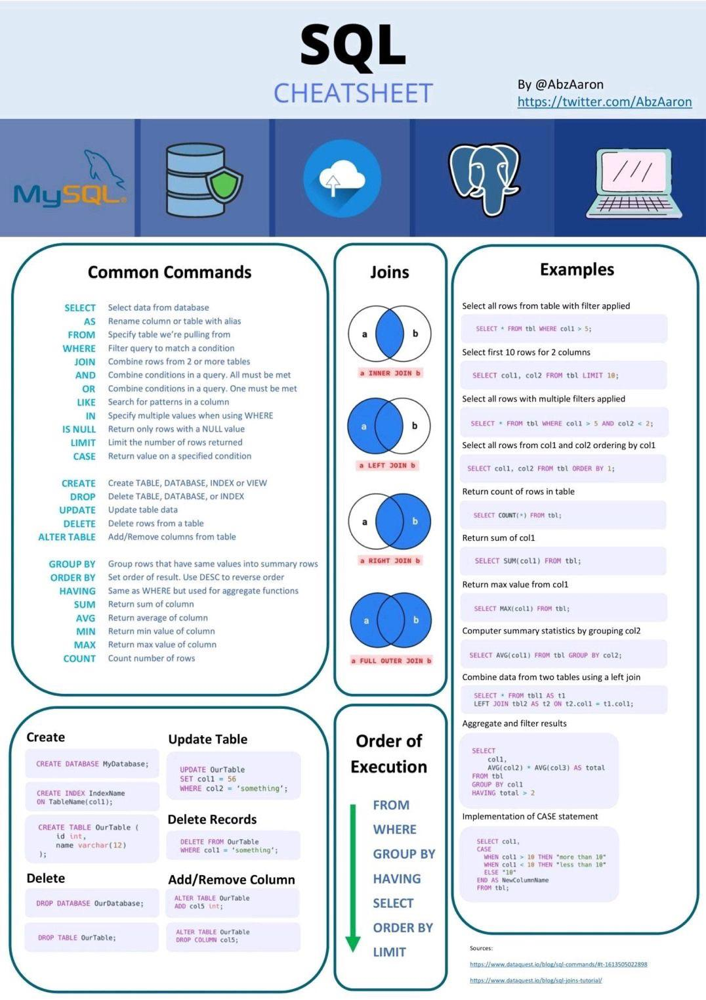
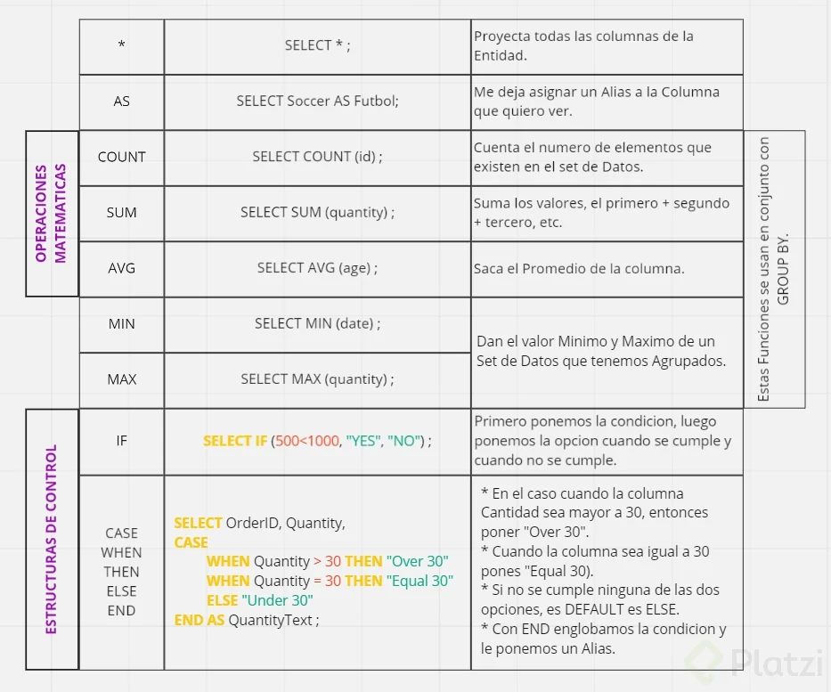
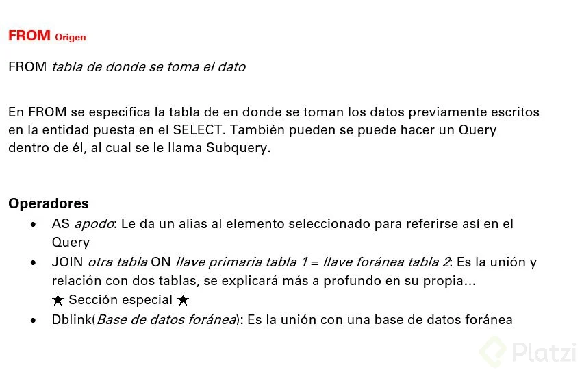
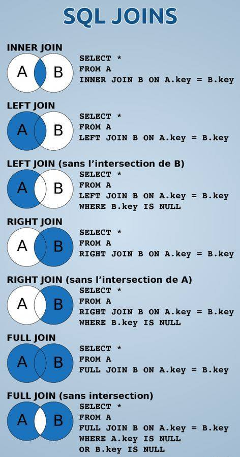
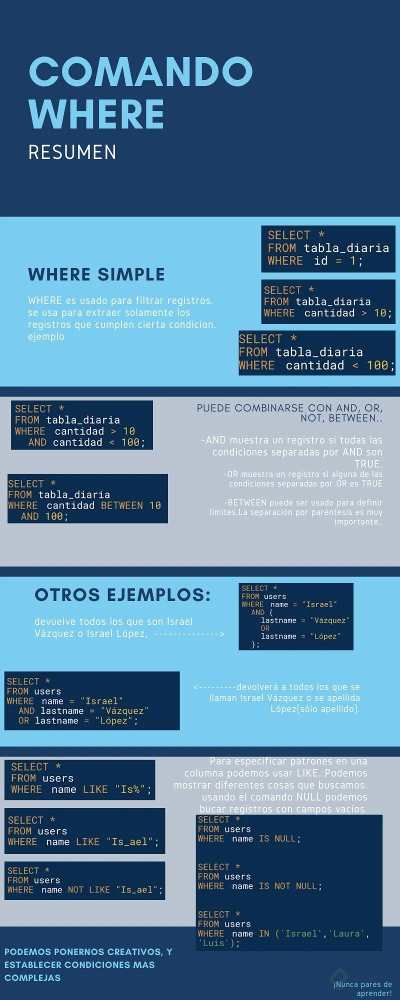
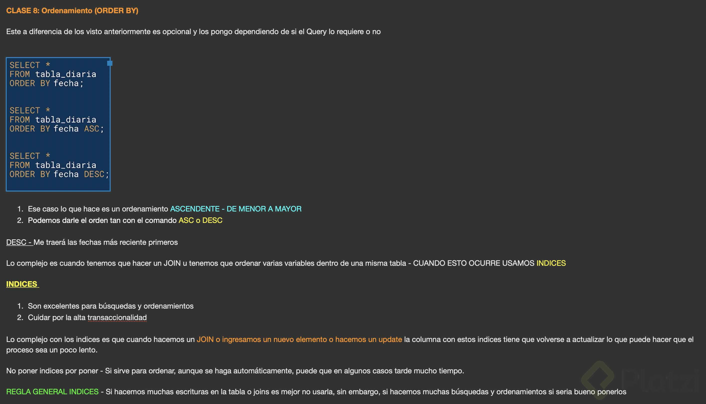
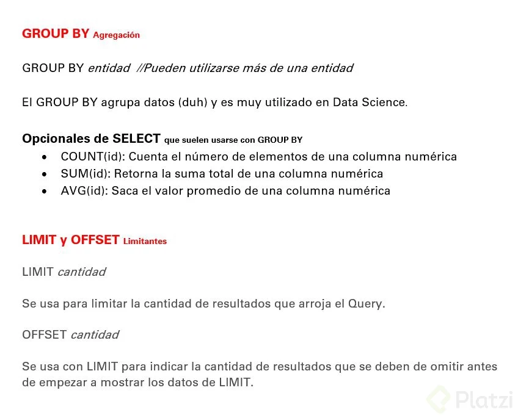
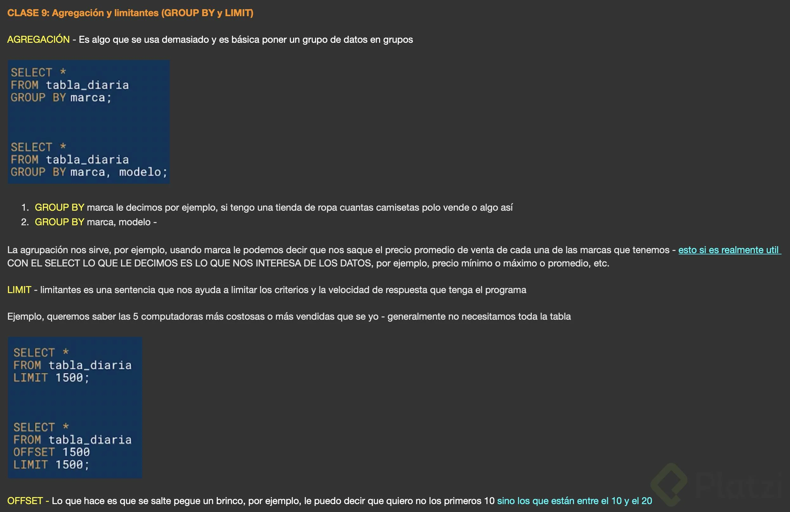

# Curso Práctico de SQL

## Breve historia de SQL

**SQL (Structured Query Language)** es un lenguaje de programación diseñado para interactuar con bases de datos. A lo largo de los años, ha evolucionado desde sus inicios hasta convertirse en uno de los estándares más utilizados para el manejo de datos.

#### Historia:

1. **1970**: Edgar F. Codd, un científico de IBM, propuso el modelo relacional como una forma de representar y manejar datos. Su trabajo sentó las bases para el desarrollo de SQL.

2. **1974**: IBM desarrolló el primer lenguaje para bases de datos relacionales, llamado **SEQUEL** (Structured English Query Language), que posteriormente evolucionó a SQL.

3. **1976**: El término SQL fue adoptado oficialmente por ANSI (American National Standards Institute) y se convirtió en un estándar para bases de datos.

4. **1986**: Oracle fue la primera compañía en implementar SQL en sus sistemas de bases de datos comerciales.

5. **1989**: SQL se convierte en un estándar reconocido internacionalmente con la publicación de la **SQL-89**.

6. **1992**: Se publica la especificación **SQL-92**, que define formalmente el lenguaje SQL como lo conocemos hoy en día. Este estándar es el más ampliamente utilizado.

7. **2003**: Se publica **SQL:2003**, una versión más avanzada que incorpora características como la programación en procedimientos almacenados y nuevos tipos de datos.

8. **2011**: Se lanza **SQL:2011**, incluyendo más funcionalidad para análisis, JSON, y acceso distribuido.

A lo largo de los años, SQL ha sido adoptado por múltiples sistemas de bases de datos, como PostgreSQL, MySQL, Oracle, SQL Server, y otros, consolidándose como el estándar clave para gestionar bases de datos relacionales.




## Álgebra relacional

El **álgebra relacional** es una teoría matemática utilizada para definir las operaciones que se pueden realizar en los modelos de bases de datos relacionales. Se basa en el conjunto de principios matemáticos y lógica que describe cómo se pueden combinar y manipular tablas (relaciones) para obtener resultados deseados.

#### Principales operaciones del Álgebra Relacional:

1. **Selección (σ)**:
   - Permite filtrar las filas (registros) de una tabla según una condición.
   - Sintaxis: `σ_condición(Tabla)`
   - Ejemplo: `σ[edad>30](Empleado)` selecciona todos los empleados mayores de 30 años.

2. **Proyección (π)**:
   - Permite seleccionar ciertas columnas de una tabla.
   - Sintaxis: `π_columnas(Tabla)`
   - Ejemplo: `π[nombre,apellido](Empleado)` selecciona sólo las columnas nombre y apellido.

3. **Unión (∪)**:
   - Combina los registros de dos tablas, eliminando los duplicados.
   - Sintaxis: `Tabla1 ∪ Tabla2`
   - Nota: Ambas tablas deben tener el mismo número de columnas y tipos de datos.

4. **Intersección (∩)**:
   - Devuelve los registros que están presentes en ambas tablas.
   - Sintaxis: `Tabla1 ∩ Tabla2`
   - Ambas tablas deben tener el mismo número de columnas y tipos de datos.

5. **Diferencia (−)**:
   - Devuelve los registros presentes en la primera tabla pero no en la segunda.
   - Sintaxis: `Tabla1 − Tabla2`

6. **Producto cartesiano (×)**:
   - Combina todas las filas de una tabla con todas las filas de otra tabla.
   - Sintaxis: `Tabla1 × Tabla2`

7. **Join (⋈)**:
   - Combina las filas de dos tablas en función de una condición de igualdad entre columnas.
   - Tipos de Join:
     - **Inner Join**: Combina las filas que coinciden en ambas tablas.
     - **Left (Outer) Join**: Combina las filas de la primera tabla con todas las filas de la segunda, colocando `NULL` en las columnas cuando no hay coincidencia.
     - **Right (Outer) Join**: Combina las filas de la segunda tabla con todas las filas de la primera, colocando `NULL` en las columnas cuando no hay coincidencia.
     - **Full (Outer) Join**: Combina las filas de ambas tablas, colocando `NULL` en las columnas cuando no hay coincidencia en ambas.

8. **Renombramiento (ρ)**:
   - Permite renombrar las columnas o tablas resultantes de una operación.
   - Sintaxis: `ρ_nombre_nueva(operacion)`

9. **Agrupación (GROUP BY)**:
   - Agrupa los registros según una o varias columnas y luego aplica funciones agregadas como `SUM`, `AVG`, `COUNT`, `MAX`, `MIN`.
   - Sintaxis: `GROUP BY columna`

10. **Ordenamiento (ORDER BY)**:
    - Ordena los registros de acuerdo con una o más columnas.
    - Sintaxis: `ORDER BY columna`

#### Ejemplo básico:
Queremos seleccionar los nombres y las edades de los empleados que trabajan en el departamento 10, ordenados por edad:

```sql
SELECT nombre, edad
FROM Empleado
WHERE departamento = 10
ORDER BY edad;
```

Este sería un ejemplo clásico de la operación en álgebra relacional. 

El álgebra relacional es fundamental para entender cómo funcionan las consultas SQL y cómo los datos pueden manipularse utilizando estas operaciones matemáticas básicas.

## Instalación de la BD de ejemplo

Como requisito previo es necesario instalar la BD siguiendo este [tutorial](https://platzi.com/clases/1480-postgresql/24177-instalacion-y-configuracion-de-la-base-de-datos/) del curso de PostgreSQL.

Archivos de datos SQL: descarga archivo [platzi-carreras.sql](https://static.platzi.com/media/public/uploads/platzi-carreras_65e74975-a728-481b-bbe4-c52483529661.sql) y archivo [platzi-alumnos.sql](https://static.platzi.com/media/public/uploads/platzi-alumnos_1f7f704d-2c8a-49c7-8c3d-e94365eb8d15.sql).

Una vez tienes instalado PostgreSQL y pgAdmin vamos a crear la estructura de datos que veremos a lo largo del curso.

Para hacerlo abre pgAdmin (normalmente está en la dirección: [http://127.0.0.1:63435/browser/](http://127.0.0.1:63435/browser/)), y expande el panel correspondiente a tu base de datos, en mi caso la he nombrado “prueba”.


En la sección esquemas da click secundario y selecciona la opción Create > Schema…


Al seleccionar la opción abrirá un cuadro de diálogo en donde debes escribir el nombre del esquema, en este caso será “platzi”. Si eliges un nombre distinto, asegúrate de seguir los ejemplos en el curso con el nombre elegido; por ejemplo si en el curso mencionamos la sentencia:

`SELECT * FROM platzi.alumnos`

Sustituye platzi por el nombre que elegiste.

Finalmente selecciona tu usuario de postgres en el campo Owner, esto es para que asigne todos los permisos del nuevo esquema a tu usuario.


Revisa que tu esquema se haya generado de manera correcta recargando la página y expandiendo el panel Schemas en tu base de datos.


Dirígete al menú superior y selecciona el menú Tools > Query Tool.


Esto desplegará la herramienta en la ventana principal. Da click en el botón “Open File” ilustrado por un icono de folder abierto.


Busca en tus archivos y selecciona el archivo platzi.alumnos.sql que descargaste de este curso, da click en el botón “Select”.


Esto abrirá el código SQL que deberás ejecutar dando click en el botón ”Execute/Refresh” con el icono play.


Al terminar debes ver un aviso similar al siguiente:


Ahora repetiremos el proceso para la tabla platzi.carreras. Dirígete nuevamente al botón “Open File” y da click en él.


Encuentra y selecciona el archivo platzi.carreras.sql y da click en el botón “Select”.


Una vez abierto el archivo corre el script dando click en el botón “Execute/Refresh”


Debes ver nuevamente un aviso como el siguiente:


¡Felicidades! Ya tienes todo listo para realizar los ejercicios y retos del curso.

## Qué es una proyección (SELECT)

La **proyección** es un concepto del álgebra relacional que en SQL se implementa con el comando **`SELECT`**. Este se utiliza para seleccionar y devolver columnas específicas de una tabla, eliminando las columnas no deseadas y enfocándose únicamente en los datos relevantes.

#### Características de la Proyección:
1. **Selección de columnas**:
   - Permite especificar qué columnas se incluirán en el resultado.
   - Reduce el número de atributos en el conjunto de resultados.

2. **No elimina filas**:
   - La proyección afecta solo las columnas; las filas permanecen tal como están, a menos que se combine con una condición de filtro (**`WHERE`**).

3. **Sintaxis básica**:
   ```sql
   SELECT columna1, columna2, ...
   FROM nombre_tabla;
   ```

#### Ejemplo básico:
Dada la tabla **empleados**:

| id_empleado | nombre   | edad | salario |
|-------------|----------|------|---------|
| 1           | Ana      | 30   | 1500    |
| 2           | Luis     | 45   | 2000    |
| 3           | Marta    | 29   | 1800    |

Consulta para proyectar solo los nombres y edades:
```sql
SELECT nombre, edad
FROM empleados;
```

Resultado:
| nombre   | edad |
|----------|------|
| Ana      | 30   |
| Luis     | 45   |
| Marta    | 29   |

#### Variantes del **SELECT**:
1. **Seleccionar todas las columnas**:
   - Usando el carácter `*`, se obtienen todas las columnas de una tabla:
     ```sql
     SELECT *
     FROM empleados;
     ```

2. **Eliminar duplicados**:
   - Usando **`DISTINCT`**, se eliminan filas duplicadas en las columnas proyectadas:
     ```sql
     SELECT DISTINCT edad
     FROM empleados;
     ```
     Resultado:
     | edad |
     |------|
     | 30   |
     | 45   |
     | 29   |

3. **Crear nuevas columnas derivadas**:
   - Se pueden realizar cálculos o concatenar datos y proyectarlos como una nueva columna:
     ```sql
     SELECT nombre, salario * 12 AS salario_anual
     FROM empleados;
     ```
     Resultado:
     | nombre   | salario_anual |
     |----------|---------------|
     | Ana      | 18000         |
     | Luis     | 24000         |
     | Marta    | 21600         |

4. **Usar alias para las columnas**:
   - Se puede cambiar el nombre de las columnas en el resultado:
     ```sql
     SELECT nombre AS empleado, salario AS ingreso
     FROM empleados;
     ```

5. **Proyección condicional**:
   - Combinando con **`WHERE`**, selecciona filas específicas:
     ```sql
     SELECT nombre, salario
     FROM empleados
     WHERE edad > 30;
     ```

#### Importancia de la Proyección:
1. **Optimización**:
   - Reduce el volumen de datos transmitido y procesado al cliente o aplicación.
2. **Claridad**:
   - Facilita el entendimiento de los resultados al mostrar solo las columnas necesarias.
3. **Preparación de datos**:
   - Permite estructurar los datos para reportes, análisis o transformaciones posteriores.

#### Diferencia entre Proyección y Selección:
- **Proyección**: Se enfoca en columnas (atributos).
- **Selección**: Se enfoca en filas, usualmente mediante condiciones (**`WHERE`**). 

Ambos conceptos se pueden combinar en una consulta SQL para obtener datos específicos y relevantes.




## Origen (FROM)

El término **FROM** en SQL es una cláusula clave que especifica la fuente de los datos para una consulta. Es el punto de partida para cualquier operación de consulta en SQL, ya que indica la tabla o tablas de las que se extraerá la información.

#### Características principales del **FROM**:

1. **Especificación de tablas**:
   - Indica de qué tabla o tablas se obtendrán los datos.
   - Ejemplo:
     ```sql
     SELECT nombre, edad
     FROM empleados;
     ```
     En este caso, `empleados` es la tabla fuente.

2. **Combinar tablas**:
   - Permite realizar combinaciones de datos entre múltiples tablas utilizando **JOIN**.
   - Ejemplo (Inner Join):
     ```sql
     SELECT e.nombre, d.nombre_departamento
     FROM empleados e
     JOIN departamentos d
     ON e.id_departamento = d.id_departamento;
     ```
     Aquí, se combinan las tablas `empleados` y `departamentos`.

3. **Subconsultas**:
   - Se pueden usar subconsultas como fuentes de datos.
   - Ejemplo:
     ```sql
     SELECT *
     FROM (
         SELECT id, nombre
         FROM empleados
         WHERE edad > 30
     ) AS subconsulta;
     ```
     En este caso, la subconsulta actúa como una tabla temporal.

4. **Especificación de alias**:
   - Los alias facilitan la referencia a tablas y columnas con nombres largos.
   - Ejemplo:
     ```sql
     SELECT e.nombre, e.edad
     FROM empleados AS e;
     ```

5. **Uso con funciones**:
   - Se puede usar con funciones para generar tablas virtuales.
   - Ejemplo (uso de una función generadora de series):
     ```sql
     SELECT *
     FROM generate_series(1, 10) AS numeros;
     ```

#### Operaciones avanzadas con **FROM**:

1. **Unión de tablas**:
   - **CROSS JOIN**: Producto cartesiano.
     ```sql
     SELECT *
     FROM tabla1
     CROSS JOIN tabla2;
     ```
   - **LEFT JOIN**: Incluye todas las filas de la tabla izquierda.
   - **RIGHT JOIN**: Incluye todas las filas de la tabla derecha.
   - **FULL JOIN**: Combina todas las filas de ambas tablas.

2. **Consulta sobre vistas o vistas materializadas**:
   - El **FROM** también puede apuntar a vistas.
   - Ejemplo:
     ```sql
     SELECT *
     FROM vista_empleados_activos;
     ```

3. **Uso con tablas derivadas**:
   - Permite generar una "tabla en línea" con una subconsulta.
   - Ejemplo:
     ```sql
     SELECT sub.id, sub.total
     FROM (
         SELECT id_departamento AS id, COUNT(*) AS total
         FROM empleados
         GROUP BY id_departamento
     ) AS sub;
     ```

El **FROM** es el núcleo para cualquier consulta SQL, ya que establece la base sobre la que se construyen las demás cláusulas como **WHERE**, **GROUP BY**, **HAVING**, y **ORDER BY**.



## Productos cartesianos (JOIN)

El producto cartesiano, también conocido como **CROSS JOIN**, es una operación en SQL que combina cada fila de una tabla con cada fila de otra tabla. Es la base para otros tipos de combinaciones (**INNER JOIN**, **LEFT JOIN**, etc.), pero en su forma básica no aplica ninguna condición para emparejar filas. 

#### Características del Producto Cartesiano:
1. **Resultado**:
   - El número total de filas en el resultado es el producto del número de filas de las dos tablas.
   - Si la tabla A tiene \( n \) filas y la tabla B tiene \( m \) filas, el resultado del producto cartesiano tendrá \( n \times m \) filas.

2. **Sintaxis básica**:
   ```sql
   SELECT *
   FROM tabla1
   CROSS JOIN tabla2;
   ```

3. **Alias para simplificar referencias**:
   - Al trabajar con productos cartesianos, es útil asignar alias a las tablas:
     ```sql
     SELECT t1.columna1, t2.columna2
     FROM tabla1 AS t1
     CROSS JOIN tabla2 AS t2;
     ```

#### Ejemplo de un Producto Cartesiano:
Supongamos que tenemos las siguientes tablas:

**Tabla A** (empleados):
| id_empleado | nombre   |
|-------------|----------|
| 1           | Ana      |
| 2           | Luis     |

**Tabla B** (departamentos):
| id_departamento | nombre_departamento |
|-----------------|---------------------|
| 10              | Ventas             |
| 20              | Marketing          |

La consulta:
```sql
SELECT *
FROM empleados
CROSS JOIN departamentos;
```

**Resultado del Producto Cartesiano**:
| id_empleado | nombre   | id_departamento | nombre_departamento |
|-------------|----------|-----------------|---------------------|
| 1           | Ana      | 10              | Ventas             |
| 1           | Ana      | 20              | Marketing          |
| 2           | Luis     | 10              | Ventas             |
| 2           | Luis     | 20              | Marketing          |

#### Uso Práctico del Producto Cartesiano:
Aunque el producto cartesiano puro no es común en escenarios prácticos debido a su crecimiento exponencial, puede ser útil en ciertos casos:
1. **Generar combinaciones**:
   - Por ejemplo, todas las combinaciones posibles de productos y colores:
     ```sql
     SELECT p.nombre_producto, c.color
     FROM productos AS p
     CROSS JOIN colores AS c;
     ```

2. **Simular combinaciones sin relaciones explícitas**:
   - Útil en análisis exploratorio cuando no hay llaves foráneas entre las tablas.

3. **Fundamento para otros tipos de JOIN**:
   - El **INNER JOIN** o el **LEFT JOIN** se derivan del producto cartesiano con condiciones aplicadas para emparejar filas.

#### Consideraciones:
- El producto cartesiano puede generar resultados extremadamente grandes si las tablas involucradas son grandes.
- Es más eficiente usar **INNER JOIN** con condiciones específicas en lugar de **CROSS JOIN**, salvo que realmente se necesite combinar todas las filas.

#### Alternativa con Condición:
Para evitar un producto cartesiano completo y filtrar resultados, se puede usar un **INNER JOIN** con una condición:
```sql
SELECT e.nombre, d.nombre_departamento
FROM empleados AS e
INNER JOIN departamentos AS d
ON e.id_departamento = d.id_departamento;
```
Esto genera una intersección basada en la relación lógica entre las tablas.



**Lecturas recomendadas**

[Introducción a los conjuntos en Curso de Matemáticas Discretas](https://platzi.com/clases/1319-discretas/12215-introduccion-a-los-conjuntos/)

[Curso de Matemáticas discretas](https://platzi.com/clases/discretas/)

## Selección (WHERE)

La **selección** es un concepto del álgebra relacional que en SQL se implementa mediante la cláusula **`WHERE`**. Se utiliza para filtrar las filas de una tabla, devolviendo solo aquellas que cumplen con una condición lógica específica.

#### Características de la Selección:
1. **Filtra filas**:
   - Permite definir condiciones para incluir solo los datos relevantes.
   - No afecta las columnas seleccionadas, sino el conjunto de filas.

2. **Sintaxis básica**:
   ```sql
   SELECT columnas
   FROM tabla
   WHERE condición;
   ```

3. **Operadores comunes en condiciones**:
   - **Comparación**: `=`, `!=`, `<`, `<=`, `>`, `>=`
   - **Lógicos**: `AND`, `OR`, `NOT`
   - **Inclusión**: `IN`, `BETWEEN`
   - **Patrones**: `LIKE`, `ILIKE`
   - **Nulos**: `IS NULL`, `IS NOT NULL`

#### Ejemplo básico:
Dada la tabla **empleados**:

| id_empleado | nombre   | edad | salario |
|-------------|----------|------|---------|
| 1           | Ana      | 30   | 1500    |
| 2           | Luis     | 45   | 2000    |
| 3           | Marta    | 29   | 1800    |

Consulta para seleccionar empleados con salario mayor a 1500:
```sql
SELECT nombre, salario
FROM empleados
WHERE salario > 1500;
```

Resultado:
| nombre   | salario |
|----------|---------|
| Luis     | 2000    |
| Marta    | 1800    |

#### Operadores en **`WHERE`**:
1. **Condiciones simples**:
   ```sql
   WHERE edad = 30;
   ```

2. **Condiciones compuestas**:
   - **AND**: Ambas condiciones deben cumplirse.
     ```sql
     WHERE edad > 30 AND salario > 1800;
     ```
   - **OR**: Al menos una condición debe cumplirse.
     ```sql
     WHERE edad > 30 OR salario > 1800;
     ```
   - **NOT**: Excluye filas que cumplen la condición.
     ```sql
     WHERE NOT (edad > 30);
     ```

3. **Rango de valores**:
   - Usando **`BETWEEN`**:
     ```sql
     WHERE salario BETWEEN 1500 AND 2000;
     ```

4. **Inclusión en listas**:
   - Usando **`IN`**:
     ```sql
     WHERE nombre IN ('Ana', 'Marta');
     ```

5. **Búsqueda de patrones**:
   - Usando **`LIKE`**:
     ```sql
     WHERE nombre LIKE 'M%'; -- Nombres que comiencen con "M"
     ```
   - Usando comodines:
     - `%`: Cualquier número de caracteres.
     - `_`: Un solo carácter.

6. **Valores nulos**:
   - Para verificar si una columna tiene un valor `NULL`:
     ```sql
     WHERE salario IS NULL;
     ```

#### Selección combinada con Proyección:
Puedes usar **`WHERE`** junto con **`SELECT`** para filtrar y seleccionar columnas específicas:
```sql
SELECT nombre, salario
FROM empleados
WHERE edad > 30;
```

Resultado:
| nombre   | salario |
|----------|---------|
| Luis     | 2000    |

#### Importancia de la Selección:
1. **Eficiencia**:
   - Reduce el número de filas procesadas.
   - Optimiza las consultas al trabajar con datos relevantes.
   
2. **Precisión**:
   - Proporciona control sobre los resultados al filtrar datos según necesidades específicas.

3. **Preparación de datos**:
   - Útil para análisis, reportes o integraciones con otras aplicaciones.

#### Diferencia entre Selección y Proyección:
- **Selección (`WHERE`)**: Filtra filas.
- **Proyección (`SELECT`)**: Selecciona columnas.

Ambos conceptos son fundamentales en SQL y se combinan para obtener datos específicos de una tabla.



## Ordenamiento (ORDER BY)

La cláusula **`ORDER BY`** se utiliza en SQL para ordenar los resultados de una consulta en función de una o más columnas. Este orden puede ser ascendente o descendente, dependiendo de las necesidades del usuario.

### Características del **`ORDER BY`**:

1. **Control del orden**:
   - **Ascendente (ASC)**: Ordena los resultados de menor a mayor (por defecto).
   - **Descendente (DESC)**: Ordena los resultados de mayor a menor.

2. **Ordenación múltiple**:
   - Puedes especificar varias columnas para ordenar los resultados.
   - El orden de prioridad sigue el orden en que se escriben las columnas.

3. **Compatibilidad con funciones**:
   - Puede ordenar por expresiones o funciones, como concatenaciones, cálculos o agregados.

### Sintaxis:
```sql
SELECT columnas
FROM tabla
[WHERE condición]
ORDER BY columna1 [ASC | DESC], columna2 [ASC | DESC];
```

### Ejemplo básico:

Dada la tabla **empleados**:

| id_empleado | nombre   | edad | salario |
|-------------|----------|------|---------|
| 1           | Ana      | 30   | 1500    |
| 2           | Luis     | 45   | 2000    |
| 3           | Marta    | 29   | 1800    |

#### Ordenar por salario de menor a mayor:
```sql
SELECT nombre, salario
FROM empleados
ORDER BY salario ASC;
```

Resultado:
| nombre   | salario |
|----------|---------|
| Ana      | 1500    |
| Marta    | 1800    |
| Luis     | 2000    |

#### Ordenar por salario de mayor a menor:
```sql
SELECT nombre, salario
FROM empleados
ORDER BY salario DESC;
```

Resultado:
| nombre   | salario |
|----------|---------|
| Luis     | 2000    |
| Marta    | 1800    |
| Ana      | 1500    |

### Ordenamiento múltiple:

#### Ordenar por edad y, en caso de empate, por salario:
```sql
SELECT nombre, edad, salario
FROM empleados
ORDER BY edad ASC, salario DESC;
```

Resultado:
| nombre   | edad | salario |
|----------|------|---------|
| Marta    | 29   | 1800    |
| Ana      | 30   | 1500    |
| Luis     | 45   | 2000    |

### Ordenar por expresiones o funciones:
Puedes usar funciones o expresiones directamente en **`ORDER BY`**.

#### Ordenar por la longitud del nombre:
```sql
SELECT nombre, salario
FROM empleados
ORDER BY LENGTH(nombre) ASC;
```

Resultado:
| nombre   | salario |
|----------|---------|
| Ana      | 1500    |
| Luis     | 2000    |
| Marta    | 1800    |

### Ordenar por columnas que no están en la lista de selección:
Aunque una columna no esté en la lista de columnas seleccionadas, puedes usarla en **`ORDER BY`**.

```sql
SELECT nombre
FROM empleados
ORDER BY salario DESC;
```

Resultado:
| nombre   |
|----------|
| Luis     |
| Marta    |
| Ana      |

### Importancia del **`ORDER BY`**:
1. **Presentación ordenada**:
   - Mejora la legibilidad de los datos, especialmente para reportes o tablas grandes.

2. **Preparación de datos**:
   - Facilita análisis posteriores al ordenar datos de forma significativa.

3. **Compatibilidad con otras operaciones**:
   - Combina bien con funciones de agregación, particionamiento y paginación.

### Notas importantes:
- Si no especificas **ASC** o **DESC**, el orden será **ASC** por defecto.
- El rendimiento de **`ORDER BY`** puede depender del tamaño de la tabla y de la existencia de índices.

El ordenamiento es una herramienta poderosa para estructurar los resultados y facilitar su comprensión y análisis.



## Agregación y limitantes (GROUP BY y LIMIT)

La agregación y el uso de límites en las consultas SQL permiten procesar conjuntos de datos y reducir los resultados obtenidos. Aquí veremos cómo trabajar con **`GROUP BY`** para agregación y **`LIMIT`** para limitar la salida de las consultas.

### **1. Agregación: `GROUP BY`**
La cláusula **`GROUP BY`** agrupa filas que tienen los mismos valores en columnas específicas, lo que permite realizar cálculos agregados como:

- **SUM**: Suma de valores.
- **AVG**: Promedio de valores.
- **COUNT**: Conteo de filas.
- **MAX**: Valor máximo.
- **MIN**: Valor mínimo.

**Ejemplo básico de `GROUP BY`:**
```sql
SELECT columna_agrupada, SUM(columna_valor) AS suma
FROM tabla
GROUP BY columna_agrupada;
```

**Salida:** Agrupa las filas por el valor en `columna_agrupada` y calcula la suma de `columna_valor` para cada grupo.

### **2. Limitantes: `LIMIT`**
La cláusula **`LIMIT`** restringe el número de filas que devuelve una consulta.

**Ejemplo básico de `LIMIT`:**
```sql
SELECT * 
FROM tabla
LIMIT 10;
```

**Salida:** Muestra las primeras 10 filas del conjunto de resultados.

### **3. Combinando `GROUP BY` y `LIMIT`**
Puedes agrupar datos con **`GROUP BY`** y limitar los resultados con **`LIMIT`**. Esto es útil para obtener un resumen con un número limitado de grupos.

**Ejemplo combinado:**
```sql
SELECT columna_agrupada, COUNT(*) AS conteo
FROM tabla
GROUP BY columna_agrupada
ORDER BY conteo DESC
LIMIT 5;
```

**Descripción:**
1. **`GROUP BY`**: Agrupa las filas según los valores de `columna_agrupada`.
2. **`COUNT(*)`**: Cuenta las filas de cada grupo.
3. **`ORDER BY conteo DESC`**: Ordena los grupos en orden descendente por el conteo.
4. **`LIMIT 5`**: Devuelve solo los 5 grupos con mayor conteo.

### **Ejemplo práctico con tablas:**

#### Tabla `ventas`:
| producto   | categoria | precio | cantidad |
|------------|-----------|--------|----------|
| Producto A | Cat1      | 100    | 5        |
| Producto B | Cat2      | 200    | 2        |
| Producto C | Cat1      | 150    | 3        |
| Producto D | Cat2      | 250    | 1        |
| Producto E | Cat3      | 300    | 4        |

**Consulta:**
```sql
SELECT categoria, SUM(precio * cantidad) AS total_ventas
FROM ventas
GROUP BY categoria
ORDER BY total_ventas DESC
LIMIT 2;
```

**Resultado:**
| categoria | total_ventas |
|-----------|--------------|
| Cat3      | 1200         |
| Cat1      | 1050         |

**Descripción:**
- Agrupa por `categoria`.
- Calcula el total de ventas (`precio * cantidad`).
- Ordena en orden descendente por el total de ventas.
- Muestra solo las 2 categorías con mayores ventas.

### **OFFSET en SQL**

La cláusula **`OFFSET`** se utiliza en SQL para omitir un número específico de filas al comienzo de un conjunto de resultados. Se utiliza comúnmente junto con **`LIMIT`** para paginar o navegar por subconjuntos de datos.

### **Sintaxis básica**
```sql
SELECT columnas
FROM tabla
ORDER BY columna
OFFSET n_filas;
```

- **`OFFSET n_filas`**: Indica cuántas filas se deben omitir desde el inicio del conjunto de resultados.
- Puede combinarse con **`LIMIT`** para limitar el número de filas devueltas después de omitir las primeras.

### **Ejemplo básico**

#### Tabla `clientes`:
| id_cliente | nombre      | ciudad      |
|------------|-------------|-------------|
| 1          | Ana Pérez   | Bogotá      |
| 2          | Juan López  | Medellín    |
| 3          | Luis Gómez  | Cali        |
| 4          | Marta Ruiz  | Barranquilla|
| 5          | Pedro Díaz  | Cartagena   |

**Consulta con `OFFSET`:**
```sql
SELECT *
FROM clientes
ORDER BY id_cliente
OFFSET 2;
```

**Resultado:**
| id_cliente | nombre      | ciudad      |
|------------|-------------|-------------|
| 3          | Luis Gómez  | Cali        |
| 4          | Marta Ruiz  | Barranquilla|
| 5          | Pedro Díaz  | Cartagena   |

**Descripción:**
- La consulta omite las primeras 2 filas del conjunto de resultados ordenado por `id_cliente`.

### **Combinación de `LIMIT` y `OFFSET`**
Para paginar datos, **`OFFSET`** se combina con **`LIMIT`**:

**Ejemplo:**
```sql
SELECT *
FROM clientes
ORDER BY id_cliente
LIMIT 2 OFFSET 2;
```

**Resultado:**
| id_cliente | nombre      | ciudad      |
|------------|-------------|-------------|
| 3          | Luis Gómez  | Cali        |
| 4          | Marta Ruiz  | Barranquilla|

**Descripción:**
1. **`OFFSET 2`**: Omite las primeras 2 filas.
2. **`LIMIT 2`**: Devuelve las siguientes 2 filas después de omitir.

### **Uso práctico: Paginación**

#### Ejemplo: Paginar con un tamaño de página de 2 filas

**Primera página:**
```sql
SELECT *
FROM clientes
ORDER BY id_cliente
LIMIT 2 OFFSET 0;
```

**Segunda página:**
```sql
SELECT *
FROM clientes
ORDER BY id_cliente
LIMIT 2 OFFSET 2;
```

**Tercera página:**
```sql
SELECT *
FROM clientes
ORDER BY id_cliente
LIMIT 2 OFFSET 4;
```

### **Consideraciones:**
1. **Rendimiento:** El uso de **`OFFSET`** en conjuntos de datos grandes puede ser costoso, ya que la base de datos sigue procesando las filas omitidas.
2. **Alternativa:** En lugar de **`OFFSET`**, puedes usar **paginación basada en cursores** para manejar grandes conjuntos de datos con mayor eficiencia.

**Cursor-based Example:**
```sql
SELECT *
FROM clientes
WHERE id_cliente > último_id_visto
ORDER BY id_cliente
LIMIT 2;
```

Esta estrategia es más eficiente en grandes volúmenes de datos.

### **Resumen**
- **`GROUP BY`**: Agrupa y permite realizar cálculos agregados sobre grupos de filas.
- **`LIMIT`**: Restringe la cantidad de resultados.
- Ambos son potentes herramientas para procesar y resumir grandes cantidades de datos en SQL.




## Seleccionar de un set de opciones

Para seleccionar datos de un conjunto de opciones en SQL, puedes usar la cláusula `WHERE` combinada con `IN`. Esto te permite filtrar filas basándote en un conjunto de valores específicos. Aquí tienes un ejemplo:

### Sintaxis general:
```sql
SELECT columnas
FROM tabla
WHERE columna IN (opcion1, opcion2, opcion3);
```

### Ejemplo práctico:
Supongamos que tienes una tabla llamada `productos` y deseas seleccionar los productos que pertenecen a las categorías "Electrónica", "Ropa" y "Hogar":

```sql
SELECT *
FROM productos
WHERE categoria IN ('Electrónica', 'Ropa', 'Hogar');
```

### Notas adicionales:
1. **Uso de `NOT IN`:** Si deseas excluir un conjunto de opciones, usa `NOT IN`:
   ```sql
   SELECT *
   FROM productos
   WHERE categoria NOT IN ('Electrónica', 'Ropa');
   ```

2. **Compatibilidad con subconsultas:** Puedes usar un resultado de otra consulta dentro de `IN`:
   ```sql
   SELECT *
   FROM productos
   WHERE categoria IN (SELECT categoria FROM categorias_populares);
   ```

3. **Cuidado con los valores `NULL`:** Si usas `NOT IN`, ten cuidado con los valores `NULL` en la lista, ya que pueden causar resultados inesperados.

## En mis tiempos

Trabajar con **fechas y horas** en SQL (y especialmente en PostgreSQL) es fundamental para muchas aplicaciones. Aquí tienes una guía básica:

### **1. Tipos de datos para fechas y horas en PostgreSQL**
- **`DATE`**: Solo almacena la fecha (año, mes y día).
- **`TIME`**: Solo almacena la hora (horas, minutos, segundos).
- **`TIMESTAMP`**: Combina fecha y hora, sin zona horaria.
- **`TIMESTAMPTZ`**: Similar a `TIMESTAMP`, pero incluye información de zona horaria.
- **`INTERVAL`**: Representa un período o duración de tiempo.

### **2. Funciones comunes para trabajar con fechas y horas**

#### Obtener la fecha y hora actual:
```sql
SELECT CURRENT_DATE;         -- Fecha actual (DATE)
SELECT CURRENT_TIME;         -- Hora actual (TIME)
SELECT CURRENT_TIMESTAMP;    -- Fecha y hora actual (TIMESTAMP)
SELECT NOW();                -- Igual a CURRENT_TIMESTAMP
```

#### Operaciones básicas:
- **Suma de intervalos**:
  ```sql
  SELECT NOW() + INTERVAL '1 day'; -- Suma un día a la fecha actual
  SELECT NOW() + INTERVAL '2 hours'; -- Suma dos horas
  ```

- **Diferencia de fechas**:
  ```sql
  SELECT AGE('2025-01-01', '2024-01-01'); -- Diferencia entre dos fechas
  SELECT '2025-01-01'::DATE - '2024-01-01'::DATE; -- Resultado en días
  ```

#### Formato de fechas:
```sql
SELECT TO_CHAR(NOW(), 'YYYY-MM-DD'); -- Formato de salida: 2025-01-22
SELECT TO_CHAR(NOW(), 'DD/MM/YYYY'); -- Formato de salida: 22/01/2025
SELECT TO_CHAR(NOW(), 'HH24:MI:SS'); -- Formato de salida: 14:30:45
```

#### Filtrar por fechas:
- Registros de un día específico:
  ```sql
  SELECT * FROM tabla
  WHERE fecha = '2025-01-01';
  ```

- Registros dentro de un rango de fechas:
  ```sql
  SELECT * FROM tabla
  WHERE fecha BETWEEN '2025-01-01' AND '2025-12-31';
  ```

- Registros más recientes:
  ```sql
  SELECT * FROM tabla
  WHERE fecha > NOW() - INTERVAL '7 days'; -- Últimos 7 días
  ```

#### Extraer partes de una fecha:
```sql
SELECT EXTRACT(YEAR FROM NOW());   -- Año actual
SELECT EXTRACT(MONTH FROM NOW());  -- Mes actual
SELECT EXTRACT(DAY FROM NOW());    -- Día actual
SELECT EXTRACT(HOUR FROM NOW());   -- Hora actual
```

#### Conversión entre tipos:
```sql
SELECT '2025-01-01'::DATE;             -- Convierte una cadena a DATE
SELECT '14:30:00'::TIME;               -- Convierte una cadena a TIME
SELECT '2025-01-01 14:30:00'::TIMESTAMP; -- Convierte a TIMESTAMP
SELECT '1 day'::INTERVAL;              -- Convierte una cadena a INTERVAL
```

### **3. Ejemplo práctico**

Supongamos que tienes una tabla llamada `eventos` con las columnas:
- `id` (entero)
- `nombre` (texto)
- `fecha_inicio` (timestamp)

#### Obtener eventos futuros:
```sql
SELECT * 
FROM eventos
WHERE fecha_inicio > NOW();
```

#### Obtener eventos del mes actual:
```sql
SELECT * 
FROM eventos
WHERE EXTRACT(MONTH FROM fecha_inicio) = EXTRACT(MONTH FROM NOW())
  AND EXTRACT(YEAR FROM fecha_inicio) = EXTRACT(YEAR FROM NOW());
```

#### Ordenar eventos por fecha:
```sql
SELECT * 
FROM eventos
ORDER BY fecha_inicio ASC; -- Más cercanos primero
```

## Seleccionar por año

Para filtrar registros por años en una tabla en PostgreSQL, puedes usar las funciones `DATE_PART` o `EXTRACT` sobre una columna de tipo fecha (`DATE`, `TIMESTAMP`, etc.). 

### Ejemplo básico de filtro por año

#### Usando `EXTRACT`:
```sql
SELECT *
FROM platzi.alumnos
WHERE EXTRACT(YEAR FROM fecha_incorporacion) = 2023;
```

#### Usando `DATE_PART`:
```sql
SELECT *
FROM platzi.alumnos
WHERE DATE_PART('YEAR', fecha_incorporacion) = 2023;
```

### Filtro por un rango de años
Si deseas filtrar registros dentro de un rango de años, puedes combinarlo con operadores como `BETWEEN`:

```sql
SELECT *
FROM platzi.alumnos
WHERE EXTRACT(YEAR FROM fecha_incorporacion) BETWEEN 2020 AND 2023;
```

### Alternativa directa con comparación de fechas
Si tienes columnas de tipo `DATE` o `TIMESTAMP`, también puedes filtrar directamente:

```sql
SELECT *
FROM platzi.alumnos
WHERE fecha_incorporacion >= '2023-01-01'
  AND fecha_incorporacion < '2024-01-01';
```

Esto es más eficiente en algunos casos, ya que evita el uso de funciones que pueden deshabilitar el uso de índices.

## Duplicados

Para trabajar con duplicados en una tabla en PostgreSQL, puedes identificarlos, eliminarlos o gestionarlos según lo que necesites. Aquí tienes algunas opciones comunes:

### **1. Identificar duplicados**

Si quieres encontrar filas duplicadas basadas en una o varias columnas:

```sql
SELECT columna1, columna2, COUNT(*)
FROM nombre_tabla
GROUP BY columna1, columna2
HAVING COUNT(*) > 1;
```

Esto muestra las combinaciones de `columna1` y `columna2` que tienen duplicados.

### **2. Eliminar duplicados**

#### a. **Mantener sólo una fila por duplicado**
Puedes usar una subconsulta con `ROW_NUMBER()` para eliminar duplicados, conservando una sola fila por grupo:

```sql
DELETE FROM nombre_tabla
WHERE id NOT IN (
    SELECT MIN(id)
    FROM nombre_tabla
    GROUP BY columna1, columna2
);
```

Aquí, `columna1` y `columna2` son las columnas que identifican los duplicados.

#### b. **Usando `CTE` y `ROW_NUMBER`**
Otra forma común es usar una expresión común de tabla (CTE):

```sql
WITH cte AS (
    SELECT id, ROW_NUMBER() OVER (PARTITION BY columna1, columna2 ORDER BY id) AS fila
    FROM nombre_tabla
)
DELETE FROM nombre_tabla
WHERE id IN (
    SELECT id FROM cte WHERE fila > 1
);
```

Esto elimina todas las filas duplicadas excepto la primera.

### **3. Insertar datos evitando duplicados**

Si deseas insertar filas en una tabla pero evitar duplicados, puedes usar la cláusula `ON CONFLICT`:

```sql
INSERT INTO nombre_tabla (columna1, columna2)
VALUES ('valor1', 'valor2')
ON CONFLICT (columna1, columna2) DO NOTHING;
```

Esto asegura que no se insertarán filas duplicadas basadas en las columnas indicadas.

### **4. Crear restricciones para evitar duplicados en el futuro**

#### a. **Índices únicos**
Agrega una restricción única a las columnas relevantes:

```sql
ALTER TABLE nombre_tabla ADD CONSTRAINT unica_columna UNIQUE (columna1, columna2);
```

Esto evitará que se inserten duplicados en esas columnas.

### **5. Contar duplicados**
Si deseas solo saber cuántos registros duplicados hay:

```sql
SELECT COUNT(*) - COUNT(DISTINCT columna1, columna2) AS total_duplicados
FROM nombre_tabla;
```

Esto calcula el número de filas duplicadas en la tabla.

## Selectores de rango

En PostgreSQL, los **selectores de rango** son herramientas que te permiten filtrar datos basados en rangos de valores. Esto se hace comúnmente utilizando operadores como `BETWEEN`, comparaciones directas (`>`, `<`, `<=`, `>=`), o incluso tipos de datos específicos como `RANGE`.

### **Ejemplo básico con `BETWEEN`**
```sql
SELECT *
FROM platzi.alumnos
WHERE fecha_incorporacion BETWEEN '2023-01-01' AND '2023-12-31';
```
- Selecciona todos los alumnos cuya fecha de incorporación está entre el 1 de enero y el 31 de diciembre de 2023, inclusive.

### **Rangos numéricos**
Puedes aplicar rangos a columnas numéricas:
```sql
SELECT *
FROM platzi.alumnos
WHERE colegiatura BETWEEN 5000 AND 10000;
```
- Selecciona alumnos con colegiaturas entre 5000 y 10000.

### **Rangos excluyendo valores extremos**
Si necesitas excluir los valores de los extremos del rango, usa comparaciones directas:
```sql
SELECT *
FROM platzi.alumnos
WHERE colegiatura > 5000 AND colegiatura < 10000;
```

### **Tipos de datos de rango**
PostgreSQL tiene tipos de datos específicos para trabajar con rangos, como `int4range`, `numrange`, `tsrange`, `tstzrange`, etc.

#### Crear una tabla con un tipo de dato de rango:
```sql
CREATE TABLE rangos_prueba (
    id SERIAL PRIMARY KEY,
    rango_salarial int4range
);
```

#### Insertar datos en una tabla con rangos:
```sql
INSERT INTO rangos_prueba (rango_salarial)
VALUES ('[2000, 5000)');
```
- `[2000, 5000)` significa que incluye 2000, pero excluye 5000.

#### Consultar datos usando rangos:
```sql
SELECT *
FROM rangos_prueba
WHERE rango_salarial @> 3000; -- ¿El rango contiene el valor 3000?
```

#### Operadores comunes para tipos de rango:
- `@>`: ¿El rango contiene el valor?
- `<@`: ¿El valor está contenido en el rango?
- `&&`: ¿Los rangos se solapan?
- `=`: ¿Son iguales los rangos?
- `-|-`: ¿Los rangos son adyacentes?

### **Ejemplo con fechas y rangos**
```sql
CREATE TABLE eventos (
    id SERIAL PRIMARY KEY,
    periodo tsrange
);

INSERT INTO eventos (periodo)
VALUES ('[2025-01-01, 2025-01-31)');

SELECT *
FROM eventos
WHERE periodo @> '2025-01-15';
```
- El resultado incluirá los eventos que contengan el 15 de enero de 2025.

Los selectores de rango son muy útiles para filtrar datos de forma eficiente y manejar intervalos.

## Selectores de rango

Los **selectores de rango** en SQL, y en particular en PostgreSQL, permiten trabajar con intervalos de valores (números, fechas, horas, etc.). PostgreSQL tiene soporte avanzado para trabajar con rangos, utilizando operadores como `BETWEEN` o tipos de datos especializados (`int4range`, `numrange`, `daterange`, etc.).

## **1. Filtrar con RANGOS usando `BETWEEN`**
El operador `BETWEEN` selecciona valores dentro de un rango inclusivo.

### **Ejemplo con números**
```sql
SELECT *
FROM platzi.alumnos
WHERE colegiatura BETWEEN 5000 AND 10000;
```
- Selecciona registros donde `colegiatura` esté entre 5000 y 10000, incluyendo ambos extremos.

### **Ejemplo con fechas**
```sql
SELECT *
FROM platzi.alumnos
WHERE fecha_incorporacion BETWEEN '2023-01-01' AND '2023-12-31';
```
- Selecciona alumnos incorporados en el rango de fechas del año 2023.

## **2. Filtrar con Comparaciones Directas**
Cuando se necesita excluir valores extremos, se usan operadores de comparación:

```sql
SELECT *
FROM platzi.alumnos
WHERE colegiatura > 5000 AND colegiatura < 10000;
```
- Selecciona registros donde `colegiatura` esté estrictamente entre 5001 y 9999.

## **3. Tipos de datos de rango en PostgreSQL**
PostgreSQL soporta tipos de datos especializados para manejar rangos:

| Tipo de Rango  | Descripción                  |
|----------------|------------------------------|
| `int4range`    | Rangos de enteros            |
| `numrange`     | Rangos de números reales     |
| `daterange`    | Rangos de fechas             |
| `tsrange`      | Rangos de timestamps         |
| `tstzrange`    | Rangos de timestamps con zona horaria |

### **Ejemplo: Crear una tabla con un tipo de rango**
```sql
CREATE TABLE salarios (
    id SERIAL PRIMARY KEY,
    rango_salarial int4range
);
```

### **Insertar datos en una tabla con rango**
```sql
INSERT INTO salarios (rango_salarial)
VALUES ('[2000, 5000)');
```
- `[2000, 5000)` incluye el valor 2000 pero excluye el 5000.

## **4. Consultar con tipos de rango**
PostgreSQL ofrece operadores avanzados para trabajar con rangos:

| Operador   | Descripción                                |
|------------|--------------------------------------------|
| `@>`       | ¿El rango contiene el valor?              |
| `<@`       | ¿El valor está contenido en el rango?     |
| `&&`       | ¿Los rangos se solapan?                   |
| `=`        | ¿Los rangos son iguales?                  |
| `-|-`      | ¿Los rangos son adyacentes?               |

### **Ejemplo: Consultar si un valor está en un rango**
```sql
SELECT *
FROM salarios
WHERE rango_salarial @> 3000; -- ¿El rango incluye 3000?
```

### **Ejemplo: Fechas con rangos**
```sql
CREATE TABLE eventos (
    id SERIAL PRIMARY KEY,
    periodo tsrange
);

INSERT INTO eventos (periodo)
VALUES ('[2025-01-01, 2025-01-31)');

SELECT *
FROM eventos
WHERE periodo @> '2025-01-15'; -- ¿Incluye el 15 de enero?
```

## **5. Rango con OFFSET y LIMIT**
Si deseas seleccionar datos dentro de un rango de filas específicas:

```sql
SELECT *
FROM platzi.alumnos
ORDER BY id
LIMIT 10 OFFSET 5;
```
- Devuelve 10 filas, omitiendo las primeras 5.

Estos selectores y tipos de rango permiten trabajar con grandes volúmenes de datos de manera eficiente y flexible.

## Eres lo máximo

En SQL, el **MAX** es una función de agregación que se utiliza para obtener el valor máximo dentro de un conjunto de datos. Esta función puede aplicarse sobre columnas numéricas o fechas. 

### Sintaxis básica:
```sql
SELECT MAX(column_name)
FROM table_name
WHERE condition;
```

- **MAX(column_name)**: Devuelve el valor máximo en la columna especificada.
- **FROM table_name**: Especifica la tabla de donde se va a seleccionar el dato.
- **WHERE condition** (opcional): Filtro para limitar los registros sobre los que se aplica la función.

### Ejemplo:
```sql
SELECT MAX(edad) AS max_edad
FROM platzi.alumnos;
```
Este ejemplo devuelve la edad máxima de todos los alumnos en la tabla `platzi.alumnos`.

## Egoísta (selfish)

En SQL, **egoísta** se puede referir a evitar duplicados o seleccionar el primer registro de una lista, como se hace con `DISTINCT` o `ROW_NUMBER()` para obtener el primer o el último registro sin repetir los valores.

### Algunos ejemplos de cómo lograr esto:

1. **DISTINCT**: Para evitar duplicados y obtener un conjunto único de resultados.
```sql
SELECT DISTINCT columna
FROM tabla;
```

2. **ROW_NUMBER()**: Para seleccionar el primer registro de una lista o evitar que se repitan.
```sql
SELECT id, nombre
FROM (
    SELECT id, nombre,
    ROW_NUMBER() OVER(PARTITION BY columna ORDER BY id ASC) AS row_num
    FROM tabla
) AS subconsulta
WHERE subconsulta.row_num = 1;
```
Este ejemplo selecciona el primer registro por `id` en cada `PARTITION BY`.

3. **LIMIT**: Para obtener un número limitado de resultados.
```sql
SELECT columna
FROM tabla
LIMIT 1;  -- Obtiene solo el primer registro.
```

4. **MAX**: Para seleccionar el máximo valor en una columna.
```sql
SELECT MAX(edad) AS max_edad
FROM tabla;
```

## desolviendo diferencias

En SQL, resolver diferencias implica trabajar con conjuntos de datos y encontrar elementos que se encuentran en uno pero no en otro. Esto se puede lograr utilizando operadores como `EXCEPT`, subconsultas o uniones condicionales (`LEFT JOIN` con `WHERE`).

### Usando `EXCEPT` (o `MINUS` en algunas bases de datos)
El operador `EXCEPT` devuelve las filas que están en la primera consulta pero no en la segunda.

```sql
SELECT columna1, columna2
FROM tabla1
EXCEPT
SELECT columna1, columna2
FROM tabla2;
```

Esto muestra los datos que están en `tabla1` pero no en `tabla2`.

### Usando `LEFT JOIN` y `WHERE`
Otra forma de resolver diferencias es con un `LEFT JOIN` combinado con una condición `WHERE` para encontrar filas que no tienen coincidencias.

```sql
SELECT t1.columna1, t1.columna2
FROM tabla1 t1
LEFT JOIN tabla2 t2 ON t1.columna1 = t2.columna1
WHERE t2.columna1 IS NULL;
```

Esto devuelve las filas de `tabla1` que no tienen un equivalente en `tabla2`.

### Usando subconsultas
También se puede usar una subconsulta con `NOT IN` o `NOT EXISTS`:

**Con `NOT IN`:**
```sql
SELECT columna1, columna2
FROM tabla1
WHERE columna1 NOT IN (
    SELECT columna1
    FROM tabla2
);
```

**Con `NOT EXISTS`:**
```sql
SELECT columna1, columna2
FROM tabla1 t1
WHERE NOT EXISTS (
    SELECT 1
    FROM tabla2 t2
    WHERE t1.columna1 = t2.columna1
);
```

### Diferencia Simétrica (elementos que están en una tabla o en otra, pero no en ambas)
Si necesitas encontrar los elementos que están **en una tabla o en otra, pero no en ambas**, puedes usar un `FULL OUTER JOIN` con una condición `WHERE`:

```sql
SELECT t1.columna1, t1.columna2
FROM tabla1 t1
FULL OUTER JOIN tabla2 t2 ON t1.columna1 = t2.columna1
WHERE t1.columna1 IS NULL OR t2.columna1 IS NULL;
```

## Todas las uniones

En SQL, las uniones (`JOINs`) son utilizadas para combinar datos de dos o más tablas en función de una condición relacionada. Aquí tienes una lista completa de los tipos de uniones más comunes, con ejemplos y explicaciones:

### 1. **INNER JOIN** 
Devuelve las filas que tienen coincidencias en ambas tablas.

```sql
SELECT a.id, a.nombre, b.curso
FROM estudiantes a
INNER JOIN cursos b ON a.curso_id = b.id;
```
- **Resultado:** Sólo incluye las filas que tienen valores coincidentes en ambas tablas.

### 2. **LEFT JOIN** (o **LEFT OUTER JOIN**)
Devuelve todas las filas de la primera tabla (izquierda) y las coincidencias de la segunda tabla (derecha). Si no hay coincidencias, muestra `NULL`.

```sql
SELECT a.id, a.nombre, b.curso
FROM estudiantes a
LEFT JOIN cursos b ON a.curso_id = b.id;
```
- **Resultado:** Incluye todas las filas de `estudiantes`, con datos de `cursos` si hay coincidencias; en caso contrario, muestra `NULL`.

### 3. **RIGHT JOIN** (o **RIGHT OUTER JOIN**)
Devuelve todas las filas de la segunda tabla (derecha) y las coincidencias de la primera tabla (izquierda). Si no hay coincidencias, muestra `NULL`.

```sql
SELECT a.id, a.nombre, b.curso
FROM estudiantes a
RIGHT JOIN cursos b ON a.curso_id = b.id;
```
- **Resultado:** Incluye todas las filas de `cursos`, con datos de `estudiantes` si hay coincidencias; en caso contrario, muestra `NULL`.

### 4. **FULL JOIN** (o **FULL OUTER JOIN**)
Devuelve todas las filas cuando hay coincidencias en cualquiera de las tablas. Si no hay coincidencias, muestra `NULL` en las columnas de la tabla que falta.

```sql
SELECT a.id, a.nombre, b.curso
FROM estudiantes a
FULL OUTER JOIN cursos b ON a.curso_id = b.id;
```
- **Resultado:** Todas las filas de ambas tablas, llenando con `NULL` donde no haya coincidencias.

### 5. **CROSS JOIN**
Devuelve el producto cartesiano de las dos tablas (todas las combinaciones posibles de filas).

```sql
SELECT a.nombre, b.curso
FROM estudiantes a
CROSS JOIN cursos b;
```
- **Resultado:** Si `estudiantes` tiene 5 filas y `cursos` tiene 4 filas, el resultado será de 20 filas (5 × 4).

### 6. **SELF JOIN**
Una tabla se une consigo misma. Se utiliza con alias para diferenciar las instancias.

```sql
SELECT a.id AS estudiante1, b.id AS estudiante2
FROM estudiantes a
INNER JOIN estudiantes b ON a.tutor_id = b.id;
```
- **Resultado:** Une los estudiantes con sus tutores, que también están en la misma tabla.

### 7. **NATURAL JOIN**
Une tablas automáticamente basándose en las columnas con el mismo nombre y tipo de datos.

```sql
SELECT *
FROM estudiantes
NATURAL JOIN cursos;
```
- **Resultado:** Une `estudiantes` y `cursos` en las columnas que tengan el mismo nombre, como `curso_id`.

### 8. **USING**
Es similar a `NATURAL JOIN`, pero especificas las columnas que deben coincidir.

```sql
SELECT *
FROM estudiantes
JOIN cursos USING (curso_id);
```
- **Resultado:** Une las tablas en la columna `curso_id`.

### 9. **UNION JOIN** *(No estándar en SQL clásico)*
Combina tablas en una estructura jerárquica. Esto es específico de algunas bases de datos.

### Resumen de uniones:

| Tipo de JOIN      | Descripción                                   |
|-------------------|-----------------------------------------------|
| **INNER JOIN**    | Coincidencias en ambas tablas.               |
| **LEFT JOIN**     | Todas las filas de la tabla izquierda.       |
| **RIGHT JOIN**    | Todas las filas de la tabla derecha.         |
| **FULL JOIN**     | Todas las filas de ambas tablas.             |
| **CROSS JOIN**    | Producto cartesiano de ambas tablas.         |
| **SELF JOIN**     | Una tabla unida consigo misma.               |
| **NATURAL JOIN**  | Une columnas comunes con el mismo nombre.    |
| **USING**         | Une en base a columnas específicas.          |
