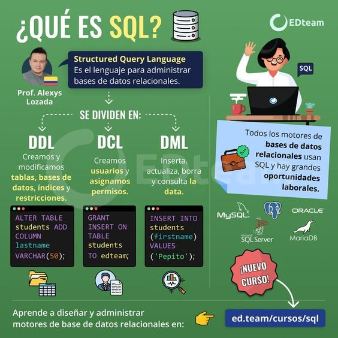

# Curso Práctico de SQL

## Breve historia de SQL

**SQL (Structured Query Language)** es un lenguaje de programación diseñado para interactuar con bases de datos. A lo largo de los años, ha evolucionado desde sus inicios hasta convertirse en uno de los estándares más utilizados para el manejo de datos.

#### Historia:

1. **1970**: Edgar F. Codd, un científico de IBM, propuso el modelo relacional como una forma de representar y manejar datos. Su trabajo sentó las bases para el desarrollo de SQL.

2. **1974**: IBM desarrolló el primer lenguaje para bases de datos relacionales, llamado **SEQUEL** (Structured English Query Language), que posteriormente evolucionó a SQL.

3. **1976**: El término SQL fue adoptado oficialmente por ANSI (American National Standards Institute) y se convirtió en un estándar para bases de datos.

4. **1986**: Oracle fue la primera compañía en implementar SQL en sus sistemas de bases de datos comerciales.

5. **1989**: SQL se convierte en un estándar reconocido internacionalmente con la publicación de la **SQL-89**.

6. **1992**: Se publica la especificación **SQL-92**, que define formalmente el lenguaje SQL como lo conocemos hoy en día. Este estándar es el más ampliamente utilizado.

7. **2003**: Se publica **SQL:2003**, una versión más avanzada que incorpora características como la programación en procedimientos almacenados y nuevos tipos de datos.

8. **2011**: Se lanza **SQL:2011**, incluyendo más funcionalidad para análisis, JSON, y acceso distribuido.

A lo largo de los años, SQL ha sido adoptado por múltiples sistemas de bases de datos, como PostgreSQL, MySQL, Oracle, SQL Server, y otros, consolidándose como el estándar clave para gestionar bases de datos relacionales.




## Álgebra relacional

El **álgebra relacional** es una teoría matemática utilizada para definir las operaciones que se pueden realizar en los modelos de bases de datos relacionales. Se basa en el conjunto de principios matemáticos y lógica que describe cómo se pueden combinar y manipular tablas (relaciones) para obtener resultados deseados.

#### Principales operaciones del Álgebra Relacional:

1. **Selección (σ)**:
   - Permite filtrar las filas (registros) de una tabla según una condición.
   - Sintaxis: `σ_condición(Tabla)`
   - Ejemplo: `σ[edad>30](Empleado)` selecciona todos los empleados mayores de 30 años.

2. **Proyección (π)**:
   - Permite seleccionar ciertas columnas de una tabla.
   - Sintaxis: `π_columnas(Tabla)`
   - Ejemplo: `π[nombre,apellido](Empleado)` selecciona sólo las columnas nombre y apellido.

3. **Unión (∪)**:
   - Combina los registros de dos tablas, eliminando los duplicados.
   - Sintaxis: `Tabla1 ∪ Tabla2`
   - Nota: Ambas tablas deben tener el mismo número de columnas y tipos de datos.

4. **Intersección (∩)**:
   - Devuelve los registros que están presentes en ambas tablas.
   - Sintaxis: `Tabla1 ∩ Tabla2`
   - Ambas tablas deben tener el mismo número de columnas y tipos de datos.

5. **Diferencia (−)**:
   - Devuelve los registros presentes en la primera tabla pero no en la segunda.
   - Sintaxis: `Tabla1 − Tabla2`

6. **Producto cartesiano (×)**:
   - Combina todas las filas de una tabla con todas las filas de otra tabla.
   - Sintaxis: `Tabla1 × Tabla2`

7. **Join (⋈)**:
   - Combina las filas de dos tablas en función de una condición de igualdad entre columnas.
   - Tipos de Join:
     - **Inner Join**: Combina las filas que coinciden en ambas tablas.
     - **Left (Outer) Join**: Combina las filas de la primera tabla con todas las filas de la segunda, colocando `NULL` en las columnas cuando no hay coincidencia.
     - **Right (Outer) Join**: Combina las filas de la segunda tabla con todas las filas de la primera, colocando `NULL` en las columnas cuando no hay coincidencia.
     - **Full (Outer) Join**: Combina las filas de ambas tablas, colocando `NULL` en las columnas cuando no hay coincidencia en ambas.

8. **Renombramiento (ρ)**:
   - Permite renombrar las columnas o tablas resultantes de una operación.
   - Sintaxis: `ρ_nombre_nueva(operacion)`

9. **Agrupación (GROUP BY)**:
   - Agrupa los registros según una o varias columnas y luego aplica funciones agregadas como `SUM`, `AVG`, `COUNT`, `MAX`, `MIN`.
   - Sintaxis: `GROUP BY columna`

10. **Ordenamiento (ORDER BY)**:
    - Ordena los registros de acuerdo con una o más columnas.
    - Sintaxis: `ORDER BY columna`

#### Ejemplo básico:
Queremos seleccionar los nombres y las edades de los empleados que trabajan en el departamento 10, ordenados por edad:

```sql
SELECT nombre, edad
FROM Empleado
WHERE departamento = 10
ORDER BY edad;
```

Este sería un ejemplo clásico de la operación en álgebra relacional. 

El álgebra relacional es fundamental para entender cómo funcionan las consultas SQL y cómo los datos pueden manipularse utilizando estas operaciones matemáticas básicas.