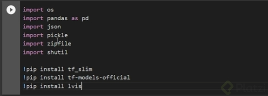

# Curso Profesional de Computer Vision con TensorFlow

## ¿Por qué aprender computer vision?

¡Excelente pregunta! Aprender *computer vision* o visión por computadora es una decisión muy acertada en el panorama tecnológico actual. 

**¿Por qué?**

* **Demanda en el mercado laboral:** La visión por computadora está detrás de una gran cantidad de aplicaciones que utilizamos a diario, desde el reconocimiento facial en nuestros teléfonos hasta los coches autónomos. Esto significa que la demanda de profesionales en este campo está en constante crecimiento.
* **Innovación constante:** Es un campo en constante evolución, con nuevas técnicas y aplicaciones surgiendo todo el tiempo. Esto significa que siempre habrá oportunidades para aprender y crecer.
* **Resolución de problemas del mundo real:** La visión por computadora se utiliza para resolver problemas en una amplia variedad de campos, desde la medicina hasta la agricultura. Es una herramienta poderosa para mejorar la vida de las personas.
* **Desarrollo de proyectos interesantes:** Si te apasiona la programación y la inteligencia artificial, la visión por computadora te permitirá crear proyectos innovadores y desafiantes.

**¿Qué puedes hacer con la visión por computadora?**

* **Reconocimiento de objetos:** Identificar objetos en imágenes y videos.
* **Seguimiento de objetos:** Rastrear el movimiento de objetos en tiempo real.
* **Segmentación de imágenes:** Dividir una imagen en diferentes regiones significativas.
* **Reconocimiento facial:** Identificar a personas a partir de sus rostros.
* **Generación de imágenes:** Crear nuevas imágenes a partir de datos existentes.

**¿Qué necesitas para aprender visión por computadora?**

* **Conocimientos básicos de programación:** Python es el lenguaje más utilizado en este campo.
* **Matemáticas:** Conceptos básicos de álgebra lineal y cálculo.
* **Aprendizaje automático:** Conocer las técnicas de aprendizaje profundo y redes neuronales convolucionales.
* **Bibliotecas:** Familiarizarte con bibliotecas como TensorFlow y PyTorch.

**En resumen,** la visión por computadora es un campo apasionante y con un gran potencial. Si estás interesado en la inteligencia artificial y quieres desarrollar habilidades que te permitan crear tecnologías innovadoras, ¡la visión por computadora es definitivamente para ti!

Aprender **Computer Vision** (Visión por Computadora) es valioso por varias razones, especialmente dada la creciente demanda de esta tecnología en diversas industrias. Aquí te comparto algunas de las principales ventajas:

### 1. **Aplicaciones prácticas en diversas industrias**
   - **Automóviles autónomos**: La visión por computadora es crucial para que los vehículos autónomos puedan "ver" y tomar decisiones basadas en su entorno.
   - **Salud**: En el diagnóstico médico, la visión por computadora se utiliza para analizar imágenes como radiografías, resonancias magnéticas y otros estudios médicos para detectar enfermedades.
   - **Seguridad**: Se aplica en el reconocimiento facial, la vigilancia mediante cámaras de seguridad y la detección de actividades sospechosas.
   - **Comercio y retail**: Para el análisis de imágenes de productos, la gestión de inventarios mediante cámaras y la personalización de la experiencia del cliente.

### 2. **Mejora de la accesibilidad**
   - La visión por computadora puede ayudar a las personas con discapacidades, por ejemplo, mediante aplicaciones que describen el entorno a través de cámaras o el reconocimiento de objetos y texto.

### 3. **Interacción con el entorno**
   - Muchas interfaces tecnológicas modernas, como los asistentes de voz con capacidad visual (por ejemplo, Google Lens), aprovechan la visión por computadora para interpretar imágenes o escenas y proporcionar información relevante.

### 4. **Avances en Inteligencia Artificial (IA)**
   - La visión por computadora es una de las áreas más complejas de la IA, por lo que aprender sobre ella abre puertas para entender otros campos relacionados como el aprendizaje profundo (deep learning), redes neuronales convolucionales (CNN), y procesamiento de imágenes.

### 5. **Desarrollo de nuevas tecnologías**
   - Con el rápido avance de dispositivos como drones, cámaras inteligentes y robots autónomos, la visión por computadora es clave para el desarrollo de tecnologías emergentes que tienen el potencial de transformar sectores como la agricultura, la manufactura y la logística.

### 6. **Mejoramiento de procesos**
   - Automatización de tareas que requieren visión, como inspección de calidad en manufactura, identificación de productos defectuosos, y optimización de flujos de trabajo mediante visión artificial.

### 7. **Desarrollo personal y profesional**
   - La visión por computadora está en la frontera de la tecnología, y especializarse en ella te coloca en una posición privilegiada dentro del mundo de la investigación y la industria tecnológica.
   - Hay una alta demanda de expertos en visión por computadora, lo que puede abrir muchas oportunidades de empleo y proyectos innovadores.

En resumen, aprender visión por computadora no solo te permite estar al tanto de una tecnología revolucionaria, sino que también abre muchas oportunidades para transformar industrias y mejorar vidas mediante soluciones innovadoras.

## ¿Qué es la visión computarizada?

La **visión computarizada** o **computer vision** es un campo de la inteligencia artificial (IA) y las ciencias computacionales que permite a las máquinas "ver" e interpretar el mundo visual de una manera similar a los humanos. A través de algoritmos y modelos avanzados, los sistemas de visión computarizada procesan, analizan y entienden imágenes o secuencias de imágenes (como en un video), extrayendo información útil y aplicándola para resolver problemas específicos.

### Principales componentes y funcionamiento

Para comprender mejor qué es y cómo funciona, estos son algunos de sus elementos fundamentales:

1. **Procesamiento de imágenes**:
   - Este es el primer paso en la visión computarizada, donde una imagen o video es convertido en datos procesables por el sistema. Se aplican técnicas de procesamiento de imágenes, como la detección de bordes, el filtrado y el ajuste de colores, para preparar las imágenes para el análisis.

2. **Reconocimiento de patrones y aprendizaje**:
   - La visión computarizada utiliza algoritmos de reconocimiento de patrones que le permiten identificar formas, colores, texturas y otros elementos en una imagen.
   - El aprendizaje profundo (deep learning), especialmente las redes neuronales convolucionales (CNN), ha revolucionado este campo al permitir que los sistemas puedan aprender de grandes volúmenes de datos y mejorar sus predicciones en tareas específicas, como la clasificación de objetos o la detección de rostros.

3. **Interpretación y análisis**:
   - Una vez que el sistema ha procesado la imagen y reconocido patrones, puede interpretar lo que "ve". Esto incluye detectar y clasificar objetos, medir distancias, estimar poses, o incluso identificar emociones faciales.
   - Dependiendo de la aplicación, estos datos se analizan para tomar decisiones o generar respuestas automáticas, como activar una alarma de seguridad o indicar a un automóvil autónomo que frene.

4. **Aplicación de resultados**:
   - El sistema usa la información procesada para ejecutar tareas. Esto puede implicar desde clasificar imágenes, como en las búsquedas de imágenes, hasta tareas complejas como guiar a un robot en una línea de producción o realizar una cirugía asistida por robot en medicina.

### Ejemplos de aplicaciones de la visión computarizada

- **Reconocimiento de objetos y clasificación**: Identificar y clasificar objetos, como en la identificación de productos en supermercados o en redes sociales, donde se etiquetan automáticamente objetos o personas en fotos.
- **Detección de rostros y análisis facial**: Reconocer y analizar características faciales, ya sea para seguridad (reconocimiento facial), marketing (análisis de emociones) o aplicaciones de entretenimiento.
- **Análisis de escenas y vehículos autónomos**: Permitir a los automóviles autónomos "ver" la carretera, identificar peatones, señales de tráfico y otros vehículos.
- **Diagnóstico médico por imágenes**: Detectar y clasificar células o patrones en imágenes médicas, como rayos X o resonancias magnéticas, ayudando a los médicos en el diagnóstico de enfermedades.
- **Realidad aumentada (AR)**: Integrar objetos virtuales en un entorno real, como en juegos o aplicaciones de diseño de interiores.

### Importancia de la visión computarizada

La visión computarizada es una tecnología esencial en el avance de la inteligencia artificial porque permite que las máquinas interactúen y tomen decisiones en función del entorno visual, lo que amplía sus capacidades y aplicaciones.

## Tipos de visión computarizada

La visión computarizada engloba varias técnicas y enfoques, cada uno orientado a resolver diferentes tipos de problemas visuales. Aquí te explico algunos de los principales tipos de visión computarizada y sus aplicaciones.

### 1. **Detección de Objetos**
   - Consiste en identificar y localizar objetos específicos en una imagen o video. Este tipo de visión computarizada no solo reconoce la presencia de un objeto (como un auto o una persona) sino que también determina su posición dentro de la imagen.
   - **Aplicaciones**: Detección de peatones en vehículos autónomos, seguridad mediante vigilancia y sistemas de conteo de objetos en manufactura.

### 2. **Reconocimiento de Imágenes**
   - El reconocimiento de imágenes es la capacidad de clasificar una imagen en una categoría o etiqueta. El sistema compara la imagen con una base de datos de imágenes previamente etiquetadas y determina a qué clase pertenece.
   - **Aplicaciones**: Clasificación de imágenes en redes sociales, diagnóstico médico, clasificación de productos en ecommerce.

### 3. **Segmentación de Imágenes**
   - La segmentación de imágenes consiste en dividir una imagen en varias partes o segmentos con el fin de simplificar su análisis. Estos segmentos suelen representar diferentes objetos o áreas de interés.
   - **Tipos de segmentación**:
     - **Segmentación semántica**: Etiqueta cada píxel de la imagen de acuerdo a la clase de objeto (por ejemplo, césped, cielo, carretera).
     - **Segmentación por instancias**: Similar a la semántica, pero diferencia entre instancias individuales de una clase (como cada persona en una multitud).
   - **Aplicaciones**: Análisis médico de imágenes, segmentación de tumores, vehículos autónomos para segmentar la carretera y los objetos.

### 4. **Reconocimiento Facial**
   - Este tipo de visión computarizada se centra en detectar y reconocer rostros humanos, y en algunos casos identificar a la persona. Utiliza puntos clave como los ojos, nariz y boca para realizar la identificación.
   - **Aplicaciones**: Autenticación de usuarios en dispositivos móviles, control de acceso y sistemas de vigilancia.

### 5. **Detección de Movimiento y Seguimiento de Objetos**
   - La detección de movimiento permite identificar cambios en una escena a lo largo del tiempo. El seguimiento de objetos (o "tracking") va un paso más allá al seguir la trayectoria de un objeto a través de múltiples fotogramas.
   - **Aplicaciones**: Seguridad y vigilancia, deportes para el análisis de rendimiento, realidad aumentada (AR).

### 6. **Reconocimiento de Texto (OCR - Optical Character Recognition)**
   - OCR es una técnica que convierte texto en imágenes a texto digital. Permite que las máquinas lean y procesen el contenido textual de imágenes, como documentos escaneados o placas de automóviles.
   - **Aplicaciones**: Digitalización de documentos, reconocimiento de matrículas, lectura de etiquetas en almacenes.

### 7. **Análisis de Imágenes Médicas**
   - Este tipo de visión computarizada se especializa en analizar imágenes médicas, como radiografías, resonancias magnéticas y tomografías. Los algoritmos pueden detectar patrones y anomalías en estas imágenes, asistiendo a los profesionales médicos en el diagnóstico.
   - **Aplicaciones**: Diagnóstico de enfermedades, identificación de tumores, monitoreo del progreso de enfermedades.

### 8. **Reconstrucción 3D**
   - La reconstrucción 3D busca crear una representación tridimensional de un objeto o una escena a partir de múltiples imágenes 2D. Esto se realiza mediante técnicas de fotogrametría y modelos tridimensionales.
   - **Aplicaciones**: Realidad aumentada y virtual, diseño de productos, mapeo y cartografía, arquitectura.

### 9. **Visión Estéreo**
   - En la visión estéreo, se utilizan dos o más cámaras para simular la percepción de profundidad, similar a la visión humana. Esto permite que el sistema calcule distancias y posiciones de objetos en un espacio tridimensional.
   - **Aplicaciones**: Robots móviles, drones, sistemas de navegación en vehículos autónomos.

### 10. **Análisis de Expresiones Faciales**
   - Esta técnica permite identificar y clasificar emociones basadas en la expresión facial de las personas. El sistema analiza los movimientos de músculos faciales que corresponden a emociones específicas, como alegría, tristeza o sorpresa.
   - **Aplicaciones**: Atención al cliente, análisis de marketing, investigación en psicología.

Cada tipo de visión computarizada utiliza algoritmos y modelos específicos para lograr sus objetivos, y algunos proyectos pueden combinar varias de estas técnicas para resolver problemas complejos.

## Introducción a object detection: clasificación + localización

La **detección de objetos** (object detection) es una tarea de la visión computarizada que combina dos aspectos fundamentales: la **clasificación** y la **localización** de objetos en una imagen. Es una de las áreas más aplicadas en campos como la seguridad, el comercio y la conducción autónoma, ya que permite a los sistemas identificar y localizar objetos de interés en tiempo real.

### 1. Clasificación + Localización: Componentes clave de la detección de objetos

La detección de objetos consiste en:

- **Clasificación**: Identificar qué tipo de objeto está presente en una imagen o en una región de la imagen. Esto implica asignar una etiqueta a cada objeto (por ejemplo, "persona", "perro" o "auto").
  
- **Localización**: Determinar la posición de cada objeto en la imagen. Esto se representa comúnmente con **cajas delimitadoras** (bounding boxes) que encierran cada objeto, especificando sus coordenadas y permitiendo así su ubicación precisa.

La detección de objetos combina estas dos tareas al mismo tiempo. Esto significa que no solo dice qué objeto está presente, sino que también señala dónde está cada objeto en la imagen.

### 2. Técnicas y enfoques en la detección de objetos

Para lograr la combinación de clasificación y localización, los modelos de detección de objetos han evolucionado hacia arquitecturas que pueden detectar múltiples objetos en diferentes posiciones. Existen algunos enfoques comunes en la detección de objetos:

#### Modelos basados en regiones (R-CNN y variantes)
   - **R-CNN (Regions with Convolutional Neural Networks)**: Fue uno de los primeros modelos para detección de objetos. Genera propuestas de regiones (posibles ubicaciones de objetos) y luego usa una red neuronal convolucional para clasificar y ajustar una caja delimitadora.
   - **Fast R-CNN y Faster R-CNN**: Mejoran la velocidad y precisión de R-CNN mediante la optimización de la generación de regiones y el uso de una única red para clasificar y ajustar las cajas en lugar de analizar cada región de forma individual.

#### Modelos de detección en un solo paso (YOLO, SSD)
   - **YOLO (You Only Look Once)**: YOLO es un modelo de detección en un solo paso que procesa la imagen completa en una sola pasada, dividiéndola en una cuadrícula y prediciendo directamente las cajas y clasificaciones de los objetos. Es extremadamente rápido, ideal para aplicaciones en tiempo real.
   - **SSD (Single Shot MultiBox Detector)**: Similar a YOLO, SSD detecta objetos en una sola pasada pero mejora la precisión mediante el uso de diferentes tamaños de cajas para detectar objetos de diversas escalas. 

Estos enfoques permiten detectar múltiples objetos en una imagen, cada uno con una caja delimitadora y una etiqueta de clasificación.

### 3. Métricas en la detección de objetos: IoU y mAP

Las métricas comunes en detección de objetos incluyen:

- **IoU (Intersection over Union)**: Mide la superposición entre la caja delimitadora predicha y la caja delimitadora real. Cuanto más alta sea la IoU, más precisa es la detección.
- **mAP (Mean Average Precision)**: Promedio de precisión en todas las clases detectadas en un conjunto de datos. Es una métrica usada para evaluar la precisión general del modelo de detección.

### 4. Aplicaciones de la detección de objetos

La combinación de clasificación y localización es fundamental para una gran variedad de aplicaciones prácticas:

- **Conducción autónoma**: Para identificar y localizar peatones, vehículos, señales de tránsito, entre otros elementos en la carretera.
- **Sistemas de vigilancia**: Para detectar personas u objetos sospechosos y rastrear su ubicación.
- **Análisis de imágenes médicas**: En diagnóstico, para detectar y localizar células o patrones anómalos, como tumores en escáneres médicos.
- **Retail y comercio electrónico**: Identificación y conteo de productos en almacenes o estanterías.

### 5. Cómo funciona un modelo típico de detección de objetos

En términos básicos, el proceso de detección de objetos sigue estos pasos:

1. **Preprocesamiento**: La imagen es transformada (por ejemplo, cambiada de tamaño) para adaptarse al modelo.
2. **Generación de propuestas de región** (en modelos basados en regiones) o **pasada completa en una cuadrícula** (en modelos de un solo paso).
3. **Clasificación y ajuste de cajas**: Para cada región, el modelo clasifica y ajusta las cajas delimitadoras para identificar los objetos presentes y su ubicación.
4. **Post-procesamiento**: Filtrado de resultados redundantes mediante técnicas como supresión de no-máximos (Non-Maximum Suppression, NMS) para asegurar que cada objeto tenga una única detección.

La detección de objetos es fundamental en visión computarizada, y los avances en esta tecnología han mejorado considerablemente la precisión y eficiencia en aplicaciones prácticas y en tiempo real.

**Lecturas recomendadas**

[Non-maximum Suppression (NMS). A Technique to remove duplicates and… | by Sambasivarao. K | Towards Data Science](https://towardsdatascience.com/non-maximum-suppression-nms-93ce178e177c)

[Two Minute Papers - YouTube](https://www.youtube.com/c/K%C3%A1rolyZsolnai)

[EL COSTO DE LA CONGESTIÓN: VIDA Y RECURSOS PERDIDOS](https://imco.org.mx/costo-la-congestion-vida-recursos-perdidos/)

## Aprende a identificar problemas

Aprender a identificar problemas es una habilidad clave en la resolución efectiva de desafíos en cualquier ámbito, ya sea en proyectos tecnológicos, en gestión de equipos o en el día a día. Aquí tienes algunos pasos y enfoques para mejorar esta habilidad:

### 1. **Escuchar y observar atentamente**
   - La identificación de problemas comienza con la observación cuidadosa. Esto incluye escuchar las preocupaciones, observar patrones o comportamientos inusuales, y notar cualquier discrepancia con el funcionamiento normal o los objetivos esperados.
   - Pregunta a los involucrados para obtener una perspectiva clara del problema y los síntomas. Muchas veces, los síntomas son la primera pista hacia la raíz del problema.

### 2. **Dividir y simplificar el problema**
   - Desglosa el problema en partes más pequeñas para analizarlo mejor. Pregúntate cuál es el problema específico y trata de separar los distintos elementos que lo componen.
   - Utiliza preguntas como "¿Qué? ¿Por qué? ¿Cuándo? ¿Dónde? ¿Quién?" para abordar cada aspecto del problema desde diferentes ángulos.

### 3. **Buscar patrones y causas subyacentes**
   - Muchos problemas tienen patrones comunes o causas subyacentes. Intenta ver más allá de los síntomas superficiales para llegar a la causa raíz.
   - Herramientas como los **diagramas de Ishikawa** (o de espina de pescado) y el **análisis de los 5 porqués** ayudan a profundizar y desentrañar el origen de los problemas.

### 4. **Cuantificar y analizar datos**
   - Si es posible, recopila datos relevantes para medir el problema. Esto podría ser el tiempo perdido, el número de errores o el impacto financiero, entre otros.
   - Analizar datos ayuda a entender la magnitud y frecuencia del problema, y puede revelar tendencias ocultas que ofrecen pistas sobre las causas.

### 5. **Priorizar problemas**
   - No todos los problemas tienen el mismo nivel de urgencia o impacto. Haz una lista de problemas y clasifícalos según su gravedad, frecuencia y el efecto que tienen sobre los objetivos.
   - Usa técnicas como el **análisis de Pareto** (regla del 80/20) para identificar los problemas más críticos y abordarlos primero.

### 6. **Buscar múltiples perspectivas**
   - A veces, trabajar en equipo y escuchar opiniones de diferentes personas puede aportar ideas nuevas para identificar problemas que de otra manera no serían obvios.
   - Fomentar un entorno en el que todos se sientan cómodos compartiendo problemas puede ayudar a encontrar soluciones antes de que los problemas se agraven.

### 7. **Establecer métodos de retroalimentación continua**
   - La retroalimentación constante y el monitoreo permiten identificar problemas tempranamente. Las revisiones periódicas y los controles de calidad en cada etapa pueden ayudar a encontrar problemas potenciales.
   - Implementa canales de comunicación claros para recibir sugerencias y comentarios de los usuarios o del equipo.

Aprender a identificar problemas te permitirá anticiparte y tomar acciones preventivas, lo que es esencial para la mejora continua y el logro de objetivos de manera eficiente.

### Identificar Problemas

**Desarrolla la observación crítica**

Aprende a **observar con atención** lo que ocurre a tu alrededor, tanto en los sistemas que utilizas como en las interacciones con personas. A veces, los problemas no son evidentes, pero al prestar atención a los detalles, puedes detectar inconsistencias o áreas que podrían mejorarse.

**Haz preguntas de forma sistemática**

Las **preguntas correctas** pueden revelar problemas que de otra forma pasarían desapercibidos. Utiliza preguntas como:

¿Qué está funcionando bien y qué no?

¿Qué se esperaba que sucediera vs. qué está ocurriendo realmente?

¿Cuáles son los objetivos y están siendo alcanzados?

**Realiza análisis de causa raíz**

Antes de saltar a las soluciones, dedica tiempo a identificar la **causa raíz** del problema. Una técnica útil para esto es el método de los **5 por qué** (Five Whys), en el que preguntas repetidamente "¿por qué?" para profundizar en el problema y encontrar la causa subyacente.

**Recoge datos y evidencia**

Utiliza **datos cuantitativos y cualitativos** para identificar problemas de manera objetiva. Analizar la información recopilada de manera sistemática te permitirá ver patrones y encontrar problemas que no son evidentes.

**Escucha a otros (retroalimentación)**

Habla con las personas que están involucradas en los procesos o que son afectadas por ellos. A menudo, quienes trabajan directamente en una tarea o actividad pueden identificar problemas que no son evidentes para quienes no están tan cerca del día a día.

**Ejemplo**: En un equipo de desarrollo, los programadores o testers suelen notar problemas técnicos antes que los gerentes de proyecto.

**Divide los problemas grandes en partes más pequeñas**

Los problemas grandes pueden ser difíciles de identificar en su totalidad. Intenta **descomponer** un problema en componentes más pequeños y manejables, para poder analizar cada uno por separado.

**Ejemplo**: Si el rendimiento general de una aplicación es bajo, descompón el problema en diferentes áreas (front-end, back-end, base de datos) y analiza cada una.

**Realiza evaluaciones periódicas**

Revisa continuamente los procesos, sistemas o proyectos en los que trabajas. La identificación de problemas no es un evento único, sino un proceso continuo. Las revisiones periódicas te permiten detectar problemas antes de que se agraven.

**Ejemplo**: Si gestionas un equipo, realiza revisiones periódicas de los avances del proyecto y las dinámicas de trabajo para detectar posibles cuellos de botella.

**Mantén una mentalidad abierta y flexible**

Los problemas no siempre se presentan de la forma que esperas. Evita aferrarte a un solo punto de vista y sé flexible para analizar desde múltiples perspectivas. Considera también que lo que parece un problema, puede ser una oportunidad para mejorar o innovar.

**Utiliza herramientas de resolución de problemas**

Existen muchas herramientas que te pueden ayudar a **identificar y estructurar problemas** de manera más eficaz. Algunas de ellas incluyen:

**Análisis FODA** (Fortalezas, Oportunidades, Debilidades, Amenazas): Identifica tanto aspectos positivos como negativos en un proceso o situación.

**Diagrama de Ishikawa** (diagrama de causa y efecto o espina de pescado): Ayuda a visualizar causas potenciales de un problema y sus efectos.

**Mapeo de procesos**: Visualiza todos los pasos involucrados en un proceso para identificar dónde pueden estar ocurriendo problemas o ineficiencias.

**Aprende de problemas previos**

Muchas veces, los problemas actuales tienen similitudes con problemas que ya has enfrentado en el pasado. Mantén un **registro de los problemas anteriores** y las soluciones que aplicaste para poder aprender de esas experiencias y evitar que los mismos errores se repitan.

**Ejemplo**: Si trabajas en desarrollo de software, documenta las soluciones a errores críticos para que, si surgen problemas similares, puedas abordarlos rápidamente.

**Prioriza los problemas**

No todos los problemas tienen el mismo impacto. Es crucial que aprendas a **priorizar** qué problemas abordar primero, considerando el nivel de urgencia, el impacto que pueden tener en el resultado final, y los recursos disponibles.

**Ejemplo**: En un proyecto, un pequeño error en el diseño visual de una aplicación puede tener menos impacto que un fallo crítico en la base de datos.

**Explora alternativas y escenarios**

Cuando identifiques un posible problema, imagina diversos escenarios alternativos. A veces, lo que parece un problema puede verse de otra manera si exploras distintas opciones de solución o perspectivas. Esto te ayuda a validar si el problema que identificas es realmente un desafío o simplemente una percepción incorrecta.

## Cómo definir los tiempos de tu proyecto

Definir los tiempos de un proyecto es esencial para garantizar que se complete de manera efectiva y dentro del plazo previsto. Un cronograma bien elaborado te ayuda a administrar los recursos, anticiparte a los problemas y asegurar que todas las etapas del proyecto estén alineadas. Aquí tienes algunos pasos clave para definir los tiempos de tu proyecto:

### 1. **Definir claramente los objetivos y entregables del proyecto**
   - Comienza identificando los objetivos finales del proyecto y los entregables clave. Esto te permitirá saber exactamente qué resultados se deben alcanzar y cuándo deben estar listos.
   - Divide el proyecto en fases y establece entregables específicos para cada una. Tener metas parciales ayuda a evaluar el progreso y facilita el ajuste de tiempos.

### 2. **Desglosar las tareas en actividades detalladas**
   - Desglosa cada fase del proyecto en tareas y subtareas. Cuanto más detalladas sean las actividades, más fácil será estimar el tiempo necesario para cada una.
   - Usa técnicas como el **Work Breakdown Structure (WBS)** o estructura de desglose del trabajo, que organiza visualmente las tareas en niveles jerárquicos.

### 3. **Estimar la duración de cada actividad**
   - Evalúa cuánto tiempo llevará completar cada actividad. Puedes basarte en datos históricos, experiencia previa o consultar con expertos.
   - Utiliza métodos como **estimación de tres puntos** (promedio de la estimación optimista, pesimista y realista) para tener un margen de error en cada actividad.

### 4. **Asignar los recursos adecuados**
   - Considera quién estará a cargo de cada tarea y asegúrate de que cuenten con el tiempo, las habilidades y los recursos necesarios.
   - Evalúa si los recursos (personas, herramientas, materiales) estarán disponibles en el momento que los necesites y ajusta el cronograma según las limitaciones de disponibilidad.

### 5. **Establecer dependencias entre actividades**
   - Algunas actividades solo pueden comenzar cuando se completen otras, y reconocer estas dependencias es clave para la planificación.
   - Usa herramientas como el **diagrama de red de proyectos** (Diagrama PERT o de dependencias) para visualizar las relaciones entre tareas y asegurar que no haya retrasos innecesarios.

### 6. **Crear el cronograma del proyecto**
   - Basándote en la duración y las dependencias, elabora un cronograma que refleje las fechas de inicio y finalización de cada tarea.
   - Herramientas como el **diagrama de Gantt** son ideales para visualizar el cronograma de manera lineal y sencilla, permitiendo ajustar tareas en función del avance del proyecto.

### 7. **Definir hitos (milestones) clave**
   - Los hitos son puntos de control que te permiten medir el progreso y validar el cumplimiento de las etapas. Establece hitos a lo largo del proyecto para evaluar que esté avanzando según lo planeado.
   - Usa estos hitos para comunicar avances con el equipo y stakeholders, y para hacer ajustes si algo va fuera de lo previsto.

### 8. **Incorporar tiempo de margen (buffer)**
   - Para cada fase o para el proyecto en general, asigna un tiempo de margen para imprevistos. Este buffer puede ayudarte a absorber retrasos sin afectar la fecha de finalización general.
   - Una recomendación común es incluir un margen del 5-10% del tiempo estimado en cada etapa, aunque esto puede variar según la complejidad del proyecto.

### 9. **Monitorear y ajustar el cronograma regularmente**
   - A lo largo del proyecto, es fundamental monitorear el avance y comparar el progreso real con el planificado. Realiza reuniones periódicas de seguimiento para detectar y ajustar cualquier desviación en el cronograma.
   - Si surgen problemas que afectan los tiempos, ajusta las tareas, asigna recursos adicionales o modifica los tiempos según sea necesario.

### 10. **Utilizar herramientas de gestión de proyectos**
   - Herramientas como Microsoft Project, Trello, Asana o Monday pueden ayudarte a organizar y visualizar el cronograma, administrar los recursos y hacer ajustes cuando sea necesario.
   - Estas herramientas facilitan la actualización en tiempo real, lo cual es especialmente útil para equipos grandes o proyectos complejos.

Definir los tiempos en tu proyecto de forma detallada te ayudará a cumplir con los plazos de entrega y a coordinar eficazmente los recursos.

**Archivos de la clase**

[proyecto-plan-de-trabajo.xlsx](https://static.platzi.com/media/public/uploads/proyecto-plan-de-trabajo_d46ffdf4-ccef-419d-a7d1-ad81ef4c1578.xlsx)

[ejemplo-plan-de-trabajo-cavings.xlsx](https://static.platzi.com/media/public/uploads/ejemplo-plan-de-trabajo-cavings_b9f06932-13fa-4379-a646-b77d75f8a1e6.xlsx)

[template-plan-de-trabajo.xlsx](https://static.platzi.com/media/public/uploads/template-plan-de-trabajo_9d26e129-aa1f-442c-94cc-d7729ad2457a.xlsx)

**Lecturas recomendadas**

[Curso de Scrum - Platzi](https://platzi.com/cursos/scrum/)

## Cómo costear tu proyecto

Costear un proyecto es crucial para asegurarse de que cuente con los recursos necesarios y para que sea financieramente viable. La estimación de costos permite también evitar sobrecostos y justificar la inversión. Aquí te explico algunos pasos para definir un presupuesto detallado de tu proyecto:

### 1. **Identificar los componentes del proyecto y sus actividades**
   - Desglosa el proyecto en fases y actividades específicas para detallar cada elemento de costo. Esto puede incluir mano de obra, materiales, equipo, tecnología, servicios externos, capacitación y gastos operativos.
   - Cuanto más detallada sea esta lista, más precisa será tu estimación de costos, ya que podrás identificar todas las áreas que requieren recursos.

### 2. **Determinar el tipo de costos**
   - **Costos directos**: Son los gastos directamente relacionados con el proyecto, como salarios, materiales y herramientas.
   - **Costos indirectos**: Son gastos necesarios pero no exclusivamente asignables al proyecto, como el alquiler del espacio de trabajo o servicios administrativos.
   - **Costos fijos y variables**: Clasifica los costos en fijos (que no cambian con el tiempo o la cantidad de producción) y variables (que pueden aumentar o disminuir según el avance del proyecto).

### 3. **Estimar los costos de cada actividad**
   - **Costos de mano de obra**: Calcula el costo del personal involucrado, teniendo en cuenta las horas estimadas de trabajo, los salarios, impuestos y beneficios.
   - **Materiales y suministros**: Estima el costo de todos los materiales que serán necesarios para completar el proyecto. Consulta con proveedores para obtener precios actualizados.
   - **Equipo y tecnología**: Incluye costos de compra, alquiler o mantenimiento de equipo especializado o software.
   - **Costos de servicios externos**: Si necesitas contratar a consultores, servicios de transporte o servicios de producción, inclúyelos en el presupuesto.

### 4. **Definir un margen para imprevistos**
   - Asegúrate de incluir un porcentaje del presupuesto para imprevistos o variaciones en los precios. Este margen de contingencia generalmente se sitúa entre el 5% y el 15% del costo total, dependiendo del grado de incertidumbre en el proyecto.
   - Este fondo ayudará a cubrir cualquier gasto no planificado sin afectar el presupuesto principal del proyecto.

### 5. **Usar técnicas de estimación de costos**
   - **Estimación análoga**: Basada en proyectos anteriores similares, ajustando los costos según las diferencias.
   - **Estimación paramétrica**: Utiliza métricas o variables conocidas (por ejemplo, el costo por hora de trabajo) para calcular los costos.
   - **Estimación ascendente**: Calcula el costo de cada actividad individual y luego los suma para obtener el costo total. Es más precisa, pero también más laboriosa.

### 6. **Organizar los costos en un cronograma de pagos**
   - Define cuándo se incurrirá en cada gasto a lo largo del proyecto. Esto te permite administrar el flujo de efectivo y asegurarte de que tengas los fondos disponibles en cada fase.
   - Crear un **flujo de caja** o **cronograma de desembolsos** te ayuda a planificar los pagos y prever los ingresos si el proyecto genera flujo de efectivo durante su ejecución.

### 7. **Revisar y ajustar el presupuesto**
   - Una vez que tengas una primera versión, revísala con las partes interesadas (stakeholders) y ajusta los costos según sea necesario. Asegúrate de que el presupuesto sea realista y que se ajuste a los objetivos del proyecto y a los recursos disponibles.
   - Considera hacer un análisis de **costos-beneficios** para determinar si los beneficios esperados justifican los costos estimados.

### 8. **Utilizar herramientas de gestión de costos**
   - Existen herramientas que pueden facilitar el proceso de presupuesto, como Excel, Google Sheets, o software especializado como Microsoft Project, SAP, o Wrike.
   - Estas herramientas permiten hacer seguimiento de costos en tiempo real y te facilitan la comparación de los gastos proyectados con los gastos reales para tomar decisiones informadas durante el proyecto.

### 9. **Implementar controles de costos**
   - Monitorea constantemente el presupuesto y registra todos los gastos en relación con el presupuesto estimado. Si algún área del proyecto está superando el presupuesto, considera hacer ajustes en otras áreas o en el cronograma.
   - Los informes de costos periódicos ayudan a detectar y solucionar problemas antes de que se conviertan en sobrecostos significativos.

### 10. **Presentar y justificar el presupuesto a los stakeholders**
   - Prepara un documento claro y detallado que justifique cada uno de los costos y que explique el método utilizado para la estimación. Esto es importante para obtener la aprobación del presupuesto y para que los stakeholders comprendan en qué se invertirán los recursos.
   - Incluye un resumen del ROI (retorno de inversión) o del valor que se espera obtener con el proyecto, si es aplicable.

Un buen presupuesto es clave para llevar el proyecto a cabo sin sorpresas financieras, y al mismo tiempo ayuda a lograr la aprobación de los stakeholders.

## Cómo identificar los roles necesarios en el proyecto

Identificar los roles necesarios en un proyecto es fundamental para asegurar que cada tarea tenga responsables asignados, y que el equipo cuente con las habilidades necesarias para alcanzar los objetivos. Aquí tienes una guía para definir los roles de manera efectiva:

### 1. **Definir el alcance y los objetivos del proyecto**
   - Antes de asignar roles, es fundamental tener claro el alcance y los objetivos del proyecto. Esto te permitirá comprender las actividades y habilidades que serán necesarias.
   - Desglosa los objetivos en tareas concretas para identificar las funciones clave que apoyarán cada fase del proyecto.

### 2. **Identificar las habilidades necesarias**
   - Analiza las tareas que conforman el proyecto y lista las habilidades o conocimientos específicos que se necesitan en cada fase. Por ejemplo, si el proyecto incluye una parte técnica, quizás necesites desarrolladores, diseñadores, y expertos en datos.
   - Asegúrate de considerar tanto habilidades técnicas (como programación, diseño gráfico, análisis de datos) como habilidades de gestión (como liderazgo, comunicación, y gestión de riesgos).

### 3. **Asignar roles principales del proyecto**
   - Algunos roles son esenciales en casi cualquier tipo de proyecto. Estos son algunos de los roles principales que suelen ser necesarios:
     - **Líder o gerente de proyecto**: Responsable de coordinar el equipo, establecer el cronograma, y asegurar que el proyecto avance según lo planificado.
     - **Sponsor del proyecto**: Usualmente un directivo o representante de la empresa, que actúa como enlace entre el proyecto y la organización y facilita recursos y apoyo.
     - **Analista de negocio**: Asegura que los requisitos del proyecto sean claros y traducidos a términos técnicos y funcionales, alineando el proyecto con las necesidades del cliente.
     - **Equipo técnico o de desarrollo**: Realiza el trabajo técnico específico, como la programación, diseño, pruebas y desarrollo del producto o servicio final.
     - **Responsable de calidad**: Monitorea y garantiza que el proyecto cumpla con los estándares de calidad definidos.
     - **Gestor de riesgos**: Identifica, evalúa y monitorea los riesgos para mitigar cualquier posible problema que surja durante el proyecto.

### 4. **Definir roles adicionales en función de la complejidad del proyecto**
   - En proyectos complejos, es posible que necesites roles adicionales o roles especializados, como un **diseñador UX/UI**, **especialista en marketing**, o **experto en seguridad**.
   - Considera también roles específicos para la implementación, pruebas y soporte post-proyecto. Si el proyecto es de desarrollo de software, por ejemplo, puedes necesitar ingenieros de pruebas (QA), arquitectos de software o soporte técnico.

### 5. **Establecer las responsabilidades de cada rol**
   - Una vez definidos los roles, documenta las responsabilidades de cada uno. Asegúrate de que todos entiendan sus tareas y límites de responsabilidad, para evitar confusiones y asegurar que el equipo trabaje de manera cohesionada.
   - Usa herramientas como el **matriz RACI** (Responsable, Aprobador, Consultado, Informado) para clarificar quién es el encargado de cada tarea y cómo interactúan los distintos roles.

### 6. **Ajustar los roles a las personas disponibles**
   - Evalúa las habilidades y fortalezas de los miembros del equipo para asignar los roles de la mejor manera posible. Si el proyecto tiene restricciones de personal, algunos miembros pueden asumir múltiples roles.
   - Considera la posibilidad de capacitar al equipo si necesitas habilidades específicas que no están disponibles en el momento.

### 7. **Definir roles de comunicación y seguimiento**
   - Además de los roles funcionales, es útil asignar responsables de comunicación y seguimiento, sobre todo en proyectos donde se colabora con stakeholders externos.
   - Un **gestor de comunicación** puede coordinar la relación con stakeholders, gestionar el flujo de información y asegurarse de que todos estén informados sobre el avance del proyecto.

### 8. **Incorporar un proceso de revisión y ajuste**
   - Durante la ejecución del proyecto, puede ser necesario revisar y ajustar los roles en función de los cambios en las necesidades del proyecto o del equipo.
   - Organiza reuniones de revisión periódicas para asegurar que cada rol sigue alineado con las necesidades del proyecto y que el equipo cuenta con el apoyo adecuado.

### 9. **Usar herramientas de planificación para asignar y coordinar roles**
   - Herramientas de gestión como Trello, Asana, o Microsoft Project pueden ayudarte a organizar roles, tareas y tiempos. Esto permite a todos los miembros del equipo conocer sus responsabilidades y colaborar de manera eficiente.
   - Configura el tablero del proyecto de forma que todos los integrantes tengan visibilidad sobre quién está a cargo de cada tarea, lo cual facilita el trabajo en equipo y la supervisión.

### 10. **Comunicar y documentar los roles claramente**
   - Una vez definidos, documenta y comunica los roles y responsabilidades a todo el equipo. Esto ayuda a evitar malentendidos y asegura que cada persona esté alineada con su contribución al proyecto.
   - Mantén esta documentación actualizada y accesible para todos los miembros del equipo.

Definir los roles de tu proyecto de manera estructurada te permitirá crear un equipo bien coordinado y facilitará el éxito del proyecto.

## Producto mínimo viable en computer vision

Un Producto Mínimo Viable (MVP) en un proyecto de visión computarizada es una versión simplificada y funcional del sistema que incluye solo las características esenciales para satisfacer las necesidades iniciales de los usuarios. El MVP permite lanzar el proyecto rápidamente, validar la tecnología y obtener retroalimentación temprana, con el objetivo de evolucionar el producto basado en resultados reales.

### Pasos para desarrollar un MVP en visión computarizada

1. **Definir el problema y el objetivo del proyecto**
   - Establece con claridad qué problema resolverá tu MVP y qué resultados esperas obtener. Por ejemplo, si el proyecto es para detectar objetos en imágenes de seguridad, el MVP puede enfocarse en detectar solo ciertos tipos de objetos (como personas o vehículos) sin incluir una gran variedad de clases de objetos.

2. **Seleccionar las funcionalidades básicas**
   - Un MVP en visión computarizada suele incluir únicamente las funcionalidades necesarias para que el sistema cumpla su propósito. Por ejemplo:
     - **Clasificación de imágenes**: Clasificar imágenes en un conjunto limitado de categorías.
     - **Detección de objetos**: Identificar la presencia y ubicación de objetos específicos en una imagen o video.
     - **Reconocimiento de texto (OCR)**: Extraer texto de imágenes si el proyecto lo requiere.
     - **Segmentación de imágenes**: Identificar y separar regiones de interés en una imagen, si es un aspecto clave.
   - Excluye funciones avanzadas (como detección multi-objeto compleja o segmentación detallada) para mantener el MVP simple y funcional.

3. **Elegir el modelo y la tecnología de visión computarizada**
   - Selecciona un modelo preentrenado de redes neuronales (como ResNet, YOLO, o MobileNet) que se adapte bien a las necesidades del proyecto. Utilizar un modelo preentrenado es común en los MVP, ya que reduce los tiempos y costos de entrenamiento.
   - Decide si tu MVP funcionará en dispositivos locales, en la nube o en dispositivos móviles. Esto depende de dónde necesiten acceso los usuarios y de los recursos de cómputo disponibles.

4. **Definir el conjunto de datos inicial**
   - Selecciona un conjunto de datos representativo y de tamaño manejable para entrenar y probar el MVP. Si no tienes datos propios, puedes empezar con conjuntos de datos públicos relevantes (como COCO o ImageNet).
   - Para proyectos de detección de objetos, marca los objetos necesarios en un conjunto de imágenes reducido para obtener anotaciones de entrenamiento. Esto permite que el sistema pueda ser entrenado y probado sin requerir un gran volumen de datos.

5. **Entrenar y ajustar el modelo**
   - Entrena el modelo en el conjunto de datos elegido y ajusta los hiperparámetros para optimizar su desempeño. Mantén el modelo simple para el MVP; no es necesario lograr una precisión perfecta en esta etapa.
   - Realiza pruebas para asegurar que el modelo cumpla con los requisitos básicos y que sus predicciones sean razonables. Toma nota de los errores comunes para considerar ajustes en futuras versiones.

6. **Implementar una interfaz básica**
   - El MVP debe incluir una interfaz simple para que los usuarios puedan interactuar con el sistema. Esto podría ser una interfaz gráfica (GUI), una API o una aplicación móvil básica, dependiendo del caso de uso.
   - Asegúrate de que la interfaz permita al usuario cargar imágenes o videos y visualizar los resultados (como la clasificación o la detección de objetos). Un diseño simple y funcional es suficiente en esta etapa.

7. **Evaluar el rendimiento y recolectar retroalimentación**
   - Una vez que el MVP está funcionando, realiza pruebas en condiciones reales y recopila retroalimentación de los usuarios para identificar puntos de mejora.
   - Evalúa tanto el rendimiento del modelo (precisión, velocidad de inferencia, robustez) como la experiencia de usuario en la interfaz.

8. **Establecer métricas de éxito**
   - Define métricas que te ayuden a evaluar si el MVP cumple con los requisitos mínimos, como la precisión del modelo, la tasa de detección correcta, el tiempo de procesamiento, o la facilidad de uso.
   - Usa estas métricas para guiar las mejoras del sistema y determinar si el MVP es lo suficientemente bueno como para avanzar a una fase de desarrollo más avanzada.

### Ejemplos de MVP en visión computarizada

1. **MVP de detección de objetos para vigilancia de seguridad**
   - El MVP puede enfocarse en detectar solo personas en imágenes de cámaras de seguridad y alertar cuando una persona ingresa a un área restringida.

2. **MVP para reconocimiento de productos en retail**
   - Un MVP para una aplicación de retail podría detectar solo las categorías de productos más vendidas (como bebidas y snacks), permitiendo probar la funcionalidad en el entorno del cliente.

3. **MVP de OCR para digitalización de documentos**
   - En un proyecto de digitalización de documentos, el MVP puede enfocarse en extraer solo texto en inglés o en realizar reconocimiento en un conjunto limitado de plantillas de documentos.

4. **MVP de clasificación de imágenes para diagnóstico médico**
   - Un MVP en el área médica podría clasificar imágenes en categorías básicas (por ejemplo, imágenes que requieren revisión médica versus imágenes normales), facilitando un primer filtro sin una precisión diagnóstica avanzada.

### Ventajas de desarrollar un MVP en visión computarizada

- **Reducción de tiempo y costo**: Al enfocarse en características esenciales, el desarrollo es más rápido y con menos recursos.
- **Validación temprana del concepto**: Permite comprobar si el proyecto es viable antes de hacer una inversión más grande.
- **Retroalimentación para mejoras**: Probar el MVP con usuarios reales ayuda a entender las mejoras necesarias y evitar características que no agregan valor.
- **Iteración sobre el producto**: Un MVP permite actualizar el producto en fases, incorporando cambios de acuerdo con los comentarios de los usuarios y mejoras tecnológicas.

El MVP en visión computarizada es un primer paso esencial para desarrollar un producto completo, permitiendo probar la funcionalidad y optimizar el sistema para que responda a las necesidades reales de los usuarios.

## Obtención de datos para tu proyecto

La obtención de datos es uno de los pasos fundamentales en cualquier proyecto de visión computarizada, ya que el rendimiento del modelo depende en gran medida de la calidad y cantidad de los datos disponibles. Aquí tienes una guía para obtener datos de manera efectiva:

### 1. **Definir los requisitos del proyecto**
   - Establece qué tipo de datos necesitas: imágenes, videos o secuencias de imágenes, y qué categorías o etiquetas serán relevantes. Por ejemplo, si tu proyecto es de detección de objetos en imágenes de tráfico, necesitarás imágenes de vehículos, peatones y señales de tráfico.
   - Define el formato y la resolución de los datos, así como el número aproximado de ejemplos que necesitarás para el entrenamiento, validación y pruebas del modelo.

### 2. **Usar conjuntos de datos públicos**
   - Existen numerosos conjuntos de datos públicos específicos para visión computarizada que pueden ser un excelente punto de partida, como:
     - **COCO (Common Objects in Context)**: Un conjunto de datos grande con imágenes etiquetadas para detección de objetos, segmentación y keypoints.
     - **ImageNet**: Muy popular en clasificación de imágenes, contiene millones de imágenes etiquetadas en miles de categorías.
     - **Open Images Dataset**: Un conjunto de datos extenso con anotaciones para detección de objetos, segmentación y más, mantenido por Google.
     - **KITTI**: Ideal para proyectos de visión computarizada en automóviles autónomos, incluye imágenes de cámaras montadas en vehículos y etiquetas para objetos de tráfico.
   - Investiga la licencia de cada conjunto de datos para asegurarte de que puedes usarlo para fines comerciales si es necesario.

### 3. **Capturar tus propios datos**
   - Si los conjuntos de datos públicos no cumplen con los requisitos de tu proyecto, considera recolectar tus propios datos. Por ejemplo, puedes usar cámaras para capturar imágenes o videos en un entorno específico (como un almacén o en calles de una ciudad).
   - Asegúrate de capturar los datos en diferentes condiciones (luz, clima, ángulos) para que el modelo sea más robusto.
   - **Consideraciones legales**: Al recolectar datos en espacios públicos o que involucren a personas, asegúrate de respetar las normativas de privacidad y obtener los permisos necesarios.

### 4. **Anotación de datos**
   - Para muchos proyectos de visión computarizada, es necesario etiquetar los datos manualmente. Puedes usar herramientas de anotación para realizar etiquetado, delimitación (bounding boxes) o segmentación de objetos en las imágenes.
   - Herramientas populares para anotación incluyen:
     - **LabelImg**: Para etiquetado de bounding boxes.
     - **CVAT (Computer Vision Annotation Tool)**: Permite anotación de bounding boxes, segmentación y seguimiento de objetos.
     - **Labelbox** y **SuperAnnotate**: Plataformas colaborativas para proyectos grandes de anotación.
   - Si el volumen de datos es muy alto, considera usar servicios de etiquetado como Amazon SageMaker Ground Truth, o contratar a anotadores externos.

### 5. **Generar datos sintéticos**
   - La creación de datos sintéticos es una estrategia útil cuando los datos reales son difíciles de obtener o costosos de anotar. Esto implica el uso de simulaciones o herramientas de generación de imágenes para crear imágenes de entrenamiento.
   - Algunas técnicas para crear datos sintéticos incluyen:
     - **Uso de simuladores**: Herramientas como Unity o Blender pueden generar escenas tridimensionales que luego se convierten en imágenes.
     - **Augmentación de datos**: Permite ampliar el conjunto de datos aplicando transformaciones como rotación, cambio de escala, recortes y ajuste de brillo en imágenes existentes.
   - Los datos sintéticos son especialmente útiles en áreas como la conducción autónoma, donde es difícil captar todos los posibles escenarios de conducción en la vida real.

### 6. **Raspado de imágenes desde la web**
   - Puedes obtener imágenes específicas desde sitios web utilizando técnicas de raspado (web scraping). Por ejemplo, Google Images y Bing permiten buscar imágenes bajo ciertos términos. Sin embargo, ten en cuenta las políticas de derechos de autor y atribución.
   - Herramientas como **Selenium**, **BeautifulSoup**, o librerías como **Scrapy** en Python pueden ayudarte a automatizar la descarga de imágenes. Asegúrate de filtrar las imágenes según el formato y tamaño que necesitas.

### 7. **Uso de APIs y servicios de terceros**
   - Algunas plataformas ofrecen APIs para acceder a conjuntos de datos de imágenes, como Flickr, Unsplash, o las APIs de Google Images y Bing. A través de estas APIs puedes descargar imágenes bajo licencias específicas para usarlas en tu proyecto.
   - Las APIs te permiten automatizar la búsqueda y descarga de imágenes relevantes, lo cual facilita la recopilación de grandes cantidades de datos en categorías específicas.

### 8. **Realizar un preprocesamiento de los datos**
   - Una vez que tienes los datos, es probable que necesites procesarlos antes de usarlos en el modelo. Las tareas de preprocesamiento incluyen:
     - **Redimensionamiento**: Cambiar la resolución de las imágenes para que todas tengan el mismo tamaño.
     - **Conversión de formato**: Asegurarte de que todas las imágenes están en un formato compatible con el modelo, como JPEG o PNG.
     - **Normalización y escala de colores**: Ajustar el valor de los píxeles para mejorar el rendimiento del modelo.
   - También puedes realizar la **división de los datos en subconjuntos** de entrenamiento, validación y prueba.

### 9. **Evaluar y balancear el conjunto de datos**
   - Asegúrate de que tu conjunto de datos esté equilibrado, es decir, que las categorías estén bien representadas. Si tienes un desequilibrio (por ejemplo, muchas más imágenes de un tipo que de otro), el modelo podría sesgarse hacia las clases con más ejemplos.
   - Si tu conjunto de datos está desequilibrado, puedes recopilar más ejemplos de las clases minoritarias o aplicar técnicas de **re-muestreo** (subsampling o oversampling).

### 10. **Automatizar el flujo de datos**
   - Para proyectos de visión computarizada que requieren un flujo constante de datos (por ejemplo, imágenes de cámaras en tiempo real), considera usar servicios de almacenamiento en la nube como AWS S3 o Google Cloud Storage.
   - La automatización del flujo de datos permite que los nuevos datos se integren fácilmente y facilita el entrenamiento continuo o la mejora del modelo con datos actualizados.

### Ejemplo práctico: Flujo de obtención de datos para un proyecto de detección de objetos

Si estás desarrollando un modelo de visión computarizada para detectar vehículos en cámaras de tráfico:

1. **Define el alcance**: Necesitas detectar autos, camiones y motocicletas en distintas condiciones de tráfico.
2. **Conjunto de datos público**: Utiliza COCO o Open Images Dataset para comenzar, ya que contienen etiquetas de vehículos.
3. **Captura tus propios datos**: Si es necesario, instala cámaras en ubicaciones específicas y captura videos en diferentes momentos del día.
4. **Anotación**: Usa herramientas como LabelImg para etiquetar manualmente los vehículos en las imágenes.
5. **Datos sintéticos**: Genera imágenes de vehículos en un simulador 3D bajo diferentes ángulos y condiciones.
6. **Preprocesamiento**: Redimensiona las imágenes y normaliza los colores.
7. **Balanceo**: Revisa que cada categoría de vehículo esté bien representada.
8. **Automatización del flujo**: Configura una base de datos en la nube donde las imágenes se actualicen automáticamente desde las cámaras.

Este enfoque te permitirá obtener y procesar los datos necesarios para tu proyecto de visión computarizada de forma efectiva y escalable.

**Lecturas recomendadas**

[dataset_original.zip - Google Drive](https://drive.google.com/file/d/1-3S6oTEzCFvELf7LpfdLLINhR0zy4z3E/view?usp=sharing)

## Limpieza de la base de datos

La limpieza de una base de datos es una etapa crucial en el procesamiento de datos, especialmente en proyectos de visión computarizada, machine learning y otros análisis que requieren datos de alta calidad. Aquí tienes una guía paso a paso para realizar la limpieza de una base de datos.

### 1. **Identificar y eliminar duplicados**
   - Los duplicados pueden sesgar el modelo si están presentes en el conjunto de entrenamiento, y su detección es esencial.
   - **Método**: Utiliza funciones para identificar duplicados, como `drop_duplicates()` en pandas, o elimina imágenes duplicadas mediante hash de archivos (por ejemplo, usando la función `hashlib` en Python para verificar similitudes).

### 2. **Gestionar datos faltantes**
   - Los datos incompletos (valores nulos o imágenes con contenido dañado) pueden dificultar el entrenamiento del modelo o distorsionar el análisis.
   - **Soluciones**:
     - **Eliminar filas/columnas**: Si los datos faltantes son pocos, puedes eliminarlos.
     - **Imputación**: Completa valores faltantes usando media, mediana o modelos predictivos.
     - **Relleno**: Si el proyecto es de imágenes, asegúrate de que cada archivo de imagen esté accesible y en el formato adecuado.

### 3. **Estandarizar formatos de datos**
   - Asegúrate de que los valores en las columnas sigan el mismo formato (fechas, nombres, categorías).
   - **Ejemplo**: Convertir todas las fechas a un mismo formato (`YYYY-MM-DD`) y normalizar categorías (p. ej., “auto” y “coche” como “auto”).

### 4. **Corrección de valores atípicos (outliers)**
   - Los valores atípicos o extremos pueden afectar el rendimiento del modelo.
   - **Método**: Usa estadísticas descriptivas o visualizaciones (como gráficos de caja) para identificar valores atípicos y decidir si deben eliminarse o tratarse.
   
### 5. **Ajuste de datos inconsistentes o erróneos**
   - Asegúrate de que todos los datos sean coherentes (por ejemplo, que las etiquetas y categorías de las imágenes en un proyecto de clasificación de objetos sean precisas).
   - **Ejemplo**: En una base de datos de imágenes, verifica que cada imagen etiquetada como "perro" contenga efectivamente un perro.

### 6. **Normalización y escalado de datos**
   - La normalización y escalado son especialmente importantes en el preprocesamiento para modelos de machine learning.
   - **Métodos comunes**:
     - **Escalado Min-Max**: Escala los datos para que estén dentro de un rango (por ejemplo, [0, 1]).
     - **Normalización Z-score**: Ajusta los datos a una distribución con media 0 y desviación estándar 1.

### 7. **Estandarizar la estructura de archivos (si trabajas con datos de imágenes)**
   - Organiza los archivos en carpetas o rutas claras, etiquetadas por categorías o clases (como en el caso de proyectos de clasificación de imágenes).
   - **Ejemplo**: Crea carpetas como `data/cats/` y `data/dogs/` para clasificar imágenes de gatos y perros, respectivamente.

### 8. **Documentar cambios**
   - Lleva un registro de los cambios realizados durante la limpieza de datos, especialmente si estás trabajando en equipo.
   - **Método**: Usa herramientas de versionado o archivos de registro (log files) donde anotes los procesos y cambios aplicados a la base de datos.

### Ejemplo de limpieza de base de datos en Python con pandas

Para un conjunto de datos en formato tabular, podrías realizar limpieza básica con pandas:

```python
import pandas as pd

# Cargar la base de datos
df = pd.read_csv('mi_base_de_datos.csv')

# Eliminar duplicados
df = df.drop_duplicates()

# Eliminar filas con valores nulos en una columna específica
df = df.dropna(subset=['columna_relevante'])

# Rellenar valores nulos en una columna con la mediana
df['otra_columna'] = df['otra_columna'].fillna(df['otra_columna'].median())

# Estandarizar el formato de fechas
df['fecha'] = pd.to_datetime(df['fecha'], errors='coerce')

# Identificar y eliminar valores atípicos (outliers)
q_low = df["valor"].quantile(0.01)
q_hi  = df["valor"].quantile(0.99)
df_filtered = df[(df["valor"] > q_low) & (df["valor"] < q_hi)]

# Guardar la base de datos limpia
df_filtered.to_csv('mi_base_de_datos_limpia.csv', index=False)
```

### Herramientas adicionales
Para proyectos más grandes, puedes considerar herramientas especializadas como:
   - **OpenRefine**: Para limpieza avanzada y transformaciones en datos tabulares.
   - **Dask** o **Apache Spark**: Para limpiar grandes volúmenes de datos.
   - **Fastdup**: Para detectar y eliminar imágenes duplicadas en bases de datos visuales.

La limpieza de la base de datos es esencial para garantizar que tu modelo o análisis tenga un buen desempeño y esté libre de sesgos o errores involuntarios causados por datos de baja calidad.

## Distribución de datos en entrenamiento y testeo

Distribuir los datos de manera adecuada entre los conjuntos de entrenamiento, validación y testeo es esencial para desarrollar modelos de machine learning robustos y confiables. A continuación te explico en qué consiste cada uno de estos conjuntos y cómo distribuir los datos.

### 1. **División básica de los datos**
   - **Entrenamiento (Training Set)**: Conjunto que el modelo usa para aprender. Suele representar el mayor porcentaje de los datos, entre el 60% y el 80%, para asegurar que el modelo tenga suficiente información para generalizar patrones.
   - **Validación (Validation Set)**: Conjunto para ajustar los hiperparámetros del modelo y evaluar su rendimiento de forma preliminar, sin sesgarse hacia los datos de entrenamiento. Generalmente representa entre el 10% y el 20% de los datos.
   - **Testeo (Test Set)**: Conjunto final que se utiliza únicamente para medir el rendimiento real del modelo después de haber sido entrenado y ajustado. Representa entre el 10% y el 20% de los datos.

### 2. **Proporciones comunes de división**
   - Para proyectos pequeños o medianos, las proporciones más comunes suelen ser:
     - **80% Entrenamiento - 10% Validación - 10% Testeo**
     - **70% Entrenamiento - 15% Validación - 15% Testeo**
   - Para proyectos con grandes cantidades de datos, podrías usar:
     - **90% Entrenamiento - 5% Validación - 5% Testeo**

### 3. **Técnicas de división de datos**
   - **División aleatoria (Random Split)**: Ideal para conjuntos de datos balanceados y grandes, donde la variabilidad se mantiene en cada conjunto. En Python, puedes utilizar `train_test_split` de `scikit-learn`:
     ```python
     from sklearn.model_selection import train_test_split
     X_train, X_temp, y_train, y_temp = train_test_split(X, y, test_size=0.3, random_state=42)
     X_val, X_test, y_val, y_test = train_test_split(X_temp, y_temp, test_size=0.5, random_state=42)
     ```

   - **K-Fold Cross-Validation**: Técnica que divide el conjunto de entrenamiento en `K` subconjuntos. Se entrena el modelo `K` veces, cada vez usando un subconjunto diferente como validación y el resto para entrenamiento.
   
   - **Estratificación (Stratified Split)**: Útil cuando los datos tienen clases desbalanceadas, asegurando que cada conjunto (entrenamiento, validación, testeo) tenga la misma proporción de clases.

### 4. **Consideraciones adicionales**
   - **Datos de series temporales**: Si tienes datos secuenciales (por ejemplo, series temporales), lo ideal es dividirlos de forma cronológica, utilizando los primeros datos para entrenamiento y los últimos para validación y prueba.
   - **Datos de visión computarizada**: Para conjuntos de imágenes, asegúrate de que las categorías y variaciones (como iluminación, ángulos, etc.) estén representadas en todos los conjuntos.
   
### 5. **Ejemplo de división en un proyecto de visión computarizada**
   En un proyecto de detección de objetos, podrías distribuir así los datos:
   - **80% Entrenamiento**: Imágenes con distintas clases de objetos bajo diferentes condiciones.
   - **10% Validación**: Imágenes representativas de todas las clases para ajustar el modelo.
   - **10% Testeo**: Imágenes que no se han usado para validar ni entrenar, evaluando el rendimiento final del modelo.

Definir bien esta distribución ayuda a tener un modelo bien ajustado y a evitar sobreajustes o subajustes.

**Lecturas recomendadas**

[dataset_filtrado.zip - Google Drive](https://drive.google.com/file/d/1Iz2akED0AUeZw2EDQaL3nAK_6cwN0_Rw/view?usp=sharing)

[dataset_final.zip - Google Drive](https://drive.google.com/file/d/1XaslR14ygnvVT6-q4c9Ee-otm90U_eB9/view?usp=sharing)

[[Clase] distribucion-dataset.ipynb - Google Drive](https://drive.google.com/file/d/1hKLd6Wy0x1nrXt5YfgeIl1TsmIKWCBXm/view?usp=sharing)

## Etiquetado de los datos de test

El etiquetado de los datos de test es esencial para evaluar correctamente el rendimiento de un modelo de machine learning, ya que permite comparar las predicciones del modelo con las etiquetas reales. Aquí tienes algunas recomendaciones para etiquetar tus datos de test:

### 1. **Crear un sistema de etiquetado consistente**
   - Si trabajas con datos de imágenes, asegúrate de usar un sistema de nombres o etiquetas consistente. Por ejemplo, puedes almacenar las etiquetas en un archivo CSV o en un formato JSON, con una estructura como:
     - `imagen_001.jpg, etiqueta`
     - `imagen_002.jpg, etiqueta`

   Ejemplo en CSV:
   ```csv
   filename, label
   imagen_001.jpg, perro
   imagen_002.jpg, gato
   ```

   Ejemplo en JSON:
   ```json
   {
     "imagen_001.jpg": "perro",
     "imagen_002.jpg": "gato"
   }
   ```

### 2. **Herramientas para etiquetar datos visuales**
   - Existen herramientas que facilitan el etiquetado, especialmente en proyectos de visión computarizada:
     - **LabelImg**: Herramienta gratuita para etiquetar imágenes con cuadros delimitadores (bounding boxes), útil para tareas de detección de objetos.
     - **Labelbox**, **SuperAnnotate** y **VGG Image Annotator (VIA)**: Son herramientas versátiles que permiten trabajar con diferentes tipos de etiquetas, incluyendo segmentación y clasificación.

### 3. **Automatizar el etiquetado cuando sea posible**
   - Para grandes cantidades de datos, el etiquetado manual puede ser ineficiente. Una estrategia común es usar un modelo preentrenado para etiquetar automáticamente los datos y luego realizar una revisión manual.
   - Puedes usar modelos de visión computarizada preentrenados en bibliotecas como **TensorFlow**, **PyTorch** o **Hugging Face**, y después hacer un ajuste fino.

### 4. **Validación de etiquetas**
   - Asegúrate de que el conjunto de test esté etiquetado con precisión para evitar un sesgo en la evaluación del modelo. Esto puede requerir una revisión manual o una validación cruzada de las etiquetas.

### 5. **Ejemplo de lectura de etiquetas en Python**
   Si ya tienes un archivo `CSV` con las etiquetas, aquí tienes un código para cargarlo usando `pandas`:

   ```python
   import pandas as pd

   # Leer archivo CSV con etiquetas
   etiquetas = pd.read_csv('test_labels.csv')
   
   # Acceder a una etiqueta específica
   etiqueta_imagen = etiquetas.loc[etiquetas['filename'] == 'imagen_001.jpg', 'label'].values[0]
   print(f"La etiqueta de imagen_001.jpg es: {etiqueta_imagen}")
   ```

### 6. **Estructura de carpetas para etiquetas de test**
   - Si tu sistema de archivos permite organizar imágenes de test por categoría, podrías crear subcarpetas dentro de la carpeta de test para cada etiqueta. Por ejemplo:
     ```
     test/
     ├── perro/
     │   ├── imagen_001.jpg
     │   ├── imagen_003.jpg
     └── gato/
         ├── imagen_002.jpg
         ├── imagen_004.jpg
     ```

Organizar y etiquetar correctamente el conjunto de test es fundamental para realizar evaluaciones precisas y garantizar que el modelo se comporte bien en datos no vistos.

**Lecturas recomendadas**

[GitHub - tzutalin/labelImg: 🖍️ LabelImg is a graphical image annotation tool and label object bounding boxes in images](https://github.com/tzutalin/labelImg)

[Supervisely - Web platform for computer vision. Annotation, training and deploy](https://supervise.ly/)

[LinkedAI - Image Labeling Platform - Annotation Service](https://linkedai.co/)

[LinkedAI - Free labelling platform - YouTube](https://www.youtube.com/watch?v=y8i4zH68zNY)

[test.json - Google Drive](https://drive.google.com/file/d/1VKOewMnwf5m3MQXb3MZgBmlYxoF12kX0/view?usp=sharing)

**Herramientas de etiquetado**

[supervise](https://supervise.ly/)

[Labelstud](https://labelstud.io/)

[roboflow](https://roboflow.com/)

## Etiquetado de los datos de train

El etiquetado de los datos de entrenamiento es fundamental, ya que estos datos guiarán al modelo en el aprendizaje de patrones relevantes para la tarea. Aquí te doy algunas recomendaciones y opciones para etiquetar tus datos de entrenamiento.

### 1. **Estructura de carpetas para datos etiquetados**
   - En problemas de clasificación, una manera común de organizar los datos es mediante carpetas para cada clase. Esto facilita el etiquetado, ya que el nombre de la carpeta se convierte en la etiqueta de las imágenes que contiene.
   
   Ejemplo de estructura de carpetas:
   ```
   train/
   ├── perro/
   │   ├── imagen_001.jpg
   │   ├── imagen_002.jpg
   └── gato/
       ├── imagen_003.jpg
       ├── imagen_004.jpg
   ```

### 2. **Archivo de etiquetas**
   - Si prefieres un archivo centralizado para almacenar las etiquetas, puedes crear un archivo CSV o JSON con el nombre del archivo y su etiqueta correspondiente.
   
   Ejemplo de archivo CSV (`train_labels.csv`):
   ```csv
   filename, label
   imagen_001.jpg, perro
   imagen_002.jpg, perro
   imagen_003.jpg, gato
   imagen_004.jpg, gato
   ```
   
   Ejemplo de archivo JSON:
   ```json
   {
     "imagen_001.jpg": "perro",
     "imagen_002.jpg": "perro",
     "imagen_003.jpg": "gato",
     "imagen_004.jpg": "gato"
   }
   ```

### 3. **Herramientas para el etiquetado de datos visuales**
   - Para tareas como clasificación, segmentación o detección de objetos en imágenes, puedes usar herramientas de etiquetado visual. Algunas de las más populares son:
     - **LabelImg**: Para etiquetar imágenes con cuadros delimitadores (bounding boxes).
     - **VGG Image Annotator (VIA)**: Para etiquetar con bounding boxes, puntos, polígonos y segmentaciones.
     - **Labelbox** y **SuperAnnotate**: Herramientas más avanzadas que permiten una variedad de tipos de etiquetas y son útiles para proyectos de mayor escala.

### 4. **Automatización del etiquetado**
   - En proyectos con grandes volúmenes de datos, puedes usar modelos preentrenados para etiquetar automáticamente una primera versión de los datos de entrenamiento. Posteriormente, puedes revisar manualmente y corregir las etiquetas.
   - **Ejemplo de flujo de trabajo**:
     - Usa un modelo preentrenado (como los de la biblioteca **Hugging Face** o **TensorFlow**) para generar etiquetas iniciales.
     - Realiza una revisión manual para ajustar o corregir las etiquetas según sea necesario.

### 5. **Validación de etiquetas**
   - Es esencial verificar la precisión de las etiquetas, ya que errores de etiquetado pueden afectar negativamente el rendimiento del modelo.
   - **Consejo**: Haz una validación cruzada, donde una persona o un equipo revise las etiquetas para detectar errores o inconsistencias.

### 6. **Código de ejemplo para leer etiquetas en Python**
   Si tienes un archivo CSV con las etiquetas, puedes cargarlo usando `pandas` y asignar las etiquetas a cada imagen.

   ```python
   import pandas as pd

   # Leer archivo CSV con etiquetas
   etiquetas = pd.read_csv('train_labels.csv')
   
   # Acceder a la etiqueta de una imagen específica
   etiqueta_imagen = etiquetas.loc[etiquetas['filename'] == 'imagen_001.jpg', 'label'].values[0]
   print(f"La etiqueta de imagen_001.jpg es: {etiqueta_imagen}")
   ```

### 7. **Ajuste fino de las etiquetas en proyectos de visión computarizada**
   - Para tareas como detección o segmentación, donde necesitas etiquetar con más precisión, considera realizar múltiples revisiones y usar herramientas específicas de anotación para definir regiones o contornos exactos en cada imagen.

### Resumen
Organizar y verificar correctamente las etiquetas en el conjunto de entrenamiento permite que el modelo aprenda con precisión, mejorando su capacidad de generalización y su rendimiento en datos reales.

**Lecturas recomendadas**

[LinkedAI - Image Labeling Platform - Annotation Service](https://linkedai.co/)

[train.json - Google Drive](https://drive.google.com/file/d/1INYLnSv4Hd271Szobf-NVHE4mbcufSJY/view?usp=sharing)

## Transforma tu base de datos a TFRecord

El formato **TFRecord** es un formato binario desarrollado por TensorFlow que permite almacenar grandes cantidades de datos de manera eficiente, especialmente útil para conjuntos de datos que contienen imágenes y etiquetas, o cualquier dato que desees procesar con TensorFlow. A continuación, te explico cómo transformar tu base de datos a TFRecord.

### Pasos para convertir una base de datos a TFRecord

Supongamos que tienes imágenes y sus etiquetas en un archivo CSV. Para este ejemplo, imaginemos que el archivo `train_labels.csv` tiene el siguiente formato:

```csv
filename,label
imagen_001.jpg,0
imagen_002.jpg,1
...
```

1. **Importar bibliotecas necesarias**:

   ```python
   import os
   import tensorflow as tf
   import pandas as pd
   from PIL import Image
   ```

2. **Definir funciones para la conversión a TFRecord**:

   La clave está en convertir los datos a un formato compatible con **tf.train.Example** y luego escribirlos en un archivo `.tfrecord`.

   ```python
   # Función para convertir los tipos de datos
   def _bytes_feature(value):
       return tf.train.Feature(bytes_list=tf.train.BytesList(value=[value]))

   def _int64_feature(value):
       return tf.train.Feature(int64_list=tf.train.Int64List(value=[value]))

   # Función para crear un tf.train.Example
   def create_example(image_path, label):
       # Leer y convertir la imagen a bytes
       with open(image_path, 'rb') as img_file:
           image_data = img_file.read()

       # Crear un diccionario de características
       feature = {
           'image': _bytes_feature(image_data),
           'label': _int64_feature(label)
       }

       # Convertir el diccionario en un tf.train.Example
       example = tf.train.Example(features=tf.train.Features(feature=feature))
       return example
   ```

3. **Cargar etiquetas y escribir el archivo TFRecord**:

   Lee el archivo CSV y escribe los datos en formato TFRecord.

   ```python
   # Rutas y archivos
   csv_file = 'train_labels.csv'
   image_folder = 'path/to/images'
   output_tfrecord = 'train_data.tfrecord'

   # Leer el archivo CSV
   df = pd.read_csv(csv_file)

   # Crear el archivo TFRecord
   with tf.io.TFRecordWriter(output_tfrecord) as writer:
       for _, row in df.iterrows():
           image_path = os.path.join(image_folder, row['filename'])
           label = int(row['label'])

           # Crear tf.train.Example para cada imagen y etiqueta
           example = create_example(image_path, label)
           
           # Escribir en el archivo TFRecord
           writer.write(example.SerializeToString())
   ```

4. **Leer y verificar el archivo TFRecord**:

   Una vez que tienes el archivo TFRecord, verifica que los datos se han guardado correctamente.

   ```python
   # Función para leer el TFRecord
   def parse_tfrecord_fn(example):
       feature_description = {
           'image': tf.io.FixedLenFeature([], tf.string),
           'label': tf.io.FixedLenFeature([], tf.int64),
       }
       example = tf.io.parse_single_example(example, feature_description)
       example['image'] = tf.io.decode_jpeg(example['image'])  # Decodifica imagenes JPEG
       return example['image'], example['label']

   # Cargar el dataset desde el archivo TFRecord
   raw_dataset = tf.data.TFRecordDataset(output_tfrecord)
   parsed_dataset = raw_dataset.map(parse_tfrecord_fn)

   # Imprimir algunos ejemplos
   for image, label in parsed_dataset.take(5):
       print("Etiqueta:", label.numpy())
       print("Imagen:", image.numpy().shape)  # Mostrar la forma de la imagen
   ```

### Explicación de los pasos

- **Conversión de tipos de datos**: `_bytes_feature` y `_int64_feature` son funciones que convierten los datos a los tipos aceptados por `tf.train.Example`.
- **Creación de `tf.train.Example`**: Esto encapsula los datos de cada ejemplo (imagen + etiqueta) en un formato que puede escribirse en TFRecord.
- **Escritura en TFRecord**: Utilizamos `TFRecordWriter` para escribir cada `Example` en el archivo TFRecord.
- **Lectura de TFRecord**: Utilizamos `tf.data.TFRecordDataset` para leer el archivo y `parse_tfrecord_fn` para decodificar los datos almacenados.

Este formato es eficiente para proyectos de machine learning, especialmente cuando se trabaja con grandes volúmenes de datos, ya que **TFRecord** permite una lectura rápida en paralelo y una integración perfecta con el flujo de trabajo de TensorFlow.

**Lecturas recomendadas**

[train.json - Google Drive](https://drive.google.com/file/d/1INYLnSv4Hd271Szobf-NVHE4mbcufSJY/view?usp=sharing)

[test.json - Google Drive](https://drive.google.com/file/d/1xKAaLSbuIeuZDtCwea-5PI3pjCLp8lKf/view?usp=sharing)

[train_labels.csv - Google Drive](https://drive.google.com/file/d/1exMiJ3VWWInJe6YhqsL1OyyZHl9x44r-/view?usp=sharing)

[test_labels.csv - Google Drive](https://drive.google.com/file/d/1gMdHYa4wuTYG0PyIGJ4aAfVqt1JOC8uc/view?usp=sharing)

[[Clase] json-tfrecord.ipynb - Google Drive](https://drive.google.com/file/d/1b7aX0Gu-kh86QBX-FZV6gJfS0HCewVmI/view?usp=sharing)

## Transformar CSV a TFRecord

```python
import os
%cd /content
!git clone --quiet https://github.com/tensorflow/models.git
%cd /content/models/
!git checkout 58d19c67e1d30d905dd5c6e5092348658fed80af
!apt-get update && apt-get install -y -qq protobuf-compiler python-pil python-lxml python-tk
!pip install -q Cython contextlib2 pillow lxml matplotlib
!pip install -q pycocotools
%cd /content/models/research
!protoc object_detection/protos/*.proto --python_out=.
os.environ['PYTHONPATH'] += ':/content/models/research/:/content/models/research/slim/'
!python object_detection/builders/model_builder_test.py
```

Para transformar un archivo CSV a TFRecord, aquí tienes una guía detallada paso a paso. Supongamos que tu archivo `dataset.csv` tiene las siguientes columnas:

```csv
filename, label
imagen_001.jpg, 0
imagen_002.jpg, 1
```

### Pasos para convertir el CSV a TFRecord

1. **Importar las bibliotecas necesarias**

   ```python
   import os
   import tensorflow as tf
   import pandas as pd
   ```

2. **Definir las funciones de ayuda para la conversión a TFRecord**

   Cada característica en los datos debe transformarse al formato adecuado (`bytes`, `int64` o `float`), y se utiliza un `tf.train.Example` para almacenar la información en el formato TFRecord.

   ```python
   def _bytes_feature(value):
       """Retorna un Feature en formato bytes."""
       return tf.train.Feature(bytes_list=tf.train.BytesList(value=[value]))

   def _int64_feature(value):
       """Retorna un Feature en formato int64."""
       return tf.train.Feature(int64_list=tf.train.Int64List(value=[value]))

   def create_example(row):
       """Crea un tf.train.Example para cada fila en el CSV."""
       # Lee la imagen en bytes
       with open(row['filename'], 'rb') as img_file:
           image_data = img_file.read()

       # Crear un diccionario de características
       feature = {
           'image': _bytes_feature(image_data),
           'label': _int64_feature(int(row['label']))
       }

       # Retorna el ejemplo serializado
       return tf.train.Example(features=tf.train.Features(feature=feature))
   ```

3. **Cargar el archivo CSV y escribir los datos en el archivo TFRecord**

   Lee el archivo CSV con `pandas`, luego convierte cada fila en un `tf.train.Example` y escribe los ejemplos en un archivo TFRecord.

   ```python
   # Definir ruta del archivo CSV y carpeta de imágenes
   csv_file = 'dataset.csv'
   output_tfrecord = 'dataset.tfrecord'

   # Leer el archivo CSV
   df = pd.read_csv(csv_file)

   # Crear el archivo TFRecord y escribir los ejemplos
   with tf.io.TFRecordWriter(output_tfrecord) as writer:
       for _, row in df.iterrows():
           example = create_example(row)
           writer.write(example.SerializeToString())

   print("Archivo TFRecord creado correctamente.")
   ```

4. **Leer y verificar el archivo TFRecord**

   Ahora puedes cargar el archivo TFRecord para verificar que los datos se almacenaron correctamente.

   ```python
   # Definir función para leer el archivo TFRecord
   def parse_tfrecord_fn(example_proto):
       # Descripción de características para decodificar
       feature_description = {
           'image': tf.io.FixedLenFeature([], tf.string),
           'label': tf.io.FixedLenFeature([], tf.int64),
       }
       return tf.io.parse_single_example(example_proto, feature_description)

   # Cargar el archivo TFRecord
   raw_dataset = tf.data.TFRecordDataset(output_tfrecord)
   parsed_dataset = raw_dataset.map(parse_tfrecord_fn)

   # Mostrar algunos ejemplos
   for parsed_record in parsed_dataset.take(5):
       image_raw = parsed_record['image'].numpy()
       label = parsed_record['label'].numpy()
       print("Etiqueta:", label)
       print("Imagen (bytes):", len(image_raw), "bytes")  # Verifica el tamaño en bytes
   ```

### Explicación de los pasos

- **Conversión de tipos de datos**: Las funciones `_bytes_feature` y `_int64_feature` convierten los valores de las características al tipo que espera `tf.train.Example`.
- **Creación de `tf.train.Example`**: Se crea un ejemplo con las características necesarias, en este caso la imagen en bytes y la etiqueta.
- **Escritura en TFRecord**: `TFRecordWriter` escribe cada ejemplo en el archivo `dataset.tfrecord`.
- **Lectura de TFRecord**: Con `tf.data.TFRecordDataset`, puedes leer y decodificar cada ejemplo, lo que permite verificar que los datos están almacenados correctamente.

Este proceso optimiza el almacenamiento y facilita la carga rápida en TensorFlow para entrenamiento y evaluación en grandes conjuntos de datos.

**Lecturas recomendadas**

[Training Custom Object Detector — TensorFlow Object Detection API tutorial documentation](https://tensorflow-object-detection-api-tutorial.readthedocs.io/en/tensorflow-1.14/training.html)

[Comandos CSV a TFRecord.txt - Google Drive](https://drive.google.com/file/d/1Z_nSM7E6fEBmYgyHb9pxBgHDtOXcc1w5/view?usp=sharing)

[test.record - Google Drive](https://drive.google.com/file/d/1KKW3PTpsLmlqGBJFJHxgtJr7uab8cFIz/view?usp=sharing)

[train.record - Google Drive](https://drive.google.com/file/d/1z2K1UqHCI9IL0cvvWfTzo_Scei5a2nAp/view?usp=sharing)

[[Clase] json-tfrecord.ipynb - Google Drive](https://drive.google.com/file/d/1b7aX0Gu-kh86QBX-FZV6gJfS0HCewVmI/view?usp=sharing)

##Librerías a importar durante fase de entrenamiento

Hola, en esta clase conocerás las librerías a importar en tu notebook para la fase de entrenamiento.

Durante la clase siguiente tendrás que crear una nueva notebook e instalar diferentes librerías. En la clase verás que se instalas las siguientes.



⚠ Por temas de versiones de TensorFlow es importante que** NO instales las librerías como aparece en la clase siguiente**. Ya que con la nueva versión de TensorFlow 2.8 en adelante es posible que tu proyecto no funcione de la manera esperada.

Dentro de la notebook instala las librerías de la siguiente manera:

```python
import os
import pandas as pd
import json
import pickle
import zipfile
import shutil
```

### Instalamos los paquetes necesarios para que funcione desde la Colab

```python
!pip install avro-python3
!pip install 
!pip install tf_slim==1.1.0
!pip install tf-models-official==2.7.0
!pip install lvis
!pip install tensorflow_io==0.23.1
!pip install keras==2.7.0
!pip install opencv-python-headless==4.5.2.52
```
Después de ello sigue desarrollando tu notebook como aparece en las clases del curso.

Te veo en la siguiente clase para iniciar con ello.

## Fase de entrenamiento del modelo

Instalar la librería de object Detection en Google Colab:

```python
import os
%cd /content
!git clone --quiet https://github.com/tensorflow/models.git
%cd /content/models/
#!git checkout 58d19c67e1d30d905dd5c6e5092348658fed80af
!apt-get update && apt-get install -y -qq protobuf-compiler python-pil python-lxml python-tk
!pip install -q Cython contextlib2 pillow lxml matplotlib
!pip install -q pycocotools
%cd /content/models/research
!protoc object_detection/protos/*.proto --python_out=.
os.environ['PYTHONPATH'] += ':/content/models/research/:/content/models/research/slim/'
!python object_detection/builders/model_builder_test.py
```

Descargar los modelos pre-entrenados en este caso SSD + MobileNetV2

```python
!wget --no-check-certificate http://download.tensorflow.org/models/object_detection/tf2/20200711/ssd_mobilenet_v2_fpnlite_320x320_coco17_tpu-8.tar.gz \
-O /content/ssd_mobilenet_v2_fpnlite_320x320_coco17_tpu-8.tar.gz
```

La fase de entrenamiento del modelo es el proceso en el cual el modelo de machine learning aprende a reconocer patrones en los datos para realizar predicciones o clasificaciones. En TensorFlow, el proceso generalmente incluye la carga de datos, la definición del modelo, la configuración de parámetros de entrenamiento, y el ajuste del modelo con los datos de entrenamiento. Aquí te explico cada paso.

### 1. **Preparación de los datos**

   Supongamos que ya tienes un conjunto de datos en formato **TFRecord**. Carguemos y preparemos los datos para el entrenamiento.

   ```python
   import tensorflow as tf

   # Función para leer y parsear el archivo TFRecord
   def parse_tfrecord_fn(example):
       feature_description = {
           'image': tf.io.FixedLenFeature([], tf.string),
           'label': tf.io.FixedLenFeature([], tf.int64),
       }
       parsed_example = tf.io.parse_single_example(example, feature_description)
       image = tf.io.decode_jpeg(parsed_example['image'], channels=3)  # Decodificar JPEG
       image = tf.image.resize(image, [128, 128])  # Redimensionar
       image = tf.cast(image, tf.float32) / 255.0  # Normalizar
       label = parsed_example['label']
       return image, label

   # Cargar el dataset desde el archivo TFRecord
   train_dataset = tf.data.TFRecordDataset('train_data.tfrecord')
   train_dataset = train_dataset.map(parse_tfrecord_fn)
   train_dataset = train_dataset.shuffle(buffer_size=1000).batch(32).prefetch(tf.data.AUTOTUNE)
   ```

### 2. **Definir el modelo**

   Puedes definir un modelo usando la API `tf.keras.Sequential` o la API funcional de Keras. Aquí tienes un ejemplo de modelo simple de clasificación para imágenes.

   ```python
   from tensorflow.keras import layers, models

   model = models.Sequential([
       layers.Conv2D(32, (3, 3), activation='relu', input_shape=(128, 128, 3)),
       layers.MaxPooling2D((2, 2)),
       layers.Conv2D(64, (3, 3), activation='relu'),
       layers.MaxPooling2D((2, 2)),
       layers.Conv2D(64, (3, 3), activation='relu'),
       layers.Flatten(),
       layers.Dense(64, activation='relu'),
       layers.Dense(10, activation='softmax')  # Asumiendo 10 clases
   ])
   ```

### 3. **Compilar el modelo**

   La compilación del modelo define el optimizador, la función de pérdida, y las métricas a utilizar durante el entrenamiento.

   ```python
   model.compile(optimizer='adam',
                 loss='sparse_categorical_crossentropy',
                 metrics=['accuracy'])
   ```

### 4. **Entrenar el modelo**

   Ahora puedes entrenar el modelo usando el método `fit` de Keras, indicando los datos de entrenamiento y el número de épocas.

   ```python
   # Entrenar el modelo
   history = model.fit(train_dataset, epochs=10)
   ```

   Aquí `history` guardará un registro de la pérdida y la precisión en cada época, que puede ayudarte a analizar el rendimiento del modelo.

### 5. **Evaluación del modelo**

   Después del entrenamiento, evalúa el rendimiento del modelo en el conjunto de datos de prueba.

   ```python
   # Cargar datos de prueba (TFRecord)
   test_dataset = tf.data.TFRecordDataset('test_data.tfrecord')
   test_dataset = test_dataset.map(parse_tfrecord_fn).batch(32)

   # Evaluar el modelo
   test_loss, test_accuracy = model.evaluate(test_dataset)
   print(f"Precisión en datos de prueba: {test_accuracy:.2f}")
   ```

### 6. **Ajustes adicionales y visualización del entrenamiento**

   Puedes visualizar el progreso del entrenamiento usando la información de `history`. Esto es útil para identificar problemas como el sobreajuste.

   ```python
   import matplotlib.pyplot as plt

   # Graficar pérdida y precisión
   plt.plot(history.history['accuracy'], label='Precisión de entrenamiento')
   plt.plot(history.history['loss'], label='Pérdida de entrenamiento')
   plt.xlabel('Épocas')
   plt.ylabel('Precisión / Pérdida')
   plt.legend()
   plt.show()
   ```

### Resumen

1. **Preparación de datos**: Se preprocesan y cargan los datos desde TFRecord.
2. **Definición del modelo**: Se configura una red neuronal que ajusta los datos de entrada.
3. **Compilación**: Se eligen el optimizador, la función de pérdida, y las métricas.
4. **Entrenamiento**: Se entrena el modelo con los datos de entrenamiento.
5. **Evaluación**: Se mide el rendimiento en los datos de prueba.

Esta estructura es común en proyectos de machine learning, especialmente en visión computarizada, y te permite ajustar el modelo gradualmente hasta obtener el rendimiento deseado.

**Lecturas recomendadas**

[models/tf2_detection_zoo.md at master · tensorflow/models · GitHub](https://github.com/tensorflow/models/blob/master/research/object_detection/g3doc/tf2_detection_zoo.md)

[Comandos instalación Object Detection y descarga modelos pre-entrenados.txt - Google Drive](https://drive.google.com/file/d/1e-1MkvyAmKyAdzcDa_C4JeSMvY6e9hJo/view?usp=sharing)

[[Clase] entrenamiento-modelos.ipynb - Google Drive](https://drive.google.com/file/d/1XEt9xiJdX8w2O4Yp38vtQcLobQZR_mKK/view?usp=sharing)

## Balanceo de imágenes y data augmentation

El balanceo de clases y la **data augmentation** son pasos importantes en el procesamiento de datos para modelos de visión computarizada, especialmente cuando trabajamos con conjuntos de datos desequilibrados o insuficientes. Aquí te explico ambos conceptos y cómo implementarlos en TensorFlow.

### 1. **Balanceo de Imágenes**

El balanceo de clases es esencial cuando las clases en un conjunto de datos están desproporcionadas, es decir, cuando algunas clases tienen muchas más imágenes que otras. Esto puede llevar a que el modelo esté sesgado hacia las clases mayoritarias.

#### Métodos comunes para el balanceo:

- **Oversampling**: Se replican las imágenes de las clases minoritarias hasta equilibrar la proporción.
- **Undersampling**: Se reduce el número de imágenes de las clases mayoritarias.
- **Data Augmentation**: Generación de nuevas imágenes mediante transformaciones.

En TensorFlow, puedes combinar `tf.data.Dataset` con técnicas de data augmentation para balancear el conjunto de datos.

### 2. **Data Augmentation**

La **data augmentation** aumenta la diversidad de datos mediante transformaciones aleatorias, ayudando a mejorar la generalización del modelo. Algunas transformaciones comunes incluyen:

- Rotación
- Volteo horizontal o vertical
- Zoom y recorte
- Ajuste de brillo y contraste
- Desplazamientos horizontales o verticales

### Implementación de Balanceo y Data Augmentation en TensorFlow

#### Paso 1: Definir las transformaciones de data augmentation

Usaremos las capas de `tf.keras.layers` para definir transformaciones de data augmentation que se aplicarán a cada imagen durante el entrenamiento.

```python
from tensorflow.keras import layers

data_augmentation = tf.keras.Sequential([
    layers.RandomFlip("horizontal_and_vertical"),  # Volteo horizontal y vertical
    layers.RandomRotation(0.2),                    # Rotación
    layers.RandomZoom(0.1),                        # Zoom
    layers.RandomContrast(0.2),                    # Contraste
])
```

#### Paso 2: Aplicar data augmentation y balanceo al conjunto de datos

Suponiendo que tienes tu conjunto de datos cargado en formato TFRecord, puedes aplicar `data_augmentation` y balancear las clases mediante oversampling.

```python
import tensorflow as tf

# Función de preprocesamiento y augmentación
def preprocess_and_augment(image, label):
    image = tf.image.resize(image, [128, 128])   # Ajuste de tamaño
    image = tf.cast(image, tf.float32) / 255.0   # Normalización
    image = data_augmentation(image)             # Aplicación de augmentación
    return image, label

# Cargar el conjunto de datos
train_dataset = tf.data.TFRecordDataset('train_data.tfrecord')
train_dataset = train_dataset.map(parse_tfrecord_fn)

# Balanceo mediante oversampling
def balance_dataset(dataset, minority_class_size, batch_size=32):
    minority_class = dataset.filter(lambda image, label: label == 1)
    majority_class = dataset.filter(lambda image, label: label == 0)

    # Oversampling de la clase minoritaria
    minority_class = minority_class.repeat(int(minority_class_size / len(minority_class)))

    # Mezclar y combinar ambas clases
    balanced_dataset = majority_class.concatenate(minority_class)
    balanced_dataset = balanced_dataset.shuffle(buffer_size=1000).batch(batch_size).prefetch(tf.data.AUTOTUNE)
    
    return balanced_dataset

# Aplicar preprocess y augmentación
train_dataset = train_dataset.map(preprocess_and_augment)
train_dataset = balance_dataset(train_dataset, minority_class_size=1000)
```

#### Paso 3: Entrenamiento con dataset balanceado y aumentado

Usa el conjunto de datos balanceado y aumentado en el modelo para el entrenamiento.

```python
# Definición del modelo (Ejemplo)
model = tf.keras.Sequential([
    layers.Conv2D(32, (3, 3), activation='relu', input_shape=(128, 128, 3)),
    layers.MaxPooling2D((2, 2)),
    layers.Conv2D(64, (3, 3), activation='relu'),
    layers.MaxPooling2D((2, 2)),
    layers.Conv2D(64, (3, 3), activation='relu'),
    layers.Flatten(),
    layers.Dense(64, activation='relu'),
    layers.Dense(10, activation='softmax')  # Asumiendo 10 clases
])

# Compilación y entrenamiento
model.compile(optimizer='adam',
              loss='sparse_categorical_crossentropy',
              metrics=['accuracy'])

model.fit(train_dataset, epochs=10)
```

### Explicación del código

1. **Definición de data augmentation**: Creamos una secuencia de capas de augmentación con `tf.keras.layers`.
2. **Balanceo del dataset**: Usamos oversampling de la clase minoritaria repitiéndola hasta equilibrar las clases.
3. **Preprocesamiento y augmentación**: Ajustamos el tamaño, normalizamos, y aplicamos augmentación a cada imagen del conjunto.
4. **Entrenamiento**: Entrenamos el modelo con el dataset balanceado y aumentado.

Esta combinación de data augmentation y balanceo mejora la capacidad del modelo para generalizar y reducir el sesgo hacia clases más representadas.

**Lecturas recomendadas**

[[Clase] entrenamiento-modelos.ipynb - Google Drive](https://drive.google.com/file/d/1XEt9xiJdX8w2O4Yp38vtQcLobQZR_mKK/view?usp=sharing)

[models/tf2_detection_zoo.md at master · tensorflow/models · GitHub](https://github.com/tensorflow/models/blob/master/research/object_detection/g3doc/tf2_detection_zoo.md)

## Entrena, evalua y optimiza con TensorBoard

Entrenar, evaluar y optimizar un modelo de deep learning con TensorBoard permite monitorear el progreso, identificar problemas y ajustar el modelo para mejorar su rendimiento. Aquí tienes una guía paso a paso para integrar TensorBoard en tu flujo de trabajo con TensorFlow.

### 1. **Configuración de TensorBoard**

Primero, asegúrate de que tienes TensorBoard instalado. En un entorno Jupyter Notebook o Google Colab, puedes iniciar TensorBoard directamente en una celda de código.

```bash
pip install tensorboard
```

### 2. **Configurar los callbacks de TensorBoard**

Para capturar datos durante el entrenamiento, utiliza un **callback de TensorBoard** que registrará métricas como la precisión y la pérdida del modelo a medida que entrena.

```python
import tensorflow as tf
from tensorflow.keras import layers, models
from datetime import datetime

# Crear un directorio de logs único usando la fecha y hora actual
log_dir = "logs/fit/" + datetime.now().strftime("%Y%m%d-%H%M%S")
tensorboard_callback = tf.keras.callbacks.TensorBoard(log_dir=log_dir, histogram_freq=1)
```

### 3. **Definir el modelo**

A continuación, define y compila tu modelo. Asegúrate de configurar métricas que te permitan analizar el rendimiento en TensorBoard.

```python
model = models.Sequential([
    layers.Conv2D(32, (3, 3), activation='relu', input_shape=(128, 128, 3)),
    layers.MaxPooling2D((2, 2)),
    layers.Conv2D(64, (3, 3), activation='relu'),
    layers.MaxPooling2D((2, 2)),
    layers.Conv2D(64, (3, 3), activation='relu'),
    layers.Flatten(),
    layers.Dense(64, activation='relu'),
    layers.Dense(10, activation='softmax')  # Asumiendo 10 clases
])

model.compile(optimizer='adam',
              loss='sparse_categorical_crossentropy',
              metrics=['accuracy'])
```

### 4. **Entrenar el modelo con el callback de TensorBoard**

Incluye `tensorboard_callback` en la lista de callbacks al llamar al método `fit` para que registre los datos de entrenamiento en cada época.

```python
history = model.fit(train_dataset,  # tu conjunto de datos de entrenamiento
                    epochs=10,
                    validation_data=test_dataset,  # conjunto de datos de prueba
                    callbacks=[tensorboard_callback])
```

### 5. **Iniciar TensorBoard**

Si estás trabajando en Jupyter Notebook o Google Colab, puedes lanzar TensorBoard dentro del notebook.

```python
%load_ext tensorboard
%tensorboard --logdir logs/fit
```

Para otros entornos, abre una terminal y ejecuta:

```bash
tensorboard --logdir=logs/fit
```

### 6. **Evaluar el modelo**

Después del entrenamiento, evalúa el rendimiento del modelo en el conjunto de datos de prueba.

```python
test_loss, test_accuracy = model.evaluate(test_dataset)
print(f"Precisión en datos de prueba: {test_accuracy:.2f}")
```

### 7. **Optimización del modelo**

Para optimizar el modelo, observa las métricas de pérdida y precisión en TensorBoard, además de las siguientes estrategias:

1. **Ajuste de hiperparámetros**: Cambia el optimizador, tasa de aprendizaje, tamaño de lote o número de épocas y observa los efectos en el rendimiento.
2. **Regularización**: Implementa capas de `Dropout` o usa una función de regularización en las capas `Dense` para evitar el sobreajuste.
3. **Data augmentation**: Aumentar la variedad del conjunto de datos de entrenamiento ayuda a mejorar la generalización.

### 8. **Monitoreo en TensorBoard**

Dentro de TensorBoard, puedes monitorear:

- **Gráficas de entrenamiento y validación**: Muestra las curvas de precisión y pérdida en cada época.
- **Histogramas**: Visualiza cómo cambian los pesos del modelo en cada capa durante el entrenamiento.
- **Scalars**: Observa valores como la tasa de aprendizaje o la precisión de evaluación.

### Ejemplo de Optimización con Callbacks Adicionales

Además del callback de TensorBoard, puedes agregar otros callbacks para mejorar el entrenamiento:

```python
from tensorflow.keras.callbacks import EarlyStopping, ReduceLROnPlateau

# Early stopping para detener el entrenamiento si no hay mejoras en precisión de validación
early_stopping = EarlyStopping(monitor='val_accuracy', patience=5, restore_best_weights=True)

# Reduce la tasa de aprendizaje si no hay mejoras
reduce_lr = ReduceLROnPlateau(monitor='val_loss', factor=0.2, patience=3, min_lr=0.001)

history = model.fit(train_dataset,
                    epochs=20,
                    validation_data=test_dataset,
                    callbacks=[tensorboard_callback, early_stopping, reduce_lr])
```

### 9. **Resumen y análisis de resultados**

Después de la optimización, revisa los gráficos en TensorBoard y observa cómo influyen los ajustes en el rendimiento. Identifica el momento en que el modelo empieza a sobreajustar y ajusta hiperparámetros según sea necesario para mejorar la precisión sin comprometer la generalización.

Esta combinación de entrenamiento, evaluación y optimización con TensorBoard permite monitorear el desempeño y hacer ajustes efectivos en el modelo.

**Lecturas recomendadas**

[Introducción a variables relevantes del TensorBoard - Platzi](https://platzi.com/clases/2565-redes-neuronales-tensorflow/43033-introduccion-a-variables-relevantes-del-tensorboar/)

[[Clase] entrenamiento-modelos.ipynb - Google Drive](https://drive.google.com/file/d/1XEt9xiJdX8w2O4Yp38vtQcLobQZR_mKK/view?usp=sharing)

## Validación de modelo en un entorno de ejecución

La validación de un modelo en un entorno de ejecución (también conocida como *deployment validation* o *model inference validation*) es una fase crítica en la puesta en producción de modelos de aprendizaje automático, incluyendo los modelos de *computer vision*. Esta fase asegura que el modelo funciona correctamente con datos reales y en las condiciones de un entorno de producción.

Aquí tienes una guía general para validar un modelo en un entorno de ejecución:

### 1. Preparación del Entorno de Ejecución

   - **Definir el entorno**: Asegúrate de que el entorno de ejecución tenga las mismas bibliotecas y versiones utilizadas durante el entrenamiento. Esto es especialmente importante para bibliotecas como TensorFlow, PyTorch, OpenCV, etc.
   - **Hardware adecuado**: Para modelos de *computer vision*, el hardware GPU suele mejorar el rendimiento. Asegúrate de que el entorno de producción tenga acceso a GPU si fue utilizada en el entrenamiento.

### 2. Pruebas de Entrada y Salida del Modelo

   - **Verificar el preprocesamiento**: Asegúrate de que el preprocesamiento de las imágenes (o datos) de entrada en el entorno de producción sea idéntico al realizado durante el entrenamiento. Esto incluye redimensionamiento, normalización y cambio de canales de color.
   - **Ejecutar pruebas con datos reales**: Pasa algunas muestras reales (o cercanas a las reales) a través del modelo para verificar que las predicciones sean consistentes con los resultados esperados.
   - **Probar distintos casos de uso**: Intenta incluir datos variados (imágenes de diferentes calidades, ángulos o resoluciones) para evaluar cómo el modelo se comporta en distintos escenarios del entorno real.

### 3. Validación de Inferencia (Predicción)

   - **Medir precisión en el entorno**: Evalúa las métricas de desempeño que usaste durante el entrenamiento (como precisión, *recall*, o *mAP* para detección de objetos) pero usando datos en el entorno de producción.
   - **Tiempos de respuesta y latencia**: Mide el tiempo de inferencia de cada muestra. La latencia es un factor importante en entornos de producción, especialmente para aplicaciones en tiempo real.
   - **Comparación de predicciones**: Si tienes predicciones previas (ground truth) para algunas imágenes de prueba, compáralas con las salidas del modelo para confirmar que no ha habido degradación en su rendimiento.

### 4. Implementación de Monitoreo en Producción

   - **Monitoreo de métricas de desempeño**: Implementa herramientas de monitoreo que puedan medir las métricas del modelo de forma continua, para detectar si la precisión del modelo disminuye con el tiempo debido a cambios en los datos reales.
   - **Alertas de desempeño**: Configura alertas en caso de que las métricas del modelo caigan por debajo de un umbral predefinido, lo que podría indicar que el modelo necesita ser recalibrado o reentrenado.

### 5. Evaluación y Ajustes Posteriores

   - **Análisis de errores**: Revisa las muestras en las que el modelo falla más a menudo para entender sus limitaciones. Esto puede ayudar a determinar si el modelo requiere más entrenamiento o ajustes.
   - **Actualización del modelo**: Si encuentras que el modelo falla consistentemente en ciertas áreas, considera hacer ajustes, ya sea en la arquitectura del modelo o en los datos de entrenamiento para mejorarlo.

Validar un modelo en el entorno de ejecución ayuda a asegurar que el modelo no solo funciona bien en condiciones controladas, sino que también se desempeña eficazmente en situaciones de la vida real.

**Lecturas recomendadas**

[[Clase] inference.ipynb - Google Drive](https://drive.google.com/file/d/1iv8C6V-X6-cYr_NWG40ZLzmm9LUsy4iP/view?usp=sharing)

## Re-entrenamiento del modelo para obtener mejores resultados

El re-entrenamiento de un modelo para obtener mejores resultados es un proceso clave en la mejora de su rendimiento. A continuación te doy algunos enfoques comunes para mejorar el modelo mediante re-entrenamiento:

### 1. **Recolección de Datos Adicionales**
   - **Expande el conjunto de datos**: Si el modelo no está alcanzando un buen rendimiento, es posible que no tenga suficiente diversidad en los datos de entrenamiento. Obtener más datos o incluir más ejemplos representativos de las clases puede mejorar el modelo.
   - **Aumento de datos**: Si no puedes obtener más datos, puedes usar técnicas de aumento de datos, como la rotación o el cambio de escala en imágenes, o la sustitución de sinónimos en texto, para simular más datos.

### 2. **Preprocesamiento de Datos**
   - **Limpieza de datos**: Eliminar o corregir datos incorrectos o faltantes puede mejorar significativamente los resultados.
   - **Normalización/Estandarización**: Para muchos modelos, especialmente aquellos basados en redes neuronales, normalizar o estandarizar los datos puede hacer que el entrenamiento sea más estable y efectivo.

### 3. **Ajuste de Hiperparámetros**
   - **Búsqueda de hiperparámetros**: Usar técnicas como la búsqueda en cuadrícula o la optimización bayesiana para encontrar los valores óptimos de hiperparámetros como la tasa de aprendizaje, el tamaño del batch, el número de capas, entre otros.
   - **Reducción de la tasa de aprendizaje**: Si el modelo no mejora, a veces reducir la tasa de aprendizaje o usar un esquema de disminución de la tasa de aprendizaje puede ayudar a mejorar el rendimiento.

### 4. **Cambiar la Arquitectura del Modelo**
   - **Rediseñar el modelo**: Cambiar la estructura del modelo, por ejemplo, añadiendo más capas o cambiando la función de activación, puede ser beneficioso para mejorar el rendimiento.
   - **Preentrenamiento y transferencia de aprendizaje**: Si estás utilizando un modelo preentrenado, podrías intentar afinar aún más el modelo con tu conjunto de datos específico.

### 5. **Técnicas de Regularización**
   - **Dropout y L2 Regularization**: Estos métodos ayudan a prevenir el sobreajuste y a mejorar la capacidad de generalización del modelo.
   - **Early Stopping**: Detener el entrenamiento antes de que el modelo se sobreajuste a los datos de entrenamiento también es una técnica eficaz.

### 6. **Evaluación y Ajuste Continuo**
   - **Evaluar con datos de validación**: Asegúrate de evaluar el modelo no solo en el conjunto de entrenamiento, sino también en un conjunto de validación para asegurarte de que el modelo está generalizando correctamente.
   - **Métricas de evaluación**: Asegúrate de utilizar las métricas adecuadas para tu problema (precisión, recall, F1, AUC, etc.) y ajusta el modelo en función de estas métricas.

### 7. **Entrenamiento Continuo (Online Learning)**
   Si los datos siguen llegando con el tiempo (por ejemplo, en un sistema en producción), puedes entrenar el modelo continuamente con nuevos datos, en lugar de hacer un reentrenamiento completo cada vez.

Cada uno de estos pasos puede llevar a una mejora incremental del modelo, pero el proceso de re-entrenamiento debe ser iterativo y ajustado según los resultados obtenidos en cada fase.

**Lecturas recomendadas**

[linkedai](https://www.linkedai.co/)

[dataset_original_2.zip - Google Drive](https://drive.google.com/file/d/1DsxMySffJ7cDnLLYGW-EmJ3qEeLJ4a3w/view?usp=sharing)

[dataset_final_2.zip - Google Drive](https://drive.google.com/file/d/1llFWmfdum3x6M7B6u0lrbL1LR1CBkBmK/view?usp=sharing)

[fine_tuned_model.zip - Google Drive](https://drive.google.com/file/d/12C7PB2_FOwEBsq_eSOhIjUCOCLyDuGka/view?usp=sharing)

[label_map.pbtxt - Google Drive](https://drive.google.com/file/d/152kHsn7e6J1BGxKIJZ2ts-KhVgiELbTO/view?usp=sharing)

[train_2.json - Google Drive](https://drive.google.com/file/d/1FugvDxMQ68l_6NNct9xyYmWvrbEuOboh/view?usp=sharing)

[test_2.json - Google Drive](https://drive.google.com/file/d/1FugvDxMQ68l_6NNct9xyYmWvrbEuOboh/view?usp=sharing)

[train_2.record - Google Drive](https://drive.google.com/file/d/1G9qrVMoWIf_3JLAmdE9GenywbJd8MS_W/view?usp=sharing)

[test_2.record - Google Drive](https://drive.google.com/file/d/1ybT_Qn58I8czHlZSJOrTrF0HycsRnPtk/view?usp=sharing)

[[Clase] objectDetectionTracking.ipynb - Google Drive](https://drive.google.com/file/d/15svqOcCx2Q8t7ZTWuPsK_C4u-frlUsn4/view?usp=sharing)

## Seguimiento de centroides con OpenCV

El seguimiento de centroides en OpenCV generalmente se realiza utilizando algoritmos de procesamiento de imágenes para detectar objetos o regiones de interés en cada fotograma y luego calcular su centroide (un punto representativo del centro del objeto). A continuación, te doy un ejemplo básico de cómo realizar un seguimiento de centroides en un video utilizando OpenCV:

### 1. **Instalar OpenCV**
Si aún no has instalado OpenCV, puedes hacerlo con el siguiente comando:

```bash
pip install opencv-python
```

### 2. **Código para Seguimiento de Centroides:**

Este ejemplo detecta objetos en un video utilizando un umbral para detectar cambios en las áreas de la imagen y luego calcula y sigue el centroide de esos objetos a lo largo de los fotogramas.

```python
import cv2
import numpy as np

# Abre el video
cap = cv2.VideoCapture('video.mp4')

while True:
    # Lee el siguiente fotograma
    ret, frame = cap.read()
    if not ret:
        break
    
    # Convierte el fotograma a escala de grises
    gray = cv2.cvtColor(frame, cv2.COLOR_BGR2GRAY)
    
    # Aplica un umbral para detectar las áreas de interés
    _, thresh = cv2.threshold(gray, 127, 255, cv2.THRESH_BINARY)
    
    # Encuentra los contornos de las áreas detectadas
    contours, _ = cv2.findContours(thresh, cv2.RETR_EXTERNAL, cv2.CHAIN_APPROX_SIMPLE)
    
    # Dibuja los contornos y calcula los centroides
    for contour in contours:
        if cv2.contourArea(contour) > 500:  # Filtra contornos pequeños
            # Calcula el momento (centroide) del contorno
            M = cv2.moments(contour)
            if M["m00"] != 0:  # Evita la división por cero
                cX = int(M["m10"] / M["m00"])
                cY = int(M["m01"] / M["m00"])
                
                # Dibuja el centroide en el fotograma
                cv2.circle(frame, (cX, cY), 7, (0, 255, 0), -1)
                cv2.putText(frame, f"({cX}, {cY})", (cX + 10, cY), cv2.FONT_HERSHEY_SIMPLEX, 0.5, (0, 255, 0), 2)
    
    # Muestra el fotograma con los centroides
    cv2.imshow("Centroides", frame)
    
    # Salir si se presiona 'q'
    if cv2.waitKey(1) & 0xFF == ord('q'):
        break

# Libera los recursos
cap.release()
cv2.destroyAllWindows()
```

### Explicación del Código:

1. **Abrir Video**: Usamos `cv2.VideoCapture` para abrir un archivo de video (también puede ser una cámara en vivo).
   
2. **Conversión a Escala de Grises**: Convertimos cada fotograma a escala de grises para simplificar el procesamiento.
   
3. **Umbralización**: Aplicamos un umbral binario con `cv2.threshold` para separar las áreas del objeto del fondo. Esto genera una imagen en blanco y negro donde las áreas de interés (por ejemplo, los objetos) se destacan.

4. **Detección de Contornos**: Con `cv2.findContours`, detectamos los contornos de los objetos encontrados en el umbral.

5. **Cálculo del Centroide**: Para cada contorno detectado, calculamos los momentos con `cv2.moments` para obtener el centroide (usando las coordenadas del primer y segundo momento).

6. **Dibujo del Centroide**: Usamos `cv2.circle` para dibujar el centroide y `cv2.putText` para mostrar las coordenadas en el video.

7. **Salir del Bucle**: Se puede presionar 'q' para salir del bucle de video.

### 3. **Modificaciones adicionales**
   - **Filtrado de objetos pequeños**: Usamos `cv2.contourArea(contour) > 500` para descartar contornos pequeños, puedes ajustar este valor según las necesidades.
   - **Seguimiento más avanzado**: Si deseas un seguimiento más avanzado y robusto, puedes usar técnicas como el filtro de Kalman o el algoritmo de seguimiento de objetos de OpenCV como `cv2.Tracker`.

Este código te proporciona una base para realizar el seguimiento de centroides en tiempo real en un video. Si quieres trabajar con diferentes tipos de objetos o mejorar la precisión, puedes modificar la segmentación (por ejemplo, usando técnicas como el umbral adaptativo o la segmentación por colores).

**Lecturas recomendadas**

[Simple object tracking with OpenCV - PyImageSearch](https://www.pyimagesearch.com/2018/07/23/simple-object-tracking-with-opencv/)

[Find Center of a Blob (Centroid) Using OpenCV (C++/Python) | LearnOpenCV](https://learnopencv.com/find-center-of-blob-centroid-using-opencv-cpp-python/)

[Videos_prueba.zip - Google Drive](https://drive.google.com/file/d/1yi4KbtJzxZiJa-gPmbvixzmVn00AR5Xw/view?usp=sharing)

[centroidtracker.py - Google Drive](https://drive.google.com/file/d/16GwjG5X_hLgra1IjjCNdTJWe0QaGi2NF/view?usp=sharing)

[trackableobject.py - Google Drive](https://drive.google.com/file/d/1pkW2GkZkG2WknE2OikpBJw-E6IZdkjwl/view?usp=sharing)

[[Clase] inference.ipynb - Google Drive](https://drive.google.com/file/d/1iv8C6V-X6-cYr_NWG40ZLzmm9LUsy4iP/view?usp=sharing)

## Configuración de los centroides con OpenCV

Configurar correctamente el seguimiento de centroides en OpenCV implica ajustar varios parámetros para detectar y seguir los objetos de interés de manera más precisa. Aquí algunos pasos que puedes tomar para mejorar y configurar el seguimiento de centroides en OpenCV:

### 1. **Ajustar el Método de Segmentación**
   La segmentación es clave para detectar correctamente los objetos. Puedes experimentar con métodos de segmentación como:

   - **Umbral Adaptativo**: Ayuda cuando la iluminación no es uniforme en la imagen.
   ```python
   thresh = cv2.adaptiveThreshold(gray, 255, cv2.ADAPTIVE_THRESH_GAUSSIAN_C, cv2.THRESH_BINARY, 11, 2)
   ```
   
   - **Segmentación por Color**: Si los objetos tienen colores específicos, puedes usar máscaras de color en el espacio de color HSV.
   ```python
   hsv = cv2.cvtColor(frame, cv2.COLOR_BGR2HSV)
   lower_color = np.array([H_min, S_min, V_min])  # Ajusta estos valores
   upper_color = np.array([H_max, S_max, V_max])  # Ajusta estos valores
   mask = cv2.inRange(hsv, lower_color, upper_color)
   ```

   - **Detección de Bordes (Canny)**: Puede ayudar a detectar contornos en objetos con bordes definidos.
   ```python
   edges = cv2.Canny(gray, 100, 200)
   ```

### 2. **Filtrado de Contornos por Tamaño o Forma**
   Para evitar la detección de ruido o pequeños objetos, filtra los contornos según su área o forma:

   ```python
   min_area = 500  # Área mínima del contorno
   for contour in contours:
       if cv2.contourArea(contour) > min_area:
           # Procesar el contorno si cumple con el área mínima
           # ...
   ```

### 3. **Suavizar el Video (Filtro Gaussiano o Blur)**
   Aplicar un filtro Gaussiano antes de la detección puede ayudar a reducir el ruido en la imagen:

   ```python
   gray = cv2.GaussianBlur(gray, (5, 5), 0)
   ```

### 4. **Configuración del Cálculo del Centroide**
   Asegúrate de que el cálculo del centroide se haga correctamente usando momentos. Si trabajas con varios objetos, puedes asignar un identificador único a cada uno y seguirlos en cada fotograma.

   ```python
   M = cv2.moments(contour)
   if M["m00"] != 0:
       cX = int(M["m10"] / M["m00"])
       cY = int(M["m01"] / M["m00"])
   ```

### 5. **Añadir Estabilidad al Centroide (Filtro de Promedio)**
   Si el centroide varía mucho, puedes suavizar su movimiento usando un promedio móvil para estabilizar el seguimiento.

   ```python
   alpha = 0.7  # Factor de suavizado (entre 0 y 1)
   cX_smooth = int(alpha * prev_cX + (1 - alpha) * cX)
   cY_smooth = int(alpha * prev_cY + (1 - alpha) * cY)
   ```

### 6. **Usar Algoritmos de Seguimiento Adicionales**
   Si necesitas una mayor estabilidad en el seguimiento, puedes usar algoritmos como el filtro de Kalman o los trackers de OpenCV para una mejora considerable en la predicción y seguimiento de trayectorias.

   ```python
   tracker = cv2.TrackerCSRT_create()  # Puedes cambiar el tipo de tracker
   tracker.init(frame, bbox)  # bbox es el cuadro delimitador inicial del objeto
   ```

### Ejemplo Completo

Aquí tienes un ejemplo de código que combina algunos de estos ajustes:

```python
import cv2
import numpy as np

# Abre el video
cap = cv2.VideoCapture('video.mp4')
min_area = 500  # Área mínima para considerar un contorno válido

# Variables para suavizar el centroide
alpha = 0.7
prev_cX, prev_cY = 0, 0

while True:
    ret, frame = cap.read()
    if not ret:
        break

    # Conversión a escala de grises y suavizado
    gray = cv2.cvtColor(frame, cv2.COLOR_BGR2GRAY)
    gray = cv2.GaussianBlur(gray, (5, 5), 0)

    # Umbralización adaptativa para segmentar
    thresh = cv2.adaptiveThreshold(gray, 255, cv2.ADAPTIVE_THRESH_GAUSSIAN_C, cv2.THRESH_BINARY, 11, 2)
    
    # Encontrar contornos
    contours, _ = cv2.findContours(thresh, cv2.RETR_EXTERNAL, cv2.CHAIN_APPROX_SIMPLE)

    for contour in contours:
        if cv2.contourArea(contour) > min_area:
            M = cv2.moments(contour)
            if M["m00"] != 0:
                cX = int(M["m10"] / M["m00"])
                cY = int(M["m01"] / M["m00"])

                # Suavizar la posición del centroide
                cX_smooth = int(alpha * prev_cX + (1 - alpha) * cX)
                cY_smooth = int(alpha * prev_cY + (1 - alpha) * cY)
                
                # Actualizar las posiciones anteriores
                prev_cX, prev_cY = cX_smooth, cY_smooth
                
                # Dibuja el centroide
                cv2.circle(frame, (cX_smooth, cY_smooth), 7, (0, 255, 0), -1)
                cv2.putText(frame, f"({cX_smooth}, {cY_smooth})", (cX_smooth + 10, cY_smooth), cv2.FONT_HERSHEY_SIMPLEX, 0.5, (0, 255, 0), 2)
    
    # Mostrar el resultado
    cv2.imshow("Seguimiento de Centroides", frame)
    if cv2.waitKey(1) & 0xFF == ord('q'):
        break

cap.release()
cv2.destroyAllWindows()
```

### Descripción de los Pasos:

1. **Umbralización Adaptativa**: Segmenta la imagen sin depender de un umbral fijo, lo cual es útil en condiciones de iluminación variable.
2. **Filtrado de Contornos por Área**: Asegura que solo se rastrean los objetos relevantes.
3. **Suavizado de Centroide**: Suaviza el movimiento del centroide para evitar fluctuaciones rápidas.

Estas configuraciones ayudan a mejorar la detección y el seguimiento de centroides en OpenCV, especialmente en situaciones de video en tiempo real o donde la iluminación puede variar.

**Lecturas recomendadas**

[Videos_prueba.zip - Google Drive](https://drive.google.com/file/d/1yi4KbtJzxZiJa-gPmbvixzmVn00AR5Xw/view?usp=sharing)

[centroidtracker.py - Google Drive](https://drive.google.com/file/d/16GwjG5X_hLgra1IjjCNdTJWe0QaGi2NF/view?usp=sharing)

[trackableobject.py - Google Drive](https://drive.google.com/file/d/1pkW2GkZkG2WknE2OikpBJw-E6IZdkjwl/view?usp=sharing)

[[Clase] inference.ipynb - Google Drive](https://drive.google.com/file/d/1iv8C6V-X6-cYr_NWG40ZLzmm9LUsy4iP/view?usp=sharing)

[[Clase] inference.ipynb - Google Drive](https://drive.google.com/file/d/1iv8C6V-X6-cYr_NWG40ZLzmm9LUsy4iP/view?usp=sharing)

## Algoritmo de dirección y conteo con OpenCV

Un algoritmo de dirección y conteo con OpenCV es útil en aplicaciones donde se desea contar objetos que se mueven en una dirección específica, como en sistemas de monitoreo de tráfico o conteo de personas en una entrada. Aquí te doy un ejemplo básico de cómo implementar un sistema de conteo con dirección usando OpenCV.

### Conceptos Básicos del Algoritmo

1. **Detección de Objetos**: Identificar objetos en movimiento en cada fotograma.
2. **Definir una Línea de Conteo**: Una línea imaginaria a través de la cual se deben mover los objetos para ser contados. La dirección de cruce se determina dependiendo del lado de entrada y salida.
3. **Determinar la Dirección**: Verificar la posición actual y la anterior de cada objeto para saber en qué dirección se mueve.
4. **Conteo de Objetos**: Incrementar el contador de acuerdo con la dirección del movimiento cuando un objeto cruza la línea.

### Implementación

Este ejemplo realiza un seguimiento de centroides de objetos en movimiento y cuenta cuántos cruzan una línea imaginaria en una dirección específica.

```python
import cv2
import numpy as np

# Abre el video
cap = cv2.VideoCapture('video.mp4')

# Parámetros de conteo
line_y = 300  # Posición de la línea de conteo en el eje y
up_count = 0
down_count = 0

# Parámetros de segmentación y detección
fgbg = cv2.createBackgroundSubtractorMOG2(history=100, varThreshold=50)

# Posiciones previas de los centroides
prev_positions = {}

while True:
    ret, frame = cap.read()
    if not ret:
        break
    
    # Preprocesamiento: conversión a escala de grises y suavizado
    gray = cv2.cvtColor(frame, cv2.COLOR_BGR2GRAY)
    gray = cv2.GaussianBlur(gray, (5, 5), 0)
    
    # Aplicar sustracción de fondo
    fgmask = fgbg.apply(gray)
    
    # Eliminar ruido
    _, thresh = cv2.threshold(fgmask, 240, 255, cv2.THRESH_BINARY)
    thresh = cv2.dilate(thresh, None, iterations=2)
    
    # Encontrar contornos
    contours, _ = cv2.findContours(thresh, cv2.RETR_EXTERNAL, cv2.CHAIN_APPROX_SIMPLE)
    
    # Dibuja la línea de conteo
    cv2.line(frame, (0, line_y), (frame.shape[1], line_y), (255, 0, 0), 2)
    
    # Procesar cada contorno encontrado
    for contour in contours:
        if cv2.contourArea(contour) > 500:  # Filtra contornos pequeños
            M = cv2.moments(contour)
            if M["m00"] != 0:
                cX = int(M["m10"] / M["m00"])
                cY = int(M["m01"] / M["m00"])
                
                # Asigna un ID al objeto usando el centroide como referencia
                obj_id = f"{cX}_{cY}"
                
                # Verificar posición anterior para detectar dirección
                if obj_id in prev_positions:
                    prev_cX, prev_cY = prev_positions[obj_id]
                    
                    # Si cruza hacia arriba
                    if prev_cY > line_y and cY <= line_y:
                        up_count += 1
                        print(f"Subiendo: {up_count}")
                    
                    # Si cruza hacia abajo
                    elif prev_cY < line_y and cY >= line_y:
                        down_count += 1
                        print(f"Bajando: {down_count}")
                
                # Actualiza la posición anterior del objeto
                prev_positions[obj_id] = (cX, cY)
                
                # Dibuja el centroide y dirección en el fotograma
                cv2.circle(frame, (cX, cY), 5, (0, 255, 0), -1)
                cv2.putText(frame, f"ID: {obj_id}", (cX + 10, cY), cv2.FONT_HERSHEY_SIMPLEX, 0.5, (0, 255, 0), 2)
    
    # Muestra el conteo en el video
    cv2.putText(frame, f"Conteo Arriba: {up_count}", (10, 30), cv2.FONT_HERSHEY_SIMPLEX, 0.6, (0, 0, 255), 2)
    cv2.putText(frame, f"Conteo Abajo: {down_count}", (10, 60), cv2.FONT_HERSHEY_SIMPLEX, 0.6, (0, 0, 255), 2)
    
    # Mostrar el fotograma
    cv2.imshow("Dirección y Conteo", frame)
    
    # Salir si se presiona 'q'
    if cv2.waitKey(30) & 0xFF == ord('q'):
        break

cap.release()
cv2.destroyAllWindows()
```

### Explicación del Código

1. **Definición de Parámetros de Conteo**:
   - `line_y`: Posición de la línea en el eje y que los objetos deben cruzar para ser contados.
   - `up_count` y `down_count`: Contadores de objetos que se mueven en direcciones opuestas.

2. **Sustracción de Fondo**:
   - Usamos `cv2.createBackgroundSubtractorMOG2` para detectar objetos en movimiento, ya que esta técnica elimina el fondo estático y resalta los objetos en movimiento.

3. **Limpieza de Ruido**:
   - Se usa dilatación (`cv2.dilate`) para eliminar el ruido en la imagen binaria después de la sustracción de fondo.

4. **Identificación de Objetos**:
   - Detectamos los contornos de los objetos y filtramos los más pequeños.

5. **Cálculo del Centroide y Seguimiento**:
   - Calculamos el centroide de cada contorno usando los momentos.
   - Cada objeto es identificado por su centroide. Esto es simplificado para la detección, pero en una implementación más avanzada, podrías usar un algoritmo de seguimiento de objetos como `cv2.Tracker` o un identificador basado en distancia o en propiedades del objeto.

6. **Detección de Dirección**:
   - Verificamos la posición previa de cada objeto y, si cruza la línea en dirección hacia arriba o hacia abajo, incrementamos el conteo correspondiente.

7. **Dibujo y Visualización**:
   - Se muestra el centroide, ID y contadores en pantalla.
   - La línea de conteo se dibuja para indicar la posición de cruce.

### Mejoras Potenciales

- **Asignación de ID a Objetos**: Para un seguimiento más preciso, podrías usar técnicas de asociación de centroides basadas en distancia, como el algoritmo de `detección de proximidad más cercana`.
- **Filtro de Kalman**: Si deseas mayor estabilidad y predicción en el movimiento, puedes usar un filtro de Kalman para suavizar la trayectoria.
- **Trackers de OpenCV**: OpenCV incluye varios algoritmos de seguimiento (`KLT`, `CSRT`, `MedianFlow`, etc.) que puedes utilizar para mejorar el seguimiento de objetos entre fotogramas. 

Este código proporciona una base funcional para un sistema de conteo direccional y es extensible para aplicaciones como conteo de vehículos, personas o cualquier objeto en movimiento.

**Lecturas recomendadas**

[[Clase] inference.ipynb - Google Drive](https://colab.research.google.com/drive/1iv8C6V-X6-cYr_NWG40ZLzmm9LUsy4iP?authuser=1)

## Crea un ciclo de entrenamiento de tu modelo: MLOps

Crear un ciclo de entrenamiento automatizado es un paso fundamental en MLOps, ya que permite desarrollar, probar y desplegar modelos de manera continua y confiable. Para configurar un ciclo de entrenamiento en un flujo de MLOps, es común usar herramientas como **Docker**, **Git**, **DVC (Data Version Control)**, **MLFlow** y servicios de CI/CD (como **GitHub Actions** o **Jenkins**) para orquestar el proceso. Este pipeline automatiza las tareas de preparación de datos, entrenamiento del modelo, validación y despliegue.

A continuación, te muestro un flujo básico de un ciclo de entrenamiento automatizado utilizando Python y MLFlow para el registro de experimentos, DVC para la gestión de datos y GitHub Actions como herramienta de CI/CD.

### 1. **Estructura del Proyecto**

Tu estructura de directorios puede verse así:

```
my_ml_project/
├── data/                   # Datos versionados con DVC
├── models/                 # Carpeta para guardar el modelo entrenado
├── notebooks/              # Notebooks para exploración de datos y prototipado
├── src/                    # Código fuente de scripts de entrenamiento y evaluación
│   ├── train.py            # Script principal de entrenamiento
│   ├── evaluate.py         # Script para evaluación del modelo
│   └── utils.py            # Funciones auxiliares
├── dvc.yaml                # Configuración de pipeline DVC
├── mlflow_tracking/        # Carpeta para el registro de MLFlow
├── Dockerfile              # Definición del contenedor Docker
├── requirements.txt        # Librerías requeridas
└── .github/workflows/      # Flujos de trabajo de GitHub Actions
    └── train_model.yml     # Pipeline de entrenamiento automatizado
```

### 2. **Configuración del Entrenamiento en `train.py`**

Este script realiza el entrenamiento del modelo, registra los parámetros y resultados en MLFlow, y guarda el modelo entrenado.

```python
# src/train.py
import mlflow
import dvc.api
import pandas as pd
from sklearn.ensemble import RandomForestClassifier
from sklearn.model_selection import train_test_split
from sklearn.metrics import accuracy_score
import joblib

# Configuración de MLFlow
mlflow.set_tracking_uri("file:./mlflow_tracking")
mlflow.set_experiment("MyModelExperiment")

def train():
    # Cargar los datos versionados con DVC
    data_url = dvc.api.get_url("data/dataset.csv")
    data = pd.read_csv(data_url)
    
    # Preparar los datos
    X = data.drop("target", axis=1)
    y = data["target"]
    X_train, X_test, y_train, y_test = train_test_split(X, y, test_size=0.2, random_state=42)
    
    # Configuración de hiperparámetros
    params = {
        "n_estimators": 100,
        "max_depth": 5,
        "random_state": 42
    }
    
    # Entrenamiento
    with mlflow.start_run():
        model = RandomForestClassifier(**params)
        model.fit(X_train, y_train)
        
        # Evaluación
        predictions = model.predict(X_test)
        accuracy = accuracy_score(y_test, predictions)
        
        # Registro de métricas y parámetros en MLFlow
        mlflow.log_params(params)
        mlflow.log_metric("accuracy", accuracy)
        
        # Guardar el modelo entrenado
        joblib.dump(model, "models/model.joblib")
        mlflow.log_artifact("models/model.joblib")

if __name__ == "__main__":
    train()
```

### 3. **Configuración de GitHub Actions para CI/CD (`train_model.yml`)**

GitHub Actions permite definir un flujo automatizado para ejecutar el ciclo de entrenamiento cada vez que hay cambios en el código. Este archivo YAML configura el flujo en GitHub Actions.

```yaml
# .github/workflows/train_model.yml
name: Train Model

on:
  push:
    branches:
      - main
  workflow_dispatch:

jobs:
  train_model:
    runs-on: ubuntu-latest

    steps:
      - name: Check out the repository
        uses: actions/checkout@v2

      - name: Set up Python
        uses: actions/setup-python@v2
        with:
          python-version: '3.8'

      - name: Install dependencies
        run: |
          python -m pip install --upgrade pip
          pip install -r requirements.txt

      - name: Install DVC
        run: |
          pip install dvc
          dvc pull

      - name: Run training script
        run: |
          python src/train.py

      - name: Upload model artifact
        uses: actions/upload-artifact@v2
        with:
          name: model
          path: models/model.joblib
```

### 4. **Configuración de `DVC` para la Gestión de Datos**

DVC permite versionar datasets grandes y mantener el control de versiones en Git. Puedes inicializar DVC en el proyecto y luego agregar datos.

```bash
# Inicializar DVC y agregar datos
dvc init
dvc add data/dataset.csv

# Trackear en Git
git add data/dataset.csv.dvc .gitignore
git commit -m "Agregar dataset a DVC"

# Configurar almacenamiento remoto (e.g., S3, Google Drive, etc.)
dvc remote add -d myremote s3://mybucket/path
dvc push
```

### 5. **Configurar MLFlow para el Registro de Experimentos**

Puedes iniciar un servidor local de MLFlow para visualizar los experimentos ejecutando:

```bash
mlflow ui --backend-store-uri file:./mlflow_tracking
```

Esto abrirá una interfaz web donde podrás ver las métricas y parámetros registrados durante cada ejecución del modelo.

### 6. **Ejecución del Pipeline Completo**

1. **Entrenamiento Local**:
   Puedes ejecutar el script de entrenamiento localmente para probar el flujo antes de automatizarlo en GitHub Actions.

   ```bash
   python src/train.py
   ```

2. **Automatización en CI/CD**:
   Cada vez que empujes cambios al repositorio en la rama `main`, GitHub Actions ejecutará el pipeline completo:
   - Verificará el repositorio.
   - Configurará el entorno e instalará dependencias.
   - Sincronizará los datos con DVC.
   - Ejecutará el ciclo de entrenamiento.
   - Subirá el modelo generado como un artefacto de la ejecución.

### 7. **Implementación de Validación y Despliegue**

Para una implementación completa en MLOps, agrega pasos de validación y, opcionalmente, despliegue del modelo a un entorno de producción después de evaluar la calidad del modelo. Para esto podrías crear una etapa adicional en GitHub Actions o configurar otro flujo de CI/CD. 

### Resumen

Este pipeline básico cubre los siguientes pasos clave de MLOps:

- **Versionado de Datos**: DVC maneja la versión de datos, mientras que Git controla el código.
- **Registro de Experimentos**: MLFlow almacena los parámetros y métricas de cada ejecución.
- **Automatización de Entrenamiento**: GitHub Actions o cualquier otra herramienta de CI/CD ejecuta el entrenamiento en cada cambio.
- **Versionado de Modelos**: Almacena el modelo resultante en el repositorio o un sistema de almacenamiento remoto (como S3).

Este flujo establece una base sólida que puedes escalar en función de necesidades específicas, como validación, despliegue y monitorización en producción.

**Lecturas recomendadas**

[Curso de DevOps [Empieza Gratis] - Platzi](https://platzi.com/cursos/devops/)

[Curso de Introducción a Google Cloud Platform - Platzi](https://platzi.com/cursos/fundamentos-google/)

[Curso de Almacenamiento en la Nube con Google Cloud Platform - Platzi](https://platzi.com/cursos/almacenamiento-gcp/)

[Curso de Big Data y Machine Learning con Google Cloud Platform - Platzi](https://platzi.com/cursos/bigdata-ml-gcp/)

[Curso de Docker [Empieza Gratis] - Platzi](https://platzi.com/cursos/docker/)

[Curso de Introducción al Despliegue de Modelos de Machine Learning](https://platzi.com/cursos/despliegue-ml/)

## Prepara tu entorno en Google Cloud Platform

Para implementar un flujo de MLOps en Google Cloud Platform (GCP), se pueden utilizar servicios como **Vertex AI**, **Cloud Storage**, **Cloud Build**, **Cloud Functions**, y **Artifact Registry**. A continuación, te guiaré en la configuración de un entorno básico de MLOps en GCP que incluye preparación de datos, entrenamiento de modelos, y despliegue en producción.

### 1. **Configurar el Proyecto en Google Cloud Platform**

Primero, necesitas un proyecto en GCP para alojar todos los recursos de la plataforma. Puedes hacerlo desde la consola de GCP o con el siguiente comando si tienes instalado el SDK de Google Cloud.

```bash
# Configurar el proyecto de GCP
gcloud config set project [PROJECT_ID]
```

### 2. **Crear un Bucket en Google Cloud Storage**

Google Cloud Storage es ideal para almacenar datasets y modelos entrenados.

```bash
# Crear un bucket de almacenamiento en GCP para los datos y modelos
gsutil mb -l us-central1 gs://[NOMBRE_BUCKET]
```

**Nota**: Reemplaza `[NOMBRE_BUCKET]` con un nombre único y `[PROJECT_ID]` con el ID de tu proyecto.

### 3. **Configurar Vertex AI para Entrenamiento de Modelos**

Vertex AI permite entrenar modelos a escala en GCP, ideal para entrenamientos de larga duración o grandes volúmenes de datos.

#### a. **Crear el Entorno de Entrenamiento en Vertex AI**

1. En la consola de Google Cloud, navega a **Vertex AI > Entrenamiento**.
2. Selecciona **Entrenamiento personalizado**.
3. Elige un tipo de máquina, por ejemplo, `n1-standard-4`, y configura el contenedor con una imagen de entrenamiento personalizada o una imagen preconfigurada de TensorFlow, PyTorch, o Scikit-learn.

#### b. **Subir el Script de Entrenamiento al Bucket de GCS**

Guarda tus scripts de entrenamiento (`train.py`, por ejemplo) en el bucket de GCS.

```bash
# Subir el script de entrenamiento
gsutil cp src/train.py gs://[NOMBRE_BUCKET]/scripts/train.py
```

### 4. **Crear una Imagen de Entrenamiento Personalizada (Opcional)**

Si tu modelo requiere dependencias específicas, puedes crear una imagen Docker personalizada y alojarla en **Artifact Registry** para usarla en Vertex AI.

#### a. **Configurar Artifact Registry**

```bash
# Crear un repositorio de Artifact Registry
gcloud artifacts repositories create my-repo --repository-format=docker --location=us-central1
```

#### b. **Crear y Publicar la Imagen Docker**

En tu proyecto, crea un archivo `Dockerfile` para tu entorno de entrenamiento personalizado:

```dockerfile
# Dockerfile
FROM python:3.8-slim
WORKDIR /app
COPY requirements.txt requirements.txt
RUN pip install -r requirements.txt
COPY . .
```

Compila y sube la imagen al registro:

```bash
# Autenticar Docker con GCP
gcloud auth configure-docker us-central1-docker.pkg.dev

# Compilar la imagen Docker
docker build -t us-central1-docker.pkg.dev/[PROJECT_ID]/my-repo/my-ml-image .

# Subir la imagen a Artifact Registry
docker push us-central1-docker.pkg.dev/[PROJECT_ID]/my-repo/my-ml-image
```

### 5. **Configurar DVC para el Versionado de Datos en GCS**

Usar **DVC** con **Google Cloud Storage** permite versionar los datos y mantener el control de datasets grandes.

```bash
# Configurar un remote de DVC apuntando a GCS
dvc remote add -d myremote gs://[NOMBRE_BUCKET]/dvc
dvc remote modify myremote --local credentialpath ~/.config/gcloud/application_default_credentials.json
```

### 6. **Automatizar Entrenamiento con Cloud Build**

**Cloud Build** permite crear un pipeline de CI/CD para ejecutar el entrenamiento del modelo y guardar el modelo entrenado en el bucket de GCS.

#### a. **Crear Archivo de Configuración de Cloud Build**

En la raíz de tu proyecto, crea un archivo `cloudbuild.yaml` para definir el pipeline:

```yaml
# cloudbuild.yaml
steps:
  - name: 'gcr.io/cloud-builders/gcloud'
    args: ['ai-platform', 'jobs', 'submit', 'training', 'train_job_{{BUILD_ID}}',
           '--region', 'us-central1',
           '--module-name', 'trainer.task',
           '--package-path', './src',
           '--job-dir', 'gs://[NOMBRE_BUCKET]/models/{{BUILD_ID}}/',
           '--runtime-version', '2.8',
           '--python-version', '3.8']
timeout: '3600s'
```

#### b. **Ejecutar Cloud Build**

Cada vez que ejecutes el siguiente comando, Cloud Build entrenará el modelo en Vertex AI y guardará el modelo en el bucket de GCS.

```bash
gcloud builds submit --config cloudbuild.yaml .
```

### 7. **Despliegue del Modelo con Vertex AI Endpoint**

1. Una vez entrenado, puedes desplegar el modelo en un endpoint de Vertex AI para servir predicciones.
2. Dirígete a **Vertex AI > Modelos** en la consola de GCP.
3. Selecciona **Implementar en un endpoint** y elige el modelo entrenado.

### 8. **Configuración de Predicción en Tiempo Real con Cloud Functions (Opcional)**

Si quieres exponer el endpoint como una API, puedes utilizar **Cloud Functions** para crear una función que llame al endpoint de Vertex AI.

#### a. **Crear la Función en `main.py`**

```python
# main.py
import google.auth
from google.cloud import aiplatform
from flask import Flask, request, jsonify

app = Flask(__name__)

# Inicializar cliente de Vertex AI
_, project = google.auth.default()
aiplatform.init(project=project, location="us-central1")

@app.route('/predict', methods=['POST'])
def predict():
    content = request.get_json()
    endpoint = aiplatform.Endpoint(endpoint_name="projects/[PROJECT_ID]/locations/us-central1/endpoints/[ENDPOINT_ID]")
    
    # Realizar predicción
    prediction = endpoint.predict(instances=[content['data']])
    return jsonify({"predictions": prediction})
```

#### b. **Implementar la Función en Cloud Functions**

```bash
gcloud functions deploy my_predict_function \
    --runtime python38 \
    --trigger-http \
    --allow-unauthenticated \
    --entry-point app \
    --project [PROJECT_ID] \
    --region us-central1
```

### Resumen del Flujo Completo

Este flujo de trabajo te permite:

1. **Versionar Datos y Código**: DVC y Git se encargan del versionado de datos y scripts.
2. **Entrenamiento Automatizado**: Cloud Build y Vertex AI orquestan el entrenamiento del modelo en la nube.
3. **Despliegue del Modelo**: Vertex AI sirve el modelo en un endpoint.
4. **Predicción en Tiempo Real**: Cloud Functions expone el modelo como una API para predicciones en tiempo real.

Este entorno en Google Cloud Platform se puede escalar para incluir más funcionalidades avanzadas como monitorización de modelos, tuning de hiperparámetros y mantenimiento continuo del pipeline, logrando una solución de MLOps completa.

**Lecturas recomendadas**

[Curso de Introducción a Google Cloud Platform - Platzi](https://platzi.com/cursos/fundamentos-google/)

[Curso de Big Data y Machine Learning con Google Cloud Platform - Platzi](https://platzi.com/cursos/bigdata-ml-gcp/)

[Curso de Almacenamiento en la Nube con Google Cloud Platform - Platzi](https://platzi.com/cursos/almacenamiento-gcp/)