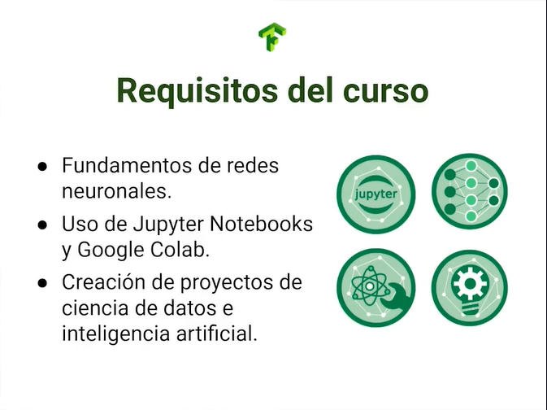

# Curso Profesional de Redes Neuronales con TensorFlow

## Redes neuronales con TensorFlow

¡Bienvenido al curso profesional de redes neuronales con Tensorflow! En las siguientes sesiones aprenderás a manejar el framework Tensorflow junto a su backend Keras, crearás proyectos profesionales y entenderás como gestionar proyectos de Machine Learning.

Para este curso es fundamental que conozcas sobre el funcionamiento de las redes neuronales artificiales, también la manipulación y gestión de Notebooks como Jupyter y Google Colab, además, es un gran plus si ya conoces cómo crear tus propios proyectos de ciencia de datos. Todo lo anterior lo puedes encontrar en la escuela de ciencia de datos de Platzi.



Si quieres empezar un proyecto de redes neuronales y no sabes cómo empezar, este curso es para ti. Si laboralmente te han asignado un proyecto de Machine Learning y debes liderarlo, este curso es para ti. Si simplemente tienes hambre de conocimiento y quieres adentrarte en este mundo, este curso es para ti.

El ciclo de vida de desarrollo de proyectos de IA consta en 6 etapas:

- Delimitación del problema, donde se determinarán las necesidades a resolver.
- Obtención de datos como materia prima.
- Pre-procesamiento de datos, donde serán limpiados y optimizados.
- Entrenamiento, donde usaremos recursos de cómputo para entrenar modelos.
- Optimización, donde iteraremos hasta encontrar una solución con mejor rendimiento.
- Escalamiento, donde llevaremos esta solución al usuario final.

A través de estas sesiones trabajaremos con redes neuronales directamente a la práctica, aprenderás a cargar datos sean propios o de diferentes fuentes y formatos, optimizarás tus modelos para obtener mejor precisión, aprenderás sobre el overfitting y underfitting y cómo evitarlo, usarás técnicas avanzadas como el transfer learning o transferencia de aprendizaje que permiten aprovechar el esfuerzo de otros developers bajo arquitecturas ya construidas, y finalmente, trabajaremos sobre el almacenamiento y carga de modelos de manera profesional.

### Proyecto del curso

El proyecto principal del curso será el entrenamiento de un modelo que detectará lenguaje de señas, constará de 27.455 imágenes JPEG de tamaño 28x28 pixeles en escala de grises, se han omitido las letras J y Z dado que requieren de movimiento para ser detectadas. El dataset fue creado por TecPerson en Kaggle y es de dominio público.


Como valor agregado, tendremos a disposición 3 datasets extras que podrás usar para practicar paralelamente los procesos aprendidos, donde puedes elegir entre un clasificador de Tom y Jerry, un detector de tumores o un clasificador de malaria.

Si posees algún dataset propio que quieras trabajar, sería maravilloso que lo integraras y que aplicaras las diferentes técnicas aprendidas a través de estas sesiones.

Si quieres descargar alguno de estos datasets puedes usar los siguientes comandos en terminales Linux o entrar directamente a los links que los contienen.

`{code-block} bash`

### Bases de datos Malaria

`!wget --no-check-certificate \ https://storage.googleapis.com/platzi-tf2/MalariaCells.zip \ -O /tmp/sign-language-img.zip`

### Bases de datos Tumor

`!wget --no-check-certificate \ https://storage.googleapis.com/platzi-tf2/TumorClassification.zip \ -O /tmp/sign-language-img.zip`

### Bases de datos Tom y Jerry

`!wget --no-check-certificate \ https://storage.googleapis.com/platzi-tf2/TomAndJerry.zip \ -O /tmp/sign-language-img.zip`

### ¿Qué aprenderás en este curso?

A través de las clases aprenderás a cargar tus propias bases de datos, además de usar formatos como JSON, BASE64, o imágenes, además, aplicarás técnicas de optimización.

Posteriormente, aprenderás a agregar métricas de entrenamiento, es decir, cómo medir el desempeño de tu modelo, cargarás y guardarás tus propios modelos y usarás el autotunner de Keras que automatizará el proceso de actualizar los valores de los hiper parámetros de tu modelo.

En una sección más avanzada haremos uso por transfer learning, también mostrarás al mundo tus modelos con TensorBoard y los escalarás a producción.

TensorFlow es una biblioteca de código abierto desarrollada por Google para el aprendizaje automático y, en particular, para construir y entrenar redes neuronales. Las redes neuronales en TensorFlow se construyen usando la API de alto nivel **Keras**, que facilita el diseño y entrenamiento de modelos de redes neuronales. A continuación, exploraremos los conceptos básicos y un ejemplo práctico de una red neuronal con TensorFlow.

### Conceptos Básicos de Redes Neuronales

1. **Neuronas**: Elementos básicos de las redes neuronales que reciben una entrada, la procesan aplicando una función de activación y producen una salida.
2. **Capa (Layer)**: Conjunto de neuronas que procesa la entrada y transmite la salida a la siguiente capa.
3. **Red Neuronal**: Conjunto de capas conectadas en secuencia.
4. **Funciones de Activación**: Determinan la salida de una neurona, introduciendo no linealidades en el modelo. Ejemplos comunes son `relu` y `sigmoid`.
5. **Entrenamiento**: Proceso de ajuste de los pesos de la red para minimizar el error en las predicciones mediante técnicas de optimización como **backpropagation** y **gradiente descendente**.

### Ejemplo: Clasificación de Dígitos con TensorFlow y MNIST

Para ilustrar cómo construir una red neuronal con TensorFlow, usaremos el conjunto de datos **MNIST**, un conjunto de imágenes de dígitos escritos a mano que se utiliza a menudo en proyectos de clasificación de imágenes.

#### Paso 1: Instalación de TensorFlow

Si no tienes TensorFlow instalado, puedes instalarlo con el siguiente comando:

```bash
pip install tensorflow
```

#### Paso 2: Importar Librerías y Cargar los Datos

TensorFlow proporciona el conjunto de datos MNIST en su API `tf.keras.datasets`, lo cual facilita la carga de datos.

```python
import tensorflow as tf
from tensorflow.keras import layers, models

# Cargar datos de MNIST
(x_train, y_train), (x_test, y_test) = tf.keras.datasets.mnist.load_data()

# Normalizar las imágenes a valores entre 0 y 1
x_train, x_test = x_train / 255.0, x_test / 255.0
```

#### Paso 3: Crear el Modelo de Red Neuronal

Vamos a construir un modelo de red neuronal simple con capas densas (fully connected).

```python
model = models.Sequential([
    layers.Flatten(input_shape=(28, 28)),       # Aplanar las imágenes de 28x28 a un vector de 784 elementos
    layers.Dense(128, activation='relu'),       # Capa oculta con 128 neuronas y función de activación ReLU
    layers.Dense(64, activation='relu'),        # Segunda capa oculta con 64 neuronas
    layers.Dense(10, activation='softmax')      # Capa de salida con 10 neuronas (una por cada dígito 0-9)
])
```

#### Paso 4: Compilar el Modelo

Al compilar el modelo, se define el **optimizador**, la **función de pérdida** y las **métricas de evaluación**.

```python
model.compile(
    optimizer='adam',
    loss='sparse_categorical_crossentropy',  # Pérdida para clasificación multiclase
    metrics=['accuracy']
)
```

#### Paso 5: Entrenar el Modelo

Ahora entrenamos la red usando el método `fit`, donde especificamos los datos de entrenamiento y el número de **epochs**.

```python
history = model.fit(x_train, y_train, epochs=10, validation_split=0.2)
```

#### Paso 6: Evaluar el Modelo

Finalmente, evaluamos el modelo con el conjunto de prueba.

```python
test_loss, test_accuracy = model.evaluate(x_test, y_test)
print(f"Precisión en el conjunto de prueba: {test_accuracy}")
```

### Código Completo

```python
import tensorflow as tf
from tensorflow.keras import layers, models

# Cargar y preparar el conjunto de datos MNIST
(x_train, y_train), (x_test, y_test) = tf.keras.datasets.mnist.load_data()
x_train, x_test = x_train / 255.0, x_test / 255.0  # Normalizar a 0-1

# Definir la estructura de la red neuronal
model = models.Sequential([
    layers.Flatten(input_shape=(28, 28)),
    layers.Dense(128, activation='relu'),
    layers.Dense(64, activation='relu'),
    layers.Dense(10, activation='softmax')
])

# Compilar el modelo
model.compile(
    optimizer='adam',
    loss='sparse_categorical_crossentropy',
    metrics=['accuracy']
)

# Entrenar el modelo
history = model.fit(x_train, y_train, epochs=10, validation_split=0.2)

# Evaluar el modelo en el conjunto de prueba
test_loss, test_accuracy = model.evaluate(x_test, y_test)
print(f"Precisión en el conjunto de prueba: {test_accuracy}")
```

### Explicación de los Componentes

- **Flatten Layer**: Convierte cada imagen 2D de 28x28 en un vector 1D de 784 elementos.
- **Dense Layers**: Son capas completamente conectadas (fully connected), ideales para problemas de clasificación.
- **Funciones de Activación**: `relu` ayuda a aprender representaciones no lineales, mientras que `softmax` en la capa de salida convierte las salidas en probabilidades.
- **Optimizador `adam`**: Un método de optimización popular en redes neuronales.
- **Pérdida `sparse_categorical_crossentropy`**: Pérdida específica para problemas de clasificación multiclase donde las etiquetas son enteros.

### Visualización de los Resultados del Entrenamiento

Podemos visualizar la **precisión** y **pérdida** durante el entrenamiento para analizar el rendimiento del modelo.

```python
import matplotlib.pyplot as plt

# Precisión
plt.plot(history.history['accuracy'], label='Precisión en entrenamiento')
plt.plot(history.history['val_accuracy'], label='Precisión en validación')
plt.xlabel('Épocas')
plt.ylabel('Precisión')
plt.legend()
plt.show()

# Pérdida
plt.plot(history.history['loss'], label='Pérdida en entrenamiento')
plt.plot(history.history['val_loss'], label='Pérdida en validación')
plt.xlabel('Épocas')
plt.ylabel('Pérdida')
plt.legend()
plt.show()
```

### Consejos para Mejorar el Modelo

1. **Aumentar las capas y neuronas** para mejorar la capacidad de la red de aprender patrones más complejos.
2. **Regularización**: Añadir capas como `Dropout` para evitar sobreajuste.
3. **Experimentar con hiperparámetros** como el tamaño de batch y learning rate.
4. **Ajuste fino con `callbacks`** como `EarlyStopping` o `ModelCheckpoint` para detener el entrenamiento cuando no mejora.

### Resumen

1. **Cargar datos** y prepararlos adecuadamente.
2. **Construir y compilar el modelo** utilizando capas densas y funciones de activación adecuadas.
3. **Entrenar y evaluar el modelo**.
4. **Visualizar los resultados** para analizar el rendimiento.

Este ejemplo básico es una introducción a cómo construir redes neuronales en TensorFlow, pero las redes neuronales pueden escalarse y ajustarse en gran medida para tareas complejas, como reconocimiento de imágenes, procesamiento de lenguaje natural, entre otros.

**Archivos de la clase**

[curso-profesional-de-redes-neuronales-con-tensorflow-slides-.pdf](https://static.platzi.com/media/public/uploads/curso-profesional-de-redes-neuronales-con-tensorflow_slides__4d241da9-5b1b-49cb-b4c9-6b91e9559963.pdf)
[malaria-mainproject.ipynb](https://static.platzi.com/media/public/uploads/malaria_mainproject_a57fed9b-9b85-42b7-a176-27551e37f5e5.ipynb)
[tomandjerry-mainproject.ipynb](https://static.platzi.com/media/public/uploads/tomandjerry_mainproject_e9ec1ddc-2baf-4af7-a362-a00d1f0f31a2.ipynb)
[tumorclassification-mainproject.ipynb](https://static.platzi.com/media/public/uploads/tumorclassification_mainproject_b64817f1-8fdf-49a2-8fed-f1eb2d53f5bc.ipynb)

**Lecturas recomendadas**

[Curso de Configuración Entorno para Ciencia de Datos - Platzi](https://platzi.com/cursos/entorno-ciencia-datos/)

[Curso de Redes Neuronales con Python y Keras - Platzi](https://platzi.com/cursos/redes-neuronales/)

[Curso para Crear tus Proyectos de Ciencia de Datos - Platzi](https://platzi.com/cursos/proyectos-data-science/)

[Switch AI](https://switchai.co/)

[https://storage.googleapis.com/platzi-tf2/sign-language-img.zip](https://storage.googleapis.com/platzi-tf2/sign-language-img.zip)

[https://storage.googleapis.com/platzi-tf2/TomAndJerry.zip](https://storage.googleapis.com/platzi-tf2/TomAndJerry.zip)

[https://storage.googleapis.com/platzi-tf2/TumorClassification.zip](https://storage.googleapis.com/platzi-tf2/TumorClassification.zip)

[https://storage.googleapis.com/platzi-tf2/MalariaCells.zip](https://storage.googleapis.com/platzi-tf2/MalariaCells.zip)

[Google Colab](https://colab.research.google.com/drive/10TQClWantn0elEU_SHc8IuTyheRIgGVD?usp=sharing)

[Google Colab](https://colab.research.google.com/drive/1ogv1lNKvltcbVe9XyPK_cb9VO4fp0E8Y?usp=sharing)

[Google Colab](https://colab.research.google.com/drive/1Ksv1KdAkx4DK4Ao090vF3ihw-q5Klg7z?usp=sharing)

## Introducción a TensorFlow 2.0

TensorFlow es una de las opciones más recurrentes a la hora de llevar a cabo desarrollos de Deep Learning, sin embargo, es una de las opciones en su ecosistema. Existen otras librerías que han sido o siguen siendo relevantes en el desarrollo de inteligencia artificial.

Caffe, NVIDIA NeMO, Microsoft CNTK y GLUON son algunas de las herramientas más poderosas de desarrollo de Machine Learning que existen, su uso puede depender del caso de uso y cada una tendrá ventajas como soporte por la comunidad, integración en otros software y demás.

TensorFlow puede ser usado desde Python, JavaScript y C++, donde en cualquiera de las opciones puedes llevar a cabo un desarrollo entero. Para esta ocasión codearemos con Python.

### TensorFlow y Keras: evolución y estructura

Usaremos TensorFlow 2, que es una evolución directa a TensorFlow 1, donde ya no requeriremos de creación y limpieza de sesiones, así como de creación de variables globales.

Una gran ventaja que ofrecía TensorFlow era la personalización de proyectos robustos, por lo que si te enfrentas a un reto de alta complejidad, puedes usar estas notaciones y estructuras de legado.


El nombre TensorFlow nace de la combinatoria de las palabras Tensor (que es la estructura de datos principal a la hora de trabajar con redes neuronales) y Flow (que se refiere al flujo de procesos durante el ciclo de vida de un algoritmo de Machine Learning), puedes entender cada paso del modelo como un nodo que será agrupado mediante una lógica de grafos.


El código de TensorFlow 2 es mucho más limpio y compacto que su versión predecesora, donde un par de métodos nos permiten definir funcionalidades complejas como la creación de capas y entrenamiento de modelos.


Para sintetizar el proceso de creación de modelos de Deep Learning, François Chollet desarrolla Keras como API para TensorFlow, una herramienta que oculta la matemática del proceso y permite crear modelos altamente efectivos con pocas líneas de código.

El ecosistema de Tensorflow no se limita a sí mismo, dado que es un desarrollo de Google, es compatible con otras de sus dependencias como Google Cloud, además de ser integrable como una pieza de software más en proyectos de alta complejidad.

**TensorFlow 2.0** es una versión renovada de la biblioteca TensorFlow, diseñada para simplificar el desarrollo y la implementación de modelos de aprendizaje automático. Fue lanzado con el objetivo de ser más intuitivo, accesible y fácil de usar. TensorFlow 2.0 se basa en la integración profunda con **Keras**, una API de alto nivel para construir y entrenar modelos, y enfatiza el uso del modo de ejecución **Eager** (evaluación inmediata) para un desarrollo más interactivo y depuración más rápida.

Aquí te doy una introducción a los conceptos clave, los beneficios, y un ejemplo básico de uso de TensorFlow 2.0.

### Principales Características de TensorFlow 2.0

1. **API Keras Integrada**: TensorFlow 2.0 adopta Keras como su API de alto nivel, lo que facilita la creación de modelos de redes neuronales con una sintaxis más limpia y organizada. Esto permite definir modelos de forma secuencial o funcional de manera sencilla.

2. **Eager Execution (Ejecución Ansiosa)**: A diferencia de TensorFlow 1.x, que requería la construcción de gráficos estáticos, TensorFlow 2.0 permite la ejecución inmediata de operaciones. Esto simplifica la depuración, ya que puedes ejecutar y ver los resultados de cada operación en tiempo real.

3. **Autodiferenciación con `tf.GradientTape`**: TensorFlow 2.0 permite calcular gradientes de manera más intuitiva con `tf.GradientTape`, un entorno para la diferenciación automática útil para entrenar modelos y calcular derivadas complejas.

4. **Compatibilidad Mejorada con `tf.compat`**: Aunque hay muchos cambios en TensorFlow 2.0, aún puedes usar código de TensorFlow 1.x gracias al módulo `tf.compat`, que asegura una transición más sencilla para desarrolladores que migran sus modelos de versiones anteriores.

5. **Modelos Distribuidos y Escalabilidad**: TensorFlow 2.0 facilita el entrenamiento distribuido y la implementación en la nube, permitiendo escalar desde una GPU o CPU a múltiples dispositivos y servidores.

### Ejemplo Práctico con TensorFlow 2.0

A continuación, te muestro cómo construir y entrenar un modelo de red neuronal básico utilizando TensorFlow 2.0 en el conjunto de datos MNIST.

#### Paso 1: Instalación de TensorFlow 2.0

Para asegurarte de que estás utilizando TensorFlow 2.0 o superior, puedes instalarlo con el siguiente comando:

```bash
pip install tensorflow
```

#### Paso 2: Importar TensorFlow y Cargar los Datos

TensorFlow 2.0 incluye muchos conjuntos de datos populares en su API `tf.keras.datasets`, lo que facilita el acceso a ellos sin tener que descargarlos manualmente.

```python
import tensorflow as tf

# Cargar el conjunto de datos MNIST (dígitos escritos a mano)
(x_train, y_train), (x_test, y_test) = tf.keras.datasets.mnist.load_data()

# Normalizar los datos de entrada
x_train, x_test = x_train / 255.0, x_test / 255.0
```

#### Paso 3: Definir el Modelo

En este caso, utilizaremos la **API secuencial** de Keras para construir una red neuronal densa con capas `Dense`.

```python
model = tf.keras.Sequential([
    tf.keras.layers.Flatten(input_shape=(28, 28)),    # Aplanar la imagen 28x28 en un vector de 784 elementos
    tf.keras.layers.Dense(128, activation='relu'),    # Capa oculta con 128 neuronas
    tf.keras.layers.Dense(10, activation='softmax')   # Capa de salida con 10 neuronas (una por cada dígito)
])
```

#### Paso 4: Compilar el Modelo

Al compilar, se especifican el optimizador, la función de pérdida y las métricas de evaluación.

```python
model.compile(
    optimizer='adam',
    loss='sparse_categorical_crossentropy',
    metrics=['accuracy']
)
```

#### Paso 5: Entrenar el Modelo

Entrenamos el modelo en el conjunto de entrenamiento utilizando el método `fit`.

```python
model.fit(x_train, y_train, epochs=5, validation_split=0.2)
```

#### Paso 6: Evaluar el Modelo

Finalmente, evaluamos el rendimiento del modelo en el conjunto de prueba.

```python
test_loss, test_accuracy = model.evaluate(x_test, y_test)
print(f"Precisión en el conjunto de prueba: {test_accuracy}")
```

### Explicación del Ejemplo

- **Capa `Flatten`**: Convierte la imagen 2D en un vector 1D para que pueda ser procesada por capas densas.
- **Capas `Dense`**: Estas capas son completamente conectadas, donde cada neurona se conecta con todas las neuronas de la capa anterior.
- **Función de Activación `relu`**: Agrega no linealidad al modelo, lo que permite aprender patrones complejos.
- **Función de Activación `softmax`**: En la capa de salida, produce una distribución de probabilidad sobre las clases posibles (0-9 para los dígitos).

### Visualización de los Resultados del Entrenamiento

TensorFlow 2.0 facilita la visualización de métricas como precisión y pérdida durante el entrenamiento. Aquí te muestro cómo hacerlo con `matplotlib`.

```python
import matplotlib.pyplot as plt

# Graficar precisión
plt.plot(history.history['accuracy'], label='Precisión en entrenamiento')
plt.plot(history.history['val_accuracy'], label='Precisión en validación')
plt.xlabel('Épocas')
plt.ylabel('Precisión')
plt.legend()
plt.show()

# Graficar pérdida
plt.plot(history.history['loss'], label='Pérdida en entrenamiento')
plt.plot(history.history['val_loss'], label='Pérdida en validación')
plt.xlabel('Épocas')
plt.ylabel('Pérdida')
plt.legend()
plt.show()
```

### Beneficios de TensorFlow 2.0

1. **Desarrollo más Rápido**: La ejecución ansiosa facilita la prueba de ideas rápidamente.
2. **Facilidad para Nuevos Usuarios**: La API de Keras en TensorFlow 2.0 es muy intuitiva y fácil de aprender.
3. **Escalabilidad**: TensorFlow 2.0 permite escalar el entrenamiento en múltiples dispositivos y la implementación en la nube.
4. **Versatilidad**: Soporta tanto investigación como producción, siendo una biblioteca completa para construir, entrenar y desplegar modelos.

### Migración de TensorFlow 1.x a 2.0

TensorFlow 2.0 introdujo grandes cambios, pero incluye el módulo `tf.compat.v1`, que permite ejecutar código escrito en TensorFlow 1.x en la nueva versión. Sin embargo, es recomendable actualizar el código a TensorFlow 2.0 para aprovechar las mejoras.

```python
import tensorflow.compat.v1 as tf
tf.disable_v2_behavior()
```

Esto desactiva las funciones de TensorFlow 2.0, permitiendo ejecutar código de la versión 1.x en la versión 2.x.

### Resumen

TensorFlow 2.0 marca una evolución significativa en la biblioteca, haciéndola más accesible y amigable. Con su ejecución ansiosa, API integrada de Keras y mejor compatibilidad para la producción, TensorFlow 2.0 es una herramienta poderosa tanto para principiantes como para expertos en aprendizaje automático.

Este ejemplo y flujo te ayudarán a empezar a construir modelos de redes neuronales en TensorFlow 2.0. A medida que avances, puedes explorar temas más avanzados como redes convolucionales, redes recurrentes y aprendizaje profundo en TensorFlow.

### Comunidad y soporte de TensorFlow

La comunidad es tan importante como el framework mismo, y esta es otra ventaja de TensorFlow: Se registran más de 56.000 preguntas en StackOverflow, se han certificado más de 100 Machine Learning Google Developer Experts y se han creado comunidades alrededor del mundo con miles de contribuyentes.


Si deseas unirte a una comunidad a nivel de Latinoamérica, la comunidad de [TensorFlow Colombia](https://platzi.com/home/clases/2565-redes-neuronales-tensorflow/43029-introduccion-a-a-tensorflow-20/[https://www.meetup.com/es/tensorflow-colombia/](https://www.meetup.com/es/tensorflow-colombia/) "TensorFlow Colombia") apoya desarrolladores a nivel de habla hispana, por lo que puedes encontrar guia y apoyo a nivel nacional e internacional.

Si tienes hambre de más conocimiento de TensorFlow, puedes ir a la [documentación oficial](https://platzi.com/home/clases/2565-redes-neuronales-tensorflow/43029-introduccion-a-a-tensorflow-20/[https://www.tensorflow.org/api_docs](https://www.tensorflow.org/api_docs) "documentación oficial") para explorar este robusto framework.

**Lecturas recomendadas**

[François Chollet: Measures of Intelligence | Lex Fridman Podcast #120 - YouTube](https://www.youtube.com/watch?v=PUAdj3w3wO4 "François Chollet: Measures of Intelligence | Lex Fridman Podcast #120 - YouTube")

[TensorFlow Colombia (Medellín, Colombia) | Meetup](https://www.meetup.com/es/Tensorflow-Colombia/)

[API Documentation  |  TensorFlow Core v2.7.0](https://www.tensorflow.org/api_docs)

## Uso de data pipelines

A través de las siguientes sesiones interiorizaremos en las data pipelines, donde aprenderemos sobre:

- Carga de bases de datos en diferentes formatos
- Preprocesamiento de datos (limpieza y optimización)
- Carga a Tensorflow mediante Keras
- Manipulación con Dataset Generators
- Carga personalizada de datos con TF.data
- Distribución de la densidad de los datos en conjuntos de Train/Validation/Test


### Cuál es la importancia de los datos

Reconocer la relevancia de los datos se debe a que estos son el motor de nuestros modelos de inteligencia artificial; es fundamental dedicar esfuerzos a la generación y limpieza de datos.

La calidad de los datos será directamente proporcional al desempeño del modelo, si los datos que entran no son tan buenos, entonces el modelo nunca será lo suficientemente efectivo; esto es el concepto GIGO (Garbage In, Garbage Out): Si alimentas tus modelos con basura, entonces saldrá basura.


El preprocesamiento de los datos es tan importante como su calidad, por lo que debes limpiar aquellos datos corruptos, incompletos o irrelevantes para el propósito del modelo.

Al final de todo el proceso de carga y limpieza tendremos un dataset compuesto de imágenes (o ejemplos) y etiquetas que representarán la clase a la que pertenecen.

**Lecturas recomendadas**

[¿Qué tan humana es la Inteligencia Artificial? - Carlos Alarcón - Platzi](https://platzi.com/clases/2549-platziconf2021/42139-que-tan-humana-es-la-inteligencia-artificial-carlo/)

## Cómo cargar bases de datos JSON

A continuación vamos a cargar una base de datos en formato JSON que estará almacenada en GCP (Google Cloud Platform). Trabajaremos sobre [Google Colab](https://colab.research.google.com/ "Google Colab"). Crea un Notebook, configúralo y prepárate.

### Cómo descargar bases de datos desde la web

Para esta ocasión usaremos la librería os y zipfile para la manipulación y procesamiento del dataset.

`python import os import zipfile`

Descargaremos el repositorio desde la locación en GCP, usaremos el comando wget para extraer el archivo, agregaremos la opción —no-check-certificate para omitir certificaciones y guardaremos la salida en la carpeta tmp con el nombre databasesLoadData.zip.

`bash !wget --no-check-certificate https://storage.googleapis.com/platzi-tf2/databasesLoadData.zip \ -O /tmp/databasesLoadData.zip`

Obtendremos la locación del archivo comprimido y crearemos una referencia en memoria con una instancia zipfile en modo lectura, posteriormente extraeremos el contenido y lo nombraremos de la misma manera sin extensión dado que será un directorio. Finalmente cerramos la instancia y tendremos nuestro dataset inicial listo para manipular.

`python local_zip = "/tmp/databasesLoadData.zip" zip_ref = zipfile.ZipFile(local_zip, "r") zip_ref.extractall("/tmp/databasesLoadData") zip_ref.close()`

Si navegamos en el directorio de archivos, podremos explorar el contenido de nuestra descarga, tendrá 4 carpetas, donde las 2 más importantes serán las de base64 (a trabajar próximamente) y la de formato JSON.

Si nos adentramos al contenido del dataset en formato JSON, encontraremos con objetos con 2 claves diferentes: Content (que contiene el link de la imagen) y label (que expresa la letra a la que se refiere).

```python
{code-block} json {"content": "https://storage.googleapis.com/platzi-tf2/img_mnist/29_B.jpg","label":"b"} {"content": "https://storage.googleapis.com/platzi-tf2/img_mnist/30_B.jpg","label":"b"} {"content": "https://storage.googleapis.com/platzi-tf2/img_mnist/95_B.jpg","label":"b"} {"content": "https://storage.googleapis.com/platzi-tf2/img_mnist/58_A.jpg","label":"a"} {"content": "https://storage.googleapis.com/platzi-tf2/img_mnist/50_A.jpg","label":"a"} {"content": "https://storage.googleapis.com/platzi-tf2/img_mnist/46_A.jpg","label":"a"} {"content": "https://storage.googleapis.com/platzi-tf2/img_mnist/3_C.jpg","label":"c"} {"content": "https://storage.googleapis.com/platzi-tf2/img_mnist/32_C.jpg","label":"c"} {"content": "https://storage.googleapis.com/platzi-tf2/img_mnist/2_C.jpg","label":"c"}
```

### Cómo hacer la deserialización de los datos

Para el procesamiento del dataset haremos uso de varios módulos de Python, donde JSON, codecs, requests y bytesIO nos ayudarán al proceso de peticiones mientras que el resto nos serán útiles a nivel de manipulación y representación.

`{code-block} python import json import codecs import requests import numpy as np from PIL import Image from io import BytesIO %matplotlib inline import matplotlib.pyplot as plt`

Determinamos la ubicación del dataset a cargar.

`{code-block} python url = "/tmp/databasesLoadData/sign_mnist_json/data.json"`

Creamos un array donde guardaremos los JSON, posteriormente abriremos el archivo, lo recorreremos línea a línea y lo guardaremos en formato de diccionario, finalmente, verificamos la cantidad de imágenes encontradas correlacionando el tamaño del array.

```python
{code-block} python data_json = [] with codecs.open(url, "rU", "utf-8") as js: for line in js: data_json.append(json.loads(line))

print(f'{len(data_json)} imagenes encontradas') 
```

Si verificamos el contenido nos encontraremos con un diccionario con las claves content y label y su respectivos valores.

`{code-block} python data_json[0] {'content': 'https://storage.googleapis.com/platzi-tf2/img_mnist/29_B.jpg', 'label': 'b'}`

Con los datos aislados, podemos descargar cada imagen, por lo que haremos una petición HTTP, la encapsularemos en un objeto BytesIO, será interpretado como una imagen y finalmente se transformará en un array de Numpy.

Guardaremos en la lista de imágenes un array de 2 elementos donde el primero será la representación matricial de la imagen y el segundo la etiqueta.

`python images = [] for data in data_json: response = requests.get(data["content"]) img = np.asarray(Image.open(BytesIO(response.content))) images.append([img, data["label"]])`

Para verificar la integridad del contenido lo mostraremos en pantalla con matplotlib, donde tomaremos la imagen y la redimensionaremos al tamaño esperado (de ser requerido), paralelamente tomaremos la etiqueta y las obtendremos ambas en pantalla.

`{code-block} python plt.imshow(images[0][0].reshape(28,28)) print(images[0][1])`


Con esto hemos completado el proceso, desde la mera descarga del archivo a su deserialización y manipulación interna en el scope de Python.

**Nota**:Estoy haciendo el curso en mi ambiente local por lo que si están usando Windows el ambiente virtual lo cree con conda e instalé Tensorflow como indican en su pagina La información la descargué usando CMD con el siguiente comando


`curl -L -o databasesLoadData.zip https://storage.googleapis.com/platzi-tf2/databasesLoadData.zip`

Adicionalmente tuve que instalar librerías que no tenía pero la que mas me dio garra fue PIL pues se instala como


`conda install -c anaconda pillow`
y se llama normal

`from PIL import Image`

**Archivos de la clase**

[cargar-multiples-dataset.ipynb](https://static.platzi.com/media/public/uploads/cargar_multiples_dataset_bb7c6f59-6bdc-4631-a16d-dc84630e889b.ipynb)
[descarga-tus-bases-de-datos-para-tus-proyectos.txt](https://static.platzi.com/media/public/uploads/descarga-tus-bases-de-datos-para-tus-proyectos_cd021114-292e-4463-adc4-ef0c53114760.txt)

**Lecturas recomendadas**

[Google Colab](https://colab.research.google.com/drive/1D7lGLBLeXhnSJep4f_gtvJfG5k0PpXyj?usp=sharing)

[Google Colab: primeros pasos - Platzi](https://platzi.com/clases/2434-jupyter-notebook/40386-google-colab-primeros-pasos/)

[https://storage.googleapis.com/platzi-tf2/sign-language-img.zip](https://storage.googleapis.com/platzi-tf2/sign-language-img.zip)

[https://storage.googleapis.com/platzi-tf2/TomAndJerry.zip](https://storage.googleapis.com/platzi-tf2/TomAndJerry.zip)

[https://storage.googleapis.com/platzi-tf2/TumorClassification.zip](https://storage.googleapis.com/platzi-tf2/TumorClassification.zip)

[https://storage.googleapis.com/platzi-tf2/MalariaCells.zip](https://storage.googleapis.com/platzi-tf2/MalariaCells.zip)

## Cargar bases de datos CSV y BASE 64

Para esta ocasión cargaremos datos almacenados en formatos CSV (Comma Separated Values) y BASE64.

### Cargando BASE64

Para empezar, es de vital importancia reconocer los datos con los que estamos trabajando, en esta ocasión revisaremos los datos de sign_mnist_base64 que tendrá dentro un JSON con una estructura de llave/valor con la codificación de la imagen.

`{code-block} python { "b": "/9j/4AAQSkZJRgABAQAAAQABAAD/2wBDAAgGBgcGBQgHBwcJCQgKDBQNDAsLDBkSEw8UHRofHh0aHBwgJC4nICIsIxwcKDcpLDAxNDQ0Hyc5PTgyPC4zNDL/wAALCAAcABwBAREA/8QAHwAAAQUBAQEBAQEAAAAAAAAAAAECAwQFBgcICQoL/8QAtRAAAgEDAwIEAwUFBAQAAAF9AQIDAAQRBRIhMUEGE1FhByJxFDKBkaEII0KxwRVS0fAkM2JyggkKFhcYGRolJicoKSo0NTY3ODk6Q0RFRkdISUpTVFVWV1hZWmNkZWZnaGlqc3R1dnd4eXqDhIWGh4iJipKTlJWWl5iZmqKjpKWmp6ipqrKztLW2t7i5usLDxMXGx8jJytLT1NXW19jZ2uHi4+Tl5ufo6erx8vP09fb3+Pn6/9oACAEBAAA/AOhS246VBdyJbqyDmbaGVSOuWxTUk3XckDKcGVkjI/2VBOf1qcwc9K00i4rnNbCLrcSPMkQKJ97PUNnHHtmrllEf7US3dSJIEklcEdd7DBHtjP5VrGLmrSpxWHewQnxNHNOBsAJOfYZpvh8zXup394xPkKBAg9SDk/lx+db5j5pCcICO+K47X7+cL5uRv2kZxXW6TaRWek20UIIBQOSepZhkk/iasMxDV//Z" }`

Para la primer parte manipularemos imágenes en BASE64, por lo que importaremos este módulo

`python import base64`

Definimos en la variable url la ubicación del archivo a extraer la información.

`python url = "/tmp/databasesLoadData/sign_mnist_base64/data.json"`

Cargamos los datos del JSON a memoria.

`python with open(url) as f: data = json.load(f)`

Cargaremos los datos en una variable, determinamos la locación a guardar la imagen y abrimos un archivo con el seudónimo de file_to_save, decodificaremos el BASE64 y lo guardaremos en un buffer, finalmente lo guardaremos en esta locación y con esto quedará escrito en disco.

```python
base64_img_bytes = data['b'].encode('utf-8') 
path_img = "/tmp/decoded_image.png" 
with open(path_img, "wb") as file_to_save: 
	decoded_image_data = base64.decodebytes(base64_img_bytes) 			
	file_to_save.write(decoded_image_data)
```

Podemos consumir esta imagen abriéndola con PIL.

`python img = Image.open(path_img) img`

### Entendiendo la anatomía de las imágenes

Las imágenes son arrays anidados con diferentes canales (cada canal representando un color diferente), en esta ocasión el único canal es de la escala de grises, donde cada pixel puede encontrarse entre los valores de 0 - 255, siendo 0 negro y 255 blanco.

Esta interpretación matricial nos permite guardar imágenes en estructuras de datos como vectores, donde diferentes formatos son directamente compatibles con esta abstracción.


### Cargando CSV

Para esta ocasión haremos uso de pandas para el manejo de CSV, además de otras librerías para la manipulación e interpretación de datos.

```python
python import numpy as np 
import pandas as pd 
%matplotlib inline 
import matplotlib.pyplot as plt 
from PIL import Image
import seaborn as sns
```

Leeremos los archivos CSV con la función read_csv de pandas en las locaciones de los archivos de entrenamiento y prueba.

```python
python train = pd.read_csv("/tmp/databasesLoadData/sign_mnist_train/sign_mnist_train.csv") 
test = pd.read_csv("/tmp/databasesLoadData/sign_mnist_test/sign_mnist_test.csv")
```

Podemos analizar los primeros datos del dataset con el método head que nos traerá los primeros 5 registros, notaremos que son 785 elementos, donde el primero pertenece a la etiqueta de la imagen y el resto a cada pixel (28x28=784).

`python train.head() 5 rows × 785 columns`

Tenemos acceso a las dimensiones del dataset con el atributo shape, que nos retornará 27455 imágenes de 28x28 con etiqueta.

`python train.shape (27455, 785)`

Para arreglar la dimensionalidad, separaremos la etiqueta de los datos, por lo que aislaremos los valores en una nueva variable.

`python labels = train['label'].values`

A su vez, eliminaremos esta columna del dataset original.

```python
python train.drop('label', axis = 1, inplace = True)
train.head() 5 rows × 784 columns 
```

Para almacenar las imágenes en memoria las cargaremos desde el dataframe (únicamente tomando los atributos de values), si verificamos las dimensiones tendremos un array de numpy de 27455x784 que podremos graficar desde matplotlib.

`python images = train.values images.shape (27455, 784) plt.imshow(images[1].reshape(28,28))`

Con esto hemos cargado imágenes a partir de formato BASE64 y CSV a memoria para ser interpretadas como tensores.

**Archivos de la clase**
[cargar-multiples-dataset.ipynb](https://static.platzi.com/media/public/uploads/cargar_multiples_dataset_80f0f44d-0755-45c2-8e9b-6290084d77b7.ipynb)

**Lecturas recomendadas**

[Google Colab](https://colab.research.google.com/drive/1D7lGLBLeXhnSJep4f_gtvJfG5k0PpXyj?usp=sharing)

## Preprocesamiento y limpieza de datos

El preprocesamiento de los datos es de las etapas más importantes en cualquier proyecto de data science, principalmente porque es un proceso altamente difícil de automatizar y requiere de creatividad e intelecto humano para hacerse correctamente.

Esta etapa determinará la calidad final de tu modelo, por lo que no deberías temer en invertir el tiempo necesario.

### Carga y análisis exploratorio de datos

Para esta ocasión usaremos una versión del dataset mnist en CSV que no está limpio, es decir, tiene datos faltantes e incongruencias que solucionaremos a continuación.

`train = pd.read_csv('/tmp/databasesLoadData/sign_mnist_train/sign_mnist_train_clean.csv')`

Empezaremos con un poco de análisis exploratorio, vamos a entender la densidad de los datos, donde gracias a matplotlib y seaborn podemos obtener una gráfica de la distribución de las etiquetas.

```python
plt.figure(figsize=(10,10)) 
sns.set_style("darkgrid") 
sns.countplot(train['label'])
```

En general el dataset se encuentra balanceado, donde cada etiqueta tiene de 900 a 1200 ejemplos en promedio.


### Limpieza de los datos

Lo primero a realizar será separar las etiquetas de las imágenes, donde bastará con aislar esta columna en concreto en nuevas variables.

```python 
y_train = train['label'] y_test = test['label']

del train['label'] del test['label'] 
```

Para obtener información general del dataset podemos usar el método info que nos dará detalles de la estructura, su contenido y los tipos de datos que almacena.

`train.info()`

RangeIndex: 27455 entries, 0 to 27454 Columns: 784 entries, pixel1 to pixel784 dtypes: object(784) memory usage: 164.2+ MB 


De la misma manera, podemos analizar específicamente cada columna con el atributo dtypes.

`train.dtypes`

pixel1 object pixel2 object pixel3 object pixel4 object pixel5 object ...
pixel780 object pixel781 object pixel782 object pixel783 object pixel784 object Length: 784, dtype: object ```

Si queremos conocer qué etiquetas hay, podemos hacer uso de la función unique de numpy.

```python
unique_val = np.array(labels) 
np.unique(unique_val) 
array([ 0, 1, 2, 3, 4, 5, 6, 7, 8, 10, 11, 12, 13, 14, 15, 16, 17, 18, 19, 20, 21, 22, 23, 24])
```

Podemos verificar si tenemos valores nulos en nuestra base de datos, esto nos dará información relacionada a negocio que puede ser valiosa, por lo que esta acción no solo ayuda a limpiar el dataset sino a comprender el posible origen del problema.

```python
 train.isnull().values.any() 
 False
```

Podemos buscar datos duplicados con el método duplicated del dataframe, esto nos retornará una fila por cada elemento.

`train[train.duplicated()]`

Para borrar registros haremos uso del método drop que recibe como argumentos los index de los elementos a borrar.

`train = train.drop([317, 487, 595, 689, 802, 861], axis = 0)`

Entre los datos duplicados encontramos uno que traía letras (algo ilógico para imágenes entre 0 y 255), por lo que lo buscaremos y eliminaremos.

```python
train[train['pixel1'] == "fwefew"] 
727 
train = train.drop([727], axis = 0)
```

### Preprocesamiento y optimización
El paso final será normalizar los datos para sintetizarlos desde el rango inicial al rango 0-1, para esto debemos convertir todos los datos en valores numéricos y luego aplicar la operación.

```python
train = train.astype(str).astype(int)
train = train / 255 test = test / 255
```

Si verificamos el dataset limpio obtendremos 784 columnas con valores entre 0 y 1.

```python
train.head() 
5 rows × 784 columns
```

Estos datos finales son mucho más procesables que los iniciales, por lo que tu rendimiento final se verá afectando positivamente.

Recuerda siempre dedicar una parte importante del tiempo de desarrollo en revisión y limpieza de datos para obtener resultados exponencialmente mejores.

**Archivos de la clase**

[cargar-multiples-dataset.ipynb](https://static.platzi.com/media/public/uploads/cargar_multiples_dataset_3d3afe93-bcdd-4744-8973-e1a89d52ea03.ipynb)

**Lecturas recomendadas**

[Google Colab](https://colab.research.google.com/drive/1D7lGLBLeXhnSJep4f_gtvJfG5k0PpXyj?usp=sharing)

[4 Ways to Improve Class Imbalance for Image Data | by Emily Potyraj (Watkins) | Towards Data Science](https://towardsdatascience.com/4-ways-to-improve-class-imbalance-for-image-data-9adec8f390f1)

[Cómo manejar sin esfuerzo el desequilibrio de clases con Python y SMOTE](https://ichi.pro/es/como-manejar-sin-esfuerzo-el-desequilibrio-de-clases-con-python-y-smote-170911188182439)

## Keras datasets

Keras nos ofrece una serie de datasets predeterminados con los cuales alimentar modelos, estas bases de datos son ideales para probar el rendimiento de diferentes algoritmos de machine learning porque sus datos se encuentran bastante limpios y listos para ser digeridos.

En la [documentación oficial de Keras](https://platzi.com/home/clases/2565-redes-neuronales-tensorflow/42843-keras-datasets/[https://keras.io/api/datasets/](https://keras.io/api/datasets/) "documentación oficial de Keras") puedes encontrar los datasets disponibles, para esta ocasión trabajaremos con CIFAR100, un dataset de 60.000 imágenes de 100 clases diferentes relacionadas a objetos del mundo como vehículos, animales y demás.

Puedes leer la estructura básica y un quickstart de uso en la documentación, si quieres más detalle, puede [ir a la página oficial del datase](https://platzi.com/home/clases/2565-redes-neuronales-tensorflow/42843-keras-datasets/[https://www.cs.toronto.edu/~kriz/cifar.html](https://www.cs.toronto.edu/~kriz/cifar.html) "ir a la página oficial del datase")t donde tendrás acceso a información más específica.

### Descargando y manipulando Keras datasets

Importaremos los módulos a trabajar, donde el protagonista será TensorFlow.

```python
import tensorflow as tf import numpy as np 
%matplotlib inline 
import matplotlib.pyplot as plt
```

Para extraer el dataset, haremos uso del módulo de datasets de Keras (que viene incluido en TensorFlow).

```python
from tensorflow.keras.datasets 
import cifar100
```

Cargaremos el dataset con la función load_data y será almacenada en 2 tuplas relacionadas a los datos de entrenamiento (que serán 50.000) y los datos de prueba (los 10.000 restantes).

```python
(x_train, y_train), (x_test, y_test) = cifar100.load_data(label_mode = "fine")
```

Si verificamos las dimensiones del set de entrenamiento, obtendremos en x un conjunto de 50.000 imágenes de 32x32 en 3 canales RGB, mientras que las etiquetas serán un array de 50.000 elementos del 0 al 99.

```python 
print(x_train.shape)
print(y_train.shape)

(50000, 32, 32, 3) (50000, 1) 
```

Podemos acceder a cualquier elemento del dataset y graficarlo con matplotlib, donde la etiqueta será 78, pero, ¿Qué significa este valor?

```python
num_image = 40
plt.imshow(x_train[num_image])
print(y_train[num_image]) 
78
```

Generalmente las etiquetas son guardadas en sesiones diferentes, es decir, externamente existe un diccionario de “traducción” de estos valores a su homólogo real. Para obtener esta traducción, haremos su descarga desde un repositorio externo.

```bash
!wget --no-check-certificate https://storage.googleapis.com/platzi-tf2/cifar100_labels.json \
-O /tmp/cifar100_labels.json
```

Deserializaremos el JSON para hacerlo compatible con los diccionarios de Python.

```bash
import json 
with open("/tmp/cifar100_labels.json") as fine_labels: 
	cifa100r_labels = json.load(fine_labels)
```

Ahora podemos entender a qué se refieren las etiquetas numéricas.

```python
num_label = 78 plt.imshow(x_train[num_label]) 
print(cifar100_labels[y_train[num_label][0]]) 
Forest
```

Con esto hemos cargado un dataset funcional para ser procesado y digerido por tus modelos.

**Archivos de la clase**

[cargar-multiples-dataset-keras.ipynb](https://static.platzi.com/media/public/uploads/cargar_multiples_dataset_keras_ae38a012-ac40-4170-b022-26cf530fc225.ipynb)

**Lecturas recomendadas**

[Google Colab](https://colab.research.google.com/drive/1Nc-3KZBxWkGlEO2goZV-VvWD-BJ6n9bB?usp=sharing)

[Datasets](https://keras.io/api/datasets/)

[https://storage.googleapis.com/platzi-tf2/cifar100_labels.json](https://storage.googleapis.com/platzi-tf2/cifar100_labels.json)

## Datasets generators

Cuando trabajes con datasets encontrarás bases de datos ya generadas y listas para consumo, pero eventualmente te toparás con la necesidad de crear tus propios datos, por lo que deberás encontrar una manera de cargarlos.

En el momento que cargas datos a memoria, lo haces directamente a la memoria RAM del sistema, por lo que si cargas un dataset pesado de golpe, es probable que termines colapsando tu entorno de trabajo por saturación de recursos.

Para evitar este problema, se crean los generadores, una estructura de datos que generará datos solo si es recorrida, optimizando memoria.

### Descargando el dataset de lenguaje de señas

Descargaremos el repositorio desde GCP.

```bash
!wget --no-check-certificate https://storage.googleapis.com/platzi-tf2/sign-language-img.zip \ 
-O /tmp/sign-language-img.zip
```

Descomprimiremos el archivo, para esto usaremos los módulos de os y zipfile.

```python
import os import zipfile

local_zip = "/tmp/sign-language-img.zip" 
zip_ref = zipfile.ZipFile(local_zip, "r") 
zip_ref.extractall("/tmp/sign-language-img") 
zip_ref.close()
```

La estructura del dataset constará en 2 directorios principales: Test y Train, donde para cada clase (letra en señas) tendremos un directorio con sus respectivos ejemplos.

```bash
sign-language-image/
├── Test/ │ └── A-Z/ │ └── examples.jpg └── Train/ └── A-Z/
└── examples.jpg
```

### Cargando el dataset con Keras dataset generator

Para llevar a cabo el proceso de carga, haremos uso de varias librerías como TensorFlow, matplotlib y numpy.

```python
import numpy as np 
%matplotlib inline 
import matplotlib.pyplot as plt 
import matplotlib.image as mpimg 
import string 
import tensorflow as tf 
from tensorflow.keras.preprocessing.image 
import ImageDataGenerator
```

Cargaremos las rutas donde se encuentran nuestros dataset.

```python
train_dir = "/tmp/sign-language-img/Train" 
test_dir = "/tmp/sign-language-img/Test"
```

Generaremos los data generators, para esta ocasión reescalaremos los datos al rango de 0 a 1 para mejorar la convergencia del modelo, además, dividiremos el 20% de los datos de prueba a validación para monitorear el rendimiento del modelo en vivo.

```python
train_datagen = ImageDataGenerator(rescale = 1/255) 
test_datagen = ImageDataGenerator(rescale = 1/255, validation_split = 0.2)
```

Para cargar las imágenes, haremos uso del método flow_from_directory del generador, determinaremos el directorio fuente, el tamaño que tendrán las imágenes (el generador las redimensionará de ser necesario), los lotes de procesamiento, el tipo de clases, el tipo de escala de colores y el subset al que pertenecen.

```python
train_generator = train_datagen.flow_from_directory( train_dir, target_size = (28,28), batch_size = 128, class_mode = "categorical", color_mode = "grayscale", subset = "training" )
```

Para los subsets de validación y prueba será el mismo proceso, donde cambiarán los nombres de las variables y las fuentes.

```python
validation_generator = test_datagen.flow_from_directory( test_dir, target_size = (28,28), batch_size = 128, class_mode = "categorical", color_mode = "grayscale", subset = "validation" )

test_generator = train_datagen.flow_from_directory( test_dir, target_size = (28,28), batch_size = 128, class_mode = "categorical", color_mode = "grayscale", ) 
```

Para generar las clases haremos una pequeña list comprehension recorriendo los caracteres ASCII omitiendo las letras J y Z.

```python
classes = [char for char in string.ascii_uppercase if char != "J" if char != "Z"]
```

Para graficar imágenes crearemos la función plotImages que recibirá un array de imágenes y las mostrará en pantalla en grupos de 5.

```python
def plotImages(images_arr): 
	fig, axes = plt.subplots(1, 5, figsize = (10, 10)) 
	axes = axes.flatten() for img, ax in zip(images_arr, axes): 
		ax.imshow(img[:,:,0]) 
		ax.axis("off") 
		plt.tight_layout() 
		plt.show()
```

Para hacer uso de esta función generaremos un conjunto de imágenes, esto nos retornará un array de imágenes que daremos como parámetro.

```python
sample_training_images, _ = next(train_generator) 
plotImages(sample_training_images[:5])
```

Con esto hemos cargado imágenes en memoria sin necesidad de saturar la memoria del sistema, cada vez que requieras iterar sobre tu dataset el generador solo generará las imágenes necesarias.

**Archivos de la clase**

[mainproject.ipynb](https://static.platzi.com/media/files/mainproject_f04be8ec-0020-4418-9bf2-3ded24a833b0.ipynb)

**Lecturas recomendadas**

[Google Colab - Main Project](https://platzi.com/clases/2397-python-profesional/39533-generadores/)

[Generadores y Yield en Python](https://platzi.com/clases/2397-python-profesional/39533-generadores/)

[https://storage.googleapis.com/platzi-tf2/sign-language-img.zip](https://storage.googleapis.com/platzi-tf2/sign-language-img.zip)

## Aprende a buscar bases de datos para deep learning

Cuando te encuentres desarrollando tus proyectos de deep learning es de vital importancia conocer la naturaleza de los datos que vas a consumir durante el entrenamiento, donde en ocasiones podrías optar por crear tus propios datasets.

Sin embargo, es de vital importancia reconocer los repositorios que la web nos puede ofrecer ya que puede darse el caso en el que otros desarrolladores han invertido tiempo en crear un dataset robusto y profesional que podrás aprovechar.

## Repositorios populares de datasets

Existen varios repositorios de datos a través de la web, donde la primer aproximación puede ser la de los datos públicos, puedes acceder a diferentes páginas gubernamentales que ofrecen estos datos de manera abierta [como los del gobierno colombiano](https://datos.gov.co/ "como los del gobierno colombiano").

[Kaggle](https://www.kaggle.com/ "Kaggle") es la comunidad más grande de machine learning del mundo, uno de sus apartados principales son datasets generados por la comunidad, donde puedes hacer búsquedas específicas y encontrar bases de datos de alto valor.

[Google](https://datasetsearch.research.google.com/ "Google") ofrece su propio motor de búsqueda de datasets que combina repositorios de diferentes fuentes y los ofrece al público.

[Data World](https://data.world/ "Data World") es un repositorio de datasets de pago donde podrás encontrar bases de datos de alta calidad por un precio. No es descabellado pensar en pagar por un dataset, porque al hacerlo estarás ahorrándote el tiempo de etiquetar manualmente cada ejemplo.

[La comunidad de Github](https://github.com/awesomedata/awesome-public-datasets "La comunidad de Github") ha hecho su propia recolección de datasets de diferentes categorías, sientete libre de explorar la plataforma para hallar bases de datos de alto interés.

Con eso ya conoces diferentes fuentes de datasets para tus proyectos, no dudes en indagar sobre casos que te llamen la tención para entender su estructura y propósito.

**Lecturas recomendadas**

[Datos Abiertos Colombia | Datos Abiertos Colombia](https://datos.gov.co/)

[Kaggle: Your Machine Learning and Data Science Community](https://www.kaggle.com/)

[Dataset Search](https://datasetsearch.research.google.com/)

[data.world | The Cloud-Native Data Catalog](https://data.world/)

[Data.gov](https://www.data.gov/)

[GitHub - awesomedata/awesome-public-datasets: A topic-centric list of HQ open datasets.](https://github.com/awesomedata/awesome-public-datasets)

## Cómo distribuir los datos

Los datos de nuestro dataset son finitos y debemos distribuirlos para que el entrenamiento se haga con la máxima cantidad de ejemplos posibles a la vez que podamos verificar la veracidad del modelo con datos reales no vistos anteriormente, para esto creamos los subsets de entrenamiento, validación y pruebas.

### ¿Por qué distribuir datos?

Para entender esta necesidad, pasemos a una analogía con helados: de niño estás aprendiendo sobre los diferentes tipos de helados, tu padre tiene 100 helados, de los cuales usará 70 para enseñarte y 30 para ponerte a prueba; cada día te mostrará un helado diferente y te dirá su sabor hasta que se terminen y luego te preguntará por aquellos que no has visto.

Lo anterior hace alusión a los datos de entrenamiento y prueba, donde los primeros se usarán para entrenar el modelo (tendrán acceso a las etiquetas de salida) mientras que los segundos serán para predecir, el problema con esto es que solo estaremos comprendiendo la eficacia del modelo una vez finalizado el entrenamiento.

Para solucionar este problema y tener feedback en vivo del desempeño del modelo creamos el subset de validación, que hará el papel de pruebas durante cada época del entrenamiento, permitiendo monitorear el rendimiento de la red a través de las iteraciones.

### Determinando los porcentajes de cada subset

La distribución de los datos a los diferentes subsets se puede determinar de diferentes maneras, donde la configuración promedio será de 70% para entrenamiento y 30% para pruebas (la mitad de este conjunto podrían destinarse a validación). Andrew NG (de las figuras más importantes del Deep Learning moderno) propone una estructura de 60% de entrenamiento, 20% de validación y 20% pruebas.

En caso de poseer pocos datos es recomendable aplicar la técnica de cross validation, que nos permitirá iterar el subset de validación entre los datos de entrenamiento, mientras que si tienes muchos datos puedes maximizar la cantidad de datos a entrenamiento en una estructura 90%/5%/5%.


### Errores comunes al distribuir datos

Cuando distribuyas datos es posible encontrarte con errores altamente mortales en tiempo de ejecución porque no son de lógica ni compilación sino de estructuración, no serán detectados por la máquina y pueden ser muy costosos de detectar y solucionar.

Un error común es el de combinar erróneamente los datos de entrenamiento con los de testeo, lo que resultará en un rendimiento artificialmente alto para la red. Otro error común es el de clases desbalanceadas, es decir, la cantidad de ejemplos de diferentes clases es diferentes (supongamos 95 ejemplos de la clase A con 5 ejemplos de la clase B), incluso si todos los ejemplos los clasificamos como A, tendremos una precisión artificial de 95%. Si tienes muy pocos datos el modelo no podrá entrenarse dado que no tendrá ejemplos suficientes para abstraer los patrones a enseñar.


Con esto tienes las intuiciones necesarias para distribuir tus datasets, los valores exactos los podrás decidir basándote en las recomendaciones e intuiciones personales, pero ya puedes partir con total seguridad desde los hombros de los gigantes del machine learning.

La distribución de los datos, especialmente en el contexto de machine learning, suele implicar dividir el conjunto de datos en subconjuntos específicos para entrenamiento, validación y prueba, con el objetivo de optimizar el rendimiento del modelo y reducir el riesgo de sobreajuste. Veamos algunas formas y estrategias para hacer esto:

### 1. División Básica: Entrenamiento, Validación y Prueba

Una división común es separar los datos en tres conjuntos principales:

- **Entrenamiento (Training)**: Utilizado para ajustar los pesos del modelo. Generalmente, representa entre el 60% y el 80% de los datos.
- **Validación (Validation)**: Utilizado para afinar los hiperparámetros y evaluar el modelo de manera objetiva durante el entrenamiento. Suele representar entre el 10% y el 20%.
- **Prueba (Testing)**: Empleado para evaluar el rendimiento final del modelo después del entrenamiento. Representa entre el 10% y el 20%.

#### Ejemplo en Python con `train_test_split`

```python
from sklearn.model_selection import train_test_split

# Supongamos que `X` contiene los datos de entrada y `y` las etiquetas
X_train, X_temp, y_train, y_temp = train_test_split(X, y, test_size=0.3, random_state=42)
X_val, X_test, y_val, y_test = train_test_split(X_temp, y_temp, test_size=0.5, random_state=42)

# Ahora tenemos: 70% en `X_train`, 15% en `X_val`, y 15% en `X_test`
```

### 2. K-Fold Cross-Validation

La **validación cruzada** es una técnica que consiste en dividir los datos en varios subconjuntos o "folds". Se entrena el modelo en todos menos uno de los subconjuntos y se valida en el subconjunto restante. Esto se repite `k` veces, y el rendimiento se promedia al final.

```python
from sklearn.model_selection import KFold

kf = KFold(n_splits=5)  # 5 folds

for train_index, val_index in kf.split(X):
    X_train, X_val = X[train_index], X[val_index]
    y_train, y_val = y[train_index], y[val_index]
    # Entrenar y validar el modelo aquí
```

### 3. Stratified Split (División Estratificada)

Cuando tienes una distribución desbalanceada en las clases, es útil realizar una **división estratificada** para asegurar que cada subconjunto tenga una proporción similar de clases. Esto es especialmente útil en clasificación.

```python
from sklearn.model_selection import StratifiedKFold

skf = StratifiedKFold(n_splits=5)

for train_index, val_index in skf.split(X, y):
    X_train, X_val = X[train_index], X[val_index]
    y_train, y_val = y[train_index], y[val_index]
```

### 4. Data Augmentation para Conjuntos de Entrenamiento Limitados

Si tienes un conjunto de datos pequeño, puedes **aumentar los datos** para enriquecer el conjunto de entrenamiento y mejorar el rendimiento del modelo.

### Estrategias Generales:

- **Mantener un conjunto de prueba completamente aislado** para evitar el "overfitting al conjunto de prueba".
- **Ajustar los hiperparámetros en el conjunto de validación** y nunca en el conjunto de prueba.
- **Usar validación cruzada** en casos de conjuntos de datos limitados para obtener una estimación robusta del rendimiento del modelo.

Estas técnicas ayudan a construir modelos robustos y a tener una evaluación precisa del rendimiento del modelo en datos no vistos.

## Crear la red neural, definir capas, compilar, entrenar, evaluar y predicciones

Ya tenemos todas las configuraciones previas para programar nuestra red, lo siguiente será definir una arquitectura, compilar el modelo y revisar el rendimiento de la red.

### Creando el modelo de red neuronal

Definiremos un modelo con la clase Sequential de Keras, esta nos permitirá apilar varias capas una encima de otra para lograr el efecto de aprendizaje profundo.

La primer capa será de entrada, donde recibiremos una imagen de 28x28 pixeles en un solo canal, una vez recibida será aplanada para ser procesada como un array unidimensional.

Las siguientes 2 capas serán capas profundas con 256 y 128 neuronas respectivamente, y tendrán como función de activación la ReLU.

La capa de salida será una capa de 24 neuronas (una por cada posible clase) de activación Softmax que nos retornará un array con las probabilidades de cada letra.

```python
model_base = tf.keras.models.Sequential( [tf.keras.layers.Flatten(input_shape = (28, 28, 1)),
										tf.keras.layers.Dense(256, activation = "relu"), 
										tf.keras.layers.Dense(128, activation = "relu"),
										tf.keras.layers.Dense(len(classes), 
										activation = "softmax")] )
```

Si llamamos el método summary obtendremos un resumen de la arquitectura de la red.

```python
model_base.summary()
Model: "sequential"

Layer (type) Output Shape Param

flatten_2 (Flatten) (None, 784) 0

dense_5 (Dense) (None, 256) 200960

dense_6 (Dense) (None, 128) 32896

dense_7 (Dense) (None, 24) 3096

================================================================= Total params: 236,952 Trainable params: 236,952 Non-trainable params: 0
```


### Compilación y entrenamiento del modelo

Compilaremos el modelo definiendo un optimizador, para este caso determinamos adam, un algoritmo que permite actualizar automáticamente el learning rate según el desempeño de la red. Como función de pérdida aplicaremos categorical cross entropy y la métrica de éxito será la precisión.

Entrenaremos el modelo con el image generator de entrenamiento, durante 20 épocas y con los datos de validación.

```python
model_base.compile(optimizer = "adam", 
	loss = "categorical_crossentropy",
	metrics = ["accuracy"])

history = model_base.fit( train_generator, 
	epochs = 20, 
	validation_data = validation_generator )
```

En la época final tendremos una precisión casi total durante el entrenamiento pero un rendimiento diferente sobre los datos de validación.

`Epoch 20/20 215/215 [==============================] - 6s 27ms/step - loss: 0.0101 - accuracy: 0.9999 - val_loss: 1.3020 - val_accuracy: 0.7572`

Si evaluamos el modelo, nos encontraremos con una precisión del 76%, donde entrenamiento era casi absoluta.

`results = model_base.evaluate(test_generator) 57/57 [==============================] - 2s 36ms/step - loss: 1.2101 - accuracy: 0.7616`

### Análisis del desempeño de la red

Para entender más gráficamente lo que sucedió, crearemos la función de visualización de resultados, que comparará el rendimiento del entrenamiento sobre el rendimiento de validación tanto términos de accuracy como de loss.

```python
def visualizacion_resultados(history): 
	epochs = [i for i in range(20)] 
	fig, ax = plt.subplots(1, 2) 
	train_acc = history.history["accuracy"] 
	train_loss = history.history["loss"] 
	val_acc = history.history["val_accuracy"] 
	val_loss = history.history["val_loss"] 
	fig.set_size_inches(16, 9)

ax[0].plot(epochs, train_acc, "go-", label = "Train accuracy") 
ax[0].plot(epochs, val_acc, "ro-", label = "Validation accuracy") 
ax[0].set_title("Train and Val accuracy") 
ax[0].legend() 
ax[0].set_xlabel("Epochs") 
ax[0].set_ylabel("Accuracy")

ax[1].plot(epochs, train_loss, "go-", label = "Train Loss") 
ax[1].plot(epochs, val_loss, "ro-", label = "Validation Loss") 
ax[1].set_title("Train and Val loss") 
ax[1].legend() 
ax[1].set_xlabel("Epochs") 
ax[1].set_ylabel("Loss")

plt.show() 
```

Si corremos la función obtendremos información valiosísima con respecto al comportamiento del modelo.

`python visualizacion_resultados(history)`


Puedes notar una diferencia abrupta tanto en el accuracy como en el loss, en la etapa de entrenamiento la red aprendió óptimamente y redujo la pérdida de manera constante, mientras que en validación sufrió de un rápido estancamiento, esto puede ser señal de overfitting, donde la red calcó los ejemplos y no los patrones.

**Archivos de la clase**

[mainproject.ipynb](https://static.platzi.com/media/public/uploads/mainproject_740db664-3fa3-4fd2-a213-b79a8441ee1e.ipynb)

**Lecturas recomendadas**

[Google Colab](https://colab.research.google.com/drive/13o0Jf_ZFbLs1WSJTsDQzztOfTOqiaZxs?usp=sharing)

Aquí tienes una guía paso a paso sobre cómo crear una red neuronal con TensorFlow y Keras para realizar clasificación de imágenes. Estos pasos incluyen definir las capas, compilar el modelo, entrenarlo, evaluarlo y hacer predicciones.

### 1. Importar las Bibliotecas Necesarias

Primero, importamos TensorFlow y Keras, y configuramos el entorno.

```python
import tensorflow as tf
from tensorflow.keras.models import Sequential
from tensorflow.keras.layers import Dense, Flatten, Conv2D, MaxPooling2D
from tensorflow.keras.datasets import mnist  # Dataset de ejemplo
from tensorflow.keras.utils import to_categorical
```

### 2. Preparar los Datos

Usaremos el dataset MNIST de dígitos escritos a mano como ejemplo. Esto incluye cargar y preprocesar los datos.

```python
# Cargar los datos
(X_train, y_train), (X_test, y_test) = mnist.load_data()

# Normalizar los datos de imágenes (escalado entre 0 y 1)
X_train, X_test = X_train / 255.0, X_test / 255.0

# Redimensionar los datos para añadir una dimensión de canal
X_train = X_train.reshape(X_train.shape[0], 28, 28, 1)
X_test = X_test.reshape(X_test.shape[0], 28, 28, 1)

# Convertir las etiquetas en una codificación categórica
y_train = to_categorical(y_train, 10)
y_test = to_categorical(y_test, 10)
```

### 3. Crear la Red Neuronal y Definir las Capas

Creamos un modelo secuencial con capas de convolución, max pooling y capas densas.

```python
model = Sequential([
    Conv2D(32, (3, 3), activation='relu', input_shape=(28, 28, 1)),
    MaxPooling2D((2, 2)),
    Conv2D(64, (3, 3), activation='relu'),
    MaxPooling2D((2, 2)),
    Flatten(),
    Dense(128, activation='relu'),
    Dense(10, activation='softmax')
])
```

### 4. Compilar el Modelo

Configura el optimizador, la función de pérdida y la métrica de precisión.

```python
model.compile(optimizer='adam',
              loss='categorical_crossentropy',
              metrics=['accuracy'])
```

### 5. Entrenar el Modelo

Ahora entrenamos el modelo usando el conjunto de datos de entrenamiento y validación.

```python
history = model.fit(X_train, y_train, epochs=10, batch_size=32, validation_split=0.2)
```

### 6. Evaluar el Modelo

Evaluamos el modelo en el conjunto de prueba.

```python
test_loss, test_accuracy = model.evaluate(X_test, y_test)
print(f'Precisión en el conjunto de prueba: {test_accuracy:.4f}')
```

### 7. Hacer Predicciones

Finalmente, hacemos predicciones sobre nuevas muestras.

```python
predictions = model.predict(X_test)
# Convertir a etiquetas predichas
predicted_classes = predictions.argmax(axis=1)

# Ejemplo de predicción en una sola imagen
import numpy as np
image_index = 0  # Cambia el índice para ver otra imagen
plt.imshow(X_test[image_index].reshape(28, 28), cmap='gray')
plt.title(f'Predicción: {predicted_classes[image_index]}')
plt.show()
```

### 8. Visualizar el Rendimiento (Opcional)

Puedes visualizar la precisión y pérdida del modelo en cada época.

```python
import matplotlib.pyplot as plt

# Precisión
plt.plot(history.history['accuracy'], label='Entrenamiento')
plt.plot(history.history['val_accuracy'], label='Validación')
plt.title('Precisión del modelo')
plt.xlabel('Épocas')
plt.ylabel('Precisión')
plt.legend()
plt.show()

# Pérdida
plt.plot(history.history['loss'], label='Entrenamiento')
plt.plot(history.history['val_loss'], label='Validación')
plt.title('Pérdida del modelo')
plt.xlabel('Épocas')
plt.ylabel('Pérdida')
plt.legend()
plt.show()
```

Estos pasos cubren todo el flujo de trabajo básico para crear, entrenar, evaluar y hacer predicciones con una red neuronal en TensorFlow y Keras.

## Métodos de regularización: overfitting y underfitting

Durante todo el módulo anterior interiorizamos en la carga de los datos, su exploración y limpieza y culminamos en la creación de un modelo mínimamente funcional. Durante esta y las siguientes sesiones interiorizaremos en el concepto de optimización del modelo para incrementar exponencialmente el rendimiento.

Durante esta sección comprenderemos qué es el overfitting y el underfitting, las mejores prácticas para ajustar los hiperparámetros de la red, métricas de monitoreo (como callbacks u early stopping) y a manejar el autotunner que Keras que actualizará los valores de diferentes parámetros según una serie de reglas establecidas.


### ¿Qué son los regularizadores?

La principal fuente de optimización de un modelo de deep learning se da mediante los regularizadores, técnicas que se usan para mejorar matemáticamente la convergencia de los datos y evitar atascamientos como el overfitting y el underfitting. Hablaremos de los 2 regularizadores más importantes: Dropout y Regularizadores L1 y L2.

### Dropout

El primer método es el dropout, una técnica que apaga un porcentaje aleatorio de neuronas por cada iteración obligando a aquellas activas a comprender un patrón general en vez de memorizar la estructura de los datos.


### Regularizadores L1 y L2

Los regularizadores son modificadores a las matrices de pesos que permiten ajustar sus valores y penalizan aquellos datos matemáticamente extremos, existen 2 tipos de regularizadores (L1 y L2) y una tercera variante que los combina ambos.

El regularizador Lasso L1 se usa cuando sospechas que pueden haber datos de entrada irrelevantes en tu red, su uso reducirá la cantidad de features innecesarias haciendo tu modelo más puro.

El regularizador Ridge L2 se usa cuando los datos de entrada se encuentran altamente correlacionados entre ellos, lo que aumentará la desviación. Su uso reducirá uniformemente la magnitud de los features armonizando el crecimiento de la red.

La combinación de los 2 regularizadores desemboca en ElasticNet, que será de alta utilidad en el manejo de modelos complejos con altas cantidades de features.


Con la teoría comprendida, vamos a mejorar nuestro modelo con regularizadores.

### Regularizadores en código

Los regularizadores L1 y L2 se encuentran en el módulo regularizers de Keras, no olvides importarlo.

`from tensorflow.keras import regularizers`

Definiremos una nueva arquitectura basada en la anterior, para esta ocasión haremos una serie de sutiles cambios que impactarán en el resultado de la red.

En las capas ocultas añadiremos el parámetro kernel regularizer que será un regularizador L2 con valor de 1x10^-5, adicionalmente, después de capa oculta añadiremos el dropout como si fuera otra capa más con un valor de 0.2 refiriéndose a una desactivación del 20% de las neuronas por iteración.

```python
model_optimizer = tf.keras.models.Sequential( [tf.keras.layers.Flatten(input_shape = (28, 28, 1)),
											   tf.keras.layers.Dense(256, kernel_regularizer = regularizers.l2(1e-5), activation = "relu"), 
											   tf.keras.layers.Dropout(0.2), tf.keras.layers.Dense(128, kernel_regularizer = regularizers.l2(1e-5), activation = "relu"), 
											   tf.keras.layers.Dropout(0.2), tf.keras.layers.Dense(len(classes), activation = "softmax")] )

model_optimizer.summary()
```

El resumen del modelo nos mostrará el dropout como si fuera otra capa oculta.

```python
Model: "sequential_1"

Layer (type) Output Shape Param
flatten_2 (Flatten) (None, 784) 
0

dense_4 (Dense) (None, 256) 
200960

dropout (Dropout) (None, 256) 
0

dense_5 (Dense) (None, 128) 
32896

dropout_1 (Dropout) (None, 128) 
0

dense_6 (Dense) (None, 24) 
3096

================================================================= Total params: 236,952 Trainable params: 236,952 Non-trainable params: 
			0
```

Compilaremos y entrenaremos el modelo bajo las mismas directas del modelo pasado para contrastar el rendimiento.

```python
model_optimizer.compile(optimizer = "adam", 
						loss = "categorical_crossentropy", 
						metrics = ["accuracy"])

history_optimizer = model_optimizer.fit( train_generator, epochs = 20, validation_data = validation_generator ) 
```

Podemos notar en la etapa final que si bien la precisión de entrenamiento bajó un poco, la precisión de validación ha aumentado.

`Epoch 20/20 215/215 [==============================] - 11s 49ms/step - loss: 0.2245 - accuracy: 0.9251 - val_loss: 0.8691 - val_accuracy: 0.7937`

Graficaremos los resultados para entender el nuevo desempeño de la red.


Podemos notar como las gráficas de train y validation ahora tienden a ser más uniformes, esto denota una importante reducción en el overfitting y un incremento en el rendimiento final de la red.

**Archivos de la clase**

[mainproject.ipynb](https://static.platzi.com/media/public/uploads/mainproject_d58a838d-a94d-4e11-b200-dacb59117853.ipynb)

**Lecturas recomendadas**

[Google Colab](https://colab.research.google.com/drive/13o0Jf_ZFbLs1WSJTsDQzztOfTOqiaZxs?usp=sharing)