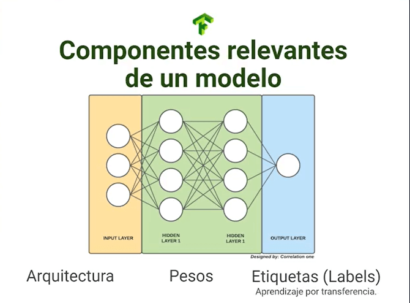

# Curso Profesional de Redes Neuronales con TensorFlow

## Redes neuronales con TensorFlow

¡Bienvenido al curso profesional de redes neuronales con Tensorflow! En las siguientes sesiones aprenderás a manejar el framework Tensorflow junto a su backend Keras, crearás proyectos profesionales y entenderás como gestionar proyectos de Machine Learning.

Para este curso es fundamental que conozcas sobre el funcionamiento de las redes neuronales artificiales, también la manipulación y gestión de Notebooks como Jupyter y Google Colab, además, es un gran plus si ya conoces cómo crear tus propios proyectos de ciencia de datos. Todo lo anterior lo puedes encontrar en la escuela de ciencia de datos de Platzi.


Si quieres empezar un proyecto de redes neuronales y no sabes cómo empezar, este curso es para ti. Si laboralmente te han asignado un proyecto de Machine Learning y debes liderarlo, este curso es para ti. Si simplemente tienes hambre de conocimiento y quieres adentrarte en este mundo, este curso es para ti.

El ciclo de vida de desarrollo de proyectos de IA consta en 6 etapas:

- Delimitación del problema, donde se determinarán las necesidades a resolver.
- Obtención de datos como materia prima.
- Pre-procesamiento de datos, donde serán limpiados y optimizados.
- Entrenamiento, donde usaremos recursos de cómputo para entrenar modelos.
- Optimización, donde iteraremos hasta encontrar una solución con mejor rendimiento.
- Escalamiento, donde llevaremos esta solución al usuario final.

A través de estas sesiones trabajaremos con redes neuronales directamente a la práctica, aprenderás a cargar datos sean propios o de diferentes fuentes y formatos, optimizarás tus modelos para obtener mejor precisión, aprenderás sobre el overfitting y underfitting y cómo evitarlo, usarás técnicas avanzadas como el transfer learning o transferencia de aprendizaje que permiten aprovechar el esfuerzo de otros developers bajo arquitecturas ya construidas, y finalmente, trabajaremos sobre el almacenamiento y carga de modelos de manera profesional.

### Proyecto del curso

El proyecto principal del curso será el entrenamiento de un modelo que detectará lenguaje de señas, constará de 27.455 imágenes JPEG de tamaño 28x28 pixeles en escala de grises, se han omitido las letras J y Z dado que requieren de movimiento para ser detectadas. El dataset fue creado por TecPerson en Kaggle y es de dominio público.


Como valor agregado, tendremos a disposición 3 datasets extras que podrás usar para practicar paralelamente los procesos aprendidos, donde puedes elegir entre un clasificador de Tom y Jerry, un detector de tumores o un clasificador de malaria.

Si posees algún dataset propio que quieras trabajar, sería maravilloso que lo integraras y que aplicaras las diferentes técnicas aprendidas a través de estas sesiones.

Si quieres descargar alguno de estos datasets puedes usar los siguientes comandos en terminales Linux o entrar directamente a los links que los contienen.

`{code-block} bash`

### Bases de datos Malaria

`!wget --no-check-certificate \ https://storage.googleapis.com/platzi-tf2/MalariaCells.zip \ -O /tmp/sign-language-img.zip`

### Bases de datos Tumor

`!wget --no-check-certificate \ https://storage.googleapis.com/platzi-tf2/TumorClassification.zip \ -O /tmp/sign-language-img.zip`

### Bases de datos Tom y Jerry

`!wget --no-check-certificate \ https://storage.googleapis.com/platzi-tf2/TomAndJerry.zip \ -O /tmp/sign-language-img.zip`

### ¿Qué aprenderás en este curso?

A través de las clases aprenderás a cargar tus propias bases de datos, además de usar formatos como JSON, BASE64, o imágenes, además, aplicarás técnicas de optimización.

Posteriormente, aprenderás a agregar métricas de entrenamiento, es decir, cómo medir el desempeño de tu modelo, cargarás y guardarás tus propios modelos y usarás el autotunner de Keras que automatizará el proceso de actualizar los valores de los hiper parámetros de tu modelo.

En una sección más avanzada haremos uso por transfer learning, también mostrarás al mundo tus modelos con TensorBoard y los escalarás a producción.

TensorFlow es una biblioteca de código abierto desarrollada por Google para el aprendizaje automático y, en particular, para construir y entrenar redes neuronales. Las redes neuronales en TensorFlow se construyen usando la API de alto nivel **Keras**, que facilita el diseño y entrenamiento de modelos de redes neuronales. A continuación, exploraremos los conceptos básicos y un ejemplo práctico de una red neuronal con TensorFlow.

### Conceptos Básicos de Redes Neuronales

1. **Neuronas**: Elementos básicos de las redes neuronales que reciben una entrada, la procesan aplicando una función de activación y producen una salida.
2. **Capa (Layer)**: Conjunto de neuronas que procesa la entrada y transmite la salida a la siguiente capa.
3. **Red Neuronal**: Conjunto de capas conectadas en secuencia.
4. **Funciones de Activación**: Determinan la salida de una neurona, introduciendo no linealidades en el modelo. Ejemplos comunes son `relu` y `sigmoid`.
5. **Entrenamiento**: Proceso de ajuste de los pesos de la red para minimizar el error en las predicciones mediante técnicas de optimización como **backpropagation** y **gradiente descendente**.

### Ejemplo: Clasificación de Dígitos con TensorFlow y MNIST

Para ilustrar cómo construir una red neuronal con TensorFlow, usaremos el conjunto de datos **MNIST**, un conjunto de imágenes de dígitos escritos a mano que se utiliza a menudo en proyectos de clasificación de imágenes.

#### Paso 1: Instalación de TensorFlow

Si no tienes TensorFlow instalado, puedes instalarlo con el siguiente comando:

```bash
pip install tensorflow
```

#### Paso 2: Importar Librerías y Cargar los Datos

TensorFlow proporciona el conjunto de datos MNIST en su API `tf.keras.datasets`, lo cual facilita la carga de datos.

```python
import tensorflow as tf
from tensorflow.keras import layers, models

# Cargar datos de MNIST
(x_train, y_train), (x_test, y_test) = tf.keras.datasets.mnist.load_data()

# Normalizar las imágenes a valores entre 0 y 1
x_train, x_test = x_train / 255.0, x_test / 255.0
```

#### Paso 3: Crear el Modelo de Red Neuronal

Vamos a construir un modelo de red neuronal simple con capas densas (fully connected).

```python
model = models.Sequential([
    layers.Flatten(input_shape=(28, 28)),       # Aplanar las imágenes de 28x28 a un vector de 784 elementos
    layers.Dense(128, activation='relu'),       # Capa oculta con 128 neuronas y función de activación ReLU
    layers.Dense(64, activation='relu'),        # Segunda capa oculta con 64 neuronas
    layers.Dense(10, activation='softmax')      # Capa de salida con 10 neuronas (una por cada dígito 0-9)
])
```

#### Paso 4: Compilar el Modelo

Al compilar el modelo, se define el **optimizador**, la **función de pérdida** y las **métricas de evaluación**.

```python
model.compile(
    optimizer='adam',
    loss='sparse_categorical_crossentropy',  # Pérdida para clasificación multiclase
    metrics=['accuracy']
)
```

#### Paso 5: Entrenar el Modelo

Ahora entrenamos la red usando el método `fit`, donde especificamos los datos de entrenamiento y el número de **epochs**.

```python
history = model.fit(x_train, y_train, epochs=10, validation_split=0.2)
```

#### Paso 6: Evaluar el Modelo

Finalmente, evaluamos el modelo con el conjunto de prueba.

```python
test_loss, test_accuracy = model.evaluate(x_test, y_test)
print(f"Precisión en el conjunto de prueba: {test_accuracy}")
```

### Código Completo

```python
import tensorflow as tf
from tensorflow.keras import layers, models

# Cargar y preparar el conjunto de datos MNIST
(x_train, y_train), (x_test, y_test) = tf.keras.datasets.mnist.load_data()
x_train, x_test = x_train / 255.0, x_test / 255.0  # Normalizar a 0-1

# Definir la estructura de la red neuronal
model = models.Sequential([
    layers.Flatten(input_shape=(28, 28)),
    layers.Dense(128, activation='relu'),
    layers.Dense(64, activation='relu'),
    layers.Dense(10, activation='softmax')
])

# Compilar el modelo
model.compile(
    optimizer='adam',
    loss='sparse_categorical_crossentropy',
    metrics=['accuracy']
)

# Entrenar el modelo
history = model.fit(x_train, y_train, epochs=10, validation_split=0.2)

# Evaluar el modelo en el conjunto de prueba
test_loss, test_accuracy = model.evaluate(x_test, y_test)
print(f"Precisión en el conjunto de prueba: {test_accuracy}")
```

### Explicación de los Componentes

- **Flatten Layer**: Convierte cada imagen 2D de 28x28 en un vector 1D de 784 elementos.
- **Dense Layers**: Son capas completamente conectadas (fully connected), ideales para problemas de clasificación.
- **Funciones de Activación**: `relu` ayuda a aprender representaciones no lineales, mientras que `softmax` en la capa de salida convierte las salidas en probabilidades.
- **Optimizador `adam`**: Un método de optimización popular en redes neuronales.
- **Pérdida `sparse_categorical_crossentropy`**: Pérdida específica para problemas de clasificación multiclase donde las etiquetas son enteros.

### Visualización de los Resultados del Entrenamiento

Podemos visualizar la **precisión** y **pérdida** durante el entrenamiento para analizar el rendimiento del modelo.

```python
import matplotlib.pyplot as plt

# Precisión
plt.plot(history.history['accuracy'], label='Precisión en entrenamiento')
plt.plot(history.history['val_accuracy'], label='Precisión en validación')
plt.xlabel('Épocas')
plt.ylabel('Precisión')
plt.legend()
plt.show()

# Pérdida
plt.plot(history.history['loss'], label='Pérdida en entrenamiento')
plt.plot(history.history['val_loss'], label='Pérdida en validación')
plt.xlabel('Épocas')
plt.ylabel('Pérdida')
plt.legend()
plt.show()
```

### Consejos para Mejorar el Modelo

1. **Aumentar las capas y neuronas** para mejorar la capacidad de la red de aprender patrones más complejos.
2. **Regularización**: Añadir capas como `Dropout` para evitar sobreajuste.
3. **Experimentar con hiperparámetros** como el tamaño de batch y learning rate.
4. **Ajuste fino con `callbacks`** como `EarlyStopping` o `ModelCheckpoint` para detener el entrenamiento cuando no mejora.

### Resumen

1. **Cargar datos** y prepararlos adecuadamente.
2. **Construir y compilar el modelo** utilizando capas densas y funciones de activación adecuadas.
3. **Entrenar y evaluar el modelo**.
4. **Visualizar los resultados** para analizar el rendimiento.

Este ejemplo básico es una introducción a cómo construir redes neuronales en TensorFlow, pero las redes neuronales pueden escalarse y ajustarse en gran medida para tareas complejas, como reconocimiento de imágenes, procesamiento de lenguaje natural, entre otros.

**Archivos de la clase**

[curso-profesional-de-redes-neuronales-con-tensorflow-slides-.pdf](https://static.platzi.com/media/public/uploads/curso-profesional-de-redes-neuronales-con-tensorflow_slides__4d241da9-5b1b-49cb-b4c9-6b91e9559963.pdf)
[malaria-mainproject.ipynb](https://static.platzi.com/media/public/uploads/malaria_mainproject_a57fed9b-9b85-42b7-a176-27551e37f5e5.ipynb)
[tomandjerry-mainproject.ipynb](https://static.platzi.com/media/public/uploads/tomandjerry_mainproject_e9ec1ddc-2baf-4af7-a362-a00d1f0f31a2.ipynb)
[tumorclassification-mainproject.ipynb](https://static.platzi.com/media/public/uploads/tumorclassification_mainproject_b64817f1-8fdf-49a2-8fed-f1eb2d53f5bc.ipynb)

**Lecturas recomendadas**

[Curso de Configuración Entorno para Ciencia de Datos - Platzi](https://platzi.com/cursos/entorno-ciencia-datos/)

[Curso de Redes Neuronales con Python y Keras - Platzi](https://platzi.com/cursos/redes-neuronales/)

[Curso para Crear tus Proyectos de Ciencia de Datos - Platzi](https://platzi.com/cursos/proyectos-data-science/)

[Switch AI](https://switchai.co/)

[https://storage.googleapis.com/platzi-tf2/sign-language-img.zip](https://storage.googleapis.com/platzi-tf2/sign-language-img.zip)

[https://storage.googleapis.com/platzi-tf2/TomAndJerry.zip](https://storage.googleapis.com/platzi-tf2/TomAndJerry.zip)

[https://storage.googleapis.com/platzi-tf2/TumorClassification.zip](https://storage.googleapis.com/platzi-tf2/TumorClassification.zip)

[https://storage.googleapis.com/platzi-tf2/MalariaCells.zip](https://storage.googleapis.com/platzi-tf2/MalariaCells.zip)

[Google Colab](https://colab.research.google.com/drive/10TQClWantn0elEU_SHc8IuTyheRIgGVD?usp=sharing)

[Google Colab](https://colab.research.google.com/drive/1ogv1lNKvltcbVe9XyPK_cb9VO4fp0E8Y?usp=sharing)

[Google Colab](https://colab.research.google.com/drive/1Ksv1KdAkx4DK4Ao090vF3ihw-q5Klg7z?usp=sharing)

## Introducción a TensorFlow 2.0

TensorFlow es una de las opciones más recurrentes a la hora de llevar a cabo desarrollos de Deep Learning, sin embargo, es una de las opciones en su ecosistema. Existen otras librerías que han sido o siguen siendo relevantes en el desarrollo de inteligencia artificial.

Caffe, NVIDIA NeMO, Microsoft CNTK y GLUON son algunas de las herramientas más poderosas de desarrollo de Machine Learning que existen, su uso puede depender del caso de uso y cada una tendrá ventajas como soporte por la comunidad, integración en otros software y demás.

TensorFlow puede ser usado desde Python, JavaScript y C++, donde en cualquiera de las opciones puedes llevar a cabo un desarrollo entero. Para esta ocasión codearemos con Python.

### TensorFlow y Keras: evolución y estructura

Usaremos TensorFlow 2, que es una evolución directa a TensorFlow 1, donde ya no requeriremos de creación y limpieza de sesiones, así como de creación de variables globales.

Una gran ventaja que ofrecía TensorFlow era la personalización de proyectos robustos, por lo que si te enfrentas a un reto de alta complejidad, puedes usar estas notaciones y estructuras de legado.


El nombre TensorFlow nace de la combinatoria de las palabras Tensor (que es la estructura de datos principal a la hora de trabajar con redes neuronales) y Flow (que se refiere al flujo de procesos durante el ciclo de vida de un algoritmo de Machine Learning), puedes entender cada paso del modelo como un nodo que será agrupado mediante una lógica de grafos.


El código de TensorFlow 2 es mucho más limpio y compacto que su versión predecesora, donde un par de métodos nos permiten definir funcionalidades complejas como la creación de capas y entrenamiento de modelos.


Para sintetizar el proceso de creación de modelos de Deep Learning, François Chollet desarrolla Keras como API para TensorFlow, una herramienta que oculta la matemática del proceso y permite crear modelos altamente efectivos con pocas líneas de código.

El ecosistema de Tensorflow no se limita a sí mismo, dado que es un desarrollo de Google, es compatible con otras de sus dependencias como Google Cloud, además de ser integrable como una pieza de software más en proyectos de alta complejidad.

**TensorFlow 2.0** es una versión renovada de la biblioteca TensorFlow, diseñada para simplificar el desarrollo y la implementación de modelos de aprendizaje automático. Fue lanzado con el objetivo de ser más intuitivo, accesible y fácil de usar. TensorFlow 2.0 se basa en la integración profunda con **Keras**, una API de alto nivel para construir y entrenar modelos, y enfatiza el uso del modo de ejecución **Eager** (evaluación inmediata) para un desarrollo más interactivo y depuración más rápida.

Aquí te doy una introducción a los conceptos clave, los beneficios, y un ejemplo básico de uso de TensorFlow 2.0.

### Principales Características de TensorFlow 2.0

1. **API Keras Integrada**: TensorFlow 2.0 adopta Keras como su API de alto nivel, lo que facilita la creación de modelos de redes neuronales con una sintaxis más limpia y organizada. Esto permite definir modelos de forma secuencial o funcional de manera sencilla.

2. **Eager Execution (Ejecución Ansiosa)**: A diferencia de TensorFlow 1.x, que requería la construcción de gráficos estáticos, TensorFlow 2.0 permite la ejecución inmediata de operaciones. Esto simplifica la depuración, ya que puedes ejecutar y ver los resultados de cada operación en tiempo real.

3. **Autodiferenciación con `tf.GradientTape`**: TensorFlow 2.0 permite calcular gradientes de manera más intuitiva con `tf.GradientTape`, un entorno para la diferenciación automática útil para entrenar modelos y calcular derivadas complejas.

4. **Compatibilidad Mejorada con `tf.compat`**: Aunque hay muchos cambios en TensorFlow 2.0, aún puedes usar código de TensorFlow 1.x gracias al módulo `tf.compat`, que asegura una transición más sencilla para desarrolladores que migran sus modelos de versiones anteriores.

5. **Modelos Distribuidos y Escalabilidad**: TensorFlow 2.0 facilita el entrenamiento distribuido y la implementación en la nube, permitiendo escalar desde una GPU o CPU a múltiples dispositivos y servidores.

### Ejemplo Práctico con TensorFlow 2.0

A continuación, te muestro cómo construir y entrenar un modelo de red neuronal básico utilizando TensorFlow 2.0 en el conjunto de datos MNIST.

#### Paso 1: Instalación de TensorFlow 2.0

Para asegurarte de que estás utilizando TensorFlow 2.0 o superior, puedes instalarlo con el siguiente comando:

```bash
pip install tensorflow
```

#### Paso 2: Importar TensorFlow y Cargar los Datos

TensorFlow 2.0 incluye muchos conjuntos de datos populares en su API `tf.keras.datasets`, lo que facilita el acceso a ellos sin tener que descargarlos manualmente.

```python
import tensorflow as tf

# Cargar el conjunto de datos MNIST (dígitos escritos a mano)
(x_train, y_train), (x_test, y_test) = tf.keras.datasets.mnist.load_data()

# Normalizar los datos de entrada
x_train, x_test = x_train / 255.0, x_test / 255.0
```

#### Paso 3: Definir el Modelo

En este caso, utilizaremos la **API secuencial** de Keras para construir una red neuronal densa con capas `Dense`.

```python
model = tf.keras.Sequential([
    tf.keras.layers.Flatten(input_shape=(28, 28)),    # Aplanar la imagen 28x28 en un vector de 784 elementos
    tf.keras.layers.Dense(128, activation='relu'),    # Capa oculta con 128 neuronas
    tf.keras.layers.Dense(10, activation='softmax')   # Capa de salida con 10 neuronas (una por cada dígito)
])
```

#### Paso 4: Compilar el Modelo

Al compilar, se especifican el optimizador, la función de pérdida y las métricas de evaluación.

```python
model.compile(
    optimizer='adam',
    loss='sparse_categorical_crossentropy',
    metrics=['accuracy']
)
```

#### Paso 5: Entrenar el Modelo

Entrenamos el modelo en el conjunto de entrenamiento utilizando el método `fit`.

```python
model.fit(x_train, y_train, epochs=5, validation_split=0.2)
```

#### Paso 6: Evaluar el Modelo

Finalmente, evaluamos el rendimiento del modelo en el conjunto de prueba.

```python
test_loss, test_accuracy = model.evaluate(x_test, y_test)
print(f"Precisión en el conjunto de prueba: {test_accuracy}")
```

### Explicación del Ejemplo

- **Capa `Flatten`**: Convierte la imagen 2D en un vector 1D para que pueda ser procesada por capas densas.
- **Capas `Dense`**: Estas capas son completamente conectadas, donde cada neurona se conecta con todas las neuronas de la capa anterior.
- **Función de Activación `relu`**: Agrega no linealidad al modelo, lo que permite aprender patrones complejos.
- **Función de Activación `softmax`**: En la capa de salida, produce una distribución de probabilidad sobre las clases posibles (0-9 para los dígitos).

### Visualización de los Resultados del Entrenamiento

TensorFlow 2.0 facilita la visualización de métricas como precisión y pérdida durante el entrenamiento. Aquí te muestro cómo hacerlo con `matplotlib`.

```python
import matplotlib.pyplot as plt

# Graficar precisión
plt.plot(history.history['accuracy'], label='Precisión en entrenamiento')
plt.plot(history.history['val_accuracy'], label='Precisión en validación')
plt.xlabel('Épocas')
plt.ylabel('Precisión')
plt.legend()
plt.show()

# Graficar pérdida
plt.plot(history.history['loss'], label='Pérdida en entrenamiento')
plt.plot(history.history['val_loss'], label='Pérdida en validación')
plt.xlabel('Épocas')
plt.ylabel('Pérdida')
plt.legend()
plt.show()
```

### Beneficios de TensorFlow 2.0

1. **Desarrollo más Rápido**: La ejecución ansiosa facilita la prueba de ideas rápidamente.
2. **Facilidad para Nuevos Usuarios**: La API de Keras en TensorFlow 2.0 es muy intuitiva y fácil de aprender.
3. **Escalabilidad**: TensorFlow 2.0 permite escalar el entrenamiento en múltiples dispositivos y la implementación en la nube.
4. **Versatilidad**: Soporta tanto investigación como producción, siendo una biblioteca completa para construir, entrenar y desplegar modelos.

### Migración de TensorFlow 1.x a 2.0

TensorFlow 2.0 introdujo grandes cambios, pero incluye el módulo `tf.compat.v1`, que permite ejecutar código escrito en TensorFlow 1.x en la nueva versión. Sin embargo, es recomendable actualizar el código a TensorFlow 2.0 para aprovechar las mejoras.

```python
import tensorflow.compat.v1 as tf
tf.disable_v2_behavior()
```

Esto desactiva las funciones de TensorFlow 2.0, permitiendo ejecutar código de la versión 1.x en la versión 2.x.

### Resumen

TensorFlow 2.0 marca una evolución significativa en la biblioteca, haciéndola más accesible y amigable. Con su ejecución ansiosa, API integrada de Keras y mejor compatibilidad para la producción, TensorFlow 2.0 es una herramienta poderosa tanto para principiantes como para expertos en aprendizaje automático.

Este ejemplo y flujo te ayudarán a empezar a construir modelos de redes neuronales en TensorFlow 2.0. A medida que avances, puedes explorar temas más avanzados como redes convolucionales, redes recurrentes y aprendizaje profundo en TensorFlow.

### Comunidad y soporte de TensorFlow

La comunidad es tan importante como el framework mismo, y esta es otra ventaja de TensorFlow: Se registran más de 56.000 preguntas en StackOverflow, se han certificado más de 100 Machine Learning Google Developer Experts y se han creado comunidades alrededor del mundo con miles de contribuyentes.


Si deseas unirte a una comunidad a nivel de Latinoamérica, la comunidad de [TensorFlow Colombia](https://platzi.com/home/clases/2565-redes-neuronales-tensorflow/43029-introduccion-a-a-tensorflow-20/[https://www.meetup.com/es/tensorflow-colombia/](https://www.meetup.com/es/tensorflow-colombia/) "TensorFlow Colombia") apoya desarrolladores a nivel de habla hispana, por lo que puedes encontrar guia y apoyo a nivel nacional e internacional.

Si tienes hambre de más conocimiento de TensorFlow, puedes ir a la [documentación oficial](https://platzi.com/home/clases/2565-redes-neuronales-tensorflow/43029-introduccion-a-a-tensorflow-20/[https://www.tensorflow.org/api_docs](https://www.tensorflow.org/api_docs) "documentación oficial") para explorar este robusto framework.

**Lecturas recomendadas**

[François Chollet: Measures of Intelligence | Lex Fridman Podcast #120 - YouTube](https://www.youtube.com/watch?v=PUAdj3w3wO4 "François Chollet: Measures of Intelligence | Lex Fridman Podcast #120 - YouTube")

[TensorFlow Colombia (Medellín, Colombia) | Meetup](https://www.meetup.com/es/Tensorflow-Colombia/)

[API Documentation  |  TensorFlow Core v2.7.0](https://www.tensorflow.org/api_docs)

## Uso de data pipelines

A través de las siguientes sesiones interiorizaremos en las data pipelines, donde aprenderemos sobre:

- Carga de bases de datos en diferentes formatos
- Preprocesamiento de datos (limpieza y optimización)
- Carga a Tensorflow mediante Keras
- Manipulación con Dataset Generators
- Carga personalizada de datos con TF.data
- Distribución de la densidad de los datos en conjuntos de Train/Validation/Test


### Cuál es la importancia de los datos

Reconocer la relevancia de los datos se debe a que estos son el motor de nuestros modelos de inteligencia artificial; es fundamental dedicar esfuerzos a la generación y limpieza de datos.

La calidad de los datos será directamente proporcional al desempeño del modelo, si los datos que entran no son tan buenos, entonces el modelo nunca será lo suficientemente efectivo; esto es el concepto GIGO (Garbage In, Garbage Out): Si alimentas tus modelos con basura, entonces saldrá basura.


El preprocesamiento de los datos es tan importante como su calidad, por lo que debes limpiar aquellos datos corruptos, incompletos o irrelevantes para el propósito del modelo.

Al final de todo el proceso de carga y limpieza tendremos un dataset compuesto de imágenes (o ejemplos) y etiquetas que representarán la clase a la que pertenecen.

**Lecturas recomendadas**

[¿Qué tan humana es la Inteligencia Artificial? - Carlos Alarcón - Platzi](https://platzi.com/clases/2549-platziconf2021/42139-que-tan-humana-es-la-inteligencia-artificial-carlo/)

## Cómo cargar bases de datos JSON

A continuación vamos a cargar una base de datos en formato JSON que estará almacenada en GCP (Google Cloud Platform). Trabajaremos sobre [Google Colab](https://colab.research.google.com/ "Google Colab"). Crea un Notebook, configúralo y prepárate.

### Cómo descargar bases de datos desde la web

Para esta ocasión usaremos la librería os y zipfile para la manipulación y procesamiento del dataset.

`python import os import zipfile`

Descargaremos el repositorio desde la locación en GCP, usaremos el comando wget para extraer el archivo, agregaremos la opción —no-check-certificate para omitir certificaciones y guardaremos la salida en la carpeta tmp con el nombre databasesLoadData.zip.

`bash !wget --no-check-certificate https://storage.googleapis.com/platzi-tf2/databasesLoadData.zip \ -O /tmp/databasesLoadData.zip`

Obtendremos la locación del archivo comprimido y crearemos una referencia en memoria con una instancia zipfile en modo lectura, posteriormente extraeremos el contenido y lo nombraremos de la misma manera sin extensión dado que será un directorio. Finalmente cerramos la instancia y tendremos nuestro dataset inicial listo para manipular.

`python local_zip = "/tmp/databasesLoadData.zip" zip_ref = zipfile.ZipFile(local_zip, "r") zip_ref.extractall("/tmp/databasesLoadData") zip_ref.close()`

Si navegamos en el directorio de archivos, podremos explorar el contenido de nuestra descarga, tendrá 4 carpetas, donde las 2 más importantes serán las de base64 (a trabajar próximamente) y la de formato JSON.

Si nos adentramos al contenido del dataset en formato JSON, encontraremos con objetos con 2 claves diferentes: Content (que contiene el link de la imagen) y label (que expresa la letra a la que se refiere).

```python
{code-block} json {"content": "https://storage.googleapis.com/platzi-tf2/img_mnist/29_B.jpg","label":"b"} {"content": "https://storage.googleapis.com/platzi-tf2/img_mnist/30_B.jpg","label":"b"} {"content": "https://storage.googleapis.com/platzi-tf2/img_mnist/95_B.jpg","label":"b"} {"content": "https://storage.googleapis.com/platzi-tf2/img_mnist/58_A.jpg","label":"a"} {"content": "https://storage.googleapis.com/platzi-tf2/img_mnist/50_A.jpg","label":"a"} {"content": "https://storage.googleapis.com/platzi-tf2/img_mnist/46_A.jpg","label":"a"} {"content": "https://storage.googleapis.com/platzi-tf2/img_mnist/3_C.jpg","label":"c"} {"content": "https://storage.googleapis.com/platzi-tf2/img_mnist/32_C.jpg","label":"c"} {"content": "https://storage.googleapis.com/platzi-tf2/img_mnist/2_C.jpg","label":"c"}
```

### Cómo hacer la deserialización de los datos

Para el procesamiento del dataset haremos uso de varios módulos de Python, donde JSON, codecs, requests y bytesIO nos ayudarán al proceso de peticiones mientras que el resto nos serán útiles a nivel de manipulación y representación.

`{code-block} python import json import codecs import requests import numpy as np from PIL import Image from io import BytesIO %matplotlib inline import matplotlib.pyplot as plt`

Determinamos la ubicación del dataset a cargar.

`{code-block} python url = "/tmp/databasesLoadData/sign_mnist_json/data.json"`

Creamos un array donde guardaremos los JSON, posteriormente abriremos el archivo, lo recorreremos línea a línea y lo guardaremos en formato de diccionario, finalmente, verificamos la cantidad de imágenes encontradas correlacionando el tamaño del array.

```python
{code-block} python data_json = [] with codecs.open(url, "rU", "utf-8") as js: for line in js: data_json.append(json.loads(line))

print(f'{len(data_json)} imagenes encontradas') 
```

Si verificamos el contenido nos encontraremos con un diccionario con las claves content y label y su respectivos valores.

`{code-block} python data_json[0] {'content': 'https://storage.googleapis.com/platzi-tf2/img_mnist/29_B.jpg', 'label': 'b'}`

Con los datos aislados, podemos descargar cada imagen, por lo que haremos una petición HTTP, la encapsularemos en un objeto BytesIO, será interpretado como una imagen y finalmente se transformará en un array de Numpy.

Guardaremos en la lista de imágenes un array de 2 elementos donde el primero será la representación matricial de la imagen y el segundo la etiqueta.

`python images = [] for data in data_json: response = requests.get(data["content"]) img = np.asarray(Image.open(BytesIO(response.content))) images.append([img, data["label"]])`

Para verificar la integridad del contenido lo mostraremos en pantalla con matplotlib, donde tomaremos la imagen y la redimensionaremos al tamaño esperado (de ser requerido), paralelamente tomaremos la etiqueta y las obtendremos ambas en pantalla.

`{code-block} python plt.imshow(images[0][0].reshape(28,28)) print(images[0][1])`


Con esto hemos completado el proceso, desde la mera descarga del archivo a su deserialización y manipulación interna en el scope de Python.

**Nota**:Estoy haciendo el curso en mi ambiente local por lo que si están usando Windows el ambiente virtual lo cree con conda e instalé Tensorflow como indican en su pagina La información la descargué usando CMD con el siguiente comando


`curl -L -o databasesLoadData.zip https://storage.googleapis.com/platzi-tf2/databasesLoadData.zip`

Adicionalmente tuve que instalar librerías que no tenía pero la que mas me dio garra fue PIL pues se instala como


`conda install -c anaconda pillow`
y se llama normal

`from PIL import Image`

**Archivos de la clase**

[cargar-multiples-dataset.ipynb](https://static.platzi.com/media/public/uploads/cargar_multiples_dataset_bb7c6f59-6bdc-4631-a16d-dc84630e889b.ipynb)
[descarga-tus-bases-de-datos-para-tus-proyectos.txt](https://static.platzi.com/media/public/uploads/descarga-tus-bases-de-datos-para-tus-proyectos_cd021114-292e-4463-adc4-ef0c53114760.txt)

**Lecturas recomendadas**

[Google Colab](https://colab.research.google.com/drive/1D7lGLBLeXhnSJep4f_gtvJfG5k0PpXyj?usp=sharing)

[Google Colab: primeros pasos - Platzi](https://platzi.com/clases/2434-jupyter-notebook/40386-google-colab-primeros-pasos/)

[https://storage.googleapis.com/platzi-tf2/sign-language-img.zip](https://storage.googleapis.com/platzi-tf2/sign-language-img.zip)

[https://storage.googleapis.com/platzi-tf2/TomAndJerry.zip](https://storage.googleapis.com/platzi-tf2/TomAndJerry.zip)

[https://storage.googleapis.com/platzi-tf2/TumorClassification.zip](https://storage.googleapis.com/platzi-tf2/TumorClassification.zip)

[https://storage.googleapis.com/platzi-tf2/MalariaCells.zip](https://storage.googleapis.com/platzi-tf2/MalariaCells.zip)

## Cargar bases de datos CSV y BASE 64

Para esta ocasión cargaremos datos almacenados en formatos CSV (Comma Separated Values) y BASE64.

### Cargando BASE64

Para empezar, es de vital importancia reconocer los datos con los que estamos trabajando, en esta ocasión revisaremos los datos de sign_mnist_base64 que tendrá dentro un JSON con una estructura de llave/valor con la codificación de la imagen.

`{code-block} python { "b": "/9j/4AAQSkZJRgABAQAAAQABAAD/2wBDAAgGBgcGBQgHBwcJCQgKDBQNDAsLDBkSEw8UHRofHh0aHBwgJC4nICIsIxwcKDcpLDAxNDQ0Hyc5PTgyPC4zNDL/wAALCAAcABwBAREA/8QAHwAAAQUBAQEBAQEAAAAAAAAAAAECAwQFBgcICQoL/8QAtRAAAgEDAwIEAwUFBAQAAAF9AQIDAAQRBRIhMUEGE1FhByJxFDKBkaEII0KxwRVS0fAkM2JyggkKFhcYGRolJicoKSo0NTY3ODk6Q0RFRkdISUpTVFVWV1hZWmNkZWZnaGlqc3R1dnd4eXqDhIWGh4iJipKTlJWWl5iZmqKjpKWmp6ipqrKztLW2t7i5usLDxMXGx8jJytLT1NXW19jZ2uHi4+Tl5ufo6erx8vP09fb3+Pn6/9oACAEBAAA/AOhS246VBdyJbqyDmbaGVSOuWxTUk3XckDKcGVkjI/2VBOf1qcwc9K00i4rnNbCLrcSPMkQKJ97PUNnHHtmrllEf7US3dSJIEklcEdd7DBHtjP5VrGLmrSpxWHewQnxNHNOBsAJOfYZpvh8zXup394xPkKBAg9SDk/lx+db5j5pCcICO+K47X7+cL5uRv2kZxXW6TaRWek20UIIBQOSepZhkk/iasMxDV//Z" }`

Para la primer parte manipularemos imágenes en BASE64, por lo que importaremos este módulo

`python import base64`

Definimos en la variable url la ubicación del archivo a extraer la información.

`python url = "/tmp/databasesLoadData/sign_mnist_base64/data.json"`

Cargamos los datos del JSON a memoria.

`python with open(url) as f: data = json.load(f)`

Cargaremos los datos en una variable, determinamos la locación a guardar la imagen y abrimos un archivo con el seudónimo de file_to_save, decodificaremos el BASE64 y lo guardaremos en un buffer, finalmente lo guardaremos en esta locación y con esto quedará escrito en disco.

```python
base64_img_bytes = data['b'].encode('utf-8') 
path_img = "/tmp/decoded_image.png" 
with open(path_img, "wb") as file_to_save: 
	decoded_image_data = base64.decodebytes(base64_img_bytes) 			
	file_to_save.write(decoded_image_data)
```

Podemos consumir esta imagen abriéndola con PIL.

`python img = Image.open(path_img) img`

### Entendiendo la anatomía de las imágenes

Las imágenes son arrays anidados con diferentes canales (cada canal representando un color diferente), en esta ocasión el único canal es de la escala de grises, donde cada pixel puede encontrarse entre los valores de 0 - 255, siendo 0 negro y 255 blanco.

Esta interpretación matricial nos permite guardar imágenes en estructuras de datos como vectores, donde diferentes formatos son directamente compatibles con esta abstracción.


### Cargando CSV

Para esta ocasión haremos uso de pandas para el manejo de CSV, además de otras librerías para la manipulación e interpretación de datos.

```python
python import numpy as np 
import pandas as pd 
%matplotlib inline 
import matplotlib.pyplot as plt 
from PIL import Image
import seaborn as sns
```

Leeremos los archivos CSV con la función read_csv de pandas en las locaciones de los archivos de entrenamiento y prueba.

```python
python train = pd.read_csv("/tmp/databasesLoadData/sign_mnist_train/sign_mnist_train.csv") 
test = pd.read_csv("/tmp/databasesLoadData/sign_mnist_test/sign_mnist_test.csv")
```

Podemos analizar los primeros datos del dataset con el método head que nos traerá los primeros 5 registros, notaremos que son 785 elementos, donde el primero pertenece a la etiqueta de la imagen y el resto a cada pixel (28x28=784).

`python train.head() 5 rows × 785 columns`

Tenemos acceso a las dimensiones del dataset con el atributo shape, que nos retornará 27455 imágenes de 28x28 con etiqueta.

`python train.shape (27455, 785)`

Para arreglar la dimensionalidad, separaremos la etiqueta de los datos, por lo que aislaremos los valores en una nueva variable.

`python labels = train['label'].values`

A su vez, eliminaremos esta columna del dataset original.

```python
python train.drop('label', axis = 1, inplace = True)
train.head() 5 rows × 784 columns 
```

Para almacenar las imágenes en memoria las cargaremos desde el dataframe (únicamente tomando los atributos de values), si verificamos las dimensiones tendremos un array de numpy de 27455x784 que podremos graficar desde matplotlib.

`python images = train.values images.shape (27455, 784) plt.imshow(images[1].reshape(28,28))`

Con esto hemos cargado imágenes a partir de formato BASE64 y CSV a memoria para ser interpretadas como tensores.

**Archivos de la clase**
[cargar-multiples-dataset.ipynb](https://static.platzi.com/media/public/uploads/cargar_multiples_dataset_80f0f44d-0755-45c2-8e9b-6290084d77b7.ipynb)

**Lecturas recomendadas**

[Google Colab](https://colab.research.google.com/drive/1D7lGLBLeXhnSJep4f_gtvJfG5k0PpXyj?usp=sharing)

## Preprocesamiento y limpieza de datos

El preprocesamiento de los datos es de las etapas más importantes en cualquier proyecto de data science, principalmente porque es un proceso altamente difícil de automatizar y requiere de creatividad e intelecto humano para hacerse correctamente.

Esta etapa determinará la calidad final de tu modelo, por lo que no deberías temer en invertir el tiempo necesario.

### Carga y análisis exploratorio de datos

Para esta ocasión usaremos una versión del dataset mnist en CSV que no está limpio, es decir, tiene datos faltantes e incongruencias que solucionaremos a continuación.

`train = pd.read_csv('/tmp/databasesLoadData/sign_mnist_train/sign_mnist_train_clean.csv')`

Empezaremos con un poco de análisis exploratorio, vamos a entender la densidad de los datos, donde gracias a matplotlib y seaborn podemos obtener una gráfica de la distribución de las etiquetas.

```python
plt.figure(figsize=(10,10)) 
sns.set_style("darkgrid") 
sns.countplot(train['label'])
```

En general el dataset se encuentra balanceado, donde cada etiqueta tiene de 900 a 1200 ejemplos en promedio.


### Limpieza de los datos

Lo primero a realizar será separar las etiquetas de las imágenes, donde bastará con aislar esta columna en concreto en nuevas variables.

```python 
y_train = train['label'] y_test = test['label']

del train['label'] del test['label'] 
```

Para obtener información general del dataset podemos usar el método info que nos dará detalles de la estructura, su contenido y los tipos de datos que almacena.

`train.info()`

RangeIndex: 27455 entries, 0 to 27454 Columns: 784 entries, pixel1 to pixel784 dtypes: object(784) memory usage: 164.2+ MB 


De la misma manera, podemos analizar específicamente cada columna con el atributo dtypes.

`train.dtypes`

pixel1 object pixel2 object pixel3 object pixel4 object pixel5 object ...
pixel780 object pixel781 object pixel782 object pixel783 object pixel784 object Length: 784, dtype: object ```

Si queremos conocer qué etiquetas hay, podemos hacer uso de la función unique de numpy.

```python
unique_val = np.array(labels) 
np.unique(unique_val) 
array([ 0, 1, 2, 3, 4, 5, 6, 7, 8, 10, 11, 12, 13, 14, 15, 16, 17, 18, 19, 20, 21, 22, 23, 24])
```

Podemos verificar si tenemos valores nulos en nuestra base de datos, esto nos dará información relacionada a negocio que puede ser valiosa, por lo que esta acción no solo ayuda a limpiar el dataset sino a comprender el posible origen del problema.

```python
 train.isnull().values.any() 
 False
```

Podemos buscar datos duplicados con el método duplicated del dataframe, esto nos retornará una fila por cada elemento.

`train[train.duplicated()]`

Para borrar registros haremos uso del método drop que recibe como argumentos los index de los elementos a borrar.

`train = train.drop([317, 487, 595, 689, 802, 861], axis = 0)`

Entre los datos duplicados encontramos uno que traía letras (algo ilógico para imágenes entre 0 y 255), por lo que lo buscaremos y eliminaremos.

```python
train[train['pixel1'] == "fwefew"] 
727 
train = train.drop([727], axis = 0)
```

### Preprocesamiento y optimización
El paso final será normalizar los datos para sintetizarlos desde el rango inicial al rango 0-1, para esto debemos convertir todos los datos en valores numéricos y luego aplicar la operación.

```python
train = train.astype(str).astype(int)
train = train / 255 test = test / 255
```

Si verificamos el dataset limpio obtendremos 784 columnas con valores entre 0 y 1.

```python
train.head() 
5 rows × 784 columns
```

Estos datos finales son mucho más procesables que los iniciales, por lo que tu rendimiento final se verá afectando positivamente.

Recuerda siempre dedicar una parte importante del tiempo de desarrollo en revisión y limpieza de datos para obtener resultados exponencialmente mejores.

**Archivos de la clase**

[cargar-multiples-dataset.ipynb](https://static.platzi.com/media/public/uploads/cargar_multiples_dataset_3d3afe93-bcdd-4744-8973-e1a89d52ea03.ipynb)

**Lecturas recomendadas**

[Google Colab](https://colab.research.google.com/drive/1D7lGLBLeXhnSJep4f_gtvJfG5k0PpXyj?usp=sharing)

[4 Ways to Improve Class Imbalance for Image Data | by Emily Potyraj (Watkins) | Towards Data Science](https://towardsdatascience.com/4-ways-to-improve-class-imbalance-for-image-data-9adec8f390f1)

[Cómo manejar sin esfuerzo el desequilibrio de clases con Python y SMOTE](https://ichi.pro/es/como-manejar-sin-esfuerzo-el-desequilibrio-de-clases-con-python-y-smote-170911188182439)

## Keras datasets

Keras nos ofrece una serie de datasets predeterminados con los cuales alimentar modelos, estas bases de datos son ideales para probar el rendimiento de diferentes algoritmos de machine learning porque sus datos se encuentran bastante limpios y listos para ser digeridos.

En la [documentación oficial de Keras](https://platzi.com/home/clases/2565-redes-neuronales-tensorflow/42843-keras-datasets/[https://keras.io/api/datasets/](https://keras.io/api/datasets/) "documentación oficial de Keras") puedes encontrar los datasets disponibles, para esta ocasión trabajaremos con CIFAR100, un dataset de 60.000 imágenes de 100 clases diferentes relacionadas a objetos del mundo como vehículos, animales y demás.

Puedes leer la estructura básica y un quickstart de uso en la documentación, si quieres más detalle, puede [ir a la página oficial del datase](https://platzi.com/home/clases/2565-redes-neuronales-tensorflow/42843-keras-datasets/[https://www.cs.toronto.edu/~kriz/cifar.html](https://www.cs.toronto.edu/~kriz/cifar.html) "ir a la página oficial del datase")t donde tendrás acceso a información más específica.

### Descargando y manipulando Keras datasets

Importaremos los módulos a trabajar, donde el protagonista será TensorFlow.

```python
import tensorflow as tf import numpy as np 
%matplotlib inline 
import matplotlib.pyplot as plt
```

Para extraer el dataset, haremos uso del módulo de datasets de Keras (que viene incluido en TensorFlow).

```python
from tensorflow.keras.datasets 
import cifar100
```

Cargaremos el dataset con la función load_data y será almacenada en 2 tuplas relacionadas a los datos de entrenamiento (que serán 50.000) y los datos de prueba (los 10.000 restantes).

```python
(x_train, y_train), (x_test, y_test) = cifar100.load_data(label_mode = "fine")
```

Si verificamos las dimensiones del set de entrenamiento, obtendremos en x un conjunto de 50.000 imágenes de 32x32 en 3 canales RGB, mientras que las etiquetas serán un array de 50.000 elementos del 0 al 99.

```python 
print(x_train.shape)
print(y_train.shape)

(50000, 32, 32, 3) (50000, 1) 
```

Podemos acceder a cualquier elemento del dataset y graficarlo con matplotlib, donde la etiqueta será 78, pero, ¿Qué significa este valor?

```python
num_image = 40
plt.imshow(x_train[num_image])
print(y_train[num_image]) 
78
```

Generalmente las etiquetas son guardadas en sesiones diferentes, es decir, externamente existe un diccionario de “traducción” de estos valores a su homólogo real. Para obtener esta traducción, haremos su descarga desde un repositorio externo.

```bash
!wget --no-check-certificate https://storage.googleapis.com/platzi-tf2/cifar100_labels.json \
-O /tmp/cifar100_labels.json
```

Deserializaremos el JSON para hacerlo compatible con los diccionarios de Python.

```bash
import json 
with open("/tmp/cifar100_labels.json") as fine_labels: 
	cifa100r_labels = json.load(fine_labels)
```

Ahora podemos entender a qué se refieren las etiquetas numéricas.

```python
num_label = 78 plt.imshow(x_train[num_label]) 
print(cifar100_labels[y_train[num_label][0]]) 
Forest
```

Con esto hemos cargado un dataset funcional para ser procesado y digerido por tus modelos.

**Archivos de la clase**

[cargar-multiples-dataset-keras.ipynb](https://static.platzi.com/media/public/uploads/cargar_multiples_dataset_keras_ae38a012-ac40-4170-b022-26cf530fc225.ipynb)

**Lecturas recomendadas**

[Google Colab](https://colab.research.google.com/drive/1Nc-3KZBxWkGlEO2goZV-VvWD-BJ6n9bB?usp=sharing)

[Datasets](https://keras.io/api/datasets/)

[https://storage.googleapis.com/platzi-tf2/cifar100_labels.json](https://storage.googleapis.com/platzi-tf2/cifar100_labels.json)

## Datasets generators

Cuando trabajes con datasets encontrarás bases de datos ya generadas y listas para consumo, pero eventualmente te toparás con la necesidad de crear tus propios datos, por lo que deberás encontrar una manera de cargarlos.

En el momento que cargas datos a memoria, lo haces directamente a la memoria RAM del sistema, por lo que si cargas un dataset pesado de golpe, es probable que termines colapsando tu entorno de trabajo por saturación de recursos.

Para evitar este problema, se crean los generadores, una estructura de datos que generará datos solo si es recorrida, optimizando memoria.

### Descargando el dataset de lenguaje de señas

Descargaremos el repositorio desde GCP.

```bash
!wget --no-check-certificate https://storage.googleapis.com/platzi-tf2/sign-language-img.zip \ 
-O /tmp/sign-language-img.zip
```

Descomprimiremos el archivo, para esto usaremos los módulos de os y zipfile.

```python
import os import zipfile

local_zip = "/tmp/sign-language-img.zip" 
zip_ref = zipfile.ZipFile(local_zip, "r") 
zip_ref.extractall("/tmp/sign-language-img") 
zip_ref.close()
```

La estructura del dataset constará en 2 directorios principales: Test y Train, donde para cada clase (letra en señas) tendremos un directorio con sus respectivos ejemplos.

```bash
sign-language-image/
├── Test/ │ └── A-Z/ │ └── examples.jpg └── Train/ └── A-Z/
└── examples.jpg
```

### Cargando el dataset con Keras dataset generator

Para llevar a cabo el proceso de carga, haremos uso de varias librerías como TensorFlow, matplotlib y numpy.

```python
import numpy as np 
%matplotlib inline 
import matplotlib.pyplot as plt 
import matplotlib.image as mpimg 
import string 
import tensorflow as tf 
from tensorflow.keras.preprocessing.image 
import ImageDataGenerator
```

Cargaremos las rutas donde se encuentran nuestros dataset.

```python
train_dir = "/tmp/sign-language-img/Train" 
test_dir = "/tmp/sign-language-img/Test"
```

Generaremos los data generators, para esta ocasión reescalaremos los datos al rango de 0 a 1 para mejorar la convergencia del modelo, además, dividiremos el 20% de los datos de prueba a validación para monitorear el rendimiento del modelo en vivo.

```python
train_datagen = ImageDataGenerator(rescale = 1/255) 
test_datagen = ImageDataGenerator(rescale = 1/255, validation_split = 0.2)
```

Para cargar las imágenes, haremos uso del método flow_from_directory del generador, determinaremos el directorio fuente, el tamaño que tendrán las imágenes (el generador las redimensionará de ser necesario), los lotes de procesamiento, el tipo de clases, el tipo de escala de colores y el subset al que pertenecen.

```python
train_generator = train_datagen.flow_from_directory( train_dir, target_size = (28,28), batch_size = 128, class_mode = "categorical", color_mode = "grayscale", subset = "training" )
```

Para los subsets de validación y prueba será el mismo proceso, donde cambiarán los nombres de las variables y las fuentes.

```python
validation_generator = test_datagen.flow_from_directory( test_dir, target_size = (28,28), batch_size = 128, class_mode = "categorical", color_mode = "grayscale", subset = "validation" )

test_generator = train_datagen.flow_from_directory( test_dir, target_size = (28,28), batch_size = 128, class_mode = "categorical", color_mode = "grayscale", ) 
```

Para generar las clases haremos una pequeña list comprehension recorriendo los caracteres ASCII omitiendo las letras J y Z.

```python
classes = [char for char in string.ascii_uppercase if char != "J" if char != "Z"]
```

Para graficar imágenes crearemos la función plotImages que recibirá un array de imágenes y las mostrará en pantalla en grupos de 5.

```python
def plotImages(images_arr): 
	fig, axes = plt.subplots(1, 5, figsize = (10, 10)) 
	axes = axes.flatten() for img, ax in zip(images_arr, axes): 
		ax.imshow(img[:,:,0]) 
		ax.axis("off") 
		plt.tight_layout() 
		plt.show()
```

Para hacer uso de esta función generaremos un conjunto de imágenes, esto nos retornará un array de imágenes que daremos como parámetro.

```python
sample_training_images, _ = next(train_generator) 
plotImages(sample_training_images[:5])
```

Con esto hemos cargado imágenes en memoria sin necesidad de saturar la memoria del sistema, cada vez que requieras iterar sobre tu dataset el generador solo generará las imágenes necesarias.

**Archivos de la clase**

[mainproject.ipynb](https://static.platzi.com/media/files/mainproject_f04be8ec-0020-4418-9bf2-3ded24a833b0.ipynb)

**Lecturas recomendadas**

[Google Colab - Main Project](https://platzi.com/clases/2397-python-profesional/39533-generadores/)

[Generadores y Yield en Python](https://platzi.com/clases/2397-python-profesional/39533-generadores/)

[https://storage.googleapis.com/platzi-tf2/sign-language-img.zip](https://storage.googleapis.com/platzi-tf2/sign-language-img.zip)

## Aprende a buscar bases de datos para deep learning

Cuando te encuentres desarrollando tus proyectos de deep learning es de vital importancia conocer la naturaleza de los datos que vas a consumir durante el entrenamiento, donde en ocasiones podrías optar por crear tus propios datasets.

Sin embargo, es de vital importancia reconocer los repositorios que la web nos puede ofrecer ya que puede darse el caso en el que otros desarrolladores han invertido tiempo en crear un dataset robusto y profesional que podrás aprovechar.

## Repositorios populares de datasets

Existen varios repositorios de datos a través de la web, donde la primer aproximación puede ser la de los datos públicos, puedes acceder a diferentes páginas gubernamentales que ofrecen estos datos de manera abierta [como los del gobierno colombiano](https://datos.gov.co/ "como los del gobierno colombiano").

[Kaggle](https://www.kaggle.com/ "Kaggle") es la comunidad más grande de machine learning del mundo, uno de sus apartados principales son datasets generados por la comunidad, donde puedes hacer búsquedas específicas y encontrar bases de datos de alto valor.

[Google](https://datasetsearch.research.google.com/ "Google") ofrece su propio motor de búsqueda de datasets que combina repositorios de diferentes fuentes y los ofrece al público.

[Data World](https://data.world/ "Data World") es un repositorio de datasets de pago donde podrás encontrar bases de datos de alta calidad por un precio. No es descabellado pensar en pagar por un dataset, porque al hacerlo estarás ahorrándote el tiempo de etiquetar manualmente cada ejemplo.

[La comunidad de Github](https://github.com/awesomedata/awesome-public-datasets "La comunidad de Github") ha hecho su propia recolección de datasets de diferentes categorías, sientete libre de explorar la plataforma para hallar bases de datos de alto interés.

Con eso ya conoces diferentes fuentes de datasets para tus proyectos, no dudes en indagar sobre casos que te llamen la tención para entender su estructura y propósito.

**Lecturas recomendadas**

[Datos Abiertos Colombia | Datos Abiertos Colombia](https://datos.gov.co/)

[Kaggle: Your Machine Learning and Data Science Community](https://www.kaggle.com/)

[Dataset Search](https://datasetsearch.research.google.com/)

[data.world | The Cloud-Native Data Catalog](https://data.world/)

[Data.gov](https://www.data.gov/)

[GitHub - awesomedata/awesome-public-datasets: A topic-centric list of HQ open datasets.](https://github.com/awesomedata/awesome-public-datasets)

## Cómo distribuir los datos

Los datos de nuestro dataset son finitos y debemos distribuirlos para que el entrenamiento se haga con la máxima cantidad de ejemplos posibles a la vez que podamos verificar la veracidad del modelo con datos reales no vistos anteriormente, para esto creamos los subsets de entrenamiento, validación y pruebas.

### ¿Por qué distribuir datos?

Para entender esta necesidad, pasemos a una analogía con helados: de niño estás aprendiendo sobre los diferentes tipos de helados, tu padre tiene 100 helados, de los cuales usará 70 para enseñarte y 30 para ponerte a prueba; cada día te mostrará un helado diferente y te dirá su sabor hasta que se terminen y luego te preguntará por aquellos que no has visto.

Lo anterior hace alusión a los datos de entrenamiento y prueba, donde los primeros se usarán para entrenar el modelo (tendrán acceso a las etiquetas de salida) mientras que los segundos serán para predecir, el problema con esto es que solo estaremos comprendiendo la eficacia del modelo una vez finalizado el entrenamiento.

Para solucionar este problema y tener feedback en vivo del desempeño del modelo creamos el subset de validación, que hará el papel de pruebas durante cada época del entrenamiento, permitiendo monitorear el rendimiento de la red a través de las iteraciones.

### Determinando los porcentajes de cada subset

La distribución de los datos a los diferentes subsets se puede determinar de diferentes maneras, donde la configuración promedio será de 70% para entrenamiento y 30% para pruebas (la mitad de este conjunto podrían destinarse a validación). Andrew NG (de las figuras más importantes del Deep Learning moderno) propone una estructura de 60% de entrenamiento, 20% de validación y 20% pruebas.

En caso de poseer pocos datos es recomendable aplicar la técnica de cross validation, que nos permitirá iterar el subset de validación entre los datos de entrenamiento, mientras que si tienes muchos datos puedes maximizar la cantidad de datos a entrenamiento en una estructura 90%/5%/5%.


### Errores comunes al distribuir datos

Cuando distribuyas datos es posible encontrarte con errores altamente mortales en tiempo de ejecución porque no son de lógica ni compilación sino de estructuración, no serán detectados por la máquina y pueden ser muy costosos de detectar y solucionar.

Un error común es el de combinar erróneamente los datos de entrenamiento con los de testeo, lo que resultará en un rendimiento artificialmente alto para la red. Otro error común es el de clases desbalanceadas, es decir, la cantidad de ejemplos de diferentes clases es diferentes (supongamos 95 ejemplos de la clase A con 5 ejemplos de la clase B), incluso si todos los ejemplos los clasificamos como A, tendremos una precisión artificial de 95%. Si tienes muy pocos datos el modelo no podrá entrenarse dado que no tendrá ejemplos suficientes para abstraer los patrones a enseñar.


Con esto tienes las intuiciones necesarias para distribuir tus datasets, los valores exactos los podrás decidir basándote en las recomendaciones e intuiciones personales, pero ya puedes partir con total seguridad desde los hombros de los gigantes del machine learning.

La distribución de los datos, especialmente en el contexto de machine learning, suele implicar dividir el conjunto de datos en subconjuntos específicos para entrenamiento, validación y prueba, con el objetivo de optimizar el rendimiento del modelo y reducir el riesgo de sobreajuste. Veamos algunas formas y estrategias para hacer esto:

### 1. División Básica: Entrenamiento, Validación y Prueba

Una división común es separar los datos en tres conjuntos principales:

- **Entrenamiento (Training)**: Utilizado para ajustar los pesos del modelo. Generalmente, representa entre el 60% y el 80% de los datos.
- **Validación (Validation)**: Utilizado para afinar los hiperparámetros y evaluar el modelo de manera objetiva durante el entrenamiento. Suele representar entre el 10% y el 20%.
- **Prueba (Testing)**: Empleado para evaluar el rendimiento final del modelo después del entrenamiento. Representa entre el 10% y el 20%.

#### Ejemplo en Python con `train_test_split`

```python
from sklearn.model_selection import train_test_split

# Supongamos que `X` contiene los datos de entrada y `y` las etiquetas
X_train, X_temp, y_train, y_temp = train_test_split(X, y, test_size=0.3, random_state=42)
X_val, X_test, y_val, y_test = train_test_split(X_temp, y_temp, test_size=0.5, random_state=42)

# Ahora tenemos: 70% en `X_train`, 15% en `X_val`, y 15% en `X_test`
```

### 2. K-Fold Cross-Validation

La **validación cruzada** es una técnica que consiste en dividir los datos en varios subconjuntos o "folds". Se entrena el modelo en todos menos uno de los subconjuntos y se valida en el subconjunto restante. Esto se repite `k` veces, y el rendimiento se promedia al final.

```python
from sklearn.model_selection import KFold

kf = KFold(n_splits=5)  # 5 folds

for train_index, val_index in kf.split(X):
    X_train, X_val = X[train_index], X[val_index]
    y_train, y_val = y[train_index], y[val_index]
    # Entrenar y validar el modelo aquí
```

### 3. Stratified Split (División Estratificada)

Cuando tienes una distribución desbalanceada en las clases, es útil realizar una **división estratificada** para asegurar que cada subconjunto tenga una proporción similar de clases. Esto es especialmente útil en clasificación.

```python
from sklearn.model_selection import StratifiedKFold

skf = StratifiedKFold(n_splits=5)

for train_index, val_index in skf.split(X, y):
    X_train, X_val = X[train_index], X[val_index]
    y_train, y_val = y[train_index], y[val_index]
```

### 4. Data Augmentation para Conjuntos de Entrenamiento Limitados

Si tienes un conjunto de datos pequeño, puedes **aumentar los datos** para enriquecer el conjunto de entrenamiento y mejorar el rendimiento del modelo.

### Estrategias Generales:

- **Mantener un conjunto de prueba completamente aislado** para evitar el "overfitting al conjunto de prueba".
- **Ajustar los hiperparámetros en el conjunto de validación** y nunca en el conjunto de prueba.
- **Usar validación cruzada** en casos de conjuntos de datos limitados para obtener una estimación robusta del rendimiento del modelo.

Estas técnicas ayudan a construir modelos robustos y a tener una evaluación precisa del rendimiento del modelo en datos no vistos.

## Crear la red neural, definir capas, compilar, entrenar, evaluar y predicciones

Ya tenemos todas las configuraciones previas para programar nuestra red, lo siguiente será definir una arquitectura, compilar el modelo y revisar el rendimiento de la red.

### Creando el modelo de red neuronal

Definiremos un modelo con la clase Sequential de Keras, esta nos permitirá apilar varias capas una encima de otra para lograr el efecto de aprendizaje profundo.

La primer capa será de entrada, donde recibiremos una imagen de 28x28 pixeles en un solo canal, una vez recibida será aplanada para ser procesada como un array unidimensional.

Las siguientes 2 capas serán capas profundas con 256 y 128 neuronas respectivamente, y tendrán como función de activación la ReLU.

La capa de salida será una capa de 24 neuronas (una por cada posible clase) de activación Softmax que nos retornará un array con las probabilidades de cada letra.

```python
model_base = tf.keras.models.Sequential( [tf.keras.layers.Flatten(input_shape = (28, 28, 1)),
										tf.keras.layers.Dense(256, activation = "relu"), 
										tf.keras.layers.Dense(128, activation = "relu"),
										tf.keras.layers.Dense(len(classes), 
										activation = "softmax")] )
```

Si llamamos el método summary obtendremos un resumen de la arquitectura de la red.

```python
model_base.summary()
Model: "sequential"

Layer (type) Output Shape Param

flatten_2 (Flatten) (None, 784) 0

dense_5 (Dense) (None, 256) 200960

dense_6 (Dense) (None, 128) 32896

dense_7 (Dense) (None, 24) 3096

================================================================= Total params: 236,952 Trainable params: 236,952 Non-trainable params: 0
```


### Compilación y entrenamiento del modelo

Compilaremos el modelo definiendo un optimizador, para este caso determinamos adam, un algoritmo que permite actualizar automáticamente el learning rate según el desempeño de la red. Como función de pérdida aplicaremos categorical cross entropy y la métrica de éxito será la precisión.

Entrenaremos el modelo con el image generator de entrenamiento, durante 20 épocas y con los datos de validación.

```python
model_base.compile(optimizer = "adam", 
	loss = "categorical_crossentropy",
	metrics = ["accuracy"])

history = model_base.fit( train_generator, 
	epochs = 20, 
	validation_data = validation_generator )
```

En la época final tendremos una precisión casi total durante el entrenamiento pero un rendimiento diferente sobre los datos de validación.

`Epoch 20/20 215/215 [==============================] - 6s 27ms/step - loss: 0.0101 - accuracy: 0.9999 - val_loss: 1.3020 - val_accuracy: 0.7572`

Si evaluamos el modelo, nos encontraremos con una precisión del 76%, donde entrenamiento era casi absoluta.

`results = model_base.evaluate(test_generator) 57/57 [==============================] - 2s 36ms/step - loss: 1.2101 - accuracy: 0.7616`

### Análisis del desempeño de la red

Para entender más gráficamente lo que sucedió, crearemos la función de visualización de resultados, que comparará el rendimiento del entrenamiento sobre el rendimiento de validación tanto términos de accuracy como de loss.

```python
def visualizacion_resultados(history): 
	epochs = [i for i in range(20)] 
	fig, ax = plt.subplots(1, 2) 
	train_acc = history.history["accuracy"] 
	train_loss = history.history["loss"] 
	val_acc = history.history["val_accuracy"] 
	val_loss = history.history["val_loss"] 
	fig.set_size_inches(16, 9)

ax[0].plot(epochs, train_acc, "go-", label = "Train accuracy") 
ax[0].plot(epochs, val_acc, "ro-", label = "Validation accuracy") 
ax[0].set_title("Train and Val accuracy") 
ax[0].legend() 
ax[0].set_xlabel("Epochs") 
ax[0].set_ylabel("Accuracy")

ax[1].plot(epochs, train_loss, "go-", label = "Train Loss") 
ax[1].plot(epochs, val_loss, "ro-", label = "Validation Loss") 
ax[1].set_title("Train and Val loss") 
ax[1].legend() 
ax[1].set_xlabel("Epochs") 
ax[1].set_ylabel("Loss")

plt.show() 
```

Si corremos la función obtendremos información valiosísima con respecto al comportamiento del modelo.

`python visualizacion_resultados(history)`


Puedes notar una diferencia abrupta tanto en el accuracy como en el loss, en la etapa de entrenamiento la red aprendió óptimamente y redujo la pérdida de manera constante, mientras que en validación sufrió de un rápido estancamiento, esto puede ser señal de overfitting, donde la red calcó los ejemplos y no los patrones.

**Archivos de la clase**

[mainproject.ipynb](https://static.platzi.com/media/public/uploads/mainproject_740db664-3fa3-4fd2-a213-b79a8441ee1e.ipynb)

**Lecturas recomendadas**

[Google Colab](https://colab.research.google.com/drive/13o0Jf_ZFbLs1WSJTsDQzztOfTOqiaZxs?usp=sharing)

Aquí tienes una guía paso a paso sobre cómo crear una red neuronal con TensorFlow y Keras para realizar clasificación de imágenes. Estos pasos incluyen definir las capas, compilar el modelo, entrenarlo, evaluarlo y hacer predicciones.

### 1. Importar las Bibliotecas Necesarias

Primero, importamos TensorFlow y Keras, y configuramos el entorno.

```python
import tensorflow as tf
from tensorflow.keras.models import Sequential
from tensorflow.keras.layers import Dense, Flatten, Conv2D, MaxPooling2D
from tensorflow.keras.datasets import mnist  # Dataset de ejemplo
from tensorflow.keras.utils import to_categorical
```

### 2. Preparar los Datos

Usaremos el dataset MNIST de dígitos escritos a mano como ejemplo. Esto incluye cargar y preprocesar los datos.

```python
# Cargar los datos
(X_train, y_train), (X_test, y_test) = mnist.load_data()

# Normalizar los datos de imágenes (escalado entre 0 y 1)
X_train, X_test = X_train / 255.0, X_test / 255.0

# Redimensionar los datos para añadir una dimensión de canal
X_train = X_train.reshape(X_train.shape[0], 28, 28, 1)
X_test = X_test.reshape(X_test.shape[0], 28, 28, 1)

# Convertir las etiquetas en una codificación categórica
y_train = to_categorical(y_train, 10)
y_test = to_categorical(y_test, 10)
```

### 3. Crear la Red Neuronal y Definir las Capas

Creamos un modelo secuencial con capas de convolución, max pooling y capas densas.

```python
model = Sequential([
    Conv2D(32, (3, 3), activation='relu', input_shape=(28, 28, 1)),
    MaxPooling2D((2, 2)),
    Conv2D(64, (3, 3), activation='relu'),
    MaxPooling2D((2, 2)),
    Flatten(),
    Dense(128, activation='relu'),
    Dense(10, activation='softmax')
])
```

### 4. Compilar el Modelo

Configura el optimizador, la función de pérdida y la métrica de precisión.

```python
model.compile(optimizer='adam',
              loss='categorical_crossentropy',
              metrics=['accuracy'])
```

### 5. Entrenar el Modelo

Ahora entrenamos el modelo usando el conjunto de datos de entrenamiento y validación.

```python
history = model.fit(X_train, y_train, epochs=10, batch_size=32, validation_split=0.2)
```

### 6. Evaluar el Modelo

Evaluamos el modelo en el conjunto de prueba.

```python
test_loss, test_accuracy = model.evaluate(X_test, y_test)
print(f'Precisión en el conjunto de prueba: {test_accuracy:.4f}')
```

### 7. Hacer Predicciones

Finalmente, hacemos predicciones sobre nuevas muestras.

```python
predictions = model.predict(X_test)
# Convertir a etiquetas predichas
predicted_classes = predictions.argmax(axis=1)

# Ejemplo de predicción en una sola imagen
import numpy as np
image_index = 0  # Cambia el índice para ver otra imagen
plt.imshow(X_test[image_index].reshape(28, 28), cmap='gray')
plt.title(f'Predicción: {predicted_classes[image_index]}')
plt.show()
```

### 8. Visualizar el Rendimiento (Opcional)

Puedes visualizar la precisión y pérdida del modelo en cada época.

```python
import matplotlib.pyplot as plt

# Precisión
plt.plot(history.history['accuracy'], label='Entrenamiento')
plt.plot(history.history['val_accuracy'], label='Validación')
plt.title('Precisión del modelo')
plt.xlabel('Épocas')
plt.ylabel('Precisión')
plt.legend()
plt.show()

# Pérdida
plt.plot(history.history['loss'], label='Entrenamiento')
plt.plot(history.history['val_loss'], label='Validación')
plt.title('Pérdida del modelo')
plt.xlabel('Épocas')
plt.ylabel('Pérdida')
plt.legend()
plt.show()
```

Estos pasos cubren todo el flujo de trabajo básico para crear, entrenar, evaluar y hacer predicciones con una red neuronal en TensorFlow y Keras.

## Métodos de regularización: overfitting y underfitting

Durante todo el módulo anterior interiorizamos en la carga de los datos, su exploración y limpieza y culminamos en la creación de un modelo mínimamente funcional. Durante esta y las siguientes sesiones interiorizaremos en el concepto de optimización del modelo para incrementar exponencialmente el rendimiento.

Durante esta sección comprenderemos qué es el overfitting y el underfitting, las mejores prácticas para ajustar los hiperparámetros de la red, métricas de monitoreo (como callbacks u early stopping) y a manejar el autotunner que Keras que actualizará los valores de diferentes parámetros según una serie de reglas establecidas.


### ¿Qué son los regularizadores?

La principal fuente de optimización de un modelo de deep learning se da mediante los regularizadores, técnicas que se usan para mejorar matemáticamente la convergencia de los datos y evitar atascamientos como el overfitting y el underfitting. Hablaremos de los 2 regularizadores más importantes: Dropout y Regularizadores L1 y L2.

### Dropout

El primer método es el dropout, una técnica que apaga un porcentaje aleatorio de neuronas por cada iteración obligando a aquellas activas a comprender un patrón general en vez de memorizar la estructura de los datos.


### Regularizadores L1 y L2

Los regularizadores son modificadores a las matrices de pesos que permiten ajustar sus valores y penalizan aquellos datos matemáticamente extremos, existen 2 tipos de regularizadores (L1 y L2) y una tercera variante que los combina ambos.

El regularizador Lasso L1 se usa cuando sospechas que pueden haber datos de entrada irrelevantes en tu red, su uso reducirá la cantidad de features innecesarias haciendo tu modelo más puro.

El regularizador Ridge L2 se usa cuando los datos de entrada se encuentran altamente correlacionados entre ellos, lo que aumentará la desviación. Su uso reducirá uniformemente la magnitud de los features armonizando el crecimiento de la red.

La combinación de los 2 regularizadores desemboca en ElasticNet, que será de alta utilidad en el manejo de modelos complejos con altas cantidades de features.


Con la teoría comprendida, vamos a mejorar nuestro modelo con regularizadores.

### Regularizadores en código

Los regularizadores L1 y L2 se encuentran en el módulo regularizers de Keras, no olvides importarlo.

`from tensorflow.keras import regularizers`

Definiremos una nueva arquitectura basada en la anterior, para esta ocasión haremos una serie de sutiles cambios que impactarán en el resultado de la red.

En las capas ocultas añadiremos el parámetro kernel regularizer que será un regularizador L2 con valor de 1x10^-5, adicionalmente, después de capa oculta añadiremos el dropout como si fuera otra capa más con un valor de 0.2 refiriéndose a una desactivación del 20% de las neuronas por iteración.

```python
model_optimizer = tf.keras.models.Sequential( [tf.keras.layers.Flatten(input_shape = (28, 28, 1)),
											   tf.keras.layers.Dense(256, kernel_regularizer = regularizers.l2(1e-5), activation = "relu"), 
											   tf.keras.layers.Dropout(0.2), tf.keras.layers.Dense(128, kernel_regularizer = regularizers.l2(1e-5), activation = "relu"), 
											   tf.keras.layers.Dropout(0.2), tf.keras.layers.Dense(len(classes), activation = "softmax")] )

model_optimizer.summary()
```

El resumen del modelo nos mostrará el dropout como si fuera otra capa oculta.

```python
Model: "sequential_1"

Layer (type) Output Shape Param
flatten_2 (Flatten) (None, 784) 
0

dense_4 (Dense) (None, 256) 
200960

dropout (Dropout) (None, 256) 
0

dense_5 (Dense) (None, 128) 
32896

dropout_1 (Dropout) (None, 128) 
0

dense_6 (Dense) (None, 24) 
3096

================================================================= Total params: 236,952 Trainable params: 236,952 Non-trainable params: 
			0
```

Compilaremos y entrenaremos el modelo bajo las mismas directas del modelo pasado para contrastar el rendimiento.

```python
model_optimizer.compile(optimizer = "adam", 
						loss = "categorical_crossentropy", 
						metrics = ["accuracy"])

history_optimizer = model_optimizer.fit( train_generator, epochs = 20, validation_data = validation_generator ) 
```

Podemos notar en la etapa final que si bien la precisión de entrenamiento bajó un poco, la precisión de validación ha aumentado.

`Epoch 20/20 215/215 [==============================] - 11s 49ms/step - loss: 0.2245 - accuracy: 0.9251 - val_loss: 0.8691 - val_accuracy: 0.7937`

Graficaremos los resultados para entender el nuevo desempeño de la red.


Podemos notar como las gráficas de train y validation ahora tienden a ser más uniformes, esto denota una importante reducción en el overfitting y un incremento en el rendimiento final de la red.

**Archivos de la clase**

[mainproject.ipynb](https://static.platzi.com/media/public/uploads/mainproject_d58a838d-a94d-4e11-b200-dacb59117853.ipynb)

**Lecturas recomendadas**

[Google Colab](https://colab.research.google.com/drive/13o0Jf_ZFbLs1WSJTsDQzztOfTOqiaZxs?usp=sharing)

## Recomendaciones prácticas para ajustar un modelo

Si bien la configuración de cada proyecto de Machine Learning pueden ser radicalmente diferente y personalizada, hay generalidades que se pueden aplicar para impulsar la calidad de nuestros modelos. A continuación vamos a hablar de algunas de ellas en las diferentes etapas del desarrollo de algoritmos de IA.

### Durante el preprocesamiento de los datos

En esta etapa temprana es de vital importancia entender la naturaleza de los datos y sus propósitos. Algunas de las recomendaciones son:

- Buscar datos null o archivos corruptos: estos datos aportarán basura al modelo y reducirán el rendimiento final si no son excluidos del dataset prematuramente.
- Balancear tu base de datos: intenta que la cantidad de ejemplos para cada etiqueta sea proporcional porque un desbalanceo terminará en un algoritmo que no clasificará correctamente pero dará (falsamente) buenas métricas.
- Aplicar normalización: normalizar los datos hará que sean más livianos de procesar y que se estandaricen frente al resto de features.
- Visualizar y entender los datos: la lógica de negocio lo es todo, si logramos entender la naturaleza y el propósito de nuestros datos podremos dar una dirección diferente a nuestros proyectos, nuestro valor como IA devs radicará en esto.

### Ajuste de hiperparámetros

Estas configuraciones se hacen durante la creación de la arquitectura y la compilación de nuestro modelo y son más específicas con respecto a valores numéricos. Algunas recomendaciones son:

- Crear convoluciones de tamaño 3x3, de esta manera no perderemos información durante las operaciones.
- Definir la capa de Max Pooling en 2x2 para reducir la complejidad del modelo y no perder abruptamente muchas features por cada convolución.
- Aplanar las imágenes al final del proceso de convolución (capa flatten), esto combinará todos los features obtenidos de las convoluciones en un solo array lineal.
- Inicializar nuestros modelos con arquitecturas pequeñas de pocas neuronas, generalmente empezar desde 32 o 64 neuronas y crecer la cantidad por cada capa según las potencias de 2 (65/128/256/512).
- Inicializar el learning rate en 0.001 (sin embargo tunners como adam nos permiten iterar su valor según el rendimiento de la red), los regularizadores L1 y L2 en 1x10^-5 y el dropout en 0.2 (20%).

### Regularizadores

Los regularizadores son un tipo de hiperparámetros que tienen sus propias intuiciones, algunas recomendaciones son:

- Determinar qué tipo de regularizador (L1, L2 o L1+L2) usar según la naturaleza de tus datos. Si crees que pueden haber features inútiles en tu red, entonces aplica L1, si crees que tienes features con alta correlación entre si, aplica L2, y si tienes un dataset con alta cantidad de datos y ambas situaciones aplican, usa L1+L2 (también conocido como ElasticNet).
- Si tu red no está rindiendo a nivel suficiente intenta con agregar más datos adquiriéndolos de su fuente original, si no es posible, puedes generar nuevos datos con data augmentation.
- El dropout obligará a tu modelo a generalizar patrones en vez de memorizar ejemplos, siempre es buena idea agregarlo (especialmente si notas overfitting).
- Puedes controlar el rendimiento de tu red con callbacks, específicamente los de Early Stopping (que detendrán el proceso de entrenamiento si no se detecta una mejoría con respecto a una métrica) y Model Checkpoint, que guardarán una instancia de tu modelo en su mejor época en caso de que hayas sobre entrenado tu red.

### Funciones de activación

Las funciones de activación transforman los resultados lineales de nuestra red, su elección impactará directamente en el rendimiento de las predicciones y del entrenamiento, algunas recomendaciones son:

- Si debes clasificar entre más de 2 clases, entonces deberías usar la función Softmax.
- Si la clasificación es binaria, entonces la función sigmoidal funcionará (esta retorna valores entre 0 y 1 interpretables como probabilidades).
- Si vas a realizar una regresión en vez de una clasificación lo mejor será usar una función lineal (o en ocasiones no aplicar la función de activación en la capa final).
- Si tienes más de 0 clases siempre será óptimo usar la ReLU durante el uso de capas ocultas.

### Durante la configuración de la red

Mientras configuras tu red puedes encontrar algunas mejoras que aplicar a tu modelo, algunas son:

- Siempre aplica capas de convolución y max pooling de ser posible. Estas se apilan como si fueran capas ocultas y son especialmente útiles en el procesamiento de imágenes.
- Varía y busca el learning rate óptimo para tu proyecto, es posible que en ocasiones apliques valores muy altos y tu modelo nunca alcance el mínimo global (porque salta mucho entre pasos) o que apliques valores muy bajos y te tome demasiadas iteraciones sacar conclusiones.
- Siempre almacena tu registro de entrenamientos. Es posible que durante alguna iteración de tu proyecto encuentres una configuración que te dio un excelente desempeño, pero al no guardar los datos la perdiste y debiste volver a empezar.

Con todo lo anterior, vamos a implementar mejoras a nuestro modelo que se reflejarán en la reducción del overfitting.

### Ajustando el modelo

Para esta ocasión agregaremos una capa de convolución al modelo, sus especificaciones serán 75 filtros de tamaño 3x3 y con función de activación ReLU, además, por ser la nueva primer capa, recibirá las dimensiones de los datos de entrada.

Para reducir un poco la complejidad del modelo, hemos usado una capa de MaxPooling de 2x2 que abstraerá el pixel más relevante por cada 4 pixeles, mitigando el tamaño de salidas que generarán las convoluciones.

Finalmente aplanaremos las imágenes para procesarlas como lo estábamos haciendo en el modelo original.

```python
model_convolutional = tf.keras.models.Sequential([ tf.keras.layers.Conv2D(75, (3,3), activation = "relu", input_shape = (28, 28, 1)), 
												  tf.keras.layers.MaxPool2D((2,2)), 
												  tf.keras.layers.Flatten(), tf.keras.layers.Dense(256, kernel_regularizer = regularizers.l2(1e-5), activation = "relu"),
												  tf.keras.layers.Dropout(0.2), tf.keras.layers.Dense(128, kernel_regularizer = regularizers.l2(1e-5), activation = "relu"), 
												  tf.keras.layers.Dropout(0.2), tf.keras.layers.Dense(len(classes), activation = "softmax") ])

model_convolutional.summary()
```

El resumen del código nos mostrará estas nuevas adiciones e incrementará la cantidad de parámetros entrenables.

```python
Model: "sequential_4"

Layer (type) Output Shape Param
conv2d (Conv2D) (None, 26, 26, 75) 750

max_pooling2d (MaxPooling2D (None, 13, 13, 75) 0
)

flatten_5 (Flatten) (None, 12675) 0

dense_13 (Dense) (None, 256) 3245056

dropout_4 (Dropout) (None, 256) 0

dense_14 (Dense) (None, 128) 32896

dropout_5 (Dropout) (None, 128) 0

dense_15 (Dense) (None, 24) 3096

================================================================= Total params: 3,281,798 Trainable params: 3,281,798 Non-trainable params: 0
```

Compilaremos y entrenaremos el modelo bajo las mismas directrices del resto de ocasiones.

```python
model_convolutional.compile(optimizer = "adam", 
							loss = "categorical_crossentropy", 
							metrics = ["accuracy"])

history_convolutional = model_convolutional.fit( train_generator, epochs = 20, validation_data = validation_generator )

Epoch 20/20 215/215 [==============================] - 46s 214ms/step - loss: 0.0312 - accuracy: 0.9972 - val_loss: 0.9134 - val_accuracy: 0.8575
```

Podemos notar una importante reducción en el overfitting (aunque aún está vigente) junto a una mejora general del rendimiento de la red tanto en entrenamiento como en validación.


### Recomendaciones finales

Es importante recalcar que una red más compleja (con más neuronas y más capas) no siempre dará un mejor resultado, todo lo contrario, el objetivo de modelar una red será el de generarla lo más sencilla posible, esto mejorará el tiempo de entrenamiento y evitará el overfitting.

Otra recomendación es que el uso de redes neuronales no siempre es la mejor solución, existe un gran abanico de algoritmos de machine learning más sencillos a nivel matemático que pueden serte de mayor utilidad dado que las redes neuronales requieren de altas cantidades de datos como materia prima y potenciales recursos de cómputo para ser entrenadas.

Finalmente, debes tener en cuenta la técnica de transfer learning que nos permite utilizar modelos ya entrenados para solucionar nuestros propios problemas, con un par de épocas extras podremos moldearlos a nuestros datos específicos y obtendremos resultados óptimos con poco gasto de recursos.

Ajustar un modelo de machine learning implica optimizar su rendimiento para mejorar su capacidad de generalización en nuevos datos. Aquí hay algunas recomendaciones prácticas para hacerlo:

### 1. **Preprocesamiento de Datos**
   - **Limpieza de Datos:** Asegúrate de que los datos estén limpios, sin valores nulos o inconsistentes.
   - **Normalización/Estandarización:** Escala los datos para que tengan un rango similar, lo que puede mejorar la convergencia del modelo.
   - **Codificación de Variables Categóricas:** Utiliza técnicas como one-hot encoding o label encoding para manejar variables categóricas.

### 2. **División de Datos**
   - **Conjunto de Entrenamiento y Validación:** Divide tus datos en conjuntos de entrenamiento, validación y prueba para evaluar el rendimiento del modelo de manera adecuada.

### 3. **Selección de Características**
   - **Eliminación de Características Irrelevantes:** Utiliza técnicas de selección de características para identificar y eliminar variables que no aportan información relevante.
   - **Ingeniería de Características:** Crea nuevas características que puedan ayudar al modelo a capturar mejor la relación entre los datos.

### 4. **Ajuste de Hiperparámetros**
   - **Grid Search/Random Search:** Utiliza métodos de búsqueda para encontrar la mejor combinación de hiperparámetros.
   - **Cross-Validation:** Implementa validación cruzada para asegurar que el ajuste no esté sobreajustado a un conjunto específico de datos.

### 5. **Regularización**
   - **L1/L2 Regularization:** Aplica regularización para evitar el sobreajuste, penalizando la complejidad del modelo.
   - **Dropout (en redes neuronales):** Introduce dropout para evitar el sobreajuste durante el entrenamiento de modelos de deep learning.

### 6. **Monitoreo del Rendimiento**
   - **Métricas de Evaluación:** Utiliza métricas adecuadas (precisión, recall, F1-score, AUC-ROC) según el tipo de problema (clasificación o regresión).
   - **Curvas de Aprendizaje:** Monitorea las curvas de entrenamiento y validación para detectar problemas de sobreajuste o subajuste.

### 7. **Ensamblado de Modelos**
   - **Bagging y Boosting:** Considera usar métodos de ensamblado como Random Forests, AdaBoost o Gradient Boosting para mejorar el rendimiento.
   - **Stacking:** Combina diferentes modelos para aprovechar sus fortalezas.

### 8. **Optimización y Reentrenamiento**
   - **Iteración:** Realiza ajustes iterativos basados en el rendimiento y la retroalimentación obtenida de los resultados.
   - **Reentrenamiento:** Considera reentrenar el modelo con nuevos datos a medida que estén disponibles.

Implementando estas recomendaciones, podrás mejorar la capacidad de tu modelo para generalizar en datos no vistos y obtener resultados más precisos.


**Archivos de la clase**

[mainproject.ipynb](https://static.platzi.com/media/public/uploads/mainproject_bcba1204-4944-44b5-9045-7c0dd2d635fa.ipynb)

**Lecturas recomendadas**

[Google Colab](https://colab.research.google.com/drive/13o0Jf_ZFbLs1WSJTsDQzztOfTOqiaZxs?usp=sharing)

## Métricas para medir la eficiencia de un modelo: callback

Cuando entrenamos nuestros modelos requerimos de monitorear su desempeño durante el entrenamiento, esto nos dará tiempo de reacción para entender por qué rinden como rinden. En esta ocasión manejaremos callbacks personalizados para monitorear el desempeño de nuestra red en términos de precisión y pérdida.

### Aplicando callbacks a nuestro modelo

Para esta ocasión crearemos un modelo llamado model_callbacks, virtualmente será idéntico al último modelo trabajado, pero cambiaremos levemente el comportamiento del entrenamiento cuando sea llamado.

```python
model_callback = tf.keras.models.Sequential([ tf.keras.layers.Conv2D(75, (3,3), activation = "relu", input_shape = (28, 28, 1)), 
											 tf.keras.layers.MaxPool2D((2,2)), 
											 tf.keras.layers.Flatten(), 
											 tf.keras.layers.Dense(256, kernel_regularizer = regularizers.l2(1e-5), activation = "relu"), 
											 tf.keras.layers.Dropout(0.2), 
											 tf.keras.layers.Dense(128, kernel_regularizer = regularizers.l2(1e-5), activation = "relu"), 
											 tf.keras.layers.Dropout(0.2), 
											 tf.keras.layers.Dense(len(classes), activation = "softmax") ])

model_callback.summary()

model_callback.compile(optimizer = "adam", loss = "categorical_crossentropy", metrics = ["accuracy"]) 
```

Crearemos nuestro propio callback desde la clase Callback que nos ofrece Keras.

Podemos activar un callback en cualquier momento del ciclo de vida del modelo, para esta ocasión podemos elegir si activarlo al inicio de cada época, durante el entrenamiento o al final, para esta ocasión elegiremos el último caso.

Crearemos nuestra clase TrainingCallback que heredará de Callback, definiremos la función on_epoch_end que se activará cada que termine una época y recibirá como parámetros el objeto mismo, la época y los logs (que contendrán las métricas de la red).

Obtenemos la precisión de los logs y la comparamos, para esta ocasión determinaremos que el modelo se detenga si es mayor a 95% o 0.95, si es así, entonces daremos un pequeño mensaje pantalla y setearemos la variable self.model.stop_training en verdadero para detenerlo prematuramente.

```python
from tensorflow.keras.callbacks 
import Callback

class TrainingCallback(Callback): 
	def on_epoch_end(self, epoch, logs = {}): 
		if logs.get("accuracy") > 0.95: 
			print("Lo logramos, nuestro modelo llego a 95%, detenemos nuestro modelo")
			self.model.stop_training = True
```

Para hacer efectivo este callback, creamos una instancia y lo inyectamos al momento de entrenar el modelo en el parámetro de callbacks, puedes notar que recibe una lista, por lo que puedes agregar cuantos quieras.

```python
callback = TrainingCallback()

history_callback = model_callback.fit( train_generator, 
									  epochs = 20, callbacks = [callback], 
									  validation_data = validation_generator )
```

El entrenamiento empezará, y al cumplirse la condición el entrenamiento se detendrá prematuramente.

```python
Epoch 3/20 215/215 [==============================] - ETA: 0s - loss: 0.1442 - accuracy: 0.9673
			Lo logramos, nuestro modelo llego a 95%, detenemos nuestro modelo 215/215 [==============================] - 46s 213ms/step - loss: 0.1442 - accuracy: 0.9673 - val_loss: 0.5947 - val_accuracy: 0.8428
```

### Personalizando callbacks

Puedes personalizar tus propios callbacks que podrás usar en diferentes etapas (entrenamiento, testing y predicción), para este ejemplo mostraremos en pantalla un mensaje según el inicio de cada etapa del entrenamiento.

```python
from tensorflow.keras.callbacks import Callback

class TrainingCallback(Callback): 
	def on_train_begin(self, logs=None): 
		print('Starting training....')

	def on_epoch_begin(self, epoch, logs=None): 
		print('Starting epoch {}'.format(epoch))

	def on_train_batch_begin(self, batch, logs=None): 
		print('Training: Starting batch {}'.format(batch))

	def on_train_batch_end(self, batch, logs=None): 
		print('Training: Finished batch {}'.format(batch))

	def on_epoch_end(self, epoch, logs=None): 
		print('Finished epoch {}'.format(epoch))

	def on_train_end(self, logs=None): 
		print('Finished training!')
```

En la sección de recursos puedes encontrar ejemplos para los casos de test y predicción, además de documentación al respecto.

**Archivos de la clase**

[ejemplos-callbacks.ipynb](https://static.platzi.com/media/public/uploads/ejemplos_callbacks_e3ffaa1b-26c7-4ccb-b533-8d2abc771734.ipynb)

[mainproject.ipynb](https://static.platzi.com/media/public/uploads/mainproject_0360eb83-1fb1-4c9c-85a0-e13a39be8928.ipynb)

**Lecturas recomendadas**

[Google Colab](https://colab.research.google.com/drive/13o0Jf_ZFbLs1WSJTsDQzztOfTOqiaZxs?usp=sharing)

[Google Colab](https://colab.research.google.com/drive/1mS0VMMd0IGUvotzR2nFJy5sHzUNr0LBQ?usp=sharing)

## Monitoreo del entrenamiento en tiempo real: early stopping y patience

Ya sabes como implementar tus propios callbacks personalizados, ahora indagaremos en los callbacks inteligentes que TensorFlow ha creado para nosotros, uno de ellos es early stopping, una técnica que detendrá el entrenamiento si no mejora después de algunas iteraciones.

### Early stopping y patience en el código

Antes de implementar esta funcionalidad, vamos a generalizar la creación del modelo mediante una función, de esta manera no tendremos que hardcodear cada modelo nuevo.

```python
def get_model(): 
	model = tf.keras.models.Sequential([ tf.keras.layers.Conv2D(75, (3,3), activation = "relu", input_shape = (28, 28, 1)), 
	tf.keras.layers.MaxPool2D((2,2)), 
	tf.keras.layers.Flatten(), 
	tf.keras.layers.Dense(256, kernel_regularizer = regularizers.l2(1e-5), activation = "relu"), 
	tf.keras.layers.Dropout(0.2), 
	tf.keras.layers.Dense(128, kernel_regularizer = regularizers.l2(1e-5), activation = "relu"), 		
	tf.keras.layers.Dropout(0.2), 
	tf.keras.layers.Dense(len(classes), activation = "softmax") ]) 
	return model
```

Definiremos una instancia de modelo, la resumiremos y compilaremos.

```python
model_early = get_model() 
model_early.summary()

model_callback.compile(optimizer = "adam", 
					   loss = "categorical_crossentropy", 
					   metrics = ["accuracy"])
```

Crearemos nuestro callback de early stopping, para esto usaremos la respectiva clase de Keras que recibirá 3 parámetros: El monitor (que será la variable que vamos a monitorear o vigilar, en este caso será la pérdida).

La paciencia (que será la tolerancia que tendrá el modelo antes de que pare, si en 3 épocas la pérdida no baja entonces se terminará el entrenamiento) y el modo (que determinará si buscamos la reducción o el aumento de la métrica, en este caso lo dejamos en detección automática).

```python
callback_early = tf.keras.callbacks.EarlyStopping(monitor = "loss", 
												  patience = 3, 
												  mode = "auto")
```

Lo inyectamos al entrenamiento en la sección de callbacks y esperamos el entrenamiento.

```python
history_early = model_early.fit( train_generator, 
								epochs = 20, 
								callbacks = [callback_early], 
								validation_data = validation_generator )
```

Si la condición se cumple y rompe la paciencia definida, entonces el modelo dejará de entrenar prematuramente, esto será extremadamente útil para detectar que la red no está aprendiendo más y que es contraproducente continuar con el entrenamiento, con esto ahorraremos tiempo y valiosos recursos que podremos invertir en iterar sobre nuestro modelo.

**Archivos de la clase**

[mainproject.ipynb](https://static.platzi.com/media/public/uploads/mainproject_2d77457c-ff71-460b-9eef-f593fc0b9b0c.ipynb)

Lecturas recomendadas

[Google Colab](https://colab.research.google.com/drive/13o0Jf_ZFbLs1WSJTsDQzztOfTOqiaZxs?usp=sharing)

## KerasTuner: construyendo el modelo

El autotuner de Keras nos permitirá automatizar el proceso de configuración de nuestra red neuronal.

Cuando deseemos iterar sobre múltiples configuraciones para nuestro modelo (probar diferentes capas, neuronas, épocas, learning rate y demás) no tendremos que hacerlo manualmente modelo a modelo, esta herramienta nos permitirá cargar y ejecutar diferentes fórmulas para comparar sus rendimientos.


### Implementando el autotuner

El autotuner de Keras no viene cargado por defecto en Google Colab, por lo que debemos instalarlo por terminal de comandos.

`!pip install -q -U keras-tuner`

Para usarlo lo importaremos como kerastuner.

`import kerastuner as kt from tensorflow import keras`

Para esta ocasión crearemos un nuevo constructor de modelos, este recibirá como parámetros un objeto tuner que determinará las variaciones de diferentes hiperparámetros.

Definiremos una arquitectura general, donde agregaremos una capa de convolución, Max Pooling y aplanamiento de manera fija, luego determinaremos la primer variable del constructor: La cantidad de neuronas en la siguiente capa oculta, se inicializará en 32 e incrementará hasta 512 dando saltos de 32 en 32.

La cantidad de neuronas de la siguiente capa será el objeto iterador. El resto de la red se mantendrá estable.

Finalmente definiremos variaciones en el learning rate, donde empezaremos el modelo con 3 posibles learning rate: 0.01, 0.001 y 0.0001.

Al momento de compilar el modelo definiremos Adam como optimizador, sin embargo, llamaremos directamente a la clase y le entregaremos el objeto iterador. El resto de parámetros seguirán iguales.

```python
def constructor_modelos(hp): 
	model = tf.keras.models.Sequential() 
	model.add(tf.keras.layers.Conv2D(75, (3,3), activation = "relu", input_shape = (28,28,1)))
	model.add(tf.keras.layers.MaxPooling2D((2,2))) 
	model.add(tf.keras.layers.Flatten())

	hp_units = hp.Int("units", min_value = 32, max_value = 512, step = 32)
	model.add(tf.keras.layers.Dense(units = hp_units, activation = "relu", kernel_regularizer = regularizers.l2(1e-5))) 
	model.add(tf.keras.layers.Dropout(0.2)) 
	model.add(tf.keras.layers.Dense(128, activation = "relu", kernel_regularizer = regularizers.l2(1e-5))) 
	model.add(tf.keras.layers.Dropout(0.2)) 
	model.add(tf.keras.layers.Dense(len(classes), activation = "softmax"))

hp_learning_rate = hp.Choice("learning_rate", values = [1e-2, 1e-3, 1e-4])

model.compile(optimizer = keras.optimizers.Adam(learning_rate=hp_learning_rate), 
			  loss = "categorical_crossentropy", 
			  metrics = ["accuracy"])

return model
```

Esta función será la materia prima del tuner, el cual hará pruebas con todas las combinatorias para encontrar el modelo más optimo.

**Archivos de la clase**

[mainproject.ipynb](https://static.platzi.com/media/public/uploads/mainproject_79a97590-2744-44c1-9555-7db52c17b277.ipynb)

**Lecturas recomendadas**

[Google Colab](https://colab.research.google.com/drive/13o0Jf_ZFbLs1WSJTsDQzztOfTOqiaZxs?usp=sharing)

## KerasTuner: buscando la mejor configuración para tu modelo

Con el generador de modelos definido podremos crear el tuner que iterará a través de la configuración expuesta.

Crearemos una instancia Hyperband (que será el objeto que iterará en las configuraciones), su primer parámetro será la función generador, luego la métrica objetivo (en este caso será val_accuracy para medir la precisión real del modelo), se configurará un máximo de 20 épocas, un factor de 3, un directorio de carga y un nombre de proyecto.

```python
tuner = kt.Hyperband( constructor_modelos, 
					 objective = "val_accuracy", 
					 max_epochs = 20, 
					 factor = 3, 
					 directory = "models/", 
					 project_name = "platzi-tunner" )
```

Con en tuner generado, podremos empezar nuestra búsqueda, entregaremos al método el dataset, las épocas máximas y los datos de validación, empezamos el entrenamiento y esperamos a que se complete. Guardaremos el mejor desempeño en la variable best_hps

```python
tuner.search(train_generator, epochs = 20, 
			 validation_data = validation_generator) 
best_hps = tuner.get_best_hyperparameters(num_trials = 1)[0]
```

Al completar la búsqueda obtendremos información de los resultados, el tiempo de ejecución variará pero en GPU ronda entre 30 y 40 minutos y en CPU más de 2 horas.

```python
Trial 30 Complete [00h 02m 39s] val_accuracy: 0.8392982482910156

Best val_accuracy So Far: 0.8863157629966736 Total elapsed time: 00h 31m 03s
```

Para obtener las mejores configuraciones haremos uso del método get. La mejor cantidad de neuronas fue 512 y el mejor learning rate fue de 0.001.

```python
print(best_hps.get("units")) 512

print(best_hps.get("learning_rate"))#0.001
```

### Creando un modelo a partir de la mejor configuración

Con los mejores hiperparámetros encontrados podremos construir un modelo optimizado, esto lo haremos con el método hypermodel.build de tuner que recibirá la configuración como argumento.

Ahora tenemos un modelo listo para ser entrenado, agregaremos el callback de early stopping para evitar sobre entrenamientos innecesarios.

```python
hypermodel = tuner.hypermodel.build(best_hps)

history_hypermodel = hypermodel.fit( train_generator, 
									epochs = 20, 
									callbacks = [callback_early], 
									validation_data = validation_generator )
```

Al final obtendremos la mejor versión posible de nuestro modelo con respecto a la alta cantidad de configuraciones alternas que validamos automáticamente.

**Archivos de la clase**

[mainproject.ipynb](https://static.platzi.com/media/public/uploads/mainproject_302ade5f-291b-44b6-aa24-8ae1f97e6d0d.ipynb)

**Lecturas recomendadas**

[Google Colab](https://colab.research.google.com/drive/13o0Jf_ZFbLs1WSJTsDQzztOfTOqiaZxs?usp=sharing)

[Login • Instagram](https://www.instagram.com/switch.ai/)

## Almacenamiento y carga de modelos: pesos y arquitectura

Aunque logres entrenar la mejor arquitectura de todas y encontrar los mejores parámetros posibles, si cierras tu notebook, pierdes todo el progreso. Es de vitar importancia conocer cómo cargar y descargar nuestros modelos.

Los modelos tienen 3 componentes principales: La arquitectura (que define la cantidad de capas, neuronas y entradas de la red), los pesos (que son los valores que se entrenan a la red) y las etiquetas (estas se usan especialmente en transfer learning para dar contexto al modelo).



Indaguemos en el código sobre cómo cargar y descargar modelos.

### Cargando y descargando arquitecturas sin pesos

Puedes usar la arquitectura de un modelo para basarte a la hora de entrenar otros modelos, esto no traerá los pesos, por lo que no será útil para realizar predicciones.

Con el método get_config de tus modelos puedes adquirir un JSON completo con la información de la arquitectura de tu red.

`config_dict = hypermodel.get_config()`

Para cargar un modelo con base en esta configuración basará con usar el método from_config de los modelos secuenciales de Keras enviando como parámetro el JSON de configuración.

`model_same_config = tf.keras.Sequential.from_config(config_dict)`

Si resumimos el nuevo modelo nos encontraremos con las mismas dimensiones que el original.

`model_same_config.summary()`

### Descargando arquitecturas con pesos

Para guardar arquitecturas con pesos es necesario usar el callback de ModelCheckpoint que nos permitirá guardar en disco el modelo con sus pesos.

`from tensorflow.keras.callbacks import ModelCheckpoint`

Crearemos un modelo vacío que guardaremos después.

```python
model_weight = get_model() 
model_weight.compile(optimizer = "adam", 
					 loss = "categorical_crossentropy", 
					 metrics = ["accuracy"])
```

Crearemos la configuración para nuestro callback. Definimos el path donde se guardará el modelo, cada cuando se guardará, si solo guardará los pesos y el output de texto a recibir.

```python
checkpoint_path = "model_checkpoints/checkpoint"

checkpoint_weight = ModelCheckpoint( 
	filepath = checkpoint_path, 
	frecuency = "epoch", 
	save_weight_only = True, 
	verbose = 1 )
```

Entrenaremos el modelo sin olvidar agregar el callback.

```python
history_weight = model_weight.fit( 
	train_generator, 
	epochs = 20, 
	callbacks = [checkpoint_weight], 
	validation_data = validation_generator )
```

Con esto hemos guardado un historial entero de nuestro modelo, puedes revisarlo en el directorio model_checkpoints/checkpoint.

Si deseas guardar manualmente los pesos de tu red lo puedes haces con el método save indicando el directorio de salida. Esta manera únicamente guardará la última iteración, por lo que si por alguna razón la red sufrió un daño en esta etapa, no podrás revertirlo (a comparación del callback que guarda el historial entero).

`model_weight.save("model_manual/my_model")`

### Cargando arquitectura con pesos

Crearemos un nuevo modelo hueco con la misma estructura que el original.

```python
model_weights2 = get_model() 
model_weights2.compile(
	optimizer = "adam", 
	loss = "categorical_crossentropy", 
	metrics = ["accuracy"])
```

Para cargar el modelo desde disco nos basta con usar el método load_weights indicando la locación a cargar.

`model_weights2.load_weights(checkpoint_path)`

Si evaluamos el desempeño del modelo original y el cargado nos daremos cuenta que son literalmente el mismo, reafirmando que el proceso de carga fue correcto.

```python
model_weights2.evaluate(test_generator) 57/57 [==============================] - 3s 41ms/step - loss: 0.9109 - accuracy: 0.8494 [0.9108972549438477, 0.8494144082069397]

model_weight.evaluate(test_generator) 57/57 [==============================] - 2s 31ms/step - loss: 0.9109 - accuracy: 0.8494 [0.9108973145484924, 0.8494144082069397]
```

Ya conoces cómo cargar y descargar arquitecturas huecas o con pesos (en historial o de una sola época), ahora indagaremos sobre las mejores decisiones a la hora de cargar modelos.

**Archivos de la clase**

[mainproject.ipynb](https://static.platzi.com/media/public/uploads/mainproject_d7d9aab3-9e0d-4343-bafa-5e48cc5711c0.ipynb)

**Lecturas recomendadas**

[Google Colab](https://colab.research.google.com/drive/13o0Jf_ZFbLs1WSJTsDQzztOfTOqiaZxs?usp=sharing)

[Keras FAQ](https://keras.io/getting-started/faq/#how-can-i-save-a-keras-model)

[Save and load Keras models  |  TensorFlow Core](https://www.tensorflow.org/guide/keras/save_and_serialize#architecture-only_saving)

## Criterios para almacenar los modelos

En la práctica la carga de modelos no sucede de manera atómica (no se carga solo los pesos o solo la arquitectura), lo hacemos todo a la vez, tampoco almacenamos todos los modelos, únicamente guardamos en disco los mejores desempeños. Vamos al código para entender cómo lograrlo.

### Mejorando el guardado de pesos

Definiremos un path para guardar nuestro nuevo modelo. En el ModelCheckpoint haremos una serie de modificaciones que cambiarán el cómo se guardará el modelo. El primero de ellos será la opción de save_weight_only, esta irá a falso, también agregaremos val_accuracy como monitor de desempeño y solo guardaremos la mejor versión del modelo.

```python
checkpoint_path = "model_checkpoints_complete"

checkpoint_weight = ModelCheckpoint( filepath = checkpoint_path, 
	frecuency = "epoch", 
	save_weight_only = False, 
	monitor = "val_accuracy", 
	save_best_only = True, 
	verbose = 1 )
```

Crearemos un modelo nuevo para comprender cómo se guardan los datos.

```python
model_complete = get_model() model_complete.compile(optimizer = "adam", 
													loss = "categorical_crossentropy", 
													metrics = ["accuracy"])

history_complete = model_complete.fit( train_generator, 
									  epochs = 20, 
									  callbacks = [checkpoint_weight], 
									  validation_data = validation_generator )
```

Si durante el entrenamiento la red mejora en su val_accuracy, entonces se guardará en disco, si por el contrario no detecta una mejora, entonces ignorará esa iteración.

```python
Epoch 1: val_accuracy improved from -inf to 0.77614, 
	saving model to model_checkpoints_complete 
	Epoch 8: val_accuracy did not improve from 0.86175
```

Al final obtendremos de output un directorio con varios archivos, asegúrate de guardarlos todos de manera local, dado que si falta alguno la carga del modelo fallará.

Si deseas guardar la configuración entera manualmente, puedes hacer uso del método save de los modelos.

`model_complete.save("saved_model_complete/mymodel")`

### Cargando modelos completos

Para cargar un modelo completo desde disco sin necesidad de crear una arquitectura vacía podemos usar la función load_model del módulo models de Keras indicando la ubicación del directorio.

`model_complete3 = tf.keras.models.load_model("saved_model_complete/mymodel")`

Si comparamos el rendimiento de test entre ambos modelos encontraremos que son exactamente el mismo, reflejando que la carga ha funcionado.

```python
model_complete3.evaluate(test_generator) 57/57 [==============================] - 2s 41ms/step - loss: 0.6733 - accuracy: 0.8826 [0.6733485460281372, 0.8825989961624146]

model_complete.evaluate(test_generator) 57/57 [==============================] - 2s 41ms/step - loss: 0.6733 - accuracy: 0.8826 [0.673348605632782, 0.8825989961624146]
```

### Carga y descarga desde archivos h5

Podemos guardar configuraciones enteras desde un archivo h5 que sintetizará toda la estructura de directorios vista anteriormente, para poder usarla debemos instalar pyyaml y h5py.

`!pip install pyyaml h5py`

Para guardar archivos como h5 bastará con modificar la extensión al final de la dirección a guardar. Para cargarlo bastará con indicar el archivo con extensión.

```python
model_complete3.save("my_model.h5") 
model_complete4 = tf.keras.models.load_model("my_model.h5")

```

Con esto ya tienes un amplio abanico para guardar y cargar modelos, desde la sola arquitectura hasta un historial completo o seleccionado de generaciones de entrenamiento.

**Archivos de la clase**

[mainproject.ipynb](https://static.platzi.com/media/public/uploads/mainproject_5769b980-c725-4213-bce1-7e790fa51090.ipynb)

Lecturas recomendadas

[Google Colab](https://colab.research.google.com/drive/13o0Jf_ZFbLs1WSJTsDQzztOfTOqiaZxs?usp=sharing)

## Introducción al aprendizaje por transferencia

El transfer learning es una técnica valiosísima que nos permite aprovechar modelos ya entrenados por otros devs para usarlos en nuestros datasets.

A través de este módulo comprenderemos qué es el aprendizaje por transferencia, cómo cargar sistemas pre-entrenados, cómo consumirlos desde fuentes de terceros y cómo aplicarlos a nuestros proyectos.


### ¿Cómo funciona el aprendizaje por transferencia?

Para entender cómo funciona el transfer learning vamos a hacer una analogía: cuando eras niño aprendiste a manejar bicicleta, durante ese aprendizaje entendiste los conceptos de equilibrio, fuerza, velocidad y demás. En el futuro, cuando aprendas a manejar moto, podrás trasladar gran parte de los conceptos que ya aprendiste para obtener ventaja en este nuevo aprendizaje.

A nivel de máquina el transfer learning se hace a través de las features o características del modelo que entrenaste originalmente. Supón que tienes un detector de manzanas y ahora quieres detectar otras frutas (naranjas, piñas, etc).

No será necesario volver a entrenar un modelo desde el inicio dado que ya posees una configuración que detecta formas y colores, bastaría con hacer algunas iteraciones sobre este modelo principal con los nuevos datos y obtendrás un modelo igual de funcional.

En la red puedes encontrar decenas de configuraciones que han sido entrenadas por meses de la mano de grandes protagonistas de la investigación del deep learning.

El proceso de configuración será el de eliminar la capa final de la red que vamos a aprovechar (la capa de predicciones original) y la sustituiremos por nuestra propia configuración de salida.


### Usando una red ya entrenada

Antes de usar un modelo pre-entrenado es fundamental entender su arquitectura.

La arquitectua MobileNet V2 fue diseñada para detección de objetos en dispositivos embebidos y móviles, su entrada es una imágen de 300x300 pixeles y a través de una serie de capas convolucionales con max pooling se adquieren todas las features a clasificar con un sistema de redes neuronales. Si quisieramos usarla, bastaría con eliminar la última capa y personalizarla a nuestra necesidad.


Para esta ocasión cargaremos el modelo Inception versión 3 (otra arquitectura altamente conocida de redes convolucionales). Importaremos nuestras dependencias de Keras y cargaremos la configuración desde la locación donde estén guardadas en disco, crearemos un modelo secuencial y lo inyectaremos desde la primer capa (nota que no se incluye la capa de salida).

Se añade nuestra nueva capa de salida y se configura al modelo como no entrenable.

```python
from tensorflow.keras.layers 
import Dense from tensorflow.keras.Model 
import Sequential from tensorflow.keras.applications.inception_v3 
import InceptionV3
```


### URL incepction model

```python
weights_file = "/tmp/inception_v3_weights_tf_dim_ordering_tf_kernels_notop.h5"

new_model = Sequential() 
new_model.add(InceptionV3(include_top = False, weights = weights_file))
new_model.add(Dense(num_classes, activation = "softmax")) 
new_model.layers[0].trainable = False 
```

Con esto podemos aprovechar cientos de modelos ya entrenados por otros IA devs.

**Lecturas recomendadas**

[GPT-3: La nueva Inteligencia Artificial de OpenAI | Platzi LIVE - YouTube](https://www.youtube.com/watch?v=VJ2mIFLxVTk)

## Cuándo utilizar aprendizaje por transferencia

Utilizar configuraciones creadas por otros devs será de mucha utilidad y te ahorrará tiempo, pero su uso no siempre será mandatorio, exploraremos algunas razones de cuándo y por qué utilizarlas.

### ¿Cuándo utilizar modelo pre-entrenados?

Podemos usar modelos pre-entrenados cuando tratemos problemas de procesamiento de lenguaje natural y visión computarizada, pasa ambos casos se suelen implementar arquitecturas robustas con altísimas cantidades de iteraciones, por lo que siempre será ideal dedicar tiempo a investigar qué configuraciones se han implementado similares a tu caso de uso.


### ¿Por qué usar aprendizaje por transferencia?

El aprendizaje por transferencia será especialmente útil cuando tengas muy pocos datos, dado que no tendrás que enseñar al modelo desde 0 las abstracciones, también te permitirá generar iteraciones muy rápidas (en caso de que debas generar un prototipo en poco tiempo o quieras tantear la calidad de tus datos).

Estos modelos ya han generalizado las features, por lo que se podrán adaptar a tus necesidades en pocas iteraciones.


Si deseas enriquecerte con la documentación de algunas implementaciones, puedes leer los paper de [YOLO V3](https://pjreddie.com/media/files/papers/YOLOv3.pdf "YOLO V3") y [AlexNet](https://cvml.ista.ac.at/courses/DLWT_W17/material/AlexNet.pdf "AlexNet"), algunas de las configuraciones más usadas en redes convolucionales.

### ¿Cómo saber cuál modelo seleccionar?

Las 2 métricas a seguir a la hora de seleccionar un modelo serán las de precisión y complejidad, donde según tu contexto deberás elegir cuál es más relevante.

Si tu modelo requiere de reacción rápida entonces podrás sacrificar un poco de precisión por velocidad (este es el ejemplo de detección de objetos en vivo, como cámaras de seguridad o vehículos autónomos).

Si la precisión lo es todo (como en la clasificación de células cancerígenas) puedes darte el lujo de correr un modelo por bastante tiempo con el fin de obtener resultados precisos.

Puedes guiarte en la noción de precisión vs cantidad de operaciones para elegir tu modelo, como siempre, tu determinarás las prioridades de tu modelo.


### Reto de selección de modelos

Para esta ocasión te enfrentarás a 2 situaciones de clasificación de imágenes y tu tarea será elegir cuál modelo pre-entrenado usarás. La primer situación será la de detectar pájaros en vuelo mediante la cámara de un dron y la segunda será la detección del cáncer en diferentes órganos del cuerpo.

**Lecturas recomendadas**

[https://arxiv.org/pdf/1803.01164.pdf](https://arxiv.org/pdf/1803.01164.pdf "https://arxiv.org/pdf/1803.01164.pdf")

[https://pjreddie.com/media/files/papers/YOLOv3.pdf](https://pjreddie.com/media/files/papers/YOLOv3.pdf "https://pjreddie.com/media/files/papers/YOLOv3.pdf")

[https://cvml.ist.ac.at/courses/DLWT_W17/material/AlexNet.pdf](https://cvml.ist.ac.at/courses/DLWT_W17/material/AlexNet.pdf "https://cvml.ist.ac.at/courses/DLWT_W17/material/AlexNet.pdf")

## API funcional de Keras

Hasta ahora solo hemos usado explícitamente modelos secuenciales (donde las capas conectan directa y linealmente), para esta ocasión estamos manejando un modelo funcional, por lo que la conexión de capas debe ser explícita.

### Conectando las nuevas capas

Anteriormente cortamos la configuración de InceptionV3 en el mixed7 para considerarlo nuestra última capa no entrenable.

```python
last_layers = pre_trained_model.get_layer("mixed7") 
last_output = last_layers.output
```

Ahora la conectaremos con nuestras capas personalizadas. Recuerda que como manejamos un modelo funcional, debemos expresar explícitamente desde cuál capa viene conectada, esto lo haremos con la notación de paréntesis al final de la definición de cada objeto.

Aplanaremos todos los datos desde una capa flatten, agregaremos una capa densa de 128 neuronas con activación relu y un dropout de 20%, finalmente definiremos la nueva salida con 24 neuronas de activación softmax (la configuración original trae 1000 posibles outputs pero podemos personalizarla a voluntad).

Con todas las capas conectadas, definiremos el modelo final con la clase Model de Keras, esta recibirá el inicio y el final del modelo.

```python
x = tf.keras.layers.Flatten()(last_output) 
x = tf.keras.layers.Dense(128, activation = "relu")(x) 
x = tf.keras.layers.Dropout(0.2)(x) 
x = tf.keras.layers.Dense(len(classes), activation = "softmax")(x)

model_keras = tf.keras.Model(pre_trained_model.input, x)

model_keras.compile(optimizer = "adam", 
					loss = "categorical_crossentropy", 
					metrics = ["accuracy"]) 

model_keras.summary()
```

Al compilar y resumir el modelo podemos notar que todas las capas después de mixed7 no existen, además de que la cantidad de parámetros bajó de casi 22 millones a casi 14, además solo 5 son entrenables (lo que reducirá la complejidad del modelo).

`Total params: 13,795,384 Trainable params: 4,820,120 Non-trainable params: 8,975,264`

### Entrenando el nuevo modelo

Entrenaremos el nuevo modelo con los nuevos generadores durante 5 épocas. Notarás que el entrenamiento durará mucho más tiempo pero no tendremos que crear las abstracciones del modelo desde 0.

```python
history_keras = model_keras.fit( train_generator_resize, 
								epochs = 5, 
								validation_data = validation_generator_resize )
```

Podemos notar que incluso después de la primer iteración el accuracy y val_accuracy mantuvieron un tiempo de entrenamiento excelente, donde en la épica final tuvimos una aproximación total en entrenamiento, una pérdida mínima y una precisión en validación del 98.95%.

```python
Epoch 1/5 215/215 [==============================] - 37s 118ms/step - loss: 0.1648 - accuracy: 0.9545 - val_loss: 0.0509 - val_accuracy: 0.9832

Epoch 5/5 215/215 [==============================] - 24s 111ms/step - loss: 9.9922e-04 - accuracy: 0.9999 - val_loss: 0.0385 - val_accuracy: 0.9895
```

Para corroborar los resultados de validación evaluaremos el modelo en el subset de pruebas.

```python
model_keras.evaluate(test_generator_resize)

57/57 [==============================] - 7s 119ms/step - loss: 0.0463 - accuracy: 0.9865 [0.04633770138025284, 0.9864751696586609]
```

Obtuvimos una precisión de más del 98% en 8597 imágenes, un rendimiento más que aceptable para nuestro modelo.

**Archivos de la clase**

[mainproject.ipynb](https://static.platzi.com/media/public/uploads/mainproject_a4cb7d6d-c0b3-458b-938d-72289a4cd530.ipynb "mainproject.ipynb")

**Lecturas recomendadas**

[Google Colab](https://colab.research.google.com/drive/13o0Jf_ZFbLs1WSJTsDQzztOfTOqiaZxs?usp=sharing "Google Colab")

[Keras Applications](https://keras.io/api/applications/ "Keras Applications")

## Uso sistemas pre-entrenados de TensorFlow Hub

Para esta ocasión importaremos modelos desde TensorFlow Hub, una plataforma dedicada a la divulgación de configuraciones por parte de la comunidad.

### Tensorflow Hub con Keras

Para usar el hub, debemos importarlo.

`import tensorflow_hub as hub`

Antes de todo, debemos detectar qué configuración usaremos, para esta ocasión usaremos la arquitectura [MobileNetV1](https://platzi.com/home/clases/2565-redes-neuronales-tensorflow/42860-uso-sistemas-pre-entrenados-de-tensorflow-hub/[https://tfhub.dev/google/imagenet/mobilenet_v1_050_160/classification/4](https://tfhub.dev/google/imagenet/mobilenet_v1_050_160/classification/4) "MobileNetV1").

Este modelo es secuencial, por lo que stackearemos sus capas en un modelo de este tipo.

Para los modelos del hub, basta con agregar una capa de entrada, añadir la capa de KerasLayer con la URL del sitio (no olvides configurarlo como no entrenable) y a partir de este punto podrás inyectar tu propia arquitectura.

```python
module_url = "https://tfhub.dev/google/imagenet/mobilenet_v1_050_160/classification/4"

model_hub = tf.keras.Sequential([ 
		tf.keras.layers.InputLayer(input_shape = (150, 150, 3)), 
		hub.KerasLayer(module_url, trainable = False), 
								tf.keras.layers.Flatten(), tf.keras.layers.Dense(128, activation = "relu"), 
								tf.keras.layers.Dropout(rate = 0.2), 
								tf.keras.layers.Dense(len(classes), activation = "softmax") ])
```

Antes de compilar la red debemos hacer build al modelo, siendo explícitos en las dimensiones de su tensor, en este caso MobileNet soporta frames de video, por lo que para usarlo como detector de imágenes bastará con anular esta dimensión.

```python
model_hub.build((None, 150, 150, 3)) 
model_hub.summary()
```

Podemos notar en la arquitectura que se añade toda la capa cargada y posteriormente nuestra arquitectura.

### Layer (type) Output Shape Param #

```python
Model: "sequential"
keras_layer_2 (KerasLayer) (None, 1001) 1343049

flatten_2 (Flatten) (None, 1001) 0

dense (Dense) (None, 128) 128256

dropout (Dropout) (None, 128) 0

dense_1 (Dense) (None, 24) 3096

================================================================= Total params: 1,474,401 Trainable params: 131,352 Non-trainable params: 1,343,049
```

El proceso de compilación y entrenamiento será el tradicional.

```python
model_hub.compile(optimizer = "adam", 
				  loss = "categorical_crossentropy", 
				  metrics = ["accuracy"])

history_hub = model_hub.fit( train_generator_resize, epochs = 5, 
							validation_data = validation_generator_resize )
```

Podemos notar que el rendimiento es menor al de Inception, pero en contraparte su tiempo de procesamiento es menor.

`57/57 [==============================] - 5s 91ms/step - loss: 0.4389 - accuracy: 0.8461`

Este tipo de modelos son útiles a la hora de procesar imágenes en vivo (como en cámaras de drones). Pero traen en consecuencias una pérdida de precisión, dependerá de tu proyecto aceptar estas alternativas o sacrificar tiempo de cómputo por mejores resultados.

**Archivos de la clase**

mainproject.ipynb

**Lecturas recomendadas**

[Google Colab](https://colab.research.google.com/drive/13o0Jf_ZFbLs1WSJTsDQzztOfTOqiaZxs?usp=sharing "Google Colab")

[TensorFlow Hub](https://www.tensorflow.org/hub?hl=es-419 "TensorFlow Hub")

[TensorFlow Hub](https://tfhub.dev/ "TensorFlow Hub")

[TensorFlow Hub](https://tfhub.dev/google/imagenet/mobilenet_v1_050_160/classification/4 "TensorFlow Hub")

## Introducción a variables relevantes del TensorBoard

A través de los módulos hemos explorado gran parte del ciclo de vida de los algoritmos de deep learning, desde la carga y limpieza de datos hasta la creación y optimización de los mismos, culminando con la implementación de modelos pre-entrenados desde Keras Applications y TensorHub.

Ahora indagaremos sobre TensorBoard, una herramienta que nos permitirá publicar los resultados de nuestros modelos a la comunidad.

A través de las siguientes sesiones, comprenderemos qué es Tensorboard, sus variables relevantes, cómo analizar y publicar nuestros resultados, además de algunas nociones para escalar nuestros modelos a producción.


## Introducción a TensorBoard

TensorBoard es una herramienta de TensorFlow creada para la visualización de resultados, nos permite ver de manera gráfica la composición, estructura, variables relevantes y demás insights de nuestro modelo y nos ofrece la oportunidad de debuggearlo para obtener las mejores configuraciones posibles.

Importaremos el callback de TensorBoard y el módulo nativo de time de Python.

`from tensorflow.python.keras.callbacks import TensorBoard from time import time`

Generaremos un modelo con nuestra función generadora genérica y lo compilaremos con la configuración usual.

```python
model_tensorboard = get_model() 
model_tensorboard.compile(optimizer = "adam", 
						  loss = "categorical_crossentropy", 
						  metrics = ["accuracy"])
```

Antes de entrenar el modelo crearemos el callback de TensorBoard al que le especificaremos la ruta donde deberá guardar los registros.

`callback_tensorboard = TensorBoard(log_dir = f"logs/{time()}")`

Entrenaremos el modelo agregando el TensorBoard como callback.

```python
history_tensorboard = model_tensorboard.fit(train_generator, 
											epochs = 20, 
											callbacks = [callback_tensorboard], 
											validation_data = validation_generator ) 
```
Con esto tenemos todos los ingredientes necesarios para explorar nuestros resultados.

**Archivos de la clase**

[mainproject.ipynb](https://static.platzi.com/media/public/uploads/mainproject_287313f4-4817-4683-a8e5-04ae0a574b5a.ipynb "mainproject.ipynb")

**Lecturas recomendadas**

[Google Colab](https://colab.research.google.com/drive/13o0Jf_ZFbLs1WSJTsDQzztOfTOqiaZxs?usp=sharing "Google Colab")

[TensorBoard.dev - Upload and Share ML Experiments for Free](https://tensorboard.dev/ "TensorBoard.dev - Upload and Share ML Experiments for Free")

## Análisis y publicación de resultados del entrenamiento

Nuestra configuración de TensorBoard está lista, ahora solo debemos usarla con las herramientas de TensorFlow.

### Usando TensorBoard

Usaremos los comandos mágicos de IPython para cargar TensorBoard. Una vez cargado, le indicaremos el directorio del que debe extraer los resultados para analizarlos.

```python
%load_ext tensorboard

%tensorboard --logdir logs
```

Después de un tiempo se mostrará un board con toda la información del modelo, que además nos permitirá explorar su configuración, arquitectura y resultados.

Si quieres desplegar tus resultados a la web, tensorboard te ofrece el comando upload, donde le dará la dirección de los logs, el nombre del proyecto y la descripción. Después de una breve configuración y autentificación obtendrás un link al que cualquier persona podrá acceder para analizar los resultados de tu proyecto.

`!tensorboard dev upload --logdir ./logs --name "Proyecto prueba" --description "Test development results" --one_shot`

Obtendrás una URL de acceso público para compartirla con otros devs.


Con esto puedes crear un portafolio de proyectos para mostrar a tus comunidades.

**Archivos de la clase**

[mainproject.ipynb](https://static.platzi.com/media/public/uploads/mainproject_2b8288d8-6ead-4cbc-8885-c5c4026c444a.ipynb)

**Lecturas recomendadas**

[Google Colab](https://colab.research.google.com/drive/13o0Jf_ZFbLs1WSJTsDQzztOfTOqiaZxs?usp=sharing)

[Google Colab](https://colab.research.google.com/drive/10TQClWantn0elEU_SHc8IuTyheRIgGVD?usp=sharing)

[Google Colab](https://colab.research.google.com/drive/1ogv1lNKvltcbVe9XyPK_cb9VO4fp0E8Y?usp=sharing)

[Google Colab](https://colab.research.google.com/drive/1Ksv1KdAkx4DK4Ao090vF3ihw-q5Klg7z?usp=sharing)

## Introducción al despliegue de modelos en producción

La generación de código para Machine Learning es una parte vasta y en la que se puede profundizar increíblemente, sin embargo, en el gran esquema de las cosas implica una pequeña parte del ciclo de vida entero de un proyecto.

En las siguientes entregas de esta saga se interiorizará sobre el resto de etapas, donde aprenderás a profesionalizarlas.


Ya tienes tus códigos, tus configuraciones y pesos, pero, ¿Cómo los haces accesibles al usuario final?

### Ejemplos de producción

Puedes desplegar tus modelos en diferentes dispositivos según tu necesidad.

Si tu proyecto va a ser de consumo masificado, entonces la opción natural será desplegarlo en la nube, donde Google Cloud, Azure, AWS u Oracle Cloud podrán ayudarte. Esta ventaja es especialmente útil si debes escalar tu modelo a mayores capacidades sin necesidad de adquirir un equipo propio.

Si necesitas hacer inferencias en vivo entonces podrías optar por equipo IoT, donde dispositivos como la Raspberry Pi o el Jatson Nanon te ofrecerán una capacidad de cómputo decente para tareas en tiempo real.

Si tienes los recursos necesarios o el proyecto no es tan robusto, puedes correr tus modelos de manera local, donde tus equipos se encargarán de las inferencias.

Un caso final (y una extensión a los últimos 2 casos) sería el de usar un USB Accelerator, hardware con alta capacidad de cómputo que procesa las inferencias con alta facilidad.

Puedes concentrar los recursos de predicción sobre este hardware y dejar descansar al resto del equipo.