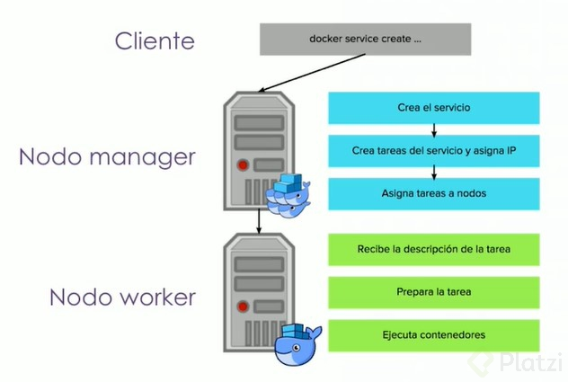

# Curso de Swarm

## ¿Qué es Swarm?

**Docker Swarm**, lo que hace es, tener un Cluster de muchas maquinas, pero desde afuera, para los usuarios Developers (Administrativos, Operadores) se vea como un Docker Deamon.

Esto hace que parezca que estamos usando Docker Local (en nuestras computadoras) pero tenemos acceso a muchos nodos o maquinas que están corriendo Docker Deamon.

Y Docker Swarm lo que nos facilita es toda la paste de actualización de servicios, rotación, administración, etc. Para lograr una alta disponibilidad de nuestro servicio.

## El problema de la escala: qué pasa cuando una computadora sóla no alcanza

La **escalabilidad** es el poder aumentar la capacidad de potencia de computo para poder servir a más usuarios o a procesos más pesados a medida que la demanda avanza.

A la hora de hablar de escalabilidad encontramos dos tipos de soluciones, *escalabilidad vertical*, que consiste en adquirir un mejor hardware que soporte mi solución o una *escalabilidad horizontal*, en la cual varias máquinas están corriendo el mismo software y por lo tanto es la solución más utilizada en los últimos tiempos.

La **disponibilidad** es la capacidad de una aplicación o un servicio de poder estar siempre disponible (24 horas del día), aún cuando suceda un improvisto.

**Es mayor la disponibilidad cuando se realiza escalabilidad horizontal**

Swarm no ofrece la solución a estos problemas.

- Ejecutar aplicaciones productivas: la aplicación debe estar lista para servir a las usuarios a pesar de situaciones catastróficas, o de alta demanda (carga).
- Escalabilidad: Poder aumentar la potencia de cómputo para poder servir a más usuarios, o a peticiones pesadas.
- Escalabilidad vertical: Más hardware, hay límite físico.
- Escalabilidad horizontal: Distribuir carga entre muchas computadoras. es el más usado.
- Disponibilidad: Es la capacidad de una aplicación o servicio de estar siempre disponible para los usuarios. prevé problemas con servidores, etc.
- La escalabilidad horizontal y la disponibilidad van de la mano.

## Arquitectura de Docker Swarm

La arquitectura de Swarm tiene un esquema de dos tipos de servidores involucrados: los managers y los workers.

- Los managers son encargados de administrar la comunicación entre los contenedores para que sea una unidad homogénea.

- Los workers son nodos donde se van a ejecutar contenedores, funciona como un núcleo, los contenedores estarán corriendo en los workers.

**Todos deben tener Docker Daemon (idealmente la misma versión) y deben ser visibles entre sí.**

## Preparando tus aplicaciones para Docker Swarm: los 12 factores

**¿ Está tu aplicación preparada para Docker Swarm ?**

Para saberlo, necesitas comprobarlo con los 12 factores

1. **Codebase**: el código debe estar en un repositorio
2. **Dependencies**: deben estar declaradas en un archivo de formato versionable, suele ser un archivo de código
3. **Configuration**: debe formar parte de la aplicación cuando esté corriendo, puede ser dentro de un archivo
4. **Backing services**: debe estar conectada a tu aplicación sin que esté dentro, se debe tratar como algo externo
5. **Build, release, run**: deben estar separadas entre sí.
6. **Processes**: todos los procesos los puede hacer como una unidad atómica
7. **Port binding**: tu aplicación debe poder exponerse a sí misma sin necesidad de algo intermediario
8. **Concurrency**: que pueda correr con múltiples instancias en paralelo
9. **Disposabilty**: debe estar diseñada para que sea fácilmente destruible
10. **Dev/Prod parity**: lograr que tu aplicación sea lo más parecido a lo que estará en producción
11. **Logs**: todos los logs deben tratarse como flujos de bytes
12. **Admin processes**: la aplicación tiene que poder ser ejecutable como procesos independientes de la aplicación

[The Twelve-Factor App](https://12factor.net/)

## Tu primer Docker Swarm

- Docker swarm es un modo de usar docker.
- `docker swarm init`: para iniciar docker swarm. Cada vez que se inicia como swarm, el equipo se convierte en manager.
- `docker swarm join-token manager`: para unirse como manager.
- `docker swarm join --token TOKEN server:puerto`: para unir un nodo como worker al server con puerto 2377
- `docker node ls`: para ver los nodos swarm de docker.
El manager cuenta con un certificado, con el cuál encripta la comunicación entre los workers y los managers.
- `docker node inspect --pretty self`: para ver los datos del nodo y del certificado.
- `docker swarm leave`: para salir de swarm de docker.
- `docker swarm leave --force`: para forzar la salida del docker swarm, como cuando eres el último manager.

[Manage swarm security with public key infrastructure (PKI) | Docker Documentation](https://docs.docker.com/engine/swarm/how-swarm-mode-works/pki/)

## Fundamentos de Docker Swarm: servicios

- se inicia docker swarm `docker swarm init`
- se crea un servicio llamado pinger y se usa al imagen alpine con ping de dirrección de google para el ejemplo: `docker service create --name pringer alpine ping www.google.com`
- listamos los servicios activos: `docker service ls`

En swarm siempre tienes que tener algún mecanismo de mantenimiento y limpieza. Yo uso [meltwater/docker-cleanup](https://hub.docker.com/r/meltwater/docker-cleanup "meltwater/docker-cleanup") corriendo como un servicio global de Swarm, lo que me garantiza que corre en todos los nodos, y delego en él la tarea de limpiar todo. Lo hago así:

```bash
docker service create \
  --detach \
  -e CLEAN_PERIOD=900 \
  -e DELAY_TIME=600 \
  --log-driver json-file \
  --log-opt max-size=1m \
  --log-opt max-file=2 \
  --name cleanup \
  --mode global \
  --mount type=bind,source=/var/run/docker.sock,target=/var/run/docker.sock \
  meltwater/docker-cleanup
```

[Deploy services to a swarm | Docker Documentation](https://docs.docker.com/engine/swarm/services/)

## Entendiendo el ciclo de vida de un servicio

Desde el Cliente , ‘docker service create’ le envía al Nodo Manager el servicio: se crea, se verifican cuántas tareas tendrá, se le otorga una IP virtual y asigna tareas a nodos; esta información es recibida por el Nodo Worker, quien prepara la tarea y luego ejecuta los contenedores.



comandos

`docker service ps pinger`
`docker service inspect pinger`
`docker service inspect --pretty pinger`
`docker service logs pinger`
`docker service logs -f pinger` para que siga sacando el resultado
`docker service rm pinger`

[How services work | Docker Documentation](https://docs.docker.com/engine/swarm/how-swarm-mode-works/services/)

## Un playground de docker swarm gratuito: play-with-docker

¡Play with docker es una herramienta de otro mundo! Te permitirá colaborar entre distintos usuarios en una mismas sesión de docker, y lo mejor, ¡puedes incluir tu propia terminal!

[Play with Docker](https://labs.play-with-docker.com/)

### Características de play-with-docker:

- Tiempo de duración: 4 horas
- Memoria RAM: 4GB
- Docker & Compose
- Git
- Conexión por SSH
- IP propia.
- Puedes agregar mas instancias (IP)

## Docker Swarm multinodo

Ampliar la terminal: alt + enter

`docker swarm init --advertise-addr IP`: para iniciar docker swarm con ip en específico
`docker swarm join --token TOKEN server:puerto`, para unir un nodo como worker al server con puerto 2377
`docker node ls`: para ver los nodos swarm de docker.

- Creamos el nodo manager

```bash
docker swarm init --advertise-addr <MANAGER-IP>
docker swarm init --advertise-addr 192.168.0.18
```
- Creamos una nueva instancia en play-with-docker (+ ADD NEW INSTANCE)

```bash
docker swarm join --token <TOKEN> <MANAGER-IP>:<PORT>
docker swarm join --token SWMTKN-1-32cege8duoof9cr405bi1fsmcga831l6fcecmznp5cxcfdc3vg-ci6f98tjfy9fzhr2swmmo3ter 192.168.0.18:2377
```
- Creamos otra nueva instancia en play-with-docker (+ ADD NEW INSTANCE)

```bash
docker swarm join --token <TOKEN> <MANAGER-IP>:<PORT>
docker swarm join --token SWMTKN-1-32cege8duoof9cr405bi1fsmcga831l6fcecmznp5cxcfdc3vg-ci6f98tjfy9fzhr2swmmo3ter 192.168.0.18:2377
```
- Nos dirigimos a la terminal del nodo MANAGER, observamos los 3 nodos

```bash
docker node ls
```
- Crear un servicio en este caso multinodo

```bash
docker service create --name pinger alpine ping www.google.com
```
- Ver listado de servicios

```bash
docker service ls
```
- Donde estan asignado las tareas de este servicio, nos indica que esta en el nodo 1

```bash
docker service ps pinger
```

- Podemos ver el container

```bash
docker ps
```

## Administrando servicios en escala

Tenemos un swarm con multiples nodos, vamos a tratar de hacer es escalar nuestro servicio de pinger para que tenga muchas replicas

- Ejecutar scale para 5 tareas

```bash
docker service scale <nameService>=<cantidad>
docker service scale pinger=5
```
- Ver el estado de este servicio

```bash
docker service ps pinger
```
- Listamos contenedores para ver que estan corriendo mas de un contenedor
```bash
docker ps
```
- Vamos a ver los logs de este servicio, observamos que todo junto de todas las tareas sin perdernos ningun valor (Ctrl+C) Salir
```bash
docker service logs -f pinger 
```
- Inspeccionamos el servicio para ver cuantas replicas tiene
```bash

docker service inspect pinger
```
- Actualizar en caliente, cambiar configuracion
```bash
docker service update --args "ping www.amazon.com" pinger
docker service logs -f pinger 
```
- Si hay algun problema podemos volver a un estado anterior, es decir hacer un rollback
```bash
docker service rollback pinger
```
- Verificamos
```bash

docker service inspect pinger
```

- ver los servicios
```bash
docker service ls
```

## Controlando el despliegue de servicios

- Actualizar las replicas de un servicio, agregando mas replicas
```bash
docker service update --replicas=20 pinger
docker service update -d --replicas=20 pinger
```
- Actualizar paralelismo y orden de la configuración de update en el servicio pinger (stop-first: Arranca con esta cantidad de tareas, start-first: Creame mas tareas cuando esten listas las nuevas y borramela las viejas)
```bash
docker service update --update-parallelism 4 --update-order start-first pinger
docker service inspect pinger
docker service update --args "ping www.facebook.com" pinger
```


- Actualizar accion en fallo y radio maximo de falla de la configuración de update en el servicio pinger
```bash
docker service update --update-failure-action rollback --update-max-failure-ratio 0.5 pinger
```
- Actualizar paralelismo de la configuracion de rollback en el servicio de pinger
```bash
docker service update --rollback-parallelism 0 pinger
```

### Comandos

`docker service scale pinger=10`
`docker service  update --replicas=20 pinger`
`docker service  update -d --replicas=20 pinger`
`docker service inspect pinger`
`docker service  update --update-parallelism 4 --update-order start-first pinger`
`docker service inspect pinger`
`docker service update --args 2ping www.facebook.com" pinger`
`docker service ps pinger`
`docker service update --update-failure-action rollback --update-max-failure-ratio 0.5 pinger`
`docker service update --rollback-parallelism 0 pinger`
`docker service update --args "ping www."; pinger`

- `docker service update --replicas=<n> <servicename>`: actualiza el numero de replicas del servicio.
- `docker service update --update-parallelism <n> --update-order <start-first> <servicename>`: configura los n nodos que se actualizaran en paralelo, así como se indica el update order.
- `docker service update --update-failure-action rollback --update-max-failure-ratio <n> <servicename>`: configura el max n de fallas de un update antes de realizar un rollback del servicio.
- `docker service update --rollback-parallelism <n> <servicename>`: configura los n nodos que se haran rollback en paralelo, [0=todos]