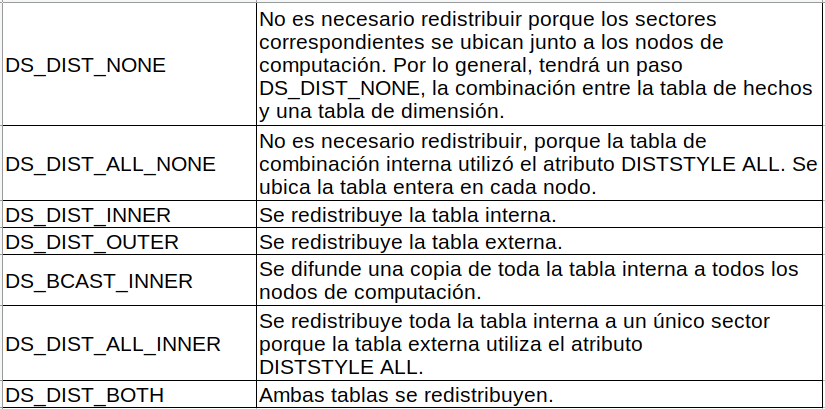

# Curso de AWS Redshift para Manejo de Big Data

## Objetivos y presentación del proyecto

**Amazon Redshift** es un servicio de almacenamiento de datos (data warehouse) en la nube provisto por Amazon Web Services (AWS). Está diseñado para analizar grandes volúmenes de datos de manera rápida y escalable. Es ideal para empresas que necesitan realizar análisis complejos y generar informes sobre datos almacenados.

### **Características principales de Amazon Redshift**
1. **Almacenamiento columnar**:
   - Redshift utiliza un modelo de almacenamiento columnar que optimiza las consultas analíticas, ya que permite leer solo las columnas relevantes en lugar de todas las filas.

2. **Escalabilidad**:
   - Redshift puede escalar horizontalmente añadiendo nodos al clúster, o verticalmente aumentando el tamaño de los nodos.

3. **Compatibilidad con SQL**:
   - Es compatible con SQL estándar, lo que facilita a los analistas y científicos de datos realizar consultas sin aprender un nuevo lenguaje.

4. **Integración con AWS**:
   - Se integra de forma nativa con servicios de AWS como S3, Kinesis, Glue, y QuickSight, facilitando la carga y análisis de datos.

5. **Compresión y particionamiento**:
   - Redshift aplica compresión y particionamiento automático de datos para mejorar el rendimiento y reducir costos.

6. **Distribución de datos**:
   - Usa estrategias como distribución por claves, rondas o todo nodo para optimizar la distribución de datos entre nodos.

### **Casos de uso comunes**
1. **Análisis empresarial**:
   - Generación de reportes, dashboards y visualizaciones con herramientas como Tableau, Power BI o Amazon QuickSight.

2. **Big Data Analytics**:
   - Procesamiento de grandes volúmenes de datos para identificar patrones, tendencias y obtener insights.

3. **Integración con sistemas ETL**:
   - Redshift se utiliza como destino de datos extraídos, transformados y cargados (ETL) desde diversas fuentes.

4. **Machine Learning**:
   - Preprocesamiento y almacenamiento de grandes conjuntos de datos para entrenar modelos ML.

### **Componentes de Amazon Redshift**

1. **Clúster**:
   - Es el entorno principal que contiene uno o más nodos donde se almacenan los datos y se procesan las consultas.

2. **Nodos**:
   - **Nodo líder**: Coordina las consultas y distribuye tareas a los nodos de cómputo.
   - **Nodos de cómputo**: Ejecutan consultas y almacenan los datos.

3. **Redshift Spectrum**:
   - Permite realizar consultas directamente en datos almacenados en S3 sin necesidad de cargarlos en Redshift.

4. **Conexión JDBC/ODBC**:
   - Redshift soporta conectores estándar para integrarse con herramientas de análisis y BI.

### **Arquitectura básica de Redshift**

1. **Carga de datos**:
   - Los datos se cargan desde diversas fuentes como:
     - Bases de datos relacionales (usando AWS DMS).
     - Archivos CSV, JSON, Parquet en S3.
     - Streams en tiempo real con Kinesis.

2. **Procesamiento**:
   - Redshift optimiza las consultas utilizando índices, almacenamiento columnar y estrategias de distribución.

3. **Consulta y análisis**:
   - Los usuarios acceden a los datos utilizando SQL o herramientas BI conectadas al clúster.

### **Ventajas de Amazon Redshift**

1. **Rendimiento**:
   - Diseño optimizado para consultas analíticas complejas y grandes volúmenes de datos.

2. **Costo-efectivo**:
   - Sistema de pago por uso con precios ajustados para almacenamiento y cómputo.

3. **Facilidad de uso**:
   - Configuración sencilla y escalabilidad sin interrupciones.

4. **Seguridad**:
   - Soporta cifrado de datos en reposo y en tránsito, integración con AWS IAM, y auditorías.

### **Ejemplo de uso con Python**

Amazon Redshift se integra fácilmente con Python usando bibliotecas como `psycopg2` o `SQLAlchemy`. A continuación, un ejemplo de conexión:

```python
import psycopg2

# Configuración de conexión
host = 'redshift-cluster.endpoint.amazonaws.com'
port = 5439
dbname = 'mydatabase'
user = 'myuser'
password = 'mypassword'

# Conexión a Redshift
try:
    conn = psycopg2.connect(
        host=host,
        port=port,
        dbname=dbname,
        user=user,
        password=password
    )
    print("Conexión exitosa")
    
    # Ejecutar consulta
    cursor = conn.cursor()
    cursor.execute("SELECT * FROM mi_tabla LIMIT 10;")
    rows = cursor.fetchall()
    for row in rows:
        print(row)
        
    cursor.close()
    conn.close()
except Exception as e:
    print(f"Error en la conexión: {e}")
```

**Archivos de la clase**

[curso-de-redshift.pdf](https://static.platzi.com/media/public/uploads/curso-de-redshift_cdaf8dc8-3cdf-4e77-b1e5-a3390075746c.pdf)

**Lecturas recomendadas**

[Fundamentos de Bases de Datos](https://platzi.com/clases/bd/)

[Curso de SQL y MySQL | Platzi](https://platzi.com/clases/sql-mysql)

[Curso de Big Data](https://platzi.com/clases/big-data/)

[Curso de Fundamentos de AWS Cloud](https://platzi.com/clases/aws-cloud/)

[¿Cómo puedo empezar a usar AWS? en Curso de Fundamentos de AWS Cloud](https://platzi.com/clases/1323-aws-cloud/12574-como-puedo-empezar-a-usar-aws/)

## Aprende qué es un Data Warehouse

Un **Data Warehouse** (almacén de datos) es una base de datos especializada que centraliza y organiza información de múltiples sistemas o fuentes con el objetivo de apoyar la toma de decisiones empresariales. Está optimizado para consultas y análisis, en lugar de procesamiento de transacciones. 

### Características principales:
1. **Integración**: Combina datos de diversas fuentes (bases de datos transaccionales, archivos externos, sistemas ERP, CRM, etc.).
2. **Orientación a temas**: Los datos están organizados en torno a temas o áreas de interés, como ventas, clientes o finanzas.
3. **Consistencia temporal**: Los datos son históricos y se almacenan con marcadores de tiempo, permitiendo análisis a lo largo del tiempo.
4. **No volátil**: Los datos no se actualizan ni eliminan una vez almacenados, solo se agregan para conservar el historial.

### Componentes clave:
- **ETL (Extract, Transform, Load)**: Procesos que extraen datos de fuentes, los transforman según necesidades específicas y los cargan en el Data Warehouse.
- **Base de datos del Data Warehouse**: El repositorio central para almacenar datos organizados.
- **Herramientas de análisis y visualización**: Software que permite a los usuarios explorar los datos y generar reportes.

### Usos comunes:
- Generar informes ejecutivos y dashboards.
- Realizar análisis predictivo y minería de datos.
- Tomar decisiones estratégicas basadas en patrones históricos.

**Lecturas recomendadas**

[¿Qué es un Data Warehouse?](https://platzi.com/blog/ques-un-data-warehouse/)

[¿Qué es un ETL?](https://platzi.com/blog/que-es-un-etl/)

## Bases de datos columnares y arquitectura orientada a optimización de consultas

### Bases de Datos Columnares

Las bases de datos columnares están diseñadas para manejar eficientemente grandes volúmenes de datos en columnas en lugar de filas. A diferencia de las bases de datos tradicionales orientadas a filas, las columnares almacenan y procesan datos de forma optimizada por columnas, lo que permite:

- **Optimización en consultas analíticas**: Las bases de datos columnares están especialmente optimizadas para consultas analíticas, ya que permiten realizar operaciones sobre columnas específicas, lo que reduce la cantidad de datos leídos y procesados.
- **Eficiencia en almacenamiento**: Almacenamiento más eficiente debido a la compresión columnar, lo que resulta en un menor uso de disco y una mejor utilización de recursos.
- **Mejora del rendimiento en lecturas**: Son ideales para consultas de agregación, sumas, promedios, y otros cálculos que operan en grandes conjuntos de datos.

### Arquitectura Orientada a Optimización de Consultas

La arquitectura orientada a la optimización de consultas es un diseño de bases de datos que prioriza el rendimiento en la ejecución de consultas. Esta arquitectura incluye varios componentes clave:

1. **Indexación Avanzada**: Utilización de índices específicos para acelerar las búsquedas y filtrados.
2. **Técnicas de particionado**: División de grandes conjuntos de datos en particiones más pequeñas para acelerar consultas específicas.
3. **Caché**: Almacenamiento temporal de resultados para consultas repetidas, reduciendo el tiempo de acceso a los datos.
4. **Optimización de Consulta**: Técnicas como predicción de índices, agrupamiento de datos y ejecución paralela para mejorar el rendimiento.
5. **Compresión y almacenamiento eficiente**: Reducción del espacio ocupado por los datos mediante técnicas avanzadas de almacenamiento, tanto físicas como lógico-físicas.

En conjunto, estas características ayudan a optimizar el rendimiento de las bases de datos y a satisfacer demandas de procesamiento masivo de datos.

**Lecturas recomendadas**

[¿Qué es una base de datos columnar? – AWS](https://aws.amazon.com/es/nosql/columnar/)

[Características de Amazon Redshift - Almacén de datos en la nube - Amazon Web Services](https://aws.amazon.com/es/redshift/features/)

## ¿Cómo funciona AWS Redshift?

### Bases de Datos Columnares

Las bases de datos columnares están diseñadas para manejar eficientemente grandes volúmenes de datos en columnas en lugar de filas. A diferencia de las bases de datos tradicionales orientadas a filas, las columnares almacenan y procesan datos de forma optimizada por columnas, lo que permite:

- **Optimización en consultas analíticas**: Las bases de datos columnares están especialmente optimizadas para consultas analíticas, ya que permiten realizar operaciones sobre columnas específicas, lo que reduce la cantidad de datos leídos y procesados.
- **Eficiencia en almacenamiento**: Almacenamiento más eficiente debido a la compresión columnar, lo que resulta en un menor uso de disco y una mejor utilización de recursos.
- **Mejora del rendimiento en lecturas**: Son ideales para consultas de agregación, sumas, promedios, y otros cálculos que operan en grandes conjuntos de datos.

### Arquitectura Orientada a Optimización de Consultas

La arquitectura orientada a la optimización de consultas es un diseño de bases de datos que prioriza el rendimiento en la ejecución de consultas. Esta arquitectura incluye varios componentes clave:

1. **Indexación Avanzada**: Utilización de índices específicos para acelerar las búsquedas y filtrados.
2. **Técnicas de particionado**: División de grandes conjuntos de datos en particiones más pequeñas para acelerar consultas específicas.
3. **Caché**: Almacenamiento temporal de resultados para consultas repetidas, reduciendo el tiempo de acceso a los datos.
4. **Optimización de Consulta**: Técnicas como predicción de índices, agrupamiento de datos y ejecución paralela para mejorar el rendimiento.
5. **Compresión y almacenamiento eficiente**: Reducción del espacio ocupado por los datos mediante técnicas avanzadas de almacenamiento, tanto físicas como lógico-físicas.

En conjunto, estas características ayudan a optimizar el rendimiento de las bases de datos y a satisfacer demandas de procesamiento masivo de datos.

## Creando nuestro entorno de trabajo en AWS

Crear tu entorno de trabajo en AWS implica varios pasos para configurar los recursos necesarios para almacenar, procesar y analizar datos. Aquí tienes una guía básica para configurar un entorno en AWS:

### 1. **Crear una cuenta en AWS**
   - Ve al [sitio web de AWS](https://aws.amazon.com/) y crea una cuenta. Asegúrate de verificar tu identidad si es necesario.

### 2. **Configurar el acceso a AWS**
   - Configura las credenciales para acceder a AWS a través de la CLI o SDK. Puedes generar claves desde la consola de AWS (IAM -> Users -> Policies).

### 3. **Crear un Bucket de S3 para Almacenamiento de Datos**
   - S3 es un servicio de almacenamiento en la nube que puedes usar para guardar datos y acceder a ellos fácilmente.
   
   **Pasos**:
   - Navega a S3 en AWS.
   - Haz clic en "Crear Bucket".
   - Configura las opciones de almacenamiento, como el nombre del bucket, región, permisos y otras configuraciones como la región de datos y la clase de almacenamiento.

### 4. **Configurar una Base de Datos Redshift**
   - **AWS Redshift** se utiliza para el análisis de datos utilizando almacenamiento columnar.
   
   **Pasos**:
   - Navega a Redshift en AWS.
   - Crea un nuevo clúster de Redshift.
   - Define la configuración como tipo de nodo, número de nodos, tipo de almacenamiento, y configuraciones de seguridad.
   - Una vez creado, accede al clúster y carga datos desde S3 o fuentes externas.

### 5. **Instalar y Configurar AWS CLI**
   - La CLI de AWS permite la gestión y automatización de recursos a través de comandos en línea.
   
   **Pasos**:
   - Descarga e instala la CLI desde la [página oficial de AWS CLI](https://aws.amazon.com/cli/).
   - Configura tus credenciales (`aws configure`) para autenticarse en AWS desde la CLI.

### 6. **Automatización con AWS Lambda**
   - AWS Lambda permite ejecutar funciones en respuesta a eventos, como nuevos datos almacenados en S3 o la finalización de consultas en Redshift.
   
   **Pasos**:
   - Crea una nueva función Lambda.
   - Escribe tu código en Python o cualquier otro lenguaje compatible.
   - Configura triggers para ejecutar Lambda automáticamente en eventos específicos.

### 7. **Monitoreo y Seguridad**
   - Configura el monitoreo utilizando servicios como CloudWatch para supervisar el rendimiento de tus recursos.
   - Establece políticas de seguridad usando IAM para controlar quién tiene acceso a qué recursos.

### 8. **Optimización y Escalabilidad**
   - Ajusta las configuraciones de almacenamiento y procesamiento según tus necesidades.
   - Escala automáticamente los recursos usando Elastic Load Balancing o configuraciones manuales para aumentar o disminuir recursos.

### 9. **Documentación y Buenas Prácticas**
   - Mantén documentadas todas las configuraciones, políticas y configuraciones de seguridad.
   - Utiliza herramientas como Terraform o CloudFormation para automatizar la creación y gestión de infraestructura en AWS.

Con estos pasos básicos, puedes configurar un entorno en AWS que incluye almacenamiento, procesamiento de datos y análisis, creando una solución robusta para manejo de datos en la nube.

**Lecturas recomendadas**

[¿Cómo puedo empezar a usar AWS? en Curso de Fundamentos de AWS Cloud](https://platzi.com/clases/1323-aws-cloud/12574-como-puedo-empezar-a-usar-aws/)

[Curso de Fundamentos de AWS Cloud](https://platzi.com/clases/aws-cloud/)

[Curso de Cloud Computing con AWS](https://platzi.com/clases/aws-computo/)

## Configura tu primer cluster

Para configurar tu primer clúster en AWS Redshift, sigue estos pasos:

### 1. **Iniciar sesión en AWS**
   - Accede a la consola de AWS en [AWS Management Console](https://aws.amazon.com/console/).

### 2. **Navegar a AWS Redshift**
   - Ve a la sección de **Redshift** en la consola de AWS desde la barra de búsqueda o selecciona la categoría "Bases de datos" y luego selecciona **Redshift**.

### 3. **Crear un Nuevo Clúster Redshift**
   - Haz clic en **"Crear clúster"**.

### 4. **Configurar los Parámetros del Clúster**

   **Nombre del Clúster**: Define un nombre único para tu clúster.

   **Conjunto de Parámetros**: Elige entre diferentes conjuntos predefinidos o personaliza las configuraciones según las necesidades de rendimiento (ej., almacenamiento, nodo, tipo de nodo).

   **Tipo de Nodo**: Elige el tipo de nodo que deseas usar (Small, Medium, Large, etc.). Los nodos más grandes ofrecen mejor rendimiento, pero también mayor costo.

   **Número de Nodos**: Define cuántos nodos quieres utilizar. Por ejemplo, si estás comenzando, puedes comenzar con un solo nodo (Single Node) o un clúster de múltiples nodos si se requiere procesamiento distribuido.

   **Configuración de Almacenamiento**: Ajusta la cantidad de almacenamiento (GB) en función de tus necesidades. El almacenamiento se ajusta automáticamente según la cantidad de datos que procesas.

### 5. **Configuraciones Avanzadas**

   - **Conexión**: Configura el puerto, enrutamiento y red según tus necesidades de seguridad.
   - **Seguridad**: Añade grupos de seguridad para permitir acceso seguro desde otras aplicaciones o redes específicas.
   - **Seguridad de Datos**: Encriptación del clúster para asegurar los datos.

### 6. **Creación del Clúster**

   - Una vez configurado todo, haz clic en **"Crear Clúster"**. AWS comenzará a crear tu clúster Redshift.

### 7. **Conectar al Clúster**

   - Una vez creado, tendrás un endpoint para conectarte al clúster desde una herramienta como SQL client o desde aplicaciones que interactúan con bases de datos.

### 8. **Importar Datos**

   - Usa **Amazon S3** para cargar datos en tu clúster Redshift. También puedes conectarte a bases de datos externas o fuentes de datos a través de conexiones JDBC o otras.

### 9. **Monitoreo y Optimización**

   - Utiliza **CloudWatch** para monitorizar métricas del clúster.
   - Ajusta configuraciones conforme el uso y rendimiento del clúster.

Este proceso crea un entorno básico para trabajar con AWS Redshift.

**Lecturas recomendadas**

[Prueba gratuita de Amazon Redshift - Almacén de datos en la nube - Amazon Web Services](https://aws.amazon.com/es/redshift/free-trial/)

## Consumiendo Redshift: empieza la magia

Consumir datos desde un clúster de **AWS Redshift** implica interactuar con las tablas que has cargado y ejecutar consultas SQL optimizadas para obtener insights o alimentar aplicaciones downstream. Aquí te explico cómo empezar a consumir Redshift:

### **1. Configuración inicial**
Asegúrate de que:
- Tu clúster de Redshift está creado y funcionando.
- Los datos están cargados en Redshift (puedes usar Amazon S3 para cargar datos).
- Las herramientas de consulta están configuradas para acceder al clúster.

### **2. Conectar a Redshift**
Puedes conectarte al clúster de Redshift mediante:
- **Cliente SQL**: Herramientas como DBeaver, SQL Workbench/J o cualquier herramienta compatible con JDBC/ODBC.
- **AWS Query Editor**: Disponible directamente en la consola de AWS Redshift.
- **Librerías de programación**: Usando librerías como `boto3` (Python) o conectores JDBC/ODBC en lenguajes como Java o C#.

#### **Pasos para conectarte**
1. **Obtén el endpoint del clúster** desde la consola de AWS.
2. **Configura tu cliente SQL**:
   - Endpoint (ejemplo: `redshift-cluster-name.cluster-abc123xyz.us-west-2.redshift.amazonaws.com`).
   - Usuario y contraseña configurados al crear el clúster.
   - Puerto (por defecto: `5439`).
   - Nombre de la base de datos.
3. **Proporciona credenciales**:
   - Al usar herramientas externas, asegúrate de que las credenciales coincidan con las configuradas.

### **3. Escribe y ejecuta consultas SQL**

#### **Consulta básica**
```sql
SELECT * FROM employees LIMIT 10;
```
- Extrae los primeros 10 registros de la tabla `employees`.

#### **Filtrar datos**
```sql
SELECT name, department 
FROM employees 
WHERE department = 'Sales';
```
- Filtra empleados cuyo departamento sea "Ventas".

#### **Agrupar datos**
```sql
SELECT department, COUNT(*) AS num_employees 
FROM employees 
GROUP BY department;
```
- Cuenta el número de empleados por departamento.

#### **Optimizar con SORTKEY**
Si tienes una tabla configurada con una clave de ordenación (SORTKEY), aprovecha este diseño en tus consultas para mejorar el rendimiento.

### **4. Integración con herramientas**
Puedes consumir datos desde Redshift para alimentar dashboards, sistemas de análisis o aplicaciones usando:
- **Amazon QuickSight**: Visualiza datos directamente desde tu clúster Redshift.
- **ETL Tools**: Conecta Redshift con herramientas como Apache Airflow o Glue para mover datos entre sistemas.
- **Python (psycopg2)**:
  ```python
  import psycopg2

  conn = psycopg2.connect(
      dbname='your_dbname',
      host='your_endpoint',
      port='5439',
      user='your_username',
      password='your_password'
  )
  cur = conn.cursor()
  cur.execute("SELECT * FROM employees LIMIT 10;")
  rows = cur.fetchall()
  for row in rows:
      print(row)
  conn.close()
  ```

### **5. Monitorear y ajustar**
- Usa la consola de **Redshift Performance** para identificar consultas que consumen demasiados recursos.
- Aplica estrategias como la partición de tablas, claves de distribución (DISTKEY) y claves de ordenación (SORTKEY) para mejorar tiempos de consulta.

### **6. Automatización y despliegue**
- **Amazon EventBridge**: Programa la ejecución de consultas.
- **Airflow**: Automatiza la extracción, transformación y carga desde y hacia Redshift.

**Lecturas recomendadas**

[Curso de Fundamentos de AWS Cloud](https://platzi.com/clases/aws-cloud/)

[Installation - Dbeaver](https://dbeaver.com/docs/wiki/Installation/)

[GitHub - alarcon7a/redshift_course: Data repository of redshift course](https://github.com/alarcon7a/redshift_course)

## Sentencias SQL en Redshift

Amazon Redshift utiliza una variante de PostgreSQL para procesar consultas SQL. Puedes interactuar con Redshift escribiendo sentencias SQL para tareas como creación de tablas, manipulación de datos, y consultas. Aquí están algunos ejemplos comunes de sentencias SQL utilizadas en Redshift:

### 1. **Creación de tablas**
```sql
CREATE TABLE empleados (
    id_empleado INT IDENTITY(1, 1),
    nombre VARCHAR(50),
    apellido VARCHAR(50),
    fecha_ingreso DATE,
    salario DECIMAL(10, 2)
);
```

### 2. **Cargar datos desde S3**
Redshift permite cargar datos desde archivos almacenados en Amazon S3:
```sql
COPY empleados
FROM 's3://mi-bucket/datos/empleados.csv'
CREDENTIALS 'aws_access_key_id=TU_ACCESS_KEY;aws_secret_access_key=TU_SECRET_KEY'
CSV
IGNOREHEADER 1;
```

### 3. **Consultas**
- **Consulta básica**:
  ```sql
  SELECT nombre, apellido, salario
  FROM empleados
  WHERE salario > 50000;
  ```

- **Ordenar resultados**:
  ```sql
  SELECT * 
  FROM empleados
  ORDER BY fecha_ingreso DESC;
  ```

- **Agrupación y funciones de agregación**:
  ```sql
  SELECT fecha_ingreso, COUNT(*) AS total_empleados
  FROM empleados
  GROUP BY fecha_ingreso
  HAVING COUNT(*) > 1;
  ```

### 4. **Actualizar datos**
```sql
UPDATE empleados
SET salario = salario * 1.10
WHERE fecha_ingreso < '2020-01-01';
```

### 5. **Eliminar datos**
```sql
DELETE FROM empleados
WHERE fecha_ingreso < '2010-01-01';
```

### 6. **Uniones (JOIN)**
```sql
SELECT e.nombre, e.apellido, d.nombre AS departamento
FROM empleados e
JOIN departamentos d
ON e.id_departamento = d.id_departamento;
```

---

### 7. **Creación de vistas**
```sql
CREATE VIEW vista_empleados_activos AS
SELECT id_empleado, nombre, apellido
FROM empleados
WHERE estado = 'activo';
```

### 8. **Funciones analíticas**
```sql
SELECT nombre, apellido, salario,
       RANK() OVER (ORDER BY salario DESC) AS rank_salario
FROM empleados;
```

### 9. **Optimización de consultas**
Para optimizar tus consultas en Redshift:
- **Sort Keys**: Define claves de ordenamiento para optimizar consultas frecuentes.
  ```sql
  CREATE TABLE empleados (
      id_empleado INT,
      nombre VARCHAR(50),
      salario DECIMAL(10, 2)
  )
  SORTKEY (salario);
  ```
- **Dist Keys**: Define claves de distribución para optimizar operaciones que implican varias nodos.
  ```sql
  CREATE TABLE ventas (
      id_venta INT,
      id_producto INT,
      total DECIMAL(10, 2)
  )
  DISTKEY (id_producto);
  ```

**Lecturas recomendadas**

[Base de datos de muestra - Amazon Redshift](https://docs.aws.amazon.com/es_es/redshift/latest/dg/c_sampledb.html)

[redshift_course/Tickit_db at master · alarcon7a/redshift_course · GitHub](https://github.com/alarcon7a/redshift_course/tree/master/Tickit_db)

## ¿Qué es la compresión en Redshift?

La compresión en Amazon Redshift, conocida como **Encoding** o **Compression Encoding**, es una característica que permite reducir el tamaño del almacenamiento de los datos en las columnas de las tablas, optimizando el uso de recursos y mejorando el rendimiento de las consultas al minimizar la cantidad de datos leídos desde el disco.

### Características principales de la compresión en Redshift:

1. **Compresión basada en columnas**:
   - Redshift almacena los datos de forma columnar, lo que facilita la aplicación de algoritmos de compresión específicos para cada tipo de dato en una columna.
   - Las columnas que contienen valores repetitivos o con patrones predecibles son altamente eficientes para la compresión.

2. **Compresión automática**:
   - Al cargar datos mediante el comando `COPY`, Redshift puede analizar los datos y sugerir automáticamente el mejor algoritmo de compresión para cada columna.
   - Esta funcionalidad es útil si no se han especificado opciones de compresión al crear la tabla.

3. **Beneficios de la compresión**:
   - **Reducción del almacenamiento**: Reduce el espacio necesario en disco para almacenar datos.
   - **Mejor rendimiento**: Disminuye la cantidad de datos que deben ser leídos desde el disco en consultas.
   - **Costos más bajos**: Al necesitar menos almacenamiento, se reducen los costos asociados.

4. **Algoritmos de compresión**:
   Redshift soporta diferentes algoritmos de compresión que son aplicables según el tipo de dato. Algunos de los más comunes incluyen:
   - **RAW**: Sin compresión.
   - **BYTEDICT**: Codificación basada en diccionarios para columnas con pocos valores únicos.
   - **DELTA**: Almacena diferencias consecutivas, ideal para datos secuenciales.
   - **RUNLENGTH**: Para columnas con muchos valores repetidos.
   - **ZSTD**: Algoritmo de compresión general que ofrece alta compresión y velocidad.
   - **TEXT255/TEXT32K**: Codificación eficiente para cadenas de texto.
   - **DELTA32K**: Una variante de DELTA para datos más grandes.

5. **Aplicación manual**:
   Puedes definir la compresión al momento de crear una tabla. Por ejemplo:
   ```sql
   CREATE TABLE ventas (
       venta_id INT ENCODE RAW,
       cliente_id INT ENCODE BYTEDICT,
       fecha TIMESTAMP ENCODE DELTA,
       monto DECIMAL(10, 2) ENCODE ZSTD
   );
   ```

6. **Análisis de compresión**:
   - Puedes usar la utilidad `ANALYZE COMPRESSION` para evaluar qué algoritmos de compresión son más eficientes para una tabla.
   - Ejemplo:
     ```sql
     ANALYZE COMPRESSION mi_tabla;
     ```

7. **Limitaciones**:
   - No todas las columnas se benefician de la compresión (por ejemplo, columnas de tipo `BOOLEAN` suelen usar poca memoria de forma predeterminada).
   - La compresión no puede cambiarse directamente una vez aplicada; necesitas recrear la tabla con la nueva configuración.

### Mejores prácticas:
- Usa compresión para todas las tablas que almacenan grandes volúmenes de datos.
- Ejecuta `ANALYZE COMPRESSION` periódicamente para garantizar que se están usando los mejores algoritmos.
- Carga datos con el comando `COPY` para aprovechar la compresión automática.

La compresión es clave para maximizar el rendimiento y la eficiencia en Amazon Redshift, especialmente en entornos con grandes cantidades de datos.

**Lecturas recomendadas**

[Compression encodings - Amazon Redshift](https://docs.aws.amazon.com/redshift/latest/dg/c_Compression_encodings.html)

[Amazon Redshift presenta AZ64, una nueva codificación de compresión para lograr un almacenamiento optimizado y un alto rendimiento de consultas](https://aws.amazon.com/es/about-aws/whats-new/2019/10/amazon-redshift-introduces-az64-a-new-compression-encoding-for-optimized-storage-and-high-query-performance/)

## Algoritmos de compresión con Redshift

Amazon Redshift utiliza una variedad de **algoritmos de compresión** (o **codificación**) para optimizar el almacenamiento y el rendimiento de las consultas. Estos algoritmos se aplican a nivel de columna y están diseñados para diferentes tipos de datos y patrones. A continuación, se explican los principales algoritmos de compresión disponibles en Redshift:

### **1. RAW**
- **Descripción**: Sin compresión.
- **Usos**: Se utiliza cuando no se aplica ninguna compresión a los datos. Recomendado solo si los datos no se benefician de la compresión.
- **Ejemplo**:
  ```sql
  columna1 INT ENCODE RAW;
  ```

### **2. BYTEDICT**
- **Descripción**: Codificación basada en diccionarios. Asigna valores únicos de una columna a un índice.
- **Usos**: Eficiente para columnas con pocos valores únicos, como códigos de estado, categorías o etiquetas.
- **Ejemplo**:
  ```sql
  columna1 VARCHAR(50) ENCODE BYTEDICT;
  ```

### **3. RUNLENGTH**
- **Descripción**: Compresión por longitud de ejecución.
- **Usos**: Ideal para columnas con muchos valores consecutivos repetidos (como estados binarios o datos ordenados).
- **Ejemplo**:
  ```sql
  columna1 CHAR(1) ENCODE RUNLENGTH;
  ```

### **4. DELTA**
- **Descripción**: Almacena diferencias entre valores consecutivos.
- **Usos**: Adecuado para datos secuenciales, como fechas, IDs incrementales o series temporales.
- **Ejemplo**:
  ```sql
  columna1 TIMESTAMP ENCODE DELTA;
  ```

### **5. DELTA32K**
- **Descripción**: Variante de `DELTA` para datos con diferencias mayores (hasta 32,000).
- **Usos**: Útil para datos numéricos o fechas con saltos grandes entre valores consecutivos.
- **Ejemplo**:
  ```sql
  columna1 INT ENCODE DELTA32K;
  ```

### **6. ZSTD (Zstandard)**
- **Descripción**: Algoritmo de compresión general que equilibra eficiencia y velocidad.
- **Usos**: Adecuado para la mayoría de los tipos de datos. Es altamente eficiente y flexible.
- **Ejemplo**:
  ```sql
  columna1 DECIMAL(10, 2) ENCODE ZSTD;
  ```

### **7. TEXT255**
- **Descripción**: Codificación para cadenas de texto de hasta 255 caracteres.
- **Usos**: Columnas de texto cortas, como nombres, correos electrónicos, códigos de producto, etc.
- **Ejemplo**:
  ```sql
  columna1 VARCHAR(255) ENCODE TEXT255;
  ```

### **8. TEXT32K**
- **Descripción**: Codificación para cadenas de texto más largas (hasta 32,000 caracteres).
- **Usos**: Columnas de texto largas, como descripciones o comentarios.
- **Ejemplo**:
  ```sql
  columna1 VARCHAR(32000) ENCODE TEXT32K;
  ```

### **9. MOSTLY**
- **Descripción**: Variantes de codificación que optimizan el almacenamiento para columnas con valores predominantemente repetidos.
  - **MOSTLY8**: Para columnas con valores enteros en un rango pequeño.
  - **MOSTLY16**: Para columnas con valores enteros en un rango más amplio.
  - **MOSTLY32**: Para columnas con valores enteros grandes pero que tienen muchos valores repetidos.

### **Cómo determinar el mejor algoritmo**
1. **Automático con `COPY`**:
   - Cuando cargas datos con el comando `COPY` sin especificar la compresión, Redshift analiza los datos y aplica automáticamente el algoritmo más adecuado.
   - Ejemplo:
     ```sql
     COPY mi_tabla
     FROM 's3://ruta-del-archivo'
     CREDENTIALS '...';
     ```

2. **Manual con `ANALYZE COMPRESSION`**:
   - Analiza la tabla para sugerir el mejor algoritmo de compresión para cada columna.
   - Ejemplo:
     ```sql
     ANALYZE COMPRESSION mi_tabla;
     ```

### **Mejores prácticas**
- Usa compresión en todas las columnas que no sean claves de partición o distribución.
- Revisa los resultados de `ANALYZE COMPRESSION` antes de aplicar configuraciones manuales.
- Si cargas datos dinámicos o desconocidos, deja que el comando `COPY` determine la compresión automáticamente.

La elección del algoritmo correcto puede mejorar significativamente el rendimiento de las consultas y reducir costos de almacenamiento.

## Aplicando algoritmos de compresión

Aplicar algoritmos de compresión en Amazon Redshift implica configurar cómo se almacenan las columnas de una tabla para optimizar el uso del almacenamiento y mejorar el rendimiento de las consultas. A continuación, se explica cómo aplicar los algoritmos de compresión en Redshift paso a paso:

### **1. Crear una tabla con algoritmos de compresión**
Puedes definir la compresión en el momento de la creación de una tabla utilizando el parámetro `ENCODE` en cada columna.

**Ejemplo**:
```sql
CREATE TABLE mi_tabla (
    id INT ENCODE RAW,                 -- Sin compresión
    nombre VARCHAR(255) ENCODE BYTEDICT, -- Diccionario de bytes
    fecha TIMESTAMP ENCODE DELTA,     -- Compresión por diferencias
    estado CHAR(1) ENCODE RUNLENGTH,  -- Compresión por longitud de ejecución
    comentario TEXT ENCODE ZSTD       -- Algoritmo ZSTD para texto largo
);
```

### **2. Aplicar compresión en tablas existentes**
Si ya tienes una tabla creada sin compresión o con compresión ineficiente, puedes aplicar algoritmos usando `ALTER TABLE`.

**Ejemplo**:
```sql
ALTER TABLE mi_tabla
ALTER COLUMN nombre ENCODE BYTEDICT;
```

> ⚠️ **Nota**: Si la tabla tiene datos, deberás recrearla o usar herramientas específicas para evitar pérdida de datos.

### **3. Analizar compresión con `ANALYZE COMPRESSION`**
El comando `ANALYZE COMPRESSION` evalúa los datos existentes y sugiere los mejores algoritmos de compresión para cada columna.

**Ejemplo**:
```sql
ANALYZE COMPRESSION mi_tabla;
```

**Salida esperada**:
Un informe con sugerencias para las columnas. Por ejemplo:
```
columna1: DELTA
columna2: BYTEDICT
columna3: ZSTD
```

### **4. Recargar datos con compresión automática**
El comando `COPY` puede determinar automáticamente los algoritmos de compresión adecuados al cargar datos.

**Ejemplo**:
```sql
COPY mi_tabla
FROM 's3://mi-bucket/mi-dataset.csv'
IAM_ROLE 'arn:aws:iam::123456789012:role/MiRole'
CSV;
```
Esto analizará los datos y aplicará la compresión más eficiente.

### **5. Recrear la tabla para optimizar la compresión**
Una opción más avanzada consiste en:
1. Crear una nueva tabla con las configuraciones de compresión sugeridas.
2. Transferir los datos de la tabla original a la nueva tabla.
3. Renombrar la nueva tabla como la tabla original.

**Ejemplo**:
```sql
CREATE TABLE mi_tabla_nueva (
    id INT ENCODE RAW,
    nombre VARCHAR(255) ENCODE BYTEDICT,
    fecha TIMESTAMP ENCODE DELTA,
    estado CHAR(1) ENCODE RUNLENGTH,
    comentario TEXT ENCODE ZSTD
);

INSERT INTO mi_tabla_nueva
SELECT * FROM mi_tabla;

DROP TABLE mi_tabla;

ALTER TABLE mi_tabla_nueva RENAME TO mi_tabla;
```

### **6. Validar el uso de compresión**
Puedes verificar qué algoritmo se está usando en cada columna consultando la vista del sistema `SVV_TABLE_INFO` o `PG_TABLE_DEF`.

**Ejemplo**:
```sql
SELECT "column", encoding
FROM pg_table_def
WHERE tablename = 'mi_tabla';
```

### **7. Mejoras y beneficios**
- **Reducción de almacenamiento**: La compresión puede reducir significativamente el espacio en disco, especialmente para datos repetitivos o categóricos.
- **Consultas más rápidas**: Menos datos físicos que leer significa consultas más rápidas.
- **Costos más bajos**: Al utilizar menos almacenamiento, puedes optimizar costos en tu clúster Redshift.

### **Mejores prácticas**
- Siempre analiza los datos con `ANALYZE COMPRESSION` antes de aplicar compresión manualmente.
- Usa compresión automática durante cargas masivas con `COPY`.
- Optimiza las columnas más grandes o aquellas que se usan frecuentemente en consultas.

## Análisis de desempeño con diferentes tipos de compresión

El análisis de desempeño con diferentes tipos de compresión en Amazon Redshift implica medir cómo los algoritmos de compresión afectan tanto el almacenamiento como el rendimiento de las consultas. Redshift ofrece varios algoritmos, cada uno optimizado para ciertos tipos de datos. A continuación, se describen los pasos y consideraciones clave para realizar este análisis.

### **1. Tipos de compresión en Redshift**
Redshift soporta varios algoritmos de compresión, como:

- **RAW**: Sin compresión.
- **BYTEDICT**: Ideal para columnas con valores categóricos cortos.
- **DELTA**: Eficiente para valores secuenciales, como fechas.
- **DELTA32K**: Similar a DELTA, pero para valores más grandes.
- **LZO**: Útil para datos generales, menos eficiente que ZSTD.
- **RUNLENGTH**: Excelente para valores repetitivos.
- **ZSTD**: Algoritmo moderno y eficiente para datos mixtos.

### **2. Configuración del experimento**
#### a. **Creación de tablas**
Crea tablas con las mismas columnas, pero aplica diferentes algoritmos de compresión.

```sql
CREATE TABLE sin_compresion (
    id INT ENCODE RAW,
    nombre VARCHAR(255) ENCODE RAW,
    fecha TIMESTAMP ENCODE RAW,
    estado CHAR(1) ENCODE RAW
);

CREATE TABLE con_zstd (
    id INT ENCODE RAW,
    nombre VARCHAR(255) ENCODE ZSTD,
    fecha TIMESTAMP ENCODE ZSTD,
    estado CHAR(1) ENCODE ZSTD
);

CREATE TABLE con_bytedict (
    id INT ENCODE RAW,
    nombre VARCHAR(255) ENCODE BYTEDICT,
    fecha TIMESTAMP ENCODE RAW,
    estado CHAR(1) ENCODE RUNLENGTH
);
```

#### b. **Carga de datos**
Utiliza el comando `COPY` para cargar el mismo conjunto de datos en cada tabla.

```sql
COPY sin_compresion
FROM 's3://mi-bucket/dataset.csv'
IAM_ROLE 'arn:aws:iam::123456789012:role/MiRole'
CSV;

COPY con_zstd
FROM 's3://mi-bucket/dataset.csv'
IAM_ROLE 'arn:aws:iam::123456789012:role/MiRole'
CSV;

COPY con_bytedict
FROM 's3://mi-bucket/dataset.csv'
IAM_ROLE 'arn:aws:iam::123456789012:role/MiRole'
CSV;
```

### **3. Métricas a medir**
#### a. **Espacio en disco**
Consulta la vista del sistema `SVV_TABLE_INFO` para medir el almacenamiento utilizado.

```sql
SELECT table_id, encoded, size
FROM SVV_TABLE_INFO
WHERE table_name IN ('sin_compresion', 'con_zstd', 'con_bytedict');
```

#### b. **Rendimiento de consultas**
Ejecuta consultas comunes en las tablas y mide el tiempo de ejecución.

**Ejemplo de consulta**:
```sql
SELECT estado, COUNT(*)
FROM con_zstd
GROUP BY estado;
```

Repite la consulta para cada tabla y registra los tiempos usando herramientas como `EXPLAIN`.

#### c. **Costo de carga**
Mide el tiempo y los recursos utilizados para cargar los datos en cada tabla.

### **4. Análisis de resultados**
Crea una comparación basada en las métricas recogidas:

| **Tabla**           | **Algoritmo** | **Espacio usado (MB)** | **Tiempo de consulta (s)** | **Tiempo de carga (s)** |
|----------------------|---------------|-------------------------|-----------------------------|-------------------------|
| `sin_compresion`     | RAW           | 500                    | 1.2                         | 10                      |
| `con_zstd`           | ZSTD          | 150                    | 0.8                         | 15                      |
| `con_bytedict`       | BYTEDICT      | 200                    | 0.7                         | 12                      |


### **5. Interpretación de resultados**
- **Espacio en disco**: `ZSTD` y `BYTEDICT` suelen reducir significativamente el uso de almacenamiento.
- **Rendimiento de consultas**: Los algoritmos como `BYTEDICT` y `RUNLENGTH` mejoran el rendimiento de consultas cuando las columnas tienen valores repetidos o categóricos.
- **Tiempo de carga**: Algoritmos más complejos como `ZSTD` pueden incrementar ligeramente el tiempo de carga.

### **6. Recomendaciones**
1. **Usar `ANALYZE COMPRESSION`**: Siempre evalúa los datos antes de aplicar compresión para seleccionar el mejor algoritmo.
2. **Balancear entre espacio y velocidad**: Escoge compresión avanzada como `ZSTD` si el almacenamiento es crítico, o más simple como `BYTEDICT` si el tiempo de consulta es prioritario.
3. **Revisar columnas individuales**: No todas las columnas necesitan compresión; optimiza solo las que consumen más espacio.

### **7. Herramientas avanzadas**
- **Auto WLM**: Configura Workload Management en Redshift para priorizar recursos a consultas críticas.
- **Spectrum**: Si el conjunto de datos es enorme, usa Redshift Spectrum para analizar datos almacenados directamente en S3.

## Estilos de distribución con Redshift

En Amazon Redshift, los estilos de distribución son fundamentales para determinar cómo se almacenan las filas de una tabla en los nodos de un clúster. Una elección correcta puede mejorar significativamente el rendimiento de las consultas, mientras que una selección incorrecta puede resultar en un procesamiento ineficiente y altos tiempos de respuesta.

### **1. Tipos de estilos de distribución**
Redshift ofrece tres estilos principales de distribución:

#### **a. EVEN (Distribución uniforme)**
- **Características**:
  - Las filas se distribuyen de manera uniforme entre todos los nodos del clúster.
  - No tiene en cuenta el contenido de los datos.
- **Uso recomendado**:
  - Cuando no existe una relación natural entre los datos y otras tablas.
  - Para tablas grandes que no están involucradas en operaciones de `JOIN` o `WHERE` frecuentes.
- **Ejemplo**:
  ```sql
  CREATE TABLE ventas (
      id INT,
      producto VARCHAR(100),
      cantidad INT
  )
  DISTSTYLE EVEN;
  ```

#### **b. KEY (Distribución por clave)**
- **Características**:
  - Las filas se distribuyen basándose en el valor de una columna específica (la clave de distribución).
  - Las filas con el mismo valor de clave se almacenan en el mismo nodo.
- **Uso recomendado**:
  - Para tablas que participan en operaciones de `JOIN` frecuentes, utilizando la columna de clave de distribución.
  - Para minimizar la transferencia de datos entre nodos durante consultas.
- **Ejemplo**:
  ```sql
  CREATE TABLE ordenes (
      id_orden INT,
      cliente_id INT,
      fecha TIMESTAMP
  )
  DISTSTYLE KEY
  DISTKEY(cliente_id);
  ```

#### **c. ALL (Distribución completa)**
- **Características**:
  - Cada nodo almacena una copia completa de la tabla.
  - Incrementa el uso de almacenamiento en el clúster.
- **Uso recomendado**:
  - Para tablas pequeñas que se unen frecuentemente con otras tablas.
  - Ideal para tablas de referencia o dimensiones.
- **Ejemplo**:
  ```sql
  CREATE TABLE categorias (
      id_categoria INT,
      nombre_categoria VARCHAR(100)
  )
  DISTSTYLE ALL;
  ```

### **2. Consideraciones clave**
#### **a. Transferencia de datos entre nodos**
- Durante operaciones como `JOIN`, si las tablas están distribuidas de manera subóptima, Redshift transfiere datos entre nodos, lo que puede aumentar el tiempo de consulta.

#### **b. Tamaño de las tablas**
- Usa `DISTSTYLE ALL` solo para tablas pequeñas, ya que el almacenamiento completo en todos los nodos puede ser ineficiente para tablas grandes.

#### **c. Análisis del patrón de consultas**
- Identifica las columnas utilizadas con mayor frecuencia en condiciones `JOIN` o `WHERE`. Estas columnas son buenos candidatos para claves de distribución.

#### **d. Uso de la vista del sistema**
- La vista `SVL_QUERY_REPORT` te ayuda a identificar problemas relacionados con el movimiento de datos entre nodos.

### **3. Estrategia para elegir el estilo de distribución**
1. **Tablas grandes y no relacionadas**: Usa `DISTSTYLE EVEN`.
2. **Tablas involucradas en JOIN frecuentes**:
   - Si una columna específica se usa frecuentemente, elige `DISTSTYLE KEY` con esa columna como clave.
3. **Tablas pequeñas de referencia**: Usa `DISTSTYLE ALL`.

### **4. Ejemplo práctico**
#### Escenario:
- Tienes una tabla de ventas (`ventas`) y una tabla de clientes (`clientes`). Quieres optimizar consultas como:

```sql
SELECT clientes.nombre, SUM(ventas.total)
FROM ventas
JOIN clientes ON ventas.cliente_id = clientes.cliente_id
GROUP BY clientes.nombre;
```

#### Implementación:
1. Distribuye `ventas` por `cliente_id`:
   ```sql
   CREATE TABLE ventas (
       venta_id INT,
       cliente_id INT,
       total DECIMAL(10, 2)
   )
   DISTSTYLE KEY
   DISTKEY(cliente_id);
   ```

2. Configura `clientes` con `DISTSTYLE ALL`:
   ```sql
   CREATE TABLE clientes (
       cliente_id INT,
       nombre VARCHAR(100)
   )
   DISTSTYLE ALL;
   ```

### **5. Validación y optimización**
- Usa `EXPLAIN` para analizar el plan de consulta y detectar transferencias de datos no deseadas entre nodos.
- Monitorea la vista `SVL_QUERY_REPORT` para identificar consultas que puedan beneficiarse de ajustes en el estilo de distribución.

## Evaluando los estilos de distribución

La evaluación de los estilos de distribución en Amazon Redshift implica analizar cómo cada estilo afecta el rendimiento de las consultas y el uso de los recursos del clúster. Esta evaluación se realiza considerando patrones de consultas, tamaño de las tablas y relaciones entre datos.

### **1. Factores a evaluar**
#### **a. Costo de transferencia de datos**
- Redshift puede mover datos entre nodos durante operaciones como `JOIN`, `GROUP BY` o agregaciones.
- El estilo de distribución elegido puede minimizar (o maximizar) este movimiento.

#### **b. Paralelismo**
- Una distribución bien diseñada utiliza eficientemente todos los nodos del clúster.
- Distribuciones desequilibradas pueden sobrecargar ciertos nodos y subutilizar otros.

#### **c. Tamaño y uso de tablas**
- Tablas pequeñas pueden replicarse (usando `DISTSTYLE ALL`) para mejorar consultas frecuentes.
- Tablas grandes requieren distribuciones específicas para evitar cuellos de botella.

### **2. Comparación práctica de estilos**
#### **a. EVEN**
- **Ventajas**:
  - Balancea uniformemente las filas entre nodos.
  - Ideal para tablas que no tienen relaciones directas con otras.
- **Desventajas**:
  - Puede causar transferencias de datos significativas en operaciones `JOIN`.
- **Caso de uso**:
  ```sql
  CREATE TABLE logs (
      log_id INT,
      timestamp TIMESTAMP,
      message TEXT
  )
  DISTSTYLE EVEN;
  ```

#### **b. KEY**
- **Ventajas**:
  - Optimiza operaciones `JOIN` y `WHERE` basadas en la clave de distribución.
  - Reduce la transferencia de datos si las tablas relacionadas comparten la misma clave.
- **Desventajas**:
  - Si la clave tiene una distribución sesgada, puede sobrecargar ciertos nodos.
- **Caso de uso**:
  ```sql
  CREATE TABLE pedidos (
      pedido_id INT,
      cliente_id INT,
      fecha TIMESTAMP
  )
  DISTSTYLE KEY
  DISTKEY(cliente_id);
  ```

#### **c. ALL**
- **Ventajas**:
  - Cada nodo tiene una copia completa de la tabla, eliminando transferencias de datos en `JOIN`.
  - Perfecto para tablas pequeñas de referencia.
- **Desventajas**:
  - Aumenta el uso de almacenamiento.
  - No es adecuado para tablas grandes.
- **Caso de uso**:
  ```sql
  CREATE TABLE productos (
      producto_id INT,
      nombre VARCHAR(100)
  )
  DISTSTYLE ALL;
  ```

### **3. Métricas de evaluación**
#### **a. Análisis de consultas**
- Usa `EXPLAIN` para identificar movimientos de datos (indicador de distribución subóptima).

#### **b. Métricas del sistema**
- Monitorea vistas del sistema como `SVL_QUERY_REPORT` y `SVL_QUERY_SUMMARY` para analizar el rendimiento.

#### **c. Balance de nodos**
- Verifica la vista `SVV_DISKUSAGE` para confirmar que los nodos están utilizando un almacenamiento equilibrado.

### **4. Estrategia de evaluación**
1. **Define patrones de consultas principales**:
   - Identifica consultas frecuentes y operaciones críticas (`JOIN`, `GROUP BY`, etc.).
2. **Asigna estilos de distribución a tablas**:
   - Usa `DISTSTYLE ALL` para tablas pequeñas relacionadas.
   - Usa `DISTSTYLE KEY` para tablas relacionadas con claves frecuentes.
   - Usa `DISTSTYLE EVEN` para tablas independientes.
3. **Prueba y optimiza**:
   - Ejecuta consultas representativas y mide tiempos de ejecución.
   - Ajusta estilos de distribución si las transferencias de datos son elevadas o si el paralelismo es bajo.

### **5. Ejemplo de evaluación**
#### Escenario:
- Tienes una tabla de ventas (`ventas`) y otra de clientes (`clientes`).
- Las consultas frecuentes incluyen:

```sql
SELECT clientes.nombre, SUM(ventas.total)
FROM ventas
JOIN clientes ON ventas.cliente_id = clientes.cliente_id
GROUP BY clientes.nombre;
```

#### Proceso:
1. Define `ventas` con `DISTSTYLE KEY` y `DISTKEY(cliente_id)`:
   ```sql
   CREATE TABLE ventas (
       venta_id INT,
       cliente_id INT,
       total DECIMAL(10, 2)
   )
   DISTSTYLE KEY
   DISTKEY(cliente_id);
   ```

2. Configura `clientes` con `DISTSTYLE ALL`:
   ```sql
   CREATE TABLE clientes (
       cliente_id INT,
       nombre VARCHAR(100)
   )
   DISTSTYLE ALL;
   ```

3. Ejecuta la consulta y analiza:
   - Usa `EXPLAIN` para verificar movimientos de datos.
   - Monitorea vistas del sistema para confirmar mejoras en el rendimiento.

### **6. Conclusión**
Evaluar los estilos de distribución en Redshift es una tarea iterativa. Comienza con configuraciones basadas en patrones de uso y ajusta en función de las métricas de rendimiento. Una configuración óptima maximiza el paralelismo, minimiza transferencias de datos y mejora los tiempos de respuesta de las consultas.

## Llaves de ordenamiento para optimizar nuestras consultas

En Amazon Redshift, las llaves de ordenamiento (`SORT KEYS`) son fundamentales para optimizar el rendimiento de las consultas. Estas claves determinan cómo se almacenan y organizan físicamente los datos en el clúster, lo que afecta directamente el tiempo de ejecución de consultas, especialmente aquellas que incluyen filtros, uniones y ordenaciones.

### **1. Tipos de llaves de ordenamiento**
#### **a. COMPOUND SORTKEY (Llave de ordenamiento compuesta)**
- Ordena los datos en función de las columnas en el orden especificado.
- Las consultas que filtran datos por la primera columna de la llave son muy rápidas.
- Si las consultas utilizan columnas que no son la primera de la llave, el rendimiento puede disminuir.

**Ejemplo:**
```sql
CREATE TABLE ventas (
    venta_id INT,
    fecha DATE,
    total DECIMAL(10, 2)
)
COMPOUND SORTKEY (fecha, venta_id);
```

#### **b. INTERLEAVED SORTKEY (Llave de ordenamiento entrelazada)**
- Optimiza para consultas que filtran por cualquier columna en la llave, no solo la primera.
- Requiere más recursos para la carga de datos y actualizaciones.

**Ejemplo:**
```sql
CREATE TABLE inventario (
    producto_id INT,
    almacen_id INT,
    fecha_ingreso DATE
)
INTERLEAVED SORTKEY (producto_id, almacen_id, fecha_ingreso);
```

### **2. Selección de llaves de ordenamiento**
#### **a. COMPOUND SORTKEY**
- Útil si las consultas filtran datos consistentemente por la primera columna de la llave.
- Recomendado para tablas con acceso secuencial.

**Caso de uso:**
- Consultas que filtran o agrupan principalmente por fechas:
  ```sql
  SELECT *
  FROM ventas
  WHERE fecha = '2025-01-01';
  ```

#### **b. INTERLEAVED SORTKEY**
- Ideal si las consultas utilizan varias columnas para filtrar los datos y no siempre siguen un patrón fijo.
- Beneficioso para tablas que soportan múltiples casos de uso.

**Caso de uso:**
- Consultas con múltiples filtros dinámicos:
  ```sql
  SELECT *
  FROM inventario
  WHERE producto_id = 100 AND fecha_ingreso = '2025-01-01';
  ```

### **3. Beneficios de las llaves de ordenamiento**
- **Mejoran el filtrado:** Redshift puede escanear solo los bloques necesarios en lugar de toda la tabla.
- **Optimizan el almacenamiento:** Datos relacionados físicamente se agrupan, lo que facilita lecturas secuenciales.
- **Aceleran uniones y agrupaciones:** Especialmente si las columnas utilizadas en estas operaciones están bien ordenadas.

### **4. Estrategia para implementar llaves de ordenamiento**
#### **a. Analiza patrones de consultas**
- Usa las vistas del sistema (`SVL_QUERY_SUMMARY`, `STL_SCAN`, etc.) para identificar las columnas más utilizadas en filtros, ordenaciones y agrupaciones.

#### **b. Considera el tamaño de la tabla**
- Para tablas grandes con acceso secuencial, utiliza `COMPOUND SORTKEY`.
- Para tablas con patrones de acceso diversos, utiliza `INTERLEAVED SORTKEY`.

#### **c. Prueba y ajusta**
- Carga datos de prueba y ejecuta consultas representativas.
- Evalúa tiempos de ejecución antes y después de implementar llaves de ordenamiento.

### **5. Ejemplo práctico**
#### Escenario:
- Tienes una tabla de ventas con millones de registros.
- Las consultas comunes son:
  1. Filtrar por fecha (`fecha`).
  2. Filtrar por cliente (`cliente_id`).

#### Solución:
1. **Llave de ordenamiento compuesta:**
   - Si la mayoría de las consultas filtran principalmente por `fecha`:
   ```sql
   CREATE TABLE ventas (
       venta_id INT,
       fecha DATE,
       cliente_id INT,
       total DECIMAL(10, 2)
   )
   COMPOUND SORTKEY (fecha, cliente_id);
   ```

2. **Llave de ordenamiento entrelazada:**
   - Si las consultas filtran por `fecha` o `cliente_id` indistintamente:
   ```sql
   CREATE TABLE ventas (
       venta_id INT,
       fecha DATE,
       cliente_id INT,
       total DECIMAL(10, 2)
   )
   INTERLEAVED SORTKEY (fecha, cliente_id);
   ```

### **6. Consideraciones finales**
- Usar una `SORT KEY` adecuada puede reducir significativamente el tiempo de escaneo de datos.
- `COMPOUND SORTKEY` es más eficiente en cargas de datos frecuentes y patrones de acceso predecibles.
- `INTERLEAVED SORTKEY` requiere más recursos pero ofrece mayor flexibilidad para consultas diversas.
- Es crucial probar y ajustar las configuraciones en función de las necesidades específicas del caso de uso.

## Aplicando ordenamiento de columnas

### Aplicando Ordenamiento de Columnas en Amazon Redshift

El ordenamiento de columnas mediante **llaves de ordenamiento (`SORT KEYS`)** en Redshift permite optimizar el rendimiento de las consultas organizando físicamente los datos en disco. Este enfoque reduce el tiempo de escaneo de bloques y acelera las operaciones comunes como filtros, uniones y agregaciones.

---

### **1. Estrategia para Aplicar Llaves de Ordenamiento**
Antes de implementar llaves de ordenamiento, sigue estos pasos:

#### **a. Analiza los patrones de consulta**
Identifica las columnas que se utilizan más frecuentemente en:
- Cláusulas `WHERE`
- Cláusulas `JOIN`
- Cláusulas `GROUP BY` y `ORDER BY`

#### **b. Evalúa el volumen de datos**
El rendimiento mejora significativamente en tablas grandes donde la selección es crítica.

#### **c. Define el tipo de llave de ordenamiento**
- **COMPOUND SORTKEY**: Útil para accesos secuenciales.
- **INTERLEAVED SORTKEY**: Beneficioso para múltiples patrones de acceso.

### **2. Ejemplo Práctico: Implementación de Llaves de Ordenamiento**

#### Escenario:
- Tienes una tabla de transacciones llamada `ventas` con las siguientes columnas:
  - `venta_id`
  - `fecha`
  - `cliente_id`
  - `total`
- Las consultas comunes incluyen filtros por `fecha` y `cliente_id`.

#### **a. Llave de Ordenamiento Compuesta**
Si las consultas filtran principalmente por `fecha`:
```sql
CREATE TABLE ventas (
    venta_id INT,
    fecha DATE,
    cliente_id INT,
    total DECIMAL(10, 2)
)
COMPOUND SORTKEY (fecha, cliente_id);
```
- Redshift ordena físicamente los datos primero por `fecha` y luego por `cliente_id`.

#### **b. Llave de Ordenamiento Entrelazada**
Si las consultas filtran dinámicamente por `fecha` o `cliente_id`:
```sql
CREATE TABLE ventas (
    venta_id INT,
    fecha DATE,
    cliente_id INT,
    total DECIMAL(10, 2)
)
INTERLEAVED SORTKEY (fecha, cliente_id);
```
- Redshift optimiza para acceder rápidamente a cualquier columna especificada en la llave entrelazada.

### **3. Cargando Datos con Llaves de Ordenamiento**
Cuando cargas datos en una tabla con llaves de ordenamiento:
- Utiliza la instrucción `COPY` para importar datos desde S3 u otra fuente.
- Redshift aplicará automáticamente el orden especificado en las llaves durante la carga.

#### Ejemplo de carga:
```sql
COPY ventas
FROM 's3://mi-bucket/ventas.csv'
CREDENTIALS 'aws_access_key_id=XXX;aws_secret_access_key=YYY'
CSV;
```

### **4. Verificando el Ordenamiento**
Redshift proporciona vistas del sistema para evaluar el rendimiento de tus llaves de ordenamiento:

#### **a. Verifica el uso de columnas en consultas**
Consulta la vista `SVL_QUERY_SUMMARY` para ver cómo las consultas usan las columnas:
```sql
SELECT table_id, column, sum(scan_count) AS total_scans
FROM svl_query_summary
GROUP BY table_id, column
ORDER BY total_scans DESC;
```

#### **b. Evalúa la distribución de datos**
Consulta la vista `SVV_TABLE_INFO` para revisar la distribución de datos:
```sql
SELECT table_id, diststyle, sortkey1, skew_sortkey1, rows
FROM svv_table_info
WHERE table_name = 'ventas';
```

### **5. Optimizando el Ordenamiento**
#### **a. Ajusta las claves según el uso**
Si cambian los patrones de consulta, considera ajustar las llaves de ordenamiento:
1. Crea una nueva tabla con el nuevo esquema.
2. Copia los datos a la nueva tabla:
   ```sql
   INSERT INTO nueva_tabla SELECT * FROM ventas;
   ```
3. Renombra las tablas si es necesario.

#### **b. Reclama espacio en disco**
Usa `VACUUM` para reorganizar datos y aplicar el ordenamiento:
```sql
VACUUM ventas;
```

### **6. Consideraciones Adicionales**
- **Costo de mantenimiento:** `INTERLEAVED SORTKEY` tiene mayor costo en actualizaciones y cargas masivas.
- **Tamaño de las tablas:** Las tablas pequeñas no suelen beneficiarse significativamente de llaves de ordenamiento.

### **Conclusión**
Aplicar llaves de ordenamiento correctamente puede transformar el rendimiento de tu clúster Redshift. Evalúa cuidadosamente tus patrones de uso, selecciona el tipo de llave adecuado y monitorea el impacto para garantizar un rendimiento óptimo.

**Lecturas recomendadas**

[redshift_course/Claves_de_ordenamiento at master · alarcon7a/redshift_course · GitHub](https://github.com/alarcon7a/redshift_course/tree/master/Claves_de_ordenamiento)

## Evaluando algoritmos de ordenamiento

### Evaluando Algoritmos de Ordenamiento en Amazon Redshift

El uso de **llaves de ordenamiento (`SORT KEYS`)** es crucial para optimizar las consultas en Redshift, especialmente en tablas grandes y con consultas complejas. Los algoritmos de ordenamiento disponibles en Redshift incluyen **COMPOUND** e **INTERLEAVED**, cada uno diseñado para diferentes casos de uso. Evaluarlos correctamente asegura un rendimiento óptimo para tus necesidades específicas.

### **1. Tipos de Algoritmos de Ordenamiento**

#### **a. Llave de Ordenamiento Compuesta (COMPOUND SORTKEY)**
Ordena físicamente los datos en el disco de manera secuencial, basándose en las columnas especificadas.

- **Ventajas:**
  - Ideal para consultas que filtran o agrupan por la primera columna de la llave.
  - Bajo costo de mantenimiento.
- **Desventajas:**
  - Menos eficiente si las consultas dependen de columnas secundarias en la llave.
  - No es flexible para patrones de consulta variados.

#### **b. Llave de Ordenamiento Entrelazada (INTERLEAVED SORTKEY)**
Distribuye el ordenamiento entre todas las columnas especificadas, optimizando el acceso a cualquiera de ellas.

- **Ventajas:**
  - Más flexible para patrones de consulta variados.
  - Beneficia consultas que filtran por cualquier combinación de columnas en la llave.
- **Desventajas:**
  - Mayor costo de mantenimiento (especialmente con inserciones y cargas masivas).
  - Menor eficiencia si la mayoría de las consultas dependen de una sola columna.

### **2. Métodos de Evaluación de Algoritmos**

#### **a. Pruebas de Rendimiento**
Evalúa cada algoritmo mediante pruebas de rendimiento específicas para tu carga de trabajo.

1. **Crea Tablas de Prueba:**
   - Una con llave compuesta.
   - Otra con llave entrelazada.
   ```sql
   CREATE TABLE ventas_compound (
       venta_id INT,
       fecha DATE,
       cliente_id INT,
       total DECIMAL(10, 2)
   )
   COMPOUND SORTKEY (fecha, cliente_id);

   CREATE TABLE ventas_interleaved (
       venta_id INT,
       fecha DATE,
       cliente_id INT,
       total DECIMAL(10, 2)
   )
   INTERLEAVED SORTKEY (fecha, cliente_id);
   ```

2. **Carga los Datos:**
   Utiliza datos representativos de tu carga de trabajo.
   ```sql
   COPY ventas_compound
   FROM 's3://mi-bucket/ventas.csv'
   CREDENTIALS 'aws_access_key_id=XXX;aws_secret_access_key=YYY'
   CSV;

   COPY ventas_interleaved
   FROM 's3://mi-bucket/ventas.csv'
   CREDENTIALS 'aws_access_key_id=XXX;aws_secret_access_key=YYY'
   CSV;
   ```

3. **Ejecuta Consultas de Prueba:**
   Ejecuta las consultas más comunes y mide los tiempos de respuesta.
   ```sql
   EXPLAIN SELECT * FROM ventas_compound WHERE fecha = '2025-01-01';
   EXPLAIN SELECT * FROM ventas_interleaved WHERE fecha = '2025-01-01';
   ```

#### **b. Monitoreo de Uso**
Utiliza las vistas del sistema de Redshift para monitorear el uso de las columnas en las consultas.

- Consulta columnas utilizadas en escaneos:
   ```sql
   SELECT table_id, column, sum(scan_count) AS total_scans
   FROM svl_query_summary
   GROUP BY table_id, column
   ORDER BY total_scans DESC;
   ```

- Evalúa la distribución de datos y el rendimiento:
   ```sql
   SELECT table_id, diststyle, sortkey1, skew_sortkey1, rows
   FROM svv_table_info
   WHERE table_name = 'ventas';
   ```

### **3. Casos de Uso de Cada Algoritmo**

| **Criterio**              | **COMPOUND SORTKEY**                 | **INTERLEAVED SORTKEY**             |
|---------------------------|--------------------------------------|-------------------------------------|
| **Consultas Secuenciales** | Alta eficiencia                     | Eficiencia moderada                 |
| **Consultas con Múltiples Columnas** | Menos eficiente                   | Alta eficiencia                     |
| **Mantenimiento**         | Bajo costo                          | Alto costo                          |
| **Flexibilidad**          | Baja                                | Alta                                |


### **4. Consideraciones Adicionales**

#### **a. Tamaño de la Tabla**
- Tablas pequeñas no se benefician significativamente de llaves de ordenamiento.
- Tablas grandes con patrones de acceso predecibles suelen usar `COMPOUND SORTKEY`.

#### **b. Frecuencia de Cargas de Datos**
- Si realizas muchas inserciones o cargas masivas, el costo de mantenimiento de `INTERLEAVED SORTKEY` puede ser prohibitivo.

#### **c. Reclamo de Espacio y Optimización**
Usa `VACUUM` y `ANALYZE` para optimizar la disposición física de los datos después de cambios significativos.
```sql
VACUUM ventas_compound;
ANALYZE ventas_compound;
```

### **Conclusión**

La elección del algoritmo de ordenamiento depende de tus patrones de acceso y la flexibilidad que necesitas. Realiza pruebas y monitorea el impacto en el rendimiento para seleccionar la mejor estrategia para tu carga de trabajo en Amazon Redshift.

**Lecturas recomendadas**

[redshift_course/Claves_de_ordenamiento at master · alarcon7a/redshift_course · GitHub](https://github.com/alarcon7a/redshift_course/tree/master/Claves_de_ordenamiento)

## Buenas prácticas para diseñar tablas en Redshift

Diseñar tablas en Amazon Redshift implica optimizar tanto el almacenamiento como el rendimiento de las consultas. Esto requiere una planificación cuidadosa en cuanto a la distribución de datos, el ordenamiento, la compresión y otros aspectos clave. A continuación, se presentan las mejores prácticas para maximizar la eficiencia.

### **1. Selección del Estilo de Distribución**

El estilo de distribución define cómo se almacenan los datos en los nodos del clúster. Una distribución adecuada minimiza el movimiento de datos entre nodos durante las consultas.

#### **a. KEY**
- Usa una columna común en las consultas para distribuir los datos.
- Ideal para tablas con combinaciones frecuentes.
- Ejemplo:
  ```sql
  CREATE TABLE ventas (
      venta_id INT,
      cliente_id INT,
      fecha DATE
  )
  DISTKEY (cliente_id);
  ```

#### **b. ALL**
- Replica la tabla en todos los nodos.
- Útil para tablas pequeñas utilizadas en muchas combinaciones.
- Ejemplo:
  ```sql
  CREATE TABLE estados (
      estado_id INT,
      descripcion VARCHAR(50)
  )
  DISTSTYLE ALL;
  ```

#### **c. EVEN**
- Distribuye filas uniformemente entre nodos.
- Ideal para tablas grandes con accesos no predecibles.
- Ejemplo:
  ```sql
  CREATE TABLE logs (
      log_id INT,
      mensaje VARCHAR(255),
      fecha DATE
  )
  DISTSTYLE EVEN;
  ```

### **2. Definición de Llaves de Ordenamiento (`SORTKEY`)**

Las llaves de ordenamiento optimizan el escaneo de datos en disco, reduciendo el tiempo de ejecución de consultas.

#### **a. Llave Compuesta (COMPOUND)**
- Ordena físicamente por las columnas definidas, en el orden especificado.
- Útil para consultas que filtran por la primera columna.
- Ejemplo:
  ```sql
  CREATE TABLE ventas (
      venta_id INT,
      fecha DATE,
      cliente_id INT
  )
  COMPOUND SORTKEY (fecha, cliente_id);
  ```

#### **b. Llave Entrelazada (INTERLEAVED)**
- Distribuye el ordenamiento entre varias columnas.
- Ideal para consultas con filtros en cualquier combinación de columnas.
- Ejemplo:
  ```sql
  CREATE TABLE ventas (
      venta_id INT,
      fecha DATE,
      cliente_id INT
  )
  INTERLEAVED SORTKEY (fecha, cliente_id);
  ```

### **3. Uso de Compresión (`ENCODE`)**

Aplica compresión para reducir el espacio en disco y mejorar el rendimiento. Redshift selecciona automáticamente el mejor algoritmo al analizar los datos.

#### **a. Compresión Manual**
- Especifica el algoritmo si conoces el tipo de datos.
- Ejemplo:
  ```sql
  CREATE TABLE ventas (
      venta_id INT ENCODE delta,
      fecha DATE ENCODE lzo,
      cliente_id INT ENCODE zstd
  );
  ```

#### **b. Analiza y Optimiza**
- Usa el comando `ANALYZE COMPRESSION` para determinar los mejores algoritmos.
  ```sql
  ANALYZE COMPRESSION ventas;
  ```

### **4. Partición de Tablas Grandes**

Divide tablas muy grandes en subconjuntos manejables mediante claves de partición lógica, como fechas.

#### **Ejemplo:**
Crear tablas mensuales basadas en la fecha.
```sql
CREATE TABLE ventas_2025_01 (
    venta_id INT,
    fecha DATE,
    cliente_id INT
)
DISTKEY (cliente_id)
SORTKEY (fecha);
```

### **5. Mantenimiento Regular**

#### **a. VACUUM**
- Reorganiza datos fragmentados y mejora la velocidad de lectura.
  ```sql
  VACUUM FULL ventas;
  ```

#### **b. ANALYZE**
- Actualiza las estadísticas de la tabla para optimizar el planificador de consultas.
  ```sql
  ANALYZE ventas;
  ```

#### **c. DEEP COPY**
- Realiza una copia profunda de tablas críticas para reorganizar los datos.
  ```sql
  CREATE TABLE ventas_copy AS SELECT * FROM ventas;
  DROP TABLE ventas;
  ALTER TABLE ventas_copy RENAME TO ventas;
  ```

### **6. Índices y Optimización de Consultas**

Aunque Redshift no utiliza índices tradicionales, puedes optimizar las consultas con:

- **Llaves de ordenamiento:** Para reducir el escaneo de datos.
- **Proyección de columnas:** Selecciona solo las columnas necesarias.
  ```sql
  SELECT cliente_id, fecha FROM ventas WHERE fecha = '2025-01-01';
  ```

### **7. Evitar Buenas Prácticas Comunes en Bases de Datos Relacionales**

Redshift no es una base de datos relacional tradicional; evita:

- Uso excesivo de normalización: Prioriza tablas desnormalizadas para evitar combinaciones costosas.
- Inserciones individuales frecuentes: Utiliza cargas masivas con `COPY`.
  ```sql
  COPY ventas
  FROM 's3://mi-bucket/ventas.csv'
  IAM_ROLE 'arn:aws:iam::123456789012:role/MyRedshiftRole'
  CSV;
  ```

### **8. Uso de Monitoreo y Ajuste**

Monitorea las consultas para identificar cuellos de botella.

- **Consultas más lentas:**
  ```sql
  SELECT query, starttime, endtime, substring
  FROM svl_qlog
  WHERE aborted = 0
  ORDER BY endtime - starttime DESC
  LIMIT 10;
  ```

- **Tablas más usadas:**
  ```sql
  SELECT tbl, sum(scan_count) AS scans
  FROM svv_table_info
  GROUP BY tbl
  ORDER BY scans DESC;
  ```

### Conclusión

El diseño eficiente de tablas en Redshift requiere una planificación que tenga en cuenta la carga de trabajo y los patrones de consulta. Aplicando estas buenas prácticas, puedes garantizar un rendimiento óptimo y una experiencia más fluida con Redshift.

**Archivos de la clase**

[evaluar-diseno-tablas.sql](https://static.platzi.com/media/public/uploads/evaluar_diseno_tablas_541ffc47-2252-41e1-b84c-562eea2c21dd.sql)

**Lecturas recomendadas**

[Analyzing table design - Amazon Redshift](https://docs.aws.amazon.com/es_es/redshift/latest/dg/c_analyzing-table-design.html)

## Tipos de datos en AWS Redshift

En esta clase conoceremos los tipos de datos que maneja Redshift, y como ya lo sabes, Redshift está basado en PostgreSQL, de manera que si estás familiarizado con los tipos de datos de PostgreSQL esta clase se te facilitará.

Como otras bases de datos, Redshift maneja datos de tipo numérico, texto, de lógica booleana y estos datos tienen ciertas particularidades.

### Tipos de datos para texto:

En estos tipos de datos almacenaremos caracteres y cadenas de texto como pueden ser nombres, direcciones, descripciones, etc.

Lo más importante que debes saber al momento de manejar estos tipos de datos es que el parámetro que le indiques a cada dato no es la longitud, es el número de bytes que trabajará, de manera que un dato VARCHAR(2) no indica que reciba 2 caracteres de longitud, sino que el contenido es de 2 bytes.

```sql
CREATE  TABLE  test_tipo_dato (
dato  varchar(2)
)

insert  into  test_tipo_dato  values ('AA');
insert  into  test_tipo_dato  values ('€');
```

Si ejecutas las anteriores sentencias notarás que el primer insert se ejecuta sin ningún problema, “A” es un carácter que solo ocupa 1 byte. De modo que “AA” ocupa un total de 2 bytes. Pero, la segunda sentencia de insert falló y esta solo contiene un carácter “€”, esto ocurre por que este carácter tiene una longitud de 3 bytes por sí solo, de manera que rompe la restricción de tipo de dato VARCHAR(2).


Como ves los tipos de dato BPCHAR son convertidos por Redshift a CHAR y los tipos de dato TEXT a VARCHAR; también es importante tener en cuenta que un dato CHAR de 10, siempre ocupara 10 bytes, y dado el caso que el dato guardado no complete los 10 bytes Redshift lo completa con espacios en blanco, esto no ocurre en el tipo de dato VARCHAR.

**Compruébalo tú mismo:**

```sql
create  table  test_char (
dato  char(10)
);

insert  into  test_char  values ('dato');
select * from  test_char;
```

**Tipos de datos numéricos:**

Estos tipos de datos se deben usar para el manejo de números, en casos como cantidades, medidas, llaves únicas etc, los datos numéricos pueden ser enteros, decimales y de coma flotante.

**Enteros:**


Decimales:


Para el manejo de datos decimales, decimal(precisión, escala), debes tener en cuenta que se manejan dos parámetros, la precisión y la escala.

Para explicarte como funciona usemos un ejemplo:

```sql
create  table  test_decimal (
dato  decimal(4,2)
);

insert  into  test_decimal  values (4581.54);
insert  into  test_decimal  values (121.7);
insert  into  test_decimal  values (12.21);
insert  into  test_decimal  values (12.2);
insert  into  test_decimal  values (12.21222);
```

Como puedes observar los dos primeros “insert” fallaron, y quizá te estés preguntando, ¿por qué ocurrió esto? si en la sentencia dice 4 enteros y 2 decimales… pero no, el valor de precisión (4 para este ejemplo) indica el número total de dígitos que puede recibir, y escala indica el número de decimales que se trabajarán, de modo que en realidad este dato puede máximo guardar un número de 2 enteros y 2 decimales (4,2), pero ¿y la última sentencia insert que tenía 2 enteros y 5 decimales? ¿por qué funcioné?, bueno Redshift nota que el número de enteros es válido y solo redondea las cifras decimales a 2 dígitos para este caso.

### Otros tipos de dato:

Los valores de fecha como date, timestamp, timestampz se manejan como cualquier otra base de datos, también los tipos de dato bool, boolean, los cuales solo pueden recibir un byte de longitud.

A continuación te comparto la tabla que usa Redshift para el manejo de tipos de datos.


## Reto: mejora el desempeño de tu base de datos

**Lecturas recomendadas**

[Step 1: Create a test data set - Amazon Redshift](https://docs.aws.amazon.com/redshift/latest/dg/tutorial-tuning-tables-create-test-data.html)

[redshift_course/Reto_Diseño_Tablas at master · alarcon7a/redshift_course · GitHub](https://github.com/alarcon7a/redshift_course/tree/master/Reto_Dise%C3%B1o_Tablas)

## Olvídate de los insert, el copy llego para quedarse

¡Exactamente! 🚀 El comando `COPY` es una de las herramientas más poderosas en Amazon Redshift para cargar datos de manera eficiente. Comparado con los tradicionales `INSERT`, ofrece varias ventajas:

### **Ventajas del comando `COPY`:**
1. **Eficiencia:**  
   - `COPY` está diseñado para manejar grandes volúmenes de datos mucho más rápido que `INSERT`.
   - Aprovecha el paralelismo al dividir el trabajo en múltiples nodos del clúster Redshift.

2. **Flexibilidad:**  
   - Permite cargar datos desde diferentes fuentes como Amazon S3, Amazon DynamoDB, archivos locales o flujos de datos.

3. **Compatibilidad con formatos comprimidos:**  
   - Soporta varios formatos comprimidos como `GZIP`, `BZIP2` y `LZOP`, lo que ayuda a reducir el tiempo de transferencia y almacenamiento.

4. **Optimización automática:**  
   - Opciones como `COMPUPDATE` ajustan automáticamente las estrategias de compresión para mejorar el rendimiento de las consultas.

### **Buenas prácticas para `COPY` en Redshift:**
1. **Preprocesar los datos:**
   - Verifica que los datos estén limpios y en el formato esperado antes de cargarlos.
   - Divide grandes archivos en fragmentos de 1 GB para maximizar el rendimiento.

2. **Usar columnas distribuidas y claves de ordenamiento:**
   - Define correctamente las claves de distribución y ordenamiento para evitar skew y mejorar las consultas posteriores.

3. **Habilitar carga paralela:**
   - Si los datos se dividen en múltiples archivos, Redshift cargará todos los archivos en paralelo, aprovechando al máximo los nodos disponibles.

4. **Monitorear y ajustar la carga:**
   - Utiliza vistas como `STL_LOAD_COMMITS` y `STL_LOAD_ERRORS` para depurar problemas y optimizar futuras cargas.

### **Ejemplo típico de `COPY`:**
```sql
COPY sales
FROM 's3://my-bucket/data/sales_data'
IAM_ROLE 'arn:aws:iam::123456789012:role/MyRedshiftRole'
CSV
GZIP
IGNOREHEADER 1
REGION 'us-west-2';
```

Con estas ventajas y prácticas, el `COPY` no solo "llegó para quedarse", sino que es el estándar para cargar datos masivos en Redshift.

## Cargando archivos tipo JSON

En esta clase conoceremos cómo cargar datos en formato json a Redshift con el comando Copy, ya conoces las ventajas de este comando, ahora veremos cómo llevar nuestros datos a Redshift dado el caso que nuestro origen de datos se encuentre en un formato json.

Lo primero que debemos saber es que existen dos formas de cargar los datos en formato json en Redshift, una es la forma automática, en donde cada “key” del archivo json debe hacer match con cada columna que queramos llenar de una tabla en Redshift.

Es importante saber que las columnas en Redshift se crean en minúsculas, de manera que las “key” del archivo en json deben estar en minúscula también. La segunda forma es especificando la estructura del archivo para que este pueda ser cargado a la tabla, para ello utilizaremos un archivo extra denominado jsonpaths.

**Carga automática:**

Usando la estructura de tabla que hemos manejado en este curso:

```sql
--Create table
create  table  estudiante
( id  int2,
nombre  varchar(20),
apellido  varchar(20),
edad  int2,
fecha_ingreso  date );
```

Crearemos una estructura en Redshift que pueda satisfacer las necesidades de esta tabla, de modo que puede quedar algo así (recuerda que los “key” del archivo se debe llamar igual que en la tabla):

```json
{
	"id": 4544,
	"nombre": "test_1",
	"apellido": "json_1",
	"edad": 33,
	"fecha_ingreso": "2020-08-01"
}
{
	"id": 23232,
	"nombre": "test_2",
	"apellido": "json_2",
	"edad": 22,
	"fecha_ingreso": "2020-08-03"
}
```

Ahora lo subimos a S3 con el nombre que queramos y procedemos a cargarlo de la siguiente manera:

```sql
copy  public.estudiante  from  's3://[tu_propia_ruta_del_archivo_json]'  credentials  'aws_iam_role=[tu_iam_role]'
format  as  json  'auto'  region  '[tu_region]';
```

Como se ve en la gráfica, la tabla se encuentra cargada con los datos que existen en el archivo json.

**Carga con jsonpaths:**

Esta carga consiste en determinar una estructura basada en el archivo json que pueda ser insertada en la tabla, como sabemos en un archivo json podemos tener datos no estructurados, pero Redshift requiere de data estructurada; de manera que lo primero será crear un pequeño ejemplo de un archivo json con datos no estructurada.

```json
{
	"id": 4544,
	"nombre": "test_json3",
	"apellido": "test_json3",
	"edad": [
		24332,
		33,
		443,
		323232,
		43434
	],
	"fechas": [
		{
			"id": 0,
			"fecha_ingreso": "2015-05-01"
		},
		{
			"id": 1,
			"fecha_ingreso": "2016-05-30"
		}
	]
}
```

Vamos a suponer que de la lista de edades son la segunda posición o sea la posición [1] es la que yo requiero, y para las fechas, la fecha que en verdad me interesa es la contenida en el segundo bloque, para especificar estas reglas crearemos un nuevo archivo con la siguiente estructura y lo nombraremos “jsonpaths”:

```json
{
	"jsonpaths": [
		"$['id']",
		"$['nombre']",
		"$['apellido']",
		"$['edad'][1]",
		"$['fechas'][1]['fecha_ingreso']"
	]
}
```

En donde el símbolo **($)** indica la raíz del archivo json.

Ahora subimos nuestros dos archivos a S3 y ejecutamos la siguiente sentencia en nuestro editor SQL.

```sql
copy  public.estudiante  from  's3://[tu_propia_ruta_del_archivo_json]'  credentials  'aws_iam_role=[tu_iam_role]'
format  as  json  's3://[tu_propia_ruta_del_archivo_jsonpaths]'  region  'tu_propia_region';
```

Y como vemos, el registro fue cargado exitosamente.


## El comando copy a fondo

¡Vamos a profundizar en el comando `COPY` de Amazon Redshift! Es la herramienta más eficaz para cargar datos a gran escala en tablas de Redshift.

### **¿Qué hace el comando `COPY`?**
`COPY` transfiere datos desde fuentes externas, como **Amazon S3**, **DynamoDB**, o **servidores locales**, a tablas de Redshift. Su diseño aprovecha la arquitectura distribuida de Redshift para realizar la carga de datos de manera paralela y eficiente.

### **Sintaxis Básica:**
```sql
COPY table_name
FROM 'data_source'
CREDENTIALS 'aws_credentials'
FORMAT [AS] data_format
[COMPUPDATE {ON | OFF}]
[STATUPDATE {ON | OFF}]
[REGION 'region']
[DELIMITER 'delimiter']
[IGNOREHEADER n]
[GZIP | BZIP2 | LZOP]
[MANIFEST]
[TIMEFORMAT 'format']
[DATEFORMAT 'format']
[ENCODING 'encoding'];
```

### **Parámetros Clave del Comando `COPY`:**

#### **1. `FROM`**  
- Especifica la fuente de datos. Puede ser una ubicación en **Amazon S3**, una tabla de **DynamoDB**, o un archivo en un servidor local.  
- **Ejemplo:**  
  ```sql
  FROM 's3://my-bucket/data/'
  ```

#### **2. `CREDENTIALS`**  
- Define cómo Redshift accede a la fuente. Usualmente mediante un rol de IAM.  
- **Ejemplo:**  
  ```sql
  CREDENTIALS 'aws_iam_role=arn:aws:iam::123456789012:role/MyRedshiftRole'
  ```

#### **3. `FORMAT`**  
- Define el formato de los datos: **CSV**, **JSON**, **PARQUET**, **AVRO**, etc.  
- **Ejemplo:**  
  ```sql
  FORMAT AS JSON 'auto'
  ```

#### **4. `DELIMITER` y `IGNOREHEADER`**  
- Especifica el delimitador de columnas y si se deben ignorar filas de encabezado.  
- **Ejemplo:**  
  ```sql
  DELIMITER ',' IGNOREHEADER 1
  ```

#### **5. Compresión (`GZIP`, `BZIP2`, `LZOP`)**  
- Redshift puede descomprimir automáticamente archivos comprimidos.  
- **Ejemplo:**  
  ```sql
  GZIP
  ```

#### **6. `REGION`**  
- Especifica la región de AWS donde se encuentra la fuente.  
- **Ejemplo:**  
  ```sql
  REGION 'us-west-2'
  ```

#### **7. Opciones de optimización:**
- **`COMPUPDATE`**: Ajusta automáticamente la estrategia de compresión para las columnas de la tabla.  
  ```sql
  COMPUPDATE ON
  ```
- **`STATUPDATE`**: Actualiza automáticamente las estadísticas de la tabla después de la carga.  
  ```sql
  STATUPDATE ON
  ```

### **Formatos de Datos Admitidos:**

1. **CSV**  
   - Común para datos tabulares.  
   - **Ejemplo:**  
     ```sql
     FORMAT AS CSV DELIMITER ',' IGNOREHEADER 1;
     ```

2. **JSON**  
   - Ideal para datos semi-estructurados.  
   - **Ejemplo:**  
     ```sql
     FORMAT AS JSON 's3://my-bucket/jsonpath_file.json';
     ```

3. **PARQUET** y **AVRO**  
   - Diseñados para big data y optimizados para almacenamiento.  
   - **Ejemplo:**  
     ```sql
     FORMAT AS PARQUET;
     ```

### **Ejemplo Completo:**
```sql
COPY sales_data
FROM 's3://my-bucket/sales/'
IAM_ROLE 'arn:aws:iam::123456789012:role/MyRedshiftRole'
CSV
DELIMITER ','
IGNOREHEADER 1
GZIP
REGION 'us-west-2'
COMPUPDATE ON
STATUPDATE ON;
```

### **Monitoreo del Comando `COPY`:**

#### **Vistas útiles:**
1. **`STL_LOAD_COMMITS`**  
   - Detalles de las cargas exitosas.
2. **`STL_LOAD_ERRORS`**  
   - Detalles sobre errores en las cargas.
3. **`SVV_TABLE_INFO`**  
   - Información sobre distribución, ordenamiento y tamaños de tabla.

#### **Consultar errores:**
```sql
SELECT * FROM STL_LOAD_ERRORS WHERE filename LIKE 's3://my-bucket/sales/%';
```

### **Buenas Prácticas al Usar `COPY`:**
1. **Dividir archivos grandes en fragmentos de ~1 GB.**  
2. **Usar columnas distribuidas y claves de ordenamiento.**  
3. **Limitar el uso de `STATUPDATE` y `COMPUPDATE` si el volumen de datos es muy alto.**  
4. **Verificar permisos de IAM antes de ejecutar el comando.**

El comando `COPY` es una joya para el procesamiento masivo de datos en Redshift, combinando velocidad, eficiencia y flexibilidad. 

**Lecturas recomendadas**

[Data conversion parameters - Amazon Redshift](https://docs.aws.amazon.com/es_es/redshift/latest/dg/copy-parameters-data-conversion.html#copy-escape)

[redshift_course/Copy at master · alarcon7a/redshift_course · GitHub](https://github.com/alarcon7a/redshift_course/tree/master/Copy)

## Manifiestos y uso de COMPUPDATE para carga con compresión automática

### **Manifiestos y Uso de COMPUPDATE para Carga con Compresión Automática en Amazon Redshift**

Amazon Redshift proporciona herramientas avanzadas para manejar cargas de datos de manera eficiente, aprovechando el uso de **manifiestos** y la opción **COMPUPDATE** para compresión automática. A continuación, desglosamos estos conceptos, su implementación y mejores prácticas.

---

### **Manifiestos en Amazon Redshift**

Un **manifiesto** es un archivo en formato JSON que contiene una lista de objetos almacenados en Amazon S3 para ser cargados a una tabla de Redshift. Los manifiestos son útiles cuando se trabaja con grandes volúmenes de datos distribuidos en múltiples archivos o carpetas.

#### **Ventajas del Uso de Manifiestos**
1. **Control de Archivos**: Garantiza que solo se carguen los archivos especificados.
2. **Evita Duplicados**: Previene la carga de archivos no deseados.
3. **Manejo de Errores**: Define si la carga debe fallar si un archivo específico no está disponible.

#### **Formato del Archivo de Manifiesto**
Un manifiesto típico tiene la siguiente estructura:
```json
{
  "entries": [
    {"url": "s3://my-bucket/data/file1.gz", "mandatory": true},
    {"url": "s3://my-bucket/data/file2.gz", "mandatory": false}
  ]
}
```
- **`url`**: Ruta del archivo en S3.
- **`mandatory`**: Define si el proceso debe fallar si el archivo no está disponible (`true`) o continuar (`false`).

#### **Uso en el Comando COPY**
El manifiesto se especifica con la opción `MANIFEST` en el comando `COPY`:
```sql
COPY table_name
FROM 's3://my-bucket/path-to-manifest/manifest.json'
CREDENTIALS 'aws_iam_role=arn:aws:iam::123456789012:role/MyRole'
REGION 'us-west-2'
MANIFEST;
```

---

### **COMPUPDATE: Compresión Automática**

La opción **COMPUPDATE** del comando `COPY` permite que Redshift analice automáticamente los datos cargados y aplique algoritmos de compresión óptimos a las columnas de la tabla.

#### **Modos de COMPUPDATE**
- **`COMPUPDATE ON` (por defecto):** 
  Redshift ajusta las columnas para usar el mejor algoritmo de compresión basado en los datos cargados.
  
- **`COMPUPDATE OFF`:** 
  Desactiva el ajuste de compresión durante la carga. Útil si las columnas ya tienen compresión definida.

- **`COMPUPDATE PRESET`:** 
  Aplica configuraciones de compresión preexistentes, sin analizar los datos.

#### **Beneficios de COMPUPDATE**
1. **Optimización Automática**: Reduce el espacio de almacenamiento utilizado.
2. **Mejora el Desempeño**: Las consultas son más rápidas en tablas comprimidas.
3. **Facilidad de Uso**: Redshift maneja la elección de algoritmos sin intervención manual.

---

### **Ejemplo Completo: Manifiestos y COMPUPDATE**
Supongamos que tenemos datos en múltiples archivos comprimidos en S3, listados en un manifiesto. Para cargarlos con compresión automática:

#### **Archivo de Manifiesto (`manifest.json`)**
```json
{
  "entries": [
    {"url": "s3://my-bucket/sales-data/file1.csv.gz", "mandatory": true},
    {"url": "s3://my-bucket/sales-data/file2.csv.gz", "mandatory": true}
  ]
}
```

#### **Comando COPY**
```sql
COPY sales_table
FROM 's3://my-bucket/sales-data/manifest.json'
CREDENTIALS 'aws_iam_role=arn:aws:iam::123456789012:role/MyRole'
REGION 'us-west-2'
MANIFEST
COMPUPDATE ON
GZIP;
```
- **`MANIFEST`**: Utiliza el archivo de manifiesto.
- **`COMPUPDATE ON`**: Redshift ajusta automáticamente la compresión.
- **`GZIP`**: Indica que los archivos están comprimidos en formato GZIP.

---

### **Buenas Prácticas**
1. **Preanalizar Compresión**: Antes de cargar datos, utiliza `ANALYZE COMPRESSION` para determinar los algoritmos de compresión óptimos:
   ```sql
   ANALYZE COMPRESSION table_name;
   ```

2. **Usar Manifiestos para Archivos Grandes**: Divide los datos en archivos más pequeños y utiliza un manifiesto para manejarlos eficientemente.

3. **Desactivar COMPUPDATE en Tablas Optimizadas**: Si la tabla ya está configurada con compresión óptima, desactiva `COMPUPDATE` para ahorrar tiempo.

4. **Monitorizar Cargas**: Revisa tablas de sistema como `stl_load_commits` y `stl_load_errors` para verificar el estado de las cargas.

5. **Asegurar Permisos en S3**: Confirma que los roles de IAM tienen acceso a los archivos especificados en el manifiesto.

---

### **Resumen**
- **Manifiestos**: Ayudan a controlar la carga de datos desde múltiples archivos en S3.
- **COMPUPDATE**: Optimiza automáticamente la compresión de columnas durante la carga.
- **Combinación Poderosa**: Usar ambos en conjunto asegura cargas eficientes y tablas optimizadas para consultas rápidas.

Implementar estas herramientas en tu flujo de trabajo mejora significativamente la eficiencia y el desempeño en Amazon Redshift. 🚀

**Lecturas recomendadas**

[redshift_course/Copy/Manifest at master · alarcon7a/redshift_course · GitHub](https://github.com/alarcon7a/redshift_course/tree/master/Copy/Manifest)

## Métodos de carga alternativos al comando copy

### **Métodos de Carga Alternativos al Comando COPY en Amazon Redshift**

Aunque el comando `COPY` es el método más eficiente para cargar datos en Amazon Redshift, existen alternativas que pueden ser útiles según el caso de uso, el volumen de datos o las herramientas disponibles.

---

### **1. INSERT Statements**
El método más básico para insertar datos en Amazon Redshift.

#### **Uso**
```sql
INSERT INTO table_name (column1, column2, ...)
VALUES ('value1', 'value2', ...), ('value3', 'value4', ...);
```

#### **Ventajas**
- Sencillo para cargas pequeñas o pruebas rápidas.
- Útil para datos generados dinámicamente.

#### **Desventajas**
- Lento para grandes volúmenes de datos.
- No aprovecha las optimizaciones internas de Redshift para cargas masivas.

---

### **2. Amazon Redshift Data API**
Permite interactuar con Redshift sin necesidad de un cliente o controlador JDBC/ODBC.

#### **Uso**
La API acepta comandos SQL, incluidos INSERT y COPY, desde aplicaciones modernas.

#### **Ventajas**
- Ideal para aplicaciones serverless o sin infraestructura fija.
- Puede integrarse con herramientas como AWS Lambda.

#### **Desventajas**
- Menos eficiente que `COPY` para cargas masivas.

---

### **3. AWS Glue**
AWS Glue puede usarse para preparar y cargar datos en Amazon Redshift.

#### **Proceso**
1. Configurar un catálogo de datos en Glue.
2. Crear y ejecutar un trabajo de ETL (Extract, Transform, Load) en Glue.
3. Escribir los datos transformados directamente en una tabla de Redshift.

#### **Ventajas**
- Excelente para transformar y cargar datos complejos.
- Automático y escalable.

#### **Desventajas**
- Configuración inicial más compleja.
- Puede ser más lento que `COPY` si no se optimiza.

---

### **4. Redshift Spectrum**
Carga datos directamente desde S3 sin necesidad de moverlos a Redshift, ideal para análisis en datos no estructurados.

#### **Uso**
Crea una tabla externa vinculada a un bucket de S3:
```sql
CREATE EXTERNAL TABLE schema_name.table_name (
  column1 data_type,
  column2 data_type
)
STORED AS file_format
LOCATION 's3://bucket_name/';
```

#### **Ventajas**
- Permite trabajar directamente con grandes volúmenes de datos en S3.
- No es necesario cargar los datos físicamente a Redshift.

#### **Desventajas**
- Las consultas pueden ser más lentas que con tablas internas.
- Requiere AWS Glue para definir el catálogo.

---

### **5. Amazon Kinesis Data Firehose**
Envía flujos de datos en tiempo real a Amazon Redshift.

#### **Proceso**
1. Configura una entrega de datos en Kinesis Data Firehose con destino a Redshift.
2. Proporciona las credenciales y la tabla de destino.

#### **Ventajas**
- Ideal para cargas en tiempo real.
- Automatiza la ingesta de datos.

#### **Desventajas**
- No es adecuado para grandes volúmenes de datos históricos.
- Configuración más avanzada.

---

### **6. Herramientas de ETL Externas**
Herramientas de terceros como **Informatica**, **Talend**, **Matillion**, o **Pentaho** pueden integrarse con Redshift para cargar datos.

#### **Ventajas**
- Interfaces gráficas fáciles de usar.
- Funciones avanzadas de transformación.

#### **Desventajas**
- Licencias y costos adicionales.
- Menor control sobre la optimización.

---

### **7. Unload/Load desde y hacia Amazon S3**
Se utiliza para mover datos entre tablas de Redshift o entre clústeres.

#### **Proceso**
1. Exporta los datos desde Redshift a S3 con `UNLOAD`.
   ```sql
   UNLOAD ('SELECT * FROM table_name') 
   TO 's3://bucket_name/prefix' 
   CREDENTIALS 'aws_iam_role=arn:aws:iam::123456789012:role/MyRole'
   PARALLEL ON;
   ```
2. Carga los datos en otra tabla o clúster usando `COPY`.

#### **Ventajas**
- Ideal para migraciones o copias entre entornos.
- Mantiene la eficiencia del comando `COPY`.

#### **Desventajas**
- Requiere espacio en S3 para datos temporales.
- Puede ser más lento que `COPY` directo.

---

### **8. Federated Queries**
Permite cargar datos desde bases de datos externas como RDS o Aurora directamente a Redshift.

#### **Uso**
Define una fuente de datos externa y utiliza consultas SQL para cargar los datos:
```sql
CREATE EXTERNAL SCHEMA ext_schema
FROM POSTGRES
DATABASE 'db_name'
URI 'jdbc:postgresql://host:port'
IAM_ROLE 'arn:aws:iam::123456789012:role/MyRole';
```

#### **Ventajas**
- No es necesario extraer datos manualmente.
- Reduce la duplicación de datos.

#### **Desventajas**
- Las consultas federadas pueden ser más lentas que el uso de `COPY`.

---

### **Conclusión**
- **Volúmenes grandes y cargas masivas:** El comando `COPY` sigue siendo el más eficiente.
- **Datos en tiempo real:** Kinesis Data Firehose es la mejor opción.
- **Transformación compleja de datos:** AWS Glue o herramientas de ETL externas.
- **Análisis directo en S3:** Redshift Spectrum.

Elegir el método adecuado depende de las necesidades específicas, la infraestructura existente y los requisitos de transformación y velocidad.

**Lecturas recomendadas**

[Performing a deep copy - Amazon Redshift](https://docs.aws.amazon.com/redshift/latest/dg/performing-a-deep-copy.html)

## ¿Cómo ejecutar sentencias UPDATE y DELETE?

En Amazon Redshift, las sentencias `UPDATE` y `DELETE` son compatibles con el SQL estándar, pero debido a la naturaleza columnares de Redshift y su optimización para análisis de datos, es importante usarlas con cuidado para garantizar el rendimiento.

---

## **1. Ejecución de sentencias `UPDATE`**

### **Sintaxis básica**
```sql
UPDATE table_name
SET column_name = new_value
WHERE condition;
```

### **Ejemplo**
Actualizar el correo electrónico de un cliente en la tabla `customers`:
```sql
UPDATE customers
SET email = 'new_email@example.com'
WHERE customer_id = 123;
```

---

### **Buenas prácticas al usar `UPDATE` en Redshift**:
1. **Usar condiciones específicas (`WHERE`)**:
   - Siempre filtra los registros que deseas actualizar para evitar modificar toda la tabla accidentalmente.
2. **Evitar actualizaciones frecuentes**:
   - Redshift no optimiza las actualizaciones tanto como otras bases de datos relacionales. Las actualizaciones frecuentes pueden fragmentar los bloques y degradar el rendimiento.
3. **Alternativa eficiente: Usar tablas temporales**:
   - Crea una nueva tabla con los valores actualizados y reemplaza la original. Esto es más eficiente para actualizar grandes cantidades de datos.

**Ejemplo alternativo**:
```sql
CREATE TABLE customers_temp AS
SELECT 
    customer_id,
    CASE 
        WHEN customer_id = 123 THEN 'new_email@example.com'
        ELSE email
    END AS email
FROM customers;

-- Reemplazar la tabla original
DROP TABLE customers;
ALTER TABLE customers_temp RENAME TO customers;
```

---

## **2. Ejecución de sentencias `DELETE`**

### **Sintaxis básica**
```sql
DELETE FROM table_name
WHERE condition;
```

### **Ejemplo**
Eliminar un cliente de la tabla `customers`:
```sql
DELETE FROM customers
WHERE customer_id = 123;
```

---

### **Buenas prácticas al usar `DELETE` en Redshift**:
1. **Siempre usa una condición (`WHERE`)**:
   - Asegúrate de que la eliminación esté restringida a los registros necesarios.
2. **Evitar eliminar grandes volúmenes de datos**:
   - Las eliminaciones masivas pueden generar espacio desperdiciado en bloques de almacenamiento.
   - Usa el comando `VACUUM` después de eliminar para reorganizar la tabla y recuperar espacio.
3. **Alternativa eficiente: Usar tablas filtradas**:
   - Similar al enfoque de `UPDATE`, filtra los datos en una tabla temporal y reemplaza la original.

**Ejemplo alternativo**:
```sql
CREATE TABLE customers_temp AS
SELECT * 
FROM customers
WHERE customer_id != 123;

-- Reemplazar la tabla original
DROP TABLE customers;
ALTER TABLE customers_temp RENAME TO customers;
```

---

## **3. Reorganización de la tabla (`VACUUM` y `ANALYZE`)**
Después de realizar `UPDATE` o `DELETE`, es importante ejecutar comandos para optimizar la tabla:

- **`VACUUM`**: Reorganiza los datos para reducir la fragmentación.
- **`ANALYZE`**: Actualiza las estadísticas de la tabla para mejorar el rendimiento de las consultas.

**Ejemplo**:
```sql
VACUUM FULL customers;
ANALYZE customers;
```

---

### **Consideraciones adicionales**
- **Optimización orientada a lotes**: Si necesitas realizar cambios frecuentes, considera realizar actualizaciones o eliminaciones en lotes grandes, en lugar de cambios individuales.
- **Evitar transacciones prolongadas**: Redshift no maneja bloqueos como otras bases de datos, pero las transacciones largas pueden consumir recursos innecesariamente.
- **Pruebas previas**: Antes de realizar una eliminación o actualización masiva, prueba tu consulta con un `SELECT` para verificar los resultados.

Con estas prácticas, puedes usar `UPDATE` y `DELETE` de manera eficiente en Amazon Redshift.

## ¿Cómo mantener el desempeño de tu base de datos?

Mantener el desempeño de una base de datos, especialmente en un entorno como Amazon Redshift, requiere una combinación de diseño inicial adecuado, monitoreo continuo y optimización regular. Aquí hay estrategias clave para lograrlo:

### **1. Diseña correctamente las tablas**
- **Usa estilos de distribución adecuados**:
  - **KEY**: Para tablas relacionadas mediante una clave común.
  - **ALL**: Para tablas pequeñas referenciadas con frecuencia (dimensiones).
  - **EVEN**: Para tablas grandes sin claves específicas.
- **Define claves de ordenamiento (`SORTKEY`)**:
  - Optimiza consultas mediante columnas que aparecen frecuentemente en filtros (`WHERE`) o en ordenamientos (`ORDER BY`).
- **Aplica compresión**:
  - Usa el comando `ANALYZE COMPRESSION` para identificar los mejores algoritmos de compresión y reducir el tamaño del almacenamiento.

### **2. Monitorea y limpia regularmente**
- **Ejecuta `VACUUM`**:
  - Elimina fragmentación y organiza los bloques de datos.
  - Ejemplo:
    ```sql
    VACUUM FULL my_table;
    ```
- **Ejecuta `ANALYZE`**:
  - Actualiza las estadísticas para mejorar el desempeño del optimizador de consultas.
  - Ejemplo:
    ```sql
    ANALYZE my_table;
    ```
- **Usa tablas temporales para actualizaciones y eliminaciones**:
  - Redshift no maneja eficientemente transacciones que actualizan o eliminan datos directamente. Reemplazar tablas es más rápido.

### **3. Optimiza consultas**
- **Evita `SELECT *`**:
  - Selecciona solo las columnas necesarias para reducir el tamaño de los resultados.
- **Divide consultas complejas**:
  - Usa vistas materializadas o tablas intermedias para procesar datos en pasos más pequeños.
- **Usa índices eficientes**:
  - Aprovecha las claves de ordenamiento para reducir la cantidad de bloques leídos.
- **Revisa el plan de consultas**:
  - Usa `EXPLAIN` para entender cómo se ejecuta una consulta.
  ```sql
  EXPLAIN SELECT * FROM my_table WHERE col = 'value';
  ```

### **4. Administra carga y recursos**
- **Distribuye la carga de trabajo**:
  - Programa tareas intensivas en momentos de baja actividad.
- **Cargas eficientes**:
  - Usa el comando `COPY` para cargar datos en lugar de `INSERT`.
  - Ejemplo:
    ```sql
    COPY my_table
    FROM 's3://mybucket/data.csv'
    CREDENTIALS 'aws_access_key_id=KEY;aws_secret_access_key=SECRET'
    REGION 'us-west-2';
    ```
- **Divide cargas masivas en particiones**:
  - Procesa datos en bloques más pequeños para evitar tiempos de espera prolongados.

### **5. Escala y monitorea el clúster**
- **Aumenta nodos si es necesario**:
  - Escala horizontalmente el clúster agregando nodos para manejar mayores volúmenes de datos.
- **Monitorea métricas clave**:
  - Uso de CPU, memoria y espacio en disco.
  - Identifica consultas lentas usando el sistema de vistas como `STL_QUERY` y `SVV_TABLE_INFO`.

### **6. Automatiza y planifica el mantenimiento**
- **Scripts automatizados**:
  - Usa herramientas como AWS Lambda o cron jobs para ejecutar `VACUUM` y `ANALYZE` regularmente.
- **Backups periódicos**:
  - Redshift ofrece snapshots automáticos; asegúrate de configurar el intervalo adecuado.
- **Actualizaciones del clúster**:
  - Mantén el clúster actualizado con los parches y mejoras más recientes de Redshift.

### **7. Usa herramientas y vistas del sistema**
- **Vistas del sistema**:
  - Revisa vistas como `STL_QUERY` para analizar el desempeño de las consultas.
  - Ejemplo:
    ```sql
    SELECT *
    FROM STL_QUERY
    WHERE userid > 1
    ORDER BY starttime DESC
    LIMIT 10;
    ```
- **Monitorización con Amazon CloudWatch**:
  - Configura alarmas para detectar uso excesivo de recursos.

Con estas prácticas, puedes mantener una base de datos en Redshift eficiente, minimizando problemas de rendimiento y optimizando el análisis de datos.

## Estadísticas y limpieza de las tablas

Para realizar estadísticas y limpieza en tablas de bases de datos como Redshift, es importante seguir algunos pasos clave. Aquí algunos consejos:

### 1. **Actualización de estadísticas**:
- **Refrescar estadísticas**: En Redshift, las estadísticas deben mantenerse actualizadas para que las consultas sean eficientes. Puedes actualizar las estadísticas manualmente o configurar un trabajo automatizado para hacerlo regularmente.
  
  ```sql
  ANALYZE TABLE nombre_tabla;
  ```

- **Parámetro relevante**: 
  - `autovacuum` y `vacuum`: Mantener una buena gestión de estos parámetros ayuda a mantener las estadísticas y la limpieza de datos.

### 2. **Limpieza de datos**:
- **Eliminar datos antiguos o redundantes**:
  
  ```sql
  DELETE FROM nombre_tabla WHERE fecha_columna < 'fecha_limite';
  ```

- **Optimización de almacenamiento**:
  - Evaluar el uso de compresión y distribución para reducir el tamaño de las tablas.
  - Usar **vacuum** para liberar espacio ocupado por datos eliminados.

  ```sql
  VACUUM nombre_tabla;
  ```

### 3. **Optimización de rendimiento**:
- Revisar y ajustar las distribuciones de las tablas según su uso.
- Verificar el uso de índices y optimizar las claves.

## Agrupamiento, ordenamiento y subqueries

### Agrupamiento, Ordenamiento y Subqueries en SQL

1. **Agrupamiento**:  
   Se utiliza para agrupar los datos según ciertas condiciones y aplicar funciones agregadas a estos grupos.

   ```sql
   SELECT columna1, columna2, COUNT(*)
   FROM nombre_tabla
   GROUP BY columna1, columna2;
   ```

2. **Ordenamiento**:  
   Permite ordenar los resultados basados en una o varias columnas.

   ```sql
   SELECT columna1, columna2
   FROM nombre_tabla
   ORDER BY columna1 ASC;  -- Orden ascendente
   ```

3. **Subqueries**:  

   Una subconsulta es una consulta anidada dentro de otra consulta.

   ```sql
   SELECT columna1, columna2
   FROM nombre_tabla
   WHERE columna3 IN (
       SELECT columna4
       FROM otra_tabla
       WHERE columna5 = 'valor'
   );
   ```

### Ejemplos combinados:

1. **Agrupamiento con Ordenamiento**:
   ```sql
   SELECT columna1, COUNT(*)
   FROM nombre_tabla
   GROUP BY columna1
   ORDER BY COUNT(*) DESC;
   ```

2. **Subquery con Ordenamiento**:
   ```sql
   SELECT columna1, columna2
   FROM nombre_tabla
   WHERE columna3 IN (
       SELECT columna4
       FROM otra_tabla
       WHERE columna5 = 'valor'
   )
   ORDER BY columna1;
   ```

Estos son métodos comunes para manejar agrupación, ordenamiento y subqueries en SQL, los cuales son fundamentales para el análisis y la manipulación de datos complejos.

## ¿Qué es y cómo interpretar un explain plan?

### ¿Qué es un **Explain Plan**?

Un **Explain Plan** es una herramienta utilizada en bases de datos para analizar y entender cómo se ejecuta una consulta SQL. Proporciona detalles sobre cada paso del proceso para llegar al resultado final, incluyendo:

- Cómo se seleccionan y filtran los datos.
- Cómo se usan índices.
- Las operaciones de acceso a datos (como scans de tablas, joins, etc.).
- Las agrupaciones y filtros aplicados.
- La eficiencia de la ejecución (tiempos, coste estimado).

### Componentes de un Explain Plan:

1. **Select Step**: Representa los pasos involucrados en la obtención de datos.
2. **Join Steps**: Detalla cómo se unen las tablas en la consulta.
3. **Filter**: Filtros aplicados a los datos.
4. **Projection**: La selección de columnas.
5. **Sort/Group**: Ordenamientos o agrupamientos.
6. **Access Methods**: Cómo se accede a los datos, ya sea por Full Table Scan, Index Scan, o Access mediante índices.
7. **Cost**: Estimación del costo de cada paso según recursos utilizados (I/O, CPU).

### Cómo interpretar un Explain Plan:

1. **Operation**: Muestra qué tipo de operación se está realizando (SELECT, JOIN, FILTER, INDEX SCAN, etc.).
   
2. **Cost**: Mide la complejidad o costo estimado de la operación, generalmente en términos de recursos (CPU, lectura/escritura, etc.). Menor costo indica mejor eficiencia.

3. **Rows**: Número de filas que se procesarán en esa operación.

4. **Filter/Condition**: Detalles sobre los filtros o condiciones aplicadas en cada paso.

5. **Access Path**: Tipo de acceso que se usa, como **Index Scan**, **Table Scan**, **Nested Loop Join**, etc.

### Ejemplo de Explain Plan:

```sql
EXPLAIN PLAN FOR
SELECT nombre, direccion
FROM clientes
WHERE ciudad = 'Bogotá'
AND edad > 30
ORDER BY nombre;
```

**Ejemplo Interpretación**:

- `Index Scan` o `Table Scan` nos indica cómo los datos son accedidos.
- `Nested Loop Join` se usa para operaciones relacionadas entre tablas.
- El `Cost` nos indica la eficiencia: valores más bajos son mejores.

Este plan ayuda a identificar problemas como accesos innecesarios a índices o tablas, filtrados lentos, o ineficiencias en el proceso de datos.



**Archivos de la clase**

[explain-distribution.png](https://static.platzi.com/media/public/uploads/explain_distribution_908bd0ad-7490-4e52-94e4-2d3b55223cad.png)

**Lecturas recomendadas**

[Evaluating the query plan - Amazon Redshift](https://docs.aws.amazon.com/es_es/redshift/latest/dg/c_data_redistribution.html)

## ¿Cómo descargar datos eficientemente con UNLOAD?

### **¿Qué es el comando UNLOAD en Amazon Redshift?**

El comando **UNLOAD** permite exportar datos desde una tabla en Amazon Redshift hacia un archivo en un bucket de Amazon S3. Es una forma eficiente de descargar datos para análisis externo, respaldo, o migración. Este proceso aprovecha la arquitectura paralela de Redshift para generar múltiples archivos en S3 simultáneamente, optimizando el tiempo de exportación.

### **Sintaxis básica del comando UNLOAD**

```sql
UNLOAD ('consulta_SQL')
TO 's3://ruta-del-bucket/nombre-archivo'
CREDENTIALS 'aws_access_key_id=<ACCESS_KEY_ID>;aws_secret_access_key=<SECRET_ACCESS_KEY>'
DELIMITER ','
ADDQUOTES
ALLOWOVERWRITE
PARALLEL OFF;
```

### **Parámetros importantes**

1. **Consulta SQL**:
   - Define los datos que deseas exportar. Puede ser desde una tabla o un subconjunto mediante una consulta SQL.
   - Ejemplo: `SELECT * FROM tabla_ventas WHERE fecha > '2024-01-01'`.

2. **TO**:
   - Especifica el bucket de S3 y el prefijo del archivo donde se exportarán los datos.
   - Ejemplo: `'s3://mi-bucket/redshift-export/ventas_'`.

3. **CREDENTIALS**:
   - Incluye las credenciales de AWS necesarias para que Redshift acceda al bucket de S3.
   - También se puede usar un **IAM Role**:
     ```sql
     CREDENTIALS 'aws_iam_role=arn:aws:iam::123456789012:role/RedshiftRole'
     ```

4. **DELIMITER**:
   - Define el separador entre columnas en el archivo resultante (por defecto es coma `,`).

5. **ADDQUOTES**:
   - Rodea los valores de texto con comillas para evitar problemas al cargar los datos posteriormente.

6. **ALLOWOVERWRITE**:
   - Permite sobrescribir los archivos existentes en el bucket de S3.

7. **PARALLEL**:
   - Si está activado (`ON`), Redshift genera múltiples archivos en paralelo.
   - Si está desactivado (`OFF`), genera un único archivo.

### **Ejemplo práctico**

Exportar datos de ventas mayores a $1000 a S3:

```sql
UNLOAD ('SELECT * FROM ventas WHERE total > 1000')
TO 's3://mi-bucket/redshift-data/ventas_mayores_1000_'
CREDENTIALS 'aws_iam_role=arn:aws:iam::123456789012:role/RedshiftRole'
DELIMITER '|'
ADDQUOTES
ALLOWOVERWRITE
PARALLEL ON;
```

**Detalles del ejemplo**:
- Los datos se exportarán en archivos con el prefijo `ventas_mayores_1000_`.
- Cada columna estará separada por el carácter `|`.
- Los valores de texto estarán rodeados de comillas.
- Los archivos serán generados en paralelo.

### **Buenas prácticas para usar UNLOAD**

1. **Dividir datos en archivos más pequeños**:
   - Usar `PARALLEL ON` para dividir los datos en múltiples archivos facilita la transferencia y el procesamiento en sistemas externos.

2. **Optimizar la consulta SQL**:
   - Asegúrate de que la consulta tenga filtros adecuados para reducir la cantidad de datos exportados.

3. **Uso de prefijos únicos**:
   - Utiliza prefijos únicos para evitar sobrescribir datos accidentalmente.

4. **Definir delimitadores adecuados**:
   - Selecciona un delimitador que no exista en los datos para evitar errores al analizar los archivos.

5. **Verificar el espacio en S3**:
   - Asegúrate de que el bucket tenga suficiente espacio para almacenar los datos exportados.

6. **Seguridad**:
   - Usa IAM roles en lugar de credenciales de acceso para una mayor seguridad.

### **Verificación del proceso**

Después de ejecutar el comando, verifica los archivos en el bucket de S3 para asegurarte de que se exportaron correctamente. Usa herramientas como AWS CLI para listar los archivos:

```bash
aws s3 ls s3://mi-bucket/redshift-data/
```

**Lecturas recomendadas**

[UNLOAD - Amazon Redshift](https://docs.aws.amazon.com/es_es/redshift/latest/dg/r_UNLOAD.html#unload-usage-notes)

## Otras tablas útiles de Redshift para entender el comportamiento de nuestros datos

Amazon Redshift proporciona varias vistas del sistema y tablas que son útiles para monitorear, optimizar y entender el comportamiento de los datos en tu clúster. Estas tablas te permiten analizar el rendimiento, detectar problemas y tomar decisiones informadas sobre la estructura de tus datos. A continuación, se describen algunas de las más relevantes:

### **1. `SVV_TABLE_INFO`**
Proporciona información sobre las tablas en la base de datos, incluyendo tamaño, distribución, y claves de ordenamiento.

- **Columnas importantes**:
  - `schema`: Esquema de la tabla.
  - `table`: Nombre de la tabla.
  - `size`: Tamaño de la tabla en MB.
  - `diststyle`: Estilo de distribución.
  - `sortkey1`: Primera columna de la clave de ordenamiento (si existe).
  - `encoded`: Indica si las columnas están comprimidas.

**Consulta útil**:
```sql
SELECT schema, "table", size, diststyle, sortkey1, encoded
FROM svv_table_info
ORDER BY size DESC;
```

### **2. `STL_ALERT_EVENT_LOG`**
Registra eventos y alertas que indican problemas potenciales en las consultas o en el clúster.

- **Columnas importantes**:
  - `userid`: Usuario que ejecutó la consulta.
  - `event_time`: Hora del evento.
  - `alert_severity`: Severidad de la alerta.
  - `event`: Descripción del evento.

**Consulta útil**:
```sql
SELECT event_time, alert_severity, event
FROM stl_alert_event_log
WHERE alert_severity = 'WARNING'
ORDER BY event_time DESC;
```

### **3. `STV_BLOCKLIST`**
Muestra cómo están distribuidos los bloques de datos en los nodos del clúster.

- **Columnas importantes**:
  - `slice`: Número de partición.
  - `tbl`: ID de la tabla.
  - `blocknum`: Número del bloque.
  - `num_values`: Número de filas en el bloque.

**Consulta útil**:
```sql
SELECT slice, COUNT(*) AS blocks_per_slice
FROM stv_blocklist
GROUP BY slice
ORDER BY blocks_per_slice DESC;
```

### **4. `STL_QUERY`**
Contiene información sobre las consultas ejecutadas en el clúster.

- **Columnas importantes**:
  - `userid`: Usuario que ejecutó la consulta.
  - `starttime`: Inicio de la consulta.
  - `endtime`: Fin de la consulta.
  - `query`: ID de la consulta.
  - `text`: Texto de la consulta.

**Consulta útil**:
```sql
SELECT query, starttime, endtime, text
FROM stl_query
WHERE starttime >= CURRENT_DATE - INTERVAL '1 day'
ORDER BY starttime DESC;
```

### **5. `STL_SCAN`**
Registra detalles sobre cómo las consultas escanean los datos.

- **Columnas importantes**:
  - `query`: ID de la consulta.
  - `table_id`: ID de la tabla escaneada.
  - `rows`: Filas escaneadas.
  - `rows_pre_filtered`: Filas antes de aplicar filtros.

**Consulta útil**:
```sql
SELECT query, table_id, rows, rows_pre_filtered
FROM stl_scan
WHERE query = <query_id>;
```

### **6. `STV_PARTITIONS`**
Proporciona información sobre las particiones de los datos en las tablas.

- **Columnas importantes**:
  - `tbl`: ID de la tabla.
  - `slice`: Partición donde están los datos.
  - `rows`: Número de filas en cada partición.

**Consulta útil**:
```sql
SELECT tbl, slice, rows
FROM stv_partitions
ORDER BY rows DESC;
```

### **7. `SVL_QUERY_SUMMARY`**
Resume las estadísticas de rendimiento de las consultas.

- **Columnas importantes**:
  - `query`: ID de la consulta.
  - `elapsed`: Tiempo total de ejecución.
  - `blocks_to_disk`: Bloques que se escribieron en el disco.
  - `rows`: Filas procesadas.

**Consulta útil**:
```sql
SELECT query, elapsed, rows, blocks_to_disk
FROM svl_query_summary
ORDER BY elapsed DESC;
```

### **8. `SVV_DISKUSAGE`**
Muestra el uso del disco por tabla y nodo.

- **Columnas importantes**:
  - `database`: Base de datos a la que pertenece la tabla.
  - `schema`: Esquema de la tabla.
  - `table`: Nombre de la tabla.
  - `disk_in_bytes`: Uso de disco en bytes.

**Consulta útil**:
```sql
SELECT schema, "table", disk_in_bytes / 1024 / 1024 AS disk_usage_mb
FROM svv_diskusage
ORDER BY disk_usage_mb DESC;
```

### **9. `SVV_TRANSACTIONS`**
Muestra detalles sobre las transacciones activas en el clúster.

- **Columnas importantes**:
  - `pid`: ID del proceso de la transacción.
  - `userid`: Usuario que inició la transacción.
  - `starttime`: Inicio de la transacción.

**Consulta útil**:
```sql
SELECT pid, userid, starttime
FROM svv_transactions;
```

### **10. `SVV_REDSHIFT_COLUMNS`**
Proporciona detalles sobre las columnas de las tablas en Redshift.

- **Columnas importantes**:
  - `schema_name`: Esquema de la tabla.
  - `table_name`: Nombre de la tabla.
  - `column_name`: Nombre de la columna.
  - `data_type`: Tipo de dato.
  - `encoding`: Algoritmo de compresión aplicado.

**Consulta útil**:
```sql
SELECT schema_name, table_name, column_name, data_type, encoding
FROM svv_redshift_columns
WHERE encoding IS NOT NULL;
```

### **Conclusión**

Estas tablas y vistas del sistema son herramientas esenciales para monitorear y optimizar tu base de datos Redshift. Utilízalas regularmente para identificar problemas de rendimiento, analizar patrones de uso y asegurar que las configuraciones de distribución, ordenamiento y compresión sean las óptimas.

**Lecturas recomendadas**

[System tables reference - Amazon Redshift](https://docs.aws.amazon.com/es_es/redshift/latest/dg/cm_chap_system-tables.html)