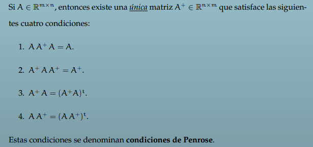

# Curso de Álgebra Lineal Aplicada para Machine Learning

## Descomposición de Matrices y Su Aplicación en Machine Learning

La **descomposición de matrices** es una herramienta fundamental en **álgebra lineal aplicada al Machine Learning**, ya que permite simplificar cálculos complejos, reducir la dimensionalidad y extraer información estructural de los datos. A continuación te explico los **principales tipos**, sus **aplicaciones** y ejemplos prácticos.

### ✅ ¿Qué es la Descomposición de Matrices?

Consiste en **descomponer una matriz en varios factores** o submatrices con propiedades especiales que facilitan:

* La solución de sistemas de ecuaciones
* La reducción de dimensiones
* La compresión de datos
* La mejora del rendimiento en modelos de machine learning

### 🔍 Tipos Principales de Descomposición

### 1. **Descomposición LU (Lower-Upper)**

* Descompone una matriz cuadrada A en:

  $$
  A = L \cdot U
  $$

  donde `L` es triangular inferior y `U` es triangular superior.

* ✅ **Aplicaciones**:

  * Resolver sistemas de ecuaciones lineales.
  * Acelerar algoritmos numéricos.

### 2. **Descomposición QR**

* Descompone A en:

  $$
  A = Q \cdot R
  $$

  donde `Q` es ortogonal (o unitario) y `R` es triangular superior.

* ✅ **Aplicaciones**:

  * Soluciones numéricas estables.
  * Regresión lineal.

### 3. **Descomposición SVD (Singular Value Decomposition)**

* Factoriza A en:

  $$
  A = U \cdot \Sigma \cdot V^T
  $$

  donde `U` y `V` son ortogonales y `Σ` contiene los valores singulares.

* ✅ **Aplicaciones**:

  * **Reducción de dimensionalidad (PCA)**
  * **Recomendadores**
  * **Compresión de imágenes**
  * **Detección de patrones latentes**

### 4. **Descomposición Eig (de autovalores)**

* Para matrices cuadradas:

  $$
  A = V \cdot D \cdot V^{-1}
  $$

  donde `D` es diagonal (autovalores) y `V` contiene los autovectores.

* ✅ **Aplicaciones**:

  * Análisis de componentes principales (PCA)
  * Estabilidad de sistemas
  * Métodos espectrales

### 💡 Ejemplo Práctico en Python (SVD con NumPy)

```python
import numpy as np

A = np.array([[3, 2], [2, 3]])
U, S, VT = np.linalg.svd(A)

print("Matriz U:\n", U)
print("Valores singulares Σ:\n", S)
print("Matriz V^T:\n", VT)
```

### 🤖 Aplicaciones en Machine Learning

| Tipo de descomposición | Aplicación ML destacada                          |
| ---------------------- | ------------------------------------------------ |
| **SVD**                | Recomendadores, PCA                              |
| **LU / QR**            | Solución eficiente de sistemas, regresión lineal |
| **Eig**                | PCA, clustering espectral                        |
| **NMF (No Negativa)**  | Modelado de temas (topic modeling)               |

### Resumen

#### ¿Por qué es importante entender las matrices en data science?

Comprender el uso de las matrices en data science es fundamental para abordar problemas complejos y optimizar procesos. Las matrices permiten realizar transformaciones lineales, facilitando la manipulación y el análisis de datos en gran escala. En muchos casos, especialmente en áreas como machine learning, entender las matrices es clave para mejorar la eficiencia computacional debido a la reducción de dimensiones y al manejo de datos de alta densidad.

#### ¿Qué conceptos previos necesitas?

Es crucial recordar ciertos conceptos que serán tu base para avanzar en este curso. Entre estos:

- **Matrices e Identidad**: Comprender qué es una matriz y las operaciones básicas que puedes realizar.
- **Inversa de una matriz cuadrada**: Saber cómo calcularla y las condiciones bajo las cuales existe.

Estos fundamentos te permitirán ir más allá y aventurarte en el cálculo de autovalores y autovectores, y cómo estos permiten descomponer una matriz. Además, entenderás qué es el SVD y la descomposición en valores singulares.

#### ¿Cómo se relaciona el Álgebra Lineal con Machine Learning?

La relación del álgebra lineal con el machine learning es directa, ya que muchos de los algoritmos utilizados en esta área requieren manipular y transformar grandes volúmenes de datos. Aquí algunos puntos clave:

- **Reducción de dimensionalidad:** Disminuir el número de dimensiones puede llevar a procesos más eficientes sin perder información significativa.
- **Optimización de algoritmos**: Al reducir dimensionalidades, disminuye el tiempo computacional necesario, lo cual es esencial cuando se manejan grandes conjuntos de datos.
- **Transformaciones lineales**: Las matrices permiten transformar y manipular datos eficazmente, lo que es crucial para entrenar modelos de machine learning.

Trabajar con matrices y entender su aplicación práctica te dará ventaja al manejar sistemas de machine learning más complejos, asegurando que tu enfoque sea tanto preciso como eficiente.

#### ¿Qué más aprenderás en este curso?

El propósito de este curso es ir más allá de los fundamentos y explorar temas avanzados de álgebra lineal aplicados a data science. Esto incluye:

- **Cálculo de Pseudo-inversas**: O inversas generalizadas, útiles en sistemas que no tienen una solución única o bien definida.
- **Algoritmo PCA (Análisis de Componentes Principales)**: Este es un método muy utilizado para la reducción de dimensionalidad y análisis exploratorio de datos.
- **Aplicaciones prácticas**: Implementación de estos conceptos en problemas reales, que te permitirá ver en acción las técnicas aprendidas.

Este curso está diseñado no solo para enriquecer tu conocimiento teórico, sino para empoderarte a aplicar estas herramientas de manera efectiva en tus proyectos de ciencia de datos. ¡Sigue adelante y descubre el potencial del álgebra lineal en el mundo del machine learning y data science!

## Transformaciones Lineales con Matrices en Python: Visualización y Análisis

Vamos a abordar el tema **Transformaciones Lineales con Matrices en Python** con un enfoque práctico: entender, visualizar y analizar cómo una matriz puede transformar vectores en el plano.


### 🧠 ¿Qué es una transformación lineal?

Una **transformación lineal** es una función que lleva vectores de un espacio a otro respetando suma y multiplicación escalar. Se representa mediante **multiplicación de una matriz por un vector**.

Si $A$ es una matriz y $\vec{v}$ un vector, entonces:

$$
\text{Transformación: } T(\vec{v}) = A \cdot \vec{v}
$$

### 🛠️ Herramientas en Python

Usaremos:

```python
import numpy as np
import matplotlib.pyplot as plt
```

### 🧪 Ejemplo 1: Transformación en 2D

```python
# Vectores originales (cuadrado unitario)
original = np.array([
    [0, 0], [1, 0], [1, 1], [0, 1], [0, 0]
]).T

# Matriz de transformación
A = np.array([
    [2, 1],
    [1, 3]
])

# Aplicar la transformación
transformado = A @ original

# Visualizar
plt.figure(figsize=(6,6))
plt.plot(*original, label='Original', color='blue')
plt.plot(*transformado, label='Transformado', color='red')
plt.axhline(0, color='gray', lw=0.5)
plt.axvline(0, color='gray', lw=0.5)
plt.grid(True)
plt.axis('equal')
plt.legend()
plt.title('Transformación Lineal con Matriz A')
plt.show()
```

### 🔍 Análisis

* La matriz **A** cambia la forma del cuadrado unitario.
* Esta transformación puede **escalar, rotar, reflejar o sesgar** los vectores originales dependiendo de los valores de la matriz.

### 🧭 Ejemplo 2: Escalamiento y rotación

```python
from math import cos, sin, pi

# Escalamiento
S = np.array([
    [2, 0],
    [0, 0.5]
])

# Rotación 45 grados
theta = pi / 4
R = np.array([
    [cos(theta), -sin(theta)],
    [sin(theta), cos(theta)]
])

# Combinar: escalar y luego rotar
T = R @ S
resultado = T @ original

plt.figure(figsize=(6,6))
plt.plot(*original, label='Original', color='blue')
plt.plot(*resultado, label='Escala + Rotación', color='green')
plt.grid(True)
plt.axis('equal')
plt.legend()
plt.title('Transformación Lineal: Escala y Rotación')
plt.show()
```

### 📚 Aplicaciones

* **Compresión de imágenes** (PCA).
* **Animación y gráficos por computadora**.
* **Simulación física** y geometría computacional.
* **Machine learning** (transformaciones en espacios latentes).

### Resumen

#### ¿Cómo entendemos las matrices como transformaciones lineales?

Las matrices pueden entenderse como transformaciones lineales que, al aplicarse a un espacio o un vector, generan una transformación. Cuando aplicamos una matriz, podemos afectar a un vector modificando su tamaño o incluso rotándolo. En el mundo de la programación, podemos llevar esto a la práctica utilizando Python y librerías como NumPy y Matplotlib para representar gráficamente estos cambios.

#### ¿Cómo configuramos nuestro entorno en Python para visualizaciones?

Para empezar, necesitamos importar las librerías necesarias. Aquí va un pequeño fragmento de código en Python que nos permitirá ver los gráficos debajo de cada celda de nuestro notebook:

```python
import numpy as np
import matplotlib.pyplot as plt
%matplotlib inline
```

Posteriormente, definimos nuestras matrices y vectores usando `numpy`.

#### ¿Cómo definimos y aplicamos una transformación con matrices?

Supongamos que tenemos la siguiente matriz:

`A = np.array([[-1, 3], [2, -2]])`

Queremos investigar qué transformación genera esta matriz al aplicarla al siguiente vector:

`v = np.array([2, 1])`

La transformación de un vector `v` usando una matriz `A` se realiza a través del producto interno de la matriz y el vector. Pero antes de eso, definamos una función para graficar los vectores.

#### ¿Cómo graficamos vectores en Python?

Es útil tener una función versátil para graficar múltiples vectores. Aquí hay una base de cómo podemos definir y utilizar esta función:

```python
def graficar_vectores(vectores, colores, alpha=1):
    plt.figure()
    plt.axvline(x=0, color='grey', lw=1)
    plt.axhline(y=0, color='grey', lw=1)
    for i in range(len(vectores)):
        x = np.concatenate([[0, 0], vectores[i]])
        plt.quiver(*x[::2], *x[1::2], angles='xy', scale_units='xy', scale=1, color=colores[i], alpha=alpha)
    plt.xlim(-3, 3)
    plt.ylim(-3, 3)
    plt.show()

v_flaten = v.flatten()
graficar_vectores([v_flaten], ['blue'])
```

Esta función ayuda a visualizar cómo han cambiado los vectores al ser transformados por la matriz. Los ejes cruzan en `x=0` y el color de las líneas es `gris`.

#### ¿Cómo se transforman los vectores utilizando matrices?

Cuando aplicamos la matriz `A` al vector `v`, podemos ver el cambio que se produce. Primero, realizamos el cálculo del producto interno:

```python
v_transformado = A.dot(v)
graficar_vectores([v.flatten(), v_transformado.flatten()], ['blue', 'orange'])
```

Aquí, graficamos el vector original `v` junto con el vector `v_transformado` para observar la transformación visualmente, comparando sus posiciones y direcciones.

#### ¿Por qué es importante entender estas transformaciones en Aprendizaje Automático?

Las transformaciones de matrices son fundamentales en el aprendizaje automático, especialmente cuando trabajamos con imágenes o datos que tienen representaciones matriciales. Las matrices permiten transformar estos datos de manera que pueden ser procesados más eficientemente por algoritmos de Deep Learning o Machine Learning.

Entender las representaciones de vectores y matrices y cómo podemos alargar, rotar o modificar su escala es clave para manipular datos estructurados como imágenes, en las cuales cada pixel puede ser parte de una matriz mayor. Cuando llevamos matrices a vectores, este proceso se llama "flatten" y es crucial para el tratamiento de datos en modelos computacionales.

#### ¿Qué papel juegan los determinantes en estas transformaciones?

El determinante de una matriz nos ofrece información valiosa sobre la transformación. Un determinante negativo (como el `-4` en nuestro ejemplo) puede indicarnos que la transformación involucra una inversión o un giro. Por otro lado, si las normas de los vectores antes y después de la transformación se mantienen iguales, puede señalar que hay vectores en el espacio que no cambian su longitud.

```python
determinante = np.linalg.det(A)
print(f"Determinante de la matriz A: {determinante}")
```

En esta exploración, continuamos profundizando en cómo las operaciones de matriz y producto escalar nos ayudan a dar forma a datos y patrones, sentando las bases para descubrimientos más intrincados en el vasto campo del análisis de datos y Machine Learning.

## Autovalores y autovectores en transformaciones lineales

Los **autovalores** y **autovectores** son conceptos fundamentales en **álgebra lineal**, especialmente útiles en el análisis de **transformaciones lineales**. Aquí te explico de forma clara qué son, para qué sirven y cómo se usan en transformaciones lineales, incluyendo ejemplos en **Python**.

### 🔷 ¿Qué son?

#### ✅ **Autovector (Eigenvector)**

Es un vector que **no cambia de dirección** cuando se le aplica una transformación lineal, solo puede ser **escalado** (alargado o acortado).

#### ✅ **Autovalor (Eigenvalue)**

Es el **escalar** que indica cuánto se escala el autovector después de aplicar la transformación.

### 🔹 Definición matemática

Si $A$ es una matriz cuadrada, un **autovector** $\vec{v} \neq 0$ y su correspondiente **autovalor** $\lambda$ satisfacen:

$$
A \vec{v} = \lambda \vec{v}
$$

### 🔸 Interpretación en transformaciones lineales

Cuando aplicamos una transformación lineal representada por una matriz $A$, los autovectores son **direcciones que no rotan**. Solo se **escalan** por su autovalor correspondiente.

Ejemplo:
Si una matriz representa una rotación o estiramiento, los autovectores indican las **direcciones "invariantes"**, y los autovalores cuánto se **alargan o acortan** esas direcciones.

### 📌 Aplicaciones

* Compresión de datos (PCA)
* Dinámica de sistemas
* Computación gráfica
* Análisis de redes
* Machine Learning

### 🐍 Ejemplo en Python con NumPy

```python
import numpy as np

# Matriz de transformación
A = np.array([[2, 1],
              [1, 2]])

# Autovalores y autovectores
autovalores, autovectores = np.linalg.eig(A)

print("Autovalores:")
print(autovalores)

print("\nAutovectores (columnas):")
print(autovectores)
```

### 📈 Visualización (opcional con matplotlib)

Si quieres visualizar cómo actúan los autovectores en una transformación, puedo ayudarte a generar un gráfico de vectores antes y después de aplicar la matriz $A$.

### Resumen

#### ¿Qué son las transformaciones lineales y cómo afectan a los vectores?

Las transformaciones lineales son un concepto fundamental en álgebra lineal, el cual describe cómo un vector puede ser manipulado por una matriz para cambiar de dirección o magnitud. Este proceso es crucial en muchos campos, como la física, la computación gráfica o la inteligencia artificial. Un auto-víctor particular es un vector que, cuando se le aplica una transformación, mantiene su dirección original, aunque su amplitud puede variar tras ser multiplicado por un autovalor.

#### ¿Cómo podemos graficar transformaciones lineales?

Para visualizar cómo una matriz transforma un vector, podemos utilizar herramientas de gráficos en Python. Aquí, importamos las bibliotecas necesarias para esta tarea, que incluyen `numpy` como `np` y `matplotlib`.

```python
import numpy as np
import matplotlib.pyplot as plt

def graficar_vectores(vectores, colores, límites):
    plt.figure()
    plt.axvline(x=0, color='grey', lw=2)
    plt.axhline(y=0, color='grey', lw=2)
    for i in range(len(vectores)):
        x = np.array([0, vectores[i][0]])
        y = np.array([0, vectores[i][1]])
        plt.quiver(x[0], y[0], x[1], y[1], angles='xy', scale_units='xy', scale=1, color=colores[i])
    plt.xlim(límites['x'])
    plt.ylim(límites['y'])
    plt.grid()
    plt.show()
```

#### ¿Cómo encontrar autovectores y autovalores?

Para hallar un autovector, debemos encontrar un vector que no cambie su dirección tras aplicarle una matriz de transformación. Este proceso también implica determinar el autovalor asociado.

##### Ejemplo de cálculo

Supongamos que tenemos la siguiente matriz y vector:

```python
A = np.array([[3, 2], [4, 1]])
v = np.array([1, 1])
```

Para encontrar el vector transformado, aplicamos el producto interno a `v`:

`v_transformado = np.dot(A, v)`

Esto nos devuelve un nuevo vector que podemos graficar junto al original para observar las diferencias.

##### Cálculo del autovalor

Los resultados del producto pueden interpretarse para encontrar el autovalor:

- Si `v_transformado` es un múltiplo de `v`, entonces el factor de multiplicación es el autovalor.

En este ejemplo, si `v_transformado` resulta ser `[5, 5]`, entonces el autovalor sería 5.

##### Visualización de vectores originales y transformados

Para demostrar la teoría, graficamos los vectores usando colores distintos para diferenciar entre vectores originales y transformados:

```python
colores = ['#FF9A13', '#1190FF']  # Naranja y azul claro
límites = {'x': [-1, 6], 'y': [-1, 6]}
graficar_vectores([v, v_transformado], colores, límites)
```

Esta representación visual muestra claramente el cambio en la magnitud o sentido del vector tras la transformación.

#### ¿Cuántos autovectores puede tener una matriz?

En una matriz 2x2, como en nuestro ejemplo, podemos encontrar hasta dos autovectores con sus respectivos autovalores. Esto significa que hay dos direcciones distintas que, al ser transformadas, conservan su dirección dentro de la misma transformación.

Al explorar estos conceptos, enriquecemos nuestra comprensión del álgebra lineal y su aplicación práctica en la resolución de problemas complejos, alentando a los estudiantes a continuar mejorando su habilidad y abriendo la puerta a más aplicaciones matemáticas.

## Cálculo de Autovalores y Autovectores con NumPy en Python

Vamos a ver cómo calcular **autovalores (eigenvalues)** y **autovectores (eigenvectors)** en **Python** usando la librería **NumPy**, paso a paso.

### 🧠 ¿Qué necesitas?

Una **matriz cuadrada** $A \in \mathbb{R}^{n \times n}$, y quieres encontrar $\lambda$ y $\vec{v}$ tales que:

$$
A \vec{v} = \lambda \vec{v}
$$

### ✅ Paso 1: Importar NumPy

```python
import numpy as np
```

### ✅ Paso 2: Definir la matriz

Por ejemplo:

```python
A = np.array([[4, 2],
              [1, 3]])
```

### ✅ Paso 3: Calcular autovalores y autovectores

```python
autovalores, autovectores = np.linalg.eig(A)
```

* `autovalores` es un array con los $\lambda_1, \lambda_2, \ldots$
* `autovectores` es una matriz donde **cada columna** es un autovector asociado al autovalor correspondiente

### ✅ Paso 4: Mostrar resultados

```python
print("Autovalores:")
print(autovalores)

print("\nAutovectores (cada columna es uno):")
print(autovectores)
```

### 🎯 Ejemplo completo

```python
import numpy as np

# Matriz cuadrada
A = np.array([[4, 2],
              [1, 3]])

# Cálculo
autovalores, autovectores = np.linalg.eig(A)

print("Autovalores:")
print(autovalores)

print("\nAutovectores:")
print(autovectores)
```

### ✨ Resultado esperado (aproximado):

```plaintext
Autovalores:
[5. 2.]

Autovectores:
[[ 0.894  -0.707 ]
 [ 0.447   0.707 ]]
```

### 📌 Nota importante

* Puedes verificar que:

  $$
  A \cdot \vec{v}_i \approx \lambda_i \cdot \vec{v}_i
  $$

  con `np.allclose(A @ v, l * v)` para cada par $(\lambda_i, \vec{v}_i)$

### Resumen

#### ¿Cómo calcular autovalores y autovectores con Python?

Para aquellos interesados en profundizar en el álgebra lineal y su aplicación a través de la programación, comprender cómo calcular autovalores y autovectores es esencial. Python, con sus poderosas bibliotecas de cálculo, ofrece una manera eficiente de realizar estos cálculos. En este artículo, abordaremos cómo puedes usar la biblioteca NumPy para hallar autovalores y autovectores de una matriz dada.

#### ¿Qué necesitamos para empezar?

Primero, asegúrate de tener instaladas las bibliotecas necesarias en tu entorno de programación. Las herramientas principales serán:

- **NumPy**: Para cálculos numéricos.
- **Matplotlib**: Para visualizar los vectores y su transformación gráfica.

#### ¿Cómo definir y calcular con NumPy?

Comencemos por definir una matriz utilizando NumPy. Supongamos que quinemos encontrar los autovalores y autovectores de la matriz X:

```python
import numpy as np

# Definición de la matriz X
X = np.array([[3, 2],
              [4, 1]])
```

Para obtener los autovalores y autovectores, usaremos la función `eig` de NumPy:

`autovalores, autovectores = np.linalg.eig(X)`

#### ¿Qué nos devuelven las funciones de NumPy?

La función `np.linalg.eig()` devuelve dos elementos:

1. Un arreglo con los autovalores de la matriz.
2. Una matriz con los autovectores asociados, donde cada columna representa un autovector.

#### Análisis visual de los autovectores

Para comprender mejor el resultado, podemos graficar los vectores utilizando Matplotlib. He aquí un ejemplo de cómo hacerlo:

```python
import matplotlib.pyplot as plt

# Función para graficar vectores desde el origen
def graficar_vectores(vectores, colores):
    plt.figure()
    plt.axvline(x=0, color='grey', lw=1)
    plt.axhline(y=0, color='grey', lw=1)
    for i in range(len(vectores)):
        plt.quiver(0, 0, vectores[i][0], vectores[i][1], 
                   angles='xy', scale_units='xy', scale=1, color=colores[i])
    plt.xlim(-4, 4)
    plt.ylim(-4, 4)
    plt.grid()
    plt.show()

# Graficar los autovectores
graficar_vectores(autovectores.T, ['green', 'orange'])
```

#### ¿Qué observar al visualizar?

Cuando visualizas los resultados, notarás que los autovectores que calcula NumPy son múltiples de los que podrías haber calculado manualmente. Esto es completamente válido en matemática, ya que lo que define a un autovector es su dirección, no su magnitud específica.

#### Importancia de los autovalores y autovectores

Los autovalores y autovectores son herramientas críticas en muchos campos de la ciencia e ingeniería, incluida la descomposición espectral, análisis de estabilidad y reducción dimensional (como en PCA). A pesar de que el proceso pueda parecer técnico, su comprensión y correcta implementación abre puertas a soluciones de problemas mucho más complejos.

Con este conocimiento, estás bien equipado para explorar y experimentar con la descomposición de matrices en Python. La práctica te ayudará a internalizar estos conceptos, así que te alentamos a continuar explorando y ampliando tus habilidades. ¡Sigue aprendiendo!

## Descomposición de matrices: valores y vectores propios

La **descomposición en valores y vectores propios** (también llamada **descomposición espectral**) es una técnica fundamental del **álgebra lineal**, con múltiples aplicaciones en machine learning, física, estadísticas, compresión de datos y más.

### 🔷 ¿Qué es la descomposición en valores y vectores propios?

Dada una **matriz cuadrada** $A$, si es **diagonalizable**, podemos escribirla como:

$$
A = V \Lambda V^{-1}
$$

Donde:

* $V$: matriz cuyos **columnas son los autovectores** de $A$
* $\Lambda$: **matriz diagonal** con los **autovalores** de $A$
* $V^{-1}$: **inversa** de $V$

Esta descomposición permite entender cómo $A$ transforma el espacio.

### ✅ Condiciones

* **Solo funciona** para matrices cuadradas.
* Requiere que $A$ tenga un conjunto completo de autovectores linealmente independientes (es decir, que sea diagonalizable).

### 🧠 ¿Por qué es útil?

* **Reduce la complejidad computacional** de operaciones (como exponenciar matrices).
* Permite **entender geometría de transformaciones**.
* Se usa en PCA, sistemas dinámicos, compresión de imágenes, etc.

### 🐍 Ejemplo en Python con NumPy

```python
import numpy as np

# Matriz cuadrada A
A = np.array([[4, 2],
              [1, 3]])

# Autovalores y autovectores
eigenvalues, eigenvectors = np.linalg.eig(A)

# Matriz diagonal de autovalores
Lambda = np.diag(eigenvalues)

# Matriz de autovectores
V = eigenvectors

# Verificación de la descomposición
A_reconstructed = V @ Lambda @ np.linalg.inv(V)

print("Matriz original A:")
print(A)

print("\nMatriz reconstruida A_reconstructed:")
print(A_reconstructed)
```

### 🧾 Salida esperada

```plaintext
Matriz original A:
[[4 2]
 [1 3]]

Matriz reconstruida A_reconstructed:
[[4. 2.]
 [1. 3.]]
```

> Si `A_reconstructed` ≈ `A`, entonces la descomposición es correcta ✅

### 📌 ¿Qué pasa si la matriz no es diagonalizable?

Si no se puede escribir como $V \Lambda V^{-1}$, aún puedes usar la **descomposición de Schur** o la **SVD (Singular Value Decomposition)**, más general para matrices no cuadradas o no diagonalizables.

### Resumen

#### ¿Qué significa descomponer una matriz?

Descomponer una matriz implica encontrar una o más matrices que, al multiplicarlas, nos permitan recrear la matriz original, cumpliendo con ciertas propiedades. Un ejemplo sencillo es el número 6, que puede descomponerse como 3x2, donde 3 y 2 tienen la propiedad de ser números primos. Aplicado a matrices, buscamos matrices componentes que nos faciliten ciertos cálculos o análisis.

#### ¿Cómo se realiza la descomposición usando autovalores y autovectores?

Para realizar la descomposición de una matriz utilizando autovalores y autovectores, seguimos un proceso sistemático. Supongamos que tenemos una matriz A. Este proceso consta de varios pasos:

1. **Determinación de autovalores y autovectores**:

- Calculamos los autovalores ((\lambda)) y los autovectores (v) de la matriz.

2. **Construcción de la matriz diagonal**:

- Creamos una matriz diagonal que contiene todos los autovalores.

3. **Composición de la matriz original**:

- Escribimos la matriz A como el producto de la matriz de autovectores, la matriz diagonal de autovalores, y la inversa de la matriz de autovectores.

#### Ejemplo práctico con código

```python
import numpy as np

# Definimos la matriz A
A = np.array([[3, 2], [4, 1]])

# Calculamos autovalores y autovectores
autovalores, autovectores = np.linalg.eig(A)

# Mostramos resultados
print("Autovalores:", autovalores)
print("Autovectores:\n", autovectores)

# Composición de la matriz original
matrizA_calculada = np.dot(autovectores, np.dot(np.diag(autovalores), np.linalg.inv(autovectores)))
print("Matriz Calculada:\n", matrizA_calculada)
```

Al ejecutar este código, deberías observar que la matriz calculada es idéntica a la matriz original, lo que confirma que la descomposición ha sido exitosa.

#### ¿Qué beneficios tiene usar matrices simétricas reales?

Cuando trabajamos con matrices simétricas reales, las propiedades de estas matrices nos ofrecen ventajas computacionales importantes. Estas matrices cumplen con que A es igual a su transpuesta ((A = A^T)), lo que implica que en lugar de calcular su inversa, podemos trabajar con su transpuesta.

#### Uso de matrices simétricas en descomposiciones

1. **Renovación del proceso de descomposición**:

- Si la matriz es simétrica, podemos reformular nuestra descomposición usando la transpuesta de los autovectores en lugar de su inversa.

2. **Ejecución del cálculo**:

- Esta forma es no solo más fácil de calcular, sino también más eficiente en términos computacionales.

#### Ejemplo de matriz simétrica

```python
# Definimos una matriz simétrica
A_sim = np.array([[3, 2], [2, 3]])

# Calculamos autovalores y autovectores
autovalores, autovectores = np.linalg.eig(A_sim)

# Composición con transpuesta
resultante_sim = np.dot(autovectores, np.dot(np.diag(autovalores), autovectores.T))
print("Matriz Simétrica Calculada:\n", resultante_sim)
```

Con este método, verificamos que obtenemos la matriz original sin tener que calcular una inversa, lo cual es especialmente útil para aplicaciones que requieren rapidez y eficiencia.

#### Ventajas y recomendaciones

- **Eficiencia Computacional**: Utilizar matrices simétricas o trabajar con matrices que nos permitan evitar la inversa nos brinda ventajas de velocidad y precisión.
- **Simplicidad de Cálculo**: Usar la transpuesta es más sencillo y fiable que la calculadora inversa de matrices.

Aquellos que buscan optimizar procesos donde las matrices juegan un papel crucial deben considerar estas metodologías para lograr resultados efectivos y robustos. Continúa explorando esta área fascinante y sigue fortaleciendo tus habilidades matemáticas y computacionales para destacar en el análisis de matrices.

## Descomposición de Matrices en Valores Singulares

La **Descomposición en Valores Singulares** (SVD, por sus siglas en inglés: *Singular Value Decomposition*) es una de las herramientas más poderosas y versátiles del álgebra lineal aplicada a datos, machine learning, compresión, procesamiento de imágenes, recomendadores, y más.

### 🔷 ¿Qué es la descomposición SVD?

Para **cualquier matriz** $A \in \mathbb{R}^{m \times n}$, se puede descomponer como:

$$
A = U \Sigma V^T
$$

Donde:

* $U \in \mathbb{R}^{m \times m}$: matriz ortogonal con vectores propios de $A A^T$
* $\Sigma \in \mathbb{R}^{m \times n}$: matriz **diagonal rectangular** con los **valores singulares** de $A$
* $V^T \in \mathbb{R}^{n \times n}$: transpuesta de matriz ortogonal con vectores propios de $A^T A$

### 📌 ¿Para qué sirve?

* **Reducción de dimensiones** (PCA usa SVD)
* **Compresión de imágenes**
* **Eliminación de ruido**
* **Sistemas de recomendación** (Netflix, Amazon)
* Resolver **sistemas sobredeterminados o mal condicionados**

### 🐍 Ejemplo en Python con NumPy

```python
import numpy as np

# Matriz original (puede no ser cuadrada)
A = np.array([[3, 1, 1],
              [-1, 3, 1]])

# Descomposición SVD
U, S, VT = np.linalg.svd(A)

print("Matriz U:")
print(U)

print("\nValores singulares (S):")
print(S)

print("\nMatriz V transpuesta (V^T):")
print(VT)

# Para reconstruir A:
Sigma = np.zeros((U.shape[0], VT.shape[0]))
np.fill_diagonal(Sigma, S)

A_reconstructed = U @ Sigma @ VT

print("\nMatriz A reconstruida:")
print(A_reconstructed)
```

### 📊 ¿Qué representan los valores singulares?

Los elementos de $\Sigma$ (valores singulares) indican **cuánta información** (energía, varianza) está contenida en cada componente. Se ordenan de mayor a menor.

### 🎯 Reducción de Dimensión con SVD

Si solo usas los primeros $k$ valores singulares:

$$
A_k = U_k \Sigma_k V_k^T
$$

Esto da una **aproximación de menor rango**, ideal para:

* Visualización
* Compresión
* Velocidad de cómputo

### 📌 Resumen

| Componente | Significado                                       |
| ---------- | ------------------------------------------------- |
| $U$        | Direcciones principales de las filas (izquierda)  |
| $\Sigma$   | Importancia relativa (energía) de cada dirección  |
| $V^T$      | Direcciones principales de las columnas (derecha) |

### Resumen

#### ¿Qué es la descomposición en valores singulares?

La descomposición en valores singulares (SVD por sus siglas en inglés) es una herramienta matemática esencial, especialmente útil en el análisis de datos y procesamiento de imágenes. Cuando nos enfrentamos a una matriz que no es cuadrada, la SVD nos permite extraer y condensar información esencial. En esta técnica, una matriz se descompone en tres componentes: dos matrices ortogonales y una matriz diagonal.

#### ¿Como se representa la descomposición?

Dentro de la descomposición en valores singulares, una matriz A se descompone en:

- **U**: Una matriz ortogonal donde todos sus vectores son ortonormales. Contiene los vectores singulares izquierdos.
- **Σ**: Una matriz diagonal que tiene en su diagonal los valores singulares de la matriz original, y fuera de la diagonal, ceros.
- **V^T**: La transpuesta de una matriz ortogonal que alberga los vectores singulares derechos.

#### ¿Cuál es la importancia de cada componente?

- **Vectores singulares (izquierdos y derechos)**: Son esenciales para comprender cómo se transforma la información en su representación simplificada. Los vectores singulares derechos (V) y los vectores singulares izquierdos (U) ofrecen un sistema de coordenadas para visualizar el efecto de la transformación.

- **Valores singulares**: Estos están contenidos en la matriz diagonal Σ y determinan la influencia de los vectores singulares. Cuanto más grande es un valor singular, más impacto tiene el correspondiente vector singular en la reconstrucción de la matriz original.

#### ¿Cómo se ejecuta la descomposición en Python?

La descomposición de matrices en valores singulares se puede realizar fácilmente en Python usando la biblioteca NumPy. Aquí se muestra un ejemplo de cómo llevarlo a cabo:

```python
import numpy as np

# Definiendo la matriz A
A = np.array([[1, 2, 3], [3, 4, 5]])

# Calculando la descomposición en valores singulares
U, S, Vt = np.linalg.svd(A)

print("Matriz U:")
print(U)

print("Valores singulares:")
print(S)

print("Matriz V^T:")
print(Vt)
```

#### ¿Qué nos muestra el resultado?

1. **Matriz U**: Muestra los vectores singulares izquierdos, cada columna es un vector.

2. **Valores singulares en S**: En su forma económica, muestra solo los valores singulares no nulos.

3. **Matriz V^T**: Contiene los vectores singulares derechos en sus filas.

#### Aplicaciones y recomendaciones para el uso de SVD

La descomposición en valores singulares es ampliamente utilizada en diferentes áreas, tales como:

- Procesamiento de imagen: Para reducir el ruido y comprimir imágenes.
- Análisis de datos: En reducción dimensional o en la recomendación de sistemas para identificar patrones significativos.

#### Leer más y experimentar

La SVD es un concepto fundamental para los científicos de datos e ingenieros que buscan optimizar recursos al trabajar con grandes conjuntos de datos. Se recomienda explorar distintas bibliotecas y entornos de programación que proporcionan funcionalidades avanzadas para operaciones con matrices, tales como TensorFlow o SciPy, para obtener una experiencia práctica profunda.

No se quede solo en la teoría; la práctica es clave. Experimente con matrices de diferentes tamaños y observe el comportamiento de la descomposición para entender cómo sus datos pueden ser manipulados y analizados de manera más eficiente.

¡Continue explorando el mundo de las matemáticas y el álgebra lineal para mejorar sus habilidades en ciencia de datos y programación!

## Transformaciones Lineales con Matrices: Efectos en el Círculo Unitario

Analizar **transformaciones lineales** a través de sus **efectos sobre el círculo unitario** es una forma visual y poderosa de entender cómo actúan las matrices sobre los vectores del espacio.

### 🧮 ¿Qué es una transformación lineal?

Una **transformación lineal** $T: \mathbb{R}^n \rightarrow \mathbb{R}^m$ es una función que puede representarse como:

$$
T(\vec{x}) = A \vec{x}
$$

donde $A$ es una **matriz** y $\vec{x}$ un **vector**.

### 🔵 ¿Qué pasa si aplicas una transformación al **círculo unitario**?

El **círculo unitario** en $\mathbb{R}^2$ está formado por todos los vectores $\vec{x}$ tal que:

$$
\|\vec{x}\| = 1 \Rightarrow x^2 + y^2 = 1
$$

Cuando aplicas una matriz $A$ al círculo, lo transformas en una **elipse**. Esta elipse te muestra visualmente:

* La **dirección de mayor estiramiento** (autovector con mayor autovalor o valor singular)
* La **dirección de compresión**
* Si la matriz **rota**, **refleja**, **escalona**, etc.

### 🐍 Ejemplo en Python con visualización

```python
import numpy as np
import matplotlib.pyplot as plt

# Círculo unitario
theta = np.linspace(0, 2 * np.pi, 100)
circle = np.array([np.cos(theta), np.sin(theta)])

# Matriz de transformación
A = np.array([[2, 1],
              [1, 3]])

# Transformación lineal
transformed = A @ circle

# Gráfico
plt.figure(figsize=(6, 6))
plt.plot(circle[0], circle[1], label='Círculo Unitario', color='blue')
plt.plot(transformed[0], transformed[1], label='Transformado', color='red')
plt.axhline(0, color='black', linewidth=0.5)
plt.axvline(0, color='black', linewidth=0.5)
plt.axis('equal')
plt.grid(True)
plt.title('Transformación Lineal del Círculo Unitario')
plt.legend()
plt.show()
```

### 🧠 ¿Qué observas?

* Si $A$ **rota**, la elipse se inclina.
* Si $A$ **refleja**, cambia de orientación.
* Si $A$ **es diagonal**, estira el círculo en direcciones de los ejes.
* Si $A$ tiene **autovectores**, las direcciones principales de la elipse coinciden con ellos.

### 🔎 Conexión con valores singulares

La forma de la elipse también está **relacionada con los valores singulares de $A$**:

* El **eje largo** de la elipse → **mayor valor singular**.
* El **eje corto** de la elipse → **menor valor singular**.

### Resumen

#### ¿Cómo se descomponen las matrices en transformaciones lineales?

Las matrices, cuando se piensan como transformaciones lineales, ofrecen una herramienta poderosa para manipular diferentes vectores en un espacio. Una matriz A puede descomponerse en otras tres matrices, cada una representando su propia transformación lineal. Entender sus efectos es crucial, ya que estas transformaciones repercuten de la misma manera sin importar los vectores a los que se apliquen. Vamos a sumergirnos en el mundo de las matrices y su relación con el círculo unitario.

#### ¿Qué es el círculo unitario y por qué lo utilizamos?

El círculo unitario es una herramienta gráfica que ayuda a visualizar los efectos de estas transformaciones. Dicho de otro modo, se trata de un círculo centrado en el origen (0,0) con radio 1. Su papel es esencial en el estudio de las transformaciones lineales, ya que permite observar de forma clara los cambios que dichas transformaciones generan, tal como la rotación o el escalado de vectores dentro del espacio.

#### ¿Cómo graficar el círculo unitario?

Para graficar el círculo unitario y aplicar transformaciones, necesitamos Python y la biblioteca `numpy` para cálculos y `matplotlib` para la visualización. El siguiente código muestra cómo lograr esto:

```python
import numpy as np
import matplotlib.pyplot as plt

def graficar_matriz(matriz, vector_colores=['r', 'b']):
    # Definimos el círculo unitario
    x = np.linspace(-1, 1, 1000)
    y = np.sqrt(1 - x**2)
    
    # Transformación del círculo por la matriz
    x1 = matriz[0, 0] * x + matriz[0, 1] * y
    y1 = matriz[1, 0] * x + matriz[1, 1] * y
    
    x1_neg = matriz[0, 0] * x - matriz[0, 1] * y
    y1_neg = matriz[1, 0] * x - matriz[1, 1] * y
    
    # Graficamos los vectores transformados
    plt.plot(x1, y1, color='g', alpha=0.7)
    plt.plot(x1_neg, y1_neg, color='g', alpha=0.7)
    
    plt.axhline(0, color='black', lw=1)
    plt.axvline(0, color='black', lw=1)
    plt.xlim(-1.5, 1.5)
    plt.ylim(-1.5, 1.5)
    plt.gca().set_aspect('equal', adjustable='box')
    plt.show()

# Ejemplo con una matriz de identidad
matriz_identidad = np.array([[1, 0], [0, 1]])
graficar_matriz(matriz_identidad)
```

#### ¿Cómo aplicar transformaciones sin modificar el gráfico original?

Al probar el efecto de diferentes matrices, es esencial luego visualizar cómo estas cambian el círculo unitario en tiempo real. Las matrices de diferentes valores cambian la forma del círculo original, visualizando el impacto de la transformación lineal aplicada. A continuación, se muestra cómo se implementa este concepto:

```python
# Definimos una matriz
A = np.array([[3, 7], [5, 2]])

# Graficamos el círculo unitario original
graficar_matriz(np.eye(2))  # Matriz identidad

# Graficamos el círculo unitario transformado
graficar_matriz(A)
```

#### ¿Qué observamos con las matrices aplicadas?

Al aplicar la matriz A, observamos cómo los vectores base del círculo unitario original (los puntos cardinales) se transforman. Por ejemplo:

- El vector (1, 0) se desplaza de su posición original.
- El vector (0, 1) también cambia, conforme a los componentes de A, obteniendo un nuevo espacio transformado.

Esta aplicación práctica nos permite ver cómo actúa la matriz sobre los vectores del círculo y nos ofrece una comprensión palpable de las transformaciones lineales.

#### Recomendaciones prácticas

Para entender y visualizar de manera efectiva las transformaciones lineales mediante matrices:

1. **Practica con diversas matrices**: Cambia los valores de las matrices para observar distintos efectos en el círculo unitario.
2. **Documenta tus observaciones**: Mantén un registro de cómo cambian los vectores con diferentes matrices, te ayudará a entender patrones.
3. **Explora visualmente y analíticamente**: Usa las gráficas para ver el cambio y luego calcula los valores para confirmar lo que ves.
4. **Profundiza en la teoría**: Revisa la teoría matemática detrás de estas transformaciones para una comprensión más sólida.

Estas recomendaciones no solo abrillantan tus habilidades matemáticas sino también potencian tu capacidad de programación aplicada a problemas matemáticos.

¡Continúa explorando y ampliando tu conocimiento en transformaciones lineales!

## Descomposición SVD: Transformaciones de Matrices y Círculo Unitario

Relacionar la **descomposición en valores singulares (SVD)** con las **transformaciones del círculo unitario** es una de las formas más potentes de entender visualmente cómo una matriz transforma el espacio.

### 🧮 ¿Qué es la Descomposición SVD?

La descomposición SVD (Singular Value Decomposition) de una matriz $A \in \mathbb{R}^{m \times n}$ se define como:

$$
A = U \Sigma V^T
$$

Donde:

* $U$ es una matriz ortogonal de $m \times m$
* $\Sigma$ es una matriz diagonal (o rectangular) con valores singulares no negativos
* $V^T$ es la transpuesta de una matriz ortogonal $V \in \mathbb{R}^{n \times n}$

### 🔵 ¿Cómo transforma el círculo unitario?

Supón que partes de un **círculo unitario** $x \in \mathbb{R}^2$. La transformación $A = U \Sigma V^T$ actúa en tres pasos:

1. **$V^T$**: Rota (o refleja) el círculo.
2. **$\Sigma$**: Estira o comprime a lo largo de los ejes.
3. **$U$**: Vuelve a rotar (o reflejar) el resultado.

### 🐍 Ejemplo visual en Python

```python
import numpy as np
import matplotlib.pyplot as plt

# 1. Generar círculo unitario
theta = np.linspace(0, 2 * np.pi, 200)
circle = np.array([np.cos(theta), np.sin(theta)])

# 2. Matriz A
A = np.array([[2, 1],
              [1, 3]])

# 3. SVD
U, S, VT = np.linalg.svd(A)

# 4. Aplicar cada paso del SVD
circle_VT = VT @ circle
circle_S = np.diag(S) @ circle_VT
circle_USV = U @ circle_S

# 5. Graficar
fig, axs = plt.subplots(1, 4, figsize=(16, 4))
titles = ['Círculo Unitario', 'Aplicar Vᵗ', 'Aplicar Σ', 'Aplicar U (Transformación Final)']
steps = [circle, circle_VT, circle_S, circle_USV]
colors = ['blue', 'orange', 'green', 'red']

for i in range(4):
    axs[i].plot(steps[i][0], steps[i][1], color=colors[i])
    axs[i].set_title(titles[i])
    axs[i].axhline(0, color='gray', linestyle='--', linewidth=0.5)
    axs[i].axvline(0, color='gray', linestyle='--', linewidth=0.5)
    axs[i].axis('equal')
    axs[i].grid(True)

plt.tight_layout()
plt.show()
```

### 🧠 Interpretación:

* La **forma final (elipse)** muestra el efecto completo de la transformación $A$.
* Los **ejes de la elipse** son las **direcciones principales** (columnas de $U$), y sus longitudes son los **valores singulares** $\sigma_1, \sigma_2$.
* Este análisis es útil para entender la **compresión de imágenes**, **reducción de dimensionalidad**, y **rangos de matrices**.

### Resumen

#### ¿Cómo funciona la descomposición de matrices en transformaciones?

La descomposición de matrices es una herramienta poderosa que nos permite entender cómo una matriz original se transforma a través de distintas operaciones. En este caso, nos enfocaremos en la descomposición en valores singulares (SVD, por sus siglas en inglés) y cómo se refleja en transformaciones concretas. La representación de una matriz mediante SVD nos retorna tres matrices y podemos aplicar cada transformación paso a paso.

#### ¿Qué es la transformación inicial de rotación por la matriz B?

La primera transformación que aplicamos a nuestra matriz se asocia con una rotación y es efectuada por la matriz B. Imaginemos que iniciamos con un círculo unitario para visualizarlo mejor. Esto representa un punto de partida básico y simétrico que al aplicar B, produce una rotación del espacio.

Al hacer esta rotación:

- El vector en el eje Y gira.
- El vector en el eje X también gira.

Podemos calcular el ángulo de rotación utilizando conceptos como el producto interno y la norma. Esta rotación nos ayuda a comprender cómo B reorienta nuestro espacio en la dimensión que estamos analizando.

#### ¿Qué efecto tiene la matriz diagonal D en la transformación?

La siguiente transformación que debemos considerar es la producida por la matriz diagonal D. Este paso se conoce como "escalado", y se encarga de amplificar o reducir nuestro espacio de trabajo según las dimensiones:

1. **Amplificación o reducción diferencial**: D ajusta la escala de nuestro sistema, pero no de manera uniforme en todas las direcciones.

Por ejemplo:

- En la dirección del eje Y, puede que se amplifique más que en la dirección del eje X, o viceversa.

Para graficar y observar estos cambios, ajustamos el área de visualización y analizamos cómo cada vector es alargado o acortado de acuerdo con los valores de D.

#### ¿Cómo finaliza el proceso de transformación con una segunda rotación?

La transformación final la realiza la segunda matriz de rotación, U. Este paso acaba de rotar el espacio después del escalado y nos devuelve un estado transformado que es fiel a la matriz original:

- **Rotación final**: U se aplica al espacio ya ajustado, recolocando los vectores posiblemente al lado positivo (o negativo) del eje X o Y.

Analísticamente se puede comprobar que, al finalizar el proceso, el resultado de las transformaciones con A (la matriz original) coincide con las transformaciones sucedidas por SVD. Cada parte de la descomposición actúa en armonía para que, al final, el efecto total de la matriz A se vea reflejado en los cambios integrados por sus componentes singulares.

Al estudiar el SVD, nos damos cuenta de cuánto podemos aprender de una matriz sencilla. Esto no solo nos proporciona mayor comprensión de la matemática detrás de las transformaciones lineales, sino que también nos dota de herramientas para realizar cálculos geométricos complejos, maximizando nuestras capacidades en programación y análisis de datos.

## Impacto de los Valores Singulares en Transformaciones Matriciales

Los **valores singulares** tienen un impacto fundamental en las **transformaciones matriciales**, ya que determinan **cómo se deforma el espacio** cuando se aplica una matriz a un conjunto de vectores.

### 🧮 ¿Qué son los valores singulares?

Dada una matriz $A \in \mathbb{R}^{m \times n}$, su **descomposición en valores singulares (SVD)** es:

$$
A = U \Sigma V^T
$$

* $\Sigma$ es una matriz diagonal con los **valores singulares** $\sigma_1 \geq \sigma_2 \geq \dots \geq \sigma_r > 0$
* Estos valores indican **cuánto se estira o comprime el espacio** en direcciones específicas.

### 🎯 ¿Cómo impactan en una transformación?

### 1. **Estiramiento/Escalamiento**

Cada valor singular $\sigma_i$ indica cuánto se **alarga o achica** el vector en la dirección del **autovector** correspondiente.

* Si $\sigma_1 = 3$: la matriz triplica la magnitud en esa dirección.
* Si $\sigma_2 = 0.5$: la matriz comprime a la mitad en esa otra dirección.

### 2. **Rango de la matriz**

El número de valores singulares no nulos indica el **rango de la matriz**, es decir, cuántas dimensiones del espacio están preservadas.

### 3. **Condición numérica**

$$
\text{condición} = \frac{\sigma_1}{\sigma_r}
$$

Una gran diferencia entre el mayor y el menor valor singular indica una matriz **mal condicionada** (potencialmente inestable para inversión o resolución de sistemas lineales).

### 🔵 Ejemplo visual con el círculo unitario

La transformación de un círculo unitario por una matriz $A$ lo convierte en una **elipse**:

* **Ejes de la elipse**: dados por los vectores propios de $A^TA$ (columnas de $V$)
* **Longitud de los ejes**: igual a los valores singulares $\sigma_i$
* **Orientación**: definida por las matrices $U$ y $V$

### 🧠 Aplicaciones:

| Aplicación                       | Impacto de los valores singulares                                               |
| -------------------------------- | ------------------------------------------------------------------------------- |
| **Compresión de imágenes**       | Usar solo los $k$ mayores $\sigma_i$                                            |
| **Reducción de dimensionalidad** | PCA se basa en valores singulares                                               |
| **Detección de redundancia**     | $\sigma_i \approx 0$ indica dependencia lineal                                  |
| **Estabilidad numérica**         | Matrices con valores singulares muy pequeños pueden generar errores de redondeo |

### 🐍 En Python (ejemplo rápido)

```python
import numpy as np
A = np.array([[3, 1], [1, 3]])
U, S, VT = np.linalg.svd(A)
print("Valores singulares:", S)
```

Esto te dice cuánto **deforma** tu matriz el espacio y en qué direcciones principales.

### Resumen

#### ¿Cómo intervienen los valores singulares en una transformación?

Entender la importancia de los valores singulares es fundamental para cualquier analista de datos que busque profundizar en la descomposición de matrices y sus aplicaciones prácticas. Al descomponer una matriz, obtenemos tres matrices: U, D y V, donde D es diagonal y está compuesta por los valores singulares. Pero, ¿qué provoca realmente la aplicación de estos valores en una transformación? Descubrir esto nos permite analizar cómo los valores singulares influyen en las direcciones principales y la extensión en las que el transformador impacta al espacio de datos.

#### ¿Cómo se implementa la descomposición de matrices en Python?

El trabajo comienza llamando a las bibliotecas necesarias y definiendo una matriz a descomponer. Utilizando numpy (alias `np`) y `matplotlib`, podemos no solo ejecutar operaciones matemáticas complejas, sino también visualizar el efecto de estas descomposiciones:

```python
import numpy as np
from matplotlib import pyplot as plt

# Definimos la matriz a descomponer
A = np.array([[3, 7], [5, 2]])

# Calculamos la descomposición en valores singulares
U, D, Vt = np.linalg.svd(A)
```

Con `numpy.linalg.svd()`, se realiza la descomposición SVD de la matriz, devolviendo las matrices U, D (en forma de un vector diagonal) y V transpuesta, permitiendo así el análisis de sus efectos individuales.

#### ¿Cómo afectan los valores singulares a los vectores?

Una vez que tenemos los valores singulares, podemos ver su influencia directa sobre los vectores al aplicar las matrices resultantes de la descomposición. Por ejemplo, al definir un nuevo conjunto de vectores, observamos cómo se transforman al aplicar los valores singulares:

```python
# Definición de vectores
vector_1 = np.array([1, 0])
vector_2 = np.array([0, 1])

# Aplicación de D a los vectores
d_vector_1 = D[0] * np.array([U[0,0], U[1,0]])
d_vector_2 = D[1] * np.array([U[0,1], U[1,1]])
```

Los valores de la matriz diagonal `D` escalan los vectores direccionales transformándolos, ampliando o reduciendo su longitud según su magnitud.

#### ¿Cómo visualizamos las transformaciones de los vectores?

Para comprender mejor estas transformaciones, utilizamos gráficos en `matplotlib` para visualizar tanto la matriz original como los vectores transformados por los valores singulares. Al trazar estos en un gráfico, podemos contrastar cómo cambian tanto el tamaño como la dirección de los vectores iniciales y transformados:

```python
# Visualización del efecto de la descomposición
plt.quiver(0, 0, vector_1[0], vector_1[1], angles='xy', scale_units='xy', scale=1, color='r', label='Vector Original 1')
plt.quiver(0, 0, d_vector_1[0], d_vector_1[1], angles='xy', scale_units='xy', scale=1, color='b', label='Vector Transformado 1')
plt.quiver(0, 0, vector_2[0], vector_2[1], angles='xy', scale_units='xy', scale=1, color='g', label='Vector Original 2')
plt.quiver(0, 0, d_vector_2[0], d_vector_2[1], angles='xy', scale_units='xy', scale=1, color='y', label='Vector Transformado 2')

plt.xlim(-8, 8)
plt.ylim(-8, 8)
plt.grid()
plt.legend()
plt.show()
```

Al visualizar estos cambios, se obtiene una imagen clara de cómo los valores singulares transforman los vectores, revelando sus efectos de escala y rotación que impactan desde distintas direcciones.

#### ¿Por qué es importante el análisis de valores singulares?

El análisis de valores singulares es esencial para diversas aplicaciones, desde la compresión de imágenes hasta el reconocimiento de patrones. Este enfoque permite descomponer las transformaciones complejas en alteraciones manejables en escala y dirección. Además, comprender estos conceptos abre nuevas oportunidades para mejorar procesos analíticos y modelar datos con precisión superior.

En conclusión, el estudio y la aplicación práctica de valores singulares nos proporcionan una herramienta extraordinariamente potente para manipular y comprender nuestras matrices y sus transformaciones.

## Procesamiento de Imágenes: Escala de Grises y Normalización

El **procesamiento de imágenes** es fundamental en visión por computadora y machine learning. Dos pasos clave para preparar imágenes son:

### 🖤 Escala de Grises

### ✅ ¿Qué es?

Transformar una imagen en color (RGB) a una imagen en **escala de grises** significa reducir los 3 canales de color a un solo canal, que representa **intensidades de luz (luminancia)**.

### 🎯 ¿Por qué usarla?

* Reduce la complejidad computacional.
* Es suficiente para tareas donde el color no aporta valor (detección de bordes, reconocimiento facial, etc.).
* Facilita algoritmos como filtrado, segmentación y detección de contornos.

### 🔣 Fórmula típica (luminancia):

$$
\text{Gris} = 0.2989 \cdot R + 0.5870 \cdot G + 0.1140 \cdot B
$$

### 🧮 Normalización

### ✅ ¿Qué es?

Es el proceso de **escalar los valores de píxeles** a un rango estándar, generalmente entre **0 y 1** o **-1 y 1**.

### 🎯 ¿Por qué usarla?

* Mejora la **convergencia** y **estabilidad** en modelos de machine learning.
* Evita que valores grandes dominen sobre los pequeños.
* Permite comparar imágenes con diferentes rangos de iluminación.

### 📌 Métodos comunes:

* **Min-Max Scaling**:

  $$
  x_{\text{norm}} = \frac{x - \min(x)}{\max(x) - \min(x)}
  $$
* **Dividir entre 255**: si los valores de píxeles van de 0 a 255, entonces:

  $$
  x_{\text{norm}} = \frac{x}{255}
  $$

### 🐍 Ejemplo en Python (usando `OpenCV` y `NumPy`):

```python
import cv2
import numpy as np

# Leer imagen en escala de grises
img_color = cv2.imread('imagen.jpg')        # Imagen en color
img_gray = cv2.cvtColor(img_color, cv2.COLOR_BGR2GRAY)  # Escala de grises

# Normalización a rango [0, 1]
img_normalized = img_gray / 255.0

# Ver dimensiones y valores
print(img_gray.shape, img_normalized.min(), img_normalized.max())
```

### 🔍 Aplicaciones clave:

| Tarea                    | ¿Grises? | ¿Normalización? |
| ------------------------ | -------- | --------------- |
| Detección de bordes      | ✅        | Opcional        |
| Reconocimiento facial    | ✅        | ✅               |
| Segmentación de imágenes | ✅/❌      | ✅               |
| Modelos de deep learning | ✅/❌      | ✅               |

### Resumen

#### ¿Cómo procesar imágenes en programación utilizando matrices?

Procesar imágenes en programación no es solo una habilidad técnica, sino una puerta de entrada al entendimiento profundo del reconocimiento de patrones y la compresión de datos. Al analizar una imagen, en realidad, lo que estamos observando son matrices de datos que representan los colores y la intensidad de cada píxel. Exploraremos cómo emplear herramientas como Python y sus bibliotecas para manipular imágenes de manera efectiva.

#### ¿Qué bibliotecas se necesitan?

Para trabajar con imágenes en Python, utilizaremos las siguientes bibliotecas:

- **PIL (Pillow)**: Permite la apertura, manipulación y guardado de diferentes formatos de imagen.
- **Numpy**: Facilita operaciones matemáticas y es extremadamente útil para convertir imágenes en matrices y viceversa.
- **Matplotlib**: Nos ayuda a visualizar imágenes matrices al igual que sus alteraciones.

```python
from PIL import Image
import numpy as np
import matplotlib.pyplot as plt
```

#### ¿Cómo abrir y mostrar una imagen?

Para abrir y mostrar una imagen, primero la cargamos usando `PIL` y luego la visualizamos usando `Matplotlib`. Asegúrate de especificar la ruta correcta a tu imagen y las barras dobles si trabajas en Windows.

```python
imagen = Image.open("Imagenes\\cabra.jpg")
plt.imshow(imagen)
plt.show()
```

#### ¿Cómo transformar una imagen a escala de grises?

La conversión a escala de grises es un paso crucial en preprocesamiento. Para hacerlo, utilizamos la función `convert('L')` de Pillow, que transforma la imagen conservando solo la luminancia.

```python
imagen_gris = imagen.convert("L")
plt.imshow(imagen_gris, cmap='gray')
plt.show()
```

#### ¿Cómo convertir una imagen en una matriz?

Convertimos nuestra imagen en escala de grises a una matriz utilizando `Numpy`. Esto nos permitirá analizar y modificar directamente los valores de los píxeles.

```python
matriz_imagen = np.array(imagen_gris)
print(matriz_imagen.shape) # Visualizar la forma de la matriz
```

#### ¿Cómo aplicar operaciones sobre matrices?

Trabajar directamente con los datos nos permite realizar operaciones matemáticas avanzadas. Por ejemplo, dividir los valores de la matriz para normalizar los datos entre 0 y 1, lo que es común en Machine Learning.

```python
matriz_normalizada = matriz_imagen / 255.0
plt.imshow(matriz_normalizada, cmap='gray')
plt.show()
```

#### ¿Por qué normalizar la matriz de la imagen?

La normalización ayuda en:

- **Optimización**: Al tener todos los valores entre 0 y 1, se facilitan cálculos y converge más rápido en procesos de aprendizaje de máquina.
- **Comparabilidad**: Nos permite mantener relaciones proporcionales y consistentes entre distintos datos.

#### ¿Cuál es el impacto de alterar la matriz?

Modificando directamente la matriz, podemos cambiar cómo se presenta una imagen. Por ejemplo, dividir todos los valores por 10 alterará la percepción de brillo en la imagen. Esto es muy útil para experimentar y entender cómo las transformaciones afectan la imagen final.

```python
matriz_alterada = matriz_imagen / 10.0
plt.imshow(matriz_alterada, cmap='gray')
plt.show()
```

Este enfoque nos permite un amplio control en el preprocesamiento de imágenes y es un paso vital hacia técnicas más avanzadas como la reducción dimensional y la compresión de imágenes. Continúa explorando este mundo fascinante y conviértete en un experto en procesamiento de imágenes en Python. Siempre hay nuevas técnicas y herramientas emergentes que enriquecen el panorama de la ciencia de datos y la inteligencia artificial cada día.

## Descomposición de imágenes: reducción de tamaño y reconstrucción eficaz

La **descomposición de imágenes** mediante técnicas como **SVD (Singular Value Decomposition)** permite **reducir el tamaño** de una imagen y luego **reconstruirla** de manera eficaz, preservando la mayor parte de la información visual.

### 🧠 ¿Qué es la descomposición SVD?

La descomposición SVD de una matriz `A` (por ejemplo, la matriz de una imagen en escala de grises) permite escribirla como:

$$
A = U \cdot \Sigma \cdot V^T
$$

* `U`: matriz de vectores propios (izquierda)
* `Σ` (Sigma): matriz diagonal con los **valores singulares**
* `V^T`: matriz transpuesta de vectores propios (derecha)

### 📷 Aplicación en Imágenes

Las imágenes (en escala de grises) pueden representarse como matrices $m \times n$, donde cada valor representa la intensidad de un píxel.

Al aplicar SVD a esa matriz, podemos:

1. **Guardar solo los primeros $k$ valores singulares más grandes**, reduciendo datos.
2. **Reconstruir la imagen** con aproximación aceptable mediante:

$$
A_k \approx U_k \cdot \Sigma_k \cdot V_k^T
$$

### ✅ Ventajas

* **Compresión eficiente**: con solo unos pocos componentes se puede recrear bien la imagen.
* **Reducción de ruido**: al ignorar los valores singulares más pequeños.

### 🧪 Ejemplo práctico en Python

```python
import numpy as np
import matplotlib.pyplot as plt
from skimage.color import rgb2gray
from skimage.io import imread

# Cargar imagen y convertir a escala de grises
imagen = rgb2gray(imread('imagen.jpg'))

# Aplicar SVD
U, S, Vt = np.linalg.svd(imagen, full_matrices=False)

# Reconstrucción con k componentes
k = 50
S_k = np.diag(S[:k])
U_k = U[:, :k]
Vt_k = Vt[:k, :]
reconstruida = U_k @ S_k @ Vt_k

# Mostrar imagen original y reconstruida
plt.figure(figsize=(10, 5))
plt.subplot(1, 2, 1)
plt.title("Original")
plt.imshow(imagen, cmap='gray')
plt.axis('off')

plt.subplot(1, 2, 2)
plt.title(f"Reconstruida con k={k}")
plt.imshow(reconstruida, cmap='gray')
plt.axis('off')

plt.show()
```

### 🎯 Conclusión

La descomposición SVD:

* Es una herramienta poderosa para **compresión y análisis de imágenes**.
* Permite ajustar la cantidad de información retenida usando el parámetro $k$.
* Es útil en tareas de **reconstrucción, reducción de ruido y compresión sin pérdida significativa**.

### Resumen

#### ¿Cómo aplicar la descomposición SVD a una imagen?

La descomposición en valores singulares (SVD) es una técnica matemática potente que nos permite reducir la dimensionalidad de una matriz sin perder información esencial. A menudo, se aplica en el procesamiento de imágenes para comprimir archivos manteniendo una buena calidad visual. Pero, ¿cómo aplicamos esta técnica a una imagen concreta? Veamos el proceso completo y cómo esto afecta la reconstrucción de la imagen.

#### ¿Qué librerías son esenciales para el procesamiento de imágenes?

Para comenzar con nuestro análisis, es necesario importar las librerías adecuadas. Utilizaremos principalmente matplotlib para graficar y tratar imágenes, y numpy para manejar números y realizar operaciones matemáticas:

```python
import matplotlib.pyplot as plt
import numpy as np
from PIL import Image
```

Estas librerías nos permitirán cargar, manipular y visualizar nuestra imagen de manera eficiente.

#### ¿Cómo cargar y preparar la imagen?

Primero, cargamos nuestra imagen y la convertimos a escala de grises. Esto simplifica el proceso al reducir la información de color a una sola banda:

```python
img_path = "ruta/a/tu/imagen.jpg"
imagen_color = Image.open(img_path)
imagen_gray = imagen_color.convert('L')
imagen_array = np.array(imagen_gray, dtype=float)import matplotlib.pyplot as plt
import numpy as np
from PIL import Image
```

Esta conversión a escala de grises también nos facilita realizar la descomposición SVD, ya que trabajaremos con una matriz más sencilla.

#### ¿Cómo se realiza la descomposición en valores singulares (SVD)?

Utilizamos numpy para calcular la descomposición SVD de la matriz que representa nuestra imagen:

`U, S, Vt = np.linalg.svd(imagen_array, full_matrices=False)`

Aquí, `U` y `Vt` son matrices ortogonales, mientras que `S` es un vector que contiene los valores singulares. Estos valores singulares están ordenados de mayor a menor, identificando los componentes más significativos de la imagen.

#### ¿Cómo reconstruir la imagen utilizando SVD?

La reconstrucción de la imagen usando una cantidad reducida de valores singulares es clave para la compresión. Utilizamos solo los valores singulares más grandes, ya que representan la mayor parte de la información visual:

```python
img_path = "ruta/a/tu/imagen.jpg"
imagen_color = Image.open(img_path)
imagen_gray = imagen_color.convert('L')
imagen_array = np.array(imagen_gray, dtype=float)k = 50  # número de valores singulares considerados
S_k = np.diag(S[:k])
U_k = U[:, :k]
Vt_k = Vt[:k, :]
imagen_reconstruida = np.dot(U_k, np.dot(S_k, Vt_k))import matplotlib.pyplot as plt
import numpy as np
from PIL import Image
```

Al variar `k`, podemos observar el efecto que tiene en la calidad de la imagen reconstruida. Cuanto mayor sea k, mejor será la calidad visual pero también mayor el tamaño del archivo.

#### ¿Qué tamaño de archivo y calidad de imagen obtenemos al variar k?

La elección de `k` afecta directamente al tamaño final de nuestro archivo y la claridad de la imagen reconstruida. Aquí algunas consideraciones:

- **Con pocos valores singulares**: Tendremos un archivo muy comprimido pero con pérdida de detalles. La imagen será menos clara.
- **Con muchos valores singulares**: Conservamos más detalles finos pero el tamaño del archivo es mayor.

La habilidad para elegir el `k` óptimo depende del propósito: si se necesita reconocimiento más que calidad visual, menos valores serán suficientes.

Concluyendo, la técnica SVD aplicada a imágenes logra un equilibrio único entre compresión y calidad, permitiendo optimizar recursos de almacenamiento sin sacrificar demasiada información visual. Te invitamos a experimentar y determinar cuál es el valor `k` ideal para tus necesidades específicas. ¡Explora nuevas formas de eficientizar tus proyectos de imágenes!

## Compresión de Imágenes Usando Descomposición en Valores Singulares

La **compresión de imágenes usando Descomposición en Valores Singulares (SVD)** es una técnica poderosa que reduce el tamaño de una imagen manteniendo su calidad visual con una aproximación eficiente.

### 🔍 ¿Qué es la compresión con SVD?

Dada una imagen como una matriz $A$, aplicamos la descomposición SVD:

$$
A = U \cdot \Sigma \cdot V^T
$$

Para comprimir:

* Nos quedamos solo con los **primeros $k$** valores singulares de $\Sigma$, que contienen la mayor parte de la energía (información) de la imagen.
* Esto reduce drásticamente el número de elementos necesarios para representar la imagen.

### 📉 ¿Cuánto se reduce?

Si la imagen es de tamaño $m \times n$, almacenar todo requiere $m \cdot n$ elementos.
Con SVD, almacenamos:

$$
k \cdot (m + n + 1)
$$

¡Para un $k$ pequeño, la reducción puede ser de más del 90%!

### 💻 Ejemplo en Python

```python
import numpy as np
import matplotlib.pyplot as plt
from skimage.color import rgb2gray
from skimage.io import imread

# Leer y convertir a escala de grises
imagen = rgb2gray(imread('paisaje.jpg'))

# SVD
U, S, Vt = np.linalg.svd(imagen, full_matrices=False)

# Compresión con diferentes k
ks = [5, 20, 50, 100]

plt.figure(figsize=(12, 8))

for i, k in enumerate(ks, 1):
    # Aproximar imagen
    Uk = U[:, :k]
    Sk = np.diag(S[:k])
    Vk = Vt[:k, :]
    A_k = Uk @ Sk @ Vk
    
    # Mostrar
    plt.subplot(2, 3, i)
    plt.imshow(A_k, cmap='gray')
    plt.title(f'k = {k}')
    plt.axis('off')

# Imagen original
plt.subplot(2, 3, 6)
plt.imshow(imagen, cmap='gray')
plt.title('Original')
plt.axis('off')

plt.tight_layout()
plt.show()
```

### 🧠 Ventajas

* 🔹 **Compresión sin pérdidas perceptibles** (para valores bajos de $k$)
* 🔹 **Reducción de ruido**
* 🔹 **Fácil de implementar con NumPy**

### 📊 Visualización de error

Puedes calcular el error de reconstrucción con:

```python
error = np.linalg.norm(imagen - A_k) / np.linalg.norm(imagen)
```

Esto te permite elegir un $k$ que balancee calidad y compresión.

### 🎯 Conclusión

La SVD permite:

* **Reducir almacenamiento**
* **Transmitir imágenes comprimidas**
* **Controlar la calidad vs tamaño con $k$**

## Compresión de Imágenes Usando Descomposición en Valores Singulares

La **compresión de imágenes usando Descomposición en Valores Singulares (SVD)** es una técnica poderosa que reduce el tamaño de una imagen manteniendo su calidad visual con una aproximación eficiente.

### 🔍 ¿Qué es la compresión con SVD?

Dada una imagen como una matriz $A$, aplicamos la descomposición SVD:

$$
A = U \cdot \Sigma \cdot V^T
$$

Para comprimir:

* Nos quedamos solo con los **primeros $k$** valores singulares de $\Sigma$, que contienen la mayor parte de la energía (información) de la imagen.
* Esto reduce drásticamente el número de elementos necesarios para representar la imagen.

### 📉 ¿Cuánto se reduce?

Si la imagen es de tamaño $m \times n$, almacenar todo requiere $m \cdot n$ elementos.
Con SVD, almacenamos:

$$
k \cdot (m + n + 1)
$$

¡Para un $k$ pequeño, la reducción puede ser de más del 90%!

### 💻 Ejemplo en Python

```python
import numpy as np
import matplotlib.pyplot as plt
from skimage.color import rgb2gray
from skimage.io import imread

# Leer y convertir a escala de grises
imagen = rgb2gray(imread('paisaje.jpg'))

# SVD
U, S, Vt = np.linalg.svd(imagen, full_matrices=False)

# Compresión con diferentes k
ks = [5, 20, 50, 100]

plt.figure(figsize=(12, 8))

for i, k in enumerate(ks, 1):
    # Aproximar imagen
    Uk = U[:, :k]
    Sk = np.diag(S[:k])
    Vk = Vt[:k, :]
    A_k = Uk @ Sk @ Vk
    
    # Mostrar
    plt.subplot(2, 3, i)
    plt.imshow(A_k, cmap='gray')
    plt.title(f'k = {k}')
    plt.axis('off')

# Imagen original
plt.subplot(2, 3, 6)
plt.imshow(imagen, cmap='gray')
plt.title('Original')
plt.axis('off')

plt.tight_layout()
plt.show()
```

### 🧠 Ventajas

* 🔹 **Compresión sin pérdidas perceptibles** (para valores bajos de $k$)
* 🔹 **Reducción de ruido**
* 🔹 **Fácil de implementar con NumPy**

### 📊 Visualización de error

Puedes calcular el error de reconstrucción con:

```python
error = np.linalg.norm(imagen - A_k) / np.linalg.norm(imagen)
```

Esto te permite elegir un $k$ que balancee calidad y compresión.

### 🎯 Conclusión

La SVD permite:

* **Reducir almacenamiento**
* **Transmitir imágenes comprimidas**
* **Controlar la calidad vs tamaño con $k$**

## Cálculo de la seudo inversa de Moore-Penrose en Python

La **seudoinversa de Moore-Penrose** es una generalización de la inversa de una matriz que puede aplicarse incluso si la matriz no es cuadrada o no es invertible. En Python, puedes calcularla fácilmente con NumPy.

### 📌 ¿Qué es la seudo inversa?

Para una matriz $A \in \mathbb{R}^{m \times n}$, su seudoinversa $A^+$ satisface ciertas propiedades algebraicas. Se define mediante la descomposición en valores singulares (SVD):

$$
A = U \Sigma V^T \quad \Rightarrow \quad A^+ = V \Sigma^+ U^T
$$

Donde:

* $\Sigma^+$ se obtiene invirtiendo los valores singulares distintos de cero y transponiendo la matriz.

### 💻 Cálculo con NumPy

### ✅ Usando `np.linalg.pinv`

```python
import numpy as np

A = np.array([[1, 2], [3, 4], [5, 6]])  # Matriz no cuadrada
A_pseudo = np.linalg.pinv(A)

print("Matriz original A:")
print(A)
print("\nSeudo inversa de A (Moore-Penrose):")
print(A_pseudo)
```

### 🧠 ¿Qué hace NumPy internamente?

`np.linalg.pinv` utiliza la **SVD** para calcular la seudo inversa:

```python
U, S, Vt = np.linalg.svd(A, full_matrices=False)

# Invertimos los valores singulares (evitando dividir por cero)
S_inv = np.diag(1 / S)

# Calculamos la seudoinversa manualmente
A_pseudo_manual = Vt.T @ S_inv @ U.T
```

### 📘 Aplicación: resolver sistemas sobredeterminados

Para sistemas $Ax = b$ donde $A$ no es cuadrada:

```python
x = np.linalg.pinv(A) @ b
```

Esto da la **solución de mínimos cuadrados**: la mejor aproximación posible.

### ✅ Ventajas

* Funciona con matrices **rectangulares o singulares**.
* Muy útil en **regresión lineal**, **ML**, **ajuste de curvas**, y **optimización**.

### Resumen

La **pseudoinversa de Moore Penrose** es una aplicación directa de *singular value decomposition (*SVD), que nos permite resolver en determinados momentos sistemas de ecuaciones lineales con múltiples soluciones.

La matriz pseudoinversa es utilizada cuando en un sistema de ecuaciones lineales, representado por Ax = B, x no tiene inversa. Esta operación es única y existe si se verifican 4 condiciones.

**Ejemplo de pseudoinversa de una matriz**

En el siguiente ejemplo, verás las 4 condiciones para obtener una fórmula Penrose.



**Cómo calcular la matriz pseudoinversa de Moore Penrose**

Para calcularla se siguen los siguientes pasos:

- Calcular las matrices U, D, y V (matrices SVD) de A.
- Construir D_pse: una matriz de ceros que tiene igual dimension de A, y que luego se transpone.
- Reemplazar la submatriz D_pse[: D.shape[0], : D.shape[0]] por np.linalg.inv(np.diag(D))
- Reconstruir pseudoinversa: A_pse = V.T.dot(D_pse).dot(U.T)

**Cómo calcular la pseudoinversa de Moore Penrose en Python**

Para calcularla automáticamente por Python: np.linalg.pinv(A)Lo que obtenemos con A_pse es una matriz muy cercana a la inversa. Cercano en el sentido de que minimiza la norma dos de estas distancias. O sea, de estos errores que estamos cometiendo.

A_pse no es conmutativa, es decir, A_pse·A ≠ A·A_pse