# Curso de Big Data en AWS

## Iniciando con Big Data

Big Data es un campo orientado al análisis, procesamiento y almacenamiento de grandes cantidades de información que permite mejorar el valor de tu negocio. Utilizando la información mediante este esquema podemos detectar puntos de optimización en diferentes áreas.

Actualmente encontramos diferentes proveedores de Cloud computing con soporte de Big Data, compitiendo entre sí por atraer la mayor cantidad de clientes a sus nubes, destacando Amazon Web Services por sus múltiples servicios para manejo de grandes cantidades de información.

En este curso aprenderás:

- ¿Cómo tomar data desde el origen para llevarla a Cloud?
- ¿Cómo transformar la data?
- ¿Cómo visualizar la data?
- ¿Cómo proteger los datos?

Tomando en cuenta tres aspectos importantes:

1. Automatizar todos los procesos.
2. Orquestar las distintas tareas.
3. Involucrar un buen nivel de seguridad sobre nuestros datos.

Antes de comenzar este curso te sugerimos tomar previamente los cursos de :

[Amazon Web Services](https://platzi.com/aws/)
[Cloud Computing](https://platzi.com/clases/aws-computo/)
[Storage en AWS](https://platzi.com/clases/storage-aws/)
[Base de datos en AWS](https://platzi.com/clases/db-aws/)

¡Nunca pares de aprender!

## Cloud Computing en proyectos de BigData

El **Cloud Computing** ha revolucionado la manera en que se gestionan y procesan grandes volúmenes de datos en proyectos de **Big Data**. La escalabilidad, flexibilidad y el pago por uso de la nube permiten a las empresas analizar grandes cantidades de información sin necesidad de invertir en infraestructura costosa.

### **🚀 Beneficios del Cloud Computing en Big Data**  

1️⃣ **Escalabilidad**  
   - Permite ajustar recursos (CPU, memoria, almacenamiento) de forma dinámica según la demanda.  
   - Ejemplo: **AWS EMR, Google Dataproc, Azure HDInsight**.  

2️⃣ **Procesamiento Distribuido**  
   - Uso de tecnologías como **Apache Hadoop, Apache Spark** para procesamiento masivo de datos en paralelo.  
   - Ejemplo: AWS Glue, Databricks en Azure.  

3️⃣ **Almacenamiento Flexible y Económico**  
   - Bases de datos optimizadas para Big Data como **Amazon S3, Google Cloud Storage, Azure Blob Storage**.  
   - Bases de datos NoSQL: **Amazon DynamoDB, Google Bigtable, MongoDB Atlas**.  

4️⃣ **Bajo Costo**  
   - Pago por uso evita inversiones en hardware.  
   - Uso de instancias spot/preemptibles para reducir costos.  

5️⃣ **Seguridad y Cumplimiento**  
   - Cifrado, control de acceso y auditorías en tiempo real.  
   - Normativas como **GDPR, HIPAA, SOC2**.  

6️⃣ **Integración con Machine Learning e IA**  
   - Servicios como **AWS SageMaker, Google Vertex AI, Azure ML** para entrenar modelos con grandes volúmenes de datos.

### **🔧 Herramientas Cloud para Big Data**  

✅ **Almacenamiento:**  
   - **Amazon S3, Google Cloud Storage, Azure Data Lake**  

✅ **Procesamiento de datos:**  
   - **Amazon EMR (Hadoop/Spark), Google Dataflow (Apache Beam), Azure HDInsight**  

✅ **Bases de datos:**  
   - **Amazon Redshift, BigQuery, Snowflake, Azure Synapse Analytics**  

✅ **Streaming de datos:**  
   - **Kafka en AWS MSK, Google Pub/Sub, Azure Event Hubs**  

✅ **Visualización de datos:**  
   - **Amazon QuickSight, Google Looker, Power BI, Tableau** 

### **📌 Casos de uso en Big Data con Cloud Computing**  

🔹 **Análisis de redes sociales** 📊 → Procesamiento en tiempo real de tweets con **Kafka + Spark en AWS**.  
🔹 **Recomendaciones de productos** 🛒 → Uso de **BigQuery + TensorFlow en GCP** para análisis de comportamiento.  
🔹 **Detección de fraudes financieros** 💳 → Procesamiento en **Azure Synapse + ML** para detectar transacciones sospechosas.  
🔹 **Salud y genómica** 🧬 → Análisis de grandes volúmenes de datos genéticos con **AWS Lambda + S3 + SageMaker**.

### **🚀 Conclusión**  
El **Cloud Computing** permite manejar proyectos de **Big Data** de manera eficiente, escalable y económica. Su integración con herramientas de **IA y Machine Learning** facilita la creación de soluciones avanzadas para distintos sectores.

**Resumen**

En este curso impartido por Carlos Zambrano, profesor con gran experiencia en el sector financiero y de transformación de data, vas a aprender a:

- Cómo tomar data desde el origen para llevarla a Cloud.
- Cómo transformar la data.
- Cómo visualizar la data.

Tomando en cuenta tres aspectos importantes:

1. Automatizar todos los procesos.
2. Orquestar las distintas tareas.
3. Involucrar un buen nivel de seguridad sobre nuestros datos.

**Lecturas recomendadas**

[Map AWS services to Google Cloud Platform products  |  Google Cloud Platform Free Tier  |  Google Cloud](https://cloud.google.com/free/docs/map-aws-google-cloud-platform)

[¿Qué son los big data? – Amazon Web Services (AWS)](https://aws.amazon.com/es/big-data/what-is-big-data/)

[Big Data Analytics Solutions  |  Google Cloud](https://cloud.google.com/solutions/big-data/)

[Big Data and Advanced Analytics Solutions | Microsoft Azure](https://azure.microsoft.com/en-us/solutions/big-data/)

## Introducción al manejo de datos en Cloud

El **manejo de datos en la nube (Cloud Data Management)** es una estrategia clave para empresas y organizaciones que desean almacenar, procesar y analizar datos de manera eficiente y escalable. La computación en la nube ha transformado la forma en que los datos son gestionados, eliminando las limitaciones de la infraestructura local y ofreciendo soluciones flexibles y de pago por uso.

### **🔹 ¿Qué es el Manejo de Datos en la Nube?**  

Es el conjunto de técnicas y herramientas utilizadas para **almacenar, procesar, proteger y analizar datos** en plataformas de nube como **AWS, Google Cloud y Microsoft Azure**.  

Los datos pueden almacenarse en diferentes formatos y tipos de almacenamiento, dependiendo de su estructura y finalidad:  

✅ **Estructurados** → Bases de datos relacionales (SQL).  
✅ **No estructurados** → Archivos multimedia, documentos, correos electrónicos.  
✅ **Semiestructurados** → JSON, XML, logs de servidores.

### **🚀 Beneficios del Manejo de Datos en la Nube**  

1️⃣ **Escalabilidad**  
   - Capacidad de aumentar o reducir los recursos según la demanda.  
   - Ejemplo: **Google BigQuery escala automáticamente** según las consultas.  

2️⃣ **Costo-Eficiencia**  
   - Pago por uso, evitando inversiones en hardware.  
   - Opciones de almacenamiento económico como **Amazon S3 Glacier** para datos archivados.  

3️⃣ **Alta Disponibilidad y Resiliencia**  
   - Replicación de datos en múltiples regiones.  
   - Ejemplo: **Azure Storage** replica datos en diferentes ubicaciones.  

4️⃣ **Seguridad y Cumplimiento**  
   - Cifrado de datos en tránsito y en reposo.  
   - Cumplimiento con normativas como **GDPR, HIPAA, SOC2**.  

5️⃣ **Accesibilidad Global**  
   - Datos accesibles desde cualquier parte del mundo con baja latencia.  
   - Integración con **APIs y herramientas de analítica avanzada**.

### **🔧 Principales Servicios Cloud para el Manejo de Datos**  

📌 **Almacenamiento**  
   - **Amazon S3, Google Cloud Storage, Azure Blob Storage** → Archivos y datos no estructurados.  
   - **Amazon EBS, Google Persistent Disk, Azure Managed Disks** → Almacenamiento para máquinas virtuales.  

📌 **Bases de Datos**  
   - **Relacionales:** Amazon RDS, Cloud SQL, Azure SQL Database.  
   - **NoSQL:** Amazon DynamoDB, Google Firestore, Azure Cosmos DB.  

📌 **Procesamiento de Datos**  
   - **Batch:** AWS Glue, Google Dataflow, Azure Data Factory.  
   - **Streaming:** AWS Kinesis, Google Pub/Sub, Azure Event Hubs.  

📌 **Análisis y Visualización**  
   - **BigQuery (GCP), Amazon Redshift, Azure Synapse** → Analítica de datos a gran escala.  
   - **Amazon QuickSight, Google Looker, Power BI** → Dashboards e informes.

### **📊 Casos de Uso en la Nube**  

🔹 **Empresas de Retail** 🛒 → Uso de **BigQuery** para análisis de tendencias de compra.  
🔹 **Finanzas** 💳 → **DynamoDB + SageMaker** para detección de fraudes en AWS.  
🔹 **Salud** 🏥 → **FHIR en Google Cloud** para gestionar historiales clínicos.  
🔹 **Streaming y Entretenimiento** 🎬 → Uso de **Azure Media Services** para distribución de contenido.

### **🌟 Conclusión**  
El manejo de datos en la nube permite a las organizaciones ser más ágiles, reducir costos y aprovechar el poder del **Big Data y la Inteligencia Artificial**. La combinación de almacenamiento escalable, seguridad robusta y herramientas avanzadas de análisis hacen de la nube la mejor opción para gestionar datos en la era digital.

### Resumen

Algunos puntos para tomar en cuenta al momento de iniciar en el manejo de datos en la nube, sin importar qué servicio utilices, son:

- Cuando trabajas en la nube puedes tener un **crecimiento completamente escalable**, iniciando desde MB hasta EB.
- A medida que tu aplicación crezca puedes ir escalando el procesamiento de datos en la nube.
- En Cloud tienes acceso a un **gran nivel de eficiencia** a un bajo costo, solamente te van a cobrar mientras utilices las herramientas.
- Existen muchos servicios de procesamiento en la nube, escoge el que más se acomode a tus necesidades.

## Datos en Cloud

El almacenamiento y gestión de datos en la nube ha revolucionado la forma en que las empresas y organizaciones manejan la información. Con la llegada de tecnologías de **Cloud Computing**, los datos ahora pueden ser almacenados, procesados y analizados con mayor flexibilidad, escalabilidad y seguridad.

### **📌 ¿Qué son los Datos en la Nube?**  

Los **Datos en la Nube** son toda la información que se almacena y procesa en servidores remotos gestionados por proveedores de servicios en la nube como **Amazon Web Services (AWS), Google Cloud Platform (GCP) y Microsoft Azure**. Estos datos pueden incluir:  

✅ **Datos estructurados** → Bases de datos relacionales (SQL).  
✅ **Datos semiestructurados** → JSON, XML, logs de servidores.  
✅ **Datos no estructurados** → Archivos multimedia, correos electrónicos, documentos.  

### **🚀 Beneficios de Almacenar Datos en la Nube**  

🔹 **Escalabilidad**: Se ajusta automáticamente según la demanda.  
🔹 **Reducción de costos**: Pago por uso, eliminando infraestructura física.  
🔹 **Accesibilidad global**: Disponibilidad en cualquier parte del mundo.  
🔹 **Seguridad avanzada**: Cifrado, autenticación y cumplimiento normativo.  
🔹 **Alta disponibilidad y recuperación ante desastres**: Replicación en múltiples regiones.

### **🔧 Tipos de Almacenamiento de Datos en la Nube**  

### **1️⃣ Almacenamiento de Archivos**  
📌 **Ejemplos:**  
- **Amazon S3** (AWS)  
- **Google Cloud Storage** (GCP)  
- **Azure Blob Storage** (Microsoft)  
📌 **Usos:**  
- Almacenamiento de imágenes, videos y documentos.  
- Backup y recuperación de datos.  

### **2️⃣ Bases de Datos Relacionales (SQL)**  
📌 **Ejemplos:**  
- **Amazon RDS** (AWS)  
- **Cloud SQL** (GCP)  
- **Azure SQL Database** (Microsoft)  
📌 **Usos:**  
- Aplicaciones empresariales y de e-commerce.  
- Sistemas de gestión de clientes (CRM).  

### **3️⃣ Bases de Datos NoSQL**  
📌 **Ejemplos:**  
- **Amazon DynamoDB** (AWS)  
- **Google Firestore** (GCP)  
- **Azure Cosmos DB** (Microsoft)  
📌 **Usos:**  
- Aplicaciones con datos de rápida lectura/escritura.  
- Almacenamiento de sesiones web y perfiles de usuario.  

### **4️⃣ Almacenamiento de Datos para Big Data**  
📌 **Ejemplos:**  
- **Amazon Redshift** (AWS)  
- **Google BigQuery** (GCP)  
- **Azure Synapse Analytics** (Microsoft)  
📌 **Usos:**  
- Procesamiento y análisis de grandes volúmenes de datos.  
- Machine Learning y análisis predictivo. 

### **📊 Casos de Uso de Datos en la Nube**  

🏥 **Salud:** Historias clínicas en la nube con **FHIR en Google Cloud**.  
🏦 **Finanzas:** Análisis de fraude en **AWS usando Machine Learning**.  
🛍️ **E-commerce:** Personalización de productos con **BigQuery en Google Cloud**.  
🎬 **Entretenimiento:** Streaming de contenido con **Azure Media Services**. 

### **🌟 Conclusión**  
El almacenamiento y manejo de **datos en la nube** permite a las organizaciones optimizar costos, mejorar la seguridad y potenciar el análisis de datos. Con opciones de almacenamiento escalables y herramientas avanzadas, la nube es la mejor opción para gestionar datos en la era digital.

### Resumen

Hay algunos puntos importantes que debemos tener en cuenta al momento de manejar nuestra data en un servicio en la nube:

- Debemos seleccionar el servicio que mejor se ajuste a nuestras necesidades de almacenamiento.
- Lo primero que debemos hacer es extraer de otras fuentes la información que vamos a necesitar.
- Debemos validar nuestra información, verificar que sea consistente.
- Verificar los tipos de datos que vamos a extraer.
- Al momento de realizar pruebas a nuestra información debemos utilizar un subset de la data.

## ¿Qué nube debería utilizar en mi proyecto de Big Data?

Actualmente el mercado de Cloud Computing tiene varios actores compitiendo entre sí por atraer la mayor cantidad de clientes a sus nubes, encontramos Múltiples opciones como: Amazon Web Services, Azure, Alibaba Cloud, Google Cloud Platform, Oracle Cloud, Rackspace, Digital Ocean y Softlayer entre muchas otras.

Dentro de esta variedad de proveedores muchas veces es complejo tomar decisiones de cuál utilizar, el criterio para esta decisión puede estar dado por diferentes factores como:

1. **Costo**: Valor de los servicios que serán utilizados en el proyecto.
2. **Tipo de pricing**: Por demanda (por hora, minuto o segundo), subasta, reservado.
3. **Servicios**: Variedad de servicios provistos por el cloud provider. ¿Cuál servicio se ajusta mejor a mis necesidades?
4. **Ubicación**: Distribución de las regiones/zonas donde el cloud provider preste servicios por temas de latencia y experiencia usuario esto puede ser decisivo.
5. **Niveles de Servicio**: Consultar la documentación por servicio y los niveles ofrecidos de disponibilidad.
6. **Soporte**: Tipos de soporte, costo, tiempos de respuesta y nivel de soporte (basic, business, enterprise).
7. **Estudios de mercado**: Revisar los diferentes estudios de mercado, por ejemplo: el cuadrante mágico de Gartner, en los cuales se evalúan en diferentes aspectos los servicios provistos.
8. **Documentación**: Consultar la documentación de los cloud provider, muchas veces no es muy clara o está incompleta referente a sus servicios.

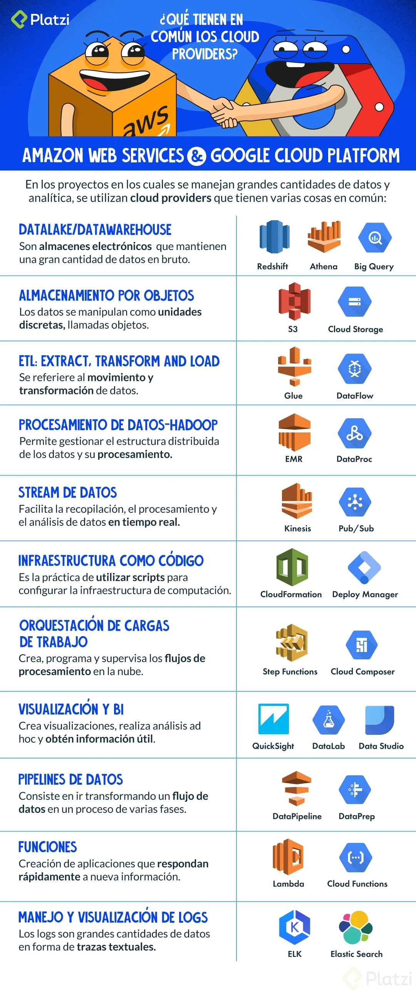

Después de revisar las diferentes opciones que proveen los cloud providers encontramos variedad en servicios de acuerdo a su funcionalidad, otras nubes como Azure, Softlayer, Alibaba también cuentan con servicios orientados al procesamiento de datos, sin embargo dentro de su ecosistema no es tan completo el set de servicios, por tal motivo siempre que pensemos en proyectos de BigData los mejores cloud provider serán AWS y GCP que estudiaras en este curso.

## Arquitecturas Lambda

Las **arquitecturas Lambda** son un enfoque de diseño en **computación en la nube** que permite el procesamiento de datos en tiempo real con alta escalabilidad y eficiencia. Son ampliamente utilizadas en aplicaciones de **Big Data, análisis en tiempo real e Internet de las Cosas (IoT)**.

### **📌 ¿Qué es una Arquitectura Lambda?**  

Una **Arquitectura Lambda** es un modelo diseñado para **procesar y analizar grandes volúmenes de datos en tiempo real y en lotes** de manera eficiente. Se basa en dos capas principales:  

1️⃣ **Capa de Velocidad (Speed Layer)** → Procesa datos en tiempo real.  
2️⃣ **Capa de Batch (Batch Layer)** → Procesa datos históricos o en lotes.  
3️⃣ **Capa de Servicio (Serving Layer)** → Combina los resultados de ambas capas y los expone a aplicaciones.  

💡 **Este enfoque combina lo mejor de los sistemas de procesamiento en tiempo real y en batch, garantizando baja latencia y datos precisos.**  


### **🚀 Componentes de una Arquitectura Lambda**  

### **1️⃣ Capa de Ingesta de Datos**  
📌 **Recibe y almacena datos desde múltiples fuentes.**  
🔹 **Ejemplos:**  
- Amazon Kinesis (AWS)  
- Google Pub/Sub (GCP)  
- Azure Event Hub (Microsoft)  

### **2️⃣ Capa de Procesamiento en Batch**  
📌 **Procesa grandes volúmenes de datos con alta precisión.**  
🔹 **Ejemplos:**  
- Apache Hadoop  
- AWS Glue  
- Google Dataflow  

### **3️⃣ Capa de Procesamiento en Tiempo Real (Stream Processing)**  
📌 **Analiza datos con baja latencia en tiempo real.**  
🔹 **Ejemplos:**  
- Apache Kafka  
- AWS Lambda  
- Azure Stream Analytics  

### **4️⃣ Capa de Almacenamiento**  
📌 **Guarda datos para análisis y consultas futuras.**  
🔹 **Ejemplos:**  
- Amazon S3 (AWS)  
- Google BigQuery (GCP)  
- Azure Data Lake (Microsoft)  

### **5️⃣ Capa de Servicio (Serving Layer)**  
📌 **Proporciona acceso a los datos para dashboards y aplicaciones.**  
🔹 **Ejemplos:**  
- Amazon Redshift  
- Google Looker Studio  
- Azure Synapse Analytics

### **🛠️ Caso de Uso: Procesamiento de Datos en Streaming con AWS Lambda**  

🔹 **Escenario:** Una empresa de e-commerce quiere analizar el comportamiento de los usuarios en tiempo real.  

🔹 **Solución con Arquitectura Lambda en AWS:**  
1️⃣ **AWS Kinesis** captura eventos de navegación web.  
2️⃣ **AWS Lambda** procesa los eventos en tiempo real.  
3️⃣ **Amazon DynamoDB** almacena la información procesada.  
4️⃣ **Amazon QuickSight** genera reportes y visualizaciones.

### **🔄 Diferencia entre Arquitectura Lambda y Kappa**  

| Característica  | **Lambda**  | **Kappa**  |
|---------------|------------|------------|
| Procesamiento | Batch + Streaming | Solo Streaming |
| Complejidad  | Alta (doble pipeline) | Baja (un solo pipeline) |
| Uso común    | Big Data, IoT | Machine Learning, IoT |

💡 **Si tu aplicación requiere procesamiento en tiempo real y en batch, usa Lambda. Si solo necesitas datos en streaming, Kappa es mejor.**

### **🌟 Beneficios de las Arquitecturas Lambda**  

✅ **Escalabilidad automática** → Se adapta a grandes volúmenes de datos.  
✅ **Baja latencia** → Procesa información en tiempo real.  
✅ **Flexibilidad** → Compatible con múltiples tecnologías.  
✅ **Alta disponibilidad** → Replicación y tolerancia a fallos.  

### **🔎 Conclusión**  
Las **Arquitecturas Lambda** son ideales para manejar **Big Data, análisis en tiempo real e IoT**. Su combinación de procesamiento batch y en streaming las hace versátiles y poderosas en la era digital.

**Resumen**

La arquitectura Lambda es atribuida a Nathan Marz, diseñada para ser escalable, tolerante a fallos y de alto procesamiento de datos.

Tiene una gran robustez, puede procesar una alta cantidad de datos. Está compuesta por tres capas:

1. **Batch**: En esta capa vamos a procesar toda la información almacenada con anterioridad, desde el día anterior hasta meses.
2. **Serve**: Dentro de esta capa es posible visualizar la data procesada de la capa batch.
3. **Speed**: Conforme llega la data se va a ir procesando.

## Arquitectura Kappa

La **Arquitectura Kappa** es un enfoque de diseño para el procesamiento de datos **en tiempo real**, eliminando la necesidad de procesar datos en batch. Es ideal para aplicaciones de **Big Data, Machine Learning, IoT y análisis en streaming**.

### **📌 ¿Qué es una Arquitectura Kappa?**  

Es un modelo que **procesa datos exclusivamente en tiempo real** mediante **event streaming**. A diferencia de la **Arquitectura Lambda**, **no tiene una capa de batch**, lo que simplifica la infraestructura y reduce la latencia.  

💡 **Se basa en un único pipeline de datos en streaming.**

### **🚀 Componentes de una Arquitectura Kappa**  

### **1️⃣ Capa de Ingesta de Datos**  
📌 **Recibe datos en tiempo real desde múltiples fuentes.**  
🔹 **Ejemplos:**  
- Apache Kafka  
- Amazon Kinesis  
- Google Pub/Sub  
- Azure Event Hub  

### **2️⃣ Capa de Procesamiento en Streaming**  
📌 **Transforma y analiza datos en tiempo real.**  
🔹 **Ejemplos:**  
- Apache Flink  
- Apache Spark Streaming  
- AWS Lambda  
- Google Dataflow  

### **3️⃣ Capa de Almacenamiento**  
📌 **Guarda datos estructurados y no estructurados para consultas futuras.**  
🔹 **Ejemplos:**  
- Amazon S3 (AWS)  
- Google BigQuery (GCP)  
- Azure Data Lake (Microsoft)  

### **4️⃣ Capa de Consumo y Visualización**  
📌 **Permite a los usuarios acceder a los datos procesados.**  
🔹 **Ejemplos:**  
- Amazon QuickSight  
- Google Looker Studio  
- Power BI

### **🔄 Diferencia entre Arquitectura Kappa y Lambda**  

| Característica  | **Lambda**  | **Kappa**  |
|---------------|------------|------------|
| Procesamiento | Batch + Streaming | Solo Streaming |
| Complejidad  | Alta (doble pipeline) | Baja (un solo pipeline) |
| Latencia     | Baja, pero con batch | Mínima |
| Uso común    | Big Data, IoT | IoT, ML, Finanzas |

💡 **Si necesitas procesamiento en batch y en tiempo real, usa Lambda. Si solo necesitas tiempo real, Kappa es mejor.**

### **🛠️ Caso de Uso: Análisis de Sensores IoT con Kappa**  

🔹 **Escenario:** Una empresa de manufactura quiere monitorear la temperatura de sus máquinas en tiempo real.  

🔹 **Solución con Arquitectura Kappa:**  
1️⃣ **Kafka o Kinesis** recibe datos de sensores en streaming.  
2️⃣ **Apache Flink** procesa y detecta anomalías en tiempo real.  
3️⃣ **Amazon DynamoDB** almacena la información relevante.  
4️⃣ **Amazon QuickSight** visualiza datos en tiempo real.

### **🌟 Beneficios de la Arquitectura Kappa**  

✅ **Menos complejidad** → Un solo pipeline de datos.  
✅ **Menor latencia** → Respuesta en tiempo real.  
✅ **Mayor escalabilidad** → Perfecto para datos de alto volumen.  
✅ **Ideal para Machine Learning** → Modelos entrenados en tiempo real.

### **🔎 Conclusión**  
La **Arquitectura Kappa** es ideal para sistemas que requieren **procesamiento en tiempo real**, como **IoT, finanzas, seguridad y ML**. Si buscas baja latencia y simplicidad, Kappa es una excelente opción. 🚀

### Resumen

Fue presentada por Jay Krepsen en el 2014 como una evolución de la arquitectura lambda. Elimina la capa batch haciendo que todo se procese en tiempo real.

La arquitectura Kappa sigue los siguientes pilares:

1. Todo es un stream.
2. Información de origen no modificada.
3. Solo un flujo de procesamiento.
4. Capaz de reprocesar.

## Arquitectura Batch

La **Arquitectura Batch** es un enfoque tradicional para el procesamiento de datos en grandes volúmenes. Se basa en la ejecución de tareas en **lotes** o **bloques** de datos en un periodo determinado, en lugar de procesar cada evento individualmente en tiempo real.

### **📌 ¿Qué es una Arquitectura Batch?**  
Es un modelo de procesamiento de datos donde los datos se recopilan, almacenan y luego se procesan en **bloques o lotes** en un intervalo específico.  

💡 **Ejemplo:** Un banco genera un informe de todas las transacciones realizadas en el día y lo procesa cada noche.

### **🚀 Componentes de una Arquitectura Batch**  

### **1️⃣ Capa de Ingesta de Datos**  
📌 **Recopila datos de diversas fuentes y los almacena para su posterior procesamiento.**  
🔹 **Ejemplos:**  
- Amazon S3  
- Google Cloud Storage  
- Azure Data Lake  

### **2️⃣ Capa de Procesamiento Batch**  
📌 **Ejecuta trabajos en lotes periódicamente.**  
🔹 **Ejemplos:**  
- Apache Hadoop  
- AWS Glue  
- Google Dataflow  
- Azure Data Factory  

### **3️⃣ Capa de Almacenamiento**  
📌 **Guarda los datos procesados para su consulta y análisis.**  
🔹 **Ejemplos:**  
- Amazon Redshift  
- Google BigQuery  
- Azure Synapse Analytics  

### **4️⃣ Capa de Consumo y Visualización**  
📌 **Proporciona acceso a los datos procesados.**  
🔹 **Ejemplos:**  
- Tableau  
- Power BI  
- Amazon QuickSight

### **🔄 ¿Cómo funciona una Arquitectura Batch?**  

1️⃣ **Se recopilan los datos** en intervalos específicos.  
2️⃣ **Se almacenan en un sistema de archivos o base de datos.**  
3️⃣ **Se procesan en lotes** mediante herramientas como Apache Spark o AWS Glue.  
4️⃣ **Se almacenan los resultados** en un Data Warehouse.  
5️⃣ **Se consumen los datos** mediante dashboards o informes.

### **🔹 Casos de Uso de la Arquitectura Batch**  

✅ **Procesamiento de grandes volúmenes de datos históricos.**  
✅ **Generación de reportes y análisis de tendencias.**  
✅ **Carga de datos en Data Warehouses.**  
✅ **Procesamiento de facturación y pagos en empresas.** 

### **⚖️ Diferencia entre Batch y Streaming**  

| Característica  | **Batch**  | **Streaming**  |
|---------------|------------|---------------|
| Procesamiento | Lotes de datos | Evento por evento |
| Latencia     | Alta (horas/días) | Baja (segundos) |
| Complejidad  | Baja | Media/Alta |
| Uso común    | Reportes, análisis históricos | IoT, Finanzas en tiempo real |

💡 **Si necesitas procesamiento periódico de grandes volúmenes de datos, Batch es ideal. Si necesitas datos en tiempo real, usa Streaming.**

### **🌟 Beneficios de la Arquitectura Batch**  

✅ **Alta eficiencia en grandes volúmenes de datos.**  
✅ **Optimización de recursos, ya que no requiere procesamiento continuo.**  
✅ **Facilidad de mantenimiento y escalabilidad.**  
✅ **Menor costo en comparación con arquitecturas en tiempo real.** 

### **🔎 Conclusión**  
La **Arquitectura Batch** es ideal cuando se necesita procesar grandes volúmenes de datos de manera eficiente sin la necesidad de respuestas en tiempo real. Se usa en **análisis de datos históricos, reportes y procesos de negocio periódicos**. 🚀

**Resumen**

Esta arquitectura es una parte específica de la arquitectura Lambda.

Es importante comprender que en esta arquitectura vamos a tener un Input, un proceso y un Output, estos tres orquestados por un sistema donde el Input y Output deben de conectarse a una base de datos.

## Llevar tu información al cloud

Migrar tu información a la nube (Cloud) implica trasladar datos, aplicaciones y cargas de trabajo desde infraestructuras locales a servicios en la nube proporcionados por empresas como AWS, Google Cloud o Azure.  

### **Ventajas de mover tu información a la nube**  
✅ **Escalabilidad**: Puedes aumentar o reducir recursos según la demanda.  
✅ **Alta disponibilidad**: Accede a tus datos desde cualquier lugar con conexión a internet.  
✅ **Seguridad**: La mayoría de los proveedores ofrecen cifrado y medidas de seguridad avanzadas.  
✅ **Reducción de costos**: Evita gastos en hardware y mantenimiento.  

### **Tipos de migración a la nube**  
☁ **Lift and Shift**: Mover los datos y aplicaciones sin modificaciones.  
☁ **Replataforming**: Adaptar aplicaciones para aprovechar mejor los servicios en la nube.  
☁ **Refactoring**: Rediseñar aplicaciones para optimizar su desempeño en la nube.  

### **Servicios clave en la nube para almacenar información**  
📌 **Amazon S3**: Almacenamiento escalable y seguro.  
📌 **Google Cloud Storage**: Almacén de objetos para cargas de trabajo empresariales.  
📌 **Azure Blob Storage**: Solución de almacenamiento de Microsoft.  
📌 **Bases de datos en la nube**: DynamoDB, Aurora, BigQuery, Firestore, entre otras.  

Si quieres más detalles sobre cómo migrar a la nube, dime qué tipo de datos o cargas de trabajo deseas mover. 🚀

### Resumen

Existen distintas formas de conectar tu sistema en la nube con la fuente de origen de datos que necesitas, algunas opciones son:

- Utilizar el SDK de la nube utilizando el lenguaje de programación de tu preferencia.
- Usar el CLI para conectarse a la nube.
- Utilizar servicios especializados para la tarea.

Es posible combinar esas opciones para llevar la información que necesites a tu cloud provider.

## Demo - Creando nuestro IDE en la nube con Python - Boto3

Para crear un **IDE en la nube con Python** utilizando **Boto3** (el SDK de AWS para Python), podemos aprovechar servicios de AWS como **EC2, S3, Cloud9 y Lambda**. Aquí te dejo una guía paso a paso:

### **1️⃣ Configurar Boto3 en tu entorno local**  
Antes de comenzar, instala **Boto3** y configura las credenciales de AWS en tu máquina local:  

```bash
pip install boto3
aws configure
```
Ingresa tu **AWS Access Key**, **Secret Key**, región y formato de salida.

### **2️⃣ Crear una instancia EC2 para alojar el IDE**  
Podemos lanzar una instancia EC2 que sirva como nuestro entorno de desarrollo.  

```python
import boto3

ec2 = boto3.resource('ec2')

# Lanzar una instancia EC2 con Ubuntu
instance = ec2.create_instances(
    ImageId='ami-0c55b159cbfafe1f0',  # ID de la AMI (Ubuntu)
    MinCount=1,
    MaxCount=1,
    InstanceType='t2.micro',
    KeyName='mi-clave-aws',  # Debes haber creado una clave SSH en AWS
    SecurityGroups=['default'],
    UserData="""#!/bin/bash
    sudo apt update -y
    sudo apt install -y python3 python3-pip
    pip3 install jupyter boto3
    """,
    TagSpecifications=[
        {
            'ResourceType': 'instance',
            'Tags': [{'Key': 'Name', 'Value': 'IDE-Python-Cloud'}]
        }
    ]
)

print(f"Instancia EC2 creada: {instance[0].id}")
```
Esto inicia un **servidor Ubuntu con Python y Jupyter**.

### **3️⃣ Configurar un Bucket S3 para almacenamiento de proyectos**
Podemos crear un bucket S3 para guardar archivos y proyectos.

```python
s3 = boto3.client('s3')

bucket_name = 'mi-ide-python-cloud'

s3.create_bucket(
    Bucket=bucket_name,
    CreateBucketConfiguration={'LocationConstraint': 'us-east-1'}
)

print(f"Bucket {bucket_name} creado exitosamente")
```
Subir archivos al IDE en la nube:

```python
s3.upload_file('mi_script.py', bucket_name, 'mi_script.py')
print("Archivo subido a S3")
```

### **4️⃣ Opción avanzada: Usar AWS Cloud9**
AWS **Cloud9** es un IDE en la nube administrado por AWS que se puede lanzar con **Boto3**.

```python
cloud9 = boto3.client('cloud9')

response = cloud9.create_environment_ec2(
    name='MiIDECloud9',
    instanceType='t2.micro',
    automaticStopTimeMinutes=30
)

print(f"IDE Cloud9 creado: {response['environmentId']}")
```
Cloud9 permite codificar directamente en un navegador sin necesidad de configurar servidores.

### **5️⃣ Acceder al IDE**
- Si usaste EC2, puedes conectarte con SSH:
  ```bash
  ssh -i mi-clave-aws.pem ubuntu@IP_PUBLICA
  ```
- Para Jupyter Notebook, abre en tu navegador:
  ```
  http://IP_PUBLICA:8888
  ```
- Si usaste Cloud9, abre la consola de AWS y accede desde la sección **Cloud9**.

### 🚀 **Conclusión**
Hemos creado un **IDE en la nube con Python** utilizando EC2, S3 y Cloud9 con Boto3. Puedes escalarlo agregando **Docker, VSCode Server, Lambda o API Gateway** para más funcionalidades.

**Resumen**

Vamos a utilizar el servicio de Cloud de Amazon para este curso, específicamente para esta demo usaremos el SDK de AWS para Python.

Python es una gran opción para procesamiento de datos ya que cuenta con librerías como Pandas, Anaconda PyBrain, NumPy.

**Lecturas recomendadas**

[AWS Cloud9 – Amazon Web Services](https://aws.amazon.com/es/cloud9/)

[Boto 3 Documentation — Boto 3 Docs 1.9.106 documentation](https://boto3.amazonaws.com/v1/documentation/api/latest/index.html)

[GitHub - boto/boto3: AWS SDK for Python](https://github.com/boto/boto3)

## ¿Cómo usar Boto3?

### **📌 ¿Qué es Boto3?**  
Boto3 es el SDK de Python para interactuar con **AWS**. Permite gestionar servicios como **S3, EC2, DynamoDB, Lambda, RDS, entre otros**.

### **1️⃣ Instalación de Boto3**
Para instalarlo en tu entorno de Python, usa:
```bash
pip install boto3
```

### **2️⃣ Configuración de credenciales**  
Antes de usar Boto3, debes configurar tus credenciales de AWS. Puedes hacerlo de dos maneras:

### **🔹 Opción 1: Configurar usando AWS CLI**  
Si tienes instalado AWS CLI, ejecuta:
```bash
aws configure
```
Te pedirá:
- **AWS Access Key ID**  
- **AWS Secret Access Key**  
- **Región por defecto** (ejemplo: `us-east-1`)  
- **Formato de salida** (`json`, `text`, etc.)

Las credenciales se guardarán en `~/.aws/credentials` (Linux/macOS) o `C:\Users\TU_USUARIO\.aws\credentials` (Windows).

### **🔹 Opción 2: Configurar manualmente**
Crea el archivo `~/.aws/credentials` y añade:
```ini
[default]
aws_access_key_id = TU_ACCESS_KEY
aws_secret_access_key = TU_SECRET_KEY
region = us-east-1
```

### **3️⃣ Uso de Boto3**
### **🔹 Crear una sesión en Boto3**
```python
import boto3

# Crear una sesión con AWS
session = boto3.Session(
    aws_access_key_id="TU_ACCESS_KEY",
    aws_secret_access_key="TU_SECRET_KEY",
    region_name="us-east-1"
)
```
Si ya configuraste las credenciales con `aws configure`, puedes omitir los parámetros.

### **4️⃣ Ejemplos de uso de Boto3**
### **🔹 Listar buckets en S3**
```python
s3 = boto3.client("s3")

# Obtener lista de buckets
response = s3.list_buckets()
for bucket in response["Buckets"]:
    print(bucket["Name"])
```

### **🔹 Subir un archivo a S3**
```python
s3.upload_file("mi_archivo.txt", "nombre-del-bucket", "carpeta/archivo.txt")
```

### **🔹 Crear una instancia EC2**
```python
ec2 = boto3.resource("ec2")

# Crear una nueva instancia EC2
instances = ec2.create_instances(
    ImageId="ami-12345678", 
    MinCount=1,
    MaxCount=1,
    InstanceType="t2.micro"
)
print("Instancia creada:", instances[0].id)
```

### **🔹 Leer datos de DynamoDB**
```python
dynamodb = boto3.resource("dynamodb")
table = dynamodb.Table("MiTabla")

# Obtener un elemento por su clave primaria
response = table.get_item(Key={"id": "123"})
print(response.get("Item"))
```

### **5️⃣ Manejo de errores en Boto3**
Siempre es recomendable manejar excepciones para evitar fallos en el código:
```python
import botocore

try:
    s3.list_buckets()
except botocore.exceptions.NoCredentialsError:
    print("Credenciales no encontradas")
except botocore.exceptions.PartialCredentialsError:
    print("Credenciales incompletas")
```

### **🚀 Conclusión**
Boto3 es una herramienta poderosa para interactuar con AWS desde Python. Si necesitas ayuda con algún servicio específico, dime y te ayudo con código más detallado. 😊

### ¿Cómo usar Boto3?

Boto3 es el SDK de Python para interactuar con **AWS**. Permite gestionar servicios como **S3, EC2, DynamoDB, Lambda, RDS, entre otros**.

### **1️⃣ Instalación de Boto3**
Para instalarlo en tu entorno de Python, usa:
```bash
pip install boto3
```

### **2️⃣ Configuración de credenciales**  
Antes de usar Boto3, debes configurar tus credenciales de AWS. Puedes hacerlo de dos maneras:

### **🔹 Opción 1: Configurar usando AWS CLI**  
Si tienes instalado AWS CLI, ejecuta:
```bash
aws configure
```
Te pedirá:
- **AWS Access Key ID**  
- **AWS Secret Access Key**  
- **Región por defecto** (ejemplo: `us-east-1`)  
- **Formato de salida** (`json`, `text`, etc.)

Las credenciales se guardarán en `~/.aws/credentials` (Linux/macOS) o `C:\Users\TU_USUARIO\.aws\credentials` (Windows).

### **🔹 Opción 2: Configurar manualmente**
Crea el archivo `~/.aws/credentials` y añade:
```ini
[default]
aws_access_key_id = TU_ACCESS_KEY
aws_secret_access_key = TU_SECRET_KEY
region = us-east-1
```

### **3️⃣ Uso de Boto3**
### **🔹 Crear una sesión en Boto3**
```python
import boto3

# Crear una sesión con AWS
session = boto3.Session(
    aws_access_key_id="TU_ACCESS_KEY",
    aws_secret_access_key="TU_SECRET_KEY",
    region_name="us-east-1"
)
```
Si ya configuraste las credenciales con `aws configure`, puedes omitir los parámetros.

### **4️⃣ Ejemplos de uso de Boto3**
### **🔹 Listar buckets en S3**
```python
s3 = boto3.client("s3")

# Obtener lista de buckets
response = s3.list_buckets()
for bucket in response["Buckets"]:
    print(bucket["Name"])
```

### **🔹 Subir un archivo a S3**
```python
s3.upload_file("mi_archivo.txt", "nombre-del-bucket", "carpeta/archivo.txt")
```

### **🔹 Crear una instancia EC2**
```python
ec2 = boto3.resource("ec2")

# Crear una nueva instancia EC2
instances = ec2.create_instances(
    ImageId="ami-12345678", 
    MinCount=1,
    MaxCount=1,
    InstanceType="t2.micro"
)
print("Instancia creada:", instances[0].id)
```

### **🔹 Leer datos de DynamoDB**
```python
dynamodb = boto3.resource("dynamodb")
table = dynamodb.Table("MiTabla")

# Obtener un elemento por su clave primaria
response = table.get_item(Key={"id": "123"})
print(response.get("Item"))
```

### **5️⃣ Manejo de errores en Boto3**
Siempre es recomendable manejar excepciones para evitar fallos en el código:
```python
import botocore

try:
    s3.list_buckets()
except botocore.exceptions.NoCredentialsError:
    print("Credenciales no encontradas")
except botocore.exceptions.PartialCredentialsError:
    print("Credenciales incompletas")
```

### **🚀 Conclusión**
Boto3 es una herramienta poderosa para interactuar con AWS desde Python. Si necesitas ayuda con algún servicio específico, dime y te ayudo con código más detallado. 😊

### Resumen

### ¿Cómo utilizar Boto3 para interactuar con servicios de AWS?

Boto3 es la biblioteca de Python por excelencia para interactuar con los servicios de Amazon Web Services (AWS). Su comprensión y uso efectivo son esenciales para cualquier profesional que trabaje con AWS, ya que permite gestionar diversos servicios desde un solo lugar.

### ¿Qué es Boto3?

Boto3 es el SDK (Software Development Kit) de Python para AWS. Con él puedes crear, configurar y gestionar servicios de AWS como S3 y Athena, entre otros. Ofrece una interfaz fácil de usar para programadores, que facilita la automatización de tareas repetitivas dentro del entorno de AWS.

### ¿Cómo acceder a la documentación de Boto3?

Para aprovechar al máximo Boto3, es crucial familiarizarse con la documentación proporcionada por AWS. Puedes encontrar información detallada sobre cada servicio, ejemplos de código y explicaciones claras de los parámetros necesarios. Así es como se accede a la documentación:

1. Abre una pestaña de tu navegador.
2. Busca "AWS Boto3 S3" o el servicio específico que te interese.
3. Accede al primer enlace que normalmente te llevará a la documentación oficial.

### ¿Qué debemos tener en cuenta al utilizar Boto3 con AWS?

Al trabajar con Boto3, es vital inicializar el servicio específico antes de realizar cualquier operación. Este proceso implica crear un cliente desde Boto3 y especificar el servicio dentro de los paréntesis y entre comillas sencillas. Veamos un ejemplo sencillo para inicializar el cliente de Athena:

```python
import boto3

client = boto3.client('athena')

# Aquí haríamos una consulta, iniciaríamos su ejecución y obtendríamos la respuesta
```

### ¿Cómo interactuar con servicios como S3 y Athena?

Aparte de S3, otro servicio potente que puedes gestionar con Boto3 es Athena, el cual te permite lanzar consultas SQL sobre datos almacenados en S3. Aquí hay un ejemplo práctico que muestra cómo inicializar y realizar operaciones con estos servicios:

1. S3: Puedes definir la región de operación si el script lo requiere.
2. Athena: Requiere la inicialización del servicio y luego puedes enviar consultas SQL para analizar los datos almacenados.

En general, un script típico podría verse así:

```python
import boto3

# Inicializar cliente de S3
s3 = boto3.client('s3', region_name='us-west-2')

# Listar buckets en S3
response = s3.list_buckets()
print(response['Buckets'])

# Inicializar cliente de Athena
athena = boto3.client('athena')

# Enviar una consulta a Athena
query_start = athena.start_query_execution(
    QueryString='SELECT * FROM database.table',
    QueryExecutionContext={'Database': 'my_database'},
    ResultConfiguration={
        'OutputLocation': 's3://my-athena-results-bucket/path/to/',
    }
)

print(query_start)
```

### ¿Por qué es esencial Boto3 para tus proyectos?

Boto3 es fundamental para cualquier proyecto de Big Data en AWS gracias a su capacidad para interconectar servicios de AWS mediante Python, el cual es un lenguaje robusto y ampliamente utilizado en análisis de datos. Con esta librería, se combina la potencia de los servicios en la nube con la facilidad y versatilidad de Python, permitiendo desarrollar soluciones efectivas y eficientes.

¡Anímate a seguir explorando y utilizando Boto3 para automatizar tus procesos en AWS! La práctica y el conocimiento profundo de esta herramienta abrirán muchas puertas en tu carrera como desarrollador o analista de datos.

**Lecturas recomendadas**

[Ejemplo de Python para AWS Cloud9 - AWS Cloud9](https://docs.aws.amazon.com/es_es/cloud9/latest/user-guide/sample-python.html)

[S3 — Boto 3 Docs 1.9.106 documentation](https://boto3.amazonaws.com/v1/documentation/api/latest/reference/services/s3.html)

[https://boto3.amazonaws.com/v1/documentation/api/latest/reference/services/ec2.html](https://boto3.amazonaws.com/v1/documentation/api/latest/reference/services/ec2.html)

## API Gateway

Amazon **API Gateway** es un servicio totalmente administrado de AWS que permite a los desarrolladores **crear, publicar, mantener, monitorear y asegurar APIs** en cualquier escala. Se utiliza para conectar clientes con **servicios backend** como **Lambda, EC2, DynamoDB o cualquier otro servicio HTTP/HTTPS**.

### **🔹 Características Principales**
1. **Soporte para diferentes tipos de APIs**  
   - RESTful APIs  
   - WebSocket APIs  
   - HTTP APIs (más ligeras y económicas que REST)

2. **Escalabilidad Automática**  
   - Maneja millones de solicitudes sin intervención manual.  

3. **Autenticación y Autorización**  
   - Compatible con **IAM, Cognito y Lambda Authorizers**.  

4. **Gestión de tráfico y seguridad**  
   - Soporta **rate limiting** y protección contra ataques DDoS.  

5. **Monitoreo y Logging**  
   - Integración con **CloudWatch** para logs, métricas y alertas.  

6. **Transformación de datos**  
   - Permite **mapear, modificar y validar** peticiones/respuestas.  

7. **Integración con múltiples backends**  
   - AWS Lambda, EC2, S3, DynamoDB, servicios HTTP, etc.

### **🔹 Casos de Uso 📌**
✅ Creación de microservicios  
✅ API Gateway para aplicaciones móviles/web  
✅ Integración con AWS Lambda para una arquitectura **serverless**  
✅ Exposición segura de endpoints para terceros  
✅ Proxy para servicios internos de AWS  

### **🔹 Ejemplo: Creando un API Gateway con Lambda**
1️⃣ **Crear una función Lambda en AWS Lambda**  
2️⃣ **Configurar API Gateway para que llame a la función Lambda**  
3️⃣ **Implementar una política de seguridad (IAM o Cognito)**  
4️⃣ **Probar la API con Postman o cURL**  

### **🔹 Ejemplo en Python (Lambda)**
```python
import json

def lambda_handler(event, context):
    return {
        "statusCode": 200,
        "body": json.dumps({"message": "¡Hola desde AWS Lambda con API Gateway!"})
    }
```

Con API Gateway puedes **convertir cualquier servicio backend en una API escalable y segura**. 🚀

**Resumen**

Este servicio nos va a servir como puerta de enlace entre la data que tenemos y la plataforma en la nube.

- Soporta cientos de miles de llamadas concurrentes.
- Previene ataques DDOS.

## Storage Gateway

**AWS Storage Gateway** es un servicio híbrido que permite conectar entornos **on-premise** con el almacenamiento en la **nube de AWS**. Se utiliza para extender la capacidad de almacenamiento local utilizando **Amazon S3, Glacier, EBS y otros servicios de AWS**.

### **🔹 Tipos de Storage Gateway**
AWS ofrece **tres tipos principales** de Storage Gateway, según el caso de uso:  

1️⃣ **File Gateway (NFS/SMB)**  
   - Permite almacenar archivos en **Amazon S3** y acceder a ellos como si fueran locales.  
   - Compatible con protocolos **NFS y SMB**.  
   - Ideal para **archivos de backup, machine learning y análisis de datos**.  

2️⃣ **Volume Gateway (iSCSI)**  
   - Crea volúmenes que pueden ser montados en servidores **on-premise** como unidades de disco.  
   - Soporta **modo almacenado** (copia local + respaldo en AWS) o **modo en caché** (copia en AWS + caché local).  
   - Se integra con **EBS y S3** para backup y restauración.  

3️⃣ **Tape Gateway (Virtual Tape Library - VTL)**  
   - Emula una **librería de cintas** para backup en la nube.  
   - Usa **Amazon S3 y Glacier** para almacenamiento a largo plazo.  
   - Compatible con **software de backup tradicional** como Veeam, Commvault y NetBackup.

### **🔹 Beneficios de Storage Gateway**
✅ **Extensión del almacenamiento local sin comprar hardware adicional**  
✅ **Backups automáticos y recuperación ante desastres**  
✅ **Acceso rápido y seguro a datos en la nube**  
✅ **Reducción de costos operativos** al eliminar infraestructura física  
✅ **Soporte para aplicaciones empresariales** como SAP, bases de datos y archivos compartidos

### **🔹 Casos de Uso 📌**
🔹 Empresas que desean **migrar gradualmente** a la nube  
🔹 **Respaldo y recuperación de datos** desde servidores locales a AWS  
🔹 **Archivos compartidos** accesibles desde múltiples ubicaciones  
🔹 **Retención de datos a largo plazo** con Glacier  

### **🔹 Ejemplo de Implementación de Storage Gateway**
1️⃣ **Configurar una máquina virtual** con el software de Storage Gateway en un entorno on-premise  
2️⃣ **Conectar la máquina a AWS** usando la consola de AWS  
3️⃣ **Seleccionar el tipo de gateway** (File, Volume o Tape)  
4️⃣ **Sincronizar con AWS S3, EBS o Glacier** según la configuración  
5️⃣ **Acceder a los datos como si estuvieran en almacenamiento local**  

AWS Storage Gateway es una solución **híbrida, flexible y económica** para integrar almacenamiento local con la nube de AWS. 🚀

**Resumen**

Tiene tres características importantes:

1. Nos permite enviar información desde nuestro datacenter on-premise a la nube.
2. Puedes enviar los logs de una aplicación on-premise para que sean procesados.
3. Funciona en una máquina virtual que instalamos en nuestro datacenter.

## Kinesis Data Streams 

**AWS Kinesis Data Streams** es un servicio de AWS que permite la **ingestión, procesamiento y análisis de datos en tiempo real**. Es ideal para manejar flujos de datos generados continuamente, como logs, eventos de IoT, métricas de aplicaciones y transacciones financieras.  

### **🔹 Características Principales**
✅ **Procesamiento en tiempo real** 📊  
✅ **Alta escalabilidad** ⚡ (permite manejar desde KB/s hasta TB/hora)  
✅ **Latencia baja (milisegundos)** ⏳  
✅ **Persistencia de datos hasta 7 días** 🕒  
✅ **Integración con AWS Lambda, S3, DynamoDB, Redshift y más** 🔄

### **🔹 Componentes Claves de Kinesis Data Streams**
1️⃣ **Shards (Fragmentos)**  
   - Cada stream se divide en shards, que determinan la capacidad del flujo.  
   - Cada shard puede manejar hasta **1 MB/s de escritura y 2 MB/s de lectura**.  
   - Puedes **escalar horizontalmente** agregando más shards.  

2️⃣ **Producers (Productores)**  
   - Fuentes que envían datos a Kinesis.  
   - Ejemplos: logs de servidores, eventos de IoT, transacciones de e-commerce.  

3️⃣ **Consumers (Consumidores)**  
   - Aplicaciones que leen y procesan los datos en tiempo real.  
   - Se pueden conectar múltiples consumidores como **AWS Lambda, Kinesis Data Firehose, Apache Flink, o EC2**.

### **🔹 Casos de Uso 📌**
🔹 **Monitoreo en tiempo real** de logs de servidores y aplicaciones  
🔹 **Análisis de tendencias de redes sociales** en tiempo real  
🔹 **Detección de fraudes en transacciones bancarias** 💳  
🔹 **Procesamiento de datos de IoT** en fábricas, dispositivos inteligentes, etc.  
🔹 **Streaming de eventos de videojuegos** 🎮

### **🔹 Ejemplo de Uso: Envío de Datos a Kinesis**
Usando **Boto3 (SDK de Python)** para enviar datos a un stream:

```python
import boto3
import json
import time

# Crear cliente de Kinesis
kinesis_client = boto3.client('kinesis', region_name='us-east-1')

stream_name = 'mi-stream'

# Enviar datos a Kinesis
for i in range(10):
    data = {
        'event_id': i,
        'timestamp': time.time(),
        'message': 'Evento de prueba'
    }
    kinesis_client.put_record(
        StreamName=stream_name,
        Data=json.dumps(data),
        PartitionKey=str(i)  # Determina a qué shard irá el dato
    )
    print(f"Enviado evento {i}")
    time.sleep(1)  # Simulación de flujo de datos
```

### **🔹 Integraciones Populares**
✅ **AWS Lambda** para disparar funciones en tiempo real  
✅ **Kinesis Data Firehose** para almacenar datos en S3, Redshift o OpenSearch  
✅ **Kinesis Data Analytics** para análisis en tiempo real con SQL  
✅ **DynamoDB, S3, ElasticSearch** para almacenamiento y análisis posterior  

**🔥 AWS Kinesis Data Streams es una solución potente para manejar y procesar grandes volúmenes de datos en tiempo real, con alta escalabilidad y baja latencia.** 🚀

**Resumen**

- Tienes que pensar en procesar grandes cantidades de datos, desde TB hasta EB.
- Algunos casos de uso son para procesar información de logs, social media, market data feeds y web clickstream.
- La unidad fundamental dentro de Kinesis se llama Data Record.
- La información dentro de Kinesis por defecto solamente cuenta con un periodo de retención de 24 horas.
- El Shard es una secuencia de Data Records dentro de un stream.

**Lecturas recomendadas**

[Creating and Updating Data Streams - Amazon Kinesis Data Streams](https://docs.aws.amazon.com/streams/latest/dev/amazon-kinesis-streams.html)

## Demo - Despegando Kinesis con Cloudformation

Aquí tienes un ejemplo de cómo desplegar **Amazon Kinesis Data Streams** usando **AWS CloudFormation**.

### **CloudFormation Template para Kinesis Data Streams**
Este código crea un flujo de datos de Kinesis con una capacidad de **2 shards**, lo que permite manejar más datos en paralelo.

```yaml
AWSTemplateFormatVersion: '2010-09-09'
Description: 'CloudFormation template para desplegar un Kinesis Data Stream'

Resources:
  MyKinesisStream:
    Type: AWS::Kinesis::Stream
    Properties:
      Name: MiKinesisStream
      ShardCount: 2  # Número de shards (ajústalo según la carga esperada)
      RetentionPeriodHours: 24  # Tiempo de retención de datos en horas
      StreamModeDetails:
        StreamMode: PROVISIONED  # También puedes usar ON_DEMAND para autoescalado

Outputs:
  StreamName:
    Description: "Nombre del flujo Kinesis creado"
    Value: !Ref MyKinesisStream
```

### **Despliegue en AWS**
1. Guarda el archivo como `kinesis-template.yaml`.
2. Usa AWS CLI para desplegarlo:
   ```sh
   aws cloudformation create-stack --stack-name MiKinesisStack --template-body file://kinesis-template.yaml
   ```
3. Verifica en la consola de AWS en **Kinesis > Data Streams**.

### **Extras: ¿Cómo leer datos del Stream?**
Si quieres consumir los datos en Python con **Boto3**, puedes hacerlo así:

```python
import boto3

kinesis_client = boto3.client('kinesis', region_name='us-east-1')

stream_name = "MiKinesisStream"

response = kinesis_client.describe_stream(StreamName=stream_name)
print(response)
```

💡 **Notas:**
- Si quieres **autoescalado**, usa `StreamMode: ON_DEMAND`.
- Puedes conectar este stream con **AWS Lambda** o **Amazon Kinesis Data Firehose** para procesar datos en tiempo real.

### Resumen

### ¿Cómo desplegar AWS Kinesis con CloudFormation?

Para quienes buscan automatizar y gestionar recursos en AWS de manera eficiente, utilizar CloudFormation es una estrategia ganadora. CloudFormation ofrece la posibilidad de manejar infraestructuras a través de código, facilitando el despliegue de servicios como AWS Kinesis de forma automatizada. Aquí exploraremos cómo se lleva a cabo este proceso paso a paso.

### ¿Qué es CloudFormation y cómo lo utilizamos para Kinesis?

CloudFormation es un servicio de AWS que permite crear y gestionar un conjunto de recursos en la nube mediante plantillas en formato YAML o JSON. Es un enfoque que trata la infraestructura como código, permitiendo configuraciones precisas y repetitivas en la nube. Utilizando CloudFormation, podemos definir y desplegar una arquitectura completa, como Kinesis, a partir de un solo script.

Para desplegar un Kinesis Stream, comenzamos con una plantilla maestra escrita en YAML, donde definimos los parámetros y recursos necesarios:

- **Environment Name**: Especifica el entorno donde se desplegará Kinesis.
- **Kinesis Shards Number**: Define la cantidad de shards que queremos crear; por defecto es uno, pero se puede ajustar según necesidades individuales.

### ¿Cómo estructuramos las plantillas de CloudFormation?

Las plantillas se dividen en dos partes principales: la plantilla maestra y la plantilla de distribución de Kinesis.

1. Plantilla maestra: Define los parámetros básicos como el environment y los shards. Esta plantilla enlaza con una URL que contiene otra plantilla YAML más específica, dedicada al despliegue de Kinesis.

3. Plantilla de Kinesis Distribution: Recibe parámetros de la plantilla maestra y los utiliza para configurar y crear el Kinesis Stream con las propiedades siguientes:

 - **Nombre del entorno**: Añadido al final del recurso para facilitar su identificación.
 - **Tiempo de retención**: Por defecto, se establece en 24 horas.
 - **Shards**: Utiliza el número especificado en la plantilla maestra.

### ¿Cómo almacenamos y desplegamos las plantillas?

Para manejar efectivamente las plantillas, las almacenamos en un bucket de S3, desde donde CloudFormation las accede durante el proceso de despliegue. El procedimiento es el siguiente:

1. **Crear un bucket en S3**: Este bucket almacenará las plantillas. Por ejemplo, un nombre para el bucket podría ser CFN-Kinesis-Lab.

2. **Cargar las plantillas en el bucket**: Subimos la plantilla maestra y la de Kinesis Distribution al bucket recién creado.

### ¿Cómo se ejecuta el despliegue desde CloudFormation?

Una vez las plantillas están en S3, procedemos al despliegue mediante CloudFormation:

1. Buscamos el servicio de CloudFormation en la consola de AWS.
2. Creamos un nuevo stack, especificando la ruta de la plantilla maestra almacenada en S3.
3. Configuramos el stack: Asignamos un nombre (por ejemplo, `Kinesis Lab Platzi`), seleccionamos el environment (como staging) y el número de shards.
4. Tras completar el proceso, CloudFormation empieza a crear los recursos, y podemos monitorizar el progreso hasta que el estatus indica "create complete".

### ¿Qué ventajas ofrece este método de despliegue?

El uso de CloudFormation para desplegar servicios como Kinesis tiene múltiples beneficios:

- **Control de versiones**: Las plantillas pueden estar versionadas y controladas en sistemas como GitHub.
- **Reutilización**: Las plantillas pueden reutilizarse mediante nested stacks, permitiendo la creación modular de infraestructuras.
- **Portabilidad**: Las arquitecturas definidas pueden desplegarse fácilmente en diferentes regiones o cuentas de AWS simplemente replicando las plantillas.

Este enfoque permite gestionar arquitecturas complejas y optimiza la manera en que se realizan los despliegues, alineando la infraestructura con las prácticas de DevOps al tratarla como código. Así, te invitamos a seguir explorando y desarrollando tus habilidades con AWS para maximizar el potencial de tus proyectos.

## Kinesis Firehose

Amazon **Kinesis Data Firehose** es un servicio que permite cargar datos en tiempo real a destinos como **S3, Redshift, Elasticsearch, Splunk, y OpenSearch** sin necesidad de administrar servidores.

## **📌 Pasos para Crear un Firehose con CloudFormation**
1️⃣ Crear una **fuente de datos** (Kinesis Data Stream o Direct PUT).  
2️⃣ Configurar **Kinesis Firehose** para procesar y enviar los datos.  
3️⃣ Definir un **destino** (Ejemplo: Amazon S3).  
4️⃣ Implementar la plantilla con **AWS CLI o la consola de AWS**.  

### **🌟 Ejemplo de Plantilla CloudFormation para Kinesis Firehose + S3**
Este ejemplo crea:  
✅ Un **bucket S3** para almacenar los datos.  
✅ Un **Kinesis Firehose** que envía datos al S3.  
✅ Un **rol IAM** con permisos para escribir en S3.  

```yaml
AWSTemplateFormatVersion: '2010-09-09'
Description: "Kinesis Firehose enviando datos a S3"

Resources:
  # 📌 Bucket S3 donde Firehose almacenará los datos
  MiBucketS3:
    Type: AWS::S3::Bucket
    Properties:
      BucketName: mi-bucket-firehose-ejemplo

  # 📌 Rol IAM con permisos para Kinesis Firehose
  FirehoseIAMRole:
    Type: AWS::IAM::Role
    Properties:
      AssumeRolePolicyDocument:
        Version: '2012-10-17'
        Statement:
          - Effect: Allow
            Principal:
              Service: firehose.amazonaws.com
            Action: sts:AssumeRole
      Policies:
        - PolicyName: FirehoseS3Policy
          PolicyDocument:
            Version: '2012-10-17'
            Statement:
              - Effect: Allow
                Action:
                  - s3:PutObject
                Resource: !Sub "arn:aws:s3:::${MiBucketS3}/*"

  # 📌 Kinesis Firehose entregando datos a S3
  MiFirehose:
    Type: AWS::KinesisFirehose::DeliveryStream
    Properties:
      DeliveryStreamType: DirectPut  # Puedes usar también KinesisStreamAsSource
      S3DestinationConfiguration:
        BucketARN: !Sub "arn:aws:s3:::${MiBucketS3}"
        RoleARN: !GetAtt FirehoseIAMRole.Arn
        Prefix: "datos/"  # Carpeta donde se almacenarán los archivos

Outputs:
  FirehoseStreamName:
    Description: "Nombre del Kinesis Firehose creado"
    Value: !Ref MiFirehose
  S3BucketName:
    Description: "Nombre del bucket S3 de destino"
    Value: !Ref MiBucketS3
```

### **📌 Desplegar la Plantilla en AWS**
1️⃣ Guarda el archivo como `firehose.yaml`.  
2️⃣ Usa el siguiente comando en la **CLI de AWS**:  
   ```sh
   aws cloudformation create-stack --stack-name MiKinesisFirehose --template-body file://firehose.yaml
   ```
3️⃣ Verifica en la consola de **CloudFormation** que la pila se creó correctamente.  
4️⃣ Envía datos al Firehose con el siguiente comando:  
   ```sh
   aws firehose put-record --delivery-stream-name MiFirehose --record='{"Data":"Hola Mundo\n"}'
   ```
5️⃣ Confirma que los datos aparezcan en **S3** en la carpeta `datos/`.

### **🚀 Beneficios de Kinesis Firehose**
✅ **Serverless** → No necesitas administrar servidores.  
✅ **Escalable** → Se ajusta automáticamente al tráfico.  
✅ **Integración con AWS** → Compatible con **S3, Redshift, OpenSearch, Splunk**.  
✅ **Transformación de datos** → Puede utilizar **AWS Lambda** para procesar antes de almacenar.

**Resumen**

1. Completamente administrado para la entrega de datos en tiempo real.
2. Permite usar una lambda para transformar la data.
3. Puede alimentar a diferentes sistemas de almacenamiento.

## Demo - Configuración de Kinesis Firehose

Amazon **Kinesis Data Firehose** es un servicio completamente administrado que permite **cargar datos en tiempo real** a destinos como **S3, Redshift, OpenSearch, y Splunk**.

### **📌 Pasos para Configurar Kinesis Firehose**  
1️⃣ **Elegir la fuente de datos**:  
   - **Direct PUT** (envío directo sin Kinesis Streams).  
   - **Kinesis Data Streams** (para procesar antes de Firehose).  

2️⃣ **Seleccionar un destino**:  
   - **Amazon S3** (almacenamiento en bruto).  
   - **Amazon Redshift** (para análisis).  
   - **Amazon OpenSearch** (búsqueda en tiempo real).  
   - **Splunk** (para monitoreo de logs).  

3️⃣ **Configurar transformación de datos** *(opcional)*:  
   - AWS Lambda para **formatear, filtrar o enriquecer** los datos antes de enviarlos.  

4️⃣ **Configurar compresión y cifrado** *(opcional)*:  
   - **Compresión**: GZIP, ZIP, Snappy.  
   - **Cifrado**: Amazon S3 Server-Side Encryption o KMS.  

5️⃣ **Definir permisos con IAM**:  
   - Firehose necesita permisos para escribir en el destino.  
   - Se debe crear un **rol IAM** adecuado.

### **📌 Ejemplo de Configuración: Kinesis Firehose → S3**
Puedes configurar Kinesis Firehose usando **CloudFormation** o desde la **consola de AWS**.  

🔹 **Ejemplo con AWS CLI** para crear un Firehose que envía datos a S3:  
```sh
aws firehose create-delivery-stream \
    --delivery-stream-name MiFirehoseStream \
    --delivery-stream-type DirectPut \
    --s3-destination-configuration file://s3_config.json
```

🔹 **Archivo `s3_config.json`**:  
```json
{
    "BucketARN": "arn:aws:s3:::mi-bucket-firehose",
    "RoleARN": "arn:aws:iam::123456789012:role/KinesisFirehoseRole",
    "Prefix": "logs/",
    "BufferingHints": {
        "SizeInMBs": 5,
        "IntervalInSeconds": 300
    },
    "CompressionFormat": "GZIP",
    "EncryptionConfiguration": {
        "NoEncryptionConfig": "NoEncryption"
    }
}
```

### **📌 Monitoreo y Escalabilidad**
🔹 Usa **Amazon CloudWatch** para monitorear métricas como:  
   ✅ Cantidad de datos procesados.  
   ✅ Errores de entrega.  
   ✅ Retrasos en la ingesta de datos.  

🔹 **Ajuste automático**:  
   - Firehose escala automáticamente sin necesidad de administrar instancias.  
   - Se recomienda **optimizar buffers** para reducir costos de almacenamiento.

### **🚀 Conclusión**  
✅ **Firehose es ideal para ingesta de datos en tiempo real sin administración de infraestructura.**  
✅ **Se integra fácilmente con S3, Redshift, OpenSearch y Splunk.**  
✅ **Permite transformación de datos con Lambda y ofrece compresión y cifrado opcionales.**

## Reto - Configurando Kinesis Firehose

¡Es hora de poner en practica lo aprendido! Para ello lo primero que debemos hacer es ir a nuestra consola de Amazon Web Services (AWS) y buscar el servicio de Kinesis.

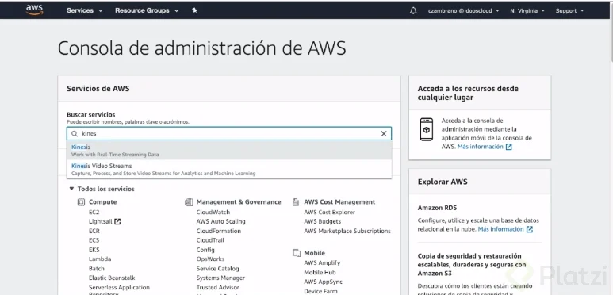

Si es la primera vez que visitas la herramienta de Kinesis debes dar click en el botón de Get Started para empezar.

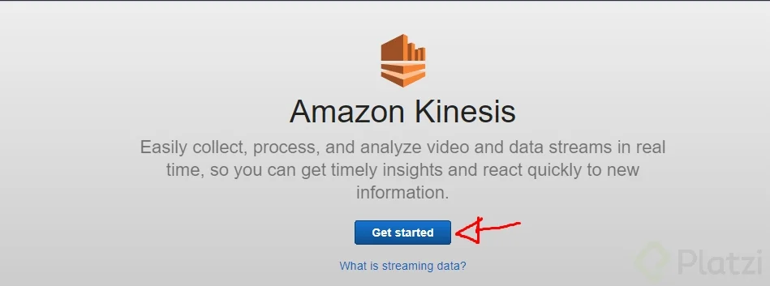

Dentro del dashboard de Kinesis debemos seleccionar la opción *Create delivery stream*.

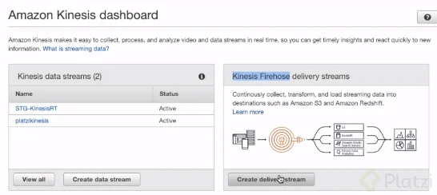

Lo primero que debemos hacer es ponerle un nombre a nuestro delivery stream, en este caso lo llamaremos *firehoseplatzi*.

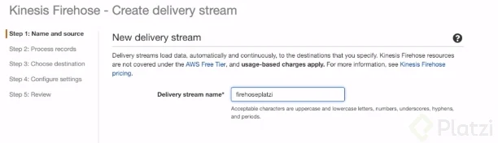 

Dentro de esa misma pantalla encontraremos dos opciones para alimentar nuestro delivery stream:

- Directamente por PUT u otros recursos.
- A través de un stream de kinesis.

La opción Direct PUT or other sources permite alimentar nuestro delivery stream mediante:

- La API de Firehose.
- Un Amazon Kinesis Agent.
- AWS IoT.
- CloudWatch Logs.
- CloudWatch Events.

Para fines de esta demo vamos a seleccionar **Direct PUT or other sources**. Damos click en *Next*

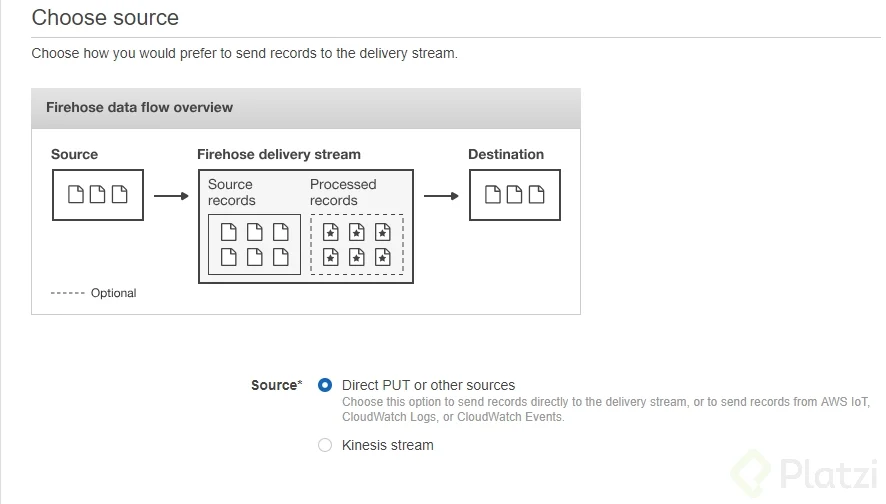

Nuestro siguiente paso es elegir la forma en que nuestro delivery stream va a procesar la información. Podemos modificar la información de dos formas:

1. Mediante una función lambda, en caso de no tener ninguna podemos crearla al momento.
2. Convertir la información a un formato más eficiente como Apache ORC o Apache parquet.

Para fines de esta demo no vamos a modificar nuestra información, simplemente nos aseguramos que se encuentren ambas opciones deshabilitadas y damos click en Next.

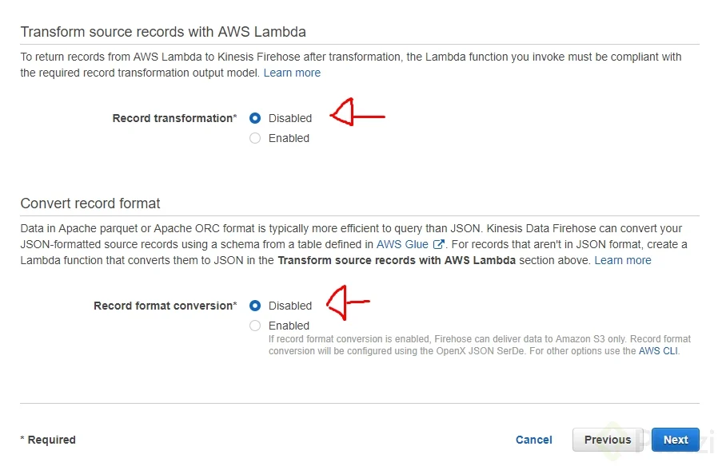

Ya configuramos el origen de los datos y su procesamiento, es momento de elegir a dónde se va a mandar la información:

- Amazon S3
- Amazon Redshift
- Amazon Elasticsearch Service
- Splunk

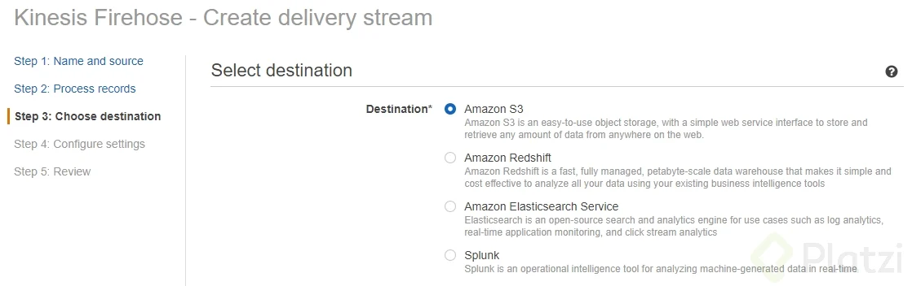

Dependiendo de qué opción elijamos vamos a tener que configurar su acceso. Para esta demo vamos a mandar nuestra información a S3, puedes darle al botón Create new para generar un nuevo Bucket de S3.

Puedes configurar el prefijo donde Kinesis va a almacenar la información, así como el prefijo donde almacene los errores.

Una vez hayamos elegido nuestro bucket damos click en *Next*.

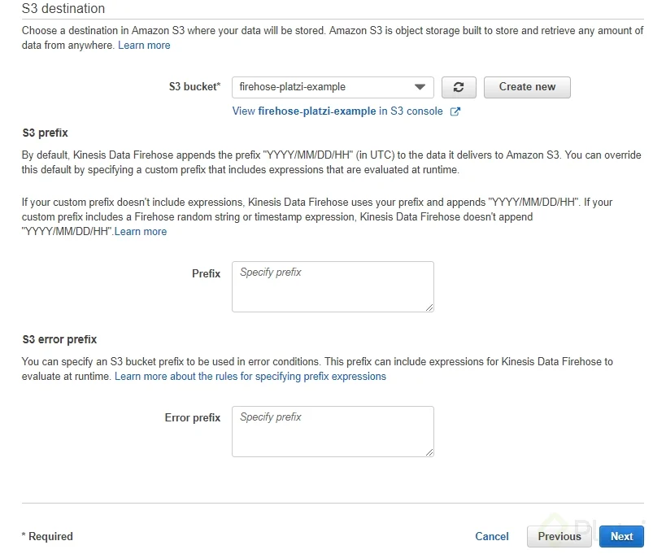

Nuestro último paso para terminar la configuración de nuestro delivery stream nos va a pedir configurar:

- Condiciones del Buffer para S3
- La compresión y encriptación de la información
- Activar o desactivar el error logging
- Asignar un rol IAM por seguridad

Lo único que vamos a modificar será el IAM role, esto con el fin de que Kinesis pueda interactuar con todos los demás servicios de AWS. Vamos a dar click al botón *Create new or choose*.

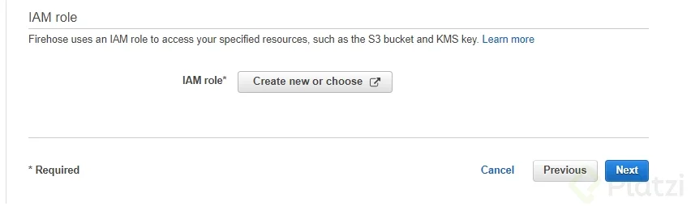

Nos va a saltar una nueva ventana que nos pedirá permiso para crear el nuevo IAM role, simplemente le damos al botón *Permitir*.

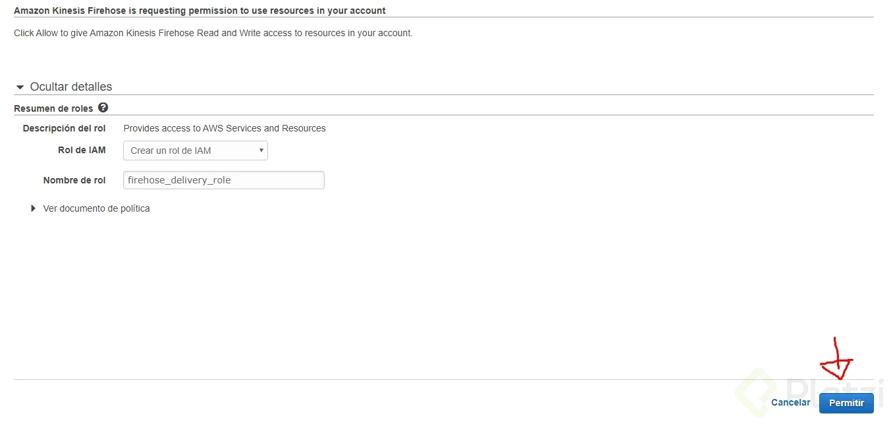

Nos debe quedar un IAM role de la siguiente manera, ahora damos click a *Next*.

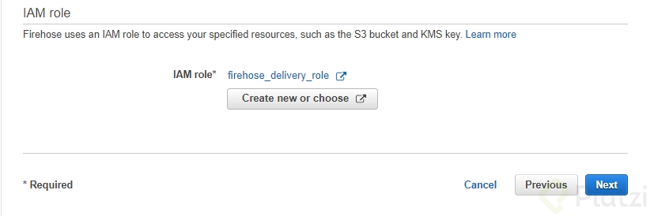

Nos aparecerá una review de la configuración del delivery stream, solamente damos click en el botón Create delivery stream.

Esperamos a que termine de crearse nuestro delivery stream y vamos a proceder a probar que nuestro delivery stream funcione correctamente. Damos click en el nombre de nuestro delivery.

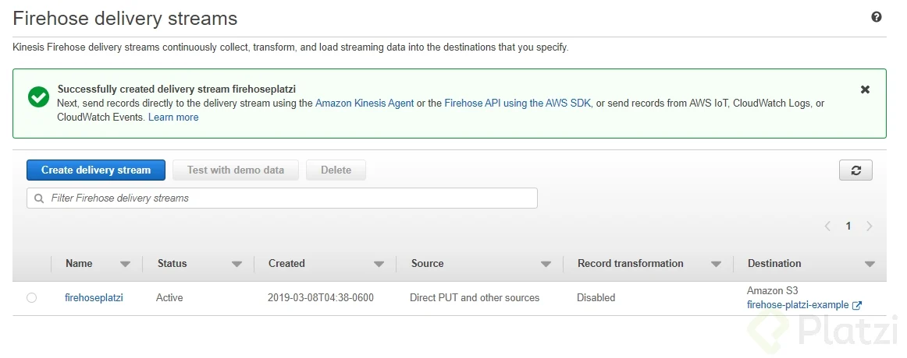

Nos encontraremos en una página con toda la información acerca de nuestro stream. Abajo del nombre veremos un texto que dice **Test with demo data**, le vamos a dar click y nos va a desplegar información sobre la prueba que va a realizar.

La prueba consta de mandar un simple archivo a nuestro S3. Debemos dar click en el botón *Start sending data* para iniciar la transmisión de información.

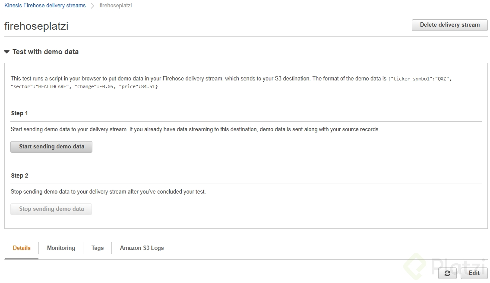

Este proceso puede llegar a tardar unos minutos, aproximadamente 3-5 minutos después vamos a dar click al enlace de nuestro bucket S3.

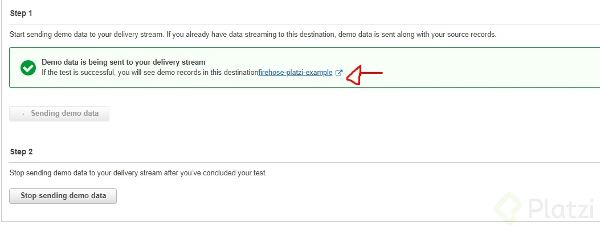

Si aún no encuentras nada de información dentro de tu bucket recuerda ser paciente, la velocidad de transmisión depende de la configuración que hicimos al buffer, en este caso dejamos la configuración por defecto de 5MB.

Tras unos minutos debe aparecerte una carpeta dentro de otra y otra, separando la información transmitida por su fecha. Dentro encontrarás el archivo que mandaste, solamente queda regresar a la prueba de nuestro stream y apretar el botón *Stop sending demo data*.

[Información dentro del Bucket](images/InformaciondentrodelBucket.png)

Si haz llegado hasta este parte con exito, agrega en los comentarios: “Reto superado” y continua aprendiendo más.

## AWS - MSK

**AWS MSK (Amazon Managed Streaming for Apache Kafka)** es un servicio totalmente administrado que permite **ejecutar y operar Apache Kafka** en AWS sin preocuparse por la administración de infraestructura.

### **📌 ¿Por qué usar AWS MSK?**  
✅ **Administración automática**: AWS se encarga de la configuración, aprovisionamiento y mantenimiento.  
✅ **Alta disponibilidad**: Replicación en múltiples zonas de disponibilidad (AZs).  
✅ **Integración con servicios AWS**: Kinesis, Lambda, IAM, CloudWatch, S3, Redshift, etc.  
✅ **Escalabilidad automática**: Ajusta automáticamente la capacidad del clúster según la carga de trabajo.

### **📌 Componentes de AWS MSK**  
1️⃣ **Cluster de Kafka**: Conjunto de brokers administrados.  
2️⃣ **Brokers**: Instancias que manejan la comunicación y el almacenamiento de mensajes.  
3️⃣ **Zookeeper**: Administra metadatos y la coordinación de Kafka.  
4️⃣ **Temas (Topics)**: Canales donde se publican y consumen los mensajes.  
5️⃣ **Productores y consumidores**: Aplicaciones que envían y reciben datos desde Kafka.

### **📌 Pasos para Configurar AWS MSK**  

### **1️⃣ Crear un clúster de Kafka en AWS MSK**  
Desde la consola de AWS:  
1. Ir a **Amazon MSK**.  
2. Hacer clic en **Crear clúster**.  
3. Elegir **MSK estándar** o **MSK Serverless**.  
4. Configurar el **número de brokers**, tipo de instancia y almacenamiento.  
5. Definir **redes y permisos de seguridad (VPC, subnets, SG, IAM, etc.)**.  
6. **Crear y lanzar el clúster**.  

🔹 **Ejemplo con AWS CLI**:  
```sh
aws kafka create-cluster --cluster-name MiKafkaCluster \
    --kafka-version 2.8.1 \
    --number-of-broker-nodes 3 \
    --broker-node-group-info file://broker-config.json
```

### **2️⃣ Crear un topic en MSK**  
Puedes hacerlo usando `kafka-topics.sh` desde una máquina con acceso al clúster:  

```sh
kafka-topics.sh --create --topic MiTopic --bootstrap-server <MSK_BROKER_URL> --partitions 3 --replication-factor 2
```

### **3️⃣ Conectar productores y consumidores**  
#### **🔹 Ejemplo de productor en Python (usando kafka-python)**
```python
from kafka import KafkaProducer

producer = KafkaProducer(bootstrap_servers=['MSK_BROKER_URL'])
producer.send('MiTopic', b'Hola desde AWS MSK!')
producer.flush()
```

#### **🔹 Ejemplo de consumidor en Python**
```python
from kafka import KafkaConsumer

consumer = KafkaConsumer('MiTopic', bootstrap_servers=['MSK_BROKER_URL'])
for message in consumer:
    print(f'Recibido: {message.value}')
```

### **📌 Monitoreo y Seguridad en AWS MSK**  
🔹 **CloudWatch**: Monitorea métricas de uso, latencia y errores.  
🔹 **IAM & VPC**: Controla accesos con políticas y redes privadas.  
🔹 **Cifrado**: Soporta TLS para datos en tránsito y en reposo.

### **📌 ¿MSK Serverless o MSK Standard?**  
🔹 **MSK Serverless** → Sin administración de brokers, pago por uso.  
🔹 **MSK Standard** → Personalizable, ideal para grandes cargas.

### **🚀 Conclusión**  
✅ **AWS MSK simplifica la ejecución de Kafka sin gestionar servidores.**  
✅ **Alta disponibilidad, escalabilidad automática y seguridad avanzada.**  
✅ **Ideal para streaming de datos en tiempo real, IoT, logs y análisis.**

**Resumen**

Es un nuevo servicio lanzado en el 2018 cuyas características son:

- Es un servicio que te permite tener Apache Kafka administrado en la nube.
- Se despliega en un clúster.
- Viene con la versión de Apache Kafka 1.1.1
- Debemos especificar la cantidad de nodos que va a crear.
- Por defecto va a desplegar un nodo de Zookeeper para mantener la configuración.

**Lecturas recomendadas**

[Listing All Clusters in an Account - Amazon Managed Streaming for Kafka](https://docs.aws.amazon.com/msk/latest/developerguide/cli-list-clusters.html)

[Apache Kafka](https://kafka.apache.org/)

[Introduction to Amazon Managed Streaming for Kafka (MSK) | AWS Online Tech Talks](https://pages.awscloud.com/Introduction-to-Amazon-Managed-Streaming-for-Kafka-MSK_1208-ABD_OD.html)

[Get the ZooKeeper Connection String for an Amazon MSK Cluster - Amazon Managed Streaming for Apache Kafka](https://docs.aws.amazon.com/es_es/msk/latest/developerguide/msk-get-connection-string.html)

## Demo - Despliegue de un clúster con MSK

Aquí tienes una guía paso a paso para desplegar un clúster de **AWS MSK (Managed Streaming for Apache Kafka)**.

### **📌 Pasos para Desplegar un Clúster MSK en AWS 🚀**  

### **1️⃣ Configurar una VPC para MSK**  
MSK requiere que los brokers estén en una **VPC privada** con **subnets en múltiples zonas de disponibilidad (AZs)**.  

1. Ve a la **Consola de AWS** > **VPC** > **Crear VPC**.  
2. Crea **3 subnets privadas** en diferentes AZs.  
3. Crea un **Security Group (SG)** con acceso en los puertos:  
   - **9092** (para comunicación sin TLS).  
   - **9094** (para comunicación con TLS).  
4. Configura un **IAM Role** con permisos de acceso a MSK.

### **2️⃣ Crear el Clúster MSK**  

#### **🔹 Desde la Consola de AWS**  
1. Ve a **Amazon MSK** > **Crear clúster**.  
2. Elige entre **MSK estándar** o **MSK Serverless**.  
3. Selecciona la versión de Kafka (recomendado: `2.8.1` o superior).  
4. Especifica la cantidad de **brokers** y el tipo de instancia (ejemplo: `kafka.m5.large`).  
5. Configura el almacenamiento (ejemplo: `100 GiB` por broker).  
6. Asigna la **VPC, subnets y Security Group** creados en el paso 1.  
7. **Habilita CloudWatch Logs** y métricas opcionales.  
8. **Crear clúster** y esperar a que esté **Activo**.  

#### **🔹 Creación con AWS CLI**  
Ejecuta el siguiente comando:  
```sh
aws kafka create-cluster --cluster-name MiKafkaCluster \
    --kafka-version 2.8.1 \
    --number-of-broker-nodes 3 \
    --broker-node-group-info file://broker-config.json
```

📌 **Ejemplo del archivo `broker-config.json`**:  
```json
{
    "InstanceType": "kafka.m5.large",
    "ClientSubnets": ["subnet-xxxxx", "subnet-yyyyy", "subnet-zzzzz"],
    "SecurityGroups": ["sg-xxxxxxx"],
    "StorageInfo": { "EbsStorageInfo": { "VolumeSize": 100 } }
}
```

### **3️⃣ Crear un Topic en MSK**  
Para **crear un topic**, usa `kafka-topics.sh`:  
```sh
kafka-topics.sh --create --topic MiTopic \
  --bootstrap-server <BROKER_MSK> \
  --partitions 3 --replication-factor 2
```

### **4️⃣ Conectar Productores y Consumidores**  
#### **🔹 Productor en Python (kafka-python)**
```python
from kafka import KafkaProducer

producer = KafkaProducer(bootstrap_servers=['BROKER_MSK'])
producer.send('MiTopic', b'Hola desde MSK!')
producer.flush()
```

#### **🔹 Consumidor en Python**
```python
from kafka import KafkaConsumer

consumer = KafkaConsumer('MiTopic', bootstrap_servers=['BROKER_MSK'])
for message in consumer:
    print(f'Recibido: {message.value}')
```

### **5️⃣ Monitoreo y Seguridad**  
✅ **CloudWatch** → Monitorea métricas de Kafka.  
✅ **IAM & Security Groups** → Controla accesos.  
✅ **Cifrado TLS** → Protege datos en tránsito.

### **🚀 Conclusión**  
Desplegar un **clúster MSK** en AWS es simple con **CloudFormation, AWS CLI o la consola**.

### Resumen

Para esta demo vas a necesitar los siguientes comandos:

```bash
aws kafka list-clusters --region us-east-1
aws kafka describe-cluster --region us-east-1 --cluster-arn
aws kafka get-bootstrap-brokers --region us-east-1 --cluster-arn [clústerARN]
```

**Lecturas recomendadas**

[List All Amazon MSK Clusters in an Account - Amazon Managed Streaming for Apache Kafka](https://docs.aws.amazon.com/es_es/msk/latest/developerguide/msk-list-clusters.html)

[Get the ZooKeeper Connection String for an Amazon MSK Cluster - Amazon Managed Streaming for Apache Kafka](https://docs.aws.amazon.com/es_es/msk/latest/developerguide/msk-get-connection-string.html)

## AWS - Glue

**AWS Glue** es un servicio **serverless** de AWS que facilita la **extracción, transformación y carga (ETL)** de datos en entornos de **Big Data**. Permite integrar fuentes como **S3, RDS, Redshift, DynamoDB, y más**, sin necesidad de administrar infraestructura.

### **🚀 Componentes Principales de AWS Glue**  

### **1️⃣ Catálogo de Datos (Glue Data Catalog)**  
Un **repositorio centralizado** donde se almacenan metadatos sobre fuentes de datos.  
📌 Compatible con **Athena, Redshift, EMR y otros servicios de AWS**.

### **2️⃣ Crawlers (Rastreador de Datos)**  
Detectan automáticamente **esquemas** y **estructura** de datos almacenados en S3, RDS, DynamoDB, etc.  

🔹 **Ejemplo de ejecución en AWS CLI**  
```sh
aws glue start-crawler --name MiCrawler
```

### **3️⃣ Jobs de ETL**  
Permiten escribir **scripts en Python o Scala** para transformar y mover datos.  

🔹 **Ejemplo de un Job en PySpark**
```python
import sys
from awsglue.transforms import *
from awsglue.utils import getResolvedOptions
from awsglue.context import GlueContext
from pyspark.context import SparkContext

sc = SparkContext()
glueContext = GlueContext(sc)

datasource = glueContext.create_dynamic_frame.from_catalog(
    database="mi_base", table_name="mi_tabla"
)

transformed_df = datasource.toDF().filter("columna1 IS NOT NULL")

glueContext.write_dynamic_frame.from_options(
    frame=transformed_df, connection_type="s3",
    connection_options={"path": "s3://mi-bucket/output/"},
    format="parquet"
)
```

### **4️⃣ Triggers y Workflows**  
Permiten **automatizar** la ejecución de Glue Jobs en base a eventos o programación.

### **🔥 Casos de Uso**  
✅ **Data Lakes** → Integración con **S3, Redshift, Athena**.  
✅ **ETL con Big Data** → Transformación de datos en **Spark** sin infraestructura.  
✅ **Migración de Bases de Datos** → Mover datos entre **DynamoDB, RDS, S3, Redshift**.  
✅ **Procesamiento en Streaming** → Con **Kinesis Data Streams**.

### **📌 Integración con otros Servicios de AWS**  
🔹 **Amazon S3** → Almacena datasets y resultados de ETL.  
🔹 **AWS Athena** → Permite consultas SQL sobre datos procesados.  
🔹 **AWS Redshift** → Carga datos transformados en un DWH.  
🔹 **Amazon RDS/DynamoDB** → Extrae y carga datos desde bases de datos relacionales o NoSQL.

### Resumen

Dentro de este módulo vamos a ver las herramientas que proporciona la nube de AWS para poder transformar nuestra data.

Algunas características de Glue:

- Servicio totalmente administrado para implementar ETL (Extract, Transform, Load).
- Provee un contexto para trabajar basados en Python, Spark y Scala.
- Se encarga de crear catálogos de metadatos para que otros servicios puedan consultar la información.
- Utiliza unidades de procesamiento llamadas DPU equivalente a 4 vCPU y 16GB RAM.
- Los Crawler van a escanear e identificar la información para ponerla en el catálogo.
- aws s3 Los Classifier van a clasificar la data para ponerla en el catálogo.

## Demo - Instalando Apache Zeppelin

Apache Zeppelin es un cuaderno de datos interactivo que admite múltiples intérpretes, como **Spark, Hive, Presto, Flink y más**. 

### 🛠️ **1. Requisitos previos**  
Antes de instalar, asegúrate de tener:  
✅ **Java 8+** (preferiblemente OpenJDK 8 o 11)  
✅ **Python** (si vas a usar PySpark)  
✅ **Git** (opcional, para clonar repositorios)

### 🏗️ **2. Descarga de Apache Zeppelin**  

Ejecuta los siguientes comandos en Linux/macOS:  
```bash
wget https://dlcdn.apache.org/zeppelin/0.10.1/zeppelin-0.10.1-bin-netinst.tgz
tar -xvzf zeppelin-0.10.1-bin-netinst.tgz
cd zeppelin-0.10.1-bin-netinst
```
📌 Para Windows, descarga el **ZIP** desde [la página oficial](https://zeppelin.apache.org/download.html) y extrae los archivos.

### 🚀 **3. Iniciar Zeppelin**  
Ejecuta:  
```bash
bin/zeppelin-daemon.sh start
```
Esto iniciará el servidor en `http://localhost:8080/`.

Si necesitas detener Zeppelin:  
```bash
bin/zeppelin-daemon.sh stop
```

### 🔧 **4. Configuración (Opcional)**
Si necesitas configurar intérpretes o cambiar el puerto:  
```bash
nano conf/zeppelin-site.xml
```
También puedes modificar `conf/zeppelin-env.sh` para definir variables de entorno, como **Java, Python o Spark**.

### 🎯 **5. Acceder a Zeppelin**  
Abre en tu navegador:  
➡️ `http://localhost:8080/`  

Desde aquí puedes crear cuadernos y ejecutar código en diferentes intérpretes.

### ⚡ **Integración con Spark**  
Si usas **Apache Spark**, asegúrate de definir `SPARK_HOME`:  
```bash
export SPARK_HOME=/ruta/a/spark
export PATH=$SPARK_HOME/bin:$PATH
```
Luego, en Zeppelin, en **Interpreter > Spark**, verifica que detecta Spark correctamente.

**Resumen**

Apache Zeppelin es un servicio que permite la ejecución de notebooks para análisis de datos utilizando SQL, Scala o Python. Tiene integración con los servicios de AWS.

**Usando la imagen oficial de Docker**

Asegúrese de que Docker esté instalado en su máquina local.

Utilice este comando para iniciar Apache Zeppelin en un contenedor.

`docker run -p 8080:8080 --rm --name zeppelin apache/zeppelin:0.12.0`

**Lecturas recomendadas**

[Apache Zeppelin 0.8.1 Documentation: Install](https://zeppelin.apache.org/docs/0.8.1/quickstart/install.html#starting-apache-zeppelin)

## Creación del Developer Endpoint

AWS Glue **Developer Endpoint** te permite ejecutar código interactivo para desarrollar, depurar y probar transformaciones de datos en AWS Glue usando **notebooks como Jupyter o Zeppelin**.

### 🏗️ **1. Prerrequisitos**
Antes de crear un **Developer Endpoint**, asegúrate de:  
✅ Tener una **VPC** y **subredes** configuradas.  
✅ Contar con un **rol de IAM** con permisos para AWS Glue y S3.  
✅ Tener configurado un **Security Group** con acceso a los servicios que usarás.  
✅ Haber creado una **clave SSH** para acceder al endpoint.

### 🚀 **2. Creación del Developer Endpoint en AWS Glue**
Puedes hacerlo desde la **Consola de AWS** o con **AWS CLI**.

### **📌 Desde la Consola de AWS**
1. Ve a **AWS Glue** en la Consola de AWS.  
2. En el panel de navegación, selecciona **Developer Endpoints**.  
3. Haz clic en **Create endpoint**.  
4. Configura los siguientes parámetros:
   - **Nombre** del Developer Endpoint.
   - **IAM Role** con permisos para Glue, S3 y acceso a logs.
   - **VPC y subred** donde se creará el endpoint.
   - **Security Groups** para controlar el acceso.
   - **Public Key SSH** para conectarte desde un cliente.
   - **Notebook Integration** (opcional, si quieres usar SageMaker o Jupyter).
5. Haz clic en **Create** y espera a que el endpoint se aprovisione.

### **📌 Desde AWS CLI**
Si prefieres crear el Developer Endpoint con **AWS CLI**, usa el siguiente comando:
```bash
aws glue create-dev-endpoint \
    --endpoint-name my-glue-dev-endpoint \
    --role-arn arn:aws:iam::123456789012:role/AWSGlueServiceRole \
    --public-key "ssh-rsa AAAAB3..." \
    --security-group-ids sg-0abc123456789 \
    --subnet-id subnet-0abc123456789 \
    --extra-python-libs-s3-path s3://my-bucket/libraries/ \
    --extra-jars-s3-path s3://my-bucket/jars/
```
📌 Reemplaza los valores según tu configuración.

### 🔌 **3. Conexión al Developer Endpoint**
### **📍 Conexión SSH**
Si agregaste una clave SSH, conéctate al endpoint con:
```bash
ssh -i my-key.pem glue@<DeveloperEndpointDNS>
```

### **📍 Conexión desde Jupyter Notebook**
Si habilitaste la integración con **SageMaker**, abre el **AWS SageMaker Notebook** asignado al Developer Endpoint y empieza a ejecutar código interactivo.

### 🎯 **4. Verificación**
Para verificar que el endpoint está activo:
```bash
aws glue get-dev-endpoint --endpoint-name my-glue-dev-endpoint
```
Si el estado es `READY`, ya puedes usarlo.

## 🎉 **¡Listo! Tu AWS Glue Developer Endpoint está configurado y listo para usarse. 🚀**  

### Resumen

### ¿Cómo crear un endpoint de desarrollador en AWS Glue? 

Configurar un endpoint de desarrollador en AWS Glue es un paso esencial para aquellos que buscan integrar Apache Zeppelin y ejecutar consultas dentro de la plataforma de AWS. Este proceso le permitirá realizar consultas de datos con eficiencia veamos cómo configurarlo correctamente.

### ¿Qué opciones ofrece la consola de AWS para notebooks?

Dentro de la consola de AWS, al explorar el servicio de Glue, encontrará la sección de notebooks. Aquí, AWS ofrece dos opciones principales:

- **SageMaker Notebooks**: Orientados al servicio de Machine Learning de AWS, SageMaker.
- **Zeppelin Notebooks**: Ideales para quienes desean utilizar Apache Zeppelin para sus consultas y análisis de datos.

Para nuestro propósito de conectar un Apache Zeppelin local, optaremos por crear un notebook basado en Zeppelin.

### ¿Cómo crear un endpoint de desarrollador en AWS Glue?

Para comenzar, deberá acceder a la sección de Developer Endpoints dentro del servicio Glue. Aquí es donde inicia la creación de un nuevo endpoint siguiendo estos pasos:

1. **Agregar un nuevo endpoint**: Al hacer clic en "Add Endpoint", se abre un formulario para configurar un nuevo endpoint. Le daremos el nombre "DevPlatziM" a nuestro endpoint.

2. **Seleccionar y configurar un rol de IAM**:

 - Debe contar con un rol de IAM que tenga permisos completos sobre los servicios de AWS Glue y acceso a S3, donde residirá su data.
 - Si no posee un rol, AWS le ofrece crear uno directamente desde la interfaz.

3. Configurar los parámetros de cómputo:

 - Es recomendable especificar una capacidad de cómputo baja al trabajar con endpoints de desarrollador, para optimizar recursos. En este ejemplo, utilizaremos cinco DPUs.
 
4. **Ajustes de seguridad y librerías**:

Puede especificar librerías de Python y JAR necesarias para el developer endpoint, cargándolas desde S3.

### ¿Cómo configurar las opciones de red y seguridad del endpoint?

La configuración de networking es crucial para garantizar una conexión segura y eficiente. Estas son algunas consideraciones:

- Desplegar dentro de una VPC: Aunque puede optar por una red genérica, si cuenta con VPCs privadas o públicas, puede seleccionar cuál desea utilizar.

- Generación de llaves SSH: Para conectar su Apache Zeppelin, necesitará llaves SSH:

 1. Acceda a su consola de comandos, regrese un directorio desde el de Zeppelin.
 2. Genere las llaves con el comando:
 
`ssh-keygen -t rsa -b 2048 -f platzi-llave`

 3. Se generarán dos archivos: platzi-llave (privada) y platzi-llave.pub (pública).
 
- Carga de la llave pública al endpoint:

 - Copie el contenido de platzi-llave.pub.
 - Péguelo en el campo correspondiente del endpoint para autorizar la conexión a la plataforma AWS.
 
Siguiendo estos pasos, tiene la base para integrar Apache Zeppelin con AWS Glue, potenciando su capacidad de análisis de datos. Este conocimiento no solo amplía sus habilidades técnicas, sino que también le posiciona para seguir explorando el fascinante mundo de la gestión de datos en la nube. ¡Continúe aprendiendo y explorando!

**Lecturas recomendadas**

[Trabajo con puntos de enlace de desarrollo en la consola de AWS Glue - AWS Glue](https://docs.aws.amazon.com/es_es/glue/latest/dg/console-development-endpoint.html)

[Tutorial: Set Up a Local Apache Zeppelin Notebook to Test and Debug ETL Scripts - AWS Glue](https://docs.aws.amazon.com/glue/latest/dg/dev-endpoint-tutorial-local-notebook.html)

## Demo - Conectando nuestro developer Endpoint a nuestro Zeppelin Edpoint

Para conectar tu **Developer Endpoint** de AWS Glue con un **Zeppelin Endpoint**, sigue estos pasos:

### **1. Crear un Developer Endpoint en AWS Glue**
Antes de conectar Apache Zeppelin, asegúrate de que tienes un **Developer Endpoint** de AWS Glue activo.

1. **Accede a la consola de AWS Glue**.
2. Ve a **"Developer Endpoints"** en el menú lateral.
3. **Crea un nuevo Developer Endpoint**, asegurándote de:
   - Seleccionar la versión correcta de Glue.
   - Especificar una VPC, subred y grupo de seguridad compatibles con tu Apache Zeppelin.
   - Activar el acceso SSH si necesitas conexión remota.
4. Una vez creado, copia la **dirección del endpoint** para usarla más adelante.

### **2. Configurar Apache Zeppelin en EC2**
Si no tienes un servidor Zeppelin configurado, puedes lanzar una instancia EC2 y configurarlo manualmente o utilizar EMR:

### **Opción 1: Instalar Zeppelin en una EC2 manualmente**
1. Lanza una **instancia EC2** (Amazon Linux o Ubuntu recomendado).
2. Conéctate a la instancia y ejecuta:
   ```bash
   sudo yum update -y
   wget https://downloads.apache.org/zeppelin/zeppelin-0.10.1-bin-netinst.tgz
   tar -xvzf zeppelin-*.tgz
   cd zeppelin-*
   ./bin/zeppelin-daemon.sh start
   ```
3. Asegúrate de abrir el puerto **8080** en los **grupos de seguridad** para acceder a Zeppelin en tu navegador.

### **Opción 2: Configurar Zeppelin en un clúster EMR**
1. En la consola de **Amazon EMR**, crea un nuevo clúster con:
   - Apache Spark habilitado.
   - **Apache Zeppelin activado** en la configuración.
2. Espera a que el clúster se inicialice y obtén la **URL de Zeppelin** desde la consola de EMR.

### **3. Conectar AWS Glue con Zeppelin**
Ahora que tienes **Zeppelin** y tu **Developer Endpoint**, sigue estos pasos:

1. Abre **Apache Zeppelin** en tu navegador.
2. Ve a **"Interpreter"** en la barra de configuración.
3. Agrega un nuevo **interpreter para PySpark** y configúralo con:
   - **Master**: `yarn`
   - **glue.endpoint**: La dirección de tu **Developer Endpoint** en AWS Glue.
   - **AWS Credentials**: Configura tus credenciales si es necesario.

4. Guarda los cambios y **reinicia Zeppelin**.

### **4. Validar la Conexión**
Ejecuta el siguiente código en un **nuevo notebook** en Zeppelin para probar la conexión con AWS Glue:

```python
sc.listFiles()
```
Si todo está bien, deberías ver una lista de archivos accesibles desde tu **Glue Developer Endpoint**.

### NOTA:

AWS **eliminó los Developer Endpoints en AWS Glue** a partir de **noviembre de 2023** y recomienda usar **AWS Glue Interactive Sessions** como alternativa.  

### **¿Qué hacer ahora?**  
Si antes usabas un **Developer Endpoint** para conectarte a Zeppelin, ahora puedes hacerlo de dos maneras:  

### **1. Usar AWS Glue Interactive Sessions** (Recomendado)  
AWS Glue ahora permite sesiones interactivas en **Notebooks Jupyter y Zeppelin** sin necesidad de un Developer Endpoint.  

#### **Pasos para usar Glue Interactive Sessions en Zeppelin**  

1. **Configura Zeppelin en una instancia EC2 o Amazon EMR**  
   - Si no tienes Zeppelin instalado, sigue los pasos en la [documentación oficial de Zeppelin](https://zeppelin.apache.org/docs/latest/).  
   - Si usas **Amazon EMR**, habilita **Zeppelin** en la configuración del clúster.  

2. **Habilita AWS Glue Interactive Sessions en Zeppelin**  
   - Abre Zeppelin y ve a **Interpreter**.  
   - Crea un nuevo intérprete con la siguiente configuración:  

     ```
     Name: glue
     Interpreter Group: spark
     zeppelin.spark.useHiveContext: true
     zeppelin.pyspark.python: python3
     spark.hadoop.fs.s3.impl: org.apache.hadoop.fs.s3a.S3AFileSystem
     ```

   - Guarda y reinicia Zeppelin.  

3. **Conéctate a Glue y prueba la sesión**  
   - Abre un nuevo **Notebook** en Zeppelin.  
   - Ejecuta el siguiente código para probar la conexión con AWS Glue:  

     ```python
     import sys
     from awsglue.context import GlueContext
     from pyspark.context import SparkContext

     sc = SparkContext()
     glueContext = GlueContext(sc)

     print(glueContext)
     ```

   - Si todo funciona correctamente, podrás ejecutar transformaciones en AWS Glue desde Zeppelin.

### **2. Usar AWS Glue Studio Notebooks**  
Si solo necesitas un entorno interactivo para procesar datos con Glue, ahora AWS recomienda usar **Glue Studio Notebooks** en la consola de AWS.  

#### **Cómo usar Glue Studio Notebooks**  
1. Ve a la **consola de AWS Glue**.  
2. Crea un nuevo **Job** y elige la opción **Notebook** en vez de Script.  
3. Ejecuta código en tiempo real usando AWS Glue sin necesidad de Zeppelin o Developer Endpoints.

### **Conclusión**  
- **Si usabas Developer Endpoints** → Usa **AWS Glue Interactive Sessions** en Zeppelin.  
- **Si quieres un entorno nativo de AWS** → Usa **AWS Glue Studio Notebooks**.  

Así puedes seguir trabajando con AWS Glue sin necesidad de los Developer Endpoints. 🚀

### Resumen

### ¿Cómo configurar Apache Zeppelin para un developer endpoint?

Conectar tu entorno de desarrollo local a un Developer Endpoint en AWS puede ser un poco desafiante si no se tiene experiencia previa, pero con estos pasos podrás configurarlo adecuadamente y sacar el máximo provecho a la capacidad de procesamiento de datos en la nube.

Primero, debes asegurarte de que tu developer endpoint esté en estado "ready". Desde el panel de conexión en AWS, toma nota de la dirección y detalles que necesitarás para hacer la conexión desde tu entorno local, Apache Zeppelin.

### ¿Cómo configurar el interpreter de Spark en Zeppelin?

Para trabajar con Spark desde Apache Zeppelin, lo que necesitas hacer es muy sencillo. Sigue estos pasos:

1. Abre Apache Zeppelin y dirígete a la sección de `Interpreters`.
2. Busca el interpreter para Spark y selecciona `Edit`.
3. Configura la propiedad `master` en `yarn client`. Si en las propiedades aparece `Spark executor memory` o `Spark driver memory`, elimínalas.
4. Configura un redireccionamiento de puerto al 9007 de localhost. Selecciona `connect to existing process` y establece `localhost` como host por el puerto `9007`.

### ¿Cómo conectar Apache Zeppelin local con el developer endpoint?

El siguiente paso es establecer la conexión SSH. Esto implica abrir un túnel entre tu máquina local y el developer endpoint. Aquí cómo:

1. Dirígete a la consola de AWS Glue y copia el comando SSH proporcionado.
2. Reemplaza la llave por tu llave privada local, asegurándote de especificar la ruta si no estás en el directorio correcto.
3. Ejecuta el comando en tu consola. Esto iniciará una conexión que permitirá ejecutar comandos en el endpoint.
4. Abre un nuevo comando SSH para trabajar con Scala. La mecánica es igual que el anterior, asegurándote de usar la llave correcta.

### ¿Cómo usar Apache Zeppelin para visualizar y analizar datos?

Después de establecer la conexión y verificar la ejecución de comandos básicos, puedes comenzar a utilizar la poderosa interfaz de Apache Zeppelin para realizar análisis más complejos.

1. Crea un nuevo notebook en Zeppelin y selecciona Spark como interpreter.
2. Ejecuta comandos y observa el resultado gráfico directamente desde tu notebook, apalancándote en la infraestructura en la nube para consultar y analizar la data en AWS.

Con este proceso, básicamente estás armando un entorno de trabajo robusto donde pueden analizarse grandes volúmenes de datos, permitiendo un análisis en tiempo real y un testing eficaz antes de pasar cualquier desarrollo a producción.

¿Listo para experimentar más con tus datos en la nube? ¡Continúa explorando y no dejes de aprender! El mundo de la transformación de datos es vasto y siempre hay algo nuevo por descubrir.

**Lecturas recomendadas**

[Tutorial: Set Up a Local Apache Zeppelin Notebook to Test and Debug ETL Scripts - AWS Glue](https://docs.aws.amazon.com/glue/latest/dg/dev-endpoint-tutorial-local-notebook.html)

## Demo - Creando nuestro primer ETL - Crawling

Para crear nuestro primer **ETL (Extract, Transform, Load) con Crawling** en AWS Glue, sigue estos pasos:  

### **1. Configurar AWS Glue y Crear un Crawler**
### **Paso 1: Crear una Base de Datos en Glue**
1. Inicia sesión en la consola de AWS.
2. Ve a **AWS Glue** > **Catálogo de Datos** > **Bases de datos**.
3. Haz clic en **Agregar Base de Datos**.
4. Ingresa un nombre, por ejemplo: `mi_etl_db`, y guarda los cambios.

### **Paso 2: Crear un Crawler**
1. Ve a **AWS Glue** > **Crawlers**.
2. Haz clic en **Crear Crawler**.
3. Ingresa un nombre, por ejemplo: `crawler_etl`.
4. En **Orígenes de datos**, selecciona:
   - **S3** si tienes archivos en un bucket.
   - **JDBC** si vas a extraer datos desde una base de datos relacional.
5. Agrega la ruta del bucket de S3 o la conexión JDBC.
6. En **Rol de IAM**, selecciona un rol con permisos de AWS Glue y S3.
7. En **Destino**, elige la base de datos `mi_etl_db`.
8. Configura la frecuencia de ejecución (manual o automática).
9. Guarda y **ejecuta el Crawler**.

### **2. Transformación de Datos con AWS Glue ETL**
### **Paso 3: Crear un Trabajo ETL**
1. Ve a **AWS Glue** > **Trabajos**.
2. Haz clic en **Agregar trabajo**.
3. En **Nombre**, coloca `etl_transformacion`.
4. En **Tipo**, selecciona `ETL con script de Python o Spark`.
5. En **Rol de IAM**, selecciona el mismo rol del Crawler.
6. En **Origen de datos**, elige la tabla creada por el Crawler.
7. En **Destino**, selecciona:
   - **S3** (para almacenar datos transformados).
   - **JDBC** (si deseas cargar en una base de datos relacional).
8. Guarda los cambios y edita el script de transformación.

### **3. Código de Transformación en PySpark**
Ejemplo de transformación con PySpark:
```python
import sys
from awsglue.transforms import *
from awsglue.utils import getResolvedOptions
from awsglue.context import GlueContext
from pyspark.context import SparkContext
from awsglue.dynamicframe import DynamicFrame

# Crear contexto de Glue
sc = SparkContext()
glueContext = GlueContext(sc)
spark = glueContext.spark_session

# Cargar datos desde Glue Data Catalog
datasource = glueContext.create_dynamic_frame.from_catalog(database="mi_etl_db", table_name="mi_tabla")

# Transformación: Filtrar datos nulos
transformed_data = DropNullFields.apply(frame=datasource)

# Guardar en S3 en formato Parquet
glueContext.write_dynamic_frame.from_options(
    frame=transformed_data,
    connection_type="s3",
    connection_options={"path": "s3://mi-bucket-transformado/"},
    format="parquet"
)
```

### **4. Cargar los Datos en un Destino**
Después de ejecutar el **trabajo ETL**, los datos transformados estarán en el destino configurado (S3, RDS, Redshift, etc.).

### **5. Ejecutar y Monitorear el ETL**
1. Ve a **AWS Glue** > **Trabajos**.
2. Selecciona `etl_transformacion` y haz clic en **Ejecutar**.
3. Monitorea el estado en **Historial de Ejecución**.

### Resumen

### ¿Cómo crear tu primer ETL con Apache Zeppelin y AWS Glue?

Iniciar en el mundo de la integración de datos y ETL (Extract, Transform, Load) puede ser abrumador, pero con herramientas como Apache Zeppelin y AWS Glue, este proceso se vuelve mucho más manejable. En este contenido, exploraremos cómo crear tu primer ETL y los pasos para craulear la data usando estos potentes servicios.

### ¿Cómo iniciar con AWS Glue y Apache Zeppelin?

Antes de comenzar, necesitas tener Apache Zeppelin instalado localmente y conectado a tu desarrollador de AWS Glue. Una vez que esto está configurado, el siguiente paso es aprender a crear tu primer ETL en fases. En esta guía, nos enfocaremos en cómo craulear la data inicial para transformación, comenzando por AWS Glue.

### ¿Qué es un crawler en AWS Glue y cómo se usa?

Un crawler en AWS Glue es una tarea automática que permite identificar y catalogar la data desde un bucket en S3. El proceso es el siguiente:

1. **Crea tu bucket de origen en S3**:

 - Dirígete a Servicios en la consola de AWS.
 - Crea un bucket llamado origen-platzi.
 - Sube los archivos descargados desde el repositorio de GitHub en la carpeta JSON.

2. **Configura un nuevo crawler en AWS Glue**:

 - Accede al servicio Glue en AWS.
 - En Crawlers, agrega un nuevo crawler llamado `Platzi Crawler`.
 - Especifica el origen como el bucket de S3 que creaste (`origen-platzi`).
 - Configura el crawler para ejecutarse bajo demanda.

3. **¿Cómo se realiza el proceso de crauleo?**

 - Ejecuta el crawler para que identifique y catalogue la data JSON en el Glue Catalog.
 - El Glue Catalog almacena los metadatos, permitiendo su uso por otros servicios como Athena.

### ¿Cómo se gestiona el Glue Catalog para tu data?

Una vez que se completa la operación del crawler, este crea tablas a partir de tus archivos JSON en una base de datos dentro del Glue Catalog. Todo el proceso se refleja de la siguiente manera:

- Revisa las tablas creadas en el Glue Catalog bajo tu base de datos PlatziDB.
- Usa servicios como Athena para consultar estas tablas y entender la estructura y contenido de tu data.

### ¿Cómo continuar con la transformación de data?

Una vez cargada la data en el Glue Catalog, el siguiente paso es transformarla y visualizarla nuevamente. Este proceso puede realizarse con ETL scripts más avanzados junto con herramientas de consulta como Athena.

### Recomendaciones Prácticas

- **Revisa la documentación de AWS Glue y Apache Zeppelin regularmente**, ya que ambos servicios son actualizados frecuentemente con nuevas características.
- **Explora ejemplos prácticos en GitHub**: utilizar repositorios con ejemplos listos puede ayudarte a comprender el proceso completo de ETL.
- **Ejecuta pruebas en un entorno sandbox para familiarizarte con los errores comunes** y comprender cómo solucionarlos antes de implementarlo en producción.

Con estas guías y herramientas, estarás en camino de dominar la ingeniería de datos y explorar las posibilidades vastas que AWS y Apache Zeppelin ofrecen. ¡Sigue profundizando en cada paso, mantén tu curiosidad y expande tus habilidades!

**Lecturas recomendadas**

[Código de ejemplo: union de los datos y establecimiento de relaciones entre ellos - AWS Glue](https://docs.aws.amazon.com/es_es/glue/latest/dg/aws-glue-programming-python-samples-legislators.html)

[GitHub - czam01/glue-examples](https://github.com/czam01/glue-examples)

## Demo - Creando nuestro primer ETL - Ejecución

Para ejecutar tu primer **ETL (Extract, Transform, Load)** en **AWS Glue**, sigue estos pasos:

### **1️⃣ Crear un Job en AWS Glue**
1. **Accede a AWS Glue** desde la consola de AWS.
2. En el menú izquierdo, selecciona **"Jobs"** y haz clic en **"Create job"**.
3. Configura:
   - **Nombre del Job**: Un nombre descriptivo.
   - **IAM Role**: Un rol con permisos para acceder a S3 y Glue.
   - **Tipo de script**: Python o Scala.
   - **Ubicación del código**: Puedes escribirlo en la consola o almacenarlo en S3.

### **2️⃣ Escribir el código del ETL**
Ejemplo en **Python** usando **AWS Glue DynamicFrames**:

```python
import sys
from awsglue.transforms import *
from awsglue.utils import getResolvedOptions
from pyspark.context import SparkContext
from awsglue.context import GlueContext
from awsglue.job import Job

# Inicializar contexto de Glue
args = getResolvedOptions(sys.argv, ['JOB_NAME'])
sc = SparkContext()
glueContext = GlueContext(sc)
spark = glueContext.spark_session
job = Job(glueContext)
job.init(args['JOB_NAME'], args)

# Extraer datos desde S3
datasource = glueContext.create_dynamic_frame.from_options(
    format_options={"multiline": True},
    connection_type="s3",
    format="json",
    connection_options={"paths": ["s3://mi-bucket/input/"], "recurse": True},
)

# Transformar datos
transformed_df = datasource.toDF()
transformed_df = transformed_df.withColumnRenamed("old_column", "new_column")

# Cargar datos a S3
output_dyf = DynamicFrame.fromDF(transformed_df, glueContext, "output_dyf")
glueContext.write_dynamic_frame.from_options(
    frame=output_dyf,
    connection_type="s3",
    connection_options={"path": "s3://mi-bucket/output/"},
    format="parquet"
)

job.commit()
```

### **3️⃣ Ejecutar el Job**
1. Guarda el script en **S3** o en el editor de Glue.
2. En la consola de **AWS Glue**, selecciona el **Job** creado.
3. Haz clic en **"Run Job"** y monitorea su ejecución en **"Runs"**.

### **4️⃣ Monitorear la Ejecución**
- Ve a **AWS Glue → Jobs → Runs** para ver el estado del Job.
- Revisa **AWS CloudWatch Logs** para depurar errores.

📌 **Opcional:** Automatiza la ejecución con **AWS Lambda** o **AWS Step Functions** si deseas que el ETL corra periódicamente. 🚀

### Resumen

### ¿Cómo conectarse a AWS Glue para ejecutar tareas ETL?

Amazon Glue es un servicio de ETL (extracción, transformación y carga) totalmente administrado que permite a los usuarios preparar y cargar sus datos para análisis. A lo largo de este artículo, exploraremos un escenario práctico sobre cómo configurar un entorno de desarrollo, verificar conexiones y ejecutar tareas de transformación en AWS Glue. Aquí vamos.

### ¿Cómo configurar un entorno de desarrollo para AWS Glue?

En este caso, el primer paso es asegurarse de que su entorno de desarrollo esté correctamente conectado. Para lograrlo, debemos establecer un túnel SSH al endpoint de desarrollo. Estos son los pasos básicos:

1. **Configurar el túnel SSH**: Utilice la llave privada y el endpoint de desarrollo proporcionado por AWS Glue. Abra la consola, seleccione el endpoint de desarrollo y copie el comando para iniciar el túnel. Asegúrese de que la llave privada esté disponible y ejecútelo.

3. **Verificar la conexión desde Zeppelin**: Una vez configurado el túnel, es crucial verificar que tienes sincronización con los datos almacenados en S3. Actualiza tu instancia de Zeppelin y confirma que está conectada con S3.

### ¿Cómo crear y ejecutar un contexto de Glue?

El siguiente paso después de la configuración del entorno de desarrollo es crear el contexto de Glue, el cual establece la conexión y carga las librerías necesarias para la ejecución de las tareas ETL. Aquí te explicamos cómo hacerlo:

1. **Crear el Glue Context**: Copia el comando para crear el Glue Context desde los ejemplos proporcionados en los enlaces del curso. Ve a tu interfaz de Zeppelin, pega la información y ejecútala.

3. **Crear un Dynamic Frame**: Con el Glue Context en marcha, el siguiente comando es crear un Dynamic Frame, que permitirá identificar y manipular los datos desde la base de datos PlatziDB y la tabla 'persons-json'. Esto implica realizar la conexión al catálogo Glue y verificar la cantidad de registros disponibles y su esquema.

### ¿Cómo corregir errores durante la ejecución de comandos?

Mientras se ejecutan comandos, es posible que te encuentres con errores. A continuación te mostramos cómo abordarlos:

1. **Agregar comandos que faltan**: Si un comando no se ejecuta correctamente, verifica que todas las librerías necesarias estén importadas. Puedes crear un nuevo bloque en Zeppelin donde especifiques que estás trabajando con PySpark y luego ejecutar el comando completo con todas las librerías. 
2. **Usar la consola SSH para debuggin**g: Si los errores persisten, puedes intentar conectarte a PySpark a través de SSH. Ejecuta los comandos línea por línea a través de la CLI, lo cual puede facilitar la identificación de errores y otros problemas.

### ¿Cómo realizar consultás directas para depuración?

Exploremos la opción de conectarse al developer endpoint a través de SSH para hacer un troubleshooting más detallado:

- **Conexión vía SSH**: En caso de que encuentres errores al usar Zeppelin, puedes optar por conectarte directamente a PySpark a través de SSH. Una vez conectado, ejecuta las consultas directamente desde la CLI.

- **Validar resultados en la CLI**: Ejecutando las consultas de esta manera, tendrás oportunidad de ver los resultados en tiempo real, incluyendo errores o advertencias que puedan surgir durante la ejecución.

Este enfoque te permitirá ejecutar análisis, solucionar errores y planificar los siguientes pasos en la arquitectura de datos de AWS Glue. Sigue explorando e integrando tus datos para maximizar su valor y seguir aprendiendo en el emocionante mundo de la ingeniería de datos.

**Lecturas recomendadas**

[aws-glue-samples/join_and_relationalize.md at master · aws-samples/aws-glue-samples · GitHub](https://github.com/aws-samples/aws-glue-samples/blob/master/examples/join_and_relationalize.md)

[GitHub - czam01/glue-examples](https://github.com/czam01/glue-examples)

## Demo - Creando nuestro primer ETL - Carga

La fase de **carga** en un proceso ETL consiste en almacenar los datos transformados en un destino adecuado, como Amazon S3, Amazon Redshift, DynamoDB, o una base de datos relacional en RDS. 

A continuación, te muestro cómo realizar la **carga de datos en S3** y otras opciones:

### **1️⃣ Cargar los datos transformados en S3 (Parquet, CSV, JSON)**  
Si en la fase de transformación trabajaste con un **DynamicFrame** en AWS Glue, puedes cargarlo a S3 usando:

```python
glueContext.write_dynamic_frame.from_options(
    frame=output_dyf,  # DynamicFrame transformado
    connection_type="s3",
    connection_options={"path": "s3://mi-bucket/output/"},
    format="parquet"  # También puedes usar "csv" o "json"
)
```
📌 **Opciones de formato:**
- `"parquet"` (Recomendado para analítica)
- `"json"`
- `"csv"` (Puede requerir opciones adicionales como delimitador)

### **2️⃣ Cargar los datos en Amazon Redshift**
Si deseas cargar los datos en **Amazon Redshift**, usa **JDBC** con `connection_options`:

```python
glueContext.write_dynamic_frame.from_jdbc_conf(
    frame=output_dyf,
    catalog_connection="redshift-connection",
    connection_options={
        "database": "mi_base",
        "dbtable": "mi_tabla",
        "redshiftTmpDir": "s3://mi-bucket/temp-dir/"
    },
    redshift_tmp_dir="s3://mi-bucket/temp-dir/",
    transformation_ctx="datasink4"
)
```
✅ **Requisitos para Redshift:**
- Un **Cluster Redshift** con una tabla creada.
- Conexión JDBC en **AWS Glue Connections**.
- Permisos en el **IAM Role** para escribir en Redshift.

### **3️⃣ Cargar los datos en Amazon DynamoDB**
Para almacenar datos en una **tabla de DynamoDB**, usa:

```python
glueContext.write_dynamic_frame.from_options(
    frame=output_dyf,
    connection_type="dynamodb",
    connection_options={"dynamodb.output.tableName": "mi_tabla_dynamodb"}
)
```
📌 **Consideraciones:**
- Asegurar que la tabla en DynamoDB ya exista.
- Configurar permisos de escritura en DynamoDB.

### **4️⃣ Ejecutar y Monitorear la Carga**
Después de agregar la carga en el **script de AWS Glue**, sigue estos pasos:
1. **Guarda el script** en la consola de AWS Glue o en S3.
2. **Ejecuta el Job** desde la consola de Glue.
3. **Monitorea la ejecución** en **AWS Glue > Jobs > Runs**.
4. **Revisa logs en CloudWatch** en caso de errores.

### **🚀 Conclusión**
- **S3:** Ideal para almacenamiento escalable en formatos Parquet, JSON o CSV.
- **Redshift:** Para cargas analíticas y BI.
- **DynamoDB:** Para almacenamiento en NoSQL con alta disponibilidad.

Si necesitas optimizar la carga, considera **particionar los datos en S3** o **usar COPY en Redshift**.

### Resumen

### ¿Cómo crear y gestionar un Job en AWS Glue?

Al trabajar con grandes volúmenes de datos, la transformación de los mismos es clave. Amazon Web Services (AWS) Glue permite automatizar y escalar estas tareas de transformación mediante sus Jobs. Descubre cómo configurar y ejecutar un Job de ETL usando Glue y sigue paso a paso para optimizar tus datos.

### ¿Qué es un Job en AWS Glue?

Un Job en AWS Glue es un componente encargado de transformar datos. Son procesos que consisten en código de transformación que manipula los datos según se requiera. Estos son algunos pasos clave para configurar y utilizar un Job de AWS Glue:

1. **Creación del Job**:

 - Accede a la consola de AWS Glue y selecciona "Jobs".
 - Haz clic en "Agregar Job" y asigna un nombre, por ejemplo, "Platzi ETL".
 - Define el rol de IAM utilizado, como "AWS Glue Service Role Platzi".
 - Elige el tipo de ejecución, ya sea Spark o Python Shell. En este caso, seleccionamos Spark.

2. Configuración de Script:

 - Proporciona un nuevo script Python para el ETL.
 - Aprovecha las propiedades avanzadas para ajustar configuraciones como marcas de trabajo o tiempos de espera.

### Transformaciones ETL:

 - Edita el script Python para definir el Glue Context y especificar detalles del ETL.
 - Cambia el nombre de la base de datos y especifica directorios de salida en S3.

### ¿Cómo realizar transformaciones con Glue?
Para comenzar la transformación de datos, es importante definir al menos tres operaciones básicas:

1. **Creación de Dynamic Frames**: Son estructuras que permiten a Glue identificar y gestionar orígenes de datos para transformaciones dinámicas.

2. **Operaciones de datos**:

 - Eliminar o renombrar columnas que no son necesarias.
 - Uniones (Joins) entre tablas para consolidar información de distintas fuentes.
 
```python
# Ejemplo de un Join en el script Python de Glue
joined_data = DynamicFrame.fromDF(
    memberships_df.join(persons_df, memberships_df.id == persons_df.personid),
    glueContext,
    "joined_data"
)
```

2. **Escritura y Formato**:

 - Escribe los datos procesados en formato Parquet, que optimiza espacio y rendimiento.
 - Define el destino de escritura en S3 y particiona archivos según sea necesario.

### ¿Cómo automatizar y optimizar la ejecución de Jobs?

Automatizar la ejecución de Jobs es fundamental para optimizar el tiempo y recursos en un entorno profesional:

 - **Uso de Crawler**: Después de transformar los datos, un Crawler actualiza la metadata en AWS Glue Data Catalog.
 - **Automatización con SDK de AWS**: Orquesta ejecuciones automáticamente, maneja errores y asegura reintentos en caso de fallas.

### ¿Qué sucederá una vez finalizado el Job?
Una vez ejecutado el Job exitosamente, puedas verificar en S3 que los archivos se actualicen según lo previsto.

 - Comprueba el estado del job en la consola de AWS Glue. Debe mostrar 'succeeded' si se completó con éxito.
 - Verifica la estructuración y calidad de los datos transformados usando servicios como AWS Atena.

Las operaciones realizadas a través de AWS Glue son una vía poderosa y automatizada para manejar grandes volúmenes de datos. Estos pasos proporcionan un marco básico que se puede expandir y personalizar según las características y necesidades de cada proyecto de Big Data. ¡Continúa explorando y aprendiendo para maximizar el potencial de tus proyectos con AWS Glue y más!

## AWS - EMR

AWS **Elastic MapReduce (EMR)** es un servicio en la nube que facilita el procesamiento de **grandes volúmenes de datos** utilizando **frameworks de Big Data** como **Apache Spark, Hadoop, Hive, Presto, HBase y Flink**. Se usa principalmente para análisis de datos, machine learning y procesamiento ETL.

### **🚀 Características clave de AWS EMR**
1. **Escalabilidad automática**: Ajusta la capacidad de los clusters según la demanda.
2. **Soporte para múltiples frameworks**: Hadoop, Spark, Hive, Presto, Flink, etc.
3. **Integración con AWS**: Se conecta fácilmente con S3, RDS, DynamoDB, Redshift y otros servicios.
4. **Administración simplificada**: AWS gestiona la configuración y el mantenimiento de los clusters.
5. **Pago por uso**: Paga solo por los recursos utilizados.

### **📌 Arquitectura de EMR**
Un clúster de EMR está compuesto por **tres tipos de nodos**:

1. **Master Node**: Controla la ejecución del clúster y distribuye tareas.
2. **Core Nodes**: Procesan los datos y almacenan información en HDFS.
3. **Task Nodes** *(opcional)*: Solo ejecutan tareas sin almacenar datos.

### **💻 Pasos para crear un clúster EMR en AWS**
### **1️⃣ Configuración inicial**
- Ve a la **consola de AWS** y busca **Amazon EMR**.
- Haz clic en **"Create cluster"**.

### **2️⃣ Elegir un método de despliegue**
- **EMR on EC2**: Cluster en instancias EC2.
- **EMR on EKS**: Cluster gestionado en Kubernetes.
- **EMR Serverless**: Ejecución sin necesidad de administrar servidores.

### **3️⃣ Configurar el clúster**
- **Nombre del clúster**: Ej. `mi-cluster-emr`.
- **Versión de EMR**: Ej. `6.9.0` (con Apache Spark, Hadoop, etc.).
- **Aplicaciones**: Selecciona los frameworks que necesitas (Spark, Hive, HBase, Presto, etc.).
- **Tipo de instancias EC2**: Ej. `m5.xlarge` (depende de la carga de trabajo).
- **Cantidad de nodos**:
  - 1 Master Node
  - 2+ Core Nodes (según el tamaño del clúster)

### **4️⃣ Configurar almacenamiento**
- **S3**: Para almacenar los datos de entrada y salida.
- **HDFS**: Sistema de archivos distribuido dentro del clúster.

### **5️⃣ Configurar networking**
- Selecciona la **VPC**, **subred** y **grupo de seguridad**.

### **6️⃣ Opciones avanzadas**
- **Auto-terminación**: Configura si el clúster debe apagarse tras completar la tarea.
- **Spot Instances**: Reduce costos usando instancias Spot.
- **IAM Roles**: Define permisos para acceder a S3, Glue, DynamoDB, etc.

### **7️⃣ Lanzar el clúster**
- Revisa la configuración y haz clic en **"Create cluster"**.

### **📊 Ejecutar trabajos en EMR**
### **1️⃣ Desde la consola AWS**
- Ve a **Clusters EMR** > **Actions** > **Submit Step**.
- Elige el tipo de trabajo (`Spark`, `Hive`, `Hadoop`, etc.).
- Sube el código o referencia un archivo en **S3**.

### **2️⃣ Desde AWS CLI**
Ejecutar un script PySpark en EMR:

```bash
aws emr add-steps --cluster-id j-XXXX \
    --steps Type=Spark,Name="MySparkJob",ActionOnFailure=CONTINUE,Args=[--deploy-mode,client,--master,yarn,s3://mi-bucket/scripts/job.py]
```

### **3️⃣ Con Jupyter Notebook en EMR**
- Activa **EMR Notebooks** para ejecutar código interactivo en un **Notebook Jupyter**.

### **🛠 Integraciones con otros servicios de AWS**
✅ **S3**: Almacenamiento de datos de entrada y salida.  
✅ **Glue**: Catálogo de datos y transformación ETL.  
✅ **Athena**: Consulta de datos sin servidores en S3.  
✅ **Redshift**: Integración con data warehouses.  
✅ **CloudWatch**: Monitoreo y logs del clúster.  

### **📌 Casos de uso de EMR**
✅ **Análisis de datos masivos**: Logs, sensores IoT, datos de redes sociales.  
✅ **ETL**: Extracción, transformación y carga de grandes volúmenes de datos.  
✅ **Machine Learning**: Entrenamiento de modelos con Spark MLlib.  
✅ **Procesamiento en tiempo real**: Con Apache Flink o Spark Streaming.

### **💰 Costos de AWS EMR**
- Basado en **pago por hora** según el tipo de instancia EC2 y el número de nodos.
- Puedes ahorrar usando **Spot Instances** o **EMR Serverless**.

💡 **Simula los costos en la calculadora de AWS**:  
[🔗 AWS Pricing Calculator](https://calculator.aws/#/)

### **🎯 Conclusión**
AWS EMR es una **solución poderosa y escalable** para procesar **Big Data** en la nube con **Spark, Hadoop y otros frameworks**. Su facilidad de integración con S3, Glue, Redshift y otros servicios lo hace ideal para empresas que manejan grandes volúmenes de información.

**Resumen**

Elastic MapReduce o EMR es un clúster en el cual podemos correr cargas muy grandes de trabajo.

- Estos clusters son instancias de EC2 basadas en Hadoop.
- Provee interacción con otros servicios de AWS como S3, RedShift, DynamoDB y Kinesis.
- Contamos con acciones Bootstrap, estos son scripts que se van a ejecutar al iniciar un clúster.
- Podemos ejecutar de manera ordenada distintos scripts utilizando Step.

## Demo - Desplegando nuestro primer clúster con EMR

Aquí tienes una guía paso a paso para **desplegar tu primer clúster en AWS EMR**.

### **🚀 Desplegar un Clúster EMR en AWS**
Un clúster de **Elastic MapReduce (EMR)** en AWS permite ejecutar frameworks de **Big Data** como **Apache Spark, Hadoop, Hive y Presto** para procesamiento de datos a gran escala.

### **1️⃣ Configurar el Clúster desde la Consola AWS**
### **1.1 Ir a Amazon EMR**
1. Accede a la consola de AWS.
2. Busca "EMR" en la barra de búsqueda y selecciona **Amazon EMR**.
3. Haz clic en **"Crear clúster"**.

### **1.2 Elegir el Tipo de Despliegue**
AWS EMR ofrece tres opciones:
- **EMR en EC2**: Clúster con instancias EC2 (recomendado para control total).
- **EMR en EKS**: Para ejecutar EMR sobre Kubernetes.
- **EMR Serverless**: Sin necesidad de gestionar servidores.

Para este caso, elegiremos **EMR en EC2**.

### **1.3 Configurar el Clúster**
#### **🔹 Configuración básica**
- **Nombre del clúster**: `mi-cluster-emr`
- **Versión de EMR**: Se recomienda la última estable (ej. `6.9.0`).
- **Aplicaciones**:
  - Apache Spark (si trabajas con análisis de datos y ML)
  - Hadoop, Hive, Presto (para procesamiento ETL)
- **Modo de despliegue**: `Clúster estándar` (para un entorno persistente).

#### **🔹 Configuración de la Red**
- **VPC**: Selecciona la VPC donde correrá el clúster.
- **Subred**: Elige una subred disponible.
- **Grupo de seguridad**: Usa los predeterminados o crea uno personalizado.

#### **🔹 Configurar los Nodos del Clúster**
Un clúster EMR tiene tres tipos de nodos:

| Tipo de Nodo  | Función  | Cantidad recomendada  |
|--------------|---------|----------------------|
| **Master** | Coordina las tareas del clúster. | `1` |
| **Core** | Procesa datos y almacena en HDFS. | `2+` |
| **Task (Opcional)** | Solo ejecuta tareas, no almacena datos. | `0+` |

**Ejemplo de configuración**:
- **Master Node**: `m5.xlarge`
- **Core Nodes**: `2` x `m5.xlarge`
- **Task Nodes**: Opcional

#### **🔹 Configuración de Almacenamiento**
- **S3 Bucket**: Para almacenar logs y resultados de procesamiento.
- **HDFS**: Para almacenamiento distribuido dentro del clúster.

#### **🔹 Configuración Avanzada**
- **IAM Roles**: `EMR_DefaultRole` (asegúrate de que tenga permisos adecuados para acceder a S3, DynamoDB, etc.).
- **Auto-terminación**: Habilitar si solo necesitas el clúster temporalmente.
- **Spot Instances**: Reducir costos usando instancias Spot para los nodos de cómputo.

### **1.4 Crear y Lanzar el Clúster**
- **Revisar configuración** y hacer clic en **"Crear clúster"**.
- El clúster tardará **de 5 a 15 minutos** en iniciarse.

### **2️⃣ Ejecutar un Trabajo en el Clúster**
Una vez desplegado el clúster, puedes ejecutar trabajos de **Spark, Hadoop, Hive, Presto, etc.**.

### **2.1 Enviar una tarea desde la consola AWS**
1. Ve a **Clusters EMR**.
2. Selecciona tu clúster y haz clic en **"Submit Step"**.
3. Elige el tipo de tarea (Ejemplo: Spark, Hive, etc.).
4. Especifica la ubicación del script (ejemplo: `s3://mi-bucket/scripts/job.py`).
5. Ejecuta el trabajo.

### **2.2 Ejecutar un Trabajo con AWS CLI**
Si prefieres la línea de comandos:

```bash
aws emr add-steps --cluster-id j-XXXX \
    --steps Type=Spark,Name="MySparkJob",ActionOnFailure=CONTINUE,Args=[--deploy-mode,client,--master,yarn,s3://mi-bucket/scripts/job.py]
```

### **2.3 Conectar Jupyter Notebook a EMR**
Para ejecutar código interactivo:
1. En la consola AWS, ve a **EMR** > **Notebooks** > **Create Notebook**.
2. Conéctalo al clúster EMR.
3. Escribe código en PySpark dentro del Notebook.

### **3️⃣ Monitorear y Detener el Clúster**
Para revisar logs y estado del clúster:
- **CloudWatch Logs**: Ver registros de ejecución.
- **Cluster UI**: Acceder a interfaces como Spark UI.

Para **detener el clúster** y evitar costos adicionales:
```bash
aws emr terminate-clusters --cluster-ids j-XXXX
```

### **🎯 Conclusión**
AWS EMR es una solución poderosa para ejecutar **Big Data y procesamiento ETL** en la nube. Siguiendo estos pasos, puedes desplegar y ejecutar tu primer clúster de forma eficiente.

**Resumen**

EMR tiene una gran cantidad de versiones, lo que cambia entre una versión y otra son las herramientas de software que contiene. Para esta demo utilizaremos la versión 5.20.0.

Un clúster de EMR se compone de:

- Master Nodes
- Core Nodes
- Task Nodes

## Demo - Conectándonos a Apache Zeppelin en EMR

Apache Zeppelin es una interfaz basada en web que permite interactuar con **Spark, Hive y Presto** en **AWS EMR**. Sigue estos pasos para conectarte a Zeppelin en tu clúster EMR. 

### **1️⃣ Configurar Zeppelin al Crear el Clúster EMR**  
Si aún no has creado el clúster, asegúrate de **habilitar Apache Zeppelin** en la configuración.  

🔹 **Desde la Consola AWS**:  
1. Ve a **Amazon EMR** y haz clic en **Crear Clúster**.  
2. En la sección **Aplicaciones**, selecciona:  
   - **Zeppelin** (para una interfaz interactiva).  
   - **Spark** (para ejecutar consultas).  
3. Configura el resto del clúster y lanza la instancia.  

Si el clúster ya está creado, puedes **instalar Zeppelin manualmente** con el siguiente comando:  
```bash
sudo amazon-linux-extras enable epel
sudo yum install zeppelin -y
```

### **2️⃣ Acceder a Zeppelin en EMR**  
Una vez que el clúster está en ejecución:  

🔹 **Desde la Consola AWS**:  
1. Ve a **Amazon EMR** > **Clusters**.  
2. Selecciona tu clúster y abre la pestaña **Aplicaciones**.  
3. Encuentra **Zeppelin** y copia el enlace de la interfaz web.  

🔹 **Si no aparece el enlace**, debes configurar el acceso con un túnel SSH:

### **3️⃣ Crear un Túnel SSH para Acceder a Zeppelin**  
Para conectarte a Zeppelin desde tu navegador, necesitas un **túnel SSH**.  

### **🔹 Paso 1: Obtener la IP del Master Node**  
Ejecuta en AWS CLI:  
```bash
aws emr describe-cluster --cluster-id j-XXXXXX --query "Cluster.MasterPublicDnsName"
```
Copiará un resultado similar a:  
`ec2-XX-XXX-XX-XX.compute-1.amazonaws.com`

### **🔹 Paso 2: Crear el Túnel SSH**  
Ejecuta en tu terminal:  
```bash
ssh -i "tu-clave.pem" -N -L 8890:localhost:8890 hadoop@ec2-XX-XXX-XX-XX.compute-1.amazonaws.com
```
⚠️ **Nota**:  
- Reemplaza `"tu-clave.pem"` por la clave SSH de tu instancia.  
- Reemplaza `ec2-XX-XXX-XX-XX.compute-1.amazonaws.com` con la IP de tu nodo master.

### **🔹 Paso 3: Abrir Zeppelin en el Navegador**  
1. Abre un navegador y accede a:  
   ```
   http://localhost:8890
   ```
2. ¡Listo! Ahora puedes ejecutar consultas en Zeppelin.

### **4️⃣ Ejecutar Código en Zeppelin**  
Una vez dentro de Zeppelin, puedes usar **PySpark** para analizar datos.  

Ejemplo de consulta en **PySpark**:  
```python
%pyspark
df = spark.read.csv("s3://mi-bucket/datos.csv", header=True, inferSchema=True)
df.show()
```

### **5️⃣ Cerrar el Túnel SSH y el Clúster**  
Para evitar costos adicionales:  
1. **Cerrar el túnel SSH** presionando `Ctrl + C` en la terminal.  
2. **Apagar el clúster** con:  
   ```bash
   aws emr terminate-clusters --cluster-ids j-XXXXXX
   ```

### **🎯 Conclusión**  
Conectarse a Apache Zeppelin en AWS EMR te permite analizar datos de manera visual e interactiva. Si sigues estos pasos, podrás acceder sin problemas y ejecutar consultas en Spark.  

### Resumen

### ¿Cómo conectar Apache Zeppelin a un clúster de EMR?

Conectar Apache Zeppelin a un clúster de EMR puede parecer un reto al principio, pero con los pasos adecuados, puedes hacerlo eficientemente y sacar el máximo provecho de tus cargas de trabajo en la nube. Aquí te guiaré en el proceso para habilitar esta conexión y detallaré las configuraciones necesarias para emplear Apache Zeppelin en Amazon EMR.

### ¿Qué se necesita para establecer la conexión?

La conexión a Apache Zeppelin desde un clúster de EMR requiere que ajustes los grupos de seguridad asociados al nodo maestro del clúster. Estos pasos son esenciales:

- **Habilitación de la conexión web**: Por defecto, la conexión web podría no estar habilitada. Esto se debe a las restricciones impuestas por los grupos de seguridad que protegen el masternode del clúster.

- **Configuración del puerto adecuado**: Dependiendo de las herramientas instaladas en EMR, será necesario abrir diferentes puertos. Para Apache Zeppelin, es fundamental abrir el puerto 8890 en el masternode.

### ¿Cómo configurar el grupo de seguridad del nodo maestro?

Para habilitar la conexión, es necesario modificar el grupo de seguridad del nodo principal. Aquí se explica cómo hacerlo:

- **Acceso a la consola de EMR**: Ve a la consola de Amazon EMR y localiza tu clúster activo.
- **Identificación de los grupos de seguridad**: Busca los grupos de seguridad asignados al nodo maestro y al nodo esclavo.
- **Modificación de reglas de entrada (inbound rules)**: En el grupo de seguridad del nodo maestro, añade una nueva regla de entrada que permita el tráfico a través del puerto 8890 desde cualquier dirección de origen.
- **Guardado de configuraciones**: Guarda los cambios. Esto habilitará la conexión web al clúster.

### ¿Cómo probar la conexión a Zeppelin?

Una vez configurado el grupo de seguridad, sigue estos pasos para asegurarte de que tienes acceso a Apache Zeppelin:

- **Copiar y probar el DNS**: Copia el DNS público del nodo maestro y prueba el acceso a Apache Zeppelin en un navegador utilizando el siguiente formato de URL: `http://<DNS_publico>:8890`.
- **Verificación de ejecución**: El navegador deberá cargar la página de inicio de Apache Zeppelin que está corriendo en tu clúster de EMR.

### ¿Cómo mejorar la seguridad en Apache Zeppelin?

La seguridad es crucial cuando operamos en entornos de nube. Por esto, es importante seguir las mejores prácticas de seguridad y configuraciones adicionales para proteger tus datos.

- **Subred y balanceador de carga**: Se recomienda ejecutar el clúster dentro de una subred privada y poner un balanceador de carga en la subred pública. Esto ayuda a asegurar que solamente el tráfico permitido tenga acceso.
- **Certificados de seguridad**: Utiliza servicios como Route 53 para agregar un certificado de seguridad y un dominio, aumentando así la seguridad de la conexión.
- **Archivo shiro.ini**: Apache Zeppelin permite configuraciones avanzadas de seguridad mediante el archivo shiro.ini. Configura integraciones con Directorio Activo para requerir autenticación del usuario con nombre y contraseña.

### ¿Cómo visualizar más recursos en Spark?

Si deseas habilitar y visualizar recursos adicionales en Spark dentro de Apache Zeppelin, como el Spark History Server, sigue estas recomendaciones:

- **Configuración de vista de recursos detallados**: Asegúrate de que tienes habilitado Yarn y otras configuraciones en tu clúster para poder ver métricas detalladas a nivel gráfico.
- **Acceso público y seguridad**: Aunque puedas hacer visualizaciones públicas, asegúrate de seguir las recomendaciones de seguridad para no exponer tus datos a riesgos innecesarios.

El proceso de conexión a Apache Zeppelin en EMR es un paso clave para maximizar tus trabajos de transformación en la nube. Explora las opciones de integraciones de seguridad y ajuste de recursos como Spark para generar informes detallados y proteger tus aplicaciones. Con la infraestructura de nube de AWS y las capacidades de análisis de Zeppelin, tus datos estarán seguros y accesibles en todo momento. ¡Sigue explorando y aprendiendo!

**Lecturas recomendadas**

[Apache Zeppelin - Amazon EMR](https://docs.aws.amazon.com/emr/latest/ReleaseGuide/emr-zeppelin.html)

[View Web Interfaces Hosted on Amazon EMR Clusters - Amazon EMR](https://docs.aws.amazon.com/emr/latest/ManagementGuide/emr-web-interfaces.html)

## Demo- Despliegue automático de EMR con cloudformation

AWS CloudFormation permite desplegar clústeres de **EMR (Elastic MapReduce)** de manera automatizada usando plantillas en **YAML o JSON**. A continuación, te explico cómo crear y desplegar un clúster EMR con **CloudFormation**.

### **1️⃣ Crear la Plantilla de CloudFormation**
A continuación, una plantilla básica en **YAML** que despliega un clúster EMR con **Spark y Zeppelin**:

```yaml
AWSTemplateFormatVersion: "2010-09-09"
Description: "CloudFormation para desplegar un Clúster EMR"

Resources:
  EMRCluster:
    Type: "AWS::EMR::Cluster"
    Properties:
      Name: "MiClusterEMR"
      ReleaseLabel: "emr-6.7.0"  # Versión de EMR
      Applications:
        - Name: "Spark"
        - Name: "Zeppelin"
      Instances:
        MasterInstanceGroup:
          InstanceType: "m5.xlarge"
          InstanceCount: 1
        CoreInstanceGroup:
          InstanceType: "m5.xlarge"
          InstanceCount: 2
      JobFlowRole: "EMR_EC2_DefaultRole"
      ServiceRole: "EMR_DefaultRole"
      VisibleToAllUsers: true
```

### **2️⃣ Implementar la Plantilla en AWS CloudFormation**
### **🔹 Opción 1: Subir la Plantilla desde la Consola AWS**
1. Ir a la consola de **AWS CloudFormation**.
2. Seleccionar **Crear pila** → **Con recursos nuevos**.
3. Seleccionar **Cargar un archivo** y subir el archivo `.yaml`.
4. Configurar los parámetros y hacer clic en **Crear pila**.
5. Esperar a que el estado cambie a **CREATE_COMPLETE**.

### **🔹 Opción 2: Desplegar con AWS CLI**
Si tienes instalado **AWS CLI**, ejecuta:
```bash
aws cloudformation create-stack --stack-name MiClusterEMR \
  --template-body file://mi_emr_template.yaml \
  --capabilities CAPABILITY_NAMED_IAM
```

Para verificar el estado del despliegue:
```bash
aws cloudformation describe-stacks --stack-name MiClusterEMR
```

### **3️⃣ Acceder a Zeppelin en el Clúster EMR**
Una vez creado el clúster, puedes conectarte a Zeppelin con un **túnel SSH**:

1. **Obtener la IP del nodo Master**:
   ```bash
   aws emr describe-cluster --cluster-id j-XXXXXX --query "Cluster.MasterPublicDnsName"
   ```

2. **Crear el túnel SSH**:
   ```bash
   ssh -i "tu-clave.pem" -N -L 8890:localhost:8890 hadoop@ec2-XX-XXX-XX-XX.compute-1.amazonaws.com
   ```

3. **Abrir Zeppelin en el navegador**:
   ```
   http://localhost:8890
   ```

### **4️⃣ Eliminar el Clúster para Ahorrar Costos**
Si ya no necesitas el clúster, elimínalo con:
```bash
aws cloudformation delete-stack --stack-name MiClusterEMR
```

### **🎯 Conclusión**
Con esta configuración, puedes desplegar un clúster EMR de forma automática con **CloudFormation**, incluyendo **Spark y Zeppelin** para análisis de datos.

### Resumen

### ¿Cómo desplegar un clúster EMR de manera automatizada?

Desplegar un clúster EMR (Elastic MapReduce) de forma automatizada es una práctica esencial en entornos productivos. Utilizar infraestructuras como código facilita la repetición y configuración de los procesos, reduciendo el esfuerzo de administración. Vamos a explorar cómo lograrlo a través de una plantilla de CloudFormation.

### ¿Qué es una plantilla de CloudFormation?

Una plantilla de CloudFormation es un recurso de AWS que permite definir la infraestructura y servicios que se desean implementar. Dentro de ésta, se describe cada componente de una estructura tecnológica, y se configura para implementar un clúster EMR de manera automatizada:

- **Región y nombre del ambiente**: Se define la región donde el clúster se desplegará, junto con un nombre para identificar el entorno.

- **Subredes y VPCs**: Dependiendo del entorno (público o privado), se determinan las subredes y VPCs donde el clúster operará, permitiendo flexibilidad al modificar directamente las subredes o usar mapeos predefinidos.

### ¿Cómo gestionar los steps?

Los "steps" son acciones o comandos que se ejecutan secuencialmente dentro del clúster. En el código de infraestructura, estos steps están organizados con las siguientes reglas:

- **Dependencia**: Un step no comenzará hasta que el anterior finalice, asegurando un flujo de trabajo coherente.

- **Acciones en caso de fallo**: Se determina la respuesta del clúster si un step falla, como continuar con la ejecución o cancelar operaciones subsiguientes.

- **Argumentos adicionales**: Se pueden incluir directorios específicos o ejecuciones puntuales personalizadas.

### ¿Cómo configurar las instancias del clúster?

En la plantilla, se especifica la cantidad y tipos de instancias, abarcando desde instancias master hasta instancias type core, todas con capacidad de demanda on demand. Además, aspectos como el tamaño y nombre de las instancias se determinan según necesidades específicas. Entre otros detalles, se incluyen:

- **Subred de las instancias**: Se puede definir usando directamente el ID de la subred o referenciar mapeos que obtengan el ID adecuado según el entorno.

- **Seguridad y conexiones**: La plantilla incluye configuraciones predeterminadas para grupos de seguridad, diferenciando entre desplegues en subredes públicas y privadas, y contemplando el uso de llaves SSH para conexión a instancias master.

- **Bootstrap actions**: Acciones que se ejecutan antes de que el clúster esté activo, como el uso de scripts localizados en buckets S3.

### ¿Qué aplicaciones y configuraciones adicionales se pueden incluir?

El clúster EMR es altamente configurable. Aquí algunos aspectos que se pueden personalizar:

- **Aplicaciones instaladas**: Se define qué aplicaciones instalar, como Zeppelin, Hadoop, Spark, especificando versiones que dependen de la versión del EMR.

- **Configuraciones de logs y Java**: Es posible definir configuraciones específicas de logs y ajustar la versión de Java (p. ej., Java 1.8 en este caso).

- **Roles y etiquetas**: Se especifican los roles que el clúster utilizará por defecto y las etiquetas que ayudarán a identificar los recursos.

### ¿Cómo se automatiza el despliegue en un entorno productivo?

El uso de repositorios de código y herramientas de integración continua como CodePipeline facilita el despliegue automatizado:

1. **Repositorio de código**: La plantilla de CloudFormation se almacena en repositorios como GitHub o Bitbucket.

3. **CodePipeline**: Toma las tareas del repositorio y despliega la plantilla, lanzando el clúster y ejecutando los steps.

5. **Eventos automático**s: Herramientas como CloudWatch pueden programar eventos diarios, como lanzar pipelines a medianoche para procesar, por ejemplo, los logs del día anterior.

Esta automatización no solo agiliza procesos, sino que también optimiza costos, al permitir apagados automáticos del clúster tras completar las tareas, evitando gastos innecesarios por instancias funcionando sin uso activo.

**Lecturas recomendadas**

[GitHub - czam01/emr-cloudformation](https://github.com/czam01/emr-cloudformation)

## AWS - Lambda

AWS Lambda es un servicio de computación **sin servidor (serverless)** que te permite ejecutar código sin necesidad de gestionar servidores. Se activa mediante eventos y se escala automáticamente.  

✅ **Casos de uso**:  
- Procesamiento de datos en tiempo real  
- Automatización de tareas  
- Respuesta a eventos en S3, DynamoDB, API Gateway, etc.  
- Integración con otros servicios de AWS  

### **1️⃣ Creando una función Lambda desde la Consola**  
### 🔹 **Pasos para crear una función Lambda en AWS**  
1. **Ir a la consola de AWS Lambda**  
2. **Hacer clic en "Crear función"**  
3. Seleccionar **"Crear desde cero"**  
4. **Asignar un nombre** y elegir el **runtime** (por ejemplo, Python 3.9)  
5. **Asignar permisos** (usar una IAM Role con acceso adecuado)  
6. Hacer clic en **"Crear función"**  

### 🔹 **Ejemplo de código en Python**  
```python
import json

def lambda_handler(event, context):
    return {
        'statusCode': 200,
        'body': json.dumps('¡Hola desde AWS Lambda!')
    }
```

---

### **2️⃣ Implementación con AWS CLI**  
Si prefieres desplegar Lambda desde la terminal, sigue estos pasos:

### **🔹 1. Crear el archivo de código**
Guarda este código en un archivo `lambda_function.py`:
```python
def lambda_handler(event, context):
    return {"message": "Hola desde Lambda CLI"}
```

### **🔹 2. Crear un archivo ZIP**
Empaqueta el código en un archivo ZIP:
```bash
zip function.zip lambda_function.py
```

### **🔹 3. Crear la función Lambda con AWS CLI**
```bash
aws lambda create-function \
  --function-name MiFuncionLambda \
  --runtime python3.9 \
  --role arn:aws:iam::XXXXXXXXXXXX:role/service-role/rol_lambda \
  --handler lambda_function.lambda_handler \
  --zip-file fileb://function.zip
```

### **🔹 4. Invocar la función Lambda desde CLI**
```bash
aws lambda invoke --function-name MiFuncionLambda response.json
cat response.json
```

### **3️⃣ Activar Lambda con S3 (Ejemplo de Trigger)**  
Puedes configurar Lambda para que se ejecute automáticamente cuando un archivo se suba a un bucket de **S3**.

### 🔹 **Pasos para configurar el Trigger en la Consola**  
1. Ir a **AWS Lambda** y seleccionar la función creada  
2. Hacer clic en **"Agregar Trigger"**  
3. Seleccionar **S3** y elegir el bucket  
4. En **evento**, seleccionar **"PUT"** (cuando se sube un archivo)  
5. Guardar los cambios  

### 🔹 **Ejemplo de Código que procesa archivos en S3**
```python
import json
import boto3

s3 = boto3.client('s3')

def lambda_handler(event, context):
    for record in event['Records']:
        bucket = record['s3']['bucket']['name']
        key = record['s3']['object']['key']
        print(f"Nuevo archivo en S3: {bucket}/{key}")

    return {"statusCode": 200, "body": json.dumps("Archivo procesado")}
```

### **4️⃣ Eliminar la función Lambda**  
Si ya no necesitas la función, elimínala con:
```bash
aws lambda delete-function --function-name MiFuncionLambda
```

### **🎯 Conclusión**
AWS Lambda es una solución eficiente para **ejecutar código sin servidores** y reaccionar a eventos en tiempo real.

**Resumen**

Al momento de hacer proyectos de Big Data con Lambda debes tomar en cuenta:

- La **cantidad de llamadas concurrentes** a la función lambda, por defecto tienes un límite de 1000 llamadas concurrentes, es posible llegar hasta 20000.
- Se puede integrar con Kinesis Firehose para realizar transformaciones de datos.
- Es recomendable utilizar **colas de trabajo** para que las tareas estén en espera mientras la lambda se va desocupando. Pierdes un poco de real-time, pero no habrá delay en la lambda.
- Optimizar y automatizar el despliegue de código en las lambdas usando Codepipeline y Boto3.

## Ejemplos AWS- Lambda

A continuación, te muestro varios ejemplos de funciones **AWS Lambda** con distintos propósitos, utilizando **Python**. 

### **1️⃣ Lambda Básico - "Hola Mundo"**
Ejecuta una función básica que retorna un mensaje de respuesta.  
```python
import json

def lambda_handler(event, context):
    return {
        'statusCode': 200,
        'body': json.dumps('¡Hola desde AWS Lambda!')
    }
```
✅ **Casos de uso:** Pruebas básicas, despliegue inicial.

### **2️⃣ Procesando un Evento de S3**  
Esta función se activa cuando un archivo se sube a un bucket de **S3**.  
```python
import json
import boto3

s3 = boto3.client('s3')

def lambda_handler(event, context):
    for record in event['Records']:
        bucket = record['s3']['bucket']['name']
        key = record['s3']['object']['key']
        print(f"Archivo subido: {bucket}/{key}")

    return {"statusCode": 200, "body": json.dumps("Evento procesado")}
```
✅ **Casos de uso:** Procesamiento de archivos, notificaciones automáticas.

### **3️⃣ Guardar Datos en DynamoDB**  
Esta función recibe un evento, extrae datos y los guarda en **DynamoDB**.  
```python
import boto3
import json

dynamodb = boto3.resource('dynamodb')
table = dynamodb.Table('MiTabla')

def lambda_handler(event, context):
    item = {
        'id': event['id'],
        'nombre': event['nombre'],
        'edad': event['edad']
    }
    table.put_item(Item=item)
    
    return {"statusCode": 200, "body": json.dumps("Datos guardados en DynamoDB")}
```
✅ **Casos de uso:** Registro de usuarios, almacenamiento de datos estructurados.

### **4️⃣ Enviar un Correo con SES (Simple Email Service)**  
Envía un email usando **AWS SES**.  
```python
import boto3

ses = boto3.client('ses')

def lambda_handler(event, context):
    response = ses.send_email(
        Source="tucorreo@example.com",
        Destination={'ToAddresses': ["destino@example.com"]},
        Message={
            'Subject': {'Data': "Notificación desde AWS Lambda"},
            'Body': {'Text': {'Data': "Este es un correo de prueba"}}
        }
    )
    
    return {"statusCode": 200, "body": "Correo enviado correctamente"}
```
✅ **Casos de uso:** Notificaciones automáticas, alertas.

### **5️⃣ Ejecutar un Query en Athena**  
Ejecuta una consulta en **AWS Athena** y retorna los resultados.  
```python
import boto3

athena = boto3.client('athena')

def lambda_handler(event, context):
    query = "SELECT * FROM mi_base.mi_tabla LIMIT 10;"
    response = athena.start_query_execution(
        QueryString=query,
        QueryExecutionContext={'Database': 'mi_base'},
        ResultConfiguration={'OutputLocation': 's3://mi-bucket-athena/'}
    )
    return {"statusCode": 200, "body": f"Query ejecutado: {response['QueryExecutionId']}"}
```
✅ **Casos de uso:** Análisis de datos, consultas sin servidores.

### **6️⃣ Conectando Lambda con API Gateway**  
Lambda puede servir como backend para **API Gateway**.  
```python
import json

def lambda_handler(event, context):
    response = {
        "statusCode": 200,
        "body": json.dumps({"mensaje": "¡Hola desde API Gateway y Lambda!"})
    }
    return response
```
✅ **Casos de uso:** Creación de APIs sin servidores.

### **7️⃣ Detener Instancias de EC2**  
Esta función **detiene todas las instancias EC2 en una región** específica.  
```python
import boto3

ec2 = boto3.client('ec2')

def lambda_handler(event, context):
    instances = ec2.describe_instances(Filters=[{"Name": "instance-state-name", "Values": ["running"]}])
    instance_ids = [inst['InstanceId'] for res in instances['Reservations'] for inst in res['Instances']]
    
    if instance_ids:
        ec2.stop_instances(InstanceIds=instance_ids)
        return {"statusCode": 200, "body": "Instancias detenidas"}
    else:
        return {"statusCode": 200, "body": "No hay instancias activas"}
```
✅ **Casos de uso:** Optimización de costos, apagado programado.

### 📌 **Conclusión**
AWS Lambda se puede usar para múltiples propósitos como:  
✔ Automatización  
✔ Procesamiento de eventos  
✔ Creación de APIs  
✔ Integración con otros servicios de AWS  

### Resumen

### ¿Cómo se utilizan las funciones Lambda en proyectos de Big Data?

Las funciones Lambda han demostrado su eficiencia y versatilidad en la gestión de datos a gran escala. En el siguiente contenido exploraremos cómo estas funciones se implementan en proyectos de Big Data para ofrecer capacidades de procesamiento en tiempo real y batch. Al comprender su funcionamiento, podrás transformar la manera en que gestionas y distribuyes datos en tus proyectos.

### ¿Cuál es el flujo de datos en tiempo real con Lambda?

En proyectos de Big Data, se puede establecer un sofisticado flujo de datos usando funciones Lambda. A través de CloudWatch, se genera un flujo de logs que activa una función Lambda de distribución. Esta función, también conocida como Lambda de Fan Out, recibe los eventos y los distribuye eficientemente a múltiples Lambdas que, a su vez, alimentan diferentes endpoints.

- La distribución se realiza mediante SNS (Simple Notification Service), aunque también es posible utilizar SQS (Simple Queue Service).
- Con SQS, hay que tener presente que un evento puede llegar más de una vez, por lo que es necesario manejar posibles duplicados.

Este flujo garantiza que, desde CloudWatch, los eventos son procesados y distribuidos hacia aplicaciones como Elasticsearch y Kibana, optimizando la gestión de índices y consultas.

### ¿Cómo se integran las Lambdas con bases de datos en memoria?

En ciertos escenarios, es esencial utilizar una base de datos en memoria, como Redis, para evitar la duplicación de eventos críticos al alimentar un endpoint. Para lograr esto:

- Se coloca una Lambda en una VPC (Virtual Private Cloud) para acceder a Redis mediante un NAT Gateway.
- La función Lambda consulta Redis para verificar si un evento ha sido procesado antes. Si no ha sido procesado, la Lambda procede con el procesamiento, asegurando la unicidad de eventos en el endpoint.

Esta implementación es crucial cuando se requiere que eventos únicos lleguen a un endpoint sin duplicaciones.

### ¿Cómo pueden reemplazar las Lambdas a un clúster de EMR?

Un clúster de Elastic MapReduce (EMR) puede ser sustituido por una orquestación de Lambdas y S3 para procesamiento batch, emulando funcionalidades de Map Reduce.

- Las funciones Lambda pueden enviar eventos a S3, activando otras Lambdas para consolidar información.
- Un Coordinador se encarga de organizar las tareas de reducción y consolidación.

Este enfoque ofrece una solución eficiente y escalable para procesos batch, eliminando la necesidad de mantener un clúster EMR dedicado.

### Aplicaciones prácticas de las funciones Lambda

Las funciones Lambda son un pilar esencial en la arquitectura de Big Data, ya sea en tiempo real o para procesamiento batch. Su versatilidad permite su uso en:

- Proyectos de análisis de datos en tiempo real, como la alimentación de Elasticsearch.
- Procesamiento de datos batch, replicando funcionalidades de Map Reduce.
- Integración con otros servicios en la nube, como Kinesis Firehose.

Incorporando Lambda en tu diseño arquitectónico, puedes optimizar tus procesos de Big Data, incrementando la eficiencia, reduciendo costos y mejorando la escalabilidad de tus operaciones. ¡Continúa aprendiendo y descubre todo lo que las funciones Lambda pueden ofrecerte en tus innovadores proyectos de datos! 

## Demo - Creando una lambda para BigData

Aquí tienes un **Dockerfile** para crear un entorno con AWS Lambda orientado a Big Data. La función Lambda podría procesar datos desde S3, utilizar PySpark, Pandas o Boto3 para interactuar con servicios de AWS.

### **Dockerfile para AWS Lambda con Big Data**
```dockerfile
# Imagen base oficial de AWS Lambda con Python
FROM public.ecr.aws/lambda/python:3.8

# Actualizar paquetes e instalar dependencias necesarias
RUN yum update -y && \
    yum install -y unzip tar gzip curl && \
    yum clean all

# Instalar paquetes de Python para Big Data
RUN pip install --no-cache-dir \
    boto3 \
    pandas \
    numpy \
    pyarrow \
    fastparquet \
    s3fs \
    requests

# Copiar el código fuente de la Lambda
COPY lambda_function.py ${LAMBDA_TASK_ROOT}

# Configurar la Lambda para ejecutarse con el archivo
CMD ["lambda_function.lambda_handler"]
```

### **Código de Ejemplo (`lambda_function.py`)**
Este código lee un archivo CSV de un bucket de S3, lo convierte en Parquet y lo guarda nuevamente en S3.

```python
import json
import boto3
import pandas as pd
import io

s3 = boto3.client('s3')

def lambda_handler(event, context):
    bucket_name = "mi-bucket-datos"
    input_file = "input/datos.csv"
    output_file = "output/datos.parquet"

    # Descargar el archivo CSV de S3
    obj = s3.get_object(Bucket=bucket_name, Key=input_file)
    df = pd.read_csv(io.BytesIO(obj['Body'].read()))

    # Convertir a formato Parquet
    buffer = io.BytesIO()
    df.to_parquet(buffer, engine='pyarrow')

    # Subir archivo Parquet a S3
    s3.put_object(Bucket=bucket_name, Key=output_file, Body=buffer.getvalue())

    return {
        'statusCode': 200,
        'body': json.dumps(f'Archivo {output_file} guardado en S3')
    }
```

### **Cómo Construir y Ejecutar**
1. **Construir la imagen Docker**
   ```sh
   docker build -t my-lambda-bigdata .
   ```

2. **Ejecutar Lambda en Local**
   ```sh
   docker run -p 9000:8080 my-lambda-bigdata
   ```

3. **Probar con una Petición Local**
   ```sh
   curl -XPOST "http://localhost:9000/2015-03-31/functions/function/invocations" -d '{}'
   ```

Este setup te permite desplegar una función Lambda optimizada para Big Data en AWS. 🚀  
Si necesitas más optimización (por ejemplo, integrar PySpark en AWS EMR), dime y lo ajustamos.

### Resumen

### ¿Cómo podemos crear una función Lambda en AWS para Big Data?

Las funciones Lambda en AWS son una herramienta clave en la gestión y procesamiento de Big Data gracias a su capacidad para ejecutar código en respuesta a eventos y su integración con otros servicios de AWS. A continuación, te explicamos cómo crear una función Lambda desde cero, paso a paso, y los aspectos críticos a considerar.

### ¿Cómo crear una función Lambda desde cero?

- **Accede a la consola de AWS**: Inicia sesión en tu consola de AWS y busca el servicio Lambda.
- **Crea la función**: Selecciona "Crear función" y elige la opción de crear una desde cero. Asigna un nombre, por ejemplo, "Platzi", y selecciona el tiempo de ejecución adecuado (en este caso, Python 3.6 es usado).
- **Selecciona un rol**: Es crucial definir el rol que determinará los permisos de la función Lambda para interactuar con otros servicios.

### ¿Qué son los desencadenadores o triggers?

Los triggers son eventos que inician la ejecución de una función Lambda. Para proyectos de Big Data, es común utilizar SNS o SQS. Si optas por SQS, se conectará a colas de tipo estándar. Estos servicios permiten orquestar flujos de trabajo complejos al notificar a tu función Lambda cuando ciertos eventos ocurren.

### ¿Qué es la funcionalidad "layers"?

"Layers" es una funcionalidad que simplifica la gestión de librerías compartidas entre múltiples funciones Lambda. Al utilizar "layers", puedes centralizar y replicar librerías de manera eficiente, reduciendo el tiempo de administración.

### ¿Cuál es la importancia de las variables de entorno?

En Big Data, las variables de entorno juegan un papel crucial para el manejo seguro de conexiones, como aquellas a bases de datos. Siempre se recomienda encriptar esta información, utilizando servicios como KMS para garantizar la confidencialidad.

### ¿Cómo gestionar roles y permisos?

El rol de la función Lambda define con qué servicios puede interactuar. Por ejemplo, un rol puede otorgar acceso a CloudWatch Logs y CloudFormation. Es fundamental aplicar el principio de menor privilegio, otorgando solo los permisos necesarios.

### ¿Cómo optimizar y configurar nuestras funciones Lambda?

La optimización y configuración adecuadas de funciones Lambda son esenciales para maximizar la eficacia en los proyectos de Big Data. Exploremos varias configuraciones importantes.

### ¿Cómo gestionar la memoria y el tiempo de ejecución?

- **Memoria**: Ajusta la memoria en función del código y la ejecución necesaria para tu función, incrementando la asignación a medida que lo necesites.
- **Tiempo de Ejecución**: También conocido como "timeout", puedes configurarlo hasta un máximo de 15 minutos, adaptándolo a los requerimientos de tu proceso.

### ¿Qué consideraciones debemos tomar respecto a la red?

Es posible desplegar funciones Lambda dentro de una VPC, definiendo la subred y el grupo de seguridad. Esto permite controlar de manera precisa el entorno de red en el que se ejecuta tu función.

### ¿Qué significa "dead letter queue"?

Las "dead letter queues" son herramientas cruciale que aseguran la no pérdida de eventos críticos en la gestión de Big Data. En el caso de fallos o errores regulares en la ejecución de funciones, los mensajes problemáticos pueden ser redirigidos a una cola secundaria para posterior revisión y procesado.

### ¿Por qué es importante habilitar el servicio de X-Ray?

Activar X-Ray permite el seguimiento detallado de la ejecución de funciones Lambda. Esto es vital para identificar cuellos de botella y tiempos de retardo, proporcionando un análisis en profundidad del rendimiento de tus aplicaciones en la nube.

### ¿Cuáles son otros aspectos esenciales en la configuración de Lambdas para Big Data?

Finalmente, algunos aspectos más avanzados permiten una mayor eficiencia y seguimiento en ejecución de funciones Lambda.

### ¿Cómo configuramos la concurrencia?

Lambda permite una concurrencia predeterminada de 1000 instancias simultáneas. Es posible aumentar esta cantidad hasta 20,000 mediante una solicitud a AWS. Reserva concurrencia para asegurarte de que tus funciones críticas siempre tengan recursos disponibles cuando los necesiten.

### ¿Cómo gestionamos la monitorización y eventos?

Es esencial registrar todas las ejecuciones mediante CloudWatch Logs para asegurarte de capturar métricas y eventos que pueden ser críticos para solucionar problemas y entender el comportamiento de tu aplicación.

### ¿Qué roles tienen Glue, EMR y Lambdas en la transformación de Big Data?

En proyectos de Big Data, diferentes servicios juegan roles complementarios:

- **Glue**: Servicio ETL completamente administrado y serverless.
- **EMR (Elastic MapReduce)**: Permite la transformación y análisis de datos utilizando clústeres administrados.
- **Lambdas**: Ofrecen flexibilidad para proyectos en tiempo real y batch, permitiendo la transformación de información sin necesidad de gestionar servidores.

Te animo a continuar explorando estas capacidades en tus proyectos, aprovechando al máximo las herramientas y configuraciones disponibles en AWS para transformar el Big Data de manera eficiente y segura.


docker run -p 8080:8080 --rm --name zeppelin apache/zeppelin:0.12.0