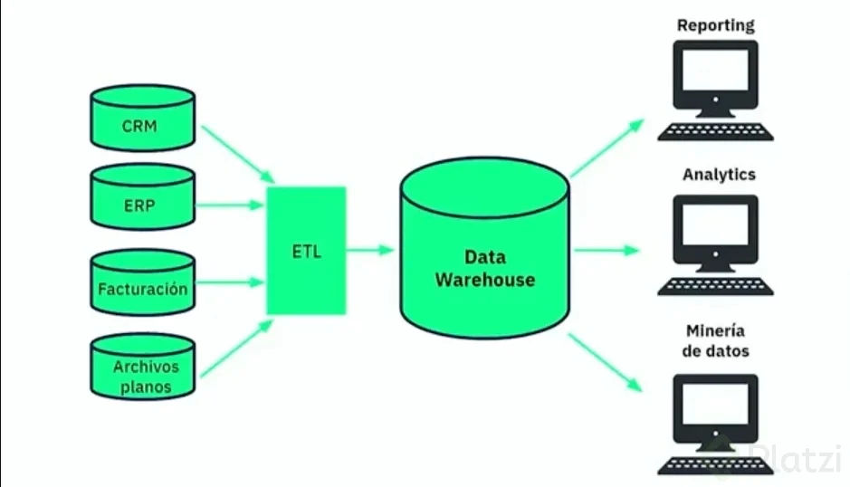
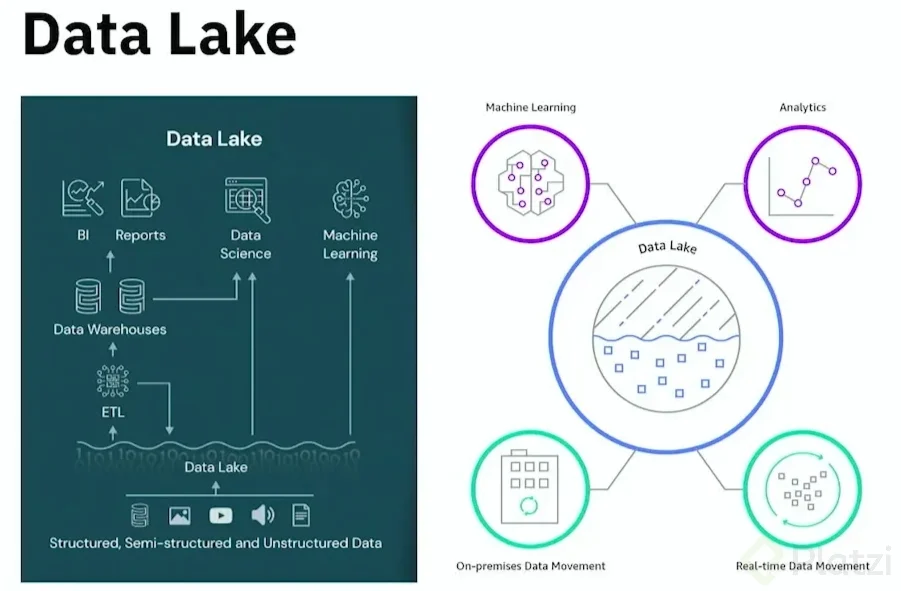
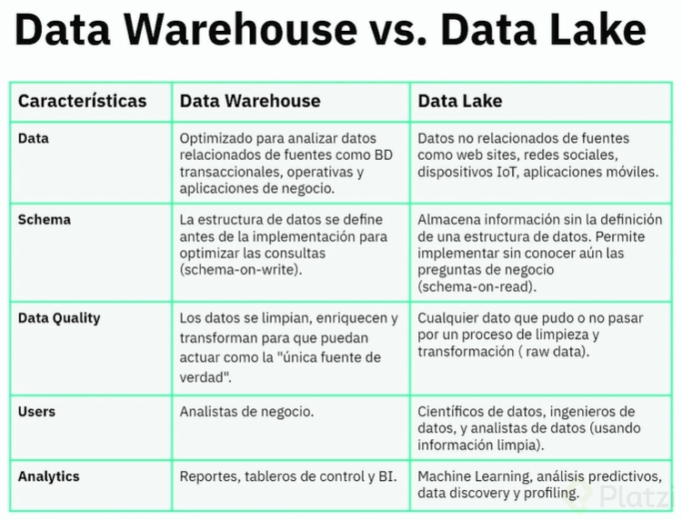

# Curso de Data Warehousing y Modelado OLAP

## ¿Qué es BI y Data Warehousing?

### **Business Intelligence (BI)**:
El **Business Intelligence (BI)** se refiere a un conjunto de tecnologías, herramientas, aplicaciones y prácticas que permiten recolectar, integrar, analizar y presentar datos empresariales para apoyar la toma de decisiones informadas en una organización. El objetivo principal de BI es transformar datos sin procesar en información valiosa, que pueda ser utilizada para mejorar el rendimiento, la eficiencia y la toma de decisiones en la empresa.

**Elementos clave de BI:**
- **Recolección de datos**: Obtener datos desde diversas fuentes, tanto internas como externas.
- **Análisis de datos**: Realizar análisis y generar informes sobre los datos para descubrir patrones, tendencias y relaciones.
- **Visualización**: Presentar los resultados de los análisis de forma visual (tablas, gráficos, dashboards) para facilitar la comprensión.
- **Toma de decisiones**: Usar los datos analizados para tomar decisiones estratégicas y operativas dentro de la organización.

**Herramientas populares de BI:**
- Tableau
- Power BI
- QlikView
- Google Data Studio

### **Data Warehousing (Almacenamiento de Datos)**:
El **Data Warehousing** es un proceso y tecnología que involucra la creación de un **almacén de datos** centralizado, donde se integran, almacenan y gestionan grandes volúmenes de datos provenientes de diversas fuentes. El objetivo de un data warehouse (DW) es permitir que los datos sean accesibles y útiles para análisis de largo plazo, generando un repositorio único y estructurado de datos.

Un **Data Warehouse** es una base de datos diseñada específicamente para la consulta y el análisis de datos históricos y no para operaciones transaccionales diarias. Los datos en un DW suelen estar organizados de manera que faciliten el análisis de grandes volúmenes de información y generen informes detallados.

**Características clave del Data Warehousing:**
- **Integración de datos**: Los datos se extraen de diversas fuentes (bases de datos operacionales, archivos, APIs, etc.) y se integran en un solo sistema.
- **Almacenamiento histórico**: Se guarda una copia histórica de los datos para realizar análisis de tendencias y patrones a lo largo del tiempo.
- **Optimización para consultas**: El Data Warehouse está optimizado para la lectura y análisis de datos, no para las operaciones transaccionales cotidianas.

**Componentes de un Data Warehouse:**
- **Extracción, Transformación y Carga (ETL)**: El proceso mediante el cual se extraen los datos de las fuentes, se transforman en un formato adecuado y se cargan en el almacén de datos.
- **Base de Datos Relacional**: Almacena los datos procesados en estructuras adecuadas para consultas rápidas y eficientes.
- **Cubo de datos**: Estructuras multidimensionales que permiten realizar análisis complejos y consultas rápidas.
- **Herramientas de BI y análisis**: Se conectan al data warehouse para realizar consultas y generar informes visuales.

**Beneficios de Data Warehousing:**
- **Consistencia de los datos**: Los datos provenientes de diferentes fuentes se integran en un solo lugar, asegurando que los informes y análisis sean consistentes.
- **Rendimiento en consultas**: Se optimiza la consulta de grandes volúmenes de datos históricos sin afectar el rendimiento de los sistemas operacionales.
- **Apoyo a la toma de decisiones**: Facilita el análisis profundo de datos históricos y actuales para tomar decisiones más informadas y estratégicas.

**Ejemplo de herramientas de Data Warehousing**:
- Amazon Redshift
- Google BigQuery
- Snowflake
- Teradata

### **Relación entre BI y Data Warehousing**:
- **Data Warehousing** se centra en la gestión, integración y almacenamiento de grandes volúmenes de datos. Es la infraestructura sobre la cual los procesos de BI operan.
- **Business Intelligence** utiliza los datos almacenados en un Data Warehouse para realizar análisis, generar informes y dashboards, lo que ayuda a las organizaciones a tomar decisiones basadas en datos.

En resumen, el **Data Warehousing** es la base sobre la cual se construye el proceso de **Business Intelligence**. Sin un adecuado almacenamiento y organización de datos, no sería posible realizar análisis efectivos y generar información útil para la toma de decisiones.

**Lecturas recomendadas**
[Ruta de aprendizaje Data Engineer](https://platzi.com/data-engineer/)

[Curso de Fundamentos de ETL con Python y Pentaho](https://platzi.com/etl)

## Niveles de analítica y jerarquía del conocimiento

### **Niveles de Analítica**

La analítica de datos puede dividirse en diferentes niveles, dependiendo de la complejidad y el tipo de preguntas que busca responder. Estos niveles son:

1. **Analítica Descriptiva (¿Qué pasó?)**

   - **Propósito**: Resumir y entender eventos pasados.
   - **Ejemplo**: Informes de ventas, análisis de desempeño, gráficos de tendencias.
   - **Herramientas comunes**: Dashboards, reportes, herramientas de BI (Power BI, Tableau).

2. **Analítica Diagnóstica (¿Por qué pasó?)**

   - **Propósito**: Identificar las causas detrás de los eventos.
   - **Ejemplo**: Análisis de la disminución de ventas en una región específica.
   - **Técnicas utilizadas**: Análisis de correlación, minería de datos, análisis causal.

3. **Analítica Predictiva (¿Qué pasará?)**

   - **Propósito**: Predecir eventos futuros basados en patrones históricos.
   - **Ejemplo**: Predicción de demanda de productos o tendencias de mercado.
   - **Herramientas comunes**: Modelos estadísticos, machine learning (Python, R, TensorFlow).

4. **Analítica Prescriptiva (¿Qué debería hacerse?)**

   - **Propósito**: Recomendar acciones para obtener los mejores resultados.
   - **Ejemplo**: Proponer estrategias de precios dinámicos para maximizar ganancias.
   - **Técnicas utilizadas**: Optimización, simulación, aprendizaje reforzado.

5. **Analítica Cognitiva (¿Cómo puedo hacer que ocurra automáticamente?)**

   - **Propósito**: Integrar inteligencia artificial para decisiones automatizadas.
   - **Ejemplo**: Motores de recomendación, chatbots inteligentes.
   - **Herramientas comunes**: Inteligencia Artificial, NLP (Procesamiento de Lenguaje Natural).

### **Jerarquía del Conocimiento**

La jerarquía del conocimiento, conocida como **DIKW** (*Data, Information, Knowledge, Wisdom*), explica cómo se transforman los datos en conocimiento aplicable y sabiduría:

1. **Datos (Data)**:

   - **Definición**: Hechos y cifras crudos sin contexto ni interpretación.
   - **Ejemplo**: "2024-11-23", "23°C".
   - **Propósito**: Materia prima para el análisis.
   - **Clave**: Los datos no tienen significado por sí mismos.

2. **Información (Information)**:

   - **Definición**: Datos procesados y organizados para que sean útiles.
   - **Ejemplo**: "La temperatura actual en Bogotá es 23°C".
   - **Propósito**: Proporcionar contexto y relevancia a los datos.

3. **Conocimiento (Knowledge)**:

   - **Definición**: Información aplicada y combinada con experiencia o comprensión.
   - **Ejemplo**: "La temperatura promedio en noviembre en Bogotá es 20°C, por lo que 23°C es inusualmente cálido".
   - **Propósito**: Permitir tomar decisiones basadas en comprensión.

4. **Sabiduría (Wisdom)**:

   - **Definición**: Uso de conocimiento para tomar decisiones estratégicas y resolver problemas complejos.
   - **Ejemplo**: "Debido al aumento de temperaturas, se deben implementar políticas para mitigar el cambio climático".
   - **Propósito**: Orientar acciones éticas, estratégicas y de alto impacto.

### **Relación entre niveles de analítica y jerarquía del conocimiento**

- La **analítica descriptiva** corresponde a transformar datos en información.
- La **analítica diagnóstica** y **predictiva** ayudan a convertir información en conocimiento.
- La **analítica prescriptiva** y **cognitiva** contribuyen a tomar decisiones basadas en sabiduría.

Ambos enfoques son esenciales para entender y usar datos estratégicamente en una organización.

## Conceptos de BI: Data Warehouse, Data Mart, Dimensiones y Hechos

### **Conceptos Claves de BI**

#### 1. **Data Warehouse**

   - **Definición**: Es una base de datos centralizada diseñada para analizar y reportar datos. Almacena grandes volúmenes de información estructurada, consolidada desde múltiples fuentes (ERP, CRM, hojas de cálculo, etc.).
   - **Propósito**: Proporcionar una visión única, histórica y confiable de los datos para la toma de decisiones.
   - **Características**:
     - Integración de datos de diversas fuentes.
     - Diseñado para consultas y análisis, no para transacciones.
     - Organizado en esquemas multidimensionales (estrella o copo de nieve).
   - **Ejemplo**: Un almacén de datos que consolida información de ventas, inventarios y clientes para generar informes de rendimiento mensual.

#### 2. **Data Mart**

   - **Definición**: Es una versión más pequeña y específica de un *Data Warehouse*, centrada en un departamento o área de negocio particular (ventas, finanzas, marketing, etc.).
   - **Propósito**: Proveer información relevante y optimizada para usuarios específicos dentro de una organización.
   - **Características**:
     - Más simple y rápido de implementar que un *Data Warehouse* completo.
     - Puede construirse como parte del *Data Warehouse* (dependiente) o de manera independiente.
   - **Ejemplo**: Un *Data Mart* que contiene datos de ventas específicos para el equipo comercial.

#### 3. **Dimensiones**

   - **Definición**: Representan los atributos o categorías por las cuales se pueden analizar los datos. Son "el contexto" en el que se miden los hechos.
   - **Propósito**: Proveer descripciones detalladas de los datos, permitiendo el desglose y análisis de los hechos.
   - **Ejemplo**: 
     - **Dimensión "Tiempo"**: Día, Mes, Año.
     - **Dimensión "Producto"**: Nombre, Categoría, Marca.
     - **Dimensión "Región"**: País, Ciudad, Zona.
   - **Relación con hechos**: Las dimensiones son utilizadas para describir y categorizar los hechos.

#### 4. **Hechos**

   - **Definición**: Representan los datos numéricos, medibles y cuantificables en un proceso de negocio. Los hechos son los valores clave que se analizan.
   - **Propósito**: Proporcionar las métricas centrales que se desean analizar.
   - **Ejemplo**:
     - **Ventas**: Cantidad vendida, Precio total, Costos.
     - **Inventarios**: Cantidad disponible, Valor del inventario.
   - **Tipos de hechos**:
     - **Aditivos**: Se pueden sumar en todas las dimensiones (ej. ingresos).
     - **Semi-aditivos**: Se pueden sumar en algunas dimensiones (ej. inventarios).
     - **No aditivos**: No se pueden sumar directamente (ej. porcentajes).

### **Relación entre Data Warehouse, Data Mart, Dimensiones y Hechos**

- Un *Data Warehouse* organiza los datos en esquemas que combinan **dimensiones** y **hechos**.
- Los *Data Marts* extraen subconjuntos de datos del *Data Warehouse* para servir necesidades específicas.
- **Dimensiones** proporcionan el contexto para analizar los **hechos** en un entorno multidimensional.

Esta estructura permite realizar análisis rápidos, como:  
¿Cuánto vendimos (hecho) en un país específico (dimensión) durante el último trimestre (dimensión tiempo)?

## Base de datos OLTP vs. OLAP

### **Diferencias entre Bases de Datos OLTP y OLAP**

Las bases de datos **OLTP** (*Online Transaction Processing*) y **OLAP** (*Online Analytical Processing*) tienen propósitos y características distintas, adaptadas a sus respectivos roles en un sistema de información empresarial.

### **1. Base de Datos OLTP**

#### **Definición**:
- Diseñada para gestionar transacciones en tiempo real de manera eficiente.  
- Maneja operaciones frecuentes, como inserciones, actualizaciones y eliminaciones.

#### **Características**:
- **Propósito**: Soportar las operaciones diarias del negocio.
- **Estructura**: Normalizada para evitar redundancia de datos.
- **Operaciones**: Lecturas y escrituras rápidas.
- **Datos**: Detallados y actuales (transaccionales).
- **Consultas**: Cortas y específicas (ej., "¿Cuántos artículos hay en inventario?").
- **Usuarios**: Empleados operativos (cajeros, administradores).
- **Volumen de datos**: Menor comparado con OLAP.

#### **Ejemplo**:
- Sistema de punto de venta (POS) que registra cada transacción en una tienda.
- Una aplicación bancaria que procesa transferencias en tiempo real.

### **2. Base de Datos OLAP**

#### **Definición**:
- Diseñada para realizar análisis complejos de grandes volúmenes de datos históricos.
- Soporta la toma de decisiones estratégica basada en tendencias y patrones.

#### **Características**:
- **Propósito**: Análisis de datos para reportes y decisiones.
- **Estructura**: Desnormalizada o multidimensional (esquema estrella o copo de nieve).
- **Operaciones**: Consultas de lectura intensiva y de larga duración.
- **Datos**: Agregados e históricos.
- **Consultas**: Complejas y multidimensionales (ej., "¿Cuánto crecieron las ventas por región en los últimos cinco años?").
- **Usuarios**: Analistas de datos, gerentes.
- **Volumen de datos**: Más grande que OLTP, incluye datos históricos.

#### **Ejemplo**:
- Un *Data Warehouse* que consolida datos de ventas, inventarios y clientes para reportes estratégicos.
- Dashboard que muestra el desempeño financiero de una empresa por trimestre.

### **Comparación entre OLTP y OLAP**

| **Aspecto**             | **OLTP**                                  | **OLAP**                                    |
|--------------------------|-------------------------------------------|---------------------------------------------|
| **Propósito**           | Operaciones diarias                      | Análisis estratégico                        |
| **Estructura**          | Normalizada                              | Desnormalizada                              |
| **Consultas**           | Cortas y específicas                     | Largas y complejas                          |
| **Usuarios**            | Operativos                               | Ejecutivos y analistas                      |
| **Datos**               | Actuales y detallados                    | Históricos y agregados                      |
| **Ejemplo de uso**      | Sistema de compras en línea              | Dashboard de análisis de ventas             |
| **Operaciones comunes** | CRUD (Crear, Leer, Actualizar, Eliminar) | Lecturas masivas y agregaciones             |

### **Relación entre OLTP y OLAP**
- Los sistemas OLTP son la fuente de datos para los sistemas OLAP.  
- OLAP consolida los datos generados en OLTP para análisis estratégicos y reportes.

Ambos tipos de bases de datos son esenciales en una infraestructura empresarial, ya que cumplen roles complementarios: **operacional** (OLTP) y **analítico** (OLAP).

OLTP | OLAP
---|---
Diseñado para soportar las transacciones comerciales | Diseñado para apoyar el proceso de toma de decisiones.
Data es volátil | Data NO es volátil
Data detallada | Datos resumidos
Modelado E-R | Modelado dimensional
Procesamiento de transacciones | Procesamiento analítico
Alta concurrencia | Baja concurrencia.

**Lecturas recomendadas**

[Sample Databases - PostgreSQL wiki](https://wiki.postgresql.org/wiki/Sample_Databases)

[Curso de Base de Datos [Empieza Gratis] - Platzi](https://platzi.com/cursos/bd/)

[Curso de AWS Redshift para Manejo de Big Data - Platzi](https://platzi.com/cursos/redshift-big-data/)

## Metodologías de Data Warehouse

Las **metodologías de desarrollo de Data Warehouses** proporcionan un enfoque estructurado para diseñar, implementar y mantener almacenes de datos de manera eficiente. Estas metodologías se centran en la recopilación, transformación y almacenamiento de datos, optimizando el rendimiento y facilitando la toma de decisiones estratégicas.

### **Principales Metodologías de Data Warehouse**

### 1. **Metodología Kimball (Enfoque Dimensional)**
Desarrollada por Ralph Kimball, este enfoque se centra en la **creación de Data Marts** que luego se integran para formar un Data Warehouse. Es un enfoque **"bottom-up"** (de abajo hacia arriba).

#### **Características**:
- Se enfoca en satisfacer necesidades específicas de análisis por áreas de negocio.
- Utiliza modelos dimensionales: **esquema estrella** o **esquema copo de nieve**.
- Diseñado para consultas y análisis rápidos.
- Datos altamente optimizados para reportes y análisis (agregaciones y cálculos).
- Requiere conocer los procesos de negocio al detalle.

#### **Ventajas**:
- Flexible y orientado a resultados inmediatos.
- Fácil de entender para los usuarios finales debido a su estructura multidimensional.

#### **Ejemplo**:
Un *Data Mart* para el análisis de ventas que luego se integra con otros *Data Marts* (como inventarios y marketing) para crear un Data Warehouse completo.

### 2. **Metodología Inmon (Enfoque Corporativo)**
Definida por Bill Inmon, este enfoque crea un **Data Warehouse centralizado y normalizado**, desde el cual se derivan los *Data Marts*. Es un enfoque **"top-down"** (de arriba hacia abajo).

#### **Características**:
- Construcción de un Data Warehouse integrado y corporativo.
- Estructura altamente normalizada para garantizar la consistencia y eliminar redundancias.
- Datos cargados a partir de múltiples fuentes en un formato estándar.
- Se enfoca en la flexibilidad para futuras expansiones.

#### **Ventajas**:
- Permite un almacenamiento eficiente y con datos consistentes.
- Ideal para grandes organizaciones con requerimientos a largo plazo.

#### **Ejemplo**:
Un Data Warehouse corporativo que consolida todas las áreas del negocio (finanzas, ventas, operaciones), con *Data Marts* secundarios para satisfacer necesidades específicas.

### 3. **Enfoque Mixto o Híbrido**
Este enfoque combina lo mejor de las metodologías Kimball e Inmon. 
- Utiliza un Data Warehouse centralizado (Inmon) para garantizar la consistencia global.
- Permite la creación de *Data Marts* departamentales y dimensionales (Kimball) para consultas rápidas.

#### **Ventajas**:
- Ofrece flexibilidad y velocidad sin comprometer la integridad de los datos.
- Es adecuado para organizaciones que necesitan resultados inmediatos pero planean expandirse.

### 4. **Iterativa y Ágil**
Este enfoque adapta los principios de desarrollo ágil al diseño de Data Warehouses. Consiste en construir prototipos rápidos y funcionales que se mejoran continuamente.

#### **Características**:
- Prioriza entregas rápidas y la adaptación a cambios.
- Los usuarios están involucrados durante todo el proceso.
- Se enfoca en pequeños incrementos funcionales.

#### **Ventajas**:
- Mayor alineación con las necesidades del negocio.
- Reduce riesgos al entregar resultados rápidamente.

#### **Ejemplo**:
Desarrollo de un sistema de reportes básicos para el departamento de ventas, mejorándolo gradualmente con nuevos indicadores y fuentes de datos.

### **Pasos Comunes en una Metodología de Data Warehouse**

1. **Recolección de Requisitos**:
   - Identificar las necesidades de información de los usuarios finales y las fuentes de datos.
   
2. **Diseño Conceptual**:
   - Definir las dimensiones y métricas clave.
   - Elegir entre un modelo dimensional o normalizado según la metodología.

3. **Diseño Lógico**:
   - Crear esquemas (estrella, copo de nieve o tabular) y definir relaciones entre tablas.

4. **Diseño Físico**:
   - Seleccionar tecnologías, optimizar consultas y definir almacenamiento.

5. **Implementación**:
   - Cargar datos utilizando procesos ETL.
   - Asegurar la calidad y la validación de datos.

6. **Pruebas y Mantenimiento**:
   - Evaluar rendimiento y precisión.
   - Adaptar a nuevas necesidades y cambios en los datos.

### **Comparación de Metodologías**

| Aspecto              | **Kimball**                | **Inmon**                  | **Híbrido**               | **Iterativa/Ágil**        |
|-----------------------|----------------------------|----------------------------|---------------------------|---------------------------|
| **Enfoque**          | Bottom-up                 | Top-down                  | Mixto                    | Iterativo                |
| **Estructura**       | Dimensional               | Normalizada               | Combinada                | Según necesidades         |
| **Velocidad**        | Más rápida                | Más lenta                 | Intermedia               | Muy rápida               |
| **Escalabilidad**    | Limitada                  | Alta                      | Alta                     | Alta                     |
| **Complejidad inicial** | Baja                      | Alta                      | Intermedia               | Baja                     |

Estas metodologías permiten seleccionar el enfoque que mejor se adapte a las necesidades y recursos de cada organización.

### Ralhp Kimball - fases

Ralph Kimball es una figura central en el diseño de Data Warehouses, reconocido por su enfoque **"bottom-up"** (de abajo hacia arriba) y su énfasis en los modelos dimensionales. Según Kimball, la implementación de un Data Warehouse sigue un conjunto de fases que estructuran y guían el proceso.

### **Fases de Ralph Kimball en el Desarrollo de un Data Warehouse**

### 1. **Recolección de Requisitos**
En esta fase inicial, se identifican las necesidades de información del negocio y se establecen las prioridades.

#### **Actividades**:
- Entrevistar a los usuarios finales y stakeholders.
- Entender los procesos de negocio clave y las métricas necesarias.
- Definir las dimensiones (atributos descriptivos) y hechos (métricas o indicadores numéricos) que se usarán en los análisis.

#### **Resultado**:
- Lista priorizada de requisitos analíticos.
- Identificación de las fuentes de datos necesarias.

### 2. **Diseño del Modelo Dimensional**
El modelo dimensional es la base del enfoque de Kimball, representado en esquemas estrella o copo de nieve.

#### **Actividades**:
- Seleccionar el proceso de negocio principal a modelar (por ejemplo, ventas, inventarios).
- Identificar las dimensiones relevantes (cliente, producto, tiempo, etc.).
- Determinar las métricas que serán calculadas y almacenadas en la tabla de hechos.
- Diseñar los esquemas (estrella o copo de nieve) que optimicen el rendimiento para consultas analíticas.

#### **Resultado**:
- Esquemas dimensionales para las áreas de negocio prioritarias.

### 3. **Planificación del ETL**
El proceso de **Extracción, Transformación y Carga (ETL)** asegura que los datos se transformen y carguen en el Data Warehouse de manera consistente.

#### **Actividades**:
- Identificar las fuentes de datos (bases de datos transaccionales, archivos planos, APIs, etc.).
- Definir reglas de transformación para limpiar, validar y estandarizar datos.
- Planificar el proceso de carga para garantizar la integridad y consistencia de los datos.

#### **Resultado**:
- Un diseño claro del flujo de datos desde las fuentes hasta el Data Warehouse.

### 4. **Construcción del Data Mart**
El enfoque de Kimball se basa en construir **Data Marts** orientados a áreas específicas del negocio, que luego se integran para formar el Data Warehouse.

#### **Actividades**:
- Crear los Data Marts definidos en la fase de diseño.
- Asegurar la integración entre los Data Marts mediante conformación de dimensiones comunes.
- Implementar índices y particiones para mejorar el rendimiento de consultas.

#### **Resultado**:
- Data Marts funcionales y optimizados para análisis.

### 5. **Validación y Pruebas**
Esta fase garantiza que el Data Warehouse funcione como se espera y que los datos sean precisos y confiables.

#### **Actividades**:
- Comparar los datos cargados con las fuentes originales para validar la precisión.
- Realizar pruebas de rendimiento y capacidad de respuesta.
- Evaluar los reportes y consultas generados por los usuarios finales.

#### **Resultado**:
- Un sistema probado y confiable, listo para su uso por los usuarios.

### 6. **Implementación y Entrenamiento**
El Data Warehouse y los Data Marts se ponen en producción y los usuarios comienzan a utilizarlos.

#### **Actividades**:
- Desplegar el sistema en un entorno productivo.
- Capacitar a los usuarios finales en el uso de herramientas de análisis y reportes.
- Proporcionar soporte técnico inicial.

#### **Resultado**:
- Un sistema en operación y usuarios capacitados para utilizarlo.

### 7. **Mantenimiento y Evolución**
El Data Warehouse es un sistema vivo que debe adaptarse a los cambios del negocio y evolucionar con el tiempo.

#### **Actividades**:
- Monitorizar el rendimiento y la calidad de los datos.
- Actualizar los modelos y procesos ETL para reflejar nuevos requisitos de negocio.
- Ampliar el alcance con nuevos Data Marts o integraciones.

#### **Resultado**:
- Un Data Warehouse actualizado y alineado con las necesidades del negocio.

### **Resumen del Proceso**

| **Fase**                | **Objetivo Principal**                                     | **Resultados Clave**                             |
|-------------------------|----------------------------------------------------------|------------------------------------------------|
| Recolección de Requisitos | Entender necesidades de negocio                          | Lista de métricas, dimensiones y fuentes       |
| Diseño Dimensional       | Crear modelos eficientes para análisis                    | Esquemas estrella o copo de nieve              |
| Planificación del ETL    | Asegurar integridad y consistencia en los datos           | Plan ETL con reglas claras                     |
| Construcción del Data Mart | Desarrollar sistemas de análisis por áreas de negocio    | Data Marts funcionales y optimizados           |
| Validación y Pruebas     | Garantizar precisión y rendimiento                        | Sistema probado y validado                     |
| Implementación           | Capacitar usuarios y poner en marcha el sistema          | Sistema en producción                          |
| Mantenimiento y Evolución| Adaptarse a cambios y mejorar el sistema continuamente    | Un Data Warehouse actualizado y funcional      |

Estas fases estructuran el desarrollo de un Data Warehouse y garantizan que cumpla con las necesidades del negocio de manera eficiente y escalable.

### Hefesto

**Hefesto** es el dios griego del fuego, la forja, la artesanía, la metalurgia y los volcanes. Es uno de los doce olímpicos y una figura central en la mitología griega. A menudo se lo representa como un artesano divino que crea armas, herramientas y objetos mágicos para los dioses y los héroes. Su equivalente en la mitología romana es **Vulcano**.

### **Aspectos clave de Hefesto**

1. **Nacimiento y Rechazo**:
   - En algunas versiones, es hijo de Zeus y Hera; en otras, Hera lo concibió sola en respuesta al nacimiento de Atenea.
   - Fue rechazado y arrojado del Olimpo por Hera (o Zeus, según la versión) debido a su cojera o apariencia poco agraciada.

2. **Forja Divina**:
   - Hefesto estableció su taller en una montaña, a menudo asociado con volcanes como el Etna.
   - Con la ayuda de los cíclopes y asistentes mecánicos, creó objetos extraordinarios:
     - El trono dorado de Hera.
     - El escudo de Aquiles.
     - La armadura de Heracles.
     - Pandora, la primera mujer mortal, hecha por orden de Zeus.

3. **Matrimonio con Afrodita**:
   - Se casó con Afrodita, la diosa del amor y la belleza, pero su relación estuvo marcada por infidelidades de ella, especialmente con Ares, el dios de la guerra.
   - En una famosa historia, Hefesto fabricó una red invisible para atrapar a Afrodita y Ares en el acto, humillándolos frente a los dioses.

4. **Representación Física**:
   - A diferencia de otros dioses griegos, Hefesto a menudo es representado como un dios trabajador, sucio por el hollín de la forja, y con una pierna herida o coja.
   - Esta imagen resalta su humanidad y su conexión con los artesanos y trabajadores comunes.

5. **Carácter**:
   - Aunque sufrió rechazo y burlas, Hefesto es un dios creativo y perseverante.
   - Su trabajo representa la transformación del caos en orden, y el uso del fuego como herramienta para la creación en lugar de la destrucción.

### **Hefesto en la Cultura**
- Es símbolo del ingenio y la resiliencia.
- Inspiró numerosas representaciones artísticas y literarias, desde esculturas antiguas hasta referencias en la cultura moderna.
- Su historia refleja la importancia del trabajo manual y la creatividad en la civilización griega.

## Data Warehouse, Data Lake y Data Lakehouse: ¿Cuál utilizar?

La elección entre **Data Warehouse**, **Data Lake** y **Data Lakehouse** depende de los requisitos específicos del negocio y los tipos de datos que se manejan. A continuación te explico en qué se diferencian y cuándo podría ser más adecuado utilizar cada uno:

### 1. **Data Warehouse (DW)**
   - **Propósito**: Un Data Warehouse es un sistema de almacenamiento de datos estructurados que está optimizado para la **consulta y el análisis de grandes volúmenes de datos transaccionales**. Los datos en un DW suelen estar transformados y limpiados antes de ser cargados.
   - **Características**:
     - Almacena **datos estructurados** (tablas, registros).
     - Utiliza procesos ETL (Extracción, Transformación y Carga) para integrar datos de diversas fuentes.
     - Es ideal para realizar **análisis histórico y consultas complejas**.
   - **Cuándo usarlo**:
     - Si tienes datos bien definidos y estructurados.
     - Necesitas informes y análisis consistentes a lo largo del tiempo (como ventas, finanzas, KPIs).
     - El rendimiento en consultas analíticas rápidas y complejas es clave.

     

### 2. **Data Lake**
   - **Propósito**: Un Data Lake es un repositorio que puede almacenar **datos sin procesar** en su forma original. Puede contener datos estructurados, semi-estructurados (JSON, XML) y no estructurados (archivos de texto, imágenes, videos).
   - **Características**:
     - Almacena datos en su formato original (sin necesidad de transformación).
     - Es más **económico** en términos de almacenamiento masivo.
     - Ideal para **big data** y análisis exploratorios, ya que permite almacenar grandes volúmenes de datos sin preocuparse por su forma.
   - **Cuándo usarlo**:
     - Si necesitas almacenar datos de diferentes fuentes y tipos.
     - Tienes grandes volúmenes de datos, incluyendo datos no estructurados.
     - Quieres realizar análisis de datos sin un esquema predefinido, como análisis de logs, datos de IoT o datos de redes sociales.

     

### 3. **Data Lakehouse**
   - **Propósito**: El Data Lakehouse combina las ventajas de un **Data Lake** y un **Data Warehouse**. Es un enfoque híbrido que ofrece la **flexibilidad** de almacenar datos en su forma cruda, como un Data Lake, pero también proporciona la **estructura** necesaria para consultas analíticas, similar a un Data Warehouse.
   - **Características**:
     - Almacena tanto **datos estructurados** como **no estructurados**.
     - **Compatibilidad con SQL** y soporte para análisis en tiempo real, lo que lo hace adecuado para BI tradicional.
     - Combina **esquemas de datos** en el almacenamiento de datos no procesados, lo que permite realizar análisis complejos sin perder la flexibilidad de los datos crudos.
   - **Cuándo usarlo**:
     - Si deseas almacenar **tanto datos estructurados como no estructurados** en un solo lugar.
     - Necesitas las **capacidades de un Data Warehouse** (como rendimiento en consultas analíticas) pero sin perder la flexibilidad de un Data Lake.
     - Buscas una **solución unificada** para análisis, machine learning, e inteligencia empresarial.

### ¿Cuál utilizar?
- **Si tus datos son principalmente estructurados**, y necesitas análisis consistentes y rápidos, un **Data Warehouse** es la mejor opción.
- **Si trabajas con grandes volúmenes de datos sin procesar** o necesitas almacenar datos no estructurados, un **Data Lake** es la opción adecuada.
- **Si deseas lo mejor de ambos mundos**, un **Data Lakehouse** puede ser la opción perfecta, ya que combina la flexibilidad de los Data Lakes con las capacidades analíticas de los Data Warehouses.

### Resumen:
- **Data Warehouse**: Ideal para datos estructurados y análisis tradicional.
- **Data Lake**: Mejor para grandes volúmenes de datos variados y no estructurados.
- **Data Lakehouse**: Combina lo mejor de ambos, permitiendo almacenar datos crudos y estructurados con capacidades analíticas robustas.

La elección depende de tus necesidades de almacenamiento y análisis de datos.

## Tipos de esquemas dimensionales

En el contexto de **Data Warehousing**, los **esquemas dimensionales** son modelos de diseño utilizados para organizar los datos de forma que permitan un análisis eficiente. Los tipos principales de esquemas dimensionales son:

### 1. **Esquema Estrella (Star Schema)**

   - **Descripción**: 
     Es el esquema dimensional más sencillo. En este diseño, una tabla central de **hechos** está conectada directamente a múltiples tablas de **dimensiones**.
   - **Estructura**:
     - La tabla de hechos contiene datos numéricos (métricas o medidas) y claves que se relacionan con las dimensiones.
     - Las tablas de dimensiones contienen atributos descriptivos (p. ej., nombres, categorías).
   - **Ventajas**:
     - Fácil de entender e implementar.
     - Consulta simple y eficiente.
   - **Desventajas**:
     - Puede volverse poco eficiente para sistemas con muchas dimensiones o datos redundantes.
   - **Ejemplo**:
     - **Tabla de Hechos**: Ventas (id_venta, id_tiempo, id_producto, cantidad, total_venta).
     - **Dimensiones**: Producto, Tiempo, Cliente, Tienda.

### 2. **Esquema Copo de Nieve (Snowflake Schema)**

   - **Descripción**:
     Es una extensión del esquema estrella en el que las tablas de dimensiones están normalizadas (divididas en varias tablas relacionadas).
   - **Estructura**:
     - La tabla de hechos se conecta con dimensiones, pero estas dimensiones pueden tener relaciones con otras tablas.
   - **Ventajas**:
     - Menor redundancia de datos.
     - Requiere menos espacio de almacenamiento.
   - **Desventajas**:
     - Más complejo de diseñar y entender.
     - Las consultas son más lentas debido a la necesidad de realizar más uniones (joins).
   - **Ejemplo**:
     - Dimensión Producto puede dividirse en:
       - Categoría de Producto
       - Marca de Producto

### 3. **Esquema Galaxia (Galaxy Schema o Fact Constellation)**

   - **Descripción**:
     Es un esquema que utiliza **múltiples tablas de hechos** conectadas con dimensiones compartidas. También se llama **constelación de hechos**.
   - **Estructura**:
     - Las dimensiones son reutilizables y pueden estar conectadas a diferentes tablas de hechos.
   - **Ventajas**:
     - Permite soportar múltiples procesos de negocio dentro del mismo modelo.
     - Más flexible y escalable.
   - **Desventajas**:
     - Puede ser más complejo de gestionar y mantener.
   - **Ejemplo**:
     - Una tabla de hechos para Ventas y otra para Inventario, ambas compartiendo las dimensiones Producto, Tiempo y Tienda.

### 4. **Esquema Estrella Normalizado**
   - **Descripción**:
     Similar al esquema estrella, pero las dimensiones son parcialmente normalizadas para reducir redundancias sin llegar a la complejidad del copo de nieve.
   - **Ventajas**:
     - Compromiso entre simplicidad y optimización de almacenamiento.
   - **Desventajas**:
     - Puede no ser tan eficiente como un esquema estrella puro para consultas complejas.

### Comparación de los Esquemas:

| **Criterio**             | **Esquema Estrella**       | **Esquema Copo de Nieve** | **Esquema Galaxia**      |
|--------------------------|---------------------------|---------------------------|--------------------------|
| **Complejidad**          | Baja                     | Media                     | Alta                    |
| **Redundancia**          | Alta                     | Baja                      | Variable                |
| **Facilidad de consulta**| Alta                     | Media                     | Media                   |
| **Espacio de almacenamiento** | Mayor               | Menor                     | Variable                |
| **Uso típico**           | Análisis simples         | Sistemas optimizados      | Multi-proceso o analítica compleja |

### Resumen:

- **Star Schema**: Simplicidad y consultas rápidas; adecuado para escenarios pequeños o medianos.
- **Snowflake Schema**: Menos redundancia, más eficiente para almacenamiento, pero más complejo.
- **Galaxy Schema**: Ideal para empresas grandes con múltiples procesos de negocio que comparten dimensiones.

## Dimensiones lentamente cambiantes

Las **Dimensiones Lentamente Cambiantes (Slowly Changing Dimensions - SCD)** son un concepto clave en el diseño de un **Data Warehouse**. Se refieren a cómo manejar los cambios en los atributos de una dimensión a lo largo del tiempo, preservando la historia cuando sea necesario. 

### **Tipos de Dimensiones Lentamente Cambiantes (SCD)**

#### **1. Tipo 0: Sin cambios (Fixed Dimensions)** 
   - **Descripción**: Los datos de la dimensión no cambian. 
   - **Uso típico**: Cuando los datos deben permanecer constantes, como un identificador único (p. ej., código de producto).
   - **Ejemplo**: Un producto tiene un código que no varía con el tiempo.

#### **2. Tipo 1: Sobrescritura del valor antiguo**
   - **Descripción**: Se actualiza el atributo directamente, sobrescribiendo el valor anterior. No se guarda un historial.
   - **Ventajas**:
     - Simplicidad de implementación.
     - Requiere menos espacio de almacenamiento.
   - **Desventajas**:
     - Pierde la historia del cambio.
   - **Ejemplo**:
     - Cambio en el número de teléfono de un cliente: el valor antiguo se reemplaza por el nuevo.

#### **3. Tipo 2: Registro de cambios históricos**
   - **Descripción**: Cada cambio genera un nuevo registro en la tabla de dimensión, manteniendo el historial completo.
   - **Ventajas**:
     - Permite análisis históricos y trazabilidad.
   - **Desventajas**:
     - Incrementa el tamaño de las dimensiones.
     - Requiere un mecanismo para identificar registros actuales y antiguos.
   - **Implementación**:
     - **Clave sustituta**: Se utiliza un identificador único para cada versión del registro.
     - **Atributos adicionales**: Incluyen columnas como `fecha_inicio`, `fecha_fin` y un indicador (`actual`) para identificar el registro activo.
   - **Ejemplo**:
     - Si un cliente cambia de dirección, se crea un nuevo registro con la nueva dirección, manteniendo el anterior.

#### **4. Tipo 3: Rastro de un cambio limitado**
   - **Descripción**: Se almacena el valor actual y un valor anterior en la misma tabla, limitando la capacidad de rastrear más de un cambio.
   - **Ventajas**:
     - Fácil de implementar.
     - Útil para cambios específicos y limitados en número.
   - **Desventajas**:
     - No es adecuado para mantener un historial completo.
   - **Ejemplo**:
     - Se agrega una columna `dirección_actual` y otra `dirección_anterior` para capturar un cambio en la dirección de un cliente.

#### **5. Tipo 4: Dimensión de historial por separado**
   - **Descripción**: Se separan los registros históricos en una tabla aparte, mientras que la tabla principal almacena solo el registro actual.
   - **Ventajas**:
     - Se reduce la complejidad en la tabla principal.
     - El historial se mantiene de forma estructurada y eficiente.
   - **Desventajas**:
     - Requiere consultas adicionales para acceder al historial.
   - **Ejemplo**:
     - Una tabla principal contiene la información del cliente actual, y una tabla de historial guarda los cambios previos.

#### **6. Tipo 6: Híbrido (Tipo 1 + Tipo 2 + Tipo 3)**
   - **Descripción**: Combina los enfoques de los tipos 1, 2 y 3. Se mantiene el historial completo (como en Tipo 2), pero también se guardan el valor actual y el valor anterior en la misma tabla.
   - **Ventajas**:
     - Proporciona flexibilidad al manejar cambios de diferentes tipos.
   - **Desventajas**:
     - Requiere mayor complejidad en el diseño y mantenimiento.
   - **Ejemplo**:
     - Una tabla de cliente guarda columnas para `dirección_actual`, `dirección_anterior` y un historial completo en múltiples registros.

### **Cuándo usar cada tipo**

| **Tipo**  | **Uso típico**                                                                 |
|-----------|-------------------------------------------------------------------------------|
| **Tipo 0**| Datos que no deben cambiar (identificadores únicos).                          |
| **Tipo 1**| Cuando la precisión actual es más importante que el historial (p. ej., correos). |
| **Tipo 2**| Para análisis históricos o auditoría de datos (p. ej., cambios en dirección). |
| **Tipo 3**| Cambios limitados que no requieren un historial extenso (p. ej., ascensos).    |
| **Tipo 4**| Para separar datos históricos en otra tabla, optimizando la tabla principal.  |
| **Tipo 6**| Cuando se necesita rastrear valores actuales, anteriores y un historial completo. |

### **Ejemplo práctico: Cliente cambia de dirección**
1. **Tipo 1**: Actualizas la dirección directamente.
   - `Dirección: Calle 1` → `Calle 2`.
2. **Tipo 2**: Creas un nuevo registro con la nueva dirección.
   - Reg 1: `Cliente 001`, `Calle 1`, `2022-01-01` a `2023-01-01`.
   - Reg 2: `Cliente 001`, `Calle 2`, `2023-01-02` a `actual`.
3. **Tipo 3**: Guardas la dirección actual y anterior en columnas separadas.
   - `Dirección_actual: Calle 2`, `Dirección_anterior: Calle 1`.
4. **Tipo 4**: La tabla principal guarda `Calle 2`, y el historial queda en otra tabla.
5. **Tipo 6**: Combinas columnas de Tipo 3 con el historial completo de Tipo 2.

Estas estrategias permiten manejar cambios en los datos dependiendo de los requerimientos del negocio y el análisis necesario.

## Dimensión tipo 1

Una **dimensión tipo 1** es un tipo de dimensión en un Data Warehouse que **no conserva el historial de los cambios en los datos**. En este enfoque, cuando ocurre un cambio en el atributo de una dimensión, los datos existentes son simplemente **sobrescritos** con los nuevos valores, sin almacenar la versión anterior.

### Características principales:
1. **Actualización directa:** Los cambios en los datos actualizan la fila correspondiente en la tabla de dimensiones.
2. **Sin historial:** No se guarda el valor previo de los datos; solo se almacena el estado más reciente.
3. **Fácil implementación:** Es la solución más simple y rápida de aplicar.

### Casos de uso:
- Cuando no es necesario rastrear cambios históricos en los atributos.
- Si los cambios son correcciones de errores y se espera que los datos siempre reflejen el estado actual.

### Ejemplo:
Supongamos que tienes una tabla de dimensión para productos:

| ID_Producto | Nombre        | Categoría      | Precio |
|-------------|---------------|----------------|--------|
| 1           | Lámpara LED   | Iluminación    | 15.00  |
| 2           | Escritorio XL | Mobiliario     | 120.00 |

Si el precio de la **Lámpara LED** cambia de 15.00 a 18.00, se sobrescribe directamente:

| ID_Producto | Nombre        | Categoría      | Precio |
|-------------|---------------|----------------|--------|
| 1           | Lámpara LED   | Iluminación    | 18.00  |
| 2           | Escritorio XL | Mobiliario     | 120.00 |

No se conserva el historial del precio anterior.

---

Las dimensiones tipo 1 son ideales cuando mantener el historial no agrega valor al análisis de los datos.

**Lecturas recomendadas**

[Sample Databases - PostgreSQL wiki](https://wiki.postgresql.org/wiki/Sample_Databases)

## Dimensión tipo 2

Una **dimensión tipo 2** es un tipo de dimensión en un Data Warehouse diseñada para **rastrear y preservar el historial de cambios en los datos**. A diferencia de una dimensión tipo 1, que sobrescribe los valores antiguos, la dimensión tipo 2 crea una nueva fila en la tabla para cada cambio, permitiendo conservar los datos históricos.

### **Características principales:**
1. **Registro del historial:** Cada cambio en un atributo de la dimensión se guarda como una nueva fila en la tabla.
2. **Identificadores únicos:** Cada versión de un registro tiene un identificador único o clave sustituida (**surrogate key**) para diferenciar las versiones del mismo objeto.
3. **Control de vigencia:** Se utilizan columnas para rastrear el período de tiempo en que cada versión estuvo activa, como fechas de inicio y fin o un indicador de "fila activa".

### **Casos de uso:**
- Cuando es necesario analizar datos históricos o realizar un seguimiento de cómo han cambiado los valores a lo largo del tiempo.
- Ideal para áreas donde los cambios en atributos impactan el análisis, como datos de clientes, ubicaciones o productos.

### **Ejemplo práctico:**

Supongamos que tienes una tabla de dimensión para clientes:

#### Estado inicial:
| SK_Cliente | ID_Cliente | Nombre   | Ciudad       | Fecha_Inicio | Fecha_Fin  | Activo |
|------------|------------|----------|--------------|--------------|------------|--------|
| 1          | 1001       | Juan     | Bogotá       | 2024-01-01   | 9999-12-31 | Sí     |

#### Cambio: Juan se muda de Bogotá a Medellín el 2024-06-01.

#### Estado actualizado:
| SK_Cliente | ID_Cliente | Nombre   | Ciudad       | Fecha_Inicio | Fecha_Fin  | Activo |
|------------|------------|----------|--------------|--------------|------------|--------|
| 1          | 1001       | Juan     | Bogotá       | 2024-01-01   | 2024-05-31 | No     |
| 2          | 1001       | Juan     | Medellín     | 2024-06-01   | 9999-12-31 | Sí     |

### **Ventajas:**
- Permite análisis históricos al conservar el contexto de los datos en el tiempo.
- Facilita el seguimiento de cambios relevantes para los negocios.

### **Desventajas:**
- Aumenta la complejidad y el tamaño de la tabla debido a la creación de múltiples versiones.
- Requiere procesos ETL más elaborados para manejar las fechas de vigencia y los indicadores de estado.

La dimensión tipo 2 es una excelente opción cuando los cambios en los datos son críticos para el análisis de negocios y la toma de decisiones.

## Dimensión tipo 3

Una **dimensión tipo 3** es un tipo de dimensión en un Data Warehouse diseñada para **almacenar el historial limitado de cambios en los datos**. A diferencia de la dimensión tipo 2, que crea una nueva fila para cada cambio, la dimensión tipo 3 **agrega columnas adicionales** en la misma fila para capturar versiones antiguas y actuales de los valores que han cambiado.

### **Características principales:**

1. **Historial limitado:** Solo rastrea un número reducido de versiones de un atributo, generalmente el valor actual y el valor anterior.
2. **Nuevas columnas:** Se agregan columnas específicas, como `Valor_Anterior` o `Fecha_Cambio`, para registrar los cambios.
3. **Rendimiento más eficiente:** Ideal para casos donde no se necesita un historial completo, ya que no genera nuevas filas.

### **Casos de uso:**
- Cuando el análisis requiere conocer únicamente el estado anterior y actual de un atributo.
- Útil para datos donde los cambios son pocos y el historial completo no es relevante.

### **Ejemplo práctico:**

Supongamos que tienes una tabla de dimensión para un producto que cambia de categoría:

#### Estado inicial:
| SK_Producto | ID_Producto | Nombre_Producto | Categoría_Actual | Categoría_Anterior | Fecha_Cambio |
|-------------|-------------|------------------|-------------------|---------------------|--------------|
| 1           | 2001        | Televisor        | Electrónica       | NULL                | NULL         |

#### Cambio: El producto cambia de "Electrónica" a "Entretenimiento" el 2024-06-01.

#### Estado actualizado:
| SK_Producto | ID_Producto | Nombre_Producto | Categoría_Actual   | Categoría_Anterior | Fecha_Cambio |
|-------------|-------------|------------------|---------------------|---------------------|--------------|
| 1           | 2001        | Televisor        | Entretenimiento     | Electrónica         | 2024-06-01   |

### **Ventajas:**
- Más simple de implementar y gestionar que una dimensión tipo 2.
- Permite realizar análisis básicos de cambios, como comparar estados anteriores y actuales.

### **Desventajas:**
- No conserva un historial completo de los cambios, lo que limita la capacidad de análisis histórico profundo.
- Solo adecuado para escenarios donde se necesita conocer uno o dos niveles de cambio.

### **Comparación con otras dimensiones:**
| Tipo       | Historial Completo | Nuevas Filas | Nuevas Columnas | Complejidad |
|------------|--------------------|--------------|-----------------|-------------|
| Tipo 1     | No                 | No           | No              | Baja        |
| Tipo 2     | Sí                 | Sí           | No              | Alta        |
| **Tipo 3** | Limitado           | No           | Sí              | Media       |

### **Conclusión:**
Una dimensión tipo 3 es ideal cuando el objetivo es rastrear solo un cambio previo en un atributo sin agregar demasiada complejidad a la estructura del Data Warehouse.

## Tabla de hechos (fact)

Una **tabla de hechos** (o *fact table*) es un componente esencial en el diseño de un Data Warehouse. Contiene **datos cuantitativos o métricas medibles** que representan los eventos o transacciones del negocio. Estas métricas están asociadas con las dimensiones para proporcionar un contexto que facilite el análisis y la toma de decisiones.

### **Características principales de una tabla de hechos:**

1. **Métricas y medidas:**
   - Almacena valores numéricos como ventas, ingresos, cantidad de unidades vendidas, costos, etc.
   - Estas métricas son las que se analizan y calculan.

2. **Llaves foráneas (FK):**
   - Incluye llaves foráneas que referencian las tablas de dimensiones.
   - Estas llaves permiten que los hechos se relacionen con sus dimensiones correspondientes (tiempo, producto, ubicación, cliente, etc.).

3. **Granularidad:**
   - Define el nivel de detalle de la tabla (por ejemplo, por día, por producto, por transacción).
   - Especificar la granularidad es clave para el diseño adecuado del Data Warehouse.

4. **Tamaño:**
   - Generalmente es la tabla más grande en un esquema dimensional debido al alto volumen de datos transaccionales.

### **Tipos de tablas de hechos:**

1. **Tablas de hechos transaccionales:**
   - Capturan datos sobre eventos o transacciones individuales (por ejemplo, una venta, una llamada).
   - Ejemplo: Cantidad de productos vendidos en cada transacción.

2. **Tablas de hechos acumulativas:**
   - Contienen datos acumulados o consolidados a lo largo del tiempo (por ejemplo, saldo mensual de una cuenta bancaria).
   - Ejemplo: Total acumulado de ventas por cliente.

3. **Tablas de hechos instantáneas:**
   - Capturan el estado de un proceso en un momento específico (por ejemplo, inventario diario).
   - Ejemplo: Niveles de inventario al final de cada mes.

### **Ejemplo de una tabla de hechos:**

#### Contexto:
- Queremos analizar las ventas por cliente, producto, y fecha.

#### Tabla de hechos: `Fact_Ventas`
| FactID | FechaID | ProductoID | ClienteID | TiendaID | Cantidad | Importe_Venta |
|--------|---------|------------|-----------|----------|----------|----------------|
| 1      | 202401  | 101        | 3001      | 501      | 2        | 50.00          |
| 2      | 202401  | 102        | 3002      | 502      | 1        | 30.00          |
| 3      | 202402  | 103        | 3003      | 501      | 5        | 150.00         |

#### Tablas de dimensiones relacionadas:
1. **Dim_Fecha:** Información detallada sobre fechas (día, mes, año, etc.).
2. **Dim_Producto:** Detalles sobre productos (categoría, nombre, precio, etc.).
3. **Dim_Cliente:** Información del cliente (nombre, región, etc.).
4. **Dim_Tienda:** Detalles de la tienda (ubicación, nombre, etc.).

### **Componentes clave:**

- **Llaves foráneas:** Conectan la tabla de hechos con las tablas de dimensiones.
- **Columnas métricas:** Datos numéricos que representan hechos del negocio, como cantidades o ingresos.

### **Diferencias clave entre hechos y dimensiones:**

| **Aspecto**         | **Tabla de hechos**              | **Tabla de dimensiones**       |
|----------------------|----------------------------------|---------------------------------|
| Contenido            | Métricas cuantitativas          | Atributos descriptivos         |
| Naturaleza           | Transaccional                   | Contextual                     |
| Tamaño               | Grande (volumen de transacciones) | Relativamente pequeña          |
| Relación             | Llaves foráneas                 | Llaves primarias               |

### **Importancia de las tablas de hechos:**
- Permiten realizar análisis detallados de métricas y tendencias.
- Sirven como el centro de un modelo dimensional, conectándose con múltiples dimensiones para proporcionar un contexto analítico completo.
