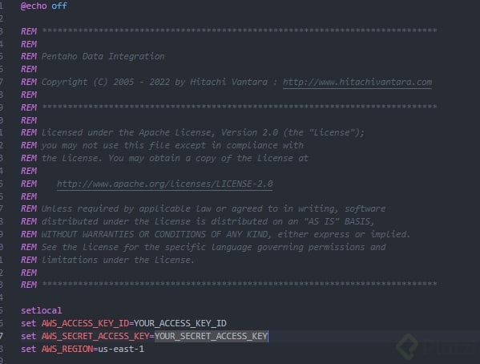

# Curso de Data Warehousing y Modelado OLAP

## ¿Qué es BI y Data Warehousing?

### **Business Intelligence (BI)**:
El **Business Intelligence (BI)** se refiere a un conjunto de tecnologías, herramientas, aplicaciones y prácticas que permiten recolectar, integrar, analizar y presentar datos empresariales para apoyar la toma de decisiones informadas en una organización. El objetivo principal de BI es transformar datos sin procesar en información valiosa, que pueda ser utilizada para mejorar el rendimiento, la eficiencia y la toma de decisiones en la empresa.

**Elementos clave de BI:**
- **Recolección de datos**: Obtener datos desde diversas fuentes, tanto internas como externas.
- **Análisis de datos**: Realizar análisis y generar informes sobre los datos para descubrir patrones, tendencias y relaciones.
- **Visualización**: Presentar los resultados de los análisis de forma visual (tablas, gráficos, dashboards) para facilitar la comprensión.
- **Toma de decisiones**: Usar los datos analizados para tomar decisiones estratégicas y operativas dentro de la organización.

**Herramientas populares de BI:**
- Tableau
- Power BI
- QlikView
- Google Data Studio

### **Data Warehousing (Almacenamiento de Datos)**:
El **Data Warehousing** es un proceso y tecnología que involucra la creación de un **almacén de datos** centralizado, donde se integran, almacenan y gestionan grandes volúmenes de datos provenientes de diversas fuentes. El objetivo de un data warehouse (DW) es permitir que los datos sean accesibles y útiles para análisis de largo plazo, generando un repositorio único y estructurado de datos.

Un **Data Warehouse** es una base de datos diseñada específicamente para la consulta y el análisis de datos históricos y no para operaciones transaccionales diarias. Los datos en un DW suelen estar organizados de manera que faciliten el análisis de grandes volúmenes de información y generen informes detallados.

**Características clave del Data Warehousing:**
- **Integración de datos**: Los datos se extraen de diversas fuentes (bases de datos operacionales, archivos, APIs, etc.) y se integran en un solo sistema.
- **Almacenamiento histórico**: Se guarda una copia histórica de los datos para realizar análisis de tendencias y patrones a lo largo del tiempo.
- **Optimización para consultas**: El Data Warehouse está optimizado para la lectura y análisis de datos, no para las operaciones transaccionales cotidianas.

**Componentes de un Data Warehouse:**
- **Extracción, Transformación y Carga (ETL)**: El proceso mediante el cual se extraen los datos de las fuentes, se transforman en un formato adecuado y se cargan en el almacén de datos.
- **Base de Datos Relacional**: Almacena los datos procesados en estructuras adecuadas para consultas rápidas y eficientes.
- **Cubo de datos**: Estructuras multidimensionales que permiten realizar análisis complejos y consultas rápidas.
- **Herramientas de BI y análisis**: Se conectan al data warehouse para realizar consultas y generar informes visuales.

**Beneficios de Data Warehousing:**
- **Consistencia de los datos**: Los datos provenientes de diferentes fuentes se integran en un solo lugar, asegurando que los informes y análisis sean consistentes.
- **Rendimiento en consultas**: Se optimiza la consulta de grandes volúmenes de datos históricos sin afectar el rendimiento de los sistemas operacionales.
- **Apoyo a la toma de decisiones**: Facilita el análisis profundo de datos históricos y actuales para tomar decisiones más informadas y estratégicas.

**Ejemplo de herramientas de Data Warehousing**:
- Amazon Redshift
- Google BigQuery
- Snowflake
- Teradata

### **Relación entre BI y Data Warehousing**:
- **Data Warehousing** se centra en la gestión, integración y almacenamiento de grandes volúmenes de datos. Es la infraestructura sobre la cual los procesos de BI operan.
- **Business Intelligence** utiliza los datos almacenados en un Data Warehouse para realizar análisis, generar informes y dashboards, lo que ayuda a las organizaciones a tomar decisiones basadas en datos.

En resumen, el **Data Warehousing** es la base sobre la cual se construye el proceso de **Business Intelligence**. Sin un adecuado almacenamiento y organización de datos, no sería posible realizar análisis efectivos y generar información útil para la toma de decisiones.

**Lecturas recomendadas**
[Ruta de aprendizaje Data Engineer](https://platzi.com/data-engineer/)

[Curso de Fundamentos de ETL con Python y Pentaho](https://platzi.com/etl)

## Niveles de analítica y jerarquía del conocimiento

### **Niveles de Analítica**

La analítica de datos puede dividirse en diferentes niveles, dependiendo de la complejidad y el tipo de preguntas que busca responder. Estos niveles son:

1. **Analítica Descriptiva (¿Qué pasó?)**

   - **Propósito**: Resumir y entender eventos pasados.
   - **Ejemplo**: Informes de ventas, análisis de desempeño, gráficos de tendencias.
   - **Herramientas comunes**: Dashboards, reportes, herramientas de BI (Power BI, Tableau).

2. **Analítica Diagnóstica (¿Por qué pasó?)**

   - **Propósito**: Identificar las causas detrás de los eventos.
   - **Ejemplo**: Análisis de la disminución de ventas en una región específica.
   - **Técnicas utilizadas**: Análisis de correlación, minería de datos, análisis causal.

3. **Analítica Predictiva (¿Qué pasará?)**

   - **Propósito**: Predecir eventos futuros basados en patrones históricos.
   - **Ejemplo**: Predicción de demanda de productos o tendencias de mercado.
   - **Herramientas comunes**: Modelos estadísticos, machine learning (Python, R, TensorFlow).

4. **Analítica Prescriptiva (¿Qué debería hacerse?)**

   - **Propósito**: Recomendar acciones para obtener los mejores resultados.
   - **Ejemplo**: Proponer estrategias de precios dinámicos para maximizar ganancias.
   - **Técnicas utilizadas**: Optimización, simulación, aprendizaje reforzado.

5. **Analítica Cognitiva (¿Cómo puedo hacer que ocurra automáticamente?)**

   - **Propósito**: Integrar inteligencia artificial para decisiones automatizadas.
   - **Ejemplo**: Motores de recomendación, chatbots inteligentes.
   - **Herramientas comunes**: Inteligencia Artificial, NLP (Procesamiento de Lenguaje Natural).

### **Jerarquía del Conocimiento**

La jerarquía del conocimiento, conocida como **DIKW** (*Data, Information, Knowledge, Wisdom*), explica cómo se transforman los datos en conocimiento aplicable y sabiduría:

1. **Datos (Data)**:

   - **Definición**: Hechos y cifras crudos sin contexto ni interpretación.
   - **Ejemplo**: "2024-11-23", "23°C".
   - **Propósito**: Materia prima para el análisis.
   - **Clave**: Los datos no tienen significado por sí mismos.

2. **Información (Information)**:

   - **Definición**: Datos procesados y organizados para que sean útiles.
   - **Ejemplo**: "La temperatura actual en Bogotá es 23°C".
   - **Propósito**: Proporcionar contexto y relevancia a los datos.

3. **Conocimiento (Knowledge)**:

   - **Definición**: Información aplicada y combinada con experiencia o comprensión.
   - **Ejemplo**: "La temperatura promedio en noviembre en Bogotá es 20°C, por lo que 23°C es inusualmente cálido".
   - **Propósito**: Permitir tomar decisiones basadas en comprensión.

4. **Sabiduría (Wisdom)**:

   - **Definición**: Uso de conocimiento para tomar decisiones estratégicas y resolver problemas complejos.
   - **Ejemplo**: "Debido al aumento de temperaturas, se deben implementar políticas para mitigar el cambio climático".
   - **Propósito**: Orientar acciones éticas, estratégicas y de alto impacto.

### **Relación entre niveles de analítica y jerarquía del conocimiento**

- La **analítica descriptiva** corresponde a transformar datos en información.
- La **analítica diagnóstica** y **predictiva** ayudan a convertir información en conocimiento.
- La **analítica prescriptiva** y **cognitiva** contribuyen a tomar decisiones basadas en sabiduría.

Ambos enfoques son esenciales para entender y usar datos estratégicamente en una organización.

## Conceptos de BI: Data Warehouse, Data Mart, Dimensiones y Hechos

### **Conceptos Claves de BI**

#### 1. **Data Warehouse**

   - **Definición**: Es una base de datos centralizada diseñada para analizar y reportar datos. Almacena grandes volúmenes de información estructurada, consolidada desde múltiples fuentes (ERP, CRM, hojas de cálculo, etc.).
   - **Propósito**: Proporcionar una visión única, histórica y confiable de los datos para la toma de decisiones.
   - **Características**:
     - Integración de datos de diversas fuentes.
     - Diseñado para consultas y análisis, no para transacciones.
     - Organizado en esquemas multidimensionales (estrella o copo de nieve).
   - **Ejemplo**: Un almacén de datos que consolida información de ventas, inventarios y clientes para generar informes de rendimiento mensual.


#### 2. **Data Mart**

   - **Definición**: Es una versión más pequeña y específica de un *Data Warehouse*, centrada en un departamento o área de negocio particular (ventas, finanzas, marketing, etc.).
   - **Propósito**: Proveer información relevante y optimizada para usuarios específicos dentro de una organización.
   - **Características**:
     - Más simple y rápido de implementar que un *Data Warehouse* completo.
     - Puede construirse como parte del *Data Warehouse* (dependiente) o de manera independiente.
   - **Ejemplo**: Un *Data Mart* que contiene datos de ventas específicos para el equipo comercial.

#### 3. **Dimensiones**

   - **Definición**: Representan los atributos o categorías por las cuales se pueden analizar los datos. Son "el contexto" en el que se miden los hechos.
   - **Propósito**: Proveer descripciones detalladas de los datos, permitiendo el desglose y análisis de los hechos.
   - **Ejemplo**: 
     - **Dimensión "Tiempo"**: Día, Mes, Año.
     - **Dimensión "Producto"**: Nombre, Categoría, Marca.
     - **Dimensión "Región"**: País, Ciudad, Zona.
   - **Relación con hechos**: Las dimensiones son utilizadas para describir y categorizar los hechos.

#### 4. **Hechos**

   - **Definición**: Representan los datos numéricos, medibles y cuantificables en un proceso de negocio. Los hechos son los valores clave que se analizan.
   - **Propósito**: Proporcionar las métricas centrales que se desean analizar.
   - **Ejemplo**:
     - **Ventas**: Cantidad vendida, Precio total, Costos.
     - **Inventarios**: Cantidad disponible, Valor del inventario.
   - **Tipos de hechos**:
     - **Aditivos**: Se pueden sumar en todas las dimensiones (ej. ingresos).
     - **Semi-aditivos**: Se pueden sumar en algunas dimensiones (ej. inventarios).
     - **No aditivos**: No se pueden sumar directamente (ej. porcentajes).

### **Relación entre Data Warehouse, Data Mart, Dimensiones y Hechos**

- Un *Data Warehouse* organiza los datos en esquemas que combinan **dimensiones** y **hechos**.
- Los *Data Marts* extraen subconjuntos de datos del *Data Warehouse* para servir necesidades específicas.
- **Dimensiones** proporcionan el contexto para analizar los **hechos** en un entorno multidimensional.

Esta estructura permite realizar análisis rápidos, como:  
¿Cuánto vendimos (hecho) en un país específico (dimensión) durante el último trimestre (dimensión tiempo)?

## Base de datos OLTP vs. OLAP

### **Diferencias entre Bases de Datos OLTP y OLAP**

Las bases de datos **OLTP** (*Online Transaction Processing*) y **OLAP** (*Online Analytical Processing*) tienen propósitos y características distintas, adaptadas a sus respectivos roles en un sistema de información empresarial.

### **1. Base de Datos OLTP**

#### **Definición**:
- Diseñada para gestionar transacciones en tiempo real de manera eficiente.  
- Maneja operaciones frecuentes, como inserciones, actualizaciones y eliminaciones.

#### **Características**:
- **Propósito**: Soportar las operaciones diarias del negocio.
- **Estructura**: Normalizada para evitar redundancia de datos.
- **Operaciones**: Lecturas y escrituras rápidas.
- **Datos**: Detallados y actuales (transaccionales).
- **Consultas**: Cortas y específicas (ej., "¿Cuántos artículos hay en inventario?").
- **Usuarios**: Empleados operativos (cajeros, administradores).
- **Volumen de datos**: Menor comparado con OLAP.

#### **Ejemplo**:
- Sistema de punto de venta (POS) que registra cada transacción en una tienda.
- Una aplicación bancaria que procesa transferencias en tiempo real.

### **2. Base de Datos OLAP**

#### **Definición**:
- Diseñada para realizar análisis complejos de grandes volúmenes de datos históricos.
- Soporta la toma de decisiones estratégica basada en tendencias y patrones.

#### **Características**:
- **Propósito**: Análisis de datos para reportes y decisiones.
- **Estructura**: Desnormalizada o multidimensional (esquema estrella o copo de nieve).
- **Operaciones**: Consultas de lectura intensiva y de larga duración.
- **Datos**: Agregados e históricos.
- **Consultas**: Complejas y multidimensionales (ej., "¿Cuánto crecieron las ventas por región en los últimos cinco años?").
- **Usuarios**: Analistas de datos, gerentes.
- **Volumen de datos**: Más grande que OLTP, incluye datos históricos.

#### **Ejemplo**:
- Un *Data Warehouse* que consolida datos de ventas, inventarios y clientes para reportes estratégicos.
- Dashboard que muestra el desempeño financiero de una empresa por trimestre.

### **Comparación entre OLTP y OLAP**

| **Aspecto**             | **OLTP**                                  | **OLAP**                                    |
|--------------------------|-------------------------------------------|---------------------------------------------|
| **Propósito**           | Operaciones diarias                      | Análisis estratégico                        |
| **Estructura**          | Normalizada                              | Desnormalizada                              |
| **Consultas**           | Cortas y específicas                     | Largas y complejas                          |
| **Usuarios**            | Operativos                               | Ejecutivos y analistas                      |
| **Datos**               | Actuales y detallados                    | Históricos y agregados                      |
| **Ejemplo de uso**      | Sistema de compras en línea              | Dashboard de análisis de ventas             |
| **Operaciones comunes** | CRUD (Crear, Leer, Actualizar, Eliminar) | Lecturas masivas y agregaciones             |

### **Relación entre OLTP y OLAP**
- Los sistemas OLTP son la fuente de datos para los sistemas OLAP.  
- OLAP consolida los datos generados en OLTP para análisis estratégicos y reportes.

Ambos tipos de bases de datos son esenciales en una infraestructura empresarial, ya que cumplen roles complementarios: **operacional** (OLTP) y **analítico** (OLAP).

OLTP | OLAP
---|---
Diseñado para soportar las transacciones comerciales | Diseñado para apoyar el proceso de toma de decisiones.
Data es volátil | Data NO es volátil
Data detallada | Datos resumidos
Modelado E-R | Modelado dimensional
Procesamiento de transacciones | Procesamiento analítico
Alta concurrencia | Baja concurrencia.

**Lecturas recomendadas**

[Sample Databases - PostgreSQL wiki](https://wiki.postgresql.org/wiki/Sample_Databases)

[Curso de Base de Datos [Empieza Gratis] - Platzi](https://platzi.com/cursos/bd/)

[Curso de AWS Redshift para Manejo de Big Data - Platzi](https://platzi.com/cursos/redshift-big-data/)

## Metodologías de Data Warehouse

Las **metodologías de desarrollo de Data Warehouses** proporcionan un enfoque estructurado para diseñar, implementar y mantener almacenes de datos de manera eficiente. Estas metodologías se centran en la recopilación, transformación y almacenamiento de datos, optimizando el rendimiento y facilitando la toma de decisiones estratégicas.

### **Principales Metodologías de Data Warehouse**

### 1. **Metodología Kimball (Enfoque Dimensional)**
Desarrollada por Ralph Kimball, este enfoque se centra en la **creación de Data Marts** que luego se integran para formar un Data Warehouse. Es un enfoque **"bottom-up"** (de abajo hacia arriba).

#### **Características**:
- Se enfoca en satisfacer necesidades específicas de análisis por áreas de negocio.
- Utiliza modelos dimensionales: **esquema estrella** o **esquema copo de nieve**.
- Diseñado para consultas y análisis rápidos.
- Datos altamente optimizados para reportes y análisis (agregaciones y cálculos).
- Requiere conocer los procesos de negocio al detalle.

#### **Ventajas**:
- Flexible y orientado a resultados inmediatos.
- Fácil de entender para los usuarios finales debido a su estructura multidimensional.

#### **Ejemplo**:
Un *Data Mart* para el análisis de ventas que luego se integra con otros *Data Marts* (como inventarios y marketing) para crear un Data Warehouse completo.

### 2. **Metodología Inmon (Enfoque Corporativo)**
Definida por Bill Inmon, este enfoque crea un **Data Warehouse centralizado y normalizado**, desde el cual se derivan los *Data Marts*. Es un enfoque **"top-down"** (de arriba hacia abajo).

#### **Características**:
- Construcción de un Data Warehouse integrado y corporativo.
- Estructura altamente normalizada para garantizar la consistencia y eliminar redundancias.
- Datos cargados a partir de múltiples fuentes en un formato estándar.
- Se enfoca en la flexibilidad para futuras expansiones.

#### **Ventajas**:
- Permite un almacenamiento eficiente y con datos consistentes.
- Ideal para grandes organizaciones con requerimientos a largo plazo.

#### **Ejemplo**:
Un Data Warehouse corporativo que consolida todas las áreas del negocio (finanzas, ventas, operaciones), con *Data Marts* secundarios para satisfacer necesidades específicas.

### 3. **Enfoque Mixto o Híbrido**
Este enfoque combina lo mejor de las metodologías Kimball e Inmon. 
- Utiliza un Data Warehouse centralizado (Inmon) para garantizar la consistencia global.
- Permite la creación de *Data Marts* departamentales y dimensionales (Kimball) para consultas rápidas.

#### **Ventajas**:
- Ofrece flexibilidad y velocidad sin comprometer la integridad de los datos.
- Es adecuado para organizaciones que necesitan resultados inmediatos pero planean expandirse.

### 4. **Iterativa y Ágil**
Este enfoque adapta los principios de desarrollo ágil al diseño de Data Warehouses. Consiste en construir prototipos rápidos y funcionales que se mejoran continuamente.

#### **Características**:
- Prioriza entregas rápidas y la adaptación a cambios.
- Los usuarios están involucrados durante todo el proceso.
- Se enfoca en pequeños incrementos funcionales.

#### **Ventajas**:
- Mayor alineación con las necesidades del negocio.
- Reduce riesgos al entregar resultados rápidamente.

#### **Ejemplo**:
Desarrollo de un sistema de reportes básicos para el departamento de ventas, mejorándolo gradualmente con nuevos indicadores y fuentes de datos.

### **Pasos Comunes en una Metodología de Data Warehouse**

1. **Recolección de Requisitos**:
   - Identificar las necesidades de información de los usuarios finales y las fuentes de datos.
   
2. **Diseño Conceptual**:
   - Definir las dimensiones y métricas clave.
   - Elegir entre un modelo dimensional o normalizado según la metodología.

3. **Diseño Lógico**:
   - Crear esquemas (estrella, copo de nieve o tabular) y definir relaciones entre tablas.

4. **Diseño Físico**:
   - Seleccionar tecnologías, optimizar consultas y definir almacenamiento.

5. **Implementación**:
   - Cargar datos utilizando procesos ETL.
   - Asegurar la calidad y la validación de datos.

6. **Pruebas y Mantenimiento**:
   - Evaluar rendimiento y precisión.
   - Adaptar a nuevas necesidades y cambios en los datos.

### **Comparación de Metodologías**

| Aspecto              | **Kimball**                | **Inmon**                  | **Híbrido**               | **Iterativa/Ágil**        |
|-----------------------|----------------------------|----------------------------|---------------------------|---------------------------|
| **Enfoque**          | Bottom-up                 | Top-down                  | Mixto                    | Iterativo                |
| **Estructura**       | Dimensional               | Normalizada               | Combinada                | Según necesidades         |
| **Velocidad**        | Más rápida                | Más lenta                 | Intermedia               | Muy rápida               |
| **Escalabilidad**    | Limitada                  | Alta                      | Alta                     | Alta                     |
| **Complejidad inicial** | Baja                      | Alta                      | Intermedia               | Baja                     |

Estas metodologías permiten seleccionar el enfoque que mejor se adapte a las necesidades y recursos de cada organización.

### Ralhp Kimball - fases

Ralph Kimball es una figura central en el diseño de Data Warehouses, reconocido por su enfoque **"bottom-up"** (de abajo hacia arriba) y su énfasis en los modelos dimensionales. Según Kimball, la implementación de un Data Warehouse sigue un conjunto de fases que estructuran y guían el proceso.

### **Fases de Ralph Kimball en el Desarrollo de un Data Warehouse**

### 1. **Recolección de Requisitos**
En esta fase inicial, se identifican las necesidades de información del negocio y se establecen las prioridades.

#### **Actividades**:
- Entrevistar a los usuarios finales y stakeholders.
- Entender los procesos de negocio clave y las métricas necesarias.
- Definir las dimensiones (atributos descriptivos) y hechos (métricas o indicadores numéricos) que se usarán en los análisis.

#### **Resultado**:
- Lista priorizada de requisitos analíticos.
- Identificación de las fuentes de datos necesarias.

### 2. **Diseño del Modelo Dimensional**
El modelo dimensional es la base del enfoque de Kimball, representado en esquemas estrella o copo de nieve.

#### **Actividades**:
- Seleccionar el proceso de negocio principal a modelar (por ejemplo, ventas, inventarios).
- Identificar las dimensiones relevantes (cliente, producto, tiempo, etc.).
- Determinar las métricas que serán calculadas y almacenadas en la tabla de hechos.
- Diseñar los esquemas (estrella o copo de nieve) que optimicen el rendimiento para consultas analíticas.

#### **Resultado**:
- Esquemas dimensionales para las áreas de negocio prioritarias.

### 3. **Planificación del ETL**
El proceso de **Extracción, Transformación y Carga (ETL)** asegura que los datos se transformen y carguen en el Data Warehouse de manera consistente.

#### **Actividades**:
- Identificar las fuentes de datos (bases de datos transaccionales, archivos planos, APIs, etc.).
- Definir reglas de transformación para limpiar, validar y estandarizar datos.
- Planificar el proceso de carga para garantizar la integridad y consistencia de los datos.

#### **Resultado**:
- Un diseño claro del flujo de datos desde las fuentes hasta el Data Warehouse.

### 4. **Construcción del Data Mart**
El enfoque de Kimball se basa en construir **Data Marts** orientados a áreas específicas del negocio, que luego se integran para formar el Data Warehouse.

#### **Actividades**:
- Crear los Data Marts definidos en la fase de diseño.
- Asegurar la integración entre los Data Marts mediante conformación de dimensiones comunes.
- Implementar índices y particiones para mejorar el rendimiento de consultas.

#### **Resultado**:
- Data Marts funcionales y optimizados para análisis.

### 5. **Validación y Pruebas**
Esta fase garantiza que el Data Warehouse funcione como se espera y que los datos sean precisos y confiables.

#### **Actividades**:
- Comparar los datos cargados con las fuentes originales para validar la precisión.
- Realizar pruebas de rendimiento y capacidad de respuesta.
- Evaluar los reportes y consultas generados por los usuarios finales.

#### **Resultado**:
- Un sistema probado y confiable, listo para su uso por los usuarios.

### 6. **Implementación y Entrenamiento**
El Data Warehouse y los Data Marts se ponen en producción y los usuarios comienzan a utilizarlos.

#### **Actividades**:
- Desplegar el sistema en un entorno productivo.
- Capacitar a los usuarios finales en el uso de herramientas de análisis y reportes.
- Proporcionar soporte técnico inicial.

#### **Resultado**:
- Un sistema en operación y usuarios capacitados para utilizarlo.

### 7. **Mantenimiento y Evolución**
El Data Warehouse es un sistema vivo que debe adaptarse a los cambios del negocio y evolucionar con el tiempo.

#### **Actividades**:
- Monitorizar el rendimiento y la calidad de los datos.
- Actualizar los modelos y procesos ETL para reflejar nuevos requisitos de negocio.
- Ampliar el alcance con nuevos Data Marts o integraciones.

#### **Resultado**:
- Un Data Warehouse actualizado y alineado con las necesidades del negocio.

### **Resumen del Proceso**

| **Fase**                | **Objetivo Principal**                                     | **Resultados Clave**                             |
|-------------------------|----------------------------------------------------------|------------------------------------------------|
| Recolección de Requisitos | Entender necesidades de negocio                          | Lista de métricas, dimensiones y fuentes       |
| Diseño Dimensional       | Crear modelos eficientes para análisis                    | Esquemas estrella o copo de nieve              |
| Planificación del ETL    | Asegurar integridad y consistencia en los datos           | Plan ETL con reglas claras                     |
| Construcción del Data Mart | Desarrollar sistemas de análisis por áreas de negocio    | Data Marts funcionales y optimizados           |
| Validación y Pruebas     | Garantizar precisión y rendimiento                        | Sistema probado y validado                     |
| Implementación           | Capacitar usuarios y poner en marcha el sistema          | Sistema en producción                          |
| Mantenimiento y Evolución| Adaptarse a cambios y mejorar el sistema continuamente    | Un Data Warehouse actualizado y funcional      |

Estas fases estructuran el desarrollo de un Data Warehouse y garantizan que cumpla con las necesidades del negocio de manera eficiente y escalable.

### Hefesto

**Hefesto** es el dios griego del fuego, la forja, la artesanía, la metalurgia y los volcanes. Es uno de los doce olímpicos y una figura central en la mitología griega. A menudo se lo representa como un artesano divino que crea armas, herramientas y objetos mágicos para los dioses y los héroes. Su equivalente en la mitología romana es **Vulcano**.

### **Aspectos clave de Hefesto**

1. **Nacimiento y Rechazo**:
   - En algunas versiones, es hijo de Zeus y Hera; en otras, Hera lo concibió sola en respuesta al nacimiento de Atenea.
   - Fue rechazado y arrojado del Olimpo por Hera (o Zeus, según la versión) debido a su cojera o apariencia poco agraciada.

2. **Forja Divina**:
   - Hefesto estableció su taller en una montaña, a menudo asociado con volcanes como el Etna.
   - Con la ayuda de los cíclopes y asistentes mecánicos, creó objetos extraordinarios:
     - El trono dorado de Hera.
     - El escudo de Aquiles.
     - La armadura de Heracles.
     - Pandora, la primera mujer mortal, hecha por orden de Zeus.

3. **Matrimonio con Afrodita**:
   - Se casó con Afrodita, la diosa del amor y la belleza, pero su relación estuvo marcada por infidelidades de ella, especialmente con Ares, el dios de la guerra.
   - En una famosa historia, Hefesto fabricó una red invisible para atrapar a Afrodita y Ares en el acto, humillándolos frente a los dioses.

4. **Representación Física**:
   - A diferencia de otros dioses griegos, Hefesto a menudo es representado como un dios trabajador, sucio por el hollín de la forja, y con una pierna herida o coja.
   - Esta imagen resalta su humanidad y su conexión con los artesanos y trabajadores comunes.

5. **Carácter**:
   - Aunque sufrió rechazo y burlas, Hefesto es un dios creativo y perseverante.
   - Su trabajo representa la transformación del caos en orden, y el uso del fuego como herramienta para la creación en lugar de la destrucción.

### **Hefesto en la Cultura**
- Es símbolo del ingenio y la resiliencia.
- Inspiró numerosas representaciones artísticas y literarias, desde esculturas antiguas hasta referencias en la cultura moderna.
- Su historia refleja la importancia del trabajo manual y la creatividad en la civilización griega.

## Data Warehouse, Data Lake y Data Lakehouse: ¿Cuál utilizar?

La elección entre **Data Warehouse**, **Data Lake** y **Data Lakehouse** depende de los requisitos específicos del negocio y los tipos de datos que se manejan. A continuación te explico en qué se diferencian y cuándo podría ser más adecuado utilizar cada uno:

### 1. **Data Warehouse (DW)**
   - **Propósito**: Un Data Warehouse es un sistema de almacenamiento de datos estructurados que está optimizado para la **consulta y el análisis de grandes volúmenes de datos transaccionales**. Los datos en un DW suelen estar transformados y limpiados antes de ser cargados.
   - **Características**:
     - Almacena **datos estructurados** (tablas, registros).
     - Utiliza procesos ETL (Extracción, Transformación y Carga) para integrar datos de diversas fuentes.
     - Es ideal para realizar **análisis histórico y consultas complejas**.
   - **Cuándo usarlo**:
     - Si tienes datos bien definidos y estructurados.
     - Necesitas informes y análisis consistentes a lo largo del tiempo (como ventas, finanzas, KPIs).
     - El rendimiento en consultas analíticas rápidas y complejas es clave.

     

### 2. **Data Lake**
   - **Propósito**: Un Data Lake es un repositorio que puede almacenar **datos sin procesar** en su forma original. Puede contener datos estructurados, semi-estructurados (JSON, XML) y no estructurados (archivos de texto, imágenes, videos).
   - **Características**:
     - Almacena datos en su formato original (sin necesidad de transformación).
     - Es más **económico** en términos de almacenamiento masivo.
     - Ideal para **big data** y análisis exploratorios, ya que permite almacenar grandes volúmenes de datos sin preocuparse por su forma.
   - **Cuándo usarlo**:
     - Si necesitas almacenar datos de diferentes fuentes y tipos.
     - Tienes grandes volúmenes de datos, incluyendo datos no estructurados.
     - Quieres realizar análisis de datos sin un esquema predefinido, como análisis de logs, datos de IoT o datos de redes sociales.

     

### 3. **Data Lakehouse**
   - **Propósito**: El Data Lakehouse combina las ventajas de un **Data Lake** y un **Data Warehouse**. Es un enfoque híbrido que ofrece la **flexibilidad** de almacenar datos en su forma cruda, como un Data Lake, pero también proporciona la **estructura** necesaria para consultas analíticas, similar a un Data Warehouse.
   - **Características**:
     - Almacena tanto **datos estructurados** como **no estructurados**.
     - **Compatibilidad con SQL** y soporte para análisis en tiempo real, lo que lo hace adecuado para BI tradicional.
     - Combina **esquemas de datos** en el almacenamiento de datos no procesados, lo que permite realizar análisis complejos sin perder la flexibilidad de los datos crudos.
   - **Cuándo usarlo**:
     - Si deseas almacenar **tanto datos estructurados como no estructurados** en un solo lugar.
     - Necesitas las **capacidades de un Data Warehouse** (como rendimiento en consultas analíticas) pero sin perder la flexibilidad de un Data Lake.
     - Buscas una **solución unificada** para análisis, machine learning, e inteligencia empresarial.

### ¿Cuál utilizar?
- **Si tus datos son principalmente estructurados**, y necesitas análisis consistentes y rápidos, un **Data Warehouse** es la mejor opción.
- **Si trabajas con grandes volúmenes de datos sin procesar** o necesitas almacenar datos no estructurados, un **Data Lake** es la opción adecuada.
- **Si deseas lo mejor de ambos mundos**, un **Data Lakehouse** puede ser la opción perfecta, ya que combina la flexibilidad de los Data Lakes con las capacidades analíticas de los Data Warehouses.

### Resumen:
- **Data Warehouse**: Ideal para datos estructurados y análisis tradicional.
- **Data Lake**: Mejor para grandes volúmenes de datos variados y no estructurados.
- **Data Lakehouse**: Combina lo mejor de ambos, permitiendo almacenar datos crudos y estructurados con capacidades analíticas robustas.

La elección depende de tus necesidades de almacenamiento y análisis de datos.


## Tipos de esquemas dimensionales

En el contexto de **Data Warehousing**, los **esquemas dimensionales** son modelos de diseño utilizados para organizar los datos de forma que permitan un análisis eficiente. Los tipos principales de esquemas dimensionales son:

### 1. **Esquema Estrella (Star Schema)**

   - **Descripción**: 
     Es el esquema dimensional más sencillo. En este diseño, una tabla central de **hechos** está conectada directamente a múltiples tablas de **dimensiones**.
   - **Estructura**:
     - La tabla de hechos contiene datos numéricos (métricas o medidas) y claves que se relacionan con las dimensiones.
     - Las tablas de dimensiones contienen atributos descriptivos (p. ej., nombres, categorías).
   - **Ventajas**:
     - Fácil de entender e implementar.
     - Consulta simple y eficiente.
   - **Desventajas**:
     - Puede volverse poco eficiente para sistemas con muchas dimensiones o datos redundantes.
   - **Ejemplo**:
     - **Tabla de Hechos**: Ventas (id_venta, id_tiempo, id_producto, cantidad, total_venta).
     - **Dimensiones**: Producto, Tiempo, Cliente, Tienda.

### 2. **Esquema Copo de Nieve (Snowflake Schema)**

   - **Descripción**:
     Es una extensión del esquema estrella en el que las tablas de dimensiones están normalizadas (divididas en varias tablas relacionadas).
   - **Estructura**:
     - La tabla de hechos se conecta con dimensiones, pero estas dimensiones pueden tener relaciones con otras tablas.
   - **Ventajas**:
     - Menor redundancia de datos.
     - Requiere menos espacio de almacenamiento.
   - **Desventajas**:
     - Más complejo de diseñar y entender.
     - Las consultas son más lentas debido a la necesidad de realizar más uniones (joins).
   - **Ejemplo**:
     - Dimensión Producto puede dividirse en:
       - Categoría de Producto
       - Marca de Producto

### 3. **Esquema Galaxia (Galaxy Schema o Fact Constellation)**

   - **Descripción**:
     Es un esquema que utiliza **múltiples tablas de hechos** conectadas con dimensiones compartidas. También se llama **constelación de hechos**.
   - **Estructura**:
     - Las dimensiones son reutilizables y pueden estar conectadas a diferentes tablas de hechos.
   - **Ventajas**:
     - Permite soportar múltiples procesos de negocio dentro del mismo modelo.
     - Más flexible y escalable.
   - **Desventajas**:
     - Puede ser más complejo de gestionar y mantener.
   - **Ejemplo**:
     - Una tabla de hechos para Ventas y otra para Inventario, ambas compartiendo las dimensiones Producto, Tiempo y Tienda.

### 4. **Esquema Estrella Normalizado**
   - **Descripción**:
     Similar al esquema estrella, pero las dimensiones son parcialmente normalizadas para reducir redundancias sin llegar a la complejidad del copo de nieve.
   - **Ventajas**:
     - Compromiso entre simplicidad y optimización de almacenamiento.
   - **Desventajas**:
     - Puede no ser tan eficiente como un esquema estrella puro para consultas complejas.

### Comparación de los Esquemas:

| **Criterio**             | **Esquema Estrella**       | **Esquema Copo de Nieve** | **Esquema Galaxia**      |
|--------------------------|---------------------------|---------------------------|--------------------------|
| **Complejidad**          | Baja                     | Media                     | Alta                    |
| **Redundancia**          | Alta                     | Baja                      | Variable                |
| **Facilidad de consulta**| Alta                     | Media                     | Media                   |
| **Espacio de almacenamiento** | Mayor               | Menor                     | Variable                |
| **Uso típico**           | Análisis simples         | Sistemas optimizados      | Multi-proceso o analítica compleja |

### Resumen:

- **Star Schema**: Simplicidad y consultas rápidas; adecuado para escenarios pequeños o medianos.
- **Snowflake Schema**: Menos redundancia, más eficiente para almacenamiento, pero más complejo.
- **Galaxy Schema**: Ideal para empresas grandes con múltiples procesos de negocio que comparten dimensiones.

## Dimensiones lentamente cambiantes

Las **Dimensiones Lentamente Cambiantes (Slowly Changing Dimensions - SCD)** son un concepto clave en el diseño de un **Data Warehouse**. Se refieren a cómo manejar los cambios en los atributos de una dimensión a lo largo del tiempo, preservando la historia cuando sea necesario. 


### **Tipos de Dimensiones Lentamente Cambiantes (SCD)**

#### **1. Tipo 0: Sin cambios (Fixed Dimensions)** 
   - **Descripción**: Los datos de la dimensión no cambian. 
   - **Uso típico**: Cuando los datos deben permanecer constantes, como un identificador único (p. ej., código de producto).
   - **Ejemplo**: Un producto tiene un código que no varía con el tiempo.

#### **2. Tipo 1: Sobrescritura del valor antiguo**
   - **Descripción**: Se actualiza el atributo directamente, sobrescribiendo el valor anterior. No se guarda un historial.
   - **Ventajas**:
     - Simplicidad de implementación.
     - Requiere menos espacio de almacenamiento.
   - **Desventajas**:
     - Pierde la historia del cambio.
   - **Ejemplo**:
     - Cambio en el número de teléfono de un cliente: el valor antiguo se reemplaza por el nuevo.

#### **3. Tipo 2: Registro de cambios históricos**
   - **Descripción**: Cada cambio genera un nuevo registro en la tabla de dimensión, manteniendo el historial completo.
   - **Ventajas**:
     - Permite análisis históricos y trazabilidad.
   - **Desventajas**:
     - Incrementa el tamaño de las dimensiones.
     - Requiere un mecanismo para identificar registros actuales y antiguos.
   - **Implementación**:
     - **Clave sustituta**: Se utiliza un identificador único para cada versión del registro.
     - **Atributos adicionales**: Incluyen columnas como `fecha_inicio`, `fecha_fin` y un indicador (`actual`) para identificar el registro activo.
   - **Ejemplo**:
     - Si un cliente cambia de dirección, se crea un nuevo registro con la nueva dirección, manteniendo el anterior.

#### **4. Tipo 3: Rastro de un cambio limitado**
   - **Descripción**: Se almacena el valor actual y un valor anterior en la misma tabla, limitando la capacidad de rastrear más de un cambio.
   - **Ventajas**:
     - Fácil de implementar.
     - Útil para cambios específicos y limitados en número.
   - **Desventajas**:
     - No es adecuado para mantener un historial completo.
   - **Ejemplo**:
     - Se agrega una columna `dirección_actual` y otra `dirección_anterior` para capturar un cambio en la dirección de un cliente.

#### **5. Tipo 4: Dimensión de historial por separado**
   - **Descripción**: Se separan los registros históricos en una tabla aparte, mientras que la tabla principal almacena solo el registro actual.
   - **Ventajas**:
     - Se reduce la complejidad en la tabla principal.
     - El historial se mantiene de forma estructurada y eficiente.
   - **Desventajas**:
     - Requiere consultas adicionales para acceder al historial.
   - **Ejemplo**:
     - Una tabla principal contiene la información del cliente actual, y una tabla de historial guarda los cambios previos.

#### **6. Tipo 6: Híbrido (Tipo 1 + Tipo 2 + Tipo 3)**
   - **Descripción**: Combina los enfoques de los tipos 1, 2 y 3. Se mantiene el historial completo (como en Tipo 2), pero también se guardan el valor actual y el valor anterior en la misma tabla.
   - **Ventajas**:
     - Proporciona flexibilidad al manejar cambios de diferentes tipos.
   - **Desventajas**:
     - Requiere mayor complejidad en el diseño y mantenimiento.
   - **Ejemplo**:
     - Una tabla de cliente guarda columnas para `dirección_actual`, `dirección_anterior` y un historial completo en múltiples registros.

### **Cuándo usar cada tipo**

| **Tipo**  | **Uso típico**                                                                 |
|-----------|-------------------------------------------------------------------------------|
| **Tipo 0**| Datos que no deben cambiar (identificadores únicos).                          |
| **Tipo 1**| Cuando la precisión actual es más importante que el historial (p. ej., correos). |
| **Tipo 2**| Para análisis históricos o auditoría de datos (p. ej., cambios en dirección). |
| **Tipo 3**| Cambios limitados que no requieren un historial extenso (p. ej., ascensos).    |
| **Tipo 4**| Para separar datos históricos en otra tabla, optimizando la tabla principal.  |
| **Tipo 6**| Cuando se necesita rastrear valores actuales, anteriores y un historial completo. |

### **Ejemplo práctico: Cliente cambia de dirección**
1. **Tipo 1**: Actualizas la dirección directamente.
   - `Dirección: Calle 1` → `Calle 2`.
2. **Tipo 2**: Creas un nuevo registro con la nueva dirección.
   - Reg 1: `Cliente 001`, `Calle 1`, `2022-01-01` a `2023-01-01`.
   - Reg 2: `Cliente 001`, `Calle 2`, `2023-01-02` a `actual`.
3. **Tipo 3**: Guardas la dirección actual y anterior en columnas separadas.
   - `Dirección_actual: Calle 2`, `Dirección_anterior: Calle 1`.
4. **Tipo 4**: La tabla principal guarda `Calle 2`, y el historial queda en otra tabla.
5. **Tipo 6**: Combinas columnas de Tipo 3 con el historial completo de Tipo 2.

Estas estrategias permiten manejar cambios en los datos dependiendo de los requerimientos del negocio y el análisis necesario.

## Dimensión tipo 1

Una **dimensión tipo 1** es un tipo de dimensión en un Data Warehouse que **no conserva el historial de los cambios en los datos**. En este enfoque, cuando ocurre un cambio en el atributo de una dimensión, los datos existentes son simplemente **sobrescritos** con los nuevos valores, sin almacenar la versión anterior.

### Características principales:
1. **Actualización directa:** Los cambios en los datos actualizan la fila correspondiente en la tabla de dimensiones.
2. **Sin historial:** No se guarda el valor previo de los datos; solo se almacena el estado más reciente.
3. **Fácil implementación:** Es la solución más simple y rápida de aplicar.

### Casos de uso:
- Cuando no es necesario rastrear cambios históricos en los atributos.
- Si los cambios son correcciones de errores y se espera que los datos siempre reflejen el estado actual.

### Ejemplo:
Supongamos que tienes una tabla de dimensión para productos:

| ID_Producto | Nombre        | Categoría      | Precio |
|-------------|---------------|----------------|--------|
| 1           | Lámpara LED   | Iluminación    | 15.00  |
| 2           | Escritorio XL | Mobiliario     | 120.00 |

Si el precio de la **Lámpara LED** cambia de 15.00 a 18.00, se sobrescribe directamente:

| ID_Producto | Nombre        | Categoría      | Precio |
|-------------|---------------|----------------|--------|
| 1           | Lámpara LED   | Iluminación    | 18.00  |
| 2           | Escritorio XL | Mobiliario     | 120.00 |

No se conserva el historial del precio anterior.

---

Las dimensiones tipo 1 son ideales cuando mantener el historial no agrega valor al análisis de los datos.

**Lecturas recomendadas**

[Sample Databases - PostgreSQL wiki](https://wiki.postgresql.org/wiki/Sample_Databases)

## Dimensión tipo 2

Una **dimensión tipo 2** es un tipo de dimensión en un Data Warehouse diseñada para **rastrear y preservar el historial de cambios en los datos**. A diferencia de una dimensión tipo 1, que sobrescribe los valores antiguos, la dimensión tipo 2 crea una nueva fila en la tabla para cada cambio, permitiendo conservar los datos históricos.

### **Características principales:**
1. **Registro del historial:** Cada cambio en un atributo de la dimensión se guarda como una nueva fila en la tabla.
2. **Identificadores únicos:** Cada versión de un registro tiene un identificador único o clave sustituida (**surrogate key**) para diferenciar las versiones del mismo objeto.
3. **Control de vigencia:** Se utilizan columnas para rastrear el período de tiempo en que cada versión estuvo activa, como fechas de inicio y fin o un indicador de "fila activa".

### **Casos de uso:**
- Cuando es necesario analizar datos históricos o realizar un seguimiento de cómo han cambiado los valores a lo largo del tiempo.
- Ideal para áreas donde los cambios en atributos impactan el análisis, como datos de clientes, ubicaciones o productos.

### **Ejemplo práctico:**

Supongamos que tienes una tabla de dimensión para clientes:

#### Estado inicial:
| SK_Cliente | ID_Cliente | Nombre   | Ciudad       | Fecha_Inicio | Fecha_Fin  | Activo |
|------------|------------|----------|--------------|--------------|------------|--------|
| 1          | 1001       | Juan     | Bogotá       | 2024-01-01   | 9999-12-31 | Sí     |

#### Cambio: Juan se muda de Bogotá a Medellín el 2024-06-01.

#### Estado actualizado:
| SK_Cliente | ID_Cliente | Nombre   | Ciudad       | Fecha_Inicio | Fecha_Fin  | Activo |
|------------|------------|----------|--------------|--------------|------------|--------|
| 1          | 1001       | Juan     | Bogotá       | 2024-01-01   | 2024-05-31 | No     |
| 2          | 1001       | Juan     | Medellín     | 2024-06-01   | 9999-12-31 | Sí     |


### **Ventajas:**
- Permite análisis históricos al conservar el contexto de los datos en el tiempo.
- Facilita el seguimiento de cambios relevantes para los negocios.

### **Desventajas:**
- Aumenta la complejidad y el tamaño de la tabla debido a la creación de múltiples versiones.
- Requiere procesos ETL más elaborados para manejar las fechas de vigencia y los indicadores de estado.

La dimensión tipo 2 es una excelente opción cuando los cambios en los datos son críticos para el análisis de negocios y la toma de decisiones.

## Dimensión tipo 3

Una **dimensión tipo 3** es un tipo de dimensión en un Data Warehouse diseñada para **almacenar el historial limitado de cambios en los datos**. A diferencia de la dimensión tipo 2, que crea una nueva fila para cada cambio, la dimensión tipo 3 **agrega columnas adicionales** en la misma fila para capturar versiones antiguas y actuales de los valores que han cambiado.

### **Características principales:**

1. **Historial limitado:** Solo rastrea un número reducido de versiones de un atributo, generalmente el valor actual y el valor anterior.
2. **Nuevas columnas:** Se agregan columnas específicas, como `Valor_Anterior` o `Fecha_Cambio`, para registrar los cambios.
3. **Rendimiento más eficiente:** Ideal para casos donde no se necesita un historial completo, ya que no genera nuevas filas.

### **Casos de uso:**
- Cuando el análisis requiere conocer únicamente el estado anterior y actual de un atributo.
- Útil para datos donde los cambios son pocos y el historial completo no es relevante.

### **Ejemplo práctico:**

Supongamos que tienes una tabla de dimensión para un producto que cambia de categoría:

#### Estado inicial:
| SK_Producto | ID_Producto | Nombre_Producto | Categoría_Actual | Categoría_Anterior | Fecha_Cambio |
|-------------|-------------|------------------|-------------------|---------------------|--------------|
| 1           | 2001        | Televisor        | Electrónica       | NULL                | NULL         |

#### Cambio: El producto cambia de "Electrónica" a "Entretenimiento" el 2024-06-01.

#### Estado actualizado:
| SK_Producto | ID_Producto | Nombre_Producto | Categoría_Actual   | Categoría_Anterior | Fecha_Cambio |
|-------------|-------------|------------------|---------------------|---------------------|--------------|
| 1           | 2001        | Televisor        | Entretenimiento     | Electrónica         | 2024-06-01   |

### **Ventajas:**
- Más simple de implementar y gestionar que una dimensión tipo 2.
- Permite realizar análisis básicos de cambios, como comparar estados anteriores y actuales.

### **Desventajas:**
- No conserva un historial completo de los cambios, lo que limita la capacidad de análisis histórico profundo.
- Solo adecuado para escenarios donde se necesita conocer uno o dos niveles de cambio.

### **Comparación con otras dimensiones:**
| Tipo       | Historial Completo | Nuevas Filas | Nuevas Columnas | Complejidad |
|------------|--------------------|--------------|-----------------|-------------|
| Tipo 1     | No                 | No           | No              | Baja        |
| Tipo 2     | Sí                 | Sí           | No              | Alta        |
| **Tipo 3** | Limitado           | No           | Sí              | Media       |


### **Conclusión:**
Una dimensión tipo 3 es ideal cuando el objetivo es rastrear solo un cambio previo en un atributo sin agregar demasiada complejidad a la estructura del Data Warehouse.

## Tabla de hechos (fact)

Una **tabla de hechos** (o *fact table*) es un componente esencial en el diseño de un Data Warehouse. Contiene **datos cuantitativos o métricas medibles** que representan los eventos o transacciones del negocio. Estas métricas están asociadas con las dimensiones para proporcionar un contexto que facilite el análisis y la toma de decisiones.

### **Características principales de una tabla de hechos:**

1. **Métricas y medidas:**
   - Almacena valores numéricos como ventas, ingresos, cantidad de unidades vendidas, costos, etc.
   - Estas métricas son las que se analizan y calculan.

2. **Llaves foráneas (FK):**
   - Incluye llaves foráneas que referencian las tablas de dimensiones.
   - Estas llaves permiten que los hechos se relacionen con sus dimensiones correspondientes (tiempo, producto, ubicación, cliente, etc.).

3. **Granularidad:**
   - Define el nivel de detalle de la tabla (por ejemplo, por día, por producto, por transacción).
   - Especificar la granularidad es clave para el diseño adecuado del Data Warehouse.

4. **Tamaño:**
   - Generalmente es la tabla más grande en un esquema dimensional debido al alto volumen de datos transaccionales.

### **Tipos de tablas de hechos:**

1. **Tablas de hechos transaccionales:**
   - Capturan datos sobre eventos o transacciones individuales (por ejemplo, una venta, una llamada).
   - Ejemplo: Cantidad de productos vendidos en cada transacción.

2. **Tablas de hechos acumulativas:**
   - Contienen datos acumulados o consolidados a lo largo del tiempo (por ejemplo, saldo mensual de una cuenta bancaria).
   - Ejemplo: Total acumulado de ventas por cliente.

3. **Tablas de hechos instantáneas:**
   - Capturan el estado de un proceso en un momento específico (por ejemplo, inventario diario).
   - Ejemplo: Niveles de inventario al final de cada mes.

### **Ejemplo de una tabla de hechos:**

#### Contexto:
- Queremos analizar las ventas por cliente, producto, y fecha.

#### Tabla de hechos: `Fact_Ventas`
| FactID | FechaID | ProductoID | ClienteID | TiendaID | Cantidad | Importe_Venta |
|--------|---------|------------|-----------|----------|----------|----------------|
| 1      | 202401  | 101        | 3001      | 501      | 2        | 50.00          |
| 2      | 202401  | 102        | 3002      | 502      | 1        | 30.00          |
| 3      | 202402  | 103        | 3003      | 501      | 5        | 150.00         |

#### Tablas de dimensiones relacionadas:
1. **Dim_Fecha:** Información detallada sobre fechas (día, mes, año, etc.).
2. **Dim_Producto:** Detalles sobre productos (categoría, nombre, precio, etc.).
3. **Dim_Cliente:** Información del cliente (nombre, región, etc.).
4. **Dim_Tienda:** Detalles de la tienda (ubicación, nombre, etc.).

### **Componentes clave:**

- **Llaves foráneas:** Conectan la tabla de hechos con las tablas de dimensiones.
- **Columnas métricas:** Datos numéricos que representan hechos del negocio, como cantidades o ingresos.

### **Diferencias clave entre hechos y dimensiones:**

| **Aspecto**         | **Tabla de hechos**              | **Tabla de dimensiones**       |
|----------------------|----------------------------------|---------------------------------|
| Contenido            | Métricas cuantitativas          | Atributos descriptivos         |
| Naturaleza           | Transaccional                   | Contextual                     |
| Tamaño               | Grande (volumen de transacciones) | Relativamente pequeña          |
| Relación             | Llaves foráneas                 | Llaves primarias               |


### **Importancia de las tablas de hechos:**
- Permiten realizar análisis detallados de métricas y tendencias.
- Sirven como el centro de un modelo dimensional, conectándose con múltiples dimensiones para proporcionar un contexto analítico completo.


## Configuración de herramientas para Data Warehouse y ETL

¡Hola, te doy la bienvenida a este tutorial! Configurarás las bases de datos y herramientas que usaremos para el ETL y crear un data warehouse.

Usaremos **PostgreSQL** con la base de datos **Adventureworks**. Será nuestra base de datos transaccional y la fuente de información para llevar al data warehouse.

Ejecuta las siguientes instrucciones para configurar esto:

### Ruby

**Instalación de Ruby en Ubuntu o WSL con Ubuntu**

1. Abre la terminal de Ubuntu
2. Ejecuta el siguiente comando en la terminal para actualizar la lista de paquetes disponibles:

`sudo apt-get update`

3. Una vez actualizada la lista de paquetes, instala Ruby ejecutando el siguiente comando en la terminal:

`sudo apt-get install ruby-full`

4. Verifica que Ruby se haya instalado correctamente ejecutando ruby -v en la terminal.

### Instalación de Ruby en Windows

1. Descarga el instalador de Ruby desde la página oficial de Ruby para Windows: [https://rubyinstaller.org/downloads/](https://rubyinstaller.org/downloads/ "https://rubyinstaller.org/downloads/")
2. Selecciona la versión de Ruby que deseas instalar.
3. Ejecuta el instalador y sigue las instrucciones del asistente de instalación.
4. Una vez completada la instalación, abre la línea de comandos de Windows (cmd.exe) y escribe ruby -v para verificar que la instalación se haya realizado correctamente.

### Instalación de Ruby en macOS

1. Abre la terminal de macOS.
2. Instala Homebrew ejecutando el siguiente comando en la terminal:

```bash
/bin/bash -c "$(curl -fsSL https://raw.githubusercontent.com/Homebrew/install/HEAD/install.sh)"
```

3. Una vez instalado Homebrew, ejecuta el siguiente comando en la terminal para instalar Ruby:

`brew install ruby`

4. Verifica que Ruby se haya instalado correctamente ejecutando ruby `-v` en la terminal.

Con estos pasos ya has instalado Ruby.

### PostgreSQL y pgAdmin o DBeaver

Estas herramientas ya deberías tenerla instaladas. Si no las tienes, vuelve a revisar [esta clase tutorial](https://platzi.com/clases/1480-postgresql/24177-instalacion-y-configuracion-de-la-base-de-datos/ "esta clase tutorial") o sigue la [documentación de PostgreSQL](https://www.postgresql.org/docs/current/tutorial-install.html "documentación de PostgreSQL"). ⬅️💡

⚠️**Nota**: si usas Windows recuerda asignar las variables de entorno para PostgreSQL.


### Descarga y configuración de la base de datos AdventureWorks

1. Descarga el repositorio en [https://github.com/lorint/AdventureWorks-for-Postgres](https://github.com/lorint/AdventureWorks-for-Postgres "https://github.com/lorint/AdventureWorks-for-Postgres")

Ejecuta el siguiente comando de Git:

`git clone https://github.com/lorint/AdventureWorks-for-Postgres.git`

Este repositorio contiene los archivos para crear las tablas y vistas de la base de datos.

2. Descarga [Adventure Works 2014 OLTP Script](https://github.com/Microsoft/sql-server-samples/releases/download/adventureworks/AdventureWorks-oltp-install-script.zip "Adventure Works 2014 OLTP Script").

Contiene los archivos para llenar las tablas de la base de datos.

3. Copia y pega el archivo **AdventureWorks-oltp-install-script.zip** en el directorio **AdventureWorks-for-Postgres**.

4. En tu terminal úbicate en el directorio **AdventureWorks-for-Postgres** y descomprime **AdventureWorks-oltp-install-script.zip:**

```bash
cd AdventureWorks-for-Postgres/
unzip AdventureWorks-oltp-install-script.zip
```

5. En la terminal, ubicándote en el directorio AdventureWorks-for-Postgres, ejecuta el siguiente comando para convertir los archivos csv:

`ruby update_csvs.rb`

6.  Activa la conexión con postgresql:

`sudo service postgresql start`
o
`net start postgresql-x64-17` windows

7. Crea la base de datos con el siguiente comando de PostgreSQL:

`psql -c "CREATE DATABASE \"Adventureworks\";"`
o

`psql -c "CREATE DATABASE \"Adventureworks\";" -U postgres -h localhost`

8. Ejecuta el script que llena las tablas de la base de datos:

`psql -d Adventureworks < install.sql`
o

`psql -d Adventureworks < install.sql -U postgres -h localhost`

o

`pg_restore -U postgres -h localhost -d Adventureworks -v "C:\Users\celio\OneDrive\Escritorio\programación\platzi\CursodeDataWarehousingyModeladoOLAP\Course_folder\AdventureWorks-for-Postgres\install.sql"`

o

`psql -U postgres -h localhost -d Adventureworks -f "C:\Users\celio\OneDrive\Escritorio\programación\platzi\CursodeDataWarehousingyModeladoOLAP\Course_folder\AdventureWorks-for-Postgres\install.sql"`

**Nota:** Conexion en windows.  para elcurso se descargo los dos Adventureworks uno que fue AdventureWorks-oltp-install-script.zip y el otro AdventureWorks-for-Postgres.zip de la carpeta AdventureWorks-for-Postgres.zip copie los archivos Install.sql y update_csvs.rb en la carpeta AdventureWorks-oltp-install-script. y segui los sigientes pasos pero en cmd lo utilice como administrador, si lo osa de la otra forma no funciona.
a continuacion coloco los paso en codigo bash de lo que realice para cargar los datos.

```bash
C:\Windows\System32>cd C:\Users\celio\OneDrive\Escritorio\programación\platzi\CursodeDataWarehousingyModeladoOLAP\Course_folder

C:\Users\celio\OneDrive\Escritorio\programación\platzi\CursodeDataWarehousingyModeladoOLAP\Course_folder>unzip AdventureWorks-oltp-install-script.zip
"unzip" no se reconoce como un comando interno o externo,
programa o archivo por lotes ejecutable. en este punto es bueno tener decomprimido el archivo de una ves.

C:\Users\celio\OneDrive\Escritorio\programación\platzi\CursodeDataWarehousingyModeladoOLAP\Course_folder>unzip AdventureWorks-oltp-install-script.zip
"unzip" no se reconoce como un comando interno o externo,
programa o archivo por lotes ejecutable.

C:\Users\celio\OneDrive\Escritorio\programación\platzi\CursodeDataWarehousingyModeladoOLAP\Course_folder>cd AdventureWorks-oltp-install-script

C:\Users\celio\OneDrive\Escritorio\programación\platzi\CursodeDataWarehousingyModeladoOLAP\Course_folder\AdventureWorks-oltp-install-script>ruby -v
ruby 3.3.6 (2024-11-05 revision 75015d4c1f) [x64-mingw-ucrt]


C:\Users\celio\OneDrive\Escritorio\programación\platzi\CursodeDataWarehousingyModeladoOLAP\Course_folder\AdventureWorks-oltp-install-script>ruby update_csvs.rb
Processing ./Address.csv
Processing ./BusinessEntity.csv
Processing ./BusinessEntityAddress.csv
Processing ./BusinessEntityContact.csv
Processing ./CountryRegion.csv
Processing ./CountryRegionCurrency.csv
Processing ./Document.csv
Processing ./EmailAddress.csv
Processing ./Employee.csv
Processing ./Illustration.csv
Processing ./JobCandidate.csv
Processing ./JobCandidate_TOREMOVE.csv
Processing ./Password.csv
Processing ./Person.csv
Processing ./PersonPhone.csv
Processing ./PhoneNumberType.csv
Processing ./ProductDescription.csv
Processing ./ProductModel.csv
Processing ./ProductModelorg.csv
Processing ./ProductPhoto.csv
Processing ./StateProvince.csv
Processing ./Store.csv

C:\Users\celio\OneDrive\Escritorio\programación\platzi\CursodeDataWarehousingyModeladoOLAP\Course_folder\AdventureWorks-oltp-install-script>net start postgresql-x64-17
El servicio solicitado ya ha sido iniciado.

Puede obtener más ayuda con el comando NET HELPMSG 2182.


C:\Users\celio\OneDrive\Escritorio\programación\platzi\CursodeDataWarehousingyModeladoOLAP\Course_folder\AdventureWorks-oltp-install-script>psql -c "CREATE DATABASE \"Adventureworks\";" -U postgres -h localhost
Contraseña para usuario postgres:
CREATE DATABASE

C:\Users\celio\OneDrive\Escritorio\programación\platzi\CursodeDataWarehousingyModeladoOLAP\Course_folder\AdventureWorks-oltp-install-script>psql -d Adventureworks < instawdb.sql -U postgres -h localhost
Contraseña para usuario postgres:
ERROR:  secuencia de bytes no válida para codificación «UTF8»: 0xff

C:\Users\celio\OneDrive\Escritorio\programación\platzi\CursodeDataWarehousingyModeladoOLAP\Course_folder\AdventureWorks-oltp-install-script>psql -d Adventureworks < install.sql -U postgres -h localhost
Contraseña para usuario postgres:
CREATE EXTENSION
CREATE EXTENSION
CREATE DOMAIN
CREATE DOMAIN
CREATE DOMAIN
CREATE DOMAIN
CREATE DOMAIN
CREATE DOMAIN
CREATE SCHEMA
COMMENT
 Copying data into Person.BusinessEntity

COPY 20777
 Copying data into Person.Person

COPY 19972
 Copying data into Person.StateProvince

COPY 181
 Copying data into Person.Address

COPY 19614
 Copying data into Person.AddressType
```

ya se puede continuer con el paso 9

9. Conecta tu base de datos en DBeaver o pgAdmin.

 1. Abre DBeaver o pgAdmin.

 2. Selecciona la opción para crear una nueva conexión.

 3. Selecciona PostgreSQL en la lista de bases de datos.

 4. Ingresa la información de conexión necesaria en la pestaña.

- 	Host: **localhost**
- 	Port: **5432**
- 	Base de datos: **Adventureworks**
- 	Nombre de usuario: **postgres**
- 	Password: **la que tengas de tu user de postgresql**.


5. Haz clic en **Test Connection** para asegurarte de que los detalles de conexión sean correctos y que puedas conectarte a la base de datos.

6. Si la prueba de conexión es exitosa, haz clic en "Finalizar" para guardar la configuración de la conexión.

### Configuración de Pentaho

Esta herramienta la utilizaremos para crear las ETL de los datos transaccionales (DB Adventureworks) en Postgres a el Data Warehouse en AWS Redshift.

Esta herramienta deberías tenerla instalada del [Curso de Fundamentos de ETL con Python y Pentaho](https://platzi.com/cursos/fundamentos-etl/ "Curso de Fundamentos de ETL con Python y Pentaho"). Si no la tienes revisa [esta clase tutorial](https://platzi.com/clases/6211-fundamentos-etl/60034-instalacion-de-pentaho/ "esta clase tutorial"). ⬅️💡

### Instalación y configuración de AWS CLI

Este servicio lo usarás para realizar la conexión a S3 y cargar archivos planos que luego serán cargados a AWS Redshift con el comando COPY.

Esta herramienta la configuraste en el [Curso Práctico de AWS: Roles y Seguridad con IAM](https://platzi.com/cursos/aws-iam/ "Curso Práctico de AWS: Roles y Seguridad con IAM") en su módulo SDK, **CLI y AWS Access Keys**. ⬅️💡

Vuelve a ver esas clases o sigue la siguiente documentación de AWS si no lo tienes configurado:

- Instalar AWS CLI: [https://docs.aws.amazon.com/cli/latest/userguide/getting-started-install.html](https://docs.aws.amazon.com/cli/latest/userguide/getting-started-install.html "https://docs.aws.amazon.com/cli/latest/userguide/getting-started-install.html")
- Configurar AWS CLI: [https://docs.aws.amazon.com/cli/latest/userguide/cli-configure-quickstart.html](https://docs.aws.amazon.com/cli/latest/userguide/cli-configure-quickstart.html "https://docs.aws.amazon.com/cli/latest/userguide/cli-configure-quickstart.html")

### Configuración de AWS Redshift

AWS Redshift será utilizado como data warehouse. Será el lugar donde construiremos las dimensiones, tablas de hechos y llevaremos los datos modelados y limpios que se obtuvieron del sistema transaccional.

1. Crea un nuevo clúster de AWS Redshift de manera similar al Curso de Fundamentos de ETL con Python y Pentaho. Puedes seguir las clases tutoriales de ese curso:

- [Configuración de clúster en AWS Redshift.](https://platzi.com/clases/6211-fundamentos-etl/60268-configuracion-de-tu-primer-aws-redshift/ "Configuración de clúster en AWS Redshift.")

⚠️ Recuerda nombrar diferente al **clúster de AWS Redshift** y al **bucket de AWS S3** que usarás para el proyecto de este curso.

Con esto has completado la configuración de herramientas a usar en las siguientes clases del curso.

Deja en los comentarios si tienes alguna duda o problema que impida tu progreso, para que en comunidad podamos apoyarte.

Avanza a la siguiente clase. ⚙️➡️

## Modelado dimensional: identificación de dimensiones y métricas

El **modelado dimensional** es una técnica de diseño de bases de datos utilizada principalmente en Data Warehousing para organizar y optimizar datos para análisis y consultas. Consiste en identificar las **dimensiones** y las **métricas (hechos)** clave, que permiten representar el negocio desde múltiples perspectivas.

## **Pasos para identificar dimensiones y métricas:**

### **1. Definir el objetivo del análisis:**
   - Identifica qué preguntas de negocio necesitas responder.
   - Ejemplo: "¿Cuáles son las ventas mensuales por región y producto?"

### **2. Identificar las métricas o hechos (Facts):**
   - **Definición:** Son los valores numéricos o medibles que representan eventos o transacciones del negocio.
   - **Ejemplos comunes:**
     - Ventas totales
     - Cantidad de productos vendidos
     - Costos operativos
     - Tiempo empleado en un proceso
     - Beneficios

   **Preguntas clave para identificar métricas:**
   - ¿Qué indicadores se quieren analizar o medir?
   - ¿Qué datos numéricos se calculan o resumen?

### **3. Identificar las dimensiones (Dimensions):**
   - **Definición:** Son las categorías descriptivas que contextualizan los hechos. Proporcionan las perspectivas desde las que se analizan las métricas.
   - **Ejemplos comunes:**
     - Fecha
     - Producto
     - Cliente
     - Región o Ubicación
     - Canal de venta

   **Preguntas clave para identificar dimensiones:**
   - ¿Qué contexto o perspectiva es relevante para analizar las métricas?
   - ¿Cómo se clasifica o agrupa la información?
   - ¿Qué información complementaria se necesita para entender los hechos?

### **4. Determinar la granularidad:**
   - **Granularidad:** Nivel de detalle al que los datos serán almacenados en la tabla de hechos.
   - **Ejemplos:**
     - Nivel de transacción individual (más granular)
     - Nivel agregado diario, mensual, o anual (menos granular)
   - Es fundamental definirlo al inicio, ya que afecta el diseño del modelo.

### **5. Diseñar las relaciones entre hechos y dimensiones:**
   - Establece relaciones entre las métricas y sus dimensiones a través de llaves foráneas.
   - Define cómo las dimensiones proporcionan el contexto para analizar los hechos.

## **Ejemplo práctico: Ventas en un supermercado**

### **Objetivo del análisis:**
   - Analizar las ventas por producto, cliente y región a lo largo del tiempo.

### **Identificación de métricas:**
   - Total de ventas (`importe_venta`)
   - Cantidad de productos vendidos (`cantidad_vendida`)
   - Descuentos aplicados (`descuento`)

### **Identificación de dimensiones:**
   - **Dim_Fecha:** Día, mes, trimestre, año.
   - **Dim_Producto:** Código, categoría, marca, precio.
   - **Dim_Cliente:** ID del cliente, nombre, edad, género.
   - **Dim_Ubicación:** País, ciudad, tienda.
   - **Dim_Canal de Venta:** Tienda física, en línea.

### **Granularidad:**

   - **Nivel:** Una fila por cada transacción en cada tienda.

## **Modelo dimensional: Esquema Estrella**

### Tabla de hechos: `Fact_Ventas`

| FechaID | ProductoID | ClienteID | UbicacionID | CanalID | Cantidad_Vendida | Importe_Venta | Descuento |
|---------|------------|-----------|-------------|---------|------------------|---------------|-----------|

### Tablas de dimensiones:
1. **Dim_Fecha**
   | FechaID | Día | Mes | Año | Trimestre |
   |---------|-----|-----|-----|-----------|

2. **Dim_Producto**
   | ProductoID | Nombre | Categoría | Marca | Precio |
   |------------|--------|-----------|-------|--------|

3. **Dim_Cliente**
   | ClienteID | Nombre | Edad | Género |
   |-----------|--------|------|--------|

4. **Dim_Ubicación**
   | UbicacionID | País | Ciudad | Tienda |
   |-------------|------|--------|-------|

5. **Dim_Canal**
   | CanalID | Canal |
   |---------|-------|


## **Herramientas útiles para identificar dimensiones y métricas:**

- **Entrevistas a usuarios clave:** Identifica las necesidades de análisis de los equipos de negocio.
- **Revisión de reportes actuales:** Observa qué datos ya están siendo utilizados.
- **Documentación de procesos:** Comprende los eventos clave que generan datos en la empresa.

Este proceso asegura que el diseño del Data Warehouse esté alineado con las necesidades reales del negocio y optimizado para el análisis de datos.

## Modelado dimensional: diseño de modelo

El diseño de un modelo dimensional se centra en estructurar los datos para facilitar la consulta y el análisis, utilizando un enfoque orientado al usuario final. A continuación, se describen los pasos principales para diseñar un modelo dimensional:

### **1. Definir el propósito del modelo**
   - **Objetivo:** Comprender las preguntas de negocio que el modelo debe responder. Por ejemplo:
     - ¿Qué métricas se analizarán (ventas, ingresos, costos)?
     - ¿Qué dimensiones (perspectivas) interesan (tiempo, producto, región)?
   - Esto ayuda a determinar las métricas clave y las dimensiones necesarias.

### **2. Identificar los procesos de negocio**
   - **Paso:** Identificar los procesos principales de la organización que generan datos para el análisis (ventas, inventario, finanzas).
   - **Ejemplo:** Un negocio de retail podría enfocarse en las ventas y el inventario como procesos clave.

### **3. Determinar las métricas (hechos)**
   - **Definición:** Las métricas (o hechos) son los valores cuantitativos que se analizan.
   - **Ejemplo:**
     - Ventas totales, cantidad de productos vendidos, ingresos generados.
   - **Nota:** Asegúrate de que los hechos sean numéricos y agregables.

### **4. Identificar las dimensiones**
   - **Definición:** Las dimensiones son los atributos que contextualizan las métricas.
   - **Ejemplo:**
     - Tiempo (año, mes, día)
     - Producto (categoría, marca, nombre)
     - Cliente (edad, región, género)
   - Las dimensiones deben estar diseñadas para responder preguntas como: "¿Qué productos se venden más en cada región?"

### **5. Elegir el esquema dimensional**
   - **Opciones comunes:**
     - **Esquema estrella (Star Schema):** Una tabla de hechos en el centro conectada directamente a las tablas de dimensiones.
     - **Esquema copo de nieve (Snowflake Schema):** Extiende las tablas de dimensiones en subdimensiones para normalización.
   - **Ejemplo de esquema estrella:**
     - Tabla de hechos: `ventas`
     - Dimensiones: `dim_producto`, `dim_cliente`, `dim_tiempo`.

### **6. Diseñar las tablas de hechos**
   - Incluir:
     - **Clave primaria compuesta:** Llaves foráneas de las dimensiones.
     - **Métricas:** Las medidas a analizar.
   - **Ejemplo:**
     - Tabla `fact_ventas`:
       - Claves foráneas: `id_producto`, `id_tiempo`, `id_cliente`.
       - Métricas: `cantidad_vendida`, `ingreso_total`.

### **7. Diseñar las tablas de dimensiones**
   - Cada dimensión debe incluir:
     - **Clave primaria:** Identificador único (`id_tiempo`, `id_producto`).
     - **Atributos descriptivos:** Detalles útiles para el análisis (`nombre_producto`, `marca`, `año`, `mes`).
   - **Ejemplo:**
     - Tabla `dim_producto`:
       - `id_producto`, `nombre`, `marca`, `categoría`.

### **8. Establecer relaciones entre tablas**
   - Definir las claves foráneas en la tabla de hechos para conectar con las tablas de dimensiones.
   - Asegurarse de mantener la integridad referencial.

### **9. Validar el modelo**
   - Reunirse con los interesados para asegurarse de que las necesidades del negocio están cubiertas.
   - Ejecutar consultas de prueba para verificar que el modelo responde correctamente.

### **10. Optimizar el modelo**
   - Desnormalizar si es necesario para mejorar el rendimiento de las consultas.
   - Crear índices en claves foráneas y columnas más consultadas.

**Lecturas recomendadas**

[curso-data-warehouse-olap/Diseño modelo dimensional - dbdiagram.sql at main · platzi/curso-data-warehouse-olap · GitHub](https://github.com/platzi/curso-data-warehouse-olap/blob/main/Proyecto%20Data%20Warehouse/Dise%C3%B1o%20modelo%20dimensional%20-%20dbdiagram.sql)

[Diseño modelo dimensional - dbdiagram](https://drive.google.com/file/d/1g0kckTsNym7cQ1jPTP9VJ8FXjCt4RL49/view)

[dbdiagram.io - Database Relationship Diagrams Design Tool](https://dbdiagram.io/home)

## Documento de mapeo

Un **documento de mapeo** es una herramienta clave en procesos de ETL y modelado de datos, ya que especifica cómo se deben transformar y mover los datos desde las fuentes hacia los destinos, como un Data Warehouse. A continuación, se detallan los pasos para crearlo y cómo realizarlo:

---

### **1. Definir el objetivo del documento**
- **¿Qué se necesita lograr?**
  - Consolidar datos en un Data Warehouse.
  - Transformar datos para un reporte específico.
  - Cargar datos en una tabla destino con un esquema definido.
- **¿Quiénes son los usuarios principales?**
  - Equipo de ETL, analistas de datos, o desarrolladores.

---

### **2. Identificar las fuentes de datos**
- **Pasos:**
  - Listar las bases de datos, archivos, o APIs que contienen la información necesaria.
  - Especificar detalles técnicos:
    - Nombre de la base de datos o archivo.
    - Tablas, columnas, o endpoints relevantes.
    - Tipos de datos en cada columna.
    - Reglas de acceso o autenticación.

- **Ejemplo:**
  | Fuente | Tabla/Archivo | Columna       | Tipo de Dato | Detalles       |
  |--------|---------------|---------------|--------------|----------------|
  | CRM    | Clientes      | ID_Cliente    | INT          | Clave primaria |
  | ERP    | Ventas        | Fecha_Venta   | DATE         | Fecha de venta |

---

### **3. Definir el destino**
- **Pasos:**
  - Establecer las tablas destino y sus esquemas.
  - Documentar las relaciones entre tablas si es un modelo dimensional.
  - Identificar restricciones (índices, claves foráneas, etc.).

- **Ejemplo:**
  | Tabla Destino  | Columna           | Tipo de Dato | Restricción         |
  |----------------|-------------------|--------------|---------------------|
  | dwh.dim_clientes | id_cliente       | INT          | Clave primaria      |
  | dwh.fact_ventas  | total_venta      | DECIMAL(10,2)| No nulo             |

---

### **4. Mapear las transformaciones**
- **Pasos:**
  - Especificar cómo se transformarán los datos:
    - Cambios de formato (fechas, números).
    - Unión de datos de múltiples fuentes.
    - Limpieza de datos (eliminar duplicados, manejar nulos).
  - Incluir reglas de negocio que afecten las transformaciones.
  - Definir validaciones requeridas.

- **Ejemplo:**
  | Fuente                | Columna Origen  | Transformación                     | Columna Destino     |
  |-----------------------|-----------------|------------------------------------|---------------------|
  | CRM.Clientes          | Nombre, Apellido | CONCAT(Nombre, ' ', Apellido)     | Nombre_Completo     |
  | ERP.Ventas            | Fecha_Venta     | FORMAT(Fecha_Venta, 'yyyy-MM-dd') | Fecha               |
  | ERP.Ventas, CRM.Clientes | ID_Venta, ID_Cliente | JOIN por ID_Cliente             | Cliente_Venta       |

---

### **5. Especificar los controles de calidad**
- **Pasos:**
  - Definir qué verificaciones asegurarán la calidad de los datos.
    - Validar valores nulos o atípicos.
    - Verificar que las claves primarias son únicas.
    - Comparar totales entre origen y destino.
  - Documentar los procedimientos de remediación para errores.

- **Ejemplo:**
  | Validación            | Regla                                  | Acción en Caso de Error         |
  |-----------------------|----------------------------------------|---------------------------------|
  | Duplicados            | ID_Cliente debe ser único             | Eliminar duplicados            |
  | Rango de Fechas       | Fecha_Venta > '2000-01-01'            | Ignorar registros fuera del rango |
  | Tipos de Datos        | Total_Venta es DECIMAL(10,2)           | Notificar error al desarrollador |

---

### **6. Diseñar el flujo ETL**
- **Pasos:**
  - Dibujar un diagrama que muestre:
    - Extracción de fuentes.
    - Transformaciones aplicadas.
    - Carga en destino.
  - Incluir herramientas o scripts utilizados.

---

### **7. Crear un cronograma**
- **Pasos:**
  - Establecer el orden de ejecución de las tareas.
  - Definir dependencias y tiempos estimados.

---

### **8. Documentar excepciones y reglas adicionales**
- **Pasos:**
  - Incluir notas sobre:
    - Reglas de negocio específicas.
    - Limitaciones conocidas de las fuentes de datos.
    - Manejo de errores (logs, alertas, etc.).

---

### **9. Validar el documento**
- **Pasos:**
  - Revisar el documento con los equipos involucrados (negocio, desarrollo, QA).
  - Ajustar según sea necesario antes de iniciar el proceso ETL.

---

### **10. Ejemplo Completo de Mapeo**

| Fuente               | Tabla Destino    | Columna Origen       | Transformación               | Columna Destino    | Reglas/Notas                          |
|----------------------|------------------|----------------------|------------------------------|--------------------|---------------------------------------|
| CRM.Clientes         | dwh.dim_clientes | Nombre, Apellido     | CONCAT(Nombre, ' ', Apellido)| Nombre_Completo    | Aplicar trim() para espacios extras.  |
| ERP.Ventas           | dwh.fact_ventas  | Fecha_Venta          | FORMAT(Fecha_Venta, 'yyyy-MM-dd') | Fecha        | Fechas en formato ISO 8601.          |
| ERP.Ventas           | dwh.fact_ventas  | Total_Venta          | Redondear a 2 decimales       | Total_Venta       | Ignorar ventas negativas.             |

---

Este documento detallado servirá como guía durante la implementación del proceso de ETL y ayudará a todos los equipos a mantenerse alineados.

**Lecturas recomendadas**

[Documento de mapeo (template).xlsx - Google Sheets](https://docs.google.com/spreadsheets/d/1s8NZSjawX-UtTDrN4ysAUmaz5JMDESGl/edit?usp=sharing&amp;ouid=115816351930689908744&amp;rtpof=true&amp;sd=true)

[Diseño modelo dimensional - dbdiagram.sql - Google Drive](https://drive.google.com/file/d/1g0kckTsNym7cQ1jPTP9VJ8FXjCt4RL49/view)


## Creación del modelo físico

La **creación del modelo físico** es el paso en el que el diseño conceptual y lógico de una base de datos se traduce en una implementación real en un sistema de gestión de bases de datos (DBMS) como PostgreSQL. A continuación, te detallo los pasos necesarios para crear un modelo físico:

---

### **1. Preparación**
Antes de crear el modelo físico:
- Define las tablas, columnas, tipos de datos y restricciones en base a tu modelo lógico.
- Determina las relaciones entre tablas (claves primarias, claves foráneas).
- Establece índices para optimizar el rendimiento de las consultas.
- Planifica los aspectos físicos como particiones, almacenamiento, y volúmenes de datos.

---

### **2. Traducción del modelo lógico al físico**
Convierte cada elemento del modelo lógico en estructuras físicas:

#### **Tablas**
- Cada entidad del modelo lógico se convierte en una tabla.
- Usa los nombres definidos en el modelo lógico, ajustándolos si es necesario a las convenciones del DBMS.

```sql
CREATE TABLE cliente (
    id_cliente SERIAL PRIMARY KEY,
    nombre VARCHAR(50) NOT NULL,
    apellido VARCHAR(50) NOT NULL,
    telefono VARCHAR(15),
    email VARCHAR(100)
);
```

#### **Relaciones**
- Implementa las relaciones mediante claves foráneas:

```sql
CREATE TABLE pedido (
    id_pedido SERIAL PRIMARY KEY,
    fecha DATE NOT NULL,
    id_cliente INT NOT NULL,
    total NUMERIC(10, 2),
    FOREIGN KEY (id_cliente) REFERENCES cliente (id_cliente)
);
```

#### **Restricciones**
- Asegúrate de incluir:
  - **Restricciones de unicidad**: Evitar datos duplicados.
  - **Restricciones de integridad**: Garantizar consistencia entre tablas.

```sql
ALTER TABLE cliente
ADD CONSTRAINT unique_email UNIQUE (email);
```

#### **Índices**
- Crea índices para mejorar el rendimiento en las consultas.

```sql
CREATE INDEX idx_cliente_nombre ON cliente (nombre);
```

#### **Particiones (Opcional)**
- Para grandes volúmenes de datos, implementa particiones si es necesario:

```sql
CREATE TABLE pedidos_2023 PARTITION OF pedido
FOR VALUES FROM ('2023-01-01') TO ('2023-12-31');
```

---

### **3. Configuración del almacenamiento**
- Ajusta parámetros de tablas, como el espacio en disco o el método de compresión, según las capacidades del DBMS.

---

### **4. Implementación**
- Conecta tu DBMS (PostgreSQL, MySQL, etc.).
- Ejecuta el script SQL que contiene todas las instrucciones para crear las tablas, relaciones, y configuraciones.

Ejemplo en PostgreSQL:
```bash
psql -U postgres -d nombre_base_datos -f modelo_fisico.sql
```

---

### **5. Verificación**
Una vez implementado:
- Usa comandos como `\d nombre_tabla` en PostgreSQL para verificar que las tablas y relaciones estén correctamente configuradas.
- Realiza pruebas de inserción, actualización y eliminación de datos para garantizar que las restricciones y claves funcionan.

---

### **6. Documentación**
Mantén un registro claro de:
- Esquemas de tablas.
- Relaciones y restricciones.
- Índices y particiones.
- Scripts de creación.

---

**Lecturas recomendadas**

[curso-data-warehouse-olap/Modelo Fisico dwh_adventureworks.sql at main · platzi/curso-data-warehouse-olap · GitHub](https://github.com/platzi/curso-data-warehouse-olap/blob/main/Proyecto%20Data%20Warehouse/Modelo%20Fisico%20dwh_adventureworks.sql)

[Documento de mapeo.xlsx - Google Sheets](https://docs.google.com/spreadsheets/d/16BCjF6t_XggPgzXs-wvNLQ0fBUR1Qrfn/edit?usp=share_link&amp;ouid=115816351930689908744&amp;rtpof=true&amp;sd=true)

## Extracción: querys en SQL

La **extracción** en SQL se refiere a la obtención de datos desde una o más tablas dentro de una base de datos. Las consultas SQL pueden variar en complejidad dependiendo de los datos que necesitas extraer. Aquí tienes ejemplos y estructuras comunes de **querys de extracción en SQL**:

---

### **1. Consulta básica**
Seleccionar todas las columnas de una tabla.

```sql
SELECT * 
FROM nombre_tabla;
```

**Ejemplo:**
```sql
SELECT * 
FROM empleados;
```

---

### **2. Consulta con selección específica de columnas**
Extraer solo columnas relevantes.

```sql
SELECT columna1, columna2 
FROM nombre_tabla;
```

**Ejemplo:**
```sql
SELECT nombre, apellido, salario 
FROM empleados;
```

---

### **3. Filtrar datos (con `WHERE`)**
Extraer registros que cumplen ciertas condiciones.

```sql
SELECT columna1, columna2 
FROM nombre_tabla
WHERE condición;
```

**Ejemplo:**
```sql
SELECT nombre, apellido, salario 
FROM empleados
WHERE salario > 50000;
```

---

### **4. Ordenar datos (con `ORDER BY`)**
Organizar el resultado en orden ascendente o descendente.

```sql
SELECT columna1, columna2 
FROM nombre_tabla
ORDER BY columna ASC|DESC;
```

**Ejemplo:**
```sql
SELECT nombre, salario 
FROM empleados
ORDER BY salario DESC;
```

---

### **5. Agrupar datos (con `GROUP BY`)**
Agrupar registros por una columna y realizar cálculos agregados.

```sql
SELECT columna, función_agregada(columna)
FROM nombre_tabla
GROUP BY columna;
```

**Ejemplo:**
```sql
SELECT departamento_id, AVG(salario) AS salario_promedio
FROM empleados
GROUP BY departamento_id;
```

---

### **6. Combinar datos de varias tablas (con `JOIN`)**
Unir datos de dos o más tablas basadas en una relación.

```sql
SELECT t1.columna1, t2.columna2 
FROM tabla1 t1
JOIN tabla2 t2
ON t1.columna_comun = t2.columna_comun;
```

**Ejemplo:**
```sql
SELECT e.nombre, d.nombre AS departamento
FROM empleados e
JOIN departamentos d
ON e.departamento_id = d.departamento_id;
```

---

### **7. Consulta con subconsultas (Subqueries)**
Utilizar el resultado de una consulta dentro de otra consulta.

```sql
SELECT columna1 
FROM nombre_tabla
WHERE columna2 IN (SELECT columna FROM otra_tabla WHERE condición);
```

**Ejemplo:**
```sql
SELECT nombre 
FROM empleados
WHERE departamento_id IN (
    SELECT departamento_id 
    FROM departamentos 
    WHERE nombre = 'Finanzas'
);
```

---

### **8. Extracción con funciones agregadas**
Realizar cálculos como suma, promedio, conteo, etc.

```sql
SELECT función_agregada(columna) 
FROM nombre_tabla
WHERE condición;
```

**Ejemplo:**
```sql
SELECT COUNT(*) AS total_empleados
FROM empleados
WHERE salario > 50000;
```

---

### **9. Limitar resultados (con `LIMIT`)**
Obtener solo un número específico de registros.

```sql
SELECT columna1 
FROM nombre_tabla
LIMIT número;
```

**Ejemplo:**
```sql
SELECT nombre 
FROM empleados
ORDER BY salario DESC
LIMIT 5;
```

---

### **10. Extracción de datos únicos (con `DISTINCT`)**
Eliminar duplicados en los resultados.

```sql
SELECT DISTINCT columna
FROM nombre_tabla;
```

**Ejemplo:**
```sql
SELECT DISTINCT departamento_id 
FROM empleados;
```

---

### **11. Union de resultados (con `UNION`)**
Combinar resultados de varias consultas.

```sql
SELECT columna1 FROM tabla1
UNION
SELECT columna1 FROM tabla2;
```

**Ejemplo:**
```sql
SELECT nombre FROM empleados
WHERE departamento_id = 1
UNION
SELECT nombre FROM empleados
WHERE departamento_id = 2;
```

---

Estas son las estructuras y ejemplos más comunes para extracción de datos en SQL.

**Lecturas recomendadas**

[curso-data-warehouse-olap/extracción clientes.sql at main · platzi/curso-data-warehouse-olap · GitHub](https://github.com/platzi/curso-data-warehouse-olap/blob/main/Proyecto%20Data%20Warehouse/extracci%C3%B3n%20clientes.sql)

[Modelo Fisico dwh_adventureworks.sql - Google Drive](https://drive.google.com/file/d/1_qAbvw7dYC3kfM0V6Ld8cQEDf6llrHSC/view)

[Curso de Fundamentos de ETL con Python y Pentaho - Platzi](https://platzi.com/cursos/fundamentos-etl/)

## Extracción en Pentaho

La **extracción de datos en Pentaho** se refiere a la capacidad de obtener datos de diversas fuentes y transformarlos en el formato adecuado para su almacenamiento o análisis. Pentaho ofrece diversas herramientas para realizar este proceso, y una de las más utilizadas es **Pentaho Data Integration (PDI)**, también conocido como **Kettle**.

### Pasos básicos para realizar una extracción en Pentaho Data Integration (PDI):

1. **Abrir Pentaho Data Integration**:
   - Ejecuta el programa **Spoon**, que es la herramienta de diseño de trabajos y transformaciones en Pentaho.

2. **Crear una nueva transformación**:
   - En **Spoon**, haz clic en **Archivo** > **Nuevo** > **Transformación**.

3. **Conectar con una fuente de datos**:
   - Para extraer datos desde una base de datos (por ejemplo, PostgreSQL, MySQL, etc.), arrastra el paso **"Base de datos de entrada"** (Database Input) desde el panel izquierdo (en "Design") a la pantalla de trabajo.
   - Haz doble clic en el paso para configurarlo.
   - Configura la **conexión a la base de datos**: 
     - Selecciona el **tipo de base de datos**.
     - Ingresa las credenciales de conexión: **host**, **puerto**, **base de datos**, **usuario** y **contraseña**.
   
4. **Escribir una consulta SQL**:
   - En la ventana de configuración de **"Base de datos de entrada"**, ve a la pestaña **"Consulta SQL"**.
   - Aquí puedes escribir una consulta SQL para extraer los datos que necesitas.
     - Por ejemplo, si deseas obtener datos de una tabla específica, podrías escribir algo como:
       ```sql
       SELECT * FROM my_table WHERE condition = 'value';
       ```

5. **Ejecutar la consulta**:
   - Haz clic en el botón **"Test"** para verificar que la consulta funciona correctamente.
   - Si la prueba es exitosa, los datos serán extraídos y podrás ver los resultados.

6. **Transformar los datos (opcional)**:
   - Puedes aplicar transformaciones a los datos extraídos utilizando otros pasos disponibles en Pentaho (como **"Filtrar filas"**, **"Agregación"**, **"Modificar campos"**, etc.) si necesitas limpiar o modificar los datos antes de cargarlos.

7. **Guardar los datos**:
   - Una vez que los datos sean extraídos (y transformados si es necesario), puedes cargarlos en otra base de datos, un archivo CSV, o cualquier otro destino que elijas.
   - Arrastra el paso **"Base de datos de salida"** o **"Archivo de salida"** (como **CSV File Output** o **Text File Output**) a la pantalla de trabajo.
   - Configura el destino de los datos, por ejemplo, seleccionando un archivo CSV para guardar los datos extraídos.

8. **Ejecutar la transformación**:
   - Finalmente, haz clic en el botón **"Ejecutar"** en la parte superior para ejecutar la transformación.
   - Los datos se extraerán, transformarán (si se configuró) y se cargarán en el destino que hayas configurado.

### Ejemplo de una transformación básica:

- **Entrada**: Consulta SQL desde una base de datos PostgreSQL.
- **Transformación**: Filtrar y renombrar columnas.
- **Salida**: Exportar los datos a un archivo CSV.

### Consejos adicionales:
- Si necesitas trabajar con **archivos planos** (CSV, Excel), Pentaho también permite extraer datos de estos tipos de archivos utilizando el paso **"Archivo de entrada"** (CSV File Input).
- Para fuentes de datos más complejas (como **APIs REST** o **Web Services**), Pentaho tiene pasos como **"HTTP Request"** y **"Web Service Consumer"**.

Con estos pasos básicos, deberías poder configurar y realizar una extracción de datos en Pentaho.

**NOTA**: para conectar pentaho con redshift se tien que descargar el driver [Amazon Redshift JDBC driver](https://docs.aws.amazon.com/redshift/latest/mgmt/jdbc20-download-driver.html) he instalaerlo en la libreria de pentaho o la carpeta llamada **lib** el archivo `redshift-jdbc42-2.1.0.31.jar` aunque yo copie todos el **lib**.

**Lecturas recomendadas**

[curso-data-warehouse-olap/extracción clientess.sql at main · platzi/curso-data-warehouse-olap · GitHub](https://github.com/platzi/curso-data-warehouse-olap/blob/main/Proyecto%20Data%20Warehouse/extracci%C3%B3n%20clientes.sql)

[extracción clientes.sql - Google Drive](https://drive.google.com/file/d/1_gSq4wE-FrH1k0zelCei4qXKBEOkU56c/view)

## Transformación: dimensión de cliente

Crear una **dimensión de cliente** en Pentaho implica extraer datos de una fuente, transformarlos según los requisitos del modelo dimensional y cargarlos en una tabla de base de datos de destino. A continuación te muestro cómo puedes crear esta transformación en Pentaho para construir una dimensión de cliente:

### **1. Diseño del esquema de la dimensión de cliente**

#### **Estructura típica de la tabla `dim_cliente`**
```sql
CREATE TABLE dim_cliente (
    id_cliente INT PRIMARY KEY,
    codigo_cliente VARCHAR(50),
    nombre VARCHAR(50),
    apellido VARCHAR(50),
    nombre_completo VARCHAR(100),
    telefono_celular VARCHAR(20),
    telefono_casa VARCHAR(20),
    telefono_trabajo VARCHAR(20),
    ciudad VARCHAR(50),
    estado VARCHAR(50),
    fecha_carga TIMESTAMP,
    fecha_actualizacion TIMESTAMP
);
```

### **2. Creación de la transformación en Pentaho**

#### **a. Preparación**
1. Abre **Spoon** en Pentaho.
2. Crea una nueva transformación: **File > New > Transformation**.

#### **b. Fuentes de datos**
1. **Arrastra un paso de entrada**:
   - **Input > Table Input**.
   - Configura la conexión a la base de datos de origen.
   - Usa una consulta para extraer los datos relevantes:
     ```sql
     SELECT 
         c.customerid AS id_cliente,
         c.customer_code AS codigo_cliente,
         p.firstname AS nombre,
         p.lastname AS apellido,
         p.firstname || ' ' || p.lastname AS nombre_completo,
         CASE WHEN pp.phonenumbertypeid = 1 THEN pp.phonenumber ELSE NULL END AS telefono_celular,
         CASE WHEN pp.phonenumbertypeid = 2 THEN pp.phonenumber ELSE NULL END AS telefono_casa,
         CASE WHEN pp.phonenumbertypeid = 3 THEN pp.phonenumber ELSE NULL END AS telefono_trabajo,
         a.city AS ciudad,
         a.state AS estado
     FROM customer c
     LEFT JOIN person p ON c.personid = p.businessentityid
     LEFT JOIN person.personphone pp ON p.businessentityid = pp.businessentityid
     LEFT JOIN address a ON c.addressid = a.addressid;
     ```

#### **c. Transformaciones**
1. **Limpieza de datos**:
   - **Data Cleansing**:
     - Usa el paso de **Data Validator** para asegurarte de que los datos cumplen con las reglas de negocio, como:
       - Los nombres no son nulos.
       - Los códigos de cliente tienen formato válido.
   - **Replace Values**:
     - Reemplaza valores inconsistentes, por ejemplo, ciudades mal escritas.

2. **Generar columnas adicionales**:
   - Usa un paso de **Calculator** para calcular `fecha_carga` y `fecha_actualizacion`:
     - `fecha_carga`: Fecha actual.
     - `fecha_actualizacion`: Fecha actual o última modificación.

#### **d. Salida de datos**
1. **Configura la salida**:
   - Arrastra un paso de **Table Output**.
   - Configura la conexión a la base de datos de destino.
   - Selecciona la tabla `dim_cliente`.

2. **Mapeo de columnas**:
   - Asegúrate de mapear correctamente las columnas de la entrada a las columnas de la tabla de destino.

#### **e. Manejo de dimensiones tipo 2 (opcional)**
Si necesitas realizar un seguimiento de los cambios históricos en los datos de cliente, puedes usar un paso de **Dimension Lookup/Update** para manejar las dimensiones lentamente cambiantes (SCD Type 2).

### **3. Guardar y ejecutar**
1. Guarda la transformación con un nombre descriptivo: `transformacion_dim_cliente.ktr`.
2. Ejecuta la transformación y verifica los resultados en la tabla de destino.

### **4. Validación**
1. Comprueba que los datos en la tabla `dim_cliente` coincidan con los datos esperados.
2. Verifica la integridad referencial con las tablas relacionadas.
3. Si implementaste dimensiones tipo 2, asegúrate de que los registros históricos se gestionen correctamente.

**Lecturas recomendadas**

[curso-data-warehouse-olap/Proyecto Data Warehouse/Transformaciones at main · platzi/curso-data-warehouse-olap · GitHub](https://github.com/platzi/curso-data-warehouse-olap/tree/main/Proyecto%20Data%20Warehouse/Transformaciones)

## Carga: dimensión de cliente

Para cargar una **dimensión de cliente** en Pentaho Data Integration (PDI) de manera efectiva, necesitas realizar un proceso que involucre varios pasos, especialmente si estás trabajando con datos de un sistema transaccional hacia una base de datos de tipo **Data Warehouse** o un esquema de **dimensiones**. El proceso típico para cargar una dimensión de cliente generalmente incluye la carga de datos desde un origen (como una base de datos operativa) y luego insertarlos o actualizarlos en la dimensión correspondiente.

Aquí hay un ejemplo de cómo configurar una transformación en Pentaho para cargar una dimensión de cliente correctamente:

### Pasos para cargar la Dimensión de Cliente

1. **Obtener los Datos de Clientes (Input Step)**:
   El primer paso es leer los datos de cliente desde la fuente de datos (una base de datos, un archivo CSV, etc.). Esto se puede hacer con un paso **"Table Input"** o **"CSV File Input"** dependiendo de la fuente de datos.

   - Si estás usando **"Table Input"**, la consulta podría ser algo así:
     ```sql
     SELECT id_cliente, nombre, direccion, telefono, email FROM clientes;
     ```

2. **Manejo de Secuencias y Variables (Add Sequence)**:
   Si estás generando un ID único para cada cliente en la dimensión (por ejemplo, en caso de que no haya un ID preexistente o si necesitas una secuencia incremental), puedes usar el paso **"Add Sequence"**.
   
   Para esto:
   - Configura el paso **"Add Sequence"**.
   - Define un **valor inicial** para la secuencia, por ejemplo, **1**.
   - Si la secuencia necesita empezar desde un valor específico (por ejemplo, el valor máximo ya presente en la base de datos), puedes utilizar una variable. Para esto, crea un paso previo que obtenga el valor máximo de `id_cliente` de la tabla de la dimensión de cliente.

3. **Comprobación de la Dimensión (Lookup o Join)**:
   Utiliza un paso **"Lookup"** o **"Join"** para verificar si el cliente ya existe en la dimensión de cliente. Esto es especialmente útil si estás usando un modelo de **slowly changing dimension (SCD)** y deseas realizar actualizaciones en lugar de insertar datos duplicados.

   - Si utilizas **"Lookup"**, configúralo para que busque el `id_cliente` en la tabla de dimensión y compare si existe un registro con el mismo `id_cliente`.
   - Si el cliente ya existe, puedes realizar una actualización; si no, realiza una **inserción**.

4. **Manejo de Tipo de Cambio (Slowly Changing Dimension - SCD)**:
   Si estás trabajando con un **SCD** (dimensiones de cambio lento), deberás gestionar la lógica de actualización para manejar clientes que han cambiado, por ejemplo:
   - Si un cliente ha cambiado su dirección o estado, debes actualizar el registro existente en la dimensión.
   - Puedes usar un paso **"SCD"** para gestionar este proceso. Configúralo para que:
     - Detecte si hay cambios en los datos (como dirección o teléfono).
     - Marque los registros antiguos como **"inactivos"** y cree un nuevo registro con la nueva información del cliente.

5. **Cargar los Datos a la Dimensión (Output Step)**:
   Una vez que los datos han sido procesados (ya sea insertados o actualizados), necesitas cargarlos en la tabla de la dimensión. Para esto puedes usar un paso **"Table Output"** o **"Insert/Update"**.

   - **"Table Output"**: Si estás insertando datos nuevos, configura este paso para cargar los datos en la tabla de dimensión.
   - **"Insert/Update"**: Si deseas realizar actualizaciones o inserciones, usa este paso para manejar ambas acciones.

6. **Configuración del Pasaje de Variables**:
   Si estás utilizando variables, asegúrate de que estén bien definidas antes de que los pasos que las necesiten se ejecuten. Esto se puede hacer con el paso **"Set Variables"** o en la configuración de la transformación.

### Ejemplo de Flujo Completo de Transformación:

1. **Table Input**: Leer los registros de clientes desde la base de datos origen.
2. **Add Sequence**: Agregar un ID secuencial si es necesario.
3. **Lookup**: Verificar si el cliente ya existe en la dimensión.
4. **SCD (Slowly Changing Dimension)**: Aplicar lógica de actualización si el cliente ya existe.
5. **Table Output o Insert/Update**: Cargar los datos procesados en la tabla de dimensión de clientes.

### Notas adicionales:
- **Manejo de Nulos**: Asegúrate de manejar los valores nulos adecuadamente, especialmente si alguno de los campos clave, como `id_cliente`, `email`, o `telefono`, puede estar vacío o incompleto.
- **Verificación de Errores**: Revisa los logs de Pentaho para encontrar cualquier error relacionado con la carga de los datos. El error común suele estar relacionado con tipos de datos incompatibles o problemas con las variables no definidas.

**NOTA**:

En windows tuve que hacer lo siguiente para poder conectar al s3: te vas a la carpeta donde tienes pentaho en mi caso es la siguiente:

`C:\Users\User\Desktop\pdi-ce-9.4.0.0-343\data-integration`

despues buscamos el archivo Spoon.bat , click derecho abrir con code

y despues de los primeros comentarios escribimos las keys de s3:



guardamos y cerramos pentaho si esta abierto

y listo (asi fue como me funciono intente)


**Lecturas recomendadas**

[curso-data-warehouse-olap/Proyecto Data Warehouse/Transformaciones at main · platzi/curso-data-warehouse-olap · GitHub](https://github.com/platzi/curso-data-warehouse-olap/tree/main/Proyecto%20Data%20Warehouse/Transformaciones)

[Curso de AWS Redshift para Manejo de Big Data - Platzi](https://platzi.com/cursos/redshift-big-data/)

## Soluciones ETL de las tablas de dimensiones y hechos

La construcción de un modelo de **Tablas de Dimensiones y Hechos** para un Data Warehouse (DW) implica procesos específicos de ETL (Extract, Transform, Load) que deben ejecutarse correctamente para garantizar la integridad y utilidad de los datos.

A continuación, te explico cómo implementar soluciones ETL para cargar tablas de dimensiones y hechos paso a paso:

### **1. Conceptos Básicos**

### **Tablas de Dimensiones**
- Contienen atributos descriptivos o categóricos.
- Usadas para filtrar, agrupar o segmentar datos (por ejemplo, "Productos", "Clientes", "Tiempo").

### **Tablas de Hechos**
- Contienen métricas o medidas numéricas y claves foráneas a las dimensiones.
- Por ejemplo, una tabla de ventas tendrá "Cantidad", "Ingresos" y claves a dimensiones como "Fecha", "Producto", "Cliente".

### **2. Proceso General de ETL**
### **a. Extracción (Extract)**
Obtén datos desde las fuentes, que pueden ser bases de datos, archivos planos, API, etc.

- **Ejemplo**:
  - Datos de ventas desde un ERP (hechos).
  - Datos de clientes desde un CRM (dimensiones).
  - Fechas generadas dinámicamente o desde una base de datos de tiempo.

### **b. Transformación (Transform)**
Limpia, normaliza y organiza los datos según los requerimientos del modelo dimensional.

- **Operaciones comunes**:
  - Eliminar duplicados y valores nulos.
  - Aplicar reglas de negocio (por ejemplo, convertir monedas o unidades).
  - Generar claves sustitutas (surrogate keys) para las dimensiones.
  - Identificar y gestionar cambios históricos en dimensiones lentamente cambiantes (**SCD**).

### **c. Carga (Load)**
Inserta los datos procesados en el DW en el formato definido.

- **Estrategias**:
  - Carga incremental (solo nuevos o actualizados).
  - Carga completa (en raras ocasiones, para reiniciar datos).

### **3. Carga de Tablas de Dimensiones**
### **Estrategia para Dimensiones SCD**
Dimensiones con cambios lentos pueden usar uno de estos métodos:
- **SCD Tipo 1**: Sobrescribe el registro actual.
- **SCD Tipo 2**: Mantiene un historial de los cambios (nueva fila por cada cambio).
- **SCD Tipo 3**: Agrega una columna adicional para el valor anterior.

#### **Ejemplo de Proceso ETL**
1. **Extraer** datos de la dimensión desde la fuente.
2. **Transformar**:
   - Generar claves sustitutas si no existen.
   - Comparar registros para identificar nuevos o actualizados.
   - Aplicar reglas SCD según corresponda.
3. **Cargar**:
   - Insertar registros nuevos.
   - Actualizar registros existentes si se usa SCD Tipo 1.
   - Insertar una nueva fila para cambios en SCD Tipo 2.

#### **Ejemplo con Pentaho (Transformación para Dimensiones)**
1. Paso de entrada: extrae datos desde la fuente.
2. Paso de comparación: usa el **"Merge Join"** para detectar registros nuevos o actualizados.
3. Condiciones:
   - Si el registro es nuevo, insértalo en la dimensión.
   - Si cambió, aplica la lógica de actualización (SCD 1/2/3).

### **4. Carga de Tablas de Hechos**
### **Pasos Clave**
1. **Extraer** datos transaccionales desde las fuentes.
2. **Transformar**:
   - Generar claves sustitutas para las dimensiones (usando los datos existentes en las tablas de dimensiones).
   - Calcular métricas.
   - Asegurarte de que no haya registros duplicados.
3. **Cargar**:
   - Inserta los datos en la tabla de hechos.

### **Uso de Claves Foráneas**
- Antes de insertar un registro en la tabla de hechos, asegúrate de resolver las claves sustitutas de las dimensiones.

#### **Ejemplo con Pentaho (Carga de Hechos)**
1. Paso de entrada: carga datos transaccionales.
2. Paso de mapeo: usa un **"Stream lookup"** o **"Database lookup"** para buscar claves sustitutas en las dimensiones.
3. Inserta los registros en la tabla de hechos.

### **5. Casos Prácticos**
### **a. Dimensión de Tiempo**
Una tabla de tiempo puede generarse con una transformación separada:
- Año, mes, día, trimestre, etc.
- Usa herramientas como un generador de fechas en Pentaho.

### **b. Hechos de Ventas**
1. Carga transacciones de ventas (SKU, cantidad, ingresos, etc.).
2. Busca las claves de las dimensiones relacionadas (producto, cliente, tienda, tiempo).
3. Inserta datos en la tabla de hechos con todas las claves foráneas resueltas.

### **6. Optimización y Buenas Prácticas**
- **Automatización**: Usa un job ETL para ejecutar procesos secuenciales:
  1. Carga de dimensiones primero.
  2. Luego, carga de hechos.
- **Gestión de Errores**:
  - Agrega pasos para capturar y registrar errores (por ejemplo, datos no encontrados en dimensiones).
- **Carga Incremental**:
  - Usa marcas de tiempo o identificadores únicos para cargar solo datos nuevos o actualizados.
- **Pruebas**:
  - Valida los resultados de carga, verificando las métricas y la consistencia de las claves.

para comprobar los erroes puede usar el siguiente query:

```sql
SELECT * FROM stl_load_errors ORDER BY starttime DESC LIMIT 10;
```

**Lecturas recomendadas**

[curso-data-warehouse-olap/Proyecto Data Warehouse/Transformaciones at main · platzi/curso-data-warehouse-olap · GitHub](https://github.com/platzi/curso-data-warehouse-olap/tree/main/Proyecto%20Data%20Warehouse/Transformaciones)

## Parámetros en ETL

En un proceso ETL (**Extract, Transform, Load**), los **parámetros** son valores dinámicos que controlan el comportamiento del flujo de trabajo y permiten flexibilidad y reutilización del proceso. Estos parámetros son fundamentales para manejar configuraciones, ejecutar procesos dinámicos y adaptarse a diferentes entornos (desarrollo, pruebas, producción). 

A continuación, se detallan los conceptos clave y ejemplos de uso:

---

### **1. Tipos de Parámetros en ETL**
#### **a) Parámetros globales**
- Aplican a toda la herramienta o al proyecto ETL.
- Configuran valores como rutas de archivo, nombres de base de datos, o claves de acceso.
- Ejemplo: `DB_HOST`, `DB_USER`, `DB_PASSWORD`.

#### **b) Parámetros de transformación o flujo**
- Aplican únicamente a una transformación o trabajo específico dentro del proceso ETL.
- Ejemplo: Rango de fechas, valores límite, nombres de tablas.

#### **c) Variables de entorno**
- Definidas en el sistema operativo o en configuraciones externas (por ejemplo, archivos `.env`).
- Se usan para separar datos sensibles o configuraciones entre entornos.

#### **d) Parámetros dinámicos**
- Se generan o calculan durante la ejecución de una transformación.
- Ejemplo: Fecha actual (`CURRENT_DATE`), rutas dinámicas (`concat('data_', CURRENT_DATE, '.csv')`).

---

### **2. Usos Comunes de los Parámetros**
#### **a) Conexiones dinámicas a bases de datos**
Permite usar diferentes configuraciones según el entorno:

```plaintext
DB_HOST=localhost
DB_USER=admin
DB_PASSWORD=1234
```

En la herramienta ETL, estas variables se referencian como `${DB_HOST}`, `${DB_USER}`, `${DB_PASSWORD}`.

#### **b) Rutas de entrada y salida dinámicas**
En lugar de codificar rutas estáticas, se usa un parámetro para flexibilizar:

```plaintext
INPUT_PATH=/data/input
OUTPUT_PATH=/data/output
```

Referencia en el flujo:
```plaintext
${INPUT_PATH}/file_to_process.csv
```

#### **c) Filtrado o partición de datos**
Se usan parámetros para aplicar filtros en el proceso de extracción o transformación:
- Parámetro: `START_DATE`, `END_DATE`.
- Consulta SQL en el paso de extracción:

```sql
SELECT * FROM ventas WHERE fecha BETWEEN '${START_DATE}' AND '${END_DATE}';
```

#### **d) Procesamiento de lotes**
Si tienes que procesar un lote específico:
- Parámetro: `BATCH_ID`.
- Uso en una transformación:

```sql
DELETE FROM tabla_procesada WHERE batch_id = '${BATCH_ID}';
```

---

### **3. Ventajas de Usar Parámetros**
1. **Flexibilidad:** Permiten ajustar el proceso sin modificar el diseño del ETL.
2. **Reusabilidad:** Puedes reutilizar el flujo con diferentes configuraciones.
3. **Separación de configuraciones:** Ayudan a mantener las configuraciones separadas del código principal.
4. **Seguridad:** Las credenciales y datos sensibles se almacenan como variables externas.

---

### **4. Ejemplo Práctico en Pentaho Data Integration**
#### Definir un parámetro
1. Ve a `Edit > Settings > Parameters`.
2. Agrega un nuevo parámetro, por ejemplo:
   - Nombre: `FILE_PATH`.
   - Valor predeterminado: `/data/input/`.

#### Usar el parámetro
1. En cualquier paso (como "Text file input"), usa `${FILE_PATH}` para referenciarlo.
2. Durante la ejecución, puedes sobrescribirlo con un valor diferente, ya sea desde:
   - La línea de comandos:
     ```bash
     kitchen.sh -param:FILE_PATH="/new/path/to/data/"
     ```
   - O desde un trabajo que invoque la transformación.

---

### **5. Parámetros en Otras Herramientas ETL**
- **Informatica PowerCenter:** Define parámetros en los archivos de configuración o variables de sesión.
- **Talend:** Usa contextos (`Contexts`) para gestionar parámetros.
- **Apache Nifi:** Configura variables en el nivel del flujo de datos (`Flow Variables`).
- **SSIS (SQL Server Integration Services):** Usa variables en paquetes de integración.

**Lecturas recomendadas**

[Curso de Fundamentos de ETL con Python y Pentaho - Platzi](https://platzi.com/cursos/fundamentos-etl/)

[curso-data-warehouse-olap/Proyecto Data Warehouse/Transformación parms at main · platzi/curso-data-warehouse-olap · GitHub](https://github.com/platzi/curso-data-warehouse-olap/tree/main/Proyecto%20Data%20Warehouse/Transformaci%C3%B3n%20parms)


## Orquestar ETL en Pentaho: job

Orquestar un ETL en Pentaho usando un **job** implica estructurar los pasos necesarios para ejecutar transformaciones, manejar flujos condicionales, y realizar tareas como mover archivos, enviar correos, o cargar datos. Aquí tienes una guía práctica para crear un **job** en Pentaho Data Integration (PDI):

---

### **Pasos para crear un job en Pentaho**

#### **1. Crear un nuevo Job**
1. Abre *Spoon*.
2. Ve a `File > New > Job`.
3. Se abrirá un lienzo en blanco específico para un job.

#### **2. Definir los elementos básicos del job**
Un job puede incluir los siguientes elementos:
- **Start**: El paso inicial que activa el flujo del job.
- **Transformations**: Los ETL propiamente dichos (cargar, transformar, o exportar datos).
- **Tareas adicionales**:
  - Mover o copiar archivos.
  - Ejecutar comandos de shell.
  - Conectar con servicios externos como bases de datos, FTP, o APIs.
  - Condiciones para decidir qué pasos ejecutar basándose en resultados previos.

#### **3. Configurar el paso inicial**
1. Arrastra el icono de **Start** desde la paleta a tu lienzo.
2. Conéctalo al siguiente paso que quieras ejecutar.

---

### **4. Agregar transformaciones**
1. **Añadir transformaciones al job**:
   - Arrastra el objeto **Transformation** desde la paleta al lienzo.
   - Haz doble clic en el objeto y selecciona la transformación (`.ktr`) que deseas ejecutar.
   
2. **Pasar parámetros entre job y transformación**:
   - Ve a la pestaña *Parameters* al configurar la transformación.
   - Define los parámetros necesarios (como nombres de tablas o rutas de archivos).
   - Vincúlalos con valores desde el job.

---

### **5. Añadir pasos de control**
- **Decisiones condicionales**:
  - Usa el paso **Evaluate rows number in a table** para verificar condiciones en la base de datos.
  - Usa **Check if a file exists** para validar la existencia de archivos antes de procesarlos.
- **Manejo de errores**:
  - Configura conexiones condicionales desde un paso hacia otro en caso de éxito o fallo.
  - Utiliza el paso **Abort job** para detener la ejecución si ocurre un error.

---

### **6. Trabajar con sistemas externos**
1. **Mover archivos**:
   - Usa el paso **Copy Files** para mover o copiar archivos entre directorios.
   - Configura las rutas de origen y destino.
2. **Ejecutar comandos**:
   - Usa **Shell** para ejecutar scripts o comandos de sistemas operativos.
3. **Enviar correos electrónicos**:
   - Usa **Mail** para notificar al equipo de resultados o errores.
   - Configura el servidor SMTP y los detalles del correo.

---

### **7. Configurar el flujo del job**
1. Conecta los pasos arrastrando líneas entre ellos.
2. Configura las condiciones de flujo:
   - **Éxito**: Ejecuta el siguiente paso solo si el actual tuvo éxito.
   - **Error**: Redirige el flujo en caso de fallo.
3. Define condiciones usando los conectores:
   - Haz clic derecho en una línea de conexión y selecciona una opción (éxito, error, o ambos).

---

### **8. Probar y depurar el job**
1. Ejecuta el job desde *Spoon*:
   - Haz clic en el botón de **Run**.
   - Configura cualquier parámetro necesario.
2. Observa la consola de logs para identificar problemas.
3. Usa opciones como *Breakpoints* y *Step Metrics* para depuración detallada.

---

### **9. Guardar y documentar**
1. Guarda el job con la extensión `.kjb`.
2. Añade comentarios y documentación en los pasos para que el flujo sea comprensible.

---

### **10. Implementar en un servidor de ejecución**
Si deseas orquestar y ejecutar este job automáticamente:
1. Usa el cliente **Kitchen** para ejecutar el job desde línea de comandos.
2. Agrega el comando a un *cron job* o tarea programada para ejecución periódica.

**Ejemplo de comando para ejecutar un job**:
```bash
kitchen.sh -file=/ruta/del/job.kjb -level=Basic -param:PARAM1=valor1 -param:PARAM2=valor2
```

Este archivo XML es un ejemplo de un **job** para Pentaho Data Integration. Cada entrada representa un paso del flujo ETL, desde la validación de parámetros hasta la carga de datos en el destino. Los pasos están conectados mediante hops para definir el orden de ejecución.

### Pasos a seguir:
1. Abre Pentaho Spoon.
2. Crea un nuevo **Job**.
3. Copia y pega el contenido del XML en el editor del Job.
4. Ajusta las rutas de las transformaciones (`.ktr`) según tu configuración.
5. Prueba y ejecuta el Job.

[ejemplo](notebook/Orquestar_ETL.kjb)

## Revisión de todo el ETL

Para realizar una revisión exhaustiva de tu proceso ETL en Pentaho, es importante considerar las siguientes áreas clave:

### **1. Validación de Parámetros y Variables**
- **Revisión:** 
  - Confirma que las variables usadas (`${CONSECUTIVO}`, `${TABLA}`, etc.) estén definidas y que se pasen correctamente al Job o a las transformaciones.
  - Usa el paso de "Set Variables" en el Job si es necesario definir variables globales.
- **Prueba:**
  - Ejecuta un paso de prueba para asegurarte de que las variables se están resolviendo correctamente.

### **2. Extracción de Datos**
- **Revisión:**
  - Verifica las consultas SQL para garantizar que:
    - Tengan la sintaxis correcta.
    - Devuelvan los resultados esperados.
    - Se adapten al tipo de base de datos (PostgreSQL, Redshift, etc.).
  - Revisa conexiones en "Database Connections":
    - Dirección del servidor.
    - Credenciales.
    - Puerto y esquema correcto.
- **Prueba:**
  - Ejecuta cada consulta en un cliente de base de datos externo antes de incluirla en el ETL.

### **3. Transformaciones**
- **Revisión:**
  - Analiza cada transformación (`.ktr`) incluida en el Job:
    - Los pasos tienen configuraciones válidas y conexiones entre ellos.
    - Se manejan excepciones o datos inválidos adecuadamente.
    - Las salidas son coherentes con los requisitos del proceso.
- **Prueba:**
  - Ejecuta cada transformación por separado y valida sus salidas antes de integrarlas al Job.

### **4. Limpieza y Enriquecimiento de Datos**
- **Revisión:**
  - Asegúrate de que los pasos de transformación manejen:
    - Nulls y valores faltantes (IfNull, Replace Value, etc.).
    - Tipos de datos correctos para las operaciones posteriores.
    - Enriquecimiento basado en reglas de negocio.
- **Prueba:**
  - Revisa ejemplos de datos antes y después de los pasos críticos (usa "Preview Rows").

### **5. Carga en Destino**
- **Revisión:**
  - Valida que las tablas de destino:
    - Existan y sean accesibles.
    - Coincidan con la estructura esperada por el ETL.
    - Sean gestionadas correctamente (truncar, insertar, actualizar).
  - Revisa configuraciones de pasos como "Table Output" o "Insert/Update".
- **Prueba:**
  - Ejecuta cargas de prueba con datos controlados.

### **6. Manejo de Errores**
- **Revisión:**
  - Configura logs y pasos de salida de errores:
    - Define "Error Handling" en pasos clave.
    - Registra errores en un archivo o tabla.
  - Usa condiciones en los hops para manejar errores y redirigir el flujo del Job.
- **Prueba:**
  - Simula errores para comprobar que el Job se comporta adecuadamente.

### **7. Rendimiento**
- **Revisión:**
  - Evalúa tiempos de ejecución.
  - Optimiza pasos pesados (filtros, transformaciones complejas, etc.).
  - Configura paralelización si es necesario.
- **Prueba:**
  - Ejecuta el ETL en condiciones de producción y monitorea tiempos y uso de recursos.

### **8. Documentación**
- **Revisión:**
  - Añade descripciones claras en cada paso del Job y transformaciones.
  - Documenta dependencias, rutas de archivos y credenciales.

### **9. Pruebas End-to-End**
- **Revisión:**
  - Ejecuta el Job completo con datos reales (o simulados) y verifica:
    - La integridad de los datos en cada paso.
    - Que los datos cargados en el destino cumplan con las expectativas.
  - Compara los resultados con un conjunto de datos esperado.

### **10. Plan de Mantenimiento**
- **Revisión:**
  - Diseña estrategias para:
    - Gestionar cambios en las estructuras de datos de origen o destino.
    - Monitorear errores en ejecución.
    - Escalar el proceso ETL si crece el volumen de datos.

**Lecturas recomendadas**

[curso-data-warehouse-olap/Proyecto Data Warehouse/Jobs at main · platzi/curso-data-warehouse-olap · GitHub](https://github.com/platzi/curso-data-warehouse-olap/tree/main/Proyecto%20Data%20Warehouse/Jobs)