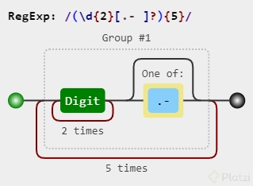

# Curso de Expresiones Regulares

## Todo lo que aprenderás sobre expresiones regulares

Este curso te va a enseñar qué son las expresiones regulares y cómo utilizarlas.
Por ejemplo aplicaciones de búsqueda y filtrado, las expresiones regulares son extremadamente potentes, aprende a utilizarlas en este curso.

## Expresiones Regulares en Programación: Una Guía Básica

**¿Qué son las expresiones regulares?**

Las expresiones regulares, a menudo abreviadas como **regex** o **regexp**, son patrones que se utilizan para buscar y manipular texto. Son una herramienta poderosa en la programación que permite encontrar coincidencias específicas dentro de cadenas de caracteres. Imagina que tienes un gran documento y quieres encontrar todas las direcciones de correo electrónico. Una expresión regular te permitiría hacer esto de forma rápida y eficiente.

**¿Para qué se utilizan?**

* **Validación de datos:** Verificar si un campo de un formulario cumple con un formato específico (por ejemplo, direcciones de correo electrónico, números de teléfono, contraseñas).
* **Extracción de información:** Obtener datos específicos de un texto, como números, fechas o nombres.
* **Reemplazo de texto:** Buscar y reemplazar patrones de texto dentro de una cadena.
* **Análisis de texto:** Realizar tareas de procesamiento de lenguaje natural, como tokenización, lematización y stemming.

**¿Cómo funcionan?**

Una expresión regular es una secuencia de caracteres que define un patrón de búsqueda. Estos caracteres pueden ser literales (los caracteres exactos que quieres buscar) o metacaracteres (caracteres especiales que tienen un significado especial dentro de una expresión regular).

**Ejemplos de metacaracteres comunes:**

* **`.` (punto):** Coincide con cualquier carácter excepto una nueva línea.
* **`^`:** Coincide con el inicio de una cadena.
* **`$`:** Coincide con el final de una cadena.
* **`*`:** Coincide con cero o más repeticiones del carácter anterior.
* **`+`:** Coincide con una o más repeticiones del carácter anterior.
* **`?`:** Coincide con cero o una ocurrencia del carácter anterior.
* **`[]`:** Define un conjunto de caracteres.
* **`()`:** Agrupa sub-expresiones.

**Ejemplo de expresión regular:**

La expresión regular `\d{3}-\d{3}-\d{4}` buscaría un patrón de números de teléfono en el formato XXX-XXX-XXXX.

**¿En qué lenguajes se utilizan?**

Casi todos los lenguajes de programación modernos soportan expresiones regulares, incluyendo:

* **JavaScript:** Se utilizan con el objeto `RegExp`.
* **Python:** El módulo `re` proporciona funciones para trabajar con expresiones regulares.
* **Java:** La clase `java.util.regex.Pattern` se utiliza para compilar expresiones regulares.
* **Perl:** Es conocido por su potente soporte para expresiones regulares.
* **PHP:** Se utilizan con las funciones `preg_match`, `preg_replace`, etc.

**¿Dónde aprender más?**

Existen numerosos recursos en línea para aprender más sobre expresiones regulares. Algunos de los más populares incluyen:

* **MDN Web Docs (JavaScript):** [https://developer.mozilla.org/es/docs/Web/JavaScript/Guide/Regular_expressions](https://developer.mozilla.org/es/docs/Web/JavaScript/Guide/Regular_expressions)
* **Regex101:** Una herramienta interactiva para probar expresiones regulares: [https://regex101.com/](https://regex101.com/)
* **Tutoriales en línea:** Busca tutoriales en plataformas como YouTube o cursos en línea especializados en programación.

**En resumen,** las expresiones regulares son una herramienta fundamental para cualquier programador que trabaje con texto. Conocer los conceptos básicos y practicar con ejemplos te permitirá dominar esta poderosa técnica y resolver una amplia gama de problemas de programación.

## ¿Qué son las expresiones regulares?

[Tutorial de algoritmos de programación | Cursos Platzi - YouTube](https://www.youtube.com/watch?v=SDv2vOIFIj8)

### Expresiones Regulares: Un Patrón para Buscar Texto

**Imagina que tienes un enorme libro y quieres encontrar todas las palabras que empiezan con "super".** Podrías pasar horas buscando manualmente, pero existe una forma más rápida y eficiente: ¡las expresiones regulares!

**¿Qué son las expresiones regulares?**

Son secuencias de caracteres que forman un patrón de búsqueda. Se utilizan principalmente para:

* **Buscar patrones:** Encontrar texto que coincida con un patrón específico dentro de una cadena más grande.
* **Reemplazar texto:** Sustituir partes de una cadena que coincidan con un patrón.
* **Validar datos:** Verificar si una cadena cumple con un formato determinado (por ejemplo, direcciones de correo electrónico, números de teléfono).

**¿Cómo funcionan?**

Las expresiones regulares utilizan caracteres especiales llamados **metacaracteres** para definir los patrones de búsqueda. Por ejemplo:

* **`.` (punto):** Coincide con cualquier carácter (excepto un salto de línea).
* **`^`:** Coincide con el inicio de una cadena.
* **`$`:** Coincide con el final de una cadena.
* **`*`:** Coincide con cero o más repeticiones del carácter anterior.
* **`+`:** Coincide con una o más repeticiones del carácter anterior.
* **`?`:** Coincide con cero o una ocurrencia del carácter anterior.
* **`[]`:** Define un conjunto de caracteres.

**Ejemplo:**

Para encontrar todas las palabras que empiezan con "super", podrías usar la expresión regular: `^super`

**¿Dónde se utilizan?**

Las expresiones regulares son muy útiles en muchos lenguajes de programación, como:

* **JavaScript:** Se utilizan con el objeto `RegExp`.
* **Python:** El módulo `re` proporciona funciones para trabajar con expresiones regulares.
* **Java:** La clase `java.util.regex.Pattern` se utiliza para compilar expresiones regulares.
* **Perl:** Es conocido por su potente soporte para expresiones regulares.
* **PHP:** Se utilizan con las funciones `preg_match`, `preg_replace`, etc.

**¿Por qué son útiles?**

* **Automatización:** Permiten automatizar tareas repetitivas de búsqueda y reemplazo de texto.
* **Flexibilidad:** Se pueden crear patrones muy complejos para encontrar casi cualquier tipo de texto.
* **Eficiencia:** Son mucho más eficientes que las búsquedas manuales.

**¿Quieres aprender más?**

Existen muchos recursos en línea para profundizar en el tema. Te recomiendo:

* **MDN Web Docs (JavaScript):** [https://developer.mozilla.org/es/docs/Web/JavaScript/Guide/Regular_expressions](https://developer.mozilla.org/es/docs/Web/JavaScript/Guide/Regular_expressions)
* **Regex101:** Una herramienta interactiva para probar expresiones regulares: [https://regex101.com/](https://regex101.com/)

**¿Tienes alguna pregunta específica sobre las expresiones regulares?** Por ejemplo, puedo explicarte cómo utilizarlas en un lenguaje de programación concreto, o resolver un problema específico que tengas.

**Ejemplo práctico:**

Supongamos que quieres validar una dirección de correo electrónico. Una expresión regular simple para esto podría ser: `^[^\s@]+@[^\s@]+\.[^\s@]+$`

Esta expresión verifica que haya al menos un carácter antes del símbolo `@`, luego el símbolo `@`, seguido de al menos un carácter y un punto, y finalmente al menos un carácter más.

## Aplicaciones de las expresiones regulares

Buscar e investigar sobre Expresiones Regulares puede ser muy intimidante.
/^(.){5}\w?[a-Z|A-Z|0-9]$/ig
En serio pueden parecer muy, muy raras; pero la verdad es que no lo son.

En esta clase aprenderás, para qué te puede servir el saber usar bien las Expresiones Regulares; y es, en pocas palabras, para buscar.

Las expresiones regulares (regex) tienen numerosas aplicaciones en diferentes áreas de la informática, principalmente en la manipulación y análisis de texto. A continuación se presentan algunas de las aplicaciones más comunes:

### 1. **Búsqueda y reemplazo de texto**
   - **Aplicación**: Se usan para buscar patrones específicos en documentos o archivos y reemplazarlos.
   - **Ejemplo**: En un archivo de texto, se puede reemplazar todas las direcciones de correo electrónico con un texto específico.
   - **Herramientas**: `sed`, `vim`, `grep`, editores de texto como Notepad++ o VS Code.

   ```bash
   sed 's/[0-9]\{10\}/[CENSURADO]/g' archivo.txt
   ```

### 2. **Validación de entradas**
   - **Aplicación**: Verificar si la entrada del usuario sigue un formato específico, como correos electrónicos, números de teléfono, códigos postales, etc.
   - **Ejemplo**: Validar si una dirección de correo electrónico ingresada por el usuario tiene el formato correcto.
   - **Herramientas**: Usado en formularios web con JavaScript, PHP, Python, y Bash.

   ```bash
   if [[ "$email" =~ ^[a-zA-Z0-9._%+-]+@[a-zA-Z0-9.-]+\.[a-zA-Z]{2,}$ ]]; then
     echo "Email válido"
   else
     echo "Email no válido"
   fi
   ```

### 3. **Extracción de datos**
   - **Aplicación**: Extraer datos relevantes de grandes volúmenes de texto basándose en patrones. Por ejemplo, extraer fechas, números de teléfono o URLs de un archivo.
   - **Ejemplo**: Extraer todas las URLs de un archivo HTML.
   - **Herramientas**: `grep`, `awk`, `Python`.

   ```bash
   grep -oP 'https?://\S+' archivo.html
   ```

### 4. **Análisis y limpieza de datos**
   - **Aplicación**: Limpiar datos en bruto (por ejemplo, eliminar caracteres no deseados, espacios en blanco) o transformar datos a formatos más manejables.
   - **Ejemplo**: Eliminar caracteres especiales de una lista de nombres en un archivo CSV.
   - **Herramientas**: Python (pandas), `sed`, `awk`.

   ```python
   import re
   data_cleaned = re.sub('[^A-Za-z0-9]+', '', data)
   ```

### 5. **Procesamiento de logs**
   - **Aplicación**: Analizar archivos de registro (logs) y extraer información relevante, como fechas, IPs o mensajes de error.
   - **Ejemplo**: Extraer todas las direcciones IP de un archivo de registro del servidor.
   - **Herramientas**: `grep`, `awk`, herramientas de análisis de logs.

   ```bash
   grep -oP '\b(?:[0-9]{1,3}\.){3}[0-9]{1,3}\b' log.txt
   ```

### 6. **Filtrado de datos**
   - **Aplicación**: Seleccionar o descartar líneas que coinciden con ciertos patrones de texto.
   - **Ejemplo**: Filtrar un archivo CSV para encontrar solo las líneas que contienen una palabra clave.
   - **Herramientas**: `grep`, `awk`, `find`.

   ```bash
   grep 'ERROR' system.log
   ```

### 7. **Automatización de tareas repetitivas**
   - **Aplicación**: Automatizar tareas como renombrar archivos en masa o reorganizar grandes volúmenes de texto.
   - **Ejemplo**: Renombrar todos los archivos con una extensión específica.
   - **Herramientas**: Bash scripts, `rename`.

   ```bash
   rename 's/\.jpeg$/\.jpg/' *.jpeg
   ```

### 8. **Desarrollo web y SEO**
   - **Aplicación**: Identificar y corregir problemas en el código HTML, como etiquetas no cerradas o enlaces rotos.
   - **Ejemplo**: Encontrar todas las imágenes sin etiquetas `alt` en un archivo HTML.
   - **Herramientas**: Python, editores de texto, `grep`.

   ```bash
   grep -oP ']*?(?<!alt)>' archivo.html
   ```

### 9. **Manipulación de archivos de configuración**
   - **Aplicación**: Modificar archivos de configuración (como archivos de configuración de servidores) en sistemas operativos basados en Unix.
   - **Ejemplo**: Cambiar el valor de una clave específica en un archivo `.conf`.
   - **Herramientas**: `sed`, `awk`.

   ```bash
   sed -i 's/^Listen 80$/Listen 8080/' /etc/httpd/conf/httpd.conf
   ```

### 10. **Testing y depuración**
   - **Aplicación**: Utilizar expresiones regulares en scripts de prueba automatizados para validar salidas específicas.
   - **Ejemplo**: Validar que una salida de texto cumple con un formato determinado en una prueba automatizada.
   - **Herramientas**: Python (unittest), Bash, `grep`.

### Resumen:
Las expresiones regulares son una herramienta esencial para tareas de manipulación de texto, análisis de datos y automatización, brindando flexibilidad y potencia para manejar patrones complejos.

## Introducción al lenguaje de expresiones regulares

Con las expresiones regulares vamos a solucionar problemas reales, problemas del día a día.

¿Qué pasa si queremos buscar en un texto (txt, csv, log, cualquiera), todos los números de teléfonos que hay?
Tendríamos que considerar por ejemplo, que un teléfono de México serían 10 dígitos; hay quienes los separan con guión, hay quienes los separan con puntos, hay quienes no los separan sino que tienen los 10 dígitos exactos, y este patrón puede cambiar para otros países.

Esto mismo sucede con números de tarjetas de crédito, códigos postales, dirección de correos, formatos de fechas o montos, etc.

[Online regex tester and debugger: PHP, PCRE, Python, Golang and JavaScript](https://regex101.com/)

## El caracter (.)

[Para trabajar caracteres](https://regexr.com/)

¿Qué es un archivo de texto, por ejemplo un CSV?
¿Qué es una cadena de caracteres?

Cada espacio en una cadena de texto se llena con un caracter, esto lo necesitamos tener perfectamente claro para comenzar a trabajar con expresiones regulares

Abriremos nuestro editor, qué en este curso recomendamos ATOM, vamos a presionar CTRL + F y podremos buscar por match idénticos.

[El código ASCII Completo, tabla con los codigos ASCII completos, caracteres simbolos letras ascii, ascii codigo, tabla ascii, codigos ascii, caracteres ascii, codigos, tabla, caracteres, simbolos, control, imprimibles, extendido, letras, vocales, signos,](http://www.elcodigoascii.com.ar/)

El carácter **`.`** (punto) en expresiones regulares es un **comodín** que representa **cualquier carácter**, excepto una nueva línea (`\n`).

### Ejemplos de uso:
1. **Coincide con cualquier carácter simple:**
   - Expresión regular: `a.b`
   - Coincide con:
     - `aab`
     - `acb`
     - `a5b`
   - No coincide con:
     - `ab` (falta un carácter entre `a` y `b`)
     - `a\nb` (porque no coincide con una nueva línea)

2. **Combinar el `.` con otros patrones:**
   - Expresión regular: `..`
   - Coincide con cualquier secuencia de **dos caracteres**.
   - Por ejemplo, coincide con `aa`, `b2`, `@#`, etc.

### Uso avanzado:
Para hacer que el punto **literal** (es decir, que represente un punto en lugar de "cualquier carácter"), debe escaparse con una barra invertida (`\.`). 

- **Ejemplo**: `a\.b` coincide con `a.b` pero **no** con `acb` o `a5b`.

El `.` es muy útil en expresiones regulares cuando se quiere flexibilizar una búsqueda, permitiendo que cualquier carácter esté en una posición específica.

## Las clases predefinidas y construidas

Las búsquedas en las expresiones regulares funcionan en múltiplos de la cantidad de caracteres que explícitamente indicamos.

En las expresiones regulares (regex), las **clases de caracteres** permiten definir conjuntos de caracteres específicos que deben coincidir con una posición en el texto. Estas clases pueden ser **predefinidas** o **personalizadas** (construidas manualmente). Vamos a explorar ambas:

### 1. **Clases predefinidas**
Son clases ya construidas que permiten hacer coincidir ciertos tipos de caracteres comunes. Algunas de las más utilizadas son:

| Clase         | Descripción                                                         | Ejemplo          |
|---------------|---------------------------------------------------------------------|------------------|
| `.`           | Cualquier carácter (excepto nueva línea `\n`)                       | `a.b` coincide con `acb`, `a1b`, pero no con `ab`. |
| `\d`          | Un dígito (equivalente a `[0-9]`)                                   | `\d\d` coincide con `12`, `45`. |
| `\D`          | Cualquier carácter que **no** sea un dígito (equivalente a `[^0-9]`) | `\D\D` coincide con `ab`, `AZ`, pero no con `12`. |
| `\w`          | Un carácter de palabra (letra, dígito o guion bajo: `[a-zA-Z0-9_]`) | `\w\w` coincide con `ab`, `a1`, pero no con `@!`. |
| `\W`          | Cualquier carácter que **no** sea una palabra (equivalente a `[^a-zA-Z0-9_]`) | `\W\W` coincide con `!@`, `##`, pero no con `ab`. |
| `\s`          | Un espacio en blanco (incluye espacio, tabulador, nueva línea)      | `\s` coincide con un espacio o tab. |
| `\S`          | Cualquier carácter que **no** sea un espacio en blanco              | `\S\S` coincide con `ab`, `a1`, pero no con ` ` (espacio). |

### 2. **Clases construidas (personalizadas)**
Estas se definen con corchetes `[]` y contienen un conjunto de caracteres que deben coincidir. Puedes especificar rangos de caracteres o combinaciones de caracteres específicos.

#### Ejemplos:
- **`[aeiou]`**: Coincide con cualquier vocal (minúsculas).
  - Ejemplo: En `hola`, coincide con `o` y `a`.
  
- **`[0-9]`**: Coincide con cualquier dígito.
  - Ejemplo: En `a5b`, coincide con `5`.
  
- **`[A-Z]`**: Coincide con cualquier letra mayúscula.
  - Ejemplo: En `Casa`, coincide con `C`.

- **`[^a-z]`**: Coincide con cualquier carácter que **no** sea una letra minúscula (el acento circunflejo `^` indica negación).
  - Ejemplo: En `Hola!`, coincide con `H`, `!`.

#### Combinación de clases:
Puedes combinar clases predefinidas y construidas para mayor flexibilidad:
- **`[a-zA-Z0-9]`**: Coincide con cualquier letra o número (minúsculas y mayúsculas).
- **`[\d\s]`**: Coincide con cualquier dígito o espacio en blanco.

### Resumen:
- **Clases predefinidas**: Simplifican el uso de patrones comunes como dígitos, letras, espacios, etc. (`\d`, `\w`, `\s`).
- **Clases construidas**: Te permiten definir conjuntos de caracteres específicos utilizando rangos o caracteres personalizados (`[a-z]`, `[A-Z0-9_]`).

Estas clases son fundamentales para escribir expresiones regulares potentes y flexibles, facilitando la búsqueda, validación y manipulación de texto.

Para buscar números **hexadecimales** utilizando **expresiones regulares**, se debe crear un patrón que reconozca los caracteres válidos en el sistema hexadecimal. Los números hexadecimales están compuestos por los dígitos del `0` al `9` y las letras de la `A` a la `F` (o sus equivalentes en minúsculas `a-f`).

### Patrón de expresión regular para números hexadecimales:
Un número hexadecimal típico comienza con `0x` o `0X` seguido de una secuencia de dígitos y letras (`0-9`, `A-F`, `a-f`).

#### Expresión regular para detectar hexadecimales:
```regex
0[xX][0-9a-fA-F]+
```

### Desglose del patrón:
- **`0[xX]`**: Coincide con `0x` o `0X`, que es el prefijo común para los números hexadecimales.
- **`[0-9a-fA-F]`**: Coincide con cualquier dígito hexadecimal (0-9) o letra (A-F o a-f).
- **`+`**: Indica que el patrón debe coincidir con **uno o más** caracteres hexadecimales.

### Ejemplos de coincidencias:
- `0x1A3F`
- `0X4b2c`
- `0xabcdef`

### Ejemplo de uso en un contexto de código bash:
Si estás buscando números hexadecimales en una cadena, puedes usar esta expresión regular en herramientas de la línea de comandos como `grep`:

```bash
echo "Valores: 0x1A3F, 0x2B4C, no es hexadecimal: 12345" | grep -oE '0[xX][0-9a-fA-F]+'
```

Esto imprimirá los números hexadecimales encontrados:
```
0x1A3F
0x2B4C
``` 

Este enfoque permite filtrar y extraer números hexadecimales de texto o archivos fácilmente.

## Los delimitadores: +, *, ?

En **expresiones regulares**, los delimitadores `+`, `*`, y `?` son **metacaracteres** que se utilizan para definir la cantidad de veces que un patrón o un carácter debe aparecer. Estos son conocidos como **cuantificadores**.

### 1. **El delimitador `*` (cero o más)**
El asterisco `*` significa que el elemento anterior puede aparecer **cero o más veces**. En otras palabras, es opcional y puede repetirse indefinidamente.

#### Ejemplo:
- Expresión regular: `a*`
  - Coincide con:
    - Cadena vacía `""`
    - `a`, `aa`, `aaa`, etc.
    - Cualquier cadena con cero o más `a`s.
  
- Expresión regular: `ba*`
  - Coincide con:
    - `b` (porque `a*` puede ser cero)
    - `ba`, `baa`, `baaa`, etc.

### 2. **El delimitador `+` (uno o más)**
El signo más `+` significa que el elemento anterior debe aparecer **al menos una vez** (es decir, **uno o más**).

#### Ejemplo:
- Expresión regular: `a+`
  - Coincide con:
    - `a`
    - `aa`, `aaa`, etc.
    - No coincide con la cadena vacía `""` porque se requiere al menos una `a`.

- Expresión regular: `ba+`
  - Coincide con:
    - `ba`, `baa`, `baaa`, etc.
    - No coincide con `b` (porque se requiere al menos una `a`).

### 3. **El delimitador `?` (cero o uno)**
El signo de interrogación `?` significa que el elemento anterior es **opcional** y puede aparecer **cero o una vez**.

#### Ejemplo:
- Expresión regular: `a?`
  - Coincide con:
    - Cadena vacía `""`
    - `a`
    - No coincide con `aa` (porque se permite solo una `a` como máximo).

- Expresión regular: `ba?`
  - Coincide con:
    - `b`
    - `ba`
    - No coincide con `baa` (porque solo se permite una `a` como máximo).

### Resumen:

| Metacaracter | Significado                               | Ejemplo               | Descripción               |
|--------------|-------------------------------------------|-----------------------|---------------------------|
| `*`          | Cero o más repeticiones del elemento      | `a*`                  | Coincide con `""`, `a`, `aa`, `aaa` |
| `+`          | Una o más repeticiones del elemento       | `a+`                  | Coincide con `a`, `aa`, `aaa`, pero no con `""` |
| `?`          | Cero o una repetición del elemento        | `a?`                  | Coincide con `""` o `a`, pero no con `aa` |

### Ejemplos combinados:
- **`[a-z]*`**: Coincide con cualquier cantidad de letras minúsculas (incluyendo cero).
- **`\d+`**: Coincide con uno o más dígitos (ej. `123`, `5`).
- **`colou?r`**: Coincide con `color` o `colour` (la `u` es opcional).

Estos delimitadores son muy útiles para crear patrones flexibles cuando se trabaja con expresiones regulares.


## Los contadores {1,4}

En **expresiones regulares**, los **contadores** o **cuantificadores** como `{n,m}` permiten especificar exactamente cuántas veces un carácter o patrón debe aparecer en la coincidencia. Este tipo de cuantificador es más preciso que los delimitadores básicos como `*`, `+` y `?`.

### **Formato: `{n,m}`**
- **`n`**: El número mínimo de repeticiones.
- **`m`**: El número máximo de repeticiones.

### Variantes de uso de los contadores `{n,m}`:
1. **`{n,m}`**: El patrón debe aparecer al menos `n` veces y como máximo `m` veces.
2. **`{n,}`**: El patrón debe aparecer al menos `n` veces, sin límite superior.
3. **`{n}`**: El patrón debe aparecer exactamente `n` veces.

### Ejemplo 1: **`{1,4}`**
Este cuantificador significa que el patrón debe aparecer **al menos una vez y como máximo cuatro veces**.

#### Ejemplo:
- Expresión regular: `a{1,4}`
  - Coincide con:
    - `a`, `aa`, `aaa`, `aaaa`
  - No coincide con:
    - `""` (cadena vacía), `aaaaa` (más de 4 repeticiones).

### Ejemplo 2: **`{2,}`**
Este patrón significa que el elemento debe aparecer **al menos 2 veces**, sin un límite superior.

#### Ejemplo:
- Expresión regular: `b{2,}`
  - Coincide con:
    - `bb`, `bbb`, `bbbb`, `bbbbb`, etc.
  - No coincide con:
    - `b` (menos de 2 repeticiones).

### Ejemplo 3: **`{3}`**
Este patrón requiere que el elemento aparezca **exactamente 3 veces**.

#### Ejemplo:
- Expresión regular: `c{3}`
  - Coincide con:
    - `ccc`
  - No coincide con:
    - `cc`, `cccc` (ni menos ni más de 3 repeticiones).

### Aplicaciones prácticas:
- **Validar números de teléfono**:
  - Expresión regular: `\d{3,4}-\d{7}` podría coincidir con un número de teléfono que tiene un prefijo de 3 o 4 dígitos, seguido de un guion y luego 7 dígitos.
  
- **Buscar palabras con una longitud específica**:
  - Expresión regular: `[a-zA-Z]{4,6}` coincidiría con palabras que tienen entre 4 y 6 letras.

### Ejemplos combinados:
1. **`[a-z]{2,5}`**: Coincide con entre 2 y 5 letras minúsculas consecutivas.
   - Coincide con: `ab`, `abcd`, `abcde`
   - No coincide con: `a` (menos de 2 letras), `abcdef` (más de 5 letras).

2. **`\d{1,3}`**: Coincide con entre 1 y 3 dígitos.
   - Coincide con: `5`, `12`, `987`
   - No coincide con: `1234` (más de 3 dígitos).

### Resumen:
| Cuantificador | Significado                                         | Ejemplo            | Descripción               |
|---------------|-----------------------------------------------------|--------------------|---------------------------|
| `{n,m}`       | Al menos `n` veces y como máximo `m` veces           | `a{1,4}`           | Coincide con `a`, `aa`, `aaa`, `aaaa` |
| `{n,}`        | Al menos `n` veces, sin límite superior              | `b{2,}`            | Coincide con `bb`, `bbb`, `bbbb`... |
| `{n}`         | Exactamente `n` veces                                | `c{3}`             | Coincide con `ccc`, pero no con `cc` o `cccc` |

Los contadores son esenciales para definir patrones con una precisión específica en las expresiones regulares, adaptándose a las necesidades de validación o búsqueda de datos más exactos.



## El caso de (?) como delimitador

El **`?`** en las expresiones regulares es un **cuantificador** que indica que el elemento anterior es **opcional**, es decir, puede aparecer **cero o una vez**.

### Explicación de **`?` como delimitador**
Cuando se coloca el signo de interrogación **`?`** después de un carácter, grupo o patrón, le dice a la expresión regular que ese elemento puede aparecer **una vez o ninguna**.

### Ejemplos del uso de **`?`**:

1. **Expresión regular: `colou?r`**
   - Coincide con:
     - `color`
     - `colour`
   - En este caso, la letra `u` es opcional. Por lo tanto, la expresión coincide con ambas versiones de la palabra: con o sin la `u`.

2. **Expresión regular: `a?b`**
   - Coincide con:
     - `b`
     - `ab`
   - Aquí, la letra `a` es opcional. La expresión coincidirá tanto si `a` está presente como si no lo está.

3. **Expresión regular: `https?://`**
   - Coincide con:
     - `http://`
     - `https://`
   - El `?` indica que la `s` es opcional, por lo que coincide con ambas formas de un enlace web, con o sin el prefijo `https`.

### **¿Cómo funciona el delimitador `?`?**
- **Con caracteres individuales**: 
   - **`a?`**: Coincide con **`a`** o la cadena vacía.
   
- **Con grupos de caracteres (entre paréntesis)**:
   - **`(abc)?`**: Coincide con **`abc`** o la cadena vacía (es decir, todo el grupo es opcional).
   
- **En combinación con otros metacaracteres**: 
   - En combinación con otros cuantificadores como `*` o `+`, el `?` puede alterar el comportamiento de estos, como en el caso del "modo no codicioso" (lazy mode).

### **Uso avanzado: Modo no codicioso (`?`)**
Además de su uso como cuantificador, el **`?`** puede usarse para modificar el comportamiento de otros cuantificadores (`*`, `+`, `{n,m}`) para que sean **no codiciosos**. Esto significa que intentarán coincidir con la menor cantidad de caracteres posible.

#### Ejemplo:
- **Expresión regular codiciosa: `a.*b`**
  - Coincide con la mayor cantidad de caracteres posible entre `a` y `b`.
  
- **Expresión regular no codiciosa: `a.*?b`**
  - Coincide con la menor cantidad de caracteres entre `a` y `b`.

#### Ejemplo detallado:
Dado el texto: `"a123b456b"`
- **Expresión codiciosa (`a.*b`)** coincidirá con: `a123b456b`
- **Expresión no codiciosa (`a.*?b`)** coincidirá con: `a123b` (la primera coincidencia mínima).

### Resumen:
- **`?`** como delimitador indica **cero o una vez**.
- Puede aplicarse a caracteres individuales o grupos de caracteres.
- También se usa para hacer patrones **no codiciosos** cuando se combina con otros cuantificadores como `*` o `+`.

### Ejemplos comunes:
1. **`colou?r`**: La `u` es opcional, coincide con `color` o `colour`.
2. **`https?://`**: La `s` es opcional, coincide con `http://` o `https://`.
3. **`a?b`**: La `a` es opcional, coincide con `b` o `ab`.

## Not (^), su uso y sus peligros

El símbolo **`^`** en las **expresiones regulares** tiene varios usos, dependiendo del contexto en el que se emplee. Uno de sus principales usos es como **operador de negación** o **"not"** cuando se utiliza dentro de **clases de caracteres** (conjuntos de caracteres definidos entre corchetes `[]`). Este uso puede ser muy útil, pero también puede ser peligroso si no se maneja con cuidado, ya que puede provocar coincidencias inesperadas o no deseadas.

### **Uso de `^` como "not" en clases de caracteres**

Cuando el **`^`** se coloca **al principio** de una **clase de caracteres** (después del corchete de apertura `[`), indica que se debe hacer una negación de los caracteres que aparecen después de él, es decir, busca **cualquier carácter que no esté en la clase de caracteres**.

#### Ejemplo:
- **Expresión regular**: `[^a-z]`
  - Coincide con cualquier carácter **que no sea una letra minúscula**.
  - Coincide con: `1`, `@`, `A`, `#`, etc.
  - No coincide con: `a`, `b`, `z`, etc.

#### Ejemplo 2:
- **Expresión regular**: `[^0-9]`
  - Coincide con cualquier carácter **que no sea un dígito**.
  - Coincide con: `a`, `B`, `!`, `#`, etc.
  - No coincide con: `0`, `1`, `9`, etc.

### **Uso de `^` al inicio de la expresión regular**
Cuando el **`^`** se usa **fuera de una clase de caracteres** (es decir, fuera de los corchetes `[]`), **al inicio de la expresión regular**, tiene un significado completamente diferente. Se usa para indicar que la coincidencia debe ocurrir al **inicio de una línea o cadena**.

#### Ejemplo:
- **Expresión regular**: `^abc`
  - Coincide con la cadena `abc` **solo si está al principio** de la línea o cadena.
  - Coincide con: `abc123`, `abc...`
  - No coincide con: `123abc`, `aabc`.

### **Peligros del uso de `^` como "not"**
El uso del **`^`** para negación puede generar problemas si no se entiende bien su contexto o si se utiliza de manera imprecisa. Aquí algunos **peligros comunes**:

1. **Malinterpretación del patrón**:
   Si el **`^`** no está en la posición correcta dentro de una clase de caracteres, su significado puede cambiar y no realizar la negación esperada. 

   - **Ejemplo incorrecto**: `[a-z^]`  
     Aquí, el `^` es solo un carácter normal en la clase de caracteres, y la expresión coincidirá con cualquier letra minúscula o con el símbolo `^`, pero **no hará ninguna negación**.

2. **Negación involuntaria de caracteres esperados**:
   Si se define mal una clase de caracteres o se omiten algunos elementos clave, es posible que la negación coincida con más caracteres de los que se pretendía.

   - **Ejemplo**: `[^a-zA-Z0-9]`
     Esta expresión coincide con cualquier carácter que **no sea una letra o un número**. Esto incluye espacios, signos de puntuación y caracteres especiales, lo que puede no ser deseado si solo se quiere evitar letras y números.

3. **Coincidencias no deseadas**:
   - Si se usa **en combinaciones más complejas**, como en contraseñas o validación de datos, el uso incorrecto de `[^...]` puede provocar que se acepten caracteres que deberían haber sido rechazados o viceversa.

4. **Confusión en la lectura**:
   Cuando se mezclan varios patrones, la colocación del **`^`** puede volverse confusa para otros desarrolladores o incluso para uno mismo al revisar el código. La **legibilidad** es clave, y no siempre es obvio que `[^...]` es una negación, especialmente si la clase de caracteres es larga.

### **Consejos para evitar problemas**:
1. **Colocación correcta del `^`**: Asegúrate de que el `^` esté justo después del corchete de apertura `[` si lo estás usando para negar una clase de caracteres. Cualquier otro lugar lo interpretará como un carácter literal.

2. **Revisar el conjunto de caracteres negados**: Asegúrate de que la clase de caracteres negados esté claramente definida para evitar negar accidentalmente caracteres que deberían ser válidos.

3. **Combinación con otros patrones**: Usa paréntesis para agrupar expresiones complejas cuando sea necesario. Esto puede ayudarte a asegurarte de que el **`^`** solo aplique a la parte del patrón que realmente deseas negar.

### **Ejemplo peligroso mal usado**:
- **Expresión regular incorrecta**: `[a-z^0-9]`
  - Aquí, la `^` no está al principio, por lo que en lugar de negar letras y números, coincidirá con letras minúsculas, números, o el carácter `^`, lo cual probablemente no sea lo que se espera.

### Resumen:
- **`^` en una clase de caracteres (`[^...]`)**: Niega el conjunto de caracteres dentro de los corchetes. Coincide con cualquier carácter que **no** esté en el conjunto.
- **`^` al inicio de la expresión regular**: Coincide con el inicio de una línea o cadena.
- **Peligros**: Colocación incorrecta o ambigua puede provocar coincidencias inesperadas o patrones mal definidos, afectando la precisión de la búsqueda o validación.

Es importante usar el **`^`** con precaución y claridad, tanto para evitar malentendidos como para asegurar que el patrón funcione según lo esperado.

## Principio (^) y final de linea ($)

En las **expresiones regulares**, los símbolos **`^`** y **`$`** son usados como **anclas** para marcar el **principio** y el **final de una línea** o cadena de texto, respectivamente. Estos delimitadores son clave para controlar dónde debe ocurrir la coincidencia dentro del texto.

### **Uso del `^` (principio de línea o cadena)**
El **`^`** indica que la coincidencia debe comenzar en el **inicio de una línea o cadena**. Solo se produce una coincidencia si el patrón aparece desde el primer carácter.

#### Ejemplo:
- **Expresión regular**: `^abc`
  - Coincide con la secuencia `abc` solo si está al **principio de la línea**.
  - Coincidirá con:
    - `"abc123"`
    - `"abc..."`
  - No coincidirá con:
    - `"123abc"`
    - `"xyzabc"`

#### Ejemplo en varias líneas:
Si se tiene un texto con saltos de línea:
```
abc
123abc
```
- La expresión **`^abc`** solo coincide con la primera línea, donde `abc` está al principio.

### **Uso del `$` (final de línea o cadena)**
El **`$`** indica que la coincidencia debe estar en el **final de una línea o cadena**. Solo se produce una coincidencia si el patrón aparece justo antes del final de la línea.

#### Ejemplo:
- **Expresión regular**: `xyz$`
  - Coincide con la secuencia `xyz` solo si está al **final de la línea**.
  - Coincidirá con:
    - `"123xyz"`
    - `"abcxyz"`
  - No coincidirá con:
    - `"xyz123"`
    - `"xyzabc"`

#### Ejemplo en varias líneas:
Dado el texto:
```
xyz
abcxyz
xyz123
```
- La expresión **`xyz$`** solo coincidirá con la primera y segunda línea, donde `xyz` está al final.

### **Combinación de `^` y `$` (patrón que coincide con toda la línea o cadena)**
Cuando se usan juntos, **`^`** y **`$`** pueden definir un patrón que **debe coincidir exactamente con toda la línea o cadena**, sin importar lo que haya antes o después.

#### Ejemplo:
- **Expresión regular**: `^abc$`
  - Coincide solo si la línea contiene exactamente el texto `abc`.
  - Coincidirá con:
    - `"abc"`
  - No coincidirá con:
    - `"123abc"`
    - `"abc123"`
    - `"abc xyz"`

#### Uso práctico:
- Para asegurarse de que una cadena cumple exactamente con un formato, se puede usar **`^`** y **`$`** para que todo el texto coincida con el patrón y no solo una parte.

### **Resumen de los usos**:
1. **`^`**: Coincide con el **principio de la línea o cadena**.
   - Ejemplo: **`^abc`** solo coincide con `"abc123"` pero no con `"123abc"`.
2. **`$`**: Coincide con el **final de la línea o cadena**.
   - Ejemplo: **`xyz$`** solo coincide con `"abcxyz"` pero no con `"xyzabc"`.
3. **`^patrón$`**: Coincide con una línea o cadena que **exactamente** coincida con el patrón completo.
   - Ejemplo: **`^abc$`** solo coincide con `"abc"`, sin ningún otro carácter antes o después.

### **Casos de uso**:
- **Validación de formatos**:
   - Para asegurarse de que una entrada cumpla con un formato específico, como una dirección de correo electrónico o un número de teléfono.
   
- **Coincidencias estrictas**:
   - Para evitar coincidencias parciales en grandes cadenas de texto donde solo se desea capturar información precisa.

Ambos símbolos son extremadamente útiles para realizar coincidencias precisas y controladas en archivos de texto, entradas de usuario y más.