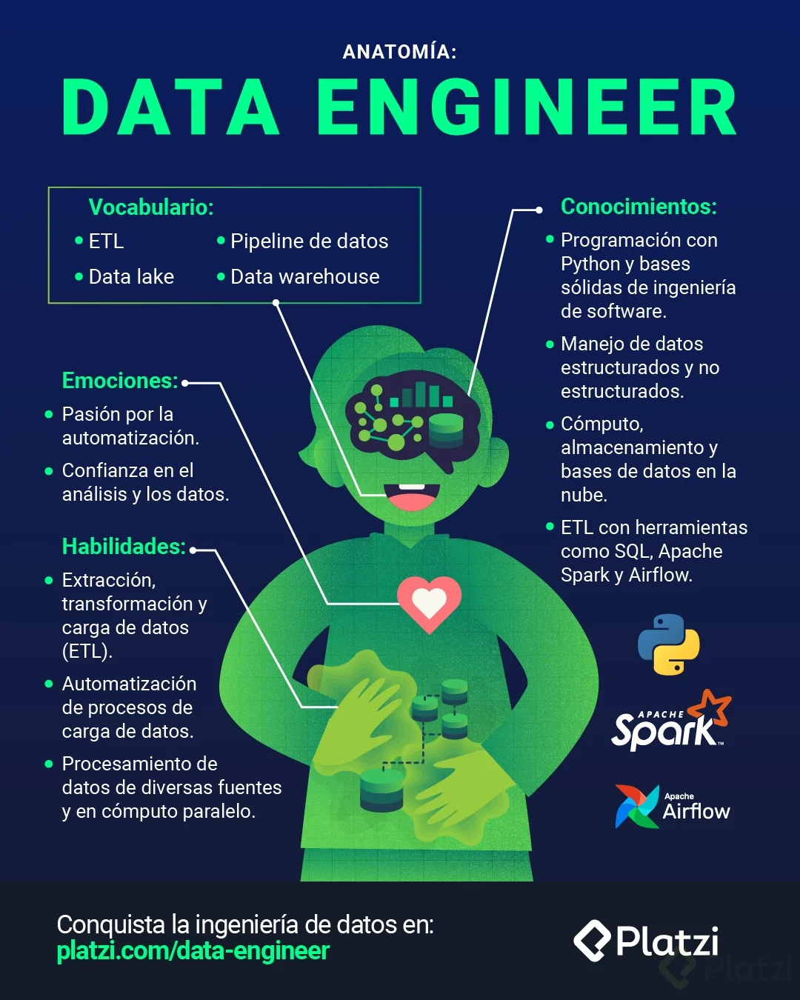

# Curso de Fundamentos de Ingeniería de Datos

## ¿Qué es ingeniería de datos? ¿Qué es Data Engineer?

La **ingeniería de datos** es una disciplina dentro del campo de la tecnología que se encarga de diseñar, construir, optimizar, administrar y mantener los sistemas y plataformas que permiten el almacenamiento, procesamiento y análisis de datos en las organizaciones. Su objetivo principal es asegurar que los datos estén disponibles, estructurados, limpios y listos para ser utilizados en los procesos de análisis, toma de decisiones y machine learning.

### **Algunas de las funciones clave de la ingeniería de datos incluyen:**
- **Extracción, Transformación y Carga (ETL):** Conjunto de procesos utilizados para extraer datos de diversas fuentes, transformarlos en un formato utilizable y cargarlos en un almacén de datos (Data Warehouse) o almacenamiento en la nube.
- **Almacén de Datos (Data Warehouse):** Creación, optimización y gestión de bases de datos o almacenamiento para manejar grandes volúmenes de datos.
- **Procesamiento de datos en tiempo real:** Diseño de pipelines de datos que procesan información a medida que llega, permitiendo análisis en tiempo real.
- **Integración de fuentes de datos:** Unificación de datos provenientes de múltiples fuentes, para asegurar que la organización disponga de una única versión de la verdad.
- **Optimización del rendimiento de los sistemas de datos:** Mejora continua del rendimiento y escalabilidad de los sistemas que almacenan y procesan datos.
- **Seguridad de los datos:** Implementación de controles para proteger la privacidad, disponibilidad y integridad de los datos.

### **Data Engineer**

Un **Data Engineer** es el profesional que aplica su conocimiento en ingeniería de datos para diseñar, construir, optimizar y gestionar los sistemas de datos que permiten el almacenamiento, procesamiento y análisis de la información en una organización. Su trabajo se centra en preparar y asegurar que los datos estén listos para que los científicos de datos, analistas y otros usuarios puedan hacer análisis eficientes o desarrollar modelos de machine learning.

### **Funciones principales de un Data Engineer:**
- **Construcción de pipelines de datos:** Creación de flujos de trabajo para mover y transformar los datos desde diversas fuentes hacia los sistemas de almacenamiento.
- **Diseño y mantenimiento de bases de datos y almacenes de datos (Data Lakes, Data Warehouses).**
- **Optimización del rendimiento de los sistemas de almacenamiento y procesamiento de datos.**
- **Análisis y modelado de datos para entender su estructura y mejorar la calidad de los datos.**
- **Trabajo con tecnologías como SQL, Apache Spark, Hadoop, Amazon Redshift, Google BigQuery, entre otros.**
- **Desarrollo y configuración de herramientas y frameworks para manejo de datos en la nube (AWS, Azure, GCP).**

### **Diferencias entre ingeniería de datos y Data Engineer:**
- **Ingeniería de datos** es el campo o disciplina general que abarca todas las actividades relacionadas con la gestión, procesamiento y análisis de datos.
- **Data Engineer** es el rol específico dentro de esta disciplina, que se enfoca en la implementación práctica de los sistemas, herramientas y procesos necesarios para manejar los datos en una organización.

**Lecturas recomendadas**

[Platzi: Cursos online profesionales de tecnología](https://platzi.com/data-engineer/)

[Guía de retos - Curso Fundamentos Ingeniería de Datos Students - Google Slides](https://docs.google.com/presentation/d/17MRhxEUEy8RhbnMuc0RZGkWJm5yX5bN_CtaU3sY8k3M/edit?usp=share_link)

## Guía de retos para convertirte en Data Engineer

¡Hola! Qué emoción tenerte en este curso donde comenzarás a formarte como toda una o un Data Engineer.

Durante las clases compartiré varios retos que son preguntas o actividades sencillas donde tendrás que investigar o compartir tu opinión o perspectiva. Para ello llevarás una guía de retos, un documento donde escribirás tus respuestas…

Para continuar con el curso [descarga aquí la Guía de retos del Curso de Fundamentos de Ingeniería de Datos](https://static.platzi.com/media/public/uploads/guia-de-retos-curso-fundamentos-ingenieria-de-datos-students_f5559ae7-e73b-4691-bbcf-58e444cd83f1.pptx "descarga aquí la Guía de retos del Curso de Fundamentos de Ingeniería de Datos"). ⬅️

En este documento responderás las preguntas y actividades de los retos que aparecen al final de cada clase. Además, al terminar cada módulo tendrás un espacio donde dejarás tus propias reflexiones sobre lo que has aprendido. Siéntete libre de investigar, buscar y escribir lo que hayas encontrado.

### Bonus: anatomía Data Engineer

Las y los Data Engineer o Ingenieros de Datos se encargan de tomar los datos crudos de valor, para transformarlos y almacenarlos en bases de datos de analítica y disponibilizarlos a software que funciona en sistemas de producción. Para ello crean pipelines ETL y utilizan bases de datos especializadas, con los que abastecen de datos a los demás roles de un equipo de data y a sistemas de software que funcionan con datos y machine learning.

Recuerda esto que es la base de la definición de un Data Engineer. Descarga la infografía de su anatomía para que te empieces a familiarizar en el perfil en el que te convertirás. 💪🏽

Al terminar el curso comparte todos tus aprendizajes en los comentarios de la clase final. Así podrás intercambiar ideas y soluciones con toda la comunidad de data de Platzi. 🙌🏽

## ¿Cómo convertirte en Data Engineer?

Convertirte en **Data Engineer** implica adquirir conocimientos en diversas áreas relacionadas con el manejo de datos, así como aprender a utilizar herramientas, lenguajes de programación y tecnologías específicas. A continuación, te detallo los pasos esenciales para iniciar y avanzar en este camino:

### **1. Comprende el entorno de datos**
- **Conocimiento básico de bases de datos:** Familiarízate con bases de datos relacionales (SQL) y no relacionales (NoSQL), como MySQL, PostgreSQL, MongoDB, Cassandra, etc.
- **Almacenes de datos (Data Warehousing y Data Lakes):** Aprende cómo funcionan los almacenes de datos como Amazon Redshift, Google BigQuery, Snowflake, Databricks, etc.
- **Procesamiento de datos (ETL/ELT):** Comprende el proceso de extracción, transformación y carga (ETL), incluyendo la integración y manipulación de datos.

### **2. Aprende a programar**
- **Lenguajes de programación** como **Python** y **SQL** son fundamentales para trabajar con datos. Python es ampliamente usado para desarrollo de pipelines de datos, análisis, limpieza y automatización.
- **SQL** es crucial para consultas y manipulación de datos almacenados en bases de datos.

### **3. Familiarízate con herramientas y tecnologías clave**
- **Frameworks ETL** como **Apache Airflow** o **DBT** para la automatización de pipelines.
- **Data Lakes y Cloud Platforms:** Aprende a trabajar con servicios de nube como **AWS (Amazon Web Services)**, **Azure** o **Google Cloud Platform (GCP)**, donde se almacenan y procesan grandes volúmenes de datos.
- **Big Data Technologies:** Familiarízate con herramientas como **Apache Spark**, **Hadoop**, **Kafka**, que permiten el procesamiento masivo y el análisis distribuido.

### **4. Manejo de datos en tiempo real**
- **Data Streaming:** Aprende sobre **Apache Kafka** y **Amazon Kinesis** para manejar datos en tiempo real.
- **Conceptos de Streaming Data:** Cómo construir sistemas de ingestión de datos en tiempo real y realizar procesamiento en flujo continuo.

### **5. Conocimiento de Machine Learning y Data Science**
- **Conocer los fundamentos de Machine Learning** te ayudará a construir pipelines que alimenten modelos de machine learning, además de trabajar con datos destinados a la creación de modelos.

### **6. Diseño y Arquitectura de Sistemas de Datos**
- **Diseño de soluciones de datos escalables:** Aprende sobre arquitectura de datos, como las soluciones de **Data Warehousing**, **Data Lakes** y el diseño de **pipeline** de datos eficientes.

### **7. Herramientas comunes para Data Engineering**
- Familiarízate con herramientas como:
  - **Airflow**: para orquestar y monitorizar tareas.
  - **Git**: para versionar tus proyectos y colaborar con otros.
  - **Jupyter Notebooks** o **VS Code**: para desarrollar y documentar el trabajo con datos.
  - **Docker**: para la gestión de entornos y despliegue de aplicaciones.

### **8. Mantente actualizado**
- **Certificaciones** como **AWS Certified Data Engineer** o **Google Professional Data Engineer** te pueden proporcionar reconocimiento profesional.
- **Capacítate constantemente** mediante cursos en línea, blogs, foros comunitarios, conferencias (como DataEng Conf, PyData, etc.).

### **9. Desarrollo de Soft Skills**
- **Trabajo en equipo:** Muchas veces, los Data Engineers colaboran con científicos de datos, analistas de negocio, product owners, etc.
- **Comunicación efectiva:** Poder explicar el significado y los resultados de los datos a otros equipos es clave.
- **Capacidad analítica:** Ser capaz de interpretar los datos y extraer insights relevantes para el negocio.

### **10. Proyectos prácticos**
- Realiza proyectos que te permitan aplicar lo aprendido, como construir pipelines de datos, trabajar con herramientas de almacenamiento en nube, analizar datos, realizar optimizaciones, etc.

### **Requisitos básicos para empezar:**
- **Formación académica** en carreras como Ingeniería de Sistemas, Ingeniería en Computación, Estadística, o afines, aunque no es obligatorio.
- **Habilidades técnicas avanzadas** en bases de datos, programación, análisis de datos y modelado de datos.
- **Experiencia en la nube** con AWS, Azure o Google Cloud.

Al adquirir estas habilidades y experiencias, podrás convertirte en un Data Engineer competente y profesional.

## ¿Dónde ejercer como Data Engineer?

Como **Data Engineer**, podrás ejercer en una amplia variedad de industrias que manejan grandes volúmenes de datos. A continuación, algunos de los principales sectores donde los Data Engineers son muy demandados:

### **1. Tecnología (Tech Companies)**
   - **Gigantes tecnológicos** como **Google**, **Amazon**, **Facebook** (Meta), **Apple** y **Microsoft** tienen enormes volúmenes de datos y constantemente buscan Data Engineers para diseñar, construir y mantener sus sistemas de almacenamiento y procesamiento de datos.
   - **Startups tecnológicas** también dependen del análisis de datos para optimizar sus procesos, escalar operaciones y desarrollar nuevos productos.

### **2. Industria Financiera (Fintechs, Bancos, Seguros)**
   - **Bancos** y **empresas financieras** utilizan datos para analizar el comportamiento de los usuarios, la gestión del riesgo, la detección de fraudes, la optimización de productos financieros, y la personalización de servicios.
   - **Fintechs** como **Nubank**, **Stripe**, **Klarna**, etc., necesitan Data Engineers para diseñar sus plataformas de datos, mejorar la analítica en tiempo real y desarrollar pipelines de datos para optimizar las operaciones financieras.

### **3. Sector de Salud (Salud Digital y Biotech)**
   - Los hospitales, clínicas, empresas farmacéuticas y empresas de salud digital generan y procesan grandes volúmenes de datos relacionados con la salud de los pacientes, investigación biomédica, detección temprana de enfermedades, y personalización de tratamientos.
   - **Empresas de e-health** como **Teladoc Health**, **Mediapipe** y **Prueba médica** buscan profesionales que les ayuden a gestionar sus bases de datos y realizar análisis para la mejora de la salud pública.

### **4. Comercio Electrónico (Retail y e-commerce)**
   - **Amazon**, **Alibaba**, **eBay**, **Zara** y otras empresas del comercio electrónico manejan datos de inventarios, preferencias de compra, comportamiento de usuarios y análisis de campañas para personalizar la experiencia de compra y optimizar las operaciones logísticas.
   - Los Data Engineers son esenciales para crear sistemas de almacenamiento y procesamiento de datos que soporten la escalabilidad de estas plataformas.

### **5. Transporte y Logística**
   - Empresas de transporte como **Uber**, **Didi**, **FedEx**, **DHL**, y **Airbnb** dependen de los datos para optimizar rutas, gestionar inventarios, predecir demandas y mejorar la experiencia de usuario.
   - Los Data Engineers en este sector se enfocan en la optimización de rutas, la gestión de flotas y la recopilación de datos en tiempo real.

### **6. Consultoría de Datos y Análisis**
   - **Empresas de consultoría** como **Deloitte**, **Accenture**, **KPMG** y **Capgemini** ofrecen servicios para transformar los datos en insights valiosos para otras empresas.
   - Trabajar en estas consultoras te permitirá ser parte de múltiples proyectos en diferentes industrias, aplicando habilidades avanzadas en el manejo de datos.

### **7. Medios y Entretenimiento**
   - Empresas de medios y entretenimiento como **Netflix**, **Spotify**, **Disney**, y **HBO** utilizan datos para personalizar contenidos, entender el comportamiento de los usuarios y optimizar sus estrategias de distribución y publicidad.
   - Los Data Engineers en este sector se centran en la optimización de plataformas de streaming, análisis de recomendaciones y gestión de grandes volúmenes de información.

### **8. Educación**
   - Universidades, plataformas de educación online como **Coursera**, **Udemy**, **Khan Academy** y otras instituciones educativas utilizan datos para mejorar el aprendizaje, la personalización de cursos y la gestión del rendimiento académico.
   - Data Engineers en este sector trabajan en la recopilación, análisis y visualización de datos educativos.

### **9. Energía y Utilities**
   - Empresas de **energía** como **Siemens**, **General Electric**, **ExxonMobil**, y **Iberdrola** necesitan Data Engineers para manejar datos de consumo energético, eficiencia operacional y mantenimiento predictivo.
   - El objetivo es optimizar la producción y distribución de energía mediante el uso eficiente de los datos.

### **10. Agricultura**
   - **Empresas agropecuarias** como **John Deere**, **Farmers Edge**, **Walmart** en sus divisiones agroalimentarias utilizan datos para la predicción de cosechas, la optimización de la distribución y la mejora de la producción agrícola.
   - Los Data Engineers apoyan los sistemas de monitoreo de cultivos y la gestión de sensores en campo.

### **Dónde encontrar empleo como Data Engineer:**
   - **Plataformas de empleo**: LinkedIn, Glassdoor, Indeed, Jobstreet, Xing, Monster, entre otras.
   - **Empresas tecnológicas**: Grandes empresas tecnológicas, startups y scale-ups.
   - **Consultoras**: Empresas de consultoría de tecnología y transformación digital.
   - **Organizaciones gubernamentales**: Ministerios, instituciones públicas y organismos de investigación también buscan expertos en datos.

### **Habilidades adicionales requeridas:**
- **Comunicación efectiva**: Capacidad de trabajar con equipos multidisciplinarios (científicos de datos, analistas, ingenieros, etc.).
- **Gestión de proyectos**: Saber trabajar bajo presión y con plazos establecidos.
- **Inglés técnico**: Muchas ofertas requieren dominio del inglés técnico, especialmente en empresas multinacionales.

Convertirse en Data Engineer te abre múltiples puertas laborales en sectores tecnológicos, financieros, de salud, comercio, y más, donde los datos son fundamentales para la toma de decisiones.

**Lecturas recomendadas**

[#StartupReady: Prepárate para trabajar en el mundo digital](https://platzi.com/blog/ready/)

## Tareas de Data Engineer: DataOPs

Las **DataOps** son prácticas y metodologías enfocadas en la automatización, monitoreo y optimización de los procesos de datos para asegurar la entrega de datos de alta calidad, confiables y oportunos. Los Data Engineers desempeñan un papel fundamental en la implementación de DataOps, y sus tareas suelen involucrar las siguientes responsabilidades:

### **Tareas típicas de un Data Engineer en el contexto de DataOps:**

1. **Creación de Pipelines de Datos (ETL/ELT)**:
   - Diseño, desarrollo y mantenimiento de pipelines para la extracción, transformación y carga (ETL) o para la extracción, carga y transformación (ELT) de datos desde diversas fuentes hacia almacenes de datos o sistemas de análisis.
   - Optimización de los pipelines para garantizar el procesamiento eficiente y escalable.

2. **Automatización del procesamiento de datos**:
   - Automatización de los flujos de datos y la ejecución periódica de los pipelines para la carga y transformación de datos, garantizando que los datos estén siempre actualizados.
   - Uso de herramientas de orquestación como Apache Airflow, Luigi, o Prefect para definir y ejecutar procesos de datos de manera automática.

3. **Implementación de Data Integration**:
   - Asegurar la integración eficiente y correcta de datos provenientes de múltiples fuentes internas y externas (bases de datos, APIs, servicios en la nube, archivos, etc.).
   - Validar y asegurar la calidad de los datos antes y después de su integración.

4. **Monitoreo y Gestión de la Calidad de Datos**:
   - Implementar soluciones para el monitoreo continuo de la calidad de los datos, asegurando que estos cumplan con los estándares definidos.
   - Configuración de alertas para detectar anomalías o errores en los datos, y tomar medidas correctivas.

5. **Optimización del rendimiento de los sistemas de datos**:
   - Optimizar el rendimiento de los almacenes de datos, bases de datos, sistemas de big data (como Hadoop, Spark) y los pipelines para garantizar tiempos de procesamiento adecuados.
   - Análisis de bottlenecks y mejoras en las consultas y las arquitecturas de almacenamiento.

6. **Gestión de Data Lakes y Almacenes de Datos**:
   - Diseño, desarrollo y mantenimiento de **Data Lakes** y **Data Warehouses**.
   - Implementación de capas de almacenamiento adecuadas para facilitar el análisis de datos.

7. **Seguridad y Cumplimiento de Normas**:
   - Implementar prácticas para asegurar la privacidad, seguridad y cumplimiento normativo (como GDPR, CCPA) en el manejo de datos.
   - Aplicar controles de acceso y políticas para la protección de los datos.

8. **Desarrollo de modelos para Data Quality**:
   - Desarrollo de modelos y scripts para asegurar la limpieza, validación y estandarización de los datos antes de su uso.
   - Creación de reglas de negocio para la mejora continua de la calidad de los datos.

9. **Colaboración con Científicos de Datos y Analistas**:
   - Trabajar en estrecha colaboración con científicos de datos, analistas y otros equipos para entender las necesidades de datos y asegurarse de que los pipelines entreguen los datos necesarios para análisis y modelos.

10. **Documentación y Gobernanza de Datos**:
    - Documentar el flujo de datos, los pipelines, las políticas de calidad y las prácticas de DataOps para garantizar la gobernanza adecuada.
    - Participar en la creación de metadatos y documentación para que los datos sean fácilmente accesibles y entendidos por los diferentes usuarios.

11. **Uso de Cloud Platforms**:
    - Manejo de datos en entornos en la nube (Amazon AWS, Google Cloud, Microsoft Azure), incluyendo la utilización de servicios como **S3**, **Azure Data Lake**, **BigQuery**, **Redshift**, **Databricks**, **Snowflake**, etc.
   
12. **Implementación de DevOps para Datos (DataDevOps)**:
    - Integrar los principios de DevOps en el flujo de trabajo de datos, utilizando prácticas como Continuous Integration/Continuous Delivery (CI/CD) para datos.

### **Herramientas comunes utilizadas en DataOps:**
- **Apache Airflow**, **Luigi**, **Prefect**: Para orquestar pipelines de datos.
- **Docker** y **Kubernetes**: Para el despliegue y la gestión de aplicaciones y servicios de datos.
- **Databricks**, **Apache Spark**, **Hadoop**: Para procesamiento de datos en grandes volúmenes.
- **AWS Glue**, **Azure Data Factory**, **Google Dataflow**: Plataformas para la integración de datos en la nube.
- **Git** y **GitLab**: Para versionar y colaborar en los procesos de datos.
- **Snowflake**, **Redshift**, **BigQuery**: Plataformas de almacenamiento y análisis en la nube.
- **ELK Stack** (Elasticsearch, Logstash, Kibana): Para monitorear y gestionar registros y métricas.

### **Beneficios de DataOps para las empresas**:
- Mejora la **eficiencia** en la entrega de datos y la automatización.
- Asegura la **calidad** y fiabilidad de los datos.
- Reduce el **time-to-market** para proyectos analíticos.
- Optimiza los **costos** al eliminar procesos manuales y mejorar la eficiencia del uso de recursos.

La adopción de DataOps permite a las empresas agilizar sus operaciones de datos y garantizar que los datos sean accesibles, fiables y listos para el análisis.

### **Agile, DevOps y Lean Manufacturing**:

#### **Agile**:
- **Definición**: Agile es un enfoque iterativo y colaborativo para el desarrollo de software, centrado en la entrega temprana y continua de valor al cliente. Se basa en principios como la flexibilidad, la adaptación al cambio, la comunicación abierta, y la colaboración constante entre los equipos.
- **Principios clave**:
  - **Colaboración**: Fomenta la comunicación continua entre los equipos y los clientes para responder rápidamente a los cambios.
  - **Entregas Iterativas**: Se trabaja en pequeñas iteraciones, permitiendo entregar valor al cliente frecuentemente.
  - **Priorización de los requerimientos**: Enfoca el trabajo en los elementos de más alta prioridad para el negocio.
  - **Retroalimentación**: Permite recibir y aplicar retroalimentación temprana y continua para mejorar el producto.
- **Ejemplo de metodologías ágiles**: Scrum, Kanban, Extreme Programming (XP).

#### **DevOps**:
- **Definición**: DevOps es un conjunto de prácticas y herramientas que une los equipos de desarrollo (Dev) y operaciones (Ops) para mejorar la entrega continua de software, la estabilidad del sistema y la colaboración en la gestión de aplicaciones e infraestructuras.
- **Principios clave**:
  - **Cultura de colaboración**: Los equipos de desarrollo y operaciones trabajan juntos, eliminando los silos tradicionales.
  - **Automatización**: Automatiza procesos como la integración, entrega y despliegue (CI/CD), pruebas, despliegue de infraestructura, monitoreo y gestión de cambios.
  - **Desarrollo Continuo**: Los cambios en el código, configuraciones y despliegues se realizan frecuentemente y se verifican automáticamente.
  - **Monitorización Proactiva**: Monitorea el rendimiento del sistema en tiempo real para garantizar la estabilidad y responder a incidentes rápidamente.
- **Herramientas comunes**: Jenkins, Docker, Kubernetes, Ansible, Terraform, Git.

#### **Lean Manufacturing**:
- **Definición**: Lean Manufacturing es una filosofía de producción orientada a eliminar el desperdicio y maximizar el valor para el cliente a través de la mejora continua. Se enfoca en la eficiencia, optimización de procesos, y la mejora continua para aumentar la calidad y reducir costos.
- **Principios clave**:
  - **Valor para el Cliente**: Identifica el valor que realmente importa para el cliente y elimina lo que no aporta valor.
  - **Eliminación de Desperdicio**: Busca reducir todas las actividades que no agregan valor, como el sobreproducción, tiempos de espera, exceso de inventario, transportes innecesarios, entre otros.
  - **Mejora Continua**: Promueve la mejora continua en todos los aspectos del proceso productivo, basada en la participación activa de todos los empleados.
  - **Flujo Sincronizado**: Trabaja en la creación de flujos productivos sincronizados para producir de manera eficiente sin interrupciones.
- **Herramientas comunes**: Kaizen (mejora continua), Value Stream Mapping (VSM), Just-in-Time (JIT), 5S.

### **Diferencias principales**:

- **Agile** se enfoca en el desarrollo iterativo y la flexibilidad para entregar valor rápidamente al cliente.
- **DevOps** une el desarrollo y las operaciones para mejorar la calidad, la estabilidad y la eficiencia en el ciclo de vida del software.
- **Lean Manufacturing** busca optimizar los procesos de producción eliminando el desperdicio y enfocándose en la mejora continua para maximizar el valor.

Cada uno de estos enfoques tiene como objetivo principal mejorar la eficiencia, la calidad, y la rapidez en la entrega, pero se aplican en diferentes contextos: Agile en el desarrollo de software, DevOps en la colaboración entre desarrollo y operaciones, y Lean en la optimización de los procesos de producción.

## Agile en ingeniería de datos

**Agile en Ingeniería de Datos** se enfoca en implementar principios ágiles para gestionar y optimizar el ciclo de vida de los datos, desde la recolección hasta el análisis y el uso final. A medida que las organizaciones buscan ser más ágiles en la toma de decisiones, la ingeniería de datos adopta esta metodología para mejorar la flexibilidad, la colaboración y la eficiencia en la entrega de soluciones basadas en datos.

### **Principales Componentes del Agile en Ingeniería de Datos**:

1. **Entrega Iterativa y Sprints**:
   - Los equipos de ingeniería de datos trabajan en iteraciones cortas o sprints, permitiendo entregas de valor de manera continua. Cada sprint se enfoca en una mejora específica o en la creación de un conjunto funcional de datos, como nuevos pipelines, modelos analíticos o dashboards.

2. **Colaboración Interdisciplinaria**:
   - Los equipos de datos, incluidos los ingenieros, analistas y científicos de datos, colaboran de manera estrecha para asegurar que el resultado final cumpla con las necesidades de negocio. Se fomenta la comunicación constante y la retroalimentación.

3. **Adaptabilidad y Respuesta Rápida**:
   - Al ser un enfoque flexible, Agile permite a los equipos de datos responder rápidamente a cambios en los requerimientos del negocio, así como a ajustes necesarios en las fuentes de datos o en los modelos analíticos.

4. **Prioritización Basada en Valor**:
   - Los equipos ágiles priorizan tareas basándose en el valor que aportan al negocio. Esto ayuda a enfocarse en lo más importante y a evitar la sobrecarga de trabajo.

5. **Visualización del Progreso**:
   - Las herramientas de gestión visual como Kanban o Tableros de Scrum son utilizadas para mantener el seguimiento del progreso, lo que permite una visión clara del estado del proyecto y las tareas pendientes.

6. **Mejora Continua**:
   - Agile en la ingeniería de datos promueve el ciclo de mejora continua, donde los equipos de datos buscan siempre optimizar sus procesos, herramientas y pipelines para incrementar la eficiencia y la calidad.

7. **Gestión de Datos Automatizada**:
   - La automatización es una parte clave, permitiendo a los equipos agilizar tareas repetitivas como la extracción, transformación y carga (ETL), y automatizar pruebas y validaciones de datos.

8. **Integración Continua**:
   - Los pipelines de datos se integran continuamente con sistemas como almacenamiento en la nube, bases de datos, y herramientas de análisis para asegurar un flujo constante de datos limpios y listos para su análisis.

9. **Documentación Colaborativa**:
   - El uso de documentación compartida, como wikis o repositorios colaborativos, asegura que todos los integrantes del equipo tengan acceso a la misma información actualizada sobre el estado de los datos y los procesos.

10. **Medición del Rendimiento**:
    - Se establece un conjunto de métricas para medir el rendimiento del ciclo de vida de los datos, como el tiempo de procesamiento, la calidad de los datos y la eficiencia de los modelos, permitiendo ajustes basados en datos.

### **Beneficios del Agile en Ingeniería de Datos**:
- **Flexibilidad**: Adaptación rápida a los cambios en los requerimientos y fuentes de datos.
- **Entregas Más Frecuentes**: Entrega continua de valor al negocio con resultados visibles en cortos periodos.
- **Mejora Continua**: Se fomenta la optimización continua de procesos y pipelines, asegurando la eficiencia en el manejo de datos.
- **Colaboración Activa**: Mejora la comunicación entre los equipos multidisciplinarios, fortaleciendo la calidad de los datos y su uso.

Implementar Agile en la ingeniería de datos permite a las organizaciones maximizar la utilización de sus recursos de datos y obtener insights clave para la toma de decisiones de negocio en tiempos más cortos.

**Kanban** y **Scrum** son dos metodologías ágiles ampliamente utilizadas en la gestión de proyectos y el desarrollo de software, pero tienen diferencias significativas en su enfoque y estructura. A continuación, se detallan las principales diferencias entre **Kanban** y **Scrum**:

### **Kanban**:

- **Principio Básico**:
  - Kanban es una metodología visual que se centra en la gestión del flujo de trabajo mediante un tablero visual, usualmente utilizando columnas para representar el estado de las tareas (To Do, In Progress, Done).
  
- **Flexibilidad**:
  - Kanban es más flexible y se adapta mejor a los proyectos donde los requisitos no están completamente definidos desde el inicio. Permite a los equipos trabajar de manera continua y llevar las tareas en función del flujo de trabajo.

- **Proceso**:
  - Las tareas se extraen del flujo general según la disponibilidad y prioridad, y el trabajo se mantiene en curso limitado (WIP), es decir, el número máximo de elementos en cada etapa del proceso.
  
- **Colaboración Visual**:
  - Fomenta la colaboración visual en tiempo real, permitiendo a todos los miembros del equipo tener una visión clara del estado del trabajo.
  
- **Adaptabilidad**:
  - Ideal para equipos pequeños o proyectos con una necesidad más flexible y donde los cambios son frecuentes.

- **Usos**:
  - Mejor para proyectos donde la demanda varía o los procesos se desarrollan iterativamente pero sin una estructura fija, como en operaciones continuas o mantenimiento.

### **Scrum**:

- **Principio Básico**:
  - Scrum es una metodología iterativa e incremental que divide el trabajo en **Sprints**. Cada Sprint es un periodo fijo de tiempo donde se entrega un incremento de trabajo funcional.
  
- **Estructura Definida**:
  - Tiene una estructura más formal con roles claramente definidos: Scrum Master, Product Owner y el equipo Scrum. Además, cuenta con eventos regulares como **Reuniones Diarias**, **Revisión del Sprint** y **Retroalimentación del Sprint**.
  
- **Proceso**:
  - El trabajo se divide en ciclos cortos (Sprints), con un objetivo claro al inicio de cada Sprint. Los desarrolladores planifican lo que pueden completar en ese periodo y se centran en los resultados logrados al final de cada ciclo.
  
- **Time-boxing**:
  - Tiene un enfoque de tiempo limitado, con entregas periódicas. Esto permite a los equipos trabajar con metas claras y dedicarse a la finalización de las tareas dentro de un tiempo específico.
  
- **Colaboración**:
  - Fomenta la colaboración en equipo con reuniones estructuradas y retroalimentación continua para mejorar los procesos de desarrollo.
  
- **Usos**:
  - Mejor para proyectos donde los requisitos están más claros al principio, los entregables son definidos, y se prioriza la previsión de resultados en periodos regulares.

### **Diferencias Clave**:

- **Enfoque**:
  - **Kanban**: Flujo continuo, trabajo en proceso limitado.
  - **Scrum**: Trabajo dividido en ciclos (Sprints), con entregas incrementales.

- **Flexibilidad**:
  - **Kanban**: Más adaptable a cambios constantes.
  - **Scrum**: Estricto con sus tiempos y roles.

- **Estructura**:
  - **Kanban**: No requiere roles formales, solo un tablero visual.
  - **Scrum**: Requiere roles bien definidos y reuniones regulares.

- **Entregas**:
  - **Kanban**: Entrega continua sin tiempos predefinidos.
  - **Scrum**: Entregas periódicas al final de cada Sprint.

- **Adaptabilidad**:
  - **Kanban**: Mejora la eficiencia en la continuidad del flujo.
  - **Scrum**: Mejora la planificación y previsión del trabajo.

### **Conclusión**:
- **Kanban** es ideal para equipos que necesitan mantener un flujo de trabajo constante y necesitan flexibilidad en la gestión del trabajo.
- **Scrum** es mejor para proyectos más estructurados con plazos definidos y entregables iterativos donde se requiere previsión, planificación y seguimiento detallado.

Ambas metodologías tienen sus beneficios, y la elección dependerá del contexto del equipo, los proyectos y las necesidades específicas del trabajo.

**Lecturas recomendadas**

[Curso de Scrum - Platzi](https://platzi.com/cursos/scrum/)

## Lenguajes de programación e ingeniería de software

Los **lenguajes de programación** son herramientas esenciales en **ingeniería de software**, ya que permiten a los desarrolladores crear, modificar y mantener aplicaciones de software. La elección del lenguaje depende de diversos factores como la naturaleza del proyecto, las necesidades del cliente, la plataforma de destino, la escalabilidad y los tiempos de desarrollo. A continuación se detallan algunos **lenguajes de programación** comunes en **ingeniería de software**:

### **Lenguajes de Programación Comunes en Ingeniería de Software**:

#### 1. **Java**:
   - **Uso**: Desarrollos empresariales, aplicaciones móviles (Android), aplicaciones web escalables.
   - **Ventajas**: Orientado a objetos, robusto, gran ecosistema de frameworks (Spring, Hibernate).
   - **Aplicaciones**: Bancos, empresas grandes, sistemas empresariales.

#### 2. **Python**:
   - **Uso**: Desarrollo web (Django, Flask), inteligencia artificial, análisis de datos, machine learning.
   - **Ventajas**: Fácil de leer, alto nivel, gran comunidad, extenso soporte para bibliotecas.
   - **Aplicaciones**: Machine learning, automatización, análisis de datos, desarrollo web.

#### 3. **JavaScript**:
   - **Uso**: Desarrollo web (frontend y backend con Node.js), aplicaciones web modernas (React, Angular, Vue.js).
   - **Ventajas**: Universal en web, manejo de eventos, fuerte comunidad, soporte para múltiples frameworks.
   - **Aplicaciones**: Frontend, desarrollo web full-stack.

#### 4. **C#**:
   - **Uso**: Desarrollo de aplicaciones empresariales, videojuegos (Unity), aplicaciones .NET.
   - **Ventajas**: Orientado a objetos, fácil integración con bases de datos, gran ecosistema (.NET Framework, ASP.NET).
   - **Aplicaciones**: Aplicaciones empresariales, videojuegos, desarrollo en Windows.

#### 5. **C++**:
   - **Uso**: Desarrollo de software de alto rendimiento, aplicaciones de sistemas embebidos, videojuegos.
   - **Ventajas**: Gran control sobre la memoria, aplicaciones intensivas en rendimiento, sistema multiplataforma.
   - **Aplicaciones**: Juegos, sistemas operativos, aplicaciones de alta velocidad.

#### 6. **Ruby**:
   - **Uso**: Desarrollo web (Ruby on Rails), aplicaciones rápidas, prototipos rápidos.
   - **Ventajas**: Simple, expresivo, facilidad para crear aplicaciones web, comunidad activa.
   - **Aplicaciones**: Desarrollo web, aplicaciones back-end, prototipos.

#### 7. **Swift**:
   - **Uso**: Desarrollo de aplicaciones para iOS y macOS.
   - **Ventajas**: Optimizado para la seguridad, rapidez y simplicidad en la programación de apps móviles de Apple.
   - **Aplicaciones**: Aplicaciones móviles en iOS y macOS.

#### 8. **Go**:
   - **Uso**: Desarrollo de aplicaciones web, microservicios, software de red.
   - **Ventajas**: Escalabilidad, desempeño eficiente, simplicidad en la sintaxis.
   - **Aplicaciones**: Microservicios, aplicaciones backend, servicios web.

---

### **Lenguajes de Programación Versátiles**:

- **PHP**: Desarrollo web.
- **Kotlin**: Alternativa a Java para Android.
- **TypeScript**: Lenguaje de tipado para JavaScript.
- **Dart**: Desarrollo de aplicaciones móviles con Flutter.
- **Scala**: Sistemas distribuidos y Big Data.

---

### **Principales Tendencias en Lenguajes de Programación**:
- **Programación Orientada a Objetos (OOP)**: Lenguajes como Java, C++, Python, Kotlin.
- **Programación Funcional**: Lenguajes como Scala, Haskell, F#.
- **Lenguajes para Machine Learning**: Python, R, Julia.
- **Lenguajes para Desarrollo Web**: JavaScript, Python, Ruby.
- **Lenguajes para Big Data**: Java, Scala, Python, R.

### **Consideraciones al Elegir un Lenguaje de Programación**:
- Naturaleza del proyecto (web, móvil, científico, etc.).
- Requisitos de rendimiento.
- Escalabilidad y mantenimiento del software.
- Comunidad de desarrollo y soporte.
- Recursos y habilidades disponibles en el equipo.

La elección de un lenguaje debe estar alineada con los objetivos del proyecto, la plataforma de destino, los requerimientos técnicos y las expectativas de calidad del software.

Python ofrece una gran variedad de **librerías** que te permiten trabajar eficientemente con datos. A continuación, te detallo algunas de las **librerías** más utilizadas para la **manipulación, análisis, visualización y modelado** de datos:

### **Librerías Principales para Trabajar con Datos en Python:**

#### **1. Pandas**:
   - **Uso**: Manipulación de datos tabulares, análisis exploratorio de datos, importación y limpieza de datos.
   - **Ventajas**: Excelentes operaciones sobre DataFrames, manejo eficiente de datos estructurados.

#### **2. NumPy**:
   - **Uso**: Trabajo con arrays y matrices, cálculo científico, operaciones matemáticas eficientes.
   - **Ventajas**: Álgebra lineal, operaciones eficientes en grandes conjuntos de datos.

#### **3. Matplotlib**:
   - **Uso**: Visualización de datos en 2D y 3D, creación de gráficos como líneas, barras, scatter plots.
   - **Ventajas**: Personalización completa de gráficos, gran control sobre los detalles visuales.

#### **4. Seaborn**:
   - **Uso**: Visualización de datos con un enfoque estadístico, basada en Matplotlib.
   - **Ventajas**: Simplifica la creación de gráficos complejos con un diseño estético.

#### **5. SciPy**:
   - **Uso**: Métodos matemáticos avanzados, optimización, álgebra lineal, estadísticas.
   - **Ventajas**: Extensión de NumPy con herramientas científicas.

#### **6. Scikit-learn**:
   - **Uso**: Machine Learning, creación de modelos para clasificación, regresión, clustering, reducción de dimensionalidad.
   - **Ventajas**: Implementación sencilla de algoritmos de machine learning.

#### **7. TensorFlow**:
   - **Uso**: Aprendizaje automático, redes neuronales y deep learning.
   - **Ventajas**: Librería robusta para modelar y entrenar redes neuronales.

#### **8. PyTorch**:
   - **Uso**: Deep Learning, aprendizaje automático, cálculo automático.
   - **Ventajas**: Popular en investigación académica y desarrollo ágil de modelos de machine learning.

#### **9. Plotly**:
   - **Uso**: Creación de visualizaciones interactivas, gráficos en línea.
   - **Ventajas**: Visualización interactiva basada en JavaScript, amplias opciones para gráficos.

#### **10. SQLAlchemy**:
   - **Uso**: Acceso a bases de datos utilizando ORM (Object-Relational Mapping).
   - **Ventajas**: Facilita el manejo y la consulta de bases de datos relacionales.

#### **11. BeautifulSoup**:
   - **Uso**: Extracción y manipulación de datos desde documentos HTML/XML.
   - **Ventajas**: Limpieza y procesamiento de datos web.

#### **12. Scrapy**:
   - **Uso**: Extracción de datos web (web scraping).
   - **Ventajas**: Fácil de usar para recoger información de sitios web.

#### **13. PySpark**:
   - **Uso**: Procesamiento de datos distribuidos, análisis y machine learning en grandes datasets.
   - **Ventajas**: Extensión de Apache Spark para trabajar con datos distribuidos.

#### **14. Dask**:
   - **Uso**: Computación paralela y distribuida, manejo de grandes datasets.
   - **Ventajas**: Escalable, ideal para trabajar con conjuntos de datos grandes.

#### **15. XGBoost**:
   - **Uso**: Gradient Boosting para modelos de regresión y clasificación.
   - **Ventajas**: Optimización eficiente y gran precisión en modelos de machine learning.

Estas **librerías** son esenciales para cualquier trabajo con datos en Python, ya sea en análisis estadístico, visualización, aprendizaje automático, o manipulación de datos. Dependiendo de tus necesidades, podrás combinar varias de estas librerías para obtener los mejores resultados en tus proyectos.