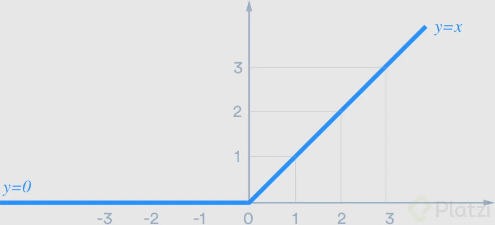
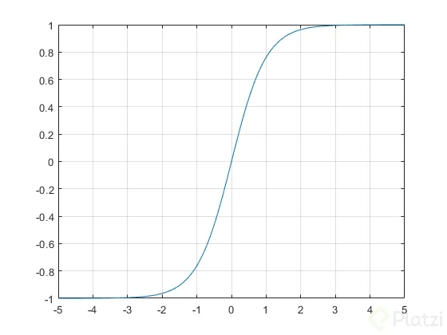

# Curso de Fundamentos de Redes Neuronales con Python y Keras

1. **Keras es un API que facilita el trabajo de crear redes neuronales, Keras usa el siguiente backend como su fuente:**
   
**R//=** Tensorflow

2. **Es uno de los grandes problemas de trabajar con deep learning**
 
**R//=** Overfitting

3. **¿En qué consiste el aprendizaje “profundo”?**
   
**R//=** Las capas reciben información de la capa anterior, las procesan y el resultado lo van pasando a las siguientes capas, haciendo un aprendizaje más detallado cuanto más capas existan en la red.

4. **¿Cuál es la función del BIAS en la neurona?**
   
**R//=** Dar más flexibilidad al modelo desplazando la respuesta lineal en los ejes

5. **¿En qué consisten las sumas ponderadas de la neurona?**
    
**R//=** Realizar un producto punto entre los datos de entrada y los pesos asociados a la neurona.

6. **Es uno de los problemas que una neurona o perceptrón no puede solucionar, por sus propias limitantes**
    
**R//=** XOR

7. **En una red neuronal las primeras capas obtienen la información más general de los datos y las últimas capas información más específica o detallada. Esta afirmación es:**
    
**R//=** Verdadera

8. **¿Por qué son necesarias las funciones de activación?**
    
**R//=** Porque cada neurona devuelve una función lineal al igual que la suma de funciones lineales da como resultado otra función lineal, de ser así se obtiene el mismo resultado y es necesario deformar la función lineal.

9. **¿A qué función pertenece esta representación?**

    
**R//=** ReLU

10. **¿A qué función pertenece esta representación?**

 
**R//=** Tanh

11. **Es una función de activación muy útil que también cuenta con derivada y funciona perfecto cuando queremos resolver un problema de probabilidad binaria:**
    
**R//=** Sigmoid

12. **¿Cuál es el objetivo de la función de pérdida?**
    
**R//=** Identificar numéricamente el error o diferencia entre los valores predichos y los reales.

13. **¿Es posible derivar la función de pérdida?**
    
**R//=** Verdadero

14. **¿Cuál es el principal objetivo del descenso del gradiente?**
    
**R//=** Encontrar paso a paso el mínimo global en la función de pérdida

15. **Podemos decir que el learning rate "LP" es:**
    
**R//=** Un delta que me indica el tamaño de los “pasos” que se aplican al descenso del gradiente en cada iteración.

16. **Uno de los conceptos inspirados en la física para evitar que el descenso del gradiente se estanque en un mínimo local es:**
    
**R//=** Momentum

17. **Una de las desventajas de tener un learning rate LR muy bajo es:**
    
**R//=** El entrenamiento de la red neuronal será más lento.

18. **El objetivo del backpropagation es:**
    
**R//=** Distribuir el error a través de toda la red neuronal para actualizar sus pesos de acuerdo a dicho error.

19. **En numpy (np) podemos usar esta función para realizar un producto punto**
    
**R//=** matmul

20. **Como buena práctica en deep learning, ¿en cuántos sub sets de datos es mejor dividir nuestros datos?**
    
**R//=** 3

21. **La función de pérdida recomendada para resolver un problema de clasificación binaria es:**
    
**R//=** Binary_crossentropy

22. **¿Qué función de activación en la última capa es recomendable para un problema de clasificación binaria?**
    
**R//=** Sigmoid

23. **La función de pérdida recomendada para resolver un problema de clasificación múltiple es:**
    
**R//=** categorical_crossentropy

24. **¿Qué función de activación en la última capa es recomendable para un problema de clasificación múltiple?**
    
**R//=** Softmax

25. **La función de pérdida recomendada para resolver un problema de regresión con valores arbitrarios es:**
    
**R//=** MSE

26. **¿Qué función de activación en la última capa es recomendable para un problema de regresión?**
    
**R//=** Linear o None

27. **Podemos clasificar a sets de datos de dos dimensiones como:**
    
**R//=** Matrices

28. **La función de pérdida Cross Entropy funciona mejor con problemas de:**
    
**R//=** Clasificación

29. **La regularización L1 consiste en incrementar el valor de la función de pérdida basándonos en:**
    
**R//=** Los valores absolutos de los pesos de la red

30. **La capa de dropout consiste en:**
    
**R//=** Dejar en 0 aleatoriamente una fracción de las neuronas en la salida de la capa.