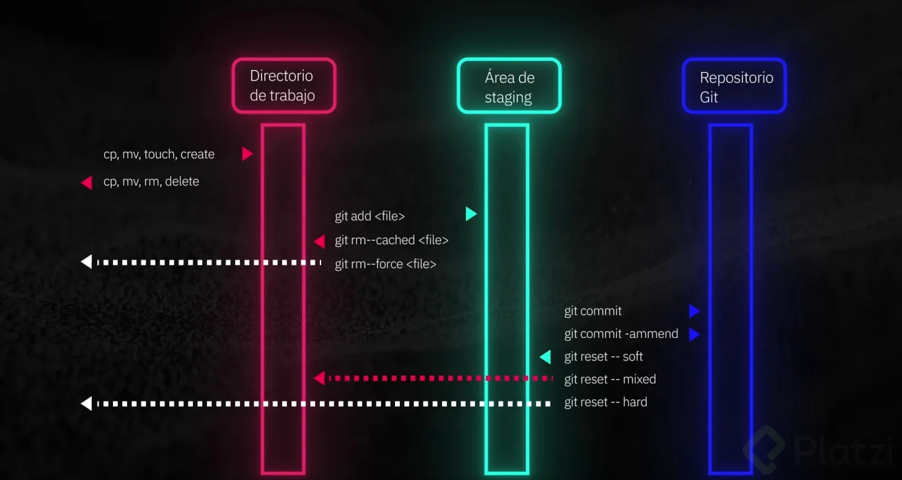

# Curso de Git y GitHub

## ¿Qué son Git y GitHub?

### **Git**  
Git es un **sistema de control de versiones distribuido** que permite a los desarrolladores rastrear cambios en el código fuente, colaborar en proyectos y administrar diferentes versiones del mismo proyecto sin perder información. Fue creado por **Linus Torvalds** en 2005 para el desarrollo del kernel de Linux.  

Algunas características clave de Git:  
- Permite trabajar en **ramas (branches)** para desarrollar nuevas características sin afectar la versión principal.  
- Facilita la colaboración entre múltiples desarrolladores mediante **fusiones (merges)** y **resolución de conflictos**.  
- Almacena de manera eficiente los cambios en los archivos utilizando un modelo basado en instantáneas.  
- Funciona de manera **descentralizada**, lo que significa que cada copia de un repositorio es independiente.  

### **GitHub**  
GitHub es una **plataforma de alojamiento de repositorios Git** basada en la nube que permite almacenar, compartir y colaborar en proyectos de software. Aunque GitHub usa Git como tecnología base, agrega funcionalidades adicionales como:  
- **Interfaz web** para administrar repositorios sin usar la línea de comandos.  
- **GitHub Actions** para automatizar pruebas e implementaciones.  
- **Issues y Pull Requests**, herramientas para gestionar cambios y reportar problemas.  
- **GitHub Pages**, que permite alojar sitios web estáticos desde un repositorio.  

Existen otras plataformas similares a GitHub que también usan Git, como **GitLab, Bitbucket y SourceForge**.  

Si quieres empezar con Git, puedes instalarlo desde [git-scm.com](https://git-scm.com/) y aprender a usar comandos básicos como:  
```bash
git init       # Inicializa un repositorio Git en una carpeta
git clone URL  # Clona un repositorio remoto
git add .      # Agrega cambios al área de preparación
git commit -m "Mensaje"  # Guarda los cambios con un mensaje
git push origin main  # Sube los cambios al repositorio remoto
```  

**Resumen**
Aprender a gestionar versiones en proyectos de software es fundamental para evitar el caos de múltiples archivos llamados “versión final” y mejorar la colaboración en equipo. Git, un sistema de control de versiones, permite a los desarrolladores trabajar de manera ordenada, manteniendo solo los cambios realizados en los archivos y simplificando el trabajo en equipo al coordinar y sincronizar las modificaciones.

**¿Qué es Git y por qué debería importarte?**

Git es la herramienta de control de versiones más utilizada por programadores. Su función es clara: gestiona versiones de archivos de forma eficaz, algo vital en proyectos colaborativos. Sin Git, los desarrolladores enfrentaban problemas de organización y errores en la sincronización manual de archivos, un proceso que era tan lento como propenso a fallos.

**¿Quién creó Git y por qué es tan relevante?**

El creador de Git es Linus Torvalds, el mismo desarrollador detrás del núcleo de Linux, quien creó esta herramienta para resolver sus propias necesidades de control de versiones. Además, Git es open source, lo que permite a cualquier persona contribuir a su mejora constante, garantizando que siga siendo una herramienta poderosa y en evolución.

**¿Cómo te beneficia aprender Git desde el inicio?**

Desde que comienzas a programar, aprender Git te brinda una ventaja profesional. Esta herramienta te permitirá organizar tu código, colaborar con otros desarrolladores y, eventualmente, contribuir a proyectos externos. En el desarrollo de software, los productos suelen ser el resultado del esfuerzo de un equipo, y Git se vuelve esencial para gestionar el trabajo de manera efectiva.

**¿Cómo funciona Git en tu entorno de trabajo?**

Git se usa en la terminal o en editores como Visual Studio Code, utilizando comandos clave como `commit`, `pull`, `push`, `merge`, entre otros. Para colaborar en proyectos con otros desarrolladores, se usa una plataforma en la nube como GitHub. Allí puedes almacenar tu código, gestionar versiones y acceder a funcionalidades adicionales que aumentan la productividad y facilitan la colaboración.

**¿Qué aprenderás en este curso de Git?**

En este curso, aprenderás a:

- Configurar Git en tu computadora y crear repositorios locales.
- Realizar cambios, crear ramas, fusionarlas y gestionar el flujo de trabajo en equipo.
- Configurar un repositorio remoto en GitHub para colaborar en proyectos.
- Revisar y fusionar aportes de otros programadores, resolver conflictos y entender un flujo de trabajo profesional.

Al final, dominarás tanto los comandos básicos como las herramientas avanzadas, desde ramas y fusiones hasta Code Spaces y automatizaciones, para que realmente te destaques en el uso de Git.

**Lecturas recomendadas**

[Git](https://git-scm.com/)

[GitHub · Build and ship software on a single, collaborative platform · GitHub](https://github.com/)

## Configuración Inicial de Git: init y config

Para comenzar a usar Git en tu máquina, es importante hacer una configuración inicial después de instalarlo. Esto implica inicializar un repositorio (`git init`) y establecer configuraciones globales (`git config`).

## **1. Inicializar un Repositorio: `git init`**
El comando `git init` se usa para convertir una carpeta en un repositorio de Git.  

### **Pasos:**
1. Abre una terminal y navega hasta la carpeta donde quieres iniciar el repositorio.
2. Ejecuta:  
   ```bash
   git init
   ```
3. Esto creará una carpeta oculta llamada `.git` que almacenará toda la información del repositorio.

🔹 **Ejemplo:**
```bash
mkdir mi_proyecto
cd mi_proyecto
git init
```
Después de esto, `mi_proyecto` se convierte en un repositorio Git.

## **2. Configuración Global de Git: `git config`**
Antes de comenzar a hacer commits, Git necesita conocer tu identidad para etiquetar correctamente los cambios.

### **Configurar nombre y correo electrónico**  
```bash
git config --global user.name "Tu Nombre"
git config --global user.email "tuemail@example.com"
```
Estos datos se guardan en el archivo `~/.gitconfig`.

### **Ver la configuración actual**  
Para verificar tu configuración, usa:
```bash
git config --list
```

### **Configurar el editor de texto predeterminado**  
Si quieres usar un editor específico (ej. `nano` o `vim`), ejecuta:
```bash
git config --global core.editor "nano"
```

### **Configurar el comportamiento de las ramas principales**  
A partir de Git 2.28, puedes definir el nombre predeterminado de la rama inicial:
```bash
git config --global init.defaultBranch main
```
Esto hará que, al ejecutar `git init`, la rama principal se llame `main` en lugar de `master`.

## **3. Configuración Local vs. Global**
- **Global (`--global`)**: Aplica la configuración a todos los repositorios de tu usuario.
- **Local (sin `--global`)**: Aplica la configuración solo al repositorio actual.

Ejemplo de configuración local:
```bash
git config user.name "Otro Nombre"
```

## **Resumen**
| Comando | Descripción |
|---------|------------|
| `git init` | Inicializa un repositorio Git en la carpeta actual |
| `git config --global user.name "Tu Nombre"` | Configura el nombre del usuario a nivel global |
| `git config --global user.email "tuemail@example.com"` | Configura el email del usuario a nivel global |
| `git config --list` | Muestra la configuración actual de Git |
| `git config --global core.editor "nano"` | Establece el editor de texto predeterminado |
| `git config --global init.defaultBranch main` | Define el nombre de la rama principal como `main` |

**Resumen**

Trabajar con Git en la terminal permite a los desarrolladores gestionar sus proyectos de manera eficiente. A continuación, revisamos cómo instalar, configurar y utilizar Git en Linux, Mac y WSL de Windows, junto con algunas recomendaciones prácticas para dominar los comandos iniciales de esta herramienta.

### ¿Cómo confirmar que Git está instalado en tu sistema?

Para verificar la instalación de Git:

1. Abre la terminal y escribe el comando `git --version`.
2. Si el comando devuelve un número de versión, Git está listo para usarse.
3. Si no aparece la versión, revisa los recursos adjuntos donde se explican las instalaciones para cada sistema operativo.

### ¿Cómo crear y preparar el primer proyecto con Git?

El primer paso para crear un proyecto en Git es:

1. Limpia la terminal para evitar confusión visual.
2. Crea una carpeta para el proyecto con `mkdir nombre_del_proyecto`.
3. Navega a la carpeta con `cd nombre_del_proyecto`.

### ¿Cómo inicializar un repositorio en Git?

Al estar dentro de la carpeta de tu proyecto, inicia el repositorio con:

- `git init`: Esto crea la rama inicial “master” por defecto.

Si prefieres la rama principal como “main”:

1. Cambia la configuración global escribiendo `git config --global init.defaultBranch main`.
2. Actualiza la rama en el proyecto actual con `git branch -m main`.

### ¿Cómo personalizar tu configuración de usuario en Git?

Configura el nombre de usuario y correo electrónico de Git, que identificará todas tus contribuciones:

1. Usa `git config --global user.name "Tu Nombre o Apodo"`.
2. Configura el correo electrónico con `git config --global user.email "tu.email@example.com"`.

**Tip**: Si necesitas corregir algún error en el comando, puedes usar la tecla de flecha hacia arriba para recuperar y editar el último comando escrito.

¿Cómo confirmar la configuración de Git?
Para revisar tu configuración, ejecuta:

- `git config --list`: Aquí verás los datos de usuario y el nombre de la rama principal.

Esta configuración se aplicará a todos los repositorios que crees en adelante.

### ¿Qué hacer si olvidas un comando?

Git incluye un recurso rápido y útil para recordar la sintaxis de comandos:

1. Escribe `git help` en la terminal.
2. Navega la lista de comandos disponibles y consulta la documentación oficial de cada uno cuando sea necesario.

**Lecturas recomendadas**

[Git](https://git-scm.com/)

[Git - git-init Documentation](https://git-scm.com/docs/git-init)

[Git Cheat Sheet - GitHub Education](https://education.github.com/git-cheat-sheet-education.pdf)

[Git - git-config Documentation](https://git-scm.com/docs/git-config)

[Git - Configurando Git por primera vez](https://git-scm.com/book/es/v2/Inicio---Sobre-el-Control-de-Versiones-Configurando-Git-por-primera-vez)

[Configurar Windows para WSL - Platzi](https://platzi.com/home/clases/6900-configuracion-windows/60922-configurar-windows-11-para-soportar-la-instalacion/)

[GitHub · Build and ship software on a single, collaborative platform · GitHub](https://github.com/)

## Comandos Básicos de Git: add, commit y log

## **Comandos Básicos de Git: `add`, `commit` y `log`**  

Una vez que tienes Git configurado e inicializado, puedes comenzar a gestionar cambios en tu código. Tres de los comandos más importantes son `git add`, `git commit` y `git log`.

---

## **1. Agregar Archivos al Área de Preparación: `git add`**  
Antes de confirmar los cambios en el historial de Git, debes agregarlos al **staging area** (área de preparación).

### **Sintaxis:**
```bash
git add <archivo>       # Agrega un archivo específico
git add .               # Agrega todos los archivos modificados
git add *.txt           # Agrega solo archivos con cierta extensión
```

🔹 **Ejemplo:**  
Si creas un archivo `index.html` y lo modificas, puedes agregarlo al área de preparación con:
```bash
git add index.html
```
Esto indica a Git que este archivo será parte del próximo commit.

---

## **2. Confirmar Cambios: `git commit`**  
El comando `git commit` guarda una **instantánea permanente** de los archivos en el historial de versiones.

### **Sintaxis:**
```bash
git commit -m "Mensaje descriptivo"
```
🔹 **Ejemplo:**  
```bash
git commit -m "Agregada la estructura inicial del proyecto"
```
Después de este comando, los cambios se guardan en el historial de Git, pero aún no se han enviado a un repositorio remoto.

**Opción avanzada:** Si quieres escribir un mensaje más detallado en varias líneas, usa:
```bash
git commit
```
Esto abrirá el editor de texto configurado (como `nano` o `vim`), donde puedes escribir una descripción más extensa del commit.

---

## **3. Ver el Historial de Commits: `git log`**  
Para ver el historial de confirmaciones en el repositorio, usa `git log`.

### **Sintaxis básica:**
```bash
git log
```
🔹 **Ejemplo de salida:**
```
commit 1a2b3c4d5e6f7g8h9i (HEAD -> main)
Author: Mario Alexander Vargas Celis <mario@example.com>
Date:   Wed Jan 30 12:00:00 2025 -0500

    Agregada la estructura inicial del proyecto
```

### **Opciones útiles:**
- **Mostrar commits en una línea resumida:**
  ```bash
  git log --oneline
  ```
  🔹 **Ejemplo de salida:**  
  ```
  1a2b3c4 Agregada la estructura inicial del proyecto
  ```

- **Ver cambios en cada commit:**  
  ```bash
  git log -p
  ```
- **Filtrar por autor:**  
  ```bash
  git log --author="Mario"
  ```
- **Ver commits de los últimos 7 días:**  
  ```bash
  git log --since="7 days ago"
  ```

---

## **Flujo de Trabajo Básico con Git**
1️⃣ **Crear o modificar archivos:**  
   ```bash
   echo "Hola Mundo" > archivo.txt
   ```

2️⃣ **Agregar cambios al área de preparación:**  
   ```bash
   git add archivo.txt
   ```

3️⃣ **Confirmar los cambios con un mensaje:**  
   ```bash
   git commit -m "Primer archivo agregado"
   ```

4️⃣ **Ver el historial de commits:**  
   ```bash
   git log --oneline
   ```

Con estos comandos, ya puedes comenzar a gestionar versiones en Git.

## Resumen

Aprender a utilizar Git desde los primeros pasos puede parecer desafiante, pero es esencial para registrar cambios y manejar versiones de cualquier proyecto. Siguiendo un flujo de trabajo sencillo y utilizando los comandos adecuados, puedes dominar el control de versiones y llevar un seguimiento preciso de tus archivos.

### ¿Cómo inicia el control de versiones con Git?

El primer paso es iniciar un repositorio con el comando `git init`, que crea una carpeta oculta llamada `.git` en el directorio de trabajo. Esta carpeta actúa como una bitácora, almacenando cada cambio y movimiento de los archivos que se manejan en el proyecto.

### ¿Cómo se crean y agregan archivos a Git?

Para crear un archivo desde la terminal, utiliza un editor como `nano`. Una vez creado, puedes verificar su existencia y estado con `git status`, que te mostrará el archivo como no registrado. Para incluirlo en el área de staging, donde estará listo para el commit, usa `git add nombre_del_archivo.txt`. Esta área de staging es un “limbo” donde decides qué archivos entrarán en el control de versiones.

- **Ejemplo de comandos:**
 - nano testing.txt para crear el archivo.
 - git add testing.txt para agregarlo al área de staging.
 
### ¿Qué es el área de staging y cómo funciona?

El área de staging permite revisar los cambios antes de que se registren oficialmente en el repositorio. Los archivos en staging aún no forman parte del historial de versiones; están en espera de que se realice un commit o de ser devueltos a su estado original con `git rm --cached nombre_del_archivo.txt`.

### ¿Cómo realizar el commit de los archivos en Git?

Una vez en staging, se ejecuta git commit -m "mensaje descriptivo" para registrar los cambios en el repositorio. El mensaje en el commit es crucial porque indica la acción realizada, como “nuevo archivo de testing”. Este mensaje permite identificar los cambios de forma clara y ordenada en el historial del proyecto.

- **Ejemplo de commit:**
 - `git commit -m "nuevo archivo de testing"`
 
### ¿Cómo gestionar múltiples archivos en Git?

Para trabajar con varios archivos a la vez, utiliza `git add .` que agrega todos los archivos sin registrar en el área de staging. Puedes decidir entre realizar commits individuales o múltiples en función de la cantidad de archivos y los cambios realizados en cada uno.

### ¿Cómo visualizar el historial de cambios en Git?

El comando `git log` muestra el historial de commits, proporcionando una vista completa de cada cambio realizado en el proyecto. Esta bitácora permite ver el estado de cada archivo y la información de cada commit.

### ¿Qué sucede al modificar un archivo en Git?

Cuando un archivo se edita, Git lo detecta como “modificado”. El flujo de trabajo para registrar este cambio es el mismo que para un archivo nuevo: `git add` para llevarlo a staging y `git commit` para guardar la modificación. Esto asegura que Git mantenga un registro detallado de cada cambio, actualización o eliminación en el proyecto.

### ¿Cómo maneja Git diferentes tipos de archivos?

Git trata cualquier archivo de igual manera, sin importar su extensión o tipo, ya sea de texto, código o imagen. Con `git add` y `git commit`, cualquier cambio en estos archivos se registra, facilitando el control de versiones sin importar el tipo de contenido.



**Terminos basicos**

- cd → cambiar directorio y/o regresar al directorio raiz
- cd .. → retroceder 1 carpeta dentro del directorio
- mkdir → crear directorio
- rmdir → remover directorio
- ls → contenido de un directorio
- .. → volver 1 carpeta atrás
- mkdir repo → crear repo
- rmdir repo → eliminar repo
- git init → iniciar repositorio
- git add → añadir archivos
- git status → estado del repo
- git rm —cached → eliminar archivo añadido al repositorio
- git commit → subir todo al repositorio

**Lecturas recomendadas**

[Git - git-add Documentation](https://git-scm.com/docs/git-add)

[Git - git-commit Documentation](https://git-scm.com/docs/git-commit)

[Git - git-log Documentation](https://git-scm.com/docs/git-log)

[Póngase en marcha - Documentación de GitHub](https://docs.github.com/es/get-started/start-your-journey)

## Ramas y Fusión de Cambios: branch, merge, switch y checkout

### **Ramas y Fusión de Cambios en Git**  
Las **ramas** en Git permiten trabajar en diferentes versiones de un proyecto sin afectar la rama principal. Esto es útil para desarrollar nuevas funcionalidades o corregir errores sin modificar el código estable.  

Los comandos más importantes para manejar ramas son:  
- `git branch` → Crear y listar ramas.  
- `git switch` y `git checkout` → Cambiar entre ramas.  
- `git merge` → Fusionar cambios entre ramas.  

### **1. Listar y Crear Ramas: `git branch`**  
### **Ver ramas existentes:**  
```bash
git branch
```
🔹 **Ejemplo de salida:**
```
* main
  nueva_funcionalidad
```
El asterisco (*) indica la rama en la que estás trabajando.

### **Crear una nueva rama:**  
```bash
git branch nombre_rama
```
🔹 **Ejemplo:**  
```bash
git branch nueva_funcionalidad
```
Esto crea la rama `nueva_funcionalidad`, pero **no cambia a ella**.

### **2. Cambiar de Rama: `git switch` y `git checkout`**  
Para cambiar de rama, puedes usar:  

### **Usando `git switch` (Recomendado desde Git 2.23)**  
```bash
git switch nombre_rama
```
🔹 **Ejemplo:**  
```bash
git switch nueva_funcionalidad
```

### **Usando `git checkout` (Método antiguo, aún válido)**  
```bash
git checkout nombre_rama
```

### **Crear y cambiar a una nueva rama en un solo paso:**  
```bash
git switch -c nueva_rama
```
O con `checkout` (versión antigua):  
```bash
git checkout -b nueva_rama
```

### **3. Fusionar Cambios entre Ramas: `git merge`**  
Cuando terminas de trabajar en una rama, puedes fusionar sus cambios en la rama principal.

### **Pasos para fusionar ramas:**  
1️⃣ Cambiar a la rama donde se quiere fusionar (por ejemplo, `main`):  
   ```bash
   git switch main
   ```

2️⃣ Ejecutar el merge:  
   ```bash
   git merge nueva_funcionalidad
   ```

🔹 **Ejemplo:**  
Si trabajaste en `nueva_funcionalidad` y quieres fusionarla en `main`:  
```bash
git switch main
git merge nueva_funcionalidad
```

### **Posibles resultados al hacer `merge`:**
✅ **Fusión rápida (`Fast-forward`)**  
Si no hubo otros cambios en `main`, Git moverá directamente la referencia:  
```
  main --> nueva_funcionalidad
```
✅ **Fusión con commit de merge**  
Si hay cambios en ambas ramas, Git creará un **nuevo commit de merge**.  

⚠️ **Si hay conflictos, Git pedirá resolverlos manualmente.**  
Para ver los archivos en conflicto:  
```bash
git status
```
Después de resolverlos, hacer:
```bash
git add archivo_con_conflicto
git commit -m "Resuelto conflicto en archivo.txt"
```

### **Resumen de Comandos**
| Comando | Descripción |
|---------|------------|
| `git branch` | Muestra todas las ramas |
| `git branch nueva_rama` | Crea una nueva rama |
| `git switch nueva_rama` | Cambia a otra rama (nuevo método) |
| `git checkout nueva_rama` | Cambia a otra rama (método antiguo) |
| `git switch -c nueva_rama` | Crea y cambia a una nueva rama |
| `git checkout -b nueva_rama` | Crea y cambia a una nueva rama (método antiguo) |
| `git merge nombre_rama` | Fusiona una rama en la actual |
| `git status` | Muestra el estado del repositorio |

---

### 🚀 **Flujo de Trabajo con Ramas**
1️⃣ Crear una nueva rama:  
   ```bash
   git branch feature_x
   ```
2️⃣ Cambiar a la nueva rama:  
   ```bash
   git switch feature_x
   ```
3️⃣ Hacer cambios y confirmarlos:  
   ```bash
   git add .
   git commit -m "Agregada nueva funcionalidad"
   ```
4️⃣ Volver a `main` y fusionar los cambios:  
   ```bash
   git switch main
   git merge feature_x
   ```

Con este flujo, puedes trabajar en diferentes funcionalidades sin afectar la rama principal. 🎯  
¿Quieres aprender a **eliminar ramas** o **resolver conflictos** en Git?

### Resumen
El uso de ramas en Git permite trabajar en un entorno aislado sin interferir con otros, facilitando la organización y el control del proyecto. Aprender a crear, gestionar y fusionar ramas optimiza la colaboración y ayuda a mantener la limpieza en el historial de cambios.

### ¿Por qué son útiles las ramas en Git?

Las ramas son una herramienta que permite trabajar en tareas específicas sin alterar la rama principal. Entre sus ventajas se encuentran:

- Aislamiento de cambios individuales.
- Posibilidad de desechar una rama sin afectar la principal.
- Organización de actividades múltiples en diferentes ramas.

### ¿Cómo verificar la rama actual?

Para saber en qué rama estás trabajando, ejecuta:

`git branch`

El asterisco (`*`) indica la rama activa. Inicialmente, suele ser `main`, pero al crear más ramas, la lista crecerá, permitiéndote ver todas las disponibles y cuál es la actual.

### ¿Cómo crear una nueva rama en Git?

La creación de ramas permite desarrollar sin riesgo en paralelo. Para crear y moverte a una nueva rama, usa:

`git checkout -b` 

Por ejemplo, `git checkout -b Amin` crea y mueve a la rama `Amin`. Puedes verificar que estás en esta rama ejecutando git branch.

### ¿Cómo agregar y confirmar cambios en una rama?

Dentro de una nueva rama, los archivos se editan y confirman sin que impacten otras ramas. Sigue estos pasos para agregar y confirmar:

1. Crea o edita un archivo.
2. Añádelo con:

`git add .`

3. Confirma el cambio:

`git commit -m "mensaje de confirmación"`

Los cambios ahora son parte de la rama en la que trabajas y no afectan la principal.

### ¿Cómo fusionar cambios de una rama secundaria a la principal?

Para unificar el trabajo en la rama principal:

1. Cambia a la rama principal:

`git switch main`

**Nota**: Puedes usar también git checkout main.

2. Fusiona la rama secundaria:

`git merge`

Git indicará que el proceso fue exitoso y actualizará el contenido en la rama `main` con los cambios de la rama secundaria.

### ¿Por qué es importante eliminar ramas que ya no se usan?

Una vez fusionada una rama, es buena práctica eliminarla para evitar desorden. Hazlo con:

`git branch -d`

Eliminar ramas que ya cumplieron su propósito previene conflictos y mantiene el entorno de trabajo limpio y organizado.

- git reset: Este comando devuelve a un commit anterior, eliminando los cambios en el historial como si nunca hubieran ocurrido.
- Permite deshacer cambios y mover el puntero HEAD a un commit específico. Hay tres modos principales:
- git reset --soft: Mueve HEAD al commit especificado, pero mantiene los cambios en el área de preparación.
- git reset --mixed: (Por defecto) Mueve HEAD y deshace los cambios en el área de preparación, pero mantiene los cambios en el directorio de trabajo.
- git reset --hard: Mueve HEAD y descarta todos los cambios, tanto en el área de preparación como en el directorio de trabajo.
- git revert: Crea un nuevo commit que deshace los cambios de un commit específico. Es útil para deshacer cambios de forma segura en repositorios compartidos.

Estos comandos son útiles para corregir errores o volver a estados anteriores del proyecto de manera controlada, limpieza de historial y manejo de conflictos.

nano error.txt clear ls git add . git commit -m "nuevo archivo especial creado" git log clear

**git revert**

git revert"hash commit"

**Crea un nuevo commit que deshace los cambios del último commit**

"Revert "nuevo archivo especial creado" por "autor revert""

git log clear ls

nano reset.txt git add . git commit -m "nuevo archivo para reiniciar" git log clear ls

**git reset**

git reset --hard "hash"

**Lecturas recomendadas**

[Git - git-branch Documentation](https://git-scm.com/docs/git-branch)

[Git - git-merge Documentation](https://git-scm.com/docs/git-merge)

[Git - git-switch Documentation](https://git-scm.com/docs/git-switch)

[Git - git-checkout Documentation](https://git-scm.com/docs/git-checkout)

## Volviendo en el Tiempo en Git: reset y revert

En Git, puedes **deshacer cambios** y regresar a estados anteriores usando los comandos `reset` y `revert`. Sin embargo, tienen diferencias clave:

| Comando | Descripción | Afecta historial? | Se recomienda en remoto? |
|---------|------------|-------------------|--------------------------|
| `git reset` | Mueve la referencia del commit actual a otro punto, eliminando o manteniendo cambios en `working directory`. | ❌ Sí, reescribe historial. | 🚫 No recomendado. |
| `git revert` | Crea un nuevo commit que revierte los cambios de un commit anterior. | ✅ No reescribe historial. | ✅ Seguro para repositorios remotos. |

### **1. Deshacer Commits con `git reset`**  

El comando `git reset` mueve la referencia de la rama a un commit anterior. Puede afectar los cambios en **tres niveles** según la opción que elijas:  

### **Modos de `git reset`:**
1️⃣ **`--soft`**: Mantiene los cambios en el área de preparación (staging).  
2️⃣ **`--mixed` (por defecto)**: Mantiene los cambios en el directorio de trabajo pero los saca del área de preparación.  
3️⃣ **`--hard`**: **Elimina completamente** los cambios, sin posibilidad de recuperarlos.

### **Ejemplos:**
- **Volver al commit anterior pero mantener los cambios en staging (`--soft`)**  
  ```bash
  git reset --soft HEAD~1
  ```
  🔹 Esto mueve la rama un commit atrás, pero los cambios siguen en el área de preparación.  

- **Volver al commit anterior y sacar los cambios de staging (`--mixed`, por defecto)**  
  ```bash
  git reset HEAD~1
  ```
  🔹 La rama retrocede, y los cambios quedan en el directorio de trabajo (sin agregar).  

- **Eliminar completamente el último commit y los cambios (`--hard`)**  
  ```bash
  git reset --hard HEAD~1
  ```
  ⚠️ **¡Cuidado! Esto borra los cambios sin opción de recuperación.**  

### **Volver a un commit específico:**
Si quieres regresar a un commit en particular, usa su **hash**:
```bash
git reset --hard <ID_DEL_COMMIT>
```
Para ver los commits anteriores y obtener el hash:
```bash
git log --oneline
```

---

### **2. Deshacer Cambios con `git revert` (Recomendado para repositorios remotos)**  
El comando `git revert` crea un **nuevo commit** que deshace los cambios de un commit específico, sin eliminar el historial.  

🔹 **Ejemplo:**  
```bash
git revert HEAD
```
Esto deshace el último commit y crea un nuevo commit con la reversión.

### **Revertir un commit específico:**
```bash
git revert <ID_DEL_COMMIT>
```
Esto aplicará los cambios inversos de ese commit en la rama actual.

Si quieres revertir varios commits:  
```bash
git revert HEAD~2..HEAD
```
Este comando revierte los últimos **dos commits**.

---

### **3. Comparación entre `reset` y `revert`**
| Acción | `git reset` | `git revert` |
|--------|------------|-------------|
| Deshace commits | ✅ Sí | ✅ Sí |
| Mantiene historial | ❌ No (lo reescribe) | ✅ Sí (agrega un nuevo commit) |
| Seguro para repositorios remotos | 🚫 No | ✅ Sí |
| Permite eliminar cambios en archivos | ✅ Sí (con `--hard`) | ❌ No |

---

### **Casos de Uso**
1️⃣ **Si ya subiste un commit a un repositorio remoto y quieres deshacerlo:**  
   → Usa `git revert` para evitar problemas con otros colaboradores.  
   ```bash
   git revert HEAD
   git push origin main
   ```

2️⃣ **Si hiciste un commit por error y aún no lo subiste a GitHub:**  
   → Usa `git reset` para deshacerlo.  
   ```bash
   git reset --soft HEAD~1
   ```

3️⃣ **Si quieres descartar completamente los últimos cambios:**  
   → Usa `git reset --hard`.  
   ```bash
   git reset --hard HEAD~1
   ```

---

### **Resumen de Comandos**
| Comando | Acción |
|---------|--------|
| `git reset --soft HEAD~1` | Mueve el commit atrás, pero mantiene los cambios en staging. |
| `git reset --mixed HEAD~1` | Mueve el commit atrás y deja los cambios en el directorio de trabajo. |
| `git reset --hard HEAD~1` | Borra el último commit y los cambios (¡Irreversible!). |
| `git revert HEAD` | Crea un nuevo commit que revierte el último commit. |
| `git revert <ID_DEL_COMMIT>` | Revierte un commit específico sin modificar el historial. |

### Resumen

Para quienes se inician en el manejo de versiones con Git, comandos como `git reset` y `git revert` se vuelven herramientas indispensables, ya que permiten deshacer errores y ajustar el historial de cambios sin complicaciones. Aunque al avanzar en la experiencia puedan dejarse de lado, dominar su uso resulta clave para un control de versiones eficiente.

### ¿Cuál es la diferencia entre Git Reset y Git Revert?

- **Git Reset:** mueve el puntero de los commits a uno anterior, permitiendo “volver en el tiempo” y explorar el historial de cambios. Es útil para deshacer actualizaciones recientes o revisar lo que se hizo en cada commit.
- **Git Revert**: crea un nuevo commit que revierte los cambios de un commit específico, permitiendo conservar el historial original sin eliminaciones. Es ideal para regresar a un estado anterior sin afectar los commits de otros usuarios.

### ¿Cómo se utiliza Git Reset?

1. Ejecuta git log para identificar el historial de commits. El commit actual se marca con `HEAD` apuntando a `main`.
2. Si quieres eliminar cambios recientes:
 - Crea un archivo temporal (ejemplo: `error.txt`) y realiza un commit.
 - Verifica el historial con git log y localiza el hash del commit que deseas restablecer.
 
3. Para revertir a un estado anterior:
- Usa git reset con parámetros:
 - --soft: solo elimina el archivo del área de staging.
 - --mixed: remueve los archivos de staging, manteniendo el historial de commits.
 - --hard: elimina los archivos y el historial hasta el commit seleccionado.
- Este último parámetro debe ser una última opción debido a su impacto irreversible en el historial.

### ¿Cómo funciona Git Revert?

Identificación del commit: usa git log para encontrar el commit a revertir.
Ejecuta git revert seguido del hash del commit: crea un nuevo commit inverso, preservando el historial.
Editar el mensaje de commit: permite dejar claro el motivo de la reversión, ideal en equipos colaborativos para mantener claridad.

### ¿Cuándo es recomendable utilizar Git Reset o Git Revert?

Ambos comandos resultan útiles en diversas situaciones:

- **Corrección de errores**: si has subido un archivo incorrecto, git revert es rápido y seguro para deshacer el cambio sin afectar el historial.
- **Limpieza del historial**: en proyectos sólidos, puede que quieras simplificar el historial de commits; git reset ayuda a limpiar entradas innecesarias.
- **Manejo de conflictos**: en casos extremos de conflicto de archivos, git reset es útil, aunque puede ser mejor optar por resolver conflictos manualmente.

### ¿Cómo aseguras una correcta comunicación en el uso de estos comandos?

- Utiliza estos comandos en sincronización con el equipo.
- Evita el uso de git reset --hard sin coordinación para prevenir la pérdida de trabajo ajeno.
- Documenta cada reversión con un mensaje claro para asegurar el seguimiento de cambios.

- git reset: Este comando devuelve a un commit anterior, eliminando los cambios en el historial como si nunca hubieran ocurrido.
- Permite deshacer cambios y mover el puntero HEAD a un commit específico. Hay tres modos principales:
- git reset --soft: Mueve HEAD al commit especificado, pero mantiene los cambios en el área de preparación.
- git reset --mixed: (Por defecto) Mueve HEAD y deshace los cambios en el área de preparación, pero mantiene los cambios en el directorio de trabajo.
- git reset --hard: Mueve HEAD y descarta todos los cambios, tanto en el área de preparación como en el directorio de trabajo.
- git revert: Crea un nuevo commit que deshace los cambios de un commit específico. Es útil para deshacer cambios de forma segura en repositorios compartidos.

Estos comandos son útiles para corregir errores o volver a estados anteriores del proyecto de manera controlada, limpieza de historial y manejo de conflictos.

nano error.txt clear ls git add . git commit -m "nuevo archivo especial creado" git log clear

**git revert**

git revert"hash commit"

Crea un nuevo commit que deshace los cambios del último commit
"Revert "nuevo archivo especial creado" por "autor revert""

git log clear ls

nano reset.txt git add . git commit -m "nuevo archivo para reiniciar" git log clear ls

**git reset**

git reset --hard "hash"

**Lecturas recomendadas**

[Git - git-reset Documentation](https://git-scm.com/docs/git-reset)

[Git - git-revert Documentation](https://git-scm.com/docs/git-revert)

## Gestión de versiones: tag y checkout

En Git, los **tags** (etiquetas) se usan para marcar versiones específicas del código, por ejemplo, cuando se lanza una nueva versión de un software (`v1.0`, `v2.0.1`). Además, puedes utilizar `checkout` (o `switch` en versiones recientes de Git) para navegar entre diferentes versiones del código.

### **1. Crear y Listar Etiquetas (`git tag`)**  

Las etiquetas son snapshots (instantáneas) de un commit específico y se dividen en dos tipos:  
- **Anotadas** (`-a`): Guardan información adicional como autor, fecha y mensaje.  
- **Ligeras** (Lightweight): Son solo un alias del commit, sin información extra.

### **Listar todas las etiquetas disponibles:**  
```bash
git tag
```
🔹 **Ejemplo de salida:**  
```
v1.0
v1.1
v2.0-beta
```

### **Crear una Etiqueta Ligera**
```bash
git tag v1.0
```
Esto etiqueta el commit actual con `v1.0`, pero sin información adicional.

### **Crear una Etiqueta Anotada**
```bash
git tag -a v1.0 -m "Versión estable 1.0"
```
🔹 Esto crea una etiqueta con un mensaje y metadatos.

### **Etiquetar un Commit Anterior**  
Si necesitas etiquetar un commit específico, usa su hash:
```bash
git tag -a v1.1 123abc -m "Versión 1.1 con correcciones"
```
(El `123abc` es el ID del commit, obtenido con `git log --oneline`).

### **2. Compartir Etiquetas en un Repositorio Remoto**  

Las etiquetas **no** se suben automáticamente a GitHub. Para enviarlas, usa:
```bash
git push origin v1.0
```
Si quieres subir **todas las etiquetas** de una vez:
```bash
git push --tags
```

### **3. Eliminar Etiquetas**
- **Eliminar una etiqueta localmente:**
  ```bash
  git tag -d v1.0
  ```
- **Eliminar una etiqueta en el repositorio remoto:**
  ```bash
  git push --delete origin v1.0
  ```

### **4. Cambiar a una Versión Etiquetada (`git checkout`)**  
Si quieres ver el código de una versión específica, puedes "viajar en el tiempo" con:

```bash
git checkout v1.0
```
🔹 Esto coloca el código en un estado de solo lectura (`HEAD detached`). Para volver a la rama principal:  
```bash
git switch main
```

### **5. Crear una Rama desde una Etiqueta**
Si necesitas hacer cambios en una versión etiquetada:
```bash
git checkout -b fix-v1.0 v1.0
```
Esto crea una rama `fix-v1.0` basada en la versión `v1.0`.

### **Resumen de Comandos**
| Comando | Acción |
|---------|--------|
| `git tag` | Lista todas las etiquetas. |
| `git tag v1.0` | Crea una etiqueta ligera. |
| `git tag -a v1.0 -m "Mensaje"` | Crea una etiqueta anotada. |
| `git tag -a v1.1 <commit_id> -m "Mensaje"` | Etiqueta un commit específico. |
| `git push --tags` | Envía todas las etiquetas al repositorio remoto. |
| `git tag -d v1.0` | Elimina una etiqueta localmente. |
| `git push --delete origin v1.0` | Elimina una etiqueta en GitHub. |
| `git checkout v1.0` | Cambia a una versión específica. |
| `git checkout -b rama_nueva v1.0` | Crea una nueva rama desde una etiqueta. |

¿Quieres aprender más sobre versionado semántico (`v1.0.0`, `v2.1.3`)?

### **Versionado Semántico en Git (`vX.Y.Z`)**  

El **Versionado Semántico (SemVer)** es una convención usada en software para nombrar versiones de manera clara y predecible. Se usa el formato:  

```
MAJOR.MINOR.PATCH
```
Ejemplo: **`v2.1.3`**  
- **MAJOR (`2`)** → Cambios incompatibles o grandes reestructuraciones.  
- **MINOR (`1`)** → Nuevas funcionalidades sin romper compatibilidad.  
- **PATCH (`3`)** → Correcciones de errores sin agregar nuevas funciones.  

### **1. Ejemplo de Uso en Git**  
### **Crear una Etiqueta con Versionado Semántico**
```bash
git tag -a v1.0.0 -m "Primera versión estable"
```

### **Lanzar una Nueva Versión con Cambios Menores**
```bash
git tag -a v1.1.0 -m "Agregada nueva funcionalidad X"
```

### **Lanzar un Parche para una Corrección de Bug**
```bash
git tag -a v1.1.1 -m "Corrección de bug en la funcionalidad X"
```

### **2. Comparar Versiones**
Puedes comparar dos versiones para ver qué cambió entre ellas:
```bash
git diff v1.0.0 v1.1.0
```
También puedes ver qué commits hay entre dos versiones:
```bash
git log v1.0.0..v1.1.0 --oneline
```

### **3. Automatizar Versionado con Git y Tags**
Si quieres lanzar una nueva versión de forma automática, puedes usar:
```bash
git tag -a v$(date +%Y.%m.%d) -m "Versión automática con fecha"
```
Esto generará etiquetas como `v2025.01.30` (formato `AÑO.MES.DÍA`).

### **4. Eliminar o Reemplazar una Versión**
Si necesitas cambiar una versión mal etiquetada:
```bash
git tag -d v1.0.0  # Borra la etiqueta local
git push --delete origin v1.0.0  # Borra en GitHub
```
Y luego la vuelves a crear correctamente:
```bash
git tag -a v1.0.0 -m "Versión corregida"
git push origin v1.0.0
```

### **Conclusión**
El versionado semántico ayuda a organizar versiones en proyectos y facilita la colaboración en equipos. **Git y los tags hacen que la gestión de versiones sea fácil y estructurada.**  

### Resumen

Git facilita el control de versiones y organización de proyectos, y los comandos `git tag` y `git checkout` son piezas clave para una gestión eficiente y ordenada de los cambios en el código. Ambos comandos ayudan a crear puntos de referencia y explorar cambios sin afectar el desarrollo principal, ofreciendo opciones robustas para pruebas y organización.

### ¿Cómo se utiliza `git tag` para organizar versiones?

El comando `git tag` permite marcar un commit con una etiqueta descriptiva, ideal para señalar versiones estables o hitos importantes en el proyecto. Esto resulta útil en proyectos donde el equipo necesita identificar fácilmente puntos clave de avance. Al etiquetar, se añade una nota visible en el historial, lo cual facilita encontrar versiones específicas en un flujo de trabajo con muchos commits.

Para crear un tag:

- Escribe `git tag -a v1.0 -m "primera versión estable"` y presiona Enter.
- Al consultar `git log`, se verá el tag junto al commit en el historial.

Además, `git show` muestra detalles de la etiqueta, quién la creó, el mensaje de la versión y los cambios asociados a ese commit. Esto es especialmente útil cuando el historial es extenso, ya que permite regresar a puntos específicos sin necesidad de revisar cada commit en el log completo.

Para eliminar un tag:

- Usa `git tag -d v1.0` para remover el tag sin afectar el historial ni los archivos. Esto es conveniente si el nombre del tag necesita ser corregido o ajustado.

### ¿Qué permite `git checkout` al explorar el historial?

El comando `git checkout` tiene usos más amplios que solo cambiar entre ramas. También permite revisar commits previos para explorar o probar cambios sin alterar la rama principal. Al usar `git checkout` , puedes regresar a un punto específico en el historial y evaluar cómo afectaban los cambios al proyecto en ese momento.

Por ejemplo:

1. Cambia a un commit específico con `git checkout` 
2. Realiza pruebas o modificaciones. Esto te permite simular cambios o ver el estado del proyecto en esa versión. 
3. Para regresar a la rama principal, escribe `git checkout main`. Esto restaura el proyecto al estado actual y evita que los cambios temporales afecten el historial o la estructura del proyecto. 

Al navegar entre commits y regresar a `main`, es importante notar que no se crean ramas adicionales, ni se modifican commits previos, lo cual asegura la integridad del historial y la rama principal.

### ¿Cómo integran `git tag` y `git checkout` una experiencia de desarrollo ordenada?

Ambos comandos permiten explorar y organizar sin interferir en el flujo principal del trabajo. `git tag` marca versiones y puntos importantes, actuando como separadores en el historial, mientras que `git checkout` permite regresar a esos puntos y probar sin comprometer la rama actual. Esto proporciona una estructura en la que el equipo puede trabajar con libertad para realizar pruebas, versionar cambios y retornar al estado actual en cualquier momento sin temor a alterar el trabajo original.

### COMO AGREGARLE ETIQUETAS A LOS COMMITS

- `git tag` > Es como una etiqueta que le puedes aplicar a un commit que ayuda a identificar en un futuro, al aplicar este comando me lista todos los tag creados en la actualidad
- `-a` > El flag `-a` indica que el tag será anotado
- `-m` > El flag `-m` permite añadir un mensaje descriptivo al tag.
- `-d` > El flag `-d` Permite borrar el tag escrito. Esto no altera los archivos solo etiqueta

Un **flag** es una opción o parámetro que modifica el comportamiento de un comando

### COMO PODER MOSTRAR LOS DETALLES DE UN TAG

- `git show` > ayuda a mostrar el detalle de un commit o una etiqueta tag y a su vez combinaciones de ramas y archivos.

### COMO ALTERTAR Y CHEQUIAR CAMBIOS ANTES DE INTEGRARLOS EN EL MAIN

- `git checkout` > cambiar de una rama o un commit especifico

**Lecturas recomendadas**

[Git - git-tag Documentation](https://git-scm.com/docs/git-tag)

[Git - git-checkout Documentation](https://git-scm.com/docs/git-checkout)

## Cómo Resolver Conflictos de Ramas en Git

Cuando trabajas con Git, los conflictos de fusión ocurren cuando dos ramas modifican la misma parte de un archivo y Git no sabe cuál versión mantener.  

🚀 **¿Cómo se resuelven estos conflictos?** Vamos paso a paso.

## **1. Detectar un Conflicto**  
Si intentas hacer un `merge` y Git detecta un conflicto, verás un mensaje como este:

```bash
git merge feature-branch
```
🔴 **Salida:**  
```
Auto-merging archivo.txt
CONFLICT (content): Merge conflict in archivo.txt
Automatic merge failed; fix conflicts and then commit the result.
```
📌 Esto significa que el archivo `archivo.txt` tiene cambios en ambas ramas que entran en conflicto.

## **2. Ver los Archivos con Conflicto**  
Ejecuta:
```bash
git status
```
🔹 Verás algo como:
```
both modified: archivo.txt
```
Esto indica que `archivo.txt` tiene conflictos.

### **3. Editar el Archivo para Resolver el Conflicto**  
Abre el archivo en conflicto (`archivo.txt`). Git lo marcará así:

```
<<<<<<< HEAD
Esta es la versión en la rama actual.
=======
Esta es la versión en la rama "feature-branch".
>>>>>>> feature-branch
```

### **Opciones para Resolverlo:**
1️⃣ **Mantener la versión de `HEAD` (rama actual)**  
2️⃣ **Mantener la versión de `feature-branch`**  
3️⃣ **Fusionar ambas versiones manualmente**  

Ejemplo de **solución manual**:
```
Esta es la versión final combinada de ambas ramas.
```

Guarda el archivo después de editarlo.

### **4. Marcar el Conflicto como Resuelto**
Después de editar el archivo, agrégalo a staging:
```bash
git add archivo.txt
```

Luego, finaliza el merge con:
```bash
git commit -m "Resolviendo conflicto en archivo.txt"
```

### **5. Continuar con la Fusión**
Si estás haciendo un `rebase`, después de resolver el conflicto usa:
```bash
git rebase --continue
```
Si decides abortar el merge y deshacer los cambios:
```bash
git merge --abort
```

## **Evitar Conflictos en el Futuro**
✔ **Sincroniza tu rama antes de hacer cambios**  
```bash
git pull origin main
```
✔ **Haz commits pequeños y frecuentes**  
✔ **Comunica los cambios con tu equipo**  


### **Conclusión**  
Resolver conflictos en Git requiere revisar el código con cuidado y elegir qué cambios mantener.  

## Resumen

Cuando trabajamos en equipo, el manejo de conflictos de ramas en Git es esencial para evitar problemas y asegurar una integración fluida de cambios en los archivos compartidos. Aquí te mostramos cómo se genera un conflicto de ramas y la forma efectiva de resolverlo paso a paso.

### ¿Qué es un conflicto de ramas en Git?

En un entorno colaborativo, es común que varias personas realicen modificaciones en archivos compartidos. Esto puede llevar a conflictos de ramas cuando intentamos fusionar cambios y estos alteran las modificaciones previas realizadas por otro colaborador. En estos casos, se debe elegir qué cambios se mantendrán en la rama principal.

### ¿Cómo crear un conflicto de ramas para aprender a resolverlo?

Para experimentar y entender cómo resolver un conflicto, podemos crear uno intencionalmente. Aquí están los pasos básicos:

- Verifica tu rama actual con `git branch`. Si solo tienes la rama `main`, estás listo para iniciar.
- Crea un archivo, por ejemplo, `conflict.txt`, añade contenido inicial (e.g., “línea original”) y realiza un commit:

```shell
git add conflict.txt
git commit -m "Archivo de conflicto creado"
```

- Crea una nueva rama con `git checkout -b developer` y modifica el archivo con nuevos cambios, como “cambios desde la rama dev”, realiza un commit.
- Vuelve a la rama `main` con `git checkout main` y modifica el mismo archivo en esta rama, por ejemplo, añadiendo “segundo cambio desde main”, y realiza otro commit.

Al regresar a `main` y realizar la fusión de `developer`, verás el conflicto.

### ¿Cómo resolver un conflicto de ramas en Git?

Cuando Git detecta un conflicto, te indicará las diferencias entre las ramas con etiquetas que facilitan la identificación de cambios:

- Abre el archivo en conflicto. Verás secciones como `<<<<< HEAD` y `>>>>>`, que marcan los cambios en `main` y en la rama que intentas fusionar (`developer`).
- Edita el archivo eliminando las líneas de marcación y decide cuáles cambios deseas conservar, combinar o incluso reescribir.
- Guarda el archivo sin las señalizaciones de conflicto y realiza un commit para registrar la resolución:

```shell
git add conflict.txt
git commit -m "Conflicto resuelto"
```

### ¿Qué hacer después de resolver un conflicto?

Una vez resuelto el conflicto y unificada la versión final en `main`, considera eliminar la rama `developer` para evitar conflictos futuros. Esto ayuda a mantener el historial de cambios limpio y reduce la posibilidad de cometer errores en el futuro.

Aquí voy con un step-by-step porque así lo entendí (espero les sirva y agradezco algún tip u observación):

1. Creo archivo propenso a conflictos y lo edito.

-----

2.Se crea una nueva rama donde:

2.1 Se edita archivo de conflicto.

2.2 git status, git add . , git commit -m "mensaje".

2.3 Cambiamos la rama a main.

-----

3.En rama main se modificó una vez más el archivo de conflicto y se le aplicó:

3.1 git status, git add . , git commit -m "mensaje".

-----

4.Fusionamos la rama de cambios local con la rama main -> git merge [2nd branch].

-----

5.Obtenemos mensaje de conflicto/error en las ramas por parte de Git al fusionar.

5.1Abrimos archivo de conflicto y se decide que se conserva/descarta.

5.2 git status, git add . , git commit -m "mensaje" -> commit de cambios "aprobados" donde ya no hay conflictos <3

-----

6.De nuevo hacemos el merge/fusionamos la rama de cambios local/alterna con la rama main.

-----

7.Por buena practica eliminamos la rama donde se hicieron los cambios inicialmente. -> git branch -D [branch]

**Lecturas recomendadas**

[Git - git-branch Documentation](https://git-scm.com/docs/git-branch)

[Git - git-merge Documentation](https://git-scm.com/docs/git-merge)

## Usando Git desde Visual Studio Code

Visual Studio Code (VS Code) tiene integración nativa con Git, lo que facilita el control de versiones sin necesidad de usar la terminal. Aquí te muestro cómo trabajar con Git en VS Code paso a paso. 🚀  

### **1. Configurar Git en VS Code**  

### **Verificar si Git está instalado**  
Abre VS Code y presiona `Ctrl + ñ` para abrir la terminal integrada. Luego, escribe:  
```bash
git --version
```
🔹 Si Git no está instalado, descárgalo desde [git-scm.com](https://git-scm.com/).  

### **Configurar tu usuario y correo**  
Si es la primera vez que usas Git, configura tu nombre y correo:  
```bash
git config --global user.name "Tu Nombre"
git config --global user.email "tuemail@example.com"
```

### **2. Inicializar un Repositorio en VS Code**  

Si estás en un proyecto nuevo y quieres iniciar Git:  
1️⃣ Abre VS Code y carga tu proyecto.  
2️⃣ Abre la terminal (`Ctrl + ñ`) y ejecuta:  
   ```bash
   git init
   ```
3️⃣ Verás una nueva sección en el panel de control con el icono de **Git**.

### **3. Clonar un Repositorio desde GitHub**  
Si el proyecto ya está en GitHub:  
1️⃣ Copia la URL del repositorio desde GitHub.  
2️⃣ En VS Code, abre la terminal y escribe:  
   ```bash
   git clone <URL_DEL_REPOSITORIO>
   ```
3️⃣ Abre la carpeta del proyecto en VS Code (`File > Open Folder`).

### **4. Realizar Commits desde VS Code**  

### **Agregar archivos al control de versiones**  
1️⃣ En el menú de Git (`Ctrl + Shift + G`), verás una lista de archivos modificados.  
2️⃣ Haz clic en `+` junto a cada archivo para agregarlo a staging (equivalente a `git add`).  
3️⃣ Escribe un mensaje de commit en la caja de texto y presiona `Ctrl + Enter` o haz clic en ✅ (equivalente a `git commit -m "mensaje"`).

### **5. Subir Cambios a GitHub**  

### **Conectar el repositorio a GitHub**  
Si el repositorio no está vinculado a GitHub, usa:  
```bash
git remote add origin <URL_DEL_REPOSITORIO>
git branch -M main  # Asegura que la rama principal sea "main"
git push -u origin main
```

### **Enviar cambios a GitHub**  
Cada vez que hagas cambios:  
1️⃣ Realiza `commit` como en el paso anterior.  
2️⃣ Haz clic en el botón `Sync Changes` en la barra de Git.  
3️⃣ O usa la terminal:  
   ```bash
   git push origin main
   ```

### **6. Descargar Cambios desde GitHub**  

Para actualizar tu código con la última versión del repositorio remoto:  
1️⃣ Ve a la sección de Git en VS Code.  
2️⃣ Haz clic en el botón `Pull` para traer cambios del repositorio.  
3️⃣ O usa la terminal:  
   ```bash
   git pull origin main
   ```

### **7. Crear y Cambiar de Ramas en VS Code**  

### **Crear una nueva rama**
1️⃣ Abre la barra de comandos (`Ctrl + Shift + P`).  
2️⃣ Escribe **"Git: Create Branch"** y selecciona la opción.  
3️⃣ Ingresa el nombre de la nueva rama y presiona Enter.  

📌 También puedes usar la terminal:  
```bash
git branch nueva-rama
git switch nueva-rama  # Para cambiar de rama
```

### **Cambiar entre ramas**  
1️⃣ Haz clic en el nombre de la rama en la esquina inferior izquierda.  
2️⃣ Selecciona la rama a la que quieres cambiar.  

### **8. Resolver Conflictos de Fusión en VS Code**  
Si hay un conflicto, VS Code te mostrará opciones en el archivo afectado:  
✅ **Accept Current Change** → Mantener la versión de tu rama actual.  
✅ **Accept Incoming Change** → Mantener la versión de la otra rama.  
✅ **Accept Both Changes** → Combinar ambas versiones manualmente.  

📌 Luego, guarda el archivo y haz `commit` para finalizar.

### **Conclusión**  
VS Code hace que trabajar con Git sea mucho más intuitivo. Puedes hacer **commits, push, pull, trabajar con ramas y resolver conflictos** sin salir del editor.  

### Resumen

Visual Studio Code ofrece una interfaz visual y eficiente para gestionar versiones con Git, simplificando muchas tareas complejas y ahorrando tiempo a los desarrolladores. Integrar VS Code en nuestro flujo de trabajo diario puede facilitar considerablemente el manejo de ramas, commits y conflictos sin depender tanto de comandos en la terminal.

### ¿Cómo abrir VS Code desde la terminal?

- Inicia VS Code en la ubicación del proyecto con `code .`.
- Esto abre una instancia de VS Code en el directorio actual, incluyendo todos los archivos versionados con Git.

### ¿Cómo visualizar y gestionar ramas en VS Code?

- Dentro de VS Code, identifica tu rama activa en la sección de control de versiones.
- Selecciona la rama para ver las opciones de cambio, como alternar entre ramas o crear nuevas.
- Los cambios en las ramas se presentan en una gráfica visual, diferenciando fusiones y ramas en colores, una ventaja significativa sobre `git log`.

### ¿Cómo hacer un commit de cambios en VS Code?

- Al editar un archivo, el ícono de control de versiones muestra un indicador de cambio.
- En lugar de usar `git commit -m "mensaje"`, puedes simplemente añadir un mensaje y presionar commit en la interfaz de VS Code.

### ¿Cómo crear y alternar entre ramas en VS Code?

1. Haz clic en “Create New Branch” y nómbrala, por ejemplo, “VS Code Dev”.
2. VS Code marca esta nueva rama como activa, heredando los cambios de la rama principal.
3. Al editar archivos en esta rama, puedes realizar commits directamente en la interfaz.

### ¿Cómo resolver conflictos de fusión en VS Code?

- Selecciona la rama con la que deseas fusionar (por ejemplo, VS Code Dev con Main) usando el menú de Branch > Merge.
- Cuando ocurre un conflicto, VS Code despliega opciones de resolución con colores para cada cambio, simplificando la selección entre el cambio actual, el entrante o ambos.
- Puedes optar por “Merge Editor” para una vista más visual y confirmar la fusión con un “Complete Merge” al finalizar.

### ¿Cómo iniciar un nuevo repositorio en VS Code?

1. Crea un nuevo directorio y abre VS Code en esa ubicación.
2. Al no haber archivos, selecciona “Inicializar repositorio” para configurar un nuevo repositorio.
3. Esto ejecuta `git init`, crea la rama principal (main) y permite añadir nuevas ramas y hacer commits sin usar comandos.

**Lecturas recomendadas**

[Visual Studio Code - Code Editing. Redefined](https://code.visualstudio.com/)

## Por qué GitHub es clave para los Desarrolladores

GitHub es una plataforma basada en la nube que permite a los desarrolladores **colaborar, almacenar, compartir y gestionar código de manera eficiente**. Su integración con Git lo convierte en una herramienta esencial para cualquier programador.  

### **🔹 Razones clave por las que GitHub es importante:**

1️⃣ **Control de versiones y colaboración**  
   - Permite a múltiples desarrolladores trabajar en el mismo proyecto sin sobrescribir cambios.  
   - Soporta ramas (`branches`) y fusiones (`merges`) para un desarrollo estructurado.  

2️⃣ **Trabajo en equipo con repositorios remotos**  
   - Facilita la colaboración global en proyectos de código abierto y privados.  
   - Equipos pueden trabajar en diferentes partes del código y fusionarlas fácilmente.  

3️⃣ **Historial de cambios y seguridad**  
   - Cada cambio queda registrado, permitiendo volver a versiones anteriores si es necesario.  
   - Ofrece control de acceso y permisos para proteger el código.  

4️⃣ **Integración con CI/CD (Integración y Despliegue Continuo)**  
   - Se puede automatizar la compilación, pruebas y despliegue con herramientas como **GitHub Actions, Travis CI y Jenkins**.  

5️⃣ **Portafolio y oportunidades laborales**  
   - Sirve como una **carta de presentación para desarrolladores**:  
     - Empresas pueden revisar proyectos y contribuciones en repositorios públicos.  
     - Participar en código abierto aumenta la visibilidad profesional.  

6️⃣ **Facilita la gestión de proyectos**  
   - Con **GitHub Issues y Projects**, se pueden organizar tareas y reportar errores.  
   - Permite una gestión ágil de equipos con tableros estilo **Kanban**.  

7️⃣ **Acceso a un ecosistema de herramientas y comunidad**  
   - Tiene una gran comunidad de desarrolladores y empresas contribuyendo activamente.  
   - Permite usar herramientas como **GitHub Copilot** para mejorar la productividad.  

### **🔹 ¿Cómo empezar con GitHub?**  
1️⃣ **Crea una cuenta en [GitHub](https://github.com/)**  
2️⃣ **Crea un repositorio** con:  
   ```bash
   git init
   git add .
   git commit -m "Primer commit"
   git branch -M main
   git remote add origin <URL-del-repositorio>
   git push -u origin main
   ```
3️⃣ **Colabora con otros mediante `fork`, `pull requests` y `issues`.**  

### **Conclusión:**  
GitHub no solo **facilita la colaboración y gestión de código**, sino que también es un espacio para aprender, mejorar y conectarse con otros desarrolladores. 

### Resumen

La colaboración en proyectos de software depende de sistemas de control de versiones, y Git es una herramienta central para lograrlo. Usar GitHub, una plataforma en la nube basada en Git, permite que los desarrolladores compartan sus proyectos, trabajen en equipo y accedan a herramientas avanzadas para asegurar y escalar sus desarrollos. Con un enfoque en inteligencia artificial (IA), colaboración, productividad, seguridad y escalabilidad, GitHub ha pasado de ser una red social de programadores a una herramienta integral que optimiza el desarrollo de software moderno.

### ¿Qué opciones existen para hospedar proyectos en Git?

- **GitHub**: la plataforma más destacada, adquirida por Microsoft en 2018, ofrece amplias herramientas de colaboración y desarrollo.
- **Bitbucket (Atlassian)**, GitLab, Azure DevOps (Microsoft), CodeCommit (Amazon), y Cloud Source (Google): todas permiten el control de versiones en la nube.
- **Servidores propios de Git:** para quienes prefieren un ambiente privado y controlado.

### ¿Cómo ha evolucionado GitHub desde su lanzamiento?

Inicialmente, GitHub era un simple repositorio de código en la nube; sin embargo, ha evolucionado hasta ofrecer una plataforma avanzada que incluye una interfaz web, herramientas de línea de comandos y flujos de trabajo colaborativos. En lugar de limitarse a compartir proyectos, permite a los usuarios colaborar en tiempo real, automatizar tareas y utilizar inteligencia artificial para mejorar la seguridad y productividad del código.

### ¿Qué funcionalidades destacan en GitHub actualmente?

GitHub ahora integra IA y facilita procesos clave en el desarrollo de software mediante:

- **Colaboración eficiente**: herramientas para trabajo en equipo, seguimiento de cambios y mejoras en el flujo de trabajo.
- **Automatización y productividad**: automatiza tareas repetitivas, permitiendo a los desarrolladores enfocarse en resolver problemas complejos.
- **Seguridad integrad**a: herramientas avanzadas de seguridad que aseguran el código desde el inicio, minimizando riesgos.
- **Escalabilidad**: una infraestructura robusta que permite gestionar millones de repositorios y usuarios globalmente.

### ¿Qué oportunidades brinda GitHub para los desarrolladores?

Con GitHub, cualquier desarrollador puede contribuir a proyectos relevantes, como mejoras en lenguajes de programación o incluso en el kernel de Linux. Esta capacidad de colaboración global eleva el nivel de la ingeniería de software, fomentando el trabajo en equipo entre profesionales de todo el mundo.

### ¿Cómo puede ayudarte GitHub en el desarrollo profesional?

Además de ser una herramienta de colaboración y desarrollo, GitHub ofrece la GitHub Foundation Certification, una certificación ideal para validar habilidades en GitHub y dar un primer paso hacia un perfil profesional sólido en desarrollo colaborativo.

**Lecturas recomendadas**

[GitHub: Let’s build from here · GitHub](https://github.com/)

## Creación y configuración de cuenta de GitHub

GitHub es una plataforma clave para gestionar proyectos y colaborar con otros desarrolladores. Aquí tienes una guía paso a paso para crear y configurar tu cuenta correctamente.  

### **1️⃣ Crear una cuenta en GitHub**
### 📌 Pasos:
1. **Ir a la página oficial:** [GitHub](https://github.com/)  
2. **Haz clic en "Sign up" (Registrarse).**  
3. **Ingresa tus datos:**
   - Nombre de usuario (único y profesional).
   - Correo electrónico.
   - Contraseña segura.  
4. **Verificación de cuenta:**  
   - GitHub puede pedirte resolver un captcha para confirmar que no eres un bot.  
5. **Escoge un plan:**  
   - **Gratis** (suficiente para la mayoría de los desarrolladores).  
   - Planes pagos con funciones avanzadas (opcional).  
6. **Confirma tu correo electrónico:**  
   - Revisa tu bandeja de entrada y haz clic en el enlace de verificación.  

### **2️⃣ Configurar Git en tu PC**
Antes de usar GitHub, necesitas configurar Git en tu computadora.  

### 📌 **Instalar Git**
Si no lo tienes instalado, descárgalo desde:  
🔗 [https://git-scm.com/downloads](https://git-scm.com/downloads)  

Después de instalarlo, verifica que está funcionando:  
```bash
git --version
```
Debe mostrar una versión como `git version 2.x.x`.

## **3️⃣ Configurar Git con GitHub**
Para enlazar Git con GitHub, sigue estos pasos:  

### 📌 **Configurar tu nombre y correo en Git**  
```bash
git config --global user.name "Tu Nombre"
git config --global user.email "tuemail@example.com"
```
👉 Usa el **mismo correo** con el que te registraste en GitHub.  

Verifica la configuración con:  
```bash
git config --list
```

### **4️⃣ Generar y añadir una clave SSH a GitHub (Opcional pero recomendado)**  
Esto evita que ingreses tu usuario y contraseña cada vez que uses GitHub.  

### 📌 **Generar una clave SSH**  
Ejecuta este comando en tu terminal (Git Bash en Windows):  
```bash
ssh-keygen -t rsa -b 4096 -C "tuemail@example.com"
```
Presiona **Enter** para aceptar la ubicación predeterminada y no pongas contraseña (opcional).  

### 📌 **Agregar la clave SSH a GitHub**  
1. Copia la clave SSH con:  
   ```bash
   cat ~/.ssh/id_rsa.pub
   ```
2. Ve a **GitHub > Settings > SSH and GPG keys**.  
3. Haz clic en **New SSH Key**, ponle un nombre y pega la clave.  
4. Guarda y verifica con:  
   ```bash
   ssh -T git@github.com
   ```
   Si ves el mensaje `Hi <usuario>! You've successfully authenticated`, todo está listo. 🎉  

### **5️⃣ Crear y subir tu primer repositorio**  
1. En GitHub, ve a **"Repositories" > "New"**.  
2. Asigna un nombre, descripción y selecciona si será público o privado.  
3. Copia la URL del repositorio y en la terminal escribe:  
   ```bash
   git init
   git add .
   git commit -m "Primer commit"
   git branch -M main
   git remote add origin <URL_DEL_REPOSITORIO>
   git push -u origin main
   ```

### 🎯 **¡Listo! Ya tienes tu cuenta y Git configurado con GitHub.**  
Ahora puedes comenzar a trabajar en proyectos y colaborar con otros desarrolladores.

**Lecturas recomendadas**

[GitHub · Build and ship software on a single, collaborative platform · GitHub](https://github.com/)

## ¿Cómo integrar Git y GitHub en un flujo de trabajo profesional?

En un entorno profesional, Git y GitHub se utilizan para gestionar código de manera eficiente, asegurando **colaboración, control de versiones y despliegue continuo**. A continuación, te explico cómo estructurar un flujo de trabajo profesional utilizando Git y GitHub.  

### **1️⃣ Configuración Inicial del Proyecto**  
Antes de comenzar a trabajar en un proyecto, sigue estos pasos:  

### 📌 **Crear un repositorio en GitHub**  
1. Ve a [GitHub](https://github.com/).  
2. Haz clic en **"New Repository"**.  
3. Asigna un nombre y elige si será **público o privado**.  
4. Inicializa el repositorio con un **README.md** y un archivo **.gitignore** según el lenguaje del proyecto.  
5. Copia la URL del repositorio.  

### 📌 **Clonar el repositorio en tu máquina local**  
```bash
git clone <URL_DEL_REPOSITORIO>
cd nombre-del-repositorio
```

### **2️⃣ Trabajar con Ramas (Branching Model)**  
Para evitar conflictos en el código, usa ramas correctamente. Un flujo profesional sigue la estrategia **Git Flow o GitHub Flow**.  

### 📌 **Estructura de ramas recomendada:**  
✅ `main` → Contiene la versión estable en producción.  
✅ `develop` → Rama de integración donde se prueban nuevas funcionalidades.  
✅ `feature/nueva-funcionalidad` → Para cada nueva característica o mejora.  
✅ `hotfix/fix-bug` → Para corrección de errores críticos en producción.  

### 📌 **Crear una nueva rama de trabajo**  
```bash
git checkout -b feature/nueva-funcionalidad
```
🚀 **Trabaja en la rama sin afectar `main` ni `develop`.**  

### **3️⃣ Realizar Cambios y Guardarlos en Git**  
Cada cambio en el código debe ser registrado con **commits claros y descriptivos**.  

### 📌 **Buenas prácticas al hacer commits:**  
- **Mensajes cortos y descriptivos** (`feat: agrega autenticación con JWT`).  
- **Commits atómicos** (un solo cambio por commit).  

### 📌 **Añadir y confirmar cambios**  
```bash
git add .
git commit -m "feat: agrega autenticación con JWT"
```

### **4️⃣ Subir Cambios a GitHub y Crear un Pull Request**  
Para integrar la nueva funcionalidad, **sube los cambios y crea un Pull Request (PR)**.  

### 📌 **Subir la rama al repositorio remoto**  
```bash
git push origin feature/nueva-funcionalidad
```
### 📌 **Crear un Pull Request en GitHub**  
1. Ve a **GitHub > Pull Requests**.  
2. Selecciona la rama `feature/nueva-funcionalidad` y compárala con `develop`.  
3. Agrega una descripción clara y solicita revisión del equipo.  
4. Una vez aprobado, haz **merge** de la rama a `develop`.  

### **5️⃣ Fusionar y Eliminar la Rama**  
Si los cambios son aprobados y fusionados correctamente, elimina la rama para mantener el repositorio limpio.  

### 📌 **Fusionar en `develop` y eliminar la rama**  
```bash
git checkout develop
git merge feature/nueva-funcionalidad
git branch -d feature/nueva-funcionalidad
git push origin develop
```

### **6️⃣ Implementación y Despliegue (CI/CD)**  
Un flujo profesional suele incluir **Integración y Despliegue Continuo (CI/CD)** con herramientas como:  

✅ **GitHub Actions**  
✅ **Jenkins, Travis CI, CircleCI**  
✅ **Docker y Kubernetes**  

Esto permite **automatizar pruebas y despliegues**, asegurando que solo código estable llegue a producción.  

### 🎯 **Conclusión:**  
Este flujo de trabajo con Git y GitHub permite:  
✅ **Colaboración organizada** entre desarrolladores.  
✅ **Manejo eficiente de versiones** con ramas estructuradas.  
✅ **Automatización con CI/CD** para mayor eficiencia.  

### Resumen
Para entender cómo Git y GitHub funcionan en conjunto en un flujo de trabajo profesional, debemos recordar que Git es una herramienta de control de versiones basada en comandos, mientras que GitHub facilita su implementación al ofrecer una plataforma que permite manejar proyectos de Git de forma colaborativa y accesible en la nube.

### ¿Cuál es la relación entre Git y GitHub?

Aunque Git y GitHub son complementarios, no fueron creados por los mismos desarrolladores ni comparten una dependencia directa. Git es el sistema de control de versiones en sí mismo, mientras que GitHub es un servicio que permite alojar repositorios Git en la nube, facilitando el trabajo colaborativo. La única conexión entre ambos es que GitHub permite gestionar proyectos que usan Git para el control de versiones.

### ¿Cómo se inicia el flujo de trabajo en GitHub?

Para trabajar en un proyecto en GitHub, en lugar de comenzar con `git init` en tu máquina local, creas un repositorio en GitHub. Este repositorio vacío se descarga al equipo y, desde ahí, se pueden hacer cambios locales. La estructura básica del flujo de trabajo incluye los siguientes pasos:

- **Crear un commit**: Guardar los cambios realizados localmente.
- **Subir cambios a GitHub**: Una vez los cambios estén listos, se suben a una rama separada en el repositorio remoto.

### ¿Por qué es importante trabajar en ramas?

Trabajar en una rama separada permite mantener el código principal estable mientras trabajas en nuevas características. Al subir la rama a GitHub, el proceso de **Code Review** comienza. Otros compañeros revisarán y aprobarán los cambios antes de integrarlos en la rama principal.

### ¿Qué reglas se pueden seguir para crear tareas?

Para facilitar la revisión de código y evitar conflictos, es ideal mantener las tareas pequeñas y con un solo objetivo. Esto hace que:

- El proceso de revisión sea sencillo.
- Los cambios sean menos propensos a conflictos al integrarse al proyecto principal.

Algunos equipos imponen reglas como limitar el número de archivos modificados o la cantidad de líneas de código en una tarea, aunque una recomendación básica es “una tarea, un objetivo”.

**Lecturas recomendadas**

[Póngase en marcha - Documentación de GitHub](https://docs.github.com/es/get-started/start-your-journey)

## Gestión de Repositorios en GitHub

Un **repositorio en GitHub** es donde se almacena y gestiona el código de un proyecto, permitiendo colaborar con otros desarrolladores. A continuación, te explico cómo gestionar eficazmente un repositorio en GitHub.  

### **1️⃣ Crear y Configurar un Repositorio en GitHub**  

### 📌 **Crear un nuevo repositorio**  
1. Inicia sesión en [GitHub](https://github.com/).  
2. Ve a **"Repositories" > "New"**.  
3. Ingresa:  
   - **Nombre del repositorio** (único y descriptivo).  
   - **Descripción** (opcional pero recomendada).  
   - **Visibilidad**:  
     - **Público**: Cualquier persona puede verlo.  
     - **Privado**: Solo tú y los colaboradores autorizados.  
   - Opcionalmente, inicializa con:  
     - **README.md** (Descripción del proyecto).  
     - **.gitignore** (Para ignorar archivos innecesarios).  
     - **Licencia** (Ejemplo: MIT, Apache, GPL).  
4. Haz clic en **"Create repository"**.  

### **2️⃣ Clonar un Repositorio**  
Para trabajar en el código localmente, clónalo con:  
```bash
git clone <URL_DEL_REPOSITORIO>
cd nombre-del-repositorio
```

Verifica la conexión con:  
```bash
git remote -v
```

### **3️⃣ Administración de Ramas**  
Un repositorio bien gestionado usa ramas (`branches`) para organizar el desarrollo.  

### 📌 **Ver ramas disponibles**  
```bash
git branch -a
```

### 📌 **Crear una nueva rama y cambiar a ella**  
```bash
git checkout -b feature/nueva-funcionalidad
```

### 📌 **Subir una rama al repositorio remoto**  
```bash
git push origin feature/nueva-funcionalidad
```

### **4️⃣ Gestión de Colaboradores y Permisos**  
Para trabajar en equipo, es importante gestionar accesos.  

### 📌 **Agregar colaboradores**  
1. Ve a **Settings > Collaborators**.  
2. Agrega el usuario de GitHub del colaborador.  
3. Define el rol:  
   - **Admin**: Control total.  
   - **Maintainer**: Puede gestionar ramas y PRs.  
   - **Write**: Puede subir código y hacer PRs.  
   - **Read**: Solo puede ver el repositorio.  

### 📌 **Trabajar con Forks y Pull Requests**  
Si no eres colaborador directo, puedes:  
1. **Hacer un Fork** (crear una copia del repositorio en tu cuenta).  
2. **Realizar cambios en tu Fork**.  
3. **Crear un Pull Request (PR)** para sugerir cambios al repositorio original.  

### **5️⃣ Gestionar Versiones y Releases**  
Para marcar hitos en el desarrollo, se pueden crear **tags y releases**.  

### 📌 **Crear un tag para una versión**  
```bash
git tag -a v1.0 -m "Versión estable 1.0"
git push origin v1.0
```

### 📌 **Publicar una Release en GitHub**  
1. Ve a **"Releases" > "Create a new release"**.  
2. Selecciona un tag (o crea uno nuevo).  
3. Escribe una descripción y sube archivos adicionales si es necesario.  
4. Publica la versión.  

### **6️⃣ Mantenimiento y Seguridad del Repositorio**  
Un buen mantenimiento del repositorio mejora la calidad del código.  

### 📌 **Actualizar el código del repositorio local**  
```bash
git pull origin main
```

### 📌 **Eliminar ramas obsoletas**  
```bash
git branch -d feature/antigua
git push origin --delete feature/antigua
```

### 📌 **Configurar GitHub Actions para Automatización**  
- Usa **GitHub Actions** para pruebas, despliegues y automatización.  
- Configura un flujo de trabajo en `.github/workflows/ci.yml`.  

### 🎯 **Conclusión:**  
🔹 **GitHub permite gestionar proyectos de manera eficiente** mediante ramas, colaboraciones, versiones y automatización.  
🔹 **Una buena estructura de repositorio facilita la colaboración y el mantenimiento del código.** 

### Resumen

Crear y gestionar un repositorio en GitHub es una habilidad esencial para colaborar y mantener proyectos de software de forma ordenada. Aquí aprenderás cómo crear, configurar, invitar colaboradores y clonar un repositorio de manera efectiva.

### ¿Cómo crear un repositorio en GitHub?

Para empezar, accede a la pantalla principal de tu perfil en GitHub y selecciona el símbolo de “+”. Aquí, selecciona la opción “Nuevo repositorio”, lo que abrirá un formulario para configurarlo:

- **Propietario**: Elige tu usuario actual como propietario del repositorio.
- **Nombre del repositorio**: Puedes asignarle un nombre como “mi-primer-repo”. Este nombre puede adaptarse a tu usuario, permitiendo reutilizar nombres similares.
- **Descripción**: Añade una breve descripción del proyecto para facilitar su identificación.
- **Visibilidad**: Decide si el repositorio será público o privado según las necesidades del proyecto.
- **Inicialización**: Puedes agregar un archivo README para documentar el repositorio desde el inicio. Aunque opcional, es una buena práctica.

Finalmente, selecciona el botón verde de “Crear repositorio” para completar este proceso. Al hacerlo, tendrás acceso directo a tu repositorio con el archivo README visible.

### ¿Cómo agregar un colaborador a un repositorio en GitHub?

Para trabajar en equipo, es fundamental añadir colaboradores. Esto se hace desde la sección de “Settings” del repositorio:

- Dirígete a “Colaboradores” en la configuración.
- Asegúrate de que el colaborador tenga una cuenta de GitHub.
- Selecciona la opción de agregar usuarios y elige a quien quieras invitar.

Una vez enviada la invitación, deberás esperar que el colaborador la acepte para que pueda acceder al repositorio y trabajar en él.

### ¿Cómo clonar un repositorio en tu máquina local?

Clonar el repositorio te permite trabajar desde tu entorno local y sincronizar cambios con GitHub. Para ello:

1. Ve a la sección de “Code” dentro de tu repositorio.
2. Selecciona la opción HTTPS y copia la URL del repositorio.
3. En tu terminal, escribe git clone seguido de la URL copiada y presiona “enter”.

Este comando descargará el repositorio en tu máquina. Podrás ver todos los archivos en una carpeta con el nombre del repositorio y comenzar a trabajar de manera local.

### ¿Cómo integrar Git y GitHub para un flujo de trabajo colaborativo?

Una vez que el repositorio está clonado en tu entorno local, puedes editar archivos, guardar cambios y subirlos de nuevo a GitHub mediante Git. Al hacer esto, permites que todos los colaboradores se mantengan sincronizados y al día con el desarrollo del proyecto.

**Lecturas recomendadas**

[GitHub - platzi/git-github: Repositorio del Curso de Git y GitHub](https://github.com/platzi/git-github "GitHub - platzi/git-github: Repositorio del Curso de Git y GitHub")

## Productos de GitHub: precios, planes y apps

Ahora que ya vimos como poder crear un repositorio en Github y usar sus repositorios, es momento de hablar acerca de los diferentes productos que veremos durante todo el curso y sus consideraciones, principalmente los costos de cada uno de los servicios que vamos a utilizar.

Recuerda que esta sección es de gran importancia porque como programadores podemos ver todos estos servicios como una variedad de opciones en donde podemos jugar como niños chiquitos en la arena; sin embargo, como parte de alguna organización debemos tener presente que los costos derivados de ello pueden jugar en nuestra contra si no sabemos como hacer para obtener un beneficio de todo esto, ten siempre presente la regla más importante de cualquier servicio que contrates.

### Si un servicio o herramienta que estás utilizando no está ayudando a tu organización, entonces la está perjudicando

Bueno, hora de dejar la clase de negocio y comenzar a ver el costo de los diferentes productos.

### Repositorios

Los repositorios de Github ya sean públicos o privados son gratuitos y sin un límite en específico en la cantidad de cuántos puedes tener, es decir, sin importar si se trata de una cuenta de pago o gratuita podrás crear tantos repositorios como gustes, así que por este tema no es necesario preocuparte, esta no es una diferencia entre todos los planes, tanto gratuitos como de pago.

### Codespaces

¡Huy! Aquí la cosa se pone buena. Codespaces es una herramienta que vamos a utilizar muchísimo en este curso y que es muy importante tener presente que es de costo. ¿Quieres un adelanto? Te recordaré todo el tiempo jugar con esta herramienta y luego apagarla, pero bueno, es momento de ver los costos.

Núcleos | Costo por hora | Tiempo de uso gratuito
---|---|
2 núcleos | $0.18 USD por hora | 60 horas gratuitas
4 núcleos | $0.36 USD por hora | 30 horas gratuitas
8 núcleos | $0.72 USD por hora | 15 horas gratuitas
16 núcleos | $1.44 USD por hora | No aplica
32 núcleos | $2.88 USD por hora | No aplica

En cuánto a almacenamiento también hay un costo asociado a ello.

Categoría | Costo | Datos gratuitos
---|---|---
Almacenamiento | $0.07 USD por mes | 15 GB gratuitos mensuales

Lo único que te puedo decir en esta categoría es que esas 30 horas de uso con 4 núcleos van a ser mucho más que suficientes para este curso y jugar un rato más, además, recuerda que cada mes se renuevan estos datos, así que si algo sucede simplemente tocará esperar.

### Github web editor

¡Buenas noticias aquí! Al igual que los repositorios, esta característica está presente en todos los planes de todos los niveles, sin costo en ningún escenario y sin límite de uso, esencialmente se trata de una característica que podemos aprovechar y aprender a utilizar mucho si preocuparnos por el costo.

### Github Actions

Github Actions es un tema de lo más complicado, el costo de las Actions depende mucho del sistema operativo, la capacidad del agente, obviamente el hardware y muchas cosas más; sin embargo, para los principiantes (y me incluyo en esta categoría porque ni de broma recuerdo todas las configuraciones) la mejor manera de evaluar y de guiarte es por medio del consumo por minutos, en la siguiente tabla podrás ver una buena referencia de los planes.

Plan | Consumo de minutos
---|--
Gratuito | 2,000 minutos de ejecución
Team | 3,000 minutos de ejecución
Enterprise | 50,000 minutos de ejecución

La verdad es que hay mucho que considerar en el tema de costos y beneficios de todas las herramientas y lo mejor es que dediques un tiempo a esto para saber como aprovechar al máximo los beneficios aquí solo mencionamos los productos que usaremos en el curso, sin embargo, hay muchas más consideraciones, lo ideal es que comiences por la página de referencia por excelencia para aprender de todo lo necesario acerca de esto, la puedes visitar [aquí](https://github.com/pricing "aquí").

## Cómo configurar SSH para GitHub: Guía paso a paso 

Configurar una clave **SSH** en GitHub permite autenticarse de forma segura sin necesidad de ingresar usuario y contraseña en cada operación con Git.  

### **1️⃣ Verificar si ya tienes una clave SSH**  
Antes de generar una nueva clave, revisa si ya tienes una en tu sistema.  

🔹 Abre una terminal y ejecuta:  
```bash
ls -al ~/.ssh
```
Si ves archivos como `id_rsa` y `id_rsa.pub`, significa que ya tienes una clave.  

Si ya tienes una, **puedes usarla** en GitHub o crear una nueva.  

### **2️⃣ Generar una Nueva Clave SSH**  
Si no tienes una clave SSH o quieres generar una nueva, sigue estos pasos.  

🔹 Ejecuta el siguiente comando en la terminal:  
```bash
ssh-keygen -t rsa -b 4096 -C "tuemail@example.com"
```
📌 **Explicación:**  
- `-t rsa`: Algoritmo RSA (recomendado).  
- `-b 4096`: Tamaño de la clave para mayor seguridad.  
- `-C "tuemail@example.com"`: Asocia la clave a tu correo de GitHub.  

🔹 **Presiona ENTER** para aceptar la ubicación predeterminada:  
```
Enter file in which to save the key (/home/tuusuario/.ssh/id_rsa):
```
🔹 **Opcionalmente, asigna una contraseña** para mayor seguridad.  

### **3️⃣ Agregar la Clave SSH al Agente SSH**  
Para que Git use la clave correctamente, agrégala al **agente SSH**.  

🔹 Inicia el agente SSH:  
```bash
eval "$(ssh-agent -s)"
```
🔹 Agrega la clave generada al agente:  
```bash
ssh-add ~/.ssh/id_rsa
```

### **4️⃣ Copiar la Clave SSH Pública**  
Ahora, copia la clave SSH para agregarla en GitHub.  

🔹 Ejecuta:  
```bash
cat ~/.ssh/id_rsa.pub
```
🔹 Copia la clave completa que se muestra en pantalla.  

### **5️⃣ Agregar la Clave SSH en GitHub**  
1. Ve a **GitHub** y accede a [Configuración SSH](https://github.com/settings/keys).  
2. Haz clic en **"New SSH Key"**.  
3. Ingresa un **nombre** para identificar la clave (Ejemplo: "Mi PC personal").  
4. **Pega la clave SSH copiada** en el campo correspondiente.  
5. Haz clic en **"Add SSH Key"**.  

### **6️⃣ Verificar la Conexión con GitHub**  
🔹 Para comprobar que todo está funcionando, ejecuta:  
```bash
ssh -T git@github.com
```
Si todo está correcto, deberías ver un mensaje como:  
```
Hi <tu-usuario>! You've successfully authenticated, but GitHub does not provide shell access.
```

### **7️⃣ Configurar Git para Usar SSH**  
Si quieres que Git use SSH en lugar de HTTPS, cambia la URL del repositorio.  

🔹 Para un repositorio existente, ejecuta:  
```bash
git remote set-url origin git@github.com:usuario/repositorio.git
```

🔹 Para clonar un nuevo repositorio con SSH:  
```bash
git clone git@github.com:usuario/repositorio.git
```

### 🎯 **Conclusión**  
✅ Ahora puedes trabajar con GitHub de manera segura sin ingresar tu usuario y contraseña en cada `push` o `pull`.  
✅ La autenticación SSH es **más rápida y segura** que HTTPS.  

### Resumen

Usar SSH para interactuar con GitHub es una excelente forma de aumentar la seguridad y mejorar la comodidad en el manejo de repositorios. A continuación, te explicamos el paso a paso para generar y configurar tus llaves SSH en distintos sistemas operativos y cómo integrarlas en tu perfil de GitHub para mejorar la experiencia de clonación y autenticación.

### ¿Por qué es mejor usar SSH en lugar de HTTPS para GitHub?

- **Seguridad adicional:** SSH permite autenticar la computadora específica que accede a los repositorios sin necesidad de ingresar una contraseña cada vez.
- **Comodidad**: Evita la necesidad de escribir tu contraseña en cada operación con GitHub, agilizando el flujo de trabajo.

### ¿Cómo generar una llave SSH en Windows y Linux?

1. **Instalar WSL** si estás en Windows (opcional si usas Linux nativo).
2. **Verificar que no tienes llaves previas**: Ve al menú de “Code” en GitHub y verifica que la opción de SSH no tenga llaves configuradas.
3. **Generar la llave SSH**: En la terminal, usa el comando:
`ssh-keygen -t ed25519 -C "tu_correo@example.com"`

 - -t ed25519 establece el nivel de encriptación.
 - -C añade un comentario con tu correo, útil para identificar la llave en GitHub.
 
4. **Guardar y proteger la llave**:

 - Usa el nombre por defecto y añade una contraseña segura.
 - La llave pública se guarda en el directorio `.ssh`, generalmente nombrada `id_ed25519.pub`.
 
5. Configurar el agente SSH: Activa el agente de SSH y añade la llave privada:

    eval "$(ssh-agent -s)"
    ssh-add ~/.ssh/id_ed25519

### ¿Cómo añadir la llave SSH a GitHub?

1. **Abrir el archivo de la llave pública** (id_ed25519.pub) y copia el contenido.
2. En GitHub, ve a **Settings** > **SSH and GPG keys** > **New SSH key** y pega la llave.
3. Nombra la llave de acuerdo a la computadora en la que estás configurándola.

### ¿Qué pasos adicionales seguir en Mac?

1. **Crear el archivo de configuración SSH**: Abre o crea el archivo `config` dentro del directorio `.ssh`.

2. **Agregar parámetros específicos de Mac:** Añade la configuración para integrar SSH con el sistema Keychain:

```shell
Host github.com
   AddKeysToAgent yes
   UseKeychain yes
   IdentityFile ~/.ssh/id_ed25519
```

3. Añadir la llave al agente SSH con Keychain: Usa el comando:

`ssh-add --apple-use-keychain ~/.ssh/id_ed25519`

### ¿Cómo verificar la conexión con GitHub?

1. Comprobar autenticación: En la terminal, ejecuta el comando:

`ssh -T git@github.com`

 - Escribe “yes” para confirmar la conexión.
 - Aparecerá un mensaje de GitHub que confirma la autenticidad.
 
### ¿Cómo clonar un repositorio usando SSH?

1. En GitHub, selecciona el repositorio deseado, elige la opción de clonación por SSH y copia la URL.
2. En la terminal, ejecuta:
`git clone git@github.com:usuario/repositorio.git`

3. Esto clona el repositorio sin solicitar contraseña, aprovechando la autenticación SSH.

**Lecturas recomendadas**

[Conectar a GitHub con SSH - Documentación de GitHub](https://docs.github.com/es/authentication/connecting-to-github-with-ssh)

[GitHub - platzi/git-github: Repositorio del Curso de Git y GitHub](https://github.com/platzi/git-github)

## Clone, fork y estrellas a repositorios 

Cuando trabajas con GitHub, hay tres acciones clave que te permiten interactuar con repositorios: **clonar (clone), bifurcar (fork) y marcar con estrella (star)**. Cada una tiene un propósito específico.  

### **1️⃣ Clonar un Repositorio (`git clone`)**  
**Clonar un repositorio** significa descargar una copia completa del código fuente en tu computadora. Esto te permite trabajar en él localmente.  

### 📌 **Clonar un repositorio público**  
```bash
git clone <URL_DEL_REPOSITORIO>
```
🔹 La URL se obtiene en GitHub desde el botón **"Code" > SSH o HTTPS**.  

Ejemplo:  
```bash
git clone https://github.com/octocat/Hello-World.git
```

### 📌 **Clonar un repositorio privado**  
Si el repositorio es privado, necesitas permisos y autenticación con SSH o un token de acceso.  

### 📌 **Trabajar en un repositorio clonado**  
Una vez clonado, entra al directorio del proyecto:  
```bash
cd Hello-World
```
Puedes trabajar en el código, hacer commits y subir cambios si tienes permisos.  

### **2️⃣ Fork: Bifurcar un Repositorio**  
**Hacer un fork** significa crear una copia del repositorio en tu cuenta de GitHub. Esto es útil cuando quieres contribuir a un proyecto en el que no tienes acceso directo.  

### 📌 **Pasos para hacer un fork**  
1. Ve al repositorio en GitHub.  
2. Haz clic en **"Fork"** (en la parte superior derecha).  
3. Ahora el repositorio aparece en tu cuenta con la URL:  
   ```
   https://github.com/tu-usuario/Hello-World
   ```
4. Clona el repositorio bifurcado en tu PC:  
   ```bash
   git clone https://github.com/tu-usuario/Hello-World.git
   ```

### 📌 **Cómo sincronizar cambios del repositorio original**  
Si el repositorio original cambia y quieres actualizar tu fork:  
```bash
git remote add upstream https://github.com/original-usuario/Hello-World.git
git fetch upstream
git merge upstream/main
```
Esto traerá los últimos cambios al fork.  

### 📌 **Enviar cambios al proyecto original**  
Si mejoras el código en tu fork y quieres que el dueño del repositorio original lo incluya, envía un **Pull Request (PR)** desde GitHub.  

### **3️⃣ Estrellas en un Repositorio (`⭐ Star`)**  
Las **estrellas (stars)** en GitHub sirven para:  
✅ **Marcar repositorios interesantes**.  
✅ **Apoyar proyectos que te gustan**.  
✅ **Guardar repositorios para acceder fácilmente después**.  

Para dar una estrella:  
1. Ve al repositorio en GitHub.  
2. Haz clic en el botón **"Star"** en la parte superior derecha.  

Puedes ver tus repositorios marcados con estrella en:  
```
https://github.com/stars
```

### 🎯 **Conclusión**  
🔹 **`git clone`** → Descarga una copia del repositorio en tu computadora.  
🔹 **Fork** → Crea una copia en tu cuenta para contribuir sin permisos directos.  
🔹 **Star ⭐** → Marca repositorios interesantes para guardarlos y apoyarlos.  

### Resumen

Entender el uso de forks y estrellas en GitHub optimiza la gestión de proyectos y recursos al trabajar en esta plataforma. Aquí exploraremos cómo funcionan estos elementos y cómo pueden ayudarte a organizar tus repositorios en función de tus necesidades.

### ¿Qué es un fork y cómo se utiliza?

Un fork en GitHub es una copia de un repositorio alojado en la cuenta de otra persona y que puedes transferir a tu propia cuenta. Este proceso crea una réplica del repositorio en su estado actual, sin reflejar futuros cambios del original a menos que se sincronice manualmente. Esto permite:

- Trabajar de manera independiente en un proyecto sin afectar el repositorio original.
- Personalizar el contenido según tus necesidades sin modificar el repositorio fuente.
- Crear una base para hacer contribuciones posteriores al repositorio original.

Para crear un fork, debes abrir el repositorio, seleccionar el botón de Fork y seguir los pasos para copiarlo en tu cuenta. Así, GitHub duplicará el repositorio, manteniendo el nombre y descripción del original. Puedes optar por copiar solo la rama principal (main) o todo el proyecto. Luego, desde tu cuenta, podrás modificar el contenido sin interferir con el repositorio original.

### ¿Qué beneficios aporta usar estrellas en GitHub?

Las *estrellas* en GitHub funcionan como un sistema de marcado para resaltar los repositorios que deseas tener a mano como referencia o favoritos. Son útiles para:

- Crear un índice de repositorios de referencia o inspiración.
- Acceder rápidamente a recursos clave desde tu perfil.
- Seguir el desarrollo de proyectos importantes para tus intereses.

Al seleccionar la estrella en un repositorio, ésta se ilumina para indicar que has marcado este recurso. Puedes acceder a todos tus repositorios marcados desde la sección de “tus estrellas” en tu perfil. Aquí se listan los proyectos que has destacado, ayudándote a centralizar tus fuentes de consulta.

### ¿Cómo clonar un repositorio forkeado?

Después de realizar un fork, puedes clonar este repositorio a tu entorno local para trabajar de forma directa en tu equipo. Para hacerlo:

1. Ve a tu repositorio forkeado.
2. Selecciona el botón **Code** y copia la URL del proyecto en formato SSH.
3. Abre la terminal y usa el comando `git clone`.

De esta manera, tendrás una versión local del repositorio en la que podrás modificar y gestionar el código. Esta técnica de fork y clonación es útil para personalizar proyectos o experimentar sin afectar el original, ofreciendo flexibilidad para hacer cambios sin alterar el repositorio fuente.

### ¿Por qué usar forks en lugar de clonar directamente el repositorio original?

Hacer un fork en lugar de una clonación directa del repositorio original permite que trabajes de manera independiente. Puedes hacer ajustes sin el riesgo de cambiar el repositorio base, especialmente útil cuando el original es de terceros o si planeas realizar cambios extensivos. Además, el fork es una base ideal para hacer contribuciones futuras, ya que se puede sincronizar y enviar cambios al proyecto original a través de un proceso estructurado.

**Lecturas recomendadas**

[Conectar a GitHub con SSH - Documentación de GitHub](https://docs.github.com/es/authentication/connecting-to-github-with-ssh)

[GitHub - platzi/git-github: Repositorio del Curso de Git y GitHub](https://github.com/platzi/git-github)

## Trabajo con repositorios remotos: push, pull y fetch

Cuando trabajas con **Git y GitHub**, necesitas sincronizar tu código local con un repositorio remoto. Los comandos clave para hacerlo son:  

- **`git push`** → Envía cambios al repositorio remoto.  
- **`git pull`** → Descarga y fusiona cambios desde el repositorio remoto.  
- **`git fetch`** → Obtiene cambios remotos sin fusionarlos automáticamente.  

### **1️⃣ Enviar Cambios con `git push`**  
Una vez que has hecho cambios en tu código y creado un commit, necesitas enviarlos al repositorio remoto.  

### 📌 **Pasos para hacer un `push`**  
1. Asegúrate de estar en la rama correcta:  
   ```bash
   git branch
   ```
2. Verifica los cambios que se enviarán:  
   ```bash
   git status
   ```
3. Agrega los archivos al área de staging (si no lo hiciste antes):  
   ```bash
   git add .
   ```
4. Crea un commit con un mensaje descriptivo:  
   ```bash
   git commit -m "Descripción de los cambios"
   ```
5. **Envía los cambios al repositorio remoto:**  
   ```bash
   git push origin main
   ```
   📌 **`origin`** → Nombre del repositorio remoto.  
   📌 **`main`** → Nombre de la rama donde se subirán los cambios.  

✅ **Si es la primera vez que subes una rama nueva**, usa:  
```bash
git push -u origin nueva-rama
```

### **2️⃣ Obtener Cambios con `git pull`**  
Si otras personas han hecho cambios en el repositorio remoto, debes actualizar tu código local antes de seguir trabajando.  

### 📌 **Ejecutar `git pull` para actualizar tu código local**  
```bash
git pull origin main
```
Esto descarga y fusiona automáticamente los cambios de la rama `main` en tu código local.  

### 📌 **Cuando usar `git pull`?**  
✅ Antes de comenzar a trabajar en nuevas características.  
✅ Para mantener tu código actualizado con el equipo.  

Si hay **conflictos de fusión**, Git te pedirá que los resuelvas manualmente antes de continuar.  

### **3️⃣ Obtener Cambios sin Fusionar con `git fetch`**  
A veces, solo quieres ver si hay actualizaciones sin aplicarlas todavía. Para eso, usa `git fetch`.  

### 📌 **Descargar cambios sin fusionarlos automáticamente**  
```bash
git fetch origin
```
Esto descarga las actualizaciones desde el repositorio remoto, pero **no modifica** tu código local.  

### 📌 **Ver los cambios antes de fusionarlos**  
```bash
git diff main origin/main
```
Si decides traer los cambios después de revisar, usa:  
```bash
git merge origin/main
```

### **📌 Diferencias Clave entre `git pull` y `git fetch`**  

| Comando    | ¿Qué hace? |
|------------|-----------|
| `git fetch` | Descarga cambios remotos sin aplicarlos. |
| `git pull`  | Descarga y aplica cambios automáticamente. |

Si no quieres que Git **modifique automáticamente** tu código, usa `fetch` en lugar de `pull`.  

### 🎯 **Conclusión**  
🔹 **`git push`** → Sube tus cambios al repositorio remoto.  
🔹 **`git pull`** → Descarga y fusiona cambios del repositorio remoto.  
🔹 **`git fetch`** → Obtiene actualizaciones sin fusionarlas automáticamente.  

**Lecturas recomendadas**

[Git - git-fetch Documentation](https://git-scm.com/docs/git-fetch)

[Git - git-push Documentation](https://git-scm.com/docs/git-push)

[Git - git-pull Documentation](https://git-scm.com/docs/git-pull)

[GitHub - platzi/git-github: Repositorio del Curso de Git y GitHub](https://github.com/platzi/git-github)

## Gestión de Issues y Discussions en GitHub

Cuando trabajas en un proyecto en **GitHub**, es importante mantener un buen flujo de comunicación y seguimiento de tareas. Para esto, GitHub ofrece dos herramientas clave:  

- **Issues** → Para reportar errores, sugerir mejoras o gestionar tareas.  
- **Discussions** → Para debatir ideas, recibir retroalimentación y compartir conocimientos.  


### **1️⃣ Issues: Reportar Errores y Gestionar Tareas**  
Los **Issues** (incidencias) son la mejor forma de **documentar problemas, sugerencias y tareas pendientes** en un repositorio.  

### 📌 **Cómo Crear un Issue**  
1. Ve al repositorio en GitHub.  
2. Haz clic en la pestaña **"Issues"**.  
3. Presiona **"New Issue"**.  
4. Agrega un **título claro** y una descripción detallada.  
5. Puedes asignar etiquetas (*labels*) para clasificar el Issue.  
6. Asigna responsables si es necesario.  
7. Presiona **"Submit new issue"**.  

### 📌 **Ejemplo de Issue Bien Escrito**  
**Título:** Bug: Error al autenticar usuario con Google  

**Descripción:**  
- **Pasos para reproducir:**  
  1. Ir a la pantalla de inicio de sesión.  
  2. Hacer clic en "Iniciar sesión con Google".  
  3. Aparece un error "500 Internal Server Error".  
- **Comportamiento esperado:** El usuario debería autenticarse correctamente.  
- **Dispositivo y entorno:** Windows 10, navegador Chrome 114.  
- **Posible solución:** Revisar la configuración de la API de Google.  

✅ **Beneficio:** Un issue bien descrito facilita su solución.  

### **2️⃣ Discussions: Espacio para Debatir y Compartir Ideas**  
Las **Discussions** permiten a los desarrolladores, colaboradores y la comunidad hablar sobre el proyecto sin necesidad de abrir un Issue.  

### 📌 **Cuándo usar Discussions en lugar de Issues**  
✅ Para debatir **nuevas funcionalidades** antes de implementarlas.  
✅ Para **preguntas generales** o ayuda técnica.  
✅ Para recibir **sugerencias** de la comunidad.  

### 📌 **Cómo Crear una Discussion**  
1. Ve a la pestaña **"Discussions"** del repositorio.  
2. Haz clic en **"New Discussion"**.  
3. Elige una categoría (idea, pregunta, anuncio, etc.).  
4. Agrega un título y redacta tu mensaje.  
5. Presiona **"Start discussion"**.  

💬 **Ejemplo de Discussion:**  
> 🎯 **Propuesta: Agregar soporte para idioma español**  
> ¡Hola equipo! ¿Qué opinan sobre traducir la aplicación al español?  
> Creo que podríamos empezar agregando un archivo `locales/es.json`.  


### **3️⃣ Mejoras con Etiquetas (`Labels`) y Asignaciones (`Assignees`)**  
- **Etiquetas (`labels`)** → Para clasificar los Issues (Ej: `bug`, `feature request`, `documentation`).  
- **Asignaciones (`assignees`)** → Para designar a la persona encargada de resolver el Issue.  
- **Milestones** → Para agrupar Issues en objetivos o versiones específicas.  

### 📌 **Ejemplo de Etiquetas en un Issue**  
| Etiqueta | Descripción |
|----------|------------|
| `bug` | Un error en la aplicación. |
| `enhancement` | Una mejora o nueva funcionalidad. |
| `documentation` | Problemas o mejoras en la documentación. |
| `good first issue` | Ideal para nuevos colaboradores. |

### 🎯 **Conclusión**  
🔹 **Issues** → Para reportar errores y gestionar tareas en el proyecto.  
🔹 **Discussions** → Para debatir ideas y recibir retroalimentación.  
🔹 **Etiquetas y asignaciones** → Facilitan la organización del trabajo en equipo.  

### Resumen

Usar los Issues de GitHub permite gestionar y documentar problemas en un repositorio, desde errores simples en la redacción hasta defectos complejos en la funcionalidad. Con una interfaz intuitiva, permite que cualquier usuario señale y describa aspectos mejorables, y con plantillas de Issues, mejora la claridad y colaboración en el proceso.

### ¿Qué es un Issue en GitHub?

Un Issue es una forma de señalar problemas o sugerencias dentro de un repositorio. Puede ser usado para:

- Notificar errores en la documentación, como faltas de ortografía.
- Reportar problemas en el funcionamiento esperado del código.
- Informar mejoras o cambios necesarios.

Los Issues permiten una comunicación bidireccional entre los colaboradores y el creador del repositorio, lo que facilita la resolución de problemas.

### ¿Cómo crear un nuevo Issue?

1. En el repositorio de GitHub, selecciona la pestaña Issues.
2. Haz clic en **New Issue** y describe el problema en dos campos principales:
 - Título: Una breve descripción.
 - Descripción: Detalles del problema, pasos para reproducirlo, etc.
 
Es posible agregar elementos adicionales, como asignar el Issue a otra persona o etiquetarlo.

### ¿Cómo crear una plantilla de Issues?

Para facilitar el proceso a otros colaboradores, es útil crear plantillas de Issues. Para hacerlo:

1. Desde el repositorio, abre Visual Studio Code con el comando `code .`.
2. Crea una carpeta llamada `.github` y dentro otra carpeta llamada `ISSUE_TEMPLATE`.
3. Dentro de `ISSUE_TEMPLATE`, crea un archivo Markdown (por ejemplo, `bug_report.md`).
4. Copia la estructura de la plantilla, que usualmente incluye secciones como descripción, pasos para reproducir el error y detalles adicionales.

Con esta plantilla, los colaboradores tendrán un formato estándar para reportar problemas, lo que ayuda a una mejor gestión y resolución.

### ¿Cómo sincronizar los cambios en GitHub?

1. Una vez creada la plantilla, verifica que los archivos cambiados estén marcados en verde en Visual Studio Code.
2. Realiza un commit (por ejemplo, “Bug Report agregado”).
3. Sincroniza con el repositorio de GitHub mediante el botón de flecha hacia arriba (push).
4. En GitHub, verifica que la plantilla esté disponible en la sección de Issues.

### ¿Qué ventajas tiene una plantilla de Issues?

Las plantillas simplifican el proceso de documentación de problemas y mejoran la comunicación al estandarizar la información que se solicita a los colaboradores. Esto ayuda a identificar los problemas de forma precisa y rápida.

### ¿Cómo personalizar las plantillas de Issues para casos específicos?

Además de la plantilla básica para bugs, puedes crear plantillas personalizadas como:

- **Document Report**: Para señalar errores en la documentación.
- **Mejores prácticas**: Para sugerir mejoras en la estructura del código.

Estas plantillas permiten a los colaboradores elegir el tipo de Issue que mejor se adapta al problema y agilizan la gestión del repositorio.

**Lecturas recomendadas**

[Acerca de las propuestas - Documentación de GitHub](https://docs.github.com/es/issues/tracking-your-work-with-issues/about-issues)

[GitHub - platzi/git-github: Repositorio del Curso de Git y GitHub](https://github.com/platzi/git-github)

## Colaboración sin errores: Pull Requests en GitHub

Cuando trabajas en equipo en **GitHub**, necesitas una forma organizada de proponer cambios en el código sin afectar directamente la versión principal. Aquí es donde entran en juego los **Pull Requests (PRs)**.  

Un **Pull Request (PR)** permite:  
✅ Sugerir cambios en un repositorio antes de fusionarlos (**merge**).  
✅ Revisar código en equipo para evitar errores.  
✅ Mantener un historial claro de contribuciones.  

### **1️⃣ ¿Cómo Crear un Pull Request en GitHub?**  
Sigue estos pasos para proponer cambios a un repositorio:  

### 📌 **1. Crear una Rama Nueva**  
Antes de hacer cambios, crea una rama separada:  
```bash
git checkout -b feature-nueva-funcionalidad
```
✅ Usar nombres descriptivos para las ramas ayuda a la organización.  

### 📌 **2. Hacer Cambios y Confirmarlos (`commit`)**  
Modifica los archivos y guarda los cambios:  
```bash
git add .
git commit -m "Añadida nueva funcionalidad X"
```

### 📌 **3. Subir los Cambios a GitHub (`push`)**  
```bash
git push origin feature-nueva-funcionalidad
```

### 📌 **4. Crear el Pull Request en GitHub**  
1. Ve al repositorio en GitHub.  
2. Haz clic en **"Pull Requests" > "New Pull Request"**.  
3. Selecciona la rama **feature-nueva-funcionalidad** y compárala con **main**.  
4. Agrega un **título claro** y una **descripción detallada**.  
5. Presiona **"Create Pull Request"**.  

### **2️⃣ ¿Cómo Revisar y Aprobar un Pull Request?**  
Después de crear un PR, otros desarrolladores pueden **revisarlo** antes de aprobarlo.  

### 📌 **Revisión de Código en un PR**  
1. Ve al PR en GitHub.  
2. Revisa los cambios en la pestaña **"Files changed"**.  
3. Agrega comentarios en líneas específicas si es necesario.  
4. Aprueba el PR con **"Approve"** o solicita cambios con **"Request changes"**.  

### 📌 **Fusionar (`merge`) un Pull Request**  
Si el código está listo, puedes **fusionarlo** con la rama principal:  
1. En el PR, haz clic en **"Merge pull request"**.  
2. Confirma con **"Confirm merge"**.  
3. (Opcional) Borra la rama después de fusionar.  

### **3️⃣ Diferencias entre `merge` y `rebase` en PRs**  
- **Merge** → Mantiene el historial de commits.  
- **Rebase** → Integra los cambios en una línea más limpia, sin historial de fusión.  

Si prefieres un historial más ordenado, puedes hacer:  
```bash
git rebase main
```

### **4️⃣ Resolver Conflictos en un Pull Request**  
Si GitHub detecta que hay cambios en la rama `main` que chocan con los de tu PR, verás un mensaje de **"This branch has conflicts that must be resolved"**.  

### 📌 **Cómo Resolver Conflictos en Git**  
1. Descarga los cambios más recientes:  
   ```bash
   git fetch origin
   git checkout feature-nueva-funcionalidad
   git merge main
   ```
2. Edita los archivos en conflicto (verás marcas como `<<<<<<<` en el código).  
3. Guarda los cambios y haz un nuevo commit:  
   ```bash
   git add .
   git commit -m "Resueltos conflictos de fusión"
   ```
4. Sube los cambios:  
   ```bash
   git push origin feature-nueva-funcionalidad
   ```

Ahora el PR estará listo para ser fusionado.  

### 🎯 **Conclusión**  
🔹 **Pull Requests** permiten colaborar sin afectar directamente la rama principal.  
🔹 **Revisión de código** mejora la calidad y seguridad del proyecto.  
🔹 **Resolver conflictos** es clave para mantener el código limpio.

### Resumen

Colaborar en GitHub requiere evitar modificar directamente la rama principal, lo que podría causar conflictos con el trabajo de otros compañeros. En su lugar, trabajar en ramas individuales y fusionarlas mediante *Pull Requests (PR)* es clave para un flujo de trabajo colaborativo y seguro.

### ¿Por qué evitar cambios directos en la rama principal?

Realizar cambios directamente en la rama principal (main) puede sobrescribir el trabajo no sincronizado de otros colaboradores. Este error común se evita al:

- Crear una rama separada para cada contribuyente.
- Fusionar cambios mediante una revisión en el Pull Request, antes de unirlos a la rama principal.

### ¿Cómo funciona un Pull Request?

1. **Crear una Rama Nueva**: Al iniciar cambios, crea una rama local específica. Por ejemplo, `developer01`.
2. **Subir la Rama a GitHub**: Usa `git push -u origin` para subir tu rama.
3. **Notificar al Equipo**: Al crear un Pull Request, notificas al equipo sobre tus cambios, lo que permite una revisión colaborativa (*Code Review*).

### ¿Qué papel juega la revisión de código?

El Code Review en los Pull Requests permite:

- Evaluar y comentar los cambios antes de fusionarlos.
- Aumentar la calidad y la visibilidad de los cambios propuestos.

Aunque puede ser intimidante al principio, esta práctica asegura transparencia y mejora continua en el equipo.

### ¿Cómo se fusiona un Pull Request?

- **Comparación y Revisión**: Una vez que el equipo revisa los cambios y los aprueba, GitHub facilita la fusión con la rama principal.
- **Resolver Conflictos**: GitHub verifica automáticamente conflictos potenciales, mostrando una marca verde si está listo para fusionarse sin problemas.
- **Eliminar la Rama**: Tras la fusión, se elimina la rama para mantener el repositorio ordenado y listo para nuevas tareas.

### ¿Cómo puedo practicar Pull Requests de forma efectiva?

Para mejorar, colabora con un amigo o colega, practicando la creación y revisión de Pull Requests. Esta interacción entre ramas te ayudará a familiarizarte y a fluir con confianza en el proceso de colaboración en GitHub.

**Lecturas recomendadas**

[Acerca de las solicitudes de incorporación de cambios - Documentación de GitHub](https://docs.github.com/es/pull-requests/collaborating-with-pull-requests/proposing-changes-to-your-work-with-pull-requests/about-pull-requests)

[Documentación de solicitudes de incorporación de cambios - Documentación de GitHub](https://docs.github.com/es/pull-requests)

[GitHub - platzi/git-github: Repositorio del Curso de Git y GitHub](https://github.com/platzi/git-github)