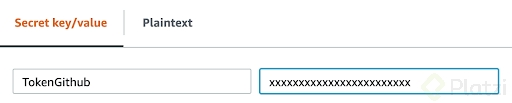
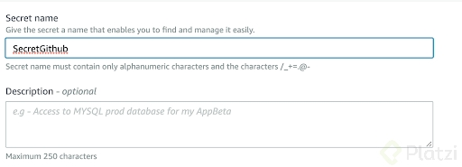

# Curso de Infraestructura Como Código en AWS

## Infraestructura como Código en AWS: Despliegue Automatizado Seguro

### ¿Qué es IaC?

Infraestructura como Código (IaC) es la práctica de gestionar y aprovisionar recursos de infraestructura mediante archivos de configuración legibles por máquina, en lugar de configurarlos manualmente.

### Beneficios de IaC en AWS

* **Automatización**: El despliegue, actualización y mantenimiento de la infraestructura se realiza automáticamente, evitando errores humanos.
* **Reproducibilidad**: Puedes replicar entornos idénticos en segundos.
* **Versionado**: Control de cambios con sistemas como Git, facilitando auditoría y rollback.
* **Seguridad**: Configuraciones controladas y auditable que minimizan riesgos.

### Herramientas comunes de IaC en AWS

* **AWS CloudFormation**
  Servicio nativo para describir recursos AWS mediante plantillas JSON o YAML.
  Permite crear, actualizar y eliminar pilas completas (stacks) de recursos.

* **AWS CDK (Cloud Development Kit)**
  Framework que permite definir infraestructura con lenguajes de programación como Python, TypeScript o Java, generando plantillas CloudFormation.
  Facilita IaC más expresiva y reutilizable.

* **Terraform (HashiCorp)**
  Herramienta multiplataforma para IaC que soporta AWS y muchos otros proveedores.
  Usa lenguaje declarativo (HCL) y permite manejar infraestructura híbrida.

### Despliegue Automatizado Seguro

Para un despliegue seguro y eficiente usando IaC, sigue estas buenas prácticas:

### 1. Gestión de Accesos

* Usa **IAM Roles** con permisos mínimos necesarios (principio de menor privilegio).
* Automatiza con **roles de servicio** para que las herramientas IaC accedan a AWS de forma segura.

### 2. Versionamiento y Revisión de Código

* Almacena plantillas o scripts en repositorios como Git.
* Usa **Pull Requests** para revisiones y auditorías de cambios antes de aplicar.

### 3. Pruebas y Validaciones

* Realiza validación de sintaxis y pruebas de despliegue en entornos de desarrollo antes de producción.
* Usa herramientas como **cfn-lint** (para CloudFormation) o pruebas unitarias con CDK.

### 4. Automatización con CI/CD

* Integra tu IaC en pipelines CI/CD (GitHub Actions, AWS CodePipeline, Jenkins) para despliegue automático tras validación.

### 5. Monitoreo y Auditoría

* Configura logs y monitoreo para detectar cambios inesperados o fallos.
* Usa AWS CloudTrail para auditar cambios en la infraestructura.

### 6. Manejo de secretos

* Nunca incluyas claves o contraseñas en las plantillas.
* Usa AWS Secrets Manager o AWS Systems Manager Parameter Store para gestionar secretos.

---

## Ejemplo básico con AWS CloudFormation (YAML)

```yaml
AWSTemplateFormatVersion: '2010-09-09'
Description: "Ejemplo básico de creación de una instancia EC2"
Resources:
  MyEC2Instance:
    Type: AWS::EC2::Instance
    Properties:
      InstanceType: t2.micro
      ImageId: ami-0abcdef1234567890
      Tags:
        - Key: Name
          Value: MiInstanciaAutomatizada
```

Con este archivo puedes crear la infraestructura ejecutando:

```bash
aws cloudformation deploy --template-file template.yaml --stack-name MiStack
```

## Despliegue de Infraestructura como Código en la Nube

### ¿Qué es Infraestructura como Código?

Infraestructura como Código (IaC) es una práctica que consiste en definir y gestionar la infraestructura de manera automatizada mediante archivos de configuración, en lugar de hacerlo manualmente. Esto permite:

* Provisionar recursos de manera rápida y reproducible.
* Mantener la infraestructura versionada y auditable.
* Facilitar la colaboración y la integración con procesos de desarrollo (DevOps).

### ¿Por qué usar IaC para desplegar infraestructura en la nube?

* **Automatización:** Se eliminan tareas manuales repetitivas y propensas a errores.
* **Consistencia:** Los entornos (desarrollo, prueba, producción) pueden ser idénticos.
* **Escalabilidad:** Facilita escalar y ajustar recursos bajo demanda.
* **Rapidez:** Despliegue rápido y repetible en múltiples regiones o cuentas.
* **Control de versiones:** Cambios rastreados y reversibles con herramientas tipo Git.
* **Seguridad:** Aplicación de políticas de seguridad estandarizadas y controladas.

### Principales pasos en el despliegue de IaC en la nube

1. **Definir la infraestructura como código**
   Crear archivos de configuración (YAML, JSON, HCL, código fuente) que describan los recursos que quieres provisionar (máquinas virtuales, bases de datos, redes, etc.).

2. **Versionar el código**
   Guardar los archivos en un repositorio (GitHub, GitLab, Bitbucket) para control de versiones, auditoría y colaboración.

3. **Validar la configuración**
   Usar herramientas de validación para verificar sintaxis y buenas prácticas (e.g., `terraform validate`, `cfn-lint`).

4. **Automatizar el despliegue**
   Integrar con pipelines de CI/CD para que la infraestructura se cree o actualice automáticamente tras cambios en el repositorio.

5. **Ejecutar el despliegue**
   Ejecutar comandos para aplicar la infraestructura (ejemplo: `terraform apply`, `aws cloudformation deploy`).

6. **Monitorear y mantener**
   Supervisar el estado de la infraestructura y aplicar actualizaciones mediante cambios en el código y redeployment.

### Herramientas comunes para IaC en la nube

| Herramienta            | Descripción                                                 | Ecosistema             |
| ---------------------- | ----------------------------------------------------------- | ---------------------- |
| **AWS CloudFormation** | Servicio nativo AWS para IaC con JSON/YAML                  | AWS                    |
| **AWS CDK**            | Definición de infraestructura con código (Python, TS, etc.) | AWS                    |
| **Terraform**          | Herramienta open-source para múltiples nubes                | AWS, Azure, GCP, otros |
| **Pulumi**             | IaC con lenguajes de programación modernos                  | AWS, Azure, GCP, etc.  |

### Buenas prácticas para despliegues IaC en la nube

* **Principio de menor privilegio:** Minimiza permisos y roles para mayor seguridad.
* **Separar ambientes:** Mantén archivos/configuraciones separados para dev, test y producción.
* **Revisión de cambios:** Usa pull requests y revisiones para controlar cambios.
* **Automatización completa:** Despliegue y pruebas automáticas para evitar errores.
* **Backup y rollback:** Planifica recuperaciones y versiones anteriores.
* **Documentación:** Mantén documentación actualizada de la infraestructura y procesos.

### Ejemplo sencillo: despliegue con Terraform en AWS

Archivo `main.tf`:

```hcl
provider "aws" {
  region = "us-east-1"
}

resource "aws_s3_bucket" "bucket" {
  bucket = "mi-bucket-iac-ejemplo"
  acl    = "private"
}
```

Despliegue:

```bash
terraform init
terraform plan
terraform apply
```

#### ¿Qué es desplegar infraestructura en la nube?

Desplegar infraestructura en la nube es un proceso que evoluciona constantemente y trae consigo una serie de herramientas y servicios que facilitan su implementación. Cuando trabajamos con infraestructura en la nube, es importante considerar las herramientas disponibles para su despliegue y los diversos "cloud providers" en los que se puede implementar dicha infraestructura. En este curso, el enfoque está en utilizar Terraform en su versión Cloud, una de las varias herramientas que el mercado ofrece. La variedad de herramientas disponibles permite elegir la más adecuada según las necesidades específicas del proyecto.

#### ¿Cuáles son las ventajas del versionamiento en la infraestructura?

Uno de los aspectos más relevantes de la infraestructura como código es su capacidad de versionamiento. Esta funcionalidad nos permite:

- **Tener un control detallado** sobre los componentes y configuraciones de nuestra infraestructura.
- **Monitorear y rastrear cambios**, incluyendo quién realizó el cambio, qué tipo de cambio fue, y cuándo se implementó. Este nivel de trazabilidad ofrece un control invaluable sobre la infraestructura.
- **Versionar cada actualización o nuevo componente**, facilitando la administración y la evolución de los entornos de manera sistemática. Si inicialmente se tenía solo un servidor y luego se agrega una base de datos o cualquier otro componente, cada etapa puede ser registrada y controlada eficientemente.

#### ¿Cómo la eficiencia impacta en el despliegue?

La eficiencia se manifiesta en múltiples aspectos del despliegue de infraestructura. Al tener una plantilla de código previamente diseñada para la infraestructura deseada, se pueden implementar recursos en diferentes ambientes de manera rápida y estandarizada. Las ventajas incluyen:

- **Despliegue rápido**: Tener predefinidas las configuraciones permite desplegar aplicaciones en minutos.
- **Estandarización**: Contar con normas claras y definidas para la infraestructura antes de la implementación garantiza consistencia.
- **Automatización**: Minimiza errores potenciales y optimiza el tiempo requerido para pasar a un ambiente productivo.

#### ¿Qué implica la reutilización de la infraestructura?

La reutilización de infraestructura consiste en tomar recursos previamente desplegados y emplearlos en otros proyectos de manera eficiente:

- **Ahorro de tiempo**: Al reutilizar componentes ya existentes, el tiempo de configuración y despliegue se reduce considerablemente.
- **Facilidad de implementación**: La capacidad de reutilizar plantillas y componentes facilita la gestión y el crecimiento de proyectos nuevos o existentes.
- **Automatización y optimización**: Al reaprovechar infraestructura ya probada, se fomenta la automatización de procesos, lo que se traduce en una mayor efectividad.

#### ¿Qué es la infraestructura inmutable y cómo beneficia a los proyectos?

El concepto de infraestructura inmutable es crucial en el marco de la infraestructura como código. Significa que, si hay un problema, en lugar de tratar de solucionar el error manualmente, se opta por reinstalar desde cero utilizando el código predefinido:

- **Eficiencia en resolución de problemas**: Al no centrarse en buscar y corregir el error manualmente, se ahorra tiempo valioso.
- **Consistencia y confiabilidad**: Al emplear plantillas y configuraciones ya probadas, se minimizan las probabilidades de errores repetitivos en el servidor o sistema.
- **Rapidez en la recuperación**: Permite recuperar el estado funcional del sistema de manera más rápida y segura.

El camino del aprendizaje y la implementación de estos conceptos es vasto y prometedor. ¡Te animamos a seguir explorando y expandiendo tus conocimientos en infraestructura en la nube!

## Herramientas para Infraestructura como Código Multinube

### 1. Terraform (HashiCorp)

* **Descripción:** La herramienta más popular y madura para IaC multinube.
* **Lenguaje:** Usa HCL (HashiCorp Configuration Language), fácil de aprender.
* **Proveedores soportados:** AWS, Azure, Google Cloud, Alibaba Cloud, Oracle Cloud, VMware, y muchos más.
* **Características destacadas:**

  * Gran ecosistema de providers oficiales y de comunidad.
  * Permite definir infraestructura compleja, incluyendo redes, máquinas, bases de datos, etc.
  * Estado remoto para colaboración y bloqueo de cambios.
  * Modularidad para reutilizar configuraciones.
* **Casos de uso:** Ideal para gestionar infraestructuras híbridas y multinube, automatización de despliegues y migraciones.

### 2. Pulumi

* **Descripción:** Plataforma IaC que permite usar lenguajes de programación convencionales.
* **Lenguajes soportados:** JavaScript, TypeScript, Python, Go, C#.
* **Proveedores soportados:** AWS, Azure, Google Cloud, Kubernetes, Docker, etc.
* **Características destacadas:**

  * Usa lenguajes de programación modernos y sus ecosistemas.
  * Buen soporte para aplicaciones nativas en la nube y contenedores.
  * Control de versiones, testing y reutilización de código avanzado.
* **Casos de uso:** Equipos con desarrolladores que prefieren programar infraestructura con sus lenguajes habituales.

### 3. Ansible

* **Descripción:** Herramienta de automatización y configuración que también soporta aprovisionamiento de infraestructura.
* **Lenguaje:** YAML (Playbooks).
* **Proveedores soportados:** AWS, Azure, Google Cloud, OpenStack, VMware, etc.
* **Características destacadas:**

  * Facilita tanto la gestión de configuración como el despliegue de infra.
  * No requiere agentes en los servidores (usa SSH).
  * Amplio conjunto de módulos para diferentes plataformas.
* **Casos de uso:** Más común en gestión y configuración post-despliegue, pero puede aprovisionar recursos en múltiples nubes.

### 4. Crossplane

* **Descripción:** Proyecto CNCF que extiende Kubernetes para gestionar recursos en múltiples nubes.
* **Lenguaje:** Recursos declarativos en YAML.
* **Proveedores soportados:** AWS, Azure, Google Cloud, Alibaba, etc. (mediante controladores).
* **Características destacadas:**

  * Se ejecuta dentro de Kubernetes, gestionando infra desde el cluster.
  * Permite combinar aplicaciones con infraestructura en un solo entorno.
  * Facilita GitOps y despliegues automáticos.
* **Casos de uso:** Organizaciones que usan Kubernetes como centro de operaciones para toda su infraestructura.

### Comparativa rápida

| Herramienta | Lenguaje       | Multinube | Enfoque principal                            |
| ----------- | -------------- | --------- | -------------------------------------------- |
| Terraform   | HCL            | Sí        | Declarativo, amplio soporte                  |
| Pulumi      | Python, JS, Go | Sí        | Imperativo con lenguajes comunes             |
| Ansible     | YAML           | Sí        | Automatización/configuración                 |
| Crossplane  | YAML (K8s CRD) | Sí        | Infraestructura declarativa sobre Kubernetes |

### ¿Qué herramientas existen para gestionar infraestructura como código?

Hoy en día, gestionar infraestructura como código es esencial para desarrolladores y administradores de sistemas. Este enfoque proporciona eficiencia y consistencia en los despliegues, y diversas herramientas han surgido para facilitar este proceso. En este artículo, exploraremos las características y beneficios de algunas herramientas destacadas que soportan la infraestructura como código en múltiples entornos de nube.

### ¿Qué es Terraform y cuáles son sus ventajas?

Terraform es una potente herramienta que permite realizar despliegues multi-cloud. Posee dos versiones, una Open Source y otra Enterprise, adecuándose a diversas necesidades de los usuarios. Entre sus principales ventajas se incluyen:

- Despliegue en múltiples proveedores de nube desde un único lugar.
- Código abierto, lo que permite modificaciones y personalizaciones para casos específicos.
- Amplia documentación y una comunidad activa que proporciona soporte y extensiones.

Te invitamos a profundizar en el curso de Terraform en Platzi, si deseas aprender más sobre esta herramienta.

### ¿Cómo utiliza Pulumi lenguajes de programación?

Pulumi destaca por su capacidad de aprovechar conocimientos de lenguajes de programación específicos para gestionar despliegues de infraestructura. Algunas características son:

- Despliegue multi-cloud utilizando lenguajes de programación familiares.
- Integración directa con los entornos de desarrollo.
- Acompañada de una comunidad que continuamente mejora y expande sus funcionalidades.

### Serverless Framework: ¿cómo facilita la arquitectura sin servidores?

El Serverless Framework está diseñado para la implementación de arquitecturas serverless, es decir, sin servidores físicos. Esta herramienta:

- Facilita el despliegue de funciones Lambda, bases de datos DynamoDB, almacenamiento S3, entre otros.
- Utiliza CloudFormation para gestionar la infraestructura, ofreciendo una capa de abstracción y simplificación.

Esta herramienta proporciona un marco de trabajo que permite crear infraestructura a través de código de manera directa y eficiente.

### ¿Qué son las SDKs y cómo se integran en la programación?

Los diferentes proveedores de nube ofrecen SDKs (Software Development Kits) que permiten a los desarrolladores gestionar la infraestructura mediante librerías específicas dentro de sus lenguajes de programación favoritos. Un ejemplo relevante es:

- **Boto3 (AWS)**: Librería en Python que facilita la automatización y gestión de recursos en AWS. Es particularmente útil para proyectos que requieran un alto grado de automatización.

### AWS CDK: ¿qué novedad aporta al despliegue de infraestructura?

El AWS Cloud Development Kit (CDK) es una herramienta creada por Amazon que, a diferencia de los SDKs, permite definir la infraestructura directamente en el código fuente. Principales características:

- No requiere librerías externas, todo se define en el código Python.
- Genera CloudFormation templates detrás de escena y gestiona el despliegue.
- Simplifica la creación de arquitecturas al permitir trabajar directamente con un código estructurado.

### AWS SAM: ¿cómo optimiza el desarrollo de aplicaciones serverless?

El AWS Serverless Application Model (SAM) ofrece un enfoque específico para aplicaciones serverless en AWS. Esta herramienta orientada a la implementación de funciones Lambda y otros servicios serverless permite:

- Cambiar y ajustar la definición de recursos para optimizarlos hacia un enfoque serverless.
- Proporciona un marco que reduce la complejidad en la programación y despliegue de aplicaciones serverless.

### Consejos para escoger la herramienta adecuada

La elección de una herramienta para manejar infraestructura como código depende enormemente del caso de uso específico. Algunas recomendaciones al elegir son:

1. **Analizar las necesidades del proyecto**: ¿Cuál es la arquitectura requerida? ¿Se necesita compatibilidad multi-cloud?
2. **Considerar el conocimiento del equipo**: ¿El equipo ya cuenta con conocimientos previos en un lenguaje específico que pueda ser aprovechado?
3. **Evaluar la escalabilidad y futuro del proyecto**: Algunas herramientas ofrecen mejores opciones para grandes despliegues o crecimiento acelerado.

Con esta diversidad de herramientas a tu disposición, la implementación de infraestructura como código se convierte en una tarea manejable y eficiente. Continúa explorando y eligiendo la opción que mejor se adapte a tus necesidades y las de tu equipo para maximizar los beneficios de esta práctica moderna.

### Ventajas y beneficios de usar AWS CloudFormation

Usar **AWS CloudFormation** para gestionar tu infraestructura como código (IaC) en AWS tiene múltiples ventajas, especialmente si trabajas exclusivamente en este ecosistema. Aquí te presento un resumen claro de sus **ventajas y beneficios**:

### ✅ Ventajas de usar AWS CloudFormation

### 1. **Infraestructura como código nativa de AWS**

* Totalmente integrada con todos los servicios de AWS.
* Permite definir recursos (EC2, S3, RDS, Lambda, etc.) como código en JSON o YAML.

### 2. **Automatización completa del ciclo de vida**

* Crea, actualiza y elimina recursos de forma automática y segura.
* Usa plantillas (`templates`) para definir entornos completos y replicables.

### 3. **Gestión de dependencias**

* CloudFormation resuelve automáticamente el orden en que se deben crear los recursos.
* Maneja relaciones como VPCs, subnets, roles IAM, etc., sin intervención manual.

### 4. **Reutilización y modularidad**

* Permite **anidar plantillas** (nested stacks) y usar **módulos reutilizables**.
* Reduce la duplicación de código y mejora la mantenibilidad.

### 5. **Rollback automático**

* Si algo falla durante el despliegue, **revierte automáticamente** los cambios para evitar estados inconsistentes.

### 6. **Seguimiento y auditoría**

* Cambios registrados en **AWS CloudTrail**.
* Puedes ver qué se creó, cuándo, y con qué parámetros.

### 7. **Integración con otras herramientas**

* Compatible con CI/CD (CodePipeline, GitHub Actions, Jenkins, etc.).
* Puede combinarse con **AWS Systems Manager** y **AWS Config** para gobernanza y cumplimiento.

### 8. **Soporte para parámetros y condiciones**

* Puedes personalizar despliegues mediante `Parameters`, `Mappings` y `Conditions`.
* Ideal para tener múltiples entornos (dev, staging, prod) con una sola plantilla.

### 9. **Actualizaciones controladas (Change Sets)**

* Permite revisar los cambios antes de aplicarlos mediante **Change Sets**.
* Ayuda a prevenir errores en producción.

### 10. **Gratuito**

* No tiene costo adicional (solo pagas por los recursos que creas con él).

### 🏆 Beneficios clave para las organizaciones

| Beneficio                    | Descripción                                                     |
| ---------------------------- | --------------------------------------------------------------- |
| **Consistencia**             | Misma infraestructura en todos los entornos.                    |
| **Escalabilidad**            | Despliegue masivo y rápido de recursos.                         |
| **Eficiencia operativa**     | Menos tareas manuales y errores humanos.                        |
| **Seguridad**                | Control de acceso a recursos mediante plantillas seguras.       |
| **Auditoría y cumplimiento** | Trazabilidad de cambios en todo momento.                        |
| **Reducción de costos**      | Automatización evita errores costosos y tiempos de inactividad. |

### Resumen

#### ¿Cuáles son las ventajas de usar CloudFormation en AWS?

Al hablar de Amazon Web Services (AWS), una de las herramientas más poderosas y ventajosas que puedes utilizar es CloudFormation. Esta herramienta permite el despliegue y la gestión de infraestructura y aplicaciones de manera eficiente y segura. A medida que los servicios en la nube se vuelven cada vez más esenciales para el funcionamiento de las organizaciones modernas, entender cómo usar CloudFormation te brindará una ventaja competitiva.

#### ¿Cómo funciona el flujo de despliegue en CloudFormation?

CloudFormation utiliza plantillas YAML o JSON para definir la infraestructura como código. El flujo básico consiste en verificar el código y realizar la fase de despliegue. Esta integración profunda con AWS permite una implementación fluida de la infraestructura. Además, existen múltiples servicios relacionados que facilitan la gestión y optimización de tus recursos.

#### ¿Cuál es el soporte técnico que ofrece AWS para CloudFormation?

Una de las características más destacadas de CloudFormation es el soporte que provee AWS. Si tienes un contrato de soporte con AWS y experimentas problemas con el despliegue, puedes abrir un caso de soporte. Un equipo especializado te asistirá para revisar y corregir el código, asegurándose de que los despliegues se realicen correctamente. Esta capacidad de soporte es fundamental para mantener la operatividad sin interrupciones.

#### ¿Por qué es importante la integración nativa de CloudFormation con AWS?

CloudFormation, al ser un servicio nativo de AWS, tiene una integración total con los demás servicios de la plataforma. Esto significa que puedes aprovechar las mejores prácticas de seguridad, escalabilidad y operatividad en tus despliegues. La funcionalidad de Designer de CloudFormation, por ejemplo, permite la creación de infraestructura de forma visual, asegurando que las configuraciones sean precisas y alineadas con tus necesidades.

#### ¿Qué beneficios ofrece CloudFormation en términos de escalabilidad y seguridad?

- **Escalabilidad**: Permite desplegar desde un solo servidor hasta cientos en diferentes cuentas de manera simultánea. Esto facilita la gestión de diferentes ambientes de trabajo sin complicaciones.
- **Seguridad**: Integra múltiples servicios de seguridad para cifrar llaves de conexión y gestionar bases de datos. De este modo, puedes aplicar las mejores prácticas de seguridad de AWS en tus recursos.

#### ¿Por qué es CloudFormation una herramienta transversal y de uso extendido?

CloudFormation es apto para cualquier empresa, independientemente del sector o industria. Es una herramienta transversal que ha cobrado importancia por su capacidad de transformar prácticas de desarrollo de código en despliegues de infraestructura. Empresas reconocidas como el FC Barcelona, Expedia y CoinBase, entre otras, utilizan este servicio para gestionar su infraestructura de manera eficaz.

Usar CloudFormation no solo moderniza tus procesos, sino que también garantiza una infraestructura robusta y ajustada a las demandas dinámicas del entorno tecnológico actual. Con estas ventajas, el aprendizaje y dominio de CloudFormation te posicionará en un lugar privilegiado en la gestión de servicios en la nube.

## Uso de la Consola de CloudFormation para Despliegues de Infraestructura

Usar la **Consola de CloudFormation** en AWS para desplegar infraestructura como código (IaC) permite automatizar y gestionar recursos de manera segura, escalable y reproducible. A continuación, te explico cómo se utiliza y cuáles son sus ventajas clave.

### 🧭 ¿Qué es la Consola de CloudFormation?

La **Consola de CloudFormation** es la interfaz gráfica web de AWS para crear, visualizar, administrar y eliminar stacks (conjuntos de recursos) definidos en plantillas YAML o JSON. Permite a los usuarios desplegar infraestructura sin necesidad de interactuar con la CLI o APIs directamente.

### 🚀 Pasos para desplegar infraestructura con la Consola de CloudFormation

#### 1. **Acceder a la consola**

* Ve a: [https://console.aws.amazon.com/cloudformation](https://console.aws.amazon.com/cloudformation)
* Selecciona tu región preferida.

#### 2. **Crear un stack**

* Haz clic en **"Create stack"** > **"With new resources (standard)"**.
* Elige una fuente:

  * Subir archivo local (`.yaml` o `.json`).
  * Ingresar una URL de plantilla en S3.
  * Escribir manualmente la plantilla.

#### 3. **Configurar detalles del stack**

* Asigna un **nombre al stack**.
* Introduce los **valores de parámetros** (si la plantilla los requiere).

#### 4. **Opciones avanzadas (opcional)**

* Etiquetas para organización.
* Roles de IAM que CloudFormation usará.
* Configuraciones de stack policies y protección contra eliminación.

#### 5. **Revisión y creación**

* Revisa el resumen de configuración.
* Marca la casilla para confirmar que CloudFormation creará recursos con posibles costos.
* Haz clic en **"Create stack"**.

### 🔍 Seguimiento y gestión del stack

* Puedes monitorear el progreso en la pestaña **"Events"**.
* Ver recursos creados en **"Resources"**.
* Consultar salidas (`Outputs`) que contienen información útil como URLs, ARNs, etc.
* Actualizar el stack desde la consola si hay cambios en la plantilla.

### ✅ Ventajas de usar la Consola de CloudFormation

| Beneficio                      | Descripción                                                        |
| ------------------------------ | ------------------------------------------------------------------ |
| 🎛️ Interfaz amigable          | Ideal para usuarios nuevos en IaC que prefieren no usar la CLI.    |
| 🔐 Seguridad controlada        | Integración con IAM para control de acceso granular.               |
| 📊 Visualización clara         | Visualiza dependencias y relaciones entre recursos en un diagrama. |
| 🕒 Historial y seguimiento     | Registra eventos, fallos y cambios de estado del stack.            |
| 🔁 Reutilización de plantillas | Permite usar la misma plantilla en múltiples entornos o regiones.  |
| 🧪 Validación automática       | Detecta errores de sintaxis antes del despliegue.                  |

### 🧰 Buenas prácticas

* Usa plantillas validadas con `cfn-lint`.
* Habilita **Stack termination protection** para evitar eliminaciones accidentales.
* Utiliza parámetros y mappings para hacer tus plantillas reutilizables.
* Combina con **S3** y **CodePipeline** para despliegues automatizados desde repositorios.

### Resumen

#### ¿Qué es la consola de CloudFormation y cómo se accede?

La consola de CloudFormation es una herramienta esencial para quienes trabajan con infraestructura como código en AWS. Proporciona un entorno visual e interactivo para gestionar recursos de AWS a través de plantillas de infraestructura declarativas. Comenzar a familiarizarse con esta consola es el primer paso para aprovechar todas sus funcionalidades.

Para acceder a la consola de CloudFormation, inicia sesión en AWS y busca el servicio "CloudFormation" en la barra de búsqueda. Dentro de la consola, observarás varias secciones, cada una con una funcionalidad diferente.

#### ¿Cuál es la estructura de la consola de CloudFormation?

#### Sección de stacks

La sección de stacks es donde se crean y gestionan las colecciones de recursos de AWS. Al seleccionar "crear stack", la consola te guiará a través de una serie de pasos para definir y desplegar estos recursos.

#### Stacks sets

Los "stack sets" son muy útiles para despliegues multi-cuenta de infraestructura. Permiten estandarizar configuraciones en diferentes ambientes y ahorrar tiempo en implementaciones masivas.

#### Variables exportadas y comunicación

En la sección de "exports", encontrarás variables que permiten la comunicación entre diferentes stacks. Esta es una funcionalidad crítica para estructurar proyectos complejos, donde los recursos distribuidos necesitan interactuar entre sí.

#### ¿Qué es el Designer y cómo se utiliza?

El Designer de CloudFormation es una herramienta gráfica dentro de la consola que permite crear plantillas visualmente. Representa recursos como elementos gráficos que se pueden arrastrar y soltar, generando automáticamente una plantilla JSON al momento de guardar.

#### Ventajas del Designer

- **Visualización intuitiva**: Ideal para quienes prefieren interactuar gráficamente.
- **Transformación directa**: Los diseños se convierten en plantillas JSON listas para ser desplegadas en AWS.

#### ¿Cómo monitorear y gestionar despliegues?

#### Estado de los templates

Dentro de la consola principal de CloudFormation, los templates desplegados se categorizan según su estado:

- Activos
- Completados
- Fallidos
- Eliminados
- En progreso

Esto te permite realizar un seguimiento fácil y eficiente de tus deployments.

#### Detalle y solución de problemas

En cada template, puedes profundizar en los detalles para verificar qué recursos se han desplegado o identificar errores. Esta visibilidad es crucial para la resolución de problemas, ya que te permite:

- Localizar en qué parte o cuenta falló un stack.
- Entender las razones detrás de cualquier fallo.
- Corregir y volver a desplegar con rapidez.

Con una comprensión clara de estas secciones y herramientas, estarás completamente equipado para manejar la infraestructura de AWS de manera eficiente. La familiarización continua con esta consola te brindará una ventaja significativa a medida que avances en el curso y desarrolles competencias en infraestructura como código. ¡Ánimo, sigue explorando y aprendiendo!

### Resumen

#### ¿Qué es un Temple en CloudFormation?

En el mundo de AWS, las plantillas de CloudFormation son el alma de la infraestructura como código. Estas plantillas ofrecen la posibilidad de definir y aprovisionar recursos de AWS de una manera organizada y sistemática, en la que los componentes clave están claramente establecidos.

#### ¿Cuál es el propósito de la versión en un Temple?

Los Temples, o plantillas, tienen una versión específica. Si no se define explícitamente, AWS lo hará automáticamente, utilizando la versión 2010-09-09. Este campo, aunque opcional, es importante para garantizar que la plantilla pueda aprovechar todas las funcionalidades más recientes de CloudFormation.

`AWSTemplateFormatVersion: '2010-09-09'`

#### ¿Para qué sirve la descripción en un Temple?

La descripción es otro campo opcional en las plantillas de CloudFormation. Su principal utilidad es permitirte identificar qué estás desplegando, funcionando como una suerte de metadata personalizada. Es altamente recomendada como una práctica para mejorar la legibilidad y comprensión del Temple.

`Description: 'Esta es mi primera lambda en CloudFormation'`

#### ¿Por qué es relevante la Metadata en un Temple?

La metadata va un paso más allá en complejidad y permite definir registros específicos como Transformaciones, Init, Interfaces y Diseño. Aunque es completamente opcional, en proyectos más avanzados puede ser crucial para lograr ciertos comportamientos deseados. Sin embargo, no la usaremos en nuestro ejemplo.

#### ¿Qué son los Parámetros en un Temple?

Los parámetros son uno de los elementos más vitales en tu plantilla. Son los datos que necesitas pasarle al Temple para personalizar los recursos que vas a desplegar. Te permiten reutilizar una misma plantilla para diferentes configuraciones.

- **Ejemplo de Parámetro en Lambda:**

Para determinar el valor de runtime en una función Lambda, se puede especificar el lenguaje como un parámetro, adaptable según las necesidades.

```yaml
Parameters:
  Runtime:
    Type: String
    Default: 'Python3.8'
    AllowedValues:
      - 'Python3.6'
      - 'Python3.7'
      - 'Python3.8'
      - 'Java8'
```
#### ¿Cómo funcionan los mappings en un Temple?

Los mappings funcionan como arreglos de llave valor que especifican valores específicos para diferentes configuraciones. Se utilizan comúnmente para definir valores diferencias por región.

- **Ejemplo de Mapping:**

Imagina que quieres desplegar un servidor en múltiples regiones como Frankfurt, Sao Paulo, y Virginia. Puedes definir un mapping para cada región con su correspondiente ID de imagen.

```yaml
Mappings:
  RegionMap:
    us-east-1:
      "AMIID": "ami-0ff8a91507f77f867"
    eu-west-1:
      "AMIID": "ami-047bb4163c506cd98"
```

#### Recomendaciones prácticas

1. **Utilizar Descripciones**: Aunque opcional, las descripciones clarifican el propósito del código y mejoran la mantenibilidad.

2. **Implementar Parámetros**: Facilitan la flexibilidad y reutilización de tus plantillas a lo largo de distintas implementaciones.

3. **Definir Mappings**: Estos aceleran la implementación en múltiples regiones, ajustando automáticamente configuraciones para cada caso.

Al emplear estas técnicas y comprender la esencia de cada uno de estos componentes, podrás crear plantillas de CloudFormation eficaces y versátiles, listas para escalar y adaptarse a tus necesidades de infraestructura. ¡Anímate a explorar más sobre CloudFormation y transforma tu manera de desplegar y gestionar recursos en la nube!

## Creación de Tablas en DynamoDB desde Cero con AWS

Crear tablas en **Amazon DynamoDB** desde cero es un paso clave para construir aplicaciones sin servidor (serverless) o altamente escalables. Puedes hacerlo mediante la **Consola de AWS**, **AWS CLI**, **CloudFormation**, o usando SDKs como Python (Boto3), Node.js, etc.

### 🧩 ¿Qué es DynamoDB?

Amazon DynamoDB es un servicio de base de datos NoSQL completamente gestionado que proporciona almacenamiento rápido y flexible con escalado automático, baja latencia y alta disponibilidad.

### 🔧 Creación de Tablas DynamoDB desde Cero

### Opción 1: 📊 Usando la Consola de AWS

1. Ve a la [Consola de DynamoDB](https://console.aws.amazon.com/dynamodb).
2. Haz clic en **"Create Table"**.
3. Llena los campos requeridos:

   * **Table name**: Por ejemplo, `Usuarios`
   * **Partition key (clave primaria)**: Por ejemplo, `UserId` (tipo `String`)
   * *(Opcional)* Agrega una **sort key** si necesitas una clave compuesta.
4. Opcionalmente configura:

   * Capacidad: **On-demand** (automático) o **provisioned** (manual)
   * **Encryption**, **streams**, **TTL**, **secondary indexes**
5. Haz clic en **"Create Table"**

### Opción 2: 🖥️ Usando AWS CLI

```bash
aws dynamodb create-table \
  --table-name Usuarios \
  --attribute-definitions AttributeName=UserId,AttributeType=S \
  --key-schema AttributeName=UserId,KeyType=HASH \
  --billing-mode PAY_PER_REQUEST \
  --region us-east-1
```

🔹 Esto crea una tabla con:

* Clave primaria `UserId` (tipo String)
* Modo de facturación bajo demanda

### Opción 3: 🧬 Con AWS CloudFormation (YAML)

```yaml
Resources:
  UsuariosTable:
    Type: AWS::DynamoDB::Table
    Properties:
      TableName: Usuarios
      AttributeDefinitions:
        - AttributeName: UserId
          AttributeType: S
      KeySchema:
        - AttributeName: UserId
          KeyType: HASH
      BillingMode: PAY_PER_REQUEST
```

🔹 Puedes incluir este recurso en una plantilla de CloudFormation para automatizar la infraestructura.

### Opción 4: 🐍 Con Python (Boto3)

```python
import boto3

dynamodb = boto3.resource('dynamodb', region_name='us-east-1')

table = dynamodb.create_table(
    TableName='Usuarios',
    KeySchema=[
        {'AttributeName': 'UserId', 'KeyType': 'HASH'},
    ],
    AttributeDefinitions=[
        {'AttributeName': 'UserId', 'AttributeType': 'S'},
    ],
    BillingMode='PAY_PER_REQUEST'
)

print("Creando tabla. Esperando...")
table.meta.client.get_waiter('table_exists').wait(TableName='Usuarios')
print("Tabla creada con éxito")
```

### ✅ Buenas Prácticas

* Usa **PAY\_PER\_REQUEST** si no tienes una carga constante o si estás empezando.
* Añade **Global Secondary Indexes (GSI)** si necesitas consultas por otros campos.
* Activa **Streams** si necesitas activar eventos Lambda desde operaciones CRUD.
* Usa **IAM policies** para controlar el acceso a la tabla.

### Resumen

#### ¿Cómo crear una tabla en AWS DynamoDB usando un template?

La creación de una tabla en AWS DynamoDB puede parecer un desafío, pero con las herramientas y conocimientos adecuados, se vuelve una tarea manejable y emocionante. A continuación, se presenta una guía básica para crear una tabla desde cero utilizando un template en formato YAML, siguiendo la documentación oficial de AWS.

#### ¿Cómo comenzar con la documentación de AWS y crear un archivo YAML?

Para empezar desde cero, es fundamental dirigirse a la documentación oficial de AWS DynamoDB para obtener un template base que nos dirija en el proceso. Aquí está el paso a paso:

1. Busca "DynamoDB" en Google y localiza la documentación de AWS para DynamoDB.
2. Encuentra ejemplos sencillos en formato JSON y YAML. Para este caso, utilizaremos el ejemplo en YAML.
3. Copia el template completamente vacío proporcionado por AWS a tu editor de texto favorito.
4. Guarda el archivo con un nombre adecuado, por ejemplo, `miDynamoDB.yaml`.

`AWSTemplateFormatVersion: "2010-09-09"`

#### ¿Cuáles son los elementos clave de un template?

Al crear un template, es crucial asegurar que contiene los componentes esenciales, como parámetros y recursos:

- **Versión del formato**: Especifica la versión del template de AWS que estás utilizando, p. ej., 2010-09-09.

`AWSTemplateFormatVersion: "2010-09-09"`

- **Recursos**: Es la única propiedad completamente obligatoria, que en este caso será una tabla de DynamoDB.

```yaml
Resources:
  MyDynamoTable:
    Type: "AWS::DynamoDB::Table"
```

#### ¿Cómo definir atributos y llaves primarias?

La definición de atributos es crucial, ya que determina la estructura de tu base de datos.

- **Atributo Definición**: Aunque no obligatorio, es una buena práctica definirlo. Aquí, se especifica la llave primaria para la base de datos.

```yaml
AttributeDefinitions:
  - AttributeName: Gender
    AttributeType: S
```

- **KeySchema**: Esta sección especifica cómo se construirá la llave primaria.

```yaml
KeySchema:
  - AttributeName: Gender
    KeyType: HASH
```
#### ¿Cómo configurar las lecturas y escrituras pagadas?

Dependiendo de tu carga, puedes configurar DynamoDB para que pague por solicitudes o para tener una capacidad preestablecida.

- **BillingMode**: Aquí establecemos cómo se realizarán los cargos, utilizando "PAY_PER_REQUEST" para práctica flexibilidad.

`BillingMode: PAY_PER_REQUEST`

#### ¿Qué se debe saber sobre la encriptación y el exportado de nombres?

La seguridad es una prioridad, y AWS permite activar la encriptación para los datos en reposo.

- **Encriptación**: Active con la configuración SSESpecification.

```yaml
SSESpecification:
  SSEEnabled: true
```

Además, puedes exportar valores, como el nombre de la tabla, para su uso posterior en otras partes de tu infraestructura:

- **Outputs**: Exporta el nombre de DynamoDB para facilitar su referencia.

```yaml
Outputs:
  TableName:
    Value: !Ref MyDynamoDBTable
    Export:
      Name: MyDynamoTableName
```

Con estos pasos, habrás establecido un template básico que puedes desplegar para crear una tabla en DynamoDB con AWS CloudFormation. Recuerda siempre revisar la documentación y mantenerte actualizado sobre las mejores prácticas de AWS para una implementación eficiente. Mantente avanzado en tu aprendizaje revisando más cursos sobre bases de datos en AWS para ampliar tus conocimientos y habilidades.

**Recursos**

[AWS::DynamoDB::Table](https://docs.aws.amazon.com/es_es/AWSCloudFormation/latest/UserGuide/aws-resource-dynamodb-table.html)

## Creación de Stack en AWS paso a paso

Aquí tienes una **guía paso a paso** para la **creación de un Stack en AWS** usando **CloudFormation**, que te permite desplegar infraestructura como código de manera automática y segura.

### 🚀 ¿Qué es un Stack en CloudFormation?

Un **Stack** es una colección de recursos de AWS que se crean, actualizan o eliminan como una sola unidad utilizando una **plantilla (template)** de CloudFormation escrita en YAML o JSON.

### 🛠️ Paso a Paso para Crear un Stack en AWS

### 🟢 1. Preparar la Plantilla (YAML o JSON)

Ejemplo simple en YAML para crear una tabla DynamoDB:

```yaml
AWSTemplateFormatVersion: '2010-09-09'
Description: Crear una tabla DynamoDB básica

Resources:
  MiTablaDynamoDB:
    Type: AWS::DynamoDB::Table
    Properties:
      TableName: MiTabla
      AttributeDefinitions:
        - AttributeName: Id
          AttributeType: S
      KeySchema:
        - AttributeName: Id
          KeyType: HASH
      BillingMode: PAY_PER_REQUEST
```

Guarda esto como `template.yaml` (o súbelo directamente si usas la consola).

### 🟡 2. Accede a la Consola de AWS

1. Ve a: [https://console.aws.amazon.com/cloudformation](https://console.aws.amazon.com/cloudformation)
2. Haz clic en **"Create stack"** > **"With new resources (standard)"**

### 🟠 3. Cargar la Plantilla

* **Plantilla local**: Carga el archivo `.yaml` o `.json` desde tu computadora.
* **S3**: Si la plantilla está alojada en un bucket de S3, pega su URL.
* **Ejemplo rápido**: También puedes usar plantillas de muestra de AWS.

Haz clic en **"Next"**.

### 🔵 4. Configurar el Stack

1. **Stack name**: Elige un nombre, por ejemplo, `MiPrimerStack`
2. Si tu plantilla tiene **parámetros**, aquí puedes asignar valores.

Haz clic en **"Next"**.

### 🟣 5. Opciones Avanzadas (opcional)

Aquí puedes:

* Agregar etiquetas
* Crear roles de IAM específicos
* Configurar políticas de stack
* Activar notificaciones o protecciones contra eliminación

Haz clic en **"Next"**.

### 🔴 6. Revisión y Creación

1. Revisa todos los detalles
2. Marca la casilla de **“I acknowledge that AWS CloudFormation might create IAM resources”** si aplica
3. Haz clic en **"Create stack"**

### 📈 7. Monitorea la Creación del Stack

* Ve a la pestaña **"Events"** del Stack para ver el progreso.
* En unos segundos/minutos verás el estado como: ✅ `CREATE_COMPLETE`.

### 📦 8. Accede a los Recursos Creados

Desde la pestaña **"Resources"** del Stack puedes:

* Ver los recursos creados
* Acceder directamente a ellos en sus respectivos servicios (como DynamoDB, S3, Lambda, etc.)

### 🧹 9. (Opcional) Eliminar el Stack

Cuando ya no lo necesites, puedes seleccionar el Stack y hacer clic en **"Delete"** para borrar todos los recursos relacionados automáticamente.

### ✅ Consejos Finales

* Usa plantillas reutilizables y controladas con Git.
* Aprovecha los **outputs** para compartir valores generados (como ARNs, URLs, etc.).
* Integra con herramientas como **CI/CD**, **SAM**, o **Serverless Framework** para flujos más avanzados.

### Resumen

#### ¿Cómo crear y desplegar un template en AWS utilizando AWS CloudFormation?

AWS CloudFormation es una herramienta poderosa que automatiza la implementación de recursos en la nube de AWS. En este contexto, aprenderás a crear y desplegar un template desde cero usando CloudFormation, con la finalidad de gestionar tus recursos de manera eficiente. Este proceso te permitirá, con el conocimiento adecuado, construir cualquier tipo de recurso en AWS. ¡Síguenos para descubrir cada paso con precisión!

#### ¿Cómo comenzar el proceso de despliegue en AWS CloudFormation?

Primero, es esencial tener un archivo template que contenga la información necesaria para configurar tus recursos. En este caso, el archivo may-day-in-amo es el punto de partida.

1. Acceder a AWS: Dirígete a la consola de AWS e inicia sesión.
2. Navegar a CloudFormation: En el menú superior izquierdo, selecciona "CloudFormation".
3. Crear stack: Haz clic en "Crear stack" y tendrás la opción de cargar tu template.

# Ejemplo de configuración de un template básico en YAML 
AWSTemplateFormatVersion: '2010-09-09'
Resources:
  # Definiciones de recursos

#### ¿Qué hacer cuando aparece un error?

Al cargar tu template en AWS CloudFormation, es posible que encuentres errores. Por ejemplo, propiedades inválidas que bloqueen el proceso de carga. La solución es revisar la documentación de AWS y corregir las propiedades específicas.

- **Identificar errore**s: AWS proporciona mensajes de error claros. Identifica la propiedad afectada, como la propiedad "Tags" o "StackPolicy".
- **Verificar y corregir**: Consulta la documentación oficial de AWS para entender la propiedad y realizar los cambios necesarios.

#### ¿Cómo continuar después de corregir los errores?

Después de realizar las correcciones necesarias en tu template:

1. **Recargar el template**: Carga el archivo corregido may-day-in-amo nuevamente.
2. **Configurar el stack**: Especifica detalles como el nombre del stack. Ejemplo: "Mi primer TAC Platzi".
3. **Revisión y creación**: Revisa las configuraciones y haz clic en "Crear stack". CloudFormation iniciará el proceso de creación.

### ¿Cómo verificar que el recurso se ha creado correctamente?

Realizar verificaciones es fundamental para asegurarse de que todo está funcionando correctamente.

1. **Supervisar el estado**: En CloudFormation, verifica el estado del stack; debería mostrar "CREATE_COMPLETE".
2. **Consultar DynamoDB**: Si implementaste una tabla en DynamoDB, abre la consola de DynamoDB y verifica que el recurso se haya creado.

#### ¿Qué hacer si necesitas eliminar el stack?

Eliminar un stack es un proceso delicado que requiere confirmación para evitar la pérdida de recursos importantes.

1. **Seleccionar y eliminar el stack**: En la consola de CloudFormation, selecciona el stack y haz clic en "Eliminar".
2. **Confirmación**: AWS solicita confirmar la eliminación para evitar errores.
3. **Monitorear el proceso de eliminación**: El estado cambiará a "DELETE_IN_PROGRESS". Una vez complete, verifica en DynamoDB que el recurso ya no exista.

AWS CloudFormation no solo facilita la creación de recursos complejos de forma automática, sino que optimiza el manejo mediante la reutilización eficiente de templates. Este conocimiento te empodera para avanzar en tus proyectos en la nube. ¡Continúa explorando y aprendiendo del vasto universo de AWS!


## Creación y Conexión de Funciones Lambda y Recursos en AWS

La **creación y conexión de funciones Lambda con otros recursos en AWS** es uno de los pilares de una arquitectura serverless. A continuación te explico paso a paso cómo hacerlo utilizando buenas prácticas y herramientas como CloudFormation:

### ✅ 1. **Crear una Función Lambda**

Puedes hacerlo desde la consola o usando IaC como CloudFormation.

### Ejemplo básico en CloudFormation:

```yaml
Resources:
  MiFuncionLambda:
    Type: AWS::Lambda::Function
    Properties:
      FunctionName: MiFuncionLambda
      Runtime: python3.12
      Handler: index.handler
      Code:
        ZipFile: |
          def handler(event, context):
              return {"statusCode": 200, "body": "Hola desde Lambda"}
      Role: !GetAtt LambdaExecutionRole.Arn
```

### ✅ 2. **Crear una Role IAM para Lambda**

Esta role da permisos mínimos necesarios.

```yaml
  LambdaExecutionRole:
    Type: AWS::IAM::Role
    Properties:
      AssumeRolePolicyDocument:
        Version: "2012-10-17"
        Statement:
          - Effect: Allow
            Principal:
              Service: lambda.amazonaws.com
            Action: sts:AssumeRole
      ManagedPolicyArns:
        - arn:aws:iam::aws:policy/service-role/AWSLambdaBasicExecutionRole
```

### ✅ 3. **Conectar Lambda con otros servicios**

Lambda se puede conectar a recursos como:

### 📌 DynamoDB

```yaml
  PermisoDynamo:
    Type: AWS::IAM::Policy
    Properties:
      PolicyName: LambdaDynamoAccess
      Roles: [!Ref LambdaExecutionRole]
      PolicyDocument:
        Version: "2012-10-17"
        Statement:
          - Effect: Allow
            Action:
              - dynamodb:GetItem
              - dynamodb:PutItem
            Resource: "*"
```

### 📌 API Gateway

```yaml
  ApiGateway:
    Type: AWS::ApiGateway::RestApi
    Properties:
      Name: MiAPI

  LambdaPermission:
    Type: AWS::Lambda::Permission
    Properties:
      Action: lambda:InvokeFunction
      FunctionName: !GetAtt MiFuncionLambda.Arn
      Principal: apigateway.amazonaws.com
```

### 📌 EventBridge, S3, SQS, SNS, etc.

Se configuran con triggers o eventos automáticos desde esos servicios.

### ✅ 4. **Desplegar usando AWS Console, CLI o CloudFormation**

Ejemplo con AWS CLI:

```bash
aws cloudformation deploy \
  --template-file plantilla.yaml \
  --stack-name MiStackLambda \
  --capabilities CAPABILITY_NAMED_IAM
```

### ✅ Recomendaciones:

* Usa variables de entorno en Lambda (`Environment`) para URLs o configuraciones externas.
* Usa CloudWatch Logs para depurar y monitorear.
* Usa versiones y alias para gestionar despliegues.

### Resumen

#### ¿Qué son las condiciones en la creación de plantillas CloudFormation?

Al crear plantillas en AWS CloudFormation, puedes usar condiciones opcionales que deciden si se crea un recurso o se asigna una variable a un recurso. Por ejemplo, un volumen solo se crea si ya están desplegados los recursos de producción necesarios. Esta condicionalidad de recursos permite modular y optimizar la gestión de infraestructura.

- **Opcionalidad**: Estas condiciones son completamente opcionales. Pueden usarse o no según las necesidades específicas de la infraestructura.
- **Funcionalidad**: Ayudan a asegurar que ciertos componentes solo se crean cuando otros ya están presentes, evitando configuraciones incompletas o inválidas.

#### ¿Cómo se usa 'Transform' en aplicaciones serverless?
Dentro del contexto de AWS, 'Transform' es una función que se utiliza al crear aplicaciones completamente serverless basadas en AWS SAM (Serverless Application Model).

- **Función principal**: Define el template como serverless para permitir la creación eficiente de estos recursos.
- **Importancia**: Es fundamental cuando se trabaja con aplicaciones serverless, pues asegura que los recursos se creen de manera correcta y óptima bajo este modelo.

#### ¿Cuáles componentes son obligatorios en un template de CloudFormation?

Dentro de un template de AWS CloudFormation, `Resources` es el campo más importante y obligatorio.

- **Razón de obligatoriedad**: Es donde se especifica qué recursos se van a crear. Por ejemplo, al configurar una función Lambda, bases de datos o un bucket, todos deben estar enlistados en esta sección.
- **Elemento central**: Sin este campo, no sería posible definir ni desplegar los recursos que componen tu infraestructura.

### ¿Cómo conectar una función Lambda a una base de datos con outputs?

Al trabajar con funciones Lambda, a menudo es necesario conectarlas a otros recursos como bases de datos DynamoDB.

- **Uso de Outputs**: Mediante los Outputs, se exportan propiedades del recurso creado. Un ejemplo sería exportar el ARN de una función Lambda.
- **Interconexión**: Al crear una base de datos Dynamo, puedes exportar el nombre de la tabla y luego configurar la función Lambda para que use este valor como variable de entorno.

Aquí tienes un ejemplo de cómo se exporta la URL (ARN) de una función Lambda para su posterior uso:

```yaml
Outputs:
  LambdaFunctionArn:
    Description: "ARN de la función Lambda"
    Value: !GetAtt MyLambdaFunction.Arn
    Export:
      Name: !Sub "${AWS::StackName}-LambdaFunctionARN"
```

#### ¿Qué son y cómo se usan los outputs en plantillas CloudFormation?

Los Outputs son cruciales para interconectar diferentes recursos. Pueden ser utilizados para compartir información entre distintos stacks o recursos.

- **Función principal**: Permiten exportar datos significativos de los recursos creados para ser utilizados por otros servicios o recursos.
- **Aplicación práctica**: Si tienes dos recursos, A y B, y deseas conectar B tomando datos de A, podrías usar los Outputs para exportar información relevante de A, que B necesitará como entrada.

La utilización correcta de condiciones, transformaciones y outputs te permitirá diseñar arquitecturas más eficientes y robustas en AWS. La metodología compartida te capacita para establecer ecosistemas de múltiples recursos bien integrados, lo cual es crucial en la administración moderna de IT. ¡Continúa explorando y aplicando estos conceptos en tus proyectos futuros!

## Gestión de Stacks en AWS CloudFormation

### Resumen

#### ¿Qué es un Stack en AWS CloudFormation?

En el contexto de AWS CloudFormation, un Stack es esencialmente un conjunto de recursos que se gestionan de manera unitaria. Esto significa que tú, como desarrollador o ingeniero de devops, puedes gestionar múltiples recursos como una sola entidad. Considera un escenario donde has desplegado una base de datos, una función Lambda, y un bucket de S3: todos estos recursos se agrupan en un único Stack.

CloudFormation asegura que todos estos recursos se creen al mismo tiempo. Si falla la creación de un recurso, por ejemplo, el bucket de S3, el sistema eliminará automáticamente los otros recursos, como la función Lambda y la base de datos, garantizando que no queden recursos a medio configurar.

#### ¿Cómo gestiona los errores AWS CloudFormation?

Un aspecto clave de AWS CloudFormation es su mecanismo automático de rollback. En caso de un fallo en la creación de cualquiera de los recursos dentro del Stack, el sistema eliminará los recursos ya creados, evitando configuraciones parciales. Esta funcionalidad asegura que si algo sale mal, no quedes con una infraestructura a medias que podría causar problemas mayores.

Sin embargo, AWS CloudFormation ofrece flexibilidad al permitir, mediante el "troubleshooting" adecuado, detenerse si un recurso falla. En este escenario, puedes acceder a la consola para identificar y corregir el error, antes de decidir si eliminar los recursos. Usualmente, el comportamiento estándar es remover todos los recursos si uno solo falla al crearse.

#### ¿Qué sucede al borrar un Stack?

Eliminar un Stack es un proceso crítico, ya que implica la eliminación de todos los recursos asociados. Esto significa que, si no tienes cuidado, podrías borrar toda la infraestructura o aplicación en la que estás trabajando. Por lo tanto, gestionar múltiples Stacks requiere atención meticulosa. Siempre verifica y confirma antes de borrar un Stack para asegurarte de que no afectará funcionalidades críticas de la aplicación.

#### ¿Qué es un Drift en AWS CloudFormation?

En AWS CloudFormation, el "Drift" se refiere a la desviación entre la configuración original que fue desplegada y el estado actual en la consola. Por ejemplo, si despliegas una función Lambda y una base de datos pero luego cambias manualmente las configuraciones del bucket S3, esta acción genera un Drift. Estos desajustes no son una buena práctica ya que podrían ocasionar desincronizaciones y problemas en futuras actualizaciones.

Para abordar estos desajustes, los Drifts permiten identificar y corregir estas desviaciones para volver al estado original. Es esencial que todas las actualizaciones y cambios se realicen a través de CloudFormation para mantener una administración centralizada y evitar posibles conflictos.

#### ¿Cómo desplegar un Stack utilizando plantillas?

El despliegue de un Stack en AWS CloudFormation se realiza usualmente mediante plantillas (templates), que pueden crearse en formato JSON o YAML. Estas plantillas describen la infraestructura, permitiendo cargarla a CloudFormation de dos formas:

1. **Carga directa a S3**: Puedes almacenar la plantilla en un bucket de S3 y proporcionar la ruta a CloudFormation.
2. **Carga directa a CloudFormation**: Alternativamente, puedes subir la plantilla directamente a CloudFormation.

Una vez cargada, CloudFormation realiza una validación sobre la sintaxis y los recursos definidos antes de proceder con el despliegue. Esto se lleva a cabo para asegurar que tanto en formato JSON como YAML, las estructuras y definiciones sean correctas y estén bien configuradas.

No te preocupes si los conceptos parecen abstractos ahora; en los laboratorios prácticos que iremos desarrollando, aplicarás estos conocimientos para reforzarlos en la práctica. ¡Te animamos a continuar aprendiendo y a no desistir! La práctica te ayudará a profundizar en estos conceptos y a manejarlos con soltura.

## Creación de Funciones Lambda y Recursos AWS con Stacks

La **creación de funciones Lambda y recursos AWS usando Stacks de CloudFormation** permite automatizar la infraestructura sin errores manuales, logrando integraciones limpias y seguras. A continuación, te explico cómo puedes hacerlo paso a paso.

### 🧱 ¿Qué es un Stack con Lambda?

Un **Stack de CloudFormation** puede incluir una función Lambda, su rol de ejecución, triggers como API Gateway o S3, y otros recursos como DynamoDB. Todo definido en una sola plantilla YAML.

### ⚙️ Ejemplo de plantilla (`template.yaml`)

Aquí tienes un ejemplo básico que:

* Crea una función Lambda en Node.js.
* Crea un rol IAM necesario.
* Crea una tabla DynamoDB.
* Otorga permisos a la Lambda para interactuar con la tabla.

```yaml
AWSTemplateFormatVersion: '2010-09-09'
Description: Stack para Lambda + DynamoDB

Parameters:
  LambdaFunctionName:
    Type: String
    Default: MiFuncionLambda

Resources:

  MiDynamoTable:
    Type: AWS::DynamoDB::Table
    Properties:
      TableName: MiTabla
      AttributeDefinitions:
        - AttributeName: id
          AttributeType: S
      KeySchema:
        - AttributeName: id
          KeyType: HASH
      BillingMode: PAY_PER_REQUEST

  LambdaExecutionRole:
    Type: AWS::IAM::Role
    Properties:
      RoleName: LambdaDynamoRole
      AssumeRolePolicyDocument:
        Version: '2012-10-17'
        Statement:
          - Effect: Allow
            Principal:
              Service: lambda.amazonaws.com
            Action: sts:AssumeRole
      Policies:
        - PolicyName: LambdaDynamoPolicy
          PolicyDocument:
            Version: '2012-10-17'
            Statement:
              - Effect: Allow
                Action:
                  - dynamodb:PutItem
                  - dynamodb:GetItem
                  - dynamodb:Scan
                Resource: !GetAtt MiDynamoTable.Arn
              - Effect: Allow
                Action:
                  - logs:CreateLogGroup
                  - logs:CreateLogStream
                  - logs:PutLogEvents
                Resource: "*"

  MiFuncionLambda:
    Type: AWS::Lambda::Function
    Properties:
      FunctionName: !Ref LambdaFunctionName
      Handler: index.handler
      Role: !GetAtt LambdaExecutionRole.Arn
      Runtime: nodejs20.x
      Timeout: 10
      Code:
        ZipFile: |
          exports.handler = async (event) => {
              console.log("Evento recibido:", event);
              return {
                  statusCode: 200,
                  body: JSON.stringify({ mensaje: "Hola desde Lambda!" })
              };
          };

Outputs:
  LambdaARN:
    Description: ARN de la función Lambda
    Value: !GetAtt MiFuncionLambda.Arn
```

### 🚀 Despliegue del stack

Desde la terminal usando AWS CLI:

```bash
aws cloudformation deploy \
  --template-file template.yaml \
  --stack-name StackLambdaDynamo \
  --capabilities CAPABILITY_NAMED_IAM
```

### ✅ Buenas prácticas

* Usa **Parameters** para personalizar nombres y configuraciones.
* Usa **Outputs** para exportar ARN o nombres de recursos.
* Empaqueta código real en ZIP o usa S3 para funciones Lambda más complejas.
* Puedes añadir **triggers** como API Gateway, S3 o eventos de DynamoDB.

### Resumen

#### ¿Cómo se componen los recursos en un Stack?

En este artículo vamos a desentrañar cómo se organizan y trabajan los diversos componentes de un Stack en el contexto de desarrollo en AWS. Es fundamental entender el papel que juega cada recurso, desde bases de datos hasta funciones Lambda, y cómo se integran para formar un sistema robusto y eficiente. Esto no solo te prepara para manejar stacks en AWS sino que amplía tus capacidades de desarrollo en la nube.

#### ¿Qué es una interfaz de metadatos?

Al implementar un stack, uno de los primeros elementos que encontramos es la interfaz de metadatos. Esta interfaz se utiliza para organizar parámetros críticos que se ingresarán posteriormente en la configuración de los recursos.

- **Propiedades de los parámetros**: Para una organización eficiente, se recomienda distinguir entre los parámetros de DynamoDB y las funciones Lambda.
- **Ejemplos de parámetros**: Nombre de la tabla, clave primaria, y nombre de la función Lambda.
- **Propósito**: Simplifica la gestión y evita errores, ya que muestra solo los elementos permitidos mediante listas desplegables.

#### ¿Qué recursos conforman el Stack?

Un Stack eficaz reúne múltiples recursos y aquí te mostramos algunos de los más comunes y necesarios:

1. **DynamoDB:** Base de datos altamente flexible que funciona con los parámetros definidos para su correcta creación.
2. **API Gateway**: Herramienta que se encarga de manejar las solicitudes hechas hacia las bases de datos.
3. **Lambda Function**: Función que ofrece computación sin servidor permitiendo ejecutar código en respuesta a eventos.

Cada uno de estos recursos se configura con parámetros específicos que se han cargado previamente, garantizando así una construcción robusta del servicio.

#### ¿Cómo se manejan las políticas y los roles?

Las políticas y roles son esenciales dentro de un stack para definir permisos y darle seguridad a cada recurso.

- **Rol de Lambda**: Contiene políticas que permiten a la función Lambda interactuar con diferentes servicios.
- **Políticas asociadas**:
 - Permisos para S3 al extraer el código.
 - Permisos para acceder a logs en CloudWatch.
 - Permisos para consultar DynamoDB.
 
La adecuada asignación de roles y políticas asegura que la función Lambda puede funcionar sin fricciones dentro de AWS.

#### Detalles adicionales sobre políticas y permisos

Además de los roles y las políticas básicas, es esencial comprender cómo se manejan los siguientes aspectos:

- **Permisos de ejecución**: Definidos para que un servicio (por ejemplo, API Gateway) pueda activar una función Lambda.
- **Restricciones específicas**: Se determinan de acuerdo con los servicios que la función Lambda necesitará consultar o registrar eventos.

Cada recurso dentro de un stack tiene configuraciones específicas que deben ser tenidas en cuenta para asegurar una operación segura y eficiente de la infraestructura.

#### ¿Por qué son importantes los stacks anidados?

Entender los stacks anidados es esencial para proyectos de mayor escala y complejidad. Estos permiten dividir un stack grande en componentes más pequeños y manejables, facilitando el mantenimiento, la actualización y la reutilización de ciertos componentes.

Encamínate en el aprendizaje continuo y descubre cómo estas herramientas y estructuras pueden simplificar tus proyectos en la nube. ¡La aventura de la infraestructura en AWS apenas comienza!

**Lecturas recomendadas**

[cloudformation/master.yml at composition-non-nested-stacks · czam01/cloudformation · GitHub](https://github.com/czam01/cloudformation/blob/composition-non-nested-stacks/master.yml)

## Despliegue Multi Cuenta con AWS Stack Sets

El **despliegue multi cuenta con AWS StackSets** permite implementar automáticamente plantillas de CloudFormation (stacks) en múltiples cuentas y regiones de AWS desde una cuenta administradora. Es ideal para organizaciones con entornos distribuidos (por ejemplo, dev, test, prod) que comparten infraestructura base como redes, roles IAM, o funciones Lambda.

### 🧰 ¿Qué es AWS StackSets?

Un **StackSet** es un conjunto de instrucciones de infraestructura (una plantilla de CloudFormation) que se puede desplegar y gestionar en múltiples **cuentas AWS** y **regiones** a la vez.

### 📦 Casos de uso comunes

* Configuración uniforme de **CloudTrail** o **AWS Config** en todas las cuentas.
* Despliegue de roles IAM o políticas estándar.
* Infraestructura compartida (como buckets S3, SNS topics o tablas DynamoDB).

### 🧱 Arquitectura: StackSet con cuenta organizacional

1. **Cuenta Administradora (Management Account):** Crea y administra el StackSet.
2. **Cuentas Objetivo (Target Accounts):** Reciben los stacks.
3. **Organización AWS Organizations:** Simplifica permisos usando la opción de “**self-managed permissions**” o “**service-managed permissions**”.

### 🔐 Requisitos previos

### A. Organización habilitada con AWS Organizations

```bash
aws organizations enable-aws-service-access \
  --service-principal cloudformation.stacksets.amazonaws.com
```

### B. Crear una plantilla base

Ejemplo: Plantilla para crear un bucket S3 en cada cuenta

```yaml
AWSTemplateFormatVersion: '2010-09-09'
Description: Crear un bucket S3 estándar

Resources:
  StandardS3Bucket:
    Type: AWS::S3::Bucket
    Properties:
      BucketName: !Sub 'standard-bucket-${AWS::AccountId}'
      VersioningConfiguration:
        Status: Enabled
```

### 🚀 Creación del StackSet

Puedes hacerlo desde:

### A. Consola de AWS:

1. Ve a **CloudFormation > StackSets**
2. Clic en **Create StackSet**
3. Proporciona la plantilla (S3 URL o YAML directamente)
4. Elige si usas **permisos administrados por servicio (recomendado)** o self-managed
5. Selecciona unidades organizacionales (OUs) o IDs de cuentas
6. Elige regiones

### B. AWS CLI:

```bash
aws cloudformation create-stack-set \
  --stack-set-name MiStackMultiCuenta \
  --template-body file://plantilla.yaml \
  --permission-model SERVICE_MANAGED \
  --capabilities CAPABILITY_NAMED_IAM
```

Luego:

```bash
aws cloudformation create-stack-instances \
  --stack-set-name MiStackMultiCuenta \
  --deployment-targets OrganizationalUnitIds=ou-abc1-xyz123 \
  --regions us-east-1 us-west-2
```

### 🛠️ Monitoreo y Actualización

* Puedes ver el estado de cada stack por cuenta y región.
* Para hacer actualizaciones, solo cambias la plantilla en el StackSet y se actualizan automáticamente todas las cuentas.

### ✅ Ventajas

* Uniformidad: Infraestructura estándar en todo el entorno.
* Seguridad: Administración centralizada de permisos.
* Escalabilidad: Agrega nuevas cuentas sin reprocesar todo.
* Automatización: Ideal para estructuras CI/CD multi cuenta.

### Resumen

#### ¿Cómo se componen los recursos en un Stack?

En este artículo vamos a desentrañar cómo se organizan y trabajan los diversos componentes de un Stack en el contexto de desarrollo en AWS. Es fundamental entender el papel que juega cada recurso, desde bases de datos hasta funciones Lambda, y cómo se integran para formar un sistema robusto y eficiente. Esto no solo te prepara para manejar stacks en AWS sino que amplía tus capacidades de desarrollo en la nube.

#### ¿Qué es una interfaz de metadatos?

Al implementar un stack, uno de los primeros elementos que encontramos es la interfaz de metadatos. Esta interfaz se utiliza para organizar parámetros críticos que se ingresarán posteriormente en la configuración de los recursos.

- **Propiedades de los parámetros**: Para una organización eficiente, se recomienda distinguir entre los parámetros de DynamoDB y las funciones Lambda.
- **Ejemplos de parámetros**: Nombre de la tabla, clave primaria, y nombre de la función Lambda.
- **Propósito**: Simplifica la gestión y evita errores, ya que muestra solo los elementos permitidos mediante listas desplegables.

#### ¿Qué recursos conforman el Stack?

Un Stack eficaz reúne múltiples recursos y aquí te mostramos algunos de los más comunes y necesarios:

1. **DynamoDB:** Base de datos altamente flexible que funciona con los parámetros definidos para su correcta creación.
2. **API Gateway**: Herramienta que se encarga de manejar las solicitudes hechas hacia las bases de datos.
3. **Lambda Function**: Función que ofrece computación sin servidor permitiendo ejecutar código en respuesta a eventos.

Cada uno de estos recursos se configura con parámetros específicos que se han cargado previamente, garantizando así una construcción robusta del servicio.

#### ¿Cómo se manejan las políticas y los roles?

Las políticas y roles son esenciales dentro de un stack para definir permisos y darle seguridad a cada recurso.

- **Rol de Lambda**: Contiene políticas que permiten a la función Lambda interactuar con diferentes servicios.
- **Políticas asociadas**:
 - Permisos para S3 al extraer el código.
 - Permisos para acceder a logs en CloudWatch.
 - Permisos para consultar DynamoDB.
 
La adecuada asignación de roles y políticas asegura que la función Lambda puede funcionar sin fricciones dentro de AWS.

#### Detalles adicionales sobre políticas y permisos

Además de los roles y las políticas básicas, es esencial comprender cómo se manejan los siguientes aspectos:

- **Permisos de ejecución**: Definidos para que un servicio (por ejemplo, API Gateway) pueda activar una función Lambda.
- **Restricciones específicas**: Se determinan de acuerdo con los servicios que la función Lambda necesitará consultar o registrar eventos.

Cada recurso dentro de un stack tiene configuraciones específicas que deben ser tenidas en cuenta para asegurar una operación segura y eficiente de la infraestructura.

#### ¿Por qué son importantes los stacks anidados?

Entender los stacks anidados es esencial para proyectos de mayor escala y complejidad. Estos permiten dividir un stack grande en componentes más pequeños y manejables, facilitando el mantenimiento, la actualización y la reutilización de ciertos componentes.

Encamínate en el aprendizaje continuo y descubre cómo estas herramientas y estructuras pueden simplificar tus proyectos en la nube. ¡La aventura de la infraestructura en AWS apenas comienza!

## Despliegue Multi Cuenta con AWS CloudFormation y DynamoDB

El **despliegue multi cuenta con AWS CloudFormation y DynamoDB** te permite provisionar tablas DynamoDB en múltiples cuentas y regiones de AWS de forma centralizada y automatizada. Esto es útil en organizaciones que gestionan varios entornos (desarrollo, QA, producción) o tienen estructuras de cuentas distribuidas.

### ✅ ¿Qué necesitas?

### 1. **Una plantilla CloudFormation (YAML o JSON)**

Define la tabla DynamoDB con sus atributos, claves, modo de facturación, etc.

### 2. **StackSets en AWS CloudFormation**

Permite desplegar esta plantilla en múltiples cuentas y/o regiones.

### 📘 Ejemplo de plantilla CloudFormation para DynamoDB

```yaml
AWSTemplateFormatVersion: '2010-09-09'
Description: Crear tabla DynamoDB multi cuenta

Parameters:
  TableName:
    Type: String
  PartitionKey:
    Type: String
    Default: id

Resources:
  DynamoTable:
    Type: AWS::DynamoDB::Table
    Properties:
      TableName: !Ref TableName
      AttributeDefinitions:
        - AttributeName: !Ref PartitionKey
          AttributeType: S
      KeySchema:
        - AttributeName: !Ref PartitionKey
          KeyType: HASH
      BillingMode: PAY_PER_REQUEST
      SSESpecification:
        SSEEnabled: true

Outputs:
  DynamoTableName:
    Value: !Ref DynamoTable
```

### 🛠️ ¿Cómo desplegarlo con StackSets?

### A. Desde la **Consola**:

1. Ir a **CloudFormation > StackSets**
2. Click en **Create StackSet**
3. Subir tu plantilla YAML
4. Usa **Service-managed permissions** si tienes AWS Organizations
5. Selecciona las cuentas o unidades organizacionales (OU)
6. Elige las regiones (ej. `us-east-1`, `us-west-2`)
7. Ingresa los valores de parámetros (`TableName`, `PartitionKey`)

### B. Desde la **CLI**:

```bash
aws cloudformation create-stack-set \
  --stack-set-name DynamoMultiCuenta \
  --template-body file://dynamo.yaml \
  --parameters ParameterKey=TableName,ParameterValue=MiTabla \
  --permission-model SERVICE_MANAGED \
  --capabilities CAPABILITY_NAMED_IAM
```

Luego:

```bash
aws cloudformation create-stack-instances \
  --stack-set-name DynamoMultiCuenta \
  --deployment-targets OrganizationalUnitIds=ou-abc1-xyz123 \
  --regions us-east-1 us-west-2
```

### 🔐 Permisos requeridos

### Cuenta administradora (StackSet):

* Permisos para crear recursos en CloudFormation.
* Permisos para acceder a cuentas miembro.

### Cuentas destino:

* Se requiere confianza si se usa el modo **self-managed** (se configuran manualmente los roles de ejecución).

### 🚀 Beneficios del despliegue multi cuenta

* **Estandarización**: misma configuración de DynamoDB en todas las cuentas.
* **Escalabilidad**: añade nuevas cuentas fácilmente.
* **Seguridad**: configuración de cifrado y control de acceso unificado.
* **Automatización**: despliegue en múltiples regiones y cuentas desde una sola acción.

### Resumen

#### ¿Cómo hacer un despliegue multicuentas con Stax Edit?

Los entornos de infraestructura para aplicaciones grandes requieren un manejo especializado de la seguridad y la administración de múltiples cuentas. En este artículo, vamos a detallar cómo realizar un despliegue multicuentas utilizando Stax Edit, dentro de una infraestructura de Amazon Web Services (AWS). Este proceso es especialmente relevante para empresas grandes que manejan aplicaciones complejas y necesitan un alto nivel de seguridad.

#### ¿Qué considerar antes de comenzar?

Antes de iniciar con el despliegue multicuentas, es esencial tener un conjunto de cuentas bien estructuradas e interconectadas. Aquí están los pasos preliminares:

1. **Estructurar las cuentas**: Define las cuentas necesarias, como servicios compartidos, desarrollo (Dev), testing (QA), preproducción y producción.
2. **Configurar permisos y roles**: Asegúrate de que las cuentas están correctamente configuradas con roles específicos para administración y permisos de ejecución.
3. **Entrega de plantilla**s: Decide si utilizarás plantillas desde un Amazon S3 o si cargarás una plantilla personalizada desde tu equipo.

#### ¿Qué es AWS Landing Zone?

AWS Landing Zone es un servicio que permite agrupar diferentes cuentas y ofrecer un acceso común utilizando Active Directory. Esto facilita la administración centralizada de diversas cuentas, lo que es clave para el éxito del despliegue multicuentas.

#### ¿Cuáles son los pasos para crear un nuevo stack?

Para crear un nuevo stack y realizar el despliegue, sigue las siguientes instrucciones:

- **Cargar la plantilla**: Ve a la consola de administración de tu cuenta de servicios compartidos y selecciona la plantilla desde donde quieras cargarla.

```yaml
# Ejemplo de YAML para DynamoDB
Resources:
  MyDynamoDBTable:
    Type: "AWS::DynamoDB::Table"
    Properties:
      TableName: "Platzi"
      AttributeDefinitions:
        - AttributeName: "ID"
          AttributeType: "S"
      KeySchema:
        - AttributeName: "ID"
          KeyType: "HASH"
```

- **Especificar roles**: Determina los roles de administración y ejecución necesarios para el despliegue.

#### ¿Cómo definir las cuentas y regiones para el despliegue?

Debes especificar las cuentas y la región en la cual se encuentra tu infraestructura. Para esto necesitas:

- Identificar tus cuentas con su número único.
- Elegir una región compatible (por ejemplo, Virginia para el caso de Estados Unidos).

#### ¿Qué configuración adicional se debe tener en cuenta?

Al realizar el despliegue, es crucial establecer:

-** Cantidad de cuentas concurrentes**: Define cuántas cuentas se desplegarán al mismo tiempo.
- **Condiciones de fallo**: Configura si el despliegue se detendrá si una cuenta falla.

#### ¿Cómo se verifica el estado del despliegue?

Una vez iniciado el despliegue, se deben realizar revisiones:

- **Estado en la consola**: Accede a la consola de AWS y verifica el estado del despliegue para cada cuenta involucrada.
- **Revisión de la tabla DynamoDB**: Confirma que la tabla se ha creado correctamente en cada cuenta.

#### ¿Cuáles son los beneficios de usar Stax Edit para despliegues multicuentas?

El despliegue multicuentas con Stax Edit ofrece varias ventajas:

- **Centralización**: Permite centralizar el control de recursos en múltiples cuentas, optimizando la administración.
- **Seguridad**: Mejora la seguridad al separar los ambientes y asignar roles específicos.
- **Escalabilidad**: Facilita el crecimiento de la infraestructura, permitiendo agregar recursos y cuentas con flexibilidad.

Con estos pasos, podrás gestionar despliegues de aplicaciones de gran escala en entornos seguros y organizados, lo que es fundamental para el éxito continuo de las aplicaciones empresariales. ¡Adelante, y sigue aprendiendo para mejorar tus habilidades en la gestión de infraestructuras en la nube!

## Uso de Nested Stacks para superar límites en CloudFormation

El **uso de Nested Stacks (stacks anidados)** en AWS CloudFormation es una práctica avanzada que te permite organizar, reutilizar y **superar los límites de tamaño y complejidad** en plantillas de infraestructura. Aquí te explico cómo funcionan, sus ventajas y cuándo usarlos:

### ✅ ¿Qué son los Nested Stacks?

Un **Nested Stack** es un stack que se define como un recurso dentro de otra plantilla principal. Permite dividir una plantilla grande en archivos más pequeños y reutilizables. Cada substack es una plantilla propia que se despliega como parte del stack principal.

### 🎯 ¿Por qué usar Nested Stacks?

### 1. **Superar límites de CloudFormation**

CloudFormation impone los siguientes límites (por defecto):

* Tamaño máximo de plantilla: **1 MB**
* Número máximo de recursos por stack: **500**

Con Nested Stacks puedes **dividir la lógica en varios archivos**, cada uno con su propio conjunto de recursos.

### 2. **Reutilización de plantillas**

Puedes crear componentes comunes como VPCs, buckets S3, roles IAM, etc., y reutilizarlos en múltiples stacks.

### 3. **Modularidad y mantenibilidad**

Organizas tu infraestructura en módulos lógicos:

* `network.yaml`
* `database.yaml`
* `compute.yaml`
* `app.yaml`

Esto mejora la legibilidad y facilita el mantenimiento.

### 🧱 Ejemplo de uso básico de Nested Stacks

### 📁 Estructura de archivos

```
main-stack.yaml
network-stack.yaml
compute-stack.yaml
```

### `main-stack.yaml`

```yaml
AWSTemplateFormatVersion: '2010-09-09'
Resources:
  NetworkStack:
    Type: AWS::CloudFormation::Stack
    Properties:
      TemplateURL: https://s3.amazonaws.com/mybucket/network-stack.yaml

  ComputeStack:
    Type: AWS::CloudFormation::Stack
    Properties:
      TemplateURL: https://s3.amazonaws.com/mybucket/compute-stack.yaml
```

### 🔗 Cómo usar Nested Stacks

1. **Sube las plantillas hijas a un bucket S3** accesible por CloudFormation.
2. Usa `AWS::CloudFormation::Stack` en la plantilla principal.
3. Define la propiedad `TemplateURL` apuntando al archivo en S3.
4. Pasa parámetros si es necesario usando `Parameters`.

### 📌 Buenas prácticas

* Usa nombres descriptivos para los stacks y sus parámetros.
* Centraliza templates reutilizables en un bucket S3 versionado.
* Valida individualmente cada substack antes de integrarlo.
* Documenta dependencias y relaciones entre stacks.

### 🚧 Consideraciones

* Nested Stacks **cuentan como recursos**, así que ten en cuenta el límite de 500 recursos por stack.
* Si un Nested Stack falla, **todo el stack principal puede revertirse**.
* Requiere buena gestión de versiones y cambios para evitar problemas de dependencias.

### Resumen

#### ¿Qué son los nested stacks y por qué son necesarios?

Los nested stacks son una importante solución para superar las limitaciones en el uso de AWS Cloud Formation, especialmente cuando debemos administrar una gran cantidad de recursos en un solo stack. La necesidad de utilizarlos surge debido al límite que existe en la cantidad de elementos que podemos manejar: 100 mappings y 200 recursos por stack. Cuando superamos estas cifras, necesitamos un enfoque diferente y es ahí donde entran en juego los nested stacks.

### ¿Cómo funcionan los nested stacks?

Imagina un stack maestro que sirve como un controlador principal que se comunica con varios stacks más pequeños, cada uno manejando menos de 200 recursos. Estos stacks pequeños pueden tener muchos más mappings y ayudas específicas para cada contexto. Esto no solo nos permite superar los límites impuestos por AWS, sino que también organiza y segmenta los recursos de manera efectiva.

#### Ventajas de utilizar nested stacks

Utilizar nested stacks no solo ayuda a superar limitaciones numéricas:

- **Orden y organización**: Al dividir recursos en stacks separados, cada uno tiene su propósito y contexto claro, facilitando el entendimiento y manejo de los recursos.
- **Facilidad de uso**: Con stacks más pequeños, las operaciones de troubleshooting (resolver problemas) se vuelven más simples y rápidas.
- **Interacción de recursos**: A través de los outputs, podemos comunicar stacks entre sí, logrando que los recursos interactúen de manera eficiente.

#### ¿Cómo los nested stacks benefician proyectos del día a día?

Cuando gestionamos proyectos complejos que incluyen, por ejemplo, un API Gateway, una función Lambda, un repositorio de código y un DynamoDB, los nested stacks nos permiten desplegar estos recursos de manera eficiente y organizada:

En un escenario sin nested stacks, todos los recursos se despliegan desde una única plantilla, complicando los cambios y la reutilización de recursos. Pero con nested stacks, un stack maestro controla la creación y gestión de stacks individuales para cada componente como Lambda o DynamoDB. Esto permite replicar, modificar y reutilizar componentes fácilmente sin complicaciones.

#### Escenario práctico: Organización de recursos

Un caso práctico es el siguiente: Imagina un proyecto que necesita desplegar recursos alojados en S3. Cada recurso puede manejarse de forma directa mediante su stack, lo que permite una gestión granular y evita sobrecarga en el stack principal. A través de direcciones en la AWS S3, los nested stacks se encargan de manejar cada componente de forma segregada.

#### Implementación de un stack maestro con nested stacks

Un stack maestro típicamente incluye una imagen de cómo debe estructurarse el proyecto, señalando:

- La API y su diseño dentro del stack.
- La función Lambda y sus dependencias.
- Integración de DynamoDB como base de datos.
- Uso de un bucket en S3 como almacenamiento central.

Este enfoque promueve la reutilización de recursos y una implementación flexible, reducida en complejidad.

#### Conclusión: Uso recomendado de nested stacks

Utilizar nested stacks se convierte en una práctica esencial para cualquier proyecto con dimensionamiento considerable. No solo optimiza la gestión de recursos y su reutilización, sino que también contribuye a un diseño claro y ordenado que facilitan el mantenimiento y la escalabilidad. Para explorar más sobre este enfoque, el repositorio del curso ofrece ejemplos donde podrás reemplazar URLs y ajustar stacks a tus necesidades, maximizando el potencial del uso de AWS Cloud Formation en tus proyectos.

## Despliegue de Recursos AWS con CloudFormation para Votan Help

Aquí tienes una guía práctica para el **Despliegue de Recursos AWS con CloudFormation para Votan Help**, una aplicación (hipotética o real) que puede incluir APIs, bases de datos y lógica de negocio en Lambda. El enfoque se basa en **Infraestructura como Código (IaC)** utilizando AWS CloudFormation.

### ✅ Objetivo

Desplegar de forma automatizada los recursos de AWS necesarios para **Votan Help**, incluyendo:

* API Gateway (REST o HTTP)
* AWS Lambda Functions
* DynamoDB (para almacenamiento)
* Roles IAM (permisos)
* Outputs exportables

### 📦 Estructura de Recursos para Votan Help

```yaml
AWSTemplateFormatVersion: '2010-09-09'
Description: Recursos AWS para Votan Help

Parameters:
  TableName:
    Type: String
    Default: VotanHelpTable

Resources:

  ### DynamoDB Table ###
  VotanHelpTable:
    Type: AWS::DynamoDB::Table
    Properties:
      TableName: !Ref TableName
      BillingMode: PAY_PER_REQUEST
      AttributeDefinitions:
        - AttributeName: id
          AttributeType: S
      KeySchema:
        - AttributeName: id
          KeyType: HASH
      SSESpecification:
        SSEEnabled: true

  ### IAM Role for Lambda ###
  VotanHelpLambdaRole:
    Type: AWS::IAM::Role
    Properties:
      RoleName: votan-help-lambda-role
      AssumeRolePolicyDocument:
        Version: "2012-10-17"
        Statement:
          - Effect: Allow
            Principal:
              Service: lambda.amazonaws.com
            Action: sts:AssumeRole
      Policies:
        - PolicyName: votan-help-dynamodb-access
          PolicyDocument:
            Version: "2012-10-17"
            Statement:
              - Effect: Allow
                Action:
                  - dynamodb:*
                Resource: "*"
              - Effect: Allow
                Action:
                  - logs:*
                Resource: "*"

  ### Lambda Function ###
  VotanHelpFunction:
    Type: AWS::Lambda::Function
    Properties:
      FunctionName: votan-help-handler
      Handler: index.handler
      Role: !GetAtt VotanHelpLambdaRole.Arn
      Runtime: nodejs18.x
      Timeout: 10
      Code:
        ZipFile: |
          exports.handler = async (event) => {
            return {
              statusCode: 200,
              body: JSON.stringify({ message: "Votan Help is working!" })
            };
          };

  ### API Gateway HTTP API ###
  VotanHelpApi:
    Type: AWS::ApiGatewayV2::Api
    Properties:
      Name: votan-help-api
      ProtocolType: HTTP
      Target: !GetAtt VotanHelpFunction.Arn

  ### API Integration Permission ###
  LambdaPermission:
    Type: AWS::Lambda::Permission
    Properties:
      FunctionName: !Ref VotanHelpFunction
      Action: lambda:InvokeFunction
      Principal: apigateway.amazonaws.com
      SourceArn: !Sub arn:aws:execute-api:${AWS::Region}:${AWS::AccountId}:${VotanHelpApi}/*

Outputs:
  ApiEndpoint:
    Value: !Sub "https://${VotanHelpApi}.execute-api.${AWS::Region}.amazonaws.com"
    Export:
      Name: VotanHelpAPIEndpoint
  TableName:
    Value: !Ref VotanHelpTable
    Export:
      Name: VotanHelpDynamoDB
```

### 🚀 Despliegue

1. Guarda el archivo como `votan-help-stack.yaml`
2. Súbelo a CloudFormation vía consola o CLI:

```bash
aws cloudformation create-stack \
  --stack-name votan-help-stack \
  --template-body file://votan-help-stack.yaml \
  --capabilities CAPABILITY_NAMED_IAM
```

### 🛠️ Personalización

Puedes añadir más funcionalidades como:

* Autenticación con Cognito
* API Gateway con rutas más complejas
* Otros entornos (dev, prod) mediante parámetros

### Resumen

#### ¿Cómo desplegar recursos en AWS con un Stack?

Aprovechar las capacidades de Amazon Web Services para desplegar aplicaciones y recursos es esencial para cualquier desarrollador. En este laboratorio, centrándonos en el despliegue de Votan Help, aprenderás a usar un Stack para crear y configurar recursos como API Gateway, Lambda y DynamoDB de manera eficiente. La estructura y coordinación de estos elementos es crucial para un proyecto exitoso, y aquí te mostramos cómo lograrlo.

#### ¿Cómo clonar el repositorio de código?

Para empezar, es importante contar con el código fuente correcto. Dirígete a tu repositorio de código y clónalo siguiendo estos pasos:

1. Copia la URL del repositorio.
2. Abre tu terminal y utiliza el comando git clone seguido de la URL copiada.
3. Verifica que la clonación haya sido exitosa revisando la estructura de carpetas del repositorio en tu sistema local.

#### ¿Cómo preparar el entorno de AWS S3 para el proyecto?

Amazon S3 es un servicio de almacenamiento de objetos esencial donde se guarda el código y los archivos necesarios para Lambda. Aquí está cómo configurarlo:

1. Accede a la consola de Amazon S3 y crea un bucket si no lo tienes ya. Solo necesitas especificar el nombre.
2. Una vez creado el bucket, carga el código comprimido de la función Lambda en formato `.zip` o `.pkg`. Este archivo será clave para desplegar la función Lambda.

#### ¿Cómo cargar y configurar el Stack en AWS CloudFormation?

CloudFormation se utiliza para desplegar y manejar múltiples recursos en AWS con un solo template. A continuación, te explicamos cómo hacerlo:

- Copia la URL completa del archivo de template master desde el repositorio de código en S3.
- Accede a la consola de AWS CloudFormation y selecciona "Crear Stack".
- Proporciona la URL copiada como el origen de tu template.
- Completa los campos requeridos, como el nombre del Stack (por ejemplo, `VotaNextMaster`) y detalles específicos del proyecto como el nombre de la tabla de DynamoDB, llave principal, nombre de la función Lambda y bucket S3 donde se almacena el código.

#### ¿Qué aspectos son vitales al crear un Stack?

Durante el proceso de creación del Stack, hay varios aspectos importantes a considerar para evitar errores. Estos incluyen:

- Asegúrate de seleccionar los permisos IaaM necesarios, especialmente al crear roles y políticas.
- Revisa cada paso antes de continuar para asegurar que los parámetros y configuraciones son correctos.
- Controla el proceso de despliegue, verificando que cada recurso se crea con éxito a través del estatus de CloudFormation.

#### ¿Cómo verificar que los recursos han sido creados correctamente?

Tras la creación del Stack, es esencial asegurarse de que cada recurso funciona correctamente:

- **Lambd**a: Confirma que la función Lambda está desplegada y configurada para ejecutarse con el runtime adecuado (e.g., Python 3.7). Verifica las políticas y permisos.

- **DynamoDB**: Revisa que la tabla DynamoDB existe y tiene las claves correctas configuradas. Es importante tener lo principal, como cédula de ciudadanía, preparado para consultas.

- **API Gateway**: Verifica la creación de los endpoints en API Gateway, asegurándote de que están correctamente integrados con la función Lambda.

Este enfoque detallado te ofrece la claridad y seguridad necesarias para implementar proyectos en AWS, habilitándote para llevar tus aplicaciones al siguiente nivel con confianza. Investiga más sobre cada componente y sigue practicando para dominar esta herramienta indispensable en el desarrollo en la nube. ¡Adelante, sigue aprendiendo y potenciando tus proyectos!

## Verificación y Pruebas de Recursos en AWS Lambda y API Gateway

Para realizar la **verificación y pruebas de recursos en AWS Lambda y API Gateway**, debes seguir una serie de pasos que aseguran que tanto tus funciones Lambda como tus endpoints de API estén funcionando correctamente. A continuación, te presento una guía clara y estructurada:

### ✅ 1. **Verifica la función Lambda**

#### A. Desde la consola de AWS

1. Ve a la consola de **AWS Lambda**.
2. Selecciona la función que deseas probar.
3. Haz clic en **"Test"**.
4. Crea un evento de prueba con un payload de ejemplo (JSON).
5. Haz clic en **"Invoke"** o **"Test"**.
6. Revisa los resultados:

   * **Response body**: La respuesta de tu función.
   * **Logs**: Verifica errores en el tab de logs.

#### B. Desde la CLI

```bash
aws lambda invoke \
  --function-name NOMBRE_FUNCION \
  --payload '{"key":"value"}' \
  response.json
cat response.json
```

### ✅ 2. **Verifica configuración del trigger de API Gateway**

Si tu Lambda está conectada a una API Gateway:

#### A. En la consola de API Gateway:

1. Ve a **Amazon API Gateway**.
2. Elige tu API (REST o HTTP).
3. Verifica:

   * Métodos definidos (GET, POST, etc.).
   * Integración con Lambda (check en “Integration Request”).
   * Si hay un stage desplegado (`prod`, `dev`, etc.).

#### B. Asegúrate de haber desplegado la API

En el caso de APIs REST:

* Selecciona **“Actions” → “Deploy API”**
* Elige o crea un stage (`prod`, `test`, etc.)

### ✅ 3. **Prueba el endpoint de API Gateway**

#### A. Desde el navegador (GET)

```
https://<api-id>.execute-api.<region>.amazonaws.com/<stage>/<resource>
```

#### B. Con `curl` (POST o GET)

```bash
curl -X POST \
  -H "Content-Type: application/json" \
  -d '{"key":"value"}' \
  https://<api-id>.execute-api.<region>.amazonaws.com/<stage>/<resource>
```

#### C. Desde Postman

1. Crea una nueva solicitud (GET/POST).
2. Pega la URL del endpoint.
3. En “Body”, selecciona `raw` → `JSON`, y agrega tu payload.

### ✅ 4. **Consulta logs en CloudWatch**

Si algo no funciona:

1. Ve a **CloudWatch → Logs → Log groups**.
2. Busca el grupo `/aws/lambda/tu-funcion`.
3. Revisa las últimas invocaciones para identificar errores.

### 🛠️ Consejos útiles

* Verifica los permisos de la Lambda (`IAM Role`) para asegurarte de que puede ser invocada desde API Gateway.
* Usa `aws apigateway get-rest-apis` y `get-stages` para verificar despliegues vía CLI.
* Usa `aws logs tail` para ver logs en tiempo real:

  ```bash
  aws logs tail /aws/lambda/mi-funcion --follow
  ```

### Resumen

#### ¿Cómo verificar el funcionamiento de los recursos en AWS?

La comprensión y verificación del funcionamiento de los recursos en AWS es crucial para garantizar una implementación efectiva y obtener resultados óptimos. A menudo, este proceso puede parecer intimidante al principio, pero con un enfoque estructurado y el uso de herramientas adecuadas, cualquier desarrollador puede manejarlo con confianza. En este artículo, te guiaré sobre cómo verificar los recursos de Bota net mediante AWS, utilizando varios servicios como DynamoDB y AWS Lambda.

#### ¿Cómo gestionar y verificar datos en DynamoDB?

Primero, para empezar la verificación, nuestra tarea inicial es acudir a la base de datos DynamoDB. Una vez dentro, es fundamental identificar las tablas creadas, en nuestro caso, la tabla 'Platzi'. Tras esto, accedemos a la sección 'Items' para agregar y gestionar datos, con pasos sencillos pero poderosos que permiten mantener un control total de la información.

- **Agregar elementos**: Ingresar a la tabla y, en la sección de 'Items', crear un nuevo registro.
- **Campos a considerar**: Se manejan campos como cédula de ciudadanía, nombre, dirección y barrio. Por ejemplo, puede utilizar nombres como Carlos Zambrano y direcciones como Calle One, Two, Three.
- **Guardar cambios**: Finalmente, presionar el botón Save para registrar todos los datos nuevos.

#### ¿Cómo hacer pruebas con AWS Lambda?

Después de haber registrado los datos en DynamoDB, el siguiente paso es verificar la funcionalidad en AWS Lambda. Este proceso asegura que las funciones Lambda puedan acceder y recuperar datos de DynamoDB de manera eficiente.

- **Crear un evento de prueba**: Asignar un nombre al evento, como "Mi Prueba", y enviar un JSON con la información necesaria, en este caso, el número de cédula.
- **Probar la función Lambda**: Ejecutar el evento de prueba y verificar la respuesta. Lambda debería devolver la información completa del registro consultado desde DynamoDB.

#### ¿Cómo integrar con API Gateway?

La integración con API Gateway es esencial para ampliar el acceso al mundo exterior. A través de API Gateway puedes exponer tus funciones Lambda y hacerlas accesibles desde aplicaciones externas o clientes web.

- **Configurar el API Gateway**: Verificar que tenga acceso a la función Lambda configurada.
- **Hacer una solicitud de prueba**: Utilizar herramientas como cURL o Postman para enviar solicitudes hacia la API Gateway. Por ejemplo, un cURL puede enviarse así:

`curl -X POST -H "Content-Type: application/json" -d '{"cédula":"111"}' [API_URL]` en linux

Esta solicitud comprobará que la comunicación entre API Gateway y Lambda sea efectiva y el sistema devuelva los datos esperados correctamente.

#### ¿Qué hacer si quieres profundizar más?

Para aquellos que deseen expandir sus habilidades, es recomendable sumergirse en cursos especializados sobre bases de datos en AWS. Explorar las capacidades de AWS te otorgará una perspectiva más amplia y control sobre la arquitectura de tu aplicación.

Además, anexo a este aprendizaje técnico, recuerda siempre analizar factores como el tiempo de ejecución y la eficiencia de los recursos, ya que AWS cobra en función de la duración y el manejo de la memoria durante la ejecución de las funciones Lambda. ¡Continúa aprendiendo y experimentando para optimizar continuamente tu infraestructura en la nube!

## Despliegue de Recursos con Stacks Anidados en AWS

El **despliegue de recursos con Stacks Anidados (Nested Stacks)** en AWS CloudFormation es una técnica poderosa para organizar y reutilizar plantillas de infraestructura como código (IaC). A continuación te explico en qué consisten, cómo se usan y los beneficios clave:

### 🧩 ¿Qué son los Stacks Anidados en CloudFormation?

Los **Nested Stacks** son stacks definidos dentro de otro stack principal (parent stack) usando el recurso `AWS::CloudFormation::Stack`. Permiten **modularizar** plantillas grandes o complejas dividiéndolas en partes reutilizables.

### ✅ Ventajas de usar Stacks Anidados

* 🔁 **Reutilización**: Puedes usar la misma plantilla en diferentes entornos.
* 🧼 **Organización**: Mantienes tu infraestructura modular y más legible.
* 🔍 **Mantenimiento**: Actualizaciones más simples al modificar solo un stack hijo.
* 📏 **Límites**: Ayudan a superar límites de longitud en plantillas (por línea y tamaño total).

### 📁 Estructura básica de un Nested Stack

### 🧾 Archivo principal (`main-template.yaml`)

```yaml
AWSTemplateFormatVersion: '2010-09-09'
Resources:
  MiStackDynamoDB:
    Type: AWS::CloudFormation::Stack
    Properties:
      TemplateURL: https://bucket-s3.s3.amazonaws.com/dynamo-template.yaml
      Parameters:
        NombreDynamo: MiTabla
        DynamoAtributo: id
```

### 🧾 Stack hijo (`dynamo-template.yaml`)

```yaml
AWSTemplateFormatVersion: '2010-09-09'
Parameters:
  NombreDynamo:
    Type: String
  DynamoAtributo:
    Type: String
Resources:
  MiTabla:
    Type: AWS::DynamoDB::Table
    Properties:
      TableName: !Ref NombreDynamo
      AttributeDefinitions:
        - AttributeName: !Ref DynamoAtributo
          AttributeType: S
      KeySchema:
        - AttributeName: !Ref DynamoAtributo
          KeyType: HASH
      BillingMode: PAY_PER_REQUEST
```

### 🚀 Pasos para el despliegue

1. ✅ **Sube el stack hijo a S3**

   * Usa un bucket accesible desde CloudFormation.
   * Asegúrate de que el archivo `.yaml` esté en una región compatible.

2. 🏗️ **Despliega el stack principal**

   ```bash
   aws cloudformation create-stack \
     --stack-name stack-principal \
     --template-body file://main-template.yaml \
     --capabilities CAPABILITY_NAMED_IAM
   ```

### 🛑 Consideraciones importantes

* Asegúrate de que la URL en `TemplateURL` esté **pública o accesible desde la cuenta de AWS**.
* Los **parámetros del stack hijo** deben definirse correctamente en el stack principal.
* Puedes usar **salidas (`Outputs`)** en stacks hijos y exportarlas para otros stacks si usas `Fn::ImportValue`.

### Resumen

#### ¿Cómo desplegar recursos en Stacks anidados?

Desplegar recursos en Stacks anidados es una técnica poderosa que te permite organizar y gestionar tus proyectos con mayor eficiencia y claridad. Imagina tener control sobre funciones Lambda, API Gateway y DynamoDB desde un Stack maestro, logrando así una estructura ordenada y fácil de expandir. Este método te ayuda a reutilizar componentes, lo que es especialmente útil en proyectos de gran escala.

#### ¿Qué es un Stack maestro?

Un Stack maestro en Amazon CloudFormation es un conjunto de recursos agrupados. Permite gestionar múltiples Stacks anidados que son instancias individuales de recursos como bases de datos, funciones Lambda y API Gateway.

- **Componentes del Stack:**
 - Lambda Function
 - API Gateway
 - DynamoDB
 
El Stack maestro facilita el control centralizado de recursos independientes, permitiendo enviar parámetros a cada uno, incluso si son completamente diferentes.

#### ¿Cómo gestionar dependencias con DependsOn?

Al desplegar APIs o bases de datos, es fundamental controlar el orden de creación de los recursos. Utilizando la propiedad `DependsOn`, aseguras que ciertos recursos no se creen antes de que los necesarios estén disponibles, lo cual es esencial para evitar errores y mejorar la eficiencia.

```xml
Resources:
  MyApiGateway:
    Type: AWS::ApiGateway::RestApi
    Properties: 
      [Propiedades]
    DependsOn: MyDynamoDB
```

#### ¿Cómo estructurar el código para un Stack anidado?

1. **Estructura del Repositorio:**

 - Repositorio con carpeta nested para Stacks anidados.
 - Código de Lambda en la carpeta lambda_code.

2. Carga del Código:

 - Asegúrate de que el bucket S3 está vaciado y luego sube el nuevo código.
 - Selección y carga de archivos a través de la consola de AWS S3.

3. **Implementación y Configuración**:

 - Clonar el repositorio usando Git:
 
`git clone [URL del repositorio]`

 - Desplegar el template desde el bucket S3 seleccionando Crear Stack en la consola de CloudFormation.
 - Proveer detalles como el nombre del Stack y parámetros funcionales específicos.

### ¿Cómo verificar la creación de recursos?

Después de haber creado el Stack maestro y sus Stacks anidados, es crucial verificar que los recursos se hayan creado correctamente.

- **Consola de DynamoDB**: Comprueba la creación correcta de la tabla.

- **Consola de Lambda**: Asegúrate que las funciones se hayan creado y configurado adecuadamente.

- **Consola de API Gateway**: Confirma que las APIs estén conectadas a las funciones Lambda correctas.

Estas verificaciones garantizan que todos los recursos estén listos para su utilización en la aplicación o sistema que estás desarrollando. Además, utilizar Stacks anidados simplifica futuras actualizaciones, permitiendo replicar fácilmente cualquier recurso específico para otros proyectos.

Recuerda siempre optimizar y estructurar tus proyectos considerando la flexibilidad, claridad y reusabilidad de los recursos, lo cual será un valor añadido en tu ámbito profesional. ¡Avanza en tu aprendizaje y mejora continua!

**Nota**: en la carpeta nsted en el archivo master.yml colocar las url de los Template

## Consulta y Verificación de Datos con AWS Lambda y API Gateway

Para **consultar y verificar datos** usando **AWS Lambda y API Gateway**, se sigue un flujo típico de arquitectura sin servidor (serverless). Aquí tienes una guía práctica y paso a paso para hacerlo:

### 🧩 Arquitectura Básica

1. **API Gateway**: expone un endpoint HTTP (ej. `GET /usuario/{id}`).
2. **AWS Lambda**: función que procesa la solicitud y consulta datos.
3. **Amazon DynamoDB** (u otra fuente de datos): almacén que se consulta.

### ✅ Paso a Paso para Consulta de Datos

### 1. **Crear la tabla DynamoDB**

Supongamos una tabla con `UserId` como clave primaria.

```yaml
Resources:
  UsuariosTable:
    Type: AWS::DynamoDB::Table
    Properties:
      TableName: Usuarios
      AttributeDefinitions:
        - AttributeName: UserId
          AttributeType: S
      KeySchema:
        - AttributeName: UserId
          KeyType: HASH
      BillingMode: PAY_PER_REQUEST
```

### 2. **Función Lambda para consultar**

Código (Python 3.12):

```python
import json
import boto3
import os

dynamodb = boto3.resource('dynamodb')
table = dynamodb.Table(os.environ['TABLE_NAME'])

def lambda_handler(event, context):
    user_id = event['pathParameters']['id']
    
    try:
        response = table.get_item(Key={'UserId': user_id})
        item = response.get('Item')
        if not item:
            return {
                'statusCode': 404,
                'body': json.dumps({'message': 'Usuario no encontrado'})
            }
        return {
            'statusCode': 200,
            'body': json.dumps(item)
        }
    except Exception as e:
        return {
            'statusCode': 500,
            'body': json.dumps({'error': str(e)})
        }
```

### 3. **Configurar variables de entorno en Lambda**

En el template de CloudFormation:

```yaml
Environment:
  Variables:
    TABLE_NAME: Usuarios
```

### 4. **Crear API Gateway (REST o HTTP)**

* Método: `GET`
* Ruta: `/usuario/{id}`
* Integración: Lambda Proxy

En CloudFormation (simplificado):

```yaml
Resources:
  ApiGateway:
    Type: AWS::ApiGatewayV2::Api
    Properties:
      Name: UsuarioAPI
      ProtocolType: HTTP

  ApiRoute:
    Type: AWS::ApiGatewayV2::Route
    Properties:
      ApiId: !Ref ApiGateway
      RouteKey: 'GET /usuario/{id}'
      Target: !Sub 'integrations/${ApiIntegration}'

  ApiIntegration:
    Type: AWS::ApiGatewayV2::Integration
    Properties:
      ApiId: !Ref ApiGateway
      IntegrationType: AWS_PROXY
      IntegrationUri: !Sub arn:aws:lambda:${AWS::Region}:${AWS::AccountId}:function:${LambdaFunctionName}
      PayloadFormatVersion: '2.0'
```

### 5. **Permitir que API Gateway invoque Lambda**

```yaml
LambdaInvokePermission:
  Type: AWS::Lambda::Permission
  Properties:
    Action: lambda:InvokeFunction
    FunctionName: !Ref LambdaFunction
    Principal: apigateway.amazonaws.com
```

### 🧪 Prueba Final

Una vez desplegado:

```bash
curl https://<tu-api-id>.execute-api.<region>.amazonaws.com/usuario/123
```

Respuesta esperada:

```json
{
  "UserId": "123",
  "Nombre": "Mario Vargas",
  "Correo": "mario@example.com"
}
```

### Resumen

#### ¿Cómo verificar el funcionamiento de recursos en AWS?

La gestión de recursos en AWS es crucial para maximizar el rendimiento y la eficiencia de los mismos. Empezaremos con comprobar que nuestros recursos en AWS estén funcionando correctamente. Aquí, dirigiremos nuestra atención al uso de AWS Lambda y DynamoDB.

#### ¿Cómo inicializar la tabla DynamoDB?

Para aprovechar al máximo DynamoDB, asegurémonos de ingresar y estructurar correctamente la información. Sigue estos pasos:

1. **Accede a DynamoDB**: Dentro de la consola de AWS, dirígete a DynamoDB.
2. **Selecciona la tabla**: Elige la tabla donde deseas ingresar los datos.
3. **Añadir ítems**:
- Navega a la sección de ítems y selecciona "Crear ítem".
- Inserta valores de tipo "String" para cada campo:
 - Nombre: "Pedro Pérez"
 - Número de cédula: 122,222
 - Dirección: "Avenida Todo grado 123"
 - Puesto de votación: "Puesto número 40"
 
4. **Guarda los cambios**: Asegúrate de que todos los datos queden guardados correctamente.

#### ¿Cómo validar los datos con AWS Lambda?

AWS Lambda es una herramienta esencial para ejecutar código en la nube sin aprovisionar servidores. Aquí te explicamos cómo crear y probar una función Lambda para validar los datos:

1. **Crea un nuevo test en Lambda**:
 - Abre tu función Lambda en la consola.
 - Dirígete a la opción "Test" en la parte superior derecha.
 - Borra el contenido sample y crea un nuevo objeto JSON:
 
```json
{
  "cedula": "222"
}
```

- Nombralo como "MiPrueba".

2. **Ejecuta el test**: Al correr la prueba, recibirás respuesta sobre los datos de Pedro Pérez si estos fueron ingresados correctamente.
3. **Valida los resultados**: Asegúrate de que toda la información como el nombre, número de cédula, dirección, etc., coincide con los datos ingresados.

#### ¿Cómo realizar la consulta por medio de API Gateway?

Realizar consultas mediante API Gateway posibilita interactuar con DynamoDB fácilmente:

1. **Configuración en API Gateway**:
- Abre la consola de API Gateway y selecciona el método POST.
- Crea la estructura del cuerpo para enviar el JSON:

```json
{
  "cedula": "222"
}   
```

2. **Envía y valida la respuesta**:
- Asegúrate de que el estado de respuesta sea 200, indicando que todo está en orden.

#### ¿Cómo integrar con herramientas externas como curl y Postman?

Para completar las pruebas, podemos utilizar herramientas externas como curl y Postman:

- **Uso de Curl:**

 - Ejecuta el siguiente comando:
 
`curl -X POST <API_URL> --data '{"cedula":"222"}'`

Este comando enviará la solicitud a la API y mostrará la respuesta recibida.

- **Uso de Postman**:

- Crea una nueva solicitud de tipo `POST`.
- Adjunta la URL de la API y manda el JSON en el cuerpo de la solicitud.
- La respuesta confirmará la correcta ejecución de la consulta.

La correcta integración y pruebas asegurarán que los recursos de AWS estén correctamente configurados y funcionando de manera óptima. Al dominar estas herramientas y procesos, puedes asegurar una gestión de datos eficiente en tu aplicación. ¡Sigue explorando y dominando AWS para llevar tus habilidades al siguiente nivel!

## Validación de Arquitecturas con AWS CloudFormation Designer

La **validación de arquitecturas con AWS CloudFormation Designer** es una práctica esencial para asegurar que tu infraestructura como código esté correctamente estructurada antes del despliegue. A continuación te explico cómo funciona y cómo puedes usarla efectivamente:

### ✅ ¿Qué es AWS CloudFormation Designer?

Es una herramienta visual integrada en la consola de AWS que te permite:

* **Diseñar arquitecturas** con componentes de AWS arrastrando y soltando.
* **Visualizar relaciones** entre recursos (como Lambda, S3, API Gateway, etc.).
* **Validar plantillas** YAML o JSON.
* **Editar código y diagrama** en tiempo real.

### 🧰 ¿Cómo Validar una Arquitectura en CloudFormation Designer?

### 🔹 1. Accede a CloudFormation Designer

1. Ve a la consola de AWS.
2. Navega a **CloudFormation**.
3. En el panel izquierdo, haz clic en **Designer**.

### 🔹 2. Cargar o crear una plantilla

Puedes:

* Subir una plantilla `.yaml` o `.json`.
* Escribir directamente en el editor.
* Arrastrar recursos desde el panel izquierdo.

### 🔹 3. Validar la plantilla

Una vez que hayas construido o cargado tu infraestructura:

✅ Haz clic en el botón **“Actions” → “Validate Template”**.

* Si es válida, verás un mensaje de éxito.
* Si tiene errores, te mostrará una lista detallada de problemas como:

  * Sintaxis YAML/JSON inválida.
  * Recursos mal referenciados.
  * Tipos de recursos inexistentes o con errores.

### 🛠️ Ejemplo de Error Común Detectado

Si tienes:

```yaml
Resources:
  MyBucket:
    Type: AWS::S3::Bucket
    Properties:
      BucktName: "my-bucket"  # error: propiedad mal escrita
```

Designer te marcará:
**“Unrecognized property 'BucktName'”**, y te dirá la línea exacta.

### 📊 Ventajas de Usar CloudFormation Designer

| Ventaja                           | Descripción                                     |
| --------------------------------- | ----------------------------------------------- |
| **Visualización**                 | Ves gráficamente la arquitectura.               |
| **Detección temprana de errores** | Ahorra tiempo en pruebas.                       |
| **Edición bidireccional**         | Puedes editar tanto el código como el diagrama. |
| **Documentación automática**      | Puedes exportar la arquitectura como imagen.    |

### 🎯 Consejos Prácticos

* Usa **nombres descriptivos** para recursos (por ejemplo, `LambdaProcesaOrdenes` en vez de `Lambda1`).
* Agrupa parámetros y salidas con `Metadata -> AWS::CloudFormation::Interface`.
* Verifica las **referencias cruzadas** (`!Ref`, `!GetAtt`) estén bien conectadas.
* Utiliza **Stack anidados** para organizar arquitecturas grandes.

### Resumen

#### ¿Qué es AWS CloudFormation Designer y cómo nos beneficia?

AWS CloudFormation Designer es una herramienta fundamental para arquitectos y desarrolladores de software. Permite crear y visualizar arquitecturas y recursos en AWS de manera gráfica, facilitando la validación de la infraestructura antes de implementarla. La capacidad de mostrar gráficamente los recursos y sus conexiones es crucial para evitar errores costosos y facilitar el trabajo colaborativo. Utilizar CloudFormation Designer es altamente recomendando durante la fase de planificación de cualquier proyecto en la nube.

#### ¿Cómo cargar un stack en AWS CloudFormation Designer?

Para cargar un stack en CloudFormation Designer, necesitas un repositorio con el código de tu proyecto. A continuación, te comparto un proceso básico para llevar a buen término esta tarea:

1. **Clona el repositorio**: Utiliza Git para clonar el repositorio que contiene el código de tu aplicación.

`git clone <url_del_repositorio>`

2. **Accede a AWS Console**: Inicia sesión en tu cuenta de AWS y dirígete a CloudFormation.

3. **Selecciona Designer**: Busca la opción de Designer en el menú superior izquierdo y da click.

4. **Carga tu Stack**:

- Selecciona la opción para cargar un template.
- Navega a la ubicación de tu stack maestro en el repositorio clonado.
- Haz click en "Abrir".

5. **Visualiza tu Stack**: Al seleccionar ver en Designer, podrás observar gráficamente la estructura de tu stack. Las conexiones entre los diferentes componentes como Lambda, DynamoDB, y API Gateway se mostrarán para ayudarte a validar la arquitectura deseada.

#### ¿Cómo se diferencian los stack simples y los stack anidados?

La principal diferencia entre stack simples y anidados se encuentra en cómo se organizan y despliegan los recursos:

- **Stack Simple**: Todos los recursos están definidos en un solo template. Esto simplifica la visualización y es útil para proyectos pequeños o cuando deseas ver todas las conexiones en un solo lugar. Sin embargo, esta simplificación puede volverse compleja en proyectos más grandes.

- **Stack Anidado**: Estos utilizan múltiples templates menores que representan diferentes partes de la aplicación. Cada sub-stack es una porción de la aplicación y solo se cargan las relaciones entre ellos al visualizar en Designer. Esto division permite un mayor control y organización.

#### ¿Cuándo usar AWS CloudFormation Designer en proyectos reales?

CloudFormation Designer es ideal para la validación de arquitecturas antes del despliegue. Las visualizaciones gráficas proporcionan una confirmación visual que puede prevenir errores y optimizar configuraciones. Sin embargo, para la creación de templates, es preferible escribir el código directamente. Esto mejora la comprensión del código subyacente y ofrece un mayor control sobre los detalles implementados.

Motiva a los desarrolladores a integrarlo en su flujo de trabajo regular, sobre todo al inicio de un nuevo proyecto, para alinear expectativas con el diseño deseado. ¡Continúa explorando y optimizando tus proyectos con Designer para alcanzar nuevos niveles de éxito en AWS!

## Funciones Clave en CloudFormation: GetAtt, FindInMap, Join, Split y Select

En AWS CloudFormation, las funciones intrínsecas te permiten realizar operaciones dinámicas dentro de tus plantillas YAML o JSON. Aquí te explico **las funciones clave** que mencionaste: `!GetAtt`, `!FindInMap`, `!Join`, `!Split` y `!Select`, con ejemplos prácticos para cada una.

### 🔧 1. `!GetAtt` — Obtener atributos de recursos

Devuelve el **valor de un atributo** de un recurso creado en la misma plantilla.

📌 **Sintaxis:**

```yaml
!GetAtt ResourceName.AttributeName
```

📦 **Ejemplo: Obtener la ARN de una Lambda**

```yaml
Outputs:
  LambdaArn:
    Value: !GetAtt MiFuncionLambda.Arn
```

### 🗺️ 2. `!FindInMap` — Buscar valores en mapas de parámetros

Busca un valor en una estructura tipo mapa (`Mappings`), útil para valores por región, ambiente, tipo de instancia, etc.

📌 **Sintaxis:**

```yaml
!FindInMap [ MapName, TopLevelKey, SecondLevelKey ]
```

📦 **Ejemplo:**

```yaml
Mappings:
  RegionMap:
    us-east-1:
      AMI: ami-12345678
    us-west-2:
      AMI: ami-87654321

Resources:
  MyEC2:
    Type: AWS::EC2::Instance
    Properties:
      ImageId: !FindInMap [RegionMap, !Ref "AWS::Region", AMI]
```

### 🔗 3. `!Join` — Concatenar cadenas

Une varios valores en una sola cadena, usando un delimitador.

📌 **Sintaxis:**

```yaml
!Join [ delimiter, [ list_of_values ] ]
```

📦 **Ejemplo:**

```yaml
Value: !Join [ "", [ "arn:aws:s3:::", !Ref MiBucket ] ]
```

🔍 Resultado si `MiBucket = my-bucket`:
`arn:aws:s3:::my-bucket`

### ✂️ 4. `!Split` — Separar cadenas

Divide una cadena en una lista usando un delimitador.

📌 **Sintaxis:**

```yaml
!Split [ delimiter, string ]
```

📦 **Ejemplo:**

```yaml
!Split [ ",", "a,b,c,d" ]
```

🔍 Resultado: `["a", "b", "c", "d"]`

### 🔢 5. `!Select` — Seleccionar un elemento de una lista

Elige un elemento de una lista por índice.

📌 **Sintaxis:**

```yaml
!Select [ index, list ]
```

📦 **Ejemplo:**

```yaml
!Select [ 1, [ "apple", "banana", "cherry" ] ]
```

🔍 Resultado: `"banana"`

### 💡 Usadas en conjunto:

📦 **Ejemplo combinado de `!Split` y `!Select`:**

```yaml
Value: !Select [ 1, !Split [ ",", "ami-123,ami-456,ami-789" ] ]
```

🔍 Resultado: `ami-456`

### 🧪 Consejos para usar estas funciones

| Función      | Útil para...                           |
| ------------ | -------------------------------------- |
| `!GetAtt`    | Obtener atributos como ARN o URLs      |
| `!FindInMap` | Configuración regional o por tipo      |
| `!Join`      | Formar ARNs, URLs, nombres             |
| `!Split`     | Dividir entradas dinámicas             |
| `!Select`    | Tomar valores específicos de una lista |

### Resumen

#### ¿Qué son las funciones de laboratorio y cómo optimizan los proyectos?

En el ámbito del desarrollo de software, especialmente cuando trabajamos con infraestructuras definidas como código, las funciones juegan un papel crucial para mejorar la eficiencia y flexibilidad de los proyectos. A continuación, exploraremos varias funciones que puedes aplicar en tus futuros proyectos, específicamente en CloudFormation. Veremos las funciones GetAtt, FindInMap, Join, y las combinaciones de Split y Select.

#### ¿Cómo podemos usar GetAtt?

La función GetAtt nos permite acceder al valor de un atributo específico de un recurso en CloudFormation. Aquí se aborda cómo funciona y cuándo es relevante utilizarla.

- **Composición de la función**: GetAtt se escribe como el nombre del recurso seguido por un punto y el nombre del atributo. Dependiendo de si usas JSON o YAML, puedes elegir entre distintas sintaxis, pero la tercera versión en YAML suele ser la más sencilla.

`!GetAtt NombreRecurso.NombreAtributo`

- **Ejemplo práctico**: Imagina que tienes un rol y una función Lambda. Primero, creas el rol y luego la función Lambda haciendo referencia a ese rol. Usarías GetAtt para acceder al ARN del rol y asignárselo a la Lambda.

#### ¿Qué ventajas tiene usar FindInMap?

`FindInMap` es una función que complementa a los mappings. Permite buscar valores específicos en un mapping y es especialmente útil si se necesitan adaptar configuraciones, como imágenes de servidores, basadas en la región.

- **Componentes de la función**: Se compone del nombre del mapping, el key (que puede ser la región, por ejemplo) y el sub-key del valor a traer.

`!FindInMap [ NombreMapping, Key, Sub-Key ]`

- **Caso de uso**: Puedes tener una lista de AMIs por región. Al crear una instancia EC2, FindInMap puede buscar y retornar la AMI adecuada según la región.

#### ¿Para qué se utiliza Join?

La función `Join` permite unir valores en una sola cadena de texto, definiendo un delimitador para separar cada valor.

- **Uso de la función**: Útil cuando necesitas combinar múltiples valores en un único string, ideal para formatos o documentación.

`!Join [ Delimitador, [ Valor1, Valor2, ...] ]`

#### ¿Cómo funcionan las combinaciones de Split y Select?

Las funciones `Split` y `Select` son útiles juntas para dividir una cadena de texto en componentes y luego seleccionar uno de ellos.

**División con Split**: Separa una cadena utilizando un delimitador determinado.

**Selección con Select**: Una vez dividida la cadena, selecciona un elemento específico basado en su índice.

`!Select [ Índice, !Split [ Delimitador, Cadena ] ]`

- **Escenario práctico**: Supongamos que manejas identificadores de cuentas. Puedes dividirlos por un delimitador y luego seleccionar el identificador específico que necesitas.

Estas funciones amplían el poder y la lógica de tus plantillas de CloudFormation, permitiendo un control más preciso y una reutilización eficiente del código. Estudia cada función detenidamente y pruébalas para aprovechar al máximo tus recursos en la nube. Te recomendamos consultar la documentación de AWS para entender completamente sus capacidades y limitaciones. ¡Sigue aprendiendo y optimizando tu repertorio de habilidades!

**Lecturas recomendadas**

[Referencia de tipos de recursos y propiedades de AWS - AWS CloudFormation](https://docs.aws.amazon.com/es_es/AWSCloudFormation/latest/UserGuide/aws-template-resource-type-ref.html "Referencia de tipos de recursos y propiedades de AWS - AWS CloudFormation")}

## Funciones y Sintaxis en AWS CloudFormation

En **AWS CloudFormation**, se utiliza una sintaxis declarativa para describir y automatizar la creación de recursos en la nube. A continuación, se resumen las **funciones principales** y la **sintaxis** básica que debes conocer para trabajar efectivamente con plantillas CloudFormation.

### 🧱 Estructura básica de una plantilla

```yaml
AWSTemplateFormatVersion: '2010-09-09'
Description: Descripción de lo que hace esta plantilla

Parameters:     # Parámetros que el usuario puede proporcionar
Resources:      # Recursos que se van a crear (obligatorio)
Outputs:        # Valores exportables o útiles después del despliegue
Mappings:       # Mapas estáticos (como configuración por región)
Conditions:     # Lógicas para crear recursos opcionalmente
```

### 🔧 Funciones intrínsecas más usadas

Estas funciones permiten referencias dinámicas, condiciones, combinaciones, entre otros.

### 1. `!Ref`

Devuelve el valor de un recurso o parámetro.

```yaml
!Ref NombreRecurso
```

📌 Ejemplo:

```yaml
InstanceType: !Ref EC2InstanceType
```

### 2. `!GetAtt`

Obtiene un **atributo** de un recurso.

```yaml
!GetAtt NombreRecurso.Atributo
```

📌 Ejemplo:

```yaml
FunctionArn: !GetAtt MiFuncionLambda.Arn
```

### 3. `!Join`

Concatena valores con un delimitador.

```yaml
!Join [ ":", [ "arn", "aws", "s3", "", !Ref BucketName ] ]
```

🔍 Resultado: `arn:aws:s3:::nombre-del-bucket`

### 4. `!Sub`

Sustituye variables dentro de una cadena.

```yaml
!Sub "arn:aws:s3:::${BucketName}/*"
```

### 5. `!FindInMap`

Busca valores en un `Mappings`.

```yaml
!FindInMap [ RegionMap, !Ref "AWS::Region", AMI ]
```

### 6. `!Select`

Selecciona un elemento de una lista.

```yaml
!Select [ 0, [ "a", "b", "c" ] ]  # Devuelve "a"
```

### 7. `!Split`

Divide una cadena en una lista.

```yaml
!Split [ ",", "apple,banana,cherry" ]
```

### 8. `!If`, `!Equals`, `!Not`, `!And`, `!Or`

Se usan para lógica condicional junto con `Conditions`.

📌 Ejemplo:

```yaml
Conditions:
  IsProd: !Equals [ !Ref Environment, "prod" ]

Resources:
  MyBucket:
    Type: AWS::S3::Bucket
    Condition: IsProd
```

### 📤 Ejemplo completo mínimo

```yaml
AWSTemplateFormatVersion: '2010-09-09'
Description: Crear una S3 Bucket

Parameters:
  BucketName:
    Type: String

Resources:
  MyBucket:
    Type: AWS::S3::Bucket
    Properties:
      BucketName: !Ref BucketName

Outputs:
  BucketNameOutput:
    Value: !Ref MyBucket
    Description: Nombre del bucket creado
```

### Resumen

#### ¿Qué es `Sub` y cómo se utiliza?
La función `Sub` dentro de CloudFormation te permitirá sustituir valores por un valor específico que tú definas. Esta funcionalidad es esencial para el trabajo con plantillas (templates) de CloudFormation más dinámicas y flexibles. Desde las variables, pasando por los pseudo parámetros, `Sub` optimiza la manera en que se manejan los valores.

Syntaxis de Sub:

1. **YAML**:

```xml
NombreVariable:
  !Sub 
    - "String con ${Variable}"
    - Variables:
        Variable: "Valor"
```

2. **JSON**:

```java
"NombreVariable": { 
  "Fn::Sub": [ 
    "String con ${Variable}", 
    { "Variable": "Valor" }
  ]
}
```

### Uso práctico:

- **Reemplazar valores**: Ideal cuando deseas replicar un template sin modificar manualmente valores propios de cada entorno.
- **Con pseudo parámetros**: Utiliza constructos como `${AWS::Region}` o `${AWS::AccountId}` para obtener valores dinámicos de la cuenta y región donde despliegas el template.

#### ¿Cuándo utilizar `Ref` y cómo es su sintaxis?
``
La función Ref es fundamental para hacer referencia a recursos o parámetros dentro de los templates de CloudFormation. Es comúnmente utilizada en proyectos para vincular diversos recursos.

**Sintaxis de Ref:**

```xml
NombreVariable:
  !Ref "NombreDelRecursoOParámetro"
```

#### Usos principales:

- **Referencia a parámetros**: Si tu template tiene parámetros, `Ref` puede vincularlos dentro de tus recursos. Por ejemplo, al definir un `Runtime` para una función Lambda.
- **Referencia a recursos**: Cuando necesitas acceder a un atributo específico dentro del mismo stack de resources.

#### Importante:

Aunque `Ref` y `Fn::GetAtt` (Get Attribute) pueden parecer similares, tienen roles ligeramente distintos. Mientras `Ref` obtiene un valor de retorno predefinido, `GetAtt` permite acceder a atributos específicos de ciertos recursos. Consulta la documentación de AWS para entender las distinciones específicas para cada recurso.

#### ¿Qué es `ImportValue` y cómo se utiliza en stacks anidados?

`ImportValue` es una función crítica para el trabajo con stacks anidados de CloudFormation. Permite reutilizar valores de outputs exportados de un stack en otro, fomentando la eficiencia en los despliegues interrelacionados.

**Sintaxis y ejemplo:**

```xml
NombreVariable:
  !ImportValue "NombreDelValorExportado"
```

#### Práctica de uso:

- **En stacks anidados**: Supón que tienes un stack A que necesita utilizar un valor exportado por el stack B. Con ImportValue, este proceso se simplifica enormemente.

- **Exportación desde otros stacks**: Asegúrate siempre que el valor a utilizar desde otro stack esté exportado usando Fn::Export.

**Caso de ejemplo**: Tienes un stack que exporta un identificador de rol IAM (Identity and Access Management) que luego puede ser utilizado por diferentes funciones Lambda en diversos stacks, garantizando permisos consistentes a través de todos ellos.

La correcta comprensión y aplicación de estas funciones no solo optimizará tus procesos de deploy en AWS, sino que también facilitará una gestión más ágil y dinámica de tus recursos en la nube. Si deseas profundizar más, te recomiendo consultar la documentación oficial de AWS para cada una de estas funcionalidades.

## Funciones Condicionales en Programación de Recursos Cloud

Las **funciones condicionales** en la programación de recursos en la nube —especialmente en herramientas como **AWS CloudFormation**, **Terraform**, o **ARM Templates** de Azure— permiten crear recursos dinámicamente o adaptar sus configuraciones según parámetros, regiones, entornos o flags definidos por el usuario.

### ✅ ¿Qué son las funciones condicionales?

Son **expresiones lógicas** que evalúan condiciones y permiten:

* Crear o no ciertos recursos.
* Cambiar valores de propiedades de forma dinámica.
* Ajustar configuraciones según el entorno (dev, test, prod).
* Evitar duplicación de plantillas para cada caso.

### 🛠️ Condicionales en CloudFormation (AWS)

CloudFormation usa funciones como `!If`, `!Equals`, `!Not`, `!And`, `!Or` y bloques `Conditions`.

### 🔸 Declaración de condiciones:

```yaml
Conditions:
  IsProd: !Equals [ !Ref EnvType, "prod" ]
  UseEncryption: !Equals [ !Ref EnableEncryption, "true" ]
```

### 🔸 Uso en recursos:

```yaml
Resources:
  MyBucket:
    Type: AWS::S3::Bucket
    Condition: IsProd
```

### 🔸 Uso en propiedades (con `!If`):

```yaml
Properties:
  BucketEncryption: !If
    - UseEncryption
    - ServerSideEncryptionConfiguration:
        - ServerSideEncryptionByDefault:
            SSEAlgorithm: AES256
    - !Ref "AWS::NoValue"
```

### 🛠️ Condicionales en Terraform (HCL)

En Terraform, se usan expresiones condicionales tipo `cond ? true_val : false_val`.

```hcl
resource "aws_instance" "example" {
  instance_type = var.is_prod ? "t3.large" : "t3.micro"
}
```

También se puede usar el bloque `count` para crear o no recursos:

```hcl
resource "aws_s3_bucket" "optional" {
  count = var.create_bucket ? 1 : 0
  bucket = "example-bucket"
}
```

### 🛠️ Condicionales en ARM Templates (Azure)

```json
{
  "condition": "[equals(parameters('env'), 'prod')]",
  "type": "Microsoft.Storage/storageAccounts",
  ...
}
```

### 💡 Buenas prácticas

* Usa nombres claros para condiciones: `IsProduction`, `CreateBackupBucket`.
* Evita lógica compleja anidada; divide la lógica en bloques claros.
* Usa `AWS::NoValue` en CloudFormation para eliminar propiedades opcionales.

### Resumen

#### ¿Cómo se interrelacionan las funciones intrínsecas y condicionales en la creación de recursos?

Las funciones intrínsecas y condicionales en la plataforma CloudFormation juegan un papel crucial en la creación y administración de recursos complejos. Mientras que las funciones intrínsecas permiten operaciones básicas y transformaciones directas de datos, las funciones condicionales añaden lógica avanzada, permitiendo decisiones más sofisticadas durante la creación de recursos. Estas últimas brindan la capacidad de implementar arquitecturas multi-capa al incluir condiciones que deben cumplirse para proceder con la generación de ciertos recursos. Gracias a la combinación estratégica de ambos tipos de funciones, los desarrolladores pueden personalizar y automatizar la infraestructura de manera eficiente.

#### ¿Qué es la función IF en CloudFormation?

La función IF en CloudFormation es muy similar a su homóloga en programación tradicional. Su función principal es evaluar una condición: si la condición es verdadera, se ejecuta una acción específica, y si es falsa, se realiza una acción alternativa. Por ejemplo, al crear una base de datos, IF podría verificar si existe un snapshot previo. Si existe, la base de datos se creará a partir de dicho snapshot; si no, se generará una base de datos en blanco. Esta capacidad permite a los desarrolladores optimizar recursos y adaptarse a diversas situaciones de manera dinámica y efectiva.

#### ¿Cómo funcionan las funciones OR y AND en la toma de decisiones de recursos?

La función OR en CloudFormation permite realizar evaluaciones lógicas donde si cualquiera de las condiciones establecidas en un conjunto es verdadera, el retorno será "true". Imaginemos un escenario donde quieras crear un recurso si al menos una de varias condiciones sean verdaderas; esta función sería ideal para implementarlo. Por otro lado, la función AND requiere que todas las condiciones sean verdaderas para ejecutar una acción. Es útil en configuraciones donde múltiples criterios deben cumplirse simultáneamente, asegurando una ejecución precisa y dependiente del contexto actual.

#### ¿Qué permite hacer la función Equals en CloudFormation?

La función Equals en CloudFormation es vital cuando se necesita comparar dos valores directamente. Este tipo de comparación es esencial para tomar acciones específicas cuando los valores dan un resultado de igualdad. Tomando como base la lógica de equivalencia, esta función permite a los desarrolladores ajustar configuraciones basadas en la comparación directa de parámetros, asegurando así que los entornos de despliegue reflejan las condiciones necesarias para cada implementación en particular.

#### ¿Cómo se combinan las funciones condicionales para arquitecturas más complejas?

La combinación de funciones condicionales con funciones intrínsecas, así como con otras funciones condicionales, desata un potencial ilimitado para crear arquitecturas avanzadas en CloudFormation. Un ejemplo claro de combinación sería usar la función IF conjuntamente con Equals para desplegar recursos adicionales si cierta condición se cumple. Esta capacidad de anidar funciones permite un control granular, facilitando la creación de soluciones más robustas y personalizadas que se adaptan a las complejidades inherentes de la infraestructura actual. Así, el único límite para estas combinaciones es la propia creatividad del desarrollador.

La clave para dominar el despliegue de recursos radica en comprender plenamente cada función, saber cuándo aplicarlas, y explorar las diversas formas en que pueden interactuar. Al hacerlo, los desarrolladores pueden crear arquitecturas altamente eficientes que optimizan el uso de recursos y se ajustan a las necesidades específicas del proyecto. ¡Anímate a explorar y aprender más sobre estas funciones para llevar tus habilidades al siguiente nivel!

## Automatización de Despliegues en la Nube con AWS

La **automatización de despliegues en la nube con AWS** permite implementar infraestructuras y aplicaciones de forma rápida, consistente y segura. Esta automatización es clave para lograr agilidad, escalabilidad y eficiencia operativa en entornos modernos de desarrollo y producción.

### 🚀 ¿Qué es la automatización de despliegues?

Es el uso de herramientas y servicios para **crear, configurar, actualizar y eliminar** recursos en la nube **sin intervención manual**, minimizando errores y reduciendo tiempos de entrega.

### 🧰 Herramientas de AWS para Automatización de Despliegues

### 1. **AWS CloudFormation**

Permite definir la infraestructura como código (IaC) usando archivos YAML o JSON. Con CloudFormation puedes crear pilas (stacks) que despliegan recursos como EC2, RDS, Lambda, S3, etc.

🔹 Ventajas:

* Plantillas reutilizables.
* Despliegue reproducible.
* Integración con StackSets para múltiples cuentas/regiones.

### 2. **AWS CodePipeline**

Servicio de integración y entrega continua (CI/CD). Automatiza pasos como:

* Compilación (con CodeBuild)
* Pruebas
* Aprobaciones manuales
* Despliegue final

🔹 Soporta integraciones con:

* GitHub, CodeCommit, Bitbucket
* CloudFormation, ECS, Lambda, Beanstalk

### 3. **AWS CodeDeploy**

Permite desplegar aplicaciones automáticamente a instancias EC2, ECS, Lambda o servidores on-premise.

🔹 Tipos de despliegue:

* Rolling updates
* Blue/Green deployments
* Canary deployments

### 4. **AWS CDK (Cloud Development Kit)**

Permite definir infraestructura en lenguajes como Python, TypeScript, Java o C#. Genera plantillas de CloudFormation desde código.

🔹 Ideal para:

* Equipos de desarrollo con experiencia en lenguajes tradicionales.
* Reutilización de componentes y lógica de programación.

### 5. **Terraform (HashiCorp)**

Aunque no es una herramienta de AWS, es ampliamente usada para IaC. Funciona de forma declarativa y es multi-nube.

### 📈 Flujo típico de automatización de despliegue

1. **Desarrollador hace push a Git.**
2. **CodePipeline detecta el cambio.**
3. **CodeBuild compila y ejecuta pruebas.**
4. **CodeDeploy actualiza los recursos.**
5. **CloudFormation aplica cambios si hay infraestructura nueva.**
6. **Notificaciones via SNS/Slack sobre el despliegue.**

### ✅ Beneficios de automatizar despliegues

* **Rapidez:** menor tiempo entre código y producción.
* **Reproducibilidad:** mismo resultado en cada entorno.
* **Seguridad:** menor intervención humana.
* **Escalabilidad:** fácil implementación en múltiples cuentas/regiones.
* **Auditoría y control:** integración con CloudTrail y roles IAM.

### Resumen

#### ¿Cómo se interrelacionan las funciones intrínsecas y condicionales en la creación de recursos?

Las funciones intrínsecas y condicionales en la plataforma CloudFormation juegan un papel crucial en la creación y administración de recursos complejos. Mientras que las funciones intrínsecas permiten operaciones básicas y transformaciones directas de datos, las funciones condicionales añaden lógica avanzada, permitiendo decisiones más sofisticadas durante la creación de recursos. Estas últimas brindan la capacidad de implementar arquitecturas multi-capa al incluir condiciones que deben cumplirse para proceder con la generación de ciertos recursos. Gracias a la combinación estratégica de ambos tipos de funciones, los desarrolladores pueden personalizar y automatizar la infraestructura de manera eficiente.

#### ¿Qué es la función IF en CloudFormation?

La función IF en CloudFormation es muy similar a su homóloga en programación tradicional. Su función principal es evaluar una condición: si la condición es verdadera, se ejecuta una acción específica, y si es falsa, se realiza una acción alternativa. Por ejemplo, al crear una base de datos, IF podría verificar si existe un snapshot previo. Si existe, la base de datos se creará a partir de dicho snapshot; si no, se generará una base de datos en blanco. Esta capacidad permite a los desarrolladores optimizar recursos y adaptarse a diversas situaciones de manera dinámica y efectiva.

#### ¿Cómo funcionan las funciones OR y AND en la toma de decisiones de recursos?

La función OR en CloudFormation permite realizar evaluaciones lógicas donde si cualquiera de las condiciones establecidas en un conjunto es verdadera, el retorno será "true". Imaginemos un escenario donde quieras crear un recurso si al menos una de varias condiciones sean verdaderas; esta función sería ideal para implementarlo. Por otro lado, la función AND requiere que todas las condiciones sean verdaderas para ejecutar una acción. Es útil en configuraciones donde múltiples criterios deben cumplirse simultáneamente, asegurando una ejecución precisa y dependiente del contexto actual.

#### ¿Qué permite hacer la función Equals en CloudFormation?

La función Equals en CloudFormation es vital cuando se necesita comparar dos valores directamente. Este tipo de comparación es esencial para tomar acciones específicas cuando los valores dan un resultado de igualdad. Tomando como base la lógica de equivalencia, esta función permite a los desarrolladores ajustar configuraciones basadas en la comparación directa de parámetros, asegurando así que los entornos de despliegue reflejan las condiciones necesarias para cada implementación en particular.

#### ¿Cómo se combinan las funciones condicionales para arquitecturas más complejas?

La combinación de funciones condicionales con funciones intrínsecas, así como con otras funciones condicionales, desata un potencial ilimitado para crear arquitecturas avanzadas en CloudFormation. Un ejemplo claro de combinación sería usar la función IF conjuntamente con Equals para desplegar recursos adicionales si cierta condición se cumple. Esta capacidad de anidar funciones permite un control granular, facilitando la creación de soluciones más robustas y personalizadas que se adaptan a las complejidades inherentes de la infraestructura actual. Así, el único límite para estas combinaciones es la propia creatividad del desarrollador.

La clave para dominar el despliegue de recursos radica en comprender plenamente cada función, saber cuándo aplicarlas, y explorar las diversas formas en que pueden interactuar. Al hacerlo, los desarrolladores pueden crear arquitecturas altamente eficientes que optimizan el uso de recursos y se ajustan a las necesidades específicas del proyecto. ¡Anímate a explorar y aprender más sobre estas funciones para llevar tus habilidades al siguiente nivel!

## Automatización de Infraestructura en AWS con Code y CloudFormation

La **automatización de infraestructura en AWS usando código y CloudFormation** es una estrategia clave para gestionar recursos de forma eficiente, reproducible y segura. Esta práctica permite a los equipos implementar entornos completos (redes, bases de datos, funciones Lambda, etc.) con solo ejecutar un archivo de plantilla.

### ⚙️ ¿Qué es la Automatización de Infraestructura?

Se refiere a definir y administrar recursos de AWS mediante archivos de texto (YAML o JSON), eliminando la necesidad de configuraciones manuales a través de la consola. Esto sigue el enfoque de **Infraestructura como Código (IaC)**.

### 📘 AWS CloudFormation: Fundamento de IaC en AWS

### 🧩 ¿Qué es?

Es un servicio de AWS que permite modelar, aprovisionar y gestionar recursos de la nube mediante plantillas escritas en YAML o JSON.

### 📦 ¿Qué puede automatizar CloudFormation?

* Redes (VPCs, subredes, gateways)
* Computo (EC2, Lambda, Auto Scaling)
* Almacenamiento (S3, EBS)
* Bases de datos (DynamoDB, RDS)
* IAM roles, políticas
* API Gateway, SQS, SNS, etc.

### 🛠 Componentes Principales de una Plantilla CloudFormation

```yaml
AWSTemplateFormatVersion: '2010-09-09'
Description: Crear una tabla DynamoDB
Parameters:
  TableName:
    Type: String
Resources:
  MyTable:
    Type: AWS::DynamoDB::Table
    Properties:
      TableName: !Ref TableName
      AttributeDefinitions:
        - AttributeName: id
          AttributeType: S
      KeySchema:
        - AttributeName: id
          KeyType: HASH
      BillingMode: PAY_PER_REQUEST
```

### 📤 Outputs, Mappings y Condiciones

También puedes incluir salidas, condiciones lógicas y funciones como `!Join`, `!Sub`, `!FindInMap`, etc.

### 🚀 ¿Cómo Automatizar el Despliegue?

### Opción 1: Usar la Consola de CloudFormation

* Subir archivo `.yaml`
* Llenar parámetros
* Crear el stack

### Opción 2: Usar AWS CLI

```bash
aws cloudformation create-stack \
  --stack-name mi-stack \
  --template-body file://infraestructura.yaml \
  --parameters ParameterKey=TableName,ParameterValue=MiTabla
```

### Opción 3: Integrar con CI/CD (CodePipeline + CodeBuild)

1. Commit en GitHub o CodeCommit.
2. CodePipeline se activa.
3. CodeBuild valida y aplica la plantilla CloudFormation.
4. Resultado: Infraestructura desplegada automáticamente.

### 🧠 Ventajas de Usar CloudFormation para IaC

* ✅ Reproducibilidad y versionado
* ✅ Alineación con Git y CI/CD
* ✅ Gestión de cambios (Change Sets)
* ✅ Validaciones antes de aplicar cambios
* ✅ Compatible con StackSets y Nested Stacks

### 🌍 Escenarios Avanzados

* **Despliegue multi-región/multi-cuenta**: con [StackSets](https://docs.aws.amazon.com/AWSCloudFormation/latest/UserGuide/stacksets-concepts.html)
* **Separación por capas**: red, base de datos, app, etc.
* **Uso de Nested Stacks** para evitar el límite de 500 recursos por stack.

### Resumen

#### ¿Cómo se integra CodeCommit en el flujo de automatización?

El aprovechamiento de los servicios de AWS para lograr una automatización eficiente es un aspecto clave del despliegue de infraestructura. CodeCommit actúa como el repositorio de código principal dentro del flujo de trabajo de AWS. Es similar a otros repositorios de código como GitHub, y permite realizar operaciones de Push, Commit y Pull, almacenando y gestionando el código de manera segura.

#### ¿Qué papel juega la integración con otros servicios?

CodeCommit se une a una red de servicios que facilitan diferentes etapas del proceso de automatización. Este se combina con CodeBuild, que extrae el código para compilarlo y generar artefactos ejecutables. Posteriormente, esos artefactos son distribuidos mediante servicios como CloudFormation, que despliega la infraestructura descrita como código.

#### ¿Cómo se configuran los flujos de permisos con IAM?

IAM (Identity and Access Management) es esencial para gestionar y controlar el acceso a los distintos servicios de AWS. Se definen roles y políticas que asignan los permisos necesarios a servicios como CloudFormation para que puedan interactuar con recursos seguros, como Secrets Manager, esencial para gestionar datos sensibles.

#### ¿Por qué son cruciales estos permisos?

El acceso adecuado permite que los servicios implicados funcionen sin interrupciones. Si un servicio como CodePipeline carece de los permisos necesarios, no podrá extraer ni desplegar el código, afectando la continuidad operativa. IAM asegura que cada componente tenga solo los permisos imprescindibles.

#### ¿Qué herramientas de monitoreo y almacenamiento son partes del proceso?

La visibilidad es otro pilar esencial en el flujo de automatización. Amazon CloudWatch se emplea para monitorear el estado de los servicios y los flujos de despliegue. Permite ver logs y métricas para diagnosticar errores y analizar el rendimiento.

#### ¿Qué función cumple Amazon S3?

Amazon S3 es el almacenamiento de objetos ideal en AWS, usado para guardar artefactos de construcción y otros elementos durante el proceso de despliegue. Este almacenamiento persistente asegura que los artefactos estén disponibles en cada etapa, facilitando la ejecución coherente de los despliegues.

#### ¿Cómo se garantiza la seguridad durante el despliegue?

La protección de datos sensibles es fundamental, y AWS proporciona servicios como Secrets Manager y KMS (Key Management Service). Secrets Manager gestiona credenciales y secretos, permitiendo que se refieran mediante variables seguras en el código.

#### ¿Qué papel desempeña KMS?

KMS se encarga del cifrado de datos dentro de AWS, asegurando que, incluso si la información es interceptada, permanece inaccesible sin la llave de descifrado adecuada. Este servicio es crucial cuando se manejan datos sensibles, permitiendo un cifrado robusto con algoritmos avanzados.

Estos servicios de AWS forman el marco para un flujo de automatización efectivo, asegurando un despliegue seguro, controlado y continuamente monitoreado. Aprovechar su potencial puede transformar las operaciones de infraestructura, promoviendo la eficiencia y la confiabilidad. Es un emocionante camino a seguir para dominar la automatización en el entorno de la nube, alentando a llevar tus habilidades al siguiente nivel de innovación tecnológica.

## Automatización de Despliegues y Manejo de Infraestructura en AWS

La **automatización de despliegues y el manejo de infraestructura en AWS** permite a los equipos de desarrollo e infraestructura entregar sistemas más **rápidos, confiables y seguros**, eliminando configuraciones manuales y errores humanos. A continuación, te explico los conceptos clave y herramientas utilizadas para lograrlo eficazmente.

### 🚀 ¿Qué es la Automatización de Despliegues?

Es el proceso de **implementar código y recursos de infraestructura** de forma automática, con mínima intervención humana. Esto incluye:

* Aprovisionamiento de infraestructura (servidores, redes, bases de datos).
* Despliegue de aplicaciones (backend, frontend, funciones Lambda).
* Configuración de entornos y permisos (IAM, variables de entorno).

### 🧱 Herramientas Principales en AWS

### 1. **AWS CloudFormation** (Infraestructura como Código)

Permite definir recursos AWS (EC2, S3, Lambda, DynamoDB, etc.) en archivos YAML o JSON. Facilita:

* Versionar infra en Git.
* Replicar entornos con exactitud.
* Revertir errores con *rollback* automático.

**Ejemplo:**

```yaml
Resources:
  MyBucket:
    Type: AWS::S3::Bucket
```

### 2. **AWS CodePipeline** (Automatización CI/CD)

Orquesta cada paso del proceso de entrega: desde el código fuente hasta la producción.

* Integra con CodeCommit, GitHub, Bitbucket, etc.
* Se conecta a CodeBuild, CloudFormation, Elastic Beanstalk, Lambda, etc.
* Automatiza: pruebas, despliegues y actualizaciones de stacks.

### 3. **AWS CodeBuild**

Servicio de construcción que compila el código fuente, corre pruebas y produce artefactos listos para desplegar.

```yaml
buildspec.yml:
version: 0.2
phases:
  build:
    commands:
      - echo "Building app..."
artifacts:
  files:
    - '**/*'
```

### 4. **AWS CodeDeploy**

Despliega artefactos a EC2, Lambda o ECS. Permite estrategias como:

* Despliegue azul/verde
* Despliegue progresivo
* Reversión automática ante errores

### 5. **CloudFormation StackSets**

Para manejar **despliegues multi-cuenta y multi-región**, útil en organizaciones grandes o SaaS globales.

### 🧠 Buenas Prácticas

| Práctica                            | Beneficio                                     |
| ----------------------------------- | --------------------------------------------- |
| Infraestructura como Código (IaC)   | Reutilización, versionado, revisión por pares |
| Despliegue automatizado             | Menos errores, mayor rapidez                  |
| Separación por entornos             | Dev, Staging y Prod aislados                  |
| Validación previa con `Change Sets` | Menos sorpresas en producción                 |
| Uso de parámetros/modularización    | Plantillas más reutilizables y seguras        |

### 📌 Ejemplo: Automatizar una App Serverless

1. **Lambda + DynamoDB + API Gateway definidos en CloudFormation**
2. **Repositorio en GitHub**
3. **Pipeline en CodePipeline que:**

   * Detecta *push* en rama main
   * Llama a CodeBuild para validación
   * Despliega con CloudFormation

### Resumen

#### ¿Cómo automatizamos despliegues en AWS?

Automatizar los despliegues de la infraestructura es una habilidad crucial en el desarrollo moderno, donde la eficiencia y la seguridad deben estar siempre presentes. Este contenido aborda cómo realizar despliegues automatizados en AWS usando sus poderosas herramientas y servicios. Vamos a explorar el flujo de trabajo esencial para crear y gestionar nuestra infraestructura en la nube.

#### ¿Qué papel juega el código fuente?

El inicio de todo proceso de automatización y despliegue es el repositorio de código fuente. Aquí almacenamos toda la información sobre nuestra infraestructura y aplicaciones, que luego será utilizada para construir y desplegar.

- **Repositorio de código**: Guarda todo el código de la infraestructura y aplicaciones.
- **Integración de CodePipeline**: Se conecta al repositorio de manera nativa, ayudando a extraer información y automatizar el flujo de trabajo.

#### ¿Cómo comienza el flujo de despliegue?

El flujo de trabajo automatizado comienza cuando un evento específico ocurre en el repositorio de código, como un push. Esto puede personalizarse mediante webhooks para elegir qué tipo de eventos activan el despliegue.

- **Eventos activadores**: Utilización de webhooks para eventos como push que inicien el flujo.
- **Personalización**: Posibilidad de definir acciones específicas al iniciar el flujo.

#### ¿Cuál es el proceso de compilación?

Una vez iniciado el flujo, AWS CodeBuild toma el código necesario, lo compila y lo convierte en un artefacto. Este proceso se configura a través de un archivo `buildspec.yaml`, el cual define los comandos y acciones necesarias.

- **CodeBuild**: Convierte el código en artefactos listos para el despliegue.
- **Uso del archivo buildspec**: Define comandos de compilación usando tecnologías como Maven, NPM, entre otras.

```xml
version: 0.2

phases:
  install:
    runtime-versions:
      python: 3.x
  build:
    commands:
      - echo Build started on `date`
      - echo Compiling the application...
      - # Complain if the Python linting fails
```

#### ¿Cómo se gestionan los artefactos para despliegue?

Después de la compilación, los artefactos se almacenan en Amazon S3, desde donde se utilizan para la fase de despliegue. AWS CloudFormation se encarga de crear o modificar infraestructuras basadas en estos artefactos.

- **Almacenamiento en S3**: Los artefactos se guardan de manera segura.
- **Despliegue con CloudFormation**: Gestiona los recursos necesarios, detectando cambios y aplicándolos automáticamente.

#### ¿Cómo se maneja la eliminación o actualización de recursos?

La eliminación o actualización es sencilla en AWS. Al modificar el código y hacer un push al repositorio, el flujo detecta cambios y ajusta la infraestructura en consecuencia, eliminando lo innecesario y creando lo nuevo.

- **Actualización automática**: Cambios en el código se reflejan automáticamente en la infraestructura.
- **Detección de cambios**: CloudFormation detecta y aplica solo los cambios necesarios.

#### ¿Cómo se monitorea el proceso de despliegue?

Contar con una visibilidad clara del flujo de despliegue y ejecución es esencial. AWS ofrece herramientas como CloudWatch para monitorear todo, desde la creación hasta el despliegue de recursos.

- **Monitoreo con CloudWatch**: Proporciona visibilidad y seguimiento de la ejecución de los flujos de trabajo.
- **Logs detallados**: Ayudan a detectar y solucionar problemas rápidamente.

#### ¿Qué consideraciones de seguridad son importantes?

La seguridad es intrínseca a todos los servicios AWS usados en el despliegue. Servicios como IAM, Secrets Manager y KMS permiten gestionar y proteger el acceso y los datos sensibles en el entorno de despliegue.

- **Gestión de accesos**: Usar servicios como IAM para definir quién puede hacer qué.
- **Protección de datos**: Utilizar Secrets Manager y KMS para cifrar y gestionar credenciales.

La automatización y gestión de despliegues en AWS no solo hace el proceso más eficiente, sino que también aumenta la seguridad y la confiabilidad. Decídete a aplicar estas prácticas y mejora continuamente tus proyectos en la nube.

## Despliegue Automático de Funciones Lambda en AWS

El **Despliegue Automático de Funciones Lambda en AWS** es una práctica esencial dentro de la metodología DevOps y la Infraestructura como Código (IaC). Permite que las funciones Lambda se creen, actualicen y administren de forma automatizada, garantizando consistencia, repetibilidad y reducción de errores humanos.

### ✅ ¿Qué es un despliegue automático?

Es el proceso mediante el cual una función Lambda se implementa automáticamente en AWS desde un repositorio de código (por ejemplo, GitHub o CodeCommit) mediante herramientas como:

* **AWS CloudFormation**
* **AWS CodePipeline**
* **AWS CodeDeploy**
* **Serverless Framework**
* **Terraform**
* **SAM (Serverless Application Model)**

### 🔧 Ejemplo básico con AWS CloudFormation

```yaml
AWSTemplateFormatVersion: '2010-09-09'
Parameters:
  LambdaName:
    Type: String
  LambdaRuntime:
    Type: String
    Default: python3.12
  LambdaBucket:
    Type: String
  LambdaKey:
    Type: String

Resources:
  LambdaFunction:
    Type: AWS::Lambda::Function
    Properties:
      FunctionName: !Ref LambdaName
      Runtime: !Ref LambdaRuntime
      Role: arn:aws:iam::123456789012:role/LambdaExecutionRole
      Handler: index.handler
      Code:
        S3Bucket: !Ref LambdaBucket
        S3Key: !Ref LambdaKey
      MemorySize: 128
      Timeout: 10
```

Este template despliega una función Lambda automáticamente con el código almacenado en un bucket S3.

### 🚀 Despliegue con AWS CodePipeline

Un flujo de trabajo típico con **CodePipeline** incluye:

1. **Origen**: Repositorio (GitHub, CodeCommit).
2. **Build**: AWS CodeBuild empaca y sube el código a S3.
3. **Deploy**: CloudFormation o SAM despliega la Lambda.

### 🧠 Ventajas del despliegue automático

* ✅ **Menos errores humanos**
* ✅ **Actualizaciones consistentes**
* ✅ **Ciclo de desarrollo más ágil**
* ✅ **Integración continua (CI)**
* ✅ **Despliegue continuo (CD)**

### 🔐 Consideraciones de seguridad

* Usa **roles IAM mínimos necesarios** (principio de menor privilegio).
* Asegúrate que el bucket S3 no sea público.
* Firma el código para cumplir con las políticas de confianza en Lambda.
odePipeline o Serverless Framework?

### Resumen

#### ¿Cómo desplegar una función Lambda de manera automatizada?

Desplegar funciones Lambda de Amazon Web Services (AWS) de manera automatizada es un paso crucial para llevar un proyecto a producción de forma eficiente y segura. En este contenido, exploraremos cómo entender y manejar un repositorio de código para lograr este objetivo. Discutiremos cómo estructurar archivos, configurar variables de entorno y utilizar herramientas como CodeBuild y CloudFormation. ¡Acompáñanos en este recorrido técnico y educativo para potenciar tus habilidades en AWS!

#### ¿Cómo está estructurado nuestro repositorio de código?

Para desplegar una función Lambda, primero debemos tener claro qué archivos componen nuestro repositorio de código y el propósito de cada uno. En este caso, contamos con los siguientes elementos clave:

- **Carpeta** `Config`: Contiene configuraciones esenciales para el despliegue automatizado.
- **Archivo** `lambda_function.py`: Aloja el código de nuestra función Lambda.
- **Archivo** `template.yml`: Define los recursos y configuraciones necesarias para desplegar nuestra función Lambda en AWS.

Dentro de `lambda_function.py`, el código realiza consultas a una base de datos usando DynamoDB de AWS. Esto se hace aprovechando la librería Boto3 de Python y mediante variables de entorno, una práctica excelente para mantener la seguridad sin exponer datos sensibles.

#### ¿Qué rol juegan los archivos de configuración?

A continuación, trataremos las funciones de los archivos de configuración cruciales para el despliegue automatizado:

- `buildspec.yml`: Utilizado por AWS CodeBuild, este archivo define cómo crear los artefactos de despliegue. Especifica varias fases de ejecución:

 1. **Install**: Se designa el entorno de ejecución, en este caso, Python 3.7.
 2. **Build**: Comando para crear un paquete y definir sus parámetros de entrada y salida, que serán importantes para el despliegue en **CloudFormation**.
 
- `template.yml`: Este archivo describe recursos como funciones Lambda mediante la transformación de Serverless Applications Model (SAM). Incluye configuraciones de tiempo de ejecución, memoria y roles de IAM necesarios, asegurando permisos adecuados para la ejecución del código.

#### ¿Cuáles son las mejores prácticas para el despliegue automatizado?

Para garantizar un despliegue exitoso y seguro, es recomendable seguir ciertas prácticas:

- **Uso de Variables de Entorno**: Protege información sensible almacenando nombres de tablas o credenciales fuera del código fuente.
- **Definición de Roles y Políticas de IAM**: Establece permisos específicos para las acciones que las funciones Lambda pueden ejecutar dentro del entorno AWS.
- **Prerrequisitos y Creación de Recursos**: Antes de cualquier despliegue, asegúrate de que los recursos como tablas de DynamoDB y roles estén previamente creados y configurados correctamente.

Este enfoque no solo facilita un despliegue más seguro sino que también te prepara para manejar infraestructuras complejas de forma eficiente. Ahora que tienes una visión clara de cómo estructurar tu entorno, ¡anímate a poner en práctica estos conocimientos en tu próximo proyecto en AWS!

## Despliegue Automatizado con AWS Cloud9 y Configuración de Roles

El **Despliegue Automatizado con AWS Cloud9 y Configuración de Roles IAM** es una excelente práctica para desarrollar, probar y desplegar infraestructura o funciones Lambda directamente desde un entorno en la nube con permisos controlados y preconfigurados.

### 🧰 ¿Qué es AWS Cloud9?

**AWS Cloud9** es un entorno de desarrollo integrado (IDE) basado en la nube que te permite escribir, ejecutar y depurar código directamente desde el navegador. Viene con terminal preconfigurada, AWS CLI, git y soporte para múltiples lenguajes como Python, Node.js, etc.

### ✅ Ventajas de usar Cloud9 para despliegues

* Sin necesidad de configurar el entorno local.
* Acceso directo a recursos de AWS con credenciales temporales.
* Terminal con permisos IAM integrados.
* Ideal para pruebas y automatización con CloudFormation, SAM o Serverless Framework.

### 🛡️ Configuración de Roles IAM en Cloud9

1. **Asociar un rol a la instancia Cloud9:**

   Al crear el entorno, puedes seleccionar o crear un rol IAM con políticas como:

   ```json
   {
     "Version": "2012-10-17",
     "Statement": [
       {
         "Effect": "Allow",
         "Action": [
           "lambda:*",
           "cloudformation:*",
           "s3:*",
           "iam:PassRole"
         ],
         "Resource": "*"
       }
     ]
   }
   ```

2. **O bien usar credenciales temporales del usuario IAM logueado**.

### ⚙️ Despliegue automatizado paso a paso desde Cloud9

### 1. Crear entorno Cloud9

Desde la consola:

* Elige "Create environment"
* Define nombre, tipo de instancia y rol IAM
* Espera que el entorno esté listo (aprox. 2 minutos)

### 2. Clonar tu repositorio

```bash
git clone https://github.com/tu-usuario/tu-repo.git
cd tu-repo
```

### 3. Ejecutar comandos de despliegue (ej. SAM o CloudFormation)

#### Opción A: Usando SAM

```bash
sam build
sam deploy --guided
```

#### Opción B: Usando CloudFormation

```bash
aws cloudformation deploy \
  --template-file template.yaml \
  --stack-name MiStackLambda \
  --capabilities CAPABILITY_NAMED_IAM
```

### 📌 Recomendaciones

* Siempre verifica qué permisos tiene el rol IAM.
* Usa variables de entorno para separar ambientes (dev, staging, prod).
* Si usas Lambda, asegúrate de subir el `.zip` a S3 o empaquetarlo con SAM.
* Puedes automatizar aún más usando scripts `deploy.sh` o `Makefile`.

### Resumen

####¿Cómo iniciar la configuración del entorno en AWS?

Comienza tu aventura en la nube configurando adecuadamente el entorno en AWS, paso indispensable para el despliegue automatizado de tu función Lambda. Es crucial que conozcas el proceso de creación de una instancia y ajuste de prerrequisitos, lo cual garantizará un entorno funcional y eficiente.

#### ¿Qué es AWS Cloud9 y cómo configurarlo?

AWS Cloud9 es una herramienta que simplifica la ejecución de código en la nube, esencial para desarrollar y desplegar aplicaciones. Sigue estos pasos para configurarlo:

1. **Acceso a AWS Cloud9**:

 - Inicia sesión en tu cuenta de AWS.
 - Navega al servicio AWS Cloud9 y crea un nuevo entorno seleccionando "Create Environment".

2. **Definición de tu entorno**:

 - Asigna un nombre significativo como "Platzi IDE".
 - Selecciona el tamaño más pequeño de instancia para economizar recursos. Asegúrate de que encienda y apague automáticamente tras 30 minutos de inactividad, optimizando costos.

3. **Creación de la instancia**:

- AWS Cloud9 genera una pequeña instancia EC2 que incluye librerías de diferentes lenguajes de programación.
 - Confirma la creación y espera a que el entorno esté listo.

#### ¿Cómo cargar y probar los prerrequisitos en Cloud9?

Una vez configurado Cloud9, el siguiente paso es cargar los archivos necesarios para probar los prerrequisitos de despliegue.

1. **Localización y carga de archivos**:

 - Desde el repositorio de código, ubica la carpeta CodePipeline y selecciona los archivos de prerrequisitos necesarios.
 - Carga estos archivos en el entorno de Cloud9 utilizando la opción "Upload Local Files".

2. **Concesión de permisos en Cloud9**:

 - Abre otra consola de AWS y crea un rol en IAM para otorgar permisos a Cloud9.
 - Configura el rol asegurando que Cloud9 tenga permisos de administrador, lo cual es crucial en un entorno de prueba.
 
#### ¿Cómo asignar roles y configurar permisos en AWS?

El manejo de roles y permisos adecuados en AWS es vital para controlar el acceso y asegurar el funcionamiento de tu entorno.

1. **Creación de un rol en IAM**:

 - Dirígete a IAM en la consola de AWS, selecciona "Roles" y crea un nuevo rol.
 - Elige tipo EC2 y agrega permisos de administrador.

2. **Asignación del rol a la instancia**:

Dentro del servicio EC2, localiza tu instancia y añade el rol creado desde Instance Settings.

3. **Deshabilitación de credenciales temporales**:

 - En Cloud9, ve a la configuración avanzada y desactiva las credenciales temporales para usar el rol permanente.
 
Con estos pasos, tu entorno está completamente configurado para proceder con el despliegue de los prerrequisitos y prepararte para dar tus primeros pasos en la nube. Mantente motivado y sigue explorando las posibilidades de AWS, ¡siempre hay algo nuevo por aprender!

## Implementación de Bases de Datos DynamoDB en AWS Lambda

### Resumen

#### ¿Cómo se despliega una tabla en DynamoDB usando AWS CloudFormation?

Desplegar recursos en AWS CloudFormation puede parecer complejo al inicio, pero con una guía precisa y un paso a paso sencillo, el proceso se facilita significativamente. En este contenido, profundizaremos en cómo crear una tabla en DynamoDB, un componente esencial para muchas aplicaciones que almacenan y gestionan datos. Si deseas crear un entorno óptimo y preparar los prerrequisitos, ¡has llegado al lugar correcto!

### ¿Cómo se accede a AWS CloudFormation?

Para comenzar, primero necesitamos acceder al servicio AWS CloudFormation:

1. **Inicia sesión en AWS Management Console**: Dirígete a la sección correspondiente de AWS Cloud y selecciona el servicio CloudFormation.

2. **Selecciona el entorno Cloud9**: Desde el menú de servicios, selecciona Cloud9. Aquí crearemos un entorno que nos permitirá administrar y desarrollar nuestro código.

#### ¿Cómo correr scripts en Cloud9?

Una vez que estamos en el entorno de Cloud9, seguimos estos pasos:

1. **Cargar el editor IDE de Cloud9**: Una vez dentro, esperamos que se cargue completamente el editor de Cloud9.

2. **Seleccionar y ejecutar scripts SH**: Ubicamos en la parte superior derecha el script .sh dentro de nuestro Cloud9. Este script se encuentra en nuestro repositorio y es necesario para desplegar los recursos.

```bash
# Este comando ejecuta el script necesario para la creación de recursos
./nombre-del-archivo.sh
```

3. **Esperar a que los recursos se desplieguen**: Mientras el script corre, debemos ser pacientes y esperar a que todos los prerrequisitos necesarios se creen correctamente en nuestro entorno.

#### ¿Cómo crear una tabla en DynamoDB usando AWS CloudFormation?

Ahora nos dirigimos a la sección de creación de un recurso específico en DynamoDB:

1. **Abrir el servicio AWS CloudFormation**: En una nueva pestaña, volvemos al servicio CloudFormation.

2. **Crear un 'Stack'**: Damos clic en el botón "Create Stack" y cargamos la plantilla (template) que contiene la configuración de nuestra tabla DynamoDB.

3. **Seleccionar la plantilla de DynamoD**B: Elegimos el archivo correcto de nuestro repositorio, que típicamente es un archivo YAML o JSON dedicado a la creación de la tabla DynamoDB.

4. **Configurar el stack DynamoDB**:

 - Asignamos un nombre único al stack, como MiTablaDynamo.
 - Definimos el nombre de la tabla dentro del archivo YAML, tal como PlatziTable.
 
5. **Crear el stack**: Continúa sin realizar cambios adicionales a las configuraciones a menos que sea necesario, y procede a crear el stack.

### ¿Cómo validar la creación de la tabla?

Una vez realizado el proceso anterior, validamos que todo se ejecutó de manera correcto:

1. **Verificar recursos en AWS CloudFormation**: Una vez que el stack esté en estado CREATE_COMPLETE, revisamos los logs y las salidas (outputs).

2. **Validar en DynamoDB**: Nos dirigimos al servicio de DynamoDB dentro de AWS y confirmamos que `PlatziTable` aparece como una tabla activa.

#### ¿Cómo revisar la creación de roles en IAM?

Para culminar el proceso, es crucial revisar la creación de roles en IAM:

1. **Acceder al servicio IAM**: Dirígete al servicio IAM en búsqueda de roles relevantes.

2. **Verificar roles creados**: Nos aseguramos de que los roles necesarios para ejecución (como el rol de Lambda) se hayan creado con los permisos adecuados. Por ejemplo, el rol RoleForLambdaExecution.

Con estos pasos, concluimos la creación y configuración de las tablas DynamoDB con AWS CloudFormation, permitiéndote optimizar y asegurar tus recursos en la nube con eficiencia. ¡Continúa explorando y creando soluciones escalables con AWS!

## Implementación de Proyectos en AWS con CodePipeline y CloudFormation

La **implementación de proyectos en AWS usando CodePipeline y CloudFormation** es una práctica moderna de DevOps que permite automatizar el despliegue de infraestructura y aplicaciones de manera segura, reproducible y escalable.

### 🚀 ¿Qué es AWS CodePipeline?

**AWS CodePipeline** es un servicio de integración y entrega continua (CI/CD) que automatiza los pasos necesarios para lanzar actualizaciones de aplicaciones y de infraestructura.

### 🧱 ¿Qué es AWS CloudFormation?

**AWS CloudFormation** permite definir tu infraestructura como código (IaC), escribiendo plantillas en YAML o JSON para desplegar recursos como Lambda, S3, DynamoDB, etc.

### 🔗 Integración: CodePipeline + CloudFormation

Esta combinación te permite:

* Versionar infraestructura junto al código.
* Automatizar pruebas y despliegues.
* Asegurar consistencia entre entornos (Dev, QA, Prod).

### 🧪 Etapas comunes en una pipeline

```text
[Source] → [Build] → [Deploy]
```

### 🔹 Source

Repositorio (GitHub, CodeCommit o S3) donde están tu código y/o plantillas de CloudFormation.

### 🔹 Build

Uso de CodeBuild para empaquetar funciones Lambda, validar plantillas CloudFormation o correr tests.

### 🔹 Deploy

Despliegue automático con CloudFormation usando la acción `AWS CloudFormation - Create/Update Stack`.

### 📄 Ejemplo básico de pipeline para desplegar con CloudFormation

```yaml
Resources:
  MyPipeline:
    Type: AWS::CodePipeline::Pipeline
    Properties:
      RoleArn: arn:aws:iam::123456789012:role/CodePipelineRole
      Stages:
        - Name: Source
          Actions:
            - Name: SourceAction
              ActionTypeId:
                Category: Source
                Owner: AWS
                Provider: S3
                Version: 1
              Configuration:
                S3Bucket: my-bucket
                S3ObjectKey: source.zip
                PollForSourceChanges: true
              OutputArtifacts:
                - Name: SourceOutput
        - Name: Deploy
          Actions:
            - Name: CFNDeploy
              ActionTypeId:
                Category: Deploy
                Owner: AWS
                Provider: CloudFormation
                Version: 1
              Configuration:
                ActionMode: CREATE_UPDATE
                StackName: MyStack
                Capabilities: CAPABILITY_NAMED_IAM
                TemplatePath: SourceOutput::template.yml
              InputArtifacts:
                - Name: SourceOutput
```

### ✅ Beneficios de esta implementación

| Beneficio                      | Descripción                                    |
| ------------------------------ | ---------------------------------------------- |
| 🚦 Automatización completa     | Desde código fuente hasta despliegue.          |
| 🔐 Seguridad                   | Manejo de roles IAM y aprobación manual.       |
| ♻️ Reutilización de plantillas | Puedes usar la misma plantilla en Dev/QA/Prod. |
| 📊 Auditoría con CloudTrail    | Registro detallado de cambios.                 |

### 🛠️ Buenas prácticas

* Usa parámetros y `Mappings` en CloudFormation para diferenciar entornos.
* Implementa aprobaciones manuales entre entornos críticos.
* Configura alarmas de fallos de despliegue.
* Versiona tus plantillas en Git y revisa los cambios mediante Pull Requests.

### Resumen

#### ¿Cómo crear y gestionar un Pipeline en AWS CodePipeline?

Crear y gestionar un pipeline en AWS CodePipeline puede parecer un desafío, pero siguiendo una guía paso a paso, podrás hacerlo fácilmente. Esta herramienta de AWS permite la automatización de los procesos de construcción, testeo y despliegue de aplicaciones de manera continua, mejorando así la eficiencia y la calidad del software.

#### ¿Cuáles son los pasos iniciales para configurar un Pipeline?

Para comenzar con la configuración de un pipeline, es importante verificar que todos los prerrequisitos estén cumplidos. Esto incluye tener un repositorio de código y un rol con los permisos adecuados.

1. Visitar el servicio CodePipeline: Accede a la consola de AWS y selecciona el servicio de CodePipeline.
2. Crear un nuevo pipeline: Haz clic en "Crear pipeline" y nombra el pipeline, por ejemplo, "MiPrimerPipeline".
3. Seleccionar un rol: Es importante tener un rol que permita la ejecución del pipeline. Usa uno existente o crea uno nuevo.
4. Conectar con el repositorio: Selecciona tu repositorio de código, como GitHub, y autoriza la conexión.

#### ¿Cómo configurar la fase de Build en el Pipeline?
En la fase de Build, se compila el código y se preparan los artefactos para su despliegue.

1. **Usar CodeBuild**: Selecciona AWS CodeBuild para la fase de Build. Puedes usar un proyecto existente o crear uno nuevo.
2. **Configurar el entorno de compilación**: Define la imagen de SO como Ubuntu y especifica que se usará Python 3.7 para el build.
3. **Asignar un rol de servicio**: Al igual que en pasos anteriores, selecciona o crea un rol de servicio adecuado.
4. **Ajustar configuraciones adicionales**: Configura el timeout y otras opciones según las necesidades del build.
5. **Definir variables de entorno**: Especifica variables importantes como S3_BUCKET, que indicarán dónde almacenar los artefactos.

#### ¿Cómo trabajar con la fase de despliegue (Deploy)?

Durante la fase de despliegue, los artefactos generados son implementados en el entorno de producción o testing deseado.

1. **Seleccionar AWS CloudFormation**: Como método de despliegue, AWS CloudFormation permite facilitar la creación y actualización de recursos.
2. **Definir los nombre de Stack y artefactos**: Crea un "change set" y define nombres adecuados para la Stack, que es el conjunto de recursos a desplegar.
3. **Agregar una fase para ejecutar el cambio**: Puedes modificar el pipeline para añadir acciones que gestionen y apliquen los cambios automáticamente.

#### ¿Cómo realizar cambios y pruebas en el Pipeline?

Después de configurar el pipeline inicial, es crucial hacer pruebas y posiblemente ajustes:

1. **Modificar el pipeline para añadir fases**: Si es necesario, edita el pipeline para incluir etapas adicionales, como ejecutar change sets.
2. **Usar el botón "Release change" para simular cambios**: Esto permite probar el despliegue de nuevos cambios en el código.
3. **Monitorizar el pipeline y ajustes según sea necesario**: Asegúrate de que las fases del pipeline se ejecutan correctamente y realiza ajustes o correcciones donde sean necesarios.

Con esta guía, deberías poder crear y gestionar un pipeline efectivo en AWS CodePipeline, lo cual es fundamental para lograr un proceso de DevOps sólido y eficiente en tus proyectos de software. ¡Sigue aprendiendo y mejorando tus habilidades en AWS!

[github del proyecto](https://github.com/czam01/lambda-serverless)

## Verificación y Pruebas de Funciones Lambda en AWS

La **verificación y pruebas de funciones Lambda en AWS** es un paso clave para garantizar que tus funciones funcionen correctamente antes de desplegarlas en producción. Aquí te explico cómo puedes hacerlo de manera eficaz:

### ✅ 1. **Pruebas desde la Consola de AWS**

### Pasos:

1. Entra a la consola de AWS.
2. Ve a **Lambda > Tu función**.
3. Haz clic en **Test**.
4. Crea un nuevo evento de prueba (JSON simulado).
5. Haz clic en **Invoke** o **Test** para ejecutarlo.

### Ventajas:

* Rápido y visual.
* Puedes ver el resultado, logs y errores.

### 🧪 2. **Uso de logs en Amazon CloudWatch**

Lambda automáticamente envía logs a **CloudWatch**:

```python
import logging
logger = logging.getLogger()
logger.setLevel(logging.INFO)

def lambda_handler(event, context):
    logger.info("Evento recibido: %s", event)
    return {"status": "OK"}
```

### Desde la consola:

* Ve a **CloudWatch > Logs > Log groups**.
* Busca el grupo `/aws/lambda/nombre-de-tu-funcion`.

### 🧰 3. **Pruebas Locales con AWS SAM o Serverless Framework**

### Con AWS SAM:

```bash
sam local invoke "MyFunction" -e event.json
```

### Con Serverless Framework:

```bash
sls invoke local -f nombreFuncion -p evento.json
```

### Beneficios:

* Puedes simular eventos de API Gateway, S3, DynamoDB, etc.
* Más rápido para iterar antes de subir al entorno cloud.

### 🔁 4. **Pruebas Automáticas (Unitarias / CI)**

Puedes aislar la lógica de tu función y probarla con `pytest`, `unittest`, etc.

### Ejemplo:

```python
# lambda_function.py
def lambda_handler(event, context):
    return {"message": event.get("mensaje", "Hola")}

# test_lambda.py
from lambda_function import lambda_handler

def test_mensaje():
    event = {"mensaje": "Hola Mundo"}
    response = lambda_handler(event, None)
    assert response["message"] == "Hola Mundo"
```

### 🧩 5. **Simulación de eventos AWS (API Gateway, S3, etc.)**

AWS provee ejemplos de eventos:

* [https://docs.aws.amazon.com/lambda/latest/dg/services-apigateway.html](https://docs.aws.amazon.com/lambda/latest/dg/services-apigateway.html)
* [https://docs.aws.amazon.com/lambda/latest/dg/with-s3.html](https://docs.aws.amazon.com/lambda/latest/dg/with-s3.html)

Puedes copiar y modificar un JSON de ejemplo para tus pruebas.

### 📌 Recomendaciones

* Valida las **políticas IAM** asociadas a la función.
* Asegúrate de que los errores se capturen y registren correctamente.
* Usa **mocking** para dependencias externas (ej. `boto3`).
* Implementa pruebas en todas las ramas antes de hacer merge a producción.

### Resumen

#### ¿Cómo verificamos la creación de una función Lambda en AWS?

Una vez que hemos completado la creación de nuestro entorno en AWS para una función Lambda, es crucial verificar su correcto funcionamiento. Amazon Web Services (AWS) ofrece múltiples herramientas para lograrlo. Especialmente al usar servicios como CloudFormation para el despliegue de recursos, estos procedimientos te ayudarán a asegurarte de que tu función Lambda esté lista para ejecutar su trabajo.

#### Fases en la creación de una función Lambda

La implementación de una función Lambda con AWS CloudFormation sigue diversos pasos que garantizan que los recursos se desplieguen correctamente. Aquí te dejo una breve guía para verificar cada fase:

1. **Conexión y extracción de recursos**: En esta fase, CloudFormation se conecta a AWS y extrae los recursos necesarios para la función Lambda.
2. **Creación de artefactos**: Se crea un artefacto con los recursos extraídos, necesario para la ejecución de la funcionalidad de la Lambda.
3. **Despliegue y salida**: Se despliega el artefacto en AWS y se crea una salida que mostrará la información sobre el despliegue.
4. **Cambios e implementación de la configuración**: El último paso implica aplicar los cambios necesarios y ajustar configuraciones específicas para asegurar que la función Lambda se ejecute según lo esperado.

#### Exploración detallada de cada fase

Puedes acceder a los logs de cada fase desde la consola de AWS, lo que te permitirá verificar cualquier detalle necesario en tu despliegue. Esto es esencial si necesitas un diagnóstico específico de ciertos procesos.

#### ¿Cómo comprobamos que una función Lambda esté en funcionamiento?

Después de confirmar que CloudFormation ha procesado correctamente tu stack, el siguiente paso es verificar que la función Lambda está operativa.

#### Verificación en la consola de AWS

- Navega a la consola de AWS y dirígete a la sección de funciones Lambda.
- Busca la función que has creado, en este caso "VotaNext", y asegúrate de que aparece en funcionamiento.
- Observa que el código desde tu repositorio se encuentra adecuadamente en la función Lambda.

#### Configuración y ajustes necesarios
Confirma que la configuración general como el timeout y las variables de entorno estén correctamente establecidas, por ejemplo, asegurarte que la tabla DynamoDB esté como variable de entorno para que la función pueda interactuar con ella.

#### ¿Cómo probamos una función Lambda?

El siguiente paso tras la verificación es probar que la función Lambda se encuentra funcionando como se espera.

#### Creación de un elemento en DynamoDB

Primero, debes agregar un ítem a la tabla DynamoDB que has creado para asegurarte de que los datos estén presentes y puedan ser consultados por la función Lambda.

1. Dirígete a DynamoDB en AWS.
2. Abre la tabla que has preparado, por ejemplo "PlatziTable".
3. Añade un nuevo ítem con datos clave como el nombre y la cédula del usuario.

#### Prueba de la función Lambda

Una vez que los datos están en DynamoDB, vuelve a la función Lambda para configurar un evento de prueba.

1. Configura un nuevo evento de test en la función Lambda.
2. Usa un objeto JSON que refleje los datos que esperarías en una consulta, por ejemplo, la cédula del usuario que acabas de insertar en la tabla.
3. Crea el evento y ejecuta la prueba.

#### Resultado esperado

Al ejecutar el evento de prueba, AWS debería retornar los datos que has solicitado desde DynamoDB, confirmando que la función Lambda está accediendo correctamente a la base de datos y realizando las consultas adecuadamente.

¡Con esto, habrías completado un proceso esencial para asegurarte que tu función Lambda está lista y funciona según tu diseño! Te animo a continuar explorando y perfeccionando tus habilidades en AWS para desarrollar aún más soluciones robustas y escalables.

## Seguridad y Protección de Datos en Despliegues en la Nube

La **seguridad y protección de datos en despliegues en la nube** es esencial para evitar filtraciones, garantizar el cumplimiento normativo y mantener la confianza de los usuarios. En AWS (y en otras nubes), esto implica aplicar buenas prácticas, políticas de seguridad y tecnologías específicas.

### 🔐 **1. Principios Clave de Seguridad en la Nube**

| Principio                    | Descripción                                                                         |
| ---------------------------- | ----------------------------------------------------------------------------------- |
| **Menor privilegio**         | Da a cada recurso/usuario sólo los permisos necesarios.                             |
| **Defensa en profundidad**   | Usa múltiples capas de seguridad (IAM, red, cifrado, monitoreo, etc.).              |
| **Seguridad como código**    | Define controles de seguridad dentro de tus plantillas (CloudFormation, Terraform). |
| **Auditoría y trazabilidad** | Usa logs y monitoreo para saber quién hizo qué, cuándo y desde dónde.               |

### 🛡️ **2. Seguridad en Despliegues AWS**

### 🔧 **a. IAM (Identity and Access Management)**

* Usa roles IAM específicos para cada recurso (Lambda, EC2, CodePipeline).
* No uses credenciales root para despliegues.
* Implementa políticas estrictas (`Allow` solo cuando sea necesario).

### 🛡️ **b. Cifrado**

* **En tránsito:** Usa HTTPS para todo (API Gateway, S3, etc.).
* **En reposo:** Activa cifrado con KMS en S3, RDS, DynamoDB, EBS.
* Usa Customer Managed Keys (CMKs) para mayor control.

### 📦 **c. Variables y secretos**

* Nunca hardcodees secretos en tu código fuente.
* Usa:

  * **AWS Secrets Manager**
  * **AWS Systems Manager Parameter Store**
  * **.env cifrado con herramientas de CI/CD**

### 🔄 **d. Seguridad en CodePipeline / CodeDeploy**

* Valida firmas de código.
* Escanea dependencias con herramientas como CodeGuru o SonarQube.
* Implementa pruebas de seguridad automatizadas antes del deploy.

### 🔍 **3. Protección y Monitoreo**

### 🧠 **a. Amazon GuardDuty**

* Detecta amenazas y comportamientos anómalos en tiempo real.

### 📄 **b. AWS CloudTrail**

* Registra todas las llamadas a la API en tu cuenta.

### 📊 **c. AWS Config**

* Te ayuda a cumplir reglas como "todas las buckets S3 deben estar cifradas".

### 👁️ **d. AWS Inspector**

* Escanea vulnerabilidades en instancias EC2 y contenedores.

### 🧰 **4. Seguridad con CloudFormation**

Puedes agregar seguridad directamente en tus plantillas:

```yaml
Resources:
  MyBucket:
    Type: AWS::S3::Bucket
    Properties:
      BucketEncryption:
        ServerSideEncryptionConfiguration:
          - ServerSideEncryptionByDefault:
              SSEAlgorithm: AES256
```

También puedes establecer **reglas de cumplimiento** con AWS Config que verifiquen automáticamente que los recursos estén seguros.

### 📜 **5. Cumplimiento y Normativas**

AWS permite cumplir normativas como:

* **ISO/IEC 27001**
* **SOC 2**
* **HIPAA**
* **GDPR**
* **PCI DSS**

Dependerá de cómo configures tus servicios. El **modelo de responsabilidad compartida** indica que AWS protege la infraestructura, pero tú eres responsable de asegurar los datos y configuraciones.

### ✅ Conclusión

La seguridad no es un componente adicional: **es parte del diseño del despliegue**. Automatiza controles, audita constantemente y minimiza el riesgo desde la infraestructura como código.

### Resumen

#### ¿Cómo asegurar información sensible en los despliegues?

Un aspecto crucial en el desarrollo de software es la protección de información sensible. Este tipo de información incluye cadenas de conexión a bases de datos, contraseñas, y tokens de acceso, entre otros, que no deben quedar accesibles. Implementar políticas de seguridad robustas garantiza que no se expongan información ni se presenten brechas que puedan ser explotadas. Vamos a explorar los servicios y prácticas recomendadas para proteger estos datos.

#### Servicios de gestión de secretos

Existen servicios diseñados específicamente para manejar información confidencial:

- **Secrets Manager**: Este servicio es ideal para gestionar secretos como contraseñas y tokens. Permite la creación y rotación programada de llaves, además de ofrecer integración completa para mantener los datos seguros, sin que queden expuestos en repositorios de código.
- **Parameter Store**: Similar al Secrets Manager, este servicio también gestiona llaves y cadenas de conexión, asegurando su uso seguro en las configuraciones de tus aplicaciones.

Ambos servicios son esenciales para evitar que información sensible quede al descubierto, permitiendo a tus aplicaciones acceder a esta información de forma segura y sin exposición indebida.

#### Buenas prácticas al usar Secrets Manager

Configurar correctamente el Secrets Manager es clave para mantener la seguridad. En los despliegues, debe evitarse codificar directamente los tokens de autorización, ya que pueden crear puntos vulnerables en el repositorio de código. Una práctica recomendada es la referenciación de secretos desde Secrets Manager, permitiendo:

1. Crear referencias a secretos como tokens de autorización.
2. Hacer uso de estas referencias de manera segura en las configuraciones de despliegue.
3. Garantizar que el token nunca sea visible explícitamente, manteniéndolo siempre asegurado.

Al implementar estas medidas, incluso cuando necesites ocultar información sensible, estás mitigando posibles amenazas.

#### ¿Cómo asegurar artefactos y tokens en despliegues?

Los artefactos generados en tus procesos de despliegue deben ser almacenados con medidas de seguridad que impidan accesos no autorizados. La clave es implementar cifrado y controles de acceso adecuados.

#### Seguridad de artefactos

Los artefactos, como plantillas y paquetes que almacenas en S3, deben cumplir con ciertas medidas de seguridad:

- **Cifrado en reposo**: Utiliza servicios como KMS (Key Management Service) para cifrar la información almacenada.
- **Políticas de acceso restringidas**: Configura accesos estrictos para que solo servicios autorizados puedan interactuar con los artefactos.

#### Gestión de tokens de integración

Los tokens son vitales para conectar tus repositorios de código con los servicios de despliegue. Debes:

1. Asegurar que los tokens se gestionen a través de servicios como **Secrets Manager**.
2. Evitar que los tokens se incluyan directamente en el repositorio de código.
3. Implementar prácticas que refuercen la seguridad, controlando cuándo y cómo se accede a los tokens.

Por ejemplo, el uso de Secrets Manager o Parameter Store para integraciones facilita la gestión de estas credenciales de forma segura.

#### ¿Cómo integrar servicios con seguridad mejorada?

La integración de servicios seguros es una piedra angular para mantener la estabilidad y seguridad de tus despliegues. A la hora de configurar entornos y servicios en la nube, considera las siguientes prácticas:

#### Integración segura con repositorios

Al integrar tu sistema con repositorios de código, especialmente con servicios como Git, asegúrate de:

- Utilizar tokens y secretos gestionados desde servicios seguros, nunca almacenándolos explícitamente en configuraciones públicas.
- Definir configuraciones de despliegue que referencien estos secretos de manera segura.

#### Uso de KMS en la gestión de artefactos

Para la seguridad de todos los artefactos generados, especialmente los almacenados en servicios como S3, aplique KMS para el cifrado:

- Cifre tanto cadenas de conexión como objetos completos.
- Asegúrese de usar cifrado tanto en tránsito como en reposo, garantizando que la información sensible esté siempre protegida.

Estas prácticas y servicios te capacitan para gestionar la seguridad de tus implementaciones con confianza, protegiendo la integridad y confidencialidad de tu información. Adaptar estos servicios a tus despliegues no solo mejora la seguridad, sino que también aumenta la confianza en las soluciones que desarrollas.

## Identificación y Solución de Errores en Despliegues de Recursos

La **identificación y solución de errores en despliegues de recursos en la nube**, especialmente con herramientas como **AWS CloudFormation**, **Lambda**, **API Gateway** y servicios relacionados, requiere una combinación de análisis de mensajes de error, monitoreo de eventos y buenas prácticas preventivas.

### 🔍 **1. Identificación de Errores Comunes**

### ⚠️ Mensajes típicos y causas frecuentes:

| Error                             | Posible causa                                                        | Solución                                                        |
| --------------------------------- | -------------------------------------------------------------------- | --------------------------------------------------------------- |
| `CREATE_FAILED`                   | Parámetros inválidos, errores en la plantilla, recursos en conflicto | Verifica los logs de CloudFormation y valida sintaxis YAML/JSON |
| `Access Denied`                   | Roles IAM mal configurados o recursos sin permisos                   | Revisa políticas IAM y permisos de bucket S3                    |
| `S3 AuthorizationHeaderMalformed` | Región incorrecta en la URL del S3                                   | Asegúrate de usar la misma región en S3 y CloudFormation        |
| `Runtime not supported`           | Lambda usando una versión obsoleta como `python3.7`                  | Usa un runtime compatible, como `python3.12`                    |
| `Rollback requested by user`      | Fallo en un recurso dependiente provoca rollback total               | Habilita `TerminationProtection` o divide en stacks separados   |

### 🧰 **2. Herramientas de Diagnóstico**

### 🛠️ CloudFormation

* **Events**: rastrea en qué paso falló el despliegue.
* **Stack Drift Detection**: compara el estado actual con el definido en plantilla.
* **Logs y outputs**: examina salidas y errores desde la consola o CLI.

### 🧾 AWS CloudTrail

* Verifica todas las llamadas API y errores asociados.

### 📁 S3 Access Logs

* Útiles si usas `TemplateURL` de S3 y obtienes `Access Denied`.

### 📒 AWS Lambda Logs (CloudWatch)

* Para errores en la ejecución de funciones Lambda, revisa CloudWatch > Logs.

### 🧪 **3. Estrategia de Solución Paso a Paso**

1. **Lee el mensaje exacto del error**.

   * Siempre inicia por revisar CloudFormation > Stacks > \[stack fallido] > Events.
2. **Identifica si el problema es de permisos, región, parámetros o límites**.
3. **Verifica tu plantilla (YAML/JSON)**:

   * Usa `cfn-lint` para validar.
   * Usa CloudFormation Designer para revisar visualmente.
4. **Revisa dependencias**:

   * Asegúrate de que `DependsOn`, `Outputs`, y `Ref` están bien conectados.
5. **Corrige y despliega de nuevo**.

### 🧾 **4. Buenas Prácticas para Evitar Errores**

* Usa **stacks anidados** para aislar fallas.
* Usa **nombres únicos** para recursos (especialmente en entornos compartidos).
* Implementa **control de versiones** para tus plantillas IaC.
* Agrega condiciones y validaciones de parámetros.
* Usa roles y políticas **mínimamente necesarias (least privilege)**.

### ✅ Ejemplo: Error común y solución

### ❌ Error:

```bash
The runtime parameter of python3.7 is no longer supported
```

### ✅ Solución:

Actualiza la plantilla:

```yaml
LambdaRuntime:
  Type: String
  Default: python3.12
  AllowedValues:
    - python3.12
    - nodejs20.x
```

### Resumen

#### ¿Cómo identificar errores en despliegues utilizando CloudFormation?

En el fascinante mundo de la gestión de infraestructura en la nube, CloudFormation se erige como un aliado invaluable, facilitando el despliegue y administración de recursos. No obstante, como todo sistema, no es inmune a errores. Por ende, es crucial entender los diferentes estados que CloudFormation puede mostrar durante el ciclo de vida de un stack, para identificar y resolver problemas de manera eficiente. A continuación, te proporcionamos una guía detallada para reconocer e interpretar estos estados.

#### ¿Cuáles son los principales estados durante la creación de recursos?

- **CREATE_IN_PROGRESS**: Representa el inicio del proceso de creación de recursos. Tras cargar el template, el sistema empieza a desplegar los recursos uno a uno, mientras muestra el progreso de cada uno en pantalla. Es importante monitorear este estado para anticipar posibles problemas.

- **CREATE_COMPLETE**: Indica que todos los recursos han sido creados correctamente. Este estado se muestra al concluir satisfactoriamente la implementación del template.

- **CREATE_FAILED**: Se activa si algún recurso encuentra un error durante su creación. Es crucial en este caso revisar los permisos, parámetros, propiedades y funciones para asegurar que las llamadas a otros recursos se realizan correctamente.

#### ¿Cuáles son los estados comunes al eliminar recursos?

1. **DELETE_COMPLETE**: Indica que los recursos fueron eliminados satisfactoriamente.

3. **DELETE_FAILED**: Indica que hubo un fallo al intentar eliminar un recurso. Esto podría ser debido a modificaciones manuales realizadas después del despliegue o la existencia de datos en recursos como un bucket S3 que impiden la eliminación.

5. **DELETE_IN_PROGRESS**: Sencillamente muestra que el sistema está en proceso de eliminar recursos.

#### ¿Cómo se manejan las actualizaciones con CloudFormation?

1. **UPDATE_IN_PROGRESS**: Este estado indica que la actualización de recursos ha comenzado. Se muestra desde que se envía una actualización hasta que el cambio se aplica.

3. **UPDATE_COMPLETE**: Señala que la actualización de los recursos se ha completado con éxito, permitiéndonos saber que todos los elementos están en su versión más reciente.

5. **ROLLBACK_IN_PROGRESS y ROLLBACK_COMPLETE**: Se activan cuando una actualización falla. CloudFormation intentará revertir todos los recursos a su estado original.

#### ¿Qué hacer al encontrar estados de falla?

Si te encuentras con estados como `UPDATE_ROLLBACK_FAILED` o `DELETE_FAILED`, es esencial explorar la consola de CloudFormation. Aquí podrás revisar el detalle del evento y la descripción del error. Este paso es fundamental para la identificación y corrección efectiva de los problemas.

#### Recomendaciones para una gestión efectiva

- **Revisa la consola**: Siempre que termines con un estado fallido, inspecciona la consola para obtener detalles específicos sobre los errores.

- **Documentación y Logs**: Apóyate en la documentación oficial y revisa los logs detallados que puedan indicar fallos específicos.

- **Pruebas y validaciones Pre-despliegue**: Emplea entornos de staging para validar los templates y detectar posibles errores antes de introducirlos en producción.

Con estos conocimientos bajo la manga, estarás mejor preparado para gestionar tus despliegues en CloudFormation de manera eficiente. ¡Sigue aprendiendo y explorando, ya que cada día hay nuevas oportunidades para optimizar tus habilidades en la nube!

## Infraestructura como Código en AWS con CloudFormation y Secrets Manager

Creando infraestructura como código en AWS a través de Cloudformation es una buena práctica para cualquier tipo de proyecto, sin embargo debemos tener en cuenta diferentes aspectos que nos permitirán asegurar todo el proceso de despliegue de recursos y servicios.

Secrets Manager Link: [https://docs.aws.amazon.com/es_es/secretsmanager/latest/userguide/intro.html](https://docs.aws.amazon.com/es_es/secretsmanager/latest/userguide/intro.html "https://docs.aws.amazon.com/es_es/secretsmanager/latest/userguide/intro.html")

AWS Secrets Manager es un servicio de AWS que permite administrar secretos y su ciclo de vida dentro de AWS. Pueden ser de diferentes tipos, puede controlarlos, rotarlos y cifrarlos.

Como vemos en la imagen podemos almacenar 4 tipos de secretos que se integran directamente con servicios de AWS como: 1- **RDS** → Bases de datos relacionales (puedes ver más en nuestro curso de bases de datos en AWS). 2- **Redshift Cluster **→ Servicio de Datalake en AWS(puedes ver más en nuestro curso de BigData en AWS) 3- **DocumentDB** → Base de datos de documentos (parecida a Mongo DB). 4- Otras bases de datos.

Por último se puede guardar otro tipo de secreto.

[Storeanewsecret.png](images/Storeanewsecret.png)

Para cifrar tokens de github o información importante en nuestros templates de cloudformation utilizaremos la opción "Other type of secrets", adicionalmente debemos seleccionar la llave KMS con la que ciframos el secreto.

**EJEMPLO** Necesitamos crear un [Codepipeline](https://docs.aws.amazon.com/es_es/AWSCloudFormation/latest/UserGuide/aws-resource-codepipeline-pipeline.html "Codepipeline") usando Cloudformation y en una de las fases del pipeline tiene que leer el código de AWS, para esto debemos utilizar un token de conexión a Github, este token debe permanecer oculto por seguridad.

Para este fin debemos crear un secret en AWS Secrets Manager.

Este secreto almacenará un token de conexión a GitHub.



Una vez almacenemos el secreto nos pedirá un nombre visible para guardarlo, en este caso lo pondremos como SecretGithub.



Cuando necesitemos utilizar este secreto en cloudformation tenemos que hacerlo de la siguiente forma:

`OAuthToken:"{{resolve:secretsmanager:SecretGithub:SecretString:TokenGithub}}"`

En esta definición se puede observar dónde se utilizarán los nombre del secreto y la llave del mismo.

**Llave del secreto**: TokenGithub **Nombre del secreto: **SecretGithub

De esta forma podremos poner todo el código del template de Cloudformation en un repositorio y no tendremos expuesto ninguna información confidencial. Es importante aclarar que el role de Codepipeline debe tener permisos sobre secrets manager específicamente sobre GetSecretValue.

**PRICING** **Por secreto: ** $0.40 dólares por mes. **Por llamadas a la API: ** $0.05 dólares por cada 10.000 llamadas.

**AWS KMS** Link: [https://docs.aws.amazon.com/es_es/kms/latest/developerguide/overview.html](https://docs.aws.amazon.com/es_es/kms/latest/developerguide/overview.html "https://docs.aws.amazon.com/es_es/kms/latest/developerguide/overview.html")

Este servicio permite controlar las llaves de cifrado que se utilizan para el cifrado de información en AWS. Cuando se cree una llave KMS se deben especificar 2 niveles de permisos:

1- Quienes pueden usar la llave. 2- Quienes son los administradores de la llave.

Adicionalmente este servicio se integra con Cloudtrail en AWS el cual registra todas las llamadas a la API, es decir, nos permite identificar quién, cuándo y cuántas veces han usado o intentado utilizar la llave.

Cuando utilizamos secrets manager podemos ver que el secreto termina siendo cifrado por KMS, podemos entonces elegir entre la llave predeterminada o alguna que nosotros hayamos creado.

**EJEMPLO** Necesitamos realizar el cifrado de una cadena de conexión, para este fin tendremos diferentes alternativas como:

- AWS CLI → [https://docs.aws.amazon.com/cli/latest/reference/kms/encrypt.html](https://docs.aws.amazon.com/cli/latest/reference/kms/encrypt.html "https://docs.aws.amazon.com/cli/latest/reference/kms/encrypt.html")
- AWS SDK PYTHON → [https://boto3.amazonaws.com/v1/documentation/api/latest/reference/services/kms.html#KMS.Client.encrypt](https://boto3.amazonaws.com/v1/documentation/api/latest/reference/services/kms.html#KMS.Client.encrypt "https://boto3.amazonaws.com/v1/documentation/api/latest/reference/services/kms.html#KMS.Client.encrypt")

Adicionalmente podemos utilizar otros lenguajes de programación soportados por AWS, para utilizar estas cadenas cifradas debemos garantizar que el servicio que accederá a él, tenga permisos para hacer actividades de Decrypt.

## Identificación y Resolución de Errores en Despliegues con AWS

La **identificación y resolución de errores en despliegues con AWS**, especialmente usando servicios como **AWS CloudFormation, Lambda, S3, API Gateway o CodePipeline**, es una habilidad crítica para garantizar una infraestructura confiable y segura.

### 🛠️ **1. Fuentes Comunes de Errores**

| Categoría          | Error Común                                     | Causa                                                | Solución                                                     |
| ------------------ | ----------------------------------------------- | ---------------------------------------------------- | ------------------------------------------------------------ |
| **CloudFormation** | `CREATE_FAILED`, `ROLLBACK_COMPLETE`            | Recursos mal definidos, dependencias rotas, permisos | Revisa eventos del stack y logs                              |
| **Lambda**         | `Runtime not supported`, `Access Denied`        | Uso de versiones obsoletas o permisos faltantes      | Usa runtimes actuales y revisa roles IAM                     |
| **S3**             | `Access Denied`, `AuthorizationHeaderMalformed` | Bucket privado, región incorrecta                    | Asegura políticas públicas o presigned URL y región adecuada |
| **IAM**            | `User is not authorized`                        | Falta de permisos para crear o asociar recursos      | Aplica políticas adecuadas y usa roles correctos             |
| **API Gateway**    | `Internal server error`, `403`, `502`           | Lambda mal configurada o no asociada correctamente   | Asegura integración, permisos y formato de respuesta         |

### 🔍 **2. Métodos para Identificar Errores**

### 🔸 CloudFormation Console

* **Ver eventos del stack** en orden cronológico.
* Identifica el recurso exacto que falló.

### 🔸 AWS CloudTrail

* Registra llamadas API, útil para rastrear acciones fallidas de IAM, S3, Lambda, etc.

### 🔸 CloudWatch Logs

* Para funciones Lambda, API Gateway, ECS, etc.
* Verifica errores en ejecución, trazas y métricas.

### 🔸 AWS CLI

* Usa comandos como `aws cloudformation describe-stack-events` para obtener detalles de errores por línea de comandos.

### 🧪 **3. Estrategia Paso a Paso para Resolver Errores**

1. **Revisa el mensaje de error exacto** (CloudFormation Events).
2. **Analiza la causa probable** (dependencia rota, permiso, región, etc.).
3. **Revisa las políticas IAM asociadas** a roles de Lambda, S3, CloudFormation.
4. **Verifica los parámetros del template** (uso de valores correctos y sintaxis).
5. **Valida la plantilla** con [cfn-lint](https://github.com/aws-cloudformation/cfn-lint) o la consola.
6. **Prueba recursos por separado** si usas stacks anidados o complejos.
7. **Corrige y vuelve a desplegar**, idealmente usando cambios incrementales.

### ✅ **4. Buenas Prácticas para Minimizar Errores**

* 🔐 Usa **roles IAM con mínimos privilegios**.
* 🌍 Asegura que las **regiones coincidan** (por ejemplo, S3 y Lambda).
* 📦 Usa **nombres únicos** y evita conflictos.
* 🧪 Prueba funciones Lambda localmente con [AWS SAM](https://docs.aws.amazon.com/serverless-application-model/) o \[serverless-offline].
* 📄 Documenta tus stacks y versiones.

### 📌 Ejemplo de Error y Solución

### ❌ Error:

```plaintext
S3 Error Code: AuthorizationHeaderMalformed. The region 'us-east-1' is wrong; expecting 'us-east-2'
```

### ✅ Solución:

* Cambia la URL del `TemplateURL` para que apunte a `us-east-2`.
* Asegúrate de que el bucket S3 y la región de CloudFormation coincidan.

### Resumen

#### ¿Cómo identificar errores en los despliegues en Amazon CloudFormation?

Identificar y resolver errores rápidamente en los despliegues es fundamental para cualquier desarrollador que trabaje con Amazon CloudFormation. La mejora continua y la depuración son esenciales en este proceso. Aquí te mostramos cómo utilizar la consola de Amazon para rastrear y solucionar problemas en los despliegues.

#### ¿Dónde encontrar los códigos de error y sus descripciones?

Al ingresar a la consola de Amazon, navega hacia la sección de "Stacks" para encontrar los despliegues que has realizado. Ahí, podrás observar el estado de cada Stack y acceder a los eventos relacionados. Es en la pestaña de "Eventos" donde se enlistan, en detalle, los pasos efectuados durante la ejecución del template, identificando así los posibles errores con su descripción.

Por ejemplo, si un error ha ocurrido durante el despliegue, encontrarás un estado como “CREATE_FAILED”, lo que indica que algo falló durante la creación de los recursos. Este tipo de estado vendrá acompañado de una explicación que te ayudará a entender qué fue lo que salió mal.

#### ¿Cuál es el rol de los eventos y el rollback en la depuración?

Los eventos son fundamentales para seguir el flujo paso a paso de un despliegue. Si ocurre algún problema, CloudFormation intentará revertir los cambios mediante un proceso denominado "rollback".

Imaginemos que un recurso no pudo ser creado debido a una variable inexistente llamada DynamoHair_EN. El sistema lo identificará y procederá a eliminar cualquier cambio realizado hasta ese momento. Observarás estados como “ROLLBACK_IN_PROGRESS” y “ROLLBACK_COMPLETE” indicando el proceso de reversión en marcha y su finalización.

#### ¿Por qué es importante el análisis de outputs y parámetros?

Además de los eventos, los "outputs" y "parámetros" proporcionan detalles relevantes sobre los Stacks. Los outputs muestran los valores exportados que pueden ser referenciados por otros Stacks. Mientras que los parámetros marcan configuraciones específicas utilizadas durante el lanzamiento, como identificadores de tablas DynamoDB.

Revisar los outputs te asegurará de que los valores críticos fueron correctamente exportados y alinearás con la configuración prevista inicialmente. También puedes validar que todos los parámetros sustantivos estén bien configurados, evitando errores de referencia.

#### ¿Cómo contribuyen las herramientas de diagnóstico de errores a tus proyectos?

Conocer las herramientas de diagnóstico de Amazon es invaluable para los proyectos personales o profesionales. La correcta identificación de errores a través de la verificación de outputs, templates y eventos asegura un flujo de trabajo ágil y permite soluciones inmediatas a problemas complejos.

La experiencia adquirida mediante estas prácticas en Amazon CloudFormation te proporcionará un dominio sobre la gestión de despliegues, permitiéndote crecer profesionalmente. A medida que profundices, encontrarás mayor eficiencia en la identificación y resolución de problemas. ¿Listo para ser un experto en gestión de despliegues? ¡Adelante con la práctica y el aprendizaje continuo!

## Despliegue de Funciones Lambda en AWS: Guía Completa

¡Perfecto! Aquí tienes una **guía completa para el despliegue de funciones Lambda en AWS**, ideal tanto si estás empezando como si buscas buenas prácticas para producción.

### 🚀 Despliegue de Funciones Lambda en AWS: Guía Completa

### 📌 ¿Qué es AWS Lambda?

AWS Lambda es un servicio de computación sin servidor que permite ejecutar código sin aprovisionar ni administrar servidores. Solo pagas por el tiempo de cómputo consumido.

### 🧱 1. Estructura Básica de una Función Lambda

### 🔹 Requisitos básicos:

* Código fuente (`.py`, `.js`, `.zip`, etc.)
* Un **rol de ejecución (IAM Role)**
* Definición del **runtime** (`python3.12`, `nodejs18.x`, etc.)
* Opcional: Triggers (API Gateway, S3, DynamoDB, etc.)

### 🔹 Ejemplo mínimo en Python

```python
def lambda_handler(event, context):
    return {
        'statusCode': 200,
        'body': '¡Hola desde Lambda!'
    }
```

### 🛠️ 2. Métodos para Desplegar Lambda

### 📍 Opción 1: **Consola AWS**

1. Ve a [AWS Lambda Console](https://console.aws.amazon.com/lambda/)
2. Clic en **"Crear función"**
3. Elige **"Autor desde cero"**
4. Proporciona nombre, runtime y permisos.
5. Sube código o edítalo en línea.
6. Asocia triggers (opcional).

### 📍 Opción 2: **CloudFormation (Infraestructura como Código)**

```yaml
Resources:
  MiFuncionLambda:
    Type: AWS::Lambda::Function
    Properties:
      FunctionName: MiFuncionLambda
      Handler: index.lambda_handler
      Runtime: python3.12
      Role: arn:aws:iam::123456789012:role/lambda-ejecucion-role
      Code:
        S3Bucket: mi-bucket-lambdas
        S3Key: mi-funcion.zip
```

### 📍 Opción 3: **AWS CLI**

```bash
aws lambda create-function \
  --function-name MiFuncionLambda \
  --runtime python3.12 \
  --role arn:aws:iam::123456789012:role/lambda-ejecucion-role \
  --handler index.lambda_handler \
  --zip-file fileb://mi-funcion.zip
```

### 📍 Opción 4: **Frameworks de Automatización**

* **Serverless Framework** (`serverless.yml`)
* **AWS SAM (Serverless Application Model)**
* **Terraform**

### 🔐 3. Permisos y Seguridad (IAM)

### Rol de ejecución mínimo (ejemplo para CloudWatch Logs):

```json
{
  "Version": "2012-10-17",
  "Statement": [
    {
      "Effect": "Allow",
      "Action": [
        "logs:CreateLogGroup",
        "logs:CreateLogStream",
        "logs:PutLogEvents"
      ],
      "Resource": "*"
    }
  ]
}
```

### 🔄 4. Asociar Triggers (Eventos)

| Origen de Evento      | Descripción            |
| --------------------- | ---------------------- |
| **API Gateway**       | Invoca Lambda por HTTP |
| **S3**                | Al subir archivos      |
| **DynamoDB**          | En flujos de cambios   |
| **SQS/SNS**           | Mensajería y colas     |
| **CloudWatch Events** | Tareas programadas     |

### 🧪 5. Pruebas y Logs

* Usa la consola para **crear eventos de prueba**.
* Monitorea la ejecución desde **CloudWatch Logs**.
* Puedes activar **tracing con X-Ray** para depuración avanzada.

### ✅ 6. Buenas Prácticas

* ❄️ Empaqueta dependencias externas con tu código (o usa Lambda Layers).
* 📦 Usa `ZipName` y `S3Bucket` para versionar funciones.
* 🔄 Automatiza despliegues con CloudFormation o CI/CD (CodePipeline).
* 🛡️ Aplica políticas IAM con el menor privilegio posible.
* 📊 Activa monitoreo con CloudWatch Metrics.

### 📌 Recursos útiles

* [Documentación oficial AWS Lambda](https://docs.aws.amazon.com/lambda/)
* [Guía Serverless Framework](https://www.serverless.com/framework/docs/)
* [AWS SAM CLI](https://docs.aws.amazon.com/serverless-application-model/latest/developerguide/serverless-sam-cli.html)

### Resumen

#### ¿Cómo se despliega una función Lambda en AWS?

Desplegar funciones Lambda en AWS es fundamental para cualquier desarrollador que busque aprovechar las arquitecturas serverless. Este proceso no solo amplía las capacidades, sino que también simplifica la gestión de aplicaciones. A lo largo de este artículo, exploraremos las diferencias clave entre los dos métodos principales para desplegar una función Lambda, enfocándonos en su implementación con AWS CloudFormation y AWS SAM.

#### ¿Qué es AWS Lambda?

AWS Lambda es un servicio de cómputo en la nube que permite ejecutar código en respuesta a eventos sin necesidad de administrar servidores. Dentro de AWS, la función Lambda actúa como una unidad fundamental en la arquitectura serverless.

#### ¿Cuáles son las formas de desplegar una función Lambda?

Existen dos formas de desplegar una función Lambda en AWS:

1. **Serverless function (función Lambda)**: Utilizando AWS Lambda directamente.
2. **AWS SAM (Serverless Application Model)**: Herramienta que permite simplificar la infraestructura y gestionar aplicaciones basadas en servidor de manera eficiente.

#### ¿Cómo desplegar utilizando AWS CloudFormation?

Cuando optamos por desplegar una función Lambda mediante CloudFormation, estamos creando un template (plantilla) que define los recursos de AWS necesarios. Dentro de esta plantilla:

- Es fundamental especificar el código almacenado en S3.
- La documentación de AWS provee ejemplos en JSON y YAML para ilustrar su uso adecuado.
- Componentes obligatorios incluyen el código de la función, el handler, y las configuraciones de memoria.

```yaml
Resources:
  MyLambdaFunction:
    Type: 'AWS::Lambda::Function'
    Properties:
      Code: 
        S3Bucket: my-bucket
        S3Key: my-function-code.zip
      Handler: index.handler
      Role: arn:aws:iam::123456789012:role/lambda-role
      Runtime: nodejs14.x
```

#### ¿Qué considerar al usar AWS SAM?

AWS SAM extiende CloudFormation, ofreciendo mayor simplicidad y eventos especializados para aplicaciones serverless. Al usar SAM, considera lo siguiente:

- Los nombres de las funciones no deben ser hard-coded (quemados explícitamente) en el código, facilitando la replicación en otras cuentas.
- Utilizar las funciones intrínsecas como `Ref` y `GetAtt` puede optimizar la gestión y reutilización de las plantillas.

```yaml
MyServerlessFunction:
  Type: AWS::Serverless::Function
  Properties:
    CodeUri: s3://my-bucket/my-function-code.zip
    Handler: index.handler
    Runtime: nodejs14.x
    MemorySize: 128
```

#### ¿Cuáles son las prácticas recomendadas para funciones Lambda?

- **No quemar nombres de funciones**: En aplicaciones serverless, evita codificar nombres de recursos directamente en el código.
- **Entender los componentes obligatorios**: Al usar CloudFormation o SAM, conoce qué campos son obligatorios. Por ejemplo, el handler y runtime son siempre necesarios.
- **Documentación y ejemplos**: La documentación oficial brinda ejemplos detallados para cada recurso, fundamental para ensamblar plantillas correctamente.

#### ¿Cómo optimizar el uso de funciones intrínsecas?

Al trabajar con CloudFormation y SAM, el uso de funciones intrínsecas como `Ref` y `GetAtt` permite acceder a atributos lógicos y físicos de los recursos:

- `Ref`: Devuelve el nombre del recurso.
- `GetAtt`: Obtiene un atributo específico del recurso.

Estas funciones son esenciales para establecer relaciones entre diferentes componentes del stack.

#### ¿Qué tener en cuenta con el almacenamiento en S3?

- Al desplegar funciones Lambda, es crucial detallar correctamente el bucket en S3 donde reside el código.
- Asegúrate de especificar el bucket y el key del archivo en S3. Este archivo normalmente tiene la extensión .zip que contiene el código fuente.

#### ¿Cómo mejorar la gestión al desplegar Lambda?

La gestión efectiva al desplegar Lambda se logra mediante:

- Aprovechamiento de plantillas reutilizables.
- Utilización de la infraestructura como código (IaC) para automatizar despliegues.
- Implementación de good practices como la definición de roles y políticas adecuadas con IAM.

El mundo del despliegue de funciones Lambda en AWS es vasto y dinámico, lleno de oportunidades para innovar y mejorar procesos. Con estas estrategias y conocimientos, tendrás una base sólida para no solo desplegar, sino también optimizar y escalar tus funcionalidades en la nube. ¡Sigue explorando y ampliando tus habilidades en este apasionante campo!

## Despliegue de Funciones Lambda Serverless en AWS

¡Excelente elección! El **despliegue de funciones Lambda con Serverless Framework en AWS** es una forma moderna, eficiente y automatizada de manejar funciones sin servidor. A continuación, te doy una **guía completa paso a paso**, con ejemplos claros y buenas prácticas.

### 🚀 Despliegue de Funciones Lambda con Serverless Framework

### 🧰 1. **Requisitos Previos**

* Tener una cuenta de **AWS** y tus credenciales configuradas (`~/.aws/credentials`)
* Tener **Node.js** y **npm** instalados
* Instalar Serverless Framework globalmente:

```bash
npm install -g serverless
```

### 📁 2. **Inicializar un Proyecto Serverless**

```bash
serverless create --template aws-python --path mi-funcion-lambda
cd mi-funcion-lambda
```

Esto crea una estructura básica con:

* `serverless.yml`
* `handler.py` (o `handler.js`)
* `.gitignore`

### ✍️ 3. **Editar `handler.py` o `handler.js`**

Ejemplo en Python:

```python
def hello(event, context):
    return {
        "statusCode": 200,
        "body": "¡Hola desde Serverless Lambda!"
    }
```

### ⚙️ 4. **Configurar `serverless.yml`**

```yaml
service: mi-funcion-lambda

provider:
  name: aws
  runtime: python3.12
  region: us-east-2
  stage: dev

functions:
  hello:
    handler: handler.hello
    events:
      - http:
          path: hello
          method: get
```

Este archivo define:

* Nombre del servicio
* Runtime y región
* Funciones con eventos (como HTTP con API Gateway)

### 🔐 5. **(Opcional) Agregar Permisos IAM**

Si tu función accede a otros recursos, puedes agregar permisos:

```yaml
provider:
  ...
  iamRoleStatements:
    - Effect: Allow
      Action:
        - dynamodb:PutItem
        - dynamodb:GetItem
      Resource: "*"
```

### ☁️ 6. **Desplegar la Función Lambda**

```bash
serverless deploy
```

Al finalizar, verás una URL como esta:

```
endpoints:
  GET - https://xyz123.execute-api.us-east-2.amazonaws.com/dev/hello
```

### 🔄 7. **Invocar y Probar tu Función**

```bash
serverless invoke -f hello --log
```

O simplemente accede a la URL desde un navegador o `curl`.

### 🔍 8. **Ver Logs**

```bash
serverless logs -f hello --tail
```

### 🧹 9. **Eliminar Recursos**

```bash
serverless remove
```

### ✅ Buenas Prácticas

* Usa variables para manejar múltiples entornos (`dev`, `prod`)
* Separa código y configuraciones en carpetas
* Utiliza [Serverless Plugins](https://www.serverless.com/plugins) (ej. `serverless-offline`, `serverless-dynamodb-local`)
* Gestiona secretos con `secretsManager` o `Parameter Store`

### 💡 ¿Te gustaría un ejemplo conectado a DynamoDB o S3?

Puedo prepararte una plantilla `serverless.yml` para:

* Lambda + DynamoDB
* Lambda + S3
* Lambda + API Gateway REST o HTTP API
* Lambda + SQS/SNS

### Resumen

#### ¿Cómo desplegar una función serverless en AWS?

En el mundo de la programación actual, optimizar el desarrollo y la implementación de funciones es esencial. Uno de los avances más significativos es el despliegue de funciones serverless en AWS. Este enfoque permite automatizar y agilizar procesos, lo cual es invaluable para desarrolladores que buscan eficiencia y eficacia. Aquí te explicamos cómo desplegar una función serverless, diferenciándola de una lambda function tradicional y explorando sus beneficios en AWS.

#### ¿Cuál es la diferencia entre una función lambda y una función serverless?

La principal diferencia radica en cómo se gestiona y despliega el código. Al definir una función lambda tradicional, es necesario especificar un "Bucket" y un "punto", que sirven como ubicación del código. En cambio, con una función serverless:

- Puedes gestionar el código directamente desde un repositorio de código fuente.
- El proceso es más automatizado y no requiere la carga manual del código a un servicio de almacenamiento como S3.
- Facilita la colaboración, permitiendo que múltiples desarrolladores trabajen simultáneamente en el mismo repositorio.

#### ¿Por qué es importante usar funciones serverless?

Las funciones serverless ofrecen varias ventajas:

- **Automatización del despliegue**: Permite crear artefactos que luego son comprimidos y desplegados automáticamente en AWS.
- **Escalabilidad**: AWS maneja la capacidad sin intervención manual. Solo se incurre en costos cuando la función está en ejecución.
- **Integración mejorada**: Se simplifica la integración con otros recursos AWS, como S3, DynamoDB, API Gateway, y más, que operan bajo el modelo de pricing por uso.

#### ¿Cómo configurar y desplegar una función serverless en AWS?

Para configurar y desplegar una función serverless en AWS debes seguir estos pasos:

1. **Acceder a la documentación de AWS**: La documentación actualizada proporciona ejemplos detallados de los recursos y tipos de funciones serverless.
2. **Definir la función serverless**: En la configuración de la función, designar el repositorio de código desde donde se tomará el mismo.
3. **Crear recursos serverless adicionales**: Estos pueden incluir API Gateway, tablas DynamoDB, entre otros, y son necesarios para aplicaciones totalmente serverless.
4. **Utilizar herramientas de AWS para el despliegue automatizado:**
 - AWS CloudFormation: Para gestionar recursos.
 - AWS Lambda: Para desplegar y gestionar funciones serverless desde el código en repositorios.

#### ¿Existen funciones serverless para otros servicios dentro de AWS?

Sí, AWS ofrece varios servicios serverless que pueden integrarse juntos:

- **S3**: Almacenamiento de objetos sin necesidad de administración del servidor.
- **DynamoDB**: Base de datos NoSQL totalmente gestionada.
- **API Gateway**: Permite crear y gestionar APIs que interactúan con primeras aplicaciones sin servidor.

Las funciones serverless son un pilar en la infraestructura moderna en la nube, ya que permiten a los desarrolladores centrarse en el código sin preocuparse por la administración de servidores subyacentes. Hoy en día, comprender y utilizar estas herramientas es crucial para potenciar el trabajo de un equipo de desarrollo y garantizar un servicio eficiente y ágil.

## Automatización de Infraestructura como Código en AWS con CloudFormation

Automatizar la infraestructura en AWS mediante **CloudFormation** es una práctica poderosa que permite definir y administrar recursos de manera **repetible, segura y controlada**. Aquí tienes una **guía clara y estructurada** para entender y aplicar esta automatización con **Infraestructura como Código (IaC)**.

### 🚀 ¿Qué es AWS CloudFormation?

AWS CloudFormation te permite **modelar y aprovisionar recursos de AWS** (como EC2, S3, Lambda, DynamoDB, etc.) utilizando archivos de texto (YAML o JSON), conocidos como **plantillas (templates)**.

### ✅ Beneficios de Usar CloudFormation

* **Automatización completa** del ciclo de vida de la infraestructura
* **Reutilización** de plantillas para diferentes entornos
* **Reducción de errores humanos**
* Fácil integración con CI/CD (CodePipeline, CodeBuild, etc.)
* Seguimiento de cambios y control de versiones
* Despliegue **multi-cuenta** y **multi-región**

### 📦 Estructura Básica de un Template

```yaml
AWSTemplateFormatVersion: '2010-09-09'
Description: Plantilla simple para crear un bucket S3

Resources:
  MiBucket:
    Type: AWS::S3::Bucket
    Properties:
      BucketName: mi-bucket-ejemplo-unico
```

### 🛠️ Componentes Clave de CloudFormation

| Sección      | Función                                        |
| ------------ | ---------------------------------------------- |
| `Parameters` | Entradas dinámicas para el template            |
| `Resources`  | Recursos a crear (obligatorio)                 |
| `Outputs`    | Datos exportables, como ARNs, URLs             |
| `Mappings`   | Asociaciones clave-valor condicionales         |
| `Conditions` | Lógica para crear recursos condicionalmente    |
| `Metadata`   | Información adicional (usada por herramientas) |

### ⚙️ Proceso de Automatización

### 1. **Escribe tu plantilla (YAML o JSON)**

Ejemplo de Lambda + DynamoDB:

```yaml
Resources:
  TablaUsuarios:
    Type: AWS::DynamoDB::Table
    Properties:
      TableName: Usuarios
      AttributeDefinitions:
        - AttributeName: id
          AttributeType: S
      KeySchema:
        - AttributeName: id
          KeyType: HASH
      BillingMode: PAY_PER_REQUEST

  FuncionLambda:
    Type: AWS::Lambda::Function
    Properties:
      Handler: index.handler
      Runtime: python3.12
      Role: arn:aws:iam::123456789012:role/LambdaRole
      Code:
        S3Bucket: mi-bucket-codigos
        S3Key: funcion.zip
```

### 2. **Sube el código a S3 (si aplica)**

```bash
aws s3 cp funcion.zip s3://mi-bucket-codigos/
```

### 3. **Despliega la Infraestructura**

```bash
aws cloudformation create-stack \
  --stack-name MiStackInfra \
  --template-body file://mi_template.yml \
  --capabilities CAPABILITY_NAMED_IAM
```

### 4. **Verifica el Estado**

```bash
aws cloudformation describe-stacks --stack-name MiStackInfra
```

### 5. **Actualiza con Cambios**

```bash
aws cloudformation update-stack \
  --stack-name MiStackInfra \
  --template-body file://mi_template_actualizado.yml \
  --capabilities CAPABILITY_NAMED_IAM
```

### 6. **Elimina la Infraestructura**

```bash
aws cloudformation delete-stack --stack-name MiStackInfra
```

### 🔐 Seguridad y Buenas Prácticas

* Usa `IAM Roles` específicos con el principio de menor privilegio
* Versiona tus templates con Git
* Agrega `Outputs` útiles como endpoints y ARNs
* Usa `Parameters` y `Mappings` para adaptar el stack a diferentes entornos (dev, test, prod)
* Controla el acceso con `StackSets` para entornos multi-cuenta

### 🧩 Integración con CI/CD

Puedes integrar CloudFormation con:

* **CodePipeline**: Automatiza despliegues tras cambios en Git
* **CodeBuild**: Valida y ejecuta pruebas antes del despliegue
* **GitHub Actions / Jenkins / GitLab CI**

### ¿Quieres un ejemplo específico?

Puedo ayudarte con una plantilla base para:

* Lambda + API Gateway
* ECS + ALB
* S3 + CloudFront
* DynamoDB + Lambda
* Despliegue multi cuenta con StackSets

### Resumen

#### ¿Cuáles son las ventajas principales de automatizar con infraestructura como código?

Automatizar tus proyectos usando infraestructura como código ofrece una serie de ventajas que pueden transformar significativamente cómo manejas tus despliegues en Amazon Web Services (AWS). Estas prácticas te ofrecen:

- **Eficiencia**: Reducirás el tiempo que se necesita para llevar el código a producción. Esto es esencial para aumentar la productividad y liberar recursos para otras tareas importantes.
- **Seguridad**: Incrementarás la seguridad porque todo el flujo de despliegue estará completamente asegurado. AWS se integra con múltiples servicios enfocados en mantener un entorno seguro.
- **Monitoreo**: Puedes supervisar cada fase y proceso de ejecución. Esto te permite identificar y solucionar problemas con rapidez y precisión.

Usar herramientas como CloudFormation no solo simplifica el proceso, sino que también te ofrece un mayor control sobre tus infraestructuras como código.

#### ¿Por qué elegir CloudFormation para tus despliegues en AWS?

CloudFormation se destaca como la mejor herramienta disponible para desplegar infraestructura como código en AWS, por varias razones clave:

- **Integración Activa**: Se integra activamente con todos los servicios de AWS antes que cualquier otra herramienta, garantizando que tengas acceso a las funcionalidades más recientes y de mejor rendimiento.
- **Flexibilidad**: Te permite crear infraestructuras desde un solo recurso hasta arquitecturas complejas de múltiples cuentas y recursos. Esta flexibilidad se adapta a cualquier tamaño y tipo de proyecto que puedas tener.
- **Soporte Técnico**: AWS ofrece soporte especializado para CloudFormation, lo que implica que tendrás apoyo técnico sobre el código con el que estás desplegando tu infraestructura.

CloudFormation no solo es una herramienta robusta, sino también una aliada en la gestión eficiente y segura de tus infraestructuras.

#### ¿Cómo seguir desarrollando tus conocimientos en AWS?

Tras haber aprendido las bases de la infraestructura como código en AWS, es importante seguir desarrollando y expandiendo tus habilidades:

1. **Examen del curso**: Realiza el examen del curso para evaluar tus conocimientos adquiridos y reforzar lo aprendido.
2. **Carrera de cursos de AWS**: Sumérgete en otros cursos especializados que te ayuden a profundizar en AWS, como bases de datos o análisis de datos.
3. **Compárte y aprende**: Comparte tu código referencial del curso con tus conocidos, y tendrás la oportunidad de ganar un mes gratis de suscripción.
4. **Retroalimentación**: No olvides dejar tu feedback sobre el curso para contribuir al mejoramiento continuo del contenido y metodología educativa.

El aprendizaje continuo en AWS no solo expandirá tus capacidades, sino que también aumentará tu competitividad en el mercado laboral.