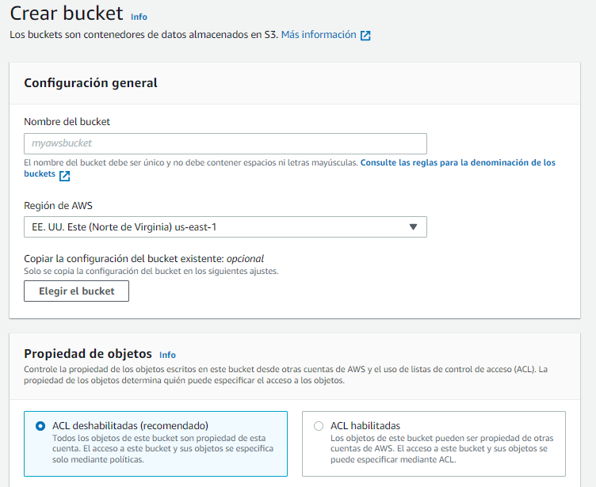
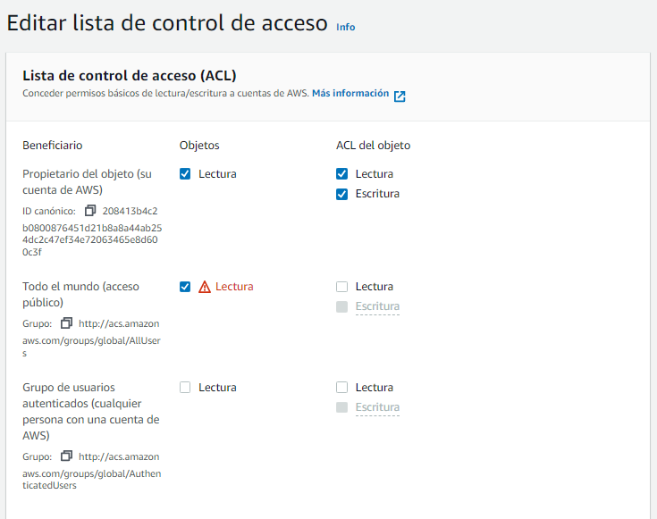

# Curso de Introducción a AWS Cómputo, Almacenamiento y Bases de Datos

## ¿Ya tomaste el curso de Fundamentos de Cloud Computing?

El profesor Enrique Alexis López Araujo, Data Architect en Platzi y Cloud Practicioner certificado, nos da la bienvenida al curso.

Antes de empezar, u**na recomendación: toma el [Curso de Introducción a AWS: Fundamentos de Cloud Computing](https://platzi.com/cursos/aws-fundamentos/ "Curso de Introducción a AWS: Fundamentos de Cloud Computing")**, que te servirá como base para lo que viene.

En este curso de Introducción a AWS: Cómputo, Almacenamiento y Bases de Datos veremos una introducción a los servicios de cómputo, almacenamiento y bases de datos en AWS.

### ¿Qué más vas a aprender?

Además de una **introducción al cómputo, almacenamiento y bases de datos en AWS**, veremos:

- - Máquinas virtuales, contenedores y computación sin servidor en AWS.
- **Almacenamiento en bloques, archivos y objetos**, y los servicios de AWS para cada tipo de almacenamiento.
- Laboratorios de **cómo usar el servicio de almacenamiento de objetos (S3)**.
- **Bases de datos de tipo relacional, de clave-valor y en memoria** en AWS.

**Archivos de la clase**

[curso-de-introduccion-a-aws-computo-almacenamiento-y-bases-de-datos.pdf](https://static.platzi.com/media/public/uploads/curso-de-introduccion-a-aws-computo-almacenamiento-y-bases-de-datos_591b2667-5cc8-478c-aea6-3f08a6d7a74e.pdf)

**Lecturas recomendadas**

[Curso de Fundamentos de AWS Cloud - Platzi](https://platzi.com/cursos/aws-cloud/)

## Cómputo en AWS

AWS (Amazon Web Services) ofrece varios servicios de cómputo en la nube que permiten ejecutar aplicaciones de manera escalable y flexible. Algunos de los servicios más importantes son:

### 🔹 **Servicios de Cómputo en AWS**
1. **Amazon EC2 (Elastic Compute Cloud)**  
   - Servidores virtuales en la nube.  
   - Permite elegir el tipo de instancia, sistema operativo y capacidad de cómputo.  
   - Escalabilidad vertical y horizontal.

2. **AWS Lambda**  
   - Ejecución de código sin necesidad de gestionar servidores.  
   - Modelo **Serverless**, ideal para eventos y microservicios.  
   - Se paga solo por el tiempo de ejecución.

3. **Amazon ECS (Elastic Container Service)**  
   - Administración de contenedores Docker.  
   - Compatible con AWS Fargate (sin necesidad de gestionar servidores).  

4. **Amazon EKS (Elastic Kubernetes Service)**  
   - Kubernetes gestionado en AWS.  
   - Facilita la administración y escalabilidad de contenedores.  

5. **AWS Fargate**  
   - Servicio sin servidores para ejecutar contenedores en ECS y EKS.  
   - No es necesario administrar infraestructura.  

6. **Amazon Lightsail**  
   - Alternativa más sencilla a EC2 con precios predecibles.  
   - Incluye servidores, almacenamiento y bases de datos en paquetes fijos.  

7. **AWS Batch**  
   - Ejecución eficiente de cargas de trabajo por lotes.  
   - Ideal para procesamiento masivo de datos y análisis.  

8. **Amazon Outposts**  
   - Infraestructura de AWS en centros de datos locales.  
   - Híbrido entre la nube y on-premise.  

### 🔹 **Casos de Uso**
✅ **Aplicaciones Web y Móviles** – EC2, Lambda, Lightsail  
✅ **Big Data y Machine Learning** – Batch, EC2 con instancias GPU  
✅ **Microservicios y Serverless** – Lambda, ECS, EKS  
✅ **Computación de Alto Rendimiento (HPC)** – EC2 con instancias especializadas  

Si estás aprendiendo sobre AWS, dime en qué te gustaría profundizar.

### Resumen

AWS describe su capacidad de cómputo como “**cómputo para cualquier carga de trabajo”. Cómputo se refiere a usar una computadora para procesamiento**, ya sea sumar dos números o alojar un sitio web. Entre los servicios de cómputo se encuentran:

### Instancias o máquinas virtuales

Una **máquina virtual** es un software que simula un sistema operativo, y que puede ejecutar programas dentro de dicho sistema como si fuera una computadora real. Los servicios de máquinas virtuales (o instancias) en AWS son:

- **Amazon EC2**: máquinas virtuales seguras y redimensionables.
- **Amazon EC2 Spot**: cargas de trabajo tolerante a fallas, por hasta el 90% del precio normal (nota: Amazon puede reclamar estas instancias en cualquier momento con solo dos minutos de anticipación).
- **Amazon EC2 AutoScaling**: agrega o elimina automáticamente la capacidad informática para satisfacer tus necesidades bajo demanda.
- **Amazon EC2 LightSail**: plataforma en la nube fácil de usar para crear una aplicación o un sitio web.

### Contenedores

Un **contenedor** es una unidad de *software* que empaca un software en específico junto con sus dependencias. Se diferencian de las máquinas virtuales en que estas virtualizan el hardware, mientras que los contenedores [virtualizan el sistema operativo](https://cloud.google.com/learn/what-are-containers "virtualizan el sistema operativo"). Los servicios de contenedores de AWS son:

- **Amazon Elastic Container Services (ECS)**: servicio para correr contenedores confiables y escalables.
- **Amazon Elastic Container Registry (ECR)**: servicio para almacenar, administrar e implementar imágenes de contenedores.
- **Amazon Elastic Kubernetes Service (EKS)**: servicio de Kubernetes administrado por AWS.

### Serverless

La computación **serverless** se refiere a que **la responsabilidad de administrar servidores o máquinas virtuales se le delega al proveedor de nube**, por lo que sólo debemos precuparnos por el código de nuestras aplicaciones. **Amazon Lambda** nos permite ejecutar piezas de código sin servidores.

### Servicios de borde (Edge)

El [Edge Computing](https://www.xataka.com/internet-of-things/edge-computing-que-es-y-por-que-hay-gente-que-piensa-que-es-el-futuro "Edge Computing") se refiere al **cómputo y procesamiento de datos en una ubicación cercana a la necesaria para el negocio**. Los servicios de borde o edge computing de AWS son:

- **Amazon Outposts**: permite ejecutar los servicios de AWS en nuestros propios servidores en lugar de Amazon.
- **Amazon Snow Family**: es una familia de dispositivos desde un disco duro portátil hasta un semi-remolque completo lleno de discos de almacenamiento. Estos dispositivos te permiten cargar archivos en ellos, para luego ser enviados a Amazon y cargados en sus servidores.
- **AWS Wavelength**: permite acceder a los servicios AWS desde dispositivos 5G sin pasar por Internet.
- **VMWare AWS**: permite migrar cargas de trabajo de VMWare a AWS.
- **AWS Local Zones**: permite ejecutar las aplicaciones más cerca de los usuarios finales, a una menor latencia.

### Conclusión

Exploramos una gran cantidad de servicios de computación en AWS. En las próximas clases veremos estos servicios más en detalle.

## Conoce qué es Amazon EC2

Amazon EC2 es un servicio de **computación en la nube** que proporciona **servidores virtuales** (llamados *instancias*) en AWS. Te permite ejecutar aplicaciones sin necesidad de invertir en infraestructura física, escalando según la demanda.

### **🔹 Características Principales**

✅ **Escalabilidad** – Puedes aumentar o reducir la cantidad de servidores según la carga.  
✅ **Elección de Hardware** – Puedes elegir tipo de procesador, memoria RAM, almacenamiento y red.  
✅ **Diferentes Tipos de Instancias** – Optimizadas para cómputo, memoria, almacenamiento o GPU.  
✅ **Pago por Uso** – Modelos de facturación flexibles según el tiempo y tipo de instancia.  
✅ **Seguridad** – Integración con AWS IAM y Virtual Private Cloud (VPC) para control de acceso.

### **🔹 Tipos de Instancias en EC2**

1. **Instancias de Propósito General** – Uso equilibrado de CPU, memoria y red. (Ej: *t3.micro, m5.large*).  
2. **Optimizadas para Cómputo** – Mayor capacidad de CPU, ideal para cálculos intensivos. (Ej: *c6g.large*).  
3. **Optimizadas para Memoria** – Mayor RAM, útil para bases de datos y análisis de datos. (Ej: *r5.large*).  
4. **Optimizadas para Almacenamiento** – Diseñadas para manejo de grandes volúmenes de datos. (Ej: *i3.large*).  
5. **Instancias GPU** – Para Machine Learning y gráficos intensivos. (Ej: *p3.2xlarge*).  

### **🔹 Modelos de Pago**

💰 **On-Demand** – Pago por hora/segundo sin compromisos.  
💰 **Reserved Instances** – Contrato a 1 o 3 años con descuentos.  
💰 **Spot Instances** – Hasta 90% más baratas, pero pueden ser interrumpidas.  
💰 **Savings Plans** – Planes de ahorro con descuentos a cambio de compromiso de uso.  

### **🔹 Casos de Uso**

✅ Aplicaciones web y backend escalables  
✅ Hosting de sitios y servidores  
✅ Big Data y análisis de datos  
✅ Machine Learning y AI con GPU  
✅ Simulaciones científicas  

### **Amazon EC2 (Elastic Compute Cloud)** 🚀  

Amazon EC2 es un servicio de **computación en la nube** que proporciona **servidores virtuales** (llamados *instancias*) en AWS. Te permite ejecutar aplicaciones sin necesidad de invertir en infraestructura física, escalando según la demanda.

### **🔹 Características Principales**

✅ **Escalabilidad** – Puedes aumentar o reducir la cantidad de servidores según la carga.  
✅ **Elección de Hardware** – Puedes elegir tipo de procesador, memoria RAM, almacenamiento y red.  
✅ **Diferentes Tipos de Instancias** – Optimizadas para cómputo, memoria, almacenamiento o GPU.  
✅ **Pago por Uso** – Modelos de facturación flexibles según el tiempo y tipo de instancia.  
✅ **Seguridad** – Integración con AWS IAM y Virtual Private Cloud (VPC) para control de acceso.

### **🔹 Tipos de Instancias en EC2**

1. **Instancias de Propósito General** – Uso equilibrado de CPU, memoria y red. (Ej: *t3.micro, m5.large*).  
2. **Optimizadas para Cómputo** – Mayor capacidad de CPU, ideal para cálculos intensivos. (Ej: *c6g.large*).  
3. **Optimizadas para Memoria** – Mayor RAM, útil para bases de datos y análisis de datos. (Ej: *r5.large*).  
4. **Optimizadas para Almacenamiento** – Diseñadas para manejo de grandes volúmenes de datos. (Ej: *i3.large*).  
5. **Instancias GPU** – Para Machine Learning y gráficos intensivos. (Ej: *p3.2xlarge*).

### **🔹 Modelos de Pago**
💰 **On-Demand** – Pago por hora/segundo sin compromisos.  
💰 **Reserved Instances** – Contrato a 1 o 3 años con descuentos.  
💰 **Spot Instances** – Hasta 90% más baratas, pero pueden ser interrumpidas.  
💰 **Savings Plans** – Planes de ahorro con descuentos a cambio de compromiso de uso.

### **🔹 Casos de Uso**
✅ Aplicaciones web y backend escalables  
✅ Hosting de sitios y servidores  
✅ Big Data y análisis de datos  
✅ Machine Learning y AI con GPU  
✅ Simulaciones científicas

### Resumen

[EC2](https://platzi.com/clases/1323-aws-cloud-practico/12577-que-es-ec2/ "EC2") **permite alquilar máquinas virtuales, llamadas instancias EC2**. Puedes elegir diferentes tipos de **EC2** con diferente CPU, RAM y almacenamiento. Hay instancias optimizadas para cómputo, memoria y almacenamiento, [entre otras](https://docs.aws.amazon.com/es_es/AWSEC2/latest/UserGuide/instance-types.html "entre otras").

En **EC2**, el sistema de pago más común es por hora o por segundo, dependiendo el tipo de instancia. Por ejemplo, para una instancia que cueste $0.1 la hora, puedes pagar, ya sea una instancia por 24 horas o 24 instancias por una hora. En ambos casos pagas lo mismo (24 * 0.10 = $2.4).

### Opciones y precios bajo demanda

Las instancias pueden redimiensionarse. Puedes empezar por una instancia de bajo costo, y si necesitas aumenta su capacidad, apagas la instancia y seleccionas un nuevo tipo de instancia. Cuando enciendas de nuevo la instancia, verás su capacidad aumentada. La siguiente tabla muestra **algunos tipos de instancias**.

| Nombre | Especificaciones | Precio |
|---|---|---|
| t3.nano | 2 vCPU’s, 0.5 GiB RAM | $0,0052/hora |
| t3.xlarge | 4 vCPU’s, 16 GiB RAM | $0,1664/hora |
| c6g.8xlarge | 32 vCPU’s, 64 GiB RAM | $1,088/hora |
| X1e.xlarge | 128 vCPU’s, 3904 GiB RAM, 2x 1920 GB SSD | $26,688/hora |

### Hosts dedicados

Los hosts dedicados en Amazon Web Services (AWS) son infraestructuras de servidores físicos que ofrecen un nivel exclusivo de recursos computacionales para las cargas de trabajo de los clientes. En lugar de compartir estos servidores con otros usuarios, los hosts dedicados permiten a los clientes tener un control más granular sobre la ubicación y asignación de sus instancias de Amazon EC2. Esto puede ser beneficioso para aplicaciones que requieren una mayor seguridad, cumplimiento normativo o rendimiento constante.

Los hosts dedicados también brindan la flexibilidad de llevar licencias de software existentes a la nube sin incurrir en costos adicionales. Al utilizar hosts dedicados, los principiantes en AWS pueden garantizar una mayor aislación de recursos y una mayor predictibilidad en el rendimiento de sus aplicaciones, al tiempo que aprovechan la escala y la elasticidad de la nube de AWS.

## Contenedores de software

Los **contenedores de software** son una forma de empaquetar aplicaciones junto con sus dependencias para que se ejecuten de manera **consistente en cualquier entorno**.  

✅ **Comparación con Máquinas Virtuales (VMs)**

| Característica  | Contenedores  | Máquinas Virtuales (VMs) |
|---------------|-------------|------------------|
| Arranque rápido | ✅ Milisegundos | ❌ Minutos |
| Uso de recursos | ✅ Ligero | ❌ Pesado |
| Portabilidad  | ✅ Alta | ❌ Depende del hipervisor |
| Escalabilidad | ✅ Fácil | ❌ Más difícil |

Los contenedores usan el **kernel del sistema operativo** y comparten recursos, lo que los hace más eficientes que las VMs.

### **🔹 Tecnologías de Contenedores**  
Las principales tecnologías de contenedores incluyen:  

1️⃣ **Docker** – Plataforma para construir, ejecutar y gestionar contenedores.  
2️⃣ **Kubernetes (K8s)** – Orquestador de contenedores que permite escalado y administración automatizada.  
3️⃣ **Podman** – Alternativa sin daemon a Docker.

### **🔹 Contenedores en AWS**
AWS ofrece varios servicios para manejar contenedores:  

### **1. Amazon ECS (Elastic Container Service)**

✅ Orquestación de contenedores sin necesidad de gestionar servidores.  
✅ Soporta Docker.  
✅ Se integra con **AWS Fargate** para ejecutar contenedores sin administrar infraestructura.  

### **2. AWS Fargate**  

✅ Ejecución de contenedores **sin servidores**.  
✅ AWS gestiona la infraestructura automáticamente.  
✅ Paga solo por los recursos usados.  

### **3. Amazon EKS (Elastic Kubernetes Service)**  

✅ Servicio Kubernetes totalmente gestionado en AWS.  
✅ Ideal para arquitecturas de **microservicios**.  
✅ Integración con **EC2, Fargate y AWS Lambda**.  

### **4. Amazon Lightsail Containers**  

✅ Servicio simple para desplegar contenedores.  
✅ Ideal para pequeñas aplicaciones y entornos de prueba.  

### **🔹 Ejemplo: Ejecutar un Contenedor en AWS ECS**

1️⃣ **Crear una imagen Docker** y subirla a Amazon Elastic Container Registry (ECR):  
   ```bash
   docker build -t mi-app .
   docker tag mi-app:latest 123456789012.dkr.ecr.us-east-1.amazonaws.com/mi-app
   docker push 123456789012.dkr.ecr.us-east-1.amazonaws.com/mi-app
   ```
2️⃣ **Crear un cluster en ECS**.  
3️⃣ **Definir una tarea ECS** y usar la imagen de ECR.  
4️⃣ **Ejecutar el servicio ECS** con balanceo de carga.

### **🔹 Casos de Uso de Contenedores**

✅ Aplicaciones escalables en la nube  
✅ Microservicios  
✅ CI/CD con Jenkins y GitHub Actions  
✅ Big Data y Machine Learning  
✅ Migración de aplicaciones monolíticas a la nube

### **🚀 Guía Práctica: Desplegar un Contenedor en AWS ECS con Fargate**  

En esta guía, vamos a:  
✅ Crear una imagen Docker y subirla a AWS Elastic Container Registry (ECR).  
✅ Configurar un **Cluster ECS** y ejecutar el contenedor con **AWS Fargate**.  
✅ Acceder a la aplicación en un navegador.

### **🔹 1. Configurar AWS CLI y Docker**
Antes de comenzar, asegúrate de que tienes instalados:  
📌 **AWS CLI** – Para interactuar con AWS desde la terminal.  
📌 **Docker** – Para construir y ejecutar contenedores localmente.  

### **🔹 Configurar Credenciales AWS**

Ejecuta en la terminal:  
```bash
aws configure
```
Ingresa:  
- **Access Key ID**  
- **Secret Access Key**  
- **Región** (Ej: `us-east-1`)  
- **Formato** (Deja en blanco o escribe `json`)

### **🔹 2. Crear y Subir una Imagen Docker a ECR**

### **Paso 1: Crear un Repositorio en AWS ECR**

Ejecuta:  
```bash
aws ecr create-repository --repository-name mi-app
```
Obtendrás un repositorio en **Amazon Elastic Container Registry (ECR)**.  

### **Paso 2: Construir la Imagen Docker**

Si no tienes una imagen, crea un archivo `Dockerfile` con:  
```dockerfile
FROM nginx:latest
COPY index.html /usr/share/nginx/html/index.html
EXPOSE 80
```
Luego, **construye la imagen**:  
```bash
docker build -t mi-app .
```

### **Paso 3: Autenticarse en ECR**

Ejecuta:  
```bash
aws ecr get-login-password --region us-east-1 | docker login --username AWS --password-stdin 123456789012.dkr.ecr.us-east-1.amazonaws.com
```
Reemplaza `123456789012` con tu **ID de cuenta AWS**.  

### **Paso 4: Etiquetar y Subir la Imagen a ECR**

```bash
docker tag mi-app:latest 123456789012.dkr.ecr.us-east-1.amazonaws.com/mi-app
docker push 123456789012.dkr.ecr.us-east-1.amazonaws.com/mi-app
```
¡Listo! Tu imagen ya está en AWS ECR. 🎉  

### **🔹 3. Crear un Cluster en Amazon ECS**

1️⃣ Ve a **AWS ECS** y haz clic en **Clústeres → Crear Clúster**.  
2️⃣ Elige **"AWS Fargate (sin servidor)"** y nómbralo **"mi-cluster"**.  
3️⃣ **Crea el clúster**.  

### **🔹 4. Definir una Tarea ECS**

1️⃣ En **ECS → Definiciones de Tarea**, haz clic en **Crear nueva definición de tarea**.  
2️⃣ Tipo de lanzamiento: **Fargate**.  
3️⃣ Contenedor:  
   - **Nombre:** `mi-contenedor`  
   - **Imagen:** `123456789012.dkr.ecr.us-east-1.amazonaws.com/mi-app:latest`  
   - **Puerto:** `80`  
4️⃣ Define la **Memoria y CPU** (Ej: 0.5 vCPU, 1GB RAM).  
5️⃣ Guarda y **crea la tarea**.

### **🔹 5. Ejecutar la Tarea en ECS**

1️⃣ Ve a **ECS → Servicios → Crear servicio**.  
2️⃣ **Tipo de Servicio:** `Fargate`.  
3️⃣ **Clúster:** `mi-cluster`.  
4️⃣ **Definición de tarea:** `mi-contenedor`.  
5️⃣ **Número de tareas:** `1`.  
6️⃣ **Configuración de red:**  
   - **VPC:** Elige una disponible.  
   - **Subredes:** Selecciona una pública.  
   - **Habilita Auto-Asignación de IP Pública**.  
7️⃣ **Crea el servicio**.  

### **🔹 6. Acceder a la Aplicación**

1️⃣ Ve a **ECS → Tareas**, selecciona la tarea en ejecución.  
2️⃣ Copia la **IP Pública** de la instancia.  
3️⃣ Abre un navegador y accede a:  
   ```
   http://IP_PUBLICA
   ```
🎉 ¡Tu aplicación en contenedores ya está corriendo en AWS ECS con Fargate! 🚀🔥

### **🔹 ¿Qué Sigue?**

🔹 Configurar balanceadores de carga con **AWS ALB**.  
🔹 Automatizar despliegues con **GitHub Actions + ECS**.  
🔹 Monitorear contenedores con **AWS CloudWatch**.

### Resumen

El propósito de un contenedor es **crear un paquete de tu programa y todas sus librerías y dependencias con las versiones específicas con las que has trabajado**, para producir una imagen que pueda ser ejecutada en cualquier máquina.

Un problema común del desarrollo de software es utilizar distintas versiones de diferentes librerías/lenguajes de programación/programas. **Docker nos permite crear contenedores** para resolver este problema.

### Amazon ECS

[Amazon ECS](https://aws.amazon.com/es/ecs/ "Amazon ECS") es un servicio de **contenedores**, donde puedes implementar tus imágenes en contenedores en AWS. Cuando corras tus contenedores en AWS, **no notarás diferencia entre tu máquina local y el entorno de AWS**.

**Lecturas recomendadas**

[Curso de Docker [Empieza Gratis] - Platzi](https://platzi.com/cursos/docker/)

[Curso de Kubernetes [Empieza Gratis] - Platzi](https://platzi.com/cursos/k8s/)

## AWS Lambda

**AWS Lambda** es un servicio de computación sin servidores que te permite ejecutar código sin necesidad de administrar servidores. Solo subes tu código y AWS se encarga de la ejecución, escalado y administración.

### **🔹 Características Clave**

✅ **Sin Servidores** – AWS gestiona la infraestructura automáticamente.  
✅ **Pago por Uso** – Solo pagas por el tiempo que tu función esté en ejecución.  
✅ **Ejecución en Respuesta a Eventos** – Se activa con eventos de otros servicios AWS.  
✅ **Escalado Automático** – Se ajusta a la demanda sin intervención manual.  
✅ **Compatible con Múltiples Lenguajes** – Soporta Python, Node.js, Java, Go, Ruby, y más.

### **🔹 Casos de Uso**  
✔️ **Procesamiento de Datos en Tiempo Real** (logs, métricas, IoT).  
✔️ **Automatización de Tareas** (backup, limpieza de datos).  
✔️ **Desarrollo de APIs sin Servidor** con API Gateway + Lambda.  
✔️ **Integración con Otros Servicios AWS** (S3, DynamoDB, SNS, SQS, etc.).

### **🚀 Creando una Función AWS Lambda en la Consola**  

### **1️⃣ Acceder a AWS Lambda**

1. Ve a la [consola de AWS Lambda](https://aws.amazon.com/lambda/).  
2. Haz clic en **Crear función**.  

### **2️⃣ Configurar la Función**

- **Nombre**: `mi-lambda`  
- **Tiempo de ejecución**: `Python 3.9` (puedes elegir otro lenguaje).  
- **Permisos**: Usa los permisos por defecto o crea un rol IAM personalizado.  
- Haz clic en **Crear función**.  

### **3️⃣ Escribir el Código**

AWS proporciona un editor en línea. Agrega el siguiente código en **Python**:  
```python
import json

def lambda_handler(event, context):
    return {
        'statusCode': 200,
        'body': json.dumps('¡Hola desde AWS Lambda!')
    }
```
Guarda los cambios y haz clic en **Implementar**.  

### **4️⃣ Probar la Función**

1. Haz clic en **Probar**.  
2. Crea un evento de prueba con datos de ejemplo.  
3. Ejecuta la función y verifica el resultado en la consola.

### **🔹 Activar Lambda con un Evento de S3**

Si quieres que Lambda se ejecute cuando se suba un archivo a S3:  
1. **Ve a Amazon S3** y selecciona un bucket.  
2. **Configuración → Eventos → Crear evento**.  
3. Selecciona **PUT (carga de archivos)** como evento.  
4. Especifica el nombre de tu función Lambda.  
5. Guarda y prueba subiendo un archivo a S3.

### **🔹 Desplegar Lambda con AWS CLI**

Si prefieres crear y subir la función desde la terminal:  
1️⃣ Guarda tu código en `lambda_function.py`.  
2️⃣ Empaqueta el archivo en un ZIP:  
   ```bash
   zip mi-lambda.zip lambda_function.py
   ```
3️⃣ Crea la función en AWS Lambda:  
   ```bash
   aws lambda create-function \
     --function-name mi-lambda \
     --runtime python3.9 \
     --role arn:aws:iam::123456789012:role/lambda-role \
     --handler lambda_function.lambda_handler \
     --zip-file fileb://mi-lambda.zip
   ```
   Reemplaza `123456789012` con tu ID de cuenta y `lambda-role` con un rol IAM válido.

### **🔹 Integración con API Gateway**

Para exponer tu función Lambda como una API REST:  
1. **Ve a API Gateway → Crear API**.  
2. Selecciona **API REST** y crea un nuevo endpoint.  
3. Configura una **Integración con AWS Lambda**.  
4. Implementa y obtén la URL pública de tu API.

### **🎯 ¿Qué Sigue?**

🔹 Conectar Lambda con **DynamoDB, SQS o SNS**.  
🔹 Usar **Lambda Layers** para reutilizar código y dependencias.  
🔹 **Optimizar costos** ajustando memoria y tiempo de ejecución.

### Resumen

[AWS Lambda](https://aws.amazon.com/es/lambda/faqs/ "AWS Lambda") es un servicio serverless que nos permite **ejecutar código en respuesta a eventos, sin preocuparnos por servidores o infraestructura**. Estos eventos pueden ser temporizadores, visitas a alguna sección de nuestra aplicación, solicitudes HTTP, entre [otros](https://docs.aws.amazon.com/es_es/lambda/latest/dg/lambda-services.html#intro-core-components-event-sources "otros").

Entre sus casos de uso encontramos el (pre)procesamiento de datos a escala, y la ejecución de backends web, móviles y de [IoT](https://aws.amazon.com/es/iot/ "IoT") interactivos. **Lambda** se puede combinar con otros servicios de AWS para crear experiencias en línea seguras, estables y escalables.

### ¿Cómo se factura Lambda?

Lambda se factura por milisegundos, y el precio depende del uso de RAM. Por ejemplo, 128MB RAM x 30 millones de eventos por mes resultan en un costo de $11.63 al mes.

## Almacenamiento de datos en AWS 

AWS ofrece múltiples servicios de almacenamiento diseñados para diferentes necesidades. A continuación, te explico las principales opciones y cuándo usarlas.  

### **🔹 1. Amazon S3 (Simple Storage Service) – Almacenamiento de Objetos**  
📌 **¿Qué es?**  
Amazon S3 es un almacenamiento escalable para **archivos y datos no estructurados**.  

✅ **Características**  
✔ Almacenamiento **ilimitado** y pago por uso.  
✔ Alta **disponibilidad y durabilidad** (99.999999999% de durabilidad).  
✔ Permite almacenamiento en diferentes clases:  
   - **S3 Standard** (acceso frecuente).  
   - **S3 Intelligent-Tiering** (automático según uso).  
   - **S3 Glacier** (archivado a largo plazo).  
✔ Seguridad con **cifrado y control de acceso IAM**.  
✔ Se integra con **Lambda, CloudFront y DynamoDB**.  

🛠 **Casos de Uso**  
✅ Almacenamiento de imágenes, videos, backups.  
✅ Hosting de sitios web estáticos.  
✅ Integración con Big Data y ML.  

👨‍💻 **Ejemplo: Subir un archivo con AWS CLI**  
```bash
aws s3 cp mi-archivo.txt s3://mi-bucket/
```

### **🔹 2. Amazon EBS (Elastic Block Store) – Almacenamiento de Bloques**  
📌 **¿Qué es?**  
EBS proporciona almacenamiento en **bloques** para instancias **EC2**.  

✅ **Características**  
✔ Diseñado para **bases de datos y aplicaciones** de alto rendimiento.  
✔ Se comporta como un **disco duro** (SSD/HDD).  
✔ Persistente incluso si la instancia EC2 se detiene.  
✔ Soporta **Snapshots** para respaldo y restauración.  

🛠 **Casos de Uso**  
✅ Almacenamiento para servidores web y bases de datos en EC2.  
✅ Aplicaciones que requieren **baja latencia y alta IOPS**.  

👨‍💻 **Ejemplo: Crear un volumen EBS**  
```bash
aws ec2 create-volume --size 10 --region us-east-1 --availability-zone us-east-1a --volume-type gp2
```

### **🔹 3. Amazon EFS (Elastic File System) – Almacenamiento de Archivos**  
📌 **¿Qué es?**  
EFS es un sistema de archivos **compartido y escalable** para instancias **EC2 y contenedores**.  

✅ **Características**  
✔ Sistema de archivos basado en **NFS**.  
✔ **Escalado automático** sin necesidad de gestionar capacidad.  
✔ Alta disponibilidad y rendimiento.  

🛠 **Casos de Uso**  
✅ Servidores web con contenido compartido.  
✅ Análisis de datos en tiempo real con múltiples instancias.  

👨‍💻 **Ejemplo: Montar un sistema de archivos EFS**  
```bash
sudo mount -t nfs4 fs-12345678.efs.us-east-1.amazonaws.com:/ efs
```

### **🔹 4. Amazon RDS (Relational Database Service) – Bases de Datos Relacionales**  
📌 **¿Qué es?**  
Amazon RDS permite ejecutar bases de datos **gestionadas** como **MySQL, PostgreSQL, SQL Server y MariaDB**.  

✅ **Características**  
✔ No necesitas administrar hardware ni backups.  
✔ Escalado automático y alta disponibilidad con **Multi-AZ**.  
✔ Soporte para **Read Replicas** para mejorar rendimiento.  

🛠 **Casos de Uso**  
✅ Aplicaciones que requieren **SQL** y consultas estructuradas.  
✅ Sitios web y plataformas transaccionales.  

👨‍💻 **Ejemplo: Crear una base de datos RDS MySQL**  
```bash
aws rds create-db-instance --db-instance-identifier mi-bd --engine mysql --master-username admin --master-user-password password --allocated-storage 20 --db-instance-class db.t2.micro
```

### **🔹 5. Amazon DynamoDB – Base de Datos NoSQL**  
📌 **¿Qué es?**  
DynamoDB es una base de datos **NoSQL** gestionada con **alta escalabilidad**.  

✅ **Características**  
✔ Soporta **millones de consultas por segundo**.  
✔ Modelo de datos **clave-valor** y **documentos JSON**.  
✔ Se integra con **Lambda, API Gateway y ML**.  

🛠 **Casos de Uso**  
✅ Aplicaciones serverless y de IoT.  
✅ Sistemas de recomendación y catálogos de productos.  

👨‍💻 **Ejemplo: Crear una tabla en DynamoDB**  
```bash
aws dynamodb create-table --table-name MiTabla --attribute-definitions AttributeName=ID,AttributeType=S --key-schema AttributeName=ID,KeyType=HASH --billing-mode PAY_PER_REQUEST
```

### **🔹 Comparación Rápida**
| Servicio  | Tipo de Almacenamiento | Uso Principal |
|-----------|----------------|--------------|
| **S3** | Objetos | Archivos, backups, datos no estructurados |
| **EBS** | Bloques | Discos virtuales para EC2 |
| **EFS** | Archivos | Sistemas de archivos compartidos |
| **RDS** | Relacional | Bases de datos SQL |
| **DynamoDB** | NoSQL | Aplicaciones escalables y rápidas |

### **🎯 ¿Qué Sigue?**
🔹 **Configurar backups y snapshots en AWS**.  
🔹 **Conectar almacenamiento con Machine Learning en AWS**.  
🔹 **Optimizar costos con S3 Intelligent-Tiering y EFS Infrequent Access**.

### Resumen

El almacenamiento de datos en la nube consiste en **subir tus datos a dicha red de servidores, donde se te proporcionan herramientas para que puedas acceder a ellos de diferentes maneras**.

### Tipos de almacenamiento y sus servicios

Podemos utilizar distintos tipos almacenamiento datos, y para estos hay servicios de AWS. Los tipos de almacenamiento son:

- **Basado en archivos**: el más conocido por todos. Archivos organizados por carpetas y subcarpetas (sistema de ficheros). En esta categoría encontramos a [Amazon Elastic File System (EFS)](https://aws.amazon.com/es/efs/ "Amazon Elastic File System (EFS)") y [Amazon FSx for Windows File Server](https://aws.amazon.com/es/fsx/windows/ "Amazon FSx for Windows File Server").
- **Bloque**: los archivos se almacenan en volúmenes por fragmentos de datos de igual tamaño, sin procesar. Este tipo de almacenamiento es utilizado como disco duro de nuestros servidores o máquinas virtuales. En esta categoría está [Amazon Elastic Block Store (EBS)](https://aws.amazon.com/es/ebs/ "Amazon Elastic Block Store (EBS)").
- **Objetos**: la información almacenada se almacena como objetos, de manera que cada objeto recibe un identificador único y se almacena en un modelo de memoria plana. Un ejemplo de esto es [Amazon Simple Storage Service (S3)](https://aws.amazon.com/es/s3/ "Amazon Simple Storage Service (S3)").

### Respaldo de datos

**Amazon Backup administra y automatiza de forma centralizada** las copias de seguridad en los servicios de AWS.

### Servicios de transferencia de datos

¿Qué pasa si necesitamos transferir datos de nuestros servidores hacia AWS (o viceversa)? AWS ofrece distintos servicios para la transferencia de datos.

- **AWS Storage Gateway**: un conjunto de servicios de almacenamiento en la [nube híbrida](https://platzi.com/clases/2200-introduccion-azure/38231-tipos-de-nube-publica-privada-e-hibrida/ "nube híbrida") que brinda acceso en las instalaciones al almacenamiento en la nube.
- **AWS DataSync**: acelera el traslado de datos desde y hacia AWS hasta diez veces más rápido de lo normal.
- **AWS Transfer Family**: escala de forma segura tus transferencias recurrentes de archivos de **Amazon S3** y **Amazon EFS** con los protocolos [FTP](https://www.arsys.es/soporte/hosting-web/ftp/que-es-ftp#:~:text=FTP%20es%20un%20protocolo%20que,directorios%2C%20borrar%20ficheros%2C%20etc. "FTP"), [SFTP](https://es.wikipedia.org/wiki/SSH_File_Transfer_Protocol "SFTP") y [FTPS](https://es.wikipedia.org/wiki/FTPS "FTPS").

**Conclusión**

Exploramos de manera breve los distintos servicios de almacenamiento de AWS, así como los tipos de almacenamiento que podemos utilizar.

## S3 y S3 Glacier

Amazon S3 y S3 Glacier son servicios de almacenamiento de objetos en AWS, pero tienen diferentes propósitos.  

- **Amazon S3** → Para datos de acceso frecuente o moderado.  
- **Amazon S3 Glacier** → Para archivado a largo plazo con menor costo.  

### **🔹 Amazon S3 (Simple Storage Service)**

📌 **¿Qué es?**  
Amazon S3 es un servicio de **almacenamiento de objetos** que permite guardar datos en la nube de forma escalable, segura y de alta disponibilidad.  

✅ **Características Clave**  
✔ **Almacenamiento duradero (99.999999999%)** para datos no estructurados.  
✔ **Pago por uso**, sin costos iniciales.  
✔ **Integración con Lambda, CloudFront, DynamoDB y más**.  
✔ **Versionado y control de acceso** con políticas IAM.  
✔ **Cifrado** en tránsito y en reposo.  

🛠 **Casos de Uso**  
✅ Hosting de sitios web estáticos.  
✅ Almacenamiento de imágenes, videos y backups.  
✅ Procesamiento de Big Data y Machine Learning.  

👨‍💻 **Ejemplo: Subir un archivo a S3 con AWS CLI**  
```bash
aws s3 cp mi-archivo.txt s3://mi-bucket/
```

### **🔹 Amazon S3 Glacier** (Archivado de Datos de Bajo Costo)

📌 **¿Qué es?**  
S3 Glacier es un servicio de almacenamiento **de bajo costo** para datos que no necesitan acceso inmediato.  

✅ **Características Clave**  
✔ **Hasta 80% más barato que S3 Standard**.  
✔ Diseñado para **archivado a largo plazo**.  
✔ **Recuperación de datos en diferentes velocidades** (Expedited, Standard, Bulk).  
✔ **Alta durabilidad (99.999999999%)**.  

🛠 **Casos de Uso**  
✅ Backups históricos y recuperación ante desastres.  
✅ Archivos de registros y auditorías.  
✅ Cumplimiento normativo y retención de datos.  

👨‍💻 **Ejemplo: Mover un archivo de S3 a Glacier**  
```bash
aws s3 mv s3://mi-bucket/mi-archivo.txt s3://mi-bucket/mi-archivo.txt --storage-class GLACIER
```

### **🔹 Comparación Rápida**  

| **Característica** | **Amazon S3** | **S3 Glacier** |
|--------------------|--------------|---------------|
| **Costo** | Más alto | Mucho más barato |
| **Velocidad de Acceso** | Inmediato | Desde minutos hasta horas |
| **Casos de Uso** | Archivos en uso frecuente | Archivado a largo plazo |
| **Durabilidad** | 99.999999999% | 99.999999999% |
| **Recuperación de Datos** | Instantánea | **Expedited (minutos), Standard (3-5h), Bulk (12-48h)** |

### **🎯 ¿Qué Elegir?**
- **Si necesitas acceso frecuente → S3 Standard.**  
- **Si los datos se usan poco → S3 Standard-IA o Intelligent-Tiering.**  
- **Si es almacenamiento de archivos a largo plazo → S3 Glacier.**

### Resumen

[Amazon S3](https://aws.amazon.com/es/s3/ "Amazon S3") es un servicio de almacenamiento de objetos, líder en la industria. Otorga una **garantía de no pérdida de datos del 99.999999999%** (11 9’s).

### Clases de almacenamiento en S3

Amazon nos ofrece [distintas clase de almacenamiento](https://aws.amazon.com/es/s3/storage-classes/?nc=sn&loc=3 "distintas clase de almacenamiento") S3 en función de nuestras necesidades de acceso y disponibilidad de los datos.

- **S3 Standard**: almacenamiento de objetos de alta durabilidad, disponibilidad y rendimiento para datos a los que se obtiene acceso con frecuencia.
- **S3 Standard-IA**: se utiliza con datos a los que se accede con menos frecuencia, pero que requieren un acceso rápido cuando es necesario.
- **S3 Zone-IA**: similar a Standard-IA, pero con un menor costo de almacenamiento ya que solo usa una zona de disponibilidad. Distinto de las demás clases de almacenamiento de S3, que almacenan datos en un mínimo de tres zonas de disponibilidad (AZ).
- **S3 Glacier**: ofrece el almacenamiento de menor costo para los datos de larga duración y acceso poco frecuente. Tiene un costo de $1 por TB al mes. Tiene tres opciones para la recuperación de datos (estándar, masiva y acelerada).
- **S3 Glacier Deep Archive**: la clase de almacenamiento más económica de Amazon S3. Admite la retención a largo plazo y la conservación digital de datos a los que se accede una o dos veces al año.
- **S3 Intelligent-Tiering**: un tipo de almacenamiento que intenta ahorrar costos moviendo archivos entre los distintos tipos de almacenamiento S3, basado en los patrones de uso de los archivos.

**Conclusión**

Tenemos variedad de opciones para escoger la clase de almacenamiento S3 en función de nuestras necesidades. Si necesitamos un almacenamiento altamente disponible y duradero, **S3 Standard** es la mejor opción, mientras que si necesitamos un almacenamiento a largo plazo y de acceso infrecuente, podemos usar **S3 Glacier**. Escoge la mejor opción según tu caso de uso.

**Lecturas recomendadas**

[Tipos de almacenamiento en la nube | Amazon S3](https://aws.amazon.com/es/s3/storage-classes/)

## Explicando el Amazon Elastic File System (EFS)

### **🔹 ¿Qué es Amazon EFS?** 

Amazon **Elastic File System (EFS)** es un sistema de archivos **compartido, escalable y administrado** en la nube de AWS. Está diseñado para permitir que múltiples instancias EC2, contenedores y otros servicios accedan a los mismos archivos de manera concurrente, con **baja latencia y alta disponibilidad**.

### **🔹 Características Clave**

✅ **Escalabilidad Automática** – Se expande y contrae sin necesidad de gestión manual.  
✅ **Acceso Compartido** – Múltiples instancias EC2 pueden conectarse al mismo sistema de archivos.  
✅ **Compatible con NFS** – Usa el protocolo **NFSv4** para la comunicación.  
✅ **Alta Disponibilidad y Durabilidad** – Replicación automática en múltiples zonas de disponibilidad (AZ).  
✅ **Pago por Uso** – Solo pagas por los datos almacenados y no por la capacidad provisionada.  
✅ **Soporte para AWS Lambda y Fargate** – Permite acceso a datos desde servicios sin servidor.  
✅ **Encriptación y Control de Acceso** – Integración con AWS IAM y KMS para seguridad.

### **🔹 Casos de Uso**

✔️ **Servidores Web** – Para sitios web y aplicaciones que requieren almacenamiento compartido.  
✔️ **Big Data y Machine Learning** – Procesamiento de grandes volúmenes de datos con múltiples instancias.  
✔️ **Contenedores y Kubernetes** – Permite el almacenamiento persistente para Amazon EKS y ECS.  
✔️ **Ambientes de Desarrollo** – Para compartir código y configuraciones entre servidores.

### **🔹 Comparación con Otros Almacenamientos AWS**  

| **Característica** | **EFS** | **EBS** | **S3** |
|--------------------|--------|--------|--------|
| **Tipo de Almacenamiento** | Archivos (NFS) | Bloques | Objetos |
| **Escalabilidad** | Automática | Manual | Automática |
| **Acceso Concurrente** | Sí, varias instancias | No, solo 1 instancia | Sí, desde cualquier lugar |
| **Latencia** | Baja | Muy baja | Alta (comparado con EFS/EBS) |
| **Casos de Uso** | Aplicaciones compartidas, contenedores | Bases de datos, discos de EC2 | Almacenamiento de datos, backups |

### **🔹 Configuración Básica de EFS en AWS**  

### **1️⃣ Crear un Sistema de Archivos EFS**

1. **Ve a la consola de AWS** → Amazon EFS.  
2. **Haz clic en "Crear sistema de archivos"**.  
3. **Selecciona la VPC y las subredes** donde se desplegará.  
4. **Configura el tipo de rendimiento** (estándar o provisionado).  
5. **Habilita cifrado y permisos de acceso**.  
6. **Crea el sistema de archivos** y toma nota del **ID del sistema de archivos**.  

### **2️⃣ Conectar EFS a una Instancia EC2**

1. **Instala los paquetes necesarios en la instancia**:  
   ```bash
   sudo yum install -y amazon-efs-utils
   ```
2. **Crea un punto de montaje**:  
   ```bash
   mkdir /mnt/efs
   ```
3. **Monta el sistema de archivos**:  
   ```bash
   sudo mount -t efs fs-12345678 /mnt/efs
   ```
   Reemplaza `fs-12345678` con el ID de tu sistema EFS.  

4. **Verifica que se haya montado correctamente**:  
   ```bash
   df -h
   ```

### **🔹 Configuración Avanzada**  

### **✔️ Conectar EFS a Kubernetes (EKS)**

1. **Instala el CSI de Amazon EFS** en EKS.  
2. **Define un PersistentVolume (PV) y PersistentVolumeClaim (PVC)**.  
3. **Asocia el PVC a un Pod** para que use EFS como almacenamiento.  

### **🎯 ¿Qué Sigue?**
🔹 **Optimizar costos con EFS Infrequent Access (IA).**  
🔹 **Automatizar el montaje con fstab o CloudFormation.**  
🔹 **Usar EFS con AWS Lambda para almacenamiento serverless.**

### Resumen

**Amazon Elastic File System (EFS)** brinda un sistema de archivos elástico, sencillo, sin servidor y práctico basado en **NFS** para las máquinas virtuales de EC2.

[NFS](https://www.computerweekly.com/es/definicion/Sistema-de-archivos-de-red-NFS "NFS") es un **protocolo de archivos en red que permite acceder a archivos y directorios que no están en tu sistema**. Esto permite que miles de máquinas puedan conectarse a [EFS](https://aws.amazon.com/es/efs/ "EFS") y procesar los datos que allí se encuentran.

**Características de EFS**

EFS es altamente disponible y duradero. **Provee protección contra una interrupción de la zona de disponibilidad**, replicando los archivos en múltiples zonas dentro de una región.

**Adicionalmente:**

- EFS brinda dos clases de almacenamiento: Standar y Standar IA (para acceso poco frecuente). Puedes implementar políticas para que tus archivos se muevan de Standar a Standar IA después de cierto tiempo.
- Los datos están **encriptados de manera automática**.

## AWS Storage Gateway

### **🔹 ¿Qué es AWS Storage Gateway?**

AWS **Storage Gateway** es un servicio híbrido de almacenamiento que conecta tu centro de datos o infraestructura on-premises con la nube de **Amazon S3, S3 Glacier y EBS**. Permite extender el almacenamiento local con la escalabilidad y durabilidad de AWS, sin cambiar las aplicaciones existentes.  

✅ **Casos de Uso**  
✔ **Respaldo y recuperación ante desastres** – Guarda copias de seguridad en AWS.  
✔ **Almacenamiento en la nube con acceso local** – Mantén archivos en AWS mientras los accedes localmente.  
✔ **Integración con Amazon S3 y Glacier** – Para archivar datos y optimizar costos.

### **🔹 Modos de Operación de Storage Gateway**  

AWS Storage Gateway ofrece **tres tipos de gateways**, según el caso de uso:  

| **Modo** | **Descripción** | **Casos de Uso** |
|----------|---------------|------------------|
| **File Gateway** | Almacena archivos en S3 con acceso vía NFS o SMB. | Backups, almacenamiento de datos en la nube. |
| **Volume Gateway** | Presenta volúmenes iSCSI en modo cacheado o almacenado. | Aplicaciones empresariales, bases de datos. |
| **Tape Gateway** | Simula librerías de cintas virtuales (VTL) en la nube. | Archivado y cumplimiento normativo. |

### **🔹 Explicación de Cada Tipo de Storage Gateway**  

### **📁 1️⃣ File Gateway (Acceso a S3 como un Servidor de Archivos)**

- Presenta almacenamiento en **S3** como un sistema de archivos **NFS o SMB**.  
- **Ideal para** servidores de archivos en la nube, archivos compartidos y backups.  
- **Datos frecuentemente accedidos** se mantienen en caché localmente.  

**Ejemplo de uso:**

Una empresa que necesita compartir archivos entre varias oficinas, pero desea almacenarlos en S3 para reducir costos y mejorar la seguridad.

### **💾 2️⃣ Volume Gateway (Almacenamiento en Bloques - iSCSI)**

Se presenta como un volumen iSCSI que las aplicaciones pueden usar como si fuera un disco local. Tiene dos modos:  

1. **Modo Cacheado** – Mantiene los datos en S3 con caché local para mejorar el rendimiento.  
2. **Modo Almacenado** – Guarda los datos localmente y hace snapshots en AWS para respaldo.  

**Ejemplo de uso:**  
Una empresa con bases de datos on-premises que necesita respaldo automático en AWS sin cambiar su infraestructura.

### **📼 3️⃣ Tape Gateway (Cintas Virtuales en la Nube)**

- Reemplaza sistemas de **cintas físicas** por almacenamiento en AWS.  
- Compatible con **S3 Glacier y S3 Glacier Deep Archive** para archivado de datos de bajo costo.  
- Se usa con software de backup como **Veeam, Commvault y NetBackup**.  

**Ejemplo de uso:**  
Un banco que debe mantener copias de seguridad a largo plazo por normativas legales.

### **🔹 Implementación Básica de AWS Storage Gateway**  

### **1️⃣ Configurar un Gateway en AWS**

1. **Accede a la consola de AWS** → Storage Gateway.  
2. **Elige el tipo de Gateway** (File, Volume o Tape).  
3. **Selecciona la ubicación** (on-premises o en EC2).  
4. **Descarga e instala la máquina virtual** en VMware, Hyper-V o como instancia EC2.  
5. **Conéctala a AWS y configura el acceso a S3, EBS o Glacier.**

### **🔹 Comparación con Otros Servicios de Almacenamiento en AWS**  

| **Servicio** | **Tipo de Almacenamiento** | **Casos de Uso** |
|-------------|---------------------------|------------------|
| **S3** | Objetos | Backups, almacenamiento de datos en la nube. |
| **EFS** | Archivos | Sistemas de archivos compartidos en EC2 y contenedores. |
| **EBS** | Bloques | Discos persistentes para EC2. |
| **Storage Gateway** | Híbrido (archivos, bloques, cintas) | Extender almacenamiento local a AWS. |

### **🎯 ¿Qué Sigue?**

Si necesitas ayuda con la implementación de AWS Storage Gateway, dime el caso de uso y te guío paso a paso.

### Resumen

**AWS Storage Gateway nos brinda acceso a almacenamiento en la nube prácticamente ilimitado desde nuestra propia infraestructura**.

Storage Gateway se compone de tres puertas de acceso diferentes:

### File Gateway

**File Gateway** provee interfaces [SMB](https://es.wikipedia.org/wiki/Server_Message_Block "SMB") y NFS para amazon S3, tanto en Windows como en Linux. Gracias a [File Gateway](https://aws.amazon.com/es/storagegateway/file/ "File Gateway"), en ambos sistemas operativos veremos un sistema de archivos tal cual como si fuera un disco montado en nuestros computadores, los cuales escriben archivos al sistema, y **File Gateway se encarga de guardarlos en S3**.

Gracias a esto **podemos guardar archivos a S3 como si se tratara de guardar archivos locales**. Los archivos S3 luego pueden ser usados por cualquier servicio de AWS.

### Tape Gateway

Supón que tienes copias de seguridad en cintas físicas. **Tape Gateway te permite migrar copias de seguridad a una bibliteca de cintas virtuales en AWS**. Tape Gateway es compatible con los principales software de respaldo.

Los contenidos de tus cintas se guardan en S3, lo que te permite implementar **S3 Glacier** y S**3 Glacier Deep Archive** para guardar tus copias de seguridad a largo plazo. Una vez que implementas [Tape Gateway](https://aws.amazon.com/es/storagegateway/vtl/ "Tape Gateway"), puedes olvidarte de los costos relacionados a mantener las cintas físicas.

Volume Gateway
Volume Gateway otorga almacenamiento en bloque con protocolo iSCSI, respaldado en la nube. Almacena datos en S3 de acuerdo a dos modos:

- **Modo caché**: almacena los datos principales en S3, mientras que los datos de acceso frecuente se guardan localmente y en caché.
- **Modo almacenado**: todos los datos se guardan localmente, mientras que se hace una copia de seguridad de manera asíncrona en S3.

### Conclusión

Vimos tres posibilidades de uso de [Amazon Storage Gateway](https://aws.amazon.com/es/storagegateway/ "Amazon Storage Gateway"). Para cada caso de uso, hay una puerta de acceso adecuada, ya sea **File**, **Tape** o **Volume Gateway**.

## Laboratorio: crea tu primer bucket de S3 para guardar objetos 

Si quieres crear un **bucket de S3** y guardar objetos, puedes hacerlo desde la consola de AWS o usando **AWS CLI**. Aquí te muestro cómo hacerlo usando la línea de comandos.

### **1️⃣ Configurar AWS CLI**

Si aún no tienes **AWS CLI** instalado, sigue estos pasos:  
- Descarga e instala [AWS CLI](https://aws.amazon.com/cli/).  
- Configura las credenciales con:  
  ```bash
  aws configure
  ```
  Ingresa:  
  - **AWS Access Key ID**  
  - **AWS Secret Access Key**  
  - **Región por defecto** (ejemplo: `us-east-1`)  
  - **Formato de salida** (`json`, `table`, `text`)

### **2️⃣ Crear un Bucket de S3**

Ejecuta el siguiente comando para crear un bucket en **us-east-1**:  

```bash
aws s3 mb s3://mi-primer-bucket-s3 --region us-east-1
```

📌 **Nota:** Cambia `mi-primer-bucket-s3` por un nombre único.

Si la creación es exitosa, verás un mensaje como:  
```
make_bucket: s3://mi-primer-bucket-s3/
```

### **3️⃣ Subir un Archivo al Bucket**  
Guarda un archivo en el bucket:  

```bash
aws s3 cp mi-archivo.txt s3://mi-primer-bucket-s3/
```

Para subir una carpeta completa:  

```bash
aws s3 cp mi-carpeta s3://mi-primer-bucket-s3/ --recursive
```

### **4️⃣ Listar Objetos en el Bucket**  
Para ver los archivos almacenados en el bucket:  

```bash
aws s3 ls s3://mi-primer-bucket-s3/
```

### **5️⃣ Hacer un Archivo Público (Opcional)**  
Si quieres que un archivo sea accesible públicamente:  

```bash
aws s3 cp mi-archivo.txt s3://mi-primer-bucket-s3/ --acl public-read
```

Luego, accede al archivo en:  
```
https://mi-primer-bucket-s3.s3.amazonaws.com/mi-archivo.txt
```

### Resumen

Ya conoces las capacidades de AWS S3, ¡ahora ponte manos a la obra! **Vamos a crear nuestro primer bucket de S3 para guardar objetos**.

Inicia sesión en AWS, ve al servicio de S3 y sigue las instrucciones.

### Crea tu bucket
Una vez en la página de S3, haz click en Crear Bucket. Te aparecerá un menú como el siguiente:



Deberás escoger un nombre único para el bucket. Por ejemplo, **test-[tu-numbre]-[números aleatorios]**. Puedes dejar la región por defecto. En la parte de propiedad de objetos, deja **ACL deshabilitadas (recomendado)**.

Acto seguido, en la sección ““**Configuración de bloqueo de acceso público para este bucket”**”, desactiva la casilla de **Bloquear todo el acceso público**, y activa la de reconocimiento de configuración actual.


Habilita el control de versiones de buckets (lo vamos a necesitar para el próximo laboratorio). Finalmente, haz click en **Crear Bucket**.

### Sube tu primer objeto

Una vez creado, **haz click en el nombre de tu bucket, y luego en Cargar**. Puedes hacer click en *Agregar archivos*, o arrastrar el archivo que quieres subir. Una vez subido, haz click en *Cargar*.


Cuando termine de cargar, podrás hacer click en el nombre del objeto, lo cual te mostrará sus propiedades, entre ellas la URL del objeto. Si intentas acceder desde tu navegador, es posible que te salga una página de acceso denegado.

Si bien cuando creamos el bucket desploqueamos el acceso público, esto es a nivel de bucket. A nivel de objeto, debemos permitir este acceso.

Tenemos dos alternativas: permitirlo desde los permisos del objeto, o crear una política a nivel de bucket para permitir el acceso público a los archivos

### Cambiar los permisos del objeto

Si nos vamos al apartado de permisos, nos saldrá un recuadro indicando que como dejamos el **ACL** (lista de control de acceso) deshabilitado durante la creación del bucket, **debemos cambiar los permisos del objeto** mediante políticas a nivel de bucket. Podemos cambiar esto **habilitando el ACL en el apartado de permisos** del bucket, en la sección de “**“Propiedad de objetos”**”.

Cuando habilitemos el **ACL**, simplemente **volvemos a la página del objeto, al apartado de permisos**. Hacemos click en **Editar, y habilitamos la lectura del objeto a todo el mundo**.



### Implementar política de acceso a nivel de bucket

Para crear una política de acceso, podemos apoyarnos de [AWS Policy Generator](https://awspolicygen.s3.amazonaws.com/policygen.html "AWS Policy Generator"), una herramienta que nos permite generar políticas de acceso de AWS.

Estando en la herramienta, en *Select Policy Type*, seleccionamos **S3 Bucket Policy. En Principal, escribimos un asterisco (`*`)**. En Actions, ubicamos la acción **getObject**. En **Amazon Resource Name (ARN)**, colocamos el `ARN` de nuestro bucket seguido de slash y asterisco (`/*`). El **ARN** lo podemos obtener en **bucket -> propiedades -> Información general sobre el bucket -> Nombre de recurso de Amazon (ARN)**.

Entonces hacemos **click en Add Statement**, y luego en **Generate policy. Copiamos el JSON** que nos aparece en pantalla. Debería ser similar a esto.

```json
{
  "Id": "Policy1649360676835",
  "Version": "2012-10-17",
  "Statement": [
    {
      "Sid": "Stmt1649360674639",
      "Action": [
        "s3:GetObject"
      ],
      "Effect": "Allow"",
      "Resource": "arn:aws:s3:::ciro-platzi-123/*",
      "Principal": "*"
    }
  ]
}
```

Nos dirigimos a la parte de **Permisos del bucket -> Política del bucket**. Hacemos click en **editar, pegamos el código JSON** generado por la herramienta, y **guardamos cambios**.

Si hiciste todo bien, te debería salir “**“Accesible públicamente”**” justo debajo del nombre de tu bucket.


¡Felicidades! Creaste tu primer bucket de S3, añadiste tu primer objeto y lo hiciste públicamente accesible.

**Lecturas recomendadas**

[AWS Policy Generator](https://awspolicygen.s3.amazonaws.com/policygen.html)

## Laboratorio: versionamiento

El **versionado** en **Amazon S3** permite mantener múltiples versiones de un mismo objeto en un bucket. Esto es útil para:  

✅ **Recuperar versiones antiguas** si un archivo se sobrescribe accidentalmente.  
✅ **Proteger contra eliminaciones accidentales**.  
✅ **Seguir cambios en los archivos a lo largo del tiempo**.

### **1️⃣ Habilitar el Versionado desde la Consola de AWS**  

1. **Ir a la Consola de AWS** → **S3**.  
2. **Seleccionar tu bucket**.  
3. Ir a la pestaña **"Properties"**.  
4. En la sección **"Bucket Versioning"**, haz clic en **"Edit"**.  
5. Activa **"Enable"** y guarda los cambios.

### **2️⃣ Habilitar Versionado con AWS CLI**  

Si prefieres hacerlo desde la línea de comandos, usa:  

```bash
aws s3api put-bucket-versioning --bucket mi-primer-bucket-s3 --versioning-configuration Status=Enabled
```

Para verificar que el versionado está activado:  

```bash
aws s3api get-bucket-versioning --bucket mi-primer-bucket-s3
```

📌 **Si está habilitado**, verás:  
```json
{
    "Status": "Enabled"
}
```

### **3️⃣ Ver Versiones de Objetos**  

Cuando subes un archivo con versionado activado, cada modificación genera una **nueva versión**. Puedes ver todas las versiones con:  

```bash
aws s3api list-object-versions --bucket mi-primer-bucket-s3
```

El resultado mostrará cada versión con su **ID único**.

### **4️⃣ Restaurar una Versión Anterior**  

Para descargar una versión específica de un archivo:  

```bash
aws s3api get-object --bucket mi-primer-bucket-s3 --key mi-archivo.txt --version-id ID_VERSION mi-archivo-antiguo.txt
```

Para restaurar una versión anterior, simplemente vuelves a subirla con la misma clave (`--key`).

### **5️⃣ Eliminar Objetos con Versionado Activado**  

Cuando intentas eliminar un objeto en un bucket con versionado habilitado, este **no se borra completamente**. En su lugar, AWS añade un **"delete marker"**.  

Si quieres eliminar un archivo completamente, debes borrar la versión específica:  

```bash
aws s3api delete-object --bucket mi-primer-bucket-s3 --key mi-archivo.txt --version-id ID_VERSION
```

Para ver los "delete markers":  

```bash
aws s3api list-object-versions --bucket mi-primer-bucket-s3
```

### **🚀 ¿Qué Sigue?**

🔹 **Configurar Reglas de Ciclo de Vida** para eliminar versiones antiguas automáticamente.  
🔹 **Usar S3 Glacier** para almacenar versiones antiguas a menor costo.  
🔹 **Integrar S3 con AWS Lambda** para auditorías automáticas.

### Resumen

Veamos **cómo funciona el versionamiento** de los archivos que guardamos en S3. Si nos dirigimos a la página de nuestro **bucket, en el apartado de objetos**, veremos un botón de “**Mostrar versiones**”, que nos permite ver los archivos junto con sus distintas versiones.

### ¿Qué pasa si subo un archivo que ya existe?

Cada vez que subimos un archivo con el mismo nombre a un bucket con versionamiento habilitado, se crea una nueva versión del mismo, y se le asigna un ID único de objeto.**Las versiones anteriores de los archivos también se almacenan, lo que puede suponer un mayor costo**.

## Bases de datos en AWS

AWS ofrece varias soluciones de bases de datos según el tipo de datos y caso de uso. Se dividen en **relacionales (SQL)** y **NoSQL**, además de opciones administradas y no administradas.

### **🔹 Bases de Datos Relacionales (SQL) en AWS**  
✅ Usan SQL para consultas y estructuras tabulares.  
✅ Son ideales para transacciones y aplicaciones estructuradas.  

### **1️⃣ Amazon RDS (Relational Database Service)**
🔹 Base de datos administrada para **MySQL, PostgreSQL, MariaDB, SQL Server y Oracle**.  
🔹 Se encarga de la configuración, parches, backups y escalado.  
🔹 Compatible con **Multi-AZ** para alta disponibilidad.  

📌 **Ejemplo de Creación con AWS CLI:**

```bash
aws rds create-db-instance \
    --db-instance-identifier mi-bd-rds \
    --engine mysql \
    --allocated-storage 20 \
    --db-instance-class db.t3.micro \
    --master-username admin \
    --master-user-password MiPasswordSegura
```

### **2️⃣ Amazon Aurora**

🔹 Compatible con **MySQL y PostgreSQL**, pero 5 veces más rápido.  
🔹 **Escalabilidad automática** y arquitectura distribuida.  
🔹 Ideal para aplicaciones empresariales de alto rendimiento.  

📌 **Ejemplo de uso:**  
Un sistema financiero que requiere alta disponibilidad y replicación rápida.

### **3️⃣ Amazon Redshift**

🔹 Base de datos orientada a **Data Warehousing y Analítica**.  
🔹 Procesa grandes volúmenes de datos (Big Data).  
🔹 Compatible con consultas en **SQL estándar**.  

📌 **Ejemplo de uso:**

Empresas que necesitan análisis de datos en tiempo real y reportes complejos.

## **🔹 Bases de Datos NoSQL en AWS**

✅ Diseñadas para datos no estructurados o semi-estructurados.  
✅ Optimizadas para velocidad y escalabilidad horizontal.  

### **4️⃣ Amazon DynamoDB**

🔹 Base de datos **NoSQL totalmente administrada**.  
🔹 Alta escalabilidad y baja latencia (milisegundos).  
🔹 Soporta modelos **clave-valor** y **documento JSON**.  

📌 **Ejemplo de Creación de una Tabla:**

```bash
aws dynamodb create-table \
    --table-name Clientes \
    --attribute-definitions AttributeName=ID,AttributeType=S \
    --key-schema AttributeName=ID,KeyType=HASH \
    --provisioned-throughput ReadCapacityUnits=5,WriteCapacityUnits=5
```

📌 **Ejemplo de uso:**  
Aplicaciones móviles y web que necesitan respuesta rápida y almacenamiento flexible.

### **5️⃣ Amazon DocumentDB**  
🔹 Base de datos administrada compatible con **MongoDB**.  
🔹 Optimizada para aplicaciones JSON.  
🔹 Seguridad con cifrado en tránsito y en reposo.  

📌 **Ejemplo de uso:**  
Aplicaciones que almacenan documentos JSON, como catálogos de productos o perfiles de usuarios.  

### **6️⃣ Amazon ElastiCache (Memcached y Redis)**

🔹 Base de datos **en memoria** para mejorar velocidad.  
🔹 Compatible con **Redis y Memcached**.  
🔹 Usada como caché para reducir la carga en bases de datos SQL o NoSQL.  

📌 **Ejemplo de uso:**

Un sistema de e-commerce que guarda los productos más visitados en caché para acelerar el acceso.

### **7️⃣ Amazon Neptune**

🔹 Base de datos **de grafos** administrada.  
🔹 Compatible con **Gremlin y SPARQL**.  
🔹 Ideal para aplicaciones de redes sociales, recomendaciones y detección de fraudes.  

📌 **Ejemplo de uso:**

Un sitio de citas que necesita analizar conexiones entre usuarios para sugerencias de compatibilidad.

### **🚀 ¿Qué Base de Datos Usar en AWS?**  

| **Base de Datos**  | **Tipo**  | **Casos de Uso** |
|-------------------|---------|------------------|
| **RDS** (MySQL, PostgreSQL, etc.) | Relacional | Aplicaciones transaccionales, ERP, CRM |
| **Aurora** | Relacional | Aplicaciones críticas con alto rendimiento |
| **Redshift** | Data Warehouse | Análisis de grandes volúmenes de datos |
| **DynamoDB** | NoSQL (Clave-Valor) | Aplicaciones de alta escalabilidad y baja latencia |
| **DocumentDB** | NoSQL (Documentos JSON) | Aplicaciones que usan MongoDB |
| **ElastiCache** | Caché en memoria | Optimización del rendimiento en bases de datos |
| **Neptune** | Base de datos de grafos | Redes sociales, detección de fraude |

### **🎯 ¿Qué Sigue?**

🔹 **Crear una base de datos en RDS o DynamoDB** y conectarla a una app.  
🔹 **Configurar backups y replicación** para alta disponibilidad.  
🔹 **Integrar AWS Lambda con DynamoDB** para procesamiento en tiempo real.

### Resumen

Las bases de datos son **colecciones estructuradas de datos**. Almacenan datos eletrónicamente, y se acceden a ellos desde un sistema informático. **AWS cuenta con más de quince motores de bases de datos** diferentes, seguros y altamente disponibles.

### Bases de datos relacionales

Los servicios de [bases de datos relacionales](https://ayudaleyprotecciondatos.es/bases-de-datos/relacional/ "bases de datos relacionales") en AWS son:

- **Amazon Aurora**: base de datos relacional compatible con [MySQL](https://platzi.com/cursos/sql-mysql/ "MySQL") y [PostgreSQL](https://platzi.com/cursos/postgresql/ "PostgreSQL") creada para la nube.

- **Amazon Relational Database Service (Amazon RDS)**: servicio de bases de datos relacionales administrado para MySQL, PostgreSQL, MariaDB, Oracle BYOL o SQL Server. Facilita la configuración, el uso y el escalado de varios motores de bases de datos.

- **Amazon Redshift**: ideal para analítica. Usa SQL para analizar datos estructurados y semiestructurados en almacenamientos de datos, bases de datos operativas y lagos de datos, con hardware y machine learning diseñados por AWS para ofrecer rendimiento al mejor precio a cualquier escala. A propósito, Platzi tiene un curso de [Redshift](https://platzi.com/cursos/redshift-big-data/ "Redshift")

### Bases de datos clave-valor

**Amazon DynamoDB** es una base de datos de documentos y valores clave que ofrece un rendimiento de milisegundos de un solo dígito a cualquier escala. **Está dirigida a aplicaciones de web de alto tráfico, sistemas de comercio electrónico y aplicaciones de juego**.

### Bases de datos en memoria

**Amazon ElastiCache** es un servicio de [almacenamiento de caché en memoria](https://aws.amazon.com/es/caching/?nc1=h_ls "almacenamiento de caché en memoria") completamente administrado que admite casos de uso flexibles y en tiempo real. Se usa para almacenar en caché administración de sesiones, tablas de clasificación de juegos y aplicaciones Geo-Espaciales. En ElastiCache encontramos **ElastiCache para Memcached** y **ElastiCache para Redis**.

### Bases de datos basadas en documentos

**Amazon DocumentDB** es un servicio de base de datos de larga duración, de alta disponibilidad, rápida, escalable y completamente administrado para operar cargas de trabajo de [MongoDB](https://platzi.com/cursos/mongodb/ "MongoDB") esenciales. Entre sus casos de uso se encuentra la gestión de contenidos, catálogos y perfiles de usuario.

**Conclusión**

Definimos de manera breve algunos tipos de bases de datos en AWS. En las siguientes clases veremos un poco más en detalle estos servicios.

## Ventajas de Amazon RDS

Amazon RDS es un servicio administrado de bases de datos que simplifica la configuración, operación y escalabilidad de bases de datos en la nube. Soporta motores como **MySQL, PostgreSQL, MariaDB, SQL Server y Oracle**.  

## **✅ Principales Ventajas de Amazon RDS**  

### **1️⃣ Administración Automática**

🔹 AWS maneja la instalación, configuración, parches y mantenimiento del sistema.  
🔹 Reduce la carga operativa del equipo de TI.  

### **2️⃣ Escalabilidad Flexible**

🔹 **Escalado vertical**: Puedes aumentar o reducir la capacidad de la base de datos fácilmente.  
🔹 **Escalado horizontal**: Mediante **Read Replicas**, puedes distribuir la carga de lectura.  

### **3️⃣ Alta Disponibilidad y Recuperación Automática**

🔹 **Multi-AZ (Alta Disponibilidad)**: Replica los datos en una zona diferente para evitar caídas del servicio.  
🔹 **Backups automáticos**: Puedes restaurar la base de datos en un punto específico en el tiempo.  

### **4️⃣ Seguridad Reforzada**

🔹 **Cifrado de datos** en tránsito y en reposo con AWS KMS.  
🔹 **Control de acceso con IAM** y grupos de seguridad de VPC.  
🔹 **Autenticación con AWS Secrets Manager**.  

### **5️⃣ Rendimiento Optimizado**

🔹 **Almacenamiento SSD** para mayor velocidad.  
🔹 Compatible con **Amazon Aurora**, que es hasta 5 veces más rápido que MySQL.  
🔹 **Read Replicas** para mejorar la escalabilidad en lecturas.  

### **6️⃣ Costos Controlados (Pay-as-you-go)**

🔹 Pago solo por el almacenamiento y cómputo usado.  
🔹 **Opciones de instancias reservadas** para reducir costos a largo plazo.  

### **7️⃣ Fácil Integración con Otros Servicios de AWS**

🔹 **Amazon Lambda** para ejecución sin servidores.  
🔹 **Amazon CloudWatch** para monitoreo en tiempo real.  
🔹 **Amazon S3** para respaldos y almacenamiento de datos.

### **🎯 ¿Por qué Usar Amazon RDS?**

✅ Empresas que quieren minimizar la gestión manual de bases de datos.  
✅ Aplicaciones que requieren alta disponibilidad y escalabilidad.  
✅ Negocios que buscan una solución segura y optimizada en la nube.

### Resumen

Amazon RDS permite crear, ejercutar y ejecutar **bases de datos relacionales** en la nube. Las **bases de datos relacionales** son **aquellas en las que los datos almacenados poseen una relación entre sí**. Los datos se pueden consultar con un lenguaje de consulta llamado SQL.

En Amazon RDS puedes escoger entre 6 motores de bases de datos relacionales diferentes: MYSQL, MariaDB, PostgreSQL, Oracle, SQL Server y Amazon Aurora.

### Ventajas de Amazon RDS

Una de las ventajas de Amazon RDS es que facilita la configuración, siendo un servicio completamente administrando (PAAS). Además:

- RDS es **altamente escalable**, y puede ser usado en múltiple zonas de disponibilidad.
- **Permite crear réplicas de bases de datos** de solo lectura.
- RDS realiza **copias de seguridad automática**, y es **tolerante a fallos**.
- En RDS solo **pagas por lo que usas.**

**Lecturas recomendadas**

[AWS | Servicio de bases de datos relacionales (RDS)](https://aws.amazon.com/es/rds/?p=ft&amp;c=db&amp;z=3)

## La base de datos DynamoDB

Amazon **DynamoDB** es una base de datos **NoSQL totalmente administrada**, diseñada para aplicaciones que necesitan **alta disponibilidad, baja latencia y escalabilidad automática**.

### **🔹 Características Clave de DynamoDB**  

### ✅ **1️⃣ Escalabilidad Automática y Rápida**

- Maneja **millones de solicitudes por segundo** sin afectar el rendimiento.  
- Se ajusta automáticamente según la demanda (escalado horizontal).  

### ✅ **2️⃣ Modelo de Datos NoSQL (Clave-Valor y Documentos JSON)**

- Almacena datos en **tablas** sin esquema fijo.  
- Soporta estructuras **JSON** para mayor flexibilidad.  

### ✅ **3️⃣ Rendimiento de Milisegundos**

- Ofrece latencias menores a **10 ms**.  
- Usa almacenamiento en SSD para mayor velocidad.  

### ✅ **4️⃣ Alta Disponibilidad y Replicación Multi-Región**

- Replica automáticamente los datos en **3 zonas de disponibilidad** dentro de una región.  
- Soporta **Global Tables** para replicación entre regiones.  

### ✅ **5️⃣ Seguridad y Control de Acceso**

- **Cifrado en reposo y en tránsito** con AWS KMS.  
- Integración con **AWS IAM** para permisos de acceso granular.  

### ✅ **6️⃣ Esquema Flexible**

- No requiere esquema predefinido como en bases de datos relacionales.  
- Permite agregar atributos dinámicamente.  

### ✅ **7️⃣ Integración con Otros Servicios AWS**

- **AWS Lambda**: Activación automática de funciones en eventos de la BD.  
- **Amazon S3**: Almacenamiento de datos masivos.  
- **Amazon CloudWatch**: Monitoreo en tiempo real.  

### **🚀 Cómo Crear una Tabla en DynamoDB con AWS CLI**  

### **🔹 1️⃣ Crear una Tabla "Clientes"**  

```bash
aws dynamodb create-table \
    --table-name Clientes \
    --attribute-definitions AttributeName=ID,AttributeType=S \
    --key-schema AttributeName=ID,KeyType=HASH \
    --billing-mode PAY_PER_REQUEST
```

📌 **Explicación:** 

- `--attribute-definitions`: Define la clave primaria (ID, tipo **String**).  
- `--key-schema`: Define que la clave **ID** será única.  
- `--billing-mode PAY_PER_REQUEST`: Pago solo por las solicitudes realizadas.

### **🔹 2️⃣ Insertar Datos en la Tabla**  

```bash
aws dynamodb put-item \
    --table-name Clientes \
    --item '{"ID": {"S": "123"}, "Nombre": {"S": "Mario Vargas"}, "Edad": {"N": "30"}}'
```

### **🔹 3️⃣ Leer Datos de la Tabla**  

```bash
aws dynamodb get-item \
    --table-name Clientes \
    --key '{"ID": {"S": "123"}}'
```

## **🎯 Casos de Uso de DynamoDB**  
✅ **Aplicaciones Web y Móviles** (WhatsApp, TikTok, Instagram).  
✅ **Gaming** (gestión de usuarios y puntuaciones).  
✅ **E-commerce** (catálogos de productos, carritos de compra).  
✅ **IoT y Big Data** (almacenamiento y análisis de eventos).

## **🔥 ¿Qué Sigue?**  
🔹 Configurar **Índices Secundarios** para búsquedas más rápidas.  
🔹 Integrar **AWS Lambda + DynamoDB** para eventos en tiempo real.  
🔹 Configurar **Global Tables** para replicación entre regiones.

### Resumen

**DynamoDB es una base de datos NOSQL de documentos clave-valor**, que ofrece un rendimiento en milisegundos de un solo dígito. Entre sus casos de uso tenemos manejo de datos actualizados en tiempo real.

Una **base de datos clave-valor** almacena datos en forma de claves y valores/atributos. En un documento de **Dynamo DB** podemos tener claves y una cantidad de atributos distinta para cada clave. Estos atributos también pueden ser de distintos tipos.

### Características de DynamoDB

**DynamoDB** es completamente administrado (PAAS). Funciona en múltiples regiones y **puede manejar hasta 20 millones de solicitudes por segundo**. Además, cuenta con **seguridad, respaldo y restauración integrados**.

**Lecturas recomendadas**

[Bases de datos de manera gratuita - AWS](https://aws.amazon.com/es/free/database/)

## ¿Qué es ElastiCache?

Amazon **ElastiCache** es un servicio totalmente administrado de AWS que **acelera aplicaciones web y bases de datos** al almacenar datos en memoria, reduciendo la latencia y mejorando el rendimiento.

### **🔥 ¿Para qué sirve ElastiCache?**

ElastiCache se usa para **optimizar el acceso a datos frecuentes** sin consultar bases de datos lentas. Es ideal para:  
✅ **Acelerar aplicaciones web y móviles** (carga más rápida de contenido).  
✅ **Optimizar bases de datos** (menos consultas y mayor rendimiento).  
✅ **Soportar aplicaciones en tiempo real** (chat, juegos, análisis en vivo).  
✅ **Reducir costos** (menos carga en bases de datos tradicionales).

### **🛠️ Motores Compatibles**  
Amazon ElastiCache ofrece dos motores populares:  

### **1️⃣ Redis**  
🔹 **Alta disponibilidad y persistencia** (replicación automática, snapshots).  
🔹 **Soporta estructuras avanzadas** (listas, conjuntos, hashes, pub/sub).  
🔹 **Escalabilidad horizontal** con sharding y clustering.  

### **2️⃣ Memcached**  
🔹 **Rápido y ligero**, ideal para almacenar datos temporales.  
🔹 **Soporte para almacenamiento en memoria distribuido**.  
🔹 **Fácil escalado horizontal** agregando nodos.  

### **⚙️ ¿Cómo Funciona ElastiCache?**

1️⃣ Una aplicación solicita datos.  
2️⃣ **ElastiCache verifica** si los datos están almacenados en caché.  
   - **SI están en caché** → Se devuelven de inmediato (rápido).  
   - **NO están en caché** → Se consultan en la base de datos y se almacenan en caché para futuras solicitudes.

### **🚀 Beneficios de Amazon ElastiCache** 

✅ **Latencia de milisegundos** (almacenamiento en memoria en lugar de disco).  
✅ **Altamente escalable** (agrega más nodos fácilmente).  
✅ **Compatible con AWS Lambda, RDS, DynamoDB y más**.  
✅ **Seguridad con cifrado en tránsito y en reposo**.  
✅ **Menos carga en bases de datos relacionales y NoSQL**.

### **📌 Ejemplo de Uso con Redis en AWS CLI**  

### **1️⃣ Crear una instancia de ElastiCache Redis**  

```bash
aws elasticache create-cache-cluster \
    --cache-cluster-id "mi-cluster-redis" \
    --engine redis \
    --cache-node-type cache.t3.micro \
    --num-cache-nodes 1
```

### **2️⃣ Conectar desde una aplicación Python**  

```python
import redis

client = redis.StrictRedis(
    host="mi-cluster-redis.xxxxxx.use1.cache.amazonaws.com",
    port=6379,
    decode_responses=True
)

client.set("mensaje", "Hola desde ElastiCache!")
print(client.get("mensaje"))
```

### **🎯 ¿Cuándo Usar ElastiCache?**

🔹 Cuando necesitas **alta velocidad de acceso a datos**.  
🔹 Para **reducir la carga de bases de datos**.  
🔹 En aplicaciones **en tiempo real** como chats o juegos.  

### **🔥 ¿Qué sigue?**

🔹 Configurar **clusters con Redis o Memcached**.  
🔹 Integrar ElastiCache con **DynamoDB, RDS o Lambda**.  
🔹 Implementar **caché con TTL** para datos dinámicos.

### Resumen

**Amazon ElastiCache** es un servicio de almacenamiento en memoria 100% administrado que admite casos de uso flexibles y en tiempo real.

Es una **base de datos en memoria que almacena datos a los que se ha accedido previamente en [memoria caché](https://aws.amazon.com/es/caching/?nc1=h_ls "memoria caché")**, para mejorar la rapidez de acceso a estos datos. Consultar datos en caché siempre es más rápido que consultar directamente la base de datos.

Un ejemplo de uso es el de un sitio de noticias, al cual se accede miles de veces al día. Si los artículos se mantienen en una base de datos en memoria, se podrá acceder a estos mucho más rápido.


ElastiCache posee dos motores, [Redis](https://redis.io/ "Redis") y [Memcached](https://memcached.org/ "Memcached"). Ambos se monitorean a sí mismos continuamente, y pueden ser escalados hacia arriba o abajo en función de la demanda de la aplicación.
