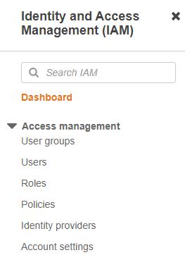
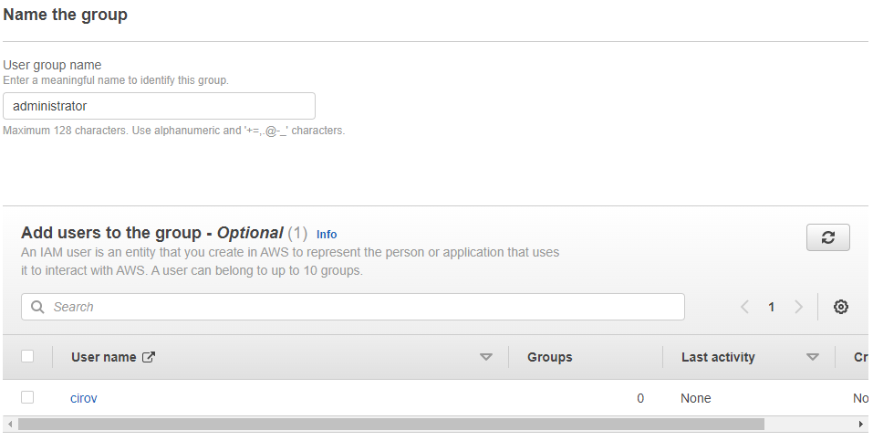
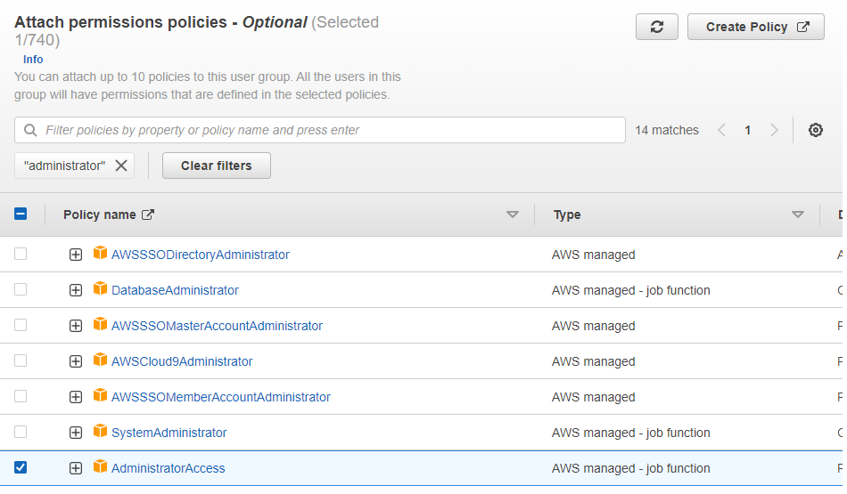
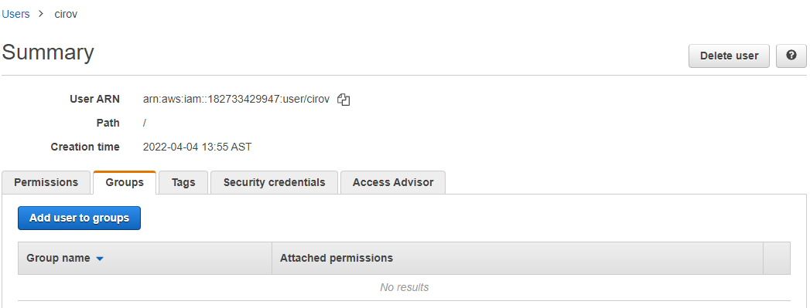
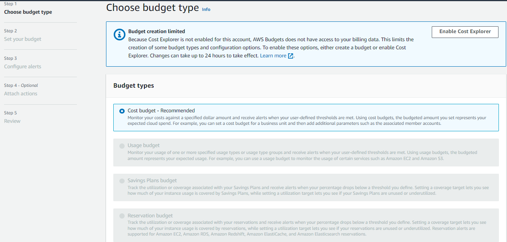
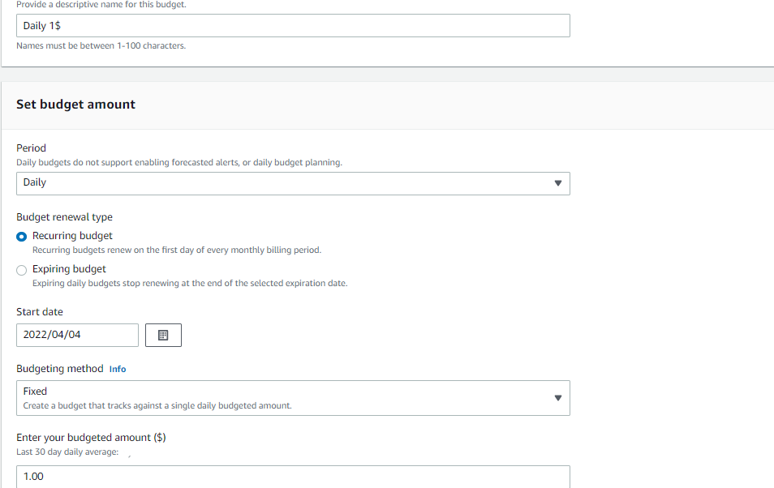
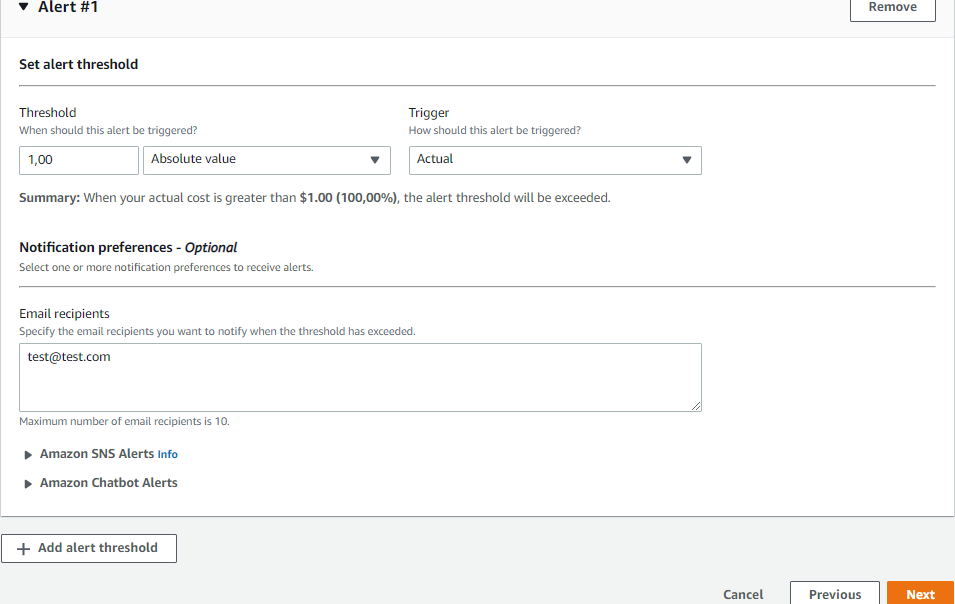

# Curso de Introducción a AWS: Fundamentos de Cloud Computing

## ¿Cómo aprender AWS en Platzi?

**Resumen**

Amazon Web Services (AWS) es el proveedor de servicios en la nube más grande del mundo. Muchas aplicaciones como Netflix, Meta y Platzi operan su arquitectura web gracias a su plataforma.

En este curso vamos a enfocarnos en los fundamentos del Cloud Computing (computación en la nube) de AWS.

### ¿Qué más vas a aprender?

Además de los conceptos de Cloud Computing, vas a conocer:

- La historia de AWS
- Regiones y zonas de disponibilidad en AWS
- Cómo crear tu cuenta de AWS
- Roles, seguridad e identidad en AWS

Sigue aprendiendo con [cursos de AWS](https://platzi.com/ruta/aws/).

## Visión general de las TI tradicionales

Las **Tecnologías de la Información (TI) tradicionales** abarcan el conjunto de sistemas, infraestructuras y prácticas que las empresas han utilizado durante décadas para gestionar datos, aplicaciones y procesos empresariales. A pesar del avance hacia la computación en la nube y soluciones más modernas, las TI tradicionales siguen siendo fundamentales en muchas organizaciones.

### **1. Características Claves de las TI Tradicionales**
- **Infraestructura local (On-Premise):** Servidores, bases de datos y almacenamiento físico dentro de la empresa.  
- **Modelo centralizado:** Gestión y control dentro de la organización sin depender de proveedores externos.  
- **Mantenimiento y actualización manual:** Se requiere personal de TI para administrar servidores, redes y software.  
- **Inversión inicial alta:** Costos significativos en hardware, software y mantenimiento.  
- **Seguridad y control total:** Mayor autonomía sobre la protección de los datos.  
- **Escalabilidad limitada:** La ampliación de la infraestructura requiere adquisición de nuevo hardware.  

### **2. Componentes Principales**
1. **Hardware:**  
   - Servidores físicos  
   - Computadoras y estaciones de trabajo  
   - Dispositivos de almacenamiento (HDD, SSD, NAS, SAN)  
   - Redes locales (LAN, routers, switches, firewalls)  

2. **Software:**  
   - Sistemas operativos empresariales (Windows Server, Linux)  
   - Bases de datos locales (Oracle, SQL Server, MySQL)  
   - Aplicaciones de gestión empresarial (ERP, CRM)  

3. **Redes y Seguridad:**  
   - Redes privadas internas  
   - Firewalls, VPNs y sistemas de autenticación  
   - Protocolos de seguridad internos para proteger datos

### **3. Ventajas y Desventajas de las TI Tradicionales**
| **Ventajas** | **Desventajas** |
|-------------|----------------|
| Mayor control sobre los datos y la infraestructura | Costos elevados de mantenimiento y actualización |
| Seguridad personalizada y sin depender de terceros | Escalabilidad limitada y lenta |
| Integración con sistemas internos y procesos específicos | Menos flexibilidad en la adopción de nuevas tecnologías |
| No depende de conexión a internet para operar | Requiere personal de TI capacitado para la gestión |

### **4. Comparación con las TI Modernas (Cloud Computing)**
| **Característica** | **TI Tradicional** | **TI en la Nube** |
|------------------|----------------|----------------|
| **Infraestructura** | Local, en servidores físicos | Basada en centros de datos remotos |
| **Escalabilidad** | Limitada y costosa | Flexible y basada en demanda |
| **Costos** | Alta inversión inicial | Pago por uso |
| **Mantenimiento** | A cargo del equipo de TI interno | Gestionado por el proveedor de la nube |
| **Accesibilidad** | Limitada a la red interna | Disponible desde cualquier lugar con internet |

### **5. Tendencias y Evolución**

A pesar de que muchas empresas están migrando a la nube, las TI tradicionales siguen siendo relevantes en sectores con altos requerimientos de seguridad y control, como el financiero y el gubernamental. Sin embargo, muchas organizaciones han adoptado un **modelo híbrido**, combinando infraestructura local con servicios en la nube para aprovechar lo mejor de ambos mundos.  

### **Conclusión**

Las TI tradicionales han sido la base del crecimiento tecnológico de muchas organizaciones, ofreciendo estabilidad y control. Sin embargo, con la evolución hacia la computación en la nube, muchas empresas están adoptando modelos más flexibles para mejorar la eficiencia y reducir costos. La decisión entre TI tradicional y moderna dependerá de factores como seguridad, escalabilidad y presupuesto.

### Resumen
Entendamos primero como funciona la web en términos simples. Tenemos un cliente con una dirección IP que se conecta a una red para hacer una petición a un servidor con otra dirección IP. Este servidor devuelve una respuesta al cliente.

Si la web fuera un servicio postal, el cliente seríamos nosotros con la petición o paquete que queremos enviar, la red sería el servicio postal en sí y el servidor representaría al destinatario al que queremos enviar el paquete.

[como-funciona-sitio-web.jpg](images/como-funciona-sitio-web.jpg)

### ¿Cómo está compuesto un servidor?

Un servidor posee los siguientes componentes:

- **Cómputo/CPU**: Realiza las operaciones que necesitamos.
- **Memoria RAM**: Contiene la información a procesar mediante la CPU. Es como un cerebro
- **Almacenamiento**: Archiva datos, a modo de archivos de texto plano.
- **Bases de datos**: Información almacenada de manera estructurada
- **Redes**: Cables, routers y servidores conectados unos a otros. Servidores DNS

### Terminología de IT (redes)

En términos generales, un cliente envía un paquete a un router, el cual reenvía este paquete al switch, y este se encarga de distribuirlo.

- **Router**: dispositivo que reenvía paquetes de datos entre redes informáticas
- **Switch**: dispositivo que toma paquetes y los envía al servidor/cliente correcto en la red

### Diseño tradicional de infraestructura

Las grandes empresas de IT empezaron comprando servidores y montándolos en sus garajes. Se encontraron con problemas al tratar de expandir su infraestructura, como los costos de mover estos servidores, comprar nuevos, y más…

### Problemas del enfoque de IT tradicional

A continuación, conocerás algunas dificultades del enfoque de tecnología de la información habitual:

- **Renta**: los costos de rentar espacios para mantener servidores son altos
- **Mantenimiento**: el funcionamiento de los servidores es difícil de asegurar
- **Remplazar y agregar hardware**: pueden existir largos tiempos de espera para conseguir el hardware necesario
- **Escalamiento limitado**: podemos vernos limitados por el espacio donde almacenamos los servidores
- **Monitoreo 24/7**: debemos contratar gente para monitorear los servidores
- **Desastres naturales**: ¿cómo evitamos que se caigan nuestros servicios si ocurre un imprevisto?

## Qué es la computacion en la nube

La **computación en la nube (Cloud Computing)** es un modelo de prestación de servicios informáticos a través de Internet. Permite acceder a recursos como servidores, almacenamiento, bases de datos, redes y software sin necesidad de infraestructura física local.  

### **1. Características Claves de la Computación en la Nube**
✅ **Accesibilidad:** Los servicios y datos están disponibles desde cualquier lugar con conexión a Internet.  
✅ **Escalabilidad:** Se pueden aumentar o reducir los recursos según la demanda.  
✅ **Pago por uso:** Se paga solo por los recursos utilizados, reduciendo costos iniciales.  
✅ **Mantenimiento gestionado:** Los proveedores de nube se encargan de actualizaciones y seguridad.  
✅ **Alta disponibilidad:** Ofrece redundancia y respaldo de datos para evitar fallos del sistema.

### **2. Modelos de Servicio en la Nube**
💡 Existen tres modelos principales de servicio en la computación en la nube:  

1️⃣ **IaaS (Infraestructura como Servicio):**  
   - Proporciona recursos básicos como servidores virtuales, almacenamiento y redes.  
   - Ejemplos: AWS EC2, Google Compute Engine, Microsoft Azure Virtual Machines.  

2️⃣ **PaaS (Plataforma como Servicio):**  
   - Ofrece entornos de desarrollo con herramientas para crear, probar y desplegar aplicaciones.  
   - Ejemplos: Google App Engine, AWS Elastic Beanstalk, Microsoft Azure App Services.  

3️⃣ **SaaS (Software como Servicio):**  
   - Aplicaciones listas para usarse sin necesidad de instalación o mantenimiento.  
   - Ejemplos: Gmail, Google Drive, Dropbox, Microsoft 365.  

### **3. Tipos de Nube**
🌍 Dependiendo del nivel de acceso y gestión, existen varios tipos de nube:  

🔹 **Nube Pública:** Administrada por proveedores como AWS, Google Cloud o Microsoft Azure, accesible para cualquier usuario.  
🔹 **Nube Privada:** Infraestructura dedicada a una sola empresa, proporcionando mayor control y seguridad.  
🔹 **Nube Híbrida:** Combinación de nube pública y privada, optimizando costos y rendimiento.  
🔹 **Multinube:** Uso de múltiples proveedores de nube para mayor flexibilidad y redundancia.

### **4. Comparación con la Infraestructura Tradicional**
| **Característica** | **Computación en la Nube** | **TI Tradicional** |
|-------------------|-----------------|----------------|
| **Costo Inicial** | Bajo, pago por uso | Alto, compra de servidores |
| **Mantenimiento** | Gestionado por el proveedor | Requiere personal de TI |
| **Escalabilidad** | Flexible y rápida | Limitada y costosa |
| **Accesibilidad** | Desde cualquier lugar | Requiere acceso a la red interna |
| **Seguridad** | Protección avanzada con cifrado y backups | Control total, pero mayor riesgo de fallos internos

### **5. Beneficios de la Computación en la Nube**
🔹 Reducción de costos operativos  
🔹 Mayor flexibilidad y escalabilidad  
🔹 Respaldo y recuperación de datos eficiente  
🔹 Acceso remoto y colaboración en tiempo real  
🔹 Innovación más rápida con despliegue ágil de aplicaciones

### **6. Desafíos y Consideraciones**
⚠️ **Seguridad:** Aunque los proveedores ofrecen cifrado y medidas de protección, la empresa debe gestionar el acceso y la privacidad de los datos.  
⚠️ **Latencia:** La velocidad de acceso a los datos depende de la conexión a Internet.  
⚠️ **Dependencia del proveedor:** Cambiar de proveedor puede ser complejo (vendor lock-in).  

### **Conclusión**
La computación en la nube ha transformado la manera en que las empresas y usuarios gestionan datos y aplicaciones, ofreciendo soluciones escalables, accesibles y eficientes. Sin embargo, la adopción de la nube debe evaluarse considerando necesidades de seguridad, costos y rendimiento

### Resumen

La computación en la nube es la entrega bajo demanda de **recursos de IT** como computación, almacenamiento y otros servicios a través de internet. En pocas palabras, es como si alquiláramos la computadora de otra persona.

Esta tecnología permite acceso instantáneo a los recursos que necesites, así como la adquisición del tipo y tamaño exacto de estos recursos. Algunos servicios que seguramente has usado son Gmail (proveedor de email), Dropbox (proveedor de almacenamiento) y Netflix (proveedor de video bajo demanda).

### Modelos de computación en la nube

A continuación, conocerás las distintas plataformas en la nube que utilizamos cuando trabajamos en proyectos personales o en nuestra empresa.

### Nube pública

La nube pública se refiere a los recursos de proveedores que utilizamos a través de internet y algunos ejemplos son Google Cloud Platform (GCP), Azure y AWS.

Además, posee estas ventajas:

- Elimina los gastos de capital comercial (CapEx) y reduce el gasto operativo (OpEx).
- Reduce los precios en economías de escala
- Despliega aplicaciones a nivel global en cuestión de minutos

### Nube privada

La nube privada es un servicio empleado por una organización que no está abierto al público. Permite un control total de la infraestructura y es útil para aplicaciones con requerimientos específicos de seguridad o comerciales.

### Nube híbrida

La nube híbrida consiste en mantener nuestra infraestructura y extender sus capacidades mediante la nube pública. Posibilita el control sobre activos sensibles en tu infraestructura privada, aprovechando la flexibilidad y rentabilidad de la nube pública.

### Características de la computación en la nube

Ahora que conoces los distintos modelos de tecnología en la nube, es importante que hablar sobre sus propiedades de computación.

- Este modelo genera un autoservicio en demanda (con registros en la plataforma ya se pueden proveer recursos)
- Tiene un amplio acceso a la red
- Proporciona un espacio donde los clientes pueden compartir infraestructura y recursos de manera segura

### Problemas resueltos por la nube

Por último, es crucial que conozcas las cualidades que trae implementar un sistema de computación en la nube.

- La nube aporta flexibilidad (puedes cambiar los tipos de recursos cuando sea necesario)
- Brinda rentabilidad y un servicio medido pues pagas solo por lo que usas
- Trae escalabilidad al agregar capacidad para hardware o equipos que necesitan acomodar cargas grandes
- Ofrece elasticidad al dar capacidad de escalar automáticamente cuando sea necesario
- Tiene alta disponibilidad y tolerancia a fallos
- Proporciona agilidad (puedes desarrollar, probar y ejecutar rápidamente aplicaciones en la nube)

**Lecturas recomendadas**

[Conoce la computación en la nube con AWS](https://platzi.com/blog/conoce-la-computacion-en-la-nube-con-aws/)

[Por qué decidimos usar Amazon Aurora en Platzi](https://platzi.com/blog/migramos-a-amazon-rds-aurora/)

[Conoce las nuevas funcionalidades de Bases de Datos en AWS](https://platzi.com/blog/funcionalidades-de-bases-de-datos-en-aws/)

[Estas son las nuevas funcionalidades de Storage AWS](https://platzi.com/blog/nuevas-funcionalidades-de-storage-aws/)

## Los diferentes tipos de cómputo: IaaS vs. PaaS vs. SaaS

En la computación en la nube, existen tres modelos principales de servicio: **IaaS, PaaS y SaaS**. Cada uno ofrece diferentes niveles de control, flexibilidad y responsabilidad para los usuarios. A continuación, exploramos sus características, ventajas y casos de uso.  

### **1. IaaS (Infraestructura como Servicio) 🏗️**  
**🔹 Definición:**  
IaaS proporciona acceso a infraestructura de TI virtualizada, como servidores, almacenamiento, redes y sistemas operativos. Es la opción más flexible, permitiendo a los usuarios configurar y administrar sus propios entornos.  

**🔹 Características:**  
✅ Recursos escalables bajo demanda  
✅ Pago por uso (sin necesidad de comprar hardware)  
✅ Mayor control sobre la infraestructura  
✅ Soporte para sistemas operativos y software personalizados  

**🔹 Ejemplos de IaaS:**  
🔹 Amazon EC2 (AWS)  
🔹 Google Compute Engine (GCP)  
🔹 Microsoft Azure Virtual Machines  

**🔹 Casos de Uso:**  
🔹 Creación de entornos de desarrollo y prueba  
🔹 Hosting de aplicaciones y sitios web  
🔹 Backup y recuperación de datos  
🔹 Implementación de máquinas virtuales  

### **2. PaaS (Plataforma como Servicio) 🚀**  
**🔹 Definición:**  
PaaS proporciona una plataforma para desarrollar, ejecutar y gestionar aplicaciones sin preocuparse por la infraestructura subyacente. Incluye herramientas de desarrollo, bases de datos y entornos de ejecución.  

**🔹 Características:**  
✅ Entorno preconfigurado para desarrollo de software  
✅ Reducción del tiempo de implementación  
✅ Escalabilidad automática  
✅ Soporte para múltiples lenguajes de programación  

**🔹 Ejemplos de PaaS:**  
🔹 Google App Engine  
🔹 AWS Elastic Beanstalk  
🔹 Microsoft Azure App Services  

**🔹 Casos de Uso:**  
🔹 Desarrollo de aplicaciones web y móviles  
🔹 Automatización de procesos de despliegue  
🔹 Integración continua y entrega continua (CI/CD)

### **3. SaaS (Software como Servicio) 📦**  
**🔹 Definición:**  
SaaS ofrece software listo para usar a través de Internet, sin necesidad de instalación o mantenimiento. El proveedor se encarga de la gestión de la aplicación, servidores y seguridad.  

**🔹 Características:**  
✅ No requiere instalación ni mantenimiento  
✅ Accesible desde cualquier dispositivo con Internet  
✅ Costos predecibles mediante suscripciones  
✅ Actualizaciones y soporte gestionados por el proveedor  

**🔹 Ejemplos de SaaS:**  
🔹 Google Drive  
🔹 Microsoft 365  
🔹 Dropbox  
🔹 Salesforce  

**🔹 Casos de Uso:**  
🔹 Aplicaciones de colaboración y productividad  
🔹 CRM (gestión de clientes)  
🔹 Almacenamiento en la nube  
🔹 Servicios de correo electrónico  

### **4. Comparación Entre IaaS, PaaS y SaaS**  

| **Característica** | **IaaS** | **PaaS** | **SaaS** |
|------------------|----------|----------|----------|
| **Nivel de control** | Alto (Infraestructura) | Medio (Plataforma) | Bajo (Software) |
| **Mantenimiento** | Usuario gestiona | Parcialmente gestionado | Totalmente gestionado |
| **Escalabilidad** | Alta | Alta | Limitada al proveedor |
| **Usuarios Objetivo** | Administradores de sistemas, DevOps | Desarrolladores | Usuarios finales |
| **Ejemplo de Uso** | Hosting de servidores | Desarrollo de aplicaciones | Uso de herramientas como Gmail, Zoom |


### **5. ¿Cuál Elegir?**
✅ **IaaS** si necesitas infraestructura escalable y control total.  
✅ **PaaS** si deseas enfocarte en desarrollo sin gestionar servidores.  
✅ **SaaS** si solo necesitas usar software sin preocuparte por la administración.

### Resumen
Ahora que conoces más sobre la tecnología en la nube, es importante introducir sus **distintos tipos de servicio** en la industria para identificar sus diferencias.

Estos modelos varían de acuerdo al tipo de servicio informático que pueda ofrecer, como servidores, almacenamiento, software o bases de datos.

### Infrastructure as a Service (IAAS)

La infraestructura como servicio (IAAS) proporciona componentes básicos de IT en la nube, es decir, **redes, computación, almacenamiento, etc**. A su vez, provee el máximo nivel de flexibilidad para adaptarlo a tus necesidades.

**Ejemplos:**

- Azure Virtual Machines
- Linode
- Digital ocean
- S2 AWS

### Platform as a Service (PAAS)

Los modelos que ofrecen una plataforma como servicio (PAAS) eliminan la necesidad de que administremos la infraestructura y proveen una plataforma para gestionar aplicaciones.

**Ejemplos:**

- Heroku
- Google App Engine
- AWS Elastic Beanstalk

### Software as a Service (SAAS)

El Software como servicio (SAAS) brinda un producto de software terminado que es ejecutado y administrado por el proveedor del servicio.

**Ejemplos:**

- Amazon Rekognition
- Dropbox
- Zoom
- Gmail

### On -premises

On-premises se refiere a una forma tradicional de cómputo en la cual nos encargamos de gestionar nuestra propia infraestructura.

### Responsabilidades según el tipo de cómputo

En la siguiente tabla se muestra qué componentes de IT están administrados según el tipo de cómputo en la nube. “Sí” indica que el componente está administrado por el proveedor de nube, “No” indica que nosotros somos responsables del componente.

Componente | On-premises | IAAS | PAAS  | SAAS
|---|---|---|---|
Aplicaciones | No | No | No | Sí
Data | No | No | No | Sí
Runtime | No | No | Sí | Sí
Middleware | No | No | Sí | Sí
O/S | No | No | Sí | Sí
Virtualización | No | Sí | Sí | Sí
Servidores | No | Sí | Sí | Sí
Almacenamiento | No | Sí | Sí | Sí
Redes | No | Sí | Sí | Sí

**Lecturas recomendadas**

[IaaS vs. PaaS | Platzi](https://platzi.com/blog/iaas-vs-paas/)

## Una pequeña historia de AWS

Amazon Web Services (AWS) es la plataforma de computación en la nube más grande y popular del mundo. Su historia es un ejemplo de innovación y crecimiento exponencial en el mundo tecnológico.  

## **📌 Los Inicios de AWS (2000 - 2006)**  
A principios de los años 2000, Amazon, la empresa de comercio electrónico fundada por **Jeff Bezos**, se dio cuenta de que su infraestructura tecnológica podía ser optimizada. Su equipo de ingenieros desarrolló herramientas internas para administrar servidores, almacenamiento y bases de datos de manera más eficiente.  

En 2003, Amazon identificó una oportunidad: las empresas y desarrolladores enfrentaban problemas similares con la gestión de infraestructura tecnológica. ¿Por qué no ofrecer estos servicios como una plataforma de computación en la nube?  

En 2006, **Amazon lanzó oficialmente AWS**, con sus primeros tres servicios:  
✅ **Amazon S3** (Simple Storage Service) → Almacenamiento en la nube  
✅ **Amazon EC2** (Elastic Compute Cloud) → Servidores virtuales escalables  
✅ **Amazon SQS** (Simple Queue Service) → Servicio de mensajería  

### **🚀 Crecimiento y Expansión (2007 - 2015)**  
AWS creció rápidamente al ofrecer servicios escalables y de bajo costo para startups y empresas grandes. En esta etapa, compañías como **Netflix, Airbnb y Dropbox** adoptaron AWS para reducir costos y escalar globalmente.  

Se lanzaron más servicios innovadores:  
🔹 **RDS (Relational Database Service)** en 2009  
🔹 **AWS Lambda** (computación sin servidores) en 2014  
🔹 **Amazon Aurora** (base de datos en la nube) en 2015  

### **🌍 Dominio del Mercado (2016 - Presente)**  
Hoy, AWS es el líder del mercado de la nube, con **más del 30% de participación global**. Ofrece más de **200 servicios** en inteligencia artificial, IoT, big data, seguridad y más.  

🔹 Empresas como **NASA, Netflix, Facebook y BMW** confían en AWS.  
🔹 AWS sigue innovando con servicios como **Amazon SageMaker** (Machine Learning) y **AWS Outposts** (nube híbrida).  
🔹 Ha expandido su presencia global con **más de 30 regiones y 100 zonas de disponibilidad**.  

### **🔥 Impacto de AWS en la Tecnología**  
✅ Ha revolucionado la industria de la computación en la nube.  
✅ Ha permitido la escalabilidad de startups y grandes empresas.  
✅ Ha reducido costos de infraestructura con su modelo de pago por uso.  


**Benjamin Black** y **Chris Pinkham** son los principales desarrolladores de Amazon Web Services y crearon esta compañía a partir de la necesidad de impulsar nuevas tecnológicas en momentos de mayor tráfico y demanda.

La historia de AWS está repleta de hitos, pues es una de las plataformas más utilizadas en distintas startups y compañías que están transformando su industria. ¡No te preocupes! Aquí te resumimos fácil su línea del tiempo.

### Línea del tiempo de AWS

Hace veinte años nació esta promesa tecnológica y en la actualidad ¡tiene clientes en más de 245 países y territorios!

- 2002 → Se lanza internamente la plataforma
- 2003 → Comienza a comercializarse la idea de AWS
- 2004 → Llega al público el servicio SQS
- 2006 → Vuelve a lanzarse al público SQS, S3 y EC2
- 2007 → Abren operaciones en Europa
- 2009 → Lanzan el servicio RDS (Relational Database)
- 2010 → Sale al mercado el servicio Route 53
- 2012 → Lanzan DynamoDB (una base de datos no relacional)

### AWS en números

Quizás sean un gran seguidor y fiel cliente de esta compañía, pero… ¿Conocías estos datos?

- En 2019, AWS logró $35.02 mil millones de dólares en ingresos anuales
- AWS representó el 47% del mercado en 2019
- Esta plataforma posee más de un millón de usuarios activos

**Lecturas recomendadas**

[¿Qué es Amazon Web Services?](https://platzi.com/blog/aws-curso/)

## Una visión global: regiones y zonas de disponibilidad


Las plataformas de computación en la nube, como **Amazon Web Services (AWS), Microsoft Azure y Google Cloud Platform (GCP)**, estructuran su infraestructura en **regiones y zonas de disponibilidad (Availability Zones - AZs)** para proporcionar alta disponibilidad, tolerancia a fallos y baja latencia en sus servicios.  

### **1. ¿Qué es una Región?**  
Una **región** es un área geográfica global donde un proveedor de nube tiene **varios centros de datos** interconectados. Cada región opera de manera independiente y tiene su propio conjunto de servicios en la nube.  

### **Ejemplos de Regiones en AWS, Azure y GCP**  
- **AWS:** us-east-1 (Norte de Virginia), eu-west-1 (Irlanda), sa-east-1 (São Paulo).  
- **Azure:** East US, West Europe, Southeast Asia.  
- **GCP:** us-central1 (Iowa), europe-west1 (Bélgica), asia-northeast1 (Tokio).  

### **Características Clave de las Regiones:**  
✅ **Ubicación Geográfica Estratégica:** Facilita la cercanía a los usuarios finales.  
✅ **Redundancia y Seguridad:** Asegura disponibilidad en caso de fallos.  
✅ **Cumplimiento Normativo:** Algunas regiones cumplen regulaciones específicas como GDPR en Europa o LGPD en Brasil.

### **2. ¿Qué es una Zona de Disponibilidad (AZ)?**  
Una **Zona de Disponibilidad (AZ)** es un **conjunto de uno o más centros de datos físicamente separados dentro de una misma región**.  

Cada AZ tiene:  
- **Conectividad de baja latencia** con otras zonas dentro de la misma región.  
- **Fuentes de energía y refrigeración independientes**, reduciendo riesgos de fallos.  
- **Alta disponibilidad y recuperación ante desastres**, permitiendo distribuir cargas de trabajo.  

### **Ejemplo en AWS:**  
La región **us-east-1 (Norte de Virginia)** tiene **6 zonas de disponibilidad** (us-east-1a, us-east-1b, us-east-1c, etc.).

### **3. Diferencia Clave entre Región y Zona de Disponibilidad**  

| **Característica**  | **Región** | **Zona de Disponibilidad (AZ)** |
|--------------------|------------|-------------------------------|
| **Alcance**       | Área geográfica global | Conjunto de centros de datos dentro de una región |
| **Tolerancia a Fallos** | Independiente de otras regiones | Alta disponibilidad dentro de la región |
| **Interconexión**  | Comunicación entre regiones con latencias más altas | Comunicación de baja latencia entre AZs |
| **Ejemplo AWS**    | us-east-1 (Norte de Virginia) | us-east-1a, us-east-1b, us-east-1c |

### **4. Beneficios de Usar Múltiples Regiones y AZs**  
✅ **Alta Disponibilidad:** Si una zona falla, los servicios siguen operando en otra.  
✅ **Baja Latencia:** Se elige la región más cercana al usuario.  
✅ **Recuperación ante Desastres:** Se pueden replicar datos en múltiples regiones.  
✅ **Cumplimiento Normativo:** Algunas regiones cumplen requisitos específicos de privacidad y seguridad.

### **5. Ejemplo de Implementación en AWS**  
📌 **Escenario:** Una empresa de streaming quiere alta disponibilidad y rapidez para usuarios en EE.UU. y Europa.  
🔹 **Solución:**  
1. **Distribuir servidores en dos regiones:** us-east-1 (Norte de Virginia) y eu-west-1 (Irlanda).  
2. **Usar múltiples AZs en cada región:** Balancear la carga entre ellas.  
3. **Implementar bases de datos replicadas en diferentes AZs:** Para garantizar continuidad en caso de fallos.

### **Conclusión**  
Las **regiones y zonas de disponibilidad** son la base de la infraestructura en la nube moderna. Elegir la **ubicación correcta** es clave para garantizar **rendimiento, disponibilidad y cumplimiento normativo** en las aplicaciones. 🌍☁️

### Resumen

La infraestructura de AWS está compuesta por **regiones**, **zonas de disponibilidad**, **data centers** y puntos de presencia. Además, se distribuye en diferentes regiones alrededor del mundo. Algunas de ellas son Ohio, Oregon, Norte de California, e incluso lugares exclusivos del gobierno de EE. UU. como GovCloud Este.

Si quieres conocer una lista completa con más sitios, puedes visitar esta página de AWS.

### Cómo escoger una región de AWS

Podemos escoger la región de nuestra aplicación basada en distintos aspectos que mencionaremos a continuación.

**Por ejemplo:**

- El cumplimiento de los requisitos legales y de gobernanza de datos, pues los datos nunca abandonan una región sin su permiso explícito

- La proximidad con los clientes porque lanzan en una región cercana en donde estén para reducir latencia. Puedes revisar esta característica desde tu ubicación a cada región en cloudping.info.

- Los servicios disponibles dentro de una región debido a que muchos no funcionan en todas partes. Algunos servicios globales o regionales son…

- Globales
 - IAM
 - Route 53
 - Cloudfront
 - WAF
- Regionales
 - EC2
 - Beanstalk
 - Lambda
 - Rekognition
 
Los precios varían de región a región y son transparentes en la página de precios del servicio

### Zonas de disponibilidad

Una zona de disponibilidad es un grupo de data centers donde cada uno está lleno de servidores. Estos *data centers* poseen energía, redes y conectividad redundante, están separados entre sí, conectados con un gran ancho de banda y redes de latencia ultra baja.

### Modelo de responsabilidad compartida

Ahora es crucial determinar las responsabilidades de AWS y del cliente dentro del servicio tecnológico que ofrece la compañía.

**AWS se hace responsable de:**

- Hardware y la infraestructura global
- Regiones
- Zonas de disponibilidad
- Ubicaciones de AWS Edge / puntos de presencia
- Software
- Cómputo
- Almacenamiento
- Bases de datos
- Redes

### El cliente se responsabiliza de:

- Actualizaciones de S.O.
- Protección de los datos que se almacenan
- Manejo de aplicaciones
- Accesos
- Administración de usuarios y grupos

**Lecturas recomendadas**

[Infraestructura global](https://aws.amazon.com/es/about-aws/global-infrastructure/?p=ngi&amp;loc=0)

[cloudping.info](https://www.cloudping.info/)

[Ping Amazon web services](https://pingaws.com/)

[Servicios regionales de AWS](https://aws.amazon.com/es/about-aws/global-infrastructure/regional-product-services/)

[Reconocimiento de objetos en JavaScript con Serverless Framework y AWS Rekognition](https://platzi.com/blog/serverless-framework-y-aws-rekognition/)

[AWS Ping Test (Latency) | Cloud Ping Test](https://cloudpingtest.com/aws)

## Laboratorio: crea tu cuenta en AWS

Para crear tu cuenta en AWS, sigue estos pasos:  

### **Paso 1: Accede al sitio web de AWS**  
1. Ve a [AWS](https://aws.amazon.com/es/)  
2. Haz clic en **"Crear una cuenta de AWS"**  

### **Paso 2: Ingresa la información requerida**  
1. **Correo electrónico** (se usará para iniciar sesión).  
2. **Nombre de usuario** (para la cuenta de AWS).  
3. **Contraseña segura** y confirmación.  

### **Paso 3: Proporciona información de contacto**  
1. Nombre, dirección y número de teléfono.  
2. Selecciona si es una cuenta personal o empresarial.  

### **Paso 4: Método de pago**  
- Debes ingresar una tarjeta de crédito/débito válida.  
- AWS hará un pequeño cargo de verificación que será reembolsado.  

### **Paso 5: Verificación de identidad**  
- AWS puede pedir un código enviado por SMS o llamada.  

### **Paso 6: Selecciona un plan**  
- **Recomendado**: Elige el plan **Gratis (Free Tier)** para acceder a servicios sin costo durante 12 meses.  

### **Paso 7: Accede a la consola de AWS**  
- Una vez creada, inicia sesión en la [Consola de AWS](https://aws.amazon.com/console/)  
- Explora servicios como EC2, S3 o Lambda.  

✅ ¡Listo! Ya tienes una cuenta en AWS.

### Resumen

Para crear tu cuenta de Amazon dirígete al portal de AWS y sigue estas instrucciones para crear tu cuenta.


1. Entra al portal de Amazon y registra tus datos

2. Introduce el número de tu tarjeta de crédito

3. Completa el CAPTCHA para verificar tu identidad

4. Verifica tu cuenta con un código de confirmación

5. Selecciona el plan que más se adapte a tus necesidades

**Lecturas recomendadas**

[Cloud Services - Amazon Web Services (AWS)](https://aws.amazon.com/)

[https://portal.aws.amazon.com/](https://portal.aws.amazon.com/)

## Seguridad e identidad

AWS ofrece múltiples servicios y herramientas para garantizar la seguridad y la gestión de identidades dentro de su plataforma. A continuación, te explico los conceptos clave:  

### **1️⃣ AWS Identity and Access Management (IAM) 👤🔑**  
AWS IAM permite gestionar usuarios y sus permisos de acceso a los recursos de AWS.  

**Características principales:**  
✅ **Usuarios y Grupos** – Crea usuarios con credenciales individuales y agrúpalos para gestionar permisos fácilmente.  
✅ **Roles** – Otorga permisos temporales a servicios o aplicaciones sin necesidad de credenciales fijas.  
✅ **Políticas** – Define reglas de acceso mediante JSON para limitar lo que los usuarios pueden hacer en AWS.  
✅ **Autenticación Multifactor (MFA)** – Agrega una capa extra de seguridad con un código de verificación.  

📌 **Ejemplo de política IAM para acceso a S3:**  
```json
{
  "Version": "2012-10-17",
  "Statement": [
    {
      "Effect": "Allow",
      "Action": "s3:*",
      "Resource": "arn:aws:s3:::mi-bucket/*"
    }
  ]
}
```

### **2️⃣ AWS Organizations 🏢**  
Si manejas múltiples cuentas en AWS, **Organizations** te ayuda a:  
✅ Consolidar la facturación en una sola cuenta.  
✅ Aplicar restricciones de seguridad a nivel organizacional.  
✅ Usar **Service Control Policies (SCPs)** para limitar lo que las cuentas pueden hacer.  

### **3️⃣ AWS Security Hub 🛡️**  
AWS Security Hub centraliza y analiza alertas de seguridad, permitiéndote detectar y mitigar riesgos.  

🔍 **Características:**  
✔️ Evalúa la configuración de seguridad de tus servicios.  
✔️ Detecta vulnerabilidades y recomienda correcciones.  
✔️ Se integra con otros servicios como **GuardDuty, Inspector y Macie**.  

### **4️⃣ AWS GuardDuty 🔍🚨**  
Servicio de detección de amenazas que analiza registros de actividad de AWS para identificar comportamientos sospechosos.  

📌 **Ejemplo de detección:**  
🚨 Intentos de acceso no autorizados desde direcciones IP sospechosas.  
🚨 Uso inusual de recursos (p. ej., minería de criptomonedas).

### **5️⃣ AWS Key Management Service (KMS) 🔐**  
Permite gestionar claves de cifrado para proteger datos en S3, RDS, EBS, entre otros.  

✅ Soporta cifrado automático en servicios como S3 y RDS.  
✅ Integración con CloudTrail para auditoría de uso de claves.  
✅ Control de acceso basado en políticas de IAM.  

### **6️⃣ AWS WAF y Shield 🏰⚔️**  
**AWS WAF** protege tus aplicaciones web de ataques como **SQL Injection y Cross-Site Scripting (XSS)**.  
**AWS Shield** ofrece protección contra ataques **DDoS** (versión estándar gratuita y avanzada con mitigación automática).  

### **7️⃣ AWS CloudTrail 📜**  
Monitorea y registra todas las acciones en tu cuenta de AWS.  
✔️ Audita actividades de IAM, S3, EC2, etc.  
✔️ Útil para cumplimiento de normativas (ISO, SOC, HIPAA).  

📌 **Ejemplo de consulta en CloudTrail con AWS CLI:**  
```bash
aws cloudtrail lookup-events --lookup-attributes AttributeKey=EventName,AttributeValue=DeleteBucket
```
(Esto muestra quién eliminó un bucket en S3 y cuándo).  

### **🚀 Buenas prácticas para mejorar la seguridad en AWS**  
✅ **Habilita MFA** para todas las cuentas IAM y Root.  
✅ **Usa IAM Roles** en lugar de credenciales estáticas en instancias EC2.
✅ **Aplica el principio de privilegio mínimo** (solo otorga los permisos necesarios).
✅ **Monitorea con CloudTrail y Security Hub** para detectar actividad sospechosa.
✅ **Usa cifrado con KMS** para proteger datos sensibles.

### Resumen

Uno de los aspectos más importantes al trasladar aplicaciones en la nube es la **seguridad**. Es crucial que nuestros datos estén protegidos contra amenazas para así permitir que los usuarios accedan a nuestro sistema y encuentren solo los recursos que necesitan.

### Servicios de protección de datos

A continuación, conocerás algunos servicios de protección de AWS y sus funciones para mover nuestras plataformas en la nube:

- **Amazon Macie**: descubre y protege datos sensibles
- **AWS Key Management Service**: almacena y administra claves de cifrado
- **AWS CloudHSM**: proporciona almacenamiento de claves basado en hardware
- **AWS Certificate Manager**: provee, administra e implementa certificados SSL/TLS
- **AWS Secrets Manager**: traslada, gestiona y recupera datos (contraseñas, por ejemplo)

### Servicios de protección de la infraestructura

Es fundamental que cuides de la infraestructura de tu sitio web y AWS ofrece los siguientes servicios de seguridad:

- **AWS Shield**: protege contra ataques de Denegación de Servicio (DDOS)
- **AWS Web Aplication Firewall (WAF)**: filtra el tráfico de sitios web maliciosos
- **AWS Firewall Manager**: administra las reglas del firewall de forma centralizada

### Servicios de detección de amenazas

En todo momento nuestra plataforma está expuesta a grandes amenazas y por eso AWS desarrolló los siguientes servicios:

- **Amazon GuarDuty**: detecta automáticamente las amenazas
- **Amazon Inspector**: analiza la seguridad de la aplicación
- **Amazon Config**: registra y evalúa configuraciones de nuestros recursos
- **Amazon CloudTrail**: rastrea la actividad del usuario y el uso de las API que ocupamos en nuestra cuenta.

### Servicios de gestión de identidad
Por último, existen distintas herramientas de gestión de identidad que provee AWS:

- **AWS Identity and Access Management (IAM)**: administra de forma segura el acceso a una cuenta, servicios y recursos
- **AWS Inicio de sesión único**: implementa el inicio de sesión único (Single Sign On/SSO)
- **Amazon Cognito**: permite a los usuarios administrar la identidad dentro de las aplicaciones
- **AWS Servicio de Directorio**: implementa y administra un Active Directory service
- **AWS Organizaciones**: funciona para gobernar y administrar de distintas cuentas de AWS de forma centralizada

## IAM ilustrado

**IAM (Identity and Access Management) en AWS** es el servicio que permite gestionar identidades y permisos dentro de AWS. Aquí tienes una ilustración conceptual de cómo funciona IAM:

### **🔹 Componentes Clave de IAM**
1. **Usuarios** 👤 → Representan personas o aplicaciones con acceso a AWS.  
2. **Grupos** 👥 → Conjunto de usuarios con permisos comunes.  
3. **Roles** 🎭 → Permiten a servicios o cuentas asumir permisos temporales.  
4. **Políticas** 📜 → Documentos JSON que definen permisos (ej., acceso a S3, EC2, RDS).

### **🔹 Esquema de Funcionamiento de IAM**
📌 **Ejemplo práctico:**
- Un usuario llamado *Mario* necesita acceso a un bucket S3.  
- Se le asigna una política que permite `s3:ListBucket` y `s3:GetObject`.  
- Si otro usuario, *Ana*, necesita lo mismo, en lugar de asignar permisos individuales, se coloca a *Mario* y *Ana* en un grupo con la política adecuada.

### **🔹 Representación Gráfica de IAM**
```
[ Usuario: Mario ] --> [ Grupo: Desarrolladores ] --> [ Política: Acceso a S3 ]
[ Usuario: Ana   ] ----^
```
  
✔ **Beneficio**: Administración centralizada, menos errores, más seguridad.

### **🔹 Buenas Prácticas de IAM**
✅ Usar el principio de **menor privilegio**.  
✅ Habilitar **MFA (Autenticación Multifactor)** para usuarios críticos.  
✅ Usar **roles IAM** en lugar de credenciales estáticas para aplicaciones.

### Resumen

**Identity and Access Management (IAM)** es un servicio gratuito que nos ayuda a administrar los accesos a los servicios y recursos de tu cuenta en AWS. A su vez, puedes crear usuarios, grupos y establecer permisos de acceso a los recursos mediante el uso de políticas.

### Usuarios y grupos de usuarios de IAM

Los usuarios y grupos de usuarios son de los principales componentes de IAM. Al crear tu cuenta de AWS te proporcionan un usuario Root que tiene acceso a todos los recursos,

Este usuario puede generar otros perfiles y cada uno con un acceso único a distintos recursos de AWS. Además, Root también puede configurar grupos de usuarios, donde cada miembro tiene y puede compartir permisos de acceso.

### Ejemplos de políticas de IAM

El acceso a recursos se otorga mediante políticas. Este es un ejemplo de una política que otorga acceso de administrador.

```json
{
    "Version": "2012-10-17",
    "Statement": [
        {
            "Effect": "Allow",
            "Action": "*",
            "Resource": "*"
        }
    ]
}
```

También está este ejemplo de políticas de acceso a un bucket de S3 (almacenamiento)

```json
{
    "Version": "2012-10-17",
    "Statement": [
        {
            "Effect": "Allow",
            "Action": [
                "s3:ListBucket"
            ],
            "Resource": "arn:aws:53 ::: bucket-name"
        },
        {
            "Effect": "Allow",
            "Action": [
                "s3: GetObject",
                "s3: PutObject",
            ],
            "Resource": "arn:aws:53 ::: bucket-name /*"
        }
    ]
}
```

### IAM Roles

Además de todas estas funciones, **IAM de AWS** permite asumir roles y otorgar permisos a otras tecnologías. Por ejemplo, podemos conceder a una máquina virtual el acceso a una base de datos mediante un rol de IAM.

## Secrets Manager

AWS **Secrets Manager** es un servicio que permite almacenar, administrar y recuperar credenciales y secretos de manera segura. Se usa comúnmente para gestionar contraseñas, claves API y credenciales de bases de datos sin necesidad de almacenarlas en código.

### **🔹 ¿Qué problemas resuelve?**  
✅ **Elimina credenciales en código**: En lugar de almacenar contraseñas en archivos de configuración o código fuente, se accede a ellas de forma segura mediante API.  
✅ **Rotación automática de secretos**: Permite configurar la renovación automática de credenciales sin intervención manual.  
✅ **Integración con AWS Services**: Compatible con **RDS, Redshift, DocumentDB**, entre otros.  
✅ **Control de acceso con IAM**: Define qué usuarios o servicios pueden acceder a los secretos.

### **🔹 ¿Cómo funciona?**
📌 **1. Creación del secreto:**  
   - Puedes almacenar credenciales como usuario y contraseña de una base de datos.  
   - Se cifran automáticamente con **AWS KMS (Key Management Service)**.  

📌 **2. Acceso a un secreto:**  
   - Puedes recuperar secretos usando la consola de AWS, **AWS CLI**, o **SDKs**.  
   - Ejemplo con AWS CLI:  
     ```sh
     aws secretsmanager get-secret-value --secret-id MiSecreto
     ```
   - En código con Python (boto3):  
     ```python
     import boto3
     client = boto3.client('secretsmanager')
     response = client.get_secret_value(SecretId='MiSecreto')
     print(response['SecretString'])
     ```

📌 **3. Rotación automática:**  
   - Se pueden definir políticas para actualizar credenciales en intervalos regulares.

### **🔹 Caso de uso práctico**
Si una aplicación en **Lambda** necesita conectarse a una base de datos RDS sin exponer credenciales en el código, **Secrets Manager** almacena y proporciona estos valores bajo demanda.

### **🔹 Precios y Alternativas**  
💰 **AWS Secrets Manager** tiene costos basados en el número de secretos almacenados y solicitudes realizadas.  
🔄 Alternativa gratuita: **AWS Systems Manager Parameter Store**, pero sin rotación automática.

**Resumen**

**Secrets Manager** es un servicio de AWS que nos ayuda a proteger los datos secretos (contraseñas, claves y tokens) necesarios para acceder a nuestras aplicaciones, servicios y recursos.

También nos permite compartir automáticamente esta información cuando queramos. Además, este servicio evita que tengamos que copiar y pegar los secretos directamente en nuestro código.

## Demostración del servicio de directorio

AWS **Directory Service** permite administrar identidades y recursos mediante servicios de directorio compatibles con Microsoft Active Directory (AD) o LDAP. Es ideal para la autenticación de usuarios, integración con Microsoft AD on-premise y gestión de accesos en entornos empresariales.

### **📌 Tipos de Servicios en AWS Directory Service**  

1️⃣ **AWS Managed Microsoft AD** 🏢  
   - Directorio totalmente administrado basado en Microsoft Active Directory.  
   - Integración con aplicaciones Windows y cargas de trabajo en AWS.  
   - Replica dominios en varias regiones y gestiona la sincronización con AD local.  

2️⃣ **Simple AD** 📄  
   - Alternativa ligera basada en Samba AD.  
   - Útil para pequeñas y medianas empresas sin necesidad de todas las funciones de Microsoft AD.  

3️⃣ **AD Connector** 🔗  
   - Permite conectar un Active Directory on-premise con AWS sin migrar los datos.  
   - Actúa como proxy para autenticar usuarios sin replicar credenciales.  

4️⃣ **Cognito User Pools** 👤  
   - Gestión de usuarios para aplicaciones web y móviles sin necesidad de un AD tradicional.

### **🛠️ DEMOSTRACIÓN: Creación de un Directorio Administrado**  

### **1️⃣ Acceder a AWS Directory Service**
📌 Ve a la consola de AWS y busca **"Directory Service"**.  

### **2️⃣ Crear un Directorio**
1. Haz clic en **"Create Directory"**.  
2. Selecciona el tipo de directorio (**AWS Managed Microsoft AD** recomendado).  
3. Configura los siguientes datos:  
   - **Nombre de dominio**: `example.com`  
   - **Versión de AD**: Standard o Enterprise.  
   - **VPC y subredes**: Selecciona la red donde estará disponible el servicio.  

### **3️⃣ Configuración de Usuarios y Grupos**  
📌 Una vez creado el directorio, accede a **Active Directory Users and Computers (ADUC)** desde una instancia Windows unida al dominio.  
📌 Agrega usuarios y asigna permisos según las necesidades de la organización.  

### **4️⃣ Integración con Servicios AWS**  
- **EC2**: Permite autenticación con AD.  
- **Amazon WorkSpaces**: Usa credenciales del Directorio para sesiones virtuales.  
- **RDS**: Configura autenticación con Active Directory.

### **💡 Beneficios de AWS Directory Service**
✅ **Administración simplificada**: AWS gestiona la replicación, backups y monitoreo.  
✅ **Alta disponibilidad**: Se replica automáticamente en múltiples AZs.  
✅ **Escalabilidad**: Puede integrarse con miles de usuarios y grupos sin mantenimiento manual.  
✅ **Seguridad**: Autenticación centralizada con IAM y políticas de acceso.  

### **🚀 ¿Quieres probarlo?**
Prueba configurando un **AWS Managed Microsoft AD** en tu cuenta de AWS y únete desde una instancia Windows. ¡Dime si necesitas más detalles! 🙌

### Resumen

Un **directorio** es una base de datos que contiene información de inicio de sesión de todos los usuarios de una red y puede implementar políticas de seguridad.

Dado que Windows es el sistema operativo más usado a nivel mundial, Microsoft lanzó Active Directory. Este servicio permite que las empresas gestionen los inicios de sesión de sus empleados.

### AWS Directory Service

Es una oferta de servicio administrado de AWS que posibilita que sus recursos utilicen **Active Directory** y ofrecen:

- Un directorio activo administrado sin tener que ejecutar servidores manualmente
- La opción de directorio activo simple
- El conector AD que brinda a usuarios inicio de sesión en aplicaciones de AWS con sus credenciales
- Un Servicio distribuido con error automático que funciona si hay fallas en los servidores
- El AWS Directory Service ss compatible con otros servicios de AWS

Para más información de AWS Directory, visita la [documentación del servicio](https://aws.amazon.com/es/directoryservice/ "documentación del servicio")

## Laboratorio: crea usuarios y grupos en AWS

En este laboratorio, aprenderás a crear usuarios y grupos en **AWS Identity and Access Management (IAM)** para gestionar permisos y accesos de manera segura.

### **1️⃣ Acceder a la Consola de AWS IAM**  
📌 **Pasos:**  
1. Inicia sesión en la **[Consola de AWS](https://aws.amazon.com/console/)**.  
2. En el buscador de servicios, escribe **"IAM"** y selecciónalo.

### **2️⃣ Crear un Grupo en IAM**  
📌 **Pasos:**  
1. En el panel izquierdo, haz clic en **"Groups" → "Create group"**.  
2. Ingresa un **nombre del grupo** (Ejemplo: `Admins`, `Developers`, `ReadOnlyUsers`).  
3. Asigna permisos al grupo:  
   - **Administrador**: `AdministratorAccess`  
   - **Solo lectura**: `ReadOnlyAccess`  
   - **Desarrolladores**: `PowerUserAccess`  
4. Haz clic en **"Create group"**.

### **3️⃣ Crear Usuarios en IAM**  
📌 **Pasos:**  
1. En el panel izquierdo, selecciona **"Users" → "Add user"**.  
2. Ingresa el **nombre del usuario** (Ejemplo: `jgarcia`, `mlopez`).  
3. **Elige el tipo de acceso**:  
   - **Acceso a la consola AWS** (para usar la interfaz web).  
   - **Acceso programático** (para API y CLI).  
4. **Selecciona un método de autenticación**:  
   - Autogenerar contraseña o definir una manualmente.  
   - Activar **cambio de contraseña obligatorio** en el primer inicio de sesión.  
5. **Asigna el usuario a un grupo** (Ejemplo: `Admins`, `Developers`).  
6. **Revisar y crear usuario**.  

💡 **Nota:** Al finalizar, AWS generará credenciales de acceso. Descárgalas en formato `.csv` o copia las credenciales de inicio de sesión.

### **4️⃣ Verificación y Pruebas**  
✅ **Inicia sesión con un usuario IAM** en [AWS Console](https://aws.amazon.com/console/).  
✅ Verifica los permisos asignados en **IAM → Usuarios → Permisos**.  
✅ Intenta acceder a servicios según el rol asignado.

## **🚀 Conclusión**  
✔️ Ahora sabes cómo **crear grupos y usuarios IAM** en AWS de forma segura.  
✔️ Puedes gestionar accesos y permisos de manera eficiente.  
✔️ ¡Recuerda aplicar el **principio de privilegio mínimo** para mayor seguridad!

### Resumen

Para crear usuarios y grupos inicia sesión en la [consola de AWS](https://console.aws.amazon.com/console/home?nc2=h_ct&src=header-signin "consola de AWS"). En la barra de búsqueda, coloca “IAM” y haz clic en el primer resultado.

### Crear un nuevo usuario

A la izquierda verás el siguiente menú:



1. Haz clic en “**Users**” (o Usuarios). Allí vas ver listados los usuarios.

2. Luego haz clic en “**Add Users**” (o Agregar Usuarios) para añadir uno nuevo.

3. A continuación, escribe el nombre de usuario y selecciona “**Password - AWS Management Console access**”, “**Autogenerated Password**” y “**Require password reset**”.

4. Haz clic en “Next” hasta llegar al paso 4 - Review.

5. Finalmente, haz clic en “Create user”. No olvides guardar la contraseña generada al final.


### Cómo crear un grupo de usuarios administradores

1. En el menú de la primera imagen, dirígete a “**User groups**” y haz clic en “**Create group**”.

2. Escribe el nombre del grupo, “**administrator**” en este caso. Mira que en este menú puedes añadir usuarios allí, pero en esta clase añadiremos el usuario al equipo después de su creación.




3. Más abajo encontramos la parte de las políticas de permisos. Aquí buscamos “**administrator**” y revisamos el “**AdministratorAccess**” para asignarle permisos de administración al grupo. Hacemos clic en “**Create Group**” al finalizar.



### Cómo añadir el usuario al grupo de administrador

1. Para esto es necesario que vuelvas a la sección de “**Users**”, luego haces clic en nuestro usuario, clic en la pestaña de Groups y en el botón de “**Add user to groups**”.



Al final, simplemente escogemos los grupos a los que queremos añadir el usuario y hacemos clic en “**Add to Groups**”.

## Laboratorio: crea una alerta de facturación

En este laboratorio, aprenderás a configurar una **alerta de facturación** en AWS utilizando **AWS CloudWatch** y **AWS Budgets** para monitorear tus gastos y evitar sorpresas en tu factura.

### **1️⃣ Habilitar el Acceso a los Datos de Facturación**  
Antes de crear una alerta, es necesario habilitar el acceso a los datos de facturación en **CloudWatch**.  

📌 **Pasos:**  
1. Inicia sesión en la **[Consola de AWS](https://aws.amazon.com/console/)**.  
2. Ve a **"Billing" (Facturación)** en el menú superior derecho.  
3. En el panel izquierdo, selecciona **"Billing Preferences" (Preferencias de Facturación)**.  
4. Activa la opción **"Receive Billing Alerts" (Recibir alertas de facturación)**.  
5. Haz clic en **"Save Preferences" (Guardar preferencias)**.

### **2️⃣ Crear un Presupuesto de Facturación en AWS Budgets**  
AWS Budgets te permite definir un presupuesto y recibir alertas cuando el gasto supere un límite definido.  

📌 **Pasos:**  
1. En la consola de AWS, busca y abre **AWS Budgets**.  
2. Haz clic en **"Create a budget" (Crear un presupuesto)**.  
3. **Selecciona el tipo de presupuesto**:  
   - **Cost Budget** (Presupuesto de costos).  
4. Asigna un **nombre al presupuesto** (Ejemplo: `AlertaPresupuestoMensual`).  
5. **Define el monto del presupuesto** (Ejemplo: `$50 USD` mensuales).  
6. **Selecciona un periodo de facturación**:  
   - `Monthly` (Mensual)  
   - `Quarterly` (Trimestral)  
   - `Yearly` (Anual)  
7. **Establece una alerta**:  
   - Cuando el gasto supere un **80% del presupuesto**.  
   - Opcional: Puedes agregar más alertas (Ejemplo: al 50% y 100%).  
8. **Configurar notificaciones**:  
   - Agrega un correo electrónico donde recibirás la alerta.  
   - Opcional: Configurar una notificación en **SNS**.  
9. **Revisar y crear el presupuesto**.

### **3️⃣ Configurar una Alerta en CloudWatch**  
Si quieres alertas más avanzadas, puedes configurar una en **CloudWatch** para monitorear el gasto en tiempo real.  

📌 **Pasos:**  
1. Ve a la consola de **Amazon CloudWatch**.  
2. En el panel izquierdo, selecciona **"Alarms" → "Create Alarm"**.  
3. Haz clic en **"Select Metric"** → **"Billing"**.  
4. Selecciona **"Total Estimated Charge"** y haz clic en **"Select Metric"**.  
5. Configura una condición:  
   - **Mayor que** `$50 USD` (o el monto que prefieras).  
6. **Configura la notificación**:  
   - Enviar alerta a un tema **SNS** o un correo electrónico.  
7. **Revisar y crear la alerta**.

### **🚀 Conclusión**  
✔️ Has configurado **alertas de facturación en AWS** para controlar tus gastos.  
✔️ Puedes recibir notificaciones cuando tu uso de AWS supere un monto determinado.  
✔️ AWS Budgets y CloudWatch te ayudan a evitar sobrecostos.

### Resumen

Para crear una alerta de facturación ve a tu nombre de usuario en la plataforma de AWS. Haz clic en la opcion “**Billing Dashboard**” > “**Budgets**” > “**Create a budget**”.

Aquí veremos los Budget Types. Marca la opción por defecto “**Cost budget - Recommended**” y haz clic en el botón superior: “**Enable cost Explorer**” para habilitar el seguimiento de gastos.



### Sigue los pasos para crear una alerta de facturación

#### Paso 1.

De nuevo en la página de Budget Types, haz clic en “**Next**”. Verás la página **Set Your Budget**. Aquí oprime la opción “**budget**” y selecciona su frecuencia: **daily**, **monthly**, **etc**. Escoge desde cuando quieres empezar a hacer el monitoreo en “**Start Date**”.

En Budgeting method escoge “**Fixed**”. Esta opción implica que se va a monitorear el presupuesto cuando se gasta más de la cantidad indicada. Después completa la casilla “**Enter your budgeted amount**” según el tiempo.



#### Paso 2 (opcional)

Adicionalmente, en la sección “**Budget Scope**” podemos delimitar nuestro presupuesto con algún servicio específico u otras opciones. De momento, seleccionamos **All AWS Services** y hacemos clic en “**Next**”.

#### Paso 3

Oprimimos el botón “**Add an alert threshold**”. En la sección: Alert #1, configuramos cómo se debe ejecutar la alerta, si es por el valor absoluto o algún porcentaje, en ese caso seleccionamos valor absoluto o “**Absolute Value**” y colocamos la cifra que queremos que encienda la alerta.

Luego en Email recipients indicamos el correo electrónico al que llegara la alerta. Finalmente, hacemos clic en “Next” y en “Create budget”.

