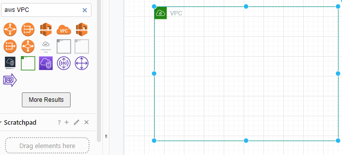
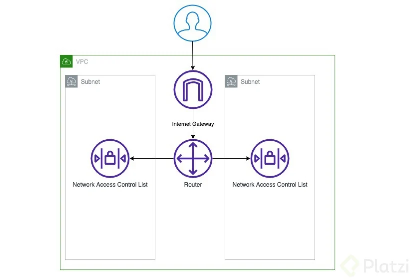
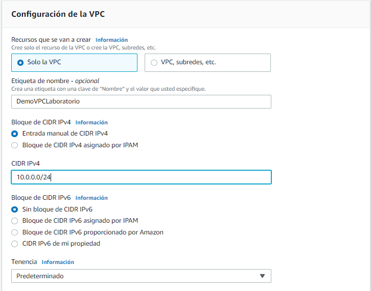
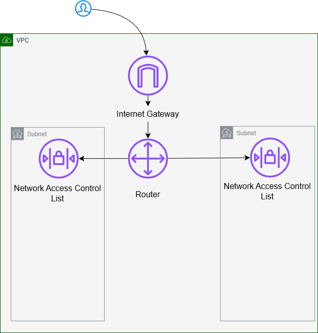
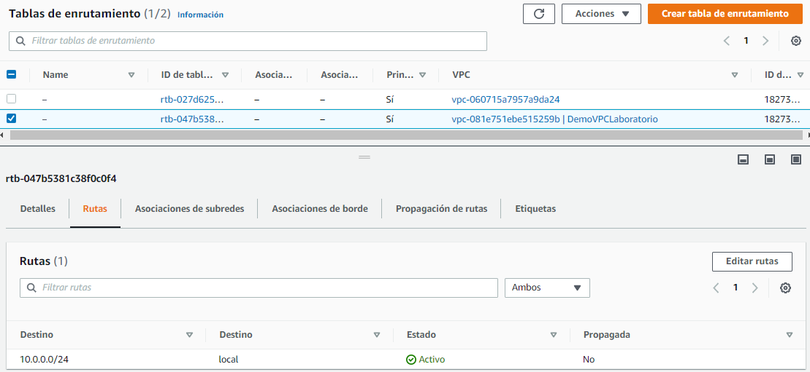
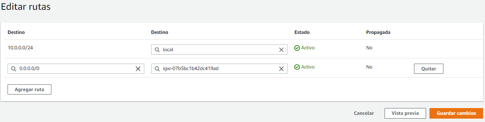
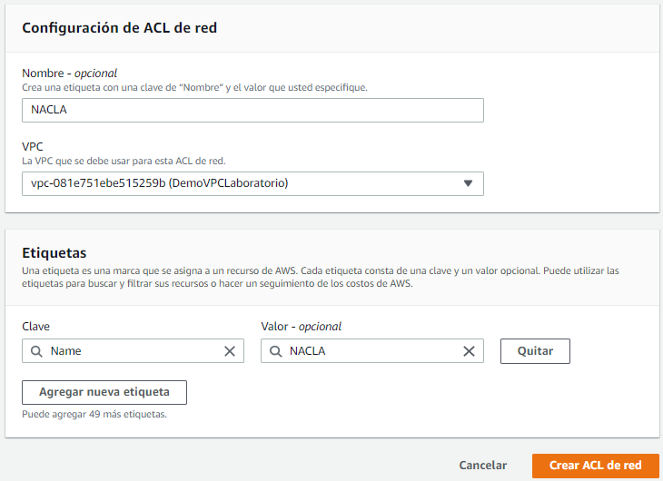
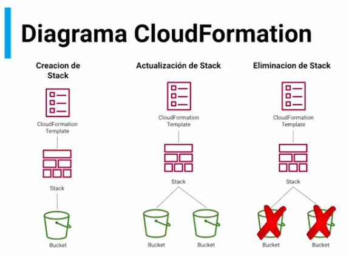
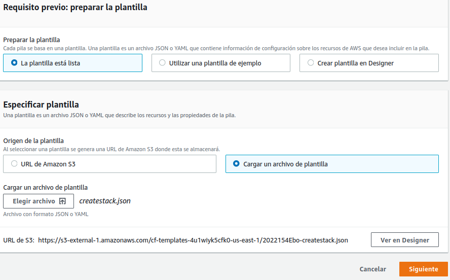
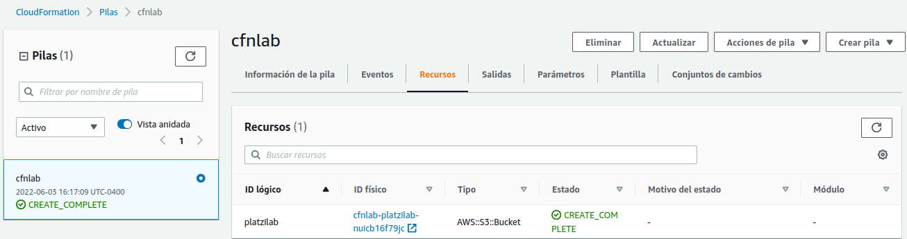

# Curso de Introducción a AWS Redes, Gobernanza y Machine Learning

Si todavía no tienes conocimientos de AWS, recuerda tomar primero los cursos de [introducción al cloud computing](https://platzi.com/cursos/aws-fundamentos "introducción al cloud computing") y [cómputo, almacenamiento y bases de datos](https://platzi.com/cursos/aws-computo/ "cómputo, almacenamiento y bases de datos").

### ¿Qué aprenderás en este curso?

En este curso aprenderemos

- Componentes principales de redes en AWS: VPC, CloudFront, Route 53
- Creación de los componentes básicos de una VPC
- Gobernanza
- Servicios de machine learning

### ¿Quién es el profesor?

Alexis Araujo, Data Architect dentro del team Platzi. Apasionado por el uso de tecnología cloud, Alexis es un Cloud Practicioner certificado por AWS.

**Lecturas recomendadas**

[Curso de Introducción a AWS: Cómputo, Almacenamiento y Bases de Datos - Platzi](https://platzi.com/cursos/aws-computo/)

[Curso de Introducción a AWS: Fundamentos de Cloud Computing - Platzi](https://platzi.com/cursos/aws-fundamentos)

## Qué son las redes

AWS ofrece varios servicios para gestionar redes en la nube. Aquí te explico los principales:

### **📌 1. Amazon Virtual Private Cloud (Amazon VPC)**  

Amazon VPC permite crear una **red privada y aislada** en AWS donde puedes desplegar recursos como instancias **EC2, bases de datos y servicios**.  

✅ **Definir rangos de IP privadas**  
✅ **Crear subredes públicas y privadas**  
✅ **Configurar reglas de tráfico con Security Groups y NACLs**  
✅ **Conectar con Internet o redes locales** mediante **VPN o Direct Connect**  

🔹 **Ejemplo de uso:**  
- Crear una VPC con subredes privadas para bases de datos y subredes públicas para servidores web.  
- Conectar tu oficina con AWS usando **VPN o Direct Connect**.

### **📌 2. AWS Transit Gateway**  

AWS Transit Gateway permite **conectar múltiples VPC y redes locales** en una arquitectura centralizada.  

✅ **Reduce la complejidad de conexiones** entre múltiples VPC y redes on-premises.  
✅ **Mejora el rendimiento y la seguridad** en comparación con conexiones punto a punto (VPC Peering).  
✅ **Soporta conectividad con VPN y Direct Connect**.  

🔹 **Ejemplo de uso:**  
- Una empresa con múltiples VPC en diferentes regiones puede conectar todas usando un **Transit Gateway** en vez de múltiples conexiones **VPC Peering**.

### **📌 3. AWS PrivateLink**  

AWS PrivateLink permite acceder a **servicios de AWS o aplicaciones de terceros de forma privada** dentro de tu VPC, sin pasar por Internet.  

✅ **Mayor seguridad** al evitar tráfico público.  
✅ **Baja latencia y menor exposición a amenazas externas**.  
✅ **Ideal para conectar VPC a servicios de AWS como S3, DynamoDB, RDS** de forma privada.  

🔹 **Ejemplo de uso:**  
- Conectar tu VPC a **Amazon S3 o DynamoDB** sin exponer el tráfico a Internet.  
- Usar un servicio de un proveedor externo a través de **PrivateLink** sin abrir puertos públicos.

### **📌 4. Amazon Route 53**  

Amazon Route 53 es el servicio de **DNS escalable y altamente disponible** de AWS.  

✅ **Gestión de nombres de dominio** y registros DNS.  
✅ **Balanceo de carga con geolocalización y failover**.  
✅ **Integración con AWS para enrutar tráfico entre servicios**.  

🔹 **Ejemplo de uso:**  
- Crear un dominio personalizado para tu aplicación en AWS.  
- Configurar **balanceo de carga global** redirigiendo tráfico según la ubicación del usuario.

### **🚀 Resumen y Comparación**  

| Servicio        | Función Principal | Casos de Uso |
|---------------|----------------|--------------|
| **Amazon VPC** | Crea una red privada en AWS | Alojar aplicaciones con control de red |
| **AWS Transit Gateway** | Conecta múltiples VPC y redes locales | Empresas con muchas VPC o conexiones híbridas |
| **AWS PrivateLink** | Acceso privado a servicios de AWS o terceros | Conectar servicios sin exponerlos a Internet |
| **Amazon Route 53** | Servicio DNS escalable | Dominios personalizados, balanceo de carga global |

📌 **Conclusión:**  
AWS ofrece herramientas poderosas para la conectividad en la nube. **VPC** es la base de la red, **Transit Gateway** facilita la conectividad entre múltiples redes, **PrivateLink** asegura accesos privados y **Route 53** gestiona dominios y balanceo de carga.

### Resumen

Las **redes** son cómo están conectadas las computadoras (y otros dispositivos tecnológicos) entre sí, y los servicios que permiten esto.

Una muy conocida es el Internet, que consiste en una red de computadoras abierta al mundo. Para que Internet funcione es necesario contar con direcciones IP, enrutadores, DNS y seguridad. AWS provee servicios que permiten la creación de redes y la entrega de contenido a los usuarios de manera rápida.

### Redes en la nube

Entre los servicios de AWS para implementar redes en la nube encontramos:

- [Amazon Virtual Private Cloud (Amazon VPC):](https://platzi.com/clases/2733-aws-redes/48886-que-es-una-vpc/ "Amazon Virtual Private Cloud (Amazon VPC): permite definir y aprovisionar una red privada para nuestros recursos de AWS
- [AWS Transit Gateway](https://aws.amazon.com/transit-gateway/?whats-new-cards.sort-by=item.additionalFields.postDateTime&whats-new-cards.sort-order=desc "AWS Transit Gateway"): Permite conectar VPC con los recursos locales (on-premises) mediante un hub central
- [AWS PrivateLink](https://aws.amazon.com/privatelink/?privatelink-blogs.sort-by=item.additionalFields.createdDate&privatelink-blogs.sort-order=desc "AWS PrivateLink"): proporciona conectividad privada entre las VPC y aplicaciones locales, sin exponer el tráfico al Internet público
- [Amazon Route 53](https://platzi.com/clases/2733-aws-redes/48888-route-53/ "Amazon Route 53"): permite alojar nuestro propio DNS administrado

### Redes a escala

Estos servicios nos permiten escalar el tráfico de red según las necesidades:

- **Elastic Load Balancing**: permite distribuir automáticamente el tráfico de red a través de un grupo de recursos, con el fin de mejorar la escalabilidad
- **AWS Global Accelerator**: redirige el tráfico a través de la red global de AWS para mejorar el rendimiento de las aplicaciones globales
- **Amazon CloudFront**: entrega de forma segura datos, videos y aplicaciones a clientes de todo el mundo con baja latencia.

**Lecturas recomendadas**

[Curso de Redes Informáticas de Internet - Platzi](https://platzi.com/cursos/redes/)

## Qué es una VPC

Una **VPC (Virtual Private Cloud)** es una red virtual en la nube de AWS que permite a los usuarios lanzar recursos de AWS en un entorno aislado lógicamente. Básicamente, es una red privada definida por software dentro de AWS, en la que se pueden configurar subredes, tablas de enrutamiento, puertas de enlace de Internet y reglas de seguridad para controlar el tráfico de red.

### **Características clave de una VPC en AWS**:
1. **Aislamiento lógico**: Permite que los recursos se ejecuten en una red virtual separada de otras VPCs y clientes de AWS.
2. **Subredes personalizadas**: Se pueden definir subredes públicas y privadas dentro de la VPC.
3. **Control del tráfico**: Uso de **Security Groups** y **Network ACLs** para administrar el tráfico entrante y saliente.
4. **Opciones de conectividad**: Se puede conectar a Internet, otras VPCs, centros de datos locales o servicios como AWS Direct Connect y VPN.
5. **Alta disponibilidad y escalabilidad**: Compatible con balanceo de carga y autoescalado.

En resumen, una **VPC** proporciona un entorno seguro y flexible para alojar servidores, bases de datos y otras aplicaciones en la nube de AWS.

### Resumen

Una VPC es una red virtual privada. Cada computadora que está conectada a otra computadora por medio de un cable, enrutador o antena de wifi, requiere de una interfaz de red para ser conectada. La interfaz de red es el puente entre nuestra computadora y la tecnología ya utilizada para conectarse a la otra computadora.

Una vez que conectamos las computadoras, debemos configurar la red, para lo cual necesitamos un [rango de direcciones IP](https://platzi.com/clases/2225-redes/35586-clases-de-redes/ "rango de direcciones IP").

### Qué es el rango de direcciones IP

El rango de direcciones IP es como una comunidad cerrada local, donde los equipos se podrán comunicar solo con otros equipos dentro de la misma red. A cada equipo se le asigna una dirección IPv4. Es decir, se le dan 4 números que varían del 0 al 255 separados por un punto. Para redes privadas ya se tienen especificados los rangos de IP:

- 10.0.0.1
- 172.16.0.1
- 192.168.0.1

### Para qué sirve Amazon VPC

Amazon VPC permite crear una red virtual para poder conectarnos a todos los servicios de AWS que existan en un rango de direcciones IP locales (por ejemplo, 10.0.0.0/24, que representa del rango de IP entre 10.0.0.0 y 10.0.0.255). Esta red virtual será como una pequeña comunidad cerrada para nuestras máquinas virtuales y todos los servicios que tengamos dentro de AWS.

### Componentes de Amazon VPC

Amazon VPC posee los siguientes componentes para controlar el tráfico interno y externo de nuestras VPC

- **Nat Gateway**: si deseamos que nuestras máquinas virtuales puedan acceder a internet, debemos utilizar este componente
- **Internet Gateway**: permite que Internet pueda acceder a nuestra instancia de EC2
- **ACL Control List**: controla el tráfico que vamos a permitir dentro y fuera de la VPC

## Escogiendo CloudFront

### **¿Cuándo elegir Amazon CloudFront?**  

Amazon **CloudFront** es un **servicio de red de entrega de contenido (CDN)** que acelera la distribución de contenido estático y dinámico a usuarios de todo el mundo. Es ideal para aplicaciones con requisitos de baja latencia y alto rendimiento.  

### **Casos en los que se recomienda usar CloudFront**  

✅ **Distribución de contenido estático** (imágenes, videos, archivos CSS/JS)  
✅ **Streaming de video** (HLS, DASH, Smooth Streaming)  
✅ **Aceleración de sitios web y APIs**  
✅ **Protección contra ataques DDoS** (integración con AWS Shield)  
✅ **Optimización de costos** (reduce tráfico a servidores backend)  

Si necesitas **entregar contenido rápido, seguro y eficiente a nivel global**, **Amazon CloudFront** es la opción ideal.

### Resumen

Antes de hablar de CloudFront, recordemos cómo funciona [AWS ElastiCache](https://platzi.com/clases/2732-aws-computo/47026-evaluando-elasticache/ "AWS ElastiCache"). **ElastiCache es un servicio que almacena en memoria caché las solicitudes a la base de datos, para evitar el consultar la base de datos cada vez que se necesite acceder a información**. Este servicio se ubica entre el sitio web y la base de datos

**CloudFront funciona de manera similar, solo que este es un servicio intermedio entre el navegador (o el cliente) y el sitio web**. El propósito de CloudFront es entregar datos, aplicaciones y sitios web en todos el mundo con baja latencia. Para esto, AWS cuenta con **edge locations** (o ubicaciones de borde), es decir, múltiples ubicaciones en el mundo desde las cuales CloudFront puede servir contenido.

**Casos de uso de CloudFront**

Supongamos que un cliente accede a nuestro sitio web. En realidad, el cliente primero accede a CloudFront. Entonces CloudFront redirige automáticamente la solicitud de archivo desde el edge location más cercano. Los archivos se almacenan en la caché de la ubicación de borde primero, durante un periodo de tiempo limitado que nosotros necesitemos.

Si un cliente solicita el contenido que está almacenado en caché por más tiempo que el vencimiento especificado, CloudFront verifica en el servidor de origen para ver si hay una nueva versión del archivo disponible. Si el archivo ha sido modificado, se retorna la nueva versión del archivo. En caso contrario, se entrega la versión que estaba en caché.

Cualquier cambio que realicemos en los archivos se replicará en las ubicaciones de borde a medida que sus visitantes están entrando y solicitando el contenido. Esto es lo que mantiene a los sitios web rápidos sin importar la ubicación del usuario.

### Características de CloudFront

- CloudFront es seguro: ofrece protección contra ataques DDOS, ya que los primeros servidores en recibir estos ataques serán los de CloudFront y no los tuyos. Además, CloudFront está protegido ante picos de tráfico.
- CloudFront también permite ejecutar funciones de [AWS Lambda](https://platzi.com/clases/2732-aws-computo/47016-aprendiendo-sobre-lambda/ "AWS Lambda") en las ubicaciones de borde.
- CloudFront ofrece múltiples métricas en tiempo real, y es rentable.

## Qué es Route 53

**Amazon Route 53** es un **servicio de DNS (Sistema de Nombres de Dominio) escalable y altamente disponible** que permite administrar nombres de dominio y enrutar el tráfico de Internet de manera eficiente.

### **¿Para qué sirve Route 53?**

✔ **Registrar dominios**: Puedes comprar y administrar nombres de dominio directamente en AWS.  
✔ **Resolver nombres de dominio**: Convierte nombres de dominio (como `miweb.com`) en direcciones IP (`192.168.1.1`).  
✔ **Rutas inteligentes de tráfico**: Distribuye tráfico basado en latencia, geolocalización o salud de servidores.  
✔ **Alta disponibilidad**: Integra con AWS servicios como **CloudFront, S3 y EC2** para mejorar rendimiento.  
✔ **Monitoreo y failover**: Detecta fallas y redirige el tráfico automáticamente a una instancia saludable.

### **¿Cuándo usar Route 53?**

✅ **Si necesitas un DNS rápido, seguro y confiable**.  
✅ **Para administrar tráfico global y mejorar disponibilidad**.  
✅ **Si quieres combinarlo con otros servicios de AWS**.  

🔹 **Conclusión**: Amazon Route 53 es ideal para gestionar dominios y enrutar tráfico con escalabilidad y alta disponibilidad.

### Resumen

[DNS](https://platzi.com/clases/2053-introweb/32966-dns/ "DNS") es un sistema que asigna direcciones IP a nombres de dominio. **Route 53 es un servicio de alojamiento de DNS, que cuesta tan solo $0.5 por nombre de dominio por mes. Route 53 cuenta con distintas opciones de política de enrutamiento**.

### Políticas de enrutamiento

Las políticas de enrutamiento nos permiten determinar a dónde se dirigirá un usuario cuando acceda a nuestro dominio. Estas políticas son:

### Ruteo simple

El ruteo simple utiliza el servicio de DNS estándar. Es decir, el tráfico en un dominio se enruta hacia un recurso muy específico.

### Política ponderada

La **política ponderada** (o *weighted routing*) te permite asociar múltiples recursos con un solo nombre de dominio, y ver qué tanto tráfico es dirigido a cada recurso. Esto se determina con un número del 0 al 255, donde el cero representa que el recurso no recibe ningún tráfico, y el 255 indica que el recurso recibe todo el tráfico.

Mediante la política ponderada podemos probar distintas versiones de nuestro sitio web con un número reducido de usuarios. Luego podemos realizar una transición lenta de nuestros usuarios hacia la nueva versión del sitio.

### Política de geolocalización

Usando la **política de geolocalización** podemos escoger qué recursos servir en función de la ubicación geográfica de nuestros usuarios. Esto permite servir contenido específico según la región, así como restringir la distribución del mismo solo a las regiones permitidas.

### Política de latencia

La política de latencia se trata de entregar los recursos desde la región de AWS que esté más cercana a la ubicación del usuario, a fin de reducir el tiempo de respuesta.

### Política de conmutación por error

La política de conmutación por error redirige el tráfico a un recurso cuando este está en buen estado, o a uno diferente cuando el primer recurso no está en buen estado.

### Política de respuesta de múltiples valores

La **respuesta de múltiples valores** permite devolver varios valores, como direcciones IP a los servidores web, en respuesta a las consultas de DNS. Se pueden especificar varios valores para casi cualquier registro, pero este direccionamiento también permite verificar el estado de cada recurso, por lo que Route 53 devuelve los valores únicamente para los recursos en buen estado.

**Esta política no es sustituto de un balanceador de carga**, pero la capacidad de devolver varias direcciones IP (cuyo estado sea comprobable) permite usar el DNS para mejorar la disponibilidad y el equilibrio de la carga.

**Conclusión**

**Route 53 es un servicio complejo, pero útil para mantener nuestros sitios web rápidos y altamente disponibles. Es rentable, seguro, escalable, y posee distintas opciones de enrutamiento para distintos casos**.

## Cómo crear el diagrama de una VPC

Para crear un diagrama de una **VPC en AWS**, sigue estos pasos:

### **1️⃣ Definir la arquitectura de la VPC**  
Tu VPC debe incluir elementos clave como:  
✅ **CIDR Block**: El rango de direcciones IP privadas (Ej: `10.0.0.0/16`).  
✅ **Subredes**: Al menos una pública y una privada.  
✅ **Internet Gateway (IGW)**: Permite el acceso a Internet.  
✅ **Route Tables**: Define cómo se enruta el tráfico entre subredes.  
✅ **NAT Gateway**: Permite que las subredes privadas accedan a Internet sin ser accesibles desde el exterior.  
✅ **Security Groups & Network ACLs**: Controlan el tráfico entrante y saliente.

### **2️⃣ Elegir una herramienta para diagramar**  
Puedes usar:  
🔹 **AWS Diagramming Tool (en AWS Architecture Center)**  
🔹 **Lucidchart**  
🔹 **Draw.io** (gratuito y fácil de usar)  
🔹 **Visio**  
🔹 **Excalidraw**

### **3️⃣ Construcción del diagrama**  
Aquí te dejo una estructura típica:  

📌 **Ejemplo de diagrama de una VPC con 2 subredes**  
```
                 ┌──────────────────────────────────────┐
                 │              AWS VPC                │  (10.0.0.0/16)
                 ├──────────────────────────────────────┤
                 │                                      │
    ┌───────────┴───────────┐      ┌───────────┴───────────┐
    │   Subred Pública      │      │   Subred Privada      │
    │  (10.0.1.0/24)        │      │  (10.0.2.0/24)        │
    │   Internet Gateway    │      │  NAT Gateway (Opcional) │
    │  EC2 (Servidor Web)   │      │  EC2 (Base de Datos)  │
    └───────────┬───────────┘      └───────────┬───────────┘
                 │                              │
                 └─────── Route Table ─────────┘
```
---
### **4️⃣ Validación y Mejoras**  
🔹 Usa **AWS Well-Architected Tool** para validar la arquitectura.  
🔹 Considera **VPC Peering** si necesitas comunicarte con otras VPCs.  
🔹 Añade **VPN o AWS Direct Connect** si integras con tu red local.

### Resumen

Aprendámos a crear los componentes básicos de una VPC desde cero. **Primero necesitamos hacer un diagrama para entender cómo están divididos estos componentes básicos**.

Para originar el diagrama nos dirigimos [a esta herramienta de diagramas de flujo](https://app.diagrams.net/ "a esta herramienta de diagramas de flujo") y escogemos dónde guardaremos el diagrama (en esta clase se escoge Google Drive, pero puedes guardarlo donde prefieras). Entonces le damos a **“Create New Diagram”** -> **“Blank Diagram”**.

### Creando el diagrama de la VPC

En el recuadro de búsqueda podemos poner “AWS VPC”. Escogemos la siguiente figura.



Luego, buscamos las siguientes figuras: “AWS Internet Gateway”, “User”, “network access control”, “router” y “subnet”. Entonces las ordenamos de la siguiente manera



Este es el diagrama final. Muestra que cuando un usuario intenta acceder al VPC se encontrará con el **[Internet Gateway](https://docs.aws.amazon.com/vpc/latest/userguide/VPC_Internet_Gateway.html "Internet Gateway")**. Luego, el tráfico será dirigido al **router**, que se encargará de redirigirlo a una de las dos subnets las cuales contienen un **Network Access Control List**. Este se encargará de validar que el usuario pueda acceder al contenido.

**Lecturas recomendadas**

[Cloud Computing Services - Amazon Web Services (AWS)](https://aws.amazon.com/)

[Flowchart Maker & Online Diagram Software](https://app.diagrams.net/)

## Cómo crear la VPC y el internet gateway

Puedes crear una VPC y un Internet Gateway desde la **Consola de AWS** o usando la **AWS CLI**. Aquí te explico ambos métodos.

### **📌 Opción 1: Crear VPC desde la Consola de AWS**  

1️⃣ **Ir a la Consola de AWS** → **VPC** → **Crear VPC**  
2️⃣ **Configurar la VPC**:  
   - **Nombre**: `MiVPC`  
   - **Rango de IP (CIDR)**: `10.0.0.0/16`  
   - **Tenancy**: `Predeterminado`  
3️⃣ **Crear y guardar**  

4️⃣ **Crear un Internet Gateway (IGW)**:  
   - Ir a **Internet Gateways** → **Crear Internet Gateway**  
   - **Nombre**: `MiInternetGateway`  
   - Hacer clic en **Crear**  

5️⃣ **Adjuntar el IGW a la VPC**:  
   - Seleccionar `MiInternetGateway`  
   - Hacer clic en **Acciones → Adjuntar a VPC**  
   - Seleccionar `MiVPC` y **Confirmar**

## **📌 Opción 2: Crear VPC e IGW con AWS CLI**  

📌 **Crear la VPC:**  
```sh
aws ec2 create-vpc --cidr-block 10.0.0.0/16 --tag-specifications 'ResourceType=vpc,Tags=[{Key=Name,Value=MiVPC}]'
```

📌 **Crear el Internet Gateway:**  
```sh
aws ec2 create-internet-gateway --tag-specifications 'ResourceType=internet-gateway,Tags=[{Key=Name,Value=MiInternetGateway}]'
```

📌 **Adjuntar el IGW a la VPC:**  
```sh
VPC_ID=$(aws ec2 describe-vpcs --filters "Name=cidr-block,Values=10.0.0.0/16" --query "Vpcs[0].VpcId" --output text)
IGW_ID=$(aws ec2 describe-internet-gateways --filters "Name=tag:Name,Values=MiInternetGateway" --query "InternetGateways[0].InternetGatewayId" --output text)

aws ec2 attach-internet-gateway --internet-gateway-id $IGW_ID --vpc-id $VPC_ID
```

### **📌 Pasos Siguientes**  
✅ **Crear subredes** (pública y privada)  
✅ **Configurar una tabla de enrutamiento** para permitir tráfico a Internet  
✅ **Configurar reglas de seguridad** en los Security Groups

### Resumen

Una vez creado nuestro [diagrama de vpc](https://platzi.com/clases/2733-aws-redes/48889-crea-el-diagrama/ "diagrama de vpc"), [iniciamos sesión en AWS](https://console.aws.amazon.com/console/home?nc2=h_ct&src=header-signin "iniciamos sesión en AWS") para crear los primeros componentes de nuestra VPC.

### Pasos para crear la VPC

1. En la caja de búsqueda de AWS buscamos VPC y seleccionamos el primer resultado.
2. Nos dirigimos a “**Sus VPC**” y le damos a “**Crear VPC**”.
3. Colocamos las siguientes opciones, y dejamos el resto de valores por defecto:

- **Etiqueta de nombre - opcional**: DemoVPCLaboratorio.
- **Bloque de CIDR IPv4**: Entrada manual de CIDR IPv4.
- **CIDR IPv4**: 10.0.0.0/24.



Entonces le damos a **Crear VPC**.

### Pasos para crear el Internet Gateway

1. Nos dirigimos a **“Gateways de Internet” -> “Crear gateway de Internet”**.
2. En “**Etiqueta de nombre**”, colocamos “**DemoIGWLaboratorio**”, y le damos a “Crear gateway de Internet”.
3. Nos aparecerá nuestro nuevo Internet Gateway con un estado “Detached”, ya que no está ligado a ninguna VPC.
4. Para conectar el Intenet Gateway a nuestra VPC, simplemente le damos clic en “**Acciones**” -> “**Conectar a la VPC**”.
5. Aquí seleccionamos nuestra VPC, y le damos clic a “**Concetar gateway de Internet**”. Ojo, **el Internet Gatway y la VPC deben estar en la misma región.**



Ya con esto creamos dos de los componentes de nuestra VPC.

## Cómo crear la tabla de enrutamiento y otros componentes 

Después de crear la **VPC y el Internet Gateway (IGW)**, necesitas:  
✔ **Tabla de enrutamiento** para dirigir el tráfico.  
✔ **Subredes** (pública y privada).  
✔ **Asociar la tabla de enrutamiento** con las subredes.  
✔ **Configurar un grupo de seguridad** para controlar el tráfico.

### **📌 Paso 1: Crear Subredes**

Debes crear al menos **una subred pública** y **una privada** dentro de la VPC.

### **Desde la Consola AWS**

1️⃣ Ir a **VPC** → **Subredes** → **Crear Subred**  
2️⃣ **Seleccionar la VPC creada (MiVPC)**  
3️⃣ **Crear subred pública**  
   - Nombre: `SubredPublica`  
   - CIDR: `10.0.1.0/24`  
   - Zona de disponibilidad: (Ej: `us-east-1a`)  
   - **Habilitar la asignación automática de IPs públicas**  
4️⃣ **Crear subred privada**  
   - Nombre: `SubredPrivada`  
   - CIDR: `10.0.2.0/24`  
   - Zona de disponibilidad: (Ej: `us-east-1b`)  

### **Desde AWS CLI**

```sh
VPC_ID=$(aws ec2 describe-vpcs --filters "Name=tag:Name,Values=MiVPC" --query "Vpcs[0].VpcId" --output text)

aws ec2 create-subnet --vpc-id $VPC_ID --cidr-block 10.0.1.0/24 --availability-zone us-east-1a --tag-specifications 'ResourceType=subnet,Tags=[{Key=Name,Value=SubredPublica}]'

aws ec2 create-subnet --vpc-id $VPC_ID --cidr-block 10.0.2.0/24 --availability-zone us-east-1b --tag-specifications 'ResourceType=subnet,Tags=[{Key=Name,Value=SubredPrivada}]'
```

## **📌 Paso 2: Crear la Tabla de Enrutamiento y Asociarla**

La tabla de enrutamiento define cómo se dirige el tráfico dentro de la VPC.

### **Desde la Consola AWS**

1️⃣ Ir a **VPC** → **Tablas de Enrutamiento** → **Crear Tabla de Enrutamiento**  
2️⃣ **Nombre**: `TablaPublica`  
3️⃣ **Seleccionar la VPC (MiVPC)**  
4️⃣ **Agregar Ruta**:  
   - Destino: `0.0.0.0/0` (todo el tráfico)  
   - Target: `Internet Gateway (MiInternetGateway)`  
5️⃣ **Asociar con la Subred Pública**  
   - Ir a **Asociaciones de Subredes** → Seleccionar `SubredPublica`  

### **Desde AWS CLI**

```sh
# Crear tabla de enrutamiento
RT_ID=$(aws ec2 create-route-table --vpc-id $VPC_ID --query "RouteTable.RouteTableId" --output text)
aws ec2 create-tags --resources $RT_ID --tags Key=Name,Value=TablaPublica

# Agregar ruta a Internet Gateway
IGW_ID=$(aws ec2 describe-internet-gateways --filters "Name=tag:Name,Values=MiInternetGateway" --query "InternetGateways[0].InternetGatewayId" --output text)
aws ec2 create-route --route-table-id $RT_ID --destination-cidr-block 0.0.0.0/0 --gateway-id $IGW_ID

# Asociar con la Subred Pública
SUBNET_ID=$(aws ec2 describe-subnets --filters "Name=tag:Name,Values=SubredPublica" --query "Subnets[0].SubnetId" --output text)
aws ec2 associate-route-table --route-table-id $RT_ID --subnet-id $SUBNET_ID
```

## **📌 Paso 3: Configurar un Grupo de Seguridad (Firewall de AWS)**  
Los grupos de seguridad controlan el tráfico entrante y saliente de instancias EC2.

### **Desde la Consola AWS**  
1️⃣ Ir a **VPC** → **Grupos de Seguridad** → **Crear Grupo de Seguridad**  
2️⃣ **Nombre**: `SG-WebServer`  
3️⃣ **Seleccionar VPC (MiVPC)**  
4️⃣ **Reglas Entrantes**:  
   - **Permitir tráfico HTTP (80)**:  
     - Tipo: HTTP  
     - Protocolo: TCP  
     - Puerto: 80  
     - Origen: `0.0.0.0/0`  
   - **Permitir tráfico SSH (22)** _(solo si necesitas administrar el servidor)_  
     - Tipo: SSH  
     - Protocolo: TCP  
     - Puerto: 22  
     - Origen: `Tu IP` (`X.X.X.X/32`)  

### **Desde AWS CLI**  
```sh
SG_ID=$(aws ec2 create-security-group --group-name SG-WebServer --description "Grupo de Seguridad para Web" --vpc-id $VPC_ID --query "GroupId" --output text)

# Permitir HTTP (80)
aws ec2 authorize-security-group-ingress --group-id $SG_ID --protocol tcp --port 80 --cidr 0.0.0.0/0

# Permitir SSH (22) - Cambia "X.X.X.X/32" por tu IP
aws ec2 authorize-security-group-ingress --group-id $SG_ID --protocol tcp --port 22 --cidr X.X.X.X/32
```

### **📌 Paso 4: Crear una Instancia EC2 (Opcional)**
Si quieres probar la conectividad, puedes lanzar una instancia EC2 en la **Subred Pública** con el **Grupo de Seguridad** creado.

```sh
aws ec2 run-instances --image-id ami-0abcdef1234567890 --count 1 --instance-type t2.micro --subnet-id $SUBNET_ID --security-group-ids $SG_ID --key-name MiClave --tag-specifications 'ResourceType=instance,Tags=[{Key=Name,Value=ServidorWeb}]'
```

### **🎯 Conclusión**
✅ Ya tienes tu VPC configurada con una subred pública conectada a Internet.  
✅ Puedes lanzar servidores en la **Subred Pública** con acceso a Internet.  
✅ Si necesitas una **Subred Privada**, puedes crear una con un **NAT Gateway**.

### Resumen

Una vez que [creamos nuestra VPC y el Internet Gateway y los conectamos](https://platzi.com/clases/2733-aws-redes/49130-crear-la-vpc-y-crear-el-internet-gateway/ "creamos nuestra VPC y el Internet Gateway y los conectamos"), procedemos a crear la **tabla de enrutamiento**, las **listas de acceso de control** y **las subredes**.

### Pasos para crear la tabla de enrutamiento

1. Desde la [página del servicio de VPC](https://console.aws.amazon.com/vpc/home "página del servicio de VPC"), nos dirigimos a “**Tablas de ruteo**”.
2. Notamos que ya existe una tabla de ruteo asociada a nuestra VPC, que se creó automáticamente junto con la VPC.
3. La seleccionamos, nos dirigimos a la sección de rutas, y hacemos clic en “**Editar rutas**”.



4. Hacemos clic en “**Agregar ruta**”, colocamos **0.0.0.0/0** y “**Puerta de enlace de internet**”, y seleccionamos el [Internet Gateway](https://platzi.com/clases/2733-aws-redes/49130-crear-la-vpc-y-crear-el-internet-gateway/ "Internet Gateway") que creamos en la clase pasada.
5. Le damos en “**Guardar cambios**”. De esta manera, todo el mundo podrá acceder a nuestra VPC mediante el Internet Gateway.



### Pasos para crear Access Control List

1. En el apartado de “**Seguridad**” del servicio de VPC, nos dirigimos a “**ACL de red**”.
2. Le damos clic a “**Crear ACL de red**”. Crearemos dos ACL de red, uno para cada subred. Le damos los nombres **NACLA** y **NACLB**, y en VPC escogemos nuestra VPC.
3. Le damos clic en “**Crear ACL de red**”.



### Pasos para añadir una regla de entrada y una de salida

Ahora, para cada ACL de red creado debemos añadir una regla de entrada y una de salida, con el fin de permitir el tráfico HTTP en el puerto 80. Para esto:

1. Seleccionamos una ACL de red
2. Nos vamos a “**Reglas de entrada**” -> “**Editar reglas de entrada**”.


3. Le damos clic en “**Añadir una nueva regla**”. Y colocamos los siguientes parámetros

- **Número de regla**: 100 (las reglas se evalúan comenzando por la regla de número más bajo).
- **Tipo**: HTTP (80).
- **Origen**: 0.0.0.0/0.
- **Permitir/denegar**: Permitir.

4. Le damos a “**Guardar cambios**”.
5. Repetimos el proceso con la regla de salida y con el otro ACL (NACLB), colocando los mismos parámetros anteriores. Ahora solo falta añadir estos ACL a nuestras subredes, las cuales crearemos a continuación.


Añadir una nueva regla de entrada

### Pasos para crear subredes

1. En la sección de “**Subredes**” vamos al botón “**Crear subred**”.
2. Escogemos nuestra VPC, y colocamos los siguientes parámetros:
- **Nombre de la subred**: DemoSubredA.
- **Zona de dispinibilidad**: la primera que te aparezca en el menú de selección, que termine en “a”.
- **Bloque de CIDR IPv4**: 10.0.0.0/25 (asumiendo que tu VPC tiene el bloque de CIDR 10.0.0.0/24)

3. Le damos clic en “**Crear subred**”
4. Repetimos el procedimiento para la otra subred con los siguientes parámetros:
- **Nombre de la subred**: DemoSubredB.
- **Zona de dispinibilidad**: la segunda que te aparezca en el menú de selección, que termine en “b”.
- **Bloque de CIDR IPv4**: 10.0.0.128/25.


Ahora solo falta **asociar los ACL que creamos con las subredes**. Para esto simplemente hacemos clic derecho en DemoSubredA y clic en “**Editar la asociación de ACL de red**”, y seleccionamos la ACL correspondiente (NACLA). Entonces le damos en Guardar, y repetimos el procedimiento con *DemoSubredB*.

**Recapitulación**

Ya creamos todos los componentes de nuestra VPC: el Internet Gateway, la tabla de enrutamiento, las Access Control List y las subredes. Además, dimos acceso público a dichas subredes mediante HTTP en el puerto 80.

## Administración y gobernanza con AWS

AWS proporciona un conjunto de servicios para ayudar a administrar y gobernar los recursos en la nube de manera eficiente, segura y escalable. Estos servicios se enfocan en la administración de cuentas, costos, cumplimiento, monitoreo y automatización.

### **📌 Principales Servicios de Administración y Gobernanza en AWS**  

| Servicio | Descripción |
|----------|------------|
| **AWS Organizations** | Permite la administración centralizada de múltiples cuentas de AWS. Facilita la aplicación de políticas y la consolidación de facturación. |
| **AWS Control Tower** | Automatiza la configuración de un entorno multi-cuenta seguro y bien gobernado. |
| **AWS IAM (Identity and Access Management)** | Administra el acceso seguro a los servicios y recursos de AWS con permisos detallados. |
| **AWS Config** | Monitorea y audita la configuración de los recursos en AWS para asegurar el cumplimiento normativo. |
| **AWS CloudTrail** | Registra todas las acciones realizadas en la cuenta de AWS para auditoría y seguridad. |
| **AWS CloudWatch** | Proporciona monitoreo en tiempo real de métricas, logs y eventos de los recursos de AWS. |
| **AWS Budgets** | Ayuda a administrar los costos y el uso de AWS con alertas configurables. |
| **AWS Cost Explorer** | Permite visualizar, analizar y optimizar los costos y el uso de AWS. |
| **AWS Service Catalog** | Permite a las empresas administrar y distribuir catálogos de productos aprobados en AWS. |
| **AWS Systems Manager** | Facilita la administración y automatización de recursos a gran escala. |
| **AWS Trusted Advisor** | Proporciona recomendaciones para optimizar costos, rendimiento, seguridad y tolerancia a fallos. |

### **📌 Casos de Uso de Administración y Gobernanza en AWS**  

### **1️⃣ Gestión Centralizada de Cuentas**

- **AWS Organizations** permite agrupar cuentas bajo una jerarquía.  
- Se pueden aplicar políticas a nivel de organización para restringir permisos.  

### **2️⃣ Monitoreo y Cumplimiento**

- **AWS Config** verifica si los recursos cumplen con estándares establecidos.  
- **AWS CloudTrail** rastrea acciones y cambios en la cuenta.  

### **3️⃣ Optimización de Costos**

- **AWS Budgets** alerta cuando los costos superan un límite definido.  
- **AWS Cost Explorer** ayuda a identificar oportunidades de ahorro.  

### **4️⃣ Seguridad y Control de Acceso**

- **AWS IAM** permite administrar permisos detallados.  
- **AWS Trusted Advisor** revisa configuraciones para mejorar la seguridad.  

### **5️⃣ Automatización de Administración**

- **AWS Systems Manager** facilita la ejecución de comandos en múltiples instancias EC2.  
- **AWS Service Catalog** define productos estándar para los equipos de TI.

### **📌 Conclusión**  
AWS ofrece herramientas robustas para administrar y gobernar la nube con eficiencia, seguridad y control de costos. Implementar estos servicios permite optimizar la infraestructura y garantizar el cumplimiento normativo.

### Resumen

En el pasado, las empresas u organizaciones tenían que lograr un equilibrio entre innovar y mantener un control de los costos, la seguridad y el cumplimiento. Los servicios de administración y gobernanza de AWS sirven para simplificar este equilibrio. Estos servicios buscan que la administración de AWS sea lo más fácil y optimizada posible.

### Administración de cuentas

Entre los servicios que nos ayudan a administrar nuestras cuentas de AWS tenemos:

- **AWS Control Tower**: una manera fácil de configurar y gobernar un entorno seguro de AWS de múltiples cuentas
- **AWS Organizations**: nos brinda una forma de gobernar, de administrar de manera centralizada nuestros entornos en varias cuentas de AWS
- **AWS Budgets**: nos ayuda a planificar y realizar control de costos

### Servicios de aprovisionamiento

Estos servicios facilitan el aprovisionamiento o la creación y configuración de nuevos recursos de AWS:

- **AWS CloudFormation**: permite modelar y aprovisionar todos sus recursos mediante código
- **AWS OpsWorks**: ayuda a automatizar todas las operaciones con Chef y Puppet
- **AWS Service Catalog**: un servicio para crear, organizar y gobernar nuestro propio catálogo curado de productos de AWS en toda nuestra organización
- **Marketplace**: es donde vamos a poder encontrar, probar e implementar software que se ejecuta en AWS

### Servicios para operar el entorno AWS

Estos servicios nos ayudan a operar nuestro entorno de AWS

- **Amazon CloudWatch**: permite observar nuestros servicios a través de métricas y registros
- **Amazon Config**: permite registrar y evaluar las configuraciones de nuestros recursos en AWS
- **AWS CloudTrail**: rastrea toda la actividad del usuario de la cuenta de AWS. Esto es importante en investigaciones de seguridad
- **Systems Manager**: optimiza el rendimiento y la seguridad mientras administramos una gran cantidad de sistemas
Amazon X-Ray: analiza y depura aplicaciones en producción.

## Qué es CloudFormation y cuáles son sus beneficios

**AWS CloudFormation** es un servicio de AWS que permite modelar, aprovisionar y gestionar la infraestructura de AWS como código (IaC - Infrastructure as Code). Con CloudFormation, puedes definir los recursos en archivos de texto utilizando **YAML o JSON** y desplegarlos de manera automatizada.

### **📌 Beneficios de AWS CloudFormation**  

| Beneficio | Descripción |
|-----------|------------|
| **Infraestructura como Código (IaC)** | Permite definir y administrar recursos de AWS mediante archivos YAML o JSON. |
| **Automatización** | Despliega y gestiona recursos de manera automatizada, reduciendo errores manuales. |
| **Reutilización y Consistencia** | Usa plantillas predefinidas para garantizar configuraciones estandarizadas en múltiples entornos. |
| **Escalabilidad** | Facilita la administración de infraestructuras grandes y complejas con un solo archivo de plantilla. |
| **Gestión del Ciclo de Vida** | Permite actualizar, modificar y eliminar recursos de forma controlada mediante pilas (stacks). |
| **Integración con otros servicios de AWS** | Compatible con **AWS Lambda, AWS IAM, Amazon EC2, Amazon RDS**, entre otros. |
| **Sin costo adicional** | Solo pagas por los recursos que CloudFormation despliega, no por el servicio en sí. |

### **📌 ¿Cómo funciona AWS CloudFormation?**

1. **Crear una plantilla** en **YAML o JSON** que defina los recursos a desplegar.  
2. **Subir la plantilla a CloudFormation** y crear una **pila (stack)**.  
3. **CloudFormation aprovisiona los recursos** según la plantilla.  
4. **Administrar la pila** para actualizar o eliminar recursos cuando sea necesario.

### **📌 Ejemplo de Plantilla en YAML**

Esta plantilla crea una instancia EC2 simple en AWS:

```yaml
AWSTemplateFormatVersion: '2010-09-09'
Resources:
  MiInstanciaEC2:
    Type: AWS::EC2::Instance
    Properties:
      InstanceType: t2.micro
      ImageId: ami-0abcdef1234567890  # Reemplazar con una AMI válida
```

### **📌 Casos de Uso**

- **Implementación automatizada de infraestructuras** en entornos de desarrollo, pruebas y producción.  
- **Configuración de entornos multi-región** de manera rápida y consistente.  
- **Automatización del despliegue de aplicaciones** junto con la infraestructura necesaria.  
- **Administración de permisos y políticas de seguridad** en múltiples cuentas de AWS.

### **📌 Conclusión**  
AWS CloudFormation simplifica la administración de la infraestructura al permitir su gestión como código. Esto mejora la eficiencia, reduce errores manuales y garantiza consistencia en los despliegues.

### Resumen

**CloudFormation** es un servicio que permite provisionar servicios como máquinas virtuales o VPCs mediante código. Para esto se usan las *CloudFormation Templates*, que son plantillas en donde especificamos los recursos que queremos desplegar. Estas plantillas pueden estar en formato *JSON* o *YAML*, y en ellas se define un [stack](https://docs.aws.amazon.com/es_es/AWSCloudFormation/latest/UserGuide/stacks.html "stack") o pila de recursos a provisionar.

### Beneficios de CloudFormation

¿Por qué es útil desplegar infraestructura y recursos basados en una plantilla de CloudFormation? Porque ofrece las siguientes ventajas.

### Control de versiones

Ya que podemos definir los recursos que queremos desplegar mediante código, este código lo podemos mantener en un sistema de control de versiones como Git y GitHub. **Esto permite tener un historial completo de nuestros recursos en un solo archivo, así como la colaboración en el despliegue de la infraestructura**.

### Automatización

CloudFormation permite a los encargados de [DevOps](https://platzi.com/clases/1526-gitlab/19272-que-es-devops/ "DevOps") automatizar la creación de infraestructura y recursos en AWS.

### Escala

Gracias a las plantillas podemos replicar la infraestructura en distintas cuentas de AWS y en distintas regiones. Solo debemos ajustar ciertos parámetros.

## Qué es Cloudwatch

**Amazon CloudWatch** es un servicio de monitoreo y observabilidad de AWS que permite recopilar y analizar métricas, logs y eventos de los recursos en la nube. Es útil para supervisar aplicaciones, optimizar el rendimiento, detectar anomalías y configurar alertas automatizadas. 

### **📌 Beneficios de AWS CloudWatch**  

| Beneficio | Descripción |
|-----------|------------|
| **Monitoreo en tiempo real** | Recopila métricas de CPU, memoria, tráfico de red y más. |
| **Gestión centralizada de logs** | Agrega, filtra y analiza registros de aplicaciones y sistemas. |
| **Alertas y notificaciones** | Configura alarmas con **Amazon SNS** para recibir notificaciones. |
| **Dashboards personalizables** | Visualiza datos en paneles gráficos en tiempo real. |
| **Automatización con AWS Lambda** | Ejecuta funciones en respuesta a eventos. |
| **Optimización de costos** | Identifica patrones de uso para reducir gastos. |

### **📌 ¿Cómo funciona AWS CloudWatch?**  

1. **Recopila métricas** de servicios como **EC2, S3, RDS, Lambda**, entre otros.  
2. **Almacena y visualiza datos** en dashboards personalizados.  
3. **Crea alarmas** para eventos críticos y envía notificaciones.  
4. **Automatiza respuestas** con AWS Lambda o Auto Scaling.  
5. **Analiza logs** con **CloudWatch Logs Insights**.

### **📌 Principales Componentes de CloudWatch**  

### **1️⃣ CloudWatch Metrics** 📊

- Registra métricas de recursos de AWS.  
- Permite configurar alarmas en función de umbrales definidos.  

### **2️⃣ CloudWatch Logs** 📜

- Recopila logs de **EC2, Lambda, API Gateway, VPC Flow Logs** y más.  
- Permite consultas avanzadas con **Logs Insights**.  

### **3️⃣ CloudWatch Alarms** 🚨

- Genera alertas cuando una métrica supera un umbral predefinido.  
- Puede activar acciones como notificaciones **SNS** o ejecución de **Lambda**.  

### **4️⃣ CloudWatch Events (EventBridge)** ⏳

- Responde a eventos de AWS en tiempo real.  
- Integra con **Lambda, SNS, Step Functions** y otros servicios.

### **📌 Ejemplo de Uso: Configurar una Alarma en CloudWatch**  

Supongamos que quieres recibir una alerta si el uso de CPU en una instancia EC2 supera el **80%**.  

1️⃣ Ve a la consola de **CloudWatch** en AWS.  
2️⃣ Entra en **Alarmas → Crear alarma**.  
3️⃣ Selecciona la métrica: **EC2 → Uso de CPU**.  
4️⃣ Configura el umbral: **mayor al 80%**.  
5️⃣ Define la acción: **Enviar notificación a SNS (correo o SMS)**.  
6️⃣ Guarda la alarma y monitorea el comportamiento.

### **📌 Casos de Uso**

✅ **Monitoreo de aplicaciones**: Detecta errores o caídas en servicios.  
✅ **Optimización de costos**: Identifica recursos inactivos o sobredimensionados.  
✅ **Automatización de respuestas**: Escala instancias EC2 automáticamente según demanda.  
✅ **Seguridad y cumplimiento**: Detecta accesos no autorizados o tráfico inusual.

### **📌 Conclusión**  
AWS CloudWatch es una herramienta clave para la observabilidad en AWS. Permite **monitorear, alertar y automatizar** respuestas ante eventos en la nube.

### Resumen

**CloudWatch es un servicio de supervision y observabilidad para AWS. Está diseñado para que podamos ver todo lo que sucede dentro de nuestra cuenta de AWS**. En este sentido, CloudWatch ofrece la posibilidad de:

- Recopilar métricas o datos de sus servicios
- Integrar con unos 80 servicios de AWS
- Tener métricas predefinidas
- Recopilar y desplegar datos en una vista unificada con distintos gráficos.
- Configurar de alarmas de acuerdo a los graficos que nos muestre cloudWaatch
- Enviar archivos de registro y buscar de forma interactiva datos de registros. Posee un almacén de registros centralizado. Esto nos ayuda a encontrar y resolver problemas de manera eficaz.

### Caso de uso de CloudWatch

Imagínate que tienes una máquina virtual a la cual se accede mediante SSH. Si queremos saber cuando alguien intenta piratear nuestra máquina virtual con SSH, **podemos enviar los logs de inicio de sesión a CloudWatch**.

Mediante CloudWatch, **podemos usar un filtro para visualizar el número de intentos de sesión fallidos**. Además, podemos configurar una alerta en el caso de que los intentos fallidos superen cierto límite en un periodo específico de tiempo.

## Cómo aplicar autoescalamiento

### **📌 Autoescalamiento en AWS (Auto Scaling)**

El **Auto Scaling** en AWS permite aumentar o reducir automáticamente los recursos informáticos en función de la demanda. Esto ayuda a optimizar el rendimiento y los costos, asegurando que siempre haya suficiente capacidad disponible sin desperdiciar recursos.

### **📌 Servicios que Soportan Auto Scaling**

✅ **Amazon EC2 Auto Scaling** (para instancias EC2).  
✅ **AWS Fargate Auto Scaling** (para contenedores en ECS/EKS).  
✅ **Amazon DynamoDB Auto Scaling** (para bases de datos NoSQL).  
✅ **Amazon Aurora Auto Scaling** (para bases de datos relacionales).

### **📌 Tipos de Autoescalamiento**

1️⃣ **Escalado Vertical** ⬆️⬇️

   - Cambia el tipo de instancia (más CPU, RAM, etc.).
   - Se hace manualmente, no automático.

2️⃣ **Escalado Horizontal** ➡️⬅️

   - Añade o elimina instancias según la demanda.
   - Se logra con **Amazon EC2 Auto Scaling**.

### **📌 Pasos para Configurar Auto Scaling en EC2**

### **1️⃣ Crear un Grupo de Auto Scaling**

1. Ve a la consola de AWS y accede a **EC2 Auto Scaling**.
2. Clic en **"Crear grupo de Auto Scaling"**.
3. **Selecciona una plantilla de lanzamiento** (AMI, tipo de instancia, etc.).
4. Configura la cantidad mínima, máxima y deseada de instancias.
5. Asigna una **política de escalado** (opcional por ahora).

### **2️⃣ Configurar una Política de Escalado**
1. Ve a **Grupos de Auto Scaling** y selecciona tu grupo.
2. En **"Escalado"**, elige "Añadir una política de escalado".
3. Define la métrica a monitorear (ejemplo: uso de CPU).
4. Configura reglas:
   - **Aumentar instancias** si CPU > **80%**.
   - **Disminuir instancias** si CPU < **30%**.
5. Guarda la configuración.

### **3️⃣ Asociar un Balanceador de Carga (opcional pero recomendado)**
1. Ve a **Elastic Load Balancer (ELB)** en AWS.
2. Crea un **Application Load Balancer** y configúralo con una zona de disponibilidad.
3. En **Auto Scaling**, enlaza el grupo con el balanceador de carga.
4. AWS distribuirá el tráfico automáticamente entre instancias activas.

### **📌 Beneficios del Auto Scaling**

✅ **Alta disponibilidad**: Mantiene suficientes instancias activas según la demanda.  
✅ **Optimización de costos**: Reduce instancias cuando la carga es baja.  
✅ **Flexibilidad**: Se adapta automáticamente a picos de tráfico.  
✅ **Menos intervención manual**: Reduce la necesidad de ajustes manuales.

### **📌 Ejemplo de Política de Escalado Basado en CloudWatch**

Supongamos que queremos escalar si el uso de CPU supera el **80%**:

1. En **CloudWatch → Alarmas**, crea una nueva alarma.
2. Elige la métrica **EC2 → CPUUtilization**.
3. Configura el umbral **CPU > 80%**.
4. En **Acciones**, selecciona **Auto Scaling Group → Aumentar tamaño**.
5. Guarda la configuración.

De manera similar, puedes crear otra política para reducir instancias cuando el uso sea bajo.

### **📌 Conclusión**
Auto Scaling en AWS es una herramienta poderosa para administrar cargas de trabajo de manera eficiente. Permite ajustar los recursos automáticamente, mejorando la disponibilidad y optimizando costos.

### Resumen

El auto escalamiento (autoscaling) nos permite escalar la capacidad de nuestras instancias de máquinas virtuales automáticamente, de acuerdo con nuestras condiciones definidas.

**Podemos aumentar la cantidad de instancias que tenemos en ejecución durante los picos de demanda y disminuirlos cuando no los necesitemos**. Esto trae una alta disponibilidad, tolerancia a fallos y un ahorro de costos.

### Pasos para aplicar autoescalamiento

1. Para aprovechar el autoescalamiento, debemos crear un grupo de auto escalamiento que asocie nuestras instancias.
2. En este grupo especificaremos un tamaño mínimo (el número mínimo de instancias a correr), y una capacidad deseada (el número óptimo de instancias en función de las necesidades).
3. Entonces se agregarán más instancias según sea necesario hasta alcanzar un máximo.

Cabe destacar que el Load Balancer de AWS es lo que permite distribuir automaticamente las conexiones a medida que aparecen y desaparecen estos servidores.

Nota: EC2 no es el único servicio que tiene auto escalamiento. DynamoDB y Aurora también implementan este concepto.

## Laboratorio: empezando con CloudFormation

CloudFormation es un servicio de AWS que permite modelar y aprovisionar recursos de infraestructura en la nube utilizando archivos de configuración en formato YAML o JSON. Un laboratorio básico para empezar con CloudFormation incluiría los siguientes pasos:

### **1. Crear un Stack Básico en CloudFormation**
Para empezar, se puede desplegar una infraestructura simple en AWS, como un bucket de S3.

#### **Paso 1: Crear el archivo de la plantilla (YAML)**
Crea un archivo llamado `s3-bucket.yaml` con el siguiente contenido:

```yaml
AWSTemplateFormatVersion: '2010-09-09'
Resources:
  MyS3Bucket:
    Type: AWS::S3::Bucket
    Properties:
      BucketName: my-cloudformation-lab-bucket
```

#### **Paso 2: Subir la Plantilla a CloudFormation**
1. Accede a la consola de AWS y ve a **CloudFormation**.
2. Haz clic en **Create Stack** > **With new resources (standard)**.
3. Selecciona **Upload a template file** y sube `s3-bucket.yaml`.
4. Asigna un nombre a tu Stack, como `MyFirstStack`.
5. Haz clic en **Next**, luego en **Next** nuevamente sin cambiar configuraciones adicionales.
6. En la pantalla de revisión, haz clic en **Create stack**.

#### **Paso 3: Verificar la Creación**
- Una vez que el Stack se haya creado con éxito, ve a **S3** en la consola de AWS y verifica que el bucket `my-cloudformation-lab-bucket` ha sido creado.

### **2. Eliminar el Stack**
Para limpiar los recursos creados:
1. Ve a la consola de CloudFormation.
2. Selecciona el Stack `MyFirstStack`.
3. Haz clic en **Delete**.

### **Conceptos Claves en CloudFormation**
- **Plantilla**: Define la infraestructura a desplegar.
- **Stack**: Es una instancia de la plantilla en AWS.
- **Recursos**: Son los componentes creados por CloudFormation (S3, EC2, RDS, etc.).
- **Parámetros**: Permiten personalizar la plantilla sin modificar el código.
- **Salidas**: Valores generados al ejecutar el Stack.

Este laboratorio es un buen punto de partida para entender cómo funciona CloudFormation. A partir de aquí, puedes experimentar con otros recursos como EC2, RDS o VPC. 🚀

### Resumen

CloudFormation nos permite provisionar infraestructura como código. Para poner a prueba CloudFormation, mediante una **plantilla vamos a crear un stack a partir del cual se desplegará un bucket de [S3](https://platzi.com/clases/2732-aws-computo/47018-s3-y-s3-glacier/ "S3")**. Luego, actualizaremos el stack añadiendo otro bucket de S3, y finalmente lo eliminaremos.



### Entendiendo la plantilla

En [este repositorio](https://github.com/platzi/aws-cloud-practitioner/tree/main/lab-cloudformation "este repositorio") encontrarás la plantilla de CloudFormation que usaremos. La plantilla tiene la siguiente estructura JSON (recuerda, CloudFormation acepta formato JSON o YAML):

```json
{
  "AWSTemplateFormatVersion": "2010-09-09",
  "Description": "this template does XXXX",
  "Metadata": {},
  "Parameters": {},
  "Mappings": {},
  "Conditions": {},
  "Transform": {},
  "Resources": {},
  "Outputs": {}
}
```

Estos parámetros corresponden a lo siguiente:

- **AWSTemplateFormatVersion**: este parámetro es opcional. Aquí especificamos la versión de la plantilla
- **Description**: cadena de texto que describe la plantilla. Debe ir después de *AWSTemplateFormatVersion*
- **Metadata**: objetos que proporcionan información adicional sobre la plantilla
- **Parameters**: valores que pasaremos a la plantilla al ejecutarse, ya sea durante la creación o actualización del *stack*
- **Mappings**: permite asignar un conjunto de valores a una clave específica. Por ejemplo, para establecer valores en función de una región, podemos crear un *mapping* que usa el nombre de una región como clave y contiene los valores que deseemos especificar para cada región
- **Conditions**: controla que se creen recursos o se asignen valores a dichos recursos en función de una condición. Por ejemplo, podemos asignar valores distintos para entornos de producción o de prueba
- **Transform**: especifica las [macros](https://docs.aws.amazon.com/es_es/AWSCloudFormation/latest/UserGuide/template-macros.html "macros") que AWS CloudFormation usa para procesar la plantilla
- **Resources**: aquí se declaran los recursos a incluir en el stack. Por ejemplo, instancias EC2 o *buckets* de S3.
- **Outputs**: declara valores de salida que pueden ser usados en otros stacks

### Pasos para crear el stack

1. Nos dirigimos a la [página de CloudFormation](https://console.aws.amazon.com/cloudformation/home "página de CloudFormation") desde nuestra cuenta de AWS (en esta página podremos conocer más sobre el servicio en cuestión).
2. Aquí le damos a “**Crear stack**”.
3. Para crear el stack, en “Especificar plantilla” seleccionamos “**Cargar un archivo de plantilla**”, y cargamos el archivo [createstack.json](https://github.com/platzi/aws-cloud-practitioner/blob/main/lab-cloudformation/createstack.json "createstack.json"). Este archivo simplemente define un bucket de S3 llamado “platzilab”.
```json
{
  "Resources": {
    "platzilab": {
      "Type": "AWS::S3::Bucket"
    }
  }
}
```



4. Le damos clic a siguiente y, a continuación, escogemos un nombre para el *stack* o pila. En este caso, la llamamos **cfnlab**, y le damos a siguiente.
5. Opcionalmente, podemos añadir etiquetas para identificar la pila, y un rol de IAM.
6. Dejamos el resto de configuraciones por defecto y le damos a siguiente. Entonces nos llevará a revisar las configuraciones, y le damos a “**Crear pila**”.
7. Podremos ver el proceso de creación de la pila, los eventos y los recursos que fueron creados. Si te fijas en el nombre del bucket creado, **verás que este está compuesto por el nombre de la pila, el nombre que le asignamos al bucket en la plantilla, y una cadena de texto aleatoria**. Esto es para evitar crear recursos con nombre duplicados.



**Lecturas recomendadas**

[https://us-east-1.console.aws.amazon.com/](https://us-east-1.console.aws.amazon.com/)

[aws-cloud-practitioner/lab-cloudformation at main · platzi/aws-cloud-practitioner · GitHub](https://github.com/platzi/aws-cloud-practitioner/tree/main/lab-cloudformation)

## Laboratorio: actualizando y eliminando la stack

En este laboratorio, aprenderás a actualizar y eliminar una **Stack** en AWS CloudFormation.  

### **1. Crear la Stack Inicial**  
Si no tienes una Stack creada, sigue el laboratorio anterior para desplegar un **Bucket de S3** con la siguiente plantilla (`s3-bucket.yaml`):  

```yaml
AWSTemplateFormatVersion: '2010-09-09'
Resources:
  MyS3Bucket:
    Type: AWS::S3::Bucket
    Properties:
      BucketName: my-cloudformation-lab-bucket
```

Sigue los pasos mencionados en el laboratorio anterior para crear la Stack en AWS CloudFormation.

## **2. Actualizar la Stack**  
Vamos a modificar la Stack para agregar una **política de acceso público restringido** al Bucket de S3.  

### **Paso 1: Crear una Nueva Versión de la Plantilla**
Crea un nuevo archivo llamado `s3-bucket-updated.yaml` con el siguiente contenido:  

```yaml
AWSTemplateFormatVersion: '2010-09-09'
Resources:
  MyS3Bucket:
    Type: AWS::S3::Bucket
    Properties:
      BucketName: my-cloudformation-lab-bucket
      PublicAccessBlockConfiguration:
        BlockPublicAcls: true
        BlockPublicPolicy: true
        IgnorePublicAcls: true
        RestrictPublicBuckets: true
```

### **Paso 2: Aplicar la Actualización en AWS CloudFormation**
1. Ve a la **consola de AWS CloudFormation**.
2. Selecciona la Stack que creaste (`MyFirstStack`).
3. Haz clic en **Update**.
4. Selecciona **Replace current template**, y luego **Upload a template file**.
5. Sube el archivo `s3-bucket-updated.yaml`.
6. Haz clic en **Next** y revisa los cambios.
7. Haz clic en **Update Stack**.

📝 **Nota**: Si el cambio no se puede aplicar directamente, es posible que CloudFormation realice una **recreación del recurso** en lugar de una actualización.

### **3. Eliminar la Stack**  
Si deseas eliminar la infraestructura creada por la Stack, sigue estos pasos:

1. Ve a la **consola de AWS CloudFormation**.
2. Selecciona la Stack (`MyFirstStack`).
3. Haz clic en **Delete**.
4. Confirma la eliminación.

⏳ **Espera unos minutos mientras AWS elimina todos los recursos.**

## **Conclusión**  
✅ Aprendiste cómo:  
✔️ Crear una Stack en CloudFormation.  
✔️ Actualizar una Stack para modificar su configuración.  
✔️ Eliminar una Stack para liberar recursos.  

Este es un flujo básico, pero puedes seguir explorando con **parámetros, salidas y dependencias** en CloudFormation. 🚀

### Resumen

Ahora que creamos nuestra pila de CloudFormation, procederemos a actualizarla añadiendo otro bucket de S3. Después, veremos cómo eliminar la pila.

### Pasos para actualizar la pila

1. Para actualizar la pila primero usaremos el archivo [updatestack1.json](https://github.com/platzi/aws-cloud-practitioner/blob/main/lab-cloudformation/updatestack1.json "updatestack1.json"). El contenido de este archivo es el siguiente:
```json
{
  "Resources": {
    "platzilab": {
      "Type": "AWS::S3::Bucket"
    },
    "platzilabalexis": {
      "Type": "AWS::S3::Bucket"
    }
  }
}
```

Como podrás notar, definimos el mismo bucket que en la clase anterior, más un nuevo bucket con ID lógico “platzilabelalexis”.

2. Ahora, en la página de CloudFormation, escogemos la pila que creamos y le damos a “**Actualizar**”.

[Escoger la pila](images/Escogerlapila.png)

3. En “Preparar la plantilla” escogemos “**Reemplazar la plantilla actual**” y cargamos el archivo **updatestack1.json**.

4. Le damos a Siguiente tres veces, y notamos que en “Vista previa del conjunto de cambios” nos muestra que solo va a añadir un nuevo bucket de S3, **puesto que el bucket con ID lógico “platzilab” ya existe**. Entonces le damos a “**Actualizar pila**”.

[Vista previa de cambios](images/Vistapreviadecambios.png)

Si nos vamos a ver nuestros buckets de S3, encontraremos que se ha creado uno nuevo cuyo nombre incluye “platzilabalexis”.

### Crear una pila con un nombre de bucket explícito

Podemos crear otra pila dándole un nombre explícito a los buckets que queremos provisionar. Para ello, usemos el archivo [updatestack2.json](https://github.com/platzi/aws-cloud-practitioner/blob/main/lab-cloudformation/updatestack2.json "updatestack2.json").

```json
{
  "Resources": {
    "platzilab": {
      "Type": "AWS::S3::Bucket",
      "Properties": {
        "BucketName": "mibucket123"
      }
    },
    "platzilabalexis  ": {
      "Type": "AWS::S3::Bucket"
    }
  }
}
```

Nota que en este caso el bucket con ID lógico “platzilab” tiene en sus propiedades el nombre de bucket “mibucket123”. Este nombre debe ser único en todo *AWS*. **Si intentamos crear la pila con un bucket con nombre repetido, tendremos un error y no se creará la pila**.

### Cómo eliminar las pilas

Para ello simplemente seleccionamos una pila y le damos a “**Eliminar**”. Nos va a pedir confirmación, entonces le damos a “**Eliminar pila**”. Repetimos el proceso para todas las pilas. Si exploramos nuestros buckets de S3, veremos que ya no están los que creamos con CloudFormation.

**Lecturas recomendadas**

[aws-cloud-practitioner/lab-cloudformation at main · platzi/aws-cloud-practitioner · GitHub](https://github.com/platzi/aws-cloud-practitioner/tree/main/lab-cloudformation "aws-cloud-practitioner/lab-cloudformation at main · platzi/aws-cloud-practitioner · GitHub")

## Empezando con Machine Learning

Machine Learning (ML) es una rama de la inteligencia artificial que permite a las computadoras aprender de los datos sin ser programadas explícitamente. Se basa en algoritmos que identifican patrones y hacen predicciones o decisiones automáticamente.

### **📌 Tipos de Machine Learning**
Existen tres categorías principales:

1️⃣ **Aprendizaje Supervisado** 🎯  
   - Se entrena con datos etiquetados (entrada y salida esperada).  
   - Ejemplo: Clasificación de correos electrónicos como spam o no spam.  
   - Algoritmos populares: Regresión Lineal, Regresión Logística, Árboles de Decisión, Random Forest, SVM, Redes Neuronales.

2️⃣ **Aprendizaje No Supervisado** 🔍  
   - No tiene etiquetas, encuentra patrones ocultos en los datos.  
   - Ejemplo: Agrupar clientes según su comportamiento de compra.  
   - Algoritmos populares: K-Means, DBSCAN, PCA, Autoencoders.

3️⃣ **Aprendizaje por Refuerzo** 🏆  
   - Un agente aprende mediante ensayo y error, obteniendo recompensas.  
   - Ejemplo: Un robot aprendiendo a caminar.  
   - Algoritmos populares: Q-Learning, Deep Q-Networks (DQN), Proximal Policy Optimization (PPO).

### **📌 Flujo de Trabajo en Machine Learning**

1️⃣ **Definir el problema**  
   - ¿Qué queremos predecir o clasificar?  

2️⃣ **Recolección de datos**  
   - Obtener datos limpios y representativos.  

3️⃣ **Preprocesamiento de datos**  
   - Limpieza, normalización y transformación de datos.  

4️⃣ **Selección del modelo**  
   - Elegir el algoritmo adecuado según el problema.  

5️⃣ **Entrenamiento del modelo**  
   - Alimentar el modelo con datos de entrenamiento.  

6️⃣ **Evaluación del modelo**  
   - Usar métricas como precisión, recall, F1-score, MAE, RMSE.  

7️⃣ **Optimización y ajuste de hiperparámetros**  
   - Mejorar el rendimiento ajustando parámetros.  

8️⃣ **Despliegue del modelo**  
   - Usar el modelo en producción para hacer predicciones.  

### **📌 Herramientas y Bibliotecas Populares**
🔹 **Python**: Lenguaje más usado en ML.  
🔹 **NumPy y Pandas**: Manipulación de datos.  
🔹 **Matplotlib y Seaborn**: Visualización de datos.  
🔹 **Scikit-learn**: Algoritmos de ML clásicos.  
🔹 **TensorFlow y PyTorch**: Redes neuronales y deep learning.  

### **📌 Primer Proyecto en Machine Learning**
Si quieres empezar con un proyecto básico, puedes trabajar con la base de datos **Iris** (clasificación de flores) usando **Scikit-learn**.

### Resumen

**El *machine learning* es un tipo de inteligencia artificial donde podemos escribir programas que aprenden de los datos que se le proporcionan**, y “recuerdan” los resultados de procesar estos datos. Un programa de machine learning aprende al ejecutarse una y otra vez. Esta clase de programas tienen usos en distintas industrias:

- Automóviles automáticos
- Relojes Inteligentes
- Agricultura
- Perfil Financiero
- Correos electrónicos

### Servicios de inteligencia artificial en AWS

Entre los servicios de AWS que usan inteligencia artificial o machine learning encontramos:

- **Amazon Kendra**: provee un sistema de búsqueda inteligente a nuestros clientes
- **Amazon Personalize**: brinda recomendaciones personalizadas a nuestros clientes

### Servicios de analisis de métricas comerciales

- **Amazon Lookout for metrics**: detecta automáticamente cambios inesperados en aspectos como el rendimiento de los ingresos y la retención de los clientes, ayudándonos a identificar la causas
- **Amazon Forecast**: nos ayuda a crear modelos de pronósticos precisos
- **Amazon Fraud Detector**: identifica actividades en línea potencialmente fraudulentas

### Servicios de visión artificial

**Amazon Rekognition permite analizar imágenes, videos y extraer el significado de estos**. Es uno de los servicios más populares de AWS en cuanto a inteligencia artificial.

### Servicios de idiomas

- **Amazon Polly**: ayuda a convertir el texto en un habla realista
- **Amazon Transcribe**: permite agregar traducciones de voz a texto de calidad
- **Amazon Lex**: permite generar agentes conversacionales o bots de chat