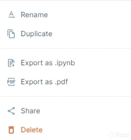
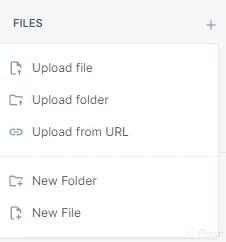
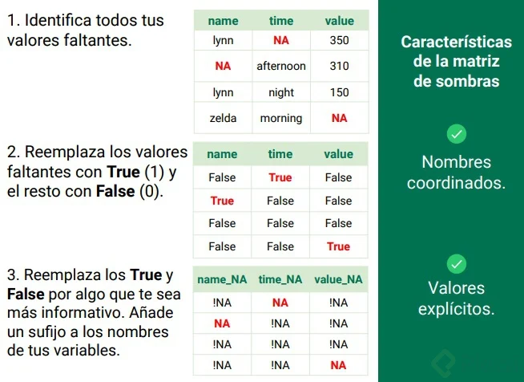
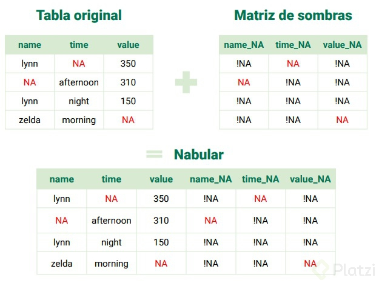

# Curso de Manejo de Datos Faltantes Detección y Exploración

## Operaciones con valores faltantes

En el manejo de datos, es común encontrarse con valores faltantes (o `NaN` en Pandas y NumPy). Estos valores pueden causar problemas en los análisis si no se manejan adecuadamente. A continuación, te muestro algunas operaciones comunes para trabajar con valores faltantes utilizando **Pandas**.

### 1. **Detectar valores faltantes**

Para identificar los valores faltantes en un `DataFrame` o `Series`, se pueden usar los métodos `isnull()` o `isna()`, que devuelven un DataFrame de booleanos.

```python
import pandas as pd

df = pd.DataFrame({
    'A': [1, 2, None, 4],
    'B': [None, 2, 3, 4],
    'C': [1, None, None, 4]
})

# Detectar valores faltantes
df.isnull()
```

Salida:
```plaintext
       A      B      C
0  False   True  False
1  False  False   True
2   True  False   True
3  False  False  False
```

### 2. **Contar valores faltantes**

Puedes contar cuántos valores faltantes hay en cada columna utilizando `isnull().sum()`.

```python
# Contar valores faltantes por columna
df.isnull().sum()
```

Salida:
```plaintext
A    1
B    1
C    2
dtype: int64
```

### 3. **Eliminar valores faltantes**

Para eliminar filas o columnas con valores faltantes, se utiliza `dropna()`.

- **Eliminar filas con valores faltantes**:
  ```python
  df_sin_nan = df.dropna()
  ```

  Esto eliminará cualquier fila que contenga al menos un valor faltante.

- **Eliminar columnas con valores faltantes**:
  ```python
  df_sin_nan_columnas = df.dropna(axis=1)
  ```

  Esto eliminará cualquier columna que tenga al menos un valor faltante.

### 4. **Rellenar valores faltantes**

En lugar de eliminar los valores faltantes, puedes optar por rellenarlos con algún valor. Esto se puede hacer con el método `fillna()`.

- **Rellenar con un valor constante**:
  
  ```python
  df_relleno = df.fillna(0)
  ```

  Aquí, todos los valores `NaN` se reemplazan por `0`.

- **Rellenar con la media, mediana o moda**:
  
  - Media:
    ```python
    df['A'] = df['A'].fillna(df['A'].mean())
    ```
  
  - Mediana:
    ```python
    df['B'] = df['B'].fillna(df['B'].median())
    ```
  
  - Moda:
    ```python
    df['C'] = df['C'].fillna(df['C'].mode()[0])
    ```

- **Rellenar con el valor anterior o siguiente (forward fill / backward fill)**:
  
  - Rellenar con el valor anterior:
    ```python
    df_forward_fill = df.fillna(method='ffill')
    ```
  
  - Rellenar con el valor siguiente:
    ```python
    df_backward_fill = df.fillna(method='bfill')
    ```

### 5. **Interpolar valores faltantes**

Para valores numéricos, puedes usar la interpolación para estimar los valores faltantes basándote en los valores vecinos.

```python
# Interpolación lineal
df_interpolado = df.interpolate()
```

### 6. **Reemplazar valores específicos**

Si deseas reemplazar un valor específico (como `None`, `NaN`, o un número), puedes usar el método `replace()`.

```python
df_reemplazo = df.replace({None: 0})
```

### 7. **Verificar si hay valores faltantes**

Para saber si hay algún valor faltante en el `DataFrame`, puedes usar `isnull().values.any()`.

```python
# Verificar si hay valores faltantes
df.isnull().values.any()
```

### Ejemplo completo:

```python
import pandas as pd

# Crear un DataFrame con valores faltantes
df = pd.DataFrame({
    'A': [1, 2, None, 4],
    'B': [None, 2, 3, 4],
    'C': [1, None, None, 4]
})

# Detectar valores faltantes
print("Valores faltantes:")
print(df.isnull())

# Contar valores faltantes por columna
print("\nConteo de valores faltantes:")
print(df.isnull().sum())

# Eliminar filas con valores faltantes
print("\nDataFrame sin filas con valores faltantes:")
print(df.dropna())

# Rellenar valores faltantes con un valor constante
print("\nRellenar valores faltantes con 0:")
print(df.fillna(0))

# Rellenar con la media de la columna
print("\nRellenar la columna 'A' con la media:")
df['A'] = df['A'].fillna(df['A'].mean())
print(df)

# Interpolación para rellenar valores faltantes
print("\nInterpolación de valores faltantes:")
print(df.interpolate())
```

### Conclusión

Pandas ofrece herramientas muy flexibles para detectar, eliminar, rellenar, y reemplazar valores faltantes en tus datos. Dependiendo del análisis que quieras realizar, podrás elegir la mejor técnica para manejar estos valores.

**Lecturas recomendadas**

[Deepnote](https://deepnote.com/workspace/platzi-escuela-datos-83832097-f136-43ff-b38d-abaa022e8ec7/project/datos-faltantes-694a3d08-7f18-421d-9e2f-c2820a79680e "Deepnote")

## Conociendo datasets para manejo de datos faltantes

```python
https://nrvis.com/data/mldata/pima-indians-diabetes.csv

names=[
        "pregnancies",
        "glucose",
        "blood_pressure",
        "skin_thickness",
        "insulin",
        "bmi",
        "diabetes_pedigree_function",
        "age",
        "outcome",
    ]
```

Para practicar y aprender cómo manejar datos faltantes, puedes utilizar algunos conjuntos de datos (datasets) populares que tienen valores faltantes de manera intencional o realista. Estos datasets se utilizan frecuentemente para entrenar habilidades de preprocesamiento en ciencia de datos.

### 1. **Titanic (Kaggle)**
El famoso conjunto de datos del Titanic incluye información sobre los pasajeros del barco, con características como el nombre, edad, sexo, clase, y si sobrevivieron o no. Algunos campos, como la edad y el puerto de embarque, tienen valores faltantes.

- **Descarga**: [Titanic Dataset - Kaggle](https://www.kaggle.com/c/titanic)
  
  - **Valores faltantes**: `Age`, `Cabin`, `Embarked`.

  ```python
  import pandas as pd
  titanic = pd.read_csv('titanic.csv')
  print(titanic.isnull().sum())
  ```

### 2. **Housing Prices (Kaggle)**
Este dataset proviene de una competencia de Kaggle sobre predicción de precios de viviendas. Contiene información sobre características de las casas, como el tamaño, el número de habitaciones, el año de construcción, entre otros, y tiene valores faltantes en varias columnas.

- **Descarga**: [House Prices - Kaggle](https://www.kaggle.com/c/house-prices-advanced-regression-techniques)

  - **Valores faltantes**: `LotFrontage`, `GarageType`, `GarageYrBlt`, etc.

  ```python
  housing = pd.read_csv('house_prices.csv')
  print(housing.isnull().sum())
  ```

### 3. **Air Quality (UCI Machine Learning Repository)**
Este dataset contiene información sobre la calidad del aire en Milán, Italia, y tiene muchos valores faltantes debido a fallas en los dispositivos de monitoreo. Se utiliza comúnmente para trabajar con interpolación de datos faltantes y análisis de series temporales.

- **Descarga**: [Air Quality Dataset - UCI](https://archive.ics.uci.edu/ml/datasets/Air+quality)

  - **Valores faltantes**: Muchos valores faltantes debido a errores en la captura de datos.

  ```python
  air_quality = pd.read_csv('AirQualityUCI.csv', sep=';')
  print(air_quality.isnull().sum())
  ```

### 4. **Diabetes Dataset (Pima Indians)**
Este dataset contiene información sobre pacientes con antecedentes de diabetes y varias características médicas, como el nivel de glucosa en sangre y la presión arterial. Algunos valores son claramente incorrectos o están ausentes, por lo que se utiliza para preprocesar datos médicos.

- **Descarga**: [Diabetes Dataset - Kaggle](https://www.kaggle.com/uciml/pima-indians-diabetes-database)

  - **Valores faltantes**: Algunos valores de glucosa, presión arterial y otros son 0, lo cual es un valor incorrecto y representa valores faltantes.

  ```python
  diabetes = pd.read_csv('diabetes.csv')
  diabetes.replace(0, np.nan, inplace=True)
  print(diabetes.isnull().sum())
  ```

### 5. **World Happiness Report**
Este conjunto de datos contiene indicadores de felicidad mundial, medidos por varios factores como el PIB per cápita, la esperanza de vida, el apoyo social y la percepción de corrupción. Algunos de estos indicadores pueden estar faltantes en algunos países.

- **Descarga**: [World Happiness Report - Kaggle](https://www.kaggle.com/unsdsn/world-happiness)

  - **Valores faltantes**: Algunos datos para países están ausentes en columnas como `Social Support`, `Generosity`, etc.

  ```python
  happiness = pd.read_csv('world_happiness.csv')
  print(happiness.isnull().sum())
  ```

### 6. **Medical Cost Personal Dataset**
Este conjunto de datos contiene información sobre los costos médicos personales según varios factores como la edad, el sexo, el IMC, el número de hijos, el hábito de fumar y la región. Algunos de estos campos pueden contener valores faltantes o no válidos.

- **Descarga**: [Medical Cost Personal Dataset - Kaggle](https://www.kaggle.com/mirichoi0218/insurance)

  - **Valores faltantes**: Aunque originalmente no tiene valores faltantes, se puede modificar para introducir valores `NaN` para prácticas de manejo de datos faltantes.

  ```python
  medical = pd.read_csv('insurance.csv')
  medical['bmi'] = medical['bmi'].mask(medical['bmi'] < 18)
  print(medical.isnull().sum())
  ```

### 7. **Adult Dataset (Income Prediction)**
Este dataset contiene información sobre los ingresos de adultos, junto con detalles como edad, ocupación, estado civil, etc. Tiene varios valores faltantes en categorías como la ocupación y el área de trabajo.

- **Descarga**: [Adult Dataset - UCI Machine Learning Repository](https://archive.ics.uci.edu/ml/datasets/adult)

  - **Valores faltantes**: `Workclass`, `Occupation`, `Native-country`.

  ```python
  adult = pd.read_csv('adult.data', header=None)
  print(adult.isnull().sum())
  ```

---

### Técnicas para Manejar Datos Faltantes

Con estos datasets, puedes aplicar técnicas de manejo de valores faltantes como:

- **Eliminar filas o columnas con `dropna()`**.
- **Rellenar con un valor como `fillna()`**.
- **Interpolar valores faltantes usando `interpolate()`**.
- **Reemplazar valores faltantes con medidas estadísticas (media, mediana, moda)**.
  
Estas prácticas te ayudarán a gestionar correctamente los valores faltantes en tus proyectos de análisis de datos.

**Lecturas recomendadas**

[Deepnote](https://deepnote.com/workspace/platzi-escuela-datos-83832097-f136-43ff-b38d-abaa022e8ec7/project/datos-faltantes-694a3d08-7f18-421d-9e2f-c2820a79680e "Deepnote")

[GitHub - njtierney/naniar: Tidy data structures, summaries, and visualisations for missing data](https://github.com/njtierney/naniar "GitHub - njtierney/naniar: Tidy data structures, summaries, and visualisations for missing data")

[Getting Started with naniar](https://cran.r-project.org/web/packages/naniar/vignettes/getting-started-w-naniar.html "Getting Started with naniar")

[Pima Indians Diabetes Database | Kaggle](https://www.kaggle.com/datasets/uciml/pima-indians-diabetes-database "Pima Indians Diabetes Database | Kaggle")

## Correr una notebook dentro de otra en Deepnote

¡Hola! Te doy la bienvenida a este pequeño tutorial para conocer cómo ejecutar las funciones de una Jupyter Notebook dentro de otra en **Deepnote**.

Por una actualización de Deepnote notarás que ahora **las Notebooks están separadas de los archivos (Files)**.


Por esta actualización tendrás que subir la notebook al sistema de archivos de Deepnote, para poder ejecutarla dentro de otra notebook utilizando la magia %run.


Tendrás que hacer lo anterior en tu proyecto de Deepnote del curso, ya que utilizaremos una notebook llamada pandas-missing-extension.ipynb dentro de nuestra notebook principal para utilizar métodos predefinidos en ella. Por ahora, no te preocupes por el contenido de esa notebook, en la siguiente clase hablaremos de ello. 🤗

Sigue estos pasos para **subir tu notebook como archivo (File)** a Deepnote:

1. Ve a la sección de **NOTEBOOKS** del proyecto de Deepnote.


2. Da clic en los tres puntos sobre la notebook `pandas-missing-extension` y da clic sobre Export as .ipynb. Esto descargará la notebook a tu computadora.



3. Después da clic en en el signo de + en la sección **FILES** y sube la notebook **pandas-missing-extension.ipynb** que descargaste en el paso anterior en la opción `Upload File`.



4. Repite los pasos 1-3 cada vez que desees subir la notebook `pandas-missing-extension.ipynb` a la sección **FILES**. dentro de tu proyecto en Deepnote.

5. Para terminar, ejecuta la siguiente línea dentro de la notebook `exploration-missing-values` o `live-exploration-missing-values` para cargar las funciones de la notebbok `pandas-missing-extension.ipynb` y poder utilizarlas.


¡Nos vemos en la próxima clase! Conoceremos cómo funciona la notebook donde extendemos Pandas para manejar valores faltantes!

## Extendiendo la API de Pandas

Extender la API de **Pandas** es útil cuando deseas agregar funcionalidades personalizadas o simplificar tareas recurrentes que no están directamente soportadas por la biblioteca. A continuación, se presentan diversas formas de extender la API de Pandas.

### 1. **Métodos personalizados con `@pd.api.extensions.register_dataframe_accessor`**

Puedes crear **accesores** personalizados que te permiten extender la funcionalidad de un DataFrame o Series. Esto se hace decorando clases con `@pd.api.extensions.register_dataframe_accessor`.

#### Ejemplo:

```python
import pandas as pd

# Crear un accesor personalizado
@pd.api.extensions.register_dataframe_accessor("analytics")
class AnalyticsAccessor:
    def __init__(self, pandas_obj):
        self._obj = pandas_obj

    # Método personalizado para obtener estadísticas resumidas
    def summary(self):
        return {
            "mean": self._obj.mean(),
            "median": self._obj.median(),
            "max": self._obj.max(),
            "min": self._obj.min(),
        }

# Uso del accesor
df = pd.DataFrame({
    'A': [10, 20, 30],
    'B': [1, 2, 3],
    'C': [4, 5, 6]
})

print(df.analytics.summary())
```

#### Explicación:
- Se crea un accesor llamado `analytics` que puedes utilizar directamente sobre el DataFrame.
- El método `summary()` devuelve estadísticas clave como media, mediana, máximo y mínimo.

### 2. **Agregando métodos a objetos existentes (monkey patching)**

Puedes agregar métodos directamente al DataFrame o Series utilizando **monkey patching**, aunque no es recomendable para proyectos a gran escala debido a posibles problemas de compatibilidad y mantenibilidad.

#### Ejemplo:

```python
import pandas as pd

def highlight_max(df):
    return df.style.apply(lambda x: ['background: yellow' if v == x.max() else '' for v in x], axis=1)

# Agregar método personalizado
pd.DataFrame.highlight_max = highlight_max

# Crear un DataFrame
df = pd.DataFrame({
    'A': [10, 20, 30],
    'B': [1, 50, 3],
    'C': [4, 5, 6]
})

# Usar el nuevo método
df.highlight_max()
```

#### Explicación:
- Se añade el método `highlight_max()` al objeto DataFrame.
- Este método resalta en amarillo los valores máximos en cada fila del DataFrame.

### 3. **Crear una clase heredada de DataFrame**

Una forma más estructurada de extender Pandas es creando clases que hereden de `pd.DataFrame` para agregar funcionalidad adicional.

#### Ejemplo:

```python
import pandas as pd

class MyDataFrame(pd.DataFrame):
    @property
    def _constructor(self):
        return MyDataFrame

    # Método personalizado para normalizar los datos
    def normalize(self):
        return (self - self.mean()) / self.std()

# Crear un DataFrame personalizado
df = MyDataFrame({
    'A': [10, 20, 30],
    'B': [1, 50, 3],
    'C': [4, 5, 6]
})

# Usar el nuevo método
print(df.normalize())
```

#### Explicación:
- Se hereda de `pd.DataFrame` para crear una nueva clase `MyDataFrame`.
- Se añade un método `normalize()` para normalizar los valores de las columnas.
- Al sobrescribir `_constructor`, se asegura que los métodos devuelvan objetos de la misma clase.

### 4. **Funciones UDF para operaciones en DataFrame**

Las **funciones definidas por el usuario (UDF)** te permiten aplicar operaciones personalizadas sobre filas o columnas de un DataFrame.

#### Ejemplo:

```python
import pandas as pd

df = pd.DataFrame({
    'A': [10, 20, 30],
    'B': [1, 50, 3],
    'C': [4, 5, 6]
})

# Función personalizada
def custom_function(row):
    return row['A'] + row['B'] + row['C']

# Aplicar la función personalizada a cada fila
df['Sum'] = df.apply(custom_function, axis=1)

print(df)
```

#### Explicación:
- Se define una función personalizada `custom_function()` que suma los valores de las columnas `A`, `B` y `C`.
- Se aplica la función a cada fila usando `apply()`.

### 5. **Métodos personalizados con `pipe()`**

El método `pipe()` permite aplicar funciones personalizadas a DataFrames, lo que puede ser útil cuando se encadenan múltiples operaciones.

#### Ejemplo:

```python
import pandas as pd

# Crear un DataFrame
df = pd.DataFrame({
    'A': [10, 20, 30],
    'B': [1, 50, 3],
    'C': [4, 5, 6]
})

# Función personalizada
def add_columns(df, col1, col2):
    df['Sum'] = df[col1] + df[col2]
    return df

# Aplicar la función usando pipe
df = df.pipe(add_columns, 'A', 'B')

print(df)
```

#### Explicación:
- `pipe()` permite encadenar la función `add_columns()` al DataFrame, lo que facilita la legibilidad del código.

### 6. **Extender el comportamiento de las Series**

Similar a los DataFrames, también puedes extender las Series usando `@pd.api.extensions.register_series_accessor`.

#### Ejemplo:

```python
@pd.api.extensions.register_series_accessor("stats")
class StatsAccessor:
    def __init__(self, pandas_obj):
        self._obj = pandas_obj

    def range(self):
        return self._obj.max() - self._obj.min()

# Crear una Serie
s = pd.Series([1, 2, 3, 4, 5])

# Usar el accesor personalizado
print(s.stats.range())  # Salida: 4
```

### Resumen

1. **Accesores personalizados** (`@pd.api.extensions.register_dataframe_accessor`): Añadir métodos especializados a DataFrames y Series.
2. **Monkey patching**: Modificar objetos de Pandas directamente (aunque no siempre recomendado).
3. **Herencia de clases**: Crear clases personalizadas a partir de DataFrames o Series.
4. **Funciones UDF**: Aplicar funciones definidas por el usuario.
5. **Encadenamiento con `pipe()`**: Facilita la lectura y escritura de código con operaciones encadenadas.

Estas técnicas te permiten hacer que Pandas sea aún más flexible y personalizado según las necesidades de tus proyectos.

## Tabulación de valores faltantes

La **tabulación de valores faltantes** en un conjunto de datos es una práctica esencial en el preprocesamiento para la limpieza y preparación de los datos. En **Pandas**, podemos realizar esta tabulación para obtener un resumen claro de cuántos valores faltantes tiene cada columna, lo que nos permite entender mejor la calidad de los datos y tomar decisiones informadas sobre su manejo.

### 1. **Tabulación básica de valores faltantes**

Pandas ofrece el método `isnull()` que genera un DataFrame de booleanos (True si el valor es nulo y False en caso contrario), y `sum()` para contar el número de valores nulos por columna.

#### Ejemplo:

```python
import pandas as pd

# Crear un DataFrame con algunos valores faltantes
data = {
    'Nombre': ['Ana', 'Luis', None, 'Carlos', 'Pedro'],
    'Edad': [29, None, 22, None, 35],
    'Ciudad': ['Madrid', 'Barcelona', None, 'Sevilla', 'Valencia']
}

df = pd.DataFrame(data)

# Contar los valores faltantes por columna
faltantes = df.isnull().sum()

print(f"Valores faltantes por columna:\n{faltantes}")
```

#### Salida:

```
Valores faltantes por columna:
Nombre    1
Edad      2
Ciudad    1
dtype: int64
```

En este ejemplo, la columna `Edad` tiene 2 valores faltantes, mientras que las columnas `Nombre` y `Ciudad` tienen 1 valor faltante cada una.

### 2. **Tabulación de valores faltantes en porcentaje**

También es útil obtener el porcentaje de valores faltantes por columna para tener una idea de la magnitud de los datos faltantes.

#### Ejemplo:

```python
# Porcentaje de valores faltantes por columna
porcentaje_faltantes = df.isnull().mean() * 100

print(f"Porcentaje de valores faltantes por columna:\n{porcentaje_faltantes}")
```

#### Salida:

```
Porcentaje de valores faltantes por columna:
Nombre    20.0
Edad      40.0
Ciudad    20.0
dtype: float64
```

### 3. **Tabulación de valores faltantes por fila**

Si deseas tabular los valores faltantes por cada fila, puedes utilizar el mismo enfoque pero con el parámetro `axis=1` en la función `sum()`.

#### Ejemplo:

```python
# Contar los valores faltantes por fila
faltantes_filas = df.isnull().sum(axis=1)

print(f"Valores faltantes por fila:\n{faltantes_filas}")
```

#### Salida:

```
Valores faltantes por fila:
0    0
1    1
2    2
3    1
4    0
dtype: int64
```

Esto muestra cuántos valores faltan en cada fila del DataFrame.

### 4. **Visualización de valores faltantes**

La librería **seaborn** tiene una función `heatmap()` que permite visualizar los valores faltantes de forma gráfica.

#### Ejemplo:

```python
import seaborn as sns
import matplotlib.pyplot as plt

# Crear un mapa de calor de los valores faltantes
sns.heatmap(df.isnull(), cbar=False, cmap='viridis')
plt.title("Valores Faltantes")
plt.show()
```

Esto genera un gráfico de calor donde los valores nulos aparecen en un color distinto, facilitando la identificación de patrones en los datos faltantes.

### 5. **Resumen de valores faltantes en múltiples datasets**

Si tienes varios DataFrames y deseas obtener un resumen de los valores faltantes en todos ellos, puedes escribir una función que procese cada uno y devuelva un resumen.

#### Ejemplo:

```python
# Supongamos que tenemos varios DataFrames
df1 = df
df2 = pd.DataFrame({
    'Producto': ['A', 'B', None, 'C', 'D'],
    'Precio': [100, None, 150, 200, 250],
    'Stock': [None, 50, 60, None, 30]
})

datasets = {'df1': df1, 'df2': df2}

# Función para obtener el resumen de valores faltantes
def resumen_valores_faltantes(datasets):
    for name, dataset in datasets.items():
        print(f"Dataset: {name}")
        print(dataset.isnull().sum(), "\n")

# Llamar la función
resumen_valores_faltantes(datasets)
```

#### Salida:

```
Dataset: df1
Nombre    1
Edad      2
Ciudad    1
dtype: int64 

Dataset: df2
Producto    1
Precio      1
Stock       2
dtype: int64 
```

### Conclusión

La tabulación de valores faltantes es un paso crucial para evaluar la integridad de los datos. En **Pandas**, puedes hacerlo fácilmente utilizando métodos como `isnull()` y `sum()` para obtener conteos o porcentajes de valores faltantes por columna o fila, y con herramientas de visualización como **seaborn**, puedes obtener un análisis más visual de los datos incompletos. Esto te permitirá decidir si debes rellenar, eliminar o imputar estos valores antes de realizar análisis adicionales.

El error que estás viendo (`ModuleNotFoundError: No module named 'nbformat'`) se debe a que te falta el módulo `nbformat`, que es necesario para ejecutar notebooks desde otro notebook utilizando la magia `%run`.

Para resolverlo, simplemente instala el paquete `nbformat` usando pip:

### Solución:

1. Abre una celda en tu Jupyter Notebook o tu terminal y ejecuta el siguiente comando:

   ```bash
   pip install nbformat
   ```

2. Luego, intenta de nuevo ejecutar el notebook con el comando `%run`:

   ```python
   %run pandas-missing-extension.ipynb
   ```

Eso debería solucionar el problema y permitirte ejecutar el notebook correctamente.

## Visualización de valores faltantes

Para visualizar los valores faltantes en un DataFrame de Pandas, hay varias formas efectivas, y puedes aprovechar bibliotecas de visualización como `matplotlib`, `seaborn`, o incluso herramientas específicas como `missingno`. A continuación, te mostraré algunas de las formas más comunes.

### 1. Usar `missingno` para visualizar los valores faltantes

La biblioteca `missingno` es una excelente opción para visualizar los valores faltantes de manera rápida y efectiva.

#### Instalación:
Si no tienes instalada la biblioteca `missingno`, puedes instalarla con pip:

```bash
pip install missingno
```

#### Ejemplo de uso:
Una vez instalada, puedes usarla para visualizar los valores faltantes en tu DataFrame.

```python
import missingno as msno
import matplotlib.pyplot as plt

# Supongamos que riskfactors_df es tu DataFrame
msno.matrix(riskfactors_df)
plt.show()

# También puedes utilizar un heatmap de correlación de valores faltantes
msno.heatmap(riskfactors_df)
plt.show()
```

- **`msno.matrix()`**: Muestra una vista visual de los valores faltantes y no faltantes en el DataFrame.
- **`msno.heatmap()`**: Visualiza las correlaciones de valores faltantes entre las columnas del DataFrame.

### 2. Usar un `heatmap` con Seaborn para visualizar valores faltantes

Puedes crear un heatmap usando `seaborn` para representar los valores faltantes.

#### Instalación:
Si no tienes instalada `seaborn`, instálala con pip:

```bash
pip install seaborn
```

#### Ejemplo de uso:

```python
import seaborn as sns
import matplotlib.pyplot as plt

# Crear un mapa de calor donde se visualicen los valores faltantes
plt.figure(figsize=(10,6))
sns.heatmap(riskfactors_df.isnull(), cbar=False, cmap='viridis')
plt.title("Mapa de calor de valores faltantes")
plt.show()
```

Este heatmap marcará con un color los valores que son nulos (True) y con otro color los que no lo son (False).

### 3. Usar un gráfico de barras con Matplotlib

Puedes visualizar los valores faltantes de cada columna usando un gráfico de barras.

```python
import pandas as pd
import matplotlib.pyplot as plt

# Contar los valores faltantes por columna
missing_values = riskfactors_df.isnull().sum()

# Filtrar las columnas con valores faltantes
missing_values = missing_values[missing_values > 0]

# Crear gráfico de barras
missing_values.plot(kind='bar', figsize=(10,6))
plt.title("Valores faltantes por columna")
plt.xlabel("Columnas")
plt.ylabel("Número de valores faltantes")
plt.show()
```

Este gráfico de barras te mostrará cuántos valores faltantes tienes en cada columna.

### 4. Mostrar la distribución de valores faltantes con un conteo

Si prefieres simplemente contar los valores faltantes sin visualización gráfica:

```python
# Contar los valores faltantes en cada columna
missing_summary = riskfactors_df.isnull().sum()
print(missing_summary)
```

Estas son algunas de las formas más útiles para identificar y visualizar los valores faltantes en tus datos. Dependiendo de la naturaleza de tu proyecto, puedes optar por una u otra, o combinarlas para obtener una visión más clara de los datos faltantes.

## Codificación de valores faltantes

La codificación de valores faltantes en un conjunto de datos es una parte importante del preprocesamiento de datos antes de realizar análisis o entrenar modelos. Hay varias estrategias para manejar los valores faltantes dependiendo del contexto y de los datos en cuestión. A continuación te explico algunas técnicas comunes usando `pandas` para la codificación y manejo de valores faltantes.

### 1. **Eliminar los valores faltantes**
   - Si los valores faltantes son pocos, puedes eliminarlos de forma segura sin perder información relevante.

   ```python
   import pandas as pd

   # Cargar un DataFrame de ejemplo
   df = pd.DataFrame({
       'Producto': ['A', 'B', 'C', 'D', 'E'],
       'Precio': [100, 200, None, 150, None]
   })

   # Eliminar filas con valores faltantes
   df_clean = df.dropna()

   print(df_clean)
   ```

### 2. **Rellenar valores faltantes con un valor específico (imputación simple)**
   - Puedes rellenar los valores faltantes con un valor como la media, mediana, moda o un número fijo.

   ```python
   # Rellenar valores faltantes con la media de la columna 'Precio'
   df['Precio'] = df['Precio'].fillna(df['Precio'].mean())

   print(df)
   ```

   - **Rellenar con un valor fijo**:

   ```python
   # Rellenar valores faltantes con 0
   df['Precio'] = df['Precio'].fillna(0)
   ```

### 3. **Interpolación de valores faltantes**
   - La interpolación estima valores faltantes utilizando el patrón de los datos adyacentes.

   ```python
   # Rellenar valores faltantes usando interpolación
   df['Precio'] = df['Precio'].interpolate()

   print(df)
   ```

### 4. **Codificación de valores faltantes con un marcador**
   - A veces, en lugar de imputar, es útil codificar los valores faltantes con un marcador (ej. 'Desconocido' o 'Sin datos').

   ```python
   # Rellenar valores faltantes con una cadena 'Desconocido'
   df['Producto'] = df['Producto'].fillna('Desconocido')

   print(df)
   ```

### 5. **Codificación con etiquetas binarias**
   - Puedes crear una columna binaria adicional que marque si un valor estaba o no ausente en una columna original.

   ```python
   # Crear una columna binaria que indica si el valor estaba ausente
   df['Faltante_Precio'] = df['Precio'].isnull().astype(int)

   print(df)
   ```

### 6. **Imputación con técnicas avanzadas (KNN, Regresión, etc.)**
   - Herramientas más avanzadas como **K-Nearest Neighbors (KNN)** o regresión pueden ser utilizadas para imputar valores faltantes basados en otras variables. Para esto, puedes usar bibliotecas como `sklearn`.

   ```python
   from sklearn.impute import KNNImputer

   # Ejemplo de imputación usando KNN
   imputer = KNNImputer(n_neighbors=2)
   df[['Precio']] = imputer.fit_transform(df[['Precio']])

   print(df)
   ```

### Conclusión:
El enfoque más adecuado para manejar los valores faltantes depende del contexto del problema, la cantidad de datos faltantes, y la naturaleza de los datos. Puedes combinar varias estrategias según tus necesidades para asegurar que los valores faltantes no afecten negativamente el análisis o modelo.

Si quieres ejemplos más específicos de cómo aplicar estas técnicas a tus datos, ¡házmelo saber!

## Conversión de valores faltantes implícitos en explícitos

La **conversión de valores faltantes implícitos en explícitos** es una técnica para transformar valores "ocultos" o "implícitos" que pueden representar la falta de datos en un formato claro y explícito dentro de un DataFrame. Los valores faltantes implícitos son aquellos que no se encuentran explícitamente como `NaN` pero representan una ausencia o falta de datos por otras razones, como valores de cero, valores negativos, cadenas vacías, o un valor especial.

### Ejemplos comunes de valores faltantes implícitos:
- **Cadenas vacías** (`''`)
- **Valores de 0** en contextos donde el 0 no tiene un significado válido.
- **Valores negativos** que representan datos faltantes.
- **Códigos especiales** como `-1` o `9999` para indicar que no hay datos.

### Proceso para convertir valores faltantes implícitos en explícitos (`NaN`):

#### 1. **Convertir cadenas vacías o específicas en NaN:**
   Si tienes cadenas vacías o un valor especial que representa datos faltantes, puedes convertirlos en `NaN`.

   ```python
   import pandas as pd
   import numpy as np

   # Crear un DataFrame con valores faltantes implícitos
   df = pd.DataFrame({
       'Producto': ['A', '', 'C', 'D', ''],
       'Precio': [100, 0, -1, 150, 200]
   })

   # Convertir cadenas vacías ('') en NaN
   df['Producto'] = df['Producto'].replace('', np.nan)

   print(df)
   ```

   Salida:
   ```
   Producto  Precio
   0        A     100
   1      NaN       0
   2        C      -1
   3        D     150
   4      NaN     200
   ```

#### 2. **Convertir valores numéricos especiales en NaN:**
   A veces, ciertos valores numéricos (como 0 o -1) pueden representar valores faltantes implícitos en tu conjunto de datos.

   ```python
   # Convertir valores especiales (0 y -1) en NaN
   df['Precio'] = df['Precio'].replace([0, -1], np.nan)

   print(df)
   ```

   Salida:
   ```
   Producto  Precio
   0        A   100.0
   1      NaN     NaN
   2        C     NaN
   3        D   150.0
   4      NaN   200.0
   ```

#### 3. **Utilizar condiciones para identificar valores faltantes implícitos:**
   En algunos casos, necesitarás aplicar condiciones para definir cuándo un valor debe considerarse faltante.

   ```python
   # Suponer que los valores menores a 0 son valores faltantes implícitos
   df['Precio'] = df['Precio'].apply(lambda x: np.nan if x < 0 else x)

   print(df)
   ```

#### 4. **Uso de `replace()` para convertir múltiples valores en NaN:**
   La función `replace()` también permite reemplazar varios valores que consideres implícitamente faltantes con `NaN`.

   ```python
   # Reemplazar valores de -1 y 0 en la columna 'Precio' con NaN
   df['Precio'] = df['Precio'].replace([-1, 0], np.nan)

   print(df)
   ```

#### 5. **Uso de `mask()` para crear condiciones complejas:**
   La función `mask()` permite definir condiciones lógicas más avanzadas para identificar valores faltantes.

   ```python
   # Reemplazar valores mayores a 100 con NaN (ejemplo condicional)
   df['Precio'] = df['Precio'].mask(df['Precio'] > 100)

   print(df)
   ```

### Resumen:
La conversión de valores faltantes implícitos en explícitos permite mejorar la calidad de los datos y facilita el análisis. Hacer explícitos los valores faltantes con `NaN` facilita el uso de las herramientas de Pandas para manejar valores nulos, como `fillna()`, `dropna()`, o cualquier técnica de imputación o filtrado.

Si tienes un caso más específico, ¡puedo ayudarte con una solución detallada!

## Exponer filas faltantes implícitas en explícitas

**Exponer filas faltantes implícitas en explícitas** se refiere a identificar y hacer explícitas las filas que, aunque no tengan valores `NaN` visibles, están incompletas o contienen información que representa datos faltantes de forma implícita. Este tipo de situación ocurre cuando ciertos valores tienen un significado especial que indica una ausencia de datos, o cuando una combinación de valores sugiere que faltan datos.

### Proceso para exponer filas faltantes implícitas en explícitas:

1. **Identificación de filas faltantes implícitas:**
   Las filas que contienen valores implícitos faltantes suelen tener valores como `0`, `-1`, o cadenas vacías (`''`). Estas filas pueden necesitar ser convertidas en explícitas.

2. **Uso de `mask()` o `apply()` para detectar condiciones implícitas:**
   Si sabes qué condiciones representan datos faltantes, puedes usar estas funciones para transformar los datos y hacer los valores explícitos (`NaN`).

3. **Crear nuevas filas o marcar datos incompletos con `NaN`:**
   Utilizando `mask()`, `apply()`, o `replace()` para convertir esas filas implícitas en explícitas, reemplazando valores o filas enteras con `NaN`.

### Ejemplo práctico:

Supongamos que tienes un DataFrame donde los valores faltantes están representados de forma implícita, como valores `0` o `-1` en la columna de precios o productos vacíos.

```python
import pandas as pd
import numpy as np

# Ejemplo de DataFrame con valores faltantes implícitos
data = {'Producto': ['A', 'B', 'C', 'D', 'E'],
        'Cantidad': [10, 0, 5, -1, 8],
        'Precio': [100, 0, -1, 150, 0]}

df = pd.DataFrame(data)
print("DataFrame original:")
print(df)

# Definir condiciones implícitas para filas faltantes
# Suponemos que 'Cantidad' o 'Precio' con 0 o -1 representan valores faltantes
df_masked = df.mask((df['Cantidad'] <= 0) | (df['Precio'] <= 0))

print("\nDataFrame con filas faltantes explícitas:")
print(df_masked)
```

### Salida esperada:
```
DataFrame original:
  Producto  Cantidad  Precio
0        A        10     100
1        B         0       0
2        C         5      -1
3        D        -1     150
4        E         8       0

DataFrame con filas faltantes explícitas:
  Producto  Cantidad  Precio
0        A      10.0   100.0
1        B       NaN     NaN
2        C       5.0     NaN
3        D       NaN   150.0
4        E       8.0     NaN
```

### Explicación:
1. **Identificación de valores implícitos:** Hemos definido que los valores `0` o `-1` en las columnas `Cantidad` y `Precio` son faltantes de forma implícita.
2. **Uso de `mask()`:** La función `mask()` aplica la condición y reemplaza los valores que cumplen con `NaN`.
3. **Exposición explícita:** Ahora, los valores que estaban implícitamente faltantes (como `0` o `-1`) se muestran como `NaN`, haciendo evidente qué datos están faltando.

### Resumen de técnicas para identificar y exponer filas faltantes implícitas:
- **`mask()`**: Para identificar y reemplazar valores que cumplen con una condición específica.
- **`apply()`**: Para aplicar una función personalizada fila por fila para determinar si una fila es faltante de forma implícita.
- **`replace()`**: Para reemplazar valores específicos en el DataFrame.
- **`isnull()` y `notnull()`**: Para comprobar si los datos contienen valores explícitamente faltantes.

Este proceso facilita el análisis posterior y asegura que las técnicas para manejar datos faltantes se apliquen correctamente.

## Tipos de valores faltantes

Los valores faltantes en el análisis de datos pueden ser de varios tipos, cada uno con sus características y formas de manejo. Aquí te detallo los tipos más comunes y cómo suelen aparecer en los datos:

### Tipos de Valores Faltantes

1. **Valores Nulos (`NaN`)**
   - **Descripción**: En Pandas y muchos otros entornos de análisis de datos, `NaN` (Not a Number) es el valor estándar para representar datos faltantes.
   - **Ejemplo**: `NaN` en una columna de un DataFrame.
   - **Manejo**: Se puede usar `fillna()`, `dropna()`, o `isna()` para manejar estos valores.

   ```python
   import pandas as pd
   import numpy as np

   df = pd.DataFrame({'A': [1, 2, np.nan, 4]})
   print(df)
   ```

2. **Cadenas Vacías**
   - **Descripción**: En algunas bases de datos, las celdas vacías se representan como cadenas vacías (`''`).
   - **Ejemplo**: `''` en una columna de texto.
   - **Manejo**: Se puede reemplazar con `NaN` usando `replace()`.

   ```python
   df = pd.DataFrame({'B': ['foo', '', 'bar', '']})
   df['B'].replace('', np.nan, inplace=True)
   print(df)
   ```

3. **Valores Especiales**
   - **Descripción**: Algunos datasets utilizan valores específicos (como `-999`, `0`, `9999`, `N/A`) para indicar datos faltantes.
   - **Ejemplo**: `-999` en una columna de datos numéricos.
   - **Manejo**: Se puede reemplazar con `NaN` utilizando `replace()`.

   ```python
   df = pd.DataFrame({'C': [100, -999, 200, -999]})
   df['C'].replace(-999, np.nan, inplace=True)
   print(df)
   ```

4. **Valores Negativos o No Válidos**
   - **Descripción**: Valores que no son lógicamente válidos en el contexto (por ejemplo, edades negativas).
   - **Ejemplo**: `-1` en una columna de edades.
   - **Manejo**: Se puede reemplazar con `NaN` si no son válidos en el contexto.

   ```python
   df = pd.DataFrame({'D': [25, -1, 30, -1]})
   df['D'].replace(-1, np.nan, inplace=True)
   print(df)
   ```

5. **Valores de Texto Representativos**
   - **Descripción**: Valores de texto como `'N/A'`, `'Unknown'`, `'Not Available'` para indicar la falta de datos.
   - **Ejemplo**: `'N/A'` en una columna de texto.
   - **Manejo**: Se puede reemplazar con `NaN`.

   ```python
   df = pd.DataFrame({'E': ['value', 'N/A', 'value2', 'N/A']})
   df['E'].replace('N/A', np.nan, inplace=True)
   print(df)
   ```

### Cómo Identificar y Manejar Valores Faltantes

- **Identificación de valores faltantes**: 
  Usa funciones como `isna()`, `isnull()`, y `notna()` para identificar valores faltantes.

  ```python
  df.isna()
  df.isnull()
  ```

- **Manejo de valores faltantes**:
  - **Eliminar filas o columnas**: Usa `dropna()`.
  - **Rellenar valores faltantes**: Usa `fillna()` para reemplazar `NaN` con un valor específico, media, mediana, o interpolar.
  - **Reemplazo de valores implícitos**: Usa `replace()` para convertir valores como `-999` en `NaN`.

  ```python
  # Rellenar con un valor específico
  df.fillna(0, inplace=True)
  
  # Eliminar filas con NaN
  df.dropna(inplace=True)
  ```

### Resumen
Los valores faltantes pueden presentarse de diferentes maneras y deben ser tratados de acuerdo con su representación y el contexto del análisis. Convertirlos a un formato explícito (`NaN`) es crucial para un manejo efectivo y la realización de análisis estadísticos y de datos.

¿Necesitas más detalles o ejemplos sobre alguno de estos tipos de valores faltantes?

**Los valores faltantes** 🧩

Los valores faltantes son como piezas que faltan en un rompecabezas. Hay tres formas en que pueden faltar estas piezas:

**Perdidos completamente al azar (MCAR)**

Es cuando las piezas que faltan no tienen ninguna relación con las demás piezas. Es como si alguien hubiera sacado piezas al azar sin importar cuáles fueran.

**Perdidos al azar(MAR)**

Es cuando las piezas que faltan están relacionadas con otras piezas del rompecabezas. Por ejemplo, si el rompecabezas está hecho de diferentes colores, las piezas que faltan podrían ser de un solo color.

**Perdidos no al azar (MNAR)**

Es cuando las piezas que faltan están relacionadas con algún patrón o característica específica del rompecabezas. Por ejemplo, si el rompecabezas es de una imagen de un gato, las piezas que faltan podrían ser todas las piezas del cuerpo del gato.

## MCAR, MAR, MNAR en Python

MCAR (Missing Completely at Random), MAR (Missing at Random), y MNAR (Missing Not at Random) son tres tipos de mecanismos de datos faltantes que afectan cómo se pueden manejar y analizar los datos faltantes. Aquí te explico cada uno y cómo puedes identificarlos o tratarlos en Python.

### Tipos de Datos Faltantes

1. **MCAR (Missing Completely at Random)**
   - **Descripción**: Los datos faltantes son completamente aleatorios y no están relacionados con ninguna variable observada o no observada. Esto significa que la falta de datos no sigue ningún patrón y es independiente de los valores de las otras variables.
   - **Ejemplo**: Una encuesta donde algunas personas olvidaron responder a una pregunta por azar.

2. **MAR (Missing at Random)**
   - **Descripción**: Los datos faltantes están relacionados con otras variables observadas en el conjunto de datos, pero no con los valores faltantes mismos. Por ejemplo, una pregunta en una encuesta puede ser respondida menos frecuentemente por personas con ciertos perfiles, pero si sabemos el perfil de las personas, podemos hacer inferencias sobre los valores faltantes.
   - **Ejemplo**: Las personas con ingresos más bajos son menos propensas a reportar sus ingresos, pero el ingreso de una persona en particular no influye en la probabilidad de que ese dato esté ausente.

3. **MNAR (Missing Not at Random)**
   - **Descripción**: Los datos faltantes están relacionados con el valor que falta. En otras palabras, el mecanismo de falta de datos está relacionado con el valor faltante en sí. Esto puede hacer que el análisis y la imputación sean más complejos.
   - **Ejemplo**: Las personas que tienen ingresos muy altos podrían ser menos propensas a reportar su ingreso porque no quieren compartir información sobre sus altos ingresos.

### Cómo Manejar y Detectar Estos Tipos en Python

#### 1. **Identificación y Diagnóstico**

Para identificar el tipo de datos faltantes, es necesario realizar un análisis más detallado. A continuación, te muestro algunas técnicas y herramientas que puedes usar:

- **Visualización**: Utiliza gráficos para identificar patrones en los datos faltantes.
- **Análisis Estadístico**: Analiza la relación entre los datos faltantes y otras variables.

**Ejemplo en Python usando `missingno` y `seaborn`:**

```python
import pandas as pd
import numpy as np
import missingno as msno
import seaborn as sns
import matplotlib.pyplot as plt

# Crear un DataFrame con datos faltantes
data = {'A': [1, 2, np.nan, 4, np.nan],
        'B': [5, np.nan, 7, np.nan, 10],
        'C': [1, 2, 3, 4, 5]}

df = pd.DataFrame(data)

# Visualización de datos faltantes
msno.matrix(df)
plt.show()

# Análisis de correlación entre datos faltantes
sns.heatmap(df.isnull().corr(), annot=True)
plt.show()
```

#### 2. **Tratamiento**

El tratamiento de los datos faltantes depende del mecanismo y del tipo de datos faltantes. Algunas técnicas comunes incluyen:

- **Imputación**: Rellenar los valores faltantes con valores medios, medianos, moda, o usar técnicas avanzadas como la imputación múltiple.
- **Eliminación**: Eliminar las filas o columnas con datos faltantes si la proporción es pequeña.
- **Modelado**: Usar modelos que pueden manejar datos faltantes, como modelos de imputación basada en modelos (e.g., KNN, regresión).

**Ejemplo de imputación con la media:**

```python
from sklearn.impute import SimpleImputer

# Imputar con la media
imputer = SimpleImputer(strategy='mean')
df_imputed = pd.DataFrame(imputer.fit_transform(df), columns=df.columns)
print(df_imputed)
```

**Ejemplo de eliminación de filas con datos faltantes:**

```python
# Eliminar filas con datos faltantes
df_dropped = df.dropna()
print(df_dropped)
```

**Ejemplo de imputación múltiple usando `IterativeImputer`:**

```python
from sklearn.experimental import enable_iterative_imputer
from sklearn.impute import IterativeImputer

# Imputación múltiple
imputer = IterativeImputer()
df_imputed = pd.DataFrame(imputer.fit_transform(df), columns=df.columns)
print(df_imputed)
```

### Resumen

- **MCAR**: Los datos faltantes son aleatorios y no dependen de otras variables. Se puede manejar con métodos estándar de imputación.
- **MAR**: Los datos faltantes dependen de otras variables observadas. La imputación puede ser más complicada y podría necesitar técnicas basadas en modelos.
- **MNAR**: Los datos faltantes están relacionados con el valor faltante mismo. El manejo puede ser más complejo y podría necesitar técnicas avanzadas o ajustes específicos del contexto.

La identificación precisa del tipo de datos faltantes es crucial para seleccionar el método de manejo adecuado y asegurar que los resultados del análisis sean válidos. ¿Necesitas más información o ejemplos sobre alguno de estos métodos?

## Matriz de sombras: shadow matrix

La **matriz de sombras** (o **shadow matrix**) es un concepto utilizado en el análisis de datos y estadísticas para representar la presencia o ausencia de datos en un conjunto de datos. Este tipo de matriz ayuda a visualizar y analizar los patrones de datos faltantes, facilitando el entendimiento de cómo y por qué los datos faltan.

### Concepto de Matriz de Sombras

La matriz de sombras es una representación binaria del conjunto de datos original donde:

- **1** (o cualquier valor positivo) indica la presencia de un valor en esa posición del conjunto de datos original.
- **0** (o cualquier valor negativo) indica la ausencia de un valor en esa posición.

### Uso y Beneficios

1. **Visualización de Datos Faltantes**:
   - La matriz de sombras facilita la visualización de patrones en los datos faltantes. Puedes ver claramente qué filas o columnas tienen más datos faltantes y si hay patrones específicos.

2. **Análisis de Patrones de Datos Faltantes**:
   - Ayuda a identificar si los datos faltantes están distribuidos aleatoriamente o si siguen algún patrón específico.

3. **Preprocesamiento**:
   - La matriz de sombras se utiliza en técnicas de imputación para entender cómo los datos faltantes están relacionados con otras variables y para mejorar los métodos de imputación.

### Ejemplo en Python

A continuación, te muestro cómo puedes crear y visualizar una matriz de sombras utilizando Python y la biblioteca `pandas`.

```python
import pandas as pd
import numpy as np
import matplotlib.pyplot as plt
import seaborn as sns

# Crear un DataFrame con datos faltantes
data = {'A': [1, 2, np.nan, 4, np.nan],
        'B': [5, np.nan, 7, np.nan, 10],
        'C': [1, 2, 3, 4, 5]}

df = pd.DataFrame(data)

# Crear la matriz de sombras
shadow_matrix = df.notna().astype(int)

# Visualizar la matriz de sombras
plt.figure(figsize=(8, 6))
sns.heatmap(shadow_matrix, cbar=False, cmap='binary', annot=True)
plt.title('Matriz de Sombras (Shadow Matrix)')
plt.show()
```

### Desglose del Código

1. **Crear el DataFrame**: Se crea un DataFrame con algunos valores faltantes (`NaN`).
2. **Crear la Matriz de Sombras**:
   - `df.notna()` devuelve un DataFrame booleano donde `True` indica la presencia de datos (no es `NaN`).
   - `astype(int)` convierte los valores booleanos en enteros (`1` para `True` y `0` para `False`).
3. **Visualizar con `seaborn` y `matplotlib`**: Se usa `sns.heatmap()` para visualizar la matriz de sombras como un mapa de calor binario.

### Interpretación

- **Valores en 1**: Indican que hay datos presentes en esa celda.
- **Valores en 0**: Indican que faltan datos en esa celda.

Este enfoque permite una visualización clara de los patrones de datos faltantes, ayudando en la toma de decisiones sobre el manejo de datos faltantes.

**Como crear una matriz de sombra**



**Resultados de la creacion de la Matriz de Sombra**



## Visualización de valores faltantes en una variable

La visualización de valores faltantes en una variable es una técnica útil para identificar qué parte de los datos está incompleta y cómo afecta el análisis. Puedes usar bibliotecas como `seaborn`, `matplotlib` o `missingno` en Python para crear gráficos que muestren los valores faltantes.

### Ejemplo 1: Gráfico de Barras con `seaborn`

Puedes visualizar los valores faltantes en una variable mediante un gráfico de barras que muestre la proporción de valores faltantes y no faltantes.

```python
import pandas as pd
import seaborn as sns
import matplotlib.pyplot as plt

# Crear un DataFrame de ejemplo
data = {'Variable': [1, 2, None, 4, None, 6, 7, None, 9, 10]}
df = pd.DataFrame(data)

# Crear una columna booleana para indicar si hay valores faltantes
df['Missing'] = df['Variable'].isnull()

# Visualización con seaborn
sns.countplot(x='Missing', data=df, palette='viridis')
plt.title('Valores Faltantes en la Variable')
plt.xlabel('Valores Faltantes')
plt.ylabel('Conteo')
plt.xticks([0, 1], ['No Faltante', 'Faltante'])
plt.show()
```

### Ejemplo 2: Usar `missingno` para Visualizar Valores Faltantes

La biblioteca `missingno` es excelente para visualizar los valores faltantes en un conjunto de datos con gráficos fáciles de interpretar.

```python
import pandas as pd
import missingno as msno

# Crear un DataFrame de ejemplo con valores faltantes
data = {'Variable1': [1, 2, None, 4, 5],
        'Variable2': [5, None, 7, None, 9],
        'Variable3': [None, 2, 3, 4, None]}
df = pd.DataFrame(data)

# Visualización de un gráfico de valores faltantes con missingno
msno.bar(df)
plt.show()
```

### Ejemplo 3: Mapa de Calor para Ver la Distribución de Valores Faltantes

Otra forma es crear un **mapa de calor** para ver los valores faltantes en todo el conjunto de datos y visualizar dónde se encuentran esos valores faltantes.

```python
import seaborn as sns
import matplotlib.pyplot as plt

# Crear un DataFrame con algunos valores faltantes
data = {'Variable1': [1, 2, None, 4, 5],
        'Variable2': [None, None, 7, 8, 9],
        'Variable3': [1, None, 3, None, 5]}
df = pd.DataFrame(data)

# Visualización de valores faltantes en un mapa de calor
plt.figure(figsize=(8, 6))
sns.heatmap(df.isnull(), cbar=False, cmap='viridis')
plt.title('Mapa de Calor de Valores Faltantes')
plt.show()
```

### Descripción de los Ejemplos:

1. **Gráfico de Barras con `seaborn`**: Muestra un conteo de los valores faltantes y no faltantes en una variable específica.
2. **Gráfico de Barras con `missingno`**: Presenta un resumen visual de los valores faltantes en todas las variables de un DataFrame.
3. **Mapa de Calor**: Ofrece una visualización general de los valores faltantes en forma de mapa de calor, mostrando dónde se encuentran esos valores en las columnas.

Estas técnicas son útiles para diagnosticar la cantidad y distribución de valores faltantes en los datos antes de realizar un análisis o imputación.

## Visualización de valores faltantes en dos variables

Para visualizar los valores faltantes en dos variables de un conjunto de datos, puedes usar varias técnicas que permiten comparar la relación entre las dos variables y cómo los valores faltantes están distribuidos entre ellas. A continuación te muestro algunas técnicas comunes para visualizar esta información.

### 1. Gráfico de Dispersión con Colores que Indiquen los Valores Faltantes

Puedes crear un gráfico de dispersión para comparar dos variables, usando colores diferentes para mostrar si alguno de los puntos tiene valores faltantes en alguna de las variables.

```python
import pandas as pd
import seaborn as sns
import matplotlib.pyplot as plt

# Crear un DataFrame de ejemplo con valores faltantes
data = {'Variable1': [1, 2, None, 4, 5, 6, 7, None, 9, 10],
        'Variable2': [5, None, 7, None, 9, 10, None, 12, 13, 14]}
df = pd.DataFrame(data)

# Crear una nueva columna que identifique si hay valores faltantes en alguna de las dos variables
df['Missing'] = df.isnull().any(axis=1)

# Visualizar con un gráfico de dispersión
plt.figure(figsize=(8, 6))
sns.scatterplot(x='Variable1', y='Variable2', hue='Missing', data=df, palette='coolwarm')
plt.title('Valores Faltantes en Dos Variables')
plt.show()
```

### 2. Gráfico de Mapa de Calor para Mostrar Correlación de Faltantes

Otra técnica es un mapa de calor que indica la correlación de valores faltantes entre dos o más variables, permitiendo ver si los valores faltantes en una variable coinciden con los faltantes en otra.

```python
import seaborn as sns
import matplotlib.pyplot as plt
import pandas as pd

# Crear un DataFrame de ejemplo con valores faltantes
data = {'Variable1': [1, None, 3, 4, 5, None, 7, 8, 9, None],
        'Variable2': [None, 2, 3, None, 5, 6, None, 8, None, 10]}
df = pd.DataFrame(data)

# Visualización de valores faltantes con un mapa de calor
plt.figure(figsize=(6, 4))
sns.heatmap(df.isnull(), cmap='coolwarm', cbar=False, yticklabels=False)
plt.title('Mapa de Calor de Valores Faltantes en Dos Variables')
plt.show()
```

### 3. Gráfico de Barras Apiladas

Otra opción es usar un gráfico de barras apiladas para visualizar la proporción de valores faltantes en dos variables. Esto permite ver claramente qué porcentaje de los datos está presente o ausente.

```python
import pandas as pd
import seaborn as sns
import matplotlib.pyplot as plt

# Crear un DataFrame de ejemplo con valores faltantes
data = {'Variable1': [1, 2, None, 4, 5, None, 7, 8, 9, 10],
        'Variable2': [None, 2, 3, None, 5, None, 7, 8, None, 10]}
df = pd.DataFrame(data)

# Contar valores faltantes y no faltantes
missing_counts = df.isnull().sum()
present_counts = len(df) - missing_counts

# Crear DataFrame para el gráfico
bar_df = pd.DataFrame({'Missing': missing_counts, 'Present': present_counts})

# Gráfico de barras apiladas
bar_df.T.plot(kind='bar', stacked=True, color=['red', 'green'])
plt.title('Valores Faltantes en Dos Variables')
plt.xlabel('Variables')
plt.ylabel('Conteo')
plt.show()
```

### Descripción:

1. **Gráfico de Dispersión**: Permite ver la relación entre dos variables, con los puntos coloreados según si tienen o no valores faltantes.
2. **Mapa de Calor**: Muestra de manera visual qué celdas del DataFrame tienen valores faltantes, utilizando colores.
3. **Gráfico de Barras Apiladas**: Da una vista general de cuántos valores faltantes y presentes hay para cada variable.

Estas visualizaciones ayudan a entender mejor cómo se distribuyen los valores faltantes entre las dos variables, lo que es crucial antes de aplicar técnicas de imputación o limpieza.

## Scatterplot con valores faltantes

Para crear un **scatterplot** (gráfico de dispersión) que visualice los valores faltantes en un conjunto de datos, puedes aprovechar la capacidad de **Seaborn** o **Matplotlib** para resaltar los puntos con valores faltantes. Puedes usar diferentes colores o símbolos para mostrar si los puntos tienen valores faltantes o no.

Aquí tienes un ejemplo usando Seaborn para crear un gráfico de dispersión que destaque los valores faltantes:

### Ejemplo de Scatterplot con Valores Faltantes

```python
import pandas as pd
import seaborn as sns
import matplotlib.pyplot as plt

# Crear un DataFrame de ejemplo con algunos valores faltantes
data = {'Variable1': [1, 2, None, 4, 5, 6, None, 8, 9, 10],
        'Variable2': [5, None, 7, 8, 9, 10, None, 12, 13, 14]}
df = pd.DataFrame(data)

# Crear una nueva columna que indique si hay valores faltantes en alguna de las variables
df['missing'] = df.isnull().any(axis=1)

# Visualización con un scatterplot, donde los puntos faltantes se destacan por el color
plt.figure(figsize=(8, 6))
sns.scatterplot(x='Variable1', y='Variable2', hue='missing', style='missing', data=df, palette='coolwarm', s=100)
plt.title('Scatterplot con Valores Faltantes Destacados')
plt.xlabel('Variable 1')
plt.ylabel('Variable 2')
plt.show()
```

### Explicación:

- **`hue='missing'`**: Colorea los puntos basados en si tienen valores faltantes o no.
- **`style='missing'`**: Cambia el estilo del marcador para diferenciar visualmente los valores faltantes (puedes usar formas diferentes para los puntos que tienen valores faltantes).
- **`palette='coolwarm'`**: Proporciona una paleta de colores para diferenciar claramente los puntos que tienen o no valores faltantes.
- **`s=100`**: Ajusta el tamaño de los puntos para que sean más visibles.

### Variaciones:

Si quieres agregar etiquetas adicionales o cambiar el estilo del gráfico, puedes usar las opciones de **Seaborn** y **Matplotlib** para personalizar colores, tamaños de puntos o títulos.

Este scatterplot te ayudará a visualizar cómo los valores faltantes afectan la relación entre dos variables.

## Correlación de nulidad

La **correlación de nulidad** te permite evaluar si la ausencia de datos en una columna está relacionada con la ausencia de datos en otra columna. Esta técnica es útil para detectar patrones en los valores faltantes.

En Python, puedes calcular la correlación de nulidad utilizando la **matriz de nulidad** de un DataFrame. La función `isnull()` genera una matriz booleana que puedes usar para calcular correlaciones entre las columnas.

### Ejemplo de Correlación de Nulidad:

```python
import pandas as pd
import seaborn as sns
import matplotlib.pyplot as plt

# Crear un DataFrame de ejemplo con algunos valores faltantes
data = {'Variable1': [1, 2, None, 4, 5, 6, None, 8, 9, 10],
        'Variable2': [5, None, 7, 8, 9, 10, None, 12, 13, 14],
        'Variable3': [None, 1, 2, None, 4, None, 6, 7, 8, 9]}
df = pd.DataFrame(data)

# Crear la matriz de nulidad (True para valores nulos)
nullity_matrix = df.isnull()

# Calcular la correlación de nulidad
nullity_corr = nullity_matrix.corr()

# Visualizar la correlación de nulidad con un heatmap
plt.figure(figsize=(8, 6))
sns.heatmap(nullity_corr, annot=True, cmap='coolwarm')
plt.title('Correlación de Nulidad entre Variables')
plt.show()
```

### Explicación:
1. **`isnull()`**: Crea una matriz donde `True` representa valores faltantes.
2. **`corr()`**: Calcula la correlación entre las columnas en términos de la presencia o ausencia de valores nulos. Un valor cercano a 1 indica que las columnas tienden a tener valores nulos al mismo tiempo; un valor cercano a 0 sugiere que no hay correlación.
3. **`heatmap()`**: Visualiza la matriz de correlación de nulidad.

### Interpretación:
- Si la correlación de nulidad es alta (cercana a 1), significa que cuando una columna tiene valores faltantes, es probable que la otra también los tenga.
- Si la correlación es baja o cercana a 0, significa que la ausencia de datos en una columna no está relacionada con la otra.

## Eliminación de valores faltantes: pairwise y listwise

La eliminación de valores faltantes es una técnica común para manejar datos incompletos. Las dos principales estrategias son **eliminación por pares (pairwise deletion)** y **eliminación por lista (listwise deletion)**.

### 1. **Eliminación por Lista (Listwise Deletion)**
En este método, se eliminan las filas que contienen algún valor faltante en cualquiera de las variables involucradas en el análisis. Este enfoque es simple pero puede resultar en la pérdida de mucha información si hay muchos valores faltantes.

#### Ejemplo en Pandas:

```python
import pandas as pd

# Crear un DataFrame de ejemplo con algunos valores faltantes
data = {'Variable1': [1, 2, None, 4, 5],
        'Variable2': [5, None, 7, 8, 9],
        'Variable3': [None, 1, 2, None, 4]}
df = pd.DataFrame(data)

# Eliminación por lista: se eliminan filas que contengan algún valor nulo
df_listwise = df.dropna()

print("DataFrame después de la eliminación por lista:")
print(df_listwise)
```

#### Ventajas:
- Fácil de implementar.
- Asegura que se utilicen solo datos completos.
  
#### Desventajas:
- Puede llevar a la eliminación de muchas filas si hay muchas variables con valores faltantes.
  
---

### 2. **Eliminación por Pares (Pairwise Deletion)**
En la eliminación por pares, se realiza un análisis variable por variable, eliminando solo las filas donde la variable involucrada tenga valores faltantes. Esto permite que se utilicen la mayor cantidad posible de datos, aunque algunas comparaciones se hacen con menos datos que otras.

Este enfoque es útil para calcular correlaciones o regresiones entre pares de variables, ya que solo se eliminan los valores faltantes en las variables involucradas en el análisis particular.

#### Ejemplo de correlación usando eliminación por pares:

```python
# Calcular correlación por pares (omitimos valores faltantes sólo para el par de columnas analizado)
pairwise_corr = df.corr(method='pearson', min_periods=1)

print("Correlación por pares:")
print(pairwise_corr)
```

#### Ventajas:
- Se utiliza la mayor cantidad posible de datos.
- Es útil cuando se tiene una gran cantidad de valores faltantes y no se quiere perder información.

#### Desventajas:
- Los resultados pueden no ser consistentes entre análisis de diferentes variables, ya que se usan subconjuntos distintos de datos.

---

### Comparación entre Listwise y Pairwise:
- **Listwise deletion** es más estricto y consistente pero puede resultar en una pérdida significativa de datos.
- **Pairwise deletion** conserva más información, pero las comparaciones entre diferentes análisis pueden basarse en distintos subconjuntos de datos, lo que puede complicar la interpretación.

## Imputación básica de datos

La **imputación de datos** es una técnica para reemplazar valores faltantes en un conjunto de datos con valores estimados, evitando así la eliminación de información útil. Existen varias estrategias para la imputación, desde técnicas básicas hasta métodos más complejos. A continuación, exploraremos las técnicas básicas de imputación:

### 1. **Imputación con una constante (valor fijo)**
Una técnica sencilla consiste en reemplazar los valores faltantes por un valor constante, como `0`, una cadena vacía o un valor que tenga sentido para el contexto.

#### Ejemplo en Pandas:
```python
import pandas as pd

# Crear un DataFrame de ejemplo con valores faltantes
data = {'Variable1': [1, None, 3, None, 5],
        'Variable2': [None, 2, None, 4, None]}
df = pd.DataFrame(data)

# Imputar valores faltantes con un valor constante (por ejemplo, 0)
df_constant = df.fillna(0)

print("Imputación con un valor constante:")
print(df_constant)
```

### 2. **Imputación con la media**
Este método reemplaza los valores faltantes con la **media** de la variable. Es adecuado cuando los datos están distribuidos simétricamente, pero puede no ser ideal en presencia de valores atípicos.

#### Ejemplo en Pandas:
```python
# Imputar valores faltantes con la media de cada columna
df_mean = df.fillna(df.mean())

print("Imputación con la media:")
print(df_mean)
```

### 3. **Imputación con la mediana**
La **mediana** es una opción útil cuando los datos tienen una distribución asimétrica o contienen valores atípicos, ya que la mediana es menos sensible a estos.

#### Ejemplo en Pandas:
```python
# Imputar valores faltantes con la mediana de cada columna
df_median = df.fillna(df.median())

print("Imputación con la mediana:")
print(df_median)
```

### 4. **Imputación con la moda**
Para variables categóricas o discretas, es común imputar los valores faltantes con la **moda**, que es el valor más frecuente en la variable.

#### Ejemplo en Pandas:
```python
# Imputar valores faltantes con la moda de cada columna
df_mode = df.fillna(df.mode().iloc[0])

print("Imputación con la moda:")
print(df_mode)
```

### 5. **Imputación hacia adelante (Forward Fill)**
Este método, también conocido como **"forward fill"**, reemplaza los valores faltantes con el último valor válido previo.

#### Ejemplo en Pandas:
```python
# Imputación hacia adelante (forward fill)
df_ffill = df.fillna(method='ffill')

print("Imputación hacia adelante:")
print(df_ffill)
```

### 6. **Imputación hacia atrás (Backward Fill)**
El método **"backward fill"** rellena los valores faltantes utilizando el siguiente valor válido en la columna.

#### Ejemplo en Pandas:
```python
# Imputación hacia atrás (backward fill)
df_bfill = df.fillna(method='bfill')

print("Imputación hacia atrás:")
print(df_bfill)
```

---

### Comparación de Técnicas:

- **Constante:** Útil cuando un valor específico tiene sentido, pero puede distorsionar el análisis si no se selecciona correctamente.
- **Media/Mediana/Moda:** Conservan la tendencia central de los datos, pero no tienen en cuenta la varianza o estructura de los mismos.
- **Forward/Backward Fill:** Buenas para datos temporales o secuenciales, pero pueden no ser adecuadas si los valores cercanos no son representativos.

Estas técnicas básicas son útiles en muchas situaciones, pero si los datos faltantes son significativos o no están distribuidos al azar, puede ser necesario recurrir a métodos más avanzados como imputación múltiple o modelos predictivos.

## Bonus: visualización múltiple de imputaciones

La visualización de múltiples imputaciones te permite comparar cómo diferentes técnicas de imputación afectan los datos faltantes. Esto es útil para evaluar el impacto de las imputaciones y decidir cuál es la más adecuada para el análisis. A continuación, veremos cómo hacer esto utilizando **matplotlib**, **seaborn**, y varias técnicas de imputación en **pandas**.

### Pasos para visualizar múltiples imputaciones:

1. **Crear un conjunto de datos con valores faltantes.**
2. **Imputar los valores faltantes utilizando diferentes métodos.**
3. **Visualizar las imputaciones en gráficos para comparar los resultados.**

### Ejemplo en Python:

#### 1. Crear el conjunto de datos

```python
import pandas as pd
import numpy as np
import matplotlib.pyplot as plt
import seaborn as sns

# Crear un DataFrame de ejemplo con valores faltantes
np.random.seed(0)
data = {'Variable1': [1, np.nan, 3, np.nan, 5, 6, np.nan, 8, 9, 10],
        'Variable2': [7, 6, np.nan, 4, 3, 2, np.nan, 5, 6, np.nan]}
df = pd.DataFrame(data)

print("Datos originales con valores faltantes:")
print(df)
```

#### 2. Aplicar múltiples métodos de imputación

```python
# Imputación con la media
df_mean = df.copy()
df_mean['Variable1'] = df['Variable1'].fillna(df['Variable1'].mean())
df_mean['Variable2'] = df['Variable2'].fillna(df['Variable2'].mean())

# Imputación con la mediana
df_median = df.copy()
df_median['Variable1'] = df['Variable1'].fillna(df['Variable1'].median())
df_median['Variable2'] = df['Variable2'].fillna(df['Variable2'].median())

# Imputación hacia adelante (forward fill)
df_ffill = df.copy()
df_ffill.fillna(method='ffill', inplace=True)

# Imputación hacia atrás (backward fill)
df_bfill = df.copy()
df_bfill.fillna(method='bfill', inplace=True)
```

#### 3. Visualizar las imputaciones

Vamos a graficar cada imputación y compararlas.

```python
# Configurar las subplots
fig, axes = plt.subplots(2, 2, figsize=(12, 10))

# Datos originales
sns.scatterplot(ax=axes[0, 0], x=np.arange(len(df)), y=df['Variable1'], label='Variable1', color='blue')
sns.scatterplot(ax=axes[0, 0], x=np.arange(len(df)), y=df['Variable2'], label='Variable2', color='red')
axes[0, 0].set_title("Datos Originales")

# Imputación con la media
sns.scatterplot(ax=axes[0, 1], x=np.arange(len(df_mean)), y=df_mean['Variable1'], label='Variable1', color='blue')
sns.scatterplot(ax=axes[0, 1], x=np.arange(len(df_mean)), y=df_mean['Variable2'], label='Variable2', color='red')
axes[0, 1].set_title("Imputación con la Media")

# Imputación hacia adelante
sns.scatterplot(ax=axes[1, 0], x=np.arange(len(df_ffill)), y=df_ffill['Variable1'], label='Variable1', color='blue')
sns.scatterplot(ax=axes[1, 0], x=np.arange(len(df_ffill)), y=df_ffill['Variable2'], label='Variable2', color='red')
axes[1, 0].set_title("Imputación Hacia Adelante (Forward Fill)")

# Imputación hacia atrás
sns.scatterplot(ax=axes[1, 1], x=np.arange(len(df_bfill)), y=df_bfill['Variable1'], label='Variable1', color='blue')
sns.scatterplot(ax=axes[1, 1], x=np.arange(len(df_bfill)), y=df_bfill['Variable2'], label='Variable2', color='red')
axes[1, 1].set_title("Imputación Hacia Atrás (Backward Fill)")

plt.tight_layout()
plt.show()
```

### Explicación:
- **Subplot 1**: Muestra los datos originales con los valores faltantes.
- **Subplot 2**: Muestra los datos imputados con la **media**.
- **Subplot 3**: Visualiza los datos con imputación **forward fill**.
- **Subplot 4**: Presenta la imputación con **backward fill**.

Cada gráfico te permite comparar los métodos y cómo afectan los valores imputados. Esto te ayuda a evaluar cuál técnica es la más adecuada para tu análisis.