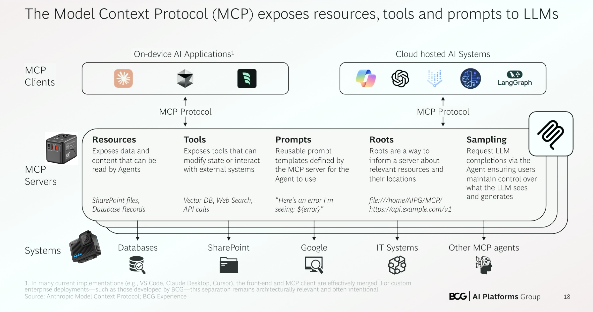

# Curso de N8N

## Automatización inteligente con N8N

## ¿Qué es n8n?

* **n8n** es una herramienta de automatización de flujos de trabajo (workflow automation) de código abierto.
* Permite conectar diferentes aplicaciones y servicios para automatizar tareas sin necesidad de programar mucho.
* Tiene una interfaz visual para diseñar flujos con nodos que representan acciones, triggers, y condiciones.

### ¿Qué es la automatización inteligente con n8n?

* Se refiere a la capacidad de crear flujos automatizados que no solo ejecutan tareas simples, sino que también pueden **tomar decisiones** basadas en datos.
* Por ejemplo, un flujo que:

  * Recibe un formulario web,
  * Valida la información,
  * Decide enviar un email o notificación solo si cierta condición se cumple,
  * Y guarda datos en una base de datos o sistema CRM automáticamente.

### Beneficios de usar n8n para automatización inteligente

* **Flexibilidad**: Puedes conectar más de 200 aplicaciones (Slack, Gmail, Trello, GitHub, bases de datos, etc.).
* **Control total**: Al ser open source, puedes desplegarlo en tu propio servidor o usar la nube.
* **Flujos condicionales**: Crear decisiones dentro del flujo con nodos condicionales.
* **Extensible**: Puedes escribir funciones personalizadas en JavaScript para lógica compleja.
* **Automatización sin código**: Ideal para usuarios no desarrolladores que quieren automatizar tareas.

### Ejemplo sencillo de flujo en n8n

1. **Trigger:** Cada vez que se recibe un correo con asunto "Soporte".
2. **Condición:** Si el correo contiene la palabra "urgente".
3. **Acción:** Crear un ticket en el sistema de soporte y enviar una notificación a Slack.
4. **Si no es urgente:** Solo crear el ticket sin notificación.

### Cómo empezar con n8n

* Puedes probarlo en [https://n8n.io](https://n8n.io) con la versión cloud.
* También puedes instalarlo localmente o en un servidor con Docker.
* La documentación oficial es muy completa para guiarte en la creación de flujos personalizados.

### Resumen

La automatización de procesos alcanza un nuevo nivel con N8N, una plataforma low-code que centraliza y simplifica la integración de Inteligencia Artificial. En sólo segundos, puedes validar información de formularios, recibir alertas instantáneas a través de Telegram, WhatsApp o Gmail y actualizar automáticamente los dashboards de rendimiento a la vista del equipo directivo.

#### ¿Qué tareas puedes automatizar con agentes IA en N8N?

Con esta plataforma puedes integrar fácilmente tus herramientas cotidianas como Google Sheets, Gmail y Telegram con aplicaciones especializadas como OpenAI y Pinecone. Algunos ejemplos prácticos incluyen:

- Bots que extraen texto de imágenes y lo registran en Google Sheets.
- Agentes RAG generando respuestas precisas desde bases de datos vectoriales.
- Agentes MCP procesando y organizando información desde múltiples canales.

#### ¿Cómo se ejecutan estos procesos sin escribir código?

La creación de flujos inteligentes en N8N se realiza mediante la conexión visual de nodos. De esta manera, facilita que usuarios con diferentes perfiles, desde makers, marketers, desarrolladores y emprendedores, puedan adoptar fácilmente la automatización sin necesidad de escribir código.

#### ¿Quién puede beneficiarse de automatizar procesos con N8N?

La versatilidad del sistema permite que distintos profesionales logren más con menos esfuerzo, optimizando diariamente la productividad en actividades cotidianas y especializadas. Es especialmente útil para:

- Profesionales de marketing buscando una mejor gestión y respuestas rápidas.
- Desarrolladores que quieren reducir tareas repetitivas.
- Emprendedores optimizando presupuestos y tiempos de ejecución.

¿Estás listo para comenzar tu primer flujo y explorar cómo la IA puede optimizar tu trabajo diario?

**Archivos de la clase**

[mi-primer-flujo-n8n-1.xlsx](https://static.platzi.com/media/public/uploads/mi-primer-flujo-n8n-1_e5c15db2-6bdc-4fc9-858c-5a5ecf26786c.xlsx)

**Lecturas recomendadas**

[Community edition features | n8n Docs](https://docs.n8n.io/hosting/community-edition-features/)

## Diferencias entre N8N Cloud y N8N Community

### 🟦 n8n Cloud

**Versión comercial alojada por el equipo de n8n.**

### ✅ Características:

* **Alojamiento gestionado** por n8n (no te preocupas por servidores, backups ni actualizaciones).
* **Alta disponibilidad** y escalabilidad automática.
* **Seguridad** empresarial (cifrado, acceso mediante SSO, backups automáticos).
* **Acceso prioritario** a nuevas funciones y soporte técnico.
* **Autenticación y control de acceso** (RBAC, usuarios y roles).
* **Planes de pago** (mensuales/anuales) según volumen de ejecución y usuarios.

### 🧠 Ideal para:

* Empresas y equipos que quieren evitar la gestión de infraestructura.
* Casos donde se requiere confiabilidad y soporte profesional.

### 🟩 n8n Community Edition (CE)

**Versión gratuita y de código abierto, autoalojada.**

### ✅ Características:

* **100% gratis y open source** (bajo licencia [Sustainable Use License](https://github.com/n8n-io/n8n/blob/master/LICENSE.md)).
* **Control total**: Tú lo instalas, lo ejecutas y lo mantienes.
* **Altamente personalizable**: Puedes modificar el código fuente.
* **Acceso completo a funciones principales** (triggers, nodos, lógica, etc.).

### 🛠️ Requiere:

* Gestión del servidor (Docker, VPS, NGINX, certificados, backups, etc.).
* Actualizaciones manuales y configuración propia de seguridad.

### 🧠 Ideal para:

* Desarrolladores, hackers y equipos técnicos que desean control total.
* Proyectos personales o startups con presupuesto limitado.

### 📊 Comparación rápida

| Característica                  | n8n Cloud             | n8n Community Edition (CE) |
| ------------------------------- | --------------------- | -------------------------- |
| Hosting                         | Gestionado por n8n    | Tú mismo (autoalojado)     |
| Precio                          | Pago mensual/anual    | Gratis                     |
| Escalabilidad                   | Automática            | Manual                     |
| Seguridad empresarial           | Sí                    | Configurable               |
| Personalización profunda        | Limitada              | Total (es open source)     |
| Requiere conocimientos técnicos | No                    | Sí                         |
| Soporte oficial                 | Incluido (según plan) | Comunidad (foros, GitHub)  |

### Resumen

N8n es una plataforma open source que facilita la automatización mediante dos opciones de despliegue: n8n Cloud y n8n Community. Cada modalidad presenta características específicas y factores relevantes al momento de seleccionar cuál conviene según tus necesidades y presupuesto.

#### ¿Qué ventajas ofrece n8n Cloud?

La licencia Enterprise n8n Cloud permite gestionar flujos de trabajo directamente desde la nube, simplificando considerablemente el proceso de configuración y mantenimiento. Sus principales ventajas son:

- Facturación sencilla por ejecución, independiente del número de nodos o datos procesados.
- Mayor control presupuestal, al facilitar la optimización de tareas dentro de cada ejecución.
- Experiencia más directa y simple, sin necesidad de infraestructura propia.

Además, n8n Cloud incluye una prueba gratuita de 14 días para conocer y evaluar la herramienta sin invertir en el inicio.

#### ¿En qué consiste n8n Community?

La licencia Community consiste en alojar personalmente la plataforma n8n, aprovechando servidores ya contratados o incluso implementándolo en el propio computador. Esta opción:

- No implica gastos adicionales en licencias, siendo completamente gratuita.
- Requiere más conocimientos técnicos para configuración y mantenimiento.
- Ofrece menos soporte en comparación con la versión Cloud.

Para disminuir la curva de aprendizaje con esta modalidad, se recomienda consultar detalladamente la documentación oficial disponible.

#### ¿Qué diferencias clave existen entre ambas versiones?

Al comparar n8n Cloud y n8n Community, las diferencias significativas giran en torno a:

- Costos: Cargo por ejecución en Cloud frente a gratuidad en Community.
- Complejidad técnica: Mayor simplicidad con Cloud, pero mayor flexibilidad y dificultad técnica con Community.
- Soporte técnico: Superior en modalidad Cloud respecto a la opción Community, que ofrece principalmente soporte comunitario e informativo.

Antes de elegir, considera cuidadosamente tu nivel técnico, infraestructura actual y necesidades de soporte para seleccionar la opción más efectiva para tus flujos de trabajo.

Si deseas ver funcionalidades específicas no disponibles en la licencia Community, consulta la sección de recursos para obtener un listado actualizado y completo.

**Lecturas recomendadas**

[Community edition features | n8n Docs](https://docs.n8n.io/hosting/community-edition-features/)

## N8N Selfhosted

**n8n Self-hosted** se refiere a la instalación de **n8n Community Edition (CE)** en tu propio servidor o infraestructura. Es ideal si buscas **control total**, **ahorro de costos** y **flexibilidad** para personalizar la herramienta según tus necesidades.

### 🚀 ¿Qué es n8n Self-hosted?

Es la versión gratuita y de código abierto de n8n que puedes instalar en:

* Tu computadora local (para pruebas)
* Un servidor privado (como VPS, EC2, DigitalOcean, etc.)
* Docker o Docker Compose
* Kubernetes (para producción a gran escala)

### ✅ Ventajas de n8n Self-hosted

* **Cero costos de licencias** (gratis).
* **Control total** sobre flujos, datos, privacidad y seguridad.
* **Personalización** avanzada (puedes editar código o crear nodos personalizados).
* **Integración local** con sistemas internos (ERP, bases de datos privadas, etc.).

### 🛠️ Requisitos previos

* Node.js ≥ 18 (si no usas Docker)
* Docker (recomendado)
* Base de datos opcional: SQLite (por defecto), Postgres, MySQL
* Conocimientos básicos de línea de comandos, red y configuración de servidores

### 🐳 Instalación rápida con Docker

La forma más simple y robusta es con Docker Compose:

### 1. Crea un archivo `docker-compose.yml`:

```yaml
version: '3.7'

services:
  n8n:
    image: n8nio/n8n
    restart: always
    ports:
      - 5678:5678
    environment:
      - N8N_BASIC_AUTH_ACTIVE=true
      - N8N_BASIC_AUTH_USER=admin
      - N8N_BASIC_AUTH_PASSWORD=tu_contraseña_segura
      - N8N_HOST=tu_dominio_o_ip
      - N8N_PORT=5678
      - WEBHOOK_URL=https://tu_dominio_o_ip/
    volumes:
      - ./n8n_data:/home/node/.n8n
```

### 2. Ejecuta:

```bash
docker-compose up -d
```

### 🌐 Accede a la interfaz

Abre tu navegador y ve a:

```
http://localhost:5678
```

O bien, el dominio que configuraste con HTTPS (si estás en producción).

### 🔐 Seguridad recomendada

* Usa HTTPS con Let's Encrypt o Cloudflare.
* Activa autenticación básica (`N8N_BASIC_AUTH_*`).
* Configura backups frecuentes del volumen de datos (`./n8n_data`).
* Usa variables de entorno para configurar límites y seguridad.

### 📦 Actualización de n8n

Simplemente:

```bash
docker-compose pull
docker-compose down
docker-compose up -d
```

### 🎯 ¿Quieres ayuda con un caso específico?

Puedo guiarte paso a paso para:

* Instalar n8n en tu servidor (con o sin Docker)
* Configurar un proxy con NGINX o Traefik
* Montar flujos para automatizar tareas comunes (emails, bases de datos, APIs, etc.)

### Resumen

¿Quieres utilizar n8n en su versión gratuita con una licencia Community? **Aquí aprenderás cómo instalar y configurar n8n en la plataforma Render.com utilizando Docker y Supabase**. Este método práctico te permitirá manejar n8n de forma gratuita en un entorno completamente configurado según tus necesidades.

#### ¿Qué pasos seguir para iniciar la instalación en Render?

Para comenzar la instalación:

- Ingresa a Render.com y selecciona la opción Get Started.
- Regístrate o accede a tu cuenta, preferiblemente usando Google para facilitar el proceso.
- Una vez en el panel principal, haz clic en Add New Web Service y escoge la opción Existing Image.
- Usa la imagen Docker específica para N8n solicitando la ruta docker.n8n.io.
- Define un nombre para el proyecto (por ejemplo, NHNA self-hosteado), y continúa configurando según las opciones predeterminadas en la ubicación (Oregon, EE.UU.) y elige el plan free con 512 de RAM y 1 CPU.

#### ¿Cómo configurar las variables de entorno para n8n en Render?

La configuración de variables es crucial para asegurar la comunicación entre la plataforma y servicios externos como bases de datos:

- Usa un archivo plantilla para cargar rápidamente las variables de entorno. Este archivo estará disponible en la sección Recursos de la clase.
- Modifica las variables según tu entorno específico, usando Supabase para manejar la base de datos Postgres.
- Presta especial atención a los valores que debes extraer desde Supabase:
- Host
- Puerto
- Password (define uno seguro)
- Esquema (usa “public”)
- Usuario (generalmente Postgres)
- Timezone (por ejemplo, Lima)
- Genera una clave de encriptación seleccionando “256 bits” mediante Random Caching para seguridad adicional.

Una vez configuradas todas estas variables, ejecuta el despliegue, que podría tardar entre 2 a 5 minutos aproximadamente.

#### ¿Qué hacer luego del despliegue de n8n en Render?

Después de completarse el despliegue, verifica que esté correctamente habilitada la variable `N8N Runners Enabled` para trabajos `Pipeline`:

- Dirígete al menú Environment de Render.
- Añade la clave mencionada y establece su valor en True.
- Guarda los cambios e inicia nuevamente el despliegue.

Finalmente, usa el enlace proporcionado por Render para acceder a tu instancia personalizada de n8n. Este enlace será el medio principal para gestionar tu herramienta y flujos de trabajo. Tendrás que completar algunos datos básicos iniciales que solicitará n8n, aunque estos no afectarán tu uso directamente.

Recuerda que existen ligeras diferencias al emplear la versión autogestionada (*self-hosted*) frente a la versión en la nube. Para aclarar cualquier duda siempre podrás revisar la documentación oficial o consultar en los comentarios.

**Archivos de la clase**

[n8nself.env](https://static.platzi.com/media/public/uploads/n8nself_fc0631e8-c7f3-47e6-9a1c-b38fabf46aa3.env)

**Lecturas recomendadas**

[n8nself.env - Google Drive](https://drive.google.com/file/d/1ko-sVsQruotUCoZ1BnvSET_3a6DwZUMK/view?usp=drive_link)

[Cloud Application Platform | Render](https://www.render.com/)

[Supabase | The Open Source Firebase Alternative](https://supabase.com/)

[RandomKeygen - The Secure Password & Keygen Generator](https://randomkeygen.com/)

## Creación de formularios y conexión con Google Sheets en N8N

Crear formularios y conectar sus respuestas con **Google Sheets en n8n** es una de las automatizaciones más populares y útiles. A continuación te explico **paso a paso** cómo hacerlo, usando una de estas dos estrategias:

### ✅ OPCIÓN 1: Usar un formulario externo (como Typeform, Google Forms o Tally) y conectarlo a Google Sheets con n8n

### 1. Crea el formulario (en una plataforma externa)

Puedes usar:

* [Google Forms](https://forms.google.com)
* [Tally.so](https://tally.so)
* [Typeform](https://typeform.com)
* [Jotform](https://jotform.com)

> Asegúrate de que tenga un webhook o integración para notificar a n8n cuando se envía una respuesta.

### 2. Crea un **Webhook** en n8n

* Añade un nodo `Webhook`.
* Método: `POST`
* Path: `/formulario`
* Guarda y copia la URL del webhook.
* Abre en navegador una vez para activar el endpoint.

### 3. Conecta tu formulario al webhook

En tu plataforma de formularios:

* Busca la opción de **Webhooks** o **Notificaciones HTTP**
* Usa la URL del webhook de n8n.
* Asegúrate de enviar los datos como JSON (la mayoría lo hace por defecto).

### 4. Añade un nodo `Google Sheets`

* Autentícate con tu cuenta de Google.
* Selecciona tu hoja de cálculo.
* Acción: `Append Sheet Row`
* Mapea los campos del formulario al archivo de Google Sheets.

### 5. Ejecuta el flujo y prueba

* Envía el formulario.
* Verifica que la hoja de cálculo se actualice correctamente.

### ✅ OPCIÓN 2: Crear un formulario HTML simple alojado por ti y enviar datos a un webhook de n8n

Puedes usar HTML y JavaScript para enviar los datos directamente:

### Ejemplo de formulario:

```html
<form id="myForm">
  <input type="text" name="nombre" placeholder="Tu nombre" required />
  <input type="email" name="email" placeholder="Tu correo" required />
  <button type="submit">Enviar</button>
</form>

<script>
document.getElementById('myForm').addEventListener('submit', async (e) => {
  e.preventDefault();
  const data = new FormData(e.target);
  const obj = Object.fromEntries(data.entries());

  await fetch("https://TU_INSTANCIA_N8N/webhook/formulario", {
    method: "POST",
    headers: { "Content-Type": "application/json" },
    body: JSON.stringify(obj)
  });

  alert("Formulario enviado");
});
</script>
```

Este formulario envía los datos directamente a n8n sin intermediarios.

### 📋 Requisitos para Google Sheets en n8n

1. **Credenciales OAuth2 de Google**: Puedes usar la integración directa o configurar tu propia app en Google Cloud.
2. Asegúrate de tener una hoja creada y accesible.
3. n8n debe tener permisos para leer/escribir en tu Google Drive.

### ¿Quieres que te genere una plantilla completa de flujo en n8n (JSON)?

Puedo hacerlo según la herramienta de formularios que elijas o ayudarte a desplegar el formulario HTML. Solo dime qué prefieres usar:

* Google Forms
* Tally.so
* HTML personalizado
* Otra opción

### Resumen

Optimiza tus procesos digitales creando flujos automatizados con N8N. Este contenido te guiará paso a paso para generar formularios y vincular fácilmente las respuestas con Google Sheets. Aprende a configurar correctamente cada elemento y simplifica tareas repetitivas.

#### ¿Cómo crear un flujo con formularios en N8N?

Lo primero es acceder a la interfaz y seleccionar Create Workflow en la esquina superior derecha. Al crear un nuevo flujo:

- Busca **N8N** y escoge el elemento **On New N8N Form Event**.
- Asigna un título al formulario, por ejemplo, **Form 1**.
- Agrega campos al formulario:
- **Nombre** (tipo texto).
- **E-mail** (tipo email).

Al dar clic en **test step**, el nodo estará listo mostrando claramente los inputs definidos.

#### ¿De qué forma se vinculan los datos recolectados a Google Sheets?

Luego de configurar el formulario, vincula la información recolectada al servicio de hojas de cálculo Google Sheets de la siguiente manera:

- Presiona en el botón **Más** e ingresa **Google Sheets**.
- Selecciona la opción **Append Row in a Sheet**, diseñada para ingresar registros nuevos de forma consecutiva.
- Autoriza la conexión mediante **Sign in with Google**, vinculando correctamente tu cuenta.
- Selecciona la hoja correspondiente, en este caso, **Forms**.
- Configura manualmente los campos usando **Map Each Column Manually**, relacionando **nombre** y **e-mail** con las filas pertinentes.

Aplica un testeo para confirmar la carga exitosa de datos en Google Sheets.

#### ¿Qué funcionalidades tiene la interfaz de N8N?

La interfaz, llamada Canvas, permite interactuar con los flujos desde diversas opciones:

- **Zoom in/out**: ajusta la visualización.
- **Overview**: resumen general de los flujos.
- **Credenciales**: gestión de cualquier herramienta integrada.
- **Templates**: plantillas disponibles para acelerar diseños.
- **Variables e Insights**: disponibles exclusivamente bajo licencia paga, permiten configuraciones avanzadas como variables de entorno y revisión de estadísticas de rendimiento.

Comparte tu experiencia o capturas del flujo desarrollado en la sección de comentarios.

## Configuración de bot de Telegram para registro automático de gastos

Crear un **bot de Telegram para registrar automáticamente gastos** con **n8n** es totalmente posible y muy útil para tu organización financiera. A continuación, te explico cómo configurarlo paso a paso:

### ✅ OBJETIVO

Usar un **bot de Telegram** para registrar mensajes con formato tipo:
`💸 Comida 25`
y que n8n los agregue automáticamente a un **Google Sheet** u otra base de datos (Airtable, Notion, PostgreSQL, etc.).

### 🔧 PASO 1: Crear un bot de Telegram

1. Abre Telegram y busca **@BotFather**.
2. Usa el comando `/newbot`.
3. Asigna un nombre y un username a tu bot.
4. BotFather te dará un **Token**, guárdalo.

### 🔧 PASO 2: Crear el flujo en n8n

### 1. Nodo `Telegram Trigger`

* Tipo: `Telegram Trigger`
* **Authentication**: agrega tu token de bot.
* Tipo de evento: `Message`

### 2. Nodo `Set` (opcional)

* Organiza o mapea datos como `chat_id`, `text`, `fecha`, etc.

### 3. Nodo `Function` (para extraer datos)

```javascript
const text = $json.message.text;
const parts = text.trim().split(' ');

// Ej: "💸 Comida 25"
return [{
  categoria: parts[1] || 'Sin categoría',
  valor: parseFloat(parts[2]) || 0,
  fecha: new Date().toISOString().split('T')[0], // solo la fecha
}];
```

### 4. Nodo `Google Sheets` (u otra base)

* Acción: `Append Sheet Row`
* Mapea los campos:

  * Fecha → `{{$json.fecha}}`
  * Categoría → `{{$json.categoria}}`
  * Valor → `{{$json.valor}}`

### 🧠 Resultado

Cada vez que envíes un mensaje como `💸 Transporte 15`, el gasto será registrado en tu hoja de cálculo o base de datos.

### ✅ OPCIONAL

* **Validaciones:** puedes agregar nodos `IF` para asegurar que el mensaje tenga formato válido.
* **Respuesta automática:** usa el nodo `Telegram` → `Send Message` para confirmar el registro.

### Resumen

Automatizar el registro de gastos cotidianos puede simplificar ampliamente nuestras finanzas personales. Usando Telegram junto con herramientas como n8n y Google Sheets, puedes crear fácilmente un sistema que guarde automáticamente tus comprobantes para evitar pérdida o extravío.

#### ¿Qué necesito para empezar con la automatización de gastos?

Antes que nada, asegúrate de tener una cuenta en Telegram y en n8n. Estos servicios permiten automatizar procesos sin necesidad de programar demasiado.

Tu primer paso es crear un bot en Telegram. Lo puedes hacer desde Telegram Web o desde tu móvil, usando Botfather (el usuario con el chulito azul) y siguiendo estas instrucciones:

- Abre Telegram y coloca en búsqueda "Botfather".
- Haz clic en Start y escribe `/newbot` para comenzar.
- Asigna un nombre fácil, como "Registra gastos Platzi".
- Finaliza siempre el nombre del bot con la palabra "bot".

Obtendrás un token. Recuerda guardarlo en un lugar seguro, pues lo necesitarás para configurar el siguiente paso en N8n.

#### ¿Cómo configurar el workflow en n8n usando Telegram?

Una vez listo el bot, ingresa a N8n y realiza la siguiente configuración:

1. Crea un nuevo flujo seleccionando "Create Workflow".
2. Añade un nodo de Telegram en Triggers, específicamente "On Message".
3. Vincula este nodo con una nueva credencial donde colocarás el access token del bot.

Luego, añade otro nodo adicional de Telegram llamado "Get a file" para descargar los archivos que se envíen por Telegram, configurándolo correctamente con los datos obtenidos previamente.

Para convertir el archivo descargado en un formato legible por otras herramientas, como el campo mimetype de Telegram a binario (ceros y unos), necesitarás insertar un nodo de código.

#### ¿Cómo transformar archivos de Telegram a formato binario?

Para que tu archivo pueda ser procesado por otras plataformas, por ejemplo, OpenAI, sigue estos pasos:

- Inserta un nodo de código en el flujo en N8N.
- Deja predeterminado el modo "run once for all items" y lenguaje JavaScript (podrías usar Python si quieres).
- Emplea el script proporcionado (disponible en los recursos adicionales de la clase), cuya función principal es convertir la extensión mime del archivo descargado en un archivo binario adecuado para servir como insumo en plataformas de automatización posteriores.

Toma en cuenta que este paso es vital si la siguiente herramienta que utilizarás, como OpenAI, solo interpreta formatos binarios.

¿Te has animado ya a probar esta práctica automatización?‌ Tu experiencia e ideas pueden aportar mucho; ¡compártenos cómo te fue!

**Archivos de la clase**

[codigo-js-mime-a-binary.txt](https://static.platzi.com/media/public/uploads/codigo-js-mime-a-binary_13b6407b-9726-4e2b-926f-0868a715a76c.txt)

## Transformación de archivos binarios a texto para procesamiento con IA

La **transformación de archivos binarios a texto** es una etapa crucial cuando necesitas que un sistema de inteligencia artificial (IA) procese contenidos originalmente almacenados en formatos no textuales (por ejemplo: imágenes, audio, video, documentos PDF escaneados, etc.).

Aquí te explico cómo abordar este proceso según el tipo de archivo binario:

### 🔧 1. **Imágenes (.jpg, .png, .bmp, etc.)**

**Objetivo**: Extraer texto (si lo hay) o describir su contenido.

#### a) Si contienen texto (como documentos escaneados):

* Utiliza **OCR (Reconocimiento Óptico de Caracteres)**:

  * Herramientas:

    * [`Tesseract OCR`](https://github.com/tesseract-ocr/tesseract)
    * Google Cloud Vision API
    * Azure Cognitive Services OCR

```python
import pytesseract
from PIL import Image

img = Image.open('documento.jpg')
texto = pytesseract.image_to_string(img, lang='spa')  # Soporte para español
print(texto)
```

#### b) Si quieres descripción de la imagen:

* Usa un modelo de **Image Captioning**:

  * Ej: BLIP, OFA, o modelos de Hugging Face.
  * También puedes usar `GPT-4o` con imágenes.

### 🎧 2. **Audio (.wav, .mp3, etc.)**

**Objetivo**: Transcribir el audio a texto.

* Usa herramientas de reconocimiento de voz:

  * [`Whisper`](https://github.com/openai/whisper) (de OpenAI)
  * Google Speech-to-Text
  * Amazon Transcribe

```bash
pip install git+https://github.com/openai/whisper.git
```

```python
import whisper

model = whisper.load_model("base")
result = model.transcribe("audio.mp3")
print(result["text"])
```

### 📄 3. **PDFs (especialmente escaneados)**

**Objetivo**: Extraer texto legible.

* Si el PDF contiene texto digital:

  * Usa bibliotecas como `PyMuPDF`, `pdfplumber` o `PyPDF2`.

* Si son escaneos (como imágenes dentro de un PDF):

  * Convierte páginas a imágenes con `pdf2image` y luego usa OCR.

```python
from pdf2image import convert_from_path
import pytesseract

pages = convert_from_path('documento.pdf')
texto = ''
for page in pages:
    texto += pytesseract.image_to_string(page, lang='spa')
print(texto)
```

### 🎥 4. **Video (.mp4, .avi, etc.)**

**Objetivo**: Extraer contenido útil (diálogos, escenas, texto en pantalla).

* **Extraer audio** → transcribir con Whisper.
* **Extraer frames de video** → aplicar OCR o detección visual.

```bash
ffmpeg -i video.mp4 -qscale:v 2 frames/frame_%04d.jpg
```

### 📦 5. **Otros formatos binarios (e.g., `.bin`, `.dat`)**

* Depende del contenido:

  * Si son archivos estructurados (ej: datos binarios de sensores), puede que necesites un parser personalizado para decodificarlos.
  * Si están comprimidos o encriptados, primero hay que descomprimir/desencriptar.

### 🧠 ¿Por qué transformar a texto?

Los modelos de lenguaje (como GPT) y la mayoría de sistemas de IA procesan texto de forma nativa. Convertir binarios a texto te permite:

* Analizar contenido con IA
* Generar resúmenes
* Hacer preguntas
* Clasificar o etiquetar información

### Resumen

Dominar la conversión de archivos binarios a texto plano es esencial cuando trabajas con inteligencia artificial. Utilizando OpenAI y N8N, aprenderás paso a paso cómo transformar fácilmente estos archivos para que tu agente de inteligencia artificial pueda interpretarlos correctamente.

#### ¿Cómo configurar tu API Key en OpenAI?

Lo primero es obtener tu **API Key** desde la plataforma de OpenAI:

- Ingresa a la plataforma de [OpenAI](https://platform.openai.com/https://platform.openai.com/ "OpenAI").
- Si eres un nuevo usuario, abre una cuenta con un correo electrónico nuevo para aprovechar el crédito inicial gratuito.
- Localiza la sección **API Key** en la esquina superior derecha y genera una nueva llave.

Una vez que tengas esta llave, regresa a N8N para integrarla.

#### ¿Qué pasos seguir para configurar el nodo de OpenAI en N8N?

Ya en N8n, configura efectivamente el nodo de OpenAI de la siguiente manera:

- En la esquina superior derecha, selecciona **Más** y busca **OpenAI**.
- En acciones (**Actions**), escoge **Analyze an Image**.
- Selecciona las credenciales previamente configuradas.
- En referencia (**Resource**), deja **Image**; operación (**Operation**) elige **Analyze Image**.
- El modelo seleccionado debe ser **GPT-40 Mini**, recomendado por su eficiencia en costos.
- En **Text Input**, inserta el prompt facilitado en las notas de la sesión.
- Cambia el tipo de entrada (**Input Type**) a **Binary Files**.
- En **Input Data Field**, mantén seleccionada la opción **End Date**.

#### ¿Cómo convertir JSON a texto plano en N8N?

Con los datos analizados por OpenAI, procede a convertir el resultado JSON en texto plano con estos pasos:

- Añade otro nodo pulsando **Más** y selecciona **Edit Fields**.
- Elige **Manual Mapping** y coloca:
- Nombre: fototelegram.
- Tipo: String.
- Valor (Value): emplea la notación `{{}}` escribiendo `{json.content}`.

Este proceso enviará los datos en formato JSON y retornará una versión en texto plano.

Si te interesa profundizar tus habilidades o tienes algún comentario sobre este proceso, deja tu opinión a continuación. ¡Nos encantaría conocer tu perspectiva!

**Archivos de la clase**

[codigo-js-mime-a-binary.txt](https://static.platzi.com/media/public/uploads/codigo-js-mime-a-binary_cbfdb35b-ecd4-48df-98ca-67a6ed0a8daa.txt)
[prompt-convierte-binary-a-json.docx](https://static.platzi.com/media/public/uploads/prompt-convierte-binary-a-json_4676e012-466c-42b0-9600-a8f39b0f636b.docx2025-06-01 21:48:30 Sunday)

## Configuración del agente IA para registrar datos en Google Sheets

Configurar un **agente de inteligencia artificial que registre datos en Google Sheets** implica conectar tu IA (por ejemplo, usando Python con un modelo como GPT) con la API de Google Sheets. Aquí te muestro cómo hacerlo paso a paso:

### 🧠 Objetivo

Permitir que tu agente (bot/IA) pueda **leer y escribir** datos en **Google Sheets**, útil para cosas como:

* Guardar respuestas de un chatbot
* Registrar entradas de usuarios
* Registrar resultados de análisis

### ✅ Requisitos

### 1. Cuenta de Google con acceso a Google Sheets

### 2. Crear un proyecto en Google Cloud

1. Ve a [https://console.cloud.google.com/](https://console.cloud.google.com/)
2. Crea un nuevo proyecto.
3. Activa la API de **Google Sheets** y la API de **Google Drive**.

### 3. Crear una credencial del tipo **Cuenta de servicio**

1. En el menú de APIs y servicios, ve a **"Credenciales"**.
2. Crea una credencial de tipo **Cuenta de servicio**.
3. Asigna el rol **Editor**.
4. Descarga el archivo `.json` con las claves.

### 4. Comparte tu Google Sheet con el email de la cuenta de servicio

1. Crea un nuevo Google Sheet.
2. Comparte el documento con el correo de la cuenta de servicio (algo como `your-service-account@project-id.iam.gserviceaccount.com`), dándole permisos de editor.

### 🐍 Código Python para conectar y registrar datos

```bash
pip install gspread oauth2client
```

```python
import gspread
from oauth2client.service_account import ServiceAccountCredentials

# Definir el alcance
scope = [
    'https://spreadsheets.google.com/feeds',
    'https://www.googleapis.com/auth/drive'
]

# Ruta al archivo de claves .json descargado
credenciales = ServiceAccountCredentials.from_json_keyfile_name('tu_clave.json', scope)

# Autenticarse y conectarse a Google Sheets
cliente = gspread.authorize(credenciales)

# Abrir la hoja de cálculo por nombre
sheet = cliente.open("Nombre de tu hoja").sheet1  # O usar .worksheet("nombre de pestaña")

# Agregar una fila (por ejemplo, desde tu agente IA)
datos = ["2025-06-01", "usuario@example.com", "Consulta sobre inversiones", "Respuesta de la IA"]
sheet.append_row(datos)
```

### 📌 Consejos

* Puedes usar este código dentro de tu **agente** para registrar automáticamente interacciones.
* También puedes usar Google Sheets como una **base de datos ligera** para almacenar información dinámica.
* Si trabajas en Google Colab, puedes usar directamente autenticación OAuth para cuentas personales.

### Resumen

Configurar un agente inteligente que interactúe con Google Sheets es fundamental para automatizar tareas repetitivas y mejorar la gestión eficiente de datos. A través de herramientas como N8N, podemos conectar sin problemas nuestra inteligencia artificial con aplicaciones como Google Sheets y organizar rápidamente información extraída de documentos o imágenes.

#### ¿Cómo configurar un agente de inteligencia artificial para Google Sheets con N8N?

Al trabajar con N8N, una plataforma intuitiva para automatizar flujos de trabajo, es posible integrar fácilmente agentes de IA. Después de seleccionar el nodo 'AI Agent', contamos con tres componentes principales:

- **Chat Model,** donde seleccionamos el modelo de lenguaje artificial (LLM).
- **Memory**, que permite conservar información previa.
- **Tool**, en donde seleccionamos herramientas adicionales como Google Sheets.

Es recomendable comenzar con la configuración de OpenAI y especificar el modelo GPT-4-OMI en Chat Model.

#### ¿Qué pasos seguir para configurar adecuadamente Google Sheets?

Al integrar Google Sheets, definimos:

- **Tool Description**: la opción más sencilla es seleccionar "Set Automatically".
- **Operations**: escogemos "append row" para insertar automáticamente filas de información.
- **Mapping Column Mode**: se recomienda "Map Each Column Manually", para asignar claramente cada campo a columnas específicas.

Este proceso incluye mapear cada columna mediante una expresión simple:

```html
{{$fromAI(fecha)}}
{{$fromAI(descripción)}}
{{$fromAI(monto)}}
{{$fromAI(comercio)}}
{{$fromAI(método de pago)}}
```

Cada expresión indica explícitamente qué tipo de dato la inteligencia artificial debe extraer y colocar en Google Sheets.

#### ¿Cómo definir correctamente el prompt del agente AI?

La precisión en las instrucciones que recibe nuestro agente es crucial. Usamos claramente la variable `$NOW` para marcar automáticamente la fecha del momento exacto en que ejecutamos el proceso, asegurando información actualizada. Además, detallamos pasos específicos, aclaramos lo que no deseamos y proporcionamos ejemplos claros para evitar confusiones. Finalmente, solicitamos que el resultado se entregue en formato JSON, facilitando la integración posterior y el análisis de los datos.

#### ¿Qué sigue después de configurar el flujo de trabajo con Telegram?

La última etapa en N8N es configurar correctamente la comunicación con Telegram para recibir confirmación de los procesos ejecutados por la inteligencia artificial:

- Seleccionamos "Send a Text Message" en Telegram.
- Configuramos el mensaje tomando como referencia el ID del chat mediante $TriggerTelegram.json.message.
- Aseguramos que la salida final, con los resultados de nuestra inteligencia artificial, sea incluida en el mensaje Telegram mediante:

`{{$json.output}}`

Una vez finalizada la configuración, estaremos listos para validar el flujo completo en pruebas posteriores. Este tipo de integración puede acelerar significativamente procesos empresariales y administrativos, brindando eficiencia operativa y fiabilidad.

**Archivos de la clase**

[prompt-agente-ai.docx](https://static.platzi.com/media/public/uploads/prompt-agente-ai_e6bc9312-2b75-44ca-82b5-d9129a152c18.docx)

[agente-registra-gastos.xlsx](https://static.platzi.com/media/public/uploads/agente-registra-gastos_948aa043-98bb-46ce-9eeb-55055994f5b3.xlsx)

## Configuración de agente de IA para procesar comprobantes desde Telegram

Configurar un **agente de inteligencia artificial que registre datos en Google Sheets** implica conectar tu IA (por ejemplo, usando Python con un modelo como GPT) con la API de Google Sheets. Aquí te muestro cómo hacerlo paso a paso:

### 🧠 Objetivo

Permitir que tu agente (bot/IA) pueda **leer y escribir** datos en **Google Sheets**, útil para cosas como:

* Guardar respuestas de un chatbot
* Registrar entradas de usuarios
* Registrar resultados de análisis

### ✅ Requisitos

### 1. Cuenta de Google con acceso a Google Sheets

### 2. Crear un proyecto en Google Cloud

1. Ve a [https://console.cloud.google.com/](https://console.cloud.google.com/)
2. Crea un nuevo proyecto.
3. Activa la API de **Google Sheets** y la API de **Google Drive**.

### 3. Crear una credencial del tipo **Cuenta de servicio**

1. En el menú de APIs y servicios, ve a **"Credenciales"**.
2. Crea una credencial de tipo **Cuenta de servicio**.
3. Asigna el rol **Editor**.
4. Descarga el archivo `.json` con las claves.

### 4. Comparte tu Google Sheet con el email de la cuenta de servicio

1. Crea un nuevo Google Sheet.
2. Comparte el documento con el correo de la cuenta de servicio (algo como `your-service-account@project-id.iam.gserviceaccount.com`), dándole permisos de editor.

### 🐍 Código Python para conectar y registrar datos

```bash
pip install gspread oauth2client
```

```python
import gspread
from oauth2client.service_account import ServiceAccountCredentials

# Definir el alcance
scope = [
    'https://spreadsheets.google.com/feeds',
    'https://www.googleapis.com/auth/drive'
]

# Ruta al archivo de claves .json descargado
credenciales = ServiceAccountCredentials.from_json_keyfile_name('tu_clave.json', scope)

# Autenticarse y conectarse a Google Sheets
cliente = gspread.authorize(credenciales)

# Abrir la hoja de cálculo por nombre
sheet = cliente.open("Nombre de tu hoja").sheet1  # O usar .worksheet("nombre de pestaña")

# Agregar una fila (por ejemplo, desde tu agente IA)
datos = ["2025-06-01", "usuario@example.com", "Consulta sobre inversiones", "Respuesta de la IA"]
sheet.append_row(datos)
```

### 📌 Consejos

* Puedes usar este código dentro de tu **agente** para registrar automáticamente interacciones.
* También puedes usar Google Sheets como una **base de datos ligera** para almacenar información dinámica.
* Si trabajas en Google Colab, puedes usar directamente autenticación OAuth para cuentas personales.

### Resumen

La integración de inteligencia artificial con herramientas cotidianas como Telegram y Google Sheets puede automatizar procesos y facilitar tu trabajo diario. Este proceso involucra configurar adecuadamente un flujo en N8n con asistencia de OpenAI para pasar datos automáticamente desde Telegram hacia Google Sheets.

#### ¿Qué pasos seguir para probar el flujo de N8N?

Al probar el flujo que conecta tu Telegram con Google Sheets, debes realizar lo siguiente:

- Selecciona la opción Test Workflow en N8n para activar la escucha de datos.
- Envía una imagen desde Telegram y verifica cómo N8N procesa cada nodo del flujo: primero Telegram, luego código MIME, posteriormente OpenAI y, finalmente, la integración con Google Sheets.

##### ¿Cuáles son los errores comunes y cómo corregirlos?

#### ¿Por qué los datos no aparecen en Google Sheets?

Un error frecuente ocurre cuando:

- Se coloca información directamente como dato fijo en lugar de usar una expression en el nodo Google Sheets.
- Para solucionar este problema debes seleccionar la opción expression, indicando que se usará información variable, lo que cambiará el color del nodo a verde.

#### ¿Qué hacer si hay errores en la configuración del agente AI?

A menudo sucede que el prompt se ubica incorrectamente. Asegúrate de:

- Copiar correctamente el *promp*t hacia la casilla para insertar un System Message dentro del agente AI.
- Configurar correctamente la información en formato JSON para facilitar la interpretación de los datos.

#### ¿Cómo corregir un envío incorrecto de información en Telegram?

El nodo Telegram puede presentar errores al enviar JSON en lugar de texto plano. En ese caso:

Modifica el campo de texto del nodo Telegram reemplazando el valor json.output por fototelegram, lo cual resultará en el envío del texto plano en vez de JSON.
Guarda la configuración y vuelve a probar el flujo.

#### ¿Cómo verificar que todo funciona correctamente?

Tras realizar estas correcciones, ejecuta nuevamente el flujo desde Telegram para confirmar que:

- En Google Sheets ya aparecen correctamente los campos de la imagen enviada desde Telegram, como fecha, descripción, monto, proveedor, NIT y método de pago.
- En Telegram se recibe la información en formato texto claro, facilitando la pronta visualización y corroboración de los datos enviados.

Invitamos a compartir tu experiencia y resultados en los comentarios, ¿ya pudiste activar tu agente IA con éxito? ¡Déjanos ver cómo quedó tu implementación!

**Archivos de la clase**

[comprobante-pago-1.jpg](https://static.platzi.com/media/public/uploads/comprobante-pago-1_f95eee83-5f15-4769-8818-b722e48cd411.jpg)

[comprobante-pago-2.jpg](https://static.platzi.com/media/public/uploads/comprobante-pago-2_f7a4e9c6-4f72-421c-92e0-42a366af5b1c.jpg)

## RAG: Combinando IA generativa con fuentes confiables

¡Claro! Te doy un resumen claro y práctico sobre **RAG (Retrieval-Augmented Generation)** y cómo combina IA generativa con fuentes confiables:

### ¿Qué es RAG?

**RAG (Retrieval-Augmented Generation)** es una técnica que une dos enfoques en inteligencia artificial:

1. **Recuperación (Retrieval):**
   El sistema primero busca información relevante en bases de datos, documentos o fuentes confiables externas (como bases vectoriales, documentos, APIs, etc.).

2. **Generación (Generation):**
   Luego, usa un modelo generativo de IA (como GPT) para **crear respuestas** o contenido basado en esa información recuperada, integrándola y contextualizándola.

### ¿Por qué es importante?

* **Minimiza alucinaciones:** La IA genera respuestas apoyadas en datos reales y verificables, no solo en su conocimiento previo.
* **Respuestas más precisas y confiables:** Porque el modelo usa fuentes actualizadas y específicas.
* **Mejora la experiencia del usuario:** Al combinar creatividad con exactitud, se logra contenido útil y confiable.

### Ejemplo de uso práctico:

* Un chatbot que responde preguntas de soporte técnico usando la base de conocimiento interna de la empresa.
* Sistemas que generan reportes financieros basados en datos reales extraídos de documentos o bases de datos.

### Resumen

Conocer las últimas tendencias en cosméticos es fundamental para el lanzamiento exitoso de nuevos productos, especialmente labiales para jóvenes en Colombia. Aquí surge la tecnología de Retrieval Augmented Generation (RAG), generando contenido útil al integrar fuentes especializadas y minimizar errores en la información.

#### ¿Qué es Retrieval Augmented Generation (RAG)?

Retrieval Augmented Generation o RAG consiste en una arquitectura tecnológica que combina modelos generativos como los LLM (Large Language Models) con la extracción de información especializada. Así, se accede a respuestas detalladas provenientes de fuentes verificadas, reduciendo considerablemente errores o "alucinaciones" comunes en modelos tradicionales.

#### ¿Qué beneficios aporta el uso de RAG?

Al utilizar RAG tenemos diversas ventajas prácticas:

- Brinda respuestas precisas basadas en información previamente validada.
- Actualizar fácilmente por conexión directa con bases de datos vectoriales siempre dinámicas.
- Evita repetidos procesos de reentrenamiento gracias a su metodología de recuperación de datos.

#### ¿Cómo funciona RAG?

La implementación práctica de RAG requiere estos pasos principales:

1. **Creación de biblioteca especializad**a: Seleccionar fuentes confiables como informes PDF, bases de datos o plataformas como Notion.
2. **Segmentación en chunks**: Los documentos elegidos se dividen en pequeños fragmentos de texto de tamaño adaptable según cada proyecto.
3. **Almacenamiento vectorial**: Estos fragmentos se almacenan en forma de embeddings dentro de una base de datos vectorial, facilitando la recuperación eficiente.
4. **Generación a partir de consultas**: Las respuestas se elaboran exclusivamente con información extraída directamente desde esta base de datos, garantizando su fiabilidad.

#### ¿Cómo implementar RAG en la industria cosmética?

Cuando se lanza una línea novedosa de labiales dirigida a jóvenes consumidores colombianos, un agente RAG puede ayudar claramente mediante tareas específicas:

- Realizar encuestas directas a posibles clientes jóvenes.
- Analizar menciones y tendencias sobre maquillaje en redes sociales.
- Revisar estadísticas e informes sobre ventas de los labiales más solicitados o exitosos.

Esto asegura que la selección de colores y estilos se ajuste perfectamente al mercado objetivo, respaldado por datos concretos actualizados en tiempo real.

¿Tienes experiencias utilizando herramientas similares o alguna inquietud sobre RAG? Cuéntanos en los comentarios cómo podría aplicarse mejor esta tecnología en tu rubro específico.

**Archivos de la clase**

[explicacion-rag.webp](https://static.platzi.com/media/public/uploads/explicacion-rag_7d0b1d46-a10e-4db6-abc1-60f5b1ebd6e5.webp)

## Configuración de Google Drive en N8N para RAG

¡Perfecto! Para usar **Google Drive en n8n como parte de un flujo RAG (Retrieval-Augmented Generation)**, lo que haremos es conectar tu Google Drive para extraer documentos (PDF, DOCX, TXT, etc.), procesarlos (extraer texto), convertirlos en embeddings, y usarlos en una base vectorial como **Supabase**, **Pinecone**, o **Weaviate**, que luego alimenta una IA generativa como **OpenAI GPT**.

### ✅ PASOS PARA CONFIGURAR GOOGLE DRIVE EN N8N PARA RAG:

### 🔹 1. **Conecta tu cuenta de Google Drive en n8n**

1. Agrega un nodo: `Google Drive → Trigger` o `Google Drive → List Files`.
2. Ve a **Credentials** > **Create New** > **Google Drive OAuth2**.
3. Autoriza con tu cuenta de Google.
4. En “Scopes” marca:

   ```
   https://www.googleapis.com/auth/drive.readonly
   ```

### 🔹 2. **Detecta nuevos archivos**

Usa uno de estos nodos:

* `Google Drive → Trigger` → Detecta cuando se sube un archivo nuevo.
* `Google Drive → List` + filtro por carpeta → Para revisar nuevos archivos manualmente o por intervalo.

### 🔹 3. **Extrae el contenido del archivo**

Usa un nodo para descargar el archivo y otro para extraer texto:

| Tipo de archivo | Nodo sugerido para extraer texto                              |
| --------------- | ------------------------------------------------------------- |
| PDF             | `PDF Extract` (usa PDF Parser node o HTTP + external service) |
| TXT             | `Google Drive → Download` + `Text Parser`                     |
| DOCX            | `HTTP` + plugin externo o parser personalizado                |

### 🔹 4. **Chunk y preprocesa el texto**

Agrega un nodo `Function` para dividir el texto en **chunks** (ej: 200–500 palabras por bloque). Ejemplo básico:

```javascript
const text = $json["text"];
const chunkSize = 500;
const chunks = [];

for (let i = 0; i < text.length; i += chunkSize) {
  chunks.push({ chunk: text.slice(i, i + chunkSize) });
}

return chunks.map(c => ({ json: c }));
```

### 🔹 5. **Genera embeddings (vectorización)**

Agrega el nodo `OpenAI → Create Embeddings`, usando el campo `"chunk"` como entrada.

### 🔹 6. **Envía los vectores a la base vectorial**

Usa un nodo:

* `Supabase → Insert Row` si usas Supabase vector.
* `HTTP Request` si usas Pinecone o Weaviate (con su API REST).
* Incluye: el texto original, el vector, y metadatos como título, fecha, fuente, etc.

### 🔹 7. **Consulta la base vectorial cuando el usuario pregunta**

En otro flujo:

* Toma la pregunta del usuario (vía Telegram, Webhook, etc.)
* Genera embedding de la pregunta con `OpenAI → Create Embedding`
* Busca los vectores más cercanos en la base vectorial
* Devuelve esos textos como contexto al modelo generativo (ej: `OpenAI → ChatGPT`)

### 💡 BONUS: Qué carpeta usar

Puedes usar una carpeta específica como "Documentos para RAG" y filtrar por ella en el nodo Google Drive para organizar mejor los archivos a procesar.

### Resumen

La creación de un agente RAG eficiente para la investigación de mercado en cosméticos en Colombia implica configurar un flujo de trabajo claro, usando servicios potentes como Google Drive, n8n y Pinecone. Vamos a analizar paso a paso cómo estructurar este proceso.

#### ¿Cómo utilizar Google Drive para almacenar documentos en n8n?

Primero, crea una carpeta dedicada en tu Google Drive, especializada en estudios de cosmética. Después, configura un nodo de Google Drive en n8n para detectar automáticamente cambios en esta carpeta.

Sigue estos pasos:

- Ve a n8n, crea un nuevo workflow, y selecciona el nodo de Google Drive.
- Elige el disparador "Triggers on change involving a specific folder" para activar acciones ante nuevos archivos.
- Configura las credenciales con Google Drive mediante OAuth2 desde Google Cloud.

#### ¿Cuál es el procedimiento para crear credenciales OAuth2 en Google Cloud?

La configuración segura y adecuada de credenciales OAuth2 es vital para integrar Google Drive con n8n. Sigue estos pasos claramente:

1. Accede a Google Cloud, crea un proyecto nuevo llamado "N8N Credenciales Platzi".
2. Dirígete a la opción APIs y Servicios, luego selecciona pantalla de consentimiento de OAuth.
3. Completa la información requerida para usuario externo, incluyendo correos electrónicos de contacto.
4. Acepta la política de consentimiento y crea una aplicación OAuth.
5. Crea un cliente web; agrega el callback URL proporcionado por n8n a la sección de direccionamiento autorizado.
6. Copia el ID de cliente y clave secreta generadas para vincularlas a n8n.

#### ¿Cómo conectar Google Cloud con n8n y descargar automáticamente archivos nuevos?

Una vez que has activado la API de Google Drive en Google Cloud, vincúlala a n8n:

- Pega el ID del cliente y la clave secreta en n8n.
- Selecciona cada minuto como modo de revisión en n8n para verificar nuevos archivos.
- Configura los permisos correspondientes y valida tu cuenta, a pesar del mensaje de verificación.

Luego:

- Añade otro nodo de Google Drive en n8n configurado para descargar automáticamente los archivos nuevos hacia tu carpeta especializada.
- Usa la operación "Download file", dejando la notación JSON predeterminada correctamente expresada.

El último paso será conectar tu carpeta de Google Drive al almacenamiento vectorial Pinecone, etapa que abordaremos posteriormente con detalle en próximas explicaciones.

¿Tienes dudas sobre algún paso específico? ¡Deja tu comentario y sigue aprendiendo con nosotros!

**Archivos de la clase**

[1-platzi-cosmetica-inexmoda-2024.pdf](https://static.platzi.com/media/public/uploads/1-platzi-cosmetica-inexmoda-2024_b2c6dfc7-9f34-41df-a893-47afc7e5faa5.pdf)

[2-platzi-analisis-del-mercado-de-labiales-en-colombia--tendencias-crecimiento-y-oportunidades-2025.pdf](https://static.platzi.com/media/public/uploads/2-platzi-analisis-del-mercado-de-labiales-en-colombia_-tendencias-crecimiento-y-oportunidades-2025_8900b6e4-6ea5-446d-9136-6e1e926c6965.pdf)

**Lecturas recomendadas**

[Get started with Google Cloud  |  Documentation](https://cloud.google.com/docs/get-started)

## Vectores y embeddings: bases de datos en Pinecone para IA

¡Perfecto! Vamos directo al grano sobre **vectores, embeddings y cómo usar Pinecone como base de datos vectorial para IA**, especialmente en flujos como RAG (Retrieval-Augmented Generation).

### 🧠 ¿Qué son los *embeddings*?

* Un **embedding** es una **representación numérica (vector)** de un texto, imagen u otro dato, en un espacio de muchas dimensiones.
* En lenguaje natural, convierte frases o documentos en vectores que **preservan el significado semántico**.
* Frases similares → vectores cercanos.

🔸 Ejemplo:

```txt
Texto: "¿Dónde queda el restaurante más cercano?"
Embedding: [0.012, -0.873, 0.44, ...]  ← Vector de 1536 dimensiones
```

Se generan con modelos como:

* `OpenAI (text-embedding-3-small)`
* `Cohere`
* `HuggingFace Transformers`

### 🗂️ ¿Qué es Pinecone?

Pinecone es una **base de datos vectorial** optimizada para:

* Almacenar millones de vectores
* Buscar los más parecidos (búsqueda de similitud)
* Escalabilidad, velocidad y facilidad de integración con IA

### 🛠️ ¿Cómo funciona Pinecone para IA?

### Flujo típico con IA generativa:

1. **Entrada del usuario:**
   Ej: “¿Cuál es la política de reembolso?”

2. **Embedding de la consulta:**
   Usas OpenAI para convertir la pregunta a un vector.

3. **Búsqueda en Pinecone:**
   Pinecone compara ese vector con los que ya tienes guardados (chunks de documentos, PDFs, emails, etc.).

4. **Recuperación de contexto:**
   Devuelve los textos más similares (top 3–5).

5. **Generación de respuesta:**
   Pasas esos textos como contexto a `ChatGPT` (via `system` prompt + user input) y te responde con información fundamentada.

### ⚙️ ¿Qué almacenas en Pinecone?

Pinecone no guarda texto directamente, sino **estructuras tipo**:

```json
{
  "id": "chunk_001",
  "values": [0.2, -0.4, ...], // vector
  "metadata": {
    "source": "documento.pdf",
    "fecha": "2025-06-01",
    "glosa": "política reembolsos"
  }
}
```

### 🔌 ¿Cómo conectarte a Pinecone desde N8N?

1. Usa el nodo `HTTP Request`.
2. Envíalo a:

   ```
   POST https://<your-index>.svc.<region>.pinecone.io/query
   ```
3. Cabeceras:

   ```json
   {
     "Api-Key": "TU_API_KEY",
     "Content-Type": "application/json"
   }
   ```
4. Cuerpo:

   ```json
   {
     "vector": [embedding generado],
     "topK": 5,
     "includeMetadata": true
   }
   ```

### 📦 ¿Cuándo usar Pinecone?

✅ Si necesitas:

* Alta velocidad para millones de vectores
* Búsqueda semántica avanzada
* Desacoplar la IA de los datos internos (ej: PDF, Google Drive, emails)

❌ No lo uses si:

* Solo necesitas búsqueda exacta (usa SQL o filtros)
* Tus datos caben en RAM y no requieren escalabilidad


### Resumen

**Las bases de datos vectoriales son fundamentales para aplicaciones de inteligencia artificial, ya que permiten almacenar representaciones numéricas llamadas embeddings, las cuales facilitan búsquedas semánticas eficientes**. Usaremos Pinecone, un sistema especializado en almacenar datos vectoriales.

#### ¿Qué es exactamente una base de datos vectorial?

Una base de datos vectorial guarda información transformada en vectores, que son representaciones numéricas de datos en múltiples dimensiones. Las coordenadas en un vector corresponden a una posición específica en un espacio dimensional. Al utilizar embeddings, convertimos información desde espacios con pocas dimensiones a espacios multidimensionales de acuerdo con los requerimientos del modelo.

#### ¿Qué son los embeddings?

Los embeddings son representaciones vectoriales que facilitan incrustar información en espacios de alta dimensionalidad. Por ejemplo, bases de datos de grandes modelos de lenguaje manejan embeddings en espacios con miles de dimensiones, garantizando precisión en las búsquedas semánticas y otros procesos de inteligencia artificial.

#### ¿Cómo configurar una base de datos vectorial con Pinecone?

Para comenzar con Pinecone sigue estos pasos sencillos:

- Ingresa en Pinecone.io y crea una cuenta seleccionando la opción S*ign up*.
- Utiliza tu cuenta de Google para agilizar el proceso seleccionando *Continue with Google*.
- Una vez ingresado, genera un índice otorgándole un nombre distintivo.

Elige un modelo de embeddings, preferiblemente Text Embedding Free Small con 1.536 dimensiones. Mantén configuraciones gratuitas seleccionando "Serverless" y "AWS" en Virginia.

#### Generar y administrar una API Key

La API Key habilita la conexión entre Pinecone y otras aplicaciones como N8N:

- Ve a la sección "API Keys".
- Crea una nueva clave API.
- Guarda en un lugar seguro esta clave, pues será requerida para posteriores configuraciones.

#### Uso de N8N para almacenar documentos en Pinecone

En N8n, realiza la configuración en estos pasos esenciales:

- Agrega un nuevo nodo seleccionando "Add Documents to Vector Storage".
- Configura tus credenciales introduciendo la API Key obtenida de Pinecone.
- En "Operation Mode" confirma "Insert Documents".
- Escoge el índice previamente creado llamado "Rack Platzi".
- Coloca el tamaño del batch en 200 para un manejo eficiente.

#### Integración con OpenAI Embeddings

Conecta tu flujo de trabajo con el modelo de OpenAI Embeddings:

- Añade el nodo "Embeddings OpenAI" con tus credenciales ya conectadas.
- Define el modelo "TextEmbeddingFreeSmall", congruente con Pinecone.
- Selecciona el "Default Data Loader", fijando ajustes recomendados como "Binary" y detección automática de datos.

#### Fragmentación de la información para búsquedas efectivas

La herramienta "TextSplitter" te permitirá segmentar adecuadamente la información:

- Usa "Recursive Charter Text Splitter".
- Configura un tamaño de fragmento de 1000 caracteres, con una superposición de fragmentos de 200 caracteres para mejorar resultados en búsquedas semánticas.

#### Almacenamiento y consulta eficiente

Este procedimiento inicial facilita almacenar conjuntos de documentos almacenados en Google Drive dentro de tu base de datos Pinecone, convirtiéndolos en objetos vectoriales que posteriormente permitirán búsquedas inteligentes desde aplicaciones conectadas mediante N8N.

Explicados los conceptos básicos, procede al siguiente paso para consultar de manera efectiva tu información almacenada.

**Archivos de la clase**

[rag-bd-vectoriaes.png](https://static.platzi.com/media/public/uploads/rag-bd-vectoriaes_7a2139e7-6c1b-49ac-ae67-1d13ad5f37e5.png)

**Lecturas recomendadas**

[The vector database to build knowledgeable AI | Pinecone](https://www.pinecone.io/)

## Creación de consultas inteligentes a bases de datos vectoriales en N8N

¡Excelente! Si quieres crear **consultas inteligentes a bases de datos vectoriales desde n8n**, el objetivo es usar una pregunta del usuario (texto libre) para **recuperar información relevante** desde una base vectorial como **Pinecone, Supabase o Weaviate**, y luego **alimentar esa información a un modelo de lenguaje como ChatGPT** para una respuesta precisa y con contexto.

### ✅ ¿Qué es una consulta inteligente en RAG?

Es el proceso de:

1. Convertir una pregunta en un embedding vectorial.
2. Buscar en tu base vectorial los vectores más similares.
3. Recuperar los textos originales asociados a esos vectores.
4. Usarlos como contexto para generar una respuesta con OpenAI (o similar).

### 🛠️ FLUJO COMPLETO EN N8N

### 🔹 PASO 1: Obtener la pregunta del usuario

* **Origen**: Webhook, Telegram, Formulario, etc.
* Nodo: `Webhook` o `Telegram Trigger`

```json
{
  "pregunta": "¿Cómo puedo solicitar el reembolso?"
}
```

### 🔹 PASO 2: Crear el embedding de la pregunta

* Nodo: `OpenAI → Create Embeddings`
* Modelo: `text-embedding-3-small` o `text-embedding-ada-002`

**Entrada**: `pregunta`
**Salida**: vector como `[0.432, -0.013, ..., 0.987]`

### 🔹 PASO 3: Consultar la base de datos vectorial

**Si usas Pinecone**, agrega un nodo `HTTP Request`:

```http
POST https://<index>.svc.<region>.pinecone.io/query
Headers:
{
  "Api-Key": "TU_API_KEY",
  "Content-Type": "application/json"
}
Body:
{
  "vector": [vector de la pregunta],
  "topK": 5,
  "includeMetadata": true
}
```

✅ Devuelve los 5 documentos más parecidos, con sus `metadata` (texto, fuente, etc.)

### 🔹 PASO 4: Construir el contexto

* Nodo: `Function`
* Une los textos devueltos en una sola cadena para dar contexto a ChatGPT:

```js
const matches = $json["matches"];
let contexto = matches.map(m => m.metadata.texto).join("\n\n");
return [{ json: { contexto } }];
```

### 🔹 PASO 5: Llamar a ChatGPT con el contexto

* Nodo: `OpenAI → Chat`
* Prompt personalizado:

```json
{
  "model": "gpt-4",
  "messages": [
    { "role": "system", "content": "Eres un asistente experto. Usa solo la información del contexto." },
    { "role": "user", "content": "Contexto:\n{{ $json.contexto }}\n\nPregunta: {{ $json.pregunta }}" }
  ]
}
```

### 🔹 PASO 6: Devolver respuesta al usuario

* Nodo: `Telegram` o `Webhook Response`
* Muestra la respuesta generada por ChatGPT.

### 🧩 VARIANTES POSIBLES

* **Filtrar por metadatos**: Limitar búsqueda a "tipo: factura" o "año: 2024"
* **Resumir contexto antes de enviarlo** si es muy largo (con otro `OpenAI` antes)
* **Almacenar logs en Google Sheets o Notion**

### 🔐 SEGURIDAD Y BUENAS PRÁCTICAS

* Limpia los inputs del usuario para evitar inyecciones de prompt
* Maneja errores (sin resultados, sin conexión, etc.)
* Establece límites de longitud al prompt para evitar errores en ChatGPT

### ¿Quieres que te genere el JSON de un flujo listo para importar a n8n?

Puedo crearte uno con:

* Pregunta vía Telegram o Webhook
* Embedding en OpenAI
* Consulta a Pinecone o Supabase
* Generación de respuesta vía GPT
* Envío de la respuesta

### Resumen

¿Sabes cómo realizar consultas precisas y eficientes usando inteligencia artificial en bases de datos vectoriales? Este contenido detalla cómo construir flujos de trabajo en la herramienta N8N, específicamente utilizando modelos de IA como OpenAI y bases de datos como Pinecone. Aprende a configurar tu propio agente inteligente basado en GPT-4o mini para consultas específicas mediante chats nativos o aplicaciones externas como WhatsApp, Telegram y Slack.

#### ¿Cómo estructurar claramente tus flujos de trabajo en N8N?

Para trabajar de forma efectiva con N8n, es importante estructurar los flujos claramente:

- Utiliza Sticky Notes para crear anotaciones sobre la función específica de cada flujo.
- Duplica y renombra los flujos claramente según su uso, por ejemplo, "CONSULTAR la base de datos".
- Configura ajustes específicos como nombres claros y descripciones precisas en cada nodo para evitar confusiones.

#### ¿De qué manera integras OpenAI y Pinecone en tu flujo para consultar información?

Para realizar consultas en bases de datos vectoriales desde N8N, integra las siguientes herramientas:

- Selecciona el nodo AI Agent y configura el modelo de inteligencia artificial como GPT-4o mini de OpenAI.
- Conecta esta herramienta a Pinecone utilizando credenciales previamente establecidas.
- Define claramente operaciones, como recuperar documentos (Retrieved Documents as Tools).
- Ajusta criterios, como el límite de información consultada (limit: 10).

#### ¿Qué pasos seguir para asegurar el funcionamiento de tu flujo?

Garantizar que tu flujo de trabajo se desempeñe correctamente implica:

- Realizar pruebas iniciales cargando y actualizando información en la base de datos vectorial.
- Validar las respuestas recibidas comparándolas directamente con la información original.
- Revisar la interacción interna del flujo: memoria, OpenAI y base de datos vectorial.

#### ¿Cómo actualizas los datos fácilmente en tu base de datos vectorial?

Mantener al día tu base de datos es sencillo:

- Sube nuevos documentos al Google Drive vinculado.
- Ejecuta el flujo "Test Workflow" en N8N para procesar información actualizada.
- Verifica en Pinecone que la base de datos vectorial ha recibido y actualizado los nuevos segmentos de información.

#### ¿De qué modo consultas información exactamente desde aplicaciones externas?

Tu agente inteligente configurado es accesible desde diversas aplicaciones populares:

- Puedes consultar información desde chats nativos en N8N o aplicaciones externas como WhatsApp, Telegram o Slack.
- El flujo creado permite consultar información precisa sin riesgo de respuestas incorrectas, gracias a la consulta directa en los fragmentos (chunks) cargados en Pinecone.

Invitamos a compartir tus dudas o comentarios sobre estos procesos y flujos de trabajo; nos encantará ayudarte a optimizar tu experiencia con N8N y Pinecone.

**Archivos de la clase**

[prompt-agente-rag.docx](https://static.platzi.com/media/public/uploads/prompt-agente-rag_2457c191-3452-4376-875b-19b1711ae4af.docx)

[1-platzi-cosmetica-inexmoda-2024.pdf](https://static.platzi.com/media/public/uploads/1-platzi-cosmetica-inexmoda-2024_e279c995-a41f-4807-9dc3-dfbe2605edec.pdf)

[2-platzi-analisis-del-mercado-de-labiales-en-colombia--tendencias-crecimiento-y-oportunidades-2025.pdf](https://static.platzi.com/media/public/uploads/2-platzi-analisis-del-mercado-de-labiales-en-colombia_-tendencias-crecimiento-y-oportunidades-2025_91f46ff9-bf39-476b-9ba5-f272094dca0c.pdf)

## Conexión de datos con MCP

Para ayudarte con **la conexión de datos con MCP**, necesito confirmar a qué te refieres específicamente con **MCP**, ya que puede tener varios significados según el contexto:

### 🔍 Posibles interpretaciones de "MCP":

| Sigla   | Significado común                    | Descripción                                                              |
| ------- | ------------------------------------ | ------------------------------------------------------------------------ |
| **MCP** | **Microsoft Cloud Platform (Azure)** | Servicios de nube de Microsoft (base de datos, almacenamiento, IA, etc.) |
| **MCP** | **Manufacturing Control Platform**   | Plataformas industriales o SCADA para control de procesos                |
| **MCP** | **Modelo de Control Presupuestario** | En contextos financieros o contables                                     |
| **MCP** | **Modular Control Platform**         | Arquitectura modular usada en sistemas de automatización                 |
| **MCP** | **My Cloud Platform (propietaria)**  | A veces se refiere a plataformas internas o personalizadas               |

### 🛠️ Si te refieres a conexión de datos en N8N con un **MCP tipo Azure (Microsoft Cloud Platform)**:

Entonces la conexión puede incluir:

1. **Azure SQL Database**

   * Usa el nodo `Microsoft SQL`
   * Necesitas: host, puerto, base de datos, usuario, contraseña

2. **Azure Blob Storage**

   * Usa el nodo `HTTP Request` o `Azure Blob Storage` si está disponible
   * Requiere token OAuth2 o credenciales SAS

3. **Azure Cognitive Services o OpenAI (si usas Azure)**

   * Conexión vía HTTP Request o nodo OpenAI con endpoint `api.openai.azure.com`

### ❓ Para darte una guía precisa:

¿Podrías aclarar a qué te refieres con **MCP** y qué herramienta estás usando para conectarte (¿n8n, Google Sheets, Supabase, Pinecone, otro)?
También dime si la conexión es para **leer**, **escribir**, o **sincronizar datos**.

### Resumen

¿Te imaginas poder interactuar con la base de datos de tu empresa usando simplemente lenguaje natural? Es posible gracias al MCP, o Model Context Protocol, una herramienta diseñada para facilitar y estandarizar la comunicación de modelos de inteligencia artificial (IA) con aplicaciones externas. Esta tecnología permite a usuarios no técnicos realizar tareas que requieren acceso a información específica, usando métodos intuitivos semejantes a una conversación cotidiana.

#### ¿Qué es MCP y por qué es relevante para tu día a día?

**MCP (Model Context Protocol)** es un protocolo estándar que permite a modelos de inteligencia artificial consultar y gestionar datos desde aplicaciones externas. Piensa en esto como una API especial creada específicamente para modelos AI.

Su función principal es interconectar distintas plataformas y herramientas como WhatsApp, Slack y Calendar, simplificando y agilizando procesos complejos de manera accesible. Aunque esto puede parecer similar a tareas que ya realizan agentes convencionales AI, MCP mejora la interconectividad y facilita procesos más complejos.

#### ¿Cómo funciona exactamente MCP?

El funcionamiento del protocolo MCP involucra tres componentes claves:

- **Cliente MCP**: Es la interfaz inicial con la que interactúa el usuario, la cual podría ser una aplicación como chat de N8n, Cloud o Cursor.
- **Servidores MCP**: Actúan como intermediarios conectando diversos recursos y fuentes necesarias como archivos, herramientas, APIs, o prompts prediseñados, realizando las consultas solicitadas en nombre del cliente.
- **Sistemas subyacentes**: Finalmente, los servidores MCP acceden directamente a bases de datos, plataformas en la nube o incluso otros agentes MCP, recopilando la información deseada.

Esta infraestructura permite consultas directas y claras utilizando lenguaje natural, ideal para colaboradores que no poseen un perfil técnico.

#### ¿Para quién resulta útil MCP en una empresa?

El protocolo MCP se destaca particularmente por su utilidad en departamentos donde se generan frecuentes solicitudes a equipos técnicos. Por ejemplo, en recursos humanos, un colaborador podría evaluar fácilmente el desempeño del personal sin necesidad de conocimientos técnicos avanzados, simplemente a través de una interacción intuitiva con el sistema.

Esta tecnología contribuye significativamente a facilitar procesos rutinarios, permitiendo mayor autonomía, rapidez y efectividad en las decisiones que requieren acceso continuo a información externa especializada.

¿Te parece que esta tecnología podría mejorar tu flujo de trabajo diario? Compartámoslo en la sección de comentarios.



**Archivos de la clase**

[mcp5.png](https://static.platzi.com/media/public/uploads/mcp5_70939e0d-46f8-4d9d-9f7b-c49eb0b4f45f.png)

## Consulta a base de datos PostgreSQL con lenguaje natural

Para hacer **consultas a una base de datos PostgreSQL usando lenguaje natural**, puedes usar una combinación de herramientas que traduzcan lenguaje humano a SQL. Aquí te dejo dos formas principales de lograrlo:

### ✅ OPCIÓN 1: Usar OpenAI + n8n

Puedes usar **OpenAI (ChatGPT o GPT-4)** para traducir texto natural a SQL, y luego ejecutar la consulta en PostgreSQL con **n8n**.

### 🔧 ¿Qué necesitas?

* Una base de datos PostgreSQL accesible.
* n8n instalado.
* Clave API de OpenAI.

### 🔁 Flujo en n8n (paso a paso)

1. **Webhook (Start)**
   Recibe una pregunta como:
   *"¿Cuántos usuarios se registraron en mayo?"*

2. **Nodo OpenAI**
   Le das un prompt como:

   ```
   Convierte esta pregunta a una consulta SQL para PostgreSQL.
   Tabla: usuarios (campos: id, nombre, fecha_registro)
   Pregunta: {{ $json.pregunta }}
   ```

3. **Nodo PostgreSQL**
   Ejecuta la consulta SQL generada.

4. **Responder con los datos** al usuario.

### ✅ OPCIÓN 2: Usar herramientas listas como Text-to-SQL

### Herramientas sin código:

| Herramienta     | Descripción                                                                     |
| --------------- | ------------------------------------------------------------------------------- |
| **Text2SQL.ai** | Interfaz web para traducir lenguaje natural a SQL                               |
| **AI2SQL**      | Plataforma paga para consultas con IA                                           |
| **DB-GPT**      | Herramienta open source para conectarte a tu DB y preguntar en lenguaje natural |

### 🧠 Ejemplo rápido con OpenAI

### Entrada:

> ¿Cuántos pedidos se realizaron en abril?

### Prompt a OpenAI:

```
Convierte la siguiente pregunta en una consulta SQL para PostgreSQL.
Tabla: pedidos (campos: id, fecha_pedido, total)
Pregunta: ¿Cuántos pedidos se realizaron en abril?
```

### Salida esperada:

```sql
SELECT COUNT(*) FROM pedidos WHERE fecha_pedido >= '2025-04-01' AND fecha_pedido < '2025-05-01';
```

### Resumen

Crear y consultar bases de datos utilizando lenguaje natural es una meta alcanzable con Supabase y N8N. Este proceso implica crear una base en Supabase, insertar las tablas necesarias y poblarlas con datos, incluyendo una base de empleados.

#### ¿Cómo crear y poblar tablas en Supabase?

Primero, debes crear las tablas necesarias para tu base de datos en Supabase. Desde SQL Editor, ejecuta comandos SQL para generar las tablas como departamento, desempeño, empleados, y nivel salarial. Confirma su creación en el table editor, donde aparecerán claramente las tablas generadas.

El siguiente paso es poblar las tablas:

- Inserta inicialmente datos generales en tablas como países, departamentos, desempeño y niveles salariales.
- Una vez finalizado, inserta datos específicos en la tabla más relevante: empleados.
- Asegúrate de que tu consulta de inserción tenga datos dummy adecuados.
- Comprueba los resultados refrescando el editor de tablas, verificando que todos los registros estén correctamente cargados.

#### ¿Cómo conectar SupaBase con N8N?

Configurada tu base de datos en SupaBase, la conexión con N8N permite crear flujos efectivos para consultas:

- Ingresa a N8N y crea un nuevo flujo.
- Añade MCP Server Trigger y Postgres Tool desde el menú "Create Workflow".
- En Postgres Tool, configura las credenciales utilizando la información obtenida en la opción "Conect" de SupaBase.
- Introduce parámetros específicos como host, usuario, contraseña, database (Postgres) y puerto (6543).
- Establece el límite de conexiones en función al número de empleados, asegurando un rendimiento óptimo (por ejemplo, 220 para más de 210 empleados).

#### ¿Cómo configurar MCP Server Trigger en N8N?

La correcta configuración del MCP Server Trigger es crucial para el funcionamiento del servicio:

- Accede al nodo MCP Server Trigger en N8N.
- Establece el método de autenticación (None si no se requiere seguridad avanzada en entornos no productivos o Bear Auth recomendable para entornos productivos).
- Configura la ruta (path) para la conexión.
- Siempre utiliza la URL de producción para conexiones efectivas y activa el flujo permanentemente para una conexión ininterrumpida.

Siguiendo estos pasos cuidadosamente, se obtiene un flujo efectivo que permite gestionar bases de datos y consultas utilizando exclusivamente lenguaje natural. Esto facilita enormemente la interacción y la gestión de datos en diferentes contextos de trabajo o estudio. ¿Te interesa conocer más detalles sobre cómo mejorar estos flujos en diferentes escenarios? Comenta y profundiza tus dudas aquí abajo.

**Archivos de la clase**

[queries-crear-bd-platzitopia.docx](https://static.platzi.com/media/public/uploads/queries-crear-bd-platzitopia_a4d3a34d-2b2a-4a78-939b-12a464bb5286.docx)

## Configuración de MCP Client con Chat Trigger en N8N

Para configurar correctamente un **MCP Client con Chat Trigger en N8N**, primero necesitamos aclarar dos conceptos clave:

### 📌 ¿Qué es el **MCP Client**?

En muchos entornos de automatización, **MCP Client** puede referirse a una interfaz que se conecta a un sistema de control o motor externo de procesamiento de mensajes/chat (como puede ser una plataforma de terceros o algo propietario).

En el contexto de **N8N**, puede representar un **cliente que envía mensajes** al flujo mediante alguna integración (Telegram, WhatsApp, API externa, etc.).

### 📌 ¿Qué es el **Chat Trigger** en N8N?

El nodo **Chat Trigger** en N8N activa un flujo cuando **recibe un mensaje** desde una plataforma conectada como:

* Telegram
* WhatsApp (via Twilio o Meta)
* Webhook de interfaz personalizada (como un MCP Client)
* Discord, Slack, etc.

### ✅ Pasos para configurar un MCP Client con Chat Trigger en N8N

### 1. **Configura el Chat Trigger**

* Agrega un nodo **Chat Trigger** en N8N.
* Elige el proveedor (ej. Telegram Bot, Twilio WhatsApp, Webhook, etc.).
* Copia el endpoint generado si es un Webhook o conecta el bot/token si es Telegram.

### 2. **Conecta el MCP Client**

* Si tu **MCP Client** puede enviar mensajes a un endpoint HTTP:

  * Apunta el mensaje al **webhook URL** del `Chat Trigger` de N8N.
* Si es un bot (por ejemplo, en Telegram):

  * Configura el bot en Telegram y copia el token.
  * Usa el nodo `Telegram Trigger` como **Chat Trigger**.

### 3. **Recibe el mensaje**

Cuando el **MCP Client** envíe un mensaje (ej. "Registrar gasto de 5000 en Droguería San José por tarjeta"), el **Chat Trigger** lo capturará.

### 4. **Procesa con IA (opcional)**

Agrega un nodo **OpenAI o LLM** para interpretar el mensaje si necesitas analizarlo en lenguaje natural.

Ejemplo de prompt:

```
Extrae los siguientes datos del mensaje: monto, proveedor, método de pago, fecha y descripción.
Mensaje: {{ $json.message.text }}
```

### 5. **Registrar en Google Sheets o Supabase**

Agrega nodos como:

* `Google Sheets → Append Row`
* `PostgreSQL` o `Supabase → Insert`

Mapea los datos extraídos desde OpenAI o del mensaje directamente.

### 🧠 Diagrama simplificado:

```
[MCP Client] → [Chat Trigger (Webhook o Bot)] → [OpenAI (opcional)] → [Google Sheets / Supabase]
```

### Resumen

Interactuar eficientemente con MCP Server es clave para automatizar procesos dentro de N8n. Mediante la creación de un flujo específico con Chat Trigger y un MCP Client correctamente configurado, podrás activar consultas y obtener respuestas utilizando inteligencia artificial combinada con servicios externos como OpenAI GPT.

#### ¿Cómo crear un nuevo workflow en N8N para MCP Client?

Primero, accede a tu N8N y selecciona la opción Create workflow para iniciar un nuevo flujo.

- Escoge **Chat Trigger**, desde las opciones iniciales de N8N.
- Posteriormente, da clic en Más para añadir el **AI Agent**.
- Dentro de los ajustes del AI Agent, selecciona **Define Below** para configurar manualmente.

#### ¿Cómo configurar MCP Client correctamente?

La configuración precisa del MCP Client es esencial para asegurar la comunicación adecuada entre componentes:

- Selecciona la herramienta **MCP Client** desde la opción Tool.
- Define el **SSE Endpoint**, que obtienes al ir a tu servidor MCP y copiar el endpoint del **MCP Server Trigger** (Production activo).
- Aunque es recomendable activar autenticación, puedes continuar sin esta durante la configuración inicial.
- Establece "Tools to include" en **Selected** y escoge la opción llamada **perform**.

Estos pasos garantizan una conexión directa y segura con tu servidor MCP.

#### ¿Qué ajuste se recomienda para optimizar el Chat Model y el prompt?

Para asegurar que el flujo opere adecuadamente con inteligencia artificial, configura adecuadamente las siguientes partes:

- Selecciona OpenAI en el Chat Model y usa tus credenciales con el modelo GPT4o mini.
- Activa SimpleMemory y establece el ContextWindow en un valor de "10".
- En el AI Agent, define el mensaje de usuario con notación JSON en prompt user message.
- En los ajustes del prompt (Adoption), selecciona System Message y crea un mensaje básico orientado a interactuar con MCP Server Trigger y la base de datos.

Una vez completado esto, corre una prueba sencilla usando OpenChart preguntando, por ejemplo, "¿cuántos colaboradores hay en el área legal?". La respuesta indicará si la solución está funcionando adecuadamente.

#### ¿Cómo vincular un cliente externo al flujo de N8N?

Aunque tu flujo en N8N ya es funcional, normalmente los colaboradores interactúan mediante cliente externo. La integración con un cliente externo basado en la nube será explicada a detalle posteriormente, garantizando una solución completa y amigable para usuarios finales.

Este método garantiza la automatización eficiente de consultas y respuestas basadas en inteligencia artificial, simplificando tareas y ahorrando tiempo.

**Archivos de la clase**

[prompt-agente-mcp-client.docx](https://static.platzi.com/media/public/uploads/prompt-agente-mcp-client_49cd9a89-d268-4913-be65-5352d5d5d199.docx)

## Configurando MCP Client

Configurar el **MCP Client** en un entorno como **n8n** depende del contexto específico en que se esté usando. MCP puede referirse a un sistema personalizado que envía mensajes/chat a través de API o WebSocket. Aquí te doy una guía general y práctica para configurarlo como **cliente externo que se comunica con n8n**, especialmente si estás usando el **Chat Trigger**.

### ✅ OBJETIVO

**Conectar un cliente (MCP Client)** para enviar mensajes a un flujo en **n8n**, el cual puede actuar sobre esos mensajes (por ejemplo, registrar gastos, generar respuestas, etc.).

### 🔧 PASOS PARA CONFIGURAR MCP CLIENT EN N8N

### 1. **Crea un Webhook en n8n**

Este actuará como el punto de entrada desde tu cliente.

1. En n8n, añade el nodo `Webhook`.
2. Método: `POST`
3. Path: por ejemplo, `mcp-receptor`
4. Activa el flujo.

👉 El endpoint será algo como:

```
https://TU_INSTANCIA_N8N/webhook/mcp-receptor
```

### 2. **Configura tu MCP Client para enviar datos**

Desde tu cliente, haz que envíe datos con estructura como esta:

```json
POST https://TU_INSTANCIA_N8N/webhook/mcp-receptor
Content-Type: application/json

{
  "mensaje": "Gasto de 40000 en Éxito pagado con tarjeta de crédito",
  "user_id": "12345"
}
```

> Puedes enviar texto libre, y luego procesarlo con OpenAI u otro parser.

### 3. **Procesa el mensaje en n8n**

En el flujo:

1. Después del Webhook, puedes agregar un nodo **OpenAI** (u otro LLM) para extraer monto, proveedor, método de pago, etc.

   Prompt sugerido:

   ```
   Extrae monto, comercio, método de pago y fecha del siguiente mensaje de gasto:
   "{{ $json.mensaje }}"
   ```

2. Agrega nodos para guardar la información:

   * Google Sheets (`Append Row`)
   * Supabase / PostgreSQL
   * Notion / Airtable, etc.

### 🎯 OPCIONAL: Usa un Chat Trigger en vez del Webhook

Si tu MCP Client se conecta a un sistema como Telegram, WhatsApp, etc., puedes usar directamente un `Telegram Trigger` o `Webhook Trigger` como punto de entrada.

### 🧪 EJEMPLO COMPLETO (estructura del flujo)

```
[MCP Client] --> [Webhook / Chat Trigger] --> [OpenAI] --> [Google Sheets / DB]
```

### ✅ Cosas que debes tener listas

* Tu instancia de **n8n expuesta públicamente** (puede ser con n8n.cloud, ngrok o dominio propio).
* Un cliente MCP que pueda hacer peticiones HTTP.
* Credenciales configuradas en n8n si usas Google Sheets, OpenAI, Supabase, etc.

### Resumen

La automatización de procesos y la integración de servicios inteligentes con N8N ofrecen un mundo de posibilidades para optimizar flujos de trabajo. En esta etapa final del curso, aprenderás a conectar tu servidor MCP N8N con Claude Desktop, permitiéndote realizar consultas avanzadas y acceder a la potencia de tus flujos automatizados desde una interfaz amigable. Esta conexión representa la culminación de todo lo que has aprendido, consolidando tus conocimientos en un sistema funcional e integrado.

#### ¿Cómo configurar NodeJS y Claude Desktop?

Para poder acceder a tu servidor MCP N8N desde Claude Desktop, primero necesitas configurar el entorno adecuado en tu computadora. Claude Desktop está construido sobre NodeJS, por lo que este será el primer componente a instalar.

El proceso de instalación es bastante sencillo:

1. Ingresa a https://nodejs.org/es/
2. Descarga NodeJS haciendo clic en "Descargar NodeJS"
3. Sigue las instrucciones de configuración e instalación proporcionadas

Una vez que NodeJS esté correctamente instalado en tu sistema, es momento de descargar e instalar Claude Desktop:

1. Visita claude.ai/download
2. Selecciona el sistema operativo de tu preferencia
3. Descarga e instala la aplicación siguiendo los pasos indicados
4. Abre Claude Desktop cuando la instalación finalice

**Es esencial tener ambos componentes correctamente instalados** para garantizar la comunicación adecuada entre Cloud Desktop y tu servidor MCP N8N.

#### ¿Cómo conectar N8N con Claude Desktop?

Una vez instaladas las aplicaciones necesarias, debes configurar Claude Desktop para que se comunique con tu servidor MCP N8N. Este proceso requiere modificar el archivo de configuración de Claude.

#### Editar la configuración para MCP

1. Abre Claude Desktop
2. Haz clic en las tres rayitas ubicadas en la esquina superior izquierda
3. Selecciona "Archivo" y luego "Configuración"
4. Navega hasta la sección "Desarrollador"
5. Haz clic en "Editar configuración"
6. Se abrirá el archivo "claude.config.json"

Este archivo es crucial para establecer la comunicación entre ambos sistemas. Deberás reemplazar el código existente por el código proporcionado en los recursos de la clase.

`// Aquí va el código proporcionado en los recursos`

Lo más importante es modificar la última línea del código, que contiene el URL de producción de tu servidor MCP dentro de N8N. Para obtener esta URL:

1. En N8N, haz doble clic en "MCP server trigger"
2. Copia el "Production URL" que se muestra
3. Pega este URL entre comillas en la última línea del archivo de configuración
4. Guarda los cambios

#### Reiniciar Claude Desktop

Para que los cambios surtan efecto, es necesario reiniciar completamente Claude Desktop:

1. Abre el Administrador de Tareas
2. Busca Claude en la lista de aplicaciones
3. Haz clic derecho y selecciona "Finalizar tarea"
4. Vuelve a iniciar Claude Desktop

Al reiniciar la aplicación, podrás verificar que la conexión ha sido exitosa. **Aparecerán nuevas herramientas en la interfaz**, específicamente una sección denominada "N8N" que utiliza la herramienta "Performance" que corresponde a tu servidor MCP.

#### ¿Cómo utilizar el sistema integrado?

Una vez configurada la conexión, puedes comenzar a realizar consultas a tu base de datos a través de la interfaz de Claude Desktop, utilizando lenguaje natural.

#### Ejemplo de consulta y verificación

Prueba con una consulta como: "Dame los nombres, departamentos, nivel salarial de los empleados que tengan un desempeño excelente"

1. Elige un modelo apropiado para procesar tu consulta (por ejemplo, Claude Sonet 2024)
2. El sistema procesará tu petición traduciendo el lenguaje natural a un query SQL
3. Recibirás los resultados basados en los datos de tu base de datos

Para verificar que los resultados son correctos:

1. Accede directamente a tu base de datos en Supabase
2. Ejecuta el query equivalente para obtener los mismos datos
3. Compara ambos resultados para confirmar que coinciden

Si los resultados coinciden, **¡felicidades!** Esto significa que tu integración entre N8N y Cluade Desktop funciona correctamente y puedes acceder a tus datos mediante consultas en lenguaje natural.

¡Felicitaciones por completar este curso! Has logrado dominar la integración de servicios, automatización de procesos complejos, implementación de flujos RAG y diseño de agentes conversacionales con el protocolo MCP. Ahora tienes todas las herramientas para crear soluciones inteligentes con N8N. Te invitamos a experimentar, crear tus propias automatizaciones y compartir tus experiencias en los comentarios. ¿Qué proyecto planeas automatizar primero con N8N?