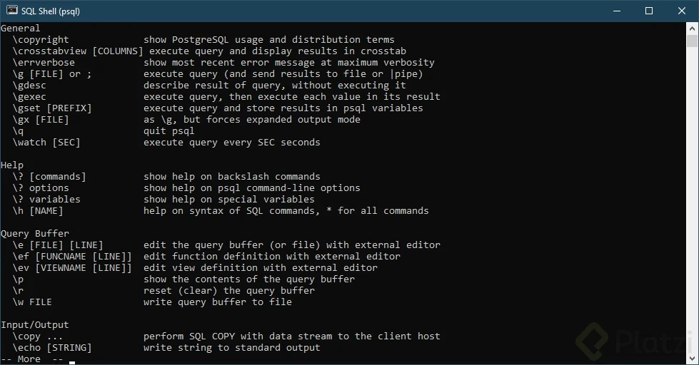
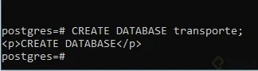

# Curso de PostgreSQL

## ¿Qué es Postgresql?

**PostgreSQL** es un **sistema de gestión de bases de datos relacional (RDBMS)** de código abierto, altamente robusto, escalable y confiable. Es conocido por su cumplimiento con los estándares SQL y por ofrecer extensibilidad avanzada. Fue desarrollado originalmente en la Universidad de California, Berkeley, y desde entonces ha evolucionado hasta convertirse en una de las opciones más populares para manejar bases de datos complejas.

### **Características principales de PostgreSQL:**

1. **Código abierto:** Es gratuito y su código fuente está disponible para modificaciones personalizadas.

2. **Soporte para estándares SQL:** Cumple con las normas SQL, lo que garantiza portabilidad y compatibilidad.

3. **Extensibilidad:** Permite crear funciones definidas por el usuario, tipos de datos personalizados y módulos para ampliar sus capacidades.

4. **Soporte para datos estructurados y no estructurados:**
   - Tablas relacionales tradicionales (estructuradas).
   - Datos JSON/JSONB (no estructurados).
   - Funciones avanzadas como índices GIN/JSON.

5. **Integridad transaccional:** Utiliza el modelo **ACID** (Atomicidad, Consistencia, Aislamiento, Durabilidad), asegurando confiabilidad en transacciones.

6. **Rendimiento avanzado:**
   - Índices potentes: B-tree, GIN, GiST, etc.
   - Optimización de consultas.
   - Paralelización para consultas complejas.

7. **Alta disponibilidad y recuperación:** Incluye características como:
   - Replicación en streaming.
   - Recuperación de datos en caso de fallos.
   - Failover automático con herramientas externas.

8. **Soporte para lenguajes de programación:** PostgreSQL permite trabajar con múltiples lenguajes de programación como **PL/pgSQL**, Python, Java, entre otros.

9. **Escalabilidad:** Puede manejar desde pequeñas aplicaciones hasta bases de datos empresariales masivas con petabytes de datos.

10. **Seguridad avanzada:**
    - Autenticación y control de acceso basados en roles.
    - Conexiones cifradas mediante TLS/SSL.
    - Encriptación de datos sensibles.

### **Casos de uso comunes:**

- **Aplicaciones web y móviles:** Usado por grandes plataformas como Instagram, Reddit y Spotify.
- **Sistemas analíticos:** Ideal para consultas complejas y modelado de datos.
- **Almacenamiento de datos geoespaciales:** Con la extensión PostGIS.
- **Integración con Big Data:** Compatible con herramientas como Hadoop y Spark.

### **Ventajas de usar PostgreSQL:**
- Comunidad activa y soporte continuo.
- Herramientas modernas para administración y monitoreo.
- Flexibilidad para adaptar el sistema a necesidades específicas.

Si trabajas en proyectos de ETL, ciencia de datos o desarrollo de aplicaciones, PostgreSQL es una opción poderosa y confiable para gestionar tus bases de datos.

**Lecturas recomendadas** 

[Qué es el teorema CAP y cómo elegir la base de datos para tu proyecto](https://platzi.com/blog/que-es-el-teorema-cap-y-como-elegir-la-base-de-datos-para-tu-proyecto)

[PostgreSQL: The world's most advanced open source database](https://www.postgresql.org/)

## Instalación y configuración de la Base de Datos

Vamos a instalar PostgreSQL en nuestra computadora. A continuación veremos el paso a paso y algunos consejos útiles para instalar y configurar correctamente PostgreSQL en nuestro equipo. En éste caso, usaremos Windows, pero los pasos son bastante similares entre los diferentes sistemas operativos.

Primer paso: ir a [https://www.postgresql.org/.](https://www.postgresql.org/ "https://www.postgresql.org/.")

Actualmente, la página web oficial de postgres luce así:


Ten en cuenta que puedes ver esta página en diferentes idiomas, depende de la configuración predeterminada de idioma de tu navegador.

Hacer clic en el botón ‘Download’ (Descarga) que se encuentra en la parte inferior derecha. Veremos lo siguiente:


Veremos lo siguiente:
Seleccionamos la opción que corresponda con tu sistema operativo, para éste caso hacemos clic en “Windows”:

Veremos en la parte inferior:


Haz clic en el enlace “Download the installer”. Esto nos va a llevar a la Web de Enterprise DB o EDB. EDB es una empresa que ofrece servicios sobre el motor de base de datos PostgreSQL y ofrece un instalador para Postgres de manera gratuita.


Es altamente recomendable seleccionar la penúltima o antepenúltima versión. Si bien la última versión estable está disponible, en éste caso la 12.0, no es recomendable instalarla en nuestro equipo, ya que al momento de instalarla o usar un servicio en la Nube para Postgres, lo más seguro es que no esté disponible y sólo esté hasta la versión 11.5, que no es la última versión. Esto porque todos los proveedores de Infraestructura no disponen de la versión de Postgres más actual siempre (tardan un poco en apropiar los nuevos lanzamientos).

Si tienes un equipo con Linux, la instalación la puedes hacer directamente desde los repositorios de Linux, EDB ya no ofrece soporte para instaladores en Linux debido a que se ha vuelto innecesario, el repositorio de Linux con PostgreSQL ofrece una manera mucho más sencilla y estándar para instalar PostgreSQL en linux.

Segundo paso: descargamos la versión “Windows x86-64” (porque nuestro sistema operativo es de 64 bits). En caso de que tu equipo sea de 32 bits debes seleccionar la opción “Windows x86-32”.

Vamos a descargar la versión 11.5. Hacemos clic en Download y guardamos el archivo que tendrá un nombre similar a:
“postgresql-11.5-2-windows-x64.exe”

Ahora vamos a la carpeta donde descargamos el archivo .exe, debe ser de aproximadamente 190 MB, lo ejecutamos.

Veremos lo siguiente:


Hacemos clic en siguiente. Si deseas cambiar la carpeta de destino, ahora es el momento:


Seleccionamos los servicios que queremos instalar. En este caso dejamos seleccionados todos menos “Stack Builder”, pues ofrece la instalación de servicios adicionales que no necesitamos hasta ahora. Luego hacemos clic en siguiente:


Ahora indicamos la carpeta donde iran guardados los datos de la base de datos, es diferente a la ruta de instalación del Motor de PostgreSQL, pero normalmente será una carpeta de nuestra carpeta de instalación. Puedes cambiar la ruta si quieres tener los datos en otra carpeta. Hacemos clic en siguiente.


Ingresamos la contraseña del usuario administrador. De manera predeterminada, Postgres crea un usuario super administrador llamado postgres que tiene todos los permisos y acceso a toda la base de datos, tanto para consultarla como para modificarla. En éste paso indicamos la clave de ese usuario super administrador.

Debes ingresar una clave muy segura y guardarla porque la vas a necesitar después. Luego hacemos clic en siguiente.


Ahora si queremos cambiar el puerto por donde el servicio de Postgresql estará escuchando peticiones, podemos hacerlo en la siguiente pantalla, si queremos dejar el predeterminado simplemente hacemos clic en siguiente.


La configuración regional puede ser la predeterminada, no es necesario cambiarla, incluso si vamos a usarla en español, ya que las tildes y las eñes estarán soportadas si dejas la configuración regional predeterminada. Es útil cambiarla cuando quieras dejar de soportar otras funciones de idiomas y lenguajes diferentes a uno específico. Luego hacemos clic en siguiente:


En pantalla aparecerá el resumen de lo que se va a instalar:


Al hacer clic en siguiente se muestra una pantalla que indica que PostgreSQL está listo para instalar, al hacer clic de nuevo en siguiente iniciará la instalación, espera un par de minutos hasta que la aplicación termine.

Una vez terminada la instalación, aparecerá en pantalla un mensaje mostrando que PostgreSQL ha sido instalado correctamente.


Podemos cerrar ésta pantalla y proceder a comprobar que todo quedó instalado correctamente.

Vamos a buscar el programa PgAdmin, el cual usaremos como editor favorito para ejecutar en él todas las operaciones sobre nuestra base de datos.

También vamos a buscar la consola… Tanto la consola como PgAdmin son útiles para gestionar nuestra base de datos, una nos permite ingresar comando por comandos y la otra nos ofrece una interfaz visual fácil de entender para realizar todas las operaciones.

En el menú de Windows (o donde aparecen instalados todos los programas) buscamos “PgAdmin…”


Ahora buscamos “SQL Shell…”


Efectivamente, ahora aparecen las herramientas que vamos a utilizar en éste curso.
Ahora vamos a crear una base de datos de prueba usando la consola y comprobaremos si existe usando PgAdmin, la crearemos para validar que la conexión con el servicio de base de datos interno funciona correctamente.

Para ello abrimos la consola, buscamos SQL Shell y lo ejecutamos. Veremos algo así:


Lo que vemos en pantalla es la consola esperando que ingresemos cada parámetro para la conexión.

Primero está el nombre del parámetro. En éste caso es “Server” seguido de unos corchetes que contienen el valor predeterminado. Si presionamos “Enter” sin digitar nada la consola asumirá que te refieres al valor predeterminado, si en éste caso presionamos “Enter” el valor asumido será “Localhost”. Localhost se refiere a nuestra propia máquina, si instalaste la base de datos en el mismo pc que estás usando para la consola, el valor correcto es Localhost o 127.0.0.1 (representan lo mismo).

Podemos dejar todos los valores predeterminados (presionando “Enter”) hasta que la consola pregunte por la clave del usuario maestro:


Debemos ingresar la clave que usamos cuando estábamos instalando Postgres, de lo contrario no podremos acceder. Presionamos Enter y veremos a continuación una pantalla que nos indica que estamos logueados en la base de datos y estamos listos para hacer modificaciones.

De manera predeterminada, la base de datos instalada es Postgres, la cual no debemos tocar, ya que ejecuta funciones propias del motor. Es usada por el Motor de PostgreSQL para interactuar con todas las bases de datos que vayamos a crear en el futuro.

La siguiente imagen indica que estamos conectados a la base de datos Postgres. Vamos a crear una base de datos nueva y luego saltar el cursor a ésta base de datos recién creada.


Para ello escribimos el comando “CREATE DATABASE transporte_publico;” y presionamos “Enter”. Veremos:


El mensaje “CREATE DATABASE” justo después de la línea que acabamos de escribir indica que la base de datos fue creada correctamente.

Para saltar a la base de datos recién creada ejecutamos el comando “\c transporte_publico”, el cursor mostrará lo siguiente:


Ahora vamos a validar desde PgAdmin que la base de datos fué creada correctamente. Abrimos PgAdmin y nos encontramos con una lista de items a la izquierda, lo que significa que de manera predeterminada PgAdmin ha creado un acceso a nuestra base de datos local, el cual llamó “PostgreSQL 11”:


Al hacer hacer doble clic sobre éste elemento (“PostgreSQL 11”) nos pedirá ingresar la clave que hemos determinado para el super usuario postgres, al igual que la consola, hasta no ingresarla correctamente no nos podremos conectar:


Ingresamos la clave. Te recomiendo seleccionar la opción “Save Password” o “Guardar Contraseña”. Si la máquina sobre la que estás trabajando es de confianza, que seas sólo tú o tu equipo quien tenga acceso a ella, de lo contrario, no guardes la contraseña para mantenerla segura.
Veremos la lista de bases de datos disponibles, la predeterminada “postgres” y la que acabamos de crear usando la consola, lo que comprueba que la base de datos y la consola funcionan correctamente.


Ahora procedemos a eliminar la base de datos recién creada para comprobar que PgAdmin está correctamente configurada y si pueda realizar cambios sobre la base de datos.

Para ello hacemos clic derecho sobre el elemento “transporte_publico” y seleccionamos la opción “Delete/Drop”. Al mensaje de confirmar hacemos clic en OK.

Con ello, si el elemento “transporte_publico” desaparece del menú de la izquierda comprobamos que PgAdmin funcionan correctamente.

## Interacción con Postgres desde la Consola

Interactuar con **PostgreSQL desde la consola** implica utilizar el cliente de línea de comandos llamado **psql**, que es una herramienta interactiva para ejecutar comandos SQL y administrar bases de datos PostgreSQL. A continuación, se describen los pasos clave para hacerlo:

---

### **1. Acceso a la Consola de PostgreSQL**
Para iniciar sesión en la consola de PostgreSQL:

```bash
psql -U <usuario> -d <nombre_base_datos>
```

- **`-U`**: Especifica el nombre de usuario de PostgreSQL.
- **`-d`**: Especifica la base de datos a la que deseas conectarte.
- Te pedirá la contraseña del usuario.

Si no especificas la base de datos, puedes conectarte directamente al servidor:

```bash
psql -U <usuario>
```

---

### **2. Comandos Básicos de psql**

#### a) **Conectarse a una Base de Datos**
```sql
\c <nombre_base_datos>
```

#### b) **Listar Bases de Datos**
```sql
\l
```

#### c) **Listar Tablas**
Para ver las tablas de la base de datos actual:
```sql
\dt
```

#### d) **Ver Detalles de una Tabla**
Para inspeccionar la estructura de una tabla:
```sql
\d <nombre_tabla>
```

#### e) **Salir de la Consola**
Para salir de psql:
```sql
\q
```

#### f) **cambiar de base de datos**
Para cambiar base de datos:
```sql
\c
```

### **3. Consultas SQL Básicas**

#### a) **Crear una Tabla**
```sql
CREATE TABLE empleados (
    id SERIAL PRIMARY KEY,
    nombre VARCHAR(50),
    salario NUMERIC(10, 2),
    fecha_ingreso DATE
);
```

#### b) **Insertar Datos**
```sql
INSERT INTO empleados (nombre, salario, fecha_ingreso)
VALUES ('Juan Pérez', 50000.00, '2023-01-15');
```

#### c) **Consultar Datos**
```sql
SELECT * FROM empleados;
```

#### d) **Actualizar Datos**
```sql
UPDATE empleados
SET salario = 55000.00
WHERE id = 1;
```

#### e) **Eliminar Datos**
```sql
DELETE FROM empleados
WHERE id = 1;
```

---

### **4. Comandos de Administración**

#### a) **Crear una Base de Datos**
```sql
CREATE DATABASE <nombre_base_datos>;
```

#### b) **Eliminar una Base de Datos**
```sql
DROP DATABASE <nombre_base_datos>;
```

#### c) **Crear un Usuario**
```sql
CREATE USER <nombre_usuario> WITH PASSWORD '<contraseña>';
```

#### d) **Asignar Privilegios**
```sql
GRANT ALL PRIVILEGES ON DATABASE <nombre_base_datos> TO <nombre_usuario>;
```

---

### **5. Importar y Exportar Datos**

#### a) **Exportar una Base de Datos a un Archivo**
Desde la consola del sistema operativo:
```bash
pg_dump -U <usuario> -d <nombre_base_datos> -F c -f <archivo_exportado>.dump
```

#### b) **Importar una Base de Datos desde un Archivo**
```bash
pg_restore -U <usuario> -d <nombre_base_datos> <archivo_exportado>.dump
```

#### c) **Cargar Datos desde un Archivo CSV**
Dentro de psql:
```sql
COPY empleados FROM '/ruta/archivo.csv' DELIMITER ',' CSV HEADER;
```

---

### **6. Ayuda y Documentación**
Para obtener ayuda en cualquier momento dentro de **psql**:
- **Ayuda de comandos SQL**:  
  ```sql
  \h <comando>
  ```
- **Ayuda de comandos de psql**:  
  ```sql
  \?
  ```

Con estos pasos, puedes interactuar de manera eficiente con PostgreSQL desde la consola, ya sea para gestionar bases de datos o realizar consultas y transformaciones en los datopostgres

RESUMEN

1. ENTRAR A LA CONSOLA DE POSTGRES `psql -U postgres -W`
2. VER LOS COMANDOS \ DE POSTGRES `\?`
3. LISTAR TODAS LAS BASES DE DATOS `\l`
4. VER LAS TABLAS DE UNA BASE DE DATOS `\dt`
5. CAMBIAR A OTRA BD `\c nombre_BD`
6. DESCRIBIR UNA TABLA `\d nombre_tabla`
7. VER TODOS LOS COMANDOS SQL `\h`
8. VER COMO SE EJECTUA UN COMANDO SQL `\h nombre_de_la_funcion`
9. CANCELAR TODO LO QUE HAY EN PANTALLA `Ctrl + C`
10. VER LA VERSION DE POSTGRES INSTALADA, IMPORTANTE PONER EL ';' `SELECT version();`
11. VOLVER A EJECUTAR LA FUNCION REALIADA ANTERIORMENTE `\g`
12. INICIALIZAR EL CONTADOR DE TIEMPO PARA QUE LA CONSOLA TE DIGA EN CADA EJECUCION ¿CUANTO DEMORO EN EJECUTAR ESA FUNCION? `\timing`
LIMPIAR PANTALLA DE LA CONSOLA PSQL `Ctrl + L`

## PgAdmin: Interacción con Postgres desde la Interfaz Gráfica

### Interacción con PostgreSQL desde PgAdmin:

**PgAdmin** es una herramienta potente para gestionar bases de datos PostgreSQL mediante una interfaz gráfica (GUI). Aquí te explico algunos pasos básicos para interactuar con Postgres desde PgAdmin:

#### 1. **Conexión a la base de datos:**
   - Abre PgAdmin.
   - Haz clic en el botón **"Add New Server"** (Agregar nuevo servidor).
   - Llena los campos con la información de la conexión:
     - **Name:** Nombre que quieras darle al servidor.
     - **Host:** Dirección del servidor (por ejemplo, `localhost` o la IP del servidor).
     - **Port:** Puerto donde PostgreSQL escucha (por defecto suele ser `5432`).
     - **Maintenance Database:** Base de datos predeterminada para la conexión (si tienes una predefinida).
     - **Username:** Nombre de usuario de PostgreSQL.
     - **Password:** Contraseña del usuario.
   - Haz clic en **"Save"** para guardar la configuración.

#### 2. **Explorar la base de datos:**
   - Una vez conectados, podrás ver las bases de datos del servidor en la parte izquierda de la pantalla bajo **"Databases"**.
   - Haz doble clic sobre la base de datos que quieras explorar.

#### 3. **Ejecutar consultas SQL:**
   - Haz clic derecho sobre la base de datos o un esquema y selecciona **"Query Tool"** para abrir la ventana de ejecución de SQL.
   - Escribe tus sentencias SQL (consultas, procedimientos almacenados, etc.) en el editor.
   - Haz clic en **"Execute"** para ejecutar la consulta.

#### 4. **Explorar objetos dentro de la base de datos:**
   - PgAdmin muestra todos los objetos dentro de la base de datos, como tablas, vistas, funciones, etc.
   - Puedes expandir las carpetas para ver las tablas y demás elementos.

#### 5. **Ver registros y estructura de tablas:**
   - Haz doble clic en cualquier tabla para ver su estructura o los registros actuales.
   - Puedes modificar datos directamente desde la vista de registros si tienes los permisos adecuados.

#### 6. **Realizar operaciones básicas:**
   - Desde PgAdmin puedes realizar operaciones como:
     - **Crear tablas**: Clic derecho en "Tables" -> **"Create Table"**.
     - **Insertar datos**: Haz clic derecho sobre la tabla y selecciona **"Query Tool"** para ejecutar INSERT.
     - **Actualizar datos**: Realiza UPDATE directamente desde la ventana de consultas.
     - **Eliminar datos**: Ejecuta DELETE desde la ventana de consultas.

#### 7. **Seguridad y gestión de usuarios:**
   - Desde PgAdmin puedes gestionar los usuarios y permisos de la base de datos. Simplemente, explora la sección de **"Roles"** y **"Privileges"** en la base de datos.

### Ventajas de usar PgAdmin:
   - **Interfaz gráfica intuitiva**: Ideal para gestionar bases de datos sin necesidad de escribir comandos.
   - **Gestión completa**: Permite desde consultas simples hasta la administración de seguridad y configuración avanzada.
   - **Soporte para múltiples bases de datos**: No solo PostgreSQL, también soporta otros sistemas de bases de datos como MySQL y SQLite.

**Lecturas recomendadas**

[pgAdmin - PostgreSQL Tools](https://www.pgadmin.org/)

## Archivos de Configuración

Un archivo de configuración es un componente esencial en muchos sistemas de software. Estos archivos permiten almacenar parámetros y configuraciones que determinan cómo debe comportarse una aplicación o sistema. Son particularmente útiles porque permiten separar la lógica del código de los valores que podrían cambiar según el entorno o las necesidades.

### ¿Para qué sirven los archivos de configuración?
1. **Separación de la lógica y configuración:** Permiten mantener el código independiente de los valores configurables, como rutas de archivos, credenciales o parámetros específicos.
2. **Facilitan la administración:** Los valores se pueden modificar sin cambiar el código fuente.
3. **Portabilidad:** Ayudan a implementar la misma aplicación en diferentes entornos (desarrollo, prueba, producción).
4. **Seguridad:** Pueden almacenar credenciales y datos sensibles, aunque se recomienda gestionarlos de forma segura.

### Ejemplos de uso
1. **Bases de datos:** Configuración de host, usuario, contraseña, nombre de la base de datos, etc.
2. **API:** Llaves de acceso, rutas base, y parámetros de conexión.
3. **Aplicaciones web:** Puerto del servidor, claves de sesión, y configuraciones específicas del entorno.

### Formatos comunes de archivos de configuración
1. **JSON:** 
   - Estructurado y legible por humanos.
   - Ejemplo:
     ```json
     {
         "database": {
             "host": "localhost",
             "port": 5432,
             "user": "admin",
             "password": "password123"
         }
     }
     ```

2. **YAML:**
   - Similar a JSON, pero más legible debido a su formato simple.
   - Ejemplo:
     ```yaml
     database:
       host: localhost
       port: 5432
       user: admin
       password: password123
     ```

3. **INI:**
   - Formato sencillo con secciones y pares clave-valor.
   - Ejemplo:
     ```ini
     [database]
     host = localhost
     port = 5432
     user = admin
     password = password123
     ```

4. **TOML:**
   - Similar a INI, pero más moderno.
   - Ejemplo:
     ```toml
     [database]
     host = "localhost"
     port = 5432
     user = "admin"
     password = "password123"
     ```

5. **XML:**
   - Estructurado, pero más verboso.
   - Ejemplo:
     ```xml
     <config>
         <database>
             <host>localhost</host>
             <port>5432</port>
             <user>admin</user>
             <password>password123</password>
         </database>
     </config>
     ```

6. **ENV (Variables de Entorno):**
   - Simple y común para aplicaciones en contenedores.
   - Ejemplo:
     ```
     DATABASE_HOST=localhost
     DATABASE_PORT=5432
     DATABASE_USER=admin
     DATABASE_PASSWORD=password123
     ```

### Uso en Python
En Python, puedes usar diferentes bibliotecas para trabajar con estos formatos:
1. **JSON:**
   ```python
   import json
   with open("config.json") as file:
       config = json.load(file)
   print(config["database"]["host"])
   ```

2. **YAML:**
   ```python
   import yaml
   with open("config.yaml") as file:
       config = yaml.safe_load(file)
   print(config["database"]["host"])
   ```

3. **ConfigParser (para INI):**
   ```python
   import configparser
   config = configparser.ConfigParser()
   config.read("config.ini")
   print(config["database"]["host"])
   ```

4. **dotenv (para ENV):**
   ```python
   from dotenv import load_dotenv
   import os
   load_dotenv(".env")
   print(os.getenv("DATABASE_HOST"))
   ```

### Buenas prácticas
1. **No incluir credenciales sensibles en los archivos:** Usa servicios de gestión de secretos.
2. **Versionar con cuidado:** No incluir archivos con datos sensibles en sistemas de control de versiones (usar `.gitignore` si es necesario).
3. **Validación:** Implementa validaciones para asegurar que los valores del archivo son correctos antes de usarlos.
4. **Cifrado:** Considera cifrar los valores sensibles almacenados.

Los archivos de configuración son fundamentales para mantener la flexibilidad y la organización en cualquier proyecto de software.

Los archivos de configuración son tres principales:

- postgreql.conf
- pg.hba.conf
- pg_ident.conf

La ruta de los mismos depende del sistema Operarivo, para saber que que ruta estan, basta con hacer una Query

- SHOW config_file;

**NOTA**: siempre es bueno hacer una copia original de los archivos antes de modificarlos por si movemos algo que no.
**Lecturas recomendadas**

[Curso de Administración de Servidores Linux | Platzi](https://platzi.com/clases/linux/)

[Domina la Administración de Usuarios y Permisos en Servidores Linux](https://platzi.com/blog/administracion-usuarios-servidores-linux/)

[Visual Studio Code - Code Editing. Redefined](https://code.visualstudio.com/)

## Comandos más utilizados en PostgreSQL

**La Consola**

La consola en PostgreSQL es una herramienta muy potente para crear, administrar y depurar nuestra base de datos. podemos acceder a ella después de instalar PostgreSQL y haber seleccionado la opción de instalar la consola junto a la base de datos.

PostgreSQL está más estrechamente acoplado al entorno UNIX que algunos otros sistemas de bases de datos, utiliza las cuentas de usuario nativas para determinar quién se conecta a ella (de forma predeterminada). El programa que se ejecuta en la consola y que permite ejecutar consultas y comandos se llama psql, psql es la terminal interactiva para trabajar con PostgreSQL, es la interfaz de línea de comando o consola principal, así como PgAdmin es la interfaz gráfica de usuario principal de PostgreSQL.

Después de emitir un comando PostgreSQL, recibirás comentarios del servidor indicándote el resultado de un comando o mostrándote los resultados de una solicitud de información. Por ejemplo, si deseas saber qué versión de PostgreSQL estás usando actualmente, puedes hacer lo siguiente:


### Comandos de ayuda

En consola los dos principales comandos con los que podemos revisar el todos los comandos y consultas son:

- \? Con el cual podemos ver la lista de todos los comandos disponibles en consola, comandos que empiezan con backslash ( \ )




- \h Con este comando veremos la información de todas las consultas SQL disponibles en consola. Sirve también para buscar ayuda sobre una consulta específica, para buscar información sobre una consulta específica basta con escribir \h seguido del inicio de la consulta de la que se requiera ayuda, así: \h **ALTER**
De esta forma podemos ver toda la ayuda con respecto a la consulta **ALTER**


### Comandos de navegación y consulta de información

- \c Saltar entre bases de datos

- \l Listar base de datos disponibles

- \dt Listar las tablas de la base de datos

- \d <nombre_tabla> Describir una tabla

- \dn Listar los esquemas de la base de datos actual

- \df Listar las funciones disponibles de la base de datos actual

- \dv Listar las vistas de la base de datos actual

- \du Listar los usuarios y sus roles de la base de datos actual

### Comandos de inspección y ejecución

- \g Volver a ejecutar el comando ejecutando justo antes

- \s Ver el historial de comandos ejecutados

- \s <nombre_archivo> Si se quiere guardar la lista de comandos ejecutados en un archivo de texto plano

- \i <nombre_archivo> Ejecutar los comandos desde un archivo

- \e Permite abrir un editor de texto plano, escribir comandos y ejecutar en lote. \e abre el editor de texto, escribir allí todos los comandos, luego guardar los cambios y cerrar, al cerrar se ejecutarán todos los comandos guardados.

- \ef Equivalente al comando anterior pero permite editar también funciones en PostgreSQL

### Comandos para debug y optimización

- \timing Activar / Desactivar el contador de tiempo por consulta

### Comandos para cerrar la consola

- \q Cerrar la consola

### Ejecutando consultas en la base de datos usando la consola

De manera predeterminada PostgreSQL no crea bases de datos para usar, debemos crear nuestra base de datos para empezar a trabajar, verás que existe ya una base de datos llamada postgres pero no debe ser usada ya que hace parte del CORE de PostgreSQL y sirve para gestionar las demás bases de datos.

Para crear una base de datos debes ejecutar la consulta de creación de base de datos, es importante entender que existe una costumbre no oficial al momento de escribir consultas; consiste en poner en mayúsculas todas las palabras propias del lenguaje SQL cómo **CREATE**, **SELECT**, **ALTE**, etc y el resto de palabras como los nombres de las tablas, columnas, nombres de usuarios, etc en minúscula. No está claro el porqué de esta especie de “estándar” al escribir consultas SQL pero todo apunta a que en el momento que SQL nace, no existían editores de consultas que resaltaran las palabras propias del lenguaje para diferenciar fácilmente de las palabras que no son parte del lenguaje, por eso el uso de mayúsculas y minúsculas.

Las palabras reservadas de consultas SQL usualmente se escriben en mayúscula, ésto para distinguir entre nombres de objetos y lenguaje SQL propio, no es obligatorio, pero podría serte útil en la creación de Scripts SQL largos.

Vamos ahora por un ligero ejemplo desde la creación de una base de datos, la creación de una tabla, la inserción, borrado, consulta y alteración de datos de la tabla.

Primero crea la base de datos, “**CREATE DATABASE transporte;**” sería el primer paso.



Ahora saltar de la base de datos postgres que ha sido seleccionada de manera predeterminada a la base de datos transporte recién creada utilizando el comando **\c transporte**.


Ahora vamos a crear la tabla tren, el SQL correspondiente sería:

`CREATE TABLE tren ( id serial NOT NULL, modelo character varying, capacidad integer, CONSTRAINT tren_pkey PRIMARY KEY (id) );`

La columna id será un número autoincremental (cada vez que se inserta un registro se aumenta en uno), modelo se refiere a una referencia al tren, capacidad sería la cantidad de pasajeros que puede transportar y al final agregamos la llave primaria que será id.


Ahora que la tabla ha sido creada, podemos ver su definición utilizando el comando **\d tren**


PostgreSQL ha creado el campo id automáticamente cómo integer con una asociación predeterminada a una secuencia llamada ‘**tren_id_seq**’. De manera que cada vez que se inserte un valor, id tomará el siguiente valor de la secuencia, vamos a ver la definición de la secuencia. Para ello,** \d tren_id_seq** es suficiente:


Vemos que la secuencia inicia en uno, así que nuestra primera inserción de datos dejará a la columna id con valor uno.

`INSERT INTO tren( modelo, capacidad ) VALUES (‘Volvo 1’, 100);`


Consultamos ahora los datos en la tabla:

`SELECT * FROM tren;`


Vamos a modificar el valor, establecer el tren con id uno que sea modelo Honda 0726. Para ello ejecutamos la consulta tipo` UPDATE tren SET modelo = 'Honda 0726' Where id = 1;`


Verificamos la modificación `SELECT * FROM tren;`


Ahora borramos la fila: `DELETE FROM tren WHERE id = 1;`


Verificamos el borrado `SELECT * FROM tren;`


El borrado ha funcionado tenemos 0 rows, es decir, no hay filas. Ahora activemos la herramienta que nos permite medir el tiempo que tarda una consulta \timing


Probemos cómo funciona al medición realizando la encriptación de un texto cualquiera usando el algoritmo md5:


La consulta tardó 10.011 milisegundos

Ahora que sabes como manejar algunos de los comandos más utilizados en PostgreSQL es momento de comenzar a practicar!!!

## Tipos de datos

En programación, los **tipos de datos** representan las distintas clases de valores que una variable puede almacenar. Identificar y trabajar correctamente con los tipos de datos es fundamental para desarrollar aplicaciones robustas y funcionales.


### **Clasificación General de Tipos de Datos**
1. **Tipos de Datos Primitivos:** Representan valores básicos y fundamentales.
2. **Tipos de Datos Compuestos:** Formados por combinaciones de datos primitivos.
3. **Tipos de Datos Abstractos:** Diseñados para resolver problemas específicos, basados en estructuras complejas.

### **1. Tipos de Datos Primitivos**
Son los más básicos en cualquier lenguaje de programación.

- **Numéricos:**
  - Enteros (**int**): Números sin decimales (e.g., 10, -5, 0).
  - Flotantes (**float**): Números con decimales (e.g., 3.14, -0.01).
  - Complejos (**complex**): Números con parte real e imaginaria (e.g., 3 + 4j).
  
- **Texto:**
  - **String (str):** Secuencia de caracteres (e.g., "Hola", "123").
  
- **Booleanos:**
  - **bool:** Representa valores de verdad (True, False).

- **Carácter:**
  - Algunos lenguajes como C tienen el tipo **char** para un único carácter.

### **2. Tipos de Datos Compuestos**
Agrupan múltiples valores, ya sean homogéneos o heterogéneos.

- **Listas (List o Array):**
  - Colección ordenada de elementos (e.g., [1, 2, 3], ["a", "b", "c"]).
  - En Python: `mi_lista = [10, "texto", True]`.

- **Tuplas (Tuple):**
  - Colección ordenada e inmutable (e.g., (1, 2, 3)).
  - En Python: `mi_tupla = (1, "texto", False)`.

- **Conjuntos (Set):**
  - Colección no ordenada de elementos únicos (e.g., {1, 2, 3}).
  - En Python: `mi_conjunto = {1, 2, 2, 3}` → Resultado: `{1, 2, 3}`.

- **Diccionarios (Dictionary):**
  - Colección de pares clave-valor (e.g., {"clave": "valor"}).
  - En Python: `mi_dict = {"nombre": "Ana", "edad": 30}`.

### **3. Tipos de Datos Abstractos**
Diseñados para solucionar problemas específicos, suelen estar implementados como estructuras más avanzadas.

- **Pilas (Stack):** Sigue la regla LIFO (Last In, First Out). Ejemplo: una pila de platos.
- **Colas (Queue):** Sigue la regla FIFO (First In, First Out). Ejemplo: una fila de espera.
- **Listas Enlazadas (Linked List):** Elementos conectados mediante referencias a otros nodos.
- **Árboles (Tree):** Estructura jerárquica con un nodo raíz y nodos hijos.
- **Grafos (Graph):** Representan nodos conectados por aristas.

### **4. Tipos de Datos en Lenguajes Específicos**
#### **Python:**
- Enteros, flotantes, cadenas, booleanos.
- Estructuras como listas, conjuntos, diccionarios y tuplas.
  
#### **Java:**
- Primitivos: `int`, `float`, `char`, `boolean`.
- Objetos: `String`, `ArrayList`, `HashMap`.

#### **C/C++:**
- Primitivos: `int`, `float`, `char`, `double`.
- Estructuras como arrays, estructuras (`struct`) y punteros.

#### **SQL:**
- **Datos numéricos:** `INT`, `FLOAT`, `DECIMAL`.
- **Datos de texto:** `CHAR`, `VARCHAR`, `TEXT`.
- **Datos de fecha:** `DATE`, `TIME`, `DATETIME`.

### **Conversión entre Tipos de Datos**
Es común convertir datos de un tipo a otro para manipularlos correctamente.

- **Conversión implícita (automática):** Realizada por el lenguaje (e.g., `int` a `float`).
- **Conversión explícita:** Requiere el uso de funciones o métodos específicos:
  - Python: 
    ```python
    entero = int("10")  # Convierte de string a entero
    flotante = float(5)  # Convierte de entero a flotante
    cadena = str(123)  # Convierte de entero a string
    ```

### **Importancia de los Tipos de Datos**
1. **Precisión en cálculos:** Evitar errores al realizar operaciones.
2. **Eficiencia:** Elegir el tipo de dato adecuado optimiza el rendimiento.
3. **Seguridad:** Restringir el uso indebido de datos.
4. **Flexibilidad:** Facilita la manipulación y procesamiento de datos complejos.

**Lecturas recomendadas**

[PostgreSQL data types, tipos de datos más utilizados - TodoPostgreSQL](https://todopostgresql.com/postgresql-data-types-los-tipos-de-datos-mas-utilizados/)

[PostgreSQL: Documentation: 11: Chapter 8. Data Types](https://www.postgresql.org/docs/11/datatype.html)

## Diseñando nuestra base de datos: estructura de las tablas

Diseñar una base de datos implica estructurar tablas que representen entidades y sus relaciones en el dominio del problema. A continuación, se detalla un enfoque práctico y organizado para diseñar la estructura de las tablas de una base de datos.

### **1. Identificación de Entidades**
Las entidades representan objetos o conceptos importantes en el sistema que deben ser modelados como tablas. Ejemplos:
- Usuarios
- Productos
- Pedidos
- Categorías

### **2. Definición de Tablas**
Cada entidad se traduce en una tabla. Para cada tabla:
- **Nombre:** Describa claramente la entidad (e.g., `Usuarios`, `Productos`).
- **Columnas:** Representan los atributos de la entidad.
  - Ejemplo: La tabla `Usuarios` puede tener `id_usuario`, `nombre`, `email`, `fecha_registro`.

### **3. Establecer Tipos de Datos**
Defina el tipo de datos más adecuado para cada columna:
- **Numéricos:**
  - `INT`: Para enteros (e.g., identificadores, cantidades).
  - `FLOAT` o `DECIMAL`: Para valores con decimales (e.g., precios, porcentajes).
- **Texto:**
  - `VARCHAR`: Para cadenas de texto (e.g., nombres, correos electrónicos).
  - `TEXT`: Para descripciones largas.
- **Fecha y hora:**
  - `DATE`: Para fechas (e.g., `2025-01-18`).
  - `DATETIME`: Fecha y hora combinadas.
- **Booleanos:**
  - `BOOLEAN` o `TINYINT(1)`: Para valores de verdadero/falso.

### **4. Relaciones entre Tablas**
Defina cómo se relacionan las tablas. Los tipos principales de relaciones son:

1. **Uno a Uno (1:1):**
   - Un registro en una tabla corresponde exactamente a un registro en otra tabla.
   - Ejemplo: Tabla `Usuarios` y tabla `DetallesUsuario`.

2. **Uno a Muchos (1:N):**
   - Un registro en una tabla está relacionado con varios registros en otra tabla.
   - Ejemplo: Un usuario puede hacer varios pedidos (`Usuarios` y `Pedidos`).

3. **Muchos a Muchos (M:N):**
   - Varios registros en una tabla están relacionados con varios registros en otra tabla.
   - Ejemplo: `Productos` y `Categorías` se relacionan a través de una tabla intermedia `ProductoCategoria`.

### **5. Claves Primarias y Foráneas**
- **Clave primaria (Primary Key):** Identifica de forma única cada registro en una tabla.
  - Ejemplo: `id_usuario` en `Usuarios`.
- **Clave foránea (Foreign Key):** Relaciona tablas y asegura la integridad referencial.
  - Ejemplo: `id_usuario` en la tabla `Pedidos` es una clave foránea que apunta a `Usuarios`.

### **6. Ejemplo de Estructura de Tablas**
#### **Usuarios**
| Nombre columna    | Tipo de dato | Restricciones          |
|-------------------|-------------|------------------------|
| id_usuario        | INT         | PRIMARY KEY, AUTO_INCREMENT |
| nombre            | VARCHAR(100) | NOT NULL              |
| email             | VARCHAR(150) | UNIQUE, NOT NULL      |
| fecha_registro    | DATETIME    | DEFAULT CURRENT_TIMESTAMP |

#### **Productos**
| Nombre columna    | Tipo de dato | Restricciones          |
|-------------------|-------------|------------------------|
| id_producto       | INT         | PRIMARY KEY, AUTO_INCREMENT |
| nombre_producto   | VARCHAR(100) | NOT NULL              |
| precio            | DECIMAL(10,2)| NOT NULL              |
| stock             | INT         | DEFAULT 0             |

#### **Pedidos**
| Nombre columna    | Tipo de dato | Restricciones          |
|-------------------|-------------|------------------------|
| id_pedido         | INT         | PRIMARY KEY, AUTO_INCREMENT |
| id_usuario        | INT         | FOREIGN KEY (`id_usuario`) REFERENCES `Usuarios`(`id_usuario`) |
| fecha_pedido      | DATETIME    | DEFAULT CURRENT_TIMESTAMP |
| total             | DECIMAL(10,2)| NOT NULL              |

#### **PedidoDetalles**
| Nombre columna    | Tipo de dato | Restricciones          |
|-------------------|-------------|------------------------|
| id_detalle        | INT         | PRIMARY KEY, AUTO_INCREMENT |
| id_pedido         | INT         | FOREIGN KEY (`id_pedido`) REFERENCES `Pedidos`(`id_pedido`) |
| id_producto       | INT         | FOREIGN KEY (`id_producto`) REFERENCES `Productos`(`id_producto`) |
| cantidad          | INT         | NOT NULL              |
| subtotal          | DECIMAL(10,2)| NOT NULL              |


### **7. Normalización**
Aplica principios de normalización para evitar redundancia:
- **Primera Forma Normal (1NF):** Elimina atributos multivaluados.
- **Segunda Forma Normal (2NF):** Asegura que cada atributo dependa completamente de la clave primaria.
- **Tercera Forma Normal (3NF):** Elimina dependencias transitivas.

### **8. Herramientas de Diseño**
Utiliza herramientas como:
- **MySQL Workbench**
- **pgAdmin**
- **DB Designer**
- **Lucidchart**

[dbdiagram](https://dbdiagram.io/d)

```dbml
// Use DBML to define your database structure
// Docs: https://dbml.dbdiagram.io/docs

Table estaciones {
  id_estacion integer [primary key]
  nombre varchar(52)
  direccion varchar(52)
}
Ref: estaciones.id_estacion < trayectos.id_estacion

Table trenes {
  id_tren integer [primary key]
  modelo varchar(52)
  capacidad integer(52)
}
Ref: trenes.id_tren < trayectos.id_tren

Table pasajeros {
  n_documento integer [primary key]
  nombre varchar(52)
  dirrecion_residencia integer(52)
  fecha_nacimiento date
}

Ref: viajes.id_viaje > pasajeros.n_documento // ono a muchos


Table trayectos {
  id_trayecto integer [primary key]
  id_estacion integer
  id_tren integer
  nombre integer
}
Ref: trayectos.id_trayecto <> viajes.id_trayecto //muchos a muchos
 
 // - uno a uno
Table viajes {
  id_viaje integer [primary key]
  n_documento integer
  id_trayecto integer
  inicio time
  fin time
}
```

**Lecturas recomendadas**

[Fundamentos de Bases de Datos](https://platzi.com/clases/bd/)

### Jerarquía de Bases de Datos

Toda jerarquía de base de datos se basa en los siguientes elementos:

- **Servidor de base de datos**: Computador que tiene un motor de base de datos instalado y en ejecución.

- **Motor de base de datos**: Software que provee un conjunto de servicios encargados de administrar una base de datos.

- **Base de datos**: Grupo de datos que pertenecen a un mismo contexto.

- **Esquemas de base de datos en PostgreSQL**: Grupo de objetos de base de datos que guarda relación entre sí (tablas, funciones, relaciones, secuencias).

- **Tablas de base de datos**: Estructura que organiza los datos en filas y columnas formando una matriz.

**PostgreSQL es un motor de base de datos.**

La estructura de la base de datos diseñada para el reto corresponde a los siguientes
elementos:


La base de datos se llama transporte, usaremos su esquema predeterminado public.

El esquema public contiene las siguientes tablas:

- Estación

- Pasajero

- Tren

Y las tablas de relaciones entre cada uno de los elementos anteriores son:

- Trayecto

- Viaje

El esquema relacional entre las tablas corresponde al siguiente diagrama:


***Estación***
Contiene la información de las estaciones de nuestro sistema, incluye datos de nombre con tipo de dato texto y dirección con tipo de dato texto, junto con un número de identificación único por estación.

***Tren***
Almacena la información de los trenes de nuestro sistema, cada tren tiene un modelo con tipo de dato texto y una capacidad con tipo de dato numérico que representa la cantidad de personas que puede llevar ese tren, también tiene un ID único por tren.

***Trayecto***
Relaciona los trenes con las estaciones, simula ser las rutas que cada uno de los trenes pueden desarrollar entre las estaciones

***Pasajero***
Es la tabla que contiene la información de las personas que viajan en nuestro sistema de transporte masivo, sus columnas son nombre tipo de dato texto con el nombre completo de la persona, direccion_residencia con tipo de dato texto que indica dónde vive la persona, fecha_nacimiento tipo de dato texto y un ID único tipo de dato numérico para identificar a cada persona.

***Viaje***
Relaciona Trayecto con Pasajero ilustrando la dinámica entre los viajes que realizan las personas, los cuales parten de una estación y se hacen usando un tren.

## Creación de Tablas

Crear tablas en **PostgreSQL** implica definir su estructura, tipos de datos, restricciones y relaciones. Esto se realiza utilizando el comando **`CREATE TABLE`** en SQL. A continuación, te explico cómo se hace y te doy ejemplos prácticos.

### **Estructura Básica de `CREATE TABLE`**
```sql
CREATE TABLE nombre_tabla (
    nombre_columna tipo_dato [restricciones],
    ...
);
```

### **Tipos de Datos Comunes en PostgreSQL**
- **Numéricos**: `INTEGER`, `BIGINT`, `NUMERIC`, `REAL`, `DOUBLE PRECISION`.
- **Texto**: `CHAR(n)`, `VARCHAR(n)`, `TEXT`.
- **Fecha y Hora**: `DATE`, `TIME`, `TIMESTAMP`, `INTERVAL`.
- **Booleanos**: `BOOLEAN`.
- **Serial (auto-incremental)**: `SERIAL`, `BIGSERIAL`.

### **Restricciones Comunes**
- **`PRIMARY KEY`**: Identifica la clave principal.
- **`NOT NULL`**: Evita valores nulos en una columna.
- **`UNIQUE`**: Garantiza que los valores sean únicos.
- **`CHECK`**: Verifica una condición lógica.
- **`FOREIGN KEY`**: Define una clave foránea.
- **`DEFAULT`**: Especifica un valor predeterminado.

### **Ejemplo 1: Crear una Tabla Simple**
```sql
CREATE TABLE usuarios (
    id_usuario SERIAL PRIMARY KEY,
    nombre VARCHAR(100) NOT NULL,
    email VARCHAR(150) UNIQUE,
    fecha_registro TIMESTAMP DEFAULT CURRENT_TIMESTAMP
);
```

**Descripción**:
1. `id_usuario` es una columna auto-incremental.
2. `nombre` no puede ser nulo.
3. `email` debe ser único.
4. `fecha_registro` tiene un valor predeterminado.

### **Ejemplo 2: Tablas con Relaciones**
```sql
CREATE TABLE pedidos (
    id_pedido SERIAL PRIMARY KEY,
    id_usuario INT NOT NULL,
    fecha_pedido DATE NOT NULL,
    total DECIMAL(10, 2),
    FOREIGN KEY (id_usuario) REFERENCES usuarios(id_usuario)
);
```

**Descripción**:
1. La columna `id_usuario` es una clave foránea que hace referencia a `usuarios`.
2. `fecha_pedido` no puede ser nula.
3. `total` permite hasta 10 dígitos, con 2 decimales.

### **Ejemplo 3: Relación Uno a Uno**
```sql
CREATE TABLE perfiles (
    id_perfil SERIAL PRIMARY KEY,
    id_usuario INT UNIQUE NOT NULL,
    bio TEXT,
    FOREIGN KEY (id_usuario) REFERENCES usuarios(id_usuario)
);
```

**Nota**: La restricción `UNIQUE` asegura una relación uno a uno entre `usuarios` y `perfiles`.

### **Comprobando la Creación de la Tabla**
Después de crear una tabla, puedes verificar su estructura con:
```sql
\d nombre_tabla
```

### **Buenas Prácticas**
1. **Nombrar columnas y tablas con consistencia** (ej., en minúsculas y usando snake_case).
2. **Definir claves primarias y foráneas** para garantizar integridad referencial.
3. **Usar índices** si esperas buscar frecuentemente por una columna.
4. **Probar las restricciones** con datos reales antes de popular la base.

## Particiones

Las **particiones en bases de datos en PostgreSQL** permiten dividir una tabla grande en tablas más pequeñas (particiones) para mejorar el rendimiento y la gestión de datos. Cada partición contiene un subconjunto de los datos, pero se comporta como si fueran parte de la tabla principal.

### Ventajas de usar particiones:
1. **Rendimiento mejorado**: Consultas más rápidas, ya que pueden buscar en una partición específica en lugar de toda la tabla.
2. **Gestión eficiente**: Más fácil eliminar o archivar datos antiguos al trabajar con particiones específicas.
3. **Concurrencia mejorada**: Menor bloqueo entre transacciones que acceden a diferentes particiones.

### Crear una tabla particionada en PostgreSQL

#### 1. Crear una tabla principal como particionada
Debes especificar el tipo de partición (`RANGE` o `LIST`) al crear la tabla principal.

```sql
CREATE TABLE ventas (
    id_venta SERIAL PRIMARY KEY,
    fecha DATE NOT NULL,
    total NUMERIC(10, 2) NOT NULL
) PARTITION BY RANGE (fecha);
```

- **`RANGE`**: Divide datos por un rango de valores.
- **`LIST`**: Divide datos por una lista de valores.
- **`HASH`**: Divide datos usando una función hash (para distribuciones uniformes).

#### 2. Crear las particiones específicas
Las particiones deben ser creadas explícitamente, asignando el subconjunto de datos que manejarán.

##### Ejemplo de particiones por rango:
```sql
CREATE TABLE ventas_2023 PARTITION OF ventas
    FOR VALUES FROM ('2023-01-01') TO ('2024-01-01');

CREATE TABLE ventas_2024 PARTITION OF ventas
    FOR VALUES FROM ('2024-01-01') TO ('2025-01-01');
```

##### Ejemplo de particiones por lista:
```sql
CREATE TABLE ventas_america PARTITION OF ventas
    FOR VALUES IN ('AMERICA');

CREATE TABLE ventas_europa PARTITION OF ventas
    FOR VALUES IN ('EUROPA');
```

#### 3. Insertar datos en la tabla principal
PostgreSQL automáticamente asigna los datos a la partición correcta según las reglas definidas.

```sql
INSERT INTO ventas (fecha, total) VALUES ('2023-05-10', 100.00);
INSERT INTO ventas (fecha, total) VALUES ('2024-03-15', 200.00);
```

#### 4. Consultar datos en tablas particionadas
Las consultas a la tabla principal incluyen automáticamente todas las particiones.

```sql
SELECT * FROM ventas WHERE fecha BETWEEN '2023-01-01' AND '2023-12-31';
```

### Ver las particiones
Usa el comando `\d+` en `psql` para ver las particiones asociadas a una tabla.

```sql
\d+ ventas
```

### Eliminar particiones
Puedes eliminar una partición como si fuera una tabla normal:

```sql
DROP TABLE ventas_2023;
```

### Buenas prácticas:
1. Define particiones que representen un subconjunto claro y uniforme de los datos.
2. Usa índices en las particiones individuales si las consultas son frecuentes.
3. Automatiza la creación y eliminación de particiones con scripts periódicos.
