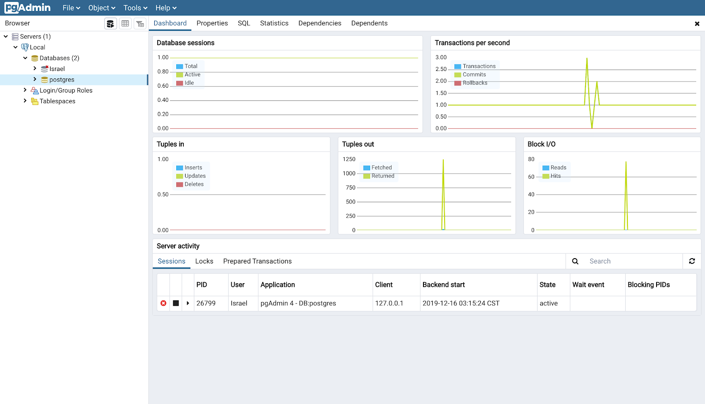
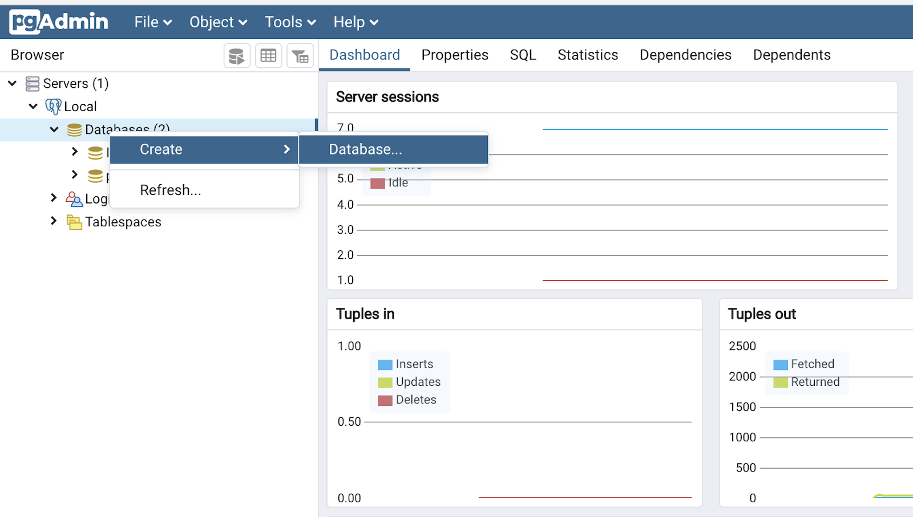
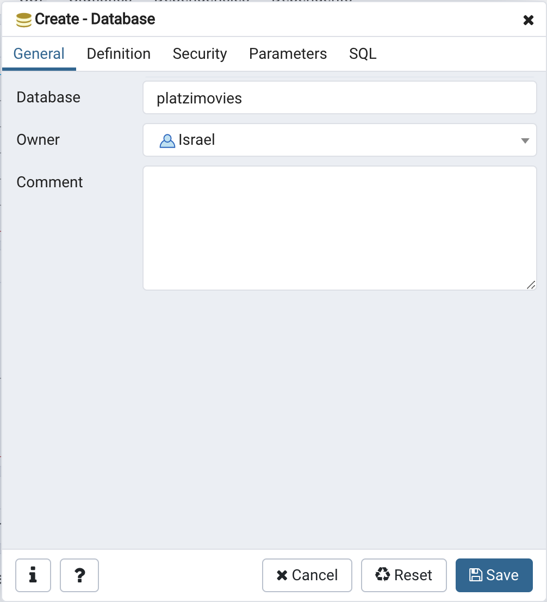
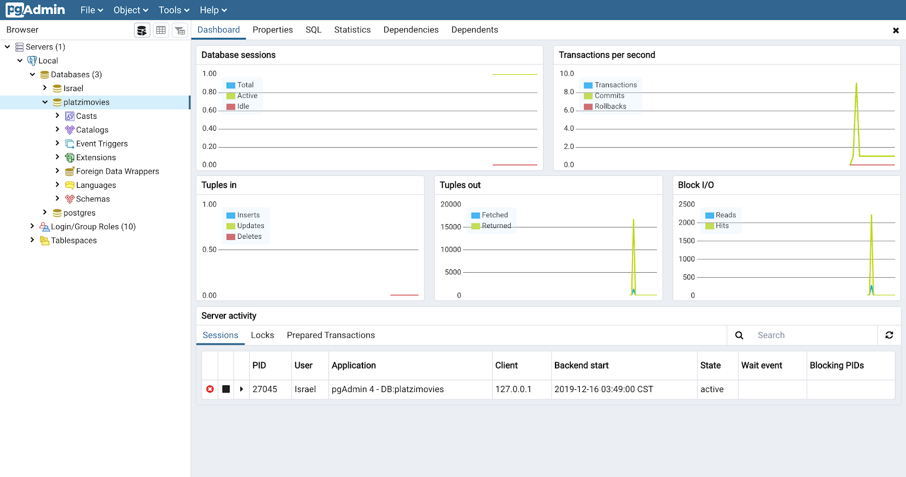
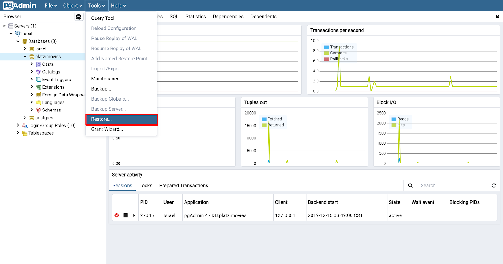
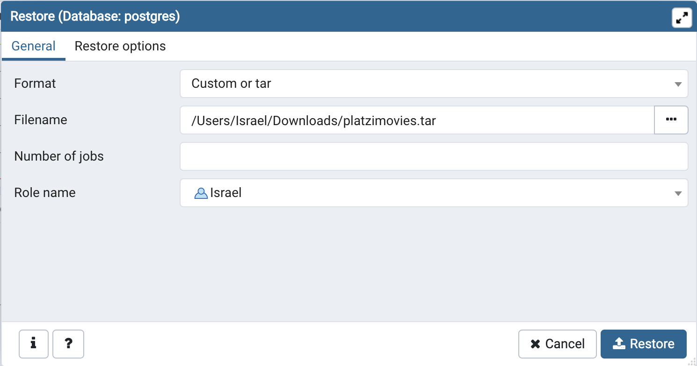
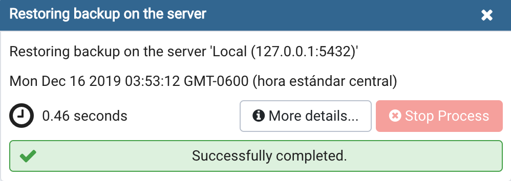
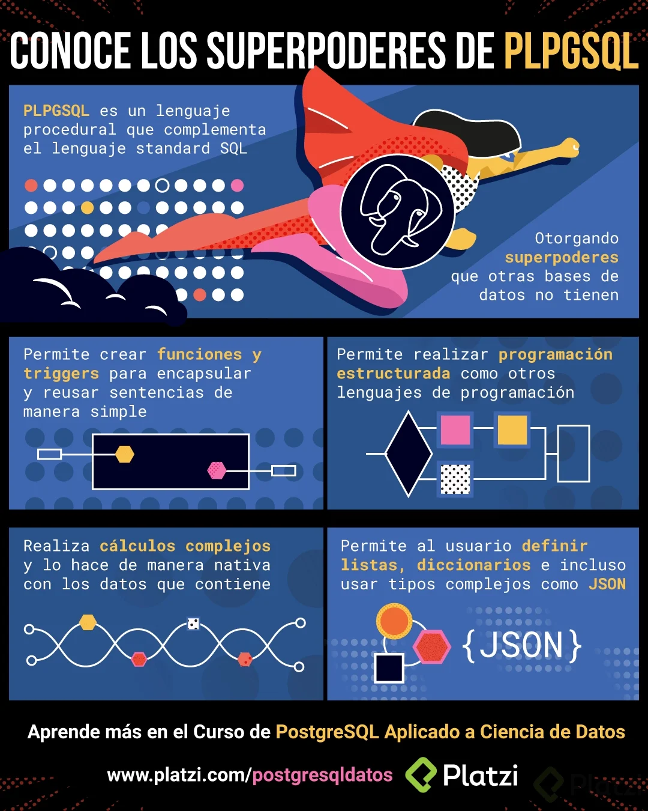

# Curso de PostgreSQL Aplicado a Ciencia de Datos

## Todo lo que aprenderás sobre PostgreSQL para ciencia de datos

PostgreSQL es una de las bases de datos más robustas y populares para gestionar datos en ciencia de datos. A continuación, te detallo lo que puedes aprender para dominar PostgreSQL en este contexto:

### 1. **Fundamentos de PostgreSQL**
- **Conceptos básicos**: ¿Qué es PostgreSQL y por qué es útil en ciencia de datos?
- **Instalación y configuración**: Configurar PostgreSQL en entornos locales y en la nube.
- **Estructura de la base de datos**: Tablas, columnas, filas, esquemas y relaciones.

### 2. **Manipulación de Datos**
- **Consultas básicas**: Uso de **`SELECT`**, **`INSERT`**, **`UPDATE`**, **`DELETE`**.
- **Filtrado y ordenación**: Clausulas **`WHERE`**, **`ORDER BY`**, **`LIMIT`**, **`OFFSET`**.
- **Funciones de agregación**: **`SUM`**, **`AVG`**, **`COUNT`**, **`MAX`**, **`MIN`**.
- **Joins y relaciones**:
  - **`INNER JOIN`**, **`LEFT JOIN`**, **`RIGHT JOIN`**, **`FULL OUTER JOIN`**.
  - Relaciones entre tablas en bases de datos relacionales.

### 3. **Funciones avanzadas para análisis de datos**
- **Window functions**: Uso de **`ROW_NUMBER`**, **`RANK`**, **`DENSE_RANK`**, **`NTILE`**.
- **Subconsultas**:
  - Subconsultas en **`SELECT`**, **`WHERE`**, y **`FROM`**.
  - Subqueries correlacionadas.
- **CTE (Common Table Expressions)**: Uso de **`WITH`** para consultas complejas.
- **Agrupaciones avanzadas**: Clausulas como **`GROUP BY`**, **`ROLLUP`**, **`CUBE`**, y **`GROUPING SETS`**.

### 4. **Trabajar con fechas y horas**
- **Funciones de fecha y hora**:
  - **`NOW`**, **`CURRENT_DATE`**, **`EXTRACT`**, **`DATE_PART`**, **`AGE`**.
- Calcular diferencias entre fechas (útil para análisis de series de tiempo).

### 5. **Consultas analíticas y estadísticas**
- Consultas que integran datos para reportes:
  - Porcentajes, desviaciones estándar y varianza con funciones como **`STDDEV`**, **`VARIANCE`**.
- Uso de **`CASE`** para generar variables categóricas basadas en condiciones.

### 6. **Extensiones y funciones específicas**
- **PostGIS**: Extensión para datos geoespaciales.
- **PL/pgSQL**: Crear funciones personalizadas y procedimientos almacenados.
- **JSON y JSONB**: Manipular datos semi-estructurados.
- **Full Text Search**: Búsquedas avanzadas en textos.

### 7. **Optimización de consultas**
- Indexación:
  - Crear índices con **`CREATE INDEX`**, tipos de índices (**BTREE**, **GIN**, **GiST**).
  - Índices parciales y únicos.
- Analizar rendimiento:
  - **`EXPLAIN`** y **`EXPLAIN ANALYZE`** para entender el plan de ejecución de consultas.
  - Optimización de subconsultas y joins.
- Particionamiento de tablas para bases de datos grandes.

### 8. **Bases de datos distribuidas y paralelismo**
- Configurar sharding para bases de datos distribuidas.
- Consultas paralelas en PostgreSQL para mejorar rendimiento.

### 9. **Integración con herramientas de ciencia de datos**
- Conectar PostgreSQL con:
  - **Python** (usando bibliotecas como `psycopg2`, `SQLAlchemy` o `Pandas`).
  - Herramientas de BI como Power BI, Tableau, Looker.
- Carga y extracción de datos desde PostgreSQL usando **`COPY`**, **`\COPY`**, o **`pg_dump`**.

### 10. **Seguridad y manejo de usuarios**
- Crear usuarios y roles.
- Asignar permisos con **`GRANT`** y **`REVOKE`**.
- Encriptación de datos y backups para proteger información sensible.

### 11. **Prácticas con datos reales**
- Cargar datasets de ciencia de datos (CSV, JSON, etc.) en PostgreSQL.
- Resolver casos prácticos como:
  - Análisis de ventas.
  - Modelos predictivos con extracción de características desde la base de datos.
  - Análisis de series temporales.

Si dominas todos estos temas, estarás bien preparado para utilizar PostgreSQL como herramienta principal en tus proyectos de ciencia de datos.

**Lecturas recomendadas**

[Curso Fundamentos de Bases de Datos | Platzi](https://platzi.com/clases/bd/)

[Curso de PostgreSQL](https://platzi.com/clases/postgresql/)

[Carrera Big Data y Data Science | ✔️Platzi](https://platzi.com/datos/)

## Importación de los datos para el proyecto

Es un proceso simple, sin embargo, para iniciar es necesario que cumplas con dos dependencias:

- La primera es haber instalado PostgreSQL y su set de herramientas en tu Sistema Operativo.

- La segunda es haber instalado PgAdmin 4 para que puedas interactuar de manera gráfica con la base de datos.

- Asegúrate de que el usuario postgresql se encuentra configurado y con todos los permisos.

Para conocer los detalles de la instalación de las anteriores dependencias, por favor visita el Curso de PostgreSQL donde es abordado a detalle. En este tutorial de importación asumimos que se encuentra correctamente configurado.

### Paso 1: ingresa a PgAdmin



### Paso 2: Crea la base de datos

Selecciona el elemento Databases del menú izquierdo, da click derecho y selecciona la opción Create > Database.



En el campo Database escribe el nombre “platzimovies” y en el campo owner selecciona el usuario que será dueño de la base de datos.



Da click en el botón Save. Y posteriormente selecciona la base de datos recién creada en el menú derecho.



### Paso 3: Configura la restauración

Dirígete al menú Tools (Herramientas) y da click en la opción Restore (Restaurar).




### Paso 4: Importa desde archivo

Selecciona la opción Custom or tar en el campo Format. En Role name elige el usuario con permisos root, normalmente es el usuario postgres o el nombre de usuario de tu computadora.

Finalmente, en el campo Filename selecciona el botón de 3 puntos y selecciona el archivo que deberás descargar haciendo click [aquí](https://drive.google.com/open?id=1oE7A4z_D2o-udn_yflwZ03uN3cA0gVpr "aquí")

Da click en el botón Restore.



Al ejecutar la restauración encontrarás un mensaje similar al siguiente:



### Paso 5: Verifica que las tablas fueron creadas

Yendo al menú izquierdo, dirígete a Servers > Local > Databases > platzimovies > Schemas > public > Tables.

Verifica que ahí aparecen todas las tablas que necesitamos para el ejercicio.


Si lo lograste, ¡felicidades! Estás listo para usar nuestra base de datos de ejemplo.

## Breve historia de las bases de datos

Las bases de datos han evolucionado significativamente a lo largo de las décadas. Aquí te ofrezco una breve historia de su desarrollo:

### 1. **Los Primeros Sistemas de Almacenamiento de Datos (1940s-1960s)**
   - **Antes de las bases de datos**: La información se almacenaba de manera muy rudimentaria, en tarjetas perforadas y en archivos de texto planos. La organización de la información era manual.
   - **Primeros sistemas**: Durante las décadas de 1940 y 1950, las computadoras comenzaron a almacenar datos de manera más estructurada, pero seguían utilizando métodos rudimentarios de almacenamiento.

### 2. **Modelos Jerárquico y de Red (1960s-1970s)**
   - **Sistema de Base de Datos Jerárquico**: A principios de los 60, el modelo jerárquico se utilizó ampliamente. IBM desarrolló el **IMS (Information Management System)**, que almacenaba datos en estructuras de árbol (padre-hijo).
   - **Modelo de Red**: A finales de los 60 y principios de los 70, el **modelo de red** surgió como una mejora. Permite más flexibilidad que el jerárquico, ya que los registros podían tener múltiples relaciones.

### 3. **Modelo Relacional (1970s-1980s)**
   - **La Teoría Relacional**: En 1970, **Edgar F. Codd** publicó su famoso artículo "A Relational Model of Data for Large Shared Data Banks", introduciendo el modelo relacional de bases de datos. Este modelo organizaba los datos en tablas, lo que hacía más fácil la gestión y el acceso.
   - **Primeros Sistemas Relacionales**: En la década de 1970, IBM desarrolló **System R**, el primer prototipo de un sistema de gestión de bases de datos (DBMS) relacional.
   - **SQL**: En 1974, IBM también introdujo **SQL (Structured Query Language)**, un lenguaje para interactuar con bases de datos relacionales. En 1986, SQL fue estandarizado por ANSI y se convirtió en el lenguaje de facto para interactuar con bases de datos relacionales.

### 4. **Bases de Datos Comerciales y Expansión (1980s-1990s)**
   - **Comercialización**: En los años 80, empresas como **Oracle**, **Microsoft** y **Informix** comenzaron a comercializar sus propios sistemas de bases de datos relacionales. Esto llevó a una gran adopción en industrias que necesitaban gestionar grandes cantidades de información.
   - **Crecimiento y escalabilidad**: Las bases de datos comenzaron a escalar para manejar grandes volúmenes de datos, y a medida que la tecnología de hardware mejoraba, los sistemas de bases de datos se hicieron más potentes.

### 5. **Bases de Datos No Relacionales (2000s-Presente)**
   - **La era del Big Data**: Con la explosión de datos generados por Internet y redes sociales, surgieron nuevos modelos de bases de datos **NoSQL** en la década de 2000. Estos sistemas son más adecuados para trabajar con datos no estructurados, grandes volúmenes de datos y estructuras de datos dinámicas.
   - **Popularidad de NoSQL**: Tecnologías como **MongoDB**, **Cassandra** y **Couchbase** empezaron a ser populares por su capacidad para manejar datos semi-estructurados o no estructurados (como JSON) y por su escalabilidad horizontal.
   - **Sistemas distribuidos**: A medida que las bases de datos se hicieron más complejas y las aplicaciones web crecieron, la necesidad de bases de datos distribuidas también creció, con soluciones como **Amazon DynamoDB**, **Google Spanner** y **Apache HBase**.

### 6. **Bases de Datos en la Nube y Nuevas Tendencias (2010s-Presente)**
   - **Bases de datos en la nube**: Con la adopción de servicios en la nube como **AWS**, **Google Cloud** y **Microsoft Azure**, las bases de datos como servicio (DBaaS) se hicieron populares. Esto ha permitido que las empresas gestionen bases de datos sin preocuparse por la infraestructura.
   - **Bases de datos híbridas y multi-modelo**: Las bases de datos modernas están comenzando a integrar capacidades tanto de bases de datos relacionales como NoSQL en una sola solución. Por ejemplo, **Cassandra** o **ArangoDB** combinan diferentes modelos de datos.
   - **Inteligencia Artificial y Machine Learning**: Las bases de datos modernas también están comenzando a integrar capacidades de inteligencia artificial para mejorar el rendimiento de las consultas, la optimización de índices y la administración de datos.

### Conclusión
Las bases de datos han recorrido un largo camino desde sus inicios rudimentarios hasta convertirse en sistemas sofisticados que gestionan enormes cantidades de datos. En el futuro, es probable que sigan evolucionando con el avance de nuevas tecnologías, como el procesamiento en la nube, la inteligencia artificial y la computación distribuida.

## Puntos fuertes de las bases de datos relacionales

Las bases de datos relacionales (RDBMS) tienen varios puntos fuertes que las han convertido en una opción popular para muchas aplicaciones a lo largo de los años. Aquí te dejo los principales:

### 1. **Estructura de Datos Bien Definida**
   - **Modelo Tabular**: Los datos se organizan en tablas con filas y columnas, lo que facilita la comprensión y organización de la información. Cada fila representa un registro único, y cada columna representa un atributo de ese registro.
   - **Esquema Estricto**: El esquema de la base de datos es predefinido, lo que garantiza que los datos sean consistentes y cumplan con ciertas reglas (como tipos de datos y restricciones).

### 2. **Integridad y Consistencia de los Datos**
   - **Integridad Referencial**: Los RDBMS permiten definir relaciones entre tablas usando claves primarias y foráneas. Esto asegura la integridad referencial, lo que significa que no se pueden crear registros huérfanos o inconsistentes en la base de datos.
   - **Restricciones de Integridad**: Los RDBMS permiten establecer restricciones como `NOT NULL`, `UNIQUE`, `CHECK`, y `DEFAULT`, lo que ayuda a mantener la validez y la coherencia de los datos.

### 3. **Lenguaje SQL**
   - **Estándar Universal**: El lenguaje SQL (Structured Query Language) es un estándar universal para la manipulación de datos en bases de datos relacionales. SQL permite realizar operaciones como seleccionar, insertar, actualizar y eliminar datos de manera sencilla y eficiente.
   - **Consultas Complejas**: SQL facilita la ejecución de consultas complejas mediante operaciones de agregación, filtros, subconsultas y uniones entre tablas, lo que permite a los usuarios obtener exactamente la información que necesitan.

### 4. **Transacciones ACID**
   - **Propiedades ACID**: Los RDBMS garantizan que las transacciones sean atómicas (todo o nada), consistentes (los datos permanecen válidos después de la transacción), aisladas (las transacciones no interfieren entre sí) y duraderas (los cambios se persisten incluso si ocurre un fallo en el sistema). Esto es fundamental para aplicaciones que requieren alta confiabilidad y consistencia de los datos.
   
### 5. **Escalabilidad Vertical**
   - **Escalabilidad Horizontal y Vertical**: Aunque los RDBMS tradicionales son conocidos por su escalabilidad vertical (agregar más recursos a un servidor), también hay opciones para distribuir cargas de trabajo y soportar grandes volúmenes de datos mediante técnicas de sharding y particionamiento.

### 6. **Manejo de Grandes Volúmenes de Datos**
   - **Optimización de Consultas**: Los RDBMS suelen tener sofisticados optimizadores de consultas que pueden mejorar el rendimiento de la base de datos al analizar y ajustar las consultas de manera eficiente.
   - **Índices**: El uso de índices en columnas específicas mejora el rendimiento de las consultas de búsqueda, incluso con grandes volúmenes de datos.

### 7. **Seguridad y Control de Acceso**
   - **Control de Acceso**: Los RDBMS ofrecen mecanismos robustos de control de acceso, como roles, privilegios y autenticación, para asegurar que solo los usuarios autorizados puedan acceder o modificar los datos.
   - **Encriptación y Copias de Seguridad**: Los RDBMS proporcionan funcionalidades de encriptación de datos y copias de seguridad para garantizar la seguridad y la recuperación ante desastres.

### 8. **Mantenimiento y Soporte**
   - **Herramientas de Administración**: Los RDBMS generalmente incluyen herramientas de administración que facilitan tareas como la creación de bases de datos, la gestión de índices, la optimización de consultas y la realización de copias de seguridad.
   - **Documentación y Comunidad**: Al ser ampliamente utilizados, los RDBMS tienen una gran comunidad de soporte, documentación extensa y recursos educativos disponibles.

### 9. **Compatibilidad y Estándares**
   - **Interoperabilidad**: Los RDBMS son muy compatibles con otras aplicaciones, tecnologías y lenguajes de programación. A menudo se utilizan junto con sistemas empresariales, aplicaciones web y soluciones de inteligencia empresarial.

### 10. **Facilidad de Uso**
   - **Manejo Sencillo de Datos Relacionados**: Debido a la estructura organizada y el modelo lógico de las bases de datos, los RDBMS permiten a los desarrolladores y usuarios interactuar con los datos de una manera intuitiva, incluso sin ser expertos en bases de datos.

### Conclusión
Los sistemas de bases de datos relacionales han sido fundamentales en la industria de la tecnología de la información durante más de 40 años. Su estructura ordenada, confiabilidad y el uso de SQL para consultas complejas los hacen una opción excelente para aplicaciones que requieren consistencia, seguridad y facilidad de manejo de grandes volúmenes de datos estructurados.

## Conceptos importantes de las bases de datos relacionales

Las **bases de datos relacionales** son sistemas de almacenamiento de datos que organizan la información en tablas y permiten relaciones entre ellas. A continuación, te explico algunos conceptos clave que son fundamentales para entender cómo funcionan:

### 1. **Tabla**
   - Es el **contenedor principal de datos** en una base de datos relacional.
   - Está formada por filas y columnas. Las **columnas** representan los atributos o campos, y las **filas** son los registros que contienen los datos.

### 2. **Filas y Columnas**
   - **Filas**: Cada fila (o registro) de una tabla contiene una entrada individual de datos. Cada fila es única y representa una instancia de los datos.
   - **Columnas**: Cada columna tiene un nombre y tipo de dato definido, que describe los diferentes atributos de los datos que se almacenan. Por ejemplo, una columna puede ser "nombre", "fecha de nacimiento", "dirección", etc.

### 3. **Clave primaria (Primary Key)**
   - Una **clave primaria** es un campo o conjunto de campos cuyo valor es único para cada fila en una tabla.
   - Se utiliza para identificar de manera única cada registro de la tabla, asegurando que no haya duplicados.

### 4. **Clave foránea (Foreign Key)**
   - Una **clave foránea** es un campo en una tabla que se refiere a la clave primaria de otra tabla.
   - Establece una **relación** entre las tablas y permite **referenciar** registros de una tabla desde otra.

### 5. **Relaciones entre tablas**
   - Las **relaciones** son la manera en que las tablas se conectan entre sí usando claves foráneas.
   - Hay tres tipos de relaciones:
     - **Uno a uno (1:1)**: Un registro de una tabla se relaciona con un solo registro de otra tabla.
     - **Uno a muchos (1:N)**: Un registro de una tabla puede estar relacionado con múltiples registros de otra tabla, pero cada registro de la segunda tabla está relacionado con un solo registro de la primera.
     - **Muchos a muchos (N:N)**: Varios registros de una tabla pueden estar relacionados con varios registros de otra tabla.

### 6. **Índices (Indexes)**
   - Un **índice** es una estructura de datos que mejora la velocidad de las consultas en la base de datos.
   - Los índices permiten acceder a los datos más rápido, pero su uso también puede aumentar el tiempo de inserción y actualización de registros.

### 7. **Consultas SQL (Structured Query Language)**
   - El **SQL** es el lenguaje estándar para interactuar con bases de datos relacionales. Algunas de las operaciones más comunes son:
     - **SELECT**: Para consultar datos.
     - **INSERT**: Para agregar nuevos datos.
     - **UPDATE**: Para modificar datos existentes.
     - **DELETE**: Para eliminar datos.

### 8. **Normalización**
   - La **normalización** es el proceso de estructurar las tablas para eliminar la redundancia y dependencias innecesarias entre los datos. Hay varias formas de normalización (1NF, 2NF, 3NF, etc.), que aseguran que la base de datos esté organizada de manera eficiente.

### 9. **Transacciones**
   - Una **transacción** es un conjunto de operaciones SQL que se ejecutan como una única unidad.
   - Las bases de datos relacionales garantizan que las transacciones sean **ATOMICAS** (se realizan completamente o no se realizan), **CONSISTENTES** (los datos siempre están en un estado válido), **AISLADAS** (las transacciones no interfieren entre sí) y **DURADERAS** (una vez que se realiza una transacción, los cambios son permanentes).

### 10. **Integridad referencial**
   - La **integridad referencial** asegura que las relaciones entre las tablas se mantengan consistentes. 
   - Por ejemplo, no se puede agregar un registro en una tabla que tenga una clave foránea que no exista en la tabla referenciada.

### 11. **Consultas agregadas**
   - **Funciones agregadas** como **COUNT**, **SUM**, **AVG**, **MIN**, y **MAX** se utilizan para realizar cálculos sobre grupos de datos y extraer información resumida.
   - A menudo se utilizan junto con la cláusula **GROUP BY** para agrupar los datos antes de aplicar funciones agregadas.

### 12. **Vistas (Views)**
   - Una **vista** es una tabla virtual que contiene los resultados de una consulta SQL. No almacena datos por sí misma, sino que presenta datos de una o más tablas.
   - Se usa para simplificar consultas complejas, proporcionar seguridad y presentar datos de manera más amigable.

### 13. **Triggers**
   - Un **trigger** (o desencadenador) es una función que se ejecuta automáticamente cuando ocurre un evento específico en la base de datos, como una inserción, actualización o eliminación de registros.

### 14. **Procedimientos almacenados (Stored Procedures)**
   - Un **procedimiento almacenado** es un conjunto de instrucciones SQL que se guardan en la base de datos y se pueden ejecutar como una unidad.
   - Los procedimientos almacenados permiten la reutilización del código y ayudan a reducir la cantidad de lógica de programación repetida en las aplicaciones.

### 15. **ACID**
   - Las bases de datos relacionales siguen las propiedades **ACID** para garantizar la **fiabilidad** y **consistencia** de las transacciones:
     - **Atomicidad**: Todas las operaciones en una transacción se completan o no se completan.
     - **Consistencia**: La base de datos siempre permanece en un estado consistente después de una transacción.
     - **Aislamiento**: Las transacciones se ejecutan de forma aislada para que no interfieran entre sí.
     - **Durabilidad**: Los cambios en la base de datos son permanentes después de una transacción.

### Conclusión
Estos conceptos son fundamentales para comprender cómo funcionan las bases de datos relacionales. Si bien hay muchos otros aspectos técnicos, estos son los que te permitirán tener una comprensión sólida de la teoría y práctica de las bases de datos relacionales.

## Principales sentencias SQL

Las **sentencias SQL** son comandos que se utilizan para interactuar con bases de datos, ya sea para **consultar** datos, **modificarlos**, **eliminarlos** o **insertarlos**. A continuación te presento las **principales sentencias SQL** y su uso:

### 1. **SELECT**
   - Se utiliza para **consultar datos** de una o más tablas.
   - Sintaxis básica:
     ```sql
     SELECT columna1, columna2, ...
     FROM nombre_tabla;
     ```
   - También se puede usar para filtrar, ordenar o agrupar resultados:
     ```sql
     SELECT columna1, columna2
     FROM nombre_tabla
     WHERE condicion
     ORDER BY columna
     GROUP BY columna;
     ```

### 2. **INSERT INTO**
   - Se utiliza para **insertar nuevos registros** en una tabla.
   - Sintaxis básica:
     ```sql
     INSERT INTO nombre_tabla (columna1, columna2, ...)
     VALUES (valor1, valor2, ...);
     ```

### 3. **UPDATE**
   - Se usa para **modificar los valores** de registros existentes en una tabla.
   - Sintaxis básica:
     ```sql
     UPDATE nombre_tabla
     SET columna1 = valor1, columna2 = valor2
     WHERE condicion;
     ```
   - **WHERE** es importante para especificar qué registros se deben actualizar; si se omite, se actualizarán todos los registros.

### 4. **DELETE**
   - Se usa para **eliminar registros** de una tabla.
   - Sintaxis básica:
     ```sql
     DELETE FROM nombre_tabla
     WHERE condicion;
     ```
   - Al igual que en **UPDATE**, es fundamental usar **WHERE** para especificar los registros a eliminar. Si se omite, se eliminarán todos los registros de la tabla.

### 5. **CREATE TABLE**
   - Se utiliza para **crear una nueva tabla** en la base de datos.
   - Sintaxis básica:
     ```sql
     CREATE TABLE nombre_tabla (
         columna1 tipo_dato,
         columna2 tipo_dato,
         ...
     );
     ```

### 6. **ALTER TABLE**
   - Se usa para **modificar la estructura** de una tabla existente, como agregar, eliminar o modificar columnas.
   - Sintaxis básica:
     ```sql
     ALTER TABLE nombre_tabla
     ADD columna_nueva tipo_dato;
     ```
     ```sql
     ALTER TABLE nombre_tabla
     DROP COLUMN columna_a_eliminar;
     ```
     ```sql
     ALTER TABLE nombre_tabla
     MODIFY COLUMN columna_existente tipo_dato;
     ```

### 7. **DROP TABLE**
   - Se usa para **eliminar** una tabla de la base de datos.
   - Sintaxis básica:
     ```sql
     DROP TABLE nombre_tabla;
     ```

### 8. **CREATE INDEX**
   - Se usa para **crear un índice** en una o más columnas de una tabla. Los índices mejoran la velocidad de las consultas, pero pueden ralentizar las inserciones y actualizaciones.
   - Sintaxis básica:
     ```sql
     CREATE INDEX nombre_indice
     ON nombre_tabla (columna1, columna2);
     ```

### 9. **DROP INDEX**
   - Se usa para **eliminar un índice** previamente creado.
   - Sintaxis básica:
     ```sql
     DROP INDEX nombre_indice;
     ```

### 10. **TRUNCATE**
   - Se usa para **eliminar todos los registros** de una tabla, pero **mantener la estructura** de la tabla. Es más rápido que **DELETE**, pero no puede ser revertido con un `ROLLBACK`.
   - Sintaxis básica:
     ```sql
     TRUNCATE TABLE nombre_tabla;
     ```

### 11. **GRANT**
   - Se usa para **asignar permisos** a un usuario o rol sobre una tabla, vista u otros objetos de la base de datos.
   - Sintaxis básica:
     ```sql
     GRANT permiso
     ON objeto
     TO usuario;
     ```
     Ejemplo:
     ```sql
     GRANT SELECT, INSERT
     ON empleados
     TO juan;
     ```

### 12. **REVOKE**
   - Se usa para **revocar permisos** previamente otorgados a un usuario o rol.
   - Sintaxis básica:
     ```sql
     REVOKE permiso
     ON objeto
     FROM usuario;
     ```

### 13. **JOIN**
   - **JOIN** se usa para combinar filas de dos o más tablas basándose en una condición relacionada entre ellas.
     - **INNER JOIN**: Devuelve solo las filas que tienen coincidencias en ambas tablas.
     - **LEFT JOIN**: Devuelve todas las filas de la tabla izquierda y las filas coincidentes de la tabla derecha.
     - **RIGHT JOIN**: Devuelve todas las filas de la tabla derecha y las filas coincidentes de la tabla izquierda.
     - **FULL OUTER JOIN**: Devuelve filas cuando hay una coincidencia en una de las tablas.

   Ejemplo de un **INNER JOIN**:
   ```sql
   SELECT empleados.nombre, departamentos.nombre
   FROM empleados
   INNER JOIN departamentos
   ON empleados.departamento_id = departamentos.id;
   ```

### 14. **GROUP BY**
   - Se usa para agrupar filas que tienen los mismos valores en columnas específicas y aplicar funciones agregadas (como COUNT, SUM, AVG).
   - Sintaxis básica:
     ```sql
     SELECT columna, COUNT(*)
     FROM nombre_tabla
     GROUP BY columna;
     ```

### 15. **HAVING**
   - Se usa para **filtrar los resultados** de una consulta después de que se ha aplicado el `GROUP BY`.
   - Sintaxis básica:
     ```sql
     SELECT columna, COUNT(*)
     FROM nombre_tabla
     GROUP BY columna
     HAVING COUNT(*) > 5;
     ```

### 16. **ORDER BY**
   - Se usa para **ordenar** los resultados de una consulta.
     - `ASC` para orden ascendente.
     - `DESC` para orden descendente.
   - Sintaxis básica:
     ```sql
     SELECT columna1, columna2
     FROM nombre_tabla
     ORDER BY columna1 ASC;
     ```

### 17. **DISTINCT**
   - Se usa para **eliminar duplicados** y mostrar solo valores únicos.
   - Sintaxis básica:
     ```sql
     SELECT DISTINCT columna
     FROM nombre_tabla;
     ```

### 18. **LIMIT**
   - Se usa para **limitar el número de resultados** de una consulta.
   - Sintaxis básica:
     ```sql
     SELECT columna1, columna2
     FROM nombre_tabla
     LIMIT 10;
     ```

### 19. **EXPLAIN**
   - Se usa para obtener el **plan de ejecución** de una consulta, lo que permite entender cómo se está procesando la consulta.
   - Sintaxis básica:
     ```sql
     EXPLAIN SELECT columna1, columna2
     FROM nombre_tabla;
     ```

Estas son las **principales sentencias SQL** que se utilizan para interactuar con bases de datos relacionales. Cada una tiene su propósito específico y se utiliza en distintos contextos para gestionar datos de manera eficiente.

## ¿Qué es la ciencia de datos?

La **ciencia de datos** es un campo interdisciplinario que combina técnicas de **estadística**, **matemáticas**, **programación** y **conocimiento del dominio** para **extraer** información útil y **tomar decisiones basadas en datos**. Su objetivo es analizar grandes volúmenes de datos (tanto estructurados como no estructurados) para descubrir patrones, realizar predicciones y generar conocimientos que puedan ser utilizados para resolver problemas complejos en diversas áreas, como negocios, salud, tecnología, marketing, entre otros.

### Elementos clave de la ciencia de datos:

1. **Recolección de datos**:
   - Los científicos de datos deben obtener datos de diversas fuentes, como bases de datos, APIs, sensores, archivos y plataformas de redes sociales.

2. **Limpieza y preprocesamiento de datos**:
   - Los datos rara vez están listos para su análisis, por lo que es necesario limpiarlos y transformarlos, eliminando inconsistencias, valores nulos, errores y haciendo que los datos sean adecuados para el análisis.

3. **Análisis exploratorio de datos (EDA)**:
   - Este proceso implica el uso de estadísticas y visualizaciones para entender las características de los datos, como distribuciones, correlaciones, valores atípicos, etc. Es crucial para identificar patrones y obtener una comprensión más profunda de los datos.

4. **Modelado y algoritmos**:
   - Los científicos de datos utilizan modelos matemáticos y algoritmos, incluidos **modelos predictivos** como **regresión**, **clasificación** y **clustering**, así como **aprendizaje automático (machine learning)** y **aprendizaje profundo (deep learning)**, para hacer predicciones o tomar decisiones basadas en los datos.

5. **Visualización de datos**:
   - Presentar los resultados de manera comprensible es esencial para tomar decisiones informadas. Las herramientas de visualización permiten a los científicos de datos crear gráficos, diagramas y dashboards que faciliten la interpretación de los datos y los resultados obtenidos.

6. **Toma de decisiones basada en datos**:
   - El análisis de los resultados obtenidos ayuda a las organizaciones a tomar decisiones informadas, optimizar procesos, predecir comportamientos futuros y descubrir oportunidades de negocio.

### Herramientas y tecnologías utilizadas en la ciencia de datos:
- **Lenguajes de programación**: Python, R, SQL, Scala
- **Bibliotecas y frameworks**: Pandas, NumPy, Matplotlib, Scikit-learn, TensorFlow, PyTorch, Keras
- **Bases de datos**: SQL, NoSQL (MongoDB, Cassandra)
- **Plataformas en la nube**: AWS, Google Cloud, Azure
- **Herramientas de visualización**: Tableau, Power BI, Matplotlib, Seaborn

### Aplicaciones de la ciencia de datos:
- **Negocios**: Optimización de procesos, análisis de tendencias de mercado, personalización de productos y servicios.
- **Salud**: Análisis de imágenes médicas, predicción de enfermedades, análisis de registros de pacientes.
- **Finanzas**: Detección de fraudes, análisis de riesgos, predicción de mercados.
- **Marketing**: Segmentación de clientes, análisis de sentimiento, recomendaciones personalizadas.
- **Deportes**: Análisis del rendimiento de los jugadores, estrategias de equipo basadas en datos.
  
En resumen, la **ciencia de datos** permite extraer valor de los datos a través de métodos estadísticos, matemáticos y computacionales, y es fundamental en la toma de decisiones estratégicas en casi todas las industrias actuales.

**Lecturas recomendadas**

[Carrera Big Data y Data Science | ✔️Platzi](https://platzi.com/datos/)

[YouTube](https://www.youtube.com/watch?v=Bl2sBiVdZHs)

## Aplicación de la ciencia de datos

La **aplicación de la ciencia de datos** es vasta y se extiende a muchos sectores debido a su capacidad para transformar datos en conocimientos valiosos. A continuación se describen algunas de las áreas clave donde la ciencia de datos tiene un impacto significativo:

### 1. **Negocios y Marketing**
   - **Análisis de clientes y segmentación**: La ciencia de datos permite segmentar a los clientes en grupos según su comportamiento, preferencias y características demográficas. Esto facilita campañas de marketing personalizadas y estrategias de fidelización.
   - **Recomendación de productos**: Empresas como Amazon y Netflix utilizan algoritmos de recomendación para sugerir productos o contenido a los usuarios basándose en su historial de navegación o compras.
   - **Análisis de sentimiento**: Mediante el análisis de redes sociales, revisiones y encuestas, se pueden analizar las opiniones de los clientes y su percepción de una marca o producto.
   - **Optimización de precios**: Utilizando modelos predictivos, las empresas pueden ajustar sus precios en tiempo real según la demanda, la competencia y otros factores del mercado.

### 2. **Salud**
   - **Diagnóstico médico asistido por IA**: Algoritmos de aprendizaje automático analizan imágenes médicas (como radiografías o resonancias magnéticas) para identificar enfermedades o anomalías con alta precisión.
   - **Predicción de enfermedades**: Los modelos de ciencia de datos pueden predecir la probabilidad de enfermedades como diabetes, cáncer o enfermedades cardíacas basándose en el análisis de datos históricos de pacientes.
   - **Optimización de la atención al paciente**: Se puede optimizar la gestión de recursos hospitalarios, como la asignación de camas o personal, basándose en el análisis de datos históricos de los pacientes.
   - **Medicina personalizada**: Basado en el análisis de los datos genéticos de un paciente, los tratamientos pueden personalizarse para aumentar la eficacia y reducir efectos secundarios.

### 3. **Finanzas y Economía**
   - **Detección de fraudes**: Los modelos predictivos y el análisis de patrones permiten identificar transacciones sospechosas en tiempo real y prevenir fraudes.
   - **Gestión de riesgos**: Las instituciones financieras utilizan la ciencia de datos para evaluar riesgos de crédito, predecir insolvencias y gestionar carteras de inversión.
   - **Predicción del mercado**: La ciencia de datos también se utiliza para prever tendencias del mercado financiero y de acciones, basándose en el análisis de grandes volúmenes de datos históricos y actuales.
   - **Optimización de carteras**: Los algoritmos de optimización ayudan a las empresas a diseñar carteras de inversión que maximizan el rendimiento y minimizan el riesgo.

### 4. **Transporte y Logística**
   - **Optimización de rutas**: Las empresas de transporte como Uber o Lyft utilizan ciencia de datos para optimizar rutas y tiempos de llegada, mejorando la eficiencia operativa.
   - **Predicción de demanda**: Utilizando datos históricos y patrones, se pueden predecir los picos de demanda de transporte público o privado y planificar adecuadamente la asignación de recursos.
   - **Gestión de inventarios**: En el sector logístico, la ciencia de datos se utiliza para gestionar inventarios de manera más eficiente, prediciendo la demanda y evitando tanto el exceso como la escasez de productos.

### 5. **Energía**
   - **Optimización de redes eléctricas**: Las compañías de energía utilizan la ciencia de datos para predecir la demanda de electricidad y optimizar la distribución de energía.
   - **Predicción de fallos en infraestructura**: A través del análisis de datos de sensores en equipos e infraestructura, se pueden prever posibles fallos y realizar mantenimientos preventivos.
   - **Energía renovable**: La ciencia de datos se usa para predecir patrones de generación de energía renovable, como la solar o la eólica, maximizando la eficiencia y reduciendo los costos.

### 6. **Deportes**
   - **Análisis de rendimiento de los jugadores**: Las estadísticas avanzadas y el análisis de datos de los jugadores permiten entrenadores y analistas medir el rendimiento, predecir lesiones y mejorar tácticas.
   - **Estrategia deportiva**: En deportes como el fútbol, baloncesto o béisbol, los equipos utilizan modelos predictivos para estudiar el rendimiento y tomar decisiones estratégicas durante los partidos.
   - **Apuestas deportivas**: Los modelos de ciencia de datos también se utilizan para predecir resultados de eventos deportivos y en mercados de apuestas.

### 7. **Agricultura**
   - **Agricultura de precisión**: Los agricultores utilizan sensores, satélites y datos meteorológicos para optimizar el uso de recursos (como agua, fertilizantes y pesticidas) y mejorar los rendimientos de los cultivos.
   - **Predicción de cosechas**: La ciencia de datos ayuda a predecir el rendimiento de los cultivos según las condiciones meteorológicas, el tipo de suelo y otros factores.
   - **Monitoreo de plagas y enfermedades**: Mediante el análisis de datos sobre la salud de los cultivos y el comportamiento de las plagas, se pueden implementar medidas preventivas o correctivas de manera más eficiente.

### 8. **Gobierno y Política**
   - **Análisis de políticas públicas**: El análisis de datos ayuda a los gobiernos a evaluar el impacto de las políticas públicas y mejorar la asignación de recursos.
   - **Prevención del crimen**: La ciencia de datos se utiliza en la predicción de patrones de delincuencia y la asignación de recursos policiales en áreas de alto riesgo.
   - **Optimización de servicios públicos**: Los datos de los servicios públicos (agua, electricidad, transporte) se analizan para mejorar su gestión, identificar ineficiencias y optimizar costos.

### 9. **Ciencia y Medio Ambiente**
   - **Modelado climático**: Los modelos de ciencia de datos ayudan a predecir el cambio climático, patrones meteorológicos y fenómenos naturales, como huracanes o terremotos.
   - **Conservación de la biodiversidad**: A través del análisis de datos de especies y ecosistemas, los científicos pueden monitorizar y proteger la biodiversidad.
   - **Investigación científica**: La ciencia de datos es una herramienta clave en el análisis de grandes volúmenes de datos experimentales, como secuencias genéticas, datos astronómicos o datos de física de partículas.

### 10. **Automóviles y Conducción Autónoma**
   - **Conducción autónoma**: Los vehículos autónomos utilizan algoritmos de ciencia de datos para interpretar datos de sensores (cámaras, radares, LIDAR) y tomar decisiones en tiempo real sobre la navegación y la seguridad.
   - **Mantenimiento predictivo**: Los autos conectados recopilan datos sobre su rendimiento y usan modelos predictivos para identificar problemas antes de que ocurran.

### 11. **Educación**
   - **Análisis de desempeño estudiantil**: Los sistemas educativos utilizan ciencia de datos para analizar el rendimiento de los estudiantes, identificar áreas de mejora y personalizar los planes de estudio.
   - **Optimización del aprendizaje**: Mediante la recopilación y análisis de datos sobre los estilos de aprendizaje, los sistemas educativos pueden adaptar los contenidos y métodos de enseñanza.

En resumen, la **ciencia de datos** es fundamental para tomar decisiones más informadas, mejorar procesos y optimizar recursos en una variedad de sectores. Su aplicación permite resolver problemas complejos y generar ventajas competitivas en el mundo actual.

## Equipos orientados a datos

Un equipo orientado a datos está diseñado para convertir datos en conocimiento accionable. Este equipo multidisciplinario trabaja de manera colaborativa para recopilar, procesar, analizar y comunicar hallazgos basados en datos. Su estructura y roles suelen depender del objetivo y el alcance del uso de los datos dentro de la organización.

### **1. Estructura Típica de un Equipo Orientado a Datos**

- **Líder de Ciencia de Datos (Data Science Leader)**: Define la estrategia de datos de la organización, prioriza proyectos y garantiza el alineamiento con los objetivos del negocio.
- **Roles Técnicos**:
  - Científicos de datos
  - Ingenieros de datos
  - Analistas de datos
  - Ingenieros de machine learning
- **Roles de Soporte**:
  - Diseñadores de visualización de datos
  - Especialistas en gobierno de datos
  - Gerentes de producto orientados a datos

### **2. Roles Clave dentro del Equipo**

#### **a) Científico de Datos (Data Scientist)**  
**Rol**: Desarrolla modelos predictivos y analíticos para resolver problemas complejos.  
**Responsabilidades**:
- Construcción de algoritmos de aprendizaje automático.
- Análisis avanzado de datos.
- Prototipado y prueba de hipótesis.  
**Habilidades**:
- Programación (Python, R, SQL).
- Estadística, matemáticas y machine learning.
- Herramientas como TensorFlow, PyTorch, Scikit-learn.

#### **b) Ingeniero de Datos (Data Engineer)**  
**Rol**: Crea y gestiona la infraestructura de datos para almacenar y procesar información.  
**Responsabilidades**:
- Diseñar pipelines para la ingesta, transformación y almacenamiento de datos.
- Implementar sistemas distribuidos y escalables.  
**Habilidades**:
- Conocimiento de bases de datos (SQL, NoSQL).
- Arquitecturas de big data (Hadoop, Spark).
- Lenguajes de programación (Java, Scala, Python).

#### **c) Analista de Datos (Data Analyst)**  
**Rol**: Explora datos para encontrar insights útiles y generar reportes.  
**Responsabilidades**:
- Crear visualizaciones y dashboards.
- Realizar consultas para responder preguntas del negocio.
- Identificar patrones y tendencias.  
**Habilidades**:
- Herramientas de visualización (Tableau, Power BI).
- SQL avanzado.
- Conocimiento de estadística básica.

#### **d) Ingeniero de Machine Learning (Machine Learning Engineer)**  
**Rol**: Implementa y optimiza modelos de machine learning en producción.  
**Responsabilidades**:
- Escalar modelos creados por científicos de datos.
- Monitorear el desempeño de los modelos en producción.  
**Habilidades**:
- Deployment de modelos (AWS, GCP, Azure).
- Optimización de sistemas de IA.

#### **e) Especialista en Gobierno de Datos (Data Governance Specialist)**  
**Rol**: Asegura la calidad, seguridad y cumplimiento de los datos dentro de la organización.  
**Responsabilidades**:
- Definir políticas y estándares para el uso de datos.
- Supervisar el cumplimiento normativo (como GDPR).  
**Habilidades**:
- Conocimiento legal sobre privacidad de datos.
- Herramientas de gestión de datos (Informatica, Collibra).

### **3. Procesos Principales en Equipos Orientados a Datos**

1. **Definición del problema**:
   - Identificar necesidades del negocio que se puedan abordar con datos.

2. **Recopilación y limpieza de datos**:
   - Ingenieros de datos preparan la infraestructura para recopilar y transformar datos en formatos útiles.

3. **Análisis exploratorio de datos (EDA)**:
   - Científicos y analistas de datos identifican patrones y relaciones iniciales.

4. **Construcción y prueba de modelos**:
   - Los científicos de datos desarrollan modelos que son optimizados y escalados por los ingenieros de machine learning.

5. **Visualización y comunicación**:
   - Diseñadores y analistas de datos generan dashboards y reportes comprensibles para stakeholders.

6. **Monitoreo y mantenimiento**:
   - Se asegura que los modelos y pipelines de datos sigan funcionando de manera óptima en el tiempo.

### **4. Ventajas de Equipos Orientados a Datos**

- **Toma de decisiones basada en datos**: Proveen insights que permiten a las organizaciones actuar de manera más eficiente.
- **Innovación**: Facilitan el desarrollo de productos y servicios personalizados.
- **Eficiencia operativa**: Optimizan procesos al identificar puntos de mejora.
- **Adaptabilidad**: Ayudan a las empresas a responder rápidamente a cambios en el mercado.

Un equipo orientado a datos bien estructurado es fundamental para que las organizaciones modernas aprovechen todo el potencial de los datos en un entorno empresarial competitivo.

### **Conceptos Clave en el Mundo de los Datos**

En el entorno de los datos, existen diversas disciplinas y roles que se encargan de gestionar, analizar y extraer valor de la información. A continuación, una descripción de los términos **DBA**, **Data Warehouse**, **ETL/Data Pipelines**, **BI**, **ML**, y **Data Science**.

---

### **1. DBA (Database Administrator)**
Un **Administrador de Bases de Datos (DBA)** es el profesional encargado de gestionar y mantener bases de datos para garantizar su rendimiento, disponibilidad y seguridad.

#### **Funciones principales**:
- Diseñar y configurar bases de datos relacionales (como PostgreSQL, MySQL, Oracle) o NoSQL (como MongoDB).
- Monitorear el rendimiento de las bases de datos.
- Realizar copias de seguridad y recuperación en caso de fallos.
- Optimizar consultas SQL.
- Garantizar la seguridad y acceso controlado a los datos.

---

### **2. Data Warehouse**
Un **Data Warehouse (Almacén de Datos)** es un sistema centralizado que almacena grandes cantidades de datos estructurados, provenientes de diversas fuentes, para análisis y toma de decisiones.

#### **Características principales**:
- Almacena datos históricos de la organización.
- Optimizado para consultas analíticas y reportes.
- Usa esquemas como **Estrella** o **Copo de Nieve**.
- Ejemplo de herramientas: Amazon Redshift, Snowflake, Google BigQuery.

#### **Uso**:
- Consolidar datos de sistemas transaccionales (ERP, CRM, etc.).
- Facilitar análisis de grandes volúmenes de datos en procesos de inteligencia de negocios.

---

### **3. ETL/Data Pipelines**
**ETL** es un proceso clave en la gestión de datos que significa **Extract, Transform, Load** (Extraer, Transformar, Cargar). Los **Data Pipelines** (canales de datos) son estructuras automatizadas para mover datos entre sistemas.

#### **Componentes de ETL**:
- **Extract**: Los datos se extraen de múltiples fuentes (bases de datos, APIs, etc.).
- **Transform**: Los datos se limpian y transforman en un formato adecuado.
- **Load**: Los datos procesados se cargan en un destino, como un Data Warehouse.

#### **Herramientas populares**:
- Apache Airflow, Talend, Informatica, Apache NiFi.

---

### **4. BI (Business Intelligence)**
La **Inteligencia de Negocios (BI)** se enfoca en analizar y visualizar datos para proporcionar insights que apoyen la toma de decisiones empresariales.

#### **Componentes principales**:
- Dashboards interactivos para visualizar métricas clave.
- Reportes automáticos con análisis descriptivo.
- Análisis ad hoc para identificar patrones o problemas.

#### **Herramientas comunes**:
- Power BI, Tableau, QlikView, Looker.

---

### **5. ML (Machine Learning)**
El **Aprendizaje Automático (ML)** es una rama de la inteligencia artificial que desarrolla algoritmos que aprenden de los datos y realizan predicciones o clasificaciones sin ser programados explícitamente para cada tarea.

#### **Tareas principales**:
- **Supervisado**: Clasificación (Spam/No Spam) y regresión (predecir precios de casas).
- **No supervisado**: Clustering (segmentación de clientes).
- **Aprendizaje por refuerzo**: Algoritmos que optimizan decisiones a través de prueba y error (ejemplo: conducción autónoma).

#### **Bibliotecas y herramientas**:
- TensorFlow, PyTorch, Scikit-learn, Amazon SageMaker.

---

### **6. Data Science**
La **Ciencia de Datos (Data Science)** es una disciplina que combina estadísticas, programación, y conocimiento del negocio para extraer valor de los datos. Se basa en una combinación de procesos analíticos y predictivos.

#### **Actividades comunes**:
- Análisis descriptivo: Comprender qué ocurrió en el pasado.
- Modelado predictivo: Predecir eventos futuros.
- Comunicación de resultados: Presentar insights claros y accionables.

#### **Habilidades requeridas**:
- Programación (Python, R, SQL).
- Estadística y álgebra lineal.
- Visualización de datos (matplotlib, seaborn, Power BI).

---

### **Relación entre los conceptos**
1. **DBA** se encarga de administrar las bases de datos que almacenan la información fundamental.
2. **ETL/Data Pipelines** aseguran que los datos fluyan entre sistemas y lleguen al **Data Warehouse**.
3. **Data Warehouse** permite almacenar y organizar datos históricos para análisis.
4. **BI** utiliza el Data Warehouse para generar reportes y dashboards interactivos.
5. **ML** y **Data Science** permiten construir modelos y extraer insights avanzados basados en datos.

Estos conceptos, aunque distintos, forman parte de un ecosistema que permite a las organizaciones ser **orientadas a datos** y tomar decisiones estratégicas basadas en información.

## Data science vs. Machine Learning

Aunque **Data Science** y **Machine Learning** están estrechamente relacionados y a menudo se superponen, representan disciplinas distintas con enfoques diferentes. A continuación, se comparan ambos conceptos:

### **1. ¿Qué es Data Science?**

La **Ciencia de Datos (Data Science)** es un campo interdisciplinario que combina matemáticas, estadísticas, informática y conocimiento del negocio para extraer información valiosa de los datos.

#### **Objetivo principal**:
- **Responder preguntas** y **extraer insights** que ayuden a la toma de decisiones empresariales.

#### **Enfoque**:
- Trabajar con datos estructurados y no estructurados.
- Usar herramientas estadísticas y técnicas analíticas para explorar y visualizar datos.
- Crear modelos predictivos y descriptivos basados en datos.

#### **Componentes clave**:
1. **Análisis de datos**: Limpiar, organizar y analizar datos.
2. **Visualización**: Crear gráficos o dashboards (e.g., Tableau, Power BI).
3. **Modelado predictivo**: A menudo incluye técnicas de Machine Learning.
4. **Comunicación**: Traducir los insights en acciones claras.

#### **Habilidades requeridas**:
- Programación (Python, R, SQL).
- Estadística y álgebra lineal.
- Herramientas de manejo de datos (Pandas, NumPy).
- Conocimiento de negocios.

### **2. ¿Qué es Machine Learning?**

El **Aprendizaje Automático (Machine Learning)** es una rama de la Inteligencia Artificial que utiliza algoritmos para que las máquinas aprendan automáticamente de los datos y mejoren su rendimiento en tareas específicas con el tiempo.

#### **Objetivo principal**:
- **Predecir** resultados o **clasificar** datos sin instrucciones explícitas.

#### **Enfoque**:
- Entrenar modelos con datos históricos para que identifiquen patrones y hagan predicciones futuras.
- Automatizar procesos y tareas basadas en datos.

#### **Componentes clave**:
1. **Entrenamiento de modelos**: Usar datos etiquetados (aprendizaje supervisado) o no etiquetados (aprendizaje no supervisado).
2. **Optimización**: Mejorar el rendimiento del modelo.
3. **Predicción**: Aplicar modelos para resolver problemas en tiempo real.

#### **Habilidades requeridas**:
- Algoritmos (regresión, árboles de decisión, redes neuronales).
- Programación (Python con bibliotecas como TensorFlow, PyTorch, Scikit-learn).
- Procesamiento de datos (ETL, manejo de features).

### **3. Diferencias clave**

| **Aspecto**               | **Data Science**                            | **Machine Learning**                        |
|---------------------------|---------------------------------------------|--------------------------------------------|
| **Definición**             | Campo amplio que abarca todo el ciclo de vida de los datos. | Rama de la IA centrada en algoritmos para aprender de los datos. |
| **Enfoque**               | Exploración, análisis y comunicación de datos. | Entrenamiento de modelos para predicción o automatización. |
| **Técnicas principales**   | Estadísticas, análisis exploratorio, visualización. | Regresión, clasificación, clustering, redes neuronales. |
| **Resultados esperados**   | Insights claros para decisiones humanas.    | Predicciones o automatización basadas en modelos. |
| **Habilidades esenciales** | Programación, estadística, visualización.   | Modelos algorítmicos, optimización matemática. |
| **Herramientas comunes**   | SQL, Tableau, Power BI, Python (Pandas, Matplotlib). | TensorFlow, PyTorch, Scikit-learn, Keras. |

### **4. Relación entre Data Science y Machine Learning**

- **Data Science incluye Machine Learning**: El Machine Learning es una de las herramientas que los científicos de datos pueden utilizar para construir modelos predictivos.
- **Machine Learning necesita Data Science**: Los algoritmos de Machine Learning dependen de datos bien procesados, limpios y organizados, algo que se logra con las técnicas de Data Science.

En resumen:
- **Data Science** es como una caja de herramientas para trabajar con datos en general.
- **Machine Learning** es una herramienta específica dentro de esa caja, centrada en crear modelos predictivos. 

Ambos son complementarios, y la combinación de ambos puede desbloquear un enorme valor en el análisis y uso de los datos.

## Diferencias entre otros manejadores y PostgreSQL

Aquí tienes una comparación que resalta las diferencias clave entre **PostgreSQL** y otros manejadores de bases de datos populares como **MySQL**, **SQL Server**, **Oracle Database** y **MongoDB**:

### **1. PostgreSQL vs. MySQL**

| **Aspecto**                  | **PostgreSQL**                                                                                 | **MySQL**                                                                                     |
|------------------------------|-----------------------------------------------------------------------------------------------|----------------------------------------------------------------------------------------------|
| **Modelo**                   | Relacional, con soporte extendido a objetos (ORDBMS).                                         | Relacional (RDBMS).                                                                          |
| **Estándar SQL**             | Altamente compatible con el estándar SQL (SQL:2008).                                          | Menos adherente al estándar SQL en comparación con PostgreSQL.                               |
| **Características avanzadas**| Soporte para tipos de datos avanzados (JSONB, ARRAY, XML, HSTORE).                           | JSON es compatible, pero con menos funciones avanzadas.                                      |
| **Transacciones**            | Soporta transacciones ACID de manera completa, incluyendo savepoints y subtransacciones.     | Transacciones ACID completas, pero históricamente ha tenido limitaciones en configuraciones. |
| **Extensibilidad**           | Muy extensible, permite agregar tipos, funciones, índices y lenguajes definidos por el usuario.| Limitada en extensibilidad en comparación con PostgreSQL.                                    |
| **Rendimiento**              | Excelente para consultas complejas y cargas analíticas.                                      | Óptimo para consultas simples y aplicaciones web de alta lectura.                           |
| **Licencia**                 | Licencia Open Source (PostgreSQL License, similar a BSD).                                    | Licencia dual: GPL y comercial (MySQL Enterprise).                                           |

### **2. PostgreSQL vs. SQL Server**

| **Aspecto**                  | **PostgreSQL**                                                                               | **SQL Server**                                                                              |
|------------------------------|---------------------------------------------------------------------------------------------|-------------------------------------------------------------------------------------------|
| **Modelo**                   | Relacional y orientado a objetos.                                                           | Relacional.                                                                               |
| **Costo**                    | Gratuito y de código abierto.                                                              | Propietario y de pago, aunque tiene ediciones gratuitas (SQL Server Express).             |
| **Sistemas Operativos**      | Multiplataforma: Linux, Windows, macOS.                                                    | Principalmente para Windows, aunque ahora soporta Linux.                                  |
| **Integración**              | Menos optimizado para entornos Microsoft.                                                  | Excelente integración con productos Microsoft (e.g., Azure, Power BI).                   |
| **JSON**                     | JSONB con operaciones avanzadas.                                                           | Soporte limitado para JSON.                                                              |
| **Extensibilidad**           | Muy personalizable, admite plugins y extensiones.                                          | Extensible pero no tan flexible como PostgreSQL.                                          |
| **Soporte**                  | Comunidad abierta y activa.                                                                | Soporte oficial de Microsoft y comunidades activas.                                       |

### **3. PostgreSQL vs. Oracle Database**

| **Aspecto**                  | **PostgreSQL**                                                                              | **Oracle Database**                                                                       |
|------------------------------|--------------------------------------------------------------------------------------------|------------------------------------------------------------------------------------------|
| **Costo**                    | Gratuito y de código abierto.                                                             | Propietario, con licencias costosas para producción.                                      |
| **Características avanzadas**| Soporte nativo para JSONB, índices GiST, y más.                                           | Muy robusto, especialmente en entornos empresariales grandes.                            |
| **Facilidad de uso**         | Requiere un aprendizaje más técnico, pero es accesible.                                   | Complejo de configurar y administrar, orientado a expertos.                              |
| **Escalabilidad**            | Muy escalable, aunque no al nivel de Oracle en configuraciones empresariales grandes.      | Altamente escalable, ideal para grandes aplicaciones empresariales.                      |
| **Extensibilidad**           | Altamente extensible mediante extensiones y definiciones personalizadas.                  | Limitada, pero con muchas características integradas por defecto.                        |
| **Soporte**                  | Comunidad abierta y soporte comercial opcional.                                           | Soporte oficial completo, pero costoso.                                                  |

### **4. PostgreSQL vs. MongoDB**

| **Aspecto**                  | **PostgreSQL**                                                                              | **MongoDB**                                                                               |
|------------------------------|--------------------------------------------------------------------------------------------|------------------------------------------------------------------------------------------|
| **Modelo**                   | Relacional y orientado a objetos.                                                         | NoSQL orientado a documentos.                                                           |
| **Esquema**                  | Esquemático y estructurado.                                                               | Esquema flexible, ideal para datos no estructurados.                                     |
| **JSON**                     | JSONB con soporte para búsquedas y operaciones complejas.                                 | JSON nativo, ideal para manejar datos en formato de documentos.                         |
| **Consultas**                | Lenguaje SQL estándar.                                                                    | Usa su propio lenguaje de consulta (Mongo Query Language).                              |
| **Escalabilidad horizontal** | Escalabilidad robusta, pero tradicionalmente diseñada para verticalidad.                  | Diseñado específicamente para escalabilidad horizontal (sharding).                      |
| **Consistencia**             | Fuerte consistencia transaccional (ACID).                                                | Eventual o fuerte consistencia dependiendo de la configuración.                         |
| **Rendimiento**              | Excelente para datos estructurados y consultas relacionales complejas.                   | Mejor rendimiento en aplicaciones de alta escritura y datos no estructurados.           |

### **¿Por qué elegir PostgreSQL?**

- **Versatilidad**: Admite datos estructurados y semi-estructurados (JSONB).
- **Open Source**: Sin costos asociados, con extensibilidad notable.
- **Rendimiento**: Ideal para consultas complejas y análisis avanzados.
- **Estabilidad**: Cumple con el estándar ACID y es altamente confiable.
- **Comunidad**: Amplia y activa, ofreciendo soluciones rápidas y efectivas.

En resumen, PostgreSQL se destaca por ser un manejador robusto, confiable, extensible y completamente gratuito, lo que lo convierte en una excelente opción para aplicaciones modernas que requieren un alto grado de personalización y flexibilidad.

## Conoce los superpoderes de PLPGSQL



**PL/pgSQL** (Procedural Language/PostgreSQL Structured Query Language) es el lenguaje procedural nativo de PostgreSQL, diseñado para extender la funcionalidad de SQL y permitir la ejecución de lógica más compleja en el servidor de base de datos. Si quieres conocer sus **superpoderes**, aquí te dejo un resumen de lo que hace especial a PL/pgSQL:

## **1. Lógica Procedural dentro de la Base de Datos**
PL/pgSQL te permite incluir lógica compleja, como condicionales, bucles y manejo de errores, directamente en el servidor de la base de datos. Esto es ideal para casos en los que necesitas que las operaciones sean rápidas y estén cerca de los datos.

### Ejemplo:
```sql
DO $$
BEGIN
    FOR i IN 1..10 LOOP
        INSERT INTO tabla (columna) VALUES (i);
    END LOOP;
END $$;
```

## **2. Creación de Funciones y Procedimientos**
Con PL/pgSQL, puedes encapsular lógica en **funciones** o **procedimientos**, reutilizables y optimizadas.

- **Funciones**: Devuelven un valor o conjunto de resultados.
- **Procedimientos**: Ejecutan acciones pero no devuelven valores.

### Ejemplo:
```sql
CREATE OR REPLACE FUNCTION suma(a INT, b INT) RETURNS INT AS $$
BEGIN
    RETURN a + b;
END;
$$ LANGUAGE plpgsql;
```
**Uso:**
```sql
SELECT suma(5, 3); -- Devuelve 8
```

## **3. Manejo Avanzado de Errores**
Puedes capturar, registrar y manejar errores en PL/pgSQL mediante bloques `EXCEPTION`, lo que proporciona mayor control en escenarios críticos.

### Ejemplo:
```sql
BEGIN
    INSERT INTO tabla (id, nombre) VALUES (1, 'Ejemplo');
EXCEPTION
    WHEN unique_violation THEN
        RAISE NOTICE 'El registro ya existe.';
END;
```

## **4. Estructuras de Control Poderosas**
PL/pgSQL ofrece herramientas como:
- **Condicionales**: `IF...THEN...ELSE`.
- **Bucles**: `FOR`, `WHILE`, `LOOP`.
- **Casos**: `CASE`.

### Ejemplo de condicional:
```sql
CREATE OR REPLACE FUNCTION evaluar(valor INT) RETURNS TEXT AS $$
BEGIN
    IF valor > 0 THEN
        RETURN 'Positivo';
    ELSIF valor < 0 THEN
        RETURN 'Negativo';
    ELSE
        RETURN 'Cero';
    END IF;
END;
$$ LANGUAGE plpgsql;
```

## **5. Disparadores (Triggers)**
PL/pgSQL es ideal para escribir **triggers** (disparadores), que permiten ejecutar lógica automáticamente en respuesta a eventos (INSERT, UPDATE, DELETE).

### Ejemplo:
```sql
CREATE OR REPLACE FUNCTION actualizar_fecha() RETURNS TRIGGER AS $$
BEGIN
    NEW.fecha_modificacion := NOW();
    RETURN NEW;
END;
$$ LANGUAGE plpgsql;

CREATE TRIGGER trigger_actualizar_fecha
BEFORE UPDATE ON tabla
FOR EACH ROW
EXECUTE FUNCTION actualizar_fecha();
```

## **6. Manipulación de Cursored y Conjuntos de Datos**
Puedes trabajar con **cursos** y procesar resultados fila por fila.

### Ejemplo:
```sql
DECLARE
    registro RECORD;
BEGIN
    FOR registro IN SELECT * FROM tabla LOOP
        RAISE NOTICE 'Procesando: %', registro.columna;
    END LOOP;
END;
```

## **7. Optimización de Consultas Repetitivas**
Al utilizar PL/pgSQL, las consultas complejas pueden ejecutarse directamente en el servidor, reduciendo la latencia entre la aplicación y la base de datos.

## **8. Extensibilidad**
Puedes combinar PL/pgSQL con otros lenguajes soportados por PostgreSQL, como PL/Python, PL/Perl o PL/Java, para crear soluciones aún más avanzadas.

## **9. Manipulación Avanzada de JSON/JSONB**
PL/pgSQL ofrece soporte nativo para manejar y manipular datos JSON/JSONB, lo que facilita trabajar con datos semi-estructurados.

### Ejemplo:
```sql
DO $$
DECLARE
    datos JSONB := '{"nombre": "Mario", "edad": 30}';
BEGIN
    RAISE NOTICE 'Nombre: %', datos->>'nombre';
END $$;
```

## **10. Compatible con Extensiones y Funciones Personalizadas**
Gracias a PL/pgSQL, puedes crear **extensiones** y **funciones** específicas para tus necesidades, aumentando las capacidades del sistema.

## **¿Por qué PL/pgSQL es un superpoder?**
1. **Velocidad:** Procesa operaciones cerca de los datos, evitando transferencia entre cliente y servidor.
2. **Flexibilidad:** Su capacidad procedural lo hace apto para resolver lógica compleja.
3. **Productividad:** Facilita la reutilización de código con funciones y triggers.
4. **Escalabilidad:** Ideal para bases de datos grandes y transacciones frecuentes.

En resumen, **PL/pgSQL** transforma a PostgreSQL en algo más que un manejador de bases de datos, convirtiéndolo en una plataforma poderosa para desarrollar aplicaciones complejas directamente dentro del servidor. 

## PLPGSQL: Stored procedures

En **PL/pgSQL**, las **stored procedures** (procedimientos almacenados) son bloques de código reutilizables que ejecutan una serie de operaciones en la base de datos. A diferencia de las funciones, los procedimientos no devuelven un valor, sino que se usan para realizar tareas como insertar, actualizar, eliminar registros o ejecutar operaciones administrativas.

## **Características principales de los procedimientos almacenados en PL/pgSQL**
1. **No devuelven valores:** A diferencia de las funciones, un procedimiento no utiliza `RETURN` para devolver datos.
2. **Ejecutados con `CALL`:** Para invocarlos se usa la sentencia `CALL`.
3. **Manejo de transacciones:** Los procedimientos pueden realizar operaciones de control de transacciones como `COMMIT` y `ROLLBACK`.
4. **Reutilización:** Reducen la repetición de código en consultas y operaciones frecuentes.
5. **Optimización:** Mejoran el rendimiento al ejecutar la lógica cerca de los datos.

## **Sintaxis básica**
La sintaxis para crear un procedimiento almacenado es:

```sql
CREATE PROCEDURE nombre_procedimiento(parámetros)
LANGUAGE plpgsql
AS $$
BEGIN
    -- Código PL/pgSQL aquí
END;
$$;
```

Para ejecutar el procedimiento:
```sql
CALL nombre_procedimiento(parámetros);
```

## **Ejemplo 1: Procedimiento básico**
Este procedimiento inserta un registro en una tabla llamada `usuarios`:

```sql
CREATE PROCEDURE insertar_usuario(nombre TEXT, edad INT)
LANGUAGE plpgsql
AS $$
BEGIN
    INSERT INTO usuarios (nombre, edad) VALUES (nombre, edad);
END;
$$;
```

**Uso:**
```sql
CALL insertar_usuario('Mario', 30);
```

## **Ejemplo 2: Procedimiento con manejo de transacciones**
En este ejemplo, el procedimiento registra un pedido y actualiza el inventario. Si algo falla, se revierte la transacción.

```sql
CREATE PROCEDURE registrar_pedido(id_producto INT, cantidad INT, cliente TEXT)
LANGUAGE plpgsql
AS $$
BEGIN
    -- Registrar el pedido
    INSERT INTO pedidos (producto_id, cantidad, cliente, fecha) 
    VALUES (id_producto, cantidad, cliente, NOW());

    -- Actualizar el inventario
    UPDATE inventario 
    SET stock = stock - cantidad 
    WHERE producto_id = id_producto;

    -- Validar stock negativo
    IF (SELECT stock FROM inventario WHERE producto_id = id_producto) < 0 THEN
        RAISE EXCEPTION 'Stock insuficiente para el producto %', id_producto;
    END IF;
END;
$$;
```

**Uso:**
```sql
CALL registrar_pedido(1, 5, 'Cliente1');
```

## **Ejemplo 3: Procedimiento con bucles y lógica**
Un procedimiento que actualiza precios de productos por categoría con un incremento porcentual:

```sql
CREATE PROCEDURE actualizar_precios(categoria_id INT, incremento FLOAT)
LANGUAGE plpgsql
AS $$
BEGIN
    FOR producto IN 
        SELECT id, precio 
        FROM productos 
        WHERE categoria_id = categoria_id 
    LOOP
        UPDATE productos
        SET precio = precio * (1 + incremento)
        WHERE id = producto.id;
    END LOOP;
END;
$$;
```

**Uso:**
```sql
CALL actualizar_precios(2, 0.10); -- Incrementa precios un 10% para categoría 2
```

## **Manejo de errores en procedimientos**
Puedes capturar errores con bloques `EXCEPTION` para manejar situaciones inesperadas.

### Ejemplo:
```sql
CREATE PROCEDURE ejemplo_error()
LANGUAGE plpgsql
AS $$
BEGIN
    -- Intentar insertar un registro
    INSERT INTO tabla_no_existente (columna) VALUES (1);
EXCEPTION
    WHEN undefined_table THEN
        RAISE NOTICE 'La tabla no existe. Operación cancelada.';
END;
$$;
```

**Uso:**
```sql
CALL ejemplo_error();
```

## **Comparación: Stored Procedures vs. Functions**
| Característica            | **Stored Procedure**                  | **Function**                              |
|---------------------------|---------------------------------------|-------------------------------------------|
| Retorno de valores        | No                                   | Sí (valor único o conjunto de datos)      |
| Uso de `CALL` o `SELECT`  | `CALL`                               | `SELECT` o dentro de consultas SQL        |
| Control de transacciones  | Sí (`COMMIT`, `ROLLBACK`)             | No (depende del contexto de ejecución)    |
| Usos principales          | Operaciones administrativas o complejas | Cálculos y operaciones que devuelven datos|

## **¿Por qué usar stored procedures en PL/pgSQL?**
1. **Centralización de lógica:** Evitan replicar lógica de negocio en el lado del cliente.
2. **Eficiencia:** Reducen el tráfico entre la aplicación y la base de datos.
3. **Seguridad:** Ocultan detalles de las tablas y columnas.
4. **Flexibilidad:** Perfectas para operaciones administrativas complejas y tareas repetitivas.

Los stored procedures en PL/pgSQL son herramientas poderosas que facilitan la creación de sistemas robustos, eficientes y fáciles de mantener. 