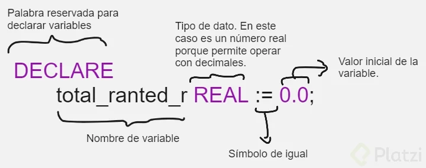
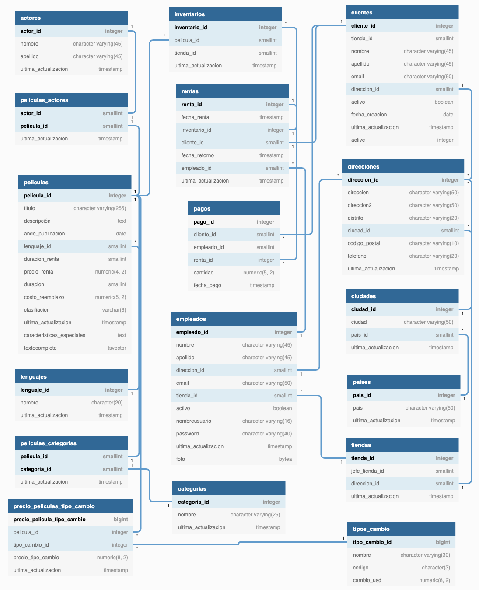
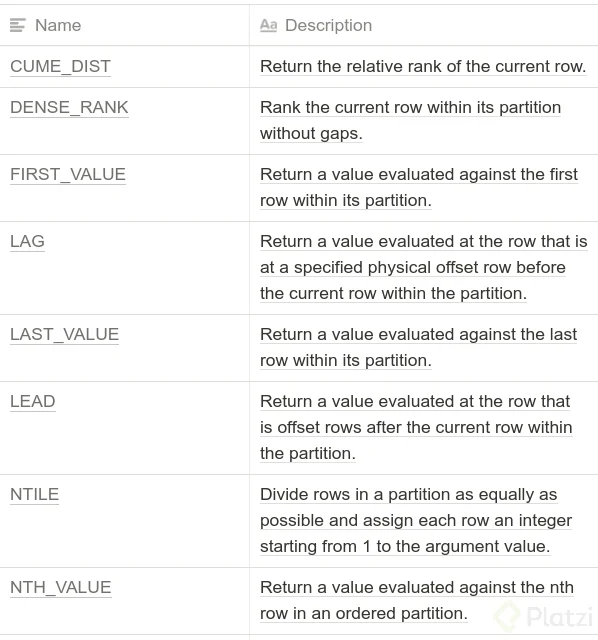

# Curso de PostgreSQL Aplicado a Ciencia de Datos

## Todo lo que aprenderás sobre PostgreSQL para ciencia de datos

PostgreSQL es una de las bases de datos más robustas y populares para gestionar datos en ciencia de datos. A continuación, te detallo lo que puedes aprender para dominar PostgreSQL en este contexto:

### 1. **Fundamentos de PostgreSQL**
- **Conceptos básicos**: ¿Qué es PostgreSQL y por qué es útil en ciencia de datos?
- **Instalación y configuración**: Configurar PostgreSQL en entornos locales y en la nube.
- **Estructura de la base de datos**: Tablas, columnas, filas, esquemas y relaciones.

### 2. **Manipulación de Datos**
- **Consultas básicas**: Uso de **`SELECT`**, **`INSERT`**, **`UPDATE`**, **`DELETE`**.
- **Filtrado y ordenación**: Clausulas **`WHERE`**, **`ORDER BY`**, **`LIMIT`**, **`OFFSET`**.
- **Funciones de agregación**: **`SUM`**, **`AVG`**, **`COUNT`**, **`MAX`**, **`MIN`**.
- **Joins y relaciones**:
  - **`INNER JOIN`**, **`LEFT JOIN`**, **`RIGHT JOIN`**, **`FULL OUTER JOIN`**.
  - Relaciones entre tablas en bases de datos relacionales.

### 3. **Funciones avanzadas para análisis de datos**
- **Window functions**: Uso de **`ROW_NUMBER`**, **`RANK`**, **`DENSE_RANK`**, **`NTILE`**.
- **Subconsultas**:
  - Subconsultas en **`SELECT`**, **`WHERE`**, y **`FROM`**.
  - Subqueries correlacionadas.
- **CTE (Common Table Expressions)**: Uso de **`WITH`** para consultas complejas.
- **Agrupaciones avanzadas**: Clausulas como **`GROUP BY`**, **`ROLLUP`**, **`CUBE`**, y **`GROUPING SETS`**.

### 4. **Trabajar con fechas y horas**
- **Funciones de fecha y hora**:
  - **`NOW`**, **`CURRENT_DATE`**, **`EXTRACT`**, **`DATE_PART`**, **`AGE`**.
- Calcular diferencias entre fechas (útil para análisis de series de tiempo).

### 5. **Consultas analíticas y estadísticas**
- Consultas que integran datos para reportes:
  - Porcentajes, desviaciones estándar y varianza con funciones como **`STDDEV`**, **`VARIANCE`**.
- Uso de **`CASE`** para generar variables categóricas basadas en condiciones.

### 6. **Extensiones y funciones específicas**
- **PostGIS**: Extensión para datos geoespaciales.
- **PL/pgSQL**: Crear funciones personalizadas y procedimientos almacenados.
- **JSON y JSONB**: Manipular datos semi-estructurados.
- **Full Text Search**: Búsquedas avanzadas en textos.

### 7. **Optimización de consultas**
- Indexación:
  - Crear índices con **`CREATE INDEX`**, tipos de índices (**BTREE**, **GIN**, **GiST**).
  - Índices parciales y únicos.
- Analizar rendimiento:
  - **`EXPLAIN`** y **`EXPLAIN ANALYZE`** para entender el plan de ejecución de consultas.
  - Optimización de subconsultas y joins.
- Particionamiento de tablas para bases de datos grandes.

### 8. **Bases de datos distribuidas y paralelismo**
- Configurar sharding para bases de datos distribuidas.
- Consultas paralelas en PostgreSQL para mejorar rendimiento.

### 9. **Integración con herramientas de ciencia de datos**
- Conectar PostgreSQL con:
  - **Python** (usando bibliotecas como `psycopg2`, `SQLAlchemy` o `Pandas`).
  - Herramientas de BI como Power BI, Tableau, Looker.
- Carga y extracción de datos desde PostgreSQL usando **`COPY`**, **`\COPY`**, o **`pg_dump`**.

### 10. **Seguridad y manejo de usuarios**
- Crear usuarios y roles.
- Asignar permisos con **`GRANT`** y **`REVOKE`**.
- Encriptación de datos y backups para proteger información sensible.

### 11. **Prácticas con datos reales**
- Cargar datasets de ciencia de datos (CSV, JSON, etc.) en PostgreSQL.
- Resolver casos prácticos como:
  - Análisis de ventas.
  - Modelos predictivos con extracción de características desde la base de datos.
  - Análisis de series temporales.

Si dominas todos estos temas, estarás bien preparado para utilizar PostgreSQL como herramienta principal en tus proyectos de ciencia de datos.

**Lecturas recomendadas**

[Curso Fundamentos de Bases de Datos | Platzi](https://platzi.com/clases/bd/)

[Curso de PostgreSQL](https://platzi.com/clases/postgresql/)

[Carrera Big Data y Data Science | ✔️Platzi](https://platzi.com/datos/)

## Importación de los datos para el proyecto

Es un proceso simple, sin embargo, para iniciar es necesario que cumplas con dos dependencias:

- La primera es haber instalado PostgreSQL y su set de herramientas en tu Sistema Operativo.

- La segunda es haber instalado PgAdmin 4 para que puedas interactuar de manera gráfica con la base de datos.

- Asegúrate de que el usuario postgresql se encuentra configurado y con todos los permisos.

Para conocer los detalles de la instalación de las anteriores dependencias, por favor visita el Curso de PostgreSQL donde es abordado a detalle. En este tutorial de importación asumimos que se encuentra correctamente configurado.

### Paso 1: ingresa a PgAdmin


### Paso 2: Crea la base de datos

Selecciona el elemento Databases del menú izquierdo, da click derecho y selecciona la opción Create > Database.


En el campo Database escribe el nombre “platzimovies” y en el campo owner selecciona el usuario que será dueño de la base de datos.


Da click en el botón Save. Y posteriormente selecciona la base de datos recién creada en el menú derecho.


### Paso 3: Configura la restauración

Dirígete al menú Tools (Herramientas) y da click en la opción Restore (Restaurar).


### Paso 4: Importa desde archivo

Selecciona la opción Custom or tar en el campo Format. En Role name elige el usuario con permisos root, normalmente es el usuario postgres o el nombre de usuario de tu computadora.

Finalmente, en el campo Filename selecciona el botón de 3 puntos y selecciona el archivo que deberás descargar haciendo click [aquí](https://drive.google.com/open?id=1oE7A4z_D2o-udn_yflwZ03uN3cA0gVpr "aquí")

Da click en el botón Restore.


Al ejecutar la restauración encontrarás un mensaje similar al siguiente:


### Paso 5: Verifica que las tablas fueron creadas

Yendo al menú izquierdo, dirígete a Servers > Local > Databases > platzimovies > Schemas > public > Tables.

Verifica que ahí aparecen todas las tablas que necesitamos para el ejercicio.


Si lo lograste, ¡felicidades! Estás listo para usar nuestra base de datos de ejemplo.

## Breve historia de las bases de datos

Las bases de datos han evolucionado significativamente a lo largo de las décadas. Aquí te ofrezco una breve historia de su desarrollo:

### 1. **Los Primeros Sistemas de Almacenamiento de Datos (1940s-1960s)**
   - **Antes de las bases de datos**: La información se almacenaba de manera muy rudimentaria, en tarjetas perforadas y en archivos de texto planos. La organización de la información era manual.
   - **Primeros sistemas**: Durante las décadas de 1940 y 1950, las computadoras comenzaron a almacenar datos de manera más estructurada, pero seguían utilizando métodos rudimentarios de almacenamiento.

### 2. **Modelos Jerárquico y de Red (1960s-1970s)**
   - **Sistema de Base de Datos Jerárquico**: A principios de los 60, el modelo jerárquico se utilizó ampliamente. IBM desarrolló el **IMS (Information Management System)**, que almacenaba datos en estructuras de árbol (padre-hijo).
   - **Modelo de Red**: A finales de los 60 y principios de los 70, el **modelo de red** surgió como una mejora. Permite más flexibilidad que el jerárquico, ya que los registros podían tener múltiples relaciones.

### 3. **Modelo Relacional (1970s-1980s)**
   - **La Teoría Relacional**: En 1970, **Edgar F. Codd** publicó su famoso artículo "A Relational Model of Data for Large Shared Data Banks", introduciendo el modelo relacional de bases de datos. Este modelo organizaba los datos en tablas, lo que hacía más fácil la gestión y el acceso.
   - **Primeros Sistemas Relacionales**: En la década de 1970, IBM desarrolló **System R**, el primer prototipo de un sistema de gestión de bases de datos (DBMS) relacional.
   - **SQL**: En 1974, IBM también introdujo **SQL (Structured Query Language)**, un lenguaje para interactuar con bases de datos relacionales. En 1986, SQL fue estandarizado por ANSI y se convirtió en el lenguaje de facto para interactuar con bases de datos relacionales.

### 4. **Bases de Datos Comerciales y Expansión (1980s-1990s)**
   - **Comercialización**: En los años 80, empresas como **Oracle**, **Microsoft** y **Informix** comenzaron a comercializar sus propios sistemas de bases de datos relacionales. Esto llevó a una gran adopción en industrias que necesitaban gestionar grandes cantidades de información.
   - **Crecimiento y escalabilidad**: Las bases de datos comenzaron a escalar para manejar grandes volúmenes de datos, y a medida que la tecnología de hardware mejoraba, los sistemas de bases de datos se hicieron más potentes.

### 5. **Bases de Datos No Relacionales (2000s-Presente)**
   - **La era del Big Data**: Con la explosión de datos generados por Internet y redes sociales, surgieron nuevos modelos de bases de datos **NoSQL** en la década de 2000. Estos sistemas son más adecuados para trabajar con datos no estructurados, grandes volúmenes de datos y estructuras de datos dinámicas.
   - **Popularidad de NoSQL**: Tecnologías como **MongoDB**, **Cassandra** y **Couchbase** empezaron a ser populares por su capacidad para manejar datos semi-estructurados o no estructurados (como JSON) y por su escalabilidad horizontal.
   - **Sistemas distribuidos**: A medida que las bases de datos se hicieron más complejas y las aplicaciones web crecieron, la necesidad de bases de datos distribuidas también creció, con soluciones como **Amazon DynamoDB**, **Google Spanner** y **Apache HBase**.

### 6. **Bases de Datos en la Nube y Nuevas Tendencias (2010s-Presente)**
   - **Bases de datos en la nube**: Con la adopción de servicios en la nube como **AWS**, **Google Cloud** y **Microsoft Azure**, las bases de datos como servicio (DBaaS) se hicieron populares. Esto ha permitido que las empresas gestionen bases de datos sin preocuparse por la infraestructura.
   - **Bases de datos híbridas y multi-modelo**: Las bases de datos modernas están comenzando a integrar capacidades tanto de bases de datos relacionales como NoSQL en una sola solución. Por ejemplo, **Cassandra** o **ArangoDB** combinan diferentes modelos de datos.
   - **Inteligencia Artificial y Machine Learning**: Las bases de datos modernas también están comenzando a integrar capacidades de inteligencia artificial para mejorar el rendimiento de las consultas, la optimización de índices y la administración de datos.

### Conclusión
Las bases de datos han recorrido un largo camino desde sus inicios rudimentarios hasta convertirse en sistemas sofisticados que gestionan enormes cantidades de datos. En el futuro, es probable que sigan evolucionando con el avance de nuevas tecnologías, como el procesamiento en la nube, la inteligencia artificial y la computación distribuida.

## Puntos fuertes de las bases de datos relacionales

Las bases de datos relacionales (RDBMS) tienen varios puntos fuertes que las han convertido en una opción popular para muchas aplicaciones a lo largo de los años. Aquí te dejo los principales:

### 1. **Estructura de Datos Bien Definida**
   - **Modelo Tabular**: Los datos se organizan en tablas con filas y columnas, lo que facilita la comprensión y organización de la información. Cada fila representa un registro único, y cada columna representa un atributo de ese registro.
   - **Esquema Estricto**: El esquema de la base de datos es predefinido, lo que garantiza que los datos sean consistentes y cumplan con ciertas reglas (como tipos de datos y restricciones).

### 2. **Integridad y Consistencia de los Datos**
   - **Integridad Referencial**: Los RDBMS permiten definir relaciones entre tablas usando claves primarias y foráneas. Esto asegura la integridad referencial, lo que significa que no se pueden crear registros huérfanos o inconsistentes en la base de datos.
   - **Restricciones de Integridad**: Los RDBMS permiten establecer restricciones como `NOT NULL`, `UNIQUE`, `CHECK`, y `DEFAULT`, lo que ayuda a mantener la validez y la coherencia de los datos.

### 3. **Lenguaje SQL**
   - **Estándar Universal**: El lenguaje SQL (Structured Query Language) es un estándar universal para la manipulación de datos en bases de datos relacionales. SQL permite realizar operaciones como seleccionar, insertar, actualizar y eliminar datos de manera sencilla y eficiente.
   - **Consultas Complejas**: SQL facilita la ejecución de consultas complejas mediante operaciones de agregación, filtros, subconsultas y uniones entre tablas, lo que permite a los usuarios obtener exactamente la información que necesitan.

### 4. **Transacciones ACID**
   - **Propiedades ACID**: Los RDBMS garantizan que las transacciones sean atómicas (todo o nada), consistentes (los datos permanecen válidos después de la transacción), aisladas (las transacciones no interfieren entre sí) y duraderas (los cambios se persisten incluso si ocurre un fallo en el sistema). Esto es fundamental para aplicaciones que requieren alta confiabilidad y consistencia de los datos.
   
### 5. **Escalabilidad Vertical**
   - **Escalabilidad Horizontal y Vertical**: Aunque los RDBMS tradicionales son conocidos por su escalabilidad vertical (agregar más recursos a un servidor), también hay opciones para distribuir cargas de trabajo y soportar grandes volúmenes de datos mediante técnicas de sharding y particionamiento.

### 6. **Manejo de Grandes Volúmenes de Datos**
   - **Optimización de Consultas**: Los RDBMS suelen tener sofisticados optimizadores de consultas que pueden mejorar el rendimiento de la base de datos al analizar y ajustar las consultas de manera eficiente.
   - **Índices**: El uso de índices en columnas específicas mejora el rendimiento de las consultas de búsqueda, incluso con grandes volúmenes de datos.

### 7. **Seguridad y Control de Acceso**
   - **Control de Acceso**: Los RDBMS ofrecen mecanismos robustos de control de acceso, como roles, privilegios y autenticación, para asegurar que solo los usuarios autorizados puedan acceder o modificar los datos.
   - **Encriptación y Copias de Seguridad**: Los RDBMS proporcionan funcionalidades de encriptación de datos y copias de seguridad para garantizar la seguridad y la recuperación ante desastres.

### 8. **Mantenimiento y Soporte**
   - **Herramientas de Administración**: Los RDBMS generalmente incluyen herramientas de administración que facilitan tareas como la creación de bases de datos, la gestión de índices, la optimización de consultas y la realización de copias de seguridad.
   - **Documentación y Comunidad**: Al ser ampliamente utilizados, los RDBMS tienen una gran comunidad de soporte, documentación extensa y recursos educativos disponibles.

### 9. **Compatibilidad y Estándares**
   - **Interoperabilidad**: Los RDBMS son muy compatibles con otras aplicaciones, tecnologías y lenguajes de programación. A menudo se utilizan junto con sistemas empresariales, aplicaciones web y soluciones de inteligencia empresarial.

### 10. **Facilidad de Uso**
   - **Manejo Sencillo de Datos Relacionados**: Debido a la estructura organizada y el modelo lógico de las bases de datos, los RDBMS permiten a los desarrolladores y usuarios interactuar con los datos de una manera intuitiva, incluso sin ser expertos en bases de datos.

### Conclusión
Los sistemas de bases de datos relacionales han sido fundamentales en la industria de la tecnología de la información durante más de 40 años. Su estructura ordenada, confiabilidad y el uso de SQL para consultas complejas los hacen una opción excelente para aplicaciones que requieren consistencia, seguridad y facilidad de manejo de grandes volúmenes de datos estructurados.

## Conceptos importantes de las bases de datos relacionales

Las **bases de datos relacionales** son sistemas de almacenamiento de datos que organizan la información en tablas y permiten relaciones entre ellas. A continuación, te explico algunos conceptos clave que son fundamentales para entender cómo funcionan:

### 1. **Tabla**
   - Es el **contenedor principal de datos** en una base de datos relacional.
   - Está formada por filas y columnas. Las **columnas** representan los atributos o campos, y las **filas** son los registros que contienen los datos.

### 2. **Filas y Columnas**
   - **Filas**: Cada fila (o registro) de una tabla contiene una entrada individual de datos. Cada fila es única y representa una instancia de los datos.
   - **Columnas**: Cada columna tiene un nombre y tipo de dato definido, que describe los diferentes atributos de los datos que se almacenan. Por ejemplo, una columna puede ser "nombre", "fecha de nacimiento", "dirección", etc.

### 3. **Clave primaria (Primary Key)**
   - Una **clave primaria** es un campo o conjunto de campos cuyo valor es único para cada fila en una tabla.
   - Se utiliza para identificar de manera única cada registro de la tabla, asegurando que no haya duplicados.

### 4. **Clave foránea (Foreign Key)**
   - Una **clave foránea** es un campo en una tabla que se refiere a la clave primaria de otra tabla.
   - Establece una **relación** entre las tablas y permite **referenciar** registros de una tabla desde otra.

### 5. **Relaciones entre tablas**
   - Las **relaciones** son la manera en que las tablas se conectan entre sí usando claves foráneas.
   - Hay tres tipos de relaciones:
     - **Uno a uno (1:1)**: Un registro de una tabla se relaciona con un solo registro de otra tabla.
     - **Uno a muchos (1:N)**: Un registro de una tabla puede estar relacionado con múltiples registros de otra tabla, pero cada registro de la segunda tabla está relacionado con un solo registro de la primera.
     - **Muchos a muchos (N:N)**: Varios registros de una tabla pueden estar relacionados con varios registros de otra tabla.

### 6. **Índices (Indexes)**
   - Un **índice** es una estructura de datos que mejora la velocidad de las consultas en la base de datos.
   - Los índices permiten acceder a los datos más rápido, pero su uso también puede aumentar el tiempo de inserción y actualización de registros.

### 7. **Consultas SQL (Structured Query Language)**
   - El **SQL** es el lenguaje estándar para interactuar con bases de datos relacionales. Algunas de las operaciones más comunes son:
     - **SELECT**: Para consultar datos.
     - **INSERT**: Para agregar nuevos datos.
     - **UPDATE**: Para modificar datos existentes.
     - **DELETE**: Para eliminar datos.

### 8. **Normalización**
   - La **normalización** es el proceso de estructurar las tablas para eliminar la redundancia y dependencias innecesarias entre los datos. Hay varias formas de normalización (1NF, 2NF, 3NF, etc.), que aseguran que la base de datos esté organizada de manera eficiente.

### 9. **Transacciones**
   - Una **transacción** es un conjunto de operaciones SQL que se ejecutan como una única unidad.
   - Las bases de datos relacionales garantizan que las transacciones sean **ATOMICAS** (se realizan completamente o no se realizan), **CONSISTENTES** (los datos siempre están en un estado válido), **AISLADAS** (las transacciones no interfieren entre sí) y **DURADERAS** (una vez que se realiza una transacción, los cambios son permanentes).

### 10. **Integridad referencial**
   - La **integridad referencial** asegura que las relaciones entre las tablas se mantengan consistentes. 
   - Por ejemplo, no se puede agregar un registro en una tabla que tenga una clave foránea que no exista en la tabla referenciada.

### 11. **Consultas agregadas**
   - **Funciones agregadas** como **COUNT**, **SUM**, **AVG**, **MIN**, y **MAX** se utilizan para realizar cálculos sobre grupos de datos y extraer información resumida.
   - A menudo se utilizan junto con la cláusula **GROUP BY** para agrupar los datos antes de aplicar funciones agregadas.

### 12. **Vistas (Views)**
   - Una **vista** es una tabla virtual que contiene los resultados de una consulta SQL. No almacena datos por sí misma, sino que presenta datos de una o más tablas.
   - Se usa para simplificar consultas complejas, proporcionar seguridad y presentar datos de manera más amigable.

### 13. **Triggers**
   - Un **trigger** (o desencadenador) es una función que se ejecuta automáticamente cuando ocurre un evento específico en la base de datos, como una inserción, actualización o eliminación de registros.

### 14. **Procedimientos almacenados (Stored Procedures)**
   - Un **procedimiento almacenado** es un conjunto de instrucciones SQL que se guardan en la base de datos y se pueden ejecutar como una unidad.
   - Los procedimientos almacenados permiten la reutilización del código y ayudan a reducir la cantidad de lógica de programación repetida en las aplicaciones.

### 15. **ACID**
   - Las bases de datos relacionales siguen las propiedades **ACID** para garantizar la **fiabilidad** y **consistencia** de las transacciones:
     - **Atomicidad**: Todas las operaciones en una transacción se completan o no se completan.
     - **Consistencia**: La base de datos siempre permanece en un estado consistente después de una transacción.
     - **Aislamiento**: Las transacciones se ejecutan de forma aislada para que no interfieran entre sí.
     - **Durabilidad**: Los cambios en la base de datos son permanentes después de una transacción.

### Conclusión
Estos conceptos son fundamentales para comprender cómo funcionan las bases de datos relacionales. Si bien hay muchos otros aspectos técnicos, estos son los que te permitirán tener una comprensión sólida de la teoría y práctica de las bases de datos relacionales.

## Principales sentencias SQL

Las **sentencias SQL** son comandos que se utilizan para interactuar con bases de datos, ya sea para **consultar** datos, **modificarlos**, **eliminarlos** o **insertarlos**. A continuación te presento las **principales sentencias SQL** y su uso:

### 1. **SELECT**
   - Se utiliza para **consultar datos** de una o más tablas.
   - Sintaxis básica:
     ```sql
     SELECT columna1, columna2, ...
     FROM nombre_tabla;
     ```
   - También se puede usar para filtrar, ordenar o agrupar resultados:
     ```sql
     SELECT columna1, columna2
     FROM nombre_tabla
     WHERE condicion
     ORDER BY columna
     GROUP BY columna;
     ```

### 2. **INSERT INTO**
   - Se utiliza para **insertar nuevos registros** en una tabla.
   - Sintaxis básica:
     ```sql
     INSERT INTO nombre_tabla (columna1, columna2, ...)
     VALUES (valor1, valor2, ...);
     ```

### 3. **UPDATE**
   - Se usa para **modificar los valores** de registros existentes en una tabla.
   - Sintaxis básica:
     ```sql
     UPDATE nombre_tabla
     SET columna1 = valor1, columna2 = valor2
     WHERE condicion;
     ```
   - **WHERE** es importante para especificar qué registros se deben actualizar; si se omite, se actualizarán todos los registros.

### 4. **DELETE**
   - Se usa para **eliminar registros** de una tabla.
   - Sintaxis básica:
     ```sql
     DELETE FROM nombre_tabla
     WHERE condicion;
     ```
   - Al igual que en **UPDATE**, es fundamental usar **WHERE** para especificar los registros a eliminar. Si se omite, se eliminarán todos los registros de la tabla.

### 5. **CREATE TABLE**
   - Se utiliza para **crear una nueva tabla** en la base de datos.
   - Sintaxis básica:
     ```sql
     CREATE TABLE nombre_tabla (
         columna1 tipo_dato,
         columna2 tipo_dato,
         ...
     );
     ```

### 6. **ALTER TABLE**
   - Se usa para **modificar la estructura** de una tabla existente, como agregar, eliminar o modificar columnas.
   - Sintaxis básica:
     ```sql
     ALTER TABLE nombre_tabla
     ADD columna_nueva tipo_dato;
     ```
     ```sql
     ALTER TABLE nombre_tabla
     DROP COLUMN columna_a_eliminar;
     ```
     ```sql
     ALTER TABLE nombre_tabla
     MODIFY COLUMN columna_existente tipo_dato;
     ```

### 7. **DROP TABLE**
   - Se usa para **eliminar** una tabla de la base de datos.
   - Sintaxis básica:
     ```sql
     DROP TABLE nombre_tabla;
     ```

### 8. **CREATE INDEX**
   - Se usa para **crear un índice** en una o más columnas de una tabla. Los índices mejoran la velocidad de las consultas, pero pueden ralentizar las inserciones y actualizaciones.
   - Sintaxis básica:
     ```sql
     CREATE INDEX nombre_indice
     ON nombre_tabla (columna1, columna2);
     ```

### 9. **DROP INDEX**
   - Se usa para **eliminar un índice** previamente creado.
   - Sintaxis básica:
     ```sql
     DROP INDEX nombre_indice;
     ```

### 10. **TRUNCATE**
   - Se usa para **eliminar todos los registros** de una tabla, pero **mantener la estructura** de la tabla. Es más rápido que **DELETE**, pero no puede ser revertido con un `ROLLBACK`.
   - Sintaxis básica:
     ```sql
     TRUNCATE TABLE nombre_tabla;
     ```

### 11. **GRANT**
   - Se usa para **asignar permisos** a un usuario o rol sobre una tabla, vista u otros objetos de la base de datos.
   - Sintaxis básica:
     ```sql
     GRANT permiso
     ON objeto
     TO usuario;
     ```
     Ejemplo:
     ```sql
     GRANT SELECT, INSERT
     ON empleados
     TO juan;
     ```

### 12. **REVOKE**
   - Se usa para **revocar permisos** previamente otorgados a un usuario o rol.
   - Sintaxis básica:
     ```sql
     REVOKE permiso
     ON objeto
     FROM usuario;
     ```

### 13. **JOIN**
   - **JOIN** se usa para combinar filas de dos o más tablas basándose en una condición relacionada entre ellas.
     - **INNER JOIN**: Devuelve solo las filas que tienen coincidencias en ambas tablas.
     - **LEFT JOIN**: Devuelve todas las filas de la tabla izquierda y las filas coincidentes de la tabla derecha.
     - **RIGHT JOIN**: Devuelve todas las filas de la tabla derecha y las filas coincidentes de la tabla izquierda.
     - **FULL OUTER JOIN**: Devuelve filas cuando hay una coincidencia en una de las tablas.

   Ejemplo de un **INNER JOIN**:
   ```sql
   SELECT empleados.nombre, departamentos.nombre
   FROM empleados
   INNER JOIN departamentos
   ON empleados.departamento_id = departamentos.id;
   ```

### 14. **GROUP BY**
   - Se usa para agrupar filas que tienen los mismos valores en columnas específicas y aplicar funciones agregadas (como COUNT, SUM, AVG).
   - Sintaxis básica:
     ```sql
     SELECT columna, COUNT(*)
     FROM nombre_tabla
     GROUP BY columna;
     ```

### 15. **HAVING**
   - Se usa para **filtrar los resultados** de una consulta después de que se ha aplicado el `GROUP BY`.
   - Sintaxis básica:
     ```sql
     SELECT columna, COUNT(*)
     FROM nombre_tabla
     GROUP BY columna
     HAVING COUNT(*) > 5;
     ```

### 16. **ORDER BY**
   - Se usa para **ordenar** los resultados de una consulta.
     - `ASC` para orden ascendente.
     - `DESC` para orden descendente.
   - Sintaxis básica:
     ```sql
     SELECT columna1, columna2
     FROM nombre_tabla
     ORDER BY columna1 ASC;
     ```

### 17. **DISTINCT**
   - Se usa para **eliminar duplicados** y mostrar solo valores únicos.
   - Sintaxis básica:
     ```sql
     SELECT DISTINCT columna
     FROM nombre_tabla;
     ```

### 18. **LIMIT**
   - Se usa para **limitar el número de resultados** de una consulta.
   - Sintaxis básica:
     ```sql
     SELECT columna1, columna2
     FROM nombre_tabla
     LIMIT 10;
     ```

### 19. **EXPLAIN**
   - Se usa para obtener el **plan de ejecución** de una consulta, lo que permite entender cómo se está procesando la consulta.
   - Sintaxis básica:
     ```sql
     EXPLAIN SELECT columna1, columna2
     FROM nombre_tabla;
     ```

Estas son las **principales sentencias SQL** que se utilizan para interactuar con bases de datos relacionales. Cada una tiene su propósito específico y se utiliza en distintos contextos para gestionar datos de manera eficiente.

## ¿Qué es la ciencia de datos?

La **ciencia de datos** es un campo interdisciplinario que combina técnicas de **estadística**, **matemáticas**, **programación** y **conocimiento del dominio** para **extraer** información útil y **tomar decisiones basadas en datos**. Su objetivo es analizar grandes volúmenes de datos (tanto estructurados como no estructurados) para descubrir patrones, realizar predicciones y generar conocimientos que puedan ser utilizados para resolver problemas complejos en diversas áreas, como negocios, salud, tecnología, marketing, entre otros.

### Elementos clave de la ciencia de datos:

1. **Recolección de datos**:
   - Los científicos de datos deben obtener datos de diversas fuentes, como bases de datos, APIs, sensores, archivos y plataformas de redes sociales.

2. **Limpieza y preprocesamiento de datos**:
   - Los datos rara vez están listos para su análisis, por lo que es necesario limpiarlos y transformarlos, eliminando inconsistencias, valores nulos, errores y haciendo que los datos sean adecuados para el análisis.

3. **Análisis exploratorio de datos (EDA)**:
   - Este proceso implica el uso de estadísticas y visualizaciones para entender las características de los datos, como distribuciones, correlaciones, valores atípicos, etc. Es crucial para identificar patrones y obtener una comprensión más profunda de los datos.

4. **Modelado y algoritmos**:
   - Los científicos de datos utilizan modelos matemáticos y algoritmos, incluidos **modelos predictivos** como **regresión**, **clasificación** y **clustering**, así como **aprendizaje automático (machine learning)** y **aprendizaje profundo (deep learning)**, para hacer predicciones o tomar decisiones basadas en los datos.

5. **Visualización de datos**:
   - Presentar los resultados de manera comprensible es esencial para tomar decisiones informadas. Las herramientas de visualización permiten a los científicos de datos crear gráficos, diagramas y dashboards que faciliten la interpretación de los datos y los resultados obtenidos.

6. **Toma de decisiones basada en datos**:
   - El análisis de los resultados obtenidos ayuda a las organizaciones a tomar decisiones informadas, optimizar procesos, predecir comportamientos futuros y descubrir oportunidades de negocio.

### Herramientas y tecnologías utilizadas en la ciencia de datos:
- **Lenguajes de programación**: Python, R, SQL, Scala
- **Bibliotecas y frameworks**: Pandas, NumPy, Matplotlib, Scikit-learn, TensorFlow, PyTorch, Keras
- **Bases de datos**: SQL, NoSQL (MongoDB, Cassandra)
- **Plataformas en la nube**: AWS, Google Cloud, Azure
- **Herramientas de visualización**: Tableau, Power BI, Matplotlib, Seaborn

### Aplicaciones de la ciencia de datos:
- **Negocios**: Optimización de procesos, análisis de tendencias de mercado, personalización de productos y servicios.
- **Salud**: Análisis de imágenes médicas, predicción de enfermedades, análisis de registros de pacientes.
- **Finanzas**: Detección de fraudes, análisis de riesgos, predicción de mercados.
- **Marketing**: Segmentación de clientes, análisis de sentimiento, recomendaciones personalizadas.
- **Deportes**: Análisis del rendimiento de los jugadores, estrategias de equipo basadas en datos.
  
En resumen, la **ciencia de datos** permite extraer valor de los datos a través de métodos estadísticos, matemáticos y computacionales, y es fundamental en la toma de decisiones estratégicas en casi todas las industrias actuales.

**Lecturas recomendadas**

[Carrera Big Data y Data Science | ✔️Platzi](https://platzi.com/datos/)

[YouTube](https://www.youtube.com/watch?v=Bl2sBiVdZHs)

## Aplicación de la ciencia de datos

La **aplicación de la ciencia de datos** es vasta y se extiende a muchos sectores debido a su capacidad para transformar datos en conocimientos valiosos. A continuación se describen algunas de las áreas clave donde la ciencia de datos tiene un impacto significativo:

### 1. **Negocios y Marketing**
   - **Análisis de clientes y segmentación**: La ciencia de datos permite segmentar a los clientes en grupos según su comportamiento, preferencias y características demográficas. Esto facilita campañas de marketing personalizadas y estrategias de fidelización.
   - **Recomendación de productos**: Empresas como Amazon y Netflix utilizan algoritmos de recomendación para sugerir productos o contenido a los usuarios basándose en su historial de navegación o compras.
   - **Análisis de sentimiento**: Mediante el análisis de redes sociales, revisiones y encuestas, se pueden analizar las opiniones de los clientes y su percepción de una marca o producto.
   - **Optimización de precios**: Utilizando modelos predictivos, las empresas pueden ajustar sus precios en tiempo real según la demanda, la competencia y otros factores del mercado.

### 2. **Salud**
   - **Diagnóstico médico asistido por IA**: Algoritmos de aprendizaje automático analizan imágenes médicas (como radiografías o resonancias magnéticas) para identificar enfermedades o anomalías con alta precisión.
   - **Predicción de enfermedades**: Los modelos de ciencia de datos pueden predecir la probabilidad de enfermedades como diabetes, cáncer o enfermedades cardíacas basándose en el análisis de datos históricos de pacientes.
   - **Optimización de la atención al paciente**: Se puede optimizar la gestión de recursos hospitalarios, como la asignación de camas o personal, basándose en el análisis de datos históricos de los pacientes.
   - **Medicina personalizada**: Basado en el análisis de los datos genéticos de un paciente, los tratamientos pueden personalizarse para aumentar la eficacia y reducir efectos secundarios.

### 3. **Finanzas y Economía**
   - **Detección de fraudes**: Los modelos predictivos y el análisis de patrones permiten identificar transacciones sospechosas en tiempo real y prevenir fraudes.
   - **Gestión de riesgos**: Las instituciones financieras utilizan la ciencia de datos para evaluar riesgos de crédito, predecir insolvencias y gestionar carteras de inversión.
   - **Predicción del mercado**: La ciencia de datos también se utiliza para prever tendencias del mercado financiero y de acciones, basándose en el análisis de grandes volúmenes de datos históricos y actuales.
   - **Optimización de carteras**: Los algoritmos de optimización ayudan a las empresas a diseñar carteras de inversión que maximizan el rendimiento y minimizan el riesgo.

### 4. **Transporte y Logística**
   - **Optimización de rutas**: Las empresas de transporte como Uber o Lyft utilizan ciencia de datos para optimizar rutas y tiempos de llegada, mejorando la eficiencia operativa.
   - **Predicción de demanda**: Utilizando datos históricos y patrones, se pueden predecir los picos de demanda de transporte público o privado y planificar adecuadamente la asignación de recursos.
   - **Gestión de inventarios**: En el sector logístico, la ciencia de datos se utiliza para gestionar inventarios de manera más eficiente, prediciendo la demanda y evitando tanto el exceso como la escasez de productos.

### 5. **Energía**
   - **Optimización de redes eléctricas**: Las compañías de energía utilizan la ciencia de datos para predecir la demanda de electricidad y optimizar la distribución de energía.
   - **Predicción de fallos en infraestructura**: A través del análisis de datos de sensores en equipos e infraestructura, se pueden prever posibles fallos y realizar mantenimientos preventivos.
   - **Energía renovable**: La ciencia de datos se usa para predecir patrones de generación de energía renovable, como la solar o la eólica, maximizando la eficiencia y reduciendo los costos.

### 6. **Deportes**
   - **Análisis de rendimiento de los jugadores**: Las estadísticas avanzadas y el análisis de datos de los jugadores permiten entrenadores y analistas medir el rendimiento, predecir lesiones y mejorar tácticas.
   - **Estrategia deportiva**: En deportes como el fútbol, baloncesto o béisbol, los equipos utilizan modelos predictivos para estudiar el rendimiento y tomar decisiones estratégicas durante los partidos.
   - **Apuestas deportivas**: Los modelos de ciencia de datos también se utilizan para predecir resultados de eventos deportivos y en mercados de apuestas.

### 7. **Agricultura**
   - **Agricultura de precisión**: Los agricultores utilizan sensores, satélites y datos meteorológicos para optimizar el uso de recursos (como agua, fertilizantes y pesticidas) y mejorar los rendimientos de los cultivos.
   - **Predicción de cosechas**: La ciencia de datos ayuda a predecir el rendimiento de los cultivos según las condiciones meteorológicas, el tipo de suelo y otros factores.
   - **Monitoreo de plagas y enfermedades**: Mediante el análisis de datos sobre la salud de los cultivos y el comportamiento de las plagas, se pueden implementar medidas preventivas o correctivas de manera más eficiente.

### 8. **Gobierno y Política**
   - **Análisis de políticas públicas**: El análisis de datos ayuda a los gobiernos a evaluar el impacto de las políticas públicas y mejorar la asignación de recursos.
   - **Prevención del crimen**: La ciencia de datos se utiliza en la predicción de patrones de delincuencia y la asignación de recursos policiales en áreas de alto riesgo.
   - **Optimización de servicios públicos**: Los datos de los servicios públicos (agua, electricidad, transporte) se analizan para mejorar su gestión, identificar ineficiencias y optimizar costos.

### 9. **Ciencia y Medio Ambiente**
   - **Modelado climático**: Los modelos de ciencia de datos ayudan a predecir el cambio climático, patrones meteorológicos y fenómenos naturales, como huracanes o terremotos.
   - **Conservación de la biodiversidad**: A través del análisis de datos de especies y ecosistemas, los científicos pueden monitorizar y proteger la biodiversidad.
   - **Investigación científica**: La ciencia de datos es una herramienta clave en el análisis de grandes volúmenes de datos experimentales, como secuencias genéticas, datos astronómicos o datos de física de partículas.

### 10. **Automóviles y Conducción Autónoma**
   - **Conducción autónoma**: Los vehículos autónomos utilizan algoritmos de ciencia de datos para interpretar datos de sensores (cámaras, radares, LIDAR) y tomar decisiones en tiempo real sobre la navegación y la seguridad.
   - **Mantenimiento predictivo**: Los autos conectados recopilan datos sobre su rendimiento y usan modelos predictivos para identificar problemas antes de que ocurran.

### 11. **Educación**
   - **Análisis de desempeño estudiantil**: Los sistemas educativos utilizan ciencia de datos para analizar el rendimiento de los estudiantes, identificar áreas de mejora y personalizar los planes de estudio.
   - **Optimización del aprendizaje**: Mediante la recopilación y análisis de datos sobre los estilos de aprendizaje, los sistemas educativos pueden adaptar los contenidos y métodos de enseñanza.

En resumen, la **ciencia de datos** es fundamental para tomar decisiones más informadas, mejorar procesos y optimizar recursos en una variedad de sectores. Su aplicación permite resolver problemas complejos y generar ventajas competitivas en el mundo actual.

## Equipos orientados a datos

Un equipo orientado a datos está diseñado para convertir datos en conocimiento accionable. Este equipo multidisciplinario trabaja de manera colaborativa para recopilar, procesar, analizar y comunicar hallazgos basados en datos. Su estructura y roles suelen depender del objetivo y el alcance del uso de los datos dentro de la organización.

### **1. Estructura Típica de un Equipo Orientado a Datos**

- **Líder de Ciencia de Datos (Data Science Leader)**: Define la estrategia de datos de la organización, prioriza proyectos y garantiza el alineamiento con los objetivos del negocio.
- **Roles Técnicos**:
  - Científicos de datos
  - Ingenieros de datos
  - Analistas de datos
  - Ingenieros de machine learning
- **Roles de Soporte**:
  - Diseñadores de visualización de datos
  - Especialistas en gobierno de datos
  - Gerentes de producto orientados a datos

### **2. Roles Clave dentro del Equipo**

#### **a) Científico de Datos (Data Scientist)**  
**Rol**: Desarrolla modelos predictivos y analíticos para resolver problemas complejos.  
**Responsabilidades**:
- Construcción de algoritmos de aprendizaje automático.
- Análisis avanzado de datos.
- Prototipado y prueba de hipótesis.  
**Habilidades**:
- Programación (Python, R, SQL).
- Estadística, matemáticas y machine learning.
- Herramientas como TensorFlow, PyTorch, Scikit-learn.

#### **b) Ingeniero de Datos (Data Engineer)**  
**Rol**: Crea y gestiona la infraestructura de datos para almacenar y procesar información.  
**Responsabilidades**:
- Diseñar pipelines para la ingesta, transformación y almacenamiento de datos.
- Implementar sistemas distribuidos y escalables.  
**Habilidades**:
- Conocimiento de bases de datos (SQL, NoSQL).
- Arquitecturas de big data (Hadoop, Spark).
- Lenguajes de programación (Java, Scala, Python).

#### **c) Analista de Datos (Data Analyst)**  
**Rol**: Explora datos para encontrar insights útiles y generar reportes.  
**Responsabilidades**:
- Crear visualizaciones y dashboards.
- Realizar consultas para responder preguntas del negocio.
- Identificar patrones y tendencias.  
**Habilidades**:
- Herramientas de visualización (Tableau, Power BI).
- SQL avanzado.
- Conocimiento de estadística básica.

#### **d) Ingeniero de Machine Learning (Machine Learning Engineer)**  
**Rol**: Implementa y optimiza modelos de machine learning en producción.  
**Responsabilidades**:
- Escalar modelos creados por científicos de datos.
- Monitorear el desempeño de los modelos en producción.  
**Habilidades**:
- Deployment de modelos (AWS, GCP, Azure).
- Optimización de sistemas de IA.

#### **e) Especialista en Gobierno de Datos (Data Governance Specialist)**  
**Rol**: Asegura la calidad, seguridad y cumplimiento de los datos dentro de la organización.  
**Responsabilidades**:
- Definir políticas y estándares para el uso de datos.
- Supervisar el cumplimiento normativo (como GDPR).  
**Habilidades**:
- Conocimiento legal sobre privacidad de datos.
- Herramientas de gestión de datos (Informatica, Collibra).

### **3. Procesos Principales en Equipos Orientados a Datos**

1. **Definición del problema**:
   - Identificar necesidades del negocio que se puedan abordar con datos.

2. **Recopilación y limpieza de datos**:
   - Ingenieros de datos preparan la infraestructura para recopilar y transformar datos en formatos útiles.

3. **Análisis exploratorio de datos (EDA)**:
   - Científicos y analistas de datos identifican patrones y relaciones iniciales.

4. **Construcción y prueba de modelos**:
   - Los científicos de datos desarrollan modelos que son optimizados y escalados por los ingenieros de machine learning.

5. **Visualización y comunicación**:
   - Diseñadores y analistas de datos generan dashboards y reportes comprensibles para stakeholders.

6. **Monitoreo y mantenimiento**:
   - Se asegura que los modelos y pipelines de datos sigan funcionando de manera óptima en el tiempo.

### **4. Ventajas de Equipos Orientados a Datos**

- **Toma de decisiones basada en datos**: Proveen insights que permiten a las organizaciones actuar de manera más eficiente.
- **Innovación**: Facilitan el desarrollo de productos y servicios personalizados.
- **Eficiencia operativa**: Optimizan procesos al identificar puntos de mejora.
- **Adaptabilidad**: Ayudan a las empresas a responder rápidamente a cambios en el mercado.

Un equipo orientado a datos bien estructurado es fundamental para que las organizaciones modernas aprovechen todo el potencial de los datos en un entorno empresarial competitivo.

### **Conceptos Clave en el Mundo de los Datos**

En el entorno de los datos, existen diversas disciplinas y roles que se encargan de gestionar, analizar y extraer valor de la información. A continuación, una descripción de los términos **DBA**, **Data Warehouse**, **ETL/Data Pipelines**, **BI**, **ML**, y **Data Science**.

---

### **1. DBA (Database Administrator)**
Un **Administrador de Bases de Datos (DBA)** es el profesional encargado de gestionar y mantener bases de datos para garantizar su rendimiento, disponibilidad y seguridad.

#### **Funciones principales**:
- Diseñar y configurar bases de datos relacionales (como PostgreSQL, MySQL, Oracle) o NoSQL (como MongoDB).
- Monitorear el rendimiento de las bases de datos.
- Realizar copias de seguridad y recuperación en caso de fallos.
- Optimizar consultas SQL.
- Garantizar la seguridad y acceso controlado a los datos.

---

### **2. Data Warehouse**
Un **Data Warehouse (Almacén de Datos)** es un sistema centralizado que almacena grandes cantidades de datos estructurados, provenientes de diversas fuentes, para análisis y toma de decisiones.

#### **Características principales**:
- Almacena datos históricos de la organización.
- Optimizado para consultas analíticas y reportes.
- Usa esquemas como **Estrella** o **Copo de Nieve**.
- Ejemplo de herramientas: Amazon Redshift, Snowflake, Google BigQuery.

#### **Uso**:
- Consolidar datos de sistemas transaccionales (ERP, CRM, etc.).
- Facilitar análisis de grandes volúmenes de datos en procesos de inteligencia de negocios.

---

### **3. ETL/Data Pipelines**
**ETL** es un proceso clave en la gestión de datos que significa **Extract, Transform, Load** (Extraer, Transformar, Cargar). Los **Data Pipelines** (canales de datos) son estructuras automatizadas para mover datos entre sistemas.

#### **Componentes de ETL**:
- **Extract**: Los datos se extraen de múltiples fuentes (bases de datos, APIs, etc.).
- **Transform**: Los datos se limpian y transforman en un formato adecuado.
- **Load**: Los datos procesados se cargan en un destino, como un Data Warehouse.

#### **Herramientas populares**:
- Apache Airflow, Talend, Informatica, Apache NiFi.

---

### **4. BI (Business Intelligence)**
La **Inteligencia de Negocios (BI)** se enfoca en analizar y visualizar datos para proporcionar insights que apoyen la toma de decisiones empresariales.

#### **Componentes principales**:
- Dashboards interactivos para visualizar métricas clave.
- Reportes automáticos con análisis descriptivo.
- Análisis ad hoc para identificar patrones o problemas.

#### **Herramientas comunes**:
- Power BI, Tableau, QlikView, Looker.

---

### **5. ML (Machine Learning)**
El **Aprendizaje Automático (ML)** es una rama de la inteligencia artificial que desarrolla algoritmos que aprenden de los datos y realizan predicciones o clasificaciones sin ser programados explícitamente para cada tarea.

#### **Tareas principales**:
- **Supervisado**: Clasificación (Spam/No Spam) y regresión (predecir precios de casas).
- **No supervisado**: Clustering (segmentación de clientes).
- **Aprendizaje por refuerzo**: Algoritmos que optimizan decisiones a través de prueba y error (ejemplo: conducción autónoma).

#### **Bibliotecas y herramientas**:
- TensorFlow, PyTorch, Scikit-learn, Amazon SageMaker.

---

### **6. Data Science**
La **Ciencia de Datos (Data Science)** es una disciplina que combina estadísticas, programación, y conocimiento del negocio para extraer valor de los datos. Se basa en una combinación de procesos analíticos y predictivos.

#### **Actividades comunes**:
- Análisis descriptivo: Comprender qué ocurrió en el pasado.
- Modelado predictivo: Predecir eventos futuros.
- Comunicación de resultados: Presentar insights claros y accionables.

#### **Habilidades requeridas**:
- Programación (Python, R, SQL).
- Estadística y álgebra lineal.
- Visualización de datos (matplotlib, seaborn, Power BI).

---

### **Relación entre los conceptos**
1. **DBA** se encarga de administrar las bases de datos que almacenan la información fundamental.
2. **ETL/Data Pipelines** aseguran que los datos fluyan entre sistemas y lleguen al **Data Warehouse**.
3. **Data Warehouse** permite almacenar y organizar datos históricos para análisis.
4. **BI** utiliza el Data Warehouse para generar reportes y dashboards interactivos.
5. **ML** y **Data Science** permiten construir modelos y extraer insights avanzados basados en datos.

Estos conceptos, aunque distintos, forman parte de un ecosistema que permite a las organizaciones ser **orientadas a datos** y tomar decisiones estratégicas basadas en información.

## Data science vs. Machine Learning

Aunque **Data Science** y **Machine Learning** están estrechamente relacionados y a menudo se superponen, representan disciplinas distintas con enfoques diferentes. A continuación, se comparan ambos conceptos:

### **1. ¿Qué es Data Science?**

La **Ciencia de Datos (Data Science)** es un campo interdisciplinario que combina matemáticas, estadísticas, informática y conocimiento del negocio para extraer información valiosa de los datos.

#### **Objetivo principal**:
- **Responder preguntas** y **extraer insights** que ayuden a la toma de decisiones empresariales.

#### **Enfoque**:
- Trabajar con datos estructurados y no estructurados.
- Usar herramientas estadísticas y técnicas analíticas para explorar y visualizar datos.
- Crear modelos predictivos y descriptivos basados en datos.

#### **Componentes clave**:
1. **Análisis de datos**: Limpiar, organizar y analizar datos.
2. **Visualización**: Crear gráficos o dashboards (e.g., Tableau, Power BI).
3. **Modelado predictivo**: A menudo incluye técnicas de Machine Learning.
4. **Comunicación**: Traducir los insights en acciones claras.

#### **Habilidades requeridas**:
- Programación (Python, R, SQL).
- Estadística y álgebra lineal.
- Herramientas de manejo de datos (Pandas, NumPy).
- Conocimiento de negocios.

### **2. ¿Qué es Machine Learning?**

El **Aprendizaje Automático (Machine Learning)** es una rama de la Inteligencia Artificial que utiliza algoritmos para que las máquinas aprendan automáticamente de los datos y mejoren su rendimiento en tareas específicas con el tiempo.

#### **Objetivo principal**:
- **Predecir** resultados o **clasificar** datos sin instrucciones explícitas.

#### **Enfoque**:
- Entrenar modelos con datos históricos para que identifiquen patrones y hagan predicciones futuras.
- Automatizar procesos y tareas basadas en datos.

#### **Componentes clave**:
1. **Entrenamiento de modelos**: Usar datos etiquetados (aprendizaje supervisado) o no etiquetados (aprendizaje no supervisado).
2. **Optimización**: Mejorar el rendimiento del modelo.
3. **Predicción**: Aplicar modelos para resolver problemas en tiempo real.

#### **Habilidades requeridas**:
- Algoritmos (regresión, árboles de decisión, redes neuronales).
- Programación (Python con bibliotecas como TensorFlow, PyTorch, Scikit-learn).
- Procesamiento de datos (ETL, manejo de features).

### **3. Diferencias clave**

| **Aspecto**               | **Data Science**                            | **Machine Learning**                        |
|---------------------------|---------------------------------------------|--------------------------------------------|
| **Definición**             | Campo amplio que abarca todo el ciclo de vida de los datos. | Rama de la IA centrada en algoritmos para aprender de los datos. |
| **Enfoque**               | Exploración, análisis y comunicación de datos. | Entrenamiento de modelos para predicción o automatización. |
| **Técnicas principales**   | Estadísticas, análisis exploratorio, visualización. | Regresión, clasificación, clustering, redes neuronales. |
| **Resultados esperados**   | Insights claros para decisiones humanas.    | Predicciones o automatización basadas en modelos. |
| **Habilidades esenciales** | Programación, estadística, visualización.   | Modelos algorítmicos, optimización matemática. |
| **Herramientas comunes**   | SQL, Tableau, Power BI, Python (Pandas, Matplotlib). | TensorFlow, PyTorch, Scikit-learn, Keras. |

### **4. Relación entre Data Science y Machine Learning**

- **Data Science incluye Machine Learning**: El Machine Learning es una de las herramientas que los científicos de datos pueden utilizar para construir modelos predictivos.
- **Machine Learning necesita Data Science**: Los algoritmos de Machine Learning dependen de datos bien procesados, limpios y organizados, algo que se logra con las técnicas de Data Science.

En resumen:
- **Data Science** es como una caja de herramientas para trabajar con datos en general.
- **Machine Learning** es una herramienta específica dentro de esa caja, centrada en crear modelos predictivos. 

Ambos son complementarios, y la combinación de ambos puede desbloquear un enorme valor en el análisis y uso de los datos.

## Diferencias entre otros manejadores y PostgreSQL

Aquí tienes una comparación que resalta las diferencias clave entre **PostgreSQL** y otros manejadores de bases de datos populares como **MySQL**, **SQL Server**, **Oracle Database** y **MongoDB**:

### **1. PostgreSQL vs. MySQL**

| **Aspecto**                  | **PostgreSQL**                                                                                 | **MySQL**                                                                                     |
|------------------------------|-----------------------------------------------------------------------------------------------|----------------------------------------------------------------------------------------------|
| **Modelo**                   | Relacional, con soporte extendido a objetos (ORDBMS).                                         | Relacional (RDBMS).                                                                          |
| **Estándar SQL**             | Altamente compatible con el estándar SQL (SQL:2008).                                          | Menos adherente al estándar SQL en comparación con PostgreSQL.                               |
| **Características avanzadas**| Soporte para tipos de datos avanzados (JSONB, ARRAY, XML, HSTORE).                           | JSON es compatible, pero con menos funciones avanzadas.                                      |
| **Transacciones**            | Soporta transacciones ACID de manera completa, incluyendo savepoints y subtransacciones.     | Transacciones ACID completas, pero históricamente ha tenido limitaciones en configuraciones. |
| **Extensibilidad**           | Muy extensible, permite agregar tipos, funciones, índices y lenguajes definidos por el usuario.| Limitada en extensibilidad en comparación con PostgreSQL.                                    |
| **Rendimiento**              | Excelente para consultas complejas y cargas analíticas.                                      | Óptimo para consultas simples y aplicaciones web de alta lectura.                           |
| **Licencia**                 | Licencia Open Source (PostgreSQL License, similar a BSD).                                    | Licencia dual: GPL y comercial (MySQL Enterprise).                                           |

### **2. PostgreSQL vs. SQL Server**

| **Aspecto**                  | **PostgreSQL**                                                                               | **SQL Server**                                                                              |
|------------------------------|---------------------------------------------------------------------------------------------|-------------------------------------------------------------------------------------------|
| **Modelo**                   | Relacional y orientado a objetos.                                                           | Relacional.                                                                               |
| **Costo**                    | Gratuito y de código abierto.                                                              | Propietario y de pago, aunque tiene ediciones gratuitas (SQL Server Express).             |
| **Sistemas Operativos**      | Multiplataforma: Linux, Windows, macOS.                                                    | Principalmente para Windows, aunque ahora soporta Linux.                                  |
| **Integración**              | Menos optimizado para entornos Microsoft.                                                  | Excelente integración con productos Microsoft (e.g., Azure, Power BI).                   |
| **JSON**                     | JSONB con operaciones avanzadas.                                                           | Soporte limitado para JSON.                                                              |
| **Extensibilidad**           | Muy personalizable, admite plugins y extensiones.                                          | Extensible pero no tan flexible como PostgreSQL.                                          |
| **Soporte**                  | Comunidad abierta y activa.                                                                | Soporte oficial de Microsoft y comunidades activas.                                       |

### **3. PostgreSQL vs. Oracle Database**

| **Aspecto**                  | **PostgreSQL**                                                                              | **Oracle Database**                                                                       |
|------------------------------|--------------------------------------------------------------------------------------------|------------------------------------------------------------------------------------------|
| **Costo**                    | Gratuito y de código abierto.                                                             | Propietario, con licencias costosas para producción.                                      |
| **Características avanzadas**| Soporte nativo para JSONB, índices GiST, y más.                                           | Muy robusto, especialmente en entornos empresariales grandes.                            |
| **Facilidad de uso**         | Requiere un aprendizaje más técnico, pero es accesible.                                   | Complejo de configurar y administrar, orientado a expertos.                              |
| **Escalabilidad**            | Muy escalable, aunque no al nivel de Oracle en configuraciones empresariales grandes.      | Altamente escalable, ideal para grandes aplicaciones empresariales.                      |
| **Extensibilidad**           | Altamente extensible mediante extensiones y definiciones personalizadas.                  | Limitada, pero con muchas características integradas por defecto.                        |
| **Soporte**                  | Comunidad abierta y soporte comercial opcional.                                           | Soporte oficial completo, pero costoso.                                                  |

### **4. PostgreSQL vs. MongoDB**

| **Aspecto**                  | **PostgreSQL**                                                                              | **MongoDB**                                                                               |
|------------------------------|--------------------------------------------------------------------------------------------|------------------------------------------------------------------------------------------|
| **Modelo**                   | Relacional y orientado a objetos.                                                         | NoSQL orientado a documentos.                                                           |
| **Esquema**                  | Esquemático y estructurado.                                                               | Esquema flexible, ideal para datos no estructurados.                                     |
| **JSON**                     | JSONB con soporte para búsquedas y operaciones complejas.                                 | JSON nativo, ideal para manejar datos en formato de documentos.                         |
| **Consultas**                | Lenguaje SQL estándar.                                                                    | Usa su propio lenguaje de consulta (Mongo Query Language).                              |
| **Escalabilidad horizontal** | Escalabilidad robusta, pero tradicionalmente diseñada para verticalidad.                  | Diseñado específicamente para escalabilidad horizontal (sharding).                      |
| **Consistencia**             | Fuerte consistencia transaccional (ACID).                                                | Eventual o fuerte consistencia dependiendo de la configuración.                         |
| **Rendimiento**              | Excelente para datos estructurados y consultas relacionales complejas.                   | Mejor rendimiento en aplicaciones de alta escritura y datos no estructurados.           |

### **¿Por qué elegir PostgreSQL?**

- **Versatilidad**: Admite datos estructurados y semi-estructurados (JSONB).
- **Open Source**: Sin costos asociados, con extensibilidad notable.
- **Rendimiento**: Ideal para consultas complejas y análisis avanzados.
- **Estabilidad**: Cumple con el estándar ACID y es altamente confiable.
- **Comunidad**: Amplia y activa, ofreciendo soluciones rápidas y efectivas.

En resumen, PostgreSQL se destaca por ser un manejador robusto, confiable, extensible y completamente gratuito, lo que lo convierte en una excelente opción para aplicaciones modernas que requieren un alto grado de personalización y flexibilidad.

## Conoce los superpoderes de PLPGSQL


**PL/pgSQL** (Procedural Language/PostgreSQL Structured Query Language) es el lenguaje procedural nativo de PostgreSQL, diseñado para extender la funcionalidad de SQL y permitir la ejecución de lógica más compleja en el servidor de base de datos. Si quieres conocer sus **superpoderes**, aquí te dejo un resumen de lo que hace especial a PL/pgSQL:

## **1. Lógica Procedural dentro de la Base de Datos**
PL/pgSQL te permite incluir lógica compleja, como condicionales, bucles y manejo de errores, directamente en el servidor de la base de datos. Esto es ideal para casos en los que necesitas que las operaciones sean rápidas y estén cerca de los datos.

### Ejemplo:
```sql
DO $$
BEGIN
    FOR i IN 1..10 LOOP
        INSERT INTO tabla (columna) VALUES (i);
    END LOOP;
END $$;
```

## **2. Creación de Funciones y Procedimientos**
Con PL/pgSQL, puedes encapsular lógica en **funciones** o **procedimientos**, reutilizables y optimizadas.

- **Funciones**: Devuelven un valor o conjunto de resultados.
- **Procedimientos**: Ejecutan acciones pero no devuelven valores.

### Ejemplo:
```sql
CREATE OR REPLACE FUNCTION suma(a INT, b INT) RETURNS INT AS $$
BEGIN
    RETURN a + b;
END;
$$ LANGUAGE plpgsql;
```
**Uso:**
```sql
SELECT suma(5, 3); -- Devuelve 8
```

## **3. Manejo Avanzado de Errores**
Puedes capturar, registrar y manejar errores en PL/pgSQL mediante bloques `EXCEPTION`, lo que proporciona mayor control en escenarios críticos.

### Ejemplo:
```sql
BEGIN
    INSERT INTO tabla (id, nombre) VALUES (1, 'Ejemplo');
EXCEPTION
    WHEN unique_violation THEN
        RAISE NOTICE 'El registro ya existe.';
END;
```

## **4. Estructuras de Control Poderosas**
PL/pgSQL ofrece herramientas como:
- **Condicionales**: `IF...THEN...ELSE`.
- **Bucles**: `FOR`, `WHILE`, `LOOP`.
- **Casos**: `CASE`.

### Ejemplo de condicional:
```sql
CREATE OR REPLACE FUNCTION evaluar(valor INT) RETURNS TEXT AS $$
BEGIN
    IF valor > 0 THEN
        RETURN 'Positivo';
    ELSIF valor < 0 THEN
        RETURN 'Negativo';
    ELSE
        RETURN 'Cero';
    END IF;
END;
$$ LANGUAGE plpgsql;
```

## **5. Disparadores (Triggers)**
PL/pgSQL es ideal para escribir **triggers** (disparadores), que permiten ejecutar lógica automáticamente en respuesta a eventos (INSERT, UPDATE, DELETE).

### Ejemplo:
```sql
CREATE OR REPLACE FUNCTION actualizar_fecha() RETURNS TRIGGER AS $$
BEGIN
    NEW.fecha_modificacion := NOW();
    RETURN NEW;
END;
$$ LANGUAGE plpgsql;

CREATE TRIGGER trigger_actualizar_fecha
BEFORE UPDATE ON tabla
FOR EACH ROW
EXECUTE FUNCTION actualizar_fecha();
```

## **6. Manipulación de Cursored y Conjuntos de Datos**
Puedes trabajar con **cursos** y procesar resultados fila por fila.

### Ejemplo:
```sql
DECLARE
    registro RECORD;
BEGIN
    FOR registro IN SELECT * FROM tabla LOOP
        RAISE NOTICE 'Procesando: %', registro.columna;
    END LOOP;
END;
```

## **7. Optimización de Consultas Repetitivas**
Al utilizar PL/pgSQL, las consultas complejas pueden ejecutarse directamente en el servidor, reduciendo la latencia entre la aplicación y la base de datos.

## **8. Extensibilidad**
Puedes combinar PL/pgSQL con otros lenguajes soportados por PostgreSQL, como PL/Python, PL/Perl o PL/Java, para crear soluciones aún más avanzadas.

## **9. Manipulación Avanzada de JSON/JSONB**
PL/pgSQL ofrece soporte nativo para manejar y manipular datos JSON/JSONB, lo que facilita trabajar con datos semi-estructurados.

### Ejemplo:
```sql
DO $$
DECLARE
    datos JSONB := '{"nombre": "Mario", "edad": 30}';
BEGIN
    RAISE NOTICE 'Nombre: %', datos->>'nombre';
END $$;
```

## **10. Compatible con Extensiones y Funciones Personalizadas**
Gracias a PL/pgSQL, puedes crear **extensiones** y **funciones** específicas para tus necesidades, aumentando las capacidades del sistema.

## **¿Por qué PL/pgSQL es un superpoder?**
1. **Velocidad:** Procesa operaciones cerca de los datos, evitando transferencia entre cliente y servidor.
2. **Flexibilidad:** Su capacidad procedural lo hace apto para resolver lógica compleja.
3. **Productividad:** Facilita la reutilización de código con funciones y triggers.
4. **Escalabilidad:** Ideal para bases de datos grandes y transacciones frecuentes.

En resumen, **PL/pgSQL** transforma a PostgreSQL en algo más que un manejador de bases de datos, convirtiéndolo en una plataforma poderosa para desarrollar aplicaciones complejas directamente dentro del servidor. 

## PLPGSQL: Stored procedures

En **PL/pgSQL**, las **stored procedures** (procedimientos almacenados) son bloques de código reutilizables que ejecutan una serie de operaciones en la base de datos. A diferencia de las funciones, los procedimientos no devuelven un valor, sino que se usan para realizar tareas como insertar, actualizar, eliminar registros o ejecutar operaciones administrativas.

## **Características principales de los procedimientos almacenados en PL/pgSQL**
1. **No devuelven valores:** A diferencia de las funciones, un procedimiento no utiliza `RETURN` para devolver datos.
2. **Ejecutados con `CALL`:** Para invocarlos se usa la sentencia `CALL`.
3. **Manejo de transacciones:** Los procedimientos pueden realizar operaciones de control de transacciones como `COMMIT` y `ROLLBACK`.
4. **Reutilización:** Reducen la repetición de código en consultas y operaciones frecuentes.
5. **Optimización:** Mejoran el rendimiento al ejecutar la lógica cerca de los datos.

## **Sintaxis básica**
La sintaxis para crear un procedimiento almacenado es:

```sql
CREATE PROCEDURE nombre_procedimiento(parámetros)
LANGUAGE plpgsql
AS $$
BEGIN
    -- Código PL/pgSQL aquí
END;
$$;
```

Para ejecutar el procedimiento:
```sql
CALL nombre_procedimiento(parámetros);
```

## **Ejemplo 1: Procedimiento básico**
Este procedimiento inserta un registro en una tabla llamada `usuarios`:

```sql
CREATE PROCEDURE insertar_usuario(nombre TEXT, edad INT)
LANGUAGE plpgsql
AS $$
BEGIN
    INSERT INTO usuarios (nombre, edad) VALUES (nombre, edad);
END;
$$;
```

**Uso:**
```sql
CALL insertar_usuario('Mario', 30);
```

## **Ejemplo 2: Procedimiento con manejo de transacciones**
En este ejemplo, el procedimiento registra un pedido y actualiza el inventario. Si algo falla, se revierte la transacción.

```sql
CREATE PROCEDURE registrar_pedido(id_producto INT, cantidad INT, cliente TEXT)
LANGUAGE plpgsql
AS $$
BEGIN
    -- Registrar el pedido
    INSERT INTO pedidos (producto_id, cantidad, cliente, fecha) 
    VALUES (id_producto, cantidad, cliente, NOW());

    -- Actualizar el inventario
    UPDATE inventario 
    SET stock = stock - cantidad 
    WHERE producto_id = id_producto;

    -- Validar stock negativo
    IF (SELECT stock FROM inventario WHERE producto_id = id_producto) < 0 THEN
        RAISE EXCEPTION 'Stock insuficiente para el producto %', id_producto;
    END IF;
END;
$$;
```

**Uso:**
```sql
CALL registrar_pedido(1, 5, 'Cliente1');
```

## **Ejemplo 3: Procedimiento con bucles y lógica**
Un procedimiento que actualiza precios de productos por categoría con un incremento porcentual:

```sql
CREATE PROCEDURE actualizar_precios(categoria_id INT, incremento FLOAT)
LANGUAGE plpgsql
AS $$
BEGIN
    FOR producto IN 
        SELECT id, precio 
        FROM productos 
        WHERE categoria_id = categoria_id 
    LOOP
        UPDATE productos
        SET precio = precio * (1 + incremento)
        WHERE id = producto.id;
    END LOOP;
END;
$$;
```

**Uso:**
```sql
CALL actualizar_precios(2, 0.10); -- Incrementa precios un 10% para categoría 2
```

## **Manejo de errores en procedimientos**
Puedes capturar errores con bloques `EXCEPTION` para manejar situaciones inesperadas.

### Ejemplo:
```sql
CREATE PROCEDURE ejemplo_error()
LANGUAGE plpgsql
AS $$
BEGIN
    -- Intentar insertar un registro
    INSERT INTO tabla_no_existente (columna) VALUES (1);
EXCEPTION
    WHEN undefined_table THEN
        RAISE NOTICE 'La tabla no existe. Operación cancelada.';
END;
$$;
```

**Uso:**
```sql
CALL ejemplo_error();
```

## **Comparación: Stored Procedures vs. Functions**
| Característica            | **Stored Procedure**                  | **Function**                              |
|---------------------------|---------------------------------------|-------------------------------------------|
| Retorno de valores        | No                                   | Sí (valor único o conjunto de datos)      |
| Uso de `CALL` o `SELECT`  | `CALL`                               | `SELECT` o dentro de consultas SQL        |
| Control de transacciones  | Sí (`COMMIT`, `ROLLBACK`)             | No (depende del contexto de ejecución)    |
| Usos principales          | Operaciones administrativas o complejas | Cálculos y operaciones que devuelven datos|

## **¿Por qué usar stored procedures en PL/pgSQL?**
1. **Centralización de lógica:** Evitan replicar lógica de negocio en el lado del cliente.
2. **Eficiencia:** Reducen el tráfico entre la aplicación y la base de datos.
3. **Seguridad:** Ocultan detalles de las tablas y columnas.
4. **Flexibilidad:** Perfectas para operaciones administrativas complejas y tareas repetitivas.

Los stored procedures en PL/pgSQL son herramientas poderosas que facilitan la creación de sistemas robustos, eficientes y fáciles de mantener.

## PLPGSQL: conteo, registro y triggers

En **PL/pgSQL**, los conceptos de **conteo**, **registro** y **triggers** son fundamentales para automatizar y optimizar la gestión de datos en una base de datos. A continuación, exploramos cada uno con ejemplos prácticos:

## **1. Conteo en PL/pgSQL**
El conteo se utiliza para obtener el número de registros en una tabla o como resultado de una consulta específica. 

### **Ejemplo 1: Conteo básico en un procedimiento**
Un procedimiento que devuelve la cantidad de usuarios en una tabla:

```sql
CREATE PROCEDURE contar_usuarios()
LANGUAGE plpgsql
AS $$
DECLARE
    total_usuarios INT;
BEGIN
    SELECT COUNT(*) INTO total_usuarios FROM usuarios;
    RAISE NOTICE 'Total de usuarios: %', total_usuarios;
END;
$$;
```

**Uso:**
```sql
CALL contar_usuarios();
```

### **Ejemplo 2: Conteo condicional**
Un procedimiento que cuenta usuarios por un rango de edad:

```sql
CREATE PROCEDURE contar_usuarios_por_edad(edad_min INT, edad_max INT)
LANGUAGE plpgsql
AS $$
DECLARE
    total INT;
BEGIN
    SELECT COUNT(*) INTO total 
    FROM usuarios 
    WHERE edad BETWEEN edad_min AND edad_max;

    RAISE NOTICE 'Usuarios entre % y % años: %', edad_min, edad_max, total;
END;
$$;
```

**Uso:**
```sql
CALL contar_usuarios_por_edad(18, 30);
```

## **2. Registro en PL/pgSQL**
Registrar eventos, cambios o errores en tablas de auditoría es una práctica común en bases de datos.

### **Ejemplo: Procedimiento de registro**
Este procedimiento registra operaciones realizadas por los usuarios en una tabla de auditoría.

```sql
CREATE TABLE auditoria (
    id SERIAL PRIMARY KEY,
    usuario TEXT,
    operacion TEXT,
    fecha TIMESTAMP DEFAULT NOW()
);

CREATE PROCEDURE registrar_operacion(usuario TEXT, operacion TEXT)
LANGUAGE plpgsql
AS $$
BEGIN
    INSERT INTO auditoria (usuario, operacion) VALUES (usuario, operacion);
    RAISE NOTICE 'Operación registrada: Usuario % realizó %', usuario, operacion;
END;
$$;
```

**Uso:**
```sql
CALL registrar_operacion('admin', 'inserción de datos');
```

## **3. Triggers en PL/pgSQL**
Los triggers (disparadores) son funciones que se ejecutan automáticamente en respuesta a eventos (`INSERT`, `UPDATE`, `DELETE`) en una tabla.

### **Sintaxis básica para un trigger**
Un trigger necesita una función asociada:

1. Crear la función del trigger.
2. Asociar la función al evento mediante `CREATE TRIGGER`.

### **Ejemplo 1: Trigger de registro de cambios**
Registrar automáticamente cada actualización de una tabla `usuarios` en la tabla `auditoria`.

#### Crear la función del trigger:
```sql
CREATE OR REPLACE FUNCTION registrar_cambio()
RETURNS TRIGGER
LANGUAGE plpgsql
AS $$
BEGIN
    INSERT INTO auditoria (usuario, operacion) 
    VALUES (OLD.nombre, 'Actualización');
    RETURN NEW;
END;
$$;
```

#### Asociar el trigger:
```sql
CREATE TRIGGER trigger_registro_cambios
AFTER UPDATE ON usuarios
FOR EACH ROW
EXECUTE FUNCTION registrar_cambio();
```

**Efecto:**
Cada vez que se actualice un registro en `usuarios`, se añadirá una entrada en `auditoria`.

### **Ejemplo 2: Evitar bajas de usuarios con permisos especiales**
Prevenir la eliminación de usuarios con el rol `admin`.

#### Crear la función del trigger:
```sql
CREATE OR REPLACE FUNCTION evitar_eliminar_admin()
RETURNS TRIGGER
LANGUAGE plpgsql
AS $$
BEGIN
    IF OLD.rol = 'admin' THEN
        RAISE EXCEPTION 'No se puede eliminar un administrador.';
    END IF;
    RETURN OLD;
END;
$$;
```

#### Asociar el trigger:
```sql
CREATE TRIGGER trigger_prevenir_eliminacion
BEFORE DELETE ON usuarios
FOR EACH ROW
EXECUTE FUNCTION evitar_eliminar_admin();
```

### **Ejemplo 3: Actualización automática de conteos**
Actualizar el conteo total de usuarios activos en una tabla `estadisticas` tras cada inserción en la tabla `usuarios`.

#### Tabla de estadísticas:
```sql
CREATE TABLE estadisticas (
    id SERIAL PRIMARY KEY,
    total_usuarios INT DEFAULT 0
);
```

#### Crear la función del trigger:
```sql
CREATE OR REPLACE FUNCTION actualizar_conteo()
RETURNS TRIGGER
LANGUAGE plpgsql
AS $$
BEGIN
    UPDATE estadisticas
    SET total_usuarios = total_usuarios + 1
    WHERE id = 1;

    RETURN NEW;
END;
$$;
```

#### Asociar el trigger:
```sql
CREATE TRIGGER trigger_actualizar_conteo
AFTER INSERT ON usuarios
FOR EACH ROW
EXECUTE FUNCTION actualizar_conteo();
```

**Efecto:** Cada vez que se agregue un usuario, se incrementará automáticamente el conteo en `estadisticas`.

## **Ventajas del uso de Triggers en PL/pgSQL**
1. **Automatización:** Ejecución de procesos automáticos ante eventos en la base de datos.
2. **Integridad:** Garantizan consistencia en los datos.
3. **Auditoría:** Facilitan el registro de cambios en las tablas.
4. **Reducción de lógica en la aplicación:** Centralizan las reglas de negocio en la base de datos.

PL/pgSQL ofrece herramientas poderosas como triggers, funciones y procedimientos para manejar conteos, auditoría y automatización de tareas, optimizando así el flujo de datos y mejorando la confiabilidad del sistema.

## PLPGSQL: Aplicado a data science

**PL/pgSQL** es un lenguaje de programación utilizado en **PostgreSQL** que permite crear funciones, procedimientos almacenados, triggers, y automatizar tareas directamente en la base de datos. Aunque su propósito principal está orientado a la administración y optimización de bases de datos, tiene un **gran potencial en proyectos de Data Science**. Aquí te explico cómo puede ser aplicado en este campo:

## **1. Limpieza y preprocesamiento de datos**
El preprocesamiento es un paso crucial en la ciencia de datos. PL/pgSQL puede ser usado para realizar estas tareas directamente en la base de datos antes de extraer los datos para análisis.

### **Ejemplo: Manejo de valores faltantes**
Reemplazar valores nulos en una tabla con la media de una columna.

```sql
CREATE OR REPLACE PROCEDURE reemplazar_nulos_con_media(tabla TEXT, columna TEXT)
LANGUAGE plpgsql
AS $$
DECLARE
    media NUMERIC;
BEGIN
    EXECUTE format('SELECT AVG(%I) INTO media FROM %I WHERE %I IS NOT NULL;', columna, tabla, columna);
    EXECUTE format('UPDATE %I SET %I = $1 WHERE %I IS NULL;', tabla, columna, columna)
    USING media;
    RAISE NOTICE 'Se reemplazaron los valores nulos con la media: %', media;
END;
$$;
```

**Uso:**
```sql
CALL reemplazar_nulos_con_media('ventas', 'precio');
```

## **2. Generación de estadísticas descriptivas**
Calcular métricas como media, mediana, moda, desviación estándar, etc., directamente en PL/pgSQL.

### **Ejemplo: Estadísticas básicas**
Una función que retorna estadísticas básicas de una columna:

```sql
CREATE OR REPLACE FUNCTION estadisticas_basicas(tabla TEXT, columna TEXT)
RETURNS TABLE(media NUMERIC, mediana NUMERIC, moda NUMERIC, desviacion NUMERIC)
LANGUAGE plpgsql
AS $$
BEGIN
    RETURN QUERY EXECUTE format(
        $f$
        SELECT 
            AVG(%I) AS media,
            PERCENTILE_CONT(0.5) WITHIN GROUP (ORDER BY %I) AS mediana,
            MODE() WITHIN GROUP (ORDER BY %I) AS moda,
            STDDEV(%I) AS desviacion
        FROM %I;
        $f$, columna, columna, columna, columna, tabla
    );
END;
$$;
```

**Uso:**
```sql
SELECT * FROM estadisticas_basicas('ventas', 'precio');
```

## **3. Automatización de pipelines de ETL**
Con PL/pgSQL puedes diseñar pipelines de extracción, transformación y carga (ETL) directamente en PostgreSQL para gestionar flujos de datos.

### **Ejemplo: Pipeline básico de ETL**
Un procedimiento para extraer datos, transformarlos y cargarlos en otra tabla:

```sql
CREATE OR REPLACE PROCEDURE pipeline_etl()
LANGUAGE plpgsql
AS $$
BEGIN
    -- Extracción
    CREATE TEMP TABLE temp_ventas AS
    SELECT * FROM raw_ventas WHERE fecha >= '2025-01-01';

    -- Transformación
    UPDATE temp_ventas
    SET precio = precio * 1.1  -- Aplicar aumento de precio
    WHERE categoria = 'electrónica';

    -- Carga
    INSERT INTO clean_ventas (id, fecha, precio, categoria)
    SELECT id, fecha, precio, categoria FROM temp_ventas;

    RAISE NOTICE 'ETL completado exitosamente.';
END;
$$;
```

**Uso:**
```sql
CALL pipeline_etl();
```

## **4. Cálculo de cohortes y análisis de retención**
El análisis de cohortes es útil en Data Science para estudiar el comportamiento de grupos de usuarios. Con PL/pgSQL, puedes automatizar este cálculo.

### **Ejemplo: Análisis de cohortes**
Crear una tabla que analice la retención de usuarios por mes:

```sql
CREATE OR REPLACE FUNCTION calcular_cohortes()
RETURNS TABLE(cohorte DATE, mes_retencion INT, usuarios INT)
LANGUAGE plpgsql
AS $$
BEGIN
    RETURN QUERY
    SELECT 
        DATE_TRUNC('month', fecha_registro) AS cohorte,
        EXTRACT(MONTH FROM AGE(fecha_actividad, fecha_registro)) AS mes_retencion,
        COUNT(DISTINCT usuario_id) AS usuarios
    FROM usuarios
    GROUP BY 1, 2
    ORDER BY 1, 2;
END;
$$;
```

**Uso:**
```sql
SELECT * FROM calcular_cohortes();
```

## **5. Implementación de modelos estadísticos simples**
Aunque no es un reemplazo de herramientas avanzadas como Python o R, PL/pgSQL puede calcular modelos simples, como regresiones lineales.

### **Ejemplo: Regresión lineal**
Un procedimiento para calcular los coeficientes de una regresión lineal simple.

```sql
CREATE OR REPLACE FUNCTION regresion_lineal(tabla TEXT, x_col TEXT, y_col TEXT)
RETURNS TABLE(intercepto NUMERIC, pendiente NUMERIC)
LANGUAGE plpgsql
AS $$
DECLARE
    sum_x NUMERIC;
    sum_y NUMERIC;
    sum_xy NUMERIC;
    sum_x2 NUMERIC;
    n INT;
BEGIN
    EXECUTE format(
        'SELECT SUM(%I), SUM(%I), SUM(%I * %I), SUM(%I * %I), COUNT(*)
        INTO sum_x, sum_y, sum_xy, sum_x2, n
        FROM %I;', x_col, y_col, x_col, y_col, x_col, x_col, tabla
    );

    pendiente := (n * sum_xy - sum_x * sum_y) / (n * sum_x2 - sum_x^2);
    intercepto := (sum_y - pendiente * sum_x) / n;

    RETURN QUERY SELECT intercepto, pendiente;
END;
$$;
```

**Uso:**
```sql
SELECT * FROM regresion_lineal('ventas', 'cantidad', 'precio');
```

## **6. Optimización del almacenamiento y consultas**
En Data Science, optimizar consultas y almacenamiento de grandes volúmenes de datos es clave. PL/pgSQL facilita:
- Creación de índices.
- Particionamiento de tablas.
- Compresión de datos.

## **Ventajas de usar PL/pgSQL en Data Science**
- **Procesamiento en la base de datos:** Reduce la necesidad de mover grandes volúmenes de datos.
- **Automatización:** Ideal para tareas repetitivas como limpieza y transformación de datos.
- **Escalabilidad:** PostgreSQL puede manejar grandes volúmenes de datos y trabajar en paralelo.
- **Integración:** Puede complementarse con herramientas como Python o R para análisis más avanzados.

PL/pgSQL puede ser una herramienta poderosa en proyectos de ciencia de datos, especialmente cuando se busca optimizar procesos de preprocesamiento, cálculo y extracción de datos directamente en la base de datos.



## Integración con otros lenguajes

Como la mayoría de las bases de datos, PostgreSQL cuenta con conectores para diferentes lenguajes de programación, de tal forma que si trabajas con Python, PHP, Java, JavaScript y todos sus frameworks, exista una forma de extraer datos de PostgreSQL y posteriormente utilizar las propiedades de los lenguajes procedurales para transformar y utilizar los datos.

El lenguaje estándar utilizado en bases de datos relacionales es SQL (Structured Query Language), un lenguaje que tiene una estructura sumamente útil para hacer solicitudes de datos, en especial tomando como abstracción un diseño tabular de datos. Sin embargo, carece de estructuras de control y otras abstracciones que hacen poderosos a los lenguajes procedurales de programación.

### PL/pgSQL

Como respuesta a los puntos débiles de SQL como estándar, PostgreSQL respondió originalmente creando un lenguaje propio llamado PL/pgSQL (Procedural Language/PostgreSQL Structured Query Language) que es literalmente un superset de SQL que incluye propiedades de un lenguaje estructurado que, por un lado, nos permite crear funciones complejas y triggers; y, por el otro lado, agrega estructuras de control, cursores, manejo de errores, etc.

### Otros lenguajes

Sin embargo, en muchos sentidos, aunque PL/pgSQL ayuda en los casos más genéricos para generar estructuras y funcionalidades más complejas, no se compara con lenguajes completamente independientes y no ligados directamente a una base de datos.

La respuesta sin embargo tampoco es los conectores normales que, si bien resuelven la parte de un lenguaje más complejo, añaden por otro lado una separación de la base de datos, ya que debe correr en un servidor separado y hacer llamadas entre ellos con la latencia como un colateral.

Para mitigar estos problemas tomando lo mejor de ambos mundos, los desarrolladores de PostgreSQL se dedicaron a hacer implementaciones de diversos lenguajes a manera de plugin.

### C

La biblioteca que permite al lenguaje C ejecutarse en PostgreSQL es llamada libpq y es una interfaz de programación que permite extender y hacer de interfaz para permitir a otros lenguajes ejecutarse en esta base de datos.

Puedes encontrar más información de esta interfaz en el siguiente link:

[https://www.postgresql.org/docs/11/libpq.html](https://www.postgresql.org/docs/11/libpq.html "https://www.postgresql.org/docs/11/libpq.html").

### PL/Tcl

Tcl (Tool Command Language) es un lenguaje diseñado con la simpleza en mente y su paradigma consiste en que todo en él es un comando, incluyendo la estructura del lenguaje que, sin embargo, son suficientemente flexibles para poderse sobreescribir, haciéndolo un lenguaje sumamente extensible.

Todo lo anterior es ideal para la integración con el manejador de PostgreSQL ya que permite elaborar comandos para ejecutar las sentencias SQL y extenderlas facilmente.

Si quieres leer más del tema, puedes hacerlo en el siguiente link:

[https://www.postgresql.org/docs/11/pltcl.html](https://www.postgresql.org/docs/11/pltcl.html "https://www.postgresql.org/docs/11/pltcl.html").

### PL/Perl

Perl es un lenguaje de programación que implementa una estructura de bloques de código y que toma inspiración de programas como C, sh, AWK, entre otros. Y es especialmente bueno para el tratamiento de cadenas de texto. Sin embargo, no se encuentra limitado como un lenguaje de script.

Dada la propiedad de englobar funcionalidad en forma de bloque y de la rapidez y facilidad con la que trabaja con datos tipo cadena, este lenguaje es ideal para el tratamiento de información de una base de datos relacional.

Para conocer más de la implementación de este lenguaje con PostgreSQL puedes leer el siguiente link:

[https://www.postgresql.org/docs/11/plperl.html](https://www.postgresql.org/docs/11/plperl.html "https://www.postgresql.org/docs/11/plperl.html").

### PL/Python

Python, al ser de los lenguajes de programación más extendidos entre programadores de servicios Backend, es una implementación particularmente interesante para PostgreSQL.

Python es un lenguaje de programación fuerte en tratamiento de estructura de datos y tiene un paradigma múltiple con fuertes componentes orientados a objetos, estructurados y una fuerte influencia del paradigma funcional.

Parte de sus fortalezas son sus implementaciones de funciones map, reduce y filter en conjunto con list comprehensions, sets, diccionarios y generadores.

Dadas las propiedades nativas para manejar estructuras de datos complejas, es un lenguaje ideal para manejar la salida de un query SQL.

La implementación de Python para PostgreSQL te permite crear funciones complejas en un lenguaje completo y popular sin tener que utilizar PL/pgSQL. Puedes ver un ejemplo a continuación de la misma función en PL/pgSQL y PL/Python.

### PL/pgSQL

```sql
CREATE FUNCTION pgmax (a integer, b integer)
RETURNS integer
AS $$
BEGIN
   IF a > b THEN
       RETURN a;
   ELSE
       RETURN b;
   END IF;
END
$$ LANGUAGE plpgsql;
```

### PL/Python

```python
CREATE FUNCTION pymax (a integer, b integer)
RETURNS integer
AS $$
   if a > b:
       return a
   return b
$$ LANGUAGE plpythonu;
 
CREATE EXTENSION plpythonu;
SELECT pgmax(200,9);
```

Para instalar el lenguaje Python en PostgreSQL, una vez instaladas las bibliotecas apropiadas para cada Sistema Operativo, es necesario ejecutar el siguiente query:

`CREATE EXTENSION plpythonu`

Si quieres profundizar más en esta implementación puedes encontrar más información aquí:

[https://www.postgresql.org/docs/11/plpython.html](https://www.postgresql.org/docs/11/plpython.html "https://www.postgresql.org/docs/11/plpython.html").

## Tipos de Datos Personalizados

En PostgreSQL, los **tipos de datos personalizados** son una poderosa característica que permite definir nuevos tipos de datos específicos para tus necesidades, lo que puede facilitar la modelización y el manejo de datos complejos. Aquí tienes una explicación detallada:


### **¿Qué son los tipos de datos personalizados?**
Son tipos de datos definidos por el usuario que amplían las capacidades de PostgreSQL más allá de los tipos predefinidos (como `INTEGER`, `TEXT`, `BOOLEAN`, etc.). Puedes crear tipos para representar estructuras, conjuntos de valores finitos, o cualquier entidad específica de tu aplicación.

### **Tipos de datos personalizados más comunes**

### 1. **Tipos Enumerados (`ENUM`)**
   - Se utilizan para representar un conjunto finito de valores.
   - Útil para datos como estados, categorías, niveles, etc.

   **Ejemplo:**
   ```sql
   CREATE TYPE nivel_educativo AS ENUM ('Primaria', 'Secundaria', 'Universidad', 'Maestría', 'Doctorado');

   -- Usando el tipo ENUM en una tabla
   CREATE TABLE estudiantes (
       id SERIAL PRIMARY KEY,
       nombre TEXT,
       nivel nivel_educativo
   );
   ```

### 2. **Tipos Compuestos**
   - Agrupan múltiples campos en un solo tipo, similar a una estructura o un objeto.
   - Útil para almacenar datos complejos en un solo campo.

   **Ejemplo:**
   ```sql
   CREATE TYPE direccion AS (
       calle TEXT,
       ciudad TEXT,
       codigo_postal TEXT
   );

   -- Usando el tipo compuesto en una tabla
   CREATE TABLE empleados (
       id SERIAL PRIMARY KEY,
       nombre TEXT,
       domicilio direccion
   );

   -- Insertar datos
   INSERT INTO empleados (nombre, domicilio)
   VALUES ('Juan Pérez', ROW('Calle 123', 'Bogotá', '110111'));
   ```

   Para acceder a los campos del tipo compuesto:
   ```sql
   SELECT (domicilio).calle, (domicilio).ciudad FROM empleados;
   ```

### 3. **Tipos Basados en Rangos**
   - Representan un rango continuo de valores (como fechas, números, etc.).
   - PostgreSQL ya incluye tipos de rango predefinidos (`int4range`, `numrange`, `tsrange`, etc.), pero puedes definir los tuyos.

   **Ejemplo:**
   ```sql
   CREATE TYPE salario_range AS RANGE (
       subtype = NUMERIC,
       subtype_diff = float8mi
   );

   -- Usar el tipo de rango en una tabla
   CREATE TABLE trabajos (
       id SERIAL PRIMARY KEY,
       titulo TEXT,
       rango_salario salario_range
   );

   -- Insertar un rango
   INSERT INTO trabajos (titulo, rango_salario)
   VALUES ('Desarrollador', '[3000,6000]');
   ```

### 4. **Tipos Basados en Tablas**
   - Puedes definir tipos basados en la estructura de una tabla.
   - Útil para reutilizar la estructura de datos en procedimientos almacenados o funciones.

   **Ejemplo:**
   ```sql
   CREATE TABLE productos (
       id SERIAL PRIMARY KEY,
       nombre TEXT,
       precio NUMERIC
   );

   CREATE TYPE producto_tipo AS TABLE (
       id SERIAL,
       nombre TEXT,
       precio NUMERIC
   );
   ```

### 5. **Tipos Definidos en Extensiones**
   - Algunas extensiones de PostgreSQL incluyen sus propios tipos de datos personalizados, como:
     - `hstore` para pares clave-valor.
     - `jsonb` para datos JSON.
     - `citext` para texto insensible a mayúsculas.

## **Ventajas de los Tipos de Datos Personalizados**
1. **Claridad:** Hacen que el modelo de datos sea más expresivo y fácil de entender.
2. **Reutilización:** Facilitan la reutilización de estructuras de datos en múltiples tablas y funciones.
3. **Validación de Datos:** Restringen los valores permitidos en un campo.
4. **Optimización:** Reducen la redundancia y errores en la definición de esquemas.

## **¿Cuándo usarlos?**
- Cuando necesitas modelar datos específicos o estructurados que no encajan bien en los tipos predefinidos.
- Para garantizar consistencia en los datos a través de tu esquema.
- En sistemas que trabajan con datos jerárquicos, categóricos o complejos.

## Explicación de la estructura de la base de datos de ejemplo

Cuando se diseña una base de datos de ejemplo, generalmente se busca representar un escenario realista que permita a los usuarios aprender o trabajar con conceptos clave. Aquí te presento una descripción común de cómo estructurar una base de datos de ejemplo, junto con un ejemplo basado en un sistema de gestión de películas.



### **Componentes principales de la estructura**

1. **Tablas**  
   - Representan entidades o conceptos del sistema.
   - Cada tabla contiene filas (registros) y columnas (atributos).

2. **Llaves primarias y foráneas**  
   - **Llave primaria (Primary Key):** Identifica de manera única cada fila en una tabla.  
   - **Llave foránea (Foreign Key):** Representa relaciones entre tablas.

3. **Relaciones**  
   - **Uno a uno (1:1):** Cada registro de una tabla está asociado con un único registro de otra tabla.  
   - **Uno a muchos (1:N):** Un registro de una tabla está relacionado con varios registros de otra.  
   - **Muchos a muchos (N:M):** Una relación compleja entre dos tablas, que generalmente se maneja con una tabla intermedia.

4. **Índices**  
   - Mejoran el rendimiento de las consultas al optimizar la búsqueda de datos.

5. **Vistas**  
   - Consultas predefinidas que actúan como tablas virtuales para facilitar la consulta de datos complejos.

6. **Procedimientos almacenados**  
   - Fragmentos de lógica SQL que se pueden reutilizar.

### **Ejemplo: Sistema de Gestión de Películas**

A continuación, una estructura simplificada de base de datos:

#### **Tablas principales**

1. **Películas (`peliculas`)**
   - Representa las películas disponibles en el sistema.
   ```sql
   CREATE TABLE peliculas (
       id SERIAL PRIMARY KEY,
       titulo TEXT NOT NULL,
       clasificacion VARCHAR(5),
       duracion INTEGER, -- En minutos
       anio_publicacion INTEGER,
       precio_renta NUMERIC(5,2)
   );
   ```

2. **Actores (`actores`)**
   - Contiene información de los actores.
   ```sql
   CREATE TABLE actores (
       id SERIAL PRIMARY KEY,
       nombre_completo TEXT NOT NULL,
       fecha_nacimiento DATE,
       nacionalidad TEXT
   );
   ```

3. **Géneros (`generos`)**
   - Define los géneros de las películas.
   ```sql
   CREATE TABLE generos (
       id SERIAL PRIMARY KEY,
       nombre TEXT NOT NULL UNIQUE
   );
   ```

4. **Relación Películas-Actores (`peliculas_actores`)**
   - Representa la relación "Muchos a Muchos" entre películas y actores.
   ```sql
   CREATE TABLE peliculas_actores (
       pelicula_id INTEGER REFERENCES peliculas(id) ON DELETE CASCADE,
       actor_id INTEGER REFERENCES actores(id) ON DELETE CASCADE,
       PRIMARY KEY (pelicula_id, actor_id)
   );
   ```

5. **Relación Películas-Géneros (`peliculas_generos`)**
   - Relación "Muchos a Muchos" para asociar géneros con películas.
   ```sql
   CREATE TABLE peliculas_generos (
       pelicula_id INTEGER REFERENCES peliculas(id) ON DELETE CASCADE,
       genero_id INTEGER REFERENCES generos(id) ON DELETE CASCADE,
       PRIMARY KEY (pelicula_id, genero_id)
   );
   ```

6. **Usuarios (`usuarios`)**
   - Representa a los usuarios que alquilan las películas.
   ```sql
   CREATE TABLE usuarios (
       id SERIAL PRIMARY KEY,
       nombre TEXT NOT NULL,
       correo TEXT UNIQUE NOT NULL,
       fecha_registro DATE DEFAULT CURRENT_DATE
   );
   ```

7. **Rentas (`rentas`)**
   - Registra las películas rentadas por los usuarios.
   ```sql
   CREATE TABLE rentas (
       id SERIAL PRIMARY KEY,
       usuario_id INTEGER REFERENCES usuarios(id),
       pelicula_id INTEGER REFERENCES peliculas(id),
       fecha_renta DATE DEFAULT CURRENT_DATE,
       fecha_devolucion DATE
   );
   ```

### **Relaciones del modelo**

1. **Películas y Actores:**
   Relación **Muchos a Muchos**, gestionada por `peliculas_actores`.

2. **Películas y Géneros:**
   Relación **Muchos a Muchos**, gestionada por `peliculas_generos`.

3. **Usuarios y Rentas:**
   Relación **Uno a Muchos**, donde un usuario puede tener varias rentas.

4. **Películas y Rentas:**
   Relación **Uno a Muchos**, donde cada renta está asociada a una película.

### **Ejemplo de consultas comunes**

1. **Obtener todas las películas de un género específico:**
   ```sql
   SELECT p.titulo 
   FROM peliculas p
   JOIN peliculas_generos pg ON p.id = pg.pelicula_id
   JOIN generos g ON g.id = pg.genero_id
   WHERE g.nombre = 'Acción';
   ```

2. **Listar los actores de una película:**
   ```sql
   SELECT a.nombre_completo
   FROM actores a
   JOIN peliculas_actores pa ON a.id = pa.actor_id
   WHERE pa.pelicula_id = 1; -- ID de la película
   ```

3. **Películas rentadas por un usuario específico:**
   ```sql
   SELECT p.titulo, r.fecha_renta
   FROM rentas r
   JOIN peliculas p ON r.pelicula_id = p.id
   WHERE r.usuario_id = 5; -- ID del usuario
   ```

4. **Insertar una nueva renta:**
   ```sql
   INSERT INTO rentas (usuario_id, pelicula_id)
   VALUES (5, 2); -- Usuario 5 renta la película 2
   ```

### **Ventajas de esta estructura**
- **Modularidad:** Las tablas se dividen en entidades específicas, lo que facilita el mantenimiento.
- **Escalabilidad:** Es fácil añadir más tablas o columnas si el sistema crece.
- **Consistencia:** Uso de claves primarias y foráneas para mantener integridad referencial.

## Agregación de datos

La **agregación de datos** es el proceso de resumir, combinar o transformar conjuntos de datos para obtener información más relevante o simplificada. En bases de datos, se realiza comúnmente con funciones que operan sobre un conjunto de registros y devuelven un único resultado.

### **Funciones de Agregación Principales en SQL**

1. **`COUNT`**
   - Devuelve el número de filas en un conjunto de datos.
   - Ejemplo:
     ```sql
     SELECT COUNT(*) AS total_peliculas FROM peliculas;
     ```

2. **`SUM`**
   - Suma los valores numéricos de una columna.
   - Ejemplo:
     ```sql
     SELECT SUM(precio_renta) AS total_ingresos FROM rentas;
     ```

3. **`AVG`**
   - Calcula el promedio de los valores numéricos de una columna.
   - Ejemplo:
     ```sql
     SELECT AVG(duracion) AS duracion_promedio FROM peliculas;
     ```

4. **`MIN`**
   - Encuentra el valor mínimo de una columna.
   - Ejemplo:
     ```sql
     SELECT MIN(precio_renta) AS menor_precio FROM peliculas;
     ```

5. **`MAX`**
   - Encuentra el valor máximo de una columna.
   - Ejemplo:
     ```sql
     SELECT MAX(duracion) AS mayor_duracion FROM peliculas;
     ```

### **Uso con `GROUP BY`**

El **`GROUP BY`** permite realizar agregaciones por categorías, dividiendo los datos en grupos antes de aplicar una función de agregación.

#### Ejemplo:
Obtener el número de películas por clasificación:
```sql
SELECT clasificacion, COUNT(*) AS total
FROM peliculas
GROUP BY clasificacion;
```

Resultado esperado:
| Clasificación | Total |
|---------------|-------|
| R             | 10    |
| PG-13         | 15    |
| G             | 5     |

---

### **Uso con `HAVING`**

El **`HAVING`** filtra los resultados de una agrupación después de aplicar las funciones de agregación.

#### Ejemplo:
Mostrar las clasificaciones con más de 10 películas:
```sql
SELECT clasificacion, COUNT(*) AS total
FROM peliculas
GROUP BY clasificacion
HAVING COUNT(*) > 10;
```

### **Subconsultas para Agregación**

Las subconsultas pueden combinarse con funciones de agregación para crear análisis más complejos.

#### Ejemplo:
Obtener las películas con una duración mayor al promedio:
```sql
SELECT titulo, duracion
FROM peliculas
WHERE duracion > (SELECT AVG(duracion) FROM peliculas);
```

### **Agregación en Data Science**

En análisis de datos, la agregación se usa para:

1. **Resumen estadístico:**
   - Promedio, mediana, suma, etc.
2. **Análisis por categorías:**
   - Dividir datos en grupos (p. ej., ventas por región).
3. **Reducción de granularidad:**
   - Simplificar grandes volúmenes de datos para obtener una visión general.

Herramientas como **Pandas** (en Python) también ofrecen funciones de agregación similares:
```python
import pandas as pd

# DataFrame de ejemplo
df = pd.DataFrame({
    'Clasificación': ['R', 'PG-13', 'G', 'R', 'PG-13'],
    'Duración': [120, 90, 80, 150, 110]
})

# Agregación: promedio de duración por clasificación
result = df.groupby('Clasificación')['Duración'].mean()
print(result)
```

### **Ventajas de la Agregación de Datos**
- **Resúmenes claros:** Reduce la complejidad de los datos.
- **Facilita decisiones:** Proporciona métricas clave para análisis.
- **Eficiencia:** Menos datos procesados en reportes o visualizaciones.

## Trabajando con objetos

### **Trabajando con Objetos JSON en PostgreSQL**

PostgreSQL es una base de datos potente que ofrece soporte nativo para datos en formato JSON y JSONB (una versión optimizada de JSON). Esto permite almacenar y manipular datos semi-estructurados de manera eficiente.

### **1. JSON vs JSONB en PostgreSQL**

- **JSON:** 
  - Almacena los datos en texto plano.
  - Conserva el orden de las claves y el formato original.
  - Menor rendimiento en consultas o manipulaciones.

- **JSONB:**
  - Almacena los datos en un formato binario optimizado.
  - No conserva el orden de las claves.
  - Más rápido para búsquedas, índices y operaciones.

### **2. Creación de Tablas con Columnas JSON/JSONB**

- **Definir una columna JSON:**
   ```sql
   CREATE TABLE peliculas (
       id SERIAL PRIMARY KEY,
       titulo VARCHAR(255) NOT NULL,
       datos JSON
   );
   ```

- **Definir una columna JSONB:**
   ```sql
   CREATE TABLE peliculas_jsonb (
       id SERIAL PRIMARY KEY,
       titulo VARCHAR(255) NOT NULL,
       detalles JSONB
   );
   ```

### **3. Insertar Datos en Columnas JSON**

- **Insertar datos en formato JSON:**
   ```sql
   INSERT INTO peliculas (titulo, datos)
   VALUES ('Inception', '{"director": "Christopher Nolan", "anio": 2010, "genero": "Sci-Fi"}');
   ```

- **Insertar datos en formato JSONB:**
   ```sql
   INSERT INTO peliculas_jsonb (titulo, detalles)
   VALUES ('The Matrix', '{"director": "The Wachowskis", "anio": 1999, "genero": "Action"}');
   ```

### **4. Consultas con JSON**

#### **4.1 Acceso a Elementos del JSON**

- **Acceder a un valor específico:**
   ```sql
   SELECT datos->'director' AS director
   FROM peliculas
   WHERE titulo = 'Inception';
   ```

- **Acceder al valor como texto:**
   ```sql
   SELECT datos->>'director' AS director
   FROM peliculas
   WHERE titulo = 'Inception';
   ```

#### **4.2 Filtrar usando JSON**

- **Filtrar por un campo dentro del JSON:**
   ```sql
   SELECT *
   FROM peliculas
   WHERE datos->>'genero' = 'Sci-Fi';
   ```

- **Filtrar en JSONB:**
   ```sql
   SELECT *
   FROM peliculas_jsonb
   WHERE detalles->>'anio' = '1999';
   ```

#### **4.3 Extraer Objetos Complejos**

- **Obtener un campo como JSON:**
   ```sql
   SELECT datos->'director'
   FROM peliculas;
   ```

- **Obtener todas las claves del JSON:**
   ```sql
   SELECT json_object_keys(datos)
   FROM peliculas
   WHERE titulo = 'Inception';
   ```

### **5. Actualización de Datos JSON**

#### **Actualizar Valores**
- **Actualizar un valor dentro del JSON:**
   ```sql
   UPDATE peliculas_jsonb
   SET detalles = jsonb_set(detalles, '{anio}', '2023'::jsonb)
   WHERE titulo = 'The Matrix';
   ```

#### **Agregar Nuevos Elementos**
- **Agregar una nueva clave-valor:**
   ```sql
   UPDATE peliculas_jsonb
   SET detalles = jsonb_set(detalles, '{productora}', '"Warner Bros"'::jsonb)
   WHERE titulo = 'The Matrix';
   ```

#### **Eliminar Claves**
- **Eliminar una clave del JSONB:**
   ```sql
   UPDATE peliculas_jsonb
   SET detalles = detalles - 'genero'
   WHERE titulo = 'The Matrix';
   ```

### **6. Indexación para JSONB**

Para mejorar el rendimiento en consultas sobre columnas JSONB, se recomienda crear índices.

- **Crear un índice GIN en JSONB:**
   ```sql
   CREATE INDEX idx_detalles_genero
   ON peliculas_jsonb USING gin (detalles);
   ```

- **Consulta eficiente con el índice:**
   ```sql
   SELECT *
   FROM peliculas_jsonb
   WHERE detalles @> '{"genero": "Action"}';
   ```

### **7. Funciones Avanzadas con JSON**

#### **Agregar y Combinar Datos**
- **Concatenar objetos JSONB:**
   ```sql
   SELECT '{"director": "Christopher Nolan"}'::jsonb || '{"anio": 2010}'::jsonb;
   ```

#### **Descomponer JSON a Filas**
- **Expandir un array JSON a filas:**
   ```sql
   SELECT *
   FROM jsonb_array_elements('[1, 2, 3]'::jsonb);
   ```

#### **Consultar Elementos de un Array JSON**
- **Obtener elementos de un array JSONB:**
   ```sql
   SELECT detalles->'actores'->>0 AS primer_actor
   FROM peliculas_jsonb
   WHERE titulo = 'The Matrix';
   ```

### **8. Ejemplo Práctico**

Supongamos que tenemos una tabla con datos sobre películas:

```sql
CREATE TABLE peliculas_jsonb (
    id SERIAL PRIMARY KEY,
    titulo VARCHAR(255) NOT NULL,
    detalles JSONB
);

INSERT INTO peliculas_jsonb (titulo, detalles)
VALUES
('Inception', '{"director": "Christopher Nolan", "anio": 2010, "genero": "Sci-Fi"}'),
('The Matrix', '{"director": "The Wachowskis", "anio": 1999, "genero": "Action"}');
```

**Consulta: ¿Cuáles son las películas de género "Sci-Fi" publicadas después del 2000?**
```sql
SELECT titulo, detalles->>'anio' AS anio
FROM peliculas_jsonb
WHERE detalles->>'genero' = 'Sci-Fi' AND (detalles->>'anio')::INT > 2000;
```

### **Conclusión**

El soporte de PostgreSQL para JSON y JSONB permite almacenar y manipular datos semi-estructurados con flexibilidad y rendimiento. Esto lo hace ideal para trabajar con datos provenientes de APIs, logs o estructuras heterogéneas. Si necesitas optimizar el acceso y las búsquedas, considera usar JSONB junto con índices GIN.

## Agregando objetos

¡Claro! En el contexto de PostgreSQL, **agregar objetos** se refiere a trabajar con tipos de datos complejos, como JSON, JSONB, arreglos, o tipos definidos por el usuario para estructurar mejor los datos.

Aquí hay un desglose sobre cómo trabajar con **objetos** en PostgreSQL:

### 1. **Creación de Objetos con JSON/JSONB**
PostgreSQL soporta nativamente tipos JSON y JSONB para trabajar con datos en formato JSON. Puedes agregar datos estructurados como objetos dentro de tablas.

#### Ejemplo: Creación de una tabla con JSONB
```sql
CREATE TABLE productos (
    id SERIAL PRIMARY KEY,
    nombre VARCHAR(100),
    detalles JSONB
);
```

#### Inserción de un objeto JSON
```sql
INSERT INTO productos (nombre, detalles)
VALUES ('Laptop', '{"marca": "Dell", "especificaciones": {"ram": "16GB", "procesador": "i7"}}');
```

### 2. **Acceso y Consulta de Objetos JSON**
PostgreSQL permite trabajar con funciones específicas para manipular JSON.

#### Ejemplo: Acceso a campos dentro de JSON
```sql
SELECT detalles->'marca' AS marca FROM productos;
```

#### Ejemplo: Acceso a valores anidados
```sql
SELECT detalles#>>'{especificaciones, ram}' AS memoria_ram FROM productos;
```

### 3. **Actualización de Objetos JSON**
Puedes modificar partes del JSON utilizando funciones como `jsonb_set`.

#### Ejemplo: Actualizar un valor
```sql
UPDATE productos
SET detalles = jsonb_set(detalles, '{especificaciones, ram}', '"32GB"')
WHERE nombre = 'Laptop';
```

### 4. **Creación de Tipos de Datos Personalizados**
Puedes definir tus propios tipos de datos en PostgreSQL para representar objetos más complejos.

#### Ejemplo: Tipo personalizado para direcciones
```sql
CREATE TYPE direccion AS (
    calle VARCHAR,
    ciudad VARCHAR,
    codigo_postal VARCHAR
);
```

#### Uso del tipo personalizado en una tabla
```sql
CREATE TABLE usuarios (
    id SERIAL PRIMARY KEY,
    nombre VARCHAR(50),
    direccion direccion
);

INSERT INTO usuarios (nombre, direccion)
VALUES ('Juan', ROW('Calle 123', 'Bogotá', '110111')::direccion);
```

### 5. **Agregando Arreglos como Objetos**
Puedes utilizar arreglos para almacenar listas como objetos.

#### Ejemplo: Tabla con arreglos
```sql
CREATE TABLE pedidos (
    id SERIAL PRIMARY KEY,
    cliente VARCHAR,
    productos TEXT[]
);

INSERT INTO pedidos (cliente, productos)
VALUES ('Ana', ARRAY['Producto1', 'Producto2', 'Producto3']);
```

#### Consulta de arreglos
```sql
SELECT productos[1] AS primer_producto FROM pedidos;
```

## Common table expressions

Las **Common Table Expressions (CTEs)** en PostgreSQL son una poderosa característica que permite estructurar consultas complejas en partes más manejables. Se utilizan principalmente con la palabra clave `WITH` y son especialmente útiles para mejorar la legibilidad y reutilización de consultas.

---

## **Características principales de las CTEs**
1. Se definen con `WITH` antes de la consulta principal.
2. Son como tablas temporales que existen solo durante la ejecución de la consulta.
3. Pueden ser **recursivas** o **no recursivas**.

---

### **1. Sintaxis básica de una CTE**
```sql
WITH cte_name AS (
    SELECT column1, column2
    FROM table_name
    WHERE condition
)
SELECT *
FROM cte_name;
```

---

### **2. Ejemplo práctico: Simplificar una consulta**
Supongamos que tienes una base de datos de empleados con sus departamentos y salarios, y deseas calcular el salario promedio por departamento y listar a los empleados cuyo salario está por encima del promedio de su departamento.

#### Sin CTE (menos legible):
```sql
SELECT e.nombre, e.salario, e.departamento_id
FROM empleados e
JOIN (
    SELECT departamento_id, AVG(salario) AS salario_promedio
    FROM empleados
    GROUP BY departamento_id
) promedio_salarios
ON e.departamento_id = promedio_salarios.departamento_id
WHERE e.salario > promedio_salarios.salario_promedio;
```

#### Con CTE (más legible):
```sql
WITH promedio_salarios AS (
    SELECT departamento_id, AVG(salario) AS salario_promedio
    FROM empleados
    GROUP BY departamento_id
)
SELECT e.nombre, e.salario, e.departamento_id
FROM empleados e
JOIN promedio_salarios ps
ON e.departamento_id = ps.departamento_id
WHERE e.salario > ps.salario_promedio;
```

---

### **3. Recursividad con CTEs**
Las CTEs **recursivas** permiten realizar consultas que dependen de sí mismas, como recorrer jerarquías o realizar cálculos iterativos.

#### Ejemplo: Recorrer una jerarquía de empleados
Si tienes una tabla `empleados` con una jerarquía donde cada empleado tiene un `id_jefe`, puedes usar una CTE recursiva para listar todos los empleados bajo un jefe.

```sql
WITH RECURSIVE jerarquia AS (
    SELECT id, nombre, id_jefe
    FROM empleados
    WHERE id_jefe IS NULL -- El jefe principal

    UNION ALL

    SELECT e.id, e.nombre, e.id_jefe
    FROM empleados e
    INNER JOIN jerarquia j
    ON e.id_jefe = j.id
)
SELECT *
FROM jerarquia;
```

---

### **4. Uso de múltiples CTEs**
Puedes definir varias CTEs en una sola consulta.

#### Ejemplo: Análisis de ventas
Supongamos que tienes tablas de `ventas` y `productos` y deseas:
1. Calcular el total vendido por producto.
2. Calcular el top 3 productos con más ventas.

```sql
WITH ventas_totales AS (
    SELECT producto_id, SUM(cantidad) AS total_vendido
    FROM ventas
    GROUP BY producto_id
),
top_productos AS (
    SELECT p.nombre, vt.total_vendido
    FROM productos p
    JOIN ventas_totales vt
    ON p.id = vt.producto_id
    ORDER BY vt.total_vendido DESC
    LIMIT 3
)
SELECT *
FROM top_productos;
```

---

### **5. Ventajas de las CTEs**
- **Legibilidad:** Dividen consultas complejas en partes lógicas.
- **Reutilización:** Una CTE puede ser referenciada varias veces en la misma consulta.
- **Recursividad:** Permiten trabajar con datos jerárquicos o realizar cálculos iterativos.
- **Mantenimiento:** Facilitan la modificación y depuración de consultas.

---

### **6. Limitaciones de las CTEs**
- Las CTEs no son indexadas, por lo que su rendimiento puede ser inferior si se reutilizan en grandes volúmenes de datos.
- En algunos casos, las subconsultas dentro de `FROM` pueden ser más eficientes.

## Window functions

Las **window functions** en SQL son una herramienta poderosa que permite realizar cálculos sobre un conjunto de filas relacionadas con la fila actual. A diferencia de las funciones de agregación tradicionales, **no agrupan los resultados** en una sola fila; en su lugar, cada fila conserva su identidad y el resultado del cálculo se agrega como una nueva columna.

---

## **Características principales de las window functions**
1. Se calculan sobre un conjunto definido de filas, conocido como la *ventana*.
2. No reducen el número de filas del resultado.
3. Utilizan la cláusula `OVER` para definir la ventana.
4. Son ideales para cálculos como promedios móviles, rankings, y acumulativos.

---

### **1. Sintaxis general**
```sql
función([parámetros]) OVER (
    [PARTITION BY columna1, columna2]
    [ORDER BY columna3 ASC|DESC]
    [ROWS | RANGE especificación]
)
```

#### Componentes:
- **`función`**: Es la función que se aplicará, como `SUM`, `AVG`, `ROW_NUMBER`, etc.
- **`PARTITION BY`** *(opcional)*: Divide las filas en subconjuntos dentro de la ventana.
- **`ORDER BY`** *(opcional)*: Ordena las filas dentro de cada partición antes de aplicar la función.
- **`ROWS | RANGE`** *(opcional)*: Especifica el marco de filas dentro de la ventana, como un rango o un número fijo de filas.

---

### **2. Ejemplos comunes de funciones de ventana**

#### **a) ROW_NUMBER**: Enumerar filas
Genera un número secuencial para cada fila en una partición.
```sql
SELECT nombre, salario,
       ROW_NUMBER() OVER (PARTITION BY departamento ORDER BY salario DESC) AS ranking
FROM empleados;
```
**Resultado**: Enumera los empleados dentro de cada departamento según su salario.

---

#### **b) RANK y DENSE_RANK**: Rankings con manejo de empates
- `RANK`: Asigna el mismo rango a valores empatados y deja un "salto" en el siguiente rango.
- `DENSE_RANK`: No deja saltos en el rango.
```sql
SELECT nombre, salario,
       RANK() OVER (ORDER BY salario DESC) AS rank,
       DENSE_RANK() OVER (ORDER BY salario DESC) AS dense_rank
FROM empleados;
```

---

#### **c) SUM y AVG**: Totales y promedios acumulativos
Se calculan acumulativos o por ventana definida.
```sql
SELECT nombre, departamento, salario,
       SUM(salario) OVER (PARTITION BY departamento) AS total_departamento,
       AVG(salario) OVER (PARTITION BY departamento) AS promedio_departamento
FROM empleados;
```
**Resultado**: Calcula el total y el promedio de salarios por departamento.

---

#### **d) LAG y LEAD**: Acceder a filas previas o siguientes
Permite acceder a los valores de otras filas relacionadas.
```sql
SELECT nombre, salario,
       LAG(salario) OVER (ORDER BY salario) AS salario_anterior,
       LEAD(salario) OVER (ORDER BY salario) AS salario_siguiente
FROM empleados;
```

---

#### **e) NTILE**: Dividir datos en grupos
Divide las filas en un número especificado de grupos aproximadamente iguales.
```sql
SELECT nombre, salario,
       NTILE(4) OVER (ORDER BY salario DESC) AS grupo
FROM empleados;
```
**Resultado**: Divide los empleados en 4 grupos según su salario.

---

### **3. Especificar marcos con ROWS y RANGE**

Puedes usar `ROWS` o `RANGE` para definir marcos de filas más precisos.

#### **a) Calcular un promedio móvil de 3 filas anteriores**
```sql
SELECT nombre, salario,
       AVG(salario) OVER (ORDER BY salario ROWS BETWEEN 3 PRECEDING AND CURRENT ROW) AS promedio_movil
FROM empleados;
```

#### **b) Usar RANGE para definir un rango basado en valores**
```sql
SELECT nombre, salario,
       SUM(salario) OVER (ORDER BY salario RANGE BETWEEN 5000 PRECEDING AND CURRENT ROW) AS total_rango
FROM empleados;
```

---

### **4. Ejemplo práctico: Ventas acumuladas**
Supongamos que tienes una tabla de `ventas` y quieres calcular las ventas acumulativas por región y mes.

```sql
WITH datos_ventas AS (
    SELECT region, mes, SUM(total) AS total_mensual
    FROM ventas
    GROUP BY region, mes
)
SELECT region, mes, total_mensual,
       SUM(total_mensual) OVER (PARTITION BY region ORDER BY mes) AS ventas_acumuladas
FROM datos_ventas;
```

---

### **5. Ventajas de las window functions**
1. **Flexibilidad**: Puedes realizar cálculos avanzados sin perder el detalle de las filas.
2. **Legibilidad**: Hacen que las consultas sean más limpias y fáciles de entender.
3. **Potencia**: Ideal para rankings, promedios móviles, y cálculos acumulativos.

---

### **6. Limitaciones**
- Las funciones de ventana pueden ser intensivas en recursos, especialmente en tablas grandes con muchas particiones.
- Su rendimiento puede depender del diseño de los índices y del tamaño de los datos.

**PostgreSQL window function List**



## Particiones

Las **particiones** en el contexto de bases de datos y funciones de ventana (window functions) son una manera de dividir un conjunto de datos en subgrupos (particiones más pequeñas) para realizar cálculos independientemente dentro de cada grupo. Esto permite que las operaciones de las funciones se apliquen de forma aislada en cada partición en lugar de en todo el conjunto de datos.

## **¿Qué es una partición?**
- Es un subgrupo de filas dentro de una consulta que se define usando la cláusula `PARTITION BY`.
- Cada partición actúa como un espacio independiente donde las funciones de ventana realizan sus cálculos.
- Las filas de una partición comparten un criterio en común (por ejemplo, todas las filas del mismo departamento o región).

## **Sintaxis general**
```sql
función([parámetros]) OVER (
    PARTITION BY columna1, columna2
    [ORDER BY columna3 ASC|DESC]
)
```

- **`PARTITION BY`**: Define cómo dividir las filas en particiones (grupos).
- **`ORDER BY`**: Dentro de cada partición, define el orden de las filas (opcional).
- **`función`**: Cualquier función de ventana que se quiera aplicar (por ejemplo, `SUM`, `ROW_NUMBER`, `AVG`, etc.).

## **Ejemplo básico: Sin partición**
Sin partición, una función de ventana opera sobre todo el conjunto de datos. 

### **Caso: Calcular una suma acumulativa**
```sql
SELECT nombre, departamento, salario,
       SUM(salario) OVER (ORDER BY salario ASC) AS suma_acumulativa
FROM empleados;
```

- **Resultado**: Se calcula una suma acumulativa para todos los empleados, independientemente del departamento.

## **Ejemplo: Con partición**
Cuando usas `PARTITION BY`, las funciones de ventana calculan los valores **independientemente para cada grupo**.

### **Caso: Suma acumulativa por departamento**
```sql
SELECT nombre, departamento, salario,
       SUM(salario) OVER (PARTITION BY departamento ORDER BY salario ASC) AS suma_acumulativa
FROM empleados;
```

- **PARTITION BY departamento**: Divide las filas por departamento.
- **ORDER BY salario**: Calcula la suma acumulativa dentro de cada departamento, ordenando por salario.

**Resultado**: La suma acumulativa se reinicia para cada departamento.

## **Ventajas de particionar los datos**
1. **Aislamiento de cálculos**: Cada partición es independiente, lo que permite realizar cálculos específicos para cada grupo.
2. **Mayor granularidad**: Permite analizar datos de manera más detallada.
3. **Flexibilidad**: Puedes combinar particiones con órdenes para realizar cálculos complejos, como promedios móviles o rankings dentro de subgrupos.

## **Funciones que soportan particiones**
Las particiones son comunes en muchas funciones de ventana como:

1. **Agregaciones acumulativas:**
   - `SUM`, `AVG`, `COUNT`, `MAX`, `MIN`
2. **Rankings:**
   - `ROW_NUMBER`, `RANK`, `DENSE_RANK`, `NTILE`
3. **Acceso a filas:**
   - `LAG`, `LEAD`, `FIRST_VALUE`, `LAST_VALUE`
4. **Porcentajes:**
   - `PERCENT_RANK`, `CUME_DIST`

## **Ejemplo práctico**
Supongamos que tienes una tabla de ventas (`ventas`) con las columnas `region`, `mes` y `total_venta`. Quieres calcular las ventas acumulativas por región.

```sql
SELECT region, mes, total_venta,
       SUM(total_venta) OVER (PARTITION BY region ORDER BY mes) AS ventas_acumuladas
FROM ventas;
```

- **PARTITION BY region**: Divide las filas por región.
- **ORDER BY mes**: Calcula las ventas acumulativas de forma cronológica dentro de cada región.

**Resultado:**
| Región   | Mes   | Total Venta | Ventas Acumuladas |
|----------|-------|-------------|--------------------|
| Norte    | Enero | 10,000      | 10,000             |
| Norte    | Febrero | 15,000    | 25,000             |
| Sur      | Enero | 8,000       | 8,000              |
| Sur      | Febrero | 12,000    | 20,000             |

---

## **¿Qué sucede si no se especifica `PARTITION BY`?**
- Si no se usa `PARTITION BY`, las funciones de ventana operan sobre todas las filas de la tabla como una sola partición.
- Esto es útil si quieres un cálculo global en lugar de uno segmentado.

## **Combinando particiones y ranking**
Puedes usar `PARTITION BY` junto con rankings para enumerar filas dentro de particiones.

```sql
SELECT nombre, departamento, salario,
       ROW_NUMBER() OVER (PARTITION BY departamento ORDER BY salario DESC) AS ranking
FROM empleados;
```

**Resultado:** Enumera los empleados en cada departamento, ordenados por salario de mayor a menor.

## **Consideraciones al usar particiones**
1. **Rendimiento:** Las particiones pueden ser costosas en tablas grandes. Asegúrate de tener índices adecuados en las columnas utilizadas.
2. **Criterios lógicos:** Usa columnas significativas para las particiones, como categorías, regiones o períodos.
3. **Flexibilidad:** Puedes usar múltiples columnas en `PARTITION BY` para definir particiones más específicas.

## Ordenando datos geográficos

Cuando se trabaja con datos geográficos en una base de datos como **PostgreSQL** (especialmente con su extensión **PostGIS**), ordenar los datos geográficos depende del contexto y del tipo de análisis que se esté realizando. Aquí te dejo una guía para ordenar datos geográficos utilizando PostgreSQL y PostGIS:

## **1. Ordenar por distancias**
Uno de los casos más comunes es ordenar datos en función de su proximidad a un punto de referencia. Esto es útil, por ejemplo, para encontrar las ubicaciones más cercanas a un cliente.

### **Ejemplo**
Supongamos que tienes una tabla `lugares` con una columna `geom` (de tipo `GEOMETRY` o `GEOGRAPHY`), y quieres encontrar los lugares más cercanos a un punto específico (por ejemplo, un cliente).

```sql
SELECT id, nombre, ST_Distance(geom, ST_SetSRID(ST_Point(-74.08175, 4.60971), 4326)) AS distancia
FROM lugares
ORDER BY distancia ASC;
```

- **`ST_Distance`**: Calcula la distancia entre dos geometrías.
- **`ST_Point`**: Define el punto de referencia (en este caso, -74.08175, 4.60971, las coordenadas de Bogotá).
- **`ST_SetSRID`**: Establece el sistema de referencia espacial (SRID), como el **EPSG:4326**.

**Resultado**: Los lugares estarán ordenados del más cercano al más lejano respecto al punto de referencia.

## **2. Ordenar por área**
Si estás trabajando con polígonos (por ejemplo, zonas, barrios o regiones), puedes ordenarlos por su tamaño (área).

### **Ejemplo**
Supongamos que tienes una tabla `zonas` con una columna `geom` que almacena polígonos.

```sql
SELECT id, nombre, ST_Area(geom::GEOGRAPHY) AS area
FROM zonas
ORDER BY area DESC;
```

- **`ST_Area`**: Calcula el área de un polígono.
- **`geom::GEOGRAPHY`**: Convierte la geometría a un tipo geográfico para obtener áreas en unidades reales (como metros cuadrados).

**Resultado**: Las zonas estarán ordenadas de la más grande a la más pequeña.

## **3. Ordenar por longitud de líneas**
Si trabajas con líneas (por ejemplo, rutas o calles), puedes ordenarlas por su longitud.

### **Ejemplo**
```sql
SELECT id, nombre, ST_Length(geom::GEOGRAPHY) AS longitud
FROM rutas
ORDER BY longitud DESC;
```

- **`ST_Length`**: Calcula la longitud de una línea.
- **`geom::GEOGRAPHY`**: Convierte la geometría a un tipo geográfico para obtener longitudes reales.

**Resultado**: Las rutas estarán ordenadas de la más larga a la más corta.

## **4. Ordenar por atributos geográficos**
También puedes ordenar datos geográficos en función de sus atributos espaciales, como latitud o longitud.

### **Ejemplo**
Ordenar ubicaciones de norte a sur (latitud descendente):

```sql
SELECT id, nombre, ST_Y(geom) AS latitud
FROM lugares
ORDER BY latitud DESC;
```

Ordenar ubicaciones de oeste a este (longitud ascendente):

```sql
SELECT id, nombre, ST_X(geom) AS longitud
FROM lugares
ORDER BY longitud ASC;
```

- **`ST_X`** y **`ST_Y`**: Devuelven la coordenada X (longitud) y la coordenada Y (latitud) de un punto.

## **5. Ordenar por intersección**
Si necesitas ordenar objetos geográficos según su relación espacial con otro objeto, puedes usar funciones como `ST_Intersects` o `ST_Contains`.

### **Ejemplo**
Ordenar polígonos según si contienen o no un punto específico:

```sql
SELECT id, nombre
FROM zonas
WHERE ST_Contains(geom, ST_SetSRID(ST_Point(-74.08175, 4.60971), 4326))
ORDER BY nombre ASC;
```

## **6. Casos prácticos avanzados**
### **Calcular y ordenar la cercanía entre varios puntos**
Supongamos que tienes una tabla de clientes y otra de tiendas, y quieres ordenar las tiendas para cada cliente en función de la distancia:

```sql
SELECT c.id_cliente, t.id_tienda, t.nombre,
       ST_Distance(c.geom, t.geom) AS distancia
FROM clientes c
CROSS JOIN tiendas t
ORDER BY c.id_cliente, distancia ASC;
```

- **`CROSS JOIN`**: Permite comparar cada cliente con todas las tiendas.
- **`ST_Distance`**: Calcula la distancia entre los puntos de cada cliente y tienda.

## **Optimización para consultas geográficas**
Al trabajar con datos geográficos, es importante optimizar las consultas:
1. **Crear índices espaciales**:
   ```sql
   CREATE INDEX idx_geom ON lugares USING GIST (geom);
   ```
   Esto mejora el rendimiento de consultas espaciales como `ST_Distance` o `ST_Intersects`.

2. **Usar el tipo `GEOGRAPHY` cuando trabajes con datos en coordenadas geográficas (longitud/latitud)**, ya que permite cálculos más precisos en unidades reales (metros, kilómetros).

3. **Simplificar geometrías complejas** con `ST_Simplify` para cálculos rápidos si no necesitas precisión total.

## Datos en el tiempo

Trabajar con **datos en el tiempo** en bases de datos relacionales, como PostgreSQL, implica la gestión y análisis de valores que cambian o están asociados con una dimensión temporal. Esto es esencial para analizar tendencias, calcular valores históricos, realizar predicciones o comparar periodos.

A continuación, te explico cómo gestionar y analizar datos temporales, con ejemplos prácticos en PostgreSQL:

## **1. Tipos de datos temporales**
En PostgreSQL, los principales tipos de datos para manejar tiempo son:

- **DATE**: Solo almacena la fecha (ej. `2025-01-24`).
- **TIME**: Solo almacena la hora (ej. `14:30:00`).
- **TIMESTAMP**: Fecha y hora sin zona horaria (ej. `2025-01-24 14:30:00`).
- **TIMESTAMPTZ**: Fecha y hora con zona horaria (ej. `2025-01-24 14:30:00+00`).
- **INTERVAL**: Representa una duración (ej. `2 days 3 hours`).

## **2. Insertar y almacenar datos temporales**
### **Ejemplo**
Supongamos que tienes una tabla `ventas` para almacenar transacciones con una marca temporal:

```sql
CREATE TABLE ventas (
    id SERIAL PRIMARY KEY,
    producto VARCHAR(100),
    cantidad INT,
    precio DECIMAL(10, 2),
    fecha TIMESTAMP DEFAULT CURRENT_TIMESTAMP
);
```

- La columna `fecha` almacena el momento en que se realiza la venta.

**Insertar un registro**:
```sql
INSERT INTO ventas (producto, cantidad, precio) 
VALUES ('Laptop', 1, 2500.00);
```

## **3. Consultas temporales comunes**
### **a) Filtrar por rango de fechas**
Para encontrar ventas realizadas en un rango de fechas:

```sql
SELECT * 
FROM ventas
WHERE fecha BETWEEN '2025-01-01' AND '2025-01-24';
```

### **b) Filtrar por periodos específicos**
Ventas realizadas en un mes en particular:

```sql
SELECT * 
FROM ventas
WHERE EXTRACT(MONTH FROM fecha) = 1 AND EXTRACT(YEAR FROM fecha) = 2025;
```

## **4. Agregaciones temporales**
### **a) Agrupar por día**
Sumar ventas por día:

```sql
SELECT DATE(fecha) AS dia, SUM(precio * cantidad) AS total_ventas
FROM ventas
GROUP BY DATE(fecha)
ORDER BY dia;
```

### **b) Agrupar por mes**
```sql
SELECT DATE_TRUNC('month', fecha) AS mes, SUM(precio * cantidad) AS total_ventas
FROM ventas
GROUP BY DATE_TRUNC('month', fecha)
ORDER BY mes;
```

- **`DATE_TRUNC`**: Trunca la fecha al inicio del mes, año, día, etc.


## **5. Calcular diferencias en el tiempo**
### **a) Tiempo transcurrido entre eventos**
Si necesitas calcular la diferencia entre fechas (por ejemplo, entre ventas):

```sql
SELECT id, producto, fecha, 
       fecha - LAG(fecha) OVER (ORDER BY fecha) AS tiempo_desde_ultima_venta
FROM ventas;
```

- **`LAG`**: Devuelve el valor de la fila anterior dentro de la ventana.

### **b) Diferencias absolutas**
Duración total entre dos fechas específicas:

```sql
SELECT '2025-01-24'::DATE - '2025-01-01'::DATE AS dias_transcurridos;
```

## **6. Funciones temporales útiles**
### **a) Fecha actual**
```sql
SELECT CURRENT_DATE; -- Solo la fecha actual
SELECT CURRENT_TIMESTAMP; -- Fecha y hora actual
```

### **b) Extraer partes de la fecha**
```sql
SELECT EXTRACT(YEAR FROM fecha) AS anio,
       EXTRACT(MONTH FROM fecha) AS mes,
       EXTRACT(DAY FROM fecha) AS dia
FROM ventas;
```

### **c) Agregar o restar tiempo**
Sumar o restar intervalos a una fecha:

```sql
SELECT fecha + INTERVAL '1 day' AS manana,
       fecha - INTERVAL '7 days' AS semana_pasada
FROM ventas;
```

## **7. Consultas avanzadas**
### **a) Ventas acumuladas**
Para calcular el total acumulado de ventas a lo largo del tiempo:

```sql
SELECT fecha, 
       SUM(precio * cantidad) OVER (ORDER BY fecha) AS ventas_acumuladas
FROM ventas;
```

### **b) Ventas promedio móviles**
Para calcular un promedio móvil de 7 días:

```sql
SELECT fecha, 
       AVG(precio * cantidad) OVER (ORDER BY fecha ROWS BETWEEN 6 PRECEDING AND CURRENT ROW) AS promedio_movil
FROM ventas;
```

## **8. Indexación temporal**
Para mejorar el rendimiento de consultas basadas en fechas, puedes crear índices:

```sql
CREATE INDEX idx_fecha ON ventas (fecha);
```

## **9. Aplicaciones comunes de datos temporales**
- **Análisis de tendencias**: Identificar patrones de venta por días, semanas o meses.
- **Predicciones**: Basadas en datos históricos para anticipar futuras ventas o eventos.
- **Alertas**: Detectar retrasos o anomalías al monitorear eventos en tiempo real.

## Visualizando datos con Tableau

**Visualizar datos con Tableau** es una de las formas más efectivas de analizar y comunicar información compleja de manera intuitiva. Tableau es una herramienta de visualización de datos que permite crear dashboards interactivos y atractivos que facilitan la toma de decisiones basada en datos. A continuación, te explico los aspectos clave y un paso a paso para empezar a usar Tableau.


## **1. ¿Qué es Tableau?**
Tableau es un software de inteligencia empresarial (BI) que permite:
- **Conectar fuentes de datos**: Bases de datos, hojas de cálculo, APIs, y más.
- **Transformar datos**: Crear cálculos y modificar estructuras.
- **Visualizar información**: Mediante gráficos interactivos, mapas y dashboards.
- **Compartir resultados**: A través de Tableau Online, Tableau Server o exportando dashboards.

## **2. Principales características**
- **Interactividad**: Los gráficos y dashboards permiten filtrar, resaltar y explorar datos.
- **Flexibilidad**: Soporta diversas fuentes de datos como PostgreSQL, MySQL, Excel, Google Sheets y más.
- **Mapas avanzados**: Ideal para datos geográficos.
- **Funciones analíticas**: Tendencias, clustering, regresiones y más.


## **3. Cómo empezar con Tableau**
### **Paso 1: Descarga e instalación**
1. Descarga Tableau Desktop desde [la página oficial de Tableau](https://www.tableau.com/).
2. Regístrate para obtener una versión de prueba gratuita si no tienes licencia.

### **Paso 2: Conecta tus datos**
1. Abre Tableau y selecciona una fuente de datos:
   - Archivos: Excel, CSV, JSON, etc.
   - Bases de datos: PostgreSQL, SQL Server, MySQL.
   - Online: Google Sheets, Tableau Online, APIs.

2. Configura la conexión:
   - Para bases de datos, proporciona credenciales y selecciona la tabla o consulta.

### **Paso 3: Prepara tus datos**
1. **Limpieza y transformación**:
   - Renombra columnas y tablas.
   - Filtra datos irrelevantes.
   - Combina datos con uniones o uniones lógicas (joins).
   - Crea campos calculados si necesitas nuevos valores.

2. **Ejemplo de un campo calculado**: 
   Si quieres calcular el margen de ganancia:
   ```plaintext
   [Ganancia] / [Ingresos]
   ```

### **Paso 4: Crea visualizaciones**
1. **Selecciona una hoja (Sheet)**:
   - Arrastra campos al área de filas (Rows) y columnas (Columns).
   - Usa dimensiones (categorías) y medidas (números) para crear gráficos.

2. **Elige un gráfico**:
   - Tableau selecciona automáticamente un gráfico basado en los datos.
   - Puedes cambiarlo manualmente en el menú **Show Me**.

**Ejemplo: Ventas por región**
   - Coloca "Región" en **Columns** y "Ventas" en **Rows**.
   - Cambia a un gráfico de barras en **Show Me**.

### **Paso 5: Personaliza tu gráfico**
- **Filtros**: Agrega filtros interactivos para explorar los datos.
- **Colores y tamaños**: Asocia colores y tamaños con valores numéricos o categorías.
- **Etiquetas**: Muestra valores directamente en el gráfico.
- **Herramientas analíticas**: Agrega líneas de tendencia, promedios o predicciones.

### **Paso 6: Crea dashboards**
1. Abre un nuevo Dashboard.
2. Arrastra tus hojas al área de trabajo.
3. Ajusta el diseño:
   - Organiza gráficos, filtros y leyendas.
   - Usa acciones para que los gráficos interactúen entre sí.

**Ejemplo: Dashboard de ventas**
- Hoja 1: Ventas por región.
- Hoja 2: Ventas por categoría de producto.
- Filtro: Año de la venta.

## **4. Visualizaciones comunes en Tableau**
1. **Gráficos de barras**: Comparaciones simples entre categorías.
2. **Gráficos de líneas**: Tendencias a lo largo del tiempo.
3. **Mapas**: Para datos geográficos (ej., ventas por país).
4. **Gráficos de dispersión**: Relaciones entre dos variables.
5. **Diagramas de árbol (Tree maps)**: Para jerarquías o proporciones.
6. **Histogramas**: Distribución de valores.
7. **Gráficos circulares (Pie charts)**: Comparaciones simples (aunque se prefieren alternativas como barras apiladas).

## **5. Compartir y publicar**
1. **Exportar**:
   - Exporta como PDF o imagen para informes estáticos.
   - Exporta como archivo de Tableau (.twbx) para compartir dinámicamente.

2. **Publicar en línea**:
   - Usa Tableau Online o Tableau Server para compartir dashboards interactivos.

## **6. Consejos para un análisis efectivo**
- **Mantén gráficos claros y simples**: Evita sobrecargar visualizaciones.
- **Usa colores estratégicamente**: Destaca datos importantes.
- **Incluye contexto**: Agrega títulos, etiquetas y descripciones.
- **Prueba interactividad**: Agrega filtros y acciones para que los usuarios exploren datos.

## **7. Caso práctico**
Supongamos que estás analizando datos de ventas de una tienda.

### **Fuente de datos**:
Un archivo Excel con las siguientes columnas:
- **Fecha**: Fecha de la venta.
- **Producto**: Nombre del producto.
- **Región**: Ubicación de la venta.
- **Ventas**: Monto total.

**Pasos**:
1. Carga el archivo en Tableau.
2. Crea un gráfico de barras para mostrar las ventas por región.
3. Agrega un gráfico de líneas para ver la tendencia de ventas mensuales.
4. Crea un dashboard con ambos gráficos y un filtro por región.

Tableau es una herramienta poderosa, y practicar con datos reales te ayudará a dominarla rápidamente.

**Lecturas recomendadas**

[Business Intelligence and Analytics Software](https://www.tableau.com/)

[Data Studio Product Overview](https://datastudio.google.com/)

[Curso de Business Intelligence para Empresas](https://platzi.com/clases/business-intelligence/)