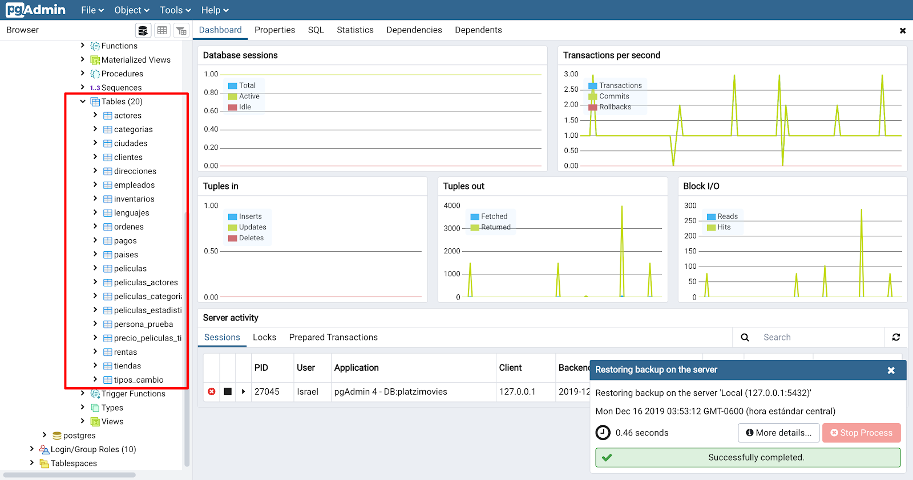

# Curso de PostgreSQL Aplicado a Ciencia de Datos

## Todo lo que aprenderás sobre PostgreSQL para ciencia de datos

PostgreSQL es una de las bases de datos más robustas y populares para gestionar datos en ciencia de datos. A continuación, te detallo lo que puedes aprender para dominar PostgreSQL en este contexto:

### 1. **Fundamentos de PostgreSQL**
- **Conceptos básicos**: ¿Qué es PostgreSQL y por qué es útil en ciencia de datos?
- **Instalación y configuración**: Configurar PostgreSQL en entornos locales y en la nube.
- **Estructura de la base de datos**: Tablas, columnas, filas, esquemas y relaciones.

### 2. **Manipulación de Datos**
- **Consultas básicas**: Uso de **`SELECT`**, **`INSERT`**, **`UPDATE`**, **`DELETE`**.
- **Filtrado y ordenación**: Clausulas **`WHERE`**, **`ORDER BY`**, **`LIMIT`**, **`OFFSET`**.
- **Funciones de agregación**: **`SUM`**, **`AVG`**, **`COUNT`**, **`MAX`**, **`MIN`**.
- **Joins y relaciones**:
  - **`INNER JOIN`**, **`LEFT JOIN`**, **`RIGHT JOIN`**, **`FULL OUTER JOIN`**.
  - Relaciones entre tablas en bases de datos relacionales.

### 3. **Funciones avanzadas para análisis de datos**
- **Window functions**: Uso de **`ROW_NUMBER`**, **`RANK`**, **`DENSE_RANK`**, **`NTILE`**.
- **Subconsultas**:
  - Subconsultas en **`SELECT`**, **`WHERE`**, y **`FROM`**.
  - Subqueries correlacionadas.
- **CTE (Common Table Expressions)**: Uso de **`WITH`** para consultas complejas.
- **Agrupaciones avanzadas**: Clausulas como **`GROUP BY`**, **`ROLLUP`**, **`CUBE`**, y **`GROUPING SETS`**.

### 4. **Trabajar con fechas y horas**
- **Funciones de fecha y hora**:
  - **`NOW`**, **`CURRENT_DATE`**, **`EXTRACT`**, **`DATE_PART`**, **`AGE`**.
- Calcular diferencias entre fechas (útil para análisis de series de tiempo).

### 5. **Consultas analíticas y estadísticas**
- Consultas que integran datos para reportes:
  - Porcentajes, desviaciones estándar y varianza con funciones como **`STDDEV`**, **`VARIANCE`**.
- Uso de **`CASE`** para generar variables categóricas basadas en condiciones.

### 6. **Extensiones y funciones específicas**
- **PostGIS**: Extensión para datos geoespaciales.
- **PL/pgSQL**: Crear funciones personalizadas y procedimientos almacenados.
- **JSON y JSONB**: Manipular datos semi-estructurados.
- **Full Text Search**: Búsquedas avanzadas en textos.

### 7. **Optimización de consultas**
- Indexación:
  - Crear índices con **`CREATE INDEX`**, tipos de índices (**BTREE**, **GIN**, **GiST**).
  - Índices parciales y únicos.
- Analizar rendimiento:
  - **`EXPLAIN`** y **`EXPLAIN ANALYZE`** para entender el plan de ejecución de consultas.
  - Optimización de subconsultas y joins.
- Particionamiento de tablas para bases de datos grandes.

### 8. **Bases de datos distribuidas y paralelismo**
- Configurar sharding para bases de datos distribuidas.
- Consultas paralelas en PostgreSQL para mejorar rendimiento.

### 9. **Integración con herramientas de ciencia de datos**
- Conectar PostgreSQL con:
  - **Python** (usando bibliotecas como `psycopg2`, `SQLAlchemy` o `Pandas`).
  - Herramientas de BI como Power BI, Tableau, Looker.
- Carga y extracción de datos desde PostgreSQL usando **`COPY`**, **`\COPY`**, o **`pg_dump`**.

### 10. **Seguridad y manejo de usuarios**
- Crear usuarios y roles.
- Asignar permisos con **`GRANT`** y **`REVOKE`**.
- Encriptación de datos y backups para proteger información sensible.

### 11. **Prácticas con datos reales**
- Cargar datasets de ciencia de datos (CSV, JSON, etc.) en PostgreSQL.
- Resolver casos prácticos como:
  - Análisis de ventas.
  - Modelos predictivos con extracción de características desde la base de datos.
  - Análisis de series temporales.

Si dominas todos estos temas, estarás bien preparado para utilizar PostgreSQL como herramienta principal en tus proyectos de ciencia de datos.

**Lecturas recomendadas**

[Curso Fundamentos de Bases de Datos | Platzi](https://platzi.com/clases/bd/)

[Curso de PostgreSQL](https://platzi.com/clases/postgresql/)

[Carrera Big Data y Data Science | ✔️Platzi](https://platzi.com/datos/)

## Importación de los datos para el proyecto

Es un proceso simple, sin embargo, para iniciar es necesario que cumplas con dos dependencias:

- La primera es haber instalado PostgreSQL y su set de herramientas en tu Sistema Operativo.

- La segunda es haber instalado PgAdmin 4 para que puedas interactuar de manera gráfica con la base de datos.

- Asegúrate de que el usuario postgresql se encuentra configurado y con todos los permisos.

Para conocer los detalles de la instalación de las anteriores dependencias, por favor visita el Curso de PostgreSQL donde es abordado a detalle. En este tutorial de importación asumimos que se encuentra correctamente configurado.

### Paso 1: ingresa a PgAdmin


### Paso 2: Crea la base de datos

Selecciona el elemento Databases del menú izquierdo, da click derecho y selecciona la opción Create > Database.


En el campo Database escribe el nombre “platzimovies” y en el campo owner selecciona el usuario que será dueño de la base de datos.


Da click en el botón Save. Y posteriormente selecciona la base de datos recién creada en el menú derecho.


### Paso 3: Configura la restauración

Dirígete al menú Tools (Herramientas) y da click en la opción Restore (Restaurar).


### Paso 4: Importa desde archivo

Selecciona la opción Custom or tar en el campo Format. En Role name elige el usuario con permisos root, normalmente es el usuario postgres o el nombre de usuario de tu computadora.

Finalmente, en el campo Filename selecciona el botón de 3 puntos y selecciona el archivo que deberás descargar haciendo click [aquí](https://drive.google.com/open?id=1oE7A4z_D2o-udn_yflwZ03uN3cA0gVpr "aquí")

Da click en el botón Restore.


Al ejecutar la restauración encontrarás un mensaje similar al siguiente:


### Paso 5: Verifica que las tablas fueron creadas

Yendo al menú izquierdo, dirígete a Servers > Local > Databases > platzimovies > Schemas > public > Tables.

Verifica que ahí aparecen todas las tablas que necesitamos para el ejercicio.



Si lo lograste, ¡felicidades! Estás listo para usar nuestra base de datos de ejemplo.

## Breve historia de las bases de datos

Las bases de datos han evolucionado significativamente a lo largo de las décadas. Aquí te ofrezco una breve historia de su desarrollo:

### 1. **Los Primeros Sistemas de Almacenamiento de Datos (1940s-1960s)**
   - **Antes de las bases de datos**: La información se almacenaba de manera muy rudimentaria, en tarjetas perforadas y en archivos de texto planos. La organización de la información era manual.
   - **Primeros sistemas**: Durante las décadas de 1940 y 1950, las computadoras comenzaron a almacenar datos de manera más estructurada, pero seguían utilizando métodos rudimentarios de almacenamiento.

### 2. **Modelos Jerárquico y de Red (1960s-1970s)**
   - **Sistema de Base de Datos Jerárquico**: A principios de los 60, el modelo jerárquico se utilizó ampliamente. IBM desarrolló el **IMS (Information Management System)**, que almacenaba datos en estructuras de árbol (padre-hijo).
   - **Modelo de Red**: A finales de los 60 y principios de los 70, el **modelo de red** surgió como una mejora. Permite más flexibilidad que el jerárquico, ya que los registros podían tener múltiples relaciones.

### 3. **Modelo Relacional (1970s-1980s)**
   - **La Teoría Relacional**: En 1970, **Edgar F. Codd** publicó su famoso artículo "A Relational Model of Data for Large Shared Data Banks", introduciendo el modelo relacional de bases de datos. Este modelo organizaba los datos en tablas, lo que hacía más fácil la gestión y el acceso.
   - **Primeros Sistemas Relacionales**: En la década de 1970, IBM desarrolló **System R**, el primer prototipo de un sistema de gestión de bases de datos (DBMS) relacional.
   - **SQL**: En 1974, IBM también introdujo **SQL (Structured Query Language)**, un lenguaje para interactuar con bases de datos relacionales. En 1986, SQL fue estandarizado por ANSI y se convirtió en el lenguaje de facto para interactuar con bases de datos relacionales.

### 4. **Bases de Datos Comerciales y Expansión (1980s-1990s)**
   - **Comercialización**: En los años 80, empresas como **Oracle**, **Microsoft** y **Informix** comenzaron a comercializar sus propios sistemas de bases de datos relacionales. Esto llevó a una gran adopción en industrias que necesitaban gestionar grandes cantidades de información.
   - **Crecimiento y escalabilidad**: Las bases de datos comenzaron a escalar para manejar grandes volúmenes de datos, y a medida que la tecnología de hardware mejoraba, los sistemas de bases de datos se hicieron más potentes.

### 5. **Bases de Datos No Relacionales (2000s-Presente)**
   - **La era del Big Data**: Con la explosión de datos generados por Internet y redes sociales, surgieron nuevos modelos de bases de datos **NoSQL** en la década de 2000. Estos sistemas son más adecuados para trabajar con datos no estructurados, grandes volúmenes de datos y estructuras de datos dinámicas.
   - **Popularidad de NoSQL**: Tecnologías como **MongoDB**, **Cassandra** y **Couchbase** empezaron a ser populares por su capacidad para manejar datos semi-estructurados o no estructurados (como JSON) y por su escalabilidad horizontal.
   - **Sistemas distribuidos**: A medida que las bases de datos se hicieron más complejas y las aplicaciones web crecieron, la necesidad de bases de datos distribuidas también creció, con soluciones como **Amazon DynamoDB**, **Google Spanner** y **Apache HBase**.

### 6. **Bases de Datos en la Nube y Nuevas Tendencias (2010s-Presente)**
   - **Bases de datos en la nube**: Con la adopción de servicios en la nube como **AWS**, **Google Cloud** y **Microsoft Azure**, las bases de datos como servicio (DBaaS) se hicieron populares. Esto ha permitido que las empresas gestionen bases de datos sin preocuparse por la infraestructura.
   - **Bases de datos híbridas y multi-modelo**: Las bases de datos modernas están comenzando a integrar capacidades tanto de bases de datos relacionales como NoSQL en una sola solución. Por ejemplo, **Cassandra** o **ArangoDB** combinan diferentes modelos de datos.
   - **Inteligencia Artificial y Machine Learning**: Las bases de datos modernas también están comenzando a integrar capacidades de inteligencia artificial para mejorar el rendimiento de las consultas, la optimización de índices y la administración de datos.

### Conclusión
Las bases de datos han recorrido un largo camino desde sus inicios rudimentarios hasta convertirse en sistemas sofisticados que gestionan enormes cantidades de datos. En el futuro, es probable que sigan evolucionando con el avance de nuevas tecnologías, como el procesamiento en la nube, la inteligencia artificial y la computación distribuida.

## Puntos fuertes de las bases de datos relacionales

Las bases de datos relacionales (RDBMS) tienen varios puntos fuertes que las han convertido en una opción popular para muchas aplicaciones a lo largo de los años. Aquí te dejo los principales:

### 1. **Estructura de Datos Bien Definida**
   - **Modelo Tabular**: Los datos se organizan en tablas con filas y columnas, lo que facilita la comprensión y organización de la información. Cada fila representa un registro único, y cada columna representa un atributo de ese registro.
   - **Esquema Estricto**: El esquema de la base de datos es predefinido, lo que garantiza que los datos sean consistentes y cumplan con ciertas reglas (como tipos de datos y restricciones).

### 2. **Integridad y Consistencia de los Datos**
   - **Integridad Referencial**: Los RDBMS permiten definir relaciones entre tablas usando claves primarias y foráneas. Esto asegura la integridad referencial, lo que significa que no se pueden crear registros huérfanos o inconsistentes en la base de datos.
   - **Restricciones de Integridad**: Los RDBMS permiten establecer restricciones como `NOT NULL`, `UNIQUE`, `CHECK`, y `DEFAULT`, lo que ayuda a mantener la validez y la coherencia de los datos.

### 3. **Lenguaje SQL**
   - **Estándar Universal**: El lenguaje SQL (Structured Query Language) es un estándar universal para la manipulación de datos en bases de datos relacionales. SQL permite realizar operaciones como seleccionar, insertar, actualizar y eliminar datos de manera sencilla y eficiente.
   - **Consultas Complejas**: SQL facilita la ejecución de consultas complejas mediante operaciones de agregación, filtros, subconsultas y uniones entre tablas, lo que permite a los usuarios obtener exactamente la información que necesitan.

### 4. **Transacciones ACID**
   - **Propiedades ACID**: Los RDBMS garantizan que las transacciones sean atómicas (todo o nada), consistentes (los datos permanecen válidos después de la transacción), aisladas (las transacciones no interfieren entre sí) y duraderas (los cambios se persisten incluso si ocurre un fallo en el sistema). Esto es fundamental para aplicaciones que requieren alta confiabilidad y consistencia de los datos.
   
### 5. **Escalabilidad Vertical**
   - **Escalabilidad Horizontal y Vertical**: Aunque los RDBMS tradicionales son conocidos por su escalabilidad vertical (agregar más recursos a un servidor), también hay opciones para distribuir cargas de trabajo y soportar grandes volúmenes de datos mediante técnicas de sharding y particionamiento.

### 6. **Manejo de Grandes Volúmenes de Datos**
   - **Optimización de Consultas**: Los RDBMS suelen tener sofisticados optimizadores de consultas que pueden mejorar el rendimiento de la base de datos al analizar y ajustar las consultas de manera eficiente.
   - **Índices**: El uso de índices en columnas específicas mejora el rendimiento de las consultas de búsqueda, incluso con grandes volúmenes de datos.

### 7. **Seguridad y Control de Acceso**
   - **Control de Acceso**: Los RDBMS ofrecen mecanismos robustos de control de acceso, como roles, privilegios y autenticación, para asegurar que solo los usuarios autorizados puedan acceder o modificar los datos.
   - **Encriptación y Copias de Seguridad**: Los RDBMS proporcionan funcionalidades de encriptación de datos y copias de seguridad para garantizar la seguridad y la recuperación ante desastres.

### 8. **Mantenimiento y Soporte**
   - **Herramientas de Administración**: Los RDBMS generalmente incluyen herramientas de administración que facilitan tareas como la creación de bases de datos, la gestión de índices, la optimización de consultas y la realización de copias de seguridad.
   - **Documentación y Comunidad**: Al ser ampliamente utilizados, los RDBMS tienen una gran comunidad de soporte, documentación extensa y recursos educativos disponibles.

### 9. **Compatibilidad y Estándares**
   - **Interoperabilidad**: Los RDBMS son muy compatibles con otras aplicaciones, tecnologías y lenguajes de programación. A menudo se utilizan junto con sistemas empresariales, aplicaciones web y soluciones de inteligencia empresarial.

### 10. **Facilidad de Uso**
   - **Manejo Sencillo de Datos Relacionados**: Debido a la estructura organizada y el modelo lógico de las bases de datos, los RDBMS permiten a los desarrolladores y usuarios interactuar con los datos de una manera intuitiva, incluso sin ser expertos en bases de datos.

### Conclusión
Los sistemas de bases de datos relacionales han sido fundamentales en la industria de la tecnología de la información durante más de 40 años. Su estructura ordenada, confiabilidad y el uso de SQL para consultas complejas los hacen una opción excelente para aplicaciones que requieren consistencia, seguridad y facilidad de manejo de grandes volúmenes de datos estructurados.

## Conceptos importantes de las bases de datos relacionales

Las **bases de datos relacionales** son sistemas de almacenamiento de datos que organizan la información en tablas y permiten relaciones entre ellas. A continuación, te explico algunos conceptos clave que son fundamentales para entender cómo funcionan:

### 1. **Tabla**
   - Es el **contenedor principal de datos** en una base de datos relacional.
   - Está formada por filas y columnas. Las **columnas** representan los atributos o campos, y las **filas** son los registros que contienen los datos.

### 2. **Filas y Columnas**
   - **Filas**: Cada fila (o registro) de una tabla contiene una entrada individual de datos. Cada fila es única y representa una instancia de los datos.
   - **Columnas**: Cada columna tiene un nombre y tipo de dato definido, que describe los diferentes atributos de los datos que se almacenan. Por ejemplo, una columna puede ser "nombre", "fecha de nacimiento", "dirección", etc.

### 3. **Clave primaria (Primary Key)**
   - Una **clave primaria** es un campo o conjunto de campos cuyo valor es único para cada fila en una tabla.
   - Se utiliza para identificar de manera única cada registro de la tabla, asegurando que no haya duplicados.

### 4. **Clave foránea (Foreign Key)**
   - Una **clave foránea** es un campo en una tabla que se refiere a la clave primaria de otra tabla.
   - Establece una **relación** entre las tablas y permite **referenciar** registros de una tabla desde otra.

### 5. **Relaciones entre tablas**
   - Las **relaciones** son la manera en que las tablas se conectan entre sí usando claves foráneas.
   - Hay tres tipos de relaciones:
     - **Uno a uno (1:1)**: Un registro de una tabla se relaciona con un solo registro de otra tabla.
     - **Uno a muchos (1:N)**: Un registro de una tabla puede estar relacionado con múltiples registros de otra tabla, pero cada registro de la segunda tabla está relacionado con un solo registro de la primera.
     - **Muchos a muchos (N:N)**: Varios registros de una tabla pueden estar relacionados con varios registros de otra tabla.

### 6. **Índices (Indexes)**
   - Un **índice** es una estructura de datos que mejora la velocidad de las consultas en la base de datos.
   - Los índices permiten acceder a los datos más rápido, pero su uso también puede aumentar el tiempo de inserción y actualización de registros.

### 7. **Consultas SQL (Structured Query Language)**
   - El **SQL** es el lenguaje estándar para interactuar con bases de datos relacionales. Algunas de las operaciones más comunes son:
     - **SELECT**: Para consultar datos.
     - **INSERT**: Para agregar nuevos datos.
     - **UPDATE**: Para modificar datos existentes.
     - **DELETE**: Para eliminar datos.

### 8. **Normalización**
   - La **normalización** es el proceso de estructurar las tablas para eliminar la redundancia y dependencias innecesarias entre los datos. Hay varias formas de normalización (1NF, 2NF, 3NF, etc.), que aseguran que la base de datos esté organizada de manera eficiente.

### 9. **Transacciones**
   - Una **transacción** es un conjunto de operaciones SQL que se ejecutan como una única unidad.
   - Las bases de datos relacionales garantizan que las transacciones sean **ATOMICAS** (se realizan completamente o no se realizan), **CONSISTENTES** (los datos siempre están en un estado válido), **AISLADAS** (las transacciones no interfieren entre sí) y **DURADERAS** (una vez que se realiza una transacción, los cambios son permanentes).

### 10. **Integridad referencial**
   - La **integridad referencial** asegura que las relaciones entre las tablas se mantengan consistentes. 
   - Por ejemplo, no se puede agregar un registro en una tabla que tenga una clave foránea que no exista en la tabla referenciada.

### 11. **Consultas agregadas**
   - **Funciones agregadas** como **COUNT**, **SUM**, **AVG**, **MIN**, y **MAX** se utilizan para realizar cálculos sobre grupos de datos y extraer información resumida.
   - A menudo se utilizan junto con la cláusula **GROUP BY** para agrupar los datos antes de aplicar funciones agregadas.

### 12. **Vistas (Views)**
   - Una **vista** es una tabla virtual que contiene los resultados de una consulta SQL. No almacena datos por sí misma, sino que presenta datos de una o más tablas.
   - Se usa para simplificar consultas complejas, proporcionar seguridad y presentar datos de manera más amigable.

### 13. **Triggers**
   - Un **trigger** (o desencadenador) es una función que se ejecuta automáticamente cuando ocurre un evento específico en la base de datos, como una inserción, actualización o eliminación de registros.

### 14. **Procedimientos almacenados (Stored Procedures)**
   - Un **procedimiento almacenado** es un conjunto de instrucciones SQL que se guardan en la base de datos y se pueden ejecutar como una unidad.
   - Los procedimientos almacenados permiten la reutilización del código y ayudan a reducir la cantidad de lógica de programación repetida en las aplicaciones.

### 15. **ACID**
   - Las bases de datos relacionales siguen las propiedades **ACID** para garantizar la **fiabilidad** y **consistencia** de las transacciones:
     - **Atomicidad**: Todas las operaciones en una transacción se completan o no se completan.
     - **Consistencia**: La base de datos siempre permanece en un estado consistente después de una transacción.
     - **Aislamiento**: Las transacciones se ejecutan de forma aislada para que no interfieran entre sí.
     - **Durabilidad**: Los cambios en la base de datos son permanentes después de una transacción.

### Conclusión
Estos conceptos son fundamentales para comprender cómo funcionan las bases de datos relacionales. Si bien hay muchos otros aspectos técnicos, estos son los que te permitirán tener una comprensión sólida de la teoría y práctica de las bases de datos relacionales.

## Principales sentencias SQL

Las **sentencias SQL** son comandos que se utilizan para interactuar con bases de datos, ya sea para **consultar** datos, **modificarlos**, **eliminarlos** o **insertarlos**. A continuación te presento las **principales sentencias SQL** y su uso:

### 1. **SELECT**
   - Se utiliza para **consultar datos** de una o más tablas.
   - Sintaxis básica:
     ```sql
     SELECT columna1, columna2, ...
     FROM nombre_tabla;
     ```
   - También se puede usar para filtrar, ordenar o agrupar resultados:
     ```sql
     SELECT columna1, columna2
     FROM nombre_tabla
     WHERE condicion
     ORDER BY columna
     GROUP BY columna;
     ```

### 2. **INSERT INTO**
   - Se utiliza para **insertar nuevos registros** en una tabla.
   - Sintaxis básica:
     ```sql
     INSERT INTO nombre_tabla (columna1, columna2, ...)
     VALUES (valor1, valor2, ...);
     ```

### 3. **UPDATE**
   - Se usa para **modificar los valores** de registros existentes en una tabla.
   - Sintaxis básica:
     ```sql
     UPDATE nombre_tabla
     SET columna1 = valor1, columna2 = valor2
     WHERE condicion;
     ```
   - **WHERE** es importante para especificar qué registros se deben actualizar; si se omite, se actualizarán todos los registros.

### 4. **DELETE**
   - Se usa para **eliminar registros** de una tabla.
   - Sintaxis básica:
     ```sql
     DELETE FROM nombre_tabla
     WHERE condicion;
     ```
   - Al igual que en **UPDATE**, es fundamental usar **WHERE** para especificar los registros a eliminar. Si se omite, se eliminarán todos los registros de la tabla.

### 5. **CREATE TABLE**
   - Se utiliza para **crear una nueva tabla** en la base de datos.
   - Sintaxis básica:
     ```sql
     CREATE TABLE nombre_tabla (
         columna1 tipo_dato,
         columna2 tipo_dato,
         ...
     );
     ```

### 6. **ALTER TABLE**
   - Se usa para **modificar la estructura** de una tabla existente, como agregar, eliminar o modificar columnas.
   - Sintaxis básica:
     ```sql
     ALTER TABLE nombre_tabla
     ADD columna_nueva tipo_dato;
     ```
     ```sql
     ALTER TABLE nombre_tabla
     DROP COLUMN columna_a_eliminar;
     ```
     ```sql
     ALTER TABLE nombre_tabla
     MODIFY COLUMN columna_existente tipo_dato;
     ```

### 7. **DROP TABLE**
   - Se usa para **eliminar** una tabla de la base de datos.
   - Sintaxis básica:
     ```sql
     DROP TABLE nombre_tabla;
     ```

### 8. **CREATE INDEX**
   - Se usa para **crear un índice** en una o más columnas de una tabla. Los índices mejoran la velocidad de las consultas, pero pueden ralentizar las inserciones y actualizaciones.
   - Sintaxis básica:
     ```sql
     CREATE INDEX nombre_indice
     ON nombre_tabla (columna1, columna2);
     ```

### 9. **DROP INDEX**
   - Se usa para **eliminar un índice** previamente creado.
   - Sintaxis básica:
     ```sql
     DROP INDEX nombre_indice;
     ```

### 10. **TRUNCATE**
   - Se usa para **eliminar todos los registros** de una tabla, pero **mantener la estructura** de la tabla. Es más rápido que **DELETE**, pero no puede ser revertido con un `ROLLBACK`.
   - Sintaxis básica:
     ```sql
     TRUNCATE TABLE nombre_tabla;
     ```

### 11. **GRANT**
   - Se usa para **asignar permisos** a un usuario o rol sobre una tabla, vista u otros objetos de la base de datos.
   - Sintaxis básica:
     ```sql
     GRANT permiso
     ON objeto
     TO usuario;
     ```
     Ejemplo:
     ```sql
     GRANT SELECT, INSERT
     ON empleados
     TO juan;
     ```

### 12. **REVOKE**
   - Se usa para **revocar permisos** previamente otorgados a un usuario o rol.
   - Sintaxis básica:
     ```sql
     REVOKE permiso
     ON objeto
     FROM usuario;
     ```

### 13. **JOIN**
   - **JOIN** se usa para combinar filas de dos o más tablas basándose en una condición relacionada entre ellas.
     - **INNER JOIN**: Devuelve solo las filas que tienen coincidencias en ambas tablas.
     - **LEFT JOIN**: Devuelve todas las filas de la tabla izquierda y las filas coincidentes de la tabla derecha.
     - **RIGHT JOIN**: Devuelve todas las filas de la tabla derecha y las filas coincidentes de la tabla izquierda.
     - **FULL OUTER JOIN**: Devuelve filas cuando hay una coincidencia en una de las tablas.

   Ejemplo de un **INNER JOIN**:
   ```sql
   SELECT empleados.nombre, departamentos.nombre
   FROM empleados
   INNER JOIN departamentos
   ON empleados.departamento_id = departamentos.id;
   ```

### 14. **GROUP BY**
   - Se usa para agrupar filas que tienen los mismos valores en columnas específicas y aplicar funciones agregadas (como COUNT, SUM, AVG).
   - Sintaxis básica:
     ```sql
     SELECT columna, COUNT(*)
     FROM nombre_tabla
     GROUP BY columna;
     ```

### 15. **HAVING**
   - Se usa para **filtrar los resultados** de una consulta después de que se ha aplicado el `GROUP BY`.
   - Sintaxis básica:
     ```sql
     SELECT columna, COUNT(*)
     FROM nombre_tabla
     GROUP BY columna
     HAVING COUNT(*) > 5;
     ```

### 16. **ORDER BY**
   - Se usa para **ordenar** los resultados de una consulta.
     - `ASC` para orden ascendente.
     - `DESC` para orden descendente.
   - Sintaxis básica:
     ```sql
     SELECT columna1, columna2
     FROM nombre_tabla
     ORDER BY columna1 ASC;
     ```

### 17. **DISTINCT**
   - Se usa para **eliminar duplicados** y mostrar solo valores únicos.
   - Sintaxis básica:
     ```sql
     SELECT DISTINCT columna
     FROM nombre_tabla;
     ```

### 18. **LIMIT**
   - Se usa para **limitar el número de resultados** de una consulta.
   - Sintaxis básica:
     ```sql
     SELECT columna1, columna2
     FROM nombre_tabla
     LIMIT 10;
     ```

### 19. **EXPLAIN**
   - Se usa para obtener el **plan de ejecución** de una consulta, lo que permite entender cómo se está procesando la consulta.
   - Sintaxis básica:
     ```sql
     EXPLAIN SELECT columna1, columna2
     FROM nombre_tabla;
     ```

Estas son las **principales sentencias SQL** que se utilizan para interactuar con bases de datos relacionales. Cada una tiene su propósito específico y se utiliza en distintos contextos para gestionar datos de manera eficiente.

## ¿Qué es la ciencia de datos?

La **ciencia de datos** es un campo interdisciplinario que combina técnicas de **estadística**, **matemáticas**, **programación** y **conocimiento del dominio** para **extraer** información útil y **tomar decisiones basadas en datos**. Su objetivo es analizar grandes volúmenes de datos (tanto estructurados como no estructurados) para descubrir patrones, realizar predicciones y generar conocimientos que puedan ser utilizados para resolver problemas complejos en diversas áreas, como negocios, salud, tecnología, marketing, entre otros.

### Elementos clave de la ciencia de datos:

1. **Recolección de datos**:
   - Los científicos de datos deben obtener datos de diversas fuentes, como bases de datos, APIs, sensores, archivos y plataformas de redes sociales.

2. **Limpieza y preprocesamiento de datos**:
   - Los datos rara vez están listos para su análisis, por lo que es necesario limpiarlos y transformarlos, eliminando inconsistencias, valores nulos, errores y haciendo que los datos sean adecuados para el análisis.

3. **Análisis exploratorio de datos (EDA)**:
   - Este proceso implica el uso de estadísticas y visualizaciones para entender las características de los datos, como distribuciones, correlaciones, valores atípicos, etc. Es crucial para identificar patrones y obtener una comprensión más profunda de los datos.

4. **Modelado y algoritmos**:
   - Los científicos de datos utilizan modelos matemáticos y algoritmos, incluidos **modelos predictivos** como **regresión**, **clasificación** y **clustering**, así como **aprendizaje automático (machine learning)** y **aprendizaje profundo (deep learning)**, para hacer predicciones o tomar decisiones basadas en los datos.

5. **Visualización de datos**:
   - Presentar los resultados de manera comprensible es esencial para tomar decisiones informadas. Las herramientas de visualización permiten a los científicos de datos crear gráficos, diagramas y dashboards que faciliten la interpretación de los datos y los resultados obtenidos.

6. **Toma de decisiones basada en datos**:
   - El análisis de los resultados obtenidos ayuda a las organizaciones a tomar decisiones informadas, optimizar procesos, predecir comportamientos futuros y descubrir oportunidades de negocio.

### Herramientas y tecnologías utilizadas en la ciencia de datos:
- **Lenguajes de programación**: Python, R, SQL, Scala
- **Bibliotecas y frameworks**: Pandas, NumPy, Matplotlib, Scikit-learn, TensorFlow, PyTorch, Keras
- **Bases de datos**: SQL, NoSQL (MongoDB, Cassandra)
- **Plataformas en la nube**: AWS, Google Cloud, Azure
- **Herramientas de visualización**: Tableau, Power BI, Matplotlib, Seaborn

### Aplicaciones de la ciencia de datos:
- **Negocios**: Optimización de procesos, análisis de tendencias de mercado, personalización de productos y servicios.
- **Salud**: Análisis de imágenes médicas, predicción de enfermedades, análisis de registros de pacientes.
- **Finanzas**: Detección de fraudes, análisis de riesgos, predicción de mercados.
- **Marketing**: Segmentación de clientes, análisis de sentimiento, recomendaciones personalizadas.
- **Deportes**: Análisis del rendimiento de los jugadores, estrategias de equipo basadas en datos.
  
En resumen, la **ciencia de datos** permite extraer valor de los datos a través de métodos estadísticos, matemáticos y computacionales, y es fundamental en la toma de decisiones estratégicas en casi todas las industrias actuales.

**Lecturas recomendadas**

[Carrera Big Data y Data Science | ✔️Platzi](https://platzi.com/datos/)

[YouTube](https://www.youtube.com/watch?v=Bl2sBiVdZHs)