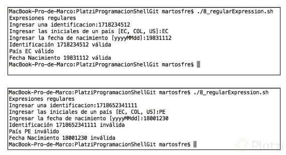

# Curso de Programación en Bash Shell

## Todo lo que aprenderás para programar en Bash Shell

**Lecturas recomendadas**

[Matoosfe - YouTube](https://www.youtube.com/user/matoosfe)

[Not Acceptable!](http://matoosfe.com/)

## Componentes de Linux, Tipos de Shell y Comandos de información

Linux tiene 3 partes principales:

- **Kernel**: Es el núcleo del Sistema Operativo y se gestionan los recursos de hardware como la memoria, el procesamiento y los dispositivos periféricos conectados al computador.
- **Shell**: Es el interprete, un programa con una interfaz de usuario permitiendo ejecutar las aplicaciones en un lenguaje de alto nivel y procesarlas en un lenguaje de bajo nivel para manipular y controlar aplicaciones y programas como nuestro proyecto.
- **Aplicaciones**: Son las aplicaciones con las que interactuamos día a día.

Tipos de Shells:

- SH
- KSH
- CSH
- BASH


Algunos comandos para conocer información sobre el resto de comandos:

man [comando]
info [comando]

## Bash scripting

- Bash Scripting

La idea básica de generar programas en bash es poder ejecutar múltiples comandos de forma secuencial en muchas ocasiones para automatizar una tarea en especifico. Estos comandos son colocados en un archivo de textos de manera secuencial para poder ejecutarlos a posterioridad.

Un archivo `.vimrc` podremos configurar de mejor manera nuestro editor VIM.

Más editores `vi` y `nano`.


Presionamos `I` para poder escribir en nuestro editor.
Presionamos `ESC` para salir del modo edición, luego escribimos `:wq` para salir y guardar nuestro archivo.

## Crear nuestro primer Script

**1_utilityPostgres.sh**

```bash
# !/bin/bash
# Programa para realizar algunas operaciones utilitarios de Postgres

echo "Hola bienvenido al curso de Programación bash"
```

**1_comments.sh**

```bash
#! /bin/bash
# PROGRAMA: U-POSG
echo "Programa Utilidades Postgres"
    <<"COMENTARIO 1"
    Programa para administrar las utilidades de la Base
    de Datos Postgres
   "COMENTARIO 1"
    
exit 0
```

El comando `ls -l 1_utilityPostgres.sh` en un sistema Unix o Linux sirve para mostrar detalles sobre el archivo llamado `1_utilityPostgres.sh`. A continuación te explico lo que hace:

1. **`ls`**: Lista archivos y directorios en el directorio actual.
2. **`-l`**: Muestra la lista de archivos en formato largo (detallado), proporcionando información como permisos, número de enlaces, propietario, grupo, tamaño y fecha de la última modificación.
3. **`1_utilityPostgres.sh`**: Es el nombre del archivo específico que deseas listar (en este caso, parece ser un script de shell relacionado con PostgreSQL).

Ejemplo de salida:

```bash
-rwxr-xr-x 1 usuario grupo 2048 sep  9 14:32 1_utilityPostgres.sh
```

Esto indica:

- **`-rwxr-xr-x`**: Los permisos del archivo (lectura, escritura, ejecución para el propietario, y lectura, ejecución para grupo y otros).
- **`1`**: Número de enlaces (hard links).
- **`usuario`**: Propietario del archivo.
- **`grupo`**: Grupo al que pertenece el archivo.
- **`2048`**: Tamaño del archivo en bytes.
- **`sep 9 14:32`**: Fecha y hora de la última modificación.
- **`1_utilityPostgres.sh`**: El nombre del archivo.

Este comando te permite verificar las propiedades y permisos del archivo para asegurarte, por ejemplo, de que puedes ejecutarlo como un script de shell.

## Ejecutar nuestro script con un nombre único

**pwd**: El comando pwd (abreviatura de Print Working Directory) en sistemas Unix o Linux se utiliza para mostrar la ruta completa del directorio en el que te encuentras actualmente en la terminal.

El comando `chmod` en sistemas Unix/Linux se utiliza para cambiar los permisos de archivos y directorios. Los permisos definen quién puede leer, escribir o ejecutar un archivo o directorio.

### Sintaxis básica:
```bash
chmod [opciones] permisos archivo
```

### Tipos de permisos:

- **r** (read) – Permiso de lectura.
- **w** (write) – Permiso de escritura.
- **x** (execute) – Permiso de ejecución.

### Categorías de usuarios:

- **u** (user) – El propietario del archivo.
- **g** (group) – Los usuarios del grupo.
- **o** (others) – Todos los demás usuarios.
- **a** (all) – Todos los usuarios (u, g, o).

### Modificar permisos con letras:
Puedes agregar (`+`), quitar (`-`) o asignar (`=`) permisos para un archivo o directorio.

#### Ejemplos:

1. **Añadir permiso de ejecución al propietario:**
   ```bash
   chmod u+x archivo.sh
   ```

2. **Eliminar permiso de escritura para el grupo:**
   ```bash
   chmod g-w archivo.txt
   ```

3. **Dar a todos los usuarios permiso de lectura:**
   ```bash
   chmod a+r archivo.txt
   ```

### Modificar permisos con números (notación octal):

Cada tipo de permiso tiene un valor numérico asociado:

- **r = 4**
- **w = 2**
- **x = 1**

Estos valores se suman para definir los permisos de cada categoría. La estructura es:
```bash
chmod ### archivo
```
Donde cada número representa los permisos de **u**, **g**, **o** en ese orden.

#### Ejemplos:

1. **Dar permisos completos al propietario (7), lectura y ejecución al grupo (5) y solo lectura a otros (4):**
   ```bash
   chmod 754 archivo.sh
   ```

   Esto sería equivalente a:
   - Propietario: lectura, escritura, ejecución (7 = 4+2+1)
   - Grupo: lectura, ejecución (5 = 4+1)
   - Otros: solo lectura (4)

2. **Dar permisos de lectura y escritura a todos:**
   ```bash
   chmod 666 archivo.txt
   ```

3. **Dar permisos completos a todos (lectura, escritura, ejecución):**
   ```bash
   chmod 777 archivo.sh
   ```

El comando `chmod` es muy flexible y te permite controlar exactamente cómo se puede acceder a cada archivo o directorio en tu sistema.

### Crear un contenedor con docker de ubuntu

En Docker, no se crea exactamente una "máquina virtual", sino que se crean **contenedores**. Los contenedores son entornos ligeros y aislados que pueden ejecutar aplicaciones y sistemas operativos, como Ubuntu, de manera eficiente. A continuación, te explico cómo crear y ejecutar un contenedor de **Ubuntu** usando Docker:

### Pasos para crear un contenedor de Ubuntu en Docker:

#### 1. **Instalar Docker**

Si no tienes Docker instalado en tu máquina, primero debes instalarlo. Aquí te dejo los comandos para instalar Docker en un sistema Ubuntu:

```bash
sudo apt update
sudo apt install docker.io
sudo systemctl start docker
sudo systemctl enable docker
```

Para verificar que Docker esté funcionando correctamente:

```bash
sudo docker --version
```

#### 2. **Buscar la imagen de Ubuntu en Docker Hub**

Las imágenes de Docker son plantillas que puedes usar para crear contenedores. Para obtener la imagen oficial de Ubuntu, usa el siguiente comando:

```bash
sudo docker search ubuntu
```

Esto mostrará una lista de imágenes relacionadas con Ubuntu. Normalmente, utilizarás la imagen oficial, que se llama simplemente `ubuntu`.

#### 3. **Descargar la imagen de Ubuntu**

Descarga la imagen oficial de Ubuntu con el siguiente comando:

```bash
sudo docker pull ubuntu
```

Esto descargará la última versión de Ubuntu disponible.

#### 4. **Crear y ejecutar un contenedor de Ubuntu**

Ahora que tienes la imagen de Ubuntu, puedes crear y ejecutar un contenedor basado en esa imagen. Para hacer esto, ejecuta:

```bash
sudo docker run -it ubuntu
```

Aquí:
- `-it` te permite interactuar con el contenedor en modo interactivo (como si fuera una terminal).
- `ubuntu` es el nombre de la imagen que descargaste.

Este comando creará un contenedor basado en la imagen de Ubuntu y te proporcionará una sesión de terminal dentro del contenedor.

#### 5. **Instalar software dentro del contenedor**

Una vez dentro del contenedor, puedes ejecutar comandos como si estuvieras en una instalación de Ubuntu normal. Por ejemplo, puedes actualizar los paquetes e instalar software como lo harías normalmente:

```bash
apt update
apt install vim
```

#### 6. **Salir del contenedor**

Cuando termines de trabajar dentro del contenedor, puedes salir escribiendo `exit` o presionando `Ctrl+D`. Esto detendrá el contenedor.

```bash
exit
```

#### 7. **Listar los contenedores activos e inactivos**

Para ver los contenedores que están corriendo:

```bash
sudo docker ps
```

Para ver **todos** los contenedores, incluidos los detenidos:

```bash
sudo docker ps -a
```

#### 8. **Reiniciar un contenedor detenido**

Si ya has creado un contenedor pero lo detuviste, puedes reiniciarlo con su ID o nombre:

```bash
sudo docker start <ID-del-contenedor>
sudo docker attach <ID-del-contenedor>
```

El comando `start` inicia el contenedor, y `attach` te permite interactuar con él de nuevo.

#### 9. **Guardar cambios en una nueva imagen (opcional)**

Si has hecho cambios en el contenedor y quieres crear una nueva imagen con esos cambios, puedes "commit" esos cambios a una nueva imagen:

```bash
sudo docker commit <ID-del-contenedor> mi_ubuntu_personalizado
```

Esto crea una nueva imagen llamada `mi_ubuntu_personalizado` que puedes usar más tarde.

#### 10. **Eliminar un contenedor o imagen**

Para eliminar un contenedor cuando ya no lo necesites:

```bash
sudo docker rm <ID-del-contenedor>
```

Para eliminar una imagen:

```bash
sudo docker rmi <nombre-de-la-imagen>
```

### Resumen:
Con Docker puedes crear contenedores de Ubuntu fácilmente y ejecutarlos como si fueran máquinas virtuales ligeras. La principal diferencia con una máquina virtual tradicional es que los contenedores son más ligeros y comparten el kernel del sistema operativo anfitrión, lo que los hace más eficientes.

Si necesitas más información o ayuda con un paso en particular, ¡no dudes en preguntar!

para ejecutar el programa se utiliza lo siguiente:  `bash 1_utilityPostgres.sh` o `./1_utilityPostgres.sh`

`type` es para ver el tipo d earchivo

## Declaración de Variables y Alcance en Bash Shell

En **Bash** (el **Bourne Again Shell**), la declaración y el alcance de variables tienen un comportamiento particular. Aquí te explico cómo funcionan:

### Declaración de Variables

1. **Declaración Básica**

   Para declarar una variable en Bash, simplemente asigna un valor a un nombre de variable sin espacios alrededor del signo igual (`=`). Por ejemplo:

   ```bash
   variable="valor"
   ```

   - No se usan espacios antes y después del signo igual (`=`).
   - Las variables en Bash son sensibles a mayúsculas y minúsculas (`Variable` y `variable` son distintas).

2. **Variables de Entorno**

   Para que una variable esté disponible en otros procesos o subprocesos (es decir, como variable de entorno), debes exportarla usando el comando `export`:

   ```bash
   export variable="valor"
   ```

### Alcance de Variables

1. **Alcance Local**

   Las variables definidas en un script o en una sesión de shell son locales a esa sesión. Por ejemplo, si defines una variable dentro de una función, esa variable solo es accesible dentro de esa función:

   ```bash
   function mi_funcion {
     local variable_local="valor"
     echo "$variable_local"  # Esto funciona
   }

   echo "$variable_local"  # Esto no funcionará, ya que variable_local no está definida fuera de la función
   ```

   - **`local`**: La palabra clave `local` se usa dentro de funciones para declarar variables locales.

2. **Alcance Global**

   Las variables que no están marcadas como locales y se declaran fuera de funciones son globales y están disponibles en todo el script y en subprocesos si se exportan:

   ```bash
   variable_global="valor"

   function mi_funcion {
     echo "$variable_global"  # Esto funciona porque variable_global es global
   }

   mi_funcion
   echo "$variable_global"  # También funciona aquí
   ```

3. **Alcance en Subprocesos**

   Si exportas una variable, estará disponible en cualquier subproceso que inicie el shell. Por ejemplo:

   ```bash
   export variable="valor"

   (echo "$variable")  # Imprime "valor" en el subproceso
   ```

   - Los subprocesos heredan las variables de su proceso padre, pero los cambios realizados en el subproceso no afectan al proceso padre.

4. **Variables en Scripts**

   Cuando ejecutas un script, las variables definidas dentro del script solo afectan al script y a sus subprocesos. No afectan a tu sesión de shell actual a menos que uses `source` para ejecutar el script en el entorno actual:

   ```bash
   ./mi_script.sh  # Ejecuta el script en un subshell, variables no afectan al shell actual
   source mi_script.sh  # Ejecuta el script en el entorno actual, variables afectan al shell actual
   ```

### Ejemplos Prácticos

1. **Declarar y Usar Variables**

   ```bash
   #!/bin/bash

   mensaje="Hola, Mundo!"
   echo "$mensaje"
   ```

2. **Variable de Entorno**

   ```bash
   #!/bin/bash

   export PATH="/usr/local/bin:$PATH"
   ```

3. **Variable Local en Función**

   ```bash
   #!/bin/bash

   function saludo {
     local mensaje="Hola, desde la función!"
     echo "$mensaje"
   }

   saludo
   echo "$mensaje"  # No mostrará nada porque mensaje es local a la función
   ```

Estos conceptos te ayudarán a entender cómo manejar variables y su alcance en **Bash**. Si tienes alguna pregunta adicional o necesitas más detalles sobre algún aspecto, ¡déjamelo saber!

**2_variables_2.sh**

```bash
# !/bin/bash
# Programa para revisar la declaración de variables
# Autor: Marco Toscano Freire - @martosfre

echo "Opción nombre pasada del script anterior: $nombre"
```

**2_variables.sh**

```bash
# !/bin/bash
# Programa para revisar la declaración de variables
# Autor: Marco Toscano Freire - @martosfre

opcion=0
nombre=Marco

echo "Opción: $opcion y Nombre: $nombre"

# Exportar la variable nombre para que este disponible a los demás procesos
export nombre

# Llamar al siguiente script para recuperar la variable
./2_variables_2.sh
```

Ingresar a la variables de entorno se utiliza `sudo vim /etc/profile`

y se crea al final la bariable

```bash
# Variables de Entorno S.O
COURSE_NAME=pProgramación Bash
export COURSE_NAME
```

para copiar un archivo `cp <archivo_a_copiar> <nombre_que_la_asigna_a_la_copia>`

para eliminar una linea en vin se presciona `ESC` y luego 2 veses `D`

## Tipos de Operadores

En Bash, hay varios tipos de operadores que se utilizan para realizar diferentes tipos de operaciones. Aquí te presento una lista de los operadores más comunes en Bash:

### 1. **Operadores Aritméticos**
Estos operadores se utilizan para realizar operaciones matemáticas.

- `+` : Suma
- `-` : Resta
- `*` : Multiplicación
- `/` : División
- `%` : Módulo (residuo)
- `**` : Exponenciación (Bash 4.0+)

**Ejemplo:**
```bash
a=5
b=3
echo $((a + b))  # Salida: 8
```

### 2. **Operadores de Comparación (Numérica)**
Se usan para comparar valores numéricos.

- `-eq` : Igual a
- `-ne` : No igual a
- `-lt` : Menor que
- `-le` : Menor o igual a
- `-gt` : Mayor que
- `-ge` : Mayor o igual a

**Ejemplo:**
```bash
if [ $a -gt $b ]; then
  echo "$a es mayor que $b"
fi
```

### 3. **Operadores de Comparación (Cadenas)**
Se utilizan para comparar cadenas de texto.

- `=` : Igual a
- `!=` : No igual a
- `<` : Menor que (lexicográficamente, en `[[ ]]`)
- `>` : Mayor que (lexicográficamente, en `[[ ]]`)

**Ejemplo:**
```bash
if [ "$string1" = "$string2" ]; then
  echo "Las cadenas son iguales"
fi
```

### 4. **Operadores Lógicos**
Estos operadores se utilizan para combinar expresiones booleanas.

- `&&` : AND lógico (si la primera condición es verdadera, evalúa la segunda)
- `||` : OR lógico (si la primera condición es falsa, evalúa la segunda)
- `!` : NOT lógico (invierte el valor de la condición)

**Ejemplo:**
```bash
if [ $a -gt 0 ] && [ $b -lt 10 ]; then
  echo "Condiciones verdaderas"
fi
```

### 5. **Operadores de Redirección**
Se usan para redirigir la entrada y salida de comandos.

- `>` : Redirige la salida estándar a un archivo (sobrescribe)
- `>>` : Redirige la salida estándar a un archivo (añade al final)
- `<` : Redirige la entrada estándar desde un archivo
- `2>` : Redirige la salida de error a un archivo
- `&>` : Redirige tanto la salida estándar como la de error a un archivo

**Ejemplo:**
```bash
echo "Hola" > archivo.txt
```

### 6. **Operadores de Expansión de Variables**
Estos operadores se utilizan para manipular el contenido de las variables.

- `${variable:-default}` : Usa el valor de `variable` si está definida; si no, usa `default`.
- `${variable:=default}` : Usa el valor de `variable` si está definida; si no, asigna `default`.
- `${variable:+value}` : Usa `value` si `variable` está definida y no está vacía.

**Ejemplo:**
```bash
echo ${var:-"Valor por defecto"}
```

### 7. **Operadores de Evaluación Condicional**
Se utilizan en pruebas condicionales.

- `-e` : Verifica si un archivo existe
- `-d` : Verifica si un archivo es un directorio
- `-f` : Verifica si un archivo es un archivo regular
- `-r` : Verifica si un archivo es legible
- `-w` : Verifica si un archivo es escribible
- `-x` : Verifica si un archivo es ejecutable

**Ejemplo:**
```bash
if [ -f archivo.txt ]; then
  echo "El archivo existe"
fi
```
**3_tipoOperadores.sh**

```bash
# ! /bin/bash
# Programa para revisar los tipos de operadores
# Autor: Marco Toscano - @martosfre

numA=10
numB=4

echo "Operadores Aritméticos"
echo "Números: A=$numA y B=$numB"
echo "Sumar A + B =" $((numA + numB))
echo "Restar A - B =" $((numA - numB))
echo "Multiplicar A * B =" $((numA * numB))
echo "Dividir A / B =" $((numA / numB))
echo "Residuo A % B =" $((numA % numB))


echo -e "\nOperadores Relaciones"
echo "Números: A=$numA y B=$numB"
echo "A > B =" $((numA > numB))
echo "A < B =" $((numA < numB))
echo "A >= B =" $((numA >= numB))
echo "A <= B =" $((numA <= numB))
echo "A == B =" $((numA == numB))
echo "A != B =" $((numA != numB))


echo -e "\nOperadores Asignación"
echo "Números: A=$numA y B=$numB"
echo "Sumar A += B" $((numA += numB))
echo "Restar A -= B" $((numA -= numB))
echo "Multiplicación A *= B" $((numA *= numB))
echo "Dividir A /= B" $((numA /= numB))
echo "Residuo A %= B" $((numA %= numB))
```

para deshacer se usa `ESC` + `U`
para copiar una linea s eutiliza `ESC`, dos veces `y`, y luego `p` para que lo copie en la parte inferior

## Script con Argumentos

Hay algunos identificadores para cuando ejecutamos un script con argumentos

Identificador | Descripción
---|---
**$0** | Se refiere al nombre del Script
**$1 al ${10}** | Se refiere al número de argumento. Si es más de uno lo colocamos dentro de llaves.
**$#** | Es útil para conocer el número de argumentos enviados.
**$** | Con este podemos conocer todos los argumentos enviados.

```bash
# ! /bin/bash
# Programa para ejemplificar el paso de argumentos
# Autor: Marco Toscano Freire - @martosfre

nombreCurso=$1
horarioCurso=$2

echo "El nombre del curso es: $nombreCurso dictado en el horario de $horarioCurso"
echo "El número de parámetros enviados es: $#"
echo "Los parámetros enviados son: $*"
```

para ingresar los argumentos son: `Archivo.sh <agumento_1> <argumento_2>` Ejemplo: `./4_argumentos.sh "Programación Bash" "18:00 a 20:00"`

En Bash, un script puede recibir argumentos que se pasan al ejecutar el script desde la línea de comandos. Estos argumentos se pueden utilizar dentro del script para realizar diferentes acciones. Aquí te muestro cómo trabajar con argumentos en un script de Bash.

### Crear un Script con Argumentos

1. **Crear el Script**

   Abre tu editor de texto y crea un archivo llamado `example_script.sh`.

   ```bash
   nano example_script.sh
   ```

2. **Escribir el Script**

   Aquí hay un ejemplo simple de un script que utiliza argumentos:

   ```bash
   #!/bin/bash

   # Verifica si se proporcionaron al menos dos argumentos
   if [ "$#" -lt 2 ]; then
     echo "Usage: $0 <name> <age>"
     exit 1
   fi

   # Asigna los argumentos a variables
   NAME=$1
   AGE=$2

   # Muestra un mensaje usando los argumentos
   echo "Hello, $NAME! You are $AGE years old."
   ```

   - `$0` es el nombre del script.
   - `$1`, `$2`, etc., son los argumentos proporcionados al script.

3. **Hacer el Script Ejecutable**

   Cambia los permisos del archivo para hacerlo ejecutable:

   ```bash
   chmod +x example_script.sh
   ```

4. **Ejecutar el Script con Argumentos**

   Ejecuta el script pasando dos argumentos:

   ```bash
   ./example_script.sh Alice 30
   ```

   Salida esperada:

   ```
   Hello, Alice! You are 30 years old.
   ```

### Manejo de Argumentos

- **Número de Argumentos**: Usa `$#` para obtener el número de argumentos pasados al script.

  ```bash
  echo "Number of arguments: $#"
  ```

- **Argumentos Opcionales**: Puedes proporcionar argumentos opcionales y manejar su ausencia en el script.

  ```bash
  # Verifica si un argumento opcional fue proporcionado
  if [ -z "$3" ]; then
    echo "No optional argument provided."
  else
    echo "Optional argument: $3"
  fi
  ```

- **Argumentos con Nombres**: Puedes usar `getopts` para manejar argumentos con nombres.

  ```bash
  #!/bin/bash

  while getopts "n:a:" opt; do
    case ${opt} in
      n )
        NAME=$OPTARG
        ;;
      a )
        AGE=$OPTARG
        ;;
      \? )
        echo "Invalid option: -$OPTARG" >&2
        ;;
      : )
        echo "Invalid option: -$OPTARG requires an argument" >&2
        ;;
    esac
  done

  echo "Name: $NAME"
  echo "Age: $AGE"
  ```

  Ejecuta el script usando opciones con nombres:

  ```bash
  ./example_script.sh -n Alice -a 30
  ```

### Resumen

Los scripts de Bash pueden recibir y manejar argumentos de diversas maneras. Puedes usarlos para pasar datos al script y adaptar su comportamiento según estos datos. Los ejemplos anteriores te proporcionan una base para comenzar a trabajar con argumentos en tus propios scripts.

## Sustitución de Comandos en variables

Para la sustitución de comandos es importante tener en cuenta que el resultado servirá para realizar otras tareas de otras sentencias de nuestro programa.

Las dos maneras de hacerlo:

- Usando el backtick caracter. (`)
- Usando el signo de dólar con el formato $(comando)

```bash
# ! /bin/bash
# Programa para revisar como ejecutar comados dentro de un programa y almacenar en una variable para su posterior utilización 
# Autor: Marco Toscano Freire - @martosfre

ubicacionActual=`pwd`
infoKernel=$(uname -a)

echo "La ubicación actual es la siguiente: $ubicacionActual"
echo "Información del Kernel: $infoKernel"
```
ESC  y luego `clr` + `B`y activa visual block y con ship marcamos todo lo que se desea borrar

## Debug en Script

Para realizar debugging en un script tenemos dos opciones en el comando de bash:

- **-v**: Utilizado para ver el resultado detallado de nuestro script, evaluado línea por línea. `bash -v <nombre>.sh`
- **-x**: Utilizado para desplegar la información de los comandos que son usados, capturando el comando y su salida. `bash -x <nombre>.sh`

El proceso de depuración (debugging) en scripts Bash es crucial para identificar y solucionar errores. Aquí hay varias técnicas y herramientas para depurar tus scripts:

### **1. Usar el Modo de Depuración**

Puedes ejecutar un script en modo de depuración para ver cómo se ejecutan los comandos y cómo cambian las variables.

- **Modo de Depuración Completo**: Usa `bash -x script.sh` para ejecutar el script en modo de depuración, lo que imprimirá cada comando antes de ejecutarlo.

  ```bash
  bash -x script.sh
  ```

- **Modo de Depuración Dentro del Script**: Puedes activar el modo de depuración dentro del script añadiendo `set -x` al principio del script. Para desactivar el modo de depuración, usa `set +x`.

  ```bash
  #!/bin/bash
  set -x  # Activar depuración

  echo "This is a test"
  ls -l

  set +x  # Desactivar depuración
  ```

### **2. Usar `echo` para Imprimir Variables y Mensajes**

Una técnica común es imprimir el valor de las variables y mensajes en diferentes partes del script para entender el flujo y los valores en tiempo de ejecución.

```bash
#!/bin/bash

var="Hello"
echo "The value of var is: $var"

# Más lógica
```

### **3. Verificar Errores de Comandos**

Puedes usar `$?` para verificar el estado de salida del último comando ejecutado. Un estado de salida `0` indica éxito, y cualquier otro valor indica un error.

```bash
#!/bin/bash

cp /source/file /destination/
if [ $? -ne 0 ]; then
  echo "Error: The copy command failed."
fi
```

### **4. Usar `trap` para Capturar Errores**

El comando `trap` puede ser usado para ejecutar un comando cuando el script recibe una señal o en caso de errores.

```bash
#!/bin/bash

trap 'echo "Error occurred at line $LINENO"; exit 1;' ERR

# Código que puede fallar
cp /source/file /destination/
```

### **5. Comprobar el Script Paso a Paso**

Puedes ejecutar el script paso a paso utilizando un depurador de scripts, como `bashdb`, que proporciona un entorno interactivo para depurar scripts Bash.

```bash
bashdb script.sh
```

### **6. Verificar la Sintaxis del Script**

Usa `bash -n script.sh` para verificar la sintaxis del script sin ejecutarlo. Esto te ayuda a detectar errores de sintaxis.

```bash
bash -n script.sh
```

### **7. Revisar el Log de Ejecución**

Si el script está ejecutando comandos que escriben en un archivo de log, revisa esos archivos para encontrar información sobre lo que está ocurriendo.

```bash
#!/bin/bash

echo "Starting script..." >> /var/log/myscript.log
```

### **8. Validar Entrada y Salida**

Asegúrate de que las entradas y salidas de los comandos sean las esperadas. Esto incluye verificar si los archivos o directorios existen, si tienes los permisos adecuados, etc.

```bash
#!/bin/bash

if [ ! -f /path/to/file ]; then
  echo "File not found!"
  exit 1
fi
```

Estas técnicas te ayudarán a identificar y resolver problemas en tus scripts Bash. La depuración efectiva es clave para crear scripts robustos y confiables.

## Capturar información usuario

Para poder capturar información tenemos dos formas dentro de un programa Bash.

- Utilizando en conjunto con el comando **echo**
- Utilizando directamente el comando **read**

**6_readEcho.sh**

```bash
# ! /bin/bash
# Programa para ejemplificar como capturar la información del usuario utilizando el comando echo, read y $REPLY
# # Autor: Mario Celis - https://www.linkedin.com/in/mario-alexander-vargas-celis/

option=0
backupName=""

echo "Programa Utilidades Postgres"
echo -n "Ingresar una opción:"
read
option=$REPLY
echo -n "Ingresar el nombre del archivo del backup:"
read
backupName=$REPLY
echo "Opción:$option , backupName:$backupName"
```

**7_read.sh**

```bash
# ! /bin/bash
# Programa para ejemplificar como capturar la información del usuario utilizando el comando read
# # Autor: Mario Celis - https://www.linkedin.com/in/mario-alexander-vargas-celis/

option=0
backupName=""

echo "Programa Utilidades Postgres"
read -p "Ingresar una opción:" option
read -p "Ingresar el nombre del archivo del backup:" backupName
echo "Opción:$option , backupName:$backupName"
```

Para capturar información del usuario en un script Bash, puedes utilizar varios métodos que permiten interactuar con el usuario y almacenar sus respuestas en variables. Aquí te muestro algunos ejemplos y técnicas comunes:

### **1. Usar `read` para Capturar Entrada**

El comando `read` permite capturar la entrada del usuario y almacenarla en una variable.

**Ejemplo Básico:**
```bash
#!/bin/bash

echo "Enter your name:"
read name
echo "Hello, $name!"
```

### **2. Leer Entrada con Mensaje**

Puedes proporcionar un mensaje que se muestra antes de que el usuario ingrese su información.

**Ejemplo:**
```bash
#!/bin/bash

read -p "Enter your age: " age
echo "You are $age years old."
```

### **3. Capturar Entrada Silenciosa**

Para capturar información de manera silenciosa (por ejemplo, contraseñas), usa la opción `-s` con `read`.

**Ejemplo:**
```bash
#!/bin/bash

read -sp "Enter your password: " password
echo
echo "Password received."
```

### **4. Leer Múltiples Valores en una Línea**

Puedes leer múltiples valores en una sola línea separándolos con espacios.

**Ejemplo:**
```bash
#!/bin/bash

read -p "Enter your first name and last name: " first_name last_name
echo "First Name: $first_name"
echo "Last Name: $last_name"
```

### **5. Proporcionar un Valor Predeterminado**

Puedes establecer un valor predeterminado en caso de que el usuario no ingrese nada.

**Ejemplo:**
```bash
#!/bin/bash

read -p "Enter your city [default: New York]: " city
city=${city:-New York}
echo "City: $city"
```

### **6. Validar la Entrada del Usuario**

Puedes validar la entrada del usuario para asegurarte de que cumpla con ciertos criterios antes de continuar.

**Ejemplo:**
```bash
#!/bin/bash

while true; do
    read -p "Enter a number between 1 and 10: " number
    if [[ "$number" =~ ^[0-9]+$ ]] && [ "$number" -ge 1 ] && [ "$number" -le 10 ]; then
        echo "Valid number: $number"
        break
    else
        echo "Invalid input. Please enter a number between 1 and 10."
    fi
done
```

### **7. Leer desde un Archivo**

Puedes leer información desde un archivo y procesarla línea por línea.

**Ejemplo:**
```bash
#!/bin/bash

while IFS= read -r line; do
    echo "Line from file: $line"
done < file.txt
```

### **8. Capturar Entrada de Usuario en un Formulario**

Puedes capturar múltiples entradas de usuario en un formulario simple, almacenarlas en variables, y luego procesarlas.

**Ejemplo:**
```bash
#!/bin/bash

echo "Please fill out the following form:"
read -p "Name: " name
read -p "Email: " email
read -p "Phone number: " phone

echo "Thank you for your submission!"
echo "Name: $name"
echo "Email: $email"
echo "Phone number: $phone"
```

Estas técnicas te permitirán interactuar con el usuario y capturar información de manera efectiva en tus scripts Bash. Puedes combinar estas técnicas según tus necesidades específicas para crear interfaces de usuario simples y funcionales en la línea de comandos.

## Expresiones Regulares

Cuando se solicita ingresar información través de un programa por parte del usuario que está utilizando el programa, independientemente el lenguaje que esté realizado; es importante considerar la validación de la información no solo en su tamaño sino también en los tipos de datos, formatos soportados lo cual nos permite asegurar la calidad de la información que recibimos, almacenamos y procesamos.

Dentro de este contexto en la programación bash para cumplir con este objetivo se utiliza expresiones regulares, las cuales son básicamente cadenas de caracteres que definen un patrón de búsqueda que se valida frente a una información específica para asegurar que cumple la validación definida.

Se necesita conocer ciertos criterios utilizados en las expresiones regulares que son los siguientes:

- ^.- Caracter que representa el inicio de la expresión regular.
- $.- Caracter que representa el final de la expresión regular.
- *.- Caracter que representa cero o más ocurrencias de la expresión
- +.- Caracter que representa una o más ocurrencias de la expresión.
- {n}.-Representa n veces de una expresión.
- [ ] .- Representa un conjunto de caracteres, por ejemplo: [a-z] representa las letras del abecedario de la a a la z.

Tomando en cuenta estos criterios se realizará un programa que valida la siguiente información:
Número de Identificación de un tamaño de 10 números. Ejemplo: 1717836520
País de Origen denotado por dos letras en un rango específico. Ejemplo: EC, CO, US
Fecha de Nacimiento en el formato yyyyMMDD. Ejemplo: 20181222

Primero se definirá las expresiones regulares y se solicitará la información del usuario:


Luego se validará cada expresión regular comenzando con la identificación, para lo cual para cada validación se utilizará la sentencia condicional if y para comparar la expresión se debe utilizar el siguiente formato especial `if [[ $variable =~ $expresionRegular ]]` como se muestra a continuación.


Se realizará la ejecución de la aplicación con los dos escenarios el correcto y el incorrecto como se muestra a continuación:



Finalmente el código fuente lo pueden encontrar en el repositorio de GitHub en el branch 7.ValidarInformacion

Las **expresiones regulares** (regex o regexp) son secuencias de caracteres que definen un patrón de búsqueda. Se utilizan para encontrar, reemplazar y validar texto en muchos lenguajes de programación y herramientas de procesamiento de texto. Aquí te proporciono una guía sobre las expresiones regulares, incluyendo sus conceptos básicos, metacaracteres, y ejemplos en Bash.

### **Conceptos Básicos**

1. **Literales**: Son caracteres que se buscan tal cual. Por ejemplo, `cat` busca la cadena "cat".

2. **Metacaracteres**: Son caracteres especiales con significados específicos:
   - `.`: Coincide con cualquier carácter excepto una nueva línea.
   - `^`: Coincide con el inicio de una línea.
   - `$`: Coincide con el final de una línea.
   - `*`: Coincide con cero o más repeticiones del carácter o grupo anterior.
   - `+`: Coincide con una o más repeticiones del carácter o grupo anterior.
   - `?`: Coincide con cero o una repetición del carácter o grupo anterior.
   - `|`: Operador OR. Coincide con el patrón a la izquierda o a la derecha.
   - `[]`: Define un conjunto de caracteres. Coincide con cualquier carácter en el conjunto.
   - `()`: Agrupa patrones.
   - `{}`: Especifica el número exacto de repeticiones de un carácter o grupo.

### **Ejemplos de Expresiones Regulares**

- **Coincidir con una Cadena Exacta:**
  ```bash
  grep 'cat' file.txt
  ```
  Busca la cadena "cat" en `file.txt`.

- **Coincidir con Cualquier Caracter:**
  ```bash
  grep 'c.t' file.txt
  ```
  Coincide con "cat", "cot", "c-t", etc., en `file.txt`.

- **Coincidir con una Cadena al Inicio de la Línea:**
  ```bash
  grep '^start' file.txt
  ```
  Busca líneas que comienzan con "start".

- **Coincidir con una Cadena al Final de la Línea:**
  ```bash
  grep 'end$' file.txt
  ```
  Busca líneas que terminan con "end".

- **Coincidir con uno o más Caracteres:**
  ```bash
  grep 'a+' file.txt
  ```
  Coincide con una o más repeticiones de "a".

- **Coincidir con un Conjunto de Caracteres:**
  ```bash
  grep '[aeiou]' file.txt
  ```
  Busca líneas que contengan cualquier vocal.

- **Coincidir con un Grupo de Caracteres:**
  ```bash
  grep 'c[aeiou]t' file.txt
  ```
  Coincide con "cat", "cet", "cit", etc.

- **Coincidir con una Cantidad Específica:**
  ```bash
  grep 'a{2,4}' file.txt
  ```
  Coincide con entre 2 y 4 repeticiones de "a".

### **Uso en Bash**

En Bash, las expresiones regulares se utilizan principalmente con los comandos `grep`, `sed`, y `awk`.

#### **1. Usar `grep`**

`grep` busca patrones en un archivo o entrada estándar.

**Ejemplo: Buscar líneas que contienen un patrón:**
```bash
grep 'pattern' file.txt
```

**Ejemplo: Buscar con expresiones regulares extendidas:**
```bash
grep -E 'pattern' file.txt
```

#### **2. Usar `sed`**

`sed` es una herramienta de edición de texto que usa expresiones regulares para buscar y reemplazar texto.

**Ejemplo: Reemplazar texto:**
```bash
sed 's/old/new/g' file.txt
```
Reemplaza todas las instancias de "old" con "new".

**Ejemplo: Usar regex en reemplazos:**
```bash
sed -E 's/[0-9]{3}-[0-9]{3}-[0-9]{4}/XXX-XXX-XXXX/g' file.txt
```

#### **3. Usar `awk`**

`awk` es un lenguaje de programación para procesar texto basado en patrones.

**Ejemplo: Imprimir líneas que contienen un patrón:**
```bash
awk '/pattern/' file.txt
```

**Ejemplo: Imprimir campos específicos:**
```bash
awk -F':' '{print $1}' file.txt
```

### **Práctica**

1. **Verifica Patrones**: Usa `grep` para buscar patrones en un archivo de prueba.
2. **Reemplaza Texto**: Usa `sed` para hacer reemplazos en un archivo.
3. **Analiza Datos**: Usa `awk` para procesar y analizar archivos de datos.

Las expresiones regulares son muy poderosas y se utilizan ampliamente en el procesamiento de texto. Practicar con ejemplos te ayudará a entender mejor cómo funcionan y cómo puedes aplicarlas a tus necesidades.

## Validar información

Para el proceso de validación de información tenemos dos maneras de hacerlo:

Para validar tamaños se utiliza el siguiente comando: `read -n <numero_caracteres>`
Para validar el tipo de datos se utilizan las `expresiones regulares`

Para validar información en **bash**, se suelen usar condicionales, expresiones regulares, y diversas herramientas de línea de comandos como `grep`, `sed`, `awk`, o las funciones integradas de `bash`. Aquí te doy ejemplos de validaciones comunes en un script de bash.

### 1. **Validar si un archivo existe**

```bash
#!/bin/bash

if [ -f "archivo.txt" ]; then
  echo "El archivo existe."
else
  echo "El archivo no existe."
fi
```

### 2. **Validar si una variable no está vacía**

```bash
#!/bin/bash

variable="texto"

if [ -n "$variable" ]; then
  echo "La variable no está vacía."
else
  echo "La variable está vacía."
fi
```

### 3. **Validar si una variable es un número**

```bash
#!/bin/bash

numero="12345"

if [[ "$numero" =~ ^[0-9]+$ ]]; then
  echo "Es un número."
else
  echo "No es un número."
fi
```

### 4. **Validar un formato de correo electrónico usando expresiones regulares**

```bash
#!/bin/bash

correo="usuario@dominio.com"

if [[ "$correo" =~ ^[A-Za-z0-9._%+-]+@[A-Za-z0-9.-]+\.[A-Za-z]{2,}$ ]]; then
  echo "El correo es válido."
else
  echo "El correo no es válido."
fi
```

### 5. **Validar un rango de valores numéricos**

```bash
#!/bin/bash

edad=25

if [ "$edad" -ge 18 ] && [ "$edad" -le 65 ]; then
  echo "La edad está dentro del rango permitido."
else
  echo "La edad está fuera del rango."
fi
```

### 6. **Validar si un directorio existe**

```bash
#!/bin/bash

directorio="/home/usuario"

if [ -d "$directorio" ]; then
  echo "El directorio existe."
else
  echo "El directorio no existe."
fi
```

### 7. **Validar un número de teléfono (10 dígitos)**

```bash
#!/bin/bash

telefono="1234567890"

if [[ "$telefono" =~ ^[0-9]{10}$ ]]; then
  echo "El número de teléfono es válido."
else
  echo "El número de teléfono no es válido."
fi
```

### 8. **Validar si un comando existe en el sistema**

```bash
#!/bin/bash

if command -v git &> /dev/null; then
  echo "Git está instalado."
else
  echo "Git no está instalado."
fi
```

### 9. **Validar una IP usando expresiones regulares**

```bash
#!/bin/bash

ip="192.168.0.1"

if [[ "$ip" =~ ^([0-9]{1,3}\.){3}[0-9]{1,3}$ ]]; then
  echo "La IP es válida."
else
  echo "La IP no es válida."
fi
```

### 10. **Validar si una cadena contiene otra cadena**

```bash
#!/bin/bash

cadena="Este es un ejemplo de texto"
buscar="ejemplo"

if [[ "$cadena" == *"$buscar"* ]]; then
  echo "La cadena contiene '$buscar'."
else
  echo "La cadena no contiene '$buscar'."
fi
```

### Resumen
Bash ofrece múltiples maneras de validar información utilizando condicionales, expresiones regulares y comandos de Unix. Esto te permite realizar validaciones de todo tipo, desde la existencia de archivos y directorios hasta el formato de cadenas como correos o números de teléfono.

## Descargar información de Internet

Para descargar información de Internet utilizando Bash, puedes usar herramientas como `wget` o `curl`. A continuación te muestro cómo hacerlo:

### 1. **Usando `wget`**
`wget` es una herramienta que te permite descargar archivos desde la web.

```bash
wget URL_del_archivo
```

Por ejemplo, si quieres descargar una página web o un archivo específico:

```bash
wget https://www.ejemplo.com/archivo.txt
```

### 2. **Usando `curl`**
`curl` también es muy utilizado para realizar solicitudes HTTP y descargar contenido.

```bash
curl -O URL_del_archivo
```

Por ejemplo:

```bash
curl -O https://www.ejemplo.com/archivo.txt
```

### 3. **Guardando el contenido en un archivo**
Si deseas guardar el contenido de una página web en un archivo específico con `curl`:

```bash
curl https://www.ejemplo.com -o salida.html
```

Ambas herramientas son útiles dependiendo del tipo de solicitud que quieras hacer. ¿Te gustaría algún ejemplo más específico?

## Sentencias If/Else

En **Bash**, las sentencias **`if/else`** se usan para evaluar condiciones y ejecutar diferentes bloques de código dependiendo de si una condición es verdadera o falsa.

### Sintaxis básica:
```bash
if [ condición ]; then
    # Código si la condición es verdadera
else
    # Código si la condición es falsa
fi
```

### Ejemplo:
```bash
#!/bin/bash

read -p "Ingrese su edad: " edad

if [ "$edad" -ge 18 ]; then
    echo "Eres mayor de edad."
else
    echo "Eres menor de edad."
fi
```

### Explicación:
- **`if [ condición ]`**: Evalúa la condición dentro de los corchetes `[ ]`.
- **`then`**: Si la condición es verdadera, el código que sigue a `then` se ejecuta.
- **`else`**: Si la condición es falsa, se ejecuta el bloque de código bajo `else`.
- **`fi`**: Finaliza la estructura `if/else`.

### Ejemplo con múltiples condiciones (`elif`):
```bash
#!/bin/bash

read -p "Ingrese su edad: " edad

if [ "$edad" -ge 18 ]; then
    echo "Eres mayor de edad."
elif [ "$edad" -ge 13 ]; then
    echo "Eres adolescente."
else
    echo "Eres niño."
fi
```
En este caso, puedes evaluar múltiples condiciones usando `elif`.

### Operadores comunes para condiciones:
- **`-eq`**: igual
- **`-ne`**: no igual
- **`-lt`**: menor que
- **`-le`**: menor o igual que
- **`-gt`**: mayor que
- **`-ge`**: mayor o igual que

También se pueden usar operadores lógicos como `&&` (AND) y `||` (OR) para combinar condiciones:
```bash
if [ "$edad" -ge 18 ] && [ "$edad" -lt 65 ]; then
    echo "Eres un adulto."
fi
```

### Uso de expresiones regulares en Bash:
En Bash también puedes usar expresiones regulares dentro de las sentencias `if` con el operador `=~`.

```bash
nameRegex='^[A-Z][a-z]{1,15}$'

read -p "Ingrese su nombre: " name

if [[ $name =~ $nameRegex ]]; then
    echo "El nombre es válido."
else
    echo "El nombre no es válido."
fi
```

## If Anidados

En **Bash**, puedes utilizar **if anidados** para evaluar múltiples condiciones dentro de una misma estructura. Esto significa que un bloque `if` puede estar contenido dentro de otro bloque `if` para evaluar condiciones más complejas.

### Sintaxis:
```bash
if [ condición1 ]; then
    # Código si la condición1 es verdadera
    if [ condición2 ]; then
        # Código si la condición2 es verdadera
    else
        # Código si la condición2 es falsa
    fi
else
    # Código si la condición1 es falsa
fi
```

### Ejemplo de `if` anidado:
```bash
#!/bin/bash

read -p "Ingrese su edad: " edad

if [ "$edad" -ge 18 ]; then
    echo "Eres mayor de edad."
    
    if [ "$edad" -ge 65 ]; then
        echo "Eres un adulto mayor."
    else
        echo "Eres un adulto joven."
    fi

else
    echo "Eres menor de edad."
    
    if [ "$edad" -le 12 ]; then
        echo "Eres un niño."
    else
        echo "Eres un adolescente."
    fi
fi
```

### Explicación:
1. Primero se evalúa la condición principal con el `if` externo, si la condición es verdadera, se ejecuta el bloque de código dentro de ese `if`.
2. Dentro del primer bloque `if`, hay otro `if` que evalúa otra condición. Si esta segunda condición es verdadera, se ejecuta otro bloque de código; si no, se ejecuta el bloque `else`.
3. El `else` del primer `if` también puede contener un `if` adicional para manejar más condiciones si la primera fue falsa.

Este tipo de estructura es útil cuando necesitas comprobar múltiples criterios o condiciones de forma jerárquica. Sin embargo, es recomendable no abusar de los `if` anidados, ya que pueden hacer que los scripts sean más difíciles de leer.

## Expresiones Condicionales

Las expresiones condicionales ya las hemos visto en clases anteriores, pero en qué corresponde y cómo se forman las veremos en esta clase. Estás son las siguientes

- Utilizada en decisión, iteración.
- Formada por una o más condiciones
- Condiciones con tipos de datos diferentes
- Utiliza los operadores relacionales y condicionales

Las **expresiones condicionales en Bash** permiten evaluar condiciones lógicas dentro de un script para tomar decisiones. Se utilizan principalmente en estructuras como `if`, `while` o `until`. Aquí te explico algunos tipos de expresiones condicionales comunes:

### Operadores condicionales básicos:

1. **Comparaciones numéricas**:
   - `-eq`: Igual a
   - `-ne`: No igual a
   - `-gt`: Mayor que
   - `-ge`: Mayor o igual que
   - `-lt`: Menor que
   - `-le`: Menor o igual que

   Ejemplo:
   ```bash
   if [ "$num" -eq 5 ]; then
       echo "El número es igual a 5."
   fi
   ```

2. **Comparaciones de cadenas**:
   - `==`: Igual a
   - `!=`: No igual a
   - `-z`: Verdadero si la cadena es vacía
   - `-n`: Verdadero si la cadena no es vacía

   Ejemplo:
   ```bash
   if [ "$nombre" == "Mario" ]; then
       echo "Hola, Mario."
   fi
   ```

3. **Condiciones sobre archivos**:
   - `-e`: Existe
   - `-f`: Es un archivo regular
   - `-d`: Es un directorio
   - `-r`: Tiene permisos de lectura
   - `-w`: Tiene permisos de escritura
   - `-x`: Tiene permisos de ejecución

   Ejemplo:
   ```bash
   if [ -f "/ruta/al/archivo.txt" ]; then
       echo "El archivo existe."
   fi
   ```

### Operadores lógicos:

1. **AND (`&&`)**:
   Se cumple si ambas condiciones son verdaderas.
   ```bash
   if [ "$edad" -ge 18 ] && [ "$edad" -lt 65 ]; then
       echo "Eres un adulto."
   fi
   ```

2. **OR (`||`)**:
   Se cumple si al menos una de las condiciones es verdadera.
   ```bash
   if [ "$edad" -lt 18 ] || [ "$edad" -ge 65 ]; then
       echo "No estás en la edad adulta media."
   fi
   ```

### Expresiones `if` con `else` y `elif`:
```bash
if [ condición ]; then
    # Código si la condición es verdadera
elif [ otra_condición ]; then
    # Código si la segunda condición es verdadera
else
    # Código si ninguna condición es verdadera
fi
```

### Ejemplo completo:
```bash
#!/bin/bash

read -p "Ingrese un número: " num

if [ "$num" -gt 10 ]; then
    echo "El número es mayor que 10."
elif [ "$num" -eq 10 ]; then
    echo "El número es igual a 10."
else
    echo "El número es menor que 10."
fi
```

En este ejemplo, según el valor de la variable `num`, se evaluarán diferentes condiciones y se ejecutará el bloque correspondiente.

## Sentencias Case

En la sentencia Case el objetivo principal es validar una expresión simple, puede ser un número, una cadena o un rango de valores

Las **sentencias `case` en Bash** son útiles cuando tienes múltiples valores posibles para una variable y quieres ejecutar diferentes comandos según el valor. Se utilizan como una alternativa más clara y organizada que múltiples `if-elif-else`.

### Sintaxis de `case` en Bash:
```bash
case variable in
    patrón1)
        # Comandos si variable coincide con patrón1
        ;;
    patrón2)
        # Comandos si variable coincide con patrón2
        ;;
    *)
        # Comandos si variable no coincide con ningún patrón
        ;;
esac
```

### Características importantes:
- La sentencia `case` evalúa la variable comparándola con varios patrones.
- Cada bloque de comandos termina con `;;` para separar las opciones.
- El patrón `*` actúa como un "else", ejecutándose si ningún otro patrón coincide.
- Se pueden usar caracteres comodín como `*`, `?`, o listas de opciones `[abc]` en los patrones.

### Ejemplo básico:
```bash
#!/bin/bash

read -p "Ingrese una opción (start, stop, restart): " opcion

case $opcion in
    start)
        echo "Iniciando el servicio..."
        ;;
    stop)
        echo "Deteniendo el servicio..."
        ;;
    restart)
        echo "Reiniciando el servicio..."
        ;;
    *)
        echo "Opción no válida."
        ;;
esac
```

### Uso de varios patrones:
Puedes agrupar varios patrones para que ejecuten el mismo bloque de comandos.

```bash
read -p "Ingrese un día de la semana: " dia

case $dia in
    lunes|martes|miércoles|jueves|viernes)
        echo "Es un día laboral."
        ;;
    sábado|domingo)
        echo "Es fin de semana."
        ;;
    *)
        echo "No es un día válido."
        ;;
esac
```

### Ventajas:
- Más legible cuando tienes muchas comparaciones que hacer.
- Evita escribir muchas sentencias `if-elif`, lo que mejora la organización del código.

## Arreglos

En **Bash**, los **arreglos (arrays)** permiten almacenar una colección de elementos que pueden ser accedidos individualmente usando índices. En Bash, los índices comienzan en 0.

### Declaración de un arreglo:
Se puede declarar un arreglo de dos maneras principales:

1. **Forma explícita**:
```bash
mi_arreglo=("valor1" "valor2" "valor3")
```

2. **Asignación de valores individuales**:
```bash
mi_arreglo[0]="valor1"
mi_arreglo[1]="valor2"
mi_arreglo[2]="valor3"
```

### Acceso a los elementos de un arreglo:
Puedes acceder a un elemento específico usando el índice:

```bash
echo ${mi_arreglo[1]}  # Imprime "valor2"
```

### Mostrar todos los elementos del arreglo:
Para imprimir todos los elementos del arreglo, usas `*` o `@`:

```bash
echo ${mi_arreglo[@]}  # Imprime todos los elementos
```

### Obtener la longitud de un arreglo:
Para conocer cuántos elementos tiene el arreglo:

```bash
echo ${#mi_arreglo[@]}  # Imprime la longitud del arreglo
```

### Iterar sobre un arreglo:
Puedes recorrer el arreglo con un bucle `for`:

```bash
for elemento in "${mi_arreglo[@]}"; do
  echo $elemento
done
```

### Eliminar un elemento del arreglo:
Para eliminar un elemento específico o todo el arreglo:

```bash
unset mi_arreglo[1]  # Elimina el segundo elemento
unset mi_arreglo     # Elimina todo el arreglo
```

### Arreglos asociativos (a partir de Bash 4):
Los arreglos asociativos permiten usar claves en lugar de índices numéricos:

```bash
declare -A mi_arreglo_asociativo
mi_arreglo_asociativo["clave1"]="valor1"
mi_arreglo_asociativo["clave2"]="valor2"

echo ${mi_arreglo_asociativo["clave1"]}  # Imprime "valor1"
```

Los **arreglos en Bash** son una herramienta poderosa para manejar múltiples valores y realizar operaciones más eficientes en scripts.

## Sentencia for loop

La sentencia For es esa que se suele utilizar mucho cuando se quiere recorrer o iterar sobre una lista de valores. En Bash también soporta el For loop expression el cual tiene tres bloques, tanto de inicialización, condición e iteración.

El bucle `for` en Bash es una estructura de control que te permite iterar sobre una lista de elementos o realizar acciones un número determinado de veces. Su sintaxis básica es la siguiente:

### Sintaxis básica:

```bash
for variable in lista_de_elementos; do
    # Código que se ejecutará para cada elemento
done
```

### Ejemplos:

1. **Iterar sobre una lista de valores:**

```bash
for i in 1 2 3 4 5; do
    echo "Número: $i"
done
```

Este bucle imprimirá los números del 1 al 5.

2. **Iterar sobre archivos en un directorio:**

```bash
for file in /ruta/al/directorio/*; do
    echo "Archivo: $file"
done
```

Este ejemplo iterará sobre todos los archivos en el directorio especificado.

3. **Usar `seq` para iterar un rango de números:**

```bash
for i in $(seq 1 10); do
    echo "Número: $i"
done
```

Esto imprimirá los números del 1 al 10 usando el comando `seq`.

4. **Bucle `for` en una sola línea (compacto):**

```bash
for i in {1..5}; do echo "Número: $i"; done
```

Esto hace lo mismo que los ejemplos anteriores, pero en una sola línea.

### Usos avanzados:

- **Iterar sobre el resultado de un comando:**

```bash
for user in $(cat /etc/passwd); do
    echo "Usuario: $user"
done
```

Este ejemplo iterará sobre cada línea del archivo `/etc/passwd`, que contiene información sobre los usuarios del sistema.

El bucle `for` en Bash es muy flexible y se utiliza comúnmente para automatizar tareas repetitivas o para procesar listas de elementos.