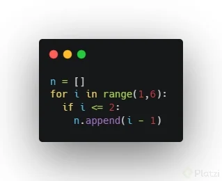
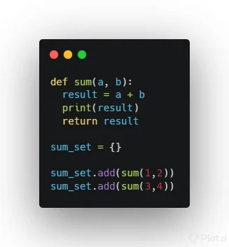

# Curso de Python: Comprehensions, Funciones y Manejo de Errores


1. **¿Cuál de los siguientes es un principio de The Zen of Python?**
   
**R//=** Bello es mejor que feo.

2. **¿Cuál de las siguientes es una propiedad principal CORRECTA de los Sets o Conjuntos en Python?**
 
**R//=** No pueden tener duplicados.

3. **¿Cuál de los siguientes es un Set o Conjunto en Python?**
   
**R//=** python_set = {'Nicolas', 'Miguel', 'Juan'}

4. **Dado el siguiente bloque de código:**

```python
names = {'Nicolas', 'Miguel', 'Juan', 'Nicolas'} 
print(names) 
```

**¿Cuál será el resultado?**

**R//=** `¿Cuál será el resultado?`

5. **Tienes un set o conjunto de Python almacenado en la variable trips. ¿Cómo obtienes su cantidad de elementos?**
    
**R//=** `len(trips)`

6. **¿Cuál será el resultado del siguiente bloque de código?**

```python
a = {1,2}
b = {2,3}
print(a | b) 
```
    
**R//=** `{1,2,3}`

7. **¿Cuál será el resultado del siguiente bloque de código?**

```python
a = {1,2}
b = {2,3}
print(a & b)
```
    
**R//=** `{2}`

8. **¿Cuál será el resultado del siguiente bloque de código?**

```python
a = {1,2}
b = {2,3}
print(a - b)
```
    
**R//=** `{1}`

9. Dado el siguiente bloque de código:


**¿Cuál de las siguientes respuestas con List Comprehension nos peermite obtener el mismo resultad con una sintaxis más corta?**
    
**R//=** `n = [i - 1 for i in range(1,6) if i <= 2]`

10. **¿Cuál de las siguientes estructuras de datos NO nos permite duplicar elementos?**
    
**R//=** `Set`

11. ¿Cuál es la palabra clave reservada para crear una función en Python?

**R//=** `def`

12. **¿Cuál es la forma correcta de crear una función en Python?**
    
**R//=**
```python
def nombre_func:
	# …
```
13. **Creaste una función sum que recibe 2 parámetros y los suma entre ellos. Ahora debes almacenar el resultado de esas sumas en un conjunto. ¿Cómo lo harias?**
    
**R//=** 


14. **¿Cuál estructura de datos usa Python para retornar varios valores en una función?**
    
**R//=** `Tuple`

15. **La función `sum(a,b)` retorna 3 elementos: 1) la suma entre a y b; 2) a; y 3) b.**
**Debes guardar los 3 elementos retornados en nuevas variables por fuera de la función.**
**¿Cómo lo harías?**
    
**R//=** `result, a, b = sum(1,2)`

16. **Dado el siguiente bloque de código:**

```python
def sum(x, y):
	return x + y 
```

**¿Cuál de las siguientes respuestas nos permite obtener el mismo resultado, pero con una sintaxis más corta?**
    
**R//=** `sum = lambda x, y : x + y`

17. **¿Cuál de las siguientes funciones SIEMPRE devuelve la misma cantidad de elementos de la lista original?**
    
**R//=** `map`

18. **¿Cuál de las siguientes funciones SIEMPRE devuelve un solo valor después de iterar sobre todos los elementos de la lista original?**
    
**R//=** `reduce`

19. **Dado el siguiente bloque de código:**

```Python
original = [1, 2, 3, 4, 5]
new = []

for x in original:
    new.append(x * 2)
```

**¿Cuál de las siguientes respuestas es la sintaxis más corta para obtener el mismo resultado?**

**R//=** `new = list(map(lambda x: x * 2, original))`

20. **¿Cuál es la función del siguinte bloque de código: `if __name__ == '__main__'?`**
    
**R//=** El bloque de código `if __name__ == '__main__'`: en Python se utiliza para diferenciar cuándo un archivo está siendo ejecutado directamente o cuándo está siendo importado como un módulo en otro archivo.

21. **¿Cuál de los siguientes bloques de código provoca un error en Python?**
    
**R//=** Todas las respuestas arrojan un error.

22. **Dado el siguiente bloque de código: `print(10 / user_option)`. Y siendo `user_option` una variable que puede recibir cualquier valor numérico (incluyendo 0). ¿Cómo manejarías la excepción de división sobre cero para que el código siga ejecutando a pesar del error?**
    
**R//=**

```python
try:
	print(10 / user_option)
except ZeroDivisionError as error:
	print(error)
```

23. **¿Cuál es la forma correcta de generar una lista usando comprensión de listas en Python?**
    
**R//=** `characters = [character for character in 'Platzi']`

24. **¿Qué uso se le da al método map() de Python?**
    
**R//=** Aplica una función sobre todos los elementos de un iterable y devuelve otro iterable tipo map.

