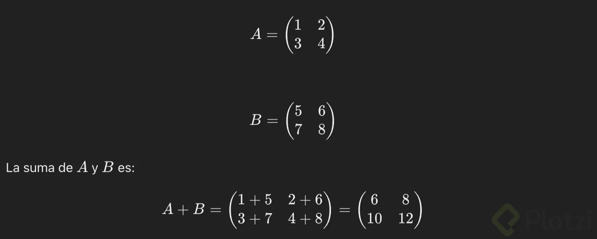
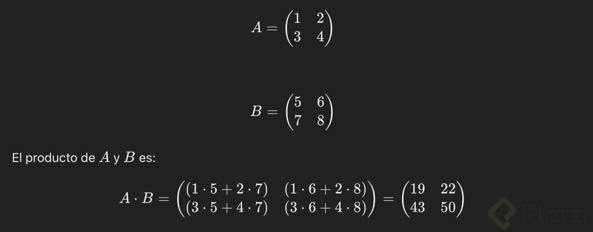
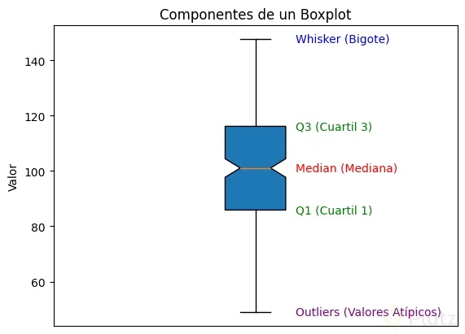

# Curso de Python para Ciencia de Dato

## Fundamentos para Análisis de Datos en NumPy y Pandas

Instalar Numpy y Pandas `pip install numpy pandas`

**Lecturas recomendadas**

[NumPy -](https://numpy.org/ "NumPy -")

[pandas - Python Data Analysis Library](https://pandas.pydata.org/ "pandas - Python Data Analysis Library")

[Curso de Python - Platzi](https://platzi.com/cursos/python/ "Curso de Python - Platzi")

## Dimensiones en NumPy y Pandas: De Escalares a Tensors

Las dimensiones juegan un papel fundamental en las estructuras de datos y cálculos en las bibliotecas como NumPy y Pandas. En este contexto, se hace referencia a estructuras de datos que pueden ir desde **escalares** (valores únicos) hasta **tensores** (estructuras multidimensionales). Vamos a recorrer las dimensiones, desde lo más simple hasta lo más complejo.

### 1. **Escalares (Dimensión 0)**

Un **escalar** es un valor único, sin dimensiones ni estructura de datos adicional. En NumPy, un escalar sería un simple número.

- **NumPy**: Un escalar sería un número independiente, como `5`, `3.14` o `True`.
  
  ```python
  import numpy as np
  scalar = np.array(5)
  ```

  Aquí `scalar` es un escalar, un arreglo de dimensión 0 (`ndim=0`).

- **Pandas**: Un valor escalar en Pandas también es un único valor, como un número almacenado en una celda de una Serie o un DataFrame.

### 2. **Vectores (1D: Una Dimensión)**

Un **vector** es una estructura unidimensional, o de una sola fila o columna de datos. En NumPy, esto es conocido como un arreglo de una sola dimensión.

- **NumPy**: Un arreglo unidimensional o vector puede contener múltiples valores en una sola "fila".
  
  ```python
  vector = np.array([1, 2, 3, 4])
  print(vector.shape)  # (4,)
  ```

  Aquí `vector` tiene una forma de `(4,)`, lo que significa que es un vector con 4 elementos.

- **Pandas**: En Pandas, el equivalente a un vector es una **Serie** (`pd.Series`), que es una estructura unidimensional.

  ```python
  import pandas as pd
  series = pd.Series([1, 2, 3, 4])
  print(series.shape)  # (4,)
  ```

  Las Series son indexadas, por lo que cada valor tiene un índice asociado.

### 3. **Matrices (2D: Dos Dimensiones)**

Una **matriz** es una estructura bidimensional, generalmente representada como filas y columnas. Es equivalente a una tabla de datos.

- **NumPy**: En NumPy, una matriz es un arreglo bidimensional.

  ```python
  matrix = np.array([[1, 2], [3, 4], [5, 6]])
  print(matrix.shape)  # (3, 2)
  ```

  La forma `(3, 2)` significa que tiene 3 filas y 2 columnas.

- **Pandas**: En Pandas, el equivalente a una matriz es un **DataFrame** (`pd.DataFrame`), que contiene filas y columnas con etiquetas.

  ```python
  dataframe = pd.DataFrame({'A': [1, 2, 3], 'B': [4, 5, 6]})
  print(dataframe.shape)  # (3, 2)
  ```

  Un DataFrame tiene etiquetas tanto para las filas como para las columnas.

### 4. **Tensores (3D o Más: Tres Dimensiones o Más)**

Un **tensor** es una estructura multidimensional que puede tener tres o más dimensiones. Es útil para representar datos complejos, como imágenes (3D) o videos (4D).

- **NumPy**: NumPy soporta tensores de cualquier dimensión.

  Ejemplo de un tensor 3D, como una "pila" de matrices:

  ```python
  tensor = np.array([[[1, 2], [3, 4]], [[5, 6], [7, 8]]])
  print(tensor.shape)  # (2, 2, 2)
  ```

  Aquí, el tensor tiene la forma `(2, 2, 2)`, que significa que contiene 2 matrices, cada una de tamaño 2x2.

- **Pandas**: Pandas generalmente no maneja tensores de forma directa, ya que está diseñado para trabajar principalmente con datos tabulares (hasta 2D). Sin embargo, es posible representar estructuras más complejas utilizando múltiples DataFrames o anidando DataFrames dentro de listas.

### Resumen de Dimensiones en NumPy y Pandas:

| Dimensión | NumPy | Pandas |
| --------- | ------| ------ |
| 0D (Escalar) | `np.array(5)` | Un valor en una celda |
| 1D (Vector) | `np.array([1, 2, 3])` | `pd.Series([1, 2, 3])` |
| 2D (Matriz) | `np.array([[1, 2], [3, 4]])` | `pd.DataFrame(...)` |
| 3D (Tensor) | `np.array([[[1, 2], [3, 4]], [[5, 6], [7, 8]]])` | No disponible directamente |

### Diferencia clave entre NumPy y Pandas:
- **NumPy** es más flexible en términos de dimensiones, permitiendo la manipulación de tensores multidimensionales (3D, 4D, etc.).
- **Pandas** está orientado a la manipulación de datos tabulares, y generalmente se limita a dos dimensiones (filas y columnas).

## Arrays en NumPy

### Métodos de creación de Arrays de NumPy

NumPy proporciona diversas maneras de crear arrays, facilitando la realización de cálculos numéricos y análisis de datos de manera eficiente en Python.

1. Creación de Arrays a partir de Listas

Podemos crear un array a partir de una lista o una lista de listas:

```python
import numpy as np

# Array unidimensional
array_1d = np.array([1, 2, 3, 4])

# Array bidimensional
array_2d = np.array([[1, 2, 3], [4, 5, 6]])
```

2. Creación de Arrays con Funciones Predefinidas

NumPy proporciona funciones predefinidas para crear arrays de manera más rápida y conveniente:

- **np.zeros()**: Crea un array lleno de ceros.

`zeros_array = np.zeros((3, 3))`

- **np.ones()**: Crea un array lleno de unos.

`ones_array = np.ones((2, 4))`

- **np.arange()**: Crea un array con una secuencia de números.

`range_array = np.arange(0, 10, 2)  # [0, 2, 4, 6, 8]`

- **np.linspace()**: Crea un array con números igualmente espaciados.

`linspace_array = np.linspace(0, 1, 5)  # [0., 0.25, 0.5, 0.75, 1.]`

3. Especificando Tipos de Datos (Datatypes)

Al crear un array, podemos especificar el tipo de datos que contendrá utilizando el parámetro `dtype`. Esta especificación es crucial para la eficiencia y precisión en cálculos numéricos. Aquí se detallan algunos de los tipos de datos más comunes:

- `int32`: Entero de 32 bits.
- `float32`: Número de punto flotante de 32 bits.
- `float64`: Número de punto flotante de 64 bits (por defecto para números flotantes en NumPy).
- `bool`: Valores booleanos (True o False).
- `complex64`: Número complejo de 64 bits.
- `complex128`: Número complejo de 128 bits.
- `str`: Cadenas de texto.

Podemos especificar estos tipos de datos al crear el array utilizando el parámetro `dtype`:

```python
pythonCopiar código
# Array de enteros
int_array = np.array([1, 2, 3], dtype='int32')

# Array de flotantes
float_array = np.array([1.0, 2.0, 3.0], dtype='float32')

# Array de booleanos
bool_array = np.array([True, False, True], dtype='bool')

# Array de números complejos
complex_array = np.array([1+2j, 3+4j], dtype='complex64')

# Array de cadenas de texto
str_array = np.array(['a', 'b', 'c'], dtype='str')
```

Algunos de estos tipos también pueden ser especificados con abreviaturas en el parámetro `dtype`. Por ejemplo, `'d'` es equivalente a `float64`, que es el tipo de datos de punto flotante de 64 bits en NumPy:

```python
# Creando un array con dtype 'd' (equivalente a float64)
array_float64 = np.array([1, 2, 3], dtype='d')
print(array_float64)
```

4. NaN (Not a Number)

NaN es un valor especial utilizado para representar datos que no son números, especialmente en el contexto de operaciones matemáticas que no tienen un resultado definido. Por ejemplo, la división de cero por cero (0/0) o la raíz cuadrada de un número negativo.

```python
nan_array = np.array([1, 2, np.nan, 4])
print(nan_array)
```

El valor NaN es muy útil para manejar datos faltantes o resultados indefinidos en cálculos numéricos.

NumPy proporciona varios métodos para crear arrays, lo que facilita la generación de diferentes tipos de arrays según las necesidades del usuario. A continuación, te explico los principales métodos para crear arrays en NumPy:

### 1. **Creación a partir de listas o tuplas**

La forma más básica de crear un array es a partir de una lista o tupla de Python. Simplemente se convierte el objeto en un array de NumPy.

```python
import numpy as np

# A partir de una lista
array_from_list = np.array([1, 2, 3, 4, 5])

# A partir de una tupla
array_from_tuple = np.array((1, 2, 3, 4, 5))

print(array_from_list)  # [1 2 3 4 5]
```

### 2. **Arrays de ceros: `np.zeros()`**

Este método crea un array de cualquier dimensión, pero inicializado con ceros.

```python
# Array unidimensional de 5 ceros
zeros_array = np.zeros(5)

# Matriz de 3x3 de ceros
zeros_matrix = np.zeros((3, 3))

print(zeros_matrix)
# [[0. 0. 0.]
#  [0. 0. 0.]
#  [0. 0. 0.]]
```

### 3. **Arrays de unos: `np.ones()`**

Similar a `np.zeros()`, pero en este caso el array se llena con unos.

```python
# Array unidimensional de 5 unos
ones_array = np.ones(5)

# Matriz de 3x3 de unos
ones_matrix = np.ones((3, 3))

print(ones_matrix)
# [[1. 1. 1.]
#  [1. 1. 1.]
#  [1. 1. 1.]]
```

### 4. **Arrays vacíos: `np.empty()`**

Crea un array sin inicializar sus valores, por lo que contendrá los valores aleatorios de la memoria.

```python
# Matriz de 2x2 vacía
empty_array = np.empty((2, 2))

print(empty_array)
# Los valores son impredecibles, ya que no se inicializan
```

### 5. **Array con un rango de números: `np.arange()`**

Genera un array con números en un rango específico. Similar a la función `range()` en Python, pero devuelve un array de NumPy.

```python
# Array con números del 0 al 9
arange_array = np.arange(10)

# Array con números desde 5 hasta 15 con un paso de 2
arange_with_step = np.arange(5, 15, 2)

print(arange_with_step)  # [ 5  7  9 11 13]
```

### 6. **Array con números equidistantes: `np.linspace()`**

Crea un array de números equidistantes en un intervalo definido, con un número específico de elementos.

```python
# Array con 5 números entre 0 y 1
linspace_array = np.linspace(0, 1, 5)

print(linspace_array)  # [0.   0.25 0.5  0.75 1. ]
```

### 7. **Matriz identidad: `np.eye()`**

Crea una **matriz identidad**, que es una matriz cuadrada con unos en la diagonal y ceros en las posiciones restantes.

```python
# Matriz identidad de 3x3
identity_matrix = np.eye(3)

print(identity_matrix)
# [[1. 0. 0.]
#  [0. 1. 0.]
#  [0. 0. 1.]]
```

### 8. **Arrays de números aleatorios: `np.random`**

NumPy proporciona varias funciones dentro del módulo `random` para generar arrays de números aleatorios.

- **`np.random.rand()`**: Genera números aleatorios entre 0 y 1 con una distribución uniforme.

```python
random_array = np.random.rand(3, 3)

print(random_array)
# [[0.1036817  0.87872515 0.33837883]
#  [0.42231567 0.21185037 0.86598657]
#  [0.58776519 0.15980242 0.04907681]]
```

- **`np.random.randint()`**: Genera números enteros aleatorios dentro de un rango.

```python
random_int_array = np.random.randint(0, 10, size=(3, 3))

print(random_int_array)
# [[9 2 6]
#  [4 1 8]
#  [7 3 5]]
```

### 9. **Array con un patrón repetido: `np.tile()`**

Crea un nuevo array repitiendo el array de entrada a lo largo de un número específico de repeticiones.

```python
array = np.array([1, 2, 3])

# Repetir el array 2 veces en filas y 3 veces en columnas
tiled_array = np.tile(array, (2, 3))

print(tiled_array)
# [[1 2 3 1 2 3 1 2 3]
#  [1 2 3 1 2 3 1 2 3]]
```

### 10. **Array de un archivo: `np.loadtxt()` y `np.genfromtxt()`**

NumPy permite cargar arrays desde archivos de texto, CSV u otros formatos. Dos métodos comunes son:

- **`np.loadtxt()`**: Carga datos desde un archivo de texto, asumiendo que todos los valores tienen el mismo tipo.

```python
# Cargar datos desde un archivo de texto
# data = np.loadtxt('data.txt')
```

- **`np.genfromtxt()`**: Similar a `loadtxt()`, pero puede manejar valores faltantes.

```python
# Cargar datos desde un archivo CSV
# data = np.genfromtxt('data.csv', delimiter=',')
```

### Resumen de los métodos de creación de arrays:

| Método | Descripción |
| --- | --- |
| `np.array()` | Convierte listas o tuplas en arrays. |
| `np.zeros()` | Crea un array de ceros. |
| `np.ones()` | Crea un array de unos. |
| `np.empty()` | Crea un array vacío (sin inicialización). |
| `np.arange()` | Genera un array con un rango de números. |
| `np.linspace()` | Genera un array con números equidistantes. |
| `np.eye()` | Crea una matriz identidad. |
| `np.random.rand()` | Genera un array de números aleatorios uniformemente distribuidos entre 0 y 1. |
| `np.random.randint()` | Genera un array de enteros aleatorios. |
| `np.tile()` | Repite un array un número específico de veces. |
| `np.loadtxt()` | Carga un array desde un archivo de texto. |
| `np.genfromtxt()` | Carga un array desde un archivo con manejo de valores faltantes. |

Estos son algunos de los métodos más comunes y útiles para crear arrays en NumPy. ¿Te gustaría explorar alguno en más detalle o ver ejemplos más avanzados?

**Lecturas recomendadas**

[Curso de Estadística y Probabilidad - Platzi](https://platzi.com/cursos/estadistica-probabilidad/ "Curso de Estadística y Probabilidad - Platzi")

[numpy.array — NumPy v2.0 Manual](https://numpy.org/doc/stable/reference/generated/numpy.array.html "numpy.array — NumPy v2.0 Manual")

## Introducción al álgebra lineal con NumPy


El álgebra lineal es una rama fundamental de las matemáticas que se centra en el estudio de los vectores, las matrices y las transformaciones lineales. NumPy proporciona herramientas para resolver sistemas de ecuaciones lineales, realizar transformaciones geométricas y modelar problemas en diversas áreas de la ciencia y la ingeniería. Su aplicación es tan amplia que se encuentra en el corazón de múltiples disciplinas científicas y tecnológicas, facilitando desde la simulación de fenómenos físicos hasta la optimización de sistemas complejos.

Los vectores y las matrices, los bloques de construcción del álgebra lineal, nos permiten representar y manipular datos de manera eficiente, un vector puede representar una lista de valores que podrían ser coordenadas espaciales, mientras que una matriz puede representar una transformación que afecta a estos vectores. Las operaciones básicas del álgebra lineal, como la suma, la multiplicación y la transposición de matrices, forman la base de muchas técnicas avanzadas en la física, la ingeniería, la economía y la informática.

### Conceptos básicos de álgebra lineal

1. **Vectores**: Son objetos que tienen magnitud y dirección. Se pueden representar como una lista de números, que son las coordenadas del vector.
2. **Matrices**: Son arreglos bidimensionales de números que representan transformaciones lineales. Una matriz puede transformar un vector en otro vector.
3. **Transformaciones Lineales**: Son funciones que toman vectores como entrada y producen otros vectores como salida, respetando las operaciones de suma y multiplicación por un escalar.
4. **Espacios Vectoriales**: Conjuntos de vectores que pueden sumarse entre sí y multiplicarse por escalares, siguiendo ciertas reglas.

### Ejemplos aplicativos

1. **Gráficos por Computadora**: Las transformaciones lineales se utilizan para rotar, escalar y traducir objetos en la pantalla.
2. **Procesamiento de Imágenes**: Las matrices de convolución (kernels) se usan para aplicar filtros a las imágenes, mejorando su calidad o destacando características específicas.
3. **Aprendizaje Automático**: Los algoritmos de regresión lineal, redes neuronales y otros modelos dependen en gran medida de las operaciones matriciales.

### Operaciones principales en álgebra lineal

Vamos a ver algunas de las operaciones más comunes en álgebra lineal utilizando matrices.

### Suma de matrices

La suma de matrices se realiza elemento por elemento. Por ejemplo, si tenemos dos matrices A y B:



Código en NumPy para la suma de matrices:

```python
import numpy as np

A = np.array([[1, 2], [3, 4]])
B = np.array([[5, 6], [7, 8]])

suma = A + B
print("Suma de matrices:\n", suma)
```

### Multiplicación de matrices

La multiplicación de matrices combina filas de una matriz con columnas de otra. Por ejemplo, si tenemos las mismas matrices A y B:



Código en NumPy para la multiplicación de matrices:

```python
producto = np.dot(A, B)
print("Producto de matrices:\n", producto)
```

### Transposición de Matrices

La transposición de una matriz intercambia sus filas y columnas. Por ejemplo, la transposición de la matriz A es:


### Determinante de una matriz

El determinante es un valor único que puede calcularse a partir de una matriz cuadrada. Por ejemplo, el determinante de la matriz AAA es:


Código en NumPy para el determinante de una matriz:

```python
determinante = np.linalg.det(A)
print("Determinante de A:", determinante)
```

### Más operaciones de álgebra lineal con NumPy

NumPy ofrece una variedad de funciones que facilitan el trabajo con álgebra lineal. Aquí hay algunas más:

### Inversa de una matriz

La matriz inversa de A:


```python
inversa = np.linalg.inv(A)
print("Inversa de A:\n", inversa)
```

### Valores y vectores propios

Los valores propios y los vectores propios son fundamentales en muchas aplicaciones, como en la compresión de datos y el análisis de sistemas dinámicos.

```python
valores_propios, vectores_propios = np.linalg.eig(A)
print("Valores propios de A:\n", valores_propios)
print("Vectores propios de A:\n", vectores_propios)
```

### Resolución de sistemas de ecuaciones lineales

Para resolver un sistema de ecuaciones lineales AX=BAX = BAX=B:

```python
B = np.array([1, 2])
X = np.linalg.solve(A, B)
print("Solución del sistema AX = B:\n", X)
```

NumPy es una herramienta poderosa para manejar cálculos numéricos y operaciones de álgebra lineal en Python. Su eficiencia y facilidad de uso la convierten en una biblioteca indispensable para científicos de datos, ingenieros y desarrolladores. Desde la creación de arrays hasta la manipulación de imágenes, NumPy abre un mundo de posibilidades en diversas aplicaciones del mundo real.

Espero que este blog haya despertado tu interés y te haya dado una visión clara de cómo usar NumPy para realizar operaciones de álgebra lineal y mucho más. ¡Sigue explorando y experimentando con NumPy para descubrir todo su potencial! ⚡️

## Indexación y Slicing

En NumPy, la **indexación** y el **slicing** permiten acceder y modificar elementos de arrays de manera muy flexible. Estas técnicas son esenciales para trabajar con arrays de múltiples dimensiones.

### **1. Indexación**

La indexación en NumPy es similar a la de listas de Python, pero se extiende a arrays de múltiples dimensiones. Los índices comienzan en `0`.

#### **1.1. Indexación en arrays unidimensionales**
```python
import numpy as np

# Array unidimensional
arr = np.array([10, 20, 30, 40, 50])

# Acceder al primer elemento
print(arr[0])  # 10

# Acceder al último elemento
print(arr[-1])  # 50
```

#### **1.2. Indexación en arrays multidimensionales**
En arrays multidimensionales, se usa una tupla de índices, donde cada índice corresponde a una dimensión del array.

```python
# Array bidimensional
arr_2d = np.array([[1, 2, 3], [4, 5, 6], [7, 8, 9]])

# Acceder al elemento en la fila 1, columna 2
print(arr_2d[1, 2])  # 6

# Acceder a toda la fila 0
print(arr_2d[0])  # [1 2 3]

# Acceder a toda la columna 1
print(arr_2d[:, 1])  # [2 5 8]
```

#### **1.3. Modificación mediante indexación**
Se puede cambiar el valor de un elemento específico accediendo a él mediante su índice.

```python
# Cambiar el valor en la fila 1, columna 2
arr_2d[1, 2] = 10
print(arr_2d)
# [[ 1  2  3]
#  [ 4  5 10]
#  [ 7  8  9]]
```

### **2. Slicing (Corte de arrays)**

El slicing en NumPy permite extraer una parte del array (subarrays). La sintaxis general para slicing es `arr[inicio:fin]`, donde se incluye `inicio` y se excluye `fin`.

#### **2.1. Slicing en arrays unidimensionales**
```python
# Array unidimensional
arr = np.array([10, 20, 30, 40, 50])

# Extraer elementos desde el índice 1 hasta el 3 (no incluye el 3)
print(arr[1:3])  # [20 30]

# Todos los elementos desde el índice 2 en adelante
print(arr[2:])  # [30 40 50]

# Todos los elementos hasta el índice 3 (sin incluirlo)
print(arr[:3])  # [10 20 30]
```

#### **2.2. Slicing en arrays multidimensionales**
En arrays multidimensionales, se puede aplicar slicing en cada dimensión.

```python
# Array bidimensional
arr_2d = np.array([[1, 2, 3], [4, 5, 6], [7, 8, 9]])

# Extraer un subarray: filas 0 y 1, columnas 1 y 2
subarray = arr_2d[0:2, 1:3]
print(subarray)
# [[2 3]
#  [5 6]]

# Extraer todas las filas y solo la columna 0
print(arr_2d[:, 0])  # [1 4 7]
```

#### **2.3. Slicing con paso**
Se puede definir un paso en el slicing, que indica la cantidad de elementos que se deben saltar.

```python
# Array unidimensional
arr = np.array([10, 20, 30, 40, 50])

# Extraer elementos cada dos posiciones
print(arr[::2])  # [10 30 50]

# Array bidimensional
arr_2d = np.array([[1, 2, 3], [4, 5, 6], [7, 8, 9]])

# Extraer subarray con salto en las filas
print(arr_2d[::2, :])  # [[1 2 3] [7 8 9]]
```

### **3. Indexación booleana**

NumPy permite seleccionar elementos del array en función de una condición. Esto se conoce como **indexación booleana**.

```python
# Array unidimensional
arr = np.array([10, 20, 30, 40, 50])

# Condición: seleccionar elementos mayores a 20
cond = arr > 20
print(arr[cond])  # [30 40 50]
```

### **4. Indexación avanzada**

En NumPy, también puedes seleccionar elementos específicos utilizando listas o arrays de índices.

```python
# Array unidimensional
arr = np.array([10, 20, 30, 40, 50])

# Seleccionar elementos en los índices 0, 2 y 4
print(arr[[0, 2, 4]])  # [10 30 50]

# Array bidimensional
arr_2d = np.array([[1, 2, 3], [4, 5, 6], [7, 8, 9]])

# Seleccionar elementos específicos de varias filas
print(arr_2d[[0, 2], [1, 2]])  # [2 9]
```

### **5. Asignación mediante slicing**

También es posible modificar partes de un array utilizando slicing.

```python
# Array unidimensional
arr = np.array([10, 20, 30, 40, 50])

# Cambiar los primeros tres elementos
arr[:3] = [1, 2, 3]
print(arr)  # [ 1  2  3 40 50]

# Array bidimensional
arr_2d = np.array([[1, 2, 3], [4, 5, 6], [7, 8, 9]])

# Cambiar toda la primera fila
arr_2d[0, :] = [0, 0, 0]
print(arr_2d)
# [[0 0 0]
#  [4 5 6]
#  [7 8 9]]
```

### Resumen de indexación y slicing en NumPy:

- **Indexación**: Se usa para acceder a elementos individuales de arrays de cualquier dimensión.
- **Slicing**: Extrae subarrays especificando rangos (inicio, fin, paso).
- **Indexación booleana**: Selecciona elementos basados en condiciones.
- **Indexación avanzada**: Permite seleccionar varios elementos específicos a la vez.

Estas técnicas son muy poderosas para manipular y acceder a datos de manera eficiente en NumPy. ¿Te gustaría profundizar en algún aspecto específico?

## Broadcasting y Operaciones Lógicas en NumPy

### ¿Qué es broadcasting en NumPy?

**Broadcasting** es una funcionalidad poderosa en NumPy que permite realizar operaciones aritméticas en arrays de diferentes tamaños y formas de manera eficiente. En lugar de iterar sobre cada elemento de los arrays para realizar las operaciones, NumPy extiende automáticamente los arrays más pequeños para que coincidan con las dimensiones de los más grandes, sin duplicar datos. Esto no solo optimiza el uso de la memoria, sino que también acelera significativamente las operaciones.

El broadcasting permite que las operaciones entre arrays de diferentes dimensiones se realicen como si todos los arrays tuvieran la misma forma. NumPy extiende los arrays más pequeños a la forma del más grande de manera implícita, facilitando las operaciones sin necesidad de copiar los datos.

### Aplicaciones de Broadcasting

- **Aplicación de Descuentos**: Supongamos que tenemos un array que representa los precios de varios productos y otro array con un descuento porcentual que se aplica a todos los productos. Con broadcasting, podemos aplicar el descuento sin necesidad de un bucle explícito.

```python
import numpy as np

prices = np.array([100, 200, 300])
discount = np.array([0.9])
discounted_prices = prices * discount
print(discounted_prices)  # Output: [ 90. 180. 270.]
```

- **Operaciones con Arrays Multidimensionales**: Podemos realizar operaciones elementales entre arrays de diferentes dimensiones.

```python
a = np.array([[0.0, 0.0, 0.0],
              [10.0, 10.0, 10.0],
              [20.0, 20.0, 20.0],
              [30.0, 30.0, 30.0]])
b = np.array([1.0, 2.0, 3.0])
result = a + b
print(result)
# Output:
# [[ 1.  2.  3.]
#  [11. 12. 13.]
#  [21. 22. 23.]
#  [31. 32. 33.]]
```

### Importancia del Broadcasting

Broadcasting es crucial porque permite escribir código más conciso y legible, evitando bucles explícitos y aprovechando las optimizaciones internas de NumPy para realizar operaciones de manera rápida y eficiente. Esto es especialmente útil en análisis de datos y aprendizaje automático, donde se manejan grandes volúmenes de datos y se requieren cálculos rápidos.

### Reglas de Broadcasting

Para que el broadcasting funcione, las dimensiones de los arrays deben cumplir ciertas reglas:

1. **Comparación desde la Última Dimensión**: Las dimensiones se comparan desde la última hacia la primera.
2. **Dimensiones Compatibles**: Dos dimensiones son compatibles si son iguales o si una de ellas es 1.

Ejemplos:

- **Escalar y Array 1D:**

```python
a = np.array([1, 2, 3])
b = 2
result = a * b
print(result)  # Output: [2 4 6]
```

- **Array 1D y Array 2D:**

```python
a = np.array([[1, 2, 3], [4, 5, 6], [7, 8, 9]])
b = np.array([1, 0, 1])
result = a * b
print(result)
# Output:
# [[1 0 3]
#  [4 0 6]
#  [7 0 9]]
```

- **Array 2D y Array 3D:**

```python
a = np.array([[[1], [2], [3]], [[4], [5], [6]]])
b = np.array([1, 2, 3])
result = a * b
print(result)
# Output:
# [[[ 1  2  3]
#   [ 2  4  6]
#   [ 3  6  9]]
#
#  [[ 4  8 12]
#   [ 5 10 15]
#   [ 6 12 18]]]
```

Broadcasting en NumPy es una técnica esencial para realizar operaciones aritméticas de manera eficiente en arrays de diferentes tamaños y formas. Entender y aplicar las reglas de broadcasting permite escribir código más limpio y optimizado, crucial para tareas de análisis de datos y aprendizaje automático.

Explora estas funcionalidades y descubre cómo broadcasting puede mejorar la eficiencia de tus cálculos en Python.

**Lecturas recomendadas**

[Broadcasting — NumPy v2.0 Manual](https://numpy.org/doc/stable/user/basics.broadcasting.html "Broadcasting — NumPy v2.0 Manual")

[numpy.hstack — NumPy v2.0 Manual](https://numpy.org/doc/stable/reference/generated/numpy.hstack.html "numpy.hstack — NumPy v2.0 Manual")

[numpy.vstack — NumPy v2.0 Manual](https://numpy.org/doc/stable/reference/generated/numpy.vstack.html "numpy.vstack — NumPy v2.0 Manual")

## Elementos Únicos y sus Conteos: Copias y Vistas

En **NumPy**, puedes obtener los **elementos únicos** y sus **conteos** utilizando varias funciones útiles como `np.unique()`. También es importante entender la diferencia entre **copias** y **vistas** cuando trabajas con arrays. A continuación, desglosamos estos temas.

### Elementos Únicos y sus Conteos

#### `np.unique()`
La función `np.unique()` devuelve los elementos únicos de un array. También puedes obtener los conteos de cuántas veces aparece cada elemento único.

```python
import numpy as np

# Crear un array con elementos repetidos
array = np.array([1, 2, 2, 3, 3, 3, 4, 4, 4, 4])

# Obtener los elementos únicos
unicos = np.unique(array)

# Obtener los elementos únicos y sus conteos
unicos, conteos = np.unique(array, return_counts=True)

print("Elementos únicos:", unicos)
print("Conteos:", conteos)
```

### Salida:
```
Elementos únicos: [1 2 3 4]
Conteos: [1 2 3 4]
```

### Copias y Vistas en NumPy

Cuando trabajas con arrays en NumPy, debes entender si estás manipulando **copias** o **vistas** de un array. Esto afecta el rendimiento y el comportamiento cuando modificas arrays.

#### 1. **Vistas (Views)**:
- Una **vista** es una referencia al array original. Cambios en la vista afectan al array original.
- Al usar técnicas como **slicing** (`:`), NumPy crea una vista, no una copia.

```python
# Crear un array original
array_original = np.array([1, 2, 3, 4, 5])

# Crear una vista del array
vista = array_original[:3]

# Modificar la vista
vista[0] = 100

print("Array original después de modificar la vista:", array_original)
print("Vista:", vista)
```

### Salida:
```
Array original después de modificar la vista: [100   2   3   4   5]
Vista: [100   2   3]
```

#### 2. **Copias**:
- Una **copia** es un nuevo array en memoria. Cambios en la copia no afectan al array original.
- Para crear una copia explícita, se usa `np.copy()`.

```python
# Crear un array original
array_original = np.array([1, 2, 3, 4, 5])

# Crear una copia del array
copia = np.copy(array_original)

# Modificar la copia
copia[0] = 100

print("Array original después de modificar la copia:", array_original)
print("Copia:", copia)
```

### Salida:
```
Array original después de modificar la copia: [1 2 3 4 5]
Copia: [100   2   3   4   5]
```

### Resumen:
- **Elementos Únicos**: Usa `np.unique()` para obtener los elementos únicos y sus conteos.
- **Vistas**: Son referencias al array original. Modificar una vista afecta el array original.
- **Copias**: Son nuevos arrays en memoria. Modificar una copia no afecta el array original.

¿Te gustaría algún ejemplo más o más detalles sobre estos temas?

### **Elementos Únicos y sus Conteos: Copias y Vistas en NumPy**

#### **Elementos Únicos y Conteos**

Para encontrar **elementos únicos** y sus **conteos** en un array de **NumPy**, puedes usar la función `np.unique()`, que devuelve los elementos sin duplicados. Esta función tiene la opción de devolver cuántas veces aparece cada elemento único en el array.

**Ejemplo**:
```python
import numpy as np

# Crear un array con elementos duplicados
array = np.array([1, 2, 2, 3, 3, 3, 4, 4, 4, 4])

# Obtener elementos únicos y sus conteos
unicos, conteos = np.unique(array, return_counts=True)

print("Elementos únicos:", unicos)
print("Conteos:", conteos)
```

### **Salida**:
```
Elementos únicos: [1 2 3 4]
Conteos: [1 2 3 4]
```

Aquí, `np.unique()` nos da:
- **Elementos únicos**: `[1, 2, 3, 4]`
- **Conteos**: `[1, 2, 3, 4]`, donde el número `1` aparece una vez, `2` aparece dos veces, y así sucesivamente.

#### **Copias y Vistas en NumPy**

Cuando trabajas con arrays en NumPy, es fundamental saber si estás creando **copias** o **vistas** de un array, ya que esto influye en el rendimiento y en cómo se manejan los datos.

1. **Vistas (Views)**:
   - Una vista es una referencia a los mismos datos en memoria que el array original.
   - Modificar una vista afectará el array original.
   - Las vistas se crean de forma automática cuando realizas **slicing** o ciertos tipos de operaciones de cambio de forma.

   **Ejemplo de Vista**:
   ```python
   # Crear un array
   array_original = np.array([1, 2, 3, 4, 5])

   # Crear una vista mediante slicing
   vista = array_original[:3]

   # Modificar la vista
   vista[0] = 100

   print("Array original:", array_original)
   print("Vista:", vista)
   ```

   ### **Salida**:
   ```
   Array original: [100   2   3   4   5]
   Vista: [100   2   3]
   ```

   Aquí, al modificar la vista, el array original también cambia, ya que la vista está referenciando los mismos datos en memoria.

2. **Copias**:
   - Una copia es un nuevo array en memoria. Modificar la copia no afectará el array original.
   - Para crear una copia explícita de un array en NumPy, utiliza `np.copy()`.

   **Ejemplo de Copia**:
   ```python
   # Crear un array
   array_original = np.array([1, 2, 3, 4, 5])

   # Crear una copia del array
   copia = np.copy(array_original)

   # Modificar la copia
   copia[0] = 100

   print("Array original:", array_original)
   print("Copia:", copia)
   ```

   ### **Salida**:
   ```
   Array original: [1 2 3 4 5]
   Copia: [100   2   3   4   5]
   ```

   En este caso, al modificar la copia, el array original no cambia, ya que la copia es independiente.

### **Diferencias clave entre Copias y Vistas**:
- **Vista**: Comparte la misma memoria que el array original. Es más eficiente en términos de uso de memoria, pero cualquier cambio en la vista también cambia el array original.
- **Copia**: Un nuevo array con una nueva asignación de memoria. No afecta al array original cuando se modifica.

### **Resumen**:
- Para obtener **elementos únicos y sus conteos**, usa `np.unique()` con `return_counts=True`.
- Las **vistas** son referencias a los mismos datos y son más eficientes en cuanto a memoria, pero modificar la vista también modifica el array original.
- Las **copias** crean un nuevo array en memoria, lo que te permite modificar el nuevo array sin afectar el original.

Este conocimiento es esencial para trabajar con eficiencia y control en el manejo de grandes conjuntos de datos con NumPy.

## Transformación de Arrays: Reshape y Manipulación

Aprender a transponer y transformar matrices, invertir arrays y aplanar arrays multidimensionales son habilidades esenciales para manejar grandes volúmenes de datos y realizar cálculos complejos de manera eficiente. Usando la librería NumPy en Python, estas operaciones no solo son fáciles de implementar sino también altamente optimizadas para trabajar con grandes conjuntos de datos.

### Transposición de Matrices

La transposición de una matriz es una operación que intercambia sus filas y columnas, esencial en el álgebra lineal y la manipulación de datos científicos. En NumPy, se puede transponer una matriz usando matrix.T, lo que convierte las filas en columnas y viceversa.

```python
import numpy as np
matrix = np.array([[1, 2, 3], [4, 5, 6], [7, 8, 9]])
transposed_matrix = matrix.T
print("Matriz original:\n", matrix)
print("Matriz transpuesta:\n", transposed_matrix)
```

### Cambiar la Forma (Reshape) de un Array
La función `reshape` permite cambiar la forma de un array sin cambiar sus datos. Es importante asegurarse de que el número total de elementos permanezca constante.

Por ejemplo, un array de 12 elementos puede ser remodelado en una matriz de 3x4, 4x3, 2x6, etc., pero no en una matriz de 5x3.

```python
# Crea un array con los números del 1 al 12
array = np.arange(1, 13)  
# Cambia la forma del array a una matriz de 3 filas y 4 columnas
reshaped_array = array.reshape(3, 4)  
print("Array original:", array)
print("Array reshaped a 3x4:\n", reshaped_array)
```

- np.arange(1, 13) crea un array unidimensional de 12 elementos.
- array.reshape(3, 4) reorganiza este array en una matriz de 3 filas y 4 columnas. El número total de elementos (12) debe ser el mismo antes y después del reshaping.

Asegúrate de que el número total de elementos en la nueva forma coincide con el número total de elementos en el array original. De lo contrario, se producirá un ValueError.

### ¿Cómo se invierte un array en NumPy?

En el procesamiento de señales y en algoritmos de inversión de datos, es muy común invertir un array, lo que implica cambiar el orden de sus elementos de forma que el primer elemento se convierta en el último y viceversa.

```python
# Crea un array con los números del 1 al 5
array = np.array([1, 2, 3, 4, 5])  
# Invierte el array
reversed_array = array[::-1]  
print("Array original:", array)
print("Array invertido:", reversed_array)
```

`array[::-1]` Invierte el array utilizando slicing. `array[start:stop:step] `es la notación general para slicing en Python, donde start es el índice inicial, stop es el índice final (excluido), y step es el tamaño del paso. Al omitir `start` y `stop` y usar 1 como step, se obtiene una copia del array en orden inverso.

Siempre debes asegurarte de que los índices `start`, `stop`, y `step` estén configurados correctamente para evitar errores de indexación.

### Flattening de Arrays Multidimensionales

El aplanamiento de arrays es el proceso de convertir un array multidimensional en un array unidimensional, es útil en algoritmos que requieren una entrada lineal o para operaciones de agregación. En NumPy, se puede aplanar un array usando flatten().

```python
 # Crea un array 2D
multi_array = np.array([[1, 2, 3], [4, 5, 6], [7, 8, 9]]) 
# Aplana el array 2D a 1D
flattened_array = multi_array.flatten()  
print("Array multidimensional:\n", multi_array)
print("Array aplanado:", flattened_array)
```

`multi_array.flatten()` convierte un array 2D en un array 1D, esencialmente “aplanando” la estructura multidimensional. Esto es útil para algoritmos que requieren una entrada unidimensional o para facilitar operaciones de agregación.

La operación `flatten()` siempre crea una copia, así que debes asegurarte de que esto es lo que deseas para evitar problemas de memoria.

**Lecturas recomendadas**

[numpy.reshape](https://numpy.org/doc/stable/reference/generated/numpy.reshape.html "numpy.reshape")

### Visualización y Almacenamiento de Datos con NumPy

### Visualización y Almacenamiento de Datos con NumPy

NumPy ofrece múltiples métodos para visualizar, almacenar y recuperar datos, lo que es esencial para el análisis eficiente de datos. Aquí tienes algunas herramientas clave que puedes utilizar:

### 1. **Visualización de Datos en NumPy**

#### A) **Imprimir arrays**
La forma más sencilla de visualizar los datos en un array de NumPy es imprimiéndolos en la consola:
```python
import numpy as np

# Crear un array de ejemplo
array = np.array([[1, 2, 3], [4, 5, 6]])

# Imprimir el array
print(array)
```

#### B) **Propiedades útiles para visualizar**
NumPy proporciona varias propiedades útiles para entender la estructura y características de los arrays:

- `array.shape`: Devuelve la forma (dimensiones) del array.
- `array.size`: Devuelve el número total de elementos.
- `array.ndim`: Devuelve el número de dimensiones.
- `array.dtype`: Devuelve el tipo de datos de los elementos del array.

```python
print("Forma del array:", array.shape)
print("Número de elementos:", array.size)
print("Dimensiones:", array.ndim)
print("Tipo de datos:", array.dtype)
```

#### C) **Visualización gráfica con Matplotlib**
Puedes utilizar Matplotlib junto con NumPy para visualizar los datos en gráficos:

```python
import matplotlib.pyplot as plt

# Crear datos con NumPy
x = np.linspace(0, 10, 100)
y = np.sin(x)

# Graficar
plt.plot(x, y)
plt.title("Seno de x")
plt.show()
```

### 2. **Almacenamiento y Carga de Datos en NumPy**

#### A) **Guardar arrays en archivos**
NumPy permite guardar arrays en archivos binarios o de texto.

- **Formato binario (npy):** Almacena datos en un formato eficiente de espacio y rápido de leer.
  
  ```python
  # Guardar un array en formato .npy
  np.save('array_guardado.npy', array)
  ```

- **Formato de texto (txt o csv):** Puedes guardar los datos en un formato legible como CSV.
  
  ```python
  # Guardar un array en formato de texto
  np.savetxt('array_guardado.txt', array, delimiter=',')
  ```

#### B) **Cargar arrays desde archivos**
Puedes cargar datos guardados previamente en los formatos binario o de texto.

- **Cargar desde un archivo .npy:**
  
  ```python
  # Cargar el array desde un archivo .npy
  array_cargado = np.load('array_guardado.npy')
  print(array_cargado)
  ```

- **Cargar desde un archivo de texto:**
  
  ```python
  # Cargar el array desde un archivo de texto
  array_cargado_txt = np.loadtxt('array_guardado.txt', delimiter=',')
  print(array_cargado_txt)
  ```

### 3. **Almacenamiento de Múltiples Arrays**

- **Formato zip (npz):** Puedes almacenar múltiples arrays en un solo archivo comprimido:

  ```python
  # Guardar varios arrays en un archivo .npz
  np.savez('arrays.npz', array1=array, array2=array * 2)
  
  # Cargar los arrays desde un archivo .npz
  arrays = np.load('arrays.npz')
  print(arrays['array1'])
  print(arrays['array2'])
  ```

### Conclusión
NumPy proporciona herramientas muy útiles para visualizar datos en consola, almacenarlos de forma eficiente y recuperarlos cuando sea necesario. Estas capacidades permiten manejar grandes conjuntos de datos y trabajar de manera efectiva en proyectos de análisis numérico y científico.

## Caso Práctico de Análisis de Datos

```python
meses = np.array(['Enero', 'Febrero', 'Marzo', 'Abril', 'Mayo', 'Junio',
                  'Julio', 'Agosto', 'Septiembre', 'Octubre', 'Noviembre', 'Diciembre'])
ventas_A = np.array([150, 200, 250, 300, 220, 210, 180, 190, 230, 240, 280, 300])
ventas_B = np.array([180, 210, 230, 250, 270, 260, 240, 250, 270, 290, 310, 330])
ventas_C = np.array([200, 220, 240, 260, 280, 300, 320, 340, 360, 380, 400, 420])
```
## Cálculos Matriciales en NumPy

Los cálculos matriciales en NumPy son esenciales para realizar operaciones matemáticas eficientes con matrices y arreglos. Aquí te explico algunos de los conceptos clave y operaciones que puedes realizar:

### 1. **Creación de Matrices**
   - **Matriz a partir de listas anidadas:**
     ```python
     import numpy as np
     A = np.array([[1, 2], [3, 4]])
     ```
   - **Matrices especiales:**
     ```python
     Z = np.zeros((2, 2))  # Matriz de ceros
     O = np.ones((2, 2))   # Matriz de unos
     I = np.eye(2)         # Matriz identidad
     ```

### 2. **Operaciones Básicas**
   - **Suma y resta de matrices:**
     ```python
     C = A + B
     D = A - B
     ```
   - **Multiplicación por un escalar:**
     ```python
     E = 2 * A
     ```
   - **Multiplicación de matrices:**
     ```python
     F = np.dot(A, B)  # Producto matricial
     ```

### 3. **Transposición de una Matriz**
   ```python
   A_T = A.T
   ```

### 4. **Inversa de una Matriz**
   ```python
   A_inv = np.linalg.inv(A)
   ```

### 5. **Determinante de una Matriz**
   ```python
   det_A = np.linalg.det(A)
   ```

### 6. **Solución de Sistemas de Ecuaciones Lineales**
   - Si tienes un sistema de ecuaciones \( AX = B \):
     ```python
     X = np.linalg.solve(A, B)
     ```

### 7. **Valores y Vectores Propios**
   ```python
   eigvals, eigvecs = np.linalg.eig(A)
   ```

### 8. **Operaciones Elemento a Elemento**
   - **Multiplicación elemento a elemento:**
     ```python
     G = A * B
     ```
   - **División elemento a elemento:**
     ```python
     H = A / B
     ```

### 9. **Reducción (Sumas, Máximos, etc.)**
   - **Suma de todos los elementos:**
     ```python
     total_sum = np.sum(A)
     ```
   - **Máximo de todos los elementos:**
     ```python
     max_value = np.max(A)
     ```

### 10. **Broadcasting**
   NumPy permite realizar operaciones entre matrices de diferentes dimensiones de forma automática, ajustando las dimensiones según sea necesario.
   ```python
   I = A + 1  # Añade 1 a todos los elementos de A
   ```

Estos son solo algunos ejemplos de lo que puedes hacer con NumPy para realizar cálculos matriciales. NumPy es extremadamente eficiente y es una herramienta fundamental para cualquier análisis de datos, machine learning o cálculos científicos en Python.

## Ejercicios en NumPy

¡Felicidades por llegar al final del primer módulo!
Has aprendido a dominar NumPy, una herramienta fundamental para el análisis de datos. Este es un gran paso en tu camino para convertirte en un experto en ciencia de datos. Pero esto es solo el comienzo.
En los próximos módulos, nos adentraremos en dos poderosas herramientas: Pandas y Matplotlib, que se integran de manera perfecta con NumPy para llevar tu análisis de datos al siguiente nivel.

### Conexión entre NumPy, Pandas y Matplotlib

**1. NumPy como Fundamento**

 - NumPy es la base sobre la que se construyen muchas otras librerías de análisis de datos en Python, incluidas Pandas y Matplotlib.
 - Con NumPy, has aprendido a manejar arrays multidimensionales y realizar cálculos matemáticos y matriciales eficientes. Estos arrays son fundamentales porque Pandas y Matplotlib los utilizan bajo el capó para realizar muchas de sus operaciones.
 
**2. Pandas para la Manipulación de Datos**

 - Mientras que NumPy se especializa en operaciones numéricas y matriciales, Pandas es la herramienta que utilizarás para la manipulación de datos estructurados, como tablas y series temporales.
 - Pandas toma los arrays de NumPy y les da estructura en forma de DataFrames y Series, lo que facilita la limpieza, transformación y análisis de datos complejos.
 - Ejemplo de Conexión: Puedes usar NumPy para realizar cálculos en un conjunto de datos, luego importar esos resultados a un DataFrame de Pandas para un análisis más detallado.
 
**3. Matplotlib para la Visualización de Datos**

 - Matplotlib es la librería de referencia para la visualización de datos en Python. Te permitirá transformar tus datos en gráficos e imágenes que comunican claramente tus hallazgos.
 - Tanto NumPy como Pandas se integran perfectamente con Matplotlib, permitiéndote crear gráficos desde arrays de NumPy o directamente desde DataFrames de Pandas.
 - Ejemplo de Conexión: Después de procesar y analizar datos con NumPy y Pandas, puedes usar Matplotlib para crear gráficos que visualicen las tendencias, patrones y anomalías en los datos.
 
**4. El Flujo de Trabajo Completo**

 - Cargar y Manipular Datos: Utilizas Pandas para cargar y estructurar tus datos desde diversas fuentes (como CSVs, Excel, bases de datos).
 - Análisis Numérico y Cálculos: Usas NumPy para realizar cálculos intensivos, como operaciones matriciales y simulaciones.
 - Visualización de Resultados: Finalmente, Matplotlib te ayuda a visualizar los resultados de tus análisis, creando gráficos que pueden comunicarse efectivamente con tu audiencia.
 
### Ejercicios Prácticos con NumPy

Vamos a consolidar lo que has aprendido con ejercicios exclusivos de NumPy, diseñados para reforzar tus habilidades y prepararte para las conexiones futuras con Pandas y Matplotlib.

**1. Operaciones Básicas con Arrays**

 - Instrucción: Crea dos arrays de 1D con valores enteros y realiza las operaciones de suma, resta, multiplicación, y división entre ellos.

 - Código:
 
```python
import numpy as np

array1 = np.array([10, 20, 30, 40])
array2 = np.array([1, 2, 3, 4])

suma = array1 + array2
resta = array1 - array2
multiplicacion = array1 * array2
division = array1 / array2

print("Suma:", suma)
print("Resta:", resta)
print("Multiplicación:", multiplicacion)
print("División:", division)
```

**2. Cálculos Estadísticos en Arrays**

 - Instrucción: Dado un array de datos, calcula la media, mediana, varianza, y desviación estándar.

 - Código:

```python
pythonCopiar código
import numpy as np

datos = np.array([23, 76, 35, 67, 89, 45, 68, 79, 35])

media = np.mean(datos)
mediana = np.median(datos)
varianza = np.var(datos)
desviacion = np.std(datos)

print("Media:", media)
print("Mediana:", mediana)
print("Varianza:", varianza)
print("Desviación estándar:", desviacion)
```

**3. Operaciones Matriciales**

 - Instrucción: Crea dos matrices de 2x2 y realiza las operaciones de suma, resta, multiplicación (producto matricial) y cálculo de la inversa de una de ellas.

 - Código:

```python
import numpy as np

matriz1 = np.array([[1, 2], [3, 4]])
matriz2 = np.array([[5, 6], [7, 8]])

suma_matrices = matriz1 + matriz2
resta_matrices = matriz1 - matriz2
producto_matrices = np.dot(matriz1, matriz2)
inversa_matriz1 = np.linalg.inv(matriz1)

print("Suma de matrices:\n", suma_matrices)
print("Resta de matrices:\n", resta_matrices)
print("Producto de matrices:\n", producto_matrices)
print("Inversa de la matriz 1:\n", inversa_matriz1)
```

**4. Resolución de un Sistema de Ecuaciones Lineales**

 - Instrucción: Resuelve el sistema de ecuaciones lineales dado por Ax=b, donde A es una matriz 2x2 y b es un vector de 2 elementos.
Ax=bAx = b

 - Código:

```python
import numpy as np

A = np.array([[2, 3], [1, 2]])
b = np.array([8, 5])

x = np.linalg.solve(A, b)
print("Solución del sistema de ecuaciones:", x)
```

**5. Simulación de Datos**

 - **Instrucción**: Genera un array de 1000 números aleatorios que sigan una distribución normal con media 0 y desviación estándar 1. Calcula la media y desviación estándar del array generado.

 - Código:

```python
import numpy as np

datos_simulados = np.random.normal(0, 1, 1000)
media_simulada = np.mean(datos_simulados)
desviacion_simulada = np.std(datos_simulados)

print("Media de los datos simulados:", media_simulada)
print("Desviación estándar de los datos simulados:", desviacion_simulada)
```

Con estos ejercicios, has consolidado tus conocimientos en NumPy y estás listo para explorar cómo esta poderosa herramienta se conecta con otras librerías esenciales en el análisis de datos. A medida que avances hacia los módulos de Pandas y Matplotlib, verás cómo NumPy se integra perfectamente para manipular y visualizar datos de manera eficiente.

Recuerda, NumPy es la base sobre la que construirás habilidades más avanzadas en análisis de datos. ¡Continúa explorando y practicando para convertirte en un experto en ciencia de datos!

## Optimización y escalabilidad en NumPy

Hoy en día, los conjuntos de datos crecen a un ritmo exponencial, y las empresas necesitan procesar grandes volúmenes de datos de manera eficiente. Como analista o científico de datos, es esencial aprender a manejar y optimizar el uso de arrays grandes para garantizar un buen rendimiento.

En esta clase, aprenderás estrategias clave para manejar arrays grandes, optimizar el uso de memoria y realizar operaciones paralelas utilizando múltiples núcleos.

### Dividir y Conquistar

Una estrategia eficaz para manejar grandes volúmenes de datos es dividir los arrays en bloques más pequeños. Esto reduce la carga de memoria y facilita el procesamiento.

Imagina que estás trabajando con el histórico de ventas de una tienda. Procesar toda la información de una vez puede ser impráctico, pero dividir los datos en bloques más pequeños puede hacer una gran diferencia.

```python
import numpy as np

# Crear un array grande de un millón de elementos aleatorios
large_array = np.random.rand(1000000)

# Dividir en bloques más pequeños
block_size = 100000
for i in range(0, len(large_array), block_size):
    block = large_array[i:i+block_size]
    # Realizar operaciones en el bloque
    print(f"Procesando bloque {i//block_size + 1}")
```

Este código divide un array grande en bloques de 100,000 elementos para procesarlos por partes, evitando agotar la memoria del sistema. Esta técnica es fundamental para manejar grandes volúmenes de datos de manera eficiente.

### Uso de Memoria y Optimización

Optimizar el uso de memoria es crucial cuando se trabaja con grandes volúmenes de datos.

Aquí te comparto dos estrategias efectivas:

### Tipos de Datos Eficientes

Utilizar tipos de datos más eficientes puede reducir significativamente el uso de memoria. Por ejemplo, cambiar de `float64` a `float32` puede reducir el tamaño del array a la mitad, lo que es crucial cuando se trabaja con grandes volúmenes de datos

```python
# Array con tipo de dato float64
array_float64 = np.array([1.0, 2.0, 3.0], dtype=np.float64)
print("Uso de memoria float64:", array_float64.nbytes)

# Array con tipo de dato float32
array_float32 = np.array([1.0, 2.0, 3.0], dtype=np.float32)
print("Uso de memoria float32:", array_float32.nbytes)
```

En este ejemplo, se crean dos arrays: uno de tipo `float64` y otro de tipo `float32`. Usar `float32` en lugar de `float64` puede reducir el uso de memoria a la mitad, lo que es esencial para eficientar el manejo de grandes datasets.

### Operaciones In-place

Realizar operaciones in-place puede reducir el uso de memoria al evitar la creación de arrays temporales. Esto es especialmente útil cuando se necesita actualizar los valores de un array sin duplicarlo en la memoria.

```python
array = np.array([1, 2, 3, 4, 5])
array += 1  # Operación in-place
print("Array después de operación in-place:", array)
```

Con **+=1** realizamos una operación in-place sobre un array, incrementando cada elemento en 1. Las operaciones in-place modifican el array original sin crear uno nuevo, lo que ahorra memoria.

### Operaciones Paralelas y Uso de Múltiples Núcleos

Además de optimizar el uso de memoria, es fundamental acelerar el procesamiento de grandes arrays. Para ello, es esencial utilizar operaciones paralelas y múltiples núcleos.

### Uso de `numexpr` para Operaciones Paralelas

`numexpr` es una biblioteca que permite realizar operaciones numéricas de manera más eficiente utilizando múltiples núcleos. Esto puede acelerar significativamente el procesamiento de grandes arrays.

```python
import numexpr as ne
import numpy as np

# Crear dos arrays grandes
a = np.random.rand(1000000)
b = np.random.rand(1000000)

# Usando numexpr para operación paralela
result = ne.evaluate('a + b')

print("Operación paralela completada con numexpr")
```

Este código compara el tiempo de ejecución de una operación de suma en arrays grandes utilizando `numexpr` para realizar la operación en paralelo y sin `numexpr`.

Usar numexpr puede acelerar significativamente el procesamiento, lo que es crucial para manejar grandes volúmenes de datos de manera eficiente.

### Uso de `joblib` para Paralelización

`joblib` f facilita la paralelización de tareas, permitiendo distribuir el trabajo entre múltiples núcleos del procesador. Esto es útil para tareas que pueden dividirse en partes independientes, como el procesamiento de grandes arrays.

```python
from joblib import Parallel, delayed

def process_block(block):
    return np.sum(block)

large_array = np.random.rand(1000000)
block_size = 100000
blocks = [large_array[i:i+block_size] for i in range(0, len(large_array), block_size)]
results = Parallel(n_jobs=-1)(delayed(process_block)(block) for block in blocks)
print("Resultados de la paralelización:", results)
```

Utilizamos `joblib` para paralelizar el procesamiento de un array grande dividido en bloques. Cada bloque se suma de forma paralela en múltiples núcleos del procesador, mejorando la eficiencia del procesamiento.

Manejar y optimizar arrays grandes es crucial en el análisis de datos para garantizar un rendimiento eficiente. Estrategias como dividir arrays en bloques, utilizar tipos de datos eficientes y realizar operaciones paralelas pueden mejorar significativamente la velocidad y eficiencia del procesamiento de datos. Estas técnicas son esenciales en diversos campos, desde la bioinformática hasta el análisis financiero, permitiendo el manejo eficaz de grandes volúmenes de datos.

Estas herramientas y estrategias te permitirán manejar datos de manera más eficiente, lo cual es fundamental en el mundo de la ciencia de datos. Practicar estos conceptos y técnicas puede convertirte en un experto en la optimización y escalabilidad con NumPy.

## Pandas para Manipulación de Datos

[Online retail.csv](https://drive.google.com/drive/folders/17DfmdHXEGd8FWXMiHP6OqjVY-6iNommX?usp=sharing "Online retail.csv")
Datos obtenidos de Daqing Chen, Sai Liang Sain, and Kun Guo, Data mining for the online retail industry: A case study of RFM model-based customer segmentation using data mining, Journal of Database Marketing and Customer Strategy Management, Vol. 19, No. 3, pp. 197–208, 2012 (Published online before print: 27 August 2012. doi: 10.1057/dbm.2012.17).

### Pandas para Manipulación de Datos

**Pandas** es una librería poderosa y flexible de Python que se utiliza principalmente para manipulación, análisis y limpieza de datos. Proporciona dos estructuras de datos principales: **Series** (para datos unidimensionales) y **DataFrames** (para datos bidimensionales), que permiten trabajar con conjuntos de datos de manera eficiente.

A continuación, te explico las principales funcionalidades de Pandas para la manipulación de datos:

### 1. **Creación de DataFrames**

Un **DataFrame** es la estructura principal en Pandas. Es una tabla bidimensional con columnas etiquetadas de diferentes tipos (numéricas, de texto, etc.). Puedes crear DataFrames de varias maneras.

#### A) A partir de un diccionario:
```python
import pandas as pd

# Crear un DataFrame desde un diccionario
data = {
    'Nombre': ['Ana', 'Luis', 'Carlos'],
    'Edad': [23, 45, 36],
    'Ciudad': ['Madrid', 'Barcelona', 'Valencia']
}
df = pd.DataFrame(data)
print(df)
```

#### B) A partir de un archivo CSV:
```python
df = pd.read_csv('archivo.csv')
```

### 2. **Indexación y Selección de Datos**

Pandas ofrece diversas formas para seleccionar y filtrar datos en un DataFrame.

#### A) Selección de columnas:
```python
# Seleccionar una columna
edades = df['Edad']

# Seleccionar múltiples columnas
df_subset = df[['Nombre', 'Edad']]
```

#### B) Selección de filas por etiqueta o posición:
```python
# Seleccionar por posición (iloc)
primera_fila = df.iloc[0]

# Seleccionar por etiqueta (loc)
fila_ana = df.loc[df['Nombre'] == 'Ana']
```

#### C) Filtrado de datos:
Puedes aplicar condiciones para filtrar filas.

```python
# Filtrar filas donde la edad es mayor de 30
mayores_de_30 = df[df['Edad'] > 30]
```

### 3. **Operaciones Básicas**

#### A) Descripción rápida de los datos:
Puedes obtener un resumen rápido de tu conjunto de datos con `describe()` o con métodos como `mean()`, `sum()`, etc.

```python
df.describe()  # Resumen estadístico de las columnas numéricas
```

#### B) Renombrar columnas:
```python
df.rename(columns={'Nombre': 'Nombre_Completo'}, inplace=True)
```

#### C) Ordenar los datos:
```python
df.sort_values(by='Edad', ascending=False, inplace=True)  # Ordenar por edad descendente
```

### 4. **Manejo de Valores Nulos**

Los valores faltantes o nulos son comunes en los conjuntos de datos y es importante gestionarlos correctamente.

#### A) Identificar valores nulos:
```python
df.isnull().sum()  # Contar valores nulos por columna
```

#### B) Eliminar filas o columnas con valores nulos:
```python
df.dropna(inplace=True)  # Eliminar filas con valores nulos
```

#### C) Rellenar valores nulos:
```python
df.fillna(value=0, inplace=True)  # Rellenar valores nulos con 0
```

### 5. **Transformación de Datos**

Pandas permite aplicar funciones a las columnas o filas para transformar los datos.

#### A) Aplicar funciones a columnas:
```python
# Calcular 10% de descuento en una columna de precios
df['Precio_Descuento'] = df['Precio'].apply(lambda x: x * 0.9)
```

#### B) Agrupar datos:
Puedes agrupar datos y realizar agregaciones.

```python
# Agrupar por la columna 'Ciudad' y calcular la edad media
df_grouped = df.groupby('Ciudad')['Edad'].mean()
```

#### C) Pivotar datos:
```python
df_pivot = df.pivot_table(values='Edad', index='Ciudad', columns='Sexo', aggfunc='mean')
```

### 6. **Fusión y Unión de DataFrames**

Pandas ofrece diversas formas de combinar y fusionar DataFrames.

#### A) Concatenar DataFrames:
```python
df_concatenado = pd.concat([df1, df2])
```

#### B) Fusión (Join) de DataFrames:
```python
df_merged = pd.merge(df1, df2, on='clave_común', how='inner')  # Tipos: 'inner', 'left', 'right', 'outer'
```

### 7. **Visualización de Datos con Pandas**

Aunque Pandas no es una librería de visualización por sí sola, se integra fácilmente con **Matplotlib** para generar gráficos rápidos.

#### A) Gráficos rápidos:
```python
df['Edad'].plot(kind='hist')  # Histograma de la columna 'Edad'
```

#### B) Gráficos avanzados con Matplotlib:
```python
import matplotlib.pyplot as plt

df['Edad'].plot(kind='bar')
plt.show()
```

### 8. **Exportar Datos**

Después de manipular los datos, puedes exportarlos a diversos formatos.

#### A) Exportar a CSV:
```python
df.to_csv('archivo_modificado.csv', index=False)
```

#### B) Exportar a Excel:
```python
df.to_excel('archivo_modificado.xlsx', index=False)
```

### 9. **Optimización en Pandas**

#### A) Tipos de datos adecuados:
Usar los tipos de datos correctos en Pandas puede reducir el uso de memoria y mejorar el rendimiento. Por ejemplo, puedes convertir columnas de enteros a enteros de menor tamaño (`int8`, `int16`), o columnas categóricas a `category`.

```python
df['Categoría'] = df['Categoría'].astype('category')
```

#### B) Uso eficiente de `apply` y `vectorización`:
Evita el uso excesivo de `apply` en funciones que pueden vectorizarse, ya que `apply` es más lento en comparación con las operaciones vectorizadas.

### Conclusión

Pandas proporciona una amplia gama de herramientas para manipular y analizar datos de manera eficiente y flexible. Desde la selección y filtrado de datos hasta la limpieza, transformación y visualización, Pandas es una herramienta esencial para cualquier científico de datos o analista. Con la optimización adecuada y un buen conocimiento de las técnicas avanzadas, puedes trabajar con grandes volúmenes de datos de manera eficiente.

**Lecturas recomendadas**

[Descargable Online Retail CSV](https://www.dropbox.com/scl/fi/ae6e9qzi754nq4mo3rvl2/online_retail.csv?rlkey=uhi83o2mexi1d4qm1ijaw1wvc&st=ca8q8xgv&dl=0 "Descargable Online Retail CSV")

[Kaggle: Your Machine Learning and Data Science Community](https://www.kaggle.com/ "Kaggle: Your Machine Learning and Data Science Community")

[UCI Machine Learning Repository](https://archive.ics.uci.edu/ "UCI Machine Learning Repository")

[Online Retail](https://www.kaggle.com/datasets/tunguz/online-retail "Online Retail")

## Creación de DataFrames en Pandas


Pandas es una biblioteca de Python diseñada específicamente para la manipulación y el análisis de datos. Su popularidad en la comunidad de ciencia de datos se debe a su facilidad de uso, su integración con otras bibliotecas como NumPy y Matplotlib, y la capacidad de manejar grandes volúmenes de datos de manera eficiente. Python, por su parte, es un lenguaje de programación versátil y ampliamente utilizado en diversas áreas de la tecnología, lo que lo convierte en una elección natural para el análisis de datos.

### Procesos de Limpieza de Datos en Pandas

En el mundo del análisis de datos, la calidad de los datos es tan importante como el análisis mismo. Los datos crudos a menudo contienen errores, valores faltantes o inconsistencias que pueden afectar la precisión de los resultados.

Aquí es donde entra en juego Pandas, una biblioteca de Python ampliamente utilizada para la manipulación y análisis de datos. Pandas nos proporciona un conjunto robusto de herramientas para limpiar y preparar datos, asegurando que estén en el mejor estado posible para el análisis, tales como:

- **Lectura de Datos**: Utilizando pd.read_csv() para importar datos desde un archivo CSV.
- **Conversión de Tipos de Datos**: Convertir columnas, como fechas, a tipos de datos más adecuados.
- **Eliminación de Filas o Columnas**: Retirar filas o columnas innecesarias.
- **Imputación de Datos Faltantes**: Rellenar valores faltantes con la media, mediana, o un valor constante.
- **Eliminación de Duplicados**: Asegurar la integridad de los datos eliminando duplicados.
- **Filtrado de Datos**: Enfocar el análisis en subconjuntos específicos de datos.
- **Creación de Nuevas Columnas**: Generar columnas derivadas para facilitar el análisis.

El proceso de limpieza de datos es crucial en el análisis, y Pandas nos ofrece herramientas para facilitar esa tarea. Pandas permite a los analistas transformar datos desordenados en conjuntos de datos limpios y estructurados.

Dominar las técnicas de limpieza de datos en Pandas es esencial para cualquier profesional que busque extraer valor significativo de sus datos.

**Lecturas recomendadas**

[pandas.DataFrame](https://pandas.pydata.org/docs/reference/api/pandas.DataFrame.html "pandas.DataFrame")

### ¿Por qué Pandas y Python?

1. **Facilidad de Uso**: La sintaxis de Pandas es intuitiva y fácil de aprender. Permite realizar operaciones complejas de manera sencilla, lo que facilita la limpieza y manipulación de datos.
2. **Eficiencia**: Pandas está optimizado para realizar operaciones en grandes conjuntos de datos de manera rápida y eficiente.
3. **Flexibilidad**: Puede manejar diferentes tipos de datos y formatos, como CSV, Excel, JSON, SQL, entre otros.
4. **Integración**: Se integra perfectamente con otras bibliotecas de Python como NumPy, Matplotlib, y Scikit-learn, lo que permite una amplia gama de análisis y visualizaciones.

### Procesos de Limpieza de Datos en Pandas

Cuando trabajamos con datos reales, es común encontrar datos faltantes, inconsistencias, y errores. Pandas proporciona una amplia gama de herramientas para limpiar y preparar los datos para el análisis. Estos son algunos de los procesos por los que pasará un archivo CSV en Pandas:

1. **Lectura de Datos**: El primer paso es leer los datos desde el archivo CSV utilizando pd.read_csv().
2. **Conversión de Tipos de Datos**: A menudo es necesario convertir tipos de datos, por ejemplo, convertir fechas de texto a objetos datetime.
3. **Eliminación de Filas o Columnas**: Es común eliminar filas o columnas innecesarias o que contienen muchos valores faltantes.
4. **Imputación de Datos Faltantes**: Los valores faltantes pueden ser imputados utilizando técnicas como el relleno con la media, mediana, o un valor constante.
5. **Eliminación de Duplicados**: Los datos duplicados pueden ser identificados y eliminados para asegurar la integridad de los datos.
6. **Filtrado de Datos**: Filtrar los datos para enfocarse en subconjuntos específicos basados en condiciones lógicas.
7. **Creación de Nuevas Columnas**: Generar nuevas columnas derivadas de las existentes para facilitar el análisis.

### ¿Qué es un DataFrame?

Un DataFrame es una estructura de datos bidimensional en Pandas, similar a una tabla en una base de datos o una hoja de cálculo en Excel. Está compuesto por filas y columnas, donde cada columna puede contener un tipo de dato diferente (números, cadenas, fechas, etc.). Los DataFrames son extremadamente útiles para la manipulación, análisis y visualización de datos.

A continuación, exploraremos diversas formas de crear DataFrames en Pandas, utilizando diferentes fuentes de datos:

### 1. Leer Datos desde un Archivo CSV

La forma más común de crear un DataFrame es leyendo datos desde un archivo CSV. Vamos a utilizar el dataset de ventas retail que hemos estado manejando. Los estudiantes también pueden descargar un dataset de las plataformas mencionadas anteriormente o de donde ellos gusten para hacer la extracción de datos. Esto les permitirá tener el proyecto de retail y otro proyecto adicional que ellos elijan.
```python

import pandas as pd

# Leer el dataset de ventas desde un archivo CSV
file_path = "/content/online_retail.csv"
sales_data = pd.read_csv(file_path)

# Mostrar las primeras filas del DataFrame
print(sales_data.head())
```

### 2. Crear DataFrames desde Arrays de NumPy

Pandas se integra perfectamente con NumPy, lo que permite crear DataFrames a partir de arrays de NumPy. Esto es útil cuando trabajamos con datos numéricos y necesitamos realizar análisis o transformaciones más complejas.

```python
import numpy as np

# Crear un array de NumPy
data = np.array([[1, 2, 3], [4, 5, 6], [7, 8, 9]])

# Crear un DataFrame desde el array
df_from_array = pd.DataFrame(data, columns=['A', 'B', 'C'])

# Mostrar el DataFrame
print(df_from_array)
```

### 3. Crear DataFrames desde Listas de Python

También pueden crearse DataFrames a partir de listas de Python. Esto incluye listas de listas y listas de diccionarios.

### 3.1. Listas de Listas

```python
# Crear una lista de listas
data = [[1, 'John', 22], [2, 'Anna', 24], [3, 'Mike', 21]]

# Crear un DataFrame desde la lista de listas
df_from_list = pd.DataFrame(data, columns=['ID', 'Name', 'Age'])

# Mostrar el DataFrame
print(df_from_list)
```

### 3.2. Listas de Diccionarios

```python
# Crear una lista de diccionarios
data = [{'ID': 1, 'Name': 'John', 'Age': 22}, {'ID': 2, 'Name': 'Anna', 'Age': 24}, {'ID': 3, 'Name': 'Mike', 'Age': 21}]

# Crear un DataFrame desde la lista de diccionarios
df_from_dict_list = pd.DataFrame(data)

# Mostrar el DataFrame
print(df_from_dict_list)
```

### 4. Crear DataFrames desde Diccionarios

Los diccionarios de Python son una estructura de datos flexible y comúnmente utilizada para crear DataFrames.

### 4.1. Diccionarios de Listas

```python
# Crear un diccionario de listas
data = {'ID': [1, 2, 3], 'Name': ['John', 'Anna', 'Mike'], 'Age': [22, 24, 21]}

# Crear un DataFrame desde el diccionario de listas
df_from_dict = pd.DataFrame(data)

# Mostrar el DataFrame
print(df_from_dict)
```

### 4.2. Diccionarios de Series

```python
# Crear un diccionario de Series
data = {
    'ID': pd.Series([1, 2, 3]),
    'Name': pd.Series(['John', 'Anna', 'Mike']),
    'Age': pd.Series([22, 24, 21])
}

# Crear un DataFrame desde el diccionario de Series
df_from_series_dict = pd.DataFrame(data)

# Mostrar el DataFrame
print(df_from_series_dict)
```

### 5. Crear DataFrames desde Archivos Excel
Pandas puede leer archivos Excel directamente y convertirlos en DataFrames.

```python
# Leer el dataset desde un archivo Excel
file_path = "/content/online_retail.xlsx"
df_from_excel = pd.read_excel(file_path)

# Mostrar las primeras filas del DataFrame
print(df_from_excel.head())
```

### 6. Crear DataFrames desde Archivos JSON

Pandas facilita la lectura de archivos JSON que son comunes en aplicaciones web y APIs.

```python
# Leer el dataset desde un archivo JSON
file_path = "/content/online_retail.json"
df_from_json = pd.read_json(file_path)

# Mostrar las primeras filas del DataFrame
print(df_from_json.head())
```

### 7. Crear DataFrames desde Archivos HTML

También puede extraer tablas directamente de archivos HTML o páginas web.

```python
# Leer el dataset desde una tabla HTML
url = "https://example.com/table.html"
dfs = pd.read_html(url)

# Mostrar el primer DataFrame extraído
print(dfs[0].head())
```

### Uso de Google Drive para Acceder a Archivos
Para facilitar el acceso y manejo de archivos, podemos utilizar Google Drive. Aquí se explica cómo montar Google Drive en un entorno de Google Colab:

```python
from google.colab import drive

# Montar Google Drive
drive.mount('/content/drive')

# Especificar la ruta del archivo en Google Drive
file_path = "/content/drive/My Drive/online_retail.csv"

# Leer el archivo CSV desde Google Drive
sales_data = pd.read_csv(file_path)

# Mostrar las primeras filas del DataFrame
print(sales_data.head())
```

### Proyecto de Retail y Proyecto Personal


Durante este curso, trabajaremos en un proyecto de análisis de datos utilizando el dataset de ventas retail. Además, debes seleccionar un dataset de tu preferencia en la plataformas Open Source como [Kaggle](https://www.kaggle.com/ "Kaggle") o [Machine learning Repository](https://archive.ics.uci.edu/ "Machine learning Repository") para hacer la extracción de datos. Esto te permitirá tener el proyecto de retail y otro proyecto adicional al finalizar el curso. Esta práctica te ayudará a aplicar los conceptos aprendidos en diferentes contextos y con diferentes tipos de datos.

Recuerda aplicar cada clase a ambos datasets y también experimentar con las variaciones de ejemplos. Además en cada clase encontrarás lecturas en la descripción para enriquecer el tema avanzado y que no se te escape ningún concepto

**Lecturas recomendadas**

[pandas.DataFrame](https://pandas.pydata.org/docs/reference/api/pandas.DataFrame.html "pandas.DataFrame")

## Estructuras de Datos en Pandas y Funciones

### Funciones de Resumen y Estadísticas en Pandas

Vamos a explorar algunas funciones de resumen y estadísticas que podemos utilizar con nuestro DataFrame.

### Uso de `describe()` para obtener un resumen estadístico.

```python
# Resumen estadístico
summary = retail_data.describe()
print("Resumen estadístico:\\n", summary)
```

### Cálculo de la media y mediana.

#### Media:

```python
mean_value = retail_data['Quantity'].mean()
print("Media de Quantity:", mean_value)
```

####  Mediana:

```python
median_value = retail_data['Quantity'].median()
print("Mediana de Quantity:", median_value)
```

#### Suma y conteo de valores.
#### Suma:

```python
total_sum = retail_data['Quantity'].sum()
print("Suma de Quantity:", total_sum)
```

#### Conteo de valores:

```python
count_values = retail_data['Quantity'].count()
print("Conteo de Quantity:", count_values)
```

#### Desviación estándar y varianza.
#### Desviación estándar:

```python
std_dev = retail_data['Quantity'].std()
print("Desviación estándar de Quantity:", std_dev)
```

#### Varianza

```python
variance = retail_data['Quantity'].var()
print("Varianza de Quantity:", variance)
```

#### Mínimo, Máximo y Producto.
##### Mínimo:

```python
min_value = retail_data['Quantity'].min()
print("Mínimo de Quantity:", min_value)
```

##### Máximo:

```python
max_value = retail_data['Quantity'].max()
print("Máximo de Quantity:", max_value)
```

##### Producto:

```python
prod_value = retail_data['Quantity'].prod()
print("Producto de Quantity:", prod_value)
```

### Estructuras de Datos en Pandas y Funciones

Pandas proporciona dos estructuras de datos principales: **Series** y **DataFrame**, que permiten el análisis y manipulación de datos de una manera muy eficiente.

### 1. **Series**

Una **Series** es una estructura unidimensional similar a un array, lista o columna de una tabla. Cada elemento en una Series tiene una **etiqueta** o **índice**, lo que la convierte en una estructura de datos similar a un diccionario, con pares clave-valor.

#### Creación de una Serie:

```python
import pandas as pd

# Crear una Serie desde una lista
serie = pd.Series([10, 20, 30, 40])

# Crear una Serie con índices personalizados
serie_personalizada = pd.Series([100, 200, 300], index=['a', 'b', 'c'])

print(serie)
print(serie_personalizada)
```

**Funciones importantes en Series:**

- **.head()**: Devuelve los primeros elementos de la Serie.
- **.tail()**: Devuelve los últimos elementos de la Serie.
- **.sum()**: Suma de todos los elementos.
- **.mean()**: Media de los elementos.
- **.max(), .min()**: Máximo y mínimo valor de la Serie.
- **.describe()**: Proporciona un resumen estadístico.
- **.value_counts()**: Cuenta los valores únicos en la Serie.

### 2. **DataFrame**

Un **DataFrame** es una estructura de datos bidimensional con columnas etiquetadas, que puede contener datos de diferentes tipos (números, cadenas, booleanos). Es la estructura más utilizada en Pandas y se puede entender como una tabla de datos similar a una hoja de cálculo o una tabla SQL.

#### Creación de un DataFrame:

```python
# Crear un DataFrame desde un diccionario
data = {
    'Nombre': ['Ana', 'Luis', 'Carlos'],
    'Edad': [23, 45, 36],
    'Ciudad': ['Madrid', 'Barcelona', 'Valencia']
}

df = pd.DataFrame(data)

print(df)
```

#### Funciones comunes en DataFrame:

- **.shape**: Muestra las dimensiones (filas, columnas) del DataFrame.
- **.info()**: Proporciona información sobre el DataFrame (tipo de datos, valores nulos, etc.).
- **.describe()**: Devuelve estadísticas descriptivas de las columnas numéricas.
- **.head(n)**: Muestra las primeras `n` filas del DataFrame.
- **.tail(n)**: Muestra las últimas `n` filas.
- **.columns**: Devuelve los nombres de las columnas.
- **.dtypes**: Devuelve los tipos de datos de las columnas.

#### Indexación en DataFrames:
Puedes acceder a columnas, filas o subconjuntos de datos mediante diferentes métodos.

- **Acceder a columnas**:

```python
# Acceder a una columna específica
df['Nombre']

# Acceder a varias columnas
df[['Nombre', 'Edad']]
```

- **Acceder a filas** (con `.loc[]` o `.iloc[]`):

```python
# Acceder a una fila por etiqueta (índice)
df.loc[0]

# Acceder a una fila por posición
df.iloc[0]
```

### 3. **Funciones para Manipulación de Datos**

#### A) **Seleccionar Datos**

Puedes seleccionar datos de un DataFrame utilizando **condiciones**:

```python
# Filtrar filas donde la edad sea mayor que 30
df_filtrado = df[df['Edad'] > 30]
print(df_filtrado)
```

#### B) **Añadir, Modificar y Eliminar Columnas**

- **Añadir columnas**:
```python
df['Salario'] = [3000, 4000, 5000]  # Añadir una nueva columna
```

- **Modificar columnas**:
```python
df['Edad'] = df['Edad'] + 5  # Incrementar la edad en 5 años
```

- **Eliminar columnas**:
```python
df = df.drop(columns=['Salario'])  # Eliminar la columna 'Salario'
```

#### C) **Agrupación y Agregación de Datos**

- **groupby()**: Agrupa los datos según una columna y aplica funciones agregadas como sum, mean, count, etc.

```python
df_agrupado = df.groupby('Ciudad')['Edad'].mean()
print(df_agrupado)
```

#### D) **Operaciones de Fusión y Unión**

- **concat()**: Para unir DataFrames vertical u horizontalmente.
  
```python
df1 = pd.DataFrame({'A': [1, 2], 'B': [3, 4]})
df2 = pd.DataFrame({'A': [5, 6], 'B': [7, 8]})

df_concatenado = pd.concat([df1, df2], axis=0)  # Unión vertical
```

- **merge()**: Para combinar DataFrames sobre la base de columnas o índices comunes.

```python
df_left = pd.DataFrame({'key': ['A', 'B', 'C'], 'left_value': [1, 2, 3]})
df_right = pd.DataFrame({'key': ['B', 'C', 'D'], 'right_value': [4, 5, 6]})

df_merge = pd.merge(df_left, df_right, on='key', how='inner')  # Unión por 'key'
print(df_merge)
```

#### E) **Manejo de Datos Faltantes**

- **isnull()**: Devuelve un DataFrame con valores `True` donde hay valores nulos.
- **dropna()**: Elimina filas o columnas con valores nulos.
- **fillna()**: Rellena los valores nulos con un valor específico.

```python
df = pd.DataFrame({'A': [1, None, 3], 'B': [4, 5, None]})

# Rellenar valores nulos
df_relleno = df.fillna(0)

# Eliminar filas con valores nulos
df_sin_na = df.dropna()
```

#### F) **Ordenar Datos**

- **sort_values()**: Ordena los datos por valores de una columna.
  
```python
df_ordenado = df.sort_values(by='Edad', ascending=False)
print(df_ordenado)
```

### 4. **Funciones Estadísticas en Pandas**

Pandas tiene una variedad de funciones estadísticas útiles para análisis de datos:

- **.sum()**: Suma de los valores.
- **.mean()**: Media de los valores.
- **.median()**: Mediana de los valores.
- **.std()**: Desviación estándar.
- **.corr()**: Correlación entre columnas.
- **.count()**: Número de valores no nulos.
  
```python
# Ejemplo de uso de funciones estadísticas
df['Edad'].mean()   # Media de la columna 'Edad'
df['Edad'].std()    # Desviación estándar
df.corr()           # Correlación entre las columnas numéricas
```

### Conclusión

Pandas es una herramienta muy poderosa para la manipulación y análisis de datos. Con sus estructuras de datos principales (Series y DataFrame) y una amplia gama de funciones y métodos, es posible realizar operaciones complejas de manera eficiente. Esencial para la ciencia de datos, análisis financiero, procesamiento de archivos grandes y más.

**Lecturas recomendadas**

[How to calculate summary statistics- Pandas](https://pandas.pydata.org/docs/getting_started/intro_tutorials/06_calculate_statistics.html "How to calculate summary statistics- Pandas")

## Uso de iloc y loc en Pandas

Seleccionar datos es una operación fundamental en cualquier análisis de datos. En Pandas, las dos formas más comunes de seleccionar datos son `iloc` y `loc`.

### iloc[] - Indexación por Enteros

`iloc` se utiliza para la indexación basada en enteros, permitiendo seleccionar filas y columnas por su posición.

**Ejemplos de uso de `iloc`:**

### 1. Seleccionar una fila específica:

```python
import pandas as pd
file_path = "online_retail.csv"
retail_data = pd.read_csv(file_path)

# Seleccionar la primera fila
primera_fila = retail_data.iloc[0]
print("Primera fila:\n", primera_fila)
```

### 2. Seleccionar múltiples filas:

```python
# Seleccionar las primeras cinco filas
primeras_cinco_filas = retail_data.iloc[:5]
print("Primeras cinco filas:\n", primeras_cinco_filas)
```

### 3. Seleccionar una fila y una columna específica:

```python
# Seleccionar el valor en la primera fila y tercera columna
valor = retail_data.iloc[0, 2]
print("Valor en la primera fila y tercera columna:", valor)
```

### 4. Seleccionar múltiples filas y columnas:

```python
# Seleccionar las primeras cinco filas y las primeras tres columnas
subset = retail_data.iloc[:5, :3]
print("Subset de las primeras cinco filas y tres columnas:\n", subset)
```

### loc[] - Indexación por Etiquetas
loc se utiliza para la indexación basada en etiquetas, permitiendo seleccionar filas y columnas por sus nombres.

**Ejemplos de uso de `loc`:**

### 1. Seleccionar una fila específica por su índice:

# Seleccionar la fila con índice 3
fila_indice_3 = retail_data.loc[3]
print("Fila con índice 3:\n", fila_indice_3)

### 2. Seleccionar múltiples filas por sus índices:

```python
# Seleccionar filas con índices de 0 a 4
filas_indices_0_a_4 = retail_data.loc[0:4]
print("Filas con índices de 0 a 4:\n", filas_indices_0_a_4)
```

**Nota**: Con `loc`, el índice final es inclusivo. `retail_data.loc[0:4]` selecciona 5 filas, incluyendo la fila con índice 4.

### 3. Seleccionar una columna específica por su nombre:

```python
# Seleccionar la columna 'Quantity'
columna_quantity = retail_data.loc[:, 'Quantity']
print("Columna 'Quantity':\n", columna_quantity.head())
```

### 4. Seleccionar múltiples columnas por sus nombres:

```python
# Seleccionar las columnas 'Quantity' y 'UnitPrice'
columnas_quantity_unitprice = retail_data.loc[:, ['Quantity', 'UnitPrice']]
print("Columnas 'Quantity' y 'UnitPrice':\n", columnas_quantity_unitprice.head())
```

### 5. Seleccionar columnas por rango de nombres:

```python
# Seleccionar columnas por rango de nombres
subset_columns = retail_data.loc[:, 'Column1':'Column5']
print("Columnas desde 'Column1' hasta 'Column5':\n", subset_columns.head())
```

### Diferencias Clave entre `iloc` y `loc`

**1. Basado en Enteros vs. Etiquetas:**

 - `iloc`: selecciona datos por posición usando índices enteros.
 - `loc`: selecciona datos por etiquetas usando nombres de índices y columnas.

**2. Inclusión del Último Índice:**

 - `iloc`: excluye el último índice en un rango.
 - `loc`: incluye el último índice en un rango.

**Ejercicio Práctico**

**1. Seleccionar Subconjuntos de Datos:**

 - Utiliza `iloc` para seleccionar las primeras 10 filas y las primeras 2 columnas del dataset de retail.
 - Utiliza `loc` para seleccionar todas las filas y las columnas `Quantity` y `UnitPrice`.

**2. Acceso Específico:**

 - Utiliza `iloc` para seleccionar el valor en la quinta fila y la segunda columna.
 - Utiliza `loc` para seleccionar todas las filas donde el país es United Kingdom y mostrar las columnas Quantity y UnitPrice.

### Código de Ejemplo

```python
import pandas as pd

# Leer el dataset de retail desde un archivo CSV
file_path = "online_retail.csv"
retail_data = pd.read_csv(file_path)

# Seleccionar las primeras 10 filas y las primeras 2 columnas utilizando iloc
subset_iloc = retail_data.iloc[:10, :2]
print("Primeras 10 filas y 2 columnas utilizando iloc:\n", subset_iloc)

# Seleccionar todas las filas y las columnas 'Quantity' y 'UnitPrice' utilizando loc
subset_loc = retail_data.loc[:, ['Quantity', 'UnitPrice']]
print("Columnas 'Quantity' y 'UnitPrice' utilizando loc:\n", subset_loc.head())

# Seleccionar el valor en la quinta fila y la segunda columna utilizando iloc
valor_iloc = retail_data.iloc[4, 1]
print("Valor en la quinta fila y segunda columna utilizando iloc:", valor_iloc)

# Seleccionar todas las filas donde el país es 'United Kingdom' y mostrar las columnas 'Quantity' y 'UnitPrice' utilizando loc
subset_uk = retail_data.loc[retail_data['Country'] == 'United Kingdom', ['Quantity', 'UnitPrice']]
print("Filas de 'United Kingdom' con columnas 'Quantity' y 'UnitPrice' utilizando loc:\n", subset_uk.head())
```

En **Pandas**, los métodos **`iloc`** y **`loc`** se utilizan para acceder a datos en un **DataFrame** o **Series** basándose en diferentes criterios de indexación. Estos dos métodos son esenciales para seleccionar, filtrar o modificar subconjuntos de datos en un DataFrame.

### **1. `iloc`: Indexación basada en la posición**

- **`iloc`** se utiliza para seleccionar datos basándose en la **posición** numérica (es decir, los índices) de las filas y columnas.
- Funciona de manera similar a la indexación de listas en Python, es decir, por **números de posición**.
  
#### Sintaxis de `iloc`:

```python
df.iloc[fila, columna]
```

- `fila`: Especifica la(s) fila(s) por posición (puede ser un número o un rango).
- `columna`: Especifica la(s) columna(s) por posición (puede ser un número o un rango).

#### Ejemplos de `iloc`:

```python
import pandas as pd

# Crear un DataFrame de ejemplo
data = {'Nombre': ['Ana', 'Luis', 'Carlos'],
        'Edad': [23, 45, 36],
        'Ciudad': ['Madrid', 'Barcelona', 'Valencia']}

df = pd.DataFrame(data)

# Seleccionar la primera fila (posición 0)
print(df.iloc[0])

# Seleccionar las primeras dos filas y todas las columnas
print(df.iloc[0:2, :])

# Seleccionar la segunda fila y la tercera columna (índice 1 y 2)
print(df.iloc[1, 2])

# Seleccionar las dos primeras filas y la primera columna (índice 0)
print(df.iloc[0:2, 0])
```

### **2. `loc`: Indexación basada en etiquetas**

- **`loc`** se utiliza para seleccionar datos basándose en las **etiquetas** (índices) de filas y columnas.
- Funciona con **etiquetas de índice**, que pueden ser enteros, cadenas o cualquier tipo de etiqueta asignada a las filas o columnas.
  
#### Sintaxis de `loc`:

```python
df.loc[etiqueta_fila, etiqueta_columna]
```

- `etiqueta_fila`: Especifica la(s) fila(s) por su índice (puede ser una etiqueta específica o un rango).
- `etiqueta_columna`: Especifica la(s) columna(s) por su nombre.

#### Ejemplos de `loc`:

```python
# Seleccionar la fila con índice 0 (la primera fila)
print(df.loc[0])

# Seleccionar la fila donde el índice es 1
print(df.loc[1])

# Seleccionar las filas con índice 0 y 1, y todas las columnas
print(df.loc[0:1, :])

# Seleccionar todas las filas y la columna 'Edad'
print(df.loc[:, 'Edad'])

# Seleccionar la fila con índice 0 y las columnas 'Nombre' y 'Edad'
print(df.loc[0, ['Nombre', 'Edad']])
```

### **Diferencias clave entre `iloc` y `loc`:**

1. **Criterio de indexación**:
   - **`iloc`** usa la **posición numérica** para seleccionar filas y columnas.
   - **`loc`** usa las **etiquetas o nombres de índice** para seleccionar filas y columnas.

2. **Inclusión de los límites**:
   - Con **`iloc`**, el último valor en un rango es **excluido** (similar a la indexación de listas en Python).
   - Con **`loc`**, los límites en los rangos de filas **son incluidos**.

3. **Tipo de selección**:
   - **`iloc`** es más útil cuando trabajas con posiciones numéricas.
   - **`loc`** es más intuitivo cuando trabajas con etiquetas o nombres de columnas.

### Ejemplos adicionales para mostrar las diferencias:

#### Usando `iloc` para seleccionar por posiciones:
```python
# Seleccionar la primera fila (posición 0) y la primera columna (posición 0)
df.iloc[0, 0]  # Resultado: 'Ana'
```

#### Usando `loc` para seleccionar por etiquetas:
```python
# Seleccionar la primera fila (índice 0) y la columna 'Nombre'
df.loc[0, 'Nombre']  # Resultado: 'Ana'
```

#### Seleccionar un subconjunto con `iloc` y `loc`:
```python
# Con iloc: Seleccionar las dos primeras filas y todas las columnas
df.iloc[0:2, :]

# Con loc: Seleccionar las filas con índices 0 y 1, y todas las columnas
df.loc[0:1, :]
```

### Resumen

- **`iloc`** es para seleccionar datos **por posiciones numéricas**.
- **`loc`** es para seleccionar datos **por etiquetas de filas y nombres de columnas**.

Ambos son muy útiles para acceder y manipular datos en **DataFrames** y **Series** de Pandas, y la elección entre ellos depende del tipo de indexación que estés utilizando.

**Lecturas recomendadas**

[pandas.DataFrame.iloc](https://pandas.pydata.org/docs/reference/api/pandas.DataFrame.iloc.html "pandas.DataFrame.iloc")

[pandas.DataFrame.loc](https://pandas.pydata.org/docs/reference/api/pandas.DataFrame.loc.html "pandas.DataFrame.loc")

## Manejo de Datos Faltantes en Pandas

El manejo de **datos faltantes** es una de las tareas más comunes cuando se trabaja con conjuntos de datos en **Pandas**. Los valores faltantes suelen estar representados como `NaN` (Not a Number) en los DataFrames de Pandas, y hay varias formas de **identificar, eliminar o imputar** estos valores según las necesidades del análisis.

Aquí te muestro las principales técnicas y funciones para gestionar los datos faltantes:

### 1. **Identificación de Datos Faltantes**

Para identificar valores faltantes en un DataFrame o Serie de Pandas, puedes utilizar los siguientes métodos:

#### **`isnull()` y `notnull()`**
- **`isnull()`**: Devuelve `True` para cada celda que contenga un valor nulo (`NaN`).
- **`notnull()`**: Devuelve `True` para cada celda que **no** sea nula.

```python
import pandas as pd
import numpy as np

# Crear un DataFrame con valores faltantes
data = {'Nombre': ['Ana', 'Luis', np.nan],
        'Edad': [23, np.nan, 36],
        'Ciudad': ['Madrid', 'Barcelona', 'Valencia']}

df = pd.DataFrame(data)

# Identificar valores faltantes
print(df.isnull())

# Identificar valores que no son faltantes
print(df.notnull())
```

### 2. **Eliminación de Datos Faltantes**

Si decides eliminar las filas o columnas con datos faltantes, Pandas ofrece varias formas de hacerlo.

#### **`dropna()`**
Este método elimina filas o columnas que contienen valores nulos.

```python
# Eliminar todas las filas que tienen al menos un valor faltante
df_sin_na_filas = df.dropna()

# Eliminar columnas que tienen al menos un valor faltante
df_sin_na_columnas = df.dropna(axis=1)

# Eliminar solo las filas en las que todos los valores son nulos
df_sin_na_filas_todos = df.dropna(how='all')

# Eliminar filas solo si tienen más de un valor nulo
df_sin_na_thresh = df.dropna(thresh=2)
```

- `axis=0`: Elimina las filas (esto es predeterminado).
- `axis=1`: Elimina las columnas.
- `how='any'`: Elimina la fila o columna si **cualquier** valor es nulo (por defecto).
- `how='all'`: Elimina la fila o columna si **todos** los valores son nulos.
- `thresh=N`: Requiere que la fila o columna tenga al menos `N` valores no nulos para no ser eliminada.

### 3. **Rellenar Datos Faltantes**

En lugar de eliminar los datos, a veces es mejor **rellenar** los valores faltantes con una aproximación. Esto es conocido como **imputación de datos**.

#### **`fillna()`**
Rellena los valores nulos con un valor específico.

```python
# Rellenar los valores faltantes con un valor constante
df_rellenado = df.fillna(0)

# Rellenar los valores faltantes con el valor anterior (forward fill)
df_forward_fill = df.fillna(method='ffill')

# Rellenar los valores faltantes con el valor siguiente (backward fill)
df_backward_fill = df.fillna(method='bfill')

# Rellenar los valores faltantes con la media de una columna
df['Edad'] = df['Edad'].fillna(df['Edad'].mean())
```

- `method='ffill'`: Propaga el último valor conocido hacia adelante.
- `method='bfill'`: Propaga el siguiente valor conocido hacia atrás.
- `value`: Puedes asignar cualquier valor constante, como `0` o una cadena.

### 4. **Reemplazar Datos Faltantes con Métodos Estadísticos**

A veces es más efectivo reemplazar los valores faltantes con la **media, mediana o moda** de una columna, especialmente cuando trabajas con variables numéricas.

#### **Imputación con Media, Mediana o Moda**
```python
# Rellenar los valores faltantes con la media de una columna
df['Edad'] = df['Edad'].fillna(df['Edad'].mean())

# Rellenar los valores faltantes con la mediana de una columna
df['Edad'] = df['Edad'].fillna(df['Edad'].median())

# Rellenar los valores faltantes con la moda de una columna
df['Edad'] = df['Edad'].fillna(df['Edad'].mode()[0])
```

- **Media (`mean`)**: Útil cuando los datos son distribuidos normalmente.
- **Mediana (`median`)**: Mejor para datos con distribuciones asimétricas o con outliers.
- **Moda (`mode`)**: Se usa más en datos categóricos.

### 5. **Interpolar Datos Faltantes**

En casos donde los datos tienen una relación temporal o secuencial, puedes usar la interpolación para estimar los valores faltantes.

#### **`interpolate()`**
Calcula valores intermedios para los valores nulos.

```python
# Interpolación de valores faltantes linealmente
df_interpolado = df['Edad'].interpolate()
```

### 6. **Detectar Columnas con Muchos Datos Faltantes**

En ciertos casos, puede que desees eliminar o investigar columnas que tengan muchos valores faltantes. Puedes detectar fácilmente estas columnas con:

```python
# Contar valores faltantes por columna
missing_data = df.isnull().sum()

# Mostrar columnas con más de un valor faltante
print(missing_data[missing_data > 1])
```

---

### 7. **Modificar el DataFrame con Datos Faltantes**

Algunas veces es útil modificar el DataFrame original para cambiar cómo Pandas maneja los datos faltantes.

#### **`replace()`**
Te permite reemplazar valores específicos (incluidos los `NaN`).

```python
# Reemplazar valores NaN con un valor específico
df_reemplazado = df.replace(np.nan, 'Desconocido')
```

### Resumen

- **Identificación de datos faltantes**: Con `isnull()` y `notnull()`.
- **Eliminación de datos faltantes**: Usando `dropna()` para eliminar filas o columnas.
- **Rellenar datos faltantes**: Con `fillna()`, usando valores constantes, estadísticos o propagación de valores.
- **Interpolación**: Rellenar secuencialmente usando `interpolate()`.
- **Reemplazo**: Usando `replace()` para sustituir los valores `NaN` con otros valores.

El manejo adecuado de los datos faltantes asegura que los análisis sean precisos y las conclusiones sean más confiables.

**Lecturas recomendadas**

[Working with missing data — pandas 2.2.2 documentation](https://pandas.pydata.org/docs/user_guide/missing_data.html "Working with missing data — pandas 2.2.2 documentation")

## Creación y Manipulación de Columnas en Pandas

En **Pandas**, crear y manipular columnas es una tarea fundamental cuando se trabaja con **DataFrames**. A continuación te explico cómo puedes hacerlo mediante ejemplos:

### 1. **Crear nuevas columnas**
Puedes crear una nueva columna asignando un valor o una expresión a una nueva etiqueta de columna.

#### 1.1 Asignar un valor constante
```python
import pandas as pd

# Crear un DataFrame de ejemplo
df = pd.DataFrame({
    'nombre': ['Ana', 'Juan', 'Pedro'],
    'edad': [25, 30, 22]
})

# Crear una nueva columna con un valor constante
df['ciudad'] = 'Madrid'
print(df)
```

#### 1.2 Crear una columna con valores calculados
Puedes basar los valores de una nueva columna en las existentes.

```python
# Crear una nueva columna basada en operaciones con otras columnas
df['edad_en_10_anos'] = df['edad'] + 10
print(df)
```

### 2. **Modificar columnas existentes**
Puedes modificar los valores de las columnas ya existentes realizando operaciones sobre ellas.

```python
# Modificar los valores de una columna existente
df['edad'] = df['edad'] * 2
print(df)
```

### 3. **Eliminar columnas**
Para eliminar columnas, puedes usar `drop()`.

#### 3.1 Eliminar una columna
```python
# Eliminar una columna
df = df.drop('edad_en_10_anos', axis=1)  # axis=1 indica que es una columna
print(df)
```

#### 3.2 Eliminar múltiples columnas
```python
# Eliminar varias columnas
df = df.drop(['edad', 'ciudad'], axis=1)
print(df)
```

### 4. **Renombrar columnas**
Para cambiar el nombre de las columnas puedes usar el método `rename()`.

```python
# Renombrar columnas
df = df.rename(columns={'nombre': 'Nombre Completo'})
print(df)
```

### 5. **Usar `apply` para crear una columna compleja**
Puedes usar `apply()` para aplicar una función personalizada y crear una nueva columna.

```python
# Crear una columna basada en una función personalizada
df['categoria_edad'] = df['edad'].apply(lambda x: 'Joven' if x < 30 else 'Adulto')
print(df)
```

### 6. **Asignar múltiples columnas a la vez**
Puedes asignar varias columnas nuevas en una sola operación.

```python
# Asignar múltiples columnas a la vez
df[['altura', 'peso']] = [[165, 70], [175, 85], [180, 90]]
print(df)
```

### 7. **Reordenar las columnas**
Si quieres cambiar el orden de las columnas, puedes hacerlo reindexando las columnas.

```python
# Reordenar las columnas
df = df[['Nombre Completo', 'edad', 'altura', 'peso']]
print(df)
```

Estos son algunos ejemplos clave para la creación y manipulación de columnas en **Pandas**. Si necesitas algo más específico, ¡avísame!

**Lecturas recomendadas**

[pandas.Series.apply](https://pandas.pydata.org/pandas-docs/stable/reference/api/pandas.Series.apply.html "pandas.Series.apply")

[pandas.DataFrame.apply](https://pandas.pydata.org/pandas-docs/stable/reference/api/pandas.DataFrame.apply.html "pandas.DataFrame.apply")

## Agrupaciones con groupby

En **Pandas**, la función `groupby()` se utiliza para agrupar datos en un DataFrame según una o más columnas. Esta función es muy poderosa y se combina comúnmente con operaciones de agregación, como sumas, promedios, conteos, entre otros.

A continuación te explico cómo usar `groupby()` con ejemplos:

### 1. **Agrupar y aplicar una función de agregación**

El uso más común de `groupby()` es agrupar los datos por una columna y aplicar una función de agregación como `sum()`, `mean()`, `count()`, etc.

#### Ejemplo básico:
```python
import pandas as pd

# Crear un DataFrame de ejemplo
data = {
    'nombre': ['Ana', 'Juan', 'Pedro', 'Ana', 'Juan', 'Pedro'],
    'ciudad': ['Madrid', 'Barcelona', 'Sevilla', 'Madrid', 'Barcelona', 'Sevilla'],
    'ventas': [200, 150, 100, 250, 300, 120],
    'anio': [2021, 2021, 2021, 2022, 2022, 2022]
}
df = pd.DataFrame(data)

# Agrupar por la columna 'nombre' y sumar las ventas
resultado = df.groupby('nombre')['ventas'].sum()
print(resultado)
```

**Resultado:**
```
nombre
Ana      450
Juan     450
Pedro    220
Name: ventas, dtype: int64
```

### 2. **Agrupar por múltiples columnas**

Puedes agrupar los datos por más de una columna para realizar análisis más complejos.

```python
# Agrupar por 'nombre' y 'ciudad' y calcular el promedio de ventas
resultado = df.groupby(['nombre', 'ciudad'])['ventas'].mean()
print(resultado)
```

**Resultado:**
```
nombre  ciudad    
Ana     Madrid        225.0
Juan    Barcelona     225.0
Pedro   Sevilla       110.0
Name: ventas, dtype: float64
```

### 3. **Aplicar varias funciones de agregación**

Puedes aplicar múltiples funciones de agregación al mismo tiempo utilizando el método `agg()`.

```python
# Agrupar por 'ciudad' y aplicar múltiples funciones de agregación
resultado = df.groupby('ciudad')['ventas'].agg(['sum', 'mean', 'max', 'min'])
print(resultado)
```

**Resultado:**
```
             sum   mean  max  min
ciudad                             
Barcelona    450  225.0  300  150
Madrid       450  225.0  250  200
Sevilla      220  110.0  120  100
```

### 4. **Filtrar resultados después de agrupar**

Puedes filtrar los grupos después de agrupar usando `filter()`, que te permite aplicar una condición para eliminar grupos específicos.

```python
# Filtrar ciudades donde la suma de ventas es mayor a 300
resultado = df.groupby('ciudad').filter(lambda x: x['ventas'].sum() > 300)
print(resultado)
```

**Resultado:**
```
   nombre      ciudad  ventas  anio
0    Ana       Madrid     200  2021
1   Juan   Barcelona     150  2021
3    Ana       Madrid     250  2022
4   Juan   Barcelona     300  2022
```

### 5. **Agrupación y conteo**

Si deseas contar el número de ocurrencias en cada grupo, puedes usar `count()` o `size()`.

```python
# Contar el número de ventas por cada ciudad
resultado = df.groupby('ciudad').size()
print(resultado)
```

**Resultado:**
```
ciudad
Barcelona    2
Madrid       2
Sevilla      2
dtype: int64
```

### 6. **Iterar sobre grupos**

Puedes iterar sobre los grupos formados por `groupby()` usando un bucle `for`. Cada iteración te da el nombre del grupo y el sub-DataFrame correspondiente.

```python
# Iterar sobre los grupos por 'nombre'
for nombre, grupo in df.groupby('nombre'):
    print(f"Nombre: {nombre}")
    print(grupo)
```

**Resultado:**
```
Nombre: Ana
  nombre  ciudad  ventas  anio
0    Ana  Madrid     200  2021
3    Ana  Madrid     250  2022
Nombre: Juan
  nombre      ciudad  ventas  anio
1   Juan   Barcelona     150  2021
4   Juan   Barcelona     300  2022
Nombre: Pedro
  nombre   ciudad  ventas  anio
2  Pedro  Sevilla     100  2021
5  Pedro  Sevilla     120  2022
```

### 7. **Agrupar y rellenar valores faltantes**

Si tienes valores faltantes, puedes usar `groupby()` junto con `transform()` para aplicar funciones sobre los grupos y rellenar esos valores.

```python
# Rellenar valores faltantes con la media del grupo
df['ventas'] = df.groupby('ciudad')['ventas'].transform(lambda x: x.fillna(x.mean()))
print(df)
```

### 8. **Agrupaciones con varias columnas y múltiples operaciones**

Si necesitas realizar varias operaciones en columnas diferentes, puedes usar `agg()` para especificar las funciones para cada columna.

```python
# Agrupar por 'anio' y aplicar funciones diferentes a 'ventas' y 'anio'
resultado = df.groupby('anio').agg({
    'ventas': ['sum', 'mean'],
    'anio': 'count'
})
print(resultado)
```

### 9. **Restablecer el índice después de `groupby()`**

A veces, después de agrupar, el índice del resultado puede no ser el esperado. Puedes restablecer el índice con `reset_index()`.

```python
# Agrupar por 'nombre' y restablecer el índice
resultado = df.groupby('nombre')['ventas'].sum().reset_index()
print(resultado)
```

**Resultado:**
```
   nombre  ventas
0     Ana     450
1    Juan     450
2   Pedro     220
```

Estos son algunos de los usos más comunes de `groupby()` en **Pandas** para trabajar con datos agrupados. Si tienes algún caso específico o más preguntas sobre esto, no dudes en preguntar.

[pandas.DataFrame.groupby](https://pandas.pydata.org/docs/reference/api/pandas.DataFrame.groupby.html "pandas.DataFrame.groupby")

## Filtrado de Datos con Condiciones en Pandas

En **Pandas**, el filtrado de datos basado en condiciones es una operación clave para seleccionar filas de un **DataFrame** que cumplan ciertos criterios. Aquí te muestro varias formas de hacerlo con ejemplos.

### 1. **Filtrado básico con una condición**
Puedes filtrar filas de un DataFrame usando operadores lógicos como `==`, `>`, `<`, etc.

#### Ejemplo:
```python
import pandas as pd

# Crear un DataFrame de ejemplo
df = pd.DataFrame({
    'nombre': ['Ana', 'Juan', 'Pedro', 'Lucía'],
    'edad': [25, 30, 22, 28],
    'ciudad': ['Madrid', 'Barcelona', 'Sevilla', 'Madrid']
})

# Filtrar filas donde la edad sea mayor a 25
filtro = df[df['edad'] > 25]
print(filtro)
```

**Resultado:**
```
  nombre  edad      ciudad
1   Juan    30  Barcelona
3  Lucía    28     Madrid
```

### 2. **Filtrado con múltiples condiciones**
Puedes combinar múltiples condiciones usando operadores lógicos: 
- `&` para "y" lógico (AND).
- `|` para "o" lógico (OR).
- `~` para "no" lógico (NOT).

Recuerda siempre encerrar cada condición entre paréntesis cuando combines varias.

#### Ejemplo con `&` (AND):
```python
# Filtrar filas donde la edad sea mayor a 25 y la ciudad sea Madrid
filtro = df[(df['edad'] > 25) & (df['ciudad'] == 'Madrid')]
print(filtro)
```

**Resultado:**
```
  nombre  edad  ciudad
3  Lucía    28  Madrid
```

#### Ejemplo con `|` (OR):
```python
# Filtrar filas donde la edad sea mayor a 25 o la ciudad sea Sevilla
filtro = df[(df['edad'] > 25) | (df['ciudad'] == 'Sevilla')]
print(filtro)
```

**Resultado:**
```
  nombre  edad      ciudad
1   Juan    30  Barcelona
2  Pedro    22     Sevilla
3  Lucía    28     Madrid
```

### 3. **Filtrar con la función `isin()`**
La función `isin()` es útil para filtrar filas que coincidan con una lista de valores específicos en una columna.

#### Ejemplo:
```python
# Filtrar filas donde la ciudad sea Madrid o Sevilla
filtro = df[df['ciudad'].isin(['Madrid', 'Sevilla'])]
print(filtro)
```

**Resultado:**
```
  nombre  edad   ciudad
0    Ana    25   Madrid
2  Pedro    22  Sevilla
3  Lucía    28   Madrid
```

### 4. **Filtrar filas con valores nulos (`isnull()` y `notnull()`)**
Puedes filtrar filas que contengan valores nulos (`NaN`) usando `isnull()` o `notnull()`.

#### Ejemplo:
```python
# Crear un DataFrame con valores nulos
df2 = pd.DataFrame({
    'nombre': ['Ana', 'Juan', 'Pedro', 'Lucía'],
    'edad': [25, None, 22, 28],
    'ciudad': ['Madrid', 'Barcelona', None, 'Madrid']
})

# Filtrar filas donde haya valores nulos en la columna 'edad'
filtro = df2[df2['edad'].isnull()]
print(filtro)
```

**Resultado:**
```
  nombre  edad      ciudad
1   Juan   NaN  Barcelona
```

#### Filtrar filas donde no haya valores nulos en la columna 'edad':
```python
filtro = df2[df2['edad'].notnull()]
print(filtro)
```

**Resultado:**
```
  nombre  edad   ciudad
0    Ana  25.0   Madrid
2  Pedro  22.0     None
3  Lucía  28.0   Madrid
```

### 5. **Filtrar con condiciones complejas (`query()` method)**
Pandas también proporciona el método `query()` para hacer filtrados con condiciones usando una sintaxis similar a SQL.

#### Ejemplo:
```python
# Filtrar filas donde la edad sea mayor a 25 y la ciudad sea Madrid usando query()
filtro = df.query('edad > 25 and ciudad == "Madrid"')
print(filtro)
```

**Resultado:**
```
  nombre  edad  ciudad
3  Lucía    28  Madrid
```

### 6. **Filtrar con texto (`str.contains()`)**
Si necesitas filtrar datos basados en cadenas de texto, puedes usar `str.contains()` para buscar patrones en columnas de tipo string.

#### Ejemplo:
```python
# Filtrar filas donde la ciudad contenga la letra 'M'
filtro = df[df['ciudad'].str.contains('M')]
print(filtro)
```

**Resultado:**
```
  nombre  edad  ciudad
0    Ana    25  Madrid
3  Lucía    28  Madrid
```

### 7. **Filtrar usando índices**
También puedes filtrar filas basándote en el índice de las filas usando `.loc[]` o `.iloc[]`.

#### Ejemplo con `.loc[]`:
```python
# Filtrar filas con índices específicos
filtro = df.loc[[0, 2]]
print(filtro)
```

**Resultado:**
```
  nombre  edad   ciudad
0    Ana    25   Madrid
2  Pedro    22  Sevilla
```

#### Ejemplo con `.iloc[]` (por posición):
```python
# Filtrar las primeras dos filas
filtro = df.iloc[:2]
print(filtro)
```

**Resultado:**
```
  nombre  edad      ciudad
0    Ana    25      Madrid
1   Juan    30  Barcelona
```

### 8. **Filtrar filas únicas (`drop_duplicates()`)**
Si quieres eliminar filas duplicadas, puedes usar `drop_duplicates()`.

#### Ejemplo:
```python
# Eliminar filas duplicadas en todas las columnas
filtro = df.drop_duplicates()
print(filtro)
```

#### Ejemplo eliminando duplicados basados en una sola columna:
```python
# Eliminar filas duplicadas basadas solo en la columna 'nombre'
filtro = df.drop_duplicates(subset='nombre')
print(filtro)
```

### 9. **Filtrar filas por rango de valores (`between()`)**
El método `between()` permite filtrar filas dentro de un rango.

#### Ejemplo:
```python
# Filtrar filas donde la edad esté entre 23 y 30
filtro = df[df['edad'].between(23, 30)]
print(filtro)
```

**Resultado:**
```
  nombre  edad      ciudad
1   Juan    30  Barcelona
3  Lucía    28     Madrid
```

Estos son algunos ejemplos básicos y avanzados para filtrar datos en **Pandas** utilizando diversas condiciones. Si tienes algún caso específico o necesitas más detalles, ¡hazme saber!

## Reestructuración de Datos: Pivot y Reshape en Pandas

En **Pandas**, la reestructuración de datos mediante las funciones `pivot`, `pivot_table`, `melt`, y `stack/unstack` permite reorganizar y transformar **DataFrames** en diferentes formatos. Estas funciones son útiles para cambiar el formato de los datos, reorganizarlos o preparar resúmenes.

A continuación te explico cómo funcionan estas técnicas con ejemplos:

### 1. **`pivot()` para reorganizar columnas**
El método `pivot()` reorganiza los datos de un DataFrame al transformar columnas en índices, y los valores en filas.

#### Ejemplo:
```python
import pandas as pd

# Crear un DataFrame de ejemplo
df = pd.DataFrame({
    'fecha': ['2023-01', '2023-02', '2023-01', '2023-02'],
    'ciudad': ['Madrid', 'Madrid', 'Barcelona', 'Barcelona'],
    'ventas': [250, 300, 200, 210]
})

# Reorganizar el DataFrame usando 'fecha' como índice, 'ciudad' como columnas y 'ventas' como valores
pivot_df = df.pivot(index='fecha', columns='ciudad', values='ventas')
print(pivot_df)
```

**Resultado:**
```
ciudad    Barcelona  Madrid
fecha                        
2023-01      200.0   250.0
2023-02      210.0   300.0
```

### 2. **`pivot_table()` para agregar datos**
La función `pivot_table()` es similar a `pivot()`, pero permite realizar agregaciones si hay duplicados en los datos. Esto es útil cuando hay valores repetidos y deseas aplicar una función de agregación como `sum()`, `mean()`, etc.

#### Ejemplo con agregación:
```python
# Crear un DataFrame con datos repetidos
df = pd.DataFrame({
    'fecha': ['2023-01', '2023-01', '2023-02', '2023-02'],
    'ciudad': ['Madrid', 'Madrid', 'Barcelona', 'Barcelona'],
    'ventas': [250, 300, 200, 210]
})

# Crear una tabla dinámica usando 'fecha' como índice, 'ciudad' como columnas y 'ventas' como valores, agregando con sum
pivot_table_df = df.pivot_table(index='fecha', columns='ciudad', values='ventas', aggfunc='sum')
print(pivot_table_df)
```

**Resultado:**
```
ciudad    Barcelona  Madrid
fecha                        
2023-01      200.0    550.0
2023-02      210.0      NaN
```

### 3. **`melt()` para transformar de formato ancho a largo**
El método `melt()` transforma un **DataFrame** de formato ancho (donde los datos están en columnas) a formato largo (donde los datos se combinan en una columna única de valores).

#### Ejemplo:
```python
# Crear un DataFrame en formato ancho
df_wide = pd.DataFrame({
    'fecha': ['2023-01', '2023-02'],
    'Madrid': [250, 300],
    'Barcelona': [200, 210]
})

# Convertir el DataFrame a formato largo usando melt()
df_long = pd.melt(df_wide, id_vars='fecha', var_name='ciudad', value_name='ventas')
print(df_long)
```

**Resultado:**
```
      fecha      ciudad  ventas
0  2023-01      Madrid     250
1  2023-02      Madrid     300
2  2023-01   Barcelona     200
3  2023-02   Barcelona     210
```

### 4. **`stack()` y `unstack()` para reestructuración de índices jerárquicos**
`stack()` y `unstack()` son métodos que permiten manipular índices jerárquicos (índices multi-nivel). 

- **`stack()`** convierte columnas en filas.
- **`unstack()`** convierte filas en columnas.

#### Ejemplo de `stack()`:
```python
# Crear un DataFrame con multi-índice
df_multi = df.pivot(index='fecha', columns='ciudad', values='ventas')

# Aplicar stack() para convertir las columnas en índices
stacked_df = df_multi.stack()
print(stacked_df)
```

**Resultado:**
```
fecha     ciudad    
2023-01   Barcelona    200
           Madrid      250
2023-02   Barcelona    210
           Madrid      300
dtype: int64
```

#### Ejemplo de `unstack()`:
```python
# Aplicar unstack() para convertir los índices de nuevo en columnas
unstacked_df = stacked_df.unstack()
print(unstacked_df)
```

**Resultado:**
```
ciudad    Barcelona  Madrid
fecha                        
2023-01      200.0   250.0
2023-02      210.0   300.0
```

### 5. **`wide_to_long()` para transformar varias columnas en una**
La función `wide_to_long()` es útil cuando tienes varias columnas que representan variables relacionadas y deseas convertirlas en una sola.

#### Ejemplo:
```python
# Crear un DataFrame con varias columnas
df_wide = pd.DataFrame({
    'id': [1, 2],
    'nombre': ['Ana', 'Pedro'],
    'edad_2021': [25, 30],
    'edad_2022': [26, 31]
})

# Convertir el DataFrame a formato largo usando wide_to_long()
df_long = pd.wide_to_long(df_wide, stubnames='edad', i='id', j='anio')
print(df_long)
```

**Resultado:**
```
         nombre  edad
id anio                
1  2021     Ana    25
   2022     Ana    26
2  2021   Pedro    30
   2022   Pedro    31
```

### 6. **`transpose()` para intercambiar filas y columnas**
El método `transpose()` intercambia filas por columnas y viceversa.

#### Ejemplo:
```python
# Transponer el DataFrame
df_transposed = df_wide.transpose()
print(df_transposed)
```

**Resultado:**
```
                0      1
id              1      2
nombre        Ana  Pedro
edad_2021      25     30
edad_2022      26     31
```

### 7. **`set_index()` y `reset_index()` para trabajar con índices**
El método `set_index()` permite establecer una columna como índice, y `reset_index()` revierte la operación para convertir el índice en columna.

#### Ejemplo con `set_index()`:
```python
# Establecer la columna 'fecha' como índice
df_indexed = df.set_index('fecha')
print(df_indexed)
```

**Resultado:**
```
          ciudad  ventas
fecha                    
2023-01   Madrid     250
2023-01   Madrid     300
2023-02   Barcelona     200
2023-02   Barcelona     210
```

#### Ejemplo con `reset_index()`:
```python
# Restablecer el índice como columna
df_reset = df_indexed.reset_index()
print(df_reset)
```

**Resultado:**
```
      fecha      ciudad  ventas
0  2023-01      Madrid     250
1  2023-01      Madrid     300
2  2023-02   Barcelona     200
3  2023-02   Barcelona     210
```

### Resumen de funciones:

- **`pivot()`**: Convierte columnas en filas según un índice.
- **`pivot_table()`**: Similar a `pivot()`, pero permite agregaciones.
- **`melt()`**: Transforma de formato ancho a largo.
- **`stack()`**: Convierte columnas en índices.
- **`unstack()`**: Convierte índices en columnas.
- **`wide_to_long()`**: Convierte varias columnas relacionadas en una columna única.
- **`transpose()`**: Intercambia filas y columnas.
- **`set_index()`**: Establece una columna como índice.
- **`reset_index()`**: Convierte un índice en columna.

Estas funciones permiten transformar los datos en diferentes formas según tus necesidades. Si tienes alguna duda sobre cómo aplicarlas en tu caso, ¡déjame saber!

**Lecturas recomendadas**
Reshaping and pivot tables
[Reshaping and pivot tables](https://pandas.pydata.org/docs/user_guide/reshaping.html "Reshaping and pivot tables")

## Fusión de DataFrames en Pandas

Combinar datos de múltiples tablas es esencial para integrar información de diferentes fuentes en el análisis de datos. Pandas ofrece funciones como `merge()`, `concat()` y `join()` que facilitan esta tarea de manera eficiente y flexible.
A continuación, exploraremos cómo utilizar estas funciones con ejemplos prácticos que te ayudarán a dominar la combinación de DataFrames en tus proyectos de análisis de datos.

### ¿Cómo se utiliza la función merge()?

La función `merge()` en Pandas permite combinar DataFrames de manera similar a las uniones en SQL, basándose en una o más claves comunes.

**Unión Interna (Inner Join)**

Combina solo las filas con claves coincidentes en ambos DataFrames.

```python
import pandas as pd

# Crear DataFrames de ejemplo
df1 = pd.DataFrame({
    'key': ['A', 'B', 'C'],
    'value1': [1, 2, 3]
})

df2 = pd.DataFrame({
    'key': ['B', 'C', 'D'],
    'value2': [4, 5, 6]
})

# Realizar un merge interno
inner_merged = pd.merge(df1, df2, on='key', how='inner')
print("Unión Interna:\n", inner_merged)
```

**Unión Externa (Outer Join)**

Incluye todas las filas de ambos DataFrames, rellenando con NaN donde no haya coincidencias.

```python
# Realizar un merge externo
outer_merged = pd.merge(df1, df2, on='key', how='outer')
print("Unión Externa:\n", outer_merged)
```

**Unión Izquierda (Left Join)**

Devuelve todas las filas del DataFrame izquierdo y las filas coincidentes del DataFrame derecho.

```python
# Realizar un merge izquierda
left_merged = pd.merge(df1, df2, on='key', how='left')
print("Unión Izquierda:\n", left_merged)
```

**Unión Derecha (Right Join)**

Devuelve todas las filas del DataFrame derecho y las filas coincidentes del DataFrame izquierdo.

```python
# Realizar un merge derecha
right_merged = pd.merge(df1, df2, on='key', how='right')
print("Unión Derecha:\n", right_merged)
```

**¿Cómo se aplica la función `concat()`?**

La función `concat()` se usa para concatenar DataFrames a lo largo de un eje, ya sea apilándolos verticalmente o combinándolos horizontalmente.

**Concatenación Vertical**

Apila los DataFrames uno sobre otro de forma vertical.

```python
 # Crear DataFrames de ejemplo
    df3 = pd.DataFrame({
        'A': ['A0', 'A1', 'A2'],
        'B': ['B0', 'B1', 'B2']
    })
    
    df4 = pd.DataFrame({
        'A': ['A3', 'A4', 'A5'],
        'B': ['B3', 'B4', 'B5']
    })
    
    # Concatenar verticalmente
    vertical_concat = pd.concat([df3, df4])
    print("Concatenación Vertical:\n", vertical_concat)
```

**Concatenación Horizontal**

Combina los DataFrames uno al lado del otro.

```python
# Concatenar horizontalmente
    horizontal_concat = pd.concat([df3, df4], axis=1)
    print("Concatenación Horizontal:\n", horizontal_concat)
```

**¿Cómo funciona la función `join()`?**

La función `join()` permite combinar DataFrames en función del índice o una columna clave, similar a merge(), pero más simplificado para uniones basadas en índices.

**Join con Índice**

Combina DataFrames utilizando el índice como la clave de unión.

```python
# Crear DataFrames de ejemplo con índices
df5 = pd.DataFrame({
    'A': ['A0', 'A1', 'A2'],
    'B': ['B0', 'B1', 'B2']
}, index=['K0', 'K1', 'K2'])

df6 = pd.DataFrame({
    'C': ['C0', 'C1', 'C2'],
    'D': ['D0', 'D1', 'D2']
}, index=['K0', 'K2', 'K3'])

# Realizar un join
joined = df5.join(df6, how='inner')
print("Join con Índice:\n", joined)
```

La fusión de **DataFrames** en **Pandas** es una operación clave para combinar datos de diferentes fuentes, similar a las uniones de tablas en SQL. Se puede realizar de diferentes maneras, dependiendo de cómo deseas combinar los conjuntos de datos. Las funciones principales para fusionar son `merge()`, `join()`, y `concat()`.

### 1. **`merge()` para fusionar DataFrames**
El método `merge()` es el más común para fusionar dos **DataFrames** basándose en una o más columnas o índices en común. Ofrece varias opciones de tipo de unión (join), como **inner**, **outer**, **left**, y **right**.

#### Tipos de uniones:

- **Inner join**: Devuelve solo las filas que tienen correspondencias en ambos DataFrames.
- **Left join**: Devuelve todas las filas del DataFrame izquierdo y solo las que coinciden del DataFrame derecho.
- **Right join**: Devuelve todas las filas del DataFrame derecho y solo las que coinciden del DataFrame izquierdo.
- **Outer join**: Devuelve todas las filas de ambos DataFrames, completando con `NaN` donde no haya correspondencias.

#### Ejemplo básico de `merge()`:
```python
import pandas as pd

# Crear dos DataFrames de ejemplo
df1 = pd.DataFrame({
    'id': [1, 2, 3, 4],
    'nombre': ['Ana', 'Pedro', 'Juan', 'Lucía']
})

df2 = pd.DataFrame({
    'id': [3, 4, 5, 6],
    'ciudad': ['Madrid', 'Sevilla', 'Valencia', 'Barcelona']
})

# Fusión usando la columna 'id'
df_merged = pd.merge(df1, df2, on='id', how='inner')
print(df_merged)
```

**Resultado (inner join):**
```
   id nombre    ciudad
0   3   Juan    Madrid
1   4  Lucía   Sevilla
```

#### Otros tipos de uniones:

- **Left join**:
```python
df_left = pd.merge(df1, df2, on='id', how='left')
print(df_left)
```
**Resultado:**
```
   id nombre    ciudad
0   1    Ana       NaN
1   2  Pedro       NaN
2   3   Juan    Madrid
3   4  Lucía   Sevilla
```

- **Right join**:
```python
df_right = pd.merge(df1, df2, on='id', how='right')
print(df_right)
```
**Resultado:**
```
   id nombre    ciudad
0   3   Juan    Madrid
1   4  Lucía   Sevilla
2   5    NaN  Valencia
3   6    NaN  Barcelona
```

- **Outer join**:
```python
df_outer = pd.merge(df1, df2, on='id', how='outer')
print(df_outer)
```
**Resultado:**
```
   id nombre    ciudad
0   1    Ana       NaN
1   2  Pedro       NaN
2   3   Juan    Madrid
3   4  Lucía   Sevilla
4   5    NaN  Valencia
5   6    NaN  Barcelona
```

### 2. **Fusión en base a múltiples columnas**
También puedes fusionar DataFrames basándote en más de una columna.

#### Ejemplo:
```python
df1 = pd.DataFrame({
    'id': [1, 2, 3, 4],
    'nombre': ['Ana', 'Pedro', 'Juan', 'Lucía'],
    'ciudad': ['Madrid', 'Sevilla', 'Valencia', 'Barcelona']
})

df2 = pd.DataFrame({
    'id': [3, 4, 5, 6],
    'ciudad': ['Valencia', 'Barcelona', 'Madrid', 'Sevilla'],
    'ventas': [200, 150, 300, 400]
})

# Fusión usando tanto 'id' como 'ciudad'
df_multi_merge = pd.merge(df1, df2, on=['id', 'ciudad'], how='inner')
print(df_multi_merge)
```

**Resultado:**
```
   id    nombre    ciudad  ventas
0   3     Juan  Valencia     200
1   4    Lucía  Barcelona     150
```

### 3. **`concat()` para concatenar DataFrames**
El método `concat()` se utiliza para apilar DataFrames uno encima del otro (unión vertical) o uno al lado del otro (unión horizontal).

#### Concatenación vertical (por filas):
```python
# Crear dos DataFrames de ejemplo
df1 = pd.DataFrame({
    'id': [1, 2],
    'nombre': ['Ana', 'Pedro']
})

df2 = pd.DataFrame({
    'id': [3, 4],
    'nombre': ['Juan', 'Lucía']
})

# Concatenar los DataFrames por filas
df_concat = pd.concat([df1, df2], axis=0)
print(df_concat)
```

**Resultado:**
```
   id  nombre
0   1    Ana
1   2  Pedro
0   3   Juan
1   4  Lucía
```

#### Concatenación horizontal (por columnas):
```python
# Crear dos DataFrames de ejemplo con el mismo número de filas
df3 = pd.DataFrame({
    'edad': [25, 30],
    'ciudad': ['Madrid', 'Barcelona']
})

# Concatenar por columnas
df_concat_cols = pd.concat([df1, df3], axis=1)
print(df_concat_cols)
```

**Resultado:**
```
   id  nombre  edad    ciudad
0   1    Ana    25    Madrid
1   2  Pedro    30  Barcelona
```

### 4. **`join()` para combinar DataFrames basados en el índice**
El método `join()` se utiliza para combinar DataFrames usando sus índices en lugar de una columna específica. Esto es útil cuando ya tienes índices bien definidos en los DataFrames.

#### Ejemplo:
```python
# Crear dos DataFrames con índices
df1 = pd.DataFrame({
    'nombre': ['Ana', 'Pedro'],
    'edad': [25, 30]
}, index=['A', 'B'])

df2 = pd.DataFrame({
    'ciudad': ['Madrid', 'Barcelona'],
    'ventas': [100, 200]
}, index=['A', 'B'])

# Hacer join usando el índice
df_join = df1.join(df2)
print(df_join)
```

**Resultado:**
```
  nombre  edad     ciudad  ventas
A    Ana    25     Madrid     100
B  Pedro    30  Barcelona     200
```

#### Usando `join()` con diferentes índices:
Si los índices no coinciden, puedes usar el argumento `how` para especificar el tipo de unión (por defecto es `left`).

```python
df3 = pd.DataFrame({
    'ciudad': ['Sevilla', 'Valencia'],
    'ventas': [150, 250]
}, index=['C', 'D'])

df_join_outer = df1.join(df3, how='outer')
print(df_join_outer)
```

**Resultado:**
```
  nombre  edad     ciudad  ventas
A    Ana  25.0     Madrid    100.0
B  Pedro  30.0  Barcelona    200.0
C    NaN   NaN    Sevilla    150.0
D    NaN   NaN   Valencia    250.0
```

### Resumen de funciones:

- **`merge()`**: Fusiona dos DataFrames basado en columnas comunes, con soporte para diferentes tipos de uniones (inner, outer, left, right).
- **`concat()`**: Concatenación de DataFrames por filas (vertical) o columnas (horizontal).
- **`join()`**: Combina DataFrames usando índices, con soporte para diferentes tipos de uniones.
  
Estas operaciones son útiles para consolidar datos de diferentes fuentes y reorganizar la información de manera eficiente. Si tienes algún caso específico o necesitas más detalles, ¡déjame saber!

**Lecturas recomendadas**

[Merge, join, concatenate and compare](https://pandas.pydata.org/docs/user_guide/merging.html "Merge, join, concatenate and compare")

## Graficación de Datos con Matplotlib

**Matplotlib** es una de las bibliotecas más populares en Python para la visualización de datos. Permite crear gráficos simples y avanzados de manera fácil y flexible. Aquí te presento las funciones más comunes para graficar datos usando **Matplotlib**, junto con ejemplos prácticos.

### Instalación de Matplotlib

Si no tienes Matplotlib instalado, puedes hacerlo usando pip:

```bash
pip install matplotlib
```

### Importar Matplotlib
El módulo principal de Matplotlib es `pyplot`, que se suele importar como `plt`.

```python
import matplotlib.pyplot as plt
```

### 1. **Gráfico de Línea**
El gráfico de líneas es útil para mostrar la evolución de los datos a lo largo del tiempo.

#### Ejemplo:
```python
import matplotlib.pyplot as plt

# Datos de ejemplo
x = [1, 2, 3, 4, 5]
y = [2, 3, 5, 7, 11]

# Crear gráfico de línea
plt.plot(x, y)

# Agregar etiquetas y título
plt.xlabel('X')
plt.ylabel('Y')
plt.title('Gráfico de Línea')

# Mostrar gráfico
plt.show()
```

### 2. **Gráfico de Barras**
El gráfico de barras es ideal para comparar cantidades entre diferentes categorías.

#### Ejemplo:
```python
# Datos de ejemplo
categorias = ['A', 'B', 'C', 'D']
valores = [4, 7, 1, 8]

# Crear gráfico de barras
plt.bar(categorias, valores)

# Agregar etiquetas y título
plt.xlabel('Categorías')
plt.ylabel('Valores')
plt.title('Gráfico de Barras')

# Mostrar gráfico
plt.show()
```

#### Gráfico de barras horizontal:
```python
plt.barh(categorias, valores)
plt.xlabel('Valores')
plt.ylabel('Categorías')
plt.title('Gráfico de Barras Horizontal')
plt.show()
```

### 3. **Gráfico de Dispersión**
El gráfico de dispersión se utiliza para representar puntos en un plano y observar la relación entre dos variables.

#### Ejemplo:
```python
# Datos de ejemplo
x = [1, 2, 3, 4, 5]
y = [2, 4, 5, 7, 10]

# Crear gráfico de dispersión
plt.scatter(x, y)

# Agregar etiquetas y título
plt.xlabel('X')
plt.ylabel('Y')
plt.title('Gráfico de Dispersión')

# Mostrar gráfico
plt.show()
```

### 4. **Histograma**
Los histogramas muestran la distribución de un conjunto de datos, dividiendo los valores en intervalos (bins).

#### Ejemplo:
```python
import numpy as np

# Datos de ejemplo
data = np.random.randn(1000)

# Crear histograma
plt.hist(data, bins=30)

# Agregar etiquetas y título
plt.xlabel('Valores')
plt.ylabel('Frecuencia')
plt.title('Histograma')

# Mostrar gráfico
plt.show()
```

### 5. **Gráfico Circular (Pie Chart)**
El gráfico circular se utiliza para mostrar la proporción de diferentes categorías.

#### Ejemplo:
```python
# Datos de ejemplo
etiquetas = ['A', 'B', 'C', 'D']
valores = [15, 25, 35, 25]

# Crear gráfico circular
plt.pie(valores, labels=etiquetas, autopct='%1.1f%%')

# Agregar título
plt.title('Gráfico Circular')

# Mostrar gráfico
plt.show()
```

### 6. **Gráficos con Subplots**
Puedes crear múltiples gráficos en una misma figura usando **subplots**.

#### Ejemplo:
```python
# Crear una figura con dos subgráficos
fig, axs = plt.subplots(1, 2, figsize=(10, 4))

# Subplot 1: Gráfico de línea
axs[0].plot([1, 2, 3, 4], [1, 4, 9, 16])
axs[0].set_title('Gráfico de Línea')

# Subplot 2: Gráfico de barras
axs[1].bar(['A', 'B', 'C', 'D'], [5, 7, 3, 8])
axs[1].set_title('Gráfico de Barras')

# Ajustar la separación entre subplots
plt.tight_layout()

# Mostrar gráficos
plt.show()
```

### 7. **Personalización de Gráficos**

Puedes personalizar diferentes aspectos de los gráficos, como los colores, estilos de líneas, y más.

#### Cambiar color y estilo de línea:
```python
# Crear gráfico de línea con personalización
plt.plot([1, 2, 3, 4], [1, 4, 2, 3], color='green', linestyle='--', marker='o')
plt.title('Gráfico Personalizado')
plt.show()
```

#### Personalizar los ejes:
```python
# Personalización de los límites de los ejes
plt.plot([1, 2, 3, 4], [10, 20, 25, 30])
plt.xlim(0, 5)  # Limitar el eje X
plt.ylim(5, 35)  # Limitar el eje Y
plt.title('Gráfico con Límites Personalizados')
plt.show()
```

### 8. **Agregar Leyendas**
Las leyendas son útiles para identificar diferentes conjuntos de datos en un mismo gráfico.

#### Ejemplo:
```python
# Crear dos series de datos
plt.plot([1, 2, 3, 4], [1, 4, 9, 16], label='Cuadrado')
plt.plot([1, 2, 3, 4], [1, 8, 27, 64], label='Cubo')

# Agregar leyenda
plt.legend()

# Mostrar gráfico
plt.show()
```

### 9. **Guardar Gráficos**
Puedes guardar los gráficos en formato PNG, PDF u otros formatos.

#### Ejemplo:
```python
# Crear gráfico y guardarlo como imagen
plt.plot([1, 2, 3, 4], [10, 20, 25, 30])
plt.title('Gráfico Guardado')

# Guardar gráfico
plt.savefig('grafico.png')

# Mostrar gráfico
plt.show()
```

### 10. **Gráfico de Área**
Los gráficos de área son útiles para mostrar cómo una cantidad cambia en el tiempo.

#### Ejemplo:
```python
# Datos de ejemplo
x = [1, 2, 3, 4, 5]
y = [1, 4, 6, 8, 10]

# Crear gráfico de área
plt.fill_between(x, y, color="skyblue", alpha=0.4)
plt.plot(x, y, color="Slateblue", alpha=0.6)

# Mostrar gráfico
plt.show()
```

### Resumen de Funciones:

- **`plot()`**: Para gráficos de línea.
- **`bar()` y `barh()`**: Para gráficos de barras (vertical y horizontal).
- **`scatter()`**: Para gráficos de dispersión.
- **`hist()`**: Para histogramas.
- **`pie()`**: Para gráficos circulares.
- **`subplots()`**: Para múltiples gráficos en una sola figura.
- **`legend()`**: Para agregar leyendas.
- **`savefig()`**: Para guardar gráficos.

Estos son solo algunos ejemplos básicos, pero Matplotlib es extremadamente versátil. Puedes personalizar casi todos los aspectos de los gráficos. Si necesitas ayuda con un gráfico en particular o más detalles, ¡déjame saber!

**Lecturas recomendadas**

[Matplotlib — Visualization with Python](https://matplotlib.org/ "Matplotlib — Visualization with Python")

## Manejo de Series Temporales en Pandas

El manejo de **series temporales** es fundamental cuando trabajamos con datos que incluyen fechas y tiempos. **Pandas** proporciona herramientas poderosas para manipular, analizar y visualizar series temporales de manera eficiente. Aquí te explico las operaciones clave que puedes realizar con **Pandas** para trabajar con datos de tipo temporal.

### 1. **Creación de Series Temporales**

#### Crear una serie de fechas:
Puedes crear una serie de fechas usando `pd.date_range()`.

```python
import pandas as pd

# Crear una serie de fechas desde el 1 de enero de 2023, con 10 días de frecuencia
fechas = pd.date_range(start='2023-01-01', periods=10, freq='D')
print(fechas)
```

#### Crear un DataFrame con una columna de fechas:
```python
# Crear un DataFrame con fechas y datos
data = pd.DataFrame({
    'fecha': pd.date_range('2023-01-01', periods=10, freq='D'),
    'valor': range(10)
})
print(data)
```

### 2. **Conversión de Fechas (Datetime)**
Si tienes una columna de fechas como texto, puedes convertirla a formato **datetime** usando `pd.to_datetime()`.

```python
# Crear un DataFrame con fechas como cadenas
data = pd.DataFrame({
    'fecha': ['2023-01-01', '2023-01-02', '2023-01-03'],
    'valor': [10, 20, 30]
})

# Convertir la columna 'fecha' a formato datetime
data['fecha'] = pd.to_datetime(data['fecha'])
print(data.dtypes)
```

### 3. **Indexación y Selección por Fechas**
Cuando trabajas con series temporales, a menudo querrás usar las fechas como índice. Esto facilita la selección de datos basados en intervalos de tiempo.

#### Establecer una columna de fechas como índice:
```python
data.set_index('fecha', inplace=True)
print(data)
```

#### Selección de datos por fecha:
```python
# Seleccionar datos de una fecha específica
print(data.loc['2023-01-02'])

# Seleccionar datos por rango de fechas
print(data.loc['2023-01-01':'2023-01-03'])
```

### 4. **Resampling (Re-Muestreo)**
El **resampling** permite agrupar datos por diferentes frecuencias de tiempo (como días, meses, o años). Es útil para agregar, promediar o tomar la suma de datos en diferentes intervalos de tiempo.

#### Ejemplo de re-muestreo a frecuencia mensual:
```python
# Crear un DataFrame con datos diarios
data = pd.DataFrame({
    'fecha': pd.date_range(start='2023-01-01', periods=100, freq='D'),
    'valor': range(100)
})
data.set_index('fecha', inplace=True)

# Re-muestrear a frecuencia mensual y sumar los valores
data_mensual = data.resample('M').sum()
print(data_mensual)
```

#### Frecuencias comunes para resampling:
- `D`: Día.
- `M`: Mes.
- `Y`: Año.
- `H`: Hora.
- `T`: Minuto.

### 5. **Shifting y Lagging**
El desplazamiento (`shift()`) se utiliza para mover datos hacia adelante o hacia atrás en el tiempo. Esto es útil para calcular diferencias entre períodos consecutivos.

#### Ejemplo de `shift()`:
```python
# Desplazar los valores hacia abajo
data['valor_shift'] = data['valor'].shift(1)
print(data)
```

#### Calcular la diferencia entre períodos:
```python
# Calcular la diferencia entre un valor y el anterior
data['diferencia'] = data['valor'] - data['valor'].shift(1)
print(data)
```

### 6. **Ventanas Móviles (Rolling Windows)**
Las ventanas móviles permiten aplicar funciones (como media, suma, etc.) sobre ventanas deslizantes de datos temporales.

#### Ejemplo de media móvil:
```python
# Calcular la media móvil de 3 días
data['media_movil'] = data['valor'].rolling(window=3).mean()
print(data)
```

### 7. **Frecuencias de Fechas Personalizadas**
Pandas permite trabajar con diferentes frecuencias de tiempo, no solo días o meses. Puedes crear series de tiempo con frecuencias personalizadas, como días laborables (`B`), horas (`H`), semanas (`W`), etc.

#### Ejemplo de días laborables:
```python
# Crear una serie temporal solo con días laborables
fechas_laborables = pd.date_range(start='2023-01-01', periods=10, freq='B')
print(fechas_laborables)
```

#### Frecuencias comunes:
- `B`: Días laborables.
- `W`: Semanas.
- `H`: Horas.
- `T` o `min`: Minutos.
- `S`: Segundos.

### 8. **Visualización de Series Temporales**
Podemos usar **Matplotlib** para visualizar datos de series temporales.

#### Ejemplo de gráfico de línea para una serie temporal:
```python
import matplotlib.pyplot as plt

# Crear una serie temporal con datos aleatorios
data = pd.DataFrame({
    'fecha': pd.date_range(start='2023-01-01', periods=100, freq='D'),
    'valor': np.random.randn(100).cumsum()
})
data.set_index('fecha', inplace=True)

# Graficar la serie temporal
data['valor'].plot(title='Serie Temporal')
plt.xlabel('Fecha')
plt.ylabel('Valor')
plt.show()
```

### 9. **Resampling con Agregaciones Personalizadas**
Además de sumar o promediar, puedes aplicar cualquier función personalizada al re-muestrear los datos.

#### Ejemplo de re-muestreo con agregación personalizada:
```python
# Re-muestrear por mes y aplicar diferentes agregaciones
data_resample = data.resample('M').agg({
    'valor': ['sum', 'mean', 'max']
})
print(data_resample)
```

### 10. **Manipulación Avanzada de Series Temporales**

#### Descomposición estacional:
Puedes descomponer una serie temporal en sus componentes estacionales, tendencia y residuales usando `statsmodels`.

```python
from statsmodels.tsa.seasonal import seasonal_decompose

# Descomponer la serie temporal
resultado = seasonal_decompose(data['valor'], model='additive', period=30)

# Graficar los resultados de la descomposición
resultado.plot()
plt.show()
```

#### Ajuste de zonas horarias (time zones):
Pandas permite ajustar y convertir zonas horarias de manera eficiente.

```python
# Convertir a zona horaria UTC
data = data.tz_localize('UTC')

# Convertir a una nueva zona horaria
data = data.tz_convert('America/New_York')
print(data)
```

### Resumen de Operaciones Clave:
- **`pd.date_range()`**: Para crear series de fechas.
- **`pd.to_datetime()`**: Para convertir columnas de fechas.
- **`set_index()`**: Para establecer fechas como índice.
- **`resample()`**: Para cambiar la frecuencia temporal.
- **`shift()`**: Para desplazar datos en el tiempo.
- **`rolling()`**: Para aplicar funciones sobre ventanas móviles.
- **`tz_localize()` y `tz_convert()`**: Para ajustar zonas horarias.
  
Con estas herramientas puedes manejar series temporales de manera eficiente en Pandas. Si tienes alguna duda o quieres profundizar en un tema específico, ¡avísame!

### Tipos de Graficas

En **Pandas**, la función `plot()` es una forma conveniente de crear gráficos directamente a partir de **DataFrames** o **Series** sin necesidad de escribir demasiado código. Uno de sus parámetros más importantes es `kind`, que define el tipo de gráfico que se va a generar.

### Tipos de Gráficas Disponibles con `kind`

A continuación se muestran los diferentes tipos de gráficos que puedes crear utilizando el parámetro `kind` en **Pandas**.

#### Sintaxis Básica
```python
df.plot(kind='tipo_de_grafico')
```

### 1. **Gráfico de Línea** (`kind='line'`)
Este es el tipo de gráfico predeterminado. Ideal para mostrar la evolución de los datos a lo largo del tiempo.

```python
import pandas as pd
import numpy as np

# Crear un DataFrame de ejemplo
df = pd.DataFrame({
    'x': pd.date_range('2023-01-01', periods=100),
    'y': np.random.randn(100).cumsum()
})

# Gráfico de línea
df.plot(x='x', y='y', kind='line', title='Gráfico de Línea')
```

### 2. **Gráfico de Barras** (`kind='bar'`)
Los gráficos de barras son útiles para comparar diferentes categorías.

```python
# Crear un DataFrame de ejemplo
df = pd.DataFrame({
    'categoría': ['A', 'B', 'C', 'D'],
    'valor': [4, 7, 1, 8]
})

# Gráfico de barras
df.plot(x='categoría', y='valor', kind='bar', title='Gráfico de Barras')
```

### 3. **Gráfico de Barras Horizontales** (`kind='barh'`)
Es el mismo gráfico de barras, pero las barras se dibujan horizontalmente.

```python
df.plot(x='categoría', y='valor', kind='barh', title='Gráfico de Barras Horizontales')
```

### 4. **Gráfico de Histograma** (`kind='hist'`)
Un histograma muestra la distribución de los datos dividiéndolos en intervalos (bins).

```python
# Crear datos de ejemplo
df = pd.DataFrame({
    'data': np.random.randn(1000)
})

# Gráfico de histograma
df.plot(kind='hist', bins=30, title='Histograma')
```

### 5. **Gráfico de Dispersión (Scatter)** (`kind='scatter'`)
Se utiliza para mostrar la relación entre dos variables continuas.

```python
# Crear un DataFrame de ejemplo
df = pd.DataFrame({
    'x': np.random.rand(50),
    'y': np.random.rand(50)
})

# Gráfico de dispersión
df.plot(x='x', y='y', kind='scatter', title='Gráfico de Dispersión')
```

### 6. **Gráfico de Área** (`kind='area'`)
El gráfico de área es similar al de líneas, pero las áreas debajo de las líneas están rellenas.

```python
# Crear un DataFrame de ejemplo
df = pd.DataFrame(np.random.rand(10, 3), columns=['A', 'B', 'C'])

# Gráfico de área
df.plot(kind='area', alpha=0.4, title='Gráfico de Área')
```

### 7. **Gráfico de Cajas (Boxplot)** (`kind='box'`)
Los boxplots o gráficos de cajas muestran la distribución de un conjunto de datos mostrando los cuartiles y los valores atípicos.

```python
# Crear un DataFrame de ejemplo
df = pd.DataFrame(np.random.randn(10, 4), columns=['A', 'B', 'C', 'D'])

# Gráfico de cajas
df.plot(kind='box', title='Gráfico de Cajas')
```

### 8. **Gráfico Hexbin** (`kind='hexbin'`)
Este gráfico es útil para grandes conjuntos de datos y muestra la densidad de puntos en una cuadrícula hexagonal. Requiere dos columnas (ejes X e Y).

```python
# Crear un DataFrame de ejemplo
df = pd.DataFrame({
    'x': np.random.randn(1000),
    'y': np.random.randn(1000)
})

# Gráfico hexbin
df.plot(x='x', y='y', kind='hexbin', gridsize=25, title='Gráfico Hexbin')
```

### 9. **Gráfico de Pastel (Pie Chart)** (`kind='pie'`)
Se utiliza para mostrar la proporción de diferentes categorías. Solo funciona en una serie (no en todo el DataFrame).

```python
# Crear una Serie de ejemplo
serie = pd.Series([10, 20, 30], index=['A', 'B', 'C'])

# Gráfico de pastel
serie.plot(kind='pie', title='Gráfico de Pastel', autopct='%1.1f%%')
```

### 10. **Gráfico de Densidad (KDE)** (`kind='kde'`)
Un gráfico de densidad estima la distribución de los datos de forma continua.

```python
# Crear datos de ejemplo
df = pd.DataFrame({
    'data': np.random.randn(1000)
})

# Gráfico de densidad
df.plot(kind='kde', title='Gráfico de Densidad')
```

### Personalización de Gráficos

- **`title`**: Agrega un título al gráfico.
- **`xlabel` y `ylabel`**: Etiquetas para los ejes X e Y.
- **`legend`**: Para mostrar la leyenda.
- **`color`**: Para cambiar el color de las series o barras.
- **`grid`**: Muestra la cuadrícula en el gráfico.

### Ejemplo General:
```python
import pandas as pd
import numpy as np

# Crear un DataFrame de ejemplo
df = pd.DataFrame(np.random.rand(10, 3), columns=['A', 'B', 'C'])

# Gráfico de área con título y leyenda
df.plot(kind='area', alpha=0.5, title='Gráfico de Área')
plt.xlabel('Índice')
plt.ylabel('Valores')
plt.grid(True)
plt.show()
```

### Resumen de Tipos de Gráficos:

- `line`: Gráfico de línea (predeterminado).
- `bar`: Gráfico de barras.
- `barh`: Gráfico de barras horizontales.
- `hist`: Histograma.
- `scatter`: Gráfico de dispersión.
- `area`: Gráfico de área.
- `box`: Gráfico de cajas (boxplot).
- `hexbin`: Gráfico hexbin (dispersión con densidad).
- `pie`: Gráfico circular.
- `kde`: Gráfico de densidad.

Con estas opciones, puedes crear muchos tipos de gráficos directamente en Pandas. Si necesitas más detalles o un ejemplo específico, ¡avísame!

**Lecturas recomendadas**

[pandas.Series.dt.strftime](https://pandas.pydata.org/pandas-docs/stable/reference/api/pandas.Series.dt.strftime.html "pandas.Series.dt.strftime")
[pandas.to_datetime](https://pandas.pydata.org/docs/reference/api/pandas.to_datetime.html "pandas.to_datetime")

## Introducción a Matplotlib gráfico de líneas y dispersión

Para crear gráficos de líneas y de dispersión utilizando `Matplotlib`, puedes seguir este ejemplo básico. Vamos a usar dos gráficos en uno, un gráfico de líneas y uno de dispersión (scatter) para visualizar mejor cómo se distribuyen los puntos y cómo se comporta una tendencia en los datos.

### Ejemplo básico de gráfico de líneas y de dispersión

```python
import matplotlib.pyplot as plt
import numpy as np

# Crear datos de ejemplo
x = np.linspace(0, 10, 100)
y = np.sin(x)

# Crear la figura y los ejes
plt.figure(figsize=(8, 6))

# Graficar la línea
plt.plot(x, y, label='Seno de x', color='b', linestyle='-', linewidth=2)

# Graficar los puntos de dispersión
plt.scatter(x, y, label='Puntos', color='r', marker='o')

# Añadir etiquetas y título
plt.title('Gráfico de Líneas y Dispersión')
plt.xlabel('Eje X')
plt.ylabel('Eje Y')

# Añadir leyenda
plt.legend()

# Mostrar el gráfico
plt.show()
```

### Explicación:
1. **Datos de ejemplo**: Se generan datos de `x` usando `np.linspace` y `y` con la función seno `np.sin(x)`.
2. **Gráfico de línea**: Se usa `plt.plot()` para crear el gráfico de líneas, con opciones de color (`color='b'`), estilo de línea (`linestyle='-'`), y grosor (`linewidth=2`).
3. **Gráfico de dispersión**: Se usa `plt.scatter()` para añadir los puntos de dispersión, con color rojo (`color='r'`) y forma de círculo (`marker='o'`).
4. **Leyenda y etiquetas**: Añadimos título, etiquetas a los ejes, y una leyenda.

Este es un ejemplo básico, pero puedes personalizar aún más con diferentes opciones de color, estilos de marcadores y etiquetas.

**Lecturas recomendadas**

[Installation — Matplotlib 3.9.2 documentation](https://matplotlib.org/stable/install/index.html "Installation — Matplotlib 3.9.2 documentation")

## Personalización de Gráficos en Matplotlib

Vamos a explorar cómo crear gráficos de líneas utilizando la biblioteca `matplotlib` en Python.

El objetivo es visualizar la relación entre las horas estudiadas y los puntajes obtenidos por dos estudiantes en un examen. A lo largo de este ejercicio, aprenderás a configurar el tamaño del gráfico, trazar múltiples series de datos, personalizar las líneas y marcadores, y agregar anotaciones para destacar puntos importantes en la visualización.

También existe personalizaciones que podemos hacer con la escala que se maneja en X y Y o si queremos apuntar a algún punto específico como vemos en el siguiente ejercicio

```python
import matplotlib.pyplot as plt

plt.figure(figsize=(8,6))

hours = [2,3,4,5,6,7,8]
exam_scores_student_1 = [55, 60, 65, 70, 75, 80, 85]
exam_scores_student_2 = [50, 58, 63, 69, 74, 78, 83]

plt.plot(hours, exam_scores_student_1, marker='o', color='green', linestyle='-', linewidth = 2 , label = 'Estudiante 1')
plt.plot(hours, exam_scores_student_2, marker='s', color='red', linestyle='--',linewidth = 2, label = 'Estudiante 2')

# Añadir anotación en un punto específico
plt.annotate('Mejora significativa', xy=(5, 70), xytext=(6, 60),
             arrowprops=dict(facecolor='black', shrink=0.05))

# Escalar los ejes para ajustar mejor los datos
plt.ylim(50, 90)  # Escala del eje y
plt.xlim(0, 8)    # Escala del eje x

plt.title('Relación entre horas estudiadas y el puntaje de dos estudiantes')
plt.xlabel('Horas')
plt.ylabel('Puntaje')
#Añadir la leyenda de explicación
plt.legend()

plt.show()
```

- **plt.annotate()**: Esta función se usa para añadir una anotación en un punto específico del gráfico. En este caso, estamos señalando una “Mejora significativa” en el puntaje del “Estudiante 1” cuando estudia 5 horas, con una flecha que apunta al punto en el gráfico.
- **plt.ylim() y plt.xlim()**: Estas funciones permiten ajustar las escalas de los ejes para que los datos se presenten de manera más clara. Aquí, el eje y se limita a un rango de 50 a 90 puntos y el eje x de 2 a 8 horas, para enfocar mejor la visualización en los datos relevantes.

Este ejercicio demuestra cómo `matplotlib` puede ser una herramienta poderosa para visualizar datos de manera efectiva. Al personalizar los gráficos con anotaciones y ajustes de escala, podemos resaltar tendencias y puntos clave en los datos, facilitando así su interpretación.

En **Matplotlib**, la personalización de gráficos es una de sus características más útiles. Puedes ajustar prácticamente todos los aspectos de un gráfico para hacerlo más claro y visualmente atractivo. A continuación se presentan varias formas de personalizar un gráfico:

### 1. **Personalización de Estilos**
Puedes utilizar estilos predefinidos para cambiar rápidamente la apariencia general del gráfico. Para ver los estilos disponibles:

```python
import matplotlib.pyplot as plt

print(plt.style.available)
```

Para aplicar un estilo, puedes usar:

```python
plt.style.use('ggplot')
```

### 2. **Títulos y Etiquetas**
Agregar títulos y etiquetas a los ejes mejora la comprensión del gráfico.

```python
plt.title('Título del Gráfico')
plt.xlabel('Etiqueta del Eje X')
plt.ylabel('Etiqueta del Eje Y')
```

Puedes personalizar el tamaño y el color de las fuentes:

```python
plt.title('Título', fontsize=14, color='blue')
plt.xlabel('Eje X', fontsize=12)
plt.ylabel('Eje Y', fontsize=12)
```

### 3. **Tamaños y Límites de los Ejes**
Controlar el rango de los ejes y ajustar la escala:

```python
plt.xlim(0, 10)  # Establece límites del eje X
plt.ylim(0, 100)  # Establece límites del eje Y
```

### 4. **Colores y Estilos de Líneas**
Puedes personalizar los colores y estilos de las líneas de tus gráficos.

```python
plt.plot(x, y, color='green', linestyle='--', linewidth=2)
```

Algunos estilos de líneas disponibles:
- `'-'` : línea sólida
- `'--'` : línea discontinua
- `':'` : línea punteada

### 5. **Marcadores**
Los marcadores resaltan puntos específicos en gráficos de dispersión o líneas.

```python
plt.plot(x, y, marker='o', linestyle='-', color='red')
```

Marcadores comunes:
- `'o'`: círculo
- `'s'`: cuadrado
- `'*'`: estrella

### 6. **Leyendas**
Puedes agregar leyendas para describir lo que cada línea o gráfico representa.

```python
plt.plot(x, y, label='Datos 1')
plt.plot(x, z, label='Datos 2')
plt.legend(loc='upper left')
```

### 7. **Anotaciones**
Añadir anotaciones a puntos específicos del gráfico para explicar mejor los datos.

```python
plt.annotate('Punto clave', xy=(x_point, y_point), xytext=(x_text, y_text),
             arrowprops=dict(facecolor='black', shrink=0.05))
```

### 8. **Subgráficos**
Puedes dividir tu área de gráficos en múltiples gráficos más pequeños.

```python
fig, ax = plt.subplots(2, 2)  # Crea una cuadrícula de 2x2 de gráficos
ax[0, 0].plot(x, y)
ax[1, 1].plot(x, z)
```

### 9. **Grillas**
Agregar una grilla ayuda a leer los valores en los gráficos.

```python
plt.grid(True)  # Activa la grilla
plt.grid(color='gray', linestyle='--', linewidth=0.5)  # Personalización
```

### 10. **Guardar Gráficos**
Puedes guardar tu gráfico en un archivo:

```python
plt.savefig('grafico.png', dpi=300, bbox_inches='tight')  # Alta resolución
```

Estas son solo algunas de las formas en que puedes personalizar los gráficos en Matplotlib para hacerlos más informativos y estéticamente agradables.

**Lecturas recomendadas**

[Installation — Matplotlib 3.9.2 documentation](https://matplotlib.org/stable/install/index.html "Installation — Matplotlib 3.9.2 documentation")

## Gráficos de Barras y Diagramas de Pastel

En la visualización de datos, los gráficos de pastel son una herramienta eficaz para representar proporciones dentro de un conjunto de datos.

Una característica importante de estos gráficos es la capacidad de personalizar cómo se muestran los porcentajes de cada segmento. A continuación, exploraremos las diferentes formas de formatear los porcentajes en un gráfico de pastel utilizando el parámetro `autopc`t de la función `plt.pie()` en `matplotlib`.

Veremos cómo utilizar cadenas de formato para ajustar la precisión decimal y añadir texto personalizado, así como implementar funciones para un control más detallado sobre la presentación de los datos.

### 1. Cadenas de Formato (autopct):

- `'%1.1f%%'`: Muestra el porcentaje con un decimal y el símbolo %. Ejemplo: 35.7%.
- `'%1.0f%%'`: Muestra el porcentaje como un número entero sin decimales. Ejemplo: 36%.
- `'%1.2f%%'`: Muestra el porcentaje con dos decimales. Ejemplo: 35.68%.
- `'%2.0f%%'`: Similar a `'%1.0f%%'`, pero reserva más espacio (dos dígitos enteros). Ejemplo: 35% se vería como 35%, pero 5% se vería como 5%.
- `'%1.1f'`: Muestra el porcentaje con un decimal, pero sin el símbolo %. Ejemplo: 35.7.
- `'%1.1f units'`: Personaliza el texto. En este caso, mostraría el porcentaje seguido de la palabra “units”. Ejemplo: 35.7 units.

### 2. Funciones (`autopct`):

- En lugar de una cadena de formato, puedes pasar una función personalizada a autopct que reciba el valor del porcentaje y devuelva una cadena de texto formateada:

```python
pythonCopiar código
def custom_autopct(pct):
    return f'{pct:.2f}% ({int(round(pct/100.*sum(participacion)))} unidades)'

plt.pie(participacion, labels=productos, autopct=custom_autopct)
```

- Esta función mostraría tanto el porcentaje con dos decimales como el valor absoluto correspondiente en unidades.

### Ejemplo de Uso:

- **Mostrar porcentajes con un decimal y símbolo** `%: autopct='%1.1f%%'`
- **Mostrar porcentajes como números entero**s: autopct='%1.0f%%'
- **Mostrar porcentaje y añadir texto personalizado**: autopct='%1.1f unidades vendidas'
- **Mostrar porcentajes con formato personalizado mediante una función**: autopct=custom_autopct

Estos valores permiten personalizar cómo se presentan los datos en tu gráfico de pastel, adaptándolo a tus necesidades específicas.

Personalizar la presentación de los porcentajes en un gráfico de pastel no solo mejora la estética del gráfico, sino que también puede hacer que la información sea más comprensible para el público.

Con estas herramientas, puedes crear gráficos que no solo sean informativos, sino también visualmente atractivos.

### Gráficos de Barras y Diagramas de Pastel en Matplotlib

**Matplotlib** es una biblioteca muy flexible que permite crear gráficos de barras y diagramas de pastel con múltiples opciones de personalización.


### **Gráfico de Barras**
El gráfico de barras se utiliza para comparar categorías en términos de una variable cuantitativa.

#### Ejemplo básico de un gráfico de barras:

```python
import matplotlib.pyplot as plt

# Datos
categorias = ['A', 'B', 'C', 'D']
valores = [3, 7, 5, 6]

# Crear gráfico de barras
plt.bar(categorias, valores)

# Personalización
plt.title('Gráfico de Barras')
plt.xlabel('Categorías')
plt.ylabel('Valores')
plt.show()
```

#### Gráfico de barras horizontales:

```python
plt.barh(categorias, valores)
plt.title('Gráfico de Barras Horizontal')
plt.xlabel('Valores')
plt.ylabel('Categorías')
plt.show()
```

#### Gráfico de barras apiladas:

Para crear gráficos de barras apiladas, usamos la misma posición en el eje `x` y acumulamos los valores en el eje `y`.

```python
# Datos
categorias = ['A', 'B', 'C', 'D']
valores1 = [3, 7, 5, 6]
valores2 = [2, 5, 4, 8]

# Crear barras apiladas
plt.bar(categorias, valores1, label='Grupo 1')
plt.bar(categorias, valores2, bottom=valores1, label='Grupo 2')

# Personalización
plt.title('Gráfico de Barras Apiladas')
plt.xlabel('Categorías')
plt.ylabel('Valores')
plt.legend()
plt.show()
```

#### Personalización de colores y anchura de barras:

```python
plt.bar(categorias, valores, color='skyblue', width=0.6)
plt.title('Gráfico de Barras Personalizado')
plt.show()
```

### **Diagrama de Pastel**
Los diagramas de pastel se utilizan para mostrar proporciones en una distribución de categorías.

#### Ejemplo básico de un diagrama de pastel:

```python
# Datos
categorias = ['A', 'B', 'C', 'D']
valores = [15, 30, 45, 10]

# Crear gráfico de pastel
plt.pie(valores, labels=categorias)

# Personalización
plt.title('Diagrama de Pastel')
plt.show()
```

#### Añadir porcentaje y destacar una sección:

```python
# Exploding: resaltar una categoría
explode = (0.1, 0, 0, 0)  # Resalta el primer segmento (A)

# Crear gráfico de pastel con porcentajes
plt.pie(valores, labels=categorias, autopct='%1.1f%%', explode=explode, startangle=90)

# Asegurar que el gráfico sea circular
plt.axis('equal')

plt.title('Diagrama de Pastel con Porcentajes')
plt.show()
```

#### Personalización de colores y sombras:

```python
# Colores personalizados
colores = ['gold', 'yellowgreen', 'lightcoral', 'lightskyblue']

plt.pie(valores, labels=categorias, colors=colores, autopct='%1.1f%%', shadow=True, startangle=140)
plt.axis('equal')
plt.title('Diagrama de Pastel Personalizado')
plt.show()
```

### Comparación entre Gráficos de Barras y Diagramas de Pastel:

- **Gráficos de Barras**: Ideales para comparar cantidades entre categorías.
- **Diagramas de Pastel**: Mejor para mostrar proporciones o partes de un todo.

Ambos tipos de gráficos son fáciles de personalizar en Matplotlib para adaptarse a tus necesidades de visualización.

## Gráficos de Histograma y Boxplot para distribuciones

El análisis exploratorio de datos es una etapa crucial en cualquier proyecto de análisis de datos, y los gráficos son herramientas fundamentales para comprender la distribución y características de los datos.

Uno de los gráficos más útiles en esta etapa es el **boxplot** o diagrama de caja. Este gráfico proporciona una representación visual clara de la distribución de un conjunto de datos, destacando la mediana, los cuartiles y los valores atípicos.

A continuación, exploraremos en detalle qué es un boxplot, sus componentes principales y cómo puede ser utilizado para obtener información valiosa sobre la dispersión y asimetría de los datos.



### ¿Qué es un Boxplot?

Un **boxplot**, o diagrama de caja, es una herramienta visual utilizada en el análisis exploratorio de datos para resumir la distribución de un conjunto de datos. Este gráfico representa la mediana, los cuartiles y los posibles valores atípicos, proporcionando una visión rápida de la dispersión y la asimetría de los datos.

### Componentes de un Boxplot:

- **Box (Caja)**: Representa el rango intercuartil (IQR), que incluye el 50% central de los datos. Los bordes de la caja indican el primer cuartil (Q1) y el tercer cuartil (Q3).
- **Median (Mediana)**: Indica el valor central de los datos, dividiendo el conjunto en dos partes iguales.
- **Whiskers (Bigotes)**: Extienden desde los cuartiles hasta los valores mínimos y máximos dentro de 1.5 veces el IQR. Ayudan a identificar la extensión de los datos sin incluir los valores atípicos.
- **Outliers (Valores Atípicos)**: Representan los valores que se encuentran fuera del rango de los bigotes.

El boxplot es especialmente útil para comparar la distribución de los datos entre diferentes grupos o categorías y para identificar rápidamente anomalías o valores extremos en un conjunto de datos.

El boxplot es una herramienta poderosa para el análisis exploratorio de datos, permitiendo a los analistas visualizar rápidamente la distribución de los datos y detectar valores atípicos. Su capacidad para resumir la información clave de un conjunto de datos en un formato visual compacto lo hace ideal para comparar distribuciones entre diferentes grupos o categorías.

Al integrar boxplots en el análisis de datos, se puede obtener una comprensión más profunda de las características subyacentes de los datos, facilitando la toma de decisiones informadas y la identificación de patrones significativos.

Para visualizar distribuciones de datos, los **histogramas** y los **boxplots** son herramientas clave en Python. Aquí te explico cómo crear ambos tipos de gráficos usando la librería **Matplotlib** y **Seaborn**.

### 1. **Histograma**:
Un histograma es útil para observar la distribución de una variable continua, mostrando la frecuencia de ocurrencias en diferentes intervalos.

#### Ejemplo de código:
```python
import matplotlib.pyplot as plt
import seaborn as sns
import numpy as np

# Generar datos
data = np.random.randn(1000)

# Crear histograma
plt.figure(figsize=(8, 6))
plt.hist(data, bins=30, color='skyblue', edgecolor='black')
plt.title('Histograma de la Distribución')
plt.xlabel('Valor')
plt.ylabel('Frecuencia')
plt.show()
```

### 2. **Boxplot**:
Un boxplot (o diagrama de caja) permite visualizar la mediana, cuartiles y posibles valores atípicos de una variable.

#### Ejemplo de código:
```python
# Crear boxplot con Matplotlib
plt.figure(figsize=(8, 6))
plt.boxplot(data, vert=False, patch_artist=True, boxprops=dict(facecolor='skyblue'))
plt.title('Boxplot de la Distribución')
plt.xlabel('Valor')
plt.show()

# Boxplot usando Seaborn
sns.boxplot(x=data)
plt.title('Boxplot con Seaborn')
plt.show()
```

### Diferencias clave:
- **Histograma**: Muestra cómo se distribuyen los valores en diferentes intervalos.
- **Boxplot**: Resalta los cuartiles, la mediana y posibles valores atípicos.

Ambos son útiles dependiendo de lo que desees analizar sobre la distribución de tus datos.

**Lecturas recomendadas**

[Boxplots — Matplotlib 3.9.2 documentation](https://matplotlib.org/stable/gallery/statistics/boxplot_demo.html "Boxplots — Matplotlib 3.9.2 documentation")

## Series de tiempo y manejo de fechas con Matplotlib

Trabajar con **series de tiempo** y **fechas** en Matplotlib implica no solo graficar datos en función del tiempo, sino también manejar correctamente el formato de las fechas y aplicar personalizaciones. A continuación, te muestro cómo hacerlo paso a paso.

### 1. **Creación de una serie de tiempo**:
Primero, necesitas generar o tener acceso a datos que incluyan una columna de fechas y valores correspondientes.

#### Ejemplo de datos generados con `Pandas`:
```python
import pandas as pd
import numpy as np

# Crear un rango de fechas
dates = pd.date_range(start="2024-01-01", periods=100, freq="D")

# Crear datos aleatorios
values = np.random.randn(100).cumsum()

# Crear DataFrame con fechas y valores
time_series = pd.DataFrame({"Fecha": dates, "Valor": values})
```

### 2. **Graficar una serie de tiempo con Matplotlib**:

Para graficar los datos de una serie de tiempo, puedes usar `plot_date` o simplemente `plot` si ya tienes los datos correctamente formateados.

#### Ejemplo de gráfico simple de serie de tiempo:
```python
import matplotlib.pyplot as plt

# Crear el gráfico
plt.figure(figsize=(10, 6))
plt.plot(time_series['Fecha'], time_series['Valor'], color='blue', marker='o', linestyle='-', label='Valores')

# Añadir etiquetas y título
plt.title("Serie de Tiempo")
plt.xlabel("Fecha")
plt.ylabel("Valor")
plt.grid(True)

# Mostrar leyenda y gráfico
plt.legend()
plt.show()
```

### 3. **Formato de fechas**:
Para mejorar la legibilidad del eje `x` (fechas), puedes usar el módulo `dates` de Matplotlib para personalizar el formato de las fechas.

#### Ejemplo de formato de fechas:
```python
import matplotlib.dates as mdates

# Crear el gráfico
plt.figure(figsize=(10, 6))
plt.plot(time_series['Fecha'], time_series['Valor'], color='green')

# Formatear las fechas en el eje x
plt.gca().xaxis.set_major_formatter(mdates.DateFormatter('%Y-%m-%d'))
plt.gca().xaxis.set_major_locator(mdates.MonthLocator())

# Rotar las etiquetas de las fechas
plt.gcf().autofmt_xdate()

# Añadir etiquetas y título
plt.title("Serie de Tiempo con Formato de Fechas")
plt.xlabel("Fecha")
plt.ylabel("Valor")
plt.grid(True)

plt.show()
```

### 4. **Manejo de intervalos de fechas**:
A veces es necesario ajustar el rango de fechas mostrado en el gráfico. Esto se puede hacer utilizando `plt.xlim()` o configurando manualmente el rango de fechas.

#### Ejemplo de ajuste del rango de fechas:
```python
# Crear el gráfico
plt.figure(figsize=(10, 6))
plt.plot(time_series['Fecha'], time_series['Valor'], color='red')

# Limitar las fechas mostradas
plt.xlim(pd.Timestamp("2024-01-01"), pd.Timestamp("2024-03-31"))

# Añadir etiquetas y título
plt.title("Serie de Tiempo con Rango de Fechas Ajustado")
plt.xlabel("Fecha")
plt.ylabel("Valor")
plt.grid(True)

plt.show()
```

### 5. **Gráfico de barras para series de tiempo**:
También puedes representar una serie de tiempo con un gráfico de barras para resaltar los valores individuales.

#### Ejemplo de gráfico de barras:
```python
plt.figure(figsize=(10, 6))
plt.bar(time_series['Fecha'], time_series['Valor'], color='purple')

# Formatear las fechas en el eje x
plt.gca().xaxis.set_major_formatter(mdates.DateFormatter('%Y-%m-%d'))
plt.gca().xaxis.set_major_locator(mdates.WeekdayLocator())

# Rotar las etiquetas de las fechas
plt.gcf().autofmt_xdate()

# Añadir etiquetas y título
plt.title("Serie de Tiempo - Gráfico de Barras")
plt.xlabel("Fecha")
plt.ylabel("Valor")
plt.grid(True)

plt.show()
```

### Resumen de puntos importantes:
- **Fechas**: Usa `pd.date_range()` para generar rangos de fechas y manipula columnas de fechas en `Pandas`.
- **Formateo de Fechas**: Usa `mdates.DateFormatter` para ajustar el formato de fechas en el eje `x`.
- **Intervalos**: Limita el rango de fechas con `plt.xlim()` o ajustando el índice de las fechas.
- **Rotación de Fechas**: Usa `plt.gcf().autofmt_xdate()` para rotar etiquetas si hay superposición.

Estas herramientas te permitirán manejar y visualizar series de tiempo de manera efectiva en Matplotlib.

## Subplots y Layouts Avanzados

En Matplotlib, tienes múltiples opciones para especificar colores en tus gráficos. Los colores son una parte esencial para personalizar y mejorar la visualización de tus datos. Puedes definir colores de varias maneras, como utilizando nombres de colores predefinidos, códigos hexadecimales, cadenas de caracteres para colores básicos, y más.

### 1. Nombres de Colores Predefinidos

Matplotlib soporta una amplia gama de nombres de colores que puedes utilizar directamente en tus gráficos. Algunos ejemplos incluyen:

- 'red'
- 'blue'
- 'green'
- 'cyan'
- 'magenta'
- 'yellow'
- 'black'
- 'white'
- 'gray'

### 2. Códigos Hexadecimales

Otra forma común de especificar colores es mediante códigos hexadecimales, similares a los que se usan en HTML/CSS. Por ejemplo:

- '#FF5733' (un tono de naranja)
- '#33FF57' (un tono de verde)
- '#3357FF' (un tono de azul)

### 3. Cadenas Cortas para Colores Básicos

Matplotlib permite el uso de cadenas de un solo carácter para representar algunos colores básicos:

- 'r' para rojo
- 'g' para verde
- 'b' para azul
- 'c' para cian
- 'm' para magenta
- 'y' para amarillo
- 'k' para negro
- 'w' para blanco

### 4. Escalas de Grises

Puedes especificar una escala de grises utilizando una cadena que contenga un número entre 0 y 1 (por ejemplo, '0.75' para un gris medio).

### 5. Mapas de Colores (Colormaps)

Matplotlib también soporta “colormaps”, que son colecciones de colores utilizadas para representar datos que varían continuamente, como viridis, plasma, inferno, cividis, etc.

Para ver la lista completa de colores predefinidos, códigos hexadecimales y más opciones, puedes consultar la documentación oficial de Matplotlib:

- Documentación de Colores en Matplotlib
- Lista de Colores Predefinidos
- Colormaps en Matplotlib

Matplotlib ofrece una gran flexibilidad para personalizar los colores en tus gráficos, lo que te permite mejorar la claridad y el impacto visual de tus visualizaciones.

Aprovechar estas opciones de color no solo enriquece la presentación de los datos, sino que también facilita la comunicación de información compleja de manera más efectiva.

**Lecturas recomendadas**

[Specifying colors — Matplotlib 3.9.2 documentation](https://matplotlib.org/stable/users/explain/colors/colors.html "Specifying colors — Matplotlib 3.9.2 documentation")

Los **subplots** y **layouts avanzados** en Matplotlib permiten crear gráficos complejos organizados en varias filas y columnas, lo que es especialmente útil cuando necesitas visualizar diferentes variables o aspectos de los datos en un solo lienzo. Aquí te mostraré cómo crear subplots y ajustar su diseño de forma eficiente.

### 1. **Creación de Subplots Básicos**
El método `plt.subplot()` o `plt.subplots()` es la base para crear múltiples gráficos en una sola figura.

#### Ejemplo básico:
```python
import matplotlib.pyplot as plt
import numpy as np

# Datos de ejemplo
x = np.linspace(0, 10, 100)
y1 = np.sin(x)
y2 = np.cos(x)

# Crear una figura con dos subplots (1 fila, 2 columnas)
fig, (ax1, ax2) = plt.subplots(1, 2, figsize=(10, 5))

# Gráfico 1: Seno
ax1.plot(x, y1, 'r')
ax1.set_title("Seno")

# Gráfico 2: Coseno
ax2.plot(x, y2, 'b')
ax2.set_title("Coseno")

plt.show()
```

### 2. **Personalización de los Subplots**

#### Títulos, etiquetas y leyendas:
Cada subplot es un eje individual que se puede personalizar de manera independiente.
```python
fig, (ax1, ax2) = plt.subplots(1, 2, figsize=(10, 5))

# Gráfico 1: Seno
ax1.plot(x, y1, 'r')
ax1.set_title("Seno")
ax1.set_xlabel("Tiempo")
ax1.set_ylabel("Amplitud")

# Gráfico 2: Coseno
ax2.plot(x, y2, 'b')
ax2.set_title("Coseno")
ax2.set_xlabel("Tiempo")
ax2.set_ylabel("Amplitud")

plt.show()
```

### 3. **Ajuste del Espaciado entre Subplots**
Cuando los gráficos están muy juntos, puedes ajustar el espaciado entre ellos con `plt.subplots_adjust()`.

#### Ejemplo:
```python
fig, (ax1, ax2) = plt.subplots(1, 2, figsize=(10, 5))

# Agregar los gráficos
ax1.plot(x, y1, 'r')
ax2.plot(x, y2, 'b')

# Ajustar el espaciado
plt.subplots_adjust(wspace=0.3)  # Aumentar el espacio horizontal entre subplots

plt.show()
```

### 4. **Crear Subplots con Diferentes Tamaños (GridSpec)**
`GridSpec` permite crear layouts complejos donde cada subplot puede ocupar un número variable de filas o columnas.

#### Ejemplo con GridSpec:
```python
import matplotlib.gridspec as gridspec

# Crear una figura
fig = plt.figure(figsize=(10, 7))

# Definir el layout con GridSpec
gs = gridspec.GridSpec(2, 2, height_ratios=[2, 1], width_ratios=[1, 2])

# Crear los subplots
ax1 = fig.add_subplot(gs[0, 0])  # Ocupa la primera fila y primera columna
ax2 = fig.add_subplot(gs[0, 1])  # Ocupa la primera fila y segunda columna
ax3 = fig.add_subplot(gs[1, :])  # Ocupa toda la segunda fila

# Agregar gráficos
ax1.plot(x, y1, 'r')
ax1.set_title("Seno")

ax2.plot(x, y2, 'g')
ax2.set_title("Coseno")

ax3.plot(x, y1 + y2, 'b')
ax3.set_title("Suma de Seno y Coseno")

plt.tight_layout()  # Ajusta los márgenes de los subplots
plt.show()
```

### 5. **Compartir Ejes entre Subplots**
A veces, es útil que varios subplots compartan los mismos ejes, especialmente cuando quieres comparar gráficos que tienen la misma escala.

#### Ejemplo con ejes compartidos:
```python
fig, (ax1, ax2) = plt.subplots(1, 2, figsize=(10, 5), sharey=True)

# Gráfico 1: Seno
ax1.plot(x, y1, 'r')
ax1.set_title("Seno")

# Gráfico 2: Coseno
ax2.plot(x, y2, 'b')
ax2.set_title("Coseno")

# Ambos subplots compartirán el mismo eje Y
plt.show()
```

### 6. **Layouts Complejos usando `plt.subplot2grid()`**
Otra manera de manejar subplots complejos es usando `subplot2grid()`, lo que te permite colocar subplots en posiciones específicas dentro de una cuadrícula flexible.

#### Ejemplo:
```python
fig = plt.figure(figsize=(10, 7))

# Crear los subplots con posiciones específicas en una cuadrícula 3x3
ax1 = plt.subplot2grid((3, 3), (0, 0), colspan=2)  # Primer subplot abarca 2 columnas
ax2 = plt.subplot2grid((3, 3), (0, 2))  # Segundo subplot en la tercera columna
ax3 = plt.subplot2grid((3, 3), (1, 0), colspan=3)  # Tercer subplot abarca toda la segunda fila
ax4 = plt.subplot2grid((3, 3), (2, 0), colspan=3)  # Cuarto subplot en la última fila

# Agregar gráficos
ax1.plot(x, y1, 'r')
ax1.set_title("Seno")

ax2.plot(x, y2, 'g')
ax2.set_title("Coseno")

ax3.plot(x, y1 + y2, 'b')
ax3.set_title("Suma de Seno y Coseno")

ax4.plot(x, y1 - y2, 'purple')
ax4.set_title("Diferencia entre Seno y Coseno")

plt.tight_layout()
plt.show()
```

### 7. **Uso de `plt.tight_layout()` y `plt.constrained_layout()`**
`tight_layout()` y `constrained_layout()` son útiles para ajustar los márgenes entre subplots automáticamente, asegurándose de que las etiquetas y títulos no se superpongan.

#### Ejemplo:
```python
fig, (ax1, ax2, ax3) = plt.subplots(1, 3, figsize=(12, 4))

# Agregar gráficos
ax1.plot(x, y1, 'r')
ax2.plot(x, y2, 'g')
ax3.plot(x, y1 + y2, 'b')

# Ajustar automáticamente los márgenes
plt.tight_layout()  # o plt.constrained_layout()
plt.show()
```

### Resumen:
- **Subplots**: Se usan para organizar gráficos en una sola figura, ideal para comparar datos.
- **GridSpec** y **subplot2grid**: Permiten mayor control sobre el diseño de los subplots.
- **Compartir ejes**: Ayuda a mejorar la comparación entre gráficos.
- **Ajustar layouts**: Usa `tight_layout()` o `constrained_layout()` para evitar solapamientos entre gráficos.

Estos métodos te permitirán realizar visualizaciones más organizadas y profesionales usando subplots y layouts avanzados en Matplotlib.

**Lecturas recomendadas**

[pandas.Series.dt.strftime](https://pandas.pydata.org/pandas-docs/stable/reference/api/pandas.Series.dt.strftime.html "pandas.Series.dt.strftime")
[pandas.to_datetime](https://pandas.pydata.org/docs/reference/api/pandas.to_datetime.html "pandas.to_datetime")

## Caso de Estudio (Parte I). Limpieza de datos

Estas preguntas son clave para entender qué se quiere lograr con el análisis de datos:

### 1. Objetivo del Análisis

- **¿Cuál es el propósito principal del análisis?**
 - El objetivo principal del análisis es entender los patrones de compra, identificar los productos más vendidos y los clientes más valiosos, y detectar posibles tendencias en las ventas. Esto podría ayudar a optimizar inventarios, mejorar estrategias de marketing, y aumentar la satisfacción del cliente.
 
- **¿Qué preguntas específicas quieres responder?**

 - ¿Cuáles son los productos más vendidos?
 - ¿Quiénes son los clientes más valiosos?
 - ¿Hay patrones estacionales o tendencias en las ventas?
 - ¿Qué factores contribuyen a las compras repetidas?

### 2. Contexto del Negocio**

- **¿Qué tipo de negocio está relacionado con estos datos?**

 - El dataset parece estar relacionado con un comercio minorista en línea que vende una variedad de productos. Esto se deduce de la estructura típica de los datos de ventas en línea, que incluyen códigos de productos, descripciones, precios y transacciones con clientes.
 
- **¿Cuáles son los objetivos generales de la empresa?**

 - Aumentar las ventas, mejorar la retención de clientes, optimizar la gestión de inventarios y mejorar la eficiencia en la operación de la tienda en línea.
 
- **¿Quiénes son los principales interesados (stakeholders)?**

 - Directores de ventas, gerentes de marketing, equipos de operaciones y de gestión de inventario, y analistas financieros que se beneficiarían de una mejor comprensión de los datos de ventas y patrones de clientes.
 
### 3. Alcance del Análisis

- **¿Qué aspectos están dentro y fuera del alcance del análisis?**

 - Dentro del alcance: análisis de ventas, identificación de productos y clientes clave, patrones estacionales, y tendencias de ventas.
 - Fuera del alcance: análisis detallado de la logística de entrega, estudio de competencia directa, o análisis de satisfacción del cliente basado en feedback no presente en el dataset.
 
- **¿Qué limitaciones deben tenerse en cuenta?**
 - Limitaciones pueden incluir la calidad de los datos (posibles valores faltantes o erróneos), el periodo temporal cubierto por los datos, y la falta de datos cualitativos sobre la experiencia del cliente.
 
### 4. Resultados Esperados

- **¿Qué tipo de resultados se espera del análisis?**

 - Informes detallados que identifiquen los productos más vendidos y los clientes más valiosos.
 - Visualizaciones que muestren tendencias y patrones en las ventas.
 - Posibles modelos predictivos para proyectar ventas futuras o recomendar estrategias de marketing.

- **¿Cómo se utilizarán estos resultados?**

 - Los resultados se utilizarán para tomar decisiones estratégicas sobre inventarios, campañas de marketing, y para mejorar la experiencia del cliente y aumentar las ventas.

La **limpieza de datos** es un paso crucial en el proceso de análisis de datos, ya que garantiza la calidad y precisión de los resultados. Implica identificar, corregir o eliminar datos incorrectos, incompletos, duplicados o irrelevantes. A continuación, se describen las etapas y técnicas más comunes de limpieza de datos, utilizando ejemplos prácticos con **Python** y la biblioteca **Pandas**.

### 1. **Identificación de Datos Faltantes**
Los valores faltantes son comunes en los conjuntos de datos y pueden afectar los análisis si no se manejan adecuadamente.

#### Identificar valores faltantes:
```python
import pandas as pd

# Crear un DataFrame de ejemplo
data = {'Nombre': ['Ana', 'Luis', 'Carlos', None, 'Julia'],
        'Edad': [23, None, 45, 34, 28],
        'Ciudad': ['Madrid', 'Barcelona', None, 'Sevilla', 'Madrid']}

df = pd.DataFrame(data)

# Identificar valores faltantes
print(df.isnull())  # Muestra los valores faltantes
print(df.isnull().sum())  # Cuenta los valores faltantes por columna
```

### 2. **Eliminación de Datos Faltantes**
En algunos casos, es apropiado eliminar las filas o columnas que contienen valores faltantes, especialmente si la cantidad de datos faltantes es alta y no se justifica la imputación.

#### Eliminar filas o columnas con valores faltantes:
```python
# Eliminar filas con valores faltantes
df_sin_filas_faltantes = df.dropna()

# Eliminar columnas con valores faltantes
df_sin_columnas_faltantes = df.dropna(axis=1)

print(df_sin_filas_faltantes)
print(df_sin_columnas_faltantes)
```

### 3. **Imputación de Valores Faltantes**
La imputación consiste en reemplazar los valores faltantes por estimaciones basadas en los datos disponibles, como la media, la mediana o el valor más frecuente.

#### Imputar con la media o la moda:
```python
# Imputar valores faltantes en la columna 'Edad' con la media
df['Edad'].fillna(df['Edad'].mean(), inplace=True)

# Imputar valores faltantes en la columna 'Ciudad' con la moda (valor más frecuente)
df['Ciudad'].fillna(df['Ciudad'].mode()[0], inplace=True)

print(df)
```

### 4. **Detección y Eliminación de Duplicados**
Los datos duplicados pueden distorsionar el análisis si no se detectan y eliminan. Pandas facilita la identificación y eliminación de registros duplicados.

#### Identificar y eliminar duplicados:
```python
# Crear un DataFrame con duplicados
data_dup = {'Nombre': ['Ana', 'Luis', 'Carlos', 'Ana', 'Luis'],
            'Edad': [23, 34, 45, 23, 34],
            'Ciudad': ['Madrid', 'Barcelona', 'Sevilla', 'Madrid', 'Barcelona']}

df_dup = pd.DataFrame(data_dup)

# Identificar duplicados
print(df_dup.duplicated())

# Eliminar duplicados
df_sin_duplicados = df_dup.drop_duplicates()
print(df_sin_duplicados)
```

### 5. **Corregir Tipos de Datos**
Es común que las columnas tengan tipos de datos incorrectos (por ejemplo, números almacenados como cadenas de texto). Convertir los datos al tipo adecuado mejora el rendimiento y la precisión de los análisis.

#### Corregir tipos de datos:
```python
# Ver los tipos de datos
print(df.dtypes)

# Convertir la columna 'Edad' a entero (si no tiene valores faltantes)
df['Edad'] = df['Edad'].astype(int)

print(df.dtypes)
```

### 6. **Normalización y Estándarización de Datos**
Los valores numéricos pueden necesitar ser transformados para garantizar que estén en un rango similar, lo que es crucial para muchos modelos de machine learning.

- **Normalización**: Escalar los datos para que estén entre 0 y 1.
- **Estandarización**: Centrar los datos alrededor de la media y reducir la desviación estándar a 1.

#### Ejemplo de normalización y estandarización:
```python
from sklearn.preprocessing import MinMaxScaler, StandardScaler

# Normalización
scaler = MinMaxScaler()
df['Edad_normalizada'] = scaler.fit_transform(df[['Edad']])

# Estandarización
scaler_std = StandardScaler()
df['Edad_estandarizada'] = scaler_std.fit_transform(df[['Edad']])

print(df)
```

### 7. **Tratamiento de Outliers**
Los outliers son valores que se desvían significativamente de la mayoría de los datos y pueden afectar el análisis. Puedes eliminarlos o transformarlos según el contexto.

#### Detección de outliers con el método del rango intercuartílico (IQR):
```python
# Calcular el rango intercuartílico
Q1 = df['Edad'].quantile(0.25)
Q3 = df['Edad'].quantile(0.75)
IQR = Q3 - Q1

# Definir los límites para detectar outliers
limite_inferior = Q1 - 1.5 * IQR
limite_superior = Q3 + 1.5 * IQR

# Filtrar los outliers
outliers = df[(df['Edad'] < limite_inferior) | (df['Edad'] > limite_superior)]
print(outliers)
```

### 8. **Transformación de Datos Categóricos**
En muchos análisis, especialmente en modelos de machine learning, es necesario convertir los datos categóricos a un formato numérico.

#### Codificación One-Hot:
```python
# Crear variables dummy (One-Hot Encoding)
df_categ = pd.get_dummies(df, columns=['Ciudad'], drop_first=True)

print(df_categ)
```

### 9. **Manejo de Valores Inconsistentes**
Los datos pueden tener inconsistencias en la forma de entradas con errores tipográficos o diferentes formatos para representar la misma información.

#### Ejemplo:
```python
# Corregir valores inconsistentes manualmente
df['Ciudad'] = df['Ciudad'].replace({'madrid': 'Madrid', 'barcelona': 'Barcelona'})

print(df)
```

### 10. **Eliminar Datos Irrelevantes**
No todos los datos disponibles son relevantes para el análisis. Es importante identificar y eliminar las columnas o filas que no aportan información.

#### Ejemplo:
```python
# Eliminar una columna innecesaria
df_limpio = df.drop(columns=['Edad_estandarizada'])

print(df_limpio)
```

### Conclusión:
La limpieza de datos es un proceso fundamental que incluye el manejo de valores faltantes, la eliminación de duplicados, la corrección de tipos de datos, la detección de outliers y la normalización. Una limpieza adecuada mejora significativamente la calidad del análisis y los resultados subsecuentes.

## Creación de columnas

La **creación de columnas** es una operación común en el análisis de datos con bibliotecas como **Pandas**. Puedes crear nuevas columnas basadas en cálculos, transformaciones, combinaciones de otras columnas, o asignar valores predeterminados. Aquí te muestro algunas formas comunes de crear columnas en un DataFrame de **Pandas**.

### 1. **Crear una columna asignando un valor fijo**

Puedes crear una nueva columna y asignar un valor constante a todas las filas.

```python
import pandas as pd

# Crear un DataFrame de ejemplo
data = {'Nombre': ['Ana', 'Luis', 'Carlos', 'Julia'],
        'Edad': [23, 34, 45, 28]}

df = pd.DataFrame(data)

# Crear una nueva columna asignando un valor constante
df['Ciudad'] = 'Desconocido'

print(df)
```

### 2. **Crear una columna basada en otra columna**

Puedes crear una columna nueva aplicando una operación matemática o lógica sobre otra columna existente.

#### Ejemplo: Calcular una nueva columna a partir de una columna existente
```python
# Crear una nueva columna calculando el doble de la edad
df['Edad_doble'] = df['Edad'] * 2

print(df)
```

### 3. **Crear una columna basada en condiciones**

Es posible crear columnas que se generen con base en condiciones lógicas aplicadas a otras columnas.

#### Ejemplo: Crear una columna que indique si la persona es mayor de 30 años
```python
# Crear una nueva columna con valores basados en una condición
df['Mayor_de_30'] = df['Edad'] > 30

print(df)
```

### 4. **Crear una columna utilizando funciones personalizadas**

Si necesitas aplicar una lógica más compleja, puedes usar el método `apply()` para aplicar una función a las filas o columnas.

#### Ejemplo: Crear una columna con una función personalizada
```python
# Definir una función que devuelva una clasificación basada en la edad
def clasificar_edad(edad):
    if edad < 30:
        return 'Joven'
    elif 30 <= edad < 40:
        return 'Adulto Joven'
    else:
        return 'Mayor'

# Aplicar la función a la columna 'Edad'
df['Clasificación_Edad'] = df['Edad'].apply(clasificar_edad)

print(df)
```

### 5. **Crear columnas combinando varias columnas**

Puedes crear una columna combinando los valores de dos o más columnas.

#### Ejemplo: Crear una columna combinada de nombre y edad
```python
# Crear una nueva columna combinando 'Nombre' y 'Edad'
df['Descripción'] = df['Nombre'] + ' tiene ' + df['Edad'].astype(str) + ' años.'

print(df)
```

### 6. **Crear una columna con datos categóricos a partir de una variable numérica**

En algunos casos, puedes transformar una variable numérica en categorías.

#### Ejemplo: Crear categorías de edad
```python
# Crear categorías de edad utilizando pd.cut()
df['Grupo_Edad'] = pd.cut(df['Edad'], bins=[0, 18, 35, 50, 100], labels=['Niño', 'Joven', 'Adulto', 'Mayor'])

print(df)
```

### 7. **Crear una columna utilizando el método `assign()`**

El método `assign()` de Pandas te permite crear nuevas columnas de una manera funcional y encadenada, lo que puede ser útil cuando realizas múltiples operaciones secuenciales.

#### Ejemplo:
```python
# Crear nuevas columnas utilizando assign()
df = df.assign(Edad_más_5 = df['Edad'] + 5, 
               Es_adulto = df['Edad'] >= 18)

print(df)
```

### 8. **Crear columnas a partir de expresiones regulares (Regex)**

Si necesitas extraer información de cadenas de texto, puedes utilizar expresiones regulares para crear nuevas columnas.

#### Ejemplo: Extraer la primera letra del nombre
```python
# Crear una nueva columna extrayendo la primera letra de 'Nombre'
df['Inicial'] = df['Nombre'].str[0]

print(df)
```

### 9. **Crear columnas a partir de múltiples condiciones con `np.select()`**

Cuando tienes múltiples condiciones para generar una nueva columna, puedes utilizar `np.select()` de NumPy para mayor flexibilidad.

#### Ejemplo:
```python
import numpy as np

# Definir condiciones
condiciones = [
    (df['Edad'] < 18),
    (df['Edad'] >= 18) & (df['Edad'] < 35),
    (df['Edad'] >= 35)
]

# Definir los resultados correspondientes
resultados = ['Niño', 'Joven', 'Adulto']

# Crear una nueva columna basada en las condiciones
df['Categoría_Edad'] = np.select(condiciones, resultados)

print(df)
```

### Conclusión

Crear columnas en Pandas es un proceso flexible que te permite manipular y transformar tus datos según las necesidades del análisis. Puedes crear columnas a partir de cálculos simples, funciones personalizadas, condiciones lógicas, combinaciones de otras columnas, y más.

## Caso de Estudio (Parte III). Graficación y análisis de resultados

La **graficación** y el **análisis de resultados** son componentes clave en cualquier proceso de análisis de datos. Utilizando bibliotecas como **Matplotlib** o **Seaborn**, puedes visualizar los patrones y tendencias en los datos, lo que facilita la interpretación de los resultados. Aquí te explico algunos tipos de gráficos comunes y cómo analizar los resultados visualmente.

### 1. **Gráficos de líneas (Line Plot)**

El gráfico de líneas es ideal para visualizar la evolución de una variable a lo largo del tiempo o en relación con otra variable.

#### Ejemplo: Graficar una serie temporal de precios
```python
import matplotlib.pyplot as plt
import pandas as pd

# Crear datos de ejemplo
data = {'Día': [1, 2, 3, 4, 5],
        'Precio': [100, 102, 101, 105, 107]}

df = pd.DataFrame(data)

# Graficar
plt.plot(df['Día'], df['Precio'], marker='o')
plt.title('Evolución del Precio')
plt.xlabel('Día')
plt.ylabel('Precio')
plt.grid(True)
plt.show()
```

#### Análisis:
- **Tendencia**: Puedes observar si los precios están aumentando, disminuyendo o fluctuando.
- **Patrones**: Si el gráfico muestra fluctuaciones recurrentes, podrías investigar ciclos o estacionalidad.

### 2. **Gráficos de dispersión (Scatter Plot)**

El gráfico de dispersión es útil para analizar la relación entre dos variables continuas.

#### Ejemplo: Relación entre edad y salario
```python
# Crear datos de ejemplo
data = {'Edad': [25, 30, 35, 40, 45],
        'Salario': [2000, 2500, 3000, 3500, 4000]}

df = pd.DataFrame(data)

# Graficar
plt.scatter(df['Edad'], df['Salario'])
plt.title('Relación entre Edad y Salario')
plt.xlabel('Edad')
plt.ylabel('Salario')
plt.show()
```

#### Análisis:
- **Correlación**: Si observas que los puntos siguen una tendencia ascendente o descendente, esto sugiere una correlación positiva o negativa entre las variables.
- **Outliers**: Los puntos alejados del patrón general pueden indicar valores atípicos.

### 3. **Histogramas**

Un histograma muestra la distribución de una variable continua, útil para ver la forma de la distribución (simetría, sesgo, etc.).

#### Ejemplo: Distribución de la edad
```python
# Crear datos de ejemplo
edades = [23, 24, 23, 30, 29, 25, 22, 30, 31, 24, 28]

# Graficar
plt.hist(edades, bins=5, edgecolor='black')
plt.title('Distribución de la Edad')
plt.xlabel('Edad')
plt.ylabel('Frecuencia')
plt.show()
```

#### Análisis:
- **Sesgo**: Si los datos están sesgados a la derecha o izquierda, puede afectar cómo se interpretan los estadísticos como la media.
- **Distribución**: Ver si los datos son normales o siguen otra forma de distribución.

### 4. **Boxplots (Diagrama de Caja)**

Los **boxplots** son útiles para visualizar la dispersión de los datos, resúmenes estadísticos, y detectar outliers.

#### Ejemplo: Distribución de salarios
```python
# Crear datos de ejemplo
salarios = [2000, 2200, 2100, 2300, 2800, 3200, 2500, 3000, 2700, 2900]

# Graficar
plt.boxplot(salarios, vert=False)
plt.title('Distribución de Salarios')
plt.xlabel('Salario')
plt.show()
```

#### Análisis:
- **Rango intercuartílico**: El rango intercuartílico (entre el primer y tercer cuartil) muestra la dispersión central de los datos.
- **Outliers**: Los puntos fuera de los bigotes indican valores atípicos que podrían requerir atención especial.

### 5. **Gráficos de barras**

Los gráficos de barras son útiles para mostrar comparaciones entre diferentes categorías.

#### Ejemplo: Comparación de ventas en varias ciudades
```python
# Crear datos de ejemplo
ciudades = ['Ciudad A', 'Ciudad B', 'Ciudad C']
ventas = [1000, 1500, 800]

# Graficar
plt.bar(ciudades, ventas, color=['blue', 'green', 'red'])
plt.title('Ventas por Ciudad')
plt.xlabel('Ciudad')
plt.ylabel('Ventas')
plt.show()
```

#### Análisis:
- **Comparación**: Es fácil ver qué categoría (en este caso, ciudad) tiene el valor más alto o bajo.
- **Patrones**: Si las barras tienen un patrón claro, podría haber alguna relación subyacente que vale la pena investigar.

### 6. **Gráficos de pastel (Pie Chart)**

Los gráficos de pastel se utilizan para mostrar la proporción de categorías dentro de un total.

#### Ejemplo: Distribución de mercado por producto
```python
# Crear datos de ejemplo
productos = ['Producto A', 'Producto B', 'Producto C']
participación = [30, 45, 25]

# Graficar
plt.pie(participación, labels=productos, autopct='%1.1f%%')
plt.title('Participación de Mercado por Producto')
plt.show()
```

#### Análisis:
- **Proporciones**: Se puede ver fácilmente qué categoría tiene la mayor o menor participación.
- **Balance**: Si el gráfico está equilibrado o dominado por una categoría, esto podría influir en decisiones de negocio.

### 7. **Subplots**

Puedes utilizar subplots para comparar múltiples gráficos en la misma figura.

#### Ejemplo: Gráfico de líneas y gráfico de barras en la misma figura
```python
# Crear datos de ejemplo
días = [1, 2, 3, 4, 5]
ventas = [100, 150, 200, 250, 300]
costos = [90, 120, 180, 220, 260]

# Crear subplots
fig, ax = plt.subplots(1, 2, figsize=(10, 5))

# Gráfico de líneas
ax[0].plot(días, ventas, marker='o', label='Ventas')
ax[0].plot(días, costos, marker='x', label='Costos')
ax[0].set_title('Ventas y Costos')
ax[0].set_xlabel('Día')
ax[0].set_ylabel('Valor')
ax[0].legend()

# Gráfico de barras
ax[1].bar(días, ventas, color='green')
ax[1].set_title('Ventas Diarias')
ax[1].set_xlabel('Día')
ax[1].set_ylabel('Ventas')

plt.tight_layout()
plt.show()
```

### 8. **Análisis de resultados**
Una vez que hayas creado los gráficos, el análisis debe enfocarse en:
- **Identificar patrones**: Como tendencias crecientes, decrecientes o cíclicas.
- **Comparar variables**: Ver si existen relaciones entre diferentes variables.
- **Detectar outliers**: Valores extremos que podrían necesitar mayor investigación.
- **Interpretar la distribución**: Ver la forma de los datos para determinar si están sesgados o siguen una distribución normal.
  
### Conclusión

La visualización de datos con gráficos y el análisis de resultados son herramientas poderosas para entender los datos y comunicar hallazgos de manera clara y concisa. Con librerías como **Matplotlib** y **Seaborn**, puedes personalizar y analizar gráficamente cualquier conjunto de datos.

## Creación de Portafolio de Análisis de Datos

¡Felicidades por llegar al final del curso!
Ahora es el momento de completar tu portafolio donde recapitularemos todo lo aprendido.

A lo largo del curso, hemos discutido varios recursos que puedes utilizar para crear tu portafolio, incluyendo:

1. Código en Google Colaboratory o Visual Studio Code.
2. Reportes generados.
3. Insights obtenidos.
4. Repositorio en GitHub.

En este proyecto, utilizaremos el dataset online_retail.csv para limpiar, analizar y visualizar datos, con el objetivo de obtener información valiosa para los stakeholders de una empresa.

### Paso 1. Instalación y Configuración

Antes de comenzar, asegúrate de tener instalados los paquetes necesarios. Puedes instalarlos utilizando pip:

`pip install numpy pandas matplotlib`

### Paso 2. Cargar los Datos

Importa las librerías necesarias y carga el dataset:

```python
import pandas as pd

# Cargar el dataset
df = pd.read_csv('ruta/al/archivo/online_retail.csv')
```

### Paso 3. Exploración Inicial de los Datos

Explorar los datos es esencial para entender su estructura, identificar patrones y detectar posibles problemas. Esta fase nos ayuda a formular hipótesis y definir el enfoque del análisis.

```python
# Mostrar las primeras filas del dataframe
print(df.head())

# Información general del dataframe
print(df.info())

# Estadísticas descriptivas
print(df.describe())
```

### Paso 4. Limpieza de Datos

La limpieza de datos elimina errores e inconsistencias, asegurando que los análisis sean precisos y confiables. Datos sucios pueden llevar a conclusiones incorrectas y afectar negativamente la toma de decisiones.

**Eliminar datos nulos:**

```python
# Eliminar filas con valores nulos
df.dropna(inplace=True)
Eliminar duplicados:

# Eliminar filas duplicadas
df.drop_duplicates(inplace=True)
Filtrar datos incorrectos:

# Filtrar registros con cantidades negativas
df = df[df['Quantity'] > 0]
```

### Paso 5. Análisis Exploratorio de Datos (EDA)

El análisis exploratorio o EDA nos permite comprender mejor nuestros datos y descubrir relaciones, patrones o anomalías. Esta etapa es crucial para preparar el terreno para el análisis más profundo y la modelización.

**Distribución de las ventas por país:**

```python
# Ventas por país
ventas_pais = df['Country'].value_counts()
print(ventas_pais)
```

**Productos más vendidos:**

```python
# Top 10 productos más vendidos
top_productos = df['Description'].value_counts().head(10)
print(top_productos)
```

### Paso 6. Visualización de Datos

Las visualizaciones son esenciales para comunicar hallazgos de manera clara y efectiva. Facilitan la comprensión de patrones y tendencias que podrían no ser evidentes en una tabla de datos.

**Gráfico de barras de ventas por país:**

```python
import matplotlib.pyplot as plt

# Gráfico de barras
ventas_pais.plot(kind='bar', figsize=(12, 6))
plt.title('Ventas por País')
plt.xlabel('País')
plt.ylabel('Número de Ventas')
plt.show()
```

**Gráfico de productos más vendidos:**

```python
# Gráfico de barras de productos más vendidos
top_productos.plot(kind='bar', figsize=(12, 6))
plt.title('Top 10 Productos Más Vendidos')
plt.xlabel('Producto')
plt.ylabel('Cantidad Vendida')
plt.show()
```

### Paso 7. Generar Informes

Los informes sintetizan el análisis y presentan los hallazgos de manera estructurada. Son fundamentales para comunicar los resultados a los stakeholders y apoyar la toma de decisiones basada en datos.

**Resumen del análisis:**

```python
# Crear un resumen del análisis
resumen = {
    'Total Ventas': df['Quantity'].sum(),
    'Total Clientes': df['CustomerID'].nunique(),
    'Ventas por País': ventas_pais.to_dict(),
    'Top Productos': top_productos.to_dict()
}

# Guardar el resumen en un archivo
import json
with open('resumen_analisis.json', 'w') as f:
    json.dump(resumen, f, indent=4)

print("Resumen del análisis guardado en 'resumen_analisis.json'")
```

### Paso 8. Creación de Nuevas Columnas e Insights Adicionales

La creación de nuevas columnas nos permite derivar información adicional y realizar análisis más profundos. Podemos generar métricas clave que faciliten la interpretación de los datos y la toma de decisiones.

**Calcular el monto total de cada transacción:**

```python
# Crear una nueva columna para el monto total de cada transacción
df['TotalAmount'] = df['Quantity'] * df['UnitPrice']
```

**Identificar las fechas con mayor número de ventas:**

```python
# Convertir la columna 'InvoiceDate' a formato datetime
df['InvoiceDate'] = pd.to_datetime(df['InvoiceDate'])

# Crear una nueva columna para el día de la semana
df['DayOfWeek'] = df['InvoiceDate'].dt.day_name()

# Ventas por día de la semana
ventas_dia = df['DayOfWeek'].value_counts()
print(ventas_dia)
```

**Calcular las ventas mensuales:**

```python
# Crear una nueva columna para el mes
df['Month'] = df['InvoiceDate'].dt.month

# Ventas mensuales
ventas_mensuales = df.groupby('Month')['TotalAmount'].sum()
print(ventas_mensuales)
```

**Visualización de las ventas mensuales:**

```python
# Gráfico de líneas de ventas mensuales
ventas_mensuales.plot(kind='line', figsize=(12, 6))
plt.title('Ventas Mensuales')
plt.xlabel('Mes')
plt.ylabel('Monto Total de Ventas')
plt.show()
```

A lo largo del curso, hemos recorrido los pasos esenciales para limpiar y analizar datos utilizando Python; con el dataset online_retail.csv, aplicamos buenas prácticas de programación y análisis, y generamos información valiosa que puede ser utilizada por los stakeholders para tomar decisiones informadas.
¡Te invito a seguir explorando y aplicando estos conceptos en tus propios proyectos para desarrollar tus habilidades en ciencia de datos!

#### Para crear un portafolio de Análisis de Datos sigue estas recomendaciones:

A la hora de armar un portafolio de análisis de datos con cualquier dataset, ten en cuenta lo siguiente:

1. **Conoce el área y el objetivo:** Antes de comenzar, asegúrate de entender el contexto y los objetivos del análisis. ¿Qué preguntas necesitas responder? ¿Quiénes son los stakeholders?
2. **Explora los datos:** Realiza una exploración inicial para familiarizarte con la estructura y el contenido del dataset. Puedes identificar posibles problemas o áreas de interés.
3. **Limpia los datos:** La calidad de los datos es crucial. Asegúrate de eliminar valores nulos, duplicados y cualquier dato que no sea válido.
4. **Realiza un análisis exploratorio:** Utiliza técnicas de análisis exploratorio para descubrir patrones, tendencias y relaciones en los datos.
5. **Crea nuevas columnas:** Deriva nuevas métricas y columnas que puedan aportar valor al análisis.
6. **Visualiza los datos:** Utiliza gráficos y visualizaciones para comunicar tus hallazgos de manera efectiva. Asegúrate de que sean claras y fáciles de interpretar.
7. **Genera informes:** Documenta tus hallazgos y conclusiones en informes estructurados. Esto facilitará la comunicación con los stakeholders y respaldará tus recomendaciones.
8. **Sé claro y conciso:** Utiliza nombres descriptivos para variables y columnas. Asegúrate de que tu código y tus informes sean fáciles de seguir y entender.
9. **Itera y mejora:** El análisis de datos es un proceso iterativo. Revisa tus resultados, solicita feedback y mejora continuamente tu trabajo.

Siguiendo estas recomendaciones, estarás en camino de crear un portafolio de análisis de datos sólido y profesional.
