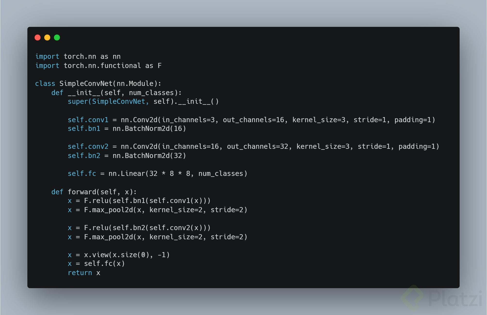

# Curso de Redes Neuronales con PyTorch

1. **Considera un modelo de aprendizaje profundo que requiere procesar un gran volumen de datos de entrada. ¿Cómo se puede aprovechar PyTorch y las GPU para acelerar el entrenamiento y la inferencia de modelos?**
   
**R//=** Asignando tensores y modelos a la GPU con .to('cuda').

2. **Durante el entrenamiento de un modelo en PyTorch se encuentra un error relacionado con un tensor de PyTorch. ¿Cuál de las siguientes opciones es la forma adecuada de investigar y solucionar el problema en el tensor?**
 
**R//=** Imprimir la forma y el tipo de dato del tensor utilizando tensor.shape y tensor.dtype.

3. **En un modelo de aprendizaje profundo de PyTorch creado utilizando la clase base `nn.Module`, la función `forward()` juega un papel importante. ¿Cuál de las siguientes afirmaciones describe mejor el propósito de la función `forward()` en un modelo de PyTorch?**
   
**R//=** Define cómo se propaga la entrada a través de la red, realizando las operaciones necesarias para producir una salida.

4. **Tenemos un **modelo de PyTorch** que utiliza `nn.Module` para crear una **red convolucional simple para tareas de visión**.**

**¿Cuál de las siguientes opciones describe correctamente el flujo de información y las operaciones que ocurren en este modelo cuando se pasa una entrada x a través de la función `forward()`?**

**R//=** La entrada `x` se procesa a través de capas convolucionales, seguidas de capas de normalización por lotes, funciones de activación ReLU, operaciones de agrupación máxima (max pooling) y, finalmente, una capa completamente conectada.

5. **¿Qué funciones adicionales podríamos implementar en una clase que hereda de `nn.Module` en PyTorch para crear un modelo de aprendizaje profundo más avanzado y personalizado?**
    
**R//=** Se pueden agregar métodos personalizados para inicializar los parámetros del modelo, definir funciones de activación específicas, implementar mecanismos de regularización y diseñar arquitecturas más complejas mediante la combinación de múltiples módulos y capas.

6. **¿Cómo se utiliza la función `torch.optim` en PyTorch para optimizar los parámetros de un modelo de aprendizaje profundo durante el entrenamiento? Si es necesario, consulta la documentación de PyTorch para obtener más información y apoyo.**
    
**R//=** torch.optim contiene diferentes algoritmos de optimización como SGD, Adam y RMSprop. Se utilizan para ajustar los pesos y sesgos de las redes neuronales durante el entrenamiento.