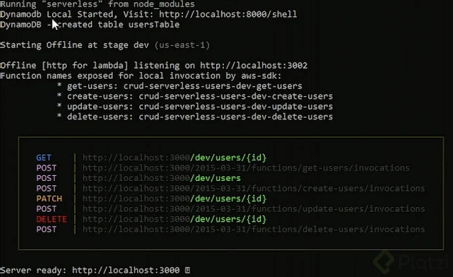

# Curso de Serverless Framework en AWS

## Bienvenida al curso de Serverless Framework

El **Serverless Framework** es una herramienta de desarrollo open-source que facilita la creación, despliegue y administración de aplicaciones **serverless** en plataformas como **AWS Lambda**, **Azure Functions**, **Google Cloud Functions**, entre otras.

### 🚀 ¿Qué es el Serverless Framework?

Es un **framework de infraestructura como código (IaC)** que te permite:

- Crear funciones Lambda y recursos de infraestructura desde un archivo de configuración (`serverless.yml`)
- Desplegar tu aplicación con un solo comando (`sls deploy`)
- Integrarte fácilmente con servicios como API Gateway, DynamoDB, S3, etc.
- Gestionar múltiples entornos (dev, test, prod)
- Monitorear y depurar tus funciones en la nube

### 🧱 Arquitectura típica

Una app usando Serverless Framework puede incluir:

- **Funciones Lambda** para lógica de negocio
- **API Gateway** para exponer endpoints HTTP
- **DynamoDB** o RDS como base de datos
- **S3** para almacenamiento de archivos
- **IAM Roles** configurados automáticamente

### 📁 Ejemplo básico (`serverless.yml` con AWS)

```yaml
service: mi-api-serverless

provider:
  name: aws
  runtime: nodejs18.x
  region: us-east-1

functions:
  hola:
    handler: handler.hola
    events:
      - http:
          path: hola
          method: get
```

```js
// handler.js
module.exports.hola = async (event) => {
  return {
    statusCode: 200,
    body: JSON.stringify({ mensaje: "¡Hola mundo serverless!" }),
  };
};
```

### ✅ Ventajas

- ⚡ **Despliegue rápido**
- 🧩 Soporte para múltiples cloud providers
- 🔧 Reutilizable y modular
- 📊 Integración con monitoreo y métricas
- 🔒 Buen manejo de seguridad y permisos vía IAM

### 📦 Instalación

```bash
npm install -g serverless
```

### 🧪 Comandos útiles

| Comando | Descripción |
|--------|-------------|
| `sls create --template aws-nodejs` | Crea un nuevo proyecto |
| `sls deploy` | Despliega la aplicación |
| `sls invoke -f hola` | Ejecuta una función |
| `sls logs -f hola` | Muestra logs de la función |
| `sls remove` | Elimina los recursos desplegados |

### Resumen

#### ¿Qué es Serverless Framework y cómo puede beneficiar tus proyectos?

Serverless Framework es una poderosa herramienta de desarrollo y despliegue que revoluciona la manera en que construimos aplicaciones en la nube. Facilitando la eliminación de la gestión de infraestructura tradicional, permite a los desarrolladores centrarse en escribir código y mejorar las funcionalidades de sus aplicaciones. Al combinarlo con Amazon Web Services (AWS), obtienes una solución escalable y eficiente que optimiza el proceso de desarrollo. Además, gracias a la eliminación de servidores fijos, se logra una utilización más efectiva y adaptativa de los recursos, lo que se traduce en un costo menor y mejor aprovechamiento del entorno cloud.

#### ¿Cuáles son los pilares del ecosistema serverless en AWS?

AWS ofrece un conjunto completo de servicios que complementan el paradigma serverless. Aquí te mostramos algunas de las piezas clave para configurar tu entorno:

- **AWS Lambda**: Ejecuta tu código en respuesta a eventos sin la necesidad de aprovisionar o administrar servidores.
- **API Gateway**: Facilita la creación, publicación, mantenimiento, monitoreo y protección de API a cualquier escala.
- **AWS DynamoDB**: Un servicio de base de datos NoSQL rápido y flexible adecuado para aplicaciones serverless.

Este ecosistema permite a los desarrolladores innovar y escalar sus aplicaciones sin preocuparse por el mantenimiento de los servidores subyacentes. Además, conocer y dominar estas herramientas es esencial para cualquier Cloud Developer que busque destacar en el mundo de la computación en la nube.

#### ¿Cómo ayuda este curso a mejorar tus habilidades como Cloud Developer?

Este curso está diseñado para llevar tus habilidades al siguiente nivel. No solo vas a aprender a usar Serverless Framework para desarrollar aplicaciones, sino que también descubrirás cómo automatizar y optimizar tus procesos de desarrollo. Además, vas a adquirir conocimientos prácticos que incluyen:

- Construcción de aplicaciones CRUD que puedes añadir a tu portafolio.
- Implementaciones avanzadas que superan el desarrollo básico, incorporando automatizaciones y mejoras.
- Consejos esenciales sobre cómo integrar otras tecnologías del mundo serverless, como Docker y Kubernetes, lo que aumenta tu versatilidad como Cloud Engineer.

#### ¿Qué puedes esperar al final del curso?

Al concluir el curso, estarás preparado para mostrar un abanico de capacidades que no solo comprende la creación de aplicaciones serverless, sino también su gestión y optimización. Las habilidades adquiridas te permitirán ofrecer soluciones completas a problemas complejos en la nube, elevando tus oportunidades profesionales y diferenciándote en la industria tecnológica.

Por lo tanto, este curso no es solo una introducción a Serverless, sino un paso hacia convertirte en un experto en AWS, listo para implementar mejoras significativas en tus proyectos. ¡Anímate a explorar el futuro del desarrollo en la nube y lleva tus competencias a nuevos horizontes!

## Presentación de proyecto

### ¿Qué es serverless en AWS?

El enfoque de computación serverless en AWS ofrece muchas ventajas para el desarrollo de aplicaciones escalables, resilientes y con alta concurrencia. En este curso, aprenderás sobre componentes clave de este ecosistema y cómo integrarlos eficazmente para lograr un diseño óptimo y bien arquitecturado. AWS provee servicios como API Gateway, Lambda Functions y DynamoDB, que son esenciales para el desarrollo de aplicaciones bajo este esquema.

### ¿Cómo están organizados los componentes en un proyecto serverless?
#### ¿Qué papel juega el API Gateway?

API Gateway actúa como el intermediario que recibe las solicitudes de los usuarios y las envía a las funciones Lambda correspondientes. Es crucial en el diseño serverless ya que gestiona las peticiones y las respuestas, facilitando una comunicación estable y segura entre el cliente y la lógica del servidor.

### ¿Qué son las funciones Lambda?

Las funciones Lambda son el núcleo de la lógica de nuestra aplicación serverless. Estas funciones son responsables de manejar acciones específicas como crear, leer, actualizar y eliminar, típicamente denominadas operaciones CRUD. Una de las ventajas de las funciones Lambda es su independencia del lenguaje de programación, permitiendo el uso de Python, JavaScript, entre otros, bajo el framework serverless.

### ¿Cuál es el rol de DynamoDB?

DynamoDB es el servicio de almacenamiento que integra este ecosistema. Diseñado para manejar grandes cantidades de datos de una manera rápida y eficiente, es el componente que persiste la información que manipulan nuestras funciones Lambda.

### ¿Por qué es importante el AWS Well-Architected Framework?

El AWS Well-Architected Framework proporciona un conjunto de mejores prácticas para el diseño de aplicaciones seguras, confiables y eficientes. Entre sus pilares se encuentran:

- **Excelencia operacional**: Garantiza que las operaciones se realicen de manera adecuada y replicable.
- **Seguridad**: Asegura que los datos y sistemas estén protegidos contra amenazas.
- **Fiabilidad**: Garantiza que el sistema pueda recuperarse de fallos y adaptarse a cambios.
- **Eficiencia en el rendimiento**: Optimiza el uso de recursos para lograr el máximo rendimiento.
- **Optimización de costos**: Controla el gasto, maximizando el valor económico del sistema.
- **Sostenibilidad**: Asegura el diseño ecoamigable del sistema.

Cumplir con estos pilares mejora significativamente el diseño y mantenimiento de aplicaciones serverless en AWS.

### ¿Qué consideraciones de seguridad se deben tener en cuenta?

En un entorno serverless, aspectos de seguridad como la gestión de puertos y la exposición de aplicaciones a Internet requieren atención. AWS ofrece herramientas y configuraciones que ayudan a asegurar estos puntos críticos, como la protección de puertos y el establecimiento de permisos adecuados para cada componente.

### ¿Cuál es el próximo paso en el curso?

En la siguiente lección, profundizaremos en los conceptos clave y términos específicos relacionados con serverless, el framework serverless y el AWS Well-Architected Framework. Esta comprensión detallada te permitirá aplicar con éxito estos principios en el proyecto del curso, asegurando un desarrollo eficiente y moderno de tus aplicaciones. ¡Sigue aprendiendo y motivándote para dominar serverless en AWS!

## Definiciones claves del ecosistema Serverless

¡Perfecto! Aquí tienes un resumen con las **definiciones clave del ecosistema Serverless**, muy útil si estás empezando o preparando un proyecto (o incluso una certificación como AWS Cloud Practitioner o Developer Associate):

### 🔑 **Definiciones claves del ecosistema Serverless**

| **Término**             | **Definición** |
|-------------------------|----------------|
| **Serverless**          | Modelo de computación en el que el proveedor cloud gestiona automáticamente la infraestructura. El usuario se enfoca solo en el código. |
| **FaaS (Function as a Service)** | Modelo donde cargas pequeñas de código se ejecutan como funciones en respuesta a eventos. Ejemplo: AWS Lambda. |
| **AWS Lambda**          | Servicio serverless de AWS para ejecutar código en respuesta a eventos sin aprovisionar servidores. Soporta múltiples lenguajes. |
| **API Gateway**         | Servicio que permite exponer funciones Lambda como endpoints HTTP/REST/WS. Gestiona autenticación, throttling y CORS. |
| **DynamoDB**            | Base de datos NoSQL completamente gestionada y altamente escalable, comúnmente usada con aplicaciones serverless. |
| **Event-driven architecture** | Arquitectura basada en eventos donde los servicios se comunican a través de disparadores/eventos (como cambios en una base de datos, cargas a S3, mensajes a una cola). |
| **Cold start**          | Tiempo de arranque inicial cuando una función serverless se ejecuta después de un periodo inactiva. Puede afectar la latencia. |
| **Stateful vs Stateless** | Las funciones serverless son **stateless** (sin estado). El estado persistente se maneja externamente (ej: bases de datos, S3). |
| **Infrastructure as Code (IaC)** | En serverless, la infraestructura (funciones, APIs, bases de datos) se define como código, típicamente en archivos YAML o JSON. |
| **Serverless Framework**| Herramienta de desarrollo para construir y desplegar aplicaciones serverless usando IaC, muy usada con AWS Lambda. |
| **CloudFormation**      | Servicio de AWS para desplegar infraestructura como código (IaC). Serverless Framework lo usa por debajo. |
| **Monitoring**          | En serverless se monitorea uso, errores y rendimiento mediante herramientas como **AWS CloudWatch** o **Serverless Dashboard**. |

### Resumen

#### ¿Qué es el ecosistema serverless?

El ecosistema serverless ha revolucionado el desarrollo tecnológico al permitirnos desplegar aplicaciones sin tener que gestionar la infraestructura. Pero, ¿qué significa realmente? En un entorno serverless, se eliminan preocupaciones sobre la configuración de servidores, memoria o CPU, ya que las aplicaciones corren en un runtime específico que el desarrollador no gestiona directamente. Esto facilita enfocarse únicamente en el desarrollo de funciones con lenguajes como Python o JavaScript.

#### ¿Cuál es la relación entre cliente y servidor?

Tradicionalmente, el esquema cliente-servidor implicaba configuraciones detalladas para ambos lados. El cliente puede ser una aplicación backend o frontend que se comunica con el servidor a través de protocolos como TCP. En escenarios sin serverless, estas configuraciones incluyen el sistema operativo, la memoria RAM y la CPU del servidor. La diferencia crucial es que en serverless, estas tareas administrativas son asumidas por el proveedor del servicio en la nube, lo que simplifica la operación.

#### ¿Qué es la nube y quiénes son los Cloud Providers principales?

Cuando hablamos de "la nube", nos referimos a una infraestructura remota compuesta por múltiples servidores que suministran servicios variados como cómputo y almacenamiento. Los Cloud Providers o proveedores de la nube son empresas que ofrecen acceso a esta infraestructura. Entre los más destacados se encuentran Amazon Web Services (AWS), Google Cloud Platform (GCP) y Microsoft Azure. Estos proveedores no solo facilitan servicios básicos, sino también una amplia gama de opciones serverless.

#### ¿Qué ofrece AWS como Cloud Provider?

AWS es uno de los líderes en servicios cloud, ofreciendo multitud de opciones como cómputo, almacenamiento, y gestión de datos, todo accesible a través de una interfaz amigable y con costos competitivos. AWS se destaca por su enfoque integral hacia el ecosistema serverless, suministrando herramientas como AWS Lambda, AWS Fargate y Step Functions que permiten el desarrollo de aplicaciones escalables y eficientes.

#### ¿Cómo se compara AWS con otros Cloud Providers?

Aunque AWS domina el mercado, GCP y Azure ofrecen características similares. Cada proveedor tiene sus propias ventajas y servicios especializados en serverless. Google Cloud, por ejemplo, es conocido por sus herramientas de inteligencia artificial, mientras que Azure integra de manera efectiva los servicios de Microsoft. Aun así, cada uno de estos proveedores permite generar aplicaciones robustas y escalables sin necesitar de una infraestructura física propia.

#### ¿Qué es el Serverless Framework y cómo se diferencia de Serverless?

Mientras que el término "serverless" se refiere al paradigma general donde la infraestructura es gestionada por un proveedor, el Serverless Framework es una herramienta específica que optimiza el proceso de desarrollo en este entorno. Este framework permite más eficiencia mediante el uso del archivo serverless.yaml, donde se define claramente los recursos y funciones necesarias para desarrollar en AWS.

#### ¿Cómo facilita el desarrollo el Serverless Framework?

El Serverless Framework permite infraestructurar con código lo que facilita un mayor control sobre el entorno de desarrollo y la integración de funciones personalizadas. Además, se alinea con el concepto de Infraestructura como Código (IaC), similar a herramientas como Terraform, CDK o Pulumi, aunque simplificando muchas de estas tareas.

#### ¿Cuáles son las ventajas del Serverless Framework?

Al integrarse perfectamente con AWS, Serverless Framework simplifica la administración de recursos en este entorno mediante plantillas claras y bien estructuradas de YAML. Además, ofrece compatibilidad para incorporar sistemas externos y gestionar la infraestructura sin salir del marco serverless. Esta herramienta promueve un flujo de desarrollo ágil y optimizado, reduciendo la carga operativa.

Con la adopción de serverless y el uso del Serverless Framework, el enfoque principal se centra en el código y las funcionalidades, sin las cargas típicas de gestión y configuración de servidores, haciendo que las aplicaciones sean más ágiles y fáciles de escalar. ¡Anímate a explorar estas tecnologías y a potencializar tus proyectos en la nube!

## Ventajas y desventajas de Serverless framework

¡Claro! Aquí tienes un resumen claro y directo de las **ventajas y desventajas del Serverless Framework**, ideal para evaluar si es la opción correcta para tu equipo o proyecto:

### ✅ **Ventajas del Serverless Framework**

| Ventaja | Descripción |
|--------|-------------|
| **Despliegue sencillo** | Solo necesitas configurar un archivo `serverless.yml` y usar `sls deploy` para lanzar tu aplicación. |
| **Multi-cloud** | Compatible con varios proveedores: AWS, Azure, Google Cloud, etc. |
| **Infraestructura como Código (IaC)** | Permite gestionar funciones, bases de datos, colas y APIs desde archivos de configuración. |
| **Modularidad** | Puedes organizar funciones, plugins y entornos por servicio o microservicio. |
| **Plugins extensibles** | Amplia comunidad con plugins para seguridad, CI/CD, monitoreo, pruebas, etc. |
| **Entornos gestionados** | Fácil separación de entornos (dev, test, prod) con configuraciones distintas. |
| **Menor lock-in** | Al ser open-source y multi-cloud, reduce la dependencia directa de un proveedor específico. |
| **Serverless Dashboard (opcional)** | Herramienta visual para monitoreo, logs, métricas y despliegue continuo.

### ❌ **Desventajas del Serverless Framework**

| Desventaja | Descripción |
|------------|-------------|
| **Curva de aprendizaje** | Requiere entender bien YAML, eventos, funciones y arquitectura cloud. |
| **Abstracción opaca** | Esconde detalles de bajo nivel (como configuraciones específicas de IAM o CloudFormation), lo cual puede causar errores difíciles de depurar. |
| **Dependencia de CloudFormation (en AWS)** | Algunos cambios implican redeploy completo; puede ser lento o complejo si hay muchos recursos. |
| **Plugins desactualizados** | Algunos plugins pueden estar desactualizados o generar conflictos entre versiones. |
| **Tamaño del proyecto** | En proyectos grandes, puede ser difícil mantener orden si no se organiza correctamente. |
| **Debug local limitado** | Aunque hay herramientas como `serverless-offline`, no es 100% igual al entorno cloud real. |
| **Costo del Dashboard Pro** | Aunque el framework es open-source, el Dashboard con funciones avanzadas es de pago.

### Resumen

#### ¿Cuáles son las ventajas de los servicios serverless?

Los servicios serverless ofrecen un sinfín de beneficios que pueden transformar completamente la manera en que piensas y manejas el desarrollo en la nube. Uno de los puntos más destacados es la rápida escalabilidad que ofrecen. Esto significa que la infraestructura se adapta automáticamente a la cantidad de tráfico que recibe tu aplicación, facilitando la rápida asignación de recursos cuando la demanda es alta. Este escalamiento y ajuste de recursos no solo es ágil, sino también económicamente ventajoso.

- **Eficiencia en costos**: El costo escalará con el uso, lo cual es ideal para negocios en crecimiento.
- **Facilidad de despliegue**: Las funciones serverless, como AWS Lambda, permiten realizar ediciones directamente desde la consola, optimizando tanto tiempo como costos operativos.
- **Eficiencia y buenas prácticas**: Facilitan integrar buenas prácticas a través de herramientas de AWS y simplifican procesos de desarrollo gracias a la integración sencilla con otros servicios dentro del ecosistema AWS.

### ¿Cuáles son las desventajas de los servicios serverless?

A pesar de todos los beneficios que serverless tiene para ofrecer, también hay ciertas limitaciones a tener en cuenta. Una de las más discutidas es el "cold start" o arranque en frío, que puede causar latencia percibida por los usuarios.

- **Cold start**: El tiempo para iniciar un recurso es perceptible y afecta la experiencia del usuario aunque existen técnicas para mitigar esto.
- **Restricciones en proveedores de servidores**: No todos los proveedores de nube ofrecen un ecosistema serverless como AWS, Google Cloud Platform (GCP) y Azure. Por lo tanto, la elección del proveedor es crucial.
- **Capacitación requerida**: Aunque te felicito por tomar un curso en serverless, esta tecnología puede no estar al alcance de todos los desarrolladores sin una adecuada formación.

### ¿Cuáles son las ventajas del serverless framework?

El serverless framework es un impulsor clave en el desarrollo serverless, agilizando y simplificando muchas tareas que de otro modo podrían ser complicadas.

- **Comunidad robusta:** Al ser de código libre, una gran cantidad de recursos están disponibles en línea, desde foros hasta blogs.
- **Simplicidad en el uso del YAML**: Utiliza un archivo serverless.yml, de fácil lectura y uso, ideal para definir funciones.
- **Integraciones y agnosticismo de la nube**: Permite integraciones complejas y es compatible con varios proveedores de nube, facilitando un desarrollo ágil.

#### ¿Cuáles son las desventajas del serverless framework?

También el serverless framework presenta sus propias desventajas, que deben ser consideradas antes de decidir su implementación.

- **Calidad del código variable**: Gran parte del código comunitario puede tener errores o estar anticuado, afectando la productividad.
- **Limitaciones de infraestructura**: Aunque es fácil de usar, el YAML no ofrece la misma flexibilidad para extender la infraestructura como otras herramientas (e.g. Terraform, Pulumi).
- **Dependencia de CloudFormation**: Esto puede ser una ventaja o desventaja según el gusto por esta herramienta, ya que serverless framework utiliza CloudFormation para definir la infraestructura como código.

Finalmente, el serverless framework cuenta con una amplia variedad de plugins que pueden facilitar mucho el despliegue a producción, aunque esto puede complicar la elección de un camino claro para implementar funcionalidades. Las ventajas y desventajas del entorno serverless evidencian que, si se aprovechan correctamente, pueden representar una revolución en el desarrollo y operaciones en la nube. ¡No dejes de explorar esta apasionante tecnología!

## Serverless en local

¡Perfecto! Si quieres trabajar con **Serverless Framework en local**, ya sea para desarrollar, probar o desplegar aplicaciones sin servidor (por ejemplo, usando AWS Lambda), aquí tienes una guía paso a paso para configurarlo:

### 🛠️ **Cómo trabajar con Serverless Framework en local**

### ✅ 1. **Requisitos previos**

Asegúrate de tener instalado en tu máquina:

- [Node.js](https://nodejs.org/) (preferiblemente la última LTS)
- [npm](https://www.npmjs.com/) (se instala con Node)
- [Serverless Framework CLI](https://www.serverless.com/framework/docs/getting-started)

```bash
npm install -g serverless
```

### ✅ 2. **Crear un proyecto Serverless**

```bash
serverless create --template aws-nodejs --path mi-proyecto-serverless
cd mi-proyecto-serverless
npm init -y
```

Esto crea un proyecto básico para AWS con Node.js.

### ✅ 3. **Instalar dependencias para pruebas locales**

```bash
npm install --save-dev serverless-offline
```

Agrega el plugin al `serverless.yml`:

```yaml
plugins:
  - serverless-offline
```

### ✅ 4. **Configurar una función Lambda básica**

Tu archivo `serverless.yml` puede tener algo como esto:

```yaml
service: mi-api-local

provider:
  name: aws
  runtime: nodejs18.x

functions:
  hola:
    handler: handler.hola
    events:
      - http:
          path: hola
          method: get

plugins:
  - serverless-offline
```

Y el archivo `handler.js`:

```js
module.exports.hola = async (event) => {
  return {
    statusCode: 200,
    body: JSON.stringify({ mensaje: '¡Hola desde Serverless en local!' }),
  };
};
```

### ✅ 5. **Ejecutar el proyecto localmente**

```bash
serverless offline
```

Esto iniciará un servidor local, generalmente en `http://localhost:3000/hola`.

### 🧪 Opcional: Pruebas de funciones Lambda sin HTTP

Puedes invocar funciones directamente:

```bash
serverless invoke local --function hola
```

### 🎯 Beneficios de usar Serverless localmente

✅ Probar antes de desplegar  
✅ Ahorro en costos de AWS  
✅ Desarrollo rápido y sin latencia  
✅ Compatible con otras herramientas como DynamoDB local, AWS SAM CLI, etc.

### Resumen

#### ¿Cómo utilizar AWS con Serverless Framework?

Explorar el mundo de Serverless Framework y las herramientas asociadas en AWS puede parecer complicado al principio. Sin embargo, con la orientación adecuada, puedes aprovechar al máximo sus beneficios para desarrollar proyectos de manera eficiente. AWS ofrece un vasto ecosistema que, junto con Serverless Framework, permite la creación de aplicaciones y servicios funcionales sin preocuparse por la infraestructura subyacente.

#### ¿Cuáles son las herramientas esenciales?

Para dominar el uso de Serverless en AWS, necesitas familiarizarte con varias herramientas y tecnologías que se complementan entre sí. Aquí te las presentamos:

- **Serverless Framework**: es la herramienta central de este curso. Su capacidad de ser agnóstica respecto al lenguaje y al proveedor en la nube te permite usar lenguajes como Python y JavaScript sin problemas.

- **JavaScript y Python**: el marco de serverless no se limita a ningún lenguaje, lo que permite su integración sin complicaciones con funciones escritas en estos lenguajes populares.

- **Node.js y NPM**: en el ecosistema JavaScript, Node.js actúa como el motor de ejecución, mientras que NPM (Node Package Manager) se encarga de gestionar los paquetes necesarios para tu aplicación. Si prefieres, puedes optar por Yarn como alternativa a NPM.

- **CLI de AWS**: es imprescindible para interactuar con los vastos recursos que ofrece AWS. Desde la gestión de cómputo hasta bases de datos y capacidades de Machine Learning, el CLI te facilita el acceso a todo esto, generalmente gratuito durante 12 meses con el Free Tier de AWS.

#### ¿Qué es el Free Tier de AWS?

El **Free Tier** de AWS permite a los desarrolladores explorar y usar una variedad de servicios de AWS de manera gratuita durante un período de 12 meses. Esto es ideal para:

- Probar y aprender sobre nuevos servicios.
- Desarrollar y probar aplicaciones sin costos iniciales significativos.
- Experimentar con bases de datos, recursos de cómputo y contenedores.

Para aprovechar estos beneficios, es necesario crear una cuenta de AWS siguiendo un proceso guiado, que será cubierto en la próxima clase.

#### ¿Cómo integrar todas estas herramientas?

El primer paso para integrar estas herramientas es entender cómo se complementan. Serverless Framework actúa como un mediador entre tu código (Python o JavaScript) y AWS, facilitando la creación y gestión de funciones serverless. Utilizarás Node.js para ejecutar tu código JavaScript y NPM para manejar las dependencias.

A través del CLI de AWS, configuras y administras tu cuenta y servicios en la nube. Esto asegura que puedas comunicarte eficientemente con AWS para desplegar tus aplicaciones.

#### ¿Por qué elegir Serverless Framework?

- **Flexibilidad**: Serverless Framework no depende de un único lenguaje o proveedor de la nube.
- **Agnóstico**: Funciona igual de bien con diferentes lenguajes de programación y plataformas en la nube.
- **Ecosistema**: Tiene un amplio soporte de herramientas y servicios que optimizan el desarrollo y la gestión de tus aplicaciones.

Estas características hacen que Serverless Framework sea ideal para aprovechar al máximo las capacidades de AWS, especialmente cuando estás explorando y desarrollando soluciones innovadoras.

Empieza tu viaje en el mundo serverless con confianza. Estas herramientas no solo son poderosas, sino que también están diseñadas para hacer tu experiencia de desarrollo más eficiente y enriquecedora. ¡Sigue aprendiendo, explorando y no dudes en experimentar con nuevas estrategias y tecnologías!

## Herramientas necesarias para un ambiente de trabajo con serverless framework

¡Buenísimo que estés armando tu ambiente para trabajar con **Serverless Framework**! Aquí tienes una lista organizada de las **herramientas esenciales** para desarrollar, probar y desplegar aplicaciones serverless de forma eficiente:

### 🧰 Herramientas necesarias para un entorno de trabajo con Serverless Framework

### 1. 🔧 **Herramientas base**
| Herramienta           | Descripción                                             | Enlace |
|-----------------------|---------------------------------------------------------|--------|
| [Node.js](https://nodejs.org/)            | Entorno de ejecución JavaScript para el backend.        | [🌐](https://nodejs.org/) |
| [npm o yarn](https://www.npmjs.com/)      | Gestores de paquetes para instalar dependencias.       | [🌐](https://www.npmjs.com/) |
| [Serverless CLI](https://www.serverless.com/framework/docs/getting-started) | Interfaz para crear y desplegar servicios. | [🌐](https://www.serverless.com/framework/docs/getting-started) |

Instalación del framework:
```bash
npm install -g serverless
```

### 2. 🌐 **Proveedor cloud (como AWS)**

| Herramienta       | Descripción                              |
|-------------------|------------------------------------------|
| Cuenta de AWS     | Para desplegar tus funciones Lambda.     |
| AWS CLI           | Herramienta para interactuar con AWS vía terminal. |

Instalación y configuración:
```bash
# Instalar AWS CLI
sudo apt install awscli  # Linux
# o brew install awscli  # macOS

# Configurar credenciales
aws configure
```

### 3. 🧪 **Herramientas para pruebas locales**

| Herramienta            | Descripción                                                |
|------------------------|------------------------------------------------------------|
| `serverless-offline`   | Simula API Gateway + Lambda en tu máquina local.          |
| `serverless-dynamodb-local` (opcional) | Simula DynamoDB localmente para pruebas.              |
| Postman / curl         | Para probar endpoints HTTP.                                |

Ejemplo de instalación:
```bash
npm install --save-dev serverless-offline
```

### 4. 💻 **Editor de código y herramientas adicionales**

| Herramienta             | Uso                                  |
|-------------------------|---------------------------------------|
| [Visual Studio Code](https://code.visualstudio.com/) | Editor recomendado por sus extensiones. |
| Extensión ESLint / Prettier | Para mantener el código limpio y uniforme. |
| Git + GitHub/GitLab     | Control de versiones.                |

### 5. 📦 **Complementos opcionales (plugins)**

| Plugin                             | Función                                       |
|-----------------------------------|-----------------------------------------------|
| `serverless-plugin-optimize`      | Minimiza y empaqueta el código.               |
| `serverless-dotenv-plugin`        | Carga variables desde archivos `.env`.        |
| `serverless-plugin-canary-deployments` | Implementaciones graduales.                  |

### 6. 🧠 **Documentación y monitoreo**

| Herramienta             | Función                                         |
|-------------------------|------------------------------------------------|
| [Dashboards Serverless](https://www.serverless.com/monitoring) | Monitoreo y alertas. |
| CloudWatch Logs         | Logs y métricas de AWS Lambda.                |

### 🎯 Consejos

- Usa `serverless invoke local` para pruebas rápidas.
- Mantén tus funciones pequeñas y desacopladas.
- Usa `.env` para manejar secretos y configuraciones locales.
- Integra con servicios como DynamoDB, S3 o SNS según tus necesidades.

### Resumen

#### ¿Cómo preparar la setup para Serble en AWS?

¿Estás listo para desplegar aplicaciones en la nube con eficacia y flexibilidad? Prepara tu entorno de desarrollo con Serble y AWS, lo que te permitirá trabajar tanto en local como en la nube. Aquí te mostramos cómo instalar todas las herramientas necesarias en un sistema operativo Windows, y te guiaremos paso a paso para instalar algunas de las más esenciales, como Java, AWS CLI, Git, Node.js, Postman y Python.

#### ¿Qué herramientas necesitas para empezar?

Es esencial conocer qué herramientas son requeridas antes de comenzar con cualquier instalación. En este curso, utilizaremos una variedad de herramientas que se complementan entre sí para crear, gestionar y desplegar aplicaciones serverless de manera eficiente.

- **Java**: Necesario para integrar DynamoDB con el Serble as Framework.
- **AWS CLI**: Facilita la gestión y configuración de servicios AWS desde la línea de comandos.
- **Git**: Utilizado para gestionar repositorios de código.
- **Node.js**: Proporciona el ambiente de ejecución para aplicaciones JavaScript.
- **Postman**: Herramienta para pruebas de API mediante solicitudes HTTP.
- **Python**: Utilizado para desarrollar funciones Lambda con Python.

#### ¿Cómo instalar y configurar Java?

Para maximizar el uso de DynamoDB, necesitamos Java. La instalación es sencilla. Descarga el archivo MSI desde la página de Oracle, sigue las indicaciones para instalarlo y luego sigue estos pasos para configurar la variable de entorno JAVA_HOME:

```markdown
# Ejemplo en Windows
- Ve a "Sistema" > "Configuración Avanzada" > "Variables de Entorno".
- Crea una nueva variable de sistema denominada JAVA_HOME.
- Asigna como valor la ruta de tu archivo ejecutable de Java (ej.: "C:\Program Files\Java\jdk-xx").
```

#### ¿Cómo se instala el CLI de AWS?

Este es un paso crucial para ejecutar y controlar servicios en AWS. Para instalar el CLI de AWS en Windows:

1. Dirígete al sitio web de AWS para el CLI y sigue los pasos que se indican para Windows.
2. Usa el comando msixsec.exe en tu terminal para iniciar la instalación.
3. Configura tus credenciales de AWS usando el comando aws configure:
 - Introduce tu Access Key, Secret Key, región por defecto (ej.: US East 1), y formato de salida preferido (JSON).

#### ¿Cómo instalar y usar Git?

Para clonar repositorios y realizar otras operaciones de control de versiones, se utiliza Git. La instalación es simple:

1. Descarga el instalador de Git desde el sitio oficial.
2. Sigue los pasos del asistente de instalación (Next, Next, Next).
3. Valida la instalación clonando un repositorio:

```bash
# Ejemplo en Windows terminal
git clone <URL-del-repositorio>
```

#### ¿Cómo instalar Node.js y Postman?

Node.js proporciona el entorno de ejecución JavaScript necesario. Para Node.js:

1. Dirígete a nodejs.org para descargar la versión LTS recomendada.
2. Completa la instalación siguiendo los pasos del asistente.

En el caso de Postman:

1. Descarga Postman del sitio oficial y ejecuta el instalador.
2. Ejecuta y busca cualquier petición HTTP como una prueba rápida.

#### ¿Cómo preparar Python?

Para funciones Lambda con Python, se requiere la instalación del lenguaje:

1. Descarga Python 3.11 desde el sitio web oficial.
2. Realiza la instalación eligiendo las configuraciones por defecto.
3. Valida con un comando simple en terminal:
```bash
# Ejemplo en terminal
python --version
```

#### ¿Cómo trabajar con Serble as Framework?

Instalar Serble es uno de los últimos pasos esenciales. Utiliza NPM para instalar las librerías necesarias:

```bash
# Ejemplo en el directorio del proyecto
npm install
```

Además, para facilitar el trabajo en ambientes locales, asegúrate de instalar y configurar el DynamoDB Local con el comando:

```bash
sls dynamodb install
```

Con esta guía, todas tus herramientas están listas para usarse con Serble as Framework. Este setup es la base para comenzar a crear aplicaciones serverless poderosas, implementando servicios en la nube y gestionándolos eficientemente. ¡Adelante, el mundo de la nube te espera!

**NOTA:**

¡Perfecto! Aquí te explico cómo **instalar el Serverless Framework** en tu sistema paso a paso. Funciona para **Windows, macOS y Linux** si tienes Node.js instalado correctamente.

#### ✅ **1. Requisitos previos**

- Tener instalado **Node.js** y **npm**  
  Puedes verificarlo así:

```bash
node -v
npm -v
```

> Si no lo tienes, descárgalo desde: [https://nodejs.org/](https://nodejs.org/)  
> Te recomiendo instalar la **versión LTS** (actualmente Node 18.x o 20.x).

#### 🧱 **2. Instalar Serverless Framework (global)**

Abre tu terminal o PowerShell y ejecuta:

```bash
npm install -g serverless
```

Esto instalará la CLI de Serverless como una herramienta global (`sls` o `serverless`).

#### ⚙️ **3. Verificar la instalación**

Después de la instalación, verifica que funcione:

```bash
serverless --version
```

O también:

```bash
sls --version
```

Debe mostrar algo como:

```
Framework Core: 3.x.x
Plugin: 7.x.x
SDK: 4.x.x
```

#### 🧪 **4. Crear un proyecto de prueba**

```bash
serverless create --template aws-nodejs --path mi-api
cd mi-api
npm init -y
npm install
```

#### 🚀 **5. Desplegar o ejecutar en local**

- Desplegar a AWS:
```bash
serverless deploy
```

- Ejecutar localmente:
```bash
serverless invoke local --function hello
```

> Para simular API Gateway y Lambda en tu máquina, puedes agregar el plugin `serverless-offline`.

¿Quieres que te ayude a crear un `serverless.yml` inicial o agregar plugins útiles como `serverless-offline`?

**Lecturas recomendadas**

[GitHub - platzi/serverless-framework](https://github.com/platzi/serverless-framework)

[Platzi: Cursos online profesionales de tecnología](https://platzi.com/clases/2272-nestjs/37078-instalacion-de-postman-o-insomia/)

[Java Downloads | Oracle](https://www.oracle.com/java/technologies/downloads/)

[Installing or updating the latest version of the AWS CLI - AWS Command Line Interface](https://docs.aws.amazon.com/cli/latest/userguide/getting-started-install.html)

[Git - Downloading Package](https://git-scm.com/download/win)

[Node.js](https://nodejs.org/es/)

[Download Postman | Get Started for Free](https://www.postman.com/downloads/)

[Download Python | Python.org](https://www.postman.com/downloads/)

[Setting Up Serverless Framework With AWS](https://www.serverless.com/framework/docs/getting.started)

## Instalación en macOS

Para la instalación de estas herramientas en macOS, así como en Windows, podemos encontrar los recursos e instrucciones totalmente gratis en internet. Para esta clase te dejaré las instrucciones resumidas para preparar tu entorno local para usar Serverless Framework.

Para esta guía usaremos una herramienta llamada Homebrew, el cual es un gestor de paquetes para MacOS y Linux, es altamente compatible con cualquier versión del sistema operativo de Apple 🤓.

Instalación:

```bash
# Extracted from official website/doc: 
/bin/bash -c "$(curl -fsSL https://raw.githubusercontent.com/Homebrew/install/HEAD/install.sh)"
```

Para trabajar con Serverless Framework vamos a usar diferentes herramientas, de las cuales te dejamos una breve descripción de como será usada y su comando/guía de instalación.

### 1. Node y NPM:

Será el motor principal de ejecución de nuestras lambdas, dado que algunas se construirán en JavaScript, adicionalmente, notaras que mucha de la documentación y plugins son compatibles en mayor proporción con JavaScript, por estas razones usaremos Node como motor principal de ejecución de nuestras lambdas, adicionalmente también usaremos Python, para mostrar que Serverless no es exclusivo de JavaScript.

El proceso de instalación puede variar dependiendo de tu sistema operativo, en esta guía para macOS, podemos hacerlo de 3 sencillas formas: 1. Usando Homebrew, 2. Descargando el .pkg desde el sitio oficial, y finalmente 3. Instalando NVM y posteriormente descargando las versiones deseadas de Node y NPM.

En esta guía usaremos la primera forma usando Homebrew.

**Instalación:**

```bash
# Instalacion de node usando homebrew
brew install node

# Validacion de version de Node:
node -v

# Validacion de version de NPM:
npm -v
```

Algunos usuarios recomiendan usar NVM, el cual es un gestor de versiones de Node, sus siglas vienen de Node Version Manager, permite tener múltiples versiones de Node en un mismo equipo, sin generar conflicto entre ellas ni sus dependencias instaladas.

### 2. Python:

Dado que Serverless Framework es agnóstico de los lenguajes de programación, vamos a desarrollar algunas lambdas en JS y otras en Python para ver el potencial de esta herramienta. La configuración de Python en macOS es muy similar a las otras herramientas, en este caso, te recomendamos trabajar con ambientes virtuales, dependiendo del caso de uso algunos serán más compatibles, dentro de nuestra experiencia Miniconda nos ha facilitado mucho la labor de trabajar con Python, en este caso lo puedes instalar de la siguiente forma.

[Instalación con Homebrew:](https://formulae.brew.sh/cask/miniconda "Instalación con Homebrew:")

```bash
# Instalar conda
brew install --cask miniconda

# Crear ambiente virtual para Python
# env_name puede ser el nombre que elijas sin espacios
# conda create --name  python=3.8
conda create --name learningsls python=3.8

# Activas el ambiente virtual
conda activate learningsls

# Y listo, ya puedes trabajar con Python 3.8 o la versión
# que hayas configurado en tu ambiente virtual
```

¿Por qué usar un gestor de versiones de Python?
Dado que MacOS y Linux, tienen una versión de Python nativamente instalado, instalar otras versiones puede generar conflictos en el sistema operativo, lo mejor es tener un ambiente o ambientes separados lógicamente para que no interfieran con el funcionamiento de las aplicaciones del sistema. Así como esta miniconda, algunos usuarios recomiendan pyenv o virtualenv. Puedes encontrar más información sobre este tema aquí.

### 3. Serverless Framework:

Para descargar el [framework](https://www.npmjs.com/package/serverless "framework"), podemos usar instrucciones de NPM y le indicamos que se configure de forma global, esto nos permitirá llamar los comandos sls o serverless desde cualquier directorio de nuestro sistema, no solo donde viva nuestro proyecto.

```bash
npm install -g serverless
```

### 4. AWS CLI:

La CLI de AWS nos permite comunicarnos con los recursos en la nube de AWS, así como desplegar y eliminar los servicios que creemos desde nuestro proyecto.
La [documentación de AWS](https://docs.aws.amazon.com/cli/latest/userguide/getting-started-install.html#getting-started-install-instructions "documentación de AWS") es bastante clara y nos indica ejecutar los siguientes comandos para descargar el instalador, ejecutarlo y validar la instalación:

```bash
# Descargar el PKG o paquete de aplicación de macOS
curl "https://awscli.amazonaws.com/AWSCLIV2.pkg" -o "AWSCLIV2.pkg"

# Ejecutar el PKG ubicando el instalador en el directorio /
sudo installer -pkg AWSCLIV2.pkg -target /

# Asi mismo podemos ver que version de la AWS CLI instalamos
aws --version

# Recuerda hacer AWS Configure para configurar las llaves de acceso de tu cuenta de AWS
```

### 5. GIT:

Git es la herramienta que usamos para gestionar el control de versiones o cambios en nuestro código, mediante esta herramienta podrás clonar el repositorio del proyecto, así como subir tus propios repositorios y cambios a tu cuenta de GitHub, para este proyecto vamos a usar Git para clonar el repositorio. Si eres nuevo en Git te invitamos a tomar el curso de Git para que aprendas a desarrollar un portafolio como Cloud Developer con las funciones lambdas que construyas en este curso.

```bash
# Instalar Git con Homebrew
brew install git

# Validar la versión
git --version
```

### 6. Java JRE:

El JRE de Java nos permitirá simular DynamoDB en local, esto será bastante útil cuando queramos probar cambios si tener que desplegar nuestro código a la nube, en este caso el plugin de DynamoDB local nos indica que requiere el JAVA JRE para poder funcionar, la instalación podemos hacerla de dos formas, usando Homebrew, o descargando el instalador oficial del sitio de Oracle. Para el caso de la primera Homebrew nos da dos opciones, instalar la versión free de Java (OpenJDK) o la versión oficial de Java. Para efectos del curso podemos instalar la versión oficial mediante los siguientes comandos.

```bash
# Instalación de Java usando Homebrew`
brew install --cask oracle-jdk

# Validación de versión de Java
java --version
```

**Recuerda crear la variable de entorno JAVA_HOME** haciendo referencia a la ubicación de java en tu sistema operativo.
Si te interesa descargar el instalador desde el sitio oficial de Oracle aquí te dejamos el [enlace a la página oficial](https://www.oracle.com/java/technologies/downloads/#jdk19-mac "enlace a la página oficial").

### 7. Postman:

En este curso vamos a usar un cliente HTTP llamado Postman, es bien conocido en la industria y nos permita hacer llamados HTTP a nuestras API, este lo podemos instalar desde su página oficial o usando Homebrew mediante el siguiente comando:

```bash
# Postman
brew install --cask postman
```

En este momento ya estás listo para ejecutar tu proyecto del curso de Serverless, los últimos pasos a seguir son:

```bash
# clonamos el repositorio del proyecto
git clone https://github.com/platzi/serverless-framework

# Instalamos las dependencias
npm install

# Configuramos DynamoDB en Local
sls dynamodb install

# Ya podemos ejecutar nuestro proyecto en local`
sls offline start`
```

Al finalizar, verás los de ejecución en consola y podrás hacer tu primar llamado HTTP, con el método GET usando Postman o Curl a la siguiente URL:

`http://localhost:3000/dev/users/1`



El plugin de dynamodb para Serverless Framework tiene mejoras constantemente, parece ser que en las nuevas versiones disponibles se introdujo un error que generar este comportamiento al hacer el install en local.

Si te encuentras con este error a la hora de hacer el sls dynamodb install

Error:

`Protocol "https:" not supported. Expected "http:"`

Te recomendamos seguir los siguientes pasos para hacer la instalación manual:
*Recuerda que debes tener instalado wget

```bash
wget http://dynamodb-local.s3-website-us-west-2.amazonaws.com/dynamodb_local_latest.tar.gz
mkdir .dynamodb
tar zxvf dynamodb_local_latest.tar.gz -C .dynamodb
```

## Conociendo el serverless.yml: provider, functions, custom, plugins, etc

¡Excelente! Vamos a desglosar y entender cada sección del archivo `serverless.yml` en Serverless Framework. Este archivo es el **corazón de tu servicio serverless**, donde defines cómo se despliega y ejecuta tu aplicación en la nube (o en local).

### 🧩 1. `service`

```yaml
service: crud-serverless-users
```

- Define el nombre de tu servicio. Este nombre se usará como prefijo en recursos como funciones Lambda o tablas DynamoDB.

### 🧩 2. `provider`

```yaml
provider:
  name: aws
  runtime: nodejs18.x
  iam:
    role:
      statements:
        - Effect: Allow
          Action: 'dynamodb:*'
          Resource: arn:aws:dynamodb:us-east-1:471893938953:table/usersTable
```

- **name**: proveedor de nube, usualmente `aws`.
- **runtime**: entorno de ejecución por defecto para tus funciones (Node.js 18.x en este caso).
- **iam.role.statements**: permisos que tus funciones necesitan, por ejemplo, acceso a DynamoDB.

### 🧩 3. `functions`

```yaml
functions:
  get-users:
    handler: getusers/handler.getUsers
    ...
```

- Cada entrada define una **Lambda Function**.
- **handler**: archivo y función que se ejecuta (`getusers/handler.js` y exporta `getUsers`).
- **events**: cómo se activa la función, por ejemplo con eventos HTTP, colas SQS, cron, etc.
- Puedes tener múltiples funciones como `create-users`, `update-users`, `delete-users`.

### 🧩 4. `plugins`

```yaml
plugins:
  - serverless-offline
  - serverless-dynamodb-local
```

- Aquí agregas funcionalidades extra. En este caso:
  - `serverless-offline`: ejecuta la API localmente como si estuviera en API Gateway + Lambda.
  - `serverless-dynamodb-local`: te permite correr una instancia local de DynamoDB.

### 🧩 5. `custom`

```yaml
custom:
  dynamodb:
    stages:
      - dev
    start:
      port: 8000
      inMemory: true
      migrate: true
```

- Usado para configurar plugins o cualquier parámetro personalizado.
- En este ejemplo, estás configurando DynamoDB local:
  - Solo disponible en el stage `dev`.
  - Usa memoria (no archivos).
  - Ejecuta migraciones (creación de tablas).

### 🧩 6. `package`

```yaml
package:
  individually: true
  patterns:
    - "!*/**"
```

- Define cómo empaquetar tu código.
- `individually: true`: cada función Lambda se empaqueta por separado.
- `patterns`: incluye o excluye archivos al empacar. Aquí se excluyen todos (`!*/**`), pero cada función define los suyos.

### 🧩 7. `resources`

```yaml
resources:
  Resources:
    usersTable:
      Type: AWS::DynamoDB::Table
      ...
    S3Bucket:
      Type: 'AWS::S3::Bucket'
      ...
```

- Puedes definir recursos de AWS usando **CloudFormation** directamente.
- En este caso estás creando una tabla DynamoDB (`usersTable`) y un bucket S3.

### ¿Quieres que lo compare con un despliegue real en AWS? ¿O ver cómo probar funciones localmente con `curl` o `Postman`?

También puedo ayudarte a hacer una plantilla desde cero con solo lo básico para practicar.

### Resumen

#### ¿Qué es el serverless YAML?

Cuando trabajamos con el Serverless Framework, uno de los elementos más importantes es el archivo serverless YAML. Este archivo es esencial porque permite la configuración de funciones, proveedores, recursos y más dentro de un proyecto serverless. Su flexibilidad y capacidad para integrarse con diferentes lenguajes de programación y proveedores de la nube lo hacen indispensable.

#### ¿Cómo se estructura el archivo serverless YAML?

El serverless YAML se divide en cinco secciones importantes:

1.  **Service**: Aquí se define el nombre del servicio o aplicación serverless. Es crucial porque este nombre se verá reflejado en el proveedor de la nube, como AWS.

2. **Provider**: En esta sección se especifica el proveedor de la nube que se utilizará. Aunque el curso está enfocado en AWS, el Serverless Framework es compatible con GCP, Azure y otros proveedores.

3. **Plugins**: Esta parte se utiliza para añadir plugins que optimizan la experiencia de desarrollo. Por ejemplo, el plugin "serverless offline", que permite simular un entorno serverless localmente.

4. **Custom**: Permite definir propiedades personalizadas del proyecto, útiles para recursos específicos o configuraciones adicionales.

6. **Functions**: Aquí se detalla la lógica de las funciones Lambda que nuestra aplicación necesita. Se definen los eventos que desencadenan estas funciones, como solicitudes HTTP o mensajes de SNS o colas de SQS.

6. **Resources**: Usa sintaxis de CloudFormation para definir diversos recursos de infraestructura, como bases de datos o colas, haciendo posible codificar toda la infraestructura como código.

#### ¿Cómo revisar la documentación del serverless framework?

Para profundizar en el tema, se recomienda visitar la página oficial del Serverless Framework en [serverless.com](https://serverless.com/ "serverless.com"). La sección de documentación es esencial para entender cómo implementar diferentes servicios en AWS y otros proveedores, aprovechando al máximo las capacidades del serverless YAML.

#### ¿Cómo empezar a utilizar serverless YAML?

Para comenzar a trabajar con serverless YAML, sigue estos pasos:

- Accede a la documentación oficial para familiarizarte con todas las opciones.
- Comienza con un archivo YAML básico, estableciendo primero el servicio y proveedor.
- Gradualmente, añade plugins y personalizaciones en la sección custom para adaptar el archivo a las necesidades del proyecto.

#### Consejos prácticos para trabajar con Serverless

- Dedica tiempo a familiarizarte con la sintaxis de CloudFormation si planeas definir recursos complejos.
- Experimenta con diferentes proveedores de la nube para determinar cuál se adapta mejor a las necesidades de tu proyecto.
- Usa plugins para simular entornos locales, lo que puede acelerar el desarrollo y depuración de funciones.

Explorar serverless YAML puede abrir un mundo de posibilidades en la creación de aplicaciones modernas y escalables. Si bien al principio puede parecer mucho, con práctica y paciencia, las oportunidades son infinitas. ¡Anímate a seguir explorando y aprendiendo sobre el fascinante mundo de serverless!

**Lecturas recomendadas**

[Serverless: Develop & Monitor Apps On AWS Lambda](http://serverless.com/)

## Iniciar proyecto con Serverless Framework

¡Perfecto! Aquí tienes una **guía paso a paso** para **iniciar un proyecto con Serverless Framework**, usando **Node.js**, **DynamoDB Local**, y **serverless-offline** para desarrollo local:

### ✅ 1. Requisitos Previos

Asegúrate de tener instalado:

- **Node.js** (v16 o v18 recomendado)
- **npm**
- **AWS CLI** configurado (opcional, si vas a desplegar en AWS)

### ✅ 2. Instalar Serverless Framework globalmente

```bash
npm install -g serverless
```

Verifica que esté instalado:

```bash
serverless --version
```

### ✅ 3. Crear el proyecto

```bash
serverless create --template aws-nodejs --path crud-serverless-users
cd crud-serverless-users
```

Esto crea una estructura base con `handler.js` y `serverless.yml`.

### ✅ 4. Inicializar `package.json`

```bash
npm init -y
```

Y opcionalmente agrega esto al `package.json`:

```json
"type": "commonjs"
```

### ✅ 5. Instalar dependencias necesarias

```bash
npm install --save-dev serverless serverless-offline serverless-dynamodb-local
```

Para evitar errores de dependencias, puedes usar:

```bash
npm install --save-dev serverless serverless-offline serverless-dynamodb-local --legacy-peer-deps
```

### ✅ 6. Estructura recomendada del proyecto

```
crud-serverless-users/
│
├── createUsers/
│   └── handler.js
├── getusers/
│   └── handler.js
├── updateUsers/
│   └── handler.js
├── deleteUsers/
│   └── handler.py
├── schemas/
│   └── user-schema.json
│
├── serverless.yml
├── package.json
└── README.md
```

### ✅ 7. Archivo `serverless.yml`

Ya lo tienes (y corregido) en mensajes anteriores 😊

### ✅ 8. Levantar entorno local con DynamoDB

Primero, instala DynamoDB local:

```bash
sls dynamodb install
```

Luego corre todo local:

```bash
sls offline start
```

Esto levantará:
- **API Gateway simulado**
- **Lambdas locales**
- **DynamoDB local (en memoria)**

### ✅ 9. Pruebas

Puedes probar tus endpoints usando `curl`, Postman, o tu navegador. Por ejemplo:

```bash
curl http://localhost:3000/users/1234
```

### Resumen

#### ¿Cómo crear tu primera aplicación serverless?

Crear una aplicación serverless puede parecer un desafío, especialmente si te enfrentas por primera vez al Serverless Framework. Pero no te preocupes, en esta guía te llevaremos paso a paso en el proceso. ¡Prepárate para iniciar esta emocionante travesía tecnológica!

#### ¿Qué es el Serverless Framework?

El Serverless Framework es una herramienta invaluable que permite a los desarrolladores crear y desplegar funciones serverless con facilidad. A pesar de su nombre, aún necesitas un proveedor de nube para alojar tus funciones, como Amazon Web Services (AWS). Sin embargo, gracias a su naturaleza modular, es agnóstico en cuanto al proveedor y el lenguaje de programación, ofreciéndote versatilidad.

#### ¿Cómo iniciamos el proceso?

Primero, necesitas sentirte cómodo con el Serverless Framework. Para ello, familiarízate con los comandos esenciales que te ayudarán durante el desarrollo. Puedes invocar el framework simplemente escribiendo `serverless` o, si prefieres, `SLS`. Ambas invocaciones ofrecen accesos a las plantillas y comandos disponibles.

##### Uso de comandos para crear un servicio

Para crear tu primera aplicación, utilizaremos la plantilla HolaMundo, que puedes obtener desde un repositorio en GitHub. Aquí tienes un comando que te será útil:

`serverless create --path hola-mundo --template-url [ruta-del-repositorio]`

Donde `--path` define el directorio de almacenamiento de tu proyecto y `--template-url` define la plantilla base, que en este caso proviene de un repositorio público de GitHub.

### ¿Qué archivos conforman nuestra aplicación serverless?

Al crear tu aplicación, notarás varios archivos esenciales y, para que todo funcione correctamente, es clave entender el propósito de cada uno:

1. **package.json**: Definiciones de dependencias de tu proyecto. Aquí se destaca la dependencia a Serverless versión 3.21.0.
2. **handler.js**: Contiene la lógica de tu función Lambda. Utiliza una función flecha que recibe objetos event y context y devuelve una respuesta HTTP simple.
3. **serverless.yaml**: Tal vez el archivo más crítico, ya que define la configuración del servicio. Incluye secciones para el service, provider y functions.

#### ¿Cómo configuramos nuestro archivo serverless.yaml?

Aquí es donde tu aplicación serverless toma forma. A continuación, las secciones clave:

- **service**: Nombre de la aplicación, por ejemplo, "HolaMundo".
- **provider**: Configura el proveedor de nube, AWS en este ejemplo, y define el runtime (e.g. Node.js 14).
- **functions**: Aquí definimos las funciones a ser ejecutadas, como helloWorld. Incluirás especificaciones para handlers y triggers de eventos HTTP.

```bash
##### Ejemplo básico de un archivo serverless.yaml
service: hola-mundo
provider:
  name: aws
  runtime: nodejs14.x
functions:
  helloWorld:
    handler: handler.hello
    events:
      - http:
          path: hello
          method: get
```

### ¿Cómo desplegar nuestra aplicación?

El despliegue es la etapa culminante. Para hacerlo, asegúrate de estar en el directorio correcto donde está el **serverless.yaml**. Luego, simplemente usa:

`sls deploy`

El comando `deploy` ejecuta una serie de procesos que involucran AWS CloudFormation, un servicio que simplifica la infraestructura como código, creando automáticamente los recursos necesarios en AWS.

#### ¿Qué sucede tras el despliegue?

Al finalizar, recibirás una URL abierta al público a través de la cual puedes acceder a la función desplegada. Esta aplicación ya es escalable, manejando eficientemente picos de tráfico, y aprovechando las mejores prácticas del Well-Architected Framework de AWS.

Esperamos que esta experiencia te motive a continuar explorando el mundo serverless. Con cada clase, dominarás nuevas técnicas y buenas prácticas. ¡Sigue adelante, las posibilidades son infinitas!

**Lecturas recomendadas**

[GitHub - platzi/serverless-framework](https://github.com/platzi/serverless-framework)

[serverless-framework/hola-mundo at main · platzi/serverless-framework · GitHub](https://github.com/platzi/serverless-framework/tree/main/hola-mundo)

## Revisión de los recursos creados

¡Claro! Vamos a revisar los **recursos creados en tu proyecto Serverless Framework**, basándome en tu `serverless.yml` anterior. Aquí te explico **qué recursos estás creando y cómo están configurados**:

### 🔧 Recursos definidos en `resources`:

```yaml
resources:
  Resources:
    usersTable:
      Type: AWS::DynamoDB::Table
      Properties:
        TableName: usersTable
        AttributeDefinitions:
          - AttributeName: pk
            AttributeType: S
        KeySchema:
          - AttributeName: pk
            KeyType: HASH
        ProvisionedThroughput:
          ReadCapacityUnits: 1
          WriteCapacityUnits: 1
```

### ✅ `usersTable` (DynamoDB)

| Propiedad                | Valor                      |
|--------------------------|----------------------------|
| Tipo                     | `AWS::DynamoDB::Table`     |
| Nombre                   | `usersTable`               |
| Clave primaria (`pk`)    | Tipo: String (`S`)         |
| Lectura/Escritura        | 1 unidad c/u (básico)      |

> ✔️ Esta tabla funcionará para guardar usuarios con una clave primaria `pk`. Si necesitas búsquedas secundarias, puedes agregar un `GlobalSecondaryIndex` luego.

```yaml
    S3Bucket:
      Type: 'AWS::S3::Bucket'
      Properties:
        AccessControl: PublicRead
        BucketName: bucket-serverless-course-123213
```

### ✅ `S3Bucket` (S3)

| Propiedad        | Valor                                 |
|------------------|---------------------------------------|
| Tipo             | `AWS::S3::Bucket`                     |
| Acceso           | `PublicRead` (todos pueden leer)      |
| Nombre del bucket| `bucket-serverless-course-123213`     |

> ⚠️ **Precaución**: el acceso público (`PublicRead`) puede ser riesgoso en producción. Úsalo solo si planeas servir archivos estáticos públicamente.

```yaml
    SampleBucketPolicy:
      Type: AWS::S3::BucketPolicy
      Properties:
        Bucket: !Ref S3Bucket
        PolicyDocument:
          Version: "2012-10-17"
          Statement:
            - Action:
                - 's3:GetObject'
              Effect: Allow
              Resource: !Join
                - ''
                - - 'arn:aws:s3:::'
                  - !Ref S3Bucket
                  - /*
              Principal: '*'
```

### ✅ `SampleBucketPolicy` (política pública para el bucket)

| Propiedad     | Valor                                |
|---------------|----------------------------------------|
| Acción        | `s3:GetObject` (leer archivos del bucket) |
| Recurso       | Todo lo que esté dentro del bucket      |
| Acceso        | Público (Principal: `*`)               |

> ✔️ Esta política es coherente con el `PublicRead` del bucket y permite que cualquier persona pueda acceder a los objetos del bucket.


### 🔄 Recomendaciones

1. **Nombres de buckets** deben ser únicos a nivel global. Si recibes error al desplegar, cambia `bucket-serverless-course-123213` por otro único.
2. **Acceso público** en S3: si esto es solo para pruebas o archivos estáticos (como imágenes o PDFs), está bien. Pero **en producción** te recomiendo limitar los permisos o usar CloudFront.
3. Para **crear tablas más complejas** en DynamoDB (por ejemplo, con índices secundarios o TTL), puedes extender `AttributeDefinitions` y `GlobalSecondaryIndexes`.

### Resumen

#### ¿Qué hemos creado en nuestra primera aplicación serverless?

La creación de nuestra primera aplicación serverless puede parecer sencilla a simple vista, pero el proceso implica mucho más tras bambalinas con Amazon Web Services (AWS). Es sorprendente descubrir que, con solo unos cuantos archivos configurados, múltiples recursos en la nube son generados automáticamente. En esta exploración, entenderemos cómo Serverless Framework y AWS CloudFormation simplifican el manejo y despliegue de aplicaciones.

#### ¿Qué sucede en CloudFormation?

El Serverless Framework utiliza AWS CloudFormation para crear y gestionar los recursos necesarios en AWS para que nuestra aplicación funcione. CloudFormation actúa como un gestor de infraestructura como código (IaC), permitiendo la gestión automatizada del ciclo de vida de los recursos en la nube.

Al revisar la consola de CloudFormation, encontramos lo siguiente:

- Stack creado: Nuestra aplicación se configura como un stack, mostrando su estado, fecha de actualización y otros detalles relevantes.
- Eventos: Aquí se puede visualizar el proceso de creación de recursos por tiempo, útil para el debuggeo y encontrar errores.
- Recursos: Se crearon 11 recursos en total, todos esenciales para mostrar un simple mensaje de API en nuestra primera aplicación.

#### ¿Cómo interviene Lambda en nuestra aplicación?

AWS Lambda juega un papel crucial en nuestra aplicación al ejecutar el código sin necesidad de gestionar servidores físicos o virtuales. En nuestra aplicación, CloudFormation crea una función Lambda que corresponde al código que tenemos en nuestro handler, manteniéndolo conectado a otros servicios, como API Gateway.

#### ¿Qué rol juega API Gateway?

API Gateway es el servicio que permite exponer la función Lambda a través de HTTP. Este servicio nos define un método GET en una ruta específica, permitiendo la invocación del Lambda. En este contexto, API Gateway y Lambda funcionan en conjunto para proporcionar el acceso a la aplicación desde el navegador.

##### ¿Cómo puedo modificar y actualizar la aplicación?

La flexibilidad del ecosistema serverless permite actualizar nuestra aplicación rápidamente. Cambiar por ejemplo el mensaje que devuelve la función sólo requiere:

- **Modificar el código**: Edita el archivo handler.js con el nuevo mensaje.
- **Desplegar de nuevo**: Utiliza el comando sls deploy para volver a desplegar la aplicación. El Serverless Framework reconocerá la configuración y actualizará los recursos pertinentes en menos de un minuto.

##### ¿Cómo se elimina una aplicación serverless?
Eventualmente, podríamos querer eliminar una aplicación completamente. Afortunadamente, Serverless Framework simplifica este proceso:

1. **Usar el comando remove**: Ejecutar serverless remove en la consola. Este comando se encargará de eliminar todos los recursos que CloudFormation haya creado.
2. **Verificación en CloudFormation**: Durante la eliminación, se puede ver en tiempo real cómo el stack está siendo borrado, hasta que todos los recursos hayan sido eliminados.

Sirviendo como una conclusión, Serverless Framework inyecta una nueva eficiencia al proceso de creación y manejo de aplicaciones en la nube, facilitando tareas que podrían ser muy tediosas de manejar manualmente.

Luego, sigue el reto. ¡Anímate a crear nuevas aplicaciones! Cambia los mensajes, modifica rutas y descubre el potencial del desarrollo serverless por ti mismo.

**Lecturas recomendadas**

[Platzi: Cursos online profesionales de tecnología](https://platzi.com/clases/2731-aws-fundamentos/45997-laboratorio-crea-tu-cuenta-en-aws/)

## Probar y debuggear en local y en la nube

¡Perfecto! Aquí te explico cómo **probar y debuggear tu proyecto Serverless Framework**, tanto **localmente** como en la **nube (AWS)**:

### ✅ 1. **Probar en Local con `serverless-offline`**

### 🧪 Paso 1: Asegúrate de tener los plugins

En tu `serverless.yml` ya tienes esto:

```yaml
plugins:
  - serverless-offline
  - serverless-dynamodb-local
```

### 🧪 Paso 2: Instala dependencias (si no lo hiciste)

```bash
npm install --save-dev serverless serverless-offline serverless-dynamodb-local
```

### 🧪 Paso 3: Levanta el entorno local

```bash
npx serverless offline start
```

Esto inicia un servidor HTTP en `http://localhost:3000` (puede variar) que emula AWS API Gateway + Lambda.

> Si usas DynamoDB local, asegúrate también de tener Java instalado, o usa `--no-dynamodb` si no lo estás usando.

### 🐞 2. **Debuggear en Local**

Puedes usar `console.log()` dentro de tus handlers para debuggear:

```js
const hello = async (event) => {
  console.log("Evento recibido:", event);

  return {
    statusCode: 200,
    body: JSON.stringify({ message: "Hola mundo desde Serverless Offline" }),
  };
};
```

Y luego puedes hacer un request:

```bash
curl http://localhost:3000/dev/hello
```

En la terminal donde se ejecuta `serverless offline`, verás el `console.log`.

### ☁️ 3. **Desplegar y probar en la nube (AWS)**

### ☁️ Paso 1: Configura tus credenciales de AWS

Si no lo hiciste antes:

```bash
aws configure
```

> Asegúrate de tener permisos para desplegar Lambda, API Gateway y DynamoDB.

### ☁️ Paso 2: Desplega

```bash
npx serverless deploy
```

Esto:

- Empaqueta tus funciones.
- Las sube a AWS.
- Crea recursos como Lambda, API Gateway, DynamoDB.

### ☁️ Paso 3: Prueba en la nube

Después del deploy, Serverless mostrará una URL como esta:

```
endpoints:
  GET - https://xxxxx.execute-api.us-east-1.amazonaws.com/dev/hello
```

Puedes probarla con:

```bash
curl https://xxxxx.execute-api.us-east-1.amazonaws.com/dev/hello
```

### 🧰 4. **Debugging en la nube (CloudWatch)**

Cuando una función falla o lanza errores, puedes ver los logs así:

```bash
npx serverless logs -f hello-world
```

O para ver en tiempo real:

```bash
npx serverless logs -f hello-world -t
```

También puedes ir directamente a [CloudWatch Logs](https://console.aws.amazon.com/cloudwatch/home#logs:) en la consola de AWS.

### Resumen

#### ¿Cómo probar aplicaciones serverless localmente?

Si estás trabajando con aplicaciones serverless, puede ser un desafío probar localmente funciones que están diseñadas para funcionar en la nube. Afortunadamente, existen herramientas que facilitan este proceso, permitiéndote emular y verificar el funcionamiento de tu aplicación antes de desplegarla. Veamos cómo puedes hacerlo eficientemente.

#### ¿Cómo hacer la aplicación más dinámica?

Para añadir dinamismo a una API y asegurarte de que responda con datos cambiantes, puedes jugar con variables como la hora, los minutos y los segundos. Aquí tienes un ejemplo de cómo implementar esto en tu aplicación:

```java
const hora = new Date().getHours();
const minuto = new Date().getMinutes();
const segundo = new Date().getSeconds();

// Concatenar para mostrar en el body de la respuesta
const mensaje = `Hora: ${hora}:${minuto}:${segundo}`;
```

Así, cada solicitud `GET` a tu función lambda te mostrará una hora distinta, logrando un comportamiento más reactivo y menos estático.

#### ¿Cómo invocar funciones localmente con Serverless Framework?

Una ventaja del framework serverless es la capacidad de probar tus funciones localmente. Aquí te mostramos cómo:

#### 1. Uso del comando `invoke local`:

Este comando te permite ejecutar funciones localmente sin necesidad de desplegar tu aplicación en la nube. Específicamente, utiliza:

`sls invoke local --function nombreDeFunción`

Reemplaza `nombreDeFunción` con el nombre específico de la función lambda que deseas probar, como está definido en tu archivo `serverless.yaml`.

#### ¿Qué es y cómo se instala el plugin Serverless Offline?

El plugin Serverless Offline es una herramienta imprescindible para emular un entorno AWS local. Permite simular el comportamiento de AWS Lambda y API Gateway. Para instalarlo:

#### 1. Instalación con npm:

Ejecuta el siguiente comando en tu terminal:

`npm install serverless-offline`

#### 2. Configuración en `serverless.yaml`:

Añade la sección de plugins en tu archivo de configuración para incluir el plugin:

```json
plugins:
  - serverless-offline
```
  
#### ¿Cómo probar la aplicación con Serverless Offline?

Después de configurar e instalar el plugin, puedes iniciar tu aplicación en un entorno simulado local:

#### 1. Ejecutar el servidor offline:

Usa el comando siguiente para arrancar la aplicación simulando AWS API Gateway:

`sls offline start`

#### 2. Acceso a la función:

La aplicación correrá en `localhost` en el puerto 3000. Puedes verificar su funcionamiento en tu navegador visitando la URL mostrada, típicamente algo como: `http://localhost:3000/dev/hello`.

Con estas herramientas, puedes ahorrar tiempo y recursos al poder desarrollar y probar diferentes lógicas y funcionalidades de manera eficaz antes de llevar tu aplicación a producción.

#### ¿Por qué usar Serverless Framework y sus plugins?

Usar Serverless Framework junto con plugins como Serverless Offline te otorga flexibilidad y control sobre el proceso de desarrollo. El uso de estos recursos te ayudará a evitar el ciclo ineficaz de despliegue y prueba en entornos en la nube, acelerando significativamente tu flujo de trabajo.

Estos pasos aseguran no solo que tu código funcione correctamente antes de implementarlo, sino que también te da la oportunidad de explorar y familiarizarte con otros plugins que la comunidad ofrece, enriqueciendo aún más el alcance y las capacidades de tus proyectos serverless. ¡Anímate a experimentar con ellos y lleva tus desarrollos al siguiente nivel!

**Lecturas recomendadas**

[serverless-offline - npm](https://www.npmjs.com/package/serverless-offline)

[Serverless Framework: Plugins](https://www.serverless.com/plugins/serverless-offline)

## Recapitulación de la aplicación y método GET

¡Perfecto! Aquí te dejo una **recapitulación clara y completa** de tu aplicación Serverless con el método **GET** funcionando:

### 🚀 **1. Objetivo de la aplicación**
Crear una API REST Serverless básica en AWS que responda con un mensaje `"Hola mundo"` al hacer una solicitud `GET` al endpoint `/hello`.

### 📁 **Estructura de archivos**
```
hola-mundo/
│
├── handler.js                 # Función Lambda
├── serverless.yml            # Configuración del framework
├── package.json              # Dependencias y scripts del proyecto
└── node_modules/             # Módulos de Node.js
```

### 🔧 **2. Archivo `handler.js`**
```js
const hello = async (event, context) => {
  return {
    statusCode: 200,
    body: JSON.stringify({
      message: 'Hola mundo - bienvenidos al curso de serverless framework en AWS'
    })
  };
};

module.exports = {
  hello
};
```

### 🧩 **3. Archivo `serverless.yml`**
```yaml
service: hola-mundo

provider:
  name: aws
  runtime: nodejs18.x  # ✅ Asegúrate de usar nodejs18.x o una versión compatible

functions:
  hello-world:
    handler: handler.hello
    events:
      - http:
          path: hello
          method: GET

plugins:
  - serverless-offline
```

### 📦 **4. `package.json`**
```json
{
  "name": "hola-mundo",
  "version": "1.0.0",
  "main": "handler.js",
  "scripts": {
    "start": "serverless offline start"
  },
  "devDependencies": {
    "serverless": "^3.40.0",
    "serverless-offline": "^14.4.0"
  }
}
```

### ▶️ **5. Ejecutar localmente**

### ✅ Paso a paso:
```bash
npm install                 # Instala dependencias
npx serverless offline      # O puedes usar npm run start
```

### Accede al endpoint:
```
http://localhost:3000/hello
```

### ✅ **Respuesta esperada**
```json
{
  "message": "Hola mundo - bienvenidos al curso de serverless framework en AWS"
}
```

### Resumen

#### ¿Cómo iniciar un proyecto serverless con DynamoDB?

Adentrarse en el mundo del desarrollo serverless puede parecer un reto, pero con las herramientas adecuadas, es un camino más accesible del que muchos piensan. Este artículo te guía a través de la implementación inicial de un proyecto serverless utilizando AWS API Gateway, Lambda y DynamoDB en un entorno simulado localmente.

#### ¿Qué integra nuestro ecosistema serverless?

El ecosistema que estamos construyendo tiene varios componentes esenciales:

1. **Usuario**: El punto de entrada para las llamadas vía HTTP.
2. **API Gateway**: Maneja las solicitudes entrantes al sistema.
3. **Lambdas**: Funciones que realizan operaciones específicas, conectadas a la base de datos.
4. **DynamoDB**: Una base de datos serverless, ideal para este proyecto.

La administración de estos elementos se realiza a través de Serverless Framework, garantizando que todo nuestro despliegue sea coherente y eficiente.

#### ¿Cuáles son los primeros pasos?

Para comenzar, consideramos una refactorización del proyecto existente:

- **Renombrar directorios y funciones**: Cambiar los nombres a algo más descriptivo y acorde a la función que realizarán, como `GetUsers`.
- **Modificar el archivo `serverless.yaml`**: Adaptarlo a los nuevos nombres y funcionalidades, asegurando una estructura clara y consistente.

#### ¿Cómo se integra DynamoDB mediante AWS-SDK?

Para interactuar con DynamoDB, es necesario instalar el “AWS-SDK”:

`npm install aws-sdk --save-dev`

Posteriormente, configurar un cliente de DynamoDB para manejar las consultas:

```java
const AWS = require('aws-sdk');
const DynamoDB = new AWS.DynamoDB.DocumentClient();
```

Esta integración facilita la creación de queries y garantiza una comunicación efectiva con la base de datos.

#### ¿Cómo se estructuran las consultas y el endpoint?

Definimos el handler `getUsers` para gestionar las peticiones HTTP:

```json
module.exports.getUsers = async (event) => {
  const params = {
    TableName: 'CRUDServerlessUsers',
    KeyConditionExpression: 'pk = :pk',
    ExpressionAttributeValues: {
      ':pk': 1,
    },
  };

  try {
    const res = await DynamoDB.query(params).promise();
    return {
      statusCode: 200,
      body: JSON.stringify({ user: res.Items }),
    };
  } catch (error) {
    return {
      statusCode: 500,
      body: JSON.stringify({ error: error.message }),
    };
  }
};
```

#### ¿Cuáles son las claves del desarrollo local con serverless offline?

Probar localmente tu aplicación es crucial para asegurar un correcto funcionamiento antes de migrar a producción. Siguientes pasos:

- Instala y configura el plugin `serverless-offline`.
- Ejecuta el servidor local con el comando:

`serverless offline start`

Este comando simula el comportamiento de API Gateway y Lambda en tu entorno local.

#### ¿Cómo abordar errores comunes en el desarrollo?

El manejo de errores es parte del proceso de aprendizaje. Algunos errores típicos incluyen:

- **Errores de nombres de handlers**: Verifica que los nombres coincidan entre tu código y la configuración.
- **Keys invalidas en DynamoDB**: Asegúrate de que las condiciones y expresiones sean correctas.
- **Recursos no encontrados**: Confirma que tanto tu base de datos como tus tablas existan y estén correctamente referenciadas.

#### ¿Qué sigue después de la configuración inicial?

Después de establecer la lógica básica, el siguiente paso es crear la base de datos en DynamoDB y optimizar el rendimiento de las queries. Es importante seguir investigando y formándote en esta área para perfeccionar tus habilidades en el desarrollo serverless.

El mundo serverless es vasto y ofrece infinitas oportunidades para desarrolladores que buscan eficiencia y escalabilidad. No dudes en continuar explorando y experimentando con nuevas tecnologías y estrategias dentro de este emocionante ecosistema.

**Lecturas recomendadas**

[Querying and scanning a DynamoDB table - Amazon SDK for JavaScript](https://docs.amazonaws.cn/en_us/sdk-for-javascript/v3/developer-guide/dynamodb-example-query-scan.html)

[Curso de Bases de Datos en AWS - Platzi](https://platzi.com/cursos/db-aws/)

**NOTA:**

¡Perfecto! 🎉 Ya se instaló correctamente `serverless-offline`. El mensaje sobre vulnerabilidades es común y se puede revisar luego si quieres más seguridad.

---

### ✅ Ahora asegúrate de que `serverless-offline` esté activado en tu archivo `serverless.yml`.

Agrega esto **al final** del archivo:

```yaml
plugins:
  - serverless-offline
```

Ejemplo completo (`serverless.yml`):

```yaml
service: hola-mundo

provider:
  name: aws
  runtime: nodejs14.x

functions:
  hello-world:
    handler: handler.hello
    events:
      - http:
          path: hello
          method: GET

plugins:
  - serverless-offline
```

---

### 🚀 Luego ejecuta en la terminal:

```bash
npx serverless offline
```

o si tienes `serverless` global:

```bash
serverless offline
```

Deberías ver algo como:

```
Offline [HTTP] listening on http://localhost:3000
```

Y si vas a `http://localhost:3000/hello` en tu navegador, verás:

```json
{
  "message": "Hola mundo - bienvenidos al curso de serverless framework en aws"
}
```

## DynamoDB en local

¡Genial! Vamos a levantar **DynamoDB local** junto con Serverless Framework. A continuación te muestro los pasos exactos para que funcione sin problemas.

### 🧩 Paso 1: Instalar los plugins necesarios

Desde tu proyecto:

```bash
npm install serverless-dynamodb-local --save-dev
npm install aws-sdk --save
```

También necesitas **Java** instalado, ya que DynamoDB Local corre sobre Java (JAR). Puedes verificarlo con:

```bash
java -version
```

Si no lo tienes, [descárgalo aquí](https://www.oracle.com/java/technologies/javase-downloads.html) o usa [OpenJDK](https://adoptium.net/).

### 🧾 Paso 2: Configurar `serverless.yml`

Agrega el plugin y configura DynamoDB Local:

```yaml
service: hola-mundo

provider:
  name: aws
  runtime: nodejs14.x
  region: us-east-1
  stage: dev

plugins:
  - serverless-offline
  - serverless-dynamodb-local

custom:
  dynamodb:
    stages:
      - dev
    start:
      port: 8000
      inMemory: true
      migrate: true

functions:
  hello-world:
    handler: handler.hello
    events:
      - http:
          path: hello
          method: GET
```

### 📁 Paso 3: Crear archivo de tablas DynamoDB

Crea un archivo llamado `resources/dynamodb-tables.yml` y define una tabla. Ejemplo:

```yaml
Resources:
  UsersTable:
    Type: AWS::DynamoDB::Table
    Properties:
      TableName: Users
      AttributeDefinitions:
        - AttributeName: id
          AttributeType: S
      KeySchema:
        - AttributeName: id
          KeyType: HASH
      BillingMode: PAY_PER_REQUEST
```

Y enlázalo en el `serverless.yml`:

```yaml
resources:
  - ${file(resources/dynamodb-tables.yml)}
```

### 🚀 Paso 4: Iniciar en local

Primero inicia DynamoDB Local:

```bash
npx serverless dynamodb install
```

Y luego:

```bash
npx serverless offline start
```

Esto levantará:
- El **API Gateway local** (`http://localhost:3000`)
- **DynamoDB en memoria** (`http://localhost:8000`)

Perfecto, para instalar el plugin `serverless-dynamodb-local` correctamente, sigue estos pasos desde la raíz de tu proyecto:

### ✅ 1. Instalar el plugin:

```bash
npm install serverless-dynamodb-local --save-dev
```

### ✅ 2. Instalar el SDK de AWS (si aún no lo tienes):

```bash
npm install aws-sdk
```

### ✅ 3. Instalar DynamoDB local:

Este comando descarga el archivo `.jar` de DynamoDB para correrlo localmente:

```bash
npx serverless dynamodb install
```

> 💡 Esto descargará los binarios en `.dynamodb` dentro de tu proyecto.


### ⚠️ Requisitos

- **Java** debe estar instalado. Verifica con:

```bash
java -version
```

Si no está instalado, puedes descargarlo desde:
- [Oracle JDK](https://www.oracle.com/java/technologies/javase-downloads.html)
- [OpenJDK (Adoptium)](https://adoptium.net/)

Una vez hecho esto, podrás correr DynamoDB local con:

```bash
npx serverless dynamodb start
```

¡Genial! Aquí tienes un ejemplo de archivo `serverless.yml` que configura:

- El plugin `serverless-dynamodb-local` para correr DynamoDB localmente.  
- Una tabla `UsersTable`.  
- Una función llamada `createUser` que se puede probar con un método `POST`.

### 📄 `serverless.yml`

```yaml
service: users-service

frameworkVersion: '3'

provider:
  name: aws
  runtime: nodejs18.x
  stage: dev
  region: us-east-1
  environment:
    USERS_TABLE: UsersTable

plugins:
  - serverless-dynamodb-local
  - serverless-offline

custom:
  dynamodb:
    stages:
      - dev
    start:
      port: 8000
      inMemory: true
      migrate: true
    migration:
      dir: offline/migrations

resources:
  Resources:
    UsersTable:
      Type: AWS::DynamoDB::Table
      Properties:
        TableName: UsersTable
        AttributeDefinitions:
          - AttributeName: id
            AttributeType: S
        KeySchema:
          - AttributeName: id
            KeyType: HASH
        BillingMode: PAYPERREQUEST

functions:
  createUser:
    handler: handler.createUser
    events:
      - http:
          path: users
          method: post
```

### 📁 Estructura del proyecto

```
.
├── handler.js
├── serverless.yml
├── package.json
├── .dynamodb/ (creado tras correr `npx serverless dynamodb install`)
```

### 📜 `handler.js` (ejemplo de función)

```js
const { v4: uuidv4 } = require('uuid');
const AWS = require('aws-sdk');

const dynamoDb = new AWS.DynamoDB.DocumentClient({
  region: 'localhost',
  endpoint: 'http://localhost:8000',
});

module.exports.createUser = async (event) => {
  const data = JSON.parse(event.body);

  const params = {
    TableName: process.env.USERS_TABLE,
    Item: {
      id: uuidv4(),
      name: data.name,
      email: data.email,
    },
  };

  await dynamoDb.put(params).promise();

  return {
    statusCode: 201,
    body: JSON.stringify({ message: 'Usuario creado', user: params.Item }),
  };
};
```

### ✅ Para iniciar todo en local:

1. Instala dependencias:
```bash
npm install
```

2. Descarga DynamoDB local:
```bash
npx serverless dynamodb install
```

3. Inicia la base de datos:
```bash
npx serverless dynamodb start
```

4. Abre otra terminal y ejecuta tu API en local:
```bash
npx serverless offline start
```

## Despliegue y Testing de nuestro GET

¡Vamos a desplegar y testear tu endpoint **GET** en Serverless Framework usando AWS! 🔥


### 🚀 **Despliegue del proyecto en AWS**

### ✅ Paso 1: Configura tus credenciales de AWS

Si no lo hiciste antes, ejecuta:

```bash
aws configure
```

Ingresa:

- `AWS Access Key ID`
- `AWS Secret Access Key`
- Región (`us-east-1`, por ejemplo)
- Formato de salida: `json` (o deja en blanco)

> 💡 Estas credenciales deben tener permisos para Lambda, API Gateway y CloudFormation.

### ✅ Paso 2: Verifica que tu `serverless.yml` esté listo

Ejemplo mínimo para función GET:

```yaml
service: hola-mundo

provider:
  name: aws
  runtime: nodejs18.x
  region: us-east-1
  stage: dev

functions:
  hello-world:
    handler: handler.hello
    events:
      - http:
          path: hello
          method: get

plugins:
  - serverless-offline
```

### ✅ Paso 3: Desplegar la función

```bash
npx serverless deploy
```

Esto:
- Empaqueta tu función
- Crea los recursos en AWS (Lambda, API Gateway, roles IAM, etc.)
- Te da la URL pública del endpoint

Al final verás algo como:

```
endpoints:
  GET - https://xxxxx.execute-api.us-east-1.amazonaws.com/dev/hello
```

### 🧪 **Testing del método GET**

### ✅ Prueba con `curl`:

```bash
curl https://xxxxx.execute-api.us-east-1.amazonaws.com/dev/hello
```

### ✅ O prueba con Postman:

- Método: `GET`
- URL: `https://xxxxx.execute-api.us-east-1.amazonaws.com/dev/hello`

### ✅ O desde el navegador:

- Abre la URL directamente y verás la respuesta JSON


### 💬 ¿Qué deberías recibir?

Ejemplo de respuesta:

```json
{
  "message": "Hola mundo - bienvenidos al curso de serverless framework en AWS"
}
```

### 🛠️ ¿Cómo ver logs si algo falla?

```bash
npx serverless logs -f hello-world
```

Para ver en tiempo real:

```bash
npx serverless logs -f hello-world -t
```

### Resumen

#### ¿Cómo podemos manejar el ambiente al desplegar a la nube?

¡Desplegar aplicaciones a la nube puede ser un desafío! Aunque ya probamos nuestra aplicación GET y parece lista para ir a la nube, hay diferencias sutiles entre el entorno local y la nube que deben ser consideradas. Estos detalles son esenciales para evitar errores y asegurar un desarrollo uniforme entre ambientes.

#### Uso de variables de entorno

Las variables de entorno son claves cuando trabajamos en múltiples ambientes. En la aplicación local, nuestro cliente de DynamoDB se conecta a una base de datos local, sin embargo, para el despliegue en la nube, eso podría ocasionar un error al intentar llegar al `localhost`.

La solución es usar process.env para determinar si estamos trabajando en local o en la nube. Si la variable `IS_OFFLINE` está definida, estamos en local; de lo contrario, en la nube. Así:

```bash
let dynamoDBClientParams = {};
if (process.env.IS_OFFLINE) {
    dynamoDBClientParams = {
        // Parámetros locales aquí
    };
}
```

#### Ajuste del endpoint de la función Lambda

Al desplegar en la nube, un problema frecuente es que la Lambda intenta conectarse a un recurso que no está disponible. Por defecto, cuando no se especifica un endpoint, esta se conecta a la base de datos adecuada en la nube, resolviendo el problema automáticamente.

#### ¿Cómo manejar IDs dinámicos en las solicitudes?

El manejo de IDs fijos no es factible. Por lo tanto, necesitamos extraer dinámicamente los IDs de la URL. Esto se logra mediante el uso del objeto event que proporciona información sobre el evento HTTP que desencadena la función Lambda.

`const userId = event.pathParameters.id;`

Configuración del path parameter en Serverless
En el archivo serverless.yml, debemos indicar que esperamos un parámetro en la ruta. Esto se configura simplemente así:

```bash
functions:
  getUser:
    handler: handler.getUser
    events:
      - http:
          path: users/{id}
          method: get
```

#### ¿Cómo podemos resolver errores comunes?

Es común encontrar errores al desplegar en la nube, como el de "Access Denied". Esto suele ser causado por permisos insuficientes del rol de AWS asociado. AWS presta especial atención a la seguridad, por lo que debemos otorgar permisos explícitamente.

#### Solucionar errores de permisos con IAM

A través de IAM, se deben conceder permisos específicos a las funciones Lambda, especialmente cuando interactúan con servicios como DynamoDB. Configuramos estos permisos editando el archivo serverless.yml.

```bash
provider:
  iamRoleStatements:
    - Effect: "Allow"
      Action:
        - "dynamodb:*"
      Resource: 
        - "arn:aws:dynamodb:REGION:ACCOUNT_ID:table/UsersTable"
```

Con esto, permitimos todas las acciones de DynamoDB, pero limitadas a una tabla específica.

#### ¿Qué estrategia podemos seguir para verificar y corregir errores?

Al detectar errores, CloudWatch en AWS es una herramienta esencial. Lambda inyecta automáticamente sus logs en CloudWatch, lo que nos permite revisar las causas de cualquiera de los errores que surjan.

#### Usar CloudWatch para depuración

Para verificar logs en CloudWatch:

1. Navega a la consola de CloudWatch.
2. Dirígete a Log Groups y selecciona el grupo de logs de la Lambda.
3. Examina los logs para determinar la causa de cualquier error.

#### ¿Cómo mejorar la lógica para obtener datos específicos?

Actualmente, obtenemos una lista de usuarios coincidiendo con un ID, aunque solo el ID es único. Propongo realizar una mejora para regresar únicamente la información del usuario en lugar de una lista.

#### Tarea práctica

Te invito a intentar refactorizar la lógica de nuestra aplicación para que regrese solo la información específica de un usuario. Esto ayudará a optimizar la consulta y asegurar que nuestra aplicación sea más precisa.

La mejora y personalización de nuestras aplicaciones no solo resuelven problemas inmediatos, sino que también preparan el terreno para un desarrollo más robusto a largo plazo. ¡Sigue experimentando y ajustando!

**Lecturas recomendadas**

[GitHub - platzi/serverless-framework](https://github.com/platzi/serverless-framework)