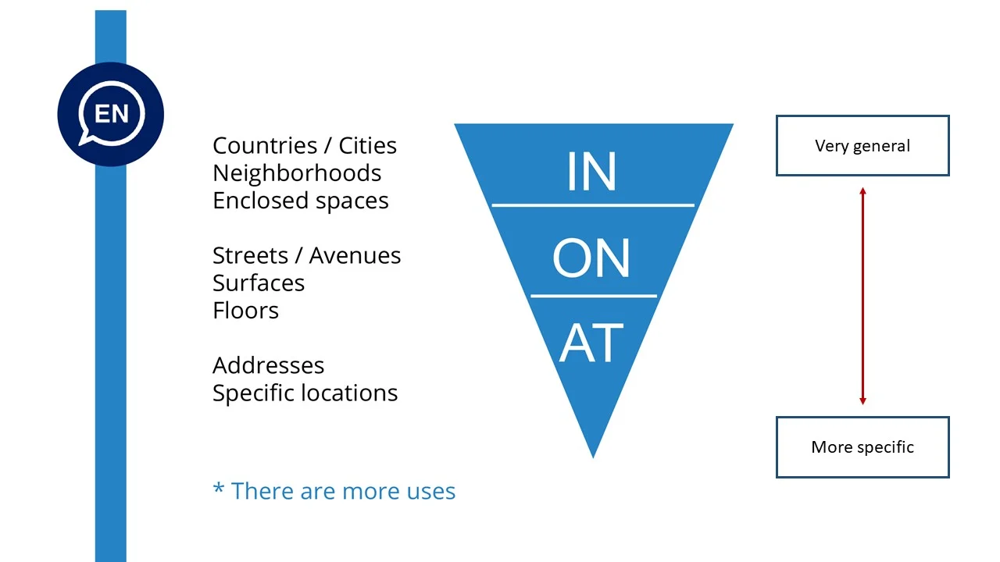
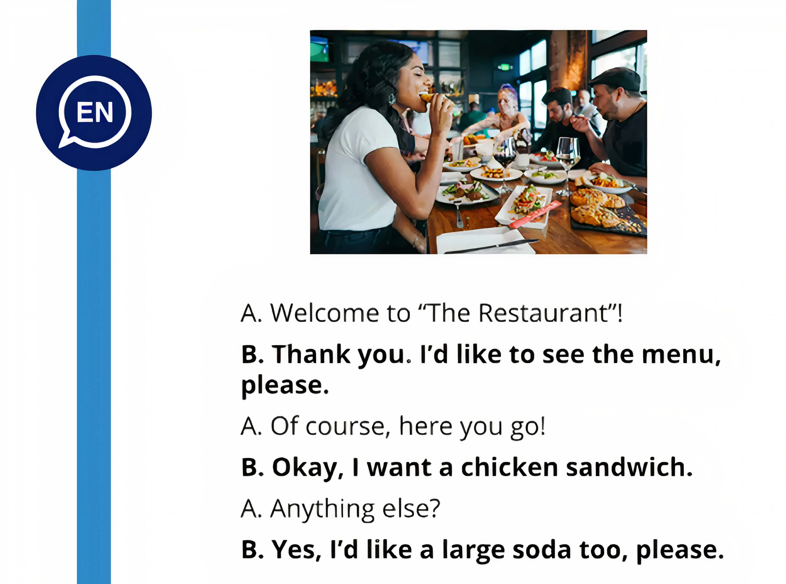
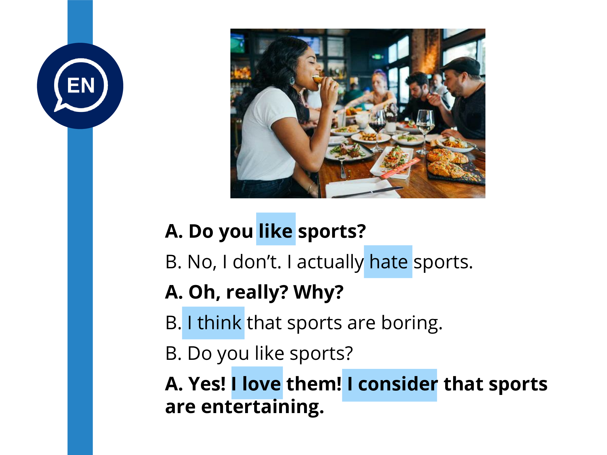

# Curso de Inglés Básico A1: Fechas, Horas y Expresiones Simples

## Meses y números ordinales en inglés

### ¿Cúando es tu cumpleaños?

Para responder a la pregunta When is your birthday?, existen dos formas: una corta y otra larga

En ambos casos, es preciso conocer algunos aspectos como:

- La diferencia entre números cardinales y ordinales
- Los formatos de fechas
- Los meses en inglés

### Números cardinales y ordinales

Hay que diferenciar entre los números cardinales y ordinales:

### Números cardinales (cardinal numbers)

Los cardinal numbers expresan cantidad. Por ejemplo:

- I have two dogs.
- There are twenty students in class.
- They have four children.

### Números ordinales (ordinal numbers)

Los ordinal numbers se usan en los siguientes casos:

1. Para decir fechas.
*My birthday is on July **24th***.

2. Para referirse a siglos (centuries):
*My grandparents lived here in the **19th** century*

3. Para especificar los pisos de un edificio:
*My office is on the **third** floor*.

4. Para especificar orden y secuencia:
*I was the **first** one in that class*.

En la siguiente imagen podemos observar la diferencia entre ambos tipos de números.

Los números ordinales en inglés se obtienen al añadir el sufijo TH a la mayoría de los números cardinales. Pero, hay algunas excepciones. En estos casos se añaden los sufijos **ST**, **ND** y **RD**, tal y como sucede con los números 1°, 2° y 3°:

### Ejercicios con ordinal numbers

Responde las siguientes preguntas. Trata de no mirar las respuestas localizadas más abajo.

*What is the **fifth** month of the year?*
*What is the **seventh** month of the year?*
*What is the **tenth** month of the year?*
*What is the **thirteenth** month of the year?*

**Respuestas:**

What is the fifth month of the year?
The fifth month of the year is May.

What is the seventh month of the year?
July is the 7th month of the year

What is the tenth month of the year?
October is the 10th month of the year.

What is the thirteenth month of the year?
The 13th month of the year doesn’t exist.

### Formato de fecha en USA y en otros países

En la mayoría de los países el formato de fecha que se utiliza es dd / mm / aaaa.

En cambio, en Estados Unidos el formato de fecha utilizado es mm / dd / aaaa.

Por esta razón, se debe tener mucho cuidado al interpretar las fechas. Por ejemplo, observa el siguiente caso con la fecha 02/12/2021.

 
### Los meses del año
Los meses del año en inglés se escriben de la siguiente manera:

Mes | Pronunciación
---|----
January | /ˈyæn·juˌer·i/
February | /feb·ruˌer·i/
March | /märch/
April | /ˈeɪ·prəl/
May | /meɪ/
June | /dyúun/
July | /dyʊˈlɑɪ/
August | /ˈɔ·ɡəst/
September | /sepˈtem·bər/
October | /ɑkˈtoʊ·bər/
November | /noʊˈvem·bər/
December | /dɪˈsem·bər/

Lo que ves en la columna Pronunciación, corresponde a transcripciones fonéticas basadas en el IPA (International Phonetic Alphabet). Para entender las transcripciones de pronunciación mejor, revisa esta clase sobre el IPA.

### Ejercicios para practicar fechas

Utilizando ambas estructuras (short way and long way), responde las siguientes preguntas:

1. When is your birthday?
2. When is Halloween day?
3. When is Christmas day?
4. When is Saint Valentine’s day?

**Respuestas:**

1. When is your birthday?
My birthday is in November.
My birthday is on November 6th.

2. When is Halloween day?
Halloween day is in October.
Halloween day is on October 31st.

3. When is Christmas day?
Christmas day is in December.
Christmas day is on December 25th.

4. When is Saint Valentine’s day?
Saint Valentine’s day is in February.
Saint Valentine’s day is on February 14th.

## Cómo decir la hora en inglés

Existen distintas maneras de decir la hora en inglés. Aquí te damos algunas reglas para decir la hora:

### O’clock - hora exacta 

Cuando la hora es exacta, es decir, 1:00 p.m., 5:00 a.m., 3:00 p.m. se dice la expresión **o’clock**, por ejemplo:

- 1:00 se dice *It’s one **o’clock***
- 3:00 se dice *It’s three **o’clock***
- 5:00 se dice *It’s five **o’clock***

### Quarter - para hablar de 15 minutos

Cuando han transcurrido quince minutos de una hora se utiliza la expresión quarter past, por ejemplo:

- 4:15 se dice *It’s **quarter past** four*
- 6:15 se dice *It’s **quarter past** six*
- 10:15 se dice *It’s **quarter past** ten*

Cuando han transcurrido 45 minutos de una hora, o lo que es igual, faltan 15 minutos para una hora determinada, se utiliza la expresión **quarter to**, por ejemplo:

- 4:45 se dice *It’s **quarter to** five*
- 8:45 se dice *It’s **quarter to** nine*
- 10:45 se dice *It’s **quarter to** eleven*

### Half - para hablar de 30 minutos

Cuando han transcurrido treinta minutos de una hora se utiliza la expresión **half-past**, por ejemplo:

1:30 se dice *It’s **half-past** one*
8:30 se dice *It’s **half-past** eight*
5:30 se dice *It’s **half-past** five*

### Minutes past - el número de minutos después de cierta hora exacta

Cuando han transcurrido algunos minutos dentro de la primera mitad de una hora se usa la estructura:

It’s + minutos transcurridos + past + hora en curso

Por ejemplo:

2:10 se dice *It’s ten **past** two*
3:20 se dice *It’s twenty **past** three*
7:25 se dice *It’s twenty-five**past** seven*

### Minutes to - el número de minutos después de la media hora

Cuando han transcurrido algunos minutos dentro de la segunda mitad de una hora se usa la preposición TO, con esta estructura:

It’s + minutos pendientes + to + siguiente hora

Por ejemplo:

10:35 se dice *It’s twenty-five **to** eleven*
9:40 se dice *It’s twenty **to** ten*
3:50 se dice *It’s ten **to** four*

### Ejercicios para practicar la hora en inglés

Ahora, te invito a decir y escribir la hora correspondiente en los siguientes casos:

- 9:45
- 8:55
- 11:20
- 1:00
- 9:00
- 12:25
- 3:15
- 10:30

**Respuestas**

9:45 - it’s quarter to ten.
8:55 - it’s five to nine.
11:20 - it’s twenty past eleven.
1:00 - it’s one o’clock.
9:00 - it’s nine o’clock.
12:25 - it’s twenty-five past twelve
3:15 - it’s quarter past three.
10:30 – it’s half-past ten

### Diálogo: Una fiesta de cumpleaños

Lee la siguiente conversación entre Charles y Jack. Pon atención en las estructuras gramaticales y uso de los verbos.

**Charles**: Hey Jack! Do you have any plans for Friday night?
**Jack**: Hey, Charles. Not really.
**Charles**: Nice! My wife and I are having a party to celebrate our anniversary.
**Jack**: Oh, that’s amazing.
**Charles**: Yes!. Do you want to come?
**Jack**: Sure. What time is the party?
**Charles**: 8 pm. This is my address.
**Jack**: Ok perfect. Hollywood Street 532. Got it!
**Charles**: Amazing Jack. See you there!
**Jack**: Yeah! Charles. One question. Can I bring my girlfriend with me?
**Charles**: Of course Jack! Only friends are coming to the party. So that’s fine.
**Jack**: Oh awesome. See you there!
**Charles**: See you!

Ahora, responde las siguientes preguntas. Evita mirar las respuestas que se encuentran debajo.

*Where is the party?*
*When is the party?*
*What time is the party?*
*Who is coming to the party?*
*Can Jack bring his girlfriend?*

Respuestas

Where is the party?
The party is on Hollywood Street, 532.

When is the party?
The party is on Friday night.

What time is the party?
The party is at 8:00 o’clock at night.

Who is coming to the party?
Only friends are coming to the party.

Can Jack bring his girlfriend?
Yes, he can bring his girlfriend.

## Palabras interrogativas en inglés

Las question words (o WH questions) son aquellas palabras que sirven para formular e introducir oraciones de carácter interrogativo cuya respuesta no es un sí o un no, sino que es una respuesta abierta.

Las question words se colocan al principio de la oración.

Las principales question words son **who, where, when, what, why, which, how old, how fa, how long, how often, how many y how much**.

Presta atención al uso del verbo to be en la siguiente imagen, para diferenciar cuando se trata de un elemento o varios elementos.

**Escribe las siguientes palabras en el orden correspondiente**

book / How / is / this / much / ?
much / tickets / How / the / are / ?

**Respuesta**

How much is this book?
How much are the tickets?

A continuación, encuentras varios ejemplos de Question Words

*Who is your English teacher?*
*Where are you from?*
*When is your birthday?*
*What time is it?*
Why didn’t you go to Charle’s party?*
*Which is your favorite class: English or Maths?*
*How old are you?*
*How far is the beach for here?*
*How long is Cristiano Ronaldo’s house?*
*How often do you go to the gym?*
*How many sisters do you have?*
*How much is that book?*

Ahora es tu turno. Practica e inventa varios ejemplos de Question Words.

## Preposiciones de lugar en inglés

Para responder la pregunta Where are you? es importante recordar las preposiciones de lugar como on, under, next to, in front of, between, etc. Si quieres profundizar sobre esas preposiciones, ve a nuestra clase de prepositions of place.

Además de las preposiciones de lugar mencionadas, existen otras igualmente importantes como:

**Beside**

Next to something or someone (Cerca de).
BESIDE = NEXT TO
I am beside the window = I am next to the window

**Behind**

At the back of someone or something
(Detrás de)
Close the door behind you

**Under**

Below something
(Debajo de) / UNDER = BELOW
The bag is under the table

**Over**

Above or upon in position
(Por encima de) / OVER = ABOVE
The light is over me

**In**

La preposición IN se usa en los siguientes casos:

- Para indicar ubicación en un país.
Rose lives in France.
- Para indicar ubicación en una ciudad.
Rose lives in Paris.
- Para indicar ubicación en un vecindario, barrio, u otra parte de un pueblo o ciudad.
We live in a quiet neighborhood.
They live in the Latin Quarter of the city.
- Para indicar espacios cerrados.
He is studying in his house.
My pets are playing in the garden.
There is nobody in the room.
The keys are in her bag.
My wallet is in my coat pocket.

**On**

La preposición **ON** se usa en los siguientes casos:

- Indicar ubicación en calles y avenidas.
The bank is on Loreto Street.
My parents live on Park Avenue.
- Indicar ubicación en superficies.
The book is on the table.
The pictures are on the wall.
- Para referirse a los pisos de un edificio.
Our office is on the 3rd floor.
- Para decir que algo está localizado en una costa, río o camino.
Portsmouth is on the south coast of England.
The pasture on the south side of the river.

**At**

La preposición **AT** se utiliza en los siguientes casos:

- Para indicar una dirección más específica.
I live at 532 Loreto St.
- Para indicar una ubicación en un punto específico.
At the entrance.
At the door.
At the table.
At the end of the street.
At the station.
At the market.
At home.
At work.
At school.

- Para teferirse a la casa de alguien.
At John’s house.

Recuerda que estamos estudiando las palabras **in, on y at** en su condición de preposiciones de lugar, ya que estas palabras poseen otros usos diferentes que serán estudiados en lecciones posteriores.

Presta atención al siguiente ejemplo donde las preposiciones estudiadas son usadas de acuerdo al contexto de la oración:

Where do you work?

- I work in Perú
- I work on Loreto Street
- I work at Platzi

Ahora es tu turno. Realiza varios ejemplos para poner en práctica cómo responder a la pregunta Where are you?

## Ejercicio de lectura: Palabras interrogativas en inglés

La siguiente conversación tiene algunos errores en el uso de las Question Words. Encuéntralos y corrígelos. No mires las respuestas sin haberlo intentado.

**James**: Hey Sarah
**Sarah**: Hi James
**James**: What are you today?
**Sarah**: I’m fantastic, James, and you?
**James**: I’m great too. Sarah, when do you live now?
**Sarah**: I live in Mexico City now. I’m visiting my family here.
**James**: Oh, that’s awesome. And why do you work?
**Sarah**: I work at Google. I’m a software engineer there. And you? Who do you work?
**James**: I work at Platzi. Sarah: Oh, amazing. When is your office?
**James**: I work from home. It’s great
**Sarah**: Awesome. How old is your house from here?
**James**: Not much, like 10 minutes walking. Let’s have a coffee there!
**Sarah**: Great, let’s go!

Respuestas

**James**: Hey Sarah
**Sarah**: Hi James
**James**: How are you today?
**Sarah**: I’m fantastic James and you?
**James**: I’m great too. Sarah, Where do you live now?
**Sarah**: I live in Mexico City now. I’m visiting my family here.
**James**: Oh that’s awesome. And where do you work?
**Sarah**: I work at Google. I’m a software engineer there. And you?
Where do you work?
**James**: I work at Platzi.
**Sarah**: Oh, amazing. Where is your office?
**James**: I work from home. It’s great
**Sarah**: Awesome. How far is your house from here?
**James**: Not much, like 10 minutes walking. Let’s have a coffee there!
**Sarah**: Great, let’s go!

## Diferencia entre "have" y "have got"

Las expresiones have y have got poseen el mismo significado: tener.

Have es solo un poco más formal que have got, pero ambas son correctas.

### Usos más comunes de Have y Have got

Los principales usos de estas expresiones son:

###  Indicar posesión (possessions)

I have a car
I have got a car / I’ve got a car

### Indicar Relaciones (relationships)

I have two brothers
I have got two brothers / I’ve got two brothers

### Indicar enfermedades (illnesses)

She has a headache
She has got a headache / She’s got a headache

### Indicar características (characteristics)

He has blue eyes
He has got blue eyes /He’s got blue eyes

Ahora bien, es importante señalar que el uso de estas expresiones poseen diferentes tratamientos en las oraciones afirmativas, negativas e interrogativas. Esto se puede visualizar en la siguiente imagen:

### Affirmative sentences using have and have got

La estructura gramatical es la siguiente:

I / You / We / They + have + Complement

He / She / It + has + Complement

I / You / We / They + have got + Complement

He / She / It + has got + Complement

Por ejemplo:

HAVE | HAVE GOT
----|----
I have a new job | I have got a new job
You have a toothache | You have got a toothache
He has brown hair | He has got brown hair
She has a sister | She has got a sister
It has four rooms | It has got four rooms
You have a pet | You have got a pet
We have English homework | We have got English homework
They have many toys |They have got many toys

### Negative sentences using have and have got

La estructura gramatical de las oraciones negativas es:

I / You / We / They + **don’t have** + complement

He / She / It + **doesn’t have** + complement

I / You / We / They + **haven’t got** + complement

He / She / It + **hasn’t got** + complement

Por ejemplo:

HAVE | HAVE GOT
----|----
I don’t have a new job | I haven’t got a new job
You don’t have a toothache | You haven’t got a toothache
He doesn’t have brown hair | He hasn’t got brown hair
She doesn’t have a sister | She hasn’t got a sister
It doesn’t have four rooms | It hasn’t got four rooms
You don’t have a pet | You haven’t got a pet
We don’t have English homework | We haven’t got English homework
They don’t have many toys |They haven’t got many toys

### Interrogative sentences using have and have got

La estructura gramatical de las oraciones interrogativas es:

**Do** + I / You / We / They + have + complement + ?

**Does** + He / She / It + have + complement + ?

**Have** + I / You / We / They + got + complement + ?

**Has** + He / She / It + got + complement + ?

Por ejemplo:

HAVE | HAVE GOT
---|---
Do I have a new job? | Have I got a new job?
Do you have a toothache? | Have you got a toothache?
Does he have brown hair? | Has he got brown hair?
Does she have a sister? | Has she got a sister?
Does it have four rooms? | Has it got four rooms?
Do you have a pet? | Have you got a pet?
Do we have English homework? | Have we got English homework?
Do they have many toys? | Have they got many toys?

## Cómo usar "want" y "would like"

Cuanto vas a hablar sobre lo que quieres o lo que deseas puedes usar las expresiones I want o I would like.

### I want…

Es la forma más común para expresar tus deseos. Es considerada una forma más directa para expresar cuando quieres alguna cosa.

Ejemplos:

*I want to learn English.*
*I want to go to the gym.*
*I want a large beer.*
*I want a new car.*
*I want to watch TV.*

### I would like…

También se usa para expresar deseo, pero esta expresión suena un poco más formal y educada.

La contracción de **I would** is **I’d**. Por ejemplo:

**I would** like an orange juice.
**I’d** like an orange juice.

Por ejemplo:

*I’d like a big house.*
*I’d like a pizza.*
*I’d like to watch a movie.*
*I’d like to go home.*
*I’d like another beer.*

Ambas expresiones son correctas. Sin embargo, se debe tener cuidado en el uso de WANT, porque en algunas ocasiones se puede interpretar como poco cortés o una forma mandona y exigente.

Observa el siguiente ejemplo:

Practica estas expresiones con varios ejemplos de tu vida cotidiana.

## Ejercicio de escucha: Conversación en el aeropuerto

Este es un ejercicio complementario de lectura. Tomando en cuenta el contexto de la conversación, intenta rellenar los espacios en blanco. Luego, lee la conversación completa y responde las preguntas que encuentras abajo. Intenta hacer el ejercicio sin mirar las respuestas.

**Agent**: Good afternoon! _______ are you flying to today?
**Mike**: Chicago, please.
**Agent**: _____ I see your passport, please?
**Mike**: Here you ____.
**Agent**: Are you checking any ____?
**Mike**: ______ only one.
**Agent**: OK, please place your bag ____ the scale.
**Mike**: Thank you, I have got a stopover in Miami – Do I need to pick up my _____ there?
**Agent**: No, no problem. Here is your ________ pass – your flight leaves from gate 22H. The boarding process starts _____ 3:20. Your seat number is 16E.
**Mike**: Thanks. I’d ______ to travel first class. Can I upgrade my ticket ______?
**Agent**: Sure, one _______. All set!
**Mike**: Thank you!

**Agent**: Good afternoon! **Where** are you flying today?
**Mike**: Chicago, please.
**Agent**: **Can** I see your passport, please?
**Mike**: Here you **go**!
**Agent**: Are you checking any **bags**?
**Mike**: **I have got** only one.
**Agent**: OK, please place your bag on the scale.
**Mike**: Thank you, I have got a stopover in Miami – Do I need to pick up my **luggage** there?
**Agent**: No, no problem. Here is your **boarding** pass – your flight leaves from gate 22H. The boarding process starts at 3:20. Your seat number is 16E.
**Mike**: Thanks. I’d **like** to travel first class. Can I upgrade my ticket now?
**Agent**: Sure, one **moment**. All set!
**Mike**: Thank you!

**Preguntas**

- Where is Mike flying to?
- How many bags does Mike have?
- Where is this conversation taking place?
- Why is mike asking about a stopover in Miami?
- What is Mike’s seat number?

**Respuestas:**

- **Where is Mike flying to?**
Mike is flying to Chicago
- **How many bags does Mike have?**
Mike has one bag
- **Where is this conversation taking place?**
The conversation is taking place at the airport
- **Why is mike asking about Miami?**
Because he has a stopover in there
- **What is Mike’s seat number?**
Mike’s seat number is 16E

## Cómo usar "can" y "can't"

Can es un verbo modal que se usa para cuatro propósitos:

1. Para expresar alguna habilidad o capacidad (ability).
I can ride a bicycle.

2. Para solicitar permiso (permission).
Excuse me, teacher. Can I go to the bathroom?

3. Para hacer una petición o solicitud (request).
Excuse me, can I use your cell phone for a moment?

4. Para expresar posibilidad (possibility).
It can rain tonight.

### Ejemplos de oraciones usando el verbo modal can

- Affirmative sentence:
He can speak three languages.

- Negative sentence:
He can´t speak three languages.

- Interrogative sentence:
Can he speak three languages?

### Let’s practice

Responde las siguientes preguntas:

Can you drive?
Can you play the piano?
Can you swim?
Can you speak French?

**Escribe cinco oraciones de cosas que puedes hacer, por ejemplo:**

I can speak Spanish.
I can play the guitar.
I can do visualizations in Tableau.
I can use Python.
I can use Excel and Power BI.

**Escribe cinco oraciones de cosas que no puedes hacer, por ejemplo:**

I can’t speak Italian.
I cant’ dance very well.
I can’t play basketball.
I can’t ride a horse.
I can´t cook very well.

**Escribe cinco oraciones de cosas que otra persona que tú conozcas puede hacer, por ejemplo:**

My wife can dance very well.
My wife can cook delicious.
My wife can ride a bike.
My wife can sing.
My wife can drive.

**Escribe cinco oraciones de cosas que otra persona que tú conozcas no puede hacer, por ejemplo:**

My wife can’t play chess.
My wife can’t draw.
My wife can’t speak English.
My wife can’t write computer programs.
My wife can’t play the violin.

**Escribe cinco preguntas usando la palabra can, por ejemplo:**

Can you play the piano?

## Diálogo: Usemos "can" y "can't"

Lee con detenimiento la siguiente entrevista:

**John**: Good morning, Rachel. Welcome. How are you today?
**Rachel**: Good morning. Thank you. I’m doing great.
**John**: All right, Rachel, let’s start. Can you use Python?
**Rachel**: Yes, I can.
**John**: Okay, and JavaScript, can you use it?
**Rachel**: Absolutely.
**John**: Oh wow! Your curriculum looks amazing.
**Rachel**: Thank you very much.
**John**: Now, a question for you. Can you work on the weekends?
**Rachel**: Sorry, I can’t. I’m doing my Master’s degree on the weekends.
**John**: Oh, that’s amazing. And can you speak other languages?
**Rachel**: Yes. I can. I can speak English and I can speak Spanish.
**John**: Oh fantastic, can you speak French?
**Rachel**: No, I can’t, but I can speak Portuguese.
**John**: Interesting Rachel. Thank you for your time.
**Rachel**: You’re welcome and thank you.

Responde qué cosas puede hacer Rachel y qué no puede hacer.

¡Hazlo sin mirar las respuestas!

Respuestas:

Rachel can:
- Use Python
- Use JavaScript
- Speak English, Spanish, and Portuguese

Rachel can’t:
- Work on the weekends
- Speak French

## Cómo usar 's para hablar de posesivos en inglés

**’s** es una forma utilizada para indicar a quién o a qué pertenece algo. Es decir, establece una relación de pertenencia entre dos términos.

Se forma agregando un apóstrofo y la “s” al nombre del propietario.

**Ejemplos**

John’s car is white.
(El auto de John es blanco).

Rachel’s coat is black.
(El abrigo de Rachel es negro).

### Usos más comunes de 's para expresar posesivos

Dependiendo de quién es el sujeto de la oración, es decir, quien posee, la ’s se puede usar de varias formas.

### Sustantivos en singular (singular nouns)

Cuando los sustantivos se encuentran en singular siempre se debe colocar 's.

- My sister’s car is black.
- My teacher’s house is big.
- Peter’s shirt is blue.

### Sustantivos en plural (plural nouns)

Si el sustantivo está en plural, solo se agrega el apóstrofo sin la letra ““s””. Lo mismo ocurre en el caso de palabras que terminan con ““s””.

- The dogs’ plates are full.
- The teachers’ desks are messy.

### Nombres de personas

En el caso de nombres de personas se cumple la misma regla de los sustantivos en singular, es decir, se agrega el apóstrofo y la letra ‘s’.

- Kaleb’s house is big.

Sin embargo, hay una excepción. En el caso de nombres de personas que terminen en la letra “s”, es opcional colocar ‘s’.

Es válido colocar únicamente el apóstrofo, pero es obligatorio pronunciar la letra “s” aun cuando no se escriba. Por ejemplo:

- Jame**s’** house is very old.
- James**’s** house is very old.
Se puede escribir James’ o James’s, pero siempre se debe pronunciar la ““s””, es decir, en ambos casos se debe pronunciar /yeimses/.

### Dos o más personas

En el caso de dos o más personas poseedoras se deben considerar dos aspectos:

1. Si dos o más personas comparten una cosa en común, basta con colocar el apóstrofo al final de la última persona a la que se haga referencia. Ejemplo:

Mary and Jack’s car is new.

Esta se traduce: el carro de Mary y Jack es nuevo.
Es decir, el objeto pertenece a ambos.

2. Si dos o más personas poseen de manera independiente su propio objeto, se debe colocar el apóstrofo en cada persona a la que se haga referencia. Ejemplo:

Mary’s and Jack’s cars are new.
Esta se traduce: el caro de Mary y el carro de Jack son nuevos.
Es decir, son carros diferentes.

### Nombres compuestos

En los nombres compuestos, se agrega el apóstrofo y la “s” al final de la última palabra. Ejemplo:

My brother-in-law’s cousin.
(El primo de mi cuñado.)

My mother-in-law’s house is on the hill.
(La casa de mi suegra está en la colina)

### Let’s practice using possesives with 's

A continuación se presentan grupos de oraciones para que las transformes en una expresión posesiva.

1. My mom have a dog.
The dog is big.

2. Lucas has a car.
The car is new.

3. Steve has a daughter.
Anna has a daughter.
The daughters are smart.

Respuesta.

My mom’s dog is big.
Lucas’ car is new.
Steve’s and Anna’s daughters are smart.
Mira el siguiente arbol familiar. Observa los ejemplos.

Ejemplos
- Jack is Miranda’s father
- Scott is Kira’s brother
- Sarah is Steven’s wife

Ahora, responde las siguientes preguntas:

Who is Lorrie to Steven?
Who is Jackson to Sarah?
Who is Kira to Allison?

**Respuestas**

Who is Lorrie to Steven?
Lorrie is Steven’s mother.

Who is Jackson to Sarah?
Jackson is Sarah’s son.

Who is Kira to Allison?
Kira is Allison’s cousin.

## Diferencias entre "there is" y "there are"

Las expresiones there is y there are se utilizan para referirse a la existencia de algo.

### There is

La expresión there is se usa en los siguientes casos:

1. Expresar la existencia de un solo elemento, es decir, en singular.

*There is a coffee on the table - Hay un café en la mesa*

2. Referirse a algo que físicamente no se puede ver o es desconocido.

*There is something in my eyes - Hay algo en mis ojos*

3. Referirse a cosas incontables (nouncontable), como por ejemplo el oxígeno, etc.

*There is some milk in the fridge - Hay leche en el refrigerador*

### There are

*There are* se utiliza para hablar acerca de la existencia de **varios elementos**, es decir, en plural (dos o más elementos).

*There are two dogs in the garden* – Hay dos perros es el jardín

*There are five books on the desk* – Hay cinco libros en el escritorio

**Con el uso de la siguiente imagen realiza varias oraciones usando las expresiones There is y There are.**

Ejemplo:
There is a sofa.

### There isn’t vs. There aren’t

Estas expresiones indican la inexistencia de elementos.

*There isn’t a bus stop near here.* – No hay parada de autobús cerca de aquí

*There isn’t any cheese in the fridge* – No hay queso en el refrigerador

*There aren’t any oranges in the basket* – No hay naranjas en la cesta

*There aren’t any pens on the table* – No hay lápices en la mesa

*There isn’t money in my wallet* - No hay dinero en mi billetera (cartera)

*There aren’t students in the classroom* - No hay estudiantes en el aula

### Oraciones interrogativas usando there is y there are

Para formular preguntas usando there is y there are, solo se invierte el orden de las palabras de la siguiente manera:

There are - **Are there…?**
There is - **Is there…?**

Por ejemplo:

**Is there** a TV in your bedroom?
Yes, there is a TV.

**Are there** pets in your house?
No, there aren’t pets in my house.

### Ejercicio usando there is y there are

Partiendo de la siguiente imagen, responde las preguntas que se formulan.

Respuestas:

**Are there kids in the park?**
Yes, there is one girl in the park.

**Is there an adult with the kid?**
No, there isn’t an adult with the kid.

**Are there animals in the park?**
No, there aren’t animals in the park.

## Pronombres de sujeto y objeto en inglés

En inglés es importante aprender la diferencia entre subject pronouns y object pronouns, ya que se establece un tratamiento diferente para ambos.

### Pronombres personales o en función del sujeto

El sujeto de una oración es la persona, animal o cosa que realiza la acción del verbo. Se utilizan los pronombres en función del sujeto cuando el pronombre es el sujeto de la oración. Este pronombre en inglés, a diferencia del español, debe figurar siempre.

Los subject pronouns son:

- I
- You
- He
- She
- It
- We
- They

### Pronombres en función del objeto

En este caso, el sujeto de una oración es la persona, animal o cosa que recibe la acción del verbo. Generalmente, este pronombre se coloca a continuación del verbo al que complementa o a continuación de preposiciones como “for”, “to”, “with” y “at”.

**Los object pronouns son:**

Me
You
Him
Her
It
Us
Them

### Ejercicios con subject pronouns y object pronouns

Según lo que has estudiado, selecciona el pronombre correcto en los siguientes casos:

1. Charles, where are _____ (you, them)?
2. It’s _____ birthday present (she, her).
3. I don’t like ____ (him, he).
4. ____ have three brothers (I, Me).
5. Tom is my friend. ____ ( He, Him) is very intelliget. I often play football with _____ (he, him).
6. I need some help. Can you help ____ (I, me)?
7. ____ (She, Her) needs some help. Please help ____(She, Her).
8. The children are thirsty. Give ____ (they, them) a glass of water.

Ahora, revisa tus respuestas:

1. Charles, where are you?
2. It’s her birthday present.
3. I don’t like him.
4. I have three brothers.
5. Tom is my friend. He is very intelligent. I often play football with him
6. I need some help. Can you help me?
7. She needs some help. Please help her
8. The children are thirsty. Give them a glass of water.

## Diferencias entre el presente simple y el presente continuo en inglés

El tiempo presente tiene dos formas diferentes para expresar situaciones: presente simple y presente continuo. Estos se usan para expresar acciones que ocurren en diferentes momentos.

**El presente simple** tiene dos maneras de manifestarse:

- Usando el verbo to be
- Usando otros verbos diferentes al verbo to be

**El presente continuo** o presente progresivo, como también se le conoce, indica acciones que están ocurriendo en el momento y se forma con la estructura gramatical:

Pronoun + form of to be + verb + ing

**Ejemplo:** We are dancing

Es decir, el presente continuo se forma a través de la combinación del presente simple más la terminación ING.

### Recordando el uso del presente simple

Para recordar a fondo el uso del presente simple con el verbo to be y otros verbos, puedes ir a esta clase. El presente simple se utiliza en los siguientes casos:

1. Cuando quieres comunicar **estados o acciones permanentes**.

**Ejemplo:** The earth is the third planet from the sun.

2. Al manifestar estados o situaciones que son rutinarias o acciones que tienen periodicidad.
**Ejemplo:** Every ten years is a decade.

3. Para hablar de hábitos, rutinas o hechos que se repiten en lapsos de tiempo determinado.

**Ejemplo:** I drink coffee every morning.

4. Cuando das indicaciones, instrucciones y señales.

**Ejemplo:** You go down this street to the cinema, then you turn right .

5. Para transmitir citas, hechos o compromisos que pasarán en un tiempo determinado.

**Ejemplo:** Tomorrow is my birthday!

### Ejercicios usando el presente simple

Selecciona la palabra o frase correcta:

I **brush** my teeth every day.
- am brushing
- brush.

En este caso la acción se realiza todos los días. Es una acción permanente. No se está realizando en el momento. Por esta razón, se trata del tiempo presente simple.

2. She **has** two sisters.
- has
- Is having

En este caso se repite la misma explicación del ejercicio anterior.

3. I am cooking lunch right now
- am cooking
- cook

En este caso, la acción se realiza en el mismo momento que se está hablando. Por tanto, se trata del tiempo presente continuo.

### Oraciones en presente continuo

La principal diferencia entre el presente simple y presente continuo está en su uso. El presente continuo indica acciones que suceden mientras hablamos, mientras que el presente simple se utiliza para expresar acciones habituales o situaciones permanentes.

### Oraciones afirmativas usando presente continuo / Affirmative sentences using present continuous

**Estructura gramatical:**

Sujeto + verbo to be + verbo en gerundio (ING) + complemento

**Ejemplo:**
You are watching a video.
Steve is washing his hair.
Listen! The birds are singing.
I am reading a great book.
Jack is learning Italian.

### Oraciones negativas usando presente continuo / Negative sentences using present continuous

Estructura gramatical:

Sujeto + verbo to be + not + verbo en gerundio + complemento

**Ejemplo:**

I’m not watching TV now.
She isn’t doing her homework.
We aren’t playing now.
Peter is calling his brother.
Steven is having a shower.

### Oraciones interrogativas usando presente continuo / Interrogative sentences using present continuous

**Estructura gramatical:**

Verbo to be + sujeto + verbo en gerundio + complemento + ?

**Ejemplo:**

Are you enjoying the party?
Is the bus coming?
Is she opening her presents?
Where are you going?
What is he doing right now?

**Let’s practice**

1. Am I speaking French?
No, you aren’t speaking French.
You are speaking English.

2. Is he watching TV?
No, he isn’t watching TV.
He is dancing.

3. Is she resting at home?
No, she isn’t resting at home.
She is running in the park.

### Responde las siguientes preguntas e identifica cuáles están en presente simple y cuáles en presente continuo:

1. Where does your father work?
2. Is he working right now?
3. Where do you work?
4. Are you working right now?

## Ejercicio de escritura y lectura: Conoce a los demás

Vamos a comprobar qué tanto te conocen a ti otras personas.

Primero, **contesta las siguientes preguntas:**

1. Do you like vegetables?
2. Do you practice any sport?
3. Do you live in a house or an apartment?
4. Do you cook?
5. Do you read often?
6. For vacations, do you prefer the beach or the mountains?
7. How many languages do you speak?
8. Do you dance?
9. Do you have any pets?
10. Do you use the microwave at home?

Ahora, solicita a un(a) conocido(a) que hable inglés que responda esas mismas preguntas sobre ti, para comprobar si acierta tus respuestas.

**Resultados:**

9-10 respuestas iguales: la persona te conoce muy bien.
6 -8 respuestas iguales: está bien, pero probablemente necesitan compartir más tiempo juntos.
3-5 respuestas iguales: oh, ¿quién es esa persona?
1-3 respuestas iguales: definitivamente, esta persona no te conoce mucho.

## Diálogo: Escogiendo el regalo perfecto

Lee esta conversación entre dos amigos. Uno de ellos necesita comprar un regalo.

**Nick:** Hi, Scott.
**Scott:** Hi, Nick.
**Nick:** I need your help.
**Scott:** Sure, What’s up?
**Nick:** Well, it’s my girlfriend’s birthday, but I don’t know what to get for her.
**Scott:** You can buy some flowers.
**Nick:** She doesn’t like flowers.
**Scott:** What about some chocolates. Does she like chocolates?
**Nick:** No, she doesn’t.
**Scott:** Ummm. I see. Does she like plants?
**Nick:** Plants? Yes, she does. She loves plants.
**Scott:** Awesome! You can buy her a cactus, one that she can put in her office.
**Nick:** That’s a great idea.
**Scott:** And you can write her a letter.
**Nick:** Wow! Yes, that’s awesome. Thank you.
**Scott:** Of course, Nick. Good luck!

**Responde las siguientes preguntas:**

What does she like?
What doesn’t she like?
What will Nick buy for her?

**Ahora, compara tus respuestas:**

**What does she like?**
She likes plants.

**What doesn’t she like?**
She doesn’t like flowers, and she doesn’t like chocolates.

**What will Nick buy for her?**
He will buy a cactus for her.

### Cómo expresar gustos, desagrados y opiniones en inglés

Cuando quieres (o te piden) expresar tu parecer sobre un tema, puedes responder hablando de lo que te gusta / **likes**, lo que no te gusta / **dislikes** y puedes dar una opinión abierta / **opinions.**

### Likes

Hay varias formas para expresar que algo te agrada. Por ahora, te mostramos estas tres:

1. He likes chocolate.
2. I love video games.
3. We enjoy cooking.

De las tres, love es la que hace más énfasis en que realmente nos gusta mucho algo.

### Dislikes

Igualmente, hay varias maneras para expresar que algo no te gusta, por ejemplo:

1. We **don’t like** dancing.
2. She **hates** fast food.
3. They **dislike** jazz.

Las tres opciones son correctas, pero ““hate”” es una forma de expresión más fuerte que las otras.

### Opinions

Cuando solicitan tu opinión sobre un asunto existen varias maneras para responder. Aquí tienes tres formas muy comunes:

1. I **think** you are right.
2. I **consider** we need it.
3. I **believe** that´s not true.

En la siguiente imagen puedes observar el uso adecuado de likes, dislikes y opinions.

