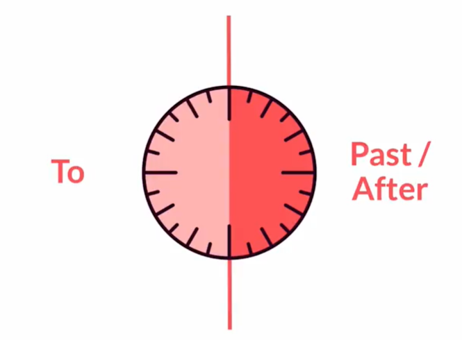

# Curso de Inglés Básico A2: Conectores y Artículos

## Practica vocabulario de nivel básico

Si aún no conoces tu nivel de inglés, ve a nuestro **[Test de Inglés de Platzi](https://platzi.com/evaluation/test-ingles "Test de Inglés de Platzi")** y descúbrelo. 🚀

Te damos la bienvenida al curso de inglés básico A2: **“Artículos y Verbos Modales”**. En este curso aprenderás:

- Conectores básicos
- Condiciones del clima
- Adverbios de frecuencia
- Expresar presencia o ausencia
- Realizar ofrecimientos, sugerencias e invitaciones
- Comunicar el tiempo

Asegúrate de hacer los ejercicios y preguntar lo que quieras en la sección de preguntas.

Apóyate en herramientas como [Cambridge Dictionary](https://dictionary.cambridge.org/es/ "Cambridge Dictionary") para buscar el significado del vocabulario que no conozcas y su pronunciación.

## Conectores "and", "but" y "or"

Los **conectores** son palabras que **unen una idea con otra**. Los primeros conectores que aprenderás son: **and**, **but** y **or**.

### Conector AND

**“And”** es usado para indicar adición de ideas. Por ejemplo:

- I like to drink coffee **and** tea.
- My sister watches series **and** movies.
- Miranda bought a new swimsuit, sunglasses, **and** a hat.

### Conector BUT

**“But”** es empleado para indicar ideas **opuestas**. Por ejemplo:

- I like to drink coffe, but not tea.
- My sister watches series, but I watch movies.
- Miranda bought a new swimsuit and sunglasses, but she didn’t buy a hat.

### Conector OR

“**Or**” es utilizado para indicar **opciones** entre ideas. Por ejemplo:

- You can drink coffee **or** tea.
- Does your sister watch series **or** movies?
- Miranda needs to choose one: a new swimsuit **or** a hat.

### Ejercicio de conectores

Revisa estos ejemplos y escribe una oración para cada conector. ¡Comparte tu trabajo en la sección de aportes!

- I love cats and dogs
- He wants to go to the park, but I want to go to the museum
- Should I stay or should I go?

## Usos del artículo "the" en Inglés

El artículo definido “**The**” es usado para referirse a **personas, cosas o situaciones específicas**.

### The para referirse a personas específicas

- **Solamente una, única persona**
 - **The** Pope lives in Vatican City.
 - **The** CEO of that company is very young.
 
- **Persona particular**

 - **The** teacher who works here.
 
- **Grupos de personas**

 - **The** Spanish make wine.
 
- **Familias**

 - My uncle lives next to **the** Jacksons.

### The para referirse a cosas específicas

- **Instrumentos musicales**

 - I can play **the** piano.
 
- **Solamente uno en el sitio**

 - Where is **the** bathroom?

- **Lugar particular**

 - I live in **the** blue house across the street.
 
- Famosos monumentos, edificios, museos, etc.

 - **The** Eiffel Tower is in Paris.

- **Hoteles, bares y restaurantes (que no tenga el nombre de una persona, ej.: Andres’ restaurant)**

 - I’m staying at **the** Plaza.

- Cosas únicas

 - I love looking at **the** sky.

### The para referirse a situaciones específicas

- **Números ordinales**

 - It's **the** second time I call you.
 
- **Décadas**

 - I was born in **the** '80s.
 
- **Áreas geográficas, grupos de ríos, montañas, océanos, etc.**

 - The cruise crossed the Atlantic.
 
- **Ciudades (nombres en plural / “república” / “reino” / “estados”)**

 - Erick is from the Philippines.

### ¿Cuándo no usar The?

- **Nombres de ciudades y países (excepto las mencionadas anteriormente)**

 - I live in New York.
 
- **Años**

 - Sully was born in 1993.
 
- **Profesiones**

 - I study medicine.

- **Títulos combinados con nombres**

 - Queen Elizabeth lives in London.
 
- **Comidas**

 - Breakfast is my favorite meal.
 
- **Lenguajes**

 - Portuguese is a beautiful language.
 
### Repaso sobre el artículo definido The

**Contesta** las siguientes preguntas. ¡Comparte tu trabajo en la sección de aportes!

- How many Popes are there?
- Can you play any instrument, or what instrument would you like to play?
- Can you think of any other famous museums, buildings, or monuments?
- What decade were you born?

## Describe el clima en Inglés

"**It**" es también llamado sujeto impersonal y se usa para **describir el clima**, distancia o tiempo. Las formas de describir el clima son las siguientes:

- **It's** + condición climática
- **The weather** is + condición climática

### Ejemplos sobre descripciones del clima

- It’s rainy in Bogotá
- The weather is cold today
- It’s hot in the Tatacoa Desert
- The weather is windy in Punta Arenas, Chile

### Ejercicio sobre el uso de it para describir el clima

Contesta las siguientes preguntas. ¡Comparte tu trabajo en la sección de aportes!

- What's the weather like in your city?
- What's the perfect weather for you?

## Practica hablando del clima en Inglés

**Lee** el texto y **contesta** las preguntas según corresponda. Procura no mirar las respuestas antes de terminar.

### Lectura: El clima de Bogotá - Bogotá’s weather

I live in Colombia. Many people think Colombia is always hot, but it’s not like that. I live in the capital, Bogotá. It is located at an average altitude of 2,640 meters above sea level. Because of that, it’s normally very cold here, especially at night. For me, it’s a great city to live in, since I LOVE cold weather. It’s warm sometimes, but usually, it’s cloudy and rainy. There are other cities in Colombia where it’s sunny and hot, like Cartagena. Or warm and windy, like San Andrés. It’s great living here because you can find all kinds of weather.

### Preguntas de compresión de lectura

**1. What’s the weather like in Colombia?**
a) always cold
b) always hot
c) depends on the city

**2. What’s the weather like in Bogotá?**

a) It’s normally very hot
b) It’s normally very cold
c) It’s normally very windy

**3. What’s the weather like in Cartagena?**

a) It’s sunny and hot
b) It’s cloudy and rainy
c) It’s always cold

Respuestas

1. c
2. b
3. a

## Uso de "here" and "there" en Inglés

Para demostrar **presencia** en inglés se utilizan los adverbios de lugar: “**here**” y “**there**”.
Para demostrar **ausencia** se utilizan los adverbios en negativo: “**not here**” y “**not there**”.

### Here para demostrar presencia o ausencia

“**Here**” (aquí) se refiere a un lugar cercano al punto de vista del emisor.

- The remote control **is** in **here**
 (presencia del control remoto en un lugar cercano al emisor)
 
- There **aren't** many apples** here**
 (ausencia de manzanas en un lugar cercano al emisor)
 
- There is **nobody here**
 (ausencia de personas en un lugar cercano al emisor).
 
### There para demostrar presencia o ausencia

“**There**” (allá) se refiere a un lugar lejano al emisor.

- The remote control **is** in **there**
(presencia del control 
remoto en un lugar alejado del emisor)

- There **aren't** many apples **there**
(ausencia de manzanas en un lugar alejado del emisor)

- There is **nobody there**
(ausencia de personas en un lugar alejado del emisor).

## Practica el uso de "here" and "there"

Read the dialogue and pay attention to the use of *here* and *there*

**Alan**: Hello?
**Suzzy**: Hi! Is Johnny there?
**Alan**: Yes, he is here. Just a second.
**Johnny**: Hello! This is Johnny.
**Suzzy**: Hi, Johnny! It’s Suzzy.
**Johnny**: Suzzy!!! How are you? You’re still coming here next week, aren’t you?
**Suzzy**: Yes, I am. I’m calling about that. How’s the weather there? Is it cold? I don’t know what kind of clothes to take.
**Johnny**: Right now, it’s cold. But I saw on TV that next week will be hot. So you don’t need to bring a jacket. And if you need one, we have many jackets here. You can borrow one.
**Suzzy**: Thanks, Johnny. Since it is my first time there, I thought it’d be better to call and ask.
**Johnny**: No worries, Suzzy! Please, call me as soon as you get here. I’ll pick you up. See you!
** Suzzy**: Bye, Johnny!

Answer the following questions to test your reading comprehension:

- Is Alan with Johnny? yes
- Is Suzzy with Johnny? no 
- Is it hot where Johnny lives?  No, it's cold where johnny lives
- Why is Suzzy calling Johnny? suzzy is calling johnny beacuse she wants know how is the weather where johnny lives.

## Preguntas con "how often" en Inglés

Para formar una pregunta acerca de qué tan **frecuente es una acción o acontecimiento**, se utiliza la siguiente estructura:

**How often** + do/does + subject + verb?

### Ejemplos usando How often

- **How often** do you go to the gym?
- **How often** does Sammy wash the dishes?
- **How often** do your siblings visit you?
- **How often** does she go to the park?
- **How often** do you go to the doctor?

### Ejercicio de escritura usando How often

**Escribe** cinco preguntas con “**How often**” acerca de diferentes personas cercanas a ti. ¡Comparte tu trabajo en la sección de aportes!

## Adverbios de Frecuencia en Inglés

Los adverbios de frecuencia son palabras que indican **qué tan frecuente es una acción o acontecimiento**. Este vocabulario sirve para responder las preguntas con “**How often**” y se complementa con **expresiones de tiempo**.

Los adverbios de frecuencia indican las veces que se realiza una acción. En esta tabla 100 % es “siempre” y 0 % es “nunca”.

Adverb | Frequency
----|----
Always | 100%
Usually | 90%
Sometimes | 50%
Hardly ever | 5%
Never | 0%

### Posición de los adverbios de frecuencia

- **Antes del verbo principal**
 - She never smokes.
 - They usually come here at nigth.
- **Después del verbo “to be”**
 - He is always hungry.
 - You are hardly ever right.
 
### Ejemplos de oraciones usando adverbios de frecuencia

- How often does he watch TV?
He hardly ever watches TV
- How often do you brush your teeth?
I always brush my teeth
- How often do they eat onion?
They never eat onion

### Ejercicio usando adverbios de frecuencia

**Responde** estas preguntas. ¡Comparte tu trabajo en la sección de aportes!

- How often do you study English?
I always study English of the saturday
- How often do you watch movies?
I hardly ever watch movies
- How often do you listen to music?
I always listen to music in the car way the work

## Practica el uso de adverbios de frecuencia

Utiliza los **adverbios de frecuencia** para llenar los espacios en blanco. Responde desde tu propia experiencia.

1. Q: How often do you take a shower?
A: I **usually** take a shower.

2. Q: How often does your family have dinner together?
A: We **heardly ever** have dinner together.

3. Q: How often does your best friend visit you?
A: My best friend **heardly ever** visits me.

4. Q: How often do you go to the supermarket?
A: I **sometimes** go to the supermarket. 

5. Q: How often do you listen to music?
A: I **always** listen to music.

6. Q: How often does your teacher give you homework?
A: My teacher **never** gives me homework.

Repaso
Graba un audio con las preguntas y respuestas. ¡Comparte tu trabajo en la sección de aportes!

## Roleplay: Habla de tus vacaciones en Inglés

Lee el diálogo y **complétalo** según corresponda. Procura mirar las respuestas únicamente después de terminar.

### Diálogo usando conectores básicos, the y adverbios de frecuencia.

**Jess**: Hi Ravee. How’re doing? All good?

**Ravee**: Hey there, Jess! I’m great! How nice to see you 1)____ (**here/there**).

**Jess**: You too! What a coincidence… Can I ask you a favor? I’m lost 2)____ (**here/there**). I need to buy a gift for my mother, and I wanted to buy a dress, 3)____ (**and/but**) I don’t know if I should take the green one or the blue one. She likes green 4)____ (**and/but**) blue!

**Ravee**: Oh… Both are beautiful! I like 5)____ (**the/ - **) green one, 6)____ (**and/but**) I think the blue one is better for your mother. It matches her eyes.

**Jess**: You are right. I think she will love the blue dress. Thank you for your help.

**Ravee**: No problem! What are you doing after you get 7)____ (**the/ - **) dress?

**Jess**: I was thinking about going to 8)____ (**the/ - **) new restaurant they opened downtown. Would you like to go with me?

**Ravee**: Great idea! I always go to the same restaurants. It’s good to change sometimes.

**Jess**: I think we can walk 9)____ (**here/there**). 10)____ (**It's/it**) a nice day, sunny and warm. We have to take advantage of this weather. It's **always raining here. How often** do we have the chance to enjoy the sun?

### Ejercicio de speaking

**Graba** un audio de este diálogo usando voces distintas para cada personaje o (si es posible) con la ayuda de alguien más. ¡Comparte tu trabajo en la sección de aportes!

**Respuestas**

1. here
2. here
3. but
4. and
5. the
6. but
7. the
8. the
9. there
10. It's

## Pedir, dar y denegar permisos en Inglés

“**Can**” es la palabra utilizada para **pedir, dar y denegar permiso**.

### Pedir permiso usando can

- **Can** I go now?
- **Can** we go to the game tomorrow?
- **Can** I go to the bathroom, please?
- **Can** they go home early today?

“**May**” también es usado para pedir permiso, pero de una manera más **formal**.

- **May** I join you?

### Dar permiso usando can

- You **can** go now.
- You **can** go to the game tomorrow.
- Yes, you **can** go to the bathroom.
- Sure, they **can** go home early today.

### Denegar permiso usando can't o cannot

- You **can't** go now.
- You **can't** go to the game tomorrow.
- No, you **cannot** go to the bathroom.
- They **cannot** go home early today.

### Ejercicio usando can y can't

**Escribe** dos ejemplos para pedir, dar y denegar permiso. ¡Comparte tu trabajo en la sección de aportes!

## Ofrecer, Solicitar o Sugerir algo en Inglés

"**Can**" también puede ser usado para (**Offer**, **request**, **suggestion**)**ofrecer, solicitar o sugerir algo**.

### Ofrecimientos usando can

- I **can** help you
- **Can** I give you a hand?
- **Can** I get you something to eat?

### Solicitudes usando can

- **Can** we finish this tomorrow?
- **Can** you give him one more?
- **Can** you help me here, please?

### Sugerencias usando can

- **Can** you tell her you’re sorry?
- You **can** ask her for the money.
- You **can** stay there if it’s raining.

### Ejercicio usando can

**Escribe** un ejemplo para ofrecer, solicitar y sugerir usando can. ¡Comparte tu trabajo en la sección de aportes!

## Rechazar ofrecimientos e invitaciones en Inglés

“**Can't**” sirve para **rechazar ofrecimientos e invitaciones**. Utiliza frases como: “*It’d be great*”, “*Sorry*”, “*I’m afraid*” o “*Thank you*” para ser más cortés.

### Rechazar ofrecimientos

- Thanks, but I can't have any sugar.
- I'm afraid I can't drink this.

### Rechazar invitaciones

- It'd be great, but I can't go on Saturday.
- Sorry. We can't be there tomorrow.

### Ejercicio usando can’t para rechazar ofrecimientos e invitaciones

**¿Cómo rechazarías estas preguntas?** Recuerda ser cortés. ¡Comparte tu trabajo en la sección de aportes!

- Would you like a burger?
- Can I help you?
- Can I get you something to drink?

## Aprende el uso de "would like" en Inglés

“**Would like**” es otra forma para ofrecer o solicitar algo. Las contracciones para “would” son:

Forma larga | Forma corta
---|---
I would | I'd
You would | You'd
He would | He'd
She would | She'd
It would | It'd
We would | We'd
They would | They'd

### Ofrecimientos usando would

Para ofrecer algo con “Would like” se formula una pregunta.

**Would** you **like** some coffee?
**Would** they **like** more information?

### Solicitudes usando would like

- I **would like** a beer, please.
- **I'd like** that one.

### Ejercicio usando would like

**Escribe** tres ejemplos para ofrecer y para solicitar algo con “**would like**”. ¡Comparte tu trabajo en la sección de aportes!

Finalmente, revisa una pregunta de otro compañero y **respóndela**.

## Practica el uso de "can", "can't", "could" y "would like"

Fill in the gaps with can, can't, could, or would like

Hey, Bob. What’s up? ______ you come here tomorrow?

______ I ask you a favor?

I ______ a coke, please.

I’m so sorry. I ______ be there now.

Mom, ______ Sam go to the party with me tonight?
No, he ______. He has an exam tomorrow.

You ______ come with us if you want.
I ______ that, thank you.

______ I have the pasta, please?

Do you want to travel with me in July?
I ______ that, but I ______ go in July. My vacations are in December.

## Cómo decir la hora en Inglés

Existen dos maneras para responder una pregunta acerca del tiempo "**What time is it? **":

### Usar números para decir la hora

- Primero la hora y luego los minutos.
- Para la hora exacta se utiliza la palabra “**o'clock**”.
- Para los minutos precedidos por un cero (01 al 09) se utiliza la palabra “**O**” (oh) entre la hora y los minutos.

### Ejemplos de cómo decir la hora

Time | Sentence
---|---
01:00 | It's one o'clock.
04:05 | It's four o five.
06:15 | It's six fifteen.
02:30 | It's two thirthy.
11:45 | It's eleven forty-five.
09:55 | It's nine fifty-five.

### Usar “past” y “to” para hablar sobre la hora

**Desde el primer minuto hasta la mitad de la hora se usará "past" o "after"**. Para formular la oración se pondrán primero los minutos transcurridos y después la hora: **It's + (minutos) + past/after + (hora)**.

- It's five past ten (10:05)

**Desde la mitad de la hora hasta el último minuto se usará "to"**. Para formular la oración se pondrán primeros los minutos que faltan para la siguiente hora y después la siguiente hora: **It's + (minutos que faltan) + to + (siguiente hora)**.

- It's a quarter to ten (9:45)

Otras consideraciones son:

- Para la **hora exacta** se utiliza la palabra **"o'clock"**.
- Para **un cuarto de hora** se utiliza la palabra **"a quarter"**.
- Para **la media hora** se utiliza la palabra **"half"**.

### Ejemplos usando o’clock, past/after y to

Time | Sentence
---|---
01:00 | It's one o'clock.
04:05 | It's five minutes past/after four.
06:15 | It's a quarter past/after six.
02:30 | It's half past two.
11:45 | It's a quarter to twelve.
09:55 | It's five to ten.

### Ejercicio para decir la hora

**Escribe** la hora exacta en el que estás leyendo esto, de todas las formas posibles. ¡Comparte tu trabajo en la sección de aportes!

## Expresiones de Tiempo en Inglés

Si aún no conoces tu nivel de inglés, ve a nuestro **[Test de Inglés de Platzi](https://platzi.com/evaluation/test-ingles "Test de Inglés de Platzi")** y conócelo en minutos. 🚀

Las expresiones de tiempo son palabras que se usan para **referirse al pasado, presente o futuro**. Algunas de estas son:

- Yesterday
- Today
- Tomorrow
- Now, later
- Morning, night
- 10 o’clock
- 2020
- Monday, Tuesday, …
- Last / This / Next + day / week / weekend / month / year / decade

### This + expresión de tiempo

**"This"** es usado para referirse al presente o a un futuro cercano.

- Jhon has to finish his course **this week**.
- We are going shopping **this weekend**.
- **This afternoon** they are fixing it.
- You only have until the end of **this month** to do it.

### Ejercicio utilizando expresiones de tiempo

**Selecciona** cinco expresiones de tiempo y escribe una oración con cada una. ¡Comparte tu trabajo en la sección de aportes!

## Preposiciones "at" y "on" 

Las preposiciones de tiempo "**at**" y "**on**" se usan en contextos distintos.

Cuándo usar la preposición de tiempo at
"**At**"es una preposición que se usa en los siguientes casos:

- **Hora exacta**
 - at 1 pm
 - at noon
 - at 3:45
 
- **Para festividades**
 - at Christmas (Época Navideña)
 - at Easter
 
- **Horas de comer**
 - at lunch
 - at dinner
 - at breakfast
 
- **Tiempos específicos**
 - at sunrise
 - at the moment
 - at bedtime

### Cuándo usar la preposición de tiempo on

"**On**" es una preposición que se usa en los siguientes casos:

- **Fechas**
 - on April 15th
 - on December 22nd
 
- **Días**
 - on Saturday
 - on Monday
 
- **Partes de un día específico**
 - on Friday night
 - on Tuesday morning
 
- **Fechas especiales**
 - on my birthday
 - on Christmas day
 
### Ejercicio utilizando at y on

Responde estas preguntas. ¡Comparte tu trabajo en la sección de aportes!

- When is your birthday?
my birthday is on June 3rd
- What do you do on the weekends?
In my weekends, study, sleep, trip in the city at afternoon
- What is your favorite day of the week, and what do you do on that day?
My favority day on Sunday, I share with friends and family
- What time do you have lunch?
the lunch is at 12:30 

## Practica decir la hora en Inglés

Si aún no conoces tu nivel de inglés, ve a nuestro [Test de Inglés de Platzi](https://platzi.com/evaluation/test-ingles "Test de Inglés de Platzi") y conócelo en minutos. 🚀

Lee los diálogos y escoge la hora según corresponda. Evita mirar las respuestas antes de terminar.

**Andy**: We’re early. Our flight is at 1)____ (**ten to nine**).

**César**: What time is it?

**Elena**: It's 2) ____ (**half after eight**).

**César**: Thanks! When does he arrive?

**Elena**: Later tonight. At 3) ____ (**a quarter past nine**).

**César**: What time can I be there, tomorrow?

**Elena**: Well, I believe you can come around 4) ____ (**seven thirty**).

**Jess**: We are so late! The class started at 5) ____ (**five fourty-five**).

### Responde con el equivalente de la hora

1. **ten to nine**
a. 10:09
b. 9:10
c. 8:50
d. 9:50

2. **half after eight**
a. 8:30
b. 8:15
c. 8:45
d. 8:10

3. **a quarter past nine**
a. 7:45
b. 9:15
c. 5:15
d. 5:45

4. **seven thirty**
a. 9:45
b. 7:30
c. 10:45
d. 10:15

5. **five forty-five**
a. A quarter to five
b. A quarter past five
c. A quarter to six
d. A quarter past six

**Respuestas**

1. c
2. a
3. b
4. b
5. c

### Ejercicio de speaking

Graba un audio con los diálogos. ¡Comparte tu trabajo en la sección de aportes!

## Uso de "how" para averiguar cómo hacer algo el Inglés

La expresión "**How do you…?**" sirve para preguntar acerca de la forma de realizar **una acción en específico**.

### Ejemplos usando how do you

- **How do you** open this?
- **How do you** go to the mall?
- **How do you** say that in Spanish?
- **How do you** spell your name?

### Ejercicio sobre how to do things

**Escribe** tres oraciones preguntando por algo que no sabes cómo hacer. Utiliza la expresión “**How do you… ?**”. ¡Comparte tu trabajo en la sección de aportes!

How do you driver the camper?
How do you cooking the orange chicken?
How do you process the buy the house in your country?

## Roleplay: Preguntas y respuestas en un restaurante

Según el contexto del diálogo, contesta con la respuesta que corresponda. Evita mirar las respuestas antes de terminar.

### Diálogo usando can, could y would

**Ele**: Hello! And welcome to Happydonald’s. 1) ____ (**can / would you like**) I show you the menu?

**Cesar**: Thank you, yes. Let me see… Any suggestions?

**Ele**: Well, you 2) ____ (**could / would you like**) order our specialty: the BigHappy with french fries. It’s our number one suggestion.

**Cesar**: That sounds delicious! 3) ____ (**can / would you like**) I also have something to drink?

**Ele**: Of course, sir. 4) ____ (**can / would you like**) a soda?

**Cesar**: YES! Perfect combination!

**Ele**: Are you eating here, or would you like it to go?

**Cesar**: That’s a great question! What time is it? I have to be at the airport 5) ____ (**at / on**) five fifteen.

**Ele**: It’s a quarter past four.

**Cesar**: Oh, no! So, to go, then. I only have one hour.

**Ele**: Sure, no problem. 6) ____ (**can / would like**) I offer you a dessert?

**Cesar**: No, thanks. I 7) ____ (**can / can't**) eat more junk food today. But… can you help me with some information? How can I get to the airport from here?

**Ele**: There is a bus stop across the street. You 8) ____ (**can / can't**) take bus #10 to the airport. 9) ____ (**at / on**) Fridays there is one 10) ____ (**at / on**) half past four.

Respuestas

1. Can
2. could
3. Can
4. Would you like
5. at
6. Can
7. can't
8. can
9. on
10. at

### Ejercicio de speaking

Graba un audio con el diálogo. ¡Comparte tu trabajo en la sección de aportes!

## Practica y confirma lo aprendido

🎉¡Lo has logrado! 🙌 Has **completado todas las clases** del curso inglés básico **A2: Artículos y verbos modales**.

✅ Te dejaré esta [Lista de Temas](https://static.platzi.com/media/public/uploads/checklist_1dc1c3e7-f9f9-48fa-a440-43d5864844ca.pdf "Lista de Temas") para que **revises lo estudiado**. Si aún no queda claro algún tema, vuelve a revisar la clase o deja tu pregunta en la sección de preguntas.

🧾 **Realiza la prueba del curso** para recibir tu certificado y no olvides dejar tus 🌟 y tu comentario.

Y sobre todo, **¡Nunca pares de aprender!** 💚